ORNL-4548

UC-80 - Reactor Technology

Contract No. W-7405-eng-26

MOLTEN-SALT REACTOR PROGRAM

SEMIANNUAL PROGRESS REPORT

For Period Ending February 28, 1970

M. W. Rosenthal, Program Director

R. B. Briggs, Associate Director

P. R. Kasten, Associate Director

LEGAL NOTICE

This report was prepared as an account of work sponsored by the United States Government. Neither the United States nor the United States Atomic Energy Commission, nor any of their employees, nor any of their contractors, subcontractors, or their employees, makes any warranty, express or implied, or assumes any legal liability or responsibility for the accuracy, completeness or usefulness of any information, apparatus, product or process disclosed, or represents that its use would not infringe privately owned rights.

AUGUST 1970

OAK RIDGE NATIONAL LABORATORY

Oak Ridge, Tennessee

operated by

UNION CARBIDE CORPORATION

for the

U.S. ATOMIC ENERGY COMMISSION

This report is one of a series of periodic reports in which we describe the progress of the program. Other reports issued in this series are listed below. ORNL-3708 is especially useful because it gives a thorough review of the design and construction and supporting development work for the MSRE.

<table><tr><td>ORNL-2474</td><td>Period Ending January 31, 1958</td></tr><tr><td>ORNL-2626</td><td>Period Ending October 31, 1958</td></tr><tr><td>ORNL-2684</td><td>Period Ending January 31, 1959</td></tr><tr><td>ORNL-2723</td><td>Period Ending April 30, 1959</td></tr><tr><td>ORNL-2799</td><td>Period Ending July 31, 1959</td></tr><tr><td>ORNL-2890</td><td>Period Ending October 31, 1959</td></tr><tr><td>ORNL-2973</td><td>Periods Ending January 31 and April 30, 1960</td></tr><tr><td>ORNL-3014</td><td>Period Ending July 31, 1960</td></tr><tr><td>ORNL-3122</td><td>Period Ending February 28, 1961</td></tr><tr><td>ORNL-3215</td><td>Period Ending August 31, 1961</td></tr><tr><td>ORNL-3282</td><td>Period Ending February 28, 1962</td></tr><tr><td>ORNL-3369</td><td>Period Ending August 31, 1962</td></tr><tr><td>ORNL-3419</td><td>Period Ending January 31, 1963</td></tr><tr><td>ORNL-3529</td><td>Period Ending July 31, 1963</td></tr><tr><td>ORNL-3626</td><td>Period Ending January 31, 1964</td></tr><tr><td>ORNL-3708</td><td>Period Ending July 31, 1964</td></tr><tr><td>ORNL-3812</td><td>Period Ending February 28, 1965</td></tr><tr><td>ORNL-3872</td><td>Period Ending August 31, 1965</td></tr><tr><td>ORNL-3936</td><td>Period Ending February 28, 1966</td></tr><tr><td>ORNL-4037</td><td>Period Ending August 31, 1966</td></tr><tr><td>ORNL-4119</td><td>Period Ending February 28, 1967</td></tr><tr><td>ORNL-4191</td><td>Period Ending August 31, 1967</td></tr><tr><td>ORNL-4254</td><td>Period Ending February 29, 1968</td></tr><tr><td>ORNL-4344</td><td>Period Ending August 31, 1968</td></tr><tr><td>ORNL-4396</td><td>Period Ending February 28, 1969</td></tr><tr><td>ORNL-4449</td><td>Period Ending August 31, 1969</td></tr></table>

# Contents

INTRODUCTION xi

SUMMARY xiii

# PART 1. MOLTEN-SALT REACTOR EXPERIMENT

# 1.MSRE OPERATIONS 1

1.1 Chronological Account of Operations and Maintenance 1   
1.2 Operations Analysis 5

1.2.1 Reactivity Balance 5   
1.2.2 Xenon Poisoning 6   
1.2.3 Dynamics Testing 7   
1.2.4 Operational Diagnosis by Noise Analysis 7   
1.2.5 Tritium 9   
1.2.6 Fission Product Distribution in the Fuel System 11   
1.2.7 Graphite Samples Exposed in Fuel Pump 13   
1.2.8 Evaluation of Leak in Primary System 14   
1.2.9 Salt Transfer to the Overflow Tank 14   
1.2.10 Radiation Heating 15   
1.2.11 System Heat Balance 15   
1.2.12 Heat Transfer in Primary Heat Exchanger 17   
1.2.13 Thermal Cycle History 17

1.3 Equipment 18

1.3.1 Salt Samplers 18   
1.3.2 Control Rods and Drives 20   
1.3.3 Off-Gas Systems 20   
1.3.4 Component Cooling System 22   
1.3.5 Containment and Ventilation 22   
1.3.6 Heaters and Electrical System 22   
1.3.7 Oil Systems for Salt Pumps 23   
1.3.8 Radiator and Main Blowers 23

1.4 Remote Maintenance 23   
1.5 Final Shutdown and Standby Status 24   
1.6 Preparations for Inspection 25

# 2. REACTOR ANALYSIS 26

2.1 Introduction 26   
2.2 Extensions of MSRE Core Physics Calculations to the Use of

XSDRN-CITATION Programs 26

2.3 Evaluation of Long-Term Reactivity Behavior During Operation with $^{235}\mathrm{U}$ 30

# 3. COMPONENT DEVELOPMENT 34

3.1 Freeze-Flange Thermal-Cycle Test 34

3.1.1 Facility Operation Problems 34   
3.1.2 Inspection of the Flanges 34

3.2Pumps 35

3.2.1 Mark 2 Fuel Pump 35   
3.2.2 Oil Pump Endurance Test 36

3.3 Development of Analytical Model for $^{135}\mathrm{Xe}$ Poisoning in the MSRE 37

# 4. INSTRUMENTS AND CONTROLS 39

4.1 MSRE Operating Experience 39   
4.2 Control System Design 40   
4.3 MSRE On-Line Computer 40

# PART 2. MSBR DESIGN AND DEVELOPMENT

# 5. DESIGN 41

5.1 Single-Fluid MSBR Design Study 41   
5.2 MSBR Primary Salt Storage Tank 46   
5.3 Startup and Shutdown Procedures 46

5.3.1 Startup Procedures 46   
5.3.2 Normal Shutdown 48

5.4 Designs for First-Generation Molten-Salt Power Reactors 48

5.4.1 General 48   
5.4.2 Large MSRE-Type Reactor 49   
5.4.3 Spherical Reactor with Graphite Ball Bed 49

5.5 Bayonet-Tube Heat Exchangers 54   
5.6 Distribution of Tritium in an MSBR 54

# 6. REACTOR PHYSICS 58

6.1 Physics Analysis of MSBR 58

6.1.1 Single-Fluid MSBR Reference Design 58   
6.1.2 Designs for First-Generation Molten-Salt Power Reactors 60   
6.1.3 Reactivity Coefficients 63   
6.1.4 Control Rod Worth 64

6.2 MSR Experimental Physics 65

6.2.1 Indication of Integrated Power by $^{235}\mathrm{U}$ Depletion 65

# 7. SYSTEMS AND COMPONENTS DEVELOPMENT 67

7.1 Molten-Salt Steam Generator 67

7.1.1 Steam Generator Industrial Program 67   
7.1.2 Steam Generator Tube Test Stand 67

7.2 Sodium Fluoroborate Test Loop 69

7.2.1 Salt Leak from Pressure Transmitter 69   
7.2.2 Gas-System Studies 70

7.3 MSBR Pumps 72

7.3.1 MSBE Salt Pump Procurement 72

7.3.2 MSBE Salt Pump Test Stand 72   
7.3.3 ALPHA Pump 74

7.4 Remote Welding 74

8.MSBRINSTRUMENTATIONANDCONTROLS 79   
8.1 Control System Analysis 79

9. HEAT AND MASS TRANSFER AND THERMOPHYSICAL PROPERTIES 87

9.1 Heat Transfer 87   
9.2 Thermophysical Properties 89   
9.3 Mass Transfer to Circulating Bubbles 90

# PART 3. CHEMISTRY

10. CHEMISTRY OF THE MSRE 93

10.1 Corrosion of the MSRE Fuel Salt Circuit 93   
10.2 Relationship of the Distribution of $^{95}\mathrm{Nb}$ in the MSRE to the Presence of Uranium Trifluoride in the Fuel Salt 96   
10.3 Power Output of the MSRE Based on the Isotopic Composition of Plutonium 98   
10.4 Isotopic Composition of Uranium During $^{233}\mathrm{U}$ Operations 100   
10.5 Surface Tension and Wetting Behavior of the MSRE Fuel and Coolant Salts 100

11. FISSION PRODUCT BEHAVIOR 104

11.1 Examination of the Fourth Set of Surveillance Specimens from the MSRE 104

11.1.1 Radiochemical Analyses of the Graphite 104   
11.1.2 Radiochemical Analyses of Fission Product Deposition on Metal 108   
11.1.3 Fission Product Distribution in the MSRE 110

11.2 Fission Product Distribution in MSRE Pump Bowl Samples 111   
11.3 Investigations of the Behavior of Fission Product Niobium 118

11.4 Noble Metal Fission Product Chemistry 123

11.4.1 Introduction 123   
11.4.2 Synthesis 124   
11.4.3 Niobium and Molybdenum Fluoride Solutions in Molten $\mathbf{L}\mathbf{i}_2\mathbf{B}\mathbf{e}\mathbf{F}_4$ 124   
11.4.4 Mass Spectroscopy of Molybdenum and Ruthenium Fluorides 126

12. PROPERTIES OF THE ALKALI FLUOROBORATES 133

12.1 Phase Equilibria in the Alkali Metal Fluoride-Metal Fluoroborate Binary Systems: The System RbF-RbBF4 133   
12.2 Solubility of $\mathrm{Na}_3\mathrm{CrF}_6$ in Sodium Tetrafluoroborate Melts 134   
12.3 Preparation of Pure Sodium Tetrafluoroborate 134   
12.4 Investigation of Oxidation of Metals by Fluoroborate Coolant 135   
12.5 Boron Trifluoride Pressure over Fluoroborate Coolant Salt Admixed with MSBR Fuel Salt 136   
12.6 Heat Content of Alkali Metal Fluoroborates 138

# 13. PHYSICAL CHEMISTRY OF MOLTEN SALTS 140

13.1 Equilibration of Rare-Earth-Containing Molten Fluorides with Various Solids 140   
13.2 The Oxide Chemistry of Plutonium in Molten Fluorides 142   
13.3 The $\mathbf{CeF}_3$ -ThF4 System 145   
13.4 Equilibrium Phase Relationships in the System LiF-BeF2-CeF3 147   
13.5 An Investigation of Possible Polymorphic Transitions in Uranium Tetrafluoride 148   
13.6 Estimation of Activity Coefficients in LiF-BeF $_2$ -ThF $_4$ Melts 149   
13.7 Estimation of Activity Coefficients of Alkaline Earths in Molten Bismuth and as Chlorides or Fluorides 153   
13.8 Potentiometric Studies in Molten Fluorides 154   
13.9 Electrical Conductivities and Ionic Mobilities in the Molten LiF-BeF $_2$ System 156   
13.10 Electrical Conductivities of Proposed MSBR Fuel Compositions in the LiF-BeF $_2$ -ThF $_4$ System 159   
13.11 Determination of Liquidus Temperatures in the LiF-BeF $_2$ System from EMF Measurements of Transference Cells 161   
13.12 Coordination Effects on U(IV) Spectra in Fluoride Melts 165   
13.13 Hydrogen Behavior in Molten-Salt Reactor Systems 167   
13.14 Crystal Structure of the Complex Fluoride $(\mathrm{Na},\mathrm{Li})_7\mathrm{Th}_6\mathrm{F}_{31}$ 168

# 14. CHEMISTRY OF MOLTEN-SALT REACTOR FUEL REPROCESSING TECHNOLOGY 171

14.1 Distribution of Cerium, Europium, and Strontium Between Bismuth and Lithium Chloride 171   
14.2 Extraction of Cesium from Lithium Chloride into Bismuth by Reduction with Lithium at $650^{\circ}\mathrm{C}$ 172   
14.3 Removal of Chloride from Simulated MSBR Fuel Solvent by Reaction with Anhydrous Hydrogen Fluoride 173   
14.4 Calculated Behavior of Sodium, Rubidium, and Cesium in the Molten-Salt Breeder Reactor Reprocessing Plant 174   
14.5 Reduction of Uranium and Protactinium with Titanium 176   
14.6 Bismuth-Gold Alloys as Extractants for Rare Earths and Thorium 176   
14.7 Bismuth-Platinum Solutions for the Extraction of Fission Products from MSBR Salt 176   
14.8 Extraction of Cerium and Thorium from $\mathbf{LiF - BeF}_2$ (66-34 mole %) into Bismuth at $600^{\circ}\mathrm{C}$ 178

# 15. DEVELOPMENT AND EVALUATION OF ANALYTICAL METHODS FOR MOLTEN-SALT REACTORS 180

15.1 Determination of Oxide in MSRE Salt 180   
15.2 Voltammetric Determination of $[\mathbf{U}^{3+}] / [\Sigma \mathbf{U}]$ Ratios in MSRE Fuel 180   
15.3 Spectral Studies of MSRE Salts 180   
15.4 Tritium in the Effluent Gases of the MSRE 183   
15.5 Reference Electrode Studies in Molten Fluorides 184

15.6 Removal of Oxide from $\mathrm{NaBF_4}$ 185   
15.7 A Preliminary Study of Volatile $\mathrm{AlCl}_3$ Complexes 185

# PART 4. MOLTEN-SALT IRRADIATION EXPERIMENTS

# PART 5. MATERIALS DEVELOPMENT

16.MSRESURVEILLANCEPROGRAM 188   
16.1 Properties of Hastelloy N Samples Removed from the MSRE 189

17. GRAPHITE STUDIES 200

17.1 Fundamental Studies of Radiation Damage Mechanisms in Graphite 200   
17.2 Procurement of New Grades of Graphite 201   
17.3 General Physical Property Measurements 201   
17.4 Graphite Fabrication 203

17.4.1 Characterization of Materials 203   
17.4.2 Fabrication by Hot Pressing 203

17.4.3 Fabrication by Isostatic Pressing 204   
17.4.4 Conclusions 205

17.5 Measurement of the Thermal Conductivity of Graphite 205   
17.6 X-Ray Studies 207   
17.7 Electron Microscopy of Graphite 209   
17.8 Gas Impregnation of Graphite 209   
17.9 HFIR Irradiation Program 213   
17.10 Irradiation Behavior of Pyrolytic Carbons 215   
17.11 Calculation of Lifetime and Induced Stresses in MSBR Graphite Cores 218

18. HASTELLOY N 222

18.1 Aging of Modified Alloys 222   
18.2 Effect of Carbon and Titanium on Postirradiation Properties 225   
18.3 Effects of Irradiation at $760^{\circ}\mathrm{C}$ on the Creep-Rupture Properties of Modified Hastelloy N 229   
18.4 Electron Microscopy of Modified Hastelloy N Alloys 231   
18.5 Weldability of Commercial Alloys 238

18.6 Corrosion Studies 240

18.6.1 Fuel Salts 240   
18.6.2 Fertile-Fissile Salts 242   
18.6.3 Blanket Salts 242   
18.6.4 Coolant Salts 242   
18.6.5 Summary of Corrosion Studies 247

18.7 Fluoroborate Purity Test 247

18.8 Forced-Convection Loop MSR-FCL-1 247

18.8.1 Metallurgical Analysis 248   
18.8.2 Forced-Convection Loop MSR-FCL-2 251

18.9 Corrosion of Hestelloy N in Steam 252

19. SUPPORT FOR CHEMICAL PROCESSING 253

19.1 Fabrication Development of Molybdenum Components 253   
19.2 Welding of Molybdenum 254   
19.3 Development of Bismuth-Resistant Brazing Filler Metals for Joining Molybdenum 255   
19.4 Compatibility of Structural Materials with Bismuth 256   
19.5 Chemical Vapor Deposited Coatings 259   
19.6 Scaling Resistance of Carbon Steels 261

20. SUPPORT FOR COMPONENTS DEVELOPMENT PROGRAM 265

20.1 Remote Welding Development 265   
20.2 Support for Systems and Component Development 265   
20.3 Coated Bearing Specimens 271

# PART 6. MOLTEN-SALT PROCESSING AND PREPARATION

21. FLOWSHEET ANALYSIS 277

21.1 Rare Earth Removal Using the Metal Transfer Process 277   
21.2 Protactinium Isolation Using Fluorination-Reductive Extraction 279   
21.3 MSBR Processing by Fluorination—Reductive Extraction and the Metal Transfer Process 282

22. MEASUREMENT OF DISTRIBUTION COEFFICIENTS IN MOLTEN-SALT-METAL SYSTEMS 289

22.1 Metal Transfer Process Studies 289   
22.2 Extraction of Barium, Rare Earths, and Thorium from Single-Fluid MSBR Fuels 290   
22.3 Solubility of Bismuth in Single-Fluid MSBR Fuel Salts 292   
22.4 Studies Involving $\mathbf{BiF}_3$ 292

23. ENGINEERING DEVELOPMENT OF PROCESS OPERATIONS 295

23.1 Reductive Extraction Engineering Studies 295   
23.2 Design of a Processing Materials Test Stand and the First Molybdenum Reductive Extraction Equipment 298   
23.3 Bismuth-Salt Interface Detector 300   
23.4 Contactor Development: Pressure Drop, Holdup, and Flooding in Packed Columns 302   
23.5 Contactor Development: Axial Mixing in Packed Columns 304   
23.6 Axial Mixing in Open Columns 307   
23.7 Demonstration of the Metal Transfer Process for Removing Rare Earths 309   
23.8 Frozen-Wall Fluorinator Development 309   
23.9 Electrolytic Cell Development 311

23.9.1 Static Cell Experiments 312   
23.9.2 Flow Electrolytic Cell Facility 316

24. DISTILLATION OF MSRE FUEL CARRIER SALT 317

25. SYSTEM CALCULATIONS 324

25.1 MSBR Processing Plant Material and Energy Balance Calculations 324   
25.2 Effect of Chemical Processing on the Nuclear Performance of an MSBR 325

26. CONTINUOUS SALT PURIFICATION SYSTEM 329   
27. DESIGN AND PREPARATION OF $^{239}\mathrm{PuF}_3$ CAPSULES FOR SMALL REFUELING ADDITIONS TO THE MSRE 332

# Introduction

The objective of the Molten-Salt Reactor Program is the development of nuclear reactors which use fluid fuels that are solutions of fissile and fertile materials in suitable carrier salts. The program is an outgrowth of the effort begun over 20 years ago in the Aircraft Nuclear Propulsion program to make a molten-salt reactor power plant for aircraft. A molten-salt reactor - the Aircraft Reactor Experiment - was operated at ORNL in 1954 as part of the ANP program.

Our major goal now is to achieve a thermal breeder reactor that will produce power at low cost while simultaneously conserving and extending the nation's fuel resources. Fuel for this type of reactor would be $^{233}\mathrm{UF}_4$ dissolved in a salt that is a mixture of LiF and $\mathrm{BeF}_2$ , but it could be started up with $^{235}\mathrm{U}$ or plutonium. The fertile material would be $\mathrm{ThF}_4$ dissolved in the same salt or in a separate blanket salt of similar composition. The technology being developed for the breeder is also applicable to high-performance converter reactors.

A major program activity until recently was the operation of the Molten-Salt Reactor Experiment. This reactor was built to test the types of fuels and materials that would be used in thermal breeder and converter reactors and to provide experience with the operation and maintenance of a molten-salt reactor. The MSRE operated at $1200^{\circ}\mathrm{F}$ and at atmospheric pressure and produced about 8 Mw of heat. The initial fuel contained 0.9 mole $\%$ UF $_4$ , 5 mole $\%$ ZrF $_4$ , 29 mole $\%$ BeF $_2$ , and 65 mole $\%$ LiF, a mixture which has a melting point of $840^{\circ}\mathrm{F}$ . The uranium was about $33\%$ $^{235}$ U.

The fuel circulated through a reactor vessel and an external pump and heat exchange system. All this equipment was constructed of Hastelloy N, a nickel-molybdenum-iron-chromium alloy with exceptional resistance to corrosion by molten fluorides and with high strength at high temperature. The reactor core contained an assembly of graphite moderator bars that were in direct contact with the fuel. The fuel salt does not wet graphite and therefore did not enter the pores. Heat produced in the reactor was transferred to a coolant salt in the primary heat exchanger, and the

coolant salt was pumped through a radiator to dissipate the heat to the atmosphere.

Design of the MSRE started in the summer of 1960, and fabrication of equipment began early in 1962. The reactor was taken critical on June 1, 1965, operation at low power began in January 1966, and full power was reached in May 1966. Sustained power operation was begun in December, when the MSRE was operated at full power for 30 days without interruption.

In September 1967, a run was begun which continued for six months, until terminated on schedule in March 1968. Power operation during this run had to be interrupted once when the reactor was taken to zero power to repair an electrical short in the sampler-enricher.

Completion of this six-month run brought to a close the first phase of MSRE operation, in which the objective was to demonstrate on a small scale the attractive features and technical feasibility of these systems for civilian power reactors. We believe this objective has been achieved and that the MSRE has shown that molten-fluoride reactors can be operated at temperatures above $1200^{\circ}\mathrm{F}$ without corrosive attack on either the metal or graphite parts of the system, that the fuel is completely stable, that reactor equipment can operate satisfactorily at these conditions, that xenon can be removed rapidly from molten salts, and that, when necessary, the radioactive equipment can be repaired or replaced.

The second phase of MSRE operation began in August 1968, when a small facility in the MSRE building was used to remove the original uranium charge from the fuel salt by treatment with gaseous $\mathbf{F}_2$ . In six days of fluorination, $219\mathrm{kg}$ of uranium was removed from the molten salt and loaded onto absorbers filled with sodium fluoride pellets. The decontamination and recovery of the uranium were very good.

While the fuel was being processed, a charge of $^{233}\mathrm{U}$ was added to the original carrier salt, and in October 1968 the MSRE became the world's first reactor to operate on $^{233}\mathrm{U}$ . The nuclear characteristics of the

MSRE with the $^{233}\mathrm{U}$ were close to the predictions, and, as expected, the reactor was quite stable.

In September 1969 small amounts of $\mathbf{PuF}_3$ were added to the fuel to obtain some experience with plutonium in a molten-salt reactor. The MSRE was shut down permanently December 12, 1969, so that the funds supporting its operation could be used elsewhere in the research and development program.

Most of the Molten-Salt Reactor Program is now being devoted to future molten-salt reactors. Conceptual design studies are being made of breeder reactors, and the program includes work on materials, on the chemistry of fuel and coolant salts, on processing methods, and on components and systems development.

Until two years ago most of our work on breeder reactors was aimed specifically at two-fluid systems in which graphite tubes would be used to separate uranium-bearing fuel salts from thorium-bearing fertile salts. We think attractive reactors of this type can be developed, but several years of experience with a prototype reactor would be required to prove that

graphite can serve as piping while exposed to high fast-neutron irradiations. As a consequence, a one-fluid breeder was a long-sought goal.

In late 1967 two developments established the feasibility of a one-fluid breeder. The first was demonstration of the chemical steps in a process which uses liquid bismuth to extract protactinium and uranium selectively from a salt that also contains thorium. The second was the recognition that a fertile blanket can be obtained with a salt that contains uranium and thorium by reducing the graphite-to-fuel ratio in the outer part of the core. Our studies show that a one-fluid, two-region breeder can be built that has fuel utilization characteristics approaching those of our two-fluid designs and probably better economics. Since the graphite serves only as moderator, the one-fluid reactor is more nearly a scaleup of the MSRE.

These features caused us to change the emphasis of our breeder program from the two-fluid to the one-fluid breeder. Most of our design and development effort is now directed to the one-fluid system.

# Summary

# PART 1. MOLTEN-SALT REACTOR EXPERIMENT

# 1. MSRE Operations

The power operation of the reactor that was in progress at the beginning of this report period was continued through October 1969. After a three-week shutdown, primarily to collect data on the deposition of fission products on metal surfaces in the system, operation was resumed for a final run at power. Nuclear operation of the MSRE was terminated on December 12, 1969. Although plugging in the off-gas system continued to be an annoyance, no major equipment difficulties were encountered during the reactor operation.

Experiments to study xenon behavior in the reactor system were concluded early in the report period. Significant effects of circulating void fraction and cover gas solubility on xenon poisoning are still being evaluated. After completion of the xenon studies, the reactor was operated at high power for a month to facilitate the fission product deposition studies. This continued operation at power required the addition of more fissile material to the fuel. Six capsules of plutonium, as $\mathbf{PuF}_3$ , were added through the sampler-enricher, demonstrating the suitability of plutonium as an MSR makeup fuel. Enrichments were also made with $^{233}\mathrm{U}$ .

The remote gamma-ray spectrometer was used extensively, with the reactor operating and during shutdowns, to study fission product behavior. The on-power studies provided additional information on nuclides with relatively short half-lives. Measurements were made on primary-system components, the reactor off-gas line, and samples exposed in the pump bowl. Extensive use was also made of the fuel sampler during the last two runs, both to expose materials in the pump bowl and to remove salt and cover gas samples. Subjects of particular interest were the effect of the oxidation-reduction state of the salt on fission product behavior and salt properties and fission product transport to the off-gas system.

Data were collected in the final power run in an effort to establish a tritium balance for the MSRE. Results indicated that 60 to $70\%$ of the tritium produced in the fuel loop goes out through the fuel off-gas system. Other special measurements were made to improve the heat-balance power calibration of the system.

After the final reactor shutdown, a leak developed in the drain-line piping which released a small amount of activity into the secondary containment. The leak was stopped by freezing salt in the drain tank freeze valves; then the secondary containment was cleared by venting the activity (mostly xenon and krypton) through filters to the stack. With the fuel salt secured, the specimen array was removed from the core, and the reactor system was shut down completely.

Detailed analysis of the reactor operation is continuing, and plans are being formulated for a final examination of the system.

# 2. Reactor Analysis

Reactor physics studies were continued, relating to the effects of revisions in nuclear data on the calculation and interpretation of MSRE nuclear performance characteristics. This work was extended to include a comparison of results of using various computing techniques to perform the basic neutronics calculations. The study focused on the sensitivity of calculated multiplication factors and spectrum-averaged capture-to-absorption ratios for fissile materials to assumptions in the neutronics model and the computer programs used. Significant differences occurred in the calculated multiplication factors, which appeared to arise mainly from differences in calculated transport cross sections and their associated effects on MSRE neutron leakage. The capture-to-absorption ratios, however, were found to be much less sensitive to these effects and to depend mainly on the underlying cross-section libraries for the fissile materials.

An examination was also made of the effects of revisions in nuclear data on the interpretation of reactivity trends during the $235\mathrm{U}$ operating history. All reactivity balance data logged at very low power over this period were modified to reflect the nuclear data

revisions and to include certain corrections in interpretation of the absolute magnitudes of several reactivity effects. The net result of all changes left the maximum variation in residual reactivity (reactivity not explicitly accounted for in the calculation) quite small $(< 0.1\% \delta k / k)$ during the entire operation with $^{235}\mathrm{U},$ and within the region of validity of the reactivity balance model.

# 3. Component Development

The freeze flange thermal cycle test was discontinued after 540 cycles. An inspection was made after cycle 470 which showed some changes in the cracklike pattern at the alignment stub in the main flange. However, as in all previous inspections, there were no indications in locations that would cause concern. The effects of flange cleaning procedures on the dye-penetrant indications are being examined.

The mark 2 fuel pump has now operated 12,744 hr with molten salt. A new filter was installed in the off-gas line. Small salt particles are continuing to collect on the filter.

Comparisons were made between the xenon poisoning observed in the MSRE and that predicted by a mathematical model developed in 1967 which ignored any effects of cover gas solubility. The model fits the observed behavior with argon cover gas much more closely than that with helium. The divergence with helium at low circulating void fractions is tentatively ascribed to effects of helium solubility in the salt.

# 4. Instruments and Controls

Most of the reactor instrumentation performed normally during the final periods of operation. However, two unscheduled power reductions were caused by dirty relay contacts in the load-scram circuits. Some changes were made in parts of the reactor containment system to provide protection for the tritium sampling operations. The entire instrument system, including the on-line digital computer, was placed in standby operation after the final reactor shutdown.

# PART 2. MSBR DESIGN AND DEVELOPMENT

# 5. Design

The major effort of the design group during the past period was the preparation of a comprehensive report on the single-fluid MSBR reference design. A first draft was circulated for comment.

The only significant change made in the MSBR reference design was the addition of a $2500\text{-ft}^3$ storage tank for the fuel salt. This tank would be used in the event that repairs are needed on the primary drain tank. The storage tank is located in the chemical processing cell and has a 1-Mw(th) heat removal system very similar to that used in the MSRE drain tank.

Partial-load operation and startup and shutdown procedures for the reference MSBR were given preliminary study, and it was concluded that these special conditions would not add undue operating complexity or an unreasonable amount of equipment. Starting from the cold condition involves use of the cell electric heaters and circulation of helium inside the salt loops to preheat the system to about $1000^{\circ}\mathrm{F}$ prior to filling them with salt from the drain tanks. The steam system equipment is preheated by steam furnished from a supercritical-pressure, $1000^{\circ}\mathrm{F}$ auxiliary boiler fired by oil or gas. The steam generators are raised to essentially operating temperature before the coolant salt circulation is started. Generated steam is bypassed to the turbine condenser through a desuperheater until about $8\%$ reactor load level is reached and the main turbines are brought up to speed. At about $20\%$ load the control mode is essentially that for full-load operation with the reactor outlet temperature a function of the plant load.

On loss of turbine load, steam would be let down through an extraction valve to the desuperheater and thence to the main turbine condenser. A portion of the steam would be used to continue operation of the boiler feed-pump turbine to maintain water circulation through the steam generators for removal of heat from the secondary salt. Another portion of the steam, if required, would be used to drive the standby power turbine-generator set to allow continued operation of the salt circulating pumps and as many as are needed of the main condensing water supply and feedwater pressure-booster pumps. In this hot standby condition, the plant would require relatively little time to again assume the system load.

For normal shutdown the generator load is reduced until the system is essentially in the hot standby mode described above. Feedwater is supplied to as many of the steam generators as are required to remove the reactor afterheat. After about ten days the fuel salt is transferred to the primary drain tank and the steam system is allowed to cool.

With completion of the MSBR reference design, preliminary studies could be made of molten-salt reactor types in which fuel conservation is given reduced emphasis and higher priority is given to

simplifying the reactor plant and its operation. Although the reactors would not have highest performance as breeders, they would have high conversion ratios, and fuel cycle costs would be low enough to compete favorably with other converter reactors. They could use either $^{235}\mathrm{U}$ or plutonium as the fissile fuel. Design and operation of these simplified molten-salt reactors would yield valuable experience directly applicable to the high-performance breeders to follow. The plants would be simplified in two major areas: (1) the treatment of the fuel salt would consist simply in recovery of uranium by fluoride volatility and discard of the carrier salt after it became too contaminated for economical operation; (2) lower power densities in the reactor core would allow a graphite life equal to that of the rest of the plant, thus simplifying the reactor design, reducing the amount of equipment needed for core maintenance, and moderating the risks and nuisances involved in disposal of a series of spent reactor cores.

One of these first-generation-type molten-salt reactors given particular study has a relatively large core (26 ft in diameter and 26 ft high) with graphite core elements and flow arrangements very similar to those used in the MSRE. The graphite is constrained in position by grids at the top and bottom, and a $2\frac{1}{2}$ -ft-thick graphite reflector is provided for neutron economy and vessel wall protection. The core graphite would not normally require replacement over the 30-year life of the plant.

Another of the simplified types of molten-salt reactors given brief study has a spherical reactor vessel containing 6-in.-diam graphite spheres as the moderator. Removal and replacement of the balls would probably be easier than handling the long graphite prisms used in other designs, but the concept has the disadvantage that the salt fraction in the packed bed is about 0.37, too high to be economical when the core is made large enough to obtain a 30-year life.

The primary heat exchangers used in the MSBR reference design are of the shell-and-tube type, and the only practical maintenance method for repairing tube leaks would be replacement of the tube bundle. A brief study was made of a different heat exchanger concept employing bayonet-type tubes which could be repaired individually. The inventory of fuel salt held in the heat exchanger tubes would be increased by about $30\%$ , but the design may have merit, particularly in that the bayonet-tube construction would greatly reduce the estimated amount of tritium reaching the steam system.

A preliminary study was made of the distribution of tritium in 1000-Mw(e) MSBR power stations. About 2420 curies/day of tritium would be produced, pri

marily due to the $(n,\alpha)$ reactions associated with the lithium in the fuel salt. A large percentage of the production might reach the steam system in the MSBR reference design, but increasing the system purge gas flow rates and the tube wall resistances and taking advantage of the chemical characteristics of the fluoroborate secondary salt could sharply reduce the amount. Further studies are being made of the behavior of tritium.

# 6. Reactor Physics

A new fuel cycle analysis for the reference single-fluid MSBR takes into account small modifications in system description, salt composition, and treatment of chemical processing that have occurred since the previous progress report. In addition, the quoted fuel cycle cost now includes the cost of replacing core graphite because of radiation damage effects.

Temperature coefficients of reactivity were calculated for the reference MSBR. The reactivity coefficient associated with uniform changes in fuel salt temperature is $-3.5 \times 10^{-5} \delta k / k$ per $^\circ \mathrm{C}$ , while that associated with graphite temperature is $+2.3 \times 10^{-5} \delta k / k$ per $^\circ \mathrm{C}$ . The overall isothermal temperature coefficient of reactivity is calculated to be $-1.2 \times 10^{-5} \delta k / k$ per $^\circ \mathrm{C}$ .

A small amount of reactivity control can be achieved in an MSBR, without any loss of neutrons by capture in unproductive control poisons, by using graphite rods to displace fuel salt from circular passages in the graphite moderator. Because the effect of such rods, even if centrally located in the core, is expected to be quite small, and because self-shielding effects of neutron resonance cross sections are expected to be rather complex and important, reactivity worth calculations for such rods have been performed with the help of advanced Monte Carlo methods. The calculated reactivity effect of four such rods 4 in. in diameter grouped around the core center line is calculated to be about $0.33\%$ (roughly 2 dollars in reactivity), and the calculations suggest that the effect of a smaller number of rods is proportional to their number.

Fuel cycle calculations for several conceptual designs of molten-salt converter reactors indicate that variations in design permitting 30-year operation without graphite replacement, as well as variations in fuel cycle which permit operation without continuous chemical processing, may produce quite small increases in fuel cycle cost relative to the reference MSBR. A large converter reactor with a structure similar to that of the MSRE and requiring neither graphite replacement nor chemical processing (other than batch fluorination of the salt for

uranium recovery) is estimated to have a fuel cycle cost $\sim 0.1$ mill/kwhr(e) greater than that of the reference MSBR. Such reactors can effectively utilize plutonium discharged from water-moderated reactors.

Calculations of the fuel conversion ratio were carried out for different rates of chemical processing and for different fissile feed materials $(^{233}\mathrm{U},^{235}\mathrm{U},$ or PWR plutonium) for cases in which the conversion ratio is less than 1. The results illustrate the importance of rapid removal of $^{233}\mathrm{Pa}$ as well as of fission products and indicate that plutonium discharged from light-water reactors should be a very satisfactory fuel for moltensalt converter reactors.

Detailed consideration of fuel depletion, $^{236}\mathrm{U}$ build-up, and time-dependent $^{240}\mathrm{Pa}/^{239}\mathrm{Pu}$ ratios, as well as a careful reexamination of heat balances, now indicates that nominal full power of the MSRE was about 7.25 Mw(th), rather than 8 Mw as previously believed.

# 7. Systems and Components Development

The preparation of the conceptual system design description for the steam generator tube test stand is nearing completion. All sections have been written and are being combined into a rough draft for internal review.

The 800-gpm $\mathrm{NaBF}_4$ test loop was operated for a total of 2954 hr during the report period to continue the investigation of the removal of salt and acid liquid that is carried out of the pump bowl in the off-gas stream. Four different designs of hot mist traps were tested. One type passed an excessive fraction of the solids. Another design removed the solids but plugged at the exit with a carbon-like deposit. A third removed $76\%$ of the solids but also plugged at the discharge. The fourth design removed almost all solids and did not form a plug in the discharge. The acid liquid, thought to be a $\mathrm{BF}_3\cdot \mathrm{H}_2\mathrm{O}$ compound and oil mixture, was removed sufficiently by a cold trap operated at $32^{\circ}\mathrm{F}$ to prevent fouling of the off-gas pressure control valve. A salt leak developed in a weld joint in one of the loop pressure transmitters. The weld was defective when the transmitter was received from the vendor in 1956 and was repaired by back brazing. Over a period of at least eight years at a temperature of $1000^{\circ}\mathrm{F}$ , the braze material was leached out by the salt, opening a path through the pipe wall to atmosphere. This type of repair is no longer recommended for salt service. The fact that $\mathrm{NaBF}_4$ was in the system was fortuitous, as any salt would have acted similarly at this temperature. No fire, explosion, or excessive corrosion occurred during the leak.

A proposal to provide the MSBE salt pumps was received from Westinghouse Electro Mechanical Division, Cheswick, Pennsylvania. The Bingham-Willamette Company and the Byron Jackson Pump Company declined to propose. The single proposal was reviewed, and a list of comments and questions was submitted to Westinghouse.

The Preliminary System Design Description (PSDD) for the salt pump test stand was completed and issued. Work on the pump test stand was suspended to be resumed at a later date.

The final fabrication of the ALPHA pump that is being designed for small test loops is progressing. Fabrication and assembly of the water test stand were completed.

The remote welding program concentrated on parametric studies of pipe end configurations and weld inserts to find the best joint design for use in remote welding. All the welding tests were performed with the orbital equipment, including a new and improved programmer-controller which provided very effective automatic self-regulating control of the welding variables.

# 8. MSBR Instrumentation and Controls

Simulation studies of the reference 1000-Mw(e) MSBR on an analog computer were continued. The basic plant components simulated were the reactor, primary heat exchanger, and steam generator. A lumped parametric model was used for the heat transfer system, and a two-delayed-neutron-group model was used for the nuclear kinetics. A provision for variable flow of the primary salt, secondary salt, and steam, with the attendant variations in film heat transfer coefficients, was included.

The purpose of the load control system used in this study was to maintain the temperature of the steam delivered to the turbines at a design value of $1000^{\circ}\mathrm{F}$ during all steady-state conditions and within a narrow band around this value during plant transients. It consisted of a steam temperature controller and a reactor outlet temperature controller similar to that used successfully in the MSRE. The investigation was concerned with the integrated plant response initiated by such perturbations as changes in load demand, loss of primary or secondary flow, and reactivity changes.

The load demand transient results indicate a stable well-behaved system. Normal load changes at a rate of $5\%/\min$ or less can probably be controlled by a system similar to that used on the MSRE with the addition of

the steam temperature controller. A change in load of $50\%$ from $100\%$ to $50\%$ of full load at $5\%/\min$ , produced a maximum steam temperature error of $2^{\circ}\mathrm{F}$ . The rate of change of salt temperatures was limited to $0.27^{\circ}\mathrm{F/sec}$ at the reactor outlet. Control reactivity of $-0.06\% \delta k/k$ at a maximum rate of $-10^{-4}\% \delta k/k$ per second was required.

Transients initiated by positive and negative reactivity excursions of 0.15 to $0.20\% \delta k / k$ were investigated. The results indicate that certain reactivity transients may require additional control if undesirably low temperatures of the salts are to be avoided. For example, if an insertion of negative reactivity into the core reduces the reactor power, then the load must be reduced at a rate sufficient to avoid overcooling the salts. For a positive step in reactivity of $0.15\% \delta k / k$ , the maximum rate of change of primary salt temperature was $50^{\circ}\mathrm{F} / \mathrm{sec}$ occurring at the reactor outlet. In the secondary salt the maximum rate was $10^{\circ}\mathrm{F} / \mathrm{sec}$ , and in the steam it was $2^{\circ}\mathrm{F} / \mathrm{sec}$ .

The loss of primary or secondary salt flow to a level of $10\%$ of full flow was also investigated. The loss of salt flow in the primary or secondary salt loops decoupled the reactor system from the steam generating system. The reactor outlet temperature control system was able to control the reactor outlet temperature following the loss of primary or secondary flow with or without a subsequent reduction in load demand. If the load demand was not reduced, the control system maintained the reactor outlet temperature within $100^{\circ}\mathrm{F}$ of its design point of $1300^{\circ}\mathrm{F}$ . When a reduction in load demand to $20\%$ followed 5 sec after the loss of flow, the controller brought the reactor outlet temperature down in accordance with the accompanying reduction in its set point $(1050^{\circ}\mathrm{F}$ at $20\%$ load). The reactor inlet temperature, however, decreased well below the freezing point of the primary salt upon loss of the primary flow, due to the increased transit time of the salt in the primary heat exchanger, whether or not the load demand was reduced. Therefore, upon the loss of primary flow, steps must be taken to prevent a reduction in the reactor inlet temperature. Decreasing the secondary salt flow through the primary heat exchangers to transfer out less heat would probably be the most effective way to accomplish this.

The secondary salt temperatures also decreased upon loss of primary flow. To prevent an undesirably low temperature of the cold leg, the load must be reduced sufficiently fast. Decreasing the secondary salt flow rate to control reactor inlet temperature, as discussed above, aggravates this situation, since the transit time of the secondary salt through the steam generator is increased,

further lowering the secondary salt temperature. Upon loss of primary flow, then, the secondary salt flow rate must be decreased to prevent a low reactor inlet temperature, and the load must be reduced sufficiently fast to prevent low secondary salt cold leg temperatures.

Upon loss of secondary salt flow to $10\%$ , the reactor inlet temperature tended to increase and remain above $1050^{\circ}\mathrm{F}$ when the load demand was not reduced (i.e., constant reactor outlet temperature set point). When the load demand (and the reactor outlet temperature set point) was reduced, the inlet temperature remained above $960^{\circ}\mathrm{F}$ . Some additional control action may be required to maintain the inlet temperature above $1000^{\circ}\mathrm{F}$ upon loss of secondary flow.

Loss of secondary salt flow rate produced undesirable decreases in the secondary salt cold leg temperatures. Therefore, as in the case of loss of primary flow, the load must be reduced at a rate sufficiently fast to prevent freezing of the secondary salt when loss of secondary salt flow rate occurs.

# 9. Heat and Mass Transfer and Thermophysical Properties

Heat Transfer. - An effect of heat flux on the axial temperature profile with a proposed MSBR melt (LiF-BeF $_2$ -ThF $_4$ -UF $_4$ ; 67.5-20-12-0.5 mole %) was observed in heat transfer tests in the low transitional flow range (Reynolds modulus approximately 4000). The effect was manifested as a variation in the distance from the inlet of the heated test section to the position at which the local heat transfer coefficient became nearly independent of length; this effect is believed to be related to the reduction in fluid viscosity near the wall due to heat transfer from the wall to the fluid.

An attempt to obtain heat transfer measurements in the low-Reynolds-modulus range with the test section oriented vertically for evaluation of possible natural convection effects was unsuccessful due to numerous salt leaks. A few preliminary runs were made with Reynolds moduli between 6000 and 12,000, where natural convection effects should not be significant. The heat transfer coefficients with upflow were about $12\%$ lower than with downflow, but the difference can be explained by errors in measurement of inlet and outlet fluid temperatures. Additional runs were made with the test section reoriented horizontally, preparatory to experiments with the more soluble gas helium replacing argon as cover gas.

Thermophysical Properties. - The variable-gap thermal conductivity apparatus was improved by the

addition of a heat meter. The heat leaving the specimen can now be determined by measurement of the axial temperature gradient in the heat meter and computation of heat losses based on a two-dimensional heatflow model. The modified apparatus will be used to systematically study the thermal conductivity of fluoride salt mixtures containing LiF, $\mathsf{BeF}_2$ , and $\mathsf{ThF}_4$ over a wide range of compositions. From these measurements it is hoped to develop means for estimating the conductivities of the molten fluoride salt mixtures having these same constituents.

Mass Transfer to Circulating Bubbles. - Successful operation of the mass transfer apparatus enabled preliminary tests to be carried out for determination of the characteristics of the helium bubbles as a function of liquid flow rate, gas flow rate, generator probe position, and surfactant concentration. The bubble size distribution was well described by a log-normal probability function. It was also possible in the preliminary tests to establish the operating limits of the system with respect to the Reynolds and Schmidt moduli and the void fraction, and it was concluded that sufficient ranges of the primary variables were achieved to yield useful correlations of these variables in a fractional factorial experiment. It is significant that the expected linear variation in log concentration with time was observed in experiments with water and with water containing a surfactant. The loop transit time, the interfacial area per unit volume (from analysis of the bubble photographs), and the mass transfer coefficient can be obtained from this linear variation.

# PART 3. CHEMISTRY

# 10. Chemistry of the MSRE

The cumulative results of MSRE fuel salt analyses demonstrated that at termination of reactor operations the total average corrosion sustained by the fuel circuit extended to a depth of 0.46 mil. The major fraction of the indicated corrosion is attributed to airborne contamination introduced into the reactor during maintenance periods and when surveillance specimen arrays were removed and reinstalled in the core. Analyses of the circulating coolant salt indicated that during the four-year period of its use the coolant circuit was not corroded to any measurable extent. Correlation of the distribution of $^{95}\mathrm{Nb}$ in the fuel system with the redox potential of the salt showed that when the concentration ratio $[\mathrm{U}^{3+}] / [\Sigma\mathrm{U}]$ was poised at $\sim 0.5\%$ , disposition of $^{95}\mathrm{Nb}$ toward solution in the salt or deposition within the reactor was at a null point. Comparisons of a

series of $^{240}\mathrm{Pu} / ^{239}\mathrm{Pu}$ isotopic ratios were made with calculated values of the same ratio over a long operating period. From these, it was deduced that the maximum power level of the MSRE was $7.41 \pm 0.05 \, \mathrm{Mw(th)}$ . Surface tension of simulated MSRE fuel and coolant mixtures was determined using the capillary depression method. Temperature coefficients, as determined by this method, were in excellent agreement with previous findings. The results permit interrelation of the laboratory results with previous values of the MSRE fuel as determined in hot-cell experiments.

# 11. Fission Product Behavior

Examination of the fourth set of surveillance specimens removed from the MSRE showed that omission of the use of flush salt before removal of the specimens did not significantly increase the amount of fission products deposited on or within the graphite moderator. One outstanding difference from previous results was the relatively small amount of $^{95}\mathrm{Nb}$ found; this was regarded to be a result of operating with the fuel in an oxidizing condition for extended periods.

Investigations of the chemical behavior of fission products in the MSRE were continued using double-walled sample capsules to minimize contamination. The results suggest that the bulk of the noble metals remain accessible in the circulating loop, but with widely varying amounts in circulation at any particular time, that the proportional composition is relatively constant, indicating that the entire inventory is in substantial equilibrium with the new material being produced, and that deposits occur as an accumulation of finely divided, well-mixed material rather than as a plated layer.

As compared with its distribution in the MSRE fuel circuit, $^{95}\mathrm{Nb}$ was found to behave erratically in laboratory-scale experiments which sought to relate the distribution of niobium between the fuel salt and the Hastelloy N metal surface to the redox potential of the fuel salt.

Development of synthesis procedures for the noble metal fission product fluorides and oxyfluorides was continued. These materials were used in studies of the valence of niobium and molybdenum as fluorides and of their stability at low concentration in molten $\mathrm{Li}_2\mathrm{BeF}_4$ , and in Raman, absorption, and spectrophotometric studies of the pure compounds.

# 12. Properties of the Alkali Fluoroborates

Investigation of the RbF-RbBF4 binary system was completed. The system was found to exhibit a single

eutectic, at 31.5 mole $\%$ RbF, mp $442\pm 2^{\circ}\mathrm{C}$ . By application of improved laboratory techniques, a tenfold improvement in the purity of $\mathrm{NaBF}_4$ was achieved. Coupons of chromium metal were found to react with contaminant moisture in NaF- $\mathrm{NaBF}_4$ melts at moisture concentrations as low as $\sim 100$ ppm, to produce $\mathrm{Na}_3\mathrm{CrF}_6$ and hydrogen. Studies of MSBR fuel-fluoroborate-coolant mixing reactions were initiated. Preliminary results indicated that the partial pressures of $\mathrm{BF}_3$ resulting from such events may rise to $\sim 150$ psia. Determinations of the high-temperature heat content of $\mathrm{NaBF}_4$ , $\mathrm{KBF}_4$ , $\mathrm{RbBF}_4$ , and $\mathrm{CsBF}_4$ were completed.

# 13. Physical Chemistry of Molten Salts

Continued efforts were devoted to attempts to develop ion exchangers for removal of lanthanide ions from molten fluoride mixtures. Direct measurements of the solubility of plutonium oxides in molten fluoride mixtures showed that such oxides are unlikely to be the saturating phases in MSBR fuels. Preliminary investigation of the $\mathrm{CeF_3 - ThF_4}$ binary system disclosed that an intermediate compound (currently of undetermined stoichiometry) is formed from these components; it melts at $975^{\circ}C$ . Solubility of $\mathrm{CeF_3}$ in LiF-BeF $_2$ mixtures was found to be limited, with $\mathrm{CeF_3}$ precipitating from LiF-BeF $_2$ solvents with $\mathrm{BeF_2}$ concentrations in the range 33 to 60 mole % as the primary phase at concentrations as low as 0.5 mole % $\mathrm{CeF_3}$ . A recent report of dimorphism in crystalline $\mathrm{UF_4}$ was tested experimentally and found to be erroneous. A correlation of activity coefficients for various ionic species in molten fluoride mixtures was devised as an extension of the polymer model for LiF-BeF $_2$ mixtures and was successfully applied in preliminary tests. Estimates of activity coefficients of the alkaline earths as chlorides or fluorides in molten bismuth were made possible through recent advances in molten-salt theory.

In continuing investigation of nickel reference electrodes in molten $\mathrm{Li}_2\mathrm{BeF}_4$ , successful use was made of sintered BeO as a container material for the reference electrode. Electrical conductivities were measured in $\mathrm{LiF - BeF_2}$ melts ranging in composition from 34 to 70 mole $\%$ $\mathrm{BeF}_2$ . The results afford an analysis of the variation of electrical conductivity with both composition and temperature. Specific conductances were measured for $\mathrm{LiF - BeF_2 - ThF_4}$ melts at six compositions. Emf measurements of cells with transference were shown to have application as a means for precise determination of liquidus and solidus temperatures in multicomponent fluoride systems.

Coordination effects in the liquid state were demonstrated to affect the absorption spectra of tri- and tetravalent uranium in fluoride mixtures and to vary with composition and temperature.

A survey of the literature was conducted to appraise the interrelation of transport processes and chemical behavior of hydrogen isotopes in MSR moderator-salt-metal containment systems.

The crystal structure of the complex fluoride compound $(\mathrm{Na},\mathrm{Li})_7\mathrm{Th}_6\mathrm{F}_{31}$ was elucidated by x-ray and neutron diffraction. The structure was found to be atypical of those adopted by the other complex fluorides of the same stoichiometry.

# 14. Chemistry of Molten-Salt Reactor Fuel Reprocessing Technology

Studies of the distribution of Ce, Zr, and Sr between Bi and LiCl showed that these fission products will distribute strongly into lithium chloride. Distribution coefficients for cesium in lithium chloride and bismuth solutions were measured at $650^{\circ}\mathrm{C}$ ; results compared favorably with previous estimates. Initial attempts were made to effect the removal of chloride from $\mathrm{LiF - BeF_2 - ThF_4}$ melts by reaction with HF; the relative rate of removal with $\mathbf{H}_2$ -HF sparge gas at 650 and $750^{\circ}\mathrm{C}$ was examined.

An evaluation was made, based on thermodynamic data, of the probable chemical behavior of Na, Rb, and Cs in the MSBR reprocessing plant. Experiments were conducted to examine the potential application of metallic* titanium as a reductant for uranium and protactinium. The results were negative. The benefits of altering the composition of the bismuth alloy to include gold as a means of increasing the solubility of thorium in the alloy were examined and found to be of marginal value. Studies of the effect of platinum additions to the alloy were continued, in which it was found that zirconium platinide is formed as a nearly insoluble phase. Further studies were made of the extraction of cerium at low and varying concentrations in the salt phase. The results obtained further substantiated the "free fluoride" effect on the activity of thorium in the salt phase.

# 15. Development and Evaluation of Analytical Methods for Molten-Salt Reactors

Installation of a hot-cell spectrophotometer and related equipment for studies of molten-salt reactor fuels was completed and tested with MSRE fuel.

Analytical equipment was installed at the MSRE and used to measure the concentration of tritium in the various effluent gas streams from the operating reactor. A new type of reference electrode, employing single-crystal $\mathrm{LaF}_3$ , was developed for use with molten fluorides. Continued efforts were devoted to the development of methods for assay and control of water, oxides, and tritium in fluoroborate coolant salts.

# PART 5. MATERIALS DEVELOPMENT

# 16. MSRE Surveillance Program

Hastelloy N samples were removed from the MSRE after exposure to the core for 22,533 hr at $650^{\circ}\mathrm{C}$ . The thermal fluence was $1.5 \times 10^{21}$ neutrons/cm $^2$ . These samples had a modified microstructure to a depth of about 4 mils, and this region cracked profusely when a sample was deformed. The reactor had operated under more oxidizing conditions than normal, but the exact cause of the surface embrittlement has not been determined. Mechanical property tests on these samples revealed some further decrease in fracture strain from the previous samples irradiated to a fluence of $9.4 \times 10^{20}$ neutrons/cm $^2$ . Some heats of modified Hastelloy N have been included in the surveillance program and show improved rupture life and fracture strain.

# 17. Graphite Studies

With the essential completion of the survey of radiation behavior of commercially available graphites, the emphasis is turning increasingly to fabrication studies and a better understanding of the underlying phenomena. From a fundamental point of view, electron bombardment of graphite single crystals in the electron microscope is proving to be an extremely useful tool. Quantitative results on interstitial cluster generation await better calibration of the microscope operating characteristics, but the displacement energy is being re.determined, and an upper limit of about 30 ev has been established.

Irradiation studies on bulk artificial graphites are continuing, with recent efforts on lamp- and furnace-black base materials and samples fabricated at ORNL. In the latter program, preliminary fabrications have been attempted using JOZ, air-blown, and Santa Maria graphite powders as filler materials. The air-blown material looks most promising, at least from the standpoint of isotropy.

Samples of low-permeability graphites obtained by gaseous impregnation have shown a degradation in permeability at fluences of the order of $1 \times 10^{22} \, \text{nvt}$ ( $E > 50 \, \text{kev}$ ). The undamaged samples possessed permeabilities of the order of $10^{-8} \, \text{cm}^2/\text{sec}$ (He STP), but this increased to $\sim 10^{-5} \, \text{cm}^2/\text{sec}$ after damage. These results are subject to difficulty in interpretation, and even the high values may still be good enough to exclude xenon from the graphite. The experiments are continuing. However, propylene-derived pyrocarbon coatings in a free state have been observed to be dimensionally stable under irradiation to $>2 \times 10^{22}$ , and coated samples are being prepared for permeability studies.

# 18. Hastelloy N

Alloys containing from 0 to $1\%$ titanium were aged for $1500\mathrm{hr}$ at $760^{\circ}\mathrm{C}$ and tested at $650^{\circ}\mathrm{C}$ . Generally, the ductility and strength were increased. When alloys containing from 10 to $20\%$ molybdenum were aged, the strength increased and the ductility decreased. An irradiation experiment at $550^{\circ}\mathrm{C}$ involving six alloys with titanium levels of 0.6, 0.9, and $1.2\%$ each with carbon levels of 0.03 and $0.08\%$ showed generally that the postirradiation creep properties at $650^{\circ}\mathrm{C}$ improved with increasing titanium and carbon levels. Postirradiation experiments on alloys irradiated at $760^{\circ}\mathrm{C}$ and containing various amounts of Ti, Hf, Nb, and Si are incomplete, but the desired levels of these elements are being better defined. Silicon must be kept low in these alloys to obtain good properties, the precise maximum level likely being about $0.1\%$ . This undesirable effect of silicon is associated with its tendency to form very coarse $\mathbf{M}_6\mathbf{C}$ -type carbides. None of the modified alloys except those containing zirconium have given welding problems to date.

The corrosion rate of Hastelloy N in sodium fluoroborate has been shown to be very dependent upon the water content of the salt. However, natural-circulation loops have continued to operate under conditions where steam was injected to cause a very high corrosion rate. A forced-convection loop constructed of Hastelloy N with sodium fluoroborate has operated over 6700 hr with an average corrosion rate of 1.2 mil/year and a rate during the last 2000 hr of operation of 0.7 mil/year. A process whereby $\mathrm{BF}_3$ and HF are bubbled through liquid fluoroborate was effective in removing water. Hastelloy N was exposed to steam at 3500 psi and $538^{\circ}\mathrm{C}$ for 2000 hr, and the average corrosion rate was about 0.1 mil/year.

# 19. Support for Chemical Processing

Back extrusion offers several advantages as a technique for fabricating containers of molybdenum. We have produced several 2.5-in.-diam capsules which have excellent surface finishes and flow patterns.

Three tube-to-header molybdenum welds were made in a glove box by the gas tungsten-arc process, and no evidence of flaws was detected. The orbiting automatic gas tungsten-arc process is being evaluated as a technique for field welding of molybdenum.

We have shown that braze alloy composition and joint design affect the compatibility of braze alloys with bismuth. Less attack by bismuth was observed in a molybdenum lap joint brazed with an Fe-C-B alloy than in a T-joint brazed with the same alloy. The addition of molybdenum to Fe-C-B braze alloys also improved their corrosion resistance.

Molybdenum and TZM were unattacked by bismuth after 3000 hr exposure in a quartz thermal convection loop test at $700^{\circ}\mathrm{C}$ with a $\Delta T$ of $95\pm 5^{\circ}\mathrm{C}$ . Severe dissolution and mass transfer of niobium and Nb-1% Zr alloy was observed after only 115 hr under similar conditions.

The adherence of tungsten coatings to conventional alloy substrates has been found to be related to substrate composition rather than to differences in thermal expansion between tungsten and the substrate. Bond adherence was evaluated by thermal cycling, spiral bend tests, and tensile tests.

The effectiveness of several commercial coatings in preventing oxidation and scaling of carbon steel during thermal cycling from $650^{\circ}\mathrm{C}$ was evaluated. Croloys having from 1.1 to 8.7 wt $\%$ chromium were also thermally cycled from $650^{\circ}\mathrm{C}$ , and it was concluded that more than $5\%$ chromium is required for improved oxidation behavior.

# 20. Support for Components Development Program

Welding parameters have been established that ensure good root passes in Hastelloy being welded by remote welding equipment. Welds of high quality were obtained when the misalignment was as much as $\frac{1}{16}$ in. A failed pressure measuring device from a sodium fluoroborate pump loop has been examined. The failure seemed due to the corrosion of a brazing alloy that had been used in repairing a faulty weld. Four potential bearing materials have been plasma sprayed on Hastelloy N by a commercial vendor. These coated samples have been thermal cycled and seem reasonably stable. The five failures that have been observed may be associated with oxides that are present.

# PART 6. MOLTEN-SALT PROCESSING AND PREPARATION

# 21. Flowsheet Analysis

We have devised a new process known as the metal transfer process for removing rare-earth and alkaline-earth fission products from the fuel salt of a single-fluid MSBR. The process uses bismuth for transporting the rare earths from the fuel salt to an acceptor salt such as LiCl; the rare earths are then removed from the LiCl by contact with bismuth containing 0.05 to 0.50 mole fraction lithium.

The effective thorium-rare-earth separation factors for the various rare earths range from about $10^{4}$ to about $10^{8}$ . The new process does not require an electrolytic cell. This is an important advantage over the earlier reductive extraction process, which also had the disadvantage of separation factors near unity.

A new process for isolating protactinium from a single-fluid MSBR has been developed. This process consists of fluorination of the salt to remove the uranium followed by reductive extraction to isolate the protactinium. Operation without an electrolytic cell is possible since the cost of the reductant (lithium or thorium) is acceptably low. The process is highly efficient, quite stable with respect to variations in operating conditions, and requires a uranium removal efficiency in the fluorinator of less than $90\%$ .

We have adopted a flowsheet that incorporates the new processes for isolating protactinium and for removing the rare-earth fission products from single-fluid MSBR's. Operating conditions which result in the same reactor performance as that obtained with the previous reference flowsheet are shown.

# 22. Measurement of Distribution Coefficients in Molten-Salt-Metal Systems

The distribution of thorium and rare earths between molten LiCl and LiBr and liquid bismuth solutions is being studied as part of the development of a metal transfer process for removing rare-earth and other fission products from single-fluid MSBR fuels. The distribution coefficient data show that, from a chemical viewpoint, LiCl and LiBr will be equally good as acceptor salts in the process. Rare-earth-thorium separation factors of at least $10^{4}$ are attainable with either salt. The distribution coefficients were not markedly affected by changes in temperature. Contamination of the acceptor salt with a small amount of fluoride fuel salt significantly reduces the rare-earth-thorium separation factor.

The distribution of barium between $\mathrm{LiF - BeF_2 - ThF_4}$ (72-16-12 mole %) and liquid bismuth was found to be nearly identical to that of europium. Preliminary studies showed that the solubility of metallic bismuth in $\mathrm{LiF - BeF_2 - ThF_4}$ (72-16-12 mole %) was less than 5 ppm at $700^{\circ}\mathrm{C}$ . The solubility of $\mathrm{BiF_3}$ was found to be at least 4 mole % in both $\mathrm{LiF - BeF_2}$ (66-34 mole %) and $\mathrm{LiF - BeF_2 - ThF_4}$ (72-16-12 mole %) at $600^{\circ}\mathrm{C}$ . Graphite was the only material tested that was not rapidly attacked by $\mathrm{BiF_3}$ dissolved in fluoride melts.

# 23. Engineering Development of Process Operations

Minor modifications to the salt overflow from the extraction column had the desired effect of improving the flow control of both the bismuth and the salt streams. Four hydrodynamic experiments (runs 5-8) were made with the column. Run 5 was highly successful in that stable flow rates of about $80\mathrm{ml / min}$ were observed for each phase. Succeeding runs were increasingly plagued by the formation of porous iron plugs, which resulted from mass transfer of iron from the carbon steel piping. The extraction column was replaced by a new column packed with $\frac{1}{4}$ -in. Raschig rings because of increased resistance to flow in the original column. This increase in resistance was probably caused by the deposition of iron within the interstices of the $\frac{1}{4}$ -in. solid cylindrical packing.

Before the final hydrodynamic experiment was made in the original column, zirconium metal was added to the bismuth for the purpose of inhibiting mass transfer of iron in bismuth.

Experimental difficulties have been caused by using carbon steel as the material of construction for reductive extraction systems handling bismuth. Significant progress in molybdenum fabrication techniques has led to the decision to build a small molybdenum reductive extraction system consisting of a packed extraction column with gas-lift recirculation systems for pumping bismuth and salt through the column. A capital fund request has been approved for the project. The preliminary design is under way, and metallurgical and fabrication problems are being investigated.

A bismuth-salt interface detector is required for control of the interface location in salt-metal extraction columns. Equipment has been assembled for testing eddy-current detectors for this application.

A study of pressure drop, holdup, and flooding rates in a 2-in.-ID packed column was completed. Mercury and water were used to simulate bismuth and molten salt. Two different packing materials were studied: $\frac{1}{4}$ -in. solid cylindrical packing and $\frac{3}{8}$ -in. Raschig rings.

The data obtained with the $1/4$ -in. packing agreed well with earlier data obtained with this packing in a 1-in.-diam column.

We are studying modifications of packed columns which will decrease the effect of axial mixing and thereby improve column performance. The proposed modifications involve placing devices at various points along the column to reduce axial mixing across the column at those points. Two designs for "backflow preventers" have been tested; these preventers resemble inverted bubble caps. The experiments demonstrated that relatively simple devices are capable of reducing backmixing to an acceptable level (less than $15\%$ of the net continuous-phase flow rate).

We have developed an empirical relation that predicts the effect of axial mixing in both phases on the performance of a countercurrent contactor.

A study of axial mixing in a 2-in.-diam open column, using air and aqueous solutions of glycerol or butanol, was made in support of continuous fluorinator development. Data were obtained on the effects of the viscosity and the surface tension of the continuous phase.

Equipment has been fabricated for the study and demonstration of the metal transfer process for removing rare earths from single-fluid MSBR fuel salt. A quartz pump for circulating LiCl operated satisfactorily, although the tests showed the need for improved methods for the initial purification of the LiCl in order to prevent attack of the quartz.

Radio-frequency heating is being considered as a method for generating heat in nonradioactive molten salt in studies of frozen-wall fluorinators. Approximate expressions for the rate of heat generation in molten salt and in an adjacent metal wall were derived; the general validity of these expressions was substantiated in tests with a system in which sulfuric acid was used as a substitute for molten salt. Radio-frequency heating appears to be practical for nonradioactive experiments, although a number of problems with this approach must still be solved.

Several of the proposed flowsheets for processing MSBR fuel salt require the use of electrolytic cells, and the study and development of such cells is under way. To date, experimental work has been carried out in static cells. However, a facility that will allow cells to be tested under flow conditions at steady state is presently nearing completion.

In tests with static cells, it was shown that a layer of frozen salt can be maintained in the presence of high current densities if sufficient cooling is provided. Experiments with static cells were also carried out to identify the source of the black material that has

formed in the salt during all the runs made thus far. It was concluded that an ac component in the nominal dc power supply was not responsible for the formation of dark material and that the dark material does not form at cell temperatures of 675 to $680^{\circ}\mathrm{C}$ . It was also shown that a dark material was formed in the absence of bismuth.

# 24. Distillation of MSRE Fuel Carrier Salt

Final analyses were obtained for the 11 condensate samples taken during the MSRE distillation experiment. The effective relative volatilities (with respect to LiF) of the major components and $^{95}\mathrm{ZrF_4}$ were essentially constant during the run and agreed with earlier measurements from equilibrium stills. However, the effective relative volatilities of the alkaline-earth and rare-earth fission products were substantially higher (one to two orders of magnitude) than values measured in equilibrium stills. Contamination of samples during analysis is suspected.

# 25. System Calculations

Material and energy balance calculations for the reductive extraction process show that about 10 MW of

heat is generated in the chemical processing plant at equilibrium operation. This heat rate is about evenly divided between $^{233}\mathrm{Pa}$ decay and fission product decay.

A series of calculations was performed to investigate the effect of the removal of individual fission product elements on the performance of an MSBR. Changes in the fuel yield and fuel cycle cost are given as functions of element removal time for the most important fission product elements (Nd, Sm, Pm, and Zr).

# 26. Continuous Salt Purification System

Equipment is being installed to study the continuous purification of molten salt. The first purification step to be studied will be the hydrogen reduction of dissolved iron fluoride; the experiments will be carried out in a 7-ft-long, $1\frac{1}{4}$ -in.-diam nickel column packed with $\frac{1}{4}$ -in. nickel Raschig rings. Installation of the equipment has been completed, and the system has been leak tested.

# 27. Design and Preparation of $^{239}\mathrm{PuF}_3$ Capsules for Small Refueling Additions to the MSRE

Eight specially designed capsules were filled with $\mathbf{2}^{39}\mathrm{PuF}_3$ powder for the MSRE.

# Part 1. Molten-Salt Reactor Experiment

P.N.Haubenreieh

Nuclear operation of the MSRE was terminated on December 12, 1969, after all the original objectives of the reactor had been reached and many had been surpassed. (The heat production reached 13,172 equivalent full-power hours - over twice the 6000 EFPH originally set as the goal for demonstrating operability.) The reactor continued to run well, and as the termination date, set by budget considerations, approached, experimentation was intensified, so that considerable

new information was developed during this report period. Part 1 of this report describes the analysis of the reactor behavior, equipment performance, and development work directly related to the MSRE. The studies of fuel chemistry in the MSRE, with emphasis on the behavior of fission products, are described in Part 3. Part 5 covers the information on reactor materials that was obtained from the MSRE.

# 1. MSRE Operations

# 1.1 CHRONOLOGICAL ACCOUNT OF OPERATIONS AND MAINTENANCE

J. K. Franzreb T. L. Hudson

R. H. Guymon A. I. Krakoviak

P.H.Harley M.Richardson

At the beginning of the report period run 19 was in progress, with the reactor being operated to observe the effects of fuel pump speed and the type of cover gas (helium or argon) on entrained bubbles and $^{135}\mathrm{Xe}$ poisoning. These experiments, which had been going on with fuel salt since August 16, were continued through September. As shown in Fig. 1.1, periods of operation at very low power (7.5 kw) to observe $^{135}\mathrm{Xe}$ decay alternated with periods at 70% of full power. (The power was limited to permit operation at reduced fuel circulation rates.) The dependence of xenon poisoning on pump speed (amount of cover gas entrained in the loop) and the type of cover gas (widely different solubilities) was generally as anticipated but did show the need for further refinements in the model used in the system analysis.

In the preceding run (run 18) there had been no fuel additions during the substantial fractional burnup of $^{233}\mathrm{U}$ required for the measurement of $^{233}\mathrm{U}$ cross-section ratios. As a result the excess reactivity had been allowed to reach a low level. Just after the start of fuel

salt operation in run 19, three capsules of $^{233}\mathrm{U}$ enriching salt were added to provide a wider operating margin. During September, six more capsules of fissile material were added to the fuel salt to compensate for the additional burnup and fission product accumulation expected through the end of the MSRE operation. All the additions were made in the normal manner, through the sampler-enricher with the reactor operating. For the six later additions, however, the fissile material was plutonium (94% $^{239}\mathrm{Pu}$ ). Special capsules with zirconium windows were used to expose powdered $\mathrm{PuF_3}$ (about 30 g of plutonium per capsule) to the salt in the pump bowl. Dissolution of the $\mathrm{PuF_3}$ was rather slow in the first addition, which was made with the pump at reduced speed, but satisfactory in the other five additions.

Preparations had been made for remote gamma-ray spectrometry of the fuel system $^2$ during operation and at the end of run 19. The purpose was to study fission product distributions, particularly after the fuel was drained. To help make the results simpler to interpret, the reactor was operated steadily at full power for the

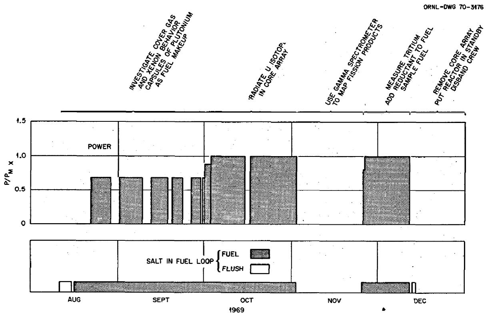  
Fig. 1.1. Outline of MSRE Operations in Runs 19 and 20.

last 30 days of the run. During this period the sampler-enricher was used intensively to take samples of gas and salt, to expose various devices for measuring surface tension and fission product deposition, and to add beryllium. Apparatus that had been developed for measuring tritium in the gaseous effluents from the reactor was also put into service, and the first results were obtained.

The scheduled shutdown began on November 2 with the initiation of a fuel drain with the reactor at full power. Scanning with the remote gamma-ray spectrometer began within $2\mathrm{hr}$ after the fuel drain and continued around the clock for the next 17 days. Spectra were obtained repeatedly at 1-in. intervals over the primary heat exchanger and also on the fuel salt piping and the fuel off-gas line.

Plans had been made and preparations were under way to install a sampling device on the off-gas line near the fuel pump during the shutdown. This was to be used during a final two-week run in late December and early January. By November 18, however, the budget situation had become so stringent that ORNL management concluded that an earlier conclusion of MSRE operation was imperative. Therefore plans for the off-gas system work and replacement of the core

specimen array were dropped, and the reactor was started up for a brief full-power run for more tritium determinations and some final sampling of the fuel salt. The reactor was taken critical for this run (run 20) on November 25. After several hours at $80\%$ of full power to permit measurement of velocity and temperature profiles in the coolant stack at reduced air flow, the reactor was taken to full power and held there without any interruption for 16 days until the scheduled final shutdown on December 12.

The last run was a sustained flurry of sampling - 32 sampler-enricher operations in 16 days. These included 28 samples and exposures of various kinds, two beryllium additions, and two additions of $^{233}\mathrm{U}$ . (Uranium was added instead of plutonium to save a few hours on each addition.) At the same time tritium analyses were obtained on numerous samples of the radiator cooling air and the fuel off-gas.

Also during the final run two measurements were made to help resolve the discrepancy in the indicated reactor power. (Salt system heat balances had been giving $8.0\mathrm{Mw}$ , while nuclide changes indicated $7.2\mathrm{Mw}$ as the maximum power.) Profiles of temperature and velocity were measured in the cooling air stack, and the gamma spectrometer was used in an attempt to measure

coolant salt flow by decay of short-lived activities between two points in the loop. Results (discussed in Sect. 1.2.11) more nearly agreed with the lower figure for maximum power.

The reactor was shut down on December 12 by dropping the load, allowing the coolant salt to come up to temperature, then draining the fuel. Gamma-ray scanning of a spot on the primary heat exchanger started immediately after the power reduction.

Three hours after the fuel salt was drained, while the freeze valves to the fuel drain tanks were being frozen, the radioactivity in the cell atmosphere began to increase, indicating a very small leak from the primary containment. About 7 hr after the drain, the activity began to decrease after having driven the monitor on the recirculating cell atmosphere up to about $15\mathrm{mr / hr}$ . Pressurization of the fuel loop and the drain tanks had no apparent effect, and the activity continued to diminish. A sample of the cell atmosphere at this time indicated predominantly $^{133}\mathrm{Xe}$ . Since the leak appeared to have stopped, the flushing operation proceeded. The flush salt was circulated for 17 hr to give a thorough flushing and to permit three samples to determine its final condition. Before the flush salt was drained, the loop was pressurized to 20 psig for 2 hr without showing any sign of a leak.

Suspicion was directed at the freeze valves in the fuel drain line because the leak was not evident while they were frozen. On December 15 the freeze valve, FV-105, leading to drain tank No. 2 was thawed, and the cell activity began to rise. Thus the leak appeared to be in FV-105 or its immediate vicinity. The rise continued after air was turned on to freeze the valve but leveled off about 16 hr later. Although it appeared that the leak had stopped, two days later flush salt was transferred through the fill line to ensure that FV-105 and the adjacent line were full of salt.

Examination of recorded temperatures on and near the freeze valves showed that the operation was apparently quite normal before and at the time of the leak. Radiographs of the welds at the freeze valve, taken during construction, were reexamined, and no defects were found. Thus the exact location and cause of the leak could not be pinpointed. Consideration is being given to various methods of inspection that might be used later (fiscal year 1971).

Samples of the cell atmosphere showed about 20 to 25 curies of $^{133}\mathrm{Xe}$ , 16 mc of $^{131}\mathrm{I}$ , and 20 mc of $^{132}\mathrm{I}$ in the cell. These amounts were low enough so that the cell could be safely vented to the stack. This was done, the cell membrane was cut, and on December 18 the experimental array in the core was removed. While the

core access was being closed, a small amount of particulate contamination (Ru, Te, Nb, Mo) was dispersed around the high bay of the reactor building. Mopping cleaned it up satisfactorily.

Meanwhile the heat had been turned off the fuel drain tanks two days after the drain. Four days later, temperatures in the tanks reached the salt liquidus temperature. On January 5, 24 days after the drain, fuel temperatures were near the solidus, and the tank heaters were turned on at low settings to hold the salt in the range from 450 to $650^{\circ}\mathrm{F}$ . (This range was chosen to preclude the evolution of fluorine by radiolysis.)

The system conditions for the interim period between operation and examination were planned, reviewed, and approved before Christmas, and on that day, for the first time in over five years, the reactor was left unattended.

An article3 describing the MSRE, its operating history, and the essence of the experience with it was prepared for the special issue of the American Nuclear Society journal that was devoted to the Molten-Salt Reactor Program. This article provides a convenient, concise picture of the MSRE experience through July 1969. Figure 1.2 (an extension of the graph in the article) outlines the MSRE operation from the first experiments above a few kilowatts in January 1966 through the final shutdown in December 1969.

When the fuel and flush salt began to freeze on December 18, 1969, it was the first time that any salt had frozen in the fuel system (other than in the freeze valves) since the first loading of molten salt into the fuel drain tanks on November 28, 1964. There had been no difficulty in keeping the salt molten throughout the intervening 44,364 hr. Other statistics as of the end of operation are given in Table 1.1.

Table 1.1. Final Operating Statistics of the MSRE   

<table><tr><td></td><td>235U Operation</td><td>233U Operation</td><td>Total</td></tr><tr><td>Critical time, hr</td><td>11,515</td><td>6140</td><td>17,655</td></tr><tr><td>Equivalent full-power hours</td><td>9,005</td><td>4167</td><td>13,172</td></tr><tr><td>Salt circulation time, hr</td><td></td><td></td><td></td></tr><tr><td>Fuel loop</td><td>15,042</td><td>6746</td><td>21,788</td></tr><tr><td>Coolant loop</td><td>16,906</td><td>9170</td><td>26,076</td></tr></table>

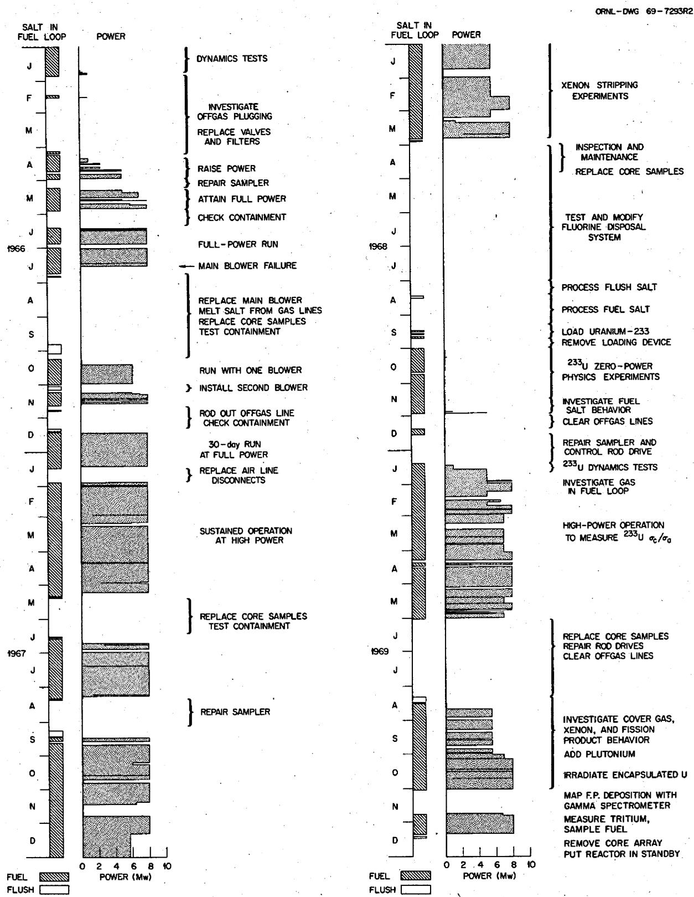  
Fig. 1.2. Outline of the Four Years of MSRE Power Operation.

The MSRE operating staff was disbanded by January 1, 1970. Several engineers remained at the site, completing the analysis of the MSRE experience and writing summary reports. MSRE maintenance specialists began planning for a limited amount of examination work to be carried out early in the next fiscal year.

# 1.2 OPERATIONS ANALYSIS

Experiments conducted with the reactor during this period included those on xenon stripping, the effects of adding reducing agents to the salt, and the changes in the distribution of fission products. Meanwhile important observations were made on the reactivity balance, system dynamics, the power level, and the amounts of tritium leaving the reactor in various streams. The chemistry experiments and much on the fission product behavior are discussed in Chaps. 10 and 11. In Chap. 6 are discussed the measurements of uranium isotopic changes in MSRE fuel samples. The other items mentioned above are discussed in this section.

# 1.2.1 Reactivity Balance

# J. R. Engel

The zero-power reactivity balance results with $^{233}\mathrm{U}$ fuel are summarized in Fig. 1.3. Since there is still some uncertainty in the reactor power calibration, data are presented for two full-power bases: 8 Mw, derived from system heat balances, and 7.25 Mw, derived from uranium isotopic-ratio changes in the $^{235}\mathrm{U}$ operation.

The points with error flags were obtained when there was a substantial circulating void fraction in the loop, and the flags reflect only the uncertainty associated with the value of that parameter. These data also reflect an adjustment from previously reported results to account for improved values for the samarium that remained in the salt from the $^{235}\mathrm{U}$ operation. However, other refinements in nuclide concentrations, shown by the reevaluation of the $^{235}\mathrm{U}$ operation (see Sect. 2.3) to be needed, have not yet been incorporated. These data fall into two groups, with no obvious trend within each group but with a distinct shift between 12,000 and 18,000 Mwhr. It appears likely that at least part of this shift was caused by the new experimental array that was installed in the core just before the startup for run 19 (ref. 5). The new array contained considerably more high-cross-section materials than the earlier arrays of surveillance specimens, but no account was taken of this in the reactivity balance calculations. Detailed calculations are being made to evaluate the reactivity effect of changing the array. Other refinements in fission product yields and cross sections are also being made, but their effects are expected to be small.

In spite of the apparent shift in the base line, the reactivity balance was used successfully to follow the xenon behavior (see Sect. 1.2.2) and the plutonium

4MSR Program Semiann. Progr. Rept. Aug. 31, 1969, ORNL-4449, pp. 4-5.   
5MSR Program Semiann. Progr. Rept. Aug. 31, 1969, ORNL-4449, pp. 14-15.

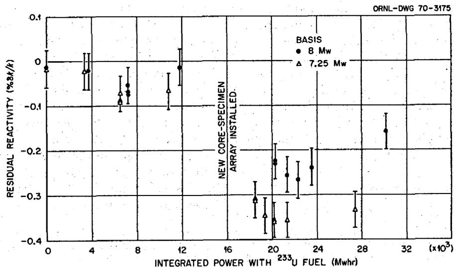  
Fig. 1.3. Zero-Power Reactivity Balances During Operation with $^{233}\mathrm{U}$ Fuel.

additions, along with the routine monitoring of reactor behavior at power. The plutonium that was charged into the MSRE was added as pure $\mathrm{PuF_3}$ , which had to dissolve in the salt (rather than melting, as did the $\mathrm{LiF - UF_4}$ eutectic used in the uranium additions). In addition, the openings in the plutonium capsules were sealed with zirconium windows, which had to react with the salt before dissolution of the $\mathrm{PuF_3}$ could begin. The combination of these factors required exposure of the capsules for 3 to $4\mathrm{hr}$ in the pump to complete an addition; the uranium enriching capsules emptied in $5\mathrm{min}$ or less.

The first plutonium addition was made with the reactor at low power (10 kw) and the fuel pump running at 900 rpm to minimize reactivity effects from sources other than the plutonium itself. The reactivity balance began to show the effect of the plutonium after the capsule had been in the pump bowl for about 10 min. The capsule was left in the pump bowl for 4 hr even though the reactivity balance showed no further detectable change was occurring after about 3 hr. Subsequent examination revealed a 15.3-g salt residue in the upper part of the capsule that contained 5.5 of the 25.5 g of plutonium originally loaded into the capsule. Presumably there was simply insufficient agitation with the pump running at the low speed to move salt through that region. The remaining five plutonium additions were made with the fuel pump running at full speed (1188 rpm), and essentially complete dissolution was obtained for the same exposure times; salt residues were between 0.4 and 0.75 g. Careful reactivity monitoring during each addition indicated that the dissolution was very orderly with no evidence of anomalous effects.

If we deduct the $5.5\mathrm{g}$ left in the first capsule, a total of $179\mathrm{g}$ of plutonium was added to the loop from the six capsules. This should have increased the plutonium concentration by 41 ppm with a positive reactivity effect of $0.443\% \delta k / k$ . The observed reactivity effect duplicated this value within the accuracy limits for short-term changes, $\pm 0.04\% \delta k / k$ . This represents $\pm 10\%$ of the plutonium added or $\sim 4$ ppm in concentration. Analytical results of plutonium concentration measurements are presented in Sect. 10.3.

# 1.2.2 Xenon Poisoning

J.R.Engel R.C.Steffy

Observations of the xenon poisoning under various conditions were continued throughout the operation of the reactor. The previously reported differences in the behavior of circulating bubbles with helium and argon

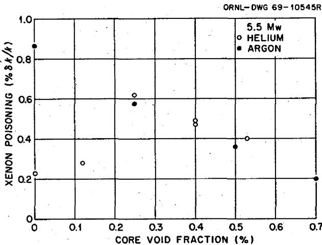  
Fig. 1.4. Observed Xenon Poisoning in MSRE.

cover gases had suggested that the xenon stripping effect might also be different. Xenon poisoning was measured with both cover gases at a variety of fuel pump speeds that gave core void fractions covering the range from zero to 0.7 vol%. (The correlation between fuel pump speed and core void fraction had been established earlier at zero power.) The xenon measurements were made at a reactor power level of 5.5 Mw (70% of full power) so that low pump speeds could be attained within the desired range of system temperatures. The results are shown in Fig. 1.4. The data with helium cover gas followed the same general pattern observed previously $^6$ at 7 Mw. However, with argon a marked difference was observed as the void fraction approached zero; instead of decreasing, the xenon poisoning continued to increase, reaching nearly 0.9% $\delta k / k$ at zero voids.

In the early predictions of the effect of circulating voids on xenon behavior,7 the cover gas was treated as a totally insoluble material, and it was predicted that the poison fraction would decrease monotonically with increasing void fraction. Although the xenon poisoning observed with argon at zero voids did not quite reach the value that would be predicted by such a treatment (see Sect. 1.3) the relation to void fraction was qualitatively very similar to the prediction. Since the solubility of argon in molten salt is less than that of helium by a factor of 10, it appears possible that the deviations from the idealized treatment (minor for

argon but major for helium) are caused by solubility effects.

The pronounced effects of core void fraction on xenon poisoning that are evident in Fig. 1.4 cannot be described adequately by a simple analytical model of the fuel system. It had been shown that, for a soluble gas at low void fractions, the void fraction can vary widely around the loop.6 That such variations influence xenon behavior was illustrated by two measurements made with helium cover gas at fuel pump speeds of 600 and $900\mathrm{rpm}$ . In both cases the core void fraction was zero. However, $900\mathrm{rpm}$ is near the threshold for bubbles in the core, so voids were probably present in other parts of the loop. (The core is the only region in which small void fractions could be detected with reasonable confidence.) The xenon poisonings at 5.5 Mw for the 600- and $900\mathrm{-rpm}$ pump speeds were 0.36 and $0.23\% \delta k / k$ respectively. Thus the out-of-core voids appear to have had some stripping effect.

A computer program was prepared that includes the dynamic behavior of the cover gas bubbles and treats the various xenon transport phenomena in some detail in a 23d-order system of equations. This program was designed to permit evaluation of both steady-state and transient xenon effects in an effort to find a set of system parameters that fit the observed effects. Results are not yet available at this writing.

The preceding discussion deals with differences observed over a relatively short period of time. However, significant long-term variations in xenon poisoning were also observed when the reactor operating conditions were nominally the same. Table 1.2 lists some typical values observed at full power during the $^{233}\mathrm{U}$ operation with full pump speed and helium cover gas; the integrated power (based on 8 Mw full power) is shown for each point to provide a frame of reference. At least

Table 1.2. Full-Power Xenon Poisoning During ${}^{233}\mathrm{U}$ Operation   

<table><tr><td>Date</td><td>Xenon Poisoning (% δk/k)</td><td>Integrated Powera (Mwhr)</td></tr><tr><td>2/21/69</td><td>0.36</td><td>4,793</td></tr><tr><td>2/25/69</td><td>0.36</td><td>5,415</td></tr><tr><td>4/15/69</td><td>0.32</td><td>12,460</td></tr><tr><td>4/18/69</td><td>0.40</td><td>12,880</td></tr><tr><td>10/6/69</td><td>0.51</td><td>24,810</td></tr><tr><td>10/20/69</td><td>0.39</td><td>27,700</td></tr><tr><td>11/29/69</td><td>0.44</td><td>30,850</td></tr><tr><td>12/11/69</td><td>0.45</td><td>33,210</td></tr></table>

$a_{\text{With}}^{233}\mathbf{U}$ fuel, based on 8 Mw full power.

one similar change in xenon poisoning was observed during the $^{235}\mathrm{U}$ operation. Early in that operation (May 1966) the full-power xenon poisoning was $0.35\% \delta k / k$ ; later values were in the range 0.26 to $0.28\%$ , and near the end of the operation, it was $0.35\%$ again. No correlation with other aspects of the operation has yet been found.

# 1.2.3 Dynamics Testing

R.C.Steffy

The only dynamics tests performed on the reactor during this report period were primarily for research aimed at improving frequency-response results by using test signals which had signal power only at certain predetermined frequencies. These tests were designed and analyzed by M. R. Buckner and T. W. Kerlin of the Nuclear Engineering Department of the University of Tennessee as part of a graduate studies program. The frequency-response results from these tests did verify that the reactor was still responding in the expected manner to reactivity perturbations.

# 1.2.4 Operational Diagnosis by Noise Analysis

R.C.Steffy

During this report period we continued to assess the reactor's operation by frequently analyzing the inherent fluctuations in the neutron flux and in the pump bowl pressure using detailed noise analysis techniques. In addition, the on-line noise monitors which were installed just before the end of the last report period functioned well, giving a continuous indication of the average noise levels in the vicinity of $1\mathrm{Hz}$ .

During run 19 the pressure noise in the pump bowl slowly increased as indicated by both the on-line monitor and the detailed analyses in the vicinity of $1\mathrm{Hz}$ . Since restrictions in the off-gas line had been known to cause increases like this,[10] it was anticipated that the off-gas line might be slowly plugging. The detailed analyses of the neutron noise showed that in the vicinity of $1\mathrm{Hz}$ it also increased, but the on-line neutron noise monitor showed no increase, possibly because it was not as sensitive to changes at a particular frequency. During the first part of run 20, both the

pressure noise and neutron noise remained essentially constant at about the same values which they had attained at the end of run 19.

The pressure noise monitor was observed to have several interesting characteristics during run 19 and the first part of run 20. Each time the sampler valves were opened, the pressure noise decreased by 10 to $20\%$ , presumably because the effective gas volume was increased and this attenuated the magnitude of the pressure perturbations. Conversely, closing the overflow-tank vent valve to burp the overflow tank (OFT) caused an increase in the pressure noise, as shown in Fig. 1.5, by reducing the effective pump bowl gas space. When an OFT burp was completed, the opening of the vent valve caused a sudden surge in pressure in the pump bowl that resulted in a large spike in the pressure noise.

After an OFT burp on December 4, 1969, it was observed that the indication from the on-line pressure noise monitor did not return to its original value but remained about $15\%$ higher than the original level. Then on December 6 the pressure noise level spontaneously increased by about $50\%$ , as shown in Fig. 1.6. This increase coincided with a detectable increase in the restriction in the off-gas line near the pump bowl. From this time until the end of run 20 the fuel pump pressure increased slightly during burps of the OFT, whereas it had decreased when there was no restriction in the main off-gas line. Of course, this implies that a fraction of the gas flow into the pump bowl was bubbling out through the OFT. On December 8 the pressure noise increased by another $20\%$ when the restriction in the pump bowl off-gas line increased to the point that essentially all the fuel pump off-gas began to flow through the OFT.

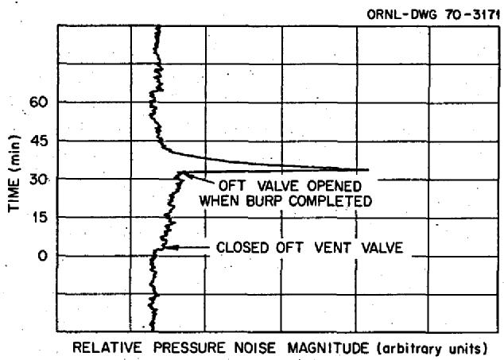  
Fig. 1.5. Pressure Noise Monitor's Trace During OFT Burp with the Off-Gas Line Not Restricted.

There was also a sharp increase in OFT temperatures at this time because of increased fission product heating, and the character of the pressure noise during a burp was changed significantly. The pressure noise trace for a typical burp after December 8 is shown in Fig. 1.7 and may be compared with Fig. 1.5, which records a burp when there was little restriction in the off-gas line.

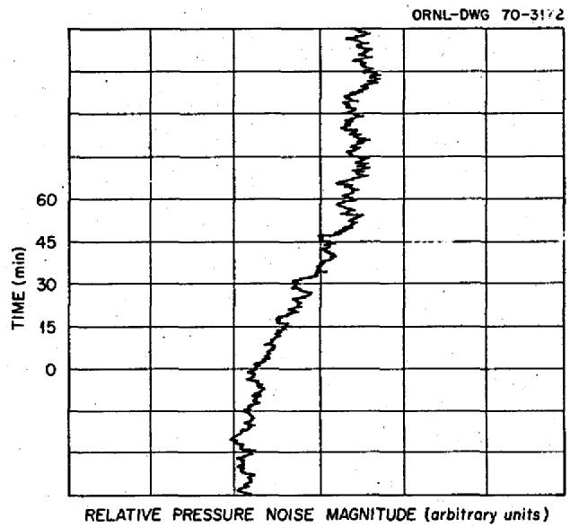  
Fig. 1.6. Pressure Noise Monitor's Trace During Spontaneous Increase on December 6, 1969.

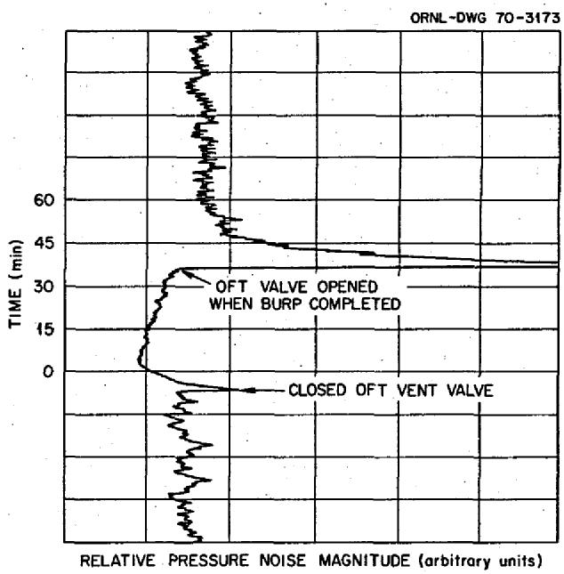  
Fig. 1.7. Pressure Noise Monitor's Trace During OFT Burp with the Off-Gas Line Restricted.

Features to note about Fig. 1.7 include: (1) The pressure noise decreased when the OFT vent valve was closed. Closing the valve caused an increase in pressure in the OFT which stopped the gas from the fuel pump from bubbling into the OFT. The bubbling action appears to be a strong noise source. (2) After the burp the noise level approximately returned to its original level, but the trace is seen to have a higher frequency of oscillation. After a burp the level in the OFT was quite low, and less differential pressure was required to initiate bubbling into the OFT. The pressure noise trace appears to indicate that at the lower differential pressure there was more bubbling action than for the higher differential pressure which existed with high OFT levels. It is possible that when the OFT level was high, differential pressure increased until a large bubble was released into the OFT and that there was no more bubbling until the pressure increased sufficiently for another large bubble. (3) The average noise level was slowly decreasing both before and after the burp, that is, between successive burps. This is thought to be a combined result of the increasing volume of the gas phase in the fuel pump bowl as more salt was transferred to the OFT and a decrease in the bubbling rate. The neutron noise, both from the on-line monitor and in the detailed analyses, remained essentially constant during all of run 20.

# 1.2.5 Tritium

# P. N. Haubenreich

Tritium is produced as a fission product at a rate of about one atom per $10^{4}$ fissions. In the MSRE this source amounted to about 0.1 curie per full-power day. Greater by a factor of several hundred was the production from neutron reactions with lithium. Both thermal-neutron reactions in ${}^{6}\mathrm{Li}$ and fast reactions $(E > 2.8\mathrm{MeV})$ in ${}^{7}\mathrm{Li}$ are significant. During this report period the calculated production rates for the several regions of the MSRE were reevaluated, and an intensive effort was made to measure the tritium content of the various effluent streams to determine where the tritium was going.

Calculated Production Rates. - There is lithium in the fuel salt, the coolant salt, the thermal insulation around the reactor vessel, and the corrosion inhibitor in the water that circulates through the thermal shield. The trace amount of lithium in the insulation is natural lithium $(7.4\%)$ Li), but the other lithium contains less than $0.01\%$ Li. The greatest tritium production was in the fuel salt, where the neutron flux was by far the highest. The next greatest production was in the

thermal insulation, with its high $^6\mathrm{Li}$ fraction. Production rates in the coolant salt and treated water were relatively very small.

The ratio of neutron flux in the fuel to reactor power can be calculated rather accurately; the same is true for the effective cross sections of $^6\mathrm{Li}$ and $^7\mathrm{Li}$ . The major uncertainties in the calculation of tritium production in the fuel are in the power measurement and in the $^6\mathrm{Li}$ fraction. The production rates in Table 1.3 are based on full power being 7.25 Mw. The $^6\mathrm{Li}$ fractions were obtained from assays of the LiF used to make up the fuel salt, the probable natural lithium content of the $\mathrm{BeF}_2$ that was used, and the calculated burnup of the high-cross-section $^6\mathrm{Li}$ . (The fractions used are appropriate for the end of $^{235}\mathrm{U}$ operation and the end of $^{233}\mathrm{U}$ operation.) The production from $^6\mathrm{Li}$ was much higher with $^{233}\mathrm{U}$ fuel because of the higher thermal-neutron flux resulting from the lower fissile concentration. Since the fast flux changed only slightly between $^{235}\mathrm{U}$ and $^{233}\mathrm{U}$ operation, the production from $^7\mathrm{Li}$ is similar for both fuels.

The coolant salt production was due almost entirely to exposure to neutrons from the fuel in the primary heat exchanger (including delayed neutrons and neutrons from fissions within the heat exchanger). The calculated rate was lower with $^{233}\mathrm{U}$ because of the smaller delayed neutron fraction.

The big uncertainty in the calculation of production from the thermal insulation is the lithium content. Analysis of batches of insulation that were to be used in the MSRE showed 1000 ppm Li with an estimated accuracy of a factor of 2. Later analyses of material nominally the same gave around 10 ppm Li. The 3 curies/day is based on 1000 ppm Li.

Table 1.3. Calculated Rates of Tritium Production in MSRE   

<table><tr><td rowspan="2">Source</td><td colspan="2">Production Rate (curies/full-power daya)</td></tr><tr><td>235U Fuel</td><td>233U Fuel</td></tr><tr><td>Fuel saltb</td><td></td><td></td></tr><tr><td>6Li</td><td>20</td><td>35</td></tr><tr><td>7Li</td><td>4</td><td>5</td></tr><tr><td>U fission</td><td>0.1</td><td>0.1</td></tr><tr><td>Total</td><td>24</td><td>40</td></tr><tr><td>Coolant salt, total</td><td>0.0002</td><td>0.0001</td></tr><tr><td>Insulation, total</td><td>3 ± 3</td><td>3 ± 3</td></tr><tr><td>Treated water, total</td><td>0.005</td><td>0.005</td></tr></table>

aFull power is taken to be 7.25 Mw.   
$^{b}$ Calculations were based on $0.0051\%$ ${}^{6}\mathrm{Li}$ in fuel salt lithium during ${}^{235}\mathrm{U}$ operation; $0.0048\%$ ${}^{6}\mathrm{Li}$ during ${}^{233}\mathrm{U}$ operation.

Observed Amounts. - Tritium was observed to build up in the treated water system, to occur in condensate from the containment cell atmosphere, and to leave the reactor in the fuel salt off-gas, the coolant salt off-gas, and the air flowing across the coolant salt radiator.

The tritium in the 4000-gal treated water system gradually built up over the years to about $0.14\mu \mathrm{c / ml}$ . The changes with time were consistent with the calculated production rate of 5 mc/day.

Moisture condensed from the containment cell atmosphere generally contained around $1.3\mathrm{mc}$ of tritium per milliliter. The condensate was collected (with other liquid wastes) and sent in batches to the ORNL waste disposal system. Records show tritium accumulating in the MSRE waste tank at rates of 4 to 6 curies per full-power day over several intervals of a few months each.

The tritium sampling apparatus that was developed for use on the gaseous effluent streams consisted of a heated bed of CuO followed by a refrigerated trap. The first analyses were obtained with the reactor at full power near the end of run 19. The fuel off-gas sample point was downstream of the charcoal bed, where the fission product concentrations were manageable. The first sample from here, with the CuO at $340^{\circ}\mathrm{C}$ , showed 9 curies of tritium per day. Raising the CuO temperature to $800^{\circ}\mathrm{C}$ , so as to collect tritium in all hydrocarbons, showed 23 curies/day. On November 21, 19 days after the power had been shut down, tritium analyses of the fuel off-gas showed concentrations over half of what they had been at power. (The cover gas flow was less, so the tritium flow out of the off-gas system was down about a factor of 3.) After the reactor was taken back to power in run 20, the tritium in the fuel off-gas gradually came back up. Samples with the CuO at $800^{\circ}\mathrm{C}$ showed 11.6 curies/day six days after the power was raised and 15.0 curies/day after 16 days at full power.

The only sample taken from the coolant off-gas was near the end of run 19 and showed 0.6 curie/day passing the sample point.

Tritium in the form of moisture in the radiator cooling air was first measured early in October, using calcium chloride to trap moisture from the air in the stack. Results of six samples ranged from 1 to 3 curies/day. The CuO apparatus could not be used effectively on the stack air to measure total tritium because of the extremely low concentration. In an attempt of circumvent this problem, a 2-ft length of radiator tube was fitted with a jacket from which air could be drawn to the tritium sampler. Sample results

obtained in run 20, scaled up by the ratio of total surface area to jacketed area, indicated only 0.2 to 0.6 curies/day coming out of the radiator. Just before the final shutdown, four samples of stack air collected in large bulbs indicated a total tritium flow up the stack of 3.3 to 4.6 curies/day. Attempts in run 20 to repeat the moisture measurements by the calcium chloride absorption method gave widely scattered results (0.6 to 18 curies/day).

The containment cell exhaust was sampled with calcium chloride and also was analyzed with the CuO apparatus. The former indicated 10 mc/day and the latter 2.4 mc/day.

Comparison. - Uncertainties in the $^6\mathrm{Li}$ content of the fuel salt and the reactor power level introduce a probable error of about $16\%$ in the calculated production of tritium in the fuel salt $(40\pm 6$ curies/day). The observations on the off-gas downstream of the charcoal beds indicated that there was substantial holdup in the off-gas system but that the tritium effluent would gradually build up in a long run at full power to 25-27 curies/day. This is between 60 and $70\%$ of the calculated production rate in the fuel salt.

Some of the tritium produced in the fuel was certainly diffusing through the heat exchanger tubes into the coolant salt. The amount of tritium in the coolant salt off-gas, although relatively small, was more than the calculated production in the coolant salt. More significant was the tritium that came out through the radiator tubes. It appears that around $10\%$ of the tritium produced in the fuel salt left the reactor by this route. Roughly half of the tritium in the cooling air stack appeared to be in the form of moisture (based on comparison of calcium chloride collection with total tritium). The sleeve samples suggest that the tritium diffusion rate out of the tube inside the jacket was substantially less than the average for all the tubes exposed to the main air stream.

The rate at which tritium appeared in the containment cell (almost entirely in moisture condensed from the humid atmosphere) was about 8 to $13\%$ of the calculated production rate in the fuel salt. This must be regarded only as an upper limit on the amount diffusing out of the salt systems, however, because production in the insulation around the reactor conceivably could have accounted for this much tritium.

Although the sum of the observed effluent rates is 12 to $25\%$ less than the calculated total production rate, the discrepancy is hardly greater than the probable error in measurement and calculations.

1.2.6 Fission Product Distribution in the Fuel System

A. Houtzeel R. Blumberg F. F. Dyer

Gamma-ray spectrometry studies of fission product distribution in the fuel system were continued during this period with the following progress:

1. Gamma-ray spectra were taken of the main reactor off-gas line (line 522) near the fuel pump with the reactor at different operating conditions.   
2. Calibration of the spectrometer equipment with $110^{m}$ Ag and $^{226}\mathrm{Ra}$ sources was completed.   
3. Several components of the MSRE system were scanned during the November shutdown period and after the final reactor shutdown.   
4. Work was continued on a computer program to automatically analyze the spectra.

5. Some preliminary analyses were made of the gamma-ray spectra taken during the June-July 1969 reactor shutdown.

The equipment for this work was described previously.11 Figure 1.8 is a photograph of the detector system in operation.

Reactor Off-Gas Line. - The gamma-ray detector, together with the collimator body and insert, was set up over a hole in the reactor shield blocks. Through this hole it was possible to aim the detector directly at the main reactor off-gas line, with only the cell membrane interposed, at a location about 1 ft downstream of the fuel pump. The purpose of this experiment was to study any variation in the fission products contained in

11MSR Program Semiann. Progr. Rept. Aug. 31, 1969, ORNL-4449, pp. 11-12, 31-33.

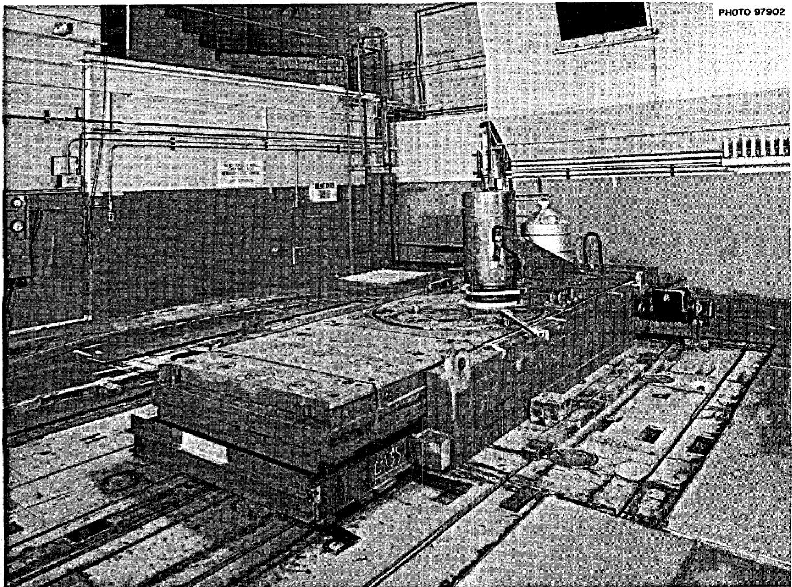  
Fig. 1.8. Remote Gamma-Ray Spectrometer on Portable Maintenance Shield.

the off-gas line during different reactor conditions; xenon behavior was of primary interest. During this experiment the reactor power was varied from zero to 7.5 Mw; other variables were the fuel pump speed and the cover gas flow. Spectra were also taken when fuel salt was returned from the overflow tank to the pump bowl, during a beryllium exposure in the fuel system, and when argon was used instead of helium for the cover gas. Altogether some 170 different gamma-ray spectra were recorded at this location. Another four spectra were taken from a sample bomb in the main reactor off-gas line about 45 to 50 min downstream from the fuel pump.

The main problem encountered was the very intense activity emitted by the reactor off-gas line. When the reactor was at power, the radiation beam was more than 1000 r/hr directly above the hole in the shielding; the neutron flux was also appreciable. By using the $\frac{1}{2}$ in-diam collimator, 2 in. of lithium-impregnated paraffin, and a $\frac{1}{4}$ in. lead plate, we were able to keep the counting rate down and the detector-system dead time within reasonable limits.

It appeared that the then available computer program would not adequately analyze these data because there were too many photopeaks in the spectra (many of these peaks also overlapped, i.e. multiplets), so the detailed analysis was postponed. The results of a preliminary manual analysis are given in Table 1.4. This listing shows the expected noble gases and at least some

Table 1.4. Nuclides Identified in a Spectrum Taken from the MSRE Off-Gas Line Reactor power, 5.5 Mw; September 1, 1969   

<table><tr><td>Chain</td><td>Elements</td></tr><tr><td>87</td><td>Kr</td></tr><tr><td>88</td><td>Kr, Ru</td></tr><tr><td>89</td><td>Kr, Ru</td></tr><tr><td>90</td><td>Kr</td></tr><tr><td>95</td><td>Nb</td></tr><tr><td>99</td><td>Mo</td></tr><tr><td>103</td><td>Ru</td></tr><tr><td>106</td><td>Ru</td></tr><tr><td>129</td><td>Te (m)</td></tr><tr><td>131</td><td>Te, I</td></tr><tr><td>132</td><td>Te, I</td></tr><tr><td>133</td><td>Te(m)</td></tr><tr><td>135</td><td>Xe(m)</td></tr><tr><td>137</td><td>Xe, Cs</td></tr><tr><td>138</td><td>Xe, Cs</td></tr><tr><td>139</td><td>Xe, Cs</td></tr><tr><td>140</td><td>Xe, Cs, Ba, La</td></tr></table>

of their daughters, but it also shows clearly the presence of noble metals.

Calibration. - An appreciable effort was devoted to calibration of the equipment. The purpose was not only to determine the counting efficiency of the equipment in the existing geometry but also to establish the self-shielding effect of the MSRE heat exchanger along with the heater elements. We used two sources for this calibration work, a small $^{226}\mathrm{Ra}$ source to determine the detector sensitivity over a wide energy range and a $^{110m}\mathrm{Ag}$ source of approximately 25 curies to evaluate the geometry and shielding effects. The 6.4-in.-long by 0.5-in.-diam silver source was placed in all the different tube positions of the heat exchanger mockup. This way it was possible to determine the effect on the detector of activity in each of the different tube positions. The silver source was also used to determine the detector counting efficiency for the reactor off-gas line geometry. Shielding experiments were done for the different shielding materials used (lithium-impregnated paraffin, lead, copper, aluminum, cadmium, and a heater element).

Since the source was made up of three short silver tubes that had been activated in the ORR, it was thought necessary to determine the activity along the length of the source to establish an average source strength in relation to the detector efficiency for a given collimator geometry. Local variations of $13\%$ from the average were found in the source. However, when the normal field of view at the source was considered, the effect of these variations on count rate at the detector was much smaller.

Approximately 435 calibration and related spectra were taken, and the analysis is $95\%$ complete. These calibration data will be used as input data for the automated computer analysis of the fission product spectra.

Scanning During Reactor Shutdowns. - The shutdown scanning program was started just prior to the reactor shutdown on November 2 and continued for almost three weeks in an around-the-clock operation. The reactor was drained from full power, and no flush salt was circulated. Gamma spectra were taken primarily from the MSRE heat exchanger and main reactor off-gas line; other spectra were taken from the fuel pump bowl, the drain tank, and two fuel salt lines (lines 101 and 102). Multiple spectra were taken to facilitate the identification of both short-lived and longer-lived species. This approach also tended to reduce statistical errors.

Table 1.5. Fission Product Residues in MSRE Heat Exchanger and Main Reactor Off-Gas Line   
Four to five weeks after reactor shutdown   

<table><tr><td></td><td>95Nb</td><td>103Ru</td><td>106Ru</td><td>137Cs</td></tr><tr><td colspan="5">Residue,curies/in.2</td></tr><tr><td>Heat exchanger,av</td><td>0.50</td><td>0.073</td><td>0.0038</td><td></td></tr><tr><td>522 off-gas line</td><td>0.73</td><td>2.13</td><td>0.17</td><td>0.48 (max)</td></tr><tr><td colspan="5">Residue,atoms/in.2</td></tr><tr><td>Heat exchanger,av</td><td>8.0 1016</td><td>1.32 1016</td><td>0.65 1016</td><td></td></tr><tr><td>522 off-gas line</td><td>1.17 1017</td><td>3.88 1017</td><td>2.83 1017</td><td>2.4219 (max)</td></tr><tr><td>Fission yield</td><td>6.4</td><td>2.9</td><td>0.39</td><td>5.9</td></tr><tr><td>Half-life</td><td>35 days</td><td>40 days</td><td>1.01 years</td><td>30.1 years</td></tr></table>

Note: Other elements found in both the MSRE primary heat exchanger and reactor off-gas line were $^{95}\mathrm{Mo}$ , $^{129}\mathrm{Te}$ , $^{131}\mathrm{I}$ , $^{132}\mathrm{I}$ , $^{140}\mathrm{Ba}$ , and $^{140}\mathrm{La}$ .

In the first 72 hr, gamma spectra were taken from the main reactor off-gas line, heat exchanger, and drain tank through the holes in the shielding blocks. By then the top shielding blocks had been removed, and the remote maintenance shield was used above the reactor cell. Especially during the first hours after shutdown, extra shielding was necessary to keep the dead time of the detector system within reasonable limits. For example, we used 2 in. of lithium-impregnated paraffin and 1 in. of copper together with the $\frac{1}{16}$ -in. collimator insert. Two weeks later, a 1-in. aluminum shield could be used with the $\frac{1}{8}$ -in. collimator.

During the first three weeks, 235 spectra were taken from the heat exchanger, mostly along the longitudinal center line. Ninety spectra were taken along the first few feet of the main reactor off-gas line immediately downstream of the pump. Fourteen spectra were taken from the drain tank and a total of 35 from the main fuel lines (lines 101 and 102) and the fuel pump bowl. It is obvious that the drain tank, fuel lines, and pump bowl data can only furnish qualitative information, since the calibration mockups did not include these geometries.

Most of the spectra taken during and after the final MSRE shutdown were from the heat exchanger. The principal purpose was to study the effect of the flush salt on the fission product residues.

Computer Analysis. - It is clear that detailed analysis of the large number of gamma spectra described above can be performed effectively only with a digital computer. The job is further complicated by the large number of photopeaks in each spectrum. (Many spectra contain more than 200 peaks with several multiplets.) A program capable of such analyses on IBM 360 computers was obtained from Argonne National Labora

tory. (The program had originally been developed at the Lawrence Radiation Laboratory for use on CDC equipment.) This program was adapted by the ORNL Mathematics Division to handle our data on ORNL equipment and has been used to evaluate the calibration spectra. These results will be used with the same program for a complete evaluation of the fission product spectra.

Results. -- None of the fission product spectra has been completely analyzed at this writing. However, some of the data obtained from the off-gas line and the heat exchanger during the June-July 1969 shutdown were treated manually. The results, shown in Table 1.5, give some preliminary data for fission product residues four to five weeks after reactor shutdown. For comparison, the data taken in November indicate that the major activities after short cooling are $^{132}\mathrm{I}$ and $^{99}\mathrm{Mo}$ , isotopes that had completely decayed prior to the earlier measurements.

# 1.2.7 Graphite Samples Exposed in Fuel Pump

# C. H. Gabbard

The remote gamma spectrometer1 was set up on the sampler-enricher for about four days, and a series of gamma scans were taken on a special graphite sample, a copper dummy capsule, and a standard 10-g salt sample. These data were taken to study the deposition of short-lived fission products.

The graphite specimen was contained in a special capsule that would shield the graphite from the fuel

pump atmosphere during insertion and withdrawal through the gas phase but would allow the graphite to be exposed while the capsule was submerged in the salt. The samples were placed on a special fixture in the 3A area of the sampler-enricher directly below the removal tube. The graphite capsule could be opened on this fixture, exposing the bare graphite for counting. The specimens were counted through a Plexiglas window which maintained the containment of the 3A area while the removal valve was opened for counting.

We were able to begin counting the specimens about 50 min after the exposure was complete, so that any nuclides with half-lives of 10 to 15 min or greater should be detectable. About 20 gamma spectra were recorded on magnetic tape, but no analysis of these data has been completed at this time. The graphite specimen was submitted for radiochemical analysis of some of the longer-lived nuclides, which will be used to convert the count-rate data to surface activity of the specimen.

# 1.2.8 Evaluation of Leak in Primary System

R. H. Guymon P. N. Haubenreich

The occurrence of the leak was clearly revealed by the cell air activity monitors.

The general location of the leak was narrowed to the vicinity of freeze valve 105 by the response of these monitors to the freezing and thawing of the salt in this valve and adjacent piping.

The leak could be effectively stopped by freezing salt inside the pipe. Evidence for this is the lack of response of the cell air activity monitors to pressurization of the fuel system on December 12 and 13 after FV-105 was frozen. Leakage occurred again when FV-105 was thawed and the line was blown down on December 14. When the cell air monitors did not decrease as expected after FV-105 was refrozen, it was suspected that the line was not full of salt, so some flush salt was put into the line on top of the frozen fuel. Comparison of $^{133}\mathrm{Xe}$ concentrations in samples taken on December 15 and 16 showed, however, that the leak was nearly if not completely stopped even before this step.

The cell air monitors erred in the high direction at times because of radioactive contaminant that accumulated in the line at the monitors. This was apparent from otherwise inexplicable drops in reading which sometimes occurred when the air flow by the monitors was suddenly increased. The probable source was discovered when small amounts of water containing much radioactivity appeared at a nearby gas sample point.

Both because of the contamination in the monitor and because the activity in the air was an unidentified mixture of fission products, the cell air monitor readings could not be used as an accurate measure of the total activity in the cell air. Self-consistent and apparently reliable information on this was obtained from gamma-spectrometric analysis of samples of the containment atmosphere.

The amount of activity that leaked into the cell was a tiny fraction of the total in the reactor. The 5.3-day $^{133}\mathrm{Xe}$ in the cell amounted to $7 \times 10^{-5}$ of the total inventory. The 8.0-day $^{131}\mathrm{I}$ observed in the cell atmosphere was less than $5 \times 10^{-7}$ of the reactor inventory.

The amount of gas that leaked into the cell was estimated from the $^{133}\mathrm{Xe}$ . Assuming that the contents of the gas space above the salt during operation mixed uniformly with the gas entering the fuel loop as the salt drained, the xenon in the cell was equivalent to about 3 ft³ of the mixture. The $^{131}\mathrm{I}$ in the cell atmosphere was the equivalent of the amount in about 1 cm³ of salt.

# 1.2.9 Salt Transfer to the Overflow Tank

J.R.Engel

During this final period of operation the transfer of salt from the pump bowl to the overflow tank followed the same qualitative pattern established earlier in the $^{233}\mathrm{U}$ operation, with the rate varying as a function of the indicated level in the fuel pump. However, the level dependence was significantly stronger near the end of the operation. Figure 1.9 shows observed salt transfer rates for two periods separated by about one year. The earlier data were originally reported as a function of the level indicated by LE-593 (the shorter of the two bubblers in the pump bowl). However, that element suffered a substantial zero shift, so those results were reevaluated, and all the data are referred to the other bubbler (LE-596). Small zero shifts (1 to $2\%$ ) still leave some uncertainty in the relative positions of the two sets of data, but they do not affect the slope of the relations between overflow rate and indicated level. The estimated slopes differ by more than a factor of 2. All of this behavior is in marked contrast to that observed during the $^{235}\mathrm{U}$ operation, when the transfer rate was low and largely independent of the pump bowl level over the same indicated range.

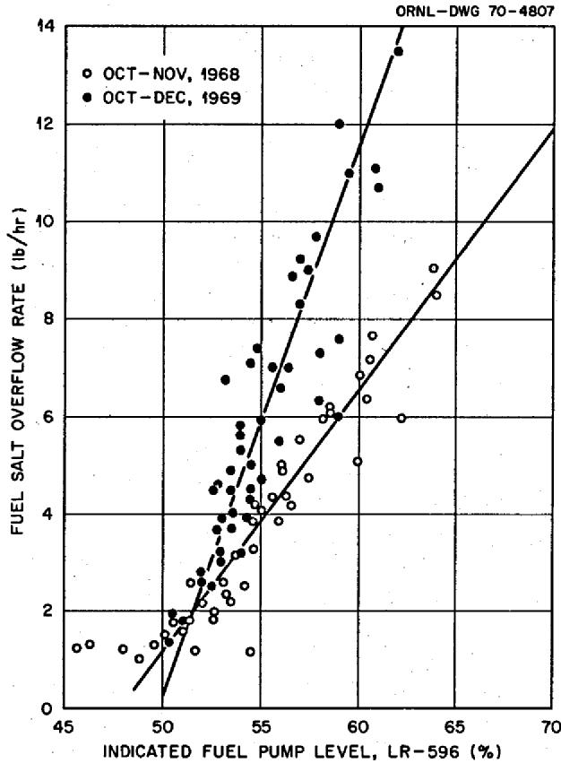  
Fig. 1.9. Effect of Indicated Fuel Pump Level on Salt Transfer to the Overflow Tank During $^{233}\mathrm{U}$ Operation.

# 1.2.10 Radiation Heating

# C. H. Gabbard

The temperature differences between the reactor inlet and the lower head and between the inlet and the core support flange have been monitored as an indication of any sedimentation buildup within the reactor vessel. These temperature differences are shown in Table 1.6 for all periods of significant power operation. The change that accompanied the transition from $^{235}\mathrm{U}$ to $^{233}\mathrm{U}$ fuel between runs 14 and 17 is clearly evident. This is attributed to the increased neutron leakage and fission heat generation in salt in peripheral regions during $^{233}\mathrm{U}$ operation. Aside from this step, the temperatures in the lower head show no significant change with time. There does appear to have been a trend upward in the thermocouple readings adjacent to the core support flange. However, the reactor vessel thermocouples were not rebiased at the beginning of run 20, and the apparent increase in temperatures at the core support flange during this run may be from thermocouple error rather than from other causes. (This

Table 1.6. Power-Dependent Temperature Differences Between Fuel Salt Entering and Points on the Reactor Vessel   

<table><tr><td rowspan="2">Run No.</td><td rowspan="2">Date</td><td colspan="2">Temperature Difference (°F/Mw)</td></tr><tr><td>Core Support Flange</td><td>Lower Head</td></tr><tr><td>6</td><td>4/66–5/66</td><td>1.90</td><td>1.39</td></tr><tr><td>7</td><td>1/67–5/67</td><td>1.93</td><td>1.35</td></tr><tr><td>12</td><td>6/67–8/67</td><td>1.98</td><td>1.40</td></tr><tr><td>14</td><td>9/67–2/68</td><td>2.03</td><td>1.28</td></tr><tr><td>17</td><td>1/69–4/69</td><td>2.31</td><td>1.54</td></tr><tr><td>18</td><td>4/69–6/69</td><td>2.33</td><td>1.57</td></tr><tr><td>19</td><td>9/69–11/69</td><td>2.41</td><td>1.54</td></tr><tr><td>20</td><td>11/69–12/69</td><td>2.58</td><td>1.53</td></tr></table>

is being more fully investigated.) In any event the indicated average temperature difference at full power was only $2.2^{\circ}\mathrm{F}$ higher than at the beginning of ${}^{233}\mathrm{U}$ power operation in run 17.

# 1.2.11 System Heat Balance

# C. H. Gabbard

Efforts were continued in the attempts to resolve the discrepancy between the reactor power indicated by the heat balance and the power indicated by observed changes in the isotopic ratios of uranium and plutonium nuclides (Sects. 10.3 and 10.4). Two tests were conducted which verified that the thermocouples reading the inlet and outlet salt temperatures at the radiator were satisfactorily accurate. The tests indicated that the thermocouple biasing procedure was applicable over the full operating temperature range of the coolant system and that the thermocouples were not affected by air leakage from the radiator enclosure. Additional efforts to resolve the power discrepancy included two air heat balances, an attempt to measure the coolant salt flow rate by radioactive decay of activation products in the salt, and a recalculation of the head loss of the coolant system.

Air Heat Balance. - The radiator air system provides an opportunity to make an independent measurement of the operating power of the reactor. Heat balances on the air system which had been made in 1966 (ref. 14) indicated powers in rather good agreement with those calculated later from salt heat balances using the latest value for the coolant salt specific heat.[15] The stack air outlet temperature for these early heat balances was

measured at a single point near the stack wall, and the air flow measurement was made with a single-point device calibrated when the stack was cold. Since the air temperature could be nonuniform across the stack and since the velocity distribution could also change at operating conditions, early in run 20 two sets of air heat balance data were taken which included temperature and velocity profiles across two perpendicular diameters of the stack.

One set of data was taken at nominal full reactor power, and the other was taken at the maximum power obtainable with one blower. The results of these two air heat balances were 6.98 and 4.82 Mw, respectively, as compared with 7.96 and 6.31 Mw from salt heat balances calculated by the computer. The corresponding values based on isotopic changes would be 7.25 and 5.75 Mw. Thus the new air heat balances did not agree exactly with either of the other indications. No explanation has been found for the greater disagreement at the lower power level.

The reactor power levels indicated by these air heat balances are lower than indicated by the previous air heat balances (which were more in agreement with the salt heat balance) mainly because of lower indicated stack air velocities from a new calibration of the Pitot-Venturi air flowmeter. The Pitot-Venturi was originally installed permanently in the center of the stack. Since the air velocity was not uniform across the stack, the calibration data provided with the Pitot-Venturi were not directly applicable. The relation between its reading and the average stack velocity had been determined by velocity traverses with a hot-wire anemometer at several flow rates with the stack cold. Because of some apparent discrepancies between the stack calibration and the manufacturer's calibration, the Pitot-Venturi was recalibrated in connection with the run 20 measurements and was used to measure the velocity profiles directly. The new calibration, which was in general agreement with the manufacturer's data, was adopted. The new calibration gave flows about 10 to $11\%$ below the stack calibration that had been used previously.

Coolant Salt Flow Measurement by Decay of Activation Products. - The remote gamma-spectrometry equipment, which was on hand for studying fission product distributions in the fuel system components and piping, was used in run 20 in an attempt to measure the coolant salt flow rate by the decay of $^{16}\mathrm{N}$ and $^{20}\mathrm{F}$ . (The 7.1-sec $^{16}\mathrm{N}$ and the 11-sec $^{20}\mathrm{F}$ in the coolant salt are formed by neutron reactions with fluorine in the primary heat exchanger.) Two holes were drilled in the high-bay floor to permit scanning the coolant salt

piping at two locations in the coolant cell while the reactor was operating at full power. The two locations were separated by a total circulating salt volume of 20.9 ft³, which would give decays of 1 and 1.5 half-lives respectively for $^{20}\mathrm{F}$ and $^{16}\mathrm{N}$ at the design flow rate.

The detector was located near the periphery of the reactor cell top shield blocks, where a relatively high background of both neutrons and gamma radiation was unavoidable.16 Although lead bricks were stacked around the detector to reduce the background as much as possible, a relatively large $\frac{1}{2}$ -in.-diam collimator was required to get a satisfactory count rate above background. We expected to find activities of $^{16}\mathrm{N}$ and $^{20}\mathrm{F}$ and had hoped to find a longer-lived activity of some impurity in the coolant salt that could have been used to evaluate a geometry calibration factor between the two scan points. However, the only usable activity that was found was the 1.63-Mev peak from $^{20}\mathrm{F}$ . Peaks were found at the proper energies for $^{16}\mathrm{N}$ , but they did not appear to be coming from the salt, since they were not significantly attenuated by about 6 in. of lead placed between the detector and the coolant piping. None of the peaks other than the 1.63 Mev from $^{20}\mathrm{F}$ were significantly attenuated by this lead, and the peaks were believed to be from capture gammas that constitute part of the background radiation. Because the data were taken during the last few days of power operation of the MSRE, there was no time to refine the technique after analysis of the data.

The count-rate data were analyzed by the computer program mentioned in Sect. 1.2.6. The count rate, or $^{20}\mathrm{F}$ concentration, at the downstream counting station was adjusted to account for the salt density change in passing through the radiator and for the differences in reactor power that existed when the two sets of data were taken. Corrections were also applied to the downstream count rate to account for mixing due to the bypass stream through the coolant pump tank and for the line 205 flow that bypassed the radiator volume. The residence time and coolant flow rate were then calculated from the relative count rates at the two counting stations. The coolant salt flow rate calculated this way was 610 gpm, well below the 850 gpm indicated by the Venturi flowmeter in the salt line.

Although the coolant flow calculated from the $20\mathrm{F}$ decay is about 20 to $30\%$ below what is believed to be the most probable value for the flow rate, this technique for measuring the flow appears to be feasible

if proper precautions are taken in setting up the experiment. The large errors in this particular measurement could be caused by differences in the counting geometry or background at the two scan points, errors in the system volume, or counting statistics.

Coolant System Head Loss. - The only important uncertainty remaining in the salt heat balance is in the coolant salt flow rate, and the accuracy of the primary flow measurement device cannot be determined until the differential pressure cells and flow transmitter are tested next fiscal year. The flow rate indicated by the Venturi has been trusted, partly because it was consistent with the design value predicted from the calculated head loss of the coolant system and the coolant pump performance. After the various measurements in run 20, the head loss of the coolant system was recalculated at the design flow rate to determine if this agreement was valid. Instead of the original design value of 78 ft, the new calculation gave a head loss at 850 gpm of 94 to 99 ft (allowing for a ±15% uncertainty in the salt viscosity). A somewhat larger uncertainty band is probably needed to account for a selection of the friction factor and other unknowns. The 99-ft head would give a predicted flow of about 800 gpm based on the performance of the coolant pump in water tests. The flow is not much less than the nominal flow, because the original design had allowed for a 10% greater head loss than the 78 ft calculated. Although the use of this lower predicted coolant flow rate would reduce the

power discrepancy, the final verdict on the power level should be deferred until the differential pressure cells on the Venturi are checked.

# 1.2.12 Heat Transfer in Primary Heat Exchanger

C. H. Gabbard

There have been no absolute measurements of the overall heat transfer coefficient of the main heat exchanger since March 1968, near the end of the $2^{35}\mathrm{U}$ power operation. However, the relative performance of the main heat exchanger is indicated by the heat transfer index taken at full power and at full fuel pump speed. The heat transfer index is the ratio of reactor power to the temperature difference between the fuel outlet from the reactor and the coolant outlet from the radiator. Figure 1.10 shows the measured heat transfer coefficients and the heat transfer index since January 1967. These data indicate that the performance of the heat exchanger has remained constant since the beginning of power operation.

# 1.2.13 Thermal Cycle History

C. H. Gabbard

The final accumulated thermal cycle history for the various components sensitive to thermal damage is shown in Table 1.7. The larger number of power cycles on the fuel system was caused by the temperature

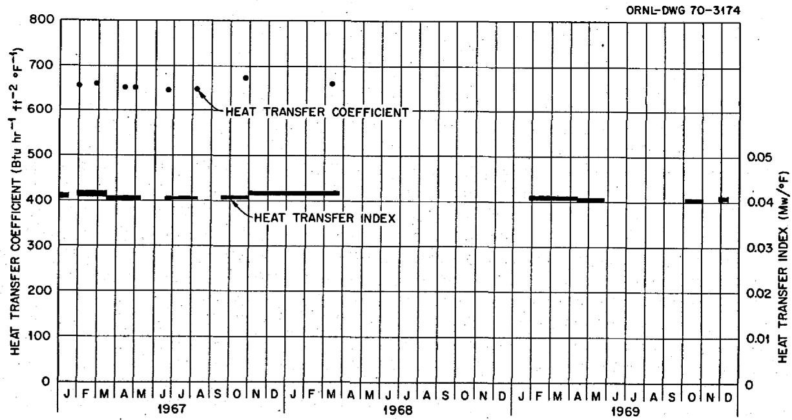  
Fig. 1.10. Observed Performance of MSRE Heat Exchanger.

Table 1.7. MSRE Cumulative Thermal Cycle History Through Run 20   

<table><tr><td rowspan="2">Component</td><td colspan="6">Number of Equivalent Cycles</td></tr><tr><td>Heat and Cool</td><td>Fill and Drain</td><td>Power</td><td>On and Off</td><td>Thaw</td><td>Thaw and Transfer</td></tr><tr><td>Fuel system</td><td>13</td><td>55</td><td>101</td><td></td><td></td><td></td></tr><tr><td>Coolant system</td><td>11</td><td>18</td><td>97</td><td></td><td></td><td></td></tr><tr><td>Fuel pump</td><td>16</td><td>51</td><td>101</td><td>711</td><td></td><td></td></tr><tr><td>Coolant pump</td><td>12</td><td>19</td><td>97</td><td>156</td><td></td><td></td></tr><tr><td>Freeze flanges 100, 101, 102</td><td>13</td><td>51</td><td>101</td><td></td><td></td><td></td></tr><tr><td>Freeze flanges 200, 201</td><td>12</td><td>18</td><td>97</td><td></td><td></td><td></td></tr><tr><td>Penetrations 200, 201</td><td>12</td><td>18</td><td>97</td><td></td><td></td><td></td></tr><tr><td>Freeze valve</td><td></td><td></td><td></td><td></td><td></td><td></td></tr><tr><td>103</td><td>13</td><td></td><td></td><td></td><td>29</td><td>62</td></tr><tr><td>104</td><td>21</td><td></td><td></td><td></td><td>12</td><td>34</td></tr><tr><td>105</td><td>22</td><td></td><td></td><td></td><td>20</td><td>57</td></tr><tr><td>106</td><td>23</td><td></td><td></td><td></td><td>34</td><td>44</td></tr><tr><td>107</td><td>15</td><td></td><td></td><td></td><td>14</td><td>22</td></tr><tr><td>108</td><td>16</td><td></td><td></td><td></td><td>17</td><td>28</td></tr><tr><td>109</td><td>15</td><td></td><td></td><td></td><td>23</td><td>30</td></tr><tr><td>110</td><td>8</td><td></td><td></td><td></td><td>4</td><td>10</td></tr><tr><td>111</td><td>6</td><td></td><td></td><td></td><td>4</td><td>6</td></tr><tr><td>112</td><td>2</td><td></td><td></td><td></td><td>1</td><td>2</td></tr><tr><td>204</td><td>12</td><td></td><td></td><td></td><td>15</td><td>42</td></tr><tr><td>206</td><td>12</td><td></td><td></td><td></td><td>13</td><td>41</td></tr></table>

coefficient of reactivity tests and other operations where the fuel system temperature was changed appreciably while the coolant system was drained. These thermal cycles were expressed as equivalent power cycles.

# 1.3 EQUIPMENT

# 1.3.1 Salt Samplers

# A. I. Krakoviak

The sampler-enricher was used intensively to obtain a wide variety of samples during the three months of actual reactor operations in this report period. A total of 96 sampling operations were performed, including six $\mathrm{PuF_3}$ and two $^{233}\mathrm{UF}_4$ -LiF fuel additions. This brings the number of sampling cycles to a grand total of 745, of which 152 were fuel additions of either uranium or plutonium. A description and the number of each type of sample taken or addition made during this report period are tabulated below. Some of the capsules were exposed as much as 12 hr in either the salt or cover gas in the pump bowl.

Freeze valve gas samples 23

10-g salt samples for compositional analyses 13

Freeze valve salt samples 11

Evacuated capsules containing CuO, Pd, or Ni 7

50-g samples for $\mathbf{U}^{3 + } / \mathbf{U}^{4 + }$ analyses 6

$\mathbf{PuF}_3$ (powder) addition capsules 6

50-g samples for oxide and other determinations 5

Graphite and copper capsules for gamma scanning 5

Surface tension capsules (including two containing Be) 4

Fission product plating capsules 3

Solid nickel bars for tritium analyses 3

Hinged capsules for $\mathbf{U}^{3 + } / \mathbf{U}^{4 + }$ (spectrophotometrically) 3

Addition capsules containing $^{233}\mathrm{UF}_4 \cdot \mathrm{LiF}$ 2

Beryllium additions 2

Niobium metal addition 1

Empty nickel cage 1

Capsule containing electron microscope screens 1

During the latter part of run 19, routine sampling was suspended for approximately four days, and the sampler was adapted to accommodate a collimator and a germanium crystal detector atop the sampler where the carrier cask is normally positioned. A plastic plug in the removal area permitted an unobstructed view into area 3A, where samples retrieved from the fuel pump were positioned. Gamma-ray spectrometry data were then collected on short-lived fuel fission products within 50 min of their removal from the circulating salt stream.

Although minor annoying problems were encountered with the sampler and although repairs caused a few days' delay in the rather heavy sampling schedule, all of the planned samples and additions were accomplished.

The main problems encountered concerned repair of the manipulator and of the two flexible containment membranes (manipulator boots) between the manipulator and the main containment box (3A). As in the previous report period,17 the boots were replaced three times; one replacement was due to a small leak in the outer, or larger, boot, and two were due to ruptures in the inner boot (in contact with the manipulator). After the second failure, the boots were modified by lengthening the boot by 2 in. at the small end and increasing the boot thickness by 0.003 in. The negative pressure support rings which keep the inner boot away from the manipulator rod were also eliminated on subsequent boot installations.

During the early part of run 19, a small leak developed in one of the convolutions of the metal bellows which provides containment between the manipulator finger mechanism (in area 3A) and the actuating rod (operating area). Although this bellows was installed during the summer of 1968 after the capsule retrieval work was completed,[18] it had been decontaminated in an acid bath before and after the 1968 installation. The fuel processing sampler was cannibalized to make this repair, and sampling was continued. Contamination during repair work, although adequately controlled, was more of a problem because of the higher activity of the salt and the higher frequency of sampling with various types of ladles and capsules.

About a month before the end of run 19, serious tangling of the cable, which had caused long delays on previous occasions,[19] was averted because the proximity switch[20] indicated something wrong on an otherwise apparently normal insertion. When the magnetic pickup did not actuate a light to indicate the passage of the latch as it should have, the insertion was stopped after 3 ft 10 in. of cable had been unreeled. The cable was rewound with no apparent difficulty until the position indicator on the reel indicated full withdrawal. The isolation valves were then closed, and the access port was opened. The cable had been fully rewound, but the capsule was not hanging straight down from the latch as would be normal. Instead it was lodged diagonally between the ledges of the access port,

a higher position than it had been in at the start. Somehow it had been lifted. Probably the capsule had lodged at the sampler tube entrance, a few inches below its starting point, and the stiff cable had been pushed on down the tube past it. Then as the cable was retrieved it must have snared the capsule and lifted it up to where it was found. Because the insertion was stopped before very much cable was paid out, no serious tangling had occurred. The capsule was hung again in its normal position, and sampling proceeded normally with no recurrence of this problem.

During the latter part of run 20, the light bulb which illuminated area 3A failed. A temporary battery-powered light was improvised and inserted down the periscope channel, permitting sampling over the weekend until the light bulb was replaced on the following Monday.

The double elastomer seals which contain the buffer gas at the various valves and the access port continued to show increased leakage, but it remained possible to provide a positive buffer zone. For example, the buffer pressure between the seals of the 1C access port decreased from $\sim 50$ psia in 1967 (ref. 21) to 37 psia at the end of run 19 and to $\sim 32$ psia at the end of run 20. (The seal leakage was into area 1C rather than into area 3A.) Although the radiation damage to the seal material probably was becoming significant, the principal reason for the increased leakage from this buffer zone was no doubt the fact that the left-center Nu-vice clamp was loose and thus ineffective in compressing the seal during run 20. The increased leakage of buffer gas at the operational,[22,23] the maintenance,[24] and (during run 19) the removal valve was all from the upper half of the seal. This indicates that mechanical damage due to particulates falling on the valve was the probable cause of deterioration of the valve seals rather than radiation damage.

During this report period the coolant sampler was used to take eight coolant samples: four were salt samples for compositional analysis, and the other four were special exposures made in the study of tritium in both the gas and salt sections of the coolant pump. No operational difficulties were encountered.

# 1.3.2 Control Rods and Drives

M. Richardson J.R. Engel

All three control rod and drive assemblies performed quite satisfactorily, with no difficulties, during this report period. Tests in late September, early October, and before the startup in November showed that scram times (times for release plus travel from full withdrawal to lower limit) were all less than 0.81 sec.

Some studies of the system used to extract control rod acceleration from records of position vs time during drop tests $^{25}$ were performed to explore the sensitivity of the system to changes in acceleration. In these studies an analog computer was used to generate a voltage signal in the same range as that produced by the position potentiometer on the actual rod drive. The time variation of this voltage was made to simulate rod position as a function of time for arbitrarily specified values of acceleration as a function of rod position. The simulated signals were passed through the same data recording and processing system used for the actual signals so that a direct comparison could be made between real acceleration values and those produced by the processing program from position data. Comparative results were good for long regions (more than 6 in.) of low acceleration (as was the case for the stuck control $\mathrm{rod}^{25}$ in June 1969). However, if a region of zero acceleration as short as 2 in. was present at a location more than 12 in. below the starting position of the rod, the effect on the final curve of acceleration vs position was nearly indistinguishable from other random variations. The failure of the program to reproduce such small aberrations was attributed to the filtering and data smoothing that were required to reduce random noise effects.

Because of the difficulty in identifying short regions of low acceleration in a single rod drop from the fully withdrawn position, the rod testing procedure was modified to improve its fault detection capability. Accelerations were evaluated for rod drops from just above the normal operating positions as well as from fully withdrawn. This would permit detection of any tight spots within the first few inches of travel during a drop. Since a very large restriction would be required to stop a rod that has accelerated normally for 6 in. or more, these measurements, coupled with the total drop times, gave adequate assurance of rod drop capability.

Such tests were performed at least monthly during the final periods of operation and at the start of each run. There was no further evidence of abnormal drag on any of the rods.

# 1.3.3 Off-Gas Systems

# A. I. Krakoviak

Although chronic plugging recurred in both the fuel and coolant off-gas systems during this report period, the restrictions did not interrupt power operations.

The early part of run 19 was devoted to a study of the effects of cover gas solubility on xenon stripping, which required several switchovers between helium and argon and finally back to helium as the supply cover gas. This caused perturbations in system pressure control. The inlet gas flow is normally held constant, and the fuel system pressure is controlled by manually throttling the valve at the outlet of the charcoal beds (V-557B). The transit times (assuming slug flow) from the inlet meter to the charcoal bed inlets and to the outlet throttle valve are approximately 2 and 6 hr respectively. The varying gas flow rates (due to the different physical properties of the gases) at these three primary restrictions presented somewhat of a problem of pressure control and pressure drop interpretation during the transition from one gas to another. No other operational difficulties were associated with the use of argon as a cover gas.

After approximately ten days of run 19 operations at the 5.5-Mw level, the pressure drop across the main charcoal bed increased from 3.0 psi with sections 1A and 1B in service to 4.6 psi with all three sections in service. The restrictions were partially cleared by lowering the water level in the charcoal bed pit and consecutively energizing the heaters at the entrance region of each bed for periods of 8 hr each. The pressure drop across two beds in parallel was thereby reduced to 2.7 psi; however, plugging at the beds gradually increased over the next 12 days and reached a pressure drop of 4.9 psi. The restriction then remained constant for the next 20 days, after which it was necessary to valve in section 2B also. Five days later it was necessary to lower the water level in the charcoal bed pit and reheat the inlet section of each bed. At the end of each 8-hr heating cycle, the heated bed was forward-blown with helium at 25 psig. This procedure cleared the beds so that the pressure drop across beds 1A and 1B in parallel was lowered to 2 psi. No further problems were encountered with the main charcoal beds in the subsequent run.

Particle trap 1 had developed a restriction of 0.7 psi in May 1969, and V-522C was opened at that time to put particle trap 2 in parallel service.[26] Temperature measurements within the two traps then and during runs 19 and 20 indicated that particle trap 1 is still restricted and particle trap 2 carries essentially all of the off-gas flow. Approximately two months after the start of run 19, pressure drop measurements on the off-gas line seemed to indicate a restriction of 0.3 psi across particle trap 2 also; however, cycling V-522C between its closed and open position cleared the restriction, thus indicating that the restriction was in the valve rather than in the trap. Three days later the restriction reappeared (0.3 psi) and was cleared by the same method. No further problems were encountered with the traps or valve.

Two additional attempts to clear the partial restriction in the gas line entering fuel drain tank 1 (ref. 27) were made. Helium at 30 psig and then at 50 psig was directed from line 561 through HCV-573 and into FD-1. Although only marginal improvement was obtained, the gas flow through this line is adequate for any reactor drain situation.

Two weeks after the fuel fill of run 20, the restriction in the fuel off-gas line at its exit from the pump bowl became detectable again for the first time since it was cleared in July 1969. In the next three days before reactor shutdown, the restriction increased from 1.3 to 2.2 psi as measured during the normal salt recovery operation from the overflow tank. The restriction was detected earlier by pressure noise data (Sect. 1.2.4); however, because of the proximity of the reactor shutdown date and the desirability of not interrupting the experiment in progress, it was decided not to use the heater which had been previously installed and successfully used to clear a similar restriction previously.[27]

Interest in better measurements of the fission products and tritium leaving the pump bowl led to the design and fabrication of two off-gas sampling devices, which were to have been installed near the pump bowl after run 19. One device was a sampler to be used during operation. A side outlet in the flange nearest the pump bowl would permit gas to be drawn through a very efficient filter pack which would be located

directly below the hole that had been drilled in the top blocks for gamma spectrometry of the off-gas line. A tube leading from the discharge side of the filter would penetrate the top rim of the reactor cell and pass into the fuel sampler shield. A small tank that could be evacuated by the sampler vacuum pump would be used to pull measurable increments of gas through the filter pack, thus permitting determination of concentrations of fission products in the off-gas at the pump exit. A connection into the tank was also to be provided for withdrawing batches of gas for tritium analysis.

The other device, which was to be installed and recovered after operation, was a tubular specimen array to go in the off-gas line at the entrance of the holdup volume. Its purpose was to characterize the state of the fission products by measuring their distribution on the surfaces. The decision to bring MSRE operation to an early conclusion canceled the installation of these off-gas sampling devices.

The sampling system $^{28}$ in the vent house, which takes gas from the fuel off-gas line about 45 min downstream from the fuel pump, continued in service. In addition to trapping two samples of reactor gas onto the molecular sieve during run 19, the off-gas sampler was used to make ten checks of the amount of hydrocarbons in the off-gas stream. One of the samples trapped onto the molecular sieve was taken while argon was used as the cover gas. This sample, however, was not very informative, since argon as well as krypton and xenon were trapped on the sieve at $-320^{\circ}\mathrm{F}$ . However, an attempt was made to boil off the argon and thus concentrate and retain the xenon as the sieve was allowed to heat up to $32^{\circ}\mathrm{F}$ .

The recurring restrictions at the inlet valves to the off-gas sampler gradually increased during the hydrocarbon determination runs. Back-blowing the sampler valves with helium at 60 psig only partially restored the flow. After two additional hydrocarbon determinations, the restriction returned. No samples were taken with this apparatus during the last run.

The coolant off-gas system functioned satisfactorily during this report period with the exception of the recurrent restriction at the sintered metal filter. The filter showed evidence of plugging on September 20, approximately six weeks after the coolant system was filled with salt and about two months after the filter was replaced during the June-July shutdown. During

the next month the restriction seemed to vary, as the gas pressure in the coolant pump bowl slowly meandered back and forth several times between 5 and 9 psig before it eventually exceeded 10 psig. The signal from the coolant system pressure controller was then detached from PCV-528 and attached to HCV-536. Adequate pressure control was thus obtained (bypassing the filter) until the end of run 19, at which time the filter was replaced. No further coolant system off-gas problem was encountered during the subsequent run.

Cursory visual examination of the filter used in the penultimate run showed no contaminant other than oil. No flow test was made on the filter after removal. The pressure drop of 5 to 9 psi that had developed across the filter while it was still in the system agrees rather well with the pressure theoretically required to enlarge or burst a film of oil from a $1\mu$ -diam pore if one assumes that the bubble radius of a liquid film produced by a pore is the same size as the pore. The equilibrium equation for a spherical bubble is $\Delta P = 2\sigma / r$ , where $\sigma =$ surface tension $= 16$ dynes/cm for the oil in the coolant pump and $r =$ bubble radius $\cong$ pore radius $= 0.5 \times 10^{-4}$ cm. This calculation indicates that any pore in the sintered metal filter smaller than $1\mu$ , once plugged with condensed oil vapors, would remain plugged at pressure differentials of less than 9.3 psi. The slow pressure oscillation experienced could be attributed to a near-equilibrium condition of condensation and evaporation of oil at the pores of the filter.

# 1.3.4 Component Cooling System

# R. H. Guymon

Component coolant pump 2 was used exclusively during this six-month report period, with the other pump (CCP-1) being held in standby. CCP-2, which had been in operation for $500\mathrm{hr}$ at the beginning of the period, operated another $2215\mathrm{hr}$ without difficulty.

While equipment was being checked out in preparation for the final reactor operation, the discharge check valve on CCP-2 was found to be inoperative. This had previously occurred in 1965 and was due to the elastomer hinge breaking. Since then the hinge had been replaced annually to help prevent such failures. It was last replaced in April 1968. The failure of this valve simply meant that if CCP-2 were to fail, the load could not be picked up by CCP-1 because air would recirculate back through CCP-2. Since the only risk was interruption of operation in case of some failure in CCP-2, and because of the tight schedule, the final run was made using CCP-2 with no spare.

# 1.3.5 Containment and Ventilation

# R. H. Guymon

The air inleakage into the reactor cell (at -2 psig) ranged from 15 to 30 scf/day until the November shutdown. During the final run (November 24 to December 12) the indicated leak rate varied from 15 to 50 scf/day, and no trend was established. The usual behavior after closing the cell is that the apparent inleakage is high at first as the water vapor content increases to an equilibrium value. After about one week, the leak rate decreases, and at about the same time condensate starts to collect in the condensate collection system. No water was collected during the three weeks that the cell was at negative pressure during run 20.

During the six-month report period, particulate activity released through the stack was less than $0.3\mathrm{mc}$ . The radioiodine release indicated by the stack monitor amounted to $812\mathrm{mc}$ . Most of this occurred during the removal of the core specimens described in Sect. 1.4. The hold-down assembly had to be stored in the standpipe due to a galled bolt. Salt and tellurium adhering to this assembly probably contributed to the larger-than-usual release. Some $50\mathrm{mc}$ of the iodine can be attributed to the leak from the primary system which was described in Sect. 1.2.8.

# 1.3.6 Heaters and Electrical Systems

# J.K.Franzreb

The electrical system in general gave good operating experience during this period. The variable-frequency motor-generator set was used to drive the fuel pump at speeds ranging from 600 to 1170 rpm until September 16, when it was reconnected to the normal supply. From September 26 to October 1 the pump was again supplied by the motor-generator set. Thereafter the pump was kept at full speed until final shutdown on December 12, 1969. The motor-generator set performed extremely well during this period.

One more heater problem developed when heater circuit CR-3-4 (coolant radiator) became grounded on the heater side early in December 1969. Six of thirty 1000-w elements were put out of service, but there was no interference with continued operation, and no repairs were made after planned final shutdown on December 12, 1969.

# 1.3.7 Oil Systems for Salt Pumps

# J. K. Franzreb

The oil packages for both the fuel and coolant pumps ran well and without major incident throughout this report period. The oil pumps for both packages were alternately run on a weekly rotational basis, and only very minor priming difficulties were encountered upon starting pumps that had been idle for one week.

Samples of both oil charges were taken on a routine basis. The fuel pump lube oil was sampled six times; the coolant pump oil, four. Analyses showed no significant deterioration with extended use. In addition both new and used oil was analyzed for tritium. The oil in use contained about $1 \times 10^{-3} \mu \mathrm{c} / \mathrm{cc}$ .

The leak rate from the fuel pump lube oil system to its oil catch tank (seal leakage) was measured at 13.2 cc/day. The corresponding leak rate through the coolant pump rotary seal varied from 9.8 to 20.1 cc/day. These leak rates are within the ranges previously experienced.

# 1.3.8 Radiator and Main Blowers

# C. H. Gabbard

The radiator and enclosure were inspected at the end of run 19 and were found satisfactory. The routine programmed maintenance was performed.

The main blowers, MB-1 and MB-3, completed operation with totals of 12,670 and 10,990 hr, respectively, on the rebuilt rotors. The blowers have not received a final inspection, but there has been no indication of difficulty in the blades or hubs. There were more bearing difficulties on the thrust bearing of MB-1 as indicated by a vibration increase on September 9, 1969, to 3.5 mils. The problem was due to severely worn and corroded spherical surfaces in the self-aligning bearing mount. We attempted to make temporary repairs by locking the mount in the properly aligned position, but the vibrations persisted, and the mount and bearing required replacement. The mount had accumulated 12,550 hr of total operation. The new replacement bearing was defective and overheated after 10 min of test operation; the phenolic ball retainer had insufficient clearances and had rubbed on the inner race. A bearing of the original radial type was on hand and was installed. Although the original bearing type had a shorter expected service life, it was believed to be satisfactory for the remaining operation of the reactor. No further difficulties were experienced with either of the blowers.

# 1.4 REMOTE MAINTENANCE

# M. Richardson

During the November shutdown between runs 19 and 20, the principal effort was assistance to the gamma spectroscopy study described in Sect. 1.2.6. The reactor cell top shield blocks were removed, and a large portion of the cell membrane was cut away to permit movement of the maintenance work shield. Some of the drain tank cell blocks were removed, and a small part of the membrane was cut to permit scanning of FD-2.

During the scanning, which commenced immediately prior to the fuel drain and continued until November 21, the work involved moving the maintenance work shield to different locations and setting up the scanning equipment. Each setup required about $6\mathrm{hr}$ , which was later reduced to $4\mathrm{hr}$ as the operation became more routine. There was a total of 12 operations which involved disassembly and reassembly of the maintenance shield.

Two 2-in.-diam holes were drilled through the highbay floor in the southwest corner to permit scanning the coolant salt lines (see Sect. 1.2.11).

The shutdown work after run 19 was to have included the installation of off-gas sampling devices near the pump bowl (described in Sect. 1.3.3). The job would have involved permanent installation of a small tube from the off-gas line, out the top of the reactor cell, and into the sampler-enricher enclosure. The equipment was designed and fabricated, and the procedure for the remote installation was worked out. The job was canceled, however, by the decision to conclude the operation by mid-December.

Maintenance of the sampler-enricher during runs 19 and 20 involved considerable work with highly contaminated parts. As described in Sect. 1.3.1, during the part of run 19 in this report period, there were two manipulator boot failures and one failure of the metallic double bellows at the manipulator finger attachment. The boot failures included one inner boot, which contains the metal O-rings, and one outer boot. There was one failure of the inner boot during run 20. A total of 96 samples were taken during this report period, requiring that the sampler-enricher be in almost daily operation. Thus when a failure occurred it was necessary to make immediate repairs without waiting for the short-lived activities to die out. In addition, due to the many samples pulled, there was much surface contamination in the 3A area, which read over $100\mathrm{r/hr}$ .

Repairs to the manipulator boots require that the shield, castle seal, and manipulator be removed as a unit from the 3A area by using the overhead crane. The fit

of this unit in the shield is quite tight, and during the removal the unit was sometimes bumped against the sample shield. Bumping resulted in the spread of the surface contamination on the boots within the work area. The work area was prepared before repairs commenced and designated as a "C" zone. There was no spread of contamination outside this area.

The removal of the experimental array from the core at the end of run 20 went well until a galled bolt in the hold-down assembly flange interfered with its reinstallation. The hold-down assembly was left in the standpipe, and a blank ring-joint flange was installed on the core access. Just after the flange had been checked leak-tight, some particulate activity was released into the high-bay work area. The total amount of activity was not large, and there was no excessive exposure of personnel. The activity was detected in widely separated spots throughout the high bay, indicating that minute particles had been carried by the air currents induced by the large inlet air duct. CAM filters and smears of the floor showed Nb, Ru, Te, and Mo activities. Presumably this came from "soot" deposited on the hold-down device above the level of the salt in the access nozzle. In preparation for the standby period, the high bay was cleaned by mopping, requiring 160 man-hr of laborers' time.

The amount of activity released to the stack as a result of the core sampling operation was greater than usual: a total of 0.80 curie of iodine was released, nearly all in the ten days after the core access was opened. Presumably this came from tellurium on the hold-down assembly that was left in the standpipe. Until the core access was resealed, an exhaust flow from the standpipe through a charcoal absorber was maintained. Afterward the standpipe was opened to the reactor cell, so it would have been possible for iodine to get to the stack.

A maintenance equipment failure with significant implications occurred during the gamma-scanning work in November. The 30-ton crane was being operated from the remote maintenance control room when a failure occurred in its remote-control cable. The crane had moved to the north end of the building with a portion of the maintenance shield (leaving an opening in the reactor cell top), and it would not respond to the signal to drive south. Fortunately, where the crane had stopped the radiation was low enough to permit inspection. This showed that a wire had broken in the multiconductor cable where it repeatedly flexed during bridge travel. Because the failure occurred away from the high-radiation zone, repair was simple. As a result of this experience, however, plans for coping with various

kinds of crane failure were developed in more detail, and the 10-ton crane was equipped with bumpers to enable it to push the 30-ton crane (which is normally used in remote maintenance) away from any open cell.

# 1.5 FINAL SHUTDOWN AND STANDBY STATUS

# R.H.Guymon

After the core specimens were removed and a flange was installed on the reactor access nozzle, the facility was placed in a standby condition to await the postoperation examinations planned for early in the next fiscal year. The operating crews were disbanded, but most of the engineers on the MSRE staff remained temporarily at the site, completing analyses and writing summary reports. The conditions at the end of this report period are described in the following paragraphs.

The fuel salt is divided equally between the two drain tanks. It and the flush salt in its tank are frozen, between 450 and $650^{\circ}\mathrm{F}$ . All other fuel and coolant salt piping and vessels are at ambient temperature. All are filled with helium at about 0.5 psig, with gas inlet and outlet lines blocked. Equalizer lines between the fuel circulating loop and drain tanks are open.

The reactor and fuel drain cells are sealed, with the roof blocks fastened down. The cells are held at about $-0.9$ psig by continuously pumping 5 cfm of air out of the cell past the cell activity monitor and into the stack. Air is allowed to bleed into the drain tank cell through a containment check valve. A simple water leg vacuum relief device is installed at the pump to prevent inadvertently pulling too high a vacuum on the cells in the unlikely event of the check valve sticking shut.

One of the two stack fans is always in operation, providing stack flow and ventilation throughout the reactor building. The normal stack flow and activity monitors (alpha, beta-gamma, and iodine) are in service. One beryllium monitoring station is in service sampling the inlet air to the stack filters. One continuous air monitor and one monitron located in the control-room area and one of each located in the high-bay area are in service.

The electrical system is supplied by an external 13.8-kv feeder line. In case of trouble on this feeder, the load will automatically transfer to an alternate feeder. The diesel generators are available but must be started manually. The instrument air compressors are in standby, with instrument needs supplied by cylinders of nitrogen.

The heat from the drain tanks is dissipated through the cell walls, with the cell air at about $140^{\circ}\mathrm{F}$ . The cell air coolers are shut off, and the treated-water system is

shut down but not drained. The cooling tower water system is drained. Temperature and humidity control is maintained in portions of the reactor building to preserve the instruments and prevent damage from freezing.

All gates to the MSRE area are locked, and access through the office building is controlled. Instrumentation is set up for out-of-limit variables to alarm in the control room, the office building, the X-10 Central Waste Monitoring Facility, and the ORNL Emergency Control Center as appropriate. A log is taken and variables plotted daily. A thorough building inspection is made and a more extensive log is taken once per week. On weekdays this is done by MSRE personnel. On weekends and holidays, personnel from the Central Waste Monitoring Facility take the log and respond to alarms. Written instructions are provided giving the action to be taken in case a variable is out of limits or an alarm occurs. Experienced MSRE personnel are on call if needed.

Table 1.8. MSRE Shutdown Conditions   

<table><tr><td>Item</td><td>Typical Value</td></tr><tr><td>FD-1 heaters</td><td>2 kw</td></tr><tr><td>FD-2 heaters</td><td>2 kw</td></tr><tr><td>FFT heaters</td><td>4 kw</td></tr><tr><td>FD-1 temperature</td><td>450–650°F</td></tr><tr><td>FD-2 temperature</td><td>450–650°F</td></tr><tr><td>FFT temperature</td><td>450–650°F</td></tr><tr><td>Primary system pressure</td><td>0 to 0.5 psig</td></tr><tr><td>Reactor cell pressure</td><td>-0.5 to -1.0 psig</td></tr><tr><td>Drain tank cell temperature</td><td>135–140°F</td></tr><tr><td>Reactor cell temperature</td><td>85°F</td></tr><tr><td>Reactor cell evacuation flow</td><td>4–5 scfm</td></tr><tr><td>Cell air activity</td><td>0–0.5 mr/hr</td></tr><tr><td>Stack activity (alpha, beta-gamma, or I2)</td><td>&lt;50 counts/min</td></tr><tr><td>Monitrons</td><td>&lt;2 mr/hr</td></tr><tr><td>Constant air monitors</td><td>&lt;500 counts/min</td></tr><tr><td>Stack flow</td><td>16,000 cfm</td></tr><tr><td>Sump levels</td><td>&lt;15 in.</td></tr></table>

The various systems in service are essentially at equilibrium and require very little attention. Items monitored and their typical values are given in Table 1.8.

# 1.6 PREPARATIONS FOR INSPECTION

# P. N. Haubenreich

Suggestions for postoperation examinations were solicited throughout the MSRE Program organization in February 1969. In October a consolidated list of suggested objectives and tasks was issued for further comment. Subsequently each proposed task was evaluated in terms of the importance of its objective, the cost of doing the job, its interrelation with other tasks, and possible significance in the ultimate disposition of the plant. Development of procedures and design of tools were started for some of the jobs to aid in time and cost estimates. By the end of the report period, the task list had been narrowed, and detailed planning was under way.

One important job will be to look for the leak. Figure 1.8 is a photograph of the salt lines in the suspected vicinity, taken before heater insulation units were set in place. These units will be removed and a visual examination made. Methods were conceived by which it appeared feasible to cut out the part of the salt system where the leak is believed to be and remove it to a hot cell for determination of the exact location and nature of the leak.

Several alternatives were considered for the ultimate disposition of the fuel and flush salts containing the uranium and the fission products. A recommendation was made to the AEC that the salts be kept frozen in the MSRE tanks for several years; then if no need has developed for the uranium (which appears unlikely in view of the very high $^{232}\mathrm{U}$ content) the uranium should be left in the salt for removal to an established disposal site.

# 2. Reactor Analysis

# 2.1 INTRODUCTION

B. E. Prince

During the course of nuclear operation of the MSRE, the standard computational tools employed for neutronics analysis have been the GAM-II and THERMOS multigroup spectrum averaging programs, together with the EXTERMINATOR-2 group diffusion program. Recently, another generation of programs designed to perform these analyses and oriented for use of the IBM 360/75 and 91 have become available. These are the XSDRN and CITATION programs currently being employed in MSBR studies. The former program performs the combined spectrum-averaging function of the GAM-THERMOS sequence, and the latter replaces the EXTERMINATOR-2 code. Descriptions of these new programs may be found in refs. 2 and 3 respectively.

During this semiannual period we performed some comparative analyses of the MSRE neutronics using various combinations of these programs. This work is a continuation of a general evaluation and updating of calculated MSRE performance characteristics described earlier. It was motivated by the interest of comparing the use of these computing tools in a molten-salt reactor application where experimental data are available. These results are described in Sect. 2.2.

Also in this period we examined the effect of the use of revised and updated nuclear data on the interpretation of long-term reactivity trends observed during the operation with $^{235}\mathrm{U}$ . This analysis included several modifications which have been suggested over a period of time since the reactivity balance calculations were first begun. This work is described in Sect. 2.3.

# 2.2 EXTENSIONS OF MSRE CORE PHYSICS CALCULATIONS TO THE USE OF XSDRN-CITATION PROGRAMS

B. E. Prince

The particular approximation of the MSRE core chosen for this set of calculations was a seven-zone model in cylindrical $(R - Z)$ geometry with azimuthal symmetry. The compositions of the salt corresponded to the minimum critical loadings of $^{235}\mathrm{U}$ and $^{233}\mathrm{U}$ at $1200^{\circ}\mathrm{F}$ with the control rods withdrawn to their upper limits. For a given fuel loading, neither the composition nor the geometry was varied in the comparative calculations summarized below.

The simplifications of the core geometry required the cluster of three control rods and sample holder to be represented as an annular ring about the core axis. While this undoubtedly tends to make the relation between absolute calculations of the multiplication factor and critical experiment observations more indirect, the purpose of a comparative study of computing methods, such as described below, could just as well be served by taking advantage of the economy of performing the group-diffusion calculations in two-dimensional geometry.

Table 2.1 summarizes the various combinations of input data and computer programs used in this study and compares the results in terms of relative changes in multiplication factor and absolute spectrum-averaged capture-to-absorption ratios for the fissile components. These two quantities can be used as simple figures of merit for comparing the various cases, since both are functionals of the distribution of neutron flux in energy and position over the reactor core. Cases 1, taken from earlier calculations for the $^{235}\mathrm{U}$ and $^{233}\mathrm{U}$ loadings, were arbitrarily chosen as reference values for comparing the changes in multiplication factor. The details of the comparison between cases 1 and 2 for the $^{235}\mathrm{U}$ loading have been described in ref. 4. In case 3 we have used the GAM-THERMOS-generated broad-group cross sections as input for a CITATION calculation. In this latter calculation the basic geometric mesh describing the problem was constructed to correspond as closely as

Table 2.1. Comparison of Computation Models for MSRE Multiplication Factors and Capture-to-Absorption Ratios   

<table><tr><td>MSRE Fissile Loading</td><td>Case No.</td><td>Approximate Date</td><td>Multigroup Spectrum-Averaging Program</td><td>Few-Group Diffusion Program</td><td>Number of Broad Slowing-Down Groups</td><td>Number of Broad Thermal Groups</td><td>Extrapolation Distance at Reactor Vessel Boundary</td><td>Δkeff</td><td>Ratio of Radiative Captures in 235U to Absorptions in 235U</td><td>Ratio of Radiative Captures in 233U to Absorptions in 233U</td></tr><tr><td rowspan="6">235U</td><td>1</td><td>November 1968</td><td>GAM-THERMOSa</td><td>EXTERMINATOR-2</td><td>3</td><td>1</td><td>0</td><td>0</td><td>0.2067</td><td>(0.1107)b</td></tr><tr><td>2</td><td>July 1969</td><td>GAM-THERMOSc</td><td>EXTERMINATOR-2</td><td>3</td><td>1</td><td>0</td><td>-0.0053</td><td>0.1977</td><td>(0.1111)</td></tr><tr><td>3</td><td>November 1969</td><td>GAM-THERMOSc</td><td>CITATION</td><td>3</td><td>1</td><td>0</td><td>-0.0026</td><td>0.1977</td><td>(0.1111)</td></tr><tr><td>4</td><td>November 1969</td><td>XSDRNd</td><td>CITATION</td><td>3</td><td>1</td><td>0</td><td>+0.0135</td><td>0.1991</td><td>(0.1128)</td></tr><tr><td>5</td><td>November 1969</td><td>XSDRNd</td><td>CITATION</td><td>3</td><td>1</td><td>0.71 λtr</td><td>+0.0226</td><td>0.1997</td><td>(0.1129)</td></tr><tr><td>6</td><td>November 1969</td><td>XSDRNd</td><td>CITATION</td><td>2</td><td>4</td><td>0.71 λtr</td><td>+0.0235</td><td>0.1998</td><td>(0.1130)</td></tr><tr><td rowspan="2">233U</td><td>1</td><td>December 1968</td><td>GAM-THERMOSc</td><td>EXTERMINATOR</td><td>3</td><td>1</td><td>0</td><td>0</td><td>(0.1858)d</td><td>0.1071</td></tr><tr><td>2</td><td>November 1969</td><td>XSDRN</td><td>CITATION</td><td>3</td><td>1</td><td>0.71 λtr</td><td>+0.0290</td><td>(0.1866)</td><td>0.1086</td></tr></table>

${}^{a}$ Cross-section data libraries for uranium isotopes based on pre-1965 evaluations.   
${}^{b}$ Ratios given in parentheses refer to a fissile component present in the calculation either in small concentrations or at infinite dilution, relative to the primary fissile component.   
cNew evaluations of uranium isotope cross-section data (see discussion in ref. 4).   
$d$ Cross-section library now used in MSBR studies. (Data for uranium isotopes same as in case 2.)

possible to the EXTERMINATOR model. (In both cases the mesh consisted of 37 and 56 intervals in the radial and axial dimensions respectively.) Case 3 indicates that the variations in the finite differencing and computing schemes used in these two programs do give rise to a small change in the calculated multiplication factor. However, this change is of no consequence in this application.

In case 4 we have introduced the XSDRN multigroup spectrum calculation, with its associated cross-section library. One finds in this case a significant change in the multiplication factor ( $\sim 1.6\% \Delta k$ , compared with case 3, which uses the same basic cross-section data for $^{235}\mathrm{U}$ and $^{238}\mathrm{U}$ ). By use of the CITATION perturbation calculation, this difference was shown to be due almost entirely to increases in the calculated broad-group transport cross sections for the various nuclide constituents in the reactor. The largest increase observed for the graphite-moderated region was about $5\%$ , occurring in the thermal group. This appears to originate as follows: In the present version of the XSDRN library, the scattering cross-section data for the thermal energy range include only the $P_0$ component (which is equivalent to assuming isotropic neutron scattering in the laboratory system). In our earlier calculations we had introduced transport corrections for the thermal group in an ad hoc manner using a standard recipe derived from monoenergetic transport theory. Thus it is possible that the thermal transport cross sections used in the earlier calculations may be more reliable in this application. If these values had been used in the calculation for case 4, the perturbation results indicate that the difference in multiplication constants between cases 3 and 4 would have been reduced to about $1.1\% \Delta k$ .

The remaining differences in the calculated transport cross sections occurred in the slowing-down energy range. Of particular significance were the changes for the nuclide constituents in the Hastelloy N reactor vessel, which accounted for about $0.55\% \Delta k$ . Approximately $60\%$ of this change appears to be due to reevaluations of the nuclear data for nickel, chromium, iron, and molybdenum since the earlier calculations were made. The remaining $40\%$ arises from inherent differences in the methods of calculating transport cross sections in the slowing-down range used in the GAM and XSDRN codes.

In case 5 of Table 2.1, we have modified the zero-flux boundary condition on the CITATION-calculated neu

Table 2.2. Broad-Group Energy Structure Used in CITATION Calculations for MSRE   

<table><tr><td>Broad Group No.</td><td>Cases 1–5 (Table 2.1)</td><td>Case 6</td></tr><tr><td>1</td><td>15 Mev–13.71 ev</td><td>15 Mev–13.71 ev</td></tr><tr><td>2</td><td>13.71–3.93 ev</td><td>13.71–1.86 ev</td></tr><tr><td>3</td><td>3.93–0.876 ev</td><td>1.86–0.881 ev</td></tr><tr><td>4</td><td>0.876–0 ev</td><td>0.881–0.180 ev</td></tr><tr><td>5</td><td></td><td>0.180–0.060 ev</td></tr><tr><td>6</td><td></td><td>0.060–0 ev</td></tr></table>

tron flux at the outer surface of the reactor vessel, replacing it with the Milne approximation $^6$ of $0.71\lambda_{\mathrm{tr}}$ for the vessel composition. The apparent importance of this correction in calculating the MSRE neutron leakage is reflected by the increase of about $0.9\% \Delta k$ relative to case 4.

In the final case 6, for the $^{235}\mathrm{U}$ loading, we examined the effect of modifying the broad-group energy structure, placing more groups in the thermalization range. (An examination of the influence of the number of slowing-down groups on the calculations has been reported earlier.) Most of our calculations have been made for the few-group energy structure listed in column 2 of Table 2.2. Here a single broad thermal group was used, based on an effective upper cutoff energy for thermalization of 0.876 ev. We modified this structure as shown in column 3 of Table 2.2, placing four "thermal" groups below 1.86 ev (the highest energy to which thermal upscattering can occur in the XSDRN model). Although there was a corresponding slight increase in the calculated multiplication factor between cases 5 and 6 of Table 2.1, this difference is of no consequence for this application.

For the $^{233}\mathrm{U}$ fuel loading, only two cases were studied, which correspond to the comparison of cases 2 and 5 for the $^{235}\mathrm{U}$ loading. No new feature was exhibited by these calculations, although the net difference in multiplication factor was somewhat larger because of the increased neutron leakage for the $^{233}\mathrm{U}$ loading.

The cumulative results of Table 2.1 display the fact that the sensitivities of the calculated effective multiplication factor and the fissile capture-to-absorption ratios

to certain details of the computation models are quite different. The particular sensitivity of $\Delta k_{\mathrm{eff}}$ to those details which most strongly affect the leakage calculation is not very surprising, for viewed as a critical assembly, the MSRE has a large neutron leakage. (For the $^{235}\mathrm{U}$ fuel loading, about $36\%$ of the neutrons born within the graphite-moderated region leak from that region, and $31\%$ of all neutrons born within all the salt-containing regions leak to the reactor vessel; for the $^{233}\mathrm{U}$ loading, these numbers are increased to 44 and $39\%$ respectively.) The general behavior of the spectrum-averaged capture-to-absorption ratio for $^{235}\mathrm{U}$ should be considered on a separate basis, however. Here the largest change of about $5\%$ occurred between cases 1 and 2 of Table 2.1 and corresponded to a substantial revision in the basic cross-section data for $^{235}\mathrm{U}$ and $^{238}\mathrm{U}$ , as described in ref. 4. Between cases 2 and 6 of Table 2.1, the maximum variation in this ratio is about $1\%$ . Such differences still leave this quantity within the standard deviation of recent direct measurements of the average ratio for $^{235}\mathrm{U}$ in the MSRE. $^8$

Comparison of the relative variations in the capture-to-absorption ratios with those of $\Delta k_{\mathrm{eff}}$ also suggests the caution which should be taken in attempting to correlate difference between calculated and measured multiplication factors from critical experiments, with any particular set of nuclear data (such as that for the fissile nuclides), unless the critical assembly has been designed to minimize or factor out neutron leakage effects. For example, if the changes in multiplication factor were due only to the effective changes in capture-to-absorption ratios listed in Table 2.1, the differences in $\Delta k_{\mathrm{eff}}$ between cases 2 through 6 would be much smaller in magnitude and would, in fact, be opposite in sign.

Finally, the results of Table 2.1 suggest that certain stages and requirements should be met for a complete theoretical evaluation of the MSRE (and possibly other) critical experiments. Although no rigid rules can be given, one can identify three possible stages for analysis:

1. Develop a particular set of approximate models for the core lattice configuration and complete core assembly. Perform neutronics calculations with these models, using particular choices of computing tools and nuclear data libraries reflecting the current state of the art.

2. Identify those areas in the nuclear data libraries or the computation approximations in which uncertainties or misrepresentations may exist. With the model for core geometry and composition fixed as in stage 1, systematically vary the data and the computing programs or recipes in order to determine which features most influence the important neutronic characteristics (such as those figures of merit considered in Table 2.1). For this type of sensitivity analysis, the results of perturbation theory calculations are often quite useful.   
3. Within the ranges of variation considered in stage 2, choose the set of data and computing techniques and assumptions considered "best" in some sense, and apply these choices to calculations with an improved geometric/material representation of the core assembly.

Considered together, these categories serve to illustrate the complexities involved in the theoretical interpretation of a critical experiment. In the choice of the model in stages 1 and 2, use can be made of various economies in the calculation methods, for example, use of two-dimensional diffusion-theory calculations as in the present study. Calculations with three-dimensional representations and other features with substantial computing time requirements can often be postponed to stage 3. Also, one should note that the analysis provided by stage 1 is often sufficient for many purposes (particularly in the MSRE, where small errors in the calculated critical fuel composition had no practical consequence in fueling). The description of the set of calculations for the $^{235}\mathrm{U}$ critical experiment given in ref. 9 would properly be classed under stage 1.

In a particular application it may develop that stage 3 in the analysis is not clearly warranted. This would be the case if the calculations in stage 2 indicate sufficient variations in characteristics caused by uncertainties in the nuclear data or computing approximations. In this event, emphasis should be placed on improving the rationale or accuracy of these approximations before proceeding to stage 3. This appears to be the situation in the present study, particularly for the approximations involved in transport cross-section calculations. Efforts will be placed along these lines before any further analyses of MSRE critical experiments are undertaken.

# 2.3 EVALUATION OF LONG-TERM REACTIVITY BEHAVIOR DURING OPERATION WITH $^{235}\mathrm{U}$

B. E. Prince

Previous descriptions and interpretations of reactivity balance data logged during the $^{235}\mathrm{U}$ operation have been based on nuclear data used early in the reactor operating history, together with the general model and rules for calculating individual reactivity effects set forth in ref. 12. The revisions made since that time in the cross-section data influencing this model motivated a reexamination of the reactivity trends during operation with $^{235}\mathrm{U}$ . We have also introduced certain changes, described and explained below, in some of the coefficients governing the conversion of concentration changes to associated reactivity effects. In order to best exhibit the long-term trends, we have considered only the reactivity balance data taken at very low power, where any uncertainties associated with the calculation of $^{135}\mathrm{Xe}$ poisoning or temperature distribution effects have a minimum influence on the analysis. An expanded version of the results described below, together with extensions to include reactor operation with $^{233}\mathrm{U}$ , will be given in a separate report.

The particular modifications in the reactivity balance calculations, suggested by information and evidence accumulated since the calculation model was first developed, are summarized as follows:

1. Revisions in nuclear cross-section data combined with self-consistent calculations of the average reaction rates over all fuel salt exposed to the neutron flux predict an increase of about $1\%$ in the burnup rate of $^{235}\mathrm{U}$ per megawatt-hour of fission energy and an increase of about $20\%$ in the net rate of depletion of $^{238}\mathrm{U}$ (with a corresponding increase in the $^{239}\mathrm{Pu}$ production rate); a decrease of nearly $11\%$ in the average capture-to-fission ratio for $^{239}\mathrm{Pu}$ , with respect to the earlier calculations, is also predicted.   
2. All terms in the reactivity balance with magnitude based on the results of zero-power rod calibration experiments should be multiplied by a factor of 1.06

to account for an increase in the calculated delayed neutron effectiveness. This correction, therefore, applies to the rod poisoning, the excess uranium reactivity (relative to the minimum critical loading), and the temperature level reactivity (relative to $1200^{\circ}\mathbf{F}$ ).

3. A second correction should be applied to the $^{235}\mathrm{U}$ concentration coefficient of reactivity by multiplying this coefficient by 1.072. This correction makes the treatment of the excess uranium reactivity and the rod-poisoning term self-consistent in the way these terms are calculated in the reactivity balance.

The sources of the corrections listed under modification 1 were described in a recent semiannual report. These revisions affect the reactivity balance mainly in the calculation of nuclide inventory changes, with the exception of the revision in the capture-to-fission ratio data for $^{239}\mathrm{Pu}$ , which influences the results mainly in the conversion of $^{239}\mathrm{Pu}$ inventory changes to associated reactivity additions.

The source of correction 2 was a recent reevaluation of the "delayed neutron effectiveness" in the MSRE described in ref. 14. All of the reactivity magnitudes derived from the zero-power calibration experiments were relative to the value of the effective delayed neutron fraction, $\beta_{\mathrm{eff}}$ , with the fuel circulation stopped. The absolute value of $\beta_{\mathrm{eff}}$ , however, is influenced by the energies of emission of the delayed neutrons, which are lower than those of the prompt fission neutrons. This difference introduces a correction dependent on the particular reactor design, which must be determined by calculation. As a net result, correction 2 amounts to a scale change in all measured coefficients in the reactivity balance.

Correction 3 has its origin in the dependence of the excess $^{235}\mathrm{U}$ reactivity (and also the control rod worth) on the total $^{235}\mathrm{U}$ concentration. A theoretical expression which closely approximates the variation of excess $^{235}\mathrm{U}$ reactivity, $\rho$ , with concentration is

$$
\rho = \frac {K \left(C - C _ {0}\right)}{C}, \tag {1}
$$

where $C$ is the ${}^{235}\mathrm{U}$ concentration in the salt and $C_0$ is the concentration at the reference point of zero excess reactivity (in this case, the minimum critical loading).

In this expression the parameter $K$ is also the ${}^{235}\mathrm{U}$ concentration coefficient of reactivity at the minimum critical loading, that is,

$$
\left(C \frac {d \rho}{d C}\right) _ {C = C _ {0}} = K. \tag {2}
$$

In our earlier analysis we had assigned a value of 0.223 for $K$ , which represented the average coefficient for $^{235}\mathrm{U}$ variations made in the zero-power calibration experiments. More recent analysis, however, indicates that a better fit to the data over the entire range of $^{235}\mathrm{U}$ concentration variations is obtained by use of Eq. (1) with $K$ equal to 0.239. This correction is independent of the additional correction for delayed neutron effectiveness described above.

The principal effects of the modifications in category 1, other than the $235\mathrm{U}$ data changes, which are separately treated, appear in a single term of the reactivity balance. This term includes effects of isotopic changes in the core which depend mainly on the time-integrated power, namely, the buildup of non

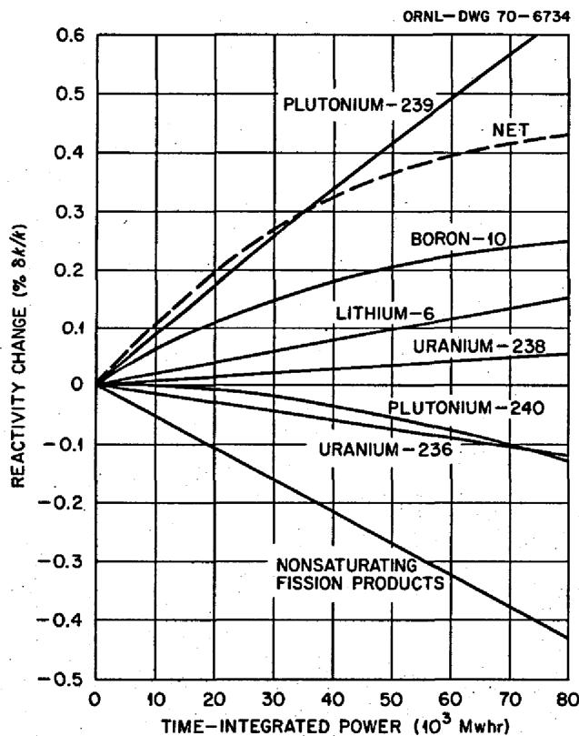  
Fig. 2.1. Reactivity Changes Due to Long-Term Isotopic Changes in MSRE During $^{235}\mathrm{U}$ Operation (Revised Calculations).

saturating or slowly saturating fission products and the changes in $^{6}\mathrm{Li}, ^{234}\mathrm{U}, ^{236}\mathrm{U}, ^{238}\mathrm{U}, ^{239}\mathrm{Pu}, ^{240}\mathrm{Pu}$ , and $^{10}\mathrm{B}$ content (the last in the graphite). In our reference calculations the same assumptions were made concerning the degree of fission product removal from the system as were used in earlier studies, that is, that all of the noble gases and none of the noble metals were removed.

The results of revised calculations of these component reactivity effects, together with their algebraic sum, which appears in the reactivity balance, are shown in Fig. 2.1. The most important change resulting from these revisions is in the $^{239}\mathrm{Pu}$ reactivity component, which increased by about $50\%$ from earlier calculations. The magnitude of the negative component associated with buildup of nonsaturating fission products also increased by about $10\%$ , due to the revision in the calculated epithermal-to-thermal flux ratio in the reactor.

The results of including all changes described under categories 1, 2, and 3 in the interpretation of the reactivity balance data are shown in Fig. 2.2a. In this figure we have attempted to distinguish the data points based on measurements taken during separate power runs. Transfer and mixing effects during drain and flush operations between runs introduced variations in the composition of the salt which generally had larger uncertainties associated with them than the changes produced during the runs.

The data shown in Fig. 2.2a indicate a small overall positive trend in the residual reactivity during the entire period of operation with $^{235}\mathrm{U}$ . (The residual reactivity is essentially equal to the "observed" reactivity minus the "predicted" reactivity.) One finds, however, that the average upward trend in reactivity during this period is about $0.07\% \delta k / k$ , which is less than half the magnitude indicated in our earlier studies. The statistical spread in the data points logged over the entire period prevents one from assigning a precise shape to the residual reactivity variation; however, the data in Fig. 2.2a taken during the longest uninterrupted power run (run 14) appear to be rising more steeply than the average trend during $^{235}\mathrm{U}$ operation. Thus the slope of the residual reactivity variation was probably increasing during this period.

It is useful to note that part of any long-term upward trend in reactivity might be explained if the actual amount of fission product removal was greater than assumed in the reference calculations (Fig. 2.1). For example, if complete removal of the noble metals Mo, Ru, and Te had occurred, the residual reactivity would have been reduced by an amount varying approximately

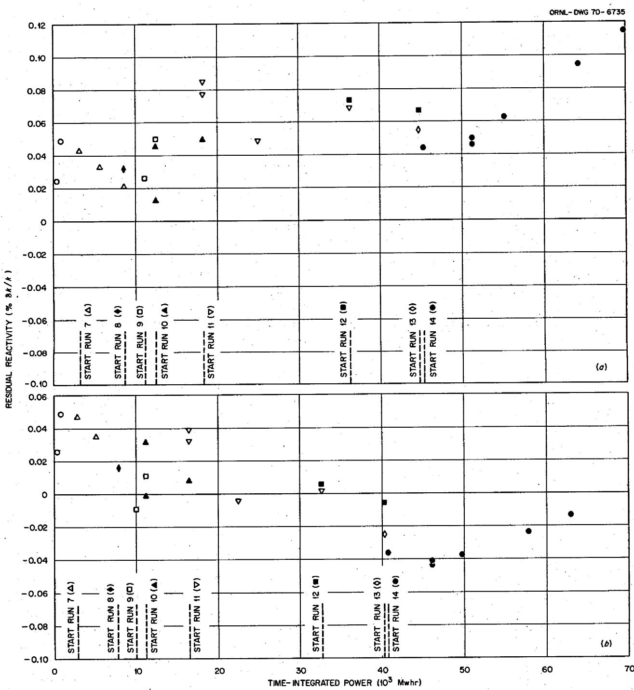  
Fig. 2.2. Long-Term Variations in Zero-Power Residual Reactivity During $^{235}\mathrm{U}$ Operations. Maximum reactor power: (a) 8.0 Mw(th), (b) 7.25 Mw(th).

linearly between zero at the start of operation and $0.04\%$ $\delta k / k$ at the end of 70,000 Mwhr of operation. Evidence exists that at least partial removal of these products did occur.[15]

Recently, some precise mass spectrometer measurements, made to determine the capture-to-absorption ratio for $^{235}\mathrm{U}$ in the MSRE spectrum, have indicated that the actual fission rate might be lower by about 10% than that indicated by the heat balance calibration. To determine what effect this difference might have on

the interpretation of the long-term reactivity trends, we recalculated the individual terms in the reactivity balance assuming that the maximum reactor power was $7.25\mathrm{Mw}$ . (Those terms which are directly affected by the fission rate are the $^{235}\mathrm{U}$ depletion, the samarium poisoning, and the long-term isotopic changes described in Fig. 2.1.) These results are shown in Fig. 2.2b. The variations in residual reactivity remain quite small in magnitude and indicate a slight negative trend during the first part of the operation, again followed by a more gentle positive trend during run 14. Increased fission product removal could accentuate any downward trend by the amount indicated above.

It is quite likely that either interpretation of the reactivity balance data described in Fig. 2.2a or $b$ is a possible representation of uncertainties in the model or of other changes affecting nuclear operation with $^{235}\mathrm{U}$ which are not explicitly included in the calculations. The magnitudes of reactivity variations exhibited in either case lie within the region in which the calculation model is judged to be valid. Hence the reactivity balance data alone cannot be used to support a specific choice for the fission rate.

In this connection it is interesting to observe that recent calculations by C. H. Gabbard $^{16}$ relating to the effect of dimensional changes in the graphite during $2^{35}\mathrm{U}$ operation exhibit variations in reactivity similar to those of both Figs. 2.2a and b. These calculations were made in an attempt to bracket the expected reactivity variation due to deflections and density changes in graphite stringers caused by fast-neutron irradiation. In one limiting case these calculations indicated that a gradual increase in reactivity could occur, resulting in a net addition of about $0.06\% \delta k / k$ during 70,000 Mwhr of operation. An opposite limit, however, indicated that an initial decrease in reactivity could occur, reaching a minimum of $-0.06\% \delta k / k$ at about 50,000 Mwhr and then increasing again during further exposure of the graphite. Precise mathematical modeling of the effects of the nonuniform dimensional changes on the core geometry is quite difficult, and the magnitudes obtained in these calculations are approximate. However, the results of Gabbard's studies lend further credence to the reactivity behavior exhibited in Fig. 2.2.

One other quite recent development should be mentioned which could, in addition to the fission product removal discussed above, slightly modify the numerical values of residual reactivity shown in Fig.

2.2. This concerns the assessment of the $^6\mathrm{Li}$ content in the fuel salt. Reexamination of all available evidence (Sect. 1.2.5 and ref. 17) now indicates that the most likely average isotopic assay of $^6\mathrm{Li}$ which went into the MSRE fuel salt preparation was between $0.005\%$ and $0.006\%$ , instead of $0.0074\%$ as had been used in all previous reactor analysis calculations. In accordance with the calculations shown in Fig. 2.1, this would have the effect of reducing the magnitude of the component associated with $^6\mathrm{Li}$ burnout by the ratio of the initial $^6\mathrm{Li}$ concentrations. The net result of this change would be to add an amount of reactivity equivalent to this difference to the residual reactivity points shown in Fig. 2.2. Thus each point in Figs. 2.2a and $b$ could be displaced upward by an amount varying approximately linearly between zero at the start of operation and $0.035 \pm 0.009\% \delta k / k$ at 70,000 Mwhr to correspond to this correction. However, the preceding conclusions regarding the validity of the reactivity balance model and results would not be changed by this modification.

Those sources of statistical variations and uncertainties in the reactivity balance data which can be identified include: (1) a component of about $\pm 0.01\%$ $\delta k / k$ associated with random errors in reading rod positions and temperatures and with short-term variations in the amount of entrained gas circulating with the salt and (2) a component associated with uncertainties in fuel transfer during flush operations, increasing in magnitude from zero near the start of power operation to about $\pm 0.015\%$ $\delta k / k$ near the end of operation. Any remaining statistical variations should at present be regarded as inherent in the technique of recording and analyzing the reactivity balance data rather than as evidence of some anomalous physical process in the reactor.

The data summarized in Fig. 2.2 represent measurements accumulated over nearly three years of operation of the MSRE. During that time $^{235}\mathrm{U}$ equivalent to $\sim 125\%$ in reactivity had been depleted in power operation; $^{235}\mathrm{U}$ equivalent to $0.72\% \delta k / k$ had been added to the salt; poisoning due to $^{149}\mathrm{Sm}$ and $^{151}\mathrm{Sm}$ equivalent to $0.77\% \delta k / k$ had been formed; changes in isotopic content of other constituents of the salt had produced a net reactivity addition of $0.42\% \delta k / k$ . Our procedures for accounting for these effects indicate that the reactor behaved in a regular and predictable manner and that the reactivity balance is a valuable tool in performing nuclear operations analysis for molten-salt reactors.

# 3. Component Development

Dunlap Scott

# 3.1 FREEZE-FLANGE THERMAL-CYCLE TEST

F.E.Lynch

Thermal cycling of the freeze flange was continued through cycle 470 before it was shut down for a scheduled inspection and minor repairs. Operation of the test was resumed at cycle 471 and continued through cycle 540, when thermal cycling of the flange was discontinued as scheduled. Visual inspection of the flange exterior during and at the end of each cycle revealed no indication of thermal fatigue cracks. There were, however, the usual minor operation problems experienced during this period of operation. These operation problems and the results of the flange inspection after cycle 470 are reported below.

# 3.1.1 Facility Operation Problems

Downtime during both these periods of operation (cycles 401-470 and 471-540) was due to burned-out test section heaters. All minor operation problems, such as plugged vent lines and instrument troubles, were corrected during or at the end of the oscillation time.

Burned-out heaters in both test section heater boxes resulted in all the downtime during the first period (cycles 401-470). Replacement of the test section heaters adjacent to the female flange resulted in the downtime during the last period of operation.

# 3.1.2 Inspection of the Flanges

The flange clamps were removed at the end of cycle 470 without any difficulty. The flanges were opened for inspection, and the oval ring gasket with stainless steel insert screen was removed for inspection. The average outer diameter of the frozen salt cake on the screen was 10 in. This was approximately the same outer diameter as in all previous inspections except for cycle 103, when it was $11\frac{1}{2}$ in.

Inspection of the inner flange face and the bore of both flanges was again made with a fluorescent dye penetrant (Zyglo type ZL-22 penetrant with developer type ZP-9). As in previous inspections, the female flange face and bore were free of cracks. In the male flange the face and neck remained free of cracks or porosity indications, but as before there were indications in the bore in the vicinity of the weld attaching the alignment stub to the face of the flange. Figure 3.1 is a photograph showing the fluorescent indication of a crack at the base of the stub and a porosity band extending clockwise around the bore from the upper thermocouple. A dashed cracklike indication at a position $1\frac{1}{2}$ in. from the end of the stub started at the upper bore thermocouple and extended circumferentially to approximately $15^{\circ}$ . From this point around to $60^{\circ}$ the cracklike pattern indication was continuous, with a dashed cracklike pattern continuing around to $120^{\circ}$ . A porosity band extended 1 in. farther into the bore and continued around to $120^{\circ}$ before necking down to $\frac{1}{2}$ in. width that continued around to $155^{\circ}$ . Figure 3.2 shows a similar porosity band extended counterclockwise from the upper bore thermocouple around to $155^{\circ}$ . From $15^{\circ}$ counterclockwise around to $45^{\circ}$ there was very little porosity indication.

Comparison of these photographs with those taken of the same locations after cycle 400 (Figs. 3.1 and 3.2 of ref. 2) showed that there was less apparent porosity in the later inspection. This apparent anomaly was attributed to differences in the cleaning procedure used to remove salt from the bore before it was inspected with the dye penetrant. (All trace of salt must be removed from the bore or it will absorb the dye and indicate porosity-type cracks.) The cleaning was more vigorous after cycle 470, when aluminum oxide cloth bands (180

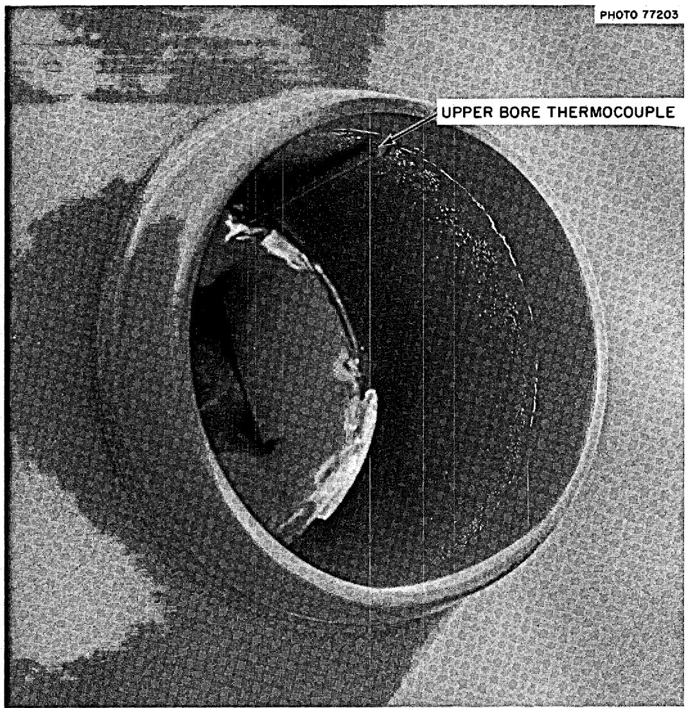  
Fig. 3.1. Photograph of Test Freeze Flange After 470 Cycles, Showing Fluorescent Dye-Penetrant Indication of a Crack on the Right Side of Bore.

grit) were used on a small pneumatic rotary grinder to clean the bore. The ability to remove or obliterate the cracklike indication and the porosity indications could be evidence that these indications were not as deep as they had first appeared. Thus plans were made to make an effort in the final inspection to clean the surface by removing a very small amount of metal. The results will be photographed, and differences in the cracklike pattern noted. An effort will then be made to remove a portion of the cracklike pattern by grinding approximately 0,002 in. from the bore of the male flange in an area where the depth of the cracklike pattern is greatest.

# 3.2 PUMPS

P.G.Smith A.G.Grindell

# 3.2.1 Mark 2 Fuel Pump

The mark 2 fuel salt pump3 was continued in operation circulating the molten salt $\mathrm{LiF - BeF_2 - ZrF_4 - ThF_4 - UF_4}$ (68.4-24.6-5.0-1.1-0.9 mole%). It has now operated for 12,744 hr at flows to 1350 gpm and temperatures between 1020 and $1325^{\circ}\mathrm{F}$ . The salt level

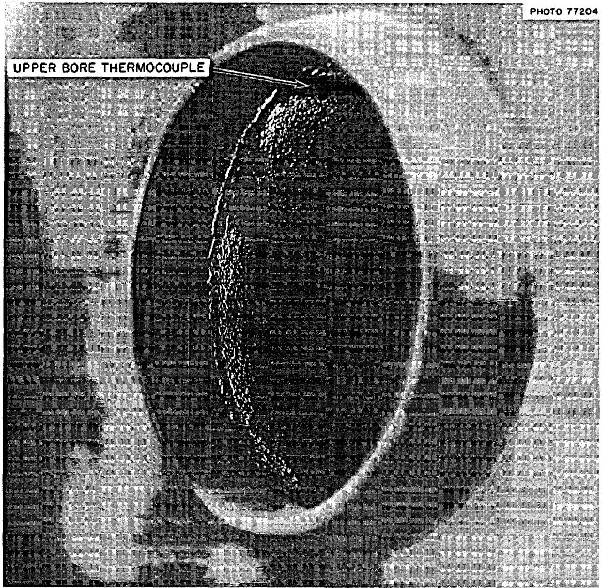  
Fig. 3.2. Photograph of Test Freeze Flange After 470 Cycles, Showing Fluorescent Dye-Penetrant Indication of a Crack on the Left Side of Bore.

was maintained at $5\%$ in. above the normal level, and the pump was operated at constant conditions to investigate the endurance capabilities of the pump.

During the first four months of this report period, partial plugging was experienced about twice weekly in the pump tank off-gas line at the filter or in the piping just upstream of the filter. Upon removal the filter was found to be nearly full of salt aerosols (15 $\mu$ diameter or less) and was replaced with a new filter. During the remainder of the report period, the new filter did not plug although salt aerosols again began to build up in the filter.

The shaft annulus (gas inlet to the pump tank) plugged slightly eight times during the report period.

The plug was easily removed by stopping and starting the pump three or four times or by allowing the salt temperature to increase to $1325^{\circ}\mathbf{F}$ for a period of about 1 hr.

Collection of oil leakage from the lower shaft seal has averaged less than 10 cc/day.

# 3.2.2 Oil Pump Endurance Test

The oil pump endurance test was continued. One week of operation was lost when the pump was stopped

inadvertently by a craftsman. Operation was resumed, and the pump has now operated for 57,344 hr, circulating oil at $160^{\circ}\mathrm{F}$ and $60\mathrm{gpm}$ .

# 3.3 DEVELOPMENT OF ANALYTICAL MODEL FOR $^{135}$ Xe POISONING IN THE MSRE

R.J.Kedl

In 1967 an analytical model was developed to calculate $^{135}\mathrm{Xe}$ reactivity effects in the MSRE. This model was based on conventional mass transfer phenomena, including effects of circulating bubbles of cover gas, which it treated as practically insoluble. This model predicted that the $^{135}\mathrm{Xe}$ poisoning would decrease monotonically as the void fraction of bubbles increased. The data on xenon poisoning as a function of void fraction obtained in this report period (Sect. 1.2.2) showed the predicted kind of behavior when the cover gas was argon but not when it was helium. With helium cover gas, the xenon poisoning passed through a maximum at a core void fraction of about $0.25\%$ .

The reason for the maximum in the experimental data with helium cover gas is thought to be associated with helium bubbles going into solution at the pump discharge and renucleating further around the fuel loop as the fluid static pressure is reduced. Apparently this renucleation is accompanied by gross removal of $^{135}\mathrm{Xe}$ from solution. Argon is an order of magnitude less soluble in fuel salt than helium; therefore one would expect the bubble dissolution and renucleation effects to be reduced and the argon data to be in better agreement with the analytical model. To check this idea, $^{135}\mathrm{Xe}$ steady-state reactivities were recomputed with this model and the best available estimates of bubble parameters for comparison with the helium and argon data to see if any conclusions could be reached.

The bubble parameters which were used are shown in Table 3.1. The reasoning behind the choice is as

It is generally thought that the circulating bubbles in the MSRE are very small, with estimates ranging from 0.001 to 0.010 in. The void fraction in the reactor was obtained by changing the pump speed. As the flow rate goes up, yielding a higher void fraction, one would expect that larger bubbles are carried under into the fuel loop. Table 3.1 then shows the bubble diameter changing from 0 to 0.010 in. incrementally as the loop void fraction goes from 0 to $1\%$ . An average bubble diameter is chosen for each increment of void fraction. In a gravity field of unity, the terminal rising velocity of a 0.001-in. bubble in the fuel salt is about 0.004 in./sec, and it is 0.4 in./sec for a 0.010-in. bubble. Obviously the 0.001-in. bubbles will travel "with the salt"; that is, they will remain with the fuel as it is sprayed through the pump bowl and eventually reenters the loop. The bubble-stripping efficiency for these bubbles ought to be close to zero. The bubble-stripping efficiency will increase rapidly as the bubble size increases because in this range (Stokes range) the bubble rising velocity increases as the square of the bubble diameter. Table 3.1 also shows the bubble-stripping efficiency changing from 0 to $20\%$ incrementally as the loop void fraction goes from 0 to $1\%$ . An average bubble-stripping efficiency is chosen for each increment of void fraction. To illustrate, when the void fraction is in the range of 0 to $0.1\%$ , the bubble diameter is 0.0005 in. and the bubble-stripping efficiency is $1\%$ . When the void fraction is in the range of 0.1 to $0.2\%$ , the first $0.1\%$ is the previous bubbles, and that above $0.1\%$ is composed of new bubbles of diameter 0.0015 in. and stripping efficiency $3\%$ . The progression continues to the last range of 0.9 to $1.0\%$ void fraction, which is composed of the previous nine ranges plus new bubbles of diameter 0.0095 in. and stripping efficiency $19\%$ . Similar progressions with different sized efficiency increments were used to establish bubble parameters for other maximum values of stripping efficiency.

Table 3.1. Bubble Parameters Used in ${}^{135}\mathrm{{Xe}}$ Calculations   

<table><tr><td>Parameter</td><td></td><td></td><td colspan="5">Value</td></tr><tr><td>Void percent</td><td>0</td><td>0.1</td><td>0.2</td><td>...</td><td>0.9</td><td>1.0</td><td></td></tr><tr><td>Bubble diameter (in.)</td><td>0</td><td>0.001</td><td>0.002</td><td>...</td><td>0.009</td><td>0.010</td><td></td></tr><tr><td>Average bubble diameter in range indicated (in.)</td><td>0.0005</td><td>0.0015</td><td>...</td><td colspan="3">0.0095</td><td></td></tr><tr><td>Bubble stripping efficiency (%)</td><td>0</td><td>2</td><td>4</td><td>...</td><td>18</td><td>20</td><td></td></tr><tr><td>Average bubble stripping efficiency in range indicated (%)</td><td>1</td><td>3</td><td>...</td><td colspan="3">19</td><td></td></tr></table>

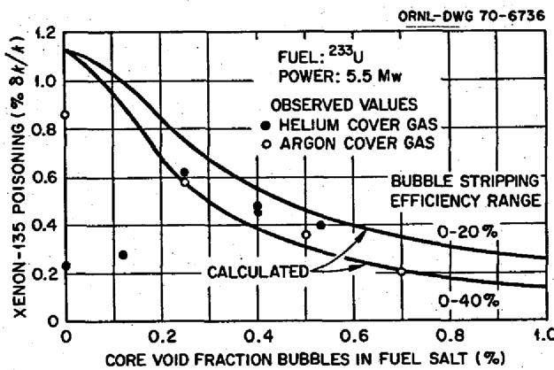  
Fig. 3.3. Comparison of Calculated and Observed $^{135}\mathrm{Xe}$ Poisoning.

The results of the calculation with these bubble parameters at maximum stripping efficiencies of 20 and $40\%$ are the curves in Fig. 3.3. A simplified calculational method was used in which all core parameters were volume averaged into one lump. The reactivity was computed by first computing the poison fraction, multiplying it by a constant (0.656) to convert it to reactivity units, and then by a spatial correction factor (0.81) on the graphite contribution because its $^{135}\mathrm{Xe}$ concentration profile is dish-shaped due to burnup.

First consider the right side of the plot. The curves calculated with bubble-stripping efficiency ranges of 0 to $20\%$ and 0 to $40\%$ straddle the data points. At higher void fractions one would expect bubble dissolution and renucleation effects to diminish so the original analytical model (insoluble cover gas) should converge with any new analysis where the solubility of the cover gas is considered. The good agreement between the analytical model and the data with "reasonable" values of bubble parameters would seem to bear this out.

Now consider the left side of the plot. The computed intercept with the ordinate could be brought down to the argon data point (void fraction $= 0\%$ ) by using a mass transfer coefficient to the graphite of half the originally estimated value. There is some indirect evidence from work with noble metal migration to graphite that the mass transfer coefficient should be lower. If we assume, however, that the mass transfer coefficient to the graphite is correct, then another observation can be made. This is that the points of intersection with the axis increase as the cover gas solubility decreases: they are about $0.25\% \delta k / k$ for helium (soluble), about $0.85\% \delta k / k$ for argon (much less soluble), and about $1.12\% \delta k / k$ for the analytical model (insoluble). This observation would lend support to the thesis that cover gas solubility is an important parameter at low void fractions in the fuel loop.

# 4. Instruments and Controls

S.J.Ditto

# 4.1 MSRE OPERATING EXPERIENCE

J. L. Redford

Daily testing of the 15 relays in the rod-scram coincidence matrix was continued to the end of nuclear operation. There was no failure among these relays after the summer of 1968 (ref. 1).

There was no unscheduled control-rod scram during this report period. Table 4.1 lists the causes (assigned

by the reactor operators) for the 37 unscheduled control rod scams in four years of MSRE operation. None was caused by a process variable actually going out of limits. Nearly half of all the unscheduled scams and $70\%$ of those attributed to instrumentation and control problems occurred in the first six months of the four-year period.

During run 19 the load-scram circuit, which drops the radiator doors and stops the blower, was tripped twice while the reactor was at full power. Investigation showed that several relay contacts had developed unusually high resistance due to oxide films. Because of the way the contacts were paralleled in the matrix, the

Table 4.1. Summary of Unscheduled Scrams at MSRE with Fuel in the Core ${}^{a}$   

<table><tr><td rowspan="2">Year</td><td rowspan="2">Quarter</td><td colspan="2">Operating Hours</td><td colspan="5">Number of Unscheduled Rod Screams</td></tr><tr><td>Fuel in Core</td><td>Critical</td><td>Total</td><td>Human Error</td><td>Power Failures</td><td>I &amp; C</td><td>Otherb</td></tr><tr><td rowspan="4">1966</td><td>1</td><td>672</td><td>62</td><td>4</td><td>2</td><td>0</td><td>1</td><td>1</td></tr><tr><td>2</td><td>1293</td><td>1070</td><td>13</td><td>2</td><td>3</td><td>6</td><td>2</td></tr><tr><td>3</td><td>554</td><td>413</td><td>2</td><td>0</td><td>2</td><td>0</td><td>0</td></tr><tr><td>4</td><td>1266</td><td>1221</td><td>3</td><td>1</td><td>1</td><td>1</td><td>0</td></tr><tr><td rowspan="4">1967</td><td>1</td><td>1861</td><td>1852</td><td>2</td><td>1</td><td>0</td><td>1</td><td>0</td></tr><tr><td>2</td><td>1254</td><td>1186</td><td>2</td><td>1</td><td>1</td><td>0</td><td>0</td></tr><tr><td>3</td><td>1318</td><td>1292</td><td>1</td><td>0</td><td>1</td><td>0</td><td>0</td></tr><tr><td>4</td><td>2159</td><td>2144</td><td>2</td><td>0</td><td>1</td><td>1</td><td>0</td></tr><tr><td rowspan="4">1968</td><td>1</td><td>2048</td><td>2045</td><td>0</td><td>0</td><td>0</td><td>0</td><td>0</td></tr><tr><td>2</td><td>0</td><td>0</td><td>0</td><td>0</td><td>0</td><td>0</td><td>0</td></tr><tr><td>3</td><td>88</td><td>0</td><td>0</td><td>0</td><td>0</td><td>0</td><td>0</td></tr><tr><td>4</td><td>1000</td><td>735</td><td>1</td><td>1</td><td>0</td><td>0</td><td>0</td></tr><tr><td rowspan="4">1969</td><td>1</td><td>1850</td><td>1800</td><td>2</td><td>0</td><td>0</td><td>0</td><td>2</td></tr><tr><td>2</td><td>1385</td><td>1375</td><td>3</td><td>0</td><td>1</td><td>0</td><td>2</td></tr><tr><td>3</td><td>1076</td><td>1054</td><td>2</td><td>0</td><td>0</td><td>0</td><td>2</td></tr><tr><td>4</td><td>1203</td><td>1176</td><td>0</td><td>0</td><td>0</td><td>0</td><td>0</td></tr><tr><td>Total</td><td></td><td>19027</td><td>17425</td><td>37</td><td>8</td><td>10</td><td>10</td><td>9</td></tr></table>

film was not burned off each time the contact closed, as in a normal application.

# 4.2 CONTROL SYSTEM DESIGN

# P.G.Herndon

The fuel off-gas system was revised to incorporate an apparatus set up in the vent house to collect tritium from the gaseous effluent streams. Sample lines were connected from the apparatus to the fuel and coolant salt off-gas lines, to the containment evacuation line, and to a sleeve on a tube in the coolant radiator (Sect. 1.2.5). Purge gas was supplied to this apparatus from high-pressure cylinders equipped with series-connected pressure regulators, rupture disks, and high-pressure alarms to assure that the reactor system would not be subjected to pressures in excess of 50 psig. One new safety block valve was connected to existing circuits, and all other lines were connected so as to take advantage of existing block valves without compromising the integrity of the primary and secondary containment systems.

Design of safety circuits for another system, a new off-gas sample line from line 522 near the pump bowl to the fuel sampler-enricher container, was completed, but the line was not installed before the final shutdown. Three small weld-sealed valves were fitted with pneumatic actuators for use in this system. The actuators were to be supplied by three-way solenoid valves which were added to the vacuum system circuits.

Plans for setting up the instruments and controls to adequately maintain and monitor reactor conditions during the shutdown period were also completed.

# 4.3 MSRE ON-LINE COMPUTER

# C. D. Martin, Jr.

Operation and analysis of the MSRE was facilitated by the use of a Bunker-Ramo 340 digital computer connected directly to sensors in the MSRE system. The computer main frame included 12,288 28-bit words of core memory and 32,768 words of drum memory with a 7.5-μsec core cycle time. Peripheral equipment included 350 analog inputs, 128 contact inputs, 36 analog

outputs, 32 contact outputs, 2 magnetic tape units, an input keyboard, a paper tape punch, a paper tape reader, 4 output typewriters, and an $x - y$ plotter. The system was installed in the summer of 1965 and was accepted on October 1, 1965 (before the beginning of MSRE power operation). Over the next 51 months, until January 1, 1970, the computer system was available $95.35\%$ of the time.

During this report period the neutron noise analysis program was extensively modified to make it run as an on-line operator request. The previous version of the program required taking the computer off-line to acquire the data and record it on magnetic tape. The data were then read back into the computer for processing on-line as a background operation with the reactor monitoring system running in the foreground. The new program eliminated the recording of data on magnetic tape. When this program is requested, the reactor monitoring system is preempted for a period of $10\mathrm{min}$ , during which time data are acquired and stored in the computer memory. Calculations are made as sufficient data are accumulated. The use of two data buffers permits the functions of data acquisition and processing to proceed concurrently. The reactor monitoring system is automatically reinstated upon completion of the noise analysis calculation, and the results of the calculation are plotted on-line as a background function producing the familiar graph of power spectral density. The void fraction is calculated for the fuel salt using the results of the noise analysis calculation. This value is printed on the control room typewriter.

Following the reactor shutdown in December 1969, the on-line reactor monitoring system was revised. The new system exercises all units of the computer periodically except for the magnetic tape drives and three of the four typewriters. FOCAL is still available for engineering calculations using the input keyboard and console typewriter, and analog signals can be displayed on the digital display of the computer console.

The company-owned magnetic drum memory unit was refurbished at the manufacturer's plant and was reinstalled in the computer in January. While the drum was being reworked, system operation was maintained using a drum leased from the computer manufacturer.

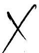

# Part 2. MSBR Design and Development

R-B.Briggs

The purpose of the MSBR design and development activities is to prepare a reference design for a 1000-Mw(e) one-fluid MSBR plant; to design a molten-salt breeder experiment (MSBE), operation of which will provide the data and experience necessary to build large MSBR's; and to develop the components and systems for the MSBE.

Work on the reference design for the one-fluid MSBR was begun in October 1967 and has taken most of the effort. Prior progress is reported in our semiannual reports for the periods ending in February and August 1968 and 1969. The studies have converged on a design, and some of the more important details have been investigated. Writing is in progress on a topical report that will describe the plant and the results of the studies in considerable detail. Some studies are being made of molten-salt power reactors that would have lower performance but would require less development and could be built sooner than the reference MSBR.

With the general design of the reference MSBR reasonably well established, we have begun to look at the MSBE. Calculations indicate that a reactor with a power level of 100 to 200 Mw(th) can satisfy the

requirements that have been proposed to date. A small effort is being spent on preliminary studies of reactor designs and on nuclear calculations.

The development program is small, and the experimental work is limited to some of the most important problems. Work is being done on methods of dispersing bubbles of gas in and separating them from circulating liquids. Experiments are in progress to measure the coefficients for transfer of dissolved gas to bubbles in circulating liquids. These experiments are in support of the gaseous fission product removal system.

Better values are being obtained for the thermal conductivities of salts for use in heat transfer calculations. Experiments are in progress to confirm or improve on the relationships used to calculate heat transfer coefficients for molten fluoride salts. The sodium fluoroborate-sodium fluoride eutectic salt has, because of its low melting point and low cost, been proposed for use in the intermediate coolant systems of large molten-salt reactors. Since this is a new salt to the MSR program, a forced convection loop is being operated in engineering tests with the salt.

# 5. Design

E. S. Bettis

# 5.1 SINGLE-FLUID MSBR DESIGN STUDY

E.S.Bettis P.R.Kasten

W. K. Furlong R. C. Robertson

MSBR reference design. The material is essentially complete, and a first draft is being circulated for comment. The updated characteristics of the plant are summarized in Table 5.1.

The major effort of the MSBR design group was spent in writing a comprehensive report on the single-fluid

Table 5.1. Principal Design Data for 10000 Mw(Electrical) MSBR Power Station   

<table><tr><td colspan="2">General</td></tr><tr><td>Thermal capacity of reactor, Mw(th)</td><td>2250</td></tr><tr><td>Gross electrical generation, Mw(e)</td><td>1035</td></tr><tr><td>Net electrical output of plant, Mw(e)</td><td>1000</td></tr><tr><td>Net overall thermal efficiency, %</td><td>44.4</td></tr><tr><td colspan="2">Structures</td></tr><tr><td>Reactor cell, ft</td><td>72 diam × 42 high</td></tr><tr><td>Confinement building, ft</td><td>134 diam × 189 high</td></tr><tr><td colspan="2">Reactor</td></tr><tr><td>Reactor vessel inside diameter, ft</td><td>22</td></tr><tr><td>Vessel height at center, fta</td><td>20</td></tr><tr><td>Vessel wall thickness, in.</td><td>2</td></tr><tr><td>Vessel head thickness, in.</td><td>3</td></tr><tr><td>Vessel design pressure, psi</td><td>75</td></tr><tr><td>Core height, ft</td><td>13</td></tr><tr><td>Number of core elements</td><td>1412</td></tr><tr><td>Length of zone I portion of core elements, ft</td><td>13</td></tr><tr><td>Overall length of core elements, approximate, ft</td><td>15</td></tr><tr><td>Distance across flats, zone I, ft</td><td>14</td></tr><tr><td>Outside diameter of undermoderated region, zone II, ft</td><td>15</td></tr><tr><td>Overall height, zone I plus zone II, ft</td><td>18</td></tr><tr><td>Radial distance between reflector and core zone II, in.</td><td>2</td></tr><tr><td>Radial thickness of reflector, in.</td><td>30</td></tr><tr><td>Average axial thickness of reflector, in.</td><td>~22</td></tr><tr><td>Volume fraction salt in zone I</td><td>0.13</td></tr><tr><td>Volume fraction salt in zone II</td><td>0.37</td></tr><tr><td>Average core power density, kw/liter</td><td>22.2</td></tr><tr><td>Maximum thermal neutron flux, neutrons cm-2sec-1</td><td>7.9 × 1014</td></tr><tr><td>Maximum graphite damage flux (&gt;50 kev), neutrons cm-2sec-1</td><td>3.2 × 1014</td></tr><tr><td>Graphite temperature at maximum neutron flux region, °F</td><td>1284</td></tr><tr><td>Graphite temperature at maximum graphite damage region, °F</td><td>1307</td></tr><tr><td>Estimated useful life of graphite, years</td><td>4</td></tr><tr><td>Total weight of graphite in reactor, lb</td><td>650,000</td></tr><tr><td>Weight of removable core assembly, lb</td><td>480,000</td></tr><tr><td>Maximum flow velocity in core, fps</td><td>8.5</td></tr><tr><td>Pressure drop due to salt flow in core, psi</td><td>18</td></tr><tr><td>Total salt volume, primary system, ft3</td><td>1720</td></tr><tr><td>Fissile fuel inventory, reactor plant and fuel processing plant, kg</td><td>1470</td></tr><tr><td>Thorium inventory, kg</td><td>68,000</td></tr><tr><td>Breeding ratio</td><td>1.06</td></tr><tr><td>Yield, %/year</td><td>3.3</td></tr><tr><td>Doubling time, compounded continuously, years</td><td>21</td></tr><tr><td colspan="2">Primary heat exchangers (for each of four units)</td></tr><tr><td>Thermal capacity, Mw(th)</td><td>556.3b</td></tr><tr><td colspan="2">Tube-side conditions:</td></tr><tr><td>Fluid</td><td>Fuel salt</td></tr><tr><td>Tube size, OD, in.</td><td>3/8</td></tr><tr><td>Approximate total length, ft</td><td>22.5b</td></tr><tr><td>Number of tubes</td><td>5896b</td></tr><tr><td>Inlet-outlet temperatures, °F</td><td>1300–1050</td></tr><tr><td>Mass flow rate, lb/hr</td><td>23.45 × 106b</td></tr><tr><td>Volume of fuel salt in tubes, ft3</td><td>67.2b</td></tr><tr><td>Pressure drop due to flow, psi</td><td>130b</td></tr><tr><td>Total heat transfer surface, ft2</td><td>13,009b</td></tr><tr><td colspan="2">Shell-side conditions:</td></tr><tr><td>Fluid</td><td>Coolant salt</td></tr><tr><td>Shell ID, ft</td><td>5.67b</td></tr><tr><td>Central tube diameter, ft</td><td>1.7</td></tr><tr><td>Baffle spacing, ft</td><td>0.94b</td></tr><tr><td>Baffle cut, %</td><td>40</td></tr><tr><td>Inlet-outlet temperatures, °F</td><td>850-1150</td></tr><tr><td>Mass flow rate, lb/hr</td><td>17.6 × 106b</td></tr><tr><td>Pressure drop due to flow, psi</td><td>115b</td></tr><tr><td>Approximate overall heat transfer coefficient, Btu hr-1ft-2°F-1</td><td>851b</td></tr><tr><td>Fuel-salt circulating pumps (each of four units)</td><td></td></tr><tr><td>Pump capacity, gpm</td><td>16,000</td></tr><tr><td>Rated head, ft</td><td>150</td></tr><tr><td>Speed, rpm</td><td>890</td></tr><tr><td>Specific speed</td><td>2625</td></tr><tr><td>Net positive suction head, ft</td><td>18</td></tr><tr><td>Impeller input power, hp</td><td>2200</td></tr><tr><td>Design temperature, °F</td><td>1300</td></tr><tr><td>Coolant-salt circulating pumps (each of four units)</td><td></td></tr><tr><td>Pump capacity, gpm</td><td>20,000</td></tr><tr><td>Rated head, ft</td><td>300</td></tr><tr><td>Speed, rpm</td><td>1190</td></tr><tr><td>Specific speed</td><td>2330</td></tr><tr><td>Net positive suction head, ft</td><td>30</td></tr><tr><td>Impeller input power, hp</td><td>3100</td></tr><tr><td>Design temperature, °F</td><td>1300</td></tr><tr><td>Primary salt drain tank</td><td></td></tr><tr><td>Outside diameter, ft</td><td>14</td></tr><tr><td>Overall height, ft</td><td>22</td></tr><tr><td>Outside wall thickness, in.</td><td>1</td></tr><tr><td>Bottom head thickness, in.</td><td>1½</td></tr><tr><td>Storage capacity, ft3</td><td>2500</td></tr><tr><td>Design pressure, psig</td><td>40</td></tr><tr><td>Design temperature, °F</td><td>1300</td></tr><tr><td>Number of coolant U-tubes</td><td>1500</td></tr><tr><td>Size of tubes, OD, in.</td><td>3/4</td></tr><tr><td>Number of separate coolant circuits</td><td>40</td></tr><tr><td>Coolant fluid</td><td>7LiF-BeF2</td></tr><tr><td>Composition, mole %</td><td>67-33</td></tr><tr><td>Volume of coolant inventory, ft3</td><td>420</td></tr><tr><td>Under normal steady-state conditions:</td><td></td></tr><tr><td>Maximum heat load, Mw(th)c</td><td>18</td></tr><tr><td>Coolant circulation rate, gpm</td><td>830</td></tr><tr><td>Coolant temperatures, in/out, °F</td><td>900-1050</td></tr><tr><td>Maximum tank wall temperature, °F</td><td>~1260</td></tr><tr><td>Maximum transient heat load, Mw(th)</td><td>53</td></tr><tr><td>Primary salt storage tank</td><td></td></tr><tr><td>Storage capacity, ft3</td><td>2500b</td></tr><tr><td>Heat removal capacity, Mw(th)</td><td>1.4b</td></tr><tr><td>Material of construction</td><td>Stainless steelb</td></tr><tr><td>Steam generator-supero heaters (for each of 16 units)</td><td></td></tr><tr><td>Thermal capacity, Mw(th)</td><td>120.7</td></tr><tr><td>Tube-side conditions:</td><td></td></tr><tr><td>Fluid</td><td>Steam at 3600-3800 psia</td></tr><tr><td>Tube size, OD, in.</td><td>½</td></tr><tr><td>Approximate length, ft</td><td>76.4b</td></tr><tr><td>Number of tubes</td><td>393b</td></tr><tr><td>Inlet-outlet temperatures, °F</td><td>700-1000</td></tr><tr><td>Mass flow rate, lb/hr</td><td>630,000</td></tr><tr><td>Total heat transfer surface, ft2</td><td>3929b</td></tr><tr><td>Pressure drop due to flow, psi</td><td>154b</td></tr><tr><td>Shell-side conditions:</td><td></td></tr><tr><td>Fluid</td><td>Coolant salt</td></tr><tr><td>Shell ID, ft</td><td>1.5</td></tr><tr><td>Baffle spacing, ft</td><td>4</td></tr><tr><td>Inlet-outlet temperatures, °F</td><td>1150-850</td></tr><tr><td>Mass flow rate, lb/hr</td><td>3.82 × 106b</td></tr><tr><td>Pressure drop due to flow, psi</td><td>61b</td></tr><tr><td>Approximate overall heat transfer coefficient, Btu hr-1 ft-2 °F-1</td><td>490-530b,d</td></tr><tr><td>Steam reheaters (for each of eight units)</td><td></td></tr><tr><td>Thermal capacity, Mw(th)</td><td>36.6</td></tr><tr><td>Tube-side conditions:</td><td></td></tr><tr><td>Fluid</td><td>Steam at 550 psia</td></tr><tr><td>Tube size, OD, in.</td><td>3/4b</td></tr><tr><td>Approximate length, ft</td><td>30.3b</td></tr><tr><td>Number of tubes</td><td>400b</td></tr><tr><td>Inlet-outlet temperatures, °F</td><td>650-1000</td></tr><tr><td>Mass flow rate, lb/hr</td><td>641,000b</td></tr><tr><td>Pressure drop due to flow, psi</td><td>30</td></tr><tr><td>Total heat transfer surface, ft2</td><td>2382b</td></tr><tr><td>Shell-side conditions:</td><td></td></tr><tr><td>Fluid</td><td>Coolant salt</td></tr><tr><td>Shell ID, in.</td><td>21.2b</td></tr><tr><td>Baffle spacing, in.</td><td>9.8b</td></tr><tr><td>Inlet-outlet temperature, °F</td><td>1150-850</td></tr><tr><td>Mass flow rate, lb/hr</td><td>1.16 × 106b</td></tr><tr><td>Pressure drop due to flow, psi</td><td>60</td></tr><tr><td>Approximate overall heat transfer coefficient, Btu hr-1 ft-2 °F-1</td><td>303b</td></tr><tr><td>Turbine-generator plant</td><td></td></tr><tr><td>Number of turbine-generator units</td><td>1</td></tr><tr><td>Turbine throttle conditions, psia/°F</td><td>3500/1000</td></tr><tr><td>Turbine throttle mass flow rate, lb/hr</td><td>7.15 × 106</td></tr><tr><td>Reheat steam to intermediate-pressure turbine, psia/°F</td><td>540/1000</td></tr><tr><td>Reheat steam mass flow rate, lb/hr</td><td>5.13 × 106</td></tr><tr><td>Condensing pressure, in. Hg abs.</td><td>1.5</td></tr><tr><td>Number of stages, regenerative feedwater heating</td><td>8</td></tr><tr><td>Feedwater temperature leaving last regenerative heater, °F</td><td>551</td></tr><tr><td>Feedwater temperature entering steam generator, °F</td><td>700</td></tr><tr><td>Boiler feed pump work, each of two, hp</td><td>19,700</td></tr><tr><td>Booster feed pump work, each of two, hp</td><td>6,200</td></tr><tr><td>Gross electrical generation, Mw(e)</td><td>1035</td></tr><tr><td>Net electrical output of plant, Mw(e)</td><td>1000</td></tr><tr><td>Net plant heat rate, Btu/kwhr</td><td>7687</td></tr><tr><td>Net overall plant thermal efficiency, %</td><td>44.4</td></tr><tr><td>Fuel processing system</td><td></td></tr><tr><td>Total inventory, fuel salt in primary system, ft3</td><td>1720</td></tr><tr><td>Processing rate, gpm</td><td>2.98</td></tr><tr><td>Cycle time for salt inventory, days</td><td>3</td></tr><tr><td>Heat generation in salt to chemical plant, kw/ft3</td><td>56</td></tr><tr><td>Design properties of materials</td><td></td></tr><tr><td>Fuel salt:</td><td></td></tr><tr><td>Components</td><td>7LiF-BeF2-ThF4-UF4</td></tr><tr><td>Composition, mole %</td><td>71.7-16-12-0.3</td></tr><tr><td>Molecular weight, approximate</td><td>64</td></tr><tr><td>Liquidus temperature, °F</td><td>930</td></tr><tr><td>Density, lb/ft3at 1175°F</td><td>208</td></tr><tr><td>Viscosity, lb ft-1hr-1at 1175°F</td><td>24b</td></tr><tr><td>Thermal conductivity, Btu hr-1ft-1°F-1at 1175°F</td><td>0.71b</td></tr><tr><td>Heat capacity, Btu lb-1°F-1</td><td>0.32</td></tr><tr><td>Vapor pressure, mm Hg at 1150°F</td><td>&lt;0.1</td></tr><tr><td>Coolant salt:</td><td></td></tr><tr><td>Components</td><td>NaBF4-NaF</td></tr><tr><td>Composition, mole %</td><td>92-8</td></tr><tr><td>Molecular weight</td><td>104</td></tr><tr><td>Liquidus temperature, °F</td><td>725</td></tr><tr><td>Density, lb/ft3at 1000°F</td><td>117</td></tr><tr><td>Viscosity, lb ft-1hr-1at 1000°F</td><td>3.4</td></tr><tr><td>Thermal conductivity, Btu hr-1ft-1°F-1at 1000°F</td><td>0.23b</td></tr><tr><td>Heat capacity, Btu lb-1°F-1</td><td>0.36</td></tr><tr><td>Vapor pressure, mm Hg at 1150°F</td><td>252</td></tr><tr><td>Graphite:</td><td></td></tr><tr><td>Density, lb/ft3at 70°F</td><td>115</td></tr><tr><td>Bending strength, psi</td><td>4000-6000</td></tr><tr><td>Young's modulus of elasticity, psi</td><td>1.7 × 106</td></tr><tr><td>Poisson's ratio</td><td>0.27</td></tr><tr><td>Thermal expansion per °F</td><td>2.3 × 10-6</td></tr><tr><td>Thermal conductivity, Btu hr-1ft-1°F-1</td><td>35-42</td></tr><tr><td>Electrical resistivity, ohm-cm × 104</td><td>8.9-9.9</td></tr><tr><td>Specific heat, Btu lb-1°F-1at 600°F</td><td>0.33</td></tr><tr><td>at 1200°F</td><td>0.42</td></tr><tr><td>Hastelloy N:</td><td></td></tr><tr><td>Composition, wt %</td><td></td></tr><tr><td>Nickel</td><td>Balance</td></tr><tr><td>Molybdenum</td><td>12</td></tr><tr><td>Chromium</td><td>7</td></tr><tr><td>Iron</td><td>0-4</td></tr><tr><td>Manganese</td><td>0.2-0.5</td></tr><tr><td>Silicon</td><td>0.1 max.</td></tr><tr><td>Boron</td><td>0.001 max</td></tr><tr><td>Titanium</td><td>0.5-1.0</td></tr><tr><td>Hafnium or niobium</td><td>0-2</td></tr><tr><td>Cu, Co, P, S, C, W, Al</td><td>0.35</td></tr><tr><td></td><td>At 80°F At 1300°F</td></tr><tr><td>Density, lb/ft3</td><td>~557 ~541</td></tr><tr><td>Thermal conductivity, Btu hr-1ft-1°F-1</td><td>6.0 12.6</td></tr><tr><td>Specific heat, Btu lb-1°F-1</td><td>0.098 0.136</td></tr><tr><td>Thermal expansion, per °F</td><td>5.7 × 10-69.5 × 10-6</td></tr><tr><td>Modulus of elasticity, psi</td><td>31 × 10625 × 106</td></tr><tr><td>Electrical resistance, μohm-cm</td><td>120.5 126.0</td></tr><tr><td>Tensile strength, psi, approximate</td><td>115,000 75,000</td></tr><tr><td>Maximum allowable design stress, psi</td><td>25,000 3,500</td></tr><tr><td>Maximum allowable design stress, bolts, psi</td><td>10,000 3,500</td></tr><tr><td>Melting temperature, approximate, °F</td><td>2,500 2,500</td></tr></table>

${}^{a}$ Does not include upper extension cylinder.   
$b$ Indicates change from or addition to data reported in Table 5.1 of ORNL-4449.   
cDue to decay of gases and noble metals only.   
$d$ Due to varying heat transfer regimes, terminal temperatures are not an indication of average driving force.

# 5.2 MSBR PRIMARY SALT STORAGE TANK

E. S. Bettis H. L. Watts

The only significant change in the single-fluid MSBR reference design since last reported $^2$ has been the addition of a primary salt storage tank. This tank would be used to store the primary salt in event of the need to repair the primary drain tank or its heat removal system. The storage tank is located in the chemical processing cell. After insertion of a spool piece in the transfer line, the salt would be moved to the storage tank by a jet pump located in the bottom of the primary drain tank. The spool-piece arrangement is used to provide assurance that the salt could not be transferred inadvertently. The salt is returned to the primary drain tank by a similar jet pump located in the bottom of the storage tank. Both jet pumps are actuated by a small auxiliary salt circulation pump. The storage tank has only about 1 Mw of heat removal capacity, since afterheat in the primary salt will be well

decayed before a transfer is made. The heat removal system will be similar to that used in the MSRE drain tank, where water is boiled in double-walled U-tubes immersed in the salt. The storage tank is provided with electric heaters and thermal insulation to maintain the salt above its liquidus temperature.

# 5.3 STARTUP AND SHUTDOWN PROCEDURES

E.C.Hise S.J.Ditto J.L.Anderson

Preliminary studies were made of the startup and shutdown procedures for the MSBR reference plant to be sure that these special conditions, as well as those for partial load operation, would not add undue operating complexity or require an unreasonable amount of special equipment. A preliminary flowsheet developed for these special situations is shown in Fig. 5.1.

# 5.3.1 Startup Procedures

Two startup procedures must be considered: (1) the cold startup, with all systems cold and empty, and (2) hot restart from a hot standby condition. As in any

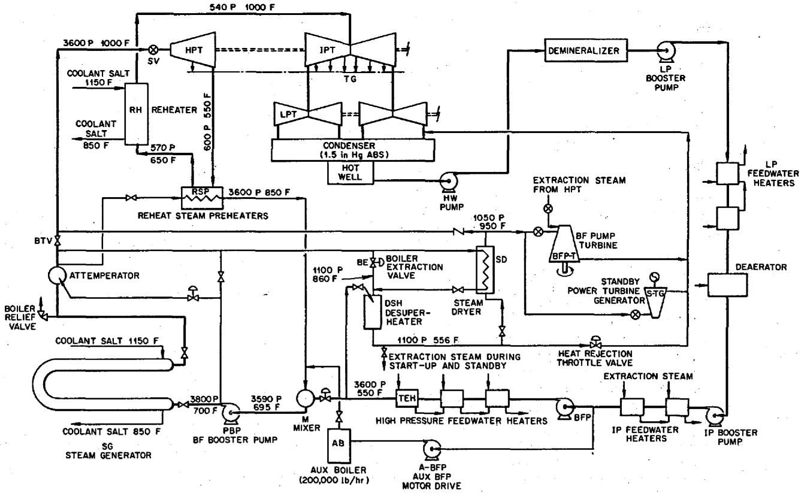  
ORNL-DWG 70-6737   
Fig. 5.1. MSBR Steam Plant Startup and Shutdown System.

thermal power station, the ability to hold the system in hot standby and to achieve quick starts from this condition is imperative to avoid excessive outage times for the plant.

Cold Start. - A normal startup from the cold-empty condition proceeds as follows: The primary and secondary cell electric heaters are turned on, and the primary and secondary salt circulation pumps are started to circulate helium in the salt systems. When the temperature of the secondary system reaches $850^{\circ}\mathrm{F}$ , the loops are filled with secondary salt from the heated drain tank, and circulation of salt is started. When the primary and secondary systems reach $1000^{\circ}\mathrm{F}$ , the primary system is filled from the primary-salt drain tank, and circulation of salt is commenced. Both salt systems continue to circulate isothermally at $1000^{\circ}\mathrm{F}$ until power escalation is started. The primary and secondary salt flow rates are at the levels required for the lower end of the power range.

The reactor is made critical at essentially zero power using standard flux control methods. This operation requires removal of safety rods and further addition of reactivity by insertion of graphite control rods under the surveillance of startup instrumentation and a flux level control system. When the power reaches an appropriate level, which is still below the sensible power generating range, the automatic neutron flux level controller assumes control of the power.

Concurrently with the salt systems being electrically heated, the steam system is being warmed and brought to operating conditions by means of an oil- or gas-fired auxiliary boiler. Deaeration and demineralization of the feedwater and warmup of piping, feedwater heaters, turbines, etc., proceed in a conventional manner with steam taken from this boiler. To avoid excessive thermal gradients in the steam generators, steam that is admitted must be nearly at full operating conditions of 3600 psia and $1000^{\circ}\mathrm{F}$ . As the auxiliary boiler is being raised to this pressure, steam from it is throttled through the boiler extraction valve $BE$ , is passed through the desuperheater $DSH$ , and is used for feedwater heating, for warming and rolling the boiler feed pump drive turbines $BFP-T$ and for warming the high-pressure feedwater heaters. When the auxiliary boiler reaches full pressure and temperature, circulation can be started through the steam generator.

When the steam system is ready to begin to take on load, the set point of the flux controller is adjusted as required to maintain the desired salt temperatures as the feedwater flow is increased. The feedwater temperature to the steam generator is reduced by tempering the feed steam with $550^{\circ}\mathbf{F}$ water in the mixing chamber $M$ .

As the steam load is slowly increased, the reactor power is matched to the load, and salt temperatures are kept at the desired level by manipulating the flux set point. At 2 to $10\%$ power, temperature changes are slow, and such control should not be difficult. When the load reaches 800,000 lb/hr, or about 8 to $10\%$ of full load, the reactor can be put in a temperature control mode instead of a flux control mode after matching the temperature set point with the existing outlet temperature. The load should be held essentially constant until the system comes to equilibrium, and then the reactor outlet temperature set point should be adjusted to meet the requirements for subsequent load-following control. The boiler feedwater pressure booster pumps PBP can then be started to raise the steam generator inlet pressure to about 3800 psia, and the auxiliary boiler and its feedwater pump can be taken off the line. The system is now self-supporting at about $8\%$ load.

Part of the steam generator output flows to the mixer $M$ via the reheat steam preheater, and the remainder passes through the boiler extraction valve $BE$ to drive the main boiler feed pumps, etc. The main turbines, which have previously been warmed as mentioned above, are now gradually brought up to speed and temperature, using steam from the hot standby equipment at first and then steam taken directly from the steam generators.

The load is then increased to $20\%$ , at which time the steam temperature controller is activated. At this power level the "normal" control system regulates steam temperature and reactor outlet temperature as functions of load. To prevent undesirable transients, the various system parameters and set points should be adjusted to the requirements of the existing power demand prior to closing the fully automatic loop.

The precise conditions at which the various steps of the program are taken, as well as the rates of change of the different variables during the startup, must be determined by analyses of the complete plant. The extent of the present study is limited and is only intended to establish feasibility. Given consistent and acceptable steady-state (or quasi-steady-state) conditions for the startup operations, it appears that the plan described can be implemented using already demonstrated techniques of controlling the MSRE.

Hot Standby and Startup. - On reduction of the main turbine load and closure of the stop valve $SV$ , steam will be immediately let down through the boiler extraction valve $BE$ , through the desuperheater and heat rejection valve $HRTV$ , and thence to the main turbine condenser. Except for extreme situations of sudden loss of turbine load, and possibly not then, the

boiler pressure relief valves need not vent steam to the atmosphere.

A portion of the steam from the steam generator can be used to drive the boiler feed pump turbine BFP-T and to continue circulation of the feedwater to the steam generators for heat removal and rejection to the turbine condensers. Another portion of the steam will continue to drive the standby steam turbine-generator set to supply standby power (if not available from the grid through the station service transformer) to drive the salt circulation pumps, some of the main condensing water supply pumps and hot well, pressure booster, and other pumps required to maintain the feedwater system operative.

Afterheat from the reactor system will continue to be transferred to the steam system and maintain it at operating temperature for several hours, depending upon the burden of fission products in the system. As this heat source decays, the auxiliary boiler can be started if it is desired to maintain the system in the hot standby condition. The time required for restart from this mode, as described above, would be limited only by the acceptable rate of temperature rise in the main turbines, as in a conventional steam system.

# 5.3.2 Normal Shutdown

A normal shutdown proceeds as follows: The system power is reduced under control of the operating circuits until about $8\%$ of full load power is reached. As outlined above, the hot standby condition is reached by gradually reducing the flow to the main turbines to zero and at the same time transferring the generated steam to the hot standby system through the boiler extraction valve $BE$ and thence to the turbine condenser, as required. If it is desired to stay in the hot standby condition, the auxiliary boiler can be started; if not, the main turbine can be allowed to cool, the rate being controlled by admitting some steam from the steam dryer $SD$ through the turbine seals and warmup system. Feedwater will continue to be supplied to as many of the steam generators as required (probably one or two) to remove reactor afterheat and to maintain the desired salt temperature profiles. After about ten days of afterheat removal (depending on the operating history of the reactor), the primary salt can be transferred to the drain tank, where the heat rejection system for that tank will continue to dissipate the heat. Cell heaters will pick up the load to maintain the secondary salt in the molten condition until it is drained. With termination of all steam generation, the steam system can be allowed to cool.

# 5.4 DESIGNS FOR FIRST-GENERATION MOLTEN-SALT POWER REACTORS

E.S.Bettis H.L.Watts

# 5.4.1 General

The molten-salt reactor design effort to date has concentrated on developing a concept with the highest performance consistent with a feasible and practical design. As discussed in a previous report, $^{3}$ the criterion for performance was taken to be the combination of breeding gain and salt inventory requirement that would result in best utilization of the nation's fissile fuel resources. However, if breeding capability is given reduced emphasis and higher priority is given to simplifying the plant and its operation, other designs of molten-salt reactor plants would result. Some of these would be more immediately realizable with less development, since they would be similar to scaled-up versions of the MSRE, which accumulated several years of successful operating experience. Although the simplified plants would not have as high a performance as breeders (when processing methods are successfully developed), they would, as converters, have high conversion ratios, and the fuel cycle costs would be low enough to compete favorably with other converter reactors. Further, these molten-salt converter reactors would be able to use either $^{235}\mathrm{U}$ or $\mathrm{Pu}$ as fissile fuel makeup with about the same low fuel cost.

Design and operation of these simplified plants would not represent a diversion from the main goal of achieving a molten-salt breeder reactor having good fuel conservation properties. They would, rather, be an intermediate step, yielding valuable experience directly applicable to the high-performance breeders to follow.

Simplification of molten-salt reactor plants can be achieved in two important areas: (1) The complexity of the processing of the primary salt can be greatly reduced if the treatment consists simply in recovery of the uranium by fluoride volatility, a process which is already relatively well developed. The carrier salt would be discarded after it became too contaminated with fission products for economical operation. (2) Use of lower power density within the reactor core would provide a core graphite life equal to that of the rest of the plant. Elimination of the need for periodic graphite replacement would simplify the reactor design, greatly reduce the amount of special equipment needed for core maintenance, and moderate the risks and nuisances

involved in disposal of a series of spent reactor core assemblies.

To date, we have briefly considered two single-fluid molten-salt reactor concepts for use in such power plants. The reactor designs are discussed here; the nuclear characteristics and fuel cycle performance are reported in Sect. 6.1.2.

# 5.4.2 Large MSRE-Type Reactor

We began our investigation of these reactors by instructing the ROD computer code to optimize on the conservation coefficient that has been used previously in molten-salt reactor studies but to limit the peak flux to a value such that the damage fluence to the graphite would not exceed $3.2 \times 10^{22}$ neutrons/cm² in 30 years. This resulted in a reactor with a cylindrical core about 26 ft in diameter by 26 ft high. Although the core is much larger than the core of the reference design, replacement of the graphite would not be necessary, and the reactor vessel could be a cylinder with dashed heads welded at top and bottom. As shown in Table 6.2, the reactor could be operated as a converter with only fluoride volatility processing of the fuel or as a breeder with complete fuel processing and with little difference in estimated fuel cycle cost. The increased core life is, however, obtained at the expense of an increase in inventory of fissionable material over the reference design and a reduction in fuel yield when operated as a breeder.

A conceptual layout of the reactor vessel is shown in Fig. 5.2. The similarity to the MSRE core is evident. The vertical graphite prisms constituting the core have a 4-in.-square cross section and have a central hole as well as milled flow passages in the four faces to provide channels for flow of salt upward through the core. The holes would be of different diameters, and the depth of the passages on the faces would be varied, depending on the distance from the center of the core, to provide three different regions of salt-to-graphite ratio as indicated in Table 6.2.

Each of the graphite prisms in the core must be constrained to a definite position with relation to other elements in order to preserve the desired flow distribution. This is necessary because the temperature coefficient of expansion of Hastelloy N is greater than that of graphite, which would tend to cause a tightly assembled unconstrained core to become loose when the system is brought up to temperature. Further, radiation-induced damage causes the graphite to shrink over certain ranges of neutron fluence. An indexing grid for the elements is therefore used at the top and bottom of the core.

As shown in Fig. 5.3, the top grid is made up of 1-in.-thick graphite plates. The top 4-in. length of each prism is turned to a diameter of 2 in. to fit into holes in the plates. Each of the principal plates has 16 holes. At the points where the corners of four 16-element groups meet, a smaller $\frac{1}{2}$ -in.-thick graphite plate with four holes is placed over the corner prism in each group to tie the four groups together. These smaller tie plates have standoff dowels to hold them away from the top reflector to provide a flow passage for the salt.

The elements are positioned at the bottom of the core by graphite slabs arranged in egg-crate fashion, as shown in Fig. 5.4. The grid is arranged into squares, each accommodating 25 elements. By indexing the elements in groups of 25 at the bottom and in groups of 16 at the top, the position of the core graphite is stabilized, and gap distances cannot accumulate. The prisms are thus restrained in the radial direction but can move axially with temperature and radiation-induced dimensional changes.

A $2\frac{1}{2}$ -ft-thick reflector is provided around the core for better neutron economy and to protect the vessel wall from radiation damage. The reflector is made up of large pieces of graphite which have salt flow passages to provide the necessary cooling. The graphite core elements normally float in the fuel salt. When the reactor is empty of salt, the elements rest on the bottom reflector.

A possible major shortcoming of this design is the 26-ft length of the core elements. Difficulty could be encountered with impregnation of the graphite surface inside the central hole, and this would permit permeation of the graphite by $^{135}\mathrm{Xe}$ and increased neutron losses. Also, elements of this length pose fabrication and handling problems.

# 5.4.3 Spherical Reactor with Graphite Ball Bed

Procurement of graphite for a molten-salt reactor would be greatly simplified if graphite spheres were used as the moderator. We accordingly made a study of a spherical reactor vessel containing 6-in.-diam graphite balls. As may be noted in Table 6.2, however, the salt-to-graphite ratio in this type of core is about 0.37, a salt fraction too high to be economical when the core is made large enough to obtain the low power density needed for long graphite life. Since this is true, the computer code was allowed to optimize fuel costs as a function of the reactor core diameter. On this basis a core diameter of 19 ft resulted, but the estimated core graphite life is only about 9 years. A conceptual drawing of this reactor type is shown in Fig. 5.5.

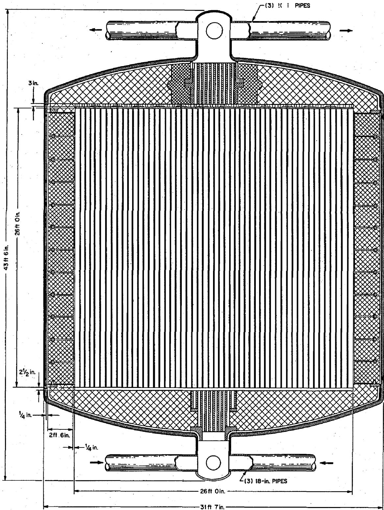  
Fig. 5.2. Conceptual Design - 1000-Mw(e) MSRE-Type Molten-Salt Reactor, Elevation.

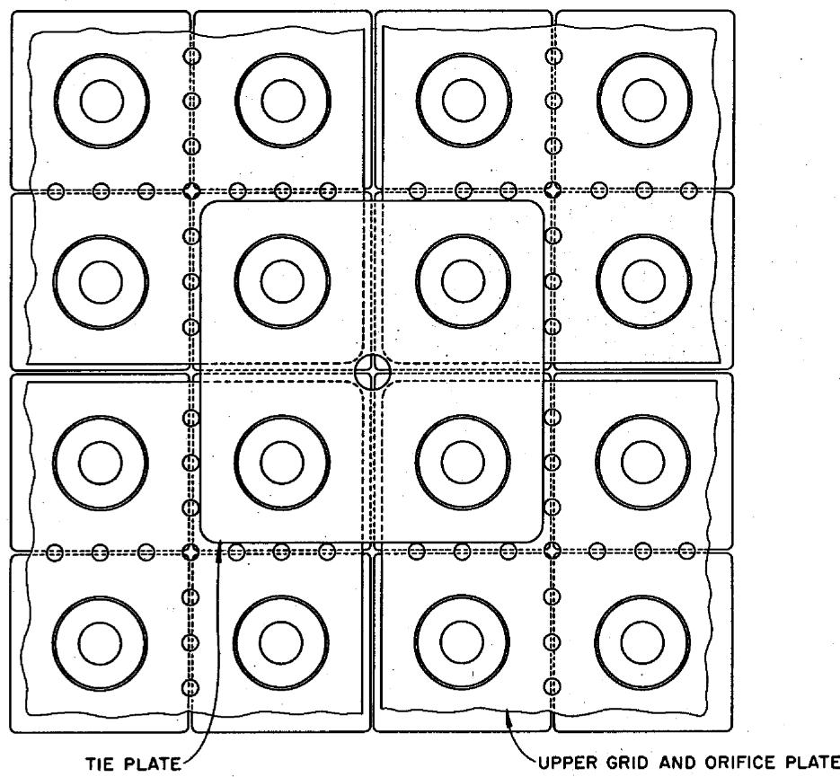

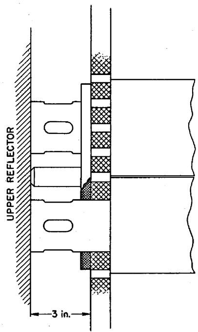

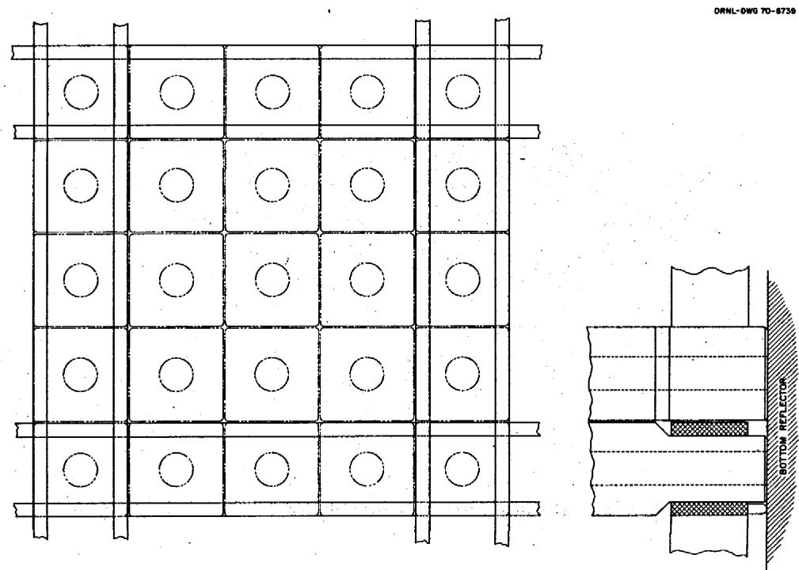  
Fig. 5.3. Top Plate Grid for MSRE-Type Reactor.   
Fig. 5.4. Lower Grid for MSRE-Type Reactor.

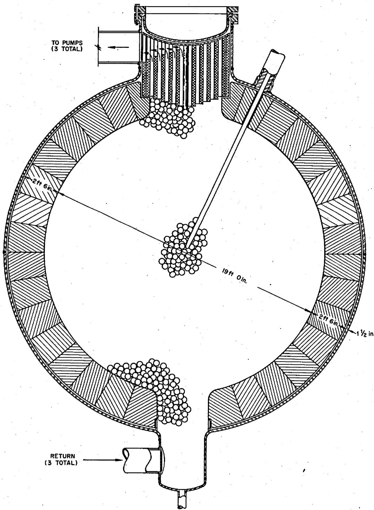  
Fig. 5.5. Conceptual Design of Spherical Molten-Salt Reactor with Ball-Bed Moderator.

While the moderator graphite in this concept has to be changed probably twice during the life of the plant, it may be easier to design a maintenance system to handle the small spheres rather than the long prisms. One way of changing the spheres might employ a release gate above the salt-liquid level in the reactor which would utilize the buoyancy of the graphite to force out a sphere in an inversion of the method used in the German pebble-bed reactor. Batch removal could be effected by an unloading mechanism operating through a relatively small opening at the top of the vessel.

This molten-salt reactor concept has not received extensive study but appears to have interesting possibilities for development into a practical reactor.

# 5.5 BAYONET-TUBE HEAT EXCHANGERS

# C. E. Bettis

Molten-salt breeder reactors must be designed to minimize fuel salt volume in order to attain a good doubling time. The primary heat exchangers which have been designed to date for the molten-salt breeder concepts have been shell-and-tube types which use small tubes to carry the primary salt and are baffled to improve cross flow of secondary salt on the shell side. The only method considered practical for maintenance of such exchangers is to replace the tube bundle if a leak occurs.

In order to make plugging of individual tubes possible, a different primary heat exchanger concept has been devised which uses a central tube and an inner annulus for secondary salt and an outer annulus for primary salt. As shown in Fig. 5.6, each concentric tube assembly becomes a separate heat exchanger in which one can conceivably detect a leak and plug the assembly.

Since the maintenance possibilities are attractive, several exchangers of different sizes have been analyzed to see what size, shape, volume, etc., would be necessary to enable such an exchanger to be substituted for the primary heat exchanger of the MSBR reference design.

A computer program was written to make the calculations. It determines the tube length and associated parameters for a given configuration, pressure drops, and number of tubes. The wall thickness of the tubes is adjusted to withstand the maximum pressures encountered. The log mean temperature difference allows for heat transfer to the coolant salt in the inner tube.

Table 5.2 compares the reference design MSBR primary heat exchanger with the reentrant tube exchanger designed for similar conditions.

ORNL-DWG70-6740

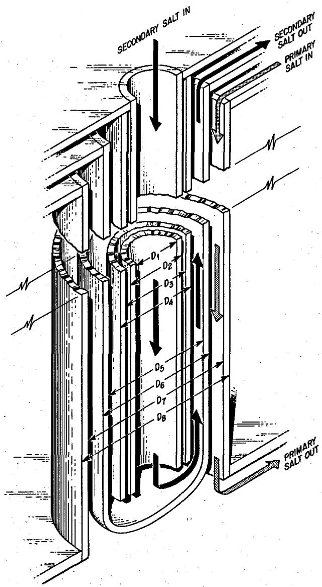  
Fig. 5.6. Model for Calculation of Bayonet Tube Heat Exchanger Unit.

# 5.6 DISTRIBUTION OF TRITIUM IN AN MSBR

R.B.Briggs R.B.Korsmeyer

A 1000-Mw(e) MSBR that operates at 2250 Mw(th) will produce tritium at a rate of 2420 curies per full-power day. The sources of production are:

<table><tr><td>Ternary fission</td><td>31 curies/day</td></tr><tr><td>6Li(n,α)3H</td><td>1210</td></tr><tr><td>7Li(n,αn)3H</td><td>1170</td></tr><tr><td>19F(n,17O)3H</td><td>9</td></tr><tr><td></td><td>2420</td></tr></table>

The radiation emitted by tritium is low in energy (18.6-kev beta), and the hazard is small in comparison with the hazard of most fission products. Tritium does, however, exchange with the normal hydrogen in hydrogenous compounds, and once it is released it becomes a part of the hydrogen of all living things about in proportion to its fraction of the hydrogen in water in the surroundings.

In these preliminary calculations of the distribution in the MSBR reference design, we assumed that tritium, shortly after birth, will be present as molecules of tritium gas $(\mathbf{T}_2)$ or tritium fluoride gas (TF) dissolved in the primary salt. The relative amounts of $\mathbf{T}_2$ and TF will depend on the reducing power (the ratio of the concentration of $\mathbf{UF_3}$ to that of $\mathbf{UF_4}$ in the primary salt). The fraction of tritium present as $\mathbf{T}_2$ would increase with increasing $\mathbf{UF_3} / \mathbf{UF_4}$ .

$\mathbf{T}_{2}$ and TF in the fuel salt were assumed to diffuse to the helium bubbles that are provided to remove gaseous fission products and to be removed with the helium to the off-gas system. They were also assumed to diffuse to metal and graphite surfaces. At the metal surfaces the $\mathbf{T}_{2}$ could dissociate into tritium atoms, dissolve in the metal, and diffuse through the metal walls. The TF could react with the metal wall to liberate tritium atoms, but we assumed that the reaction rate of TF with the metal would be slow in comparison with the dissociation rate of $\mathbf{T}_{2}$ and that none of the tritium in TF would be available to diffuse through the walls. This assumption tends to give low results for the amount of tritium that would reach the steam system.

The gas that diffuses to the graphite would reach a steady concentration in the pores that would be proportional to the concentration in the salt, or it would react with the graphite to form methane or other hydrocarbons that could not diffuse through metal and would be removed in the helium bubbles. Neglect of these reactions tends to give high results for the amount of tritium that would reach the steam system.

The tritium that passes through the walls of the piping and reactor vessel would be contained by the reactor cell, and that which passes through the heat exchanger tubing would enter the secondary salt. In the secondary system, tritium was assumed to be present only as $\mathbf{T}_2$ ; no reactions with the salt were considered.

For purposes of these calculations, we assumed that helium bubbles could be injected into the secondary salt and removed to an off-gas system as in the primary system. Some of the $\mathbf{T}_2$ would enter the bubbles, and the remainder would diffuse to metal surfaces, dissociate, and diffuse through the metal. In the secondary system, tritium that passes through the pipe walls would be contained in the secondary system cell. However, tritium that passes through the walls of the tubes in the steam generators, superheaters, and re-heaters would exchange with hydrogen in the steam. If most of the tritium were to reach the steam, it would give rise to major problems in operating the plant and disposing of the tritium.

The calculations were made by use of the usual mass transfer and diffusion relationships. For transport through the salt to metal, graphite, or bubble surfaces,

$$
Q = k A \left(C _ {L} - C _ {S}\right),
$$

where, in consistent units,

$$
\begin{array}{l} Q = \text {n e t} \\ k = \text {m a s s} \\ A = \text {s u r f a c e} \\ C _ {L} = \text {c o n c e n t r a t i o n} \mathrm {T} _ {2} \text {o r} \mathrm {T F} \text {i n b u l k s a l t}, \\ C _ {S} = \text {c o n c e n t r a t i o n} \mathrm {T} _ {2} \text {o r} \mathrm {T F} \text {i n} \text {s a t} \\ \end{array}
$$

For diffusion through the metal walls,

$$
Q = \frac {P A}{t} \left(p _ {i} ^ {1 / 2} - p _ {o} ^ {1 / 2}\right),
$$

where

$$
\begin{array}{l} P = \text {p e n t r a t i o n c o e f f i e n c e f o r t h e m e t a l}, \\ t = \text {t h i c k n e s s o f t h e m e t a l}, \\ p _ {l} = \text {p a r t i a l} \quad \mathrm {p r e s s u r e} \quad \mathrm {T} _ {2} \quad \text {a t} \quad \text {i n n e r} \quad \text {s u r f a c e} \quad \text {o f t h e} \quad \text {m e t a l}, \\ p _ {o} = \text {p a r t i a l} \quad \text {p r e s s u r e} \quad \mathrm {T} _ {2} \quad \text {a t} \quad \text {t h e o u t e r} \quad \text {s u r f a c e} \quad \text {o f t h e} \quad \text {m e t a l}. \\ \end{array}
$$

For all the calculations the concentration of tritium in the salt at the surfaces was assumed to be in equilibrium with the concentration in the gas in the bubbles or on the metal surface, so $p = HC_{S}$ , where $H$ is the solubility coefficient (or Henry's law constant) that relates the concentration of $T_{2}$ in the salt to its partial pressure.

Calculations were run for a variety of conditions. The first were for conditions generally typical of the MSBR reference design. Those conditions were then modified

Table 5.2. Comparison of Reference Design MSBR Primary Heat Exchanger with a Bayonet-Tube Exchanger   

<table><tr><td></td><td>MSBR Reference Design Primary Heat Exchangera</td><td>Bayonet-Tube Heat Exchanger</td></tr><tr><td colspan="3">Rate of heat transfer per unit</td></tr><tr><td>Mw</td><td>563</td><td>563</td></tr><tr><td>Btu/hr</td><td>1.923 × 109</td><td>1.923 × 109</td></tr><tr><td colspan="3">Tube-side conditions</td></tr><tr><td>Hot fluid</td><td>Primary salt</td><td>Primary salt</td></tr><tr><td>Entrance temperature, °F</td><td>1300</td><td>1300</td></tr><tr><td>Exit temperature, °F</td><td>1050</td><td>1050</td></tr><tr><td>Entrance pressure, psi</td><td>180</td><td>180</td></tr><tr><td>Pressure drop across exchanger, psi</td><td>130</td><td>130.5</td></tr><tr><td>Mass flow rate, lb/hr</td><td>23.74 × 106</td><td>23.74 × 106</td></tr><tr><td colspan="3">Shell-side conditions</td></tr><tr><td>Cold fluid</td><td>Secondary salt</td><td>Secondary salt</td></tr><tr><td>Entrance temperature, °F</td><td>850</td><td>850</td></tr><tr><td>Exit temperature, °F</td><td>1150</td><td>1150</td></tr><tr><td>Exit pressure, psi</td><td>34</td><td>34</td></tr><tr><td>Pressure drop across exchanger, psi</td><td>115</td><td>115</td></tr><tr><td>Mass flow rate, lb/hr</td><td>17.8 × 106</td><td>17.8 × 106</td></tr><tr><td rowspan="8">Tube dimensions, in.</td><td>0.375 OD</td><td>D1= 0.6849</td></tr><tr><td rowspan="7">0.035 thick</td><td>D2= 0.8049</td></tr><tr><td>D3= 0.9249</td></tr><tr><td>D4= 1.0449</td></tr><tr><td>D5= 1.1969</td></tr><tr><td>D6= 1.2500</td></tr><tr><td>D7= 1.3900</td></tr><tr><td>D8= 1.4525</td></tr><tr><td>Tube length, ft</td><td>22.07</td><td>20.03</td></tr><tr><td>Shell ID, in.</td><td>66.2</td><td>85.1</td></tr><tr><td>Number of tubes</td><td>5543</td><td>2199</td></tr><tr><td>Pitch of tubes, in.</td><td>0.75</td><td>1.5775</td></tr><tr><td>Total heat transfer area, ft2</td><td>12010.67</td><td>14414</td></tr><tr><td>Basis for area calculation</td><td>Outside of tubes</td><td>Surface of D6</td></tr><tr><td>Overall heat transfer coefficient, U, Btu hr-1 ft-2 °F-1</td><td>921</td><td>801</td></tr><tr><td>Volume of primary salt in tubes, ft3</td><td>62.07</td><td>88.8</td></tr><tr><td>Basis for molten salt properties</td><td>MSR Memo 68-135</td><td>MSR Memo 68-135</td></tr><tr><td>Basis for Hastelloy N properties</td><td>CF 64-6-43</td><td>CF 64-6-43</td></tr></table>

${}^{a}$ Data for the reference design heat exchanger do not exactly agree with data in Table 5.1 because the latter are based on more recent salt physical property data.

to include injection and removal of helium in the secondary salt system, increased rates of helium purge in primary and secondary systems, and variation in $\mathrm{UF_3 / UF_4}$ . Also calculated were the effects of adding hydrogen (supplied in the helium purge) to the primary salt at rates $10^{2}$ to $10^{8}$ times the tritium generation rate and of coating the heat exchanger and steam generator, superheater, and reheater tubing to increase the resistance (decrease the permeation coefficient) by factors of 10 to 1000.

Results of the calculations are summarized in Table 5.3. In the reference design, with shell-and-tube primary

heat exchangers, a helium purge flow of 10 cfm in the primary system, and little or no purge in the secondary system, about $69\%$ of the tritium was found to pass into the steam system, $18\%$ to diffuse through the metal walls into the cells, and $13\%$ to be taken into the primary off-gas system in the helium bubbles. Increasing the helium purge rate in the primary system to 100 cfm and providing a helium purge of 100 cfm in the secondary system reduced the amount of tritium reaching the steam to $28\%$ of the production. The amount entering the cell was reduced in about the same proportion. The effect of adding hydrogen to the

Table 5.3. Tabulated Results of the Computer Runs   

<table><tr><td colspan="2">Helium Purge Rate (cfm)</td><td colspan="2">Tube-Wall Resistance (Relative to Reference Design)</td><td rowspan="3">Tritium Generation Rate (molecules/sec)</td><td colspan="7">Tritium Distribution (percentage of production)</td></tr><tr><td rowspan="2">Primary System</td><td rowspan="2">Secondary System</td><td rowspan="2">Primary Heat Exchanger</td><td rowspan="2">Steam System Equipment</td><td colspan="2">Primary System Purge</td><td rowspan="2">Secondary System Purge</td><td rowspan="2">Total Purge</td><td colspan="2">Cells</td><td rowspan="2">Steam System</td></tr><tr><td>\( T_2 \)</td><td>TF</td><td>Primary System</td><td>Secondary System</td></tr><tr><td colspan="12">Reference Design</td></tr><tr><td>10</td><td>0.2</td><td>X1</td><td>X1</td><td>\( 2.9E17^a \)</td><td>5.8</td><td>7.0</td><td>0.1</td><td>12.9</td><td>8.7</td><td>9.4</td><td>69.3</td></tr><tr><td colspan="12">Effect of Purge Rates</td></tr><tr><td>100</td><td>0.2</td><td>X1</td><td>X1</td><td>X1</td><td>8.8</td><td>45.2</td><td>0.0</td><td>54.0</td><td>4.4</td><td>4.9</td><td>36.3</td></tr><tr><td>10</td><td>20</td><td>X1</td><td>X1</td><td>X1</td><td>7.2</td><td>7.8</td><td>6.2</td><td>21.2</td><td>10.7</td><td>8.1</td><td>60.3</td></tr><tr><td>10</td><td>50</td><td>X1</td><td>X1</td><td>X1</td><td>5.5</td><td>6.8</td><td>13.6</td><td>25.9</td><td>8.3</td><td>7.9</td><td>58.8</td></tr><tr><td>100</td><td>100</td><td>X1</td><td>X1</td><td>X1</td><td>8.3</td><td>44.0</td><td>11.1</td><td>63.4</td><td>4.3</td><td>3.9</td><td>28.2</td></tr><tr><td colspan="12">Effect of Increasing Tube-Wall Resistance</td></tr><tr><td>100</td><td>100</td><td>X1</td><td>X10</td><td>X1</td><td>8.3</td><td>44.0</td><td>11.1</td><td>63.4</td><td>4.3</td><td>3.9</td><td>28.2</td></tr><tr><td>100</td><td>100</td><td>X1</td><td>X100</td><td>X1</td><td>8.7</td><td>45.1</td><td>14.0</td><td>67.8</td><td>4.6</td><td>4.8</td><td>22.5</td></tr><tr><td>100</td><td>100</td><td>X1</td><td>X1000</td><td>X1</td><td>10.2</td><td>48.6</td><td>23.3</td><td>82.1</td><td>5.3</td><td>8.1</td><td>5.1</td></tr><tr><td>100</td><td>100</td><td>X10</td><td>X10</td><td>X1</td><td>8.7</td><td>45.1</td><td>10.8</td><td>64.6</td><td>4.6</td><td>3.7</td><td>27.4</td></tr><tr><td>100</td><td>100</td><td>X100</td><td>X100</td><td>X1</td><td>11.6</td><td>52.0</td><td>10.0</td><td>73.6</td><td>6.0</td><td>3.4</td><td>17.4</td></tr><tr><td>100</td><td>100</td><td>X1000</td><td>X1000</td><td>X1</td><td>17.7</td><td>64.2</td><td>5.2</td><td>87.1</td><td>8.4</td><td>1.8</td><td>2.2</td></tr><tr><td colspan="12">Effect of Adding Hydrogen to Primary Salt</td></tr><tr><td>100</td><td>100</td><td>X1</td><td>X1</td><td>\( X10^2 \)</td><td>15.9</td><td>6.1</td><td>19.4</td><td>41.4</td><td>3.6</td><td>6.1</td><td>48.5</td></tr><tr><td>100</td><td>100</td><td>X1</td><td>X1</td><td>\( X10^4 \)</td><td>32.6</td><td>0.9</td><td>26.8</td><td>60.3</td><td>0.8</td><td>2.4</td><td>36.2</td></tr><tr><td>100</td><td>100</td><td>X1</td><td>X1</td><td>\( X10^6 \)</td><td>78.2</td><td>0.1</td><td>17.0</td><td>95.3</td><td>0.1</td><td>0.3</td><td>4.4</td></tr><tr><td>100</td><td>100</td><td>X1</td><td>X100</td><td>\( X10^2 \)</td><td>21.4</td><td>7.1</td><td>47.0</td><td>75.5</td><td>4.5</td><td>13.7</td><td>7.3</td></tr><tr><td>100</td><td>100</td><td>X1</td><td>X100</td><td>\( X10^4 \)</td><td>39.0</td><td>1.0</td><td>55.6</td><td>95.6</td><td>0.9</td><td>3.7</td><td>0.8</td></tr><tr><td>100</td><td>100</td><td>X1</td><td>X100</td><td>\( X10^6 \)</td><td>78.8</td><td>0.1</td><td>21.1</td><td>100.0</td><td>0.1</td><td>0.3</td><td>0.0</td></tr><tr><td>100</td><td>100</td><td>X100</td><td>X100</td><td>\( X10^2 \)</td><td>60.2</td><td>11.8</td><td>11.8</td><td>83.8</td><td>8.7</td><td>3.8</td><td>3.5</td></tr><tr><td>100</td><td>100</td><td>X100</td><td>X100</td><td>\( X10^4 \)</td><td>94.9</td><td>1.5</td><td>2.4</td><td>98.8</td><td>1.5</td><td>0.5</td><td>0.2</td></tr><tr><td>100</td><td>100</td><td>X100</td><td>X100</td><td>\( X10^6 \)</td><td>100.2</td><td>0.2</td><td>0.3</td><td>100.7</td><td>0.1</td><td>0.0</td><td>0.0</td></tr><tr><td>10</td><td>0.2</td><td>X1</td><td>X1</td><td>\( 10^4 \)</td><td>19.5</td><td>0.1</td><td>0.2</td><td>19.8</td><td>1.1</td><td>4.5</td><td>73.7</td></tr><tr><td>10</td><td>20</td><td>X1</td><td>X1</td><td>\( 10^4 \)</td><td>17.8</td><td>0.1</td><td>15.5</td><td>33.4</td><td>1.1</td><td>3.8</td><td>61.4</td></tr><tr><td>10</td><td>20</td><td>X1</td><td>X100</td><td>\( 10^4 \)</td><td>31.5</td><td>0.2</td><td>58.1</td><td>89.8</td><td>1.4</td><td>7.9</td><td>1.7</td></tr><tr><td>10</td><td>20</td><td>X100</td><td>X100</td><td>\( 10^4 \)</td><td>91.4</td><td>0.3</td><td>3.1</td><td>94.8</td><td>2.5</td><td>1.5</td><td>0.4</td></tr><tr><td colspan="12">Effect of Increasing \( UF_3/UF_4 \) from 0.001 to 0.01</td></tr><tr><td>10</td><td>20</td><td>X1</td><td>X1</td><td>X1</td><td>6.0</td><td>0.7</td><td>7.0</td><td>13.7</td><td>8.9</td><td>9.2</td><td>67.9</td></tr><tr><td>100</td><td>100</td><td>X1</td><td>X1</td><td>\( 10^4 \)</td><td>33.4</td><td>0.1</td><td>27.4</td><td>60.9</td><td>0.8</td><td>2.5</td><td>36.7</td></tr><tr><td>10</td><td>0.2</td><td>X1</td><td>X100</td><td>\( 10^4 \)</td><td>74.9</td><td>0.0</td><td>2.5</td><td>77.4</td><td>2.2</td><td>16.2</td><td>3.3</td></tr><tr><td>100</td><td>100</td><td>X1</td><td>X100</td><td>\( 10^4 \)</td><td>38.5</td><td>0.1</td><td>55.6</td><td>94.2</td><td>0.9</td><td>3.7</td><td>0.8</td></tr><tr><td>100</td><td>100</td><td>X100</td><td>X100</td><td>\( 10^4 \)</td><td>94.5</td><td>0.1</td><td>2.4</td><td>97.0</td><td>1.5</td><td>0.5</td><td>0.2</td></tr></table>

${}^{a}$ Tritium generation rate is 2.9E17 molecules/sec. $\times  1$ indicates that no hydrogen is added to salt. $\times  {10}^{2}$ to $\times  {10}^{6}$ indicates that hydrogen is added to salt at rates ${10}^{2}$ to ${10}^{6}$ times the ${\mathrm{T}}_{2}$ production rate.

reference design was to increase the amount of $\mathbf{T}_2$ reaching the steam system until the ratio $\mathrm{H}_2 / \mathrm{T}_2$ exceeded $10^{4}$ . This is because addition of hydrogen results in an increase in the hydrogen concentration in the salt, a decrease in the ratio $\mathrm{HF} / \mathrm{H}_2$ in the salt, and a decrease in the fraction of tritium that is present as TF. This makes a larger fraction of the tritium available as HT, a form that can dissociate and diffuse through the walls. Increasing $\mathrm{UF}_3 / \mathrm{UF}_4$ had the same effect.

Increasing the hydrogen addition rate to $10^{8}$ times the rate of tritium production resulted in only $4\%$ of the tritium reaching the steam system and $95\%$ being removed by the purge systems. This amount of dilution of the tritium by hydrogen is probably excessive and would create problems of handling and storage.

In the absence of added hydrogen the partial pressure of hydrogen (as tritium) in equilibrium with its concentration in the primary salt is $10^{-3}$ to $10^{-4}$ torr. At this low pressure the salt films provide much more resistance to transport of tritium than do the metal walls. Increasing the resistance of the tube walls in the steam generating equipment and in the primary heat exchangers by factors up to 100 had no useful effect. With the tube wall resistances increased by a factor of 1000 and with maximum purge rates in primary and secondary systems, the transport to the steam system was reduced to less than $5\%$ of the production.

It is desirable to reduce the amount of tritium that enters the steam system to $1\%$ or less of the production. The calculations indicated that this could be accomplished by increasing the tube wall resistances by a factor of 100 and adding hydrogen to the primary system at a rate near $10^{4}$ times the production rate of the tritium. Under these conditions the $\mathrm{UF_3 / UF_4}$ in the primary salt is unimportant. Gas purge is required in the reactor primary and secondary system, but the purge rates need not be as great as 100 cfm.

Use of tungsten or ceramic coatings on tubes in the steam generating equipment and in the primary heat exchangers and use of high purge gas flows in the primary and secondary salt systems can be expected to increase significantly the cost and complexity of an MSBR. The requirement to add hydrogen to the

primary system is an additional but less expensive complication. We believe that the calculations reported here are conservative, and factors that were not considered could considerably reduce the measures necessary to prevent excessive amounts of tritium from reaching the steam system. They include the following:

1. Some data indicate that the diffusion of hydrogen through Hastelloy N at 1200 to $1500^{\circ}\mathrm{F}$ deviates from the relationship

$$
Q / A = M p ^ {1 / 2}
$$

at pressures below about 10 torrs and is better described by an equation of the form

$$
Q / A = M p ^ {1 / 2} \left[ N p ^ {n} / \left(1 + N p ^ {n}\right) \right]
$$

where $\frac{1}{2} \leqslant n \leqslant 1$ . This relationship implies a higher resistance to diffusion of hydrogen through the metal than was used in our calculations.

2. The sodium fluoroborate salt contains hydrogen in hydroxyfluoroboric acid or some other as yet undetermined form. Tritium can be expected to exchange with that hydrogen and to be removable by processing the salt.   
3. Data from the MSRE suggest that the exchange of tritium for hydrogen in small amounts of methane added to the helium purge gas could considerably increase the rate of removal of tritium by the purge gas in the primary system.   
4. Preliminary calculations indicate that use of the bayonet-tube-type primary heat exchanger (see Sect. 5.5) in the MSBR reference design would reduce the amount of tritium reaching the steam system from $69\%$ to about $9\%$ of the production without any other provisions. This is because most of the tritium diffuses through the large surface area provided by the outer tubes that separate fuel salt from the gas space in the exchangers.

We plan to study the effects of these factors, but new experimental data are required for some before much more progress can be made in the calculations.

# 6. Reactor Physics

A.M. Perry

# 6.1 PHYSICS ANALYSIS OF MSBR

# 6.1.1 Single-Fluid MSBR Reference Design

H. F. Bauman

The nuclear data for the single-fluid MSBR reference design have been reported in previous semiannual reports. However, we have made a new calculation of the MSBR reference design in order to take advantage of some improved capabilities in the ROD code and to make use of the latest available data.

The processing section of ROD was expanded so that it can now completely describe a processing scheme with up to ten processing steps. A cost (dependent on the throughput) may be assigned to any or all steps. In addition, the complete fuel cycle cost section of ROD is now operational.

The new reference calculation (CC120) differs from the previous calculation (CC58) as follows:

1. It follows in detail the reference reductive extraction processing scheme (see part B of Table 6.1).   
2. It includes the fuel cycle costs based on the latest material costs and a preliminary estimate of the probable processing cost.   
3. It includes a calculation of replacement cost for the core graphite.   
4. The reference ${}^{7}$ Li enrichment in fresh makeup salt is 99.995%, whereas in CC58 a value of 99.9988% had inadvertently been selected.   
5. The plutonium nuclides are included explicitly in the nuclear calculation.

6. It uses the latest cross-section weighting employing the nuclide concentrations from CC58 and the latest estimate of the average temperature.

The results of the new calculation are given in Table 6.1. The indicated performance is not much different from the earlier calculation. The breeding ratio is about the same, the fissile inventory is about $2\%$ greater, and the peak power density is $8\%$ greater.

MSBR Processing Rate. - The MSBR reference design was calculated for fixed processing rates corresponding to a three-day protactinium removal cycle and a 50-day rare-earth removal cycle. The optimum processing rates cannot be determined until the processing steps and their costs are further developed, but we have studied the effect of processing rate on the performance of the reference MSBR.

The effect of processing rate on the conversion ratio is shown in Fig. 61. The 3000-day protactinium cycle time curve is essentially the no-protactinium-removal case. Without protactinium removal the reference MSBR is at best a break-even breeder. Three fissile fuels were examined as makeup for cases with the conversion ratio less than 1. These fuels were $^{233}\mathrm{U}$ , mixed plutonium representative of light-water-reactor discharge, and $93\%$ -enriched $^{235}\mathrm{U}$ . The $^{235}\mathrm{U}$ seems to be the least desirable fuel because of the buildup of the neutron poisons $^{236}\mathrm{U}$ and $^{237}\mathrm{Np}$ . It must be noted, however, that $^{237}\mathrm{Np}$ in these calculations was assumed to be processed out of the primary fuel salt at the very slow rate of $6.3\%$ per year, that is, on a 16-year cycle. A much more rapid removal of neptunium, which may be feasible, would make the $^{235}\mathrm{U}$ feed look relatively more attractive.

This study points up the importance of rapid (and by implication, inexpensive) processing to the breeding performance of the MSBR and indicates the great extent to which the performance reported for the reference MSBR is a function of the selection of reference processing cycle times.

Table 6.1. Characteristics of the Single-Fluid MSBR Reference Design   
A. Description   

<table><tr><td>Identification</td><td>CC120</td><td colspan="2">Salt fractions</td></tr><tr><td>Power</td><td></td><td>Core zone 1</td><td>0.132</td></tr><tr><td>Mw(e)</td><td>1000</td><td>Core zone 2</td><td>0.37</td></tr><tr><td>Mw(th)</td><td>2250</td><td>Plena</td><td>0.85</td></tr><tr><td>Plant factor</td><td>0.8</td><td>Annulus</td><td>1.0</td></tr><tr><td>Dimensions, ft</td><td></td><td>Reflector</td><td>0.01</td></tr><tr><td>Core zone 1</td><td></td><td>Salt composition, mole %</td><td></td></tr><tr><td>Height</td><td>13.0</td><td>UF4</td><td>0.232</td></tr><tr><td>Diameter</td><td>14.4</td><td>PuF3</td><td>0.0006</td></tr><tr><td>Region thicknesses</td><td></td><td>ThF4</td><td>12</td></tr><tr><td>Axial</td><td></td><td>BeF2</td><td>16</td></tr><tr><td>Core zone 2</td><td>0.75</td><td>LiF</td><td>72</td></tr><tr><td>Plenum</td><td>0.25</td><td></td><td></td></tr><tr><td>Reflector</td><td>2.0</td><td></td><td></td></tr><tr><td>Radial</td><td></td><td></td><td></td></tr><tr><td>Core zone 2</td><td>1.25</td><td></td><td></td></tr><tr><td>Annulus</td><td>0.167</td><td></td><td></td></tr><tr><td>Reflector</td><td>2.5</td><td></td><td></td></tr></table>

B. Processing   

<table><tr><td>Processing Group</td><td>Nuclides</td><td>Units, Full Power</td><td>Cycle Time</td></tr><tr><td rowspan="2">1. Rare earths</td><td>Y,La,Ce,Pr,Nd,Pm,Sm,Gd</td><td>Days</td><td>50</td></tr><tr><td>Eu</td><td>Days</td><td>500</td></tr><tr><td>2. Noble metals</td><td>Se,Nb,Mo,Tc,Ru,Rh,Pd,Ag,Sb,Te</td><td>Seconds</td><td>20</td></tr><tr><td>3. Semi-noble metals</td><td>Zr,Cd,In,Sn</td><td>Days</td><td>200</td></tr><tr><td>4. Gases</td><td>Kr,Xe</td><td>Seconds</td><td>20</td></tr><tr><td>5. Volatile fluorides</td><td>Br,I</td><td>Days</td><td>60</td></tr><tr><td>6. Discard</td><td>Rb,Sr,Cs,Ba</td><td>Days</td><td>3435</td></tr><tr><td>7. Salt discard</td><td>Th,Li,Be,F</td><td>Days</td><td>3435</td></tr><tr><td>8. Protactinium</td><td>233Pa</td><td>Days</td><td>3</td></tr><tr><td>9. Higher nuclides</td><td>237Np, 242Pu</td><td>Years</td><td>16</td></tr></table>

C. Performance   

<table><tr><td>Conservation coefficient, [Mw(th)/kg]2</td><td>14.1</td></tr><tr><td>Breeding ratio</td><td>1.063</td></tr><tr><td>Yield, % per annum (at 0.8 plant factor)</td><td>3.20</td></tr><tr><td>Inventory, fissile, kg</td><td>1504</td></tr><tr><td>Specific power, Mw(th)/kg</td><td>1.50</td></tr><tr><td>System doubling time, years</td><td>22</td></tr><tr><td>Peak damage flux, E&gt;50 kev, neutrons cm-2sec-1</td><td></td></tr><tr><td>Core zone 1</td><td>3.5 × 1014</td></tr><tr><td>Reflector</td><td>3.7 × 1013</td></tr><tr><td>Vessel</td><td>4.3 × 1011</td></tr><tr><td>Power density, w/cm3</td><td></td></tr><tr><td>Average</td><td>22.2</td></tr><tr><td>Peak</td><td>70.4</td></tr><tr><td>Ratio</td><td>3.17</td></tr><tr><td>Fission power fractions by zone</td><td></td></tr><tr><td>Core zone 1</td><td>0.790</td></tr><tr><td>Core zone 2</td><td>0.130</td></tr><tr><td>Annulus and plena</td><td>0.049</td></tr><tr><td>Reflector</td><td>0.012</td></tr></table>

Table 6.1 (continued)   
D. Neutron Balance   
E. Fuel Cycle Costs   

<table><tr><td></td><td>Absorptions</td><td>Fissions</td></tr><tr><td>232Th</td><td>0.9779</td><td>0.0030</td></tr><tr><td>233Pa</td><td>0.0016</td><td></td></tr><tr><td>233U</td><td>0.9152</td><td>0.8163</td></tr><tr><td>234U</td><td>0.0804</td><td>0.0004</td></tr><tr><td>235U</td><td>0.0747</td><td>0.0609</td></tr><tr><td>236U</td><td>0.0085</td><td></td></tr><tr><td>237Np</td><td>0.0074</td><td></td></tr><tr><td>238Pu</td><td>0.0074</td><td></td></tr><tr><td>239Pu</td><td>0.0073</td><td>0.0045</td></tr><tr><td>240Pu</td><td>0.0027</td><td></td></tr><tr><td>241Pu</td><td>0.0027</td><td>0.0020</td></tr><tr><td>242Pu</td><td>0.0006</td><td></td></tr><tr><td>6Li</td><td>0.0035</td><td></td></tr><tr><td>7Li</td><td>0.0157</td><td></td></tr><tr><td>9Be</td><td>0.0070</td><td>0.0045a</td></tr><tr><td>19F</td><td>0.0201</td><td></td></tr><tr><td>Graphite</td><td>0.0513</td><td></td></tr><tr><td>Fission products</td><td>0.0202</td><td></td></tr><tr><td>Leakage</td><td>0.0244</td><td></td></tr><tr><td>ηe</td><td>2.2285</td><td></td></tr></table>

In mills per kilowatt-hour   

<table><tr><td colspan="2">Inventory</td></tr><tr><td>Fissile</td><td>0.276</td></tr><tr><td>Salt</td><td>0.045</td></tr><tr><td colspan="2">Replacement</td></tr><tr><td>Salt</td><td>0.040</td></tr><tr><td>Graphite</td><td>0.095</td></tr><tr><td>Processing</td><td>0.307</td></tr><tr><td>Fissile production credit</td><td>-0.088</td></tr><tr><td>Total</td><td>0.674</td></tr></table>

$a(n,2n)$ reaction.   
$^{b}$ At $10\%$ per year inventory charge on materials, $13.7\%$ per year fixed charge rate on processing plant, $\\( {13}/g {}^{233}\mathrm{U},\$ {11.2}/g \) ${}^{235}\mathrm{U},\$ {12}/\mathrm{{kg}}{\mathrm{{ThO}}}_{2},\$ {120}/\mathrm{{kg}}{}^{7}\mathrm{{Li}},\$ {26}/\mathrm{{kg}}$ carrier salt (including ${}^{7}\mathrm{{Li}}$ ).

# 6.1.2 Designs for First-Generation Molten-Salt Power Reactors

# H.F.Bauman

The successful operation of the MSRE suggests that a molten-salt reactor designed to exploit today's technology could help to meet the rapidly increasing demand for electric power in the United States. The reference single-fluid MSBR design goes beyond MSRE technology in two important areas; first, the core power

density is higher so that the moderator graphite must be replaced at intervals because of radiation damage, and second, an on-line chemical processing plant is required to separate the $^{233}\mathrm{Pa}$ and fission products from the fuel stream. The extension of the technology into these areas will require some further development, and carrying this development forward to the point where, for example, a chemical process has been demonstrated on an engineering scale will take time.

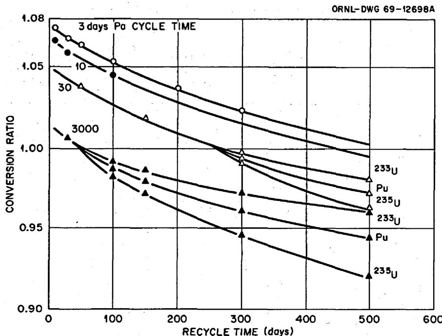  
Fig. 6.1. Conversion Ratio of Single-Fluid MSBR Reactors as a Function of Processing Cycle Times and Feed Materials.

In a search for reactor designs that could, in the meantime, exploit the technology that we now have in hand, we have calculated the nuclear performance of several designs that sidestep one or both of these development areas. With respect to chemical processing, we considered either the case of an equilibrium fuel cycle with continuous processing for isolation of protactinium and removal of fission products or the case of a batch fuel cycle without removal of poisons except by infrequent discard and replacement of the fuel salt. In the latter case, the uranium in the discarded salt (but not the plutonium) is assumed to be recovered by the well-established fluoride volatility process and recycled to the reactor. Thus the higher isotopes of uranium, as well as $^{237}\mathrm{Np}$ , are allowed to reach equilibrium. The average performance of the reactor during such a batch cycle is simulated by an equivalent equilibrium fuel cycle calculation (performed with the ROD code). The equivalence is at best approximate, because saturation effects associated with neutron absorption are different for different nuclides. For rapidly saturating nuclides, the average concentration approaches the concentration at the end of the cycle, and the equivalent equilibrium cycle time approaches the batch cycle time. For slowly saturating nuclides, which essentially build up linearly, the average concentration is approximately half the end-of-cycle concentration, and the equivalent equilibrium cycle time is

therefore half the batch cycle time. The fission product nuclides in general lie between these two extremes, and we have arbitrarily taken two-thirds as the average ratio of the equivalent equilibrium cycle time to the batch cycle time in calculating the cost of discarding salt. It is not necessary to know this ratio accurately in order to make a good estimate of the fuel cycle cost, because for batch discard cycles longer than two or three years the costs are not very sensitive to the cycle time. This is because cost penalties associated with decreasing conversion ratio, as the batch cycle is lengthened, are approximately offset by reduced salt replacement cost.

Perhaps the most obvious design, and one of the most attractive, is the "big MSRE," a single-fluid prismatic-core reactor like the MSRE and large enough (that is, of sufficiently low power density) that the moderator graphite would not have to be replaced because of radiation damage in the anticipated life of the reactor. The performance of this type of reactor, with and without chemical processing, is given in columns 2 and 3 of Table 6.2. In both cases the core salt fractions were adjusted by zones to flatten the damage flux near the center of the core, giving a smaller core for the same moderator life. The case with processing is a moderate-performance breeder, with a fuel-cycle cost not much higher than calculated for the reference MSBR (column 1). It differs from the reference breeder mainly in having a larger core and a higher fissile inventory. For

Table 6.2. First-Generation Molten-Salt Reactor Designs   

<table><tr><td>Case</td><td>CC-120, Reference MSBR</td><td>CC-186, MSRE-Type Prismatic, Permanenta</td><td>CC-167-9, MSRE-Type Prismatic, Throwaway,a Permanent</td><td>S-8-12, Ball Bed, Throwaway, Replaceablea</td><td>S-9-12, Ball Bed, Throwaway, Permanent</td></tr><tr><td colspan="6">A. Description</td></tr><tr><td>Thorium concentration, mole %</td><td>12</td><td>12</td><td>8</td><td>5</td><td>5</td></tr><tr><td>Process cycle time, days</td><td>3/50b</td><td>30/100b</td><td>2700c</td><td>1330c</td><td>2350c</td></tr><tr><td colspan="6">Core volume fraction salt</td></tr><tr><td>Zone 1</td><td>0.132</td><td>0.151</td><td>0.127</td><td>0.37</td><td>0.37</td></tr><tr><td>Zone 2</td><td>0.37</td><td>0.115</td><td>0.123</td><td></td><td></td></tr><tr><td>Zone 3</td><td></td><td>0.140</td><td>0.116</td><td></td><td></td></tr><tr><td>Core diameter, ft</td><td>17</td><td>25</td><td>27</td><td>19 (sphere)</td><td>31 (sphere)</td></tr><tr><td colspan="6">B. Performance</td></tr><tr><td>Breeding ratiod</td><td>1.063</td><td>1.048</td><td>0.837</td><td>0.661</td><td>0.818</td></tr><tr><td>Conservation coefficient, [Mw(th)/kg]2</td><td>14.1</td><td>4.4</td><td></td><td></td><td></td></tr><tr><td>Yield, % per annum</td><td>3.20</td><td>1.55</td><td></td><td></td><td></td></tr><tr><td>Inventory, fissile, kg</td><td>1504</td><td>2350</td><td>1790</td><td>1594</td><td>3172</td></tr><tr><td>Core life, years</td><td>3.5</td><td>30</td><td>30</td><td>8.7</td><td>28.6</td></tr><tr><td>Fuel salt volume, total, ft3</td><td>1683</td><td>2918</td><td>2940</td><td>1996</td><td>6463</td></tr><tr><td colspan="6">Power density, w/cm3</td></tr><tr><td>Peak</td><td>70.4</td><td>10.1</td><td>8.9</td><td>33.2</td><td>10.3</td></tr><tr><td>Average</td><td>22.2</td><td>6.1</td><td>5.1</td><td>22.3</td><td>5.1</td></tr><tr><td>Ratio</td><td>3.17</td><td>1.66</td><td>1.75</td><td>1.49</td><td>2.02</td></tr><tr><td colspan="6">Fuel cycle cost, mills/kwhr</td></tr><tr><td>Inventory: Fissile</td><td>0.276</td><td>0.430</td><td>0.320</td><td>0.271</td><td>0.560</td></tr><tr><td>Salt</td><td>0.045</td><td>0.078</td><td>0.073</td><td>0.043</td><td>0.139</td></tr><tr><td>Replacemente</td><td>0.135</td><td>0.068</td><td>0.082</td><td>0.108</td><td>0.175</td></tr><tr><td>Processingf</td><td>0.307</td><td>0.209</td><td>0.127</td><td>0.131</td><td>0.142</td></tr><tr><td>Fissile feed or credit</td><td>-0.088</td><td>-0.066</td><td>0.180</td><td>0.400</td><td>0.203</td></tr><tr><td>Total fuel cycle cost</td><td>0.68</td><td>0.72</td><td>0.78</td><td>0.95</td><td>1.22</td></tr></table>

The terms "permanent" and "replaceable" indicate that the graphite moderator is, or is not, intended to withstand radiation damage effects for the full design life of the reactor, 24 full-power years. The term "throwaway" refers to a salt-discard fuel cycle, as explained in the text.   
bProtactinium removal cycle time/rare earth removal cycle time (continuous).   
Equivalent batch cycle time, assumed equal to 1.5 times computed continuous cycle time.   
$d_{\text{Assuming}}$ that the plutonium discarded with the fuel salt is not recovered.   
Replacement includes thorium, carrier salt, and, for replaceable cores, graphite.   
Based on scaling the reference MSBR processing costs with a 0.5-power scale factor. Since this scaling does not weight fixed costs sufficiently at very low processing rates, an allowance for fixed costs of 0.05 mill/kwhr was added for the 30/100 case, and 0.1 mill/kwhr for the throwaway cases.   
NOTES: The calculations were based on a 1000-Mw(e) reactor with a thermal power of 2250 Mw(th) and an 0.8 plant factor.   
The fissile feed in converter cases was assumed to be mixed plutonium typical of light-water-reactor discharge with the following composition: $^{239}\mathrm{Pu}$ , $60\%$ ; $^{240}\mathrm{Pu}$ , $24\%$ ; $^{241}\mathrm{Pu}$ , $12\%$ ; $^{242}\mathrm{Pu}$ , $4\%$ .

the no-processing or "throwaway" case, it is assumed that the salt is discarded at an economically optimum interval. The throwaway case is a high-gain converter reactor rather than a breeder, but the fuel cycle cost is very attractive. It proved economically worth while in this case to lower the thorium concentration to $8\%$ , reducing the fissile inventory at the expense of reducing the conversion ratio. Such a plant could be designed for the addition of processing at some later time, thus upgrading it to a breeder.

Another design approach is to make the core of a random-packed bed of graphite spheres. Such a pebble-bed core has several advantages. The manufacture of the small spheres of high-grade isotropic graphite is entirely within today's technology. A pebble bed will accommodate radiation-induced dimensional changes in the graphite, and, finally, if necessary, small graphite spheres can be replaced more easily than large prismatic elements.

The main disadvantage of the pebble-bed core is that the salt fraction is inherently about 0.37, whereas the optimum for the best nuclear performance lies in the range 0.12 to 0.15. Even when the thorium concentration in the salt is reduced as partial compensation for the high salt fraction, as in the cases shown in columns 4 and 5 of Table 6.2, the performance of the pebble-bed cores is well below that of similar prismatic cores. In case S-8-12, the core size was optimized for minimum fuel-cycle cost and resulted in a graphite life of about 9 years. In case S-9-12, the core was made large enough so that the graphite would last the 30-year life of the reactor, but as a result the fissile inventory and the fuel cycle cost are particularly high.

Of the designs considered here, the "big MSRE" with throwaway processing (case CC-167-9) appears to best meet the criteria of low-cost power and little development beyond scaleup from MSRE technology. It could be designed for the convenient future addition of a processing plant and would provide an excellent vehicle for the first full-scale test of integral molten-salt processing.

# 6.1.3 Reactivity Coefficients

O. L. Smith J. H. Carswell, Jr.

A number of isothermal temperature coefficients of reactivity were calculated for the single-fluid MSBR, using the reference reactor geometry shown in a previous progress report. These calculations were performed with a detailed two-dimensional representation of the reactor in $R - Z$ geometry, using the diffusion code CITATION with nine neutron energy groups. Both forward and adjoint fluxes were calculated, and the effects of various changes in microscopic cross sections or in material densities were calculated by first-order perturbation theory. The cross sections themselves were obtained from a series of calculations, using the code XSDRN, in which group-average cross sections were calculated for each major region of the reactor for each of three different temperatures (800, 900, and $1000^{\circ}\mathrm{K}$ ) and for various combinations of material densities. In this way the effects of temperature-dependent changes in microscopic cross sections

can be calculated separately from those of temperature-dependent changes in density.

The calculated reactivity coefficients are summarized in Table 6.3. The Doppler coefficient is primarily that of thorium. The graphite thermal base coefficient and the salt thermal base coefficient, that is, the effects of microscopic cross-section changes caused by changing the temperatures of the graphite and the salt, respectively, are positive because of the competition between thermal captures in fuel, which decrease less rapidly than those of a $1 / \nu$ absorber, and thermal captures in thorium, which decrease nearly as $1 / \nu$ , with increasing temperature. The salt density component represents all effects of salt expansion including the decreasing salt density.

The graphite density component includes both changing graphite density and displacement of graphite surfaces. In calculating the displacements it was assumed that the graphite-vessel interface did not move, that is, that the vessel temperature did not change. For short-term reactivity effects, this is the most reasonable assumption, since inlet salt bathes the vessel's inner face. These dimensional changes in the graphite without a concomitant expansion of the vessel produce a significant change in the thickness of the salt annulus between the core and the reflector. The reactivity effect of this change is not readily calculated by perturbation theory and was therefore obtained by comparison of two conventional criticality calculations with different thicknesses of the salt annulus and with appropriately differing core density. In any case, it should be noted that the graphite density coefficient is a small and essentially negligible component.

From Table 6.3 it is seen that the total core coefficient is negative. But more important, the total salt coefficient, which is prompt and largely controls the fast transient response of the system, is a relatively

Table 6.3. Isothermal Temperature Coefficients of Reactivity, Reference Single-Fluid MSBR   

<table><tr><td>Component</td><td>Reactivity Coefficient, 
1 k ∂k (per °C)</td></tr><tr><td></td><td>× 10-5</td></tr><tr><td>Doppler</td><td>-4.37</td></tr><tr><td>Salt thermal base</td><td>+0.27</td></tr><tr><td>Salt density</td><td>+0.82</td></tr><tr><td>Total salt</td><td>-3.22</td></tr><tr><td>Graphite thermal base</td><td>+2.47</td></tr><tr><td>Graphite density</td><td>-0.12</td></tr><tr><td>Total graphite</td><td>+2.35</td></tr><tr><td>Total core</td><td>-0.87</td></tr></table>

large negative coefficient and affords adequate reactor stability and controllability.

The salt density coefficient is particularly important with regard to bubbles in the core salt. It is expected that the salt will contain about $1\%$ helium bubbles. Under certain circumstances the bubbles might expand or collapse without change in core temperature and hence without invoking the total salt temperature coefficient. Since the salt density component is positive, bubble expansion would produce a positive reactivity effect. Using a salt expansion coefficient $\delta V / V = 2.1 \times 10^{-4} / ^{\circ}\mathrm{C}$ , an increase in core bubble fraction from, say, 0.01 to 0.02 would yield a reactivity change of $\delta k / k = +0.00039$ . This is approximately one-fourth the worth of the delayed neutrons in the core. Analogously, complete collapse of a 0.01 bubble fraction would yield a reactivity change of $\delta k / k = -0.00039$ .

Finally, the fuel concentration coefficient, $(\delta k / k) / (\delta n / n)$ , where $n$ is atomic density, was calculated to be 0.42 for $^{233}\mathrm{U}$ and 0.027 for $^{235}\mathrm{U}$ . The large difference between these two numbers is primarily a result of the substantial difference in concentrations (i.e., $n_{23} \cong 11 \times n_{25}$ ), so that a given fractional increase in $^{235}\mathrm{U}$ concentration produces a far smaller reactivity effect than does the same fractional increase in $^{233}\mathrm{U}$ concentration.

# 6.1.4 Control Rod Worth

O. L. Smith G. W. Morrison

W.R.Cobb

Calculations were performed to determine the reactivity worth of four graphite control rods situated in the central part of the reference MSBR core. The control rod region, shown schematically in Fig. 6.2, consists of four prismatic graphite elements each $\sim 6$ in. on a side and with a 4-in.-diam hole down the center. The elements are separated by thin salt passages. To account for the influence of the remainder of the core on the neutron spectrum of the control cells, the control rod region is surrounded by a ring of cells typical of the adjacent core, followed by a reflected boundary condition.

The calculations were performed in two stages. The first stage was to generate cross sections. Using the Monte Carlo code ESP, the regions shown in Fig. 6.2 were mocked up exactly, thereby explicitly taking into account all geometric and energy-dependent self-shielding effects. Two Monte Carlo calculations were performed, one with salt in the holes of the control cell

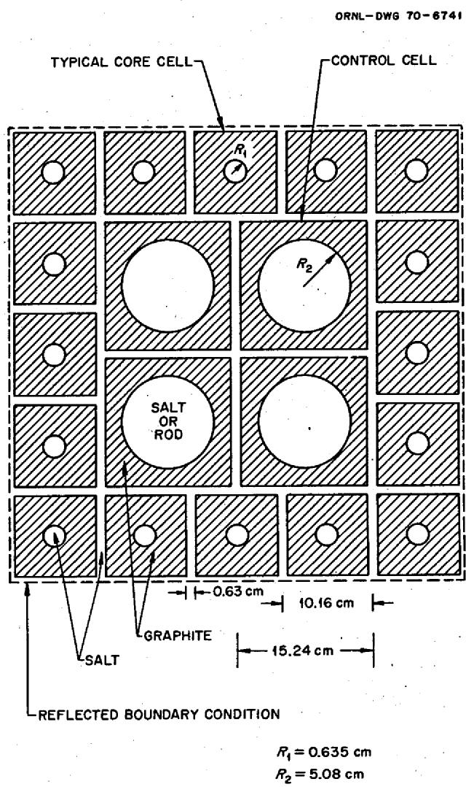  
Fig. 6.2. Geometry Used in Monte Carlo Calculations to Prepare Cross Sections.

prisms, the other with graphite in the holes. The results of these calculations were two sets of homogeneous macroscopic nine-group cross sections for the control region, that is, one set for each configuration. Each set was based upon 5000 neutron histories, and the statistical uncertainties in the cross sections are believed to yield uncertainties in reactivity an order of magnitude less than the computed rod worth. Standard transport theory cell calculations (using the XSDRN code) were used to generate cross sections for the remainder of the reactor.

The second stage of computation was to calculate rod worth. The two sets of cross sections described above were used in the central regions of two CITATION diffusion-theory calculations in which the entire reactor

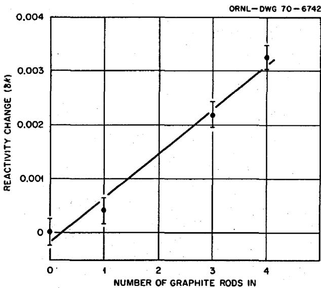  
Fig. 6.3. Control-Rod Worth.

was mocked up in $R - Z$ geometry. The central regions were of the same sectional area as in the Monte Carlo calculations but circular in shape. The standard transport theory cross sections were used in the remainder of the reactor. In the two CITATION calculations the value of $k_{\mathrm{eff}}$ was computed using each of the two Monte Carlo cross-section sets in the central region while keeping other cross sections fixed. The change in reactivity in going from four graphite rods out to four rods in was $\delta k = k_{\mathrm{in}} - k_{\mathrm{out}} = +0.0033$ .

Since the change in reactivity was anticipated to be small, it was felt that the geometry of the control region should be represented in as much detail as possible to account for all self-shielding effects. Ideally the entire reactor would have been represented in the two Monte Carlo calculations, giving control rod worth directly. However, the machine computing time required to get adequate statistics for such a large volume is prohibitively costly. Since the remainder of the reactor outside the region shown in Fig. 6.2 does not change composition, it was deemed satisfactory to treat it with more conventional and cheaper computing methods.

Using the same technique as described above, the worth of one rod and the worth of three rods were computed. The results of the calculations are plotted in Fig. 6.3, together with estimates of the standard deviation of the results. There appear to be no significant interaction effects between control rods, and hence a straight line appears to be the best representation of the data.

# 6.2 MSR EXPERIMENTAL PHYSICS

# 6.2.1 Indication of Integrated Power by $^{235}\mathbf{U}$ Depletion

G. L. Ragan

The fractional depletion of $^{235}\mathrm{U}$ in the MSRE fuel was obtained as a by-product of $^{235}\mathrm{U}$ capture-to-absorption ratio measurements. The fractional depletion between initial and final samples taken for that experiment was about $10\%$ below that expected on the basis of certain parameters then in use: a fission energy release of 199.7 Mev/fission and a power calibration corresponding to a nominal full power of 8.00 Mw.

During the present report period, these two parameters have been undergoing careful reexamination. The heat balance power calibration is discussed in Sect. 1.2.11. Revised values of fission energy release for several fissile nuclides and for operation with $^{235}\mathrm{U}$ and $^{233}\mathrm{U}$ fuels are reported below. The appropriate value is then combined with the observed $^{235}\mathrm{U}$ depletion rate to derive an independent measurement of the nominal full power: $7.30 \pm 0.10\mathrm{Mw}$ . A comparison is made with a measurement based similarly on the buildup of $^{236}\mathrm{U}$ in the fuel: $7.45 \pm 0.18\mathrm{Mw}$ . A combined value of $7.34 \pm 0.09\mathrm{Mw}$ is suggested.

Some recent values for the recoverable energy released in the fission process are given in the second column of Table 6.4. The value for $^{233}\mathrm{U}$ is that of Walker, $^{10}$ and the others are averages of those of Walker and of James. $^{11}$ From the total energy released, derived from a mass balance, they subtract the estimated average neutrino energy and the long-term ( $>3$ years) fission product decay energy. The latter amounts to about 0.2 Mev/fission; I estimate that subtracting an additional 0.1 Mev/fission would exclude decay energy released after about six months, and subtracting another 0.1 Mev/fission would exclude decays after about two months.

Table 6.4. Recoverable Energy Released per Fission in MSRE   

<table><tr><td rowspan="2">Nuclide</td><td rowspan="2">Basic Fission Processes, Excluding Capturea</td><td colspan="2">Typical MSRE Operation, Including Captureb</td></tr><tr><td>With 235U Fuel</td><td>With 233U Fuel</td></tr><tr><td>233U</td><td>188.4 ± 0.9</td><td>199.7 ± 0.9</td><td>200.4 ± 0.9</td></tr><tr><td>235U</td><td>192.5 ± 0.5</td><td>203.2 ± 0.5</td><td>203.9 ± 0.5</td></tr><tr><td>238U</td><td>193.8 ± 0.8</td><td>206.9 ± 1.0</td><td>207.6 ± 1.0</td></tr><tr><td>239Pu</td><td>198.2 ± 0.8</td><td>212.4 ± 0.9</td><td>213.2 ± 0.9</td></tr><tr><td>Overall</td><td></td><td>203.4 ± 0.5</td><td>201.0 ± 0.9</td></tr></table>

$a$ Also excluding neutrino energy and long-term $(>3$ year) fission product decay energy. Values taken from refs. 10 and 11.   
bEach of the $\nu -1$ excess neutrons releases an average of 7.49 Mev/capture with $^{235}\mathrm{U}$ fuel and 7.92 with $^{233}\mathrm{U}$ fuel.

The third and fourth columns of Table 6.4 include the energy released when the $\nu - 1$ excess neutrons (i.e., the neutron increase resulting from the fission event) are captured in the reactor materials. The capture energy released was averaged over the capturing materials present by using a neutron balance table12 for the reactor loading being considered. This capture energy includes, in addition to the binding energy of the captured neutron, the energy released in any subsequent radioactive decays with half-lives less than three years. For each of the two fuels, the last line shows the overall reactor average, the energy release in each fissile nuclide being weighted by the fraction of the fissions occurring in that nuclide. Each average is for a typical fuel salt composition and varies but little (about $\pm 0.1$ Mev/fission) during the operational history with either fuel.

In the course of the $^{235}\mathrm{U}$ capture-to-absorption ratio experiment, the depletion rate was found to be $5.545 \pm 0.056$ ppm per effective full-power hour. This corresponds to a nominal full power of $7.30 \pm 0.10$ Mw on the basis of the measured capture-to-absorption ratio, the recoverable energy per $^{235}\mathrm{U}$ fission, and relevant system characteristics: $0.2006 \pm 0.0024$ capture per absorption in $^{235}\mathrm{U}$ , $203.2 \pm 0.5$ MeV per fission of $^{235}\mathrm{U}$ , $69.65 \pm 0.17$ kg of $^{235}\mathrm{U}$ circulating, and $0.980 \pm 0.002$ of power from $^{235}\mathrm{U}$ .

The above result may be compared with those obtained using data from an earlier experiment. Steffy and Engel9 observed a net $^{236}\mathrm{U}$ buildup rate which may be expressed as $0.0797 \pm 0.0015\mathrm{g}$ of $^{236}\mathrm{U}$ per

effective full-power hour. The standard deviation indicated $(\pm 1.9\%)$ represents a slight increase over the purely statistical curve-fitting error $(\pm 1.7\%)$ reported, to allow for possible errors in the $7\%$ adjustment for fuel drains and flushes. The adjustment error, assumed to be $\pm 0.7\%$ , is incorporated in the manner of independent errors. Using the measured capture-to-absorption ratio listed above, one can convert the $^{236}\mathrm{U}$ buildup rate to a $^{235}\mathrm{U}$ depletion rate and proceed as before to infer a value for nominal full power: $7.45 \pm 0.18 \mathrm{Mw}$ .

In summary, we have made two determinations of nominal full power that are basically experimental. The only dependence on calculated cross sections is through small corrections to the experimental data (see ref. 7); for this, we use calculated ratios of absorption cross sections $(^{236}\mathrm{U} / ^{235}\mathrm{U}$ and $^{238}\mathrm{U} / ^{235}\mathrm{U})$ , and for these ratios a generous uncertainty assignment $(\pm 10\%)$ has been included. The two power determinations proceed from entirely independent experimental data, but much of the subsequent data reduction involves common parameters. Hence the two power estimates are only partially independent. A summary of the results, with an estimated overall combined value, is given in Table 6.5.

It is interesting to compare the above results with those of Thoma and Prince (Sect. 10.3). Those authors compare a series of experimental $^{240}\mathrm{Pu} / ^{239}\mathrm{Pu}$ isotopic ratios taken over a long operating period with calculated values for the same ratio. In the calculations the operating power level is treated as a parameter, and that power level giving best agreement between experimental and calculated values is found to be $7.41 \pm 0.05\mathrm{Mw}$ . The quoted uncertainty is that of fitting the experimental data to the calculated curves and does not include any allowance for cross-section uncertainties or for uncertainty in the energy release per fission. The good agreement with the results given above may be taken as confirming the essential validity of the cross sections used and of the calculational methods. Further confirmation is given by Thoma in Sect. 10.4, where experimental and calculated values of the $^{234}\mathrm{U} / ^{233}\mathrm{U}$ isotopic ratios are compared.

Table 6.5. Determinations of Nominal Full Power   

<table><tr><td>Method</td><td>Nominal Full Power (Mw)</td></tr><tr><td>235U depletion</td><td>7.30 ± 0.10</td></tr><tr><td>236U buildup</td><td>7.45 ± 0.18</td></tr><tr><td>Combined value</td><td>7.34 ± 0.09</td></tr></table>

# 7. Systems and Components Development

Dunlap Scott

# 7.1 MOLTEN-SALT STEAM GENERATOR

R. E. Helms

A steam generator development program plan is being formulated to develop the technology required to produce and successfully operate a molten-salt-heated steam generator. This plan includes programs for the procurement of steam generators for the MSBE from industrial manufacturers and for the construction and operation of a test stand for evaluating steam generator concepts proposed for the MSBE. A discussion of these two programs follows.

# 7.1.1 Steam Generator Industrial Program

A request for proposal package is being prepared for use in obtaining proposals from industrial manufacturers to prepare conceptual designs of steam generators for large MSBR's and to design, develop, and fabricate models of those steam generators for the MSBE. Rough drafts have been written of the proposed scope of work, a general description of the primary and secondary salt systems and the steam system of an MSBR, and the design criteria for a molten-salt generator.

# 7.1.2 Steam Generator Tube Test Stand

R.E.Helms J.P.Sanders

J. L. Crowley H. J. Metz

E.J.Breeding

The preparation of the conceptual system design description (CSDD) for the steam generator tube test stand $(\mathrm{STTS})^{1}$ is nearing completion. All sections of the CSDD have been written and are being combined into the first rough draft for project review.

Present concepts of the STTS employ a salt system capable of operation with salt temperatures up to

Table 7.1. Test Section Parameters   

<table><tr><td></td><td>Startup, 0–20%</td><td>Operation, 20–100%</td></tr><tr><td>Heat input, Mw</td><td>0–0.6</td><td>0.6–3.0</td></tr><tr><td>Steam flow rate, lb/hr</td><td>0–2185</td><td>2185–15,925</td></tr><tr><td>Feedwater inlet, °F</td><td>Steam at 240 to water at 700</td><td>550 or 700</td></tr><tr><td>Steam outlet temperature, °F</td><td>950–1100</td><td>1000</td></tr><tr><td>Feedwater inlet pressure, psia</td><td>15–4000</td><td>3100–4000</td></tr><tr><td>Steam outlet pressure, psia</td><td>15–3600</td><td>2400 or 3600</td></tr><tr><td>Salt flow rate, lb/hr</td><td>18,960</td><td>18,960–94,800</td></tr><tr><td>Salt inlet temperature, °F</td><td>1000–1200</td><td>1150–1200</td></tr><tr><td>Salt outlet temperature, °F</td><td>1000–850</td><td>850–900</td></tr></table>

$1200^{\circ}\mathrm{F}$ and a steam feedwater system capable of operation at subcritical and supercritical pressures with feedwater temperatures up to $700^{\circ}\mathrm{F}$ . The STTS will be used to test 3.0-Mw units containing full-length tubes in configurations representative of steam generator designs for a molten-salt breeder reactor experiment.

We have examined startup and operating parameters for a 3.0-Mw molten-salt-heated steam generator test section for testing in the STTS. The ranges of startup and operating parameters are shown in Table 7.1.

The salt system for the STTS includes a salt pump, a direct resistance heater as the heat source, associated piping to the test section, a venturi meter to measure salt flow, a drain tank, and an associated freeze valve.

Gas-fired furnaces $^2$ were investigated as a possible heat source. However, heating by passing electrical current through a section of the loop piping is preferred because of the smaller salt inventory in the loop, the shorter loop circuit time, the faster response to load changes because of the smaller heat capacity, and better apparent control of the system over a wide range of operating conditions (20-100%).

Sodium fluoroborate, with impurities in the ranges shown in Table 7.2, is the reference salt. The STTS may also be operated with fluoride salt mixtures that melt at temperatures as high as $850^{\circ}\mathrm{F}$ and as low as $640^{\circ}\mathrm{F}$ . (Sodium fluoroborate reference salt melts at $716^{\circ}\mathrm{F}$ .) A higher-melting-point salt is the MSRE coolant salt, $\mathrm{LiF - BeF_2}$ (66-34 mole%). A lower-melting-point salt is $\mathrm{NaF - LiF - BeF_2}$ (27-35-38 mole%). Both of these salts have a higher viscosity than sodium fluoroborate.

A steam feedwater system has been selected that will permit a broad investigation of the technology of salt-heated steam generators. A pressure letdown system provides a facility that can be used for demonstration of the coupling, startup, and operation of the salt and steam-feedwater system with the salt in the shell side of the steam generator test section at an initial temperature of $1000^{\circ}\mathrm{F}$ . The pressure letdown system also permits the use of full-flow demineralization with conventional equipment.

In the operation of a high-pressure, once-through steam generating unit, high-purity feedwater is required. The feedwater purity criteria established for the STTS are shown in Table 7.3. This requirement is also critical for the STTS because solids in the feedwater will either

Table 7.2. Impurity Range for Operation of STTS with Sodium Fluoroborate   

<table><tr><td>Fe,ppm</td><td>50-100</td></tr><tr><td>Cr,ppm</td><td>50-250</td></tr><tr><td>Oxygen, ppm</td><td>300-1000</td></tr><tr><td>H2O, ppm</td><td>300-1000</td></tr></table>

deposit in the steam generating test unit, resulting in loss of steam generator efficiency, or will be carried through the steam generator unit and deposited in the expansion valve area. Failure to maintain high-purity water in the STTS can result in faulty heat transfer data and costly outages for chemical cleaning or for repairing equipment which has been damaged by erosion and corrosion.

An externally regenerated ammonium hydroxide (AMMONEX) mixed-bed demineralizer system has been selected for the condensate purification system because of low operating and capital cost and because these beds do not deplete the ammonia which is added to the condensate for pH control.

Heat balances for three test sections with different feedwater-steam conditions at $3.0\mathrm{Mw}$ rated load were made to establish criteria for the steam-feedwater system components. The first system heat balance used feedwater at $700^{\circ}\mathrm{F}$ and 3800 psia with outlet steam conditions of $1000^{\circ}\mathrm{F}$ and 3600 psia. These feedwater-steam conditions are typical of the ORNL MSBR reference design. The second system heat balance used feedwater at $550^{\circ}\mathrm{F}$ and 4000 psia with outlet steam conditions of $1000^{\circ}\mathrm{F}$ and 3600 psia. These feedwater-steam conditions are typical of modern supercritical fossil-fired power plants. The third system heat balance used feedwater at $550^{\circ}\mathrm{F}$ and 3100 psia with outlet steam conditions of $1000^{\circ}\mathrm{F}$ and 2400 psia. These feedwater-steam conditions are typical of modern subcritical fossil-fired power plants. The above feedwater-steam conditions are considered typical for use with the test sections that will be produced during the steam generator development program.

Table 7.3. Feedwater Operation Requirements   

<table><tr><td rowspan="2">Sample Point</td><td rowspan="2">Cation Condition (micromhos/cm)</td><td rowspan="2">pH</td><td colspan="7">Maximum Limits (ppb)</td></tr><tr><td>O2</td><td>N2H4</td><td>SiO2</td><td>Fe</td><td>Cu</td><td>Ni</td><td>Na</td></tr><tr><td>Condenser hot well</td><td>1.0</td><td>8.8–9.3</td><td>10</td><td></td><td>15</td><td></td><td>10</td><td>5</td><td>1</td></tr><tr><td>Condensate booster pump</td><td></td><td>9.2–9.4</td><td>10</td><td>20</td><td>15</td><td>10</td><td>2</td><td>2</td><td>1</td></tr><tr><td>Deaerator outlet</td><td></td><td>9.2–9.4</td><td>&lt;5</td><td>20</td><td>15</td><td>10</td><td>2</td><td>2</td><td>1</td></tr><tr><td>Auxiliary boiler inlet</td><td>0.3</td><td>9.2–9.4</td><td>&lt;1</td><td>20</td><td>15</td><td>10</td><td>2</td><td>2</td><td>1</td></tr><tr><td>Flash tank outlet</td><td>0.3</td><td>9.2–9.4</td><td>&lt;1</td><td></td><td>15</td><td>10</td><td>2</td><td>2</td><td>1</td></tr><tr><td>Test section inlet</td><td>0.3</td><td>9.2–9.4</td><td>&lt;1</td><td>10</td><td>15</td><td>10</td><td>2</td><td>2</td><td>1</td></tr></table>

# 7.2 SODIUM FLUOROBORATE TEST LOOP

R.B.Gallaher A.N.Smith

The 800-gpm PKP-1 isothermal pump loop continued circulating $\mathrm{NaBF}_4$ -NaF (92-8 mole %) for investigations of the removal of salt mist and acid liquid from the off-gas stream. Cumulative circulation time as of March 4 was 11,154 hr, of which 10,154 hr have been with the second batch of salt. During the report period the loop operated 2954 hr and was drained five times, once on September 23 when a salt leak was found near a pressure transmitter and four times for inspection and modification of the hot mist trap.

# 7.2.1 Salt Leak from Pressure Transmitter

On the morning of September 23, 1969, a salt leak was discovered. The initial indications of trouble were a decrease in pump bowl liquid level of $8\%$ ( $\sim 0.8$ in. salt), an apparent decrease in the temperature of the circulating salt, and irregular temperatures at the two venturi pressure transmitters or pressure measuring devices (PMD). A visual inspection inside the loop enclosure revealed a mass of frozen salt hanging from the insulation surrounding both PMDs and a small quantity of salt in the drip pan beneath the PMDs. Using normal shutdown procedures, the pump was stopped and the salt was drained into the drain tank. The leak was found to be in the pressure transmitter (PMD-104A) at the venturi inlet in the weld which joins a $1/2$ -in.-IPS pipe to the boss on the diaphragm flange of the transmitter. This is a stagnant salt zone serving only to sense venturi inlet pressure, which is about 100 psig with the pump on.

The orientation of the PMDs, which are fabricated of Inconel, is such that they do not drain when the loop proper is drained. Because of the fear of damaging the diaphragms by freezing and thawing the salt, it has been customary to maintain the PMDs at $1000^{\circ}\mathrm{F}$ at all times, even when the loop is not operating. Also, when a different type of salt is charged into the loop, the old salt must be displaced from the PMDs by a process of mixing.

The defective PMD was removed from the system, the pipe stub to which it had been attached was capped, and operation of the loop was resumed. The signal from a PMD near the pump discharge was used for the venturi reference.

Metallurgical examination of the $\mathbf{PMD^4}$ indicated that the weld which was made by the instrument vendor was defective when the instrument was received in 1956, and repairs had been made by application of braze metal to the interior surface. Details of the examination are reported in Part 5, Materials Development, of this report. It is estimated that the PMD was in the loop for at least eight years and, prior to the current fluoroborate service, was operated for three years with a salt similar to the MSRE fuel salt.

About $7\frac{3}{4}$ kg of a calculated loss of $11\mathrm{kg}$ of salt was recovered from the drip pan and the outside of the insulation. The salt level in the pump bowl decreased $8\%$ in the 24 hr preceding the shutdown. This represents an average leak rate of $4\mathrm{cc / min}$ .

When the insulation was removed, some bright green salt was found near the metal surfaces. Chemical analysis of the salt is shown in Table 7.4. The composition is similar to that of the green films formed during tests with a "cold finger." It probably resulted from high localized corrosion of the Inconel-sheathed Calrod, the external flange surface, and the stainless steel shim stock which surrounded the heaters. Such high corrosion rates would be expected with metal exposed to $\mathrm{NaBF}_4$ at high temperature in air.

The chemical analyses of the salt recovered from the outside of the insulation and of the salt in the system when circulation was restarted are also shown in Table 7.4. There was very little, if any, change in the composition of the salt lost from the loop except for a slight decrease in chromium and an increase in $\mathbf{O}_2$ . Chromium-containing compounds may have solidified first and appeared as part of the green salt found near the piping.

The conclusions from the examination are as follows:

1. The salt leak was attributed to the failure of a weld joint which was defective originally and had been repaired by a technique which would not now be recommended for molten-salt service at $1000^{\circ}\mathrm{F}$ . The fact that the leak occurred during fluoroborate service was coincidental.   
2. The very mild corrosion by the stagnant salt in the pipe between the PMD and the loop was like that experienced with Inconel in similar service with $\mathrm{NaBF_4}$ salt in other loops.

Table 7.4. Chemical Analyses of Salt Samples   

<table><tr><td></td><td>Na(%)</td><td>B(%)</td><td>F(%)</td><td>Fe(%)</td><td>Ni(%)</td><td>Cr(%)</td><td>O2(%)</td><td>H2O(%)</td></tr><tr><td>Green salt from PMD surface</td><td>25.6</td><td></td><td></td><td>5.55</td><td>0.90</td><td>4.29</td><td></td><td></td></tr><tr><td>Green salt from cold finger (CF-2)</td><td>24.4</td><td>4.28</td><td>57.3</td><td>1.61</td><td>0.009</td><td>4.18</td><td></td><td></td></tr><tr><td>White salt from outside PMD insulation</td><td>22.0</td><td>9.48</td><td>66.8</td><td>0.049</td><td>0.003</td><td>0.011</td><td>0.83</td><td>0.05</td></tr><tr><td>Circulating salt (PK-38)</td><td>21.5</td><td>9.37</td><td>67.1</td><td>0.047</td><td>0.001</td><td>0.041</td><td>0.17</td><td>0.05</td></tr></table>

3. The consequences of the leak can be characterized as rather mild. Fumes were carried off to the stack by the controlled ventilation system. There was no indication of fire or sudden energy release. The condition of the metal in the vicinity of the leakage path in the pipe wall seemed to indicate that the leak was not self-aggravating; that is, continued leakage did not result in an increase in the rate of leakage.

# 7.2.2 Gas-System Studies

The purpose of the hot mist trap is to remove most of the salt mist from the gas stream coming from the pump bowl while still in the hot zone so that it can be returned to the salt stream. In the proposed scheme the mist remaining in the flowing gas leaving the hot mist trap would pass through an unheated section to permit the particles to freeze and then to be collected on a replaceable filter. The overall objective of the program is to reduce the quantity of material that leaves the hot mist trap and then to provide for its removal in the replaceable filter without fouling the intervening lines. The size of a practical replaceable filter and the desired minimum replacement interval will establish the efficiency required for the hot mist trap. In the tests of the four mist traps described below, the performance is measured by the reduction in the material collected in the replaceable (Hoke) filter and in the intervening lines. Measurements made at intervals during tests No. 2, 3, and 4 indicated that the flow of salt mist into the hot mist trap was essentially constant at $30\mathrm{mg / hr}$ .

We continued to get accumulations of an oillike fluid in a $32^{\circ}\mathbf{F}$ cold trap which is downstream of the

replaceable filter of the mist trap filter test section. The collection rate was about 5 to $10\mathrm{mg / hr}$ , amounting to an average concentration of $0.08\mathrm{g}$ of fluid per liter of helium. In some instances we noted films in the cold end of the mist trap and in the Hoke filter, where the operating temperature is 100 to $200^{\circ}\mathbf{F}$ . Study of this material is continuing, but we still have not reached a definite conclusion as to its cause or composition.

Test 1. - The first test was a repetition of the settling tank test, described in the previous report, which used a 1-in.-ID by 13-in.-long pipe mounted vertically. In the current test, however, a flow diverter was installed at the trap inlet to minimize the possibility of a short circuit through the trap. The hot mist trap temperature was held at about $1000^{\circ}\mathrm{F}$ at the inlet and $200^{\circ}\mathrm{F}$ at the outlet. The calculated linear gas velocities for these temperatures are 0.18 and 0.08 fps respectively. It was expected that the larger droplets would settle back to the hot zone and thereby return to the salt stream and not enter the line to the replaceable filter. During the 2650 hr of operation there was a total of $57\mathrm{g}$ of salt which passed through the trap into the outlet line and replaceable filter section. Although some of the salt entering the trap probably settled and returned to the pump bowl, that which passed through the trap was excessive for a practical system. When the trap was examined after shutdown on October 29, no salt was found in the hot zone, indicating that no high-melting phase was formed. Only a light film of salt formed on the walls in the region where the gas cooled below the freezing point of the salt. An accumulation of salt was found in the outlet line where the diameter decreased abruptly adjacent to a ball valve. Other portions of the tubing showed no evidence of plugging.

For tests 2, 3, and 4, the test section was oriented so that the pipe axis was almost horizontal rather than vertical, and the size was changed to 2 in. ID by 15 in. long for tests 2 and 3 and 20 in. long for test 4.

Test 2. - For test 2 a porous metal filter (Huyck metal FM-225, $98\%$ removal of $1.4\mu$ particles) was installed in the heated section. The first half of the trap was equipped with a heater and insulation so that the temperature of the off-gas could be controlled up to $1200^{\circ}\mathrm{F}$ . The rest of the trap was unheated and could be operated insulated or bare. Catch basins were installed on either side of the filter to separate salt that ran down the filter surface from that which settled out of the gas stream. The test period was limited to 15 days to avoid exceeding the capacity of a catch basin should all the salt accumulate at one face of the filter.

The system was operated for $330\mathrm{hr}$ before being shut down on November 24 for removal and inspection of the mist trap. During the first $290\mathrm{hr}$ the heated section of the trap was held at $950^{\circ}\mathrm{F}$ , and the gas left the unheated section at about $200^{\circ}\mathrm{F}$ . During the last $40\mathrm{hr}$ the unheated section was insulated, which increased the trap temperature to $1000^{\circ}\mathrm{F}$ and the gas leaving the trap to $700^{\circ}\mathrm{F}$ . The pressure drop across the mist trap increased by 0.5 psi during the first seven days and then remained constant.

The Hoke filter downstream of the mist trap was removed for inspection after seven days of operation and was found to contain a clear oillike liquid. We believe that the liquid accumulated during the preheating of the system prior to filling with salt. The pressure drop across the filter was high when circulation of salt was started and remained constant. Also, some fouling of the off-gas pressure control valve occurred during this test for the first time since the cold trap was put into service. The liquid must have been swept through the off-gas system and the cold trap before normal operating conditions were established.

The liquid collection rate in the cold trap averaged $8.0 \times 10^{-3} \pm 2.8 \times 10^{-3} \mathrm{~g/hr}$ during the run. When we inspected the mist trap we found some small spheres of salt ( $\frac{1}{16}$ to $\frac{1}{8}$ in. diam) covered with a dark film on the upstream side of the filter element. The filter face was also coated with a dark-colored deposit. On the downstream side the salt had formed a pool inside and outside the catch basin. No dark films were observed on the salt pool. Several large ( $\frac{1}{4}$ to $\frac{1}{2}$ in.) pieces of dark material were found in the same area. Also, the $\frac{3}{8}$ -in. line at the discharge of the trap contained a plug of similar material. This plug had not restricted the gas flow enough to be detectable by pressure drop measure-

ments and did not appear to have filtered out any salt.

The quantity of salt which passed through the filter and settled out in the 2-in. pipe section was equivalent to about $50\%$ of the estimated $30\mathrm{mg / hr}$ leaving the pump bowl. The removal was probably because the sintered metal filter had agglomerated the fine mist into larger particles which then settled rapidly from the gas stream. There was no evidence of salt in the replaceable filter or in the intervening line; however, the dark material at the trap discharge could have affected the transfer into the line before the end of the trap was raised to a $700^{\circ}\mathrm{F}$ discharge temperature. We concluded that the method of agglomerating the mist was successful and that this arrangement was an improvement over the previous trap.

Test 3. - The mist trap was reinstalled for the third test with an element fabricated from Multi-Metal NEVA-CLOG. The material consists of two perforated sheets (0.040-in.-diam holes on $\frac{3}{32}$ -in. centers) spaced about 0.020 in. apart, with the holes in one sheet offset from those in the other. There was a catch basin in both the upstream and the downstream side of the NEVA-CLOG element. The test lasted for 433 hr with the heated portion maintained at $860^{\circ}\mathrm{F}$ . The unheated section was uninsulated, and the gas left the trap at about $180^{\circ}\mathrm{F}$ .

Based on periodic weighings of the Hoke filter in the discharge line from the mist trap, the rate of solids leaving the trap decreased from $11 \times 10^{-3} \mathrm{~g/hr}$ at the beginning of the run to zero during the last week. During the test the liquid collection rate in the cold trap averaged $6.7 \times 10^{-3} \mathrm{~g/hr}$ . No fouling of the off-gas pressure control valve occurred. The test was terminated when the pressure drop across the mist trap assembly increased from 0.7 to 2.3 psi in one day.

When the mist trap was removed, the $3/8$ -in. discharge line again contained a plug. About $0.5\mathrm{g}$ of the white salt and dark oily material were removed from the line. The plug probably accounted for at least part of the decrease in the rate of solids leaving the trap and the increase in the pressure drop.

The walls of the mist trap downstream of the filter were coated with a thin film of salt. About $1.8\mathrm{g}$ of solids were recovered from this area. Based on the weight of solids collected on the Hoke filter and in the discharge line, the arrangement with the NEVA-CLOG element did not remove sufficient salt from the gas stream to be of use.

Test 4. - Circulation was resumed on January 21 using a mist trap containing two Huyck metal FM-225

elements, one in the heated section and one in the cool section. The heated zone arrangement was similar to that in test 2, but the additional element was added to remove all the solids before they could enter the discharge line and cause plugging problems. While admittedly avoiding the line-plugging problem for the moment, the arrangement did permit a better evaluation of the hot mist trap itself.

The heated section was held at $950^{\circ}\mathrm{F}$ , and the gas left the cool section at about $180^{\circ}\mathrm{F}$ . During operation there was little or no change in the pressure drop across either filter element in the mist trap. No salt was found in the Hoke filter when it was examined after 5, 15, and 40 days of operation; however, a thin oily film was present on the surface of the housing in the entrance section. The rate of collection of liquid in the cold trap averaged $5.2 \times 10^{-3} \mathrm{~g/hr}$ and decreased slightly with time. No fouling of the off-gas pressure control valve was noted. The trap was operated for 1011 hr before being shut down on March 4 for inspection.

When the mist trap was opened, $0.5\mathrm{g}$ of salt was recovered from the entrance area. The upstream face of the hot filter was coated with a dark film, and there were some clear spheres of salt, 0.010 in. in diameter and smaller, on the surface. Essentially all the salt carried out of the pump bowl during the test $(32.7\mathrm{g})$ had collected in a pool between the two filter elements. The upstream face of the cold filter element had a 0.01-in.-thick film of very light-colored salt particles estimated to weigh $< 0.4\mathrm{g}$ . Downstream of this filter the cold walls had a thin coating of dark material which was soluble in acetone, perchloroethylene, and kerosene, but insoluble in alcohol and water. These tests indicate that the film is probably a hydrocarbon. There was no plug in the discharge line.

It can be concluded from this test that the fine mist had agglomerated into larger droplets in passing through the hot filter and that these then settled to the bottom of the trap before reaching the cold filter. The fine particles remaining were solidified and trapped in the cold filter in a manner which did not produce a measurable pressure drop. Although the hot trap performed very well in passing only $0.4\mathrm{g}$ while holding up $32.7\mathrm{g}$ in 1011 hr, the performance might be further improved by the use of a second hot filter element of the NEVA-CLOG type to remove some of the remaining fine particles. Since the cold filter must be replaceable, further study must be made of the design requirements for the lines and necessary valving between the hot trap and the replaceable filter to prevent plugging.

# 7.3 MSBR PUMPS

A. G. Grindell

P. G. Smith

H. C. Young

L. V. Wilson

# 7.3.1 MSBE Salt Pump Procurement

A response to our request for proposal8 to produce the MSBE salt pumps was received from Westinghouse Electro Mechanical Division, Cheswick, Pennsylvania. The two other candidate pump manufacturers, the Bingham-Willamette Company of Portland, Oregon, and the Byron Jackson Pump Division of Borg-Warner Corporation of Los Angeles, California, did not submit proposals.

The one proposal was reviewed by members of the evaluation team, the MSR program, and other members of the Laboratory, and the list of questions and comments generated by the review was submitted to Westinghouse. A very brief résumé of the questions and comments indicates that we ask Westinghouse for exposition of (1) their plans to meet the requirements of the RDT quality assurance program, (2) the scope and content of the water test facilities and test program that they plan, and (3) the effect on estimated cost and schedule of providing more time for the feedback of information from salt testing of the prototype pump into the design of the MSBE pumps.

The evaluation team will use the Westinghouse response to the list of questions and comments to complete its evaluation and recommendation for the proposal. At present we are favorably impressed with the scope and content of the proposal.

# 7.3.2 MSBE Salt Pump Test Stand

The Preliminary Systems Design Description (title I design) of the salt pump test stand was completed and issued. The stand is required to test the salt pumps for the MSBE. It is being designed to accommodate pumps having capacities up to 8000 gpm and operating with salts of specific gravities up to 3.5 at discharge pressures to 400 psig and temperatures to $1300^{\circ}\mathrm{F}$ normally and $1400^{\circ}\mathrm{F}$ for short periods of time. Both the drive motor electrical supply and the heat removal system external to the loop are being designed for 1500 hp capability.

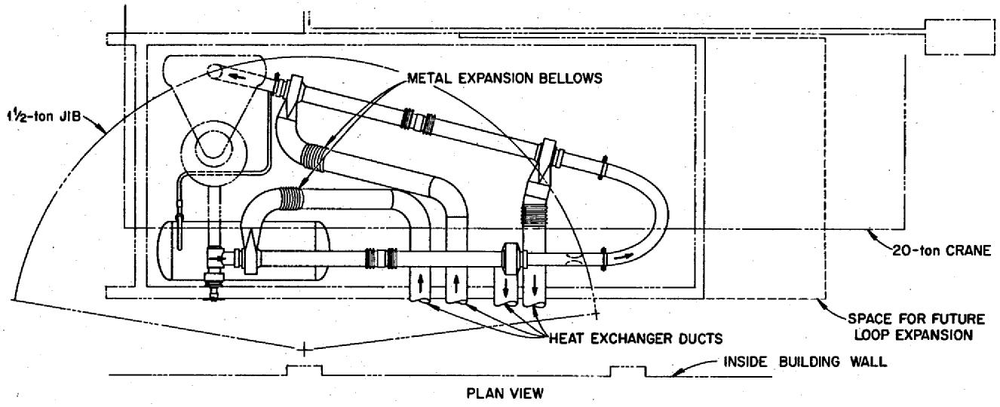

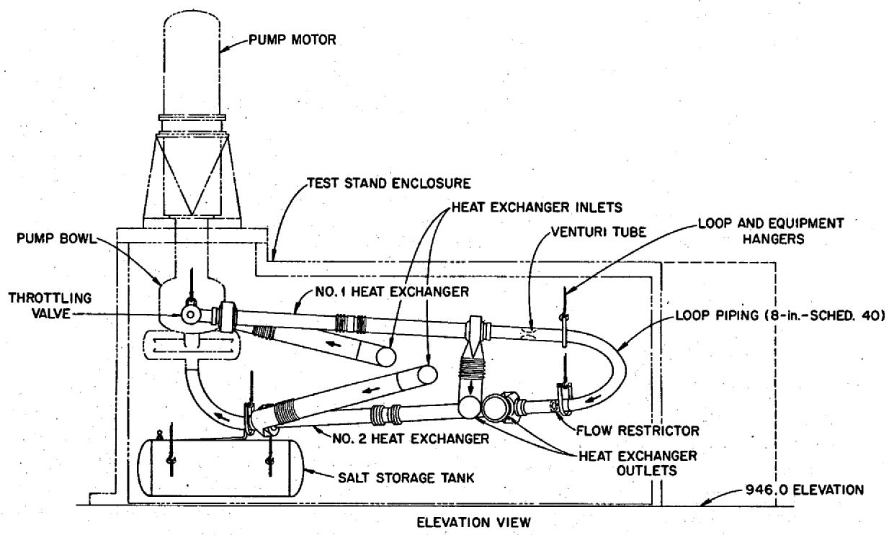  
Fig. 7.1. General Arrangement of the MSBE Salt Pump Test Stand.

The general arrangement of the test stand is shown in Fig. 7.1. Basically, the loop consists of two salt-to-air heat exchangers, a throttling valve, a flow restrictor, a venturi tube, the interconnecting piping, and the salt pump being tested. A salt storage tank is connected to the loop by a pipe containing a freeze valve.

During this period, preliminary designs and calculations were made for:

1. Salt storage tank - 75 ft³, 100 psig at 1200°F.   
2. Salt-to-air heat exchangers - 800 Btu/sec (total), salt temperature $= 1050^{\circ}\mathrm{F}$ , air flow rate $= 10,000$ cfm (total) at $150^{\circ}\mathrm{F}$ , and $\Delta P$ of 3.1 psi.   
3. Temperature transients - could achieve a rate of temperature reduction of about $15^{\circ}\mathrm{F / min}$ or a rate of temperature rise of $25^{\circ}\mathrm{F / min}$ .

4. Pump characteristics - to investigate the probable head-flow relationships for the pumps to be tested.   
5. Heat removal - comparative study of cooling the 1500-hp pump motor with plant water or an air-cooled heat exchanger showed that the use of plant water was more economical.   
6. Salt flow measurement instrumentation - to investigate venturi tube characteristics and select pressure transmitters.   
7. Proof test of MSBE secondary pump in primary salt - to investigate pump relationships to provide the proof test at design speed, torque, temperature, and pressure.   
8. Pressure profile in the salt piping - to investigate salt pressures at various locations in the loop to provide design criteria for the various components (throttling valve, venturi tube, pressure transmitter, piping).   
9. Stress analysis - to investigate stresses produced by pressure, weight, and thermal expansion using a piping flexibility analysis to determine that they are within allowable limits.

The following tabulations were prepared:

1. Applicable specifications, standards, and other publications.   
2. Pipe line schedule - a detailed list of all loop, instrument, gas, air, and water lines.   
3. Instrument tabulations - a detailed list of instruments to be used.   
4. Equipment tabulation - a detailed list of valves and electrical and mechanical equipment.   
5. Instrument application diagrams.   
6. Electrical schematic diagram.

The Preliminary Systems Design Descriptions and the title I design of the facility were sent to the AEC for review and approval. Before this was completed, the facility was "deobligated" because of changed budget projections for the MSR program, and all work on the design was terminated. We plan to resubmit the facility for approval to design and build on a schedule that will be based on new schedules for the development of pumps for the MSBE.

# 7.3.3 ALPHA Pump

The fabrication of the water-test model of the 5- to 30-gpm ALPHA pump8 that is being developed for use in small forced convection loops was nearly completed.

The fabrication and assembly of the test stand were completed. Upon completion of the fabrication and assembly of the ALPHA pump, it will be installed in the test stand and the water testing will be initiated.

# 7.4 REMOTE WELDING

# P.P.Holz C.M.Smith,Jr.

The remote welding program10 has concentrated on parametric studies of pipe end configurations and weld inserts to find the best joint design for use in remote welding. All the welding tests were performed with the orbital equipment including a new and improved programmer-controller which provided very effective automatic self-regulating control of the welding variables.

A quantity of 6-in. sched 80 type 347 stainless steel pipe was available from surplus stock and was used for initial development work. Procedures were developed for welding with washer-shaped inserts and with commercially available Y-ring inserts.[11] For some tests, the pipe wall at the joint was machined to simulate a flat washer "insert"; for others, weld metal was deposited on the pipe inner surface and then machined to simulate the washer "insert," and for others, actual insert rings were tack-welded to one of the pipe joint ends. These joint configurations are illustrated in Fig. 7.2. The tests showed that the "buttered" insert, prepared by depositing weld metal around the pipe interior and then machining the deposit to a washer shape, is best for remote welding applications. Machining the pipe walls to simulate a washer-shaped insert has the disadvantage of thinning the pipe walls adjacent to the weld. The tack-welded inserts were too easily damaged to be suitable for remotely controlled installation, positioning, and alignment. The weld inserts do offer the most economical method of welding and are recommended for direct construction or shop welding. The washer-shaped insert gives best results for badly misaligned welds. It is a tribute to the orbital equipment that high-quality welds were made every time, whichever type of joint design was used.

Following the experimental joint welding tests with 6-in. pipe of type 347 stainless steel, we made additional tests with type 304 stainless steel and Hastelloy N pipe. Hastelloy N pipe was available only in a small quantity of 5-in.-diam sched 40 pipe. Our prototype orbital carriage is designed to fit only 6- to 9-in.-diam

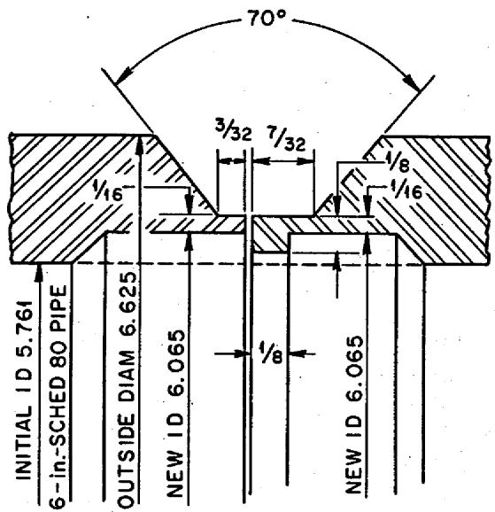  
INTEGRAL WASHER INSERT   
SIMULATED 6-in.-SCHED 40 PIPE

"BUTTERED" WASHER INSERT   
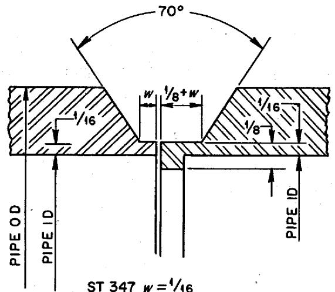  
ST347 $w = 4 / 16$   
ST 304 $w = \frac{3}{32}$   
HASTELLOY N $w = 3 / 32$

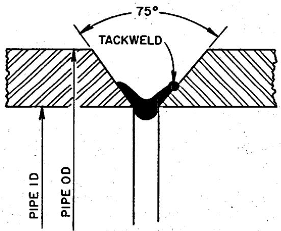  
TYPICAL PIPE JOINT   
TACKED "Y" INSERT   
"V"-BEVELLED PIPE JOINT

TACKED WASHER INSERT

TYPICAL PIPE JOINT   
DIMENSIONS ARE IN INCHES   
Fig. 7.2. Insert-Type Joint Geometries for Orbital Pipe Welding.   
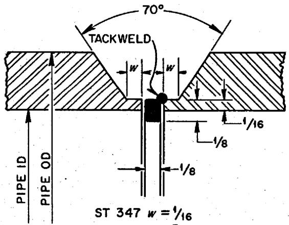  
ST 304 $w = \frac{3}{32}$   
HASTELLOY N $w = 3 / 32$

pipe. We therefore superimposed a 6-in.-OD sleeve over one side of the 5-in. pipe and extended the torch to reach the 5-in. pipe. Even under these extreme conditions, the equipment performed flawlessly. All the joint geometries worked as well for 304 stainless and Hastelloy N pipe welding as for welding type 347 stainless steel. For type 304 stainless and Hastelloy N pipe, slight widening (approximately $\frac{1}{32}$ in.) of the lands of the weld joint groove was required to prevent capillary action from causing the weld metal puddle to wet the upper walls of the joint during the root fusion weld. Metallographic analyses of the welds and discussions of their quality are covered in Sect. 20.1.

In the tests with 6-in. pipe of types 304 and 347 stainless steel and 5-in. pipe of Hastelloy N, root pass fusion welds (without weld wire feed) were made with currents of 77 and 82 amp, at torch speeds of $2^{3/4}$ to $3^{1/2}$ in./min. Slightly higher current (85 to 92 amp) was necessary for the filler passes, which were generally made at the same torch speed and with feed rates of 10 to 15 in./min of 0.045-in.-diam wire. The torch was oscillated approximately $\frac{1}{16}$ in. back and forth during the root passes; oscillation width was increased for subsequent fill passes. Current pulsing in the relatively low frequency ranges presently available within our programmer circuitry appeared to offer no improvement, and therefore current pulsing was omitted from the initial experiments.

Table 7.5 shows the pipe joint welds that were actually made with different pipe sizes and materials and with various types of washer inserts. The washer insert for the type A joint is $\frac{1}{16}$ in. deeper than the $\frac{1}{8}$ -in.-square washer, while the type C joint washer is off-center in the groove by $\frac{1}{32}$ in. Joint types D and E both use $\frac{1}{8}$ -in.-square washers, but D has $\frac{1}{16}$ -in. lands adjacent to the washer and E has lands $\frac{3}{32}$ in. wide. The D and E joints gave the best results.

Illustrations in Sect. 20.1 show the good quality and full penetration of welds on 6-in. type 347 stainless steel, even when the pipe ends mismatch by as much as $\frac{1}{16}$ in., which is the full thickness of the machined land protrusions at the pipe joint ends. Being able to make a good weld with this much mismatch will reduce the alignment problems in remote maintenance.

The pipe in any nuclear reactor system will be under stress from thermal effects, from gravity, and from other factors relating to installation and operation of the system. One must expect springback of the ends when a pipe is cut from maintenance. The springback we have experienced in the experimental reactors and test loops has often been as much as several inches. We know, therefore, that we must be prepared to realign

Table 7.5. Experimental Welds Made with the Orbital Equipment August 20, 1969, Through December 31, 1969   

<table><tr><td>Joint Descriptiona</td><td>No. of Root Pass Joints</td><td>No. of Fill Passes</td></tr><tr><td>6-in. 347 ss butt joint without inserts</td><td>3</td><td>2</td></tr><tr><td>6-in. 347 ss joint type A</td><td>3</td><td>3</td></tr><tr><td>6-in. 347 ss joint type C</td><td>5</td><td>18</td></tr><tr><td>6-in. 347 ss joint type D</td><td>6</td><td>4</td></tr><tr><td>6-in. 347 ss joint type D, 1/16 in. mismatch</td><td>3</td><td>4</td></tr><tr><td>6-in. 347 ss joint, loose Y insert</td><td>7</td><td>13</td></tr><tr><td>6-in. 347 ss joint type D, loose washer</td><td>2</td><td>5</td></tr><tr><td>5-in. 304L ss joint type D</td><td>4</td><td>14</td></tr><tr><td>5-in. INOR-8 joint type D</td><td>5</td><td>5</td></tr><tr><td>5-in. 304L ss joint type E</td><td>2</td><td>11</td></tr><tr><td>5-in. INOR-8 joint type E</td><td>1</td><td>10</td></tr><tr><td>Total (through end of 1969)</td><td>41</td><td>89</td></tr></table>

${}^{a}$ Type A joint washer is ${1}_{16}$ in. deeper than the ${1}_{8}$ -in.-square washer. Type C joint has a ${1}_{32}$ -in. land one side of the ${1}_{8}$ -in.-square washer and a ${3}_{32}$ -in. land on the other. Type D joint has ${1}_{16}$ -in. lands and a ${1}_{8}$ -in.-square washer. Type E joint has ${3}_{32}$ -in. lands and a ${1}_{8}$ -in.-square washer.

replacement pipe assemblies and hold them in position with not more than $\frac{1}{16}$ in. misalignment.

To maintain pipe ends in alignment for final joint preparation and welding, we are presently thinking of using a split sleeve which would be cradled over and clamped to the pipe. The split sleeve includes split roller bearings and a bearing-mounted gear drive at one end to rotate the sleeve about the pipe. Our orbital machinery would then be clamped over this sleeve, and the programmed carriage rotation would be transferred from the carriage rollers to the sleeve drive. The sleeve could be utilized to collect chips during cutting to keep them from entering the reactor system; it would also provide a properly indexed and concentric platform for mounting internal pipe cleaning gear. The sleeve can serve as an alignment and restraining device to guide the pipe ends into proper position during reassembly. It offers "glove-box" welding capability in that the sleeve forms a secondary containment over the pipe. A gas purge stream can be used to seal off the cutter and torch access slot. Other sleeve-type devices of different design but with similar advantages are also being studied.

During the reporting period we were able to borrow additional Air Force orbital equipment for 1- to 3-in. pipe and for 12- to 16-in. pipe. Minor alterations were made to the large Air Force carriage so that it would

accommodate the ORNL-built cutter and weld-head inserts and the modified programmer-controller circuitry. An extra Air Force welding head was modified to incorporate some of the ORNL design changes and thus to provide an interchangeable spare. We also made major improvements to our original ORNL remote welding head to provide additional torch oscillation capability in the short-width ranges. We provided a single-unit disconnect for all torch lines, using the commercial Air Reduction Sales Company HP20A water-cooled TIG torch cable set. The wire feeder spool was provided with more precise bearing support, and the torch position adjustments were modified to increase the horizontal and vertical travel capability. Most important, however, was the modification to incorporate a miniature Hayden dc motor atop the weld head to drive a ball screw assembly for vertical positioning of the torch. Figure 7.3 shows the motor addition.

Preliminary weld trials of the root passes on 12-in. sched 10 type 304 stainless steel pipe had indicated severe problems in maintaining proper arc length control to provide the steady arc voltage needed for uniform weld metal puddling and weld bead control. When the pipe was very much out of round, the mechanical spring-loaded torch positioning device could not adjust well enough to provide acceptable control. The incorporation of an automatically controlled drive motor to move the torch up and down and thus stabilize the welding arc voltage has given vastly improved control. The arc voltage signal that was already available in the programmer is used to actuate the new drive motor and to regulate the torch-to-work spacing.

The original control system used the arc-voltage signal to control the welding wire feed rates. Close torch-to-work spacings lowered the arc voltage and thus called

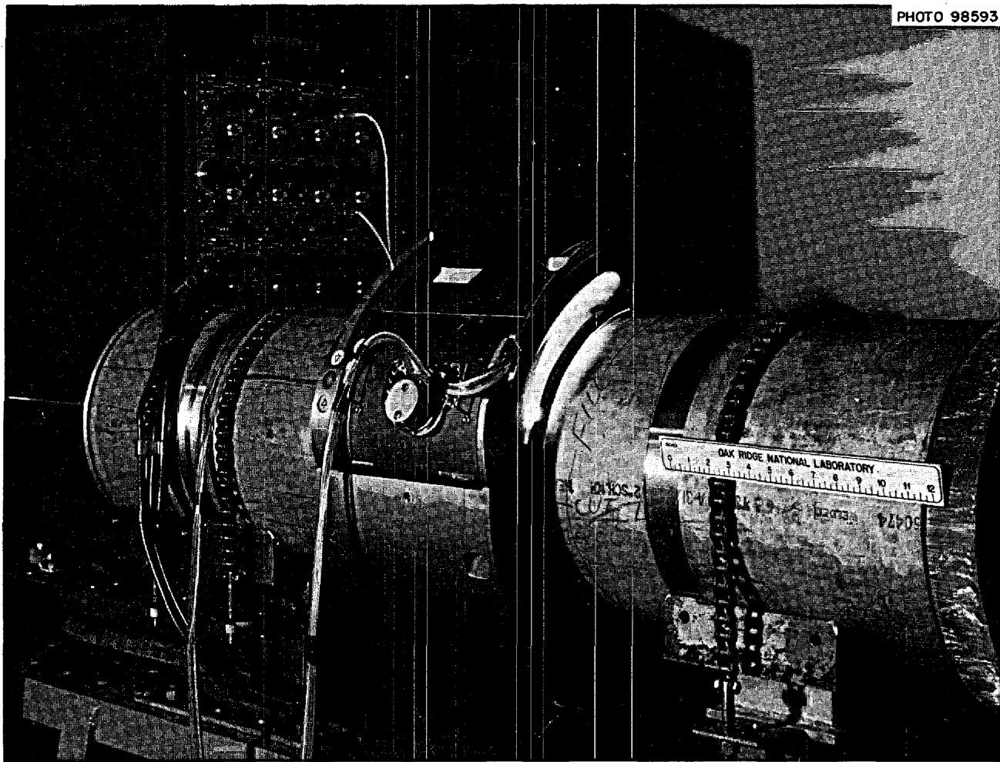  
Fig. 7.3. Orbital Welder Welding 12-in. Pipe. The new torch drive motor is centered on the weld head insert.

for a decrease in the wire feed rate; distant torch-to-work spacings gave higher arc voltages and stimulated an increase in wire feed rate. The system worked well within limited arc voltage changes but was not satisfactory for responding to large changes in arc voltage. Our newly incorporated control system uses the same arc voltage signal and the original wire feed control system within the range where its control is satisfactory, but actuates the new drive motor when a predetermined and preset upper or lower arc voltage setting is reached. The motor then drives the torch to a torch-to-work spacing that gives the designated control point arc voltage. Here the wire-feed-rate control again takes over until its control range limits are reached once more. The actuation range settings for the new torch drive control system are variable to permit numerous weld operations under different welding conditions. Although the old arc voltage control system was satisfactory within its range limits, it works even better in conjunction with the new drive motor control. We have found that we can use the arc voltage to set and control the torch-to-work spacing as well as to maintain this spacing within limits that offer uniformity in welding. The new system is also very useful for root pass fusion weldments without wire feed, as uniformity in torch spacing assures even and full penetration with proper bead shape.

The new arc voltage control system also incorporates automatic "touchdown weld start" and improved weld

repair capability. It is now possible to let the torch seek the vicinity of the pipe, start the arc, and automatically return to a preset arc voltage.

Having a torch which adjusts itself to maintain the proper arc gap for best welding will make it easier to use the remote welding system without the orbital carriage to work on components other than pipes. A variety of welding head suspension and guided movement systems can be used for remote welding much more readily now that self-adjusting features are available for regulating the arc gap.

We also obtained, on loan from the Air Force, automated Orbit-Arc equipment for fusion TIG welding of thin-wall tubing in sizes from $\frac{1}{4}$ to $1\frac{1}{2}$ in. in diameter. This equipment was developed by North American Rockwell Corporation for operation with the orbital system programmer which we already have. Orbit-Arc tube welding equipment is now commercially marketed by the Merrick Engineering Corporation of Nashville, Tennessee, under license from North American Rockwell. In its present form Orbit-Arc equipment cannot be mounted on tubing by remote means, though design changes could permit remote operations. Preliminary results from weld tests to check out the equipment on 1-in. stainless tubing look very promising. The equipment will next be tried on molybdenum tubing and T-111 tantalum alloy tubing.

# 8. MSBR Instrumentation and Controls

S.J.Ditto J.L.Anderson

W. H. Sides, Jr.

# 8.1 CONTROL SYSTEM ANALYSIS

Simulation studies of the reference 1000-Mw(e) MSBR on an analog computer were continued. These simulation studies are an extension of those reported earlier. The basic plant components simulated were the reactor, primary heat exchanger, and steam generator. The lumped-parameter model used for the heat transfer system included ten spatial lumps in the primary heat exchanger and in the steam generator and nine spatial lumps in the reactor core. Two-delayed-neutron-group circulating-fuel kinetics equations were used. A provision for variable flow of the primary salt, secondary salt, and steam, with the attendant variations in film heat transfer coefficients, was included.

The investigation was concerned with the integrated plant response; it was not concerned with a safety analysis of the system, although several of the transients introduced would be of an abnormal nature (e.g., loss of flow). It was an initial probe into the response of the system initiated by such perturbations as changes in load demand, loss of primary or secondary flow, and reactivity changes. A complete report on the methods and results of these studies is in preparation.3

So that the model would have the maximum dynamic range, the system differential equations were not linearized, and, as a result, the available quantity of equipment required the model to be severely limited spatially to minimize the number of equations. In addition the pressure in the water side of the steam generator, as well as in the rest of the plant, and the physical properties of the salts and water were taken to be time invariant. The temperature of the feedwater to the steam generators was also held constant.

The plant control system investigated was one which controlled the reactor outlet temperature as a function of plant load. Steady-state calculations showed that, by specifying the steady-state primary salt flow rate, the reactor outlet temperature, and the feedwater and steam temperatures as a function of load, the remaining steady-state system temperatures and flow rates can be determined. The primary salt flow rate was held constant at its $100\%$ design point value, and the feedwater and steam temperatures were held constant at 700 and $1000^{\circ}\mathrm{F}$ respectively. The reactor outlet temperature was varied with the plant load (Fig. 8.1). The resulting variations of the reactor inlet temperature and the secondary salt hot and cold leg temperatures and flow rates for the analog simulation model are also shown in Fig. 8.1.

The reactor outlet temperature was varied as a linear function of the plant load between 1300 and $1125^{\circ}\mathrm{F}$ for loads between 100 and $50\%$ respectively. For loads below $50\%$ the reactor outlet temperature was varied linearly from 1125 to $1000^{\circ}\mathrm{F}$ at no load. The breakpoint at $50\%$ load was required to maintain the reactor inlet temperature above $1000^{\circ}\mathrm{F}$ at low loads. Figure 8.1 shows that the steady-state secondary salt flow rate decreased with a decreasing load at a rate roughly proportional to load. The secondary salt $\Delta T$ between the hot and cold legs was, therefore, approximately constant. Hence the cold leg temperature was required to decrease from its design point value of $850^{\circ}\mathrm{F}$ at full load to below $725^{\circ}\mathrm{F}$ at loads below about $30\%$ . It dropped below its minimum acceptable value of $800^{\circ}\mathrm{F}$ at approximately $70\%$ load. Steady-state calculations for this model indicate that, by decreasing the reactor outlet temperature more rapidly with decreasing load in the range near $100\%$ load, the secondary salt cold leg temperature decreased less rapidly with load and lowered the power level at which it crossed the $800^{\circ}\mathrm{F}$ minimum.

Since it may be undesirable to decrease the reactor outlet temperature more rapidly with decreasing load than is shown in Fig. 8.1, other methods may be

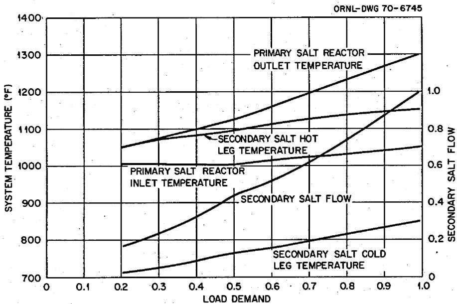  
Fig. 8.1. Steady-State Temperatures and Flows as Functions of Load.

required to maintain the steady-state cold leg temperature above its $800^{\circ}\mathrm{F}$ minimum at the lower power levels. Such methods are: (1) increasing the steam temperature above its $1000^{\circ}\mathrm{F}$ design point as the load decreases, with subsequent attemperation of the steam with injected feedwater; (2) increasing the feedwater temperature above its $700^{\circ}\mathrm{F}$ design point as the load decreases; and (3) reducing the number of steam generators in use as the load decreases. If valves are considered for use in the salt systems, other methods may prove feasible as well.

Further investigations of steady-state temperatures and flows should be carried out, including studies of off-design conditions in the steam generator. Insufficient machine time was available to adjust the present analog model to include a variable steam or feedwater temperature with load, and insufficient equipment was available to include more than one steam generator.

The objective of the load control system used in this study was to maintain the temperature of the steam delivered to the turbines at a design value of $1000^{\circ}\mathrm{F}$ during all steady-state conditions and within a narrow band around this value during plant transients. The control system used in this simulation is shown in Fig. 8.2. It consisted of a steam temperature controller and a reactor outlet temperature controller similar to that used successfully in the MSRE.

To accomplish plant load control in this simulation, an external plant load demand signal was used as input to the plant control system (Fig. 8.2). The steam flow rate was made to follow the demand with a 5-sec time constant.

Steam temperature control was accomplished by varying the secondary salt flow rate. This method was chosen because of the relatively tight coupling which existed between steam temperature and secondary salt flow rate. The measured steam temperature was compared with its set point of $1000^{\circ}\mathrm{F}$ , and any error caused the secondary salt flow rate to change in the appropriate direction at a rate proportional to the error if the error was $2^{\circ}\mathrm{F}$ or less. If the error was greater than $2^{\circ}\mathrm{F}$ , the rate of change of the secondary salt flow rate was limited to its rate of change for a $2^{\circ}\mathrm{F}$ error, which was approximately $11\%/\min$ .

To accomplish reactor outlet temperature control, an external plant load demand signal was used to obtain a reactor outlet temperature set point. The outlet temperature set point vs load demand was the same as that for the steady-state reactor outlet temperature vs load in Fig. 8.1. The measured value of the reactor inlet temperature was subtracted from the outlet temperature set point, and since the primary salt flow rate was constant, a reactor (heat) power set point was generated by multiplying this $\Delta T$ by a proportionality constant. The reactor power set point was a function of inlet temperature during a transient and thus a function of dynamic load. The measured value of reactor power (from neutron flux) was compared with the reactor

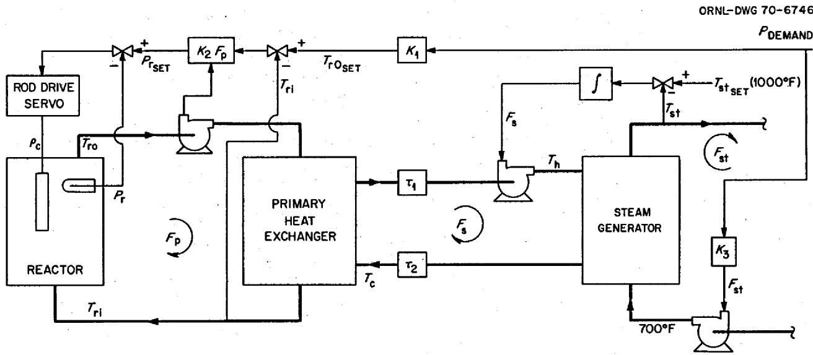  
Fig. 8.2. Plant and Control System Simulation Model

power set point, and any error was fed to the control rod servo for appropriate reactivity adjustment. Under normal conditions the control rod servo added or removed reactivity at a rate proportional to the reactor power error if the error was $1\%$ or less. If the error was greater than $1\%$ , the addition or removal rate was limited to the rate for a $1\%$ error, which was about $0.01\% \delta k / k$ per second. The maximum magnitude of reactivity which the simulation allowed was $\pm 1\% \delta k / k$ .

During a reduction in load demand the control system responded as follows: A reduction in load demand reduced the steam flow rate and the reactor outlet temperature set point. The decreasing steam flow transferred less heat out of the steam generator, and the steam temperature rose. The resulting steam temperature error decreased the secondary salt flow rate to transfer less heat into the steam generator. Simultaneously, the decrease in the reactor outlet temperature set point decreased the power demand set point. The resulting power demand error caused the control rod servo to add negative reactivity to bring the reactor power down. The system reached the new steady state when the heat transfer system was in equilibrium; the steam temperature was $1000^{\circ}\mathbf{F}$ , and the reactor outlet temperature was at its set point.

Various load demand transients were investigated, including changes in demand from $100\%$ load to $90\%$ and from 100 to $50\%$ at $10\% / \mathrm{minute}$ and from 100 to $50\%$ at $5\% / \mathrm{min}$ . The results of these studies are summarized in Table 8.1. Listed in the table are the

Table 8.1. Maximum Magnitude and Rate of Change of System Temperature, Flow Rate, and Reactivity During Change in Load Demand   

<table><tr><td>Load Demand Change</td><td>100 to 90% at 10%/min</td><td>100 to 50% at 10%/min</td><td>100 to 50% at 5%/min</td></tr><tr><td colspan="4">Reactor outlet</td></tr><tr><td>Temperature, °F</td><td>-35</td><td>-175</td><td>-175</td></tr><tr><td>Rate of change, °F/sec</td><td>-0.55</td><td>-0.56</td><td>-0.27</td></tr><tr><td colspan="4">Reactor inlet</td></tr><tr><td>Temperature, °F</td><td>-10</td><td>-50</td><td>-50</td></tr><tr><td>Rate of change, °F/sec</td><td>-0.10</td><td>-0.15</td><td>-0.09</td></tr><tr><td colspan="4">Secondary salt hot leg</td></tr><tr><td>Temperature, °F</td><td>-8.8</td><td>-60</td><td>-60</td></tr><tr><td>Rate of change, °F/sec</td><td>-0.10</td><td>-0.22</td><td>-0.17</td></tr><tr><td colspan="4">Secondary salt cold leg</td></tr><tr><td>Temperature, °F</td><td>-18</td><td>-80</td><td>-80</td></tr><tr><td>Rate of change, °F/sec</td><td>-0.31</td><td>-0.36</td><td>-0.18</td></tr><tr><td colspan="4">Steam</td></tr><tr><td>Temperature, °F</td><td>7</td><td>10</td><td>2</td></tr><tr><td>Rate of change, °F/sec</td><td>-0.19</td><td>-1.0</td><td>&lt;0.1</td></tr><tr><td colspan="4">Secondary salt flow rate</td></tr><tr><td>Magnitude, %</td><td>-14</td><td>-58</td><td>-56</td></tr><tr><td>Rate of change, %/min</td><td>11</td><td>-11</td><td>-9</td></tr><tr><td colspan="4">Control reactivity</td></tr><tr><td>Magnitude, % δk/k</td><td>-0.013</td><td>-0.06</td><td>-0.06</td></tr><tr><td>Rate of change, %/sec</td><td>0.0002</td><td>-0.0002</td><td>-0.0001</td></tr></table>

values of the maximum magnitude of the deviation from the initial steady state of a system variable and the maximum rate of change of that variable. The values listed are the maxima encountered at any time during a transient; they are not necessarily initial rates of change or differences in steady-state magnitudes.

The results of a load demand change from $100\%$ to $50\%$ at $5\%/\min$ are shown in Fig. 8.3. The steam temperature was controlled to within $2^{\circ}\mathrm{F}$ of its design point, and the reactor outlet temperature closely followed its set point.

The load demand transient results indicate a stable well-behaved system. Normal load changes at a rate of $5\%/\min$ or less can probably be controlled by a system similar to that used on the MSRE with the addition of the steam temperature controller.

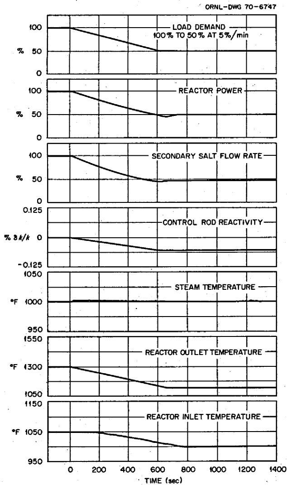  
Fig. 8.3. Load Demand Change from 100 to $50\%$ at $5\%/\min$ .

Transients initiated by positive and negative reactivity excursions were investigated. The excursions included a negative step in reactivity of $-0.2\% \delta k / k$ and positive steps of $0.15\% \delta k / k$ with and without the control rod servo operative. The results of these studies are shown in Table 8.2. The positive reactivity excursions were begun with the plant at an initial power level of $25\%$ in order to obtain the maximum positive power excursion for this simulation. The maximum allowable power was $160\%$ of design power. The results indicate that certain reactivity transients may require additional control if undesirably low temperatures of the salts are to be avoided. For example, if an insertion of negative reactivity in the core reduces the reactor power, then the load must be reduced at a rate sufficient to avoid overcooling the salts.

Table 8.2. Maximum Magnitude and Rate of Change of System Temperature, Flow Rate, and Reactivity Resulting from Step Changes in Reactivity   

<table><tr><td rowspan="2"></td><td colspan="3">Reactivity Step</td></tr><tr><td>-0.2%</td><td>+0.15% from 25% Power Level</td><td>+0.15% from 25% Power Level with No Control Reactivity</td></tr><tr><td colspan="4">Reactor outlet</td></tr><tr><td>Temperature, °F</td><td>-100</td><td>100</td><td>592</td></tr><tr><td>Rate of change, °F/sec</td><td>-36</td><td>50</td><td>63</td></tr><tr><td colspan="4">Reactor inlet</td></tr><tr><td>Temperature, °F</td><td>-40</td><td>56</td><td>580</td></tr><tr><td>Rate of change, °F/sec</td><td>-6.9</td><td>14</td><td>19</td></tr><tr><td colspan="4">Secondary salt hot leg</td></tr><tr><td>Temperature, °F</td><td>-24</td><td>65</td><td>&gt;350</td></tr><tr><td>Rate of change, °F/sec</td><td>-1.1</td><td>9.7</td><td>13</td></tr><tr><td colspan="4">Secondary salt cold leg</td></tr><tr><td>Temperature, °F</td><td>-4</td><td>-15</td><td>-40</td></tr><tr><td>Rate of change, °F/sec</td><td>-7.1</td><td>0.48</td><td>0.67</td></tr><tr><td colspan="4">Steam</td></tr><tr><td>Temperature, °F</td><td>-32</td><td>28</td><td>195</td></tr><tr><td>Rate of change, °F/sec</td><td>-3.4</td><td>2.2</td><td>5.0</td></tr><tr><td colspan="4">Secondary salt flow rate</td></tr><tr><td>Magnitude, %</td><td>10</td><td>-6.5</td><td>-12</td></tr><tr><td>Rate of change, %/min</td><td>11</td><td>11</td><td>11</td></tr><tr><td colspan="4">Control reactivity</td></tr><tr><td>Magnitude, % δk/k</td><td>0.22</td><td>-0.28</td><td>0</td></tr><tr><td>Rate of change, %/sec</td><td>0.01</td><td>0.01</td><td>0</td></tr></table>

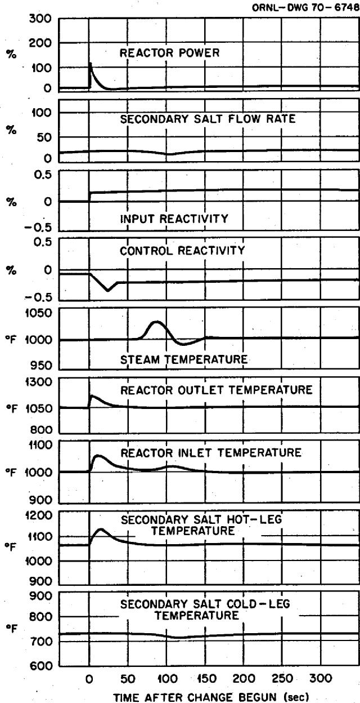  
Figure 8.4 shows the results of a positive step in reactivity of $0.15\%$ from an initial power of $25\%$ . The reactor power increased rapidly to about $144\%$ while the control rod added negative reactivity at its maximum rate. The sudden increase in the reactor power caused a rapid increase in the reactor outlet temperature. An increase in the reactor inlet temperature from its initial value followed. When the inlet temperature returned to $1040^{\circ}\mathrm{F}$ , the reactor power had decreased to $8.5\%$ . Since the reactor outlet temperature set point was constant during this transient at $1063^{\circ}\mathrm{F}$ , the   
Fig. 8.4. Input Reactivity Step of $0.15\%$ from $25\%$ Power Level.

reactor power set point at this time was $9\%$ , and thus the control system began to add positive reactivity to the system to increase the reactor power. As the inlet temperature approached $1000^{\circ}\mathrm{F}$ , the power set point approached the initial level of $25\%$ . The temporary increase in the reactor inlet temperature beginning at approximately 70 sec was due to the decrease in the secondary salt flow rate, which was attempting to control the delayed response in the steam temperature. The increasing reactor temperatures produced an increase in the steam temperature, which was delayed by about 65 sec because of the transit time of the secondary salt between the heat exchangers at the initial $22\%$ flow rate. The steam temperature rose to about $1028^{\circ}\mathrm{F}$ before the decreasing secondary salt flow rate returned it to $1000^{\circ}\mathrm{F}$ . The relatively long secondary salt loop transit time reduced the capability of the secondary salt flow rate to control the steam temperature, and several oscillations were allowed to occur before the system returned to normal steady-state conditions at $25\%$ power level. The total excess energy added to the system by the reactor power "pulse" from the initial power rise to the point at which the power first returned to the $25\%$ level was approximately 13,000 Mwsec.

Several transient cases were studied involving primary and secondary salt flow rates. Some results of these studies are summarized in Table 8.3. The simultaneous coastdown of all four primary pumps to an arbitrary minimum flow of $10\%$ was investigated. It was assumed that some device such as a battery-powered pony motor on the primary pumps would maintain some minimum pumping capacity in the primary loop upon loss of power to the main primary pump motors. The primary salt flow rate was thus reduced in all parts of the primary loop to $10\%$ of full flow at a rate of $10\%/\mathrm{sec}$ . The results of this transient are shown in Fig. 8.5. The proportionality constant between desired reactor $\Delta T$ and reactor power set point was decreased with the primary salt flow rate, which produced the reactor power error signal. Negative reactivity was thus introduced at the maximum rate, and the reactor power decreased in about 25 sec to about $12\%$ . The maximum amount of control reactivity required was about $-0.21\% \delta k/k$ . The reactor outlet temperature rose at first to about $1400^{\circ}\mathrm{F}$ in 15 sec, then decreased to about $1340^{\circ}\mathrm{F}$ . The inlet temperature fell below $1000^{\circ}\mathrm{F}$ in 15 sec. The loss of primary flow while maintaining full heat extraction from the steam generators caused the secondary salt hot leg temperature to fall sharply. The cold leg temperature also decreased. The decreasing secondary salt temperatures caused a severe reduction

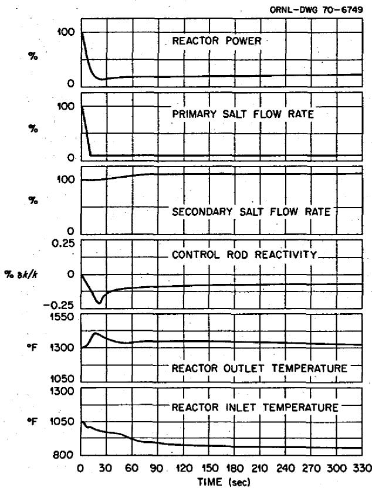  
Fig. 8.5. Loss of Primary Flow to $10\%$ at $10\%/\mathrm{sec}$ .

in steam temperature. The secondary salt flow rate increased to its limit of $110\%$ in an attempt to maintain the steam temperature at $1000^{\circ}$ , but with little success.

Due to the assumptions concerning the variations in steam properties made in formulating the model of the steam generator used in this simulation, the useful range of the steam generator model was greatly limited. The model, therefore, simulated only small variations in steam temperature near $1000^{\circ}\mathrm{F}$ . Loss of primary or secondary flow to $10\%$ , however, effectively decoupled the reactor from the steam system, and large-magnitude changes in the steam generator had a greatly reduced effect on the reactor system. Only the direction of these changes was important.

A second case involved the same loss of primary flow as described in the first case but with a reduction in load demand from 100 to $20\%$ at a rate of $20\%/\mathrm{sec}$ . This rate was determined by the assumed maximum rate at which the turbine steam interceptor valves could close. It was assumed that an auxiliary heat rejection system would be capable of disposing of $20\%$ of the full plant power. The reduction of load was initiated 5 sec after the initiation of the primary pump coastdown in order to simulate some delay time for the system to sense and evaluate the incident. The proportionality constant between the desired reactor $\Delta T$ and reactor power set point again was reduced with the reduction in

Table 8.3. Maximum Magnitude and Rate of Change of System Temperature, Flow Rate, and Reactivity During Flow Transients   

<table><tr><td rowspan="2"></td><td colspan="4">Flow Rate Change</td></tr><tr><td>Loss of Primary Flowa</td><td>Loss of Primary Flow and Load Reductiona,b</td><td>Loss of Secondary Flowa</td><td>Loss of Secondary Flow and Load Reductiona,b</td></tr><tr><td colspan="5">Reactor outlet</td></tr><tr><td>Temperature, °F</td><td>100</td><td>-250</td><td>-30</td><td>-320</td></tr><tr><td>Rate of change, °F/sec</td><td>13</td><td>13</td><td>-4.4</td><td>17</td></tr><tr><td colspan="5">Reactor inlet</td></tr><tr><td>Temperature, °F</td><td>-200</td><td>-220</td><td>210</td><td>135</td></tr><tr><td>Rate of change, °F/sec</td><td>-8.3</td><td>-8.8</td><td>20</td><td>20</td></tr><tr><td colspan="5">Secondary salt flow rate</td></tr><tr><td>Magnitude, %</td><td>10</td><td>10</td><td>-90</td><td>-90</td></tr><tr><td>Rate of change, %/min</td><td>11</td><td>11</td><td>-600</td><td>-600</td></tr><tr><td colspan="5">Control reactivity</td></tr><tr><td>Magnitude, % δk/k</td><td>-0.21</td><td>-0.46</td><td>-0.063</td><td>-1.0</td></tr><tr><td>Rate of change, %/sec</td><td>-0.01</td><td>-0.01</td><td>-0.01</td><td>-0.01</td></tr></table>

${}^{a}$ Flow rate decreased to 10% at a rate of 10%/sec.   
$b$ Load demand reduced to $20\%$ at $20\%/\mathrm{sec}$ initiated 5 sec after initiation of flow reduction.

flow rate. The reactor power reached $12\%$ in about 20 sec. The reactor outlet temperature again rose to about $1400^{\circ}\mathrm{F}$ , then decreased to about $1200^{\circ}\mathrm{F}$ at 60 sec, and continued to decrease at a rate of about $0.3^{\circ}\mathrm{F} / \mathrm{sec}$ . The reactor inlet temperature transient was much like that in the previous case, as were the transients in the secondary salt hot and cold leg temperatures.

The steam temperature initially rose in this transient since the fast load reduction dominated the response in the steam generator when it occurred 5 sec after the primary flow coastdown. However, this did not prevent large sudden decreases in the secondary salt temperatures. Some additional corrective action may be required to prevent such decreases in temperature, such as a reduction in secondary salt flow rate when primary flow is lost.

The results of these primary flow transients indicate a need for further investigation of the conditions existing in the secondary salt loops and steam generators following a loss of primary flow transient. Attention must be paid to resulting magnitudes and rates of change of temperature in this part of the system. The model of the steam generator used in this simulation was not adequate for such studies due to the approximations made.

The result of the simultaneous reduction of the secondary salt flow rate in all four secondary loops to a level of $10\%$ of full flow (the assumed level of auxiliary pumping power) at a rate of $10\%/\mathrm{sec}$ is shown in Fig. 8.6. The load demand was maintained constant at $100\%$ . As in the case of loss of all primary flow to $10\%$ , the loss of secondary flow decoupled the reactor from the steam system. For the case of constant load demand, the reactor inlet temperature initially rose about $200^{\circ}\mathrm{F}$ in about 60 sec. Since the load demand remained at $100\%$ , the reactor outlet temperature set point remained at $1300^{\circ}\mathrm{F}$ . The rising inlet temperature thus decreased the reactor power set point, and negative reactivity was added to reduce the reactor power. The outlet temperature control system maintained the outlet temperature at $1300^{\circ}\mathrm{F}$ with a maximum variation of $30^{\circ}\mathrm{F}$ .

The reduction in secondary salt flow rate with constant load demand on the steam generators caused an increase in the difference between the secondary salt hot and cold leg temperatures. The hot leg temperature increased, and the cold leg temperature decreased. The cold leg temperature approached the freezing point. With the loss of secondary salt flow, there was no steam temperature control.

When the load demand was decreased rapidly (20%/sec) to 20% starting 5 sec after the start of the

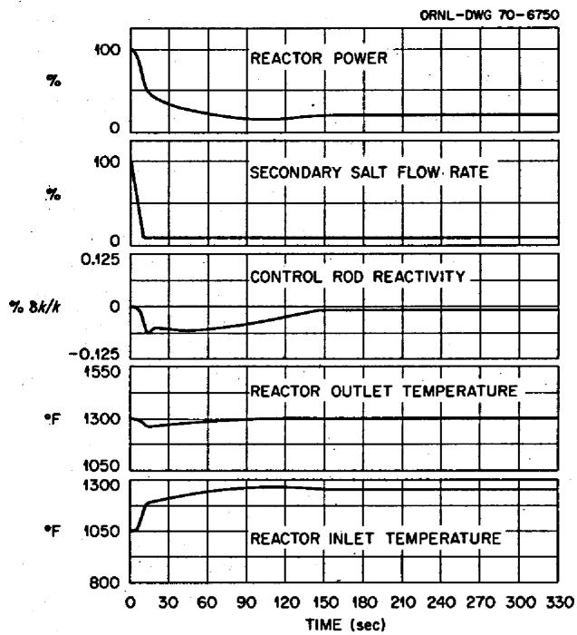  
Fig. 8.6. Loss of Secondary Flow to $10\%$ at $10\%/\mathrm{sec}$ .

loss of secondary salt flow, the initial parts of the transients in system temperatures were the same. However, when the load demand was decreased, the reactor outlet temperature set point was decreased to $1050^{\circ}\mathrm{F}$ for $20\%$ load. Therefore, the reactor outlet temperature controller began to bring the outlet temperature down to $1050^{\circ}\mathrm{F}$ . The initial rise in reactor inlet temperature caused a decrease in the reactor power set point as before, and negative control reactivity was inserted to bring the power down. The power decreased to about $10\%$ in 30 sec. The secondary salt hot leg temperature initially tended to rise and the cold leg to fall as before, but now the decreasing reactor outlet temperature decreased the hot leg temperature after its initial increase. The cold leg temperature again approached its freezing point.

The loss of salt flow in the primary or secondary salt loops decoupled the reactor system from the steam generating system. The reactor outlet temperature control system was able to control the reactor outlet temperature following the loss of primary or secondary flow with or without a subsequent reduction in load demand. If the load demand was not reduced, the control system maintained the reactor outlet temperature within $100^{\circ}\mathrm{F}$ of its design point of $1300^{\circ}\mathrm{F}$ . When a reduction in load demand followed the loss of flow, the controller brought the reactor outlet temperature down in accordance with the accompanying reduction

in its set point $(1050^{\circ}\mathrm{F}$ at $20\%$ load). The reactor inlet temperature, however, decreased well below the freezing point of the primary salt upon loss of the primary flow, due to the increased transit time of the salt in the primary heat exchanger, whether or not the load demand was reduced 5 sec after loss of flow. Therefore, upon the loss of primary flow, steps must be taken to prevent a reduction in the reactor inlet temperature. Decreasing the secondary salt flow through the primary heat exchangers to transfer out less heat would probably be the most effective way to accomplish this.

The secondary salt temperatures also decreased upon loss of primary flow. To prevent an undesirably low temperature of the cold leg, the load must be reduced sufficiently fast. Decreasing the secondary salt flow rate to control reactor inlet temperature, as discussed above, aggravates this situation, since the transit time of the secondary salt through the steam generator is increased, further lowering the secondary salt temperature. Upon loss of primary flow, then, the secondary salt flow rate

must be decreased to prevent a low reactor inlet temperature, and the load must be reduced sufficiently fast to prevent low secondary salt cold leg temperatures.

Upon loss of secondary salt flow to $10\%$ , the reactor inlet temperature tended to increase and remain above $1050^{\circ}\mathrm{F}$ when the load demand was not reduced (i.e., constant outlet temperature set point). When the load demand (and outlet temperature set point) was reduced, the inlet temperature remained above $960^{\circ}\mathrm{F}$ . Some additional control action may be required to maintain the inlet temperature above $1000^{\circ}\mathrm{F}$ upon loss of secondary flow.

Loss of secondary salt flow rate produced undesirable decreases in the secondary salt cold leg temperatures. Therefore, as in the case of loss of primary flow, the load must be reduced at a rate sufficiently fast to prevent freezing of the secondary salt when loss of secondary salt flow rate occurs.

# 9. Heat and Mass Transfer and Thermophysical Properties

H.W.Hoffman J.J.Keyes, Jr.

# 9.1 HEAT TRANSFER

J.W.Cooke

In the previous semiannual report, results of heat transfer experiments employing a proposed MSBR fuel salt $\mathrm{(LiF - BeF_2 - ThF_4 - UF_4}$ 67.5-20-12-0.5 mole $\%$ ) flowing in a horizontal tube 0.25 in. OD, 0.035 in. wall, 24.5 in. long, were summarized; correlations were presented for values of the Reynolds modulus $N_{\mathrm{Re}}$ less than 1000 and greater than about 3500. It was pointed out that, in the upper-laminar and lower-transitional flow ranges $(1000 < N_{\mathrm{Re}} < 3500$ approximately), irregular axial temperature profiles precluded analysis of the data to obtain a valid heat transfer coefficient for developed flow. We also observed that the magnitude of the heat flux affected the temperature profile significantly with the result that, at sufficiently high flux, turbulent flow did not develop in the test section (130

diameters long) for values of the Reynolds modulus as high as 5000.

Heat Flux Effects. - In Fig. 9.1 local heat transfer coefficients relative to the heat transfer coefficient at the test-section outlet are compared for heat fluxes of $0.74 \times 10^{5}$ and $2.55 \times 10^{5}$ Btu hr $^{-1}$ ft $^{-2}$ at comparable Reynolds moduli in the low-transitional range. Whereas at the low heat flux (upper curve) the normalized heat transfer coefficient approaches a nearly constant value of unity (indicative of developed flow) about 14 in. from the test section inlet, at the high heat flux (lower curve) the normalized coefficient does not approach unity until very close to the outlet. These results suggest that the effect of heating the flowing salt is to retard the development of fluid-dynamical equilibrium through the effect of temperature on fluid viscosity. It is known from hydrodynamic stability theory, for example, that heat transfer from a solid interface to a fluid whose viscosity decreases with increasing temperature has the effect of delaying transition. This is thought to be the applicable mechanism in these experiments. It would also be expected

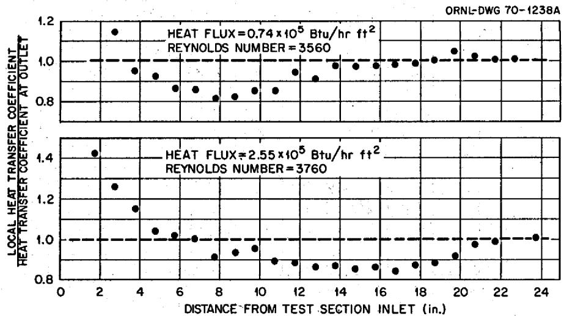  
Fig. 9.1. Variation in Ratio of Local to Outlet Heat Transfer Coefficient with Distance from the Inlet for Two Values of Heat Flux (LiF-BeF $_2$ -ThF $_4$ -UF $_4$ ; 67.5-20-12-0.5 Mole%).

that the effect of heat flux would be greatest for fluids having high Prandtl moduli because the thermal boundary layer is relatively thinner, in respect to the hydrodynamic boundary layer, than for low $N_{\mathbf{Pr}}$ fluids. The Prandtl modulus for the MSBR fuel salt is about 13 at the conditions for which the results depicted in Fig. 9.1 were obtained, probably high enough to show a significant effect of heat flux. Additional experiments will be carried out with the objective of establishing quantitatively the influence of heat flux in the transitional flow range.

Natural Convection Effects. - The possibility that natural convection may have influenced the heat transfer results at low values of the Reynolds modulus in a horizontal tube led to an attempt to obtain coefficients for upflow and downflow in a vertically oriented test section. Accordingly, the test element employed in the horizontal flow studies was repositioned vertically; it was planned to use the test section in this orientation for studies of the effect of buoyancy forces and later also for gas dispersion studies. Eight preoperational check-out runs were made before

numerous salt leaks necessitated shut down of the loop. These leaks appeared to be associated with thermal stresses arising from repeated freezing and melting of the salt and were likely intensified by piping rigidity necessitated by the vertical orientation.

Results of the eight heat transfer runs (four in upflow and four in downflow) are compared with the earlier results for horizontal flow in Fig. 9.2. While the measured heat transfer function $N_{\mathrm{Nu}} / (N_{\mathrm{Pr}})^{1 / 3}(\mu /\mu_s)^{0.14}$ in downflow agrees well with that for horizontal flow, the function for upflow is about $12\%$ lower. In the range of Reynolds modulus over which the vertical flow results were obtained $(6000 < N_{\mathrm{Re}} < 10,000)$ , well-established criteria indicate that no significant effect of natural convection should have been observed. The observed difference between the upflow and downflow measurements is believed to result from errors associated with fluid temperature measurement. Discrepancies in the heat balances (ratio of sensible heat gained by the fluid plus heat losses to heat generated electrically) were such as to account for the differences in the heat transfer

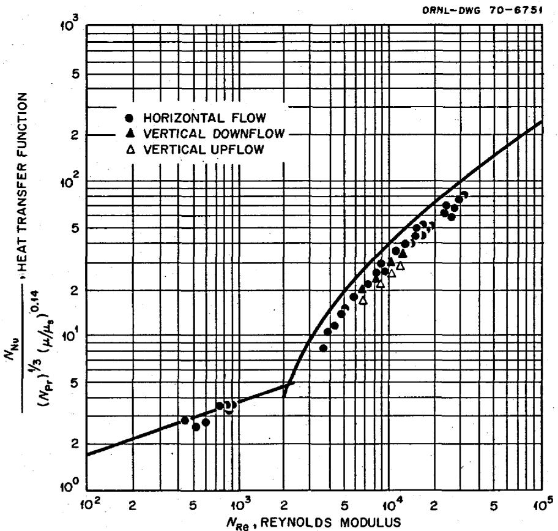  
Fig. 9.2. Comparisons of Previous Heat Transfer Measurements for Horizontal Flow with the Results for Vertical Flow for a Proposed MSBR Fuel Salt (LiF-BeF $_2$ -ThF $_4$ -UF $_4$ ; 67.5-20-12-0.5 Mole%). The curves are published empirical correlations.

function. The sensible heat gained by the fluid was used directly in determining the Nusselt modulus $N_{\mathbf{Nu}}$ for all runs.

Cover-Gas Effects. - Thus far, all tests have been run with argon cover gas. To determine whether a more soluble gas might have an effect upon the heat transfer coefficient, measurement will be made using helium as cover gas. Helium is an order of magnitude more soluble in molten salts than argon, and hence more gas evolution would be expected from inlet to outlet. The test section has been reoriented horizontally, and 40 new runs have been made with argon to establish that the system is functioning properly and that the results are consistent with those obtained earlier using the same test section in the horizontal orientation. These runs have covered a Reynolds modulus range from 8000 to 12,000 and a heat flux range from 100,000 to 200,000 Btu hr $^{-1}$ ft $^{-2}$ at an average fluid temperature of $1330^{\circ}\mathrm{F}$ and corresponding Prandtl modulus of about 6.0. The results agree on the average with the earlier results to within 3%.

Upon completion of studies with helium as cover gas, we plan to investigate the effect of injecting helium bubbles into the flowing salt directly upstream from the test section. A water-flow mockup is being used to evaluate possible injection techniques.

# 9.2 THERMOPHYSICAL PROPERTIES

# J.W.Cooke

The variable-gap apparatus used to measure the thermal conductivity of molten salts has been improved by the addition of a heat meter to permit comparison of the heat flowing out of the specimen with the heat flowing into the specimen. The latter heat flow is obtained from the current flow and voltage drop through the main specimen heater. In Fig. 9.3 the heat meter is seen to consist of a 1.25-in.-diam by 4-in.-long bar of type 347 stainless steel surrounded by two concentric cylinders of the same material and welded to a water-cooled stainless steel heat sink. A $\frac{1}{3}$ in. gap between the cylinders reduces radial heat flow.

The heat flow out of the specimen is determined from the measured temperature gradient and the known conductivity of the stainless steel bar. A movable thermocouple probe in a 0.070-in.-diam hole along the center line of the heat meter is used to measure the axial temperature gradient. Thermocouple conduction

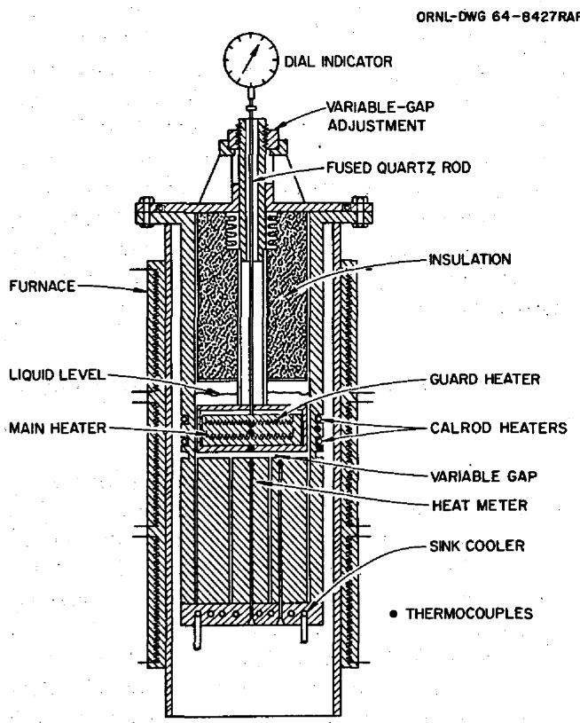  
Fig. 9.3. Schematic Cross Section of Thermal Conductivity Cell.

error is minimized by using a special probe with a 0.5-in. extension beyond the junction having the same conductivity as the probe itself.

Errors associated with radial heat flow in the heat meter will be reduced by (1) adjusting the furnace heat rate to reduce the radial temperature gradient that is measured by a thermocouple probe in the adjacent concentric cylinder and (2) calculating the radial heat losses by means of a computer analysis of the axial temperature gradient along the center line in terms of a two-dimensional heat-flow model and the known properties of type 347 stainless steel. The new apparatus will particularly improve the accuracy of determination of thermal conductivities of low-conductivity specimens. By using the heat meter rather than the input electrical measurement to determine heat flow through the specimen, much of the uncertainty arising from shorting of heat around the specimen by the container walls is eliminated.

The modified apparatus will be used to study conductivities in the $\mathrm{LiF - BeF_2 - ThF_4}$ system. Measurements will begin with purified $\mathrm{BeF_2}$ (in the solid and liquid states) and end with purified LiF. Six binary compositions (Li-Be) and several ternary mixes (Li-Be-Th) will be examined. From these measurements we hope to develop means for estimating the conductivity of other molten fluoride salt mixtures of these constituents with the same certainty but with less effort and cost than would be required for detailed experimental measurements.

# 9.3 MASS TRANSFER TO CIRCULATING BUBBLES

# T. S. Kress

The apparatus was operated successfully after some modification necessitated by results of shakedown tests, and the instrumentation was calibrated. Preliminary tests were made to determine the characteristics of the helium bubbles produced by the bubble generator, including effects of liquid flow rate, gas flow rate, and addition of a surface-active agent. Satisfactory bubbles were produced within the desired diameter range, but independent control of bubble size was not obtained. The size depended strongly on liquid flow rate, moderately on probe position, and weakly on void fraction.

$^{4}$ MSR Program Semiann. Progr. Rept. Aug. 31, 1969, ORNL-4449, p. 93.

Sample photographs of the bubbles produced are shown in Fig. 9.4. A typical photograph was analyzed manually to establish the bubble-diameter distribution shown in Fig. 9.5. These data, replotted on a log-normal probability graph, are presented in Fig. 9.6, which indicates that a log-normal function does indeed satisfactorily describe the distribution.

The preliminary tests also served to establish the operating limits of the system. It was determined, for example, that experiments can be carried out within the following ranges of the primary variables:

<table><tr><td rowspan="2">Variable</td><td colspan="2">Range</td></tr><tr><td>From</td><td>To</td></tr><tr><td>Reynolds modulus</td><td>8 × 103</td><td>105</td></tr><tr><td>Schmidt modulus</td><td>400</td><td>4000</td></tr><tr><td>Void fraction, Qg/QL, %</td><td>0.1</td><td>0.5</td></tr><tr><td>Bubble diameter, in.</td><td>0.01</td><td>0.05</td></tr></table>

Other variables and ranges of interest include test section diameters (2 and 1.5 in.), test section orientation (horizontal and vertical), and surfactant concentration (zero or "high"). Since the magnitudes of the prime variables are not independent of the magnitudes of the other variables, a fractional factorial experiment will suffice.

Experiments have been completed with and without addition of a surfactant (butyl alcohol) for a Schmidt modulus of 400 (water with no glycerol added) over the desired ranges of Reynolds modulus, void fraction, and

PHOTO 99443

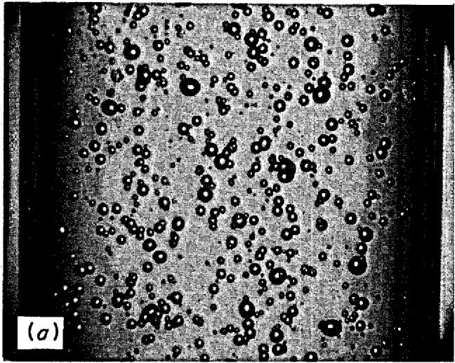

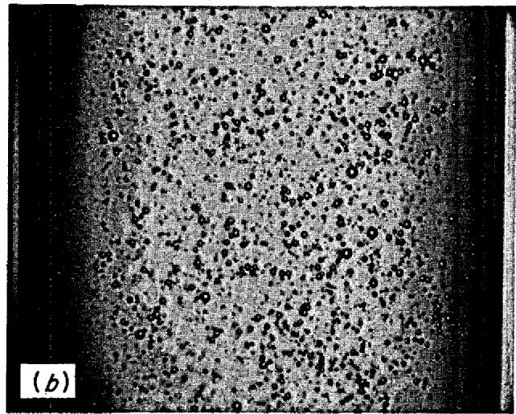  
Fig. 9.4. Typical Sample of Bubbles Produced by the Bubble Generator Illustrating Effect of Liquid Flow on Bubble Size. Probe fully retracted to produce maximum bubble size. Fluid is $70\%$ water plus $30\%$ glycerol. (a) Liquid flow, $40\mathrm{gpm}$ ; void fraction, $0.5\%$ . (b) Liquid flow, $75\mathrm{gpm}$ ; void fraction, $0.2\%$ .

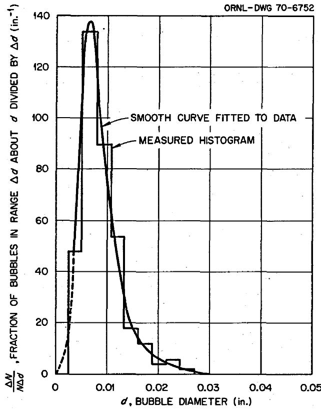  
Fig. 9.5. Typical Bubble Diameter Distribution Produced by Bubble Generator. Probe partially withdrawn, water flow $\cong 100$ gpm, ratio of volumetric gas to liquid flows, $Q_{g} / Q_{L}\cong 0.5\%$

bubble diameter. The results have not been analyzed; however, in each experiment the anticipated linear transient curve of log concentration vs time appears to have been obtained, as shown in Fig. 9.7. A curve similar to Fig. 9.7 should be obtained for each combination of the system variables.

The slopes of the transient curves are related to the test-section-average mass transfer coefficient and to the loop transit time $\tau_{i}$ for run $i$ . The overall loop transit time is seen to be the sum of the transit times for each section $\tau_{ik}$ ,

$$
\tau_ {i} \equiv \sum_ {k} \tau_ {i k} = \sum_ {k} L _ {k} A _ {k} / Q _ {i} = \bar {V} _ {L} / Q _ {i},
$$

in which

$\tau_{i} =$ loop transit time for ith run,

$\tau_{ik} =$ transit time through section $k$ for ith run,

$L_{k} =$ effective length of section $k$

$A_{k} =$ effective cross-sectional area of section $k$

$Q_{i} =$ volumetric flow rate of the ith run, and

$\overline{V}_L =$ the total loop volume assuming there are no regions of zero (or little) flow.

The loop volume was measured during the preliminary tests and found to be $2.52\mathrm{ft}^3$ with an estimated $0.1\mathrm{ft}^3$ being "low-flow" volume.

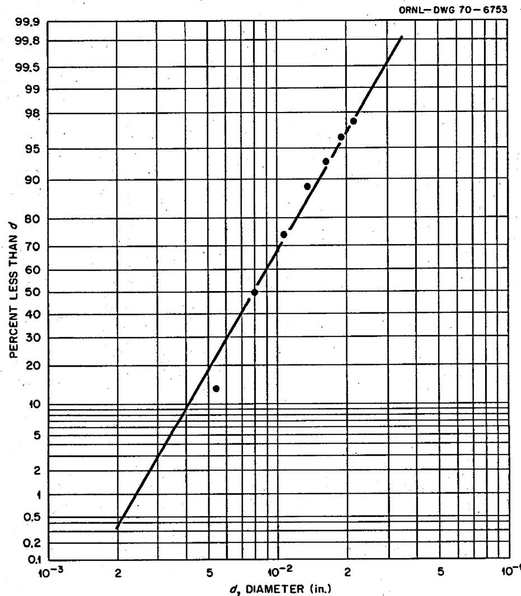

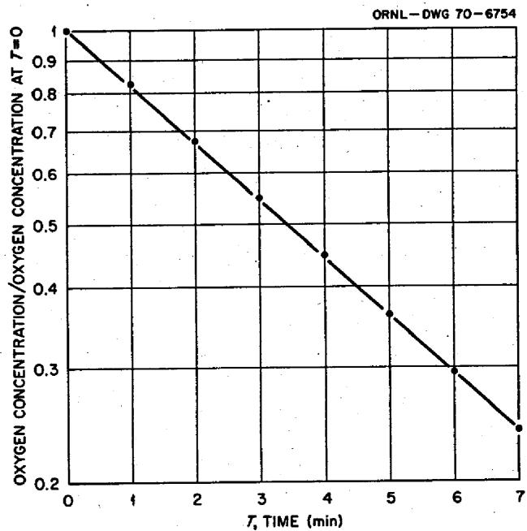  
Fig. 9.6. Replot of Data from Fig. 9.5 Showing Comparison with a Log-Normal Distribution.   
Fig. 9.7. Typical Experimental Curve of Log-Concentration Ratio vs Time. Water flow $= 75 \, \text{gpm}$ , void fraction of bubbles $\cong 0.4\%$ .

# Part 3. Chemistry

W-R.Grimes

The chemical research and development efforts described below provide extensive support to the Molten-Salt Reactor Experiment (MSRE) and to the development of advanced molten-salt reactor systems.

A substantial fraction of these efforts was devoted to investigations of the chemistry of the MSRE fuel salt and off-gas streams and the transport, distribution, and chemistry of fission products in these streams. Studies of the relation of redox potential and distribution of fission products within the fuel containment system have continued. Investigations of fission product behavior have been continued with specimens removed from the MSRE fuel circuit, with the MSRE off-gas sampler-analyzer, with "synthetic" fuel mixtures, and by investigation of the chemistry of molybdenum, niobium, and ruthenium in molten fluoride mixtures.

A broad program of fundamental investigation into the physical chemistry of molten salt systems was maintained; from it are derived the basic data for reactor and chemical reprocessing design. Within the scope of these efforts is included research in solution thermodynamics and phase equilibria, crystal chemistry, electrochemistry, spectroscopy, transport processes, and theoretical aspects of molten-salt chemistry.

Effective separation of rare-earth fission products from fluoride salt streams which contain thorium fluoride is the keystone to development of semicon

tinuous reprocessing methods of single-fluid molten-salt reactors. Efforts to develop chemical separations processes for this application continue to emphasize methods which employ selective reduction and extraction into molten bismuth containing either lithium or thorium as the reducing agent. As a consequence of recent development of a fluoride-metal-chloride transfer process and laboratory-scale demonstration of its efficacy for separation of the lanthanide fluorides from MSBR fuel, part of the present effort has been devoted to quantitative verification of the chemical equilibria of importance to newly evolving modifications of the reductive extraction process.

The principal emphasis of analytical chemical development programs has been placed on methods for use in semiautomated operational control of molten-salt breeder reactors, for example, the development of in-line analytical methods for the analysis of MSR fuels, for reprocessing streams, and for gas streams. These methods include electrochemical and spectrophotometric means for determination of the concentration of $U^{3+}$ and other ionic species in fuels and coolants, and adaptation of small on-line computers to electroanalytical methods. Parallel efforts have been devoted to the development of analytical methods related to assay and control of the concentration of water, oxides, and tritium in fluoroborate coolants.

# 10. Chemistry of the MSRE

# 10.1 CORROSION OF THE MSRE FUEL SALT CIRCUIT

R. E. Thoma

Completion of the Molten-Salt Reactor Experiment has demonstrated that as a container material for molten fluorides, Hastelloy N is even more corrosion

resistant than has been estimated previously. As evidenced by changes in the chromium concentration of the fuel salt, the average cumulative corrosion sustained by the MSRE fuel circuit since nuclear operations were initiated in 1965 extends to a depth of 0.46 mil. This value derives from revised rates based on analyses of the chromium content of Hastelloy N heats used in the fabrication of the fuel circuit components, for which

the average is 7.25 wt % rather than the nominal value of 6 wt % used in previous estimates. From chemical evidence accumulated in operation of the MSRE with $^{233}\mathrm{U}$ fuel, the slight attack which has occurred seems to be attributable to airborne contaminants introduced into the reactor during periods when the reactor vessel was opened for maintenance.

A summary of the results of chemical analyses of fuel salt samples (Fig. 10.1) shows that the concentration of chromium in these samples increased during the initial stages of runs 4, 8, 12, 15, and 19. During the first period of power operation, when a significant temperature differential was imposed on the circuit for the first time (run 4), some corrosion was anticipated as the $\mathrm{Cr}^0 + 2\mathrm{UF}_4 \rightleftharpoons \mathrm{CrF}_2 + 2\mathrm{UF}_3$ equilibrium reaction adjusted to the temperature profile of the circuit. Under these conditions the increase in the concentration of chromium in the fuel salt resulted from the establishment of the equilibrium reaction and was not a signal of the presence of oxidizing contaminants. In each of the beginning periods of runs 8, 12, 15, and 19, however, the increasing concentration of chromium in the fuel salt was not anticipated. In retrospect, we find that in each of these instances a common set of circumstances

existed: the reactor core vessel was opened, and test arrays positioned within the graphite moderator lattice were exchanged. Although reasonable measures were adopted to minimize the possibility that airborne contaminants might be introduced into the system during these periods, it seems, nonetheless, that significant amounts of oxidants were then introduced into the open vessel.

The increase in the concentration of chromium in the fuel salt well after run 14 began (see Fig. 10.1) seems to be inconsistent with the premise that external contaminants were the principal cause of corrosion. It may be recalled, however, that in the period preceding run 14 part of the graphite and metal specimens in the core were removed and replaced. It seems quite possible, therefore, that the residual concentration of reductant which was generated within the fuel salt during run 12 was sufficient to offset the combined oxidizing effects of whatever contamination was incurred during shutdown and that characteristic of the fission reaction only through the early part of run 14, and that the subsequent rise in chromium concentration represents the normal compensating shift in the equilibrium corrosion reaction.

The inference that moist air was the corrosion-inducing contaminant calls into question the efficacy of the flush salt. As an agent for removal of adsorbed moisture, molten $\mathbf{LiF - BeF}_2$ flush salt is extremely

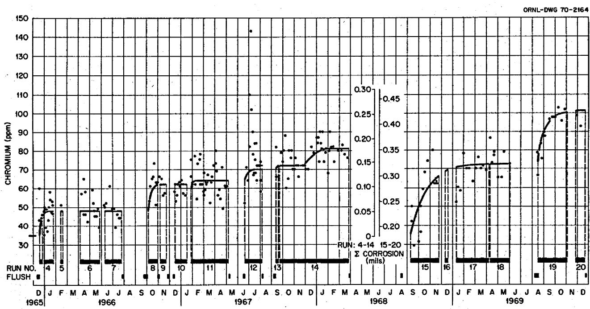  
Fig. 10.1. Corrosion of the MSRE Fuel Circuit in $^{235}\mathrm{U}$ and $^{233}\mathrm{U}$ Power Operations.

effective, as demonstrated in numerous laboratory experiments, and should have scavenged moisture from all exposed surfaces. If an oxidizing contaminant or contaminants were capable of diffusing within the graphite, the probability of its removal by brief circulation of flush salt might be slight; instead it might be released into the salt gradually after the moderator was heated to high temperatures. Thus oxygen, rather than water, seems to be the most likely cause of the observed corrosion. This conclusion is reinforced by the fact that the scale found on the nickel cages which were used to expose $\mathbf{Be}^{\mathbf{o}}$ to the salt during run 15 was comprised preponderantly of iron, whereas on other occasions the principal structural metal in such scales was chromium. Results of chemical analyses showed that the prior fuel reprocessing treatment was effective in reducing the concentration of chromium in the salt from 133 to $34~\mathrm{ppm}$ , and iron from 174 to $110~\mathrm{ppm}$ . The effectiveness of the reprocessing operations in reducing $\mathrm{Cr}^{2+}$ precludes the likelihood that significant amounts of $\mathrm{Fe}^{2+}$ were delivered to the fuel circuit just prior to $^{233}\mathrm{U}$ operation. The reduction of $\mathrm{Fe}^{2+}$ to $\mathrm{Fe}^{\mathbf{o}}$ by $\mathbf{Be}^{\mathbf{o}}$ suggests rather that the residual iron delivered with the purified carrier salt was oxidized after the beginning of fuel circulation and that the oxidizing contaminant was contained in the closed fuel circuit. As increasing amounts of $\mathbf{Be}^{\mathbf{o}}$ were added to the salt mixture, the ratio of metallic iron to chromium found on the nickel metal cages was reduced until a normal balance was reestablished and corrosion ceased (see Table 10.1).

Appraisal of the premise that maintenance operations might possibly permit the ingress of a reasonable quantity of oxygen requires the following considerations. The cumulative amount of oxidation introduced into the fuel salt (during both $^{235}\mathrm{U}$ and $^{233}\mathrm{U}$ operations) based on the increases of chromium at the beginning of runs 8, 12, 15, and 19 and the apparent losses of $\mathrm{UF}_3$ at the ends of runs 7, 18, and 19 amounts

Table 10.1. Relative Fractions of $\mathbf{Fe}^{\mathbf{o}}$ and $\mathbf{Cr}^{\mathbf{o}}$ Reduced from MSRE Fuel Salt in Run 15   

<table><tr><td>Sample No.</td><td>Equivalents of Be0 Added</td><td>Corrosion Rate (mils/year)</td><td>Fe0/Cr0 on Nickel Cagea</td></tr><tr><td>FP 15-7</td><td>2.24</td><td>0.88</td><td>113</td></tr><tr><td>FP 15-30</td><td>4.09</td><td>0.54</td><td>19.5</td></tr><tr><td>FP 15-62</td><td>6.17</td><td>0.35</td><td>0.61</td></tr></table>

$a$ Average Fe/Cr in carrier salt was 2.24 at the inception of run 15.

to 51.31 equivalents, or $410.5\mathrm{g}$ of $\mathbf{O}^{2 - }$ , and corresponds to a cumulative exposure to approximately $50~\mathrm{ft}^3$ of air. During $^{233}\mathrm{U}$ operations the amount of oxygen entering the salt might have been expected to increase the concentration of oxide by $83~\mathrm{ppm}$ , in excess of the sensitivity limits for the analytical method and well above the concentration observed. It must be recalled however, that early in $^{235}\mathrm{U}$ power operations the concentration of $\mathbf{O}^{2 - }$ , as measured experimentally, declined from 120 to $60~\mathrm{ppm}$ , suggesting that under power operation $\mathbf{O}^{2 - }$ is partially removed from the salt as a volatile species. It may be concluded, therefore, that the corrosion observed in the MSRE is likely to have been caused as described above but that the mechanism has, as yet, not been demonstrated unequivocally.

The rationale proposed above has several implications concerning the behavior of the MSRE during $^{233}\mathrm{U}$ operations. During the first 16 hr in which fuel salt was circulated at the beginning of run 15, the salt did not transfer to the overflow tank and behaved as though it contained a negligibly small bubble fraction. Thereafter, $\mathrm{Be}^0$ was introduced, and the bubble fraction began to increase; with further exposures of the salt to $\mathrm{Be}^0$ the fraction varied erratically. Certainly the $\mathrm{Be}^0$ reduced the surface tension and thereby allowed easier transport of gas from graphite to salt, followed probably by oxidation of the metallic iron impurity, which acts as an oxidant to the circuit walls. Corrosion would continue until the oxidants were consumed. The model of corrosion proposed here has a relation to the changes in bubble fraction. The corrosion data suggest that with respect to its physical and chemical properties, the fuel did not achieve a reference state until the beginning of run 17. That its bubble fraction then was greater than observed in $^{235}\mathrm{U}$ operations probably was related principally to its lower density.

The equilibrium constant for the reaction $\mathrm{Cr}^0 + 2\mathrm{UF}_4 = 2\mathrm{UF}_3 + \mathrm{CrF}_2$ varies with temperature so that under nonisothermal conditions there is a tendency for chromium to mass transfer from hot to cold zones in the Hastelloy N container alloy. Such transfer is diffusion controlled and under the relatively small temperature differentials of the fuel circuit is regarded as negligible in the MSRE. This tentative conclusion has already been substantiated by examinations of the metal surveillance specimens which have been removed from the reactor core on previous occasions, which showed no detectable depletion of Cr to within $10\mu$ of

the surface.3 It is anticipated that examination of the heat exchanger in planned postoperational tests will confirm that mass transfer in the MSRE has been inconsequentially low.

# 10.2 RELATIONSHIP OF THE DISTRIBUTION OF $95\mathrm{Nb}$ IN THE MSRE TO THE PRESENCE OF URANIUM TRIFLUORIDE IN THE FUEL SALT

R. E. Thoma

Minor adjustments in the concentration of uranium trifluoride in the MSRE fuel salt were made occa

$^{3}$ R. E. Thoma, MSR Program Semiann. Progr. Rept. Feb. 29, 1968, ORNL-4254, p. 88.

sionally during the period when the MSRE was operated with $^{235}\mathrm{U}$ fuel. Their primary purpose was to offset the oxidizing effects anticipated to result from the fission reaction. Within this period the $[\mathrm{U}^{3+}] / [\Sigma \mathrm{U}]$ concentration ratio was estimated to have varied within the range 0.1 to $1.54\%$ , as shown in Fig. 10.2. Such variation effected no significant changes on either corrosion rate or fission product behavior in the fuel salt within the reactor. The reason for this derives from the fact that the $^{235}\mathrm{U}$ fuel was a highly buffered system in comparison with the $^{233}\mathrm{U}$ fuel used later, since the total amount of uranium in the $^{235}\mathrm{U}$ fuel exceeded that contained in the $^{233}\mathrm{U}$ fuel by sixfold. In contrast, operation of the MSRE with $^{233}\mathrm{U}$ fuel showed pronounced changes in the corrosion rates and

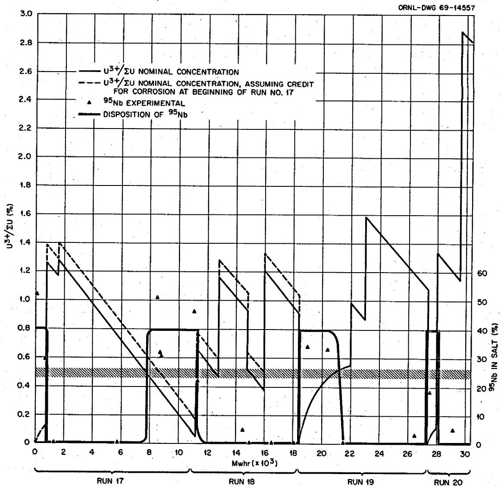  
Fig. 10.2. Effect of $\mathbf{U}^3 / \Sigma \mathbf{U}$ on Distribution of $^{95}\mathrm{Nb}$ in the MSRE Fuel Salt. Based on assumption of 0.762 equivalents oxidation per gram-atom uranium fission and maximum power of the MSRE = 7.40 Mw(th).

fission product chemistry as the concentration of $\mathrm{UF}_3$ was altered. Of considerable interest was the appearance of $^{95}\mathrm{Nb}$ in the fuel salt, noted for the first time in initial operations with $^{233}\mathrm{U}$ fuel. This observation signaled the potential application of the disposition of $^{95}\mathrm{Nb}$ as an in-line redox indicator for molten-salt reactors.

During August and September 1968 the $^{233}\mathrm{U}$ fuel charge was constituted from $^7\mathrm{LiF - }^{233}\mathrm{UF_4}$ and $^7\mathrm{LiF - }$ $\mathrm{BeF}_2\text{-ZrF}_4$ carrier salt that had previously contained $^{235,238}\mathrm{UF_4}$ . During the initial periods of circulation, analysis of the newly prepared $^7\mathrm{LiF - BeF}_2\text{-ZrF}_4\cdot$ $^{233}\mathrm{UF_4}$ fuel salt showed that the fuel circuit was undergoing corrosion. At that time the entire inventory of $^{95}\mathrm{Nb}$ appeared in the fuel salt and persisted there until 6.54 equivalents of $\mathrm{Be^0}$ had been added. Within this period the concentration of chromium in the salt rose from 35 to 65 ppm, indicating the removal of 5.89 equivalents of chromium from the circuit walls. Thus, when $^{95}\mathrm{Nb}$ disappeared from the fuel salt after the final addition of beryllium (sample FP 15-62) a total of 12.43 equivalents were involved in the reduction of $\mathrm{Fe}^{2 + }$ and establishment of the $\mathrm{Cr^0 + 2UF_4\rightleftharpoons 2UF_3 + }$ $\mathrm{CrF_2}$ equilibrium. Samples of salt obtained during the brief period of the subsequent run (No. 16) as well as at the beginning of $^{233}\mathrm{U}$ power operations in run 17 (FP 16-4 and FP 17-2) showed the presence of 52 and $29\%$ $^{95}\mathrm{Nb}$ inventory, respectively.

In Fig. 10.2, nominal values of $[\mathbf{U}^{3+}] / [\Sigma \mathbf{U}]$ are shown for runs 17 to 20. These operations comprise nearly the total power operation of the MSRE with $^{233}\mathrm{U}$ fuel. The concentrations of $\mathbf{UF}_3$ shown in Fig. 10.2 are based on the assumption that 0.76 equivalent of oxidation results from the fission of one atomic weight of uranium, and that the maximum power achieved by the MSRE was $7.25\mathrm{Mw(th)}$ . The equilibrium constant for the corrosion equilibrium $\mathrm{Cr^0 + }2\mathrm{UF_4} \neq 2\mathrm{UF_3} + \mathrm{CrF_2}$ reaction at $650^{\circ}\mathrm{C}$ , assuming an activity for $\mathrm{Cr^0}$ in the Hastelloy to be 0.03, is $1.271\times 10^{7}$ ppm. Thus, in a regime such as that which prevailed during the initial stages of run 19, the rate at which $\mathrm{Cr^0}$ is leached from the Hastelloy N circuit gradually decreases as the $\mathrm{Cr^{2+}}$ concentration of the fuel salt increases. During the initial period of run 19 the $\mathrm{Cr^{2+}}$ concentration of the circulating fuel-salt rose from 72

to 100 ppm. At that point the equilibrium concentration of $[\mathrm{U}^{3+}] / [\Sigma \mathrm{U}]$ in the fuel salt anticipated from free energy and activity data is $\sim 0.5\%$ .

The disposition of $^{95}\mathrm{Nb}$ in the $^{233}\mathrm{U}$ fuel during the initial period of run 19 indicates that when $[\mathrm{U}^{3+}] / [\Sigma\mathrm{U}]$ is less than $\sim 0.5\%$ , Nb becomes oxidized and enters the salt, possibly as $\mathrm{Nb}^{3+}$ or $\mathrm{Nb}^{4+}$ . Then, as the corrosion reaction $\mathrm{Cr}^0 + 2\mathrm{UF}_4 \rightleftharpoons 2\mathrm{UF}_3 + \mathrm{CrF}_2$ proceeds to equilibrium, the $[\mathrm{U}^{3+}] / [\Sigma\mathrm{U}]$ concentration ratio increases, and at a $[\mathrm{U}^{3+}] / [\Sigma\mathrm{U}]$ value of $0.5\%$ , $^{95}\mathrm{Nb}$ precipitates from the fuel salt. Two levels of nominal $\mathrm{U}^{3+}/\Sigma\mathrm{U}$ concentration are shown in Fig. 10.2 for Nos. 17 and 18, the higher values based on the assumption that corrosion of the fuel circuit during the early stages of run 17 may have accounted for a fraction of $[\mathrm{U}^{3+}] / [\Sigma\mathrm{U}]$ . The extent to which this reaction might have contributed to the total concentration of $\mathrm{UF}_3$ in the fuel at the beginning of run 17 is obscure, because the MSRE was operated at full power at the inception of run 17. Power operation deposits the noble metal fission products on the surface of the Hastelloy N and should cause the activity of $\mathrm{Cr}^0$ at the alloy surface to be effectively reduced. The beginning period of run 19 is not analogous, for not until the corrosion equilibrium was established was the reactor operated at full power for sustained periods.

Disposition of $^{95}\mathrm{Nb}$ is indicated by the data points in Fig. 10.2. It is evident that when the $[\mathrm{U}^{3+}] / [\Sigma \mathrm{U}]$ of the $^{233}\mathrm{U}$ MSRE fuel was poised at $\sim 0.5\%$ , disposition of $^{95}\mathrm{Nb}$ toward solution in the salt or deposition within the reactor was at a null point. If chemical transport of $^{95}\mathrm{Nb}$ in the MSRE proceeded as $\mathrm{Nb}^{n+}$ (in salt) $\rightleftharpoons \mathrm{Nb}^0$ (on metal or graphite) and if changes in the oxidation number of niobium were caused by the reaction $\mathrm{Nb}^{n+} + n\mathrm{UF}_3 \rightleftharpoons \mathrm{Nb}^0 + n\mathrm{UF}_4$ , then

$$
K = \frac {\alpha_ {N b ^ {0}} \left(N _ {U F _ {4}} \alpha_ {U F _ {4}}\right) ^ {n}}{\left(N _ {U F _ {3}} \alpha_ {U F _ {3}}\right) ^ {n} N _ {N b ^ {n +}}}
$$

Thus, at any given ratio of $\mathrm{UF}_4$ to $\mathrm{UF}_3$ , Nb should have behaved identically in either $^{235}\mathrm{U}$ or $^{233}\mathrm{U}$ fuel because for low concentration the activity coefficients for $\mathrm{U}^{3+}$ and $\mathrm{U}^{4+}$ should not have differed appreciably. Although there were occasions during $^{235}\mathrm{U}$ operations when the $[\mathrm{U}^{3+}] / [\Sigma \mathrm{U}]$ fraction was less than $0.5\%$ and this inference might have been tested, this period preceded that in which techniques for obtaining representative samples of the salt had been developed successfully. The presence of Nb was not observed, but as shown in Fig. 10.2, freeze valve samples were obtained mostly after the $[\mathrm{U}^{3+}] / [\Sigma \mathrm{U}]$ concentration

had been increased to values $\geq 0.5\%$ . As noted below, it seems more likely that in its reduced form niobium is stabilized by reactions which produce other species than or in addition to niobium metal. Recent laboratory experiments (Sect. 11.3) suggest as well that reduction of niobium $n+$ from salts does not result in the deposition of metallic niobium.

Preliminary results of laboratory experiments conducted by C. F. Weaver (see Sect. 11.4) indicate that under mildly oxidative conditions niobium assumes an oxidation number of $\sim 3.6$ . During run 15, when the oxidation potential of the fuel salt was sufficiently high to permit $\mathrm{Fe}^{2+}$ to exist in the salt in significant concentrations, nearly all of the $^{95}\mathrm{Nb}$ inventory of the fuel salt was in solution, whereas in subsequent operations when the oxidation potential was less, no more than $\sim 50\%$ of the $^{95}\mathrm{Nb}$ was found in the salt. This behavior would be explained if, when niobium is deposited on the moderator graphite, it reacts to form niobium carbide and if, under the various redox regimes which have been established in the MSRE during runs 17 to 20, niobium carbide has not been removed from the moderator graphite. The prevalence of niobium as the carbide is compatible with the experimental observations noted by Cuneo and Robertson, who found that the concentration of $^{95}\mathrm{Nb}$ at all profiles in three different types of graphite was greater than would have been anticipated if after deposition the isotope remained as the metallic species.

# 10.3 POWER OUTPUT OF THE MSRE BASED ON THE ISOTOPIC COMPOSITION OF PLUTONIUM

R.E.Thoma

B. E. Prince

In the MSRE, fluid fuel was circulated at rates which were sufficiently rapid with respect to changes in the isotopic composition of the fissile species that the salt samples removed from the pump bowl were representative of the circulating stream. This characteristic of molten-salt reactors makes it possible to use the results of isotopic analyses for a variety of purposes. One potential application, that of appraising the cumulative power generated by the MSRE at various periods, became apparent with the initiation of $^{233}\mathrm{U}$ operations, for with $^{233}\mathrm{U}$ fuel the isotopic composition of the plutonium inventory (produced partly by that generated in $^{235}\mathrm{U}$ operations as well as from that added later) would change significantly during power

production and would possibly serve as an accurate indicator of the power produced.

About $600\mathrm{g}$ of plutonium was produced during power operations with $^{235}\mathrm{U}$ fuel. Thereafter, additional plutonium was introduced into the fuel salt as a contaminant of ${}^{7}\mathrm{LiF - }^{233}\mathrm{UF_4}$ enriching salt and later to replenish the fissile inventory of the MSRE during $^{233}\mathrm{U}$ power operations. In the interim since a preliminary attempt was made to use isotopic dilution methods to compute the power output of the MSRE, calculated values for the average reaction cross sections for a number of the cations in the MSRE fuel salt were revised using post-1965 data. These values showed that the plutonium production rate during $^{235}\mathrm{U}$ operations was greater than previously anticipated and, correspondingly, that the relative changes in $^{240}\mathrm{Pu}$ and $^{239}\mathrm{Pu}$ during $^{233}\mathrm{U}$ operations were also slightly different.

Estimates of the variation of $^{239}\mathrm{Pu}$ and $^{240}\mathrm{Pu}$ during recent power operations require that the quantity and composition of the initial plutonium inventory be known accurately. As noted previously,1 attempts to determine the concentration of plutonium in the fuel salt from gross alpha count measurements were not very satisfactory because of the high specific activity of $^{238}\mathrm{Pu}$ . An improved estimate of the plutonium inventory of the system was made from extrapolations of the observed changes in $^{239}\mathrm{Pu}$ and $^{240}\mathrm{Pu}$ in the beginning stages of power operation with $^{233}\mathrm{U}$ fuel. The initial $^{240}\mathrm{Pu}/^{239}\mathrm{Pu}$ concentration ratio was computed to be 0.0453, with the plutonium of the reactor at that point as $568\mathrm{g}, \sim 2\%$ more than estimated from previous analyses. Current estimates of inventory values have been computed for this revised starting inventory. The values obtaining at the time the samples were taken were based on estimated average values for the rates of change of $^{239}\mathrm{Pu}$ and $^{240}\mathrm{Pu}$ in the period between samples.

Samples of the MSRE fuel salt were submitted routinely for determination of the isotopic composition of the contained fissile species. Comparisons of the results of plutonium assays with nominal values which should result from operations at various power levels from $\sim 7$ to $8\mathrm{Mw}$ were made. Within this range, best agreement between calculated and experimental values was obtained for a maximum power output of $\sim 7.40$ $\mathrm{Mw(th)}$ . A comparison of calculated and observed

Table 10.2. Isotopic Composition of Plutonium in the MSRE Fuel Salt at a Power Generation Rate of 7.40 Mw(th)   

<table><tr><td rowspan="3">Sample No.</td><td rowspan="3">Full-Power Hours</td><td rowspan="3">Mwhra</td><td rowspan="3">Δ239Pu(g per 1000 Mwhr)</td><td rowspan="3">Δ240Pu(g per 1000 Mwhr)</td><td colspan="3">Fuel Circuit Inventory (Calculated) (g)b</td><td colspan="3">Isotopic Composition (Calculated)</td><td colspan="3">Isotopic Composition (Analytical)</td></tr><tr><td rowspan="2">239Pu</td><td rowspan="2">240Pu</td><td rowspan="2">ΣPu</td><td colspan="2">Wt % Pu/ΣPu</td><td rowspan="2">240Pu/239Pu</td><td colspan="2">Wt % Pu/ΣPu</td><td rowspan="2">240Pu/239Pu</td></tr><tr><td>239Pu</td><td>240Pu</td><td>239Pu</td><td>240Pu</td></tr><tr><td>Run 17-I</td><td>0</td><td>0</td><td></td><td></td><td>541.5</td><td>24.53</td><td>568.4</td><td>95.26</td><td>4.32</td><td>0.0453</td><td></td><td></td><td></td></tr><tr><td>FP 17-9</td><td>148</td><td>537</td><td>-3,025</td><td>+1,178</td><td>539.8</td><td>25.16</td><td>567.4</td><td>95.14</td><td>4.43</td><td>0.0466</td><td>95.26</td><td>4.35</td><td>0.0457</td></tr><tr><td>FP 17-18</td><td>466</td><td>2,227</td><td>-2,996</td><td>+1,144</td><td>534.8</td><td>27.09</td><td>564.3</td><td>94.76</td><td>4.80</td><td>0.0507</td><td>94.28</td><td>5.16</td><td>0.0547</td></tr><tr><td>FP 17-19</td><td>542</td><td>3,656</td><td>-2,949</td><td>+1,180</td><td>530.6</td><td>28.78</td><td>561.8</td><td>94.44</td><td>5.12</td><td>0.0542</td><td>94.48</td><td>5.00</td><td>0.0508</td></tr><tr><td>FP 17-20</td><td>697</td><td>4,492</td><td>-2,924</td><td>+1,105</td><td>528.1</td><td>29.70</td><td>560.3</td><td>94.26</td><td>5.30</td><td>0.0562</td><td>94.20</td><td>5.25</td><td>0.0557</td></tr><tr><td>FP 17-23</td><td>920</td><td>5,862</td><td>-2,894</td><td>+1,086</td><td>524.2</td><td>31.18</td><td>557.8</td><td>93.97</td><td>5.95</td><td>0.0595</td><td></td><td></td><td></td></tr><tr><td>FP 17-27</td><td>1047</td><td>7,131</td><td>-2,871</td><td>+1,072</td><td>520.5</td><td>32.54</td><td>555.5</td><td>93.70</td><td>5.86</td><td>0.0625</td><td>93.58</td><td>5.80</td><td>0.0620</td></tr><tr><td>FP 17-28</td><td>1145</td><td>7,946</td><td>-2,854</td><td>+1,063</td><td>518.2</td><td>33.42</td><td>554.0</td><td>93.53</td><td>6.03</td><td>0.0645</td><td>94.30</td><td>5.97</td><td>0.0639</td></tr><tr><td>FP 17-30</td><td>1290</td><td>8,827</td><td>-2,845</td><td>+1,054</td><td>515.7</td><td>34.35</td><td>551.5</td><td>93.51</td><td>6.23</td><td>0.0666</td><td>93.16</td><td>6.18</td><td>0.0663</td></tr><tr><td>Run 17-F</td><td>1536</td><td>10,245</td><td>-2,824</td><td>+1,039</td><td>511.7</td><td>35.82</td><td>549.9</td><td>93.04</td><td>6.51</td><td>0.0700</td><td></td><td></td><td></td></tr><tr><td>FP 18-I</td><td>1536</td><td>10,245</td><td></td><td></td><td>514.1</td><td>34.91</td><td>551.4</td><td>93.22</td><td>6.33</td><td>0.0679</td><td></td><td></td><td></td></tr><tr><td>FP 18-I</td><td>1536</td><td>10,245</td><td>-2,875</td><td>+1,075</td><td>514.1</td><td>34.91</td><td>551.4</td><td>93.22</td><td>6.33</td><td>0.0679</td><td>92.92</td><td>6.36</td><td>0.0684</td></tr><tr><td>FP 18-5</td><td>1562</td><td>11,231</td><td>-2,860</td><td>+1,066</td><td>513.5</td><td>35.11</td><td>551.1</td><td>93.18</td><td>6.37</td><td>0.0684</td><td>92.65</td><td>6.61</td><td>0.0713</td></tr><tr><td>FP 18-10</td><td>1851</td><td>12,373</td><td>-2,843</td><td>+1,055</td><td>507.6</td><td>37.32</td><td>547.3</td><td>92.73</td><td>6.82</td><td>0.0735</td><td>92.38</td><td>6.84</td><td>0.0740</td></tr><tr><td>FP 18-13</td><td>1976</td><td>13,873</td><td>-2,826</td><td>+1,038</td><td>505.0</td><td>38.26</td><td>545.7</td><td>92.54</td><td>7.01</td><td>0.0757</td><td>92.16</td><td>7.04</td><td>0.0764</td></tr><tr><td>FP 18-22</td><td>1976</td><td>13,873</td><td>-2,826</td><td>+1,038</td><td>505.0</td><td>38.26</td><td>545.7</td><td>92.54</td><td>7.01</td><td>0.0757</td><td>91.80</td><td>7.36</td><td>0.0802</td></tr><tr><td>FP 18-27</td><td>2306</td><td>15,523</td><td>-2,799</td><td>+1,017</td><td>498.3</td><td>40.69</td><td>541.4</td><td>92.03</td><td>7.52</td><td>0.0817</td><td>91.63</td><td>7.49</td><td>0.0817</td></tr><tr><td>FP 18-43</td><td>2461</td><td>17,281</td><td>-2,773</td><td>+0,999</td><td>495.2</td><td>41.81</td><td>539.5</td><td>91.80</td><td>7.75</td><td>0.0844</td><td>91.48</td><td>7.63</td><td>0.0834</td></tr><tr><td>Run 18-F</td><td>2544</td><td>18,143</td><td>-2,758</td><td>+0,989</td><td>493.5</td><td>42.41</td><td>538.4</td><td>91.67</td><td>7.87</td><td>0.0859</td><td></td><td></td><td></td></tr><tr><td>Run 19-I</td><td>2544</td><td>18,143</td><td></td><td></td><td>495.2</td><td>41.81</td><td>539.4</td><td>91.79</td><td>7.75</td><td>0.0844</td><td></td><td></td><td></td></tr><tr><td>FP 19-17</td><td>2625</td><td>18,739</td><td>-2,770</td><td>+0,993</td><td>493.5</td><td>42.39</td><td>538.4</td><td>91.67</td><td>7.87</td><td>0.0858</td><td>91.22</td><td>7.84</td><td>0.0860</td></tr><tr><td>FP 19-18</td><td>2642</td><td>19,093</td><td>-2,763</td><td>+0,989</td><td>493.2</td><td>42.51</td><td>538.2</td><td>91.65</td><td>7.90</td><td>0.0862</td><td>91.19</td><td>7.87</td><td>0.0863</td></tr><tr><td>FP 19-21</td><td>2724</td><td>19,449</td><td>-2,755</td><td>+0,985</td><td>491.6</td><td>43.10</td><td>537.1</td><td>91.52</td><td>8.02</td><td>0.0877</td><td>91.02</td><td>8.03</td><td>0.0882</td></tr><tr><td>FP 19-22</td><td>2791</td><td>19,693</td><td>-2,752</td><td>+0,985</td><td>490.2</td><td>43.58</td><td>536.3</td><td>91.42</td><td>8.13</td><td>0.0889</td><td>90.90</td><td>8.11</td><td>0.0892</td></tr><tr><td>FP 19-24</td><td>2791</td><td>19,693</td><td>-2,752</td><td>+0,985</td><td>490.2</td><td>43.58</td><td>536.3</td><td>91.42</td><td>8.13</td><td>0.0889</td><td>89.88</td><td>8.99</td><td>0.1000</td></tr><tr><td>FP-19-25-6</td><td>2791</td><td>19,693</td><td>-2,760</td><td>+0,983</td><td>541.1</td><td>46.74</td><td>590.6</td><td>91.62</td><td>7.91</td><td>0.0864</td><td></td><td></td><td></td></tr><tr><td>FP 19-27</td><td>2791</td><td>19,693</td><td>-2,760</td><td>+0,983</td><td>541.1</td><td>46.74</td><td>590.6</td><td>91.62</td><td>7.91</td><td>0.0864</td><td>91.01</td><td>8.03</td><td>0.0882</td></tr><tr><td>FP 19-30</td><td>2818</td><td>19,693</td><td>-2,760</td><td>+0,983</td><td>540.5</td><td>46.93</td><td>589.9</td><td>91.63</td><td>7.96</td><td>0.0868</td><td>90.89</td><td>8.13</td><td>0.0895</td></tr><tr><td>FP 19-31-4</td><td>2818</td><td>19,693</td><td>-2,750</td><td>+0,983</td><td>662.6</td><td>54.51</td><td>719.6</td><td>92.08</td><td>7.58</td><td>0.0823</td><td></td><td></td><td></td></tr><tr><td>FP 19-35</td><td>2964</td><td>20,961</td><td>-3,820</td><td>+1,369</td><td>658.6</td><td>55.96</td><td>717.1</td><td>91.85</td><td>7.80</td><td>0.0850</td><td>91.35</td><td>7.77</td><td>0.0851</td></tr><tr><td>FP 19-43</td><td>3102</td><td>21,989</td><td>-3,810</td><td>+1,357</td><td>654.8</td><td>57.32</td><td>714.5</td><td>91.64</td><td>8.02</td><td>0.0875</td><td>91.18</td><td>7.90</td><td>0.0866</td></tr><tr><td>FP 19-53</td><td>3294</td><td>23,185</td><td>-3,795</td><td>+1,339</td><td>649.5</td><td>59.18</td><td>711.1</td><td>91.33</td><td>8.32</td><td>0.0911</td><td>90.88</td><td>8.25</td><td>0.0908</td></tr><tr><td>FP 19-63</td><td>3561</td><td>24,631</td><td>-3,775</td><td>+1,339</td><td>642.2</td><td>61.77</td><td>706.4</td><td>90.91</td><td>8.74</td><td>0.0962</td><td>90.49</td><td>8.50</td><td>0.0939</td></tr><tr><td>FP 19-74</td><td>3693</td><td>26,078</td><td>-3,750</td><td>+1,316</td><td>639.3</td><td>62.77</td><td>704.5</td><td>89.09</td><td>8.91</td><td>0.0982</td><td>90.15</td><td>8.78</td><td>0.0974</td></tr><tr><td>Run 19-F</td><td>3774</td><td>27,069</td><td>-3,720</td><td>+1,302</td><td>637.1</td><td>63.54</td><td>703.1</td><td>90.62</td><td>9.04</td><td>0.0997</td><td></td><td></td><td></td></tr><tr><td>Run 20-I</td><td>3774</td><td>27,069</td><td></td><td></td><td>625.8</td><td>61.81</td><td>690.0</td><td>90.69</td><td>8.96</td><td>0.0988</td><td></td><td></td><td></td></tr><tr><td>FP 20-6</td><td>3820</td><td>27,236</td><td>-3,670</td><td>+1,309</td><td>624.6</td><td>62.25</td><td>689.3</td><td>90.61</td><td>9.03</td><td>0.0996</td><td>89.89</td><td>8.99</td><td>0.1000</td></tr><tr><td>FP 20-31</td><td>4159</td><td>28,294</td><td>-3,660</td><td>+1,293</td><td>615.6</td><td>65.43</td><td>683.4</td><td>90.07</td><td>9.57</td><td>0.1062</td><td>89.36</td><td>9.43</td><td>0.1055</td></tr><tr><td>Run 20-F</td><td>4159</td><td>28,294</td><td>-3,660</td><td>+1,293</td><td>615.6</td><td>65.43</td><td>683.4</td><td>90.07</td><td>9.57</td><td>0.1062</td><td></td><td></td><td></td></tr></table>

$a$ Average for period between samples.   
$b$ Assumes $92\%$ fuel charge in circulation.

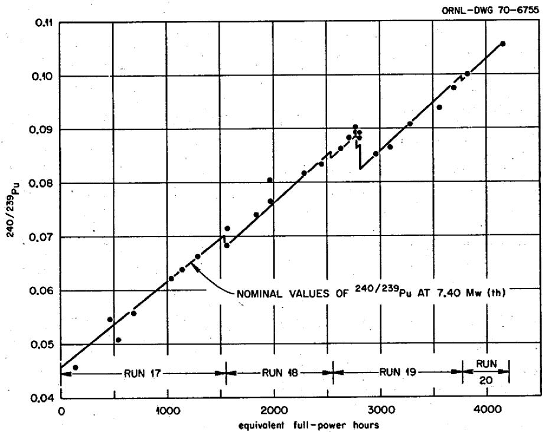  
Fig. 10.3. $\left[{ }^{240/239} \mathrm{Pu}\right]$ in the MSRE Fuel Salt Circuit During $^{233} \mathrm{U}$ Operations.

values for the isotopic composition of plutonium which should result from a maximum power output of 7.40 Mw is shown in Table 10.2 and Fig. 10.3. Agreement tests indicate that the standard deviation between calculated and observed values is $\pm 0.63\%$ and that the average positive bias in the experimental data is $0.093\%$ . On this basis the maximum power output was $7.41 \pm 0.05 \, \text{Mw(th)}$ . The precision of this value seems to be adequate for related analyses of reactor operations.

It is considered unlikely that further refinements in cross-section data for the plutonium isotopes will require any substantial changes in the calculated inventories used for this comparison. However, for the purpose of estimating "uncertainty" in the combined cross-section data and neutronic model used to calculate reaction rates, an equivalent of $\pm 2\%$ in the power output is judged conservative. Any further improvements in the data, model, or computing approximations used in the analysis which have significant influence on these results will be reported at a later date.

# 10.4 ISOTOPIC COMPOSITION OF URANIUM DURING $^{233}\mathrm{U}$ OPERATIONS

R. E. Thoma

For operation of the MSRE with $^{233}\mathrm{U}$ fuel, estimation of the power output of the MSRE from measured changes in isotopic composition of the fissile material is

achieved with considerably greater precision from analyses of plutonium than from uranium. This arises from the fact that the rate of change in the relative fraction of the most abundant isotopes for plutonium, $^{239}\mathrm{Pu}$ and $^{240}\mathrm{Pu}$ , is some four times that for the uranium pair, $^{233}\mathrm{U}$ and $^{234}\mathrm{U}$ . Analyses of the isotopic composition of uranium in the fuel circuit during $^{233}\mathrm{U}$ operations were employed, therefore, primarily to determine whether they afforded approximate confirmation of the power estimate as inferred from plutonium data (Sect. 10.3). Calculations of the isotopic composition changes of the uranium in the MSRE fuel circuit which should have accompanied operation of the reactor at a maximum power output of 7.41 Mw(th) were made and compared with the results of mass spectrometric analyses. The results of this comparison are shown in Table 10.3 and in Fig. 10.4; they indicate that the changes observed in the isotopic composition of the uranium were in excellent agreement with those of plutonium.

# 10.5 SURFACE TENSION AND WETTING BEHAVIOR OF THE MSRE FUEL AND COOLANT SALTS

H.W.Kohn

We have measured the surface tension of molten fuel salt and of $\mathbf{L}\mathbf{i}_2\mathbf{B}\mathbf{e}\mathbf{F}_4$ in the temperature range from the

Table 10.3. Isotopic Composition of Uranium in the MSRE Fuel Salt Circuit ${}^{a}$   

<table><tr><td rowspan="2">Sample No.</td><td rowspan="2">EFPHb</td><td colspan="5">U/ΣU (wt %)</td><td rowspan="2">[234U]/[233U]</td></tr><tr><td>233U</td><td>234U</td><td>235U</td><td>236U</td><td>238U</td></tr><tr><td>Run 17-I</td><td>0</td><td>84,687</td><td>6.948</td><td>2.477</td><td>0.0808</td><td>5.807</td><td>0.08204</td></tr><tr><td>FP 17-18</td><td>466</td><td>84,590</td><td>7.011</td><td>2.489</td><td>0.084</td><td>5.828</td><td>0.08288</td></tr><tr><td></td><td></td><td>84,690</td><td>6.990</td><td>2.470</td><td>0.084</td><td>5.771</td><td>0.08253</td></tr><tr><td>FP 17-24</td><td>920</td><td>84,489</td><td>7.073</td><td>2.501</td><td>0.087</td><td>5.849</td><td>0.08371</td></tr><tr><td></td><td></td><td>84,382</td><td>7.058</td><td>2.487</td><td>0.089</td><td>5.986</td><td>0.08364</td></tr><tr><td>FP 17-32</td><td>1338</td><td>84,440</td><td>7.131</td><td>2.510</td><td>0.090</td><td>5.867</td><td>0.08445</td></tr><tr><td></td><td></td><td>84,445</td><td>7.128</td><td>2.487</td><td>0.087</td><td>5.843</td><td>0.08440</td></tr><tr><td>Run 17-F</td><td>1536</td><td>84,363</td><td>7.152</td><td>2.513</td><td>0.091</td><td>5.875</td><td>0.08477</td></tr><tr><td>Run 18-I</td><td>1536</td><td>84,393</td><td>7.136</td><td>2.511</td><td>0.091</td><td>5.870</td><td>0.08455</td></tr><tr><td>Run 18-2</td><td>1536</td><td>84,199</td><td>7.138</td><td>2.507</td><td>0.089</td><td>6.067</td><td>0.08477</td></tr><tr><td>FP 18-4</td><td>1563</td><td>84,385</td><td>7.141</td><td>2.511</td><td>0.091</td><td>5.871</td><td>0.08462</td></tr><tr><td></td><td></td><td>84,249</td><td>7.158</td><td>2.527</td><td>0.091</td><td>5.975</td><td>0.08496</td></tr><tr><td>FO 18-10</td><td>1852</td><td>84,326</td><td>7.180</td><td>2.518</td><td>0.092</td><td>5.883</td><td>0.08514</td></tr><tr><td></td><td></td><td>84,269</td><td>7.178</td><td>2.507</td><td>0.091</td><td>5.955</td><td>0.08517</td></tr><tr><td>FP 18-13</td><td>1976</td><td>84,298</td><td>7.199</td><td>2.521</td><td>0.092</td><td>5.890</td><td>0.08539</td></tr><tr><td></td><td></td><td>84,060</td><td>7.203</td><td>2.517</td><td>0.087</td><td>6.133</td><td>0.08568</td></tr><tr><td>FP 18-22</td><td>2221</td><td>84,241</td><td>7.232</td><td>2.529</td><td>0.095</td><td>5.902</td><td>0.08584</td></tr><tr><td></td><td></td><td>84,167</td><td>7.208</td><td>2.517</td><td>0.098</td><td>6.016</td><td>0.08563</td></tr><tr><td>FP 18-43</td><td>2461</td><td>84,189</td><td>7.265</td><td>2.534</td><td>0.097</td><td>5.912</td><td>0.08629</td></tr><tr><td></td><td></td><td>84,041</td><td>7.232</td><td>2.537</td><td>0.093</td><td>6.097</td><td>0.08605</td></tr><tr><td>Run 18-F</td><td>2544</td><td>84,169</td><td>7.279</td><td>2.536</td><td>0.098</td><td>5.916</td><td>0.08648</td></tr><tr><td>Run 19-I</td><td>2544</td><td>84,185</td><td>7.267</td><td>2.534</td><td>0.097</td><td>5.913</td><td>0.08632</td></tr><tr><td>FP 19 10-12c</td><td>2544</td><td>84,224</td><td>7.268</td><td>2.526</td><td>0.097</td><td>5.882</td><td>0.08629</td></tr><tr><td>FP 19-35</td><td>2964</td><td>84,377</td><td>7.349</td><td>2.543</td><td>0.100</td><td>5.919</td><td>0.08709</td></tr><tr><td></td><td></td><td>83,987</td><td>7.338</td><td>2.537</td><td>0.099</td><td>6.036</td><td>0.08737</td></tr><tr><td>FP 19-43</td><td>3102</td><td>84,103</td><td>7.348</td><td>2.539</td><td>0.101</td><td>5.909</td><td>0.08726</td></tr><tr><td></td><td></td><td>83,994</td><td>7.328</td><td>2.533</td><td>0.099</td><td>6.047</td><td>0.08724</td></tr><tr><td>FP 19-53</td><td>3294</td><td>84,060</td><td>7.375</td><td>2.546</td><td>0.102</td><td>5.917</td><td>0.08773</td></tr><tr><td></td><td></td><td>83,912</td><td>7.358</td><td>2.537</td><td>0.101</td><td>6.092</td><td>0.08768</td></tr><tr><td>FP 19-63</td><td>3561</td><td>84,000</td><td>7.413</td><td>2.553</td><td>0.104</td><td>5.931</td><td>0.08825</td></tr><tr><td></td><td></td><td>83,927</td><td>7.408</td><td>2.542</td><td>0.102</td><td>6.021</td><td>0.08826</td></tr><tr><td>FP 19-74</td><td>3693</td><td>83,971</td><td>7.430</td><td>2.555</td><td>0.105</td><td>5.937</td><td>0.08848</td></tr><tr><td></td><td></td><td>83,801</td><td>7.418</td><td>2.569</td><td>0.102</td><td>6.102</td><td>0.08851</td></tr><tr><td>Run 19-F</td><td>3774</td><td>83,953</td><td>7.442</td><td>2.557</td><td>0.105</td><td>5.942</td><td>0.08864</td></tr><tr><td>Run 20-I</td><td>3774</td><td>83,973</td><td>7.427</td><td>2.555</td><td>0.105</td><td>5.938</td><td>0.08844</td></tr><tr><td>FP 20-3c</td><td>3774</td><td>83,996</td><td>7.426</td><td>2.549</td><td>0.105</td><td>5.923</td><td>0.08840</td></tr><tr><td>FP 20-6</td><td>3820</td><td>83,986</td><td>7.433</td><td>2.550</td><td>0.105</td><td>5.925</td><td>0.08850</td></tr><tr><td></td><td></td><td>83,614</td><td>7.435</td><td>2.577</td><td>0.104</td><td>6.271</td><td>0.08892</td></tr><tr><td>FP 20-31</td><td>4159</td><td>83,911</td><td>7.482</td><td>2.558</td><td>0.108</td><td>5.940</td><td>0.08916</td></tr><tr><td></td><td></td><td>83,742</td><td>7.484</td><td>2.577</td><td>0.105</td><td>6.092</td><td>0.08936</td></tr></table>

${}^{a}$ Upright type indicates values computed on the basis that the maximum power generated by the MSRE was 7.41 Mw(th). The following rates (furnished by B. E. Prince) were used: ${}^{233}\mathrm{U} :  - {4.643} \times  {10}^{-2}\mathrm{\;g}/\mathrm{{Mwhr}};{}^{234}\mathrm{U} :  + {3.6325} \times  {10}^{-3}\mathrm{\;g}/\mathrm{{Mwhr}};{}^{235}\mathrm{U} :$ $+ {9.5596} \times  {10}^{-5}\mathrm{\;g}/\mathrm{{Mwhr}};{}^{236}\mathrm{U} :  + {3.0725} \times  {10}^{-4}\mathrm{\;g}/\mathrm{{Mwhr}};{}^{238}\mathrm{U} :  - {2.90} \times  {10}^{-4}\mathrm{\;g}/\mathrm{{Mwhr}}.$ Results of mass spectrometric analyses are listed in italicized type.   
${}^{b}$ Equivalent full-power hours.   
$c_{\text{Fuel addition}}$

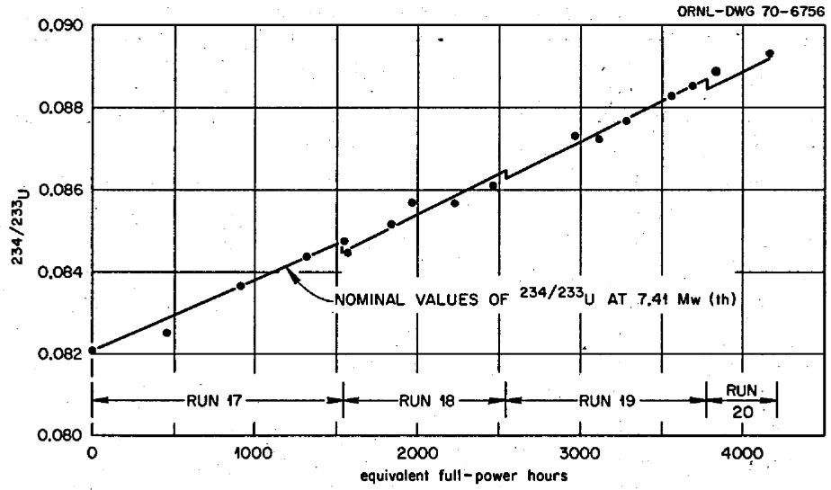  
Fig. 10.4. $^{234/233}\mathbf{U}$ in the MSRE Fuel Circuit During $^{233}\mathbf{U}$ Operations.

freezing point to $709^{\circ}\mathrm{C}$ . We used the capillary depression method, not only because of its simplicity but also to check the results reported previously. This method is not as precise as some others, but it is accurate within the error limitations. The equipment was similar to that described previously except for the following changes: Only three capillaries, in., in., and in., in diameter, were used. These were drilled in a carbon plunger which fitted closely into a carbon crucible. The whole assembly was in a low-attenuation furnace so that they could be x radiographed. The holes and the rather irregularly shaped salt well were placed so that a maximum amount of salt could be used without having any of the configurations casting a shadow on the other. An extra blind hole in the carbon plunger contained a calibrating wire to allow us to measure magnification and to compensate for film shrinkage (see Fig. 10.5).

An absolute value of the surface tension determined this way depends on an accurate measure of the contact angle. A commonly used formula for this is:

$$
2 \gamma \cos \theta = (h + R / 3) R \left(\sigma_ {l} - \sigma_ {\nu}\right) g,
$$

where

$$
\gamma = \text {s u r f a c e}
$$

$$
R = \text {r a d i u s}
$$

$$
\begin{array}{l} \sigma_ {l} = \text {d e n s i t y o f l i q u i d}, \\ \sigma_ {\nu} = \text {d e n s i t y o f v a p o r}, \\ g = \text {a c c e l e r a t i o n} \\ \theta = \text {c o n t a c t} \\ h = \text {h e i g h t} \\ \end{array}
$$

This assumes that the surface is hemispherical. Further refinements (Sugden, Schroedinger)2 are outside the limits of error here and are not even applicable since they have been worked out for capillary rise phenomena. As the construct of Fig. 10.6 shows, the ratio of the radius of the capillary to the radius of curvature of the meniscus is equal to the cosine of the contact angle, provided the meniscus is hemispherical. The radii can be measured $(\pm 5\%)$ from the x-ray shadowgraph. In this work the cosine of the contact angle so determined is 0.875, which does not agree very well with values previously obtained in sessile drop measurements (0.77).

We were able to measure capillary depression and contact angle on fuel salt, giving the following empirical equation:

$$
\gamma = (2 3 7 \pm_ {1 0} ^ {4}) - (0. 0 8 \pm 0. 0 1) t \text {d y n e s / c m}
$$

where $t$ is in degrees centigrade. For $\mathbf{Li}_2\mathbf{BeF}_4$ the shadowgraph was too faint to allow an accurate

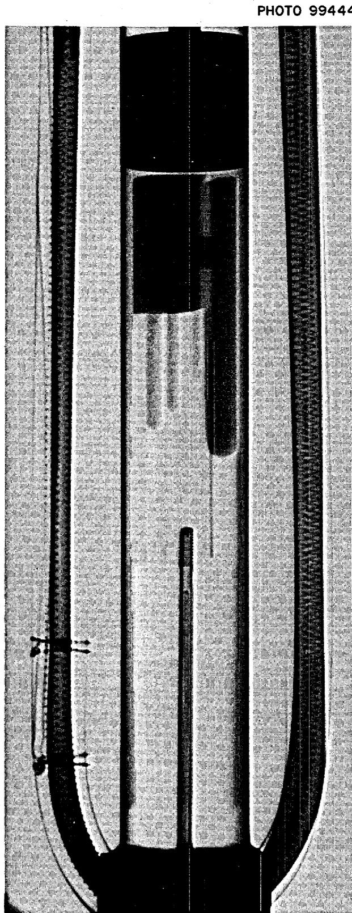  
Fig. 10.5. Shadowgraph of a Capillary Depression Molten-Salt Surface Tension Experiment.

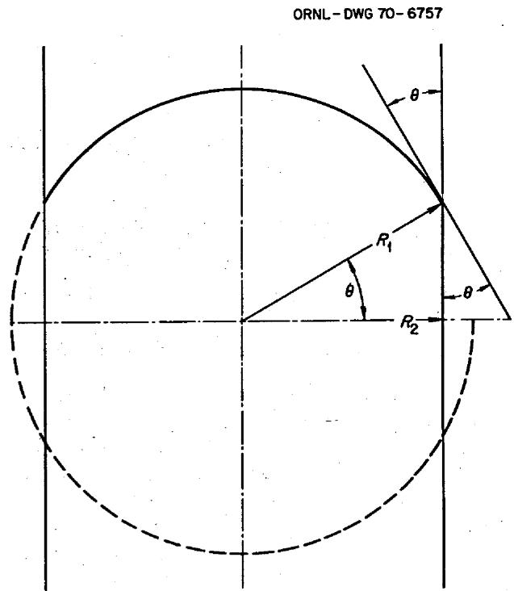  
Fig. 10.6. Construct Illustrating Relationship of Radii to Contact Angle.

measure of the contact angle, but using the same value obtained with fuel salt we get

$$
\gamma = (2 4 5 \pm 5) - (0. 1 2 \pm 0. 0 1) t \text {d y n e s} / \mathrm {c m}.
$$

We found that allowing the salt to freeze in the capillaries would give results about 4 to $6\%$ low. Reducing the fuel salt melt with metallic zirconium and with metallic lithium (each dosage calculated to reduce $10\%$ of the uranium present) failed to change measurably either the contact angle or the capillary depression.

# 11. Fission Product Behavior

# 11.1 EXAMINATION OF THE FOURTH SET OF SURVEILLANCE SPECIMENS FROM THE MSRE

F.F.Blankenship E.L.Compere S.S.Kirslis

# 11.1.1 Radiochemical Analyses of the Graphite

Details regarding samples, sampling procedures, and examination have been given previously, along with results on short-lived fission products. All of the data on graphite are summarized in Table 11.1 for salt-soluble products and in Table 11.2 for metallic fission products.

Some of the salt-soluble products have rare-gas precursors and enter the graphite by diffusion through the gas in the graphite pores. The resulting deposition profiles are like those in Fig. 11.1. Products with longer-lived precursors, such as 51-day $^{89}\mathrm{Sr}$ and 29-year $^{137}\mathrm{Ce}$ , have flatter profiles because the krypton or xenon penetrates deeper before decaying. Correspondingly, the slopes for 58.8-day $^{91}\mathrm{Y}$ and 12.8-day $^{140}\mathrm{Ba}$ are steeper because of the shorter half-lives of the gaseous precursors. The half-lives of the precursors are listed in Fig. 11.1. Sometimes, even for the same element, a sharp turnup is found at the surface and sometimes not; this is not understood.

To a first approximation, because the fuel does not wet graphite, salt-soluble fission products were not expected in the graphite, and in general the amounts actually found there were trivial. As expected, the highest amounts were found for those species entering the graphite as gases. The amount of ${}^{89}\mathrm{Sr}$ is about twice the amount found previously.

The presence of other salt-soluble species in the graphite could probably be attributed to the existence of a gas-borne mist of salt that has been found to be associated with the radioactive fuel. This mist was presumed to have entered the graphite pores. If this were the mechanism, then the percents of inventory of $95\mathbf{Zr}$ and $^{144}\mathrm{Ce}$ in the graphite should be the same.

Unfortunately, there is too much scatter in the data to warrant a firm conclusion on this point.

The effect of 76,000 Mwhr of exposure as compared with 20,000 was especially pronounced for the 29-year $^{137}\mathrm{Cs}$ and is explained by the long half-life.

Since flush salt was not used on these samples, in contrast with past practice, it was of interest to note whether there was an increase in fission products in the graphite. Inspection of Table 11.1 shows that, in general, for this class of products, there was not a large increase and indeed the change was in the opposite direction for $^{140}\mathrm{Ba}$ and $^{144}\mathrm{Ce}$ .

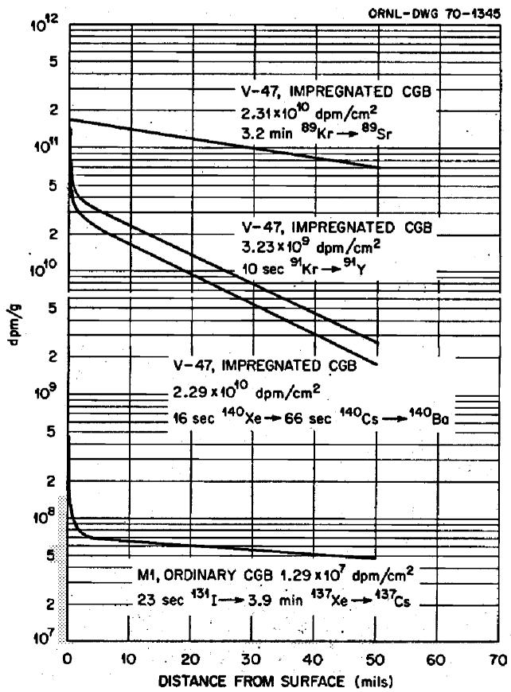  
Fig. 11.1. Concentration Profiles for Fission Products Having Inert Gas Precursors.

Table 11.1. Deposition of Salt-Soluble Fission Products on Graphite from the MSRE Core   

<table><tr><td rowspan="2">Graphite Sample No. and Face</td><td rowspan="2">Graphite typea</td><td rowspan="2">Exposure Mwhr</td><td rowspan="2">Distance from bottom core(in)b</td><td colspan="2">89Sr</td><td colspan="2">91Y</td><td colspan="2">95Zr</td><td colspan="2">131I</td><td colspan="2">137Cs</td><td colspan="2">140Ba</td><td colspan="2">144Ca</td></tr><tr><td>Dis.min-1cm-2x 1010</td><td>Percent of Inventoryc</td><td>Dis.min-1cm-2x 109</td><td>Percent of Inventoryc</td><td>Dis.min-1cm-2x 108</td><td>Percent of Inventoryc</td><td>Dis.min-1cm-2x 108</td><td>Percent of Inventoryc</td><td>Dis.min-1cm-2x 107</td><td>Percent of Inventoryc</td><td>Dis.min-1cm-2x 109</td><td>Percent of Inventoryc</td><td>Dis.min-1cm-2x 107</td><td>Percent of Inventoryc</td></tr><tr><td>V-47 wide</td><td>CGBI</td><td>20,000</td><td>57%</td><td>2.31</td><td>17.3</td><td>3.23</td><td>2.67</td><td>0.959</td><td>0.076</td><td>3.77</td><td>0.47</td><td>4.87</td><td>0.894</td><td>2.29</td><td>1.49</td><td>3.50</td><td>0.057</td></tr><tr><td>P-129 wide</td><td>CGB</td><td>20,000</td><td>54-7/8</td><td>2.47</td><td>20.5</td><td>4.18</td><td>3.46</td><td>1.67</td><td>0.13</td><td>6.34</td><td>0.78</td><td>1.33</td><td>0.244</td><td>2.70</td><td>1.75</td><td></td><td></td></tr><tr><td>F-129 narrow</td><td></td><td></td><td></td><td>3.58</td><td>26.8</td><td>3.65</td><td>3.02</td><td>1.23</td><td>0.098</td><td>5.16</td><td>0.64</td><td>0.97</td><td>0.178</td><td>2.40</td><td>1.56</td><td></td><td></td></tr><tr><td>K-3 wide</td><td>PocoI</td><td>20,000</td><td>50%</td><td>2.91</td><td>21.8</td><td>5.59</td><td>4.63</td><td>0.583</td><td>0.047</td><td>2.36</td><td>0.29</td><td>1.36</td><td>0.250</td><td>3.71</td><td>2.41</td><td></td><td></td></tr><tr><td>K-3 narrow</td><td></td><td></td><td></td><td>3.07</td><td>23.0</td><td>6.10</td><td>5.06</td><td>3.96</td><td>0.32</td><td>8.23</td><td>1.02</td><td>1.04</td><td>0.190</td><td>4.37</td><td>2.84</td><td></td><td></td></tr><tr><td>YY-22 narrow</td><td>CGB</td><td>20,000</td><td>32%</td><td>2.50</td><td>18.7</td><td>5.05</td><td>4.18</td><td>2.81</td><td>0.22</td><td>1.90</td><td>0.23</td><td>1.14</td><td>0.208</td><td>3.65</td><td>2.37</td><td>8.82</td><td>0.144</td></tr><tr><td>YY-22 wide</td><td></td><td></td><td></td><td>3.17</td><td>23.8</td><td>5.54</td><td>4.59</td><td>7.07</td><td>0.56</td><td>5.65</td><td>0.70</td><td>4.35</td><td>0.799</td><td>5.01</td><td>3.25</td><td>11.0</td><td>0.180</td></tr><tr><td>V-43 wide</td><td>CGBI</td><td>20,000</td><td>4%</td><td>3.08</td><td>23.1</td><td>2.61</td><td>2.16</td><td>2.81</td><td>0.22</td><td>2.28</td><td>0.28</td><td>3.50</td><td>0.642</td><td>3.32</td><td>2.15</td><td>7.49</td><td>0.123</td></tr><tr><td>V-43 narrow</td><td></td><td></td><td></td><td>5.98</td><td>44.8</td><td>0.426</td><td>0.35</td><td>1.99</td><td>0.16</td><td>2.64</td><td>0.33</td><td>4.58</td><td>0.841</td><td>5.56</td><td>3.61</td><td>0.62</td><td>0.010</td></tr><tr><td>M 1 wide</td><td>CGB</td><td>20,000</td><td>57%</td><td>2.78</td><td>20.8</td><td>3.09</td><td>2.56</td><td>1.12</td><td>0.089</td><td>5.43</td><td>0.67</td><td>1.29</td><td>0.236</td><td>3.03</td><td>1.97</td><td>5.00</td><td>0.082</td></tr><tr><td>M 1 narrow</td><td></td><td></td><td></td><td>2.56</td><td>19.1</td><td>9.09</td><td>7.53</td><td>1.30</td><td>0.104</td><td>4.55</td><td>0.56</td><td>-</td><td>-</td><td>3.26</td><td>2.12</td><td>7.54</td><td>0.123</td></tr><tr><td>X-23 wide</td><td>CGB</td><td>20,000</td><td>32%</td><td>4.82</td><td>36.1</td><td>5.68</td><td>4.69</td><td>6.71</td><td>0.54</td><td>6.58</td><td>0.81</td><td>3.48</td><td>0.638</td><td>5.61</td><td>3.65</td><td>18.60</td><td>0.305</td></tr><tr><td>X-23 narrow</td><td></td><td></td><td></td><td>4.87</td><td>36.5</td><td>5.88</td><td>4.87</td><td>5.11</td><td>0.41</td><td>5.73</td><td>0.71</td><td>2.97</td><td>0.545</td><td>5.65</td><td>3.67</td><td>14.30</td><td>0.234</td></tr><tr><td>N-1 wide</td><td>CGB</td><td>20,000</td><td>4%</td><td>8.59</td><td>64.5</td><td>8.70</td><td>7.21</td><td>20.5</td><td>1.64</td><td>2.64</td><td>0.33</td><td>7.78</td><td>1.43</td><td>8.48</td><td>5.50</td><td></td><td></td></tr><tr><td>N-1 narrow</td><td></td><td></td><td></td><td>5.60</td><td>42.0</td><td>4.78</td><td>3.96</td><td>15.1</td><td>1.20</td><td>5.10</td><td>0.63</td><td>2.82</td><td>0.517</td><td>5.09</td><td>3.30</td><td></td><td></td></tr><tr><td colspan="4">Average for 20,000-Mwhr samples</td><td>3.89</td><td></td><td>4.90</td><td></td><td>4.86</td><td></td><td>4.56</td><td></td><td>2.96</td><td></td><td>4.27</td><td></td><td>8.54</td><td></td></tr><tr><td>NL-7 wide</td><td>CGB</td><td>76,000</td><td>57%</td><td>2.36</td><td>17.6</td><td>2.65</td><td>2.19</td><td>6.94</td><td>0.55</td><td>4.04</td><td>0.50</td><td>7.15</td><td>1.312</td><td>2.51</td><td>1.63</td><td>5.83</td><td>0.095</td></tr><tr><td>NL-7 narrow</td><td></td><td></td><td></td><td>3.23</td><td>24.2</td><td>3.71</td><td>3.07</td><td>1.83</td><td>0.15</td><td>7.86</td><td>0.97</td><td>10.8</td><td>1.975</td><td>2.97</td><td>1.92</td><td>8.21</td><td>0.134</td></tr><tr><td>X-10 wide</td><td>CGB</td><td>76,000</td><td>32%</td><td>3.68</td><td>27.6</td><td>4.17</td><td>3.46</td><td>5.14</td><td>0.41</td><td>10.5</td><td>1.29</td><td>14.90</td><td>2.738</td><td>4.01</td><td>2.60</td><td>26.0</td><td>0.426</td></tr><tr><td>X-10 narrow</td><td></td><td></td><td></td><td>6.20</td><td>46.5</td><td>7.08</td><td>5.86</td><td>5.26</td><td>0.42</td><td>11.1</td><td>1.37</td><td>14.90</td><td>2.739</td><td>6.62</td><td>4.22</td><td>25.8</td><td>0.423</td></tr><tr><td>ML-3 wide</td><td>CGB</td><td>76,000</td><td>4%</td><td>4.25</td><td>31.8</td><td>4.96</td><td>4.11</td><td>2.43</td><td>0.19</td><td>1.73</td><td>0.21</td><td>28.90</td><td>5.302</td><td>3.15</td><td>2.04</td><td>15.10</td><td>0.247</td></tr><tr><td>ML-3 narrow</td><td></td><td></td><td></td><td>6.02</td><td>45.1</td><td>2.67</td><td>2.21</td><td>2.99</td><td>0.24</td><td>11.9</td><td>1.47</td><td>31.50</td><td>5.779</td><td>6.10</td><td>3.95</td><td>22.50</td><td>0.368</td></tr><tr><td colspan="4">Average for 76,000-Mwhr samples</td><td>4.29</td><td></td><td>4.21</td><td></td><td>4.10</td><td></td><td>7.85</td><td></td><td>18.02</td><td></td><td>4.23</td><td></td><td>17.24</td><td></td></tr><tr><td colspan="4">Average for all samples</td><td>4.00</td><td></td><td>4.71</td><td></td><td>4.64</td><td></td><td>5.50</td><td></td><td>7.48</td><td></td><td>4.26</td><td></td><td>12.02</td><td></td></tr><tr><td colspan="4">Previous average (Survey 3)</td><td>2.25</td><td></td><td>-</td><td></td><td>4.83</td><td></td><td>2.42</td><td></td><td>-</td><td></td><td>7.26</td><td></td><td>18.2</td><td></td></tr><tr><td colspan="4">Control CGBd</td><td>1.19x105</td><td></td><td>7.17x104</td><td></td><td>1.87x104</td><td></td><td>3.50x106</td><td></td><td>1.68x105</td><td></td><td></td><td></td><td></td><td></td></tr></table>

CGBI is impregnated CGB; PocoI is impregnated Poco.   
bDistance from bottom of the core to bottom of the sample.   
The amount on $1 \, \text{cm}^2$ expressed as percent of the calculated amount in 1 gram of fuel if it escaped only by decay.   
${}^{d}$ Placed in hot cell for sampling with previous exposure to salt or radiation.

Table 11.2. Deposition of Metallic Fission Products on Graphite from the MSRE Core   

<table><tr><td rowspan="2">Graphite Sample Number and Face</td><td rowspan="2">Graphite Typea</td><td rowspan="2">Exposure (Mwhr)</td><td rowspan="2">Distance from Bottom of Core (in.)b</td><td colspan="2">95Nb</td><td colspan="2">99Mo</td><td colspan="2">103Ru</td><td colspan="2">106Ru</td><td colspan="2">111Ag</td><td colspan="2">125Sb</td><td colspan="2">129Te</td><td colspan="2">132Te</td></tr><tr><td>Dis min-1cm-2</td><td>Percent of Inventoryc</td><td>Dis min-1cm-2</td><td>Percent of Inventoryc</td><td>Dis min-1cm-2</td><td>Percent of Inventoryc</td><td>Dis min-1cm-2</td><td>Percent of Inventoryc</td><td>Dis min-1cm-2</td><td>Percent of Inventoryc</td><td>Dis min-1cm-2</td><td>Percent of Inventoryc</td><td>Dis min-1cm-2</td><td>Percent of Inventoryc</td><td>Dis min-1cm-2</td><td>Percent of Inventoryc</td></tr><tr><td></td><td></td><td></td><td>×109</td><td></td><td>×1010</td><td></td><td>×109</td><td></td><td>×108</td><td></td><td>×106</td><td></td><td>×106</td><td></td><td>×108</td><td></td><td>×1010</td><td></td><td></td></tr><tr><td>V-47 wide</td><td>CGBI</td><td>20,000</td><td>571/2</td><td>2.71</td><td>3.0</td><td>1.20</td><td>9.63</td><td>1.77</td><td>3.94</td><td>0.661</td><td>1.91</td><td>4.75</td><td>71.2</td><td>3.45</td><td>1.18</td><td>6.35</td><td>3.39</td><td>0.903</td><td>7.84</td></tr><tr><td>P-129 wide</td><td>CGBI</td><td>20,000</td><td>547/8</td><td>5.87</td><td>6.6</td><td>1.82</td><td>14.64</td><td>1.80</td><td>4.0</td><td>1.14</td><td>3.28</td><td>6.04</td><td>90.5</td><td>4.40</td><td>1.51</td><td>8.02</td><td>4.28</td><td>1.01</td><td>8.77</td></tr><tr><td>P-129 narrow</td><td></td><td></td><td></td><td>3.30</td><td>3.7</td><td>0.746</td><td>6.00</td><td>0.958</td><td>2.13</td><td>0.792</td><td>2.29</td><td>5.54</td><td>83.0</td><td>2.11</td><td>0.72</td><td>5.38</td><td>2.87</td><td>0.947</td><td>8.22</td></tr><tr><td>K-3 wide</td><td>Pocol</td><td>20,000</td><td>501/4</td><td>0.69</td><td>0.7</td><td>0.186</td><td>1.49</td><td>0.255</td><td>0.57</td><td>0.198</td><td>0.57</td><td>1.19</td><td>17.7</td><td>0.53</td><td>0.18</td><td>1.54</td><td>4.02</td><td>0.703</td><td>6.10</td></tr><tr><td>K-3 narrow</td><td></td><td></td><td></td><td>9.27</td><td>10.4</td><td>1.72</td><td>13.79</td><td>2.98</td><td>6.63</td><td>2.25</td><td>6.49</td><td>16.20</td><td>242.1</td><td>6.53</td><td>2.24</td><td>10.80</td><td>5.78</td><td>1.57</td><td>13.63</td></tr><tr><td>YY-22 narrow</td><td>CGBI</td><td>20,000</td><td>321/4</td><td>22.3</td><td>25.0</td><td>1.29</td><td>10.38</td><td>1.76</td><td>3.91</td><td>1.22</td><td>3.53</td><td>5.58</td><td>83.5</td><td>1.60</td><td>0.55</td><td>5.07</td><td>2.70</td><td>1.02</td><td>8.86</td></tr><tr><td>YY-22 wide</td><td></td><td></td><td></td><td>19.0</td><td>21.3</td><td>1.27</td><td>10.20</td><td>2.52</td><td>5.61</td><td>2.23</td><td>6.43</td><td>6.79</td><td>101.7</td><td>6.90</td><td>2.36</td><td>14.20</td><td>7.56</td><td>0.779</td><td>6.76</td></tr><tr><td>V-43 wide</td><td>CGBI</td><td>20,000</td><td>41/4</td><td>7.72</td><td>8.6</td><td>0.769</td><td>6.18</td><td>1.58</td><td>3.51</td><td>1.32</td><td>3.81</td><td>7.99</td><td>119.7</td><td>5.91</td><td>2.03</td><td>4.77</td><td>2.54</td><td>0.557</td><td>4.84</td></tr><tr><td>V-43 narrow</td><td></td><td></td><td></td><td>12.6</td><td>14.1</td><td>0.894</td><td>7.18</td><td>1.84</td><td>4.1</td><td>1.51</td><td>4.37</td><td>6.46</td><td>96.8</td><td>5.52</td><td>1.89</td><td>4.47</td><td>2.38</td><td>0.565</td><td>4.90</td></tr><tr><td>M-1 wide</td><td>CGBI</td><td>20,000</td><td>571/2</td><td>4.84</td><td>5.4</td><td>0.836</td><td>6.71</td><td>0.677</td><td>1.5</td><td>0.319</td><td>0.92</td><td>6.41</td><td>96.0</td><td>4.91</td><td>1.68</td><td>8.42</td><td>4.49</td><td>1.07</td><td>9.27</td></tr><tr><td>M-1 narrow</td><td></td><td></td><td></td><td>5.67</td><td>6.4</td><td>1.74</td><td>13.94</td><td>2.76</td><td>6.1</td><td>1.85</td><td>5.33</td><td>8.31</td><td>124.0</td><td>7.27</td><td>2.49</td><td>10.70</td><td>5.71</td><td>1.56</td><td>13.5</td></tr><tr><td>X-23 wide</td><td>CGBI</td><td>20,000</td><td>321/4</td><td>18.4</td><td>20.6</td><td>1.57</td><td>12.63</td><td>3.73</td><td>8.3</td><td>3.73</td><td>10.8</td><td>9.51</td><td>142.0</td><td>11.0</td><td>3.75</td><td>9.29</td><td>4.96</td><td>0.91</td><td>7.9</td></tr><tr><td>X-23 narrow</td><td></td><td></td><td></td><td>27.9</td><td>31.3</td><td>1.19</td><td>9.56</td><td>3.53</td><td>7.8</td><td>2.84</td><td>8.21</td><td>12.50</td><td>187.0</td><td>13.8</td><td>4.72</td><td>7.29</td><td>3.89</td><td>1.18</td><td>10.2</td></tr><tr><td>M-1 wide</td><td>CGBI</td><td>20,000</td><td>41/4</td><td>13.7</td><td>15.4</td><td>0.989</td><td>7.94</td><td>2.48</td><td>5.5</td><td>1.75</td><td>5.05</td><td>11.90</td><td>177.0</td><td>6.99</td><td>2.4</td><td>10.10</td><td>5.37</td><td></td><td></td></tr><tr><td>N-1 narrow</td><td></td><td></td><td></td><td>8.09</td><td>9.7</td><td>0.871</td><td>6.99</td><td>0.267</td><td>0.5</td><td>1.57</td><td>4.54</td><td>11.70</td><td>175.0</td><td>11.3</td><td>3.88</td><td>9.67</td><td>5.16</td><td>1.36</td><td>11.78</td></tr><tr><td colspan="4">Average for 20,000-Mwhr samples</td><td>10.804</td><td></td><td>1.1394</td><td></td><td>1.927</td><td></td><td>1.559</td><td></td><td>8.057</td><td></td><td>6.148</td><td></td><td>7.738</td><td></td><td>1.010</td><td></td></tr><tr><td>NL-7 wide</td><td>CGBI</td><td>76,000</td><td>571/2</td><td>4.82</td><td>5.4</td><td>0.632</td><td>5.08</td><td>1.22</td><td>2.72</td><td>1.73</td><td>4.98</td><td>6.06</td><td>90.85</td><td>25.0</td><td>8.58</td><td>19.30</td><td>10.30</td><td>1.45</td><td>12.59</td></tr><tr><td>NL-7 wide</td><td></td><td></td><td></td><td>6.12</td><td>6.9</td><td>0.936</td><td>7.52</td><td>1.35</td><td>2.0</td><td>1.69</td><td>4.88</td><td>7.05</td><td>105.68</td><td>20.3</td><td>6.96</td><td>18.20</td><td>9.72</td><td>2.00</td><td>17.35</td></tr><tr><td>X-10 wide</td><td>CGBI</td><td>76,000</td><td>321/4</td><td>45.0</td><td>50.5</td><td>2.06</td><td>16.54</td><td>3.62</td><td>8.05</td><td>5.05</td><td>14.6</td><td>9.82</td><td>147.1</td><td>90.4</td><td>3.10</td><td>23.70</td><td>12.66</td><td>2.60</td><td>22.57</td></tr><tr><td>X-10 narrow</td><td></td><td></td><td></td><td>51.6</td><td>57.8</td><td>2.03</td><td>16.33</td><td>4.68</td><td>10.4</td><td>6.86</td><td>19.8</td><td>10.40</td><td>155.9</td><td>83.1</td><td>2.85</td><td>33.50</td><td>17.90</td><td>3.04</td><td>26.37</td></tr><tr><td>ML-3 wide</td><td>CGBI</td><td>76,000</td><td>41/4</td><td>24.3</td><td>27.3</td><td>0.652</td><td>5.23</td><td>1.62</td><td>3.6</td><td>2.85</td><td>8.22</td><td>8.81</td><td>131.9</td><td>52.7</td><td>1.80</td><td>11.80</td><td>6.31</td><td>1.42</td><td>12.30</td></tr><tr><td>ML-narrow</td><td></td><td></td><td></td><td>12.9</td><td>14.4</td><td>0.568</td><td>4.56</td><td>1.63</td><td>3.63</td><td>2.57</td><td>7.42</td><td>13.20</td><td>197.7</td><td>36.1</td><td>1.24</td><td>22.30</td><td>11.93</td><td>2.18</td><td>18.92</td></tr><tr><td colspan="4">Average for 76,000-Mwhr samples</td><td>24.123</td><td></td><td>1.146</td><td></td><td>2.353</td><td></td><td>3.458</td><td></td><td>9.223</td><td></td><td>51.267</td><td></td><td>21.467</td><td></td><td>2.115</td><td></td></tr><tr><td colspan="4">Average for all samples</td><td>14.610</td><td></td><td>1.141</td><td></td><td>2.049</td><td></td><td>2.101</td><td></td><td>8.390</td><td></td><td>19.039</td><td></td><td>11.660</td><td></td><td>1.341</td><td></td></tr><tr><td colspan="4">Previous average (survey 3)</td><td>111.6</td><td></td><td>4.11</td><td></td><td>5.98</td><td></td><td>5.18</td><td></td><td></td><td></td><td></td><td></td><td>10.0</td><td></td><td>1.64</td><td></td></tr><tr><td colspan="4">Control samplesd</td><td>5.68 × 107</td><td></td><td>2.07 × 107</td><td></td><td>1.45 × 107</td><td>0.00032</td><td>8.39 × 105</td><td>0.000242</td><td>3.70 × 105</td><td>0.05546</td><td>8.39 × 105</td><td>0.000287</td><td>3.26 × 106</td><td>0.0174</td><td>2.10 × 107</td><td>0.01820</td></tr></table>

$^\mathrm{a}$ CGBI is impregnated CGB; Pocol is impregnated Poco.   
Distance from bottom of the core to bottom of the sample.   
The amount on $1\mathrm{cm}^2$ expressed as percent of the calculated amount in 1 g of fuel if it escaped only by decay.   
$a_{\text{Placed in hot cell for sampling with previous exposure to salt or radiation}}$

Some small fraction of these products was deposited in the graphite by fission recoil. This would tend to show up as high values for the samples at $34\frac{1}{4}$ in. from the bottom of the core as compared with samples from the bottom and top. In general such an effect was not consistently recognizable for this class of products.

The percent of $^{131}\mathrm{I}$ tended to run higher than that of $^{95}\mathrm{Zr}$ or $^{144}\mathrm{Ce}$ , for example, because some of the $^{131}\mathrm{I}$ entered the graphite as a tellurium precursor.

The results on metallic fission products given in Table 11.2 show that the lack of use of flush salt did not result in an increase in activity found on the graphite. The percents, based on calculated inventories, were higher, however, than for the salt-soluble products. Also, higher values were frequently found on graphite samples near the middle of the core, where the flux was highest. This tendency had sometimes been encountered previously. The effect of longer exposure time was noticeable for 35-day ${}^{95}\mathrm{Nb}$ , 367-day ${}^{106}\mathrm{Ru}$ , 986-day ${}^{125}\mathrm{Sb}$ , 34-day ${}^{129}\mathrm{Te}$ , and 3.25-day ${}^{132}\mathrm{Te}$ but not for the other metals. This effect was qualitatively in accord with our expectations for ruthenium and antimony, but not for the shorter-lived products such as niobium and the telluriums. Also, the telluriums showed atypical profiles. Figure 11.2 illustrates a typical profile. There seemed to be a high-capacity, slow process that accounted for deposition near the surface where the profile is steep. High capacity in this sense means accessibility to a large population of fission product atoms. This process could have been solid or volume diffusion through the graphite or intercrystalline diffusion. Fission recoil undoubtedly caused some of the deposition in the first $30\mu$ .

Further into the graphite, the position and slope of the typical profile correspond to a low-capacity, fast process. This could be diffusion through the gas or on the surface of the pores in the graphite. Throughout the study of fission product behavior in the MSRE, a surprising amount of metallic product activity has been found in the gas space in contact with fuel. There is no reason that gas in the pores of the graphite should be different.

In some instances the metals appear to be a smoke, independent of the salt mist. Some of the most recent data indicate that the metals can ride the salt mist (cf. Sect. 11.2) and that they are somehow highly concentrated in the mist as compared with the concentration in the fuel. According to the first viewpoint, the metals

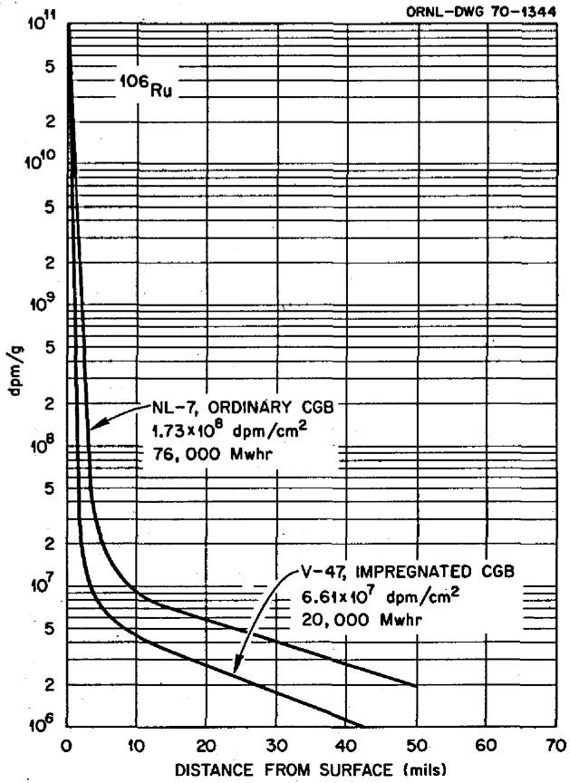  
Fig. 11.2. Effect of Exposure on Deposition of 367-day $^{106}\mathrm{Ru}$ on Graphite.

are born an atom at a time and fail to nucleate (homogeneously) in the bulk liquid. Reaching a solid surface, they nucleate heterogeneously; reaching a gas surface, they pass into the vapor phase at a tremendous supersaturation. In the gas phase, nucleation is easier because rates of diffusion are much greater. If the mist particles are efficient in nucleating metals, the two viewpoints may not be as much at variance as they appeared at first glance. But it should be remembered that at the tracer level $^{95}\mathrm{Nb}$ passes into the gas phase with almost no accompanying salt mist.

Figures 11.3 and 11.4 show the profiles for the telluriums. The steeply descending portion of the profile near the surface is greatly foreshortened, and the inner portion is steeper than for typical species. The bend between the two slopes is much sharper than for typical species. This suggests that the fast, low-capacity mode of migration is accentuated exceptionally in the case of tellurium.

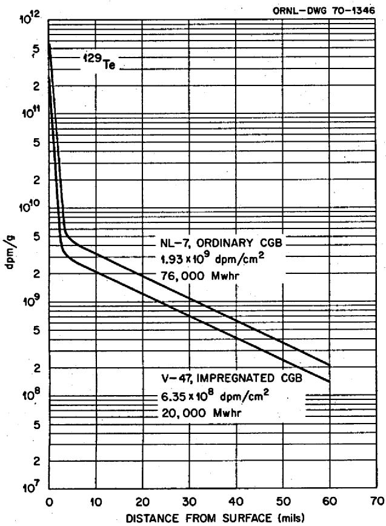  
Fig. 11.3. Effect of Exposure on Deposition of 34-day $^{129}\mathrm{Te}$ in Graphite.

One outstanding difference from previous results was the relatively small amount of $^{95}\mathrm{Nb}$ ; it was down by a factor of 7 or more. This was thought to be a result of operating with the fuel in an oxidizing condition, that is, with low $\mathbf{U}\mathbf{F}_3$ , so that the stable state was not the metal but a niobium cation.

# 11.1.2 Radiochemical Analyses of Fission Product Deposition on Metal

The first two times that the surveillance assemblies were removed from the MSRE, metal samples were obtained by cutting the perforated cylindrical Hastelloy N basket that held the assembly. The next two times $\frac{1}{8}$ -in. tubing that had held dosimeter wires was cut up to provide samples. When the tubing was first used, lower values were obtained for the deposition of fission products. After the fourth assembly was removed, the basket was no longer of use, and could again be cut up to see if the difference in deposition was due to the difference in samples.

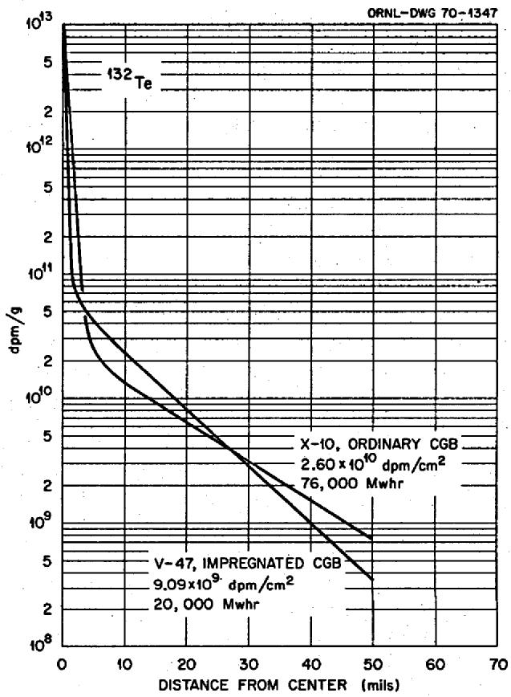  
Fig. 11.4. Effect of Exposure on Deposition of 3.4-day $^{132}\mathrm{Te}$ in Graphite.

Because the basket samples were exposed for 50,000 hr, as contrasted with 20,000 for the tubing samples, only the short-lived isotopes are suitable for comparison. Among the isotopes listed in Tables 11.3 and 11.4, this rules out 367-day $^{106}\mathrm{Ru}$ , 986-day $^{125}\mathrm{Sb}$ , 284-day $^{144}\mathrm{Ce}$ , and 10,958-day $^{137}\mathrm{Cs}$ , which would be high because of the longer exposure. For the remaining isotopes, the basket samples are indeed higher, but by widely varying factors. This variation was not understood and seemed greater than could be ascribed to experimental errors. The tubing samples were taken at seven equally spaced locations from the top to the bottom of the core. Our notion was that turbulence might influence the deposition and that basket samples experienced the greatest turbulence. An increased deposition in turbulent regions had been possibly indicated by the gamma spectroscopy of the MSRE fuel circuit.

Except for $^{131}\mathbf{I}$ , the agreement between the new averages and the previous ones, as shown in Table 11.3, was deemed fair. Thus a consistent effect of not using

Table 11.3. Deposition of Salt-Soluble Fission Products on Hastelloy N from the MSRE Core   

<table><tr><td rowspan="2">Distance of Sample From Bottom (in.)</td><td colspan="2">89Sr</td><td colspan="2">91Y</td><td colspan="2">95Zr</td><td colspan="2">131I</td><td colspan="2">137Cs</td><td colspan="2">140Ba</td><td colspan="2">144Ce</td></tr><tr><td>Dis.1 min2 cm x 10-8</td><td>Percent of Inventory(a)</td><td>Dis.1 min2 cm x 10-8</td><td>Percent of Inventory(a)</td><td>Dis.1 min2 cm x 10-8</td><td>Percent of Inventory(a)</td><td>Dis.1 min2 cm x 10-9</td><td>Percent of Inventory(a)</td><td>Dis.1 min2 cm x 10-7</td><td>Percent of Inventory(a)</td><td>Dis.1 min2 cm x 10-8</td><td>Percent of Inventory(a)</td><td>Dis.1 min2 cm x 10-7</td><td>Percent of Inventory(a)</td></tr><tr><td>(1.5)d</td><td>(76.2)</td><td>(05.7)</td><td>(15.6)</td><td>(1.29)</td><td>(5.91)</td><td>(0.47)</td><td>(8.30)</td><td>(10.20)</td><td>(21.8)</td><td>(4.01)</td><td>(25.5)</td><td>(1.66)</td><td>(17.3)</td><td>(0.28)</td></tr><tr><td>11.33</td><td>6.02</td><td>0.45</td><td>5.08</td><td>0.42</td><td>3.81</td><td>0.30</td><td>4.07</td><td>5.03</td><td>.792</td><td>0.15</td><td>6.83</td><td>0.45</td><td>11.7</td><td>0.19</td></tr><tr><td>21.17</td><td>6.01</td><td>0.45</td><td>6.52</td><td>0.54</td><td>4.38</td><td>0.35</td><td>6.08</td><td>7.50</td><td>.836</td><td>0.15</td><td>6.20</td><td>0.40</td><td>11.9</td><td>0.20</td></tr><tr><td>30.0</td><td>6.09</td><td>0.46</td><td>6.23</td><td>0.52</td><td>4.58</td><td>0.37</td><td>5.83</td><td>7.21</td><td>1.00</td><td>0.18</td><td>10.5</td><td>0.69</td><td>12.8</td><td>0.21</td></tr><tr><td>39.0</td><td>6.08</td><td>0.46</td><td>4.53</td><td>0.38</td><td>3.53</td><td>0.28</td><td>5.04</td><td>6.22</td><td>.893</td><td>0.16</td><td>6.08</td><td>0.40</td><td>9.13</td><td>0.15</td></tr><tr><td>53.1</td><td>4.92</td><td>0.37</td><td>1.33</td><td>0.11</td><td>1.92</td><td>0.15</td><td>5.33</td><td>6.57</td><td>.521</td><td>0.10</td><td>6.39</td><td>0.42</td><td>5.22</td><td>0.09</td></tr><tr><td>60.5</td><td>2.20</td><td>0.17</td><td>.69</td><td>0.06</td><td>1.19</td><td>0.10</td><td>3.65</td><td>4.50</td><td>.360</td><td>0.07</td><td>9.78</td><td>0.64</td><td>2.72</td><td>0.05</td></tr><tr><td>Average</td><td>5.22</td><td></td><td>4.06</td><td></td><td>3.24</td><td></td><td>5.00</td><td></td><td>.73</td><td></td><td>7.63</td><td></td><td>8.91</td><td></td></tr><tr><td>Previous Average(b)</td><td>4.81</td><td></td><td>7.31</td><td></td><td>4.77</td><td></td><td>1.56</td><td></td><td>.61</td><td></td><td>5.40</td><td></td><td>13.4</td><td></td></tr><tr><td>Basket Sample B(c)</td><td>15.3</td><td>1.15</td><td>6.41</td><td>0.53</td><td>5.45</td><td>0.43</td><td>8.84</td><td>10.90</td><td>13.3</td><td>2.43</td><td>7.92</td><td>0.52</td><td>8.98</td><td>0.15</td></tr><tr><td>Basket Sample T(c)</td><td>7.57</td><td>0.57</td><td>6.88</td><td>0.57</td><td>2.71</td><td>0.22</td><td>11.4</td><td>14.00</td><td>18.5</td><td>3.40</td><td>6.30</td><td>0.41</td><td>2.57</td><td>0.04</td></tr><tr><td>Basket Average</td><td>11.4</td><td></td><td>6.65</td><td></td><td>4.08</td><td></td><td>6.75</td><td></td><td>15.90</td><td></td><td>7.11</td><td></td><td>5.78</td><td></td></tr></table>

(a) The amount on $1 \, \text{cm}^2$ expressed as percent of the calculated amount that would be in $\text{g}$ of fuel if it escaped only by decay.   
(a) Average from survey 5. (c) Basket samples B and T were taken from the bottom and top of the perforated cylindrical basket that held the sample assembly in the core.   
This sample, 1.5 inches from the bottom, gave high results for salt soluble isotopes; the results from this sample were not included in the average for fear that they represented contamination. Strangely it is only for species with rare gas precursors that the values are exceptionally high.

Table 11.4. Deposition of Metallic Fission Products on Hastelloy N from the MSRE Core   

<table><tr><td rowspan="2">Distance of Sample From Bottom of core (in)</td><td colspan="2">95Nb</td><td colspan="2">99Mo</td><td colspan="2">103Ru</td><td colspan="2">106Ru</td><td colspan="2">111Ag</td><td colspan="2">125Sb</td><td colspan="2">129Te</td><td colspan="2">132Te</td></tr><tr><td>Dis.min-1cm-2x 1010</td><td>Percent of Inventorya</td><td>Dis.min-1cm-2x 1011</td><td>Percent of Inventorya</td><td>Dis.min-1cm-2x 1010</td><td>Percent of Inventorya</td><td>Dis.min-1cm-2x 108</td><td>Percent of Inventorya</td><td>Dis.min-1cm-2x 108</td><td>Percent of Inventorya</td><td>Dis.min-1cm-2x 108</td><td>Percent of Inventorya</td><td>Dis.min-1cm-2x 1010</td><td>Percent of Inventorya</td><td>Dis.min-1cm-2x 1010</td><td>Percent of Inventorya</td></tr><tr><td>1.5</td><td>.675</td><td>8</td><td>.869</td><td>69.9</td><td>1.26</td><td>28</td><td>18.0</td><td>52</td><td>7.18</td><td>108</td><td>2.47</td><td>85</td><td>2.06</td><td>110</td><td>15.7</td><td>136</td></tr><tr><td>11.33</td><td>1.59</td><td>18</td><td>1.85</td><td>147</td><td>.76</td><td>17</td><td>9.86</td><td>29</td><td>5.09</td><td>76</td><td>3.52</td><td>121</td><td>1.12</td><td>60</td><td>8.06</td><td>70</td></tr><tr><td>21.17</td><td>2.54</td><td>28</td><td>2.38</td><td>191</td><td>1.62</td><td>56</td><td>23.7</td><td>68</td><td>6.18</td><td>93</td><td>.672</td><td>23</td><td>4.73</td><td>253</td><td>8.57</td><td>75</td></tr><tr><td>30.0</td><td>1.85</td><td>21</td><td>2.01</td><td>161</td><td>.918</td><td>20</td><td>14.8</td><td>43</td><td>4.17</td><td>63</td><td>.672</td><td>23</td><td>1.03</td><td>55</td><td>8.96</td><td>78</td></tr><tr><td>39.0</td><td>1.29</td><td>14</td><td>1.85</td><td>149</td><td>.631</td><td>14</td><td>8.95</td><td>26</td><td>2.12</td><td>32</td><td>1.37</td><td>47</td><td>.905</td><td>48</td><td>8.49</td><td>74</td></tr><tr><td>53.1</td><td>1.24</td><td>14</td><td>1.23</td><td>99</td><td>.779</td><td>17</td><td>9.12</td><td>96</td><td>3.84</td><td>58</td><td>.412</td><td>14</td><td>.564</td><td>30</td><td>3.56</td><td>57</td></tr><tr><td>60.5</td><td>1.12</td><td>13</td><td>.922</td><td>74</td><td>.763</td><td>17</td><td>7.37</td><td>21</td><td>1.04</td><td>16</td><td>2.58</td><td>88</td><td>.875</td><td>47</td><td>9.20</td><td>80</td></tr><tr><td>Average</td><td>1.47</td><td></td><td>1.58</td><td></td><td>.96</td><td></td><td>13.11</td><td></td><td>4.23</td><td></td><td>1.67</td><td></td><td>1.61</td><td></td><td>8.93</td><td></td></tr><tr><td>Previous Averageb</td><td>8.59</td><td></td><td>2.13</td><td></td><td>1.06</td><td></td><td>9.40</td><td></td><td>0.30</td><td></td><td>--</td><td></td><td>.51</td><td></td><td>7.29</td><td></td></tr><tr><td>Basket Sample Bc</td><td>9.73</td><td>109</td><td>2.08</td><td>167</td><td>1.91</td><td>43</td><td>54.5</td><td>157</td><td>36.3</td><td>543</td><td>11.5</td><td>393</td><td>3.61</td><td>193</td><td></td><td></td></tr><tr><td>Basket Sample Tc</td><td>2.18</td><td>24.4</td><td>1.42</td><td>114</td><td>1.77</td><td>39</td><td>48.7</td><td>141</td><td>26.4</td><td>395</td><td>13.6</td><td>464</td><td>2.47</td><td>132</td><td></td><td></td></tr><tr><td>Basket Average</td><td>5.96</td><td></td><td>1.75</td><td></td><td>1.84</td><td></td><td>51.60</td><td></td><td>31.35</td><td></td><td>12.55</td><td></td><td>3.04</td><td></td><td></td><td></td></tr></table>

a The amount on 1 cm $^2$ expressed as percent of the calculated amount that would be in 1 g of fuel if it escaped only by decay.   
b Average from Survey 3.   
c Basket samples B and T were taken from the bottom and top of the perforated cylindrical basket that held the sample assembly in the core.

flush salt was not found for salt-soluble products. For the salt-soluble products the tendency for deposition to be highest where the flux was highest is apparent, and, except for $^{131}\mathrm{I}$ , the amounts found were low enough to be of little importance. The $^{131}\mathrm{I}$ count was about twice the amount that could be attributed to the tellurium precursor, based on the assumption that the total inventory of tellurium deposited on metal and remained in place during decay.

With respect to the metallic fission product results in Table 11.4, a decrease in the amount of $^{95}\mathrm{Nb}$ was encountered for the same reason that was mentioned in connection with $^{95}\mathrm{Nb}$ in the graphite.

In general, greater deposition is found toward the bottom of the core than toward the top. Last time, the profile for metals was usually more uniform, but occasional decreases toward the top were noted.

Among the five cases suitable for comparing the effect of not using flush salt, $^{99}\mathrm{Mo}$ was lower on the unflushed sample, $^{103}\mathrm{Ru}$ and $^{132}\mathrm{Te}$ were virtually unchanged, and $^{111}\mathrm{Ag}$ and $^{129}\mathrm{Te}$ were higher on the unflushed samples.

# 11.1.3 Fission Product Distribution in the MSRE

It is not possible, from measured deposition in the center of the core, to draw any firm conclusions about deposition throughout the circuit. However, to gain some inkling about what the numbers mean, an exercise of some interest is to ask what would be the deposition throughout the reactor if the measured samples were assumed to be representative. Such a hypothetical distribution is presented in Table 11.5; it is based on the fourth set of surveillance samples.

The most objectionable feature of the table is the large unaccounted balance for the metallic products. The amount that can be accounted for by escape to the gas phase is now believed to be of the order of a few percent. The trouble probably lies mainly in the fact that figures for deposition of metals obtained from the core samples are probably lower than what is actually deposited on the heat exchanger.

Other features of the table are more believable. The salt-soluble fission products are undoubtedly mainly in the salt; the spread in the numbers showing this reflects correctly the reproducibility of the measurements involved. Also, there are only a few percent of metals in the salt.

The amounts of salt seekers in the graphite are small; the larger amounts are from species with gaseous precursors. The amounts of salt-soluble species on the

Table 11.5. Distribution of Fission Products in the MSRE on June 1, 1969   

<table><tr><td rowspan="2">Isotope</td><td colspan="4">Percent of Inventorya</td></tr><tr><td>In Saltb</td><td>On Graphitec</td><td>On Metald</td><td>Balance</td></tr><tr><td colspan="5">Salt Soluble</td></tr><tr><td>89Sr</td><td>80</td><td>16</td><td>0.08</td><td>-4</td></tr><tr><td>91Y</td><td>130</td><td>2</td><td>0.07</td><td>+32</td></tr><tr><td>95Zr</td><td>100</td><td>0.2</td><td>0.05</td><td>0</td></tr><tr><td>131I</td><td>60</td><td>0.3</td><td>0.1</td><td>-40</td></tr><tr><td>137Cs</td><td>80</td><td>0.7</td><td>0.03</td><td>-19</td></tr><tr><td>140Ba</td><td>110</td><td>1.0</td><td>0.1</td><td>+11</td></tr><tr><td>144Ce</td><td>120</td><td>0.1</td><td>0.03</td><td>+20</td></tr><tr><td colspan="5">Metals</td></tr><tr><td>95Nb</td><td>Variable</td><td>7</td><td>3</td><td></td></tr><tr><td>99Mo</td><td>1</td><td>4</td><td>26</td><td>-79</td></tr><tr><td>103Ru</td><td>6</td><td>2</td><td>4</td><td>-88</td></tr><tr><td>106Ru</td><td>3</td><td>3</td><td>8</td><td>-86</td></tr><tr><td>111Ag</td><td>7</td><td>5</td><td>16</td><td>-72</td></tr><tr><td>125Sb</td><td>7</td><td>3</td><td>12</td><td>-78</td></tr><tr><td>129Te</td><td>1</td><td>3</td><td>18</td><td>-78</td></tr><tr><td>132Te</td><td>1</td><td>5</td><td>16</td><td>-78</td></tr></table>

${}^{a}$ Based on calculated amount in reactor $\left( {{4.336} \times  {10}^{6}\mathrm{\;g}}\right.$ of fuel) and a full power of ${7.25}\mathrm{{Mw}}$ . Escape by decay only.   
bTypical figures from data of Compere and Bohlmann.   
$c$ Based on $2\times 10^{6}\mathrm{cm}^{2}$ of graphite in reactor.   
$d_{\text{Based on}}$ 7.9 × 10 $^5$ cm $^2$ of Hastelloy N surface in fuel circuit.

metal are very small, and, since the deposition is by fission recoil, vanishingly small amounts should be on the metal outside the core.

Except for $^{95}\mathrm{Nb}$ , which forms a very stable carbide, more of the metallic products are on the metal than in graphite, even though the area of the metal is smaller.

Exposures for this and all the other surveillance assemblies $^{1,3-5}$ have been based on several different values for the full power of the reactor. Using 7.25 Mw as the full-power value, the figure 7800 Mwhr used for exposure at the time of removal of the first assembly becomes 7610 Mwhr. Similarly, 32,000 Mwhr for the second removal becomes 32,700, and 64,000 Mwhr for the third becomes 65,600 Mwhr; 76,000 Mwhr exposure on graphite that was in the reactor for three

surveillance cycles becomes 76,900 Mwhr. For the exposure during the fourth cycle, 20,000 Mwhr becomes 18,500 Mwhr. Before this semiannual, reactor fission product inventories were frequently based on 8 Mw full-power operation, which accounts for slight differences from earlier figures for percents of inventory. Such differences are within the experimental error.

# 11.2 FISSION PRODUCT DISTRIBUTION IN MSRE PUMP BOWL SAMPLES

E. L. Compere E. G. Bohlmann

MSRE run 19 extended from August 11 to November 2, 1969, including over four days of flush salt operation. During this period we caught (for fission product analysis) 2 flush salt and 13 fuel salt samples and 23 gas samples (including 1 postdrain sample and 3 controls which were sealed at the upper end of the nozzle region); 2 of the gas sample capsules had fine metal filters over the nozzles.

Run 20 extended from November 26 to December 12, 1969. Two salt samples and four gas samples (with nozzle filters) were obtained during this run; one of these was taken after the fuel was drained, and one was reserved for recovery of cesium isotopes by J. J. Pinajian of the Isotopes Division.

Data from the samples from runs 19 and 20 are presented below.

Sample Capsules. - Sample capsules were of the double-wall type to minimize contamination, a particularly important consideration for gas samples. A sketch of the capsule is given in Fig. 11.5.

The salt sample capsule volume was $7.8~\mathrm{cm}^3$ ; for gas samples, volumes of 15.0 and $13.8~\mathrm{cm}^3$ were more frequently used.

Sampling Procedure. - The capsules for salt samples were lowered into the pump bowl spray baffle so that the nozzle was as far as possible below the salt surface. It remained in salt for 60 min, more than five times as long as bench tests showed was required to soften the solder holding the plug. The capsule was then lifted 18 in. which brought it into the sampler entry tube, and was held there for 20 min before proceeding with removal. During the entire sampling interval, a purge flow of helium amounting to about 575 std cm³/min was maintained down the sample transfer tube.

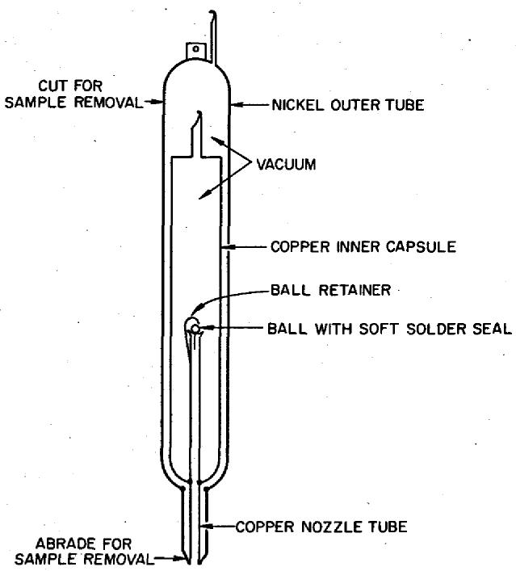  
ORNL-DWG 70-6758   
Fig. 11.5. Double-Wall Freeze Valve Capsule.

For gas samples in runs 19 and 20 the sample capsule was normally lowered to a depth that brought the nozzle to about 2 in. above the liquid surface. Usually, a period of 20 to $40\mathrm{min}$ was allowed in the pump bowl. The purge flow of helium down the sample transfer tube was held to $\sim 75$ std $\mathrm{cm}^3 /\mathrm{min}$ for all of the gas samples but the first four.

After transfer to the High Radiation Level Analytical Laboratory, the sample tube was examined and weighed, and the nozzle tip was abraded until the inner capsule was free. For samples with a filter over the nozzle, the filter was first cut off with a tubing cutter. Then, after the inner capsule was free, the upper part of the outer nickel tube was cut off using a tubing cutter and the inner capsule dumped into a new dissolver. For gas samples in run 19, after the inner capsule was caught in a plastic bag, the nozzle part of the capsule was sawed off and analyzed separately.

The outer nickel tube was dissolved for analysis, sometimes after one or more prior acid leaches. The inner capsule and nozzle were dissolved in $2N\mathrm{HNO}_3$ with suitable traps.

Analyses. - Analysis for salt constituent elements included lithium and beryllium by spectrographic

methods, uranium (and zirconium on salt samples) by wet chemical methods, and $^{233}\mathrm{U}$ by neutron activation—delayed neutron counting techniques.

Radiochemical analyses for a number of isotopes representing several classes of fission products were obtained. These included:

1. salt-seeking elements: $^{95}\mathrm{Zr},$ $^{141}\mathrm{Ce},$ $^{144}\mathrm{Ce},$ and $^{147}\mathrm{Nd};$   
2. daughters of rare gases: ${}^{89}\mathrm{Sr},{}^{91}\mathrm{Y},{}^{137}\mathrm{Cs},$ and ${}^{140}\mathrm{Ba};$   
3. noble metals: $^{95}\mathrm{Nb}$ (from $^{95}\mathrm{Zr},^{99}\mathrm{Mo},^{103}\mathrm{Ru},$ $^{106}\mathrm{Ru},$ and $^{111}\mathrm{Ag};$   
4. tellurium-related: $^{125}\mathrm{Sb}$ , $^{129}\mathrm{Te}$ , $^{132}\mathrm{Te}$ , and $^{131}\mathrm{I}$ .

Data for these isotopes were corrected to the time of sample removal; $^{95}\mathrm{Nb}$ was first corrected for ingrowth from $^{95}\mathrm{Zr}$ in the sample after removal.

Data pertaining to salt were generally expressed as amount (disintegrations per minute, micrograms etc.) per gram of salt, and data for gas samples could be expressed as amount per cubic centimeter of sample volume. In this way the values could be compared with appropriate inventory values or production rates calculated from the associated MSRE operations.

Inventory. - The inventory value for a given isotope is the total amount of the isotope that existed in the circulating fuel at a given time as a result of the power history (and drains) of the MSRE divided by the amount of fuel salt circulated. It accounts for all production and decay in the fuel since the first power operation with $^{235}\mathrm{U}$ in January 1966 and assumes no losses. However, the inventory of niobium was arbitrarily set at zero at the end of the chemical reduction operations that were part of the August 1968 fuel reprocessing; subsequent sample data established the validity of this assumption. Inventory per gram is thus the amount of an isotope or element that should be found in fuel salt if no losses occurred.

Most isotopes were treated in this calculation using a single-decay model, ignoring all precursors, without introducing appreciable error. For the daughter isotopes in the $^{91}\mathrm{Sr - }^{91}\mathrm{Y},$ $^{95}\mathrm{Zr - }^{95}\mathrm{Nb},$ and $^{147}\mathrm{Nd - }^{147}\mathrm{Pm}$ couples, the two-element, parent-daughter decay model was used.2

Fission yields of $^{235}\mathrm{U}$ were used for operation with that fuel and were changed appropriately when $^{233}\mathrm{U}$ fuel was used. However, no adjustment appeared

necessary, and none was made, for fuel burnup or the addition of plutonium fuel. (The yields of ${}^{106}\mathrm{Ru}$ and a few other isotopes would be somewhat increased by the added plutonium.)

In order to obtain a suitably continuous and detailed power history of the MSRE, during $^{233}\mathrm{U}$ operation the different levels of operating power were recovered daily from fission chamber charts which were calibrated from time to time by heat balance calculations. Since no appreciable or long-term deviation developed between fission chamber and heat balance values, no adjustment for such deviation was made. However, the inventory values are proportional to the nominal full power of the MSRE, and adjustments changing full power to 7.25 Mw from 8 Mw have been made where suitable. In comparing observed isotope data with inventory, it should be recalled that the part of operating power history reflected in the inventory of a given isotope depends on the decay rate of the isotope in question; the inventory for an isotope such as 3.25-day $^{132}\mathrm{Te}$ reflects only the most recent several days, while that of 30-year $^{137}\mathrm{Cs}$ is determined by the entire history since startup.

If an observed disintegration rate per gram (dis min $^{-1}$ g $^{-1}$ ) is divided by inventory (dis min $^{-1}$ g $^{-1}$ ), the ratio is dimensionless and indicates what fraction of the average possible amount is present.

If the mass of sample is not available, dividing observed values by inventory values provides an indication of the corresponding number of grams of "inventory" salt. This is most useful with salt-seeking isotopes (and constituent elements).

Gas samples require a different basis of comparison. Assuming that no accumulation occurs, the maximum steady number of atoms that could be transported in a given volume of gas would be given by MSRE fission rate times fission yield of chain divided by the MSRE pump bowl purge flow rate. This can be multiplied by the isotope decay constant to obtain production in disintegrations per minute per cubic centimeter. When divided into an observed amount, if a valid sample was taken, the result would indicate what fraction of production was gas-borne in the pump bowl gas.

In the case of rare-gas fission products and their daughters, it is possible to estimate the maximum amount that might be transferred as gas into the pump bowl. Comparison with observed values can help establish whether valid samples of pump bowl gas were taken.

A mathematical model permitted calculation of steady-state values for a number of pertinent isotopes. This model took into account the flow around the

circuit, the production and decay of rare-gas precursor and rare gas, the liquid and gas flows into the pump bowl, and decay of the rare gas in the pump bowl. Slug flow was assumed in all regions, except the pump bowl gas was regarded as being completely mixed. Complete stripping of all rare gas from the liquid entering the pump bowl was assumed. A calculation involving about 90 iterative cycles gave steady values. Typical results are shown in Table 11.6.

It may be seen that for the 89 chain, only $96\%$ of the ${}^{89}\mathrm{Sr}$ has a ${}^{89}\mathrm{Kr}$ precursor, and of this, under typical conditions, $61\%$ of the original chain decays before it enters the pump bowl and $35\%$ of the original chain enters the pump bowl. The holdup in the pump bowl permits $21\%$ of the original chain to decay to ${}^{89}\mathrm{Rb}$ atoms, which doubtless leave the gas phase as soon as a surface is encountered, whether salt, mist, or metal. The average ${}^{89}\mathrm{Kr}$ content of the well-mixed pump bowl gas and that of the effluent off-gas are the same, amounting in this case to $14\%$ of the original chain. Thus, except for salt mist or deposited or entrained ${}^{89}\mathrm{Rb}$ or ${}^{89}\mathrm{Sr}$ atoms produced by ${}^{89}\mathrm{Kr}$ decay in the pump bowl, the highest value we could expect for ${}^{89}\mathrm{Sr}$ in the pump bowl gas is $14\%$ of production; ${}^{137}\mathrm{Cs}$ is similar. The isotopes ${}^{91}\mathrm{Y}$ and ${}^{140}\mathrm{Ba}$ , which have rare-gas precursors of shorter half-life and also about $40\%$ of the chain yield produced by direct yield of rare-gas daughters, can have only $0.07 - 0.16\%$ of production in this way; and ${}^{141}\mathrm{Ce}$ is essentially negligible as a gas-borne species.

Salt Samples. - Thirteen salt samples were obtained with the new double-capsule-type sampler during MSRE runs 19 and 20. Results of the radiochemical and compositional analyses carried out on these samples are summarized in Table 11.7. The data are presented in

Table 11.6. Percentage of Given Chain Involving Rare Gas Which Decays in Various Regions   

<table><tr><td>Chain</td><td>89</td><td>137</td><td>91</td><td>140</td><td>141</td></tr><tr><td>Isotope counted</td><td>Sr</td><td>Cs</td><td>Y</td><td>Ba</td><td>Ce</td></tr><tr><td>Rare-gas precursor half-life, sec</td><td>4</td><td>23</td><td></td><td></td><td></td></tr><tr><td>Rare-gas half-life, sec</td><td>191</td><td>234</td><td>10</td><td>16</td><td>2</td></tr><tr><td>Percent decay:</td><td></td><td></td><td></td><td></td><td></td></tr><tr><td>As rare-gas precursor</td><td>4(4)</td><td>2</td><td>41</td><td>40</td><td>77</td></tr><tr><td>In salt</td><td>61(74)</td><td>58</td><td>58</td><td>57</td><td>23</td></tr><tr><td>In pump bowl</td><td>21(15)</td><td>22</td><td>1.8</td><td>2.8</td><td>0.06</td></tr><tr><td>In exit gas</td><td>14(7)</td><td>18</td><td>0.07</td><td>0.16</td><td>0.0004</td></tr></table>

$a$ Values correspond to $1210^{\circ}\mathrm{F}$ , 1200 gpm loop flow, 65 gpm spray and fountain flow to pump bowl, $60\%$ salt level in pump bowl, 3.2 std liters/min He flow, 5 psig. Values in parentheses for 89 chain illustrate 616 gpm, 2.3 std liters/min He flow, 33 gpm flow to pump bowl.

terms of concentration, $\mathbf{mg} / \mathbf{g}$ and $\mathrm{dismin^{-1}g^{-1}}$ ,and the ratio of the amount found to the calculated inventory. The salt constituents inventories were based on the recorded additions to the system, and the radioactive isotopes inventories on the $^{233}\mathrm{U}$ yields and conventional equations involving power history and decay; full power was taken to be 7.25 Mw. Since the data sometimes scatter considerably, the medians and $\pm 25$ percentile ranges are given at the bottom of the table. Evaluations of these and other data are continuing, but the following observations can be made at this time.

Salt Constituents. - In order to minimize contamination the inner copper capsule containing the salt sample was dumped directly from the opened outer capsule into a new glass dissolver as soon as it was free of the outer capsule, with no contact with manipulators or other cell equipment. This meant that the solution analyzed contained substantial amounts of copper ion, interference from which probably accounts for the relatively low values obtained for the uranium concentration by coulometric titration. Except for the $^{233}\mathrm{U}$ by activation analysis our data here scatter rather more than the results from ladle samples; this is, at least in part, attributable to the presence of the copper ion and a less precise determination of the sample weight: different balances were used outside of and in hot cell, sample weight is the difference between two relatively large numbers, material on the outer capsule would count as sample weight. Such considerations, however, do not satisfactorily explain the considerable scatter and biases shown here for constituents and fission products. The analyses were run in duplicate and redone when reasonable (±10%) checks were not obtained. Probably the explanation is that the results represent the state of the art when dealing with large numbers of extremely radioactive samples of various kinds and origins under hot-cell conditions. This statement is in no way meant to impugn the knowledgeable, interested, and cooperative efforts of the Analytical Chemistry Division personnel who carried out the analyses.

Salt-Seeking Isotopes. - The ratios to inventory for these species scatter about 1.0, as they should. However, only the $95\mathrm{Zr}$ data are reasonably consistent and give the right level for the median of the middle 50 percentile group of ratios to inventory. Quite aberrant values were also obtained even for this isotope for samples 19-9 and 19-76.

Noble Metal Isotopes. - The so-called noble metal isotopes behaved unusually in runs 19 and 20. During earlier operations these isotopes, with the exception of

$95\mathrm{Nb}$ as described previously,2 were found in salt samples at concentrations equivalent to fractions of $1\%$ of inventory.3 In runs 19 and 20, however, the noble metal concentrations in salt samples are often in the range 10 to $90\%$ of inventory.

Two points should be emphasized regarding the noble metal group, as shown in Fig. 11.6. The observed activity values for the various isotopes in a sample remain in a reasonably constant ratio to each other from sample to sample when expressed in terms of inventory, and the values of these ratios to inventory very seldom exceed unity in spite of the fact that the total amount present varies by two orders of magnitude from sample to sample.

To the extent that the different isotopes are in constant proportion from sample to sample; it is indicated that the samples carry material from a well-mixed pool of these substances. Since these relationships hold for isotopes with half-lives ranging between 2.7 days for $^{99}\mathrm{Mo}$ and 367 days for $^{106}\mathrm{Ru}$ , it would seem that the noble metals in the sample reflect a long period of power history, rather than being just from most recent production.

The second point argues that the samples reflect what is borne by salt rather than what is picked up as a result of some localization in the pump bowl or sample region; else values should exceed unity rather readily.

It would seem to be more than a conceivable coincidence to have such a preponderance of the values for percent inventory found to be in a realistic range. The consistently reasonable results for the several fission products, in spite of the wide variations in the

$^{3}$ S. S. Kirslis and F. F. Blankenship, MSR Program Semiann, Progr. Rept. Aug. 31, 1968, p. 136, Table 11.4.

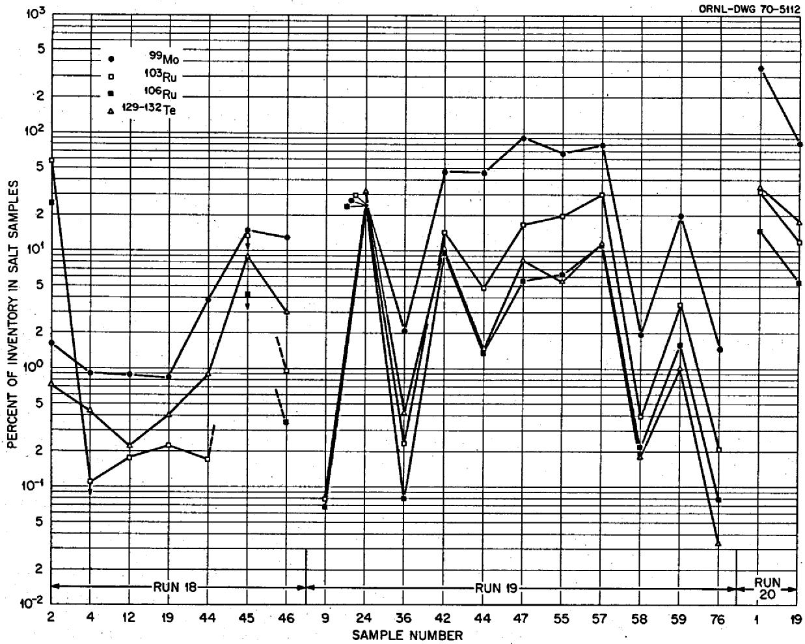  
Fig. 11.6. Noble Metal Isotopes in Salt Samples (as Percentage of Calculated Inventory).

half-lives, also support the argument that the samples are "real." A somewhat disturbing point in this regard, however, is the wide fluctuation in concentration observed in samples taken within a short span of time. Thus samples 57 through 59 were all taken over a period of $6\frac{1}{3}$ hr, and the noble metal concentrations vary between one and two orders of magnitude. No satisfactory correlation of noble metal concentration and any operating parameter is apparent thus far.

These results suggest the following about the noble metals in the MSRE.

1. The bulk of the noble metals remain accessible in the circulating loop, but with widely varying amounts in circulation at any particular time.   
2. In spite of this wide variation in the total amount found in a particular sample, the proportional composition is relatively constant, indicating that the entire inventory is in substantial equilibrium with the new material being produced.   
3. The mobility of the pool of noble metal material suggests that deposits occur as an accumulation of finely divided, well-mixed material rather than as a "plate."

Examinations of the data are continuing. Of most recent interest is the use of the ruthenium and tellurium isotope pairs to study the history and behavior of this material. Preliminary use of this tool, however, has revealed the necessity for refining our inventory calculations and rechecking obvious discrepancies in the analytical results.

Niobium-95. - The analyses indicate that appreciable percentages of the $^{95}\mathrm{Nb}$ were dissolved in the salt in samples 19-9, 19-24, and 20-1. The above observations on the noble metals in general raise a question about such a conclusion being justified in all cases, however. Thus, in samples 19-24 and 20-1 comparable percentages of all the noble metals were present in the salt. As a consequence the $^{95}\mathrm{Nb}$ present may have been associated with the other noble metals rather than being in solution. In view of this possibility, a review of the niobium data will have to be carried out. A complication in this regard is the fact that the $^{95}\mathrm{Nb}$ is the daughter of $^{95}\mathrm{Zr}$ , which is present in large quantities in salt samples, necessitating large corrections in the $^{95}\mathrm{Nb}$ results to arrive at the actual amount present at sample time. As can be seen in the table, this often leads to negative values.

Isotopes with Noble-Gas Precursors. - The slightly low median ratios to inventory for $^{89}\mathrm{Sr}$ and $^{137}\mathrm{Cs}$ are in surprising agreement with the expected (10 to 20%)

stripping of the $^{89}\mathrm{Kr}$ and $^{137}\mathrm{Xe}$ precursors in the pump bowl. The general scatter of the results for these isotopes, however, suggests that this may be coincidental.

Gas Samples. - Data for gas samples from runs 19 and 20 are shown in Table 11.8. In this table, the total amount (as disintegrations per minute) for a given isotope is shown for capsule and nozzle regions. The ratio of each value to salt inventory is also shown, indicating in micrograms the amount of inventory salt that would correspond to the observed activity.

Examination of values for salt-seeking isotopes implies that significant quantities of salt are found in both nozzle and capsule regions. The values for the various salt-seeking isotopes in a given region of a sample are similar, which is consistent with an entrainment of salt mist. The amounts of such mist in each region of each sample were estimated by averaging the microgram values indicated by appropriate salt-seeking isotopes and constituent elements. Comparison with other isotopes in the given region of the sample indicated quite generally that the gas samples were considerably enriched, relative to salt, in daughters of rare gases, noble metals, and tellurium-iodine isotopes, all of which are missing to some extent from subsurface salt samples.

However, gas data must be examined in terms of the amounts of material per unit volume of gas, both including and excluding any contribution of salt mist. Such data should then be compared with MSRE production rate per unit purge gas flow rate to determine the fraction of production indicated to be transported into the off-gas system. This was done by taking the amounts of each nuclide found in the nozzle and inner chamber, dividing by capsule volume, and comparing with production per unit volume of off-gas. The range and average of such gross values are shown in appropriate columns of Table 11.9.

It is also of interest to see what substances, if any, were to any extent transported independently of salt mist, possibly as gases. To do this we have noted that the volume of the nozzle tube was negligible. We thereby assumed that the nozzle deposits were largely mist and assign the composition of the nozzle region to capsule mist substance. The amount of a given isotope assigned to the capsule mist is consequently determined by the amount in the nozzle region of the sample and by the relative weights of "salt" in capsule and nozzle regions. Such salt weights were averages of values for this region of the sample, as indicated by appropriate salt-seeking isotopes and constituent elements.

Table 11.7. Fission Product and Constituent Analyses from MSRE Salt Samples - Runs 19 and 20   

<table><tr><td rowspan="2">Sample No.</td><td rowspan="2">Date</td><td rowspan="2">Operationd(Mwhr)</td><td rowspan="2">Weight of Sample Obtained(g)</td><td colspan="5">Salt Constituent Elementsb</td><td colspan="5">Salt-Seeking Isotopese</td><td colspan="5">Noble Metal Isotopes</td><td colspan="4">Tellurium-Iodine Isotopes</td><td colspan="4">Isotopes with Noble Gas Precursors</td></tr><tr><td>233Uc</td><td>Ud</td><td>Li</td><td>Be</td><td>Zr</td><td>95Zr6.0565.</td><td>141Ce7.0933.</td><td>144Ce4.61284.</td><td>147Nd1.9811.1</td><td>95Nb6.0535.</td><td>99Mo4.82.79</td><td>111Ag0.027.5</td><td>103Ru1.839.6</td><td>106Ru0.24367.</td><td>132Te4.43.</td><td>129Te0.7234.</td><td>131I2.980.05</td><td>89Sr5.8652.</td><td>137Cs9.1Y5.5758.</td><td>91Y5.5758.</td><td>140Ba128</td><td></td><td></td></tr><tr><td>19-9</td><td>8/18/69</td><td>18,405</td><td>10.20</td><td>6.5E+000.978</td><td>4.1E+000.512</td><td>7.7E+010.67</td><td>5.2E+010.78</td><td>6.4E+010.557</td><td>3.7E+100.797</td><td>2.0E+100.662</td><td>4.5E+101.01</td><td>7.5E+070.203</td><td>2.6E+100.378</td><td></td><td></td><td>8.5E+060.00087</td><td>&lt;3.3E+06&lt;0.00113</td><td></td><td></td><td></td><td>3.1E+100.773</td><td>2.8E+090.569</td><td>1.8E+100.434</td><td>1.8E+090.936</td><td></td><td></td></tr><tr><td>19-24</td><td>9/10/69</td><td>20,169</td><td>1.79</td><td>7.1E+001.06</td><td>5.3E+000.652</td><td>9.5E+010.826</td><td>7.2E+011.07</td><td>1.3E+021.13</td><td>5.2E+100.948</td><td>4.8E+100.825</td><td>5.0E+101.1</td><td>3.0E+090.131</td><td>2.2E+100.364</td><td>1.8E+100.243</td><td>2.3E+080.69</td><td>3.8E+090.255</td><td>1.2E+090.461</td><td>1.8E+100.261</td><td>2.2E+090.375</td><td>2.5E+100.657</td><td>5.0E+100.978</td><td>4.7E+091.51</td><td>7.6E+101.209</td><td></td><td></td><td></td></tr><tr><td>19-36</td><td>9/29/69</td><td>21,594</td><td>14.02</td><td>6.3E+000.94</td><td>6.4E+000.796</td><td>8.7E+010.75</td><td>6.1E+010.916</td><td>1.2E+021.1</td><td>5.7E+100.947</td><td>5.9E+100.843</td><td>5.5E+101.18</td><td>2.7E+101.04</td><td>-5.8E+09-0.0951</td><td>1.5E+090.0211</td><td>4.2E+074.127</td><td>4.7E+070.00266</td><td></td><td></td><td>4.4E+080.00678</td><td>1.2E+070.00169</td><td>2.5E+100.636</td><td>5.2E+100.905</td><td>6.2E+091.22</td><td>6.0E+101.1</td><td>7.1E+101.03</td><td></td></tr><tr><td>19-42</td><td>10/3/69</td><td>22,104</td><td>2.17</td><td>7.3E+001.09</td><td>3.7E+000.462</td><td>9.3E+010.808</td><td>7.1E+011.06</td><td>1.5E+021.3</td><td>6.5E+101.03</td><td>7.3E+100.928</td><td>5.8E+101.24</td><td>4.1E+101.34</td><td>-4.1E+09-0.0675</td><td>4.8E+100.475</td><td>9.0E+070.223</td><td>3.1E+090.163</td><td>4.8E+080.175</td><td>9.6E+090.108</td><td>7.2E+080.0917</td><td>3.5E+100.72</td><td>5.9E+101.5</td><td>7.7E+091.24</td><td>8.6E+101.08</td><td></td><td></td><td></td></tr><tr><td>19-44</td><td>10/6/69</td><td>22,610</td><td>4.98</td><td>6.9E+001.04</td><td>4.9E+000.611</td><td>9.7E+010.842</td><td>6.8E+011.02</td><td>1.6E+021.36</td><td>7.5E+101.12</td><td>7.8E+100.903</td><td>5.8E+101.21</td><td>4.7E+101.3</td><td>-3.5E+09-0.0581</td><td>5.8E+100.455</td><td>3.2E+080.658</td><td>1.2E+090.0547</td><td>0.1E+070.0259</td><td>2.3E+090.02</td><td>5.7E+100.983</td><td>4.6E+081.36</td><td>8.2E+101.33</td><td>1.0E+111.09</td><td></td><td></td><td></td><td></td></tr><tr><td>19-47</td><td>10/7/69</td><td>22,828</td><td>2.11</td><td>7.2E+001.08</td><td>5.2E+000.649</td><td>1.1E+020.964</td><td>6.1E+010.918</td><td>1.3E+021.12</td><td>7.5E+101.09</td><td>8.6E+100.949</td><td>6.1E+101.27</td><td>5.1E+101.33</td><td>1.8E+090.029</td><td>1.3E+110.915</td><td>5.9E+070.112</td><td>4.1E+090.186</td><td>8.5E+090.0702</td><td>9.0E+080.0982</td><td>7.4E+090.119</td><td>6.7E+100.981</td><td>4.5E+091.37</td><td>8.7E+101.18</td><td></td><td></td><td></td><td></td></tr><tr><td>19-55</td><td>10/14/69</td><td>24,144</td><td>4.29</td><td>7.6E+001.14</td><td>6.8E+000.848</td><td>1.2E+0310.7</td><td>6.8E+011.02</td><td>1.3E+021.15</td><td>8.3E+101.05</td><td>1.1E+110.996</td><td>6.7E+101.34</td><td>7.2E+101.48</td><td></td><td>1.1E+110.691</td><td>1.2E+060.00178</td><td></td><td></td><td>6.6E+090.0464</td><td>7.2E+080.065</td><td>3.8E+100.48</td><td>6.8E+100.849</td><td>4.0E+090.76</td><td></td><td>1.5E+111.23</td><td></td><td></td></tr><tr><td>19-57</td><td>10/17/69</td><td>24,616</td><td>3.35</td><td>7.1E+001.07</td><td>7.4E+000.918</td><td>1.4E+021.2</td><td>6.8E+011.01</td><td>1.6E+021.39</td><td>8.4E+101.03</td><td>1.1E+110.958</td><td>6.5E+101.29</td><td>6.8E+101.35</td><td>3.5E+090.0557</td><td>1.3E+110.833</td><td>5.8E+070.0856</td><td>9.5E+090.341</td><td>6.0E+080.211</td><td>1.2E+100.088</td><td>1.8E+090.149</td><td>4.8E+100.595</td><td>6.9E+100.824</td><td>5.0E+109.36</td><td>9.5E+101.24</td><td>1.6E+111.21</td><td></td><td></td></tr><tr><td>19-58</td><td>10/17/69</td><td>24,629</td><td>12.38</td><td>6.8E+001.02</td><td>5.8E+000.716</td><td>9.9E+010.86</td><td>6.5E+010.969</td><td>1.3E+021.1</td><td>8.3E+101.02</td><td>1.0E+110.898</td><td>6.5E+101.3</td><td>7.5E+101.5</td><td>-2.4E+09-0.0371</td><td>3.1E+090.0208</td><td></td><td>1.2E+080.00448</td><td>1.2E+070.00409</td><td>2.3E+080.00167</td><td></td><td>5.6E+100.706</td><td>6.7E+100.805</td><td>5.1E+090.953</td><td>9.9E+101.29</td><td>1.5E+111.14</td><td></td><td></td></tr><tr><td>19-59</td><td>10/17/69</td><td>24,629</td><td>8.50</td><td>6.7E+000.999</td><td>5.9E+000.736</td><td>1.1E+020.927</td><td>6.6E+010.985</td><td>1.3E+021.13</td><td>8.1E+100.99</td><td>1.0E+110.872</td><td>5.9E+101.17</td><td>6.4E+101.28</td><td>-9.5E+08-0.0149</td><td>3.0E+100.206</td><td>1.8E+090.0277</td><td>8.4E+070.0399</td><td>1.0E+090.0292</td><td>6.4E+090.00751</td><td>1.4E+080.0118</td><td>1.3E+100.0163</td><td>6.0E+100.712</td><td>4.7E+090.807</td><td>5.9E+091.09</td><td>7.6E+101.839</td><td></td><td></td></tr><tr><td>19-76</td><td>10/30/69</td><td>26,866</td><td>13.48</td><td>7.3E+001.09</td><td>6.4E+000.791</td><td>1.1E+020.939</td><td>6.2E+010.934</td><td>7.6E+010.655</td><td>7.9E+100.821</td><td>1.3E+110.934</td><td>6.8E+101.28</td><td>7.3E+101.29</td><td>2.3E+090.033</td><td>2.3E+090.0156</td><td></td><td>8.0E+070.00238</td><td></td><td>4.7E+070.00034</td><td></td><td>3.8E+100.444</td><td>8.0E+100.807</td><td>5.9E+091.09</td><td>7.6E+101.839</td><td></td><td></td><td></td></tr><tr><td>20-1</td><td>11/26/69</td><td>27,473</td><td>3.11</td><td>7.1E+001.07</td><td>7.4E+000.922</td><td>1.0E+020.871</td><td>6.9E+011.03</td><td>1.1E+020.957</td><td>7.3E+101.01</td><td>6.1E+100.743</td><td>6.2E+101.24</td><td></td><td>1.5E+101.369</td><td>4.7E+105.69</td><td>5.2E+060.0544</td><td>7.5E+090.353</td><td>7.8E+090.604</td><td></td><td>6.4E+090.748</td><td>4.8E+100.69</td><td>4.5E+090.827</td><td>9.4E+101.43</td><td>4.8E+101.18</td><td></td><td></td><td></td></tr><tr><td>20-19</td><td>12/5/69</td><td>28,934</td><td>5.48</td><td></td><td>7.3E+000.907</td><td>8.8E+010.759</td><td>6.5E+010.978</td><td>1.7E+021.47</td><td>7.6E+100.936</td><td>8.0E+100.765</td><td>6.0E+101.17</td><td></td><td>4.4E+090.0595</td><td>1.1E+110.862</td><td>1.7E+093.7</td><td>3.5E+090.135</td><td>2.9E+080.1</td><td>2.6E+100.228</td><td></td><td>2.4E+100.587</td><td>4.8E+100.875</td><td></td><td>8.8E+101.01</td><td></td><td></td><td></td></tr><tr><td colspan="25">Ratio to inventory</td><td></td><td></td></tr><tr><td colspan="5">First quartile</td><td>1.01</td><td>0.639</td><td>0.796</td><td>0.93</td><td>0.989</td><td>0.944</td><td>0.810</td><td>1.17</td><td>1.10</td><td>-0.0476</td><td>0.114</td><td>0.0544</td><td>0.00357</td><td>0.0284</td><td>0.00714</td><td>0.0251</td><td>0.446</td><td>0.758</td><td>0.810</td><td>1.13</td><td>1.02</td><td></td></tr><tr><td colspan="5">Median</td><td>1.06</td><td>0.736</td><td>0.86</td><td>0.985</td><td>1.13</td><td>1.01</td><td>0.898</td><td>1.24</td><td>1.30</td><td>0.031</td><td>0.465</td><td>0.119</td><td>0.0949</td><td>0.105</td><td>0.0583</td><td>0.0917</td><td>0.615</td><td>0.824</td><td>0.879</td><td>1.29</td><td>1.09</td><td></td></tr><tr><td colspan="5">Third quartile</td><td>1.08</td><td>0.863</td><td>0.945</td><td>1.02</td><td>1.31</td><td>1.03</td><td>0.938</td><td>1.28</td><td>1.35</td><td>0.132</td><td>0.847</td><td>0.658</td><td>0.22</td><td>0.227</td><td>0.168</td><td>0.136</td><td>0.713</td><td>0.916</td><td>1.12</td><td>1.41</td><td>1.18</td><td></td></tr></table>

${}^{a}$ Cumulative Mwhr operation on ${}^{233}\mathrm{U}$ ; full power $= {7.25}\mathrm{{Mw}}$ .   
The first value represents concentration $(\mathrm{mg / g})$ and the second is the ratio to calculated inventory.   
$c_{\mathrm{By}}$ activation analysis.   
$d$ Coulometric titration.   
The first value represents concentration (dis min $\mathbf{\Omega}^{-1}$ g-) and the second is the ratio to calculated inventory.

Full power assumed, 7.25 Mw; data represent: activity in total sample region, dis/min; ratio to inventory salt,

Table 11.8. Fission Product and Constituent Analyses for MSRE Gas Samples from Runs 19 and 20   

<table><tr><td colspan="7">Operating Conditions</td><td colspan="101">Isotopes with Noble Gas Precursors</td><td></td><td></td><td></td><td></td><td></td><td></td><td></td><td></td><td></td><td></td><td></td><td></td><td></td><td></td><td></td><td></td><td></td><td></td><td></td><td></td><td></td><td></td><td></td><td></td><td></td><td></td><td></td><td></td><td></td><td></td><td></td><td></td><td></td><td></td><td></td><td></td><td></td><td></td><td></td><td></td><td></td><td></td><td></td><td></td><td></td><td></td><td></td><td></td><td></td><td></td><td></td><td></td><td></td><td></td><td></td><td></td><td></td><td></td><td></td><td></td><td></td><td></td><td></td><td></td><td></td><td></td><td></td><td></td><td></td><td></td><td></td><td></td><td></td><td></td><td></td><td></td><td></td><td></td><td></td><td></td><td></td><td></td><td></td><td></td><td></td><td></td><td></td><td></td><td></td><td></td><td></td><td></td><td></td><td></td><td></td><td></td><td></td><td></td><td></td><td></td><td></td><td></td><td></td><td></td><td></td><td></td><td></td><td></td><td></td><td></td><td></td><td></td><td></td><td></td><td></td><td></td><td></td><td></td><td></td><td></td><td></td><td></td><td></td><td></td><td></td><td></td><td></td><td></td><td></td><td></td><td></td><td></td><td></td><td></td><td></td><td></td><td></td><td></td><td></td><td></td><td></td><td></td><td></td><td></td><td></td><td></td><td></td><td></td><td></td><td></td><td></td><td></td><td></td><td></td><td></td><td></td><td></td><td></td><td></td><td></td><td></td><td></td><td></td><td></td><td></td><td></td><td></td><td></td><td></td><td></td><td></td><td></td><td></td><td></td><td></td><td></td><td></td><td></td><td></td><td></td><td></td><td></td><td></td><td></td><td></td><td></td><td></td><td></td><td></td><td></td><td></td><td></td><td></td><td></td><td></td><td></td><td></td><td></td><td></td><td></td><td></td><td></td><td></td><td></td><td></td><td></td><td></td><td></td><td></td><td></td><td></td><td></td><td></td><td></td><td></td><td></td><td></td><td></td><td></td><td></td><td></td><td></td><td></td><td></td><td></td><td></td><td></td><td></td><td></td><td></td><td></td><td></td><td></td><td></td><td></td><td></td><td></td><td></td><td></td><td></td><td></td><td></td><td></td><td></td><td></td><td></td><td></td><td></td><td></td><td></td><td></td><td></td><td></td><td></td><td></td><td></td><td></td><td></td><td></td><td></td><td></td><td></td><td></td><td></td><td></td><td></td><td></td><td></td><td></td><td></td><td></td><td></td><td></td><td></td><td></td><td></td><td></td><td></td><td></td><td></td><td></td><td></td><td></td><td></td><td></td><td></td><td></td><td></td><td></td><td></td><td></td><td></td><td></td><td></td><td></td><td></td><td></td><td></td><td></td><td></td><td></td><td></td><td></td><td></td><td></td><td></td><td rowspan="2"></td><td></td><td></td><td></td><td></td><td></td><td></td><td></td><td></td><td></td><td></td><td></td><td></td><td></td><td></td><td></td><td></td><td></td><td></td><td></td><td></td><td></td><td></td><td></td><td></td><td></td><td></td><td></td><td></td><td></td><td></td><td></td><td></td><td></td><td></td><td></td><td></td><td></td><td></td><td></td><td></td><td></td><td></td><td></td><td></td><td></td><td></td><td></td><td></td><td></td><td></td><td></td><td></td><td></td><td></td><td></td><td></td><td></td><td></td><td></td><td></td><td></td><td></td><td></td><td></td><td></td><td></td><td></td><td></td><td></td><td></td><td></td><td></td><td></td><td></td><td></td><td></td><td></td><td></td><td></td><td></td><td></td><td></td><td></td><td></td><td></td><td></td><td></td><td></td><td></td><td></td><td></td><td></td><td></td><td></td><td></td><td></td><td></td><td></td><td></td></tr><tr><td rowspan="2">Sample No.</td><td rowspan="2">Date</td><td rowspan="2">Mwhr</td><td rowspan="2">Mw</td><td rowspan="2">GPM</td><td rowspan="2">Purge (liters/min)</td><td rowspan="2">PSIG</td><td rowspan="2">Sample Volume (cc)</td><td rowspan="2" colspan="2">89Sr</td><td colspan="2">137Cs</td><td colspan="2">91Y</td><td colspan="100">140Ba</td><td colspan="100">Noble Metal Isotopes</td><td></td><td></td><td></td><td></td><td></td><td></td><td></td><td></td><td></td><td></td><td></td><td></td><td></td><td></td><td></td><td></td><td></td><td></td><td></td><td></td><td></td><td></td><td></td><td></td><td></td><td></td><td></td><td></td><td></td><td></td><td></td><td></td><td></td><td></td><td></td><td></td><td></td><td></td><td></td><td></td><td></td><td></td><td></td><td></td><td></td><td></td><td></td><td></td><td></td><td></td><td></td><td></td><td></td><td></td><td></td><td></td><td></td><td></td><td></td><td></td><td></td><td></td><td></td><td></td><td></td><td></td><td></td><td></td><td></td><td></td><td></td><td></td><td></td><td></td><td></td><td></td><td></td><td></td><td></td><td></td><td></td><td></td><td></td><td></td><td></td><td></td><td></td><td></td><td></td><td></td><td></td><td></td><td></td><td></td><td></td><td></td><td></td><td></td><td></td><td></td><td colspan="100">95Nb</td><td></td><td></td><td></td><td></td><td></td><td></td><td></td><td></td><td></td><td></td><td></td><td></td><td></td><td></td><td></td><td></td><td></td><td></td><td></td><td></td><td></td><td></td><td></td><td></td><td></td><td></td><td></td><td></td><td></td><td></td><td></td><td></td><td></td><td></td><td></td><td></td><td></td><td></td><td></td><td></td><td></td><td></td><td></td><td></td><td></td><td></td><td></td><td></td><td></td><td></td><td></td><td></td><td></td><td></td><td></td><td></td><td></td><td></td><td></td><td></td><td></td><td></td><td></td><td></td><td></td><td></td><td></td><td></td><td></td><td></td><td></td><td></td><td></td><td></td><td></td><td></td><td></td><td></td><td></td><td></td><td></td><td></td><td></td><td></td><td></td><td></td><td></td><td></td><td></td><td></td><td></td><td></td><td></td><td></td><td></td><td></td><td></td><td></td><td></td></tr><tr><td>Capsule</td><td>Nozzle</td><td>Capsule</td><td>Nozzle</td><td>Capsule</td><td>Nozzle</td><td>Capsule</td><td>Nozzle</td><td>Capsule</td><td>Nozzle</td><td>Capsule</td><td>Nozzle</td><td>Capsule</td><td>Nozzle</td><td>Capsule</td><td>Nozzle</td><td>Capsule</td><td>Nozzle</td><td>Capsule</td><td>Nozzle</td><td>Capsule</td><td>Nozzle</td><td>Capsule</td><td>Nozzle</td><td>Capsule</td><td>Nozzle</td><td>Capsule</td><td>Nozzle</td><td>Capsule</td><td>Nozzle</td><td>Capsule</td><td>Nozzle</td><td>Capsule</td><td>Nozzle</td><td>Capsule</td><td></td><td></td><td></td><td></td><td></td><td></td><td></td><td></td><td></td><td></td><td></td><td></td><td></td><td></td><td></td><td></td><td></td><td></td><td></td><td></td><td></td><td></td><td></td><td></td><td></td><td></td><td></td><td></td><td></td><td></td><td></td><td></td><td></td><td></td><td></td><td></td><td></td><td></td><td></td><td></td><td></td><td></td><td></td><td></td><td></td><td></td><td></td><td></td><td></td><td></td><td></td><td></td><td></td><td></td><td></td><td></td><td></td><td></td><td></td><td></td><td></td><td></td><td></td><td></td><td></td><td></td><td></td><td></td><td></td><td></td><td></td><td></td><td></td><td></td><td></td><td></td><td></td><td></td><td></td><td></td><td></td><td></td><td></td><td></td><td></td><td></td><td></td><td></td><td></td><td></td><td></td><td></td><td></td><td></td><td></td><td></td><td></td><td></td><td></td><td></td><td></td><td></td><td></td><td></td><td></td><td></td><td></td><td></td><td></td><td></td><td></td><td></td><td></td><td></td><td></td><td></td><td></td><td></td><td></td><td></td><td></td><td></td><td></td><td></td><td></td><td></td><td></td><td></td><td></td><td></td><td></td><td></td><td></td><td></td><td></td><td></td><td></td><td></td><td></td><td></td><td></td><td></td><td></td><td></td><td></td><td></td><td></td><td></td><td></td><td></td><td></td><td></td><td></td><td></td><td></td><td></td><td></td><td></td><td></td><td></td><td></td><td></td><td></td><td></td><td></td><td></td><td></td><td></td><td></td><td></td><td></td><td></td><td></td><td></td><td></td><td></td><td></td><td></td><td></td><td></td><td></td><td></td><td></td><td></td><td></td><td></td><td></td><td></td><td></td><td></td><td></td><td></td><td></td><td></td><td></td><td></td><td></td><td></td><td></td><td></td><td></td><td></td><td></td><td></td><td></td><td></td><td></td><td></td><td></td><td></td><td></td><td></td><td></td><td></td><td></td><td></td><td></td><td></td><td></td><td></td><td></td><td></td><td></td><td></td><td></td><td></td><td></td><td></td><td></td><td></td><td></td><td></td><td></td><td></td><td></td><td></td><td></td><td></td><td></td><td></td><td></td><td></td><td></td><td></td><td></td><td></td><td></td><td></td><td></td><td></td><td></td><td></td><td></td><td></td><td></td><td></td><td></td><td></td><td></td><td></td><td></td><td></td><td></td><td></td><td></td><td></td><td></td><td></td><td></td><td></td><td></td><td></td><td></td><td></td><td></td><td></td><td></td><td></td><td></td><td></td><td></td><td></td><td></td><td></td><td></td><td></td><td></td><td></td><td></td><td></td><td></td><td></td><td></td><td></td><td></td><td></td><td></td><td></td><td></td><td></td><td></td><td></td><td></td><td></td><td></td><td></td><td></td><td></td><td></td><td></td><td></td><td></td><td></td><td></td><td></td><td></td><td></td><td></td><td></td><td></td><td></td><td></td><td></td><td></td><td></td><td></td><td></td><td></td><td></td><td></td><td></td><td></td><td></td><td></td><td></td><td></td><td></td><td></td><td></td><td></td><td></td><td></td><td></td><td></td><td></td><td></td><td></td><td></td><td></td><td></td><td></td><td></td><td></td><td></td><td></td><td></td><td></td><td></td><td></td><td></td><td></td><td></td><td></td><td></td><td></td><td></td><td></td><td></td><td></td><td></td><td></td><td></td><td></td><td></td><td></td><td></td><td></td><td></td><td></td><td></td><td></td><td></td><td></td><td></td><td></td><td></td><td></td><td></td><td></td><td></td><td></td><td></td><td></td><td></td><td></td><td></td><td></td><td></td><td></td><td></td><td></td><td></td><td></td><td></td><td></td><td></td><td></td><td></td><td></td><td></td><td></td><td></td><td></td><td></td><td></td><td></td><td></td><td></td><td></td><td></td><td></td><td></td><td></td><td></td><td></td><td></td><td></td><td></td><td></td><td></td><td></td><td></td><td></td><td></td><td></td><td></td><td></td><td></td><td></td><td></td><td></td><td></td><td></td><td></td><td></td><td></td><td></td><td></td><td></td><td></td><td></td><td></td><td></td><td></td><td></td><td></td><td></td><td></td><td></td><td></td><td></td><td></td><td></td><td></td><td></td><td></td><td></td><td></td><td></td><td></td></tr></table>

ng

<table><tr><td colspan="2">131I</td><td colspan="2">95Zr</td><td colspan="2">141Ce</td><td colspan="2">144Ce</td><td colspan="2">147Nd</td><td colspan="2">233U</td><td colspan="2">U</td><td colspan="2">Li</td><td colspan="2">Be</td><td></td></tr><tr><td>Capsule</td><td>Nozzle</td><td>Capsule</td><td>Nozzle</td><td>Capsule</td><td>Nozzle</td><td>Capsule</td><td>Nozzle</td><td>Capsule</td><td>Nozzle</td><td>Capsule</td><td>Nozzle</td><td>Capsule</td><td>Nozzle</td><td>Capsule</td><td>Nozzle</td><td>Capsule</td><td>Nozzle</td><td></td></tr><tr><td>.3E+06</td><td></td><td>1.1E+06</td><td>2.2E+06</td><td>4.5E+05</td><td>1.2E+06</td><td>1.0E+06</td><td>4.0E+06</td><td></td><td>9.1E+04</td><td>0.001</td><td>0.009</td><td></td><td>1.73</td><td></td><td>0.012</td><td></td><td></td><td></td></tr><tr><td>14,000</td><td></td><td>25</td><td>49</td><td>15</td><td>42</td><td>23</td><td>91</td><td></td><td>290</td><td>79</td><td>1,300</td><td></td><td>210,000</td><td></td><td>100</td><td></td><td></td><td></td></tr><tr><td>.4E+06</td><td>1.7E+06</td><td>2.6E+07</td><td>2.0E+07</td><td>9.5E+06</td><td>1.1E+07</td><td>2.3E+07</td><td>4.6E+07</td><td></td><td></td><td>0.003</td><td>0.003</td><td>0.016</td><td></td><td>0.052</td><td>0.11</td><td>0.13</td><td>0.041</td><td></td></tr><tr><td>16,000</td><td>19,000</td><td>570</td><td>450</td><td>330</td><td>390</td><td>520</td><td>1,000</td><td></td><td></td><td>510</td><td>410</td><td>2,000</td><td></td><td>450</td><td>950</td><td>1,900</td><td>610</td><td></td></tr><tr><td>.6E+05</td><td>2.8E+06</td><td>2.1E+06</td><td>1.6E+07</td><td>1.0E+06</td><td>1.2E+07</td><td>2.6E+06</td><td>2.5E+07</td><td></td><td>3.3E+05</td><td>0.001</td><td>0.004</td><td></td><td></td><td></td><td>0.05</td><td>0.006</td><td>0.003</td><td></td></tr><tr><td>11,000</td><td>32,000</td><td>46</td><td>350</td><td>36</td><td>410</td><td>58</td><td>550</td><td></td><td>1,100</td><td>97</td><td>670</td><td></td><td></td><td></td><td>430</td><td>94</td><td>37</td><td></td></tr><tr><td>.2E+06</td><td>5.3E+06</td><td>1.1E+06</td><td>7.6E+07</td><td>2.3E+06</td><td>5.0E+07</td><td>1.0E+07</td><td>1.1E+08</td><td>1.7E+05</td><td>1.6E+06</td><td>0.001</td><td>0.016</td><td></td><td>0.015</td><td></td><td>0.22</td><td>0.024</td><td>0.12</td><td></td></tr><tr><td>25,000</td><td>60,000</td><td>24</td><td>1,700</td><td>82</td><td>1,700</td><td>230</td><td>2,500</td><td>560</td><td>5,300</td><td>110</td><td>2,400</td><td></td><td>1,900</td><td></td><td>1,900</td><td>360</td><td>1,800</td><td></td></tr><tr><td>.8E+08</td><td>9.9E+07</td><td>2.7E+06</td><td>9.2E+05</td><td>1.1E+06</td><td></td><td>4.1E+06</td><td>3.0E+04</td><td>3.1E+05</td><td>2.3E+06</td><td>0.001</td><td>0.001</td><td>0.006</td><td></td><td></td><td></td><td>0.005</td><td>0.002</td><td></td></tr><tr><td>6,000</td><td>3,300</td><td>52</td><td>18</td><td>24</td><td></td><td>90</td><td>1</td><td>18</td><td>130</td><td>120</td><td>82</td><td>740</td><td></td><td></td><td></td><td>75</td><td>30</td><td></td></tr><tr><td>.0E+08</td><td>4.9E+08</td><td>4.3E+06</td><td>8.0E+05</td><td>1.4E+06</td><td>3.6E+05</td><td>3.9E+06</td><td>5.3E+06</td><td></td><td>2.1E+06</td><td>0.001</td><td>0.001</td><td>0.008</td><td>0.001</td><td></td><td></td><td>0.024</td><td>0.003</td><td></td></tr><tr><td>13,000</td><td>16,000</td><td>84</td><td>15</td><td>30</td><td>7</td><td>85</td><td>120</td><td></td><td>120</td><td>110</td><td>87</td><td>990</td><td>120</td><td></td><td></td><td>360</td><td>45</td><td></td></tr><tr><td>.2E+08</td><td>1.3E+09</td><td>4.8E+06</td><td>2.7E+07</td><td>2.1E+07</td><td>2.4E+07</td><td>4.0E+07&#x27;</td><td>2.9E+07</td><td>3.5E+07</td><td>1.4E+07</td><td>0.004</td><td>0.003</td><td>0.014</td><td>0.006</td><td></td><td>0.052</td><td>0.017</td><td>0.02</td><td></td></tr><tr><td>5,700</td><td>33,000</td><td>86</td><td>480</td><td>360</td><td>410</td><td>870</td><td>620</td><td>150</td><td>620</td><td>620</td><td>450</td><td>1,700</td><td>740</td><td></td><td>450</td><td>250</td><td>300</td><td></td></tr><tr><td>.9E+08</td><td>8.2E+08</td><td>3.7E+05</td><td>1.7E+06</td><td>1.7E+05</td><td>3.1E+06</td><td>8.0E+05</td><td>2.7E+06</td><td></td><td>3.2E+06</td><td>0.0</td><td>0.0</td><td></td><td></td><td></td><td>0.045</td><td>0.016</td><td>0.002</td><td></td></tr><tr><td>23,000</td><td>19,000</td><td>6</td><td>28</td><td>3</td><td>44</td><td>17</td><td>59</td><td></td><td>120</td><td>36</td><td>58</td><td></td><td></td><td></td><td>390</td><td>240</td><td>30</td><td></td></tr><tr><td>.0E+07</td><td>1.2E+09</td><td>1.5E+05</td><td>2.8E+06</td><td>5.3E+04</td><td>4.1E+06</td><td>1.5E+06</td><td>5.8E+06</td><td></td><td>2.2E+06</td><td>0.001</td><td>0.001</td><td></td><td></td><td></td><td>0.004</td><td>0.005</td><td>0.003</td><td></td></tr><tr><td>450</td><td>27,000</td><td>3</td><td>47</td><td>1</td><td>58</td><td>32</td><td>120</td><td></td><td>81</td><td>84</td><td>140</td><td></td><td></td><td></td><td>35</td><td>75</td><td>45</td><td></td></tr><tr><td>.5E+09</td><td>1.2E+09</td><td>6.0E+06</td><td>1.8E+07</td><td>1.8E+05</td><td>1.8E+05</td><td>4.6E+06</td><td>9.0E+06</td><td>1.2E+06</td><td></td><td>0.001</td><td>0.002</td><td></td><td></td><td></td><td></td><td>0.012</td><td></td><td></td></tr><tr><td>37,000</td><td>29,000</td><td>98</td><td>300</td><td>37</td><td>3</td><td>100</td><td>190</td><td>46</td><td></td><td>210</td><td>330</td><td></td><td></td><td></td><td></td><td>180</td><td></td><td></td></tr><tr><td>.8E+08</td><td>6.6E+07</td><td>8.5E+04</td><td>2.9E+05</td><td>2.8E+04</td><td>1.6E+04</td><td>2.0E+05</td><td>1.0E+05</td><td></td><td></td><td>0.0</td><td>0.0</td><td></td><td>0.014</td><td></td><td></td><td>0.026</td><td></td><td></td></tr><tr><td>6,800</td><td>1,600</td><td>1</td><td>5</td><td>0</td><td>0</td><td>4</td><td>2</td><td></td><td></td><td>34</td><td>6</td><td></td><td>1,700</td><td></td><td></td><td>390</td><td></td><td></td></tr><tr><td>.6E+08</td><td>4.7E+08</td><td>2.2E+06</td><td>3.0E+06</td><td>8.4E+05</td><td>1.9E+06</td><td>1.1E+06</td><td>2.8E+06</td><td>2.9E+05</td><td>1.1E+06</td><td>0.001</td><td>0.0</td><td></td><td></td><td></td><td></td><td>0.02</td><td>0.001</td><td></td></tr><tr><td>14,000</td><td>10,000</td><td>35</td><td>47</td><td>11</td><td>25</td><td>24</td><td>60</td><td>10</td><td>37</td><td>100</td><td>49</td><td></td><td></td><td></td><td></td><td>300</td><td>15</td><td></td></tr><tr><td>.4E+09</td><td>1.2E+09</td><td>1.2E+07</td><td>1.7E+07</td><td>1.8E+07</td><td>3.5E+07</td><td>1.6E+07</td><td>1.7E+07</td><td>8.3E+06</td><td>1.3E+07</td><td>0.002</td><td>0.003</td><td>0.054</td><td>0.005</td><td>0.035</td><td>0.034</td><td>0.012</td><td>0.014</td><td></td></tr><tr><td>22,000</td><td>20,000</td><td>170</td><td>250</td><td>200</td><td>390</td><td>340</td><td>360</td><td>220</td><td>340</td><td>330</td><td>490</td><td>6,600</td><td>620</td><td>300</td><td>290</td><td>180</td><td>210</td><td></td></tr><tr><td>.6E+07</td><td>2.2E+06</td><td>1.5E+06</td><td>5.8E+05</td><td>1.8E+06</td><td>1.5E+04</td><td>2.0E+06</td><td>2.1E+06</td><td>9.6E+05</td><td>8.9E+04</td><td>0.0</td><td>0.0</td><td></td><td></td><td></td><td></td><td>0.007</td><td>0.002</td><td></td></tr><tr><td>210</td><td>28</td><td>19</td><td>7</td><td>16</td><td>0</td><td>41</td><td>43</td><td>20</td><td>2</td><td>70</td><td>33</td><td></td><td></td><td></td><td></td><td>100</td><td>30</td><td></td></tr><tr><td>.1E+07</td><td>7.3E+07</td><td>6.2E+05</td><td>1.9E+06</td><td>2.0E+06</td><td>3.7E+06</td><td>1.5E+06</td><td>2.2E+06</td><td>1.2E+06</td><td>2.3E+06</td><td>0.0</td><td>0.0</td><td></td><td></td><td></td><td></td><td>0.033</td><td>0.009</td><td></td></tr><tr><td>770</td><td>930</td><td>8</td><td>24</td><td>18</td><td>32</td><td>30</td><td>44</td><td>26</td><td>46</td><td>30</td><td>45</td><td></td><td></td><td></td><td></td><td>490</td><td>130</td><td></td></tr><tr><td>.3E+07</td><td>1.9E+08</td><td>8.4E+05</td><td>5.2E+05</td><td>1.1E+06</td><td>2.7E+06</td><td>6.9E+05</td><td>1.6E+06</td><td>7.4E+05</td><td>2.2E+06</td><td>0.0</td><td>0.0</td><td></td><td></td><td></td><td>0.1</td><td>0.019</td><td>0.015</td><td>0.001</td></tr><tr><td>880</td><td>2,300</td><td>10</td><td>6</td><td>9</td><td>22</td><td>13</td><td>31</td><td>14</td><td>41</td><td>54</td><td>24</td><td></td><td></td><td></td><td>870</td><td>160</td><td>220</td><td></td></tr><tr><td>.1E+06</td><td>4.8E+08</td><td>1.6E+05</td><td>1.6E+06</td><td>4.9E+04</td><td>2.1E+06</td><td>1.4E+05</td><td>1.1E+06</td><td></td><td>1.5E+06</td><td>0.0</td><td>0.0</td><td></td><td></td><td></td><td>0.09</td><td>0.03</td><td>0.016</td><td>0.002</td></tr><tr><td>37</td><td>5,800</td><td>2</td><td>18</td><td>0</td><td>16</td><td>3</td><td>22</td><td></td><td>28</td><td>60</td><td>21</td><td></td><td></td><td></td><td>780</td><td>250</td><td>30</td><td></td></tr><tr><td>.4E+08</td><td>1.7E+08</td><td>9.9E+04</td><td>1.7E+05</td><td>6.4E+04</td><td>1.4E+05</td><td>9.1E+04</td><td>1.3E+05</td><td></td><td></td><td></td><td></td><td></td><td></td><td></td><td></td><td></td><td></td><td></td></tr><tr><td>1,700</td><td>2,100</td><td>1</td><td>2</td><td>1</td><td>1</td><td>2</td><td>3</td><td></td><td></td><td></td><td></td><td></td><td></td><td></td><td></td><td></td><td></td><td></td></tr><tr><td>.0E+08</td><td>2.9E+08</td><td>4.7E+09</td><td>1.8E+09</td><td>6.9E+09</td><td>2.2E+09</td><td>3.7E+09</td><td>1.1E+09</td><td></td><td>1.7E+09</td><td></td><td></td><td></td><td></td><td></td><td></td><td></td><td></td><td></td></tr><tr><td>3,500</td><td>3,400</td><td>50,000</td><td>19,000</td><td>50,000</td><td>16,000</td><td>70,000</td><td>21,000</td><td></td><td>30,000</td><td></td><td></td><td></td><td></td><td></td><td></td><td></td><td></td><td></td></tr><tr><td>.6E+08</td><td>4.7E+08</td><td>7.6E+05</td><td>1.8E+06</td><td>6.3E+05</td><td>2.3E+06</td><td>1.0E+06</td><td>1.3E+06</td><td>1.8E+06</td><td>1.3E+07</td><td>0.002</td><td>0.001</td><td>1.47</td><td>0.004</td><td>0.018</td><td>0.005</td><td>0.003</td><td>0.001</td><td></td></tr><tr><td>1,900</td><td>5,500</td><td>8</td><td>19</td><td>5</td><td>16</td><td>19</td><td>24</td><td>33</td><td>220</td><td>250</td><td>75</td><td>180,000</td><td>500</td><td>160</td><td>43</td><td>45</td><td>15</td><td></td></tr><tr><td>.9E+08</td><td>3.3E+07</td><td>6.8E+05</td><td>3.1E+05</td><td>6.2E+05</td><td>3.2E+05</td><td>6.3E+05</td><td>2.5E+04</td><td>1.8E+04</td><td></td><td>0.0</td><td>0.0</td><td></td><td></td><td></td><td></td><td></td><td></td><td></td></tr><tr><td>2,200</td><td>380</td><td>7</td><td>3</td><td>4</td><td>2</td><td>12</td><td>0</td><td>0</td><td></td><td>45</td><td>30</td><td></td><td></td><td></td><td></td><td></td><td></td><td></td></tr><tr><td>.2E+07</td><td>4.1E+07</td><td>1.4E+07</td><td>3.1E+06</td><td>5.3E+06</td><td>3.3E+06</td><td>4.2E+06</td><td>2.4E+06</td><td>2.7E+06</td><td></td><td>0.001</td><td>0.0</td><td></td><td></td><td></td><td></td><td></td><td></td><td></td></tr><tr><td>710</td><td>470</td><td>150</td><td>32</td><td>37</td><td>23</td><td>79</td><td>44</td><td>48</td><td></td><td>120</td><td>60</td><td></td><td></td><td></td><td></td><td></td><td></td><td></td></tr><tr><td>.1E+08</td><td>3.3E+08</td><td>6.5E+05</td><td>2.7E+05</td><td>6.7E+05</td><td>2.6E+05</td><td>6.1E+05</td><td>3.5E+05</td><td></td><td></td><td>0.0</td><td>0.003</td><td></td><td></td><td></td><td></td><td></td><td></td><td></td></tr><tr><td>2,500</td><td>3,900</td><td>7</td><td>3</td><td>5</td><td>2</td><td>11</td><td>7</td><td></td><td></td><td>24</td><td>380</td><td></td><td></td><td></td><td></td><td></td><td></td><td></td></tr><tr><td>.9E+06</td><td></td><td>1.5E+06</td><td></td><td>6.5E+05</td><td></td><td>3.7E+06</td><td></td><td></td><td></td><td></td><td></td><td></td><td></td><td></td><td></td><td></td><td></td><td></td></tr><tr><td>150</td><td></td><td>19</td><td></td><td>7</td><td></td><td>74</td><td></td><td></td><td></td><td></td><td></td><td></td><td></td><td></td><td></td><td></td><td></td><td></td></tr><tr><td>.8E+07</td><td></td><td>4.2E+06</td><td></td><td>1.2E+06</td><td></td><td>4.7E+06</td><td></td><td></td><td></td><td></td><td></td><td></td><td></td><td></td><td></td><td></td><td></td><td></td></tr><tr><td>870</td><td></td><td>54</td><td></td><td>12</td><td></td><td>93</td><td></td><td></td><td></td><td></td><td></td><td></td><td></td><td></td><td></td><td></td><td></td><td></td></tr><tr><td>.4E+08</td><td></td><td>6.6E+06</td><td></td><td>3.5E+06</td><td></td><td>3.9E+06</td><td></td><td></td><td></td><td></td><td></td><td></td><td></td><td></td><td></td><td></td><td></td><td></td></tr><tr><td>5,200</td><td></td><td>75</td><td></td><td>30</td><td></td><td>74</td><td></td><td></td><td></td><td></td><td></td><td></td><td></td><td></td><td></td><td></td><td></td><td></td></tr><tr><td>.5E*+08</td><td></td><td>4.7E+06</td><td></td><td>4.9E+06</td><td></td><td>3.7E+06</td><td></td><td></td><td></td><td></td><td></td><td></td><td></td><td></td><td></td><td></td><td></td><td></td></tr><tr><td>3,600</td><td></td><td>53</td><td></td><td>41</td><td></td><td>70</td><td></td><td></td><td></td><td></td><td></td><td></td><td></td><td></td><td></td><td></td><td></td><td></td></tr></table>

#

Table 11.9. Gas-Borne Percentage of MSRE Production Rate   
Double-wall capsules, runs 19 and 20 (sampled during power operation)   

<table><tr><td rowspan="2">Isotope</td><td colspan="4">Grossa</td><td colspan="4">Netb</td><td rowspan="2">Stripping(calcd)</td></tr><tr><td>Number</td><td>Range</td><td>Median</td><td>Mean</td><td>Number</td><td>Range</td><td>Median</td><td>Mean</td></tr><tr><td colspan="10">Isotopes with Gaseous Precursors</td></tr><tr><td>89Sr</td><td>13</td><td>0.3–17</td><td>5.2</td><td>6.5 ± 1</td><td>11</td><td>0.06–15</td><td>3</td><td>5.7 ± 1.2</td><td>14</td></tr><tr><td>137Cs</td><td>11</td><td>6–98</td><td>22</td><td>33 ± 6</td><td>9</td><td>-1.6–91</td><td>23</td><td>25 ± 6</td><td>18</td></tr><tr><td>91Y</td><td>13</td><td>0.005–3</td><td>0.08</td><td>0.36 ± 0.17</td><td>11</td><td>-0.11–0.08</td><td>0.003</td><td>0.006 ± 0.010</td><td>0.07</td></tr><tr><td>140Ba</td><td>13</td><td>0.005–0.4</td><td>0.08</td><td>0.10 ± 0.02</td><td>11</td><td>-0.004–0.18</td><td>0.027</td><td>0.056 ± 0.013</td><td>0.16</td></tr><tr><td colspan="10">Salt-Seeking Isotopes</td></tr><tr><td>95Zr</td><td>13</td><td>0.002–0.3</td><td>0.04</td><td>0.057 ± 0.014</td><td>11</td><td>-0.007–0.05</td><td>0.006</td><td>0.012 ± 0.004</td><td></td></tr><tr><td>141C</td><td>13</td><td>0.002–0.2</td><td>0.009</td><td>0.025 ± 0.011</td><td>10</td><td>-0.03–0.009</td><td>-0.0003</td><td>-0.003 ± 0.003</td><td></td></tr><tr><td>144Cs</td><td>13</td><td>0.01–1.7</td><td>0.22</td><td>0.32 ± 0.09</td><td>11</td><td>-0.12–0.42</td><td>0.007</td><td>0.05 ± 0.03</td><td></td></tr><tr><td>147Nd</td><td>9</td><td>0.0001–0.1</td><td>0.012</td><td>0.021 ± 0.007</td><td>9</td><td>-0.01–0.01</td><td>-0.001</td><td>0.002 ± 0.002</td><td></td></tr><tr><td colspan="10">“Noble” Metal Isotopes</td></tr><tr><td>95Nb</td><td>13</td><td>0.07–7</td><td>0.7</td><td>1.9 ± 0.5</td><td>11</td><td>-0.2–3.6</td><td>0.4</td><td>0.9 ± 0.2</td><td></td></tr><tr><td>99Mo</td><td>13</td><td>0.16–16</td><td>1.0</td><td>2.7 ± 0.9</td><td>11</td><td>-0.6–7.3</td><td>0.3</td><td>1.5 ± 0.5</td><td></td></tr><tr><td>111Ag</td><td>13</td><td>0.2–20</td><td>1.5</td><td>4.0 ± 1.1</td><td>11</td><td>-0.9–4.1</td><td>0.3</td><td>0.7 ± 0.3</td><td></td></tr><tr><td>103Ru</td><td>13</td><td>0.31–20</td><td>1.8</td><td>4.3 ± 1.2</td><td>11</td><td>0.05–10</td><td>1.1</td><td>2.3 ± 0.7</td><td></td></tr><tr><td>106Ru</td><td>13</td><td>3.8–67</td><td>13</td><td>22 ± 4</td><td>11</td><td>-2–36</td><td>6</td><td>11 ± 3</td><td></td></tr><tr><td colspan="10">Tellurium-Iodine Isotopes</td></tr><tr><td>129Te</td><td>13</td><td>0.3–27</td><td>1.8</td><td>5.1 ± 1.5</td><td>11</td><td>-0.11–4</td><td>: 0.1</td><td>-1 ± 0.8</td><td></td></tr><tr><td>132Te</td><td>13</td><td>0.03–23</td><td>1.0</td><td>3.5 ± 1.2</td><td>11</td><td>-12–2</td><td>-0.4</td><td>-1 ± 0.8</td><td></td></tr><tr><td>131I</td><td>13</td><td>0.04–6</td><td>0.8</td><td>1.6 ± 0.4</td><td>11</td><td>-0.1–2</td><td>0.2</td><td>0.5 ± 0.1</td><td></td></tr></table>

$a_{\text{Gross}}$ includes capsule plus nozzle isotopes.   
$b$ Net includes capsule isotopes only, less proportional quantity of material of nozzle composition, for the given sample.

A net gas-borne value for the capsule was then calculated by subtracting the capsule mist contribution from the observed value and, as usual, dividing by capsule volume. This net value could then be ratioed to the isotope production rate per unit purge flow rate as before. The range and average of such values are given in Table 11.9.

It is evident from this table that $^{89}\mathrm{Sr}$ and $^{137}\mathrm{Cs}$ , which would presumably exist as $^{89}\mathrm{Kr}$ and $^{137}\mathrm{Xe}$ at the time of sampling, are present in net amounts of the proper magnitude if valid gas samples are assumed. Since salt mist of nozzle composition has been subtracted, it appears legitimate to accept the samples in general as being acceptable samples of the gas region within the pump bowl spray baffle.

Insofar as the material in the shielded region represents the pump bowl gas in general and the gas entering the off-gas line in particular, the data of Table 11.9 also indicate the following: The gross amounts of "noble metal" isotopes carried by the off-gas are in general a low few percent of production (though $^{106}$ Ru appears

higher, in part because the high yield from $^{239}$ Pu in the fuel was not taken into account). Much but not all of this appears to be associated with salt mist, but some carries through into the net value, indicating additional noble metal transport independent of salt mist.

Further, the tellurium isotopes also are found only to the extent of a low few percent; however, essentially all of these appear to follow the salt mist, so that net quantities tend to approach zero. It then appears likely that noble metal isotopes and tellurium isotopes could be separately transported to some extent.

These data are ratioed to production rate and imply steady-state conditions and short holdup periods in any region; the simple behavior model thus assumed appears straightforward, reasonable, and adequately conservative.

However, our recent studies of activity ratios of isotope pairs, such as $^{103}\mathrm{Ru} / ^{106}\mathrm{Ru}$ and $^{132}\mathrm{Te} / ^{129}\mathrm{Te}$ , indicate that the material found in gas capsules may not be from recent production but from a mix of it with a presently indeterminate but nevertheless substantial

portion of the inventory from a considerable span of the previous power history. This is consistent with the rapid equilibration of recent production and inventory indicated by the salt sample noble metal analyses. To apply such a model will require further definition of partition of losses between off-gas and other possible "sinks," a matter under current consideration. Present indications are that the fraction of noble metals lost to off-gas will not be greater than shown in Table 11.9.

Correlation of the gas sample data with possibly relevant operating conditions is not apparent (other than reactor power, gas flow rate, pump bowl pressure, and temperature, which are incorporated into the value of production rate per unit purge flow rate).

In these runs, samples 19-1 through 19-29 and 20-1 showed an appreciable fraction of the $^{95}\mathrm{Nb}$ inventory in salt samples; consequently, the fuel salt was less reducing during this interval. However, $^{95}\mathrm{Nb}$ quantities in gas samples gave no evident response to this condition of the salt.

# 11.3 INVESTIGATIONS OF THE BEHAVIOR OF FISSION PRODUCT NIOBIUM

H.W.Kohn

Laboratory investigations of the chemical behavior of the fission products $^{95}\mathrm{Nb}$ and $^{95}\mathrm{Zr}$ were continued. The principal emphasis of the current efforts was directed toward preliminary studies of the relationship of the redox potential of fluoride melts to the distribution of these isotopes between the melts and metal containers. All experiments were conducted at $650^{\circ}\mathrm{C}$ . The following experimental procedures were employed: 2.15 kg of simulated fuel salt $(\mathrm{Li}_2\mathrm{BeF}_4$ containing 5 mole $\%$ $\mathrm{ZrF_4}$ and 0.3 mole $\%$ $\mathrm{UF_4}$ ) was tagged with 6.5 mc of $^{95}\mathrm{Zr}$ which had been freshly separated from its $^{95}\mathrm{Nb}$ daughter. The salt was contained in a nickel vessel, and the apparatus was arranged so that gas samples could be collected either by chemical probes, described previously, or on electron microscope slides which were positioned just above a gas bubbler tube. The amounts of niobium and zirconium contained in the gas sampling tubes and also on immersion specimens were determined by radiochemical analysis. A nickel-nickel oxide electrode was also used to monitor the redox potential of the melt. Gas flow rate, redox potential, niobium content, bubble movement, and character of the immersion probes were the principal variables studied.

For a period of six weeks, experiments were conducted with the same salt charge, and 27 salt samples were removed from the melt. The first three contained anomalously high concentrations of niobium, indicating that the initial zirconium-niobium separation was not complete. All subsequent samples were deficient in niobium, indicating behavior unlike that observed in the MSRE. In the laboratory experiments, niobium was not quickly dissolved and transferred to the melt by introduction of HF as an oxidant, nor removed from the melt by metallic lithium as a reductant. Instead, it behaved erratically under varying conditions of redox potential, as is indicated by the data in Table 11.10.

Niobium on the gas probes was low, usually less than $1\%$ of that formed during a sampling period and consequently a much smaller fraction of the total inventory in the container vessel. The $^{95}\mathrm{Nb}/^{95}\mathrm{Zr}$ ratio in the gas probes was always observed to be greater than the ratio in the salt, usually a factor of 10 or so, and was higher for oxidized melts than for reduced melts. Samples from reduced melts exhibited increases in the $^{95}\mathrm{Nb}/^{95}\mathrm{Zr}$ ratio with increasing gas flow rates. The amount of salt in the probes, as judged from the zirconium activity, was too great to be accounted for by vaporization. We believe it to be carried as fine droplets. The electron microscope slides suspended above the melt were found to be encrusted with salt. The size of the salt particles from the melt when it was in an oxidized condition was about 0.1 $\mu$ . They appeared to have either rhombohedral outlines or, in addition, adhering fragments which seemingly lacked morphological symmetry (Fig. 11.7a). The salt from reduced melts, however, exhibited dendritic or needle growth patterns and larger particle sizes (Fig. 11.7b). It should be noted that the two photographs do not represent identical magnifications. Electron diffraction analyses of the composite particles indicated that in addition to the fluoride salt, nickel metal and carbon particles were present.

Log-log plots of zirconium and of niobium deposition in and on the probes vs flow rate were made in order to estimate the order and rate of deposition. Zirconium deposition, not surprisingly, was always found to be about first order (0.7 to 0.9). Niobium deposition rates, though highly erratic, appear to have a higher order rate as high as 1.4 to 4, most probably 1.5. The actual numbers are not firm enough to postulate mechanisms because of the inaccuracy of the data and the small number of experi

Table 11.10. Distribution of Niobium in Salt Samples   

<table><tr><td rowspan="2">Date</td><td colspan="3">At Sampling Time</td><td rowspan="2">State of Melt</td><td rowspan="2">U3+/U4+if Any</td><td rowspan="2">Treatment</td><td rowspan="2">Remarks</td></tr><tr><td>Nb/Zr Observed</td><td>Nb/Zr Calculated</td><td>Observed/Calculated</td></tr><tr><td>8/7</td><td>0.110</td><td>0.020</td><td>5.50</td><td>Oxidized</td><td></td><td>HF + H2 1 hr</td><td></td></tr><tr><td>8/7</td><td>0.110</td><td>0.020</td><td>5.50</td><td>Oxidized</td><td></td><td>HF + H2 4 hr</td><td></td></tr><tr><td>8/7</td><td>0.094</td><td>0.020</td><td>4.70</td><td>Oxidized</td><td></td><td>HF + H2 4 hr</td><td></td></tr><tr><td>8/11</td><td>0.076</td><td>0.097</td><td>0.784</td><td>Oxidized</td><td>&lt; E - 5</td><td></td><td>Salt splashed on probe from pot</td></tr><tr><td>8/11</td><td>0.030</td><td>0.097</td><td>0.309</td><td>Oxidized</td><td></td><td></td><td></td></tr><tr><td>8/11</td><td>0.019</td><td>0.097</td><td>0.196</td><td>Reduced</td><td>4.8 E - 2</td><td></td><td>Reduced salt, 10:00, 8/11</td></tr><tr><td>8/14</td><td>0.050</td><td>0.153</td><td>0.327</td><td>Reduced</td><td>1.2 E - 2</td><td></td><td></td></tr><tr><td>8/11</td><td>~0.000</td><td>0.097</td><td>0.000</td><td>Reduced</td><td>4.8 E - 2</td><td></td><td>Repeat of 115-8, time correction</td></tr><tr><td>8/14</td><td>~0.000</td><td>0.153</td><td>0.000</td><td>Reduced</td><td>3.0 E - 3</td><td></td><td>8/15, 2:00, HF + H2 started</td></tr><tr><td>8/18</td><td>0.066</td><td>0.225</td><td>0.293</td><td>Oxidized</td><td>3.0 E - 4</td><td>HF + H2 1 hr</td><td></td></tr><tr><td>8/18</td><td>0.077</td><td>0.225</td><td>0.342</td><td>Oxidized</td><td>3.0 E - 4</td><td>HF + H2 1 hr</td><td>Duplicate of 118-14</td></tr><tr><td>8/26</td><td>0.059</td><td>0.362</td><td>0.163</td><td>Oxidized</td><td></td><td>HF 4 hr</td><td></td></tr><tr><td>8/28</td><td>0.137</td><td>0.395</td><td>0.347</td><td>Oxidized</td><td></td><td></td><td></td></tr><tr><td>9/3</td><td>0.192</td><td>0.489</td><td>0.393</td><td>Oxidized</td><td></td><td></td><td>Reduced at 10:30, 9/3</td></tr><tr><td>9/4</td><td>0.036</td><td>0.505</td><td>0.071</td><td>Reduced</td><td>5.0 E - 3</td><td></td><td>Pot salt</td></tr><tr><td>9/5</td><td>0.127</td><td>0.520</td><td>0.244</td><td>Reduced</td><td>5.0 E - 3</td><td></td><td>Associated with immersion probes</td></tr><tr><td>9/5</td><td>0.074</td><td>0.520</td><td>0.142</td><td>Reduced</td><td>5.0 E - 3</td><td></td><td></td></tr><tr><td>9/5</td><td>0.030</td><td>0.520</td><td>0.057</td><td>Reduced</td><td>3.0 E - 2</td><td></td><td></td></tr><tr><td>9/5</td><td>0.058</td><td>0.520</td><td>0.111</td><td>Reduced</td><td>3.0 E - 2</td><td></td><td>Salt splashed on probe</td></tr><tr><td>9/8</td><td>0.055</td><td>0.564</td><td>0.098</td><td>Oxidized</td><td>2.5 E - 4</td><td></td><td>Added K2NbF7, 4.5 mg</td></tr><tr><td>9/10</td><td>0.110</td><td>0.593</td><td>0.186</td><td>Reduced</td><td>5.0 E - 2</td><td></td><td></td></tr><tr><td>9/10</td><td>0.272</td><td>0.593</td><td>0.459</td><td>Reduced</td><td>5.0 E - 2</td><td></td><td></td></tr><tr><td>9/17</td><td>0.097</td><td>0.691</td><td>0.140</td><td>Reduced</td><td>2.3 E - 2</td><td></td><td></td></tr><tr><td>9/18</td><td>0.030</td><td>0.704</td><td>0.043</td><td>Reduced</td><td>1.4 E - 2</td><td></td><td></td></tr><tr><td>9/22</td><td>≤0.02</td><td>0.744</td><td>&lt;0.027</td><td>Oxidized</td><td></td><td>HF 4 hr</td><td></td></tr><tr><td>9/22</td><td>≤0.02</td><td>0.744</td><td>&lt;0.027</td><td>Oxidized</td><td></td><td></td><td></td></tr><tr><td>9/22</td><td>0.032</td><td>0.744</td><td>0.043</td><td>Oxidized</td><td></td><td></td><td></td></tr></table>

mental points, but it is obvious that the niobium and zirconium enter the gas probes by different order mechanisms.

From the deposition rates of niobium and zirconium on the outer surface of the gas sampling probes one can calculate, assuming a constant rate and knowing the gas deposition area of the pot and of the probes, the amount of niobium which would diffuse to the gas area of the pot wall. A maximum of $30\%$ of that niobium formed by decay during a sampling experiment might be so carried. Relative to the total inventory of niobium that is present after the experiment is under way the percent so carried is, of course, considerably lower. From the amount found in the gas probes and the gas flow rates one

can calculate that amount carried from the pot by flowing gas during the experiment. This was also low, less than $10\%$ of the amount formed by decay during sampling. To confirm this, the connections and fittings downstream from the salt container were counted at the conclusion of the experiment. About $1\%$ of the total niobium was found thereon.

Immersion probes were pretreated by firing in hydrogen for 1 hr at $600^{\circ}\mathrm{C}$ followed by 15 min in dry argon to remove adsorbed hydrogen. All probes immersed in the melt became preferentially coated with niobium, from $5 \times 10^{3}$ to $\sim 10^{5}$ counts/min deposited per square centimeter per hour. It is quite obvious that (Table 11.11) (except for nickel) deposition from an oxidizing solution is heavier than

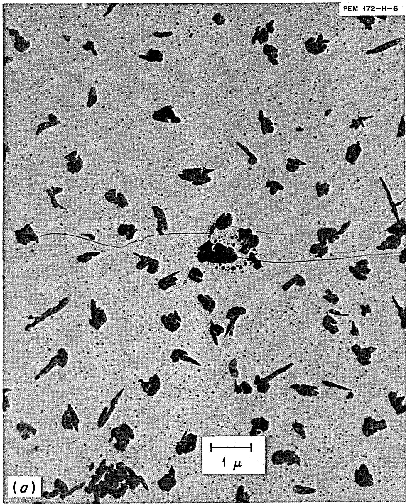  
Fig. 11.7. Electron Micrographs of Salt Particles in Gas Stream. (a) From oxidized melt.

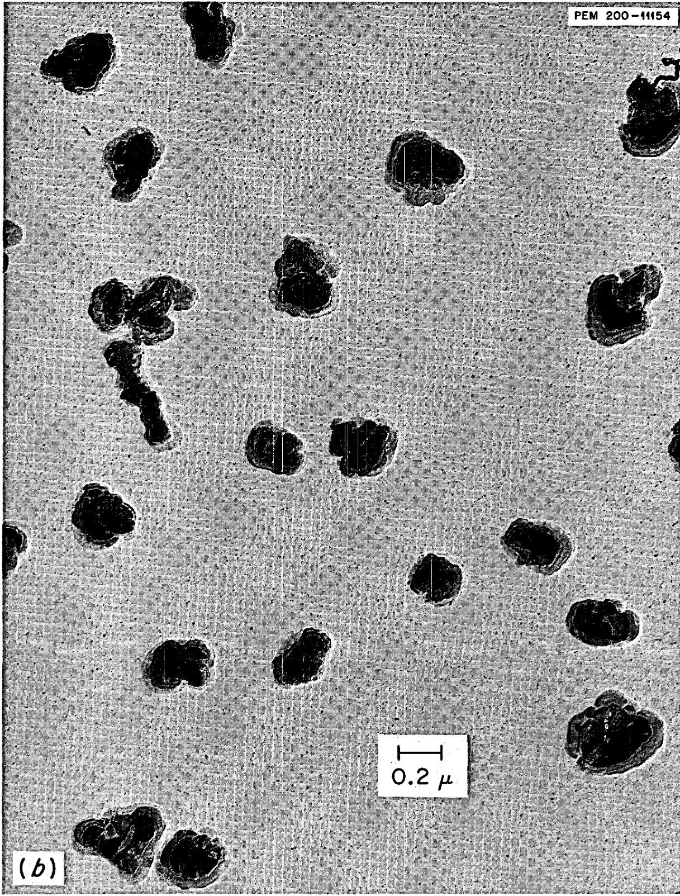  
Fig. 11.7. Electron Micrographs of Salt Particles in Gas Stream. (b) From reduced melt.

Table 11.11. Deposition of $^{95}\mathrm{Nb}$ on Various Probes from Simulated Fuel Salt   

<table><tr><td rowspan="2">Material</td><td colspan="2">Deposition (counts min-1cm-2hr-1)</td></tr><tr><td>Oxidizing Solution</td><td>Reducing Solution</td></tr><tr><td>Graphite</td><td>6 × 104</td><td>5 × 103</td></tr><tr><td>Molybdenum</td><td></td><td></td></tr><tr><td>18 hr</td><td>7 × 105</td><td>1 × 104</td></tr><tr><td>1 hr</td><td></td><td>6 × 104</td></tr><tr><td>Hastelloy, 1 hr</td><td>1 × 105</td><td>8 × 103</td></tr><tr><td>Stainless</td><td></td><td>1 × 104</td></tr><tr><td>Nickel</td><td></td><td></td></tr><tr><td>1 hr</td><td>2 × 104</td><td>8 × 104</td></tr><tr><td>2 hr</td><td>1 × 103</td><td>4 × 104</td></tr><tr><td>4 hr</td><td>2 × 103</td><td>5 × 104</td></tr><tr><td>18 hr</td><td>4 × 104gas phase</td><td>2 × 104</td></tr><tr><td></td><td>9 × 103liquid phase</td><td></td></tr><tr><td>4.5 mg K2NbF7 added to melt</td><td>2 × 105</td><td>4 × 104</td></tr></table>

that from a reducing solution, although deposition of the metal is not favored thermodynamically. Autoradiographs of the immersion specimens showed spotty areas of deposition on that part of the probe which was exposed to the liquid. Four probes showed autoradiographs with dark rings at exactly the position of the interface. To show that this was not due to a ring of radioactive salt, we cut up two of the probes and counted the various sections. The interface section showed the highest $^{95}\mathrm{Nb} / ^{95}\mathrm{Zr}$ ratio. Two of the probes from the oxidized solution showed a heavy uniform deposition on that part of the probe which was exposed to the gas phase. The upper ends of these probes (gas phase plus interface) were at least ten times more radioactive than the lower ends.

Gamma autoradiographs of the pot were made after removal of most of the salt; these showed preferential deposition of radioactivity (mostly niobium) on that part of the salt container which had been in contact with the salt. The bubbler tube was also autoradiographed and showed the same phenomenon. The total activity found on these pieces of apparatus accounts for $25\%$ of the niobium missing from the salt samples. A count of the bubbling tube multiplied by the ratio of area of the salt container in contact with the liquid to the area of the tube in contact with the liquid accounts for $160\%$ of the missing niobium. Within the accuracy of the counting experiments, it may be inferred that nearly all of the niobium in the melt deposited on

the walls of the vessel which contacted the melt. Such a conclusion is in agreement with the results from the gas probes, the autoradiographs, and the activity levels of the fittings, but does not duplicate the behavior observed in the MSRE.

In order to compare the behavior of the fission niobium in the MSRE with that in the laboratory we immersed a niobium foil in the MSRE fuel pump bowl for $\frac{3}{4}$ hr at a time when the reactor was extremely reducing (3400 full-power hours, and $[\mathrm{U}^{3+}] / [\Sigma \mathrm{U}]$ was nominally $\sim 1.35\%$ ; see Sect. 10.2, this report). The foil was weighed, placed in a nickel cage, and after immersion and removal, leached in verbocit and weighed. The nickel cage and the foil were then dissolved, and the cage solution, the foil solution, and the washings were counted for the noble metal fission products as well as some of the salt seekers. The results are shown in Table 11.12.

The first four entries show how a salt seeker, such as $^{89}\mathrm{Sr}$ , $^{147}\mathrm{Nd}$ , or $^{95}\mathrm{Zr}$ , materials which we would expect to show no preferential deposition behavior, acts and consequently show the amount of salt one can expect to adhere to the total assembly. Excepting the values for $^{89}\mathrm{Sr}$ , which seem erroneous, it appears to be 100 to 200 mg, adhering mostly to the foil. During the experiment 12 mg of niobium dissolved, and the niobium foil appeared corroded and wetted by the salt. The nickel cage, on the other hand, was bright and shiny. The data in Table 11.12 show that preferential deposition of Ag, Mo, and Te seemed to take place on the foil and on the

nickel cage, which was in electrical contact with the niobium foil. There seems also to be a comparatively slight amount of preferential niobium deposition on the nickel cage, but this deposition is small compared with that of Mo, Ag, and Te, and is also incompatible with the solution of some of the niobium.

From time to time, changes in wetting behavior appear to have been dependent on reduction potential of the melt. We have examined the possible correlation of such changes with deposition behavior of noble metal fission products. In a series of separate experiments the wetting of Nb, Ni, Mo, Cu, and Ag in a simulated fuel salt melt was studied as a function of reduction potential. The wetting behavior was judged by examination of the contact angle of solidified drops (if any) left on hydrogen-fired immersion coupons introduced into the melt without exposure to air. The degree of reduction was estimated from the inventory of salt and from the quantity of lithium metal added to the melt.

Wetting was not independent of substrate. A freshly prepared fuel salt melt, sparged with $10\%$ HF in hydrogen, was found to wet only the most active metal, Nb. This wetting behavior of Nb was associated with a chemical attack, determined by weight loss as well as by a pitted appearance. Mild reduction (conversion of $3.5\%$ of the total $\mathbf{U}^{4+}$ to $\mathbf{U}^{3+}$ ) caused the melt to wet Ni, Mo and Nb without causing corrosion, but not to wet Cu and Ag. Stronger reduction ( $>5\%$ ) made the melt wetting toward these metals. These results are consistent with previous observations.

The behavior described above seems to have qualitative relevance to the migration of niobium in the MSRE fuel, where at slightly above and below approximately $0.5\%$ $[\mathrm{U}^{3+}] / [\Sigma \mathrm{U}]$ major differences in $^{95}\mathrm{Nb}$ disposition within the fuel circuit were observed (Sect. 10.2, this report).

The results of the current study tend to indicate that wetting behavior may play a significant role in controlling the distribution of voids and fission products in molten-salt reactor fuel systems, but do not, at the present stage of development, provide positive indications of the mechanisms.

Table 11.12. Comparison of Observed Amount with Calculated Inventory After Correction of Observed Count to the Time of Isolation   

<table><tr><td></td><td colspan="3">Ratio of Amount Found to Calculated Inventory per Gram of Salt</td></tr><tr><td></td><td>Nickel Cage</td><td>Nb Foil</td><td>Foil Leachings</td></tr><tr><td>89Sr</td><td>0.759</td><td>0.00191</td><td>0.0883</td></tr><tr><td>95Zr</td><td>0.0155</td><td>0.000066</td><td>0.104</td></tr><tr><td>140Ba</td><td>0.0274</td><td>0.000466</td><td>0.128</td></tr><tr><td>147Nd</td><td>0.0236</td><td>0.000234</td><td>0.156</td></tr><tr><td>95Nb</td><td>3.95</td><td>0.0246</td><td>0.064</td></tr><tr><td>99Mo</td><td>49.8</td><td>0.683</td><td>9.15</td></tr><tr><td>111Ag</td><td>20.8</td><td>0.621</td><td>4.08</td></tr><tr><td>132Te</td><td>22.0</td><td>0.273</td><td>0.514</td></tr><tr><td>131I</td><td>2.32</td><td>0.00711</td><td>0.296</td></tr></table>

# 11.4 NOBLE METAL FISSION PRODUCT CHEMISTRY

11.4.1 Introduction

C. F. Weaver

The unpredictable behavior of the noble metal fission products (Nb, Mo, Tc, Ru, and Te) in the MSRE caused us to initiate studies of their high-temperature chemistry some time ago. Emphasis was given to molybdenum fluoride chemistry because the combination of fission yield and cross section for the molybdenum isotopes poses a potential problem in the breeding efficiency of an MSBR. To a lesser extent the behavior of niobium and ruthenium fluorides was investigated. The fluorides of technetium and tellurium were given attention only in our literature surveys. Previously reported studies of molybdenum fluoride chemistry, along with the reasons for initiating this work, have been reviewed. $^{1-3}$

Recent evidence that niobium metal may be oxidized and enter fuel salt when $\mathrm{U}^{3+}/\mathrm{U}^{4+}$ ratios are quite low suggested that this fission product might provide a means of monitoring the redox potential of such a system. Consequently, increased attention

has recently been given to niobium fluoride chemistry. The following subjects were discussed in earlier reports: potentiometric measurements,4 niobium pentafluoride volatility, synthesis of $\mathbf{NbF}_5,$ synthesis of $\mathbf{NbF}_4,$ spectroscopic investigations, mass spectrometric studies,1-3 and 95 Nb tracer experiments.8

# 11.4.2 Synthesis

C. F. Weaver H. A. Friedman J. S. Gill

Several gram batches of $\mathsf{MoF}_5$ , $\mathsf{MoF}_4$ , and $\mathsf{MoF}_3$ were synthesized according to the procedure reported in ref. 3. The materials are used in the kinetic and mass spectrometric studies described below as well as in Raman[9,10] and absorption[11,12] spectroscopy studies. A $385 - g$ batch of $\mathsf{NiF}_2$ was synthesized by hydrofluorinating $\mathsf{NiCl}_2\cdot 4\mathsf{H}_2\mathsf{O}$ , using a procedure developed by B. J. Sturm.[13] Nickel fluoride is a mild fluorinating agent commonly used by several groups in the Reactor Chemistry Division to oxidize Nb metal. Our current efforts are directed toward the synthesis of the lower fluorides of niobium by reduction of $\mathsf{NbF}_5$ [14] and from disproportionation reactions of the lower fluorides.

# 11.4.3 Niobium and Molybdenum Fluoride Solutions in Molten $\mathbf{L}\mathbf{i}_2\mathbf{B}\mathbf{e}\mathbf{F}_4$

C. F. Weaver H. A. Friedman

A series of experiments was initiated to investigate the reaction

$$
\mathrm {N b} + x \mathrm {H F} \rightleftharpoons \mathrm {N b F} _ {x} + \frac {x}{2} \mathrm {H} _ {2}
$$

in molten $\mathrm{Li}_2\mathrm{BeF}_4$ with respect to the valence of niobium in equilibrium with niobium metal, the partial pressures of $\mathbf{H}_2$ and HF as a function of $\mathrm{Nb}^{x+}$ concentration, and the stability of the $\mathrm{NbF}_x$ solutions in a neutral (He) atmosphere. The niobium was rapidly fluorinated by the direct addition of HF. After the Nb concentration reached 300 ppm the system was held under flowing He (3.3 liters/hr) for six days. No loss of niobium occurred. Hydrofluorination was resumed and continued until the concentration of niobium rose to 1500 ppm. This solution was held for 32 days under He without loss of niobium. Sweeping the system with 1 atm of $\mathbf{H}_2$ (5.5 liters/hr) produced an initial burst of HF. This

was caused by the reduction of the fluorides of impurities more noble than niobium and was followed by a very slow evolution of HF. These results indicate that approximately $1.5 \times 10^{-4}$ atm of HF exists at equilibrium with 1 atm of $\mathbf{H}_2$ and 1500 ppm of $\mathbf{Nb}^{x+}$ in its lowest valence state in molten $\mathbf{Li}_2\mathbf{BeF}_4$ at $500^{\circ}\mathbf{C}$ , and imply as well that under these conditions niobium is only slightly more noble than Cr. This behavior of Nb contrasts sharply with that of Mo under similar conditions. In a period of 32 days under He, 1500 ppm of $\mathbf{Mo}^{3+}$ would have been reduced by disproportionation to 1000 ppm. With 1 atm of $\mathbf{H}_2$ , $\mathbf{Mo}^{3+}$ would be reduced as fast as the $\mathbf{H}_2$ entered the system. Based entirely on experimental information, the order of increasing nobility with respect to fluorination of metals in molten $\mathbf{Li}_2\mathbf{BeF}_4$ is Cr, Nb, Fe, Ni, Mo, Cu, and Ru. Information in the literature suggests that Tc is approximately equivalent to Cu in this respect.

A stronger reductant, Li metal, was used to reduce the dissolved niobium and, hence, determine its valence. The stoichiometry of the reaction indicated that niobium was present as $\mathrm{Nb} 3.6 \pm 0.1$ . The absence of concentration dependence suggests a cluster compound, $\mathrm{Nb}_{3} \mathrm{~F}_{11}$ . We are now repeating this experiment at a higher initial concentration of $\mathrm{Nb}^{3.6+}$ to improve the accuracy of the valence determination, to provide a more stringent test of concentration dependence, and to determine the solubility limit. At present the concentration is $2300 \mathrm{ppm}$ and has shown no variation over a period of 15

days with a helium flow rate of 3 liters/hr. These observations should not be extrapolated to other temperatures since there is evidence in the literature15 that both the valence and stability of the niobium fluorides are strongly temperature dependent.

The relative stability of this niobium fluoride and the carbides, $\mathbf{Nb}_2\mathbf{C}$ and NbC, which can occur in MSR operations may now be discussed. The standard free energy changes (or equilibrium constants) for the following reactions are not available:

$$
\mathrm {N b} (s) + x \mathrm {U F} _ {4} \rightleftharpoons \mathrm {N b F} _ {x} (d) \pm x \mathrm {U F} _ {3} (d) \quad \Delta F _ {1}, K _ {1} \tag {1}
$$

$$
\begin{array}{l} \mathrm {N b C} (s) + x \mathrm {U F} _ {4} (d) \rightleftharpoons \mathrm {N b F} _ {\chi} (d) \\ + x \mathrm {U F} _ {3} (d) + \mathrm {C} (s) \quad \Delta F _ {2}, K _ {2} \tag {2} \\ \end{array}
$$

However, subtraction yields

$$
\mathrm {N b} + \mathrm {C} \rightleftharpoons \mathrm {N b C} \quad \Delta F _ {3} \tag {3}
$$

so that

$$
\Delta F _ {1} - \Delta F _ {2} = - R T \ln K _ {1} / K _ {2} = \Delta F _ {3},
$$

which has been reported $^{16,17}$ to be $-32\mathrm{kcal / mole}$ at $773^{\circ}\mathbf{K}$ . Further, experiments in progress in which excess Nb metal was hydrofluorinated into molten $\mathbf{Li}_2\mathbf{BeF}_4$ at $500^{\circ}\mathbf{C}$ ( $773^{\circ}\mathbf{K}$ ) have given by Li titration a tentative value of $x = 3.6 \pm 0.1$ which has shown no apparent concentration dependence and suggests a cluster compound, $\mathbf{Nb}_3\mathbf{F}_{11}$ . Hence, if one assumes that the activity coefficients for uranium cancel:

$$
\left(\frac {\gamma^ {3 +}}{\gamma^ {4 +}}\right) _ {1} / \left(\frac {\gamma^ {3 +}}{\gamma^ {4 +}}\right) _ {2} \approx 1
$$

and defines $\mathrm{UF}_3 / \mathrm{UF}_4 = r$ , then

$$
\frac {K _ {1}}{K _ {2}} = \left(\frac {r _ {1}}{r _ {2}}\right) ^ {3. 6}
$$

under conditions such that both reactions produce the same activity of $\mathrm{NbF}_{3,6}$ .

$$
\begin{array}{l} \Delta F _ {3} = - R T \ln \left(\frac {r _ {1}}{r _ {2}}\right) ^ {3. 6}, \\ - 3 2 = - R (7 7 3) \ln \left(\frac {r _ {1}}{r _ {2}}\right) ^ {3. 6}, \\ \frac {r _ {1}}{r _ {2}} = 3 2 0. \\ \end{array}
$$

Thus if $r_1$ of $0.5 \times 10^{-2}$ will oxidize Nb metal, then $r_2$ of $1.6 \times 10^{-5}$ will oxidize NbC as well as the less stable Nb₂C. This value of $r$ is insufficient to oxidize Mo metal but may oxidize Fe, which is more noble than Nb but less noble than Mo.

The stability studies of $\mathbf{Mo}^{3+}$ in molten $\mathbf{Li}_2\mathbf{BeF}_4$ at $500^{\circ}\mathrm{C}$ were continued. It was previously reported that a tenfold increase in the surface area of the copper container did not affect the rate or the apparent order of removal of $\mathbf{Mo}^{3+}$ from solution over a 1400-hr period. This experiment was continued to 4500 hr, giving the results shown in Fig. 11.8 and yielding a half-order rate constant, defined as $K = t^{-1}(C_0^{1/2} - C^{1/2})$ , of $6.42 \times 10^{-3} \mathrm{ppm}^{-1/2} \mathrm{hr}^{-1}$ by least-squares analysis. It is now planned to study the temperature dependence of the disproportionation kinetics and the valence of molybdenum in this solvent.

An experiment was initiated to determine the effect of graphite on the removal of molybdenum from solution at $500^{\circ}\mathrm{C}$ . The preliminary results suggest that graphite has no significant effect on the kinetics.

An attempt to introduce $\mathbf{Mo}^{3+}$ into molten $\mathbf{Li}_2\mathbf{BeF}_4$ at $500^{\circ}\mathrm{C}$ by direct hydrofluorination of the metal was barely successful. After 18 hr of hydrofluorination, using undiluted HF at 1 atm for the last 8 hr, only 92 ppm of molybdenum was found in the filtered samples. Again the behavior of molybdenum and niobium may be contrasted. Niobium hydrofluorinates into molten $\mathbf{Li}_2\mathbf{BeF}_4$ with ease, molybdenum with difficulty. On the other hand, the reduction of the molybdenum solutions with hydrogen occurs very rapidly, while reduction of niobium solutions is extremely low.

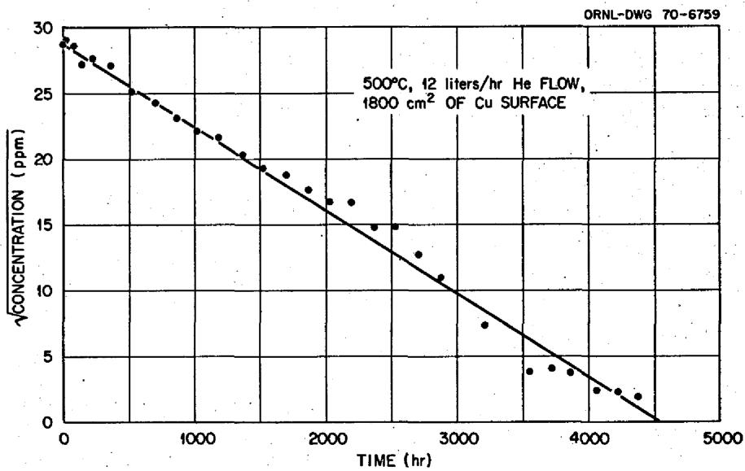  
Fig. 11.8. Removal of $\mathbf{Mo}^{3+}$ from Moiten $\mathbf{Li}_2\mathbf{BeF}_4$ .

# 11.4.4 Mass Spectroscopy of Molybdenum and Ruthenium Fluorides

C.F.Weaver J.D.Redman

Studies of the vapors associated with the evaporation, decomposition, and reactions of the fluorides and oxyfluorides of niobium, molybdenum, and ruthenium have continued. In addition, further efforts to refine the pressure measurements were made.

Recently we reported3 that single-crystal $^7\mathrm{LiF}$ and Ag were used as pressure standards to check the sensitivity of the time-of-flight mass spectrometer before and after an experiment. These results improved the reliability of our pressure estimates from an order of magnitude to within a factor of 2. The most severe problem with respect to further improvement in accuracy is that the corrosive noble metal fluorides cause a deterioration in machine sensitivity during an experiment and that this decline is unlikely to be linear in time. The feasibility of using an internal standard to continuously monitor the machine sensitivity during an experiment was investigated. Krypton was selected because of its availability, absence as a common impurity, nearness in mass to materials currently under investigation, and chemical inertness. The results were highly encouraging, and the development of this technique will be pursued.

A surprising observation with respect to machine sensitivity was made during direct fluorination experi

ments. It was observed that the addition of fluorine gas to the instrument followed by pressurizing to 1 atm with dry nitrogen returned the machine sensitivity to its initial value or higher. This technique will be useful in avoiding the time-consuming machine cleaning (about three days) after each run. It further emphasizes the need for an internal standard, since the sensitivity may increase as well as decrease during different steps of a given experiment.

It was previously reported3 that work is proceeding toward refining the infrared adsorption spectra of molybdenum oxyfluorides, since they exist as impurities in $\mathrm{MoF}_5$ samples and, hence, complicate the derivation of its spectrum. Efforts to synthesize the oxyfluorides of molybdenum for this purpose led to a study of the reaction of $\mathrm{MoO}_3(s)$ with $\mathrm{MoF}_6(g)$ in a Knudsen reaction cell. The cracking patterns for $\mathrm{MoF}_6$ , $\mathrm{MoOF}_4$ , and $\mathrm{MoO}_2\mathrm{F}_2$ have been reported earlier.19-21 More detailed fragmentation patterns, including doubly ionized species, may be seen in Figs. 11.9-11.11, and ionization efficiency curves in Fig. 11.12. The reaction

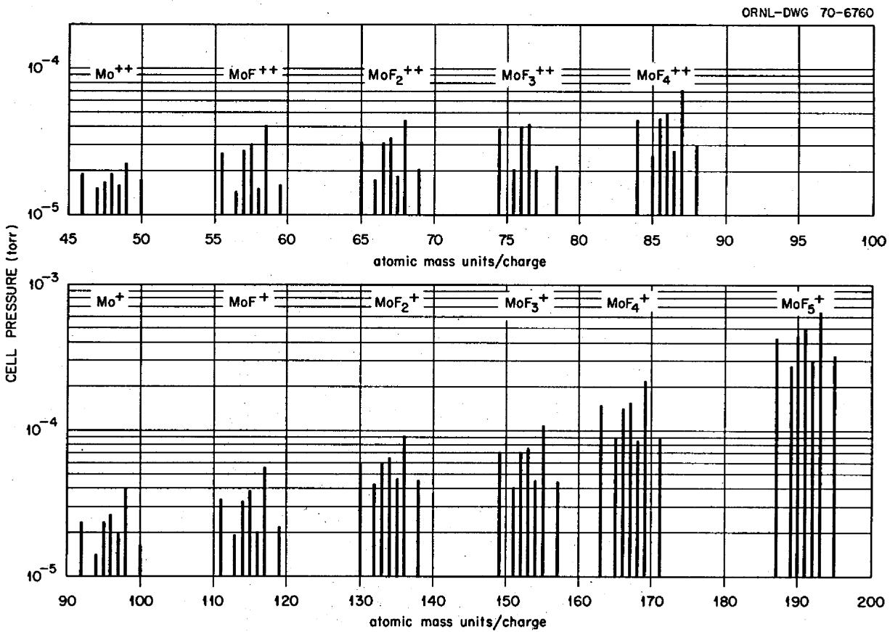  
Fig. 11.9. Fragmentation Pattern of $\mathrm{MoF}_6$ at $75^{\circ}$ C.

was first carried out in a copper cell, which was unsatisfactory. Although very little copper-containing material was observed in the effusing gas, cell reaction was indicated by mass transfer of copper, the reduction of $\mathrm{MoO_3}$ to $\mathrm{MoO_2}$ , and the reduction of $\mathrm{MoF_6}$ to $\mathrm{MoF_5}$ and $\mathrm{MoF_4}$ . The reaction of the $\mathrm{MoO_2}$ residue with $\mathrm{MoF_6}$ at $700^{\circ}\mathrm{C}$ produced:

<table><tr><td>Species</td><td>Vapor Composition (%)</td></tr><tr><td>MoF6</td><td>1.0</td></tr><tr><td>MoF5</td><td>18.0</td></tr><tr><td>MoF4</td><td>23.0</td></tr><tr><td>MoOF4</td><td>57.0</td></tr><tr><td>MoO2F2</td><td>1.0</td></tr></table>

The reaction of $\mathsf{MoO}_3(s)$ with $\mathsf{MoF}_6(g)$ was again studied using a nickel cell. In this case no nickel-containing molecules were observed in the effusing gas, no mass transfer of nickel was detected, the residue was pure $\mathsf{MoO}_3$ , and no lower-valence fluorides of molybde

num were seen. Since there was no evidence of reduction of the molybdenum compounds and since oxidation of hexavalent molybdenum cannot occur, it is concluded that all of the oxyfluorides observed were of hexavalent molybdenum. This resolves the earlier uncertainty $^{19-21}$ in assigning the $\mathrm{MoOF_4}$ cracking pattern and allows analysis of the products of both of the above experiments. The composition of the effusing gases may be seen in Fig. 11.13. Note that conditions exist in which either pure $\mathrm{MoO_2F_2}$ or $\mathrm{MoOF_4}$ may be synthesized.

In earlier reports $^{1,2}$ we have described the disproportionation of pure $\mathrm{RuF}_3$ in the temperature range 600 to $700^{\circ}\mathrm{C}$ as:

$$
4 \mathrm {R u F} _ {3} (s) \rightarrow \mathrm {R u} (s) + 3 \mathrm {R u F} _ {4} (g).
$$

Ionization efficiency curves and appearance potentials for $\mathbf{R}\mathbf{u}^{+},\mathbf{R}\mathbf{u}\mathbf{F}_{2}^{+},\mathbf{R}\mathbf{u}\mathbf{F}_{3}^{+}$ ,and $\mathbf{R}\mathbf{u}\mathbf{F}_{4}^{+}$ are given in the above references as well as the cracking pattern for $\mathbf{R}\mathbf{u}\mathbf{F}_{4}$

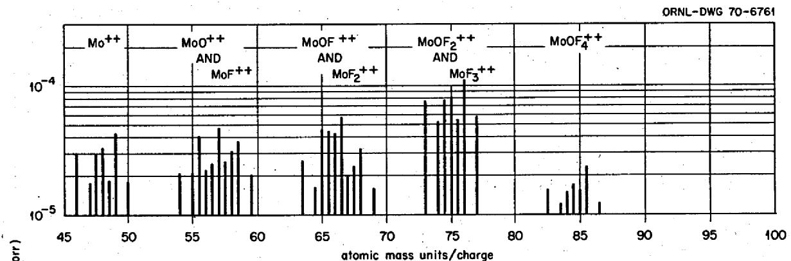

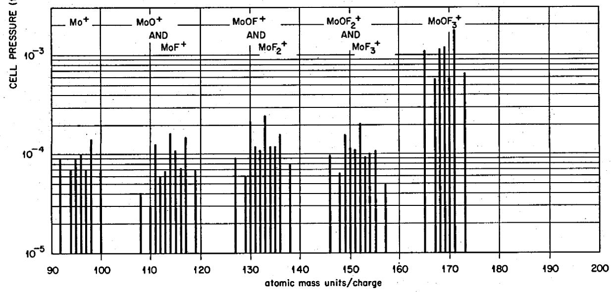  
Fig. 11.10. Fragmentation Pattern of $\mathrm{MoOF_4}$ at $125^{\circ}C$

Recently the reaction of fluorine with ruthenium metal contained in a nickel Knudsen effusion cell was investigated. Fluorine gas was passed through the cell over the temperature range 25 to $800^{\circ}\mathrm{C}$ . Below $450^{\circ}\mathrm{C}$ no reaction was observed. Throughout the range 450 to $629^{\circ}\mathrm{C}$ the effusing vapor was a mixture of $\mathbf{F}_2$ and $\mathbf{RuF_4}$ . Hence the reaction was

$$
\mathrm {R u} (s) + 2 \mathrm {F} _ {2} (g) \rightarrow \mathrm {R u F} _ {4} (g).
$$

The simplicity of the vapor in the case of ruthenium fluorides contrasts markedly with the analogous molybdenum fluorides, where $\mathsf{MoF}_4$ , $\mathsf{MoF}_5$ , $\mathsf{MoF}_6$ , $\mathsf{Mo}_2\mathsf{F}_{10}$ , and $\mathsf{Mo}_3\mathsf{F}_{15}$ are observed simultaneously in the vapor phase. Above $629^{\circ}\mathsf{C}$ , $\mathsf{NiF}_2$ appeared in the

spectrum, while the $\mathrm{RuF_4}$ vapor pressure was observed to be at a maximum near 675 to $700^{\circ}\mathbf{C}$ , as shown in Fig. 11.14. This behavior of nickel in the presence of fluorine has been observed by others.[22,23] At lower temperatures a layer of $\mathrm{NiF_2}$ forms and protects the nickel substrate from further attack. In the range 620 to $700^{\circ}\mathbf{C}$ the $\mathrm{NiF_2}$ desorbs, and cell corrosion occurs. In our case the nickel appeared to react with both the $\mathbf{F}_2$ and $\mathrm{RuF_4}$ , reducing the effusion of both species. No polymers, oxyfluorides, or ruthenium fluoride fragments with mass greater than $\mathrm{RuF_4}^+$ were seen.

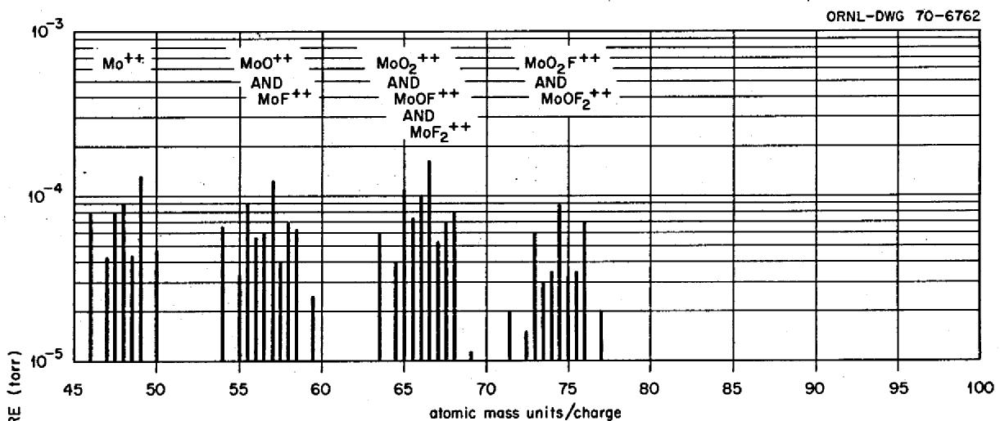

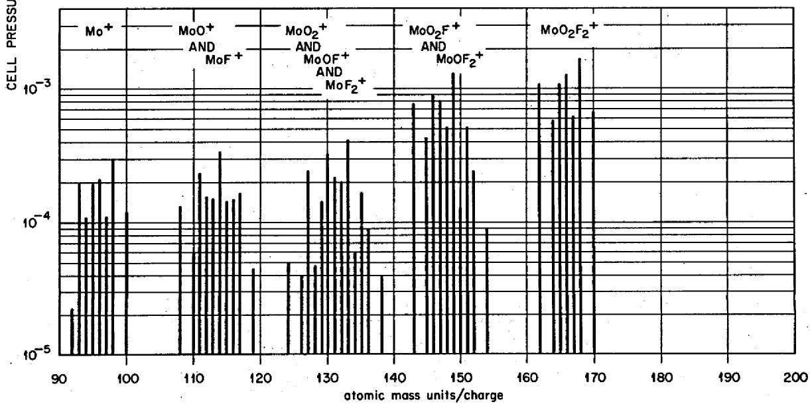  
Fig. 11.11. Fragmentation Pattern of $\mathrm{MoO}_2\mathrm{F}_2$ at $300^{\circ}\mathrm{C}$ .

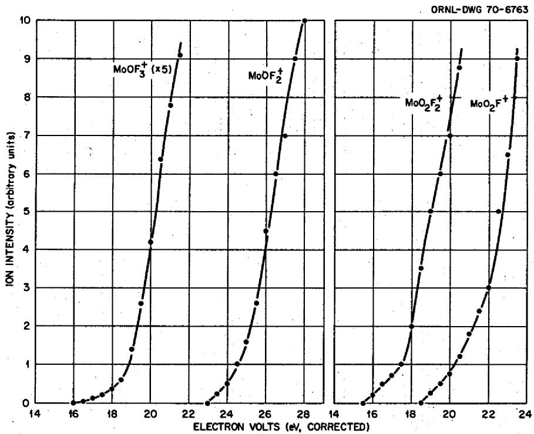  
Fig. 11.12. Ionization Efficiency Curves for the Principle Fragments of Molybdenum Oxyfluorides.

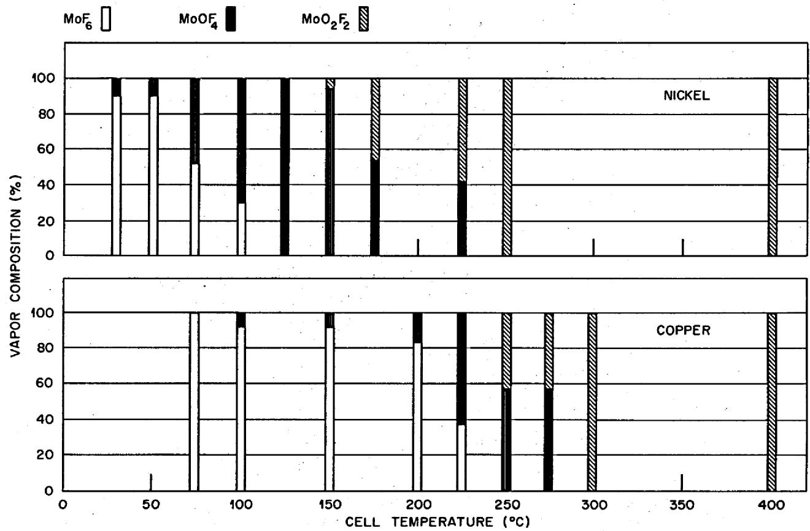  
Fig. 11.13. Vapor Products from the Reaction $\mathrm{MoO}_3(s) + \mathrm{MoF}_6(g)$ .

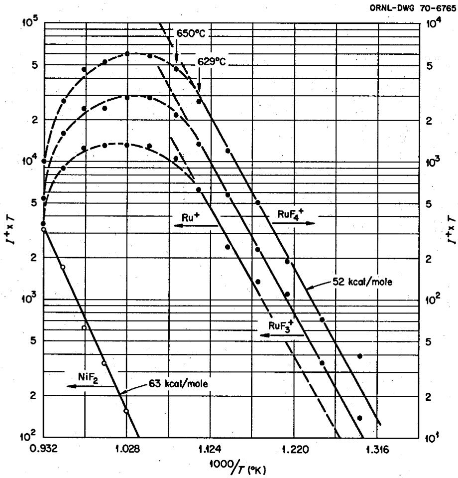  
Fig. 11.14. Reaction Products from the Reaction $\mathbf{Ru}(s) + \mathbf{F}_2(g)$ in a Nickel Cell.

# 12. Properties of the Alkali Fluoroborates

# 12.1 PHASE EQUILIBRIA IN THE ALKALI METAL FLUORIDE-METAL FLUOROBORATE BINARY SYSTEMS: THE SYSTEM RbF-RbBF4

L. O. Gilpatrick C. J. Barton

Investigation of the system $\mathbf{RbF - RbBF_4}$ , which is very nearly complete, represents an extension of studies we have made of systems containing $\mathrm{NaBF}_4$ and $\mathrm{KBF}_4$ . Differential thermal analysis was the chief technique used in this investigation. The $\mathrm{RbBF_4}$ used was prepared by S. Cantor using an aqueous technique, mixing $\mathrm{RbCl}$ and $\mathrm{NaBF_4}$ to precipitate the slightly soluble $\mathrm{RbBF_4}$ . This compound melted quite sharply at $582^{\circ}\mathrm{C}$ and showed a polymorphic transition at $247^{\circ}\mathrm{C}$ . Rubidium fluoride was used as received from a commercial supplier except for dehydration. This material melted at $783^{\circ}\mathrm{C}$ , $12^{\circ}$ below the best literature value for this compound ( $795^{\circ}\mathrm{C}$ ).

Equilibrium phase transition data were obtained for ten compositions of $\mathbf{RbF - RbBF_4}$ mixtures, and an

equilibrium phase diagram of the system (Fig. 12.1) was constructed from the results. This system was found to exhibit a single eutectic; it is found at $31.5\mathrm{mole}\% \mathrm{RbF}$ and melts at $442\pm 2^{\circ}\mathrm{C}$ . It is quite similar in this respect to the $\mathrm{NaF - NaBF_4}$ and $\mathrm{KF - KBF_4}$ systems. The polymorphic transition of $\mathrm{RbBF_4}$ was detectable in all mixtures studied, and the temperature at which it occurred was independent of composition, showing a probable absence of solid solutions. There was no evidence of compound formation. A lowering of the eutectic temperature in RbF-rich compositions may be due to impurities such as hydrolysis products in the impure RbF. This possibility is currently being investigated by treating the commercial RbF with ammonium bifluoride.

It is apparent from Fig. 12.1 that this system does not have a low enough melting point to be attractive for use as a coolant salt in molten-salt reactors that are designed for maximum economy in conjunction with supercritical steam generator plants.

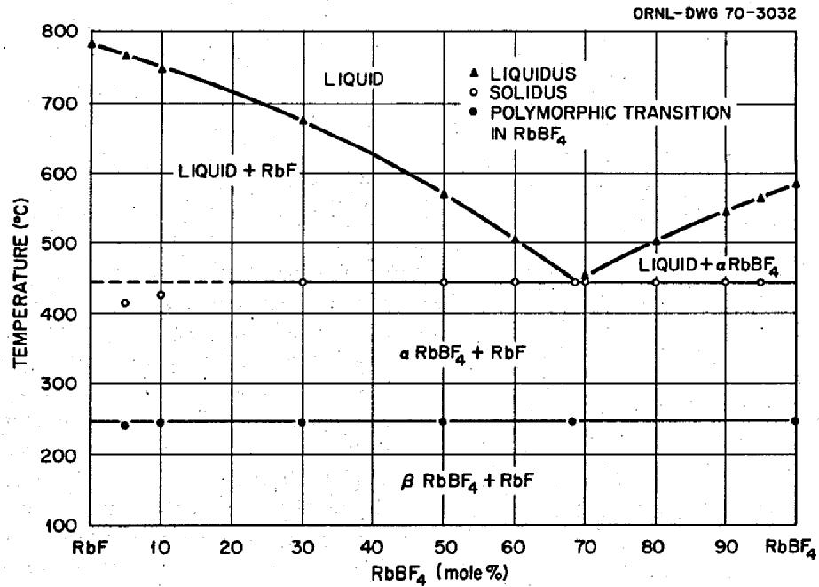  
Fig. 12.1. The System $\mathsf{RbBF}_4$ -RbF.

# 12.2 SOLUBILITY OF $\mathrm{Na}_3\mathrm{CrF}_6$ IN SODIUM TETRAFLUOROBORATE MELTS

C. J. Barton

Green crystals of $\mathrm{Na}_3\mathrm{CrF}_6$ have been observed in corrosion test loops in which $\mathrm{NaBF}_4$ -NaF (92-8 mole %) salt mixtures were circulated. No data on the solubility of this species in fluoroborate solvents exist, but extensive studies of the solubility and stability of chromous and chromic fluorides $(\mathrm{Cr}^{2+}$ and $\mathrm{Cr}^{3+})$ in several other fluoride mixtures were made in connection with the ANP program some time ago.

The compound $\mathrm{Na}_{3}\mathrm{CrF}_{6}$ was mixed with sufficient NaF and $\mathrm{NaBF}_{4}$ to give a 10 mole % mixture and a solvent composition of 92 mole % $\mathrm{NaBF}_{4}$ . The $\mathrm{Na}_{3}\mathrm{CrF}_{6}$ (prepared earlier by B. J. Sturm) was added in

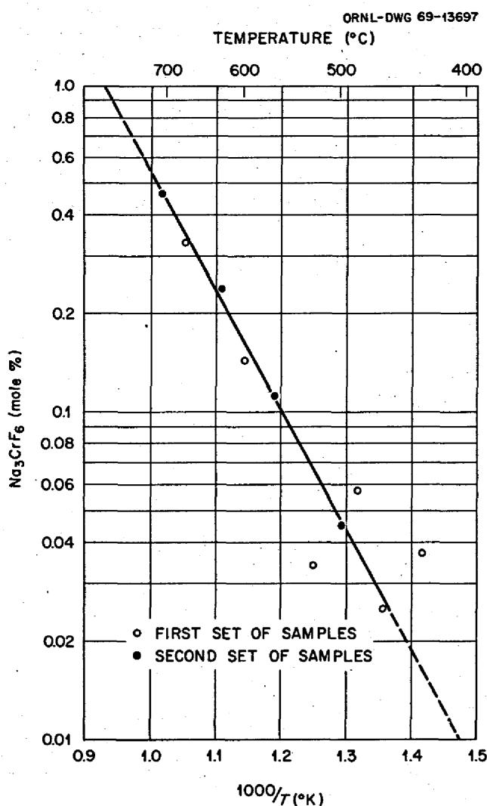  
Fig. 12.2. $\mathrm{Na}_3\mathrm{CrF}_6$ (mole%).

preference to $\mathbf{CrF}_3$ because the combination of $\mathbf{CrF}_3$ with solvent NaF would change the solvent composition significantly if $\mathbf{CrF}_3$ were very soluble.

The procedure followed in $\mathrm{CeF}_3$ solubility studies was employed in the present investigation except that no tracer was used, and sole reliance for solubility measurements was placed on wet chemical analysis of filtered samples removed with copper filter sticks. Two sets of samples were taken because of scatter of data in the low concentration range in the first set of samples (open circles, Fig. 12.2). Sodium, boron, and nickel were also determined in most of the samples to establish the solvent composition and possible corrosion of the nickel container. The average of six Na and B analyses, corrected for the Na in $\mathrm{Na}_3\mathrm{CrF}_6$ , indicated a solvent composition of 95 mole% $\mathrm{NaBF}_4$ instead of the intended 92 mole % eutectic mixture. Additional studies will be required to establish the effect of solvent composition on chromium solubility, but the writer does not believe that it will be markedly different in a 92 mole% $\mathrm{NaBF}_4$ solvent from the observed values shown in Fig. 12.2. Nickel values were low (20 to 30 ppm) in most samples, but two samples taken at temperatures close to $700^{\circ}\mathrm{C}$ gave values of 300 and 390 ppm. The solubility varied from 0.46 mole% $\mathrm{Na}_3\mathrm{CrF}_6$ at $700^{\circ}\mathrm{C}$ to 0.046 at $500^{\circ}\mathrm{C}$ , and extrapolation to the eutectic melting point $(384^{\circ}\mathrm{C})$ shows that the solubility would be less than 0.01 mole% at the freezing point of the mixture. The calculated apparent heat of solution of $\mathrm{Na}_3\mathrm{CrF}_6$ in this solvent was 17.0 kcal/mole.

# 12.3 PREPARATION OF PURE SODIUM TETRAFLUOROBORATE

L. O. Gilpatrick Ralph Apple

A $1.5\mathrm{-kg}$ charge of $\mathrm{NaBF_4}$ was prepared by a dry technique to give a product of greater purity than any previously available. In particular, special efforts were made to reduce the oxygen content to very low levels. The best material currently available shows an oxygen content of 200 ppm or greater as measured by the $\mathrm{KBrF_4}$ fluorine displacement method.

A reaction vessel was constructed of welded nickel and lined with graphite components in such a way that the molten salt would come in contact solely with graphite during processing. Into this unit was placed a charge of $\mathrm{NaBF}_4$ of the best available purity (recrystallized from $1.4M$ HF solution and then vacuum dried). The vessel was connected to a mutual supply of pure He, $\mathrm{BF}_3$ , and HF gases. Precautions were taken to remove all traces of water from the HF by bubbling

fluorine through several liters of distilled and condensed reagent-grade HF. The saturated HF liquid was evaporated to form the HF reagent gas supply used in the preparation.

A stream of purge gas was passed through the salt. Flow rates were adjusted at 1 atm to attain a vapor-phase composition of $25\%$ HF, $25\%$ $\mathrm{BF}_3$ , and $50\%$ He. The unit was heated to a temperature of $425^{\circ}\mathrm{C}$ , approximately $20^{\circ}\mathrm{C}$ above the melting point of $\mathrm{NaBF}_4$ . Purification was continued for $30\mathrm{hr}$ , and then the system was allowed to cool under the static atmosphere of gas. The unit was evacuated cold, remelted with the system closed, and reevacuated cold to degas the product. Recovered material was packaged under He in a dry box before examination.

Analysis indicates that the oxygen content of the $\mathrm{NaBF_4}$ was reduced to a value near 20 ppm, a tenfold increase in purity over the starting material. There is evidence from differential thermal analysis and chemical analysis that some loss of $\mathrm{BF}_3$ occurred, so that the product is not a stoichiometric mixture of NaF and $\mathrm{BF}_3$ as we had hoped. It should be possible, however, to reduce this $\mathrm{BF}_3$ loss to any desired extent by adjusting experimental conditions as employed in a study of $\mathrm{NaBF_4}$ dissociation.

The results obtained in the experiments described above demonstrate the objective of this procedure, to show the feasibility of a process which has potential for application to large-scale systems. Such procedure could be employed continuously, if necessary, to maintain the concentration of oxygen-containing species in fluoroborate coolant salts at a very low level for the purpose of controlling corrosion or, alternatively, to scavenge hydrogenous species from the salt.

# 12.4 INVESTIGATION OF OXIDATION OF METALS BY FLUOROBORATE COOLANT

# S. Cantor

A series of experiments is under way to determine: (1) the oxidizing properties of the fluoroborate coolant salt (92-8 mole $\%$ NaBF $_4$ -NaF), (2) the retention of moisture or other hydrogen-containing species by the coolant. If the coolant retains some moisture, then tritium passing into the coolant from the reactor core could be isotopically exchanged and retained in the coolant circuit.

In an experimental run, evacuated nickel capsules containing coolant salt and metal coupons are heated

within a silica vessel whose vapor space can be sampled (see Fig. 12.3). An initial experiment has been conducted in which coupons of chromium metal were in contact with coolant salt with reported analyses of $120 \pm 60$ ppm $\mathrm{H}_2\mathrm{O}$ and $310 \pm 50$ ppm oxygen; the latter analysis includes the oxygen in $\mathrm{H}_2\mathrm{O}$ . The closed capsule and the silica vessel were outgassed at $200^{\circ}\mathrm{C}$ for several days. The assembly was then heated fairly rapidly (about $20^{\circ}\mathrm{C} / \mathrm{min}$ ). When the temperature reached $370^{\circ}\mathrm{C}$ , we noted a steady rise in pressure in the assembly. The pressure eventually reached about $8\mathrm{mm}$ after the capsule had been heated to and maintained at $625^{\circ}\mathrm{C}$ for $2.5\mathrm{hr}$ . The furnace was then shut down and the assembly slowly cooled to room temperature.

It was unfortunately not possible to analyze the contents of the gas sampler until five days later. Gas

ORNL-DWG 70-6766

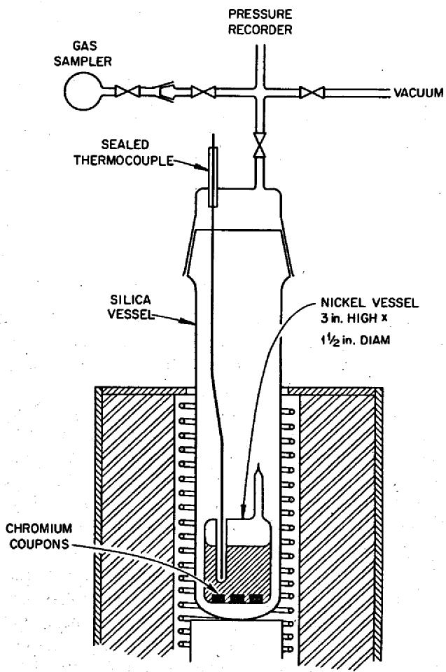  
Fig. 12.3. Apparatus for Determining Corrosion of Chromium in Fluoroborate Coolant.

chromatographic analysis indicated the composition in the sampler to be $20\%$ by volume hydrogen, the remaining $80\%$ being air.

The capsule was removed and cut open. The walls of the nickel container had not been attacked by the salt or its vapor. The chromium coupons were mostly covered with adherent dark-green crystals. There were additional green crystals within the coolant salt that had frozen close to the coupons. The green crystals were identified by x-ray diffraction as $\mathrm{Na}_3\mathrm{CrF}_6$ . Microscopic examination of crystals removed from the coupons also showed brown and black solids, as yet unidentified.

The chromium coupons sustained a weight loss in the experiment. From the analyses for $\mathbf{H}_2(g)$ and for moisture, approximately one-fourth of the Cr weight loss can be assigned to the reaction

$$
\begin{array}{l} \mathrm {C r} + \frac {3}{2} \mathrm {H} _ {2} \mathrm {O} + 2 \mathrm {N a F} + \mathrm {N a B F} _ {4} \rightarrow \\ \mathrm {N a} _ {3} \mathrm {C r F} _ {6} + 1 / _ {2} \mathrm {B} _ {2} \mathrm {O} _ {3} + 3 / _ {2} \mathrm {H} _ {2} (\mathrm {g}). \\ \end{array}
$$

At $900^{\circ}\mathrm{K}$ , this reaction has a $\Delta G^{\circ} = -30 \pm 10\mathrm{kcal}$ . The uncertainty of 10 kcal is primarily the uncertainty in the free energy of formation of $\mathrm{Na}_3\mathrm{CrF}_6$ .

If one represents the total analyzed oxygen as $\mathbf{O}_2(g)$ , then four-fifths of the weight loss of Cr can be associated with the reaction

$$
\mathrm {C r} + \frac {3}{4} \mathrm {O} _ {2} (g) + 2 \mathrm {N a F} + \mathrm {N a B F} _ {4} \rightarrow
$$

$$
\mathrm {N a} _ {3} \mathrm {C r F} _ {6} + 1 / _ {2} \mathrm {B} _ {2} \mathrm {O} _ {3} \cdot
$$

The $\Delta G_{900}^{\circ}$ for this reaction is $-100 \pm 10$ kcal. It is likely that only a small fraction of the analyzed oxygen in the salt was in the form of molecular oxygen. It is possible that the oxygen analysis actually provides a more reliable $\mathrm{H}_2\mathrm{O}$ analysis than the routine Karl Fischer method. The chief uncertainty in the $\mathrm{H}_2\mathrm{O}$ analysis is whether or not all the moisture in the sample has been removed by the pryidine which is subsequently distilled into the Karl Fischer reagent. (It is known that not all of the salt sample dissolves in the pyridine.)

No firm conclusions concerning the nature of the oxidation reactions of chromium by the coolant salt can be reached on the basis of this first experiment. It is anticipated that experiments currently in preparation will provide more quantitative information, especially of the hydrogen passing through the capsule. However from this initial experiment the following may be concluded:

1. Some of the moisture in the salt reacts with chromium metal to yield hydrogen.   
2. The hydrogen thus produced passes through the nickel container in a matter of minutes.   
3. One certain corrosion product is $\mathbf{Na}_3\mathbf{CrF}_6$

# 12.5 BORON TRIFLUORIDE PRESSURE OVER FLUOROBORATE COOLANT SALT ADMIXED WITH MSBR FUEL SALT

D.M.Richardson J.H.Shaffer

Several experiments have been reported in which the pressure of $\mathrm{BF}_3$ over mixtures of $\mathrm{NaBF}_4$ -NaF became higher than normal due to the presence of fuel fluoride salt. Greater pressure elevations occurred when the proportion of fuel fluoride was greater. In the MSBR design the fluoroborate salt is maintained at a higher pressure than the fuel salt in the primary heat exchangers, so that any leakage would be inward. $\mathrm{BF}_3$ in the fuel salt as the result of a small leak would be removed with the normal reactor off-gas. In the event of a large leak a provision for additional venting capability to relieve $\mathrm{BF}_3$ pressure might be required during the course of shutting down for repair. For an early design of MSBR primary heat exchanger it was estimated that in the extreme case that a tube suffered total offset at both ends, the fluoroborate salt would be injected into the fuel salt in the volume ratio of 1 to 3. This postulated condition formed the basis for a simple exploratory experiment to observe the release of $\mathrm{BF}_3$ gas when fuel and fluoroborate fluids are mixed.

A stainless steel autoclave was constructed from $2^{1/2}$ -in. sched 80 pipe, end cap, and $2^{1/2}$ - by 1-in. reducer and was installed in a vertical Marshall furnace. The vessel was connected above the furnace by a 1-in. sched 160 pipe to a 300-lb flange with metal O-ring. Design and specifications were supplied by the Design Department, Reactor Division (Dwg. 10564-D). Design conditions were 100 psig, $1300^{\circ}$ F. Hydrostatic pressure test was at 1300 psig.

Temperature measurements were made with three stainless-sheathed Chromel-Alumel thermocouples obtained from the MSRE instrument group. They were held against the autoclave vessel wall with spot-welded stainless shim plates. They were positioned 2 in., $7\frac{1}{4}$

in., and $13\frac{1}{8}$ in. from the bottom of the vessel and indicated, respectively, the fuel salt, fluoroborate salt, and gas-phase temperatures. Although the temperatures were printed by recorder, actual readings of the recorder pointer position were more accurate and were used. Pointer indications were found to check within $5^{\circ}\mathrm{F}$ with measurements made with an ESI potentiometer, model 300.

The autoclave was connected by flange to a $\frac{1}{4}$ -in. stainless tubing manifold for evacuation and for pressure measurement after the system was isolated. Metal-seated 1500-psi valves with welded bellows were used. Vacuum integrity was established, using roughing pump and thermocouple gage, with the autoclave vessel at $1300^{\circ}\mathrm{F}$ and with the upper manifold under heat lamp. Pressure measurements were made with a 200-psig Heise gage, with uniform graduations, that was adjusted to read 0 psia when under vacuum.

The salt additions were made under dry argon. The fuel salt was transferred as a liquid from a batching vessel: $1158\mathrm{g}$ of $\mathrm{LiF - BeF_2 - ThF_4}$ (72-16-12 mole %) and $\mathrm{UF_4}$ to produce 0.5 mole % were charged. After cooling, the fluoroborate was added as crushed salt: $215\mathrm{g}$ of $\mathrm{NaBF_4 - NaF}$ (92-8 mole %) was charged. The estimated volume ratio of fluoroborate to fluoride at $700^{\circ}\mathrm{C}$ for these additions is 1 to 3. The system was sealed again at the top and evacuated. The autoclave was heated to $150^{\circ}\mathrm{C}$ and pumped for $3^{1/2}$ hr. Little off-gassing was observed. The system was then valved off, remaining open only to the pressure gage. One of the valves was connected to a $1/4$ -in. tube for venting to the stack filters, if necessary.

When the fluoroborate was first melted $(385^{\circ}\mathrm{C})$ a pressure rise of 0.3 psia was observed. When the fluoride was first melted $(513^{\circ}\mathrm{C})$ the pressure was 8 psia. Subsequently, at the same temperatures, these pressures were not reproduced, and higher pressures were found.

Two distinctly different sets of data were obtained in this experiment. Initially, during a period of six days, pressure readings were made repeatedly over a range of temperatures. Some of the points were obtained after equilibration for 16 to as much as $46\mathrm{hr}$ . Due to the slow rate of thermal equilibration of the furnace-autoclave combination, however, most of the points were obtained at a slow heating rate of 20 to $40^{\circ}\mathrm{F/hr}$ . These data are shown as circles in Fig. 12.4 in a plot of $\log P$ against $1 / T^{\circ}\mathrm{K}$ . With the exception of one point the data lie on a straight line with apparent heat of reaction of $15\mathrm{kcal/mole}$ . Temperatures of the bottom thermocouple are plotted.

The point at 148.5 psia was discovered $25\mathrm{min}$ after the last of the series of points at the upper end of the line was taken. The heating rate had been 5 to $10^{\circ}\mathrm{F / hr}$ for several hours. The temperature record just prior to this showed that the bottom thermocouple (always the hottest of the three, during slow changes) had dropped $12^{\circ}\mathrm{F}$ and that the middle thermocouple had risen $6^{\circ}\mathrm{F}$ in an interval of about 4 min. These temperature

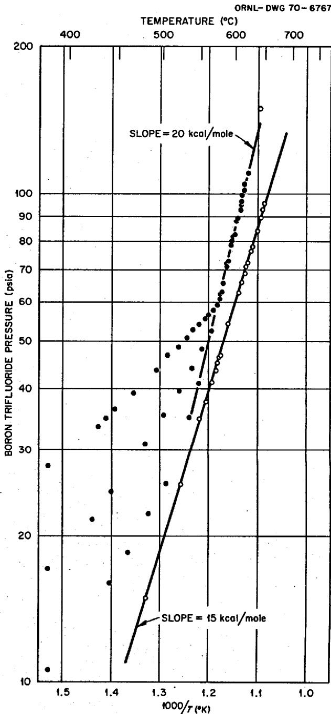  
Fig. 12.4. Pressure of Coolant and Fuel Mixture.

changes suggest that sudden mixing or stirring of the two fluids had occurred. The heaters were turned off, dampers at the top and bottom of the furnace were opened, and the system was vented down to 100 psia. A cloud of white smoke came from the roof stack. Although the autoclave was cooling, the pressure rose again to 108.7 psia in 10 min but dropped steadily afterward.

The total volume of the isolated system was 1600 cc. Of this, $300\mathrm{cm}^3$ was outside the furnace. When the pressure was 95 psia the bottom temperature was $647^{\circ}\mathrm{C}$ , and the combined salt volumes are estimated at $482\mathrm{cm}^3$ , leaving $818\mathrm{cm}^3$ in the furnace. Using the ideal gas law, the amount of $\mathrm{BF}_3$ in the gas phase was 0.15 mole at $647^{\circ}\mathrm{C}$ , or $8\%$ of the total inventory (1.895 moles $\mathrm{BF}_3$ ).

Subsequently, the autoclave was heated up and then cooled to ambient temperature three times. In each case an identical line was obtained with slope of 20 kcal/mole on the log $P$ versus $1 / T^{\circ}\mathrm{K}$ plot. These data are shown as solid dots in the figure. When extended the line is slightly below the originally observed maximum pressure of 148.5 psia. At the lower temperatures each reheat yielded a different set of pressures that varied with the residual pressure at room temperature before the heatup was started.

In summary, it is apparent that the originally observed "discontinuity" was probably the result of sudden spontaneous mixing of the materials in the autoclave that had not previously been in actual equilibrium, since no stirring or shaking was provided. It was not possible in this experiment to determine either that two immiscible liquid phases were always present or that a solid phase had not appeared. The only definite result is that the pressure of $\mathrm{BF}_3$ over the mixture was more than an order of magnitude greater than that over $\mathrm{NaBF}_4$ -NaF (92-8 mole $\%$ ). The effect of the relatively large gas volume in the experimental system would be to reduce the mole fraction of $\mathrm{NaBF}_4$ and to shift the mixture closer to the liquid-liquid immiscibility boundary. A very thorough experimental investigation is required to define this complex system adequately.

# 12.6 HEAT CONTENT OF ALKALI METAL FLUOROBORATES

A. S. Dworkin

M. A. Bredig

We have completed our high-temperature heat content measurements of $\mathrm{NaBF}_4$ , $\mathrm{KBF}_4$ , $\mathrm{RbBF}_4$ , and $\mathrm{CsBF}_4$ . The equations which represent our results for

$H_{T} - H_{298}$ (cal/mole) are given in Table 12.1. Table 12.2 summarizes the data for the heats and entropies of melting and transition.

$\mathrm{KBF}_4$ $\mathrm{RbBF}_4$ , and $\mathrm{CsBF_4}$ all undergo a solid state transition from the $\mathrm{BaSO_4}$ -type orthorhombic structure to the high-temperature cubic structure.1-3 $\mathrm{NaBF}_4$ , on the other hand, exists as the orthorhombic (pseudotetragonal) $\mathrm{CaSO_4}$ type of structure at room temperature and in a noncubic form above the transition temperature.3,5 This latter structure has recently been reported5 to be monoclinic with four molecules per unit cell. However, a lowering of the symmetry at higher temperature without a lowering of the number of molecules per unit cell is quite unlikely. The structure was derived from a powder pattern, and the authors state that their assignment is not necessarily correct or unique. We believe that this inconsistency may be avoided by showing that the x-ray spacings (Table 12.2 and ref.5) are compatible with the assumption of a mechanical mixture of the orthorhombic low-temperature phase with a high-temperature phase of hexagonal, rather than monoclinic, structure. These data give a $c / a = 1.55$ , which may be compared with the high-temperature form of $\mathrm{CaSO_4}$ , also shown6 to be hexagonal rather than cubic, with a $c / a = 1.54$ , that is, slightly distorted from the ideal "close packed" symmetry, $c / a = 1.63$ , as in wurtzite, ZnS.

Although the entropies of fusion of $\mathrm{NaBF}_4$ and $\mathrm{KBF}_4$ are similar (Table 12.2), the entropy of transition of $\mathrm{KBF}_4$ is much larger than that of $\mathrm{NaBF}_4$ (5.93 to 3.13 e.u.). This may be explained qualitatively on the basis of the differing structures of both the low- and high-temperature solids which in turn are due to the large difference in the size of the cations. The $\mathrm{NaBF}_4$ structure is more disordered below the transition, which is reflected by the fact that at $500^{\circ}\mathrm{K} S_T - S_{298}$ is more than 1 e.u. larger for $\mathrm{NaBF}_4$ than for $\mathrm{KBF}_4$ . In addition, the high-temperature cubic structure of $\mathrm{KBF}_4$ most probably is more compatible with anionic rotational or librational disorder than is the structure of $\mathrm{NaBF}_4$ of lower symmetry.

$\mathrm{KBF}_4$ $\mathrm{RbBF_4}$ , and $\mathrm{CsBF_4}$ are isodimorphous and therefore can be considered as a series separate from $\mathrm{NaBF}_4$ . Table 12.2 shows that although the enthalpies and temperatures of melting are similar, there is a decrease in temperature, entropy, and enthalpy of transition of 21, 25, and $41\%$ , respectively, with increasing cation size in this series. The particularly

large relative change in the enthalpy may be attributed to the decrease in lattice energy with increasing size of the cation, which also facilitates the rotation or libration of the fluoroborate ion. The large decrease in enthalpy as compared with the entropy of transition also explains the relatively low temperature of transition found for $\mathbf{C}\mathbf{s}\mathbf{B}\mathbf{F}_{4}$

Table 12.1. Equation Coefficients for Enthalpy Data for Equation:   
$H_{T} - H_{298}$ (cal/mole) $= a + bT + cT^{2} + dT^{-1}$   

<table><tr><td>Compound</td><td>a × 10-3</td><td>b</td><td>c × 102</td><td>d × 10-4</td><td>Average Per Cent Error</td><td>Temperature Range (°K)</td></tr><tr><td rowspan="3">NaBF4</td><td>-3.820</td><td>3.148</td><td>3.703</td><td>-12.17</td><td>0.3</td><td>298–516</td></tr><tr><td>-9.785</td><td>36.48</td><td></td><td></td><td>0.1</td><td>516–679</td></tr><tr><td>-8.605</td><td>39.52</td><td></td><td></td><td>0.1</td><td>679–750</td></tr><tr><td rowspan="3">KBF4</td><td>-6.325</td><td>15.62</td><td>1.943</td><td>-1.737</td><td>0.2</td><td>298–556</td></tr><tr><td>-7.800</td><td>34.95</td><td></td><td></td><td>0.2</td><td>556–843</td></tr><tr><td>-7.710</td><td>39.94</td><td></td><td></td><td>0.1</td><td>843–900</td></tr><tr><td rowspan="3">RbBF4</td><td>-7.430</td><td>18.77</td><td>1.697</td><td>+9.677</td><td>0.2</td><td>298–518</td></tr><tr><td>-7.897</td><td>34.34</td><td></td><td></td><td>0.1</td><td>518–855</td></tr><tr><td>-7.985</td><td>39.92</td><td></td><td></td><td>0.1</td><td>855–1000</td></tr><tr><td rowspan="3">CsBF4</td><td>-7.614</td><td>17.63</td><td>2.009</td><td>+17.01</td><td>0.2</td><td>298–443</td></tr><tr><td>-8.673</td><td>34.18</td><td></td><td></td><td>0.1</td><td>443–828</td></tr><tr><td>-8.390</td><td>39.36</td><td></td><td></td><td>0.1</td><td>828–1000</td></tr></table>

Table 12.2. Heats and Entropies of Melting and Transition of Alkali Metal Fluoroborates   

<table><tr><td>Compound</td><td>Tm(°K)</td><td>ΔHm(kcal/mole)</td><td>ΔSm(eu/mole)</td><td>Ttr(°K)</td><td>ΔHtr(kcal/mole)</td><td>ΔStr(eu/mole)</td><td>Cp(liquid)(cal deg-1mole-1)</td></tr><tr><td>NaBF4</td><td>679</td><td>3.25</td><td>4.78</td><td>516</td><td>1.61</td><td>3.1</td><td>39.5</td></tr><tr><td>KBF4</td><td>843</td><td>4.30</td><td>5.1</td><td>556</td><td>3.30</td><td>5.9</td><td>39.9</td></tr><tr><td>RbBF4</td><td>855</td><td>4.68</td><td>5.5</td><td>518</td><td>2.86</td><td>5.5</td><td>39.9</td></tr><tr><td>CsBF4</td><td>828</td><td>4.58</td><td>5.5</td><td>443</td><td>1.94</td><td>4.4</td><td>39.4</td></tr></table>

# 13. Physical Chemistry of Molten Salts

# 13.1 EQUILIBRATION OF RARE-EARTHCONTAINING MOLTEN FLUORIDES WITH VARIOUS SOLIDS

C. E. Bamberger C. F. Baes, Jr.

We have continued our attempts to prepare insoluble compounds of rare earths for possible use as rare-earth ion exchangers by reactions in molten $\mathrm{LiF - BeF_2 - ThF_4}$ (72-16-12 mole $\%$ ). The new tests have included phosphates and various insoluble oxides as possible reactants. In addition to $\mathrm{CeF_3}$ , used previously with $^{144}\mathrm{Ce}$ as a tracer, $\mathrm{YF_3}$ was used in current tests because it chemically resembles the rare earths in the middle of the series and can be determined spectrographically with good sensitivity. As previously, tested reactants were stirred with the molten salt containing the dissolved rare earth. From time to time samples were taken to determine if rare earth had been removed from the salt and whether new solid phases might have formed.

A number of the reactions which are most likely to occur if the compounds currently being tested are effective extractants for rare-earth cations are listed in Table 13.1. In previous tests, reaction 1 was found not

to occur with $\mathbf{CeF}_3$ in the presence of excess NiO, added to suppress the direct oxidation of the nickel container by $\mathbf{V}_2\mathbf{O}_5$ . Because of concern that NiO might instead have reacted with $\mathbf{V}_2\mathbf{O}_5$ to form $\mathrm{Ni}(\mathrm{VO}_3)_2$ , an additional test was run with $\mathbf{V}_2\mathbf{O}_5$ in the absence of NiO. As Table 13.2 shows, there was no evidence of cerium or yttrium removal. As previously, considerable corrosion of the nickel container was noted.

Reactions 2 to 6, which similarly suggest the formation of oxide phases containing rare earths by reaction of sparingly soluble oxides, similarly were found not to occur (Table 13.2).

Since one of the most abundant rare-earth minerals is monazite (thorium-rare-earth phosphates), we attempted the synthesis of such compounds from the melt by the addition of sodium phosphate (reaction 7). Neither a significant reduction in the $^{144}\mathrm{Ce}$ concentration nor any other evidence of appreciable reaction between the phosphate and the molten fluorides was detected. Calcium fluoride was added to the system in an attempt to precipitate a rare-earth-containing calcium phosphate (reaction 8). This seemed a possibility since a systematic study of rare-earth minerals by Mineyev2 includes examples of the replacement of $\mathrm{Ca^{2+}}$ by $\mathrm{Ln}^{3+}$ plus $\mathrm{OH}^{-}$ or $\mathrm{F}^{-}$ ions. The results obtained

$^{1}$ C. E. Bamberger and C. F. Baes, Jr., MSR Program Semiann. Progr. Rept. Aug. 31, 1969, ORNL-4449, p. 131.

$^{2}$ D. A. Mineyev, Geokhimiya No. 2, p. 237 (1968).

Table 13.1. Possible Reactions for Extraction of Rare-Earth Cations from Molten LiF-BeF $_2$ -ThF $_4$   

<table><tr><td>1. 1/2V2O5(c or l) + 3/4ThO2+ Ln3+ → 3/4Th4+ + LnVO4(c)</td></tr><tr><td>2. 2TiO2(c) + 3/2ThO2(c) + 2Ln3+ → 3/2Th4+ + Ln2Ti2O7(c)</td></tr><tr><td>3. 1/2Nb2O5(c) + 3/4ThO2(c) + Ln3+ → 3/4Th4+ + LnNbO4(c)</td></tr><tr><td>4. 1/2Cr2O3(c) + 3/4ThO2(c) + Ln3+ → 3/4Th4+ + LnCrO3(c)</td></tr><tr><td>5. 3WO3(c) + 3/2ThO2(c) + 2Ln3+ → 3/2Th4+ + Ln2(WO4)3(c)</td></tr><tr><td>6. WO3(c) + W(c) + 3(x+1)/2 ThO2(c) + 2xLn3+ → 3(x+1)/2 Th4+ + 2LnxWO3(c), where x &lt; 1</td></tr><tr><td>7. Na3PO4(c or l) + Ln3+ → LnPO4(c) + 3Na+</td></tr><tr><td>8. Ca3(PO4)2(c) + Ln3+ + F- → Ca2Ln(PO4)2F(c) + Ca2+</td></tr><tr><td>9. nCa2+ + mLn3+ + (3m + 2n)F- → nCaF2·mLnF3(ss)</td></tr></table>

Table 13.2. Tests of Rare-Earth Extraction from Molten LiF-BeF $_2$ -ThF $_4$ (72-16-12 Mole %) by Various Compounds   

<table><tr><td>Reagent Added to the Melta</td><td>Phases Present After Equilibration with Meltb</td><td>Temperature (°C)</td><td>Cerium Remaining in Melt (%)</td><td>Yttrium Remaining in Melt (%)</td><td>Solute Concentration in Melt (Mole %)</td></tr><tr><td>80 V2O5+ 14 ThO2</td><td>V2O5(l) + ThO2 + [Ni(VO3)2]</td><td>660</td><td>96</td><td>100</td><td>Ce3+ = 0.1, Y3+ = 0.9, V3+ = 0.2, Ni2+ = 0.4</td></tr><tr><td>60 TiO2</td><td>TiO2</td><td>600</td><td>100</td><td>100</td><td>Ce3+ = 0.7, Ti2+ = 0.005</td></tr><tr><td>+ 7 YF3</td><td>TiO2</td><td>600</td><td>100</td><td>100</td><td>Ce3+ = 0.7, Ti2+ = 0.009, Y3+ = 0.7</td></tr><tr><td>+ 27 K2TiF6+ 40 ThO2</td><td>TiO2</td><td>720</td><td>100</td><td>100</td><td>Ce3+ = 0.7, Ti2+ = 0.005, Y3+ = 0.7</td></tr><tr><td>20 K2NbF7+ 40 ThO2</td><td>Nb2O5</td><td>600</td><td>100</td><td>100</td><td>Ce3+ = 0.1, Y3+ = 1.0, Nb5+ = 0.06</td></tr><tr><td>+ 21 CrF3+ 18 ThO2</td><td>[Nb2O5 + Cr2O3]</td><td>600</td><td>100</td><td>100</td><td>Ce3+ = 0.1, Y3+ = 1.0, Nb5+ = 0.01, Cr2+ = 0.13</td></tr><tr><td>+11 NiF2+ 6 ThO2</td><td>[Nb2O5 + Cr2O3 + NiO]</td><td>600</td><td>100</td><td>100</td><td>Ce3+ = 0.1, Y3+ = 1.0, Nb5+ = 0.01, Ni2+ = 0.04</td></tr><tr><td>18 Na2WO4+ 20 ThO2</td><td>[WO3] + ThO2</td><td>600</td><td>100</td><td>100</td><td>Ce3+ = 0.1, Y3+ = 1.0, Wn+ = 1.21</td></tr><tr><td>+W</td><td>[WO3 + W] + ThO2</td><td>600</td><td>100</td><td>100</td><td>Ce3+ = 0.1, Y3+ = 1.0, Wn+ = 0.95</td></tr><tr><td>60 Na3PO4</td><td></td><td>600</td><td>97</td><td>NDc</td><td>Ce3+ = 0.1, PO43- = 3.7</td></tr><tr><td>+ 100 CaF2</td><td>[CaF2·YF3](ss)</td><td>600</td><td>76</td><td>ND</td><td>Ce3+ = 0.1, Ca2+ = 8.9, PO43- = 5.6</td></tr><tr><td>130 CaF2</td><td>CaF2</td><td>600</td><td></td><td></td><td>Ca2+ = 10.0</td></tr><tr><td>+ 0.001 CeF3</td><td>CaF2</td><td>600</td><td>98</td><td></td><td>Ce3+ = 0.1, Ca2+ = 10.0</td></tr><tr><td>+ 100 CaF2</td><td>CaF2</td><td>600</td><td>99</td><td></td><td>Ce3+ = 0.1, Ca2+ = 10.0</td></tr><tr><td>+ 120 YF3</td><td>[CaF2·YF3](ss); XCaF2(ss) = 0.69</td><td>600</td><td>78</td><td>53</td><td>Ce3+ = 0.1, Y3+ = 5.1, Ca2+ = 10.0</td></tr></table>

aNumbers indicate millimoles of reagent added per mole (63.2 g) of LiF-BeF $_2$ -ThF $_4$ (72-16-12 mole%).   
$b$ Phases in brackets are presumed to be present but were not identified.   
ND: not determined.

revealed an appreciable extraction of rare earths. Analysis of the salt phase also suggested the presence of $\mathrm{Ca}^{2+}$ and $\mathrm{PO}_4^{3-}$ in solids, but these were not further identified (Table 13.2).

Reaction 9 was suggested by the phase diagram of the $\mathrm{CaF}_2\text{-YF}_3$ system, wherein a solid solution containing as much as 55 mole $\%$ $\mathrm{YF}_3$ as well as the compound $\mathrm{CaF}_2\cdot 4\mathrm{YF}_3$ is reported. The solubility of calcium at $600^{\circ}\mathrm{C}$ in the presence and absence of $\mathrm{PO_4}^{3-}$ (8.8 and 7.8 mole $\%$ , respectively) and the percentage of cerium remaining in the melt (78 and 76) may be interpreted to mean that the solid phases present in both experiments were solid solutions of $\mathrm{CaF}_2\text{-YF}_3$ with some $\mathrm{CeF}_3$ . Under experimental conditions studied, the distribution of cerium seems insufficiently favorable and the solubility of the calcium-containing solids too high to render reactions 8 and 9 a promising basis for a separation method for rare earths.

While these tests have all given essentially negative results, they have produced some useful information. As expected, $\mathrm{TiO_2}$ and $\mathrm{Nb}_2\mathrm{O}_5$ , currently being studied for the first time, along with $\mathrm{Cr_2O_3}$ and $\mathrm{Fe_3O_4}$ ,studied previously, react only to a small extent with the molten fluoride. It appears that the orthophosphate ion is stable in such systems and does not act as an oxidant toward nickel containers. Finally, the solubility of $\mathrm{CaF_2}$ in the salt used (72-16-12 mole $\%$ LiF-BeF2- $\mathrm{ThF_4})$ is evidently 10 mole $\%$ at $600^{\circ}C.$

# 13.2 THE OXIDE CHEMISTRY OF PLUTONIUM IN MOLTEN FLUORIDES

C. E. Bamberger

R.G.Ross

C.F.Baes, Jr.

Since plutonium is being considered as a fuel for molten-salt reactors, it is important to examine its chemistry in molten fluoride systems containing oxide. Such information is needed to establish in a reactor fuel salt the conditions of redox potential and oxide concentration under which plutonium would remain in solution as $\mathrm{PuF_3}$ . It might also be of value in developing reprocessing methods for such fuel salts.

From the available data2-5 it is possible to construct the Pourbaix diagram shown in Fig. 13.1, which summarizes the predicted behavior of plutonium in molten $\mathbf{Li}_2\mathbf{BeF}_4$ as a function of the oxidation potential (the ordinate) and the oxide ion concentration (the abscissa). In addition to the three oxides of plutonium $(\mathrm{PuO}_{1.5},\mathrm{PuO}_{1.61}$ ,and $\mathrm{PuO_2})$ whose stabilities have been determined,4 it is possible that PuOF may be

formed in the present system, but there is insufficient evidence to judge its stability. The boundaries of the region of dissolved $\mathrm{PuF_3}$ in this diagram are calculated for two concentrations; one is the hypothetical unit mole fraction and the other is 0.002 mole fraction, which is approximately the concentration of $\mathrm{PuF_3}$ which would be used in a molten-salt reactor fuel. These boundaries are uncertain by as much as plus or minus one log unit along each axis from the uncertainty given for the free energy of formation of $\mathrm{PuF_3}$ . Within such a wide uncertainty one cannot rule out the possibility that plutonium might precipitate as $\mathrm{PuO_{1.5}}$ from a molten-salt reactor fuel which becomes contaminated with sufficient oxide. At lower oxide concentrations, but under relatively oxidizing conditions, $\mathrm{PuO_2}$ clearly could be precipitated. With the $\mathrm{ThF_4}$ present in an MSBR fuel, the formation of a $\mathrm{PuO_2 - ThO_2}$ solid solution becomes possible, and this should lower the oxide level or the oxidation potential at which a plutonium oxide-containing phase might precipitate.

Because of the uncertainties in the behavior represented by Fig. 13.1 we were prompted to attempt a direct measurement of one of the equilibria which establish the boundaries of the dissolved $\mathbf{PuF}_3$ region in a diagram such as this. The result would not only improve the accuracy of such a diagram for plutonium; it should also yield an improved value of the formation free energy of $\mathbf{PuF}_3$ .

To various molten fluoride mixtures containing $\mathrm{PuF}_3$ , stepwise additions were made of an oxide $(\mathrm{BeO}, \mathrm{ZrO}_2$ , or $\mathrm{ThO}_2)$ known to be the normally stable saturating oxide phase. The equilibrations were performed in a specially designed leak-tight stirred vessel, described elsewhere, which had been assembled inside a glove box suited for work with alpha emitters. Filtered samples of the fluoride phase and unfiltered samples of both oxide and fluoride phases were taken for analysis.

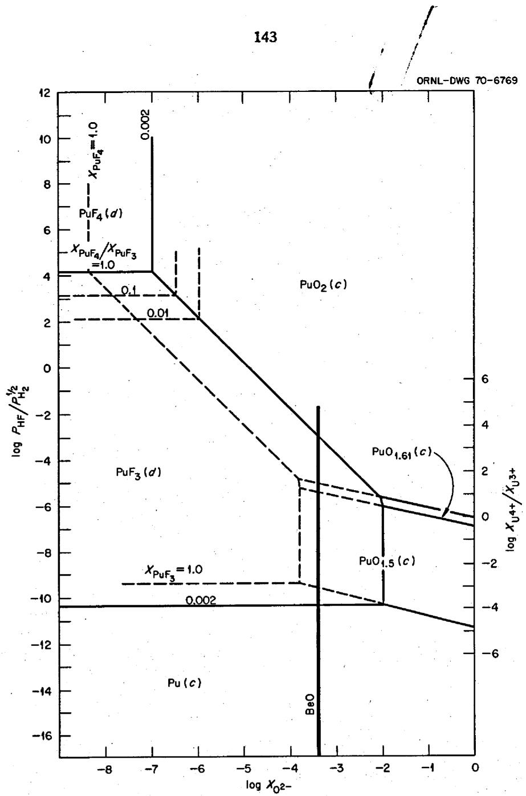  
Fig. 13.1. Pourbaix Diagram for Plutonium in $\mathsf{Li}_2\mathsf{BeF}_4$ at $600^{\circ}\mathbf{C}$ Based on Literature Data (Refs. 1-3 of Sect. 13.1 and Refs. 1 and 9 of Sect. 13.2). Boundaries of the $\mathsf{PuF}_3$ and $\mathsf{PuF}_4$ regions indicate conditions of oxidation potential and oxide concentration under which these components, dissolved at the concentrations indicated, are at equilibrium with another phase. The heavy vertical line at the bottom indicates the upper limit of oxide concentration set by the solubility of BeO.

In the following molten salt mixtures, which contained up to 0.54 mole $\% \mathrm{PuF}_3$ , no detectable amount of dissolved plutonium was found to be precipitated by additions of the indicated stable oxide phases:

$$
\mathrm {L i F - B e F _ {2} - Z r F _ {4}} (6 5. 7 - 2 9. 3 - 5 \text {m o l e}
$$

$$
\mathrm {LiF - B e F} _ {2} (6 6. 7 - 3 3. 3 \text {mole}
$$

$$
\begin{array}{l} \mathrm {LiF - B e F _ {2}} (6 6. 7 - 3 3. 3 \text {mole} \\ \mathrm {LiF - B e F _ {2} - T h F _ {4}} (7 2 - 16 - 1 2 \text {m o l e} \\ \end{array}
$$

However, when NiO was added to the last salt in the presence of $\mathrm{ThO_2}$ , there was a decrease in the dissolved $\mathrm{PuF_3}$ concentration, presumably as a result of the reaction

Table 13.3 Equilibrium Data for the Reaction   
$\mathrm{PuF}_3(d) + \frac{3}{4}\mathrm{ThO}_2(ss) + \frac{1}{2}\mathrm{NiO}(c)\rightleftharpoons \mathrm{PuO}_2(ss) + \frac{3}{4}\mathrm{ThF}_4(d) + \frac{1}{2}\mathrm{Ni}^0 (c)$   

<table><tr><td>Temperature (°C)</td><td>XPuF3</td><td>XPuO2</td><td>Q1 = XPuO2(XThF4)/XPuF3(ThO2)3/4</td></tr><tr><td rowspan="4">590</td><td>0.00210 ± 0.00011a</td><td>0.0894 ± 0.0028b</td><td>9.44 ± 0.84</td></tr><tr><td>0.00216 ± 0.00011a</td><td>0.0878 ± 0.0028b</td><td>9.00 ± 0.80</td></tr><tr><td>0.00253 ± 0.00015b</td><td>0.0781 ± 0.0039c</td><td>6.76 ± 0.72</td></tr><tr><td>0.00175 ± 0.00019b</td><td>0.0983 ± 0.0049d</td><td>12.58 ± 1.87</td></tr><tr><td rowspan="4">690</td><td colspan="2">Weighted mean</td><td>8.51 ± 0.44</td></tr><tr><td>0.00469 ± 0.00024a</td><td>0.0219 ± 0.0061b</td><td>0.97 ± 0.34</td></tr><tr><td>0.00475 ± 0.00004b</td><td>0.0204 ± 0.0010d</td><td>0.89 ± 0.05</td></tr><tr><td colspan="2">Weighted mean</td><td>0.89 ± 0.05</td></tr></table>

$a$ From analysis of filtered fluoride phase.   
$b$ By material balance.   
cFrom lattice parameter measurements of the oxide phase by x-ray diffraction.   
$a_{\mathrm{From}}$ alpha pulse-height analysis of the oxide phase.

$$
\begin{array}{l} \mathrm {P u F} _ {3} (d) + 3 / 4 \mathrm {T h O} _ {2} (s s) + 1 / 2 \mathrm {N i O} (c) \rightleftharpoons \\ \mathrm {P u O} _ {2} (s s) + \frac {3}{4} \mathrm {T h F} _ {4} (d) + \frac {1}{2} \mathrm {N i} (c) \tag {1} \\ \end{array}
$$

$(d,ss,$ and $c$ denote, respectively, the molten fluoride, solid solution, and pure crystalline phases). Samples of the equilibrated oxides, washed free of fluoride, gave $\mathbf{x}$ ray powder patterns characteristic of the $(\mathrm{Pu - Th})\mathrm{O}_2$ solid solution, confirming that the above reaction had occurred. Equilibrium was assumed to have been attained when the $\mathrm{PuF_3}$ content of filtered samples became constant with time within the analytical scatter of $\sim \pm 5\%$ .Final values of $X_{\mathrm{PuF_3}}$ along with values of $X_{\mathrm{PuO_2}}$ calculated by material balance are shown for two temperatures in Table 13.3. The table includes, as well, oxide samples whose composition was determined by alpha pulse-height analysis or from the lattice parameter determined by x-ray diffraction.

The equilibrium quotient of reaction (1),

$$
Q = \left(\frac {X _ {\mathrm {T h F} _ {4}}}{X _ {\mathrm {T h O} _ {2}}}\right) ^ {3 / 4} \frac {X _ {\mathrm {P u O} _ {2}}}{X _ {\mathrm {P u F} _ {3}}}, \tag {2}
$$

was calculated from these results and from values for $X_{\mathrm{ThF_4}}$ and $X_{\mathrm{ThO_2}}$ which were known from material balance. It can be seen in Table 13.3 that the largest analytical uncertainties occurred in the composition of the equilibrated $(\mathrm{Pu - Th})\mathrm{O}_2$ phase at $590^{\circ}\mathrm{C}$ , and these are reflected in the corresponding uncertainties of $X_{\mathrm{PuF_3}}$ and $Q$ . The temperature has a marked effect on the value of the equilibrium quotient; between $590^{\circ}\mathrm{C}$ and $690^{\circ}\mathrm{C}$ , $Q$ changes by a factor of 10.

The resulting values of $Q$ for reaction (1) were used to estimate the free energy of formation of $\mathrm{PuF_3}$ in the $\mathbf{L}\mathbf{i}_2\mathbf{B}\mathbf{e}\mathbf{F}_4$ reference salt. The free energy of reaction (1) in this solvent is given by

$$
\Delta G _ {1} = - R T \ln \left(Q g _ {\mathrm {T h F} _ {4}} ^ {3 / 4} / g _ {\mathrm {P u F} _ {3}}\right), \tag {3}
$$

wherein activity coefficients in the solid solution are assumed to be unity and $g_{\mathrm{ThF_4}}$ and $g_{\mathrm{PuF_3}}$ are activity coefficients in the molten salt used for the measurement, $\mathrm{LiF - BeF_2 - ThF_4}$ (72-16-12 mole %). These are presently estimated as 0.40 and 0.35 respectively (Sect. 13.6). Combining $\Delta G_{1}$ with the following formation free energies:

$$
\begin{array}{l} \Delta G _ {\mathrm {P u O} _ {2}} ^ {\circ} = - 2 5 2. 6 7 + 4 5. 9 0 (T / 1 0 0 0) \\ \pm 2 \mathrm {k c a l} / \text {m o l e} \quad (\text {r e f .} 4) \\ \end{array}
$$

$$
\begin{array}{l} \Delta G _ {\mathrm {T h O} _ {2}} ^ {\circ} = - 2 9 2. 4 0 + 4 4. 5 5 (T / 1 0 0 0) \\ \pm 1 \mathrm {k c a l} / \text {m o l e} (\text {r e f .} 7) \\ \end{array}
$$

$$
\begin{array}{l} \Delta G _ {\mathrm {N i O}} ^ {\circ} = - 5 6. 2 6 + 2 0. 3 5 (T / 1 0 0 0) \\ \pm 0. 2 \mathrm {k c a l} / \text {m o l e} \quad (\text {r e f .} 8) \\ \end{array}
$$

$$
\begin{array}{l} \Delta \bar {G} _ {\mathrm {T h F} _ {4}} (\mathrm {L} _ {2} \mathrm {B}) = - 4 9 1. 1 9 + 6 2. 4 1 (T / 1 0 0 0) \\ \pm 2. 2 \mathrm {k c a l} / \text {m o l e} \quad (\text {r e f .} 5) \\ \end{array}
$$

we calculate the following formation free energies of $\mathbf{PuF}_3$ in $\mathbf{Li}_2\mathbf{BeF}_4$ in the hypothetical unit mole fraction standard state:

$$
\begin{array}{l} \Delta \bar {G} _ {\mathrm {P u F} _ {3}} (\mathrm {L} _ {2} \mathrm {B}) = - 3 2 6. 9 6 \pm 2. 6 \mathrm {k c a l / m o l e} (5 9 0 ^ {\circ} \mathrm {C}) \\ = - 3 2 5. 6 7 \pm 2. 6 \mathrm {k c a l / m o l e} (6 9 0 ^ {\circ} \mathrm {C}) \\ \end{array}
$$

The assumption of ideality of the $\mathrm{PuO_2 - ThO_2}$ solid solution probably introduces a negligible uncertainty, as does any error in the estimates of activity coefficients in the salt phase.

Combining the above values of $\Delta \overline{G}_{\mathbf{PuF}_3}$ with the free energy of solution of $\mathbf{PuF}_3$

$$
\begin{array}{l} \Delta \bar {G} _ {\mathrm {P u F} _ {3}} (\mathrm {L} _ {2} \mathrm {B}) - \Delta G _ {\mathrm {P u F} _ {3}} ^ {\circ} \\ = 1 4. 4 1 - 6. 0 5 (T / 1 0 0 0) \pm 0. 0 9 \\ \end{array}
$$

(based on Barton's solubility measurements), we obtain the following formation free energies of $\mathrm{PuF}_3(c)$ :

$$
\begin{array}{l} \Delta G _ {\mathrm {P u F} _ {3}} (c) = - 3 3 6. 1 1 \pm 2. 6 \mathrm {k c a l / m o l e} (5 9 0 ^ {\circ} \mathrm {C}) \\ = - 3 3 4. 4 6 \pm 2. 6 \mathrm {k c a l / m o l e} (6 9 0 ^ {\circ} \mathrm {C}) \\ \end{array}
$$

The values are 16 to 20 kcal more negative, in the temperature range studied, than values reported by Oetting in his review on thermodynamic properties of plutonium compounds. The values of Oetting are those calculated by Buyers and Murbach in 1957 from measurements of the equilibrium

$$
\frac {1}{n} \mathrm {U F} _ {n} (l) + \frac {1}{3} \mathrm {P u} (l) \rightleftharpoons \frac {1}{3} \mathrm {P u F} _ {3} (l) + \frac {1}{n} \mathrm {U} (l). \tag {4}
$$

Buyers and Murbach used the free energies of formation per fluoride of both $\mathrm{UF_4}$ and $\mathrm{UF_3}$ available at that date (88 and 89 kcal at $1573^{\circ}\mathrm{K}$ , respectively) and concluded that an accurate determination of $n$ was not necessary since it did not affect significantly the calculation of $\Delta G_{\mathrm{PuF}_3}$ . However, using more recent estimates of the corresponding free energies of formation of $\mathrm{UF_4}$ and $\mathrm{UF_3}$ (86.5 and 93.0 at $1573^{\circ}\mathrm{K}$ ), it is apparent that $\mathrm{UF_3}$ was the most stable fluoride present under the experimental conditions of Buyers and Murbach. This information together with their experimental data yields values of $\Delta G_{\mathrm{PuF}_3}$ which are consistent with the present estimates.

By combining our value of $\Delta G_{\mathbf{PuF_3}}$ with the equilibria

$$
4 \mathrm {P u F} _ {3} + \mathrm {O} _ {2} \xrightarrow [ \text {v a c u u m} ]{6 0 0 ^ {\circ} \mathrm {C}} 3 \mathrm {P u F} _ {4} + \mathrm {P u O} _ {2} \tag {5}
$$

studied by Dawson et al.10 we obtain the following free energy of formation of $\mathbf{PuF}_4(c)$ ..

$$
\Delta G _ {\mathrm {P u F} _ {4}} = - 3 8 7. 9 2 + 9. 9 5 (T / 1 0 0 0) \pm 2. 8 \mathrm {k c a l} / \mathrm {m o l e}.
$$

A revised Pourbaix diagram which incorporates these new formation free energies of $\mathbf{PuF}_3$ and $\mathbf{PuF}_4$ is shown in Fig. 13.2. The considerably more negative values of these free energies cause the boundaries between the dissolved fluorides and the solid oxides of plutonium to shift about three decades to the right, toward higher dissolved oxide concentrations. This result makes it abundantly clear why $\mathbf{PuO}_{1.5}$ could not be precipitated from $\mathbf{Li}_2\mathbf{BeF}_4$ saturated with BeO. Figure 13.3 shows the predicted behavior in the LiF- $\mathbf{BeF}_2$ -ThF4 (72-16-12 mole $\%$ ) melt, with various compositions shown for the $\mathbf{PuO}_2$ -ThO2 solid solution. It is apparent that under the mildly reducing conditions $(X_{\mathbf{UF}_4} / X_{\mathbf{UF}_3}\sim 100)$ of an MSBR fuel, even if an oxide phase were inadvertently precipitated it would contain no significant amount of $\mathbf{PuO}_2$

# 13.3 THE $\mathbf{CeF}_3$ -ThF4 SYSTEM

L. O. Gilpatrick H. Insley C. J. Barton

Exploration of the $\mathbf{CeF}_3$ -ThF $_4$ system was undertaken as part of the long-range investigation of the LiF-BeF $_2$ -ThF $_4$ -CeF $_3$ system. It should, however, have considerable scientific interest because, except for t.l.e system $\mathbf{UF}_3$ - $\mathbf{UF}_4$ , little is known about the binary systems of the heavy-metal tri- and tetrafluorides.

Our studies have been limited to gradient quenches because the high liquidus and solidus temperatures for the system exceed the capability of our present differential thermal analysis equipment. The end members were purified by fusion with ammonium bifluoride to remove oxides, and weighed quantities of the purified materials were blended to make mixtures containing 10 to 95 mole $\%$ $\mathrm{ThF_4}$ . The mixtures were sealed in the standard thin-wall nickel quench tubes and heated in a furnace having a platinum- $10\%$ rhodium heating element. The maximum temperature of these

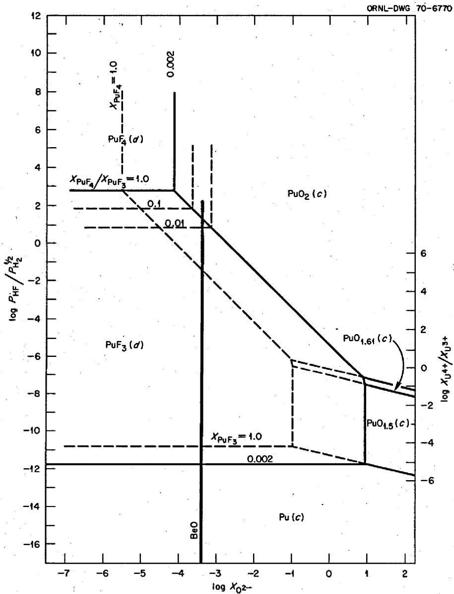  
Fig. 13.2. Revised Pourbaix Diagram for Plutonium in $\mathbf{Li}_2\mathbf{BeF}_4$ at $600^{\circ}\mathbf{C}$ Based on Present Results. The boundaries of the $\mathbf{PuF_3}$ and $\mathbf{PuF_4}$ regions are shifted downward and to the right, reflecting changes of the free energies of formation for these compounds to more negative values.

quenches was about $1200^{\circ}\mathbf{C}$ , and the equilibration period varied from $1\frac{1}{2}$ to 3 days.

Rather limited data have been obtained because of difficulty experienced with self-welding between the nickel quench tubes and the nickel block that surrounds the tubes. The data obtained to date show that $\mathrm{ThF_4}$ is the primary phase in mixtures containing more than 81 mole $\%$ $\mathrm{ThF_4}$ . There appears to be a eutectic composition formed between $\mathrm{ThF_4}$ and a new phase, presumably a compound that is as yet unidentified,

melting at $975^{\circ}\mathrm{C}$ . Another unidentified phase appears as the first crystals to separate from melts containing 67 and 70 mole $\%$ $\mathrm{ThF_4}$ . There is also evidence of solid solution of $\mathrm{ThF_4}$ in $\mathrm{CeF_3}$ , but the extent of solid solution formation remains to be determined.

We have modified our high-temperature quench furnace by introducing a thin graphite liner into the nickel quench block in an effort to overcome the self-welding problem. If this is successful, study of this system should be completed in the near future.

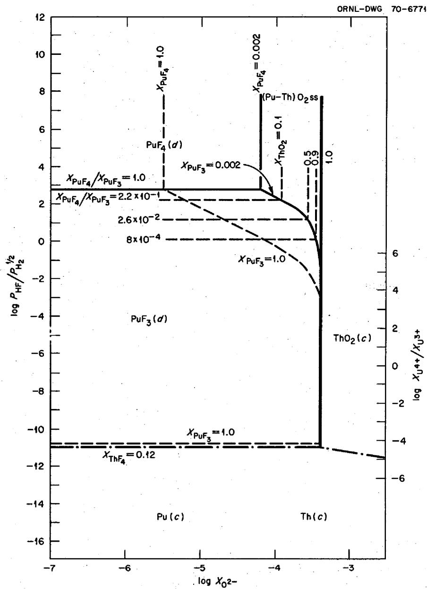  
Fig. 13.3. Pourbaix Diagram for Plutonium in $\mathsf{LiF - BeF}_2\cdot \mathsf{ThF}_4$ (72-16-12 mole %) at $600^{\circ}\mathbf{C}$ Based on the Present Results. The upper limit of oxide concentration is set by the solubility of $\mathsf{ThO}_2$ . $\mathsf{PuO}_2\cdot \mathsf{ThO}_2$ solid solutions are formed at the higher oxidation potentials.

# 13.4 EQUILIBRIUM PHASE RELATIONSHIPS IN THE SYSTEM LiF-BeF $_2$ -CeF $_3$

L. O. Gilpatrick H. Insley C. J. Barton

Investigations of phase equilibria in the system $\mathbf{LiF - BeF}_2\mathbf{-CeF}_3$ have continued. Advances were made principally through use of the thermal gradient quench technique. This system is of interest in part because of its presumed analogy with the system LiF-BeF2

$\mathbf{PuF}_3,^{1,2}$ which has some interest as a possible fuel composition for molten-salt reactors. Compositions

were chosen to help define the lower-melting phase boundaries. This resulted in studying compositions containing less than 10 mole $\%$ $\mathrm{CeF_3}$ . The cerium fluoride primary phase field dominates the system, as might be expected from its high melting point of $1460^{\circ}\mathrm{C}$ and from the fact that LiF and $\mathrm{CeF_3}$ do not form intermediate compounds. This field approaches within 0.5 mole $\%$ of the low-melting LiF-BeF $_2$ binary composition ranging from 33 to approximately 60 mole $\%$ BeF $_2$ , where the freezing temperatures of LiF-BeF $_2$ compositions are less than $480^{\circ}\mathrm{C}$ . An earlier estimate that the maximum solubility of $\mathrm{CeF_3}$ and $\mathrm{PuF_3}$ in an LiF-BeF $_2$ melt containing 52 mole $\%$ BeF $_2$ is approximately 0.5 mole $\%$ at $550^{\circ}\mathrm{C}$ is therefore confirmed. The present findings are also consistent with the results of solubility measurements with $\mathrm{CeF_3}$ in LiF-BeF $_2$ -ThF $_4$ melts. $^5$

Because of the low solubility of $\mathrm{CeF}_3$ in the ternary system in this composition region, there is little difference between the minimum melting point of the LiF-BeF $_2$ binary system $(360^{\circ}\mathrm{C})^{6}$ and that of the LiF-BeF $_2$ -CeF $_3$ ternary, currently estimated to be $358^{\circ}\mathrm{C}$ . The composition of this ternary invariant point is yet to be determined accurately, but it lies near the composition LiF-BeF $_2$ -CeF $_3$ (46.5-53-0.5 mole%).

Some evidence has been found for two immiscible liquids in equilibrium in a small region of this system which is rich in $\mathrm{BeF}_2$ and near the $\mathrm{CeF}_3$ - $\mathrm{BeF}_2$ eutectic composition, currently estimated to contain $6 \pm 1$ mole $\% \mathrm{CeF}_3$ . This eutectic has a melting point of $540 \pm 5^{\circ}\mathrm{C}$ . An equilibration time longer than the one to three weeks currently used may be needed to attain equilibrium in this system, where equilibrium is attained slowly at those compositions high in $\mathrm{BeF}_2$ due to the high viscosity of the melts. Further work will be needed to substantiate these findings and to define the boundary of the region of immiscibility.

# 13.5 AN INVESTIGATION OF POSSIBLE POLYMORPHIC TRANSITIONS IN URANIUM TETRAFLUORIDE

L. O. Gilpatrick

Crystalline uranium tetrafluoride was reported by Khripin and co-workers $^{1,2}$ to undergo a dimorphic

crystal transition at a temperature of $841^{\circ}\mathbf{C}$ . Their observations were made by thermal analysis while studying the binary system $\mathrm{UF_4 - UF_3}$ . Since polymorphic crystal transitions have not been previously reported in this widely studied compound this report aroused some interest. Attempts were made to confirm this observation using differential thermal analysis apparatus which we developed recently for molten-salt studies.

A sample of depleted $\mathbf{U}\mathbf{F}_4$ prepared at the Oak Ridge Gaseous Diffusion Plant and designated SR-1909, batch 4, was examined first, in the temperature range 700 to $1010^{\circ}\mathrm{C}$ with a differential temperature sensitivity of 50 $\mu \mathrm{v} / \mathrm{cm}$ ( $\sim 1.25^{\circ}\mathrm{C} / \mathrm{cm}$ ) and at a rate of $1^{\circ} / \mathrm{min}$ . A laboratory-purified lot of $\mathbf{U}\mathbf{F}_4$ used as a spectrographic standard was also examined under identical conditions.

No evidence of a thermal phenomenon could be found at or near $841^{\circ}\mathbf{C}$ on repeated thermal cycling. However, a single endothermic peak was found at $958^{\circ}\mathbf{C}$ on heating the Sr-1909 batch 4 material during the first cycle only. The spectroscopic standard material showed no thermal effect below the melting point. Melting temperatures for the two materials were $1010^{\circ}\mathbf{C}$ and $1020^{\circ}\mathbf{C}$ respectively (literature value $1036^{\circ}\mathbf{C}^{4,5}$ ), and melting occurred over a wide temperature range, indicating lack of purity.

Khripin and co-workers noted that the oxygen content in their system was between 1 and 3 wt%. The two specimens of $\mathrm{UF_4}$ we have examined contained 0.18 and 0.078 wt% oxygen, respectively representing 1.7 and 0.7 mole $\% \mathrm{UO_2}$ .

The present evidence seems to indicate that no polymorphic crystal transition exists in pure $\mathbf{U}\mathbf{F}_4$ at or near $841^{\circ}\mathbf{C}$ , at least within the sensitivity limits of the present measurements, and that the observed effects are most probably due to oxygen species undergoing chemical reaction such as

$$
2 \mathrm {U O F} _ {2} \rightarrow \mathrm {U O} _ {2} + \mathrm {U F} _ {4},
$$

for example, followed by solution of the $\mathrm{UO_2}$ to form a binary system melting at lower temperatures.

# 13.6 ESTIMATION OF ACTIVITY COEFFICIENTS IN LiF-BeF $_2$ -ThF $_4$ MELTS

C. F. Baes, Jr.

Shaffer et al. have collected a considerable amount of data on the following reductive extraction equilibria over a wide range of compositions in LiF-BeF $_2$ -ThF $_4$ mixtures:

$$
\operatorname {L i F} (\mathrm {F}) + \frac {1}{4} \operatorname {T h} ^ {0} (\mathrm {B i}) \rightleftharpoons \frac {1}{4} \operatorname {T h F} _ {4} (\mathrm {F}) + \operatorname {L i} ^ {0} (\mathrm {B i})
$$

$$
\mathrm {C e F} _ {3} (\mathrm {F}) + 3 / 4 \mathrm {T h} ^ {0} (\mathrm {B i}) \rightleftharpoons 3 / 4 \mathrm {T h F} _ {4} (\mathrm {F}) + \mathrm {C e} ^ {0} (\mathrm {B i})
$$

(wherein F and Bi denote, respectively, the molten fluoride and the bismuth phase). Making the reasonable assumption that activity coefficients in the dilute bismuth phase are unity, the equilibrium constants for these reactions may be written

$$
K _ {1} = \left(\frac {D _ {\mathrm {L i}}}{D _ {\mathrm {T h}} ^ {1 / 4}}\right) \left(\frac {f _ {\mathrm {T h F} _ {4}} ^ {1 / 4}}{f _ {\mathrm {L i F}}}\right) \tag {1}
$$

$$
K _ {2} = \left(\frac {D _ {\mathrm {C e}}}{D _ {\mathrm {T h}} ^ {3 / 4}}\right) \left(\frac {f _ {\mathrm {T h F} _ {4}} ^ {3 / 4}}{f _ {\mathrm {C e F} _ {3}}}\right) \tag {2}
$$

(wherein $D_{\mathbf{M}}$ is the observed ratio of mole fraction of $\mathbf{M}^0$ in the bismuth phase to $\mathbf{MF}_z$ in the fluoride phase and $f_{\mathbf{MF}_z}$ is the activity coefficient in the fluoride phase). Barton et al.2 have measured the solubility of $\mathrm{CeF_3}$ also as a function of composition in LiF-BeF2-ThF4 melts. These results give directly the variation of $f_{\mathrm{CeF_3}}$ :

$$
K _ {3} = X _ {\mathrm {C e F} _ {3}} f _ {\mathrm {C e F} _ {3}}. \tag {3}
$$

This, combined with the observed values of $D_{\mathrm{Ce}} / D_{\mathrm{Th}}^{3 / 4}$ should yield the variation with composition of $f_{\mathrm{ThF_4}}$ and this in turn, combined with $D_{\mathrm{Li}} / D_{\mathrm{Th}}^{1 / 4}$ , should give the variation of $f_{\mathrm{LiF}}$ . In short, these data can yield the activity coefficients of all the components over the composition range involved if a suitable means can be found to correlate them.

Such a correlation of activity coefficients is being attempted in $\mathbf{LiF - BeF}_2\mathbf{-MF}_y\mathbf{-NF}_z$ mixtures by an extension of a polymer model previously applied with some success to binary $\mathbf{LiF - BeF}_2$ mixtures.3 As

previously, it is assumed that $\mathbf{Be}^{2+}$ is coordinated by four fluoride ions to form $\mathrm{BeF}_4^{2-}$ tetrahedra and that by the sharing of corners and edges of such tetrahedra (i.e., by the formation of single and double fluoride bridges between $\mathbf{Be}^{2+}$ ions) all the possible polymeric species $\mathrm{Be}_a\mathrm{F}_b^{(b-2a)-}$ are formed in the fluoride mixtures. The relative stability of each of the numerous such species is defined by the equilibrium

$$
a \operatorname {B e F} _ {4} ^ {2 -} \rightleftharpoons \operatorname {B e} _ {a} \operatorname {F} _ {b} ^ {(b - 2 a) -} + (4 a - b) \mathrm {F} ^ {-}
$$

and the corresponding equilibrium constant

$$
\begin{array}{l} K _ {a, b} = \frac {\left(\operatorname {B e} _ {a} \mathrm {F} _ {b} ^ {(b - 2 a) -}\right) \left(\mathrm {F} ^ {-}\right) ^ {(4 a - b)}}{\left(\operatorname {B e F} _ {4} ^ {2 -}\right) ^ {a}} \\ = \exp [ (4 a - b) \alpha_ {2} ], \tag {4} \\ \end{array}
$$

wherein the parentheses denote activities and $\alpha_{2}$ is an adjustable parameter.

It is assumed that the third and the fourth component $\mathbf{MF}_y$ and $\mathbf{NF}_z$ ) form one or several successive mononuclear species, for example, in the case of $\mathbf{MF}_y$

$$
\mathbf {M F} _ {c} ^ {(c - y) -}, \quad \mathbf {M F} _ {c + 1} ^ {(c + 1 - y) -}, \dots
$$

The relative stability of each complex $\mathbf{MF}_b$ is expressed in terms of a stepwise equilibrium constant

$$
\begin{array}{l} K _ {n} = \frac {\left(\mathrm {M F} _ {c + n} ^ {(c + n - y) -}\right)}{\left(\mathrm {M F} _ {c + n - 1} ^ {(c + n - 1 - y) -}\right) \left(\mathrm {F} ^ {-}\right)} \\ = \exp [ \alpha_ {3} - (n - 1) \gamma_ {3} ]. \quad (5): \\ \end{array}
$$

Here the $n$ th stepwise constant is evaluated in terms of a free energy parameter $\alpha_{3}$ analogous to $\alpha_{2}$ for the $\mathrm{Be}_a\mathrm{F}_b$ species. The adjustable parameter $\gamma_{3}$ is included to provide for the expected decrease in the magnitude of successive stepwise constants as the number of bound fluoride ions increases. The overall stability constant for the formation of a particular species $\mathrm{MF}_b^{(b - y)}-$ from the initial species $\mathrm{MF}_c^{(c - y)}-$ and fluoride ion is

$$
\left(\mathrm {M F} _ {b} ^ {(b - y) -}\right)
$$

$$
\begin{array}{l} \left(\mathrm {M F} _ {c} ^ {(c - y) -}\right) \left(\mathrm {F} ^ {-}\right) ^ {b - c} \\ = \exp \left[ (b - c) \alpha_ {3} - \frac {(b - c) (b - c - 1)}{2} \gamma_ {3} \right]. \tag {6} \\ \end{array}
$$

A similar expression may be written for the formation of $\mathbf{NF}_b$ complexes from an initial species in terms of the adjustable parameters $\alpha_4$ and $\gamma_4$ .

As previously, the entropy of mixing of all the species is expressed in terms of the volume fractions $(\phi_{i})$ of each species:

$$
\Delta S _ {m} = - R \sum n _ {i} \ln \phi_ {i}; \tag {7}
$$

$\phi_{i}$ is approximated as the fraction of the total fluoride in the system which is present in species $i$ . The heat of mixing is of the form

$$
\Delta H _ {m} = R T \sum \beta_ {i j} t _ {i} n _ {i} \left(t _ {j} \phi_ {j} / b _ {j}\right), \tag {8}
$$

where the summation is over all the pairwise interactions of the four different kinds of species (1) $\mathbf{F}^{-}$ , (2) $\mathrm{Be}_a\mathrm{F}_b^{(b - 2a) - }$ , (3) $\mathrm{MF}_b^{(b - y) - }$ , (4) $\mathrm{NF}_b^{(b - z) - }$ . The coefficients $t_i$ and $t_j$ are the numbers of nonbridging fluorides on each kind of species:

$$
t _ {1} = 1, t _ {2} = 2 b - 4 a, t _ {3} = b _ {3}, t _ {4} = b _ {4}.
$$

The product $t_i n_i(t_j \phi_j / b_j)$ is intended to be proportional to the number of contacts between nonbridging fluorides of species $i$ and $j$ . The six coefficients $\beta_{12}, \beta_{13}, \beta_{14}, \beta_{23}, \beta_{24}, \beta_{34}$ , reflect the heat effect of such contacts.

Proceeding as previously, the activity of each species is obtained by the partial differentiation

$$
\ln (i) = \frac {\partial \left(\Delta H _ {m} / R T - \Delta S _ {m} / R\right)}{\partial n _ {1}}. \tag {9}
$$

Substitution of the resulting expressions for each activity into Eqs. (4) and (6) yields expressions for the volume fractions of all species in terms of the adjustable $\alpha, \beta,$ and $\gamma$ parameters and the volume fractions of free fluoride, the monomer $\mathrm{BeF}_4^{2-}$ , and the lowest fluoride complexes of $\mathbf{M}^{\gamma+}$ and $\mathbf{N}^{\gamma+}$ . These four volume fractions - $\phi_{\mathbf{F}}$ , $\phi_{\mathrm{BeF}_4}$ , $\phi_{\mathrm{MF}_c}$ , and $\phi_{\mathrm{MF}_d}$ - are determined by an iterative computation involving material balance conditions which are specified by the composition of the mixtures.

With the four volume fractions determined, the activities of the four components in a given mixture are

obtained from the proportionalities

$$
\begin{array}{l} (\operatorname {L i F}) \propto (\operatorname {F} ^ {-}) \\ \left(\mathrm {B e F} _ {2}\right) \propto \left(\mathrm {B e F} _ {4} ^ {2 -}\right) / \left(\mathrm {F} ^ {-}\right) ^ {2} \\ \left(\mathrm {M F} _ {y}\right) \propto \left(\mathrm {M F} _ {c} ^ {(c - y) -}\right) / \left(\mathrm {F} ^ {-}\right) ^ {c - y} \\ \left(\mathrm {N F} _ {z}\right) \propto \left(\mathrm {N F} _ {d} ^ {(d - z) -}\right) / \left(\mathrm {F} ^ {-}\right) ^ {d - z} \\ \end{array}
$$

wherein the activities of $\mathbf{F}^{-}$ , $\mathrm{BeF}_4^{2-}$ , $\mathrm{MF}_c^{(c-y)}$ , and $\mathrm{NF}_d^{(d-z)}$ are obtained by appropriate partial differentiation of $\Delta H_m$ and $\Delta S_m$ [Eq. (9)]. The proportionality constants will be chosen so that the activities of LiF and $\mathrm{BeF}_2$ are unity in 2LiF- $\mathrm{BeF}_2$ and so that the activity coefficients of $\mathrm{MF}_y$ and $\mathrm{NF}_z$ approach unity as $X_{\mathrm{MF}_y}$ and $X_{\mathrm{NF}_z}$ approach zero in this solvent.

In applying this model to the reductive extraction and solubility results $^{1,2}$ in LiF-BeF $_2$ -ThF $_4$ -CeF $_3$ melts, it was found that the data could not be accounted for by the assumption of only one thorium and one cerium species in solution. An acceptable fit was obtained, however, by assuming the following scheme of species (Table 13.4):

$$
\begin{array}{l} \mathrm {T h F} _ {4}, \mathrm {T h F} _ {5} ^ {-}, \mathrm {T h F} _ {6} ^ {2 -} \\ \mathrm {C e F} _ {2} ^ {+}, \mathrm {C e F} _ {3}, \mathrm {C e F} _ {4} ^ {-} \\ \end{array}
$$

Here it was necessary to adjust only the $\alpha_{3},\alpha_{4}$ ,and $\beta_{3,4}$ parameters of the model; $\alpha_{2}$ and $\beta_{12}$ were known already from the fit of the model to the binary LiF-BeF $^2$ mixture. The other $\beta$ parameters were set somewhat arbitrarily at the values given in Table 13.4. Thus the first fit was obtained by using three adjustable parameters of the model, along with the three adjustable equilibrium constant values. The standard error of fit was 1.32 times the estimated random error of the data. No significant improvement was obtained by assuming $\gamma_3 = \gamma_4$ and adjusting this additional parameter. A slightly improved fit $(\sigma = 1.24)$ was obtained with the scheme

$$
\begin{array}{l} \mathrm {T h F} ^ {3 +}, \mathrm {T h F} _ {2} ^ {2 +}, \dots , \mathrm {T h F} _ {7} ^ {3 -} \\ \mathrm {C e F} ^ {2 + 1}, \mathrm {C e F} _ {2} ^ {+}, \dots , \mathrm {C e F} _ {6} ^ {3 -} \\ \end{array}
$$

and an adjustable $\gamma (= \gamma_3 = \gamma_4)$ parameter. This scheme is essentially the same as the previous one, since the principal species over the composition range involved are the same, but it is preferred as being less arbitrary.

The small number of parameters of the model which require adjustment in order to fit the data suggests that the model is a reasonable representation of the nature of molten $\mathbf{LiF - BeF}_2\cdot \mathbf{ThF}_4$ mixtures and should provide

Table 13.4. Polymer Model for LiF-BeF $_2$ -ThF $_4$ -CeF $_3$ Melts at $600^{\circ}\mathrm{C}$   

<table><tr><td></td><td>Scheme I</td><td>Scheme II</td></tr><tr><td colspan="3">Species assumeda</td></tr><tr><td>BeaFb(b-2a)-plus:</td><td>ThF4, ThF5-, ThF6-2-, CeF2+, CeF3, CeF4-</td><td>ThF3+, ThF22+, ..., ThF43-, CeF2+, CeF2+, ..., CeF63-</td></tr><tr><td colspan="3">Parameters adjustedb</td></tr><tr><td>α3</td><td>2.24</td><td>3.75</td></tr><tr><td>α4</td><td>1.67</td><td>4.42</td></tr><tr><td>γ3, γ4</td><td>(0)</td><td>1.81</td></tr><tr><td>β34</td><td>-0.421</td><td>-0.438</td></tr><tr><td>K1</td><td>0.00316</td><td>0.00328</td></tr><tr><td>K2</td><td>1.60</td><td>1.67</td></tr><tr><td>K3</td><td>0.00583</td><td>0.00589</td></tr><tr><td colspan="3">Parameters not adjusted</td></tr><tr><td>α2c</td><td></td><td>-2.32</td></tr><tr><td>β12c</td><td></td><td>0.43</td></tr><tr><td>β13, β14</td><td></td><td>0.43</td></tr><tr><td>β23, β24</td><td></td><td>0</td></tr><tr><td>Agreement factord</td><td>1.32</td><td>1.24</td></tr></table>

aThe species $\mathbf{Be}_a\mathbf{F}_b^{(b - 2a) - }$ include all such polymeric anions which can be formed by sharing of corners and edges of $\mathbf{BeF_4}$ tetrahedra.   
$b$ The subscripts 1-4 of $a, \beta,$ and $\gamma$ refer, respectively, to the four kinds of species (1) $\mathbf{F}^{-}$ , (2) $\mathrm{Be}_a\mathrm{F}_b^{(b - 2a)^{-}}$ , (3) $\mathrm{ThF}_b^{(b - 4)^{-}}$ , and (4) $\mathrm{CeF}_b^{(b - 3)^{-}}$ . The three $K$ values are defined in Eqs. 1-3.   
$\alpha_{2}$ and $\beta_{2}$ were determined by a previous fit of the model to binary LiF-BeF $_2$ mixtures (ref. 3).

$$
\left[ \sum \left(\frac {X _ {\mathrm {o}} - X _ {\mathrm {c}}}{\sigma_ {x}}\right) ^ {2} / \left(N _ {\mathrm {o}} - N _ {\mathrm {p}}\right) \right] ^ {1 / 2};
$$

$X_{\mathbf{o}}$ is a value of $D_{\mathrm{Li}} / D_{\mathrm{Th}}^{1 / 4}$ or $D_{\mathrm{Ce}} / D_{\mathrm{Th}}^{3 / 4}$ determined by Shaffer et al. (ref. 1), or it is a $\mathrm{CeF_3}$ solubility measured by Barton et al. (ref. 2); $X_{\mathbf{c}}$ is the corresponding calculated quantity; $\sigma_{x}$ is the estimated experimental uncertainty in $X_{\mathbf{o}};N_{\mathbf{o}}$ is the number of observations; $N_{\mathfrak{p}}$ is the number of parameters adjusted.

a good representation of the activity coefficients of the components. Accordingly, activity coefficient curves have been generated (Fig. 13.4) using the parameters of scheme II, Table 13.4. All curves are plotted vs $X_{\mathrm{LiF}}$ which - except in the case of $f_{\mathbf{CeF}_3}$ - seems the most important composition variable determining activity coefficients in these mixtures. All curves are adjusted so that $a_{\mathrm{LiF}}, a_{\mathrm{BeF}_2}, f_{\mathrm{ThF}_4}$ , and $f_{\mathrm{CeF}_3}$ are unity in $\mathbf{Li}_2\mathbf{BcF}_4$ .

Since the $\mathrm{CeF}_3$ curves depend on the relatively more accurate solubility measurements, they should be the most accurate, with an estimated uncertainty not exceeding $10\%$ at compositions farthest from the reference composition. The LiF curves depend partly,

and the $\mathrm{ThF_4}$ curves depend almost entirely, on the less accurate reductive extraction measurement1 and have uncertainties which may reach $30\%$ at the extremes of the composition range. The $\mathrm{BeF_2}$ curves and LiF curves depend in part on accurate emf data for the binary system3,4 and should generally be of intermediate accuracy. As more data become available from current emf and other studies, it should be possible with the aid of this model to generate activity coefficient curves for other solutes in these LiF- $\mathrm{BeF_2 - ThF_4}$ melts. This should greatly enhance our ability to predict the effect of melt composition on many important equilibria in MSBR fluoride melts.

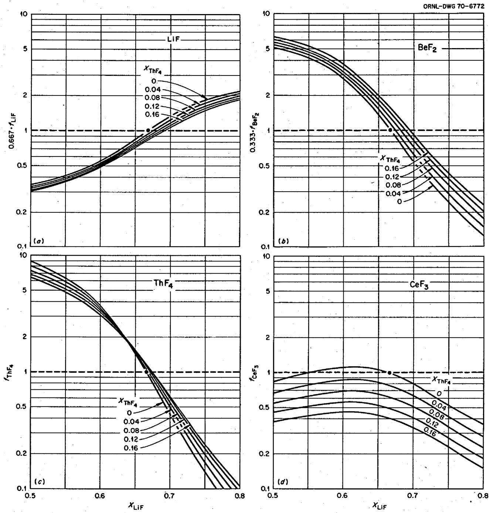  
Fig. 13.4. Activity Coefficients of Components in LiF-BeF $_2$ -ThF $_4$ Mixtures Containing a Low Concentration of CeF $_3$ at $600^{\circ}$ C. Curves are based on parameters in scheme II, Table 13.4. Standard states are defined such that $X_{\mathrm{LiF}} \cdot f_{\mathrm{LiF}}, X_{\mathrm{BeF}_2} \cdot f_{\mathrm{BeF}_2}, f_{\mathrm{ThF}_4}$ , and $f_{\mathrm{CeF}_3}$ are all unity in 2LiF-BeF $_2$ (66.7-33.3 mole %).

# 13.7 ESTIMATION OF ACTIVITY COEFFICIENTS OF ALKALINE EARTH'S IN MOLTEN BISMUTH AND AS CHLORIDES OR FLUORIDES

J.Braunstein

A promising modification of the reductive extraction process for removal of rare-earth fission products from molten-salt breeder reactor fuels employs an acceptor salt such as molten lithium chloride contacting the bismuth phase. Thermodynamic data suggest that the fission product alkali metals, Rb and Cs, probably will concentrate in the chloride phase. Ba and Sr should have a smaller tendency to transfer to the chloride, but in trying to calculate distribution ratios of Cs, Rb, Ba, and Sr in the process, activity coefficients are needed for the fluoride salts, chloride salts, and the metals in the bismuth phase. Direct experimental measurements of the needed thermodynamic quantities are not yet available. However, recent advances in molten-salt solution theory have been made which provide a useful guide to the estimation of activity coefficients from data in related systems. Estimates are given in Table 13.5 of the activity coefficient, $\gamma$ , of $\mathrm{SrCl}_2$ and $\mathrm{BaCl}_2$ as dilute solutions in molten LiCl, of $\mathrm{SrF}_2$ and $\mathrm{BaF}_2$ as dilute solutions in LiF, and of Sr and Ba as dilute solutions in molten bismuth. Also listed are the excess chemical potentials, $\mu^{\mathrm{E}} = RT\ln \gamma$ , at infinite dilution of the above solutes in LiCl, LiF, or Bi.

Free energy data have been summarized for mixtures of KCl or of NaCl with $\mathrm{CaCl}_2$ , $\mathrm{SrCl}_2$ , or $\mathrm{BaCl}_2$ and of LiCl with $\mathrm{MgCl}_2$ . Conformal ionic solution theory predicts a linear relation between the excess chemical potential at infinite dilution of divalent salt and an interionic distance parameter. This correlation has been applied to the chloride mixtures and permits estimation of $\mu_{\mathrm{SrCl}_2}^{\mathrm{E}}$ and $\mu_{\mathrm{BaCl}_2}^{\mathrm{E}}$ in molten LiCl with a short linear extrapolation.

Table 13.5. Activity Coefficients and Excess Chemical Potentials for Dilute Solutions of Sr or Ba as Chlorides, as Fluorides, or in Molten Bismuth   

<table><tr><td>Solvent</td><td>Solute</td><td>μE(kcal per mole of solute)a</td><td>γb</td></tr><tr><td rowspan="2">LiCl</td><td>SrCl2</td><td>+1</td><td>1.7</td></tr><tr><td>BaCl2</td><td>+2</td><td>3.0</td></tr><tr><td rowspan="2">LiF</td><td>SrF2</td><td>+1</td><td>1.7</td></tr><tr><td>BaF2</td><td>+2</td><td>3.0</td></tr><tr><td rowspan="2">Bi</td><td>Ba</td><td>-52 to -44</td><td>2 × 10-12to 1 × 10-10</td></tr><tr><td>Sr</td><td>-44</td><td>10-10</td></tr></table>

${}^{a}$ Solution at infinite dilution.   
$b650^{\circ}\mathrm{C}$ , for supercooled liquid when below melting point of solute or solvent.

For the fluoride mixtures, it was assumed that activity coefficients of divalent solutes in $\mathbf{LiF - BeF_2}$ mixtures are similar to those in LiF. Further, asymmetry in the free energy of mixing in alkali fluoride—alkaline earth fluoride systems was neglected, and

$$
\left(\mu_ {\text {s o l u t e}} ^ {\mathrm {E}}\right) _ {X _ {\text {s o l u t e}} = 0}
$$

was estimated as

$$
\left(\mu_ {\text {s o l v e n t}} ^ {\mathrm {E}} / X _ {\text {s o l u t e}} ^ {2}\right) _ {X _ {\text {s o l u t e}} = 0},
$$

again using the correlation provided by conformal ionic solution theory.5,6

Free energy data for Sr and Ba in molten bismuth are sparse and are difficult to obtain because of the activity of these alkaline earth metals. Previous estimates of $\gamma_{\mathrm{Ba}}$ range between $10^{-18}$ and $10^{-6}$ . Estimates of the activity coefficients can be obtained from a plot of enthalpies of formation (per gram atom of metal) of the compounds BaBi, $\mathrm{Ba}_3\mathrm{Bi}_2$ , SrBi, $\mathrm{Sr}_3\mathrm{Bi}_2$ , and $\mathrm{Sr}_2\mathrm{Bi}^{9-11}$ vs composition by extrapolation of the slope to infinite dilution. The activity coefficient of Mg in Bi, estimated in the same manner, is within a factor of 2 of the measured activity coefficient.

# 13.8 POTENTIOMETRIC STUDIES IN MOLTEN FLUORIDES

B. F. Hitch C. F. Baes, Jr.

We have continued our studies of the cells

$$
\operatorname {B e} (c) \mid \operatorname {L i F}, \operatorname {B e F} _ {2} \mid \operatorname {R}. \operatorname {E}.
$$

$$
\begin{array}{l} \mathrm {P t} (c) \left| \begin{array}{l} \mathrm {U F} _ {3}, \mathrm {U F} _ {4}, \\ \mathrm {L i F}, \mathrm {B e F} _ {2} \end{array} \right| \mathrm {R}. \mathrm {E}. \\ \end{array} \tag {II}
$$

$$
\begin{array}{l} \mathrm {N i} (c) \left\lfloor \begin{array}{l} \mathrm {N i F} _ {2}, \\ \mathrm {L i F}, \mathrm {B e F} _ {2} \end{array} \right\rfloor \mathrm {R . E .} \end{array} \tag {III}
$$

in which the reference electrode is nickel immersed in molten $\mathbf{L}\mathbf{i}_2\mathbf{B}\mathbf{e}\mathbf{F}_4$ saturated with NiO and BeO:

$$
\mathrm {R . E .} = \left| \begin{array}{l l} \mathrm {N i F} _ {2} (\sim 1 0 ^ {- 4}), & \text {B e O} (c), \\ \mathrm {L i F} (0. 6 7), & \mathrm {N i O} (c) \\ \mathrm {B e F} _ {2} (0. 3 3) & \end{array} \right| \mathrm {N i} (c)
$$

In previous measurements of these cells, this reference electrode, contained in a fritted silica tube, has proven relatively reliable and especially convenient for potentiometric studies of molten fluorides; however, the gradual attack of the silica by the fluoride melts, with the production of gaseous $\mathrm{SiF_4}$ and dissolved oxide, has caused difficulties. In the current measurements, we have investigated the use of sintered BeO as a container material for the reference electrode.

The compartments used, obtained from Brush Berylium Corporation, were $99.8\%$ BeO. They had been closed at the lower end by a disk of the same sintered BeO. In initial tests it was found, fortunately, that the seal between the disk and the end of each tube was not complete, but in fact contained holes or cracks as large as $2\mu$ . The electrical resistance measured with molten salt both inside and outside these compartments was quite low, typically 75 ohms. Yet salt leakage through these compartments appeared to be very small. These compartments have been exposed to $\mathrm{Li}_2\mathrm{BeF}_4$ melts for periods up to three weeks with no detectable weight loss or visible signs of attack.

Cell I. - Since the BeO compartments seemed practically impervious to salt we were concerned with the possibility of BeO acting as a solid electrolyte. If we assume that the $\mathrm{Be}^{2+}$ ion or the $\mathbf{O}^{2-}$ is carrying the current, the cell reaction for cell I above would be

$$
\mathrm {B e} ^ {0} (c) + \mathrm {N i O} (c) \rightarrow \mathrm {B e O} (c) + \mathrm {N i} ^ {0} (c) \tag {1}
$$

and for either case the cell potential would be independent of melt composition. However, if there is liquid contact and we assume that all the current is carried across the liquid junction by the $\mathbf{L}\mathbf{i}^{+}$ ion we may then write the following cell reaction:

$$
\begin{array}{l} \mathrm {B e} ^ {0} (c) + \mathrm {N i O} (c) + \mathrm {B e F} _ {2} (d, R) + 2 \mathrm {L i F} (d) \rightarrow \mathrm {N i} ^ {0} (c) \\ + \operatorname {B e O} (c) + \operatorname {B e F} _ {2} (d) + 2 \operatorname {L i F} (d, R); \tag {2} \\ \end{array}
$$

$R$ designates solutes in the reference compartment. Since the reference solution closely approximated the composition of the compound $\mathrm{Li}_2\mathrm{BeF}_4$ , the standard state we have adopted for $\mathrm{LiF}(d)$ and $\mathrm{BeF}_2(d)$ , then $a_{\mathrm{LiF}(R)}$ and $a_{\mathrm{BeF}_2(R)}$ are unity, and the cell potential is given by

$$
E = E ^ {\circ} - \frac {R T}{2 F} \ln \frac {a _ {\mathrm {B e F} _ {2}}}{a _ {\mathrm {L i F}} ^ {2}}. \tag {3}
$$

To check the effect, or lack of effect, of melt composition on the cell potential we varied the composition of the $\mathrm{LiF - BeF_2}$ mixture on the left in cell I. Results are shown in Fig. 13.5, where they are plotted against activity data from previous measurements. As can be seen, the cell potential does vary with melt composition, showing a dependence on $a_{\mathrm{BeF}_2} / a_{\mathrm{LiF}}^2$ which agrees quite well with Eq. (3), represented by the line in Fig. 13.5. This result suggests strongly that the current is being carried from one half-cell to the other by $\mathrm{Li^{+}}$ ion through the molten salt, rather than by mobile $\mathrm{Be}^{2 + }$ or $\mathbf{O}^{2 - }$ ions in the solid BeO.

A series of measurements of cell I containing $\mathbf{L}\mathbf{i}_2\mathbf{B}\mathbf{e}\mathbf{F}_4$ was made over the temperature range 500 to $700^{\circ}C.$ The results differ by about $5\mathrm{mv}$ from those obtained previously with the use of silica compartments. The present results give

$$
E _ {I} ^ {\circ} = 1. 8 9 2 - 0. 0 4 4 (T / 1 0 0 0), \tag {4}
$$

where $T$ is the temperature in degrees Kelvin. This expression for the potential of cell I, when combined with our previous measurements of the $\mathrm{Be}^{2+}/\mathrm{Be}^0$ couple vs the $\mathrm{HF/H}_2$ , $\mathbf{F}^{-}$ electrode, gives the expression in Table 13.6 for the potential of the NiO, $\mathrm{Be}^{2+}/\mathrm{BeO}$ , $\mathbf{Ni}^0$ reference electrode vs the $\mathrm{HF/H}_2$ , $\mathbf{F}^{-}$ electrode.

Table 13.6. Electrode Potentials vs HF/H2, F   

<table><tr><td>1. Be2+ + 2e- → Be(c)</td><td>E° = -2.460 + 0.694(T/1000)</td></tr><tr><td>2. U4+ + e- → U3+</td><td>E° = -1.106 (610°C)</td></tr><tr><td>3. HF + e- → F- + 1/2H2</td><td>E° = 0</td></tr><tr><td>4. Be2+ + NiO(c) + 2e- → BeO(c) + Ni(c)</td><td>E° = 0.568 + 0.650(T/1000)</td></tr><tr><td>5. Ni2+ 2e- → Ni(c)</td><td>E° = 0.343 (605°C)</td></tr></table>

The above measurements were made over a period of three weeks, and a single $\mathbf{Be}^0$ electrode was used. There was no tendency of the cell potential to run down, nor was there any other indication that the $\mathbf{Be}^0$ electrode was being "poisoned" by the reduction of reducible metals on the electrode surface. This is strong evidence that there was no significant leakage of $\mathbf{Ni}^{2+}$ ion from the reference electrode compartment.

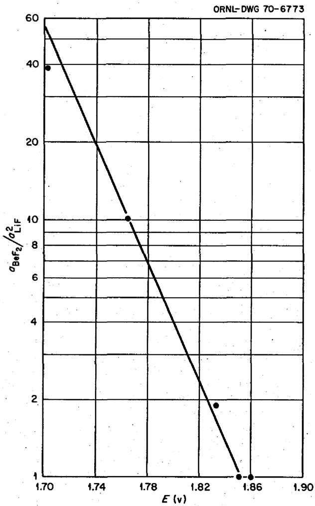  
Fig. 13.5. Potential Dependence of Cell I on the Ratio of $a_{\mathrm{BeF}_2} / a_{\mathrm{LiF}}^2$ .

Cell II, the $\mathbf{U}^{4 + } / \mathbf{U}^{3 + }$ Couple. - Studies of cell II are continuing with the reference electrode compartmented in BeO instead of silica. Present measurements give a value of 1.110 v at $610^{\circ}\mathrm{C}$ for $E^{\circ}$ in the Nernst expression

$$
E = E ^ {\infty} - \frac {R T}{F} \ln \left(\frac {X _ {\mathrm {U F} _ {4}}}{X _ {\mathrm {U F} _ {3}}}\right) \tag {5}
$$

for $\mathrm{Li}_2\mathrm{BeF}_4$ as the solvent. This may be compared with our previous measurements of $E^{\circ}$ , which gave 1.067 v, and the predicted value of 1.139 v. The uncertainties in the present measurements should be no more than $\pm 15$ mv. The potential of the $\mathrm{U}^{4+}/\mathrm{U}^{3+}$ couple vs the $\mathrm{HF/H_2}$ , $\mathbf{F}^{-}$ couple (Table 13.6) was calculated by combining the measured cell potential of cell II and the half-cell potential of the reference electrode. We plan to make further measurements using the BeO compartments in further attempts to resolve the inconsistencies noted above as well as to establish a more accurate standard reference potential for the cell.

Cell III, the $\mathrm{Ni}^{2+}/\mathrm{Ni}^{0}$ Couple. - The cell reaction for cell III, above, with $\mathrm{Li}_{2}\mathrm{BeF}_{4}$ in both half-cells and at low concentrations of $\mathrm{NiF}_{2}$ may be written

$$
\operatorname {B e O} (c) + \operatorname {N i F} _ {2} (d) \rightarrow \operatorname {B e F} _ {2} (d) + \operatorname {N i O} (c). \tag {6}
$$

Then the cell potential should be given by

$$
E = E ^ {\circ} + \frac {R T}{2 F} \ln X _ {\mathrm {N i F} _ {2}}. \tag {7}
$$

Cell potentials with the reference electrode compartmented in silica were determined by titrating weighed amounts of anhydrous $\mathrm{NiF}_2$ into an $\mathrm{Li}_2\mathrm{BeF}_4$ melt at $605^{\circ}\mathrm{C}$ . A plot of the results is shown in Fig. 13.6. The measured cell potentials have an estimated uncertainty of $\pm 10\mathrm{mv}$ and differ by some $30\mathrm{mv}$ from those based on the equilibrium measurements of Blood. Measurements have been attempted using BeO compartments for the reference electrode but have not yielded consistent results; further investigations are planned.

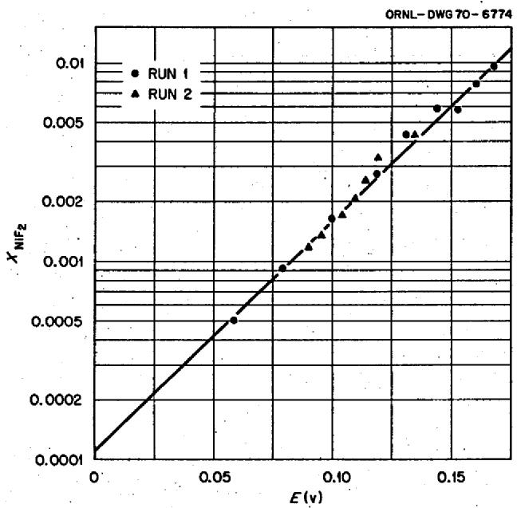  
Fig. 13.6. Measured Cell Potentials of Cell III.

The measured cell potential in volts at $605^{\circ}\mathbf{C}$ is given by

$$
E = 0. 3 4 3 + 0. 0 8 7 \log X _ {\mathrm {N i F} _ {2} (d)}. \tag {8}
$$

The potential for the $\mathrm{Ni}^{2+}/\mathrm{Ni}^{0}$ couple vs the $\mathrm{HF}/\mathrm{H}_{2}$ , $\mathbf{F}^{-}$ electrode (Table 13.6) was calculated by combining the potential of cell III and the reference electrode half-cell potential.

# 13.9 ELECTRICAL CONDUCTIVITIES AND IONIC MOBILITIES IN THE MOLTEN LiF-BeF $_2$ SYSTEM

G. D. Robbins J. Braunstein

In addition to its relevance to the molten-salt reactor program, investigation of electrical transport in molten $\mathsf{LiF - BeF}_2$ mixtures is of considerable theoretical interest. The binary $\mathsf{LiF - BeF}_2$ system is comprised of pure components exhibiting transport properties which differ by over seven orders of magnitude. Both in its transport properties and its thermodynamic properties it exhibits characteristics of network liquids at the $\mathsf{BeF}_2$ end and of a typical ionic liquid at the LiF end. $^{1-3}$

The results of electrical conductivity measurements in $\mathsf{LiF - BeF_2}$ mixtures ranging in composition from 34 to 70 mole $\%$ beryllium fluoride presented here contain data from two previous experiments $^{4,5}$ and afford an analysis of the variation of electrical conductivity with both composition and temperature. Ionic mobilities have been reported previously $^{6}$ at two temperatures and two compositions using transference number $^{6}$ and density $^{7}$ data. The new conductivity data reported here permit an extended evaluation of the composition dependence of internal ionic mobilities.

Cell constants of the four cells employed in these studies ranged from $98.5_{5}$ to $150.4\mathrm{cm}^{-1}$ as determined by previously described techniques. Conductances in the molten fluorides were measured with a specially constructed ac bridge which contains a variable resistance and capacitance, in series, in the balancing arm and has the capability of variation of voltage and frequency of the applied sinusoidal potential. Applied potentials were 25 to $50\mathrm{mv}$ peak-to-peak across the cell. For resistances of the order of 100 ohms the bridge inaccuracy is $< \pm 0.1\%$ over the frequency range 0.1 to $30\mathrm{kHz}$ and increases toward $\pm 0.2\%$ as resistances approach 10 or 500 ohms.

As has been previously discussed,4,9 the frequency range over which resistance is independent of frequency (or varies in a regular manner) must be determined for each experimental arrangement and electrolyte solution. This was again demonstrated in the current investigation, in which a frequency range could be found over which the molten $\mathrm{KNO}_3$ used in cell constant determination exhibited no variation of resistance with frequency, within the $\pm 0.2\%$ uncertainty limits of the bridge, for each of the four cells (the ranges were 1 to 20, 1 to 10, 0.5 to 3, and 3 to 30 kHz). With molten fluorides in the cells, two of the mixtures showed a frequency-independent region (3 to $30~\mathrm{kHz}$ and 5 to $50~\mathrm{kHz}$ ), while in the other two,

resistances were approximately linear in $1 / \sqrt{f}$ (2% variation, 0.5 to 5 kHz, in one; 0.5% variation, 1 to 10 kHz, in the other). In these melts measured resistances were extrapolated to infinite frequency vs $1 / \sqrt{f}$ .

Specific conductances are listed in Table 13.7. These were obtained from four sets of experiments in different cells (see Fig. 13.7). The upper temperature limit of approximately $550^{\circ}\mathrm{C}$ was imposed by use of molten potassium nitrate as a molten salt bath. In one experiment (cell 2) no bath was present, permitting an upper temperature limit of $647^{\circ}\mathrm{C}$ to be attained. However, as the data obtained with cell 2 reflect (Fig. 13.7), the absence of a bath around the cell resulted in greater scatter, probably due to temperature variation in the conducting region of the cell.

As can be seen from Fig. 13.7, the specific conductance data vary smoothly as a function of temperature. The curves shown represent computer-fitted least-squares equations that were used to generate the isotherms of specific conductance plotted in Fig. 13.8 as a function of composition. The points shown are calculated values (at $25^{\circ}\mathrm{C}$ intervals) for each experimental composition and extend to the next $25^{\circ}\mathrm{C}$ beyond the actual data range. It is believed that the divergence of the data at $X = 0.540$ from a smooth curve at higher temperatures is due to experimental scatter. That the data obtained at $X = 0.500$ with cell 4 form a smooth curve with data from cell 1 at compositions on either side, lends added credence to the results.

Table 13.7. Specific Conductance as a Function of Temperature and Composition for Molten LiF-BeF $_2$ Mixtures   

<table><tr><td>t(°C)</td><td>κ(ohms-1cm-1)</td><td>t(°C)</td><td>κ(ohms-1cm-1)</td><td>t(°C)</td><td>κ(ohms-1cm-1)</td></tr><tr><td colspan="2">XBeF2=0.340</td><td colspan="2">XBeF2=0.500</td><td colspan="2">X=0.575</td></tr><tr><td>468.0</td><td>1.342</td><td>369.6</td><td>0.236</td><td>445.3</td><td>0.266</td></tr><tr><td>476.3</td><td>1.390</td><td>379.7</td><td>0.265</td><td>449.7</td><td>0.277</td></tr><tr><td>480.5</td><td>1.424</td><td>389.3</td><td>0.295</td><td>459.6</td><td>0.300</td></tr><tr><td>499.3</td><td>1.540</td><td>399.2</td><td>0.327</td><td>470.4</td><td>0.328</td></tr><tr><td>530.1</td><td>1.753</td><td>425.7</td><td>0.417</td><td>491.8</td><td>0.382</td></tr><tr><td>562.0</td><td>1.957</td><td>450.2</td><td>0.505</td><td>515.7</td><td>0.445</td></tr><tr><td>588.0</td><td>2.132</td><td>475.5</td><td>0.603</td><td>542.3</td><td>0.522</td></tr><tr><td>619.4</td><td>2.330</td><td>503.8</td><td>0.715</td><td rowspan="2" colspan="2">X=0.600</td></tr><tr><td>647.2</td><td>2.513</td><td>525.4</td><td>0.802</td></tr><tr><td colspan="2">XBeF2=0.380</td><td>550.1</td><td>0.902</td><td>460.1</td><td>0.239</td></tr><tr><td>465.5</td><td>1.100</td><td colspan="2">X=0.520</td><td>479.9</td><td>0.282</td></tr><tr><td>486.1</td><td>1.226</td><td>398.7</td><td>0.271</td><td>500.1</td><td>0.325</td></tr><tr><td>502.7</td><td>1.322</td><td>418.4</td><td>0.329</td><td>525.4</td><td>0.388</td></tr><tr><td>533.2</td><td>1.504</td><td>434.3</td><td>0.379</td><td>550.2</td><td>0.450</td></tr><tr><td colspan="2">XBeF2=0.420</td><td>449.5</td><td>0.427</td><td colspan="2">X=0.650</td></tr><tr><td>455.3</td><td>0.844</td><td>473.2</td><td>0.510</td><td>480.6</td><td>0.169</td></tr><tr><td>476.5</td><td>0.962</td><td>498.6</td><td>0.602</td><td>521.1</td><td>0.230</td></tr><tr><td>501.4</td><td>1.097</td><td>513.6</td><td>0.661</td><td>551.5</td><td>0.276</td></tr><tr><td>528.6</td><td>1.241</td><td>528.5</td><td>0.715</td><td colspan="2">X=0.700</td></tr><tr><td colspan="2">XBeF2=0.470</td><td colspan="2">X=0.540</td><td>501.2</td><td>0.113</td></tr><tr><td>425.2</td><td>0.500</td><td>380.2</td><td>0.183</td><td>521.9</td><td>0.133</td></tr><tr><td>446.2</td><td>0.587</td><td>390.0</td><td>0.206</td><td>549.1</td><td>0.160</td></tr><tr><td>475.4</td><td>0.719</td><td>399.9</td><td>0.230</td><td></td><td></td></tr><tr><td>499.7</td><td>0.830</td><td>409.9</td><td>0.255</td><td></td><td></td></tr><tr><td>525.9</td><td>0.954</td><td>419.5</td><td>0.280</td><td></td><td></td></tr><tr><td></td><td></td><td>439.5</td><td>0.334</td><td></td><td></td></tr><tr><td></td><td></td><td>460.3</td><td>0.395</td><td></td><td></td></tr><tr><td></td><td></td><td>478.9</td><td>0.451</td><td></td><td></td></tr><tr><td></td><td></td><td>499.2</td><td>0.514</td><td></td><td></td></tr><tr><td></td><td></td><td>524.2</td><td>0.595</td><td></td><td></td></tr><tr><td></td><td></td><td>550.2</td><td>0.675</td><td></td><td></td></tr></table>

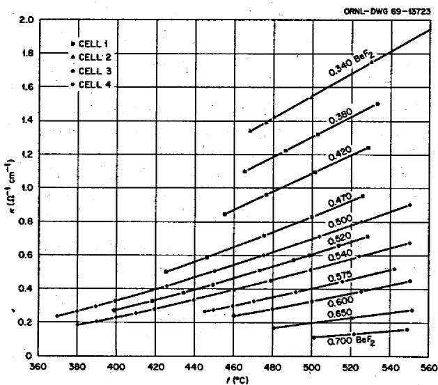  
Fig. 13.7. Variation of Specific Conductance of LiF-BeF $_2$ Mixtures with Temperature.

Table 13.8. Parameter Values for the Function

$$
\kappa = \left(a _ {1} + a _ {2} X\right) \exp \left[ \frac {- b _ {1} e ^ {b _ {2} X}}{T - \left(c _ {1} + c _ {2} X\right)} \right]
$$

$\pmb{T}$ in degrees Kelvin   

<table><tr><td>Parameter</td><td>Value</td></tr><tr><td>a1</td><td>7.1845</td></tr><tr><td>a2</td><td>7.7458</td></tr><tr><td>b1</td><td>252.57</td></tr><tr><td>b2</td><td>3.2965</td></tr><tr><td>c1</td><td>467.24</td></tr><tr><td>c2</td><td>-333.96</td></tr></table>

Rather than reporting the 49 parameter values required for interpolation employing the individual equations shown in Figs. 13.7 and 13.8, it is more convenient to represent the specific conductance as a function of temperature and composition by a single expression with coefficients derived by least-squares fitting of all the data simultaneously. One such six-parameter relation is

$$
\kappa = \left(a _ {1} + a _ {2} X\right) \exp \left[ \frac {- b _ {1} e ^ {b _ {2} X}}{T - \left(c _ {1} + c _ {2} X\right)} \right]; \tag {1}
$$

$T$ is in degrees Kelvin. Coefficients for Eq. (1) are listed in Table 13.8. The standard error of fit is 0.007.

Based on the assumption of randomness and independence of errors with an estimated uncertainty in $\kappa$ of $0.4\%$ from cell constant determination, $0.2\%$ from resistance measurement, $0.5\%$ from resistance vs $1/\sqrt{f}$ extrapolation, and $0.3\%$ from temperature measure

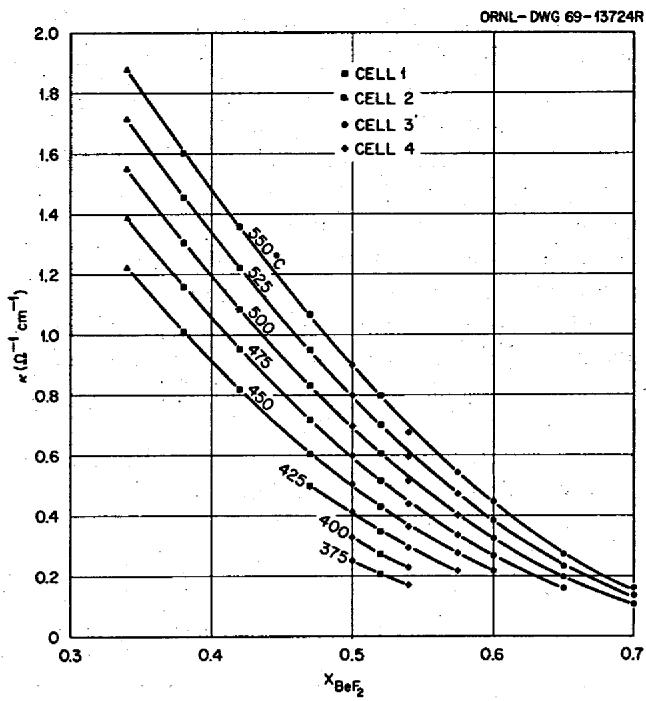  
Fig. 13.8. Specific Conductance of LiF-BeF $_2$ Mixtures vs Composition.

ment, the calculated probable error is $0.8\%$ . We believe the uncertainty level of these results to be of the order of $\pm 2\%$ .

Mobilities of lithium ion relative to fluoride (or relative to beryllium ion, since beryllium is immobile relative to fluoride) may be calculated from the relation

$$
b _ {\mathrm {L i}} = \frac {t _ {\mathrm {L i}} \kappa}{F C _ {\mathrm {L i}}} = \frac {\kappa}{F C _ {\mathrm {L i}}},
$$

where $C_{\mathrm{Li}}$ is the concentration of lithium ion in equivalents per cubic centimeter, $F$ is the faraday, and $t_\mathrm{Li}$ is the transference number of lithium ion relative to fluoride, which is unity. The mobilities of lithium relative to fluoride have been calculated at $25^{\circ}$ intervals and are shown in Fig. 13.9. These, extrapolated to $650^{\circ}\mathrm{C}$ , are compared in Fig. 13.10 with the mobilities of Li relative to halide in the binary $\mathrm{LiCl - KCl}$ , $\mathrm{LiBr - KBr}$ , and $\mathrm{LiCl - PbCl}_2$ .

to halide in the KCl-CaCl $_2$ and KCl-MgCl $_2$ systems. In the LiF-BeF $_2$ system, values of $b_{\mathrm{Li}}$ are smaller than those in the other binary system of halides, as might be expected with increased network character of the liquid.

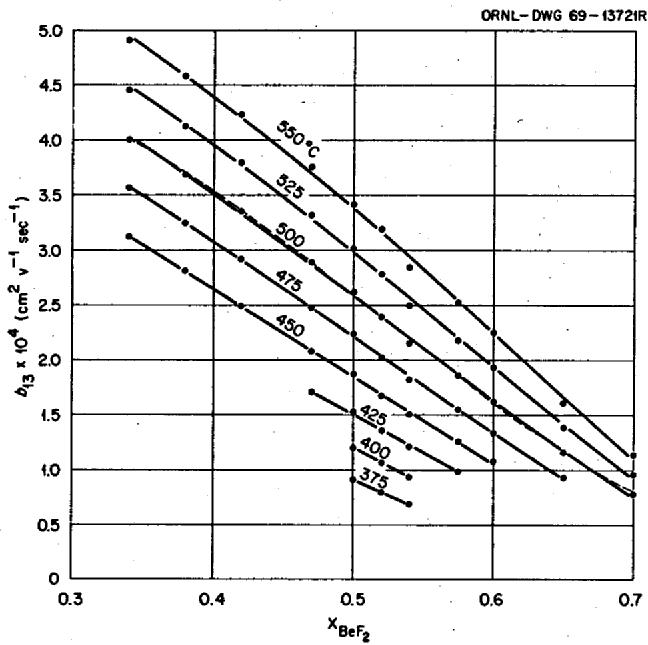  
Fig. 13.9. Internal Mobility (Lithium Relative to Fluoride) as a Function of Composition in the System LiF-BeF $_2$ .

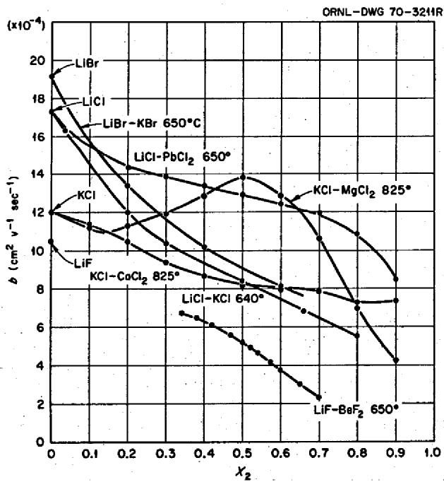  
Fig. 13.10. Internal Mobilities (Lithium or Potassium Relative to the Anion) vs Mole Fraction of the Second Component.

# 13.10 ELECTRICAL CONDUCTIVITIES OF PROPOSED MSBR FUEL COMPOSITIONS IN THE LiF-BeF $_2$ -ThF $_4$ SYSTEM

G. D. Robbins A. S. Gallanter

The absence of reliable theories for predicting electrical transport in molten salts renders a priori estimation of electrical conductance in ternary mixtures extremely uncertain. Hence, specific conductances and their temperature dependences from near the liquidus to $650^{\circ}\mathrm{C}$ have been measured for four proposed MSBR fuel compositions. Two additional $\mathsf{LiF - BeF}_2\cdot \mathsf{ThF}_4$ compositions having equal molar ratios to individual proposed fuel compositions were also investigated to determine the effect of additions of each component.

Starting materials were of compositions (in mole percent $\mathrm{LiF - BeF_2 - ThF_4}$ 68-20-12, 63-25-12, and 72-21-7. These had been previously treated with an $\mathbf{H}_2 / \mathbf{HF}$ mixture followed by reduction with pure hydrogen. A liquid aliquot of each starting material was delivered into a nickel vessel under argon, frozen, and opened in a dry box; the entire sample was ground to 30 mesh particle size and mixed on a rotating tumbler for at least $3\mathrm{hr}$ to ensure homogeneity. Two additional compositions (60.5-28-11.5 and 71-18.13-10.87) were obtained by addition of either clear pieces of lithium fluoride, which had been fused under a hydrogen-argon mixture and slowly crystallized, or sublimed beryllium fluoride glass. A sixth composition (73-16-11) was prepared from the component starting materials, the $\mathrm{ThF_4}$ having been treated with $\mathbf{H}_2 / \mathbf{HF}$ followed by $\mathbf{H}_2$

The silica conductance cells and measuring bridge are described elsewhere. Cell constants ranged in value from 93.09 to $156.12\mathrm{cm}^{-1}$ and were independent of frequency $(\pm 0.1\%)$ from 10 to $50\mathrm{kHz}$ as determined in molten potassium nitrate. With molten fluorides in the cells, some showed no frequency dependence of the resistance, while the resistances of others varied as $1 / \sqrt{f}$ and were extrapolated to infinite frequency. Assigned uncertainties in the determination of specific conductance are $0.4\%$ from cell constant determination,

Table 13.9. Specific Conductance Data for LiF-BeF $_2$ -ThF $_4$ Mixtures   

<table><tr><td>t(℃)</td><td>κ (ohms-1cm-1)</td><td>t(℃)</td><td>κ (ohms-1cm-1)</td></tr><tr><td colspan="2">73-16-11 Mole % LiF-BeF2-ThF4</td><td colspan="2">63-2S-12 Mole % LiF-BeF2-ThF4</td></tr><tr><td>528.8</td><td>1.627</td><td>555.1</td><td>1.390</td></tr><tr><td>538.9</td><td>1.693</td><td>565.7</td><td>1.458</td></tr><tr><td>542.3</td><td>1.721</td><td>584.3</td><td>1.576</td></tr><tr><td>552.5</td><td>1.796</td><td>599.3</td><td>1.665</td></tr><tr><td>599.8</td><td>2.134</td><td>622.2</td><td>1.799</td></tr><tr><td>629.7</td><td>2.337</td><td>641.0</td><td>1.919</td></tr><tr><td>651.6</td><td>2.495</td><td>645.1</td><td>1.943</td></tr><tr><td colspan="2">72-21-7 Mole % LiF-BeF2-ThF4</td><td colspan="2">71.000-18.125-10.875 Mole % LiF-BeF2-ThF4</td></tr><tr><td>540.6</td><td>1.865</td><td>553.6</td><td>1.682</td></tr><tr><td>557.8</td><td>1.990</td><td>576.6</td><td>1.851</td></tr><tr><td>570.4</td><td>2.079</td><td>598.0</td><td>2.003</td></tr><tr><td>592.8</td><td>2.243</td><td>620.4</td><td>2.184</td></tr><tr><td>611.0</td><td>2.377</td><td colspan="2">60.5-28.0-11.5 Mole % LiF-BeF2-ThF4</td></tr><tr><td>625.9</td><td>2.492</td><td></td><td></td></tr><tr><td>641.1</td><td>2.609</td><td>571.5</td><td>1.375</td></tr><tr><td></td><td></td><td>599.0</td><td>1.558</td></tr><tr><td></td><td></td><td>614.5</td><td>1.647</td></tr><tr><td colspan="2">68-20-12 Mole % LiF-BeF2-ThF4</td><td></td><td></td></tr><tr><td>544.0</td><td>1.454</td><td>631.8</td><td>1.757</td></tr><tr><td>551.5</td><td>1.503</td><td></td><td></td></tr><tr><td>566.9</td><td>1.615</td><td></td><td></td></tr><tr><td>583.6</td><td>1.728</td><td></td><td></td></tr><tr><td>603.7</td><td>1.861</td><td></td><td></td></tr><tr><td>632.5</td><td>2.055</td><td></td><td></td></tr><tr><td>651.7</td><td>2.178</td><td></td><td></td></tr></table>

Table 13.10. Analytical Representation of Specific Conductance of LiF-BeF $_2$ -ThF $_4$ Mixtures   

<table><tr><td>Mole % LiF-BeF2-ThF4</td><td>Equation (t in °C)</td><td>σ</td></tr><tr><td>73-16-11</td><td>κ = 1.422 + 7.077 × 10-3(t - 500)</td><td>0.003</td></tr><tr><td>72-21-7</td><td>κ = 1.562 + 7.386 × 10-3(t - 500)</td><td>0.004</td></tr><tr><td>68-20-12</td><td>κ = 1.160 + 6.740 × 10-3(t - 500)</td><td>0.004</td></tr><tr><td>63-25-12</td><td>κ = 1.056 + 6.111 × 10-3(t - 500)</td><td>0.003</td></tr><tr><td>71.000-18.125-10.875</td><td>κ = 1.278 + 7.481 × 10-3(t - 500)</td><td>0.005</td></tr><tr><td>60.5-28.0-11.5</td><td>κ = 0.926 + 6.317 × 10-3(t - 500)</td><td>0.007</td></tr></table>

Table 13.11. Effect of Variation of One Component in LiF-BeF $_2$ -ThF $_4$ Mixtures at Constant Molar Ratio of the Other Two   

<table><tr><td rowspan="2">Curves of Constant Component Ratioa</td><td rowspan="2">Constant Ratio</td><td rowspan="2">Variation of the Third Component</td><td colspan="2">Effect of Variation at -</td></tr><tr><td>550°C</td><td>650°C</td></tr><tr><td>A→D</td><td>LiF/BeF2= 3.42 (±0.02)</td><td>ThF4up 5 mole %</td><td>κ down 22.5%</td><td>κ down 18.7%</td></tr><tr><td>D→C</td><td>BeF2/ThF4= 1.67</td><td>LiF up 3 mole %</td><td>κ up 10.4%</td><td>κ up 10.5%</td></tr><tr><td>E→F</td><td>LiF/ThF4= 5.25</td><td>BeF2up 3 mole %</td><td>κ down 8.8%</td><td>κ down 5.0%</td></tr></table>

aSee Fig. 13.11.

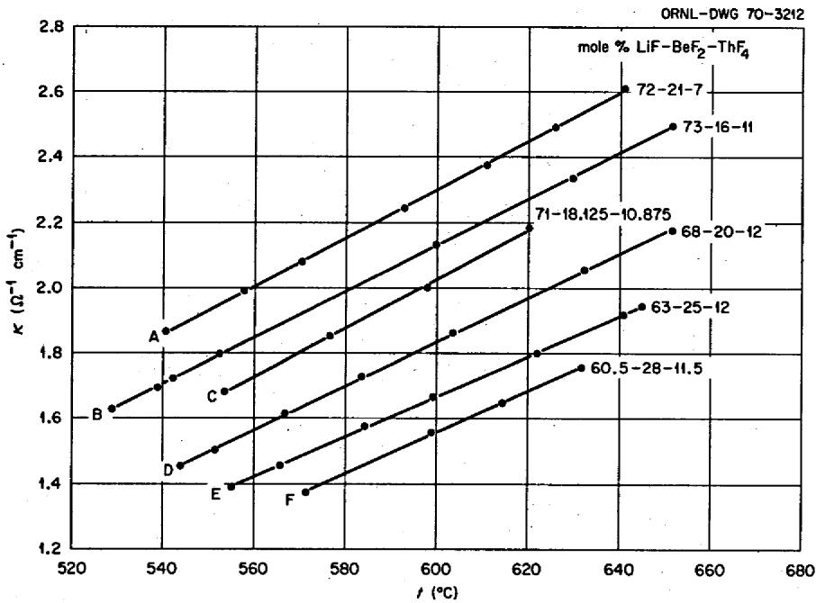  
Fig. 13.11. Specific Conductance of LiF-BeF $_2$ -ThF $_4$ Mixtures vs Temperature (°C).

0.2% from resistance measurement, 0.3% from temperature measurement, 0.5% from $1 / \sqrt{f}$ extrapolation, and 1.5% from temperature gradients resulting from the absence of a molten nitrate bath due to the high temperatures. Assuming randomness and independence of errors, the calculated probable error is 1.7%. Considering additivity of the assigned uncertainties, the estimated overall uncertainty is of the order of ±3%.

Specific conductance data for six $\mathrm{LiF - BeF_2}\cdot \mathrm{ThF_4}$ mixtures are given in Table 13.9. The temperature variation of specific conductance is well represented by linear equations, as can be seen from Fig. 13.11. The computer-fitted least-squares equations represented in Fig. 13.11 and the standard error of fit, $\sigma$ , for each composition are listed in Table 13.10.

Three pairs of curves have a constant ratio of two of the components. The effect of variation of the molar concentration of the third component is shown in Table 13.11. At the compositions noted, addition of LiF at constant molar ratio of $\mathrm{BeF}_2$ to $\mathrm{ThF}_4$ results in an increase in the specific conductance. Addition of either $\mathrm{BeF}_2$ or $\mathrm{ThF}_4$ at constant molar ratio of the remaining two components lowers the specific conductance. These measurements supersede estimates of conductance for four proposed MSBR fuel compositions.

# 13.11 DETERMINATION OF LIQUIDUS TEMPERATURES IN THE LiF-BeF $_2$ SYSTEM FROM EMF MEASUREMENTS OF TRANSFERENCE CELLS

K.A.Romberger J.Braunstein

Emf measurements of cells with transference provide a method by which, in favorable cases, precise determinations can be made of liquidus or solid saturation temperatures in multicomponent systems. The technique, to be useful, requires that the emf be stable, reproducible, and responsive to the change of activity in the melt accompanying a phase change occurring in one of the half-cells. The phase change may be engendered either by changing the temperature at constant total composition or by changing the composition at constant temperature. In either case, plots of emf vs composition or emf vs temperature show discontinuities of slope at the liquidus composition or temperature.

Our studies of the emf's of the cell with transference

$$
\mathrm {B e} \left| \begin{array}{l} \mathrm {L i F} \\ \mathrm {B e F} _ {2} \\ \mathrm {I} \end{array} \right| \left| \begin{array}{l} \mathrm {L i F} \\ \mathrm {B e F} _ {2} \\ \mathrm {I I} \end{array} \right| \mathrm {B e} \tag {1}
$$

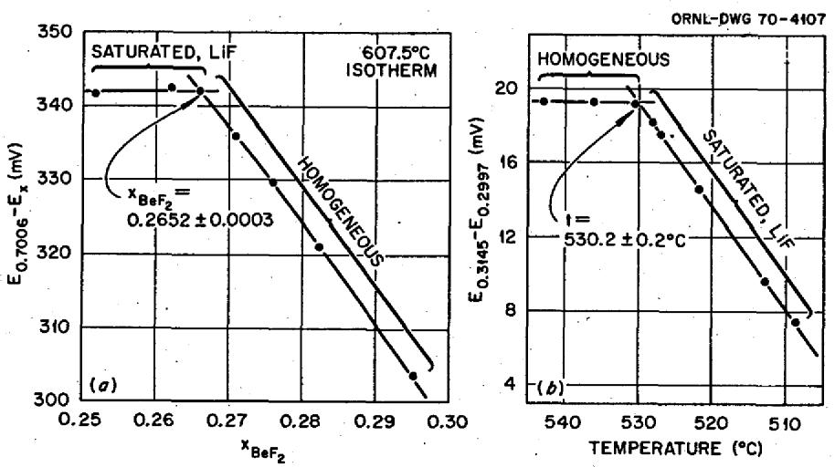  
Fig. 13.12. Data Plots Illustrating the Two Graphical Methods for the Determination of Liquidus Temperature. (a) Plot of EMF vs salt composition. Temperature constant at $607.5 \pm 0.1^{\circ}\mathrm{C}$ . (b) Plot of EMF vs temperature. Total bulk salt composition 0.2997 mole fraction $\mathrm{BeF}_2$ .

indicated that the system $\mathbf{LiF - BeF}_2$ was particularly amenable to precise phase boundary determinations with the cell (1). Measurements were made in which the reference solution (I) remained homogeneous while the melt in the bulk compartment (II) was transformed from a homogeneous solution to one containing the equilibrium saturating solid, either by additions of one component isothermally, or by lowering the temperature of the entire cell. The measurements have yielded liquidus temperatures in the $\mathbf{LiF - BeF}_2$ system for compositions between 0.12 and 0.58 mole fraction $\mathbf{BeF}_2$ . Experimental details of the emf measurements are given in ref. 1.

Liquidus temperatures and compositions were derived from plots of emf vs the composition of compartment II at constant temperature, as in Fig. 13.12a, and from plots of emf vs temperature at a fixed overall composition of compartment II, as in Fig. 13.12b. These plots are representative of the sensitivity of the method, namely, about 0.0002 to 0.0003 mole fraction $\mathrm{BeF}_2$ in composition and $\pm 0.2^{\circ}\mathrm{C}$ in temperature.

The liquidus-temperature-composition results are shown in Table 13.12. These data were obtained from two independent experiments, which overlap along the LiF liquidus for approximately a $50^{\circ}\mathrm{C}$ temperature interval. The internal consistency of each set of points is within $\pm 0.0002$ mole fraction $\mathsf{BeF}_2$ , but there appears to be an offset of approximately 0.0015 mole fraction $\mathsf{BeF}_2$ between the two sets. This probably results in part from an uncertainty of $\pm 0.001$ mole fraction $\mathsf{BeF}_2$ in the correction of the composition, in one of the experiments, for material withdrawn from

the bulk compartment into the small reference compartment.

An interesting aspect of the $\mathbf{LiF - BeF_2}$ system has been whether the solid compound $\mathrm{Li}_2\mathrm{BeF}_4$ melts congruently, as do the other alkali fluoroberyllates, or incongruently. Three different solid phases have been shown to exist in equilibrium with the liquid phase of $\mathrm{LiF - BeF_2}$ : LiF, $\mathrm{Li}_2\mathrm{BeF}_4$ , and $\mathrm{BeF_2}$ . If, when the total bulk composition is 0.3333 mole fraction $\mathrm{BeF_2}$ , the solid in equilibrium with the liquid is $\mathrm{Li}_2\mathrm{BeF_4}$ , then the compound melts congruently, and, in addition, an $\mathrm{LiF - Li_2BeF_4}$ eutectic exists (although it might coincide with the melting point). If the equilibrium solid at 0.3333 mole fraction $\mathrm{BeF_2}$ is LiF, then melting of $\mathrm{Li}_2\mathrm{BeF_4}$ is incongruent, and there is a peritectic. The latest résumé of this system by Thoma et al. interpreted the available data to suggest that $\mathrm{Li}_2\mathrm{BeF_4}$ melted incongruently. We believe the precision and accuracy of the emf method, however, to be capable of resolving the question virtually unequivocally, and the new results indicate that $\mathrm{Li}_2\mathrm{BeF_4}$ melts congruently. The evidence for this conclusion is presented below.

When the emf is measured of a cell in which a homogeneous solution is cooled until precipitation occurs, the observed emf indicates the composition of the solution phase regardless of whether solid is present or not. The direction of the emf change after the onset of precipitation is determined by whether the composition of $\mathrm{BeF}_2$ in the melt increases or decreases.

Table 13.12. Liquidus Temperatures in the LiF-BeF $_2$ System Between 0.12 and 0.59 Mole Fraction BeF $_2$   

<table><tr><td>Mole Fraction BeF2(XBeF2)</td><td>Liquidus Temperature (°C)</td><td>Mole Fraction BeF2(XBeF2)</td><td>Liquidus Temperature (°C)</td></tr><tr><td colspan="2">Equilibrium Saturating Phase: BeF2</td><td>0.2140</td><td>688.2</td></tr><tr><td>0.5869</td><td>438.1</td><td>0.2220</td><td>678.0</td></tr><tr><td></td><td></td><td>0.2301</td><td>663.7</td></tr><tr><td colspan="2">Equilibrium Saturating Phase: Li2BeF4</td><td>0.2331</td><td>662.5</td></tr><tr><td>0.3415</td><td>458.8</td><td>0.2358</td><td>658.3</td></tr><tr><td>0.3495</td><td>458.0</td><td>0.2407</td><td>647.6</td></tr><tr><td>0.3580</td><td>456.4</td><td>0.2515</td><td>633.0</td></tr><tr><td>0.3625</td><td>455.5</td><td>0.2525</td><td>628.8</td></tr><tr><td>0.3663</td><td>454.2</td><td>0.2525</td><td>631.6</td></tr><tr><td>0.3746</td><td>451.0</td><td>0.2619</td><td>611.9</td></tr><tr><td>0.3811</td><td>448.4</td><td>0.2652</td><td>607.5</td></tr><tr><td>0.3908</td><td>445.1</td><td>0.2689</td><td>596.2</td></tr><tr><td>0.4267</td><td>424.9</td><td>0.2747</td><td>584.8</td></tr><tr><td>0.4476</td><td>410.7</td><td>0.2826</td><td>568.5</td></tr><tr><td>0.4755</td><td>393.6</td><td>0.2875</td><td>557.6</td></tr><tr><td>0.5017</td><td>378.4</td><td>0.2949</td><td>541.6</td></tr><tr><td>0.5133</td><td>372.5</td><td>0.2997</td><td>530.2</td></tr><tr><td></td><td></td><td>0.3012</td><td>530.5</td></tr><tr><td colspan="2">Equilibrium Saturating Phase: LiF</td><td>0.3056</td><td>516.7</td></tr><tr><td>0.1188</td><td>784.7</td><td>0.3061</td><td>518.2</td></tr><tr><td>0.1215</td><td>782.9</td><td>0.3119</td><td>502.8</td></tr><tr><td>0.1371</td><td>770.6</td><td>0.3141</td><td>495.9</td></tr><tr><td>0.1404</td><td>767.9</td><td>0.3179</td><td>486.3</td></tr><tr><td>0.1574</td><td>753.2</td><td>0.3189</td><td>483.7</td></tr><tr><td>0.1625</td><td>747.9</td><td>0.3208</td><td>480.5</td></tr><tr><td>0.1853</td><td>723.9</td><td>0.3216</td><td>477.2</td></tr><tr><td>0.1894</td><td>718.0</td><td>0.3242</td><td>470.1</td></tr><tr><td>0.2053</td><td>699.5</td><td>0.3261</td><td>463.1</td></tr><tr><td>0.2066</td><td>698.0</td><td>0.3285</td><td>458.2</td></tr></table>

Comparing a series of mixtures whose initial compositions cross the composition of the compound, as indicated schematically in Fig. 13.13, the cell emf increases during precipitation for initial compositions on one side of the compound composition, and decreases on the other side. For an incongruity melting compound the emf's will always change in the same direction. Thus a compound, peritectic, or eutectic point can be identified. It should be noted that this argument depends only on the response of the Be electrodes to $\mathrm{BeF}_2$ concentrations and therefore yields the topology of the liquidus line independent of possible errors in values of temperature or composition.

For compositions within $\pm 0.005$ mole fraction of the $\mathbf{L}\mathbf{i}_2\mathbf{B}\mathbf{e}\mathbf{F}_4$ composition, the liquidus curve was found to be very flat; that is, the melting temperature was quite insensitive to composition change. Hence a large fraction of the total salt present had to precipitate or dissolve to lower or raise the temperature an experi

mentally meaningful amount, say $0.1^{\circ}\mathrm{C}$ . Because of this heat load, it was not feasible to increment the equilibrium temperature when a large fraction of solid was present.

Hence, rather than trying to maintain temperature equilibrium, we cooled the solution slowly at a nearly constant rate. The emf was recorded as a function of time both before and after precipitation occurred. Figure 13.14 shows a plot of emf vs time where all the initial emf's have been shifted to a common zero value in order to emphasize the changes. The fingered pattern shows that the solution composition moved first toward higher and then toward lower $\mathrm{BeF}_2$ compositions as the initial overall $\mathrm{BeF}_2$ concentration was lowered. LiF additions 96 and 97 showed very little emf change while precipitation was occurring. The calculated compositions of these solutions were 0.3337 and 0.3329 mole fraction $\mathrm{BeF}_2$ , compared with the theoretical value of 0.33333 for $\mathrm{Li}_2\mathrm{BeF}_4$ . X-ray data show that

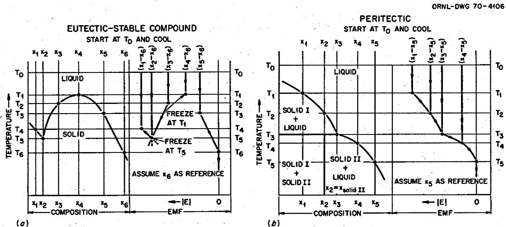  
Fig. 13.13. Idealized Temperature-Composition and Temperature-EMF Diagrams as Observed with (a) Congruently and (b) Incongruently Melting Compounds.

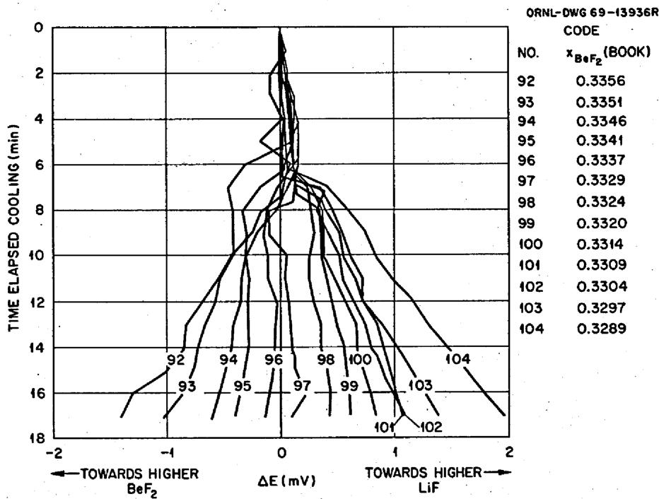  
Fig. 13.14. EMF-Time Plots for Composition near to 0.3333 Mole Fraction $\mathrm{BeF}_2$ .

crystalline $\mathbf{Li}_2\mathbf{BeF}_4$ is a stoichiometric compound to at least 0.33333 mole fraction $\mathbf{BeF}_2$ .3

The phase diagram for the region near the melting point of $\mathbf{L}\mathbf{i}_2\mathbf{B}\mathbf{e}\mathbf{F}_4$ is shown in Fig. 13.15. The series of dots near the $\mathbf{L}\mathbf{i}_2\mathbf{B}\mathbf{e}\mathbf{F}_4$ composition are the results of

thermal halts determined at the same time as the emf-time curves were being recorded. These data verify the small temperature-composition dependence for this composition region. The $\mathrm{LiF - Li_2BeF_4}$ eutectic is believed to be at $0.328_{0} \pm 0.0004$ mole fraction $\mathrm{BeF}_2$ at a temperature of $458.9 \pm 0.2^{\circ}\mathrm{C}$ . The temperature at the $\mathrm{Li_2BeF_4}$ maximum is $459.1 \pm 0.2^{\circ}\mathrm{C}$ . The temperature

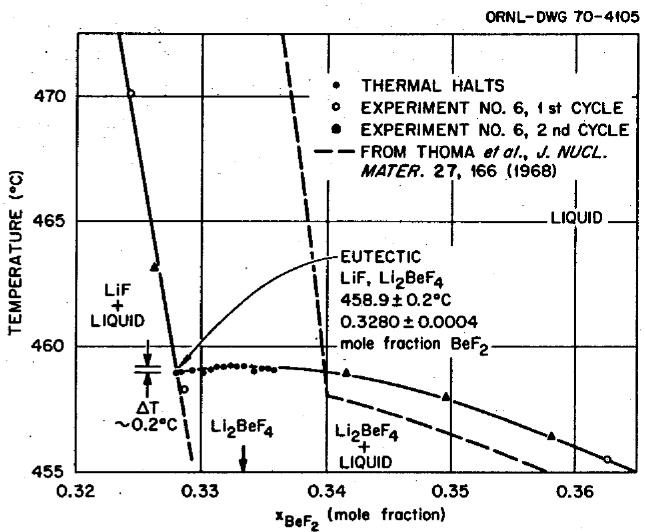  
Fig. 13.15. The LiF-BeF $_2$ Temperature-Composition Diagram for Compositions Between 0.32 and 0.365 Mole Fraction BeF $_2$ .

difference between the maximum and the eutectic is $0.15 \pm 0.05^{\circ} \mathrm{C}$ .

These new data indicate that the LiF phase field is about 0.01 mole fraction smaller in extent at $460^{\circ}\mathrm{C}$ than previously believed, the discrepancy decreasing with increasing temperature up to $700^{\circ}\mathrm{C}$ ( $\sim 0.21$ mole fraction $\mathrm{BeF}_2$ ).

# 13.12 COORDINATION EFFECTS ON U(IV) SPECTRA IN FLUORIDE MELTS

L.M.Toth

The spectrum of U(IV) in molten fluorides has been previously reported1 and is currently being used for spectroscopic determinations of U(IV) concentrations. This present investigation is aimed at correlating changes in the stability of U(III)-U(IV) mixtures to changes in the number of fluoride ions associated with the uranium cations. A variation in the number and positioning of fluoride ions around a cation is expected to alter its visible and ultraviolet spectrum; but until now, little attention has been paid to these effects in molten fluorides. It is of interest to view this aspect of coordination chemistry in detail because the nature of the fluoride ion environment should affect not only the spectrum but also the reactivity of the coordinated metal ion. These coordination effects are expected to play a more significant role in polyvalent systems than in monovalent ones. Dilute fluoride solutions of U(III)-U(IV) provide the most pertinent systems for initial study to properly assess both the measurability of coordination effects and their influence on stabiliza

tion of valence states. Information gained from this system will serve as a guide when less familiar polyvalent systems are undertaken in detail (e.g., Nb and Mo).

The spectra of U(IV) in Figs. 13.16 and 13.17 demonstrate the influence of solvent composition and temperature changes respectively. The concentration of U(IV) in all solutions is approximately 1 mole%. Curves $A, B,$ and $C$ of Fig. 13.16 show U(IV) at $550^{\circ}\mathrm{C}$ in Flinak (LiF-NaF-KF, 46.5-11.5-42.0 mole%), LiF $\mathrm{BeF}_2$ (66-34 mole%), and LiF- $\mathrm{BeF}_2$ (48-52 mole%) respectively. Curves $A$ through $D$ of Fig. 13.17 show U(IV) in LiF- $\mathrm{BeF}_2$ (66-34 mole%) at 460, 500, 550, and $690^{\circ}\mathrm{C}$ respectively. One species of interest is found at high free-fluoride concentrations and low temperatures (curve $A$ , both figures). Preliminary results from crystal spectra of U(IV) in known environments lead to the assignment of this species as 8-coordinated U(IV). It is characterized by intense, well-resolved peaks at 9200, 15,400, and $20,500~\mathrm{cm}^{-1}$ . Lesser peaks belonging to this species are also found at 6200 and $7200~\mathrm{cm}^{-1}$ and are perhaps more useful in identifying 8-coordinated U(IV) because other species of U(IV) do not absorb here appreciably.

As either the free fluoride ion concentration is decreased or the temperature is increased, there is a shift to a second species (trend of curves $A - C$ , Fig. 13.16, and curves $A - D$ , Fig. 13.17) which is characterized by less-intense, broader bands at 9200 and 15,800 $\mathrm{cm}^{-1}$ and no bands at 6200 and 7200. It is believed that this species is of lower coordination number, presumably in equilibrium with the 8-coordinated species:

$$
\mathrm {U F} _ {8} ^ {4 -} \rightleftharpoons \mathrm {U F} _ {x} ^ {4 - x} + (8 - x) \mathrm {F} ^ {-}.
$$

Although the $\mathbf{U}\mathbf{F}_x^{4 - x}$ species has not yet been identified, it is presumed to be 7-coordinated U(IV). By comparison with 9-coordinated U(IV) crystal spectra, there is no evidence to suggest that 9-coordinated U(IV) exists in any molten fluoride solutions thus far studied.

The most striking effect of decreasing coordination number in U(IV) fluoride spectra is a decrease in the intensity of the $9200\text{-cm}^{-1}$ peak (cf. Fig. 13.16, curve $A,\epsilon = 21.5;^2$ curve $C,\epsilon = 15$ liters $\mathrm{mole}^{-1}\mathrm{cm}^{-1})$

It is at present premature to discuss the effect of altering the distribution of fluoride ions around U(IV)

while holding their number fixed. This is expected to be another factor which can influence the spectra and is therefore under examination through the further study of U(IV) crystal spectra.

In conclusion, coordination effects have been demonstrated in molten-fluoride systems and are measurable by means of absorption spectroscopy. The 8-coordinated U(IV) species has been demonstrated in molten

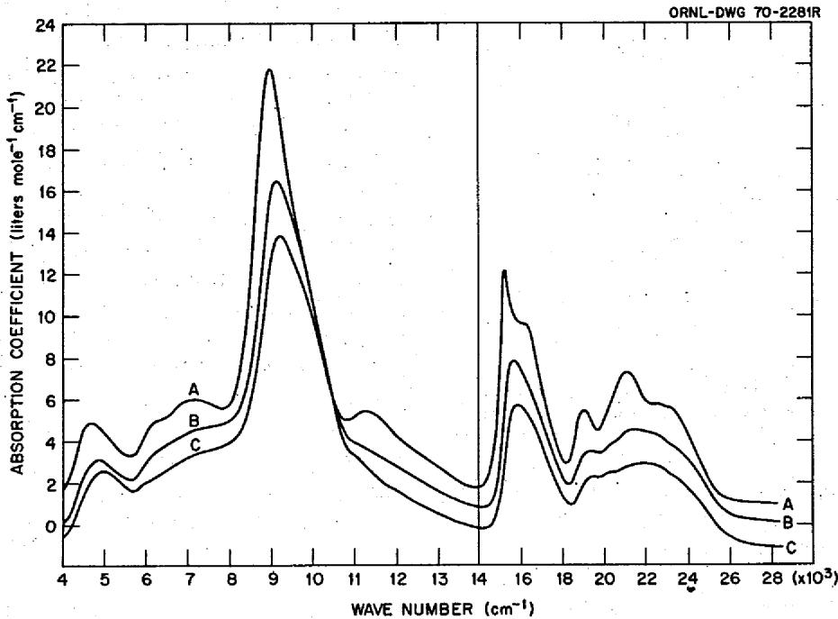  
Fig. 13.16. 1 Mole % U(IV) in Various Fluoride Solvents at $550^{\circ}\mathrm{C}$ : (A) LiF-NaF-KF (46.5-11.5-42.0 Mole %), (B) LiF-BeF $_2$ (66-34 Mole %), (C) LiF-BeF $_2$ (48-52 Mole %). Curve A has been shifted up 1 absorption coefficient unit and curve C down 1 unit to avoid excessive overlap.

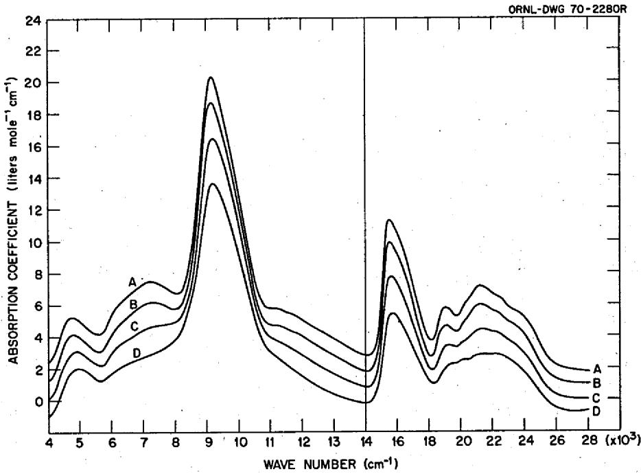  
Fig. 13.17. 1 Mole $\%$ U(IV) in LiF-BeF $_2$ (66-34 Mole $\%$ ) as a Function of Temperature: (A) $460^\circ$ , (B) $500^\circ$ , (C) $550^\circ$ , (D) $690^\circ$ . Curve A has been shifted up 2 units; curve B, up 1 unit; and curve D, down 1 unit to avoid overlap.

fluorides in equilibrium with a species of lower coordination number. By analogy, $\mathbf{Zr}(\mathbf{IV})$ and $\mathbf{Th}(\mathbf{IV})$ are expected to behave in a similar fashion. Therefore, when these cations are considered in molten-fluoride systems from the standpoint of coordinated species, a variable coordination number which is a function of solvent and temperature is a more realistic approach than previously assumed fixed coordination numbers.

# 13.13 HYDROGEN BEHAVIOR IN MOLTEN-SALT REACTOR SYSTEMS

# R.A.Strehlow

The transport processes and chemical behavior of hydrogen isotopes are interrelated parameters in molten-salt reactor design considerations. The transport of hydrogen is determined by solubility and diffusivity in moderator, salt, and metal. The chemical behavior is a function of the oxidation-reduction potential in the salt, the radiation field, and possible reactivity with the graphite moderator. This section summarizes the results of a literature survey pertaining to some of these factors.

Hydrogen should enter into equilibrium with uranium fluoride and chromium fluoride,

$$
\frac {1}{2} \mathrm {H} _ {2} + \mathrm {U F} _ {4} \rightleftharpoons \mathrm {H F} + \mathrm {U F} _ {3}, \tag {1}
$$

$$
\mathrm {H} _ {2} + \mathrm {C r F} _ {2} \rightleftharpoons \mathrm {C r} ^ {0} + 2 \mathrm {H F}. \tag {2}
$$

From Blood1 and Long and Blankenship2 we find at $1000^{\circ}\mathbf{K}$

$$
\frac {P _ {\mathrm {H F}}}{P _ {\mathrm {H} _ {2}} ^ {1 / 2}} \cdot \frac {[ \mathrm {U F} _ {3} ]}{[ \mathrm {U F} _ {4} ]} = 0. 7 8 \times 1 0 ^ {- 5} \mathrm {a t m} ^ {1 / 2}, \tag {1a}
$$

$$
\frac {P _ {\mathrm {H F}} ^ {2}}{P _ {\mathrm {H} _ {2}}} = \frac {[ \mathrm {C r F} _ {2} ]}{[ \mathrm {C r} ^ {0} ]} \times 1 0 ^ {- 4}. \tag {2a}
$$

Assuming a $[\mathrm{UF}_3] / [\mathrm{UF}_4]$ ratio of $10^{-2}$ , we obtain

$$
P _ {\mathrm {H F}} = 0. 7 8 \times 1 0 ^ {- 3} P _ {\mathrm {H} _ {2}} ^ {1 / 2}. \tag {3}
$$

Using $[\mathrm{Cr}^0] = 0.03$

$$
\left[ \mathrm {C r F} _ {2} \right] = \frac {(0 . 7 8 \times 1 0 ^ {- 3}) ^ {2} (0 . 0 3)}{1 0 ^ {- 4}} = 1. 9 \times 1 0 ^ {- 4}, \tag {4}
$$

where the brackets indicate concentration or activity. For an assumed $P_{\mathrm{H_2}} = 10^{-6}$ , approximately an equal pressure of HF would be present. Since the Henry's law constant for $\mathbf{H}_2$ is about $3\times 10^{-7}$ mole $\mathrm{cm}^{-3}$ atm and that for HF (ORNL-3872, p. 123) about $1.3\times 10^{-4}$ ,

$$
\frac {\left[ \mathrm {H F} \right] _ {\text {s a l t}}}{\left[ \mathrm {H} _ {2} \right] _ {\text {s a l t}}} \approx 4 0 0. \tag {5}
$$

At low pressures of $\mathbf{H}_2$ and low concentrations of $\mathbf{U}\mathbf{F}_3$ a large fraction of the hydrogen should therefore be present as HF in the salt in a molten-salt reactor and in the gas phase in contact with it, such as the gas in the MSRE pump bowl. The HF may react with unplated metals to produce hydrogen atoms, which then escape via permeation, but the rates are not known. The use of chemical gettering by means of oxide in salt quite probably would lead to a corrosion problem.

The presence of moderator graphite and almost certainly the presence of oil should yield, additionally, methane. However, at $1000^{\circ}\mathrm{K}$

$$
K _ {p} = \frac {P _ {\mathrm {C H} _ {4}}}{P _ {\mathrm {H} _ {2}} ^ {2}} = 0. 1. \tag {6}
$$

Consequently, unless the hydrogen pressures approach an atmosphere, only the presence of the radiation field should permit appreciable reaction of the graphite moderator to yield methane.

B. J. Wood and Henry Wise studied the reaction of graphite with hydrogen atoms over the temperature range 450 to $1250^{\circ}\mathrm{K}$ and found that although hydrogen recombination dominated reaction with the graphite, a carbon reaction rate is given by:

$$
R = 1 0 ^ {5} \left(\frac {\mathrm {c m} ^ {9 / 2}}{\mathrm {m o l e s} ^ {1 / 2} \mathrm {m i n}}\right) \left[ \mathrm {H} _ {2} \right] \left[ \mathrm {H} \right] ^ {0. 5}
$$

even at the relatively high temperature of $1000^{\circ}\mathbf{K}$ . The rate of carbon reaction had a maximum of about 5

times this value at $835^{\circ}\mathrm{K}$ and a hydrogen pressure of 1 torr, but due probably to the thermodynamic instability of methane, at elevated temperatures the rate was lower. The reaction to produce hydrocarbons (methane primarily) was attributed to a reaction of hydrogen atoms with the edges of basal planes in the graphite sample. Although this work indicates that the hydrogen-graphite interaction could occur in a molten-salt reactor, predicting what will occur at reactor conditions is not yet possible. Similar considerations indicate that equilibration with oils or hydrocarbon gases if present in the reactor should be expected.

The solubility of $\mathbf{H}_2$ determines the stripping capability of a sparge process. No measurements of $\mathbf{H}_2$ solubility were found for salt. Applying the model for rare-gas solubility,

$$
K _ {p} = \frac {1}{R T} \alpha \exp \left(\frac {- 1 8 . 0 8 r ^ {2} \gamma}{R T}\right), \tag {7}
$$

for this admittedly different case leads to estimates ranging from 8 to 20 times the helium solubility, or $8 \times 10^{-7}$ to several times $10^{-6}$ . The uncertainties in $r(0.9$ A to 1.1 A) and in $\alpha (0.3$ to 0.5) are significantly large.

Expressions for permeation found in the literature had profoundly different pressure dependence. Dushman's expression,6

$$
Q = K _ {p} ^ {1 / 2} \frac {C p}{1 + C p}, \tag {8}
$$

where $Q =$ permeation rate, $p =$ the pressure, and $C$ and $K$ are constants, yields a 3/2 power dependence at relatively low pressures. This would have made it difficult to expect permeation to be significant at the expected pressure in molten-salt reactors, since $\mathcal{Q}$ approaches zero faster than $p$ in this expression. Unfortunately, this relation was obtained from the literature without the qualifications which the original authors' specified. A detailed analysis of the permeation pressure dependence produces the results that

$$
Q = K _ {p} ^ {n}, \tag {9}
$$

where $1 / 2 \leqslant n \leqslant 1$ , with the value of $n$ increasing at low pressures (less than $10^{-9}$ atm for Inconel). This type of dependence with $n = 1 / 2$ has been shown to apply to Mo and W for hydrogen at pressures as low as $10^{-6}$ torr, although at lower pressures the value of $n$ should increase. A relationship such as is shown in Eq. (9) is expected for the metals of interest to molten-salt reactor designers, but the exact pressure dependence has not been determined at low pressures.

Inadequate information also exists on diffusivities as a function of composition in various alloy systems as well as, of course, in the salt systems of interest.

# 13.14 CRYSTAL STRUCTURE OF THE COMPLEX FLUORIDE $(\mathrm{Na},\mathrm{Li})_7\mathrm{Th}_6\mathrm{F}_{31}$

George Brunton D. Richard Sears

Among the complex compounds formed from the alkali fluorides and monoclinic tetrafluorides of the heavy metals, an unusual stoichiometry, $7\mathrm{AF}\cdot 6\mathrm{MF}_4$ (where A is an alkali metal and M is a heavy metal, such as Zr, Hf, Th, or U), occurs. Heretofore, all members of this class of compounds were found to produce crystals from the melt which were rhombohedral, space group $R\overline{3}$ .

Investigations of phase equilibria in the system LiF-NaF-ThF $_4$ by Thoma et al. $^1$ disclosed the occurrence of a ternary solid solution, with a host structure unlike those commonly observed in such fluoride systems. Single crystals of this phase were isolated from frozen fluoride mixtures and subjected to x-ray and neutron diffraction analysis.

The results of this examination showed the existence of the compound $(\mathrm{Na},\mathrm{Li})_7\mathrm{Th}_6\mathrm{F}_{31}$ , which crystallizes in the space group $P3c1$ with $a_0 = 9.9056 \pm 0.0003\mathrm{A}$ and $c_0 = 13.2820 \pm 0.0005\mathrm{A}$ , $25^{\circ}\mathrm{C}$ (Fig. 13.18). The calculated density is $6.045\mathrm{g/cm}^3$ and $Z = 2$ . There are 18 atoms in the asymmetric unit. Two independent $\mathrm{Th}^{4+}$ ions and $\mathbf{F}(1)$ through $\mathbf{F}(10)$ are on the general position $6(d)$ ; $\mathrm{Th}(1)$ is coordinated by nine $\mathbf{F}^{-}$ and $\mathrm{Th}(2)$ is coordinated by ten $\mathbf{F}^{-}$ . Ion $\mathbf{F}(11)$ is on position $2(a)$ . The three sodium ions $\mathrm{Na}(1),\mathrm{Na}(2)$ , and $\mathrm{Na}(3)$ occupy positions $2(c), 2(b)$ , and $2(a)$ respectively. The ion $\mathrm{Na}(3)$ is surrounded by $12\mathrm{F}^{-}$ , and $\mathrm{Na}(2)$ and $\mathrm{Na}(1)$ are surrounded by six $\mathbf{F}^{-}$ at distances less than $3.0\mathrm{A}$ . Ions $\mathrm{Na}(1)$ and $\mathrm{Na}(2)$ have five and

three more $\mathbf{F}^{-}$ nearest neighbors, respectively, between 3.0 and 3.5 A. Ion Li(1) is octahedrally coordinated at position $2(a)$ ; Li(2) is at general position $6(d)$ and is

surrounded by seven $\mathbf{F}^{-}$ nearest neighbors less than 3.0 A distant. Positional parameters and temperature factors for $(\mathrm{Na},\mathrm{Li})_7\mathrm{Th}_6\mathrm{F}_{31}$ are listed in Table 13.13.

Table 13.13. Positional Parameters and Temperature Factors for $(\mathrm{Na},\mathrm{Li})_7\mathrm{Th}_6\mathrm{F}_{31}$   
POSITIONAL PARAMETERS AND TEMPERATURE FACTORS FOR $(\mathrm{Na},\mathrm{Li}),\mathrm{TH}_{4}\mathrm{F}_{31}$   

<table><tr><td rowspan="2">ATOM</td><td colspan="2">X</td><td colspan="2">Y</td><td colspan="2">Z</td><td colspan="2">\( \beta_{11}^{\mathrm {a}} \)</td><td colspan="2">\( \beta_{22} \)</td><td colspan="2">\( \beta_{33} \)</td><td colspan="2">\( \beta_{12} \)</td><td colspan="2">\( \beta_{23} \)</td></tr><tr><td>\( NO^b \)</td><td>\( 0.0782(4)^b \)</td><td>\( 0.3954(4) \)</td><td>\( 0.0^c \)</td><td colspan="2">\( 0.0012(3) \)</td><td colspan="2">\( 0.0012(3) \)</td><td colspan="2">\( 0.0006(2) \)</td><td colspan="2">\( 0.0006(3) \)</td><td colspan="2">\( 0.0002(2) \)</td><td colspan="2">\( -0.0001(2) \)</td></tr><tr><td rowspan="3">\( Th(1) \)</td><td>\( XN \)</td><td>\( 0.0786(2) \)</td><td>\( 0.3954(2) \)</td><td>0.0</td><td colspan="2">\( 0.0035(2) \)</td><td colspan="2">\( 0.0029(2) \)</td><td colspan="2">\( 0.0005(1) \)</td><td colspan="2">\( 0.0016(2) \)</td><td colspan="2">\( 0.0000(1) \)</td><td colspan="2">\( 0.0000(1) \)</td></tr><tr><td>\( XO \)</td><td>\( 0.0847(2) \)</td><td>\( 0.4094(2) \)</td><td>0.0</td><td colspan="2">\( 0.0044(2) \)</td><td colspan="2">\( 0.0039(3) \)</td><td colspan="2">\( 0.0007(1) \)</td><td colspan="2">\( 0.0024(2) \)</td><td colspan="2">\( 0.0000(2) \)</td><td colspan="2">\( -0.0003(1) \)</td></tr><tr><td>\( NX \)</td><td>\( 0.0850(4) \)</td><td>\( 0.4088(4) \)</td><td>0.0</td><td colspan="2">\( 0.0016(4) \)</td><td colspan="2">\( 0.0013(4) \)</td><td colspan="2">\( 0.0003(2) \)</td><td colspan="2">\( 0.0010(3) \)</td><td colspan="2">\( -0.0004(2) \)</td><td colspan="2">\( -0.0002(2) \)</td></tr><tr><td rowspan="4">\( Th(2) \)</td><td>NO</td><td>\( 0.9148(4) \)</td><td>\( 0.5911(4) \)</td><td>\( 0.2059(2) \)</td><td colspan="2">\( 0.0008(3) \)</td><td colspan="2">\( 0.0017(3) \)</td><td colspan="2">\( 0.0003(2) \)</td><td colspan="2">\( 0.0007(3) \)</td><td colspan="2">\( 0.0001(2) \)</td><td colspan="2">\( 0.0003(2) \)</td></tr><tr><td>\( XN \)</td><td>\( 0.9153(2) \)</td><td>\( 0.5906(2) \)</td><td>\( 0.2060(2) \)</td><td colspan="2">\( 0.0013(3) \)</td><td colspan="2">\( 0.0035(2) \)</td><td colspan="2">\( 0.0006(1) \)</td><td colspan="2">\( 0.0020(1) \)</td><td colspan="2">\( 0.0002(1) \)</td><td colspan="2">\( 0.0000(2) \)</td></tr><tr><td>\( XO \)</td><td>\( 0.9214(2) \)</td><td>\( 0.6045(2) \)</td><td>\( 0.2061(2) \)</td><td colspan="2">\( 0.0016(2) \)</td><td colspan="2">\( 0.0035(2) \)</td><td colspan="2">\( 0.0015(9) \)</td><td colspan="2">\( 0.0017(2) \)</td><td colspan="2">\( 0.0000(1) \)</td><td colspan="2">\( 0.0002(1) \)</td></tr><tr><td>\( NX \)</td><td>\( 0.9220(4) \)</td><td>\( 0.6043(4) \)</td><td>\( 0.2059(2) \)</td><td colspan="2">\( 0.0011(4) \)</td><td colspan="2">\( 0.0013(4) \)</td><td colspan="2">\( 0.0006(2) \)</td><td colspan="2">\( 0.0005(3) \)</td><td colspan="2">\( 0.0002(2) \)</td><td colspan="2">\( -0.0002(2) \)</td></tr><tr><td rowspan="4">\( F(1) \)</td><td>NO</td><td>\( 0.1370(7) \)</td><td>\( 0.4291(8) \)</td><td>\( -0.1862(5) \)</td><td colspan="2">\( 0.0029(7) \)</td><td colspan="2">\( 0.0038(7) \)</td><td colspan="2">\( 0.0007(3) \)</td><td colspan="2">\( 0.0003(6) \)</td><td colspan="2">\( -0.0005(4) \)</td><td colspan="2">\( -0.0001(4) \)</td></tr><tr><td>\( XN \)</td><td>\( 0.1444(4) \)</td><td>\( 0.4434(4) \)</td><td>\( -0.192(3) \)</td><td colspan="2">\( 0.005(2) \)</td><td colspan="2">d</td><td colspan="2"></td><td colspan="2"></td><td colspan="2"></td><td colspan="2"></td></tr><tr><td>\( XO \)</td><td>\( 0.139(4) \)</td><td>\( 0.441(4) \)</td><td>\( -0.181(3) \)</td><td colspan="2">\( 0.002(1) \)</td><td colspan="2">d</td><td colspan="2"></td><td colspan="2"></td><td colspan="2"></td><td colspan="2"></td></tr><tr><td>\( NX \)</td><td>\( 0.1335(9) \)</td><td>\( 0.4435(9) \)</td><td>\( -0.1803(6) \)</td><td colspan="2">\( 0.0036(8) \)</td><td colspan="2">\( 0.0041(8) \)</td><td colspan="2">\( 0.0008(3) \)</td><td colspan="2">\( 0.0010(7) \)</td><td colspan="2">\( 0.0002(4) \)</td><td colspan="2">\( 0.0006(4) \)</td></tr><tr><td rowspan="4">\( F(2) \)</td><td>NO</td><td>\( 0.8658(8) \)</td><td>\( 0.5552(7) \)</td><td>\( 0.3853(6) \)</td><td colspan="2">\( 0.0036(7) \)</td><td colspan="2">\( 0.0030(7) \)</td><td colspan="2">\( 0.0009(3) \)</td><td colspan="2">\( 0.0007(6) \)</td><td colspan="2">\( -0.0008(4) \)</td><td colspan="2">\( -0.0002(4) \)</td></tr><tr><td>\( XN \)</td><td>\( 0.869(3) \)</td><td>\( 0.564(3) \)</td><td>\( 0.376(3) \)</td><td colspan="2">\( 0.003(2) \)</td><td colspan="2">d</td><td colspan="2"></td><td colspan="2"></td><td colspan="2"></td><td colspan="2"></td></tr><tr><td>\( XO \)</td><td>\( 0.864(4) \)</td><td>\( 0.563(4) \)</td><td>\( 0.388(3) \)</td><td colspan="2">\( 0.002(1) \)</td><td colspan="2">d</td><td colspan="2"></td><td colspan="2"></td><td colspan="2"></td><td colspan="2"></td></tr><tr><td>\( NX \)</td><td>\( 0.8615(8) \)</td><td>\( 0.5692(8) \)</td><td>\( 0.3916(6) \)</td><td colspan="2">\( 0.0025(7) \)</td><td colspan="2">\( 0.0037(8) \)</td><td colspan="2">\( 0.0007(3) \)</td><td colspan="2">\( 0.0001(6) \)</td><td colspan="2">\( -0.0002(4) \)</td><td colspan="2">\( 0.0005(4) \)</td></tr><tr><td rowspan="4">\( F(3) \)</td><td>NO</td><td>\( 0.1191(8) \)</td><td>\( 0.3061(8) \)</td><td>\( -0.3759(6) \)</td><td colspan="2">\( 0.0031(7) \)</td><td colspan="2">\( 0.0039(8) \)</td><td colspan="2">\( 0.0015(4) \)</td><td colspan="2">\( 0.0020(6) \)</td><td colspan="2">\( 0.0011(5) \)</td><td colspan="2">\( 0.0002(4) \)</td></tr><tr><td>\( XN \)</td><td>\( 0.114(4) \)</td><td>\( 0.306(3) \)</td><td>\( -0.374(3) \)</td><td colspan="2">\( 0.005(2) \)</td><td colspan="2">d</td><td colspan="2"></td><td colspan="2"></td><td colspan="2"></td><td colspan="2"></td></tr><tr><td>\( XO \)</td><td>\( 0.129(5) \)</td><td>\( 0.315(4) \)</td><td>\( -0.374(3) \)</td><td colspan="2">\( 0.003(2) \)</td><td colspan="2">d</td><td colspan="2"></td><td colspan="2"></td><td colspan="2"></td><td colspan="2"></td></tr><tr><td>\( NX \)</td><td>\( 0.1197(9) \)</td><td>\( 0.3088(9) \)</td><td>\( -0.3770(6) \)</td><td colspan="2">\( 0.0028(7) \)</td><td colspan="2">\( 0.0041(9) \)</td><td colspan="2">\( 0.0016(4) \)</td><td colspan="2">\( 0.0018(7) \)</td><td colspan="2">\( 0.0004(5) \)</td><td colspan="2">\( -0.0009(5) \)</td></tr><tr><td rowspan="4">\( F(4) \)</td><td>NO</td><td>\( 0.8781 \)</td><td>\( 0.6893(8) \)</td><td>\( 0.5827(6) \)</td><td colspan="2">\( 0.0037(8) \)</td><td colspan="2">\( 0.0028(7) \)</td><td colspan="2">\( 0.0012(4) \)</td><td colspan="2">\( 0.0015(6) \)</td><td colspan="2">\( 0.0006(4) \)</td><td colspan="2">\( -0.0004(4) \)</td></tr><tr><td>\( XN \)</td><td>\( 0.874(4) \)</td><td>\( 0.682(4) \)</td><td>\( 0.586(3) \)</td><td colspan="2">\( 0.005(2) \)</td><td colspan="2">d</td><td colspan="2"></td><td colspan="2"></td><td colspan="2"></td><td colspan="2"></td></tr><tr><td>\( XO \)</td><td>\( 0.886(5) \)</td><td>\( 0.690(4) \)</td><td>\( 0.587(3) \)</td><td colspan="2">\( 0.003(2) \)</td><td colspan="2">d</td><td colspan="2"></td><td colspan="2"></td><td colspan="2"></td><td colspan="2"></td></tr><tr><td>\( NX \)</td><td>\( 0.8784(9) \)</td><td>\( 0.6912(9) \)</td><td>\( 0.5811(6) \)</td><td colspan="2">\( 0.0028(8) \)</td><td colspan="2">\( 0.0027(8) \)</td><td colspan="2">\( 0.0015(4) \)</td><td colspan="2">\( 0.0013(6) \)</td><td colspan="2">\( 0.0012(5) \)</td><td colspan="2">\( 0.0003(5) \)</td></tr><tr><td rowspan="4">\( F(5) \)</td><td>NO</td><td>\( 0.3431(6) \)</td><td>\( 0.5103(7) \)</td><td>\( -0.0444(5) \)</td><td colspan="2">\( 0.0015(6) \)</td><td colspan="2">\( 0.0047(7) \)</td><td colspan="2">\( 0.0022(3) \)</td><td colspan="2">\( 0.0001(5) \)</td><td colspan="2">\( -0.0005(3) \)</td><td colspan="2">\( 0.0005(4) \)</td></tr><tr><td>\( XN \)</td><td>\( 0.340(4) \)</td><td>\( 0.517(4) \)</td><td>\( -0.053(3) \)</td><td colspan="2">\( 0.006(2) \)</td><td colspan="2">d</td><td colspan="2"></td><td colspan="2"></td><td colspan="2"></td><td colspan="2"></td></tr><tr><td>\( XO \)</td><td>\( 0.357(5) \)</td><td>\( 0.459(5) \)</td><td>\( -0.062(3) \)</td><td colspan="2">\( 0.004(2) \)</td><td colspan="2">d</td><td colspan="2"></td><td colspan="2"></td><td colspan="2"></td><td colspan="2"></td></tr><tr><td>\( NX \)</td><td>\( 0.3512(8) \)</td><td>\( 0.4488(8) \)</td><td>\( -0.0555(6) \)</td><td colspan="2">\( 0.0031(7) \)</td><td colspan="2">\( 0.007(1) \)</td><td colspan="2">\( 0.0025(4) \)</td><td colspan="2">\( 0.0004(7) \)</td><td colspan="2">\( -0.0003(4) \)</td><td colspan="2">\( -0.0006(5) \)</td></tr><tr><td rowspan="4">\( F(6) \)</td><td>NO</td><td>\( 0.6479(8) \)</td><td>\( 0.5494(7) \)</td><td>\( 0.2615(5) \)</td><td colspan="2">\( 0.0069(9) \)</td><td colspan="2">\( 0.0038(7) \)</td><td colspan="2">\( 0.0021(3) \)</td><td colspan="2">\( 0.0006(7) \)</td><td colspan="2">\( 0.0004(4) \)</td><td colspan="2">\( 0.0003(4) \)</td></tr><tr><td>\( XN \)</td><td>\( 0.646(4) \)</td><td>\( 0.541(4) \)</td><td>\( -0.258(3) \)</td><td colspan="2">\( 0.008(2) \)</td><td colspan="2">d</td><td colspan="2"></td><td colspan="2"></td><td colspan="2"></td><td colspan="2"></td></tr><tr><td>\( XO \)</td><td>\( 0.668(4) \)</td><td>\( 0.493(5) \)</td><td>\( -0.249(3) \)</td><td colspan="2">\( 0.004(2) \)</td><td colspan="2">d</td><td colspan="2"></td><td colspan="2"></td><td colspan="2"></td><td colspan="2"></td></tr><tr><td>\( NX \)</td><td>\( 0.6564(7) \)</td><td>\( 0.4906(8) \)</td><td>\( -0.2501(6) \)</td><td colspan="2">\( 0.0016(6) \)</td><td colspan="2">\( 0.0054(8) \)</td><td colspan="2">\( 0.0021(3) \)</td><td colspan="2">\( -0.0001(6) \)</td><td colspan="2">\( 0.0007(4) \)</td><td colspan="2">\( 0.0007(4) \)</td></tr><tr><td rowspan="4">\( F(7) \)</td><td>NO</td><td>\( 0.1033(8) \)</td><td>\( 0.1966(7) \)</td><td>\( -0.0655(6) \)</td><td colspan="2">\( 0.0059(8) \)</td><td colspan="2">\( 0.0025(7) \)</td><td colspan="2">\( 0.0015(3) \)</td><td colspan="2">\( 0.0031(7) \)</td><td colspan="2">\( -0.0001(4) \)</td><td colspan="2">\( -0.0006(4) \)</td></tr><tr><td>\( XN \)</td><td>\( 0.112(4) \)</td><td>\( 0.262(4) \)</td><td>\( -0.071(3) \)</td><td colspan="2">\( 0.005(2) \)</td><td colspan="2">d</td><td colspan="2"></td><td colspan="2"></td><td colspan="2"></td><td colspan="2"></td></tr><tr><td>\( XO \)</td><td>\( 0.079(4) \)</td><td>\( 0.196(4) \)</td><td>\( -0.061(3) \)</td><td colspan="2">\( 0.009(9) \)</td><td colspan="2">d</td><td colspan="2"></td><td colspan="2"></td><td colspan="2"></td><td colspan="2"></td></tr><tr><td>\( NX \)</td><td>\( 0.0808(8) \)</td><td>\( 0.1893(8) \)</td><td>\( -0.0588(7) \)</td><td colspan="2">\( 0.0033(7) \)</td><td colspan="2">\( 0.0010(7) \)</td><td colspan="2">\( 0.0024(4) \)</td><td colspan="2">\( 0.0006(6) \)</td><td colspan="2">\( -0.0001(4) \)</td><td colspan="2">\( -0.0010(4) \)</td></tr><tr><td rowspan="9">\( F(8) \)</td><td>NO</td><td>\( 0.9191(7) \)</td><td>\( 0.8111(7) \)</td><td>\( 0.2643(7) \)</td><td colspan="2">\( 0.0014(6) \)</td><td colspan="2">\( 0.0031(7) \)</td><td colspan="2">\( 0.0018(3) \)</td><td colspan="2">\( 0.0015(6) \)</td><td colspan="2">\( 0.0009(4) \)</td><td colspan="2">\( 0.0001(4) \)</td></tr><tr><td>\( XN \)</td><td>\( 0.9188(5) \)</td><td>\( 0.812(5) \)</td><td>\( -0.257(2) \)</td><td colspan="2">\( 0.002(2) \)</td><td colspan="2">d</td><td colspan="2"></td><td colspan="2"></td><td colspan="2"></td><td colspan="2"></td></tr><tr><td>\( XO \)</td><td>\( 0.893(4) \)</td><td>\( 0.803(3) \)</td><td>\( -0.267(3) \)</td><td colspan="2">\( 0.0003(9) \)</td><td colspan="2">d</td><td colspan="2"></td><td colspan="2"></td><td colspan="2"></td><td colspan="2"></td></tr><tr><td>\( NX \)</td><td>\( 0.895(9) \)</td><td>\( 0.8059(8) \)</td><td>\( -0.2712(6) \)</td><td colspan="2">\( 0.0053(8) \)</td><td colspan="2">d</td><td colspan="2"></td><td colspan="2"></td><td colspan="2"></td><td colspan="2"></td></tr><tr><td>\( NX \)</td><td>\( 0.893(4) \)</td><td>\( 0.812(5) \)</td><td>\( -0.257(2) \)</td><td colspan="2">\( 0.002(2) \)</td><td colspan="2">d</td><td colspan="2"></td><td colspan="2"></td><td colspan="2"></td><td colspan="2"></td></tr><tr><td>\( NX \)</td><td>\( 0.895(9) \)</td><td>\( 0.8158(8) \)</td><td>\( -0.2712(6) \)</td><td colspan="2">\( 0.0053(8) \)</td><td colspan="2">d</td><td colspan="2"></td><td colspan="2"></td><td colspan="2"></td><td colspan="2"></td></tr><tr><td>\( NX \)</td><td>\( 0.893(4) \)</td><td>\( 0.8158(8) \)</td><td>\( -0.257(2) \)</td><td colspan="2">\( 0.002(2) \)</td><td colspan="2">d</td><td colspan="2"></td><td colspan="2"></td><td colspan="2"></td><td colspan="2"></td></tr><tr><td>\( NX \)</td><td>\( 0.893(4) \)</td><td>\( 0.8158(8) \)</td><td>\( -0.257(2) \)</td><td colspan="2">\( 0.002(2) \)</td><td colspan="2">d</td><td colspan="2"></td><td colspan="2"></td><td colspan="2"></td><td colspan="2"></td></tr><tr><td>\( NX \)</td><td>\( 1.295(8) \)</td><td>\( 0.5851(7) \)</td><td>\( -0.3531(6) \)</td><td colspan="2">\( 0.0026(7) \)</td><td colspan="2">\( 0.0020(7) \)</td><td colspan="2">\( 0.0017(4) \)</td><td colspan="2">\( 0.0003(6) \)</td><td colspan="2">\( -0.0014(4) \)</td><td colspan="2">\( 0.0004(4) \)</td></tr><tr><td rowspan="4">\( F(9) \)</td><td>NO</td><td>\( 0.1295(8) \)</td><td>\( 0.5851(7) \)</td><td>\( -0.3531(6) \)</td><td colspan="2">\( 0.0026(7) \)</td><td colspan="2">\( d \)</td><td colspan="2"></td><td colspan="2"></td><td colspan="2"></td><td colspan="2"></td></tr><tr><td>\( XN \)</td><td>\( 0.125(4) \)</td><td>\( 0.584(4) \)</td><td>\( -0.364(3) \)</td><td colspan="2">\( 0.0017(2) \)</td><td colspan="2">d</td><td colspan="2"></td><td colspan="2"></td><td colspan="2"></td><td colspan="2"></td></tr><tr><td>\( XO \)</td><td>\( 0.117(4) \)</td><td>\( 0.576(4) \)</td><td>\( -0.347(3) \)</td><td colspan="2">\( 0.001(1) \)</td><td colspan="2">d</td><td colspan="2"></td><td colspan="2"></td><td colspan="2"></td><td colspan="2"></td></tr><tr><td>\( NX \)</td><td>\( 0.117(1) \)</td><td>\( 0.5787(8) \)</td><td>\( -0.3459(6) \)</td><td colspan="2">\( 0.0049(9) \)</td><td colspan="2">\( 0.0014(7) \)</td><td colspan="2">\( 0.0014(3) \)</td><td colspan="2">\( 0.0007(6) \)</td><td colspan="2">\( -0.0012(5) \)</td><td colspan="2">\( 0.0004(4) \)</td></tr><tr><td rowspan="4">\( F(10) \)</td><td>NO</td><td>\( 0.8836(8) \)</td><td>\( 0.4214(8) \)</td><td>\( 0.5508(6) \)</td><td colspan="2">\( 0.0022(7) \)</td><td colspan="2">f</td><td colspan="2"></td><td colspan="2"></td><td colspan="2"></td><td colspan="2"></td></tr><tr><td>\( XN \)</td><td>\( 0.879(3) \)</td><td>\( 0.4211(3) \)</td><td>\( -0.543(3) \)</td><td colspan="2">\( 0.004(2) \)</td><td colspan="2">d</td><td colspan="2"></td><td colspan="2"></td><td colspan="2"></td><td colspan="2"></td></tr><tr><td>\( XO \)</td><td>\( 0.868(5) \)</td><td>\( 0.417(4) \)</td><td>\( -0.555(4) \)</td><td colspan="2">\( 0.002(1) \)</td><td colspan="2">d</td><td colspan="2"></td><td colspan="2"></td><td colspan="2"></td><td colspan="2"></td></tr><tr><td>\( NX \)</td><td>\( 0.8716(9) \)</td><td>\( 0.4153(8) \)</td><td>\( -0.5578(6) \)</td><td colspan="2">\( 0.0029(8) \)</td><td colspan="2">\( 0.0035(8) \)</td><td colspan="2">\( 0.0016(4) \)</td><td colspan="2">\( 0.0010(7) \)</td><td colspan="2">\( -0.0013(5) \)</td><td colspan="2">\( 0.0005(5) \)</td></tr><tr><td rowspan="5">\( F(11) \)</td><td>NO</td><td>\( 0.66667 \)</td><td>\( 0.33333 \)</td><td>\( -0.306(1) \)</td><td colspan="2">\( 0.0038(7) \)</td><td colspan="2">f</td><td colspan="2"></td><td colspan="2"></td><td colspan="2"></td><td colspan="2"></td></tr><tr><td>\( XN \)</td><td>\( 0.66667 \)</td><td>\( 0.33333 \)</td><td>\( -0.321(5) \)</td><td colspan="2">\( 0.008(3) \)</td><td colspan="2">d</td><td colspan="2"></td><td colspan="2"></td><td colspan="2"></td><td colspan="2"></td></tr><tr><td>\( XO \)</td><td>\( 0.66667 \)</td><td>\( 0.33333 \)</td><td>\( -0.321(8) \)</td><td colspan="2">\( 0.012(4) \)</td><td colspan="2">d</td><td colspan="2"></td><td colspan="2"></td><td colspan="2"></td><td colspan="2"></td></tr><tr><td>\( NX \)</td><td>\( 0.66667 \)</td><td>\( 0.33333 \)</td><td>\( -0.309(2) \)</td><td colspan="2">\( 0.017(3) \)</td><td colspan="2">f</td><td colspan="2"></td><td colspan="2"></td><td colspan="2"></td><td colspan="2"></td></tr><tr><td>\( NX \)</td><td>\( 0.66667 \)</td><td>\( 0.33333 \)</td><td>\( -0.321(8) \)</td><td colspan="2">\( 0.012(4)(2) \)</td><td colspan="2">d</td><td colspan="2"></td><td colspan="2"></td><td colspan="2"></td><td colspan="2"></td></tr><tr><td>\( M_1(1) \)</td><td>NO</td><td>\( 0.66667 \)</td><td>\( 0.33333 \)</td><td>\( -0.321(8)(2) \)</td><td>\( 0.012(4)(2)\left(\begin{array}{l} f \\ d\end{array}\right)\left(\begin{array}{l} f \\ d\end{array}\right)\left(\begin{array}{l} f \\ d\end{array}\right)\left(\begin{array}{l} f \\ d\end{array}\right)\left(\begin{array}{l} f \\ d\end{array}\right)\left(\begin{array}{l} f \\ d\end{array}\right)\left(\begin{array}{l}f \\ d\end{array}\right)\left(\begin{array}{l}f \\ d\end{array}\right)\left(\begin{array}{l}f \\ d\end{array}\right)\left(\begin{array}{l}f \\ d\end{array}\right)\left(\begin{array}{l}f \\ d\end{array}\right)\left(\begin{array}{l}f \\ d\end{array}\right)\right)\left(\begin{array}{l}f \\ d\end{array}\right)\left(\begin{array}{l}f \\ d\end{array}\right)\left(\begin{array}{l}f \\ d\end{array}\right)\left(\begin{array}{l}f \\ d\end{array}\right)\left(\begin{array}{l}f \\ d\end{array}\right)\left(\begin{array}{l}\text{f}\\ f\end{array}\right)\left(\begin{array}{l}\text{f}\\ f\end{array}\right)\left(\begin{array}{l}\text{f}\\ f\end{array}\right)\left(\begin{array}{l}\text{f}\\ f\end{array}\right)\left(\begin{array}{l}\text{f}\\ f\end{array}\right)\left(\begin{array}{l}\text{f}\\f\end{array}\right)\left(\begin{array}{l}\text{f}\\ f\end{array}\right)\left(\begin{array}{l}\text{f}\\ f\end{array}\right)\left(\begin{array}{l}\text{f}\\ f\end{array}\right)\left(\begin{array}{l}\text{f}\\ f\end{array}\right)\left(\begin{array}{l}\text{f}\\\text{f}\end{array}\right)\left(\begin{array}{l}\text{f}\\ f\end{array}\right)\left(\begin{array}{l}\text{f}\\ f\end{array}\right)\left(\begin{array}{l}\text{f}\\ f\end{array}\right)\left(\begin{array}{l}\text{f}\\ f\end{array}\right)\left(\begin{array}{l}\text{f}\\ f \end{array}\right)\left(\begin{array}{l}\text{f}\\ f\end{array}\right)\left(\begin{array}{l}\text{f}\\ f\end{array}\right)\left(\begin{array}{l}\text{f}\\ f\end{array}\right)\left(\begin{array}{l}\text{f}\\ f\end{array}\right)\left(\begin{array}{l}\text{f}\\ f\\ f\end{array}\right)\left(\begin{array}{l}\text{f}\\ f\end{array}\right)\left(\begin{array}{l}\text{f}\\ f\end{array}\right)\left(\begin{array}{l}\text{f}\\ f\end{array}\right)\left(\begin{array}{l}\text{f}\\ f\end{array}\right)\left(\begin{array}{l}\text{f}&#x27;\\ f\end{array}\right)\left(\begin{array}{l}\text{f}\\ f\end{array}\right)\left(\begin{array}{l}\text{f}\\ f\end{array}\right)\left(\begin{array}{l}\text{f}\\ f\end{array}\right)\left(\begin{array}{l}\text{f}\\ f\end{array}\right)\left(\begin{array}{l}\text{F}\\ f\end{array}\right)\left(\begin{array}{l}\text{f}\\ f\end{array}\right)\left(\begin{array}{l}\text{f}\\ f\end{array}\right)\left(\begin{array}{l}\text{f}\\ f\end{array}\right)\left(\begin{array}{l}\text{f}\\ f\end{array}\right)\left(\begin{array}{l}\text{F}&#x27;\\ f\end{array}\right)\left(\begin{array}{l}\text{f}\\ f\end{array}\right)\left(\begin{array}{l}\text{F}\\ f\end{array}\right)\left(\begin{array}{l}\text{F}\\ f\end{array}\right)\left(\begin{array}{l}\text{F}\\ f\end{array}\right)\left(\begin{array}{l}\text{F}&#x27;\\ f\end{array}\right)\left(\begin{array}{l}\text{F}&#x27;\\ f\end{array}\right)\left(\begin{array}{l}\text{F}&#x27;\\ f\end{array}\right)\left(\begin{array}{l}\text{F}&#x27;\\ f\end{array}\right)\left(\begin{array}{l}\text{F}&#x27;\\ f\end{array}\right)\left(\begin{array}{l}f\\ f\end{array}\right)\left(\begin{array}{l}\text{F}&#x27;\\ f\end{array}\right)\left(\begin{array}{l}\text{F}&#x27;\\ f\end{array}\right)\left(\begin{array}{l}\text{F}&#x27;\\ f\end{array}\right)\left(\begin{array}{l}\text{F}&#x27;\\ f\end{array}\right)\left(\begin{array}{L}\text{F}&#x27;\\ f\end{array}\right)\left(\begin{array}{l}\text{F}&#x27;\\ f\end{array}\right)\left(\begin{array}{l}\text{F}&#x27;\\ f\end{array}\right)\left(\begin{array}{l}\text{F}&#x27;\\ f\end{array}\right)\left(\begin{array}{l}\text{F}&#x27;\\ f\end{array}\right)\left.\left(\begin{array}{l}\text{F}&#x27;\\ f\end{array}\right)\left(\begin{array}{l}\text{F}&#x27;\\ f\end{array}\right)\left(\begin{array}{l}\text{F}&#x27;\\ f\end{array}\right)\left(\begin{array}{l}\text{F}&#x27;\\ f\end{array}\right)\left(\begin{array}{l}\text{F}&#x27;\\ f\right)\left(\begin{array}{l}\text{F}&#x27;\\ f\end{array}\right)\left(\begin{array}{l}\text{F}&#x27;\\ f\end{array}\right)\left(\begin{array}{l}\text{F}&#x27;\\ f\end{array}\right)\left(\begin{array}{l}\text{F}&#x27;\\ f\end{array}\right)\left(\begin{array}{l}\text{F}&#x27;\\f\end{array}\right)\left(\begin{array}{l}\text{F}&#x27;\\ f\end{array}\right)\left(\begin{array}{l}\text{F}&#x27;\\ f\end{array}\right)\left(\begin{array}{l}\text{F}&#x27;\\ f\end{array}\right)\left(\begin{array}{l}\text{F}&#x27;\\ f\end{array}\right)\left(\begin{array}{l}\mathbf{F}&#x27;\\ f\end{array}\right)\left(\begin{array}{l}\text{F}&#x27;\\ f\end{array}\right)\left(\begin{array}{l}\text{F}&#x27;\\ f\end{array}\right)\left(\begin{array}{l}\text{F}&#x27;\\ f\end{array}\right)\left(\begin{array}{l}\text{F}&#x27;\\ f\end{array}\right)\left(\begin{\text{F}&#x27;\\ f\end{array}\right)\left(\begin{array}{l}\text{F}&#x27;\\ f\end{array}\right)\left(\begin{array}{l}\text{F}&#x27;\\ f\end{array}\right)\left(\begin{array}{l}\text{F}&#x27;\\ f\end{array}\right)\left(\begin{array}{l}\text{F}&#x27;\\ f\end{array}\right)\left(\boldsymbol{\text{F}}\right)\left(\begin{array}{l}\text{F}&#x27;\\ f\end{array}\right)\left(\boldsymbol{\text{F}}\right)\left(\begin{array}{l}\text{F}&#x27;\\ f\end{array}\right)\left(\boldsymbol{\text{F}}\right)\left(\boldsymbol{\text{F}}\right)\left(\boldsymbol{\text{F}}\right)\left(\boldsymbol{\text{F}}\right)\left(\boldsymbol{\text{F}}\right)\left(\boldsymbol{\text{F}}\right)\left(\boldsymbol{\text{F}}\right)\left(\boldsymbol{\text{F}}\right)\left(\boldsymbol{\text{F}}\right)\left (\boldsymbol{\text{F}}\right)\left(\boldsymbol{\text{F}}\right)\left(\boldsymbol{\text{F}}\right)\left(\boldsymbol{\text{F}}\right)\left(\boldsymbol{\text{F}}\right)\left(\boldsymbol{\text{F}}\right)\left(\boldsymbol{\text{F}}\right)\left(\boldsymbol{\text{F}}\right)\left(\boldsymbol{\cdot}\right)\right)\right)\right)\right)\right)\right)\right)\right)\right)\right)\right)\right)\right)\right)\right)\right)\right)\right)\right)\right)\right)\right)\right)\right)\right)\right)\right)\right)\right)\right)\right)\right)\right)\right)\right)\right)\right)\right)\right)\right)\right)\right)\right)\right)\right)\right)\right)\right)\right)\right)</td><td></td><td></td><td></td><td></td><td></td><td></td><td></td><td></td><td></td><td></td><td></td></tr></table>

Coefficient in the Temperature Factor: EXP- $(\beta_{11}h^{2} + \beta_{23}k^{2} + \beta_{33}l^{2} + 2\beta_{13}ht + 2\beta_{23}kl + 2\beta_{33}hk)$   
bStandard Error (in parentheses) Corresponds to Last Significant Digit in Parameter.   
$c_{\text{Defines}}$ Origin Along Z.   
$d_{\mathbf{X}\cdot \mathbf{Ray}}$ Temperature Factors for $F$ , Na, and Li are Constrained to be Isotropic.   
Only those $\beta_{11}$ Adjusted as Independent Variables are Shown. Symmetry Constraints Upon the $\beta_{1j}$ of all Atoms in Special Positions are: $\beta_{11} - \beta_{22} = 2B_{1j}$ and $\beta_{11} - \beta_{22} = 0$ . (Levy (1956)).   
$\mathbf{E}_{\text {Temperature factor is not positive-definite. }}$   
hXO - Original X-ray Parameters and Data.   
NO - Original Neutron Parameters and Data.   
X - X-ray Data, NO Parameters   
XX - Neutron Data, XO Parameters.

ORNL-DWG 69-2079

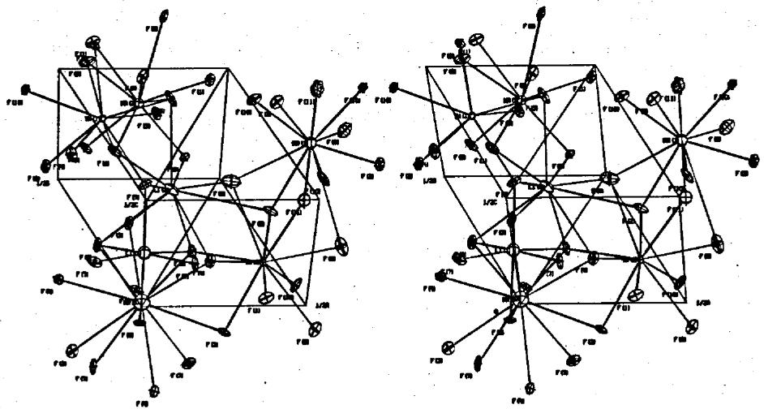  
Fig. 13.18. The Cation Contents of One Asymmetrical Unit of $(\mathrm{Na},\mathrm{Li})_7\mathrm{Th}_6\mathrm{F}_{31}$ Showing the Coordination Polyhedron Around Each Cation. One-fourth of a unit cell is outlined.

# 14. Chemistry of Molten-Salt Reactor Fuel Reprocessing Technology

# 14.1 DISTRIBUTION OF CERIUM, EUROPIUM, AND STRONTIUM BETWEEN BISMUTH AND LITHIUM CHLORIDE

D.M.Moulton J.H.Shaffer

When solutions of lithium in bismuth are used to remove rare-earth fission products from an MSBR fuel salt, thorium will be extracted in about the same proportion. However, the rare earths can then be oxidized from the bismuth into a chloride without disturbing the thorium. $^{1}$ The separation is possible because of the relative instability of thorium chloride. We have examined the behavior of cerium, europium, and strontium in the bismuth-lithium chloride system.

In an earlier experiment an $\mathrm{LiF - BeF_2}$ salt containing $58.1\mathrm{g}$ Th and $0.235\mathrm{g}$ Ce (as fluorides) had been reduced with a lithium-bismuth solution at $600^{\circ}\mathrm{C}$ until all of the Ce and Th were removed from the salt. Analytical results corresponded to roughly half the cerium and $10\%$ of the thorium (the latter corresponding to saturation) in the $3\mathrm{kg}$ of metal. The pot was cooled and cut open. The top part of the bismuth slug was cut off to avoid fluoride salt contamination, and the rest, weighing $2.279\mathrm{kg}$ , was put into a graphite-lined vessel with a molybdenum dip tube.

Pure lithium chloride was prepared from reagent-grade salt by first heating it in argon to $150^{\circ}\mathrm{C}$ and holding for 24 hr to remove water. Then HCl was added to the Ar, and the temperature was raised slowly to $575^{\circ}\mathrm{C}$ . The sweep gas was changed to $10\%$ HCl in $\mathbf{H}_2$ , and the salt was melted and taken to $650^{\circ}\mathrm{C}$ . The $\mathbf{H}_2$ -HCl treatment lasted 30 hr, during the last 10 of which the HCl concentration was doubled. A salt sample taken after 20 hr showed less than 10 ppm nickel. Another sample taken after the full treatment when dissolved in water showed no basicity to phenolphthalein. Finally the salt was reduced with pure hydrogen at $700^{\circ}$ till the HCl content of the effluent gas was below 0.01 meq/liter.

Approximately $1.842\mathrm{kg}$ of this salt was added to the bismuth at $650^{\circ}\mathrm{C}$ . The system was sparged with $\mathbf{H}_2$ -HCI at 2 meq/min, and samples were taken after every 10 meq, using copper filters for the salt and stainless filters with graphite inserts for the metal. Analyses were made radiochemically for Ce and spectrographically for Li and Th. The cerium-lithium ratios are shown in Fig. 14.1. Excluding the values indicated by open circles, for which the lithium numbers are out of line, we find $\log (D_{\mathbf{Ce}} / D_{\mathbf{Li}}^{3}) = 8.312 \pm 0.384$ . The thorium distributions could not be found accurately because the salt concentration was too low. At the end of the experiment the hydrochlorination was run for several much longer periods. The cerium content of the salt rose to $100\%$ of that expected from the mass balance, but only about $10\%$ of the thorium appeared, suggesting that the remainder was not transferred with the bismuth slug.

The distributions of europium and strontium were studied in the usual fashion, starting with salt solutions and extracting them into bismuth. About $2.155\mathrm{kg}$ of LiCl containing $76.7\mathrm{g}\mathrm{SrCl}_2$ and $0.153\mathrm{g}\mathrm{EuCl}_3$ was prepared by treating LiCl, $\mathrm{SrCl}_2\cdot 6\mathrm{H}_2\mathrm{O}$ , and $\mathrm{Eu}_2\mathrm{O}_3$ in a manner like that for the Ce experiment. The salt was added to $3\mathrm{kg}$ of Bi at $650^{\circ}\mathrm{C}$ and reduced first with $6.09\mathrm{g}$ Th and then $17.16\mathrm{g}$ Li in increments. Samples were taken with copper filters and graphite dippers and analyzed as usual (spectrographic Sr). Strontium and europium distributions are also shown in Fig. 14.1. Again the thorium values were unusable. The distribution coefficients $(D_{\mathbf{M}} / D_{\mathbf{Li}}^{2})$ are given by $\log K_{\mathbf{Eu}} = 2.284 \pm 0.025$ and $\log K_{\mathbf{Sr}} = 1.024 \pm 0.141$ .

From these experiments it is obvious that all three of these fission products will distribute strongly into lithium chloride, leaving the thorium behind. Since it will be very difficult to reextract either europium or strontium into a second bismuth pool, other methods will probably need to be used to clean up the chloride salt. The cerium experiment showed that a controlled oxidation can be used to strip the bismuth. By doing this it should be possible to reach a rather high

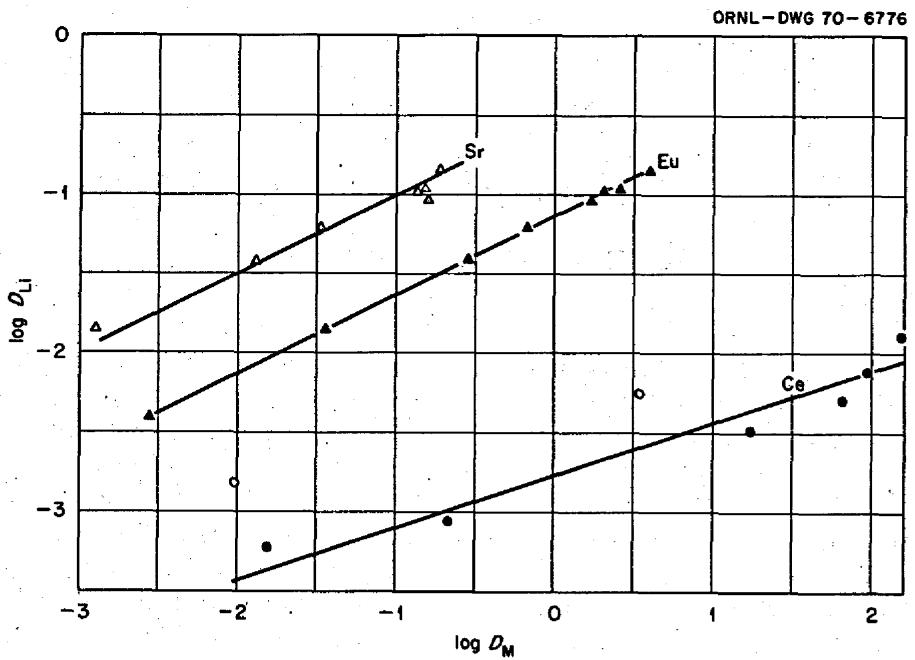  
Fig. 14.1. The Distribution of Ce, Eu, and Sr Between LiCl and Bi at $650^{\circ}\mathrm{C}$ as a Function of $D_{2}$ .

concentration of rare earths with a small amount of lithium chloride, so that distillation or some other purification scheme could be practical.

# 14.2 EXTRACTION OF CESIUM FROM LITHIUM CHLORIDE INTO BISMUTH BY REDUCTION WITH LITHIUM AT $650^{\circ}\mathrm{C}$

D.M.Richardson J.H.Shaffer

Experimental determination of the distribution of cesium and lithium between bismuth and lithium chloride when lithium metal is added for reductive extraction has been made. Knowledge of the behavior of fission product cesium in this stage of the metal transfer process is important not only to confirm that cesium is easily extracted from bismuth into lithium chloride, but also to determine the concentrations of lithium which would be required for the back extraction to bismuth in the final contactor.

The chloride salt was purified by sparging with 4 meq HCl per liter of hydrogen in a nickel vessel at $650^{\circ}\mathrm{C}$ . Approximately $1\mathrm{kg}$ of this salt containing 1 mole $\%$ CsCl (labeled with $^{137}\mathrm{Cs}$ ) was transferred to a standard 4-in. vessel containing $3\mathrm{kg}$ of hydrogen-fired bismuth in a mild steel liner. Salt samples were taken with copper filter sticks, and metal samples were taken through a mild steel dip tube into the bismuth using graphite ladles. Weighed additions of lithium metal were

made to the bismuth through a separate mild steel dip tube, and equilibration was promoted by argon sparging.

The distribution coefficients obtained for cesium were: $\log D_{\mathbf{Cs}} = \log X_{\mathbf{Li}} - 1.503$ , in which $X_{\mathbf{Li}}$ is the mole fraction of lithium in the bismuth phase. The data are plotted in Fig. 14.2 and are shown with the derived theoretical line with slope of 1. The point at 0.0054 mole fraction lithium was not used in positioning the line since the counting rate of that bismuth sample was only 21 counts $\mathrm{min}^{-1}\mathrm{g}^{-1}$ . For comparison, contamination with $100\mu \mathrm{g}$ of salt would elevate the counting rate by 50 counts/min. In several cases one of the pellets of a sample pair exhibited a higher counting rate by about 50 counts/min and was not included in the results shown. The equilibrium quotient obtained was: $D_{\mathbf{Cs}} / D_{\mathbf{Li}} = 0.031$ . This value compares favorably with an estimate of 0.019 by D.M. Moulton.

Spectrochemical analyses of bismuth in the salt phase were 15 to $35~\mathrm{ppm}$ and indicate that little or no $\mathsf{Li}_3\mathsf{Bi}$ was dissolved in the lithium chloride. On the other hand the high contaminant level in the bismuth (1500 ppm copper, 1200 ppm nickel) might be the cause, in the salt phase, for the oxidation of any bismuthide ions that were formed.

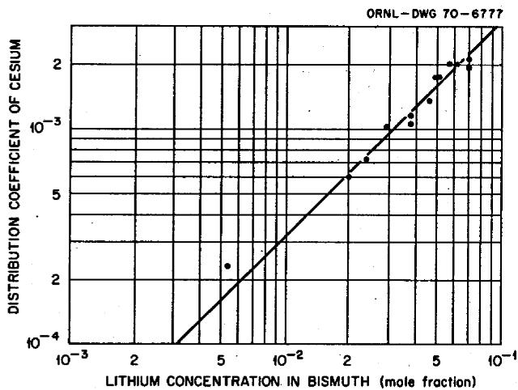  
Fig. 14.2. Distribution Coefficients of Cesium in LiCl and Bismuth Solutions at $650^{\circ}\mathbf{C}$ .

# 14.3 REMOVAL OF CHLORIDE FROM SIMULATED MSBR FUEL SOLVENT BY REACTION WITH ANHYDROUS HYDROGEN FLUORIDE

F.A.Doss W.R.Grimes J.H.Shaffer

According to current MSBR fuel reprocessing technology, lithium chloride will be employed for the back extraction of rare earths from bismuth to effect their separation from thorium. This close coupling of molten LiCl to the reactor system could possibly result in the contamination of the fluoride fuel mixture with chloride ion. Although this event would probably not affect the physical and chemical properties of the fluoride mixture, chloride concentrations as low as 20 ppm $(1\%$ of $N_{\mathbf{UF}_4}$ ) would have a significant effect on the neutron economy of the breeder reactor. Therefore an experimental program has been conducted to examine the feasibility of an HF- $\mathbf{H}_2$ sparge treatment for removing chloride from a simulated MSBR fuel solvent mixture and to provide a basis for preliminary engineering design of a process system. Specifically, equilibrium quotients and velocity constants were determined for the reaction

$$
\mathrm {C l} ^ {-} + \mathrm {H F} \rightleftharpoons \mathrm {F} ^ {-} + \mathrm {H C l} \tag {1}
$$

as functions of temperature, HF concentrations in $\mathbf{H}_2$ and gas sparge rates.

The reaction vessel was constructed from a 16-in. length of 4-in. IPS nickel pipe with welded end closures of $\frac{1}{4}$ -in. nickel plate. Penetrations through the top plate provided for insertion of a $\frac{1}{4}$ -in. gas sparge tube and a thermowell, for gas exhaust, and for withdrawal of salt samples. Approximately $2.7\mathrm{kg}$ of $\mathrm{LiF - BeF_2 - ThF_4}$ (72-16-12 mole %), which had been previously purified, was contained in a $3^{\frac{3}{4}}$ -in.-diam nickel liner within the reaction vessel. The gas sparge tube extended to within $\frac{1}{2}$ in. of the bottom, so that a gas bubble path of about 5 in. in the salt was created; no other provisions for salt agitation were made. Chloride concentrations of about 1 wt %, introduced as NaCl, were maintained for analytical expediency.

Samples of the salt phase were withdrawn for chloride analyses at the beginning and end of each reaction period. Acid gas concentrations in the influent and effluent streams were determined periodically by titration with standard caustic solutions referenced to the flow of hydrogen and reaction time. Aliquots of the gas effluent titration solutions were submitted to the Analytical Chemistry Division for chloride analyses. Intermittent concentrations of chloride in the salt phase were determined by graphical integration of data from these gas-phase analyses. Seventeen reaction periods of 4 hr each were conducted at 650 and $750^{\circ}\mathrm{C}$ , at gas sparge rates of 0.5, 1, and 1.5 liters/min of $\mathbf{H}_2$ (STP), and at nominal HF influent concentrations of 3, 5, and 7 meq of HF per liter of $\mathbf{H}_2$ . Operation of the experimental assembly was terminated at this point because of corrosion of the top plate of the reaction vessel.

Reaction Velocity Constants. - The reaction noted by Eq. (1) would be expected to follow the second-order rate expression

$$
- \frac {d N _ {\mathrm {C l}}}{d t} = k _ {1} N _ {\mathrm {C l}} N _ {\mathrm {H F}}, \tag {2}
$$

where $N$ is the respective mole fraction of chloride ion and HF. However, for a gas sparge experiment where the HF concentration in the gas influent is maintained constant, the reaction rate can more simply be defined by the first-order expression

$$
- \frac {d N _ {\mathrm {C l}}}{d t} = k _ {2} N _ {\mathrm {C l}}. \tag {3}
$$

Each experiment where reaction rate data could be obtained showed very good agreement with the integrated form of this equation. Typical results are shown

in Fig. 14.3. The dependence of $k_{2}$ on HF concentration for these pseudo-first-order reaction conditions becomes

$$
k _ {2} = k _ {1} N _ {\mathrm {H F}}. \tag {4}
$$

The dependence of the reaction rate on gas flow rate is related to stripping efficiency and mass flow rate of HF, and in these experiments to the relative agitation of the melt. Values for $k_{1}$ [Eq. (4)] for data obtained at 650 and $750^{\circ}\mathrm{C}$ are plotted vs the mass flow rate of HF and related to nominal HF concentrations in Fig. 14.4.

Equilibrium Quotients. - Although these experiments were not conducted under ideal equilibrium conditions, calculations of equilibrium quotients for each experimental point showed that steady-state conditions between the gas and liquid phases did prevail. These values, based on the equation

$$
K _ {\mathrm {Q}} = \frac {P _ {\mathrm {H C l}}}{P _ {\mathrm {H F}}} \cdot \frac {N _ {\mathrm {F}} ^ {-}}{N _ {\mathrm {C l}} ^ {-}},
$$

were derived from analyses of the gas effluent and from the chloride content of the melt, hypothetically calculated as the cation mole fraction of NaCl. An average value of $K_{\mathrm{Q}}$ was obtained for each experiment. These

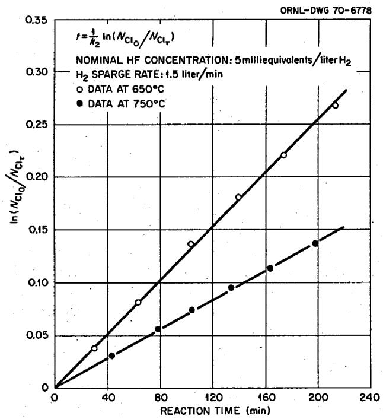  
Fig. 14.3. Relative Rate of Removal of Chloride from LiF-BeF $_2$ -ThF $_4$ (72-16-12 Mole %) by HF-H $_2$ Sparge at 650 and $750^{\circ}\mathrm{C}$ .

ORNL-DWG 70-6779

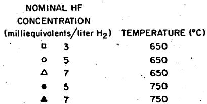

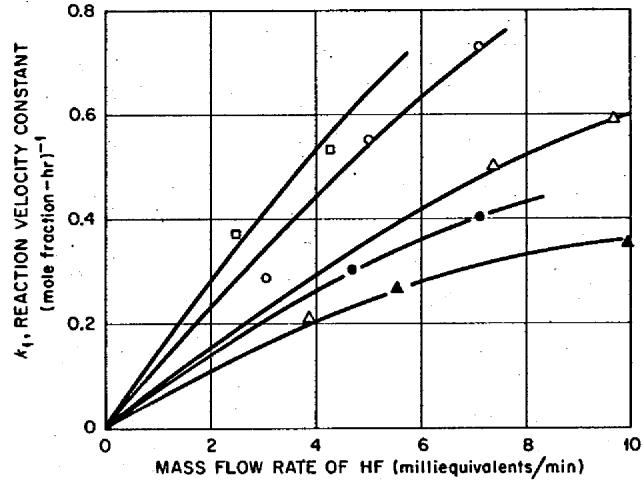  
Fig. 14.4. Effect of Gas Sparge Conditions on the Removal of Chloride from LiF-BeF $_2$ -ThF $_4$ (72-16-12 Mole %) by Reaction with HF at 650 and $750^{\circ}\mathrm{C}$ .

apparent equilibrium constants should approach true equilibrium conditions as the gas residence time in the salt phase becomes infinite (zero flow rate). However, values for $K_{\mathrm{Q}}$ obtained at $650^{\circ}\mathrm{C}$ varied from about 6 to 10 and did not show a satisfactory correlation with gas sparge rates. Values for $K_{\mathrm{Q}}$ at $750^{\circ}\mathrm{C}$ were constant at about $4.4 \pm 0.5$ .

# 14.4 CALCULATED BEHAVIOR OF SODIUM, RUBIDIUM, AND CESIUM IN THE MOLTEN-SALT BREEDER REACTOR REPROCESSING PLANT

D.M. Moulton

There will be moderate amounts of rubidium and cesium fission products in the molten-salt reactor, occurring as stable and soluble fluorides everywhere except in the reprocessing stages. A calculation of their distribution between bismuth and both fluoride and chloride salts has been made as a guide to their behavior until experimental data become available. A similar calculation has been made for sodium because of the possibility of mixing of the fuel and coolant salts.

First, standard free energy for the reaction

$$
\mathbf {M} \mathbf {X} + \mathbf {L} \mathbf {i} = \mathbf {M} + \mathbf {L} \mathbf {i} \mathbf {X} \tag {1}
$$

at $650^{\circ}\mathrm{C}$ where all substances are pure liquids was evaluated by adding integrals over the heat capacity and latent heats to the room-temperature enthalpy and entropy in the usual fashion. For those substances melting above $650^{\circ}\mathrm{C}$ , the integration was carried out to the melting point and then readjusted to $650^{\circ}\mathrm{C}$ using the heat capacity of the liquid. The values were taken from Kubaschewski et al. A value of the heat capacity for liquid RbF was arbitrarily assigned as $C_p = 17.7$ cal $\deg^{-1}$ mole $^{-1}$ , rather than that generated from the formula in ref. 1, because of reservations concerning the original data. It was also necessary to use a few other estimated values.

Activity coefficients were obtained from a variety of sources. That for Li in Bi came from Foster et al. and was evaluated at infinite dilution of Li. No data were found for Rb and Cs in Bi, so the excess free energy of K in Bi was taken from Hultgren et al. and assumed independent of temperature. The excess chemical potential of Na in Bi was taken from the data of Fischer et al. and again assumed independent of temperature. Kleppa and coworkers have measured heats of mixing of the lithium halides with those of the heavier alkalies,

all as liquids. Their results are expressed in the form $H^{\mathrm{m}} = N_{1}N_{2}(a + bN_{1} + cN_{1}N_{2})$ , where subscript 1 refers to Li, and it can be shown that the partial heat of mixing at infinite dilution of component 2 is given by $a + b$ . It was assumed that all of the excess chemical potential was due to the heat of mixing, which was itself temperature-independent; Kleppa presents some evidence that would justify these assumptions. The free energy change for the reaction

$$
\mathrm {M X} (\text {d i s s . i n L i X}) + \mathrm {L i} (\mathrm {B i}) = \mathrm {M} (\mathrm {B i}) + \mathrm {L i X} (\mathrm {l i q .}) \tag {2}
$$

is the sum of these values. If the final assumption is made, as suggested by J. Braunstein, $^{7}$ that the ratio of activity coefficients of LiF and MF does not change much on the addition of beryllium and thorium fluorides, then these numbers should allow prediction of the behavior of sodium, rubidium, and cesium on both sides of the metal transport step.

Table 14.1 shows the standard free energies, activity coefficients, equilibrium constants, and distributions at $X_{\mathrm{Li}}(\mathrm{Bi}) = 0.002$ and $X_{\mathrm{LiCl}} = 1$ , $X_{\mathrm{LiF}} = 0.72$ . The free energy is given for reaction (1) and does not include the activity coefficients. Experimental investigations of these extractions were initiated recently.

The calculations should be viewed with some caution since they involve small differences of rather large

Table 14.1. Standard Free Energies, Activity Coefficients, Equilibrium Constants, and Distributions at $X_{\mathrm{Li}}(\mathrm{Bi}) = 0.002$ for the Reaction at $650^{\circ}\mathrm{C}$ of $\mathrm{MX(LiX)} + \mathrm{Li(Bi)} = \mathrm{M(Bi)} + \mathrm{LiX}$ , Where All Are Liquids $\Delta G^{\circ}$ is the standard free energy for all pure liquids   

<table><tr><td></td><td>ΔG° (kcal)</td><td>γLi(Bi)/γM(Bi)</td><td>γSalta</td><td>KQ</td><td>DM= XM/ XMx</td></tr><tr><td colspan="6">Fluorides</td></tr><tr><td>Na</td><td>-11.67</td><td>0.138</td><td>0.34</td><td>27</td><td>0.075</td></tr><tr><td>Rb</td><td>-16.48</td><td>1.71</td><td>0.047</td><td>650</td><td>1.8</td></tr><tr><td>Cs</td><td>-21.61</td><td>1.71</td><td>0.090</td><td>20 × 103</td><td>56</td></tr><tr><td colspan="6">Chlorides</td></tr><tr><td>Na</td><td>-1.78</td><td></td><td>0.54</td><td>0.20</td><td>4 × 10-4</td></tr><tr><td>Rb</td><td>1.38</td><td></td><td>0.052</td><td>0.042</td><td>8 × 10-5</td></tr><tr><td>Cs</td><td>1.85</td><td></td><td>0.030</td><td>0.019</td><td>4 × 10-5</td></tr></table>

$\alpha_{\gamma_{\mathrm{LiX}}} = 1$

numbers as well as arbitrary assignment of several values for unmeasured quantities. Nevertheless, on the basis of these one can make two predictions. First, the heavy alkalies will be extracted rather well from the fluoride in the rare-earth removal process. In fact, much of the cesium will be detained in the protactinium isolation system but will probably find its way out eventually. Sodium will not be extracted very well. Second, all of these elements will tend to transfer into the chloride and will not be extracted appreciably even at high Li concentrations in Bi until their concentration in the salt gets to be much greater than that of lithium, where the activity coefficient ratios change. The very considerable difference between fluorides and chlorides is due mainly to the extreme stability of LiF, making lithium metal by far the most powerful reductant in the fluoride system. LiCl is actually less stable than RbCl or CsCl, and this is augmented by the rather substantial heats of mixing of the chlorides, so that the heavier alkalies tend to stay in the salt phase.

# 14.5 REDUCTION OF URANIUM AND PROTACTINIUM WITH TITANIUM

D.M.Moulton J.H.Shaffer W.R.Grimes

An attempt was made to use metallic titanium as the reductant for U and Pa with the expectation that $\mathrm{TiF}_3$ would be formed and could subsequently be removed as volatile $\mathrm{TiF}_4$ after oxidation with HF, leaving the salt solvent unchanged. Such a process could eliminate the need for an electrolytic cell. To a solution of $9.74\mathrm{g}$ $\mathrm{UF}_4$ , $0.16\mathrm{gZrF_4}$ , and $1\mathrm{mc}$ of $^{233}\mathrm{Pa}$ in $2.91\mathrm{kg}$ of $\mathrm{LiF - BeF_2 - ThF_4}$ (72-16-12 mole%), contained in graphite with $3.00\mathrm{kg}$ of Bi, was added incrementally $5.05\mathrm{g}$ of Ti, or about 2.5 times the equivalence of the $\mathbf{U} + \mathbf{Zr}$ . There was no appreciable extraction of Pa either at 600 or $700^{\circ}\mathrm{C}$ , its maximum distribution being estimated at 0.003. The Pa balance remained close to $100\%$ . Then 0.4 equivalent of Li was added, and the Pa was extracted as usual. The Pa balance was excellent until the last addition, where $70\%$ was in the metal but only $15\%$ was in the salt. It may have adsorbed on the Ti, which was substantially above saturation. No other analyses were made in this system since it was quite clear that Ti is not a strong enough reductant to be useful.

# 14.6 BISMUTH-GOLD ALLOYS AS EXTRACTANTS FOR RARE EARTH'S AND THORIUM

D.M.Moulton J.H.Shaffer

Some earlier experiments had suggested that the addition of gold to bismuth would increase the solubility of thorium, thereby raising both its distribution and that of the rare earths. About $2.79\mathrm{kg}$ of $\mathrm{LiF - BeF_2 - ThF_4}$ (72-16-12 mole $\%$ ) containing $2.79\mathrm{g}$ of $\mathrm{CeF_3}$ labeled with $^{144}\mathrm{Ce}$ was placed in contact with $790\mathrm{g}$ of Bi in a well-bottom pot. All material in contact with the liquids was graphite except for a molybdenum dip tube. Thorium metal was added until the Ce distribution reached the saturation value for thorium in bismuth. Then enough gold $(39\mathrm{g})$ was added to bring its content in the metal up to 5 at. $\%$ , and the system was hydrofluorinated until all the cerium was oxidized, whereupon the extraction was repeated. Two more gold additions brought the gold percentage up to 10 and 20 at. $\%$ , doing an extraction and hydrofluorination at each. Dipper samples were used for both phases.

In the first extraction without gold, a cerium distribution of 0.055 was reached at $600^{\circ}$ , agreeing with values obtained from earlier experiments. At 5, 10, and 20 at. $\%$ gold the maximum values were 0.044, 0.103, and 0.052. No analyses were made for lithium or thorium. When gold was present the measured cerium concentrations were somewhat erratic, suggesting that a solid phase may have formed; this did not happen with pure bismuth. The addition of gold does seem to increase cerium extraction, but the improvement is rather small considering the amount of gold needed. This program is now being directed toward the use of other alloying metals to increase the thorium solubility.

# 14.7 BISMUTH-PLATINUM SOLUTIONS FOR THE EXTRACTION OF FISSION PRODUCTS FROM MSBR SALT

D.M.Moulton J.H.Shaffer W.R.Grimes

We have continued to study the effect of adding platinum to the bismuth phase upon the reduction of various fission products. As discussed earlier,1 the

formation of an insoluble platinide with zirconium may be a good way to separate that element from uranium. An experiment was run in which $^{95}\mathrm{Zr}$ was extracted into bismuth; a melt containing $3.48\mathrm{kg}$ of $\mathrm{LiF - BeF_2 - ThF_4}$ (72-16-12 mole %) and $0.1\mathrm{wt}\% \mathrm{ZrF_4}$ , labeled with $^{95}\mathrm{Zr}$ , was contacted with $800\mathrm{g}$ of a metallic Bi-U solution, all at $600^{\circ}\mathrm{C}$ . When about one-third of the zirconium had been removed, $11.32\mathrm{g}$ of Pt was added. In Fig. 14.5 are shown the percentages in the salt and the total balance (metal and salt, but excluding any precipitate) of U and Zr. Several samples were taken between the Pt addition and the last U addition, and the results are plotted on the abscissa over the break in the scale. Filter and dipper samples of the metal gave different results, indicating a solid phase. The solubility product $X_{\mathrm{Zr}}X_{\mathrm{Pt}}^{3}$ for the unfiltered samples was about $3\times 10^{-12}$ except for the last, which was $2\times 10^{-14}$ . This is in reasonable agreement with the value found earlier. Filter samples would have given still lower values.

It is clear that platinum will separate zirconium from uranium by forming an insoluble platinide. The uranium balance seems not to be affected. The lithium and thorium contents of the metal were not greatly altered by the platinum addition, and the equivalents of $\mathbf{Zr}$ lost from the salt were about equal to the equivalents of U gained if the valence of U is taken as $4+$ . In this experiment the amount of platinum was slightly less than stoichiometric to form $\mathbf{ZrPt}_3$ . Further work is in

progress to determine the effect of excess platinum on the uranium balance.

Strong compound formation with platinum is not limited to zirconium; any of the metals in the early part of the periodic table should do so, especially those in the third and fourth groups with empty $d$ orbitals. As a result of discussions with Professor Leo Brewer we decided to see whether this could be used to separate thorium and rare earths. $\mathrm{LiF - BeF_2}$ (66-34 mole %) with 888 ppm $\mathrm{CeF_3}$ was used as the salt so that the thorium balance could be followed. Six grams of thorium metal in 1-g increments was used to reduce $2.74\mathrm{kg}$ of this salt into $800\mathrm{g}$ Bi. Now platinum metal was added, first $8.23\mathrm{g}$ and then $7.29\mathrm{g}$ more. The changes in lithium, thorium, and cerium distributions and balances are shown in Table 14.2. Cerium was simply reoxidized into the salt. There was no measurable change in the thorium content of the salt, indicating that it probably precipitated. The change in the lithium concentration was quite unexpected, and if the reductant balance was maintained the lithium must have precipitated as well. About half of the added platinum disappeared, but this cannot be stoichiometrically related to the lithium and thorium disappearance since their systems with platinum are complicated and not well characterized.

More lithium was added till all of the cerium was transferred from the salt to the bismuth. It did not seem to form a precipitate. Thorium analyses of the salt

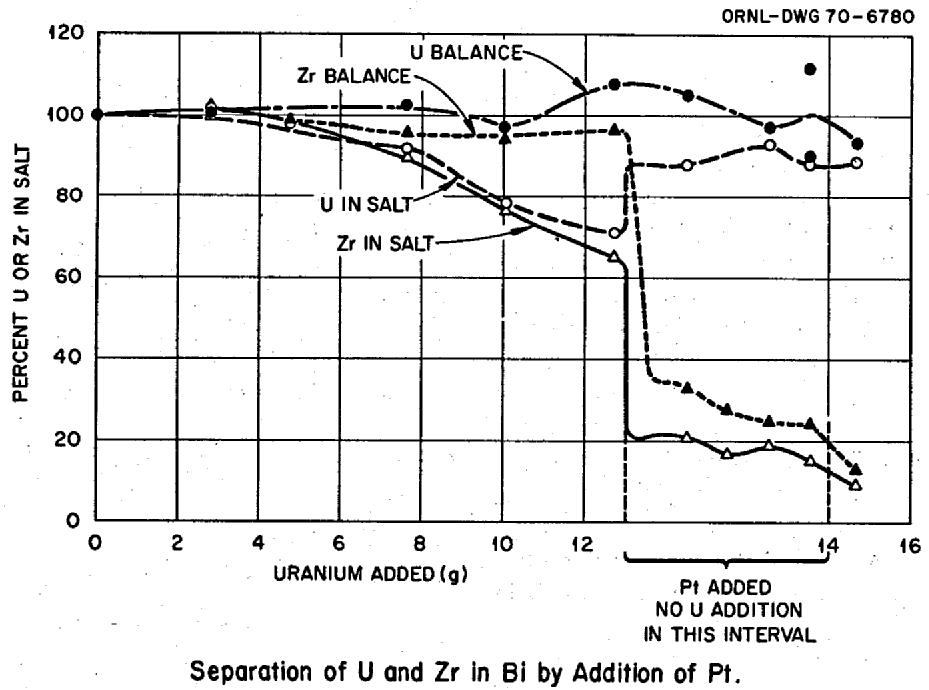  
Fig. 14.5. Separation of Uranium and Zirconium in Bismuth by addition of Platinum.

Table 14.2. The Effect of Platinum on the Distribution and Balance of Li, Ce, and Th in LiF-BeF $_2$ and Bi   

<table><tr><td></td><td>No Pt</td><td>1stAddition</td><td>2dAddition</td><td>Final</td></tr><tr><td>DLi</td><td>0.011</td><td>0.003</td><td>0.001</td><td>0.049</td></tr><tr><td>Reductant balance,%</td><td>29</td><td>7.1</td><td>&lt;3</td><td>35</td></tr><tr><td>DCe</td><td>3.4</td><td>0.1</td><td>0.3</td><td>169</td></tr><tr><td>Ce balance,%</td><td>101</td><td>97</td><td>97</td><td>90</td></tr><tr><td>DTh</td><td>2.7</td><td>0.5</td><td>&lt;0.2</td><td></td></tr><tr><td>Th balance,%</td><td>103</td><td>89</td><td>92</td><td></td></tr><tr><td>Pt balance,%</td><td></td><td>53</td><td>61</td><td>13</td></tr></table>

were not completed at this writing, but a reasonably constant and low concentration in the metal even under strongly reducing conditions suggests precipitation. The platinum balance fell to about $10\%$ by the end of the experiment, and the product $X_{\mathbf{Li}}^{2}X_{\mathbf{Pt}}$ during this part of the experiment was fairly constant. The addition of platinum to bismuth does not seem to help in the extraction of rare earths, but its interaction with thorium and lithium will be important in the uranium-zirconium separation.

# 14.8 EXTRACTION OF CERIUM AND THORIUM FROM LiF-BeF $_2$ (66-34 MOLE %) INTO BISMUTH AT 600°C

J.H.Shaffer D.M.Moulton

Previous experiments have examined the extraction of rare earths into bismuth from $\mathrm{LiF - BeF_2 - ThF_4}$ mixtures having constant thorium concentrations of 3, 6, 9, and 12 mole $\%$ As a continuation of this program, the extraction of cerium at low and varying thorium concentrations in the salt phase has been studied. The purpose of this experiment was to simulate the salt-bismuth conditions in the proposed electrolytic cell and to provide data relating to the thermodynamic activity of $\mathrm{ThF_4}$ in the salt phase.

The starting salt mixture was $2.205\mathrm{kg}$ of LiF (65.75 mole $\%$ ), $\mathrm{BeF}_2$ (33.87 mole $\%$ ), and $\mathrm{ThF}_4$ (0.38 mole $\%$ ) with a cerium content of about $2.35\times 10^{-5}$ mole fraction. This mixture was placed in a graphite-lined extraction vessel to which $3.00\mathrm{kg}$ of bismuth had been added. A total of $10.08\mathrm{g}$ of lithium metal was added in

tared increments to reduce cerium and thorium from the salt phase. Samples of each liquid phase were withdrawn at equilibrium after each addition of lithium. Salt samples were obtained in copper filter sticks, and metal samples were filtered through stainless steel and collected in graphite cups. The results of this experiment were derived from chemical analyses of the salt phase for Li, Be, and Th, spectrochemical analyses of the metal phase for Li and Th, and radiochemical analyses of both phases for cerium.

The distributions at equilibrium of cerium and thorium between the two liquid phases are related to the similar distribution of lithium by the equations

$$
\mathrm {C e F} _ {3} + 3 \mathrm {L i} _ {\mathrm {B i}} ^ {0} \rightleftharpoons \mathrm {C e} _ {\mathrm {B i}} ^ {0} + 3 \mathrm {L i F} \tag {1}
$$

and

$$
\mathrm {T h F} _ {4} + 4 \mathrm {L i} _ {\mathrm {B i}} ^ {0} \rightleftharpoons \mathrm {T h} _ {\mathrm {B i}} ^ {0} + 4 \mathrm {L i F}. \tag {2}
$$

The value for the equilibrium quotient for the reduction of cerium by lithium [Eq. (1)] was $3.26 \times 10^{9}$ . The corresponding value for the reduction of thorium by lithium [Eq. (2)] was $2.59 \times 10^{12}$ . The separation of cerium from thorium $(\alpha = D_{\mathrm{Ce}} / D_{\mathrm{Th}})$ was evaluated by the equation

$$
\ln \alpha = 1 / 4 \ln K - 1 / 4 \ln D _ {\mathrm {T h}},
$$

as shown in Fig. 14.6. The equilibrium quotient for the reduction of cerium by thorium was 6.41.

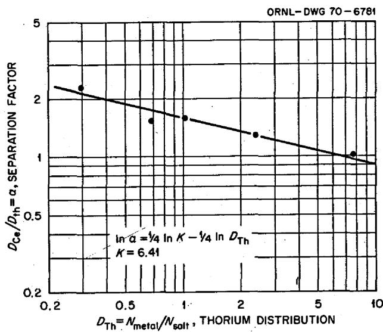  
Fig. 14.6. Effect of Thorium Distribution on the Separation of Cerium from Thorium During Reductive Extraction from $\mathrm{LiF - BeF_2}$ (66-34 Mole %) into Bismuth at $600^{\circ}\mathrm{C}$ .

Calculations of the material balance for thorium and cerium during the experiment showed a substantial loss of cerium from solution in the presence of solid thorium. Within the accuracy of these data the mole ratio of cerium to thorium in the solid phase was about 0.0022 while measurable concentrations of thorium and cerium were in solution in the salt phase, but it increased to 0.015 after the last addition of lithium to the extraction system. No further examination of this behavior was made; however, evidence of a solid phase containing both thorium and cerium was noted by changes in their concentrations in solution on heating the bismuth slug from 600 to $700^{\circ}\mathrm{C}$ in the absence of a salt phase during a subsequent experiment.

Although this possible finding of solid solution formation of cerium and thorium has no practical

significance to the proposed MSBR reprocessing scheme, it probably precludes further interest in separating cerium from thorium in bismuth by cold-zone deposition of thorium. The relatively low cerium-thorium separation factors obtained in this experiment further substantiate the "free fluoride" effect on the activity coefficients for thorium in the salt phase. Values for the equilibrium quotients obtained from this experiment will be considered with others obtained in this program for possible description of the salt composition effect on the rare-earth extraction process.

# 15. Development and Evaluation of Analytical Methods for Molten-Salt Reactors

# 15.1 DETERMINATION OF OXIDE IN MSRE SALT

R.F.Apple J.M.Dale A.S.Meyer

During the operation of the oxide determination apparatus at the High Radiation Level Analytical Laboratory, increasingly high pressures were required to maintain the flow of gas through the system during hydrofluorination. This increase occurred across the NaF trap used to separate HF from water in the effluent gas. It was assumed that during the repeated absorption and regeneration steps the NaF particles degraded to form a more tightly packed bed, particularly at the trap entrance. As the more closely packed particles swell during HF absorption, the flow is restricted. A further examination of the system also revealed that two control valves had become inoperable. The hot cell was entered, and the NaF trap and the valve compartment were replaced. Three MSRE salt samples were received for analyses and were stored in the hot cell until the necessary repairs to the oxide apparatus could be made. The results of the analyses are listed below. A $96\%$ recovery of oxide from an $\mathrm{SnO}_2$ standard sample indicated that the repaired apparatus was functioning properly.

<table><tr><td>Sample</td><td>Oxide (ppm)</td></tr><tr><td>FP 20-24 flush</td><td>71</td></tr><tr><td>FP 20-4 fuel</td><td>58</td></tr><tr><td>FP 19-69 fuel</td><td>a</td></tr></table>

$a$ Unable to remove the salt from the transport container.

# 15.2 VOLTAMMETRIC DETERMINATION OF $[\mathbf{U}^{3+}] / [\Sigma \mathbf{U}]$ RATIOS IN MSRE FUEL

J.M.Dale R.F.Apple A.S.Meyer

Work on the zirconium reductions of the simulated MSRE fuel at the Y-12 site was temporarily discontinued in order to free the voltammeter for use in

the determination of $\left[\mathrm{U}^{4+}\right] / \left[\mathrm{U}^{3+}\right]$ ratios in MSRE fuel samples. This work will be continued as time permits.

Fuel sample FP-19-45 was taken on October 6 and held in a heated carrier until October 16, when the $\left[\mathrm{U}^{4+}\right] / \left[\mathrm{U}^{3+}\right]$ ratio determination was made. Prior to taking this sample an amount of beryllium equivalent to $0.4\%$ $\left[\mathrm{U}^{3+}\right] / \left[\Sigma \mathrm{U}\right]$ had been dissolved in the fuel. The voltammetric determination showed the presence of $0.13\%$ $\left[\mathrm{U}^{3+}\right] / \left[\Sigma \mathrm{U}\right]$ . Another beryllium addition was then made, which increased the total beryllium $\mathrm{U}^{3+}$ equivalent to $1.16\%$ . After this addition, sample FP-19-60 was taken on October 20, and the determination was made on October 22. This determination showed the presence of $0.07\%$ $\left[\mathrm{U}^{3+}\right] / \left[\Sigma \mathrm{U}\right]$ . Because the determination showed no increase in $\mathrm{U}^{3+}$ concentration, a third sample, FP-19-75, was taken on October 30 and run on November 11. The determination on this sample showed $0.02\%$ $\left[\mathrm{U}^{3+}\right] / \left[\Sigma \mathrm{U}\right]$ .

During run 20 of the MSRE, November 25 to December 12, two beryllium additions were made to the fuel salt. The $\mathbf{U}^{3+}$ equivalent of the amount of beryllium dissolved in the first addition was about $1.2\%$ , and that of the second addition was about $1.7\%$ . It was assumed that at the start of run 20 the $\mathbf{U}^{3+}$ was negligible, so $2.9\%$ $[\mathbf{U}^{3+}] / [\Sigma \mathbf{U}]$ was the maximum amount expected to be present. After the first beryllium addition, sample FP-20-14 was taken and showed the presence of $0.11\%$ $[\mathbf{U}^{3+}] / [\Sigma \mathbf{U}]$ . Sample FP-20-26, taken after the second beryllium addition, indicated that $0.20\%$ $\mathbf{U}^{3+}$ was present. The reasons for the discrepancies between the results of $\mathbf{U}^{3+}$ analyses and book values are still not completely understood. This problem will receive further investigation.

# 15.3 SPECTRAL STUDIES OF MSRE SALTS

J.P.Young G.Goldberg

The acquisition and installation of the hot-cell spectrophotometer and related equipment for spectral studies of molten-salt reactor melts has been completed.

A description of the apparatus and technique originally devised for carrying out these studies has been given previously. The unsatisfactory operation of the sample loading furnace, reported in the last progress report, coupled with the planned shutdown of the MSRE, caused a marked change in development efforts and required a major design change in sampling and sample-transfer technique. The original plan required the removal of a 5-g sample of MSRE fuel from the reactor. This sample was to be cooled to $200^{\circ}\mathrm{C}$ for transfer to the sample loading furnace for remelting and separation into five separate spectral cells, windowed or windowless. The cells were then to be transferred to an optical furnace for spectral study. The entire operation was to be performed without exposing the MSR fuel to the atmosphere. The multisample approach had to be abandoned. Instead, the removal of a sample of MSRE fuel directly in a spectral cell was considered. Two such methods of single sample removal were devised. In one, a windowless or screen cell would be immersed in the MSRE pump bowl fuel. Although liquid would run out

$^{1}$ J. P. Young, MSR Program Semiann. Progr. Rept. Aug. 31, 1969, ORNL-4449, p. 160.   
2J. P. Young, MSR Program Semiann. Progr. Rept. Feb. 28, 1969, ORNL-4396, p. 202; Aug. 31, 1968, ORNL-4344, p. 192.

of the cell as it is withdrawn from the fuel, a sufficient quantity would remain if flow rates and reservoir volumes were properly selected. In the laboratory, this approach worked well when such a cell was rapidly withdrawn from a melt, but its performance seemed marginal at the withdrawal rate of sample capsules from the MSRE pump bowl (0.5 in./sec).

The sampling device used for obtaining MSRE samples is shown in Figs. 15.1 and 15.2. In the exploded view, the small spectral (windowless) cell is shown at the bottom. This cell fits in the sample capsule body, the large component to the left. A sleeve, shown next to the cell, fits over the body and holds the cell in the capsule body by means of the tab on the sleeve which fits over the cell. The whole assembly is held together by the T-shaped key. The assembled sampler is shown in Fig. 15.2. This capsule assembly is designed so that the nonwetting fuel salt will flow freely away from the capsule as it is withdrawn from the MSRE fuel; likewise, clearances are such that no salt should be trapped in the various crevices. The spectral cell is designed, however, to hold melt in two ways. As the capsule is lowered into the fuel and withdrawn, melt is caught in the reservoir in the top part of the cell. On remelting, the cell is turned so that this reservoir would be up; thus the melt will run into and fill the

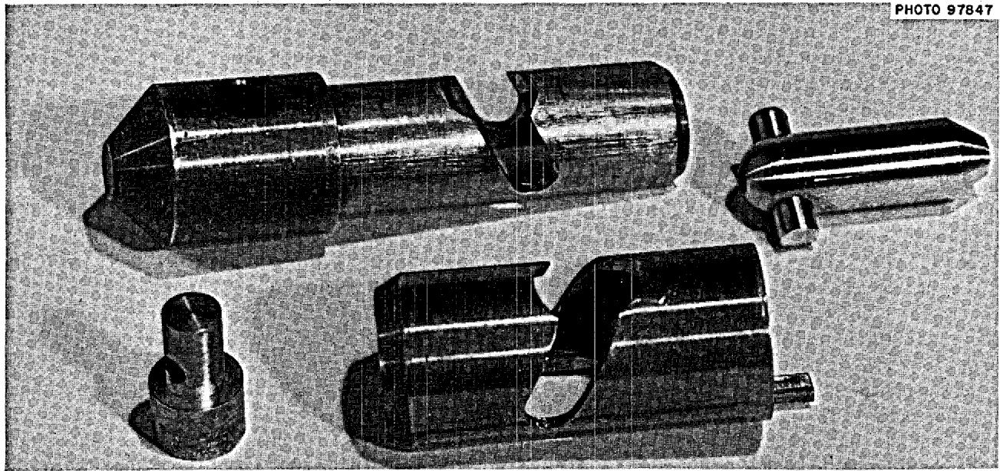

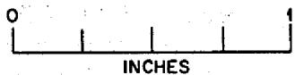  
Fig. 15.1. MSRE Spectral Cell Sampler Assembly: Exploded View.

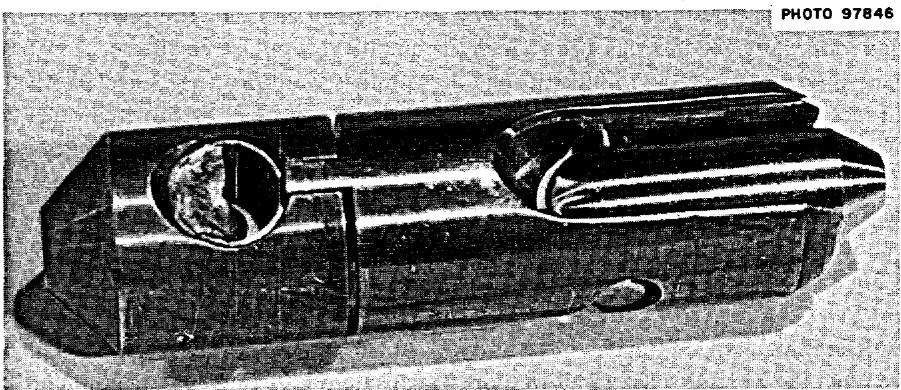

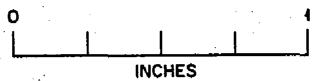  
Fig. 15.2. MSRE Spectral Cell Sampler Assembly.

lower part of the cell. The capsule is designed so that it can be disassembled with the one manipulator located in the sample-enricher station of the reactor. The spectral cell can then be placed in the sealed transport container for shipment to the hot-cell spectrophotometric facility. Although the capsule assembly did not work as well in the reactor as it had in the laboratory tests, it was possible to collect three of four planned spectral samples and have them transferred properly to the transport container. One of the four cells could not be removed from the capsule. The reasons for this are not clear. The original capsules and cells were made from copper and were hydrogen fired prior to use. Dipping the capsule in the salt is probably a cleaning operation. It is conceivable that the close fit of the cell to the capsule body, the elevated temperature, the cleanliness of the similar metals, and perhaps the effect of high radiation levels caused the components to self-weld. After this experience, the cells were made of nickel.

The spectral cells were placed in the sealed transport containers, transferred, and stored at temperatures above $200^{\circ}\mathrm{C}$ in the hot cell until the spectrophotometer and sample transfer and handling apparatus were completed. The revised system was designed so that the spectral cell was positioned in a bottom cap of each transport container. This sealed bottom cap was to be removed inside the sample loading furnace. The cell would then be shifted on a turntable to another position within this furnace to be picked up by a sealable lid assembly for final transfer, under inert atmosphere, to the spectral furnace for melting and spectral study.

After installation of the in-cell apparatus and spectrophotometer components, a nonradioactive MSRE-type sample was melted to check out the optics, furnace, and spectrophotometer. The system worked quite well, and spectra of U(IV) in the molten salt were recorded. In attempting to transfer the first MSRE sample, a sample that should have contained no U(III), as it was taken just after the MSRE went to power on its last run, the sample loading furnace could not be used to open the transport container. It was subsequently found that this transport container had, in all probability, not maintained an inert atmosphere around the sample. It was finally necessary to open this transport container out of the sample loading furnace. The spectral cell was transferred in air to the spectral furnace. Although the furnace atmosphere around the sample was carefully evacuated and purged prior to melting the sample, on melting no real spectral evidence of U(IV), or U(III), was observed. It is possible that the U(IV) was precipitated as $\mathrm{UO}_2$ while it was stored in the faulty transport container.

After repair and mechanical strengthening of parts of the sample loading furnace, another sample, MSR 20-30, was brought to this furnace. The transport container which held this sample was opened without problem, and the spectral cell, a nickel windowless cell, was transferred as planned to the optics furnace. This particular sample was taken at a time when the U(III)/U(IV) ratio was believed to be about $2.8\%$ , based on additions of $\mathbf{Be}^0$ . At this level, the visual color of the melt should have been quite yellow. On melting, the solution appeared to be light green in color, definitely not yellow. Although the solution appeared to be

somewhat turbid, spectra were obtained that demonstrated the existence of U(IV) in the melt. The turbidity of the solution, with attendant light loss, resulted in some loss of resolution of individual peaks, but over all the spectrum of U(IV) in the wavelength range 300 to $1600\mathrm{nm}$ was quite similar to that reported for U(IV) in nonradioactive $\mathrm{LiF - BeF_2}$ ; this sample of MSRE fuel, approximately $200\mathrm{mg}$ in size, had a radiation level of about $75\mathrm{r}$ . The heights of the absorbance peaks were consistent with a U(IV) concentration in the sample of about $0.12\mathrm{mole}\%$ . Further studies of this sample are planned to see if U(III) can be grown into the MSR fuel by radiolytic evolution of $\mathbf{F}_2$ gas at room temperature or by chemical reduction of U(IV) by uranium metal.

# 15.4 TRITIUM IN THE EFFLUENT GASES OF THE MSRE

J.M.Dale R.F.Apple A.S.Meyer

During the operation of the MSRE in the latter part of run 19, analytical equipment was set up in the MSRE vent-house sample station in order to measure the concentration of tritium in the various reactor effluent gas streams. A fractional part of the gas stream being analyzed was passed over a bed of hot copper oxide in order to convert the tritium to water. In general, two copper oxide temperatures were used, one at $\sim 340^{\circ}\mathrm{C}$ and the other at $\sim 800^{\circ}\mathrm{C}$ . The higher temperature allows the oxidation of methane, while the lower temperature does not. After oxidation the gas stream was passed through a bubbler tube which contained a few milliliters of water and then through an empty trap which was cooled to about $-80^{\circ}\mathrm{C}$ . Two sets of traps were used to ensure that all of the tritium was being collected. Sample streams were controlled at about 100 $\mathrm{cm}^3/\mathrm{min}$ to which $3\mathrm{cm}^3/\mathrm{min}$ of natural hydrogen was added as a carrier for the tritium. The amount of tritium collected for a specified period was determined by a liquid scintillation technique.

The system was checked with a standard gas of known hydrogen and methane concentrations. It was determined by both gas chromatographic and mass spectrographic analyses of the standard effluent from the copper oxide at $800^{\circ}\mathrm{C}$ that the hydrogen and methane were completely oxidized.

Table 15.1 shows the results obtained during the last week of run 19.

Table 15.1. Tritium Analyses for Run 19 of the MSRE   

<table><tr><td>Date</td><td>Gas System</td><td>CuO Temperature (℃)</td><td>Tritium (curies/day)</td></tr><tr><td>10/24</td><td>Fuel salt</td><td>340</td><td>9.3</td></tr><tr><td>10/27</td><td>Fuel salt</td><td>640</td><td>11.1</td></tr><tr><td>10/30</td><td>Coolant salt</td><td>800</td><td>0.62</td></tr><tr><td>10/30</td><td>Cell</td><td>800</td><td>0.003</td></tr><tr><td>11/1</td><td>Fuel salt</td><td>800</td><td>22.7</td></tr></table>

An attempt was also made during run 19 to determine the concentration of tritium in the coolant stack air with the existing analytical setup. This was precluded by the residual amount of tritium in the analytical system and sampling lines from previous analyses. Although the amount of tritium found in these analyses was comparatively small (microcuries), the factor for converting to curies per day $(1.38 \times 10^{9})$ , due to the large air flow in the stack, greatly magnified any sampling errors. For this reason a new sampling system was installed during the shutdown period between run 19 and run 20 so that a more concentrated sample could be taken. A sheath was installed on a 2-ft section of a radiator tube and was fitted with tubing so that air could be drawn through the sheath for sampling.

On November 21, about three weeks after the end of run 19, two samples were taken from the fuel off-gas system. At this time the pump bowl was empty of salt, and the helium flow through the system had been dropped from 4.2 liters/min to 2.4 liters/min. The results obtained from the low- and high-temperature analyses were 3.15 and 7.44 curies/day, respectively, an appreciable amount compared with that found when the reactor was at full power.

Table 15.2 lists the fuel off-gas analyses obtained during run 20.

The analyses made on December 2, after about one week at power, indicated that the total tritium concentration had not built up to the values found in run 19

Table 15.2. Fuel Off-Gas Analyses for Run 20 of the MSRE   

<table><tr><td>Date</td><td>CuO Temperature (℃)</td><td>Tritium (curies/day)</td></tr><tr><td>12/2</td><td>800</td><td>11.6</td></tr><tr><td>12/2</td><td>340</td><td>9.7</td></tr><tr><td>12/11</td><td>800</td><td>15.0</td></tr><tr><td>12/12</td><td>340</td><td>30.8</td></tr></table>

Table 15.3. Tritium Analyses of Air Drawn Through Radiator-Tube Sheath   

<table><tr><td rowspan="2">Date</td><td rowspan="2">Sheath Air Flow (liters/min)</td><td rowspan="2">Sample Volume (liters)</td><td colspan="2">Tritium (curies/day)a</td></tr><tr><td>Maximum</td><td>Minimumb</td></tr><tr><td>12/6</td><td>4.0</td><td>5.59</td><td>0.41</td><td>0.32</td></tr><tr><td>12/9</td><td>9.5</td><td>6.04</td><td>0.48</td><td>0.28</td></tr><tr><td>12/9</td><td>5.5</td><td>5.92</td><td>0.38</td><td>0.26</td></tr><tr><td>12/10</td><td>13.4</td><td>6.02</td><td>0.42</td><td>0.14</td></tr><tr><td>12/10</td><td>7.0</td><td>6.2</td><td>0.69</td><td>0.55</td></tr><tr><td>12/11</td><td>5.6</td><td>11.95</td><td>0.60</td><td>0.54</td></tr></table>

${}^{a}$ Values listed are adjusted for the entire 3600 ft of radiator tubing.   
$b$ Minimum values are adjusted for a blank which was determined from runs made on pure helium.

(Table 15.1). This was also true for the sample taken on December 11. The reason for the jump in concentration of the sample taken on December 12, the day of the reactor shutdown, is not known.

Table 15.3 lists the results of analyses made on air drawn through the 2-ft sheath on the radiator tube during run 20.

Another approach was made to determine the amount of tritium being expelled through the radiator tubes. This involved taking 1-liter cooling air stack samples into evacuated bulbs which contained about $1\mathrm{ml}$ of water. The gas samples, taken on December 11, were allowed to equilibrate with the water, and the tritium was counted. These results are shown in Table 15.4.

Samples 1 and 2 were taken through a tube which extended 3 ft into the base of the stack. The tube extended 18 ft into the stack for samples 3 and 4. The only apparent explanation for the difference between the results of Table 15.3 and Table 15.4 is that the sampling was not equivalent for the two methods.

Table 15.4. Tritium Analyses of Cooling Air Stack Samples   

<table><tr><td>Sample</td><td>Tritium (curies/day)a</td></tr><tr><td>1</td><td>4.6</td></tr><tr><td>2</td><td>4.5</td></tr><tr><td>3</td><td>3.3</td></tr><tr><td>4</td><td>4.4</td></tr></table>

$^\alpha$ Values assume a total stack flow of 203,000 scfm.

# 15.5 REFERENCE ELECTRODE STUDIES IN MOLTEN FLUORIDES

D. L. Manning H. R. Bronstein

A simple and stable reference electrode would be very useful for electroanalytical measurements and thermo-

dynamic studies in molten fluoride salts. A nickel-nickel fluoride reference electrode2 contained in thin-walled boron nitride was developed for emf measurements in molten fluorides at a working temperature of about 500 to $550^{\circ}\mathrm{C}$ . At higher temperatures, the BN deteriorates rapidly.

In view of the limitations of the BN container material at the higher temperatures, a somewhat new concept for a reference electrode for fluoride melts is under investigation. The authors independently followed rather similar paths in this study, and only the most promising electrode system which evolved from combining our individual experiences is reported here. The new approach to the problem involves the use of a single crystal of $\mathrm{LaF}_3$ as the ionic conductor between the reference compartment and the melt being investigated. At the temperatures of interest, $500^{\circ}\mathrm{C}$ and above, single-crystal $\mathrm{LaF}_3$ has sufficient ionic conductance, almost completely supplied by the mobile fluoride ion, so that any liquid-solid junction potential would tend to be minimal if the melts on either side of the crystal were essentially the same. Two models of the electrode are presently being tested. One model is similar to Egan's approach3 where an $\mathrm{Ni} / \mathrm{NiF}_2$ pellet is press-fitted with a nickel electrode against one face of the $\mathrm{LaF}_3$ crystal ( $\sim 3/8$ in. in diameter and $1/4$ in. thick). The other face of the crystal fits against a fine-porosity ( $< 5\mu$ ) nickel frit welded into the bottom of a nickel sheath. The electrode assembly is contained inside the nickel sheath (some are copper) but separated from the sheath with boron nitride machined to provide insulation between the nickel container and the crystal. The purpose of the fine-porosity nickel frit ( $3/8$ in. in

diameter and $\frac{1}{4}$ in. thick) is to protect the crystal, as much as possible, from undue etching by the molten fluoride. Once the melt inside the frit at the frit-crystal interface becomes saturated with $\mathrm{LaF}_3$ , then further attack on the crystal should be minimized due to the slow rate of diffusion of the melt in the frit. The other form of the electrode is similar except that the $\mathrm{LaF}_3$ crystal is in the form of a small cup which contains the same molten fluoride salt as the test melt but saturated with $\mathrm{NiF}_2$ . Contact to the melt in the cup is achieved with a small nickel electrode. The saturated $\mathrm{NiF}_2$ solution $(10^{-3}$ mole fraction) in the cup would hardly alter the slight solubility of $\mathrm{LaF}_3$ (1 to 2 mole % by analogy to $\mathrm{CeF}_3$ ).

Preliminary observations were made by immersing the electrodes in molten $\mathrm{LiF - BeF_2}$ and $\mathrm{LiF - BeF_2 - ZrF_4}$ saturated with $\mathrm{NiF_2}$ . The emf of the cell should be zero. Essentially zero $(\pm 10\mathrm{mv})$ was obtained in molten $\mathrm{LiF - BeF_2}$ ; however, an excess potential of $\sim 190\pm 10$ mv was observed in molten $\mathrm{LiF - BeF_2 - ZrF_4}$ . This potential was stable for several days. The stability of the electrode is encouraging; however, the source of the extra potential remains to be resolved.

Another test was made to observe the effectiveness of the nickel frit in protecting the $\mathrm{LaF_3}$ crystal. The crystal lost $5\%$ of its weight after 40 days exposure to molten $\mathrm{LiF - BeF_2 - ZrF_4}$ at $500^{\circ}\mathrm{C}$ . These studies will continue, and it is also planned to test the stability of the electrode in a reducing melt, namely, a melt that contains a high $[\mathbf{U}^{3 + }] / [\Sigma \mathbf{U}]$ ratio.

# 15.6 REMOVAL OF OXIDE FROM $\mathrm{NaBF_4}$

R.F.Apple A.S.Meyer

The study of methods for removing oxide and water from molten $\mathrm{NaBF_4}$ was continued. A pot containing $2600\mathrm{g}$ of $\mathrm{NaBF_4}$ was treated with He- $\mathrm{BF}_3$ -HF (50-50-180 cm³/min) for 16 hr at $900^{\circ}\mathrm{F}$ . Titrating the effluent gas from the melt with Karl Fischer reagent indicated that about $100\mathrm{mgH_2O}$ per hour was being removed by this method. Samples were removed prior to and after hydrofluorination and analyzed for oxide and water:

<table><tr><td></td><td>Oxide (ppm)</td><td>Water (ppm)</td></tr><tr><td>Prior to</td><td>1700</td><td>1600</td></tr><tr><td>After</td><td>1400</td><td>300</td></tr></table>

A batch, $1550\mathrm{g}$ of $\mathrm{NaBF_4}$ specially prepared by L. O. Gilpatrick and contained in a graphite-lined nickel pot was treated with the He-BF3-HF (100-45-55 cm³/min) gas mixture for approximately 30 hr at

$800^{\circ}\mathrm{F}$ . The salt was then cooled and evacuated to remove excess HF and $\mathrm{BF}_3$ . The melting point data curve of this material indicated that it contained about 1 mole $\%$ of NaF. A portion of the salt was taken for oxygen and water analysis to check the efficiency of the purification:

<table><tr><td></td><td>Oxide (ppm)</td><td>Water (ppm)</td></tr><tr><td>Prior to</td><td>300</td><td>300</td></tr><tr><td>After</td><td>&lt;90</td><td>40</td></tr></table>

# 15.7 A PRELIMINARY STUDY OF VOLATILE $\mathrm{AlCl}_3$ COMPLEXES

J.D.Lodmell A.D.Horton A.S.Meyer

A series of experiments were performed to determine whether volatile $\mathrm{AlCl}_3$ complexes of the chlorides of MSRE fuel constituents might be applicable to MSRp technology. The basis for this investigation was a report by Gruen and $\varnothing\mathrm{ye}^2$ that complexes of the type $\mathrm{NdCl}_3\cdot (\mathrm{AlCl}_3)_n$ exhibit significant vapor pressures $(\sim 17$ mm at $700^{\circ}\mathrm{C})$ at $\mathrm{Al}_{2}\mathrm{Cl}_{6}$ pressures of about 3 atm. These preliminary studies were made to determine whether the complexes could be used for analytical separations of rare-earth fission products and to investigate the possibility of separation of fission products from chloride reprocessing streams generated by the Metal Transfer Process.

The volatilization tests were made in a quartz tube that contained weighed quantities of chlorides $\mathrm{(NdCl_3}$ , $\mathrm{EuCl}_3$ , and LiCl) in a platinum or quartz boat. These chlorides were exposed to a stream of helium ( $\sim 100$ $\mathrm{cm}^3/\mathrm{min}$ ) that had been contacted with $\mathrm{AlCl}_3$ near its sublimation temperature. Because of plugging problems the concentration of $\mathrm{AlCl}_3$ in the helium carrier was limited to about $10\%$ . The chlorides were exposed to the gas stream for periods of about an hour at temperatures up to $750^{\circ}\mathrm{C}$ .

With one exception, in which the exit end of the tube plugged and an unknown pressure of $\mathrm{AlCl}_3$ was generated, no significant distillation of the rare-earth chlorides was observed. Traces of rare earth were detected in the $\mathrm{AlCl}_3$ condensate, but weight losses of

the chloride samples were negligible. (Minor losses may have been obscured by deposits on the boats.) This behavior at lower $\mathrm{AlCl}_3$ pressures appears consistent with the complex being formed with the unstable dimer $\mathrm{Al}_2\mathrm{Cl}_6$ and with $\varnothing$ ye's suggestion that several $\mathrm{Al}_2\mathrm{Cl}_6$ molecules are involved in the complex.

Conversely, LiCl distilled quite readily. A liquid condensate was observed in the cooler portions of the tube when the temperature of the LiCl reached about 500 to $550^{\circ}\mathrm{C}$ . Distillation of $0.5\mathrm{g}$ of LiCl was complete in less than 1 hr at $600^{\circ}\mathrm{C}$ . The condensate was analyzed and found to correspond to $\mathrm{LiAlCl_4}$ with about $20\%$ excess $\mathrm{AlCl_3}$ . A 1:1 volatile complex of NaCl with $\mathrm{AlCl_3}$ has been reported. The LiCl was quantitatively removed ( $\sim99\%$ ) from $0.4\mathrm{g}$ of a 30:1 mole ratio Li/Nd mixture of the chlorides in about 40 min at $600^{\circ}\mathrm{C}$ .

On the basis of the above experiments it was suggested that the system be investigated for potential application to MSBE fuel reprocessing. In a possible separation scheme the chloride salt from the metal transfer process (principally LiCl containing rare earths

in concentration enhanced over thorium) would be subjected to $\mathrm{AlCl}_3$ distillation, with the rare-earth chlorides remaining in the residue. The volatilized $\mathrm{LiAlCl}_4$ would then be decomposed, with the LiCl returned to the metal transfer equilibration system. Evaluation would require equilibrium constant measurements of the various chloride complexes including thorium, a study of the effects of $\mathrm{AlCl}_3$ contaminant on the efficiency of the metal transfer process, and an evaluation of the possibility of contamination of the fuel by aluminum.

An evaluation by the Chemical Technology Division6 indicated that the application of this process to the main reprocessing stream of the reactor would require the distillation of prohibitive quantities of salt. Accordingly, further study of these complexes has been assigned a low priority.

4H.A.ye, private communication.   
5E.W.Dewing,J.Am.Chem.Soc.77,2639(1955).   
$^{6}$ L. E. McNeese, private communication.

# Part 4. Molten-Salt Irradiation Experiments

E.G.Bohlman

There was no work done on this activity during the report period.

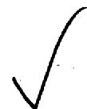

# Part 5. Materials Development

J.R.WeiH.E.McCoy

Our materials program has concentrated on the development of graphite and Hastelloy N with improved resistance to irradiation damage. We have approached the graphite problem by studying the dimensional changes during irradiation of several commercial graphites. These studies have revealed which graphites are most stable and, additionally, have shown what preirradiation properties are important in making some experimental graphites that likely will have improved dimensional stability during irradiation. The graphite used in an MSBR must also be sealed to reduce the permeability to gaseous fission products. We are developing techniques for sealing graphite with carbon.

The fast flux seen by the Hastelloy N is quite low, and the irradiation damage to this material is associated with the production of helium from the transmutation of $^{1} \mathbf{C}$ B by thermal neutrons. The threshold boron level required to cause embrittlement is too low to be obtained commercially, so we sought to reduce the problem by changes in alloy chemistry. Modified compositions of Hastelloy N containing additions of Ti, Hf, and Nb look promising. The improved properties are associated with the formation of a fine dispersion of

type MC carbides, and we are studying how the carbide type changes with alloy composition and aging.

The compatibility of Hastelloy N with fluoride salts continues to receive attention; the main emphasis is currently placed on the proposed coolant salt, sodium fluoroborate. This salt is more corrosive than other fluoride salts; we attribute this aggressiveness to the presence of adsorbed moisture. The variation of corrosion rate with moisture content and methods of removing moisture from a flowing salt stream are being studied.

Some work has begun on developing structural materials suitable for use in the chemical processing plant. In this application the materials will be exposed to both salt and bismuth. Nickel-base alloys are highly soluble in bismith, and iron-base alloys mass transfer very badly. Molybdenum seems compatible, but it is difficult to fabricate. One avenue of research involves methods of coating steels with molybdenum or tungsten to protect them from the bismuth. A second area of endeavor is that of finding brazing alloys that are compatible with bismuth for joining molybdenum.

# 16. MSRE Surveillance Program

H.E.McCoy W.H.Cook

We maintain a surveillance program in the MSRE to follow the property changes that occur in the graphite and Hastelloy N used in fabricating the experiment. There are surveillance positions in the core and outside the reactor vessel. Graphite and Hastelloy N are included in the core surveillance facility. The deposition of fission products on both materials is studied (see Part 3 for the results). The fluence received by the graphite is quite low, and the dimensional changes have re

mained undetectable by the measuring techniques that we have available in the hot cells. The fluence is high enough to change the mechanical properties of the Hastelloy N, and we have run both tensile and creep tests to follow these changes. Metallographic studies are performed to follow corrosion. Only Hastelloy N samples are in the facility outside the vessel. The samples more nearly reflect the condition of the reactor vessel. Hastelloy N of the same heats used in fabricating

the MSRE has been used in the surveillance program, and some additional alloys of modified compositions have been included.

The Hastelloy N samples removed to date from the MSRE are summarized in Table 16.1. The details of tests on the first three groups of samples have been presented previously, $^{1-3}$ and the present discussion will concentrate on the Hastelloy N samples designated as group 4.

# 16.1 PROPERTIES OF HASTELLOY N SAMPLES REMOVED FROM THE MSRE

H. E. McCoy

As discussed previously1 the metal samples removed after run 18 (designated group 4) were discolored. The straps that held the surveillance assembly together were examined and found to contain cracks up to 3 mils deep. We examined unstressed samples from the surveillance rods and found that they also had a modified structure to a depth of 1 or 2 mils (Fig. 16.1). Samples exposed to static barren salt for the same period of time did not have the modified structure (Fig. 16.2). To determine qualitatively what effect this structural change would have on the mechanical properties, we bent a test sample at room temperature. The photomicrographs in Fig. 16.3 show what occurred. On the tensile side of the sample, cracks formed that penetrated about 4 mils. On the compression side there was no cracking.

Several of the mechanical property samples were examined metallographically after testing to determine the behavior of the modified microstructure under uniaxial testing at 25 and $650^{\circ}\mathrm{C}$ . At a test temperature of $25^{\circ}\mathrm{C}$ , the fracture was primarily intergranular in the irradiated sample (Fig. 16.4) and primarily transgranular in the unirradiated sample (Fig. 16.5). There was a large amount of edge cracking to a depth of about 4 mils in the irradiated sample (Fig. 16.4), but there was none in the unirradiated sample (Fig. 16.5). At a test temperature of $650^{\circ}\mathrm{C}$ the fractures were intergranular in both unirradiated and irradiated samples.

The irradiated sample (Fig. 16.6) had edge cracks to a depth of about 12 mils; the unirradiated sample (Fig. 16.7) had fewer cracks. The fact that the irradiated sample strained only $5\%$ and the unirradiated sample $24\%$ before failure should be considered in comparing these photomicrographs. That the sample that strained the most had fewer edge cracks indicates that the structure modification of the irradiated samples caused added embrittlement near the surface.

We know that the oxidation potential of the salt was relatively high during some of the time that the samples were in the reactor. This should remove chromium from the specimen surfaces, and indeed we observed that the chromium concentration of the salt did rise. However, this should not embrittle the metal, nor should it produce the modified microstructure. We are using several techniques to identify chemical changes near the surface. This work is incomplete, and we will report the findings later.

The tensile properties of the standard Hastelloy N samples removed from the core with group 4 were reported previously. The creep tests have been completed on these materials, and the properties will be compared with those obtained at other fluences. The stress-rupture properties at $650^{\circ}$ for heat 5085 are shown in Fig. 16.8 for various fluences. The data for the control samples show that the rupture life decreased with increasing aging time at $650^{\circ}$ to 15,289 hr and then increased slightly with further aging for 22,533 hr. The irradiated samples show a decrease in rupture life with increasing thermal fluence up to $9.4 \times 10^{20}$ neutrons/cm². No further deterioration occurred with an increase in fluence to $1.5 \times 10^{21}$ neutrons/cm². This behavior is as expected, since these two fluences represent boron burnups of 87 and 90% respectively. This small difference should not be detectable in the properties that we measure. The minimum creep rate measurements shown in Fig. 16.9 show that neither irradiation nor aging has an appreciable influence on the minimum creep rate. The possible exception is at very high stress levels; however, these samples failed at such low strains that they likely are still in the primary creep stage and have not reached the secondary or minimum creep rate stage. The fracture strains for these samples are shown in Fig. 16.10 as a function of creep rate. The fracture strain decreases progressively with increasing

Table 16.1. Summary of Exposure Conditions of Surveillance Samples   

<table><tr><td rowspan="2"></td><td>Group 1</td><td colspan="2">Group 2</td><td colspan="3">Group 3</td><td colspan="3">Group 4</td></tr><tr><td>Core, Standard Hastelloy N</td><td>Core, Modified Hastelloy N</td><td>Vessel, Standard Hastelloy N</td><td>Core, Standard Hastelloy N</td><td>Core, Modified Hastelloy N</td><td>Vessel, Standard Hastelloy N</td><td>Core, Standard Hastelloy N</td><td>Core, Modified Hastelloy N</td><td>Vessel, Modified Hastelloy N</td></tr><tr><td>Date inserted</td><td>9/8/65</td><td>9/13/66</td><td>8/24/65</td><td>9/13/66</td><td>6/5/67</td><td>8/24/65</td><td>9/13/66</td><td>4/10/68</td><td>5/7/68</td></tr><tr><td>Date removed</td><td>7/28/66</td><td>5/9/67</td><td>6/5/67</td><td>4/3/68</td><td>4/3/68</td><td>5/7/68</td><td>6/69</td><td>6/69</td><td>6/69</td></tr><tr><td>Mwhr on MSRE at time of insertion</td><td>0.0066</td><td>8682</td><td>0</td><td>8682</td><td>36,247</td><td>0</td><td>8682</td><td>72,441</td><td>36,247</td></tr><tr><td>Mwhr on MSRE at time of removal</td><td>8682</td><td>36,247</td><td>36,247</td><td>72,441</td><td>72,441</td><td>72,441</td><td>92,805</td><td>92,805</td><td>92,805</td></tr><tr><td>Temperature, °C</td><td>650 ± 10</td><td>650 ± 10</td><td>650 ± 10</td><td>650 ± 10</td><td>650 ± 10</td><td>650 ± 10</td><td>650 ± 10</td><td>650 ± 10</td><td>650 ± 10</td></tr><tr><td>Time at temperature, hr</td><td>4800</td><td>5500</td><td>11,000</td><td>15,289</td><td>9789</td><td>20,789</td><td>22,533</td><td>7244</td><td>17,033</td></tr><tr><td>Peak fluence, neutrons/cm2</td><td></td><td></td><td></td><td></td><td></td><td></td><td></td><td></td><td></td></tr><tr><td>Thermal (&lt;0.876 ev)</td><td>1.3 × 1020</td><td>4.1 × 1020</td><td>1.3 × 1019</td><td>9.4 × 1020</td><td>5.3 × 1020</td><td>2.6 × 1019</td><td>1.5 × 1021</td><td>5.1 × 1020</td><td>2.5 × 1019</td></tr><tr><td>Epithermal (&gt;0.876 ev)</td><td>3.8 × 1020</td><td>1.2 × 1021</td><td>2.5 × 1019</td><td>2.8 × 1021</td><td>1.6 × 1021</td><td>5.0 × 1019</td><td>3.7 × 1021</td><td>9.1 × 1020</td><td>3.9 × 1019</td></tr><tr><td>(&gt;50 kev)</td><td>1.2 × 1020</td><td>3.7 × 1020</td><td>2.1 × 1019</td><td>8.5 × 1020</td><td>4.8 × 1020</td><td>4.2 × 1019</td><td>1.1 × 1021</td><td>1.1 × 1020</td><td>3.3 × 1019</td></tr><tr><td>(&gt;1.22 Mev)</td><td>3.1 × 1019</td><td>1.0 × 1020</td><td>5.5 × 1018</td><td>2.3 × 1020</td><td>1.3 × 1020</td><td>1.1 × 1019</td><td>3.1 × 1020</td><td>0.8 × 1020</td><td>8.6 × 1018</td></tr><tr><td>(&gt;2.02 Mev)</td><td>1.6 × 1019</td><td>0.5 × 1020</td><td>3.0 × 1018</td><td>1.1 × 1020</td><td>0.7 × 1020</td><td>6.0 × 1018</td><td>1.5 × 1020</td><td>0.4 × 1020</td><td>3.5 × 1018</td></tr><tr><td>Heat designations</td><td>5081, 5085</td><td>21545, 21554</td><td>5065, 5085</td><td>5065, 5085</td><td>67-502, 67-504</td><td>5065, 5085</td><td>5065, 5085</td><td>7320, 67-551</td><td>67-504</td></tr></table>

aInformation compiled by R. C. Steffy. Revised for full-power operation at 8 Mw.

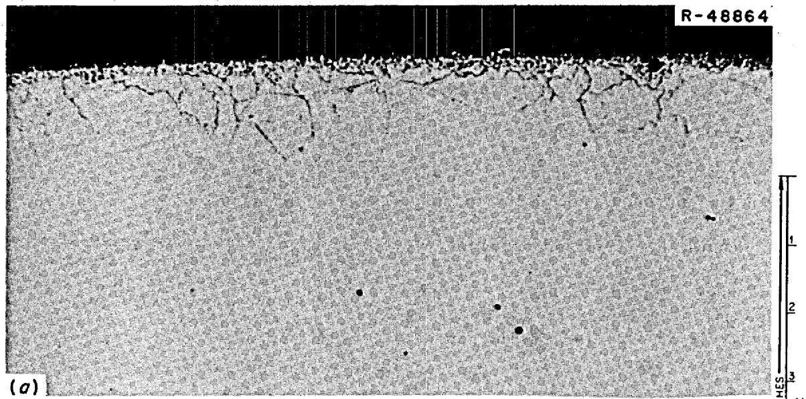

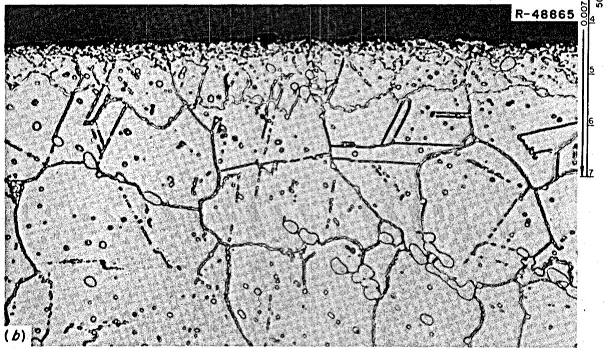  
Fig. 16.1. Typical Photomicrographs of Hastelloy N (Heat 5085) Exposed to the MSRE Core for 22,533 hr at $650^{\circ}\mathrm{C}$ . (a) As polished; (b) etched, glyceregia. $500\times$ .

fluence. However, the remarkable fact is that the unirradiated samples have fracture strains of 15 to $30\%$ and that the lowest fluence studied reduced the fracture strain to $2.5\%$ . This fluence produced a helium content of about 1 ppm in this heat of material.

All of the results that have been presented are for heat 5085 (used to make the cylindrical shell of the MSRE). Heat 5065 (used to make the top and bottom heads of the MSRE) has been included in the program, and its performance parallels very closely that of heat 5085.

Several heats of modified Hastelloy N have been included in our program, and detailed mechanical property tests similar to those just described for heat 5085 have been run. The results have been reported, $^{3-5}$ but Fig. 16.11 summarizes the performance of some of these new alloys. All of the modified alloys have rupture lives approaching those of standard Hastelloy N in the unirradiated condition. The minimum fracture

strains vary from $0.5\%$ for standard Hastelloy N to $6\%$ for alloys modified with $1.1\%$ titanium or $0.49\%$ hafnium. None of these alloys shows any evidence of higher corrosion due to the addition of these elements that are easily oxidized. However, as we have discussed previously, most of these alloys do not retain their good properties when irradiated above $700^{\circ}\mathrm{C}$ . Thus further chemical modifications are needed to obtain an alloy suitable for service at $700^{\circ}\mathrm{C}$ (see Chap. 18 for further details on this work).

3H. E. McCoy, Jr., An Evaluation of the Molten-Salt Reactor Experiment Hastelloy N Surveillance Specimens - First Group, ORNL-TM-1997 (November 1967).   
4H. E. McCoy, Jr., An Evaluation of the Molten-Salt Reactor Experiment Hastelloy N Surveillance Specimens - Second Group, ORNL-TM-2359 (February 1969).   
5H. E. McCoy, Jr., An Evaluation of the Molten-Salt Reactor Experiment Hastelloy N Surveillance Specimens - Third Group, ORNL-TM-2647 (January 1970).

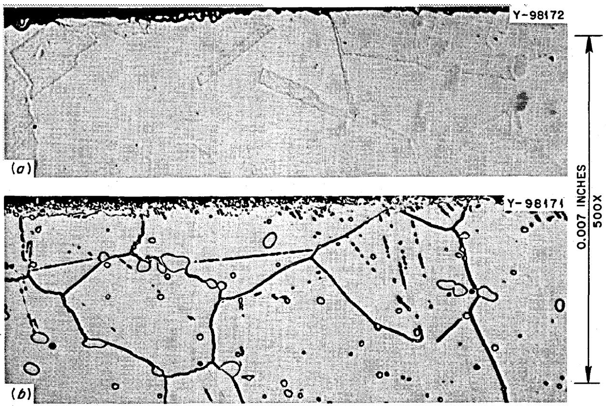  
Fig. 16.2. Typical Photomicrographs of Heat 5085 After Exposure to Static Barren Salt for 22,533 hr at $650^{\circ}\mathbf{C}$ . (a) As polished; (b) etched, glyceregia.

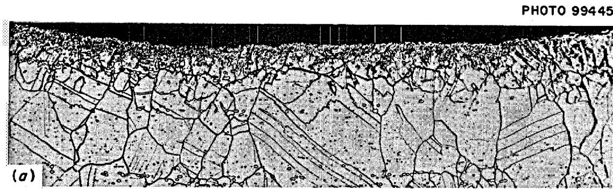

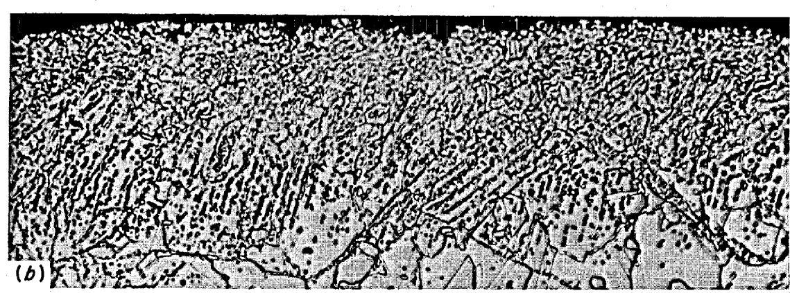

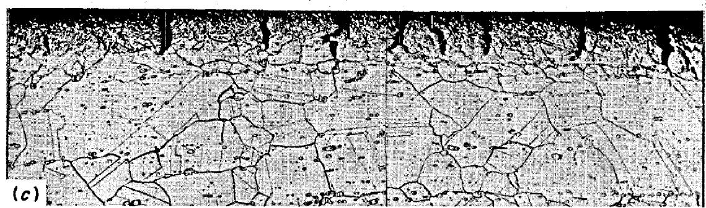

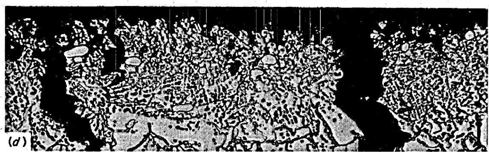  
Fig. 16.3. Typical Photomicrographs of a Hastelloy N (Heat 5085) Sample Exposed to the MSRE Core for 22,533 hr at $650^{\circ}\mathrm{C}$ . The sample was bent in a vise. (a) Compression side, $100\times$ ; (b) compression side, $500\times$ ; (c) tension side, $100\times$ ; (d) Tension side, $500\times$ . Etchant, glyceregia.

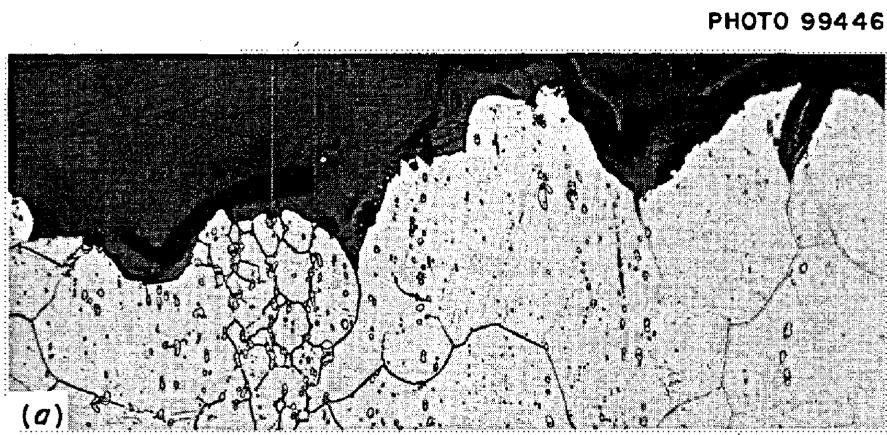

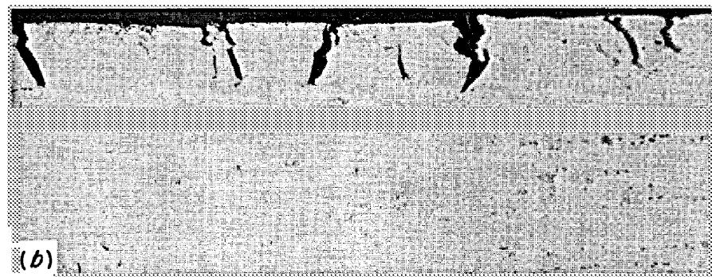

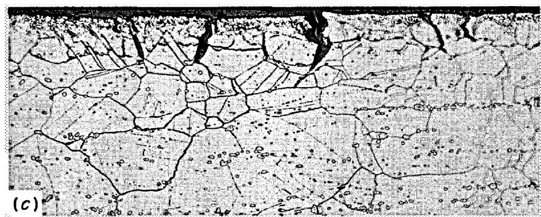  
10.030 in. 100x 10.010 in.   
Fig. 16.4. Photomicrographs of a Hastelloy N (Heat 5085) Sample Tested at $25^{\circ}\mathrm{C}$ After Being Exposed to the MSRE Core for 22,533 hr at $650^{\circ}\mathrm{C}$ and Irradiated to a Thermal Fluence of $1.5 \times 10^{21}$ Neutrons/cm $^2$ . (a) Fracture, etched, $100\times$ ; (b) edge, as polished, $100\times$ , (c) edge, etched, $100\times$ . Etchant, glyceregia.

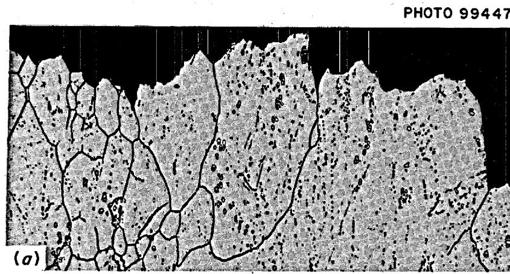

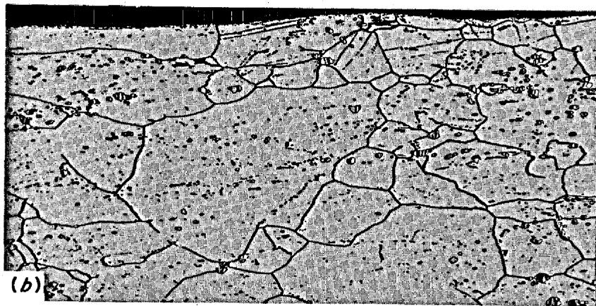  
Fig. 16.5. Typical Photomicrographs of a Hastelloy N (Heat 5085) Sample Tested at $25^{\circ}\mathrm{C}$ After Being Exposed to Static Barren Fuel Salt for 22,533 hr at $650^{\circ}\mathrm{C}$ . (a) Fracture; (b) edge near fracture, $100\times$ . Etchant, glyceregia.

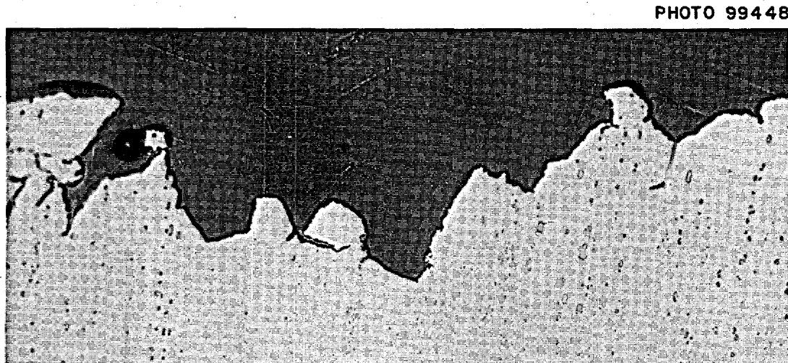  
(a)

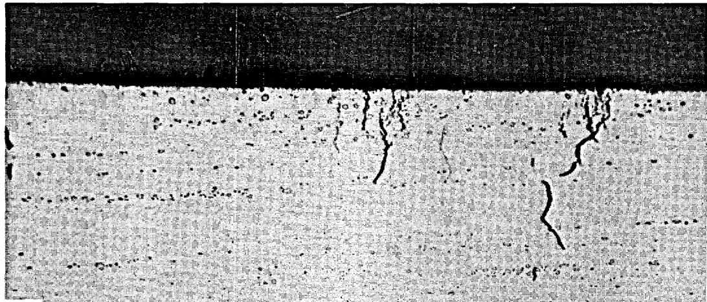  
0.035 INCHES 10.030 in. 100x 10.010 in.   
(b)

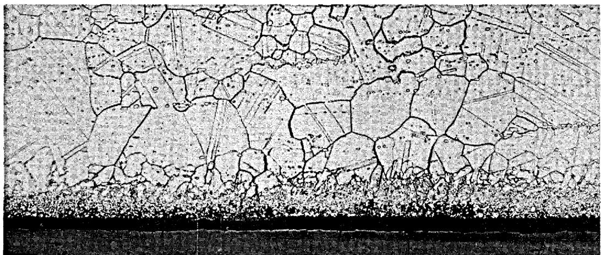  
(c)   
Fig. 16.6. Photomicrographs of a Hastelloy N (Heat 5085) Sample Tested at $650^{\circ}\mathrm{C}$ After Being Exposed to the MSRE Core for 22,533 hr at $650^{\circ}\mathrm{C}$ and Irradiated to a Thermal Fluence of $1.5 \times 10^{21}$ Neutrons/cm $^2$ . (a) Fracture, etched, $100\times$ ; (b) edge, as polished, $100\times$ , (c) edge, etched, $100\times$ . Etchant, glyceregia.

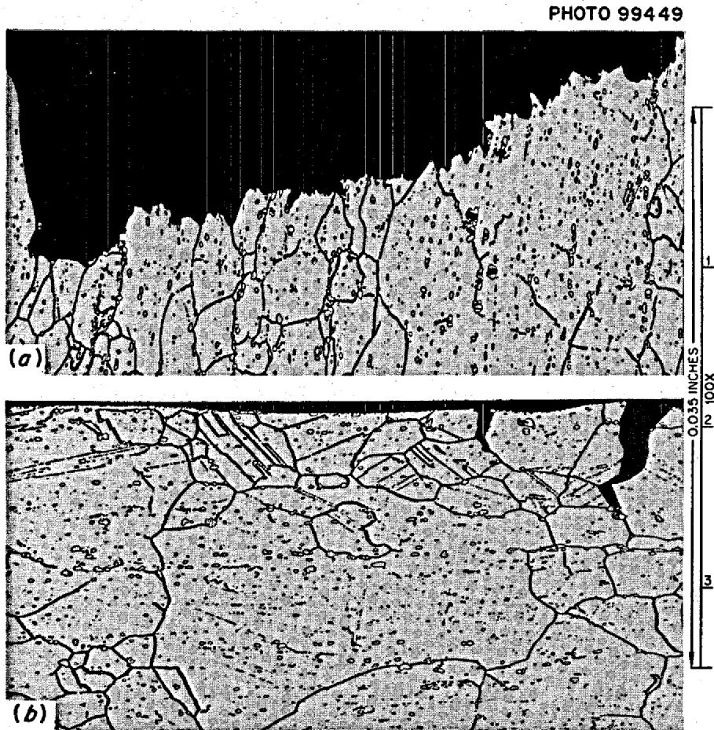  
Fig. 16.7. Typical Photomicrographs of a Hastelloy N (Heat 5085) Sample Tested at $650^{\circ}\mathrm{C}$ After Being Exposed to Static Barren Fuel Salt for 22,533 hr at $650^{\circ}\mathrm{C}$ . (a) Fracture; (b) edge near fracture, $100\mathrm{x}$ , etchant, glyceregia.

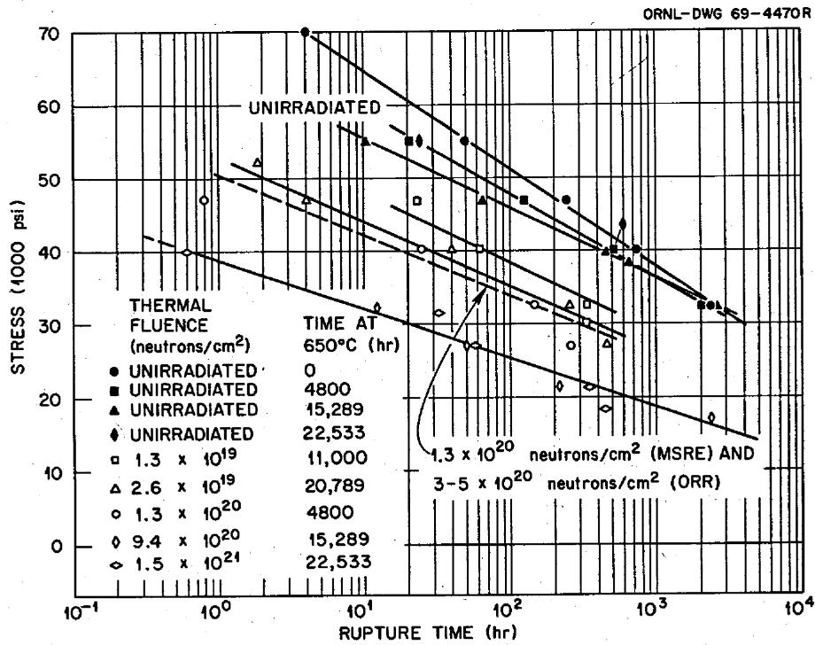  
Fig. 16.8. Postirradiation Stress-Rupture Properties of MSRE Surveillance Specimens (Heat 5085) at $650^{\circ}\mathrm{C}$ .

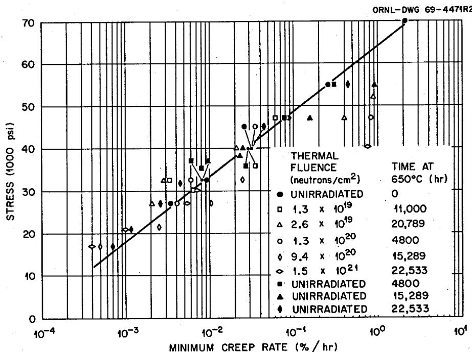  
Fig. 16.9. Minimum Creep Rate of Hastelloy N (Heat 5085) Surveillance Specimens from MSRE at $650^{\circ}\mathrm{C}$ .

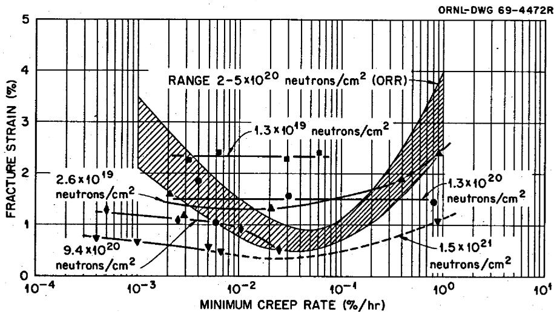  
Fig. 16.10. Variation of Fracture Strain with Strain Rate for Hastelloy N (Heat 5085) Surveillance Specimens at $650^{\circ}\mathbf{C}$ .

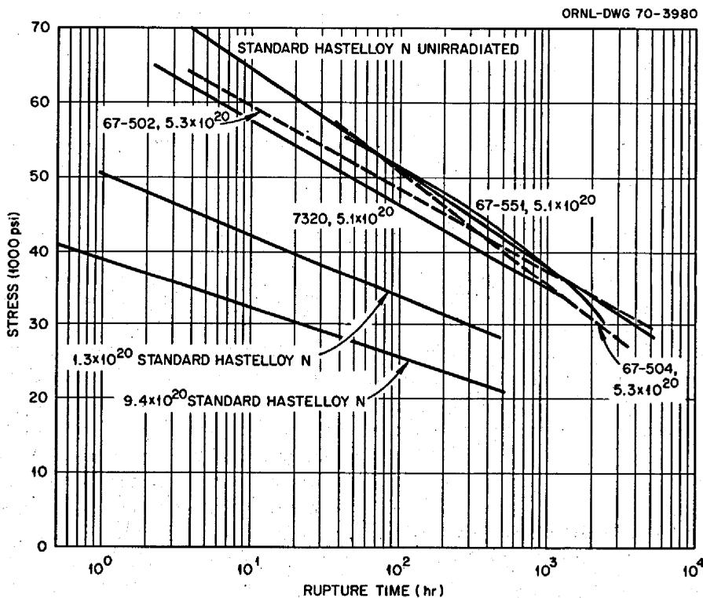  
Fig. 16.11. Stress-Rupture Properties at $650^{\circ}\mathrm{C}$ of Several Modified Alloys That Have Been Included in the MSRE Surveillance Program. The first number by each curve is the alloy designation, the second number is the fracture strain range, and the third number is the thermal fluence in neutrons/cm². The alloy modifications are: heat 67-502 contains 2% W and 0.5% Ti, heat 67-504 contains 0.49% Hf, heat 67-551 contains 1.1% Ti, and alloy 7320 contains 0.5% Ti.

# 17. Graphite Studies

W.P.Eatherly H.E.McCoy,Jr.

The purpose of our graphite program is to develop graphites that are suitable for use in molten-salt reactors. The graphite in these reactors will be exposed to high neutron fluences and must maintain reasonable dimensional stability and mechanical integrity. Furthermore, the graphite must have a fine pore spectrum that will exclude salt and a very low permeability to gaseous fission products, notably $^{135}\mathrm{Xe}$ . Our initial approach to the problem of dimensional stability during irradiation has been to evaluate all of the commercial products that look potentially acceptable. This study has been done carefully and systematically, so that the respective importances of several variables have emerged. Physical property measurements, x-ray studies, and electron microscopy have greatly supplemented the interpretation of the results.

We have found commercial graphites that will perform acceptably in a molten-salt breeder reactor, but our studies offer encouragement that graphites with improved resistance to irradiation damage can be developed. Our ideas are being used in a small fabrication program to produce test samples of potentially better graphites.

The problem of obtaining low gas permeability is being approached by gas impregnation with a hydrocarbon. This problem is not independent of the dimensional stability of graphite, since differential changes in dimensions of the impregnated material relative to the base graphite can increase the permeability. We have developed several techniques for obtaining low permeabilities, but the stability of the structures under irradiation will largely govern the choice of process.

# 17.1 FUNDAMENTAL STUDIES OF RADIATION DAMAGE MECHANISMS IN GRAPHITE

D. K. Holmes

S.M.Ohr

W.E. Atkinson

T. S. Nuggle

The earlier studies of "in situ" damage in graphite due to the illuminating beam of the 200-kv electron microscope had demonstrated that extensive damage

occurred; however, the detailed nature of the observed structures could not be determined, since the contrast behavior did not systematically vary in a manner that permitted analysis. Recent work employing a dark-field technique to monitor and study the damage has considerably improved the sensitivity to the appearance of damage clusters and provides unambiguous evidence that the damage clusters are dislocation loops of interstitial type.

These observations are being extended to evaluate the effect of irradiation temperature, dose, and electron energy on the size, density, and nature of the damage clusters and the incubation time for their appearance. The increased sensitivity of the dark-field method to presence of the damage clusters compared with brightfield observations leads to apparent incubation periods approximately a factor of 2 shorter than previously reported. In addition, it has been found that irradiation with 150-kv electrons leads to damage clusters; however, the incubation period is 2 to 3 times longer than the incubation time for 200-kv irradiations. This observation of damage from 150-kv electrons suggests that the threshold energy for displacement of carbon atoms is lower than the value of 33 ev reported in the literature.

At this time the experimental techniques being employed are able to generate information which can be compared with the theoretical model developed which treats the kinetics of the nucleation and growth of interstitial clusters. This model is based on the work of Mayer, who advanced the hypothesis that boron plays a critical role in the nucleation of interstitial clusters. For the experimental observations to test or suggest changes in the theoretical treatment, it is necessary that graphite containing known amounts of boron be studied. The availability of good graphite crystals has been limited, and boron-doped material has not been available. To obtain an adequate supply of material, rock containing graphite single crystals was obtained from the Lead Hill graphite mine at Ticonderoga, New York, and chemical dissolution of the calcite matrix is being carried out to free the natural single crystals. Preliminary x-ray studies have indicated

that the material obtained contains excellent single crystals. Purification, followed by doping with boron, will be carried out on this material to give specimens suitable for testing the theoretical model as to the role of boron in the formation of the interstitial damage clusters.

# 17.2 Procurement OF NEW GRADES OF GRAPHITE

W.H.Cook

One of the initial objectives of our graphite irradiation studies was to obtain types of graphite that were typical of all variations in nuclear graphite technology. To a large extent we have accomplished this. For this reason our rate of procurement has slowed. Our current procurement is directed toward (1) obtaining newly developed grades and (2) acquiring additional stock of the few grades that have shown the most resistance to radiation damage. The latter procurement is to supply materials for more detailed investigation of these grades. The different grades of graphite are used to extend our knowledge of the behavior of graphite in neutron irradiation. This involves new starting materials and new fabrication processes.

We have acquired three grades of pitch-bonded lampblack material, grades S20, $^{1}$ L31, $^{1}$ and SA-45. $^{2}$ Grade S20 has been fired only to a carbonization temperature, while grades L31 and SA-45 have been fired to graphitizing temperatures. Grades S20 and L31 are being evaluated in our irradiation studies. The purpose is to determine the potential of these poorly crystallized materials for use in graphite bodies under MSBR conditions.

We have a sample of grade HS-82-3 fine-grained isotropic graphite1 that has a low density (nominally $1.62\mathrm{g/cm}^3$ ) but high strength. This has also been included in our irradiation studies.

# 17.3 GENERAL PHYSICAL PROPERTY MEASUREMENTS

W.H.Cook

We ran a cursory set of physical property tests on the new graphites to determine if they are potentially useful for MSBR's or if they can contribute to our understanding of irradiation damage in graphite. These

cursory tests help us choose the grades that warrant more extensive testing. Table 17.1 is a summary of some of the cursory test data.

Group 1 in Table 17.1 is a series of materials from Poco Graphite, Inc. Grades AXF-5Q $^{1}$ and AXF-5QBG have been the most resistant to radiation damage at $715^{\circ}\mathbf{C}$ of all grades tested to date. $^{2}$ The latter is an impregnated and graphitized product of grade AXF-5Q. Their good resistance to irradiation damage warrants more extensive studies. The grade AXM-5Q is of particular interest in the series, since it was crushed to provide the filler materials for the study of special binders. $^{3}$ The grade AXF-5Q-UFG is the same as the standard grade AXF-5Q except that the starting materials have appreciably smaller grain sizes.

Group 2, from Great Lakes Carbon Corporation, is a comparison of "raw coke" graphite made in the laboratory, grade H364, and in a pilot plant, grade H337, by impregnating and graphitizing the base stock grade JOZ. Grades H364 and H337 have been the second most resistant to radiation damage. The impressive point is that the base stock had an apparent density of only $1.57\mathrm{g/cm^3}$ , which was increased to 1.94 to $2.00\mathrm{g/cm^3}$ by multiple impregnations, and that the final product showed relatively good resistance to radiation damage.

The grades of group 3, from Speer Carbon Company, as a class are not as isotropic as the materials in the first two groups; however, they were included in the irradiation studies because of special types of starting materials.

Group 4, from the Graphite Products Division of Carborundum Company, consists of all fine-grained grades of graphite that are even more anisotropic than the previous three groups. This degree of anisotropy makes these have low potential for MSBR core material.

The limited gas permeability data continue to emphasize the problems of attaining low permeability. The common grades have helium permeabilities greater than $10^{-2}\mathrm{cm}^2/\mathrm{sec}$ , and the special grades tend to be in the $10^{-4}\mathrm{cm}^2/\mathrm{sec}$ range for these four groups. Future work will involve measurements of the permeabilities and other physical properties of some of these grades after irradiation.

Table 17.1. Some Physical Properties of Various Grades of Graphite ${}^{a}$   

<table><tr><td>Grade</td><td>Typeb</td><td>Apparent Density (g/cm3)</td><td>Orientationc</td><td>Specific Resistance (microhm-cm)</td><td>Permeability to Helium (cm2/sec)</td></tr><tr><td colspan="6">Group 1d</td></tr><tr><td rowspan="3">AXZ-5Q</td><td rowspan="3">NI</td><td rowspan="3">1.55 (45)</td><td></td><td>2335(6)</td><td></td></tr><tr><td></td><td>2330(6)</td><td></td></tr><tr><td></td><td>2330(6)</td><td></td></tr><tr><td rowspan="4">AXM-5Q</td><td rowspan="4">NI</td><td rowspan="4">1.74 (45)</td><td></td><td>[2330](18)</td><td></td></tr><tr><td></td><td>1670(6)</td><td></td></tr><tr><td></td><td>1555(6)</td><td></td></tr><tr><td></td><td>1680(6)</td><td></td></tr><tr><td rowspan="3">AXF-5Q</td><td rowspan="3">NI</td><td rowspan="3">1.82 (39)</td><td></td><td>[1635](18)</td><td></td></tr><tr><td></td><td>1410(6)</td><td></td></tr><tr><td></td><td>1310(6)</td><td></td></tr><tr><td rowspan="4">AXF-5Q-UFG</td><td rowspan="4">NI</td><td rowspan="4">1.87 (44)</td><td></td><td>[1370](12)</td><td>3.5 × 10-2(4)</td></tr><tr><td></td><td>1695(6)</td><td>5.4 × 10-3</td></tr><tr><td></td><td>1475(6)</td><td>1.7 × 10-2</td></tr><tr><td></td><td>1485(6)</td><td></td></tr><tr><td rowspan="3">AXF-5QBG</td><td rowspan="3">NI</td><td rowspan="3">1.90 (3)</td><td></td><td>[1550](18)</td><td></td></tr><tr><td></td><td>[1160](12)</td><td>6.2 × 10-4</td></tr><tr><td></td><td></td><td>1.8 × 10-4</td></tr><tr><td colspan="6">Group 2d</td></tr><tr><td rowspan="2">JOZ</td><td rowspan="2">NI</td><td rowspan="2">1.57 (28)</td><td></td><td>2295(6)</td><td></td></tr><tr><td></td><td>2220(6)</td><td></td></tr><tr><td rowspan="2">H364</td><td rowspan="2">NI</td><td rowspan="2">1.94 (3)</td><td>c</td><td>830(2)</td><td>9.2 × 10-3</td></tr><tr><td>z</td><td>880(15)</td><td></td></tr><tr><td rowspan="3">H337</td><td rowspan="3">NI</td><td rowspan="3">2.00 (30)</td><td></td><td>740(3)</td><td>3.8 × 10-4(4)</td></tr><tr><td></td><td>800(3)</td><td>5.4 × 10-4(4)</td></tr><tr><td></td><td>[770](6)</td><td></td></tr><tr><td colspan="6">Group 3d</td></tr><tr><td rowspan="2">9948</td><td rowspan="2">A</td><td rowspan="2">1.90 (6)</td><td>wg</td><td>920(7)</td><td>4.8 × 10-2(3)</td></tr><tr><td>ag</td><td>1074(9)</td><td>6.3 × 10-2(3)</td></tr><tr><td rowspan="2">9950</td><td rowspan="2">A</td><td rowspan="2">1.72 (32)</td><td>wg</td><td>850(10)</td><td></td></tr><tr><td>ag</td><td>1020(4)</td><td></td></tr><tr><td rowspan="2">9972</td><td rowspan="2">A</td><td rowspan="2">1.82 (32)</td><td>wg</td><td>830(4)</td><td>2.0 × 10-2</td></tr><tr><td>ag</td><td>1005(10)</td><td></td></tr><tr><td rowspan="2">HL-18</td><td rowspan="2">A</td><td rowspan="2">1.87 (45)</td><td>wg</td><td>1705(12)</td><td></td></tr><tr><td>ag</td><td>1750(6)</td><td></td></tr><tr><td colspan="6">Group 4d</td></tr><tr><td rowspan="2">Graph-i-tite “A”</td><td rowspan="2">A</td><td rowspan="2">1.90 (28)</td><td>z, wg</td><td>1000(6)</td><td></td></tr><tr><td>c, ag</td><td>1385(6)</td><td></td></tr><tr><td rowspan="2">Graph-i-tite “G”</td><td rowspan="2">A</td><td rowspan="2">1.88 (28)</td><td>z, wg</td><td>1020(6)</td><td></td></tr><tr><td>c, wg</td><td>1275(6)</td><td></td></tr></table>

${}^{a}$ The numbers in parentheses following data are the number of values averaged.   
$b_{\mathrm{NI}} =$ near isotropic and $\mathbf{A} =$ anisotropic.   
cThe directions in which the specific resistivity and helium permeability were determined: $\mathbf{wg} =$ with grain, $\mathbf{ag} =$ across grain, $\mathbf{z} =$ parallel with long dimension, and $\mathbf{c} =$ chord direction.   
$d_{\text{Group 1}}$ is material obtained from Poco Graphite, Inc.; group 2 is material obtained from Great Lakes Carbon Corporation; group 3 is material obtained from Speer Carbon Company; and group 4 is material obtained from the Graphite Products Division of Carborundum Company.

# 17.4 GRAPHITE FABRICATION

# R. L. Hamner

Our goal is to fabricate high-density isotropic bodies for molten-salt reactor applications. We fabricated bodies by warm uniaxial pressing and by isostatic pressing. These bodies were then impregnated to increase density. The characteristics of the starting materials and the results of our fabrication studies follow.

# 17.4.1 Characterization of Materials

Four grades of filler materials were used:

1. JOZ-grade graphite powder (Great Lakes Carbon Corporation), derived from a petroleum coke, unimpregnated, base stock produced commercially. Our interest in this material was evoked by the irradiation behavior of grade H337, which is made from the impregnated base stock.   
2. Graphitized Robinson coke, air-blown graphite powder (Carbon Products Division, UCC) which does not form a needle-like structure and, therefore, may be amenable to the fabrication of isotropic bodies.   
3. Santa Maria coke (Collier Carbon and Chemical Corporation), which is reported to result in bodies similar in unirradiated properties to the Poco grades.1   
4. Thermax (R. T. Vanderbilt Company, Inc.), a submicron spherical carbon black, which is used frequently to enhance the packing characteristics of graphite particles in a fabricated body.

These flours (except Thermax) have been characterized by metallography, chemical analyses, particle size distribution, helium density, and surface area. Interlayer spacings and crystallite sizes are now being determined by x-ray diffraction.

By metallographic examination the JOZ powder appears to be the most graphitic of the group but contains more needle-like particles in the finer fractions; the larger particles of all the materials are relatively blocky; the Santa Maria flour has peculiar "pinwheel"-shaped areas which tend to break down into short needles in the finer fractions. Other characterizations are shown in Table 17.2. A coal tar pitch

Table 17.2. Characterization of Graphite Flours (Filler Materials) $^{a,b}$   

<table><tr><td rowspan="2">Particle Size Distribution (%)</td><td colspan="3">Particle Size Range (μ)</td></tr><tr><td>JOZ</td><td>Robinson</td><td>Santa Maria</td></tr><tr><td>100</td><td>&lt;100</td><td>&lt;120</td><td>&lt;180</td></tr><tr><td>90</td><td>&lt;97</td><td>&lt;91</td><td>&lt;93</td></tr><tr><td>50</td><td>&lt;43</td><td>&lt;55</td><td>&lt;34</td></tr><tr><td>10</td><td>&lt;7</td><td>&lt;15</td><td>&lt;3</td></tr></table>

$a$ Helium density $(\mathbf{g} / \mathbf{cm}^3)$ : JOZ, 2.21; Robinson, 2.12; Santa Maria, 2.04.   
$b$ Surface area $(\mathfrak{m}^2 /\mathfrak{g})$ : JOZ, 4.17; Robinson, 4.18; Santa Maria, 3.14.

(Allied Chemical Company, grade 15-V) was selected as a binder for initial work, but only the fraction soluble in benzene at $80^{\circ}\mathrm{C}$ was used. As determined by our experiments, about $20\%$ insolubles, which are presumed to be impurities and higher-melting pitches, were filtered out of the pitch. The coking value as determined in an open boat in flowing helium was $33\%$ at $1000^{\circ}\mathrm{C}$ . Thermogravimetric analysis showed that approximately $89\%$ of the volatiles escaping during carbonization were given off between 200 and $500^{\circ}\mathrm{C}$ .

# 17.4.2 Fabrication by Hot Pressing

The technique of fabricating by warm uniaxial pressing was selected, since it yields a product similar to extruded bodies because of the orientation effect but requires less time and materials. Billets nominally 3 in. in diameter and 2.75 in. high were pressed in a graphite die at 1600 psi and approximately $1100^{\circ}\mathrm{C}$ ; these were then graphitized at $2800^{\circ}\mathrm{C}$ (unpressurized) and impregnated with pitch to increase density. The characteristics of the pressed billets are shown in Table 17.3. The densification due to Thermax additions is apparent. Crystalline anisotropy was determined by a qualitative check which compares the maximum diffracted intensities obtained from the basal planes in flat thin specimens having the same thickness and whose faces are perpendicular to and parallel with the fabrication axis. This technique is probably sufficient for the initial development stages of our fabrication studies. The isotropy of the Robinson billets was far superior to that of either the Santa Maria or the JOZ billets: the latter showed the greatest anisotropy, probably because of the needle-like particles in the flour, which promote preferred orientation.

We performed multiple impregnations on specimens from these six types, as shown in Table 17.4. Our

Table 17.3. Fabrication Conditions and Results for Warm-Pressed Graphite Billetsa   

<table><tr><td></td><td>SM-1</td><td>SM-4</td><td>ROB-1</td><td>ROB-5</td><td>JOZ-2</td><td>JOZ-4</td></tr><tr><td>Graphite powder, %</td><td>100</td><td>85</td><td>100</td><td>85</td><td>100</td><td>85</td></tr><tr><td>Thermax, %</td><td>0</td><td>15</td><td>0</td><td>15</td><td>0</td><td>15</td></tr><tr><td>Total amount of filler, g</td><td>500</td><td>450</td><td>450</td><td>450</td><td>400</td><td>500</td></tr><tr><td>Binder level, pph</td><td>20</td><td>20</td><td>20</td><td>20</td><td>31</td><td>20</td></tr><tr><td>Bulk density,\( ^b \)g/cm\( ^3 \)</td><td>1.56</td><td>1.66</td><td>1.57</td><td>1.77</td><td>1.63</td><td>1.78</td></tr><tr><td>Crystalline anisotropy factor</td><td>1.09</td><td>1.085</td><td>1.00</td><td>~1.00</td><td>1.34</td><td>1.22</td></tr></table>

${}^{a}$ Pressed at ${1080}^{ \circ  }\mathrm{C},{1600}\mathrm{{psi}}$ ; graphitized at ${2800}^{ \circ  }\mathrm{C}$ ,unpressurized.   
$b$ As determined by dimensional measurements and weights.

Table 17.4. Bulk Density Increase with Successive Impregnations   

<table><tr><td rowspan="2"></td><td colspan="7">Bulk Densityd(g/cm3) for Given Number of Impregnations</td></tr><tr><td>0</td><td>1</td><td>2</td><td>3</td><td>4</td><td>5</td><td>6</td></tr><tr><td>JOZ-2</td><td>1.69</td><td>1.75</td><td>1.82</td><td>1.88</td><td>1.89</td><td>1.89</td><td>1.94</td></tr><tr><td>JOZ-4</td><td>1.77</td><td>1.83</td><td>1.89</td><td>1.95</td><td>1.96</td><td></td><td></td></tr><tr><td>SM-1</td><td>1.56</td><td>1.65</td><td>1.72</td><td>1.79</td><td>1.85</td><td>1.88</td><td>1.88</td></tr><tr><td>SM-4</td><td>1.65</td><td>1.74</td><td>1.81</td><td>1.85</td><td>1.87</td><td></td><td></td></tr><tr><td>ROB-1</td><td>1.56</td><td>1.65</td><td>1.74</td><td>1.81</td><td>1.84</td><td>1.85</td><td></td></tr><tr><td>ROB-5</td><td>1.77</td><td>1.82</td><td>1.88</td><td>1.93</td><td>1.96</td><td></td><td></td></tr></table>

${}^{a}$ As determined by dimensional measurements and weights of 0.5-in.-diam rods.

impregnation procedure was to evacuate the specimens for $1\frac{1}{2}$ hr, then impregnate the specimens with coal tar pitch in an autoclave at $160^{\circ}\mathrm{C}$ and 500 psi for 1 hr. After the final impregnation the specimens were heated at $2800^{\circ}\mathrm{C}$ to graphitize the impregnant. In general, for the same number of impregnations, specimens having initially higher bulk densities had higher final densities and reached their maximum density with fewer impregnations.

It is well known that carbon yields from binder (or impregnant) materials can be extremely variable and seem to depend on carbonizing conditions as well as on filler materials. The major variables affecting carbon yield are not well defined. Our carbon-yield experiments on the 15-V coal tar pitch alone have produced values ranging from 25 to $33\%$ , even though the samples were from the same batch of pitch and run under the same conditions.

We determined carbon yields of the pitch after each impregnation. Although there are some anomalies in the data, we observed generally that as the density increased, the carbon yield increased. We have no explanation for this, but we feel that such phenomena

must be studied in the interest of improving fabrication techniques.

The permeability of the JOZ-2 family was measured on a machined HFIR-type specimen at 1 atm He. The value obtained was surprisingly high in view of the bulk density of the specimen. Pertinent data for the specimen are compared in Table 17.5 with those obtained on extruded Varcum-bound specimens which are now being irradiated in HFIR. Specimens for measurements by mercury porosimetry were cut from the same rods from which the permeability specimens were machined. These data show that bulk density alone is not a good indicator of permeability and that the materials involved must be considered. It appears that the mode of filling open pores is different for Varcum and pitch, as might be expected, Varcum being the better sealer material. Here, again, the need is pointed out for study of the behavior of binder and/or impregnant materials.

Specimens from the ROB-5 body were submitted as candidates for irradiation because of their favorable anisotropy ratio of 1.00.

# 17.4.3 Fabrication by Isostatic Pressing

We selected the JOZ and Santa Maria materials for isostatic molding since these materials had an unsatisfactory anisotropy factor when fabricated by warm pressing. Compositions were formulated with and without Thermax additions and with 25 pph coal tar pitch as binder. The flowsheet for processing the isostatically pressed bodies is given in Fig. 17.1.

After isostatic pressing, the pellets were nominally 1 in. in diameter and 2.25 in. long. The pellets expanded slightly during carbonization (approximately $3\mathrm{vol}\%$ ), probably because of gas release from the pitch. Impregnation procedures were the same as for the warm-pressed specimens except the pressure was increased to 1000 psi.

Table 17.5. Physical Property Measurements on Experimental Graphites   

<table><tr><td>Family</td><td>Bulk Densitya(g/cm3)</td><td>Apparent Densityb(g/cm3)</td><td>Open Pore Volume (%)b</td><td>Permeability (cm2/sec)</td></tr><tr><td>JOZ-2</td><td>1.94</td><td>2.18</td><td>11.23</td><td>8.2 × 10-2</td></tr><tr><td>Y586</td><td>1.84</td><td>2.002</td><td>6.51</td><td>2.7 × 10-4</td></tr><tr><td>Y588</td><td>1.82</td><td>1.999</td><td>6.87</td><td>4.7 × 10-4</td></tr></table>

${}^{a}$ By mercury porosimetry; JOZ-2 at 1 atm, Y586 and Y588 at 1.8 psia.   
$b_{\mathrm{By}}$ mercury porosimetry at 15,000 psi.

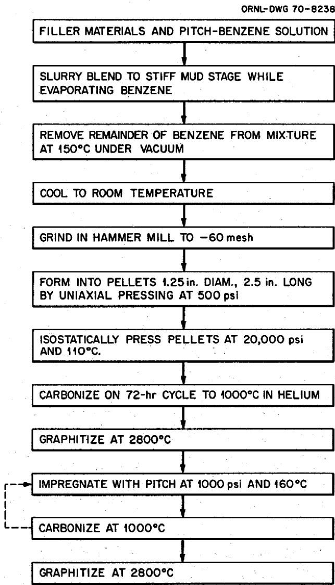  
Fig. 17.1. Flow Sheet for Processing Isostatically Pressed Specimens.

Table 17.6 shows the increases in bulk densities of the specimens with successive impregnations. Note that the densities of the unimpregnated specimens are much lower than the same compositions that were warm pressed; this is to be expected. Also the densification due to Thermax additions is apparent, although with successive impregnations this effect became less pronounced. Carbon yields from the impregnant were determined after each impregnation. As in the case of the warm-pressed specimens, the carbon yields increased with successive impregnations.

# 17.4.4 Conclusions

The following conclusions are evident from even these early results of our fabrication development work:

1. Isotropic bodies can be fabricated by techniques that tend to orient the filler particles, but this depends upon the characteristics of the filler particles.   
2. The addition of Thermax is definitely beneficial in increasing bulk densities of graphite bodies.   
3. High bulk densities can be attained by impregnating low-density bodies.   
4. Carbon yields from binder or impregnant materials are variable and need extensive exploration. In general, as the bulk density for a given family increases with successive impregnations, the carbon yield from the impregnant increases.

# 17.5 MEASUREMENT OF THE THERMAL CONDUCTIVITY OF GRAPHITE

J.P.Moore D.L.McElroy

An apparatus has been constructed for determining the effects of irradiation damage on the thermal conductivities of graphites of nuclear interest. This apparatus, which is essentially a guarded linear device, is shown in Fig. 17.2, where the numbered positions

Table 17.6. Average Bulk Density Increases of Isostatically Pressed Specimens with Successive Impregnations   

<table><tr><td rowspan="2"></td><td colspan="6">Bulk Density (g/cm3 at Given Number of Impregnations</td></tr><tr><td>0</td><td>1</td><td>2</td><td>3</td><td>4</td><td>5</td></tr><tr><td>Santa Maria-1 (SM-1): 100% Santa Maria flour, 25 pph 15-V pitch</td><td>1.335</td><td>1.476</td><td>1.601</td><td>1.710</td><td>1.773</td><td>1.791</td></tr><tr><td>Santa Maria-2 (SM-2): 85% Santa Maria flour, 15% Thermax, 25 pph 15-V pitch</td><td>1.486</td><td>1.61</td><td>1.71</td><td>1.768</td><td>1.824</td><td></td></tr><tr><td>JOZ-1: 100% JOZ flour, 25 pph 15-V pitch</td><td>1.438</td><td>1.583</td><td>1.700</td><td>1.799</td><td>1.862</td><td></td></tr><tr><td>JOZ-2: 85% JOZ flour, 15% Thermax, 25 pph 15-V pitch</td><td>1.572</td><td>1.696</td><td>1.777</td><td>1.823</td><td>1.829</td><td></td></tr></table>

ORNL DWG 70-1944

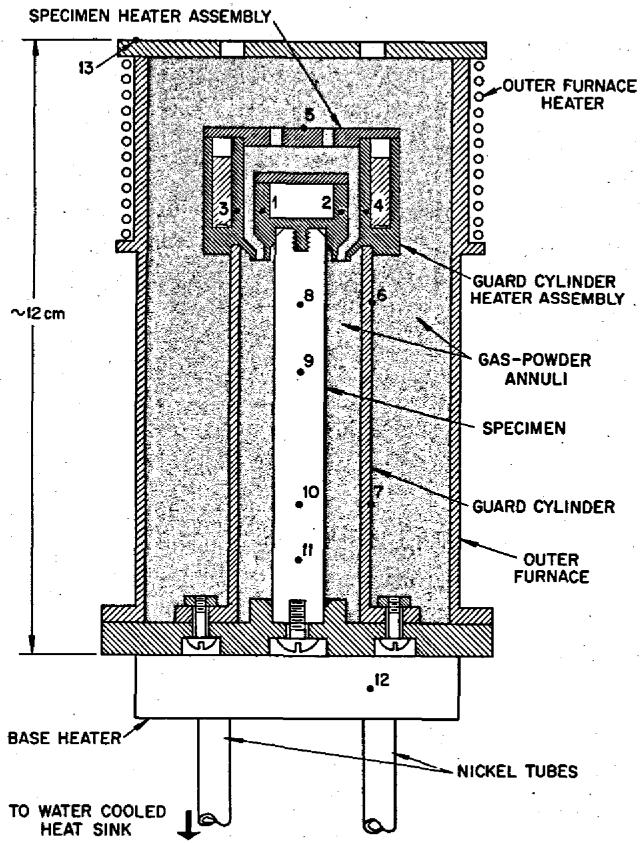  
Fig. 17.2. Schematic Drawing of Apparatus for Measuring Thermal Conductivity of Graphite. Numbers indicate the locations of thermocouples.

denote the locations of $\mathbf{Pt}$ vs $\mathrm{Pt}_{90}\mathrm{Rh}_{10}$ thermocouples. The specimen is a 1.0-cm-diam by 7.8-cm-long circular cylinder. One end of the specimen is clamped in a nickel base, and the free end contains a copper heater assembly with a 560-ohm heater. A nickel guard cylinder with a heater on the free end surrounds the specimen. Both the guard cylinder and an outer nickel furnace are bolted to a nickel base which rests on a base

heater. This heater is thermally and mechanically attached to a water-cooled heat sink with three nickel tubes. The annuli between the guard cylinder and specimen and between the guard cylinder and outer furnace are filled with a fine $\mathrm{Al}_{2}\mathrm{O}_{3}$ powder of known thermal conductivity. The entire assembly of Fig. 17.2 is enclosed in an environment chamber which is capable of vacuums to $10^{-3}\mathrm{mmHg}$ or inert gas pressures up to $1500\mathrm{mmHg}$ .

A single thermal conductivity test consists of at least two thermal conditions at the same average temperature. One of these is an "isothermal" calibration of the measuring thermocouples 8, 9, 10, and 11 with no power to the specimen heater. The others consist of determining the gradient along the specimen when a known amount of dc power is being dissipated in the specimen heater. Both configurations are obtained with the specimen heater and guard cylinder heater at the same temperature and with the outer furnace from 5 to $10^{\circ}$ cooler than either. An important test parameter - the thermal conductivity of the gas-powder annuli - can be easily varied by changing the gas pressure in the system. The two thermal configurations permit calculations of the specimen thermal conductivity, $\lambda$ , and Seebeck coefficient from each of the three sections. The sample electrical resistivity can be obtained at any temperature by passing a reversible direct current through the sample and measuring the voltage drop across adjacent thermoelements.

This device has been tested from 50 to $480^{\circ}\mathrm{C}$ on an Armco iron standard. The deviations between the measured values of $\lambda$ and the values calculated for the test specimen from its electrical resistivity $^2$ and the

Table 17.7. Guarded Linear Apparatus Performance Data   

<table><tr><td>Temperature (°C)</td><td>Deviation of Average Measured Value from Calculated Value (%)</td><td>Spread Between Three Sections (%)</td></tr><tr><td>57</td><td>+0.5</td><td>±1.6</td></tr><tr><td>180</td><td>+1.4</td><td>±1.0</td></tr><tr><td>320</td><td>+0.9</td><td>±0.4</td></tr><tr><td>480</td><td>+2.1</td><td>±0.1</td></tr></table>

deviations of results between the three measuring sections are given in Table 17.7. Considering the $\pm 1.5\%$ uncertainty in the value of $\lambda$ for the test specimen, this agreement is quite good, and testing is being completed to the design limit of $700^{\circ}\mathrm{C}$ .

Samples of H337 and Poco AXF graphites are being prepared for preirradiation measurements. These samples will then be irradiated in HFIR to various fluences from 550 to $700^{\circ}\mathrm{C}$ . The effects of the irradiation and postirradiation annealing on the thermal conductivity of these samples will be determined.

# 17.6 X-RAY STUDIES

# O.B.Cavin J.E.Spruiell

We are concerned with the determination of accurate lattice parameters, crystallite sizes, and crystalline anisotropy of potential MSBR graphites and the resultant change in these properties, if any, after irradiation in the HFIR. Previously we showed the importance of the x-ray anisotropy parameter in the interpretation of the radiation-induced growth rates at constant volume. We have continued this work on commercial materials utilizing spherical samples, and we are using this technique on experimental graphites being made at the Y-12 Plant to follow the effects of altering fabrication variables and filler.

The results in Table 17.8 show that a change in anisotropy was observed when materials were graphitized at $2800^{\circ}\mathrm{C}$ following processing at $2200^{\circ}\mathrm{C}$ . All of these materials were hot pressed at $2200^{\circ}\mathrm{C}$ and 2400 psi and had Santa Maria coke as filler with isotruxene binder. The data were obtained from the same sphere before and after the high-temperature graphitization. During thermal treatment at $2800^{\circ}\mathrm{C}$ each sample

Table 17.8. Anisotropy of Hot-Pressed Material ${}^{a}$ Graphitized at ${2200}^{ \circ  }\mathrm{C}$ , then at ${2800}^{ \circ  }{\mathrm{C}}^{b}$   

<table><tr><td rowspan="2">Sample Number</td><td rowspan="2">Fillerc</td><td colspan="3">Graphitized at 2200°C</td><td colspan="3">Graphitized at 2800°C</td></tr><tr><td>R||</td><td>R↓</td><td>BAF</td><td>R||</td><td>R↓</td><td>BAF</td></tr><tr><td>52</td><td>Fine</td><td>0.649</td><td>0.675</td><td>1.081</td><td>0.656</td><td>0.672</td><td>1.047</td></tr><tr><td>57</td><td>Coarse</td><td>0.658</td><td>0.671</td><td>1.041</td><td>0.662</td><td>0.669</td><td>1.022</td></tr><tr><td>60</td><td>L.V.</td><td>0.616</td><td>0.692</td><td>1.247</td><td>0.632</td><td>0.684</td><td>1.162</td></tr><tr><td>61</td><td>L.V.F.</td><td>0.627</td><td>0.686</td><td>1.187</td><td>0.642</td><td>0.679</td><td>1.113</td></tr></table>

$a$ Fabricated by L. G. Overholser.   
$\pmb{b}_{\mathbf{A}}$ completely isotropic material would have $\pmb{R}$ values of 0.667 and a BAF of 1.000.   
cThe filler material in each case was Santa Maria coke that was given various treatments before being consolidated into a product. L.V. = low volatile, L.V.F. = low volatile fired to $1500^{\circ}\mathrm{C}$ .

became more isotropic; the magnitude of this change was directly proportional to the starting degree of anisotropy.

Another interesting finding has been that changes in anisotropy occur when graphite is joined by brazing with molybdenum at high temperatures under pressure. We determined the changes in anisotropy of extruded stock near the braze from spherical samples whose poles were at the positions indicated in Figs. 17.3 and 17.4. The discontinuity in the curve could be correlated with a discontinuous temperature gradient during brazing.

Computer programs have been written to correct the x-ray data obtained from the Bragg maxima for calculation of lattice parameters and crystallite sizes. The data are corrected for background scatter, Lorentz polarization, structure, temperature, and sample transparency factors. Sample transparency is a very major contribution to the position and shape of x-ray line profiles. Instrumental contributions to the profile width and shape are subtracted out by the method of Stokes. Average crystallite sizes are calculated according to the method of Warren and Averbach. The standard used was a thin layer of Madagascar natural flake material sprinkled on the surface of a piece of

aluminum, which makes a negligible contribution to background scatter. Calculated crystallite sizes are greatly influenced by the choice of sample standard, and it is believed that this is the best standard sample material we could obtain. Some of the unit cell $c$ lattice parameters and crystallite sizes calculated by this technique are shown in Table 17.9. It is concluded that the corrections used are adequate, since the lattice

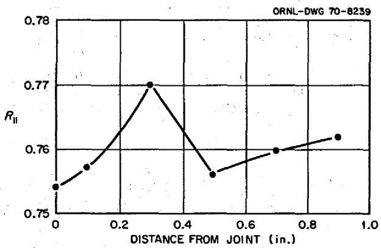  
Fig. 17.3. Anisotropy vs Distance from Braze for G.L. 1008 Graphite Flour.

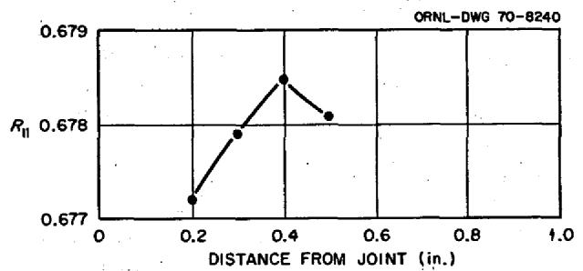  
Fig. 17.4. Anisotropy vs Distance from Braze for Poco AXM Graphite Flour.

parameters calculated from both the (002) and (004) peaks are in substantial agreement. The center of gravity will not necessarily coincide with the peak position because of the asymmetry of the profiles.

Figure 17.5 is a plot of the crystallite size vs $c$ parameter in which there is a linear relationship over this range of sizes.

With these careful x-ray analyses on graphites before and after irradiation, a better understanding of the material behavior can be obtained.

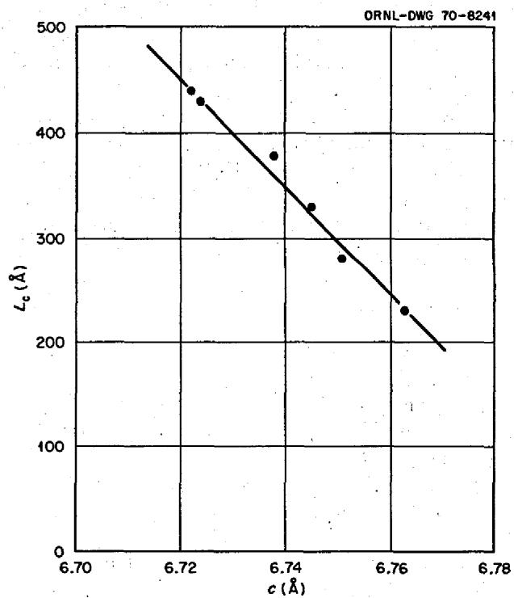  
Fig. 17.5. Plot of Crystallite Size $(L_{c})$ vs Lattice Parameter $c$ .

Table 17.9. Lattice Parameters (c) Calculated from Centers of Gravity and Peak Positions and Crystallite Sizes $(L_{c})$   

<table><tr><td rowspan="3">Grade</td><td colspan="4">c(A)</td><td rowspan="3">Lc(A)</td></tr><tr><td colspan="2">(002)</td><td colspan="2">(004)</td></tr><tr><td>Center of Gravity</td><td>Peak</td><td>Center of Gravity</td><td>Peak</td></tr><tr><td>AXF</td><td>6.779</td><td>6.764</td><td>6.776</td><td>6.763</td><td>230</td></tr><tr><td>AXF (3000°C)</td><td>6.758</td><td>6.752</td><td>6.751</td><td>6.738</td><td>330</td></tr><tr><td>AXF-5 ABG</td><td>6.761</td><td>6.752</td><td>6.755</td><td>6.750</td><td>280</td></tr><tr><td>AXF-5 ABG (3000°C)</td><td>6.754</td><td>6.740</td><td>6.757</td><td>6.737</td><td>380</td></tr><tr><td>H364</td><td>6.737</td><td>6.725</td><td>6.742</td><td>6.723</td><td>430</td></tr><tr><td>H337</td><td>6.737</td><td>6.725</td><td>6.744</td><td>6.721</td><td>440.</td></tr></table>

# 17.7 ELECTRON MICROSCOPY OF GRAPHITE

C.S.Morgan C.S.Yust

Specimens of hot-pressed pyrolytic graphite and Ticonderoga natural flake graphite have been examined in an effort to relate the features observed in these more perfect lattice arrangements to those seen in the complex polycrystalline structures. Dislocation images and extensive moiré patterns were readily observed, as were the modification of these features by variation of the diffraction conditions. The thicker the foil examined, the greater the number of dislocations and moiré patterns observed, due to the increase in the number of planes on which dislocations and misorientations can exist.

The examination of polycrystalline samples by transmission electron microscopy involves the passage of the electron beam through many layers of graphite between which substantial misorientations may exist. The electron waves transmitted through the polycrystalline foil would be expected to experience some modifications which might obscure detection of some of the defects which may exist in the lattice. To date, however, there has not been any observation of dislocations in the polycrystalline foils, a result which is not fully understood but which may result from the propensity of dislocations in small grains to move to the grain surface.

Polycrystalline specimens of graphite examined by electron transmission microscopy are found to contain regions of aligned lamellae, or domains. Within the domain regions the $c$ planes are approximately parallel, but wide variations of orientation may exist around the $c$ axis. Lamellae illustrating domains are made evident by microcracks occurring during mechanical polishing but reflect substructure properties of the graphite. Studies have indicated that the expansion due to neutron irradiation may be related to the domain size. For example, the domain size of AXF graphite is smaller than that of H337 graphite, and the macroscopic effect of irradiation is less in AXF than in H337.

One of the prominent features observed in the polycrystalline foils is a banding effect on the lamellae. Study of the moiré patterns in the more perfect lattices suggests that at least in some cases the bands are moiré patterns. The fact that the band patterns are limited to the width of the lamellae may be related to the overlap of adjacent layers.

The examination of irradiated graphite has been extended to several graphites irradiated to a neutron fluence around $3 \times 10^{22}$ neutrons/cm². The transmission electron micrographs of these specimens show little

difference between specimens thinned by mechanical polishing and specimens thinned by electrochemical methods. The sharply reduced evidence of lamellae in the mechanically polished irradiated foils suggests that the graphite is harder after irradiation. Irradiated specimens exhibit many dots of the order of 1000 A in diameter, the origin of which has not been determined (but see Sect. 17.1). They are found to be reduced in number by a 1-hr anneal at $2400^{\circ}\mathrm{C}$ .

# 17.8 GAS IMPREGNATION OF GRAPHITE

C. B. Pollock

We have been studying techniques for manufacturing graphite with very low helium permeability by sealing the surface with pyrolytic carbon. Our objective is to obtain a graphite with a surface permeability of $10^{-8}$ $\mathrm{cm}^2/\mathrm{sec}$ or less to prevent the absorption or retention of appreciable amounts of fission product poisons such as $^{135}\mathrm{Xe}$ .

Commercially available graphites suitable for use in the core of an MSBR presently have helium permeabilities of $10^{-4}$ cm $^2$ /sec or greater. Beatty developed a technique by which graphite can be sealed with pyrolytic carbon to the desired levels. $^1$ We have now completed the third irradiation of graphite specimens sealed in this manner. Results from two earlier irradiation tests were misleading in that the cleaning operation (ultrasonic cleaning) is thought to have been harmful to the specimens. In the third experiment, 27 specimens were irradiated to fast-neutron fluences ranging from 5.2 to $13.9 \times 10^{21}$ neutrons/cm $^2$ at a temperature of $715^{\circ}\mathrm{C}$ . Base stock graphites investigated in this experiment included Poco AXF graphite and Great Lakes Carbon Company grade H337 graphite. The specimens were gas impregnated by the vacuum-pulse technique to helium permeabilities ranging from $3.5 \times 10^{-7}$ to $2 \times 10^{-9}$ cm $^2$ /sec before irradiation.

The first measurements taken after irradiation were the helium permeabilities. Results were found to range from $4.27 \times 10^{-8}$ to as great as $10^{-4} \mathrm{~cm}^2/\mathrm{sec}$ . Helium permeability of the specimens as a function of fluence is plotted in Fig. 17.6. The gas-impregnated H337 graphite had an appreciable change in helium permeability at about $8 \times 10^{21}$ neutrons/ $\mathrm{cm}^2$ , while drastic change in the gas-impregnated Poco graphite appeared to occur at about $1.0 \times 10^{22}$ neutrons/ $\mathrm{cm}^2$ . Helium permeabilities of the specimen appeared to be

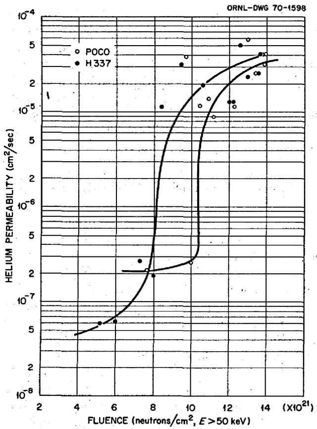  
Fig. 17.6. Changes in Helium Permeability with Neutron Irradiation at $715^{\circ}\mathrm{C}$ . Samples were sealed by gas impregnation with butadiene.

leveling off at about $10^{-5}\mathrm{cm}^2/\mathrm{sec}$ after irradiation to the higher fluences. No variable other than fluence appeared to exert any appreciable influence on the postirradiation helium permeability values.

Superficially the increases in helium permeability observed in this experiment are somewhat disappointing. However, let us consider how the helium permeability was obtained. The equations used to calculate the helium permeability and the sample geometry are shown in Fig. 17.7. We used the entire wall thickness of the specimen to calculate the permeability. If we assumed that the permeability was controlled by a surface layer of perhaps 0.004 to $0.04\mathrm{cm}$ , then the calculated values for helium permeability of that layer would decrease by one or two orders of magnitude below the values plotted in Fig. 17.6. Our preirradiation values for helium permeability would decrease to less than $10^{-9}\mathrm{cm}^2/\mathrm{sec}$ , and the postirradiation values would be less than $10^{-7}\mathrm{cm}^2/\mathrm{sec}$ , or very close to the desired levels. Previous radiographic studies of sealed samples indicated that the highest density of deposited

carbon is very near the surface.2 Thus there is strong justification for using the smaller values for the thickness $t$ .

Dimensional changes were also measured on these samples as a function of fluence. Figure 17.8 is a plot of the fractional length and diameter changes as a function of fluence for Poco graphite, and Fig. 17.9 is a similar plot for H337 graphite. The graph includes data on

ORNL-DWG70-2274R

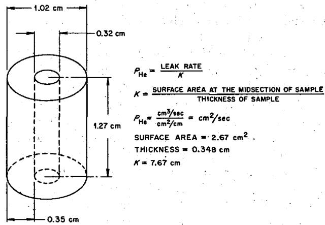  
Fig. 17.7. Sample Geometry and Equations Used to Compute the Gas Permeability.

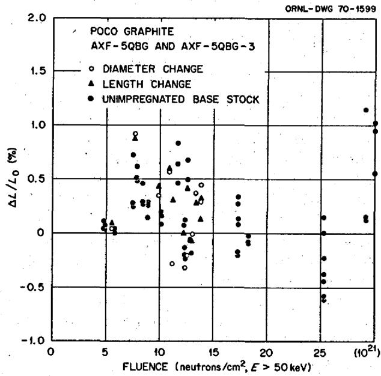  
Fig. 17.8. A Comparison of the Dimensional Changes that Occur in Gas-Impregnated Samples and Base Stock of Poco Graphite During Irradiation at $715^{\circ}\mathrm{C}$ .

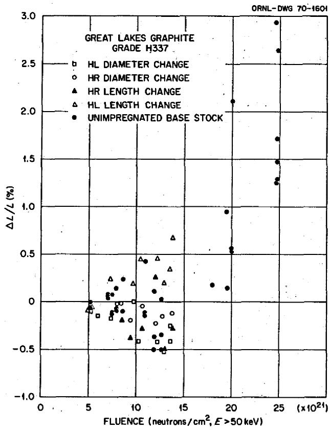  
Fig. 17.9. A Comparison of the Dimensional Changes that Occur in Gas-Impregnated Samples and Base Stock of Great Lake Carbon Company H337 Graphite During Irradiation at $715^{\circ}\mathrm{C}$ . These samples were made from a pipe wall, and the designation HL and HR indicate that the sample axes were in the longitudinal and radial directions respectively.

gas-impregnated graphite and unimpregnated base stock material. The data points on gas-impregnated graphite were taken from this experiment, and the data points on unimpregnated base stock graphite were collected from a number of other experiments.

We conclude that the dimensional changes of the gas-impregnated graphite are equivalent to those for unimpregnated graphite out to the maximum fluence studied. Apparently the amount of carbon being added to the graphite (maximum of $10\%$ by weight for Poco graphite) does not cause appreciable change in the behavior of the graphite bodies at these fluences.

The irradiation testing of a number of specimens from this experiment is to be continued in the next HFIR irradiation experiment. We wish to observe the behavior of the specimens under higher neutron doses for several reasons. First, we would like to know if the helium

permeabilities of the specimens continue to increase beyond the present level of $10^{-5}$ cm $^2$ /sec or if they level off as Fig.17.6 suggests. Second, we would like to observe the progressive changes in helium permeability in several specimens presently exposed to lower neutron doses. From these results one could draw conclusions regarding the manner in which fast-neutron fluences affect helium permeabilities. Are we observing changes in the impregnated carbon, or is the graphite matrix opening up? Hopefully, future results will shed light on this question.

Pyrolytic carbon coatings that are potentially useful at molten-salt reactor fluences have been developed recently by D. M. Hewette of the Carbon Development group. Samples coated with isotropic pyrolytic carbon derived from propylene have been exposed to fast-neutron fluences of up to $2 \times 10^{22}$ neutrons/cm² at $715^{\circ}\mathrm{C}$ with remarkable dimensional stability (see Sect. 17.10). A number of graphite samples have been coated with similar pyrolytic carbon coatings and then thermally cycled from 25 to $1800^{\circ}\mathrm{C}$ with no apparent damage. Since the properties of the coatings and the graphite base stock are similar in the temperature and fluence range anticipated for MSBR's, coating may be a better way to achieve low permeability than impregnation.

For the next HFIR experiment we have prepared a number of coated specimens for irradiation testing. All were coated with isotropic pyrolytic carbon derived from propylene at $1300^{\circ}\mathrm{C}$ in a fluidized bed and then were heat treated at $1800^{\circ}\mathrm{C}$ after coating. All specimens have helium permeabilities less than $10^{-8}$ $\mathrm{cm}^2/\mathrm{sec}$ . Figure 17.10 is a photomicrograph of the outside coating of such a sample, illustrating the lack of porosity and the excellent bond between base stock material and coating. Figure 17.11 is a polarized light view of the coating and shows that it is isotropic. We plan to investigate the influences on permeability of the base stock material and coating thickness in this experiment.

We have continued to study scaling up the gas-pulse carbon impregnation system. One significant problem has been the extremely poor efficiency of gas utilization. With the present system only that portion of the hydrocarbon that is in close proximity to the work piece is utilized for carbon deposition. The remainder of the hydrocarbon and the hydrogen generated in the process are wasted. To improve the efficiency we developed a simple gas-recycle system. The exhaust gas from the system is collected in a condenser maintained at a temperature below the boiling point of butadiene. A vent line allows the hydrogen to escape. The

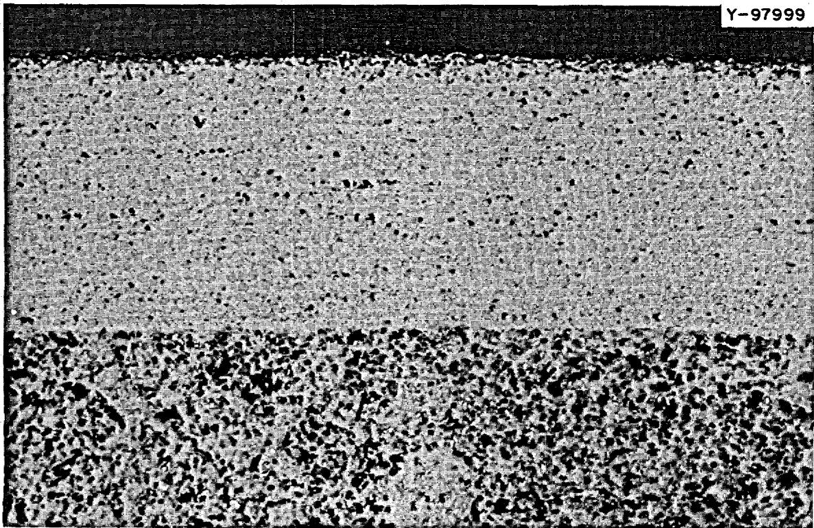  
0.007 INCHES 10.005 in. 1 500X 10.003 in. 1 10.001 in.   
Fig. 17.10. Photomicrograph of Isotropic Pyrolytic Carbon Coating on Poco Graphite. $500\times$ , unetched.

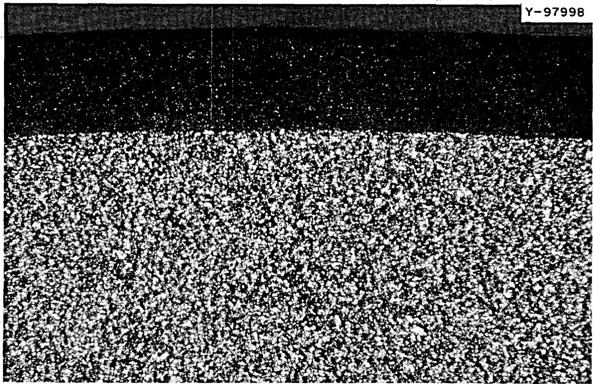  
0.014 INCHES 1 1 1 0.010 in. 250x 1 0.005 in.   
Fig. 17.11. Polarized Light Photomicrograph of Isotropic Pyrolytic Carbon Coating on Poco Graphite. $250\times$ , unetched.

butadiene thus collected is then recycled, and gas utilization efficiency has increased at least tenfold.

Also, some preliminary experiments have been conducted using a steady-flow gas-impregnation system rather than the gas-pulse system. We have found that in order to avoid excessive tar formation, it is necessary to use a very dilute hydrocarbon-carrier-gas mixture (0.5 to $2.5\%$ by volume of hydrocarbon). Our studies show that Poco graphite can be sealed to helium permeabilities of less than $10^{-8}\mathrm{cm}^2/\mathrm{sec}$ in approximately 3 to 5 times as long as by the gas-pulse system. However, a system of this type could be easily designed to handle a number of moderator blocks, whereas the gas-pulse technique could handle more than one only with difficulty. It would appear to be much simpler to scale up a steady-flow system than a gas-pulse system.

# 17.9 HFIR IRRADIATION PROGRAM

# C. R. Kennedy

HFIR graphite experiments 9 and 10 have been removed from the reactor and have been replaced by experiments 11 and 12. The newer materials added to

the irradiation program and included in these experiments are given in Table 17.10.

Graphite grades 586, 588, ABS-5, ABS-6, YMI-3, YM 350-10, YMI-13, and YM 350-11 are all made with isotropic cokes and fabricated by molding or extrusion. These grades were made to evaluate the binder systems in an attempt to obtain materials with properties similar to those of the Poco grades but fabricated by methods that could be used to make large moderator elements. The grinding of the coke or the fabrication process did impart some degree of anisotropy into these graphites. As noted by the results in Fig. 17.12, there is very little difference between the respective grades 586 and 588, YMI-3 and YM 350-10, and YMI-13 and YM 350-11. We also note that these grades have lost the initial delay in the densification process that is characteristic of the Poco grades. Therefore the lifetime for these materials would be considerably less than the Poco graphites and similar to more conventional graphites.

We also note that the densification is less for these materials than for the conventional needle or acicular coke graphites. This is shown in Fig. 17.13, where the densification is shown to be a function of the original

Table 17.10. Graphite Grades for HFIR Irradiation Program   

<table><tr><td>Graphite Grade</td><td>Sourcea</td><td>Bulk Density (g/cm3)</td><td>Forming Methodb</td><td>Fillerc</td><td>Binderd</td><td>Maximum Graphitizing Temperature (°C)</td></tr><tr><td>586</td><td>A</td><td>1.84</td><td>E</td><td>AXF</td><td>Varcum</td><td>2800</td></tr><tr><td>588</td><td>A</td><td>1.82</td><td>E</td><td>2033</td><td>Varcum</td><td>2900</td></tr><tr><td>YMI-3</td><td>A</td><td>1.62</td><td>WM</td><td>AXM</td><td>ITX</td><td>2800</td></tr><tr><td>YM350-10</td><td>A</td><td>1.65</td><td>WM</td><td>AXM</td><td>350 Pitch</td><td>2800</td></tr><tr><td>YMI-13</td><td>A</td><td>1.72</td><td>HM</td><td>AXM</td><td>ITX</td><td>2800</td></tr><tr><td>YM350-11</td><td>A</td><td>1.75</td><td>HM</td><td>AXM</td><td>350 Pitch</td><td>2800</td></tr><tr><td>ABS-5</td><td>B</td><td>1.83</td><td>E</td><td>Santa Maria, 15% Thermax</td><td>Varcum</td><td>2800</td></tr><tr><td>ABS-6</td><td>B</td><td>1.89</td><td>E</td><td>Santa Maria, 15% Thermax</td><td>Varcum</td><td>2800</td></tr><tr><td>9950</td><td>C</td><td>1.71</td><td>M</td><td>P</td><td>P</td><td></td></tr><tr><td>JOZ</td><td>D</td><td>1.58</td><td></td><td colspan="2">Raw coke – base stock for H364 and H337 grades</td><td></td></tr><tr><td>HL-18</td><td>C</td><td>1.86</td><td></td><td colspan="2">P</td><td></td></tr><tr><td>AXM-ITX</td><td>A</td><td>1.75</td><td>M</td><td>AXM, 15% Thermax</td><td>ITX</td><td>2800</td></tr><tr><td>XM-ITX</td><td>A</td><td>1.75</td><td>M</td><td>Santa Maria, 15% Thermax</td><td>ITX</td><td>2800</td></tr><tr><td>T-ITX</td><td>A</td><td>1.55</td><td>M</td><td>Thermax</td><td>ITX</td><td>2200</td></tr><tr><td>T-V</td><td>A</td><td>1.55</td><td>M</td><td>Thermax</td><td>Varcum</td><td>2200</td></tr><tr><td>S-20</td><td>E</td><td>1.50</td><td>M</td><td>Lampblack</td><td>Pitch</td><td>980</td></tr><tr><td>L-31</td><td>E</td><td>1.66</td><td>M</td><td>Lampblack</td><td>Pitch</td><td>2800</td></tr><tr><td>HS-82</td><td>E</td><td>1.73</td><td>M</td><td>P</td><td>P</td><td>2800</td></tr><tr><td>Glassy carbon</td><td>F</td><td>1.45</td><td></td><td>Cellulose</td><td></td><td>3000</td></tr></table>

${}^{a}$ Source: A,Development Division,Y-12 Plant; B,Los Alamos Scientific Laboratory; C,Airco Speer Carbon Company; D,Great Lakes Carbon Company; E,Stackpole Carbon Company; F,Tokai Electrode Manufacturing Company,Ltd.   
bForming method: $\mathbf{E} =$ extruded; WM $=$ warm molded $1400^{\circ}\mathrm{C};\mathrm{HM} =$ hot molded $2800^{\circ}\mathrm{C};\mathrm{M} =$ molded.   
${}^{c}$ Filler: AXF,AXM,and 2033 were obtained from ground Poco grades AXF and AXM and Stackpole grade 2033 respectively; $\mathrm{P}$ = proprietary.   
$d_{\mathrm{B}}$ Binder: Varcum = furfuryl alcohol; ITX = isotruxene; P = proprietary.

density. There are two significant exceptions to this behavior: grades YM 350-11 and YMI-13 do not densify. However, it is seen that these graphites made from isotropic particles do not, as a class, have the same potential for densification as the needle or acicular coke graphites. This behavior suggests that the porosity responsible for shrinkage is external to the particle or the binder shrinkage cracks. This is because the growth within an isotropic particle would have a greater potential for removal of the porosity within the particle

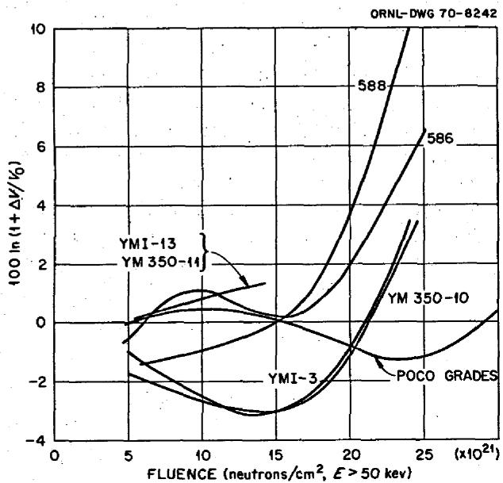  
Fig. 17.12. Volume Changes of Grades 586, 588, YMI-3, YM 350-10, YMI-13, YM 350-11, and Poco Graphites After Irradiation at $715^{\circ}\mathbf{C}$ .

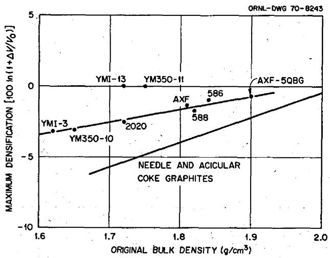  
Fig. 17.13. Maximum Densification of Graphite Grades When Irradiated at $715^{\circ}\mathrm{C}$ .

than a highly aligned particle. Also, much of the differential growth within the isotropic particle is absorbed, and the result is that only small particle shape changes are available for reducing the binder shrinkage cracks. On the other hand the needle coke growth, because of the high alignment of the particle, is available for closure of the binder shrinkage cracks. This behavior, coupled with the fact that the two hot-molded graphites, grades YM 350-11 and YMI-13, do not have binder shrinkage cracks and do not exhibit a densification, suggests strongly that the porosity-controlling densification is a result of binder shrinkage during processing. These observations suggest that the increase in life by a delay in the densification process is most likely to be obtained by use of a binderless isotropic graphite such as the Poco grades or the raw coke H364.

It is also interesting to compare the growth rates of these graphites with the needle and acicular particle graphites. We can again use the growth rates when the volume change with respect to fluence is zero for comparison with $R$ , the preferred orientation parameter. This is done in Fig. 17.14, showing that the growth rate for the Poco graphites is about 3 times

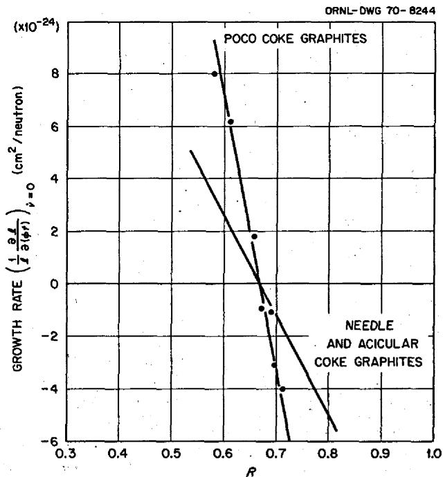  
Fig. 17.14. Crystallite Growth Rates of Graphite Grades During Irradiation at $715^{\circ}\mathrm{C}$ .

Table 17.11. Quantitative Microscopic Results on Irradiated Graphites   

<table><tr><td>Graphite Grade</td><td>Exposure [neutrons/cm2(&gt;50 kev)]</td><td>Bulk Volume Change (%)</td><td>Void Area (%)</td><td>Void Number (No./mm2)</td></tr><tr><td></td><td>×1021</td><td></td><td></td><td>×103</td></tr><tr><td>AXF</td><td>12.9</td><td>-0.32</td><td>8.67</td><td>22.5</td></tr><tr><td>AXF-5QBG</td><td>38.2</td><td>6.22</td><td>13.62</td><td>30</td></tr><tr><td>AXF-5QBG-3</td><td>11.5</td><td>1.95</td><td>10.75</td><td>23.8</td></tr><tr><td>AXF-5QBG-3</td><td>38.3</td><td>4.40</td><td>17.79</td><td>32.1</td></tr><tr><td>AXF-UFG</td><td>4.9</td><td>1.09</td><td>10.20</td><td>39.3</td></tr><tr><td>AXF-UFG</td><td>25.2</td><td>3.43</td><td>15.40</td><td>39.8</td></tr><tr><td>BY-12</td><td>20.4</td><td>3.14</td><td>9.10</td><td>28.9</td></tr><tr><td>RY-12-29</td><td>24.9</td><td>8.6</td><td>21.35</td><td>23.8</td></tr><tr><td>ATJ-S</td><td>23.1</td><td>0.51</td><td>13.00</td><td>17.5</td></tr><tr><td>1425</td><td>24.4</td><td>1.83</td><td>10.48</td><td>25.4</td></tr><tr><td>H364</td><td>19.2</td><td>0.47</td><td>7.94</td><td>20.4</td></tr></table>

higher than for the needle coke graphites. This behavior is consistent with previous observations of Bokros² showing that the growth rate increases with decreasing crystallite size. Preliminary measurements³ indicate the Poco graphites and flour have a much smaller crystallite size than the needle coke materials.

The microstructures of several grades of graphite were examined by both the optical and the electron microscope. The samples were also evaluated using the quantitative microscope (QM), which yields the fraction of void area and the number of voids. The results are given in Table 17.11. The void area fraction generally is in very good agreement with the percentage of accessible void volume that we determined by helium density measurements. The number of voids is not an absolute number because of the irregular shapes of the voids; the same void can be counted a number of times. The number is only relative and is not significant except for large changes. The fact that the void volume results obtained by the QM are in excellent agreement with helium density and bulk density changes is fairly direct evidence that virtually all of the accessible void volume is visible in the microscope. It is the inaccessible void volume which is ill defined and is not observable by available microscopic techniques.

A major result of these microscopic examinations is the observation of the irradiation effect on low-density

components or phases in the graphite structure. Upon irradiation these very low-density phases (approximately equal to $1.5\mathrm{g} / \mathrm{cm}^3$ ) densify to about $2.1\mathrm{g} / \mathrm{cm}^3$ and leave a large void volume in the graphite. If there is a large amount of the low-density phase, the increase in void volume is not observable from bulk volume changes but can be deduced from helium density measurements. The magnitude of this type of behavior is illustrated in the micrograph of grade 1425 in Fig. 17.15. The bulk density change of the irradiated sample is only $1.8\%$ ; however, the void volume has increased by over $9\%$ . An example of a material where the increase in void volume is equal to the bulk volume change is grade BY-12 (Fig. 17.16).

# 17.10 IRRADIATION BEHAVIOR OF PYROLYTIC CARBONS

D.M.Hewette II C.R.Kennedy

Bulk graphites consist of at least two graphitic constituents, filler and binder, that have widely different properties: large crystallite size and high density for the filler and smaller crystallite sizes and low to intermediate densities for the binder. To predict how these bulk graphites behave under irradiation, one must know how the different constituents will behave.

Deposition of pyrolytic carbons in fluidized beds offers a means of obtaining homogeneous structures having properties that scan the extremes found in bulk graphites. The pyrolytic carbons, however, are not completely graphitic and have a turbostratic disorder of the layer planes. Irradiation of these types of materials furnishes a means of obtaining densification and

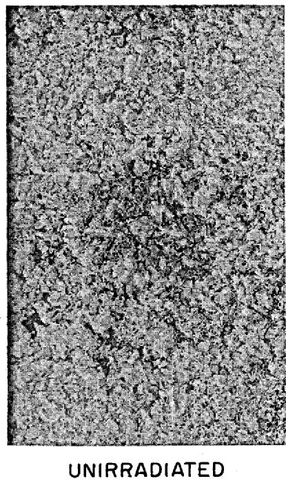  
0.025 INCHES

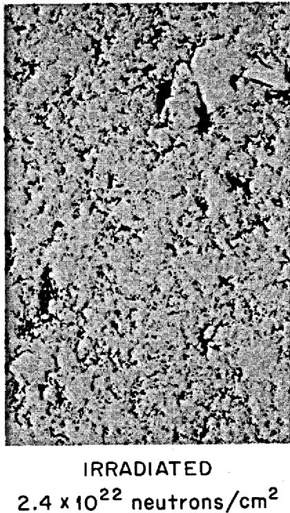  
Fig. 17.15. Photomicrograph of Grade 1425.

Y-97047

Y-97043

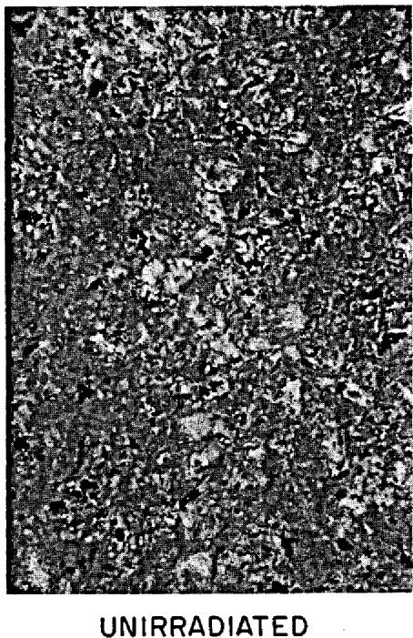  
0.005 INCHES

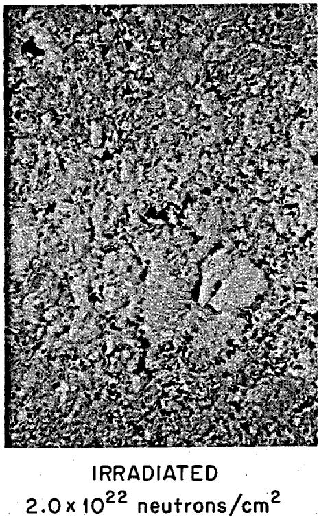  
Fig. 17.16. Photomicrograph of Grade BY-12.

dimensional-change data for monolithic structures that have properties varying from a density of $1.4\mathrm{g / cm}^3$ with a crystallite size of 50 A to a density of 2.07 $\mathrm{g / cm}^3$ with a crystallite size of 160 A. A description of the structures that were prepared for this study is given in Table 17.12. Thin sheets of material of these various structures were irradiated at $715^{\circ}\mathrm{C}$ to fluences ranging from about $5\times 10^{21}$ to $2\times 10^{22}$ neutrons/cm² ( $>50$ kev) in HFIR. We have evaluated the density and dimensional changes, and they are presented in Figs. 17.17-17.20. These results indicate that at exposures up to $2\times 10^{22}$ neutrons/cm², the high-density isotropic propylene-derived coatings are quite stable (i.e., undergo only slight changes in density and dimensions). On the other hand, at the same conditions

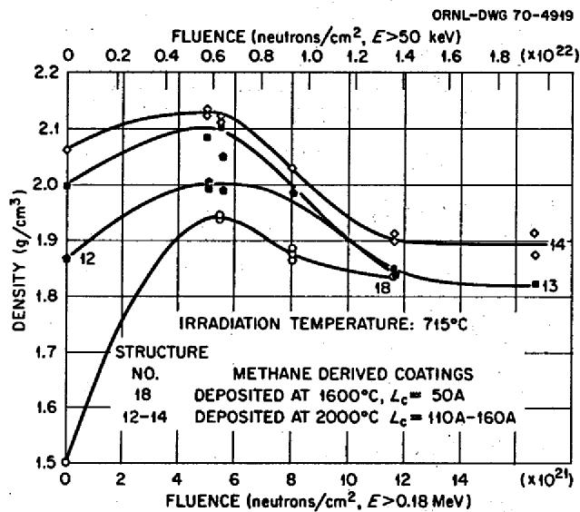  
Fig. 17.17. Effect of Fast Neutron Exposure at $715^{\circ}\mathbf{C}$ on the Density of Methane-Derived Pyrolytic Carbons.

the methane-derived coatings exhibit significant densification at low fluences followed by swelling and large dimensional changes at the higher exposures. Specimens of most of the structures tested in this experiment have been reloaded for further irradiation.

The stability of the propylene-derived structures, in which the dimensional changes in the parallel direction reach a maximum of about $2\%$ , has great significance to the work on reducing the permeability of graphite (see

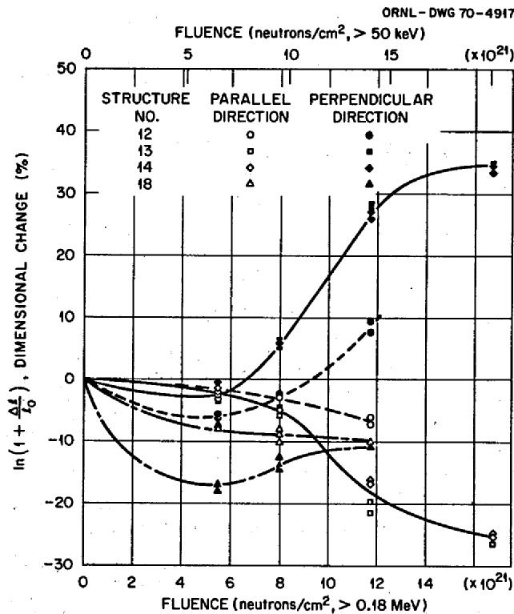  
Fig. 17.18. Effect of Fast Neutron Exposure at $715^{\circ}\mathrm{C}$ on Dimensional Changes of Methane-Derived Pyrolytic Carbons.

Table 17.12. Description of Pyrolytic Carbons Irradiated in HFIR Experiment MSR-8   

<table><tr><td>Structure Designation</td><td>Source Gas</td><td>Deposition Temperature (°C)</td><td>Annealing Temperature (°C)</td><td>Density</td><td>Bacon Anisotropy Factor</td><td>Apparent Crystallite Size (Å)</td></tr><tr><td>6</td><td>Propylene</td><td>1250</td><td>1900</td><td>2.07</td><td>~1.1</td><td>80</td></tr><tr><td>7</td><td>Propylene</td><td>1250</td><td>2200</td><td>2.07</td><td>~1.1</td><td>120</td></tr><tr><td>8</td><td>Propylene</td><td>1250</td><td>2500</td><td>2.07</td><td>~1.1</td><td>160</td></tr><tr><td>12</td><td>Methane</td><td>2000</td><td>None</td><td>1.88</td><td>1.0</td><td>110</td></tr><tr><td>13</td><td>Methane</td><td>2000</td><td>None</td><td>2.00</td><td>~1.3</td><td>120</td></tr><tr><td>14</td><td>Methane</td><td>2000</td><td>None</td><td>2.08</td><td>~1.4</td><td>150</td></tr><tr><td>15</td><td>Propylene</td><td>1250</td><td>None</td><td>1.99</td><td>~1</td><td>30</td></tr><tr><td>16</td><td>Propylene</td><td>1250</td><td>1900</td><td>2.04</td><td>~1.1</td><td>120</td></tr><tr><td>17</td><td>Propylene</td><td>1250</td><td>2200</td><td>2.04</td><td>~1.1</td><td>160</td></tr><tr><td>18</td><td>Methane</td><td>1600</td><td>None</td><td>1.5</td><td>1.0</td><td>50</td></tr></table>

Sect. 17.8). After exposures of $2.5 \times 10^{22}$ neutrons/cm $^2$ , the dimensions of impregnated and base stock Poco graphite specimens changed less than $1\%$ , while grade H337 graphite specimens showed maximum changes of $3\%$ (see the figures in the above section). Thus propylene-derived coatings deposited to seal the surface of these graphites may retain their integrity and sealing characteristics at fast fluences greater than $2 \times 10^{22}$ neutrons/cm $^2$ ( $>50$ kev). Specimens of these two

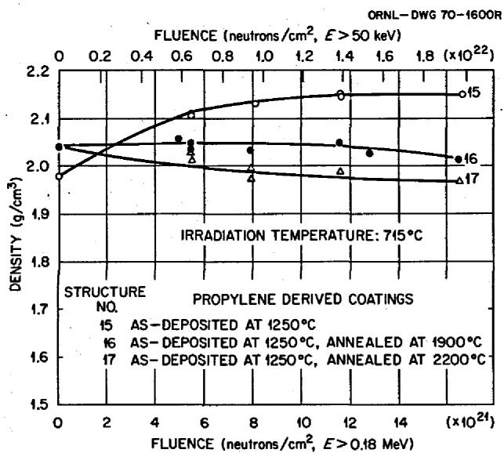  
Fig. 17.19. Effect of Fast Neutron Exposure at $715^{\circ}\mathbf{C}$ on the Density of Propylene-Derived Pyrolytic Carbons.

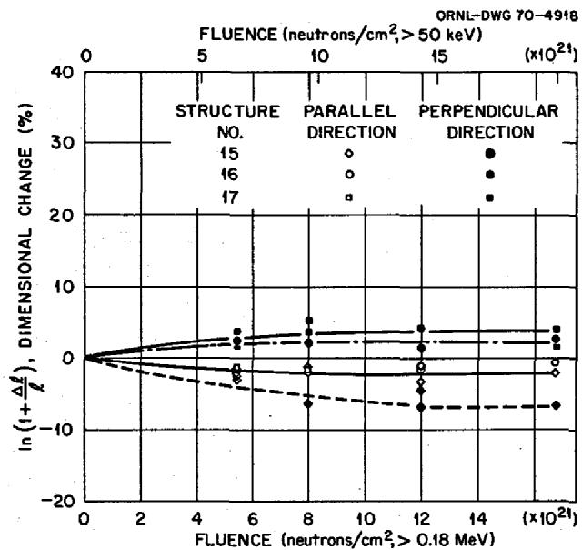  
Fig. 17.20. Effect of Fast Neutron Exposure at $715^{\circ}\mathrm{C}$ on Dimensional Changes of Propylene-Derived Pyrolytic Carbons.

graphites sealed with isotropic propylene-derived pyrolytic carbon have been prepared by Pollock for irradiation testing.

# 17.11 CALCULATION OF LIFETIME AND INDUCED STRESSES IN MSBR GRAPHITE CORES

S.J.Chang

To analyze the effects of fast-neutron damage on the core graphite of a molten-salt reactor, three methods have been developed and discussed earlier. The impulse-type analysis, the most general of the three, has been further developed to lift restrictions on the cross-sectional shape. The method can thus be used to analyze effects of geometrical shape, boundary traction, thermal properties, and neutron-induced dimensional changes provided only that the creep coefficient and the neutron flux not be sensitive to position over a given cross section. The analysis is based on the constitutive equations of the form

$$
\begin{array}{l} \epsilon_ {x} = (1 - \mu^ {2}) J * \left(d \sigma_ {x} - \frac {\mu}{1 - \mu} d \sigma_ {y}\right) \\ + (1 + \mu) (\alpha T + \psi) - \mu \epsilon_ {0} \\ \end{array}
$$

$$
\begin{array}{l} \epsilon_ {y} = (1 - \mu^ {2}) J * \left(d \sigma_ {y} - \frac {\mu}{1 - \mu} d \sigma_ {x}\right) \\ + (1 + \mu) (\alpha T + \psi) - \mu \epsilon_ {0} \\ \end{array}
$$

$$
\gamma_ {x y} = 2 (1 + \mu) J * d \sigma_ {x y},
$$

where $J(D)$ is the uniaxial neutron creep function

$$
J (D) = \frac {1}{E} + K (T) D + \frac {1}{2 E} \left(1 - e ^ {- A _ {0} D}\right)
$$

and the symbol $\ast$ denotes the convolution operation defined by

$$
J * d \sigma = \int_ {0} ^ {D} J (D - D ^ {\prime}) \frac {\partial \sigma}{\partial D ^ {\prime}} d D ^ {\prime}.
$$

In the above equations $\epsilon_{x}$ and $\sigma_y$ denote, respectively, the strain and stress in the $x$ direction, $\mu$ is Poisson's ratio, $E$ is Young's modulus, $\epsilon_0$ and $A_0$ are constants, $\alpha$

is the coefficient of thermal expansion, $T$ is the temperature distribution, $\psi$ is the neutron-induced dimensional change, $D$ is the neutron dose, and $K(T)$ is the creep coefficient from the uniaxial creep test.

If the creep coefficient $K(T)$ is assumed to be a constant, independent of temperature, and the temperature-dependent neutron-induced dimensional change is given by

$$
\psi (D, T) = A _ {2} (T) D ^ {2} + A _ {1} (T) D,
$$

then the stress, and therefore the strain, of the two-dimensional problem of arbitrary shape can be expressed as a linear combination of several fictitious elastic solutions with the same cross section. From this result the problem of an arbitrary shape can be solved, provided that solutions of the elastic problems are available.

To apply the method to the preliminary design calculation, numerical results were obtained for the core graphite, which was assumed to be in the form of long cylindrical tubes. Then the design lifetimes of the cylinders were evaluated based on two criteria, one by volumetric distortion and the other by axial strain. The specific problems solved were concentric circular cylinders with inner radius $a$ , outer radius $b$ , length $L$ , and $b / a = 6.667$ . Several values of $b$ ranging from 4 to 6 cm were used to illustrate the geometric influence.

The material parameters used were:

Young's modulus $E = 1.9 \times 10^{6}$ psi,

Poisson's ratio $\mu = 0.27$

coefficient of thermal expansion $\alpha = 6.20$

$$
\times 1 0 ^ {- 6} ^ {\circ} \mathrm {C} ^ {- 1},
$$

constant $A_0 = 2.0 \times 10^{-22}$ neutron ${}^{-1} \mathrm{~cm}^2$ ,

creep coefficient $K(T) = (5.3 - 1.45 \times 10^{-2} T$

+1.4×10-5T2)10-7 (psi nvt)-1,

where $\pmb{T}$ is chosen at the inner radius $a$ , and neutron-induced dimensional change is given by

$$
\psi (D, T) = A (T) \left[ (1 0 ^ {- 2 2} D) ^ {2} + B (T) (1 0 ^ {- 2 2} D) \right],
$$

where

$$
\begin{array}{l} A (T) = \frac {1}{3} (0. 1 1 - 7. 0 \times 1 0 ^ {- 5} T) / (5. 7 - 6. 0 \\ \times 1 0 ^ {- 3} T) ^ {2} \text {p e r} (1 0 ^ {2 2} n v t) ^ {- 3} \\ \end{array}
$$

and

$$
B (T) = 2 \times (6. 0 \times 1 0 ^ {- 3} T - 5. 7).
$$

In all of the above equations the unit of $T$ was the degree centigrade.

Parameters related to the reactor were

salt temperature $T_{\mathrm{salt}} = 625 - 75\cos \left(\frac{\pi Z}{L}\right)^{\circ}\mathrm{C}$

thermal conductivity of the graphite $K_{a}$

$$
= 0. 3 5 8 \left[ \frac {T ^ {\circ} \mathrm {K}}{7 7 3} \right] ^ {- 0. 7} \text {w a t t s c m} ^ {- 1} ^ {\circ} \mathrm {C} ^ {- 1},
$$

where $T$ at $n = a$ was used,

heat transfer coefficient $H = a^{-0.2}$ [1.444]

$$
\times 1 0 ^ {- 3} T \left(^ {\circ} C\right) - 0. 2 2 8 ] w a t t s c m ^ {- 2} ^ {\circ} C ^ {- 1},
$$

flux $\Theta (E > 50\mathrm{kev}) = 4.5\times 10^{14}\sin \left(\frac{Z}{L}\right)n\nu t,$ and gamma heating $Q = 1.2 + 9.0\sin \left(\frac{Z}{L}\right)$ watts/cm3.

The numerical results are shown in several figures. Figure 17.21 shows a typical temperature distribution at $Z / L = 0.6$ , a crucial section as can be seen from the lifetime curves in the subsequent figures. At this same cross section, the circumferential strain at $r = b$ as a

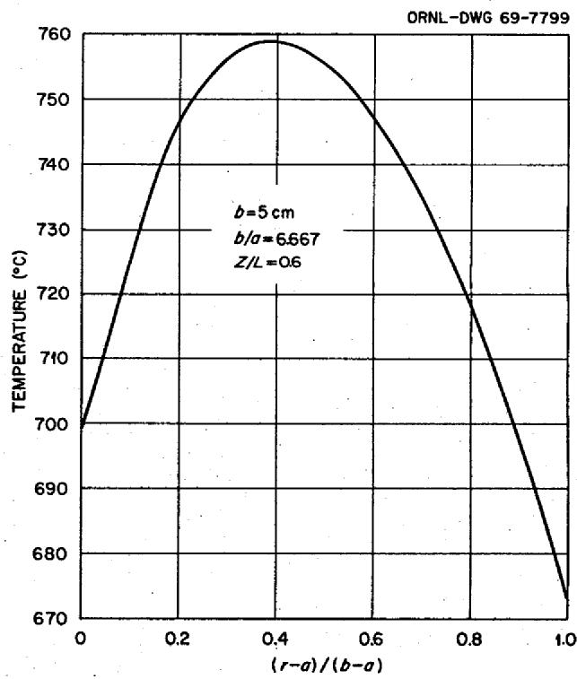  
Fig. 17.21. Radial Temperature Profile at the Axial Position $Z / L = 0.60$ .

function of neutron dose increases rapidly after $D = 1 \times 10^{22}$ nvt, as shown in Fig. 17.22. The increase of the axial stress $\sigma_{Z}$ as $D$ increases is seen to approach a straight line for $D > 10^{22}$ nvt in Fig. 17.23. In fact, this linear dependence of $\sigma_{Z}$ on $D$ at high fluence has been shown analytically in ref. 2 as a property valid for all

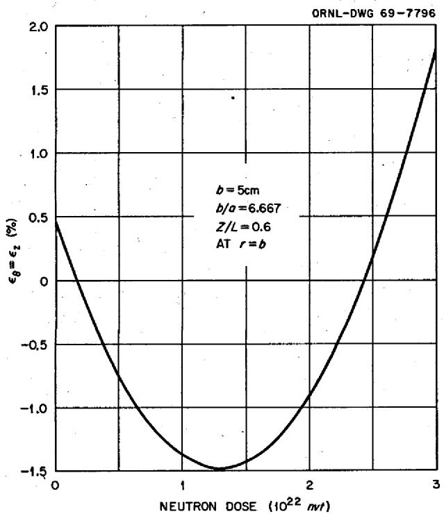

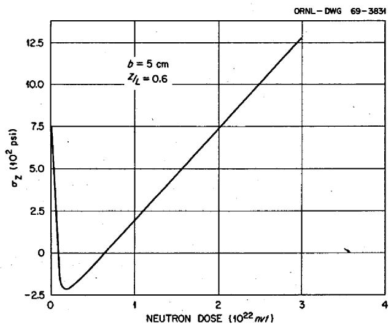  
Fig. 17.22. Circumferential Strain at Outside Surface as a Function of Fluence Level at $Z / L = 0.60$ .   
Fig. 17.23. Axial Stress at the Outer Surface as a Function of Fluence Level at $Z / L = 0.60$ .

stress components. Therefore, above $D > 10^{22}$ nvt, the stress components can be calculated easily if their values at $D = 10^{22}$ nvt are known.

As the definition of graphite life, it has normally been assumed the material will generate macroscopic cracks after it begins to significantly expand beyond its original dimensions. We may define two ad hoc lifetimes, first the fluence at which the material returns to its original volume and second, the fluence at which its axial strain returns to zero. The resulting lifetimes as a function of axial position in the core are shown in Figs. 17.24 and 17.25. It is seen the critical section occurs at $Z / L = 0.57$ , approximately, and that the axial strain criterion to define lifetime is slightly more severe.

As mentioned previously, the creep coefficient $K(T)$ was assumed to be constant in this analysis. More realistically, the above method is being generalized to account for a temperature-sensitive $K(T)$ . The analytical analysis has been completed, and numerical results are being computed.

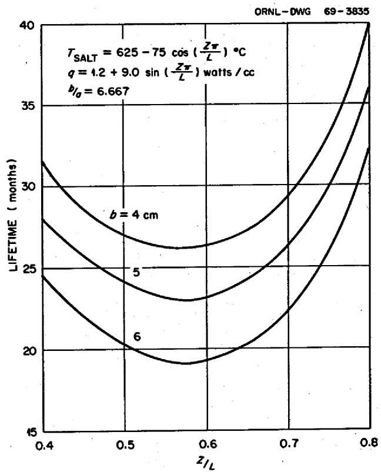  
Fig. 17.24. Lifetime of MSBR Graphite Core Cylinders as a Function of Axial Position According to the Volumetric Distortion Criterion.

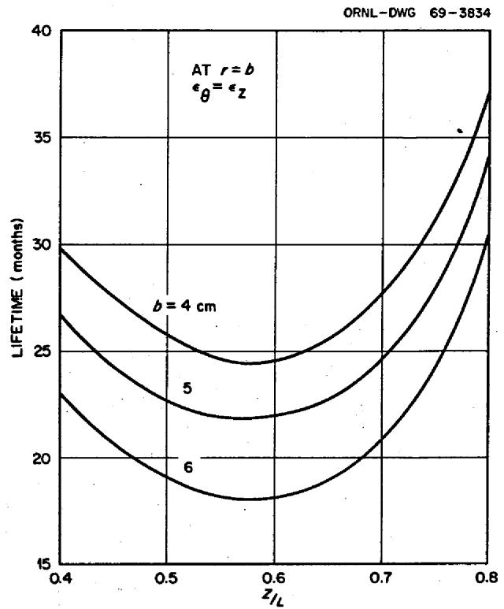  
Fig. 17.25. Lifetime of MSBR Graphite Core Cylinders as a Function of Axial Position According to the Axial Strain Criterion.

# 18. Hastelloy N

H. E. McCoy

The main shortcoming of Hastelloy N for use in molten-salt reactors is its embrittlement due to neutron irradiation. We have found that this embrittlement can be reduced by the addition of Ti, Hf, and Nb. Our work during the past months has concentrated on optimizing the concentrations of these elements. Small lab melts of about 2 lb have been used for this purpose, and some 50- and 100-lb commercial melts are being obtained of the compositions that look promising. Our evaluation includes postirradiation mechanical property tests, long-term aging, and welding studies.

Two compatibility questions are receiving attention. First, the compatibility of Hastelloy N with steam must be evaluated. Samples are being exposed in two test facilities. Second, the compatibility of Hastelloy N with our new proposed coolant salt, sodium fluoroborate, must be evaluated. This work involves capsule tests, thermal-convection loops, and a single forced-convection loop. Since the corrosion rate seems to be influenced by the water content of the sodium fluoroborate, work is in progress to develop a process for removing water from the salt.

# 18.1 AGING OF MODIFIED ALLOYS

# C. E. Sessions

Our previous studies have involved a comparison of the aging effects at 650 and $760^{\circ}\mathrm{C}$ of commercial heats of titanium-modified Hastelloy N. We showed from a statistical fit of the tensile data that the results predicted the following: (1) a post-age ductility increase with increasing titanium concentration in the alloy, (2) a small decrease in strength and ductility with aging times greater than 1500 hr, (3) significantly lower ductility after aging at $760^{\circ}\mathrm{C}$ for each titanium-modified alloy, and (4) a minimum in strength and maximum in ductility between 0.5 and $1.2\%$ titanium.

We have further investigated the effects of titanium and molybdenum content on the aging behavior of small laboratory heats in order to check these trends. Figure 18.1 shows the $650^{\circ}\mathrm{C}$ yield strength plotted as a function of titanium and molybdenum content before and after aging at $760^{\circ}\mathrm{C}$ . In an $\mathrm{Ni}-12\%$ Mo-7% Cr-0.06% C base composition, the yield strength increases for the first 0.1% titanium but does not show a continuous strengthening trend between 0.1 and 1.0% titanium. For most titanium concentrations, however, the $650^{\circ}\mathrm{C}$ yield strength is increased by aging 1500 hr at $760^{\circ}\mathrm{C}$ . In contrast to this behavior, the yield strength increases rapidly with increasing molybdenum concentration from 10 to 20% in the $\mathrm{Ni}-7\%$ Cr-0.06% C base alloy (Fig. 18.1). The yield strength is also increased by aging 1500 hr at $760^{\circ}\mathrm{C}$ in these alloys with varying molybdenum content.

The tensile ductility values of these two alloy series are compared in Fig. 18.2. For tests in the as-solution-annealed condition (1 hr at $1177^{\circ}\mathrm{C}$ ), there is no effect of titanium on the $650^{\circ}\mathrm{C}$ tensile ductility. However, after aging 1500 hr at $760^{\circ}\mathrm{C}$ , the beneficial influence of titanium is apparent. As in the case of commercial

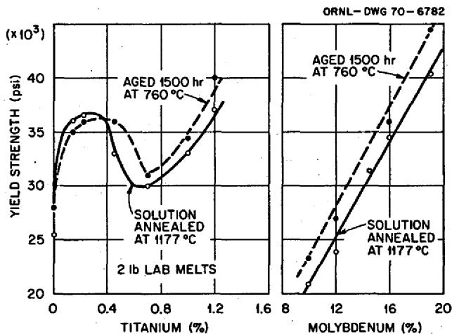  
Fig. 18.1. Effect of Titanium and Molybdenum Concentration on the Yield Strength of Hastelloy N at $650^{\circ}\mathbf{C}$ .

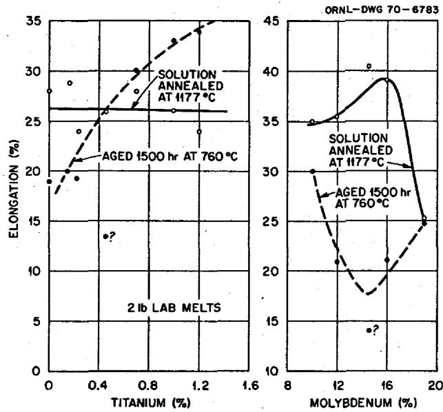  
Fig. 18.2. Effect of Titanium and Molybdenum Concentration on the Tensile Ductility of Hastelloy N at $650^{\circ}\mathrm{C}$ . Solution annealed 1 hr at $1177^{\circ}\mathrm{C}$ and tested at a strain rate of 0.002 min $^{-1}$ .

alloys, $^{1,2}$ the post-age ductility increases with titanium. The results indicate that for titanium contents $\leqslant 0.5$ the ductility decreases on aging at $760^{\circ}\mathrm{C}$ and for titanium contents $>0.5$ the ductility increases. This behavior as a function of titanium was previously shown to result from the stability of the MC-type carbides at $760^{\circ}\mathrm{C}$ as determined by the titanium concentration in the alloy. $^{2}$ The influence of molybdenum on the ductility after aging is also shown in Fig. 18.2. In the solution-annealed condition there is a ductility decrease at $20\%$ molybdenum for alloys containing between 10 and $20\%$ molybdenum. When aged 1500 hr at $760^{\circ}\mathrm{C}$ , each alloy shows a significant loss in ductility, with the exception of the alloys with the lowest $(10\%)$ and highest $(20\%)$ molybdenum contents. The carbide phases precipitated in these alloys at $760^{\circ}\mathrm{C}$ are $\mathbf{M}_2\mathbf{C}^3$ for concentrations up to $20\%$ molybdenum, where we get $\mathbf{M}_6\mathbf{C}$ carbides at $650^{\circ}\mathrm{C}^4$ and likely at $760^{\circ}\mathrm{C}$ also. Thus apparently we get the smallest ductility loss on aging when $\mathbf{M}_6\mathbf{C}$ is precipitated, although when $\mathbf{M}_2\mathbf{C}$ is precipitated, the detrimental effect is smallest at the lower molybdenum concentrations. This might possibly indicate that the influence of titanium content on the $760^{\circ}\mathrm{C}$ aging

behavior would be greater at higher molybdenum concentrations than we find from our studies of the $12\%$ molybdenum alloys (Figs. 18.1 and 18.2). This conclusion is based on the observed larger ductility loss attributable to $\mathbf{M}_2\mathbf{C}$ precipitation at $14.5\%$ molybdenum in Fig. 18.2.

Additional aging studies are in progress on new alloy compositions which will be discussed at a future date. The microstructures developed on aging the commercial titanium-modified alloys have been discussed previously; however, some recent results in Figs. 18.3-18.6 give the optical microstructures after 10,000 hr aging at 650 and $760^{\circ}\mathrm{C}$ . Figure 18.3 shows samples aged after a solution anneal of 1 hr at $1177^{\circ}\mathrm{C}$ , Fig. 18.4 shows samples annealed 1 hr at $1260^{\circ}\mathrm{C}$ and aged, Fig. 18.5 shows a sample with stacking fault precipitates, and Fig. 18.6 shows two alloys aged after a pretreatment of $1177^{\circ}\mathrm{C}$ plus $10\%$ strain at room temperature. In general the precipitation that occurs at $650^{\circ}\mathrm{C}$ in each alloy is finer than that at $760^{\circ}\mathrm{C}$ . The grain boundary precipitate appears to be coarser and more widely spaced at $760^{\circ}\mathrm{C}$ . The structures produced by solution anneals at 1177 and $1260^{\circ}\mathrm{C}$ are not appreciably different, as found by comparing Figs. 18.3 and 18.4, with one exception. In Fig. 18.4 the acicular structure after the $760^{\circ}\mathrm{C}$ age for the $1.2\%$ titanium alloy corresponds to precipitates on stacking faults, $^{4}$ as shown by electron microscopy, $^{3}$ and this microconstituent did not develop as profusely if the material was given a preage anneal at a lower temperature of $1177^{\circ}\mathrm{C}$ (Fig. 18.3).

A lower-magnification optical photograph of precipitates on stacking faults in a heat of Hastelloy N containing $1.2\%$ titanium after 3000 hr at $760^{\circ}\mathrm{C}$ is shown in Fig. 18.5. The concentration of stacking fault precipitates is fairly heavy near grain boundaries, and the presence of twins does not appear to affect their formation.

The influence of prestraining $10\%$ at room temperature on the microstructure developed during aging is shown in Fig. 18.6 for the heats containing 0.15 and $1.2\%$ Ti. Precipitation appears to be heavier at $650^{\circ}\mathrm{C}$ in the low-titanium heat as compared with Fig. 18.3, but the effect of prestrain is insignificant at $760^{\circ}\mathrm{C}$ . In the heat containing $1.2\%$ titanium, prestraining has enhanced precipitation at both 650 and $760^{\circ}\mathrm{C}$ , but particularly at $760^{\circ}\mathrm{C}$ . The effect of prior straining, as judged from Fig. 18.3, has been to promote the acicular type of precipitate which corresponds to precipitates on stacking faults. Thus stacking fault precipitation is enhanced by prestraining after an $1177^{\circ}\mathrm{C}$ anneal as well as by raising the solution annealing temperature from 1177 to $1260^{\circ}\mathrm{C}$ .

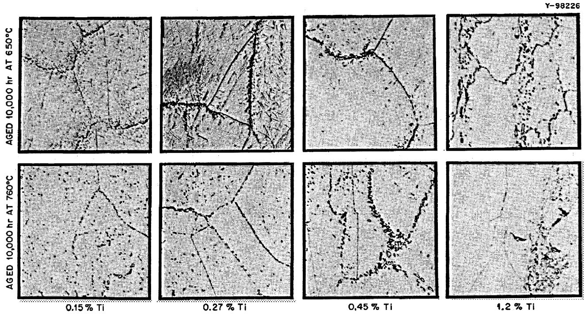  
Fig. 18.3. Microstructures Developed in Ni-12% Mo-7% Cr-0.07% C Alloys Modified with Titanium and Solution Annealed 1 hr at $1177^{\circ}\mathbf{C}$ Before Aging. $650\times$

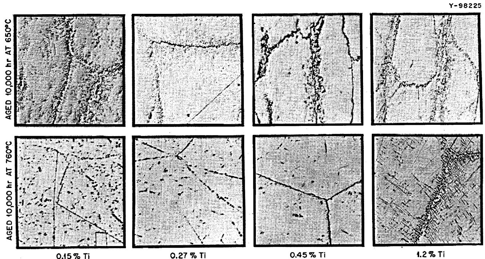  
Fig. 18.4. Microstructures Developed in Ni-12% Mo-7% Cr-0.07% C Alloys Modified with Titanium and Solution Annealed 1 hr at $1260^{\circ}\mathrm{C}$ Before Aging. $650\times$

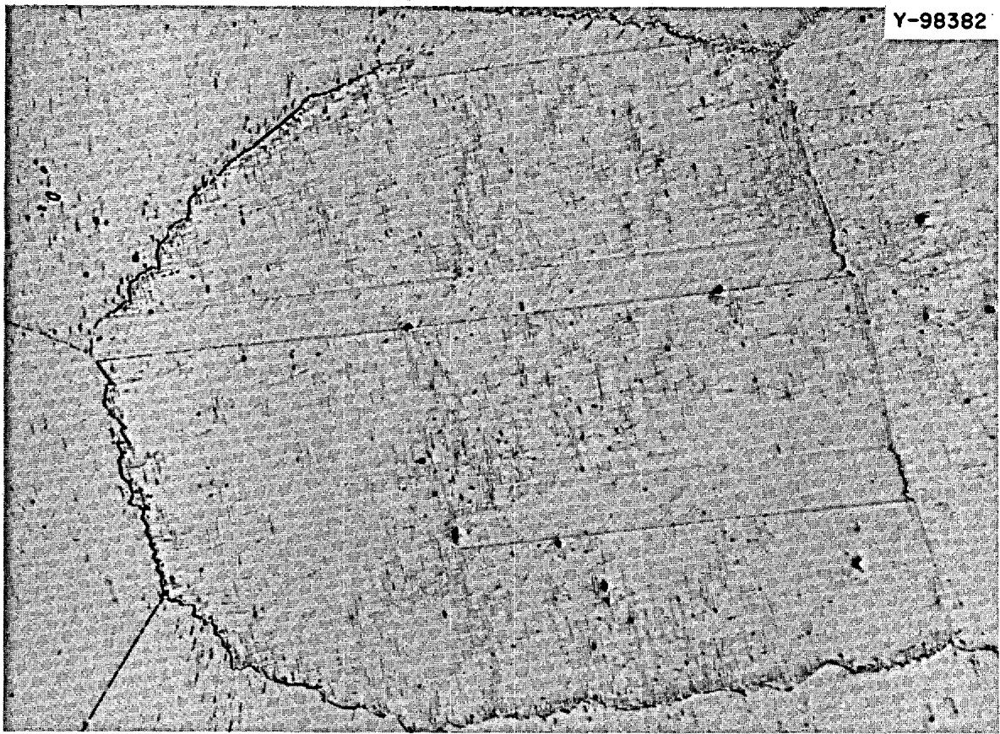  
Fig. 18.5. Precipitates on Stacking Faults in $1.2\%$ Ti Heat of Hastelloy N Solution Annealed 1 hr at $1260^{\circ}\mathrm{C}$ and Aged 3000 hr at $760^{\circ}\mathrm{C}$ . 500X.

# 18.2 EFFECT OF CARBON AND TITANIUM ON POSTIRRADIATION PROPERTIES

C. E. Sessions H. E. McCoy

Defining the influence of alloying on the high-temperature irradiation damage is one objective of our alloy development studies on Hastelloy N. To study optimum titanium and carbon concentrations in Hastelloy N, an irradiation was conducted in the ETR at a design temperature of $600^{\circ}\mathrm{C}$ to a thermal fluence of $2 \times 10^{20}$ neutrons/cm². The design temperature, however, was not achieved, and the temperature of the irradiation was determined from observations on melt wires to be approximately $550^{\circ}\mathrm{C}$ . Postirradiation creep-rupture tests were conducted at 650 and $760^{\circ}\mathrm{C}$ after this irradiation, and the results are presented in Figs. 18.7-18.9. Six commercial heats of Hastelloy N with the titanium and carbon contents given in Table 18.1 were used. They included three levels of titanium (0.6,

0.9, and $1.2\%$ ) and two levels of carbon for each titanium level, with the high carbon content being nominally $0.08\%$ and the low carbon content $0.03\%$ .

Figure 18.7 gives the postirradiation stress-rupture properties of the low-carbon alloys for each titanium level. The numbers associated with each data point are the total fracture strains. At the low carbon level, the lowest-titanium heat (67-553) has a shorter rupture life at both 650 and $760^{\circ}\mathrm{C}$ , as expected. However, the two higher titanium levels show approximately the same rupture lives. Thus at low carbon levels no particular advantage is gained by increasing the titanium from 0.9 to $1.2\%$ when the irradiation temperature is as low as $550^{\circ}\mathrm{C}$ . Generally, the ductility is greater at lower stress levels for a given alloy. In Fig. 18.8 the results for the high-carbon heats for these same three levels of titanium are presented. The results are very surprising, since they indicate a maximum postirradiation creep-rupture life at 650 and at $760^{\circ}\mathrm{C}$ for the $0.6\%$ titanium

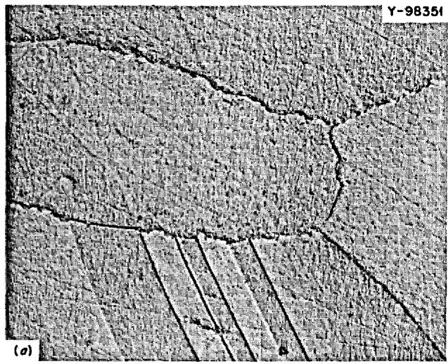

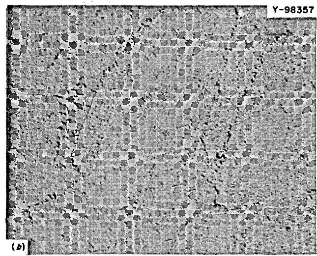

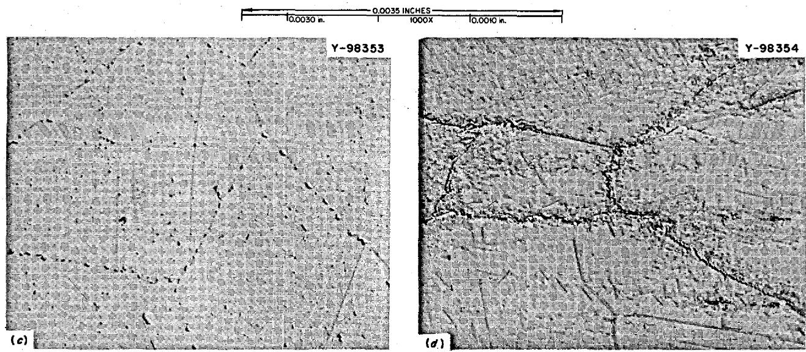  
Fig. 18.6. Microstructures Developed in Aging 10,000 hr After a 1-hr Solution Anneal at $1177^{\circ}\mathrm{C}$ and $10\%$ Prestraining at Room Temperature. $1000\times$ . (a) $0.15\%$ Ti Aged 10,000 hr at $650^{\circ}\mathrm{C}$ ; (b) $1.2\%$ Ti Aged 10,000 hr at $650^{\circ}\mathrm{C}$ ; (c) $0.15\%$ Ti Aged 10,000 hr at $760^{\circ}\mathrm{C}$ ; (d) $1.2\%$ Ti Aged 10,000 hr at $760^{\circ}\mathrm{C}$ .

heat (67-550). Equally surprising is the fact that the lowest creep-rupture lives were found for the $0.9\%$ titanium heat (67-549) and that properties intermediate between the 0.6 and $0.9\%$ titanium heat were measured for the $1.2\%$ titanium heat. Since the scatter in these test results does not appear to be excessive for a particular alloy (i.e., good straight lines can be drawn through the data), we must conclude that the role of titanium at high and low carbon contents is quite different. These results are consistent with the hypothesis that above $0.6\%$ titanium in Hastelloy N the irradiation damage (postirradiation properties) at $550^{\circ}\mathrm{C}$

is independent of the titanium level; however, we have previously shown that this hypothesis is not true for irradiations at 650 and $760^{\circ}\mathrm{C}$ . Nevertheless, the nature of the irradiation damage produced at $550^{\circ}\mathrm{C}$ has not been previously evaluated in detail, and the possible complication of carbide precipitation during postirradiation testing (for a $550^{\circ}\mathrm{C}$ irradiation) could mask our previously observed beneficial influence of higher titanium concentrations.

Figure 18.9 shows the effect of carbon content at the $1.2\%$ titanium level on the postirradiated properties of Hastelloy N. These data, replotted from Figs. 18.7 and

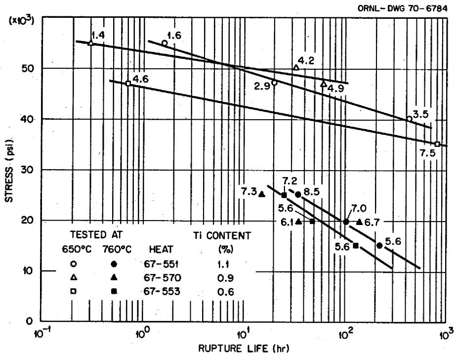  
Fig. 18.7. Effect of Titanium Content and Test Temperature on the Postirradiation Creep-Rupture Properties of Low-Carbon Heats of Hastelloy N. Samples solution annealed $1\mathrm{hr}$ at $1177^{\circ}\mathrm{C}$ and irradiated at $550^{\circ}\mathrm{C}$ to a thermal fluence of $2\times 10^{20}$ neutrons/cm². The numbers by each point indicate the fracture strain.

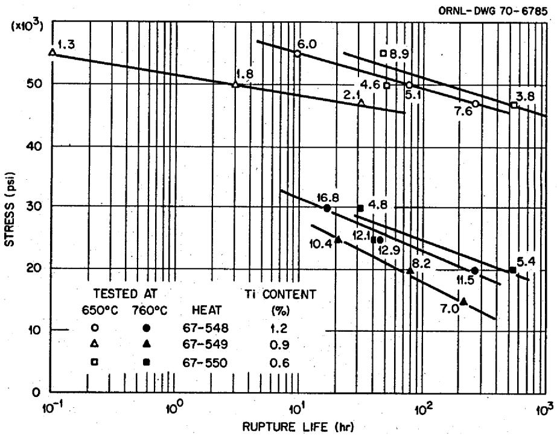  
Fig. 18.8. Effect of Titanium Content and Test Temperature on the Postirradiation Creep-Rupture Properties of High-Carbon Heats of Hastelloy N. Samples solution annealed $1\mathrm{hr}$ at $1177^{\circ}\mathrm{C}$ and irradiated at $550^{\circ}\mathrm{C}$ to a thermal fluence of $2\times 10^{20}$ neutrons/cm². The numbers by each point indicate the fracture strain.

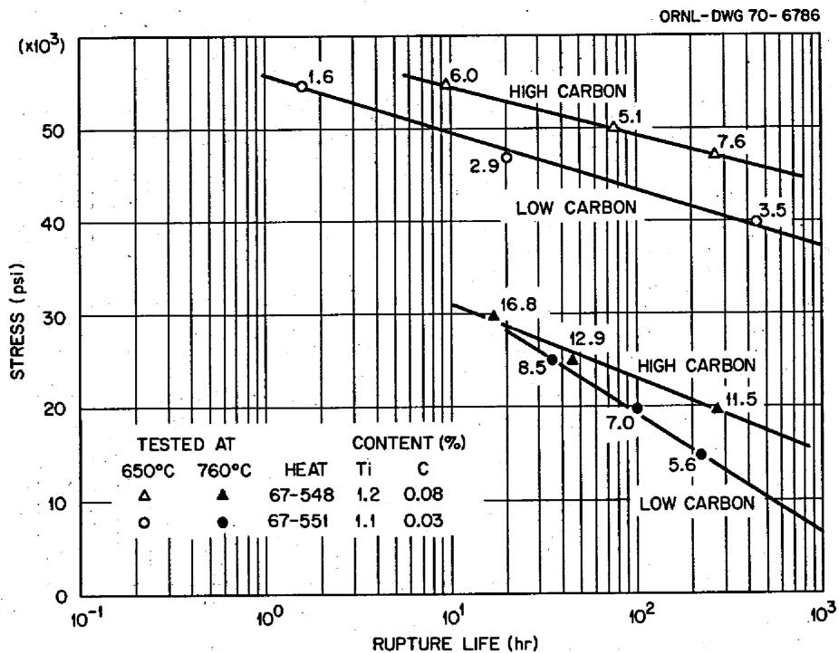  
Fig. 18.9. Effect of Carbon Content on the Postirradiation Creep-Rupture Properties of Titanium-Modified Hastelloy N. Samples annealed 1 hr at $1177^{\circ}\mathrm{C}$ and irradiated at $550^{\circ}\mathrm{C}$ to a thermal fluence of $2 \times 10^{20}$ neutrons/cm $^2$ . Numbers by each point indicate the fracture strain.

Table 18.1. Chemical Analyses of Commercial Heats of Titanium-Modified Hastelloy N Irradiated in the ETR   

<table><tr><td rowspan="2">Element</td><td colspan="6">Chemical Analysis (wt %)</td></tr><tr><td>67-550a</td><td>67-553</td><td>67-549</td><td>67-570</td><td>67-548</td><td>67-551</td></tr><tr><td>Ni</td><td>Bal</td><td>Bal</td><td>Bal</td><td>Bal</td><td>Bal</td><td>Bal</td></tr><tr><td>Mo</td><td>11.9</td><td>12.0</td><td>11.7</td><td>11.7</td><td>12.4</td><td>12.2</td></tr><tr><td>Cr</td><td>7.05</td><td>7.03</td><td>7.02</td><td>7.04</td><td>7.09</td><td>7.02</td></tr><tr><td>Mn</td><td>0.11</td><td>0.12</td><td>0.13</td><td>0.02</td><td>0.13</td><td>0.02</td></tr><tr><td>Fe</td><td>0.02</td><td>0.02</td><td>0.03</td><td>0.02</td><td>0.13</td><td>0.02</td></tr><tr><td>C</td><td>0.094</td><td>0.028</td><td>0.08</td><td>0.028</td><td>0.09</td><td>0.028</td></tr><tr><td>Ti</td><td>0.64</td><td>0.64</td><td>0.93</td><td>0.92</td><td>1.2</td><td>1.1</td></tr><tr><td>Zr</td><td>0.002</td><td>0.005</td><td>0.002</td><td>0.003</td><td>0.002</td><td>0.0005</td></tr><tr><td>Al</td><td>0.07</td><td>0.07</td><td>&lt;0.05</td><td>0.07</td><td>0.08</td><td>&lt;0.05</td></tr><tr><td>Si</td><td>0.01</td><td>0.01</td><td>0.02</td><td>0.02</td><td>0.03</td><td>0.02</td></tr><tr><td>B</td><td>0.0002</td><td>0.002</td><td>0.0002</td><td>0.00002</td><td>0.0007</td><td>0.0002</td></tr></table>

$a$ Alloy heat number.

18.8, show clearly a large influence of the higher carbon concentration on both the rupture life and the creep ductility at each stress level and at both test temperatures. Thus for irradiations at $550^{\circ}\mathrm{C}$ the creep rupture lives and ductilities of titanium-modified alloys are enhanced by higher carbon contents. These results again emphasize the complexity of the role of alloying additions on the high-temperature irradiation damage.

# 18.3 EFFECTS OF IRRADIATION AT $760^{\circ}\mathrm{C}$ ON THE CREEP-RUPTURE PROPERTIES OF MODIFIED HASTELLOY N

C.E.Sessions H.E.McCoy

Several small laboratory melts of modified Hastelloy N have been irradiated in an effort to optimize the chemical composition. Table 18.2 lists some results for

Table 18.2. Postirradiation Creep-Rupture Properties of New Modifications of the Ni-12% Mo-7% Cr-4% Fe-0.2% Mn-0.06%C Base Alloysa   

<table><tr><td rowspan="2">Alloy Number</td><td colspan="5">Alloy Additions (wt %)</td><td colspan="4">Postirradiation Creep Properties</td></tr><tr><td>Ti</td><td>Nb</td><td>Zr</td><td>Hf</td><td>\( Si^b \)</td><td>Stress (psi)</td><td>Rupture Life (hr)</td><td>Fracture Strain (%)</td><td>Minimum Creep Rate (%/hr)</td></tr><tr><td></td><td></td><td></td><td></td><td></td><td></td><td>\( \times 10^3 \)</td><td></td><td></td><td></td></tr><tr><td>284</td><td>0</td><td>0</td><td>0</td><td>0</td><td></td><td>15</td><td>154.7</td><td>0.2</td><td>0.0008</td></tr><tr><td></td><td></td><td></td><td></td><td></td><td></td><td>10</td><td>355.4</td><td>0.6</td><td>0.0009</td></tr><tr><td>286</td><td>0.2</td><td>0.5</td><td>0.05</td><td>0</td><td></td><td>40</td><td>9.4</td><td>0.9</td><td>0.070</td></tr><tr><td></td><td></td><td></td><td></td><td></td><td></td><td>35</td><td>7.2</td><td>0.5</td><td>0.037</td></tr><tr><td>289</td><td>1.0</td><td>0</td><td>0</td><td>0</td><td></td><td>30</td><td>350</td><td>4.56</td><td>0.011</td></tr><tr><td></td><td></td><td></td><td></td><td></td><td></td><td>40</td><td>11.2</td><td>1.4</td><td>0.095</td></tr><tr><td>290</td><td>1.05</td><td>0</td><td>0</td><td>0</td><td></td><td>30</td><td>648.6</td><td>5.3</td><td>0.003</td></tr><tr><td></td><td></td><td></td><td></td><td></td><td></td><td>40</td><td>20.8</td><td>2.0</td><td>0.067</td></tr><tr><td>291</td><td>2.0</td><td>0</td><td>0</td><td>0</td><td></td><td>40</td><td>388.3</td><td>4.7</td><td>0.008</td></tr><tr><td></td><td></td><td></td><td></td><td></td><td></td><td>47</td><td>168.6</td><td>6.8</td><td>0.027</td></tr><tr><td>292</td><td>2.4</td><td>0</td><td>0</td><td>0</td><td></td><td>40</td><td>&gt;1100</td><td>\( 1.4^c \)</td><td>0.0006</td></tr><tr><td>293</td><td>3.0</td><td>0</td><td>0</td><td>0</td><td></td><td>47</td><td>1513.8</td><td>1.0</td><td></td></tr><tr><td>300</td><td>0.8</td><td>1.3</td><td>0.04</td><td>0.7</td><td>0.16</td><td>47</td><td>141.0</td><td>6.1</td><td>0.038</td></tr><tr><td>301</td><td>0</td><td>0</td><td>0.06</td><td>0.8</td><td></td><td>40</td><td>339.6</td><td>10.8</td><td>0.021</td></tr><tr><td>302</td><td>0</td><td>0</td><td>0.05</td><td>0.5</td><td></td><td>40</td><td>226</td><td>9.4</td><td>0.032</td></tr><tr><td>303</td><td>0.5</td><td>0.8</td><td>0</td><td>0</td><td></td><td>40</td><td>271</td><td>6.3</td><td>0.019</td></tr><tr><td></td><td></td><td></td><td></td><td></td><td></td><td>55</td><td>8.8</td><td>5.0</td><td>0.442</td></tr><tr><td>315</td><td>0.5</td><td>0</td><td>0.05</td><td>0</td><td></td><td>40</td><td>48.1</td><td>4.4</td><td>0.081</td></tr><tr><td></td><td></td><td></td><td></td><td></td><td></td><td>35</td><td>158.8</td><td>4.7</td><td>0.026</td></tr><tr><td>181</td><td>0.5</td><td>1.8</td><td>0</td><td>0</td><td></td><td>40</td><td>175.3</td><td>4.25</td><td>0.02</td></tr><tr><td></td><td></td><td></td><td></td><td></td><td></td><td>35</td><td>666.2</td><td>4.28</td><td>0.008</td></tr><tr><td></td><td></td><td></td><td></td><td></td><td></td><td>27</td><td>\( 1580^d \)</td><td>\( 3.5^d \)</td><td>0.002</td></tr><tr><td>184</td><td>1.2</td><td>0</td><td>0</td><td>1.2</td><td>0.2</td><td>47</td><td>23.5</td><td>13.7</td><td>0.15</td></tr><tr><td></td><td></td><td></td><td></td><td></td><td></td><td>35</td><td>2292</td><td>22.7</td><td>0.005</td></tr><tr><td>232</td><td>0</td><td>0</td><td>0</td><td>1.2</td><td>0.2</td><td>40</td><td>405.5</td><td>13.3</td><td>0.022</td></tr><tr><td></td><td></td><td></td><td></td><td></td><td></td><td>27</td><td>\( 2035.0^d \)</td><td>6.9</td><td>0.002</td></tr></table>

${}^{a}$ Alloys annealed 1 hr at ${1177}^{ \circ  }\mathrm{C}$ ,irradiated at ${760}^{ \circ  }\mathrm{C}$ to $3 \times  {10}^{20}$ neutrons/cm ${}^{2}$ ,and then creep tested at ${650}^{ \circ  }\mathrm{C}$ .   
$b$ Silicon content of $< 0.01\%$ unless specified otherwise.   
$^\mathrm{c}$ Stress raised to 47,000 psi and sample failed in 10 hr.   
$d_{\mathrm{Test}}$ discontinued before failure.

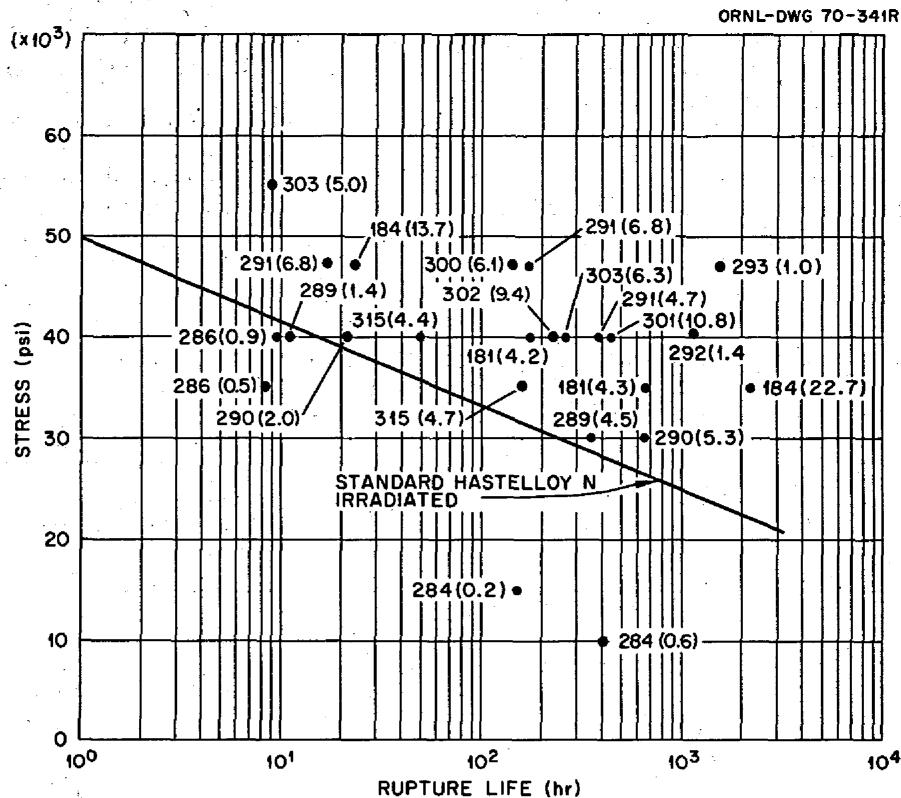  
Fig. 18.10. Postirradiation Stress-Rupture Properties of Several Alloys of Modified Hastelloy N at $650^{\circ}\mathbf{C}$ . All materials were annealed for 1 hr at $1177^{\circ}\mathbf{C}$ and irradiated at $760^{\circ}\mathbf{C}$ to a thermal fluence of $3 \times 10^{20}$ neutrons/cm $^2$ . All alloys have a base composition of Ni-12% Mo-7% Cr-0.06%C, and the carbide-forming additions to each alloy are shown in Table 18.2. The numbers in parentheses indicate the fracture strain.

new alloys that were recently tested in postirradiation creep rupture. Each alloy has the base composition Ni-12% Mo-7% Cr-4% Fe-0.2% Mn-0.06% C, with various minor additions of Ti, Nb, Zr, Hf, or Si as listed in Table 18.2. We can evaluate the relative benefit of a given combination of alloying elements by comparing the creep properties after irradiation.

Figure 18.10 compares the results of stress-rupture testing for these new alloys with those for standard irradiated Hastelloy N. These data were obtained at $650^{\circ}\mathrm{C}$ after irradiation at $760^{\circ}\mathrm{C}$ to a thermal neutron fluence of $3 \times 10^{20}$ neutrons/cm². These particular test conditions have been shown to reflect the sensitivity of postirradiation properties to alloy content.

As expected from previous results, alloy 284, which contains no Ti, Nb, Zr, or Hf, had inferior properties compared with standard Hastelloy N. Alloy 286, containing additions of $0.5\%$ niobium $+0.2\%$ titanium, was no better than standard Hastelloy N. However,

alloy 301 (0.8% hafnium) and alloy 315 (0.5% titanium + 0.05% zirconium) both appear to be considerably better than the standard alloy in terms of rupture life and fracture strain.

Alloys 289 and 290 both contain about $1.0\%$ titanium, but the properties were no better than standard Hastelloy N. As discussed previously1 the specimens with approximately $1.0\%$ titanium showed a large variation in creep properties after irradiation at $760^{\circ}\mathrm{C}$ that we do not yet fully understand. However, these two alloys at 30,000 psi stress had high postirradiation ductility. For increasing alloy content, alloy 232 (1.2% hafnium) is particularly good, with a $13\%$ fracture strain in a creep test at 40,000 psi. Alloy 303 is an outstanding alloy composition for additions below $1.5\%$ . This alloy contained $0.5\%$ titanium and $0.8\%$ niobium and was tested at 47,000 psi. The postirradiation rupture life was a factor of 100 higher than that for standard Hastelloy N. Even at 55,000 psi the ductility and rupture life were excellent for this alloy.

Alloys 181 (1.8% niobium + 0.5% titanium), 184 (1.2% titanium + 1.2% hafnium), 291 (2.0% titanium),

and 300 (0.8% Ti-1.3% Nb-0.7% Hf) had excellent postirradiation creep properties. Of these four alloys tested to date, alloy 184 is far superior, with 23% fracture strain for creep at 35,000 psi. These recent results on alloys with 2% titanium are also quite encouraging and indicate that titanium additions alone can probably produce the desired mechanical behavior during service at $700^{\circ}\mathrm{C}$ .

Alloys with higher concentrations of titanium of 2.4 and $3.0\%$ (alloys 292 and 293) exhibited very high creep resistance at this test temperature. The very low creep rates and low rupture ductilities of these two alloys probably indicate that these compositions precipitate gamma prime $\mathrm{(Ni_3Ti)}$ type intermetallic compounds during irradiation at $760^{\circ}\mathrm{C}$ . If this proves to be true, we would not be interested in alloys with such high titanium concentrations.

# 18.4 ELECTRON MICROSCOPY OF MODIFIED HASTELLOYN ALLOYS

R.E.Gehlbach S.W.Cook

Electron microscopy studies of Hastelloy N have concentrated primarily on characterizing the effects of alloying additions on the microstructure of several modifications of the alloy after exposure at elevated temperatures, namely, 650 and $760^{\circ}\mathrm{C}$ . The resistance to radiation damage is altered markedly by the addition of small amounts of Ti, Nb, and Hf. Silicon is also important in determining the type of precipitate formed. The concentration of this element is controlled largely by the melting practice, being high $(0.5\%)$ for

alloys prepared by electroslag remelting or air melting and low $(< 0.1\%)$ for vacuum-melted alloys. The molybdenum concentration in the base alloy is also important.

Laboratory Heats. - A number of 2-lb laboratory melts were prepared to evaluate the influence of Ti, Nb, Hf, and Si on precipitation and the resistance to irradiation damage. Several of these alloys have been aged at 650 and $760^{\circ}\mathrm{C}$ . Precipitates were extracted electrolytically and identified by x-ray diffraction. The alloys with their compositions and the precipitates detected are listed in Table 18.3.

The effects of titanium additions on precipitation have been discussed previously.²³ Precipitation of MC carbides⁴ often occurs in a stacking fault morphology at titanium concentrations up to the 1.2% level. Examination of an alloy containing 2.4% titanium (292) that had been aged 200 hr at $760^{\circ}\mathrm{C}$ revealed the absence of this morphology, although much MC ( $a = 4.29\mathrm{A}$ ) was present as films and very fine particles in the jagged grain boundaries and as particles in the matrix. Gamma prime $(\mathrm{Ni}_3\mathrm{Ti})$ was not detected in this material.

Table 18.3. Alloy Compositions and Precipitate Types Observed in Several Heats of Modified Hastelloy N   

<table><tr><td rowspan="3">Alloy Number</td><td colspan="4">Compositiona (%)</td><td colspan="6">Aging Temperatureb</td></tr><tr><td rowspan="2">Ti</td><td rowspan="2">Nb</td><td rowspan="2">Hf</td><td rowspan="2">Si</td><td colspan="3">650°C</td><td colspan="3">760°C</td></tr><tr><td>MC</td><td>M2C</td><td>M6C</td><td>MC</td><td>M2C</td><td>M6C</td></tr><tr><td>292</td><td>2.4</td><td>&lt;0.005</td><td>&lt;0.005</td><td>0.02</td><td></td><td></td><td></td><td>x</td><td></td><td></td></tr><tr><td>285</td><td>0.08</td><td>0.5</td><td>&lt;0.005</td><td>0.08</td><td></td><td>xc</td><td></td><td></td><td>x</td><td></td></tr><tr><td>306</td><td>0.01</td><td>0.55</td><td>0.002</td><td>0.27</td><td>xd</td><td></td><td>x</td><td></td><td></td><td>x</td></tr><tr><td>286</td><td>0.23</td><td>0.5</td><td>&lt;0.005</td><td>0.02</td><td>xe</td><td>x</td><td></td><td>xe</td><td>x</td><td></td></tr><tr><td>287</td><td>0.12</td><td>0.6</td><td>&lt;0.005</td><td>0.14</td><td>x</td><td>x</td><td>x</td><td>xe</td><td>x</td><td>x</td></tr><tr><td>310</td><td>0.15</td><td>0.57</td><td>0.54</td><td>&lt;0.01</td><td></td><td></td><td></td><td>x</td><td></td><td></td></tr><tr><td>313</td><td>&lt;0.02</td><td>&lt;0.01</td><td>0.7</td><td>0.02</td><td></td><td></td><td></td><td>x</td><td>x</td><td></td></tr><tr><td>314</td><td>0.65</td><td>1.3</td><td>0.65</td><td>0.35</td><td></td><td></td><td></td><td>x</td><td></td><td>x</td></tr></table>

${}^{a}$ All alloys have a nominal composition of $\mathrm{{Ni}} - {12}\% \mathrm{{Mo}} - 7\% \mathrm{{Cr}} - 4\% \mathrm{{Fe}} - {0.2}\% \mathrm{{Mn}} - {0.06}\% \mathrm{C}$ .   
${}^{b}$ Aged 1000 hr at the indicated temperature except alloys 292,310,313,and 314,which were aged $\dot{2}{00}\mathrm{{hr}}$ at ${760}^{ \circ  }\mathrm{C}$ .   
cPlus unidentified phase.   
$^d$ Very fine unidentified precipitate observed by electron microscopy.   
$e$ Stacking fault morphology observed by electron microscopy.

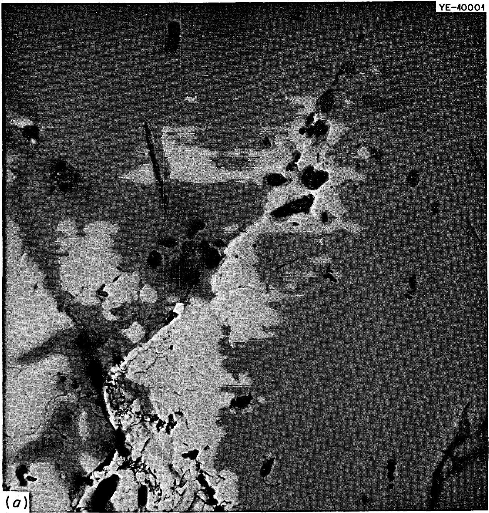  
Fig. 18.11a. Microstructure of Hastelloy N Modified with $0.5\%$ Nb. 10,000X.

The effects of small amounts of niobium, of titanium and niobium, and of titanium, niobium, and silicon on the microstructure after aging at $760^{\circ}\mathrm{C}$ are shown in Fig. 18.11. The addition of $0.5\%$ Nb alone (alloy 285) resulted in relatively coarse $\mathbf{M}_2\mathbf{C}$ (Fig. 18.11a), which is typical of the base alloy. No stacking fault precipitate was observed in these alloys. A combination of $0.5\%$

niobium and $0.23\%$ titanium (alloy 286) resulted in a finer grain boundary precipitate (Fig. 18.11b) than that observed in the alloy without titanium (285). The combination of $0.14\%$ Si, $0.12\%$ Ti, and $0.6\%$ Nb (alloy 287) resulted in the formation of large blocky $\mathbf{M}_6\mathbf{C}$ -type carbides in both the grain boundaries and the matrix, as shown in Fig. 18.11c. These silicon-rich

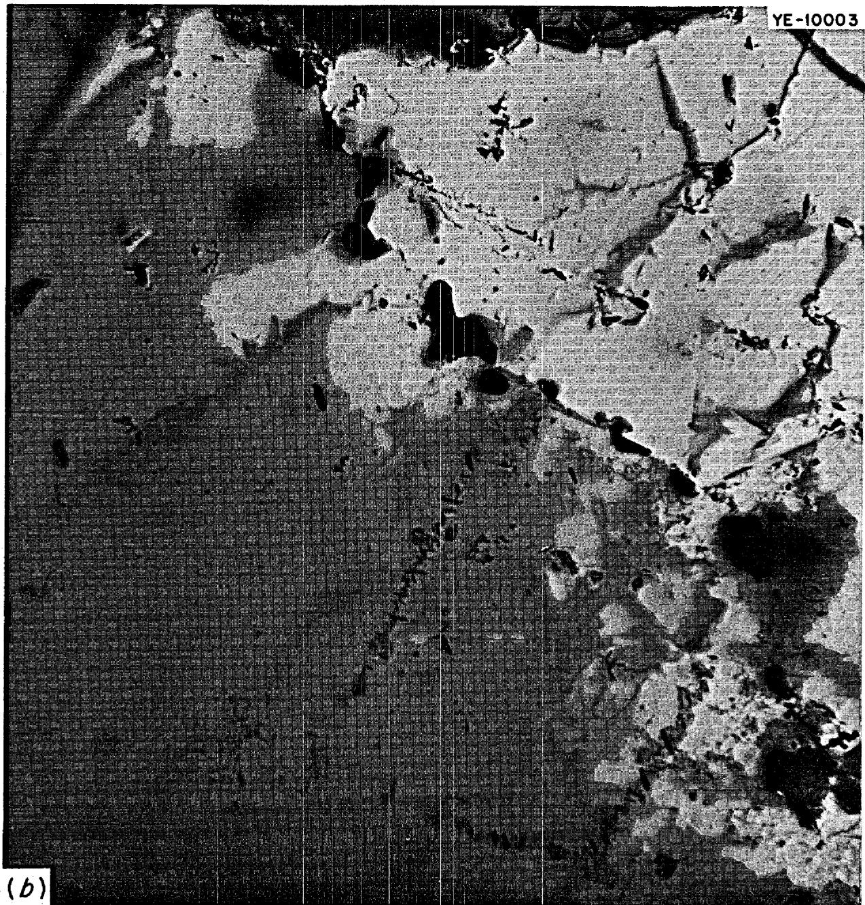  
Fig. 18.11b. Microstructure of Hastelloy N Modified with $0.5\%$ Nb and $0.23\%$ Ti. 10,000X.

carbides are very stable and are not dissolved during annealing as described previously. After the silicon is consumed in the $\mathbf{M}_6\mathbf{C}$ , which contains about $3.3\%$ silicon, further grain boundary carbide precipitation is similar to that in the silicon-free alloy (286), although smaller amounts are present. Relatively small carbides

also precipitated in the matrix in alloy 287. Some precipitate occurred in the stacking fault morphology in alloys 286 and 287, containing titanium, but not in 285 or 306, which do not contain any titanium. There is some question regarding the structure of the stacking fault precipitate observed in the alloys containing niobium. Aging at $650^{\circ}\mathrm{C}$ resulted in much finer $\mathbf{M}_2\mathbf{C}$ than that generated at the higher temperature $(760^{\circ}\mathrm{C})$ . In addition to large quantities of $\mathbf{M}_6\mathbf{C}$ , a small amount

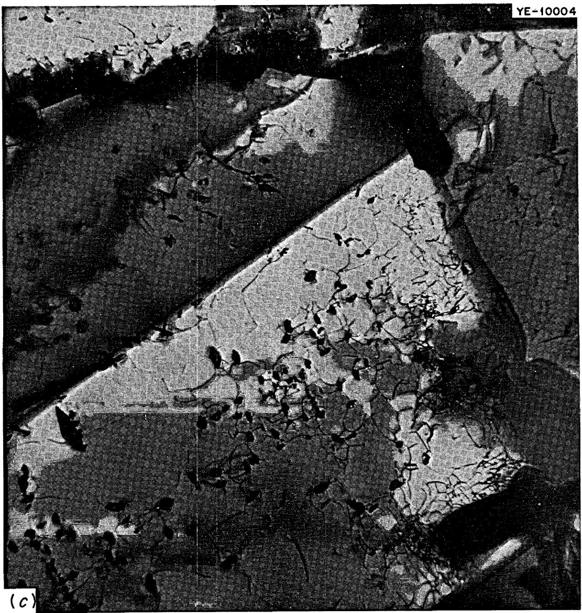  
Fig. 18.11c. Microstructure of Hastelloy N Modified with $0.5\%$ Nb, $0.12\%$ Ti, and $0.14\%$ Si After Aging 1000 hr at $760^{\circ}\mathrm{C}$ . 10,000×.

of very fine MC was dispersed throughout the matrix in 306 after aging at $650^{\circ}\mathrm{C}$ ; however, only $\mathbf{M}_6\mathbf{C}$ is present after aging at $760^{\circ}\mathrm{C}$ .

The MC formed in hafnium-modified alloys has a morphology different from that in the titanium-modified alloys. Figure $18.12a$ is typical of an alloy containing $0.7\%$ hafnium (alloy 313) aged 200 hr at $760^{\circ}\mathrm{C}$ . As shown in Fig. $18.12b$ , $0.15\%$ titanium and

$0.57\%$ niobium in combination with hafnium (alloy 310) did not significantly affect the morphology of the carbides formed at $760^{\circ}\mathrm{C}$ . A comparison of Fig. 18.12b with Fig. 18.11b shows the effect of hafnium at comparable levels of titanium and niobium. A similar microstructure was previously shown for an alloy containing $1\%$ hafnium and $1\%$ titanium (alloy 184). The presence of $0.35\%$ silicon in an alloy containing

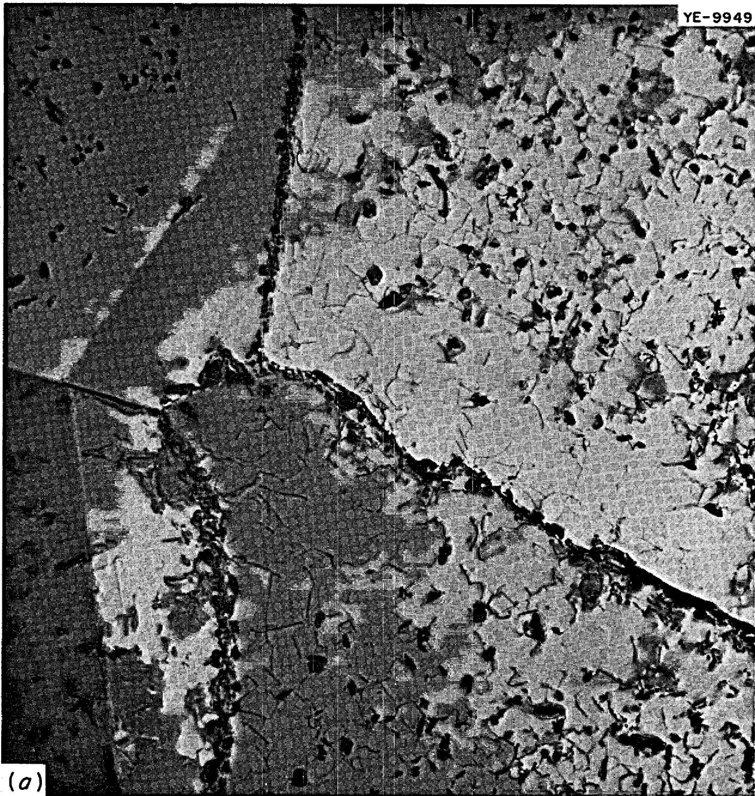  
Fig. 18.12a. Microstructure of Hafnium-Modified Hastelloy N After Aging 200 hr at $760^{\circ}\mathrm{C}$ . $0.7\%$ Hf. 10,000X.

$0.65\%$ Ti, $1.3\%$ Nb, and $0.65\%$ Hf (alloy 314) resulted in large stable $\mathbf{M}_6\mathbf{C}$ in the matrix and grain boundaries with subsequent precipitation of fine MC (Fig 18.12c) similar to the silicon-free alloys. Due to the high level of silicon in 314, much of the carbon was tied up in the $\mathbf{M}_6\mathbf{C}$ , with little available for MC precipitation during aging. No stacking fault morphology was found in the hafnium-modified alloys.

Commercial Alloys. - We have examined the phases present in four new commercial alloys (Table 18.4). Two are electroslag remelted heats containing $0.77\%$ titanium and $1.7\%$ niobium (heat 69-344) and $1.1\%$ titanium and $0.92\%$ hafnium (heat 69-345). Both contained high concentrations of silicon and had large amounts of $\mathbf{M}_6\mathbf{C}$ after annealing. Small quantities of MC were also present in both alloys.

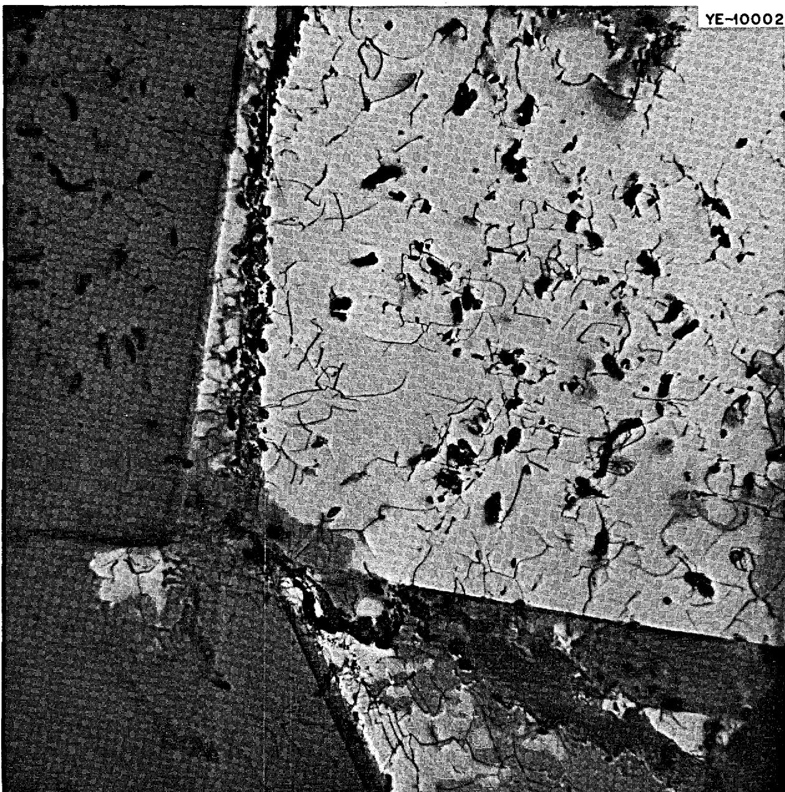  
(b)   
Fig. 18.12b. Microstructure of Hafnium-Modified Hastelloy N After Aging 200 hr at $760^{\circ}\mathrm{C}$ . $0.54\%$ Hf, $0.57\%$ Nb, and $0.15\%$ Ti. 10,000X.

Precipitates in the two vacuum-melted heats were examined after aging at $650^{\circ}\mathrm{C}$ . One contained $0.92\%$ titanium and $2.0\%$ niobium (heat 69-648) and the other $1.3\%$ titanium and $0.60\%$ hafnium (heat 69-641). Both have only trace levels of silicon, and no $\mathbf{M}_6\mathbf{C}$ was found. Two MC carbides are present in 69-648 and three in 69-641.

Molybdenum Series. - We have identified the precipitates formed in Hastelloy N as a function of the molybdenum concentration. These alloys have silicon levels of about $0.01\%$ . Only $\mathbf{M}_2\mathbf{C}$ precipitated at $650^{\circ}\mathbf{C}$ for molybdenum levels of 10 through $16\%$ . At $19\%$ molybdenum, the only precipitate formed was a high-parameter $\mathbf{M}_6\mathbf{C}$ ( $a = 11.23\mathrm{A}$ ), probably $\mathbf{Ni}_2\mathbf{Mo}_4\mathbf{C}$ .

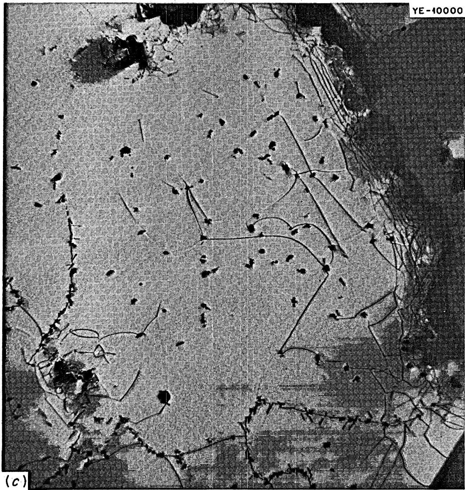  
Fig. 18.12c. Microstructure of Hafnium-Modified Hastelloy N After Aging 200 hr at $760^{\circ}\mathrm{C}$ . $0.65\%$ Hf, $1.3\%$ Nb, $0.8\%$ Ti, and $0.35\%$ Si. 10,000X.

Discussion. - Our observations on the effects of alloy modifications on the microstructure of the heats described above are consistent with our previous observations. The formation of particular types of precipitates is dependent on the alloying additions. The $\mathbf{M}_2\mathbf{C}$ -type carbide is stable in the basic alloy, with additions of Ti, Nb, and Hf in sufficient quantities

giving MC-type carbides. The $\mathbf{M}_2\mathbf{C}$ is coarser at $760^{\circ}\mathrm{C}$ than at $650^{\circ}\mathrm{C}$ ; however, it is the higher temperature which is of primary interest to us, since the outlet fuel salt temperature of an MSBR will be about $700^{\circ}\mathrm{C}$ . The postirradiation mechanical properties deteriorate markedly in materials which form coarse $\mathbf{M}_2\mathbf{C}$ at the irradiation temperature.

Table 18.4. Precipitates in Commercial Modified Hastelloy N   

<table><tr><td rowspan="2">Alloy Number</td><td colspan="6">Compositiona (%)</td><td rowspan="2">Phasesb</td></tr><tr><td>Zr</td><td>Ti</td><td>Nb</td><td>Hf</td><td>Si</td><td>Fe</td></tr><tr><td>69-344c</td><td>0.001</td><td>0.77</td><td>1.7</td><td>&lt;0.01</td><td>0.30</td><td>4.0</td><td>M6C (S) + MC (W)</td></tr><tr><td>69-345c</td><td>0.3</td><td>1.1</td><td>&lt;0.01</td><td>0.92</td><td>0.25</td><td>4.0</td><td>M6C (S) + MC (W)</td></tr><tr><td>69-648d</td><td>&lt;0.05</td><td>0.92</td><td>2.0</td><td>&lt;0.05</td><td>0.05</td><td>0.3</td><td>MC</td></tr><tr><td>69-641d</td><td>&lt;0.05</td><td>1.3</td><td>&lt;0.05</td><td>0.60</td><td>&lt;0.01</td><td>0.3</td><td>MC</td></tr></table>

${}^{a}$ All alloys have a nominal composition of $\mathrm{{Ni}} - {12}\% \mathrm{{Mo}} - 7\% \mathrm{{Cr}} - {0.2}\% \mathrm{{Mn}} - {0.05}\% \mathrm{C}$ .   
$b_{\mathbf{S}} = \text{strong}, \mathbf{W} = \text{weak}$ .   
$c$ Annealed 1 hr at $1177^{\circ}\mathrm{C}$   
$d$ Annealed 1 hr at $1177^{\circ}\mathrm{C}$ plus 1000 hr at $650^{\circ}\mathrm{C}$ .

The beneficial effect of MC carbides on the postirradiation mechanical properties appears to depend on the morphology of the precipitate, or at least on the alloying addition used. Titanium alone in sufficient quantities improves the postirradiation creep rupture life, but the fracture ductility may be too low at high creep stresses. The most obvious microstructural modification in the MC-forming titanium-modified alloys is the formation of massive stacking fault precipitates.

The niobium-modified heats discussed do not contain sufficient quantities of niobium to stabilize MC. Based on microstructural observations, we would not expect these alloys to have good properties after irradiation. Higher concentrations of niobium would be expected to exhibit good properties if MC is formed in a desirable morphology. We will be studying several alloys with larger niobium additions, particularly alloy 303, which looks very promising (see Table 18.2).

Additions of hafnium appear to control the type of microstructure even with large quantities of titanium and niobium in the alloy. These alloys are characterized by small discrete particles in the matrix and grain boundaries, and the postirradiation mechanical properties are outstanding.

The effect of small quantities of silicon is to cause the formation of a silicon-rich stable $\mathbf{M}_6\mathbf{C}$ that is very coarse. This is undesirable in that it results in a grain boundary structure approaching that of standard Hastelloy N rather than permitting the generation of a controlled microstructure by judicious alloying and heat treatment. Thus the electroslag remelt process is virtually eliminated from further consideration as a production method for an improved Hastelloy N. However, small amounts of silicon can likely be tolerated, particularly when hafnium is present.

# 18.5 WELDABILITY OF COMMERCIAL ALLOYS

# B. McNabb H. E. McCoy

Two of the prime requirements for an alloy to be used in a nuclear reactor are fabricability and weldability. In scaling up small lab melts to commercial-size melts, these properties must be evaluated and experience gained through commercial vendors for promising alloys. Because of financial restraints our commercial experience must be limited to small 50- and 100-lb melts from commercial vendors.

Evaluation of weldability was carried out by making welds under highly restrained conditions and then using side bend tests. The weld side bend tests were made according to ASME Boiler and Pressure Vessel Code Sect. 9; they used four side bend specimens $\frac{1}{8}$ in. thick bent $180^{\circ}$ around a $\frac{1}{2}$ -in. radius. Tensile specimens will be made from the welds to further evaluate the weld metal properties.

The four 50-lb heats from Allvac Metals Company (69-641, 69-648, 69-714, and 70-727) were received as $\frac{1}{2}$ -in.-thick plates 4 in. wide by 10 in. long in the rolling direction. Strips $\frac{1}{2}$ in. square were sawed from the plates in the rolling direction and swaged to $\frac{1}{8}$ and $\frac{3}{32}$ in. weld wire. The plates were beveled $50^{\circ}$ each, giving a $100^{\circ}$ included angle weld, with a $\frac{3}{64}$ -in. land at the root pass. The weld direction was parallel to the rolling direction in order to get the maximum weld length. The two 100-lb heats from the Materials Systems Division of Union Carbide Corporation (69-344, 69-345) were $\frac{1}{2} \times 9 \times 10$ in. in the rolling direction. These plates were prepared as above for the Allvac heats, except the weld direction was made perpendicular to the rolling direction so that any stringers in the base metal would be aligned axially in

Table 18.5. Vendor's Analysis of Modified Hastelloy N Heats   

<table><tr><td>Alloy</td><td>Methoda of Melting</td><td>Ni</td><td>Mo</td><td>Cr</td><td>Fe</td><td>Mn</td><td>C</td><td>Si</td><td>Ti</td><td>Nb</td><td>Hf</td><td>Zr</td><td>V</td><td>Relative Welding Ratingb</td></tr><tr><td>69-641</td><td>A</td><td>Bal</td><td>13.9</td><td>6.9</td><td>0.3</td><td>0.35</td><td>0.073</td><td>&lt;0.01</td><td>1.3</td><td>&lt;0.05</td><td>0.60</td><td>&lt;0.05</td><td>0.02</td><td>5</td></tr><tr><td>69-648</td><td>A</td><td>Bal</td><td>12.8</td><td>6.9</td><td>0.3</td><td>0.24</td><td>0.05</td><td>0.05</td><td>0.92</td><td>1.95</td><td>&lt;0.05</td><td>&lt;0.05</td><td>0.1</td><td>4</td></tr><tr><td>69-714</td><td>A</td><td>Bal</td><td>13.0</td><td>7.8</td><td>0.1</td><td>0.35</td><td>0.04</td><td>&lt;0.05</td><td>0.80</td><td>1.6</td><td>&lt;0.01</td><td>&lt;0.001</td><td></td><td>1</td></tr><tr><td>69-344</td><td>B</td><td>Bal</td><td>13.0</td><td>7.4</td><td>4.0</td><td>0.56</td><td>0.078</td><td>0.30</td><td>0.77</td><td>1.7</td><td>&lt;0.01</td><td>&lt;0.001</td><td></td><td>3</td></tr><tr><td>69-345</td><td>B</td><td>Bal</td><td>13.0</td><td>7.3</td><td>4.0</td><td>0.52</td><td>0.078</td><td>0.25</td><td>1.1</td><td>&lt;0.01</td><td>0.92</td><td>0.3</td><td>0.3</td><td>6</td></tr><tr><td>70-727</td><td>A</td><td>Bal</td><td>13.0</td><td>7.4</td><td>0.05</td><td>0.37</td><td>0.044</td><td>&lt;0.05</td><td>2.1</td><td>&lt;0.01</td><td>&lt;0.01</td><td>&lt;0.001</td><td>0.13</td><td>2</td></tr></table>

$a_{\mathbf{A}} =$ double vacuum; $\mathbf{B} =$ electroslag remelt.   
$b$ All alloys except heat 69-345 welded satisfactorily. The ratings indicate the amount of porosity, with No. 1 having the least.

the tensile specimens to be cut from the weld and base metal.

Before welding the plates to each other, they were welded to a 4-in.-thick steel strongback plate with provision for inert gas underneath the weld area to protect the root pass. Tungsten inert gas welding with argon as the cover gas was used. The root pass was made with the material initially at room temperature using $\frac{3}{32}$ -in. weld wire that had been electrolytically cleaned. The first four weld passes used $\frac{3}{32}$ -in. weld wire, $12\mathrm{v}$ and from 80 to 100 amp. About 25 subsequent weld passes were made with $\frac{1}{8}$ -in.-diam filler wire at $20\mathrm{v}$ and 150 amp with interpass temperatures from 70 to $90^{\circ}\mathrm{C}$ .

The chemical composition and relative weldability rating of each heat are given in Table 18.5. Several important observations were made,

1. Heat 69-714 welded the cleanest, with no interpass grinding required to remove any oxide. No flaws were detected during welding or in the side bend tests either visually or by dye penetrant inspection.   
2. Heat 70-727 welded very clean, with no interpass grinding, and no flaws were detected during welding. There were some very tiny indications of flaws in the side bend specimens outside the weld and heat-affected zone in the base metal. There were no indications in the weld metal or heat-affected zone.   
3. Heat 69-344 welded fairly clean, but did require some interpass grinding to remove some oxide. There were no indications of cracks by visual or dye penetrant inspection of the weld or the side bend specimens.   
4. Heat 69-648 welded fairly clean, but did require interpass grinding to remove some shallow transverse cracks noted in passes 8 through 12. These were

easily removed, and visual and dye penetrant inspection showed no indications of cracks in the final pass. In the side bend tests, one of the four did show one tiny indication by dye penetrant, but it was not found when examined metallographically. The weld looked good, with no evidence of weld or fusion line cracking.

5. Heat 69-641 had several small round indications in weld passes 4, 6, and 12 when dye checked, but they seemed to be very shallow and easily removed by rotary file. When the weld side bends were dye checked, they had from two to five small flaw indications in each side bend. One of these side bend specimens was mounted and examined metallographically. One crack was found in the weld metal adjacent to some porosity, thus indicating that porosity could possibly be the cause of the crack opening up under stress.   
6. Heat 69-345 welded very dirty, with dirt floating out of the weld puddle that had to be ground off after each pass. There were six small cracks in the root pass, which were removed by grinding. Three more passes were put in, and 22 transverse cracks were found by dye check. These were removed by grinding down to the root pass, and four passes were made with small cracks in them. Then a longitudinal crack propagated about 5 in. along the weld. Welding was discontinued and the plate removed from the strongback plate. ORNL analysis of this heat indicated about 0.3 wt % zirconium and 0.92 wt % hafnium. Previous experience indicated that Hastelloy N containing more than 0.05 wt % zirconium could not be welded successfully.1

Further evaluations of these materials are planned, such as tensile and creep tests of the weld metal and base metal.

# 18.6 CORROSION STUDIES

# J.W.Koger

Temperature, the impurity content of the salt, and the type of container material are primary variables which affect corrosion in molten-salt systems. Therefore, we are studying the effect of these variables on corrosion and mass transfer in experimental systems which are based on design parameters typical of future molten-salt breeder reactors (MSBR's). The test facilities include thermal-convection and pumped loop systems as well as small-scale capsule tests. Most of the work discussed in this section concerns Hastelloy N alloys of the compositions shown in Table 18.6 and molten salts appropriate for single-fluid breeder reactors. Of special interest are the corrosion characteristics of the proposed MSBR coolant salt, a eutectic mixture of sodium fluoroborate and sodium fluoride. Also, some tests are continuing which contain salts of interest for two-fluid systems, and other tests include iron-base alloys.

Past work1 has shown that, of the major constituents of Hastelloy N, chromium is much more readily oxidized by fluoride salts than Fe, Ni, or Mo. Thus attack is normally manifested by the selective removal of chromium. The rate-limiting step in chromium removal from the Hastelloy N by fluoride salt corrosion is the solid-state diffusion of chromium in the alloy. Several oxidizing reactions may occur depending on the salt composition and impurity content, but among the most important reactants are $\mathrm{UF_4}$ , $\mathrm{FeF_2}$ , and HF. In fluoroborate salt systems, which in some cases have contained large amounts of $\mathrm{H}_2\mathrm{O}$ and oxygen ( $>500$ ppm), we have found that elements other than chromium may be oxidized by the salt, and as a result the

corrosion rate is higher and the attack is more uniform. These cases will be pointed out in the discussion of the individual systems. The status of the thermal-convection loops in operation with fluoride salt is summarized in Table 18.7.

# 18.6.1 Fuel Salts

Loop 1255, constructed of Hastelloy N and containing a simulated MSRE fuel salt plus 1 mole $\%$ ThF4, continues to operate without difficulty after 7.9 years.

Loop 1258, constructed of type 304L stainless steel and containing removable insert specimens in the hot leg, has operated about 6.6 years with the same salt as loop 1255. A plot of the weight change of the specimens in the hot leg as a function of operating time at various temperatures is given in Fig. 18.13. The corrosion rate at the highest temperature, $688^{\circ}\mathrm{C}$ , assuming uniform wall removal, has averaged 1.1 mils/year and is continually decreasing. Even though the weight losses are relatively large, there has been no indication of plugging.

Because of interest in iron-base alloys with lower chromium contents for possible containment of molten salts, a maraging steel (12 Ni-5 Cr-3 Mo-bal Fe) specimen has been exposed to salt in loop 1258. Table 18.8 gives a comparison of the weight losses and corrosion rates of several alloys, including the maraging steel, under similar exposure conditions. As expected, because of the lower chromium content, the maraging steel shows better corrosion resistance than the stainless steels, but the corrosion behavior of the Hastelloy N is still superior to both. The test is continuing, and other iron-base alloys will be tested.

Loop NCL-16, constructed of standard Hastelloy N with removable specimens in each leg, has operated with the two-fluid MSBR fuel salt for over 17,800 hr. The corrosion rate at the highest temperature, $704^{\circ}\mathrm{C}$ , in NCL-16 assuming uniform attack is 0.04 mil/year. For this system, as with all others studied to date, titanium-modified Hastelloy N specimens continue to have smaller weight changes than standard Hastelloy N specimens under equivalent conditions. This has been

Table 18.6. Composition of Hastelloy N   

<table><tr><td rowspan="2">Alloy</td><td colspan="7">Chemical Content (wt %)</td></tr><tr><td>Ni</td><td>Mo</td><td>Cr</td><td>Fe</td><td>Si</td><td>Mn</td><td>Ti</td></tr><tr><td>Standard Hastelloy N</td><td>Bal</td><td>17.2</td><td>7.4</td><td>4.5</td><td>0.6</td><td>0.54</td><td>0.02</td></tr><tr><td>Titanium-modified</td><td>Bal</td><td>13.6</td><td>7.3</td><td>&lt;0.1</td><td>&lt;0.01</td><td>0.14</td><td>0.5</td></tr><tr><td>Hastelloy N</td><td></td><td></td><td></td><td></td><td></td><td></td><td></td></tr></table>

Table 18.7. MSR Program Natural Circulation Loop Operation Through February 28, 1970   

<table><tr><td>Loop Number</td><td>Loop Material</td><td>Specimens</td><td>Salt Type</td><td>Salt Composition (mole %)</td><td>Maximum Temperature (℃)</td><td>\( \Delta T \) (℃)</td><td>Operating Time (hr)</td></tr><tr><td>1255</td><td>Hastelloy N</td><td>Hastelloy N + 2% Nb \( ^{a,b} \)</td><td>Fuel</td><td>LiF-BeF2-ZrF4-UF4-ThF4 (70-23-5-1-1)</td><td>704</td><td>90</td><td>69,300</td></tr><tr><td>1258</td><td>Type 304L SS</td><td>Type 304L stainless steel \( ^{b,c} \)</td><td>Fuel</td><td>LiF-BeF2-ZrF4-UF4-ThF4 (70-23-5-1-1)</td><td>688</td><td>100</td><td>58,000</td></tr><tr><td>NCL-13A</td><td>Hastelloy N</td><td>Hastelloy N; Ti-modified Hastelloy N controls \( ^{c,d} \)</td><td>Coolant</td><td>NaBF4-NaF (92-8)</td><td>607</td><td>125</td><td>11,800</td></tr><tr><td>NCL-14</td><td>Hastelloy N</td><td>Ti-modified Hastelloy N \( ^{c,d} \)</td><td>Coolant</td><td>NaBF4-NaF (92-8)</td><td>607</td><td>150</td><td>20,300</td></tr><tr><td>NCL-15A</td><td>Hastelloy N</td><td>Ti-modified Hastelloy N; Hastelloy N controls \( ^{c,d} \)</td><td>Blanket</td><td>LiF-BeF2-ThF4 (73-2-25)</td><td>677</td><td>55</td><td>13,400</td></tr><tr><td>NCL-16</td><td>Hastelloy N</td><td>Ti-modified Hastelloy N; Hastelloy N controls \( ^{c,d} \)</td><td>Fuel</td><td>LiF-BeF2-UF4 (65.5-34.0-0.5)</td><td>704</td><td>170</td><td>17,800</td></tr><tr><td>NCL-17</td><td>Hastelloy N</td><td>Hastelloy N; Ti-modified Hastelloy N controls \( ^{c,d} \)</td><td>Coolant</td><td>NaBF4-NaF (92-8) plus steam additions</td><td>607</td><td>150</td><td>5,900</td></tr><tr><td>NCL-18</td><td>Hastelloy N</td><td>Ti-modified Hastelloy N; Hastelloy N controls \( ^{c,d} \)</td><td>Fertile-Fissile</td><td>LiF-BeF2-ThF4-UF4 (68-20-11.7-0.3)</td><td>704</td><td>170</td><td>11,600</td></tr><tr><td>NCL-19A</td><td>Hastelloy N</td><td>Hastelloy N; Ti-modified Hastelloy N controls \( ^{c,d} \)</td><td>Fertile-Fissile</td><td>LiF-BeF2-ThF4-UF4 (68-20-11.7-0.3) plus bismuth in molybdenum hot finger</td><td>704</td><td>170</td><td>100</td></tr><tr><td>NCL-20</td><td>Hastelloy N</td><td>Hastelloy N; Ti-modified Hastelloy N controls \( ^{c,d} \)</td><td>Coolant</td><td>NaBF4-NaF (92-8)</td><td>687</td><td>250</td><td>1,700</td></tr></table>

Permanent specimens.   
${}^b$ Hot leg only.   
$c$ Removable specimens.   
$d_{\mathrm{Hot}}$ and cold legs.

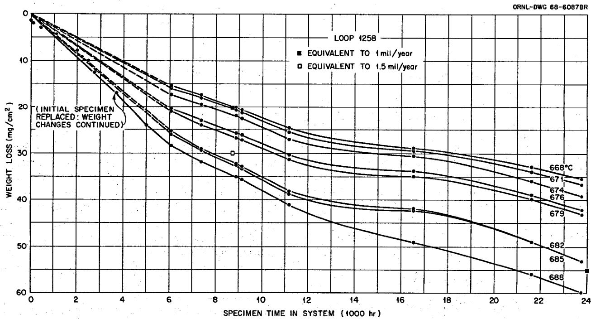  
Fig. 18.13. Weight Loss of Type 304L Stainless Steel Specimens as a Function of Operation Time and Temperature in LiF-BeF $_2$ -ZrF $_4$ -ThF $_4$ -UF $_4$ (70-23-5-1-1 Mole %) Salt.

Table 18.8. Comparison of Weight Losses of Alloys at $\sim 663^{\circ}\mathrm{C}$ After $\sim 2490$ hr in Similar Flowing Fuel Salts in a Temperature Gradient System   
Salt mixture: $\mathrm{LiF - BeF_2 - ZrF_4 - UF_4 - ThF_4}$ (70-23-5-1-mole %)   

<table><tr><td>Alloy</td><td>Weight Loss (mg/cm2)</td><td>Average Corrosion Rate (mils/year)</td></tr><tr><td>Maraging steel</td><td>3.0</td><td>0.53</td></tr><tr><td>Type 304 stainless steel</td><td>6.5</td><td>1.1</td></tr><tr><td>Hastelloy N</td><td>0.4</td><td>0.06</td></tr></table>

generally attributed to the absence of iron in the modified alloys. The chromium content of the salt, currently $400~\mathrm{ppm}$ , continues to show a small increase with time, while the iron content has apparently stabilized. Earlier the $\mathrm{FeF_2}$ content in the salt had decreased, suggesting that the reaction

$$
\operatorname {F e F} _ {2} (d) + \operatorname {C r} (s) \rightleftharpoons \operatorname {C r F} _ {2} (d) + \operatorname {F e} (\text {d e p o s i t e d}),
$$

where

$$
\begin{array}{l} d = \text {d i s s o l v e d} \\ s = \text {s o l i d s o l u t i o n}, \\ \end{array}
$$

was responsible for part of the mass transfer. Since no changes in $\mathbf{FeF}_2$ are now seen, the $\mathbf{UF}_4$ corrosion reaction must now be the primary cause for the chromium removal. The overall process is still controlled by solid-state diffusion of chromium in the alloy.

# 18.6.2 Fertile-Fissile Salt

Loop NCL-18, constructed of standard Hastelloy N with removable specimens in each leg, has operated with the single-fluid MSBR salt for over 11,600 hr. The weight change at the highest temperature, $704^{\circ}\mathrm{C}$ , is $-1.1\mathrm{mg/cm}^2$ . Assuming uniform attack, the corrosion rate is 0.05 mil/year. The titanium-modified Hastelloy N specimens show smaller weight losses than standard specimens in equivalent positions, and, as in the case of NCL-16, the chromium content of the salt is increasing (150 ppm at the present), while the iron content is stable.

# 18.6.3 Blanket Salt

Loop NCL-15A, constructed of standard Hastelloy N with removable specimens in each leg, has operated 13,400 hr with the LiF-BeF $_2$ salt containing 25 mole % ThF $_4$ . Specimens exposed to this salt are often

"glazed" with a coating that is impossible to remove without damaging the metal. This has made weight change measurements difficult; however, there has been little change in the chromium concentration of the salt.

# 18.6.4 Coolant Salt

Loop NCL-13A, constructed of standard Hastelloy N with removable specimens in each leg, has operated for 11,800 hr with the fluoroborate salt proposed as the MSBR secondary coolant. Figure 18.14 gives the weight changes of specimens at various temperatures as a function of operating time. This figure is typical of the plots of total weight change of the specimens vs time that we obtain from all the natural-circulation loops. It is clear that material is removed in the hot sections and deposited in the cold sections. It is also obvious that these changes are temperature dependent and that the corrosion and deposition rates decrease with time. The corrosion rate at the maximum temperature, $605^{\circ}\mathrm{C}$ , is 0.6 mil/year. The attack in this case may involve other alloy constituents besides chromium, since analyses of the salt show approximately 1000 ppm water and 1000 ppm oxygen. Large amounts of these impurities portend high corrosion rates due to the formation of strong oxidants such as HF. The chromium concentration of the salt initially was 253 ppm and has remained near that value throughout operation.

Loop NCL-14, constructed of standard Hastelloy N with removable specimens in each leg, has operated for 20,300 hr with the fluoroborate coolant salt. The weight changes of the specimens at the various temperatures as a function of operating time are given in Fig. 18.15. Two changes of corrosion rate are noted in the plot. These changes were traced to a defective gas line and a leaking standpipe ball valve, and their effects have been discussed.[2,3] The overall corrosion rate at the maximum temperature, $605^{\circ}\mathrm{C}$ , is 0.55 mil/year. Again, because of impurity-controlled attack, the corrosion is generally uniform. It appears that under extreme oxidizing conditions when all constituents of the alloy are removed, the nickel and molybdenum that are removed as fluorides deposit as metals in the cold portion of the loop. Larger amounts of chromium and iron fluorides remain in the salt. After the extreme oxidizing conditions pass, the iron fluorides oxidize more chromium from the alloy. It is encouraging that,

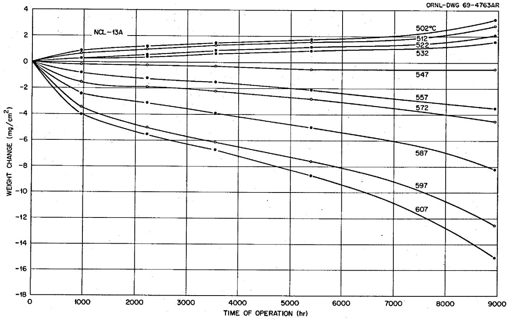

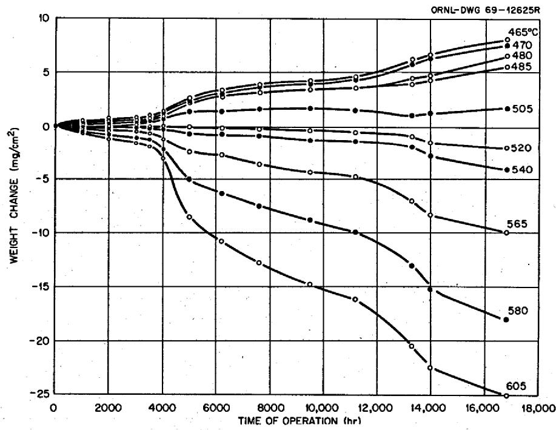  
Fig. 18.14. Weight Change vs Time for Standard Hastelloy N Specimens in NCL-13A Exposed to Fluoroborate Salt at Various Temperatures.   
Fig. 18.15. Weight Change vs Time for Titanium-Modified Hastelloy N Specimens in NCL-14 Exposed to Fluoroborate Salt at Various Temperatures.

in spite of two known problems which increased the corrosion rate, loop NCL-14 has operated for over two years with the fluoroborate salt and that the incremental corrosion rate is currently less than 0.5 mil/year.

Loop NCL-17, constructed of standard Hastelloy N with removable specimens in each leg, is being operated to determine the effect of steam inleakage in a flowing fluoroborate salt-Hastelloy N system. This experiment has run for over 5900 hr and is continuing in order to provide information on the immediate and long-range corrosion of the system after steam injection. The loop was operated for 1000 hr, the specimens removed and weighed, and steam forced into the flowing salt system through a 16-mil hole in a closed $\frac{1}{4}$ in. Hastelloy N tube, simulating a leaking heat exchanger. Steam was forced into the system until the pressure began to increase, thus indicating that no more steam was soluble in the salt.

Table 18.9 summarizes the results to date. The corrosion rate continues to decrease with time, and the incremental rates have now fallen to 1 mil/year. Figure 18.16 shows the weight changes and temperatures for the specimens in NCL-17. As usual, the changes are temperature dependent, and the rates are decreasing with time. Figure 18.17 shows micrographs of the specimens in the hottest and coldest positions. The

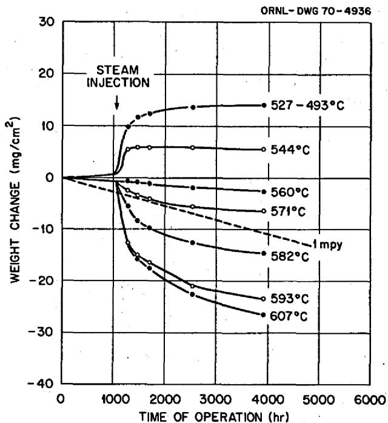  
Fig. 18.16. Weight Change vs Time for Hastelloy N Specimens in NCL-17 Exposed to $\mathrm{NaBF_4}$ NaF (92-8 Mole %) at Various Temperatures.

attack seen in Fig. 18.17a is general, as expected for impurity-controlled mass transfer processes. Micrometer measurements show a loss of approximately 1 mil from specimen surfaces at the maximum temperature position. In Fig. 18.17b we see a large amount (~2 mils) of deposited material. This material has been analyzed using an electron beam microprobe, and Table 18.10 gives the results for the matrix and the deposit. These results show that very little chromium has deposited. The nickel and molybdenum concentrations had reached a maximum of 74 and 56 ppm, respectively, 288 hr after the steam addition, decreased, and quickly leveled off to about 10 ppm each. From the microprobe evidence much of the nickel and molybdenum apparently has deposited in the cold leg, although not in the same ratio as they exist in Hastelloy N. A similar deposition was also found and discussed for NCL-14. One may conclude that under highly oxidizing conditions where large weight changes occur (NCL-14 during the air leak and NCL-17 after steam inleakage), most of

Table 18.9. Weight Changes of Hottest Specimen $(607^{\circ}\mathrm{C})$ from Steam-Injected Fluoroborate Salt Loop NCL-17   
Table 18.10. Microprobe Analysis of Specimen in Coldest Position $(493^{\circ}\mathbf{C})$ in Loop NCL-17   

<table><tr><td colspan="2">Specimen Exposure Time (hr)</td><td rowspan="2">Weight Change (mg/cm2)</td><td rowspan="2">Average Overall Corrosion Rate (mills/year)</td></tr><tr><td>Before Steam</td><td>After Steam</td></tr><tr><td>1054</td><td></td><td>-0.5</td><td>0.2</td></tr><tr><td></td><td>239</td><td>-12.0</td><td>19.5</td></tr><tr><td></td><td>424</td><td>-15.2</td><td>13.9</td></tr><tr><td></td><td>663</td><td>-17.1</td><td>10.0</td></tr><tr><td></td><td>1474</td><td>-22.0</td><td>5.8</td></tr><tr><td></td><td>2888</td><td>-26.3</td><td>3.5</td></tr></table>

Exposed to fluoroborate salt for 4000 hr; steam injected into salt 1000 hr after beginning of run   

<table><tr><td rowspan="2">Element</td><td colspan="2">Compositiona(wt %)</td></tr><tr><td>Matrix</td><td>Deposit</td></tr><tr><td>Ni</td><td>73.7</td><td>34.8</td></tr><tr><td>Mo</td><td>14.3</td><td>30.6</td></tr><tr><td>Cr</td><td>6.8</td><td>&lt;0.5</td></tr><tr><td>Fe</td><td>3.8</td><td>2.9</td></tr><tr><td>P</td><td></td><td>3.0b</td></tr><tr><td>Undetermined</td><td></td><td>~30</td></tr></table>

$a$ Corrected for absorption, secondary fluorescence, and atomic number effects.   
$b$ Thin layer close to sample surface.

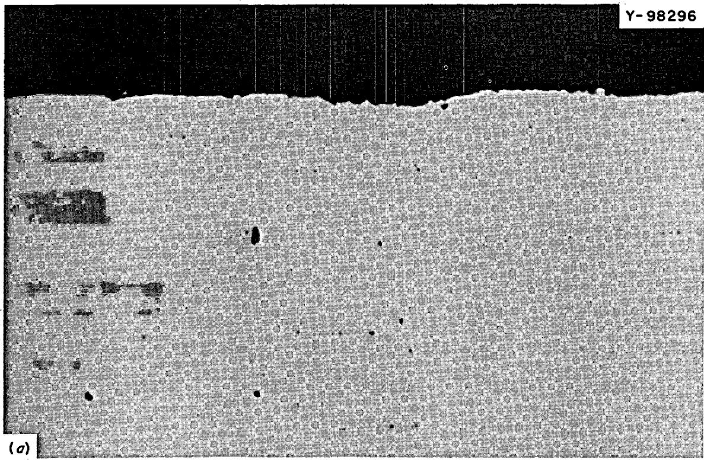  
0.007 INCHES 10.007 in. 1 500X 10.003 in. 1 10.001 in.

Fig. 18.17. Microstructure of Standard Hastelloy N Exposed to $\mathrm{NaBF}_4$ -NaF (92-8 Mole %) in NCL-17 for 3942 hr. Steam injected into salt after 1054 hr. (a) $607^{\circ}\mathrm{C}$ , weight loss $-26.8\mathrm{mg/cm}^2$ , as polished; (b) $495^{\circ}\mathrm{C}$ , weight gain $+14.8\mathrm{mg/cm}^2$ , as polished. There is a relatively spongy surface layer on this sample about 2 mils thick.   
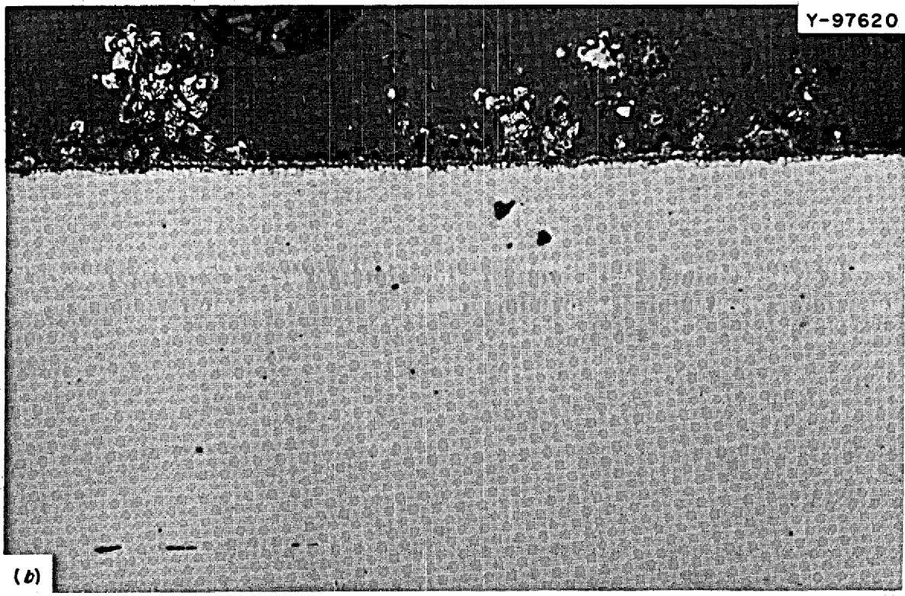  
0.007 INCHES 10.007 in. 1 500x 10.003 in. 1 10.001 in.

the changes are attributable to the movement of the normally stable nickel and molybdenum. Any increased chromium removal from the hot leg is noted just as an increase in the chromium concentration in the salt. The phosphorus found in the deposit was apparently from a phosphate impurity in the steam. For the last 2500 hr the concentrations of impurity constituents in the salt, Fe, Cr, Ni, Mo, $\mathbf{H}_2\mathbf{O}$ , and $\mathbf{O}_2$ , have remained fairly constant. The present chromium level is 320 ppm. The continuing results of this test are quite significant in that we have shown that the fluoroborate salt and the Hastelloy N can withstand an accidental steam inleakage condition and that a system consisting of these components could continue to operate without extensive damage even if the salt were not repurified.

Loop NCL-20, constructed of standard Hastelloy N with removable specimens in each leg, has circulated a fluoroborate coolant salt for 1700 hr and is being operated at temperature conditions very near those proposed for the maximum $(687^{\circ}\mathrm{C})$ and minimum $(387^{\circ}\mathrm{C})$ salt-metal temperature (primary heat exchanger and steam generator respectively) of the MSBR secondary circuit. Forced air cooling (as opposed to ambient air cooling used on other thermal-convection loops) is used on the lower half of the cold leg, and the practical operating temperatures obtained were $687^{\circ}\mathrm{C}$ maximum and $\sim 438^{\circ}\mathrm{C}$ minimum: a $\Delta T$ of $250^{\circ}\mathrm{C}$ . This $\Delta T$ is thought to be the largest obtained at ORNL in a molten-salt thermal-convection loop, and the maximum temperature is the highest for fluoroborate salt in a loop. The weight change of the specimen at the highest temperature was $-0.3\mathrm{mg/cm}^2$ (0.15 mil/year assuming uniform attack) after 700 hr. Salt analyses showed an increase in chromium content of 30 ppm and an $\mathrm{H}_2\mathrm{O}$ content of 550 ppm.

Mention was made in the last semiannual report of capsule experiments designed to determine the uptake of chromium from standard Hastelloy N into relatively pure $\mathrm{NaBF_4}$ -NaF (92-8 mole $\%$ ) containing approximately 400 ppm each oxygen and water at $427^{\circ}C$ $(800^{\circ}\mathbf{F})$ $538^{\circ}\mathbf{C}$ $(1000^{\circ}\mathbf{F})$ $649^{\circ}\mathbf{C}$ $(1200^{\circ}\mathbf{F})$ ,and $760^{\circ}\mathbf{C}$ $(1400^{\circ}\mathbf{F})$ . Tests were conducted for 1200 hr, after which the salt was analyzed for chromium and other impurities. Figure 18.18 shows the logarithmic variation of chromium content as a function of the reciprocal of the absolute test temperature. The iron concentration was originally about 200 ppm and decreased by an amount proportional to the increase in chromium. The final iron content of the salt at the highest temperature $(760^{\circ}\mathbf{C})$ was 60 ppm.

An Arrhenius-type relationship appears to hold between 538 and $760^{\circ}\mathrm{C}$ . This would be expected if the

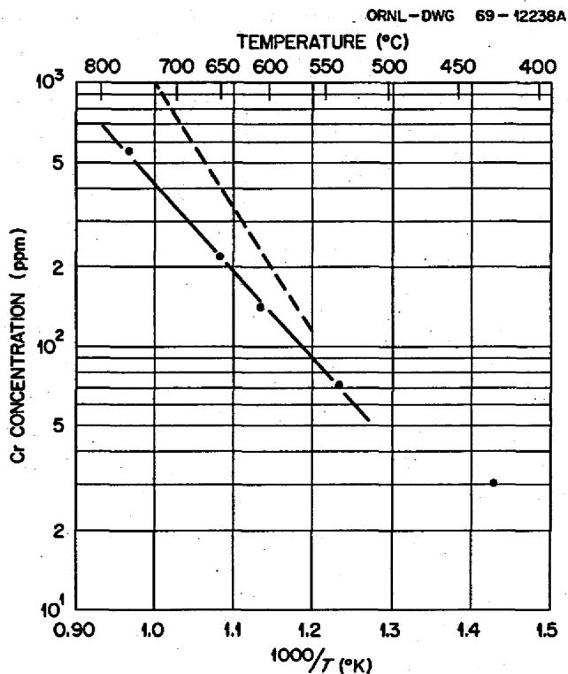  
Fig. 18.18. Temperature Dependence of Chromium Concentration in Sodium Fluoroborate Salt Exposed for $1200\mathrm{hr}$ in Hastelloy N Capsules. The dashed line is computed from the measured diffusion rate of chromium in Hastelloy N and assumes that the surface concentration of chromium is zero.

rate of chromium buildup in the salt were controlled by solid-state diffusion of chromium to the capsule wall. Using diffusion data for chromium in Hastelloy N obtained by Evans, DeVan, and Watson and assuming the chromium surface concentration to have been reduced to zero by the salt, we obtain the predicted chromium buildup shown by the dashed line in Fig. 18.18. The close agreement between the slopes (activation energy) of the predicted and experimental curves gives credence to the diffusion-controlled assumption. The observed behavior of chromium and the insignificant changes in iron and nickel concentrations in the salt indicate that when the $\mathrm{H}_2\mathrm{O}$ and oxygen concentrations of the fluoroborate are at a level as low as $400~\mathrm{ppm}$ , the corrosion mechanism is the selective removal of chromium.

# 18.6.5 Summary of Corrosion Studies

This section will act as a summary of the current developments involving the compatibility of fused salts and Hastelloy N. Table 18.11 compares the corrosion rates of standard Hastelloy N in tests of $5000\mathrm{hr}$ or longer involving several fluoride salts.

Except for certain of the fluoroborate tests, the overall corrosion rates have been relatively small. Thermal-convection loop NCL-14 has operated successfully for over two years and the pump loop MSR-FCL-1 nearly one year with the fluoroborate mixture. Comparison of the rates experienced by NCL-13A, NCL-14, and MSR-FCL-1, all circulating the sodium fluoroborate mixture, indicates a velocity effect on the mass transfer. We believe that the effect of velocity on corrosion in this system is a function of declining importance as the purity level of the salt improves. The impurity effect per se has been discussed in detail previously. Because of the importance of the impurities on the corrosion of Hastelloy N by fluoroborate, efforts have begun on methods of purifying the salt. Also to be considered are better methods for analyzing and identifying the impurities. At some purity level, perhaps 200 to 400 ppm water and/or oxygen, as analyzed, solid-state diffusion of chromium in the Hastelloy N will likely control corrosion, as it does in the fuel salts. This is most important, since it suggests that an entire MSBR of either the one- or two-fluid variety can be operated with none of the main circulating channels suffering more than a few tenths of a mil per year corrosion attack. Experimental proof of this is one of our major near-term goals.

# 18.7 FLUOROBORATE PURITY TEST

# J.W.Koger R.F.Apple

Attempts to purify the $\mathrm{NaBF_4}$ -NaF $(92 - 8\%)$ coolant salt have continued. A schematic of the process is given in Fig. 18.19. A mixture of $\mathrm{BF}_3$ , He, and heated HF was passed into a Hastelloy N vessel containing the impure $(\sim 2000~\mathrm{ppm}~\mathrm{H}_2\mathrm{O})$ fluoroborate salt $(2.7\mathrm{kg})$ at $480^{\circ}\mathrm{C}$ for $15\mathrm{hr}$ . The exit gas entered a 90 vol $\%$ methyl alcohol-10 vol $\%$ pyridine solution, where the mixture was titrated with Karl Fischer reagent to the dead stop end point. The titration indicated that about 600 ppm $\mathrm{H}_2\mathrm{O}$ was removed. Chemical analysis disclosed that the $\mathbf{O}_2$ content decreased from 1700 to 1400 ppm and that the $\mathrm{H}_2\mathrm{O}$ content changed from 2000 to 300 ppm. Changes in the $\mathrm{BF}_3$ content of the salt appeared to be minimal. Further work is planned using a nickel vessel to eliminate corrosion products resulting from the reaction of HF with Hastelloy N.

# 18.8 FORCED-CONVECTION LOOP MSR-FCL-1

H.C.Savage J.W.Koger W.R.Huntley

The MSR-FCL-1 forced-circulation loop is being operated to evaluate the compatibility of standard Hastelloy N with $\mathrm{NaBF_4}$ -NaF (92-8 mole $\%$ ) coolant salt at temperatures and flow rates similar to those which existed in the MSRE coolant circuit. Salt velocity in the $1 / 2$ -in.-OD by 0.042-in.-wall Hastelloy N loop tubing is nominally 10 fps, and Hastelloy N corrosion

Table 18.11. Comparison of Corrosion Rates for Standard Hastelloy N in MSR Systems After More than 5000 hr Operation   

<table><tr><td>Loop Designation</td><td>Salt Type</td><td>Tmax(°C)</td><td>ΔT(°C)</td><td>Velocity (fps)</td><td>Equivalent Corrosion Rate (mils/year)</td></tr><tr><td>NCL-13A</td><td>Coolanta</td><td>605</td><td>145</td><td>0.1</td><td>0.6</td></tr><tr><td>NCL-14</td><td>Coolanta</td><td>605</td><td>145</td><td>0.1</td><td>0.55</td></tr><tr><td>MSR-FCL-1</td><td>Coolanta</td><td>588</td><td>78</td><td>10</td><td>1.2</td></tr><tr><td>NCL-16</td><td>Fuelb</td><td>705</td><td>170</td><td>0.1</td><td>0.04</td></tr><tr><td>NCL-15A</td><td>Blanketc</td><td>675</td><td>55</td><td>0.1</td><td>0.03</td></tr><tr><td>NCL-18</td><td>Fertile-Fissiled</td><td>705</td><td>170</td><td>0.1</td><td>0.05</td></tr></table>

$^{a}\mathrm{NaBF}_{4}$ NaF (92-8 mole %), 1000 ppm each water and oxygen. $^{b}\mathrm{LiF - BeF}_{2} - \mathrm{UF}_{4}$ (65.5-34.0-0.5 mole %), $< 200$ ppm each water and oxygen. $^{c}\mathrm{LiF - BeF}_{2} - \mathrm{ThF}_{4}$ (73-2-25 mole %), $< 200$ ppm each water and oxygen. $^{d}\mathrm{LiF - BeF}_{2} - \mathrm{ThF}_{4} - \mathrm{UF}_{4}$ (68-20-11.7-0.3 mole %), $< 200$ ppm each water and oxygen.

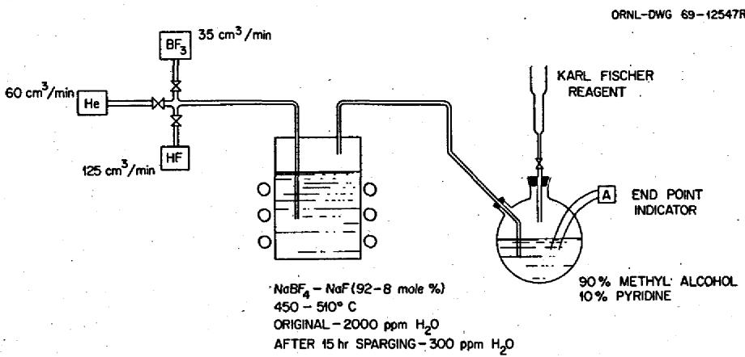  
Fig. 18.19. System for Removing Water from Coolant Salt.

test specimens are exposed to the circulating salt at three temperatures - 510, 555, and $588^{\circ}\mathrm{C}$ .

The third 2000-hr run (total accumulated time of 6098 hr at design conditions) was completed on October 22, 1969, and corrosion specimens were removed for metallographic examination and weight change measurement. Test specimens were reinstalled in the loop, and on November 23, 1969, operation was started on the fourth run. As of February 28, 1970, the loop had accumulated 8100 hr of operation at design conditions. Salt samples have been taken for chemical analysis about every 500 hr.

# 18.8.1 Metallurgical Analysis

Weight Changes. -- Table 18.12 details weight changes of the standard Hastelloy N specimens in the loop and the changes in concentration of the metallic impurities in the salt during the operating life of the loop. It is apparent from the weight changes that the corrosion rate is decreasing and now averages about 1.2 mils/year at the hottest position, assuming uniform attack. This

rate is higher than that obtained in thermal-convection loops under similar conditions; the apparent effect of velocity on corrosion strongly suggests that corrosion processes are occurring other than the selective removal of chromium and iron.

Salt Chemistry. - The data in Table 18.12 show that there was a large increase in chromium fluoride compound (corrosion product) in the salt during the first operating period with little subsequent increase. During each period the iron fluoride has decreased. This leads one to believe that the reaction

$$
\operatorname {C r} (s) + \operatorname {F e F} _ {2} (d) \rightleftharpoons \operatorname {C r F} _ {2} (d) + \operatorname {F e} (\text {d e p o s i t e d}),
$$

where

$$
s = \text {s o l i d s o l u t i o n},
$$

$$
d = \text {d i s s o l v e d}
$$

is responsible for a portion of the corrosion. The salt contained a large amount of iron fluoride at the beginning (407 ppm), and each time the salt is dumped

Table 18.12. Average Weight Change of Specimens in MSR-FCL-1 and Changes in Concentration of Chromium and Iron in $\mathrm{NaBF_4}$ NaF (92-8 Mole %)   

<table><tr><td rowspan="2">Time of Operation (hr)</td><td colspan="3">Average Specimen Weight Change at Indicated Temperature (mg/cm2)</td><td colspan="2">Corrosion Rate at 588°C Assuming Uniform Loss (mils/year)</td><td colspan="2">Incremental Impurity Change in Salt (ppm)</td></tr><tr><td>510°C</td><td>555°C</td><td>588°C</td><td>Overall</td><td>Incremental</td><td>Cr</td><td>Fe</td></tr><tr><td>2741a</td><td>+1.0</td><td>-2.7</td><td>-11.1</td><td>1.6</td><td>1.6</td><td>+234</td><td>-155</td></tr><tr><td>4755</td><td>+2.5</td><td>-4.2</td><td>-17.3</td><td>1.4</td><td>1.2</td><td>+40</td><td>-263</td></tr><tr><td>6764b</td><td>+3.1</td><td>-5.2</td><td>-21.0</td><td>1.2</td><td>0.7</td><td>0</td><td>-190</td></tr></table>

${}^{a}$ Includes 659 hr isothermal operation.   
$b_{6098}$ hr at design conditions.

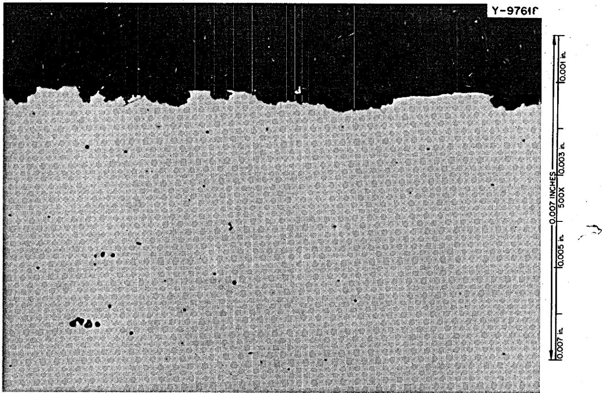  
Fig. 18.20. As-Polished Photomicrograph of a Standard Hastelloy N Specimen from MSR-FCL-1, Exposed to $\mathbf{NaBF}_4$ -NaF (92-8 Mole %) at $588^{\circ}\mathbf{C}$ for 6764 hr, Weight Loss $21.4\mathrm{mg/cm}^2$ . $500\times$

back into the fill tank with the residual salt it picks up more iron fluoride. The results of the oxygen and water analyses have been quite scattered, with the values around 1000 ppm for each. These fairly high numbers and the velocity effect indicate that impurities such as HF also play a large part in the corrosion. With no increase of corrosion products in the salt at the present time, all the material removed in the hot section is depositing in the cold section. Evidence at the present shows that the deposit is metallic and adherent on the metal surface and is not in the form to cause plugging very rapidly.

Metallography. - Figures 18.20-18.22 show micrographs of specimens from several locations in MSR-FCL-1 after more than 6000 hr salt exposure. Figures 18.20 and 18.21 are the specimens exposed to salt at 588 and $555^{\circ}\mathrm{C}$ respectively. The uniform attack is seen on both specimens, with the rougher surface seen on the higher-temperature sample shown in Fig. 18.20. In Fig. 18.22 the mounting material removed some of the deposit, but portions can still be seen.

Pump Deposits. - Visual examination of the pump and pump bowl after over 6000 hr of operation showed

no obvious corrosion. None of the green $\mathbf{Na}_3\mathbf{CrF}_6$ corrosion product that had been observed previously was present.

Cold Finger. - During the present run a cold finger corrosion product trap, similar in design to one previously used in sodium fluoroborate test loop PKP-1, $^{1}$ was inserted into the salt in the pump bowl in an attempt to induce preferential deposition of corrosion products from the salt circulating in the loop. Such preferential deposition was observed on the cold finger inserted into the pump bowl of loop PKP-1.

The cold finger used in MSR-FCL-1 is a closed-end nickel cylinder, $1^{3/4}$ in. long, $3/8$ in. OD, with a 0.070-in.-thick wall. Cooling is by means of an argon-water mixture injected into the cylinder ID and then discharged to the atmosphere. The metal wall temperature is measured and recorded by two 0.020-in.-OD sheathed, ungrounded Chromel-Alumel thermocouples inserted in two 1-in.-deep axial holes (0.023 in. diam) in the 0.070-in.-thick wall of the cold finger.

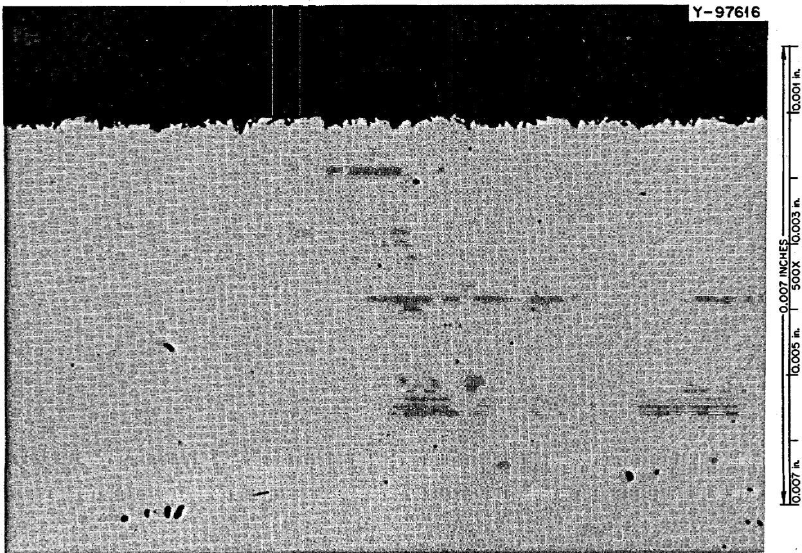  
Fig. 18.21. As-Polished Photomicrograph of a Standard Hastelloy N Specimen from MSR-FCL-1 Exposed to $\mathrm{NaBF}_4$ -NaF (92-8 Mole %) at $555^{\circ}\mathrm{C}$ for 6764 hr. Weight loss $4.7\mathrm{mg/cm}^2$ . $500\times$

Eight tests were made in which the cold finger was inserted into the salt in the pump bowl of test loop MSR-FCL-1 and cooled to temperatures (as indicated by the thermocouples in the wall of the cold finger) ranging from 493 to $140^{\circ}\mathbf{C}$ . The duration of the tests ranged from 1.5 to $5.3\mathrm{hr}$ . The temperature of the salt in the pump bowl was $510^{\circ}\mathbf{C}$ .

In contrast to the deposits of material containing $\mathrm{Na}_3\mathrm{CrF}_6$ which were found on a cold finger in PKP-1 loop at metal wall temperatures of 400, 460, and $477^{\circ}\mathrm{C}$ (ref. 2), no significant deposit of any kind was seen on the cold finger tests in loop MSR-FCL-1. Even in the three tests where indicated wall temperatures were below the salt liquidus temperature $(385^{\circ}\mathrm{C})$ , the surface of the cold finger was essentially clean as visually observed when withdrawn into a sight glass. Occasionally, small patches $(\frac{1}{8}$ to $\frac{1}{4}$ in. across) of white material, estimated to be a few mils thick, were seen on the surface.

The cold finger was then installed in the PKP-1 fluoroborate loop in an attempt to duplicate the previous cold finger test results of this loop. The chromium concentration of the fluoroborate salt in loop PKP-1 is about 500 ppm, while that in MSR-FCL-1 is about 250 ppm. Two tests were run in which the indicated cold finger wall temperature was about $150^{\circ}\mathrm{C}$ (salt temperature in the pump bowl was $548^{\circ}\mathrm{C}$ ). Test times were 1 and 4.5 hr. No deposition on the cold finger was seen after withdrawal into a sight glass. Tests at higher temperatures were not made because of temperature control difficulties with the cold finger.

Since the cold finger previously used in the PKP-1 loop contained grooves on the outside surface, the surface (lower half only) of the MSR-FCL-1 cold finger was scored with file marks $\sim 0.010$ in. deep, and a third test run at about $150^{\circ}\mathrm{C}$ lasting $6\frac{1}{2}$ hr was made in the PKP-1 loop. In this run a deposit was obtained. Generally, the entire surface of the cold finger was covered with a white deposit, with an overlay of bright green material on the lower half of the cold finger. The cold finger was allowed to stand overnight under a

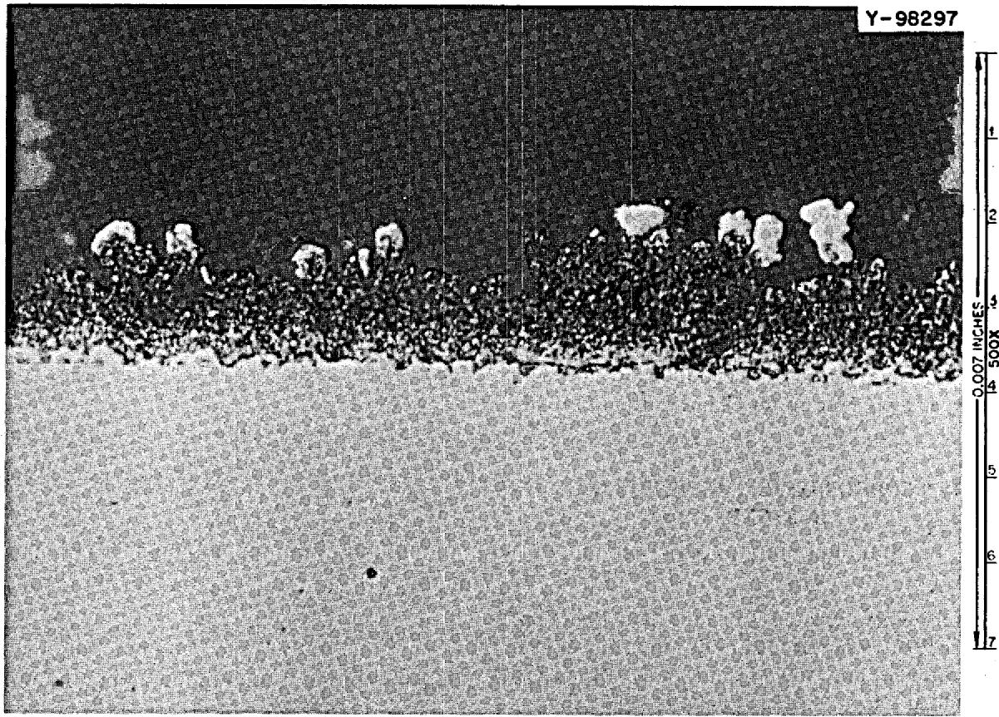  
Fig. 18.22. As-Polished Photomicrograph of a Standard Hastelloy N Specimen from MSR-FCL-1 Exposed to $\mathrm{NaBF}_4$ -NaF (92-8 Mole %) at $510^{\circ}\mathrm{C}$ for 6764 hr. Weight gain $5.0\mathrm{mg/cm}^2$ . $500\times$ . The light material away from the surface of the sample is part of the surface layer that was separated from the sample during the mounting operation.

helium atmosphere, and by this time the deposit had begun to separate from the cold finger surface. In moving the cold finger for photographing, the entire deposit spalled off, leaving a clean metal surface. The total deposit weight was $1.63\mathrm{g}$ , of which $1.26\mathrm{g}$ was mostly green material (complete separation was not possible). Chemical analysis of the green material disclosed 2.93 wt $\%$ Cr, 1.03 wt $\%$ Fe, 370 ppm Ni, and $<500$ ppm Mo, with the remainder Na, B, and F. Stoichiometric calculations show 11 mole $\%$ $\mathrm{Na}_3\mathrm{CrF}_6$ and 4 mole $\%$ $\mathrm{Na}_3\mathrm{FeF}_6$ , with the remainder a mixture of $\mathrm{NaBF}_4$ and NaF.

Subsequent operation at the same conditions in loop MSR-FCL-1 did not produce a deposit. On the basis of these tests we have concluded that a wetting problem exists with the salt and that a grooved or roughened surface is required in order to obtain a deposit. We are trying various designs to improve adherence of the deposit to the cold finger and to lessen the probability of accidental removal during withdrawal from the pump bowl.

# 18.8.2 Forced-Convection Loop MSR-FCL-2

Work is in progress on a second molten-salt forced-circulation loop, designated MSR-FCL-2, which is to be used to study the corrosion resistance of Hastelloy N and the mass transfer properties of Hastelloy N and fluoroborate-type coolant salt systems at conditions proposed for the MSBR. Other salts proposed for the MSBR could also be circulated in the loop if desired.

The loop design is generally similar to the presently operating forced-circulation corrosion-test loop,3 MSR-FCL-1. A new pump4 (designated ALPHA) designed for variable salt flow rates up to 30 gpm and heads to 300 ft will be used to provide increased salt

velocities up to 20 fps. Other important new features of the loop design include: (1) three corrosion specimen assemblies designed for easy installation and removal without draining salt from the loop, (2) two independently controlled heated sections for flexibility in controlling the salt temperature at each of the three corrosion specimen assemblies, (3) provisions for determining heat transfer coefficients in one of the heated sections, (4) bulk fluid $\Delta T$ to $165^{\circ}\mathrm{C}$ , which requires $\sim 125\mathrm{kw}$ at the expected flow rate of $\sim 4\mathrm{gpm}$ , and (5) an auxiliary expansion tank to allow for expansion of the salt and to provide space for salt sampling, liquid level indicating probes, installation of a "cold finger" device to study preferential deposition of corrosion products, and gas purging for on-line salt purification.

# 18.9 CORROSION OF HASTELLOY N IN STEAM

B. McNabb H.E.McCoy

Specimens were removed from the Bull Run Corrosion Facility on January 12, 1970, after 2000 hr in a steam environment at 3500 psi and $538^{\circ}\mathrm{C}$ . Weight gains were about 0.1 to $0.4\mathrm{mg/cm}^2$ (0.04 to 0.14 mil/year assuming uniform corrosion) for all compositions of standard and modified Hastelloy N. The oxide films were adherent, with no sign of spalling. The specimens were removed for weighing at 372, 1000, and 2000 hr. The oxidation rates appear to be linear after the initially faster rate up to 372 hr. The same trends are continuing that were observed at the first removal. We observed that surface treatment has an effect on the weight gains of the specimens. After 2000 hr, surface-ground specimens (400-grit paper) had the largest weight gains of $0.4\mathrm{mg/cm}^2$ , as-received gained 0.2 $\mathrm{mg/cm}^2$ , and electropolished specimens gained 0.1 $\mathrm{mg/cm}^2$ . Most of the specimens were returned for further exposure, but some were removed for detailed examination and testing.

Some chromium steels were also included in the facility for comparison. The oxidation rates of the steels were much higher than Hastelloy N, having weight gains from 3 to $6\mathrm{mg/cm^2}$ for 1000 hr exposure to the same environment. These steels contained from 1.1 to $8.7\%$ chromium and $\sim 1\%$ molybdenum. As shown in Fig. 18.23, the oxidation rates of these steels varied by a factor of only 2 in the steam environment at

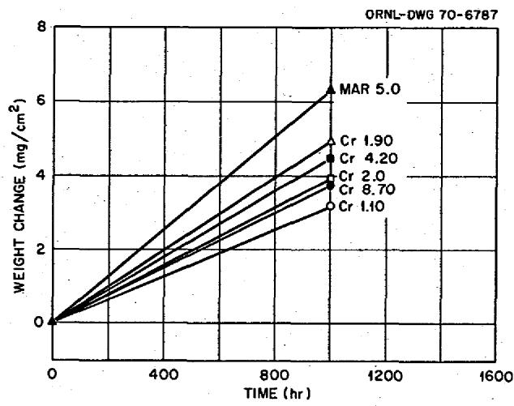  
Fig. 18.23. Oxidation of Chromium Steels in a Steam Environment at $538^{\circ}\mathrm{C}$ and 3500 psi. The chromium concentration is shown by each symbol.

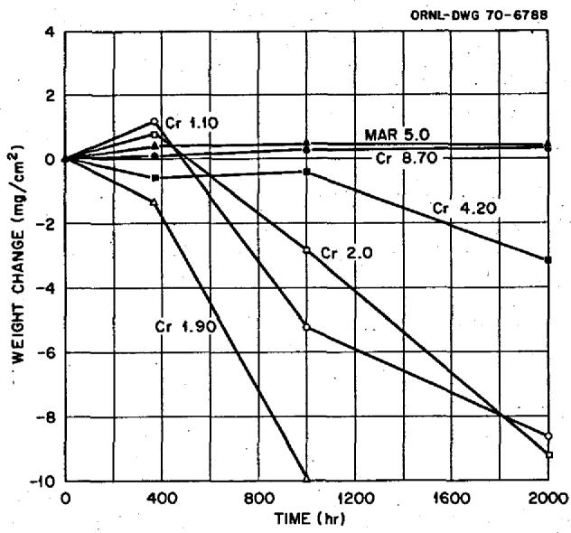  
Fig. 18.24. Oxidation of Chromium Steels in Air at $538^{\circ}\mathbf{C}$ . The chromium concentration is shown by each symbol.

$538^{\circ}\mathrm{C}$ and 3500 psi for 1000 hr. The numbers after the symbols indicate the percent chromium. Mar 5.0 is a maraging steel (Fe-12% Ni-5% Cr-3% Mo) included for comparison. All of the specimens gained weight and did not spall. Figure 18.24 shows the oxidation of these same materials in air at $538^{\circ}\mathrm{C}$ . In an air environment, 5% chromium was required to prevent spalling of the oxide. Thus the oxidation behavior of the chromium steels is much different in air and steam environments.

# 19. Support for Chemical Processing

J.R. DiStefano

Chemical processes for the isolation of protactinium and the removal of fission products from molten salts impose severe limitations on containment materials. Compatibility with liquid bismuth and molten salt fuels at $650^{\circ}\mathrm{C}$ is required, but conventional nickel- and iron-base alloys are not satisfactory because of their susceptibility to dissolution and mass transfer in bismuth. The most promising materials appear to be molybdenum, tungsten, rhenium, tantalum, and graphite. Of these, molybdenum, tungsten, rhenium, and graphite are difficult to fabricate into complex shapes, and tantalum has a high reactivity with environments other than ultrahigh vacua. In addition we must consider the possible effects of lithium or thorium in bismuth and a high fluoride ion concentration in the molten salt on compatibility. With these factors in mind we have concluded that molybdenum has the highest probability for success in this application. Accordingly,

our program has focused on those problem areas that appear most difficult: fabrication and joining. In addition we are continuing to evaluate the compatibility of molybdenum and other potential materials with bismuth as well as methods of coating conventional iron- or nickel-base alloys with tungsten or molybdenum to protect them from bismuth.

# 19.1 FABRICATION DEVELOPMENT OF MOLYBDENUM COMPONENTS

R.E.McDonald A.C.Schaffhauser

We are investigating fabrication processes for the production of high-quality large-diameter molybdenum tubing and pipe, which are not commercially available except by very expensive machining from solid bar stock having poor mechanical properties.

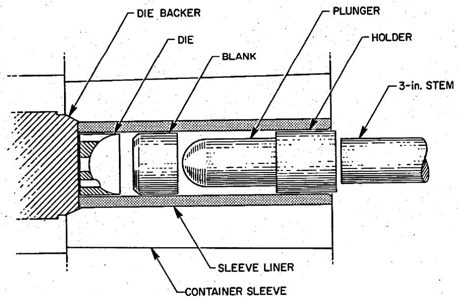  
Fig. 19.1. Capsule Fabrication by Back Extrusion.

One such process is back extrusion, which involves the flow of metal into a die and extrusion back over an advancing plunger. A cross section of the tooling and its placement in the existing container sleeve of our extrusion press is shown in Fig. 19.1. The advantages of this process are that the final diameter is as large as or larger than the starting blank, the geometry can be changed by relatively simple changes in die and mandrel design, and deformation can be accomplished below the recrystallization temperature so that a wrought structure having good mechanical properties is produced.

We have recently utilized this technique to fabricate containers having hemispherical ends with bosses for joining. We produced three arc-melted-molybdenum capsules having a single $3/8$ -in.-diam boss and 2.5 in. in diameter by 0.25 in. wall thickness by back extrusion at $1200^{\circ}\mathrm{C}$ . A cross-sectional and an end view of two of these capsules are shown in Fig. 19.2. The surface finishes and metal flow patterns were excellent. The

microstructure and welding properties of these capsules are currently being evaluated.

We are also designing tooling to produce larger-diameter capsules having the geometry of bosses needed for the container shown in Fig. 19.3. The advantages of this geometry are that containers and connecting tubing can be fabricated more easily with butt joints by welding or with mechanical joints where necessary.

# 19.2 WELDING AND MOLYBDENUM

A.J.Moorhead R.W.Gunkel

Molybdenum has been selected as the construction material for an MSR chemical processing loop. The molybdenum portion of the loop is a complex system that will consist of four $3\frac{1}{8}$ -in.-diam reservoirs or pots, a $1\frac{1}{4}$ -in.-diam extraction column, and interconnecting $1/4$ , $3\frac{1}{8}$ -, and $1/2$ -in.-OD tubes. Both welding and brazing

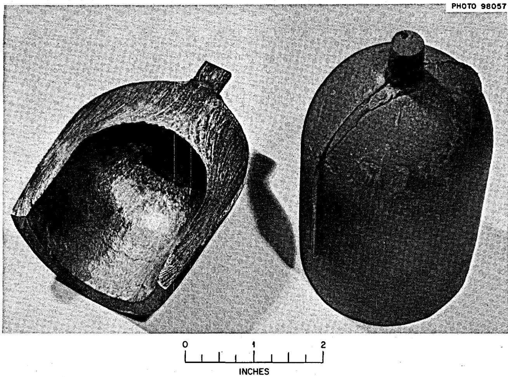  
Fig. 19.2. Molybdenum Capsules Fabricated by Back Extrusion at $1200^{\circ}\mathrm{C}$ .

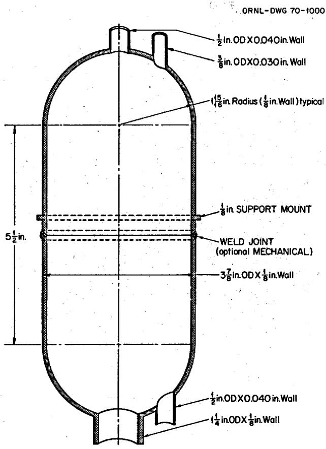  
Fig. 19.3. Molybdenum Feed Pot To Be Fabricated by Back Extrusion and Machining.

are being evaluated as joining techniques for the fabrication of this system.

Several typical weld joints that would likely be used in fabricating the loop are shown in Fig. 19.3. The use of back-extruded dishes with integral protrusions allows us to butt weld the connecting lines. However, in some locations a fillet weld will be required where a tube protrudes into the pot.

Both shop (glove box) and field welding of molybdenum are being investigated. Glove-box welds can be made by either manual or automatic gas tungsten-arc processes. To investigate manual welding, several flat tube-to-header disks of low-carbon, low-oxygen molybdenum were manually welded by gas tungsten-arc in an argon-filled chamber to develop parameters, joint designs, cleaning procedures, and atmosphere requirements. One of these disks is shown in Fig. 19.4.

Prior to welding, all components were degreased with acetone and then chemically cleaned using the following procedure:

1. Immense for 10 min in 65 to $80^{\circ}\mathrm{C}$ solution of 10 wt $\%$ NaOH, 5 wt $\%$ KMnO $_4$ , 85 wt $\%$ H $_2$ O (distilled).   
2. Rinse in cold tap water and brush with stainless steel wire brush to remove loose smut.   
3. Immerse for $10\mathrm{min}$ in room-temperature solution of 15 vol $\%$ $\mathrm{H}_2\mathrm{SO}_4$ , 15 vol $\%$ HCl, 70 vol $\%$ $\mathrm{H}_2\mathrm{O}$ (distilled) $+6$ to $10\mathrm{wt}\% \mathrm{CrO}_3$   
4. Tap-water rinse.   
5. Distilled-water rinse.   
6. Hot-air dry.

A fillet weld was first made using low-carbon molybdenum wire filler metal, followed by the fusion welds with no filler metal. The atmosphere in the dry box during welding (using electrolytic monitors) was 8 ppm $\mathrm{H}_2\mathrm{O}$ and 9 ppm $\mathbf{O}_2$ . The welds were clean and bright, and no cracks were visible in the weld faces when they were dye-penetrant inspected. The helium leak rate of each weld was less than $1\times 10^{-9}$ atm cm³ sec⁻¹.

Two procedures are being considered for field welding of molybdenum tubing. First, we are evaluating a commercially available orbiting-arc torch. This device has two main drawbacks: (1) it has a Teflon inner sleeve which can become overheated due to its proximity to the weld joint and the relatively high thermal conductivity of molybdenum, and (2) the gap between the tube and the welder head is relatively large, which could allow contamination to occur during welding. To overcome these difficulties, our second approach is to design and build a prototype clamshell vacuum chamber with O-ring seals. If this chamber can be adequately evacuated and backfilled with an inert gas while around a tube, we will then begin designing an orbiting-arc torch to fit inside.

# 19.3 DEVELOPMENT OF BISMUTH-RESISTANT BRAZING FILLER METALS FOR JOINING MOLYBDENUM

N.C.Cole J.W.Koger R.W.Gunkel

Brazing also appears attractive as a technique for joining complex structures of molybdenum; however, there are no commercially available brazing alloys that are compatible with both bismuth and fluoride salts. Since large-grained recrystallized molybdenum is less ductile than wrought material, we are concentrating on developing corrosion-resistant alloys that flow below the recrystallization temperature. As reported previously, we have made several iron-base brazing alloys containing small amounts of boron and carbon which

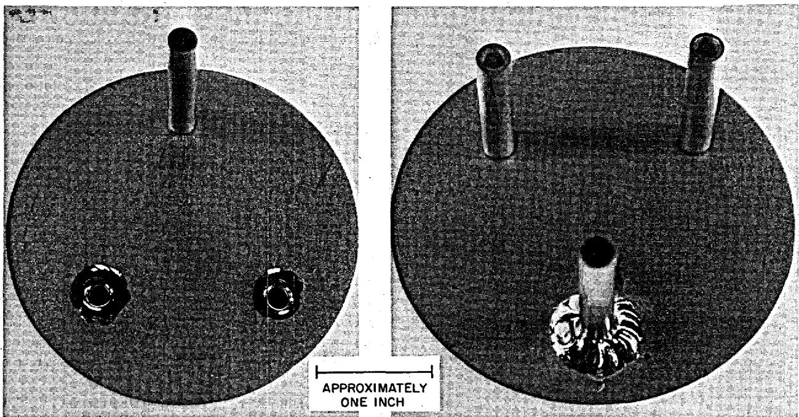  
Fig. 19.4. Three Gas Tungsten-Arc Welds of Arc-Cast Molybdenum Tube-to-Header Joints. Approximately $1.3\times$

PHOTO 99450

effectively brazed molybdenum and its alloys in the desired temperature range of 1050 to $1350^{\circ}\mathrm{C}$ .1 However, the Fe-C-B alloy was attacked by bismuth except in those areas enriched in molybdenum as a result of diffusion of the base metal during brazing. Therefore, we prepared several experimental iron-base alloys with additions of molybdenum that would not significantly raise their melting points. Several of these compositions were then used to successfully braze molybdenum without causing recrystallization during the brazing cycle. Figure 19.5 shows the excellent wettability and flowability of two of these braze alloys.

Three brazing alloys were corrosion tested in $600^{\circ}\mathrm{C}$ bismuth for 700 hr. Chemical analysis revealed a small (5 ppm) pickup of iron by the bismuth. By changing the design to a lap joint we found that corrosion of the Fe-C-B brazing alloy, which was tested previously as a T-joint, was less severe, as shown in Fig. 19.6. Furthermore, the addition of molybdenum to the Fe-C-B alloys definitely improved their corrosion resistance, as seen in Fig. 19.7. Some attack occurred along the fillet;

however, in another sample little or no corrosion occurred in the capillary part of the braze (that area sandwiched by the molybdenum base metal but highly enriched in molybdenum by dissolution and diffusion).

We found cracking and lamination of the base metal (Fig. 19.6) in many of the brazed joints in which commercial powder metallurgically produced molybdenum was used. We believe that the cracks were caused by cutting, machining, and other handling operations. Since the cracks extended through the frozen bismuth, they probably occurred after test. Subsequent tests will be conducted on low-carbon, low-oxygen arc-cast molybdenum, which appears to have better fabricability than the molybdenum we have previously tested.

# 19.4 COMPATIBILITY OF STRUCTURAL MATERIALS WITH BISMUTH

O.B.Cavin L.R.Trotter

We are presently studying the compatibility of several materials with molten bismuth in quartz thermal convection loops. Two successful tests have been conducted; however, not all sample analyses and data processing are completed.

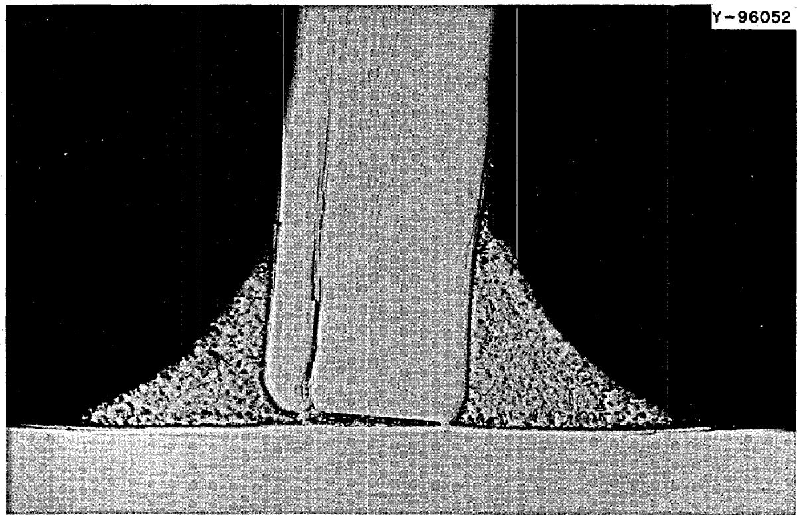  
0.07 INCHES 10

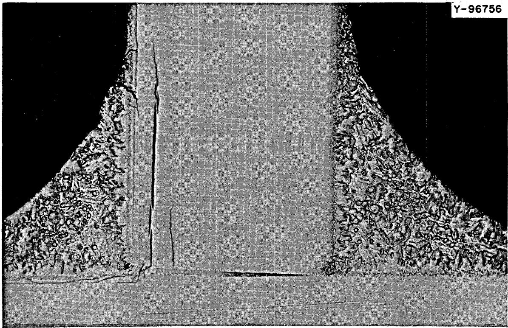  
0.045 INCHES 10.040 in. 10.030 in. 75x 10.020 in. 10.010 in.   
Fig. 19.5. Molybdenum T-Joints Brazed with Two Different Fe-Mo-C-B Brazing Alloys. Excellent wetting was obtained. Note the cracks in the powder-metallurgy base metal. As polished.

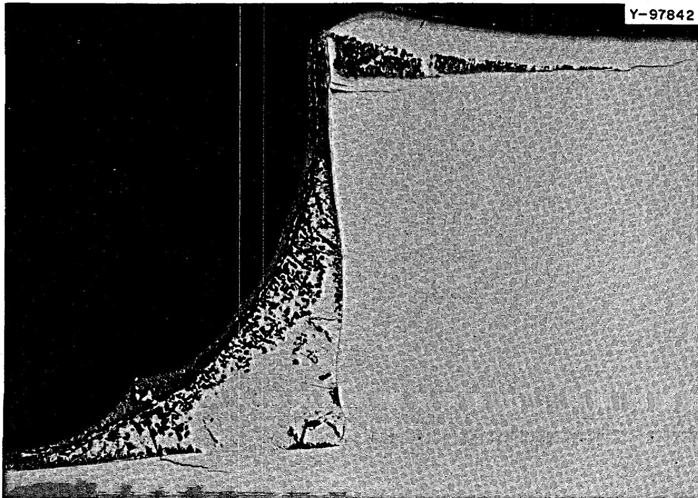  
Fig. 19.6. Molybdenum Lap Joint Brazed with Fe-C-B and Tested in Bismuth 700 hr at $600^{\circ}\mathrm{C}$ . As polished, 62X.

The bismuth used in these tests was grade 69 obtained from Cominco American. Oxygen contamination in the bismuth resulted in reactions that caused the formation of a plug in the first two loops, but this problem was eliminated in subsequent tests by bubbling hydrogen through the molten metal for $2\mathrm{hr}$ at $350^{\circ}\mathrm{C}$ and filtering through a $10 - \mu$ type 304 stainless steel filter prior to loading into the loop.

One of the most promising materials appears to be molybdenum. Loop 3 contained two tensile samples of molybdenum and one molybdenum and one TZM (Mo-0.5% Ti-0.1% Zr) tubular sample in each of the high- and low-temperature regions. After 3000 hr of scheduled operation at a maximum temperature of $700^{\circ}\mathrm{C}$ and a $\Delta T$ of $95 \pm 5^{\circ}\mathrm{C}$ , we found very little reaction between molybdenum or TZM and the molten bismuth. In fact it did not appear that the bismuth wet the metal surfaces very well. Figure 19.8 shows the appearance of the samples before and after test. No

reduction in thickness was detected, and the weight changes were within experimental error. Spectrographic analysis of the bismuth before and after test showed an increase in molybdenum concentration of only 0.3 ppm.

Loop 4 contained niobium and $\mathbf{Nb} - 1\%$ Zr samples and was operated at $705^{\circ}\mathbf{C}$ with a $\Delta T$ of $75 \pm 5^{\circ}\mathbf{C}$ for a period of only 115 hr before plugging occurred. The effect of bismuth on these samples at this temperature was catastrophic, as indicated by Fig. 19.9. The thickness of the tensile samples was reduced from 0.0195 in. to 0.013 in., indicating dissolution by the bismuth. X-ray diffraction analysis of a sample taken from the plug showed the presence of several phases: one had the same structure and lattice parameter as high-purity bismuth, and one was identified as alphasirconium. There were also four weak unexplained diffraction maxima. None of the diffraction lines could be attributed to a niobium type of crystal structure.

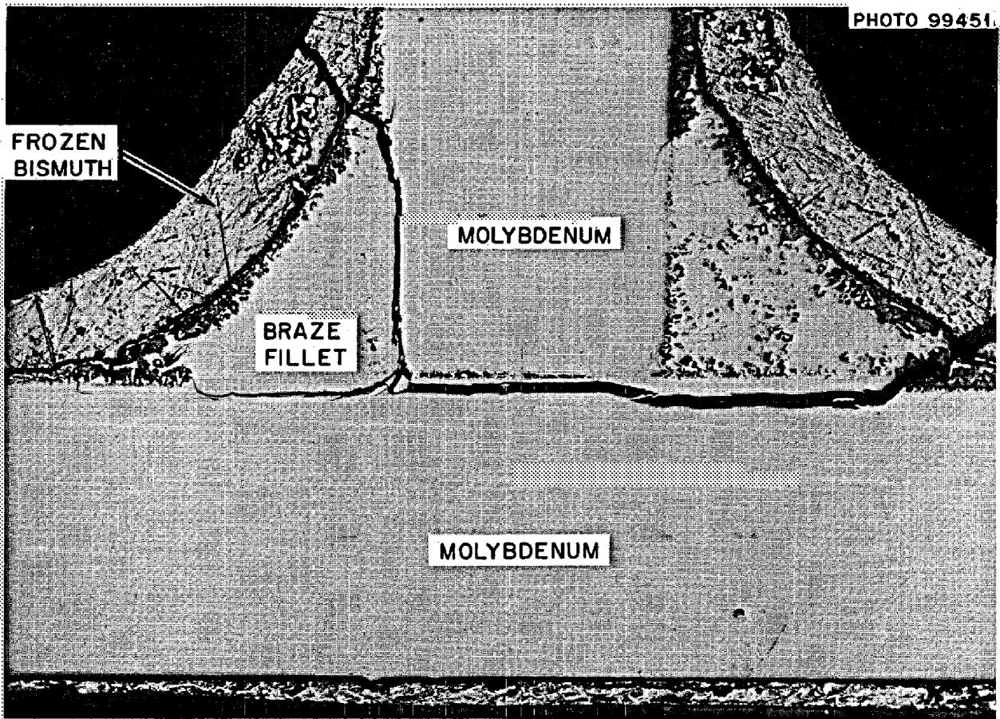  
Fig. 19.7. Molybdenum T-Joint Brazed with an Fe-Mo-C-B Brazing Alloy and Tested in Bismuth. Cracking must have occurred after testing, since the cracks extend through the frozen bismuth. As polished, $62 \times$

However, since the atomic radius of niobium is the same as that of bismuth, it could occupy substitutional lattice sites in the bismuth unit cell without affecting the lattice parameter. A semiquantitative spectrographic analysis of the plug indicated that in addition to bismuth it contained $0.5\%$ Nb, 100 ppm Zr, 300 ppm Cr and Ni, and 500 ppm Fe. The chromium, nickel, and iron undoubtedly were picked up during filtering of the bismuth through a stainless steel filter prior to test.

In the future we plan to determine the compatibility of other potential container materials such as tantalum and graphite with molten bismuth. In addition we will also evaluate the effect on compatibility of other metallic ions such as lithium or thorium in the bismuth.

# 19.5 CHEMICAL VAPOR DEPOSITED COATINGS

L.E.Poteat J.I.Federer

Application and evaluation of tungsten coatings on materials for fuel processing requirements have con

tinued. Tungsten, which has good corrosion resistance to liquid bismuth, is applied by hydrogen reduction of $\mathrm{WF}_6$ at 500 and $600^{\circ}\mathrm{C}$ . Coatings measuring 0.005 to 0.009 in. thick were deposited on the materials shown in Table 19.1. Initially we believed that the degree of adherence of the coatings was associated with the difference in coefficient of expansion between tungsten and the substrate. However, our recent work has shown that the composition of the substrate determines the degree of adherence. Differences in thermal expansion, on the other hand, may influence the service life of the coating.

A qualitative assessment of the adherence of the tungsten coating to the materials in Table 19.1 was made immediately after coating. We observed that the coatings cracked and spalled from the steel and stainless steel specimens upon cooling from the deposition temperature, but remained intact on iron-nickel alloys, "A" nickel, Hastelloy C, and Inconel 600. The non-adherence of tungsten coatings to steel or stainless

Table 19.1. Composition and Thermal Expansion of Substrate   

<table><tr><td rowspan="2">Substrate Material</td><td rowspan="2">Coefficient of Thermal Expansion, a25 to 600°C [μin. in. -1 (°C) -1]</td><td colspan="3">Principal Constituents (%)</td></tr><tr><td>Fe</td><td>Cr</td><td>Ni</td></tr><tr><td>Steel</td><td>14.5</td><td>99+</td><td></td><td></td></tr><tr><td>Stainless steel</td><td></td><td></td><td></td><td></td></tr><tr><td>Type 17-7 PH</td><td>~17.1b</td><td>c</td><td>17</td><td>7</td></tr><tr><td>Type 304</td><td>18.5</td><td>c</td><td>18</td><td>8</td></tr><tr><td>Type 405</td><td>~11.2</td><td>c</td><td>11.5–13.5</td><td></td></tr><tr><td>Type 430</td><td>11.2</td><td>c</td><td>14.0–18.0</td><td></td></tr><tr><td>Type 442</td><td>11.7</td><td>c</td><td>18.0–23.0</td><td></td></tr><tr><td>“A” nickel</td><td>13.3</td><td></td><td></td><td>99</td></tr><tr><td>Hastelloy Cd</td><td>13.3</td><td>5</td><td>15</td><td>58</td></tr><tr><td>Inconel 600</td><td>15.3</td><td>9</td><td>12–15</td><td>75</td></tr><tr><td>Fe-35% Ni</td><td>10.0</td><td>c</td><td></td><td>35</td></tr><tr><td>Fe-40% Ni</td><td>10.0</td><td>c</td><td></td><td>40</td></tr><tr><td>Fe-45% Ni</td><td>10.0</td><td>c</td><td></td><td>45</td></tr><tr><td>Fe-50% Ni</td><td>10.0</td><td>c</td><td></td><td>50</td></tr></table>

$a$ Tungsten 4.6 min. in. ${}^{-1} (^{\circ}\mathrm{C})^{-1}$   
$b$ Solution-treated condition; lower in the aged conditions.   
cMajor element.   
$d_{17\% \mathrm{Mo},5\% W}$

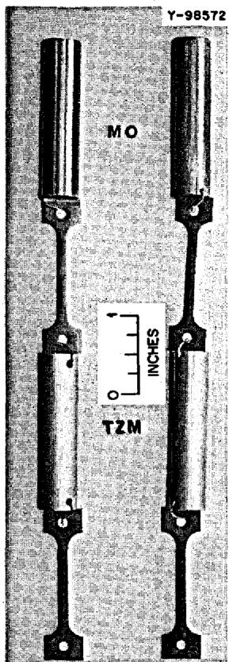  
(a)   
(b)   
Fig. 19.8. Sample Arrangement Used in Loop 3. (a) Before test, (b) after 300 hr in bismuth at $700^{\circ}\mathrm{C}$ . All tensile samples are molybdenum.

steels is attributed to the formation of stable iron and/or chromium fluorides on the surface by reaction with $\mathrm{WF}_6$ . These fluorides are neither volatile nor reducible by hydrogen at $600^{\circ}\mathrm{C}$ . We know that the tendency for nickel to react with $\mathrm{WF}_6$ to form a fluoride is much less than for iron and chromium, and a continuous fluoride film probably does not form on the surfaces of iron-nickel and nickel-base alloys. Utilizing this information we obtained adherent tungsten coatings on stainless steels by first applying a thin nickel plate by electrodeposition. It was necessary to bond the nickel plate to the stainless steel by annealing at $800^{\circ}\mathrm{C}$ prior to deposition of tungsten; otherwise the tungsten coating would not adhere. Typical specimens are shown in Fig. 19.10. Note that the coating cracked and separated from a plain type 430 stainless steel specimen, but was intact on either a nickel-plated type 430 specimen or an Inconel 600 specimen.

The adherence of the coatings to sheet-type specimens was further evaluated by thermal cycling, spiral bend testing, and tensile testing. We found the coatings uncracked and intact on the iron-nickel alloys, "A" nickel, Hastelloy C, and Inconel 600 after 15 cycles between 25 and $600^{\circ}\mathrm{C}$ . Types 405, 430, and 446 stainless steel specimens which had not been nickel plated prior to tungsten coating were also tested, but the coating cracked and spalled from types 430 and 446 after four cycles and began to separate from type 405 after 15 cycles.

In the spiral bend test at $25^{\circ}\mathbf{C}$ , specimens are manually bent around the jig shown in Fig. 19.11. Bent specimens of types 304 and 430 stainless steel (nickel plated before coating), Hastelloy C, and Inconel 600 are shown in Fig. 19.12. The stainless steel specimens were about 0.025 in. thick and the other two specimens were about 0.063 in. thick prior to coating. Each specimen was bent to a radius of curvature of 1 in. or less, and different amounts of springback determine the final shape of the specimens. Although the tungsten coatings cracked, they did not fall from any of the specimens.

Tensile testing of the coating utilizes the specimen arrangement shown in Fig. 19.13. The coated specimens are brazed to the ends of steel bars, which are pulled in a tensile machine. Tensile adherence strengths greater than 16,000 psi have been measured for coatings on Inconel 600. Coatings on stainless steel are expected to have similar strengths, but they have not yet been evaluated.

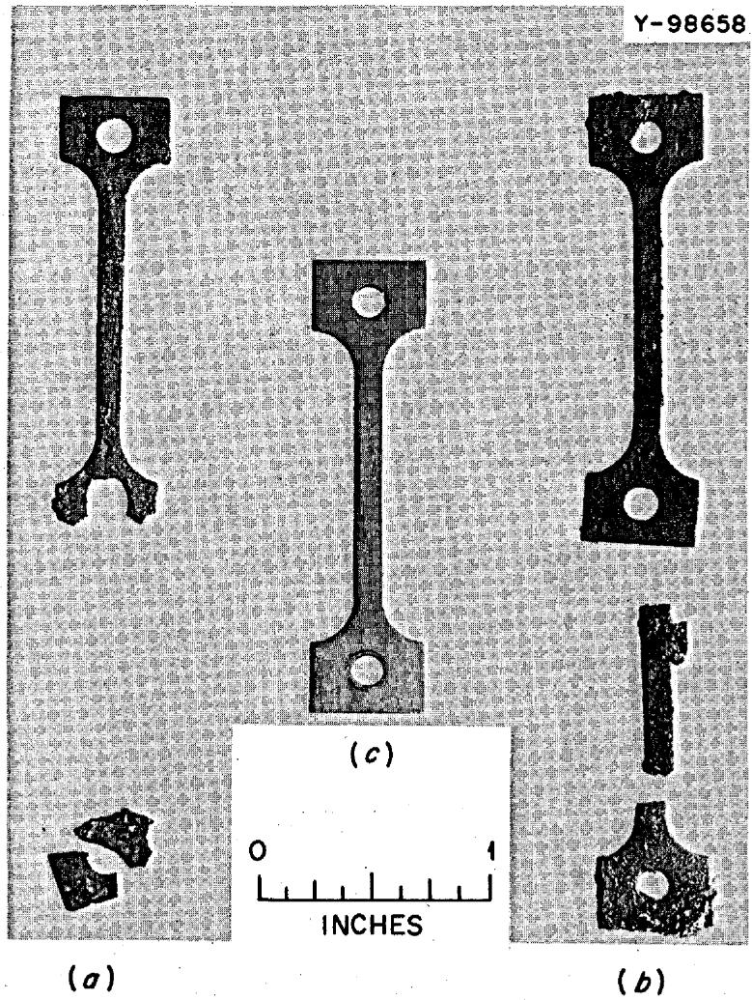  
Fig. 19.9. Tensile Samples of Niobium (Top) and Nb-1Zr (Bottom) from Bismuth Loop 4. (a) Hot leg; (b) cold leg; (c) before test.

Coating of substrates with molybdenum by hydrogen reduction of $\mathrm{MoF_6}$ has begun. This process requires temperatures of approximately $800^{\circ}\mathrm{C}$ or higher. At lower temperatures an impure, noncoherent deposit occurs. One experimental disadvantage of higher deposition temperatures is that the vessel to be coated must be strong enough to withstand a differential pressure of about 1 atm at temperature, since pressures less than 10 torrs are required to produce a deposit of uniform thickness. A second disadvantage could result from reaction of molybdenum with the substrate material. Although both tungsten and molybdenum form binary alloys with iron, chromium, and nickel, molybdenum would be expected to alloy more readily with these elements, especially at the higher deposition temperatures that are needed. Molybdenum can form inter

metallic compounds with iron and nickel, and this could decrease the adhesion of coatings. However, preliminary investigation has indicated that molybdenum coatings are more ductile than tungsten coatings and, therefore, should be less likely to crack during thermal cycling.

# 19.6 SCALING RESISTANCE OF CARBON STEELS

B. McNabb H. E. McCoy

Vessels used to contain bismuth for molten-salt fuel processing studies have been made from carbon steel, but they have been found to form an oxide scale in service at $650^{\circ}\mathrm{C}$ . To evaluate the effectiveness of various commercial coatings in preventing scaling,

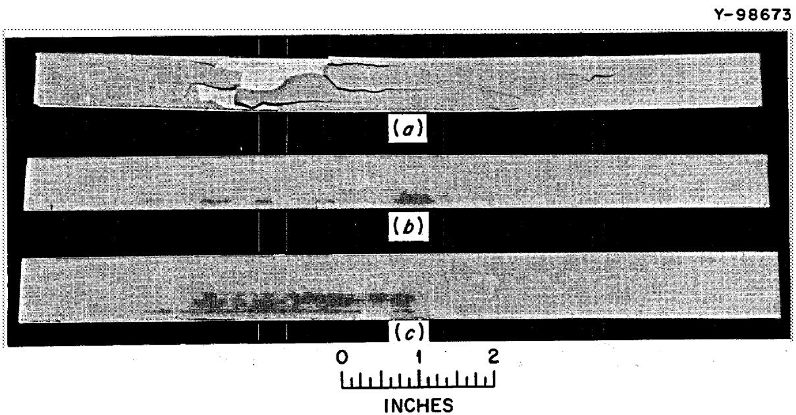  
Fig. 19.10. Typical Tungsten-Coated Specimens. (a) Type 430 stainless steel, coating cracked and separated. (b) Type 430 stainless steel, nickel plated prior to coating. (c) Inconel 600.

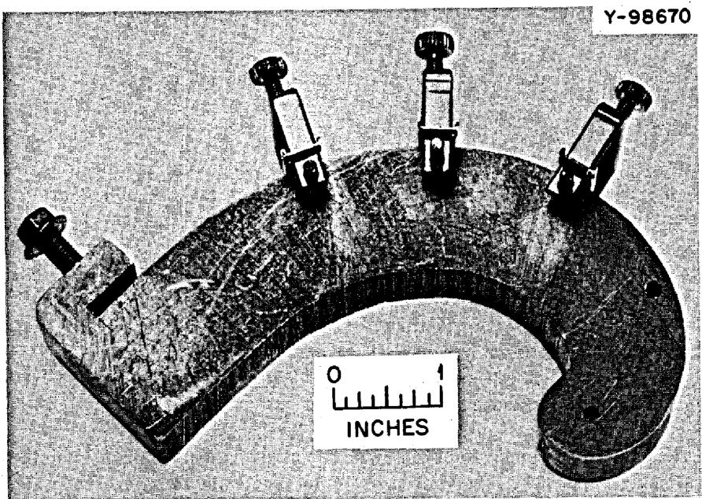  
Fig. 19.11. Spiral Bend Test Jig.

Y-98674

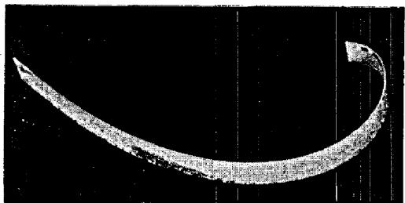  
TYPE 304 STAINLESS STEEL

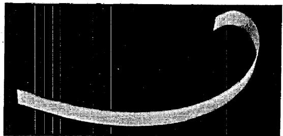  
TYPE 430 STAINLESS STEEL

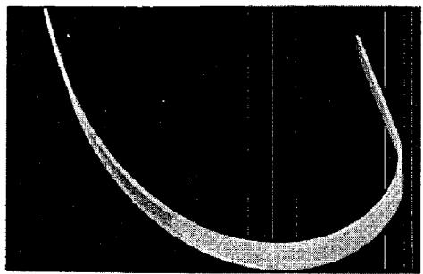  
INCONEL 600

HASTELLOYC   
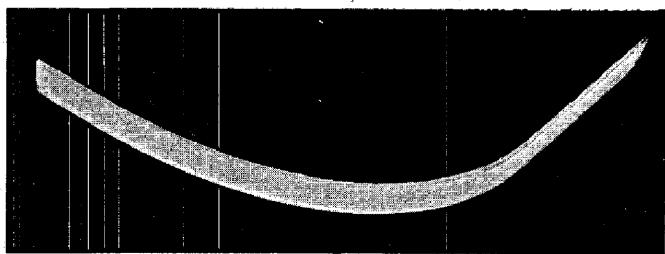  
0 1 2 INCHES

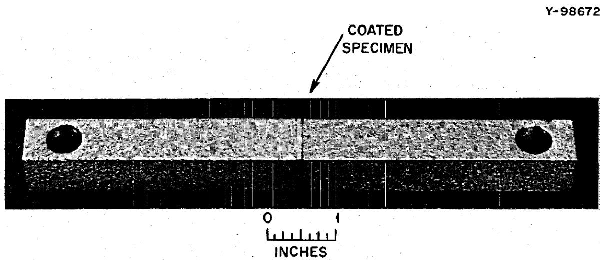  
Fig. 19.12. Tungsten-Coated Bend Specimens.   
Fig. 19.13. Tensile Specimen for Testing the Adherence of Coatings.

several coatings recommended for use in this temperature range for protection of steels from oxidation were compared. These were Markal CR-9 (Markal Company, Chicago, Illinois), Speco H-170, a silicone-base aluminum paint, Speco H-170, a silicone-base zinc paint (Speco Inc., Cleveland, Ohio), a silicone-base aluminum paint (unknown vendor), and as-received tubing with no coating (designated M Cr-9, SPE AL, SPE ZN, SIL Al, and AS REC respectively). The specimens coated were 1-in.-long, 0.375-in.-diam tubes with 0.058 in. wall thickness. They were first cleaned in acetone and then the coatings applied by dipping and air drying 16 hr. They were then heated in an air furnace for 1000 hr at $650^{\circ}\mathrm{C}$ , cycling to $25^{\circ}\mathrm{C}$ every 25 hr.

Results are summarized in Fig. 19.14. The as-received specimen gained weight until the oxide layer spalled after about $400\mathrm{hr}$ . A net weight loss was measured after $600\mathrm{hr}$ , but then after that time the specimen started to gain weight again. The specimen coated with Markal CR-9 initially lost weight, presumably due to a loss of volatile elements in the coating, then gradually gained weight until after $1000\mathrm{hr}$ it had the smallest weight change of all. The specimens coated with the silicone-base aluminum and zinc paints gained weight at approximately the same rate as the as-received specimen, but they did not spall upon cooling and, therefore, had the largest weight gains after $1000\mathrm{hr}$ . The remaining unaffected metal (wall thickness) in the various specimens was M CR-9, 0.049 in.; SPE AL, 0.041 in., SPE ZN, 0.038 in.; SIL AL, 0.037 in.; and AS REC, 0.035 in. This value was inversely related to the observed weight increase except for the as-received specimen, where spalling occurred.

An alternative to using carbon-steel tubing to contain bismuth in a fuel processing vessel might be to use

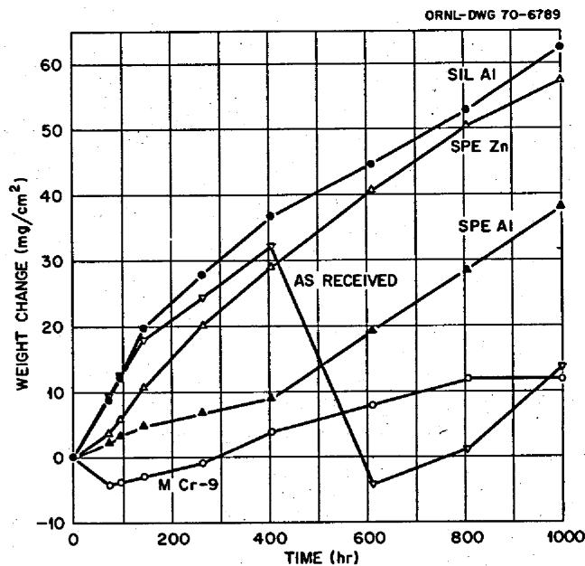  
Fig. 19.14. Weight Changes in Coated Steel Samples Exposed to Air at $650^{\circ}\mathrm{C}$ and Cycled to $25^{\circ}\mathrm{C}$ Every 25 hr.

Croloys or chromium steels that have improved oxidation resistance. Croloys are widely used in steam plants, but not much is known about their spalling resistance in air at $650^{\circ}\mathrm{C}$ under cyclic temperature conditions. To evaluate their spalling resistance, samples of $\frac{1}{2}$ -in. to 3-in. pipe of Croloys having 1.1, 1.9, 2.0, 4.2, and 8.7 wt % chromium along with a maraging steel (Ni, 12%; Cr, 5%; Mo, 3%) for comparison were tested. We found that small additions of chromium to iron increased scaling but that additions greater than 5% greatly improved oxidation resistance.

# 20. Support for Components Development Program

H. E. McCoy

The culmination of a development program is to use the basic information that has been developed to construct an operating engineering system. A nuclear power plant will require pumps, heat exchangers, steam generators, and numerous other components. At this stage of development, work on components is not receiving a high priority. However, certain basic capabilities are needed to proceed with building components when this part of the program is reached. One of these areas involves the ability to make remote cuts and welds for maintenance purposes. Our involvement in this program has been primarily with the choice of welding configurations and parameters. A second area of work concerns the development of a bearing to operate in molten salts. Our present concepts of fuel and coolant pumps do not require such a bearing, but small auxiliary pumps may be desired that utilize such a bearing. A bearing for this operation must be a cermet (ceramic-metal composition). This cermet can be solid or simply a coating on a metal. Our current work involves the evaluation of four cermet coatings that were applied by plasma spraying. A third area is involved with assuring adequate instrumentation for operating a nuclear plant. The examination of a pressure-measuring device in a sodium fluoroborate loop has led to a better appreciation of the quality control needed for such devices.

# 20.1 REMOTE WELDING DEVELOPMENT

T. R. Housley G.M. Slaughter

Through a cooperative program with the Reactor Division (see Chap. 7), we are developing optimized joint designs and welding procedures for remotely welding the large Hastelloy N pipes in an MSBR. For economy and expediency we have done much of our preliminary work with austenitic stainless steel. A description of the welds made and the types of joint designs and consumable inserts studied is presented in Sect. 7.4. This discussion describes the metallurgical evaluation of the test welds.

Figure 20.1 (composite) shows a cross section and photomicrograph of a root pass in Hastelloy N piping. The weld is extremely sound and free from any type of microfissuring. Figure 20.2 shows the general appearance of welds in 6-in.-diam pipe after the root pass (left) and completion of filler passes (right).

A major problem in remote maintenance of an MSBR or any reactor is that of obtaining correct alignment and fitup of mating components. If very accurate alignment is not a necessity, the design criteria for pipe aligning mechanisms can be simplified. We are determining the amount of mismatch which will be permissible, and Fig. 20.3 shows a cross section of a successful pipe weld which was misaligned by about $\frac{1}{16}$ in. The adaptability of the equipment to this condition is excellent.

We are also improving the welding torch for this equipment, and an automatic self-adapting arc-length control has been developed. This is in preliminary checkout evaluation and looks very promising.

# 20.2 SUPPORT FOR SYSTEMS AND COMPONENT DEVELOPMENT

J.W.Koger

Failure Analysis of the PMD in the PKP-1 Pump Loop. - An evaluation of the salt leak that occurred near the Inconel PMD (pressure measuring device) of the PKP-1 pump loop (see Chap. 7) was made using radiographic, metallographic, and chemical techniques. The system had been in operation approximately eight years and contained $\mathrm{NaBF}_4$ -NaF (92-8 mole %) during the last two years.

The salt leak occurred near a weld joining two sections of sched 40 Inconel pipe. The weld was about $\frac{1}{2}$ in. from the PMD diaphragm flange and about 18 in. from the PKP-1 main loop. Records showed that the PMD was purchased in 1956. According to the manufacturer, the only test for quality of the weld where failure occurred was a helium mass spectrometer leak check. Our analysis disclosed that the weld almost

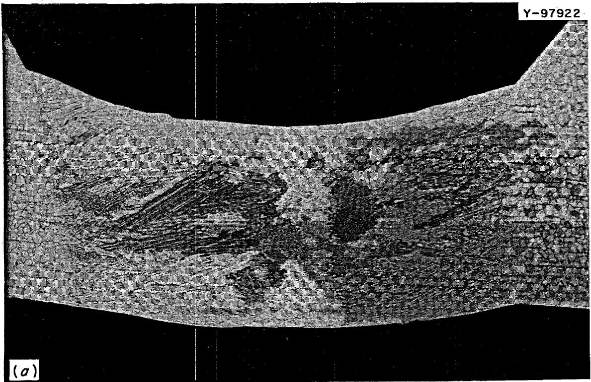

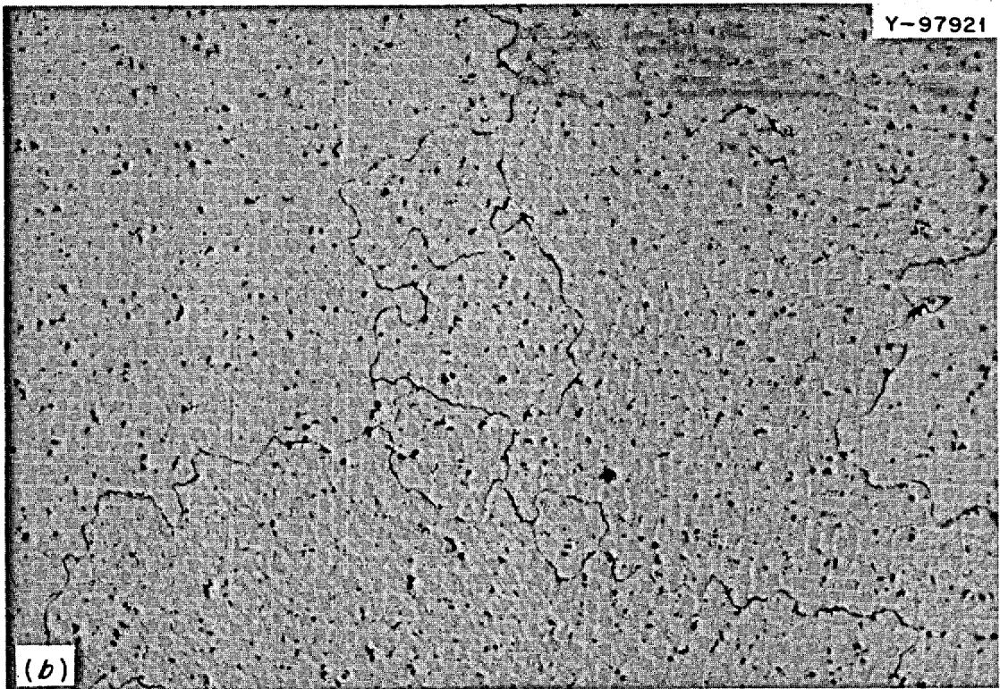  
0.018 INCHES 1 1 1 1 1 1 1 1 1 1 1 1 1 1 1 1   
Fig. 20.1. (a) Cross Section of Root Pass in Hastelloy N Pipe; (b) Photomicrograph of Root Pass. Excellent joint soundness is evident. Etch, HCl, $\mathrm{H}_2\mathrm{O}_2$ .

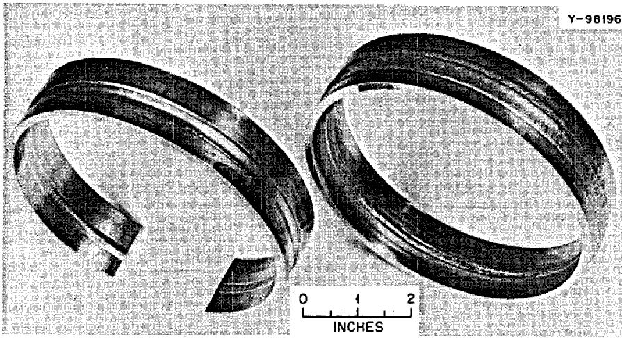  
Fig. 20.2. Welds in 6-in.-Diam Pipe After the Root Pass (Left) and Completion of Filler Passes (Right).

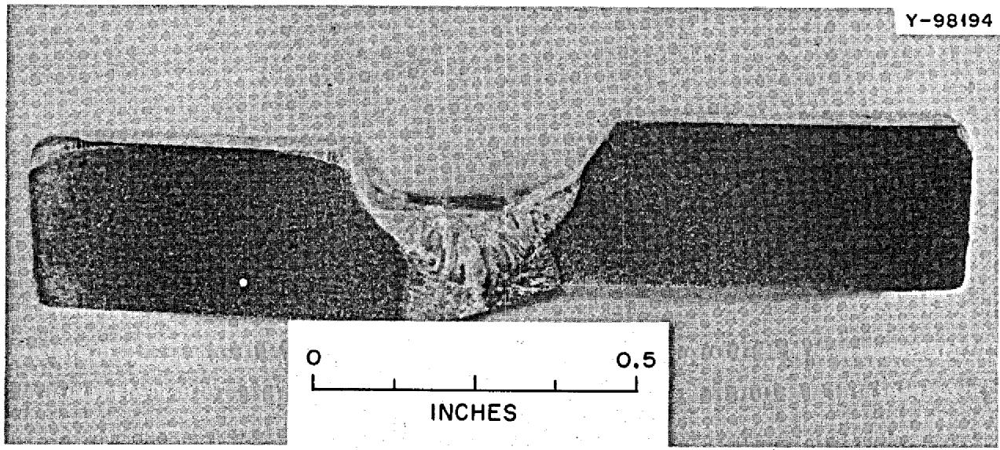  
Fig. 20.3. Successful Weld in Piping Misaligned by About $\frac{1}{16}$ in.

completely missed the intersection of the two portions of pipe due to misalignment of the matching ends. It is postulated that this was discovered by ORNL personnel after purchase, and that a repair was attempted by back brazing from inside the tube. Pieces of suspected brazing alloy were removed from inside the tube and analyzed. The compositions of the remaining braze alloy and the Inconel are given in Table 20.1. This

brazing alloy was much less compatible with the fused salt than Inconel due to the presence of B and higher Cr and Fe concentrations. Thus we believe that corrosion was the cause of failure.

Figure 20.4 shows the failed pipe section in both the as-polished and etched conditions. The porosity of the braze material is evident in Fig. 20.4a. The weld metal and the pipe intersection are evident in Fig. 20.4b,

Table 20.1. Compositions of Inconel and Braze Alloy   

<table><tr><td></td><td>Ni</td><td>Cr</td><td>Fe</td><td>Ti</td><td>Mn</td><td>Si</td><td>Al</td><td>Mo</td><td>B</td><td>Na</td></tr><tr><td>Inconel</td><td>77</td><td>14</td><td>7.4</td><td>0.3</td><td>0.2</td><td>0.1</td><td>0.2</td><td>&lt;0.03</td><td></td><td></td></tr><tr><td>Braze alloy</td><td>57</td><td>10</td><td>30</td><td>0.2</td><td>0.3</td><td>0.05</td><td>0.2</td><td>0.3</td><td>1.0</td><td>0.5</td></tr></table>

Table 20.2. Composition of Induction Probe Sheaths   

<table><tr><td rowspan="2"></td><td colspan="9">Alloy Constituents (wt %)</td></tr><tr><td>Ni</td><td>Fe</td><td>Cr</td><td>Mo</td><td>Mn</td><td>Si</td><td>C</td><td>S</td><td>P</td></tr><tr><td>Hastelloy N</td><td>Bal</td><td>4.22</td><td>6.96</td><td>16.17</td><td>0.47</td><td>0.62</td><td>0.06</td><td>0.010</td><td></td></tr><tr><td>Type 304 Stainless</td><td>9.8</td><td>Bal</td><td>18.0</td><td>0.2</td><td>1.3</td><td>0.7</td><td>0.053</td><td>0.027</td><td>0.021</td></tr></table>

Table 20.3. Effect of Applied Electric Current on Corrosion in Fluoroborate Salt at $550^{\circ}\mathbf{C}$   

<table><tr><td rowspan="2">Sample No.</td><td rowspan="2">Material</td><td rowspan="2">Exposure Time (hr)</td><td rowspan="2">1000-Hz \(Current^{a}\)</td><td colspan="3">Wall Thickness (mils)</td></tr><tr><td>Before(Nominal)</td><td>After</td><td>Change</td></tr><tr><td>336</td><td>Hastelloy N</td><td>1430</td><td>Yes</td><td>35</td><td>33.2</td><td>-1.8</td></tr><tr><td>337</td><td>Hastelloy N</td><td>1430</td><td>No</td><td>35</td><td>34.0</td><td>-1.0</td></tr><tr><td>338</td><td>Type 304 SS</td><td>70</td><td>No</td><td>20</td><td>12.5</td><td>-7.5</td></tr><tr><td>339</td><td>Type 304 SS</td><td>70</td><td>Yes</td><td>20</td><td>13.0</td><td>-7.0</td></tr></table>

aProbe electrical conditions were 0.04 v rms and 0.1 amp.

although the etchant removed the braze metal. Figure 20.5 shows a portion of the tubing $180^{\circ}$ away from the failure. Again porosity is evident in the braze metal. The weld here was properly aligned. Figure 20.6 shows the condition of the Inconel pipe wall away from the failure. Subsurface voids are evident to about 7 mils in depth.

Another PMD, bought at the same time, was cut apart and analyzed. In this device the weld was sound and no braze alloy was present. Thus we believe that this brazing operation was an isolated repair. We have recommended, however, that all PMD's purchased on the same order and serving in critical facilities be tested by radiographic methods to determine their condition.

Effect of Applied Electric Current on Corrosion in Fluoroborate Salt. Four liquid level induction probes exposed to salt in the Inconel PKP-1 loop were examined in order to evaluate the effect of excitation current on fluoroborate corrosion. Two of the probes were sheathed with Hastelloy N and two with stainless steel. The compositions of the respective alloys are given in Table 20.2. The stainless steel probes were

exposed for 72 hr and the Hastelloy N probes for 60 days. For each material, one probe served as a control, no current imposed, while the other saw $1000\mathrm{Hz}0.04$ v rms and 0.1 amp. The salt temperature in all cases was $550^{\circ}\mathrm{C}$ . The results of the tests are summarized in Table 20.3.

The visual appearance of the probes after test is compared in Fig. 20.7. The two stainless steel probes showed heavy attack and were noticeably discolored. The corrosion rate of the stainless steel averaged 0.1 mil/hr. Hastelloy N showed no visible attack, but measurements of the wall thickness of the sheath indicated a corrosion rate of $7 \times 10^{-4} \mathrm{mil / hr}$ .

Wall thickness changes (Table 20.3) and metallographic examination both indicated that the excitation current had a small effect on Hastelloy N corrosion, although precise measurements in a more highly controlled environment are necessary to confirm this behavior. Such an effect was not noted for the stainless steel probes, which suffered 143 times the corrosion loss of the Hastelloy. The heavy attack of the stainless steel probes in this test paralleled that which led to

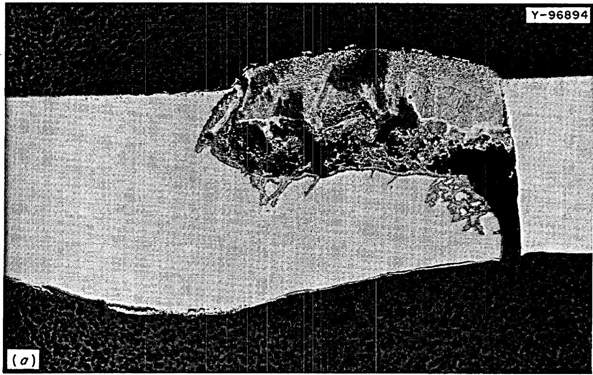

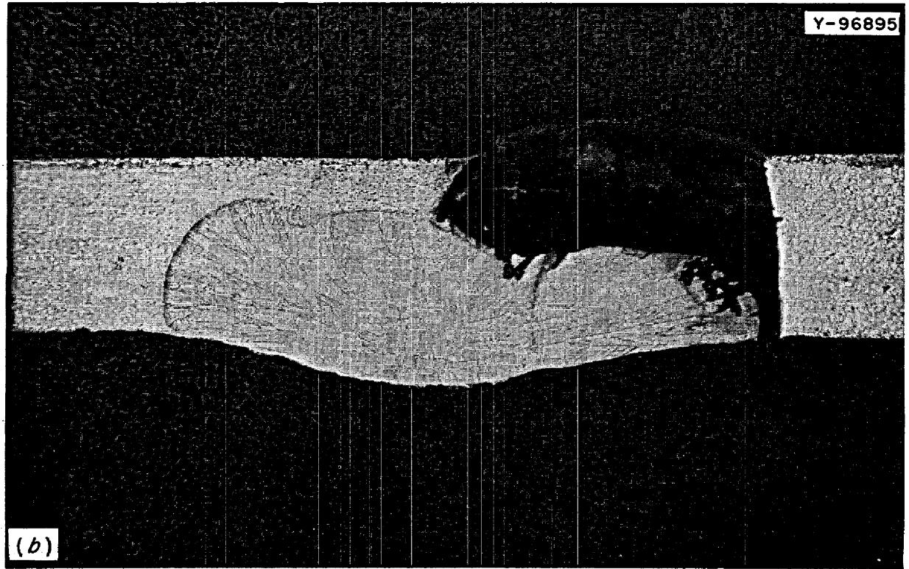  
Fig. 20.4. Failure Near Butt Weld in Inconel Pipe Leading to Pressure Measuring Device on PKP-1 Loop. (a) As polished, $20 \times$ ; (b) etched, HCl, $\mathrm{HNO}_3$ , lactic acid, $12 \times$ .

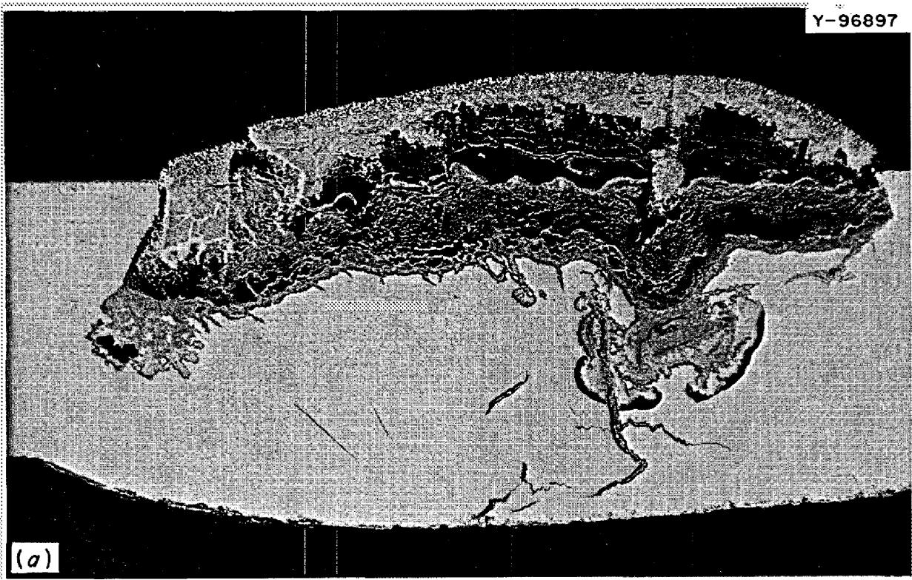

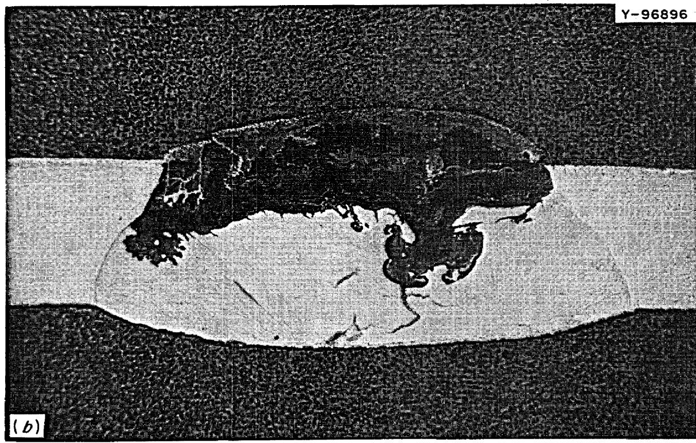  
Fig. 20.5. Appearance of Weld $180^{\circ}$ from Failure Area Shown in Fig. 20.4. (a) As polished, $20 \times$ ; (b) etched, HCl, $\mathrm{HNO}_3$ , lactic acid, $12 \times$ .

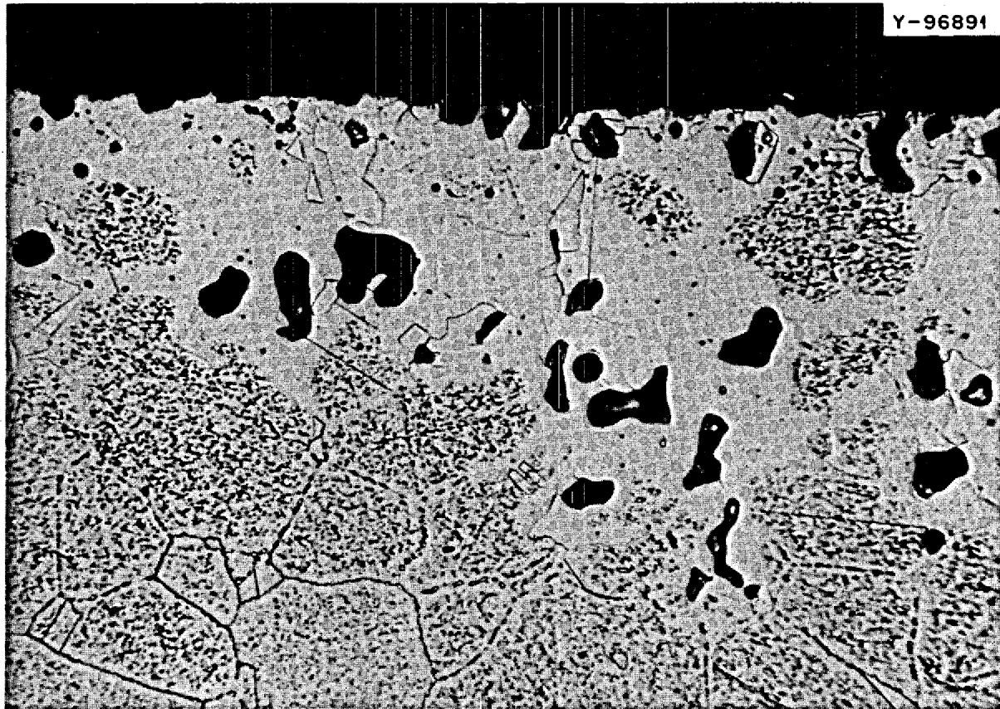  
0.007 INCHES 10.005 in. 1 500x 10.003 in. 1 10.001 in.   
Fig. 20.6. Inconel Pipe Joining PMD and PKP-1 Loop, Exposed to Fluoride Salts for Many Years. Etched, HCl, $\mathsf{HNO}_3$ , lactic acid, $500\times$

failure of a stainless steel probe during an earlier PKP-1 loop run. Although stainless steel is nominally poorer in resistance to salt attack than Hastelloy N, attack of the former alloy in the PKP-1 system is magnified by dissimilar metal interaction with the large Inconel surface comprising the system.

# 20.3 COATED BEARING SPECIMENS

W.H.Cook

Tests on high-temperature bearings using alkali metals or fluoride salt as hydrodynamic lubricants have generally indicated that hard surfaces working opposite hard surfaces give the better performance in boundary (rubbing) lubrication tests.1,2 Boundary lubrication conditions will exist in certain eccentric loadings or

during the starting or stopping of hydrodynamically lubricated bearings. Damage usually results from solid-phase bonding.

Our present concepts of large molten-salt pumps do not require bearings that operate at high temperatures. However, there are small auxiliary pumps and valves in which it probably will be desirable to use materials that will resist solid-phase bonding (galling, self-welding) and wear in salt up to temperatures of $700^{\circ}\mathrm{C}$ . We feel that metal-bonded carbide cermets offer the best potential for these kinds of operating conditions, and we currently have a small evaluation program. The least

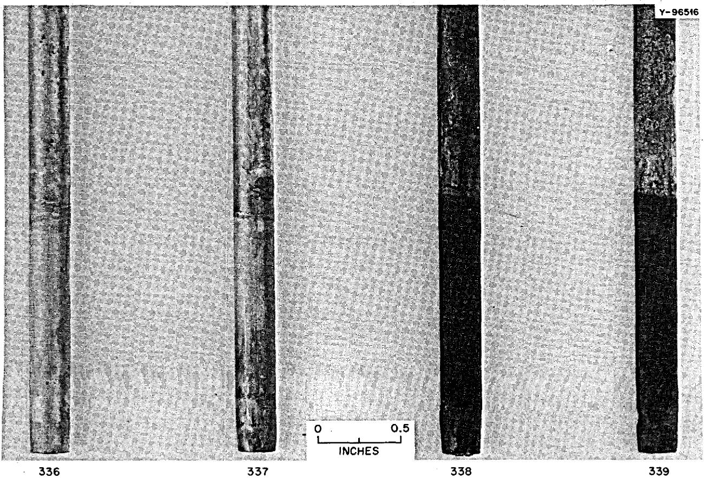  
Fig. 20.7. Liquid-Level Induction Probes Exposed to $\mathrm{NaBF}_4$ -NaF (92-8 Mole %) in PKP-1 Loop To Determine Effect of Applied Current. Nos. 336 and 337: Hastelloy N, 1430 hr, 336 had 1000-Hz current; Nos. 338 and 339: type 304 stainless steel, 70 hr, 339 had 1000-Hz current.

expensive and least complicated design approach is to apply such hard-surface coatings as thin layers on bearings or valve faces and surface and grind them to the required surface finish.

We are currently evaluating four such coatings that have been applied to Hastelloy N cylinders 1 in. in diameter and 1 in. long by plasma spraying. These were surface ground to make them 0.003 in. thick. Their designations and nominal compositions are listed in Table 20.4.

These coatings, represented by six specimens per coating composition, survived 100 thermal cycles between 100 and $700^{\circ}\mathrm{C}$ in pure $(99.996\%)$ argon. The heating and cooling parts of each cycle were 20 and 40 min respectively. These thermal cycles caused no detectable changes in the sample diameters. None of the

coatings spalled, but all showed some degree of failure in the fluorescent dye penetrant examinations made on them by the nondestructive testing (NDT) group before and after the test. These coated bearing specimens are listed in Table 20.4 in the decreasing order of their resistance to the thermal cycling tests as indicated by these NDT tests.

Metallographic examinations of as-received (control) and selected thermal-cycled (tested) specimens have been made. Their microstructures are compared in Fig. 20.8, and comments on these are given in Table 20.4. There was no evidence of any separation between the coatings and Hastelloy N, even though all showed scattered oxide at this interface as part of the fabrication problem. The presence of oxides in the matrices of the coatings tended to be a fabrication problem for all

Table 20.4. Metal-Bonded Carbide Coatings on Hastelloy N Cylinders 1 in, in Diameter by 1 in. Long   

<table><tr><td>Designation</td><td>Nominal Composition of Coating</td><td>Ground Surface Finisha(μm in.)</td><td>Phases Identified byX-Ray Analysesb</td><td>Remarks on Microstructurec</td></tr><tr><td>Linde LW-5</td><td>25% tungsten carbide and mixed W-Cr carbides plus 7% nickel</td><td>1.4–2.3</td><td>WC, Cr3C2</td><td>There is some scattered oxide at interface of Hastelloy N and coating with essentially none in the coating. Most carbide particles are massive. One cannot distinguish between the WC and Cr3C2 in the as-polished state. Some small cracks observable in carbide particles appear to be in binder. The binder is a minor phase. The ground surface is smooth. There is no difference in the control and tested specimen.</td></tr><tr><td>LW-1</td><td>Tungsten carbide plus 7–10% cobalt</td><td>0.6–9</td><td>WC, α-W2C, Co3C</td><td>There is some scattered oxide at the interface of the coating and Hastelloy N. There is a small amount of oxide, more than in Linde LW-5, and the carbide particles appear to be thin, wavy layers parallel with the Hastelloy N surfaces. There are stringers of small carbide-like particles in the binder. These contribute to this having a rougher surface than Linde LW-5. There is, essentially, no difference in the control and tested specimen.</td></tr><tr><td>Metco 81 NS</td><td>75% chromium carbide plus 25% nickel-chrome alloy</td><td>30–63</td><td>Cr7C3, Cr2C, Cr3C2, Ni–42 at. % Cr alloy</td><td>There is scattered oxide at the interface of the coating and the Hastelloy N. The carbides appear to have been plastic. There is oxide throughout the coating with some forming lenticular layers between the carbides. The carbides have cracks in them. The original surface is rough due to cracks and porosity. There is no difference in the control and tested specimen.</td></tr><tr><td>MTI</td><td>84% tungsten carbide–10% molybdenum plus 6% cobalt</td><td>42–125</td><td>α-W2C, Co3C, Mo, MoC, Mo2C</td><td>There is scattered oxide at the interface between the Hastelloy N and coating. It is also throughout the coating. The coating is very porous. The tested coating appeared to fall apart more than the control, which suggests that the former may have been weakened by the thermal cycling.</td></tr></table>

$^\text{a}$ The range of values as determined on 12 specimens by Mechanical Technology Inc.   
$b$ Reported for reference; reported previously by J. E. Epperson, MSR Program Semiann Progr. Rept. Aug. 31, 1968, ORNL-4344, pp. 285-86.   
The "control" refers to as-received specimens, and "tested specimens" refers to those that were subjected to 100 thermal cycles between 100 and $700^{\circ}\mathrm{C}$ in which the heating and cooling required 20 and 40 min respectively.

PHOTO 99452

(part 1)

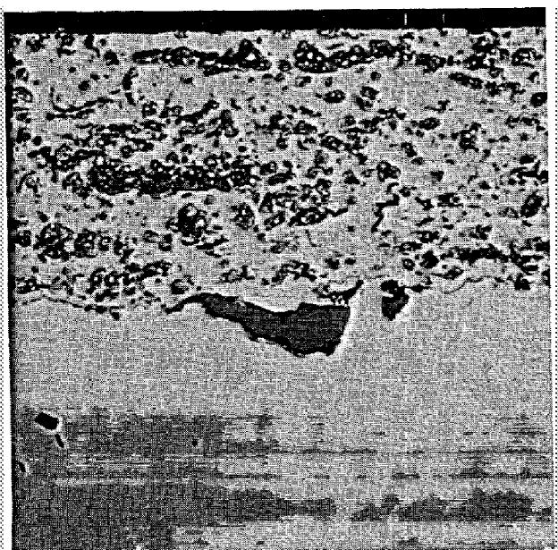

（a-1）

(CONTROL)

NO.

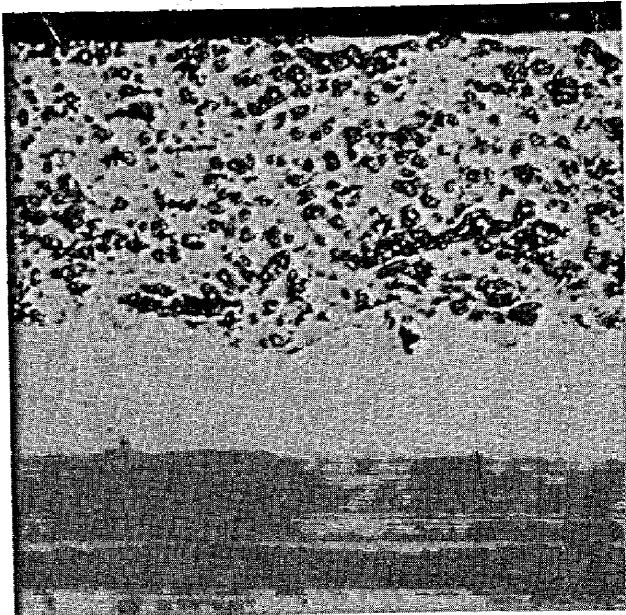

(σ-2)

(TEST)

NO.5

LW-5 (NOMINALY: 25% TUNGSTEN CARBIDE AND MIXED W-Cr CARBIDES)

PLUS $7 \%$ NICKEL)

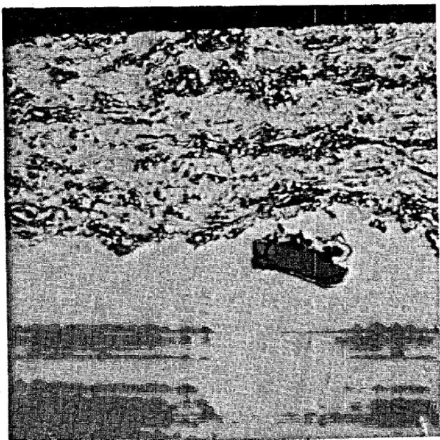

(b-1)

(CONTROL)

NO.7

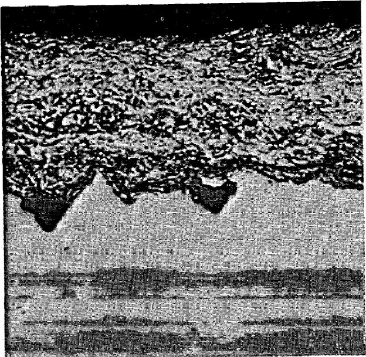  
Fig. 20.8. The Microstructures of 0.003-in.-Thick Metal-Bonded Carbides on 1-in.-diam by 1-in.-Long Hastelloy N Cylinders $a-1$ , $b-1$ , $c-1$ , and $d-1$ (Controls, As Received) and $a-2$ , $b-2$ , $c-2$ , and $d-2$ , After 100 Thermal Cycles Between 100 and $700^{\circ}\mathrm{C}$ . As polished. $500\times$ .

(b-2)

TEST

NO.6T

LINDE LW-1 (NOMINALLY: TUNGSTEN CARBIDE PLUS 7-10% COBALT)

PHOTO 99452

(part 2)

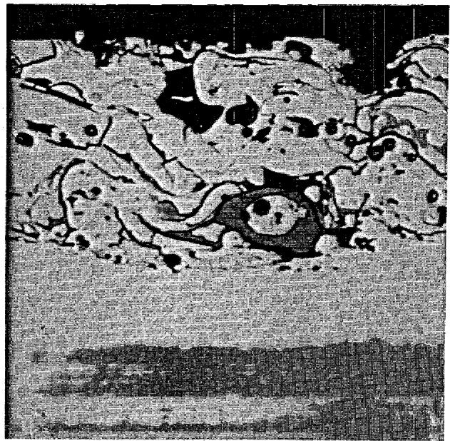  
(c-1)   
(CONTROL)   
NO. 7

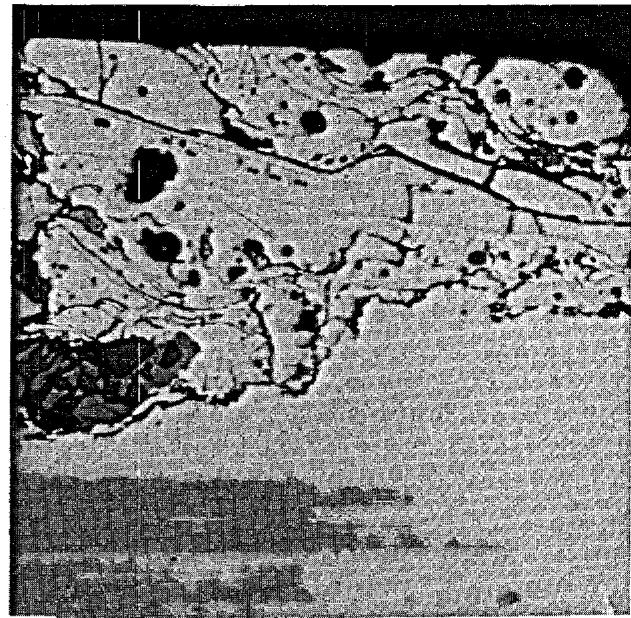  
(TEST)   
NO. 5

METCO 81 NS (NOMINALLY: $75 \%$ CHROMIUM CARBIDE PLUS $25 \text{‰}$

NICKEL-CHROMIUM ALLOY)

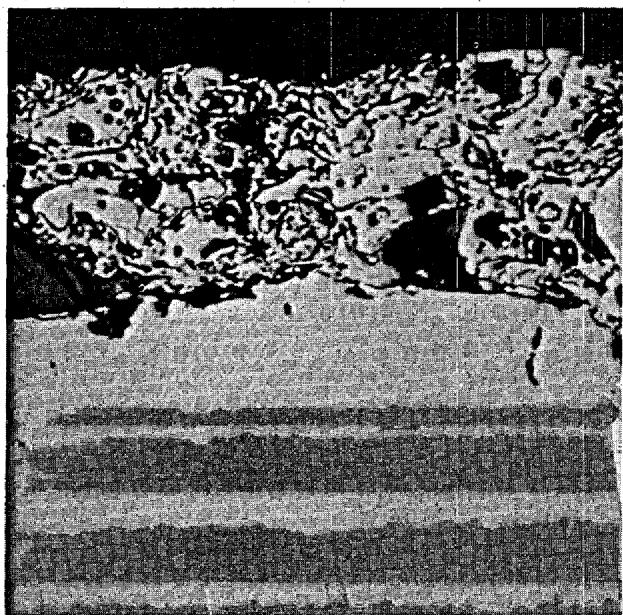  
(d-1)   
( CONTROL)   
NO. 7

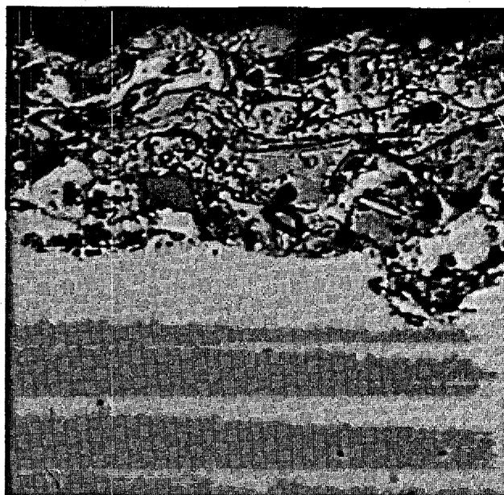  
(TEST)   
NO.6

MTI (NOMINALLY: 84% TUNGSTEN CARBIDE-10% MOLYBDENUM PLUS 6% COBALT)

four coatings, ranging from just detectable to easily detectable with the microscope in the order listed in Table 20.4. The presence of the oxides in the coatings makes it even more important that these be tested for their compatibility with molten fluoride salts at $700^{\circ}\mathrm{C}$ , because past experience has shown that oxides are normally attacked. The removal of the oxides might seriously weaken such coatings as Metco 81 NS and MTI, which have the larger quantities of oxide contamination. The presence of oxides in these coatings could be prevented by better control of the atmosphere during coating.

A "blister" fault as shown in Fig. 20.9 developed on one-out of the six specimens for Linde LS-1 after the 100 thermal cycles test. The pushed-up region of "blister" in Fig. 20.9b appears to have separated in the coating in our first examination, and there are three gray oxide-like particles in the break. It seems remote that ratcheting of the oxides during the thermal cycles

helped create this fault, but it cannot be discounted. The detail on this anomalous fault is warranted in that it illustrates the problems that one must cope with in ensuring the absolute integrity of coatings for valves and bearing surfaces.

The characteristics of these coatings as currently determined, despite some shortcomings, are encouraging. However, a more comprehensive program is required to determine their overall potential. These and improved coatings (such as being oxide free) must be thoroughly examined on the basis of microstructure, development of improved better NDT evaluations, thermal cycling resistance, heat treating (which is normally higher than the $700^{\circ}\mathrm{C}$ maximum operating temperatures), compatibility in molten fluoride salts, design, and bearing tests in molten salt, involving boundary (rubbing) and hydrodynamic lubrication tests.

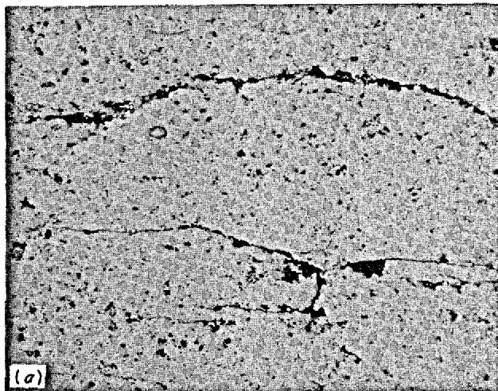  
PHOTO 99453

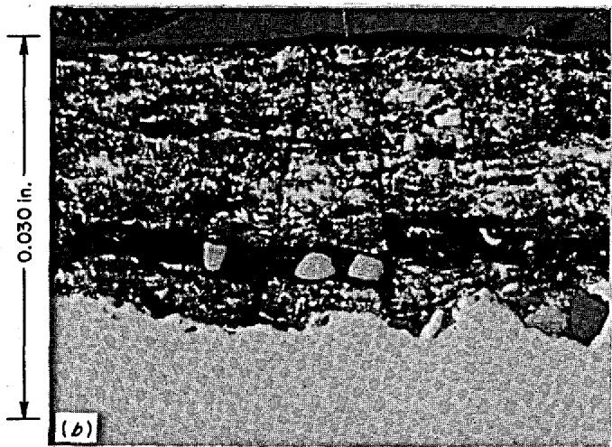  
Fig. 20.9. A Raised or "Blister" Defect in Linde LW-1 Specimen No. 5. (a) Unshadowed appearance on the ground bearing surface, and (b) a longitudinal section (through the short diameter of the crescent traced by the cracks). Both $100 \times$ , Fig. 20.9b is a metallographic section.

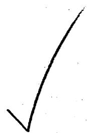

# Part 6. Molten-Salt Processing and Preparation

M.E.Whatley

Part 6 deals with the development of processes for the isolation of protactinium and the removal of fission products from molten-salt reactors. This reporting period has seen a significant revision in the conceptual flowsheets that form the basis for our development effort. The reductive extraction scheme for the removal of rare earths from the reactor fuel salt was the weak link in processes proposed for the MSBR, because it required exploitation of separation factors between thorium and the rare earths in the range of 1.2 to 3.5 in the fluoride-salt-bismuth system. The large electrolyzer for generating the extractant was required to operate in an undesirable mode, with very low flows of electrolyte and virtually complete removal of the thorium from the salt. The discovery that the thorium distribution coefficient in an LiCl-bismuth system is high and that the rare-earth distribution in the same system is low (a separation factor of the order $10^{5}$ or better) has allowed us to turn to a metal transfer process that is much more tractable and does not require an electrolyzer. The major part of our effort in chemistry during this period was devoted to the definition of the distribution of the system components between the LiCl acceptor salt phase and a reducing bismuth phase.

Analysis of flowsheets using this new concept has led us to consider alternative protactinium removal methods which do not require an electrolyzer. The obvious and most desirable alternative is to return to fluorination for removing the uranium before the

reductive extraction step. Calculations made for the combination of the fluorination-reductive-extraction and the metal transfer flowsheets promise good system performance.

Our development program has not, however, required drastic revision, since many of the operations required for the new processes are the same as those required for the old ones. Our work on contactor development has continued both with the flow-through system using bismuth and salt and with the mercury-water simulation of the salt-bismuth system. Our axial mixing studies with the simulated system have led to a design of back-mixing preventers which seems to be quite effective at flow ratios (dispersed phase/continuous phase) of 50 or higher. We have increased our efforts to develop a continuous fluorinator that will be protected from corrosion by layers of frozen salt deposited on its metal surfaces. The work on electrolytic cells has been deemphasized, but not terminated, since an onstream method of producing lithium-bismuth solutions would be very useful and since the old reference protactinium flowsheet would still be a very attractive alternative if an operable cell were available.

We have initiated work toward the development of a continuous process for purifying reactor-grade salt for both an initial reactor charge and for our experimental program. We have also assisted the MSRE operation by preparing capsules loaded with $^{239}\mathrm{PuF}_3$ for use in adding $^{239}\mathrm{Pu}$ to the fuel.

# 21. Flowsheet Analysis

# 21.1 RARE-EARTH REMOVAL USING THE METAL TRANSFER PROCESS

L.E.McNeese

We have devised a new process called the metal transfer process for removing rare-earth and alkaline-earth fission products from the fuel salt of a single-fluid

MSBR. In this process, bismuth containing thorium and lithium is used to transport the rare-earth fission products from the reactor fuel salt to an acceptor salt. Although LiCl is the preferred acceptor salt, LiBr or LiCl-LiBr mixtures could also be used.

Both thorium and rare earths transfer to the bismuth; however, because of favorable distribution coefficients,

only a small fraction of the thorium transfers with the rare earths from the bismuth to the LiCl. The effective thorium-rare-earth separation factors for the various rare earths range from about $10^{4}$ to about $10^{8}$ . The final step of the process is removal of the rare earths from the LiCl by extraction with bismuth containing 0.05 to 0.50 mole fraction lithium. The new process does not require an electrolytic cell. This is an important advantage over the earlier reductive extraction process, which also had the disadvantage of rare-earth-thorium separation factors near unity.

The conceptual process flowsheet (Fig. 21.1) includes four contactors that operate at about $640^{\circ}\mathrm{C}$ . Fuel salt from the protactinium isolation system, which is free of uranium and protactinium but contains the rare earths at the reactor concentration, is countercurrently contacted with bismuth containing approximately 0.002

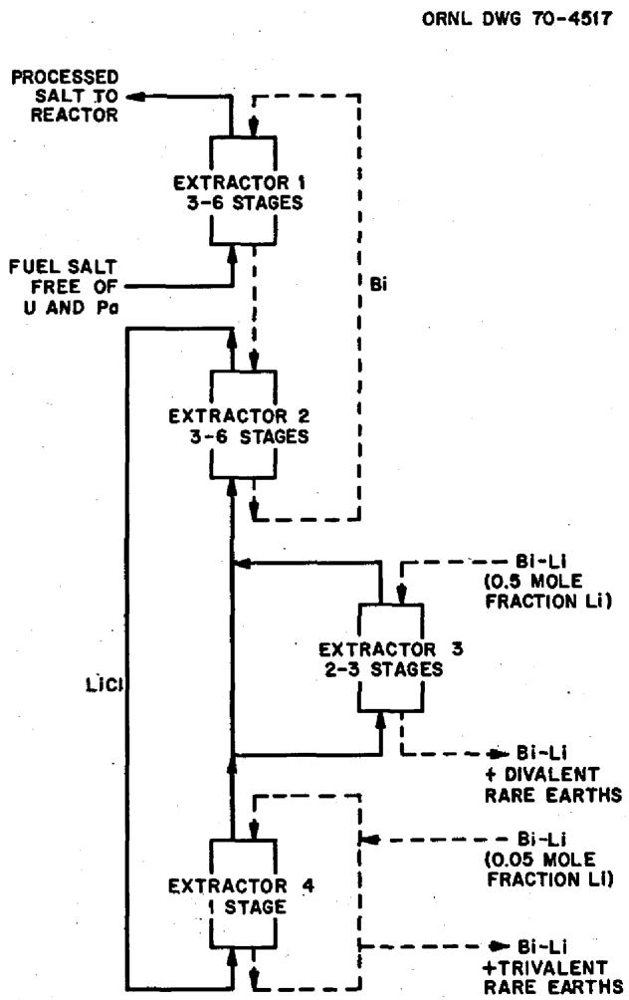  
Fig. 21.1. Metal Transfer Process for Removal of Rare Earths from a Single-Fluid MSBR.

mole fraction lithium and 0.0025 mole fraction thorium (90% of thorium solubility) in contactor 1. Fractions of the rare earths transfer to the downflowing metal stream and are carried into contactor 2. Here, the bismuth stream is contacted countercurrently with LiCl, and fractions of the rare earths and a trace of the thorium transfer to the LiCl. The resulting LiCl stream is routed to contactor 4, where it is contacted with a bismuth solution having a lithium concentration of 0.05 mole fraction for removal of trivalent rare earths. About 2% of the LiCl is routed to contactor 3, where it is contacted with a bismuth solution having a lithium concentration of 0.5 mole fraction for removal of divalent rare earths (samarium and europium) and the alkaline earths (barium and strontium). The LiCl from contactors 3 and 4 (still containing some rare earths) is then returned to contactor 2.

Calculations were made to identify the important system parameters. It was found that there is considerable latitude in choosing operating conditions which will yield a stated removal time. The number of stages required in the contactors is low: less than six in contactors 1 and 2, three or less in contactor 3, and one in contactor 4. The process appears to be essentially insensitive to minor variations in operating conditions such as flow ratios, reductant concentrations, and temperature. The required salt and bismuth flow rates depend on the desired rare-earth removal times.

Conditions will first be considered which give rare-earth removal times equal to or somewhat shorter than removal times presently assumed in reactor evaluation calculations which assume a 50-day removal time for all rare earths except europium, which has a 225-day removal time. Table 21.1 shows the effect of number of stages $(N)$ in contactors 1 and 2 for a typical trivalent rare earth (lanthanum) and a typical divalent rare earth (eupropium). Operating conditions include a 3-day processing cycle (3 gpm salt flow), a bismuth flow rate of $8.4\mathrm{gpm}$ through contactors 1 and 2, and an LiCl flow

Table 21.1. Variation of Rare-Earth Removal Time (in Days) with Number of Stages in Contactors 1 and 2 for Typical Trivalent and Divalent Rare Earths   

<table><tr><td rowspan="2">Rare Earth</td><td colspan="6">Removal Time (days) for Naof -</td></tr><tr><td>1</td><td>2</td><td>3</td><td>4</td><td>5</td><td>6</td></tr><tr><td>La</td><td>52.1</td><td>38.0</td><td>34.0</td><td>32.1</td><td>31.0</td><td>30.2</td></tr><tr><td>Nd</td><td>58.0</td><td>42.7</td><td>38.4</td><td>36.5</td><td>35.4</td><td>34.8</td></tr><tr><td>Eu</td><td>222.4</td><td>219.6</td><td>219.4</td><td>219.4</td><td>219.4</td><td>219.4</td></tr></table>

$a_N =$ number of equilibrium stages in each of contactors 1 and 2.

rate of 11.2 gpm. Contactor 4 was assumed to consist of one stage, and it was assumed that a bismuth-lithium solution (0.05 atom fraction lithium) was fed to the contactor at a rate of 22.7 liters/day. Contactor 3 was not used.

Thus with two or three stages in contactors 1 and 2 and with volumetric flow ratios near unity, one can obtain satisfactory removal times with relatively small processing streams for a three-day processing cycle. If packed columns were used as the contactors, the diameters would be approximately 6 in. Since the number of stages needed is low, the use of mixer-settlers should not be dismissed, particularly for experiments aimed at demonstrating the process concept.

The rate at which $^7\mathrm{Li}$ is removed from the system in the withdrawal stream is 52.4 g-moles/day. The rate at which thorium is removed is less than 0.069 g-mole/day. If the bismuth withdrawal stream were hydrofluorinated or hydrochlorinated in the presence of a suitable waste salt in order to recover only the bismuth, the cost of the $^7\mathrm{Li}$ lost would be 0.0018 mill/kwhr.

It is apparent that one can obtain removal times much shorter than those discussed previously by increasing the throughput and hence the size of the processing plant. A three-day processing cycle will be retained in the following cases; however, other flow rates will be increased to 10 times the values discussed above. Thus the bismuth flow rate in contactors 1 and 2 will be 84 gpm, the LiCl flow rate 112 gpm, and the bismuth-lithium solution flow rate 16 ft³/day.

The effects of number of stages in contactors 1 and 2 and of the concentration of lithium in the bismuth-lithium solution in contactor 4 are shown in Table 21.2. It is seen that rare-earth removal times of 3.5 to 15 days can be obtained depending on the conditions chosen. It should be noted that one cannot afford to discard lithium at the rate associated with this mode of operation. Hence, a means for recovering lithium from the discard stream from the contactor would be required. An alternative would be removal of the rare earths from the LiCl by other means such as contact with zeolitic exchangers.

Variation of breeding ratio with rare-earth removal time was calculated and is given in Fig. 21.2. The changes are given with respect to the base case, which has a removal time of 50 days for all rare earths except europium, which has a 225-day removal time. It should be noted that if all rare earths were removed on a five-day cycle, an increase in the breeding ratio of 0.0126 would result; decreasing the removal time to three days would result in an increase of 0.014, and a removal time of seven days would result in an increase

Table 21.2. Variation of Rare-Earth Removal Time (in Days) with Lithium Concentration in Contactor 3 and Number of Stages in Contactors 1 and 2   

<table><tr><td rowspan="2">Rare Earth</td><td colspan="6">Removal Time (days) for Naof -</td></tr><tr><td>1</td><td>2</td><td>3</td><td>4</td><td>5</td><td>6</td></tr><tr><td colspan="7">Li Concentration in Contactor 3 = 0.05 Mole Fraction</td></tr><tr><td>La</td><td>7.75</td><td>5.26</td><td>4.43</td><td>4.03</td><td>3.79</td><td>3.64</td></tr><tr><td>Nd</td><td>8.36</td><td>5.85</td><td>5.05</td><td>4.67</td><td>4.46</td><td>4.34</td></tr><tr><td>Eu</td><td>16.6</td><td>14.7</td><td>14.1</td><td>13.8</td><td>13.7</td><td>13.6</td></tr><tr><td colspan="7">Li Concentration in Contactor 3 = 0.20 Mole Fraction</td></tr><tr><td>La</td><td>7.59</td><td>5.10</td><td>4.28</td><td>3.87</td><td>3.63</td><td>3.48</td></tr><tr><td>Nd</td><td>8.22</td><td>5.71</td><td>4.91</td><td>4.54</td><td>4.33</td><td>4.20</td></tr><tr><td>Eu</td><td>8.71</td><td>6.81</td><td>6.23</td><td>5.98</td><td>5.86</td><td>5.79</td></tr><tr><td colspan="7">Li Concentration in Contactor 3 = 0.50 Mole Fraction</td></tr><tr><td>La</td><td>7.59</td><td>5.10</td><td>4.27</td><td>3.87</td><td>3.63</td><td>3.48</td></tr><tr><td>Nd</td><td>8.22</td><td>5.71</td><td>4.91</td><td>4.53</td><td>4.33</td><td>4.20</td></tr><tr><td>Eu</td><td>8.27</td><td>6.37</td><td>5.79</td><td>5.54</td><td>5.42</td><td>5.35</td></tr></table>

$a_{N} =$ number of equilibrium stages in each of contactors 1 and 2.

of 0.0115. It appears that significant increases in breeding ratio are within reach if reasonable means are available for removing uranium and protactinium from the fuel salt prior to removal of the rare earths and if means for removing the rare earths from LiCl are available which do not result in discard of large quantities of lithium.

# 21.2 PROTACTINIUM ISOLATION USING FLUORINATION-REDUCTIVE EXTRACTION

L. E. McNeese

The fact that the new process for removing rare earths from a single-fluid MSBR does not require an electrolytic cell has led us to consider protactinium isolation systems that do not require electrolyzers. One protactinium isolation method by which an electrolyzer can be avoided is fluorination—reductive extraction. In this method most of the uranium would be removed from the fuel salt by fluorination prior to isolation of the protactinium by reductive extraction.

The fluorination--reductive-extraction system for isolating protactinium is shown in its simplest form in Fig. 21.3. The salt stream from the reactor first passes through a fluorinator, where most of the uranium is removed by fluorination. Approximately $90\%$ of the salt leaving the fluorinator is fed to an extraction column, where it is countercurrently contacted with a

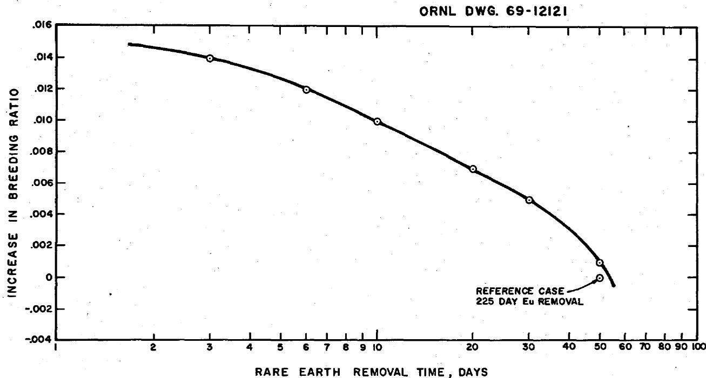  
Fig. 21.2. Effect of Rare-Earth Removal Time on Breeding Ratio.

bismuth stream containing lithium and thorium. The uranium is preferentially removed from the salt in the lower extractor, and the protactinium is removed by the upper contactor. A tank through which the bismuth flows is provided for retaining most of the protactinium in the system.

The bismuth stream leaving the lower contactor contains some protactinium as well as the uranium not removed in the fluorinator and the uranium produced from the decay of protactinium. This stream is contacted with an $\mathbf{H}_2$ -HF mixture in the presence of approximately $10\%$ of the salt leaving the fluorinator in order to transfer the uranium and the protactinium to the salt. The salt stream, containing $\mathbf{U}\mathbf{F}_4$ and $\mathbf{Pa}\mathbf{F}_4$ , is then returned to a point upstream of the fluorinator, where most of the uranium is removed. The protactinium passes through the fluorinator and is subsequently extracted into the bismuth. Reductant (lithium and thorium) is added to the bismuth stream leaving the oxidizer, and the resulting stream is returned to the upper contactor. The salt stream leaving the upper contactor is essentially free of uranium and protactinium and would be processed for removal of rare earths before being returned to the reactor.

Calculations have shown that the system is quite stable with respect to variations as large as $20\%$ for most of the important parameters: flow rates, reductant

concentrations, and number of extraction stages. The required uranium removal efficiency in the fluorinator is less than $90\%$ . The number of stages required in the extractors is relatively low, and the metal-to-salt flow ratio (about 0.26) is in a range where the effects of axial mixing in packed column extractors will be negligible. Since the protactinium removal efficiency is very high and the system is quite stable, materials such as ${}^{231}\mathrm{Pa}$ , $\mathrm{Zr}$ , and $\mathrm{Pu}$ should accumulate with the ${}^{233}\mathrm{Pa}$ . These materials can be removed by hydrofluorination of a small fraction of the bismuth stream leaving the lower extractor in the presence of salt which is then fluorinated for uranium recovery. Because sufficient decay time would be allowed for most of the ${}^{233}\mathrm{Pa}$ to decay to ${}^{233}\mathrm{U}$ , the ${}^{233}\mathrm{Pa}$ and ${}^{233}\mathrm{U}$ losses would be acceptably low.

Operating conditions that will yield a ten-day protac-tinium removal time include a fuel salt flow rate of 0.88 gpm (ten-day processing cycle), a bismuth flow rate of 0.23 gpm, two stages in the lower contactor and six to eight stages in the upper contactor, and a decay tank volume of 200 to $300\mathrm{ft}^3$ . The required quantity of reductant is 340 to 420 equivalents/day, which will cost 0.012 to 0.015 mill/kwhr if ${}^{7}\mathrm{Li}$ is purchased.

The remainder of this section is devoted to a discussion of the effects of important system parameters. Unless otherwise stated, the operating conditions

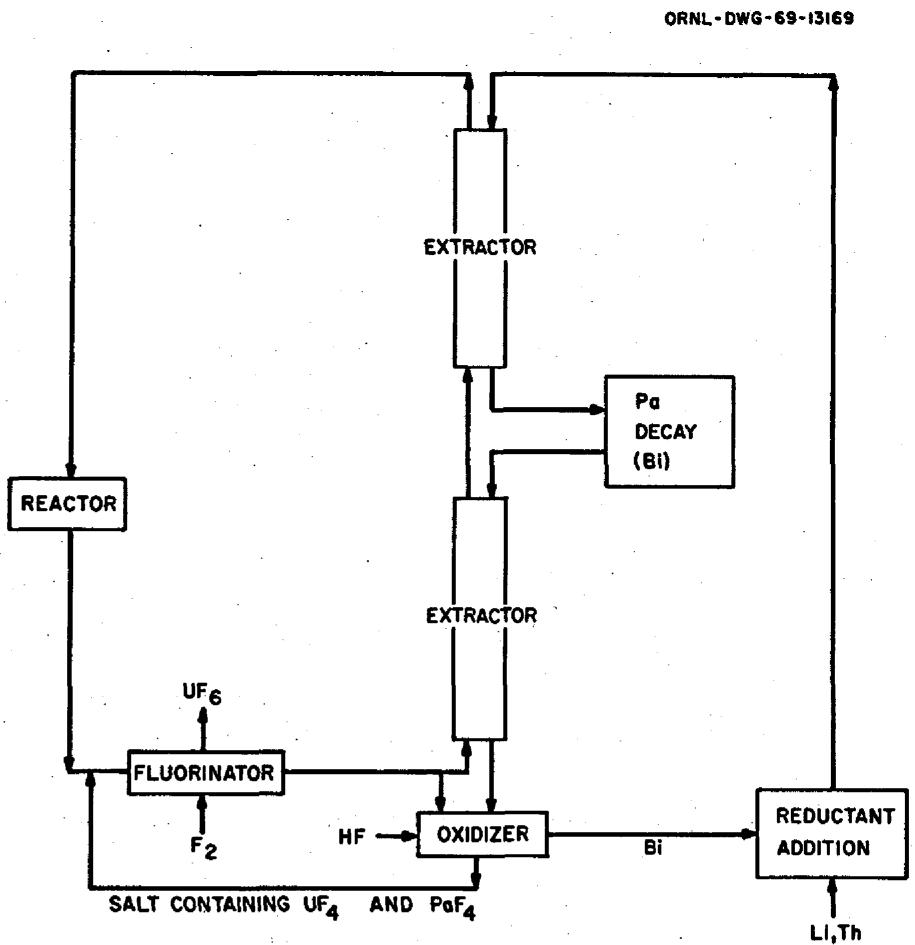  
Fig. 21.3. Protactinium Isolation by Fluorination - Reductive Extraction.

include an operating temperature of $640^{\circ}\mathrm{C}$ , a processing cycle of ten days, a reductant addition rate of 429 equivalents/day, a protactinium decay tank volume of $300\mathrm{ft}^3$ , a maximum thorium concentration equivalent to $50\%$ of the thorium solubility at $640^{\circ}\mathrm{C}$ , and a uranium removal efficiency during fluorination of $98\%$ .

The effect of number of equilibrium stages in the upper extractor is shown in Fig. 21.4. Less than two stages are required in the lower contactor; however, more stages can be used to advantage in the upper contactor. Approximately five stages are adequate, and little benefit is obtained from use of additional stages. Values of the uranium inventory in the decay tank, which is approximately $1\%$ of the reactor inventory, are also shown.

The effect of the fraction of uranium not removed during fluorination is shown in Fig. 21.5. High uranium removal efficiencies are not required, since there is no effect if as much as $12\%$ of the uranium remains in the salt.

The effect of reductant addition rate on protactinium removal rate is shown in Fig. 21.6. No effect of decreasing the addition rate is seen until one reaches a value of 390 equivalents/day, after which a gradual but significant effect is observed. The changes shown are also approximately the changes which result from variations in the bismuth flow rate for a constant inlet reductant concentration. Hence, there is little effect of variations in the bismuth flow rate.

The effect of processing cycle time on protactinium removal time is shown in Fig. 21.7. The removal time is equal to the processing cycle time (100% removal efficiency) for processing cycle times greater than about ten days. As the processing cycle time is decreased below this point, the system loses efficiency slowly. This figure shows that the system is relatively insensitive to minor variations in the salt feed rate.

The effect of protactinium decay tank volume on protactinium removal time is shown in Fig. 21.8. No change is seen as the tank volume is decreased from the

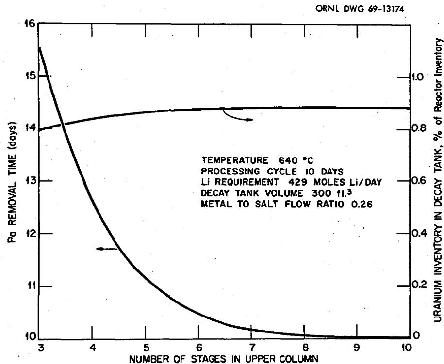  
Fig. 21.4. Effect of Number of Stages in Upper Extraction Column on Protactinium Removal Time and Uranium Inventory in Protactinium Decay Tank.

nominal tank volume of $300\mathrm{ft}^3$ until a value of $280\mathrm{ft}^3$ is reached, after which the system loses efficiency slowly. Smaller tank volumes could be used without loss of removal efficiency by increasing the reductant concentration in the bismuth fed to the extractors.

The effects of operating temperature and reductant addition rate on protactinium removal time are shown in Fig. 21.9. The optimum operating temperature is about $640^{\circ}\mathbf{C}$ , and the system is relatively insensitive to minor temperature variations. The reductant costs associated with the addition rates shown decrease in increments of 0.001 mill/kwhr from a value of 0.015 mill/kwhr for an addition rate of 429 equivalents/day.

# 21.3 MSBR PROCESSING BY FLUORINATION-REDUCTIVE EXTRACTION AND THE METAL TRANSFER PROCESS

L.E.McNeese

We have now adopted for study a flowsheet that uses fluorination—reductive extraction for protactinium isolation and the metal transfer process for rare-earth removal. These processes were described in detail in earlier sections of this report; this section will be

limited to a description and an analysis of the flowsheet shown in Fig. 21.10.

Salt withdrawn from the reactor is fed to a fluorinator, where most of the uranium is removed as $\mathrm{UF}_6$ . Most of the salt leaving the fluorinator is fed to a reductive extraction column, where the remaining uranium is removed and the protactinium is extracted into a bismuth stream. The bismuth stream containing the extracted protactinium flows through a tank of sufficient volume to contain most of the protactinium in the reactor system. Most of the bismuth stream leaving the extraction column is contacted with an $\mathrm{H}_2$ -HF mixture in the presence of about $10\%$ of the salt leaving the fluorinator in order to transfer materials such as uranium and protactinium to the salt stream. This salt stream is then recycled to the fluorinator.

The bismuth stream leaving the lower column also contains several materials that must be removed for satisfactory operation of an MSBR. The most important of these are fission product zirconium, which can be an important neutron absorber, and corrosion product nickel, which forms an intermetallic nickel-thorium compound having a low solubility in bismuth. These materials and others that do not form volatile fluorides

ORNL DWG 69-13179

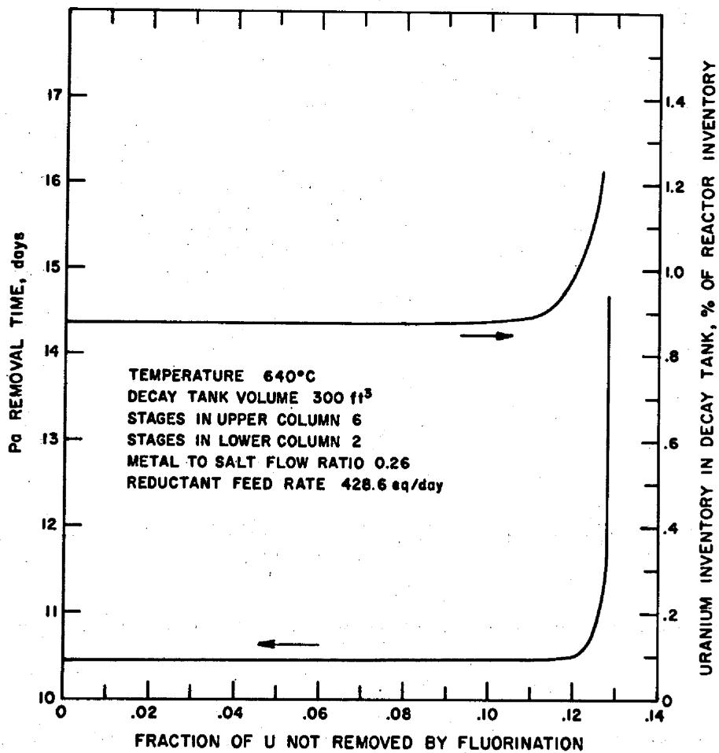  
Fig. 21.5. Effect of Fraction of Uranium Not Removed by Fluorination on Protactinium Removal Time and Uranium Inventory in Protactinium Decay Tank.

during fluorination are removed by hydrofluorination, in the presence of a salt stream, of a small fraction of the bismuth stream exiting from the lower column. The salt is then fluorinated for removal of uranium. Sufficient time is allowed for the decay of $^{233}\mathrm{Pa}$ so that the rate at which this material is lost is acceptably low. The remaining materials, including $\mathrm{Zr}$ , $\mathrm{Ni}$ , $^{231}\mathrm{Pa}$ , and $\mathrm{Pu}$ , are withdrawn in the salt stream from the fluorinator. Oxidation of part of the metal stream leaving the lower contactor is chosen as a means for removal of these materials, since this results in discard of no beryllium and very little lithium or thorium; discard of salt from other points in the system would result in much higher removal rates for the major components $\mathrm{LiF}$ , $\mathrm{BeF}_2$ , and $\mathrm{ThF}_4$ .

The bismuth streams leaving the hydrofluorinators are then combined, and sufficient reductant (lithium and

thorium) is added for operation of the protactinium isolation system. Effectively, this stream is fed to the upper column of the protactinium isolation system; actually, it first passes through a captive bismuth phase in the rare-earth removal system in order to purge uranium and protactinium from this captive volume.

The salt stream leaving the upper column of the protactinium isolation system contains negligible amounts of uranium and protactinium but contains the rare earths at essentially the reactor concentration. This stream is fed to the rare-earth removal system, where fractions of the rare earths are removed from the fuel carrier salt by countercurrent contact with bismuth containing lithium and thorium. The bismuth stream is then contacted with LiCl, to which the rare earths, along with a negligible amount of thorium, are transferred. The rare earths are then removed from the LiCl

ORNLDWG 69-13178

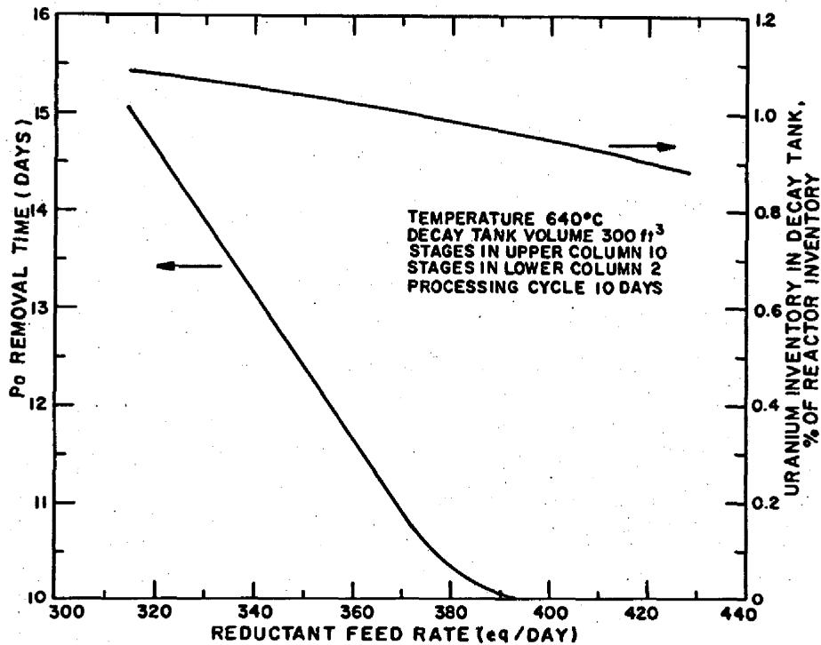  
Fig. 21.6. Effect of Reductant Feed Rate on Protactinium Removal Time and Uranium Inventory in Protactinium Decay Tank.

by contact with bismuth containing a high concentration of $^7\mathrm{Li}$ . Separate contactors are used for removal of the divalent and trivalent rare earths in order to minimize the quantity of $^7\mathrm{Li}$ required. Only about $2\%$ of the $\mathrm{LiCl}$ is fed to the contactor in which the divalent materials are removed.

Calculations have been made for a range of operating conditions in order to evaluate the flowsheet just described. In making these calculations the MATADOR code was used to determine the reactor breeding ratio for each set of processing plant operating conditions examined. Data are not available on the cost of processing for this flowsheet or for the reference flowsheet for the processing system that uses electrolyzers in both the protactinium and rare-earth removal systems. In the absence of these data, we examined processing conditions which would result in the same reactor performance (i.e., the same breeding ratio) as that obtained with the previous reference flowsheet.

Although the optimum operating conditions which will result in a breeding ratio equal to that of the reference reactor and processing system (1.063) have

not been determined, the following conditions are believed to be representative. The reactor was processed on a ten-day cycle, with the complete fuel salt stream (0.88 gpm) passing through both the protactinium isolation system and the rare-earth removal system. The resulting protactinium removal time was ten days, and the reductant requirement was 350 to 430 equivalents/day, which costs 0.012 to 0.015 mill/kwhr. The protactinium isolation columns were less than 8 in. in diameter, and the total number of required stages was less than 10. The protactinium isolation system also resulted in a ten-day removal time for materials that are more noble than thorium but do not have volatile fluorides. These include zirconium, $^{231}$ Pa, plutonium, the seminoble metals, and corrosion products.

The rare-earth removal system consisted of three primary contactors: (1) a 7.1-in.-diam, six-stage column in which the rare earths are transferred from the fuel salt to a 12.5-gpm bismuth stream, (2) a 13-in.-diam, six-stage column in which the rare earths are transferred from the bismuth to a 33.4-gpm LiCl stream, and (3) a 12.3-in.-diam column in which the trivalent rare earths

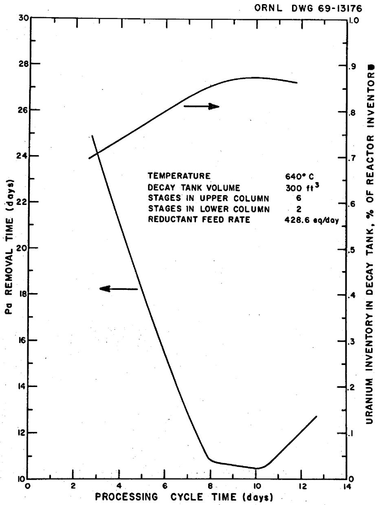  
Fig. 21.7. Effect of Processing Cycle Time on Protactinium Removal Time and Uranium Inventory in Decay Tank.

are transferred from the LiCl to an 8.1-gpm bismuth stream having a lithium concentration of 0.05 mole fraction. Two percent of the LiCl (0.69 gpm) was contacted with a bismuth stream (1.5 cm³/min) having a lithium concentration of 0.5 mole fraction for removal of the divalent fission products such as Sm, Eu, Ba, and Sr. The total lithium consumption rate for the rare-earth system was 119 moles/day, which costs 0.0042 mill/kwhr.

The rare-earth removal times ranged from 15.5 days for cerium to 50.4 days for europium. The distribution data for neodymium, which are believed to be conserva

tive, were used for rare earths for which distribution data were not available (i.e., Y, Pr, Pm).

The costs for reductant in both the protactinium isolation system and in the rare-earth removal system constitute only a small fraction of the total processing costs; however, they indicate that one can purchase reductant rather than use an electrolytic cell for producing this material. As data become available on processing costs, we will determine operating conditions that result in the most economic operation of the processing plant.

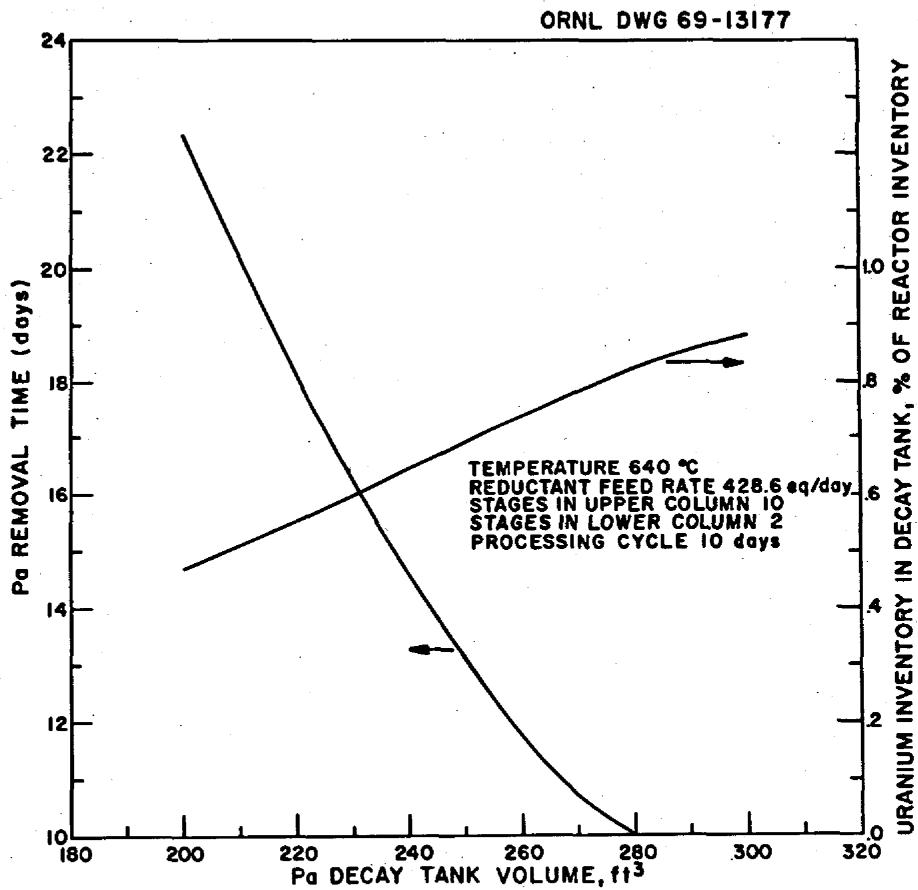  
Fig. 21.8. Effect of Protactinium Decay Tank Volume on Protactinium Removal Time and Uranium Inventory in Protactinium Decay Tank.

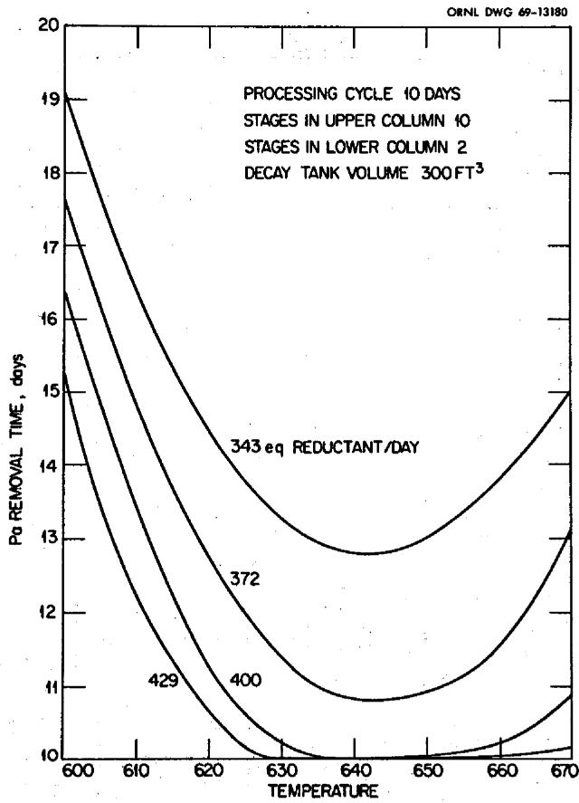  
Fig. 21.9. Effects of Operating Temperature and Reductant Addition Rate on Protactinium Removal Time.

ORNL DWG 70-2833

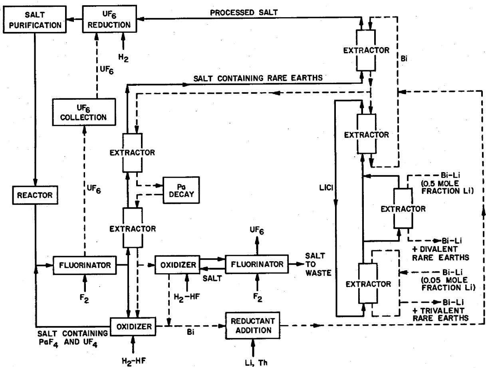  
Fig. 21.10. Flowsheet for Processing a Single-Fluid MSBR by Fluorination—Reductive Extraction and the Metal Transfer Process.

# 22. Measurement of Distribution Coefficients in Molten-Salt-Metal Systems

L.M.Ferris

The main effort during this reporting period was in obtaining data in support of the development of a metal transfer process for the removal of rare-earth and other fission products from MSBR fuels. This process (which is described in detail in Sect. 21.1) involves the reductive extraction of rare earths and thorium from the fluoride fuel salt into liquid bismuth and the subsequent selective oxidative extraction of the rare earths into an acceptor salt such as LiCl or LiBr. The rare earths, and the trace of thorium present with them, are stripped from the acceptor salt by a lithium-bismuth solution in which the lithium concentration is at least 5 at. $\%$ A rare-earth-thorium separation factor of at least $10^{4}$ is possible by this technique. Distribution coefficients,

$$
D _ {\mathbf {M}} = \frac {\text {m o l e f r a c t i o n o f} \mathbf {M} \text {i n b i s m u t h p h a s e}}{\text {m o l e f r a c t i o n o f} \mathbf {M} \text {i n s a l t p h a s e}},
$$

were measured at 600 to $700^{\circ}\mathrm{C}$ for several lanthanide and actinide elements and for barium using LiCl, LiBr, LiCl-LiF, and LiBr-LiF salt phases. The systems containing LiF were studied to determine the effect of fluoride on the process in the event that the acceptor salt becomes contaminated with some fuel salt.

Experiments were also conducted to determine the extractability of barium from $\mathrm{LiF - BeF_2 - ThF_4}$ solutions and to determine the solubility of bismuth in MSBR fuel salt. Some preliminary work with fluoride salts containing $\mathrm{BiF}_3$ was done in support of the development of electrolytic cells for the reductive extraction process.1

# 22.1 METAL TRANSFER PROCESS STUDIES

F.J.Smith C.T.Thompson

L.M.Ferris J.F.Land

The equilibrium distribution of several lanthanide and actinide elements and of barium between liquid bismuth solutions and the potential acceptor salts LiCl and LiBr has been determined. At a given temperature the distribution coefficients for each element could be expressed as

$$
\log D _ {\mathbf {M}} = n \log X _ {\mathbf {L} \mathrm {i}} + \log K _ {\mathbf {M}} ^ {*},
$$

in which $X_{\mathbf{L}\mathbf{i}}$ is the mole fraction of lithium in the bismuth phase, $n$ is the valence of the element in the salt phase, and $\log K_{\mathbf{M}}^{*}$ is a constant. The apparatus and general technique have been described elsewhere. $^{1,2}$ The two-phase salt-bismuth systems were contained in either molybdenum or mild steel crucibles. In experiments with lanthanum, neodymium, and europium, dried acceptor salt and bismuth were heated together to the desired temperature under an atmosphere of pure argon; then a small amount of thorium was added to remove residual oxide from the salt. Finally, a piece of the desired rare-earth metal was added to the system. The amount added was such that about $50\%$ of the rare-earth metal was converted to the halide and dissolved in the salt, while the remainder was retained in the bismuth. The rare earth in the salt was extracted

into the bismuth phase in increments by the periodic addition of lithium-bismuth alloy to the system. In some experiments, barium metal was added to the system when extraction of the rare earth was practically complete; then the addition of lithium-bismuth alloy was continued. A period of at least 4 hr was allowed for equilibration after each addition of alloy. A filtered sample of each phase was taken after each equilibration. Analyses of these samples provided the basis for the calculation of the distribution coefficients. In other experiments, bismuth and dry salt, along with the appropriate amounts of thorium and uranium metals (or samarium oxide), were loaded into a molybdenum crucible. After the two-phase system had been heated to the desired temperature, the system was treated with either an $\mathrm{HCl - H_2}$ or an $\mathrm{HBr - H_2}$ mixture to convert the metals or oxide to their respective halides (which dissolved in the salt) and to remove residual oxygen from the system. After treatment with pure hydrogen for several hours, the system was sparged with pure argon. Extraction of the thorium, uranium, and samarium from the salt was effected by the incremental addition of lithium-bismuth alloy to the system using the procedure outlined above. In some experiments the thorium that was added to the crucible had been irradiated to provide about $1\mathrm{mc}$ of $^{233}\mathrm{Pa}$ . Gamma counting of samples from these experiments produced the protactinium data presented below.

Some of the distribution coefficient data obtained in these studies are shown in Figs. 22.1 and 22.2. Data obtained for uranium, neodymium, and europium when LiCl was used as the salt phase are presented (Fig. 22.1) as plots of $\log D$ vs $\log X_{\mathrm{Li}}$ . The slopes of the lines indicate that $n$ is 3, 3, and 2 for uranium, neodymium, and europium respectively. Plots of $\log D_{\mathrm{Pa}}$ vs $\log D_{\mathrm{Th}}$ and of $\log D_{\mathrm{U}}$ vs $\log D_{\mathrm{Th}}$ using data obtained with LiCl at $640^{\circ}\mathrm{C}$ are shown in Fig. 22.2. Since uranium was trivalent, the slopes of the respective lines show that both thorium and protactinium were tetravalent in the salt under the experimental conditions employed. Values of $\log K^{*}$ obtained thus far in our studies using a variety of salts are compiled in Table 22.1. These results show that, from a chemical viewpoint, LiCl and LiBr will be equally good as acceptor salts and that the distribution behavior of most of the elements will be rather insensitive to temperature changes.

Inspection of the data in Table 22.1 reveals that the presence of fluoride in either LiCl or LiBr causes a change in distribution behavior, particularly that of thorium. This is illustrated by the data obtained for thorium and lanthanum in LiCl-LiF and LiBr-LiF solutions at 640 and $600^{\circ}\mathrm{C}$ respectively (Fig. 22.3).

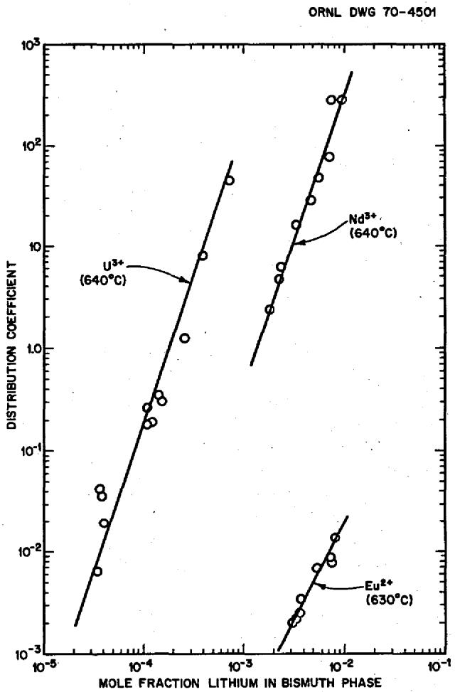  
Fig. 22.1. Equilibrium Distribution of Uranium, Neodymium, and Europium Between Molten LiCl and Liquid Bismuth Solutions.

These data indicate that the thorium-lanthanum separation factor will be decreased if the acceptor salt becomes contaminated with fluoride fuel salt. The effect of fluoride contamination of the acceptor salt on the efficiency of the metal transfer process is presently being analyzed.

# 22.2 EXTRACTION OF BARIUM, RARE EARTHSC AND THORIUM FROM SINGLE-FLUID MSBR FUELS

J.C.Mailen

F.J. Smith

C. T. Thompson

Measurement of the distribution of fission products and thorium between $\mathbf{LiF - BeF}_2\cdot \mathbf{ThF}_4$ MSBR fuel salts and liquid bismuth solutions has been continued in

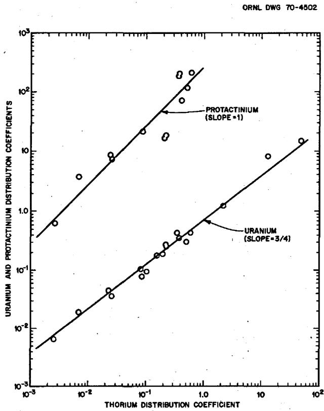  
Fig. 22.2. Distribution Coefficients for Thorium, Uranium, and Protactinium Obtained with Molten LiCl and Liquid Bismuth Solutions at $640^{\circ}\mathrm{C}$ .

support of both the reductive extraction process1 and the metal transfer process (Sect. 21.1). Recently, we determined distribution coefficients for barium at 600 to $690^{\circ}\mathrm{C}$ using $\mathrm{LiF - BeF_2 - ThF_4}$ (72-16-12 mole %) as the salt phase. The data at each temperature could be expressed as

$$
\log D _ {\mathrm {B a}} = 2 \log X _ {\mathrm {L i}} + \log K ^ {*}.
$$

The values obtained for $\log K^{*}$ are as follows:

<table><tr><td>Temperature (°C)</td><td>log K*</td></tr><tr><td>600</td><td>4.049</td></tr><tr><td>645</td><td>3.678</td></tr><tr><td>690</td><td>3.530</td></tr></table>

The distribution coefficients measured for barium are very nearly the same as those obtained previously² for europium; thus the behavior of these two elements in the reductive extraction process will be nearly identical.

Table 22.1. Values of log $K^{*}$ Derived from Distribution Coefficient Data $\log D = n\log X_{\mathrm{Li}} + \log K^{*}$   

<table><tr><td>Temperature (°C)</td><td>Salt</td><td>Element</td><td>log K*</td></tr><tr><td>630</td><td>LiCl</td><td>Eu2+</td><td>2.301</td></tr><tr><td>640</td><td>LiCl</td><td>Ba2+</td><td>1.702</td></tr><tr><td></td><td></td><td>La3+</td><td>7.973</td></tr><tr><td></td><td></td><td>Nd3+</td><td>8.633</td></tr><tr><td></td><td></td><td>Sm2+</td><td>2.886</td></tr><tr><td></td><td></td><td>Th4+</td><td>15.358</td></tr><tr><td></td><td></td><td>Pa4+</td><td>17.838</td></tr><tr><td></td><td></td><td>U3+</td><td>11.278</td></tr><tr><td>640</td><td>LiCl-LiF (98.1-1.9 mole %)</td><td>Th4+</td><td>13.974</td></tr><tr><td>640</td><td>LiCl-LiF (96-4 mole %)</td><td>Th4+</td><td>12.90</td></tr><tr><td></td><td></td><td>Pa4+</td><td>14.7</td></tr><tr><td></td><td></td><td>U3+</td><td>10.80</td></tr><tr><td>640</td><td>LiCl-LiF (90-10 mole %)</td><td>La3+</td><td>7.288</td></tr><tr><td></td><td></td><td>Th4+</td><td>11.309</td></tr><tr><td>600</td><td>LiCl-LiF (80-20 mole %)</td><td>La3+</td><td>7.235</td></tr><tr><td></td><td></td><td>Nd3+</td><td>7.644</td></tr><tr><td></td><td></td><td>Th4+</td><td>10.964</td></tr><tr><td>640</td><td>LiCl-LiF (80-20 mole %)</td><td>La3+</td><td>7.124</td></tr><tr><td></td><td></td><td>Th4+</td><td>10.629</td></tr><tr><td>700</td><td>LiCl-LiF (80-20 mole %)</td><td>Nd3+</td><td>6.732</td></tr><tr><td></td><td></td><td>Th4+</td><td>9.602</td></tr><tr><td>575</td><td>LiBr</td><td>Ba2+</td><td>1.497</td></tr><tr><td>600</td><td>LiBr</td><td>Ba2+</td><td>1.443</td></tr><tr><td></td><td></td><td>La3+</td><td>9.079</td></tr><tr><td></td><td></td><td>Nd3+</td><td>8.919</td></tr><tr><td></td><td></td><td>Th4+</td><td>16.16</td></tr><tr><td>640</td><td>LiBr</td><td>La3+</td><td>8.266</td></tr><tr><td></td><td></td><td>Nd3+</td><td>8.834</td></tr><tr><td>650</td><td>LiBr</td><td>Ba2+</td><td>1.358</td></tr><tr><td>700</td><td>LiBr</td><td>Ba2+</td><td>1.316</td></tr><tr><td></td><td></td><td>Nd3+</td><td>8.430</td></tr><tr><td>600</td><td>LiBr-LiF (90-10 mole %)</td><td>La3+</td><td>8.158</td></tr><tr><td></td><td></td><td>Th4+</td><td>12.380</td></tr><tr><td>600</td><td>LiBr-LiF (80-20 mole %)</td><td>La3+</td><td>7.840</td></tr><tr><td></td><td></td><td>Th4+</td><td>11.373</td></tr></table>

It was suggested3 that the rare-earth-thorium separation in the reductive extraction process might be enhanced by substituting NaF for some of the LiF in the MSBR fuel salt. This was tested by measuring the distribution of lanthanum and thorium between LiF-NaF-BeF2-ThF4 (62-10-16-12 mole %) and bismuth

ORNL DWG 70-4503

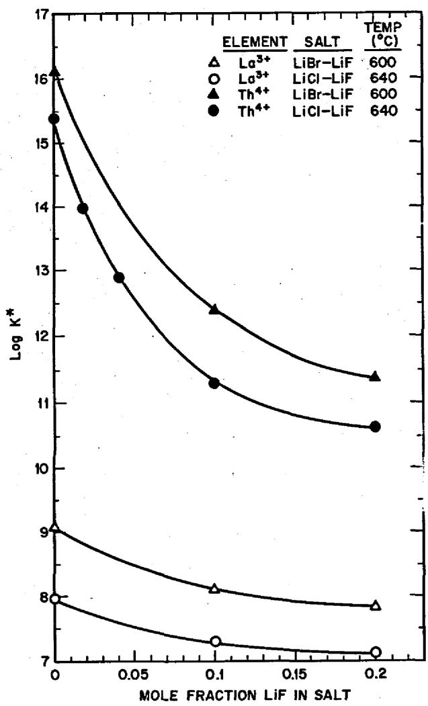  
Fig. 22.3. Values of $\log K^{*}$ Obtained for Lanthanum and Thorium Using LiBr-LiF and LiCl-LiF as the Salt Phase.

solutions at $600^{\circ}\mathbf{C}$ . The equilibrium data obtained can be expressed as

$$
\log D _ {\mathrm {L a}} = 3 \log X _ {\mathrm {L i}} + 7. 3 8 0
$$

and

$$
\log D _ {\mathrm {T h}} = 4 \log X _ {\mathrm {L i}} + 9. 5 6 8.
$$

When the bismuth phase was saturated with thorium, the lanthanum and thorium distribution coefficients were 0.07 and 0.014, respectively, corresponding to a separation factor of 5. This separation factor is about

twice as high as that obtained using $\mathrm{LiF - BeF_2 - ThF_4}$ (72-16-12 mole %) as the salt phase at $600^{\circ}C$ . However, this increase in separation factor would probably be offset by a loss of neutrons in the reactor due to the presence of NaF in the salt.

# 22.3 SOLUBILITY OF BISMUTH IN SINGLE-FLUID MSBR FUEL SALTS

L.M.Ferris J.F.Land

During the chemical processing of MSBR fuel by either the reductive extraction or the metal transfer process, the fuel salt will be contacted with liquid bismuth before it is returned to the reactor. Since nickel-base alloys are corroded by bismuth, the presence of bismuth in the salt could cause serious damage to a reactor vessel constructed of Hastelloy N. Therefore a means for ensuring that the fuel salt being returned to the reactor is free of bismuth must be devised. We have attempted to measure the solubility of bismuth in $\mathrm{LiF - BeF_2 - ThF_4}$ (72-16-12 mole %) as a preliminary step in the development of such a method.

About $125\mathrm{g}$ of salt and $5\mathrm{g}$ of bismuth were heated to $700^{\circ}\mathbf{C}$ in a mild steel container under an atmosphere of purified argon. Filtered samples of the salt were taken periodically and were analyzed for bismuth by both a polarographic and a spectroscopic method. After 75 days at $700^{\circ}\mathbf{C}$ , the system was cooled to $600^{\circ}\mathbf{C}$ where it was held for an additional 35 days. Although the analytical data obtained in this experiment are erratic and inconsistent (Table 22.2), it is obvious that the solubility of bismuth in the salt was low $(< 5\mathrm{ppm})$ under the conditions used. The cause of the disparity between the two analytical methods is not known and must be found before meaningful data can be obtained.

# 22.4 STUDIES INVOLVING $\mathbf{BiF}_3$

C.E.Schilling J.F.Land

Bismuth trifluoride is expected to be produced at the anode in the electrolytic cells required for the reductive extraction process. Therefore, information on the solubility of $\mathrm{BiF}_3$ in molten fluoride salts and on the corrosiveness of salts containing $\mathrm{BiF}_3$ is desirable. In preliminary experiments we have found that $\mathrm{BiF}_3$ is soluble to the extent of at least 4 mole % both in LiF-BeF $_2$ (66-34 mole %) and in LiF-BeF $_2$ -ThF $_4$ (72-16-12 mole %) at $600^{\circ}\mathrm{C}$ . Graphite was the only

Table 22.2. Analytical Results Obtained in Experiment to Determine the Solubility of Bismuth in LiF-BeF $_2$ -ThF $_4$ (72-16-12 Mole %)   

<table><tr><td rowspan="2">Temperature (°C)</td><td rowspan="2">Time at Temperature (days)</td><td rowspan="2">Sample</td><td colspan="2">Bismuth Analysis of Salt (ppm)</td></tr><tr><td>Polarographic Method</td><td>Spectrographic Method</td></tr><tr><td rowspan="10">700</td><td rowspan="2">8</td><td>1</td><td>10</td><td>9.2</td></tr><tr><td>2</td><td></td><td>4.3</td></tr><tr><td rowspan="2">15</td><td>3</td><td>4.5</td><td>0.6</td></tr><tr><td>4</td><td></td><td>0.55</td></tr><tr><td rowspan="2">40</td><td>5</td><td>5.0</td><td></td></tr><tr><td>6</td><td></td><td>0.5</td></tr><tr><td rowspan="2">56</td><td>7</td><td>2.0</td><td>2.8</td></tr><tr><td>8</td><td>2.0</td><td>2.0</td></tr><tr><td rowspan="2">75</td><td>9</td><td>&lt;1</td><td>1.9</td></tr><tr><td>10</td><td>1.5</td><td>1.5</td></tr><tr><td rowspan="4">600</td><td rowspan="2">14</td><td>11</td><td>1.5</td><td>2.9</td></tr><tr><td>12</td><td>7.0</td><td>4.4</td></tr><tr><td rowspan="2">35</td><td>13</td><td>0.2</td><td></td></tr><tr><td>14</td><td>0.56</td><td></td></tr></table>

material tested that was not rapidly attacked by the $\mathbf{BiF}_3$ dissolved in the salt solution.

The $\mathrm{BiF}_3$ used in these experiments was prepared from commercial $\mathrm{BiF}_3$ , which had the approximate composition $\mathrm{BiF}_3$ -BiOF (62-38 mole $\%$ ). Treatment of this material with gaseous HF, initially for about 18 hr at $150^{\circ}\mathrm{C}$ and then for 5 to 6 hr at $500^{\circ}\mathrm{C}$ , resulted in a product that contained less than 3 mole $\%$ BiOF. The weight increase during the HF treatment was in good agreement with that calculated from the initial and final oxygen analyses of the material. Other chemical analyses showed that the F/Bi atom ratio increased from about 2.3 to 3.0 during hydrofluorination. The product had a melting point higher than $700^{\circ}\mathrm{C}$ and did not attack graphite. When the HF treatment was conducted in a platinum vessel, a small amount of metallic bismuth was formed and the platinum became very brittle. Embrittlement of platinum by $\mathrm{BiF}_3$ has been observed previously.[2]

Two experiments were conducted to obtain information on the solubility of $\mathbf{BiF}_3$ in molten fluoride salts and to assess the corrosiveness of melts containing dissolved $\mathbf{BiF}_3$ . In the first experiment, $\mathbf{BiF}_3$ and $\mathbf{LiF - BeF_2 - ThF_4}$ (72-16-12 mole %) were heated under argon in a graphite container to $600^{\circ}\mathrm{C}$ . A solution that was 20 mole % $\mathbf{BiF}_3$ would have been produced if all the trifluoride had dissolved. Attempts to obtain filtered samples of the liquid at $600^{\circ}\mathrm{C}$ were futile; the stainless steel samplers were so badly corroded in only

1- to 5-min exposures that they would not function. Metallic bismuth was one of the corrosion products. When a nickel thermowell was immersed into the system, the bottom was corroded away by reaction with $\mathbf{BiF}_3$ and/or by dissolution in liquid bismuth, and salt was ejected from the tube. The frozen salt had the apparent composition $\mathrm{LiF - BeF_2 - ThF_4 - BiF_3}$ (68.1-14.7-11.5-5.7 mole %) and did not appear to contain metallic bismuth. The $\mathrm{LiF / ThF_4}$ and $\mathrm{LiF / BeF_2}$ mole ratios were 5.9 and 4.6, which are about the same as those in $\mathrm{LiF - BeF_2 - ThF_4}$ (72-16-12 mole %). The graphite container showed no visible signs of attack and underwent no significant weight change.

In the second experiment, $\mathrm{LiF - BeF_2}$ (66-34 mole %) and enough $\mathrm{BiF_3}$ to produce a solution 5.2 mole % (24 wt %) in $\mathrm{BiF_3}$ were loaded into a graphite vessel and were heated to $605^{\circ}\mathrm{C}$ under argon. After about 28 hr a filtered sample of the liquid was taken; then the temperature of the system was varied between 497 and $600^{\circ}\mathrm{C}$ , with filtered samples being taken at selected temperatures in this range. Molybdenum samplers were used throughout this experiment. The system was exposed to molybdenum only during sampling (less than 10 min for each sample) and during temperature measurement (when a molybdenum thermowell was introduced). As shown in Table 22.3, after a slight initial decrease the bismuth content of the solution remained constant at about 20 wt % (equivalent to about 4.1 mole % $\mathrm{BiF_3}$ ) throughout the first part of the experiment, even when the temperature was lowered to $497^{\circ}\mathrm{C}$ . In this part of the experiment, it was noted that the amount of metallic bismuth in the samples, al

Table 22.3. Results of Experiment Made to Test the Solubility of $\mathsf{BiF}_3$ in LiF-BeF $_2$ (66-34 Mole %)   

<table><tr><td rowspan="2">Sample No.a</td><td rowspan="2">Temperature (°C)</td><td rowspan="2">Cumulative Time of Experiment (hr)</td><td rowspan="2">Time at Indicated Temperature (hr)</td><td colspan="2">Analyses of Samples (wt %)</td><td rowspan="2">Cumulative Time of Exposure to Molybdenum (min)</td></tr><tr><td>Bi</td><td>Mo</td></tr><tr><td>1</td><td>605</td><td>28.5</td><td>28.5</td><td>29.6</td><td></td><td>10</td></tr><tr><td>2</td><td>550</td><td>41.25</td><td>12.75</td><td>20.2</td><td></td><td>170</td></tr><tr><td>3</td><td>497</td><td>124.75</td><td>83.5</td><td>20.3</td><td></td><td>195</td></tr><tr><td>4</td><td>524</td><td>145.75</td><td>21.0</td><td>20.8</td><td></td><td>491</td></tr><tr><td>5</td><td>578</td><td>163.75</td><td>18.0</td><td>19.5</td><td></td><td>541</td></tr><tr><td>6</td><td>600</td><td>187.75</td><td>24.0</td><td>13.3</td><td>2.22</td><td>613</td></tr><tr><td></td><td>600</td><td>196.0b</td><td>8.25b</td><td></td><td></td><td>1108b</td></tr></table>

$a$ In chronological sequence.   
$b$ Thermowell was penetrated at this time, and experiment was terminated.

though small, increased with the number of samples taken, that is, as the time of exposure to molybdenum increased. After the fifth sample had been obtained, the system was heated to $600^{\circ}\mathrm{C}$ and held there for 24 hr (Table 22.3). During this time the bismuth concentration in the salt decreased to about $13\%$ ; the amount of molybdenum found in the salt $(2.2\%)$ was only about two-thirds of that expected for the reaction $\mathrm{BiF}_3 + \mathrm{Mo} \rightarrow \mathrm{MoF}_3 + \mathrm{Bi}$ . After the sixth sample had been taken, the molybdenum thermowell was immersed in the liquid, and the system was held at $600^{\circ}\mathrm{C}$ until the thermowell was penetrated (i.e., for about 8 hr), apparently by reaction with $\mathrm{BiF}_3$ .

The results of these preliminary studies lead to the following conclusions: (1) Oxygen that is present in $\mathbf{BiF}_3$ as BiOF or similar compounds can be removed by hydrofluorination. (2) The solubility of $\mathbf{BiF}_3$ in fluoride salts, particularly $\mathbf{LiF - BeF}_2\cdot \mathbf{ThF}_4$ (72-16-12 mole $\%$ ), appears to be high enough for efficient operation of the electrolytic cell required in the protactinium isolation portion of the reductive extraction process. (3) Graphite is the only material encountered that was not attacked rapidly by fluoride melts containing $\mathbf{BiF}_3$

# 23. Engineering Development of Process Operations

L. E. McNeese

# 23.1 REDUCTIVE EXTRACTION ENGINEERING STUDIES

B.A.Hannaford C.W.Kee L.E.McNeese

Reductive extraction studies with the low-carbon-steel flow-through system have been continued. The modifications to the system reported in the last semiannual report were effective in improving the flow control of both the bismuth and the salt streams. These consisted, in essence, of an expanded chamber in the line which conducted salt from the column and a bypass with a freeze valve which could pass the bismuth trapped by the chamber to the line which conducted the bismuth stream from the column. Measurement of

$^{1}$ MSR Program Semiann. Progr. Rept. Aug. 31, 1969, ORNL-4449.

pressure between two points in the chamber provides an indication of large quantities of bismuth draining through the chamber. By closing a freeze valve at the bottom of the chamber, it should also be possible to detect low bismuth entrainment rates.

Four runs were attempted during this period, no one of which was free from difficulty. Mass transfer of iron by the bismuth continued to be a major problem, despite the reduction in feed tank temperature to lower the concentration of dissolved iron in the bismuth feed. The transfer line in which most of the iron deposits have occurred is the bismuth drain line between the column and the bismuth sample - a line that is normally filled with bismuth. However, on one occasion iron deposits also completely restricted the salt line between the jackleg and the column; this line contained bismuth only during periods of cyclic salt and bismuth flow. Figure 23.1 shows a segment removed from this line following run 7. The restricted lines $(\frac{3}{8}$ in. in

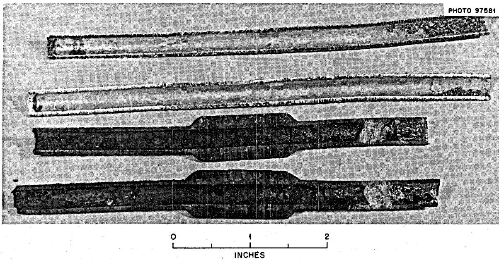  
Fig. 23.1. Section of Salt Transfer Line Between Salt Jackleg and Column Inlet, Plugged with Dendritic Iron. Darkening of lower specimen occurred during examination, when it was accidentally exposed to air while hot.

diameter) were replaced with $\frac{1}{2}$ -in.-diam tubing. Following run 7 we attempted to inhibit mass transfer of iron by adding sufficient Zircaloy-2 to the bismuth feed tank to give about 100 ppm of zirconium in the bismuth.

The results from run 5, which is the most successful run to date, are shown in Figs. 23.2 and 23.3. The run

was started with a bismuth flow of $90\mathrm{ml / min}$ ; the salt flow was started about $30\mathrm{min}$ later. The pressure at the bottom of the column, as measured in the salt jackleg, became steady about $5\mathrm{min}$ after the salt jackleg was filled and remained steady for about $12\mathrm{min}$ . Then there followed in succession: a gradual pressure rise, another $12\mathrm{-min}$ steady period, another pressure rise,

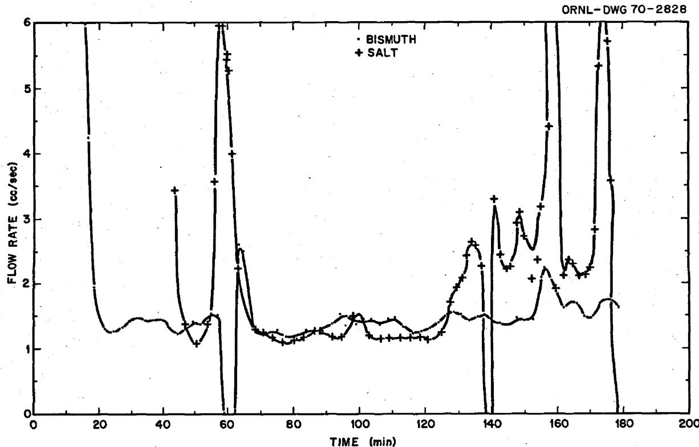  
Fig. 23.2, Flow Rate of Bismuth and Salt from Feed Tanks During Run 5.

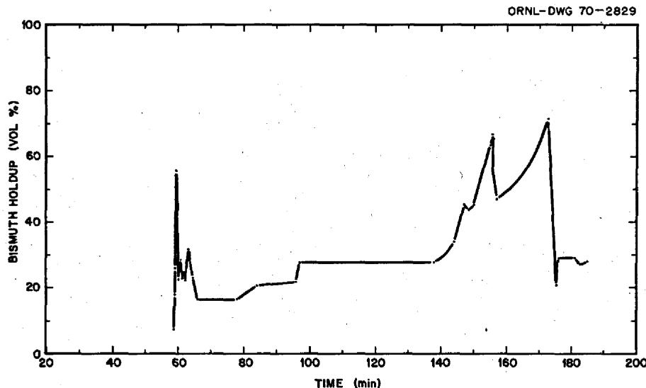  
Fig. 23.3. Bismuth Holdup During Run 5 Based on Pressure in Salt Jackleg.

Table 23.1. Apparent Bismuth Holdup at Several Bismuth and Salt Flow Rates During Run 5   

<table><tr><td>Steady Period</td><td>Bismuth Flow (ml/min)</td><td>Salt Flow (ml/min)</td><td>Bismuth Holdup (vol %)</td></tr><tr><td>1 (12 min)</td><td>75</td><td>75</td><td>16</td></tr><tr><td>2 (12 min)</td><td>81</td><td>75</td><td>21</td></tr><tr><td>3 (41 min)</td><td>87</td><td>75–150</td><td>28</td></tr></table>

and, finally, a 41-min steady period. Since the pressure at the bottom of the column is predominantly due to the static pressure of both phases, the apparent bismuth holdup can be calculated for each of these steady periods. The holdup values are shown in Table 23.1.

During the last steady period, the salt flow rate was doubled with no apparent accompanying change in column pressure. When the salt flow reached 150 ml/min (i.e., a bismuth flow rate of 87 ml/min),

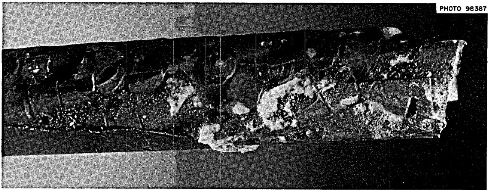

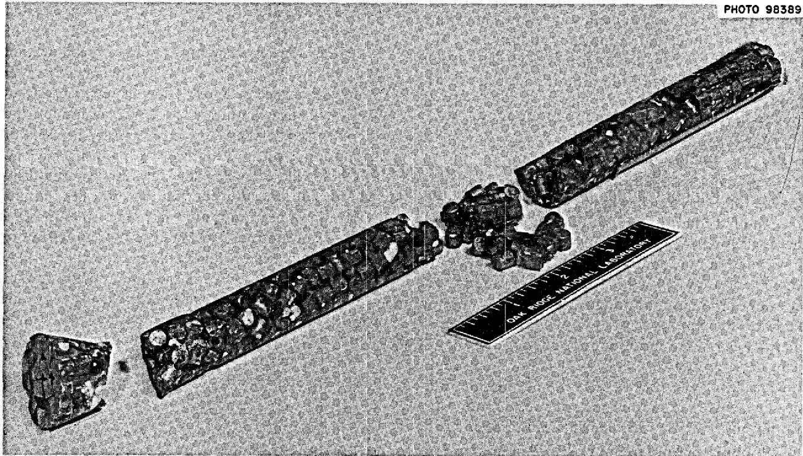  
Fig. 23.4. Section of 0.82-in.-ID Column Showing Dendritic Iron Deposit (Upper Photograph). The lower half of the column was potted in epoxy resin, and the steel pipe was stripped away.

flooding of the column caused oscillation in the salt flow rate. A short time later a metal chip caught in the valve that controls the level of the salt jackleg and caused even greater oscillation.

Run 6 was successful in that countercurrent flow was obtained in the column. The bismuth flow in the period of most nearly steady flow gradually increased from 155 to $175\mathrm{ml / min}$ and then fell steadily to about 120 ml/min over a 30-min period. During the same period the salt flow slowly increased from 65 to $80\mathrm{ml / min}$ . Also during this time the apparent bismuth holdup, as indicated by column pressure, increased from 70 to $82\%$ and then decreased to $70\%$ .

An iron deposit in the bismuth exit line during run 7 caused bismuth to overflow into the salt exit line. After the affected line had been replaced, the flow of bismuth and salt was still intermittent (run 8). Although the region in which operation was attempted was near flooding, much of the problem may have stemmed from iron deposits in the column. We decided to replace the column as a result of the observed decrease in flooding rate. Radiographs of the column made before and after run 8 showed a tight packing arrangement of the $\frac{1}{4}$ -in.-diam molybdenum cylinders but did not clearly show the presence of the dendritic iron deposits, which we found in the lower half of the column when it was sectioned for direct examination (Fig. 23.4). Air oxidation of the carbon steel column was severe, amounting to a loss of about 0.050 in. of wall thickness. The high-temperature aluminum paint applied initially appeared to have given little protection against oxidation; components and transfer lines that were replaced after the column was removed were painted with Markal CR, which the Metals and Ceramics Division had shown to be generally superior in cyclic tests.

A new column, packed with $\frac{1}{4}$ -in.-diam molybdenum Raschig rings, was installed in the system. The $84\%$ void fraction of the new column is much higher than that of the original column ( $\sim 40\%$ ) and should permit higher flow rates and minimize the effect of a moderate amount of iron precipitation. The bismuth-salt disengaging section at each end of the column was modified to improve separation of the phases; minor improvements were made in the design of the entrainment detector located in the salt overflow loop. X rays were made of the packed section, and pressure drop measurements across the column were made with flowing argon. These measurements will serve as a base line for future diagnostic tests of the column.

Orifice Calibration. - Bismuth and salt calibration runs were made with an orifice meter of the same design as that calibrated earlier² with mercury and water. The discharge coefficients for salt were 0.28, 0.34, 0.36, and 0.37, respectively, for flow rates of 130, 195, 245, and 295 ml/min. Further experiments with bismuth provided an average discharge coefficient of 0.73 (standard deviation = 0.07).

The off-gas connection from the orifice chamber now includes a mercury seal. In future experiments the additional off-gas pressure (above and below the orifice) will aid in forcing the fluids through the drain line and will prevent the orifice drain chamber from filling with liquid. This is expected to reduce the scatter in the data.

# 23.2 DESIGN OF A PROCESSING MATERIALS TEST STAND AND THE FIRST MOLYBDENUM REDUCTIVE EXTRACTION EQUIPMENT

E. L. Nicholson

W.F.Schaffer,Jr.

L. E. McNeese

E. L. Youngblood

Difficulties have occurred frequently in the engineering development program due to the use of carbon steel as the material of construction for the experimental equipment. The difficulties arise from three sources: (1) the low strength of carbon steel at elevated temperatures $(600^{\circ}\mathrm{C})$ and the additional loss of strength that may occur as a result of graphitization upon prolonged exposure at elevated temperatures, (2) the poor resistance to air oxidation on external surfaces at elevated temperatures, and (3) plugging of the experimental equipment by mass transfer deposits of iron. These problems were recognized when the equipment was being designed, and they are being partially circumvented so that experimental work can continue. It has always been evident that carbon steel is not a satisfactory material for extended use. The refractory metals molybdenum, tungsten, and tantalum show satisfactory resistance to salt and bismuth, but the cost and fabrication problems are too formidable to permit their use for the first experimental systems. Molybdenum appears to be the best refractory metal for reprocessing applications, and tubing, plate, and billet stock are commercially available in a limited range of

sizes. Recent3 and continuing development work (see Part 5, Materials Development) by the Metals and Ceramics Division indicates that it is feasible to fabricate small-scale equipment from molybdenum.

We have prepared a preliminary design and cost estimate and have received approval for a reprocessing materials test stand and the first molybdenum moltensalt reprocessing equipment system to be operated in the test stand. The first test will demonstrate the fabrication of a complex refractory metal system, test the suitability of molybdenum as a material of construction for reprocessing equipment, and provide engineering data on packed-column performance with the bismuth-salt system.

The test stand will be placed in a beryllium containment area in Building 4505. Its associated equipment will include instrumentation, high-purity gas supply systems, a fill-and-dump vessel for the salt and bismuth used in the test equipment, and the test stand containment vessel. The containment vessel will be about 20 in. in diameter by 14 ft high and will be heated and filled with an inert gas to protect the molybdenum equipment during high-temperature operation.

The first equipment to be installed in the test stand will be a simple reductive extraction system consisting of a 1-in.-diam by 5-ft-high packed column with $3^{1/2}$ -in.-diam upper and lower disengaging sections. Salt and bismuth will be circulated countercurrently through the column by gas-lift pumps, which will pump the streams to elevated $3^{1/2}$ -in.-diam head pots for gas separation, flow measurement, and gravity flow back through the column. Special instrumentation will include an interface detector for the lower disengagement section of the column and a device for measuring pressure drop across the packed column. Samplers are provided for each stream, and reducing agents (e.g., thorium metal) or oxidants (e.g., hydrogen fluoride) can be added to the system to study their effects on column performance. The molybdenum equipment will be suspended by hangers from the top flange of the test-stand containment vessel so that the loop can be lifted out for repair or for modifications that would allow other materials, instrumentation, or flow systems to be demonstrated.

We have begun to prepare a full-size layout of the test stand and the molybdenum equipment to pinpoint the problems of clearances and orientation of vessel nozzles and lines. This will enable Metals and Ceramics Division personnel to recommend forming and joining tech

niques for each vessel and line. We will then prepare the final design of the system, which will be fabricated and assembled in the test stand under the supervision of the Metals and Ceramics Division.

We have nearly completed the detailed design drawings for the head pots. After they have been reviewed, we will verify performance by constructing and testing a plastic model. The design incorporates a mechanical assembly method for the internal baffles, process and instrumentation lines, and an orifice assembly for flow measurement that minimizes the need for welding. Only one circumferential weld will be required to join the two halves of the vessel that are produced by a back-extrusion forging operation. The spacing and the size of the nozzle bosses, which constitute an integral part of the head forgings, are such that the bosses can be machined to permit attachment of the process and instrument lines by welding, brazing, or by mechanical fittings. Final choice of the attachment method will be specified by Metals and Ceramics Division personnel.

Mechanical fittings may simplify field assembly procedures and facilitate the repair of damaged components or the addition of new components to the loop in the future. The Gamah Division of Stanley Aviation Corporation is investigating the problem of couplings for molybdenum equipment at no cost to us. They produce a patented high-pressure metal seal ring coupling for aerospace use in which the sealing is accomplished by deformation of a flat annular-disk seal ring. The seal ring can be reused, and only a very low torque is required to assemble the connector. They have developed a swaging process for attaching the connector to pipe or tubing. This process eliminates the need for welding molybdenum and would produce a strong leak-tight joint as opposed to a welded joint that is highly fragile and brittle or a brazed joint with reduced corrosion resistance. We are examining a sample swaged joint (prepared by the Gamah Division) consisting of $\frac{3}{8}$ -in. molybdenum tubing swaged into a simulated $\frac{1}{2}$ -in.-diam connector hub. No flaws have been detectable by radiography or dye-checking procedures, and the joint is leak-tight to the limit of sensitivity of our helium leak-detector equipment ( $5.9 \times 10^{-9}$ cc/sec per scale division). Metallurgical examination of the joint is under way. Gamah Division personnel have also provided us with a $\frac{3}{8}$ -in. tubing test assembly consisting of an all-molybdenum connector with 4-in. lengths of molybdenum tubing swaged into the connector. They report no leakage of the molybdenum joint with 400-psi helium at room temperature or after exposure at $1300^{\circ}\mathrm{F}$ for 7 hr. The joint is now being evaluated by Metals and Ceramics Division personnel.

Various small items have been fabricated from molybdenum for use in MSBR reprocessing development work. The experience has been valuable, although sometimes frustrating. We wanted to build an electromagnetic helical induction pump of molybdenum for circulating bismuth. Such a pump is not available commercially, and the refractory metal flow element would have to be fabricated by ORNL in any case. In a preliminary test of the fabrication method for the helical flow element, $3/8$ -in.-OD molybdenum tubing was wound at 450 to $500^{\circ}\mathrm{F}$ on a heated mandrel to give a $2^{3}/4$ -in.-OD, eight-turn coil of satisfactory quality. Because an actual pump cell would require a coil having many more turns than this, two commercially available lengths of tubing were welded together. All attempts to hot-bend the coil failed due to a break in the tubing in the brittle heat-affected zone of the weld. The continuous electrolytic cell testing system is arranged so that the exit streams from the electrolytic cell flow into 2-in.-diam sampling cups before going to the mixer-settler +ank. Both the sampling cups and the exit tubing are made of molybdenum. The first two sampling cups cracked during the welding assembly operation. Some weld joint designs were modified, and the sequence of assembly was altered. Three satisfactory units and one additional unit with a minor defect resulted from a total of six attempts. We also learned that repairs to a defective weld have a high probability of causing complete failure of the structure by cracking.

# 23.3 BISMUTH-SALT INTERFACE DETECTOR

J.Roth L.E.McNeese

A bismuth-salt interface detector is required for control of the interface location in salt-metal extraction columns. The possibility of using an eddy-current detector is being explored, and equipment has been fabricated for testing this type of detector. Detectors having two configurations are to be developed; these consist of (1) a configuration in which the working fluid (salt or bismuth) is located inside the detector coil and (2) a configuration in which the working fluid is located outside the detector coil. In each case the detector consists of a primary winding (through which an alternating current is passed) and a secondary winding (in which a current is induced). The induced current is dependent on the conductivities of the

materials adjacent to the primary and secondary coils; since the conductivities of salt and bismuth are quite different, the induced current reflects the presence or absence of bismuth.

The principal problem associated with this type of detector results from the low permeabilities of materials that can be used with bismuth (e.g., molybdenum or low-carbon steel), since these materials will separate the coils from the bismuth and salt. We are attempting to use a duplex detector tube consisting of a thin-walled molybdenum tube (wall thickness of 20 mils or less) and a type 316 stainless steel tube. Since type 316 stainless steel has a relatively high permeability, the effective permeability of the resulting tube should be satisfactory. The electronics system for testing the two detector configurations has been assembled, and the detector coil for the first configuration has been fabricated.

The detector coil for the first configuration, shown in Fig. 23.5, consists of a bifilar winding of 30-gage platinum wire wound into grooves that have been machined into the surface of a $15/16$ -in.-OD, $9/16$ -in.-ID tubular Lavite form. The machined grooves are 0.015 in. wide and 0.015 in. deep, with a round bottom, and are separated by 0.035 in. of Lavite. The winding, which is 12 in. long, contains ten turns of each coil per inch. An end collar $17/16$ in. in diameter and 1 in. long is located at the end of each coil. The connecting leads consist of a twisted pair of wires in order to ensure minimal connecting lead inductance. The entire assembly is coated with a ceramic glaze to reduce the probability of external shorting of the coils.

The power input to the primary coil is supplied by a Wavetak function generator, model 110, and is approximately $35\mathrm{kHz}$ at an output of about $15\mathrm{v}$ . The output of the secondary coil will be amplified to about $5\mathrm{v}$ , rectified, and filtered. The differential voltage (about $1.5\mathrm{mvdc}$ ) will be recorded.

Preliminary tests of the detector system at room temperature and at $600^{\circ}\mathrm{C}$ (nominal operating temperature) have been made, and required system modifications have been completed. The equipment has been installed, with provision for positioning an argon-bismuth interface at known points within the duplex tube (molybdenum inside 316 stainless steel) around which the detector is located.

Equipment for containing and purifying the molten bismuth, controlling system temperatures and pressure, and supplying argon and hydrogen to the system is also provided.

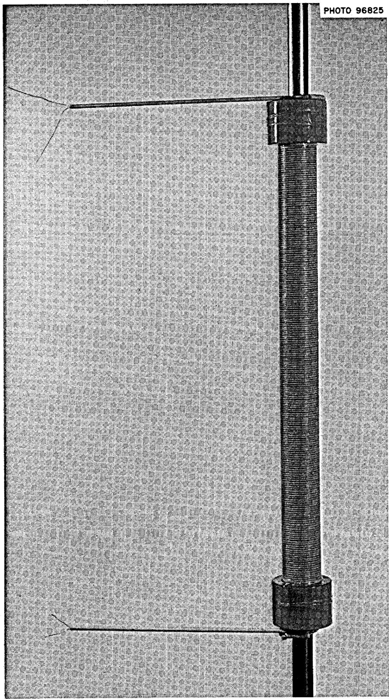  
Fig. 23.5. Detector Coil for Bismuth-Salt Interface Detector, Consisting of a Bifilar Winding of 30-Gage Platinum Wire.

# 23.4 CONTACTOR DEVELOPMENT: PRESSURE DROP, HOLDUP, AND FLOODING IN PACKED COLUMN

J.S.Watson L.E.McNeese

A study of pressure drop, holdup, and flooding rates in a 2-in.-ID packed column was made by a group of MIT Practice School students. Mercury and water were used to simulate bismuth and molten salt. We have previously reported similar measurements with several packing materials in a 1-in.-ID column which showed that the metal dispersion, and thus the interfacial area, is greatly enhanced by using larger packing sizes $(\frac{1}{4}$ in.

or possibly greater). In order to study larger packing materials, a larger column and a larger metal pump were installed. The MIT students obtained the first data with this new equipment.

Two different packing materials were studied: $\frac{1}{4}$ -in. solid cylindrical packing (which had previously been tested in the 1-in. column) and $\frac{3}{8}$ -in. Raschig rings. The $\frac{1}{4}$ -in. packing was tested in order that data from the

$^{1}$ A. J. Fredriksen, J. J. Protulipac, and S. C. Trindade, Hydrodynamics of a Mercury-Water Packed Column, MIT-CEPS-X-88 (Oct. 17, 1969).   
$^{2}$ J. S. Watson and L. E. McNeese, Unit Operations Sect. Quart. Progr. Rept. July-September 1968, ORNL-4366.

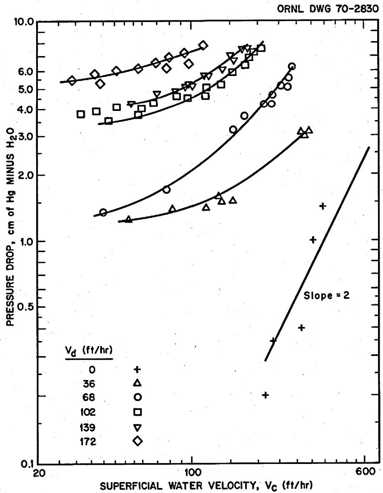  
Fig. 23.6. Pressure Drop vs Superficial Water Velocity in a 2-in. Column Packed with $\frac{3}{8}$ -in. Raschig Rings.

1-in. and 2-in. columns could be compared. The agreement between the two sets of data is excellent. Most of the minor differences can be attributed to the small difference in the void fractions of the two columns. Because of wall effects, $\frac{1}{4}$ -in. material packs more densely (i.e., has a lower void fraction) in 2-in. than in 1-in. columns.

The results for $\frac{3}{8}$ -in. Raschig rings are shown in Figs. 23.6-23.8. The pressure drop and holdup curves are similar to those observed earlier with $\frac{1}{4}$ -in. packing. The flooding curve shown in Fig. 23.8 is surprisingly close to that observed previously with $\frac{1}{4}$ -in. Raschig rings. It appears that the flooding data for $\frac{1}{4}$ -in. solid packing and for $\frac{1}{4}$ - and $\frac{3}{8}$ -in. Raschig rings can be represented by a single curve if the superficial velocities are divided by the void fraction, as shown in Fig. 23.8

and as indicated in Eq. (1). The resulting curve is linear and has a slope of approximately $-1$ when the square roots of the phase velocities are plotted against each other. These conditions correspond to a constant slip velocity at flooding. Thus the flooding conditions for these three packing materials, using mercury and water, can be approximated by a single equation,

$$
V _ {c} ^ {1 / 2} + V _ {d} ^ {1 / 2} = 3 1 \epsilon^ {1 / 2}, \tag {1}
$$

where $V_{c}$ and $V_{d}$ are the continuous- and dispersedphase superficial velocities, respectively, expressed in feet per hour, and $\epsilon$ is the void fraction. This expression indicates that the flooding rate does not depend upon the packing size; however, it is believed that the

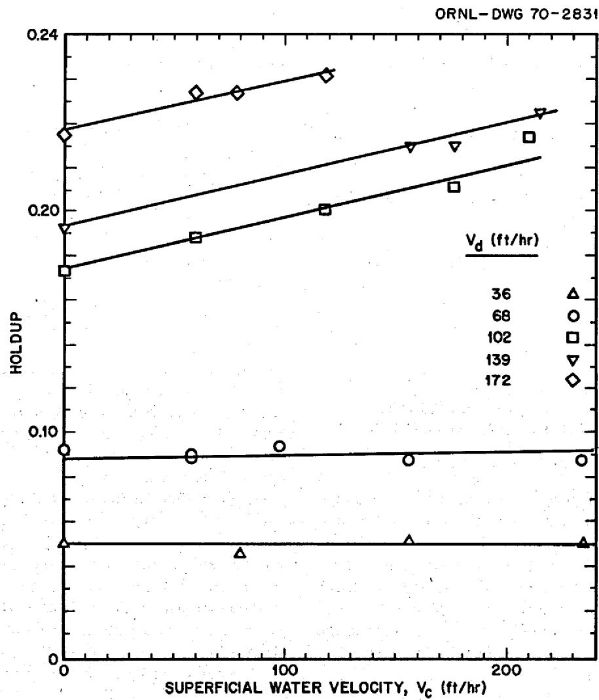  
Fig. 23.7. Holdup vs Superficial Water Velocity in a 2-in. Column Packed with $\frac{3}{8}$ -in. Raschig Rings.

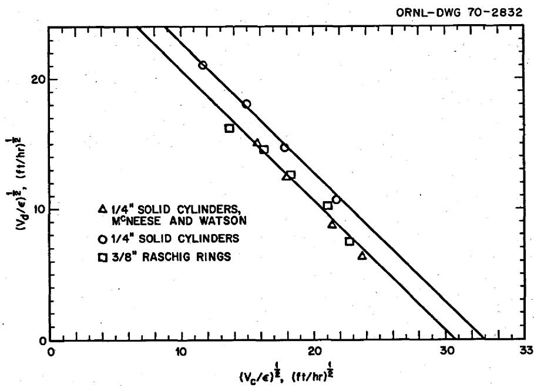  
Fig. 23.8. Flooding Lines for $\frac{1}{4}$ -in. Solid Cylinders and $\frac{3}{8}$ -in. Raschig Rings.

flooding rate will increase with packing sizes larger than $3/8$ in.

The model that had been proposed to relate pressure drop, holdup, and flooding rates from the 1-in.-column data predicted flooding rates reasonably well for the $\frac{1}{4}$ -in. packing. There appears to be some difference between the slopes of the estimated and measured flooding curves, but the estimated curve is still reasonably close to the data. With the $\frac{3}{8}$ -in. packing, however, the predicted flooding curve was significantly higher than the experimental curve.

# 23.5 CONTACTOR DEVELOPMENT: AXIAL MIXING IN PACKED COLUMN

J.S.Watson L.E.McNeese

We previously reported calculations1 of predicted reductive extraction column performance which indicated that prohibitively long columns would be required because of the axial backmixing in systems requiring high volumetric flow ratios (metal to salt). A rare-earth removal system that exploits the small distribution coefficient of the rare earths between the fuel carrier salt and a reducing bismuth phase is a system of this type.

We are studying column modifications which will decrease the effect of axial mixing and thus improve column performance. The proposed modifications involve placing devices at several points along the column to reduce or prevent axial mixing across the column at these points. If the devices are separated by a distance equivalent to one theoretical extraction stage when no backmixing occurs between the stages, the efficiency of the column (height of the column with perfect devices divided by the height of the column with imperfect devices) in the rare-earth system when the flow ratio is 100:1 would be greater than $75\%$ if less than $15\%$ of the salt flowing through a particular segment is recycled or backmixed to the segment below. These conditions do not appear difficult to achieve and will result in satisfactory column heights (probably less than 3 ft/stage).

The type of device under investigation is illustrated in Fig. 23.9. The metal flows down the annular section of the upper piece into what is effectively an inverted bubble cap. As the metal flows over the weir in the lower piece, it forms a seal that forces the salt to pass upward through a sieve plate in the center of the column. The sieve plate is a restriction which can be designed in such a manner that the salt velocity through the openings will be reasonably high when a low salt flow rate is employed. Thus one would expect relatively little back-diffusion of salt through the openings in the sieve plate.

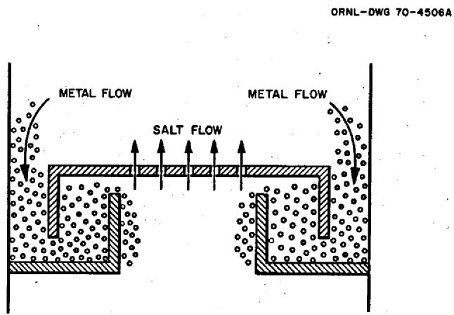  
Fig. 23.9. Schematic Diagram of an Axial Mixing Preventer.

We have tested two designs of "backflow preventers" to date, using mercury and water to simulate bismuth and molten salt. The column was packed with $\frac{3}{8}$ -in-diam Raschig rings, and at least one backflow preventer was inserted near the middle of the column. The countercurrent flow of mercury and water was established, and a tracer solution (cupric nitrate) was injected near the top of the column at a constant rate. The solution in the column was analyzed for the tracer at several points down the column on both sides of the backflow preventers. If the logarithm of the tracer concentration is plotted as a function of distance down the column, a discontinuity is observed at the preventer location, as illustrated in Fig. 23.10. The ratio of the concentrations at the discontinuity is then a measure of the fraction of solution back-diffusing through the preventer.

The fraction or percentage of backflow through a preventer appears to be principally a function of the water velocity through the sieve opening and of the diameter of the sieve openings. No dependence of backmixing on mercury rate was evident; however, the relatively few changes in mercury rate and the usual data scatter make this conclusion tentative. It is expected that a significant dependence on metal flow rate would be observed if the metal flow rate were increased to the point that complete coalescence was not obtained in the metal downcomer.

Data obtained with the backflow preventers are presented in Fig. 23.11. Although there is considerable scatter in the data through which the lines were drawn, the lines are believed to be representative. The first back flow preventer contained a $\frac{1}{2}$ -in.-deep bubble cap and a $\frac{1}{8}$ -in.-thick sieve plate containing four $\frac{3}{3}_2$ -in.-

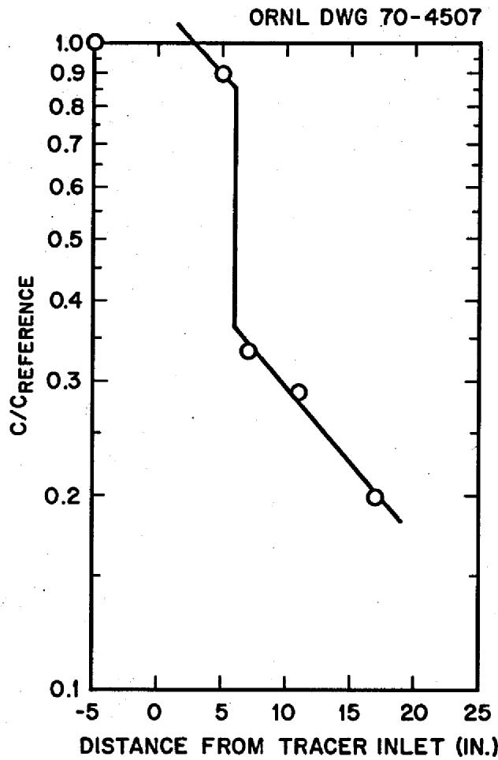  
Fig. 23.10. Concentration Profile Using a Backflow Preventer with a Single $\frac{3}{8}$ -in. Sleeve Opening. Mercury flow rate, 400 ml/min; water flow rate, 115 ml/min.

diam holes. One can see that the extent of backmixing decreases as the water flow rate increases and that backmixing of less than $15\%$ can be expected (water flow rate greater than $90~\mathrm{ml / min}$ or $22~\mathrm{ml / min}$ per hole). The openings were then drilled out to a diameter of $\frac{1}{4}$ in., and the top curve shown in Fig. 23.11 was obtained. Again one can see the decrease in backmixing as the water flow rate increases. Backmixing did not reach an acceptably low level in any of these experiments; however, an extrapolation of the curve predicts that backmixing would become less than $15\%$ at water rates between 150 and $200~\mathrm{ml / min}$ (approximately 50 ml/min per hole). A second preventer, which had a 2-in.-deep bubble cap and only a single $\frac{1}{16}$ -in.-diam opening in the orifice, was tested; however, no backmixing could be detected at the lowest measurable water rate $(23.5~\mathrm{ml / min})$ . The diameter of the opening was increased to $\frac{1}{8}$ in., but again no backmixing was

detected. When the diameter of the opening was increased to $\frac{1}{4}$ in., the results shown in Fig. 23.11 were obtained. For this preventer, backmixing was less than $15\%$ when the water flow rate was greater than 50 ml/min. (This value agrees with the results estimated by extrapolating results from the preventer with four $\frac{1}{4}$ -in. holes.) The diameter of the sieve opening was then further increased to $\frac{3}{8}$ in., and the results shown in Fig. 23.11 were obtained. Backmixing was increased considerably by this change in diameter; however, at

sufficiently high water flow rates, backmixing can be reduced to any desired percentage.

The only undesirable feature of these backmixing preventers (other than their complexity relative to simple packed columns) is their reduction of the column capacity or flooding rate. The devices just discussed were operated at metal flow rates as high as 94 ft/hr (column superficial velocity), which is approximately $15\%$ of the flooding rate for a column packed with $3\%$ -in. Raschig rings. At the lower metal rates an

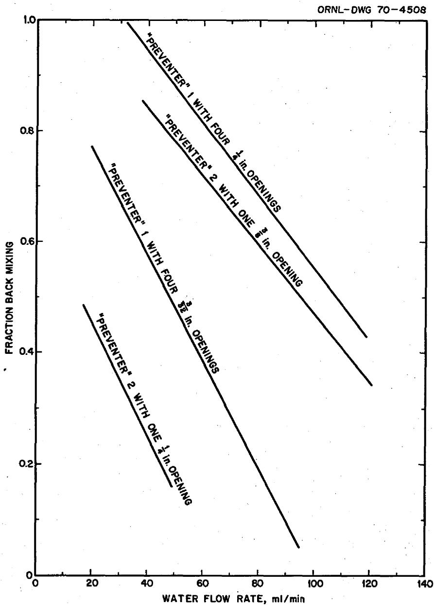  
Fig. 23.11. Summary of Backflow Preventer Results.

accumulation of uncoalesced and coalesced mercury was noted above the backflow preventer, but as the metal throughput was increased, it appeared that back-transfer of water through the preventer occurred. It is expected that the design can be improved in order to allow higher metal flow rates.

These experiments have demonstrated that devices can be designed to reduce backmixing to an acceptable level. Although the acceptable level has been defined to be about $15\%$ , one could achieve even lower values if desired. The principal design parameters are the diameter of the sieve opening and the salt flow rate per hole. Although openings $\frac{3}{8}$ in, in diameter or greater could be used, the required water or salt velocity increases very sharply as the hole size increases. At present, $\frac{1}{4}$ -in.-diam openings appear to be a good choice and will be effective with a flow rate as low as $50\mathrm{ml / min}$ per hole. The devices are relatively simple; however, the column capacity is decreased. A greater column capacity may be achieved with larger-diameter columns in cases where larger bubble caps can be employed.

Estimation of Axial Backmixing in Both Phases in Countercurrent Contactors. - We previously presented1 an approximate equation that predicts the effects of axial backmixing in one phase on the performance of a countercurrent contactor. This equation was useful in estimating the column heights required in the protac-tinium and rare-earth removal system. A similar empirical equation has been developed to predict column performance when backmixing occurs in both phases. The proposed equation is:

$$
\begin{array}{l} \eta \approx 1 - \frac {1}{N _ {\mathrm {P e x}} + 1 - F + 1 / \mathrm {N T U}} \\ - \frac {F}{N _ {\mathrm {P e} y} - 1 + F + 1 / \mathrm {N T U}}, \\ \end{array}
$$

where

$\eta =$ the length of the column without back-mixing divided by the length of the column with backmixing,

$$
N _ {\mathrm {P e x}} = \text {P e c l e t n u m b e r i n p h a s e} x = U _ {x} (\mathrm {H T U} _ {p}) / E _ {x},
$$

$$
N _ {\mathrm {P e} y} = \text {P e c l e t n u m b e r i n p h a s e} y = U _ {y} (\mathrm {H T U} _ {p}) / E _ {y},
$$

$\mathbf{HTU}_p =$ height of a transfer unit with phase flow,

$$
\begin{array}{l} U _ {x} = \text {s u p e r f i c i a l v e l o c i t y o f t h e r e f e r e n c e p h a s e}, \\ E = \text {a x i a l} \\ F = \text {e x t r a c t i o n f a c t o r} = m U _ {x} / U _ {y}, \\ \end{array}
$$

$m =$ distribution coefficient,

NTU = number of transfer units required to achieve a given separation if the phases are in plug flow.

This equation predicts efficiencies to within approximately 0.07 (i.e., the difference between the estimated and the calculated efficiency will be less than 0.07) when

$$
\begin{array}{l} \mathrm {N T U} \geqslant 2, \\ \eta \geqslant 0. 2, \\ N _ {\mathrm {P e x}} \geqslant F - \frac {1}{\mathrm {N T U}}, \\ \end{array}
$$

and

$$
N _ {\mathrm {P e} y} \geqslant 1. 5.
$$

# 23.6 AXIAL MIXING IN OPEN COLUMNNS

L.E.McNeese J.S.Watson

A study of axial mixing in a 2-in.-diam open column during the counter-current flow of air and glycerol or butanol solutions was completed by A. M. Sheikh and J. D. Dearth, of the MIT Practice School. Axial mixing is important in the design of tubular reactors such as continuous fluorinators. Bautista and McNeese previously reported results obtained in studies of axial mixing in the same 2-in.-diam equipment using air and water. The experimental technique involved photometric measurement of the steady-state concentration profile, in the column, of a tracer (cupric nitrate) that was fed continuously to the bottom of the column. The present study was undertaken to obtain data on the effects of two physical properties, continuous-phase viscosity and surface tension, on the axial dispersion coefficient.

Molten salts of interest have a viscosity of about 30 centipoises; water (used in previous studies) has a viscosity of approximately 1 centipoise; and the viscosity of the glycerol solution used in this study is 15 centipoises. The surface tension of molten salts of interest is 100 to 200 dynes/cm, while that of the

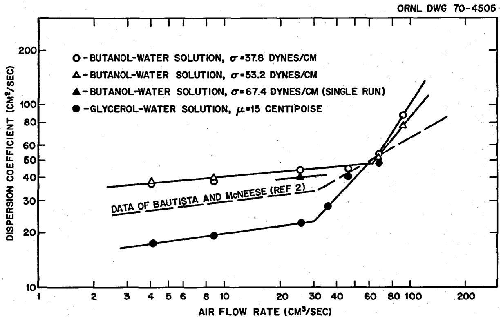  
Fig. 23.12. Effect of Gas Flow Rate, Liquid-Phase Viscosity, and Surface Tension on Axial Dispersion Coefficient.

butanol solutions varied between 37.8 dynes/cm and the value for water (72 dynes/cm).

The results of the study are summarized in Fig. 23.12, which shows the dispersion coefficient as a function of the air flow rate. The dashed line represents the earlier results of Bautista and McNeese, who found that the data fall into two regions. The first region, which covers low air flow rates, corresponds to conditions when individual bubbles formed at the orifice travel up the column without coalescence. The second region, which occurs at air flow rates above $30\mathrm{cm}^3/\mathrm{sec}$ , corresponds to "slugging" flow.

Increasing the liquid viscosity to 15 centipoises (by adding glycerol) decreased the dispersion coefficient in the "bubble" (lower) region; however, the transition point between the regions was not changed. The coefficient increased more rapidly with air flow rate in the slugging region, at least up to the curve by Bautista and McNeese.

Decreasing the surface tension increased the dispersion coefficient in the bubble region, although there is little difference between the data obtained from a solution having a surface tension of 37.8 dynes/cm and those obtained from a solution having a surface tension

of 53.2 dynes/cm. The transition point occurred at a higher air flow rate, and the bubble region curve intersected the slugging region curve of Bautista and McNeese. The dependence of the dispersion coefficient on air flow rate appears to be somewhat greater than that observed with air and water, but insufficient data are available to reach a definite conclusion on this point.

This study was especially useful since it represented the first systematic attempt to vary physical properties in a bubble column. The data obtained indicate that higher viscosity and higher surface tension lead to lower dispersion coefficients, which is in the favorable direction for molten-salt systems. However, the variation of physical properties did not cover a wide range of conditions; also, when liquid mixtures are used, there is always a possibility that one component will concentrate at the interface and result in properties in this region which do not correspond to conditions in the bulk liquid. Additional studies in the future may include evaluations of the effects of changing the column and orifice diameters as well as of changing the physical properties of the continuous phase.

# 23.7 DEMONSTRATION OF THE METAL TRANSFER PROCESS FOR REMOVING RARE EARTHSH

E. L. Youngblood W. F. Schaffer, Jr.

L.E.McNeese E.L.Nicholson

J.R.Hightower, Jr.

Equipment has been fabricated for the demonstration and study of the metal transfer process for removing rare earths from single-fluid MSBR fuel salt. The first series of experiments will be made in a carbon steel vessel 24 in. high by 6 in. in diameter, shown in Fig. 23.13. An internal partition divides the vessel into two equal-volume compartments, but terminates $\frac{1}{2}$ in. above the bottom to allow communication at this level. A bismuth phase saturated with thorium will fill the first 2 in. of the vessel, and above it, in their respective compartments, are a fluoride salt phase (72-16-12 mole % LiF-BeF $_2$ -ThF $_4$ ) and an LiCl phase, each having a depth of about 3 to 4 in. The fluoride salt will initially contain about 0.3 mole % LaF $_3$ . The compartment which contains the LiCl accommodates a double-walled cup, approximately 1.5 in. in diameter and 9 in. high, made of carbon steel. The inner wall of the cup is electrically insulated from the remainder of the vessel by quartz spacers. During the experiment the cup will contain about 200 cc of 0.4 mole fraction lithium metal in bismuth. Molten LiCl will be circulated through the cup containing the lithium-bismuth alloy by a pump

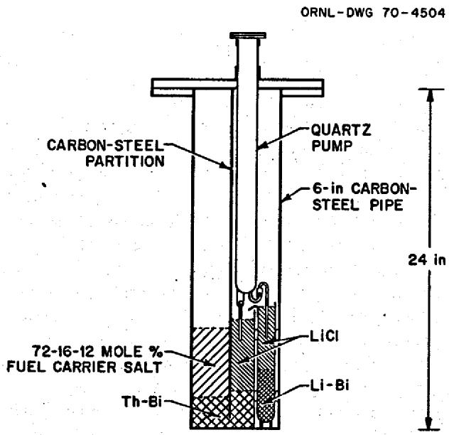  
Fig. 23.13. Carbon Steel Vessel for Use in the Metal Transfer Experiment.

operated with argon pressure. Provision has been made for sampling all phases and for mixing the metal phases.

To begin the experiment, the three phases in contact (fuel salt, bismuth, and LiCl) will be allowed to come to equilibrium, and samples will be taken. The LiCl will then be pumped through the reservoir containing the bismuth-lithium solution at a rate of about $25\mathrm{cm}^3/\mathrm{min}$ in order to remove $\mathrm{LaCl}_3$ from the LiCl. The stripped LiCl will overflow the reservoir cup and return to the initial LiCl volume. After a period of about 3 hr, the circulation of LiCl will be stopped, and the system will be allowed to come to equilibrium. Then samples will again be taken. It is estimated that about $20\%$ of the lanthanum initially present will have been transferred to the bismuth-lithium strip solution at this point. The experiment will be continued until the desired fraction of the lanthanum (50 to $90\%$ ) has been transferred to the strip solution.

A quartz pump with sapphire check valves is being tested for circulating molten LiCl at $650^{\circ}\mathrm{C}$ . The pump was operated successfully for a few hours, but we have had difficulties with short circuits in the electrical probes that control the pump and with gradual deterioration of the quartz in contact with LiCl. The deterioration of the quartz is thought to be due to reaction products that are formed by moisture in the LiCl; this moisture cannot be removed by heating. Another test of the pump will be made using LiCl that has been previously contacted with a thorium-bismuth alloy to remove impurities. The pump and its control system are being modified to eliminate the short circuits.

# 23.8 FROZEN-WALL FLUORINATOR DEVELOPMENT

J.R.Hightower,Jr. L.E.McNeese

The fluorination of molten salt to remove uranium is required at several points in processes being considered for the isolation of protactinium and for the removal of rare earths. The fluorinators will be protected from corrosion by freezing a layer of salt on the metal surfaces that potentially contact both $\mathbf{F}_2$ and molten salt. Although the separate aspects of such an operation (namely, continuous or batch fluorination and frozen-film formation) have been shown experimentally to be feasible, the testing of a fluorinator protected against corrosion by frozen salt has been hampered by the lack of a corrosion-resistant source for generating heat in the molten salt. The heat will be provided in a reactor fuel processing plant by the decay of fission products in the salt.

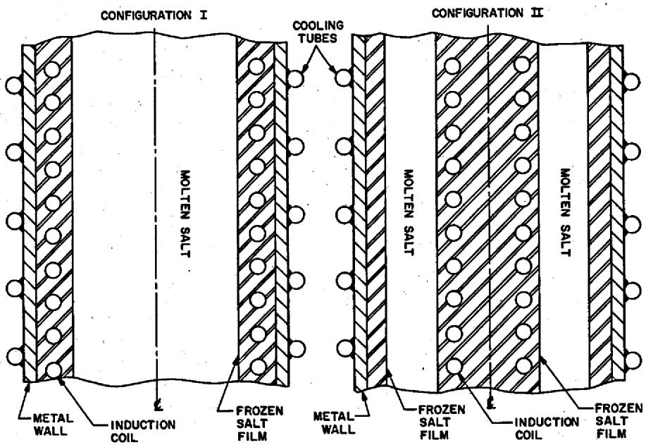  
Fig. 23.14. Induction Coil Configurations for Frozen-Wall Fluorinator Tests.

Radio-frequency (rf) induction heating appears to provide a suitable heat source for experimental work on fluorinator development; therefore, its use is being studied. The heat would be generated in the molten salt (a conductor) by eddy currents induced by an alternating magnetic field, which would be generated by a coil not in contact with the molten salt. This method of generating heat in the salt has the disadvantage that heat would also be generated in the metal walls of the fluorinator; however, this can be minimized by choosing a favorable geometry.

Two promising coil configurations have been considered; these are illustrated in Fig. 23.14. In configuration I the induction coil is located just inside the metal wall of the cylindrical fluorinator vessel and is embedded in a frozen salt film on the vessel wall. Heat is generated by the magnetic field inside the coil, and neither the coil nor the vessel wall would be in contact with molten salt and fluorine. In configuration II the induction coil would be much smaller in diameter than the fluorinator vessel and would be located at the center of the fluorinator. A coolant would be passed through the induction coil in order to keep the coil covered with a layer of frozen salt, thereby isolating it from contact with molten salt and fluorine. Heat would be generated in the molten salt (and in the vessel wall) by the magnetic field outside the coil. The second

configuration requires a greater total heat generation rate than the first configuration since a larger area would be covered with frozen salt.

Mathematical Analysis. - Initial work on the problem was directed toward a mathematical analysis of several coil configurations in order to assess the feasibility of rf heating and to identify important system parameters. Several configurations, including the two shown in Fig. 23.14, were examined. These included a configuration in which the induction coil was located outside the fluorinator vessel wall. This configuration would have to be relatively thin to permit power to be transmitted through it. It appeared that in this case most of the heat would be generated in the metal wall for systems having dimensions of interest; thus this configuration was not considered further. Since configuration I is more amenable to mathematical analysis than configuration II, expressions that predict coil performance were derived for it. These expressions were then used to predict the performance of two systems: (1) a salt system having the approximate dimensions of an experimental frozen-wall fluorinator, which will be built later, and (2) a sulfuric acid system (having properties similar to the molten-salt system), which is being used to verify the derived expressions and to evaluate configuration II.

The fluorinator system that we examined was as follows: the salt was $\mathrm{LiF - BeF_2 - ThF_4}$ (68-20-12 mole $\%$ ), the inside diameter of the $1 / 4$ -in.-thick vessel was 4.9 in., the mean diameter of the induction coil was 3.9 in., and the frozen salt extended inward from the wall, covering the coil and leaving a 1.9-in.-diam molten core. The metal was assumed to have the same electrical properties as Monel. The heat generation rate in the molten salt necessary to maintain this frozen salt layer is 63 w per centimeter of fluorinator length. The calculated induction current in the coil (at an assumed frequency of $500\mathrm{kHz}$ ) necessary to produce this power in the salt was 24.7 amp. The calculated $I^2 R$ loss in the induction coil was 55 w per centimeter of fluorinator length. The heat generation rate in the pipe outside the coil was estimated by assuming that the magnetic field strength just outside the coil was equal to the magnetic field strength just inside the coil. This assumption is equivalent to assuming that the length of the coil is very small as compared with the diameter. The calculated heat generation rate in the vessel wall, using this assumption, was 65 w/cm (about 1.05 times the heat generated in the salt). Removal of this amount of heat generated in the vessel wall, as well as that generated in the salt, would be practical. These calculations indicate that a 28-kw rf generator would be required for a 5-ft-long fluorinator vessel. Similar calculations could not be conveniently made for configuration II.

Experimental Work. - In order to verify the values predicted for configuration I and to evaluate the performance of configuration II, experiments were performed in which a 29 wt $\%$ $\mathrm{H}_2\mathrm{SO}_4$ solution was used as a substitute for molten salt. Heat generation rates were measured both in the acid solution and in a Monel pipe surrounding the acid solution. The solution was contained in a 2-liter graduated cylinder having an inside diameter of $3^{1/4}$ in. The pipe was a 6-in.-long section of 6-in. sched 40 Monel pipe. The coil for the test with configuration I was 4 in. ID by 6 in. long and consisted of 20 turns of $1/4$ -in.-diam copper tubing; it was placed around the acid container, and the 6-in. pipe was placed around the coil. The coil for configuration II was $1^{1/4}$ in. OD by 6 in. long and consisted of 20 turns of $1/4$ -in.-diam copper tubing. It was placed in a $1^{3/8}$ -in.-OD glass tube, which was immersed in the center of the acid solution. The heat generation rates were obtained by measuring the rate of temperature increase in the solution and in the pipe.

In three runs with configuration I, the ratio of heat generated in the pipe to that generated in the acid solution averaged 1.3. The frequency in the test was $350\mathrm{kHz}$ , and the conductivity of the acid was about

0.75 mho/cm. The heat generation rate in the acid was about 19 w per centimeter of coil length; this was kept low to prevent the acid from boiling. The predicted value for the ratio of heat generated in the pipe to that generated in the acid solution was 0.58 (calculated using the experimental system properties, conditions, and dimensions, and making the same assumptions that were outlined in the previous section), which is approximately one-half of the measured value. Deviations of this magnitude of heat generation rate between the predicted and measured values are not surprising, since the method used for calculating heat generation in the pipe was an approximate one.

In five runs with configuration II, the ratio of heat generated in the pipe to that generated in the acid solution averaged 0.069. The frequency in this test was $440\mathrm{kHz}$ . The heat generation rate in the acid solution, using configuration II, was about 16 w per centimeter of coil length, although a higher plate voltage was used than in the experiments with configuration I. This indicates that the coupling of the magnetic field with the acid was poorer with configuration II than with configuration I, which is to be expected since the magnetic field strength outside a coil is smaller than the strength inside a coil. However, it means that, even though little heat was generated in the pipe walls with configuration II, the efficiency of heating the salt could still be much less than if configuration I were used, because the heat generated in the coil itself might be large as compared with the heat generated in the salt. This aspect will be explored in future experiments when means to measure the coil current have been obtained.

In general, results of these preliminary experiments and calculations encourage us to believe that inductive heating is a reasonable method for supplying heat to a frozen-wall fluorinator experiment in which there is no internal heat source resulting from fission product decay. Disagreement between the measured and the calculated values of relative heat generation rates indicates that the design of an experimental fluorinator system must rely heavily on empirically obtained relationships. An experimental program is under way to obtain this information.

# 23.9 ELECTROLYTIC CELL DEVELOPMENT

J.R.Hightower M.S.Lin

L. E. McNeese

Several of the proposed flowsheets for processing MSBR fuel salt require the use of electrolytic cells, which would provide reductants (thorium and lithium)

at a bismuth cathode and would produce an oxidant $(\mathrm{BiF}_3$ in molten salt) at a bismuth anode. An experimental program for the study and development of electrolytic cells is under way. To date, the experimental work has been carried out in static cells of various designs; however, a facility that will allow electrolytic cells to be operated under flow conditions at steady state is nearing completion.

# 23.9.1 Static Cell Experiments

The experiments with static cells have been directed toward two problems: (1) to determine conditions under which a protective frozen salt film can be maintained on electrode dividers in the presence of high heat generation in the salt and (2) to identify the black material that has formed in the salt during all runs made thus far. A successful experiment was made in which frozen salt films were maintained around the top of a BeO electrode divider in the presence of high current density. Three experiments were made in an effort to identify the black material that forms in the salt during electrolysis. In one experiment, batteries were used to provide a constant applied voltage; in another experiment, the cell contained no bismuth; and in the third, no quartz was present. These experiments are summarized below.

Experiment with a Frozen Salt Film on a BeO Electrode Divider. - The cell used in this experiment was similar to one described previously. It used a $2^{1/2}$ -in-OD BeO cup to contain bismuth for the anode and to electrically insulate the anode from the cathode. A cooling ring, made of low-carbon steel and located just above the rim of the BeO cup, supported the cup and was used to cover the rim of the cup with a protective film of frozen salt. Coolant was introduced to the ring and removed from it through tubes that also served as the anode electrical lead. The anode cup, which had a cross-sectional area of about $13\mathrm{cm}^2$ , was placed in a 6-in.-diam quartz vessel containing the bismuth cathode pool. The assembled cell is shown in Fig. 23.15.

The cell was charged with $16\mathrm{kg}$ of purified bismuth and $2.4\mathrm{kg}$ of salt (66-34 mole $\%$ LiF-BeF $_2$ ). Two successful runs were made in which a frozen salt film was maintained on the portion of the BeO cup that was in contact with salt. In both runs the protective salt film was formed initially with no current flow and with the top of the BeO cup raised $\frac{1}{4}$ in. above the surface of the bismuth pool which formed the cathode. After a

frozen layer had been formed over the cooling ring and the top of the BeO cup, the cup was lowered until its top was $\frac{1}{2}$ in, below the bismuth surface. The assembly was allowed to remain in this position long enough to freeze salt on previously unexposed parts of the coolant inlet and outlet lines for electrical insulation. The anode assembly was then raised until the top of the BeO cup was $\frac{1}{4}$ in, below the bismuth surface. Operation at this level provided an unmistakable means for detecting melting of the frozen salt film; that is, in the event that the film melted, the cooling ring (which was in electrical contact with the anode) would contact the bismuth in the cathode pool, causing a short circuit and a very high current.

In the first run the current was increased stepwise from 0 to 20 amp during a 90-min interval, while the coolant flow $(\mathbf{N}_2)$ was increased from 1 to 6 scfm. The cell was operated for 30 min with a current of 20 amp, which corresponds to a current density of about 1.5 $\mathrm{amp / cm^2}$ based on the initial area of the anode. After this period the current density was increased to 1.7 $\mathrm{amp / cm^2}$ , and the cell was operated at this level for 10 min. The current density was finally increased to 1.9 $\mathrm{amp / cm^2}$ , where it was held for 20 min. When the nitrogen coolant supply was depleted, the current was gradually reduced, and the run was terminated before the cell shorted. In this run the salt and bismuth temperatures were between 465 and $470^{\circ}\mathrm{C}$ . The cell resistance decreased during the course of the run from 0.9 to 0.6 ohm, indicating a decrease in the thickness of the frozen film.

In the second run, water was atomized into the nitrogen stream in order to increase the cooling capacity and to permit a longer operating period before the nitrogen supply was exhausted. During this run the current was increased stepwise from 5 to 20 amp (1.5 $\mathrm{amp} / \mathrm{cm}^2$ ) over a period of about 1 hr. During the next 30 min, the current density was increased to 2.3 $\mathrm{amp} / \mathrm{cm}^2$ , where it was maintained for 10 min. The current density was then held, successively, at 2.5 $\mathrm{amp} / \mathrm{cm}^2$ for 23 min, 2.6 $\mathrm{amp} / \mathrm{cm}^2$ for 7 min, and 2.8 $\mathrm{amp} / \mathrm{cm}^2$ for 9 min. This run was terminated when the cell shorted because of insufficient cooling.

These experiments indicate that a layer of frozen salt can be maintained in the presence of high current densities if sufficient cooling is provided. It was necessary in these experiments for the initial salt and bismuth temperature to be within about $10^{\circ}\mathrm{C}$ of the salt liquidus.

Experiment Without AC Ripple in Power Supply. -- The rectifier that has supplied dc power for the electrolysis experiments to date has produced a direct

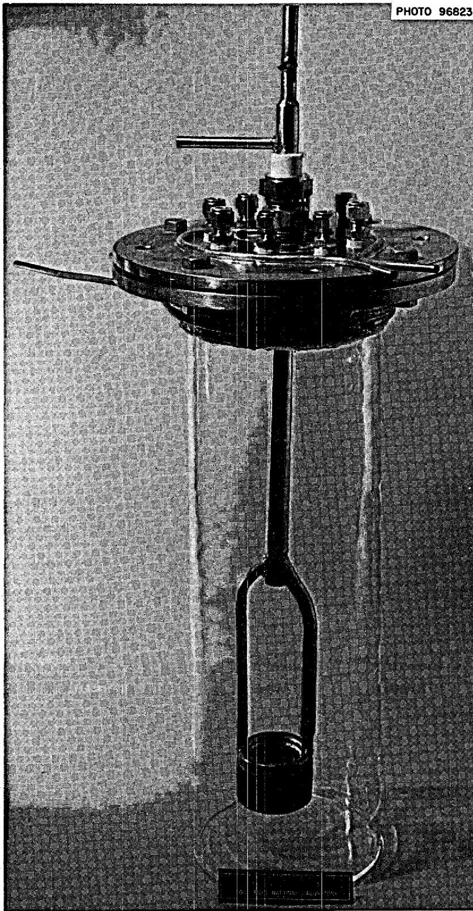  
Fig. 23.15. Quartz Electrolytic Cell Vessel with BeO Anode Cup Used for Frozen Film Protection Experiment.

current with appreciable ac ripple due to incomplete filtering. This ac component has been suspected to be responsible for the formation of the dark material that has been observed in the salt, since it has been reported² that sols of electrode metals can be produced in molten salts by the use of alternating current. A test was made to determine whether dark material would be formed when direct current having no ac component was used. The cell used for this test was made from a 4-in.-diam quartz tube and contained a 3-in.-high quartz divider, which separated two hemicylindrical bismuth electrodes, each having a surface area of about $30\mathrm{cm}^2$ . The cell contained bismuth that had been purified by hydrogen sparging and molten salt (66-34 mole % LiF-BeF₂) that had been sparged with hydrogen to remove residual HF. The power supply consisted of five 6-v lead-acid storage batteries, each of which was rated at 200 amp-hr.

The cell was operated initially at $500^{\circ}\mathrm{C}$ with a current of 3 amp. Fragments of dark material, accompanied by some gas evolution, could be seen rising from the anode surface; within 9 min the salt became opaque. After being allowed to stand overnight, the salt became clear. Another run at $600^{\circ}\mathrm{C}$ with a current of 2 amp caused the salt to become opaque within 6 min as a result of material emanating from the anode. After being allowed to stand overnight, the salt again became clear.

Two more runs were made: one at a cell temperature of $675^{\circ}\mathrm{C}$ with a current of 2.8 amp and the other at a cell temperature of $680^{\circ}\mathrm{C}$ with currents as high as 45 amp. No dark material was formed during these runs. An additional run was attempted at a cell temperature of $500^{\circ}\mathrm{C}$ , but the presence of a large amount of precipitate (apparently produced during the previous runs) obscured the visibility to such an extent that we could not determine whether any dark material was formed during the run.

The conclusions to be drawn from this experiment are: (1) The ac ripple in the power supply is not responsible for the production of the dark material and (2) the dark material may not be formed at high temperatures. It is possible that the black material is a product (such as $\mathrm{BiF}_3$ ) of the reaction of the anode material with the quartz in the cell. If this is true, the anodic reaction product is either completely soluble at elevated temperatures, or the rate at which it reacts with the quartz at these temperatures is sufficiently high that it is not seen.

Experiment with Nonbismuth Electrodes. - An experiment was made using a 4-in.-diam quartz cell with no electrode divider to determine whether the dark material would form in the molten salt when an electrode material other than bismuth was used. In this test, two molybdenum electrodes were inserted into the molten salt (66-34 mole % LiF-BeF $_2$ ). One electrode was a $1/4$ -in.-diam molybdenum rod located in the center of the cell; the other was a $1/4$ -in.-diam molybdenum tube, essentially sheathed in quartz, which was located near the side of the cell.

An alternating current of 2 amp was first passed through the cell. A small amount of dark material was formed, primarily at the electrode containing the quartz sheath. With a direct current of 5 amp, the salt in the cell darkened completely within about 1 min. The salt cleared substantially after being allowed to stand overnight, but there were still a few large particles of black material suspended in the salt and a scum of black material at the salt-gas interface. A 5-amp (dc) current was again passed through the cell, and the salt became opaque within 1 min. A small amount of gas was observed at the anode.

We conclude that the formation of dark material during electrolysis is not related to the use of bismuth electrodes.

All-Metal Electrolytic Cell Experiment. - The third experiment in this series was made to determine whether the dark material is formed in the absence of quartz. The cell vessel in this experiment was an 18-in. section of sched 40 mild steel pipe. One electrode consisted of a bismuth pool $3\frac{1}{8}$ in. deep, and the other was a $\frac{1}{4}$ -in.-diam mild steel rod located at the center of the vessel and placed $\frac{1}{4}$ to $\frac{1}{2}$ in. above the bismuth pool. Observations in the salt phase were made by using the bismuth surface as a mirror to reflect light to a sight glass in the top flange of the vessel. A $3\frac{1}{4}$ -in.-deep layer of molten salt (66-34 mole % LiF-BeF $_2$ ) was present above the bismuth. The bismuth had been sparged at $700^{\circ}\mathrm{C}$ with hydrogen to reduce oxides, and the salt had been sparged with hydrogen to remove dissolved HF.

The cell was first operated with the iron rod as the anode and the bismuth as the cathode. The cell temperature was $550^{\circ}\mathrm{C}$ , and the distance between the electrodes was $\frac{1}{4}$ in. The voltage initially impressed across the electrodes was about 5 v (dc) and produced a current of about 25 amp. The current was not steady; an oscillating component with a 2- to 5-amp amplitude and a 10-sec period was superimposed on a near-constant current of approximately 25 amp. The oscillations were probably caused by the formation and the breaking away of an insulating iron fluoride scale.

Streamers of a dark material were seen moving from outside the field of vision (which did not cover the whole bismuth surface) toward the iron anode, and within $1\frac{1}{2}$ min of operation the salt was opaque. Filtered salt samples were taken before and after passage of current; an unfiltered sample was also taken after this run. The unfiltered sample showed high concentrations of iron and bismuth. The high iron concentration was not surprising, since iron fluoride would have been formed at the anode. The bismuth in the sample probably came from a scum (metallic in appearance) on the salt surface.

Another run was made using a new iron electrode; the bismuth pool was the anode and the iron rod was the

cathode. Observations during this run were hindered by the metallic scum, mentioned above, which covered most of the salt. However, we were able to observe some of the salt near a sparge tube at the edge of the bismuth pool. The electrode separation in this run was $\frac{1}{2}$ in., and the cell temperature was $550^{\circ}\mathrm{C}$ . In this run we impressed $2.5\mathrm{v}(\mathrm{dc})$ across the electrodes, which resulted in a current of about 25 amp. The current was steady, and the salt (when we could see it) was clear. Gray particles $(\sim^{1}_{16}$ in. in diameter) could be seen above the bismuth surface, moving under the action of thermal convection currents. A current was passed between the electrodes for about 5 min, and the salt remained transparent. Near the end of the 5-min period,

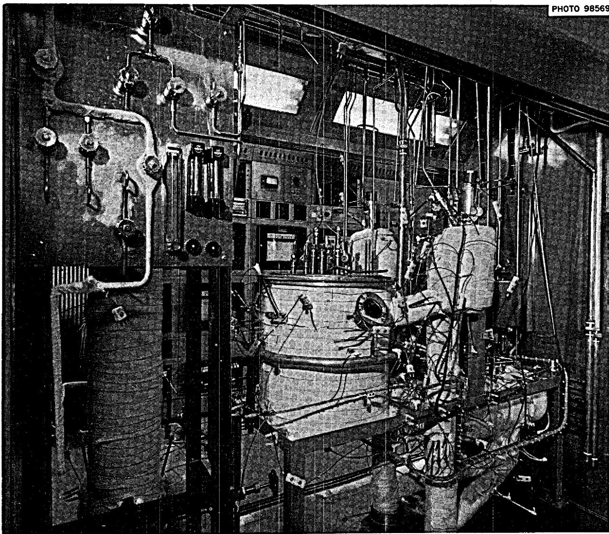  
Fig. 23.16. Flow Electrolytic Cell Facility.

the salt appeared to have a reddish-bronze color, which has been observed at the beginning of runs in quartz cells. It is possible that the salt would have turned dark if we had passed current for a longer time. This experiment will be repeated in a new cell that affords better visibility.

# 23.9.2 Flow Electrolytic Cell Facility

Current efficiency measurements in electrolytic cells can be made most conveniently in a system in which a molten salt stream flows through the electrolyte compartment and a bismuth stream flows through the cathode compartment. A system allowing this mode of operation has been constructed, and installation of the

3E. L. Nicholson et al., MSR Program Semiann. Progr. Rept. Feb. 28, 1969, ORNL-4396, p. 296.

equipment is almost complete. This equipment, installed in a walk-in hood in Building 3541, is shown in Fig. 23.16. In addition to the cell containment vessel, gas-lift pumps, gas-liquid disengagement vessels, and a mixer-settler vessel, which comprise the flow cell test equipment proper, the hood contains a graphite-lined vessel for treating salt and bismuth with HF and $\mathbf{H}_2$ , a supply panel for HF and $\mathbf{H}_2$ , and an NaF trapping system for disposing of unreacted HF.

A cell vessel for containing the cathode and the electrolyte is shown in Fig. 23.17. It was designed to accommodate a 4-in.-diam BeO anode cup with a cooling arrangement similar to that used in the previously described static cell tests with BeO cups. The vessel was made from 8-in.-diam and 5-in.-diam sched 40 low-carbon steel pipe. The depths of the bismuth and salt will be 3 in. each. This vessel is similar to a Lucite mockup which performed satisfactorily in hydrodynamic tests with water and mercury.

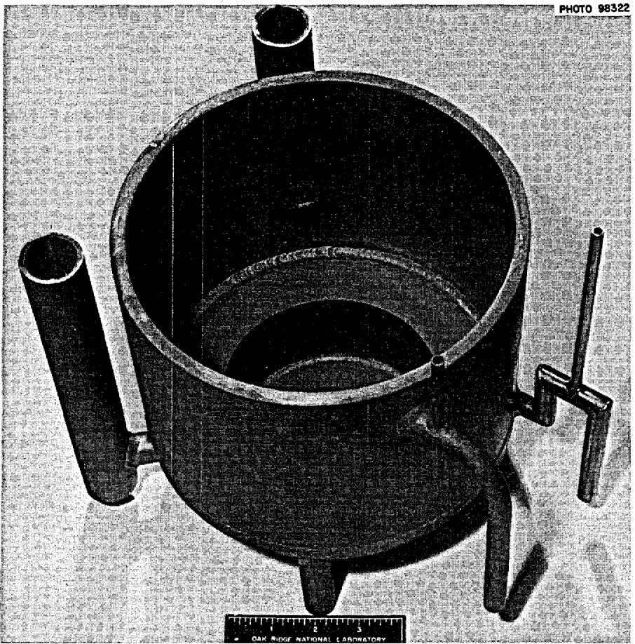  
Fig. 23.17. Electrolyte and Cathode Vessel for Flow Electrolytic Cell Facility.

# 24. Distillation of MSRE Fuel Carrier Salt

J.R.Hightower,Jr. L.E.McNeese

Final analyses were obtained for the eleven condensate samples taken during the MSRE distillation experiment. These samples were analyzed for LiF, $\mathrm{BeF}_2$ , $\mathrm{ZrF}_4$ , and the fission products $^{95}\mathrm{Zr}$ , $^{144}\mathrm{Ce}$ , $^{147}\mathrm{Pm}$ , $^{155}\mathrm{Eu}$ , $^{91}\mathrm{Y}$ , $^{90}\mathrm{Sr}$ , $^{89}\mathrm{Sr}$ , and $^{137}\mathrm{Cs}$ . The results of these analyses are presented as effective relative volatilities, with respect to LiF, which are given by the relationship

$$
\alpha_ {i - \mathrm {L i F}} \equiv \frac {Y _ {i} / X _ {i}}{Y _ {\mathrm {L i F}} / X _ {\mathrm {L i F}}} \tag {1}
$$

where $Y_{\mathrm{LiF}}$ and $Y_{i}$ are mole fractions in the condensate and $X_{\mathrm{LiF}}$ and $X_{i}$ are mole fractions in the still pot. Concentrations in the still pot were not measured directly; however, data taken during the experiment allowed these concentrations to be estimated from material balances for each component.

The most self-consistent relative volatility values resulted from assuming that the feed salt composition was 65-30-5 mole $\%$ LiF-BeF $_2$ -ZrF $_4$ (which is the MSRE fuel carrier salt composition) rather than the composition indicated by the analysis of salt from the fuel storage tank. The slight difference in the two compositions is probably due to the presence of zirconium metal in the salt in the fuel storage tank. This metal would have been filtered out when the salt was transferred to the still feed tank.

The effective relative volatilities of the major salt constituents $(\mathrm{BeF}_2$ and $\mathrm{ZrF_4}$ ) and of fission product $95\mathrm{Zr}$ are shown in Fig. 24.1. The effective relative volatility of $\mathrm{BeF}_2$ was essentially constant during the run and had an average value of 3.8. This value agrees favorably with a value of 3.9 measured by Smith, Ferris, and Thompson, but is slightly lower than the

value of 4.7 measured by Hightower and McNeese.2 Slight approximations in calculations and errors in analyses would account for this difference. The effective relative volatilities of fission product $^{95}\mathrm{Zr}$ and of the natural $\mathrm{ZrF_4}$ present in the carrier salt are in agreement. If the analysis of the fuel storage tank salt had been used as the composition of the feed salt in the relative volatility calculations, the resulting relative volatility of natural $\mathrm{ZrF_4}$ would have been about one-half of that of $^{95}\mathrm{ZrF_4}$ . Figure 24.1 shows that $\alpha_{\mathrm{ZrF_4 - LiF}}$ decreased from an initial value near 4 at the start of the run to about 1 at the end of the run. These values bracket the value of 2.2 measured by Smith et al. in a salt mixture having a $\mathrm{ZrF_4}$ concentration of 0.0008 mole fraction (which is about 2% of that present during the distillation experiment).

The effective relative volatilities for the lanthanide fission products $^{144}\mathrm{Ce}$ , $^{147}\mathrm{Pm}$ , and $^{155}\mathrm{Eu}$ are shown in Fig. 24.2. The effective relative volatility of $^{144}\mathrm{Ce}$ rose sharply from $6.1 \times 10^{-4}$ , at the time the first sample was taken, to about $1.0 \times 10^{-2}$ , where it remained during the rest of the run. An exception was the value for the fifth sample, which was lower than $1.0 \times 10^{-2}$ by a factor of 3. The low initial value was 1.5 to 3.4 times the value measured in an equilibrium still; the values during the major portion of the run were 24 to 56 times the value measured in the equilibrium still.

The effective relative volatility for $^{147}\mathrm{Pm}$ was based on a computed feed concentration and took account of the MSRE power history. The computed feed concentration of $^{147}\mathrm{Pm}$ was felt to be a more accurate value than the measured feed concentration, which was only about $30\%$ of the expected value, since measured concentrations of other lanthanide fission products agreed well with computed values. As in the case of $^{144}\mathrm{Ce}$ , the relative volatility of $^{147}\mathrm{Pm}$ was low ( $< 7.8 \times 10^{-4}$ ) at the time the first sample was taken; it then rose sharply to about $3.4 \times 10^{-3}$ for the remainder of the run. Also, as in the case of $^{144}\mathrm{Ce}$ , the relative volatility was low at the time the fifth sample was taken. The relative volatility of promethium had not been measured previously.

The variation of the relative volatility of $^{155}\mathrm{Eu}$ during the run closely paralleled variations of the relative volatilities of $^{144}\mathrm{Ce}$ and $^{147}\mathrm{Pm}$ . The value for the first sample was low (less than $1.5 \times 10^{-5}$ ); however, the values for all the other samples, except the fifth sample, were higher (about $2.2 \times 10^{-4}$ ). The value for the fifth sample was lower than $2.2 \times 10^{-4}$ by a factor of 2.6. The effective relative volatilities during the MSRE distillation experiment (based on a computed feed concentration of $^{155}\mathrm{Eu}$ ) were lower than the value of $1.1 \times 10^{-3}$ which was measured in recirculating equilibrium stills. However, the analysis for $^{155}\mathrm{Eu}$ in the condensate samples is suspect since there was some difficulty in this analysis; thus all of the $^{155}\mathrm{Eu}$ data obtained for the condensate samples were reported as approximate values. On the other hand, it is significant that the variation of $\alpha_{155\mathrm{Eu}-\mathrm{LiF}}$ during the run closely paralleled the relative volatilities of $^{144}\mathrm{Ce}$ and $^{147}\mathrm{Pm}$ .

Figure 24.3 shows the effective relative volatilities of $^{91}\mathrm{Y}$ and $^{90}\mathrm{Sr}$ . During the run the effective relative volatility of $^{91}\mathrm{Y}$ had an average value of $1.4 \times 10^{-2}$ ; about 410 times the value measured in recirculating equilibrium stills. The variation of $\alpha_{91\mathrm{Y - LiF}}$ was similar to variations of relative volatilities of the lanthanides; the low value for the fifth sample was most noticeable. The effective relative volatility of $^{90}\mathrm{Sr}$ (based on the measured concentration in the feed) had an average value during the run of $4.1 \times 10^{-3}$ , about 84 times the value measured in recirculating equilibrium stills. Although it is not shown in Fig. 24.3, the average value of the relative volatility of $^{89}\mathrm{Sr}$ (based on a computed concentration in the feed) was 0.193, about 3900 times the value measured in equilibrium stills. In the condensate samples the ratio of the $^{89}\mathrm{Sr}$ activity to the $^{90}\mathrm{Sr}$ activity, which should have been about 0.002 in each case, varied from 0.22 to more than 10 (Table 24.1).

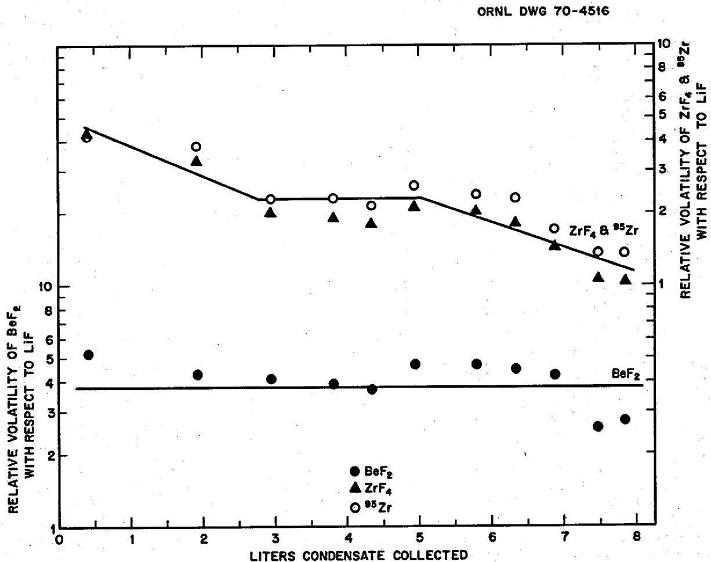  
Fig. 24.1. Effective Relative Volatilities of $\mathbf{ZrF_4}$ , $^{95}\mathbf{Zr}$ , and $\mathrm{BeF}_2$ for the MSRE Distillation Experiment.

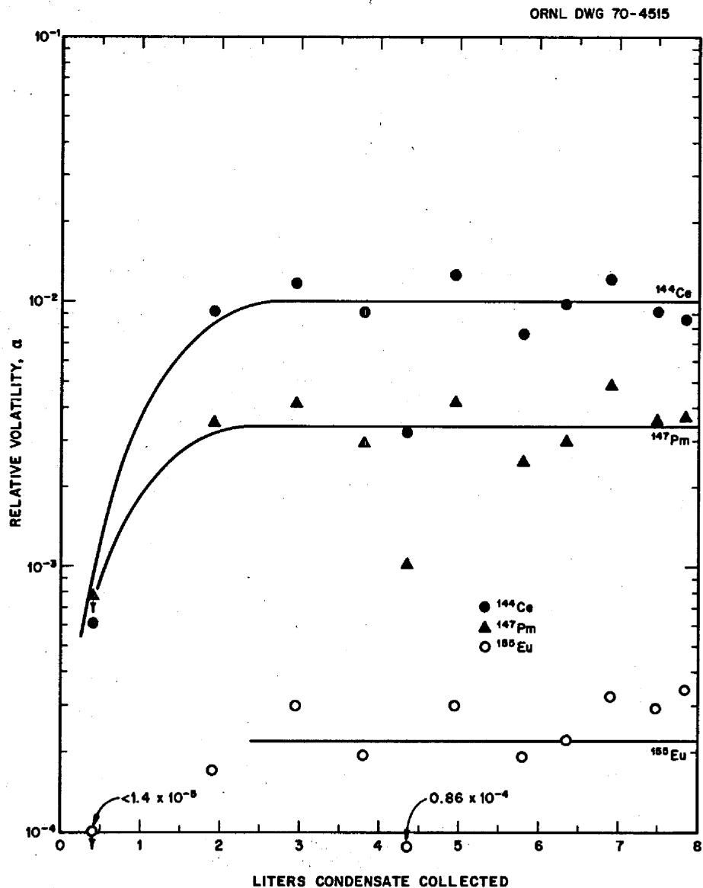  
Fig. 24.2. Effective Relative Volatilities of $^{144}\mathrm{Ce}$ , $^{147}\mathrm{Pm}$ , and $^{155}\mathrm{Eu}$ in the MSRE Distillation Experiment.

Because the concentration of $^{137}\mathrm{Cs}$ in the feed salt was not measured, calculations of effective relative volatility were based on an estimated feed concentration. However, $^{137}\mathrm{Cs}$ has a fairly long-lived gaseous precursor $(^{137}\mathrm{Xe},$ half-life of $3.9\mathrm{min}$ ), which caused the actual $^{137}\mathrm{Cs}$ concentration in the salt to be less than that calculated assuming no escape of $^{137}\mathrm{Xe}$ . Also, because the actual relative volatility of CsF is fairly high, the results of calculations of the effective relative volatility are sensitive to the assumed feed concentration of $^{137}\mathrm{Cs}$ . Figure 24.4 shows calculated relative volatilities of $^{137}\mathrm{Cs}$ for two assumed feed concentrations. The points around the lower curve represent the lower limits for the relative volatility.

They were obtained by assuming that all precursors of $^{137}\mathrm{Cs}$ stay in the salt during MSRE operation. The points around the upper line represent upper limits for the relative volatility of $^{137}\mathrm{Cs}$ determined from the results of the experiment. They resulted from a feed concentration such that the computed concentration of $^{137}\mathrm{Cs}$ in the still pot liquid would not become negative. The highest effective relative volatility of $^{137}\mathrm{Cs}$ seen in these calculations was only about 20% of the value measured by Smith et al. in LiF-BeF $_2$ systems.

These results show that all of the components except $\mathbf{BeF}_2$ and $\mathbf{ZrF_4}$ had effective relative volatilities which differed (drastically in some cases) from values predicted from tests with equilibrium systems. Possible

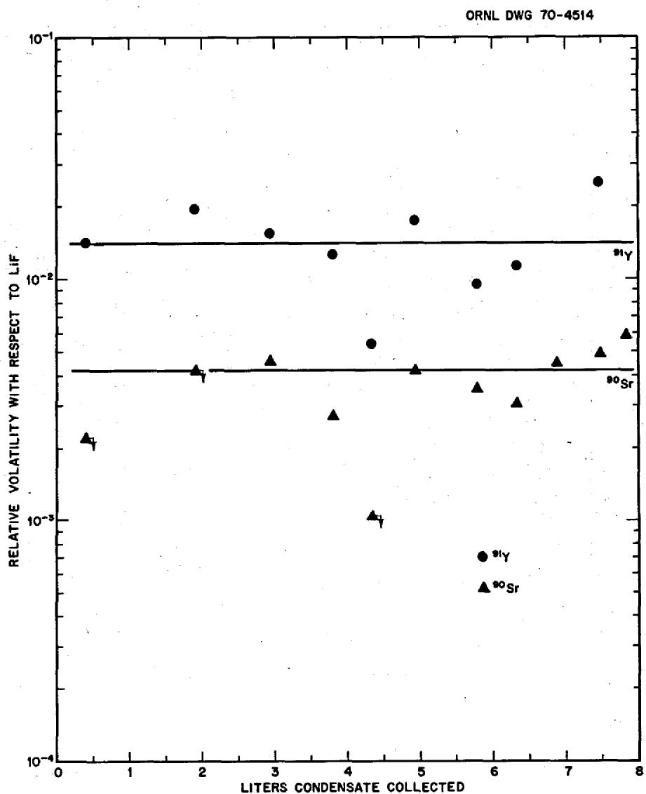  
Fig. 24.3. Effective Relative Volatilities of $^{91}\mathrm{Y}$ and $^{90}\mathrm{Sr}$ in the MSRE Distillation Experiment.

causes for the discrepancies include: (1) entrainment of droplets of still pot liquid in the vapor, (2) concentration gradients in the still pot, and (3) contamination of samples during their preparation for radiochemical analysis.

Entrainment was suspected for a number of reasons. Entrainment of only 0.023 mole of liquid per mole of vapor would account for the high relative volatilities calculated for the slightly volatile fission products $^{144}\mathrm{Ce}$ , $^{147}\mathrm{Pm}$ , $^{91}\mathrm{Y}$ , and $^{90}\mathrm{Sr}$ . Entrainment rates of this order would not be reflected in the effective relative volatilities of more-volatile materials ( $\alpha \geqslant 1$ ). The high correlation of the scatter of the calculated effective relative volatilities of different slightly volatile fission products is consistent with the hypothesis that entrainment occurred.

Since entrainment was not apparent in the nonradioactive operation of the still, reasons for entrainment in the radioactive operation were sought to support the hypothesis. Evidence of a salt mist above the salt in the pump bowl at the MSRE and above salt samples removed from the MSRE has been reported, and studies have indicated that these mists are present over

radioactive salt mixtures but not over nonradioactive mixtures. However, examination of data from these studies showed that entrainment rates large enough to explain the results of the MSRE distillation experiment could be obtained only by assuming that the salt concentration in the gas space above the salt during this experiment was equal to that seen above salt in the pump bowl at the MSRE. If the mist formation rate decreases as the power density in the liquid decreases, the concentration of salt in the mist should also decrease with decreasing power density in the liquid. Since the salt used in the MSRE distillation experiment had a much lower power density (400 days decay for distillation feed as compared with less than 30 days

decay for salt samples tested for mist formation) than salt samples from the MSRE, it seems unlikely that the concentration of salt in the gas above the salt would have been high enough to explain the high relative volatilities for the slightly volatile fission products. In addition to the argument against the entrainment hypothesis given above, not all discrepancies would be explained by it. For example, it would not account for the variations in the $^{89}\mathrm{Sr}$ -activity-to- $^{90}\mathrm{Sr}$ -activity ratio or for the low value for the effective volatility of $^{137}\mathrm{Cs}$ .

Concentration polarization would cause the effective relative volatilities of the slightly volatile materials to be greater than the true relative volatilities. As more-

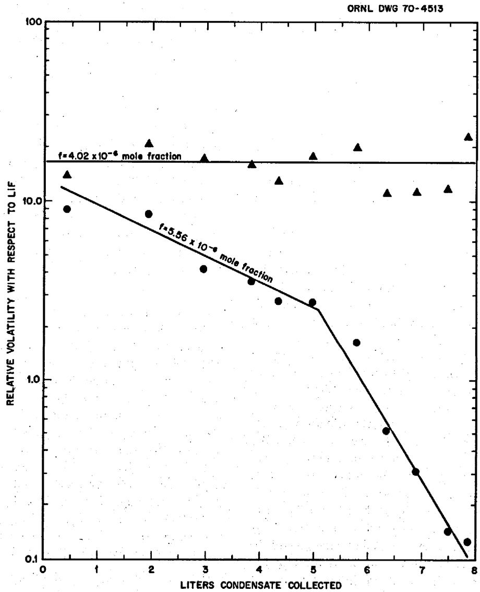  
Fig. 24.4. Effective Relative Volatility of $^{137}\mathrm{Cs}$ in MSRE Distillation Experiment, Showing Effect of Variation of Assumed Feed Concentration.

Table 24.1. Ratio $^a$ of $^{89}\mathrm{Sr}$ Activity to $^{90}\mathrm{Sr}$ Activity in Condensate Samples from MSRE Distillation Experiment   

<table><tr><td>Condensate 
Sample No.</td><td>Ratioa of 89Zr 
Activity to 90Sr 
Activity</td></tr><tr><td>1</td><td>&gt;10</td></tr><tr><td>2</td><td>&gt;10</td></tr><tr><td>3</td><td>1.89</td></tr><tr><td>4a</td><td>2.12b</td></tr><tr><td>4b</td><td>&gt;10</td></tr><tr><td>5</td><td>&gt;10</td></tr><tr><td>6</td><td>1.21</td></tr><tr><td>7</td><td>0.223</td></tr><tr><td>8</td><td>0.386</td></tr><tr><td>9</td><td>2.30</td></tr><tr><td>10</td><td>0.713</td></tr><tr><td>11</td><td>1.38</td></tr></table>

$^a$ Ratio of activities on July 8, 1969.   
$b$ Duplicate samples did not agree.

volatile materials vaporize from the surface of the liquid, the slightly volatile materials would be left behind on the surface at a higher concentration than in the liquid just below the surface. The concentration of these slightly volatile materials in the vapor would then increase, since further vaporization would occur from a liquid with a higher surface concentration of slightly volatile materials. Since effective relative volatilities were based on average concentrations in the still pot, the vapor concentration would be higher than that corresponding to the average liquid concentration, and the calculated effective relative volatility would be higher than the true relative volatility. Concentration polarization would cause the effective relative volatility to be lower than the actual relative volatility for a component whose relative volatility is greater than 1.

The extent to which concentration polarization affects the effective relative volatility of a particular component depends on the dimensionless group $D / \nu L$ , which qualitatively represents the ratio of the rate of diffusion of a particular component from the vapor-liquid interface into the bulk of the still pot liquid to the rate at which this material is transferred by convection to the interface by liquid moving toward the vaporization surface. In this ratio, $D$ is the effective diffusivity of the component in interest, $\nu$ is the velocity of liquid moving toward the interface, and $L$ is the distance between the interface and the point where the feed is introduced.

The occurrence of concentration polarization is suggested by the sharp increase at the beginning of the run in the effective relative volatilities of $^{144}\mathrm{Ce}$ , $^{147}\mathrm{Pm}$ , $^{155}\mathrm{Eu}$ , and possibly of $^{91}\mathrm{Y}$ and $^{90}\mathrm{Sr}$ . This increase would correspond to the formation of the concentration gradient in the still pot liquid. The effective diffusivities of $\mathrm{NdF}_3$ in the still pot, calculated from results of the nonradioactive experiments, ranged from $2.1 \times 10^{-4}$ to $18.3 \times 10^{-4} \, \mathrm{cm}^2/\mathrm{sec}$ and form the basis for estimating the magnitude of the concentration polarization effect in the radioactive operation. During the semicontinuous operation at the MSRE, the liquid velocity resulting from vaporization averaged $2.2 \times 10^{-4} \, \mathrm{cm/sec}$ , and the depth of liquid above the inlet was about $9.4 \, \mathrm{cm}$ . If one assumes that the effective diffusivities of the fission products in the still pot during the MSRE distillation experiment were in the same range as they were during the nonradioactive tests, the observed relative volatilities of the slightly volatile materials would be only 1.8 to 11.5 times the true relative volatility, and the observed relative volatility of $^{137}\mathrm{Cs}$ would be 0.012 to 0.023 times its true value (assuming in each case that the true relative volatilities were those given in refs. 1 and 2). Although concentration polarization may have been significant in the work with radioactive salt, the effect is not great enough to account for the discrepancies between observed relative volatilities and what we consider to be the true values. Also, concentration polarization would not explain the variation in the ratio of $^{89}\mathrm{Sr}$ activity to $^{90}\mathrm{Sr}$ activity between samples of condensate.

The possibility that the condensate samples were contaminated while they were being prepared for radiochemical analysis is suggested by the wide variation in the value of the $^{89}\mathrm{Sr} / ^{90}\mathrm{Sr}$ activity ratio. Although routine precautions against contamination were taken in the hot cells, where the capsules were cut open, no special precautions were taken, and the manipulators used to handle MSRE salt samples were also used to open the condensate samples. If it is assumed that the source of the contamination was the last salt sample taken from the MSRE before the distillation samples were submitted, only $10^{-6}$ to $10^{-3}$ g of salt per gram of sample would be required to yield the observed values of the $^{89}\mathrm{Sr} / ^{90}\mathrm{Sr}$ activity ratio. Contamination from such small quantities of material would be extremely difficult to prevent.

Other observations explained by assuming that the samples were contaminated are the high relative volatilities of the slightly volatile fission products and the high correlation between the variations of calculated

relative volatilities of different fission products. The low relative volatility for $^{137}\mathrm{Cs}$ is not explained by this hypothesis.

We conclude that, although several factors may be involved, the discrepancy between the effective relative

volatilities of the slightly volatile materials measured in this experiment and the values measured previously is primarily the result of contamination of the condensate samples by minute quantities of salt from other MSRE salt samples in the hot cells.

# 25. System Calculations

# 25.1 MSBR PROCESSING PLANT MATERIAL AND ENERGY BALANCE CALCULATIONS

W. L. Carter

Material and energy balance calculations for the reductive extraction flowsheet and conditions shown in

Fig. 25.1 have been recomputed using an updated library of physical data for the fission product nuclides. Also, the computer program (CALDRON) by which the calculations were made was modified to make it a more accurate model of the process.

These data are for a 2250-Mw (thermal) MSBR operating with an active volume of 1461 ft³ of

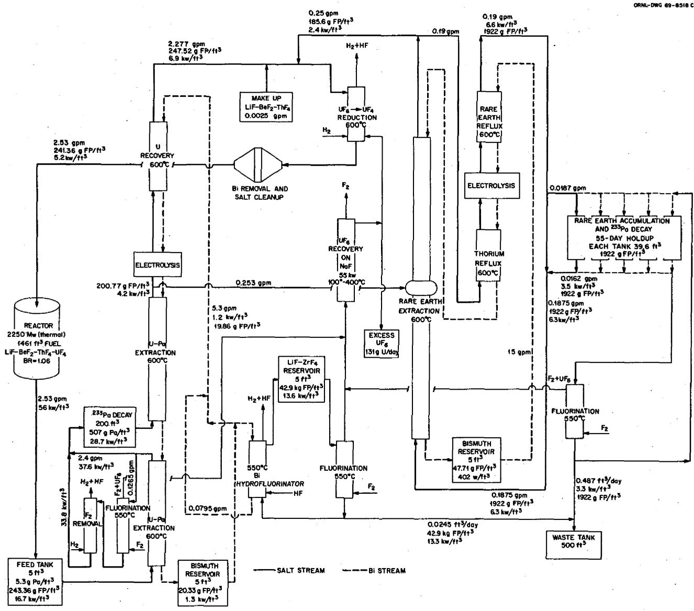  
Fig. 25.1. Reductive Extraction Process for MSBR Fuel Salt.

Table 25.1. Dominant Mechanisms and Process Cycle Times for Removal of $^{233}\mathrm{Pa}$ and Fission Products from MSBR Fuel Salt   

<table><tr><td></td><td>Cycle Time for Processing from Salt</td><td>Primary Mechanism of Removal from Salt</td></tr><tr><td>233Pa</td><td>3 days</td><td>Reductive extraction into bismuth, plus trapping in salt for radioactive decay</td></tr><tr><td>Zn, Ga, Ge, As, Se, Zr, Cd, In, Sn, Sb</td><td>200 days</td><td>Reductive extraction into bismuth, plus hydro-fluorination into waste LiF-ZrF4salt</td></tr><tr><td>Br, I</td><td>60 days</td><td>Volatilization as fluorides in primary fluorinator</td></tr><tr><td>Kr, Xe</td><td>50 sec</td><td>Sparged from salt with inert gas in reactor circulating salt loop</td></tr><tr><td>Nb, Mo, Tc, Ru, Rh, Pd, Ag, Te</td><td>50 sec</td><td>Assumed to be reduced by metal surfaces in reactor and to plate out</td></tr><tr><td>La, Ce, Pr, Nd, Pm, Sm, Gd, Tb, Dy, Ho, Er, Y</td><td>50 days</td><td>Reductive extraction into bismuth, plus concentration in fuel salt for waste discard</td></tr><tr><td>Rb, Sr, Cs, Ba, Eu</td><td>3000 days</td><td>Removed only by discard of fuel salt</td></tr></table>

LiF-BeF $_2$ -ThF $_4$ -UF $_4$ (71.7-16.0-12.0-0.3 mole %) fuel salt. In the calculations it was assumed that salt for processing is withdrawn continuously from the reactor at 2.53 gpm and that purified makeup salt is added at the same rate. Values on the flowsheet pertain to equilibrium conditions when fission products and $^{233}\mathrm{Pa}$ are being removed according to the cycle times given in Table 25.1. This table denotes the dominant removal process and cycle time for $^{233}\mathrm{Pa}$ and for each family of fission product elements; for all practical purposes, most of the fission products are removed by more than one mechanism. For example, the noble gases are removed primarily by sparging the fuel salt in the MSBR fuel circuit; however, in fuel processing, removal is also accomplished whenever the salt is fluorinated or treated with an $\mathrm{H}_2$ purge stream.

# 25.2 EFFECT OF CHEMICAL PROCESSING ON THE NUCLEAR PERFORMANCE OF AN MSBR

M.J.Bell L.E.McNeese

A series of calculations has been performed to investigate the effect of the removal of individual fission product elements on the performance of an MSBR. These calculations were made with a computer code called MODROD1 which resulted from combining the ROD2 (reactor optimization and design) and the

MATADOR³ (steady-state material balance) codes. This combined code allows an accurate treatment of the neutron production and loss in the reactor core and a more complete description of radioactive decay and neutron capture by the fission products. The calculations were performed for a 2250-Mw (thermal) single-fluid MSBR fueled with $1680\mathrm{ft}^3$ of fuel salt of nominal composition 71.7-16.0-12.0-0.3 mole $\%$ LiF-BeF $_2$ -ThF $_4$ -UF $_4$ . Further details of the reactor concept are given in ref. 4.

In the calculations which were performed, the effect of chemical processing on the neutron poisoning by individual fission product elements was investigated by varying the efficiency with which an element was removed from the fuel salt with respect to a reference value. The reference case assumed that: (1) halogens and rare earths were removed on a 50-day cycle, (2) zirconium and seminoble metals were removed on a 200-day cycle, (3) protactinium was removed on a 5-day

cycle, and (4) the salt was discarded on a 3000-day cycle to remove the active metals and neptunium. In addition the noble gases and noble metals were treated as described in ref. 3. They were assumed to have a 50-sec residence time in the fuel salt and a 110-sec residence time in the helium bubbles; the surface resistance for diffusion of the noble gases to the graphite was fixed to give a poisoning of $0.5\%$ for $^{135}\mathrm{Xe}$ . The removal efficiency for each individual element from $\mathbf{Zn}$ to $\mathbf{Ho}$ , except for $\mathbf{Kr}$ and $\mathbf{Xe}$ , was varied from $2^{2}$ to $2^{-6}$ . These conditions differ slightly from those used by Baumann4 to optimize the reactor design and resulted in a breeding ratio of 1.061 and a fuel yield of $3.2\%$ per annum for the base case. The cost associated with the inventory and replacement of fuel and carrier salt amounted to 0.27 mill/kwhr.

Figures 25.2-25.5 illustrate the effect of chemical processing for the elements Nd, Sm, Pm, and Zr on the performance of the reference MSBR. The changes in

fuel yield and fuel cycle cost from those determined for the base case are shown as functions of element removal time. The changes in fuel cycle cost result only from changes in the inventory charges for additional fissile material that would be required if an element were removed less efficiently than in the base case. The elements whose poisoning can be influenced most by chemical processing are the rare earths, Zr, Ba, and Sr. For a number of materials, primarily the noble metals, no significant variation in reactor performance was observed over the range of removal times investigated. The lack of influence of the noble metals results from the assumption that these materials are removed on a short (50-sec) cycle in the base case. However, if longer removal times were established, removal of these elements by chemical processing would become important. Additional results and details of the computational procedure are given in ref. 1.

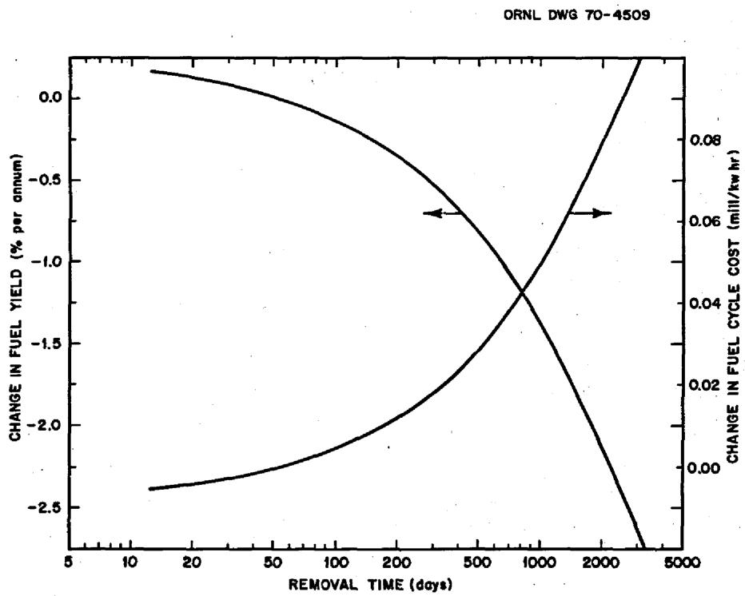  
Fig. 25.2. Effect of Neodymium Removal Time on MSBR Performance.

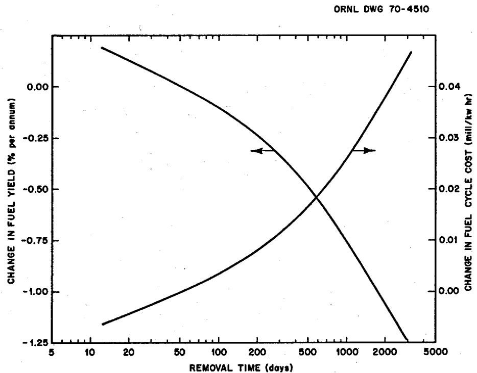  
Fig. 25.3. Effect of Samarium Removal Time on MSBR Performance.

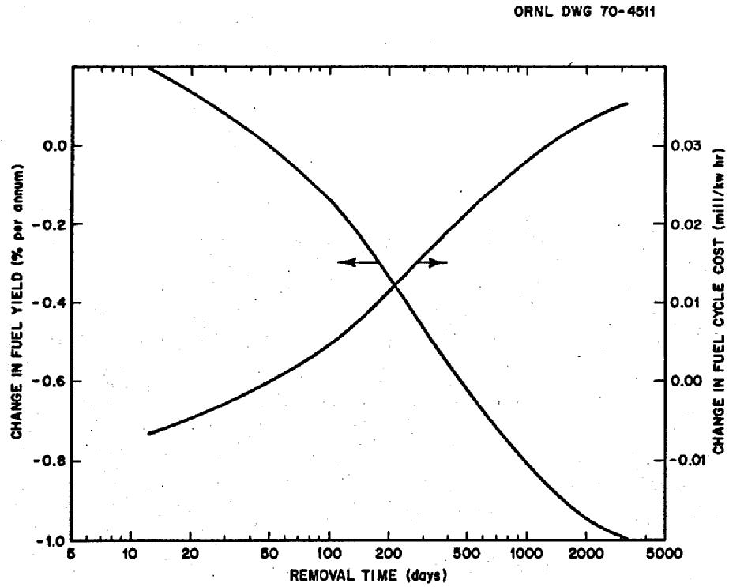  
Fig. 25.4. Effect of Promethium Removal Time on MSBR Performance.

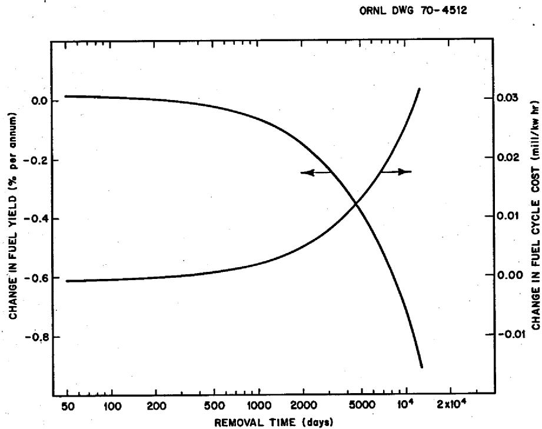  
Fig. 25.5. Effect of Zirconium Removal Time on MSBR Performance.

# 26. Continuous Salt Purification System

R.B.Lindauer

E. L. Youngblood

L.E.McNeese

E. L. Nicholson

Equipment is being installed to study the continuous purification of molten-salt mixtures as a possible replacement for the present batch method. The first step to be studied will be the continuous reduction of dissolved iron fluoride with hydrogen. The equipment (Figs. 26.1 and 26.2) to be used in this study consists of a $1\frac{1}{4}$ -in.-diam by 7-ft-long nickel column packed with $1/4$ -in. nickel Raschig rings, a $0.69\text{-ft}^2$ fiber metal filter $(50 - \mu$ rating) for separating the reduced iron from the salt, a flowing stream sampler, and two 20-liter tanks.

The interface will be positioned at the bottom of the column by means of a control valve in the exit gas stream. We will follow the progress of the reduction step by analyzing salt samples and by continuously analyzing the HF content of the column exit gas stream. A sodium fluoride trap will be used to remove

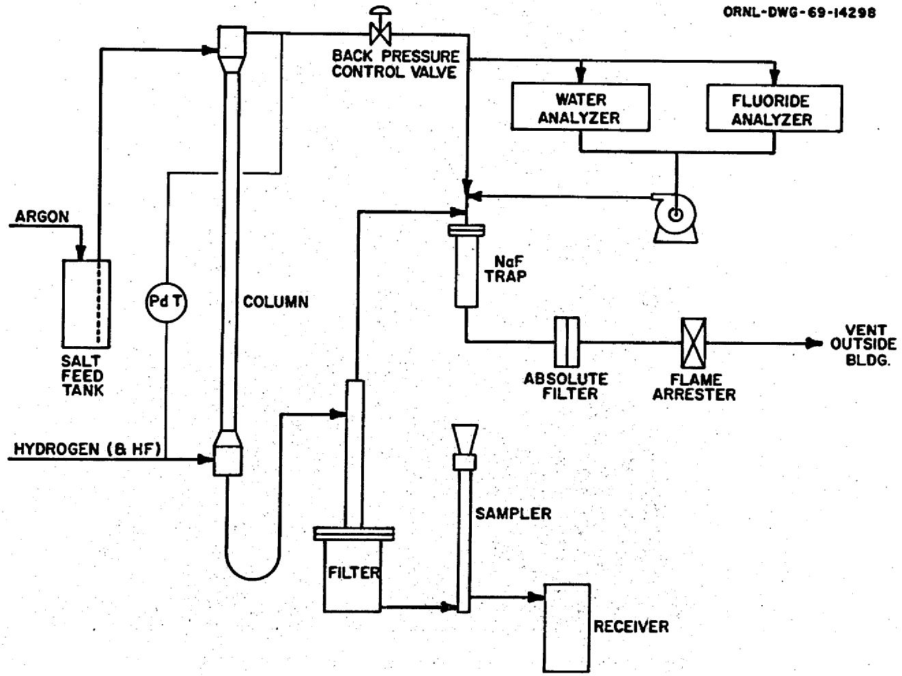  
Fig. 26.1. Equipment Flowsheet for the Continuous Salt Purification System.

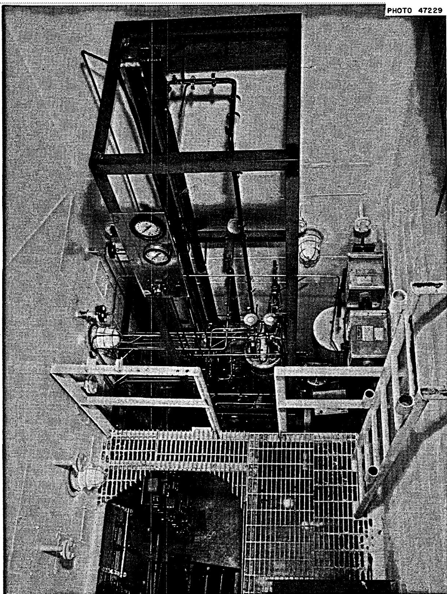  
Fig. 26.2. Continuous Salt Purification System in Cell 4B, Building 4505.

HF from the off-gas stream before it passes through an absolute filter and is discharged.

Construction of the system in Building 4505 has been completed, and the equipment has been leak tested. Construction of the HF, argon, and hydrogen supply systems is still in progress. The argon and hydrogen systems will contain oxygen and moisture removal equipment and instrumentation for continuously monitoring trace amounts of these gases.

The first steps in the experimental program will consist of charging 15 liters of molten salt (66-34 mole

$\% \mathrm{LiF - BeF_2}$ to the system and determining the flooding rates of the column, both with the purified salt and with salt containing about $150~\mathrm{ppm}$ of oxide. The oxide will be added to the salt in the feed tank and will later be removed by sparging with $\mathbf{H}_2$ HF. It is expected that salt flow rates as high as $200~\mathrm{cm^3 / min}$ can be used with hydrogen gas rates up to 100 liters/min. Initial operation will be at $700^{\circ}\mathrm{C}$ . After the study of the iron reduction step has been completed, the oxide removal step will be demonstrated in the column. Studies with salt containing thorium fluoride will also be made.

# 27. Design and Preparation of $^{239}\mathrm{PuF}_3$ Capsules for Small Refueling Additions to the MSRE

W.H.Carr

D.R.Taylor

W. F. Schaffer, Jr.

E. L. Nicholson

Specially designed refueling capsules were loaded with $^{239}\mathrm{PuF}_3$ powder and added to the MSRE fuel salt. Eight capsules were filled with a total of 311 g of $^{239}\mathrm{PuF}_3$ powder in glove-box facilities in Building 3019. The first of these capsules contained 31.6 g of $\mathrm{PuF}_3$ . As we improved the loading technique, we were

able to compact more $\mathrm{PuF_3}$ into a capsule; each of the last six capsules contained 39.2 to $42.2\mathrm{g}$ of $\mathrm{PuF_3}$ . No problems were encountered in the filling operation or in packaging the capsules in the MSRE fuel sampler-enricher charging containers. The exteriors of the loaded charging containers were smeared and found to be free of transferable activity before the containers were sealed in plastic bags. No detectable contamination escaped from the glove-box operation. Similar techniques could probably be used with much larger powder containers to add plutonium to a barren salt.

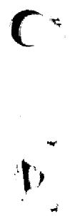

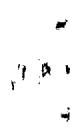

# OAK RIDGE NATIONAL LABORATORY

# MOLTEN-SALT REACTOR PROGRAM

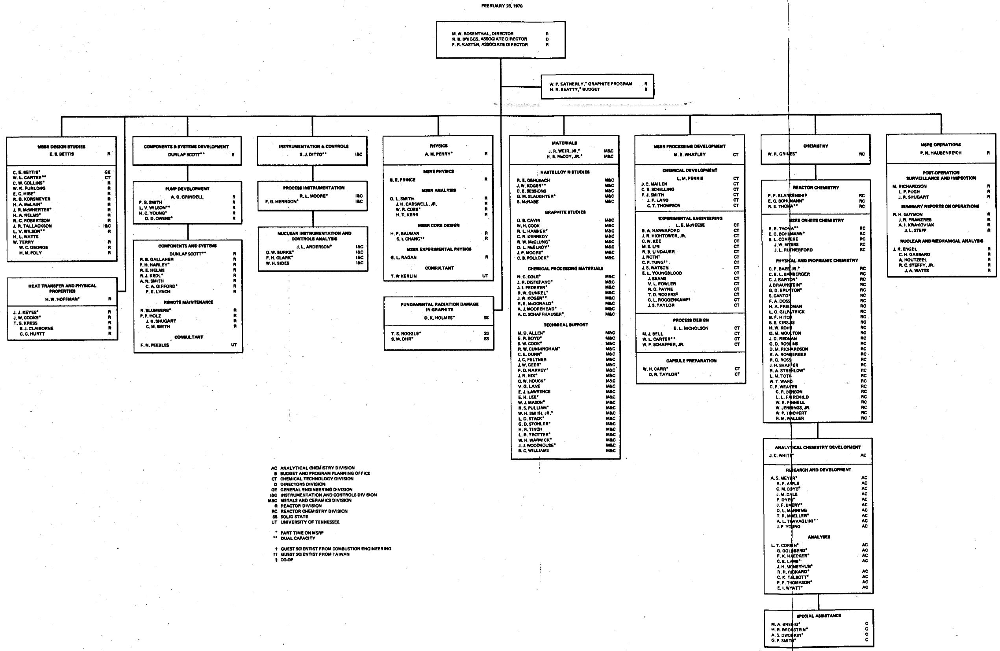

#

A

.

$\therefore m - 1 \neq  0$ ;

$\therefore m = \frac{3}{11}$ ;

.

.

.

#

（）

$\therefore m = \frac{3}{11}$

.

.

.

$\therefore m = \frac{3}{11}$

D

${13}/{14}$

C

# INTERNAL DISTRIBUTION

1. R. K. Adams

2. G. M. Adamson

3. R. G. Affel

4. J. L. Anderson

5. W. E. Atkinson

6. R. F. Apple

7. C.F. Baes

8. J. M. Baker

9. S. J. Ball

10. C. E. Bamberger

11. C. J. Barton

12. H. F. Bauman

13. M. S. Bautista

14. S. E. Beall

15. R. L. Beatty

16. M. J. Bell

17. M. Bender

18. C. E. Bettis

19. E. S. Bettis

20. D. S. Billington

21. R. E. Blanco

22. F. F. Blankenship

23. J. O. Blomeke

24. R. Blumberg

25. A. L. Boch

26. E. G. Bohlmann

27. C. J. Borkowski

28. H.I. Bowers

29. C. M. Boyd

30. G. E. Boyd

31. J. Braunstein

32. M. A. Bredig

33. E. J. Breeding

48. R. B. Briggs

49. H. R. Bronstein

50. F. R. Bruce

51. G. D. Brunton

52. O.W. Burke

53. D. A. Canonico

54. S. Cantor

55. D. W. Cardwell

56. W. H. Carr

57. W. L. Carter

58. G.I. Cathers

59. J. E. Caton

60. O. B. Cavin

61. J. M. Chandler

62. S. I. Chang

63. C. J. Claffey

64. F. H. Clark

65. W. R. Cobb

66. H. D. Cockran

67. Nancy Cole

68. C. W. Collins

69. E. L. Compere

70. J. A. Conlin

71. K. V. Cook

72. W. H. Cook

73. J. W. Cooke

74. L. T. Corbin

75. W. B. Cottrell

76. S. J. Cromer (K-25)

77. J. L. Crowley

78. F. L. Culler

79. D. R. Cuneo

80. J. M. Dale

81. D. G. Davis

82. W. W. Davis

83. R. J. DeBakker

84. J. H. Devan

85. J. R. Distefano

86. S. J. Ditto

87. R. G. Donnelly

88. F. A. Doss

89. A. S. Dworkin

90-91. W.P.Eatherly

92. J.R. Engel

93. E. P. Epler

94. W. K. Ergen

95. J. I. Federer

96. D. E. Ferguson

97. L. M. Ferris

98. A. P. Fraas

99. J. K. Franzreib

00. H. A. Friedman

01. D.N. Fry

02. J. H. Frye, Jr.

03. L. C. Fuller

04. W. K. Furlong

05. C. H. Gabbard

106. W. R. Gall

107. R. B. Gallaher

108. R. E. Gehlbach

109. J. H. Gibbons

110. R.G. Gilliland

111. L. O. Gilpatrick

112. G. Goldberg

113. W. R. Grimes

114. A. G. Grindell

115. R. W. Gunkel

116. R. H. Guymon

117. J. P. Hammond

118. R. P. Hammond

119. R. L. Hammer

120. T. H. Handley

121. B. A. Hannaford

122. P. H. Harley

123. D.G.Harman

124. W. O. Harms

125. C. S. Harrill

126. P. N. Haubenreich

127. F. K. Heacker

128. R. E. Helms

129. P. G. Herndon

130. D. N. Hess

131. R.F. Hibbs

132. J.R. Hightower

133. M. R. Hill

134. E.C.Hise

135. B.F.Hitch

136. H. W. Hoffman

137. D. K. Holmes

138. P. P. Holz

139. R. W. Horton

140. A. Houtzeel

141. T. L. Hudson

142. W. R. Huntley

143. H. Inouye

144. W. H. Jordan

145. P. R. Kasten

146. R. J. Kedl

147. C. W. Kee

148. M. T. Kelley

149. M. J. Kelly

150. C. R. Kennedy

151. T. W. Kerlin

152. H. T. Kerr

153. J. J. Keyes

154. D. V. Kiplinger

155. S. S. Kirlis

156. L. R. Koffman

157. J.W. Koger

158. H.W. Kohn

159. R. B. Korsmeyer

160. A. I. Krakoviak

161. T. S. Kress

162. J. W. Krewson

163. C.E. Lamb

164. J. A. Lane

165. M. S. Lin

166. R. B. Lindauer

167. J. L. Liverman

168. R. S. Livingston

169. G. H. Llewellyn

170. E. L. Long

171. A. L. Lotts

172. M. I. Lundin

173. R.N. Lyon

174. R. L. Macklin

175. R. E. MacPherson

176. F. C. Maienschein

177. J. C. Mailen

178. D. L. Manning

179. C. D. Martin

180. W. R. Martin

181. H. V. Mateer

182. C.E. Mathews

183. T. H. Mauney

184. R. W. McClung

185. H. E. McCoy

186. D. L. McElroy

187. C: K. McGlothlan

188. C. J. McHargue

189. H. A. McLain

190. B. McNabb

191. L. E. McNeese

192. J. R. McWherter

193. H. J. Metz

194. A. S. Meyer

195. C. A. Mills

196. R. L. Moore

197. A. J. Moorhead

198. K. Z. Morgan

199. C. A. Mossman

200. D. M. Moulton

201. T. R. Mueller

202. M. L. Myers

203. H. H. Nichol

204. J. P. Nichols

205. E. L. Nicholson

206. T. S. Noggle

207. L. C. Oakes

208. S. M. Ohr

209. W. R. Osborn

210-211. R.B. Parker

212. P. Patriarca

213. A. M. Perry

214. T. W. Pickel

215. H. B. Piper

216. C. B. Pollock

217. H. M. Poly

218. B. E. Prince

219. H. P. Raaen

220. G. L. Ragan

221. J. L. Redford

222. J. D. Redman

223. D. M. Richardson

224. M. Richardson

225. G. D. Robbins

226. R. C. Robertson

227. D. J. Rose

228-278. M. W. Rosenthal

279. R. G. Ross

280. J. Roth

281. J. P. Sanders

282. H. C. Savage

283. W. F. Schaffer

284. C. E. Schilling

285. Dunlap Scott

286. J. L. Scott

287. H. E. Seagren

288. C. E. Sessions

289. J. H. Shaffer

290. E. D. Shipley

291. W. H. Sides

292. M. J. Skinner

293. G. M. Slaughter

294. A. N. Smith

295. F. J. Smith

296. G.P. Smith

297. O. L. Smith

298. P. G. Smith

299. A. H. Snell

300. I. Spiewak

301. C. E. Stevenson

302. H. H. Stone

303. R. A. Strehlow

304. R. D. Stulting

305. D. A. Sundberg

306. J. R. Tallackson

307. E. H. Taylor

308. W. Terry

309-310. R.E.Thoma

311. P. F. Thomason

312. L. M. Toth

313. D. B. Trauger

314. A. L. Travaglini

315. R.W. Tucker

316. Chia-Pao Tung

317. W. C. Ulrich

318. W.E. Unger

319. D. C. Watkin

320. G.M. Watson

321. J. S. Watson

322. H. L. Watts

323. C. F. Weaver

324. B. H. Webster

325. A. M. Weinberg

326. J. R. Weir

327. W.J. Werner

328. K.W. West

329. H. L. Whaley

330-335. M. E. Whatley

336. J. C. White

337. R. P. Wichner

338. L. V. Wilson

339. G. J. Young

340. H. C. Young

341. J. P. Young

342. E. L. Youngblood

343. F. C. Zapp

344. Biology Library

345-346. ORNL - Y-12 Technical Library Document Reference Section

347-349. Central Research Library

350-400. Laboratory Records Department

401. Laboratory Records, ORNL R.C.

# EXTERNAL DISTRIBUTION

402. J. A. Acciarri, Continental Oil Co., Panca City, Oklahoma, 74601   
403. J. S. V. Andrews, Atomic Energy Attache, UKAEA, British Embassy, Washington, D.C. 20008   
404. J. G. Asquith, Atomics International, P.O. Box 309, Canoga Park, California 91304   
405. Bruce L. Bailey, Great Lakes Carbon Corp., Pine Ave. & 58th, Niagara Falls, N.Y. 14302   
406. N. W. Bass, Brush Beryllium Co., 17876 St. Clair Ave., Cleveland, Ohio 44110   
407. David Bendaniel, General Electric Co., R&D Center, Schenectady, N.Y.   
408. J. C. Bowman, Union Carbide Technical Center, 12900 Snow Rd., Parma, Ohio 44130   
409. G. D. Brady, Materials Systems Division, UCC, Kokomo, Indiana 46901   
410. R. M. Bushong, UCC, Carbon Products Div., 12900 Snow Rd., Parma, Ohio 44130   
411. Pedro B. de Camargo, Brazilian-Comissao Nacional, Energia Nuclear, Caixa Postal 11049 Sao Paulo, Brazil   
412. Premo Chiotti, Ames Laboratory, Iowa State University, Ames, Iowa 50010   
413. Paul Cohen, Westinghouse Electric Corp., P.O. Box 158, Madison, Pennsylvania 15663   
414. D. F. Cope, Atomic Energy Commission, RDT Site Office (ORNL)   
415. J. W. Crawford, Atomic Energy Commission, Washington, D.C. 20545

416. F. E. Crever, National Nuclear Corp., 701 Welch Road, Palo Alto, California 94304   
417. M. W. Croft, Babcock and Wilcox Company, P.O. Box 1260, Lynchburg, Virginia 24505   
418. Walter A. Danker, Jr., Westinghouse Electric, P.O. Box 19218, Tampa, Florida 33616   
419. C. B. Deering, Black & Veatch, P.O. Box 8405, Kansas City, Missouri 64114   
420. Deslonde R. deBoisblanc, Evasco Services, Inc., 2 Rector St., New York, N.Y. 10006   
421. A. R. DeGrazia, USAEC, DRDT, Washington, D.C. 20545   
422. D. A. Douglas, Materials Systems Division, UCC, Kokomo, Indiana 46901   
423. Donald E. Erb, Battelle Memorial Institute, 505 King Ave., Columbus, Ohio 43201   
424. H. L. Falkenberry, Tennessee Valley Authority, 303 Power Building, Chattanooga, Tenn. 37401   
425. C. W. Fay, Wisconsin Michigan Power Co., 231 W. Michigan St., Milwaukee, Wisconsin 53201   
426. J. E. Fox, USAEC, DRDT, Washington, D.C. 20545   
427. Gerald Golden, Argonne National Laboratory, 9700 S. Cass Ave., Argonne, Ill., 60439   
428. A. Goldmen, UCC, 270 Park Ave., N.Y., N.Y. 10017   
429. W. J. Gray, Battelle-Northwest, 2325 Enterprise, Richland, Washington 99352   
430. W. W. Grigorieff, Assistant to the Executive Director, Oak Ridge Associated Universities   
431. Norton Habermann, RDT, USAEC, Washington, D.C. 20545   
432. Irving Hoffman, USAEC, Washington, D.C. 20545   
433. Harry Honig, Babcock & Wilcox, P.O. Box 1260, Lynchburg, Va. 24505   
434. E. E. Kintner, U.S. Atomic Energy Commission, Washington, D.C. 20545   
435. Brice W. Kinyon, Combustion Engineering, 911 W. Main St., Chattanooga, Tenn. 37402   
436. Gene Kramer, Southern California Edison Co., P.O. Box 351, Los Angeles, Calif. 90053   
437. P. M. Krishner, Pioneer Service and Engineering, 400 W. Madison St., Chicago, Ill. 60606   
438. J. Ladesich, Southern California Edison Co., P.O. Box 351, Los Angeles, Calif. 90053   
439. L. W. Lang, Douglas United Nuclear, 703 Bldg., Richland, Washington 99352   
440. R. A. Langley, Bechtel Corp., 50 Beale St., San Francisco, California 94119   
441. W. D. Manly, Cabot Corp., Stellar Division, Kokomo, Indiana 46901   
442. J. P. Mays, Great Lakes Carbon Co., 299 Park Avenue, New York, New York 10017   
443. W. B. McDonald, Battelle-Pacific Northwest Laboratory, Hanford, Washington 99352   
444-445. T. W. McIntosh, Atomic Energy Commission, Washington, D.C. 20545   
446. J. C. McKinley, ACRS Office, USAEC, Washington, D.C. 20545   
447. W. J. Mordarski, Nuclear Development, Combustion Engineering, Windsor, Connecticut 06095   
448. G. A. Muccini, Ashland Oil Inc., R&D Building, Ashland, Kentucky 41101   
449. W. A. Nystrom, Stackpole Carbon Company, St. Marys, Pa. 15857   
450. E. H. Okrent, *Jersey Nuclear Co.*, Bellevue, Washington 98004   
451. William E. Parker, Airco Speer Research, 47th & Packard Rd., Niagara Falls, N.Y. 14302   
452. Sidney J. S. Parry, Great Lakes Carbon Corp., P.O. Box 667, Niagara Falls, N.Y. 14302   
453. F. N. Peebles, Dean of Engineering, University of Tennessee, Knoxville, Tenn. 37900   
454. H. G. MacPherson, University of Tennessee, Knoxville, Tenn. 37900   
455. Kermit Laughon, Atomic Energy Commission, RDT Site Office (ORNL)   
456. C. L. Matthews, Atomic Energy Commission, RDT Site Office (ORNL)   
457. A. J. Pressesky, U.S. Atomic Energy Commission, Washington, D.C. 20545   
458. M. V. Ramaniah, Head, Radiochemistry Division, Ahabha Atomic Research Centre, Radiological Laboratories, Trombay, Bombay-85 AS, India   
459. David Richman, Research Division, USAEC, Washington, D.C. 20545   
460. J. A. L. Robertson, Atomic Energy of Canada Ltd., Chalk River, Ontario, Canada   
461. J. C. Robinson, Dept. of Nuclear Engineering, Univ. of Tenn., Knoxville, Tenn. 37900   
462. T. K. Roche, *Stellite Division*, Cabot Corp. 1020 Park Avenue, Kokomo, Ind. 46901   
463. M. A. Rosen, Atomic Energy Commission, Washington, D.C. 20545   
464. H. M. Roth, Atomic Energy Commission, ORO   
465. R. O. Sandberg, Bechtel, 220 Bush Street, San Francisco, Calif. 94119   
466. R. W. Schmitt, General Electric Co., Schenectady, New York 12301   
467. W. Schröck-Vietor, Kernforschungsanlage Julich, 517 Julich, Germany

468. R. N. Scroggins, U. S. Atomic Energy Commission, Washington, D.C. 20545   
469. M. Shaw, Atomic Energy Commission, Washington, D.C. 20545   
470. Winfield M. Sides, Northeast Utilities Service Co., P.O. Box 270, Hartford, Conn. 06101   
471. E. E. Sinclair, Atomic Energy Commission, Washington, D.C. 20545   
472. W. L. Smalley, Atomic Energy Commission, ORO   
473. Earl O. Smith, Black & Veatch, 1500 Meadowlake Parkway, Kansas City, Mo. 64114   
474. T. M. Snyder, General Electric Co., 175 Curtner Ave., San Jose, California 95103   
475. N. Srinivasan, Head, Full Reprocessing Division, Bhabha Atomic Research Centre, Trombay, Bombay 74, India   
476. Philip T. Stroup, Alcoa, P.O. Box 772, New Kensington, Pennsylvania   
477. A. E. Swanson, Black & Veatch, P.O. Box 8405, 1500 Meadowlake Parkway, Kansas City, Mo. 64114   
478. J. A. Swartout, UCC, New York, New York   
479. Richard Tait, Poco Graphite, P.O. Box 2121, Decatur, Texas 76234   
480. B. L. Tarmy, Esso Research & Engr. Co., P.O. Box 101, Florham Park, N.J. 07932   
481. C. L. Storrs, Combustion Engineering Inc., Prospect Hill Road, Windsor, Conn. 06095   
482. D. R. Thomas, Commonwealth Associates, Inc., 209 E. Washington Ave., Jackson, Michigan 4920   
483. J. R. Trinko, Ebasco Services, Inc., 2 Rector Street, New York, New York 10006   
484. M. Tsou, General Motors, 12 Mile & Mound Rds., Warren, Michigan 48089   
485. Denis D. Tytgat, Commission des Communautes, Europeennes, 200, Rue De La Loi, 1040 Bruxelles, Belgium   
486. J. W. Ullman, UCC, P.O. Box 278, Tarrytown, New York 10591   
487. G. B. von der Decken, Kernforschungsanlage Julich GmbH, 517 Julich, Germany   
488. C. H. Waugaman, Tennessee Valley Authority, 303 Power Bldg., Chattanooga, Tenn. 37401   
489. D. B. Weaver, Tennessee Valley Authority, New Sprankle Bldg., Knoxville, Tenn. 37900   
490. R. F. Wehrmann, Poco Graphite Inc., P.O. Box 2121, Decatur, Texas 76234   
491. J. T. Weills, Argonne National Laboratory, Argonne, Illinois   
492. M. J. Whitman, Atomic Energy Commission, Washington, D.C. 20545   
493. Mack P. Whittaker, Great Lakes Research Corp., P.O. Box 1031, Elizabethton, Tenn. 37643   
494. H. A. Wilber, Power Reactor Development Co., 1911 First St., Detroit, Michigan 48200   
495. Karl Wirtz, Battelle Seattle Research Center, 4000 NE 41st St., Seattle, Washington 98105   
496. James H. Wright, Westinghouse Electric, P.O. Box 355, Pittsburg, Pennsylvania 15230   
497. C. B. Zitek, Commonwealth Edison Co., 1st National Plaza, Chicago, Illinois 60690   
498. L. R. Zumwalt, North Carolina State University, P.O. Box 5636, State College Station, Raleigh, N.C. 27607   
499. Laboratory and University Division, AEC, ORO   
500. AEC Patent Office, ORO

501-708. Given distribution as shown in TID-4500 under Reactor Technology category (25 copies - CFSTI)