ORNL-4574

Contract No. W-7405-eng-26

Chemical Technology Division

MOLTEN-SALT FLUORIDE VOLATILITY PILOT PLANT: RECOVERY OF

ENRICIED URANIUM FROM ALUMINUM-CLAD FUEL ELEMENTS

W. H. Carr*

L.J.King

F. G. Kitts

W. T. McDuffee

F. W. Miles\*\*

*Present address: Allied Chemical Nuclear Products, Inc., Florham

Park, N. J. 07932

**Present address: General Electric Company, Midwest Fuel Recovery

Plant, Morris, I11. 60450

APRIL 1971

This report was prepared as an account of work sponsored by the United States Government. Neither the United States nor the United States Atomic Energy Commission, nor any of their employees, nor any of their contractors, subcontractors, or their employees, makes any warranty, express or implied, or assumes any legal liability or responsibility for the accuracy, completeness or usefulness of any information, apparatus, product or process disclosed, or represents that its use would not infringe privately owned rights.

OAK RIDGE NATIONAL LABORATORY

Oak Ridge, Tennessee

operated by

UNION CARBIDE CORPORATION

for the

U.S. ATOMIC ENERGY COMMISSION

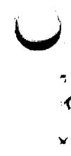

# CONTENTS

# Abstract 1

1. Introduction 2   
2. Description of the Molten-Salt Volatility Flowsheet 3   
3.Preparation of the K-Zr-Al Fluoride Dissolvent Salts. 8   
4. Descriptive Data for the Irradiated U-Al Fuel Elements Processed in Runs RA-1, -2, -3, and -4 11

4.1 Configuration, Composition, and Method of Handling 11   
4.2 Irradiation History 12   
4.3 Significant Fission Products 13

5. Dissolution of Fuel Elements, and Volatilization of $\mathbf{U}\mathbf{F}_{6}$ from the Melt by Fluorination 17

5.1 Dissolution of Spent Assemblies in Molten K-Zr-Al Fluoride Salts 17   
5.2 Conversion of the Dissolved $\mathbf{U}\mathbf{F}_4$ to $\mathbf{U}\mathbf{F}_6$ , and Transfer of the Volatilized $\mathbf{U}\mathbf{F}_6$ from the Melt to NaF Absorber Beds Using Elemental Fluorine 22   
5.3 Distribution of Significant Fission Products During Dissolution, Fluorination, and Desorption 26

6. Quality of $\mathbf{U}\mathbf{F}_6$ Product, and Uranium Inventory 34

6.1 Fission Product Decontamination Factors for the UF $^6$ Product 37   
6.2 Primary Radioactive Contaminants in the Product from Run RA-4 40   
6.3 Removal of Technetium, Neptunium, and Plutonium from the UF6 Product 41   
6.4 Nonradioactive Cationic Contaminants 43   
6.5 Cumulative Material Balances for Salt and Uranium 43

7. Release of Fission Products to the Environment 47   
8. Acknowledgments 50   
9.References. 52

Page

10. Appendixes 53

10.1 Appendix A: Fission Product Content of Irradiated Fuel Elements 54   
10.2 Appendix B: Dissolution of Fuel Elements 56   
10.3 Appendix C: Decontamination of Pilot Plant Equip- ment 62   
10.4 Appendix D: Corrosion of Vessels 63   
10.5 Appendix E: Radiation Safety 68   
10.6 Appendix F: Index of Volatility Pilot Plant Log Books 74

# ABSTRACT

We have developed and successfully demonstrated a molten-salt fluoride-volatility process for recovering decontaminated uranium from spent uranium-aluminum alloy ORR and LITR fuel elements clad in aluminum. The facilities and the process were essentially the same as those used for zirconium- and Zircaloy-clad fuels except that an aluminum-potassium-zirconium fluoride mixture was used as the carrier salt. The development program included the processing of both unirradiated and irradiated fuel elements. Fission product decontamination factors (fuel to $\mathrm{UF}_6$ product) for the $\mathrm{UF}_6$ products in the four hot runs were generally $10^{6}$ to $10^{10}$ . The uranium concentration in the salt after fluorination ranged from less than 0.1 to 9 ppm; total nonrecoverable losses in scrubbers and waste salt averaged less than $0.9\%$ . Dissolution of the fuel elements required 8 to 17 hr for $90\%$ completion, and 12 to 25 hr for $100\%$ completion; average dissolution rates were 0.6 and $0.4\mathrm{kg}$ of aluminum/hr, respectively. The release of fission products to the atmosphere during the first three hot runs was confined to 120 mCi of technetium, 5 mCi of ruthenium (which occurred in one run), undetectable amounts of $^{131}\mathrm{I}$ , and 47 to 60 Ci (calculated) of $^{85}\mathrm{Kr}$ .

In the fourth run, an ORR element that had been cooled less than four weeks was processed. Radiation exposures to personnel were controlled within tolerable limits. The decontamination factors (DF's) in this run ranged from 2 x $10^{5}$ to $10^{8}$ . Two major exceptions were the DF's for $^{99}\mathrm{Mo}$ and $^{125}\mathrm{Sb}$ , which were 36 and about 500 respectively. The product had a high radioactivity level due to the presence of $^{237}\mathrm{U}$ . The uranium concentration in the salt after fluorination in this run was approximately 0.1 ppm, and the total nonrecoverable loss was $0.4\%$ . In the short-cooled run (RA-4), 24 Ci of $^{85}\mathrm{Kr}$ and 2260 Ci of $^{133}\mathrm{Xe}$ (calculated) were released to the atmosphere during hydrofluorination; 20 Ci of technetium, along with barely detectable amounts of $^{131}\mathrm{I}$ ( $10^{-2}\mathrm{Ci}$ ) and ruthenium ( $10^{-3}\mathrm{Ci}$ ), were released during fluorination. The $^{85}\mathrm{Kr}$ and $^{133}\mathrm{Xe}$ were released over an extended period so that actual ground-level concentrations did not exceed a small fraction of the maximum permissible concentrations (MPC's) at any time.

# 1. INTRODUCTION

At ORNL, uranium-zirconium alloy fuels containing highly enriched uranium and irradiated to burnups of $32\%$ have been successfully processed, using the molten-salt fluoride-volatility process, after cooling periods as short as six months. However, the anticipated quantity of spent uranium-zirconium alloy fuel is insufficient to justify a molten salt-fluoride volatility processing plant. To be economically practical, such a plant would have to be capable of processing other types of nuclear reactor fuel as well.

In order to provide a larger processing load (and thereby improve plant economics) for a molten-salt fluoride-volatility plant, a development program was undertaken to extend the use of the volatility process mentioned above to the decontamination and recovery of unburned uranium in uranium-aluminum alloy (U-Al) fuel elements. This program culminated in the processing of highly enriched fuels, with approximately $30\%$ of the initial $^{235}\mathrm{U}$ fissioned, within 25 days of discharge from a reactor operating at a flux of greater than $2 \times 10^{14}$ neutrons $\mathrm{cm}^{-2} \mathrm{sec}^{-1}$ .

Five cold runs and four hot runs were made in the Volatility Pilot Plant* (VPP) at ORNL. In the first two cold runs, multiplate aluminum dummy fuel elements were dissolved; dummy fuel and unirradiated $\mathrm{UF}_4$ were processed in the remaining three cold runs. In the hot runs, fuel from the Low Intensity Test Reactor (LITR) and the Oak Ridge Research Reactor (ORR) was processed after cooling periods ranging from less than 30 days to 18 months. The hot runs were followed by an additional dummy dissolution, four barren salt flushes, aqueous decontamination, corrosion measurements, and, finally, equipment sectioning.

The purpose of this report is to present the information obtained in the VPP runs; primary emphasis is on the four hot runs (LITR fuel cooled 18 months and ORR fuel cooled 6 months, 3 months, and 25 days respectively). The molten-salt fluoride-volatility flowsheet and a summary of the operational experience and results for the processing

of aluminum-base fuels in the VPP are included. The irradiation histories of the fuel elements that were dissolved, the compositions of the molten salts employed, and the two principal chemical reaction steps of hydrofluorination and fluorination are discussed in detail. Special attention is given to the distribution and release of fission products. Data regarding the purity of the $\mathrm{UF_6}$ products, the nonrecoverable uranium losses, the uranium and salt balances, and the radiation experience (radiation intensity measurements as well as personnel exposures) are also presented. Equipment design and performance, and operating procedures that differ from those used in the earlier zirconium program, are described elsewhere.[2] Complete discussions of equipment and procedures in the zirconium program may also be found elsewhere.[1,3,4]

In this report, the molten-salt fluoride-volatility process as applied to U-Al fuels is referred to as "the volatility process," even though it is only one of many volatility processes. This particular volatility process essentially consists of four steps: (1) dissolution of fuel elements in a molten fluoride salt, by reaction with anhydrous HF, to produce $\mathrm{UF_4}$ and $\mathrm{AlF_3}$ ; (2) removal and partial decontamination of the uranium by fluorination with fluorine, which converts the $\mathrm{UF_4}$ to $\mathrm{UF_6}$ ; (3) further purification of the $\mathrm{UF_6}$ by passage through beds of NaF and $\mathrm{MgF_2}$ pellets, utilizing sorption and desorption techniques; and (4) recovery of the $\mathrm{UF_6}$ product by solid-phase condensation. A more detailed description of the process follows in the next section.

# 2. DESCRIPTION OF THE MOLTEN-SALT VOLATILITY FLOWSHEET

A simplified schematic diagram, or flowsheet, of the equipment used in the VPP is shown in Fig. 2.1. In accordance with this flowsheet, each irradiated fuel element was brought into the pilot plant in the shielded carrier-charger (FV-9501). The carrier-charger was centered over the charging chute, and the multiplate element was lowered (by a zirconium wire) directly into the 5-in.-diam bottom section of the dissolver (FV-1000), where it rested on the distributor plate. In most instances, a second element was placed on top of the first. The

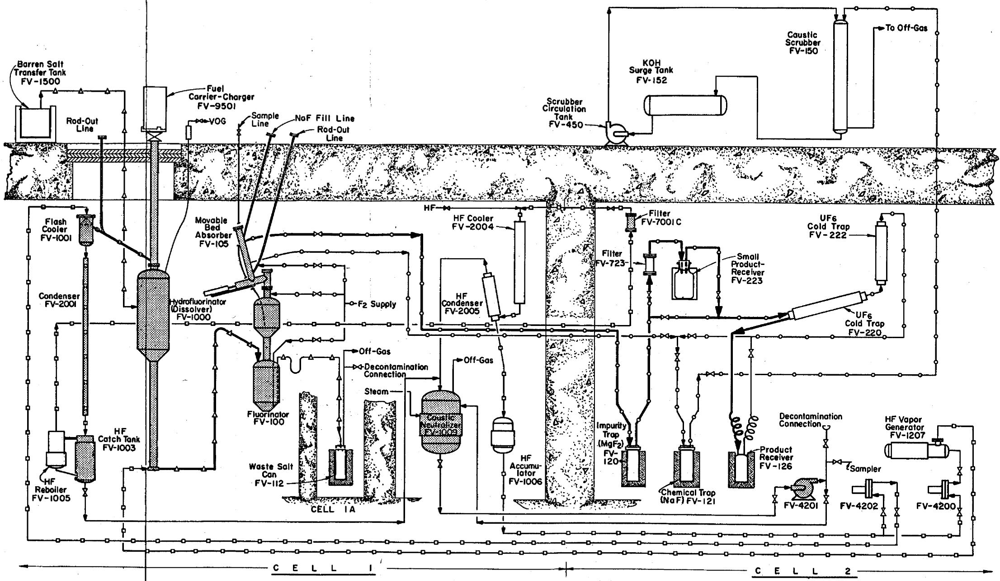  
NOTES: Shaded vessels are those which were decontaminated. NORMAL FLOW LEGEND U HF -F2 Mollen Salt Service   
Fig. 2.1. Schematic Flowsheet of Equipment in Volatility Pilot Plant.

K-Zr-Al fluoride salt was mixed as a powder, added to the barren salt transfer tank (FV-1500), melted $(\mathrm{mp} = \sim 600^{\circ}\mathrm{C})$ , sampled, and transferred to the dissolver (also called the hydrofluorinator), which had been pre-heated to $600 - 650^{\circ}\mathrm{C}$ .

Anydrous HF was distilled batchwise into the system through the HF cooler (FV-2004) to the HF accumulator (FV-1006). A stream of liquid HF was pumped from the accumulator to the HF vapor generator (FV-1207), where it was vaporized; the vapor was superheated to $100^{\circ}\mathrm{C}$ , metered, and fed to the dissolver beneath the distributor plate. The HF dissolved in the salt and reacted with the elements to produce $\mathrm{AlF}_3$ and $\mathrm{UF_4}$ (which became part of the melt), and hydrogen. The hydrogen, unreacted HF vapor, and inert gases from instrument purges left the dissolver and entered the flash cooler (FV-1001), where they contacted a second stream of liquid HF pumped from the HF accumulator. Solids that had been entrained from the dissolver were removed here, in the condenser (FV-2001), and in the HF catch tank (FV-1003). Solids that collected in the catch tank remained there until the end of the dissolution step, when the contents of the tank were transferred to the caustic neutralizer (FV-1009). In turn, the contents of the neutralizer were pumped to the hot chemical waste. The HF was distilled from the HF reboiler (FV-1005), and was collected in the HF accumulator after passing through filter FV-700lC and the HF cooler. The hydrogen and inert gases passed through the $-50^{\circ}\mathrm{C}$ HF condenser (FV-2005), which removed traces of HF, and were then bubbled through approximately 2 M KOH in the caustic neutralizer. This off-gas stream then joined the cell off-gas stream, received another caustic scrub, passed through absolute filters (AEC type), and was then released to the atmosphere through the 3020 stack.

After dissolution was complete (i.e., there was no further decrease in off-gas volume or HF inventory), the HF recirculation was stopped, and the melt was sparged with nitrogen to remove the dissolved HF. The molten salt $(\mathrm{mp} = \sim 550^{\circ}\mathrm{C})$ was then transferred to the fluorinator (FV-100), which had been preheated to approximately $600^{\circ}\mathrm{C}$ ; enough salt was left behind to fill the horizontal section of the connecting line

and thus form a plug, or "freeze valve," to separate the hydrofluorination equipment and the fluorination equipment.

The fluorinator was sparged with nitrogen to mix the new charge with any "heel" that remained from the previous run, and then the salt was sampled by lowering a copper ladle (on a chain) directly into the molten salt and "dipping" a small volume from beneath the surface of the melt. From such a "feed salt" sample, the uranium and fission product concentrations after hydrofluorination (and before fluorination) could be determined. After the sampling procedure was complete, elemental fluorine was passed through the melt to convert the $\mathrm{UF_4}$ to $\mathrm{UF_6}$ and to thereby remove it from the melt. The only important higher fluorides of fission products that were formed during fluorination and were not retained by NaF were $\mathrm{MoF_6}$ , $\mathrm{TeF_6}$ , and $\mathrm{TcF_6}$ .

Fluorine at 12 to 60 psig was supplied by a tank trailer parked outside Bldg. 3019; it entered through a NaF trap (inlet end heated to $100^{\circ}\mathrm{C}$ ), which removed HF. The purified fluorine flowed into the fluori-nator through a draft tube, which induced circulation of the melt and improved gas-liquid contacting. Volatile $\mathbf{U}\mathbf{F}_{6}$ , volatile fission product fluorides, and unreacted fluorine passed out of the fluorinator through the movable bed absorber (FV-105); the higher fluorides of most of the fission products are nonvolatile, and they remained in the salt. This gas stream passed, first, through a section of the movable bed absorber containing NaF pellets at $400^{\circ}\mathrm{C}$ . Here, the bulk of the fission product fluorides that were volatilized or entrained were deposited; the $\mathbf{F}_{2}$ , essentially all of the U, Mo, Np, and Tc, and significant quantities of Zr, Nb, Ru, I2, and Te proceeded to the next section containing NaF pellets at $150^{\circ}\mathrm{C}$ . The $\mathbf{U}\mathbf{F}_{6}$ and most of the contaminants were sorbed under these conditions, while the fluorine, $\mathbf{MoF}_{6}$ , and some tellurium fluorides passed on to the chemical trap (FV-121), which contained NaF at ambient temperature. The $\mathbf{MoF}_{6}$ and any traces of $\mathbf{U}\mathbf{F}_{6}$ were removed by this trap. Fluorine was removed in a caustic scrubber (FV-150). The off-gas was then vented to the cell off-gas system (which included another caustic scrubber) and was filtered before being exhausted. Generally, a small amount of tellurium was released in the off-gas.

Desorption of $\mathrm{UF_6}$ (but not fission products) from the $150^{\circ}\mathrm{C}$ NaF pellets in the movable bed absorber was achieved by heating to $400^{\circ}\mathrm{C}$ in a fluorine sweep. This gas stream passed, first, through the impurity trap (FV-120), containing $\mathrm{MgF_2}$ at $100^{\circ}\mathrm{C}$ , for the removal of any technetium and neptunium present and, then, through the product filter (FV-723) into the small product cylinder (FV-223) maintained at $-70^{\circ}\mathrm{C}$ by dry ice--trichloroethylene slush. About 70 to $100\%$ of the $\mathrm{UF_6}$ was removed; the remainder was deposited in the $\mathrm{UF_6}$ cold traps (FV-220 and FV-222) held at -50 to $-60^{\circ}\mathrm{C}$ . The off-gas exited through the chemical trap (FV-121) to remove any traces of uranium and then passed to the caustic scrubber as previously. After HF had been flashed from the $\mathrm{UF_6}$ product under vacuum at $0^{\circ}\mathrm{C}$ , the small product cylinder was removed from the system, weighed, sampled, and assayed to confirm weight, composition, and enrichment of the product.

After fluorination, the melt in the fluorinator was sampled to determine the degree of removal of $\mathrm{UF_4}$ from the salt. Analytical results were received (usually $< 3\mu \mathrm{g}$ of uranium per gram of salt) before a portion of the NaF pellets from the $400^{\circ}\mathrm{C}$ section of the movable bed absorber was dumped into the fluorinator. In the event that the uranium concentration was higher than desired, the fluorination could be continued until an acceptable value of residual uranium was obtained.

The NaF pellets that were transferred to the fluorinator were from the lower section $(400^{\circ}\mathrm{C})$ of the absorber; since these pellets were the first to be contacted by the fluorination off-gas, they had the highest concentration of sorbed fission products. The salt was sparged with nitrogen to aid in the pellet dissolution; then another waste salt sample was taken to determine the amount of uranium held by the pellets. After this uranium analysis (usually $< 8\mathrm{ppm}$ ) was received, the waste salt was transferred to a waste salt can (FV-112) located inside a shielded carrier. Enough salt was left in the transfer line to form a freeze valve, as was done for the molten salt line between the dissolver and fluorinator. After cooling, the waste salt carrier was transported to the burial ground, where the waste salt can was dropped into an underground vault for long-term storage.

# 3. PREPARATION OF THE K-Zr-Al FLUORIDE DISSOLVENT SALTS

The ternary salt $\mathrm{KF - ZrF_4 - AlF_3}$ was considered for the dissolvent in the aluminum campaign in the VPP since Thoma, Sturm, and Guinn $^5$ had shown it to be the most suitable solvent system for the processing of aluminum-uranium fuels. The use of this salt would permit us to operate at relatively low temperatures, thus minimizing corrosion and avoiding the difficulties that would otherwise result from the low melting point $(660^{\circ}\mathrm{C})$ of aluminum.

A portion of the revised triangular plot of liquidus temperature as a function of composition for the system $\mathrm{KF - ZrF_4 - AlF_3}$ is shown in Fig. 3.1. This portion includes the only region with melting points less than $600^{\circ}\mathrm{C}$ . It is easily seen that any dissolution path (e.g., heavy, dashed lines) that is chosen to maximize capacity will start at the maximum allowable melting point, cross a region of lower melting point, and terminate at the maximum melting point that is allowable during fluorination. Obviously, the higher the temperature that can be tolerated, the greater the capacity of the salt for aluminum. A maximum melting point of $600^{\circ}\mathrm{C}$ was chosen for the beginning salt. This permitted operation at a temperature slightly above the melting point, and still allowed for a reasonable temperature rise (due to reaction heat) without attaining the melting point of aluminum. The melting point at the end of dissolution was held to $550^{\circ}\mathrm{C}$ to limit the corrosive effect of elemental fluorine on the nickel fluorinator.

For all four hot runs, barren salt containing 64.3 to 63.0 mole % KF and 35.7 to 37.0 mole % $\mathsf{ZrF_4}$ (mp, $\sim 600^{\circ}C$ ) was transferred to the hydrofluorinator. These salts, when mixed with the small "heels" carried over in the hydrofluorinator, gave the desired initial compositions. The binary salts were prepared by dry-mixing commercial grades of $\mathsf{K}_2\mathsf{ZrF}_4$ (containing $27\%$ potassium and $32.1\%$ zirconium, by weight) and $\mathsf{ZrF_4}$ (54 to $54.5\%$ zirconium). The granular salts and mixtures were handled in air; no special precautions were taken, except that a reasonable effort was made to minimize the time during which the salt was exposed to moisture.

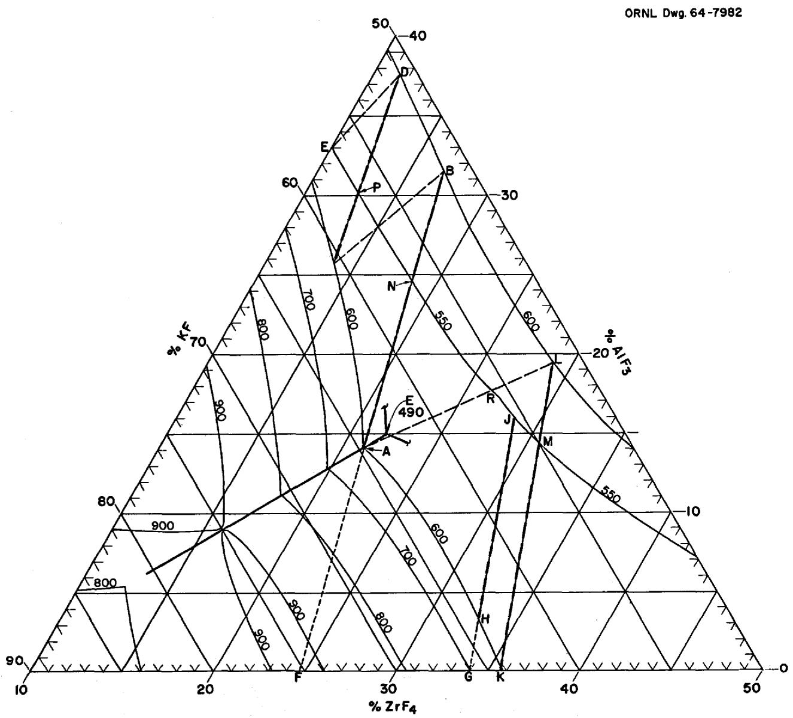  
Fig. 3.1. Portion of the $\mathrm{KF - ZrF_4 - AlF_3}$ System That is Applicable to the Dissolution of U-Al Fuels.

<table><tr><td rowspan="2">POINT</td><td colspan="3">COMPOSITION, mole %</td><td rowspan="2">POINT</td><td colspan="3">COMPOSITION, mole %</td></tr><tr><td>KF</td><td>ZrF4</td><td>AlF3</td><td>KF</td><td>ZrF4</td><td>AlF3</td></tr><tr><td>A</td><td>64.7</td><td>21.1</td><td>14.2</td><td>J</td><td>55.5</td><td>28.5</td><td>16.0</td></tr><tr><td>E</td><td>57.0</td><td>10.0</td><td>33.0</td><td>K</td><td>64.3</td><td>35.7</td><td>0.0</td></tr><tr><td>F</td><td>75.3</td><td>24.7</td><td>0.0</td><td>M</td><td>55.0</td><td>30.6</td><td>14.4</td></tr><tr><td>G</td><td>66.0</td><td>34.0</td><td>0.0</td><td>N</td><td>56.9</td><td>18.6</td><td>24.5</td></tr><tr><td>H</td><td>63.9</td><td>32.9</td><td>3.2</td><td></td><td></td><td></td><td></td></tr></table>

The mixture was melted in a closed vessel; a nitrogen purge was maintained through the vapor space, and a nitrogen sparge was used to promote mixing when melting began. There was no evidence (thermal) of $\mathrm{H}_2\mathrm{O}$ evolution at any temperature, although the odor of HF was quite evident. The melt was clear and had a low viscosity; transfer of the barren salt into the system was accomplished without difficulty.

Although the binary salt just described provided a highly satisfactory starting material for processing U-Al fuels, we wanted to demonstrate dissolution with a salt initially containing aluminum. The aluminum could easily be supplied by leaving an aluminum-rich heel in the hydrofluorinator. The remainder of the charge would then consist of $\mathrm{K}_2\mathrm{ZrF}_6$ and KF; the substitution of low-cost KF for $\mathrm{ZrF}_4$ would greatly reduce the cost of the salt components. Although the addition of solid $\mathrm{K}_2\mathrm{ZrF}_6$ -KF, as outlined, could not be done in VPP equipment because of design limitations, partial transfer (i.e., terminating a molten salt transfer at a specified point) had been demonstrated during the zirconium campaign.

We encountered difficulty in all early attempts to prepare a ternary $\mathrm{KF - ZrF_4 - AlF_3}$ barren salt. Although salt materials (i.e., commercial $\mathrm{K}_2\mathrm{ZrF}_6$ and $\mathrm{KF}$ , and specially-dried $\mathrm{AlF_3}$ ) were carefully pre-mixed, fusion was always incomplete. A sediment, having the consistency of coarse sand, was evident in the bottom of the melt vessel, while a layer of undissolved material floated on the surface of the melts. When the ternary phase diagram (liquidus temperature vs composition) was examined, revised data showed that these melts had liquidus temperatures about $85^{\circ}\mathrm{C}$ higher than those indicated by the former triangular plot. However, mixtures whose compositions had been adjusted to the data of the new diagram exhibited the same characteristics. Although the dissolvent salt could not be fused completely, experiments showed that the product salt, after aluminum dissolution and HF sparging, was a single-phase melt and could be transferred readily in the liquid state. Hence, for initial operations in the VPP, the ternary salt was prepared by mixing, melting as much as was possible, allowing the salt to freeze, and breaking the frozen salt into chunks of

non-homogeneous solid. These chunks were then dropped into the dissolver. This experimental procedure was used only for cold runs (liquid binary salt was used in the hot runs); it was reasonably satisfactory for cold runs, but would be hazardous if used to charge a highly contaminated hydrofluorinator.

After the last run in which irradiated fuel was processed (RA-4), a cleanout run was made using a dummy aluminum element. In the latter run, a molten $\mathrm{KF - ZrF_4 - AlF_3}$ ternary salt was transferred successfully into the system. The target composition was 63-21-16 mole % $\mathrm{KF - ZrF_4 - AlF_3}$ , which was thought to be the composition of a ternary eutectic with the lowest-melting salt in the immediate area of interest. Heating to $650^{\circ}\mathrm{C}$ appeared to clarify the melt; however, a few inches of sediment was found in the bottom of the melt vessel. When $\mathrm{ZrF_4}$ was added, to increase the $\mathrm{ZrF_4}$ content to 22.33 mole %, the sediment disappeared. It did not reappear upon cooling to $600^{\circ}\mathrm{C}$ . Thus the final composition of the barren salt that was transferred into the system was 61.94-22.33-15.73 mole % $\mathrm{KF - ZrF_4 - AlF_3}$ .

4. DESCRIPTIVE DATA FOR THE IRRADIATED U-AL FUEL ELEMENTS PROCESSED IN RUNS RA-1, -2, -3, AND -4

4.1 Configuration, Composition, and Method of Handling

The irradiated U-Al fuel elements processed in this campaign were of the multiplate box type, with curved fuel plates, that is used in the Oak Ridge Research Reactor (ORR) and the Low Intensity Test Reactor (LITR). When received, the elements had overall lengths of 26 to 27 in. (the end boxes had been removed), and the overall cross section of each was essentially 3.0 by 3.1 in. There were nineteen 2.8-in.-wide fuel-bearing plates brazed or swaged between two slotted (inert) side plates. The cladding and structural material was aluminum, and the "active" core alloy was approximately $18\%$ uranium-- $82\%$ aluminum. The 17 "inside" fuel plates were 24.625 in. long (active length, 23.625 in.) and 0.050 in. thick overall (core alloy, 0.020 in.; cladding, 0.015 in.

each side). The two fuel plates comprising two sides of the box had the same alloy core as the "inside" plates, but were 2.520 in. longer (overall), and the aluminum cladding was $1 - 1 / 2$ times as thick (for an overall thickness of 0.065 in.).

Prior to processing, the elements were stored in a canal under approximately 10-1/2 ft of water. To transfer the elements to the processing plant, a shielded (9 in. of lead) charger-carrier was lowered to the bottom of the canal. A 0.060-in.-diam zirconium wire, which had been threaded between the plates of the elements and through an opening in the closed end of the carrier, was used to slide the elements, horizontally, from a loading table into the cavity of the charger-carrier. The carrier was closed, hoisted from the canal, and, after appropriate procedures to prevent the spread of contamination, brought into the processing plant. It was placed on the enclosure that shielded the top of the charging chute (centered above the dissolver), with its axis vertical and the closed end up. The carrier drawer and the charging chute valves were opened, and the elements were lowered directly into the 5-in.-diam section of the dissolver by means of the zirconium wire that was used to load the elements into the carrier. The wire was cut while still under load (the elements were allowed to drop a few inches); the severed wire withdrew into the charging chute sufficiently to clear the valves closing the top of the chute.

# 4.2 Irradiation History

The elements processed in runs RA-2, -3, and -4 had been used in ORR cores, while the RA-1 charge was part of an LITER fueling. In the ORR, elements are usually irradiated for periods of 10 to 14 days; then they are removed from the reactor and allowed to cool for 12 to 180 days before being reinserted for the next cycle. Burnups of 2 to $10\%$ per cycle are accumulated over four or five cycles until a total burnup of about 28 to $32\%$ is achieved. (Here, burnup is defined as the number of atoms of $^{235}\mathrm{U}$ that have fissioned, divided by the number of atoms of $^{235}\mathrm{U}$ initially present; thus burnup does not include the $^{235}\mathrm{U}$ depletion suffered in the formation of $^{236}\mathrm{U}$ by neutron capture.)

The irradiation cycles for the fuel elements that were processed in the VPP during the aluminum campaign are shown in Table 4.1. For fuel elements 74C, 47C, 60D, 58D, and 93D, each line represents an irradiation cycle for a specified time (shown in hours) in the reactor at the indicated average neutron flux for the element's particular location. Both the burnup achieved during each cycle and the cooling (or decay) period observed prior to the subsequent cycle are given. The decay time listed for the last cycle for each element is the time from reactor shutdown to the beginning of the dissolution step in the VPP. This value is used throughout this report to designate the cooling time for the element(s) in each run.

In the LITR, elements are placed in the core, where they remain until the desired burnup is achieved. New elements are initially placed on the periphery of the core and later, during the appropriate shutdown, are transferred to the center section. The irradiation times listed in Table 4.l for the fuel elements processed in run RA-l are the total times the elements were in the reactor. These times are much longer than those for ORR fuels because of the much lower flux in the LITR.

# 4.3 Significant Fission Products

The quantities of the principal fission products that were present in the irradiated fuel elements at the time of their dissolution are shown in Table 4.2. These fission products are divided into two slightly overlapping categories: nuclides contributing a significant part of the total radioactivity, and nuclides that, due to volatility at various times during processing, must receive special consideration regardless of the amount present. The quantities given in the table were calculated, using the CRUNCH code, and take into account the alternate periods of irradiation and decay described in Sect. 4.2. (The complete tabulation of the quantities of fission products present is given in Table A-1 in Appendix A.)

The most important determinant of the radioactivity contributed by a particular nuclide at a specific cooling time is its half-life

Table 4.1. Irradiation History of Fuel Elements Processed in the VPP During the Aluminum Campaign   

<table><tr><td>Run No.</td><td>Fuel Element No.</td><td>Flux (1014neutrons cm-2sec-1)</td><td>Irradiation Time (hr)</td><td>Burnupa (%)</td><td>Decay Timeb (days)</td><td>Date of Reactor Discharge</td><td>Date of VPP Processing</td></tr><tr><td>RA-1</td><td>L103</td><td>0.18</td><td>9417</td><td>21.9</td><td>552</td><td>3-5-63</td><td>9-9-64</td></tr><tr><td>RA-1</td><td>N349</td><td>0.18</td><td>11417</td><td>25.3</td><td>582</td><td>2-5-63</td><td>9-9-64</td></tr><tr><td rowspan="6">RA-2</td><td rowspan="6">74C</td><td>1.48</td><td>242</td><td>6.0</td><td>69.1</td><td></td><td></td></tr><tr><td>1.08</td><td>185</td><td>2.7</td><td>16.5</td><td></td><td></td></tr><tr><td>2.17</td><td>261</td><td>8.6</td><td>131.0</td><td></td><td></td></tr><tr><td>2.17</td><td>224</td><td>6.7</td><td>47.0</td><td></td><td></td></tr><tr><td>2.31</td><td>291</td><td>8.3</td><td>174.0</td><td>4-23-64</td><td></td></tr><tr><td></td><td>1203</td><td>32.3</td><td></td><td></td><td>10-14-64</td></tr><tr><td rowspan="6">RA-2</td><td rowspan="6">47C</td><td>1.10</td><td>296</td><td>5.4</td><td>180.2</td><td></td><td></td></tr><tr><td>1.42</td><td>415</td><td>9.2</td><td>15.9</td><td></td><td></td></tr><tr><td>1.74</td><td>276</td><td>6.9</td><td>23.4</td><td></td><td></td></tr><tr><td>2.22</td><td>18</td><td>0.5</td><td>118.8</td><td></td><td></td></tr><tr><td>2.27</td><td>291</td><td>8.4</td><td>174.0</td><td>4-23-64</td><td></td></tr><tr><td></td><td>1296</td><td>30.4</td><td></td><td></td><td>10-14-64</td></tr><tr><td rowspan="6">RA-3</td><td rowspan="6">60D</td><td>1.48</td><td>80</td><td>2.0</td><td>13.0</td><td></td><td></td></tr><tr><td>1.48</td><td>229</td><td>5.5</td><td>32.4</td><td></td><td></td></tr><tr><td>1.08</td><td>325</td><td>5.4</td><td>17.3</td><td></td><td></td></tr><tr><td>1.72</td><td>292</td><td>7.3</td><td>111.7</td><td></td><td></td></tr><tr><td>2.09</td><td>276</td><td>7.6</td><td>77.0</td><td>8-24-64</td><td></td></tr><tr><td></td><td>1202</td><td>27.8</td><td></td><td></td><td>11-11-64</td></tr><tr><td rowspan="5">RA-3</td><td rowspan="5">58D</td><td>1.65</td><td>59</td><td>1.6</td><td>43.4</td><td></td><td></td></tr><tr><td>1.30</td><td>361</td><td>7.7</td><td>14.3</td><td></td><td></td></tr><tr><td>2.16</td><td>310</td><td>10.0</td><td>116.9</td><td></td><td></td></tr><tr><td>2.35</td><td>276</td><td>8.6</td><td>77.0</td><td>8-24-64</td><td></td></tr><tr><td></td><td>1006</td><td>27.9</td><td></td><td></td><td>11-11-64</td></tr><tr><td rowspan="5">RA-4</td><td rowspan="5">93D</td><td>1.58</td><td>290</td><td>7.9</td><td>26.4</td><td></td><td></td></tr><tr><td>1.38</td><td>297</td><td>7.6</td><td>12.8</td><td></td><td></td></tr><tr><td>0.88</td><td>301</td><td>6.2</td><td>134.4</td><td></td><td></td></tr><tr><td>2.35</td><td>240</td><td>6.4</td><td>24.8</td><td>11-15-64</td><td></td></tr><tr><td></td><td>1128</td><td>28.1</td><td></td><td></td><td>12-9-64</td></tr></table>

\(\mathbf{a}_{\text {Burnup }} = \frac{\text { atoms of }^{235} \mathrm{U}\) fissioned}{\text {atoms of }^{235} \mathrm{U}\) initially present.}   
bDecay time is cooling time between irradiation cycles or between final discharge of the fuel element and the start of processing in the VPP.

Table 4.2. Principal Fission Products Present in Irradiated Fuel Elements Processed   
Fission product activities are corrected to time of dissolution   

<table><tr><td colspan="7">Nuclides Contributing Significantly to the Total Activity of Irradiated U-Al Fuels</td><td colspan="7">Volatile and/or Otherwise Troublesome Nuclides</td></tr><tr><td rowspan="2">Nuclidea</td><td colspan="2">Half-Life</td><td colspan="4">Calculated Activity in Fuel Charge at Time of Processing (curies)</td><td rowspan="2">Nuclidea</td><td colspan="2">Half-Life</td><td colspan="4">Calculated Activity in Fuel Charge at Time of Processing (curies)</td></tr><tr><td>Years</td><td>Days</td><td>RA-1</td><td>RA-2</td><td>RA-3</td><td>RA-4b</td><td>Years</td><td>Days</td><td>RA-1</td><td>RA-2</td><td>RA-3</td><td>RA-4b</td></tr><tr><td>85Kr</td><td>10.27</td><td></td><td>47</td><td>c</td><td></td><td></td><td>85Kr</td><td>10.27</td><td></td><td>47.3</td><td>59.5</td><td>54.1</td><td>24.2</td></tr><tr><td>89Sr</td><td></td><td>54</td><td></td><td>2252</td><td>6036</td><td>6306</td><td>99Mo</td><td></td><td>2.8</td><td>d</td><td></td><td></td><td>148</td></tr><tr><td>90Sr</td><td>28</td><td></td><td>377</td><td>450</td><td>403</td><td></td><td>103Ru</td><td></td><td>41</td><td>0.5</td><td>748</td><td>2766</td><td>3986</td></tr><tr><td>91Y</td><td></td><td>58</td><td></td><td>3131</td><td>7973</td><td>7928</td><td>106Ru</td><td>1.0</td><td></td><td>167</td><td>445</td><td>491</td><td>242</td></tr><tr><td>95Zre</td><td></td><td>63</td><td>31</td><td>3874</td><td>9189</td><td>8333</td><td>125Sb</td><td>2.7</td><td></td><td>9.3</td><td>14.7</td><td>14.1</td><td>6.5</td></tr><tr><td>95Nb e,f</td><td></td><td>35</td><td>70</td><td>7342</td><td>14505</td><td>7523</td><td>127Sb</td><td></td><td>3.9</td><td></td><td></td><td></td><td>30.9</td></tr><tr><td>103Ru</td><td></td><td>41</td><td></td><td>748</td><td>2766</td><td>3986</td><td>127Tef</td><td></td><td>90</td><td>1.7</td><td>51.4</td><td>100</td><td>48.2</td></tr><tr><td>106Ru</td><td>1.0</td><td></td><td>167</td><td>445</td><td>491</td><td></td><td>129Te</td><td></td><td>33</td><td></td><td>33.8</td><td>171</td><td>341</td></tr><tr><td>131I</td><td></td><td>8.05</td><td></td><td></td><td></td><td>2293</td><td>131I</td><td></td><td>8.05</td><td></td><td></td><td>8.5</td><td>2293</td></tr><tr><td>133Xe</td><td></td><td>5.27</td><td></td><td></td><td></td><td>2261</td><td>132Te</td><td></td><td>3.2</td><td></td><td></td><td></td><td>232</td></tr><tr><td>137Cs c</td><td>33</td><td></td><td>323</td><td>383</td><td>342</td><td></td><td>133Xe</td><td></td><td>5.27</td><td></td><td></td><td></td><td>2261</td></tr><tr><td>140Ba</td><td></td><td>12.80</td><td></td><td></td><td>331</td><td>8243</td><td></td><td></td><td></td><td></td><td></td><td></td><td></td></tr><tr><td>141Ce</td><td></td><td>32</td><td></td><td>761</td><td>4059</td><td>8559</td><td></td><td></td><td></td><td></td><td></td><td></td><td></td></tr><tr><td>143Pr</td><td></td><td>13.7</td><td></td><td></td><td>442</td><td>8378</td><td></td><td></td><td></td><td></td><td></td><td></td><td></td></tr><tr><td>144Ce</td><td></td><td>290</td><td>2338</td><td>7703</td><td>8964</td><td>4550</td><td></td><td></td><td></td><td></td><td></td><td></td><td></td></tr><tr><td>147Nd</td><td></td><td>11.3</td><td></td><td></td><td></td><td>3126</td><td></td><td></td><td></td><td></td><td></td><td></td><td></td></tr><tr><td>147Pm f</td><td>2.6</td><td></td><td>1081</td><td>1730</td><td>1676</td><td>734</td><td></td><td></td><td></td><td></td><td></td><td></td><td></td></tr><tr><td>Cooling Time (days)</td><td></td><td></td><td>567</td><td>174</td><td>77</td><td>25</td><td>Cooling Time (days)</td><td></td><td>567</td><td>174</td><td>77</td><td>25</td><td></td></tr></table>

The first nuclide in each decay chain that contributes a significant fraction of the total activity at the time of processing is tabulated. A "true" total activity would also include the activity of the short-lived daughters in secular equilibrium with the nuclides listed.

bThe fuel charge in this run was only one element. Two elements were used in each of the other three runs.   
cLess than $1 / 2\%$ of the total of the activities tabulated.   
Less than 0.01 curie.   
eIn addition to contributing significantly to the total dose, the nuclide is also volatile under certain conditions.   
A second significant nuclide is shown because the parent-daughter relationships do not fulfill the requirements for secular equilibrium.

$(t_{1/2})$ . The radiation intensity [determined by its decay constant $(\lambda) = \frac{0.693}{t_{1/2}} \sec^{-1}]$ of a long-lived nuclide is relatively low. On the other hand, a short-lived nuclide may almost completely disappear (i.e., it decreases by a factor of $v l 0^{3}$ after ten half-lives) in a relatively short time; however, as long as any significant fraction remains, the radiation intensity may be quite high due to the higher $\lambda$ . For these reasons, the quantities of long-lived nuclides shown in Table 4.2 decrease only slightly as decay times increase. Examples are $^{90} \mathrm{Sr}$ , $^{106} \mathrm{Ru}$ , and $^{137} \mathrm{Cs}$ , which comprise a large fraction of the activity in the long-cooled run, (RA-1), but are relatively insignificant in the short-cooled runs (RA-3 and RA-4). Nuclides with intermediate half-lives $(t_{1/2} = 30$ to 90 days), such as 32-day $^{141} \mathrm{Ce}$ , do not appear until shorter cooling times. Insignificant in run RA-1, $^{141} \mathrm{Ce}$ increases from minor significance in RA-2 to become the highest listed intensity in run RA-4. Four important short-lived $(t_{1/2} = < 6$ days) nuclides $-99 \mathrm{Mo}$ , $^{127} \mathrm{Sb}$ , $^{132} \mathrm{Te}$ , and $^{133} \mathrm{Xe}$ - are not encountered until run RA-4; four others $-^{131} \mathrm{I}$ , $^{140} \mathrm{Ba}$ , $^{143} \mathrm{Pr}$ , and $^{147} \mathrm{Nd}$ - with slightly longer half-lives $(t_{1/2} < 14$ days), are hardly notable until run RA-4. Obviously, the decay time is the variable that determines which nuclides will have decayed to insignificance and which remain.

The cyclic irradiation has an effect on the fission product spectrum at the time the fuel is discharged, but it is not nearly as important as the cooling time prior to processing. Since the cooling time between irradiation cycles is generally less than 135 days, the concentrations of long-lived $(t_{1/2} > 290$ days) nuclides increase steadily. The nuclides with intermediate lives (30 days $< t_{1/2} < 90$ days) alternately grow in and decay to give, when plotted, a "sawtooth" curve having gradually increasing maxima. The short-lived $(t_{1/2} < 14$ days) nuclides decrease to near $50\%$ or below on each cooling cycle.

5. DISSOLUTION OF FUEL ELEMENTS, AND VOLATILIZATION OF $\mathbf{U}\mathbf{F}_{6}$ FROM THE MELT BY FLUORINATION

5.1 Dissolution of Spent Assemblies in Molten K-Zr-Al Fluoride Salts

During the dissolution (hydrofluorination) of U-Al fuel elements, HF is vaporized in a steam-jacketed vessel, superheated to $100^{\circ}\mathrm{C}$ in an electrically heated coil, and fed to the dissolver (hydrofluorinator) through a line maintained at an average temperature of approximately $500^{\circ}\mathrm{C}$ (by autoresistance heating). The HF, which enters the dissolver beneath a distributor plate, is assumed to be at the temperature of the salt by the time it contacts the element. Although the HF feed rates may appear low (20 to $130\mathrm{g / min}$ ), they represent fairly high volumetric rates at $400$ to $600^{\circ}\mathrm{C}$ . For example, each gram of HF, fully dissociated, represents about $0.1\mathrm{ft}^3$ at $410^{\circ}\mathrm{C}$ and $0.127\mathrm{ft}^3$ at $600^{\circ}\mathrm{C}$ (average salt temperature).

The conditions and results (including data for the fuel charge, salt compositions, dissolver temperatures, dissolution rates and times required to attain $90\%$ and $100\%$ completion, and HF feed rates, consumption, and utilization) for the ten aluminum dissolutions in the VPP are shown in Table 5.1. The runs were made in the chronological order shown. The runs in the RA (Radioactive, Aluminum) series are listed in order of decreasing cooling time for the fuel elements processed: RA-1, approximately 540 days; RA-2, approximately 180 days; RA-3, approximately 80 days; and RA-4, 25 days. A cleanout run, DA-3, is discussed only because it involved a dissolution of aluminum comparable to others in the series.

The elements dissolved in the DA (Dummy, Aluminum) and UA (Uranium-Aluminum) runs were 17-plate aluminum dummies cut to the appropriate length to give the desired weight. In the UA runs, the uranium was added as finely powdered $\mathrm{UF_4}$ packaged in aluminium foil that was less than 1 mil thick. A double charge of $\mathrm{UF_4}$ was added in run UA-1 so that a measurable amount of $\mathrm{UF_6}$ product ( $>100\mathrm{g}$ ) could be withdrawn from the system after a uranium inventory near the normal steady-state value was established.

Table 5.1. Hydrofluorination ${}^{a}$ Conditions and Results for VPP Runs   

<table><tr><td rowspan="3">Run No.</td><td colspan="2">Weight of Fuel</td><td colspan="6">Molten Salt Composition (mole %)</td><td colspan="2">Hydrofluorinated Temperature(℃)c</td><td rowspan="3">HF Flow Rate (g/min)</td><td colspan="2">Dissolution Times</td><td colspan="2">Al Dissolution Rates (kg/hr)</td><td colspan="2">HF Consumed</td><td colspan="2">HF Utilization</td></tr><tr><td rowspan="2">Al (kg)</td><td rowspan="2">U (g)</td><td colspan="3">Initialb</td><td colspan="3">Final</td><td rowspan="2">Salt Section</td><td rowspan="2">Vapor Section</td><td rowspan="2">For 90% Completion (hr)</td><td rowspan="2">For 100% Completion (hr)</td><td rowspan="2">To 90% Dissolution</td><td rowspan="2">To 100% Dissolution</td><td rowspan="2">Quantity (kg)</td><td rowspan="2">% of Theoretical</td><td rowspan="2">At 90% Dissolution (%)</td><td rowspan="2">At 100% Dissolution (%)</td></tr><tr><td>K</td><td>Zr</td><td>Al</td><td>K</td><td>Zr</td><td>Al</td></tr><tr><td>DA-1</td><td>7.81</td><td>0</td><td>64.0</td><td>36.0</td><td>0</td><td>53.8</td><td>30.2</td><td>16.0</td><td>610</td><td>480</td><td>125-80</td><td>23.1</td><td>28.4</td><td>0.304</td><td>0.275</td><td>19.2</td><td>110.1</td><td>9.6</td><td>9.3</td></tr><tr><td>DA-2</td><td>7.9</td><td>0</td><td>64.4</td><td>22.0</td><td>13.6</td><td>55.1</td><td>18.8</td><td>26.1</td><td>616</td><td>500</td><td>70-120</td><td>8.9</td><td>12.8</td><td>0.799</td><td>0.616</td><td>17.6</td><td>111.4</td><td>29.8</td><td>22.8</td></tr><tr><td>UA-1</td><td>6.79</td><td>592</td><td>63.9</td><td>20.8</td><td>15.3</td><td>55.1</td><td>18.0</td><td>26.9</td><td>604</td><td>460</td><td>100-60</td><td>12.3</td><td>16.8</td><td>0.497</td><td>0.403</td><td>16.0</td><td>106.0</td><td>21.8</td><td>19.2</td></tr><tr><td>UA-2</td><td>6.62</td><td>304</td><td>63.2</td><td>33.5</td><td>3.3</td><td>55.0</td><td>29.1</td><td>15.9</td><td>620</td><td>505</td><td>130-50</td><td>22</td><td>26</td><td>0.271</td><td>0.255</td><td>15.4</td><td>104.8</td><td>8.7</td><td>8.1</td></tr><tr><td>UA-3</td><td>4.2</td><td>304</td><td>64.3</td><td>35.7</td><td>0</td><td>57.9</td><td>32.2</td><td>9.9</td><td>615</td><td>475</td><td>125-40</td><td>16.8</td><td>22.6</td><td>0.225</td><td>0.186</td><td>10.9</td><td>115.7</td><td>8.31</td><td>7.84</td></tr><tr><td>RA-1</td><td>8.80</td><td>323</td><td>64.3</td><td>35.7</td><td>0</td><td>55.0</td><td>30.6</td><td>14.4</td><td>608</td><td>467</td><td>125-75</td><td>16.6</td><td>25.0</td><td>0.494</td><td>0.364</td><td>20.2</td><td>100.0</td><td>18.0</td><td>14.3</td></tr><tr><td>RA-2</td><td>8.24</td><td>306</td><td>62.4</td><td>34.6</td><td>3.0</td><td>55.4</td><td>30.8</td><td>13.8</td><td>603</td><td>475</td><td>100</td><td>15.5</td><td>24.5</td><td>0.503</td><td>0.353</td><td>19.7</td><td>102.5</td><td>18.6</td><td>13.1</td></tr><tr><td>RA-3</td><td>8.17</td><td>324</td><td>62.8</td><td>36.8</td><td>0.4</td><td>55.1</td><td>32.3</td><td>12.6</td><td>575</td><td>470</td><td>40, 100</td><td>8.0</td><td>15.5</td><td>0.969</td><td>0.555</td><td>20.4</td><td>106.6</td><td>50.7</td><td>24.2</td></tr><tr><td>RA-4</td><td>4.2</td><td>159</td><td>62.1</td><td>36.4</td><td>1.5</td><td>55.5</td><td>32.6</td><td>11.9</td><td>575</td><td>440</td><td>20-100</td><td>10.0</td><td>12.3</td><td>0.378</td><td>0.343</td><td>9.8</td><td>105.0</td><td>18.7</td><td>16.0</td></tr><tr><td>DA-3</td><td>3.96</td><td>1</td><td>61.5</td><td>23.0</td><td>15.5</td><td>56.1</td><td>21.0</td><td>22.9</td><td>585</td><td>490</td><td>60, 100</td><td>9.7</td><td>10.7</td><td>0.37</td><td>0.37</td><td>9.9</td><td>112.5</td><td>14.9</td><td>14.9</td></tr></table>

Here, "hydrofluorination" and "dissolution" are used interchangeably.   
bCorrected for heel from previous run.   
Average. Represents cyclic behavior (within 10 to $15^{\circ}\mathrm{C}$ of the stated value).

In the RA runs, the charges were LITR (RA-1) and ORR elements (RA-2 through RA-4) that had been irradiated to burnups of 22 to $32\%$ .

The barren salts for all the runs except three (DA-2, UA-1, and DA-3) were binary mixtures consisting of approximately 64 mole % KF and 36 mole % ZrF₄. They were prepared from commercial-grade K₂ZrF₆ and ZrF₄. The "initial" salts (Table 5.1) in four of the runs contained 0.4 to 3.3 mole % AlF₃ supplied by heels left in the hydrofluorinated from the previous runs. In runs DA-2 and UA-1, the high initial AlF₃ was obtained by adding a ternary salt to the hydrofluorinated as a solid; in run DA-3, the target composition was a ternary eutectic with a melting point sufficiently low to permit the ternary salt to be transferred as a liquid. All the "final" melts contained 54 to 58 mole % KF and either 29 to 32.5 mole % ZrF₄--10 to 16 mole % AlF₃ or 18 to 21 mole % ZrF₄--23 to 27 mole % AlF₃, depending on the initial AlF₃ content; each was readily transferable.

Temperature was not investigated as a process variable; the temperatures used were simply those which we believed would approach the minima needed to give acceptable operational performance.

The range of the HF dissolvent flow rate was also chosen from the standpoint of operational experience. Systematic changes in this variable were not made, and no attempt at optimization with respect to any particular parameter was made. It was not necessary to keep the HF flow rate low, since the HF that was not utilized in a particular pass was recycled; the only additional costs related to high flow rates were those connected with pumping and heating (or cooling). At very high gas flow rates, salt entrainment could be troublesome. In the equipment at Bldg. 3019, the practical upper limit of the HF flow rate ( $\sim$ 130 g/min) is determined by the refrigeration capacity at low HF utilization. At high utilization, pressurization of the off-gas system can impose an upper limit on HF feed rate. Heat evolution during dissolution was never a problem during the aluminum campaign. A lower limit would probably be imposed by the control system, but this was not explored; the equipment functioned very satisfactorily at the lowest HF rate used, 20 g/min.

The 9- to 23-hr periods required for $90\%$ dissolution, and the 13- to 28-hr periods required for $100\%$ dissolution, are based on the actual volumes of HF consumed, which were recorded as a function of time during each run. These volumes ranged from 100 to $116\%$ of the theoretical HF consumptions.

The tabulated HF utilization values range from 8 to $50\%$ and correlate rather well with the HF flow rates; that is, the higher the flow rate, the lower the utilization. This means that the rate of HF sparging was too rapid to be effective. However, if this added throughput increased the reaction rate even slightly, by such means as increased turbulence, better film coefficients, gas phase reaction, or improved temperature distribution, it might be justified.

Correlation of aluminum dissolution rates with run parameters is difficult since three aluminum-uranium systems, two salt compositions (as well as intermediate ones), and two schemes of feeding HF were used. The aluminum dissolution rate and the HF feed rate are plotted vs runtime for each of the ten dissolutions in Appendix A. Figures A-1 through A-10 show that the average rates and times for dissolution are not entirely representative of what is taking place. Some runs show high rates initially, while others start low and gradually increase for several hours. Some decrease rapidly, whereas others tend to become constant at different levels. All are characterized by a "tailing out" as total dissolution is approached, although the length of this tailing varies widely.

As mentioned earlier, aluminum dissolution rates and the completion of dissolution are inferred from periodic readings of the inventory of liquid HF in the recirculating system. These readings are subject to the usual instrument and reading errors; this may explain some of the roughness of the plots, which were smoothed to some extent by averaging. The initial dissolution rate is probably the least reliable of all since changes in inventories in pipes, vapor spaces, the salt itself, etc. are also involved. The point at which dissolution is complete is very difficult to detect. The $90\%$ level of dissolution is considered to be the point at which $90\%$ of the HF required to achieve $100\%$

dissolution (the point after which no further decrease in HF inventory occurs) has been consumed. This time is then used to calculate the $90\%$ dissolution rate.

Although the data for $100\%$ dissolution are admittedly not precise, and the dissolution rate curves are somewhat erratic, the dissolution times and average rates based on $90\%$ dissolution are fairly accurate and meaningful and can be used to draw some valid conclusions regarding the principal variables. By comparing runs DA-1 and DA-2, which were similar except for the aluminum contents of the initial salt charges, we must conclude that the salt with the higher aluminum content exhibits dissolution rates two to three times that of salt containing no aluminum initially. The short dissolution time in run DA-3 (i.e., 9.7 hr to $90\%$ completion) confirms this. (Note that the dissolution rate in DA-3 is only one-half that of DA-2; however, the times are consistent since the weight of fuel used in run DA-2 was twice that in DA-3 and hence twice the area was available for dissolution.) The salt dissolved in run UA-1 was similar to that dissolved in DA-2, except that it contained a relatively large amount of $\mathrm{UF_4}$ . We believe that the longer dissolution time that was required to achieve $90\%$ completion in run UA-1 (see Table 5.1) is a statistical variation since the RA- runs give no indication that the presence of uranium inhibits dissolution. Run UA-2 was similar to DA-1 except that small amounts of aluminum and uranium were included in the initial salt; the same slow dissolution was observed. From a comparison of runs UA-3 and RA-1, we conclude that irradiation has no discernible effect on dissolution rate; dissolution times for equal-sized salt charges were equal, although the weight of metal in the charges differed by a factor of 2. Further justification for this conclusion was provided by the results obtained in run RA-2, which was a duplicate of run RA-1 except that the salt for RA-2 initially contained 3 mole $\%$ $\mathrm{AlF_3}$ .

Dissolution rates were considerably higher (from the standpoint of total time required or in terms of rate per unit area of aluminum) in runs RA-3 and $-4$ than in runs RA-1 and $-2$ . Three variables, which

could cause different dissolution rates, were: the $\mathrm{ZrF_4}$ content, the temperature, and the HF flow rate. The effects of these parameters on dissolution rate have not been studied. Based on results in other runs and on previous operating experience, we would not expect the first two to cause significant changes in dissolution rate. In all the runs prior to RA-3, the HF flow rate was increased up to the maximum (125 to 130 g/min) as soon as possible. As cooling times became shorter, however, we decided to react the bulk of the elements at lower flow rates and not risk the production of "bursts" of off-gas, which, in turn, would cause pressurization of the off-gas system. It is possible that local cooling effects of the excess gas or hydraulic effects (especially while the multichannel configuration is still intact) could affect dissolution rate.

5.2 Conversion of the Dissolved $\mathbf{U}\mathbf{F}_4$ to $\mathbf{U}\mathbf{F}_6$ , and Transfer of the Volatilized $\mathbf{U}\mathbf{F}_6$ from the Melt to NaF Absorber Beds Using Elemental Fluorine

During the fluorination step, elemental fluorine is admitted at the bottom of the fluorinator through a draft tube. The purpose of this tube is to increase circulation within the melt. In the fluorinator, the fluorine contacts the molten salt and reacts with the dissolved $\mathrm{UF_4}$ . Both the $\mathrm{UF_6}$ that is formed and the excess fluorine pass up through the vapor space into the movable-bed (NaF pellets) absorber. The lower, or nearly horizontal,\* section of this absorber, which is maintained

*The movable-bed absorber was originally constructed with a horizontal section and a vertical section. During initial testing, it became apparent that tilting the unit down (with respect to the entry point) would result in a longer effective length of horizontal section due to the angle of repose of the pellets ( $\sim 45^\circ$ ). Absorption in the horizontal section, rather than in the vertical section, is desirable since the horizontal piston can easily move any sintered pellets in this section. Hence, the unit was tilted $15^\circ$ in the VPP, resulting in the displacement of the horizontal and the vertical sections $15^\circ$ from the horizontal and the vertical axes, respectively.

at $400^{\circ}\mathrm{C}$ , removes most of the fission product fluorides that are volatilized from the melt; the $\mathrm{UF_6}$ passes to the upper, or vertical, section (maintained at $150^{\circ}\mathrm{C}$ ), where it is sorbed quantitatively. At $150^{\circ}\mathrm{C}$ the $\mathrm{MoF_6}$ passes through to a 20 to $30^{\circ}\mathrm{C}$ NaF trap, which is used to remove any $\mathrm{UF_6}$ that could have passed through the $150^{\circ}\mathrm{C}$ trap. The off-gas is scrubbed with an aqueous caustic solution (thus removing the fluorine) and then combined with the cell off-gas; the resulting off-gas stream is scrubbed with caustic and, finally, is filtered and vented to the stack.

The conditions and results for seven fluorination-sorption and desorption runs and two simulations are presented in Table 5.2. In each run, the melt-gas interface was within the lower $15 - 1 / 4$ -in.-ID cylindrical section of the fluorinator. The temperature of the salt was measured by a thermocouple in a well situated beneath the surface of the melt. This temperature was held only as high as was considered necessary to maintain the salt as a liquid; the purpose of such temperature control, of course, was to minimize corrosion. The density of the salt was measured by a differential-pressure cell that was placed across two bubbler probes stationed 5 in. apart.

The uranium concentration in the fluorination salt was obtained by analyzing a sample of the salt in the fluorinator. Salt samples were taken from beneath the surface of the melt by using a copper ladle suspended on a Monel chain. Each sample that was withdrawn was actually a composite of the dissolution product from the current run (including the heel left in the hydrofluorinator from the previous run) and the heel left in the fluorinator from the previous run. The latter heel contained very little uranium; thus it acted only as a diluent.

Fluorination rates for the hot runs were 6 and 11 std liters/min. The lower rate was used in the first parts of the runs in an effort to produce more uniform loading of the NaF pellet bed during the period when $\mathrm{UF_6}$ evolution was most rapid. The higher rate, which served to improve the circulation of the salt through the draft tube, was used later in the runs in an attempt to minimize the amount of uranium lost

First two runs were practice runs with no uranium; solid $\mathbf{U}\mathbf{F}_{4}$ was added to the salt in the next three runs; in the last four runs, irradiated fuel elements were processed.

Table 5.2. Conditions and Results for Fluorination-Sorption and Desorption Runs in the VPP   

<table><tr><td rowspan="2">Run No.</td><td rowspan="2">Cyclea</td><td colspan="5">Fluorination Salt</td><td colspan="2">F2 Flow</td><td rowspan="2">F2 Utilization (%)</td><td colspan="4">Absorber Temperaturec(°C)</td><td rowspan="2">U in Waste Salt (ppm)</td></tr><tr><td>Volume (liters)</td><td>Level Above Draft Tube (in.)</td><td>Temp- erature (°C)</td><td>Density (g/cc)</td><td>Concentration (g/kg salt)</td><td>Rate (SLMb)</td><td>Time (min)</td><td>Zone 1</td><td>Zone 2</td><td>Zone 3</td><td>Zone 4</td></tr><tr><td rowspan="2">DA-1</td><td>FL-Sorp</td><td>77.0</td><td>10.9</td><td>605</td><td>2.40</td><td></td><td>6, 13</td><td>17, 15</td><td></td><td>395</td><td>170</td><td>150</td><td>110</td><td></td></tr><tr><td>Desorp</td><td></td><td></td><td></td><td></td><td></td><td>1</td><td>100</td><td></td><td>392</td><td>300</td><td>300</td><td>290</td><td></td></tr><tr><td>DA-2</td><td>FL-Sorp</td><td>73.2</td><td>9.7</td><td>615</td><td>2.20</td><td></td><td>1, 18</td><td>8, 30</td><td></td><td>180</td><td>Amb.d</td><td>Amb.d</td><td>Amb.d</td><td></td></tr><tr><td rowspan="2">UA-1</td><td>FL-Sorp</td><td>63.3</td><td>6.4</td><td>560</td><td>2.24</td><td>2.314</td><td>6, 15, 11</td><td>101, 20, 19</td><td>2.8</td><td>392</td><td>125</td><td>160</td><td>141</td><td></td></tr><tr><td>Desorp</td><td></td><td></td><td></td><td></td><td></td><td>1</td><td>230</td><td></td><td>392</td><td>375</td><td>380</td><td>375</td><td>2.6</td></tr><tr><td rowspan="2">UA-2</td><td>FL-Sorp</td><td>74.0</td><td>10.0</td><td>586</td><td>2.46</td><td>1.808</td><td>7, 12</td><td>81, 24</td><td>3.7</td><td>398</td><td>155</td><td>137</td><td>143</td><td>&lt;1</td></tr><tr><td>Desorp</td><td></td><td></td><td></td><td></td><td></td><td>1</td><td>218</td><td></td><td>400</td><td>375</td><td>418</td><td>400</td><td>10</td></tr><tr><td rowspan="2">UA-3</td><td>FL-Sorp</td><td>63.3</td><td>6.4</td><td>600</td><td>2.46</td><td>0.976</td><td>6, 11</td><td>76, 24</td><td>2.0</td><td>402</td><td>130</td><td>171</td><td>150</td><td>1.4</td></tr><tr><td>Desorp</td><td></td><td></td><td></td><td></td><td></td><td>1</td><td>271</td><td></td><td>406</td><td>375</td><td>375</td><td>375</td><td>1.6</td></tr><tr><td rowspan="2">RA-1</td><td>FL-Sorp</td><td>70.6</td><td>8.8</td><td>610</td><td>2.45</td><td>1.048</td><td>6, 11</td><td>71, 24</td><td>2.5</td><td>401</td><td>149</td><td>146</td><td>146</td><td>1.6</td></tr><tr><td>Desorp</td><td></td><td></td><td></td><td></td><td></td><td>1</td><td>191</td><td></td><td>400</td><td>400</td><td>430</td><td>380</td><td>1.6</td></tr><tr><td rowspan="3">RA-2</td><td>FL-Sorp No. 1</td><td>69.7</td><td>8.5</td><td>550</td><td>2.46</td><td>0.616</td><td>6, 11</td><td>73, 22</td><td>1.5</td><td>396</td><td>175</td><td>154</td><td>138</td><td>1.5</td></tr><tr><td>FL-Sorp No. 2</td><td>54.3</td><td>3.3</td><td>550</td><td>2.50</td><td>1.433</td><td>6, 11</td><td>68, 22</td><td>2.9</td><td>393</td><td>162</td><td>154</td><td>136</td><td>5.2</td></tr><tr><td>Desorp</td><td></td><td></td><td></td><td></td><td></td><td>1</td><td>255</td><td></td><td>395</td><td>398</td><td>428</td><td>400</td><td>16.7</td></tr><tr><td rowspan="3">RA-3</td><td>FL-Sorp No. 1</td><td>64.8</td><td>6.9</td><td>550</td><td>2.52</td><td>0.994</td><td>6, 11</td><td>65, 20</td><td>2.5</td><td>405</td><td>146</td><td>160</td><td>150</td><td>8.65</td></tr><tr><td>FL-Sorp No. 2</td><td>40.0</td><td>-1.6</td><td>550</td><td>2.48</td><td>0.769</td><td>6, 11</td><td>60, 18</td><td>1.3</td><td>406</td><td>148</td><td>170</td><td>149</td><td>6.95</td></tr><tr><td>Desorp</td><td></td><td></td><td></td><td></td><td></td><td>1</td><td>226</td><td></td><td>403</td><td>385</td><td>433</td><td>398</td><td>13.80</td></tr><tr><td rowspan="2">RA-4</td><td>FL-Sorp</td><td>54.3</td><td>3.3</td><td>550</td><td>2.51</td><td>1.351</td><td>6, 11</td><td>55, 20·</td><td>3.2</td><td>398</td><td>154</td><td>147</td><td>153</td><td>&lt;0.1</td></tr><tr><td>Desorp</td><td></td><td></td><td></td><td></td><td></td><td>1</td><td>215</td><td></td><td>400</td><td>395</td><td>430</td><td>398</td><td>5.35</td></tr></table>

$^{\text{a}}$ Fl = fluorination; Sorp = sorption; Desorp = desorption.   
bSIM = standard liters per minute. Where more than one rate is given, the rates correspond to the times listed in the adjacent column.   
Zone 1: $400^{\circ}\mathrm{C}$ zone; zone 2: temperature transition zone; zone 3: UF6 sorber; zone 4: cleanup section (in flow-path only during desorption).   
Amb = ambient.

in the waste salt. Fluorine utilization was calculated by assuming that one mole of fluorine reacted per mole of $\mathrm{UF_4}$ present in the salt. The absorber temperatures shown in Table 5.2 are averages over the fluorination period.

The most important values in Table 5.2 are the uranium concentrations in the waste salt (shown in the last column). The first value listed for runs UA-2 through RA-1 and for RA-4 is the uranium content of the melt after fluorination; the second value is the concentration after the UF $_6$ had been desorbed from the NaF-filled movable-bed absorber and a batch of NaF pellets had been discharged from the horizontal section, which is maintained at $400^{\circ}\mathrm{C}$ , into the fluorinator. In runs RA-2 and -3, two fluorinations were made without an intervening desorption or pellet discharge. All salt samples (except in run UA-1) were taken from the fluorinator in the manner described earlier.

As in the zirconium campaign, $^{1}$ the uranium concentration in the melt after fluorination seemed to vary in a random fashion when it was only a few parts per million. Any correlation of this concentration with fluorination time, temperature, initial concentration, irradiation, batch size, or melt depth was not obvious in the range of the variables investigated.

The amount of uranium returned to the fluorinator in the NaF pellets from the $400^{\circ}\mathrm{C}$ absorber bed should be a function of sorption and desorption conditions, but not of fluorination conditions. The higher losses in runs RA-2 and -3 were probably the result of loading the bed via two fluorination-sorption cycles prior to desorption. Possibly, longer times at the maximum desorption temperature $(400^{\circ}\mathrm{C})$ would have reduced the amount of uranium that was returned. In instances where the amount of uranium returned might be greater than that which could be economically discharged, the melt could be fluorinated repeatedly until the uranium concentration reached the desired terminal level.

# 5.3 Distribution of Significant Fission Products During Dissolution, Fluorination, and Desorption

During the dissolution step, unreacted HF was condensed into a catch tank and then revaporized and returned to the recycle system. Any particulate matter was collected in this catch tank. Hydrogen (a reaction product) and noncondensables passed through to a tank containing caustic $(2\underline{\mathsf{M}}\mathsf{KOH})$ , called the caustic neutralizer (KN), where the gaseous mixture was bubbled through approximately 3 ft of liquid. At the end of each run, the HF heel in the catch tank was discharged to the KN; thus, all of the fission product material that was collected from the hydrofluorination off-gas was represented by samples from the KN. In a somewhat similar manner, the unreacted fluorine from the fluorinator, after passing through an NaF absorber and a uranium clean-up trap, entered a scrubbing tower where it was reacted with circulating $2\underline{\mathsf{M}}\mathsf{KOH}$ . A sample of the scrub solution was representative of the radioactive material that was evolved during fluorination or desorption and removed in the scrubber.

The amount of radioactive material that was released to the stack was calculated from the analyses of a charcoal trap through which a sample of gas from the bottom of the stack had been drawn. The radioactive noble gases were assumed to be released upon dissolution (measurements of the radioactivity level of the off-gas being discharged through the stack were made, but the relatively small amount of radioactive material that was released during dissolution precluded quantitative results using this method). The molten salt was not sampled until it had been transferred to the fluorinator after hydrofluorination. Here it was sampled both before and after fluorination, and after the NaF pellets had been discharged from the absorber bed. Agreement between samples taken before and after fluorination was not good. In general, the values obtained for most fission products were higher (as predicted by laboratory investigation) after fluorination; this was unexpected, based on representative samples of a homogeneous melt. In one run, radiochemical analyses were made of samples withdrawn before and after

the NaF pellet discharge, but the sensitivity of the results was not high enough to permit an estimation of the activity returned to the melt by the pellet discharge. In all cases, the "salt" activity values presented later will be the higher of the pre- and postfluorination samples.

The amounts of significant fission products found in the salt, HF, fluorine, off-gas scrubber solutions, the UF $_6$ product, and the stack effluent are tabulated later in this section for each hot run. As mentioned in Sect. 4.3, a particular fission product may be important because it is troublesome (volatile, etc.) or because it contributes significantly to the general radiation background. In the earlier runs, the long-lived fission products were the most important; however, as cooling times decreased, the nuclides with intermediate and short half-lives received more attention. In run RA- $^{-1}$ , emphasis was on nuclides with half-lives on the order of eight days or less; these nuclides had not been present previously in appreciable quantities in molten salt processing. In comparing quantities of the various nuclides expected at the time of processing (machine calculation by the CRUNCH code) with the totals actually found by radiochemical analyses, we concluded that agreement of these values within a factor of 2 is satisfactory and that agreement within an order of magnitude is not to be considered grossly in error.

In run RA-1 (two LITR elements cooled 19 months, Table 5.3), the long-lived nuclides $^{90}\mathrm{Sr}$ , $^{106}\mathrm{Ru}$ , $^{137}\mathrm{Cs}$ , and $^{144}\mathrm{Ce}$ provided the major percentage of the radioactivity; in addition, some $^{95}\mathrm{Zr}-^{95}\mathrm{Nb}$ ( $t_{1/2} = 65$ days) and $^{127}\mathrm{Te}$ ( $t_{1/2} = 90$ days) were still present after a cooling period of 570 days. Only a low yield of $^{125}\mathrm{Sb}$ ( $0.023\%$ ) was obtained, but this nuclide has a long half-life (2.7 years) and is expected to be volatile (as in the zirconium campaign) during hydrofluorination. Results confirmed that the antimony and the tellurium were volatile, while the other nuclides remained in the salt.

In run RA-2 (two ORR elements cooled 175 days, Table 5.4), three additional nuclides - $^{89}\mathrm{Sr}$ , $^{103}\mathrm{Ru}$ , and $^{129}\mathrm{Te}$ - are present; however,

Table 5.3. Distribution of Significant Fission Products in Run RA-1   

<table><tr><td rowspan="2">Fission Product</td><td colspan="7">Distribution of Radioactivitya,b in Run</td><td rowspan="2">Calculated Radioactivity of Fuel Element (curies)</td><td rowspan="2">Anal./Calc. (%)</td></tr><tr><td>Salt (curies)</td><td>Caustic Used in HF System (curies)</td><td>Caustic Used in F2 System (mCi)</td><td>Off-Gas Scrubber (mCi)</td><td>UF6 Product (μCi)</td><td>Released to Stack (mCi)</td><td>Total (curies)</td></tr><tr><td>90Sr</td><td>46</td><td></td><td></td><td></td><td>&lt;1</td><td></td><td>46</td><td>377</td><td>12</td></tr><tr><td>95Zr</td><td>14</td><td></td><td></td><td></td><td>&lt;1c</td><td></td><td>14</td><td>31</td><td>45</td></tr><tr><td>95Nb</td><td>37.7(98.5)</td><td>0.59(1.5)</td><td>&lt;1c</td><td></td><td>&lt;1c</td><td></td><td>38.3</td><td>70</td><td>55</td></tr><tr><td>106Ru</td><td>4.5(97)</td><td>0.03(0.7)</td><td>108(2.3)</td><td></td><td>88</td><td></td><td>4.64</td><td>167</td><td>2.8</td></tr><tr><td>125Sb</td><td>&lt;2.0c,d</td><td>0.95(99.9)</td><td>1(0.1)</td><td></td><td>&lt;1</td><td></td><td>0.95</td><td>9.3</td><td>10.2</td></tr><tr><td>127Te</td><td>0.02(65)</td><td>0.01(29)</td><td>1</td><td>1</td><td></td><td>&lt;1e</td><td>0.03</td><td>1.7</td><td>1.9</td></tr><tr><td>137Cs</td><td>237(99.9)</td><td>0.23(0.1)</td><td></td><td></td><td>&lt;1c</td><td></td><td>237</td><td>323</td><td>73</td></tr><tr><td>144Ce</td><td>1162</td><td></td><td></td><td></td><td></td><td></td><td>1162</td><td>2338</td><td>50</td></tr></table>

aQuantities were determined by analysis.   
$b_{\text{Numbers in parentheses}}$ are percentages of the total, as determined by analysis.   
cBelow analytical limits.   
Quantity ignored in total.   
Quantity of $^{13}I$ also less than 1 mCi.

Table 5.4. Distribution of Significant Fission Products in Run RA-2   

<table><tr><td rowspan="2">Fission Product</td><td colspan="7">Distribution of Radioactivitya,b in Run</td><td rowspan="2">Calculated Radioactivity of Fuel Element (curies)</td><td rowspan="2">Anal./Calc. (%)</td></tr><tr><td>Salt (curies)</td><td>Caustic Used in HF System (curies)</td><td>Caustic Used in F2 System (mCi)</td><td>Scrubber (mCi)</td><td>UF6 Product (μCi)</td><td>Released to Stack (mCi)</td><td>Total (curies)</td></tr><tr><td>89Sr</td><td>1850</td><td></td><td></td><td></td><td></td><td></td><td>1850</td><td>2252</td><td>82</td></tr><tr><td>90Sr</td><td>403</td><td></td><td></td><td></td><td>1</td><td></td><td>430</td><td>450</td><td>90</td></tr><tr><td>95Zr</td><td>2716</td><td></td><td></td><td></td><td>&lt;1c</td><td></td><td>2716</td><td>3874</td><td>70</td></tr><tr><td>95Nb</td><td>6036(99.2)</td><td>51.4(0.84)</td><td>&lt;1c</td><td></td><td>5</td><td></td><td>6087</td><td>7342</td><td>83</td></tr><tr><td>103Ru</td><td>19.8</td><td></td><td></td><td></td><td></td><td></td><td>19.8d</td><td>748</td><td>2.6</td></tr><tr><td>106Ru</td><td>31.8(98.7)</td><td>0.15(0.47)</td><td>259(0.81)</td><td></td><td>74</td><td></td><td>32.2d</td><td>445</td><td>7.2</td></tr><tr><td>125Sb</td><td>209e</td><td>1.31(99.2)</td><td>10(0.8)</td><td></td><td>&lt;1c</td><td></td><td>1.32</td><td>14.7</td><td>8.8</td></tr><tr><td>127,129Te</td><td>4.24(93.1)</td><td>0.15(3.3)</td><td>122(2.7)</td><td>10(0.22)</td><td></td><td>30(0.66)</td><td>4.55</td><td>85</td><td>5.4</td></tr><tr><td>137Cs</td><td>527(99.9)</td><td>0.44(0.08)</td><td></td><td></td><td>&lt;1</td><td></td><td>527</td><td>383</td><td>138</td></tr><tr><td>144Ce</td><td>3626</td><td></td><td></td><td></td><td>&lt;1c</td><td></td><td>3626</td><td>7703</td><td>47</td></tr></table>

aQuantities were determined by analysis.   
bNumbers in parentheses are percentages of the total, as determined by analysis.   
cBelow analytical limits.   
d In addition to the quantities listed, the following quantities of fission products were found on the nickel wool trap (FV-154) between the $\mathbf{F}_2$ system caustic scrubber and the off-gas scrubber: $44\mu \mathrm{Ci}$ of $^{129}\mathrm{Te}$ , $164\mu \mathrm{Ci}$ of $^{106}\mathrm{Ru}$ , and $17\mu \mathrm{Ci}$ of $^{103}\mathrm{Ru}$ .   
${}^{\mathrm{e}}$ Value was disregarded since it was later found that niobium coextracts with antimony in the analysis.

they do not represent any new chemical species. In instances where we are interested in two isotopes of the same element (e.g., strontium and ruthenium), we did not feel that it was necessary to obtain a complete set of analyses for both nuclides since it was assumed that their chemical behavior is similar. The material balances for the nonvolatile elements in this run are considerably better than in run RA-1. Again, antimony and tellurium were volatilized during hydrofluorination, and tellurium and ruthenium were partially removed from the salt during fluorination. A small quantity of tellurium was carried through the off-gas scrubber and released to the stack.

In run RA-3 (two ORR elements cooled 80 days, Table 5.5), three new species $(^{91}\mathrm{Y},^{131}\mathrm{I},$ and $^{140}\mathrm{Ba})$ and one additional isotope $(^{141}\mathrm{Ce})$ were present; of these, only the $^{131}\mathrm{I}$ proved to be of any concern. The iodine balance in this run was excellent; greater than $90\%$ remained in the salt, while about $9\%$ was found in the caustic used in the HF system. Traces were also found in the other two scrubbers and on the stack sampler. As previously, the tellurium was volutilized in both major processing steps, and about $5\%$ of the total found was released to the stack; a small amount of ruthenium was also released. Most of the antimony and some ruthenium and niobium were found in the caustic used in the HF system. The material balances for all nuclides except $^{103}\mathrm{Ru},^{106}\mathrm{Ru},$ and $^{127,129}\mathrm{Te}$ ranged from 67 to $152\%$ , which is considered to be excellent.

In run RA-4 (one ORR element, cooled 25 days), the presence of greater than 2-1/4 kilocuries of $^{133}\mathrm{Xe}$ made the total activity from the noble gases 100 times that of the $^{85}\mathrm{Kr}$ ; however, high dilution factors and high MPC values made rapid release safe. In RA-4, the total release required more than 10 hr; if it had been accomplished over a 3-hr period, the ground-level concentration would still have been less than $1\%$ of the MPC.

The significant fission products for run RA-4 are shown in Table 5.6. Three short-lived nuclides, absent in runs RA-1, -2, and -3, were present in this run: $^{99}\mathrm{Mo}$ , $^{111}\mathrm{Ag}$ , and $^{132}\mathrm{Te}$ . The $^{132}\mathrm{Te}$ represented

Table 5.5. Distribution of Significant Fission Products in Run RA-3   

<table><tr><td rowspan="2">Fission Product</td><td colspan="7">Distribution of Radioactivitya,b in Run</td><td rowspan="2">Calculated Radioactivity of Fuel Element (curies)</td><td rowspan="2">Anal./Calc. (%)</td></tr><tr><td>Salt (curies)</td><td>Caustic Used in HF System (curies)</td><td>Caustic Used in F2 System (mCi)</td><td>Off-Gas Scrubber (mCi)</td><td>UF6 Product (μCi)</td><td>Released to Stack (mCi)</td><td>Total (curies)</td></tr><tr><td>89Sr</td><td>6,836(100)</td><td>0.28</td><td>&lt;0.1</td><td>&lt;1</td><td>&lt;1c,d</td><td></td><td>6,836</td><td>6,036</td><td>113</td></tr><tr><td>90Sr</td><td>NSe</td><td>0.04(≈0.01)</td><td>NSe</td><td>NSe</td><td>&lt;1c,d</td><td></td><td></td><td></td><td></td></tr><tr><td>91Y</td><td>8,636(100)</td><td>0.28</td><td>&lt;0.2</td><td>19</td><td>&lt;2d</td><td></td><td>8,636</td><td>7,973</td><td>108</td></tr><tr><td>95Zr</td><td>13,950(100)</td><td>0.28</td><td>&lt;0.1</td><td>&lt;1</td><td>&lt;2d</td><td></td><td>13,950</td><td>9,189</td><td>152</td></tr><tr><td>95Nb</td><td>20,860(99.3)</td><td>152(0.7)</td><td>&lt;1</td><td>15</td><td>&lt;2d</td><td></td><td>21,012</td><td>14,505</td><td>145</td></tr><tr><td>103Ru</td><td>77(98.5)</td><td>1.1(1.4)</td><td>NSe</td><td>59(0.08)</td><td>&lt;1</td><td>~5c</td><td>78.16</td><td>2,766</td><td>2.8</td></tr><tr><td>106Ru</td><td>27(98.1)</td><td>0.32(1.2)</td><td>136(0.5)</td><td>68(0.3)</td><td>23</td><td></td><td>27.53</td><td>491</td><td>5.6</td></tr><tr><td>125Sb</td><td>1,847f</td><td>10.3(99.9)</td><td>3(0.03)</td><td>13(0.10)</td><td>8</td><td></td><td>10.32</td><td>14.1</td><td>73</td></tr><tr><td>127,129Te</td><td>1.0(57.6)</td><td>0.56(32.3)</td><td>21(1.21)</td><td>65(3.74)</td><td>3</td><td>90(5.18)</td><td>1.74g</td><td>271</td><td>0.64</td></tr><tr><td>131I</td><td>7.8(91.1)</td><td>0.76(8.9)</td><td>&lt;1</td><td>&lt;1</td><td>&lt;4d</td><td>&lt;1</td><td>8.56</td><td>8.5</td><td>101</td></tr><tr><td>137Cs</td><td>411(100)</td><td>0.02</td><td>&lt;0.1</td><td>&lt;1</td><td>&lt;2d</td><td></td><td>411</td><td>342</td><td>120</td></tr><tr><td>140Ba</td><td>453(100)</td><td>0.02</td><td>&lt;0.1</td><td>&lt;1</td><td>&lt;1d</td><td></td><td>453</td><td>331</td><td>137</td></tr><tr><td>141Ce</td><td>2,727(100)</td><td>0.15</td><td>&lt;0.1</td><td>&lt;1</td><td>&lt;1d</td><td></td><td>4,059</td><td>2,727</td><td>67</td></tr><tr><td>144Ce</td><td>7,773(100)</td><td>0.33</td><td>&lt;0.1</td><td>&lt;1</td><td>&lt;1d</td><td></td><td>7,773</td><td>8,964</td><td>87</td></tr></table>

aQuantities were determined by analysis.   
bNumbers in parentheses are percentages of the total, as determined by analysis.   
As the total of two isotopes.   
Below analytical limits.   
$\mathbf{e}_{\mathrm{NS}}$ is not sought.   
${}^{f}$ Value was disregarded since it was later found that niobium coextracts with antimony in the analysis.   
Fifty-five microcuries of tellurium was found on the charcoal trap (FV-155); 52 $\mu$ Ci was found on the $400^{\circ}$ C Ni wool trap (FV-154). There was a total of $< 1$ $\mu$ Ci of ruthenium on both traps.

Table 5.6. Distribution of Significant Fission Products in Run RA-4   

<table><tr><td rowspan="2">Fission Product</td><td colspan="7">Distribution of Radioactivitya,b in Run</td><td rowspan="2">Calculated Radioactivity of Fuel Element (curies)</td><td rowspan="2">Anal./Calc. (%)</td></tr><tr><td>Salt (curies)</td><td>Caustic Used in HF System (curies)</td><td>Caustic Used in F2 System (curies)</td><td>Off-Gas Scrubber (mCi)</td><td>UF6 Product (mCi)</td><td>Released to Stack (curies)</td><td>Total (curies)</td></tr><tr><td>89Sr</td><td>7,960(100)</td><td>0.311</td><td>0.004</td><td>3</td><td>0.47</td><td>c</td><td>7,960</td><td>6306</td><td>126</td></tr><tr><td>91Y</td><td>9,965(100)</td><td>0.226</td><td>&lt;&lt;0.001d</td><td>1d</td><td>0.32</td><td>c</td><td>9,965</td><td>7928</td><td>126</td></tr><tr><td>95Zr</td><td>13,400(100)</td><td>0.311</td><td>&lt;0.001d</td><td>1</td><td>0.07</td><td>c</td><td>13,400</td><td>8333</td><td>161</td></tr><tr><td>95Nb</td><td>12,400(99.4)</td><td>75.5(0.6)</td><td>0.005</td><td>11</td><td>0.23</td><td>c</td><td>12,476</td><td>7523</td><td>166</td></tr><tr><td>99Mo</td><td>65(90.5)</td><td>2.80(3.90)</td><td>2.26(3.15)</td><td>113(0.16)</td><td>1660(2.31)</td><td>c</td><td>71.8</td><td>148</td><td>49</td></tr><tr><td>103Ru</td><td>11(69.2)</td><td>0.032(0.20)</td><td>4.75(29.9)</td><td>108(0.68)</td><td>&lt;0.1d</td><td>&lt;0.003d</td><td>15.9</td><td>3986</td><td>0.40</td></tr><tr><td>106Ru</td><td>2.8(64.3)</td><td>0.019(0.44)</td><td>1.5(34.5)</td><td>35(0.80)</td><td>&lt;0.02d</td><td>e</td><td>4.35</td><td>242</td><td>1.80</td></tr><tr><td>111Ag</td><td>22(100)</td><td>&lt;0.001d</td><td>0.006</td><td>&lt;10d</td><td>0.5d</td><td>c</td><td>22</td><td>14</td><td>157</td></tr><tr><td>125Sb</td><td>&lt;0.5d</td><td>2.08(82.4)</td><td>0.44(17.4)</td><td>&lt;2</td><td>5.2(0.2)</td><td>c</td><td>2.52</td><td>6.5</td><td>39</td></tr><tr><td>127Te</td><td>e</td><td>e</td><td>e</td><td>e</td><td>e</td><td>e</td><td>e</td><td>48</td><td>e</td></tr><tr><td>129Te</td><td>e</td><td>e</td><td>e</td><td>e</td><td>e</td><td>13.5</td><td>e</td><td>341</td><td>e</td></tr><tr><td>131I</td><td>&lt;0.43d</td><td>109(99.2)</td><td>0.85(0.8)</td><td>&lt;30d</td><td>0.25</td><td>&lt;0.01d</td><td>110</td><td>2293</td><td>4.8</td></tr><tr><td>132Te</td><td>37(64.4)</td><td>0.586(1.02)</td><td>12.8(22.3)</td><td>770(1.34)</td><td>0.15</td><td>6.32(110)</td><td>57.5f</td><td>232</td><td>25</td></tr><tr><td>137Cs</td><td>232(99.9)</td><td>0.126(0.1)</td><td>&lt;0.006d</td><td>&lt;1</td><td>0.32</td><td>c</td><td>232</td><td>152</td><td>153</td></tr><tr><td>140Ba</td><td>8,856(100)</td><td>0.351</td><td>&lt;0.001d</td><td>&lt;1</td><td>&lt;0.04</td><td>c</td><td>8,243</td><td>8856</td><td>107</td></tr><tr><td>141Ce</td><td>7,050</td><td>e</td><td>e</td><td>e</td><td>e</td><td>c</td><td>7,050</td><td>8559</td><td>82</td></tr><tr><td>144Ce</td><td>5,617(100)</td><td>0.076</td><td>&lt;&lt;0.001d</td><td>&lt;1</td><td>0.13</td><td>c</td><td>5,617</td><td>4550</td><td>123</td></tr></table>

Quantities were determined by analysis.   
bNumbers in parentheses are percentages of total, as determined by analysis.   
cNot detected by gamma scan of charcoal in stack sampler.   
Below analytical limits.   
$^\mathrm{e}$ Specific analyses are not available; quantities are assumed to be proportional to the nuclide for which data are presented.   
This does not include about 1 curie (total) of $^{127,129,132}$ Te that is held up on the $400^{\circ}C$ wool trap in the exit gas line for the caustic scrubber used in the fluorine system.

a $60\%$ increase of the $^{127,129}\mathrm{Te}$ total, and the $^{127}\mathrm{Sb}$ activity was a factor of 5 times the customary activity of $^{125}\mathrm{Sb}$ . The presence of $^{99}\mathrm{Mo}$ presented a serious problem since special procedures had been necessary to prevent stable molybdenum from following the $\mathrm{UF_6}$ product. In general, the results obtained in RA-4 confirmed the trends observed in the earlier runs; however, the data of RA-4 should be considered to be more significant because of the appreciably higher activity levels. (Note that in Table 5.6 some of the units are larger than in preceding tables.) As previously, tellurium and ruthenium were volatilized principally during fluorination; antimony and iodine, along with fractional percentages of niobium and cesium, were evolved during the hydrofluorination step. Some antimony also appeared in the $\mathrm{UF_6}$ product and in the caustic used in the fluorination system. Although greater than $90\%$ of the $^{99}\mathrm{Mo}$ was found in the salt, the remainder was well distributed. Analyses showed that greater than $3\%$ of the $^{99}\mathrm{Mo}$ was present in each of the two system scrubbers, $0.16\%$ was present in the off-gas scrubber, and $2.3\%$ was found in the $\mathrm{UF_6}$ product. None was detected in the stack sampler. About 20 curies of tellurium and traces of $^{131}\mathrm{I}$ and ruthenium were released through the stack, but the ground-level concentration was calculated to be much less than $5\%$ of MPC, assuming a $40$ -min release time and a stack-to-ground dilution factor of $10^5$ (see Sect. 7).

With only one exception, no unusual or unexpected events occurred as a result of processing at the higher activity level of run RA-4 (about 1-1/2 times that in RA-3, even though twice as many fuel elements were processed in RA-3). Upon sparging the salt prior to withdrawing the first samples from the fluorinator, there was a rapid increase in the background radiation in the vicinity of the chemical trap (FV-121). The increase continued until sparging was stopped; the radiation intensity then decreased in a typical manner (i.e., an exponential decay curve). The rate of decrease indicated that $^{132}\mathrm{I}$ ( $t_{1/2} = 2.4 \, \text{hr}$ ), the daughter of $^{132}\mathrm{Te}$ , was the source of the activity. The salt had been allowed to remain static (i.e., only low-rate nitrogen purges were allowed to flow) in the hydrofluorinator for several hours while

temperatures were adjusted preparatory to transferring the salt to the fluorinator. Evidently, during this period, a sizable amount of $^{132}\mathrm{I}$ grew in from the decay of $^{132}\mathrm{Te}$ , and largely remained in the salt until fluorination. Sparging in the fluorinator caused the $^{132}\mathrm{I}$ to be carried through the $150^{\circ}\mathrm{C}$ NaF absorber and heated piping to the ambient-temperature trap (FV-121), where it deposited on the relatively cold surface. The decay product was stable xenon, which could not be traced.

Table 5.7 presents a comparison of the important data (from the standpoint of radiation background) from Tables 5.3-5.6, expressed on a percentage basis.

# 6. QUALITY OF UF $_6$ PRODUCT, AND URANIUM INVENTORY

The uranium hexafluoride product was collected by desublimation as it was desorbed from the NaF pellets in the movable-bed absorber (FV-105). As the bed was heated from 150 to $400^{\circ}\mathrm{C}$ , the $\mathrm{UF_6\cdot 2NaF}$ complex decomposed. The $\mathrm{UF_6}$ was carried, via fluorine, through a porous metal filter into the product cylinder, which was cooled with a dry ice--trichloroethylene mixture. After the product had been collected, HF was removed from the cylinder by flashing (7 min at $0^{\circ}\mathrm{C}$ under vacuum); the cylinder was then weighed and sampled. Table 6.1 gives the weights, the uranium contents, and the isotopic analyses of the products collected in the four hot runs. Results for an additional run (UA-3) are included to show an "unburned" isotopic composition. Obviously, all the uranium added to the system in a particular run does not appear in the product for that run since, in this seven-run campaign, about one-third of the uranium was held up in cold traps, NaF traps, salt heels, etc. This holdup led to a blending, or an overlap, of products from run to run. The analysis of the uranium product, as reported, is the result of a coulometric determination in which all the uranium was assumed to be $^{238}\mathrm{U}$ ; the values in the table have been corrected for the appropriate isotopic analysis. All of the values are in reasonable agreement with the theoretical uranium content of $\mathrm{UF_6}$ ( $67.36\%$ ) for the assays involved.

Table 5.7. Comparison of Fission Product Distributions in Runs RA-1, -2, -3, and $^{-4^{\mathrm{a}}}$   

<table><tr><td rowspan="2">Fission Product</td><td colspan="4">(Total FP Found in Fuel) 
(Calculated Quantity of FP in Fuel)</td><td colspan="4">(Total FP Found in HF System Caustic) 
Total FP Found in Fuel)</td><td colspan="4">(Total FP Found in Salt) 
Total FP Found in Fuel)</td><td colspan="4">(Total FP Found in F2 System Caustic) 
Total FP Found in Fuel)</td></tr><tr><td>RA-1</td><td>RA-2</td><td>RA-3</td><td>RA-4</td><td>RA-1</td><td>RA-2</td><td>RA-3</td><td>RA-4</td><td>RA-1</td><td>RA-2</td><td>RA-3</td><td>RA-4</td><td>RA-1</td><td>RA-2</td><td>RA-3</td><td>RA-4</td></tr><tr><td>89Sr</td><td></td><td>82</td><td>113</td><td>126</td><td></td><td></td><td>b</td><td>b</td><td></td><td>~100c</td><td>100</td><td>100</td><td></td><td></td><td>b</td><td>b</td></tr><tr><td>90Sr</td><td>12</td><td>90</td><td></td><td></td><td></td><td></td><td>b</td><td></td><td>~100c</td><td>~100c</td><td></td><td></td><td></td><td></td><td></td><td></td></tr><tr><td>91Y</td><td></td><td></td><td>108</td><td>126</td><td></td><td></td><td>b</td><td>b</td><td></td><td></td><td>100</td><td>100</td><td></td><td></td><td>b</td><td>b</td></tr><tr><td>95Zr</td><td>45</td><td>70</td><td>152</td><td>161</td><td></td><td></td><td>b</td><td>b</td><td>~100c</td><td>~100c</td><td>100</td><td>100</td><td></td><td></td><td>b</td><td>b</td></tr><tr><td>95Nb</td><td>55</td><td>83</td><td>145</td><td>166</td><td>1.5</td><td>0.8</td><td>0.7</td><td>0.6</td><td>98.5</td><td>99.2</td><td>99.3</td><td>99.4</td><td>b</td><td>b</td><td>b</td><td>b</td></tr><tr><td>99Mo</td><td></td><td></td><td></td><td>49</td><td></td><td></td><td></td><td>3.9</td><td></td><td></td><td></td><td>90.5</td><td></td><td></td><td></td><td>3.1</td></tr><tr><td>103Ru</td><td></td><td>2.6</td><td>2.8</td><td>0.4</td><td></td><td></td><td>1.4</td><td>0.2</td><td></td><td>~100c</td><td>98.5</td><td>69.2</td><td></td><td></td><td></td><td>29.9</td></tr><tr><td>106Ru</td><td>2.8</td><td>7.2</td><td>5.6</td><td>1.8</td><td>0.7</td><td>0.5</td><td>1.2</td><td>0.4</td><td>97</td><td>98.7</td><td>98.1</td><td>64.3</td><td>2.3</td><td>0.8</td><td>0.5</td><td>34.5</td></tr><tr><td>111Ag</td><td></td><td></td><td></td><td>157</td><td></td><td></td><td></td><td>b</td><td></td><td></td><td></td><td>100</td><td></td><td></td><td></td><td>0.04</td></tr><tr><td>125Sb</td><td>10.2</td><td>8.8</td><td>73</td><td>39</td><td>99.9</td><td>99.2</td><td>99.9</td><td>82.4</td><td>&lt;68d</td><td>d</td><td>d</td><td>&lt;20</td><td>0.10</td><td>0.8</td><td>0.03</td><td>17.4</td></tr><tr><td>127,129Te</td><td>1.9</td><td>5.4</td><td>0.6</td><td></td><td>29</td><td>3.3</td><td>32.3</td><td></td><td>65</td><td>93.1</td><td>57.6</td><td></td><td>3</td><td>2.7</td><td>1.2</td><td></td></tr><tr><td>131I</td><td></td><td></td><td>101</td><td>4.8</td><td></td><td></td><td>8.9</td><td>99.2</td><td></td><td></td><td>91.1</td><td>&lt;0.4</td><td></td><td></td><td>b</td><td>0.8</td></tr><tr><td>132Te</td><td></td><td></td><td></td><td>25</td><td></td><td></td><td></td><td>1.02</td><td></td><td></td><td></td><td>64.4</td><td></td><td></td><td></td><td>22.3</td></tr><tr><td>137Cs</td><td>73</td><td>138</td><td>120</td><td>153</td><td>0.10</td><td>0.08</td><td>b</td><td>0.05</td><td>99.9</td><td>99.9</td><td>100</td><td>100</td><td></td><td></td><td>b</td><td>b</td></tr><tr><td>140Ba</td><td></td><td></td><td>137</td><td>107</td><td></td><td></td><td>b</td><td>b</td><td></td><td></td><td>100</td><td>100</td><td></td><td></td><td>b</td><td>b</td></tr><tr><td>141Ce</td><td></td><td></td><td>67</td><td>82</td><td></td><td></td><td>b</td><td></td><td></td><td></td><td>100</td><td>~100c</td><td></td><td></td><td>b</td><td></td></tr><tr><td>144Ce</td><td>50</td><td>47</td><td>87</td><td>123</td><td></td><td></td><td>b</td><td>b</td><td>~100c</td><td>~100c</td><td>100</td><td>100</td><td></td><td></td><td>b</td><td>b</td></tr></table>

Data were obtained from Tables 5.3-5.6 and are expressed as percentages.   
bLess than 0.01%.   
These values are approximate because only analyses of the salt were obtained; however, subsequent runs showed these species to be essentially non-volatile.   
These values were meaningless since an error in the analytical procedures was discovered during the RA-4 analysis.

Table 6.1. Uranium Input and Product Data   

<table><tr><td rowspan="2"></td><td colspan="5">Run No.</td></tr><tr><td>RA-1</td><td>RA-2</td><td>RA-3</td><td>RA-4</td><td>UA-3</td></tr><tr><td colspan="6">Feed:</td></tr><tr><td>Uranium in fuel after burnup, g</td><td>323</td><td>306</td><td>324</td><td>159</td><td>\( 30^4 \)a</td></tr><tr><td colspan="6">Product:</td></tr><tr><td>Weight gain of \( UF_6 \) product cylinder, g</td><td>300</td><td>470</td><td>410</td><td>100</td><td>300</td></tr><tr><td>% U in \( UF_6 \) product</td><td>65.64</td><td>66.76</td><td>67.05</td><td>63.94</td><td>67.33</td></tr><tr><td colspan="6">Isotopic analyses,%</td></tr><tr><td>\( 234_U \)</td><td>0.98</td><td>1.16</td><td>1.17</td><td>1.15</td><td>0.82</td></tr><tr><td>\( 235_U \)</td><td>86.87</td><td>83.00</td><td>82.52</td><td>82.54</td><td>91.40</td></tr><tr><td>\( 236_U \)</td><td>3.22</td><td>5.93</td><td>6.09</td><td>5.89</td><td>0.32</td></tr><tr><td>\( 238_U \)</td><td>8.93</td><td>9.91</td><td>10.22</td><td>10.42</td><td>7.46</td></tr></table>

As $\mathbf{U}\mathbf{F}_4$ ; unirradiated.

# 6.1 Fission Product Decontamination Factors for the UF $_6$ Product

Most of the fission products remained in the melt and were discarded with the waste salt. Portions of the fission products that were volatilized during fluorination were sorbed on the NaF pellets in the movable-bed absorber (FV-105). The small fractions of these radio-nuclides that were desorbed along with the UF $_6$ usually constituted the contaminants in the product cylinder. (However, it is possible that some of these contaminants were deposited in earlier runs and were acquired from the connecting piping.) The decontamination factors (DF's) for various fission products in the four hot runs are shown in Table 6.2.

The first of the four columns for each run lists the activity for each nuclide in the fuel, as calculated by the CRUNCH code. (Technetium-99 is omitted from the table and is discussed in Sect. 6.3.) This value, which is given on a per-milligram-of-uranium basis, was obtained by dividing by the number of milligrams of uranium remaining in the fuel as determined by the reactor operations burnup calculations. (This is also the uranium content of the fuel for accountability purposes.)

The second and third columns show the results of the analysis of the $\mathrm{UF_6}$ product for radioactive contaminants. Multiple samples of the $\mathrm{UF_6}$ product (as a liquid) were analyzed; the second column gives the activity level (on the date of analysis) that was thought to be most representative for each nuclide. Sampling was done by heating and tipping the product cylinder; hence the tabulated values do not reflect the degree of purification that would have been afforded by vapor sampling of the $\mathrm{UF_6}$ . In the third column, the activity is placed on a per-milligram-of-uranium basis.

The DF's in the first three runs were quite satisfactory, generally ranging from $10^{7}$ to $10^{10}$ . The $^{125}\mathrm{Sb}$ DF, which decreased to $1.4 \times 10^{6}$ in run RA-3, is an obvious exception. The $^{106}\mathrm{Ru}$ DF was low ( $10^{6}$ to $10^{7}$ ) in the first two runs, but its improvement in RA-3 (to $1.8 \times 10^{8}$ ) and

Table 6.2. Decontamination Data for UF ${}_{6}$ Products in Runs RA-1, -2, -3,and -4   
Activities of feeds were calculated by CRUNCH code; activities of products were obtained by analysis.   

<table><tr><td rowspan="2">Fission Product</td><td colspan="4">Run RA-1a</td><td colspan="4">Run RA-2b</td><td colspan="4">Run RA-3c</td><td colspan="4">Run RA-ld</td></tr><tr><td>Fuel dpm/mg U</td><td>Product dpm/g UF6</td><td>dpm/mg U</td><td>DF</td><td>Fuel dpm/mg U</td><td>Product dpm/g UF6</td><td>dpm/mg U</td><td>DF</td><td>Fuel dpm/mg U</td><td>Product dpm/g UF6</td><td>dpm/mg U</td><td>DF</td><td>Fuel dpm/mg U</td><td>Product dpm/g UF6</td><td>dpm/mg U</td><td>DF</td></tr><tr><td>89Sr</td><td></td><td></td><td></td><td></td><td></td><td></td><td></td><td></td><td>4.14 x 1010</td><td>&lt;7400</td><td>&lt;11.0</td><td>&gt;4.0 x 109</td><td>8.81 x 1010</td><td>9.7 x 106</td><td>1.63 x 104</td><td>5.4 x 106</td></tr><tr><td>90Sr</td><td>2.59 x 109</td><td>275</td><td>0.42</td><td>6.2 x 109</td><td>3.27 x 109</td><td>4860</td><td>7.3</td><td>4.5 x 108</td><td>2.76 x 109</td><td>&lt;9500</td><td>&lt;14.1</td><td>&gt;3.9 x 109</td><td>1.11 x 1011</td><td>6.6 x 106</td><td>1.09 x 104</td><td>1.0 x 107</td></tr><tr><td>91Y</td><td></td><td></td><td></td><td></td><td></td><td></td><td></td><td></td><td>5.46 x 1010</td><td>&lt;9300</td><td>&lt;13.8</td><td>&gt;4.6 x 109</td><td>1.16 x 1011</td><td>1.4 x 106</td><td>2.34 x 103</td><td>5.0 x 107</td></tr><tr><td>95Zr</td><td>2.14 x 108</td><td>&lt;600</td><td>&lt;0.91</td><td>&gt;2.4 x 108</td><td>2.81 x 1010</td><td>&lt;5400</td><td>&lt;8.1</td><td>&gt;3.5 x 109</td><td>6.30 x 1010</td><td>&lt;9300</td><td>&lt;13.8</td><td>&gt;7.5 x 109</td><td>1.05 x 1011</td><td>4.4 x 106</td><td>7.81 x 103</td><td>1.3 x 107</td></tr><tr><td>95Nb</td><td>4.80 x 108</td><td>&lt;350</td><td>&lt;0.53</td><td>&gt;9.1 x 108</td><td>5.33 x 1010</td><td>2.35 x 104</td><td>35</td><td>1.5 x 109</td><td>9.94 x 1010</td><td>&lt;9000</td><td>&lt;13.3</td><td>&gt;7.5 x 109</td><td>2.07 x 109</td><td>1.2 x 1010</td><td>5.70 x 107</td><td>36</td></tr><tr><td>99Mo</td><td></td><td></td><td></td><td></td><td></td><td></td><td></td><td></td><td></td><td></td><td></td><td></td><td></td><td></td><td></td><td></td></tr><tr><td>103Ru</td><td></td><td></td><td></td><td></td><td></td><td></td><td></td><td></td><td>NDe</td><td></td><td></td><td></td><td>5.57 x 1010</td><td>&lt;1.9 x 106</td><td>&lt;3.26 x 103</td><td>&gt;1.7 x 107</td></tr><tr><td>106Ru</td><td>1.15 x 109</td><td>5.90 x 105</td><td>900</td><td>1.3 x 106</td><td>3.23 x 109</td><td>3.4 x 105</td><td>510</td><td>6.3 x 106</td><td>3:36 x 1010</td><td>1.24 x 105</td><td>184</td><td>1.8 x 108</td><td>3.38 x 109</td><td>&lt;3.3 x 105</td><td>&lt;520</td><td>&gt;6.5 x 106</td></tr><tr><td>111Ag</td><td></td><td></td><td></td><td></td><td></td><td></td><td></td><td></td><td></td><td></td><td></td><td></td><td>1.89 x 108</td><td>&lt;5.0 x 106</td><td>&lt;1.70 x 104</td><td>&gt;1.1 x 104</td></tr><tr><td>125Sb</td><td>6.41 x 107</td><td>5200</td><td>7.9</td><td>8.1 x 106</td><td>1.07 x 108</td><td>&lt;6500</td><td>&lt;9.7</td><td>&gt;1.1 x 107</td><td>9.69 x 107</td><td>4.50 x 104</td><td>67.5</td><td>1.4 x 106</td><td>9.12 x 107</td><td>1.14 x 108</td><td>1.78 x 105</td><td>510</td></tr><tr><td>127,129Te</td><td></td><td></td><td></td><td></td><td></td><td></td><td></td><td></td><td>1.85 x 109</td><td>1.75 x 104</td><td>25.9</td><td>7.1 x 107</td><td>5.42 x 109</td><td></td><td></td><td></td></tr><tr><td>131I</td><td></td><td></td><td></td><td></td><td></td><td></td><td></td><td></td><td>5.83 x 107</td><td>&lt;1.8 x 104</td><td>&lt;26.7</td><td>&gt;2.2 x 106</td><td>3.20 x 1010</td><td>3.4 x 106</td><td>8.52 x 103</td><td>3.8 x 106</td></tr><tr><td>132Te</td><td></td><td></td><td></td><td></td><td></td><td></td><td></td><td></td><td></td><td></td><td></td><td></td><td>3.24 x 109</td><td>9.9 x 105</td><td>5.10 x 103</td><td>6.4 x 105</td></tr><tr><td>137Cs</td><td>2.22 x 109</td><td>&lt;350</td><td>&lt;0.53</td><td>&gt;4.2 x 109</td><td>2.78 x 109</td><td>1200</td><td>1.8</td><td>1.5 x 109</td><td>2.35 x 109</td><td>&lt;9200</td><td>&lt;13.6</td><td>&gt;1.7 x 108</td><td>2.13 x 109</td><td>7.0 x 106</td><td>1.09 x 104</td><td>2.0 x 105</td></tr><tr><td>140Ba</td><td></td><td></td><td></td><td></td><td></td><td></td><td></td><td></td><td>2.27 x 109</td><td>&lt;5300</td><td>&lt;7.9</td><td>&gt;2.9 x 108</td><td>1.15 x 1011</td><td>&lt;4.1 x 105</td><td>&lt;1.20 x 103</td><td>&gt;9.6 x 107</td></tr><tr><td>144Ce</td><td></td><td></td><td></td><td></td><td>5.59 x 1010</td><td>&lt;850</td><td>&lt;1.3</td><td>&gt;4.3 x 1010</td><td>6.14 x 1010</td><td>&lt;6100</td><td>&lt;9.0</td><td>&gt;6.8 x 109</td><td>6.35 x 1010</td><td>2.85 x 106</td><td>4.59 x 103</td><td>1.4 x 107</td></tr></table>

Fuel processed in this run was cooled 19 months.   
Fuel processed in this run was cooled 175 days.   
Fuel processed in this run was cooled 80 days.   
Fuel processed in this run was cooled 25 days.   
e103Ru $(t_{1/2} = 41$ days) and $^{141}\mathrm{Ce}(t_{1/2} = 32$ days) were not detected by gamma scan.

the fact that $^{103}\mathrm{Ru}$ was not detected lead to the conclusion that $^{106}\mathrm{Ru}$ may have been acquired from incompletely decontaminated (from the previous campaign) process piping. Tellurium and iodine decontamination, although not high, was satisfactory; the principal concern with these radionuclides is release to the atmosphere, which is discussed in Sect. 7. The DF for cerium, representing the rare earths, was consistently high.

In run RA-4, the decontamination factors were somewhat lower than in the first three runs, generally ranging from $2 \times 10^{5}$ to $10^{8}$ . The low antimony DF may have been caused by the transfer of a large amount of antimony into the fluorinator as a result of the shorter hydrofluorination period employed in RA-4. The low $^{99}\mathrm{Mo}$ DF was not surprising since the chemical properties of $\mathrm{MoF_6}$ are quite similar to those of $\mathrm{UF_6}$ . The "molybdenum stripping" feature of the process was intended to keep the bulk of the stable molybdenum from contaminating the $\mathrm{UF_6}$ product, but was not expected to effect the complete removal required for radiochemical decontamination. The $^{99}\mathrm{Mo} (t_{1/2} = 2.8$ days) would not be present in fuel processed after a cooling period of 60 days; it would decay out of the product (to $<0.1\%$ ) 30 days after processing. Such a cooling period might be desirable to allow for decay of the unavoidable $^{237}\mathrm{U}$ . The $^{111}\mathrm{Ag}$ is believed to be of no concern since none of the scrubber solutions showed any appreciable concentrations of it; a low yield and a high limit of detection combined to give an indeterminate DF for this nuclide.

Generally speaking, the DF's obtained in the first three runs were about one order of magnitude lower than those achieved in the earlier zirconium program. We believe that this is due, at least in part, to fluorinating at $550^{\circ}\mathrm{C}$ rather than at $500^{\circ}\mathrm{C}$ . The lower DF's in run RA-4 may be due to one or more of the following factors. First, if the sintered-metal filter located just upstream of the product cylinder had failed, NaF fines could have carried fission products into the UF6 cylinder. Second, in run RA-4, the additional HF sparge carried out after dissolution was complete was shortened; therefore, the molten

salt may have carried a higher percentage of the fission products into the fluorinator. Finally (and this factor seems most significant), the quantity of NaF pellets discharged from the movable-bed absorber may have been insufficient. In the aluminum program, 3.8 kg of NaF (about $11\%$ of the bed) was discharged during each run, as compared with about 6.5 kg in the zirconium program. Insufficient bed discharge would result in an upward migration and eventual breakthrough of some fission products.

# 6.2 Primary Radioactive Contaminants in the Product from Run RA-4

The gamma scan for the product samples in run RA-4 (the short-cooled run) indicated that the radioactivity of the product was almost entirely due to the presence of $^{99}\mathrm{Mo}$ and $^{237}\mathrm{U}$ . The $^{237}\mathrm{U}$ content of the product was equivalent to a radioactivity level of 2.53 x $10^{11}$ disintegrations per minute per gram of $\mathrm{UF}_6$ at a cooling time of approximately 39 days.

The gross beta activity of the product in run RA-4 was $2.7 \times 10^{11}$ disintegrations per minute per gram of UF $_6$ , assuming a $10\%$ geometry during analysis. This value is $10^2$ to $10^3$ times the gross beta activity of the product in run RA-3 ( $3.66 \times 10^8$ disintegrations per minute per gram of UF $_6$ ).

Radiation readings for the product cylinders in runs RA-3 and RA-4, taken with a cutie pie at various times after the run was completed, were as follows:

<table><tr><td>Run No.</td><td>Approximate 
Cooling Time 
(days)</td><td>Cutie Pie 
Reading 
(r/hr)</td></tr><tr><td>RA-3</td><td>~85</td><td>0.5</td></tr><tr><td>RA-4</td><td>28 (completion of run)</td><td>50</td></tr><tr><td>RA-4</td><td>36</td><td>6.2</td></tr><tr><td>RA-4</td><td>39</td><td>4.2</td></tr><tr><td>RA-4</td><td>49</td><td>2</td></tr></table>

The decrease in the readings of the RA-4 product reflects the decay of both $^{99}\mathrm{Mo}$ and $^{237}\mathrm{U}$ .

# 6.3 Removal of Technetium, Neptunium, and Plutonium from the UF $_6$ Product

The removal of technetium, neptunium, and plutonium from the $\mathrm{UF}_6$ product is discussed separately in this section because of the incompleteness of the data. This, in turn, is due to the difficulty of obtaining valid analyses of highly radioactive material. Most of the data for these three elements were discarded as meaningless; for example, one set of analyses indicated that the $^{237}\mathrm{Np}$ content of the fuel was 20 times as great as the total uranium content.

The recovery of plutonium in the processing of highly enriched uranium fuels is not economically feasible. Hence the only concern, with respect to plutonium, in the runs discussed in this report is assurance that the plutonium content of the $\mathrm{UF_6}$ product is within reasonable limits. Past experience in molten-salt volatility processing has shown excellent plutonium decontamination; the data from the aluminum program are given later in this section.

In general, technetium and neptunium fluorides tend to follow $\mathbf{U}\mathbf{F}_{6}$ through the sorption-desorption cycle in the NaF bed, although the data below suggest that the cycle might be arranged to achieve some decontamination. Thus a separate purification step, in which $\mathrm{TcF_6}$ and $\mathrm{NpF}_5$ were sorbed on $\mathrm{MgF_2}$ pellets, was employed.

Some technetium apparently remained in the off-gas stream during sorption; for example, analysis of the NaF in the chemical trap downstream from the sorber showed 3.6 ppm of technetium at the entrance and 0.5 ppm at about the middle of the trap at the conclusion of runs RA-1, -2, and -3. However, most of the technetium was found on the $\mathrm{MgF_2}$ . Inlet and outlet samples of the sorbent from the $\mathrm{MgF_2}$ bed showed the following $^{99}\mathrm{Tc}$ concentrations: RA-1, -2, and -3 (combined), 1540 ppm and not greater than 0.15 ppm respectively; RA-4, 8.8 ppm and 1.7 ppm;

and T-18,\* 970 ppm and 2 ppm. Results of the analyses of samples of the composite bed for the entire series indicated that a total of 390 mg of $^{99}\mathrm{Tc}$ was present in the 973-g bed. The products in the first three runs contained very little $^{99}\mathrm{Tc}$ : 4.6, 2.4, and 1.1 parts of technetium per million parts of uranium respectively. However, in run RA-4, the product analyzed $^{440}\mathrm{ppm}$ . This discrepancy has not, as yet, been explained.

The results for neptunium were similar to those for technetium. Some neptunium reached the chemical trap during runs RA-1, -2, and -3; the $^{237}\mathrm{Np}$ concentrations in the NaF at the inlet and at the middle of the trap were 23 ppm and 1 ppm respectively. Analyses of samples of $\mathrm{MgF_2}$ (inlet and outlet respectively) showed: RA-1, -2, and -3, 2310 ppm and 40 ppm; RA-4, 490 ppm and 150 ppm; and T-18,\* 1140 ppm and 420 ppm. Analyses of samples of the composite bed indicate that 785 mg of $^{237}\mathrm{Np}$ was present in the bed. Analyses of the UF $_6$ products for runs RA-1 through -4 showed no consistent trend: 140, less than 12, 1670, and 1860 parts of $^{237}\mathrm{Np}$ per million parts of uranium.

Plutonium data are available from runs RA-3 and RA-4. Data from run RA-3 confirm the difficulty of fluorinating plutonium from a molten salt. For the first fluorination in run RA-3, the feed salt and the waste salt showed essentially the same plutonium concentration (1.19 x 10 $^6$ and 1.25 x 10 $^6$ counts per minute per gram of salt, respectively); the feed salt concentration was equivalent to 1.2 x 10 $^9$ counts per minute per gram of uranium. For the second fluorination, the plutonium radioactivity in the feed salt was 1.26 x 10 $^6$ counts per minute per gram of salt (equivalent to 1.6 x 10 $^9$ counts per minute per gram of uranium), but the analysis of the waste salt showed only 5.1 x 10 $^5$ counts per minutes per gram of salt. Radiochemical analyses of four product $(\mathrm{UF}_6)$ samples from run RA-4 for plutonium yielded the following results: 3.1 x 10 $^4$ , 5.1 x 10 $^5$ , 1.7 x 10 $^4$ , and 4.5 x 10 $^4$ counts per minute per gram of UF $_6$ . If we discard the second value, the average is 3.1 x 10 $^4$

counts per minute per gram of $\mathbf{U}\mathbf{F}_{6}$ , or $4.6 \times 10^{4}$ counts per minute per gram of uranium. Based on a $51\%$ counting geometry, $4.6 \times 10^{4}$ is equivalent to a $239\mathrm{Pu}$ concentration of $0.63~\mathrm{ppm}$ .

# 6.4 Nonradioactive Cationic Contaminants

Contamination of the UF $_6$ products (Table 6.3) with nonradioactive cations was higher than desirable. Analyses of the products from individual runs (even when multiple samples from the product of a single run were used) were too inconsistent for valid interpretation. However, results of the analysis of the composite product, consisting of a combination of these products in a form suitable for shipment, appear quite reasonable. The concentrations of most of the cationic contaminants, including Cr, Cu, Fe, Ni, and Zr, were less than 50 parts per million parts of uranium. The boron and potassium contents were about 75 ppm and 500 ppm respectively. Three other metals were present in the following (approximate) quantities: molybdenum, $0.1\%$ ; aluminum, $0.3\%$ ; and sodium, $1\%$ . The molybdenum content of the product was dependent on the conditions under which the movable-bed absorber was operated. The high sodium content led us to suspect that the sintered-metal filter located just upstream of the product cylinder had failed, allowing NaF fines to be released. The high aluminum content has not been completely explained, but is believed to be nonrepresentative.

# 6.5 Cumulative Material Balances for Salt and Uranium

A cumulative salt balance was maintained throughout each run in the aluminum-uranium campaign (Table 6.4). This allowed us to obtain a uranium balance (uranium concentrations were reported as grams of uranium per gram of salt), and it also provided a check on the instrumentation that was used to measure the level and density of molten salt. It was imperative that the volume of salt in the fluorinator be known accurately in order to avoid overfilling the waste salt can. The volume of waste salt that was transferred was measured by difference in the fluorinator, since the waste can contained no instrumentation.

Table 6.3. Nonradioactive Cationic Impurities ${}^{a,b}$ in the ${\mathrm{{UF}}}_{6}$ Products   

<table><tr><td rowspan="2">Cation</td><td rowspan="2">UA-1</td><td rowspan="2">UA-2</td><td rowspan="2">UA-3</td><td rowspan="2">RA-1</td><td colspan="10">RA-2</td><td>RA-3</td><td>RA-4</td><td colspan="2">Composite</td></tr><tr><td>A</td><td>B</td><td>C</td><td>D</td><td>E</td><td>F</td><td>G</td><td>H</td><td>Avg.</td><td></td><td></td><td></td><td></td><td></td></tr><tr><td>Al</td><td>14</td><td>1,200</td><td>1,200</td><td>800</td><td>900</td><td>1,500</td><td>570</td><td>2,000</td><td>200</td><td>1,900</td><td>1,600</td><td>1,700</td><td>1,300</td><td>1,500</td><td>1,300</td><td>2,850</td><td>3,100</td><td></td></tr><tr><td>B</td><td>3.6</td><td>13,350</td><td>7,800</td><td>6,300</td><td>4,900</td><td>4,400</td><td>1,000</td><td>3,500</td><td>560</td><td>4,600</td><td>8,100</td><td>5,800</td><td>4,100</td><td>5,125</td><td>3,700</td><td>9,100°</td><td>75</td><td></td></tr><tr><td>Cr</td><td>&lt;0.57</td><td>ND</td><td>ND</td><td>30</td><td>ND</td><td>ND</td><td>ND</td><td>ND</td><td>ND</td><td>140</td><td>90</td><td>210</td><td>55</td><td>ND</td><td>50</td><td>&lt;3</td><td>3.5</td><td></td></tr><tr><td>Cu</td><td>0.45</td><td>9</td><td>11.5</td><td>45</td><td>70</td><td>300</td><td>5</td><td>1,540</td><td>90</td><td>420</td><td>20</td><td>30</td><td>300</td><td>400</td><td>357</td><td>&lt;3</td><td>22</td><td></td></tr><tr><td>Fe</td><td>&lt;0.57</td><td>ND</td><td>ND</td><td>75</td><td>&lt;50</td><td>&lt;90</td><td>30</td><td>70</td><td>ND</td><td>250</td><td>160</td><td>260</td><td>110</td><td>75</td><td>100</td><td>&lt;30</td><td>43</td><td></td></tr><tr><td>K</td><td>0.50</td><td>105</td><td>130</td><td>&lt;50</td><td>200</td><td>300</td><td>70</td><td>230</td><td>30</td><td>1,300</td><td>200</td><td>200</td><td>300</td><td>502</td><td>378</td><td>600</td><td>454</td><td></td></tr><tr><td>Mo</td><td>18</td><td>565</td><td>660</td><td>300</td><td>900</td><td>1,000</td><td>270</td><td>770</td><td>120</td><td>600</td><td>1,200</td><td>740</td><td>700</td><td>700</td><td>7,000</td><td>880</td><td>1,560</td><td></td></tr><tr><td>Na</td><td>21</td><td>3,600</td><td>3,450</td><td>1,800</td><td>5,700</td><td>5,000</td><td>1,100</td><td>2,900</td><td>600</td><td>2,300</td><td>2,700</td><td>1,900</td><td>2,775</td><td>4,475</td><td>3,500</td><td>8,100</td><td>12,000</td><td></td></tr><tr><td>Ni</td><td>0.30</td><td>ND</td><td>ND</td><td>30</td><td>ND</td><td>ND</td><td>ND</td><td>ND</td><td>ND</td><td>60</td><td>30</td><td>50</td><td>17</td><td>700</td><td>200</td><td>&lt;30</td><td>36</td><td></td></tr><tr><td>Zr</td><td>3.3</td><td>51</td><td>30</td><td>80</td><td>&lt;40</td><td>&lt;70</td><td>ND</td><td>10</td><td>ND</td><td>ND</td><td>ND</td><td>20</td><td>13</td><td>23</td><td>105</td><td>96</td><td>&lt;20</td><td></td></tr><tr><td>Total</td><td>~62</td><td>18,880</td><td>13,280</td><td>~9,500</td><td></td><td></td><td></td><td></td><td></td><td></td><td></td><td></td><td>9,670</td><td>13,500</td><td>16,690</td><td></td><td></td><td></td></tr></table>

aValues are in ppm.   
bAll data except the values in the last column were taken from spectrographic analyses. The data in the last column were obtained from chemical analyses.   
Sample appeared to be contaminated.   
ND = None detected.

Table 6.4. Material Balances for the Salt Charges Used in VPP Runs   

<table><tr><td rowspan="2">Run No.</td><td rowspan="2">Initial Heel in FV-1000 (kg)</td><td rowspan="2">Barren Salt Charge (kg)</td><td rowspan="2">AlF3from Dissolution (kg)</td><td rowspan="2">Initial Heel in FV-1000 (kg)</td><td rowspan="2">NaF from FV-105 (kg)</td><td rowspan="2">Total Input (kg)</td><td rowspan="2">Final Heel in FV-1000 (kg)</td><td rowspan="2">FV-100 After DPTa (kg)</td><td rowspan="2">Final Heel in FM-100 (kg)</td><td rowspan="2">Waste Salt (kg)</td><td colspan="2">Recovery per Run</td><td rowspan="2">Cumulative Material Balance (%)</td></tr><tr><td>(kg)</td><td>(%)</td></tr><tr><td>FVSb</td><td>0</td><td>32.1</td><td>0</td><td>0</td><td>0</td><td>32.1</td><td>0</td><td>14.7</td><td>2.5</td><td>12.2</td><td>14.7</td><td>45.8</td><td>45.8</td></tr><tr><td>DA-1</td><td>0</td><td>149.9</td><td>24.3</td><td>2.5</td><td>3.7</td><td>180.4</td><td>13.8</td><td>184.8</td><td>8.3</td><td>180.2</td><td>202.3</td><td>112.1</td><td>102.1</td></tr><tr><td>DA-2</td><td>13.8</td><td>132.7</td><td>24.6</td><td>8.3</td><td>2.6</td><td>182.0</td><td>20.5</td><td>161.0</td><td>3.3</td><td>160.3</td><td>184.1</td><td>101.2</td><td>101.8</td></tr><tr><td>UA-1</td><td>20.5</td><td>114.0</td><td>21.1</td><td>3.3</td><td>2.5</td><td>161.4</td><td>19.3</td><td>141.8</td><td>0.7</td><td>143.6</td><td>163.6</td><td>101.4</td><td>101.7</td></tr><tr><td>UA-2</td><td>19.3</td><td>139.2</td><td>20.6</td><td>0.7</td><td>2.5</td><td>182.3</td><td>0</td><td>182.0</td><td>1.0</td><td>183.5</td><td>184.5</td><td>101.2</td><td>101.6</td></tr><tr><td>UA-3</td><td>0</td><td>135.9</td><td>13.1</td><td>1.0</td><td>2.5</td><td>152.5</td><td>0</td><td>155.7</td><td>0.3</td><td>157.9</td><td>158.2</td><td>103.7</td><td>102.0</td></tr><tr><td>RA-1</td><td>0</td><td>190.3</td><td>27.4</td><td>0.3</td><td>3.0</td><td>221.0</td><td>48.9</td><td>172.6</td><td>28.6</td><td>147.0</td><td>224.5</td><td>101.6</td><td>101.9</td></tr><tr><td rowspan="2">RA-2c</td><td>48.9</td><td>190.3</td><td>27.0</td><td>28.6</td><td>0</td><td>294.8</td><td>130.3</td><td>171.1</td><td>16.1</td><td>155.0</td><td>301.4</td><td>102.2</td><td>102.1</td></tr><tr><td>130.3</td><td>0</td><td>0</td><td>16.1</td><td>1.9</td><td>148.3</td><td>6.5</td><td>136.0</td><td>4.5</td><td>133.4</td><td>144.4</td><td>97.4</td><td>101.8</td></tr><tr><td rowspan="2">RA-3c</td><td>6.5</td><td>209.6</td><td>25.4</td><td>4.5</td><td>0</td><td>246.0</td><td>73.5</td><td>163.3</td><td>38.6</td><td>124.7</td><td>236.8</td><td>96.3</td><td>100.9</td></tr><tr><td>73.5</td><td>0</td><td>0</td><td>38.6</td><td>4.0</td><td>116.1</td><td>15.4</td><td>99.2</td><td>1.0</td><td>102.2</td><td>118.6</td><td>102.2</td><td>101.1</td></tr><tr><td>RA-4</td><td>15.4</td><td>114.3</td><td>13.1</td><td>1.0</td><td>4.2</td><td>148.0</td><td>9.6</td><td>136.3</td><td>1.0</td><td>139.5</td><td>150.1</td><td>101.4</td><td>101.1</td></tr><tr><td>Total</td><td></td><td>1408.3</td><td>196.6</td><td></td><td>26.9</td><td>1631.8</td><td>9.6</td><td></td><td>1.0</td><td>1639.5</td><td>1650.1</td><td></td><td>101.1</td></tr></table>

$^{\mathbf{a}}$ DPT = dissolver product transfer.   
b FVS = freeze valve salt charging.   
cRun was divided into two parts.

Table 6.4 shows the salt inputs for each run, as well as the total input. Initial heels in the dissolver (FV-1000) and the fluorinator (FV-100) are the quantities that were indicated by instruments on the vessels; the quantities of barren salt and $\mathrm{AlF}_3$ were based on known weights; and the NaF that was added to FV-100 from the absorber (FV-105) was measured by FV-100 instrumentation. The recovery for each run is the total of the final heels (as measured by vessel instrumentation) and the waste salt (as measured by "before and after transfer readings" on FV-100 instruments).

The column labeled "FV-100 after DPT" is included to indicate the degree of reliability of vessel instrumentation. Theoretically, the value for each run should be equal to the weight of the initial salt charge minus the sum of the weights of the NaF from FV-105 and the final heel in FV-1000. Experience has shown that measurements of changes in vessel contents are reasonably reliable when they are made using a single set of instruments. The data in Table 6.4 indicate discrepancies between instruments.

A very poor material balance was obtained for the freeze valve salt charging (FVS). Since only a small quantity of material was charged and since instrument heels and line volumes would account for some salt, a low material balance was expected. However, the balance for the subsequent run compensated for the low balance; thus the weights of the final heel after FVS and the initial heel for run DA-1 are probably incorrect.

Each of the two runs RA-2 and RA-3 consisted of a complete dissolution, a partial transfer of salt from FV-1000 to FV-100, fluorination, transfer of waste salt, transfer of remaining salt from FV-1000 to FV-100, fluorination, discard of NaF pellets from FV-105, and transfer of wastesalt. Hence, a salt balance is shown for each fluorination.

An overall material balance of $101.1\%$ is within the anticipated accuracy of the measurements involved. Therefore, the reliability of the instrumentation was adequate for process control, and experience in the first few runs generated a high degree of confidence in the measurements.

The uranium content of the salt was calculated from the salt balance data presented in Table 6.4 and from analyses of salt samples. This information was used, along with weights and analyses of effluents (including the product) and accountability data for the material charged, to obtain the uranium material balances shown in Table 6.5.

# 7. RELEASE OF FISSION PRODUCTS TO THE ENVIRONMENT

Various quantities of fission products were released through the 3020 stack to the atmosphere during the fluorination step in the hot runs (see Table 7.1). Noble gases were released during dissolution, but they were not detected at ground level. In the least desirable case (Run RA-4), less than $1\mathrm{mCi}$ of $^{106}\mathrm{Ru}$ and less than $10\mathrm{mCi}$ of $^{131}\mathrm{I}$ were released. A total of about 20 Ci of tellurium was released; of this, 6 Ci was $78\text{-hr}^{132}\mathrm{Te}$ , which decays to $2.3\text{-hr}^{132}\mathrm{I}$ and, in turn, to stable xenon. Calculations to determine the percentage of the maximum permissible concentration (MPC) represented by these releases were made by assuming a constant rate of release during the fluorination period. The most unfavorable case was $^{131}\mathrm{I}$ ( $<0.1\%$ of MPC); however, even if the entire quantity of $^{131}\mathrm{I}$ had been released during a period as short as $1\text{min}$ , the combined fraction of MPC for all three fission products $(^{129}\mathrm{Te},^{131}\mathrm{I},$ and $^{106}\mathrm{Ru})$ would still have been below $5\%$ . We conclude that fuel that has been cooled for as long as 25 days can be processed by the molten-salt fluoride-volatility process with no hazard relative to the release of fission products.

The quantity of tellurium (20 Ci) that was released during run RA-4 represented only about $5\%$ of the calculated quantity in the fuel element. The major fraction of the tellurium that was volatilized (i.e., less than one-half of the tellurium in the fuel) was removed by the KOH scrubber solution. An attempt was made to remove tellurium in a trap located downstream from the fluorine scrubber. This trap consisted of nickel mesh heated to $400^{\circ}\mathrm{C}$ , a gas cooler, and an activated-charcoal bed maintained near ambient temperature $(< 50^{\circ}\mathrm{C})$ . Although

Table 6.5. Uranium Balances for VPP Runs   

<table><tr><td rowspan="2">Run No.</td><td colspan="4">Hydrofluorinated System</td><td rowspan="2">Uranium Found in FV-100 by Salt Sampling (g)</td><td rowspan="2">Initial Holdup in Product Collection System (g)</td><td rowspan="2">Total Uranium in FV-100 and Product Collection System (g)</td><td colspan="4">Product &quot;Cold Trapped&quot; in Collection Cylinder</td><td colspan="4">Distribution of Nonrecoverable Uranium Losses</td><td rowspan="2">Final Holdup in Product Collection System (g)</td></tr><tr><td>Initial Holdup (g)</td><td>Uranium Charged (g)</td><td>Total Uranium (g)</td><td>Final Holdup (g)</td><td>Wt. (g)</td><td>U (%)</td><td>U (g)</td><td>235J (%)</td><td>Waste Salt (mg)</td><td>KOH Neutral-izer (mg)</td><td>KOH Scrubber (mg)</td><td>Total in FV-100 (%)</td></tr><tr><td>UA-1</td><td>0</td><td>592</td><td>592</td><td>264</td><td>328</td><td>0</td><td>328</td><td>325</td><td>67.06</td><td>218</td><td>91.98</td><td>373</td><td>0</td><td>0</td><td>0.11</td><td>110</td></tr><tr><td>UA-2</td><td>264</td><td>304</td><td>568</td><td>239</td><td>329</td><td>110</td><td>439</td><td>440</td><td>67.24</td><td>296</td><td>91.31</td><td>1835</td><td>0</td><td>240</td><td>0.63</td><td>141</td></tr><tr><td>UA-3</td><td>239</td><td>304</td><td>543</td><td>391</td><td>152</td><td>141</td><td>293</td><td>300</td><td>67.33</td><td>202</td><td>91.40</td><td>253</td><td>0</td><td>171</td><td>0.28</td><td>91</td></tr><tr><td>RA-1</td><td>391</td><td>323</td><td>714</td><td>533</td><td>181</td><td>91</td><td>272</td><td>300</td><td>65.64</td><td>197</td><td>86.88</td><td>235</td><td>0</td><td>119</td><td>0.20</td><td>75</td></tr><tr><td>RA-2a</td><td>533</td><td>306</td><td>839</td><td>734</td><td>105</td><td>75</td><td>180</td><td>0</td><td></td><td></td><td></td><td>225</td><td>0</td><td>30</td><td>0.24</td><td>180</td></tr><tr><td>RA-2b</td><td>734</td><td>0</td><td>734</td><td>539</td><td>195</td><td>180</td><td>375</td><td>470</td><td>66.76</td><td>314</td><td>83.00</td><td>2234</td><td></td><td>55</td><td>1.17</td><td>59</td></tr><tr><td>RA-3a</td><td>539</td><td>324</td><td>863</td><td>701</td><td>162</td><td>59</td><td>221</td><td>0</td><td></td><td></td><td></td><td>1079</td><td>0</td><td>155</td><td>0.76</td><td>220</td></tr><tr><td>RA-3b</td><td>701</td><td>0</td><td>701</td><td>625</td><td>76</td><td>220</td><td>296</td><td>410</td><td>67.05</td><td>275</td><td>82.49</td><td>1410</td><td></td><td>206</td><td>2.13</td><td>19</td></tr><tr><td>RA-4</td><td>625</td><td>159</td><td>784</td><td>600</td><td>184</td><td>19</td><td>203</td><td>100</td><td>63.97</td><td>64</td><td>82.52</td><td>746</td><td>0</td><td>0</td><td>0.41</td><td>138</td></tr><tr><td>Cleanout</td><td>600</td><td>0</td><td>600</td><td>\( 0^a \)</td><td></td><td>138</td><td></td><td></td><td></td><td>\( 607^b \)</td><td></td><td>\( 124^c \)</td><td></td><td></td><td></td><td>\( 0^a \)</td></tr></table>

aTotal of 7 g unaccounted for (99.7% material balance).   
bCollected as UF6, $\mathrm{UO_2F_2}$ solution, etc.   
Cgram of uranum in salt flushes. This uranium could have been recovered by fluorination, but it was not considered worthwhile to do so.

(Quantities expressed in curies)

Table 7.1. Fission Products Released to the Atmosphere from the VPP During the Aluminum Campaign   

<table><tr><td rowspan="3">Run No.</td><td colspan="2">Fission Products Released from Dissolver</td><td colspan="9">Fission Products Released from Fluorinator</td></tr><tr><td colspan="2">Noble Gases</td><td colspan="2">127Te</td><td colspan="2">129Te</td><td colspan="2">131I</td><td colspan="2">103Ru</td><td>106Ru</td></tr><tr><td>Present</td><td>Detected</td><td>Present</td><td>Detected</td><td>Present</td><td>Detected</td><td>Present</td><td>Detected</td><td>Present</td><td>Detected</td><td>Present</td></tr><tr><td>RA-1</td><td>47.3 (85Kr)</td><td>0</td><td>2</td><td>0</td><td>&lt;0.01</td><td>0.007</td><td>&lt;0.001</td><td>0</td><td>0.5</td><td>0</td><td>167</td></tr><tr><td>RA-2</td><td>60 (85Kr)</td><td>0</td><td>51a</td><td>0</td><td>34</td><td>0.03</td><td>0.01</td><td>0</td><td>748</td><td>0</td><td>445</td></tr><tr><td rowspan="2">RA-3</td><td>54 (85Kr)</td><td>0</td><td>100</td><td>0</td><td>171</td><td>~0.09a</td><td>8.5</td><td>&lt;0.001</td><td>2766</td><td>~0.003</td><td>491</td></tr><tr><td>0.3 (133Xe)</td><td>0</td><td></td><td></td><td></td><td></td><td></td><td></td><td></td><td></td><td>~0.002</td></tr><tr><td rowspan="2">RA-4</td><td>24 (85Kr)</td><td>0</td><td>48</td><td>0</td><td>341</td><td>20b</td><td>2293</td><td>&lt;0.01</td><td>3986</td><td>0</td><td>242</td></tr><tr><td>2261 (133Xe)</td><td>0</td><td></td><td></td><td></td><td></td><td></td><td></td><td></td><td></td><td>&lt;0.001c</td></tr><tr><td>MPCf, μCi/cm3</td><td></td><td></td><td></td><td></td><td>4 x 10-6(see d)</td><td></td><td>9 x 10-9(see e)</td><td></td><td>8 x 10-8(see d)</td><td></td><td>6 x 10-9(see d)</td></tr><tr><td>%MPCg,h during RA-4</td><td></td><td></td><td></td><td></td><td>2.8 x 10-3</td><td></td><td>&lt;6.5 x 10-2</td><td></td><td></td><td></td><td>&lt;1.0 x 10-2</td></tr></table>

aTotal tellurium.   
$^{b127}\mathrm{Te} + 129\mathrm{Te} + 132\mathrm{Te}$ ; all isotopes assumed to be $^{129}\mathrm{Te}$ in the calculation to determine the percent MPC released.   
c103Ru + 106Ru.   
$\mathbf{d}_{\mathrm{Worst}}$ case for insoluble material.   
eWorst case for soluble material.   
Source: Maximum Permissible Body Burdens and Maximum Permissible Concentrations of Radionuclides in Air and in Water for Occupational Exposure, National Bureau of Standards Handbook 69, U.S. Department of Commerce, 1959. The MPC's given are based on a 40-hr week.   
As determined at ground level.   
hBases for calculation: (1) rate of air flow through the stack was 43,000 cfm; (2) atmospheric dilution of air discharged from the 3020 stack was $10^{5}$ ; (3) fission products were released at a constant rate during the entire fluorination period (40 min). Quantities of fission products were determined analytically in samples from charcoal traps used to sorb fission products from a sidestream of stack gases.

appreciable amounts of tellurium were held by the trap, a significant fraction was allowed to pass through to the off-gas stack. Some of the trapped material was subsequently released after evolution from the fluorinator had ceased; thus, the trap helped extend the release period. It appears that, although the quantity of tellurium that was dispersed did not constitute a hazard, further developmental work in this area would be advisable.

All of the effluent streams in run RA-4 were analyzed to determine the fate of iodine. Of the 2293 Ci of $^{131}\mathrm{I}$ present at the time of dissolution, only 110 Ci was accounted for by analyses. Since laboratory experience has indicated that there is a low probability of finding the iodine in a fused salt, we believe that the remainder of the iodine was either "plated out" in the vessels or was discharged in the waste salt. Of the 110 Ci accounted for, 109 Ci was found in the caustic solution used for scrubbing the dissolver off-gas and 0.8 Ci was found in the caustic used for scrubbing the fluorinator off-gas. The quantities of iodine found in the other streams were insignificant; essentially none was released to the atmosphere. We conclude that molten-salt fluoridevolatility processing of nuclear fuels presents no iodine release hazard, regardless of the length of the cooling period between irradiation and processing.

# 8. ACKNOWLEDGMENTS

R. E. Brooksbank, Chief of the Pilot Plant Section of the Chemical Technology Division, had overall responsibility for this pilot plant. R. P. Milford was responsible for coordinating the Volatility Project. Other supervisors of the Volatility Pilot Plant who made major contributions were: R. S. Lowrie, S. Mann, R. J. Shannon, and E. L. Youngblood.

Many people in other parts of the Laboratory provided aid and assistance that made the operation and maintenance of this pilot plant a success; chief among these were: G. E. Pierce and R. P. Beard of the

Plant and Equipment Division, W. J. Greter of the Instrumentation and Controls Division, E. I. Wyatt and C. E. Lamb of the Analytical Chemistry Division, O. J. Smith of the Inspection Engineering Department, and C. H. Miller and W. A. McLoud of the Health Physics and Safety Division. The assistance of these, and of many other people at ORNL and at other AEC installations, is gratefully acknowledged.

We also take this opportunity to express appreciation to Martha G. Stewart for her invaluable editorial assistance.

# 9. REFERENCES

1. Chem. Technol. Div. Ann. Progr. Rept. June 30, 1962, ORNL-3314, pp. 39-45; Chem. Technol. Div. Ann. Progr. Rept. May 31, 1964, ORNL-3627, pp. 29-40.   
2. R. G. Nicol and W. T. McDuffee, Molten-Salt Fluoride Volatility Pilot Plant: Equipment Performance During Processing of Aluminum-Clad Fuel Elements, ORNL-4251 (July 1968).   
3. S. Mann and E. L. Youngblood, Decontamination of the ORNL Molten-Salt Fluoride Volatility Pilot Plant After Processing Irradiated Zirconium-Uranium Alloy Fuel, ORNL-3891 (February 1966).   
4. E. L. Youngblood, R. P. Milford, R. G. Nicol, and J. B. Ruch, Corrosion of the Volatility Pilot Plant INOR-8 Hydrofluorinator and Nickel 201 Fluorinator During Forty Fuel-Processing Runs with Zirconium-Uranium Alloy, ORNL-3623 (March 1965).   
5. R. E. Thoma, B. J. Sturm, and E. H. Guinn, Molten-Salt Solvents for Fluoride Volatility Processing of Aluminum-Matrix Nuclear Fuel Elements, ORNL-3594 (August 1964).   
6. M. P. Lietzke and H. C. Claiborne, CRUNCH - An IBM-704 Code for Calculating N Successive First-Order Reactions, ORNL-2958 (Oct. 24, 1960).   
7. P. D. Miller et al., Corrosion Resistance of Nickel-Base Alloys Under Hydrofluorinator Conditions with Aluminum Dissolving, BMI-X-215 (Jan. 7, 1963).   
8. P. D. Miller et al., Corrosion Resistance of Nickel-Base Alloys Under Hydrofluorinator Conditions with Aluminum Dissolving - Part II, BMI-X-260 (Oct. 18, 1963).   
9. P. D. Miller et al., Corrosion Investigation of HyMu 80, INOR-8, and "L" Nickel Under Fluorinator Conditions for Processing Aluminium Using the Molten-Salt Fluoride Volatility Method, BMI-X-316 (Oct. 30, 1964).   
10. Chem. Technol. Div. Ann. Progr. Rept. May 31, 1966, ORNL-3945, p. 63.

10. APPENDIXES

# 10.1 Appendix A: Fission Product Content of Irradiated Fuel Elements

The radioactivity levels of the fission products expected to be present in the spent fuel elements that were processed in the four hot runs of the uranium-aluminum campaign were calculated using the CRUNCH code. The results are listed in Table A-1.

Table A-1. Calculated Radioactivity Levels of Fission Products in U-Al Fuel Elements in Runs RA-1, -2, -3, and -4 at Start of Processinga   

<table><tr><td rowspan="2"></td><td colspan="4">Calculated RadioactivitybLevel in Run at Start of Processing (curies)</td><td rowspan="2">t1/2c</td><td colspan="4">% of Total</td></tr><tr><td>RA-1</td><td>RA-2</td><td>RA-3</td><td>RA-4</td><td>RA-1</td><td>RA-2</td><td>RA-3</td><td>RA-4</td></tr><tr><td>85Kr</td><td>47.3</td><td>59.5</td><td>54.1</td><td>24.2</td><td>10.27 y</td><td>1.06</td><td>0.21</td><td>0.09</td><td>0.03</td></tr><tr><td>89Sr</td><td>8.5</td><td>2252</td><td>6036</td><td>6306</td><td>54</td><td>0.19</td><td>7.77</td><td>10.48</td><td>8.56</td></tr><tr><td>90Sr</td><td>377</td><td>450</td><td>403</td><td>179</td><td>28 y</td><td>8.43</td><td>1.55</td><td>0.70</td><td>0.24</td></tr><tr><td>91Y</td><td>17.0</td><td>3131</td><td>7973</td><td>7928</td><td>58</td><td>0.38</td><td>10.80</td><td>13.84</td><td>10.76</td></tr><tr><td>95Zr</td><td>31.1</td><td>3874</td><td>9189</td><td>8333</td><td>63</td><td>0.69</td><td>13.36</td><td>15.95</td><td>11.31</td></tr><tr><td>95Nb</td><td>69.8</td><td>7342</td><td>14505</td><td>7523</td><td>35</td><td>1.56</td><td>25.32</td><td>25.18</td><td>10.21</td></tr><tr><td>99Mo</td><td></td><td></td><td></td><td>148</td><td>2.8</td><td></td><td></td><td></td><td>0.20</td></tr><tr><td>99Te</td><td>0.03</td><td>0.06</td><td>0.06</td><td>0.02</td><td>2.12 x 105y</td><td></td><td></td><td></td><td></td></tr><tr><td>103Ru</td><td>0.5</td><td>748</td><td>2766</td><td>3986</td><td>41</td><td>0.01</td><td>2.58</td><td>4.80</td><td>5.41</td></tr><tr><td>106Ru</td><td>167</td><td>445</td><td>491</td><td>242</td><td>1.0 y</td><td>3.73</td><td>1.53</td><td>0.85</td><td>0.33</td></tr><tr><td>111Ag</td><td></td><td></td><td>0.25</td><td>14</td><td>7.6</td><td></td><td></td><td></td><td>0.02</td></tr><tr><td>125Sb</td><td>9.3</td><td>14.7</td><td>14.1</td><td>6.5</td><td>~2.7 y</td><td>0.21</td><td>0.05</td><td>0.02</td><td>0.01</td></tr><tr><td>127Sb</td><td></td><td></td><td></td><td>30.9</td><td>3.9</td><td></td><td></td><td></td><td>0.04</td></tr><tr><td>127Te</td><td>1.7</td><td>51.4</td><td>100</td><td>48.2</td><td>90</td><td>0.04</td><td>0.18</td><td>0.17</td><td>0.07</td></tr><tr><td>129Te</td><td></td><td>33.8</td><td>171</td><td>341</td><td>33</td><td></td><td>0.12</td><td>0.30</td><td>0.46</td></tr><tr><td>131I</td><td></td><td>0.01</td><td>8.5</td><td>2293</td><td>8.05</td><td></td><td></td><td>0.01</td><td>3.11</td></tr><tr><td>132Te</td><td></td><td></td><td></td><td>232</td><td>3.2</td><td></td><td></td><td></td><td>0.32</td></tr><tr><td>133Xe</td><td></td><td></td><td>0.30</td><td>2261</td><td>5.27</td><td></td><td></td><td></td><td>3.07</td></tr><tr><td>136Cs</td><td></td><td></td><td>0.34</td><td>7.9</td><td>13</td><td></td><td></td><td></td><td>0.01</td></tr><tr><td>137Cs</td><td>323</td><td>383</td><td>342</td><td>152</td><td>33 y</td><td>7.22</td><td>1.32</td><td>0.59</td><td>0.21</td></tr><tr><td>140Ba</td><td></td><td>4.2</td><td>331</td><td>8243</td><td>12.8</td><td></td><td>0.01</td><td>0.57</td><td>11.19</td></tr><tr><td>141Ce</td><td></td><td>761</td><td>4059</td><td>8559</td><td>32</td><td></td><td>2.62</td><td>7.05</td><td>11.62</td></tr><tr><td>143Pr</td><td></td><td>7.6</td><td>442</td><td>8378</td><td>13.7</td><td></td><td>0.03</td><td>0.77</td><td>11.38</td></tr><tr><td>144Ce</td><td>2338</td><td>7703</td><td>8964</td><td>4550</td><td>290</td><td>52.28</td><td>26.57</td><td>15.56</td><td>6.18</td></tr><tr><td>147Nd</td><td></td><td>0.51</td><td>74</td><td>3126</td><td>11.3</td><td></td><td></td><td>0.13</td><td>4.24</td></tr><tr><td>147Pm</td><td>1081</td><td>1730</td><td>1676</td><td>734</td><td>2.6 y</td><td>24.17</td><td>5.97</td><td>2.91</td><td>1.00</td></tr><tr><td>149Pm</td><td></td><td></td><td></td><td>7.7</td><td>2.25</td><td></td><td></td><td></td><td>0.01</td></tr><tr><td>151Sm</td><td>1.3</td><td>1.26</td><td>1.28</td><td>0.73</td><td>73 y</td><td>0.03</td><td></td><td></td><td></td></tr></table>

The first nuclide in each decay chain contributing a significant fraction of the total activity at the start of processing is tabulated. A true total activity would also have to include the activity of the short-lived daughters that are in secular equilibrium with the nuclides listed.   
${}^{\mathrm{b}}\mathrm{A}$ blank indicates $< {0.01}$ curie or $< {0.01}\%$ .   
The half-life is expressed in days unless followed by y, which designates years.

# 10.2 Appendix B: Dissolution of Fuel Elements

The aluminum dissolution rates are plotted against run times in Figs. B-1 through B-10. The HF flow rate, the average temperature, and the salt compositions for each run are shown.

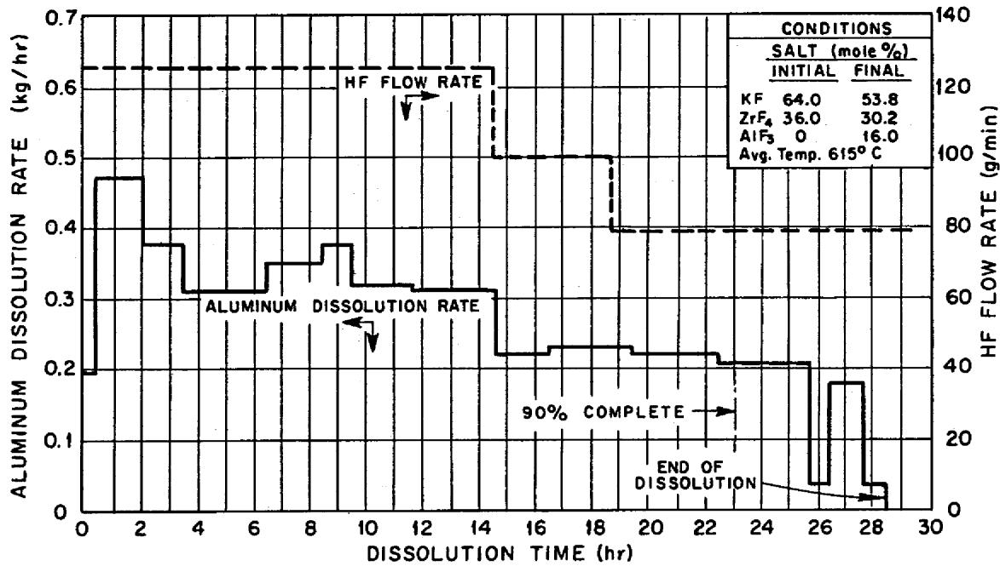  
Fig. B-1. Aluminum Dissolution Rate as a Function of Fuel Element Dissolution Time for Run DA-1.

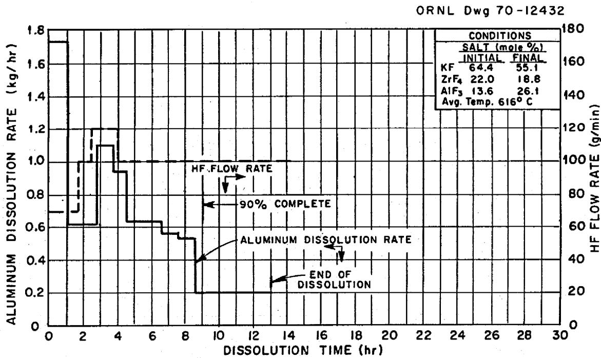  
Fig. B-2. Aluminum Dissolution Rate as a Function of Fuel Element Dissolution Time for Run DA-2.

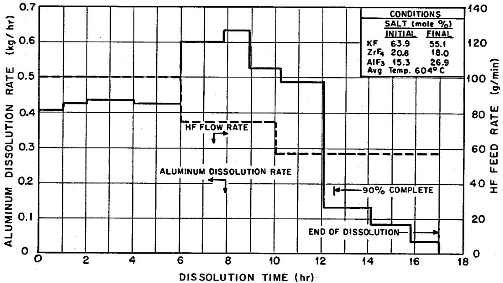

ORNL Dwg 69-7702

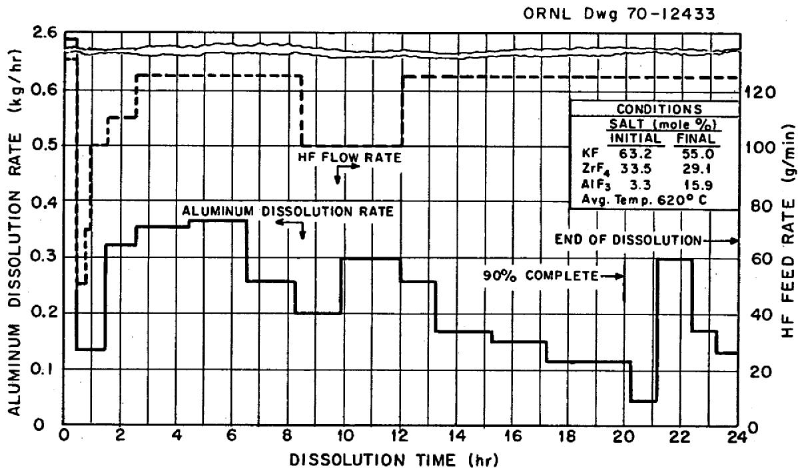  
Fig. B-3. Aluminum Dissolution Rate as a Function of Fuel Element Dissolution Time for Run UA-1.   
Fig. B-4. Aluminum Dissolution Rate as a Function of Fuel Element Dissolution Time for Run UA-2.

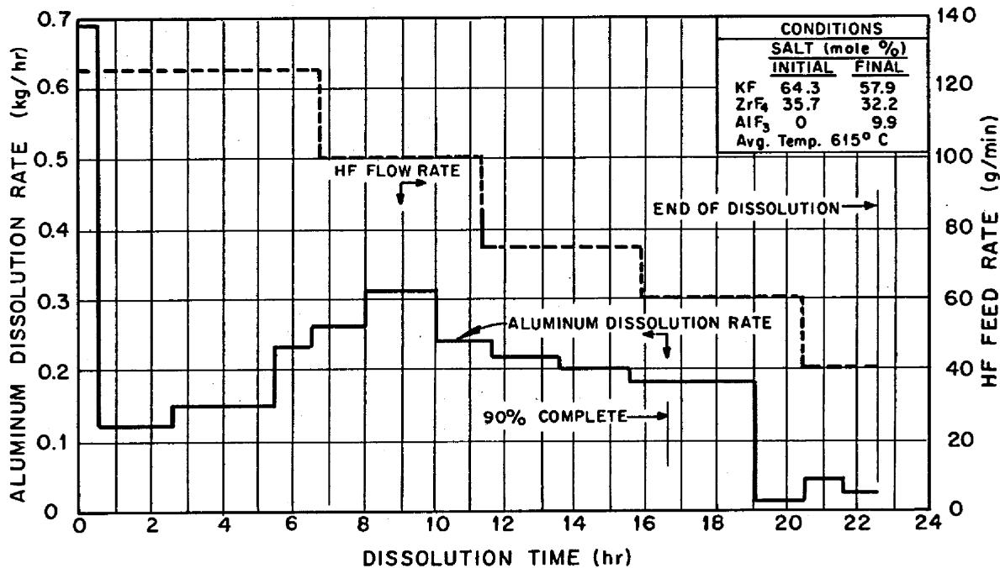  
Fig. B-5. Aluminum Dissolution Rate as a Function of Fuel Element Dissolution Time for Run UA-3.

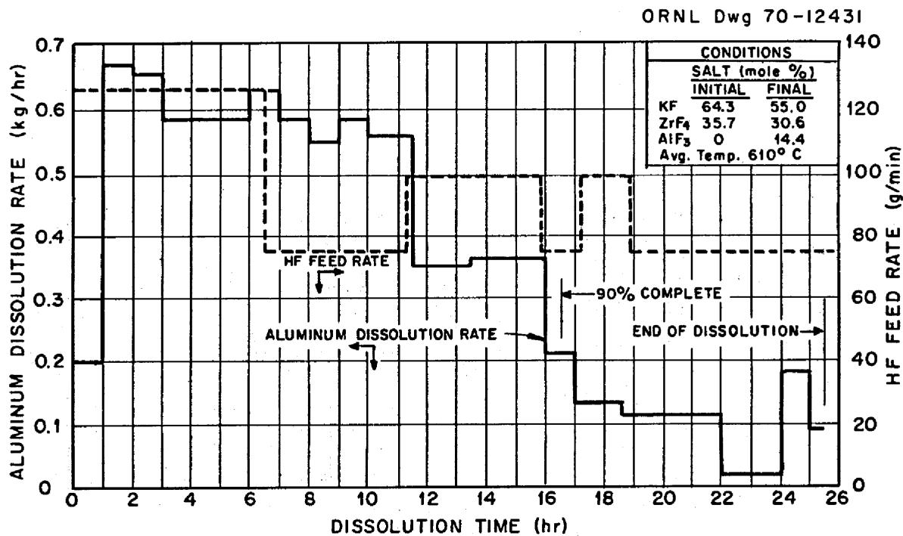  
Fig. B-6. Aluminum Dissolution Rate as a Function of Fuel Element Dissolution Time for Run RA-1.

ORNL Dwg 69-7704

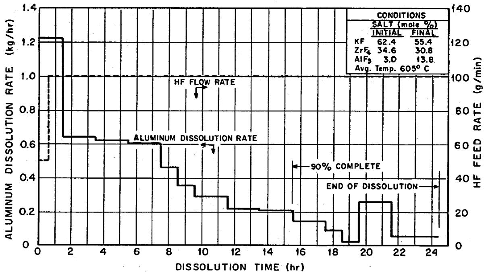  
Fig. B-7. Aluminum Dissolution Rate as a Function of Fuel Element Dissolution Time for Run RA-2.

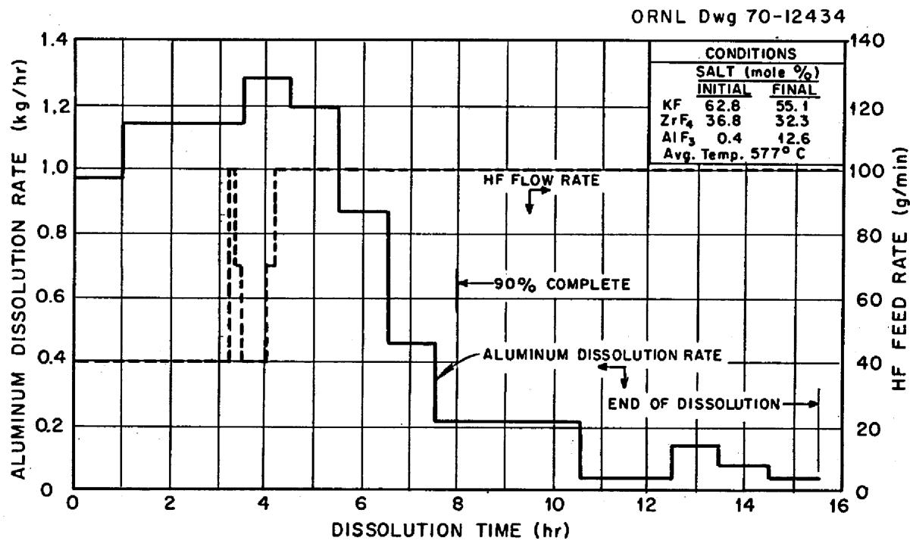  
Fig. B-8. Aluminum Dissolution Rate as a Function of Fuel Element Dissolution Time for Run RA-3.

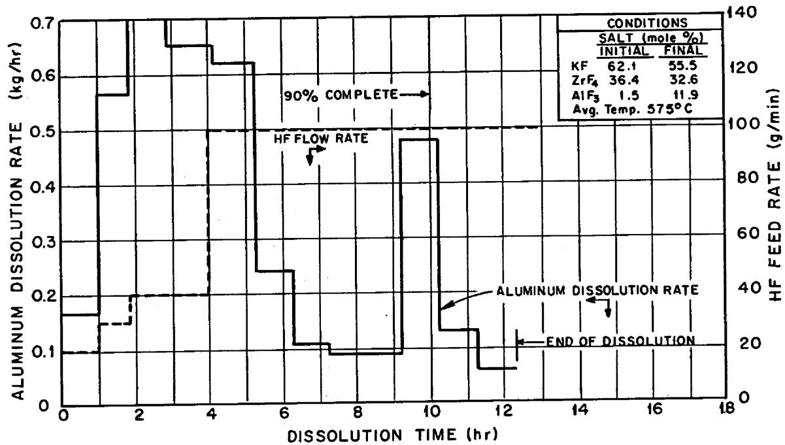  
Fig. B-9. Aluminum Dissolution Rate as a Function of Fuel Element Dissolution Time for Run RA-4.

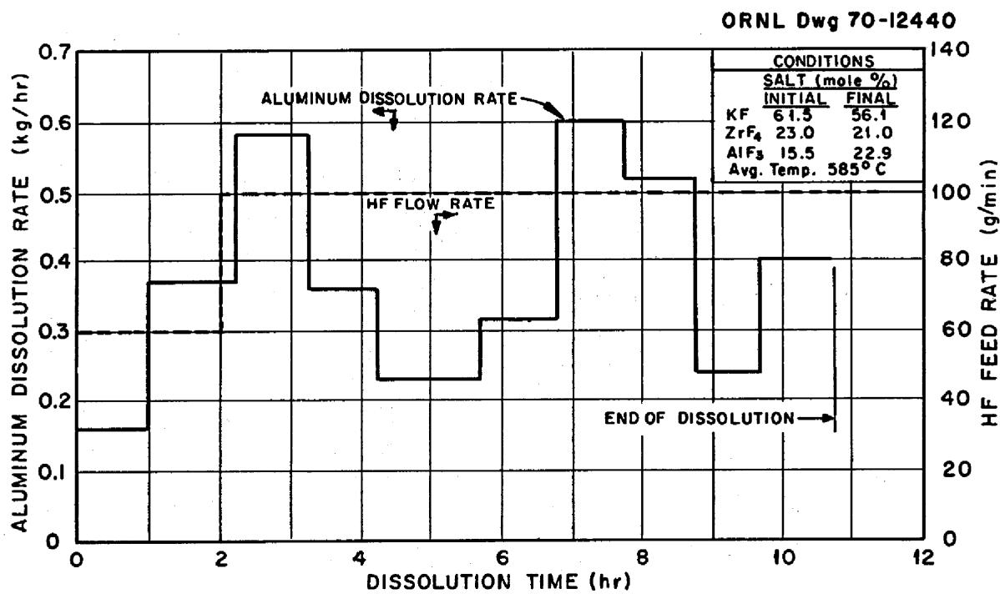  
Fig. B-10. Aluminum Dissolution Rate as a Function of Fuel Element Dissolution Time for Run DA-3.

# 10.3 Appendix C: Decontamination of

# Pilot Plant Equipment

Decontamination methods similar to those described for decontaminating the plant after the zirconium program was completed3 were used to reduce radiation levels in excess of 5000 r/hr to levels sufficiently low to permit the plant to be dismantled. Radiation dosage to individuals who did the mechanical work did not exceed the quarterly 1.3-r allowance (see data in Table E-1). Final backgrounds (prior to equipment removal) were 1 to 5 r/hr in the majority of cell 1 locations; a maximum reading of 60 r/hr was obtained adjacent to the HF inlet line to the dissolver. Backgrounds in other areas of the plant were generally less than 1 r/hr.

The decontamination sequence included flushing with a molten salt, followed by treatment with three types of aqueous solutions for removing salt film, metal scale, and deposits of radioactive nuclides. The compositions of the three solutions were, respectively:

Ammonium oxalate, 0.3 to 0.35 M

Aluminum nitrate, 0.1 M; or $\mathrm{Al(NO_3)_3 \cdot HNO_3}$ , 0.1 to 0.01 M

Sodium hydroxide--hydrogen peroxide--sodium tartrate, about

5-1-1 wt %.

This procedure is suitable for use with radiation levels at least as high as those encountered in the operating period cited, and it does not result in excessive personnel exposure during the decontamination and subsequent equipment removal.

# 10.4 Appendix D: Corrosion of Vessels

Corrosion studies in the Volatility programs were directed primarily at the dissolver (hydrofluorinator) and the fluorinator for three reasons. First, these two vessels were located in a congested "no-access" area that was accessible only after extensive decontamination, whereas many of the other vessels were located in limited-access areas. Second, these vessels, which were a part of the head-end portion of the plant, were essential to the operation of the plant, and their replacement would require a major shutdown (in addition to the necessary decontamination). Third, corrosion observed on the other vessels and components was slight, probably because the conditions under which they were operated (especially temperature and contact with corrosive chemicals) were less drastic.

Earlier Studies at BMI. Studies made at BMI (Battelle Memorial Institute) of the dissolver under run conditions indicated a metal loss of 0.2 mil/month for INOR-8 during aluminum processing, as compared with 2.5 to 5 mils/month during zirconium processing.[7] No intergranular attack was observed. Later studies indicated an INOR-8 corrosion rate of approximately 10 mils/month during aluminum processing because of intergranular attack.[8] The total time of HF exposure during the aluminum runs was 250 hr.

Studies at BMI indicated a corrosion rate of approximately 100 mils/month for the "L" nickel fluorinator during aluminum alloy processing as compared with approximately 30 mils/month during zirconium processing. The higher rate was at least partially attributed to the higher operating temperature [600°C rather than 500°C (ref. 9)] that was used in the aluminum processing.

Corrosion of the Dissolver. The total corrosion of the dissolver during the 10 aluminum runs was 5 mils, as previously reported.[10] This value was obtained by using pulse-echo and Vidigage techniques. Previous corrosion data for the dissolver are reported elsewhere.[4]

Fluorinator. (a) Vessel. - Corrosion data for the fluorinator during zirconium processing are reported elsewhere. (However, the data for the last 11 zirconium runs were not reported in that reference because the fluorinator was not examined between the end of the zirconium program and the start of the aluminum program.) Corrosion results obtained on examination of the fluorinator after the plant was dismantled following the aluminum program are reported in Table D-1. The values listed in Table D-1 are for 50 runs (40 zirconium runs and 10 aluminum runs) and all aqueous decontamination sequences.

The region most vulnerable to attack was the salt region, as noted previously. The maximum corrosion was less than $3/4$ mil per run; the average was less than $1/2$ mil per run. Visual examination of the inside of the fluorinator revealed no evidence of excessive attack. Comparison of the losses in total wall thickness (Table D-1) with data obtained in the earlier corrosion study revealed that metal losses of approximately 10 mils apparently occurred in the bottom of the vessel (but not in the top) during the aluminum runs.

(b) Corrosion Rods. - The corrosion rods that were placed in the fluorinator in late 1962 were removed when the plant was dismantled following the aluminum program. Results of visual inspection of the rods are summarized in Table D-2. The rods were not examined metallographically because of the termination of the Volatility program in mid-1967.

Other Vessels and Components. (a) HFV-2207-1 (HF inlet line to the dissolver). - Visual inspection of the 3-ft length of INOR-8 line, including the elbow, showed only minor scratches. No evidence of leakage was noted when this section of pipe was pressurized to 35 psig. This portion of the line was examined because it had failed during early volatility processing. At that time, however, the line was made of Inconel instead of INOR-8.

(b) Fluorine Supply Tanks. - Inspection of the inside of tank NB-1432 on June 7, 1962, revealed no corrosion; no leakage occurred

Table D-1. Bulk Metal Losses from the Nickel 201 Fluorinator   
During Fifty Runsa,b and Associated   
Aqueous Decontaminations in the VPP   
Exposure times: 90.7 hr of fluorine $^{c,d}$ ; 2962 hr of molten salt $^{d}$   

<table><tr><td rowspan="3">Section of the Fluorinator Measured</td><td rowspan="2" colspan="2">Total Wall Thickness Loss (mils)</td><td colspan="4">Corrosion Rate</td></tr><tr><td colspan="2">Mils per hour of F2 Exposure</td><td colspan="2">Mils per month of Molten Salt Exposure</td></tr><tr><td>Max.</td><td>Avg.</td><td>Max.</td><td>Avg.</td><td>Max.</td><td>Avg.</td></tr><tr><td>Top 16-in.-diam section</td><td>11</td><td>3.5</td><td>0.12</td><td>0.039</td><td>2.7</td><td>0.85</td></tr><tr><td>Top cone</td><td>13</td><td>8.4</td><td>0.14</td><td>0.093</td><td>3.2</td><td>2.0</td></tr><tr><td>Neck</td><td>24</td><td>18.6</td><td>0.26</td><td>0.205</td><td>5.8</td><td>4.51</td></tr><tr><td>Bottom 16-in.-diam section</td><td>27</td><td>19.2</td><td>0.30</td><td>0.212</td><td>6.6</td><td>4.66</td></tr><tr><td>Bottom cone</td><td>29</td><td>21.0</td><td>0.32</td><td>0.232</td><td>7.0</td><td>5.10</td></tr></table>

Forty zirconium runs and ten aluminum runs.   
bSee ORNL-3623 (ref. 4), Table 12.   
cFluorine exposure time does not include vessel exposure during desorption.   
${}^{\mathrm{d}}$ Values given include those presented in Table 12,ORNL-3623 (ref. 4). A breakdown of exposure times is as follows:

<table><tr><td>No. of Runs</td><td>F2 Exposure Time (hr)</td><td>Molten Salt Exposure Time (hr)</td></tr><tr><td>29 (value from ORNL-3623)</td><td>57.6</td><td>1922</td></tr><tr><td>11 (final runs in Zr program)</td><td>18.1</td><td>604</td></tr><tr><td>10 (runs in Al program)</td><td>15.0</td><td>436</td></tr><tr><td>50 (total runs)</td><td>90.7</td><td>2962</td></tr></table>

eMeasurements were made at 1-in. intervals in the south quadrant of the vessel.

Table D-2. Condition of Corrosion Rods on Removal from Fluorinator After the Aluminum Runs   

<table><tr><td>Material</td><td>Results of Visual Operation</td></tr><tr><td>INOR-8a</td><td>Brown film; some corrosion in salt region.</td></tr><tr><td>&quot;L&quot; Nickela</td><td>Brown film; some corrosion at middle and bottom.</td></tr><tr><td>HyMu-80b</td><td>Thin brown film over full length; some loose material on top 4 in.; uniform diameter.</td></tr><tr><td>Specimen 1b,c</td><td>Brown film; slight loss in width at bottom; warped.</td></tr><tr><td>Specimen 2b,c</td><td>Same as for specimen 1.</td></tr><tr><td>Ni-Mgb</td><td>Brown film; corrosion similar from top to bottom.</td></tr></table>

${}^{a}$ Installed on November 13,1962.   
$b$ Installed on December 11, 1962.   
cWeld test units fabricated from "L" nickel and INOR-8, using the following weld materials: Inco-82, INOR-8, Inco-61, and "L" nickel.

during a 75-psig pneumatic test. The 1/2-in. gage outlet on the rear head appeared to be cavitating in the heated-affected zone of the weld. The filled weld around this outlet on the tank exterior was thought to be adequate to take care of the condition on a temporary basis. All stop valves in the manifold section were checked and reworked if necessary. The external surfaces were found to be corroding; painting of these surfaces was recommended.

Inspection of the inside of tank NB-1433 on July 28, 1966, revealed no corrosion; no leakage was observed when the tank was pressurized to 75 psig. Inlet and outlet stubs that had been welded to the rear head showed no corrosion. All stop valves in the manifold section were checked and overhauled. External surfaces of the unit were satisfactory; the unit was repainted.

(c) Other Vessels. - No visible corrosion was detected visually in (1) the movable-bed absorber (FV-105), (2) the flash cooler (FV-1001), (3) the HF condenser (FV-2001), or (4) the fuel element charging chute on the dissolver (FV-1002).

# 10.5 Appendix E: Radiation Safety

Penetrating radiation from materials being processed required that each piece of equipment containing the material be heavily shielded to prevent exposure of operating personnel. Access to the process equipment was carefully controlled at all times during normal operation and while maintenance or decontamination operations were in progress. The physical form of the material involved (dust particles, liquids, or gases) governed the type of protective clothing and respiratory equipment that was used in these shielded areas.

The average rate and the maximum rate of personnel exposure to radiation in the aluminum program were about the same as those encountered in the zirconium program. In each case, exposure rates were highest during plant decontamination procedures because temporary, unshielded piping was connected to "dead end" process lines in normal work areas for recycle of solutions. Even under these conditions, however, the maximum exposure to any individual did not exceed $75\%$ of the recommended maximum permissible dose to body organs for a calendar quarter.3

Unusual occurrences* were less frequent in the aluminum program than in the zirconium program, largely because experience had been gained in making design and operational changes. Because we anticipated higher radiation levels from the shorter-cooled elements that were to be processed in the aluminum campaign, lead shielding was installed in many areas that formerly did not require it; corrective actions were taken as problems developed.

Personnel Exposure. - Radiation exposure to personnel was due primarily to the presence of $^{125}\mathrm{Sb}$ , $^{95}\mathrm{Zr}$ , and $^{95}\mathrm{Nb}$ in the dissolver off-gas

system and to the presence of $^{237}\mathrm{U}$ , $^{99}\mathrm{Tc}$ , $^{103}\mathrm{Ru}$ , $^{106}\mathrm{Ru}$ , $^{99}\mathrm{Mo}$ , and $^{237}\mathrm{Np}$ in the fluorinator off-gas and product collection systems.

The average exposure rate remained fairly constant during the processing of dummy and irradiated fuel elements, but increased by about a factor of 2 during decontamination (Table E-1).

During the processing of irradiated fuel elements, the maximum dose received by an individual during a single day was 80 mrads. This exposure occurred at the conclusion of run RA-4 when an operator removed the product receiver from the receiving station in cell 2 and hauled it to the sampling room in a lead-lined drum. The product was highly radioactive because of the unusually high $^{237}\mathrm{U}$ content. The "cutie pie" reading of the unshielded product cylinder was 25 r/hr at a distance of 1.5 in.

During the decontamination period, the maximum dose received by an individual in a single day was 150 mreads. This exposure occurred during replacement of a damaged rubber gasket on the waste salt nozzle sealing jack. Removal of the gasket was slow because the nut that held the end flange of the drain line tightly against the gasket was located on the underside of the gasket holder and was not easily accessible.

In summary, the maximum radiation exposure received in the aluminum campaign did not exceed about $75\%$ of the ORNL limit of 1.3 rem/quarter, or 5 rem/year. The average VPP personnel radiation exposure was about $50\%$ of the maximum.

Unusual Occurrences. - No unusual occurrences were experienced during the processing of dummy or irradiated fuel elements in the aluminum program. However, two occurred at other times: one during preparation for startup, and one during vessel decontamination.

Just before the first dummy fuel element was processed, some previously used air-operated valves were dismantled and decontaminated in a "hot" sink preparatory to repair. During this procedure, the hair and the nostrils of the operator in charge were contaminated by a loose powder found inside the valves. However, subsequent investigation

Table E-1. Radiation Exposure of Personnel During the Processing of Aluminum-Clad Fuel Elements   

<table><tr><td rowspan="2">Type of Run or Operationa</td><td colspan="4">Exposure (mreads)</td></tr><tr><td>Max./Day</td><td>Max./Week</td><td>Max./Quarter</td><td>Avg./Quarter</td></tr><tr><td>DA</td><td>60</td><td>75</td><td>450</td><td>200</td></tr><tr><td>UA</td><td>50</td><td>120</td><td>500</td><td>130</td></tr><tr><td>RA</td><td>80</td><td>150</td><td>505</td><td>240</td></tr><tr><td>Decontamination</td><td>150</td><td>190</td><td>940</td><td>440</td></tr></table>

$^{\text{a}}$ DA - dummy elements containing aluminum only.   
UA - dummy aluminum elements "spiked" with unirradiated $\mathrm{UF}_4$ .   
RA - LITR and ORR fuel elements cooled 18 months to 25 days.

showed that the operator had received no internal exposure and only negligible external exposure. Analysis of the incident indicated that a ventilated hood was needed over the sink and that a mask should be worn when contaminated equipment was being opened.

After the aluminum series had been completed, a radiochemical spill (of material that had not completely drained from a pipe) occurred during an attempt to remove a valve bellows assembly from an inactive HF charging system pipe line south of Building 3019. The bellows assembly was needed to replace one that had failed in the combination caustic sampling and temporary decontamination solution recycle system in cell 2. When the valve was opened slightly (a step in the valve dismantling procedure), some radioactive liquid in the pipe flowed past the operator, as signaled by a personal radiation monitor. This liquid continued along the pipe to a previously dismantled valve and overflowed to the ground. The blacktop area under the dismantled valve was decontaminated by flushing with water, chipping, and vacuum cleaning. Investigation showed that the three people in the vicinity at the time of the incident received no internal exposure and only negligible external exposure.

Control of Exposure. - Radiation exposure to personnel was controlled by taking appropriate action following thorough, frequent checking of the work areas during the runs. High radiation backgrounds were reduced by shielding vessels and pipes with lead plate, by discarding contaminated solutions, and by backflushing filters. The number of cell entries by operating personnel was safely reduced by using revised operating procedures. The amount of radioactive material that escaped to the atmosphere was decreased by decreasing the purge rates and the duration of the purges.

A 35-point radiation check of the area was made at least once per 8-hr shift during each run to determine any changes in the background. Data are summarized for runs RA-1 through -4 in Table E-2.

Some of the measures taken to reduce the radiation exposure are discussed below. For example, the installation of 1/2-in.-thick lead shielding reduced the background radiation at the caustic sampler in

Table E-2. Radiation Backgrounds in the Various VPP Work Areas During Runs RA-1, -2, -3, and -4   

<table><tr><td rowspan="3">Location</td><td colspan="10">Run No.</td></tr><tr><td colspan="2">RA-1</td><td colspan="2">RA-2</td><td colspan="2">RA-3</td><td colspan="4">RA-4</td></tr><tr><td>Before Run</td><td>After Run</td><td>Before Run</td><td>After Run</td><td>Before Run</td><td>Max.</td><td>After Run</td><td>Before Run</td><td>Max.</td><td>After Run</td></tr><tr><td colspan="11">Cell 2, HF System</td></tr><tr><td>FV-700-1C, HF filter</td><td>34</td><td>30</td><td>30</td><td>120</td><td>28</td><td>200</td><td>36</td><td>30</td><td>300</td><td>160</td></tr><tr><td>HCV-1003-1, HF catch tank drain valve</td><td>7</td><td>8</td><td>7</td><td>20</td><td>9</td><td>48</td><td>17</td><td>16</td><td>60</td><td>42</td></tr><tr><td>Caustic sampling station</td><td>14</td><td>20</td><td>13</td><td>65</td><td>12</td><td>35</td><td>31</td><td>20</td><td>85</td><td>50</td></tr><tr><td>Suction line of FV-4201, caustic pump</td><td>32</td><td>30</td><td>35</td><td>65</td><td>26</td><td>410</td><td>25</td><td>10</td><td>40</td><td>25</td></tr><tr><td>FV-4202, HF pump, remote head</td><td>18</td><td>20</td><td>22</td><td>48</td><td>24</td><td>100</td><td>28</td><td>25</td><td>60</td><td>48</td></tr><tr><td>FV-1207, HF vaporizer</td><td>10</td><td>8</td><td>9</td><td>15</td><td>8</td><td>16</td><td>9</td><td>12</td><td>42</td><td>28</td></tr><tr><td colspan="11">Cell 2, UF6 System</td></tr><tr><td>Heated duct at entry from cell 1</td><td>43</td><td>45</td><td>47</td><td>58</td><td>44</td><td>70</td><td>45</td><td>46</td><td>200</td><td>100</td></tr><tr><td>FV-120-A, MgF2bed</td><td>8</td><td>7</td><td>8</td><td>15</td><td>9</td><td>40</td><td>32</td><td>12</td><td>300</td><td>300</td></tr><tr><td>FV-723, product stream filter</td><td>5</td><td>6</td><td>5</td><td>8</td><td>6</td><td>30</td><td>13</td><td>12</td><td>120</td><td>95</td></tr><tr><td>FV-220, cold trap</td><td>5</td><td>5</td><td>5</td><td>6</td><td>5</td><td>12</td><td>10</td><td>9</td><td>35</td><td>27</td></tr><tr><td>FV-121-A, chemical trap</td><td>11</td><td>13</td><td>14</td><td>49</td><td>40</td><td>120</td><td>105</td><td>13</td><td>65,000b</td><td>330</td></tr><tr><td colspan="11">Penthouse, HF System</td></tr><tr><td>FV-7500, off-gas liquid trap</td><td>1</td><td>2</td><td>6</td><td>18</td><td>15</td><td>35</td><td>24</td><td>17</td><td>96</td><td>90</td></tr><tr><td>Off-gas line from FV-1009, caustic neutralizer</td><td>2</td><td>1</td><td>2</td><td>3</td><td>3</td><td>10</td><td>4</td><td>5</td><td>15</td><td>10</td></tr><tr><td>FV-9509, flame arrestor</td><td>6</td><td>10</td><td>5</td><td>12</td><td>5</td><td>14</td><td>6</td><td>8</td><td>60</td><td>35</td></tr><tr><td>Dissolver vent line at filter FV-7501</td><td>1</td><td>2</td><td>3</td><td>25</td><td>11</td><td>35</td><td>34</td><td>24</td><td>66</td><td>22</td></tr><tr><td>Transmitter rack (back)</td><td>1</td><td>1</td><td>1</td><td>8</td><td>2</td><td>6</td><td>4</td><td>3</td><td>200</td><td>82</td></tr><tr><td colspan="11">Penthouse F2 System</td></tr><tr><td>FV-153, liquid trap in off-gas line</td><td>5</td><td>8</td><td>6</td><td>32</td><td>14</td><td>22</td><td>14</td><td>8</td><td>600</td><td>180</td></tr><tr><td>FV-150, caustic scrubber, top</td><td>19</td><td>30</td><td>20</td><td>205</td><td>110</td><td>140</td><td>35</td><td>11</td><td>1,000</td><td>160</td></tr><tr><td>FV-150, caustic scrubber, bottom</td><td>4</td><td>5</td><td>5</td><td>25</td><td>15</td><td>120</td><td>10</td><td>7</td><td>800</td><td>170</td></tr><tr><td>FV-152, caustic surge tank</td><td>4</td><td>8</td><td>7</td><td>6</td><td>8</td><td>95</td><td>85</td><td>15</td><td>5,500</td><td>400</td></tr><tr><td>FV-450, caustic pump</td><td>45</td><td>40</td><td>45</td><td>155</td><td>40</td><td>100</td><td>100</td><td>54</td><td>1,800</td><td>730</td></tr><tr><td>Tellurium trap, FV-154, nickel wool</td><td>-</td><td>-</td><td>4</td><td>16</td><td>6</td><td>11</td><td>7</td><td>5</td><td>600</td><td>440</td></tr><tr><td>Tellurium trap, FV-155, charcoal</td><td>-</td><td>-</td><td>-</td><td>-</td><td>1</td><td>8</td><td>2</td><td>1</td><td>440</td><td>440</td></tr><tr><td colspan="11">Off-Gas Scrubber System</td></tr><tr><td>FV-164, first stage of scrubber</td><td>14</td><td>22</td><td>17</td><td>17</td><td>15</td><td>25</td><td>19</td><td>26</td><td>43</td><td>43</td></tr><tr><td>FV-164, middle of scrubber</td><td>4</td><td>4</td><td>4</td><td>4</td><td>4</td><td>6</td><td>6</td><td>6</td><td>23</td><td>23</td></tr><tr><td>FV-164, scrubber entrainment separator</td><td>1</td><td>2</td><td>2</td><td>2</td><td>2</td><td>4</td><td>4</td><td>4</td><td>20</td><td>20</td></tr><tr><td>FV-765, filter</td><td>6</td><td>5</td><td>6</td><td>6</td><td>6</td><td>8</td><td>8</td><td>9</td><td>22</td><td>22</td></tr><tr><td>FV-165, surge tank</td><td>2</td><td>2</td><td>2</td><td>3</td><td>2</td><td>7</td><td>7</td><td>5</td><td>64</td><td>64</td></tr></table>

Values are given in $\mathbf{m}\mathbf{r} / \mathbf{h}\mathbf{r}$   
bAfter nitrogen-sparge of salt in fluorinator (prior to fluorination).

cell 2 to $20\%$ of the previous value. The same thickness of lead reduced the background at the NaF trap (FV-121) to about $25\%$ of that before installation. This same thickness also reduced the background for the fluorinator off-gas scrubber (FV-150) to $10 - 25\%$ of the unshielded background. Approximately 1 in. of lead that was placed over the inlet line for the caustic circulating pump (FV-4201) in cell 2 reduced the background to $6\%$ of that observed earlier.

The dumping of fluorinator off-gas scrubber recycle caustic solution reduced the background for the storage tank (FV-152) to about $10\%$ of that prior to dumping. At the same time, the background for the caustic circulating pump (FV-450) was reduced by about 40 to $50\%$ . Backflushing of the dissolver off-gas filter (FV-7001C), using waste liquid HF, reduced its background to about $25\%$ of that noted previously.

# 10.6 Appendix F: Index of Volatility Pilot Plant Log Books

The log books listed below, along with the run sheets and the recorder charts, comprise the primary record of the VPP operations described in this report. The run sheets and the recorder charts will be destroyed two months after this report is issued. The log books will be retained permanently at Oak Ridge National Laboratory.

<table><tr><td>VPP Log No.</td><td>Laboratory Records Notebook No.</td><td>Inclusive Dates</td><td>Subject Matter</td></tr><tr><td>1 to 15</td><td></td><td>7/11/56-10/7/59</td><td>ARE Program</td></tr><tr><td>16 to 43</td><td></td><td>10/19/59-9/11/63</td><td>U-Zr Alloy Program</td></tr><tr><td>44</td><td>A-2964</td><td>9/12/63-1/22/64</td><td>Preparation for U-Al Pro-gram</td></tr><tr><td>45</td><td>A-2226</td><td>1/22/64-3/26/64</td><td>Preparation for U-Al Pro-gram</td></tr><tr><td>46</td><td>A-3389</td><td>3/30/64-5/1/64</td><td>Run DA-1 (aluminum, no uranium)</td></tr><tr><td>47</td><td>A-3390</td><td>5/1/64-6/2/64</td><td>DA-1</td></tr><tr><td>48</td><td>A-3422</td><td>6/2/64-6/26/64</td><td>DA-2 and UA-1 (uranium and aluminum, non-irradiated)</td></tr><tr><td>49</td><td>A-3423</td><td>6/26/64-8/4/64</td><td>UA-1 and UA-2</td></tr><tr><td>50</td><td>A-3474</td><td>8/4/64-9/10/64</td><td>UA-3 and RA-1 (irradiated)</td></tr><tr><td>51</td><td>A-3475</td><td>9/11/64-10/19/64</td><td>RA-1 and RA-2</td></tr><tr><td>52</td><td>A-3476</td><td>10/19/64-11/16/64</td><td>RA-2, RA-3, and RA-4</td></tr><tr><td>53</td><td>A-3477</td><td>11/16/64-12/14/64</td><td>RA-3 and RA-4 (short-cooled)</td></tr><tr><td>54</td><td>A-3478</td><td>12/14/64-2/2/65</td><td>Cleanout and Shutdown</td></tr></table>

(cont.)

<table><tr><td>VPP Log No.</td><td>Laboratory Records Notebook No.</td><td>Inclusive Dates</td><td>Subject Matter</td></tr><tr><td>55</td><td>A-3711</td><td>2/2/65-3/23/65</td><td>Cleanout and Shutdown</td></tr><tr><td>56</td><td>A-3714</td><td>3/24/65-5/27/65</td><td>Complete VPP Log Index</td></tr><tr><td></td><td>A-6105</td><td></td><td>Sample Log</td></tr><tr><td></td><td>A-6106</td><td></td><td>Sample Log</td></tr></table>

# INTERNAL DISTRIBUTION

1. Biology Library   
2-4. Central Research Library   
5. ORNL - Y-12 Technical Library Document Reference Section

6-25. Laboratory Records Department   
26. Laboratory Records, ORNL R.C.   
27. E. D. Arnold   
28. J. E. Bigelow   
29. R. E. Blanco   
30. J. O. Blomeke   
31. R. E. Brooksbank   
32. K. B. Brown   
33. F. N. Browder   
34. W. D. Burch   
35. G. I. Cathers   
36. W. L. Carter   
37. J. M. Chandler   
38. C. F. Coleman   
39. D. J. Crouse   
40. F. L. Culler   
41. F. L. Daley   
42. D. E. Ferguson   
43. L. M. Ferris   
44. E. J. Frederick   
45. H. E. Goeller   
46. A. T. Gresky   
47. M. B. Herskovitz   
48. R. W. Horton   
49. L. J. King   
50. F. G. Kitts   
51. B. B. Klima   
52. C. E. Lamb   
53. R. E. Leuze   
54. B. Lieberman   
55. R. B. Lindauer   
56. R. S. Lowrie   
57. H. G. MacPherson

58. S. Mann   
59. W. T. McDuffee   
60. W. A. McLoud   
61. L. E. McNeese

64. C. H. Miller   
65. C. A. Mossman   
66. J. P. Nichols   
67. E. L. Nicholson   
68. R. G. Nicol   
69. J. R. Parrott

62-63. R.P. Milford   
70-71. J. H. Pashley   
72. G. E. Pierce   
73. J. B. Ruch   
74. A. D. Ryon   
75. W. F. Schaffer   
76. R. J. Shannon   
77. W. A. Shannon   
78. L. B. Shappert   
79. M. J. Skinner   
80. Martha Stewart   
81. W. G. Stockdale   
82. D. A. Sundberg   
83. W. E. Unger   
84. V. C. A. Vaughen   
85. A. M. Weinberg   
86. M. E. Whatley   
87. W. R. Whitson   
88. E. I. Wyatt   
89. R. G. Wymer   
90. E. L. Youngblood   
91. P. H. Emmett (consultant)   
92. J. J. Katz (consultant)   
93. J. L. Margrave (consultant)   
94. E. A. Mason (consultant)   
95. R. B. Richards (consultant)

# EXTERNAL DISTRIBUTION

96-98. W. H. Carr, Nuclear Project Engineering, Allied Chemical Nuclear Products, Inc., P. O. Box 35, Florham Park, New Jersey 07932   
99. W. H. Lewis, Nuclear Fuel Services, Inc., Wheaton Plaza Building, Suite 906, Wheaton, Maryland 20902

100. F. W. Miles, General Electric Company, Midwest Fuel Recovery Plant, Morris, Illinois 60450   
101. S. Smolen, General Electric Company, Midwest Fuel Recovery Plant, Morris, Illinois 60450   
102. J. A. Swartout, Union Carbide Corporation, New York 10017   
103. Laboratory and University Division, AEC, ORO   
104. Patent Office, AEC, ORO   
105-240. Given distribution as shown in TID-4500 under Chemical Separations Processes for Plutonium and Uranium category (25 copies - NTIS)