ORNL-4575, Volume 2

UC-25 - Metals, Ceramics, and Materials

CORROSION IN POLYTHERMAL LOOP SYSTEMS

II. A SOLID-STATE DIFFUSION MECHANISM

WITH AND WITHOUT LIQUID FILM EFFECTS

R. B. Evans III

J.W.Koger

J. H. Devan

MOAK RIDGE NATIONAL LABORATORY

operated by

UNION CARBIDE CORPORATION

for the

U.S. ATOMIC ENERGY COMMISSION

DISTRIBUTION OF THIS DOCUMENT IS UNLIMITED

THIS DOCUMENT CONFIRMED AS

UNCLASSIFIED

DIVISION OF CLASSIFICATION

BY OHKahnJ amh

DATE

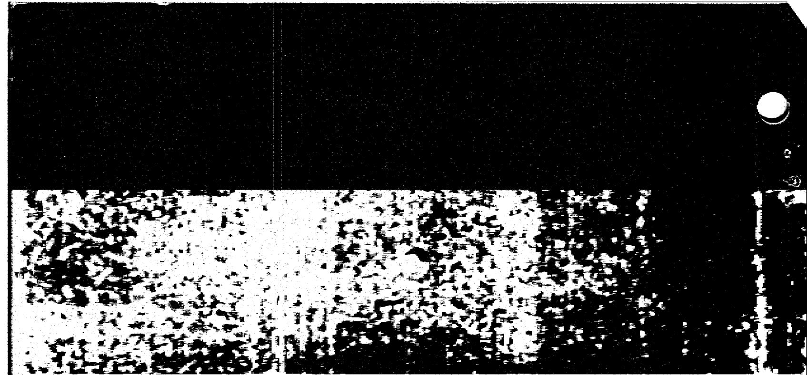

Printed in the United States of America. Available from

National Technical Information Service

U.S. Department of Commerce

5285 Port Royal Road, Springfield, Virginia 22151

Price: Printed Copy $3.00; Microfiche $0.95

This report was prepared as an account of work sponsored by the United States Government. Neither the United States nor the United States Atomic Energy Commission, nor any of their employees, nor any of their contractors, subcontractors, or their employees, makes any warranty, express or implied, or assumes any legal liability or responsibility for the accuracy, completeness or usefulness of any information, apparatus, product or process disclosed, or represents that its use would not infringe privately owned rights.

Contract No. W-7405-eng-26

METALS AND CERAMICS DIVISION

CORROSION IN POLYTHERMAL LOOP SYSTEMS II. A SOLID-STATE DIFFUSION MECHANISM WITH AND WITHOUT LIQUID FILM EFFECTS

R. B. Evans III

J. W. Koger

J. H. Devan

This report was prepared as an account of work sponsored by the United States Government, Neither the United States nor the United States Atomic Energy Commission, nor any of their employees, nor any of their contractors, subcontractors, or their employees, makes any warranty, express or implied, or assumes any legal liability or responsibility for the accuracy, completeness or usefulness of any information, apparatus, product or process disclosed, or represents that its use would not infringe privately owned rights.

JUNE 1971

OAK RIDGE NATIONAL LABORATORY

Oak Ridge, Tennessee

operated by

UNION CARBIDE CORPORATION

for the

U.S. ATOMIC ENERGY COMMISSION

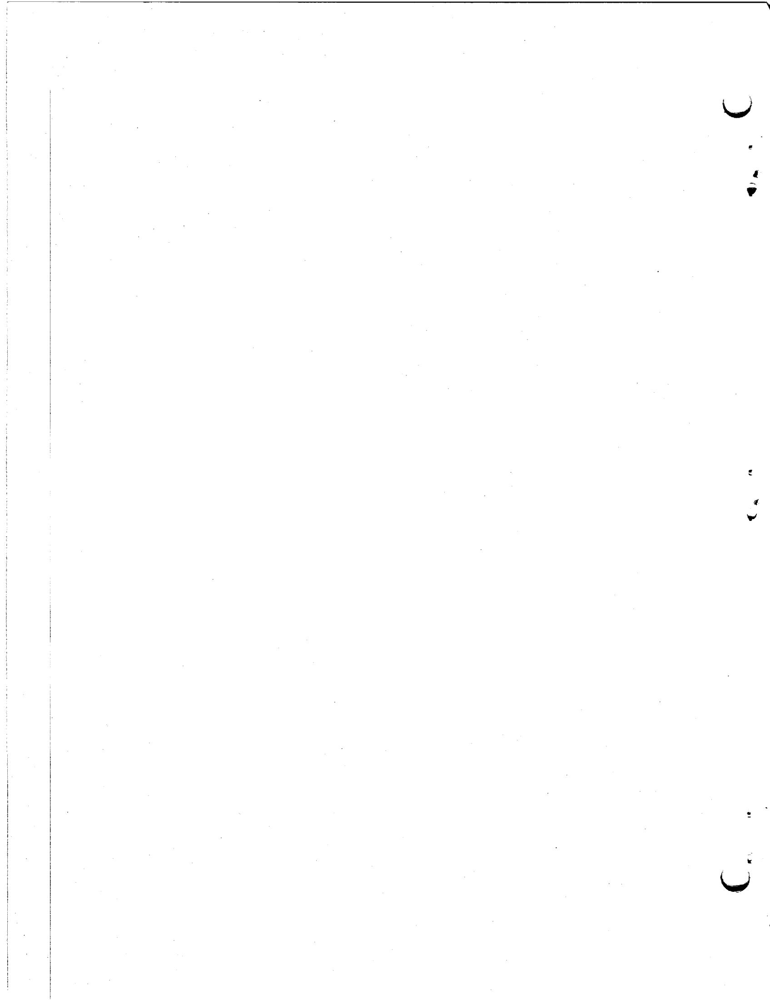

# CONTENTS

Abstract 1   
Nomenclature 2   
Introduction 5   
Fundamental Concepts 8   
Basic Diffusion Relationships 9   
Surface Behavior 12   
Equilibrium Ratio 12   
Reaction Rates 14   
Mass Transfer Across Liquid Films 16   
Combined Reaction Rate-Film Resistances 17   
Surface Effects Referred to the Alloy 18   
Transient Solutions 19   
Review of the Equations 19   
Application to Sodium-Inconel 600 Systems 24   
Temperature Profiles and Loop Configurations 26   
Reference and Prototype Loops 26   
The Reference Loop 26   
A Prototype Loop 28   
Quasi-Steady-State Solution 32   
Statement of the Problem and Objectives 32   
Solution in Terms of the Prototype Loop 36   
Predicted Results for Sodium-Inconel 600 Systems 43   
Discussion of Sodium-Inconel 600 Results 46   
Application to Molten-Salt Systems 50   
Thermal Convection Loops 50   
Redox Corrosion Equilibria and Systems Selected for Discussion 54   
Transient Factors 55   
Quasi-Steady-State Solutions 59   
Discussion of Molten-Salt Results 64   
Summary 69

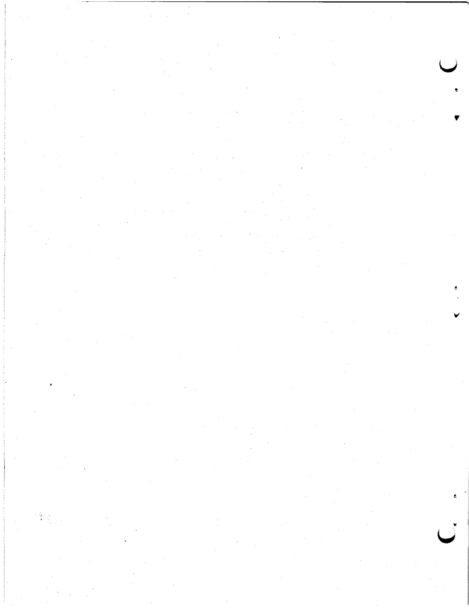

R.B.Evans III J.W.Koger

J. H. Devan

# ABSTRACT

The corrosion resistance of alloys exposed to nonisothermal circulating liquids is an important consideration in the design of reactor systems that employ liquids as either coolants or coolant-fuel combinations. Accordingly, several mathematical descriptions have been developed to explain selective transport of corrosion-labile constituents of nickel-base alloys. This report is the second of a series to correlate results of corrosion behavior observed in polythermal loop systems. The present report specializes to cases in which solid-state diffusion in the alloy, as influenced by coolant characteristics and composition, dominates the corrosion mechanism. Equations are derived for both transient and steady-state cases. Since transients, which are induced by liquid films, are negligible, analysis of steady-state behavior is of greatest importance.

Applicability of the derived equations is demonstrated by comparison of predicted values with experimental results for two distinctly different systems. The first involves hot-to-cold-zone transfer of nickel in Inconel 600 pumped loops circulating liquid sodium. Comparisons revealed that actual corrosion is much higher than predicted by the equations; this suggests that the true corrosion reaction overrides a slow solid-state diffusion process. The second system considered is transfer of chromium in Hastelloy N loops with molten salt flow induced by thermal convection. Three hypothetical examples are considered, namely: (1) chromium corrosion at all points, transfer to salt only; (2) hot-to-cold-zone chromium transfer; and finally (3) cold-to-hot-zone chromium transfer. While complete data to substantiate the results computed for the above cases are not available, the success of early $^{51}\mathrm{Cr}$ tracer experiments (example 1) suggests that the solid-state diffusion mechanism does apply to certain molten-salt systems when the salt constituents (and impurities) are subjected to stringent control.

# NOMENCLATURE

a = Subscript denoting alloy; superscript denoting activity.

$a_{M} =$ Activity of alloy constituent M, no units.

$A_{T} =$ Total liquid exposed area of loop alloy, $\mathbf{cm}^2$ .

$A_{\mathbf{XS}} =$ Cross-sectional area of loop tubing, $\mathrm{cm}^2$ .

$A_{z} =$ Internal peripheral area of loop tubing, $\mathbf{cm}^2$

b = Slope of a linear T versus z segment, °K/cm.

c = Subscript denoting cold zone.

$\mathbf{c}_{\mathbf{i}} = \text{Integration constant with respect to } w, i = 1, 2, \text{ wt. frac. sec.}$

C = Constant group, 4 $x_{a} \rho_{a} r' \sqrt{D_{0} \pi}$ , g cm⁻¹ sec⁻¹/².

C' = Constant group, $(\mathrm{K_p} / \mathrm{K_0})\mathrm{C}$ , g cm⁻¹ sec⁻¹/².

$\underline{\mathsf{d}} =$ Symbol for dissolved metallic species.

D = Diffusion coefficient of M(s) in alloy, cm²/sec.

$\mathbf{D}_0 =$ Preexponential term, $\mathrm{D} / \exp (-\mathrm{E}_{\mathrm{D}} / \mathrm{RT})$ , cm²/sec.

$\mathcal{D}_{M\ell} =$ Mutual diffusion coefficient of $\mathrm{M}(\underline{\mathrm{d}})$ in liquid metal, $\mathrm{cm}^2/\mathrm{sec}$ .

e = The transcendental number 2.71828...., no units.

$\exp (\tau) =$ The exponential function of $\tau ,e^{\tau}$ , no units.

$\operatorname{erf}(\mathbf{v}) = \text{The error function of } \mathbf{v}, \int_{0}^{\mathbf{v}} \mathrm{e}^{-\tau^{2}} \, \mathrm{d}\tau,$ no units.

$\operatorname{erfc}(\nu) = \operatorname{The~complementary~error~function~of~}\nu ,1 - \operatorname {erf}(\nu),$ no units.

$\mathbf{E}_1(u_j) = \text{First-order exponential function of } u_j, \int_{u_j}^{\infty} (e^{-\tau} / \tau) d\tau,$ no units.

$\mathbf{E}_{\mathbf{i}}(\mathbf{u}_{\mathbf{j}}) = \text{The "i" exponential function of } \mathbf{u}_{\mathbf{j}}, \int_{-\infty}^{\mathbf{u}_{\mathbf{j}}} (\mathbf{e}^{+\tau} / \tau) \mathrm{d}\tau,$ no units.

$\mathbf{E}_{\mathrm{D}} =$ Activation energy for solid-state diffusion of $\mathbf{M}(\underline{\mathbf{s}})$ , cal/mole.

$E_{\text{soln}} = \text{Energy required to dissolve M in liquid metal, cal/mole.}$

$f = \text{Fraction of } A_{T}$ ; when $A_{XS}$ is constant, $f = z / L$ .

$f(p) = \text{Location of balance point where } j_M = 0 \text{ and } k_p = k_T.$

$\overline{\mathbf{f}} (\mathbf{w},\mathbf{s}) = \text{Laplace transform of} F(\mathbf{w},t),\int_{0}^{\infty}F(\mathbf{w},t)\mathbf{e}^{-\mathbf{st}^{\prime}}\mathrm{d}t^{\prime}.$

$\mathbf{F}(\mathbf{w},t) = \mathbf{A}$ n arbitrary function of w and t.

$\mathbf{g} =$ Symbol denoting gram mass.

$\underline{\underline{\mathbf{g}}} =$ Symbol denoting gas.

G = Gibb's potential or free energy, cal/mole.

$h =$ Film coefficient for mass transfer, cm/sec.

$\overline{\mathbf{h}} =$ Combined solution rate - film coefficient, cm/sec.

$h^{\prime} =$ Subscript denoting hot zone.

$$
H = \text {T h e p r o d u c t} k _ {T} (h / D) \left(\rho_ {\ell} / \rho_ {a}\right) \left(m _ {a} / m _ {M}\right), \quad c m ^ {- 1}.
$$

$\Delta \mathrm{H} =$ Enthalpy difference, cal/mole.

$\mathbf{i} =$ Index 1 at $\mathbf{f} = 0$ for function below.

$\mathsf{I}_{ij}(\alpha/\xi) = \text{An integrated function along extended z coordinate from } \xi_i \text{ to } \xi_{j'}$ , cm.

$j =$ Index p or 2 at balance point or $f = 1$ for function above.

$\mathbf{j}_{\mathbf{M}} = \mathbf{Mass}$ flux of species M, g cm-2 sec-1/2.

$\mathbf{J}_{\mathbf{M}} =$ Atomic or molecular flux of species M, mole $\mathrm{cm}^{-2}$ sec-1/2.

$k = \text{Boltzmann constant} = 1.38 \times 10^{-16} \, \text{g cm}^2 \, \text{sec}^{-1} \, \text{K}^{-1}$ .

$k_{1} =$ Solution rate constant, cm/sec.

$k_{1}^{a} = \text{Solution rate constant, mole cm}^{-2} \sec^{-1}$ .

$\mathbf{k}_2 =$ Deposition rate constant, cm/sec.

$k_{2}^{a} = \text{Deposition rate constant, mole cm}^{-2} \sec^{-1}$ .

$\mathbf{K}^{\mathbf{a}} = \text{Equilibrium constant, } \mathbf{k}_1^{\mathbf{a}} / \mathbf{k}_2^{\mathbf{a}}, \text{ no units.}$

$\mathbf{K}^{\gamma} = \text{Activity coefficient ratio, } \gamma_{\underline{\mathbf{M}}(\underline{\mathbf{d}})} / \gamma_{\underline{\mathbf{M}}(\underline{\mathbf{s}})},$ units depend on choice of standard states for $\mathbf{a}_{\mathbf{M}}$ .

$K_{0} = \text{Preexponential factor } K_{T} / \exp(-E_{\text{soln}} / RT)$ , no units.

$K_{p} =$ Balance point value of $K_{T}$ , no units.

$\mathbf{K}_{\mathrm{T}} =$ Experimental solubility constant, no units.

$\ell =$ Subscript denoting liquid.

L = Total loop length, cm.

$m =$ Molecular or atomic weight, g/mole.

$M =$ Symbol denoting metal constituent subject to corrosion.

$\Delta \mathbf{M}(t) =$ Mass or weight of M transferred, g.

$N_{\text{Re}} = \text{Reynolds number, } 2r'V_{z}\rho/\mu.$

$\mathbf{N}_{\mathbf{Sc}} =$ Schmidt number, $\mu /\rho D_{M\ell}$ no units.

$N_{\text{Sh}} =$ Sherwood number for mass transfer, $2 \text{hr} / \text{D}_{\text{M} \ell}$ , no units.

$p =$ Symbol or subscript denoting balance point.

q = A transformation variable, (s/D)1/2, cm.

$Q =$ Volumetric flow rate in loop, $\mathrm{cm}^3 /\mathrm{sec}$

$r =$ Radial distance measured from the center of the loop tubing, cm.

$\mathbf{r}_{\mathbb{M}} = \mathbb{A}$ tomic radius of $\mathbf{M}(\underline{\mathsf{d}})$ in liquid metal, cm.

$\mathbf{r}^{\prime} =$ Inside radius of loop tubing, cm.

$\mathbf{R} = \mathbf{G}$ as constant used in exponential terms, 1.987 cal mole-1 ${}^{\circ}\mathrm{K}^{-1}$ .

s = Laplace transformation variable, sec-1.

$\underline{\mathbf{s}} =$ Symbol denoting solid solution.

$t = \text{Time}, \sec$ .

T = Temperature, °F, °C, or °K.

$\Delta \mathbf{T} =$ Temperature drop along a segment of $\mathbf{z},^{\circ}\mathbf{F},^{\circ}\mathbf{C},$ or K.

$u_{j} =$ Dimensionless variable, $\alpha /\xi_{j}$ , no units.

v = The argument w/(4Dt)1/2, no units.

$V_{z} =$ Liquid flow velocity, $\mathsf{Q} / \mathsf{A}_{\mathsf{x}\mathsf{s}}$ , cm/sec.

w = Distance of linear diffusion, normal to $A_{z}$ , of $M(s)$ in alloy, cm.

$x =$ Concentration of $\mathsf{M}(\underline{\mathsf{s}})$ in alloy expressed as weight fraction, no units.

$x_{a} =$ Concentration of $\mathbf{M}(\underline{\mathbf{s}})$ in as-received alloy.

$x_{\underline{T}} =$ Surface concentration of $\mathbf{M}(\underline{\mathbf{s}})$ as a function of T along z.

$\mathbf{x}(\mathbf{w}, \mathbf{t}) = \text{Concentration of } \mathbf{M}(\underline{\mathbf{s}})$ in diffusion region as a function of position and time.

$\mathbf{x}^{*} =$ Alloy concentration of $\mathbf{M}(\underline{\mathbf{s}})$ equivalent to liquid concentration of $\mathbf{M}(\underline{\mathbf{d}})$ at the liquid side of the liquid film.

$\mathbf{x} =$ Alloy concentration of $\mathrm{M}(\underline{\mathrm{s}})$ equivalent to equilibrium liquid concentration at liquid-solid interface.

$\overline{\mathbf{x}} =$ Concentration of $\mathbf{M}(\underline{\mathbf{s}})$ in alloy expressed as atomic fraction, no units.

$\Delta \mathbf{x} =$ The concentration difference, $x_{h'}(0,t) - x_{a'}$ no units.

$\triangle x^{*} =$ The concentration difference, $x^{*} - x_{a}$ no units.

$y =$ Concentration of $M(\underline{d})$ in bulk liquid expressed as weight fraction; it corresponds to $y^*$ when transients are discussed, no units.

$\mathbf{y} \diamondsuit = \text{Concentration of } \mathbf{M}(\underline{\mathbf{d}}) \text{ at metal-film interface, no units.}$

Y = Equilibrium or saturation concentration of M(d) in a unit activity container.

$\overline{\mathbf{y}} =$ Concentration of $\mathbf{M}(\underline{\mathbf{d}})$ in bulk liquid expressed as weight fraction, no units.

$$
z = \text {L i n e a r f l o w c o o r d i n a t e} v \text {o r} Q, \text {c m}.
$$

$$
\alpha = \text {T h e f a c t o r} \left(\mathrm {E} _ {\mathrm {D}}\right) / (2 \mathrm {b R}), \mathrm {c m}.
$$

$$
\alpha^ {\prime} = \text {T h e f a c t o r} \left(\mathrm {E} _ {\mathrm {D}} - 2 \mathrm {E} _ {\text {s o l n}}\right) / 2 \mathrm {b R} > 1, \mathrm {c m}.
$$

$$
\alpha^ {\prime \prime} = \text {T h e f a c t o r} \alpha^ {\prime} <   1, \text {c m}.
$$

$$
\beta \left(u _ {j}\right) = \text {T h e f a c t o r} u _ {j} \exp \left(u _ {j}\right) E _ {1} \left(u _ {j}\right), \text {n o u n i t s}.
$$

$$
\gamma = \text {A c t i v i t y} _ {\mathrm {m}} \text {c o e f f i c i e n t s , u n i t s s e l e c t e d t o m a k e} \mathrm {a} _ {\mathrm {M}}
$$

$$
\Delta = \text {S y m b o l}
$$

$$
\boldsymbol {\xi} = \text {E x t e n d e d} z \text {c o o r d i n a t e} = \alpha / u _ {j}, \mathrm {c m}.
$$

$$
\mu = \text {V i s c o s i t y} \quad \text {c o e f f i c i e n t} \quad \text {l i q u i d} \quad \text {m e t a l}, \quad \mathrm {g} \quad \mathrm {c m} ^ {- 1} \quad \sec^ {- 1}.
$$

$$
\pi = \text {T h e} 3. 1 4 1 6 \dots , \text {n o u n t s}.
$$

$$
\rho = \text {M a s s o r w e i g h t d e n s i t y}, \mathrm {g} / \mathrm {c m} ^ {3}.
$$

$$
\tau = \text {D u m m y v a r i a b l e o f i n t e g r a t i o n , n o u n i t s}.
$$

$$
\begin{array}{l} \Phi_ {h ^ {\prime}} = \text {C o n c e n t r a t i o n d i f f e r e n c e f o r h o t z o n e ,} x _ {h ^ {\prime}} (0, t) - x _ {h ^ {\prime}} (w, t), \\ \text {n o u n i t s .} \end{array}
$$

$$
\begin{array}{l} \phi^ {*} \\ h ^ {\prime} \end{array} = \text {C o n c e n t r a t i o n d i f f e r e n c e f o r h o t z o n e w h e n l i q u i d f i l m i s} \\ \text {p r e s e n t ,} x _ {h ^ {\prime}} ^ {*} - x _ {h ^ {\prime}} (w, t), \text {n o u n i t s .}
$$

$$
\begin{array}{l} \phi_ {c} = \phi_ {c} ^ {*} \text {c o n c e n t r a t i o n d i f f e r e n c e f o r c o l d z o n e w i t h a n d w i t h o u t} \\ \text {p r e s e n c e o f l i q u i d f i l m , x _ {e} (w , t) - x _ {a} , n o u n i t s .} \end{array}
$$

# INTRODUCTION

In a previous report1 (hereafter referred to as Report I) attention was given to interpretations of corrosion behavior in systems composed of liquid sodium contained in the nickel-base alloy Inconel 600. Specific interest focused on experimental pumped loops that gave definite evidence that nickel and chromium moved from hot to cold regions of the loops. Only nickel transfer was considered, because little was known about the solubility of chromium in liquid sodium; furthermore, the major component undergoing corrosion and transfer was nickel. Solubility information is of major importance because the manner in which solubility

increases with temperature governs the steady-state driving force for mass transfer around the loop.

The major effort in Report I was to develop a simple system of equations that might describe the mass transfer as observed experimentally. The approach in Report I was to assume that the mass-transfer equations would fall into the same patterns as those that describe heat transfer from hot to cold zones under conditions of known external-temperature profiles and rates of fluid flow around the loop. For heat flow, the only resistances involved would be an overall coefficient that would comprise the thermal conductivity of the walls and a heat-transfer film. An analogous situation was assumed for mass transfer with the exception that the thermal conductivity term was replaced by a reaction-rate constant that was presumed to be associated with a first-order dissolution reaction.

Predictions of corrosion based on the heat-transfer analog showed that transient mass transfer effects decayed after negligibly short times (fractions of an hour). Steady-state corrosion rates calculated from the film coefficient alone were much greater than measured values. It was necessary to invoke the reaction-rate constant to increase the resistances and lower the computed results in order to match experimental results. While this "matching" could be done for results of individual experiments, a consistent set of reaction constants for all results that would lead to a general correlation could not be obtained. One of the prime reasons for the failure of the mechanisms covered in Report I is that the loop walls were not pure nickel. Rather, the walls were of an alloy wherein solid-state diffusion effects influenced the overall behavior. These effects were ignored in the equations of Report I.

The present report is devoted to another mathematical treatment of an idealized mass-transfer process wherein corrosion rates depend directly on the rate at which constituents of alloys diffuse into or out of container walls, as influenced by the condition of wall surfaces exposed to a high-temperature liquid. Specifically, consideration is given to cases for which solid-state diffusion controls mass transfer at all points in a polythermal loop system containing circulating liquids. The container constituents of interest are nickel-base alloys.

We have also considered the contributions of liquid-film resistances acting simultaneously with the solid-state mechanism to ascertain whether or not a suitable combined mechanism (our ultimate goal) could be attained. Unfortunately, this approach was unsuccessful.

Three rather important assumptions are made in our present derivations. First, effects of changes in wall dimensions can be neglected. Second, the rate of diffusion is unaffected by composition changes in the diffusion zone of the alloy; in other words, the diffusion coefficient is not a function of concentration. Third, the circulating liquid is pre-equilibrated with respect to the amount of dissolved components so that the concentrations in the liquid do not vary appreciably with position or time. This latter boundary condition is embodied in both the "transient" and "quasi-steady-state" conditions that are covered in this report.

It should be mentioned that, although many liquids have been studied relative to reactor applications, the basic approach in assessing corrosion properties remains the same. One employs either thermal convection loops or pumped systems to collect the data required. At the time of this writing, sodium systems, which are of interest to the Liquid Metal Fast Breeder Reactor, $^{2,3}$ are under intensive study. We should note a treatment similar to that to be covered here was initially roughed out in 1957 under the auspices of the Aircraft Nuclear Propulsion (ANP) Project. $^{4}$ The liquids of interest in this early effort were molten fluoride salts. $^{5}$

The objective of the work leading to the present report has been to carry out refinements of the early ANP treatments, $^{4}$ and to generalize the results to permit their application to many systems that might

operate within the solid-state mechanism under consideration. A short-term and immediate objective is to determine whether a mechanism of this type applies to the migration of nickel in the sodium-Inconel system in high-velocity pumped loops.

One of the central conclusions of the present study is that the solid-state mechanism clearly does not explain the observed corrosion behavior of the sodium-Inconel 600 system. On the positive side, however, the analytical work that was done is immediately and directly applicable to Hastelloy N-molten salt thermal convection loops, in which this solid-state mechanism clearly does operate. Thus, the present work includes two separate topics: one covering corrosion induced by liquid metals, another covering corrosion induced by constituents in molten-salt systems.

For ease of presentation, a rather unorthodox outline has been adopted for this report. First, we discuss basic diffusion relationships, variables, and the type of transients one might encounter. Then we turn to a discussion of liquid mass-transfer films and their effects on the corrosion rates. Next, we derive and present equations for the cumulative corrosion at quasi-steady-state (i.e., when the transient effect associated with liquid film resistance has diminished). The term "quasi" appears because the predicted corrosion varies with the square root of time. These make up the most important aspect of the report. However, to emphasize the meaning of the analytical results, detailed "example calculations" are given. Separate discussions are presented for the liquid-metal application and three molten-salt applications. The final section is a summary of the more important features of the equations and their applications.

# FUNDAMENTAL CONCEPTS

It would be most convenient, from the authors' standpoint, to proceed directly to the task of setting up the diffusion relationships that take liquid phase mass transfer into account, show this to be of little importance, and proceed directly to the quasi-steady-state solution based on the diffusion relationships. This is the conventional

method of presentation, but one immediately encounters fractional-approach variables introduced by the nature of the alloys and chemistry of the liquids. Accordingly, we shall jump ahead of the film part of the problem and start by writing down some of the well-known expressions for solid-state diffusion in order to introduce the ideas behind fractional-approach variables and to enable recognition of integrated forms that emerge when film resistances are encountered.

# Basic Diffusion Relationships

The basic relationships required are the concentration-profile equations that express the weight or mass fraction $x(w, t)$ of an alloy constituent as a function of position across the wall, $w$ , and time, $t$ . We let $w = r - r'$ , where $r'$ is the inner radius of the loop tubing. The relationships derive from Fick's second law of diffusion, sometimes called the Fourier equation, and apply to both hot and cold zones of the system. These relationships are developed elsewhere.[6,7] It is sufficient here to point out just a few important features of the equations involving $x(w, t)$ . First, $x(0, t)$ is assumed to be constant with time.[8] Only linear diffusion along a single coordinate,[9] $w$ , shall be considered. The direction of $w$ is normal to the liquid exposed surface, $A_z$ , where $w = 0$ . The container walls are infinitely thick relative to the effective depth of the profile; thus $x(\infty, t) = x_a$ , the bulk concentration of the constituent, for all times.

Two functions evolve from the solution of the Fourier equation; these hold for the hot and cold zones, respectively:

$$
\frac {\phi_ {h ^ {\prime}}}{\Delta x} = \frac {x (0 , t) - x (w , t)}{x (0 , t) - x _ {8}} = \operatorname {e r f} (v), \tag {1}
$$

$$
\frac {\phi_ {c}}{\Delta x} = \frac {x (w , t) - x _ {a}}{x (0 , t) - x _ {a}} = \operatorname {e r f c} (v), \tag {2}
$$

where

$$
v = w / (4 D t) ^ {1 / 2}. \tag {3}
$$

Consider now a hypothetical case (somewhat implausible for an actual loop) in which given points in the hot and cold legs have the same v. A rather important identity can be demonstrated by adding Eqs. (1) and (2), namely, $(\phi_{h'} + \phi_c) / \Delta x = 1$ . This happens because the definitions of the error functions take the form shown below:

$$
\operatorname {e r f} (\mathbf {v}) + \operatorname {e r f c} (\mathbf {v}) = \frac {2}{\sqrt {\pi}} \left[ \int_ {0} ^ {\mathbf {v}} e ^ {- \tau^ {2}} d \tau + \int_ {\mathbf {v}} ^ {\infty} e ^ {- \tau^ {2}} d \tau \right] = 1. \tag {4}
$$

As v approaches zero, $\phi_{\mathbf{h}'} / \Delta \mathbf{x}$ approaches unity, and as v approaches infinity, $\phi_{\mathbf{h}'} / \Delta \mathbf{x}$ approaches zero. The reverse is true for $\phi_{\mathbf{c}} / \Delta \mathbf{x}$ . This means that

$$
x (w, \infty) = x (0, t) \rightarrow x _ {8}, \quad x (\infty , t) = x (w, 0)
$$

in the hot zone, and

$$
x (w, \infty) = x (0, t), \quad x (\infty , t) = x (w, 0) \rightarrow x _ {a}
$$

in the cold zone.

The necessity of introducing variables like $\phi$ and parameters like $\Delta x$ should begin to emerge at this point. From a physical point of view, the concentration of a constituent in the alloy can never be unity in a "compatible" alloy-liquid system. The purity of the liquid should be high while its ability to dissolve alloy constituents should be minimal. Thus, values like $x(w,\infty) = 1$ or 0, and $x(0,t) = 0$ or 1, are seldom

encountered in practice. Yet, from a mathematical point of view, the solution must vanish at all boundaries except one. Stated in the language of partial differential equations, the heat equation must be homogeneous; the same is true for all but one of the boundary conditions $^{10,11}$ unless an additional equation is involved. The nonhomogeneous conditions usually concern an initial or particular surface condition. For these reasons, fractional-approach variables are employed.

The problem at hand requires use of $\mathbf{x}(\mathbf{w},\mathbf{t})$ as prescribed for Fick's first law, the latter being evaluated at the surface to obtain an expression for the flux traversing $\mathbf{w} = 0$ :

$$
j _ {M} = - D \rho_ {a} \frac {\partial x (0 , t)}{\partial w} = - \rho_ {a} \triangle x (D / \pi t) ^ {1 / 2}. \tag {5}
$$

If we assign $z$ as the directional flow coordinate of the circulating liquid normal to $w$ , then $\Delta x$ at each point is a function of $z$ and of temperature, and Eq. (5) with $x(0,t) = x_{T}$ takes the form

$$
j _ {M} = \rho_ {a} x _ {a} \left(1 - x _ {T} / x _ {a}\right) (D / \pi t) ^ {1 / 2}. \tag {6}
$$

The flux $\mathbf{j}_{\mathbf{M}}$ is positive for the hot zone and negative for the cold zone. One of the basic assumptions stated in the Introduction, namely, that the concentration of the circulating liquid remains fixed with time, means that the ratio $\mathbf{x}_{\mathbf{T}} / \mathbf{x}_{\mathbf{a}}$ varies with related time-temperature points in a special way. This is the reason Eq. (5) has been cast into the form of Eq. (6). Irrespective of this, Eq. (6) may be integrated with respect to time without concern about the $\mathbf{x}_{\mathbf{T}} / \mathbf{x}_{\mathbf{a}}$ relationship, since $\mathbf{x}(0, t)$ and, therefore, $\mathbf{x}_{\mathbf{T}} / \mathbf{x}_{\mathbf{a}}$ do not vary with time. One obtains:

$$
\Delta M (t) / A _ {z} = \int_ {0} ^ {t} j _ {M} d t ^ {\prime} = - 2 \rho_ {a} x _ {a} \left(1 - x _ {T} / x _ {a}\right) \left(D t / \pi\right) ^ {1 / 2}. \tag {7}
$$

Under the usual sign convention, a positive value of $\Delta M / A$ means that the metal constituent diffuses into the alloy (cold zone); negative values mean outward diffusion (hot zone). We shall reverse this convention, since we desire a balance of $M$ with respect to the liquid. The solution behavior of most acceptable systems is such that the liquid gains material in the hot zone and loses material in the cold zone. In other words, $x_{a} > x_{T}$ in the hot zone; $x_{a} < x_{T}$ in the cold zone; notice that Eqs. (6) and (7) follow the adopted convention automatically. The next mathematical operation involves integration along $z$ , but this requires some knowledge of the manner in which $z$ varies with $T$ and, of greater importance, the manner in which $T$ varies with $x(0,t)$ . The latter is a problem in chemistry to which we now turn.

# Surface Behavior

# Equilibrium Ratio

A good example is the reaction that gives rise to chromium migration in Inconel 600 loops circulating $\mathrm{UF}_4$ -bearing molten salts. $^{12,13}$ The reaction of interest is

$$
\operatorname {C r} (\underline {{s}}) + 2 \operatorname {U F} _ {4} (\underline {{d}}) \rightleftharpoons 2 \operatorname {U F} _ {3} (\underline {{d}}) + \operatorname {C r F} _ {2} (\underline {{d}}). \tag {8}
$$

The symbols $(\underline{\mathbf{s}})$ and $(\underline{\mathbf{d}})$ are intended to denote the respective states: "solution in the alloy" and "solution in the liquid." The equilibrium constant is

$$
\mathrm {K} _ {\mathrm {T}} = \frac {[ \mathrm {C r F} _ {2} ] [ \mathrm {U F} _ {3} ] ^ {2}}{[ \mathrm {C r} ] [ \mathrm {U F} _ {4} ] ^ {2}}, \tag {9}
$$

whereby

$$
[ \mathrm {C r} ] = \left(\frac {[ \mathrm {U F} _ {3} ]}{[ \mathrm {U F} _ {4} ]}\right) ^ {2} \frac {[ \mathrm {C r F} _ {2} ]}{\left(\mathrm {K} _ {\mathrm {T}}\right)}. \tag {9a}
$$

Brackets are used to denote concentration variables. If the concentrations can be related to appropriate activity values, one may write, in terms of the standard free energy change for the reaction above,

$$
\Delta G ^ {\circ} = - R T \ln K ^ {8}. \tag {10}
$$

Values of $\mathbf{K}^{\mathbf{a}}$ or $\mathbf{K}_{\mathbf{T}}$ may be computed with the aid of information summarized by Baes.[14]

We have assumed that all points along $\mathbf{z}$ are exposed to the same concentration of dissolved species of interest. Thus $[\mathrm{Cr}] \approx x_{\mathrm{T}}$ adjusts to compensate for temperature-induced changes in $K_{\mathrm{T}}$ . Furthermore, balance points $f(p)$ and $f(p')$ exist along $z$ and have the property $j_{M} = 0$ . These points delineate the boundaries of the hot and cold zones. Clearly, then $[\mathrm{Cr}]_{w=0} \approx x_{a}$ at $f(p)$ , and an equation equivalent to Eq. (9a) can be written with $K_{\mathrm{T}}$ replaced by $K_{p}$ when quasi-steady-state conditions are attained. The ratio in Eq. (7) is

$$
\mathrm {x} _ {\mathrm {T}} / \mathrm {x} _ {\mathrm {a}} = \mathrm {K} _ {\mathrm {p}} / \mathrm {K} _ {\mathrm {T}}. \tag {11}
$$

Units of the concentrations in this ratio cancel out; those of $\mathbf{x}_{\mathbf{a}}$ , which is factored out to form the $\rho_{\mathbf{a}} \mathbf{x}_{\mathbf{a}}$ product, should be weight fraction because $\mathbf{j}_{\mathbf{M}}$ is a mass flux.

We shall now consider nickel migration in Inconel 600 loops containing liquid sodium. Although it is generally accepted that the nickel reaction is a simple dissolution process, very few reliable data exist on the solubility of nickel in sodium. About the best one can do at this time is to write an equation of the form:

$$
\mathrm {N i} (\underline {{s}}) \rightleftharpoons \mathrm {N i} (\underline {{d}})
$$

and then assume a reasonable temperature relationship of the form:

$$
\mathrm {K} _ {\mathrm {T}} = \mathrm {K} _ {0} \exp (- \mathrm {E} _ {\text {s o l n}} / \mathrm {R T}) . \tag {12}
$$

Values for $\mathbf{K}_0$ and $\mathbf{E}_{\mathrm{soln}}$ used in the present report are, respectively, $6.794 \times 10^{-5}$ weight fraction and $6.985~\mathrm{kcal / mole}$ . With these values Eq. (12), cast in the form of Eq. (9), passes through a set of solubility data reported by Singer.[15] It is clear that

$$
\mathrm {K} _ {\mathrm {T}} = \mathrm {Y} / \gamma \overline {{\mathrm {x}}} \text {,} \tag {13}
$$

where we assume the activity coefficient $\gamma$ to be unity and the mole fraction $\overline{x}$ of nickel to be unity, since the solubility experiments were conducted in a pure nickel pot. $^{16}$ In this case, Y (the saturation value in the pot experiments) is equivalent to the experimental $K_{T}$ . In a loop, $x = \left(\frac{m_{M}}{m_{a}}\right)\gamma / K_{T}$ . Thus once again the form of Eq. (11) holds true.

We might point out by way of conclusion that we really don't know what reaction $\mathbf{E}_{\mathrm{soln}}$ represents, as we did for the fluoride case, Eq. (10). In certain ideal cases, $\mathbf{E}_{\mathrm{soln}}$ would be nearly equivalent to the heat of fusion of nickel ( $\approx 4$ kcal/mole), but in the present case the solubilities are so low and the data are so scattered it would seem difficult to attach definite physical significance to this variable. Note also that hot-to-cold-zone transfer requires the energy term to be positive. If it is negative, material would tend to move from the cold to the hot zone.

# Reaction Rates

Consider an alloy with constituent M that tends to undergo a reversible solution reaction governed by a positive solution energy - namely,

$$
\mathrm {M} (\underline {{s}}) \underset {\mathrm {k} _ {2}} {\overset {\mathrm {k} _ {1}} {\rightleftharpoons}} \mathrm {M} (\underline {{d}}).
$$

As stated earlier the symbols $(\underline{\mathbf{s}})$ and $(\underline{\mathbf{d}})$ denote the respective states solution in the alloy and solution in the liquid. One may set forth the classical rate expression for the net amount of M that reacts in terms of the molecular or atomic flux as

$$
J _ {M} = k _ {1} ^ {a} a _ {M (\underline {{s}})} - k _ {2} ^ {a} a _ {M (\underline {{d}})} \tag {14}
$$

The units of $\mathbf{k}^{\mathbf{a}}$ must take on those of $J_{\mathbf{M}}$ (mole $\mathrm{cm}^{-2} \sec^{-1}$ ) because $a_{\mathbf{M}}$ must be dimensionless according to established conventions. The units $\mathrm{cm}^2$ refer to a unit or peripheral area along $\mathbf{z}$ .

At equilibrium, $J_{M} = 0$ , and one obtains the correct thermodynamic expression for the equilibrium constant, which is

$$
\mathrm {K} ^ {\mathrm {a}} = \frac {\mathrm {a} _ {\mathrm {M} (\underline {{d}})}}{\mathrm {a} _ {\mathrm {M} (\underline {{s}})}} = \frac {\mathrm {k} _ {1} {} ^ {\mathrm {a}}}{\mathrm {k} _ {2} {} ^ {\mathrm {a}}} \cdot \tag {15}
$$

Although Eqs. (14) and (15) are classical expressions - in a thermodynamic sense - for first-order reactions, they seldom appear in this form in corrosion practice. Mass fluxes are most frequently used, and the concentrations and equilibrium constants involve weight or mass fractions. Furthermore, the constants usually have velocity units. These conventions require the use of mass density terms. Therefore, additional modifications of Eqs. (14) and (15) are clearly in order.

It is convenient for present purposes to take $\mathbf{a}_{\mathbf{M}}$ as the product of an activity coefficient and the mole fraction. Then

$$
j _ {M} = m _ {M} J _ {M} = \left[ k _ {1} ^ {a - x y} _ {M (\underline {{s}})} - k _ {2} ^ {a - y} _ {M (d)} \right] m _ {M}, \tag {16}
$$

where $\overline{\mathbf{x}}$ and $\overline{\mathbf{y}}$ represent mole fractions in the solid and liquid, respectively. Now if new rate constants are defined such that,

$$
\mathrm {k} _ {1} \equiv \mathrm {k} _ {1} ^ {\mathrm {a}} \gamma_ {\mathrm {M} (\mathrm {s})} \mathrm {m} _ {\mathrm {M}} / \rho_ {\ell} \quad \text {a n d} \quad \mathrm {k} _ {2} \equiv \mathrm {k} _ {2} ^ {\mathrm {a}} \gamma_ {\mathrm {M} (\mathrm {d})} \mathrm {m} _ {\ell} / \rho_ {\ell}, \tag {17}
$$

then the expression for the mass flux becomes

$$
j _ {M} = \left(k _ {1} \bar {x} - k _ {2} y ^ {\diamond}\right) \rho_ {\ell}. \tag {18}
$$

The superscript $\diamond$ appears as a reminder that the liquid concentration that governs the dissolution reaction is the value that exists between the metal and mass transfer film. Assuming the absence of a film, $h \rightarrow \infty$ , with $j_{M} = 0$ (equilibrium); then $y^{\diamond} \rightarrow Y$ , and the relationship between $K_{\exp}$ and $K^{a}$ may be readily found. It turns out that

$$
\mathrm {K} _ {\mathrm {T}} = \frac {\mathrm {Y}}{\overline {{\mathrm {x}}}} = \frac {\mathrm {k} _ {1}}{\mathrm {k} _ {2}} = \frac {\mathrm {k} _ {1} {} ^ {\mathrm {a}} \mathrm {m} _ {\mathrm {M}} \gamma_ {\mathrm {M}} (\underline {{\mathrm {s}}})}{\mathrm {k} _ {2} {} ^ {\mathrm {a}} \mathrm {m} _ {\ell} \gamma_ {\mathrm {M}} (\underline {{\mathrm {d}}})} = \frac {\mathrm {K} ^ {\mathrm {a}} \mathrm {m} _ {\mathrm {M}}}{\mathrm {K} ^ {\gamma} \mathrm {m} _ {\ell}}. \tag {19}
$$

Notice that the units of $\mathbf{k}_1$ and $\mathbf{k}_2$ are cm/sec.

# Mass Transfer Across Liquid Films

The accepted and usual approach for explanations of the mass-transfer phenomenon is to invoke the close analogies that exist for various modes of heat and mass transfer. In this case we are interested in the mass-transfer analog of heat transfer as it occurs under Newton's law of cooling. In terms of the concentrations in the liquid, one may write,

$$
j _ {M} = h \left(y ^ {\diamond} - \bar {y}\right) \rho_ {\ell}, \tag {20}
$$

and if surface reactions are fast - $\mathrm{k}_{2} = \mathrm{k}_{1} / \mathrm{K}_{\mathrm{T}} > \mathrm{h}-$

$$
j _ {M} = h (Y - \bar {y}) \rho_ {\ell}. \tag {20a}
$$

The interested reader is referred to discussions given by Bird et al. $^{17}$ Of particular importance is the analogous way in which h's for mass and heat transfer are computed. $^{18}$ Many think of h as a representative of a diffusion parameter because a binary diffusion coefficient (for example, Ni(d) in sodium) appears in the correlations concerning h for mass transfer.

# Combined Reaction Rate-Film Resistances

In some instances, a complete description of surface effects may require coupling of the effects of both chemical kinetics and liquid film transport such that the associated resistances to flow act in series. The relationships sought are not new.[19] We repeat them here to gain generality and completeness. We note that the coupled resistance is a most important aspect of the following presentation regarding corrosion in liquid-metal systems.

Since a large portion of the combined surface effects involve liquid behavior, we shall develop a rate term that gives the wall-related input to an increment of fluid passing a unit area of wall. This term will be altered to conform to solid-state diffusion convention by changing certain liquid concentrations to pseudo-wall concentrations. Three reference concentrations, each referred to the liquid, are involved. These are: Y, y, and y. Consider a unit area in the hot zone. The same $j_{\mathrm{M}}$ passes both the resistances associated with the reaction-rate equation,

$$
j _ {M} = \left(k _ {1} \bar {x} - k _ {2} y ^ {\diamond}\right) \rho_ {\ell}, \tag {18}
$$

and the film equation,

$$
j _ {M} = h \left(y ^ {\diamond} - \bar {y}\right) \rho_ {\ell}. \tag {20}
$$

Thus, one may solve for $y^{\diamond}$ using Eq. (20), substitute this result in Eq. (18), and, using manipulations allowed by Eq. (19), obtain:

$$
j _ {M} = \bar {h} (Y - y) \rho_ {\ell}, \tag {21}
$$

where

$$
1 / \sqrt {\mathrm {h}} = 1 / \mathrm {h} + 1 / \mathrm {k} _ {2}. \tag {22}
$$

# Surface Effects Referred to the Alloy

The next point to consider is the application of Eq. (21) to solve a solid-state diffusion problem. Equation (21) may be altered as follows with $\mathbf{Y} = \mathbf{K}_{\mathbf{T}} \mathbf{x}^{\diamond}$ .

$$
j _ {M} = \bar {h} K _ {T} (\overleftarrow {x} ^ {\diamond} - y / K _ {T}) \rho_ {\ell}. \tag {21a}
$$

The superscript $\diamond$ appears on the $\overline{\mathbf{x}}$ as a reminder that this is a true alloy concentration at the surface. We have also substituted subscript T for subscript exp. (experimental) as a reminder that $\mathbf{k}_{\mathrm{exp}} = \mathbf{K}_{\mathrm{T}}$ varies with temperature. A basic assumption stated in the Introduction permits one to treat y as independent of temperature. If we are at a balance point, $j_{\mathrm{M}} = 0, \overrightarrow{\mathbf{x}}^{\diamond} = \overrightarrow{\mathbf{x}}_{\mathrm{a}}$ , and $\mathbf{K}_{\mathrm{T}} = \mathbf{K}_{\mathrm{p}}$ , where subscript p denotes balance point. Thus, $\mathbf{y} = \mathbf{K}_{\mathrm{p}} \overline{\mathbf{x}}_{\mathrm{a}}$ , and for all other points along z other than p we may write

$$
j _ {M} = \bar {h} K _ {T} \left(m _ {a} / m _ {M}\right) \left(x ^ {\diamond} - x ^ {*}\right) \rho_ {\ell}, \tag {21b}
$$

where

$$
\mathrm {x} ^ {\diamondsuit} = \mathrm {x} _ {\mathrm {a}} \frac {\mathrm {K}}{\mathrm {p}} / \mathrm {K} _ {\mathrm {T}}. \tag {23}
$$

Before writing down the final forms, one will recall that Eqs. (21) through (21b) were set up in terms of positive flow into a salt volume. This is opposite to the direction of flow into the metal, so the sign of Eq. (21b) must be reversed. Then,

$$
J _ {M} = - D \rho_ {a} \frac {\partial x (0 , t)}{\partial w} = \overline {{h}} K \left(m _ {a} / m _ {M}\right) \left(x ^ {\diamond} - x ^ {*}\right) \rho_ {\ell}. \tag {21c}
$$

The surface condition can be set forth in terms of a derivative

$$
\frac {\partial x (0 , t)}{\partial w} = H \left(x ^ {\diamond} - x ^ {*}\right), \tag {24}
$$

where

$$
\mathrm {H} = \mathrm {K} _ {\mathrm {T}} (\mathrm {h} / \mathrm {D}) \left(\rho_ {\ell} / \rho_ {\mathrm {a}}\right) \left(\mathrm {m} _ {\mathrm {a}} / \mathrm {m} _ {\mathrm {M}}\right). \tag {25}
$$

The variable $x$ is to be treated in general as $x$ , so we shall drop the superscript $\diamond$ in Eq. (24), from this point on. It is of some interest to note that, if $k_2$ in Eq. (17) had been defined as $k_2^a \cdot Y_{M(d)^m / m_a}$ , Eq. (18) would have involved only weight fractions and the ratio $m_a / m_M$ would not have appeared in Eq. (25).

# TRANSIENT SOLUTIONS

The Introduction stated that the loop operation was to be initiated with the y corresponding to the quasi-steady state. Quasi-steady state invokes two conditions: (1) that the bulk concentration of the liquid and, hence, the concentration of surface elements, $x(0,t)$ , remain fixed with time, and (2) that the effects of the liquid film resistance on mass transfer remain fixed with time. From the results of Report I, we conclude that the bulk concentration of the liquid will have a constant value in some small fraction of an hour. We now wish to examine the point in time that the second transient condition, $x^{\diamond} - x^{*} \neq f(t)$ , will be realized. To find the answer, we must solve a somewhat complicated solid-state diffusion problem.

# Review of the Equations

A succinct statement of the problem is as follows: First, find a solution, $x(w,t)$ , of the Fourier equation,

$$
\frac {\partial^ {2} \mathbf {x}}{\partial \mathbf {w} ^ {2}} = \frac {1}{D} \frac {\partial \mathbf {x}}{\partial t}, \tag {26}
$$

incorporating Eq. (24) and other appropriate boundary conditions; then manipulate the results to produce an expression like Eq. (7).

Solutions for Eq. (26) with (24) have been given for the hot zones $^{20}$ using classical techniques, and for the cold zone alone $^{21}$ using

Laplace transforms. We could start with these results; however, little would be gained and complete familiarity would be lost if this approach were followed. In fact, it is just about as easy to start from the beginning, since the flux expressions turn out to be the same (with the exception of different signs) for both zones. Attention may be restricted to one zone, and we shall choose the cold zone. Boundary conditions are $x(w,0) = x_a$ , $x(\infty, t) = x_a$ , $x(0,\infty) = x^*$ ; finally, $x(0,t)$ must satisfy Eq. (24). Let

$$
\phi (w, t) = x (w, t) - x _ {a},
$$

and

$$
\Delta \mathbf {x} ^ {*} = \mathbf {x} ^ {*} - \mathbf {x} _ {\mathrm {a}}.
$$

We have

$$
\frac {\partial^ {2} \phi}{\partial w ^ {2}} = \frac {1}{D} \frac {\partial \phi}{\partial t} \tag {26a}
$$

to be solved with the boundary conditions:22

$$
\phi (w, 0) = 0, \tag {a}
$$

$$
\phi (\infty , t) \rightarrow 0, \tag {b}
$$

$$
\phi (0, \infty) = \Delta x ^ {*}, \tag {c}
$$

and

$$
\frac {\partial \phi}{\partial w} (0, t) = H (\phi - \Delta x ^ {*}), (d) \tag {24a}
$$

Notice that nothing is said about $x \diamondsuit$ at this point.

Figure 1 presents the variables involved for both the simple constant potential and the present problems. We shall not use the subscript c

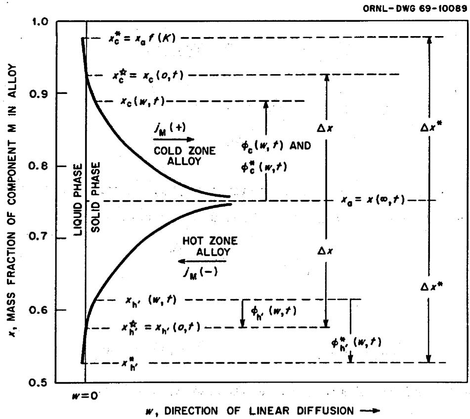  
Fig. 1. The Relative Positions of Various Concentration Parameters and Variables. These quantities govern the concentration profiles in the tubing walls under transient, then steady-state conditions; they control concentration profiles and the migration rates in the alloy. An individual representation of reaction rate contributions is not shown; thus the difference, $\Delta x^* - \Delta x$ , relates directly to $h$ or $\overline{h}$ .

for cold zone in the expressions to follow since we have already stated this restriction.

We now turn to transformed versions, starting with the notation of Churchill $^{23}$ and then converting to that of Carslaw and Jaeger. $^{24}$ In view of boundary condition (a), the transform of Eq. (26a) is

$$
\frac {d ^ {2} \overline {{\phi}} (w , s)}{d w ^ {2}} - \frac {s}{D} \overline {{\phi}} (w, s) - 0 = 0, \tag {26a}
$$

where

$$
\overline {{\phi}} (\mathrm {w}, \mathrm {s}) = \int_ {0} ^ {\infty} e ^ {- s t ^ {\prime}} \overline {{\phi}} (\mathrm {w}, \mathrm {t} ^ {\prime}) d t ^ {\prime}.
$$

The general solution of Eq. (26a) is

$$
\overline {{\phi}} (w, s) = c _ {1} e ^ {- q w} + c _ {2} e ^ {+ q w},
$$

where $q = (s / D)^{1/2}$ . To satisfy condition (b), $c_2$ must be zero. The derivative of the particular solution with respect to $w$ is

$$
\overline {{\phi}} ^ {\prime} (w, s) = - q c _ {1} e ^ {- q w}.
$$

At the surface,

$$
\overline {{\phi}} (0, s) = c _ {1} \quad ; \quad \overline {{\phi^ {\prime}}} (0, s) = - q c _ {1}.
$$

Thus the transform of Eq. (24a) evaluated at $w = 0$ is

$$
\overline {{\phi}} ^ {\prime} (0, s) = H [ \overline {{\phi}} (0, s) - \Delta x ^ {*} / s ].
$$

This may be rewritten as

$$
- q c _ {1} = H \left(c _ {1} - \Delta x ^ {*} / s\right),
$$

whereby

$$
c _ {1} = H \Delta x ^ {*} / s (q + H).
$$

The inverse of $\phi(w, s) = c_1 e^{-qw}$ will demonstrate that condition (c) is satisfied. This implies that $\Delta x^* \to \Delta x$ as $t \to \infty$ . In other words, $x^* \to x^{\diamond}$ in view of the associated film condition (d).

Now, since

$$
J _ {M} = - D \rho_ {a} \frac {\partial x (0 , t)}{\partial w}
$$

it is clear that

$$
J _ {M} = - D \rho_ {a} (- q c _ {1}) = \frac {D \rho_ {a} \Delta x ^ {*} H q}{D q ^ {2} (q + H)}.
$$

The stated goal is a form like Eq. (7). In transformed coordinates this will be

$$
\frac {\Delta \mathrm {M} (t)}{\mathrm {A} _ {\mathrm {Z}}} = \varepsilon \left\{\int_ {0} ^ {t} j _ {\mathrm {M}} \left(0, t ^ {\prime}\right) d t ^ {\prime} \right\} = \overline {{j _ {\mathrm {M}}}} / s. \tag {27}
$$

Thus

$$
\frac {\Delta M (t)}{A _ {z}} = \frac {\rho_ {a} \Delta x ^ {*} H}{s q (q + H)}. \tag {27}
$$

The inverse $^{25}$ transform of Eq. (27) is

$$
\frac {\Delta \mathrm {M} (t)}{\mathrm {A} _ {z}} = 2 \rho_ {\mathrm {a}} \Delta x ^ {*} \left(\frac {\mathrm {D t}}{\pi}\right) ^ {1 / 2} - \frac {\rho_ {\mathrm {a}} \Delta x ^ {*}}{\mathrm {H}} \left\{1 - \exp (- \mathrm {H} ^ {2} \mathrm {D t}) \operatorname {e r f c} \left[ (\mathrm {H} ^ {2} \mathrm {D t}) ^ {1 / 2} \right] \right\}. \tag {27a}
$$

To go back to sign conventions associated with the corrosion medium, we merely reverse signs by redefining $\Delta x^*$ to be

$$
\Delta \mathrm {x} ^ {*} = \mathrm {x} _ {\mathrm {a}} - \mathrm {x} ^ {*} = \mathrm {x} _ {\mathrm {a}} \left(1 - \mathrm {K} _ {\mathrm {p}} / \mathrm {K} _ {\mathrm {T}}\right).
$$

Equation (23) was used to write the last form.

Comparison of the first term of Eq. (27a) - including the new version of $\Delta x^*$ - with the right side of Eq. (7) reveals that both forms are equivalent. One may recall that Eq. (7) was developed on the basis of negligible film or surface effects, whereby $x \diamondsuit x^*$ . This actually happens over a period of time, depending on the H value, because $\exp(-u^2)\operatorname{erfc}(u) \to 0$ as $u \to 0$ ( $t \to 0$ ). Clarification is gained by forming the ratio of $\Delta M / A_z$ (where H is accounted) to $\Delta M / A_z$ (where H is neglected). The ratio is:

$$
\frac {\Delta \mathrm {M} (\mathrm {H} , \mathrm {D} , \mathrm {t})}{\Delta \mathrm {M} (\mathrm {D} , \mathrm {t})} = 1 - \left(\frac {1}{2 \mathrm {H}}\right) \left(\frac {\pi}{\mathrm {D t}}\right) ^ {1 / 2} \left\{1 - \exp (- \mathrm {H} ^ {2} \mathrm {D t}) \operatorname {e r f c} \left[ (\mathrm {H} ^ {2} \mathrm {D t}) ^ {1 / 2} \right] \right\}. \tag {28}
$$

Several somewhat fortuitous distinctions evolve when the results are put forth as a ratio. The results come out in compact form as $l$ minus a remainder; the remainder obviously fades out as time increases. This clearly demonstrates that surface effects, relative to diffusive effects, are important only in the initial phases of the loop operation. An attractive feature of Eq. (28) is the cancellation of $\Delta x^*$ . This means that specification of the balance point (manifest through $K_p$ ) is not required to prepare a plot showing the effects of $h$ or $H$ . The reader will discover in later sections that determination of the balance points is an involved procedure, even under quasi-steady-state conditions. Furthermore, we have no idea as to where the balance points reside at various times during the transient period. Thus, elimination of $K_p$ constitutes an important simplification at this point in the report. Whether $M$ is lost or gained by the alloy makes no difference when the ratio is used. The plots of the ratio versus time are always positive.

# Application to Sodium-Inconel 600 Systems

For demonstrative purposes, we have concocted an illustrative example for the Inconel-sodium system showing rates and degrees of approach to equilibrium, assuming that the only surface effects of importance are those associated with the liquid film. In other words, we assume that $\mathbf{k}_2 \to \infty$ ; thus $\overline{\mathbf{h}} \to \mathbf{h}$ . This is assumed because no information exists as to the values of $\mathbf{k}_1$ and $\mathbf{k}_2$ for the system. In fact, the values of $\mathbf{K}_{\mathrm{T}}$ are not above question. Details of the computation of $\mathbf{H}$ are given later. We have compared two values of $\mathbf{H}$ corresponding to typical maximum and minimum temperatures for experiments with Inconel 600 loops containing sodium, namely, $1089^{\circ}\mathbf{K}$ ( $1500^{\circ}\mathbf{F}$ ) and $922^{\circ}\mathbf{K}$ ( $1200^{\circ}\mathbf{F}$ ).

The example is presented in Fig. 2. Note that the film coefficient, h, in this example was assumed to be the same at all surface points around the loop, while D and $\mathbf{K}_{\mathbf{T}}$ in H were assumed to vary according to the local liquid (actually wall) temperatures. A comparison of these curves clearly indicates that film coefficients are of greatest importance in the hot zone where solid-state diffusion rates are relatively high. Nevertheless, transient effects associated with the liquid-film

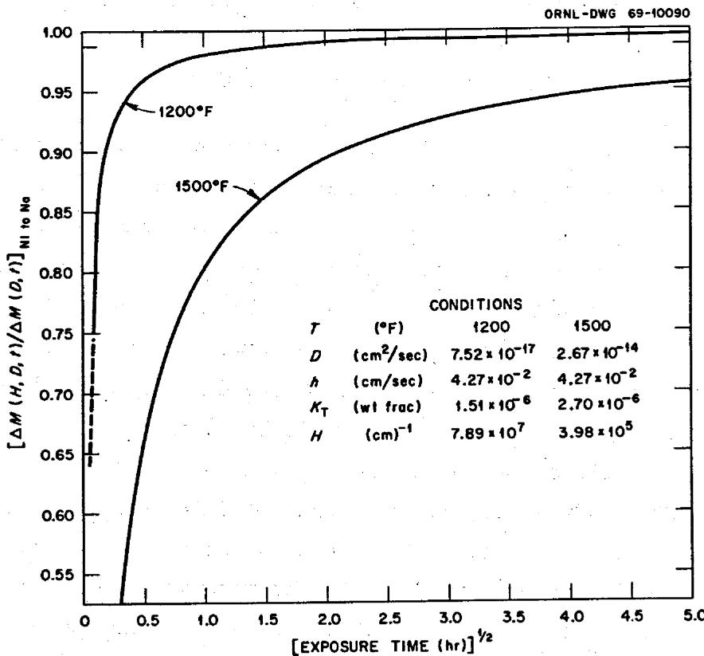  
Fig. 2. Predicted Transient Behavior in a Sodium-Inconel 600 Loop Operating at Typical Forced-Convection Conditions. The transient feature results from the presence of a constant liquid-film resistance that becomes less important as solid-state diffusion resistances increase with time.

resistance become diminishingly small after about 24 hr. Since operating times for pump loops currently range from 1000 hr to one year, we may neglect such transient effects without significantly affecting the calculation of the overall transfer of M from one zone to another. This greatly simplifies the problem; only the quasi-steady-state solution need be considered. The major task is integration of $\mathbf{j}_{\mathbf{M}}$ along z. Of course the work required is minimized if one selects a simple, yet reasonable, temperature profile (variation of T with z).

# TEMPERATURE PROFILES AND LOOP CONFIGURATIONS

# Reference and Prototype Loops

Our ultimate goal is to develop steady-state solutions for a variety of loops having arbitrary temperature profiles along $z$ . For reasons of mathematical tractability, we assume that the temperature profile may be approximated by several straight-line segments. The number of segments is of no importance in the final analysis. However, for convenience the connected segments should be drawn such that the overall profile will exhibit only one maximum and one minimum. A "typical" pump-loop configuration and profile will be considered for practical reasons; this will be called the reference loop. Next we shall consider a very simple profile designed to possess a fair degree of equivalence to the reference loop; this will be called the prototype loop. A simple and symmetrical prototype is desirable to minimize the necessary mathematical calisthenics, particularly with regard to the numerical examples.

# The Reference Loop

Figure 3 shows a schematic diagram of the reference forced-convection loops used in early liquid-metal corrosion tests. Each loop consisted of a pump and cold trap with a heat exchanger between the cold and hot legs (surge tank attached). The inner tube of the heat exchanger contained the hot liquid while the cold liquid traveled through the annulus. Thus the cold liquid was contained between two walls each at a slightly different temperature. The cold trap was used to remove traces of oxide impurities, mainly $\mathrm{Na}_2\mathrm{O}$ , from the sodium. Only a small portion of the main flow was diverted to the cold trap. The trap design along with this low flow, coupled with return-line heaters, mitigated major temperature perturbations in the main flow stream. Furthermore, the trap did not materially affect the deposition of metal constituents in the cold leg.

The maximum and minimum loop temperatures were $816^{\circ}\mathrm{C}$ ( $1500^{\circ}\mathrm{F}$ ) and $649^{\circ}\mathrm{C}$ ( $1200^{\circ}\mathrm{F}$ ), respectively, with a flow rate of 2.5 gpm and a typical operating time of 1000 hr. The temperature profile and dimensional information for the experimental (reference) loop are given in Table 1.

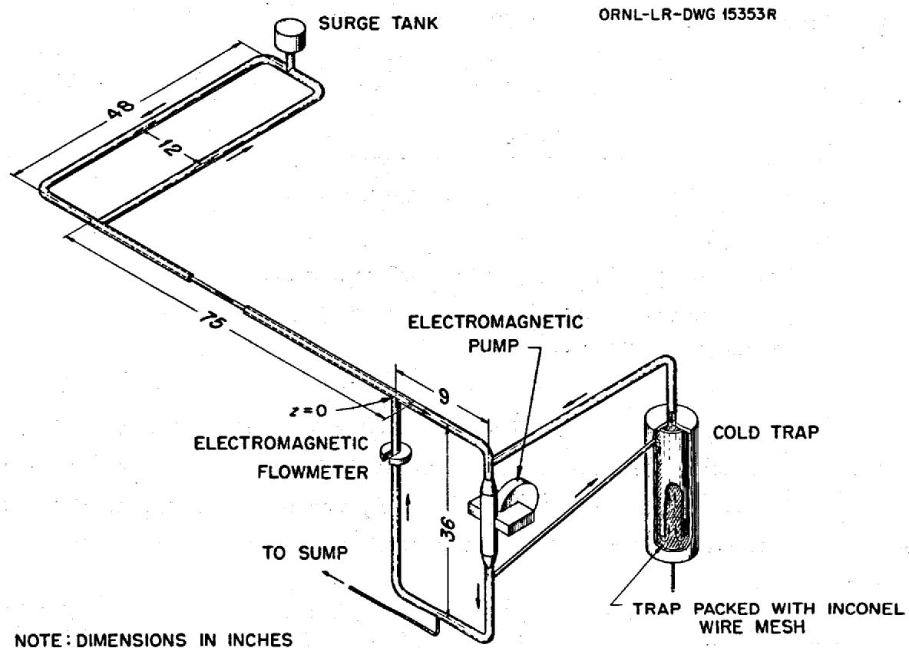  
Fig. 3. Reference Pumped Loop Used in Corrosion Experiments. Most of the acceptable sodium-Inconel 600 results were obtained with loops as shown above, although different configurations were sometimes used.

Table 1. Geometrical-Temperature Characteristics of Forced-Convection Pump Loops for Liquid-Metal Corrosion Experiments   

<table><tr><td rowspan="2">Flow Section</td><td rowspan="2">Wall Area (in.2)</td><td rowspan="2">Fraction of Area, A/AT</td><td rowspan="2">Cumulative Fraction, Σ(A/AT)</td><td colspan="2">Exit Temperature</td></tr><tr><td>(°F)</td><td>(°C)</td></tr><tr><td>Economizera</td><td>263.9</td><td>0.3367</td><td>0.3367</td><td>1450b</td><td>788</td></tr><tr><td>Annulus</td><td></td><td></td><td></td><td></td><td></td></tr><tr><td>Hot leg loopa</td><td>222.1</td><td>0.2832</td><td>0.6197</td><td>1500</td><td>816</td></tr><tr><td>Economizer Central tubec</td><td>108.4</td><td>0.1382</td><td>0.7581</td><td>1230</td><td>666</td></tr><tr><td>Cold leg loopd</td><td>189.7</td><td>0.2419</td><td>1.0000</td><td>1200</td><td>649</td></tr><tr><td>TOTALe</td><td>784.1</td><td>1.0000</td><td></td><td></td><td></td></tr></table>

Shell and loop tubing: 0.75 in. OD × 0.065 in. wall.   
bEntrance temperature: $1200^{\circ}\mathrm{F}$   
Central tubing: 0.5 in. OD × 0.020 in. wall.   
dIncludes pump area of 7.05 in.2; see Fig. 3.   
eTotal length: 349 in.

Before operation, the loop was flushed with sodium at about $650^{\circ}\mathrm{C}$ for several hours to remove surface oxides. The cold trap was not used during this operation. For the actual run, fresh sodium was introduced. After operation, sections of the loop were cut and analyzed by various methods.

# A Prototype Loop

Table 1 illustrates that the temperature profile and geometrical characteristics of the reference loop are quite complicated, especially if one wishes to apply a mathematical treatment of the diffusion process using numerical examples. Work of this type requires a more simplified configuration, which we shall call a prototype loop. (We employ the designation "prototype" to suggest that future designs of forced-convection loops incorporate less complicated flow paths and temperature profiles.) As stressed in Report I, we again avoid the overworked word "model," as this might suggest that calculations of the overall corrosion

rate, $\Delta M(t)$ , depend on the flow characteristics of the prototype. Except for transients, which are handled in these reports, the solid-state diffusion mechanism depends only on the wall temperature and the concentration of dissolved alloy constituents. We care nothing about the flow itself or its direction.

Our purpose here is to propose a simplified configuration whereby all the geometrical complexities engineered into early forced-convection loops will be removed; yet the features important to the mechanism under test will be retained. Actually, we are striving for a maximum degree of equivalence between the reference and prototype loops. The most logical prototype that is easily envisioned is the "tent-shaped" profile over a constant-diameter loop used by Keynes.[26] This "tent-shaped" profile appears to display the utility desired, although it is somewhat awkward when applied to other mechanisms, where perhaps a saw-tooth profile might be most appropriate. The idea that a tent-shaped profile composed of two straight-line segments cannot be experimentally obtained has been dispelled by DeVan and Sessions.[27] They used profiles that were tent-shaped but showed some asymmetry.

In long-term pump loop experiments we shall eventually establish that liquid-film contributions are not of great importance; thus, the primary consideration is acquisition of a loop with an equivalent area. In Table 1 we see that the total area exposed to liquid is 784 in.² or 5050 cm². If we assume a constant diameter of 0.70 in. all around the loop, the total length will be 906 cm, which is not too far removed from the actual value of 886 cm for the reference loop. The average Reynolds number, $\langle N_{\mathrm{Re}}\rangle$ , weighted according to the fractional areas involved, is $5.06 \times 10^4$ .

Thus, we inquire as to the $\langle \mathbf{N}_{\mathrm{Re}}\rangle$ for the prototype loop. Based on $r'$ , $D_{\mathrm{Ni - Na}}$ , $V_{z}$ , $\rho_{\ell}$ , and $\mu$ values of 0.89 cm, $3.3 \times 10^{-4} \mathrm{~cm}^2/\mathrm{sec}$ ,

63.5 cm/sec, 0.772 g/cm³, and 1.80 × 10⁻³ g cm⁻¹ sec⁻¹, respectively, one may compute the h as well as the $\langle N_{\mathrm{Re}} \rangle$ using

$$
\mathrm {N} _ {\mathrm {S h}} = 0. 0 2 3 \left\langle \mathrm {N} _ {\mathrm {R e}} \right\rangle^ {0. 8} \mathrm {N} _ {\mathrm {S c}} ^ {0. 3 3},
$$

along with the variables that make up the dimensionless constants, whose definitions may be found in the Nomenclature. The results are that $h = 4.27 \times 10^{-2}$ cm/sec and $\langle N_{\text{Re}} \rangle = 4.85 \times 10^4$ for the prototype. Details appear in Appendix A of Report I. The value of $\langle N_{\text{Re}} \rangle$ compares favorably with that calculated above for the reference loop. Figure 4 compares the temperature profiles for the prototype and reference loops.

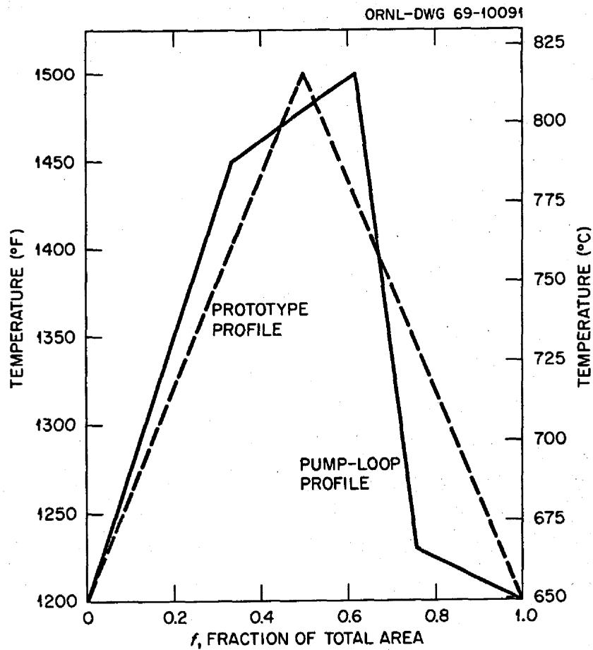  
Fig. 4. Comparison of Temperature Profiles for Pumped Loops. The solid curve approximates temperatures around the "reference" loop; the dotted curve represents a "tent-shaped" prototype loop.

We now wish to calculate the H's of Fig. 2, since these quantities are based on the geometry of the prototype. We recall that

$$
\mathrm {H} = \mathrm {K} _ {\mathrm {T}} \left(\mathrm {h} _ {\ell} / \mathrm {D} _ {\mathrm {m}}\right) \left(\rho_ {\ell} / \rho_ {\mathrm {a}}\right) \left(\mathrm {m} _ {\mathrm {a}} / \mathrm {m} _ {\mathrm {M}}\right). \tag {25}
$$

At 816°C

$$
H = (2. 7 0 \times 1 0 ^ {- 6}) \left(\frac {4 . 2 7 \times 1 0 ^ {- 2}}{2 . 6 7 \times 1 0 ^ {- 1 4}}\right) \left(\frac {0 . 7 7 2 5}{8 . 1 1 1}\right) \left(\frac {5 6 . 7}{5 8 . 7}\right) = 3. 9 8 \times 1 0 ^ {5} / c m.
$$

At $649^{\circ}C$

$$
H = (3. 9 8 \times 1 0 ^ {5}) \left(\frac {1 . 5 1 \times 1 0 ^ {- 6}}{2 . 7 0 \times 1 0 ^ {- 6}}\right) \left(\frac {2 . 6 7 \times 1 0 ^ {- 1 4}}{7 . 5 2 \times 1 0 ^ {- 1 7}}\right) = 7. 8 9 \times 1 0 ^ {7} / c m.
$$

The density and viscosity of liquid sodium were based on extrapolation of appropriate handbook values.[28] The equilibrium ratios were estimated from data assembled by Singer and Weeks.[29] The diffusion coefficients for nickel were obtained from work done by K. Monma et al.[30] The density of the Inconel 600 was acquired from a vendor's handbook[31] and the molecular weight of the alloy was computed from the information presented in Table 2, which is based on data reported by Devan.[32] The $D_{\mathrm{Ni - Na}}$ used in the computation of h was obtained from the Stokes-Einstein equation;

Table 2. Nominal Composition of Inconel 600   

<table><tr><td>Constituent</td><td>Weight or Mass Fraction</td><td>mM(g/mole)</td><td>Molea100 g</td><td>Atom Fraction</td></tr><tr><td>Ni</td><td>0.7635</td><td>58.71</td><td>1.3000</td><td>0.7377</td></tr><tr><td>Cr</td><td>0.1500</td><td>52.00</td><td>0.2885</td><td>0.1637</td></tr><tr><td>Fe</td><td>0.0700</td><td>55.85</td><td>0.1253</td><td>0.0711</td></tr><tr><td>Mn</td><td>0.0100</td><td>54.90</td><td>0.0182</td><td>0.0103</td></tr><tr><td>Si</td><td>0.0050</td><td>28.09</td><td>0.0178</td><td>0.0101</td></tr><tr><td>C</td><td>0.0015</td><td>12.00</td><td>0.0125</td><td>0.0057</td></tr></table>

$$
\begin{array}{l} (a) _ {m _ {a}} = 1 0 0 / \Sigma (\text {c o l .} 4) = 1 0 0 / 1. 7 6 2 3 \approx 5 6. 7. \\ D _ {N i - N a} = \left(\frac {1}{\mu_ {N a}}\right) \left(\frac {\mathrm {k T}}{6 \pi r _ {N i}}\right), \tag {29} \\ \end{array}
$$

where $r_{\mathrm{Ni}} \approx 1.24 \times 10^{-8} \mathrm{~cm}$ .

# QUASI-STEADY-STATE SOLUTION

Statement of the Problem and Objectives

We seek a relationship that will permit computation of the amount of M migrating from the hot zone to the cold zone of the loop, assuming, of course, that E soln is endothermic; if not we seek the transfer in the opposite direction. Diffusion out of and into the container wall is expected to be slow, and, if the liquid is pretreated to eliminate transients associated with buildup of M in the liquid, all that remains is a transient induced by the mass transfer film resistance.

We have previously shown that film transients become negligible after a day or less. It follows then that our steady-state conditions mean that the $\underline{\mathbf{M}}$ concentrations in the liquid and the positions of the balance points separating the hot and cold zones are both steady (do not vary) with time. The term "quasi" steady state must be employed, however, because the point rates are proportional to $t^{+1/2}$ , and the gross

transfer is proportional to $t^{-1/2}$ . Therefore, both the rates and their time integrals vary with time. However, in view of the quasi-steady-state features of the problem, the time and position integrations may be performed independently of one another. This constitutes a great simplification of the tasks that lie ahead.

Our starting point is Eq. (7) in which the time integration has already been performed for single points along $z$ . The next step is integration along $z$ . Since $\mathrm{dA}_{z} = 2\pi r' \, \mathrm{d}z$ and $x_{T} / x_{a} = K_{p} / K_{T}$ [Eq. (11)], we may integrate Eq. (7) as

$$
\Delta M (t) = \int_ {z _ {1}} ^ {z _ {2}} 2 x _ {a} \rho_ {a} \left(1 - \frac {K _ {p}}{K _ {T}}\right) \left(2 \pi r ^ {\prime} L\right) \left(\frac {D t}{\pi}\right) ^ {1 / 2} \frac {d z ^ {\prime}}{L} \tag {7a}
$$

The $\mathbf{K}_{\mathbf{T}}$ and D are functions of temperature, and $\mathbf{z}^{\prime}$ is a dummy variable of integration. A differential form of Eq. (7a) is

$$
\frac {d}{d f} \left(\frac {\Delta M}{L t ^ {1 / 2}}\right) = 4 \frac {A}{L} x _ {a} \rho_ {a} \left(1 - \frac {K _ {p}}{K _ {T}}\right) (D \pi) ^ {1 / 2}, \tag {7b}
$$

where $f = z' / L$ . The integrand evaluated at several points around the loop is plotted in Fig. 5. Notice that Fig. 5 refers to the prototype loop, which is actually an ad hoc device for the present discussion.

One could stop here, insofar as the mathematics is concerned, and integrate graphically as was done in the original work.[33] The procedure adopted at that time was to assume a balance point, prepare a plot of the integrand as indicated in Fig. 5, and then ascertain the area under the hot zone portion of the curve. The procedure was repeated for the cold zone. Unfortunately it was necessary to iterate until the two areas balanced. Use of plots similar to those in Fig. 6 speeded the work; but this approach required many trials, and it was tedious and boring to say the least.

The only major difference between the earlier and present problems was utilization of a sinusoidal temperature profile in the earlier work.

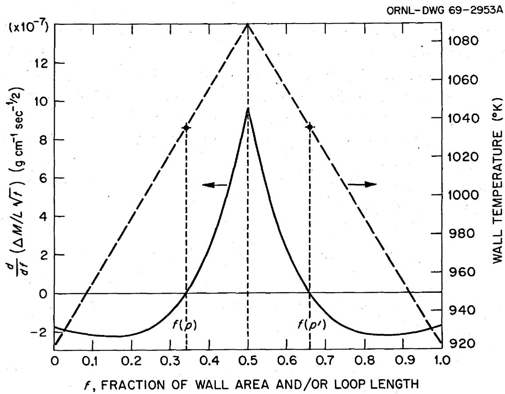  
Fig. 5. Profile of Cumulative Mass Transfer Contributions Expressed as a Ratio Involving Loop Length and Time. The profile applies to the prototype loop operating under quasi-steady-state conditions. Areas (integrals) corresponding to hot and cold zones are equal; thus, the balance points are properly located.

This same approach was used by Epstein. $^{34}$ This difference is of considerable importance because after ten years it is still quite difficult to achieve a sinusoidal profile in the laboratory. About the most mathematically tractable profile seen to date by the authors was that obtained recently by DeVan and Sessions $^{35}$ and by Koger and Litman. $^{36,37}$ Yet even this profile was slightly skewed. In other words, a series of straight

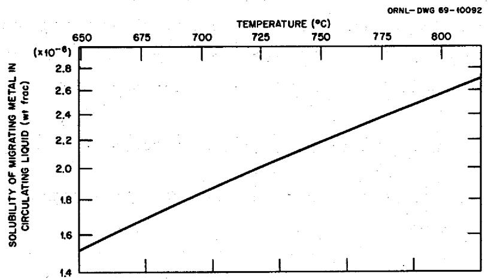

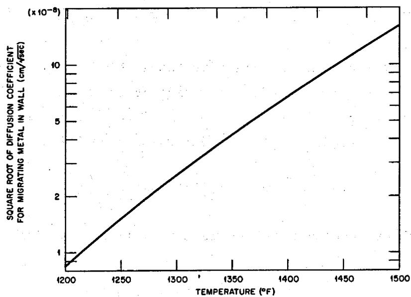  
Fig. 6. Graphical Presentation of Temperature-Dependent Parameters That Control the Idealized Diffusion Process at Quasi-Steady-State Conditions.

line segments represents the most realistic approximation to experimental cases. Of greater importance, straight-line profiles are the easiest to integrate: in fact, the results using straight-line segments are exact in an analytical sense. No serious compromises, such as straight-line approximation of exponential functions over extended ranges, are required.

Our problem divides itself into two distinct parts: (1) find the balance points and (2) compute the amount of material entering or leaving either zone. Both parts depend on obtaining the position integral. Our

approach will be to carry out the manipulations using the prototype loop; present computations for the prototype loop using numerical examples, hopefully to clarify the overall procedure and nomenclature; and finally, discuss extension to cases like the reference loop.

# Solution in Terms of the Prototype Loop

Equation (7a) is our starting point for the integrations that will produce a solution

$$
\frac {\Delta [ \mathrm {M} (\mathrm {t}) ]}{2 \mathrm {t} ^ {1 / 2}} = \int_ {\mathrm {z} _ {1}} ^ {\mathrm {z} _ {2}} 4 \mathrm {x} _ {\mathrm {a}} \rho_ {\mathrm {a}} r ^ {\prime} \left(\pi \mathrm {D} _ {0}\right) ^ {1 / 2} \left(1 - \frac {\mathrm {K} _ {\mathrm {p}}}{\mathrm {K} _ {\mathrm {T}}}\right) \exp \left(\frac {- \mathrm {E} _ {\mathrm {D}}}{2 \mathrm {R T}}\right) \mathrm {d z} ^ {\prime}. \tag {7c}
$$

The reader will recall that the time integration was performed earlier. A factor of $\frac{1}{2}$ appears on the left side as the symmetry of the tent profile permits consideration of only half the loop. Also we have introduced the expression for the diffusion coefficient in the form of

$$
(D) ^ {1 / 2} = \left(D _ {0}\right) ^ {1 / 2} \exp \left(- E _ {D} / 2 R T\right). \tag {30}
$$

The equilibrium constant may be written similarly as either

$$
\mathrm {K} _ {\mathrm {T}} = \mathrm {K} _ {0} \exp \left(- \mathrm {E} _ {\text {s o l n}} / \mathrm {R T}\right), \tag {31}
$$

or

$$
\left(\mathrm {K} _ {\mathrm {T}}\right) ^ {- 1} = \left(\mathrm {K} _ {0}\right) ^ {- 1} \exp \left(+ \mathrm {E} _ {\text {s o l n}} / \mathrm {R T}\right). \tag {31a}
$$

Thus Eq. (7c) can be divided conveniently into two parts:

$$
\frac {\Delta [ \mathrm {M} (\mathrm {t}) ]}{2 \mathrm {t} ^ {1 / 2}} = \mathrm {C} \int_ {\mathrm {z} _ {1}} ^ {\mathrm {z} _ {2}} \exp \left(\frac {\mathrm {E} _ {\mathrm {D}}}{2 \mathrm {R T}}\right) \mathrm {d z} ^ {\prime} - \mathrm {C} ^ {\prime} \int_ {\mathrm {z} _ {1}} ^ {\mathrm {z} _ {2}} \exp \left[ - \frac {\left(\mathrm {E} _ {\mathrm {D}} - 2 \mathrm {E} _ {\text {s o l n}}\right)}{2 \mathrm {R T}} \right] \mathrm {d z} ^ {\prime}, \tag {7d}
$$

where

$$
C \equiv 4 x _ {a} \rho_ {a} r ^ {\prime} (\pi D _ {0}) ^ {1 / 2} \tag {32}
$$

and

$$
\mathrm {C} ^ {\prime} \equiv \mathrm {C K} _ {\mathrm {p}} / \mathrm {K} _ {0}. \tag {33}
$$

The next part of the problem is the key to the whole solution. It concerns the relationship between $\mathbf{T}$ and $\mathbf{z}$ . In terms of $^\circ \mathbf{C}$ (or $^\circ \mathbf{F}$ ) an obvious relationship is

$$
\mathrm {T} (\mathrm {z}) = \mathrm {T} _ {\mathrm {c}} + \mathrm {b z}, \quad {} ^ {\circ} \mathrm {C}, \tag {34}
$$

where $\mathbf{z}$ runs from 0 to 0.5; thus

$$
b = 2 \left(T _ {H} - T _ {c}\right) / L = 2 \Delta T / L. \tag {34a}
$$

This would be an ideal form if the exponential terms in Eq. (7c) were not present. However, they are indeed present; also they demand values of $\mathrm{T}$ expressed in $^\circ \mathrm{K}$ . Consider an extension of the segments on the profiles in Fig. 5 whereby the distance $\xi$ would be zero at absolute zero $(-273^{\circ}\mathrm{C}$ or $0^{\circ}\mathrm{K})$ . What will happen is not difficult to visualize if one recalls the trivial relationship, $\Delta \mathrm{T} (^{\circ}\mathrm{K}) = \Delta \mathrm{T} (^{\circ}\mathrm{C})$ , which means that $\xi$ is valid for both temperature scales. One immediately envisions the possibilities of an extended coordinate $\xi$ such that

$$
\begin{array}{l} \xi = (\mathrm {L} / 2 \Delta \mathrm {T}) (2 7 3 + \mathrm {T} ^ {\circ} \mathrm {C}) = \mathrm {b} ^ {- 1} (2 7 3 + \mathrm {T} _ {\min } + \Delta \mathrm {T}), \\ \boldsymbol {\xi} = \xi_ {0} + z, \quad c m, \tag {35} \\ \end{array}
$$

which in turn simply means that we have adopted the relationship

$$
\mathrm {T} = \mathrm {b} \xi , \quad {} ^ {\circ} \mathrm {K}, \tag {35a}
$$

for the extension. From Eq. (35) $\mathrm{d}\xi = \mathrm{d}z$ , and the new variable $\xi$ may be introduced into Eq. (7c) with this and following definitions: Let

$$
\alpha = \mathrm {E} _ {\mathrm {D}} / 2 \mathrm {b R} \tag {36}
$$

and

$$
\alpha^ {\prime} = \left(\mathrm {E} _ {\mathrm {D}} - 2 \mathrm {E} _ {\text {s o l n}}\right) / 2 \mathrm {b R}. \tag {36a}
$$

Then the right side of Eq. (7d) becomes

$$
\mathrm {C} \int_ {\xi_ {1}} ^ {\xi_ {2}} \exp \left(- \alpha / \xi^ {\prime}\right) d \xi^ {\prime} - \mathrm {C} ^ {\prime} \int_ {\xi_ {1}} ^ {\xi_ {2}} \exp \left(- \alpha^ {\prime} / \xi^ {\prime}\right) d \xi^ {\prime}
$$

or, in abbreviated form,

$$
\mathrm {C I} _ {1 2} \left(\alpha / \xi\right) - \mathrm {C} ^ {\prime} \mathrm {I} _ {1 2} \left(\alpha^ {\prime} / \xi\right).
$$

We are now ready for integration. Whether one operates on the unprimed or primed term is of no consequence as long as $\alpha$ or $\alpha' > 1$ . Thus we choose the former. However, a change of variable is useful at this point. Let $u = \alpha/\xi$ or $\xi = \alpha/u$ ; then $d\xi = -(\alpha/u^2)du$ ;

$$
I _ {1 2} \left(\alpha / \xi\right) = \int_ {\xi_ {1}} ^ {\xi_ {2}} \exp \left(- \alpha / \xi^ {\prime}\right) d \xi^ {\prime} = - \int_ {u _ {1}} ^ {u _ {2}} \frac {\alpha}{u ^ {\prime 2}} \exp (- u ^ {\prime}) d u ^ {\prime}. \tag {37}
$$

Integration in terms of u can be performed by parts with the formula

$$
\int \Psi d \omega = \Psi \omega - \int \omega d \Psi .
$$

We let

$$
\psi = \exp (- u) \quad \text {a n d} \quad d \omega = d u / u ^ {2};
$$

then

$$
d \Psi = - \exp (- u) d u \quad a n d \quad \omega = - 1 / u.
$$

Also we note that $u_j \to \infty$ as $\xi_j \to 0$ . The result is

$$
\begin{array}{l} I _ {1 2} \left(\alpha / \xi\right) = \alpha \left[ \left(\frac {e ^ {- u _ {2}}}{u _ {2}} - \frac {e ^ {- u _ {1}}}{u _ {1}}\right) + \int_ {u _ {1}} ^ {u _ {2}} \frac {e ^ {- u ^ {\prime}}}{u ^ {\prime}} d u ^ {\prime} \right] \\ = \alpha \left(\frac {e ^ {- u _ {2}}}{u _ {2}} - \int_ {u _ {2}} ^ {\infty} \frac {e ^ {- u ^ {\prime}}}{u ^ {\prime}} d u ^ {\prime}\right) - \alpha \left(\frac {e ^ {- u _ {1}}}{u _ {1}} - \int_ {u _ {1}} ^ {\infty} \frac {e ^ {- u ^ {\prime}}}{u ^ {\prime}} d u ^ {\prime}\right) \tag {37a} \\ \end{array}
$$

Notice, via Eqs. (35a) and (36), that $\mathbf{u} = \mathbf{E}_{\mathrm{D}} / 2\mathrm{RT}$ in this case. Clearly the integration does not involve position - only temperature. However, $\mathbf{L}$ does enter the results through the factor $\alpha$ . The integral term was broken up into two parts, each with infinite limits, to cast the results into a form that brings forth the so-called exponential integrals of the first order. These are tabulated in the literature.[38] In our work, values of the argument are large, and in this case the tabulations are in the form

$$
\beta \left(u _ {j}\right) = u _ {j} e ^ {+ u _ {j}} E _ {1} \left(u _ {j}\right),
$$

where

$$
\int_ {u _ {j}} ^ {\infty} e ^ {- \tau} d T / T.
$$

The $\tau$ in this case is the dimensionless dummy variable of integration $\tau = u' = \alpha / \xi'$ . One can show, using $u' = \alpha / \xi'$ , that

$$
E _ {1} \left(u _ {j}\right) = - \int_ {u _ {j}} ^ {\infty} \left(\frac {\alpha}{\xi^ {\prime}}\right) \left[ \exp \left(- \frac {\alpha}{\xi^ {\prime}}\right) \right] d \left(\frac {\xi^ {\prime}}{\alpha}\right).
$$

The minus sign is accounted for by suitable arrangement of terms. As suggested by the form of the tabulated values, the final result may be written as

$$
I _ {1 2} \left(\alpha / \xi\right) = \xi_ {2} e ^ {- u _ {2}} \left[ 1 - \beta \left(u _ {2}\right) \right] - \xi_ {1} e ^ {- u _ {1}} \left[ 1 - \beta \left(u _ {1}\right) \right], \tag {37b}
$$

which clearly shows the contribution of the position variables.

Values of $\beta(u_j)$ are plotted on Fig. 7. An accurate interpolation of the values is clearly required because the results contain the difference $1 - \beta(u_j)$ , and $\beta(u_j)$ values are not too far removed from unity when $u_j$ is large.

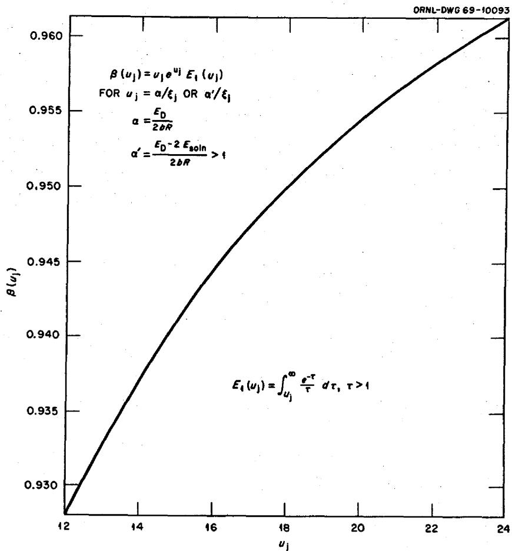  
Fig. 7. Plot of $\beta(u_j)$ for Large Values of $u_j$ . The function $\beta(u_j)$ carries contributions of $E_i(u_j)$ ; the interval of $u_j$ is dictated by values of parameters peculiar to the sodium-Inconel 600 system.

Thus far we have outlined a solution for all cases where the reactions leading to mass transfer are exothermic, also cases where the reaction is endothermic up to the point where $\mathbf{E}_{\mathrm{soln}} = \mathbf{E}_{\mathrm{D}} / 2$ . At this point the second term in Eq. (7c) is simply

$$
\mathrm {C} ^ {\prime} \mathrm {I} _ {1 2} (0) = \mathrm {C} ^ {\prime} \left(\xi_ {2} - \xi_ {1}\right) \tag {38}
$$

which states that the second term in Eq. (7c) or (7b) is a constant. The probability of this happening is quite low in practice, so we shall pass immediately to the cases where the solution reaction is endothermic enough to bring about the inequality

$$
\mathrm {E} _ {\text {s o l n}} > \mathrm {E} _ {\mathrm {D}} / 2.
$$

When the energy of solution overrides the contribution of the energy of activation for diffusion, the second term in Eq. (7c) becomes

$$
4 x _ {a} \rho_ {a} r ^ {\prime} \left(K _ {p} / K _ {0}\right) \left(\pi D _ {0}\right) ^ {1 / 2} \int_ {z _ {1}} ^ {z _ {2}} \exp \left[ + \left(2 E _ {s o l n} - E _ {D}\right) / 2 R T \right] d z ^ {\prime}.
$$

Note that $C'$ remains the same. In terms of $\xi$ coordinates, using the same substitutions, one obtains the following:

$$
I _ {1 2} \left(\alpha^ {\prime \prime} / \xi\right) = \int_ {\xi_ {1}} ^ {\xi_ {2}} \exp \left(+ \frac {\alpha^ {\prime \prime}}{\xi^ {\prime}}\right) d \xi^ {\prime} = - \int_ {u _ {1}} ^ {u _ {2}} \frac {\alpha^ {\prime \prime}}{u ^ {\prime 2}} \exp (+ u ^ {\prime}) d u ^ {\prime}, \tag {39}
$$

where it may be helpful to think in terms of the equality, $\alpha'' = -\alpha'$ . Integration yields

$$
I _ {1 2} \left(\alpha^ {\prime \prime} / \xi\right) = \alpha^ {\prime \prime} \left[ \left(\frac {e ^ {+ u _ {2}}}{u _ {2}} - \frac {e ^ {+ u _ {1}}}{u _ {1}}\right) - \int_ {u _ {1}} ^ {u _ {2}} \frac {e ^ {+ u ^ {\prime}}}{u ^ {\prime 2}} d u ^ {\prime} \right],
$$

which may be rearranged to conform to tabulated functions as

$$
I _ {1 2} \left(\alpha^ {\prime \prime} / \xi\right) = \alpha^ {\prime \prime} \left[ \left(\int_ {- \infty} ^ {u _ {1}} \frac {e ^ {- u ^ {\prime}}}{u ^ {\prime}} d u ^ {\prime} - \frac {e ^ {u _ {1}}}{u _ {1}}\right) - \left(\int_ {- \infty} ^ {u _ {2}} \frac {e ^ {u ^ {\prime}}}{u ^ {\prime}} d u ^ {\prime} - \frac {e ^ {u _ {2}}}{u _ {2}}\right) \right]. \tag {39a}
$$

Collection and rearrangement of terms permits one to write

$$
I _ {1 2} \left(\alpha^ {\prime \prime} / \xi\right) = \xi_ {1} e ^ {+ u _ {1}} \left[ \lambda \left(u _ {1}\right) - 1 \right] - \xi_ {2} e ^ {+ u _ {2}} \left[ \lambda \left(u _ {2}\right) - 1 \right], \tag {39b}
$$

where

$$
\lambda \left(u _ {j}\right) = u _ {j} e ^ {- u _ {j}} E _ {1} \left(u _ {j}\right)
$$

and

$$
E _ {i} (u _ {j}) = \int_ {- \infty} ^ {u _ {j}} e ^ {+ \tau} d \tau / \tau , u > 0.
$$

The last function, $\mathbf{E}_i(u_j)$ is the exponential integral; values of $\lambda(u_j)$ appear in the same tables38 as those for $\beta(u_j)$ . The presence of

$u_{1}$ functions before $u_{2}$ functions should be expected in Eq. (39b)

because $u_1 > u_2$ and exponentials with positive arguments appear. A plot of $\lambda(u_j)$ against $u_j$ for large values of the argument appears in Fig. 8.

The balance point is located by integrating over the entire loop. One assigns 1 and 2 in Eq. (7d) as the terminal points of the loop. A mass balance requires that this integral be zero if the liquid is essentially pre-equilibrated. Thus, Eq. (7d) can be rearranged to yield

$$
\mathrm {C I} _ {1 2} (\alpha) = \mathrm {C} ^ {\prime} \mathrm {I} _ {1 2} \left(\alpha^ {\prime}\right)
$$

or

$$
\frac {\mathrm {I} _ {1 2} (\alpha)}{\mathrm {I} _ {1 2} \left(\alpha^ {\prime}\right)} = \frac {\mathrm {C} ^ {\prime}}{\mathrm {C}} = \frac {\mathrm {K} _ {\mathrm {p}}}{\mathrm {K} _ {0}} = \exp \left(- \frac {\mathrm {E} _ {\text {s o l n}}}{\mathrm {R T}}\right). \tag {40}
$$

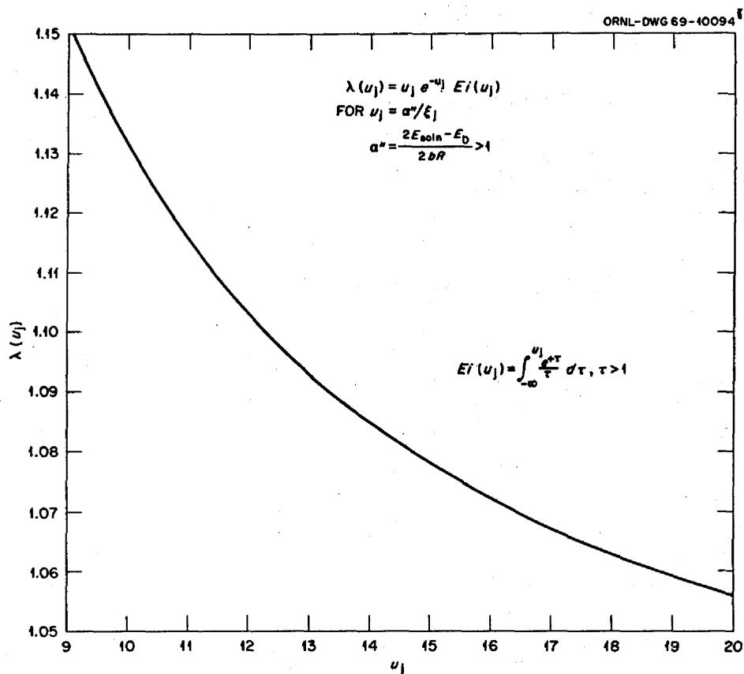  
Fig. 8. Plot of $\lambda(u_j)$ for Large Values of $u_j$ . Application of this plot is required when $2E_{soln}$ exceeds $E_D$ . This situation is encountered when molten-salt systems are discussed in sections to follow.

One may back calculate to find $\mathbf{T}$ and then successively $z, f, \xi_p$ , and finally, $u_p$ . The $\Delta M$ may be evaluated by application of Eq. (7d) using either the limits $(1,p)$ over the cold zone or $(p,2)$ over the hot zone. Details concerning these manipulations appear in the next section.

# Predicted Results for Sodium-Inconel 600 Systems

Two objectives are associated with this section of the report. First, we hope to attach some physical reality to equations developed in the previous section through presentation of numerical examples, thereby demonstrating that the equations are easy to use in spite of their formidable appearance. Second, we desire to predict corrosion rates under our assumed condition that diffusion controls both in the hot and cold zones and that a predictable balance point does exist, as suggested by the microprobe data shown in Report I. To parallel the procedures for the preceding derivations, we may specialize to the case of the prototype for simplicity without too much loss in generality.

One may start by considering the first and third columns of Table 3. The first computation required involves b. One finds, using Eq. (34a):

$$
b ^ {- 1} = L / 2 \Delta T = 9 0 6 / 2 \times 1 6 7 = 2. 7 1 c m / ° K.
$$

Related equations give

$$
\xi_ {1} = (2. 7 1 5 \mathrm {c m} / ^ {\circ} \mathrm {K}) (9 2 2 ^ {\circ} \mathrm {K}) = 2 5 0 3 \mathrm {c m},
$$

and

$$
\xi_ {z} = (2. 7 1 5 \mathrm {c m} / ^ {\circ} \mathrm {K}) (1 0 8 9 ^ {\circ} \mathrm {K}) = 2 9 5 6 \mathrm {c m}.
$$

Computation of $u_1$ and $u_2$ requires a knowledge of $\alpha$ and $\alpha'$ . But these, in turn, require parameters associated with the curves of Fig. 6.

Table 3. Values Used to Compute Balance Points and Mass Transfer in Prototype Loop   

<table><tr><td rowspan="2">Functions of ξj</td><td colspan="3">ξj, cm</td></tr><tr><td>ξ2 = 2956</td><td>ξp = 28126</td><td>ξ1 = 2503</td></tr><tr><td>uj = α/ξ(a)j</td><td>16.228</td><td>17.05</td><td>19.163</td></tr><tr><td>uj&#x27; = α&#x27;/ξ(b)j</td><td>13.000</td><td>13.660</td><td>13.350</td></tr><tr><td>exp(-uj)</td><td>8.985 × 10-8</td><td>3.926 × 10-8</td><td>4.776 × 10-9</td></tr><tr><td>exp(-uj&#x27;)</td><td>2.267 × 10-6</td><td>1.1723 × 10-6</td><td>2.160 × 10-7</td></tr><tr><td>1 - β(uj)</td><td>5.52 × 10-2</td><td>5.28 × 10-2</td><td>4.76 × 10-2</td></tr><tr><td>1 - β(uj&#x27;)</td><td>6.73 × 10-2</td><td>6.43 × 10-2</td><td>5.82 × 10-2</td></tr><tr><td>ξje-uj[1 - β(uj)]</td><td>1.466 × 10-5</td><td>5.83 × 10-6</td><td>5.69 × 10-7</td></tr><tr><td>ξ&#x27;j e-uj[1 - β(uj&#x27;)]</td><td>4.509 × 10-4</td><td>2.120 × 10-4</td><td>3.15 × 10-5</td></tr></table>

(a) $\alpha = E_{D} / 2 b R = 4.797 \times 10^{-4} \, \text{cm}$ .   
(b) $\alpha^{\prime} = (\mathrm{E}_{\mathrm{D}} - 2\mathrm{E}_{\mathrm{soln}}) / 2\mathrm{bR} = 3.842 \times 10^{-4}$ cm.

For $\alpha$ and related computations, diffusion parameters for nickel, in an alloy similar to Inconel 600, as reported by Monma et al.39 appear adequate, namely: $D_0 = 3.3\mathrm{cm}^2/\mathrm{sec}$ and $E_{D} = 70.2\mathrm{kcal/mole}$ . For $\alpha'$ and related computations, estimates of parameters based on solubility data for nickel in sodium as reported by Singer and Weeks40 were employed. Pertinent values here are $K_0 = 6.794 \times 10^{-5}$ weight fraction and $E_{\mathrm{soln}} = 6.985\mathrm{kcal/mole}$ . Application of all these values as indicated in the footnotes of Table 3 produces the values shown. Thus,

various values of $\xi_{j}$ could be converted to the corresponding $u_{j}$ values. The latter allowed calculation of the exponential functions; they also allowed acquisition of appropriate $1 - \beta(u_{j})$ values with the aid of enlarged versions of Fig. 7. In this regard, note that both $\alpha$ and $\alpha'$ are positive; thus, functions related to the $E_{1}(u_{j})$ values apply here. The operations necessary to complete the first and third columns are straightforward and require no additional comment.

The next and perhaps most important task is a computation of the balance points (the points at which $j_M = 0$ ). Since the prototype is under consideration, just one point is needed because symmetry permits treatment of only half the loop. The criterion is to set $\Delta M(t) = 0$ in Eq. (7d). Thus the appropriate sum of the integral terms must also be zero when the integration is carried out over the entire loop. This facet of the solution is discussed around Eq. (40), reference to which clearly indicates the method of approach; namely, we seek $T_p$ or $f(p)$ through $K_p$ . The latter is given by:

$$
\begin{array}{l} K _ {p} = K _ {0} I _ {1 2} (\alpha / \xi) / I _ {1 2} \left(\alpha^ {\prime} / \xi\right) = (6. 7 9 \times 1 0 ^ {- 5}) \left(1. 4 6 _ {6} - 0. 0 5 6 _ {9}\right) \times 1 0 ^ {- 5} / (4. 5 0 9 \\ - 0. 3 1 5) \times 1 0 ^ {- 4} \sim (6. 6 9 \times 1 0 ^ {- 5}) (3. 3 7 \times 1 0 ^ {- 2}) = 2. 2 8 \times 1 0 ^ {- 6}. \\ \end{array}
$$

The temperature corresponding to $\mathbf{K}_{\mathfrak{p}}$ is $1036^{\circ}\mathrm{K}$ ; thus $\xi_{\mathfrak{p}} \approx (2.715)(1036^{\circ}) = 2813$ , and $f(p)$ (of $L/2$ ) is 0.683. Computation of the values in the middle column corresponds to $\xi_{\mathfrak{p}}$ information.

Finally a value for $\triangle M(t)$ may be found by use of integral terms for the cold zone (limits: 1, p) and for the hot zone (limits: p, 2). Values for both zones were computed and averaged since all the differences involved introduced some uncertainties in "hand calculations." Everything required to calculate $\triangle M(t)$ appears in Table 3 except values of C and C'. The latter are evaluated through Eqs. (32) and (33). Thus

$$
C = (4) \left(0. 7 6 3 _ {5}\right) (9. 1 1 1) (0. 3 5 0 \times 2. 5 4) \left(3. 3 \times 3. 1 4 1 _ {6}\right) ^ {1 / 2} = 7 0. 9,
$$

and

$$
C ^ {\prime} = (3. 3 7 \times 1 0 ^ {- 2}) (7 0. 9) = 2. 3 9.
$$

For the cold zone, using Eq. (7c) again,

$$
\begin{array}{l} \Delta M (t) / 2 t ^ {1 / 2} = (7 0. 9) (5. 8 3 - 0. 5 6 9) \times 1 0 ^ {- 6} - (2. 3 9) (2. 1 2 - 0. 3 1 5) \times 1 0 ^ {- 4} \\ = (3. 7 3 - 4. 3 1) \times 1 0 ^ {- 4} = - 5. 8 \times 1 0 ^ {- 5} g / \sec^ {1 / 2}. \\ \end{array}
$$

For the hot zone,

$$
\begin{array}{l} \Delta M (t) / 2 t ^ {1 / 2} = (7 0. 9) (1 4. 6 6 - 5. 8 3) \times 1 0 ^ {- 6} - (2. 3 9) (4. 5 0 9 - 2. 1 2) \times 1 0 ^ {- 4} \\ = (6. 2 6 - 5. 7 1) \times 1 0 ^ {- 4} = + 5. 5 \times 1 0 ^ {- 5} g / \sec^ {1 / 2}. \\ \end{array}
$$

The different signs mean that the liquid sodium loses nickel in the cold zone, but it gains nickel (in principle, an equal amount) in the hot zone. The test period of interest is 1000 hr, $2t^{1/2} = 3.8 \times 10^{+3} \sec^{1/2}$ ; therefore:

$$
\Delta M (t = 1 0 0 0 h r) = (3. 8 \times 1 0 ^ {+ 3}) (5. 6 5) = 0. 2 1 5 g N i.
$$

A very high value of transport could be obtained by assuming that no balance point would exist because all the liquid could be forced through a $100\%$ -efficient nickel trap placed at the coldest point of the loop. In other words, the entire loop would be a hot zone. One obtains

$$
\begin{array}{l} \Delta \mathrm {M} / _ {\max } (\mathrm {t} = 1 0 0 0 \mathrm {h r}) = (3. 8 \times 1 0 ^ {3}) (7 0. 9) (1 4. 6 6 - 0. 5 7) \times 1 0 ^ {- 6} \\ = 3. 8 \mathrm {g} \mathrm {N i}. \\ \end{array}
$$

This value was computed for comparative discussion.

# DISCUSSION OF SODIUM-INCONEL 600 RESULTS

The manner in which the material has been presented up to this point almost demands that some comparisons be made between predicted (computed) results for the prototype loop and those for the reference loop. In this connection, we digress to note that extension of the mathematics to actual loops with temperature profiles as indicated by the solid line segments in Fig. 4 is relatively simple in principle, but tedious in practice - because symmetry is lost and several straight-line segments (each with its own b, $\alpha$ , and $\alpha'$ values) are present. Of

course, each must be accounted. Accordingly, a computer program $^{41}$ was developed to handle all cases where $\mathbf{E}_{\mathrm{D}} \geq 2 \mathbf{E}_{\mathrm{soln}}$ .

There were several reasons whereby use of a program could be justified. As shown in our illustrative calculations, the balance point is difficult to determine precisely by hand; we might add that acquisition of predicted corrosion and deposition profiles is also desired. The program permits an accurate prediction of these because the computer can evaluate many "point" $\mathbf{j}_{\mathbf{M}}$ 's quite rapidly after locating the balance points [and evaluating $\Delta M(t)$ in passing].

The reader is invited to inspect Fig. 9, in which computer program results for the actual loop and the prototype are presented together. The 1000-hr $\Delta M(t)$ 's computed from the integral forms are $0.232\mathrm{g}$ for the actual profile and $0.213\mathrm{g}$ for the prototype. Recall that the hand calculations based on Table 3 gave a value of $0.215\mathrm{g}$ for the prototype. The locations of the balance points for each case are also in close agreement. Thus we may conclude that the prototype is an excellent device for estimating $\Delta M$ , even though the profiles themselves turn out to be somewhat different in appearance.

The point of greatest importance is whether or not the mechanism under discussion here gives a reasonable representation of what happens in an experimental loop. The answer to the question, as was the case for Report I, is, "No, it does not!" The amount we must account for ranges between 10 to $14\mathrm{g}$ Ni. The computations produce values considerably less than $1\mathrm{g}$ Ni if one assumes that a balance point exists and about $4\mathrm{g}$ if one assumes that the entire loop acts as a hot zone under the dominance of the mechanism proposed. In regard to the latter, microprobe data show that deposition occurs in at least half the loop. Deposition tendencies are, in fact, so great that a region of nickel deposits appears, and furthermore samples of loop sodium suggest that the liquid is either supersaturated or contains suspended metal particulates all around the circuit. Thus we can forget about the value of

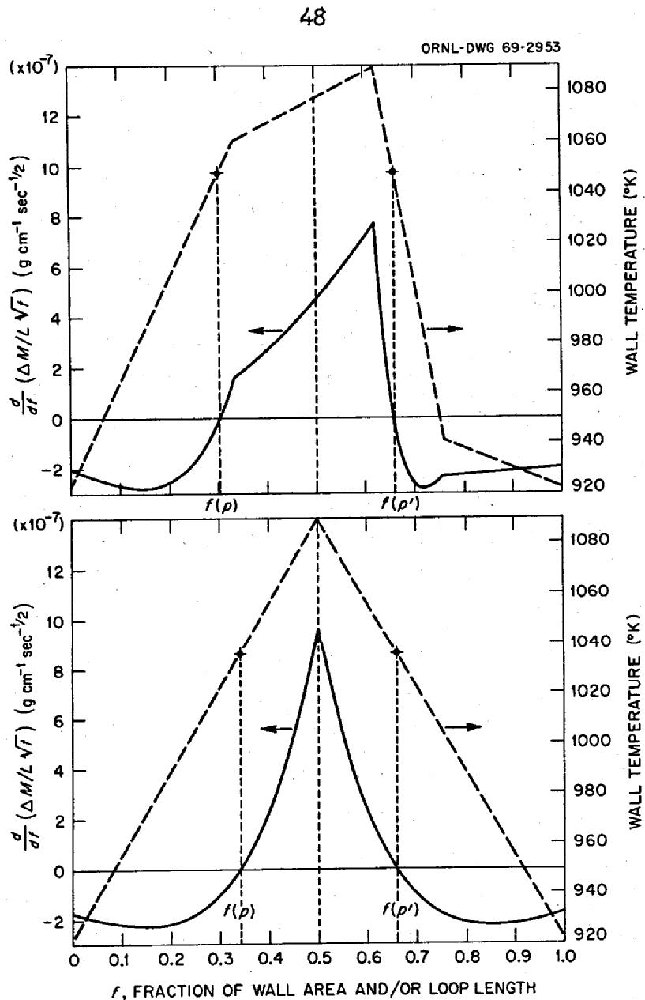  
Fig. 9. Profiles for Cumulative Chromium Corrosion as Computed for the Reference Loop, at Top, and the Prototype Loop Below.

4 g and base our conclusions on a predicted value ranging about 0.242 g. Other shortcomings of the mechanism described here stem from the initial assumptions that $\Delta M$ is not a function of fluid velocity - only of wall temperature - and that $\Delta M$ should be directly proportional to the square root of time. Both assumptions are in opposition to experimental behavior as described in Report I.

At this point we must consider which of the two limiting cases (treated individually in Report I and in the present report) might be most responsive to alterations to form the basis for an empirical

correlation. In other words, if we were to concoct a combined mechanism accounting solid-state and liquid-film diffusion effects together, where should we start? Intuitively, we lean toward the idea of going to work on the liquid-film mechanism, simply because it is the faster of the two considered thus far. We are attracted to this point of view because resistances associated with a fast mechanism can always be reduced by addition of a time-variable resistance that acts in series with the liquid film. On the other hand, it would be most difficult to justify decreasing the resistance of the slower mechanism. We should mention here that inclusion of a film resistance in the usual manner gives rise to a transient effect, which decays with time. Although such an effect is fortuitous, the overall result was to reduce further the already low value of material transported.

Two possibilities for altering the diffusion mechanisms under discussion might seem feasible. The first would involve increasing the value of $D_{\mathrm{Ni}}$ such that the predicted results and experimental data would coincide. The factor of increase would have to be about $10^{3}$ , but this might be tempered by the use of higher solubility values. Nevertheless, increases of this magnitude do not appear reasonable, and one tends to rule out this possibility.

A second possibility for increasing the predicted values would be to invoke solid-state diffusion equations where the point at which $w = 0$ moves around the loop. In other words, assume that the walls grow slightly thicker in cold regions and slightly thinner in the hot zones. This would accrue from corrosion reactions that will not "wait for" a diffusion-controlled process. However, the solution $x(w, t)$ , even for the case where the $w = 0$ boundary moves at a constant rate (a simple case),42 is too complex to be effectively applied to a mathematical treatment of the mass transfer process.

For both possibilities, a large amount of experimental data would be required to justify the selection of the approach and the evaluation of the parameters required. It would seem that, on the basis of the data available, the best approach is to resort to an empirical treatment. This is the objective of the next report. We may now turn to an application of the solid-state diffusion mechanisms to molten-salt systems, for which the corrosion reactions are well understood and the diffusion mechanism appears to apply - as demonstrated in early experiments.

# APPLICATION TO MOLTEN-SALT SYSTEMS

The results of experiments carried out over the past few years on the temperature gradient migration of metal in a molten-salt environment indicate that the overall rate of movement is controlled by diffusion rates within the metal. Hence, we will apply the equations derived earlier to several molten-salt systems to demonstrate the usefulness of the method.

At the beginning of the operation of a molten-salt loop that contains $\mathbf{U}\mathbf{F}_4$ as reactant, chromium will be removed from the entire loop until the $\mathrm{CrF_2}$ concentration in the circulating salt reaches equilibrium with the chromium concentration of the wall surface at the coldest position of the loop. At this time this position is the balance point. Then, as the concentration of $\mathrm{CrF_2}$ in the circulating salt increases even more, this initial balance point develops into a growing deposition area bounded by two balance points. Steady state is attained when the balance points become stationary and the $\mathrm{CrF_2}$ concentration in the circulating salt ceases to vary with time. Our mathematical analysis is valid for this last condition we call the quasi steady state. Quasi steady state can also be obtained by pre-equilibrating the salt before loop operation - that is, adding the amount of $\mathrm{CrF_2}$ required so that the concentration will be constant.

# Thermal Convection Loops

A schematic diagram of the reference thermal convection loop used in molten-salt experiments, particularly the $^{51}\mathrm{Cr}$ tracer experiments,

is shown in Fig. 10. The thermal convection loop differs from the pump loops mentioned in the earlier sections in that flow is achieved by convection forces resulting from heating one leg and an adjacent side of the loop while exposing the other portions of the loop to ambient conditions. The flow velocities in the thermal convection loop are 2 to $10\mathrm{~fpm}$ , depending on the temperature difference and dimensions of the vertical sections. The total tubing length of the loop under discussion is $254.0\mathrm{~cm}$ and the diameter is $1.383\mathrm{~cm}$ .

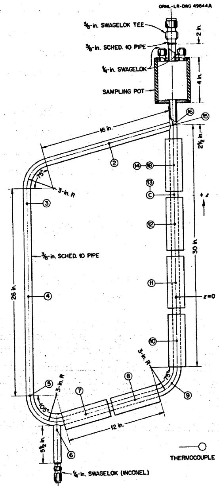  
Fig. 10. Thermal-Convection Loop Used in $^{51}\mathrm{Cr}$ Tracer Experiments. Circled numbers and letters denote thermocouple designations and locations.

The maximum temperature of the two actual (reference) thermal convection loops in which our calculations are based was $860^{\circ}\mathrm{C}$ ( $1580^{\circ}\mathrm{F}$ ) and the minimum $685^{\circ}\mathrm{C}$ ( $1265^{\circ}\mathrm{F}$ ). Both loops were constructed of Hastelloy N, whose nominal composition is given in Table 4. As noted in an earlier section, the actual loop temperature profiles were not conducive to a simple analytical expression, so we have proposed a simplified configuration ("tent-shape" profile), which we designate the prototype profile. Figure 11 shows the average temperature profile for the two loops and the profile assumed for the prototype. The prototype profile was constructed by drawing straight lines from the minimum temperature at $f = 0$ and 1.0 to the maximum temperature at $f = 0.5$ . This construction provided the same maximum temperature for the actual and prototype loop while allowing some small difference in the areas under the curves.

The diffusion coefficient of chromium in Hastelloy N as a function of temperature is given in Fig. 12. These values are based on determinations $^{43,44}$ of the self-diffusion of chromium in Hastelloy N using the tracer $^{51}\mathrm{Cr}$ in thermal convection loops like those previously mentioned. The appropriate Arrhenius relation constants are

$$
D _ {0} = 6. 0 6 8 \times 1 0 ^ {- 5} \mathrm {c m} ^ {2} / \sec
$$

and

$$
E _ {D} = 4 1. 4 8 \mathrm {k c a l / m o l e}.
$$

Table 4. Typical Composition of Hastelloy ${\mathbf{N}}^{\mathbf{a}}$   

<table><tr><td>Constituent</td><td>Weight or Mass Fraction</td><td>M (g/mole)</td><td>Mole or Atom Fraction</td></tr><tr><td>Cr</td><td>0.0741</td><td>52.00</td><td>0.088</td></tr><tr><td>Ni</td><td>0.7270</td><td>58.71</td><td>0.765</td></tr><tr><td>Mo</td><td>0.1500</td><td>94.95</td><td>0.096</td></tr><tr><td>Fe</td><td>0.0472</td><td>55.85</td><td>0.051</td></tr><tr><td>C</td><td>0.0017</td><td></td><td></td></tr></table>

Density of Hastelloy N = 8.878 g/cm³.

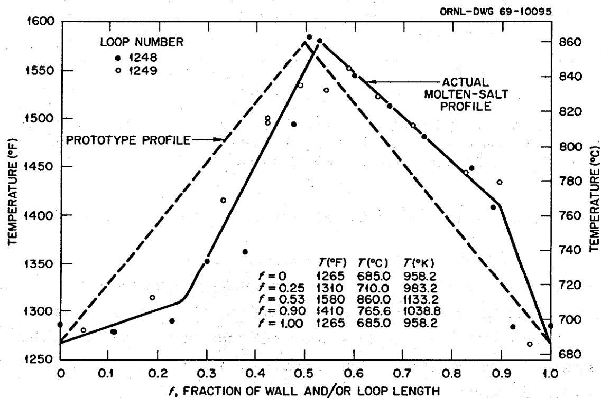  
Fig. 11. Temperature Profiles for Two Experiments with Loops as Illustrated in Fig. 10. The "average" curve (solid line) drawn through the two sets of data was taken as a reference for all molten-salt examples considered. The dashed line represents the simplified "prototype" loop more amenable to mathematical treatment.

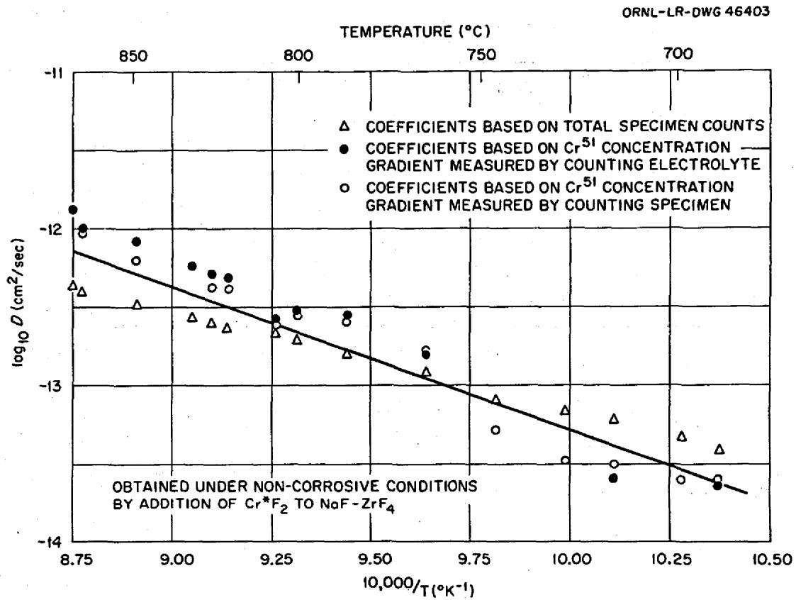  
Fig. 12. Diffusion Coefficients of $^{51}\mathrm{Cr}$ Obtained from a Tracer Loop Experiment (1248 on Fig. 11). The average curve was the basis for $D_0$ and $E_D$ used in all computations relative to molten-salt examples.

Redox Corrosion Equilibria and Systems Selected for Discussion

In our examples we shall consider three different molten-salt systems. Table 5 lists the significant reacting components of the salt and also the alloy constituents sensitive to oxidation by the salt. Also shown are the equilibrium values and constants of the corrosion reactions. The three corrosion reactions have been designated as examples I, II, and III.

In example I the salt was composed of NaF-47 mole % ZrF₄ with 6720 ppm FeF₂. The salt of example II is assumed to be primarily a LiF-BeF₂-UF₄ mixture typical of a fuel salt for a reactor with no impurities such as FeF₂ present. Example III involves the same basic salt as example II but with HF present instead of uranium or iron fluorides. In molten-salt mixtures HF can be formed by a reaction with water or

Table 5. Equilibrium Constants for Molten-Salt Corrosion Reactions   

<table><tr><td>Example</td><td>Salt System (mole %)</td><td>Reacting Species</td><td>KT</td><td>K0</td><td>△H (cal/mole)</td></tr><tr><td>I</td><td>NaF-47 ZrF4</td><td>Cr(s), FeF2(d)</td><td>[Fe][CrF2] / [Cr][FeF2]</td><td>53.7</td><td>-9,470</td></tr><tr><td>II</td><td>LiF-29 BeF2-5 ZrF4-1 UF4</td><td>Cr(s), UF4(d)</td><td>[CrF2][UF3]2 / [Cr][HF4]2</td><td>1.047 × 10^2</td><td>+43,920</td></tr><tr><td>III</td><td>Example II salt</td><td>Cr(s), HF(g)</td><td>[CrF2][H2] / [Cr][HF]2</td><td>7.586 × 10^-6</td><td>-41,450</td></tr></table>

other hydrogenous impurities and is usually present to some extent in all fluoride salt mixtures at the start of loop operation. In regard to the $\mathrm{ZrF_4}$ present in the salts of examples II and III, certain amounts of $\mathrm{ZrF_4}$ were added to LiF-BeF $_2$ mixtures that contain $\mathrm{UF_4}$ to prevent precipitation of $\mathrm{UO_2}$ through inadvertent contamination of the system with oxygen.

# Transient Factors

Certain transient factors that are associated with surface conditions, even with a quasi steady state, were discussed earlier for the sodium-Inconel pump loop system. We will now perform calculations and discuss these transient factors for the molten-salt systems.

The conditions under which the calculations, both transient and quasi-steady-state case, were made for example I were realized experimentally in an actual thermal convection loop, designated as loop 1249. In this loop an excess of $\mathrm{FeF_2}$ was added to the salt so that the entire loop acted as a hot zone. No balance point existed, since chromium was removed from the alloy at all positions.

For example I, the controlling corrosion reaction is

$$
\operatorname {C r} (\underline {{s}}) + \operatorname {F e F} _ {2} (\underline {{d}}) \rightleftharpoons \operatorname {C r F} _ {2} (\underline {{d}}) + \operatorname {F e} (\underline {{s}}).
$$

On a mass basis Eq. (21b) becomes

$$
j = \bar {h} \rho_ {\ell} K _ {T} \left(\frac {m _ {F e}}{m _ {F e F _ {2}}} \frac {m _ {C r F _ {2}}}{m _ {C r}}\right) \left(\frac {[ F e F _ {2} ]}{[ F e ]}\right) \left([ C r F _ {2} ] ^ {\diamond} - [ C r F _ {2} ] ^ {*}\right),
$$

where

$$
\left[ \mathrm {C r F} _ {2} \right] \equiv x
$$

and

$$
\frac {\partial [ \mathrm {C r} (0 , t) ]}{\partial \omega} = \frac {\hbar}{D} K _ {\mathrm {T}} \left(\frac {{m _ {\mathrm {F e}}}}{{m _ {\mathrm {F e F _ {2}}}}} \frac {{m _ {\mathrm {C r F _ {2}}}}}{{m _ {\mathrm {C r}}}}\right) \left(\frac {[ \mathrm {F e F _ {2}} ]}{[ \mathrm {F e} ]}\right) \left([ \mathrm {C r F _ {2}} ] ^ {\diamond} - [ \mathrm {C r F _ {2}} ] ^ {*}\right) \frac {\rho_ {\ell}}{\rho_ {\mathrm {a}}} .
$$

$m_{Fe}, m_{FeF_2}$ are the molecular weights of the respective species; $\left[\mathrm{FeF}_2\right]$ and $\left[\mathrm{Fe}\right]$ are the concentrations, 6720 ppm and $5\%$ , respectively. From Eq. (25),

$$
H = K _ {T} \left(\frac {\rho_ {\ell}}{\rho_ {a}}\right) \left(\frac {h}{D}\right) \left(\frac {m _ {F e}}{m _ {F e F _ {2}}}\right) \left(\frac {[ F e F _ {2} ]}{[ F e ]}\right).
$$

As in the liquid metal case, H was calculated for the maximum and minimum loop temperatures, 1133 and $958^{\circ}\mathrm{K}$ .

$$
\begin{array}{l} H _ {1 1 3 3 ^ {\circ} K} = 3. 6 3 \times 1 0 ^ {3} \left(\frac {2 . 9 4 5}{8 . 9 0}\right) \left(\frac {3 . 0 4 5 \times 1 0 ^ {- 4}}{6 . 0 6 \times 1 0 ^ {- 1 3}}\right) \left(\frac {5 5 . 8 5}{9 3 . 8 4}\right) \left(\frac {6 . 7 2 \times 1 0 ^ {- 3}}{5 \times 1 0 ^ {- 2}}\right) \\ = 4. 8 3 \times 1 0 ^ {1 0} / c m. \\ \end{array}
$$

$$
\mathrm {H} _ {9 5 8 ^ {\circ} \mathrm {K}} = 3. 0 \times 1 0 ^ {1 2} / \mathrm {c m}.
$$

$K_{T}$ was calculated from the equation, $\log K = 1.73 + 2.07 \times 10^{3} / T$ , which was obtained from combining experimental equilibrium quotients of the reactions45

$$
\operatorname {C r F} _ {2} (\underline {{d}}) + \mathrm {H} _ {2} (\mathrm {g}) \rightleftharpoons \operatorname {C r} (\underline {{s}}) + 2 \mathrm {H F} (\mathrm {g})
$$

and

$$
F e F _ {2} (\underline {{d}}) + H _ {2} (\underline {{g}}) \rightleftharpoons F e (\underline {{s}}) + 2 H F (\underline {{g}})
$$

$$
\begin{array}{l} \text {i n N a F - 4 7 m o l e} \% \mathrm {Z r F _ {4}}. \quad \text {W e u s e d} \rho_ {\ell (\text {s a l t})} = 3. 7 1 - 8. 9 0 \times 1 0 ^ {- 4} \mathrm {T} (^ {\circ} \mathrm {C}) \\ = 2. 9 4 5 \mathrm {g} / \mathrm {c m} ^ {3} \text {a t} 1 1 3 3 ^ {\circ} \mathrm {K}, \rho_ {\mathrm {B}} \text {f r o m T a b l e} 4, \text {a n d D f r o m F i g .} 1 2. \\ \end{array}
$$

The liquid film coefficient, $h$ , is obtained from a combination of dimensionless groups, and we have calculated it for both turbulent and laminar flow.

For turbulent flow, $\mathbf{N}_{\mathrm{Sh}} = 0.023 \mathbf{N}_{\mathrm{Re}}^{0.8} \mathbf{N}_{\mathrm{Sc}}^{0.33}$ , where $\mathbf{N}_{\mathrm{Sh}} = \frac{\mathrm{dh}}{\mathrm{D}}$ , $\mathbf{N}_{\mathrm{Re}} = \frac{\mathrm{DV}\rho}{\mu}$ , $\mathbf{N}_{\mathrm{Sc}} = \frac{\mu}{\rho D}$ , and $d = 1.383$ cm.

$$
\frac {1 . 3 8 3 \mathrm {h}}{4 . 1 6 6 \times 1 0 ^ {- 5}} = 0. 0 2 3 \left[ \frac {1 . 3 8 3 (1 . 4 2 2) (2 . 9 4 5)}{2 . 6 2 \times 1 0 ^ {- 2}} \right] ^ {0. 8} \left[ \frac {2 . 6 2 \times 1 0 ^ {- 2}}{2 . 9 4 5 (4 . 1 6 6 \times 1 0 ^ {- 5})} \right] ^ {0. 3 3},
$$

or $h = 3.045 \times 10^{-4}$ . The viscosity, $\mu$ , was extrapolated from experimental values46:

$$
\begin{array}{l l l l} \mathrm {T}, ^ {\circ} \mathrm {C} & 6 0 0 & 7 0 0 & 8 0 0 \\ \mu , \text {c e n t i p o i s e} & 7. 5 & 4. 6 & 3. 2 \end{array}
$$

The liquid diffusion coefficient is calculated from the Stokes-Einstein equation, where

$$
^ {D} \operatorname {C r} (\underline {{d}}) - \operatorname {s a l t} _ {\ell} | T = \frac {1}{\mu_ {\text {s a l t}}} \frac {\mathrm {k T} (^ {\circ} \mathrm {K})}{6 \pi r _ {\mathrm {C r}}}
$$

$$
\begin{array}{l} { } ^ { \mathrm { D } } \mathrm { C r } ( \underline { { d } } ) - \text { s a l t } _ { \ell } | 1 1 3 3 ^ { \circ } \mathrm { K } = \frac { 1 . 3 8 \times 1 0 ^ { - 1 6 } ( 1 1 3 3 ) } { 2 . 6 2 \times 1 0 ^ { - 2 } ( 6 ) ( 3 . 1 4 2 ) ( 0 . 7 6 \times 1 0 ^ { - 8 } ) } \\ = 4. 1 7 \times 1 0 ^ {- 5} \mathrm {c m} ^ {2} / \sec \\ \end{array}
$$

and the velocity of the salt $= 2.8 \, \text{fpm} = 1.422 \, \text{cm/sec}$ is taken from the loop operating conditions.

There is always the question of whether the flow in a thermal convection loop is laminar or turbulent. For the case of laminar flow, a mass transfer equation can be written and $h$ can be calculated. Its value is sufficiently close to the $h$ calculated with the equation for turbulent flow so that the former $h$ will be used in subsequent calculations.

The transient calculation for example II is made somewhat differently because of the pre-equilibration and the presence of balance points. The corrosion reaction is

$$
\operatorname {C r} (\underline {{s}}) + 2 \operatorname {U F} _ {4} (\underline {{d}}) \rightleftharpoons 2 \operatorname {U F} _ {3} (\underline {{d}}) + \operatorname {C r F} _ {2} (\underline {{d}})
$$

and

$$
j = \bar {h} \rho_ {\ell} \frac {m _ {a}}{m _ {\ell}} \frac {K _ {T}}{K _ {p}} ([ c r ] ^ {\diamond} - [ c r ] ^ {*}) = - D \rho_ {a} \frac {\partial [ c r (0 , t) ]}{\partial w}
$$

$$
\frac {\partial [ \mathrm {c r} (0 , t) ]}{\partial w} = \frac {K _ {T}}{K _ {p}} \frac {\rho_ {\ell}}{\rho_ {a}} \frac {m _ {a}}{m _ {\ell}} \frac {1}{[ \mathrm {c r} ]} ([ \mathrm {c r} ] ^ {\diamond} - [ \mathrm {c r} ] ^ {*}) \frac {\bar {h}}{D}
$$

$$
\mathrm {H} = \frac {\mathrm {K _ {T}}}{\mathrm {K _ {p}}} \left(\frac {\rho_ {\ell}}{\rho_ {a}}\right) \left(\frac {m _ {a}}{m _ {\ell}}\right) \left(\frac {1}{[ C r ]}\right) \left(\frac {\overrightarrow {h}}{D}\right)
$$

$$
\begin{array}{l} H _ {1 1 3 3 ^ {\circ} K} = \frac {3 . 5 3 \times 1 0 ^ {- 6}}{1 . 2 6 \times 1 0 ^ {- 6}} \left(\frac {1 . 9 9 4}{8 . 9}\right) \left(\frac {6 1 . 7}{4 0 . 0}\right) \left(\frac {2 . 3 0 8 \times 1 0 ^ {- 4}}{6 . 0 6 \times 1 0 ^ {- 1 3}}\right) \\ = 3. 7 7 7 \times 1 0 ^ {9}. \\ \end{array}
$$

$\mathbf{K}_{\mathrm{T}}$ and $\mathbf{K}_{\mathrm{p}}$ were calculated from the equation $\log \mathrm{K} = 3.02 - 9.6 \times 10^{3} / \mathrm{T}$ , which was obtained from combining experimental equilibrium quotients of the reactions

$$
\begin{array}{l} \mathrm {H} _ {2} (\underline {{\mathbf {g}}}) + \operatorname {C r F} _ {2} (\underline {{\mathbf {d}}}) \rightleftharpoons \operatorname {C r} (\underline {{\mathbf {s}}}) + 2 \operatorname {H F} (\underline {{\mathbf {g}}}) \\ 1 / 2 \mathrm {H} _ {2} (\underline {{\mathrm {g}}}) + \mathrm {U F} _ {4} (\underline {{\mathrm {d}}}) \rightleftharpoons \mathrm {U F} _ {3} (\underline {{\mathrm {d}}}) + \mathrm {H F} (\underline {{\mathrm {g}}}) \\ \end{array}
$$

in LiF-33 mole % BeF2. Values of these quotients are tabulated later. Also, ρl(salt) = 2.575 - 5.13 × 10-4t(°C) (ref. 46), ρa is from Table 4, ma, m are the molecular weights of the alloy and salt, respectively, D is from Fig. 12, h is calculated as before and = 2.308 × 10-4, d = 1.383 cm, and μ = 0.0916 exp(4098/T) centipoise (ref. 46).

Again the diffusion coefficient in the liquid is calculated from the Stokes-Einstein equation:

$$
{ } ^ { \mathrm { D } } \operatorname { C r } ( \underline { { d } } ) - \operatorname { s a l t } _ { \ell } | 1 1 3 3 ^ { \circ } \mathrm { K } = \frac { 1 } { 3 . 4 \times 1 0 ^ { - 2 } } \frac { 1 . 3 8 \times 1 0 ^ { - 1 6 } ( 1 1 3 3 ) } { 6 ( 3 . 1 4 1 6 ) ( 0 . 7 6 \times 1 0 ^ { - 8 } ) } = 3 . 2 1 \times 1 0 ^ { - 5 } ,
$$

and the velocity of the salt is 1.422 cm/sec from loop operating data. We calculated H to develop a curve such as Fig. 2 for the molten salts. However, it became quite evident that, because of the high value of H for each example, the transient effect would be even less than that seen for the liquid metals. Thus, we again show that the transient effects may be neglected and that only the quasi-steady-state solution need be considered.

# Quasi-Steady-State Solutions

Again, as in the liquid metal case, we are required to find the balance points (in examples II and III) and the amount of material entering or leaving the hot and cold zones. The calculations will be made for the actual and prototype loops using the equations derived earlier. The variables affecting the results of these calculations will then be discussed. We will present computer calculations for two of the examples and will show the details of a "hand" calculation for example II to demonstrate the usefulness of the equations.

As already noted, the conditions under which the calculations were made for example I represent actual conditions encountered in loop 1249, namely, an excess of $\mathrm{FeF_2}$ was added to the salt so that the entire loop acted as a hot zone. No balance point existed, and chromium was depleted from all surfaces. Figure 13 shows the positional dependence of mass transfer rates in the reference and prototype loops as determined by computer calculations. The total mass removed in 1000 hr is $0.595\mathrm{g}$ in the reference loop, compared with $0.6122\mathrm{g}$ in the prototype.

In example II, balance points exist, and, as in the liquid metal section, we have tabulated the values of the various variables and will demonstrate the arithmetic involved for the prototype loop. The obvious difference between this molten-salt calculation and the liquid metal calculation is the fact that $\mathbf{E}_{\mathrm{soln}} > \mathbf{E}_{\mathrm{D}} / 2$ . This necessitates the use of the Eqs. (39), (39a), and (39b). We did not compile a computer program to handle the $\mathbf{E}_{\mathrm{soln}} > \mathbf{E}_{\mathrm{D}} / 2$ case, so we have used the approach

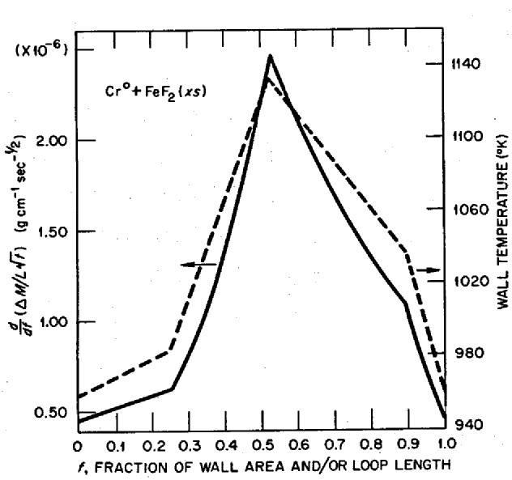

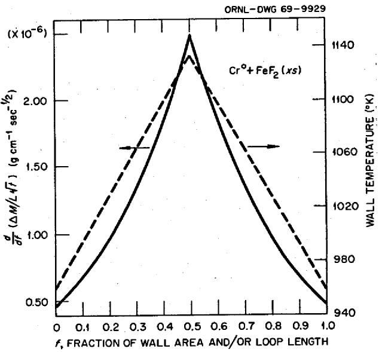  
Fig. 13. Profiles for Computed Chromium Corrosion of Hastelloy N when High $\mathrm{FeF_2 / CrF_2}$ Ratios are Present in a Molten-Salt Mixture. Profiles are based on wall temperatures shown by dashed lines. The salt was NaF-47 mole $\%$ $\mathrm{ZrF_4}$ . Reference loop results are at left; prototype results are at right.

of iterative balance point calculations. The terms used in these calculations are listed in the first and third columns of Table 6.

The value $b$ is computed with Eq. (34a):

$$
b = 2 \Delta T / L = 2 (1 1 3 3 - 9 5 8) / 1 2 7 = 1. 3 8 ^ {\circ} K / c m,
$$

and $\pmb{\xi}$ is computed with Eq. (35a):

$$
\xi_ {1} = 9 5 8 / 1. 3 8 = 6 9 5 \mathrm {c m},
$$

and

$$
\xi_ {2} = 1 1 3 3 / 1. 3 8 = 8 2 2 \mathrm {c m}.
$$

Next, we calculate $\mathbf{u}_1$ and $\mathbf{u}_2$ , which require values of $\alpha$ and $\alpha''$ .

For these next calculations, we use the values for the diffusion of chromium in Hastelloy N as given in Fig. 12: $D_0 = 6.068 \times 10^{-5} \, \text{cm}^2/\text{sec}$ , $E_D = 41.48 \, \text{kcal/mole}$ . The values of $\alpha$ and $\alpha''$ are shown in the footnote of Table 6 and are used along with the $\xi$ 's to obtain $u_j$ and $u_{j}''$ . From the latter we acquire the exponentials and thus can obtain the $1 - \beta(u_j)$ values from Fig. 14. The values of $\lambda(u_j)$ are found in Fig. 8. One is now able to complete the calculations of the last two functions.

Table 6. Values Used to Compute Balance Points and Mass Transfer in Prototype Loop   

<table><tr><td rowspan="2">Functions of ξj</td><td colspan="3">ξj, cm</td></tr><tr><td>ξ2 = 822.55</td><td>ξp = 755.44</td><td>ξ1 = 695.36</td></tr><tr><td>uj = α/ξ(a)</td><td>9.211</td><td>10.027</td><td>10.893</td></tr><tr><td>u&#x27;&#x27;j = α&#x27;&#x27;/ξ(b)</td><td>10.281</td><td>11.1916</td><td>12.175</td></tr><tr><td>exp(-uj)</td><td>1 × 10-4</td><td>4.427 × 10-5</td><td>1.862 × 10-5</td></tr><tr><td>exp(+uj)</td><td>2.912 × 10+4</td><td>7.238 × 10+4</td><td>1.935 × 10+5</td></tr><tr><td>1 - β(uj)</td><td>0.0905</td><td>0.08418</td><td>0.0784</td></tr><tr><td>λ(u&#x27;&#x27;j) - 1</td><td>0.1265</td><td>0.1116</td><td>0.1011</td></tr><tr><td>ξjeu[j[1 - β(uj)]</td><td>7.4445 × 10-3</td><td>2.810 × 10-3</td><td>1.0151 × 10-3</td></tr><tr><td>ξjeu[j[λ(uj) - 1]</td><td>0.3032 × 107</td><td>6.1022 × 106</td><td>1.3604 × 107</td></tr></table>

(a) $\alpha = E_{D} / 2 b R = 8.2321$ .   
(b) $\alpha'' = (2E_{\text{soln}} - E_D)/2bR = 8.4566.$

We next calculate the balance point, where $j_{m} = 0$ or, more simply, where material is neither removed nor deposited. Since we have deliberately constructed a symmetrical prototype loop, only one point need be calculated. The approach for the calculation of the balance point was discussed earlier, and in this case a form of Eq. (40) was used; namely,

$$
\begin{array}{l} K _ {p} = K _ {0} I _ {1 2} (\alpha / \xi) / I _ {1 2} ^ {\prime} (\alpha^ {\prime \prime} / \xi) = 1. 0 4 7 \times 1 0 ^ {2} (7. 4 4 5 \times 1 0 ^ {- 3} \\ - 1. 0 1 5 \times 1 0 ^ {- 3}) / (1. 3 6 0 \times 1 0 ^ {7} - 0. 3 0 3 \times 1 0 ^ {7}) = 6. 3 6 8 \times 1 0 ^ {- 7}. \\ \end{array}
$$

The temperature corresponding to $K_p$ is $1041^\circ K$ ; thus $\xi_p = 755$ and $f(p) = 0.233$ . The values corresponding to the balance point temperature are given in column 2 of Table 6.

To calculate the total amount of material transported, $\Delta M(t)$ , we use integral terms for the hot and cold zones. Again we averaged the values for both zones because of uncertainties in the "hand calculations." Table 6 lists all quantities needed except values of $C$ and $C'$ . Using Eqs. (32) and (33) we find

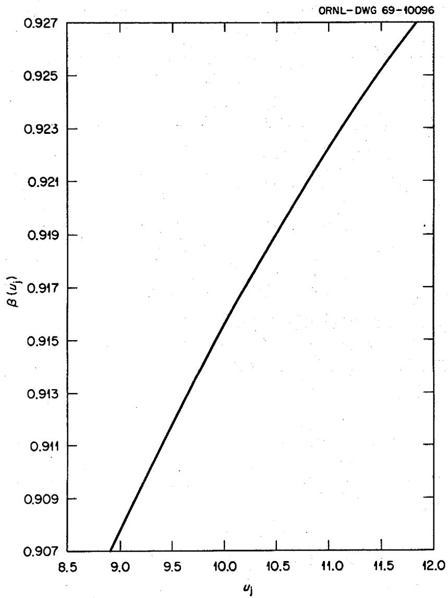  
Fig. 14. Values of $\beta(u_j)$ over an Intermediate Range of $u_j$ Values. This lower projection of Fig. 7 was required by values of $\alpha/\xi_j^j$ that occur in all molten-salt examples.

$$
C = (4) (0. 0 7 4 1) (8. 8 7 8) (0. 6 9 1 5) (3. 1 4 2 0 \times 0. 6 0 7 \times 1 0 ^ {- 4}) ^ {1 / 2} = 2. 5 1 9 \times 1 0 ^ {- 2}
$$

and

$$
C _ {1} ^ {\prime} = (2. 5 1 9 \times 1 0 ^ {- 2}) (6. 0 8 1 5 \times 1 0 ^ {- 1 0}) = 1. 5 3 2 \times 1 0 ^ {- 1 1}.
$$

For the cold zone, using Eq. (7c);

$$
\begin{array}{l} \Delta M (t) / 2 t ^ {1 / 2} = 2. 5 1 9 \times 1 0 ^ {- 2} (2. 8 1 0 - 1. 0 1 5) \times 1 0 ^ {- 3} \\ - 1. 5 3 2 \times 1 0 ^ {- 1 1} (1. 3 6 0 - 0. 6 1 0 2) \times 1 0 ^ {7} = - 6. 9 6 \times 1 0 ^ {- 5} g / \sec^ {1 / 2}. \\ \end{array}
$$

For the hot zone

$$
\begin{array}{l} \Delta M (t) / 2 t ^ {1 / 2} = 2. 5 1 9 \times 1 0 ^ {- 2} (7. 4 4 4 - 2. 8 1) \times 1 0 ^ {- 3} \\ - 1. 5 3 2 \times 1 0 ^ {- 1 1} (3. 0 3 2 - 6. 1 0 2) \times 1 0 ^ {6} = + 6. 9 7 \times 1 0 ^ {- 5} g / \sec^ {1 / 2}. \\ \end{array}
$$

The negative sign indicates that the salt loses chromium in the cold zone (by deposition on metal) and gains in chromium in the hot zone (by metal dissolution). After 1000 hr $2\mathrm{t}^{1/2} = 3.80 \times 10^{+3}$ sec $^{1/2}$ , so

$$
\Delta M (t = 1 0 0 0 h r) = 3. 8 0 \times 1 0 ^ {+ 3} (6. 9 6 \times 1 0 ^ {- 5}) = 0. 2 6 4 g C r.
$$

Figure 15 gives the chromium corrosion profiles for the actual and prototype loops.

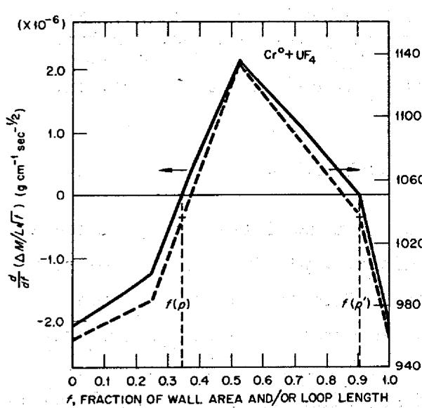

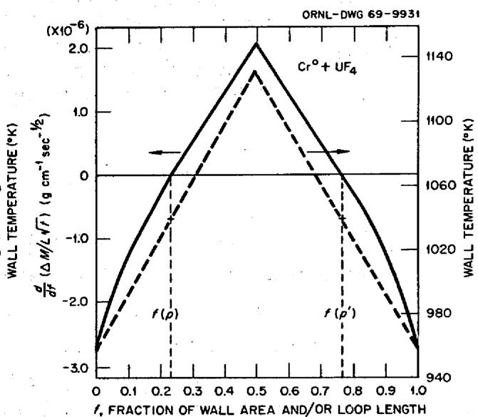  
Fig. 15. Computed Chromium Corrosion Profiles Resulting from the $\mathrm{UF}_3 / \mathrm{UF}_4$ Redox Reaction. The salt is a modified LiF-BeF $_2$ mixture containing no FeF $_2$ . Profiles assume wall temperatures given by dashed lines.

In example III a balance point exists, and computer calculations were carried out using the equilibrium constants given in Table 5. It is noted that $\Delta H$ is negative, and Fig. 16 shows that the mass transfer occurs in the opposite direction; material is deposited in the hot zone and removed in the cold zone.

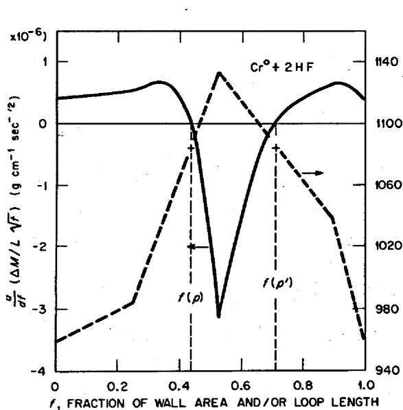

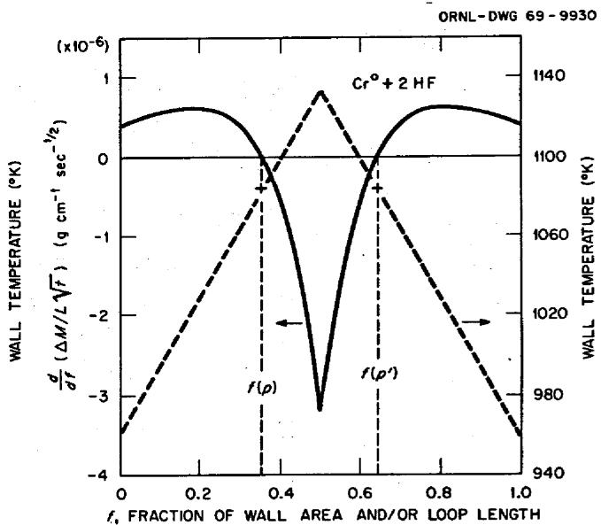  
Fig. 16. Computed Chromium Corrosion Profiles Resulting from a $\mathrm{H}_2 / \mathrm{HF}$ Redox Reaction Carried out Under Hypothetical Conditions. Profiles are based on wall temperatures given by dashed lines. In this case, chromium moves from cold to hot region. The salt considered is a modified LiF-BeF $_2$ mixture containing no dissolved uranium or iron.

# DISCUSSION OF MOLTEN-SALT·RESULTS

In the past, the mass transfer equation was integrated graphically, and areas under the curves were determined by planimeters. However, by introducing the prototype loop, we can perform a relatively simple exact integration of all the equations as detailed in an earlier section. A computer was used to generate several of the mass transfer curves, since this allows integration over many smaller segments than is otherwise practical.

Table 7 gives the total amount of chromium removed in 1000 hr for each reaction. For examples II and III, where balance points exist, $\Delta M(t = 1000\mathrm{hr})$ also corresponds to the amount of material deposited. Also included is the $\Delta M$ value for example I with balance points and no excess $\mathsf{FeF}_2$ . This calculation is given as an example of what could happen in a coolant circuit where $\mathsf{FeF}_2$ is the only impurity that would cause corrosion. The balance points would result when only a small amount of $\mathsf{FeF}_2$ is present; weight losses would result at higher temperatures and weight gains at lower temperatures in the system. Areas

Table 7. Integrated Mass Transfer Flux (△M) for Molten-Salt Loops After 1000 hr   

<table><tr><td rowspan="2">Example</td><td rowspan="2">Reaction</td><td colspan="4">Chromium Transferred, g</td></tr><tr><td>Integrated Computer Results</td><td>Planimeter on Computer Curve</td><td>Integrated Formula by Hand</td><td>Planimeter on &quot;Hand&quot; Curve</td></tr><tr><td colspan="6">Actual Loop</td></tr><tr><td>I</td><td>Cr(s) + FeF2(d)(xs)</td><td>0.595</td><td>0.5904</td><td></td><td></td></tr><tr><td>II</td><td>Cr(s) + UF4(d)</td><td></td><td></td><td>0.263</td><td>0.258</td></tr><tr><td>III</td><td>Cr(s) + HF(g)</td><td>0.1684</td><td>0.1683</td><td></td><td></td></tr><tr><td></td><td>Cr(s) + FeF2(d)a</td><td>0.062</td><td></td><td></td><td></td></tr><tr><td colspan="6">Prototype Loop</td></tr><tr><td>I</td><td>Cr(s) + FeF2(d)(xs)</td><td>0.6122</td><td>0.6551</td><td></td><td></td></tr><tr><td>II</td><td>Cr(s) + UF4(d)</td><td></td><td></td><td>0.264</td><td>0.259</td></tr><tr><td>III</td><td>Cr(s) + HF(g)</td><td>0.1751</td><td>0.1760</td><td></td><td></td></tr><tr><td></td><td>Cr(s) + FeF2(d)a</td><td>0.059</td><td></td><td></td><td></td></tr></table>

Assuming a balance point with $\Delta H = +10,370$ cal/mole and $K_{0} = 1.0 \times 10^{-10}$ .

under the plots of $\Delta M$ against distance were also determined with a planimeter, and the results are given in Table 7.

It is first noted that graphical and numerical integration gave values quite close to one another. This is gratifying because in the past much dependence had been placed on graphical integration methods, and now we see that the numerical calculations agree quite well. Although the agreement is not quite as good as in the liquid metal case, again the $\triangle M$ 's are about the same for the actual and prototype profiles, so that good estimates of $\triangle M$ may be made using the simple prototype. The disagreement is proportional to the difference in the areas under the temperature profile curves. Also, it makes no difference in the final result whether the profile is like that of the prototype or is a sawtooth. In Fig. 15 (example II), the balance points were $f(p) = 0.34$ and $0.90$ and $T_p = 1036^\circ K$ for the actual loop and

$f(p) = 0.23$ and $0.77$ and $\mathbf{T}_{\mathfrak{p}} = 1042^{\circ}\mathbf{K}$ for the prototype. In Fig. 16 (example III), the balance points were $f(p) = 0.43$ and 0.71 and $\mathbf{T}_{\mathfrak{p}} = 1083^{\circ}\mathbf{K}$ for the actual loop and $f(p) = 0.36$ and 0.64 and $\mathbf{T}_{\mathfrak{p}} = 1083^{\circ}\mathbf{K}$ for the prototype. Again, although the shapes of the profile obviously affect the location of the balance points, the balance points and balance temperatures are quite close in all cases. We also point out that although maximums of weight loss and gain do occur at the maximum temperature point in examples II and III, other maximums (gain or loss) may occur at positions other than that of the minimum temperature. This is illustrated in Fig. 16, where the maximum weight loss occurred at the intermediate value of $1030^{\circ}\mathbf{K}$ . The worst possible condition with respect to the total amount of material removed was illustrated in example I, where corrosion occurred on all portions of the loop. A tenfold difference in the value of $\Delta M$ corresponding to material removal and deposition obtained in the same reaction without excess $\mathrm{FeF}_2$ is shown in Table 7 for both the prototype and actual loops.

Several "rules" for mass transfer follow from these results. The common areas among the three examples are temperature, flow conditions, and selective chromium removal from the Hastelloy N. Since dissolution is endothermic for examples I and II, the mass transfer is from higher to lower temperatures. More material is removed and deposited in example II, which has the largest energy of solution. In example III, where dissolution is exothermic, the mass transfer occurs from low to high temperature. Because temperature enters the mass-transfer function as an exponential term, an increase in the maximum temperature greatly increases $\Delta M$ . For example, an increase of $50^{\circ}K$ would about double the $\Delta M$ .

Table 8 shows the constants A and B used to calculate equilibrium constants from $\log K_{\mathrm{T}} = \mathrm{A} + \mathrm{B}(10^{3} / \mathrm{T})$ ; also shown is the sign of the energy function for various reduction-oxidation reactions in LiF-BeF $_2$ -base fluoride salts. Example I calculations discussed earlier were for an NaF-ZrF $_4$ salt. From the values given in the table, we will discuss the mass-transfer aspects of the various reactions.

As mentioned earlier and shown in the calculations, one of the requirements that must be met for mass transfer in the direction of

Table 8. Equilibrium Constant Parametersa for Reactions with HF and With Salt Constituents and Impurities in LiF-BeF2-Base Molten Fluorides   

<table><tr><td>Reaction</td><td>Aa</td><td>Ba</td><td>K1075°K</td><td>Sign of ΔE</td></tr><tr><td>Cr(s) + 2HF(g) ⇌ CrF2(d) + H2(g)</td><td>-5.12</td><td>9.06</td><td>2.03 × 103</td><td>-</td></tr><tr><td>Fe(s) + 2HF(g) ⇌ FeF2(d) + H2(g)</td><td>-5.20</td><td>5.31</td><td>1.83 × 100</td><td>-</td></tr><tr><td>Ni(s) + 2HF(g) ⇌ NiF2(d) + H2(g)</td><td>-8.37</td><td>3.60</td><td>9.52 × 10-6</td><td>-</td></tr><tr><td>2UF4(d) + H2(g) ⇌ 2UF3(d) + 2HF(g)</td><td>8.14</td><td>-18.66</td><td>6.06 × 10-10</td><td>+</td></tr><tr><td>BeF(d) + H2(g) ⇌ Be(s) + 2HF(g)</td><td>7.21</td><td>-21.56</td><td>1.43 × 10-13</td><td>+</td></tr><tr><td>Cr(s) + 2UF4(d) ⇌ 2UF3(d) + CrF2(d)</td><td>3.02</td><td>-9.6</td><td>1.23 × 10-6</td><td>+</td></tr><tr><td>Cr(s) + BeF2(d) ⇌ CrF2(d) + Be(s)</td><td>2.09</td><td>-12.51</td><td>2.84 × 10-10</td><td>+</td></tr><tr><td>Cr(s) + FeF2(d) ⇌ CrF2(d) + Fe(s)</td><td>0.08</td><td>+3.94</td><td>5.56 × 103</td><td>-</td></tr><tr><td>Cr(s) + NiF2(d) ⇌ CrF2(d) + Ni(s)</td><td>3.25</td><td>+5.46</td><td>2.14 × 108</td><td>-</td></tr><tr><td>Fe(s) + 2UF4(d) ⇌ FeF2(d) + 2UF3(d)</td><td>2.94</td><td>-13.35</td><td>3.32 × 10-10</td><td>+</td></tr><tr><td>Fe(s) + BeF2(d) ⇌ FeF2(d) + Be(s)</td><td>2.01</td><td>-16.25</td><td>7.77 × 10-14</td><td>+</td></tr><tr><td>Fe(s) + NiF2(d) ⇌ FeF2(d) + Ni(s)</td><td>3.17</td><td>+1.71</td><td>8.8 × 104</td><td>-</td></tr><tr><td>Ni(s) + 2UF4(d) ⇌ NiF2(d) + 2UF3(d)</td><td>-0.23</td><td>-15.06</td><td>5.76 × 10-15</td><td>+</td></tr><tr><td>Ni(s) + BeF2(d) ⇌ NiF2(d) + Be(s)</td><td>-1.16</td><td>-17.96</td><td>1.35 × 10-18</td><td>+</td></tr></table>

aConstants of equation log $\mathbf{K}_{\mathrm{T}} = \mathbf{A} + \mathbf{B}(10^{3} / \mathrm{T})$

decreasing temperature is a positive energy of solution. In this respect, the reactions of the alloy constituents with $\mathbf{U}\mathbf{F}_4$ and $\mathbf{BeF}_2$ and the reduction of $\mathbf{U}\mathbf{F}_4$ and $\mathbf{BeF}_2$ by hydrogen meet this criterion. It is noted that in all these cases, with the exception of the oxidation of chromium by $\mathbf{U}\mathbf{F}_4$ , the calculated value of $\mathbf{K}$ is quite small, so these reactions would be unfavorable and the yields would be quite small. In reference to mass transfer in the opposite direction, as favored by the other reactions, most of the equilibrium constants are quite large. The relative ease of chromium movement, followed by iron and then nickel, is pointed out by the relative values of the equilibrium constants. For example, for reactions with $\mathbf{U}\mathbf{F}_4$ , $\mathbf{K}_{1075^{\circ}\mathrm{K}} = 10^{-6}$ , $10^{-10}$ , and $10^{-15}$ , respectively. Reactions of molybdenum are not included because equilibrium

constants are not available. However, because the free energies of formation of molybdenum and nickel fluorides are nearly equal, we would expect the equilibrium constants to be about the same.

With respect to the $\mathbf{U}\mathbf{F}_4$ corrosion reaction, methods are now being considered to measure the U(III)/U(IV) ratio and thus determine the oxidizing or reducing potential of the $\mathbf{U}\mathbf{F}_4$ -containing molten salt. Additions of beryllium are being used to adjust this potential and control the corrosion rate. Investigations are also under way for the possible application of $^{95}\mathrm{Nb}$ deposition as the redox indicator.[48]

We also wish to consider if loop conditions are actually the same as those under which the equilibrium quotients were determined. Actually we beg the question: can mass transfer occur in a loop in the direction of low to high temperature as is theoretically shown from the $\mathrm{FeF_2}$ and HF reactions with balance points in LiF-BeF $_2$ salts? Recent experimental work $^{49}$ in salt systems containing UF $_4$ , FeF $_2$ , and HF show evidence of mass transfer only from high to low temperature. However, nothing is known about the effects of the combinations of the reactants or what effect removal of elements other than chromium from the alloy might have on the overall process. It would be interesting to speculate what ratio of CrF $_2$ to FeF $_2$ would be needed in a UF $_4$ -containing salt to stop the mass-transfer (and the corrosion) process altogether. A promising future goal would be to carefully isolate the above components and to run the verifying experimental tests in loops.

In salts proposed for use in a breeder reactor system, $\mathrm{ThF_4}$ is included. The $\mathrm{ThF_4}$ will not oxidize chromium, so its presence will not affect the corrosion process.

It must be again emphasized that there is a parallel between the results in Report I and here. The mass-transfer equations of Report I were derived as analogs of heat flow equations. Rate equations of this type consist of driving forces and resistances. The resistances in Report I were based on the first-order reaction rate constant and the

film coefficient. The driving forces are differences that are involved in both mechanisms. For example, when solution rate is controlling, the important difference is that between the equilibrium corrosion product solute concentrations at the high and low temperatures of the system, while, when diffusion controls, the difference is that between the bulk alloy concentration and the surface alloy concentration of the active alloying element. The results do not depend on the shape of the profile in the mechanism of Report I and only sometimes in the mechanism given here. The corrosion product concentration differed with temperature (position) in Report I, while here we assume constant concentration of the corrosion product throughout the loop. This is quite important, because the use of the equilibrium constant allows us to change only one variable with temperature. This was not possible in Report I.

As we mentioned earlier, liquid velocities in pump loops are orders of magnitude greater than those in thermal convection loops. Throughout this report we have assumed that conclusions about pump loop corrosion behavior are good for thermal convection loops and vice versa. Of course, if the process is truly controlled by solid-state diffusion in the alloy, then velocity will not affect the mass transfer.

# SUMMARY

We have elected to summarize the molten-salt results since we wish to illustrate several cogent points. In this portion of the report our main purpose was to discuss the molten-salt corrosion (mass transfer of chromium) of Hastelloy N in polythermal loops for cases where solid-state diffusion controls throughout the system. We have demonstrated the versatility of the method by showing three different examples: removal of chromium from all portions of the loop, hot-to-cold leg transfer, and cold-to-hot leg transfer.

Calculations for both transient and quasi-steady-state conditions were based on a mathematical development of the idealized diffusion process, wherein corrosion rates depend directly on the rate at which constituents of alloys diffuse into, or out of, container walls as influenced by the condition of wall surfaces exposed to a high-temperature

liquid. The transient effects (the effects of mass transfer across the liquid films on corrosion) were negligible because of their short duration. The quasi-steady-state condition assumed a pre-equilibration of the salt with $\mathrm{CrF_2}$ such that the concentration of $\mathrm{CrF_2}$ did not change.

The balance points and the amount of material entering or leaving the various zones of the loops for the various systems were determined for the quasi steady state. The calculation was adaptable for both the prototype "tent-shaped" and actual loop temperature profiles. The results obtained from the prototype, which were quite simple to calculate, agreed very well with the results from the actual profile. Important variables discussed in this treatment with respect to the mass transfer process were the energy of solution of the corrosion reaction, the energy of activation for diffusion, the equilibrium constant of the corrosion reaction, and its temperature dependence.

In conclusion, the practical importance of the calculations lies in the fact that, if the proper experimental data are available, one may determine, before running a loop test, the magnitude and manner in which the mass transfer will occur. One may also predict the changes expected in a completed experiment if the temperature conditions are varied with the developed equations. Of perhaps even greater importance is the fact that a priori calculations of this type are required to predict the concentration that will give a pre-equilibration condition at the beginning of an experiment. This is necessary for one to run a systematic well-developed test.

# INTERNAL DISTRIBUTION

1-3. Central Research Library 67-69. J. H. Devan

4. ORNL Y-12 Technical Library 70. J. R. DiStefano

Document Reference Section 71. S. J. Ditto

5-24. Laboratory Records 72. W. P. Eatherly

25. Laboratory Records, ORNL RC 73. J. R. Engel

26. ORNL Patent Office 74-78. R. B. Evans III

27. G. M. Adamson, Jr. 79. J. I. Federer

28.J.L.Anderson 80.M.Feliciano

29. R.F.Apple 81.D.E.Ferguson

30. D. E. Arnurius 82. B. Fleischer

31. W. E. Atkinson 83. M. Fontana

32.C.F.Baes 84.A.P.Fraas

33.C.E.Bamberger 85.J.H Frye,Jr.

34.C.J.Barton 86.W.K.Furlong

35. H. F. Bauman 87. C. H. Gabbard

36. S.E.Beall 88.D.A.Gardiner

37. M. J. Bell 89. R. E. Gehlbach

38.C.E.Bettis 90.L.O.Gilpatrick

39. D. S. Billington 91. G. Goldberg

40. R. E. Blanco 92. W. R. Grimes

41. F. F. Blankenship 93. A. G. Grindell

42. R. Blumberg 94. R. H. Guymon

43. E. G. Bohlmann 95. W. O. Harms

44. G. E. Boyd 96. P. N. Haubenreich

45. J. Braunstein 97. R. E. Helms

46. M. A. Bredig 98. R. F. Hibbs

47. R. B. Briggs 99. J. R. Hightower

48. H. R. Bronstein 100-102. M. R. Hill

49. G. D. Brunton 103. E. C. Hise

50. S. Cantor 104. H. W. Hoffman

51. D. W. Cardwell 105. D. K. Holmes

52. H. P. Carter 106. P. P. Holz

53.W.L.Carter 107.W.R.Huntley

54. O. B. Cavin 108. J. E. Inman

55. Nancy Cole 109. H. Inouye

56. C. W. Collins 110. W. H. Jordan

57. E. L. Compere 111. P. R. Kasten

58. W. H. Cook 112. R. J. Kedl

59. J. W. Cooke 113. C. R. Kenny

60. L. T. Corbin 114. J. J. Keyes, Jr.

61. J. L. Crowley 115. S. S. Kirslis

62. F. L. Culler, Jr. 116. R. L. Klueh

63. D. R. Cuneo 117-121. J. W. Koger

64. J. E. Cunningham 122. H. W. Kohn

65. J. M. Dale 123. R. B. Korsmeyer

66. H. J. de Nordwall 124. A. I. Krakoviak

125. T. S. Kress   
126. J.A.Lane   
127. R.B.Lindauer   
128. D. B. Lloyd   
129. E. L. Long, Jr.   
130. M. I. Lundin   
131. R. N. Lyon   
132. R. E. MacPherson   
133. A. P. Malinauskas   
134. D. L. Manning   
135. W.R.Martin   
136. H. E. McCoy   
137. D. L. McElroy   
138. C. K. McGlothlan   
139. C. J. McHargue   
140. H. A. McLain   
141. B. McNabb   
142. L. E. McNeese   
143. J. R. McWherter   
144. A. S. Meyer   
145. A. J. Miller   
146. R. L. Moore   
147. D. M. Moulton   
148. T. R. Mueller   
149. Paul Nelson, Jr.   
150. C. W. Nestor, Jr.   
151. H. H. Nichol   
152. J. P. Nichols   
153. E. L. Nicholson   
154. T. S. Noggle   
155. L.C.Oakes   
156. O.S.Oen   
157. S.M.Ohr   
158. R. B. Parker   
159. P. Patriarca   
160. R.B.Perez   
161. A. M. Perry   
162. T. W. Pickel   
163. H. B. Piper   
164. C. B. Pollock   
165. B. E. Prince   
166. G. L. Ragan   
167. D. M. Richardson

168. R.C.Robertson   
169. K. A. Romberger   
170. M. W. Rosenthal   
171. G. Samuels   
172. H. C. Savage   
173. W. F. Schaffer   
174. Dunlap Scott   
175. J. L. Scott   
176. J. H. Shaffer   
177. W.H. Sides   
178. V. A. Singletary   
179. G. M. Slaughter   
180. A. N. Smith   
181. F. J. Smith   
182. G. P. Smith   
183. O. L. Smith   
184. I. Spiewak   
185. R.A. Strehlow   
186. J. R. Tallackson   
187. R. E. Thoma   
188. M. L. Tobias   
189. D. B. Trauger   
190. W. E. Unger   
191. G. M. Watson   
192. J. S. Watson   
193. H. L. Watts   
194. C. F. Weaver   
195. A. M. Weinberg   
196. J. R. Weir   
197. M. E. Whatley   
198. J. C. White   
199. R.P. Wichner   
200. L. V. Wilson   
201. Gale Young   
202. H. C. Young   
203. J. P. Young   
204. E. L. Youngblood   
205. F. C. Zapp   
206. C. M. Adams, Jr. (Consultant)   
207. Leo Brewer (Consultant)   
208. Jan Korringa (Consultant)   
209. Sidney Siegel (Consultant)

# EXTERNAL DISTRIBUTION

210. R. E. Anderson, SNS, AEC, Washington, DC 20545   
211. W. Brehm, WADCO, P. O. Box 1970, Richland, WA 99352

212-213. E. G. Case, Division of Reactor Standards, RDT, AEC,

Washington, DC 20545

214. R. L. Coats, Sandia Corp., P. O. Box 5800 Albuquerque, NM 87115   
215. K. P. Cohen, General Electric, BRDO, Sunnyvale, CA 94086   
216. D. F. Cope, RDT, SSR, AEC, Oak Ridge National Laboratory   
217. D. R. deBoisblanc, Evasco Service, Inc., 2 Rector St., New York, NY 10006   
218. C. B. Deering, Black and Veatch, P. O. Box 8405, Kansas City, MO 64114   
219. A. R. DeGrazia, RDT, AEC, Washington, DC 20545   
220. L. F. Epstein, IMFBR Program Office, Argonne National Laboratory, 9700 South Cass Ave., Argonne, IL 60439   
221. J. E. Fox, RDT, AEC, Washington, DC 20545   
222. K. Goldman, United Nuclear Corp., Grasslands Rd., Elmsford, NY 10523   
223. D. H. Gurinsky, Brookhaven National Laboratory, Upton, Long Island, NY 11973   
224. Norton Haberman, RDT, AEC, Washington, DC 20545   
225. E. E. Hoffman, General Electric, Nuclear Systems Program, P. O. Box 15132, Cincinnati, OH 45215   
226. K. E. Horton, RDT, AEC, Washington, DC 20545   
227. T. F. Kassner, Argonne National Laboratory, 9700 South Cass Ave., Argonne, IL 60439   
228. E. C. Kovacic, RDT, AEC, Washington, DC 20545   
229. Kermit Laughon, RDT, OSR, AEC, Oak Ridge National Laboratory   
230. A. P. Litman, SNS, AEC, Washington, DC 20545   
231. G. Long, UKAEA, Harwell, England   
232. H. G. MacPherson, Nuclear Engineering Department, University of Tennessee, Knoxville, TN 37916   
233. C. L. Matthews, RDT, OSR, AEC, Oak Ridge National Laboratory   
234-235. T. W. McIntosh, RDT, AEC, Washington, DC 20545   
236. J. M. McKee, Argonne National Laboratory, 9700 South Cass Ave., Argonne, IL 60439   
237-239. P. A. Morris, Division of Reactor Licensing, RDT, AEC, Washington, DC 20545   
240. P. Murray, Westinghouse, ARD, Waltz Mill Site, P. O. Box 158, Madison, PA 15663   
241. J. Neff, RDT, AEC, Washington, DC 20545   
242. H. Pearlman, Atomics International, P. O. Box 309, Canoga Park, CA 91305   
243. T. K. Roche, *Stellite Division Cabot Corp.*, 1020 W. Park Ave., Kokomo, IN 46901   
244. H. M. Roth, AEC, Oak Ridge Operations   
245. D. W. Shannon, WADCO, P. O. Box 1970, Richland, WA 99352   
246. M. Shaw, RDT, AEC, Washington, DC 20545   
247. A. A. Shoudy, Atomic Power Development Associates, Inc., 1911 First Street, Detroit, MI 48226   
248. J. M. Simmons, RDT, AEC, Washington, DC 20545   
249. E. M. Simons, Battelle Memorial Institute, 505 King Ave., Columbus, OH 43201   
250. B. Singer, RDT, AEC, Washington, DC 20545   
251. W. L. Smalley, AEC, Oak Ridge Operations   
252. Earl O. Smith, Black and Veatch, P. O. Box 8405, Kansas City, MO 64114

253. J. A. Swartout, Union Carbide Corp., 270 Park Ave., New York, NY 10017   
254. A. Taboada, RDT, AEC, Washington, DC 20545   
255. C. Tyzack, UKAEA, Culcheth, England   
256. J. R. Weeks, Brookhaven National Laboratory, Upton, Long Island, NY 11973   
257. G. A. Whitlow, Westinghouse, ARD, Waltz Mill Site, P. O. Box 158, Madison, PA 15663   
258. Laboratory and University Division, AEC, Oak Ridge Operations   
259. Patent Office, AEC, Oak Ridge Operations   
260-454. Given distribution as shown in TID-4500 under Metals, Ceramics and Materials category (25 copies - NTIS)