ORNL-4577

Contract No. W-7405-eng-26

CHEMICAL TECHNOLOGY DIVISION UNIT OPERATIONS SECTION

LOW-PRESSURE DISTILLATION OF A PORTION OF THE FUEL CARRIER SALT FROM THE MOLTEN SALT REACTOR EXPERIMENT

J. R. Hightower, Jr.

L. E. McNeese   
B. A. Hannaford   
H. D. Cochran, Jr.

This report was prepared as an account of work sponsored by the United States Government. Neither the United States nor the United States Atomic Energy Commission, nor any of their employees, nor any of their contractors, subcontractors, or their employees, makes any warranty, express or implied, or assumes any legal liability or responsibility for the accuracy, completeness or usefulness of any information, apparatus, product or process disclosed, or represents that its use would not infringe privately owned rights.

AUGUST 1971

OAK RIDGE NATIONAL LABORATORY

Oak Ridge, Tennessee

operated by

UNION CARBIDE CORPORATION

for the

U.S. ATOMIC ENERGY COMMISSION

# CONTENTS

Page

ABSTRACT 1

1. INTRODUCTION 1   
2.DESCRIPTION OF EQUIPMENT. 3

2.1 Process Equipment 3   
2.2 Instrumentation 10

2.2.1 Measurement and Control of Temperature 10   
2.2.2 Measurement and Control of Pressure 12   
2.2.3 Measurement and Control of Liquid Level 13   
2.2.4 Radiation Instrumentation 15   
2.2.5 Instrument Panel 15

2.3 Condensate Sampler 17   
2.4 Location of Equipment at the MSRE 20

3. DESCRIPTION OF DISTILLATION OPERATION 20  
4. EXPERIMENTAL RESULTS 27

4.1 Summary of Experimental Data 27   
4.2 Material Balance Calculations 28   
4.3 Results of Relative Volatility Calculations 33   
4.4 Possible Explanations of Calculated Results 41

4.4.1 Entrainment of Droplets of Still-Pot Liquid 42   
4.4.2 Concentration Polarization 43   
4.4.3 Contamination of Samples 45   
4.4.4 Inaccurate Analyses 46

5. CONCLUSIONS 47   
6. ACKNOWLEDGMENTS 48   
7. REFERENCES 49   
8. APPENDIX: ANALYSES OF SAMPLES FROM THE MSRE DISTILLATION EXPERIMENT 51

J.R.Hightower，Jr.   
L. E. McNeese   
B. A. Hannaford   
H. D. Cochran, Jr.

# ABSTRACT

An experiment to demonstrate the high-temperature low-pressure distillation of irradiated Molten Salt Reactor Experiment (MSRE) fuel carrier salt has been successfully completed. A total of 12 liters of MSRE fuel carrier salt was distilled in 23 hr of trouble-free operation with still-pot temperatures in the range $900 - 980^{\circ}\mathrm{C}$ and condenser pressures in the range 0.1-0.8 torr. Eleven condensate samples were taken during the course of the run at intervals of approximately 90 min and were subsequently analyzed for Li, Be, Zr, 137Cs, 95Zr, 144Ce, 147Pm, 155Eu, 9ly, 90Sr, and 89Sr. Effective relative volatilities, with respect to LiF, for Be and Zr were in good agreement with values measured previously in the laboratory. Effective relative volatilities for the slightly volatile materials $144\mathrm{Ce}$ , 9ly, 90Sr, and 89Sr were found to be much higher than values measured in the laboratory. The high values are believed to be the result of contamination from other MSRE salt samples, although concentration polarization may have also been a contributor. The effective relative volatility for $137\mathrm{Cs}$ was found to be only $20\%$ , or less, of the value measured in the laboratory; no explanation of this discrepancy is available.

Although the effective relative volatilities for the lanthanides were found to be higher than anticipated, the values observed would still allow adequate recovery of $^7\mathrm{LiF}$ from waste salt streams by distillation.

# 1. INTRODUCTION

Low-pressure distillation may be required in order to recover valuable carrier salt components from waste salt streams coming from the fuel processing plant of a molten-salt breeder reactor (MSBR).

Typically, ${}^{7}$ LiF would be vaporized and recovered, leaving a liquid heel more concentrated in the less volatile lanthanide fission products (as fluorides). This heel would then be discarded. The final stage of a three-phase experimental program to study and demonstrate the feasibility of distillation for decontaminating carrier salt components of lanthanide fission products is described in this report. The experimental program included measurements of relative volatilities of several lanthanide and alkaline-earth fluorides in mixtures of LiF and ${\mathrm{{BeF}}}_{2}$ , ${}^{1,2}$ the operation and testing of a large single-stage still using fuel carrier salt from the Molten Salt Reactor Experiment (MSRE) with simulated fission products ${}^{3,4}$ ,and,as described here,a demonstration of the distillation process using irradiated fuel carrier salt from the MSRE.

The operation of the distillation equipment with unirradiated salt had the following objectives: (1) obtaining operating experience with large, low-pressure, high-temperature distillation equipment; (2) investigating entrainment rates and separation inefficiencies due to concentration gradients in the still pot; (3) measuring distillation rates under a variety of conditions; and (4) uncovering unexpected difficulties. The objectives of the demonstration distillation of the irradiated MSRE fuel carrier salt were: (1) to provide MSBR fuel processing technology with a process tested with fuel salt from an operating reactor, (2) to provide information (not available from the laboratory investigations) on relative volatilities of fission products, and to give a general confirmation of predicted fission product behavior, and (3) to uncover unexpected difficulties associated with radioactive operation.

In the nonradioactive tests, six 48-liter batches of salt that had the composition of the MSRE fuel carrier salt and contained $\mathrm{NdF}_3$ were distilled at condenser pressures below 0.1 torr* and at a still-pot temperature of $1000^{\circ}\mathrm{C}$ . Whereas these tests indicated areas in which further engineering development was required, they also indicated that decontamination from lanthanide fluorides by distillation was feasible. The still that was used in the nonradioactive tests was also used to distill the radioactive salt (containing no uranium) from the MSRE. This operation and its results are described in the sections that follow.

# 2. DESCRIPTION OF EQUIPMENT

# 2.1 Process Equipment

The equipment used in the MSRE Distillation Experiment included a 48-liter feed tank containing a salt charge from the MSRE to be distilled, a 12-liter still from which the salt was vaporized, a 10-in.-diam by 51-in.-long condenser, and a 48-liter condensate receiver. This equipment is only briefly described here; a more complete description is given elsewhere.3

The feed tank, shown in Fig. 1, was a 1/2-in.-diam by 26-in.-tall right circular cylinder made from 1/4-in.-thick Hastelloy N. It was designed to withstand an external pressure of 15 psi at $600^{\circ}\mathrm{C}$ . The condensate receiver, shown in Fig. 2, was a 16-in.-diam by 16-1/2-in.-tall right circular cylinder having sides of 1/4-in.-thick Hastelloy N and a bottom of 3/8-in.-thick Hastelloy N. It was designed to withstand an external pressure of 15 psi at $600^{\circ}\mathrm{C}$ .

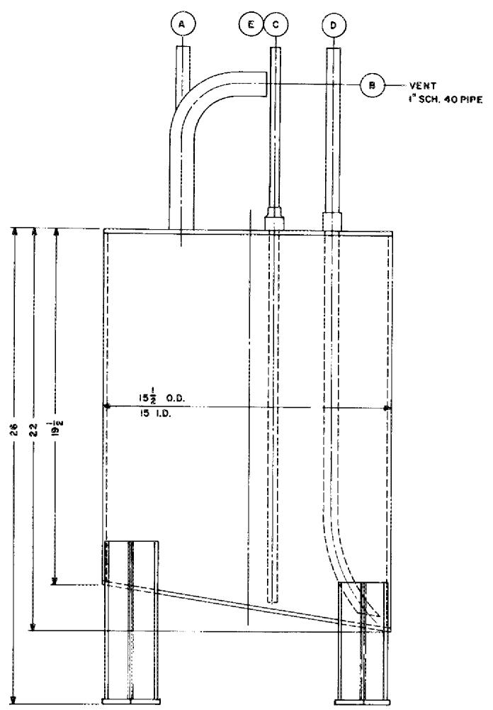

ORNL DWG. 66-10983

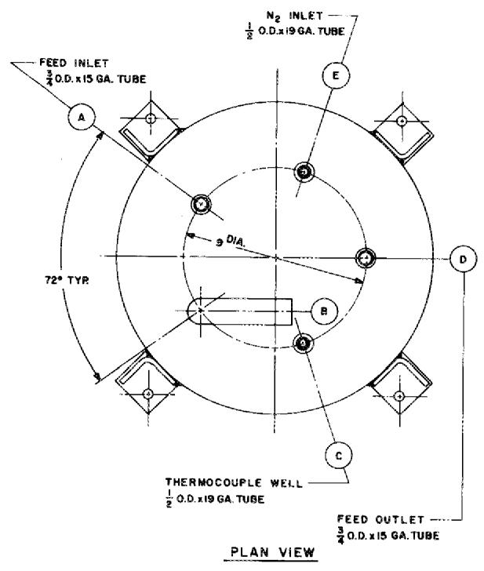  
Fig. 1. Molten Salt Distillation Experiment. Schematic diagram of feed tank.

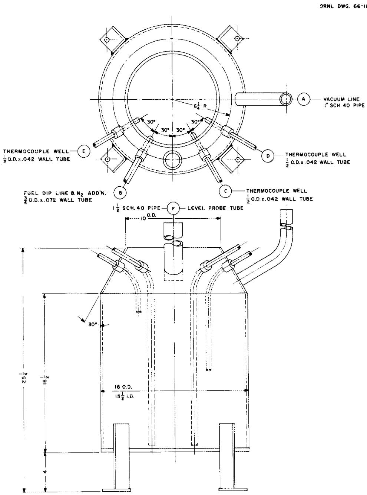  
Fig. 2. Molten Salt Distillation Experiment. Schematic diagram of the condensate receiver.

The still and the condenser are shown in Fig. 3. The still pot consisted of an annular volume between the vapor line and the outlet wall, and had a working volume of about 10 liters. Both the still and the condenser were made of 3/8-in.-thick Hastelloy N and were designed for pressures as low as 0.05 to 1.5 torr. The design temperature for both the still pot and the condenser was $982^{\circ}\mathrm{C}$ .

The feed tank, the still pot, the condenser, and the receiver were mounted in an angle iron frame to facilitate their transfer between Bldg. 3541, where the nonradioactive tests were carried out, and the MSRE site. Since the equipment was to be installed in a cell only slightly larger than the equipment frame, the thermocouples, the heaters, the insulation, and most of the piping were added before the equipment was placed in the cell. Figure 4 is a photograph of this equipment (without the insulation). A stainless steel pan to catch molten salt in the event of a vessel rupture was placed around the bottom of the frame.

Because large quantities of iron and nickel particles were expected to be present in the fuel storage tank (FST) at the MSRE (as a result of the chemical processing of the fuel salt), a porous metal filter was installed in the feed tank fill line downstream from the freeze valve in line 112 (see Fig. 5). The Inconel filter medium consisted of approximately 28 in.² of Huyck Feltmetal FM 284 having a mean pore size of 45 μ.

To prevent particulates from reaching the vacuum pump, Flanders High Purity filters were installed in the vacuum lines from the feed tank and the receiver. These filters were tested and demonstrated to

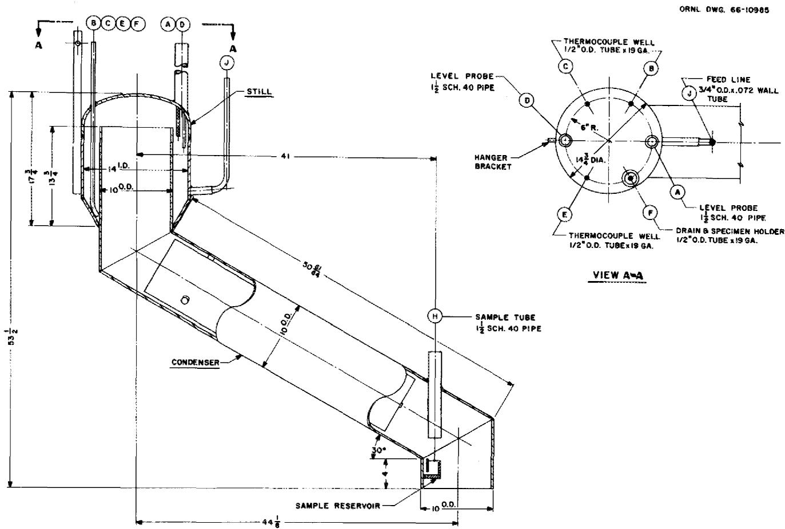  
Fig. 3. Molten Salt Distillation Experiment. Schematic diagram of the vacuum still and condenser.

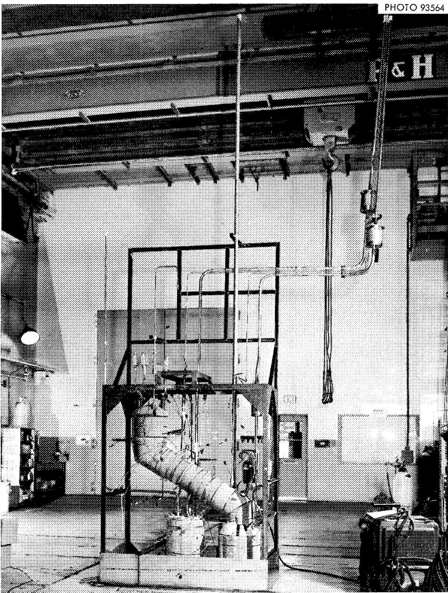  
Fig. 4. Molten-Salt Distillation Equipment Before Installation in Spare Cell at MSRE.

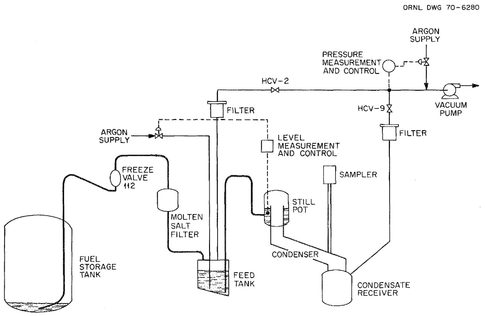  
Fig. 5. Simplified Flow Diagram of MSRE Distillation Experiment.

effectively remove $99.997\%$ of 0.3-µ particles. The housings for these filters can be seen in Fig. 4 on two of the larger lines at the right-hand side.

All valves and piping that did not contact the molten salt were made of stainless steel and were housed in a sealed steel cubicle containing pressure transmitters and two vacuum pumps— one to evacuate the reference side of a differential pressure transmitter, and the other to evacuate the distillation process vessels. The valve box, with its front and rear cover plates removed, is shown in Fig. 6. This box completed the secondary containment around piping and instrumentation when its lower plates were bolted and sealed in place. With the box under a pressure of 15 in. $\mathsf{H}_2\mathsf{O}$ , the leak rate was 0.1 cfh. During operation, the pressure in the box never exceeded 0.5 in. $\mathsf{H}_2\mathsf{O}$ , and the leak rate was negligible.

# 2.2 Instrumentation

# 2.2.1 Measurement and Control of Temperature

Temperatures were measured and controlled over two ranges: $500 - 600^{\circ}\mathrm{C}$ for the feed tank and the condensate receiver, and $800 - 1000^{\circ}\mathrm{C}$ for the still and the condenser. Platinum vs platinum - $10\%$ rhodium thermocouples were used for the high-temperature measurements, whereas less expensive Chromel-Alumel thermocouples were used on the feed tanks, condensate receiver, and salt transfer lines. Each of the thermocouples (total, 60) was enclosed in a 1/8-in.-diam stainless steel sheath; insulated junctions were used. Five 12-point recorders were available for readout: two for the Pt vs Pt - $10\%$ Rh thermocouples, and three for the Chromel-Alumel thermocouples.

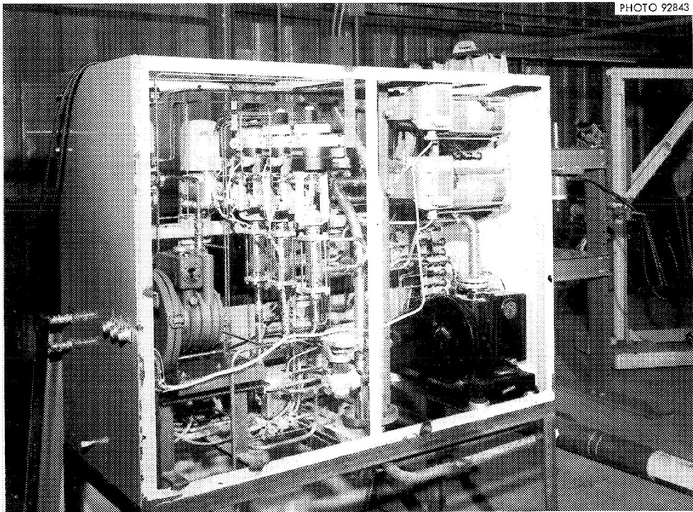  
Fig. 6. Containment Box for Instruments and Valves Used in the MSRE Distillation Experiment.

There were a total of nine individually heated zones on the feed tank, the still, the condenser, and the receiver. The heaters for each of these zones were independently controlled by a Pyrovane "on-off" controller; the voltage to the heaters was controlled by Variacs. Heaters on the various salt transfer and argon lines were manually controlled by "on-off" switches and Variacs.

# 2.2.2 Measurement and Control of Pressure

Pressure measurements over three ranges were required: 0 to 15 psia for monitoring system pumpdown at the start of the run, for monitoring system repressurization at the end of the run, and for controlling salt transfer from the fuel storage tank; 0 to 10 torr for suppressing vaporization while the salt was held at operating temperature in the still; and 0 to 1 torr during distillation.

Absolute-pressure transducers (Foxboro D/P cells with one leg evacuated) covering the 0- to 15-psia range were used to measure the pressure in the feed tank and in the still-condenser-receiver complex. An MKS Baratron pressure measuring device with ranges of 0-0.003, 0-0.01, 0-0.03, 0-0.1, 0-0.3, 0-1, 0-3, and 0-10 torr was used to measure very low pressures in the condensate receiver.

The system pressure was controlled in the 0.1- to 10-torr range by feeding argon to the inlet of the vacuum pump. The Baratron unit produced the signal required for regulating the argon flow.

It was necessary to ensure that an excessive internal pressure did not develop in the system since, at operating temperature, a pressure in excess of 2 atm would have been unsafe. This was accomplished by using an absolute-pressure transmitter in the condenser off-gas line to monitor

the system pressure. When the pressure exceeded 15 psia, the argon supply was shut off automatically.

# 2.2.3 Measurement and Control of Liquid Level

The difference in the pressure at the outlet of an argon-purged diptube extending to the bottom of the vessel and that in the gas space above the salt was used to measure the depth of the salt in both the feed tank and the condensate receiver.

Two conductivity-type level probes were used in the still for measuring and controlling the liquid level. These probes essentially measured the total conductance between the metal probes (that extended into the molten salt) and the wall of the still; the total conductance was a function of the immersed surface area of the probe.5

The conductivity probes (see Fig. 7) were similar to the single-point level probes that were used in the MSRE drain tanks. Tests have shown that the range of such an instrument is limited to approximately $30\%$ of the length of the signal generating section. A 6-in. sensing probe was used to control the liquid level between points that were 1 in. and 3 in. below the still-pot overflow; a longer sensing probe was used to measure very low levels of liquid in the still pot.

Metal disks were welded to the conductivity probes to aid in their calibration. These disks provided abrupt changes in the immersed surface area of each probe at known liquid levels. During operation, the signal from a probe changed abruptly when the salt level reached one of the disks.

The liquid-level controller for the still pot was a Foxboro Dynalog circular chart recorder-controller, which consists of a 1-kHz ac bridge-type

ORNL-DWG67-4778R1

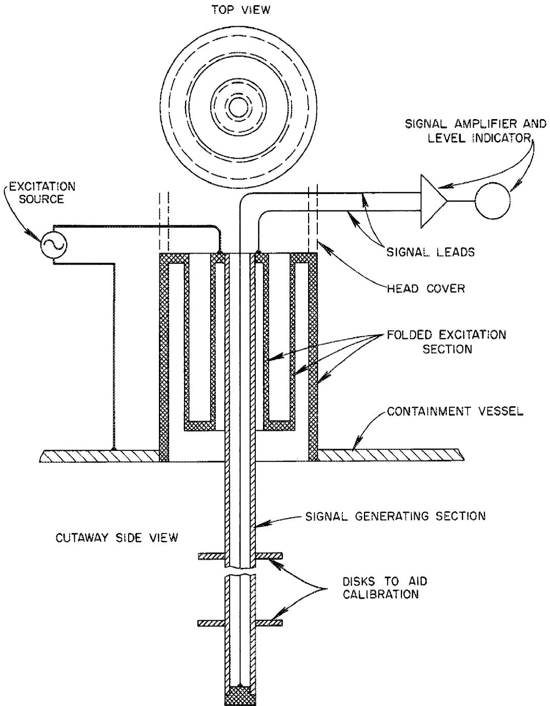  
Fig. 7. Simplified Schematic of Conductivity-Type Liquid Level Probe for Still Pot in MSRE Distillation Experiment.

measuring device using variable capacitance for rebalance. The proper control action (see Sect. 3) was accomplished by having a variable dead zone imposed on the set-point adjustment mechanism. With the controller set for the desired average liquid level, the argon supply valve to the feed tank was opened when the level indicator dropped $3\%$ below the set point and was closed when the level indicator rose $3\%$ above the set point.

# 2.2.4 Radiation Instrumentation

Ionization-chamber radiation monitors were mounted on process lines in three locations: one on the filter in the feed tank vacuum line, one on the filter in the receiver vacuum line, and one on the liquid-nitrogen trap in the receiver vacuum line. The two monitors on the filters were shielded from the radiation field in the cell by an 18-in.-thick barytes concrete block wall and indicated the level of radioactivity for each filter. The monitor on the liquid-nitrogen trap was not shielded from the radiation field produced by the process vessels and thus registered the general level of radiation in the cell.

Two Geiger-Müller tubes, which were attached to the valve box, monitored the vacuum pumps. They were set to sound an alarm when the radiation level reached $1\mathrm{mR/hr}$ at a point about 6 in. from the pumps.

# 2.2.5 Instrument Panel

The instrument panel, from which the process was controlled, contained the temperature controllers, the pressure and level recorders and controllers, the valve operation switches, the electrical power supply controls, the temperature and pressure alarms, and four of the five temperature recorders. This panel is shown in Fig. 8. The fifth

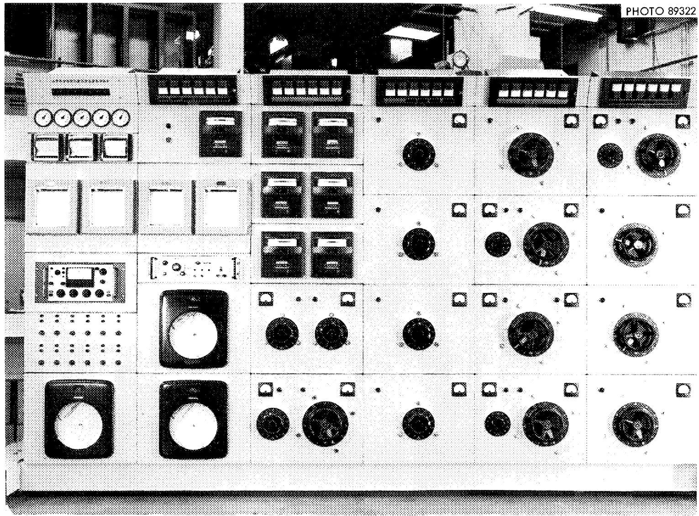  
Fig. 8. Instrument Panel for MSRE Distillation Experiment.

temperature recorder and the radiation measuring instrumentation were mounted in other cabinets.

# 2.3 Condensate Sampler

The condensate sampler was the most important item of equipment for obtaining information from the distillation experiment. The sampler was patterned after the equipment that had previously been used to add $^{233}\mathrm{U}$ to the fuel drain tanks and to take salt samples from the drain tanks.6 Modifications of this design were made to allow the sampler to be evacuated to about 0.5 torr so that condensate samples could be withdrawn without disturbing the operation of the still.

Figure 9 shows a cutaway diagram of the sampler. The main components of the sampler were: (1) the containment vessel in which the samples were stored; (2) the turntable inside the containment vessel, which allowed the sample capsules to be aligned with the handling tool and also with the removal tool; (3) the capsule handling tool, with which empty capsules were attached to the cable to be lowered into the sampler reservoir; and (4) the reel assembly, with which capsules were lowered and raised.

The following sequence was used in collecting a condensate sample. With valve HV-62 (see Fig. 9) closed and the containment vessel at atmospheric pressure, the sample handling tool was raised to the highest position. As shown in Fig. 9, the cable was attached about 20 in. from the top of the tool so that, when the cable was reeled to the highest position, the top end of the tool protruded through valve HV-66 and the samples on the turntable could pass under the lower end of the tool.

ORNL DWG 69-4945

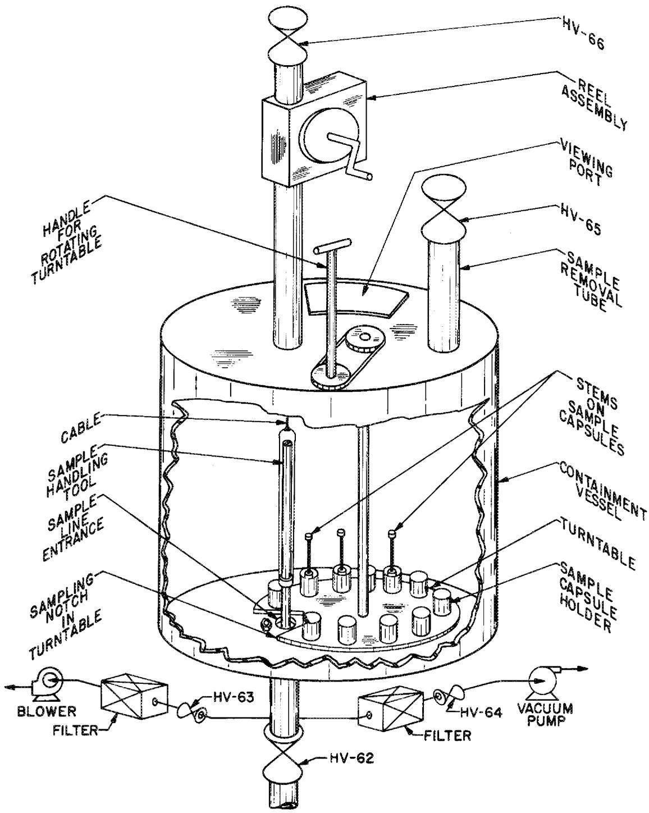  
Fig. 9. Cutaway Diagram of Condensate Sampler for MSRE Distillation Experiment.

With the tool at its highest position, an empty capsule was rotated underneath the lower end of the tool. The tool was then lowered onto the stem of the capsule and locked in place by an adjustment at the end of the tool protruding through HV-66. The tool and the attached capsule were raised again, the turntable was rotated until the sampling notch was located underneath the tool, and the tool was lowered below valve HV-66. Valve HV-66 was then closed. At this time, the vacuum pump was turned on, and the containment vessel was evacuated to about 0.5 torr. When the pressure in the containment vessel reached 0.5 torr, valve HV-62 was opened and the sample handling tool and the empty capsule were lowered until the sample capsule rested on the bottom of the sample reservoir at the end of the condenser. The tool and capsule were then raised above valve HV-62, which was subsequently closed. Next, the containment vessel was pressurized to atmospheric pressure with argon. Valve HV-66 was then opened, and the sample handling tool was raised to its highest position. Finally, the empty sample holder was rotated underneath the sample handling tool, and the sample was lowered into its holder and released from the tool. The process was repeated by raising the sample tool again, rotating another sample capsule underneath it, etc. The turntable was designed to contain ll sample capsules. After the samples had been collected, they were stored in the containment vessel. At the end of the experiment, they were removed for analysis.

A blower, which drew air into the top of the line at the reel assembly to prevent radioactive particles from escaping into the operating area, was provided for the parts of the operation requiring HV-66 to be open. The air handled by the blower was filtered and exhausted into the cell.

The sample capsules were standard 10-g MSRE sample capsules, each of which was fitted with a key for attaching to the sample handling tool. Figure 10 shows one of these capsules. The three wire ribs on the stem ensured that the capsule would remain vertical in the capsule holder on the turntable.

Figure 11 is a photograph of the sampler during installation at the MSRE. In this photograph, the unloading tube has been capped off, and the turntable operating handle is not in place. The ring of lead bricks around the sampler forms the base for the radiation shield, which is fitted over the containment vessel.

# 2.4 Location of Equipment at the MSRE

The distillation unit was installed in the spare cell at the MSRESite; the sampler, the valve box, and the instrument panel were placed in the high bay area above the cell. Figure 12 shows a schematic diagram of the spare cell, while Fig. 13 shows a photograph of the unit in the cell before the cell cover was put in place.

# 3. DESCRIPTION OF DISTILLATION OPERATION

The transfer of salt from the fuel storage tank (FST) to the feed tank was initiated by evacuating the feed tank, which contained about 2 liters of unirradiated salt, to about 1.5 psia. Prior to the transfer, freeze valve FV-112, located between the FST and the feed tank for the still (see Fig. 5), was heated and opened. (Salt had previously been frozen in the feed line to the still pot in order to isolate the feed

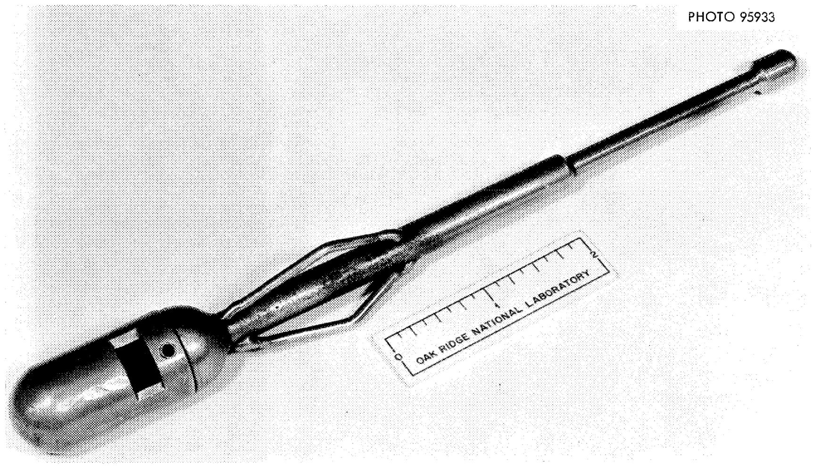  
Fig. 10. Condensate Sample Capsule Used in the MSRE Distillation Experiment.

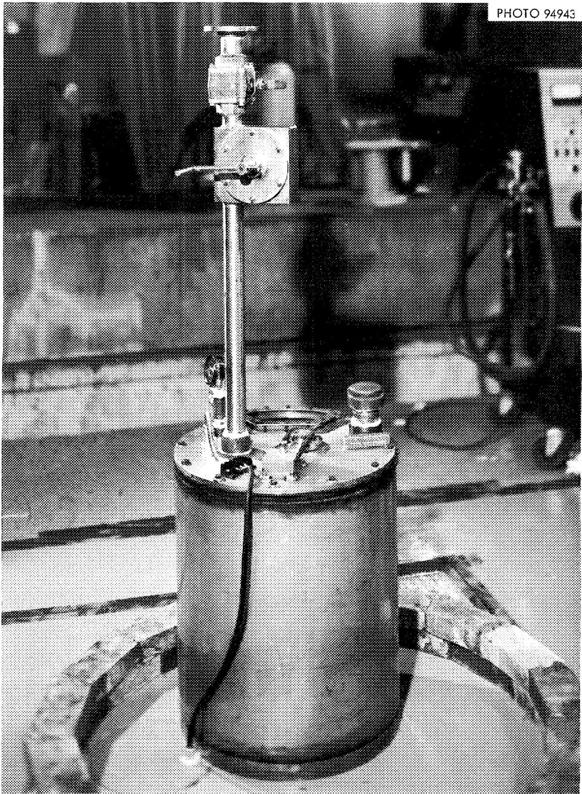  
Fig. 11. Condensate Sampler for MSRE Distillation Experiment.

ORNL DWG 68-130R1

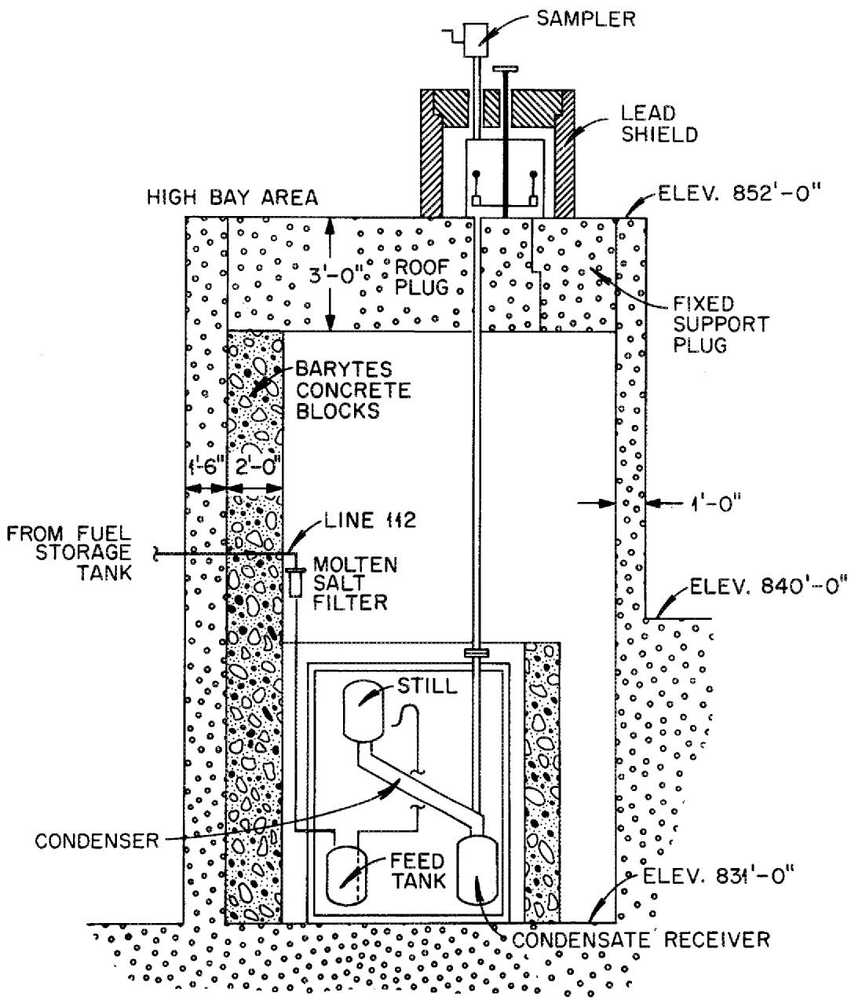  
Fig. 12. South Elevation of MSRE Spare Cell, Showing Distillation Unit and Sampler Locations.

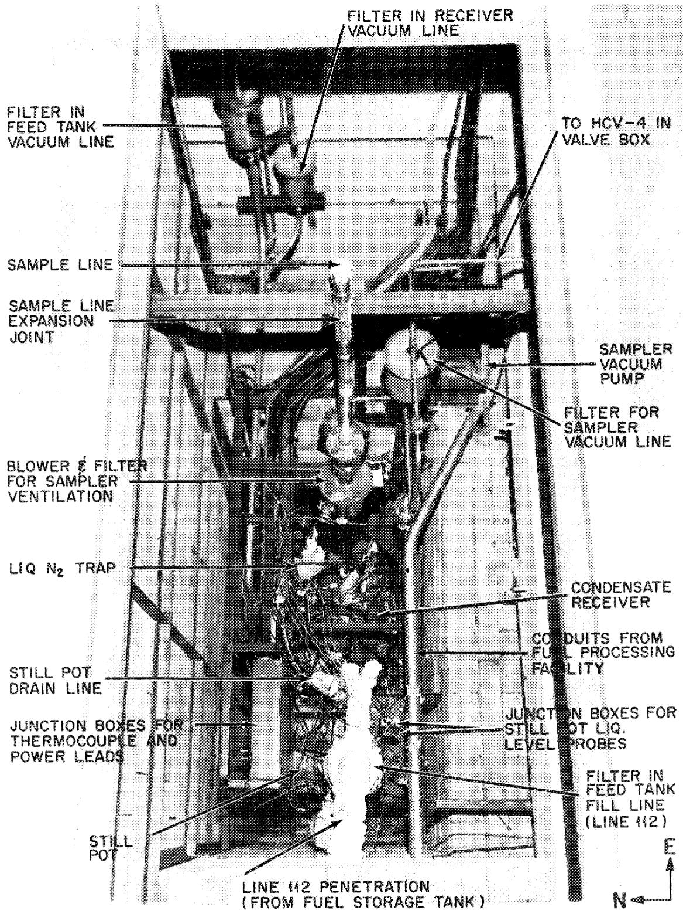  
Fig. 13. Molten Salt Still Installed in Spare Cell at MSRE.

tank from the other process vessels.) After 12 liters of salt had been transferred from the FST, the pressure of the feed tank increased from about $\frac{1}{4}$ psia to atmospheric pressure over a period of about 2 min; this indicated that gas was being transferred from the feed tank through the salt charging line. More salt could not be transferred from the FST even though the bubbler in the FST indicated that additional salt was present. Only one further attempt at salt transfer was made because of the potential danger of blowing the trapped salt out of the freeze valve; this would have made it impossible to obtain a seal between the feed tank and the fuel storage tank. After we had established that a tight seal could be made, we decided to proceed with the experiment using the salt already transferred, even though its volume was much less than the anticipated volume (48 liters).

To start the distillation experiment, the still-pot feed line was thawed, all process vessels were evacuated to 5 torr, and the still pot was heated to $900^{\circ}\mathrm{C}$ . The valve between the feed tank and the vacuum pump was then closed, and argon was introduced into the feed tank to increase the pressure to about 0.5 atm; this forced the salt to flow from the feed tank into the still pot. When 7 liters of salt had been transferred to the still pot, the condenser pressure was reduced to 0.2 torr to start the distillation of salt. At this point, control of the liquid level in the still pot was switched to the automatic mode. In this mode, salt was fed to the still pot at a rate slightly greater than the vaporization rate. The argon feed valve to the feed tank remained open (forcing more salt into the still pot) until the liquid level in the still rose to a given set point; the valve then closed and remained closed until the liquid

level decreased to a second set point. In this manner, the salt volume in the still pot was maintained near 7 liters.

As the salt vapor passed through the condenser, heat was removed from it by conduction through the condenser walls and the insulation and by convection to the air in the cell. The condenser was divided into three heated zones, the temperatures of which could be controlled separately when condensation was not occurring. A sharp increase in temperature above the set points near the condenser entrance, as well as a gradual temperature rise near the end of the condenser, accompanied the beginning of distillation. Operation of heaters to keep the temperature of the condenser above the liquidus temperature of the condensate was not necessary during vapor condensation. In this part of the run, the still-pot temperature was slowly increasing; and, since the concentrations of volatile $\mathrm{BeF}_2$ and $\mathrm{ZrF}_4$ were still fairly high, the vaporization rate was also increasing. An abnormally high temperature at the end of the condenser indicated that the capacity of the condenser would be exceeded. By raising the condenser pressure to 0.8 torr, the distillation rate was reduced sufficiently to maintain the condenser temperature near $700^{\circ}\mathrm{C}$ , an acceptably low temperature.

When the contents of the feed tank (7 liters) had been depleted, the salt in the still feed line was frozen; then a total of 4 of the 7 liters of salt in the still pot was distilled by batch distillation. At this point, the still-pot temperature was $980^{\circ}\mathrm{C}$ . As the more volatile materials were vaporized from the still pot, the condenser pressure was reduced from 0.8 torr to 0.1 torr in order to maintain a fairly high distillation rate. When the condenser pressure could not be decreased

further, the distillation operation was terminated by increasing the pressure in all the process vessels to atmospheric pressure and turning off the power to all the heaters.

The semicontinuous distillation phase lasted for 9.3 hr; the average distillation rate during this period was 0.57 liter/hr. The duration of the batch distillation period was 13.8 hr; the average distillation rate for this period was 0.36 liter/hr. Eleven condensate samples were taken during the run at approximately 90-min intervals. At the end of the experiment, radiation readings of these samples ranged from $\frac{1}{4}$ R/hr at contact (the first sample) to 500 mR/hr at contact (the last sample).

After the still had been allowed to cool down, all electrical and thermocouple leads to the still were cut and all pneumatic instrument lines from the valve box were disconnected. The sampler was dismantled and sent to the burial ground; the projecting end of the sample line was flanged. Valve handle extensions were cut flush with the floor of the high bay area. The process vessels and the valve box were allowed to remain in place.

# 4. EXPERIMENTAL RESULTS

# 4.1 Summary of Experimental Data

In order to determine the capability of the distillation equipment for separating fission products from the carrier salt, we measured the following quantities in the course of this experiment: the concentration of all the major and most of the minor components in the feed salt to the still, the concentration of each component in the condensate as it left

the still pot, the volume of liquid fed to the still pot, and the volume of liquid collected in the receiver. An estimate7 was made of the concentration of each fission product whose concentration in the feed salt was not measured. The estimate was based on the production rate of each fission product in the MSRE and assumed that all the precursors of a given fission product remained in the salt. This seemed to be a fairly good assumption for isotopes having no long-lived gaseous precursors.

All the concentrations were converted to mole fractions; the mole fractions of radioactive materials were calculated as of May 7, 1969. The volumes were determined by measuring the weight of liquid over the end of a bubbler, dividing by a salt density of $2.2\mathrm{g/cm}^3$ to obtain the depth of liquid, and multiplying this value by the cross-sectional area of the particular vessel to obtain the volume. We assumed that the mass density of the liquid was independent of composition and that the volume of liquid in the still pot could be calculated by subtracting the volume of condensate collected from the total volume of salt fed to the still from the feed tank. Assuming that molar volumes can be added (which is a fairly good assumption for fluoride salts), we calculated mass densities for liquids in the concentration range seen in this experiment and found only a $5\%$ variation; hence, our assumption of constant density appears to be acceptable. The analyses of all the condensate samples are reported in the Appendix.

# 4.2 Material Balance Calculations

One of the most concise ways to express the separation performance of the distillation equipment is to convert the condensate analyses to effective

relative volatilities with respect to LiF. The effective relative volatility of component i with respect to LiF is defined as:

$$
\alpha_ {i - L i F} \equiv \frac {y _ {i} / x _ {i}}{y _ {L i F} / x _ {L i F}}, \tag {1}
$$

where $y =$ mole fraction in the condensate,

$x =$ mole fraction in the still pot.

Although the composition of each component in the still pot was not measured directly during the run, the data allowed the composition of the still pot to be estimated from a material balance for each component.

In this section, we derive the material balance equations and outline the calculational procedure.

For the semicontinuous mode of operation, a differential mole balance for component $i$ gives:

$$
f _ {i} d I - y _ {i} d O = d M _ {i}, \tag {2}
$$

where $I =$ total moles fed to the still pot,

$0 =$ total moles removed from the still pot,

$M_{i} =$ moles of component i in the still pot,

$f_{i} =$ mole fraction of component i in the feed,

$y_{i} =$ mole fraction of component $i$ in the condensate.

Since volume was the measured quantity, we can make the following substitutions:

$$
\mathrm {d I} = \frac {\mathrm {d V} _ {\text {i n}}}{\sum_ {j = 1} ^ {N} f _ {j} v _ {j}}, \tag {3a}
$$

$$
d O = \frac {d V _ {\text {o u t}}}{\sum_ {j = 1} ^ {N} y _ {i} v _ {j}}, \tag {3b}
$$

where $V_{\text{in}} =$ volume of salt fed to the still pot, liters,

$$
\begin{array}{l} V _ {\text {o u t}} = \text {v o l u m e} \\ v _ {j} = \text {p a r t i a l m o l a r v o l u m e} ^ {*} \text {o f c o m p o n e n t j , l i t e r s / m o l e .} \\ \end{array}
$$

When we substitute the quantities in Eq. (3) into Eq. (2), we obtain:

$$
\frac {f _ {i}}{\sum_ {j = 1} ^ {N} f _ {j} v _ {j}} d V _ {i n} - \frac {y _ {i}}{\sum_ {j = 1} ^ {N} h _ {j} v _ {j}} d V _ {o u t} = d M _ {i}. \tag {4}
$$

Integration of Eq. (4) yields

$$
\frac {f _ {i}}{\sum_ {j = 1} ^ {N} f _ {j} v _ {j}} \mathrm {V} _ {\text {i n}} - \int_ {0} ^ {\sum_ {j = 1} ^ {N} y _ {j} v _ {j}} \mathrm {d V} _ {\text {o u t}} = M _ {i}, \tag {5}
$$

where the conditions $V_{in} = V_{out} = M_i = 0$ at the start of the experiment were used. The composition in the still pot can be determined by solving for $M_i$ for each component. This equation is valid up to the point where $V_{out} = 5.07$ liters (the end of the semicontinuous distillation).

If $M_{i}$ moles of component $i$ are present in the still pot and $dM_{i}$ moles of component $i$ are vaporized during the batch distillation, the mole fraction of component $i$ in the vapor is given by

$$
y _ {i} = \frac {\mathrm {d M} _ {i}}{\sum_ {k = 1} ^ {N} \mathrm {d M} _ {k}}; \tag {6}
$$

similarly, for component $j$ ( $i \neq j$ ),

$$
y _ {j} = \frac {\mathrm {d} M _ {j}}{\sum_ {k = 1} ^ {N} d M _ {k}}. \tag {7}
$$

From Eqs. (6) and (7), we obtain the expression

$$
\frac {\mathrm {d} \mathrm {M} _ {i}}{\mathrm {y} _ {i}} = \frac {\mathrm {d} \mathrm {M} _ {j}}{\mathrm {y} _ {j}} \tag {8}
$$

or

$$
\mathrm {d M} _ {i} = \frac {\mathrm {y} _ {i}}{\mathrm {y} _ {j}} \mathrm {d M} _ {j}. \tag {9}
$$

Assuming that the partial molar volumes $v_{i}$ are independent of the composition of the liquid (as before), we multiply both sides of Eq. (9) by $v_{i}$ and sum both sides over all $i$ to obtain the following equation:

$$
\sum_ {i = 1} ^ {N} v _ {i} d M _ {i} = d V _ {\text {s t i l l}} = \left[ \begin{array}{l l l} N & & \\ & \ddots & \\ & & \\ i = 1 & (y _ {i} v _ {i}) & \frac {d M _ {j}}{y _ {j}} \end{array} , \right. \tag {10}
$$

where $V_{\text{still}} =$ volume of salt in the still pot, liters.

Solving Eq. (10) for $\mathrm{dM}_{\mathrm{j}}$ yields:

$$
\mathrm {d M} _ {\mathrm {j}} = \frac {\mathrm {y} _ {\mathrm {j}}}{\sum_ {\mathrm {i} = 1} ^ {\mathrm {N}} \mathrm {y} _ {\mathrm {i}} \mathrm {v} _ {\mathrm {i}}} \mathrm {d V} _ {\text {s t i l l}}. \tag {11}
$$

Integrating Eq. (ll) yields:

$$
M _ {j} = M _ {j 0} + \int_ {V _ {0}} ^ {v _ {\text {s t i l l}}} \frac {y _ {j}}{\sum_ {i = 1} ^ {N} y _ {i} v _ {i}} d V _ {\text {s t i l l}}, \tag {12}
$$

where $\mathbf{M}_{j0} =$ moles of component $j$ present in the still pot at the start of the batch distillation,

$V_{0} =$ volume of salt in still pot at start of batch distillation. The quantity $\mathbf{M}_{\mathrm{j0}}$ in Eq. (l2) is calculated by evaluating Eq. (5), using the values of $V_{in}$ and $V_{out}$ that correspond to the end of the semicontinuous distillation. (At the end of semicontinuous distillation, $V_{in} = 13.8$ liters and $V_{out} = 5.07$ liters.) The composition of the still pot is determined by evaluating Eq. (l2) for each component that is present.

The integrals in Eqs. (5) and (12) were evaluated by plotting

$$
\frac {y _ {j}}{\sum_ {i = 1} ^ {N} y _ {i} v _ {i}}
$$

vs the volume of condensate collected in the receiver during the semi-continuous distillation and

$$
\frac {y _ {j}}{\sum_ {i = 1} ^ {N} y _ {i} v _ {i}}
$$

vs the still-pot volume (calculated as explained previously) during the batch distillation, fitting the resulting curves to simple empirical functions of the appropriate volume, and then integrating these equations. For any component, a fairly wide range of equation parameters fit the scattered data equally well; however, the values of the integrals were not significantly sensitive to these variations in the parameters. The sums $\sum_{i=1}^{N} y_i v_i$ and $\sum_{i=1}^{N} f_i v_i$ were adequately represented by considering only the major salt components LiF, BeF $_2$ , and ZrF $_4$ since the mole fractions

of the fission products were negligible as compared with the mole fractions of these components.

Using Eqs. (5) and (12), we calculated the number of moles of each component present in the still pot at the time each condensate sample was taken. The mole fraction of each component in the still pot at that time was calculated using the following equation:

$$
x _ {i} = \frac {M _ {i}}{\sum_ {j = 1} ^ {N} M _ {j}}. \tag {13}
$$

The measured values of $y_{i}$ and the calculated values of $x_{i}$ were then used in Eq. (1) to calculate the relative volatility of each component, with respect to LiF, for each sample.

# 4.3 Results of Relative Volatility Calculations

The effective relative volatilities, with respect to LiF, of the major salt components, $\mathrm{BeF}_2$ and $\mathrm{ZrF}_4$ , and of the fission products $95_{\mathrm{Zr}}$ , $144_{\mathrm{Ce}}, 147_{\mathrm{Pm}}, 155_{\mathrm{Eu}}, 91_{\mathrm{Y}}, 90_{\mathrm{Sr}}$ , and $137_{\mathrm{Cs}}$ were calculated using the methods outlined above. The variations in relative volatilities during the course of the distillation operation, as obtained from the calculations, are given in Figs. 14-17. In these figures, the most self-consistent values resulted when the carrier salt composition in the feed was assumed to be 65-30-5 mole % $\mathrm{LiF - BeF}_2 - \mathrm{ZrF}_4$ rather than the slightly different composition indicated by the analysis of the salt from the fuel storage tank. The difference between the analytical values and the values actually used can probably be attributed to zirconium metal, which was present in

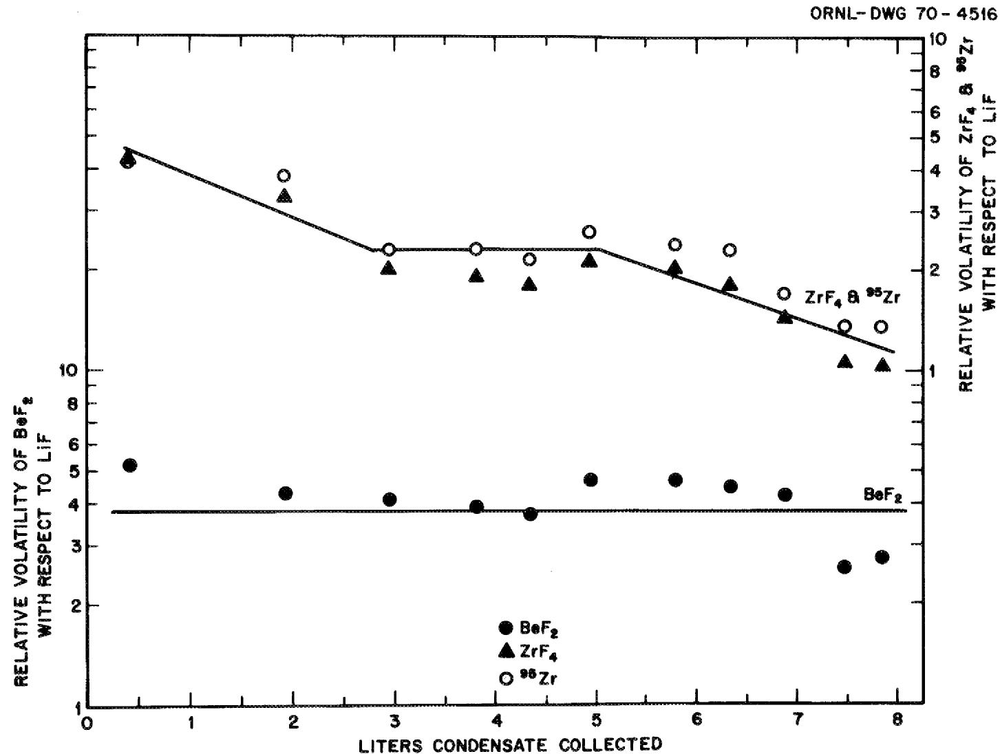  
Fig. 14. Effective Relative Volatilities of $\mathrm{BeF}_2$ , $\mathrm{ZrF}_4$ , and $95\mathrm{Zr}$ .

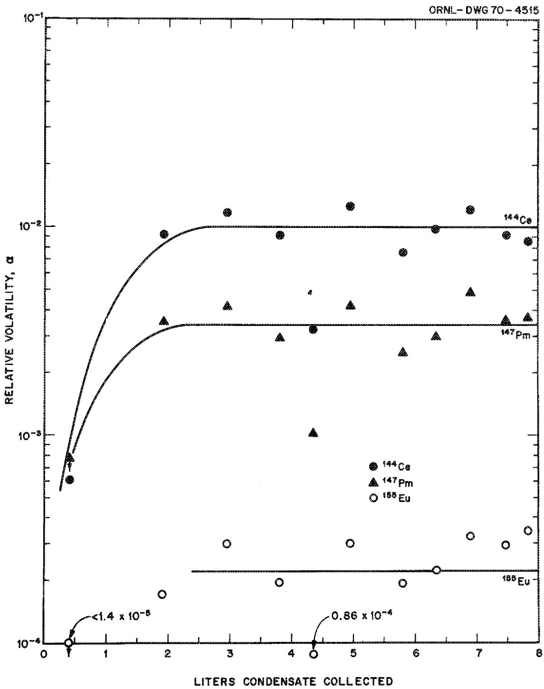  
Fig. 15. Effective Relative Volatilities of $^{144}\mathrm{Ce}$ , $^{147}\mathrm{Pm}$ , and $^{155}\mathrm{Eu}$ .

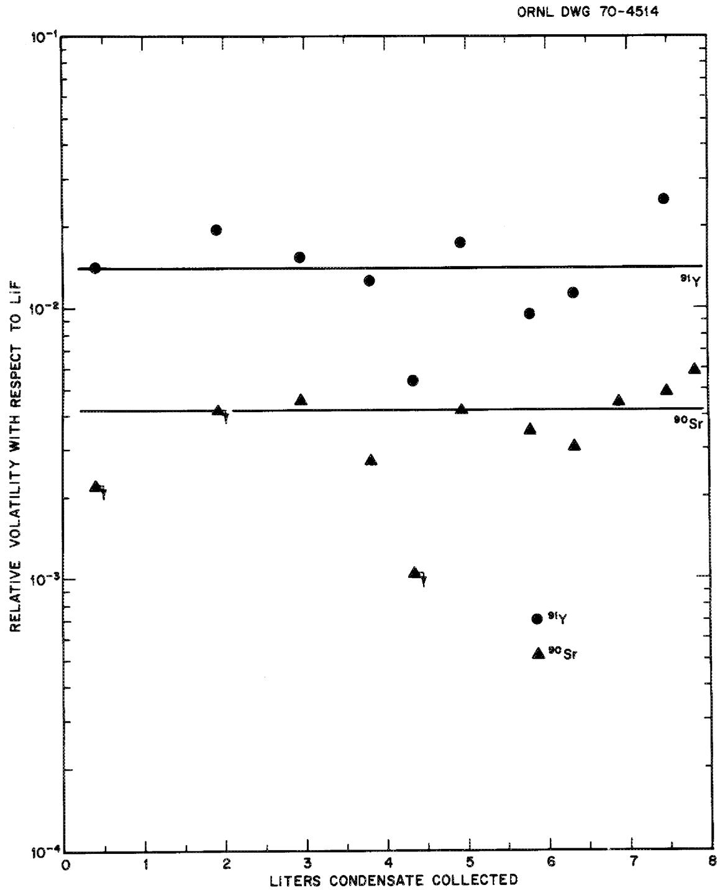  
Fig. 16. Effective Relative Volatilities of $^{91}\mathrm{Y}$ and $^{90}\mathrm{Sr}$ .

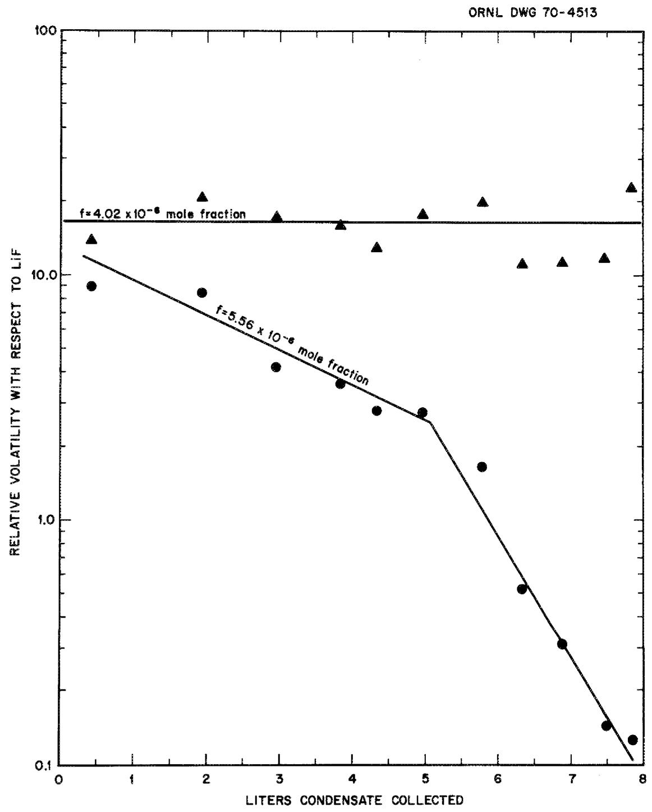  
Fig. 17. Effective Relative Volatility of $^{137}\mathrm{Cs}$ , Showing Effect of Varying the Assumed Feed Concentration of $^{137}\mathrm{Cs}$ .

the fuel storage tank at the time the analysis was made but was filtered out when the salt was transferred to the still feed tank.

The effective relative volatilities of $\mathrm{BeF}_2$ , $\mathrm{ZrF}_4$ , and $^{95}\mathrm{Zr}$ are shown in Fig. 14. The effective relative volatility of $\mathrm{BeF}_2$ was essentially constant during the run, exhibiting an average value of 3.8. This value agrees favorably with the value of 3.9 measured by Smith, Ferris, and Thompson but is slightly lower than the value of 4.7 measured by Hightower and McNeese. Slight inaccuracies in calculations (especially the material balance calculations described earlier) and analyses probably account for such differences.

The effective relative volatilities of fission product $^{95}\mathrm{Zr}$ and of $\mathrm{ZrF}_4$ , the carrier salt constituent, are in agreement with respect to magnitude and variation during the run. When the analysis of the salt in the FST was used in the relative volatility calculation, the resulting relative volatilities of the $\mathrm{ZrF}_4$ were about a factor of 2 lower than the values for $^{95}\mathrm{Zr}$ . Figure 14 shows that $\alpha_{\mathrm{ZrF}_4 - \mathrm{LiF}}$ decreased from an initial value near 4 at the start of the run to about 1 at the end of the run. These values bracket the value (2.2) measured by Smith et al. in salt mixtures having a $\mathrm{ZrF}_4$ concentration about 2% of that in this system.

The effective relative volatilities of the lanthanide fission products $144\mathrm{Ce}$ , $147\mathrm{Pm}$ , and $155\mathrm{Eu}$ are shown in Fig. 15. The effective relative volatility of $144\mathrm{Ce}$ rose sharply from $6.1 \times 10^{-4}$ at the time of the first sample to about $1.0 \times 10^{-2}$ , where it remained for nearly all the subsequent samples. However, the relative volatility for the fifth sample was lower than $1.0 \times 10^{-2}$ by a factor of 3. The low initial value was 1.5 to $3.4$ times the value measured in an equilibrium still, whereas the

high, steady value was 24 to 56 times the value measured in the equilibrium still.

The effective relative volatility of $^{147}\mathrm{Pm}$ was based on a computed feed concentration, which was considered to be a more accurate value than the measured feed concentration since measured concentrations of other lanthanide fission products had agreed well with computed concentrations. As in the case of $^{144}\mathrm{Ce}$ , the relative volatility of $^{147}\mathrm{Pm}$ was low at the time the first sample was taken, that is, less than 7.8 x $10^{-4}$ ; it rose sharply to about 3.4 x $10^{-3}$ for the remaining samples except for the fifth sample, which was low. There were no previously measured values for the relative volatility of promethium with which these results could be compared.

At this point, it is interesting to note that, when the effective relative volatility of $^{147}\mathrm{Pm}$ was calculated on the basis of the measured concentration of $^{147}\mathrm{Pm}$ in the FST instead of on an estimated concentration, the $\alpha_{147\mathrm{Pm}-\mathrm{LiF}}$ for each sample, except the first, nearly coincided with the respective calculated point for $^{144}\mathrm{Ce}$ .

The variation of the relative volatilities of $^{155}\mathrm{Eu}$ during the run closely paralleled the variations observed for $^{144}\mathrm{Ce}$ and $^{147}\mathrm{Pm}$ . Although the value for the first sample was low (less than $1.5 \times 10^{-5}$ ), the values for all subsequent samples, except the fifth, were much higher, that is, about $2.2 \times 10^{-4}$ . The value for the fifth sample was lower than this by a factor of 2.6. These calculated effective relative volatilities (which were based on a computed feed concentration of $^{155}\mathrm{Eu}$ ) were lower than the value of $1.1 \times 10^{-3}$ measured in recirculating equilibrium stills. However, the accuracy of the $^{155}\mathrm{Eu}$ values is questionable since some

difficulty was experienced in making the analyses; all of the results for $^{155}\mathrm{Eu}$ in the condensate samples were reported as approximate (see the Appendix). On the other hand, it is significant that the variation of $\alpha_{155\mathrm{Eu}-\mathrm{LiF}}$ during the run closely paralleled the relative volatilities of $^{144}\mathrm{Ce}$ and $^{147}\mathrm{Pm}$ .

Figure 16 shows the effective relative volatilities of $^{91}_{\mathrm{Y}}$ and $^{90}_{\mathrm{Sr}}$ . During the run, the effective relative volatility of $^{91}_{\mathrm{Y}}$ had an average value of $1.4 \times 10^{-2}$ , about 410 times the value measured in recirculating equilibrium stills. The variation of $\alpha_{91_{\mathrm{Y}} - \mathrm{LiF}}$ during the run was similar to variations of relative volatilities of the lanthanides; the low value for the fifth sample was most noticeable.

The effective relative volatility of $^{90}\mathrm{Sr}$ (based on the measured concentration in the feed) had an average value during the run of 4.1 x $10^{-3}$ , about 84 times the value measured in recirculating equilibrium stills. Although not shown in Fig. 16, the average value of the relative volatility of $^{89}\mathrm{Sr}$ (based on a computed concentration in the feed) was 0.193, about 3900 times the value measured in equilibrium stills. The ratio of the $^{89}\mathrm{Sr}$ activity to the $^{90}\mathrm{Sr}$ activity in the condensate samples varied from 0.22 to values greater than 10. It should have been about 0.002 for each sample or, at the least, should have remained constant.

Calculations of the effective relative volatility of $^{137}\mathrm{Cs}$ were based on an estimated feed concentration since the concentration of $^{137}\mathrm{Cs}$ in the feed salt was not measured. However, $^{137}\mathrm{Cs}$ has a fairly long-lived gaseous precursor ( $^{137}\mathrm{Xe}$ , half-life = 3.9 min) that causes the actual concentration of $^{137}\mathrm{Cs}$ in the salt to be less than that predicted when the method outlined earlier is used. Also, because the

actual relative volatility of CsF is fairly high, the results of calculations of the effective relative volatility are sensitive to the assumed feed concentration of $^{137}\mathrm{Cs}$ . Figure 17 shows calculated relative volatilities of $^{137}\mathrm{Cs}$ for two assumed feed concentrations. The points around the lower curve result from the feed concentration of $^{137}\mathrm{Cs}$ which would apply if all the precursors remained in the salt during MSRE operation. These points represent lower limits for the effective relative volatility in this distillation; the points around the upper line result from a feed concentration just high enough to keep the computed concentration of $^{137}\mathrm{Cs}$ in the still-pot liquid from falling to zero or below, and represent upper limits for the effective relative volatility of $^{137}\mathrm{Cs}$ . The highest effective relative volatility of $^{137}\mathrm{Cs}$ seen in these calculations was only about $20\%$ of the value measured by Smith et al. in LiF-BeF $_2$ systems.

As seen from the previous calculated results, all components except beryllium and zirconium had effective relative volatilities that differed (in some cases, drastically) from values predicted from work with equilibrium systems. Some possible explanations for these discrepancies are discussed in the following section.

# 4.4 Possible Explanations of Calculated Results

Possible causes for the discrepancies between the effective relative volatilities of some of the fission products in this experiment and values measured previously include: (l) entrainment of droplets of still-pot liquid in the vapor, (2) concentration gradients in the still pot,

(3) contamination of samples during their preparation for radiochemical analysis, and (4) inaccurate analyses. These possibilities are discussed below.

# 4.4.1 Entrainment of Droplets of Still-Pot Liquid

Entrainment rates of only 0.023 mole of liquid per mole of vapor, or less, would account for the high relative volatilities calculated for the slightly volatile fission products $^{144}$ Ce, $^{147}$ Pm, $^{91}$ Y, and $^{90}$ Sr. Rates of this order would not be reflected in the effective relative volatilities of relatively volatile material ( $\alpha \geq 1$ ). The high correlation of the scatter of the calculated effective relative volatilities of different slightly volatile fission products is consistent with the hypothesis that entrainment occurred.

Although there was some evidence of entrainment during the nonradioactive operation of the still, the considerably lower rate of distillation of the MSRE salt makes entrainment by the same mechanism less likely. Therefore, some other reason for entrainment in the radioactive operation should be sought. Evidence of a salt mist above the salt in the pump bowl at the MSRE and also above salt samples removed from the MSRE has been reported; the studies have indicated that these mists are present over radioactive salt mixtures but not over non-radioactive mixtures. According to the reported data, either a mist concentration (grams of salt per $\mathrm{cm}^3$ of gas) or a rate of formation of mist (grams of salt per second) could be calculated. Entrainment rates sufficiently large to explain the results of this experiment could only be obtained by assuming that the gas space above the salt contained salt mist having the same concentration as that seen in the studies, instead

of by assuming equal mist formation rates. However, the concentrations calculated from the data were scarcely adequate to explain the entrained fraction that must have occurred. Furthermore, both the mist formation rate and the concentration of the mist would be expected to decrease with decreasing decay power density in the liquid. Since the salt used in the distillation experiment had a much lower decay power density than the salt examined for mist formation (400 days of cooling for distillation feed, as compared with less than 30 days of cooling for salt samples tested for mist formation), it seems unlikely that the mist concentration would have been high enough to explain the high relative volatilities for the slightly volatile fission products.

In addition to the argument against the entrainment hypothesis just given, not all the discrepancies, for example, the variations in the $89_{\mathrm{Sr}} / 90_{\mathrm{Sr}}$ activity ratio of and the low value for the effective volatility of $^{137}\mathrm{Cs}$ , would be explained by the entrainment hypothesis.

# 4.4.2 Concentration Polarization

Concentration polarization would cause the effective relative volatilities of the slightly volatile materials to be higher than the true relative volatilities. As the more-volatile materials were vaporized from the liquid surface, the slightly volatile materials would be left behind at a higher concentration than in the liquid just below the surface. In turn, the vapor-phase concentration of these slightly volatile materials would increase, since further vaporization would occur from a liquid with successively higher concentrations of slightly volatile materials. Thus, since effective relative volatilities were based on average concentrations in the still pot, the vapor concentration would

be higher than that corresponding to the average liquid concentration, and the calculated effective relative volatility would be higher than the true relative volatility, if the concentrations at the surface of the liquid were higher than average. Similarly, concentration polarization would cause the effective relative volatilities of components with relative volatilities higher than 1 to be lower than their true relative volatilities. If mixing or diffusion did not reduce the concentration gradient in the liquid, then the separation performed by the still would be adversely affected.

As noted in ref. 4, the extent to which concentration polarization affects the effective relative volatility of a particular component depends on the dimensionless group D/vL, which qualitatively represents the ratio of the rate of diffusion of a particular component from the vapor-liquid interface into the bulk of the still-pot liquid to the rate at which this material is transferred by convection to the interface by liquid moving toward the vaporization surface. In this ratio, D is the effective diffusivity of the component of interest, v is the velocity of liquid moving toward the interface, and L is the distance between the interface and the point where the feed is introduced.

The occurrence of concentration polarization is suggested by the sharp rise, at the beginning of the run, in the effective relative volatilities of $^{144}\mathrm{Ce}$ , $^{147}\mathrm{Pm}$ , $^{155}\mathrm{Eu}$ , and, possibly, $^{91}\mathrm{Y}$ and $^{90}\mathrm{Sr}$ . This rise would correspond to the formation of the concentration gradient at the beginning of the run. The effective diffusivities of $\mathrm{NdF}_3$ in the still pot, calculated from results of the nonradioactive experiments, ranged from $1.4 \times 10^{-4}$ to $16 \times 10^{-4}$ cm $^2/\mathrm{sec}$ . They form the basis for estimating

the magnitude of the concentration polarization effect in the radioactive operation. During the semicontinuous operation at the MSRE, the liquid velocity resulting from vaporization averaged $2.2 \times 10^{-4}$ cm/sec and the depth of liquid above the inlet was approximately $9.4$ cm. If one assumes that the effective diffusivity of the fission products in the still pot during the MSRE Distillation Experiment was in the same range as that seen during the nonradioactive tests, the observed relative volatilities of the slightly volatile materials would be only 2.0 to 18 times the actual relative volatilities, and the observed relative volatility of $^{137}\mathrm{Cs}$ would be 0.011 to 0.021 times its true value (in each case, assuming that the true relative volatilities were those given in refs. 1 and 2). Although concentration polarization may have been present in the work with radioactive salt, the effect was less important than that needed to account for the discrepancies between observed relative volatilities and what we consider to be the true values. Concentration polarization would not explain the variation in the ratio of the activities of $^{89}\mathrm{Sr}$ and $^{90}\mathrm{Sr}$ between samples.

# 4.4.3 Contamination of Samples

The possibility that the condensate samples were contaminated during preparation for analysis is suggested by the extreme variation in the ratio of $^{89}\mathrm{Sr}$ and $^{90}\mathrm{Sr}$ activities between samples. Although routine precautions against sample contamination were taken in the hot cells where the capsules were cut open, no special precautions were taken. (The same manipulators that are used to handle MSRE salt samples were employed for opening these condensate samples.) If it is assumed that the source of the contamination was a sample from the MSRE taken just

before the condensate analyses were sent to the hot cells, then the amount of radioactive material necessary to result in the observed values of the ratio of $^{89}\mathrm{Sr}$ and $^{90}\mathrm{Sr}$ activities was in the range $10^{-6}$ to $10^{-3}\mathrm{g}$ per gram of sample. Prevention of such a low level of contamination is extremely difficult.

Other observations that can be explained by assuming that the samples were contaminated are the high relative volatilities of the slightly volatile fission products and the high correlation between the variation of calculated relative volatilities of different fission products. On the other hand, the low relative volatility for $^{137}\mathrm{Cs}$ is not explained by this hypothesis.

4.4.4 Inaccurate Analyses

The analyses for $^{95}\mathrm{Zr}$ , $^{137}\mathrm{Cs}$ , $^{144}\mathrm{Ce}$ , $^{90}\mathrm{Sr}$ , and $^{89}\mathrm{Sr}$ were made by proved, reliable methods and are considered to be accurate within $\pm 5\%$ . The analyses for $^{147}\mathrm{Pm}$ and $^{91}\mathrm{Y}$ are thought to be less reliable but, nevertheless, accurate to within $\pm 10\%$ . Analysis for $^{155}\mathrm{Eu}$ was difficult; therefore, the results are only approximate and their accuracy is open to question.

The analyses for $^{144}\mathrm{Ce}$ , which were made by gamma scanning and by radiochemical separation techniques using separate portions of the condensate samples, appeared to be accurate. Good agreement was obtained between the two sets of analyses.

# 5. CONCLUSIONS

The following conclusions were drawn from the results obtained in the experiment described above.

1. The separation of fuel carrier salt from the lanthanide fission products was demonstrated by processing 12 liters of fuel salt from an operating reactor. Although the volume of salt that was processed was less than anticipated, all the important features of the operation were adequately tested. The operation of the equipment for this run was smooth and trouble-free.   
2. The effective relative volatilities for $\mathrm{BeF}_2$ and $\mathrm{ZrF}_4$ (based on both natural zirconium and fission product $95\mathrm{Zr}$ ) agreed with previous laboratory measurements.   
3. The upper limit of the relative volatility of $^{137}\mathrm{Cs}$ , effective in this run, was found to be only about 20% of the value measured in the laboratory. We cannot adequately explain this discrepancy in terms of the occurrence of liquid entrainment, concentration polarization in the still, or condensate sample contamination.   
4. The effective relative volatilities for the lanthanide fission products $^{144}\mathrm{Ce}$ and $^{147}\mathrm{Pm}$ were unexpectedly high. The effective relative volatility of $^{144}\mathrm{Ce}$ was about 56 times that indicated by previous measurements. No previous measurements for $^{147}\mathrm{Pm}$ were available; however, the relative volatility is thought to be close to that of CeF3. It is believed that the discrepancy between observed values and previous measurements is, in part, due to sample contamination.   
5. Even if the relative volatilities of the lanthanides are as high as seen here (v0.01), adequate recovery of $^7\mathrm{LiF}$ from waste salt streams by distillation is still possible.

If the relative volatilities of the rare-earth fluorides were as high as 0.01, only $3\%$ of the rare earths would be volatilized during vaporization of $95\%$ of the ${}^{7}\mathrm{LiF}$ in a batch distillation.

# 6. ACKNOWLEDGMENTS

The authors gratefully acknowledge the help of the following people in the installation, operation, and analysis of the MSRE Distillation Experiment: P. N. Haubenreich, R. H. Guymon, P. H. Harley, A. I. Krakoviak, and M. Richardson, of the Reactor Division; R. W. Tucker of the Instrumentation and Controls Division, R. B. Lindauer of the Chemical Technology Division; J. H. Moneyhun of the Analytical Chemistry Division; R. S. Jackson of the Plant and Equipment Division; and R. O. Payne, V. L. Fowler, J. Beams, F. L. Rogers, E. R. Johns, and J. C. Rose, technicians in the Unit Operations Section of the Chemical Technology Division.

# 7. REFERENCES

1. J. R. Hightower, Jr., and L. E. McNeese, Measurement of the Relative Volatilities of Fluorides of Ce, La, Pr, Nd, Sm, Eu, Ba, Sr, Y, and Zr in Mixtures of LiF and BeF $_2$ , ORNL-TM-2058 (January 1968).   
2. F. J. Smith, L. M. Ferris, and C. T. Thompson, Liquid-Vapor Equilibria in LiF-BeF $_2$ and LiF-BeF $_2$ -ThF $_4$ Systems, ORNL-4415 (June 1969).   
3. W. L. Carter, R. B. Lindauer, and L. E. McNeese, Design of an Engineering-Scale Vacuum Distillation Experiment for Molten Salt Reactor Fuel, ORNL-TM-2213 (November 1968).   
4. J. R. Hightower, Jr., and L. E. McNeese, Low-Pressure Distillation of Molten Fluoride Mixtures: Nonradioactive Tests for the MSRE Distillation Experiment, ORNL-4434 (January 1971).   
5. M. W. Rosenthal, MSR Program Semiann. Progr. Rept. Feb. 28, 1967, ORNL-4119, p. 76.   
6. M. W. Rosenthal, MSR Program Semiann. Progr. Rept. Feb. 28, 1969, ORNL-4396, p. 24.   
7. E. L. Compere, ORNL, personal communication, July 1, 1969.   
8. M. W. Rosenthal, MSR Program Semiann. Progr. Rept. Feb. 29, 1968, ORNL-4254, p. 100.   
9. M. W. Rosenthal, MSR Program Semiann. Progr. Rept. Feb. 28, 1969, ORNL-4396, p. 145.   
10. J. H. Moneyhun, ORNL, personal communication, Feb. 9, 1970.

8. APPENDIX : ANALYSES OF SAMPLES FROM THE MSRE DISTILLATION EXPERIMENT

Table A-1. Analyses of Samples from the MSRE Distillation Experiment   

<table><tr><td rowspan="2"></td><td colspan="11">Component</td><td colspan="2">Salt Volumes Associated with Condensate Samples</td></tr><tr><td>Li (wt %)</td><td>Be (wt %)</td><td>Zr (wt %)</td><td>95Zr (dis min-1g-1)</td><td>144Ce (dis min-1g-1)</td><td>147Pm (dis min-1g-1)</td><td>155Eu (dis min-1g-1)</td><td>91Y (dis min-1g-1)</td><td>90Sr (dis min-1g-1)</td><td>89Sr (dis min-1g-1)</td><td>137Cs (dis min-1g-1)</td><td>Total Liters Fed</td><td>Liters Condensate Collected</td></tr><tr><td>Fuel storage tank-1 (Date analyzed)</td><td>—</td><td>—</td><td>—</td><td>1.79 x 109(4/24/69)</td><td>3.14 x 1010(4/25/69)</td><td>3.48 x 109(4/24/69)</td><td>—</td><td>—</td><td>3.11 x 109(4/24/69)</td><td>—</td><td>—</td><td></td><td></td></tr><tr><td>Fuel storage tank-2 (Date analyzed)</td><td>10.6(5/1/69)</td><td>5.67(5/1/69)</td><td>13.39(5/1/69)</td><td>1.62 x 109(4/29/69)</td><td>3.21 x 1010(5/2/69)</td><td>3.75 x 109(4/30/69)</td><td>—</td><td>—</td><td>3.35 x 109(4/29/69)</td><td>—</td><td>—</td><td></td><td></td></tr><tr><td>Condensate samples</td><td>3.88</td><td>11.14</td><td>15.66</td><td>1.53 x 109</td><td>6.83 x 106</td><td>&lt;2.6 x 106</td><td>&lt;8 x 103</td><td>6.54 x 105</td><td>&lt;2.1 x 106</td><td>2.10 x 107</td><td>9.46 x 109</td><td>7.9</td><td>0.42</td></tr><tr><td>-2</td><td>4.67</td><td>8.48</td><td>12.05</td><td>1.39 x 109</td><td>1.21 x 108</td><td>1.53 x 107</td><td>~1.4 x 105</td><td>1.18 x 106</td><td>&lt;5.2 x 106</td><td>5.15 x 107</td><td>6.49 x 108</td><td>10.0</td><td>1.93</td></tr><tr><td>-3</td><td>6.86</td><td>10.39</td><td>10.04</td><td>1.14 x 109</td><td>2.39 x 108</td><td>2.78 x 107</td><td>~3.0 x 105</td><td>1.44 x 106</td><td>8.54 x 106</td><td>1.61 x 107</td><td>3.93 x 109</td><td>11.2</td><td>2.96</td></tr><tr><td>-4</td><td>7.24</td><td>9.76</td><td>10.09</td><td>1.17 x 109</td><td>1.97 x 108</td><td>2.23 x 107</td><td>~2.1 x 105</td><td>1.32 x 106</td><td>5.76 x 106a</td><td>1.34 x 107</td><td>3.53 x 109</td><td>12.6</td><td>3.81</td></tr><tr><td>-5</td><td>8.15</td><td>10.00</td><td>10.48</td><td>1.24 x 109</td><td>8.09 x 107</td><td>8.85 x 106</td><td>~1.0 x 105</td><td>6.14 x 105</td><td>&lt;2.5 x 106</td><td>2.49 x 107</td><td>3.14 x 109</td><td>13.4</td><td>4.35</td></tr><tr><td>-6</td><td>7.05</td><td>9.93</td><td>10.49</td><td>1.21 x 109</td><td>2.89 x 108</td><td>3.20 x 107</td><td>~3.4 x 105</td><td>1.81 x 106</td><td>8.93 x 106</td><td>1.08 x 107</td><td>2.61 x 109</td><td>13.6</td><td>4.95</td></tr><tr><td>-7</td><td>7.82</td><td>9.24</td><td>10.53</td><td>1.16 x 109</td><td>1.99 x 108</td><td>2.16 x 107</td><td>~2.5 x 105</td><td>1.15 x 106</td><td>8.57 x 106</td><td>1.91 x 107</td><td>1.66 x 109</td><td>13.8</td><td>5.80</td></tr><tr><td>-8</td><td>8.77</td><td>8.48</td><td>9.83</td><td>1.17 x 109</td><td>3.01 x 108</td><td>3.08 x 107</td><td>~3.3 x 105</td><td>1.60 x 106</td><td>8.75 x 106</td><td>3.38 x 107</td><td>5.91 x 108</td><td>13.8</td><td>6.34</td></tr><tr><td>-9</td><td>9.80</td><td>7.66</td><td>8.71</td><td>9.78 x 108</td><td>4.63 x 108</td><td>5.98 x 107</td><td>~5.5 x 105</td><td>2.29 x 106</td><td>1.56 x 107</td><td>3.59 x 107</td><td>4.06 x 108</td><td>13.8</td><td>6.89</td></tr><tr><td>-10</td><td>13.02</td><td>5.11</td><td>8.26</td><td>9.44 x 108</td><td>4.75 x 108</td><td>6.27 x 107</td><td>~6.6 x 105</td><td>6.01 x 106</td><td>2.37 x 107</td><td>1.69 x 107</td><td>2.63 x 108</td><td>13.8</td><td>7.49</td></tr><tr><td>-11</td><td>13.28</td><td>5.22</td><td>8.11</td><td>9.25 x 108</td><td>4.91 x 108</td><td>6.90 x 107</td><td>~8.1 x 105</td><td>4.10 x 106</td><td>3.04 x 107</td><td>4.2 x 107</td><td>2.96 x 108</td><td>13.8</td><td>7.85</td></tr><tr><td>(Date analyzed)</td><td>(5/21/69)</td><td>(5/23/69)</td><td>(5/23/69)</td><td>(5/21/69)</td><td>(7/21/69)</td><td>(7/2/69)</td><td>(10/8/69)</td><td>(9/30/69)</td><td>(7/8/69)</td><td>(7/8/69)</td><td>(5/21/69)</td><td></td><td></td></tr></table>

aDuplicate samples differed by a factor of 4 or more.

ORNL-4577

UC-80 - Reactor Technology

# INTERNAL DISTRIBUTION

1-3. Central Research Library   
4-5. MSRP Director's Office   
6. ORNL - Y-12 Technical Library   
Document Reference Section   
7-41. Laboratory Records Department   
42. Laboratory Records, ORNL R.C.   
43. R. K. Adams   
44. G. M. Adamson   
45. J. L. Anderson   
46. C. F. Baes   
47. C. E. Bamberger   
48. C. J. Barton   
49. H. F. Bauman   
50. S. E. Beall   
51. M. J. Bell   
52. E. S. Bettis   
53. R. E. Blanco   
54. F. F. Blankenship   
55. J. O. Blomeke   
56. R. Blumberg   
57. E. G. Bohlmann   
58. G. E. Boyd   
59. J. Braunstein   
60. M. A. Bredig   
61. R. B. Briggs   
62. S. Cantor   
63. W. L. Carter   
64. H. D. Cochran, Jr.   
65. E. L. Compere   
66. W. H. Cook   
67. B. Cox   
68. J. L. Crowley   
69. F. L. Culler   
70. J. H. Devan   
71. S. J. Ditto   
72. W. P. Eatherly   
73. J. R. Engle   
74. D. E. Ferguson   
75. L. M. Ferris   
76. A. P. Fraas   
77. W. R. Grimes   
78. A. G. Grindell   
79. R. H. Guymon   
80. B. A. Hannaford   
81. P. H. Harley   
82. P. N. Haubenreich   
83. R. F. Hibbs

84-85. J. R. Hightower, Jr.

86. H. W. Hoffman   
87. R. W. Horton   
88. W. H. Jordan   
89.P.R.Kasten   
90.C.W.Kee   
91. M. J. Kelly   
92. S. S. Kirslis   
93. J. W. Koger   
94. R. B. Korsmeyer   
95. A. I. Krakoviak   
96. T. S. Kress   
97. J. A. Lane   
98. R. B. Lindauer   
99. A. P. Litman   
00. M. I. Lundin

101. H. G. MacPherson   
102. J. C. Mailen   
103. H. E. McCoy   
104. L. E. McNeese   
105. A. S. Meyer   
106. R. L. Moore   
107. D. M. Moulton   
108. J. P. Nichols   
109. E. L. Nicholson   
110. A. M. Perry   
111. J. L. Redford   
112. M. Richardson   
113. G. D. Robbins   
114. K. A. Romberger   
115. J. Roth   
116. W. F. Schaffer   
117. Dunlap Scott   
118. J. H. Shaffer   
119. M. J. Skinner   
120. A. N. Smith   
121. F. J. Smith   
122. D. A. Sundberg   
123. R. E. Thoma   
124. D. B. Trauger   
125. Chia-Pao Tung   
126. W. E. Unger   
127. G. M. Watson   
128. A. M. Weinberg   
129. J. R. Weir   
130. M. E. Whatley   
131. J. C. White

132. Gale Young   
133. E. L. Youngblood   
134. P. H. Emmett (consultant)   
135. J. J. Katz (consultant)

136. C. H. Ice (consultant)   
137. E. A. Mason (consultant)   
138. R. B. Richards (consultant)

# EXTERNAL DISTRIBUTION

139. A. Giambusso, U.S. Atomic Energy Commission, Washington, D.C.   
140. Kermit Laughon, AEC Site Representative, ORNL

141-142. T. W. McIntosh, U.S. Atomic Energy Commission, Washington, D.C.

143. M. Shaw, U.S. Atomic Energy Commission, Washington, D.C.   
144. J. A. Swartout, Union Carbide Corporation, New York, N.Y. 10017   
145. Laboratory and University Division, AEC, ORO   
146. Patent Office, AEC, ORO

147-149. Director, Division of Reactor Licensing, U.S. Atomic Energy Commission, Washington, D.C.   
150-151. Director, Division of Reactor Standards, U.S. Atomic Energy Commission, Washington, D.C.   
152-375. Given distribution as shown in TID-4500 under Reactor Technology category (25 copies - NTIS)