ORNL-4616

UC-80 - Reactor Technology

Contract No. W-7405-Eng-26

REACTOR CHEMISTRY DIVISION

# PREPARATION AND HANDLING OF SALT MIXTURES

# FOR THE MOLTEN SALT REACTOR EXPERIMENT

James H. Shaffer

# LEGAL NOTICE

This report was prepared as an account of work sponsored by the United States Government, Neither the United States nor the United States Atomic Energy Commission, nor any of their employees, nor any of their contractors, subcontractors, or their employees, makes any warranty, express or implied, or assumes any legal liability or responsibility for the accuracy, completeness or usefulness of any information, apparatus, product or process disclosed, or represents that its use would not infringe privately owned rights.

JANUARY 1971

OAK RIDGE NATIONAL LABORATORY

Oak Ridge, Tennessee

operated by

UNION CARBIDE CORPORATION

for the

U.S. ATOMIC ENERGY COMMISSION

# CONTENTS

# Abstract 1

1. Introduction 1   
2. Fuel, Coolant, and Flush Salt Requirements for the MSRE 2

Quantities of Materials 3

Procurement of Starting Materials 3

Lithium Fluoride 3   
Uranium Tetrafluoride 3   
Zirconium Tetrafluoride 4   
Beryllium Fluoride 5

General Chemical Specifications 5   
Production Methodology 5

3. Chemical Development of the Production Process 7

Oxide Removal 7

Sulfur Removal 9

Removal of Structural-Metal Impurities 11   
Reduction of Structural Metals by Hydrogen 11   
Reduction of Structural Metals by Beryllium and Zirconium 13

4. The Production Plant 14

Raw Materials Charge 15   
Meltdown and Pretreatment 17   
The Batch Process 18

Auxiliary Systems 21

Vacuum System 21   
HF Supply 21   
Helium Supply 21   
Hydrogen Supply 22   
Salt Storage 22

5. Production of Coolant, Flush, and Fuel Solvent 23

Process Operating Conditions 23   
HF- $\mathbf{H}_2$ Treatment 23   
Reduction of Structural Metals 26

Process Control 27   
Lithium Fluoride Densification 28

6. Preparation of Enriched Fuel Concentrate 30   
7. Preparation of Fuel Enriching Capsules 32   
8. Reactor Loading Operations 36   
9. Production Economics 38

Acknowledgments 39

# PREPARATION AND HANDLING OF SALT MIXTURES FOR THE MOLTEN-SALT REACTOR EXPERIMENT

James H. Shaffer

# ABSTRACT

A molten mixture of LiF, $\mathrm{BeF}_2$ , $\mathrm{ZrF}_4$ , and $\mathrm{UF}_4$ served as the circulating fuel for the Molten-Salt Reactor Experiment. Its secondary coolant for transferring heat to an air-cooled radiator was a molten mixture of LiF and $\mathrm{BeF}_2$ . A third mixture that was chemically identical to the coolant mixture was used in place of the fuel for prenuclear operations and subsequently to flush the reactor core after a fuel drain. Approximately 26,000 lb of these fused fluoride mixtures were prepared from component fluoride salts and loaded into the reactor facility by ORNL's Reactor Chemistry Division. Techniques for handling molten fluorides and their production process for attaining high chemical purity were developed and applied simultaneously with the development of the molten-salt nuclear reactor concept. The plans and operations which were a part of the fueling of the MSRE are described.

# 1. INTRODUCTION

The Molten-Salt Reactor Experiment (MSRE) was operated by the Oak Ridge National Laboratory during the period June 1, 1965, to December 12, 1969, for experimental purposes and as a demonstration of the molten-salt nuclear reactor concept. The MSRE was then placed on a standby operational status pending further developments of the Molten-Salt Reactor Program (MSRP) in its pursuit of a thermal breeder machine. Development efforts by ORNL which led to the design and construction of the MSRE also included development of processes for the preparation of fused salt mixtures suitable for reactor use and techniques for handling these materials in their liquid state at high temperatures. Thus the successful demonstration of the molten-salt nuclear reactor concept also illustrated the relatively simple and economical manner by which these reactors can be fueled.

Techniques for preparing and handling molten salts have been developed at ORNL over the past 18 years. During support of the Aircraft Nuclear Propulsion (ANP) program the application of these procedures to nuclear technology was successfully demonstrated during the preparation of fluoride mixtures and their loading into the Aircraft Reactor Experiment (ARE) beginning October 23, 1954. During the interim period and following a similar fueling operation of the Aircraft Reactor Test beginning November 20, 1956, the molten-salt production facility was operated by the Reactor Chemistry Division as an integral part of the Molten-Salt Reactor Program to provide fused fluoride mixtures for its chemical and engineering tests and for other related projects of ORNL and the USAEC. Prior to the preparation of salt mixtures for the MSRE, this facility had produced over 132,000 lb of fluoride mixtures of high chemical purity. In addition to the operation of the production facility, handling techniques were further developed by operations such as filling, sampling, and emptying engineering test loops. Similar operations with liquid metals were also performed routinely.

The fluoride production facility was constructed as a batch process. Each of two processing units had a capacity of about $2\mathrm{ft}^3$ of fused salt per batch. During development of the MSRE concept, this production plant was adequately sized for supplying materials for the engineering tests of the program and for the repetitive preparation of relatively small quantities of fluoride mixtures having very diverse chemical compositions. The requirements for fluoride mixtures of some 26,500 lb for the operation of the MSRE represented the largest production effort undertaken by the program. Although this quantity exceeded the

reasonable capacity of the production facility, its use with existing technology was the most feasible approach both technically and economically available. Commercial sources of fused fluoride mixtures which would meet specifications for the MSRE are as yet nonexistent.

In addition to the production of the various fluoride mixtures for the MSRE, this commitment also included their loading into the fuel and secondary coolant systems of the reactor and the preparation of incremental charges of $^{235}\mathrm{U}$ needed for sustained nuclear operations. This report is a description of plans and operations followed in the fueling of the MSRE.

# 2. FUEL, COOLANT, AND FLUSH SALT REQUIREMENTS FOR THE MSRE

Specific fluoride mixtures for the MSRE were carefully selected on the basis of their nuclear, chemical, and physical properties and of their potential application in a molten-salt breeder reactor. As a result of these considerations, mixtures based on the $\mathrm{LiF - BeF_2}$ diluent system were used. The phase diagram shown in Fig. 1 is a current interpretation of this system. The reactor fuel mixture was to contain nominally (in mole %) 65 LiF, 29.1 $\mathrm{BeF_2}$ , 5 $\mathrm{ZrF_4}$ , and 0.9 $\mathrm{UF_4}$ (liquidus temperature of $450^{\circ}\mathrm{C}$ ). The actual fuel composition was dependent upon the amount of uranium required to bring the system to the critical, and then to the operating condition. Fissionable $^{235}\mathrm{U}$ comprised about one-third of the uranium inventory; the balance, as nonfissionable $^{238}\mathrm{U}$ , was included for chemical purposes. Zirconium was a constituent of

2W.R.Grimes,MSR Program Semiann.Progr.Rept.July 31,1964,ORNL-3708,p.214.   
$^{3}$ R. E. Thoma (ed.), Phase Diagrams of Nuclear Reactor Materials, ORNL-2548, p. 33 (Nov. 2, 1959).

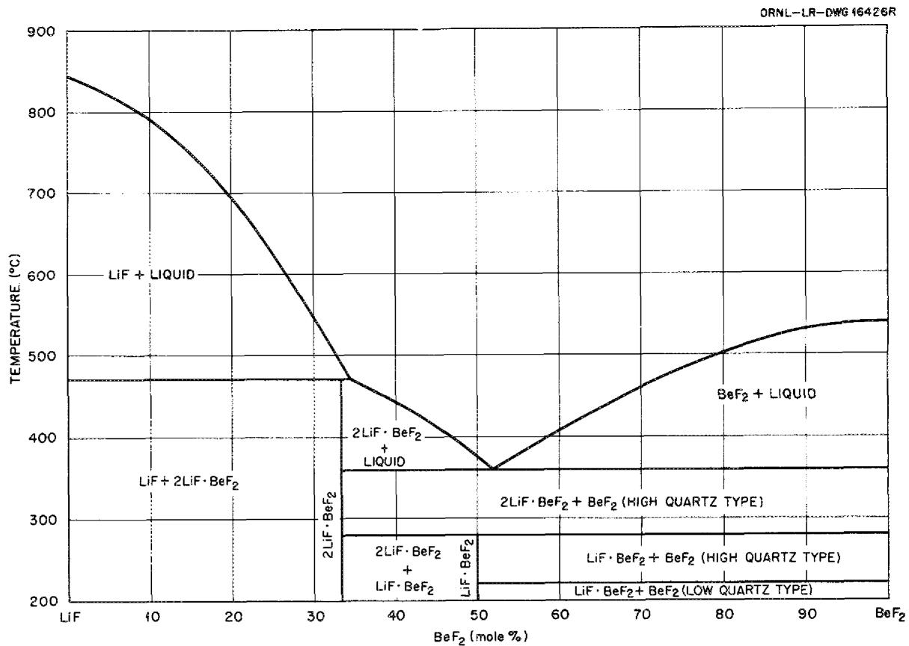  
Fig.1. The System LiF-BeF2.

the fuel mixture to prevent the precipitation of $\mathrm{UO}_2$ and resultant criticality hazards in the event that oxide contamination of the fuel occurred. At a concentration of 5 mole $\% \mathrm{ZrF_4}$ in the fuel, significant and recognizable quantities of $\mathrm{ZrO}_2$ would be preferentially precipitated prior to loss of any uranium from the fuel solution as $\mathrm{UO}_2$ .4

The secondary coolant was a simple binary mixture containing 66 mole $\%$ LiF in $\mathrm{BeF}_2$ , selected to avoid energetic reactions with the fuel (as with an alkali metal coolant) or contamination of the fuel in the event of a failure in the heat exchanger. This mixture had a liquidus temperature $(455^{\circ}\mathrm{C})$ slightly higher than that of the fuel mixture.

Prenuclear operation of the MSRE used a uranium-free $\mathrm{LiF - BeF_2}$ mixture of the same chemical composition as the secondary coolant. This material, commonly referred to as the flush salt, also provided for the removal of oxide and oxygen-bearing species from the system prior to fuel loading and subsequently for flushing the circuit after a fuel drain.

# Quantities of Materials

The volume of the fuel circuit of the MSRE was estimated, for fueling purposes, at about $73\mathrm{ft}^3$ . Production of the fuel was based on a $10\%$ excess of this volume and a calculated salt density of 142 $\mathrm{lb / ft^3}$ . Materials requirements for the MSRE fuel are listed in Table 1. The secondary coolant circuit had an estimated fill volume of about $42\mathrm{ft}^3$ . Since the chemical composition of the coolant was identical with the flush salt, production estimates were based on a $10\%$ excess of their combined volumes and a calculated density of about $120\mathrm{lb / ft^3}$ . Materials requirements for the secondary coolant and flush salt mixtures are listed in Table 2.

# Procurement of Starting Materials

Fluoride starting materials were purchased from commercial sources or otherwise obtained from the USAEC on the basis of estimates in the preceding section. Table 3 lists a summary of these requirements and actual quantities of materials ordered.

Lithium Fluoride. - For neutron-absorption cross-section consideration, all lithium fluoride used in the MSRE production operation was almost isotopically pure $^{7}\mathrm{Li}$ . Its analyzed isotopic assay was at least $99.99\%$ $^{7}\mathrm{Li}$ . Since this material was available as the hydroxide, arrangements were made with the Y-12 Plant for its conversion to fluoride and for maintaining the isotopic purity of each production batch. Because of this unique demand, sufficient $^{7}\mathrm{LiF}$ was prepared for the initial loading of the MSRE and for the replacement of the fuel or coolant charge.

Uranium Tetrafluoride. - Although the $^{235}\mathrm{U}$ enrichment in the MSRE fuel mixture during nuclear operation was about $32\%$ , all of the $^{235}\mathrm{U}$ obtained for processing was highly enriched (93% in $^{235}\mathrm{U}$ ). About $90\mathrm{kg}$ (198 lb) of $^{235}\mathrm{U}$ was obtained for the initial fueling of the MSRE and for its sustained operation during scheduled tests of the MSRP. The balance of the uranium inventory in the fuel charge had been depleted of $^{235}\mathrm{U}$ . These materials were available directly as their tetrafluoride salts from USAEC sources.[7]

Table 1. Materials Requirements for   
MSRE Fuel Mixture   
Estimated volume: 80.3 ft $^3$ (10% excess)   
Density of salt at $600^{\circ}\mathrm{C}$ : 142 lb/ft³   

<table><tr><td rowspan="2">Salt Component</td><td colspan="2">Composition</td><td rowspan="2">Weight for 80.3 ft3 (lb)</td></tr><tr><td>Mole %</td><td>Weight %</td></tr><tr><td>LiF</td><td>65</td><td>40.48</td><td>4,616</td></tr><tr><td>BcF2</td><td>29.1</td><td>32.76</td><td>3,735</td></tr><tr><td>ZrF4</td><td>5.0</td><td>20.02</td><td>2,283</td></tr><tr><td>238UF4</td><td>0.61</td><td>4.59</td><td>523</td></tr><tr><td>-235UF4</td><td>0.29</td><td>2.16</td><td>246</td></tr><tr><td></td><td></td><td>Total weight:</td><td>11,403</td></tr></table>

Avg molecular weight: 41.74

Table 2. Materials Requirements for MSRE Flush and Secondary Coolant Mixtures   
Estimated volume: $126.5\mathrm{ft}^3$ (10% excess)   
Density of salt at $600^{\circ}\mathrm{C}$ : 120 lb/ft³   

<table><tr><td rowspan="2">Salt Component</td><td colspan="2">Composition</td><td rowspan="2">Weight for 126.5 ft3 (lb)</td></tr><tr><td>Mole %</td><td>Weight %</td></tr><tr><td>LiF</td><td>66</td><td>51.78</td><td>7,860</td></tr><tr><td>BeF2</td><td>34</td><td>48.22</td><td>7,320</td></tr><tr><td></td><td></td><td colspan="2">Total weight: 15,180</td></tr></table>

Average molecular weight: 33.14

Table 3. Summary of Fluorides Procured for MSRE   

<table><tr><td>Fluoride Salt</td><td>Estimate (lb)</td><td>Procured (lb)</td><td>Source</td></tr><tr><td>7LiF</td><td>12,476</td><td>22,000</td><td>USAEC</td></tr><tr><td>BeF2</td><td>11,055</td><td>12,000</td><td>Commercial</td></tr><tr><td>ZrF4</td><td>2,283</td><td>2,300</td><td>Commercial</td></tr><tr><td>238UF4</td><td>523</td><td>529</td><td>USAEC</td></tr><tr><td>235UF4</td><td>246</td><td>262</td><td>USAEC</td></tr></table>

Zirconium Tetrafluoride. - Normal commercial grades of zirconium compounds may contain from 1 to $3\%$ hafnium as an impurity and would invoke a severe penalty in neutron economy if used in the MSRE. However, separations processes, based on an early development of the nuclear industry, $^{8}$ are well known. Accordingly, zirconium tetrafluoride that was essentially "hafnium free" ( $<50 \mathrm{ppm} \mathrm{Hf}$ ) was available from commercial sources on a competitive bid arrangement.

Table 4. General Chemical Specifications for MSRE Fluoride Mixtures   

<table><tr><td>Impurity</td><td>Allowable Concentration (wt %) (1 ppm = 0.0001 wt %)</td></tr><tr><td>Water</td><td>0.1</td></tr><tr><td>Cu</td><td>0.005</td></tr><tr><td>Fe</td><td>0.01</td></tr><tr><td>Ni</td><td>0.0025</td></tr><tr><td>S</td><td>0.025</td></tr><tr><td>Cr</td><td>0.0025</td></tr><tr><td>Al</td><td>0.015</td></tr><tr><td>Si</td><td>0.01</td></tr><tr><td>B</td><td>0.0005</td></tr><tr><td>Na</td><td>0.05</td></tr><tr><td>Ca</td><td>0.01</td></tr><tr><td>Mg</td><td>0.01</td></tr><tr><td>K</td><td>0.01</td></tr><tr><td>Li (natural)</td><td>0.005</td></tr><tr><td>Zr (natural)</td><td>0.025</td></tr><tr><td>Cd</td><td>0.001</td></tr><tr><td>Rare earths (total)</td><td>0.001</td></tr></table>

Beryllium Fluoride. -- Since beryllium fluoride was normally available from commercial sources as a manufacturer's intermediate product, its chemical purity was not normally regulated to meet chemical specifications of other users. However, two major producers of beryllium compounds undertook quality improvement programs to meet the requirements of the MSRE. As a result of this cooperative effort, beryllium fluoride was purchased by competitive bid at costs previously incurred for less-pure material.

# General Chemical Specifications

Specifications regulating the maximum allowable impurities in fluorides obtained for the MSRE are listed in Table 4. Those elements which would constitute nuclear poisons were given prime consideration. However, aside from hafnium in zirconium and $^6\mathrm{Li}$ in LiF, none were major impurities in fluoride salts used in the MSRE. Accordingly, restrictive specifications of nuclear poisons were established to prevent their possible deliberate addition. The other chemical specifications were determined on a "best commercially available $\mathrm{BeF}_2$ basis. Allowable impurity levels were based on chemical and spectrochemical analyses of numerous product samples from commercial vendors and from those materials obtained from the USAEC. While all materials obtained for use in preparing MSRE fluoride mixtures were generally within these specified limits, iron concentrations of 250 and $500~\mathrm{ppm}$ were allowed in $\mathrm{BeF}_2$ and LiF respectively. Some carbonaceous impurities were also allowed since they could be readily removed as carbon by gas sparging and were inherent to some manufacturing processes.

# Production Methodology

The fluoride production method is generally independent of fluoride mixture composition provided that the liquidus temperature is within the capability of the process equipment. The production of multicomponent mixtures, however, is sometimes facilitated by the preparation and subsequent combination of simpler binary or ternary mixtures. Thus the mode of production activities could be directly oriented toward procedures by which the actual fuel loading would be accomplished.

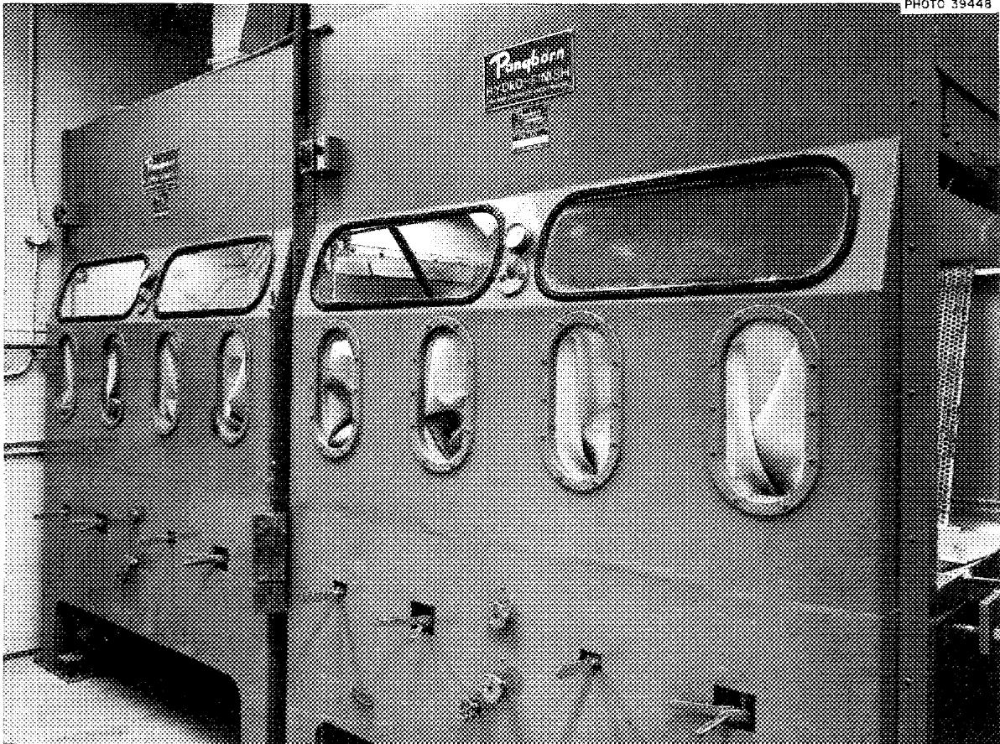  
Fig. 2. Facility for Reclaiming Salt-Contaminated Equipment by Wet Sandblasting.

The operational schedule of the MSRE together with the limited storage capacity for prepared fluorides necessitated the sequential preparation of the secondary coolant and flush salts followed by the fuel charge. Since the two mixtures required in the prenuclear operation of the MSRE were of identical chemical composition, their production was considered as a single operation. However, batches of $^7$ LiF used in preparing the LiF-BeF $_2$ (66-34 mole %) mixture were selected on the basis of their isotopic purity so that materials having the least concentrations of $^6$ Li could be reserved for the fuel and flush salt mixtures.

To provide for conservation of fissionable material, for nuclear safety, and for the planned reactor loading operation, the MSRE fuel salt was prepared as a fuel concentrate mixture and as a barren fuel solvent mixture. The fuel concentrate was the binary eutectic mixture $^{7}\mathrm{LiF - UF_4}$ (73-27 mole %) and was the form in which all uranium was introduced into the MSRE. The fuel concentrate mixture was further differentiated as the enriched fuel concentrate mixture, which contained all $^{235}\mathrm{U}$ as highly enriched $^{235}\mathrm{UF_4}$ , and as the depleted fuel concentrate mixture, which contained the balance of nonfissionable uranium required for the fuel salt mixture. All $\mathrm{BeF_2}$ , $\mathrm{ZrF_4}$ , and remaining $^{7}\mathrm{LiF}$ needed for the fuel mixture was combined as the barren fuel solvent. As calculated from these requirements, the fuel solvent was prepared as a ternary mixture containing (in mole %) 64.7 LiF, 30.1 $\mathrm{BeF_2}$ , and 5.2 $\mathrm{ZrF_4}$ .

As an economic measure the storage of prepared bulk mixtures and their transport to the reactor site were accomplished by use of existing batch-sized containers. Costs for fabricating large heated vessels which would accommodate a complete reactor charge were considered prohibitive for the single use foreseen for the program. About 50 batch-sized containers which had been previously used for nonberyllium salts were

cut open, cleaned by sandblasting, and lengthened by 12 in. upon reassembly. To make use of 20 additional containers which had been used for beryllium salts, two wet-sandblasting cabinets were purchased and installed according to beryllium handling requirements for less than $10,000. As shown in Fig. 2, these units were installed in a tandem arrangement. One unit was used to remove salt deposits and scale by wet sandblasting; the second unit was used for rinsing contaminants from the cleaned equipment. This facility has since provided valuable service in reclaiming beryllium-contaminated equipment from continued experimental programs on molten salts within the Reactor Chemistry Division.

# 3. CHEMICAL DEVELOPMENT OF THE PRODUCTION PROCESS

Aside from the physical mixing of salts to obtain lower liquidus temperatures, the primary purpose of the production process is to achieve further purification of the resultant molten fluoride mixture. Although starting materials of reasonably high purity are normally available from commercial sources, impurities which contribute to chemical corrosion processes and to the deposition of solids can be very detrimental in high-temperature molten-salt systems even at low concentrations. The removal of a limited number of these impurity species during the production operation is achieved by treatment of the fluoride melt with anhydrous hydrogen fluoride, hydrogen, and, in some instances, strong metallic reducing agents. Impurities which can be volatilized are removed in the process gas effluent stream; those which can be rendered as insoluble particles are removed by decantation and filtration.

# Oxide Removal

Oxides in molten fluorides may arise from various oxygenated impurities in the starting materials. However, the most abundant source results from the incomplete evaporation of absorbed water and subsequent pyrohydrolysis during the initial melting of the fluoride mixture. Although oxide impurities in themselves are probably not detrimental, their presence in the molten fluoride can result in the deposition of solid particles or scale. In applications such as those of the MSRE, these heterogeneous systems may alter heat transfer properties of the reactor components and, as an extreme case, might also create localized heat sources in the core of a nuclear reactor by the deposition of uranium dioxide. Thus the chemistry of oxide behavior in molten fluorides and of its effective removal by suitable processing methods has been of continued interest in the MSRP.

Oxides are removed during the initial gas sparging of the molten fluoride melt with anhydrous hydrogen fluoride. They react directly with HF by the reaction

$$
\mathrm {O} ^ {2 -} + 2 \mathrm {H F} \rightleftharpoons 2 \mathrm {F} ^ {-} + \mathrm {H} _ {2} \mathrm {O} \tag {1}
$$

and are conveniently removed from the process as water vapor. Extensive measurements of equilibrium quotients for this reaction have been made. $^9$ They confirm prior production practices and show quantitatively that the reaction is more favorable at lower temperatures and that oxide removal by this reaction is highly effective. In fact, this equilibrium was further developed as an analytical method for determining oxide concentrations at very low levels in the MSRE fluoride mixtures. $^{10}$ Analytical methods in use during preparation of MSRE materials were quite sensitive but were not sufficiently consistent for

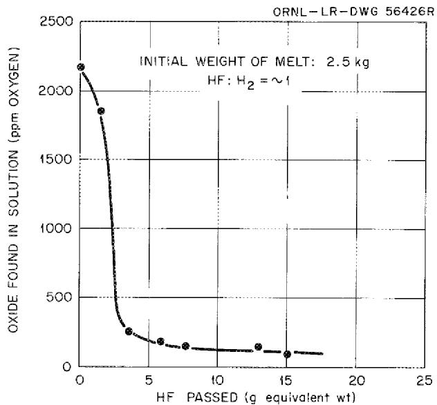  
Fig. 3. Removal of Oxide from $\mathrm{LiF - BeF_2}$ (63-37 mole %) at $700^{\circ}\mathrm{C}$ by Treatment with $\mathrm{HF - H_2}$ Mixtures.

use as a process control method. Accordingly, the production process treatment with HF was continued beyond practical reaction completion to ensure a suitable "oxide capacity" of those fluoride mixtures for inadvertent contamination during reactor operations.

Although HF has been used for oxide removal since the inception of the production process, procedures followed prior to the MSRE production effort utilized an alternate $\mathrm{HF - H_2}$ treatment. Hydrogen fluoride will readily attack structural metals and alloys that are suitable as salt containers at the operating temperatures of the production process by reactions of the type

$$
\mathrm {M} ^ {0} + 2 \mathrm {H F} \rightleftharpoons \mathrm {M F} _ {2} + \mathrm {H} _ {2}. \tag {2}
$$

This reaction is arrested in the gas phase of the treatment vessel by the formation of a rather impervious layer of the structural-metal fluorides on the metal surfaces. However, those surfaces which are in contact with the fluoride mixture are continually renewed by the dissolution of the structural-metal fluorides into the melt. Thus, by the alternate gas treatment method, removal times continually increased by the alternate oxidation and reduction of structural metals until failure of the treatment vessel occurred.

Studies of the thermodynamics of the corrosion mechanism, noted by Eq. (2), showed that chemical equilibrium in fluorides of interest in the MSBR could be achieved by sparging with mixtures of HF and hydrogen at controlled partial pressures. $^{1,2}$ On the basis of this investigation, studies of oxide removal according to Eq. (1) were made with HF admixed with hydrogen at concentrations which were essentially noncorrosive toward the salt container. Typical laboratory results of this study are shown in Fig. 3.

The application of $\mathrm{HF - H_2}$ mixtures in the fluoride purification process was further demonstrated on a larger scale by the in situ oxide cleanup of the simulated MSRE fuel salt used in the Engineering Test Loop

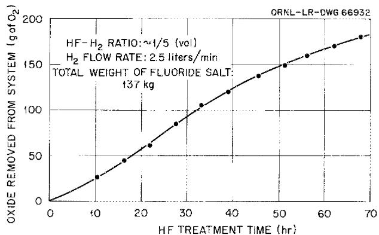  
Fig. 4. Removal of Oxides from the Engineering Test Loop by $\mathbf{HF}\cdot \mathbf{H}_2$ Treatment at $1050^{\circ}\mathrm{F}$

Facility. $^{1,3}$ Since the salt container of the loop was fabricated of Inconel, this demonstration illustrated the use of $\mathrm{HF - H_2}$ mixtures to reprocess fluorides contained in materials which are rapidly corroded by HF alone. The rate at which oxides were removed from the melt (Fig. 4) was determined by measurements of water evolution in the gas effluent. The results of chemical analyses of salt samples withdrawn periodically during the $\mathrm{HF - H_2}$ treatment showed that the dissolved oxide concentration diminished from values of $500~\mathrm{ppm}$ (apparent saturation with $\mathrm{ZrO_2}$ ) to less than $200~\mathrm{ppm}$ . The concentrations of structural metals dissolved in the fluoride melt were virtually unaltered by the $\mathrm{HF - H_2}$ treatment. However, metallographic examinations of the Inconel dip tubes used for sparging the fluoride melt with $\mathrm{HF - H_2}$ mixture showed that mild corrosion had occurred. These findings were more consistent with the measured corrosion equilibrium values at the HF concentration in $\mathrm{H_2}$ used for this operation. It is perhaps reasonable to assume that chromium and iron had been leached from the metal surfaces of the salt container whereby their rate of corrosion was restricted by their relatively low rate of diffusion in the metal. $^{1,4}$

# Sulfur Removal

Sulfur impurities must essentially be eliminated (<10 ppm) from molten-salt mixtures because of their corrosive attack on nickel-base alloys at elevated temperatures. These impurities are found in the starting materials primarily as sulfates and have been the most difficult impurity to remove. As currently understood, sulfates must first be reduced to sulfide ion; removal can then be effected by its volatilization as $\mathrm{H}_2\mathrm{S}$ by reaction with HF.

Earlier production procedures utilized the alternate HF and $\mathbf{H}_2$ treatment for sulfur removal. Although this method was reasonably effective, the discontinuity of sulfide removal by reaction with HF presented some difficulties in ascertaining quality control of the production batch. For example, incomplete reduction of sulfate prior to the last HF treatment would result in its reduction to sulfide during the final treatment of the melt with hydrogen. Therefore the number of alternate HF- $\mathbf{H}_2$ sparge treatments was normally increased for those mixtures known to contain significant concentrations of sulfur in the starting materials.

The development of the simultaneous HF- $\mathbf{H}_2$ sparge treatment for oxide removal was also applicable for sulfur removal. By continuous reduction of sulfate by hydrogen and volatilization as $\mathrm{H}_2\mathrm{S}$ by HF, effective sulfur removal should be achieved with minimum treatment periods. The results of a typical laboratory test

of this procedure are shown in Fig. 5. However, these data indicate that the average removal rate corresponded to about $1\%$ reaction of sulfide ion with HF. The rate-controlling step was presumed as the initial reduction of sulfate by hydrogen.

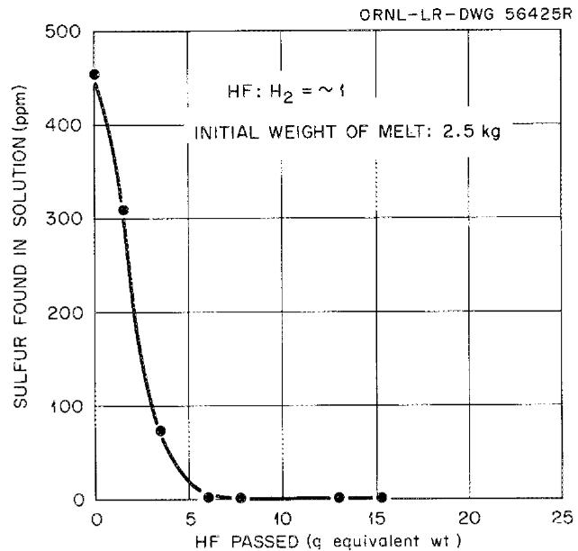  
Fig. 5. Removal of Sulfur from $\mathrm{LiF - BeF_2}$ (63-37 mole %) by Treatment with HF- $\mathbf{H}_2$ Mixtures at $700^{\circ}\mathrm{C}$ .

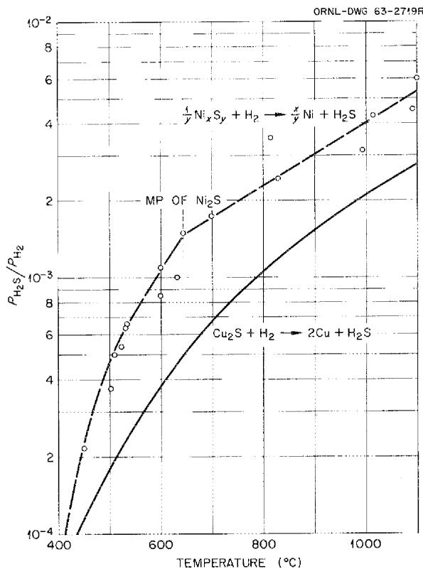  
Fig. 6. Ratio of $\mathbf{H}_2\mathbf{S}$ to $\mathbf{H}_2$ Pressures Required to Produce Sulfides of Nickel and Copper. The data points are from T. Rosenquist [J. Iron Steel Inst. (London) 176, 37 (1954)]; the lower solid curve was calculated from free-energy data [J. F. Elliott and M. Gleiser, Thermochemistry for Steelmaking, vol. 1, Addison-Wesley, Reading, Mass., 1960].

Separate studies of sulfate removal from molten LiF-BeF $_2$ (66-34 mole %) indicated that a principal sulfur removal mechanism, in addition to the evolution of H $_2$ S, is corrosion of the nickel or copper salt container. $^{15}$ This was similarly true when sparging with helium or hydrogen alone. The available thermodynamic data indicated that, indeed, direct reaction of SO $_4$ ^{2-}, its thermal decomposition products SO $_3$ and SO $_2$ , or H $_2$ S with nickel or copper to form metal sulfides and oxides is to be expected at process temperatures of 600 to 800°C. This investigation, therefore, pursued the rapid reduction of sulfate by an active metal such as beryllium,

$$
\mathrm {S O} _ {4} ^ {2 -} (\text {s o l n}) + 4 \mathrm {B e} ^ {0} (\text {c r y s t}) \rightleftharpoons 4 \mathrm {B e O} (\text {c r y s t}) + \mathrm {S} ^ {2 -} (\text {s o l n}), \tag {3}
$$

followed by sulfide removal with HF,

$$
2 \mathrm {H F} (\mathrm {g}) + \mathrm {S} ^ {2 -} (\mathrm {s o l n}) \rightleftharpoons \mathrm {H} _ {2} \mathrm {S} (\mathrm {g}) + 2 \mathrm {F} ^ {-} (\mathrm {s o l n}). \tag {4}
$$

According to published data shown in Fig. 6, a control of $\mathbf{H}_2\mathbf{S}$ to $\mathbf{H}_2$ ratios should prevent the reaction of $\mathbf{H}_2\mathbf{S}$ with nickel.

# Removal of Structural-Metal Impurities

The fused salt systems of the MSRE were constructed of Hastelloy N, a nickel-base alloy which contained 6 to $8\%$ chromium as a constituent. In reactor fuel systems of this type some depletion of the chromium activity in the surface layer was anticipated16 until the following equilibrium was established:

$$
\mathrm {C r} ^ {0} + 2 \mathrm {U F} _ {4} \rightleftharpoons 2 \mathrm {U F} _ {3} + \mathrm {C r F} _ {2}. \tag {5}
$$

If the molten fluoride fuel mixture additionally contained nonequilibrium concentrations of structural-metal fluorides more easily reduced than $\mathrm{UF}_4$ (e.g., $\mathrm{NiF}_2$ , $\mathrm{FeF}_3$ , or $\mathrm{FeF}_2$ ), then excessive chemical corrosion of the Hastelloy N container would occur. Similar corrosion mechanisms would also occur from non-uranium-bearing fluoride mixtures such as the secondary coolant of the MSRE. Structural-metal fluorides of this type might be present as impurities in the fluoride raw materials and may also be introduced by corrosion of the process equipment during production operations. Thus the control of their concentrations in the purified fluoride mixtures has been an important process consideration.

Although there are several structural-metal fluorides which would contribute to the corrosion process, production practices have generally been concerned with chromium, nickel, and iron as potentially significant impurities in the fused salt mixtures. Commercially available fluoride salts normally contain only iron as a major impurity; however, contamination by all three of these metals may result from corrosion of the process equipment. Chemical development studies have pursued reduction both by hydrogen and by active metals as methods for purifying fluoride mixtures.

Reduction of Structural Metals by Hydrogen. -- Since the inception of the fluoride purification process, structural-metal impurities have been reduced from solution in the molten fluoride by a final gas sparge treatment with hydrogen. At the operating temperatures of the process, nickel fluoride is readily reduced,

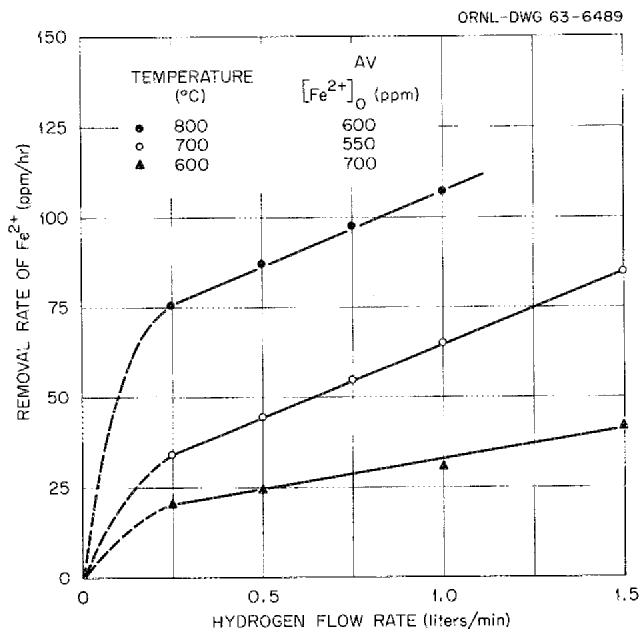  
Fig. 7. Reduction of $\mathrm{Fe}^{2+}$ in LiF-BeF $_2$ (66-34 mole %) at 600 to $800^{\circ}\mathrm{C}$ by Hydrogen Sparging.

iron fluoride is somewhat more difficult, and chromium fluoride is essentially inert to reduction for practical purposes. However, maximum chromium concentrations of 25 to 50 ppm that are present in most starting materials are not prohibitive for reactor applications.

Further development of the hydrogen reduction method was primarily realized from the use of $\mathrm{HF - H_2}$ mixtures for the removal of oxide ion under reducing conditions. By using pure nickel or copper for salt containment within stainless steel vessels, the introduction of corrosion products during HF treatment was effectively eliminated. As suggested by studies of high-temperature thermocouple research, $^{17}$ the presence of hydrogen would also reduce the corrosiveness of the $\mathrm{HF - H_2O}$ effluent gas mixture which accompanies the conversion of oxides to fluorides.

In adapting the production facility for the preparation of the relatively large quantities of fluorides needed for the MSRE, some consideration was given to the rates at which structural metals could be reduced from the molten solution. The results of a small-scale experiment which examined the reduction of iron from approximately $2\mathrm{kg}$ of $\mathrm{LiF - BeF_2}$ (66-34 mole $\%$ ) are shown in Fig. 7. Although the gas-liquid contact conditions of these experiments could not be scaled to larger equipment, the results clearly indicated the effect of temperature on the reduction process. The initial instantaneous rates at realistic iron concentrations in the fluoride melt were not prohibitively slow. In a similar but larger experiment conducted in the production facility, values for the relative reaction velocity constant as a function of hydrogen sparge rates were determined. These results, shown in Fig. 8, indicated that hydrogen sparging rates of about 10 liters/min would accelerate the reduction rate by about $200\%$ over that obtained with the hydrogen flow rate of 3 liters/min customarily used. Sparge rates greater than 10 liters/min caused frequent entrainment of salt in the gas effluent lines.

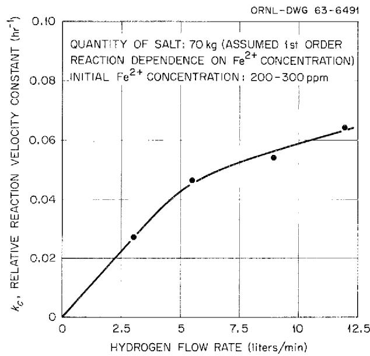  
Fig. 8. Effect of Hydrogen Sparge Rates on the Relative Rate of Reduction of $\mathrm{Fe}^{2+}$ from Solution in LiF-BeF $_2$ (66-34 mole %) at $700^{\circ}\mathrm{C}$ in the Fluoride Production Facility.

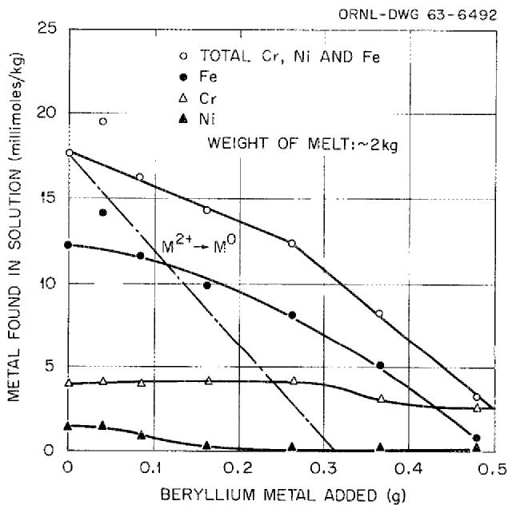  
Fig. 9. Reduction of Structural-Metal Fluorides from Solution in $\mathbf{LiF - BeF}_2$ (66-34 mole %) at $600^{\circ}\mathrm{C}$ by Beryllium Metal.

Reduction of Structural Metals by Beryllium and Zirconium. - Although the process of hydrogen reduction was adequate for routine production, a capability for reclaiming materials contaminated with chromium was needed. Such instances would arise from failure of the nickel or copper liner within the stainless steel preparation vessel, from detachment of metal oxide or fluoride scale formed on stainless steel surfaces in the gas phase of the preparation vessel, and from raw materials containing impurities in excess of those

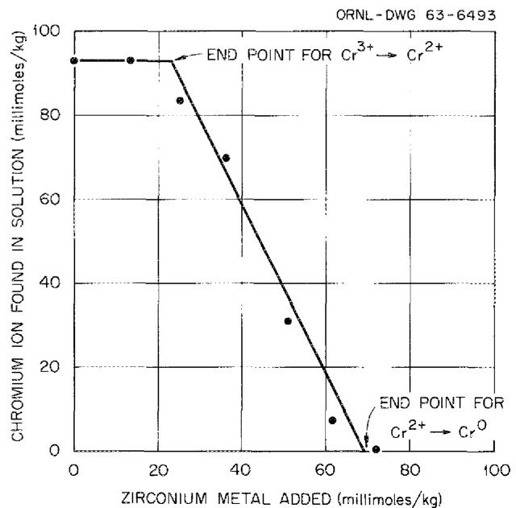  
Fig. 10. Removal of Chromium from Solution in $\mathbf{LiF - BeF}_2$ (66-34 mole %) at $600^{\circ}\mathrm{C}$ by Additions of Zirconium Metal.

given by representative analyses. The choice of reducing agents for use in production for the MSRE was limited to those metals whose cations were a primary constituent of the molten fluoride mixture. However, metallic lithium was not considered because of its low density, its low melting point, and its incompatibility with nickel or copper at process temperatures. Thus beryllium was proposed as a reducing agent for the MSRE coolant, flush, and fuel solvent salt mixtures; zirconium was an alternative for reducing impurities from the fuel solvent mixture.

In one development test, beryllium metal turnings were added in weighed increments to a molten mixture of $\mathrm{LiF - BeF_2}$ (66-34 mole %) at $600^{\circ}\mathrm{C}$ . The melt initially contained about 12 millimoles of iron per kilogram of melt (670 ppm by weight) and about 4 millimoles of chromium per kilogram of melt (210 ppm by weight). The analytical results from filtered samples of the salt taken after each beryllium addition are shown in Fig. 9. These data indicated that structural metals could be reduced to reasonably low concentrations by beryllium. The results of a similar experiment illustrating the reduction of chromium from the same fluoride solvent by zirconium are shown in Fig. 10. A third experiment examined the comparative reducing power of beryllium and zirconium. The results of this test showed that beryllium would reduce $\mathrm{ZrF_4}$ from solution in $\mathrm{LiF - BeF_2}$ (66-34 mole %).

# 4. THE PRODUCTION PLANT

The fluoride production facility was constructed on a 40- by 40-ft area in the high bay of Building 9201-3 within the Y-12 Plant. To meet industrial hygiene requirements for handling beryllium and other toxic fluoride salts, the facility was essentially totally enclosed and equipped with an air ventilation and filtration system that provided about three air changes per minute (14,000 cfm). This air flow also maintained the atmosphere of the production facility at a negative pressure with respect to the outside area to control airborne contamination. Specific work areas within the production plant were compartmented and provided with direct exhaust air ducts and filtered makeup air. All exhaust air from the facility was

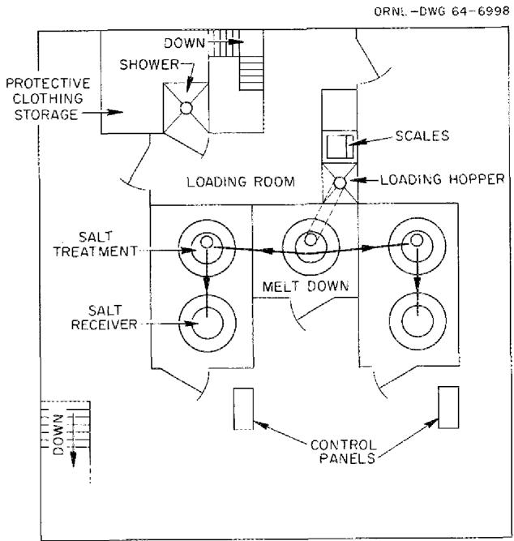  
Fig. 11. Fluoride Production Facility - Layout of Operating Level.

passed through a bank of absolute filters before discharge outside the building. In addition, all liquid wastes from the plant were piped to a large holdup tank for analysis before discharge into the Y-12 waste system. On the basis of industrial hygiene reports of analyses of surface, waste, and airborne samples throughout the production history, these provisions have adequately maintained a safe working environment within the facility as well as the surrounding area.

The production facility was constructed on three levels to facilitate maintenance and operating procedures. The lower level housed change room facilities, auxiliary equipment, and accesses to process furnaces for maintenance purposes. The second floor was the main operating level. The third floor provided hatched accesses to the furnace compartments and fluoride loading room for service purposes. The roof of the production facility also had removable sections to permit use of the overhead building crane for inloading and outloading heavy equipment and supplies. The equipment and supply storage area was on the lower building level and was also accessible to the building crane.

Fused fluoride mixtures were produced in two batch processing units. Prior to the MSRE production commitment each batch unit was individually loaded with starting materials from a transfer hopper. The normal batch cycle included a 48-hr cooling period before the furnace could be reloaded. Requirements for large quantities of fluorides having identical chemical composition made feasible the use of a single furnace assembly for the initial loading and melting of starting materials. This modification to the facility provided a molten charge to each batch processing unit. By proper scheduling the two production units could be operated on a semicontinuous schedule without loss of time for furnace cooling. In addition, the relocation of the raw materials loading area adjacent to the meltdown furnace facilitated materials handling. Figure 11 shows the floor plan of the main operating level of the production facility and indicates the flow of materials through the processing units.

# Raw Materials Charge

Because of the toxicity of fluoride salts (beryllium fluoride in particular) the design of the loading room and formulation of handling procedures were intended to minimize exposure of operating personnel to

hazardous conditions and to confine fluoride contaminants. The loading room was isolated from other areas of the production plant by shower facilities and air locks. Two doors which opened to the main operating level were sealed for emergency use only. To gain normal entrance to the loading room, the operator donned only long underwear, shoes, and socks in the change room (lower level) and proceeded through a shower stall, contaminated change room, and air lock to the stairs leading to the operating level. At this station the operator dressed in a fully protective plastic fresh-air suit, stepped through a shower facility, and then entered the loading room. Fresh-air supply points for the suits were located in the loading room, shower, and protective clothing area for convenience. Upon completion of loading room duties, the operator departed by the entrance route. The shower adjacent to the loading room served for decontaminating the plastic fresh-air suits. The operator showered himself before entering the main change room. The loading room was manned by two operators and one outside observer.

Selected fluoride salts were individually loaded into a tared transfer container by hoist assist, moved, in line, to scales for weighing, and then transferred to the meltdown furnace by means of a vibratory conveyor. The outside observer verified all weighings and oversaw the loading of the meltdown furnace. Following each furnace loading operation the loading room was vacuum cleaned. This operation, together with room air exhaust near the loading hopper, prevented the accumulation of hazardous materials within the facility. Figure 12 depicts operation of the loading room just prior to its initial use.

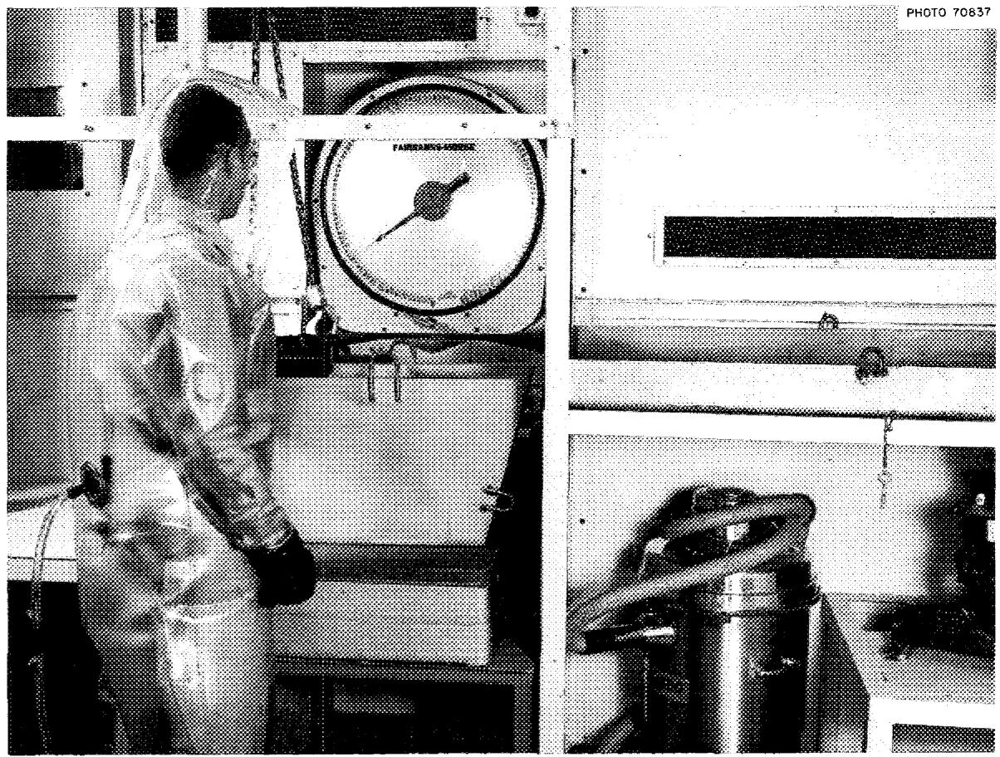  
Fig. 12. Fluoride Production Facility - Raw Materials Handling Area.

# Meltdown and Pretreatment

The meltdown furnace assembly, shown in Fig. 13, adjoins the raw materials loading room and was operated to provide a molten material charge to each of the two adjacent batch processing units. Materials were fed through the extended 3-in.-diam tube of the vibratory conveyor and were dropped into the furnace assembly. This vessel was constructed of 6 ft of 12-in.-ips sched 40 stainless steel 304L pipe lined with $\frac{1}{8}$ -in. nickel sheet and was surrounded by a 50-kVA furnace of commercial design.

In addition to the initial melting and mixing of raw materials, some pretreatment of the fluoride mixture was achieved. The meltdown operation required approximately 4 to $6\mathrm{hr}$ , during which absorbed water was volatilized and removed by gas purge. Metallic reducing agents were also incorporated in the loading operation to reduce sulfates and structural-metal fluorides. Upon melting, gas sparge rates with hydrogen and argon were increased to remove carbon by entrainment. At the conclusion of this

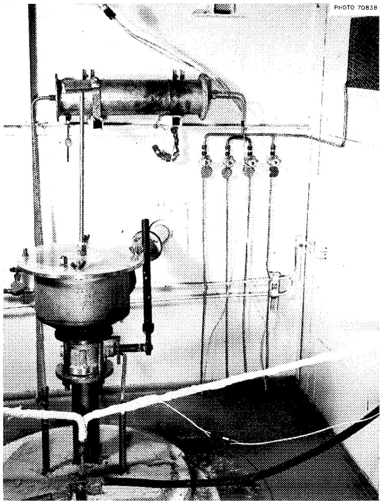  
Fig. 13. Fluoride Production Facility - Meltdown Furnace Assembly.

pretreatment period the molten fluoride was piped on demand to either batch processing unit. Some separation of insoluble materials by decantation was achieved during this operation.

# The Batch Process

Each of the two processing units was designed with two primary salt containers. The larger of the two, the salt treatment vessel, was constructed from a 6-ft length of 12-in.-ips 304L stainless steel pipe and was sized to contain the solid bulk charge of salts that would correspond to about $2\mathrm{ft}^3$ in the molten state. An inner liner fabricated from $\frac{1}{8}$ -in. grade A nickel sheet provided primary salt containment. Except for conventional flanged access ports and threaded gas line connectors, the vessel was of welded construction. In addition, the inner surfaces of the stainless steel vessel were plated with nickel to retard corrosion of the vessel by HF and water vapor. The salt storage vessel (salt receiver) was incorporated as a pretreatment for oxide removal and for minimizing contamination of the prepared salt mixture. This vessel was constructed of grade A nickel, 12 in. in diameter and about 3 ft in length. Five access ports for small-diameter $(\frac{1}{2}$ -in.) tubing were welded into the top of the vessel.

The salt receiver vessel was connected by a small-diameter tube to the dip line in the treatment vessel as shown generally by Fig. 14. During the salt purification step, treatment gases were introduced into the

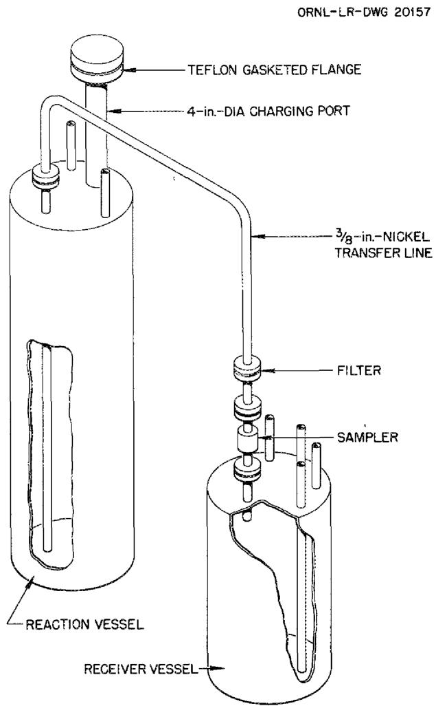  
Fig. 14. Fluoride Production Facility - Salt Treatment and Receiver Vessels.

receiver vessel, passed through the connecting line, and flowed out of the dip tube for sparging the fluoride mixture. At the conclusion of the production procedure, the differential gas pressure on the two vessels was adjusted so that the salt charge would flow through the connecting transfer line and a filter disk of sintered nickel (0.0015 in. pore diameter) before discharge into the salt receiver. A reference sample of the salt was withdrawn after salt transfer rather than as shown in the sketch.

Temperature requirements for this batch process were achieved by electrical resistance heating. The salt treatment vessel was surrounded by a 50-kVA furnace with a 15-in.-diam well of commercial design. A stainless steel vessel with a closed bottom and open, but flanged, top served as a furnace liner and support for the salt treatment vessel. The salt receiver was heated by a similar but smaller furnace rated at $23\mathrm{kVA}$ . However, this vessel was suspended from a support frame. The furnace was mounted on a cable, pulley, and counterweight assembly which allowed the furnace to be lowered from around the salt receiver for rapid cooling. Small-diameter tubing which served as transfer lines for molten salts was heated directly by a low-voltage alternating current. A photograph of one of the batch facilities is shown as Fig. 15. Furnace

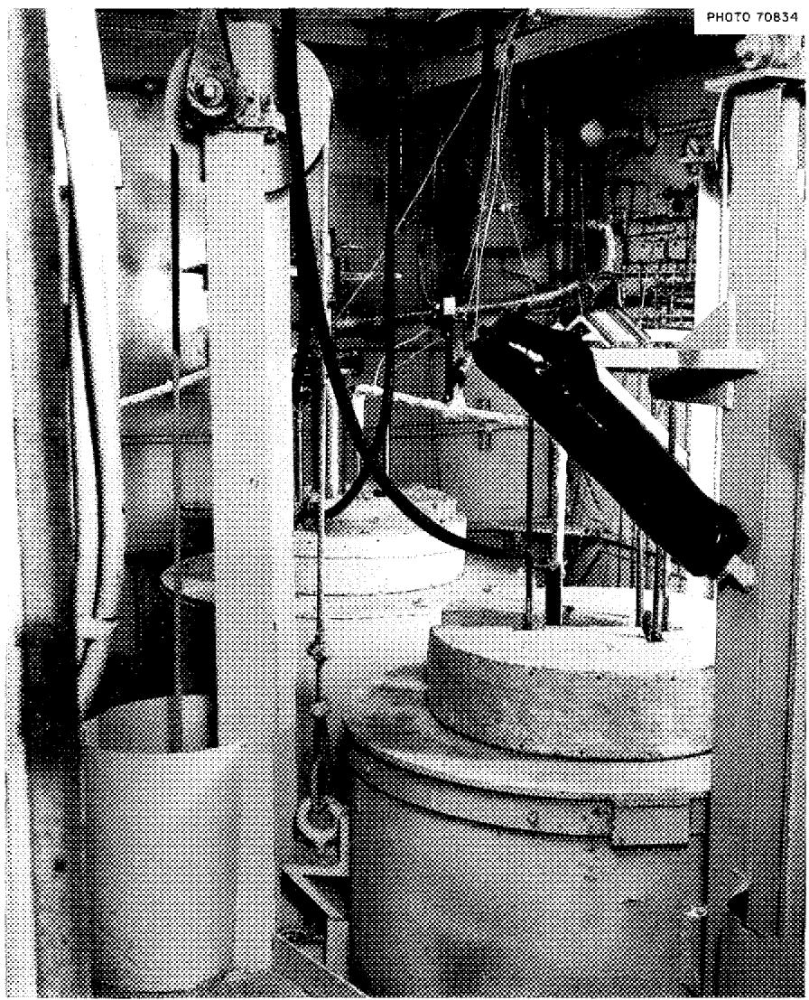  
Fig. 15. Fluoride Production Facility - Batch Processing Unit.

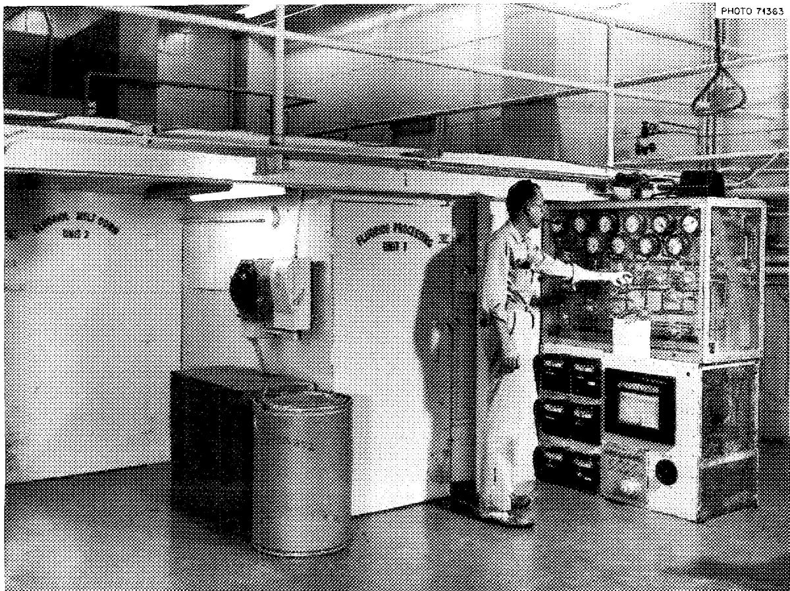  
Fig. 16. Fluoride Production Facility - Process Control Unit.

controls and the gas influent manifold were located in a central control panel outside the process cubicle (Fig. 16). Temperature control was achieved by two on-off controllers connected in series to protect against an excess temperature condition. This control circuit would also activate a local and general building alarm system.

A simplified schematic flow diagram of the unit process is shown in Fig. 17. The gas influent system provided for the alternate use of hydrogen, helium, or vacuum and for mixing anhydrous HF with either process gas. Flow rates for hydrogen and helium were determined by a conventional rotameter. Concentrations of HF in the influent gas were determined (relative to the flow of carrier gas) by direct titration of a side stream with standard caustic solution. The gas manifold of each production unit was additionally arranged for control of salt transfer, both into the treatment vessel from the meltdown furnace and into the salt storage vessel.

Process control was exercised primarily on the basis of results obtained from off-gas analyses. This analytical station was located outside of but adjacent to the furnace cubicle. Direct titration of a side stream for its HF content provided material balance information during the oxide removal step and denoted the extent of reduction by hydrogen during the final phase of the purification process. The gas effluent was passed through a cold trap, maintained at $-12^{\circ}\mathrm{C}$ by refrigeration, to condense essentially all of the water vapor and most of the HF during the oxide removal process. The contents of this trap were drained periodically and analyzed for HF. The inferred volume of water collected was also indicative of the rate of oxide removal from the salt.

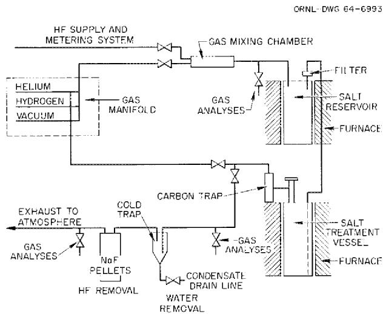  
Fig. 17. Fluoride Production Facility - Simplified Schematic Process Diagram.

Waste HF could be effectively removed from the effluent gas by absorption on sodium fluoride pellets. Two columns, $3\frac{3}{4}$ in. in diameter and 3 ft long, sufficed for this operation. The gas effluent downstream from these columns was analyzed periodically to determine the frequency of regeneration of the sodium fluoride beds. Waste gases were bubbled through a "seal pot" filled with a fluorocarbon oil and exhausted to the atmosphere through a $\frac{1}{2}$ -in.-ips sched 40 iron pipe. Figure 18 is a photograph of the off-gas system and shows the cold trap, seal pot, and exhaust gas line.

# Auxiliary Systems

Although the gas handling systems of the production plant were quite simple, their design met specific requirements of the purification process. Each auxiliary system supplied both batch production units and the meltdown furnace.

Vacuum System. - Two Kinney pumps, each rated at 110 cfm and driven by 5-hp motors, were used alternately as the supply and reserve source of vacuum. Although HF was not routinely pumped into the vacuum system, soda-lime traps followed by columns packed with activated alumina were incorporated in the manifold to permit limited exposure of the system to corrosive conditions of the process.

HF Supply. Anhydrous hydrogen fluoride of high purity was obtained commercially in 200-lb cylinders. Since HF boils at about $19^{\circ}\mathrm{C}$ , its pressure in the supply system was regulated by temperature control. The cylinder was totally enclosed in a constant-temperature air bath and operated at 10 to 15 psig in the system. Gas lines were traced with insulated Nichrome wire and maintained above $100^{\circ}\mathrm{C}$ by electrical resistance heating. This feature prevented the condensation of HF in the lines and stabilized the polymerization state of the gas.[18] The HF flow into each production unit was controlled by a needle valve and indicated by the differential gas pressure across a sintered nickel filter barrier. All gas lines were of nickel; valves of commercial design were of Monel or stainless steel construction.

Helium Supply. - Helium was obtained from the Y-12 Plant manifold system. However, because of the sensitivity of the molten fluorides to water vapor, it was passed through Linde molecular sieve 4A to ensure

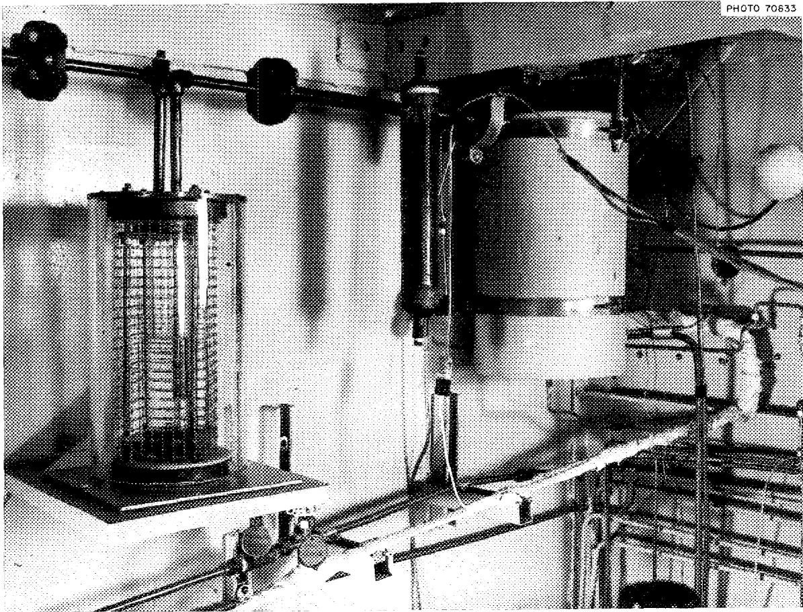  
Fig. 18. Fluoride Production Facility - Off-Gas System.

dryness. Helium entering the process was periodically monitored by a MEECO electrolytic moisture analyzer to detect moisture breakthrough in the trap. Maximum water vapor concentrations were specified at 10 ppm and normally did not exceed 5 ppm.

Hydrogen Supply. - Hydrogen was supplied solely to the fluoride production facility from a 12-bottle manifold. Standard-grade hydrogen (99.5%) was used for all operations involving hydrogen. However, impurity oxygen was converted to water by reaction on a Deoxo platinum catalyst unit having a 50-cfm capability. Water was removed by absorption on molecular sieve. Because of the relatively large concentration of water, four columns, $3^{3/4}$ in. in diameter by 5 ft long, filled with absorbent, were operated in series to maintain water concentrations at less than 35 ppm. Three of the four columns were in continuous use. A rotation schedule was followed so that the fourth column could be regenerated as required. Water concentrations in the hydrogen effluent from the absorption columns were monitored semicontinuously with the MEECO moisture analyzer.

Salt Storage. - After cooling the finished salt batch and removing it from the processing facility, the salt storage vessel was wiped by wet sponging to remove possible salt contaminants. The container was then moved to the salt storage facility. This facility consisted of a helium manifold system and was arranged to allow access to each container by electric hoist and identification by a batch card system. Although the salt containers could be sealed against atmospheric contamination, their connection to a live helium pressure ( $\sim 10$ psig) ensured against possible leaks through the tube fittings or undetected cracks in the vessel walls.

# 5. PRODUCTION OF COOLANT, FLUSH, AND FUEL SOLVENT

Actual production of fluoride mixtures for the MSRE was started on March 1, 1964, in anticipation of reactor loading during the second quarter of FY 1965. A three-shift seven-day work schedule was pursued throughout production operations with one technician-operator and one maintenance mechanic assigned to each rotating shift. Production of the coolant and flush salts, $^7\mathrm{LiF - BeF}_2$ (66-34 mole $\%$ ), was completed on September 7, 1964. A total of 15,964 lb of the salt mixture was produced out of 16,104 lb of raw materials charged to the facility in 61 batch operations. On this basis the overall production rate was about 4.7 ft $^3$ (560 lb) per week, including time for plant shakedown and interruptions for maintenance. The average batch cycle was about 150 hr.

Although this material was considered acceptable for use in the MSRE, a reprocessing schedule was undertaken for the interim period before loading the coolant system of the reactor during the latter part of October 1964. This operation not only permitted upgrading those batches having higher impurity concentrations but also permitted an evaluation of oxide removal. Twenty-one batches were recycled through the purification process on the basis of their production history. Three of the first four reprocessed batches showed further water removal of 125 to $235\mathrm{ppm}$ oxide equivalence in the salt, two batches of the next six showed 130 and $187\mathrm{ppm}$ oxide, and one batch of the remaining eleven had $125\mathrm{ppm}$ of removable oxide. All other batches had less than $30\mathrm{ppm}$ oxide equivalence in the salt.

Production of the fuel solvent mixture, $^7\mathrm{LiF - BeF}_2 - \mathrm{ZrF}_4$ (64.7-30.1-5.2 mole %), began on Nov. 4, 1964, and was completed on March 10, 1965. A total of 10,545 lb of this material was produced from 10,690 lb of raw materials charged to the production facility in 36 batch operations. The average batch cycle time was 152 hr.

The depleted fuel concentrate, $^{7}\mathrm{LiF - }^{238}\mathrm{UF_4}$ (73-27 mole %), was produced in a single batch at the conclusion of the fuel solvent preparation. About 624 lb of starting material was charged directly to a new salt treatment vessel, heated above its melting point, and treated for 122 hr. The batch was then divided between two salt storage containers to facilitate its handling. A total of 620 lb of this mixture was recovered for delivery to the MSRE. The operation of the main production facility was concluded with this preparation on March 12, 1965.

# Process Operating Conditions

The operating conditions used in the preparation of these fluoride mixtures for the MSRE were based primarily on prior production practices and existing equipment. However, some modifications were made possible as a result of chemical development studies. These changes were largely reflected in the hydrofluorination step and process control procedures.

HF- $\mathbf{H}_2$ Treatment. - Although the purification procedure was generally considered a two-step process, the operating conditions chosen for the hydrofluorination step were also related to the subsequent reduction of structural-metal difluorides. The corrosion of the nickel-lined process vessel according to the reaction

$$
2 \mathrm {H F} + \mathrm {N i} ^ {0} \rightleftharpoons \mathrm {N i F} _ {2} + \mathrm {H} _ {2} \tag {6}
$$

was considered in establishing upper limits for HF concentrations in hydrogen. Discrete values for the equilibrium quotients for the reactions

$$
\mathrm {O} ^ {2 -} + 2 \mathrm {H F} \rightleftharpoons \mathrm {H} _ {2} \mathrm {O} + 2 \mathrm {F} ^ {-} \tag {7}
$$

and

$$
\mathrm {O H} ^ {-} + \mathrm {H F} \rightleftharpoons \mathrm {H} _ {2} \mathrm {O} + \mathrm {F} ^ {-} \tag {8}
$$

were not available when production operations began; however, experimental results had shown that relatively low HF concentrations would suffice for effective oxide removal from the fluoride mixtures. Process temperature was a third factor in that lower temperatures favored oxide removal and also corrosion of the process equipment. Operating conditions established on these process variables were further modified by limitations from off-gas analytical and handling procedures.

Although liquidus temperatures for the MSRE fluoride mixtures were in the range of 450 to $500^{\circ}\mathrm{C}$ , a process temperature of $600^{\circ}\mathrm{C}$ was chosen for the oxide removal step on consideration of the polythermal conditions which existed in the treatment vessel under static conditions and the effects of temperature on the process reactions. According to equilibrium data by Blood, $^{12}$ the concentrations of HF in hydrogen which would maintain the $\mathrm{NiF}_2$ content of the melt at an arbitrary value of 25 ppm would be about $38\%$ by volume at $600^{\circ}\mathrm{C}$ and decrease to about $23\%$ at $500^{\circ}\mathrm{C}$ . Production operations were begun with HF concentrations of $10\%$ in hydrogen at 1 atm pressure. Minimum conditions for discontinuing the HF treatment were set at a water evolution rate of less than $2\mathrm{g/hr}$ on the basis of the sensitivity of the off-gas analytical method. The results of early production runs showed that water evolution rates initially approached stoichiometric limits and then rapidly diminished below the arbitrary control level at the conclusion of the process step. Although this control level for water removal corresponded to an average oxide removal rate of 15 ppm/hr, subsequent calculations of oxide and hydroxide ion concentrations in the melt which would be in equilibrium with 1 atm of HF and a water vapor pressure of 0.0046 atm, corresponding to the control limit, yielded very low values. According to equilibrium data by Mathews and Baes, $^{19}$ the oxide content of the melt would vary from 0.44 ppm at $600^{\circ}\mathrm{C}$ to 0.02 ppm at $500^{\circ}\mathrm{C}$ , and corresponding hydroxide concentrations would vary from 11 to 4 ppm.

The planned operation of the production facility called for an evaluation of oxide removal rates at higher HF concentrations up to limiting values. However, prolonged use of higher concentrations introduced complications in the off-gas system. As an attempt to reduce possible contact of the fluorides with extraneous water vapor sources, HF was stripped from the waste gas stream by adsorption on sodium fluoride pellets rather than by conventional caustic scrubbers. This trapping system was sufficiently effective at the $10\%$ HF concentration level to permit direct discard of the hydrogen effluent to the atmosphere. At significantly higher HF concentrations in the process influent stream, the partial pressure of HF in the waste gas became prohibitively high for direct discard. As shown by Fig. 19, typical oxide removal times were about 35 hr for processing the flush and coolant mixture. This time requirement was considered compatible with the degree of operator control available for the process. Consequently, increasing the concentration of HF would require modifications of the off-gas system and increased operator attention.

The removal of sulfur from the fluoride mixtures was also accomplished during the hydrofluorination treatment step. However, its effective removal proved more difficult than was anticipated from earlier development studies. The $\mathrm{H}_2\mathrm{S}$ in the gas effluent was collected periodically in an ammoniacal cadmium chloride solution and titrated with a standard iodine solution. Material balances on sulfur evolved, as $\mathrm{H}_2\mathrm{S}$ , were compared with the quantity of sulfur believed to be present in the raw materials charge. These values

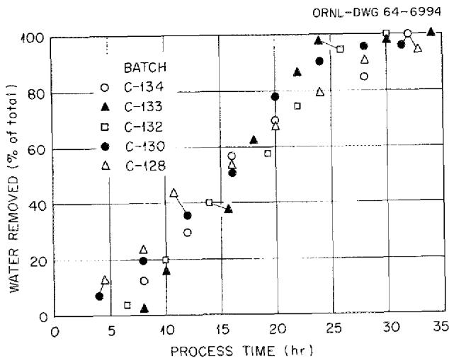

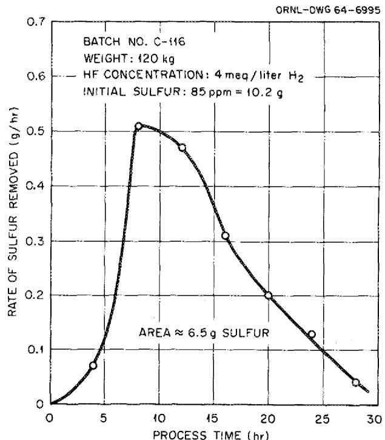  
Fig. 19. Fluoride Production for MSRE - Removal of Oxides from $^{7}\mathrm{LiF - BeF}_2$ (66-34 mole %) During HF- $\mathbf{H}_2$ Treatment at $600^{\circ}\mathrm{C}$ .   
Fig. 20. Fluoride Production for MSRE - Removal of Sulfur Impurities from $^{7}\mathrm{LiF - BeF}_2$ (66-34 mole %) During HF- $H_2$ Treatment at $600^{\circ}C$ .

were often in disagreement and probably resulted from the deposition of nickel sulfide in the meltdown furnace. However, the results of these off-gas analyses could be empirically related to the concentration of sulfur remaining in the melt. Following each addition of beryllium metal, the concentration of $\mathbf{H}_2\mathbf{S}$ in the off-gas was found to increase (Fig. 20) when sulfur, presumably as sulfate, remained in the melt.

Consequently, sulfur removal was considered complete when an addition of beryllium metal failed to result in an increase in the $\mathrm{H}_2\mathrm{S}$ evolution rate. Repeated additions of beryllium metal followed by prolonged HF treatment periods (beyond that required for oxide removal) were frequently necessary to satisfy this control condition. Subsequent analyses of salt samples from these preparations consistently showed sulfur concentrations of less than 5 ppm in the finished product.

Although an efficient sulfur removal process was not attained prior to or by this production effort, sulfur impurities were present in the $\mathrm{BeF}_2$ raw material of only one-third of the production batches. Its removal was not unduly restrictive on the overall production effort. The development of sulfur-free beryllium fluoride by the commercial manufacturers has precluded further interest in the development of this aspect of the fluoride production process.

Reduction of Structural Metals. The reduction of structural metals from solution in the molten fluorides was generally considered as the final phase of the production process. However, the use of a separate meltdown furnace for this production commitment was adaptable to pretreatment of the fluoride mixtures with beryllium metal prior to their transfer into the salt treatment vessels. The amount of beryllium metal added with each raw materials charge was based on the concentrations of reactive impurities (sulfur, chromium, nickel, iron, and water) in the starting salts. As conducted, the effects of this reduction step were incomplete, but iron concentrations of materials discharged to the salt treatment vessel were reduced to about 200 ppm. The effectiveness of this reductive measure was further limited by the efficiency of the liquid-solid separation process. Filtration of salt into the treatment vessel was not feasible because suspended oxide particles in the salt mixtures rapidly plugged the sintered nickel filter. Therefore, separation of reduced metal particles from the molten fluorides depended upon decantation.

Beryllium and zirconium metals were found to be effective reductants for chromium, nickel, and iron fluorides during development tests. However, their use in the final phase of the purification procedure was curtailed because of process control limitations. The reactions of these active metals in reducing structural-metal fluoride impurities were found to be nonstoichiometric during development tests, probably because of surface coating of the active metals with reduced materials. In addition, these particles were believed to be more extensively suspended in the fluoride melt, on the basis of filtration tests, because of reduced particle size or lower density of the coated particle. Thus, one consideration of the use of active metals as reducing agents was the dependency of the actual separations process on the integrity of the filter used during transfer of finished batch to the storage container. The effect of these metals on the MSRE fuel system had not been evaluated at this time. Since the addition of large excesses of active metals to the fluoride mixture was also not advised, process control measures would have been required to ensure the satisfactory reduction of structural-metal impurities from the salt mixture. Thus, process time saved by rapid reaction of strong reducing agents was diminished by time required for chemical analyses or other, more direct, analytical methods. The routine use of these active metals would have also required the development of apparatus for their addition to the melt without exposure to air or other source of oxide contamination.

The removal of structural metals from solution in the fluoride mixtures depended primarily on reduction by hydrogen. Since reduction rates were known to increase with increased temperature, the melt temperature was raised to $700^{\circ}\mathrm{C}$ . Higher temperatures were avoided to prolong the service life of the furnaces. By the hydrogen sparge technique, the reduction of structural-metal fluorides, together with the corresponding evolution of HF, was a steady-state process. Therefore the concentration of HF in the gas effluent stream could be empirically related to the concentration of iron fluoride which remained in the melt. This relation, obtained for production of the MSRE fuel solvent mixture, is shown in Fig. 21. The hydrogen sparge treatment was terminated when the HF concentration in the gas effluent dropped below

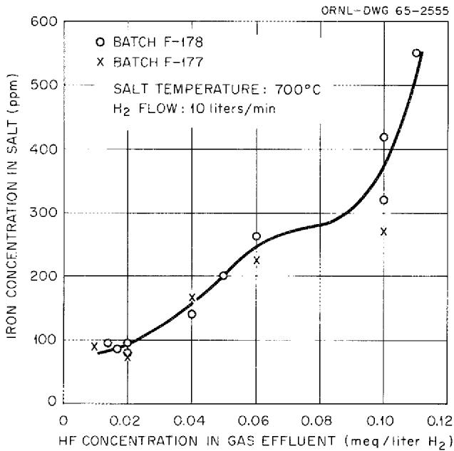  
Fig. 21. Reduction of Iron Fluoride from MSRE Barren Fuel Solvent at $700^{\circ}\mathrm{C}$ by Hydrogen Sparging.

0.02 milliequivalent per liter of hydrogen. A similar determination was made for the binary coolant and flush salt mixture. This control limit was set at 0.01 milliequivalent of HF per liter of $\mathbf{H}_2$ . The difference in these control points was not explored but was assumed as a solvent effect.

# Process Control

The preparation of acceptable fluoride mixtures for the MSRE depended on process control measures for each phase of the production operation. Records were provided that showed the source, quality, and quantity of raw material used in each production batch. Each storage container had numbers impressed into the top and side for positive identification.

Although operational control of the process depended upon analyses of the process gas streams, the quality of each salt batch was determined from chemical analyses of the product. Samples of the melt were withdrawn at the conclusion of each treatment period and at more frequent intervals when needed for further evaluation of the process. These samples were obtained in copper filter tubes which had been previously fired in an atmosphere of flowing hydrogen. The holding device was designed to protect the sampler from atmospheric contamination following the hydrogen firing operation and throughout the sampling procedure. This assembly also permitted sampling of the melt without disturbing process conditions. In addition, a larger sample of the salt was withdrawn from the finished batch after its transfer to the storage container. This sample was retained for reference purposes.

Chemical analyses of the filtered salt sample taken just prior to salt transfer into its storage container were considered to be representative of the production batch. Averages of concentrations of pertinent impurities found in the various production batches are shown in Table 5. Values shown for "oxide removed" were determined from quantities of water collected in the effluent gas cold trap during the hydrofluorination treatment.

Since the oxide removed column reflects water removal after melting and during hydrofluorination, the quantities removed indicate the initial oxide and hydroxide content of the melt. The reported value for the oxide solubility of the flush and coolant mixture, $\mathrm{LiF - BeF_2}$ (66-34 mole %), is about 200 ppm at $600^{\circ}\mathrm{C}$ ;

Table 5. Fluoride Production for the MSRE - Average of Chemical Analyses of Salt Batches   

<table><tr><td rowspan="2">Salt Mixture</td><td rowspan="2">Chemical Composition (mole %)</td><td colspan="5">Average Concentration of Impurities (ppm)</td></tr><tr><td>Cr</td><td>Ni</td><td>Fe</td><td>S</td><td>Oxide Removed</td></tr><tr><td>Coolant</td><td>\( ^7\text{LiF-BeF}_2 \)(66-34)</td><td>19</td><td>26</td><td>166</td><td>&lt;5</td><td>1460</td></tr><tr><td>Flush</td><td>\( ^7\text{LiF-BeF}_2 \)(66-34)</td><td>16</td><td>39</td><td>123</td><td>&lt;5</td><td>1650</td></tr><tr><td>Fuel solvent</td><td>\( ^7\text{LiF-BeF}_2\text{-ZrF}_4 \)(64.7-30.1-5.2)</td><td>21</td><td>15</td><td>77</td><td>&lt;5</td><td>728</td></tr><tr><td>Depleted fuel concentrate</td><td>\( ^7\text{LiF}-^{238}\text{UF}_4 \)(73-27)</td><td>9</td><td>15</td><td>50</td><td>&lt;5</td><td>386</td></tr></table>

the corresponding value for the fuel solvent mixture, $\mathrm{LiF - BeF_2 - ZrF_4}$ (64.7-30.1-5.2 mole %), is about 380 ppm. $^{20}$ Thus the oxide removed from the fluoride mixtures was clearly in excess of solubility limitations. The lower quantities of water removed from the fuel solvent resulted from an alteration in the production procedure. During the first two batch preparations of the fuel solvent mixture, hydrofluorination periods in excess of $100\mathrm{hr}$ were necessary for oxide removal. These requirements indicated that the rate-controlling step was either the reaction of HF with solid $\mathrm{ZrO_2}$ or the dissolution of $\mathrm{ZrO_2}$ in the melt. During subsequent preparations the molten charge in the meltdown furnace was maintained quiescent before transfer to the treatment vessel, and the length of transfer tube in the meltdown furnace was also shortened by 2 to 4 in. This technique permitted effective decantation of the fluoride mixture from solid $\mathrm{ZrO_2}$ . The quantity of zirconium lost from each batch was negligible, and the HF treatment times were reduced to about $30\mathrm{hr}$ .

# Lithium Fluoride Densification

With the exception of $^{7}$ LiF, fluoride salt starting materials, as received, could be charged directly to the meltdown furnace. The lithium fluoride was found to have a very low bulk density and to contain excessive quantities of water. Direct use of this material would have resulted in loss of production capacity, frequent changeout of filters in the main ventilation system, uncertainties in material balances, and perhaps excessive oxide contamination in the molten charge to the batch processing units. Consequently, pretreatment of the $^{7}$ LiF to improve its bulk properties was desired. Although this material was found economically unsuitable for pelletizing, the results of a study of its sintering characteristics,[21] shown in Fig. 22, indicated that an acceptable material could be obtained by a relatively inexpensive operation.

Intermediate-scale tests were made to develop a processing procedure and to examine the feasibility of pretreating the entire amount (22,000 lb) of LiF that was on hand. These tests showed that periodic agitation of the LiF while heating to $650^{\circ}\mathrm{C}$ was necessary to produce a free-flowing granular product. Anhydrous HF was admixed with the helium sweep gas while the charge was heated to about $400^{\circ}\mathrm{C}$ to convert LiOH, either initially present or formed by pyrohydrolysis, to LiF. Otherwise, heating to $650^{\circ}\mathrm{C}$ permitted the LiOH to fuse with the LiF and form an intractable mass.

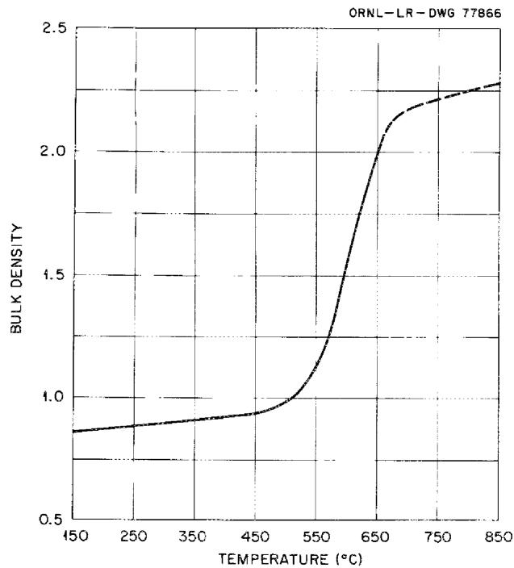  
Fig. 22. Densification of Precipitated LiF by Annealing at Various Temperatures.

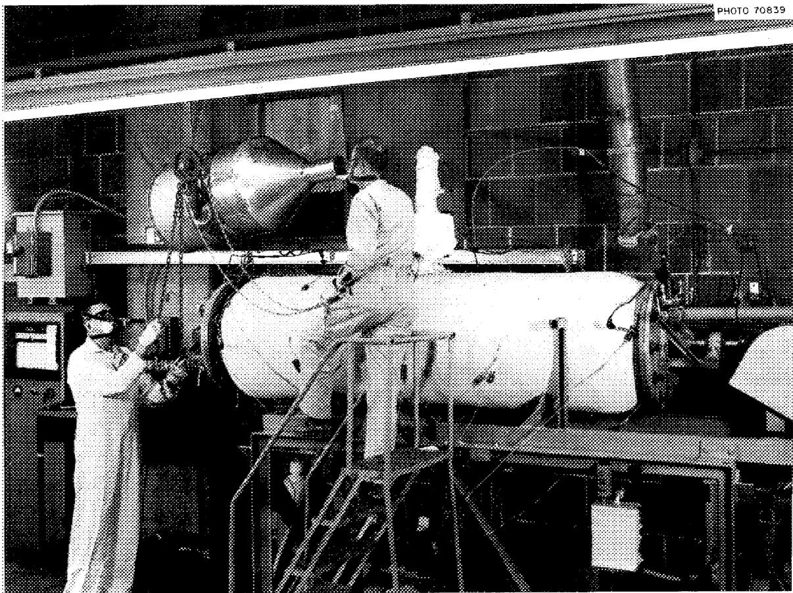  
Fig. 23. Fluoride Production Facility - Horizontal Densification Kln.

The production-scale equipment was a horizontal Monel reaction vessel (17 in. in diameter by 8 ft long) equipped with a full-length agitator and heating jacket. This apparatus had been fabricated and used during the ANP program for the conversion of solid $\mathrm{ZrCl_4}$ to $\mathrm{ZrF_4}$ by treatment with anhydrous HF at elevated temperatures. As shown by Fig. 23, the apparatus was loaded directly from materials storage drums in amounts up to 300 lb per batch. At the conclusion of the densification, the temperature was lowered to about $200^{\circ}\mathrm{C}$ . The reaction vessel was then tilted by a hydraulic mechanism and the material dumped into a stainless steel drum. After cooling to room temperature, the material was sampled and transferred to fiber drums for storage. The average bulk density of the $^{7}\mathrm{LiF}$ was increased from about $0.6\mathrm{g / cc}$ to about 1.1 g/cc by this operation.

This production operation was started on February 10, 1964, and was concluded on November 6, 1964. Operation of this facility was achieved by personnel assigned to the large production facility. During this period all 22,000 lb of $^{7}$ LiF was processed.

# 6. PREPARATION OF ENRICHED FUEL CONCENTRATE

The scheduled operations of the MSRE established a requirement for $90\mathrm{kg}$ of $^{235}\mathrm{U}$ contained in the binary salt mixture ${}^7\mathrm{LiF - UF_4}$ (73-27 mole%). This quantity provided for bulk additions of fissile uranium to the fuel drain tank during the initial fueling of the reactor and for incremental additions to the fuel mixture in the pump bowl for sustained nuclear operations. Production of this mixture commenced on December 17, 1964, and was concluded on January 29, 1965. Full shift coverage was provided during this period except for a two-week vacation break in operations.

Approval of this operation by the ORNL Criticality Committee $^{22}$ was based on a detailed description of the proposed production procedures and relevant chemical and physical properties of the salt mixture. $^{23}$ The stipulations of this approval, the relatively small quantity of materials, and the monetary value of the enriched uranium ( $\sim$ S12,000 per kilogram of $^{235}\mathrm{U}$ ) favored small batch sizes. Therefore, this preparation was conducted in the intermediate-scale production facility. Except for certain restrictions and added control measures, the production procedure was essentially the same as that followed for the preparation of other MSRE fluoride mixtures in the large-scale facility.

As a result of a nuclear criticality review, a batch size containing $15\mathrm{kg}$ of ${}^{235}\mathrm{U}$ was allowed. Therefore, six batch preparations were required to fulfill obligations for the MSRE. Each batch contained $26.16\mathrm{kg}$ of the eutectic salt mixture and had a total uranium content of $61.65\mathrm{wt}\%$ . The salt treatment vessel, also subjected to this review, was constructed from a 36-in. length of 6-in.-ips sched 40 pipe (stainless steel 304L) with an inner liner of $\frac{1}{8}$ -in. nickel. The design of this vessel, shown in Fig. 24, was essentially the same as that used for large-scale production. Salt storage containers for the finished batches of enriched fuel concentrate mixture were constructed from 36-in. lengths of 4-in.-ips sched 40 grade A nickel pipe. The salt batch had a liquid depth of about 29 in. in the salt storage container and a dry-mix depth of about 26 in. in the salt treatment vessel. The salt treatment vessel was heated by a 23-kVA furnace and the salt storage container by a 7500-W furnace (Fig. 25) in an arrangement similar to that of the main production plant.

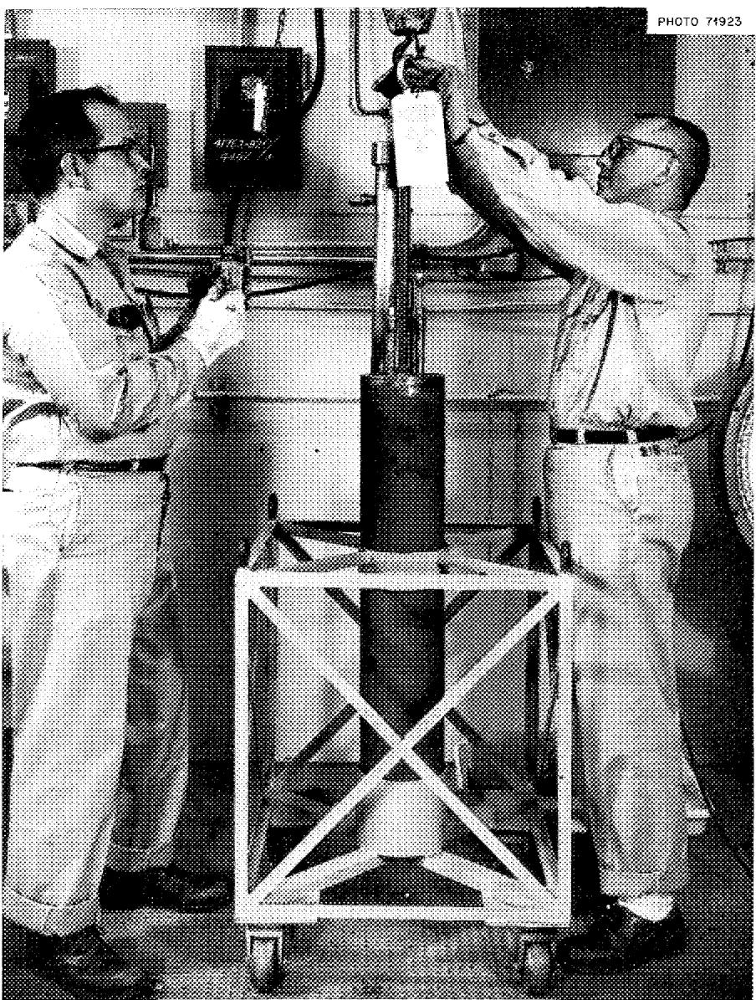  
Fig. 24. Fluoride Production for MSRE - Salt Treatment Vessel for Enriched Fuel Concentrate Mixture.

Batches of raw material were blended and loaded into the salt treatment vessels by the Special Processing groups of the Y-12 Plant and transported by truck to the fluoride production area. After processing and transfer to its storage container, the salt batch was placed in a nuclear-safe transport container (Fig. 26) and shipped to a security warehouse within the Y-12 Plant. To further minimize the possibility of a nuclear incident, the quantity of $^{235}\mathrm{U}$ permitted in the production facility was limited to one batch. However, by using two salt treatment vessels and scheduling materials transfer operations, the production facility was operated almost continually during preparation of the six batches of concentrate mixture.

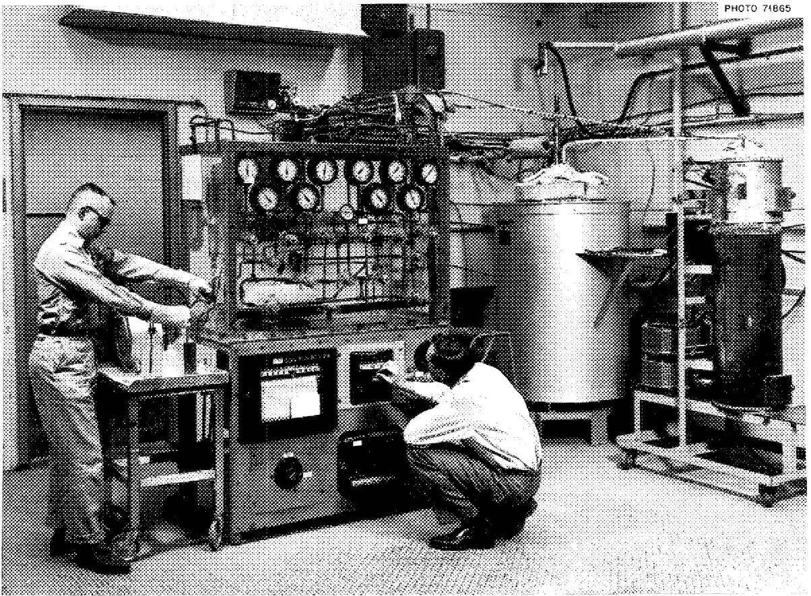  
Fig. 25. Fluoride Production for MSRE - Process Equipment for Enriched Fuel Concentrate Mixture.

# 7. PREPARATION OF FUEL ENRICHING CAPSULES

One of the unique features of the MSRE was the method by which supplementary quantities of $^{235}\mathrm{U}$ were added to the reactor fuel. These incremental additions were made by dissolving a fused eutectic mixture of $^{7}\mathrm{LiF - }^{235}\mathrm{UF_4}$ (73-27 mole %) from small capsules that were lowered by a windlass into the bowl of the fuel pump. The filling of these capsules with the fused fluoride mixture was a part of the fluoride production effort and was accomplished during March 22-26, 1965. Approval of this operation by the ORNL Criticality Committee $^{24}$ was again based upon a detailed description of the handling procedures. $^{25}$

The fuel enriching capsules were constructed from a 6-in. length of nickel tubing $(3/4$ in. OD by 0.035 in. wall) with a hemispherical bottom. The top plug was penetrated by two $1/8$ in.-OD, 0.025-in.-wall nickel fill tubes. Each filled capsule contained about $85\mathrm{g}$ of $^{235}\mathrm{U}$ , or about $148\mathrm{g}$ of salt mixture. Sufficient capsules (161) were filled to fulfill scheduled tests of the MSRE. All capsules were filled from a single production batch of the fuel concentrate mixture by means of a salt transfer tube ( $1/4$ in. OD by 0.065 in. wall) that extended almost to the bottom of the salt storage container.

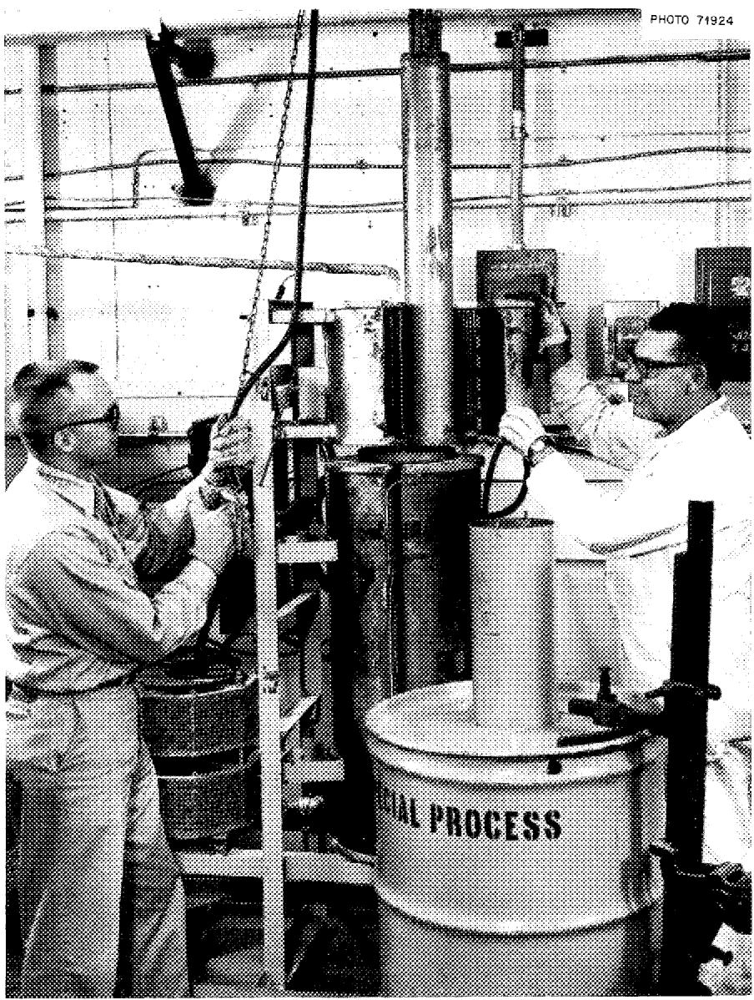  
Fig. 26. Fluoride Production for MSRE - Storage Container and Holder for Enriched Fuel Concentrate Mixture.

For filling purposes, seven capsules were connected in series by their $\frac{1}{8}$ -in. fill tubes and clustered within a 4-in.-diam heating chamber. The inlet and outlet fill tubes to the cluster were connected by tube fittings to the salt transfer line and to the overflow reservoir. The capsule cluster was held in place by an adjustable support (Fig. 27) which also served as a distributor for the helium purge stream about the capsules. The surrounding heating chamber had a flanged top, a body constructed from a 12-in. length of 4-in.-OD, 0.065-in.-wall stainless steel tubing, and a welded bottom of $\frac{1}{8}$ -in. stainless steel plate. Heat was supplied by Calrods wrapped about the outer periphery of the chamber.

Since 23 fill operations were required, provisions were made for rapid assembly and disassembly of the capsule clusters in the filling apparatus. The top cover flange of the assembly was rigidly fixed to a support stand. The salt transfer line and the helium supply and exhaust lines penetrated the cover flange through gastight connections. The heating chamber was suspended from a counterbalanced cable system so that it

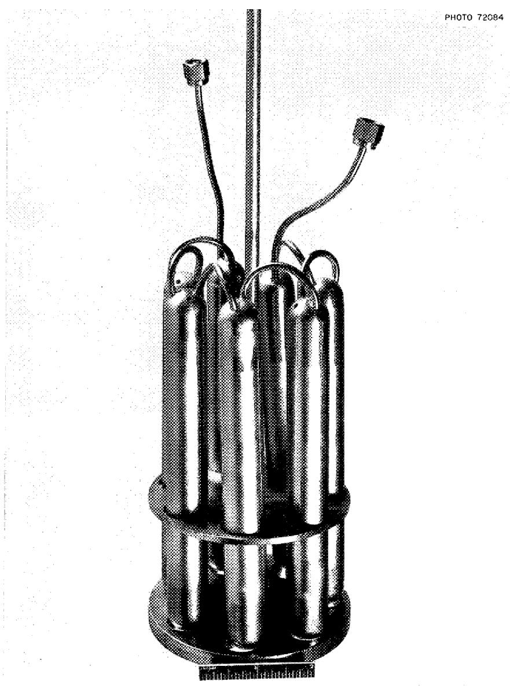  
Fig. 27. Fluoride Production for MSRE - Fuel Enriching Capsules Prepared for Filling with $^{7}\mathrm{LiF} - ^{235}\mathrm{UF}_4$ (73-27 mole%).

could be raised or lowered as required during each fill operation. The assembly of capsules in this apparatus is shown in Fig. 28.

The salt storage container, the salt transfer line, and the clustered capsules were heated to $600^{\circ}\mathrm{C}$ , and sufficient helium pressure was applied to the salt storage container to cause the molten fluoride mixture to flow into the clustered capsules. Displaced gases were vented through the top of the overflow reservoir. The liquid levels in the capsules were visually observed by radiography using a Norelco 160-kV, 6-mA portable x-ray unit and a TVX camera. A photograph of the equipment during a typical filling operation is shown in Fig. 29. When the last capsule in the cluster was filled, helium pressure was vented from the salt storage container and applied to the top of the overflow reservoir. Thus any excess salt in the capsule fill assembly was returned to the salt storage container. The capsule cluster and salt transfer line were cooled to near

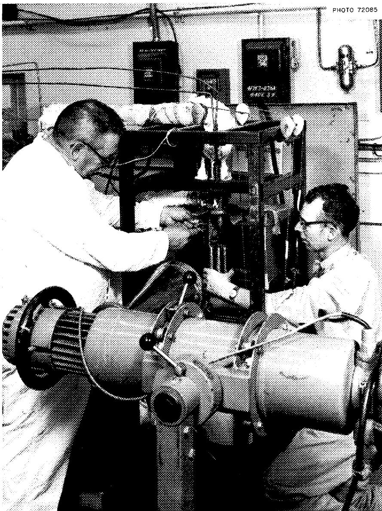  
Fig. 28. Fluoride Production for MSRE - Assembly of Fuel Enriching Capsules in Filling Apparatus.

room temperature while backflowing helium through the system. The filled capsule cluster was disconnected from the assembly, and its exposed tubes were capped. After the net weight of salt mixture in the cluster was determined, it was sealed in a watertight can. The individually canned capsule clusters were placed in a holder within a nuclear-safe carrier for storage. All capsules were filled at a rate of about five clusters per day during a two-shift five-day period.

Although the accountability of $^{235}\mathrm{U}$ was maintained for each capsule cluster, each capsule was photographed by $\mathbf{x}$ ray before and after filling with the enriched fuel concentrate mixture. Thus, minor variations in weight could be calculated from measurements on the contact prints. This examination revealed no defects in the capsule clusters nor any variation in uranium density in the frozen salt mixture.

The fuel enriching capsules, as delivered to the MSRE, were suitable for indefinite storage and needed only minor mechanical preparation before use. Each capsule was removed from its cluster by clipping the

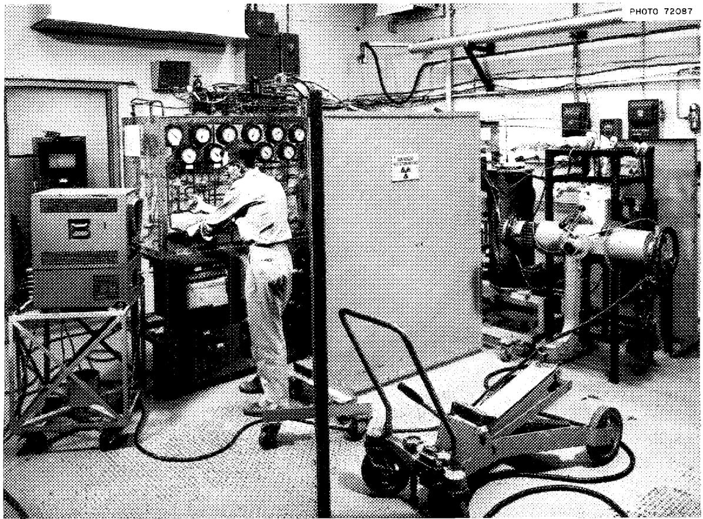  
Fig. 29. Fluoride Production for MSRE - Fuel Enriching Capsule Fill Operation Using Portable X-Ray Unit and TVX Camera for Control.

$1/8$ -in. nickel fill tubes near the top plug of the capsule. The outer surface of the capsule was buffed as required to remove any oxide, and the nickel jacket was slotted on a milling machine located in a glove box. A wire bail was inserted through a predrilled hole in the top plug for fastening the capsule to the windlass cable.

# 8. REACTOR LOADING OPERATIONS

When construction of the MSRE was substantially complete, salt batches selected for the secondary coolant were transported from storage in the production facility to the reactor site. During the latter part of October 1964, approximately 5755 lb of coolant mixture, $^{7}\mathrm{LiF - BeF}_2$ (66-34 mole %), was transferred from 22 salt storage containers to the coolant drain tank. Salt batches for the flush salt mixture were then transported to the reactor site and loaded into one of the fuel drain tanks during November 1964. Approximately 9200 lb of this mixture from 36 storage containers was required. With the unloading of these materials, the MSRE began its prenuclear test operations.

Reactor fueling operations began on April 20, 1965, with the loading of the barren fuel solvent and the depleted fuel concentrate mixture. Approximately 10,050 lb of the solvent, $^7\mathrm{LiF - BeF}_2 - \mathrm{ZrF}_4$ (64.7-30.1-5.2 mole %), from 35 batch containers and 520 lb of depleted fuel concentrate, $^7\mathrm{LiF - }^{238}\mathrm{UF}_4$ (73-27 mole %), from 2 batch containers were added directly into a fuel drain tank. The addition of the enriched

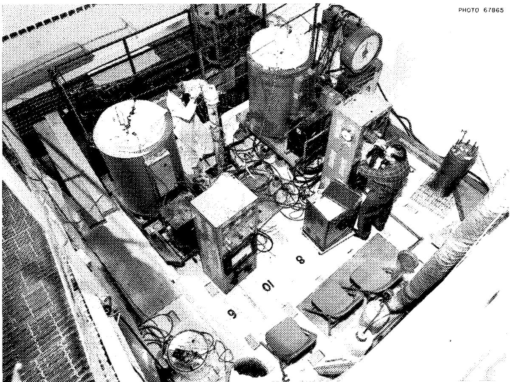  
Fig. 30. Fluoride Production for MSRE - Transfer of Fluoride Mixtures into the MSRE Fuel System.

fuel concentrate mixture, $^{7}\mathrm{LiF.2}^{35}\mathrm{UF}_4$ (73-27 mole %), to the fuel solvent was accomplished during the latter part of May 1965 and was coordinated with preparations for the zero-power experiments of the reactor system.[26]

Although the loading of fluorides into the reactor system was a unique operation, the techniques involved were very similar to those used for filling the various engineering test assemblies during the development of the MSR concept. Two portable furnace units were used for unloading the large production batches. Each unit used a 25-kVA furnace identical to those used to heat the salt storage containers in the main production facility. A simple gas manifold provided the necessary connections for controlling the gas pressure over the salt mixture in the storage container. This apparatus, during the loading of the flush salt into the reactor fuel system, is shown in Fig. 30. For this operation, the fill station was located some 15 ft above the fuel drain tank. The flanged access point of the tank was fitted with a heated reentrant tube which extended down to the tank cavity. A heated pipe was connected to the flanged port and was terminated about 5 ft above the floor of the fill station. A filter of sintered nickel was connected on top of the fill pipe and provided with a separate heater circuit. This arrangement facilitated frequent replacement of the filter during fill operations. When a salt batch in either furnace became molten, a dip tube was inserted in the salt container to within $\frac{1}{4}$ in. of the bottom. This line also connected to the top of the filter

and was heated by a low-voltage alternating current. Transfer of the salt to the reactor was coordinated with reactor operations personnel. The amount of salt delivered to the reactor system from each salt batch was determined by the weight difference of the storage container before and after each transfer operation. Although the flush and fuel salt mixtures were loaded from the same station, the same apparatus was used in a different location for the initial loading of the secondary coolant.

Bulk additions of the enriched fuel concentrate mixture were made from the station used for the fuel solvent. However, a smaller furnace unit was used to accommodate the smaller batch containers. The first major addition consisted of the transfer of about $44.17\mathrm{kg}$ of ${}^{235}\mathrm{U}$ from three containers. Three subsequent additions of ${}^{235}\mathrm{U}$ to the fuel solution increased its ${}^{235}\mathrm{U}$ inventory to 59.35, 64.42, and finally $68.76\mathrm{kg}$ . Transfers of less than batch-size quantities of fuel concentrate mixture were made by inserting the salt transfer line to a predetermined depth in the batch container. As planned, these bulk additions of fuel concentrate mixture to the fuel solution increased its ${}^{235}\mathrm{U}$ content to within $1\mathrm{kg}$ of the critical loading. The balance of ${}^{235}\mathrm{U}$ needed to reach nuclear criticality and subsequent ${}^{235}\mathrm{U}$ additions were made with the fuel enriching capsules by the MSRE operating staff.

The loading of all fluoride mixtures - coolant, flush, fuel solvent, and fuel concentrate - into the MSRE required 101 separate transfer operations. These were accomplished by the fluoride production staff, with assistance from reactor operating and maintenance personnel, in a routine manner and without detectable beryllium contamination to the reactor facility.

# 9. PRODUCTION ECONOMICS

During the course of fused fluoride production at ORNL, modifications and revisions have been made on the facility to meet specific safety requirements and to incorporate procedural changes which resulted from process development programs. When the use of beryllium fluoride in fused fluoride mixtures became attractive to the Molten-Salt Reactor Program, extensive modifications in the physical plant were made to cope with health hazards which accompany the handling of beryllium compounds. The required preparation of large quantities of identical fluoride mixtures for the MSRE made the use of a single meltdown furnace assembly both effective and economically feasible. The installation of this unit and the relocation of the materials handling area were the only major revisions in the production plant after its modification for handling beryllium salts. Six plastic fresh-air suits at about $120 each sufficed for the entire production program and provided more positive protection of loading room operators from toxic fluorides than was normally attained from safety devices previously used. Other production features which were developed for the process required only minor revision of the facility. Although the as-developed investment in the production facility was probably excessive, its replacement value was estimated in the range of $300,000 to $500,000.

The operating budget for the fluoride production commitment averaged about $20,000 per month and included maintenance and expendable equipment costs. The large production facility was operated on a seven-day three-shift schedule. Each of the four shifts required a technical operator and an assistant for routine maintenance. Other supporting maintenance crafts and analytical services were employed as required. Two supervisory personnel were assigned full time for the entire production operation.

Fluoride starting materials that were acquired for the production of MSRE materials had values as shown in Table 6. The raw materials cost for the coolant and flush salt mixture, \(^7\mathrm{LiF - BeF}_2\) (66-34 mole \(\%\) was \\(11.29 per pound and that of the fuel salt, excluding \(^{235}\mathrm{U}\) costs, was \\)10.13 per pound. Combining estimated operating costs, the delivered value of the coolant and flush salt mixture was calculated at \\(19.71 per pound and that of the fuel salt, excluding \(^{235}\mathrm{U}\), was \\)17.33 per pound. Thus the total value of fluoride salt mixtures required for operation of the MSRE was about \\(484,000, exclusive of plant amortization and

Table 6. Costs of Raw Materials Used in MSRE Fluoride Production   

<table><tr><td>Material</td><td>Quantity</td><td>Unit Cost (dollars)</td><td>Total Cost (dollars)</td></tr><tr><td>7LiF</td><td>12,919 lb</td><td>16.50a</td><td>213,164</td></tr><tr><td>BeF2</td><td>11,472 lb</td><td>5.70</td><td>65,390</td></tr><tr><td>ZrF4</td><td>2,265 lb</td><td>8.00</td><td>18,120</td></tr><tr><td>UF4</td><td>90 kg (235 U basis)</td><td>12,000.00</td><td>1,080,000</td></tr><tr><td></td><td></td><td>Total</td><td>1,376,674</td></tr></table>

$a$ Includes $\$ 1.82$ per pound for preparation as fluoride salt.

Table 7. MSRE Fuel Enriching Capsule Costs   

<table><tr><td>Item</td><td>Cost per Cluster (dollars)</td><td>Cost per Capsule (dollars)</td></tr><tr><td>Fabrication</td><td>125</td><td>17.85</td></tr><tr><td>Filling operation</td><td>77</td><td>11.00</td></tr><tr><td>Salt production</td><td>33</td><td>4.72</td></tr><tr><td>Materials costs235UF4</td><td>7320</td><td>1,045.00</td></tr><tr><td>7LiF</td><td>7</td><td>1.00</td></tr><tr><td>Total cost</td><td>7562</td><td>1,079.57</td></tr><tr><td>Total cost less 235U</td><td>242</td><td>34.57</td></tr></table>

uranium costs. The estimated values associated with the preparation of the fuel enriching capsules are given in Table 7. Since each capsule contained about \(85\mathrm{g}\) of \({}^{235}\mathrm{U}\), the preparation charges for sustaining the fuel during nuclear operation can be assessed at \\(0.41 per gram of \({}^{235}\mathrm{U}\).

# ACKNOWLEDGMENTS

One of the primary responsibilities of the Reactor Chemistry Division, and its parent section of the Chemistry Division, to the Molten-Salt Reactor Program has been the development and operation of a production facility to provide various fluoride mixtures for the chemical and engineering tests of the program. Under the directorship of W. R. Grimes, the scope of this program was enlarged and directly associated with the general chemical development of molten fluoride systems. The successful completion of the commitment for fueling the MSRE has been largely due to this intense personal interest in the application of molten salts in the field of nuclear technology.

The ability to prepare molten fluoride mixtures of sufficient purity for high-temperature systems and the techniques for the practical handling of these materials in their liquid state have been under continual development by the fluoride production group since the inception of the MSRP at ORNL. These practices and procedures resulted primarily from the efforts of G. J. Nessle, former production group leader, and his associates.

The preparation of materials for the MSRE represented the largest single production effort of the program. Although the production process had been essentially developed to its present state, the operation of the plant at this production level and the degree of quality control demanded for the reactor experiment

required the individual dedication of the production group members to be successful. F. A. Doss, who had been a member of the group since its beginning, served as the operations chief. Those who operated the facilities were W. K. R. Finnell, W. Jennings, Jr., W. P. Teichert, and C. E. Roberts and were assisted by R. W. Ray, R. G. Ross, and B. F. Hitch - all of the Reactor Chemistry Division. Maintenance operations were the responsibility of the Y-12 Plant and were discharged by C. W. Mason. Members of his staff who were a part of the shift operations included F. H. Deford, G. D. DeLozier, D. L. Craig, H. V. Tripp, P. E. Barker, B. F. Butler, and P. R. Schultz of the Y-12 Plant Maintenance Division.

# INTERNAL DISTRIBUTION

1. J. L. Anderson   
2. C.F. Baes   
3. S. E. Beall   
4. M. Bender   
5. E. S. Bettis   
6. D. S. Billington   
7. F. F. Blankenship   
8. E. G. Bohlmann   
9. C. J. Borkowski   
10. G.E. Boyd   
11. R. B. Briggs   
12. S. Cantor   
13. J. L. Crowley   
14. F. L. Culler   
15. J.R. Distenfano   
16. S.J. Ditto   
17. F.A.Doss   
18. W.P.Eatherly   
19. J.R. Engel   
20. D. E. Ferguson   
21. L. M. Ferris

22. J.H. Frye   
23. C.H.Gabbard   
24. W. R. Grimes   
25. A. G. Grindell   
26. P. N. Haubenreich   
27. R. F. Hibbs   
28. W. R. Huntley   
29. W. H. Jordan   
30. P. R. Kasten   
31. M. T. Kelley   
32. J.J. Keyes   
33. R. B. Lindauer   
34. M. I. Lundin   
35. H. G. MacPherson   
36. R. E. MacPherson   
37. H.E.McCov   
38. L. E. McNeese   
39. A. S. Meyer   
40. R. L. Moore   
41. E. L. Nicholson   
42. R. B. Parker

43. A.M. Perry   
44-68. M.W.Rosenthal   
69. Dunlap Scott   
70-74. J.H.Shaffer   
75. M.J. Skinner   
76. D. A. Sundberg   
77. R. E. Thoma   
78. D. B. Trauger   
79. G.M. Watson   
80. A. M. Weinberg   
81. J.R. Weir   
82. M. E. Whatley   
83. J.C. White   
84. Gale Young   
85-88. Central Research Library   
89. ORNL - Y-12 Technical Library Document Reference Section   
90-127. Laboratory Records Department   
128. Laboratory Records, ORNL R.C.

# EXTERNAL DISTRIBUTION

129. M. Shaw, Atomic Energy Commission, Washington   
130. T. W. McIntosh, Atomic Energy Commission, Washington   
131. D. F. Cope, Atomic Energy Commission, Oak Ridge   
132. A. R. DeGrazia, Atomic Energy Commission, Washington   
133. David Elias, Atomic Energy Commission, Washington   
134. Norton Habermann, Atomic Energy Commission, Washington   
135. Herbert H. Kellogg, Columbia University, New York 10027   
136. John D. Corbett, Iowa State University, Ames, Iowa 50010   
137. Lloyd Zumwalt, North Carolina State University, Raleigh, N.C. 27607   
138. Paul Cohen, Westinghouse Electric Corporation, P.O. Box 158, Madison, Pa. 15663   
139. J. A. Swartout, Union Carbide Corporation, New York, N.Y. 10017   
140. Laboratory and University Division, AEC, ORO   
141. Patent Branch, AEC, ORO

142-361. Given distribution as shown in TID-4500 under Reactor Technology category (25 copies -NTIS)