ORNL-4622

UC-80 - Reactor Technology

MOLTEN-SALT REACTOR PROGRAM

SEMIANNUAL PROGRESS REPORT

For Period Ending August 31, 1970

OAK RIDGE NATIONAL LABORATORY

operated by

UNION CARBIDE CORPORATION

for the

U.S. ATOMIC ENERGY COMMISSION

Printed in the United States of America. Available from National Technical Information Service

U.S. Department of Commerce, Springfield, Virginia 22151

Price: Printed Copy $3.00; Microfiche $0.65

This report was prepared as an account of work sponsored by the United States Government. Neither the United States nor the United States Atomic Energy Commission, nor any of their employees, nor any of their contractors, subcontractors, or their employees, makes any warranty, express or implied, or assumes any legal liability or responsibility for the accuracy, completeness or usefulness of any information, apparatus, product or process disclosed, or represents that its use would not infringe privately owned rights.

Contract No. W-7405-eng-26

MOLTEN-SALT REACTOR PROGRAM

SEMIANNUAL PROGRESS REPORT

FOR PERIOD ENDING AUGUST 31, 1970

M. W. Rosenthal, Program Director

R. B. Briggs, Associate Director

P. N. Haubenreich, Associate Director

# LEGAL NOTICE

This report was prepared as an account of work sponsored by the United States Government. Neither the United States nor the United States Atomic Energy Commission, nor any of their employees, nor any of their contractors, subcontractors, or their employees, makes any warranty, express or implied, or assumes any legal liability or responsibility for the accuracy, completeness or usefulness of any information, apparatus, product or process disclosed, or represents that its use would not infringe privately owned rights.

JANUARY 1971

OAK RIDGE NATIONAL LABORATORY

Oak Ridge, Tennessee

operated by

UNION CARBIDE CORPORATION

for the

U.S. ATOMIC ENERGY COMMISSION

This report is one of a series of periodic reports in which we describe the progress of the program. Other reports issued in this series are listed below.

ORNL-2474 Period Ending January 31, 1958

ORNL-2626 Period Ending October 31, 1958

ORNL-2684 Period Ending January 31, 1959

ORNL-2723 Period Ending April 30, 1959

ORNL-2799 Period Ending July 31, 1959

ORNL-2890 Period Ending October 31, 1959

ORNL-2973 Periods Ending January 31 and April 30, 1960

ORNL-3014 Period Ending July 31, 1960

ORNL-3122 Period Ending February 28, 1961

ORNL-3215 Period Ending August 31, 1961

ORNL-3282 Period Ending February 28, 1962

ORNL-3369 Period Ending August 31, 1962

ORNL-3419 Period Ending January 31, 1963

ORNL-3529 Period Ending July 31, 1963

ORNL-3626 Period Ending January 31, 1964

ORNL-3708 Period Ending July 31, 1964

ORNL-3812 Period Ending February 28, 1965

ORNL-3872 Period Ending August 31, 1965

ORNL-3936 Period Ending February 28, 1966

ORNL-4037 Period Ending August 31, 1966

ORNL-4119 Period Ending February 28, 1967

ORNL-4191 Period Ending August 31, 1967

ORNL-4254 Period Ending February 29, 1968

ORNL-4344 Period Ending August 31, 1968

ORNL-4396 Period Ending February 28, 1969

ORNL-4449 Period Ending August 31, 1969

ORNL-4548 Period Ending February 28, 1970

# Contents

INTRODUCTION

SUMMARY

# PART 1. MOLTEN-SALT REACTOR EXPERIMENT

1.MSRE OPERATIONS 1

1.1 Chronological Account 1   
1.2 Operations Analysis 2

1.2.1 Gamma Spectrometry 2   
1.2.2 Noble-Metal Migration 2   
1.2.3 Radiation Heating 4   
1.2.4 Fluorine Evolution form Frozen Salt 4

2. COMPONENT DEVELOPMENT 6

2.1 Freeze-Flange Thermal Cycle Test 6   
2.2Pumps 6

2.2.1 Mark 2 Fuel Pump 6   
2.2.2 Oil Pump Endurance Test 6

# PART 2. MSBR DESIGN AND DEVELOPMENT

3. DESIGN 8

3.1 Single-Fluid 1000-MW(e) MSBR Design Study Report 8   
3.2 Molten-Salt Demonstration Reactor Design Study 8

3.2.1 Introduction 8   
3.2.2 General Description 9   
3.2.3 Buildings and Containment 9   
3.2.4 Reactor 16   
3.2.5 Primary Heat Exchangers 18   
3.2.6 Primary Drain Tanks 18   
3.2.7 Fuel Salt Storage Tank 21   
3.2.8Discard Salt Storage Tanks 22   
3.2.9 Steam System 24

3.3 Afterheat Temperatures in Empty MSBR Heat Exchangers 24   
3.4 Industrial Study of 100-MW(e) Molten-Salt Breeder Reactor 25

# 4. REACTOR PHYSICS 26

4.1 Physics Analysis of MSBR 26

4.1.1 Fixed-Moderator Molten-Salt Reactor 26

4.2 MSR Experimental Physics 31

4.2.1 $^{233}\mathrm{U}$ Capture-to-Absorption Ratio in the Fuel of the MSRE 31

# 5. SYSTEMS AND COMPONENTS DEVELOPMENT 35

5.1 Gaseous Fission Product Removal 35

5.1.1 Gas Separator 35   
5.1.2 Bubble Generator 38   
5.1.3 Water Test Loop 39

5.2 Molten-Salt Steam Generator 39

5.2.1 Steam Generator Industrial Program 39   
5.2.2 Steam Generator Tube Test Stand (STTS) 40   
5.2.3 Molten-Salt Steam Generator Technology Loop (SGTL) 40   
5.2.4 Development Basis for Steam Generators Using Molten Salt as the Heat Source 40

5.3 Sodium Fluoroborate Test Loop 41

5.3.1 Water Addition Test 41   
5.3.2 Conclusions 44

5.4 MSBR Pumps 44

5.4.1 MSBE Salt Pump Procurement 44   
5.4.2 MSBE Salt Pump Test Stand 45   
5.4.3 ALPHA Pump 45

5.5 Remote Welding 45

5.5.1 Operational Prototype Equipment 45   
5.5.2 Cutting Development 45   
5.5.3 Welding Development 47   
5.5.4 External Interest 49   
5.5.5 Design Studies 49

# 6.MSBRINSTRUMENTATIONANDCONTROLS 51

# 7. HEAT AND MASS TRANSFER AND THERMOPHYSICAL PROPERTIES 53

7.1 Heat Transfer 53   
7.2 Thermophysical Properties 54   
7.3 Mass Transfer to Circulating Bubbles 57

# PART 3. CHEMISTRY

# 8. FISSION PRODUCT BEHAVIOR 60

8.1 Noble Metal Fission Product Behavior 60   
8.2 Short-Term Fission Product Deposition Tests 66

8.3 Fission Product Deposition on the Fifth Set of Graphite and Hastelloy N Samples from the MSRE Core 68

8.3.1 Effect of Surface Roughness 68   
8.3.2 Effect of Flow Conditions on Deposition 68   
8.3.3 Comparison of Deposition of Noble Metal Fission Products on Graphite and Hastelloy N 69

8.3.4 Concentration Profiles of Fission Products in Graphite 69   
8.3.5 Electron Microscope Examination of Particles in the Gas Phase Above Fuel Salt in the MSRE 70

8.4 A Possible Origin of Smokes and Mists Emitted by MSRE Fuel 70   
8.5 Synthesis of Niboium Fluorides 71   
8.6 Molybdenum and Niobium Fluoride Solutions in Molten $\mathbf{L}\mathbf{i}_2\mathbf{B}\mathbf{e}\mathbf{F}_4$ 71   
8.7 Mass Spectroscopy of Niobium Fluorides 73   
8.8 Raman Spectra of Crystalline $\mathsf{MoF}_5$ and $\mathsf{MoF}_4$ 74

# 9.PROPERTIES OF THE ALKALI FLUOROBORATES 78

9.1 Solubility of $\mathbf{BF}_3$ Gas in Fluoride Melts 78   
9.2 Studies of Hydrogen Evolution and Tritium Exchange in Fluoroborate Coolant Salt 79   
9.3 Reaction of Water with the Sodium Fluoride-Sodium Tetrafluoroborate Eutectic 80   
9.4 Raman Spectra of Molten $\mathrm{NaBF}_4$ and NaF- $\mathrm{NaBF}_4$ to $606^{\circ}\mathrm{C}$ 82   
9.5 Electronic Polarizability of the Tetrafluoroborate Ion and Various Gaseous Halide Molecules as Compared with the Free (Gaseous) Halide Ions 85

9.5.1 The Polarizability of the Tetrafluoroborate Ion 85   
9.5.2 Test of a Recent Theoretical Set of Ion Polarizabilities 86   
9.5.3 Effect of Interaction Between Halide Ions on Polarizability 87

# 10. PHYSICAL CHEMISTRY OF MOLTEN SALTS 89

10.1 Liquidus Temperature of the Salt Mixture $\mathrm{LiF - BeF_2 - ThF_4}$ (70-15-15 mole %) 89   
10.2 Equilibrium Phase Relationships in the System LiF-BeF $_2$ -CeF $_3$ 89   
10.3 Phase Relationships in the System $\mathrm{CeF}_3$ -ThF4 89   
10.4 The Instability of $\mathbf{PuOF}$ and the Solubility of $\mathbf{Pu(III)}$ in MSBR Solvent Salt 91   
10.5 Oxide Chemistry of Protactinium in MSBR Fuel Solvent Salt 92   
10.6 Entropies of Molten Salts 95   
10.7 All-Metal Conductance Cell for Use in Molten Salts 98   
10.8 Glass Transition Temperatures in NaF-BeF2 Mixtures 99   
10.9 Correlations of Electrical Conductivities in Molten LiF-BeF $_2$ -ThF $_4$ Mixtures 101   
10.10 Coordination Effects on U(IV) Spectra in Fluoride Melts 103

# 11. CHEMISTRY OF MOLTEN-SALT REACTOR FUEL TECHNOLOGY 106

11.1 Removal of Fluoride from Molten LiCl 106   
11.2 Distribution of Sodium and Potassium in the Metal Transfer Process at $650^{\circ}\mathrm{C}$ 107   
11.3 Removal of Lanthanides from Lithium Chlorides on Zeolites 109   
11.4 Zirconium Platinide as a Removal Agent for Rare Earths 110

# 12. DEVELOPMENT AND EVALUATION OF ANALYTICAL METHODS FOR MOLTEN-SALT REACTORS 113

12.1 Spectral Studies of MSRE Fuel Samples 113   
12.2 Spectral Studies of Actinide Ions in Molten Fluoride Salts 114   
12.3 Reference Electrode Studies in Molten Fluorides 115

12.4 Kinetic Studies on the Ni/Ni(II) Couple in Molten LiF-BeF $_2$ -ZrF $_4$ 115   
12.5 Analytical Studies of $\mathrm{NaBF}_4$ Coolant Salt 116   
12.6 In-Line Chemical Analyses 118

# PART 4. MATERIALS DEVELOPMENT

13. EXAMINATION OF MSRE COMPONENTS 119

13.1 Examination of Tubing from the MSRE Radiator 120   
13.2 Examination of Thermocouple Wells from the MSRE Coolant Circuit 126

14. GRAPHITE STUDIES 134

14.1 Procurement of New Grades of Graphite 134   
14.2 General Physical Property Measurements 135   
14.3 Graphite Fabrication: Chemistry 135   
14.4 Measurement of Thermal Conductivity of Graphite 141   
14.5 X-Ray Studies 141   
14.6 Reduction of Graphite Permeability by Pyrolytic Carbon Sealing 142   
14.7 HFIR Irradiation Program 145

15. HASTELLOY N 149

15.1 Influence of Titanium on the Strengthening of an Ni-Mo-Cr Alloy 149   
15.2 Effect of Composition on the Postirradiation Mechanical Properties of Modified Hastelloy N 153   
15.3 Comparison of Laboratory and Commercial Heats of Modified Hastelloy N 156   
15.4 Effect of Prior Aging on Irradiation Damage at $760^{\circ}\mathbf{C}$ 159   
15.5 Weldability of Commercial Alloys 160   
15.6 Mechanical Properties of Unirradiated Commercial Modified Alloys 161   
15.7 Electron Microscope Studies 164   
15.8 Corrosion Studies 165

15.8.1 Results of Thermal Convection Loop Tests 166   
15.8.2 Fertile-Fissile Salt 168   
15.8.3 Blanket Salt 168   
15.8.4 Coolant Salt 168   
15.8.5 Summary 171

15.9 Forced-Convection Loop, MSR-FCL-1 173

15.9.1 Operations 173   
15.9.2 Cold Finger Corrosion Product Trap 174   
15.9.3 Metallurgical Analysis 175   
15.9.4 Forced-Convection Loop MSR-FCL-2 176

15.10 Corrosion of Hastelloy N in Steam 178   
15.11 Evaluation of Duplex Tubing for Use in Steam Generators 181

16. SUPPORT FOR CHEMICAL PROCESSING 184

16.1 Construction of a Molybdenum Reductive Extraction Test Stand 184   
16.2 Fabrication Development of Molybdenum Components 184   
16.3 Welding of Molybdenum 185   
16.4 Development of Bismuth-Resistant Filler Metals for Brazing Molybdenum 189   
16.5 Compatibility of Structural Materials with Bismuth 189   
16.6 Chemically Vapor Deposited Coatings 195

16.6.1 Tungsten Coatings 195   
16.6.2 Molybdenum Coatings 197   
Molybdenum Deposition from $\mathbf{MoF}_6$ 197

17. FLOWSHEET ANALYSIS 199

17.1 Protactinium Isolation Using Fluorination-Reductive Extraction 200   
17.2 Rare-Earth Removal Using the Metal Transfer Process 201   
17.3 Removal of Uranium from Fuel Salt by Oxide Precipitation 202

18. MEASUREMENT OF DISTRIBUTION COEFFICIENTS IN MOLTEN-SALT-METAL SYSTEMS 204

18.1 Metal Transfer Process Studies 204   
18.2 Solubility of Neodymium in Li-Bi-Th Solutions 207   
18.3 Solubility of LaOCl in Molten LiCl 208   
18.4 Oxide Precipitation Studies. 208

# PART 5. MOLTEN-SALT PROCESSING AND PREPARATION

19. ENGINEERING DEVELOPMENT OF PROCESS OPERATIONS 211

19.1 Reductive Extraction Engineering Studies 211   
19.2 Design of a Processing Materials Test Stand and the Molybdenum Reductive Extraction Equipment 212   
19.3 Contactor Development: Pressure Drop, Holdup, and Flooding in Packed Columns 213   
19.4 Contactor Development: Axial Mixing in Packed Columns 215   
19.5 Axial Mixing in Open Bubble Columns 216   
19.6 Demonstration of the Metal Transfer Process for Rare-Earth Removal 217   
19.7 Development of a Frozen-Wall Fluorinator 219   
19.8 Electrolytic Cell Development 220

20. CONTINUOUS SALT PURIFICATION SYSTEM 224

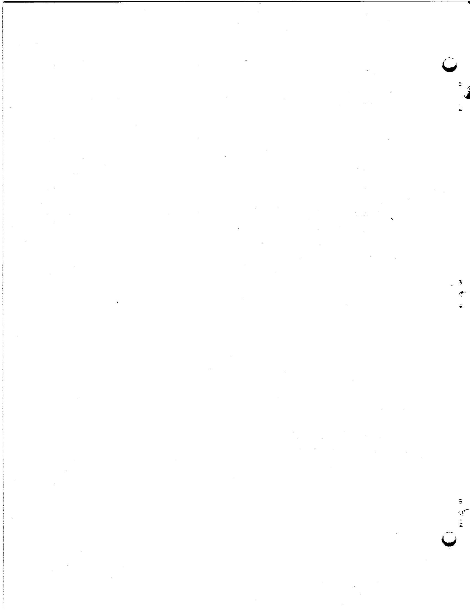

# Introduction

The objective of the Molten-Salt Reactor Program is the development of nuclear reactors which use fluid fuels that are solutions of fissile and fertile materials in suitable carrier salts. The program is an outgrowth of the effort begun over 20 years ago in the Aircraft Nuclear Propulsion program to make a molten-salt reactor power plant for aircraft. A molten-salt reactor - the Aircraft Reactor Experiment - was operated at ORNL in 1954 as part of the ANP program.

Our major goal now is to achieve a thermal breeder reactor that will produce power at low cost while simultaneously conserving and extending the nation's fuel resources. Fuel for this type of reactor would be $^{233}\mathrm{UF}_4$ dissolved in a salt that is a mixture of LiF and $\mathrm{BeF}_2$ , but it could be started up with $^{235}\mathrm{U}$ or plutonium. The fertile material would be $\mathrm{ThF}_4$ dissolved in the same salt or in a separate blanket salt of similar composition. The technology being developed for the breeder is also applicable to high-performance converter reactors.

A major program activity until recently was the operation of the Molten-Salt Reactor Experiment. This reactor was built to test the types of fuels and materials that would be used in thermal breeder and converter reactors and to provide experience with the operation and maintenance of a molten-salt reactor. The MSRE operated at $1200^{\circ}\mathrm{F}$ and produced 7.3 MW of heat. The initial fuel contained 0.9 mole $\%$ $\mathrm{UF_4}$ , $5\%$ $\mathrm{ZrF_4}$ , $29\%$ $\mathrm{BeF_2}$ , and $65\%$ ${}^{7}\mathrm{LiF}$ , a mixture which has a melting point of $840^{\circ}\mathrm{F}$ . The uranium was about $33\%$ ${}^{235}\mathrm{U}$ .

The fuel circulated through a reactor vessel and an external pump and heat exchange system. All this equipment was constructed of Hastelloy N, a nickel-molybdenum-iron-chromium alloy with exceptional resistance to corrosion by molten fluorides and with high strength at high temperature. The reactor core contained an assembly of graphite moderator bars that were in direct contact with the fuel.

Heat produced in the reactor was transferred to a coolant salt in the primary heat exchanger, and the coolant salt was pumped through a radiator to dissipate the heat to the atmosphere.

Design of the MSRE started in the summer of 1960, and fabrication of equipment began early in 1962. The reactor was taken critical on June 1, 1965. Operation at low power begin in January 1966, full power was reached in May, and sustained power operation was begun in December. In September 1967, a run was begun which continued for six months, until terminated on schedule in March 1968.

Completion of this six-month run brought to a close the first phase of MSRE operation, in which the objective was to demonstrate on a small scale the attractive features and technical feasibility of these systems for civilian power reactors. We believe this objective has been achieved and that the MSRE has shown that molten-fluoride reactors can be operated at temperatures above $1200^{\circ}\mathrm{F}$ without corrosive attack on either the metal or graphite parts of the system, that the fuel is completely stable, that reactor equipment can operate satisfactorily at these conditions, that xenon can be removed rapidly from molten salts, and that, when necessary, the radioactive equipment can be repaired or replaced.

The second phase of MSRE operation began in August 1968, when a small facility in the MSRE building was used to remove the original uranium charge from the fuel salt by treatment with gaseous $\mathbf{F}_2$ . In six days of fluorination, $221\mathrm{kg}$ of uranium was removed from the molten salt and loaded onto absorbers filled with sodium fluoride pellets. The decontamination and recovery of the uranium were very good.

After the fuel was processed, a charge of $^{233}\mathrm{U}$ was added to the original carrier salt, and in October 1968 the MSRE became the world's first reactor to operate on $^{233}\mathrm{U}$ . The nuclear characteristics of the MSRE with the $^{233}\mathrm{U}$ were close to the predictions, and, as expected, the reactor was quite stable.

In September 1969, small amounts of $\mathsf{PuF}_3$ were added to the fuel to obtain some experience with plutonium in a molten-salt reactor. The MSRE was shut down permanently. December 12, 1969, so that the funds supporting its operation could be used elsewhere

in the research and development program. An inspection of parts of the reactor is under way, and samples of materials are being removed for examination.

Most of the Molten-Salt Reactor Program is now being devoted to the technology needed for future molten-salt reactors. Conceptual design studies are being made of breeder reactors, and the program includes work on materials, on the chemistry of fuel and coolant salts, on processing methods, and on the development of components and systems.

Because of limitations on the chemical processing methods available at the time, until three years ago most of our work on breeder reactors was aimed at two-fluid systems in which graphite tubes would be

used to separate uranium-bearing fuel salts from thorium-bearing fertile salts. In late 1967, however, a one-fluid breeder became feasible because of the development of a process that uses liquid bismuth to isolate protactinium and remove rare earths from a salt that also contains thorium. Our studies showed that a one-fluid breeder based on the new process can have fuel utilization characteristics approaching those of our two-fluid designs. Since the graphite serves only as moderator, the one-fluid reactor is more nearly a scaleup of the MSRE. These advantages caused us to change the emphasis of our program from the two-fluid to the one-fluid breeder; most of our design and development effort is now directed to the one-fluid system.

# Summary

# PART 1. MOLTEN-SALT REACTOR EXPERIMENT

# 1. MSRE Operations

The MSRE remained shut down, with the salt frozen in the tanks and the primary systems intact, awaiting the scheduled examinations. Procedures were readied, and tools were designed and procured. Equipment to become surplus was identified. Specimens of radiator tubes and thermocouple wells in the coolant salt line were cut out for examination.

Continuing analysis included the gamma spectrometry data and other evidence of noble-metal fission product behavior. Comparison of observed deposition with a model based on conventional mass transfer theory showed reasonable agreement, suggesting that the noble metals quickly migrate, as extremely small particles, to solid or gas interfaces.

Examination of data from previous experiments indicates that fluorine evolution from the frozen fuel can be easily controlled.

# 2. Component Development

Component development for the MSRE was concluded with the termination of endurance tests of the Mark 2 fuel pump (at 16,680 hr of salt circulation) and a lubricating oil pump (at 58,900 hr).

# PART 2. MSBR DESIGN AND DEVELOPMENT

# 3. Design

A comprehensive report on the conceptual design study of a 1000-MW(e) molten-salt breeder reactor power station is near completion, and copies of the final draft have been circulated at ORNL for comment and review.

Since the first molten-salt power reactor could be a demonstration unit in the 100-to-300-MW(e) size range, a conceptual design study has been initiated to investi

gate the features of such a plant of 300-MW(e) size. The plant being studied is a converter that uses periodic discard to rid the fuel salt of fission product poisons rather than awaiting development of continuous chemical processing systems needed for breeders.

The basic arrangement of the demonstration unit is much the same as that of the 1000-MW(e) MSBR. It is of the single-fluid type, with $^7\mathrm{LiF - BeF}_2$ -ThF4-UF4 fuel salt that flows upward through an unclad graphitemoderated and -reflected core. The heat is transferred in primary heat exchangers to a circulated sodium fluoroborate coolant salt, which transports the energy to supercritical-pressure steam generators and to steam reheaters. The steam turbine power cycle has a $1000^{\circ}\mathbf{F}$ throttle temperature, reheat to $1000^{\circ}\mathbf{F}$ , a regenerative feedwater heating system, and special provisions to attain high-temperature feedwater. The overall plant thermal efficiency is about $44\%$ .

The Hastelloy N reactor vessel is about 26 ft in diameter $\times$ 32 ft high with a wall thickness of about 2 in. The reactor core design is very similar to that used successfully in the MSRE, consisting of $4 \times 4$ in. vertical graphite elements. Flow passages are sized to provide the desired salt-to-graphite ratios in the various regions of the core and an essentially uniform salt temperature rise through all regions. The salt enters at about $1050^{\circ}\mathrm{F}$ and leaves at $1300^{\circ}\mathrm{F}$ . The reactor has a conversion ratio above 0.8. The relatively low power density of about $10\mathrm{W/cm}^3$ permits the graphite to last the lifetime of the plant and eliminates the need for a removable head on the reactor vessel.

The primary heat exchangers are of the U-shell type with $\frac{1}{2}$ -in.-OD U-tubes. The maintenance arrangement is to cut the heads from the shell, operating from the side through plugged openings in the cell wall, to expose the tube sheets for location and plugging of faulty tubes.

During normal operation the fuel salt circulating pumps overflow to a drain tank, and fission product gases extracted from the salt circulating system pass

through the drain tank for holdup and decay. The drain tank is cooled by a natural circulation NaK system which rejects heat to an elevated pool of water. Double barriers, with radiant heat transfer across gas-filled annuli, are used in both the drain tank and the water pool to assure isolation of the NaK from the fuel salt and the water.

A fuel salt storage tank is provided for the fuel salt in event repairs are needed on the primary drain tank. This storage tank can also be used for the fluorination process to recover the uranium from a spent fuel salt charge and for addition of $\mathrm{UF}_6$ and $\mathbf{H}_2$ to new carrier salt for reconstituting a fresh charge. Storage facilities for spent carrier salt are provided in the reactor building. It is estimated that the salt charge would have to be replaced about three times during the 30-year lifetime of the plant.

Temperatures produced by the heat from decay of deposited fission products were calculated for primary heat exchangers of sizes from 94 to 281 MW, and the results were extrapolated to the 563-MW size of the reference design. The calculations assumed that the exchangers were drained of primary and secondary salts and that the heat was radiated to surroundings at $1000^{\circ}\mathrm{F}$ . The maximum temperatures were found to be in the range of 1700 to $2100^{\circ}\mathrm{F}$ for a 141-MW MSBE-size exchanger, but extrapolated results indicated that the temperatures in a 563-MW MSBE exchanger would be unacceptably high.

Preparations were nearly completed for issuance of a request for proposals for an industrial study of a 1000-MW(e) MSBR.

# 4. Reactor Physics

We have continued our investigation of MSR core configurations having sufficiently low power density that the graphite moderator should not require replacement over the life of the plant (i.e., 30 years) and have considered a power level of $300\mathrm{MW(e)}$ as well as 1000 $\mathrm{MW(e)}$ . Fuel-cycle analyses have been performed for such cores over a range of thorium concentrations from 10 to 18 mole%. With continuous processing, as for the reference single-fluid MSBR, we find breeding ratios comparable with that of the reference breeder (1.06) but somewhat higher specific fuel inventories, associated with the lower power density. Consequently, the fuel yields and conservation coefficients are lower than for the reference breeder. Fuel-cycle cost is about 0.7 mill/kWhr(e) for the 1000-MW(e) reactor and about 1.1 to 1.2 mills/kWhr(e) for the 300-MW(e) reactor. Optimum thorium concentrations, when optimized in terms

of the fuel conservation coefficient, are a little higher than for the reference breeder, that is, 15 to 17 mole $\%$ as compared with $12\%$ .

Calculations have been performed for a series of batch fuel cycles, in which the fuel salt, including thorium and plutonium, is assumed to be discarded after several years of operation, with only the uranium carried over to the subsequent cycle. These reactors, of course, have conversion ratios substantially below unity. For example, a 300-MW(e) reactor with 30-year graphite life, plutonium feed, and an 8-year batch processing cycle would have a lifetime-average conversion ratio of about 0.84 and a fuel-cycle cost of 0.8 to 0.9 mill/kWhr(e). The same reactor could become a breeder by addition of appropriate chemical processing equipment.

The measurement of the capture-to-fission cross-section ratio, $\alpha$ , for $^{233}\mathrm{U}$ in the MSRE circulating fuel salt has been successfully completed. The measured value is $0.1233 \pm 0.0039$ . The corresponding calculated value using the cross sections and computational methods used in predicting MSBR performance is 0.1226. The uncertainty of $\pm 3.2\%$ in the measured value, if applicable to the calculated value for the MSBR, corresponds to an uncertainty in breeding ratio of approximately $\pm 0.008$ .

# 5. Systems and Components Development

The gas removal efficiency of the centrifugal gas separator while operating with circulating water containing various concentrations of entrained air bubbles was found to be affected most by an instability of the vortex in front of the recovery hub. Since the initial separation of the gas bubbles to the central vortex appears to be virtually $100\%$ , the gas takeoff port is being redesigned in an attempt to improve the vortex stability. The bubble generator designs previously tested have shown a tendency for the liquid flow to oscillate along the trailing edge of the generator and for the gas flow to distribute itself unevenly among the gas feed holes. Testing has shown a design resembling a jet pump to have some promise, and testing is continuing. A water test loop which will permit testing full-sized MSBE bubble generators and gas separators has been designed and is being fabricated.

The program for obtaining design studies of moltensalt-heated steam generators from industrial firms has been rewritten and now consists of four tasks: The first two will result in conceptual designs of steam generators for the ORNL 1000-MW(e) reference design and for an alternate steam cycle to be suggested by the industrial firm. The third task will show how the

designer would propose to scale one of the two conceptual designs for use with a molten-salt reactor of about $150\mathrm{MW(t)}$ . The fourth task will describe a research and development program necessary to assure the adequacy of the design of the Task III steam generator. Further work on the facility for testing steam generator tubes and tube arrangements of up to 3 $\mathrm{MW(t)}$ capacity has been suspended. Instead, we are proceeding to prepare a conceptual design of a loop with a capacity in the range of 50 to $150\mathrm{kW}$ which will be used to study steady-state operation of sections of molten-salt-heated steam generators. We are preparing a report which will describe the status of the molten-salt steam generator technology, show which elements of the LMFBR program will be of use in the molten-salt technology program, and define the areas which need further experimental study.

A test was run in the sodium fluoroborate circulation loop to determine if a small quantity of water injected into the salt in the pump bowl could be detected by monitoring the off-gas stream for a change in contaminant level. An on-line water detector failed to show a positive response when the water was injected. A temporary increase in collection rate was noted on two cold traps, but less than $50\%$ of the injected water was accounted for by the total weight of material collected. The data did not yield any clear-cut evidence as to the fate of the missing water. The water injection test concluded the current phase of the fluoroborate circulation program in the PKP loop, and the loop was shut down and drained on April 13, 1970. Since the initial operation in March 1968, 11,567 hr of circulating have been accumulated; of this total, 10,632 hr were with the clean batch of salt.

All activities in the MSBE salt pump procurement program and the salt pump test stand (SPTS) were suspended indefinitely in light of the AEC decision to redirect the MSRP along the lines of a technology program. The fabrication and assembly of the water test model of the ALPHA pump were completed.

In the remote welding program, emphasis has been placed on developing an automatic welder which will produce consistently good welds without direct observations or manual adjustments. Such a system will be of value for use in the initial construction of reactors and will also be suitable for further development to achieve completely remote operation for maintenance applications in high-radiation zones. The program has reached the point at which the usefulness in reactor construction is apparent, and this phase is being enlarged to permit development of a complete system for field use.

# 6. MSBR Instrumentation and Controls

Further studies were conducted of the part-load steady-state behavior of the reference MSBR plant. Cases studied involving both constant and variable secondary salt flow rate with load produced unacceptably low temperatures at the reactor inlet and/or in the secondary salt cold leg. The addition of a variable bypass of the secondary salt around the primary heat exchanger allowed the plant to be operated with constant steam and reactor inlet temperatures and with an essentially constant secondary salt cold leg temperature for loads between 20 and $100\%$ of design load. The maximum deviation of the cold leg temperature from its design value of $850^{\circ}\mathrm{F}$ was about $8^{\circ}\mathrm{F}$ . Allowing the steam temperature to increase with decreasing load permitted the plant to operate with constant reactor inlet and secondary salt cold leg temperatures over the same power range. The maximum increase in steam temperature was to approximately $1110^{\circ}\mathrm{F}$ , occurring at $50\%$ load.

# 7. Heat and Mass Transfer and Thermophysical Properties

Heat Transfer. - A new test section is being installed in the inert-gas-pressurized flow system which will enable direct determination of the effect on heat transfer of a hydrodynamic entrance length $(l / d = 130)$ ahead of the heated section. This will be accomplished by alternating flow in a 48-in.-long tube, only half of which is used to transfer heat to the molten salt. The need for such an investigation arises from results of the earlier studies which were made without an entrance length and which suggested that, in the low transitional flow range, developed turbulent flow was not achieved at high heat fluxes; hence, significant variation in local heat transfer coefficient with position along the test section was observed.

It is also planned to study the effect of wetting on heat transfer by variation in oxidation state of the salt through addition of a metal such as uranium and to monitor the wetting characteristics during operation by a bubble pressure technique.

Thermophysical Properties. - A technique has been developed that can be used to determine the contact angle at a fluid-solid-gas interface by measuring the pressure difference between the liquid and gas as the gas bubble grows slowly on the tip of a capillary tube immersed in the liquid. The contact angle can be related to the radius of attachment of the bubble to the capillary tube and to a reduced pressure difference which depends on the predictable behavior of the

bubble. Experiments using water on stainless steel (wetting), water on Teflon (partially wetting), and mercury on stainless steel (nonwetting) have verified the validity of the method, which will be used to monitor wetting characteristics of the molten salt in the next series of heat transfer experiments.

Mass Transfer to Circulating Bubbles. - Mass transfer coefficients for helium bubbles in a 2-in.-diam pipe have been obtained for three glycerol-water mixtures (corresponding to Schmidt moduli of 419, 2015, and 3446) over the Reynolds modulus range from $4 \times 10^{3}$ to $1.8 \times 10^{5}$ . The coefficients were found to increase with increasing bubble diameter in the range from 0.02 to 0.05 in. mean bubble diameter and, for a 0.02-in. bubble, to approach a nearly constant value characteristic of that for bubbles rising through a quiescent liquid at low values of the Reynolds modulus.

# PART 3. CHEMISTRY

# 8. Fission Product Behavior

The transport paths and lags of noble metal fission products in the MSRE have been examined using all available data on the activity ratio of two isotopes of the same element, 39.6-day $^{103}\mathrm{Ru}$ and 367-day $^{106}\mathrm{Ru}$ . Data from graphite and metal surveillance specimens exposed for various periods and removed at various times, for material taken from the off-gas system, and for salt and gas samples and other materials exposed to pump bowl salt, were compared with appropriate inventory ratios and with values calculated for indicated lags in a simple compartment model. This model, as implied in earlier reports, assumes that salt rapidly loses ruthenium fission product formed in it, some to surfaces and most to a separate mobile "pool" of noble metal fission product, presumably particulate or colloidal and located to an appreciable extent in pump bowl regions. Some of this "pool" material is deposited on surfaces, and it appears to be the source of the off-gas deposits. All materials sampled from or exposed in the pump bowl appear to receive their ruthenium activity from the pool of retained material. Adequate agreement of observed data with indications of the model has resulted when holdup periods of 45-90 days were assumed.

Short exposures to fuel salt in the MSRE pump bowl ranging from $10\mathrm{min}$ to $10\mathrm{hr}$ were made with graphite and metal specimens in a capsule specially designed to avoid contamination of the specimens by particulate

activities in the gas space above the fuel salt. A variation (decrease) of deposition rate with time was noted only for the noble metal fission products and $^{131}\mathbf{I}$ , with the rate leveling off to the long-term rate in less than 10 hr.

Surface roughness over a range from 5 to $125\mu \mathrm{in}$ . RMS was found to have no effect on deposition of fission products on both graphite and metal specimens exposed in the core of the MSRE. The low depositions of salt-soluble fission products probably proceed by the mechanism of fission recoil. The high depositions of noble metal nuclides, with rates independent of surface roughness, are best explained as being controlled by diffusion through a stagnant film of fuel at the solid surface. However, each species appears to have a different sticking coefficient, and these are different for graphite and metal surfaces. Some surface concentrations of ${}^{89}\mathrm{Sr}$ were found to be lower than interior concentrations in the graphite specimens, as previously observed for ${}^{137}\mathrm{Cs}$ . In both cases, the mechanism probably involves diffusion of the metal toward the salt-graphite interface after deposition in the interior when the rare gas precursors decayed.

A kinetic model was enunciated which accounts for the origin of smokes and mists generated by the MSRE fuel. Results of laboratory and reactor experiments were found to be consistent with the model.

Development of synthesis procedures for the noble metal fission product fluorides and oxyfluorides was continued. These materials were used in studies of the valence of niobium and molybdenum as fluorides and of their stability at low concentration in molten $\mathrm{Li}_2\mathrm{BeF}_4$ , and in Raman, absorption, and spectrophotometric studies of the pure compounds.

Raman spectra of crystalline $\mathbf{MoF}_5$ were obtained; assignment of the spectra was successful in accounting for both the number and intensity of the observed crystal components.

# 9. Properties of the Alkali Fluoroborates

The solubility of boron trifluoride in molten LiF $\mathrm{BeF}_2$ mixtures was determined. The magnitude of the enthalpy of solubility indicates that strong chemical interactions occur in the melt. Investigations were continued to determine the extent to which chemically bound hydrogen, in low concentrations, will be retained in molten fluoroborates. Initial results of the application of Raman spectroscopy in molten $\mathrm{NaBF_4}$ confirmed that the tetrahedral tetrafluoroborate anion is essentially the only anionic species in the melt. The electronic polarizability of the tetrafluoroborate ion was reevaluated because of recent inconsistencies in

literature reports and was found to have a constant value of $3.06\mathring{\mathrm{A}}^{3}\pm 2\%$ in each of the alkali tetrafluoroborates $\mathrm{NaBF}_4,$ $\mathrm{KBF}_4,$ $\mathrm{RbBF}_4$ ,and $\mathrm{CsBF}_3$

# 10. Physical Chemistry of Molten Salts

Investigations of liquid-solid phase equilibria in the systems $\mathbf{LiF - BeF_2 - CeF_3}$ and $\mathrm{CeF}_3\mathrm{-ThF}_4$ advanced to the point that tentative phase diagrams of the systems could be constructed. Investigations of the stability of $\mathbf{PuOF}$ showed that this compound is less stable than has been indicated in previous literature reports. The heat of solution of $\mathbf{PuF_3}$ in the MSBR carrier salt was estimated from experimental data as $\Delta H_{s} = 11,008\pm$ 237 cal/mole.

The effects of oxidizing and reducing agents on the solubility of protactinium oxides in $\mathrm{LiF - BeF_2 - ThF_4 - }$ $\mathrm{UF_4}$ were examined. Major differences in the solubilities of $\mathrm{Pa(IV)}$ and (V) were observed. The entropies of several fluorides of importance in molten-salt reactor technology were derived, based on currently available thermodynamic and crystallographic data.

A new conductance apparatus was designed and constructed in which only metal contacts the molten salt under study. Experimental values for glass transition temperatures were measured for the first time with fluoride melts. The glass transition temperature in the system $\mathrm{NaF - BeF_2}$ was found to be $117\pm 2^{\circ}\mathrm{C}$ and to be invariant with composition. Correlations of electrical conductivities were derived for molten $\mathrm{LiF - BeF_2 - ThF_4}$ mixtures, relating specific conductance with composition. Investigations of coordination effects on uranium(IV) spectra were extended to compare melt spectra with crystal spectra. Very good agreement was found with fluoride-rich melts, which suggests identity of species in both the molten and crystalline state.

# 11. Chemistry of Molten-Salt Reprocessing Technology

Procedures were devised and tested for the removal of fluoride ion (as a contaminant) from molten LiCl solvent. It was established that essentially complete fluoride removal $(< 40~\mathrm{ppm})$ could be achieved. Attempts to employ NaCl and KCl as diluents for $^7\mathrm{LiCl}$ acceptor salt in order to minimize the discard rate for $^7\mathrm{Li}$ were made. Studies of the distributions of sodium and potassium for both the fluoride/bismuth and chloride/bismuth extractions indicated, however, that such alkali metal chlorides would not serve satisfactorily for this purpose. Preliminary experimental evaluations with zeolites indicate that these materials are potentially useful for the removal of rare earths

from lithium chloride. Further evaluation of zirconium platinide as a removal agent for rare earths indicated that if the method reaches the plant stage, it will be necessary to control operating conditions carefully so that only zirconium is removed.

# 12. Development and Evaluation of Analytical Methods for Molten-Salt Reactors

Three samples of MSRE fuel taken during the last power run of the reactor have been spectrally examined in the hot-cell spectrophotometric facility. Forced exposure of the first two samples to the atmosphere was a result of faulty sample containers. These two samples showed no U(IV) or U(III) spectra. The third sample, which was transferred to the spectral furnace under inert atmosphere, showed the presence of U(IV) but no U(III). It was possible, however, to generate U(III) in this sample by both radiolytic and chemical means. The hot-cell facility was also used to obtain the spectra of Pa(IV), Pu(III), and $\mathrm{Cm(III)}$ in LiF $\mathrm{BeF}_2$ -ThF $_4$ .

Studies were continued on the $\mathrm{Ni} / \mathrm{NiF}_2$ reference electrode which uses single-crystal $\mathrm{LaF}_3$ as an ionic conductor. The characteristics of the electrode were improved through incorporation of an internal melt, but a small "junction" potential is still present. The potential of the electrode is not affected by large changes in U(III) concentrations in the melt under test. Additional kinetic measurements were also made on the Ni/Ni(II) couple.

Investigations of $\mathrm{NaBF}_4$ have been concerned with analyses of the salt and its cover gas. A method was developed for the determination of free fluoride in the eutectic coolant. The determination of the chemical state of water in the salt is a problem which is still being studied. Refinements of established methods for water analysis have been made in an attempt to solve this problem.

Analysis of the cover gas for the coolant salt has been concerned with the measurement of impurities, particularly $\mathrm{BF}_3$ hydrolysis products, and the investigation of possible methods for their removal. Modifications in the off-gas system of the $\mathrm{NaBF}_4$ Circulating Test Loop allowed a study to be made of the effluent contaminants. Injection of water into the loop produced an oily liquid in the effluent trapping system which appears to be $\mathrm{BF}_3$ hydrates, but no water was detected in the effluent gas stream. The results of a small-scale experiment set up to simulate the water injection into the loop showed that water reacts with the coolant gas and is not carried into the effluent at low temperatures.

A system is being set up to find possible adsorbents to remove impurities from the coolant gas stream. Another system was also set up to measure $\mathbf{BF}_3$ as it is stripped from saturated fluoride salts by sparging with helium. Calibration of this system revealed an anomalous behavior of $\mathbf{BF}_3$ . Measurements indicate that the viscosity of $\mathbf{BF}_3$ varies with pressure even though $P - V - T$ relationships indicate that $\mathbf{BF}_3$ should approach ideal behavior under the conditions of the measurements.

A thermal convection salt loop is being constructed for the study of the effect of U(III) concentrations on fuel salt characteristics. A new, more versatile voltameter is being fabricated for use on this project. It is planned to automatically control the voltammetric analysis of U(III) with a newly acquired PDP-8/I computer.

# 13. Examination of MSRE Components

The radiator tubing was found to have an oxide film of about 2 mils on the outside. The microstructure was modified to a depth of about 5 mils on the inside (salt side), but we attribute this change to absorption of lubricant during tube manufacture rather than to corrosion. The inlet thermocouple well had a crack in the root pass of the weld that penetrated about 3 mils and went almost completely around the weld. This crack was likely formed when the weld was made due to the poor fitup of the parts to be welded. The weld did not show any evidence of corrosion but did show the modified surface structure that we attribute to cold working.

# 14. Graphite Studies

Evaluation of some vendor-furnished graphites and ORNL-fabricated materials is continuing. Three results of potential significance have been obtained during the present report period.

First, preliminary results are available on black-based graphites. It had been anticipated from earlier work at Gulf General Atomic and Battelle Northwest that these materials would show marked response to damage. Conversely, the HFIR irradiations to date on graphitized black materials have shown a high degree of stability. Irradiations are continuing.

Second, despite microstructural changes which cause a marked loss of impermeability for pyrolytically impregnated base graphites, the pyrolytically coated materials have shown only minor permeability changes to fluences of $1.5 \times 10^{22}$ neutrons/cm $^2$ ( $E > 50 \mathrm{keV}$ ). These irradiations are also continuing, but they strongly

suggest the more stable base graphite will tolerate pyrolytic coating for permeability control.

Third, we have received vendor-supplied graphites which show microstructures similar to the best-behaved graphites we have hitherto examined and, in addition, are capable of fabrication in usable sizes. The irradiation behavior of these materials has not yet been ascertained but will certainly be informative.

Additionally, two new projects have been initiated. Samples are being readied for irradiation to follow the effects of damage on thermal conductivity under MSR conditions. Also, a program on raw material chemistry and its effect on carbonization and graphitization has been initiated. The technique of carbonization under centrifugation and thin-film chromatography have been demonstrated to be useful at least as diagnostic tools.

# 15. Hastelloy N

We found that a modified composition of Hastelloy N containing $1.2\%$ titanium formed stacking fault precipitates during aging. These precipitates increased the strength and decreased the fracture strain in the unirradiated condition, but had little effect upon the properties of irradiated material. Postirradiation creep-rupture tests on alloys modified with Ti, Nb, and Hf have been run. Generally, the laboratory melts have better properties than small commercial melts. A study of the effects of various preirradiation anneals has shown that the optimum postirradiation properties result from a 1-hr anneal at $1177^{\circ}\mathrm{C}$ (the standard mill anneal for Hastelloy N). Several small commercial melts containing small additions of Ti, Hf, and Nb have been welded with weld wire from the same heats. All alloys were weldable except those containing relatively large amounts of hafnium $(>0.7\%)$ and zirconium $(>0.4\%)$ . Creep-rupture tests on these same alloys have been run at 650 and $760^{\circ}\mathrm{C}$ . They are stronger than standard Hastelloy N under all conditions investigated. Electron microscopy of these alloys has shown that the characteristic fine carbide dispersions developed in laboratory heats containing hafnium are not formed in commercial alloys containing hafnium.

Corrosion studies of Hastelloy N in sodium fluoroborate continue to show a marked deleterious effect of water on the corrosion rate. Hastelloy N samples exposed to steam in the unstressed condition continue to show low corrosion rates after 10,000 hr of exposure. A duplex tube consisting of Incoloy 800 and nickel 280 is being evaluated for possible use in the steam generator.

# 16. Support for Chemical Processing

The design and fabrication of components for a molybdenum reductive extraction test stand have continued. In addition to welding and brazing, mechanical couplings are being evaluated as a joining technique. Commercially available molybdenum tubing was procured for the connecting lines of the loop. Two end-cap geometries for the $3\%$ -in.-diam heat pots and upper and lower column disengaging sections have been fabricated by back-extrusion, and material properties are being evaluated.

Welding parameters for tube-to-header and tube-to-tube joint designs have been developed using the electron beam and the gas tungsten arc processes. Welding will be used to provide corrosion-resistant seals, and back-brazing will provide joint strength. An experimental filler metal of Fe-Mo-Ge-C-B (42M) appears to be the most corrosion-resistant braze we have developed thus far. No attack was observed after testing in static bismuth for $644\mathrm{hr}$ at $600^{\circ}\mathrm{C}$ .

Tantalum plus T-111 and molybdenum plus TZM showed excellent resistance to mass transfer in separate quartz thermal convection loops circulating bismuth at $700^{\circ}\mathrm{C}$ for 3000 hr. Molybdenum also showed excellent resistance to bismuth containing 100 ppm lithium in a similar 3000-hr test. However, chemical analysis of the bismuth did indicate some slight dissolution of molybdenum. Severe mass transfer of an $\mathrm{Fe}-5\%$ Mo alloy occurred in bismuth after only 423 hr.

CVD tungsten coatings adhere to Ni, Ni-base alloys, Fe-35% Ni and Fe-50% Ni alloys, and nickel-plated stainless steels. The coatings remain adherent after thermal cycling and bend tests and have bond strengths greater than 20,000 psi. Vessels of practical sizes have been uniformly coated. Satisfactory CVD molybdenum coatings have been applied to Inconel 600 and Hastelloy C at $900^{\circ}\mathrm{C}$ .

Molybdenum was deposited on stainless steel by an exchange reaction between $\mathrm{MoF_6}$ dissolved in molten LiF-BeF2 and the constituents of the stainless steel. Several layers were found in addition to molybdenum, indicating that deposition should be conducted at lower $\mathrm{MoF_6}$ concentrations.

# 17. Flowsheet Analysis

Additional calculations were made to identify the important operating parameters and to determine optimum operating conditions for a flowsheet that uses fluorination—reductive extraction for isolation of prot

actinium and the metal transfer process for rare-earth removal.

Calculations were also made to investigate the operation of an oxide precipitator for removal of uranium from fuel salt from which protactinium had already been removed. The results indicate that greater than $99\%$ of the uranium can be removed with a small number of stages in a countercurrent system and that the oxide stream produced will have a $\mathrm{UO}_2$ concentration of greater than $90\%$ . Less than $1\%$ of the thorium fed to the system would be precipitated with the uranium.

# 18. Measurement of Distribution Coefficients in Molten-Salt-Metal Systems

Chemical studies in support of the development of a metal-transfer process for removing rare-earth and other fission products from single-fluid MSBR fuels were continued. Additional data were obtained on the distribution of rare earths and thorium between liquid bismuth solutions and molten LiCl, LiBr, and LiCl-LiF. These data confirmed previous indications that the distribution behavior of most elements was not markedly affected by temperature variation and that contamination of the acceptor salt with fluoride fuel salt reduces the thorium-rare-earth separation factor. The results of one experiment involving the extraction of europium from LiCl indicated that distribution coefficient data obtained with low concentrations of lithium in the bismuth phase can be extrapolated to include bismuth solutions having lithium concentrations as high as 35 at. $\%$ .The solubility of neodymium in a liquid lithium-bismuth solution that contained 38 at. $\%$ lithium was found to be higher than that reported for pure bismuth. The solubility of LaOCl in molten LiCl at $640^{\circ}\mathrm{C}$ was found to be very low.

Oxide precipitation methods are being considered for use in the isolation of protactinium and uranium from MSBR fuel salt. It was shown that protactinium could be selectively precipitated from $\mathrm{LiF - BeF_2 - ThF_4 - UF_4}$ (71.7-16-12-0.3 mole %) by addition of oxide to the system after the salt had been extensively hydrofluorinated. Calculations based on equilibrium data available in the literature showed that, under certain conditions, it will be possible to precipitate (as $\mathrm{UO}_2$ ) a large fraction of the uranium from MSBR fuel salt with little attendant precipitation of $\mathrm{ThO_2}$ .

# 19. Engineering Development of Process Operations

Experimental work in the flow-through reductive extraction facility was continued after the original

packed column had been replaced with a modified column packed with $\frac{1}{4}$ -in. Raschig rings. Three successful hydrodynamic experiments in which bismuth and molten salt were contacted countercurrently were carried out with the new column. The flooding data obtained agreed well with a flooding correlation developed earlier from the study of a mercury-water system. A set of pressure drop measurements was made with only salt flowing through the column; these measurements will be used for future comparison to detect possible iron deposition in the column. Uranium was added to the LiF-BeF $_2$ -ThF $_4$ salt in the form of an LiF-UF $_4$ eutectic in preparation for mass transfer experiments with uranium. The first mass transfer experiment resulted in essentially no transfer of uranium as the result of an error in adding thorium reductant to the bismuth prior to the run. The second experiment, UTR-2, was the first successful demonstration of the reductive extraction of uranium into bismuth in a flowing system. Greater than 95% of the uranium was extracted into the bismuth phase, which initially contained a 140% stoichiometric excess of reductant.

A report describing the conceptual design of the molybdenum reductive extraction system is being written. Welding and brazing have been selected as the methods for assembling the molybdenum vessels and piping. Conceptual full-size layout, head pot, and equipment support drawings have been prepared. A $1/3$ -scale model of the molybdenum equipment and piping has been built. A full-size transparent plastic mockup of the bismuth head pot and the upper part of the reductive extraction column has been installed for testing with mercury and water. A gas pulse pump is being developed as a possible replacement for the gas-lift pumps considered thus far.

Measurements were made of pressure drop, dispersed-phase holdup, and flooding during the countercurrent flow of mercury and water in a 2-in.-ID column packed with $\frac{1}{2}$ -in. Raschig rings. The data on holdup and flooding for $\frac{1}{2}$ -in. Raschig rings, as well as those reported earlier for $\frac{1}{4}$ -in. Raschig rings and solid cylinders and for $\frac{3}{8}$ -in. Raschig rings, can be correlated in terms of a constant superficial slip velocity which is a function of packing size only. A simple relation has not been found for correlating the pressure drop data. An expression based on the mercury-water data is given for predicting flooding and dispersed-phase holdup in packed columns through which salt and bismuth are in countercurrent flow.

Measurements of axial dispersion in packed columns during the countercurrent flow of fluids having high

densities and a large density difference have been continued. These experiments, which use mercury and water, are intended to simulate the behavior of bismuth and molten salt. Data are reported for $\frac{1}{4}$ -in. Raschig rings, $\frac{1}{4}$ -in. solid cylinders, and $\frac{1}{2}$ -in. Raschig rings. These and previously reported data indicate that the axial dispersion coefficient is independent of the dispersed-phase flow rate for $\frac{3}{8}$ and $\frac{1}{2}$ -in. packing but is inversely proportional to the continuous-phase flow rate for $\frac{1}{4}$ -in. packing.

Data are reported on the effects of the column and gas inlet diameters on axial mixing in open columns in which air and water are in countercurrent flow. The dispersion coefficient was found to be independent of the gas inlet diameter for diameters of 0.04 to 0.17 in. At high gas flow rates, little difference in dispersion coefficient was found at a given gas flow rate in columns having diameters of $1^{1/2}$ , 2, and 3 in. At low gas flow rates, dispersion coefficients were essentially the same for the 2- and 3-in.-diam columns; however, the results obtained for the $1^{1/2}$ -in. column were significantly lower.

The first metal transfer experiment for study of the removal of rare earths from single-fluid MSBR fuel salt has been completed. Approximately $50\%$ of the lanthanum and $25\%$ of the neodymium originally in the fluoride salt were extracted; however, the rare earths did not collect in the lithium-bismuth stripping solution as expected. The distribution coefficients for lanthanum and neodymium between the fluoride salt and the thorium-saturated bismuth were relatively constant and were in agreement with expected values. The distribution coefficients for lanthanum and neodymium between the chloride salt and the thorium-saturated bismuth were higher than anticipated initially but approached the expected values toward the end of the experiment.

Calculations were made to show the effects of coil current, frequency, temperature difference, and fluorinator diameter on the frozen film thickness in a continuous fluorinator heated by high-frequency induced currents. A fluorinator fabricated from 6-in. sched 40 pipe containing a 5-in.-ID coil that had two turns per inch was tentatively chosen for an experiment to demonstrate corrosion protection by use of a frozen wall. The calculations indicated that a frozen film having a thickness of 0.3 in. could be maintained over the coil with a temperature difference of $51^{\circ}\mathrm{C}$ across the film if a coil current of 11 A at $400\mathrm{kHz}$ were used. A 9.2-kW generator would be required for a 5-ft-long fluorinator under the assumed conditions.

Although a maximum stable film thickness exists, there appears to be no serious control problem, since the thickness of the frozen film changes rather slowly. Because of uncertainties in the calculations, a simulated fluorinator is being built to permit the study of heat generation and heat transfer. A $30\%$ $\mathrm{HNO}_3$ solution will represent molten salt in the system.

Two experiments related to electrolytic cell development were performed. The first was carried out in an all-metal cell to determine whether quartz used in previous tests contributed to the formation of black material in the salt. No black material was seen during the experiment; however, we now believe that the absence of the black material is probably due to the absence of a bismuth cathode rather than to the absence of quartz. This conclusion is supported by the results of a second experiment, which was carried out in a quartz cell.

The second experiment allowed us to study the reduction of lithium from pure LiCl using a bismuth cathode. This may provide a method for recovering

lithium from salt discard streams from the metal transfer process. The cell, which used a rounded graphite anode, was operated at anode current densities up to $8.6\mathrm{A} / \mathrm{cm}^2$ . Chlorine disengaged readily from the anode. During the passage of current, the LiCl became red; we believe that this color change was caused by the dissolution of $\mathrm{Li}_3\mathrm{Bi}$ that was present on the cathode surface. It is possible that the dark material noted earlier in cells resulted from the reaction of $\mathrm{Li}_3\mathrm{Bi}$ with $\mathrm{BiF}_3$ in the salt to form finely divided bismuth.

# 20. Continuous Salt Purification System

Ten flooding runs were carried out with molten salt (66-34 mole $\%$ LiF-BeF $_2$ ) at salt flow rates ranging from 50 to $400~\mathrm{cm}^3/\mathrm{min}$ . Five of the runs were made with argon at flow rates up to 7.5 liters/min, and five were made with hydrogen at flow rates up to 30 liters/min. At the maximum flow rate (about $19\%$ of the calculated flooding rate), a pressure drop of 40 in. $\mathrm{H}_2\mathrm{O}$ was observed across the packed column.

# Part 1. Molten-Salt Reactor Experiment

P. N. Haubenreich

The MSRE remained shut down, awaiting postoperation examination. Component development was concluded with the termination of the pump endurance tests. Analysis of information from the MSRE con

tinued; some results are reported here, experimental physics results are given in Part 2, and the fuel chemistry is discussed in Part 3 of this report.

# 1. MSRE Operations

# 1.1 CHRONOLOGICAL ACCOUNT

R. H. Guymon A. I. Krakoviak

The conditions that were established in January1 were maintained throughout nearly all of this report period. The only departures were temporary heating of the reactor vessel neck and experimental cooldown of the drain tanks, as described below. Normal conditions are briefly as follows. The fuel salt is divided between the two drain tanks. It and the flush salt are frozen but held at around $500^{\circ}\mathrm{F}$ by tank heaters to preclude fluorine evolution. The rest of the salt systems are at ambient temperature. Heat from the tanks is dissipated through the cell walls without the use of the cell coolers. All salt systems are filled with helium at about atmospheric pressure with gas inlet and outlet lines valved off. Reactor and drain tank cells are sealed except for a small purge of air that goes through them, out past a monitor, and up the stack. Signals from the few key instruments are telemetered in ORNL monitoring centers, and the reactor building is locked and unattended except on regular workdays.

Activities at the site, in addition to routine daily and weekly log-taking, included planning and preparation for the postoperation examinations $^2$ and identification

and listing of items that will not be needed and will be made available for use elsewhere.

An abrasive cutoff tool to be used semiremotely was built and tested. A heavy-duty shear was procured, and a special grinding tool for excising the fuel pump sampler cage was designed and built. The only examination tasks that were actually done were the removal of some sections of radiator tubes and the thermocouple wells in the 5-in. coolant salt lines. The radiator tubes were sawed out uneventfully, with no problems either from beryllium contamination or radioactivity. Because cramped access made grinding dangerous, the thermocouple wells were removed by electric-arc cutting. (Examinations of the radiator tubes and thermocouple wells are reported in Part 5 of this report.) A backlog of high-priority work resulting from the April-June labor strike fully occupied ORNL craft forces, making it necessary to postpone the start of the major part of the MSRE examinations from July until October.

In preparation for the removal for the first time of the 10-in. reactor vessel access plug with attached control-rod thimbles, the reactor access nozzle was heated. Temperatures around the annuli where salt had

been deliberately frozen during operation were raised to above $1000^{\circ}\mathrm{F}$ for two days; then the heaters were again turned off.

In August the heaters on one drain tank were turned off temporarily to determine the salt temperature that would result. (This was of interest because of the strong temperature effect on recombination of fluorine produced by radiolysis of frozen salt.) Temperatures fell slowly from the initial $500^{\circ}\mathrm{F}$ and leveled off after about 15 days. The temperature in a probe at the center of the tank reached $240^{\circ}\mathrm{F}$ , while thermocouples on the outside of the tank read 200 to $205^{\circ}\mathrm{F}$ .

# 1.2 OPERATIONS ANALYSIS

# 1.2.1 Gamma Spectrometry

A.Houtzeel F.F.Dyer J.R.Engel

A large amount of data relative to fission product behavior in the MSRE was collected with the aid of a remote gamma-ray spectrometer during the final months of reactor operation. Primary evaluation of these data has been concluded, and review and final editing of a detailed report of the findings are in progress. Since only selected parts of the MSRE system (heat exchanger, fuel salt line, off-gas line, and fuel salt in a drain tank) could be studied with the spectrometer, we did not expect to develop a complete description of the fission product behavior. Instead, we anticipate that the results will provide a body of data that can be combined with information from other sources to produce a more complete picture.

In spite of the limited scope of this investigation, some specific aspects of fission product behavior have been extracted from the results; a summary of these findings is given below. Because of the volume of data involved, quantitative results will be presented only in the topical report.4

Primary Loop. - A significant fraction of the inventory of noble-metal fission products (Nb, Mo, Ru, Rh, Sb, Te) was deposited on metal surfaces in the primary loop. The deposits in the primary heat exchanger were nonuniform, with heavier deposits near flow baffles. The degree of nonuniformity was different for different atomic species, ranging up to a factor of 2.5 for some elements. Although only semiquantitative

data were obtained for the 5-in. piping, there appeared to be no gross differences in the deposition densities in the heat exchanger and those in the connecting piping.

Several iodine isotopes were identified in gamma spectra obtained from the heat exchanger after the salt had been drained. However, only those isotopes that have precursors with significant half-lives were found, implying that the iodine appeared only as a result of the decay of deposited precursors, antimony and tellurium. The absence of $^{131}\mathrm{I}$ (precursor half-life $< 2\mathrm{min}$ ) indicates that any iodine that was formed while the heat exchanger was full of salt was quickly transferred to the salt phase.

Measurements made soon after the fuel salt was drained from the loop indicated that fission product gases were a major contributor to the total activity level for several hours. Thus in future systems, where fission product decay heating may be significant, provisions will be required for elimination or rapid removal of such products.

Off-Gas Line. - Gamma spectra from the off-gas line with the reactor at power showed, as expected, that the major activity sources were gaseous fission products and their associated decay products. However, with the reactor shut down and the gases purged out, we observed a substantial contribution from the noble metals. Among the species identified were Nb, Mo, Ru, Rh, Sb, and Te. In contrast, very little activity was observed for species that would be expected to remain in solution in the salt.

# 1.2.2 Noble-Metal Migration

# R.J.Kedl

An analytical model based on conventional mass transfer theory and the heat/mass transfer analog was developed to describe noble-metal migration in the MSRE. A brief description of the theory and some correlations based on the model were reported earlier, using data from gamma scans of the primary heat exchanger after run 14 (last $^{235}\mathrm{U}$ run) and fuel salt samples taken during runs 14, 17, and 18. Since then, numerous fuel salt samples, gas samples, core surveillance specimens, and gamma scans of the heat exchanger and other components have been taken. Essentially all of these measurements have been analyzed in the framework of mass transfer theory.

The concept of the physical processes involving noble metals in the fuel salt upon which the analytical model was based is as follows. Noble metals are born, uniformly dispersed in the salt, as single reduced atoms directly from fission and from decay of their precursors. They are unstable in fuel salt; that is, they are insoluble or only slightly so, and they may even be unwet or only slightly wet. Hence they tend to migrate out of the fuel salt and deposit on surfaces. Apparently they are stable on Hastelloy N and graphite surfaces, since they have been found there in significant quantities. These conditions are sufficient for mass transfer theory to be applicable.

In addition to the solid surfaces, observations have shown that the off-gas system is also a sink for noble metals. The mechanism for this is unclear, but analysis of fuel salt samples and other considerations suggest that liquid-gas interfaces serve as sinks for noble metals. It is known that small bubbles circulate with the fuel salt; presumably they pick up noble metals and carry them to the pump bowl. The pump bowl, with a salt surface churned by the xenon stripper jets, $^{6}$ acts as a froth flotation chamber. The only conditions required for the froth flotation process to work are that (1) the

particle be slightly wet by the fluid (contact angle $< 180^{\circ}$ ) and (2) the particles are small enough so that their mass will not carry them under the surface (gravity forces less than surface tension forces). Noble-metal particulates probably satisfy both of these conditions. The pump bowl presumably then accumulates and holds noble metals on its large surface area. Bubbles are continuously being generated and disintegrating in the turbulent pump bowl. Bursting bubbles are known to generate a mist of liquid, and a very small amount of fuel salt is always found in the gas samples. This is apparently the mechanism that carries noble metals into the off-gas system. A noble-metal scum on the liquid surface would also account for the large amount of noble-metal contamination found on the outside of the salt sample capsules.

Using this mass transfer theory but ignoring the effects of migration to the circulating bubbles, the amounts of noble metals deposited on the surface of the heat exchanger were computed and compared with

$^{6}$ J. R. Engel, P. N. Haubenreich, and A. Houtzeel, Spray, Mist, Bubbles and Foam in the MSRE, ORNL-TM-3027 (June 1970).

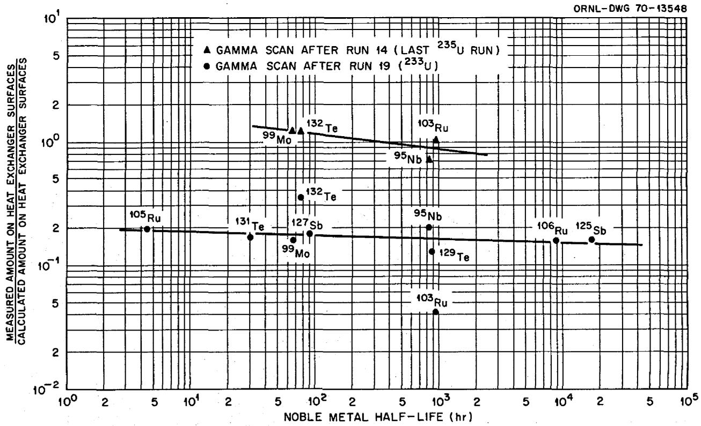  
Fig. 1.1. Comparison Between the Measured and Calculated Amounts of Noble Metals on the MSRE Primary Heat Exchanger.

those measured by gamma scan spectroscopy after run 19. The results appear in Fig. 1.1 along with the more limited data taken after run 14.5 The volume fraction of circulating bubbles in the fuel salt was estimated to be 0.023 to $0.045\%$ during run 14 and 0.5 to $0.6\%$ during run 19. Qualitatively, then, the data are consistent; that is, if noble-metal migration to bubbles were considered in the "calculated value," the denominator would be lowered more rapidly for run 19 than for run 14, and the two curves would approach each other. Quantitative reconciliation is more difficult. If estimated values of the bubble surface area and mass transfer coefficient were used, the denominator of both curves would be lowered so that the ratios would be far greater than 1.0. Now in these calculations the "sticking fraction" has been assumed equal to 1.0 for all surfaces. This is probably reasonable for Hastelloy N, but it may be considerably less than 1.0 for a gas-liquid interface. A sticking fraction could probably be assigned to the bubbles that would bring the two curves together.

The foregoing analysis is typical of numerous others that have been made for other locations and other times. A report presenting all the analytical work on noble-metal migration in the framework of mass transfer theory is currently being written.

# 1.2.3 Radiation Heating

# C. H. Gabbard

The temperature differences between the reactor inlet and the lower head and between the reactor inlet and the core support flange were monitored as an indication of any sedimentation buildup within the reactor vessel. The final tabulation of these temperature differences presented previously7 suggested a slight increasing trend in the temperature rise of the core support flange during operation on $^{233}\mathrm{U}$ fuel. The reactor vessel temperature data for runs 17 through 20 were reviewed to determine if an indication of sedimentation actually existed. The increase in core support flange $\Delta T$ for run 20 was found to have been present when the reactor was first taken to power, apparently as a result of thermocouple error caused by slight differences in heater settings between runs 19 and 20. (The reactor vessel thermocouples were not rebiased at the beginning of run 20.)

The fuel drains on November 2 and December 12, 1969, provided further evidence that sedimentation did

not exist. The run 19 drain (on November 2) occurred immediately after full-power operation, and the run 20 drain (on December 12) was less than 1 hr after full-power operation. The temperature response of the reactor vessel thermocouples following these drains was essentially the same as for other fuel and flush salt drains, and there was no indication of a fission product heat source.

# 1.2.4 Fluorine Evolution from Frozen Salt

# P. N. Haubenreich

In-pile capsule tests showed in 1962 that irradiation of frozen fuel salt could result in evolution of $\mathbf{F}_2$ gas. These and other experiments showed that recombination of the $\mathbf{F}_2$ with the salt was strongly temperature dependent, becoming significant above 80 to $100^{\circ}\mathrm{C}$ . Analysis of the data from these experiments was recently extended to obtain quantitative relations that could be used to define more precisely the conditions necessary to prevent fluorine evolution from the frozen MSRE salt.

The yield of $\mathbf{F}_2$ varied up to about 0.07 molecule per $100\mathrm{eV}$ of absorbed energy, depending on the physical state of the salt and perhaps on the type of radiation. For the in-pile capsules, where the salt composition was like that of the MSRE fuel and the radiation was from included fission products, the most accurately measured value of yield was 0.020 molecule of $\mathbf{F}_2$ per $100\mathrm{eV}$ . In some in-pile capsules which were distinguished mainly by slower cooling and freezing, the yield was practically zero.

Although recombination was observed in some in-pile capsules, the best-defined relation between recombination and temperature was observed in experiments in which simulated MSRE fuel salt at a controlled temperature was exposed to $^{60}\mathrm{Co}$ gamma rays. After considerable $\mathbf{F}_2$ was generated the source was removed and the rate of pressure decrease was used to compute the rate at which $\mathbf{F}_2$ was reentering the salt. The results are plotted in Fig. 1.2. The equation of the straight line which was empirically fitted to the data is

$$
K = 6. 6 5 \times 1 0 ^ {2 6} e ^ {- 9 7 1 0 / T} \text {m o l e c u l e s F} _ {2} \mathrm {h r} ^ {- 1} \mathrm {g} ^ {- 1}.
$$

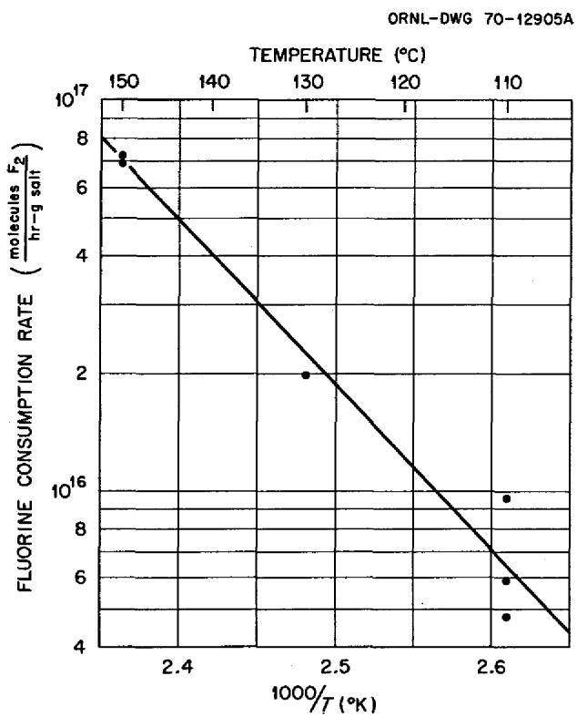  
Fig. 1.2. Fluorine Consumption in Autoclave by Recombination with Simulated MSRE Fuel Salt.

In some of the in-pile capsules it was observed that generally a substantial amount of energy was absorbed before fluorine began to be released from the salt into the gas. A similar "induction period" phenomenon was observed in the $^{60}\mathrm{Co}$ experiments. In these experiments $3 \times 10^{22} \mathrm{eV/g}$ (1.3 Whr/g) was absorbed before $\mathbf{F}_2$ release was evident.

The radioactivity of the MSRE fuel salt after the December 1969 shutdown was calculated by Bell, taking into account the power history and removal of various fission products by gas stripping and deposition. Figure 1.3 shows the energy sources associated with the $4.6 \times 10^{6}$ g of fuel salt as a function of decay time. With the fuel in the large drain tanks, practically all of this energy will be absorbed.

The relations for absorbed energy, $\mathbf{F}_2$ yield, and recombination vs temperature were combined to de

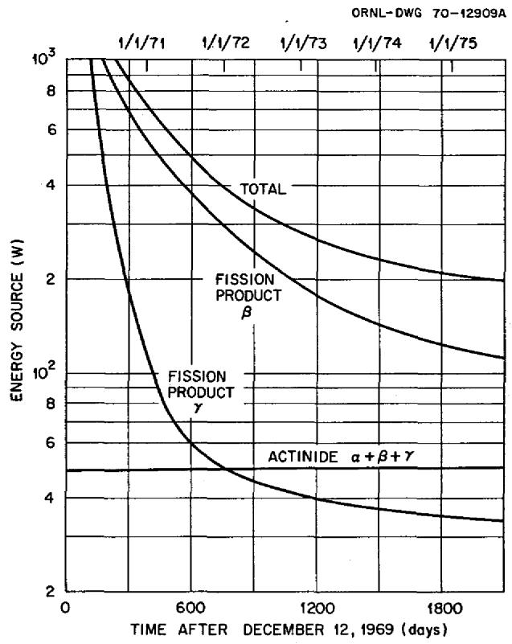  
Fig. 1.3. Energy Sources in MSRE Salt.

termine minimum temperatures at which all the radiolytic $\mathbf{F}_2$ would recombine internally. The required temperature (based on 0.020 molecule per $100\mathrm{eV}$ ) decreased slowly from $173^{\circ}\mathrm{F}$ in January 1971 to $145^{\circ}\mathrm{F}$ in January 1975. The required temperatures would be higher by only $15^{\circ}\mathrm{F}$ if a yield of 0.04 molecule per $100\mathrm{eV}$ were used.

The induction period observed in the $^{60}\mathrm{Co}$ experiments is long compared with the rate of energy absorption in the MSRE fuel salt. If the MSRE fuel were chilled in January 1971, it would be over 30 months before 1.3 W/g was absorbed.

During the interim between the end of nuclear operations and the scheduled examinations it was a simple matter to keep the tank heaters on and the salt much warmer than necessary to recombine all the $\mathbf{F}_2$ internally. Based on the foregoing analysis, it appears feasible to turn off the heaters (except perhaps for a few days each year) without fear of fluorine evolution during the interval between the postoperation examinations and the ultimate disposal of the MSRE salt.

# 2. Component Development

Dunlap Scott

# 2.1 FREEZE-FLANGE THERMAL-CYCLE TEST

Testing of the prototype freeze flange was discontinued in the previous report period after 540 thermal cycles. The planned final inspection1 was not done during the current report period but will be done when manpower becomes available.

# 2.2 PUMPS

P.G.Smith H.C.Young A.G.Grindell

# 2.2.1 Mark 2 Fuel Pump

The pump continued to circulate $\mathrm{LiF - BeF_2 - ZrF_4 - }$ $\mathrm{ThF_4 - UF_4}$ (68.4-24.6-5.0-1.1-0.9 mole %) salt at 1350 gpm and $1200^{\circ}\mathrm{F}$ until August 3, 1970, when the test was shut down after 16,680 hr of operation with molten salt. During the early part of the report period, two more incidents of partial plugging1 of the purge gas system were experienced, one in the shaft annulus and one in the pump tank nozzle connecting to the off-gas

system. Both plugs were cleared by the application of additional heat and did not reoccur.

Upon shutting down the pump and attempting to drain the system salt, it became evident that the line which connects the salt piping to the storage tanks had become plugged, and the salt could not be drained. All the salt in the system was then frozen except for that in the pump tank and in three pressure transmitters. At the end of the report period, procedures were being developed to remove the drain line, to determine the location and nature of the plug, and to replace the line so that the salt could be thawed and drained into the storage tanks.

# 2.2.2 Oil Pump Endurance Test

The endurance test1 of an oil pump, identical to those installed in the lubrication stands which supply oil to the MSRE salt pumps, was halted after 58,900 hr of operation at an oil temperature of $160^{\circ}\mathrm{F}$ and a flow of 60 gpm. A leak had developed in the filter in the water supply line to the lubricant cooler, and in view of the cessation of the operation of the MSRE and the suspension of activity in the MSBE salt pump program, the test was not resumed.

# Part 2. MSBR Design and Development

R. B. Briggs

For the past several years the program of the MSBR design and development activities has been to prepare a reference design for a 1000-MW(e) one-fluid MSBR plant; to design a molten-salt breeder experiment (MSBE), operation of which would provide the data and experience necessary to build large MSBR's; and to develop the components and systems for the MSBE. Work on the reference design for the one-fluid MSBR was begun in October 1967 and has taken most of the effort. Results of the studies were reported in our semiannual reports for the periods ending in February and August 1968 and 1969 and February 1970. The draft of a topical report that describes the plant and the results of the studies in considerable detail has been completed, is being reviewed, and will be published in a few months. Some preliminary work on the design of the MSBE, activities related to the development and procurement of equipment for the MSBE, and some more general development have also been described in the progress reports mentioned above.

Earlier this year the U.S. Atomic Energy Commission decided that the Molten-Salt Reactor Program should concentrate on obtaining solutions to the major technological problems of molten-salt reactors and demonstrating them in the laboratory and in test loops instead of building and operating the MSBE for this purpose. Although this decision did not affect much of the design and development work in progress, it required considerable changes in future plans.

We will continue with design studies of large molten-salt reactor plants because these studies serve to define

generally the technology that requires development and the extent to which development goals are being achieved. Some studies of a 300-MW(e) demonstration plant are described in this report. Progress is being made on plans for a design study of a 1000-MW(e) MSBR by an industrial contractor. This study is intended to provide an industrial version of an MSBR and an industrial assessment of the technology and the potential of molten-salt reactors. We also plan to continue some design studies of the major systems and equipment for the MSBE. Much of the testing and demonstration of the engineering technology should be done on a scale relevant to reactors that may be built in the near future. The MSBE studies will help to establish the scale for the development and some of the more detailed requirements.

In the development program we have curtailed the work on procurement of pumps and steam generators for the MSBE. Design studies and some basic development will be done on steam generators because they present some special problems and none have been built and operated even on a small scale. Plans are being made for loop facilities for testing components of the xenon removal system, the off-gas system, and other features of the fuel salt system. A loop facility is also being planned for developing the technology for the coolant salt system. Some development of maintenance systems and equipment is continuing. In all this work, emphasis is being placed on providing solutions to major problems of equipment and processes that have been defined by the design studies.

# 3. Design

E. S. Bettis

# 3.1 SINGLE-FLUID 1000-MW(E) MSBR DESIGN STUDY REPORT

Roy C. Robertson

The final draft of the report1 covering the study of a 1000-MW(e) single-fluid MSBR power station has been distributed at ORNL for comment and review. We expect the report to be ready for publication early in 1971.

A description of a primary drain tank cooling system using NaK as the heat transport fluid has been added to the report draft. As discussed in Sect. 3.2.6, an NaK-cooled system is believed to have important advantages over the previously described LiF-BeF $_2$ -cooled system.

The customary table of MSBR design data is not repeated in this report because there has been substantially no change since last reported.2 When the table is revised, the thermal conductivity of the core graphite will be changed from the room-temperature value of 34 to $35\mathrm{Btu}\mathrm{hr}^{-1}\mathrm{ft}^{-1}\circ \mathrm{F}^{-1}$ to the $1200^{\circ}\mathrm{F}$ value of $\sim 18$ Btu hr $^{-1}$ ft $^{-1}$ F $^{-1}$ .

# 3.2 MOLTEN-SALT DEMONSTRATION REACTOR DESIGN STUDY

E. S. Bettis

H. A. McLain

C.W.Collins

J.R.McWherter

W. K. Furlong

H. M. Poly

# 3.2.1 Introduction

Whereas past molten-salt breeder reactor design studies have been based on plants of 1000 MW(e) capacity, and for cost estimating purposes have assumed

an established molten-salt reactor industry, there is interest at this time in the general design features and estimated cost of a first-of-a-kind prototype reactor that would precede construction of a large-scale plant. A logical size for this demonstration plant would probably be between 100 and $300\mathrm{MW(e)}$

Studies of molten-salt reactors have shown the fuel cycle cost to be somewhat independent of the nuclear characteristics; that is, a relatively low fuel cycle cost of less than 1 mill/kWhr can be achieved with a high or low power density core and with or without the ability to breed more fissile material than is consumed. The penalty for operating the reactor as a converter rather than a breeder, therefore, is not so much one of a higher cost to produce electric power in the near term, but rather one of reduced conservation of the nation's fissile fuel resources and the consequent effects on power production cost in the long term. Important present benefits of operating molten-salt reactors as converters are that the neutron damage flux can be made low enough for the core graphite to last the 30-year life of the plant and thus not require replacement, salt velocities in the core can be in the laminar region to eliminate the need for sealed graphite to reduce $^{135}\mathrm{Xe}$ poisoning, and the reactor can be operated with less salt processing. These aspects would allow a molten-salt reactor power plant to be built in the near future on a more assured technical and economic basis. Such a reactor would provide valuable data and experience for design and operation of large-scale breeder reactors.

On the basis of the above considerations, a preliminary study has been initiated of a 300-MW(e), or 750 MW(t), molten-salt converter reactor suitable for a demonstration plant. The reactor would have a conversion ratio above 0.8, an assured graphite life of 30 years, and would substitute periodic fuel salt replacement for a continuous salt processing facility.

Results of the early phases of the study are reported below. No cost estimates have been made to date. As in

previous studies, the design presented is not represented as being the most practical or economical but as one which indicates that a feasible arrangement exists.

# 3.2.2 General Description

As may be seen in the simplified flowsheet, Fig. 3.1, the basic arrangement of the demonstration reactor is much the same as in the large-scale breeder reactor designs. Heat generated by fissions in the $^7\mathrm{LiF - BeF}_2$ $\mathrm{ThF_4 - UF_4}$ fuel salt as it passes through the graphitemoderated and -reflected reactor core is transported by the circulating salt to the primary heat exchangers for transfer of the heat to a sodium fluoroborate coolant salt. The coolant salt is, in turn, circulated through the steam generators and steam reheaters. Supercritical-pressure steam is produced at $1000^{\circ}\mathbf{F}$ and is supplied to a conventional turbine-generator. Reheat is to $1000^{\circ}\mathbf{F}$ , and a regenerative feedwater heating system furnishes high-temperature water to the steam generators.

Three primary salt and three secondary salt circulating loops were selected for the demonstration plant rather than the four employed in previous MSBR conceptual design studies. In neither, however, has the number of loops been optimized. Each secondary loop has two steam generator units and one reheater.

# 3.2.3 Buildings and Containment

As shown in Figs. 3.2-3.7, the major components of the primary system are housed in sealed, biologically shielded cells within a domed confinement building. The building is about 92 ft in diameter, with a total height above grade of about 114 ft, and terminates in a flat bottom about 40 ft below grade. The building wall consists of a steel shell having a 2-ft thickness of concrete on the outside of the dome and greater thicknesses, both inside and out, in the lower portions. While this sealed building provides a third line of defense against escape of airborne radioactive contaminants during normal operation of the plant, its primary function is missile and tornado protection. However, when the containment cells are opened for maintenance purposes during reactor shutdowns, the building may temporarily serve as the primary barrier to escape of contaminants.

The sectional elevation of the reactor building is shown in Fig. 3.7. The building is supported by an 8-ft-thick flange extending about 30 ft from the cylindrical wall of the building at an elevation about 40 ft from the bottom. The flange rests upon a prepared foundation on the bed rock. This arrangement lowers

the center of gravity of the structure relative to the support point and is being studied to determine whether it provides a more stable arrangement during seismic disturbances, particularly in that many of the heavy components of equipment are in the upper portion of the building. The three lobes which project from the building to contain the steam-generating cells (see Fig. 3.5) are also supported by the flange. Investigation of this building arrangement is not intended to imply that the demonstration reactor presents special problems with regard to support of equipment. The heavy components could rest on essentially the same stands and supports now planned even if the building were of a more conventional design.

The reactor cell is about 34 ft in diameter and 59 ft high, as shown in Figs. 3.5 and 3.7. As with all the other cells containing highly radioactive materials, the cell wall is made up of two concentric thick-walled steel tanks to provide double containment with a monitored gas space in between. Gas is circulated within the wall to remove the internally generated heat. The cell roof is not designed for easy removal of the reactor core, as in the MSBR designs, but openings are provided to make the required in-service inspections of the vessel and for maintenance of the three fuel salt circulating pumps installed above the reactor vessel.

One of the three primary heat exchanger cells is shown in Figs. 3.5 and 3.7. These cells are about 23 ft in diameter and 22 ft high. They communicate directly with the reactor cell; that is, they share the same atmosphere, but they were made separate in order to provide better shielding during heat exchanger maintenance operations and to simplify cooling of the reactor thermal shield. The U-shell, U-tube primary heat exchangers are mounted horizontally, with one leg above the other, with access to the heads through plugged openings in the cell wall.

The primary drain tank is located in a cell at the lowest level of the building, as indicated in Fig. 3.2, to assure gravity drain of the fuel salt. The heat sink for the drain tank cooling system is located outside the confinement building, however, as will be discussed in Sect. 3.2.6. Another storage tank for the fuel salt, used if maintenance is required on the primary drain tank, is also located on the lowest level in a cell designated for chemical processing equipment.

A large space is provided directly beneath the reactor cell for storage of discarded radioactive equipment and to house the tanks used to store spent fuel salt and fission product gases from the off-gas system. In the case of the latter it should be noted that the bulk of the fission product gases are recycled to the fuel salt

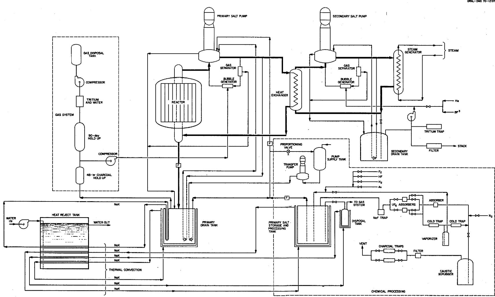  
Fig. 3.1. Simplified Flowsheet for 300-MW(e) Molten-Salt Converter Reactor.

circulating system after a suitable decay period in charcoal beds. The off-gas system equipment is installed in a special cell, indicated in Fig. 3.5.

Space is also provided in the building for the service areas needed for the primary heat exchangers. Rooms for auxiliary systems, control, and instrumentation have been indicated. The building may be larger than necessary in that the initial study emphasized convenience in the layout and seismic protection rather than optimization of building space and costs.

As mentioned above, the steam generator cells are located outside the confinement in three lobes extending symmetrically from the building. Each cell is about 24 ft in diameter and 40 ft high and will house two steam generators, one reheater, and one coolant salt circulating pump. Directly beneath each cell is a 24-ft-diam $\times$ 12-ft-high cell for the associated coolant salt storage tank. The water tank which serves as a heat sink for the primary drain tank cooling system also extends from the building, as shown in Fig. 3.5, and is

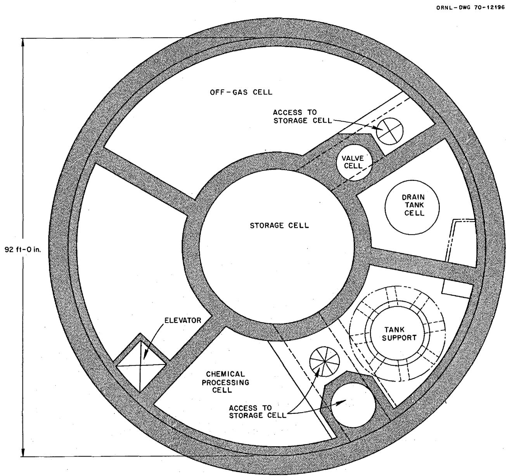  
Fig. 3.2. Plan View, First Floor of Confinement Building, Section AA.

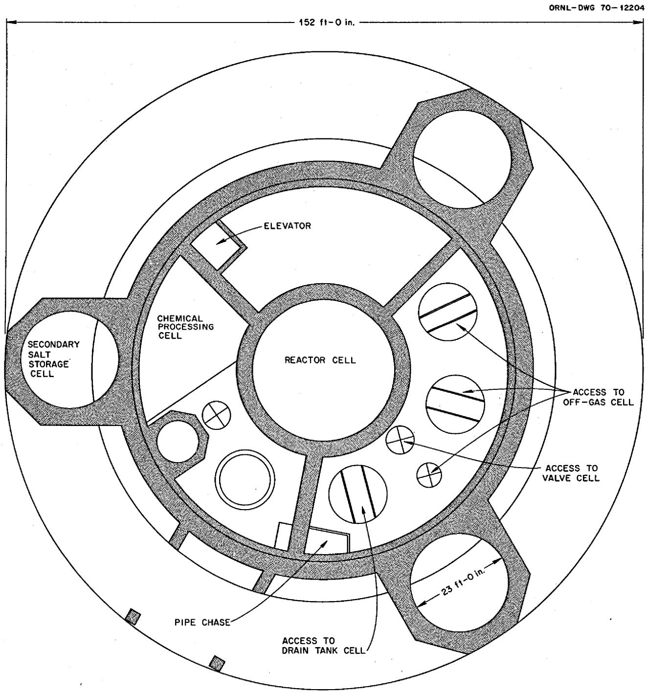  
Fig. 3.3. Plan View, Second Floor of Confinement Building, Section BB.

ORNL-DWG 70-12202

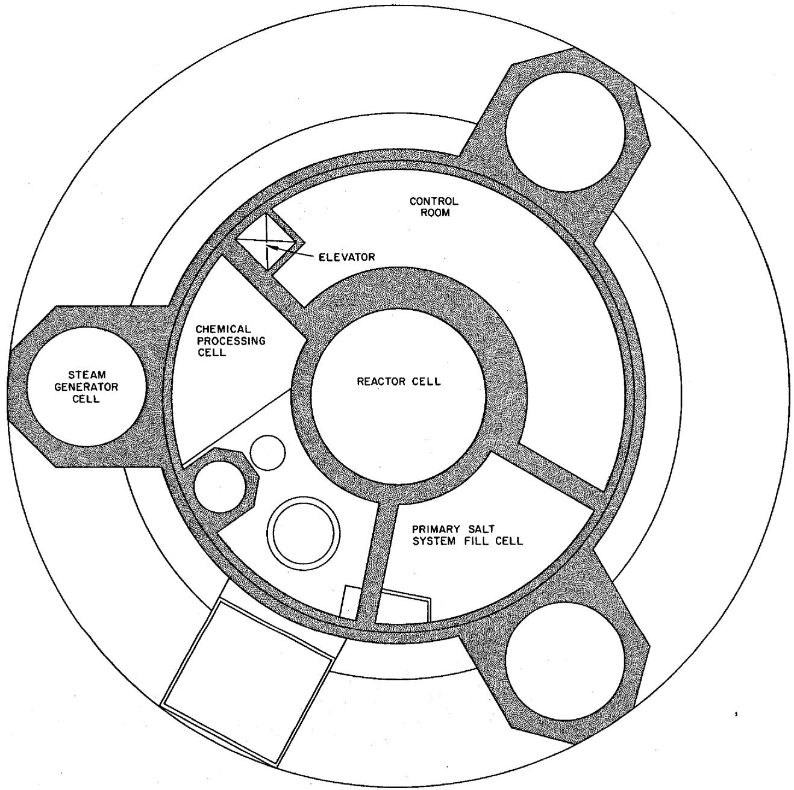  
Fig. 3.4. Plan View, Third Floor of Confinement Building, Section CC.

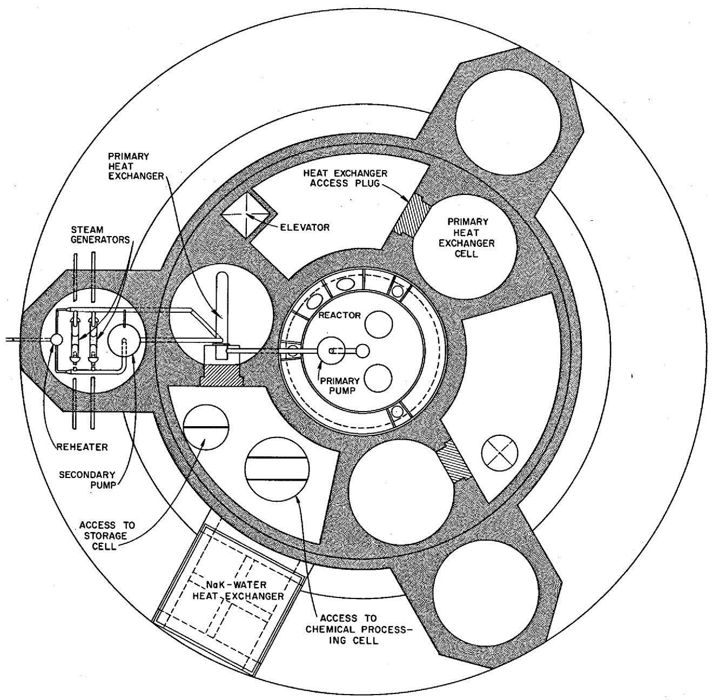  
Fig. 3.5. Plan View, Fourth Floor of Confinement Building, Section DD.

ORNL-DWG 70-12207

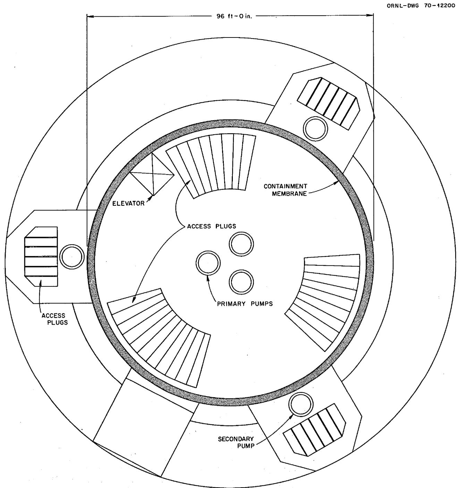  
Fig. 3.6. Plan View, Fifth (Operating) Floor of Confinement Building, Section EE.

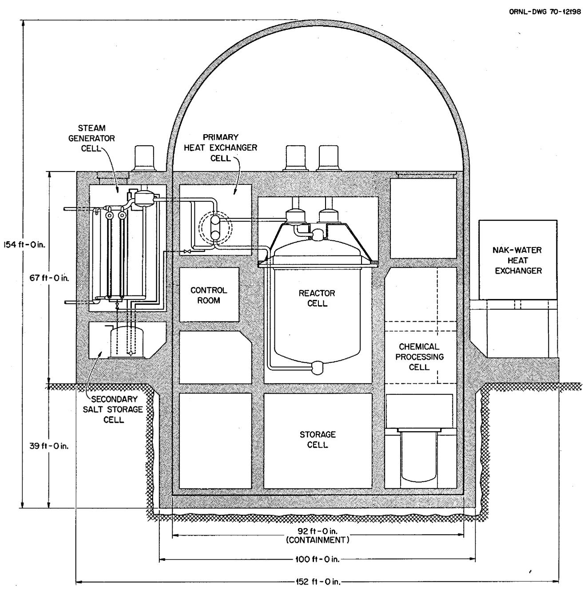  
Fig. 3.7. Sectional Elevation of Confinement Building, Section XX.

supported by the flange around the confinement building.

# 3.2.4 Reactor

As indicated in Fig. 3.8, the general configuration of the demonstration reactor is similar to that used successfully in the MSRE. A conceptual study of an essentially identical design, as used for a 1000-MW(e)

molten-salt converter reactor, has been described previously. The reactor vessel is fabricated of Hastelloy N and is about 26 ft in diameter $\times$ 32 ft high and has a wall thickness of about 2 in. The core is made up of graphite elements $4 \times 4$ in. in cross section with a central hole and flow passages on the four faces to provide channels for the upward flow of fuel salt. The dimensions of the holes and passages are varied as necessary to provide three regions of different salt-to

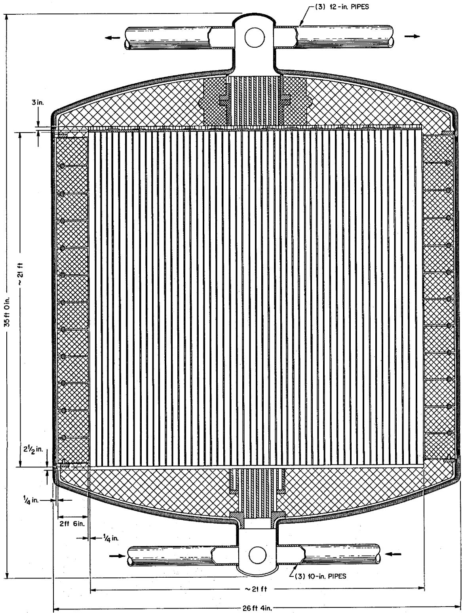  
Fig. 3.8. Sectional Elevation of Reactor Vessel and Core for 300-MW(e) Molten-Salt Converter Reactor Demonstration Plant.

graphite ratio, while at the same time proportioning the flow to give approximately the same total temperature rise of $250^{\circ}\mathrm{F}$ for the salt flowing through the core. The flow velocity is in the laminar region; hence the graphite will probably not require sealing to keep the xenon penetration within tolerable levels. Graphite grid plates are used at the top and bottom to retain the core elements in position as the graphite dimensions change with thermal expansion and neutron irradiation effects. A $2\frac{1}{2}$ -ft-thick graphite reflector around the core is used to improve the neutron economy and to protect the vessel from radiation damage. As previously mentioned, the relatively low power density of about $10\mathrm{W/cm}^3$ in the core will permit the graphite to last the expected 30-year life of the plant. Since the graphite will not require replacement, the vessel is not designed with a removable head, as in previous conceptual designs.

The basic design and nuclear performance data as now known are listed in Table 4.1.

# 3.2.5 Primary Heat Exchangers

The three horizontal primary heat exchanger units are the U-shell, U-tube type shown in Fig. 3.9. The fuel salt enters at 1300 and leaves at $1050^{\circ}\mathrm{F}$ , while the coolant salt enters at 850 and leaves at $1150^{\circ}\mathrm{F}$ . The fuel salt flows through 1390 Hastelloy N U-tubes, $\frac{1}{2}$ in. OD X

31 ft long, to provide an effective surface of about $5650\mathrm{ft}^2$ per exchanger. Each leg of the U-shell is 30 in. ID and about 13 ft long.

The heat exchangers are of a design different from those previously proposed for molten-salt reactor systems because the maintenance scheme is not based on replacement (from above) of an entire tube bundle if a leak should develop in a unit. Instead, plans are to operate from the side to remove the exchanger heads and to locate and plug faulty tubes. As shown in Fig. 3.5, plugged openings are provided between the heat exchanger cells and the exchanger service area. These areas are equipped with remotely operated welding and cutting equipment, viewing devices, etc., to cut the inversely dished heads from the exchangers to expose the tube sheet at each end. Leaks can be detected by visual observation or by gas pressurization of the secondary system and acoustical probing. Remotely operated cutting and welding equipment is being developed for use in making repairs.

# 3.2.6 Primary Drain Tanks

The Hastelloy N tank used to store the fuel salt when it is drained from the primary circulating system is about 10.5 ft in diameter $\times$ 20 ft high, as shown in Fig. 3.10. The tank has sufficient capacity to store all the

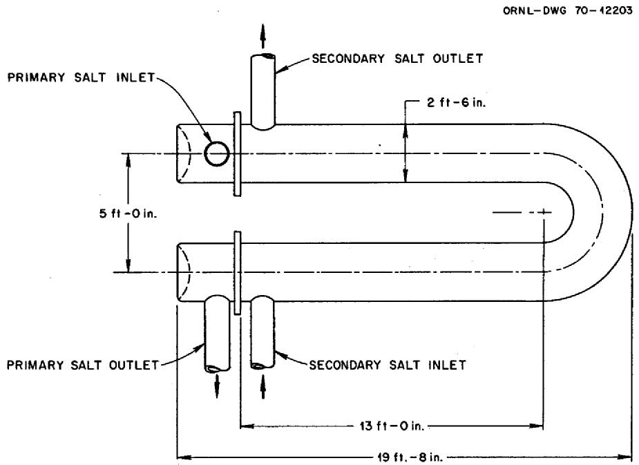  
Fig. 3.9. Primary Heat Exchanger for 300-MW(e) Demonstration Plant.

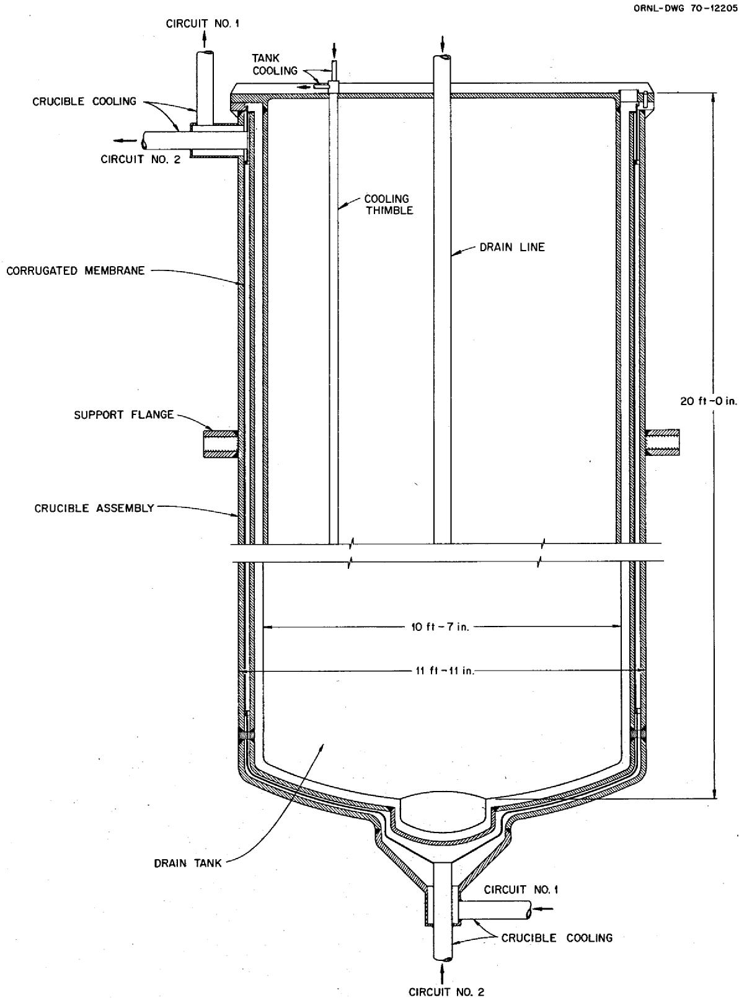  
Fig. 3.10. Elevation of Primary Drain Tank for 300-MW(e) Demonstration Plant.

fuel salt plus the amount of coolant salt that could credibly find its way into the fuel system in event of heat exchanger tube failures. The drain tank is located in the drain tank cell at the lowest level in the building (see Fig. 3.2).

During normal operation a small amount of salt overflows from the primary circulating pumps into the drain tank, and the fission product gases removed from the circulating system also pass into the drain tank for holdup and decay. Heat generation from these sources is estimated to be about $6\mathrm{MW(t)}$ . Although the salt would not normally be suddenly drained into the tank, a major leak in the primary system could make this necessary. In this event the afterheat released in the drain tank could be about $18\mathrm{MW(t)}$ , but the rate would decrease by one-half in $15\mathrm{min}$ and by two-thirds in 3 to $4\mathrm{hr}$ .

As in previous designs, jet pumps are installed in the bottom of the drain tank to transfer the salt to the fuel circulating system, to the fuel salt storage tank mentioned below, or to a chemical processing system if required. The jets are operated by a small auxiliary salt circulating pump.

The flowsheet for the drain tank cooling system has been included in Fig. 3.1. Heat is transported by a sodium-potassium eutectic (NaK) circulated through 400 thimbles which hang in the stored salt from the flat top head of the tank. The thimbles are fabricated of $2^{1/2}$ -in. sched 40 Hastelloy N pipe. The layout of the thimble penetrations in the tank head is shown in Fig. 3.11, and a detail drawing of the construction at a penetration is shown in Fig. 3.12. Each thimble contains a $2^{1/4}$ -in.-OD $\times 1/8$ -in.-wall tube which, in turn, contains a $17/16$ -in.-OD $\times 1/16$ -in.-wall tube. The NaK enters, flows to the bottom through the inner tube, and then returns upward through the annulus between tubes. About $5100\mathrm{ft}^2$ of effective heat transfer surface is thus provided. The annulus between the $2^{1/4}$ -in.-OD tube and the thimble is filled with gas, the major portion of the heat being transferred by radiation from the thimble wall to the NaK-filled tube. This arrangement provides a double barrier between the fuel salt and the NaK and also an intervening gas space that can be monitored for leakage.

The thimbles are manifolded at the top of the tank into 40 separate circuits. The NaK circulates by natural

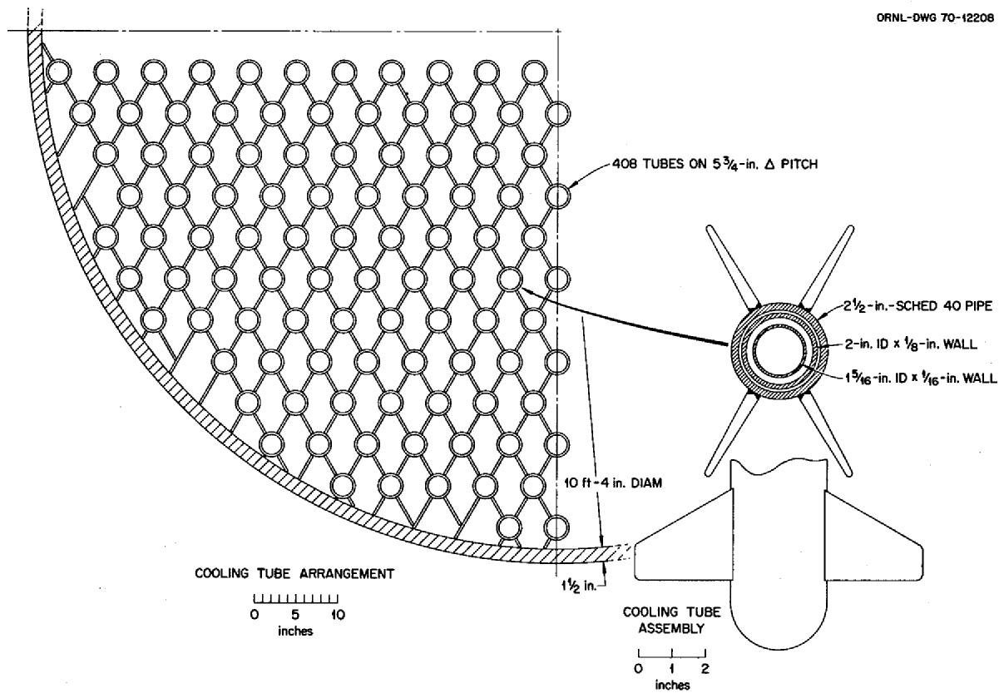  
Fig. 3.11. Cooling Tube Layout on Head of Primary Drain Tank.

convection through these circuits to 2-in.-OD tubes that run horizontally through a 25-ft-square water-filled tank located about 60 ft above the drain tank level and outside the containment building, as shown in Fig. 3.5. The tubes are installed inside $2\frac{1}{2}$ -in. pipe to provide a double barrier, with a monitored gas space, similar to that used in the drain tank. The effective heat transfer surface is about 30,000 ft², and, as in the drain tank, the heat is transferred primarily by radiation across a gas-filled annular space. The water in the pool would be circulated and cooled as required. Should the water supply be interrupted, the water would boil. The tank capacity, however, is sufficient to provide about three days of heat removal capacity at the maximum required rate. An auxiliary supply of makeup water could undoubtedly be established in the interval.

During initial warmup of the reactor system it is desirable to reduce the heat losses from the drain tank

system. Electromagnetic pumps installed in the NaK-filled riser pipes can be operated in reverse to reduce the thermal convection flow during the startup phase.

The drain tank is installed inside another tank, as indicated in Fig. 3.10. The outside tank, or "crucible," is a precaution against a leak developing in the primary drain tank vessel. The outside tank is of double-walled construction with an internal partition to form two separate NaK circulation circuits for cooling the vessel wall. If salt leaks into the outside tank, the heat would be removed by this system. During normal operation, heat is transferred by radiation to the outside tank to cool the wall of the primary drain tank.

# 3.2.7 Fuel Salt Storage Tank

A storage tank must be provided for the fuel salt in the event that the primary drain tank must be repaired,

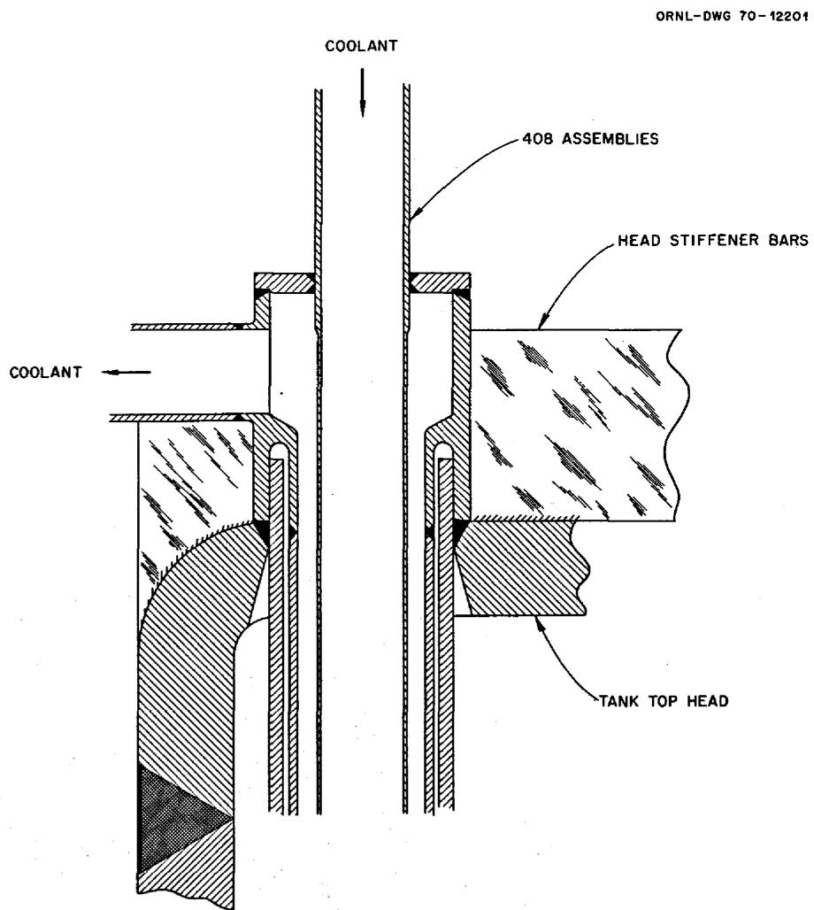  
Fig. 3.12. Detail of Thimble Penetration of Drain Tank Head.

it not being feasible to store the salt in the reactor system during the operation. The storage tank can also be used for fluorinating a spent fuel salt charge to recover the uranium before the salt is sent to the separate discard tanks and for adding $\mathrm{UF}_6$ and $\mathbf{H}_2$ to a fresh charge of carrier salt to reconstitute the fuel salt for the system.

The Hastelloy N storage tank is about 10 ft in diameter and 25 ft high. Plan and elevation views are shown in Figs. 3.13 and 3.14, and the location of the tank in the building is indicated in Figs. 3.2 and 3.7.

The heat release from a fuel salt charge in the storage tank is relatively low, since the activity will have decayed in the primary drain tank prior to transfer. Assuming a 30-day decay period, the heat load on the

storage tank cooling system should be less than 1 MW(t). This amount of heat can be transferred through the tank wall to the NaK-cooled wall of an outside tank which surrounds this vessel in an arrangement similar to that used for the primary drain tank.

The corrosion of the tank during the fluorination process is of greatest concern at the liquid-gas interface. The design has not yet been studied in depth, but the thickness of the tank wall can be made sufficient for the anticipated number of fluorinations required.

# 3.2.8 Discard Salt Storage Tanks

A fuel salt charge in the primary circulating system will have finite life due to the accumulation of fission product poisons. The practical life-span may be in the

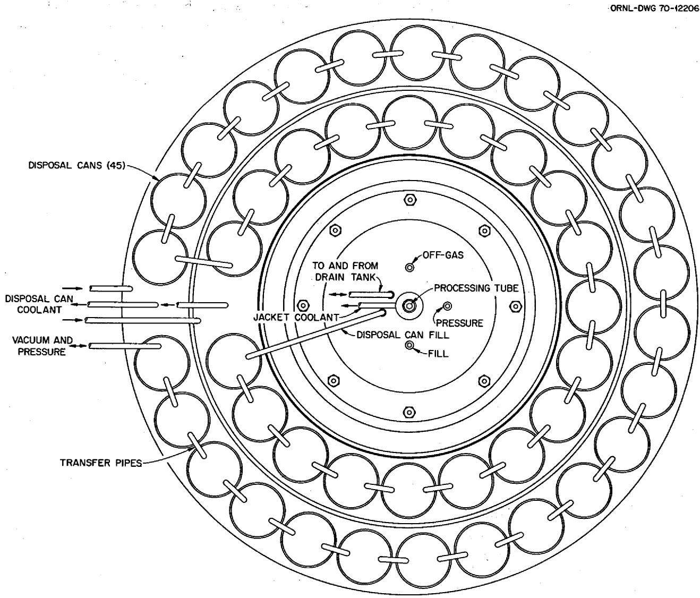  
Fig. 3.13. Plan View of Fuel Salt Storage Tank.

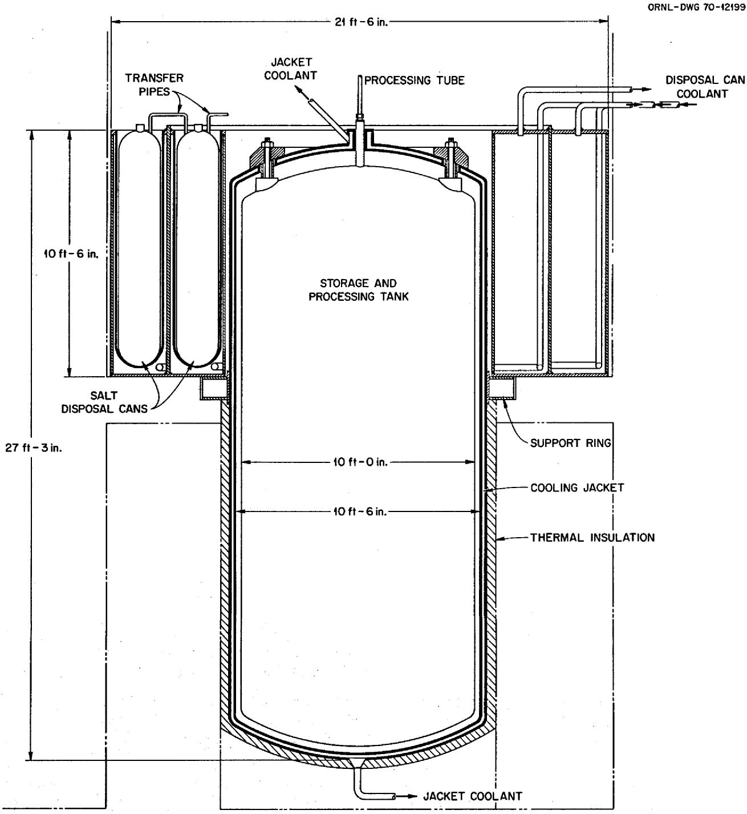  
Fig. 3.14. Sectional Elevation of Fuel Salt Storage Tank.

order of seven to eight years, depending on the amount of chemical processing available. Provisions must therefore be made in the demonstration plant for removal, treatment, and long-term storage of three to four spent fuel-salt charges. Before storage the uranium would be recovered by fluorination in the storage tank, as discussed above.

The preliminary design concept shows each discarded salt charge stored in 45 cans, 2 ft in diameter × 10 ft high, arranged vertically in concentric circles around the fuel salt storage tank, as shown in Figs. 3.13 and 3.14. (The location of the cans and the storage tank is indicated in Figs. 3.2 and 3.7.) All the cans are connected in series through 1-in. pipes, the salt being transferred by gas pressurization of the storage tank. Gas blowback can be used to clear the interconnecting piping of salt. The cans are cooled by radiation of heat from the surfaces to concentric containers having NaK-cooled walls. After sufficient decay time has elapsed, the discard tanks can be cut apart using remotely operated tools, the tank nipples can be welded shut or otherwise sealed, and the filled tanks can be transferred to the storage cell beneath the reactor or to another approved storage site. A new set of salt discard tanks would then be installed to receive the spent fuel salt charge to follow.

# 3.2.9 Steam System

The steam power system associated with the demonstration plant has not been studied in detail, but in general it may be said that the coolant salt would probably transfer its heat to the supercritical-pressure steam system delivering steam to the turbine throttle at $1000^{\circ}\mathrm{F}$ , with reheat to $1000^{\circ}\mathrm{F}$ . The regenerative feedwater heating system would probably be very similar to that proposed for the 1000-MW(e) MSBR power station. The net thermal efficiency of the cycle would be about $44\%$ .

# 3.3 AFTERHEAT TEMPERATURES IN EMPTY MSBR HEAT EXCHANGERS

# J. R. Tallackson

MSBR heat exchangers must be able to withstand the temperatures developed by afterheat from some fraction of the noble metal fission products3 which plate out on metal and graphite surfaces. Normally this afterheat presents no difficulties, as it is easily removed

by continuing the circulation of secondary salt after the primary salt is drained. An entirely different situation will exist, albeit unlikely, if both primary and secondary salt systems are rapidly drained immediately after reactor shutdown. This afterheat must then be removed by radiative transfer, and the heat exchangers should be designed to withstand the temperatures required to effect transfer.

Temperatures developed in MSBR heat exchangers during the radiative transfer of afterheat have been calculated. The calculations covered four sizes rated at 94, 141, 188, and 281 MW and having scaled-down construction generally similar to the 563-MW unit in Fig. 5.6, p. 58 in ref. 3. These calculations, fairly detailed and extensive, are being reported in ORNL-TM-3145.

It was assumed that $40\%$ of the noble metal fission products (see Fig. 5.8, curve B, p. 60, ref. 3) will deposit uniformly inside the heat exchanger tubes and that no heat will be transferred by conduction through, or convection of, the gases in the exchanger. The radiative transfer calculations used the method outlined by Sparrow and Cess for diffuse radiation in multisurface enclosures. In the enclosure forming the tube annulus, the tube layout was considered to be concentric rings of tubes with each ring a single surface. Emissivity of the internal surfaces is expected to be from 0.1 to 0.3. Steady-state calculations were made with the heat production rates expected $10^{3}$ to $10^{6}$ sec after reactor shutdown. By considering the heat capacity of an empty exchanger, an approximate initial transient was inferred, and it appears that peak temperatures will be developed in from 2 to 4 hr after shutdown. Figure 5.15 shows typical steady-state temperature profiles, with emissivity a parameter, in a 141-MW exchanger at the heat rate expected $10^{4}$ sec $(2.8\mathrm{hr})$ after shutdown. This size heat exchanger is of interest since its size is appropriate for an MSBE.

From these calculations, it has been concluded that:

1. the heavy intermediate shell adjacent to the outer shell is an effective radiation shield and that its removal will produce a worthwhile reduction in peak temperatures;   
2. the reduction, 5 to $15\%$ , in internal heat generation resulting from gamma energy escaping outside the exchanger has little effect on peak temperatures;

3. the large 563-MW "reference design" heat exchanger having the equivalent of 31 tube circles and experiencing the conditions postulated will reach unac

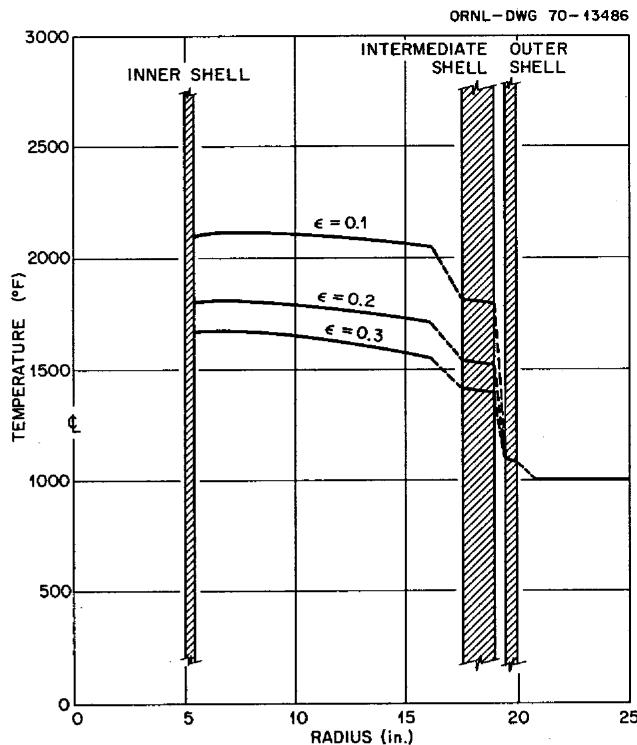  
Fig. 3.15. Steady-State Temperature Profiles in an Empty 141-MW Heat Exchanger at Three Values of Internal Surface Emissivity.

ceptably high temperatures, from 2500 to $3000^{\circ}\mathbf{F}$ depending on the emissivity of Hastelloy N. This statement is based on an extrapolation of temperatures computed for the smaller exchangers.

# 3.4 INDUSTRIAL STUDY OF 1000-MW(E) MOLTEN-SALT BREEDER REACTOR

M. I. Lundin J. R. McWherter

Preparations are nearly complete for issuance of a request for proposals for an industrial study of a 1000-MW(e) MSBR. Internal reviews and approvals of the request for proposal package have been obtained, and the package has been submitted to AEC-RDT for review. A preliminary expression of interest has been received from some 26 industrial firms.

The study, to begin in FY 1971, will consist of several sequential tasks. The first task is the development of a concept for a 1000-MW(e) reactor plant which will have a chemical processing plant based on information furnished by Oak Ridge National Laboratory. The second task is the evaluation of the effects of various parameters on the power production cost. Other tasks include the study of a modified plant concept having a chemical processing plant proposed by the contractor and the recommendations by the contractor for the molten-salt program research and development effort.

# 4. Reactor Physics

A.M.Perry

# 4.1 PHYSICS ANALYSIS OF MSBR

# 4.1.1 Fixed-Moderator Molten-Salt Reactor

H. F. Bauman

Molten-salt reactor concepts designed for a first generation of commercial power reactors were presented in a brief survey in the last semiannual report. From this study we have drawn several important conclusions:

1. A breeder reactor with fixed (nonreplaceable) moderator can be designed within the present limitation on graphite fast-neutron exposure. It could be in essence a scaleup of the MSRE. The breeding gain and power cost would be comparable with the reference single-fluid MSBR; however, because of its lower power density and higher fissile inventory, it would be only about half as effective in conserving fissile fuel resources.   
2. Molten-salt reactors require continuous processing for breeding, but not necessarily for generating low-cost power. A reactor with the simplest possible batch processing, in which the salt is discarded after removing the uranium by fluorination, has an estimated fuel-cycle cost comparable with the reference MSBR and a conversion ratio above 0.8.   
3. A reactor in which the core moderator consists of a random-packed bed of graphite spheres, while probably the simplest to construct and maintain, has inherently an unfavorable salt-to-moderator ratio, leading to a higher fissile inventory and higher fuel-cycle cost than for a prismatic core.

In light of the above conclusions, in the current half year we have concentrated our analytical work on prismatic, fixed-moderator core designs. We have studied the effect of core zoning on the fast (damage) flux distribution and the effect of salt composition on

the performance of fixed-moderator breeders and have begun to study a prototype reactor [about $300\mathrm{MW(e)}]$ with batch processing. We have developed an improved procedure for calculating the average performance of a reactor with batch processing.

Fixed-Moderator MSBR. - Several of the more important parameters affecting the performance of the fixed-moderator single-fluid MSBR were investigated. As in other recent breeder studies, the conservation coefficient² was taken as the figure of merit. Several preliminary cases showed that processing cycle times of 10 days for $^{233}\mathrm{Pa}$ removal and 25 days for rare-earth removal (as suggested by the Chemical Technology Division for the metal transfer process) gave good performance, and these were adopted as standard for this study. The optimization provision of the ROD code was used to adjust the dimensions and salt fractions in three core zones (in spherical geometry) to optimize the flux distribution. The salt composition, in particular the thorium concentration, was studied in a parameter survey. Calculations were run in parallel for 1000- and 300-MW(e) plant sizes to provide information in a size appropriate for a prototype reactor as well as for the standard size.

The reactor model consists of three core zones surrounded by a salt annulus and a $2^{1/2}$ -ft-thick graphite reflector. The code may vary the core zone thicknesses and volume fractions to determine the optimum flux distribution consistent with a 30-year core life. For the 1000-MW(e) cases, the optimum fast (damage) flux distribution was perfectly flat across zone 1, dropping off in the other zones. For the 300-MW(e) cases, where neutron leakage is more important, the optimum flux

distribution was flattened but still peaked at the center of the core.

Results from a series of cases in which the thorium concentration was varied from 10 to 18 mole % are given in Table 4.1. The nominal composition of each salt is given in Table 4.2. The ROD calculation as used in this study is capable of adjusting the core parameters to give a nominal core graphite life of 30 years within ±2%. Most of the cases fell within these limits; however, three of the cases terminated with greater deviations (up to 7%) from the desired nominal core life. Rather than expend additional computer time to adjust the core life, the results of all cases were adjusted to an equivalent 30-year core life on the basis of the following assumptions:

1. the peak damage flux is inversely proportional to the core volume,   
2. the breeding ratio is unaffected by small changes in the core volume,   
3. the in-core fissile inventory is directly proportional to the core salt volume.

The core dimensions, fissile inventory, conservation coefficient, fuel yield, and fuel-cycle cost were adjusted in accord with these assumptions, making the cases directly comparable while introducing only negligible error as long as volume adjustments were small.

The conservation coefficient is plotted as a function of thorium concentration in Fig. 4.1. The optima lie in the range 14 to 16 mole % thorium for the 1000-MW(e) plant and 15 to 17 mole % thorium for the 300-MW(e)

Table 4.2. Nominal Fuel Carrier Salt Compositions for Single-Fluid Molten-Salt Reactors   

<table><tr><td>Salt number</td><td>10</td><td>12</td><td>14</td><td>16</td><td>18</td></tr><tr><td>Composition, mole %</td><td></td><td></td><td></td><td></td><td></td></tr><tr><td>ThF4</td><td>10</td><td>12</td><td>14</td><td>16</td><td>18</td></tr><tr><td>BeF2</td><td>18</td><td>16</td><td>16</td><td>14</td><td>12</td></tr><tr><td>LiF</td><td>72</td><td>72</td><td>70</td><td>70</td><td>70</td></tr><tr><td>Liquidus temperature, °Ca</td><td>495</td><td>500</td><td>500</td><td>510</td><td>520</td></tr></table>

$^{a}$ R. E. Thoma (ed.), Phase Diagrams of Nuclear Reactor Materials, ORNL-2548, p. 80 (November 1959).

Table 4.1. The Effect of Thorium Concentration in the Fuel Salt on Performance of Permanent-Core Molten-Salt Breeder Reactor Designs   
Core graphite life, 30 years; effective processing cycle time: protactinium removal, 10 days; rare earth removal, 25 days   

<table><tr><td>Plant size, MW(e)</td><td>300</td><td>300</td><td>300</td><td>300</td><td>300</td><td>1000</td><td>1000</td><td>1000</td><td>1000</td><td>1000</td></tr><tr><td>Thorium concentration in fuel salt, mole %</td><td>10</td><td>12</td><td>14</td><td>16</td><td>18</td><td>10</td><td>12</td><td>14</td><td>16</td><td>18</td></tr><tr><td>Case identification (SCC series)</td><td>198</td><td>190</td><td>200</td><td>202</td><td>204</td><td>199</td><td>197</td><td>201</td><td>203</td><td>205</td></tr><tr><td colspan="11">Volume fraction salt in core</td></tr><tr><td>Zone 1</td><td>0.150</td><td>0.136</td><td>0.120</td><td>0.106</td><td>0.090</td><td>0.155</td><td>0.151</td><td>0.137</td><td>0.128</td><td>0.119</td></tr><tr><td>Zone 2</td><td>0.131</td><td>0.122</td><td>0.107</td><td>0.091</td><td>0.075</td><td>0.122</td><td>0.120</td><td>0.111</td><td>0.106</td><td>0.101</td></tr><tr><td>Zone 3</td><td>0.160</td><td>0.150</td><td>0.136</td><td>0.120</td><td>0.105</td><td>0.137</td><td>0.136</td><td>0.127</td><td>0.121</td><td>0.116</td></tr><tr><td colspan="11">Thickness of core zones,a ft</td></tr><tr><td>Zone 1</td><td>6.66</td><td>6.18</td><td>6.56</td><td>6.59</td><td>6.63</td><td>8.63</td><td>8.47</td><td>8.46</td><td>8.83</td><td>8.89</td></tr><tr><td>Zone 2</td><td>1.71</td><td>2.07</td><td>2.69</td><td>2.62</td><td>2.66</td><td>2.03</td><td>2.00</td><td>3.64</td><td>4.40</td><td>4.73</td></tr><tr><td>Zone 3</td><td>2.33</td><td>2.40</td><td>1.31</td><td>1.25</td><td>1.15</td><td>3.77</td><td>3.67</td><td>1.97</td><td>0.62</td><td>0.45</td></tr><tr><td>Annulus</td><td>0.20</td><td>0.09b</td><td>0.11</td><td>0.11</td><td>0.09b</td><td>0.14b</td><td>0.14b</td><td>0.14b</td><td>0.14b</td><td>0.14b</td></tr><tr><td>Core diameter, overall, ft</td><td>21.8</td><td>21.5</td><td>21.3</td><td>21.1</td><td>21.1</td><td>29.1</td><td>28.6</td><td>28.5</td><td>27.7</td><td>28.4</td></tr><tr><td>Specific fissile inventory, kg/MW(e)</td><td>2.94</td><td>2.92</td><td>2.86</td><td>2.81</td><td>2.76</td><td>1.91</td><td>2.17</td><td>2.22</td><td>2.30</td><td>2.62</td></tr><tr><td>Breeding gain, %</td><td>4.55</td><td>4.77</td><td>5.28</td><td>5.32</td><td>4.71</td><td>4.23</td><td>6.04</td><td>6.85</td><td>7.31</td><td>7.95</td></tr><tr><td>Conservation coefficient, [MW(t)/kg]2</td><td>2.66</td><td>2.83</td><td>3.27</td><td>3.41</td><td>3.13</td><td>5.89</td><td>6.48</td><td>7.02</td><td>7.00</td><td>5.85</td></tr><tr><td>Fuel yield, percent per annum</td><td>1.18</td><td>1.24</td><td>1.41</td><td>1.44</td><td>1.30</td><td>1.68</td><td>2.12</td><td>2.34</td><td>2.42</td><td>2.31</td></tr><tr><td>Fuel-cycle cost, mills/kWhr</td><td>1.33</td><td>1.23</td><td>1.18</td><td>1.13</td><td>1.08</td><td>0.71</td><td>0.72</td><td>0.71</td><td>0.70</td><td>0.75</td></tr></table>

${}^{a}$ Three-zoned cores with zone thicknesses and volume fractions optimized for maximum conservation coefficient by ROD calculations in spherical geometry.   
$b$ Not optimized.

plant. The optima based on fuel yield, as shown in Fig. 4.2, lie in about the same ranges. The fuel-cycle costs, shown in Fig. 4.3, decrease with increasing thorium concentration for the 300-MW(e) plant, mainly because of the decreasing fuel salt fraction in the core and consequent fuel salt inventory. This behavior results in part from the fact that the reactor design for each value of thorium concentration is optimized with respect to the fuel conservation coefficient rather than with respect to fuel-cycle cost. The fuel-cycle costs for the 1000-MW(e) plant are very flat but begin to turn up beyond 16 mole % thorium. The fuel-cycle costs are based on the same economic assumptions as for the reference MSBR.

Calculations for Batch Processing. - In our past studies of molten-salt breeder reactors we have assumed equilibrium fuel composition and continuous processing - good assumptions for high-power-density reactors which reach equilibrium rather quickly. Relatively low-power-density reactors (in which the radiation-exposure life of the moderator graphite is equal to the service life of the plant) are likely to have a lower fuel specific power and therefore to reach equilibrium more slowly, so that the mode of startup is not negligible in calculating the average performance over the lifetime of the reactor. Further, reactors in which the fuel is processed batchwise at intervals of several years do not achieve a breeding gain of unity and therefore require and are sensitive to a fissile feed.

Codes for calculating the time-dependent (i.e., nonequilibrium) behavior of MSR's have been available to us for several years, though each has been subject to

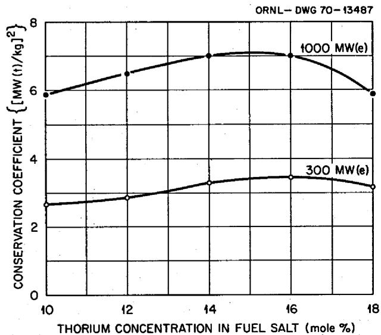  
Fig. 4.1. Permanent Core MSBR Thorium Concentration vs Conservation Coefficient.

some limitations or restrictions. For comparison with our equilibrium-fuel-cycle calculations, we have found it useful to employ ROD (our equilibrium reactor code) for nonequilibrium, batch-processing cases by establishing an approximate equivalence between the fuel-cycle times for a continuous processing case and for a batch process. We can then use ROD to simulate the average performance over the duration of the batch cycle or over as many batch cycles as may be expected in the lifetime of the reactor.

To obtain an average performance over a reactor lifetime, it is necessary to supply ROD with a time-weighted average fuel composition. (The feed rate and concentration of the principal fissile feed material, such

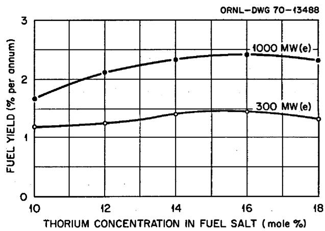  
Fig. 4.2. Permanent Core MSBR Thorium Concentration vs Fuel Yield.

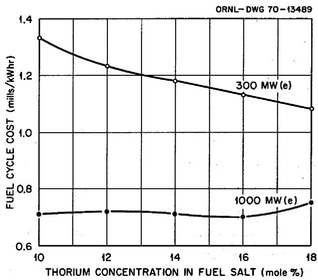  
Fig. 4.3. Permanent Core MSBR Thorium Concentration vs Fuel Cycle Cost.

as $^{239}\mathrm{Pu}$ , may be adjusted slightly by ROD to attain criticality.) For this purpose we have used a one-group, zero-dimensional, time-dependent code written several years ago by R. S. Carlsmith, which we have adapted for the IBM 360 computer and have named HISTRY. With average reaction rates per nuclide taken from any space-energy-dependent code (such as ROD), HISTRY can calculate the concentrations and inventories of the nuclides in the fuel chain over the reactor lifetime.

We have amplified the HISTRY code by adding a computation of the lifetime-average nuclide concentrations, which, in turn, can be input to ROD to calculate lifetime average reaction rates for use in HISTRY. We have also divided the "neutron poison" in HISTRY into two groups: a fixed poison, to represent the neutron absorptions in such constant absorbers as the moderator and the carrier salt, and a lumped fission product poison, which may be allowed to build up as a parabolic function of time, if desired. We have further augmented the HISTRY code to permit the explicit calculation of any number of batch cycles; in the revised code the plutonium nuclides, for example, may be permitted to build up throughout the cycle and be removed for the start of the next cycle. The fission product poison fraction may be represented as a parabolic function reset to zero at the start of each cycle.

In summary, we require reaction rates per nuclide, from ROD, as input for the HISTRY code, and we need time-averaged concentrations over the reactor, from HISTRY, as input for ROD. Thus an iterative process is involved, which we find converges very satisfactorily in about two passes so that further iteration produces trivial changes in either ROD or HISTRY results.

To obtain an average performance over one or more batch processing cycles it would be necessary to supply ROD with the time-weighted average concentration for each fission product absorber. However, ROD already has the capability of calculating the concentration of each fission product for a given removal rate (i.e., for continuous processing). Much of the versatility of this calculation could be retained if the equivalent average removal rate for batch processing could be related to the continuous removal rate inherent in the ROD calculation. This relationship, the “ $b/c$ ratio,” may be thought of as the ratio of the batch cycle time to the equivalent continuous processing cycle time for each fission product poisoning on the average. It must be a number between 1.0 and 2.0, where 1.0 is the limit for rapidly saturating nuclides (which rise quickly to a saturation concentration and remain there over most of the cycle) and 2.0 is the limit for nonsaturating nuclides

(which rise in concentration linearly throughout the cycle). A series of ROD cases was run with continuous processing times ranging from 0.25 to 16 years to determine the fission product buildup for the 300-MW(e) reactor, and $b / c$ ratios were estimated from the saturation characteristics as exhibited in the curves of equilibrium poisoning vs continuous processing rate. It was found that the $b / c$ ratios for most nuclides did not change much over the range of processing times of interest (say, 2 to 8 years), and it appeared reasonable to group most of the 200 nuclides together with a single average $b / c$ ratio. However, three nuclides were sufficiently different from the average in buildup that we elected to assign them separate $b / c$ ratios. They are $^{143}\mathrm{Nd}$ , $^{149}\mathrm{Sm}$ , and $^{151}\mathrm{Sm}$ . The resulting $b / c$ ratios for these three nuclides (based on their buildup in concen

Table 4.3. Average Performance of a Fixed-Moderator 300-MW(e) MSR with Batch Processing and Plutonium Feed   

<table><tr><td>Identification</td><td>A 11-2</td></tr><tr><td>Thorium concentration in fuel salt, mole %</td><td>10</td></tr><tr><td>Processing cycle time, batch, years</td><td>8</td></tr><tr><td>Volume fraction salt in core</td><td></td></tr><tr><td>Zone 1</td><td>0.11</td></tr><tr><td>Zone 2</td><td>0.09</td></tr><tr><td>Zone 3</td><td>0.12</td></tr><tr><td>Thickness of core zones, ft</td><td></td></tr><tr><td>Zone 1</td><td>6.6</td></tr><tr><td>Zone 2</td><td>2.6</td></tr><tr><td>Zone 3</td><td>1.3</td></tr><tr><td>Annulus</td><td>0.1</td></tr><tr><td>Core diameter, overall, ft</td><td>21.1</td></tr><tr><td>Fuel salt volume, total, ft3</td><td>880</td></tr><tr><td>Specific fissile inventory, kg/MW(e)</td><td>1.9</td></tr><tr><td>Conversion ratioc</td><td>0.84</td></tr><tr><td>Fuel-cycle cost, mills/kWhr</td><td></td></tr><tr><td>Inventory</td><td></td></tr><tr><td>Fissile</td><td>0.33</td></tr><tr><td>Salt</td><td>0.07</td></tr><tr><td>Replacementb</td><td>0.07</td></tr><tr><td>Processingc</td><td>0.08</td></tr><tr><td>Fissile feed</td><td>0.30</td></tr><tr><td>Total fuel-cycle cost</td><td>0.85</td></tr></table>

${}^{a}$ Assuming that the plutonium discarded with the fuel salt is not recovered.   
$b$ Replacement includes thorium and carrier salt.

${}^{c}$ Normalized to 0.1 mill/kWhr for a four-year cycle; unit cost assumed to vary inversely as the 0.3 power of the average processing rate.

tration), for the others (lumped on the basis of their absorption buildup), and for the average of all fission products are shown in Fig. 4.4 as a function of the inferred equivalent batch processing time.

Prototype Fixed-Moderator MSR. - Previous studies in the molten-salt program have generally concerned full-scale breeder reactors or relatively small reactor experiments. We have begun a study of a reactor design for a first commercial molten-salt reactor power station, that is, a prototype MSR in the size range of 100 to 500 MW(e). We have selected a fixed-moderator prismatic core design with batch processing because this would require a minimum development of technology beyond that demonstrated in the MSRE. We have based the study on the reactor configuration of the best 300-MW(e) case with continuous processing given in Table 4.1 (case 202). Thus even though the prototype is designed as a converter with batch processing, the addition of continuous processing at any time would make it a breeder with the performance indicated for case 202. Parameters such as the batch cycle time, the salt composition, the feed material, and the plant size are being investigated using the techniques described in

the preceding section. From the cases which have been studied so far, a sample case [300 MW(e), with plutonium feed, an eight-year batch cycle time, and $10\%$ thorium fuel salt] is given in Table 4.3. The lifetime fuel composition and conversion ratio for this case are given in Table 4.4.

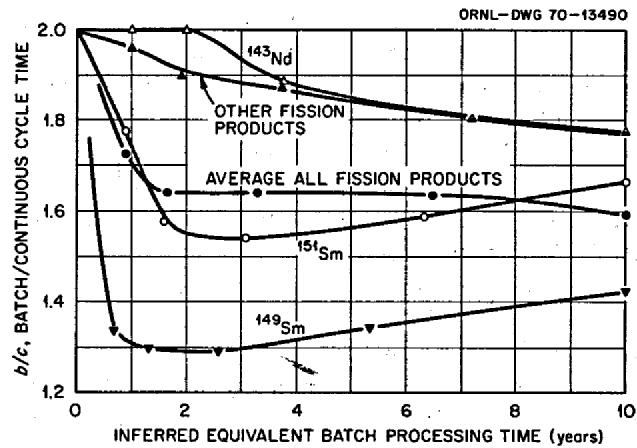  
Fig. 4.4. Ratio of Equivalent Batch and Continuous Processing Cycle Times.

Table 4.4. Lifetime Fuel Composition and Conversion Ratio for a Fixed-Moderator 300-MW(e) MSR with Plutonium Feed for Three Eight-Year Cycles   
Case H 11-2, 10 mole % thorium   

<table><tr><td colspan="2">Time (Full-Power Years)</td><td colspan="10">Inventory (kg)</td><td rowspan="2">Conversion Ratioa</td></tr><tr><td>Per Cycle</td><td>Cumulative</td><td>233Pa</td><td>233U</td><td>234U</td><td>235U</td><td>236U</td><td>237Np</td><td>239Pu</td><td>240Pu</td><td>241Pu</td><td>242Pu</td></tr><tr><td>0</td><td>0</td><td>0.0</td><td>0.0</td><td>0.0</td><td>0.0</td><td>0.0</td><td>0.0</td><td>192.0</td><td>77.1</td><td>38.7</td><td>13.0</td><td>0.727</td></tr><tr><td>1</td><td>1</td><td>16.7</td><td>126.4</td><td>3.1</td><td>0.1</td><td>0.0</td><td>0.0</td><td>138.3</td><td>149.7</td><td>96.1</td><td>44.0</td><td>0.824</td></tr><tr><td>2</td><td>2</td><td>17.5</td><td>228.3</td><td>10.0</td><td>0.5</td><td>0.0</td><td>0.0</td><td>79.4</td><td>132.9</td><td>109.2</td><td>75.2</td><td>0.877</td></tr><tr><td>4</td><td>4</td><td>20.0</td><td>365.5</td><td>32.6</td><td>2.9</td><td>0.2</td><td>0.0</td><td>39.3</td><td>75.0</td><td>76.1</td><td>124.4</td><td>0.867</td></tr><tr><td>6</td><td>6</td><td>20.6</td><td>436.8</td><td>60.6</td><td>7.4</td><td>0.8</td><td>0.0</td><td>34.6</td><td>54.9</td><td>52.4</td><td>147.0</td><td>0.839</td></tr><tr><td>8</td><td>8</td><td>20.5</td><td>470.3</td><td>87.9</td><td>13.2</td><td>2.0</td><td>0.1b</td><td>32.5b</td><td>48.6b</td><td>44.2b</td><td>155.9b</td><td>0.825</td></tr><tr><td>0</td><td>8</td><td>20.5</td><td>470.3</td><td>87.9</td><td>13.2</td><td>2.0</td><td>0.0</td><td>13.3</td><td>5.3</td><td>2.7</td><td>0.9</td><td>0.970</td></tr><tr><td>1</td><td>9</td><td>25.2</td><td>478.1</td><td>104.1</td><td>17.0</td><td>3.2</td><td>0.1</td><td>17.6</td><td>20.4</td><td>14.1</td><td>7.4</td><td>0.925</td></tr><tr><td>2</td><td>10</td><td>24.4</td><td>486.0</td><td>118.4</td><td>20.6</td><td>4.5</td><td>0.2</td><td>15.5</td><td>21.9</td><td>18.0</td><td>14.9</td><td>0.913</td></tr><tr><td>4</td><td>12</td><td>23.3</td><td>493.8</td><td>142.4</td><td>27.3</td><td>7.7</td><td>0.4</td><td>17.6</td><td>24.3</td><td>20.8</td><td>29.6</td><td>0.886</td></tr><tr><td>6</td><td>14</td><td>22.4</td><td>496.9</td><td>161.5</td><td>32.8</td><td>11.4</td><td>0.8</td><td>20.5</td><td>28.1</td><td>24.0</td><td>43.4</td><td>0.866</td></tr><tr><td>8</td><td>16</td><td>21.6</td><td>498.3</td><td>176.6</td><td>37.5</td><td>15.4</td><td>1.1b</td><td>23.1b</td><td>32.0b</td><td>27.4b</td><td>56.8b</td><td>0.850</td></tr><tr><td>0</td><td>16</td><td>21.6</td><td>498.3</td><td>176.6</td><td>37.5</td><td>15.4</td><td>0.0</td><td>1.9</td><td>0.7</td><td>0.4</td><td>0.1</td><td>0.996</td></tr><tr><td>1</td><td>17</td><td>25.3</td><td>495.8</td><td>184.6</td><td>40.0</td><td>18.0</td><td>0.5</td><td>11.8</td><td>12.2</td><td>8.0</td><td>4.0</td><td>0.934</td></tr><tr><td>2</td><td>18</td><td>24.3</td><td>497.2</td><td>191.3</td><td>42.0</td><td>20.5</td><td>1.0</td><td>12.9</td><td>16.3</td><td>12.7</td><td>9.3</td><td>0.915</td></tr><tr><td>4</td><td>20</td><td>23.1</td><td>498.4</td><td>202.3</td><td>45.5</td><td>25.4</td><td>1.8</td><td>16.3</td><td>21.7</td><td>18.1</td><td>22.0</td><td>0.888</td></tr><tr><td>6</td><td>22</td><td>22.1</td><td>498.8</td><td>210.8</td><td>48.3</td><td>30.3</td><td>2.5</td><td>19.6</td><td>26.6</td><td>22.5</td><td>35.6</td><td>0.868</td></tr><tr><td>8</td><td>24</td><td>21.4</td><td>499.1</td><td>217.4</td><td>50.4</td><td>35.0</td><td>3.2b</td><td>22.6b</td><td>31.0b</td><td>26.4b</td><td>49.5b</td><td>0.851</td></tr></table>

$a$ Not adjusted for discard of plutonium.   
$b$ Quantity discarded at end of cycle.

# 4.2 MSR EXPERIMENTAL PHYSICS

# 4.2.1 $^{233}\mathbf{U}$ Capture-to-Absorption Ratio in the Fuel of the MSRE

G. L. Ragan

The capture-to-absorption ratio for $^{233}\mathrm{U}$ , which we call $\gamma_{3}$ , has been determined for the circulating $^{233}\mathrm{U}$ -type fuel of the MSRE; the value (an average over time, neutron energy, and position in the reactor) is $\gamma_{3} = 0.1098 \pm 0.0031$ . The corresponding capture-to-fission ratio is $\alpha_{3} = \gamma_{3} / (1 - \gamma_{3}) = 0.1233 \pm 0.0039$ . Taking $\nu_{3} = 2.500 \pm 0.010$ neutrons per fission in $^{233}\mathrm{U}$ , the measured $\gamma_{3}$ yields $\eta_{3} = \nu_{3} (1 - \gamma_{3}) = 2.226 \pm 0.012$ .

Since the effective neutron spectrum in the MSRE is similar to that in proposed MSBR designs, these values have some interest in themselves. However, more quantitative significance attaches to a comparison between the measured value of $\gamma_{3}$ for the MSRE and that calculated for the MSRE using the cross sections and calculational techniques employed in MSBR design work: $\gamma_{3} = 0.1092$ . A slight variation in calculational technique gave $\gamma_{3} = 0.1077$ . Both values are well within one experimental standard deviation of the measured value. Our analyses have shown that an uncertainty in $\eta_{3}$ causes an essentially equal uncertainty in breeding ratio and is the dominant uncertainty. The good agreement noted encourages us to believe that our uranium cross sections and computational methods will not, by themselves, contribute an appreciable error in our estimates of breeding ratio for an MSBR.

The sampling and mass spectrometer techniques used were similar to those used earlier4 to determine the capture-to-absorption ratio for $^{235}\mathrm{U}$ in the $^{235}\mathrm{U}$ -type fuel of the MSRE. Three sets of samples were taken of the circulating $^{233}\mathrm{U}$ -type fuel; about $1\%$ depletion of $^{233}\mathrm{U}$ occurred between successive sets (designated as sets A, B, and C). The 22 samples of the three sets were grouped to form eight working samples: A1, A2, B1, B2, and C1 to C4. Five intercomparisons were made between selected pairs of working samples. The samples were introduced as $\mathrm{UF}_6$ into a dual-aperture mass spectrometer with electron-bombardment source. A

fixed slit always intercepted the beam containing $^{238}\mathrm{U}$ , while a movable slit intercepted another selected uranium isotope. The slit-current ratio was proportional (with factor undetermined) to the isotopic abundance ratio. With a given slit setting (e.g., for $^{233}\mathrm{U}$ ) final and initial samples were alternately introduced to determine the ratio of ratios,

$$
R _ {3 8} = \frac {\left(N _ {3} / N _ {8}\right) _ {\text {f i n a l}}}{\left(N _ {3} / N _ {8}\right) _ {\text {i n i t i a l}}}. \tag {1}
$$

Cancellation of the undetermined proportionality factor permitted precise measurement (of the order of one part in $10^{4}$ ) of the ratio of ratios.

The experimental data $(R_{38}$ and $R_{48})$ were first analyzed in the same way as were those for $^{235}\mathrm{U}$ , using a suitable modification of Eq. (1) of ref. 5. Results were unreasonable and highly erratic, with $\gamma_{3}$ ranging from 0.4 to 0.9 times the calculated value. In addition, the $R_{38}$ data indicated a $^{233}\mathrm{U}$ depletion rate ranging from 1.0 to 1.6 times that expected. The behavior was indicative of a proper relationship between $^{233}\mathrm{U}$ and $^{234}\mathrm{U}$ in the samples but of an erratic error in the ratio of $^{238}\mathrm{U}$ to the other two.

An exhaustive search for possible sources of sample contamination revealed none after the samples left the reactor, but it did reveal two that had been overlooked in the sample-taking procedures. Each sample was taken by lowering into the molten fuel a cylindrical capsule having two large open windows on opposite sides near the top. These windows might have admitted contaminating uranium from either or both of two sources. First, from the walls of the 14-ft-long transfer tube, through which the capsule was lowered. Second, from the floor of the transfer box, where each capsule was placed before and after lowering. In both of these places, other sampling and enriching operations had left significant quantities of earlier fuel samples (both $^{235}\mathrm{U}$ and $^{233}\mathrm{U}$ types) and enriching salt (of both types).

It was determined that moderate amounts of these contaminants (of the order of $1\mathrm{mg}$ of contaminant uranium per gram of sample uranium) could explain the abnormal ${}^{238}\mathrm{U}$ to ${}^{233}\mathrm{U}$ ratios observed. At the same time, the ${}^{234}\mathrm{U}$ to ${}^{233}\mathrm{U}$ ratios would not be significantly upset by such contamination; this is because the

$\mathbf{2}^{35}\mathbf{U}$ fuel and enriching salts contained little $\mathbf{2}^{33}\mathbf{U}$ or $\mathbf{2}^{34}\mathbf{U}$ , and the $\mathbf{2}^{33}\mathbf{U}$ fuel and enriching salts contained $\mathbf{2}^{33}\mathbf{U}$ and $\mathbf{2}^{34}\mathbf{U}$ in about the same proportions as did the samples. Consequently, an alternative method of determining $\gamma_{3}$ was developed that depended only on the $\mathbf{2}^{34}\mathbf{U}$ to $\mathbf{2}^{33}\mathbf{U}$ relationships and on an accurate knowledge of the reactor power integral.

Starting from the accurate equations for the time variation of $^{233}\mathrm{U}$ and $^{234}\mathrm{U}$ , one derives the pair of equations

$$
\gamma_ {3} = (1 - S _ {4}) \left(\frac {N _ {4}}{N _ {3}}\right) _ {i} \frac {R _ {4 3} - Q _ {3} ^ {- (1 - S _ {4})}}{Q _ {3} ^ {- (1 - S _ {4})} - 1}, \tag {2}
$$

$$
Q _ {3} = 1 - \frac {f _ {3}}{1 - \gamma_ {3}}. \tag {3}
$$

Here

$$
Q _ {3} = e ^ {- \sigma_ {3} \phi} t,
$$

$$
f _ {3} = ^ {2 3 3} \mathrm {U} \text {f i s s i o n s p e r i n i t i a l} ^ {2 3 3} \mathrm {U} \text {a t o m},
$$

$$
\left(\frac {N _ {4}}{N _ {3}}\right) _ {i} = \left(^ {2 3 4} \mathrm {U} / ^ {2 3 3} \mathrm {U}\right) \text {a t o m r a t i o i n i n i t i a l s a m p l e},
$$

$$
\begin{array}{l} S _ {4} = \text {r a t i o} \\ & 2 ^ {3 4} \mathrm {U} \text {t o} \end{array} \text {e f f e c t i v e a b s o r p t i o n c r o s s s e c t i o n o f}
$$

$$
R _ {4 3} = \frac {\left(N _ {4} / N _ {3}\right) _ {\text {f i n a l}}}{\left(N _ {4} / N _ {3}\right) _ {\text {i n i t i a l}}} = \frac {R _ {4 8}}{R _ {3 8}}.
$$

The solution for $\gamma_{3}$ was obtained by iteration, first solving Eq. (3) for an approximate value of the connecting parameter $Q_{3}$ (which is actually the $^{233}\mathrm{U}$ depletion factor, $e^{-\alpha_3\phi t}$ ) using an approximate (calculated) value for $\gamma_{3}$ . This value of $Q_{3}$ was then used in Eq. (2), and iteration on $\gamma_{3}$ and $Q_{3}$ continued until satisfactorily converged.

The value of $f_{3}$ was determined from the total intervening power integral, the fraction of the power generated in $^{233}\mathrm{U}$ , the energy released per $^{233}\mathrm{U}$ fission, and the total quantity of $^{233}\mathrm{U}$ in the circulating fuel at the time the initial sample was taken. The fraction of energy generated in $^{233}\mathrm{U}$ and the total quantity of $^{233}\mathrm{U}$ in the circulating fuel were obtained quite precisely from a calculation starting with an initial isotopic composition and concentration for uranium and plutonium that gave good agreement with analytical data on these quantities as a function of time. The experimental value of $\gamma_{3}$ (0.1098) was used, and other cross sections were from calculations by Prince. This calculation also gave $N_{4} / N_{3}$ for each sample.

Results for five separate comparisons are given in Table 4.5. The standard deviations $\delta R_{43}$ in the mass spectrometer measurements were established by statistical analysis of the data. The associated standard

The logged megawatt-hour values were multiplied by the correction factor 0.9175 derived in ref. 6. See the discussion at the end of this section and footnote $a$ , Table 4.5.

Table 4.5. Individual Measurements of $\gamma_{3}$ with Their Statistically Independent Components of Standard Deviations   

<table><tr><td>Comparison</td><td>AC1</td><td>AC2</td><td>BC2</td><td>BC1</td><td>AB1</td></tr><tr><td>Final samples</td><td>C3</td><td>C2</td><td>C1</td><td>C4</td><td>B2</td></tr><tr><td>Initial samples</td><td>A1</td><td>A2</td><td>B1</td><td>B2</td><td>A1</td></tr><tr><td>EMWHa difference for samples</td><td>13,714</td><td>13,766</td><td>6067</td><td>6017</td><td>7573</td></tr><tr><td>Fractionb of power from 233U</td><td>0.9303</td><td>0.9303</td><td>0.9308</td><td>0.9308</td><td>0.9300</td></tr><tr><td>f3, fraction of 233U fissioned</td><td>0.018669</td><td>0.018737</td><td>0.008360</td><td>0.008291</td><td>0.010305</td></tr><tr><td>Initial sample (N4/N3)b</td><td>0.082432</td><td>0.082412</td><td>0.084384</td><td>0.084387</td><td>0.082432</td></tr><tr><td>R43 (measured)c</td><td>1.04261</td><td>1.04370</td><td>1.01899</td><td>1.01905</td><td>1.02415</td></tr><tr><td>(δR43/R43)</td><td>0.00023</td><td>0.00023</td><td>0.00016</td><td>0.00016</td><td>0.00037</td></tr><tr><td>γ3</td><td>0.10756</td><td>0.11055</td><td>0.11043</td><td>0.11208</td><td>0.11241</td></tr><tr><td>(δγ3/γ3) due to (δR43/R43)</td><td>0.00727</td><td>0.00699</td><td>0.01102</td><td>0.01091</td><td>0.01982</td></tr></table>

${}^{a}$ Equivalent megawatt-hours: logged MWhr $\times  {0.9175}$ . Then,for $\mathrm{C}$ samples,928 MWhr was subtracted to compensate for mixing the circulating fuel with some undepleted drain tank fuel during a fuel drain that followed taking samples B.   
bObtained from a calculation normalized to the analytical data,   
Mass spectrometer measurements by C. Sulfridge of Oak Ridge Gaseous Diffusion Plant.

Table 4.6. Effects Introducing Errors Common to All Determinations   

<table><tr><td rowspan="2">Common error</td><td rowspan="2">Value</td><td colspan="2">Standard Deviation</td><td rowspan="2">Resulting δγ3/γ3(%)</td></tr><tr><td>Absolute</td><td>Percent</td></tr><tr><td>S4</td><td>0.3041</td><td>0.0304</td><td>10.0</td><td>1.97</td></tr><tr><td>MWhr(true)/MWhr(log)a</td><td>0.9175</td><td>0.0113</td><td>1.23</td><td>1.57</td></tr><tr><td>233U power fractiona</td><td>b</td><td></td><td>0.75</td><td>0.96</td></tr><tr><td>233U MeV/fissiona</td><td>200.4</td><td>0.9</td><td>0.45</td><td>0.58</td></tr><tr><td>233U loaded (kg)a</td><td>32.42</td><td>0.04</td><td>0.10</td><td>0.12</td></tr><tr><td>(N4/N3)</td><td>b</td><td></td><td>0.20</td><td>0.17</td></tr><tr><td>Combining all above</td><td></td><td></td><td></td><td>2.77c</td></tr></table>

${}^{a}$ These four quantities are factors entering into ${f}_{3}$ .   
$b$ Varies slightly, but for all determinations the percent error is assumed to be as given.   
Combined as independent errors: square root of sum of squares of individual percent errors.

deviation $\delta \gamma_{3}$ was determined by calculating the effect of $\delta R_{43}$ on $\gamma_{3}$ using Eqs. (2) and (3).

In addition to the statistically independent uncertainties associated with $\delta R_{43}$ , there are several uncertainties that affect all measured values of $\gamma_{3}$ in a common way. These are given in Table 4.6; they are associated with $\delta S_4, \delta f_3$ , and $\delta (N_4 / N_3)$ of Eqs. (2) and (3). The four main uncertainties in $f_{3}$ have been listed separately. Some items (e.g., $N_4 / N_3$ ) are different for the several comparisons, but their chief uncertainty arises from the normalization to the analytical data of the calculation used in their determination. Hence, these are essentially common errors.

The five independent measurements of Table 4.5 have been used to obtain the weighted mean value given in Table 4.7. Since the weighted statistical error and the common error are independent, they are combined to give the overall experimental error shown. Two different calculated values are given. For a discussion of their differences see ref. 4. Both are within $2\%$ (less than one experimental standard deviation) of the experimental value.

As noted above, the logged megawatt-hour values have been multiplied by the correction factor derived from the $^{235}\mathrm{U}$ depletion and $^{236}\mathrm{U}$ buildup experiments reported earlier. The logged value of cumulative megawatt-hour was carefully determined by integrating frequent readings (about 5 min apart) of a nuclear chamber that was normalized to carefully measure heat balance power determinations (made six times a day). The heat balance normalization used for the $^{233}\mathrm{U}$

Table 4.7. Experimental Value of $\gamma_{3}$ and Comparison with Calculated Values   

<table><tr><td rowspan="2"></td><td rowspan="2">γ3</td><td colspan="2">Standard Deviation</td></tr><tr><td>Absolute</td><td>Percent</td></tr><tr><td>Experimental</td><td></td><td></td><td></td></tr><tr><td>Weighteddmean with error due to R43 only</td><td>0.10981</td><td>0.00045</td><td>0.41</td></tr><tr><td>Common error (from Table 6.6)</td><td></td><td></td><td>2.77</td></tr><tr><td>Overall experimental result</td><td>0.1098</td><td>0.0031</td><td>2.80b</td></tr><tr><td>Calculatedc</td><td></td><td></td><td></td></tr><tr><td>GAM-THERMOS- EXTERMINATOR</td><td>0.1077</td><td></td><td></td></tr><tr><td>XSDRN-CITATION</td><td>0.1092d</td><td></td><td></td></tr></table>

aThe five values of Table 6.5 have been weighted inversely as the square of their standard deviations.   
Combining the two values above it as independent.   
$^c$ Calculations by B. E. Prince, ref. 3.   
$\pmb{d}$ XSDRN-CITATION codes are used in current MSBR design calculations.

operation was the same as that finally adopted for the $2^{35}\mathrm{U}$ operation and used in determining the above correction factor. The weighted mean correction factor so determined was $0.9175 \pm 0.0113$ .

The source of the implied error in the heat balance power determination has not been found, despite

intensive search. Although it appears to be in error as to absolute value, the logged-megawatt-hour scale provides a precise common basis for determining the power integrals for the $235\mathrm{U}$ and $233\mathrm{U}$ operations. The standard deviation for the individual heat balance power measurements is believed to be less than $0.5\%$ — perhaps much less. Since each megawatt-hour interval used in these experiments represents the summation of at least 180 statistically independent heat balance power measurements (30 days at six per day), the standard deviation of the sum is less than $0.04\%$ $(0.5\%/\sqrt{180})$ . This error has been neglected in the analysis.

The use of $\mathrm{kg}$ of $^{233}\mathrm{U}$ loaded" in Table 4.6 needs clarification. If no fuel drain occurred between taking initial and final samples, as was the case for AB comparisons, $f_{3}$ would be defined as $^{233}\mathrm{U}$ fissions per $^{233}\mathrm{U}$ atom in the circulating fuel at the time sample A was taken. Circulating inventory is most accurately determined by starting with the accurately measured initial loading and multiplying by the ratio of circulating-loop volume to total fuel volume (partly retained in fuel drain tanks). This volume ratio is taken as 0.919 $\pm 0.005$ , and the uncertainty in this ratio should be included in the error analysis. On the other hand, had both A and C samples been taken immediately after the fuel drains (mixing) that preceded them, $f_{3}$ would be

defined as $^{233}\mathrm{U}$ fissions per initial $^{233}\mathrm{U}$ atom in the total fuel inventory. In that case the volume ratio and its uncertainty would not be involved. The actual situation was far more complex, and all $f_{3}$ values were based on the circulating fuel inventory. An adjustment (-928 MWhr) was made for the C samples, to account for the mixing of undepleted drain-tank fuel with loop fuel—which had been depleted by 11,461 MWhr of operation at the time of the drain that preceded taking them. The volume ratio and its uncertainty entered in different ways for the various comparisons and even gave different signs for the resulting uncertainties in $\gamma_{3}$ . Analysis showed that the net overall uncertainty thus caused in $\gamma_{3}$ was only $0.05\%$ , which was neglected.

Whereas the term "logged megawatt-hour" has the precise quantitative meaning given above, the term "nominal full power" does not represent a well-defined power level. It is unfortunate that the discussion of ref. 6 was based on an assumed nominal full power. What was actually determined by each experiment reported was the correction factor by which the logged megawatt-hour should be multiplied to give agreement with the experimental data on $^{235}\mathrm{U}$ depletion or $^{236}\mathrm{U}$ buildup. The factors so determined were multiplied by the assumed nominal full power value of $8.00\mathrm{MW}$ to obtain the reported values of nominal full power. All nominal full power values given there should be divided by $8.00\mathrm{MW}$ to get the measured value for this correction factor. Thus the final reported combined value of $7.34 \pm 0.09\mathrm{MW}$ (Table 6.5 of ref. 6) yields the correction factor $0.9175 \pm 0.0113$ used herein.

$^{8}$ MSR Program Semiann. Progr. Rept. Feb. 28, 1970, ORNL-4548, p. 15.

# 5. Systems and Components Development

Dunlap Scott

The reorientation of the MSBR program into a technology program has resulted in curtailment of efforts to produce components for the MSBE and added emphasis on a program of experiments and studies that will explore more deeply some of the technical problems and their significance to the MSBR design. The program for the participation of industry in the design and fabrication of steam generators has been reduced to provide for design studies only. The programs concerned with further study of the technological problems will center around the operation of a gas system test loop, a secondary system technology loop, and later a steam generator technology loop.

The gas system test loop will be constructed of Hastelloy N and will be operated with a salt containing lithium, beryllium, thorium, and uranium in proportions representative of the fuel salt for a single-fluid MSBR. The loop will be used to evaluate the operation of the gas-removal systems under different chemical states of the salt as well as to investigate other technical areas of interest to the fuel system. We expect to improve our confidence in the use of water as an easy fluid for developing components which are actually to be operated in salt.

The secondary system technology loop, also constructed of Hastelloy N, will be operated with a sodium fluoroborate eutectic to study the mechanical and chemical features of the secondary salt system. Other coolants may be tested in the loop in search of alternatives to sodium fluoroborate. This loop will also provide salt for circulation through the steam generator technology loop, which will be operated to study basic problems of molten-salt-heated steam generators.

The program for the procurement and testing of pumps for an MSBE has been curtailed until the program for the construction of the MSBE is reactivated.

The program for the development of equipment and techniques for remote welding of pipe and vessel

closures has been centered around establishing the feasibility of an automatic welding system which, by virtue of its reliability and versatility, would be adaptable to remote operation. The interest in this equipment has grown to such an extent that the results of this feasibility study probably will be perfected. by others for use in making field welds during construction. Our program will continue with a study of such associated considerations as the remote inspection of weld passes and remote preparation, cleanup, and alignment for welding. The status of the programs which have been started is given below.

# 5.1 GASEOUS FISSION PRODUCT REMOVAL

C.H.Gabbard

# 5.1.1 Gas Separator

Water testing of the latest gas separator design has continued. Although the attachment of the gas core to the recovery vane hub is much improved over the previous designs, the main vortex still tends to be somewhat unstable in front of the recovery hub at low gas flow rates, as shown in Fig. 5.1. At higher gas flow rates the vortex is more stable and becomes fully attached to the recovery hub, as shown in Fig. 5.2. Under both of these conditions, some of the gas escapes the vortex and bypasses the separator. Although all the gas bubbles appear to move to the central vortex, losses around the recovery hub reduce the actual gas removal efficiency to less than $100\%$ .

Performance data for the gas separator have been taken at flow rates of 440, 570, and $660\mathrm{gpm}$ of water with gas input rates ranging up to 1.0 scfm. The maximum efficiency in each test occurred at the highest

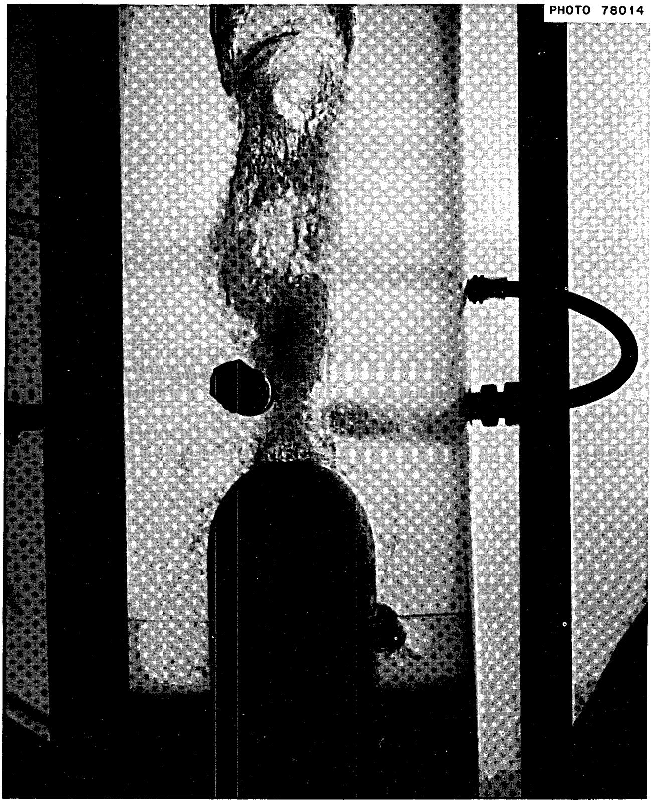  
Fig. 5.1. Gas Separator Recovery Hub Showing Unstable Vortex.

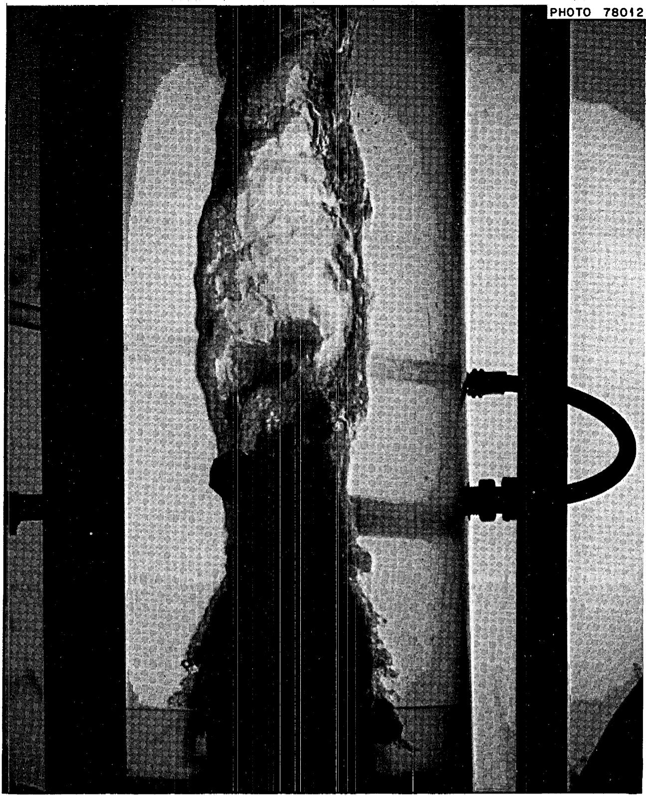  
Fig. 5.2. Gas Separator Recovery Hub Showing Fully Attached Vortex.

gas input rate and was nominally 94, 88, and $78\%$ for the three water flow rates respectively. The higher efficiency at the lower water flow rate is probably the result of reduced turbulence at the recovery hub. The results of the performance tests at 570 gpm are shown in Fig. 5.3. Each of the three curves was taken with a constant throttle setting on the gas-water takeoff line. The inlet void percentage for the MSBE separator, based on an average of $0.2\%$ voids in the loop, would be about $0.1\%$ but would vary depending on the operating pressure of the separator. Although the removal efficiency increased with increasing gas flow rate up to 1.0 scfm, the gas removal capacity of the separator is limited, and the removal efficiency would fall off rapidly at somewhat greater gas flow rates.

The recovery hub of the separator is being redesigned with an annular gas takeoff port in an attempt to improve the vortex stability and to increase the removal efficiency at the lower void fractions.

# 5.1.2 Bubble Generator

The design and testing of a reduced-scale "teardrop" bubble generator was presented previously. The tests reported at that time indicated that the bubble diam

$^{2}$ MSR Program Semiann. Progr. Rept. Feb. 28, 1969, ORNL-4396, p. 95.

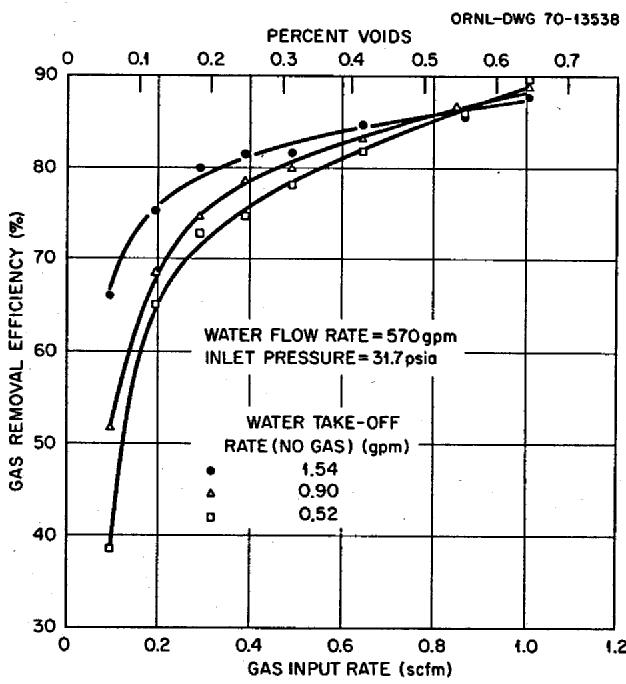  
Fig. 5.3. Performance of 4-in-ID Gas Separator with 0.302-in.-diam Gas Removal Port.

eter was about one-fourth of the flow annulus thickness and that an annulus of about 0.080 in. would be required to produce the desired 0.020-in.-diam bubbles. A multiple vane design was envisioned for the full-sized MSBE or MSBR bubble generator to avoid the large diameter that would be required for a "teardrop" design with the 0.080-in. flow annulus. A reduced-scale prototype model with a single vane is shown in Fig. 5.4. A satisfactory bubble size was generated by this design, but there were flow oscillations around the trailing edge of the vane in the vertical plane and also in a horizontal plane within each of the diffuser sections. There was also difficulty in distributing the gas flow uniformly across the width of the flow channels and between the top and bottom gas feed holes.

The development tests of both the "teardrop" and the "multivane" bubble generators have been discontinued for the present time to evaluate a simpler "venturi" design. Two commercial jet pumps with throat diameters of 0.316 and 0.656 in. were used for the preliminary testing. The tests indicated that a satisfactory bubble size could be obtained in water at throat velocities greater than about 30 fps. The bubble size did not appear to be pressure dependent between throat pressures of 1.47 and 2.9 psia. The only difficulty encountered with the jet pumps was pulsations in the bubble output. The pulsations occurred when the jet pumps were run at throat pressures greater than about 1 to 3 psia. The suction cavity of the larger jet pump was filled with epoxy and remachined with a minimum gas volume in an attempt to eliminate the pulsations. The pulsations were reduced but were not eliminated by this change.

A larger pressure drop across the gas feed ports will probably be required to obtain a constant bubble output under all operating conditions.

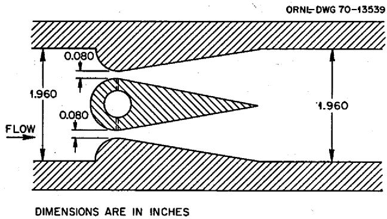  
Fig. 5.4. Section Through Prototype Multivane Bubble Generator.

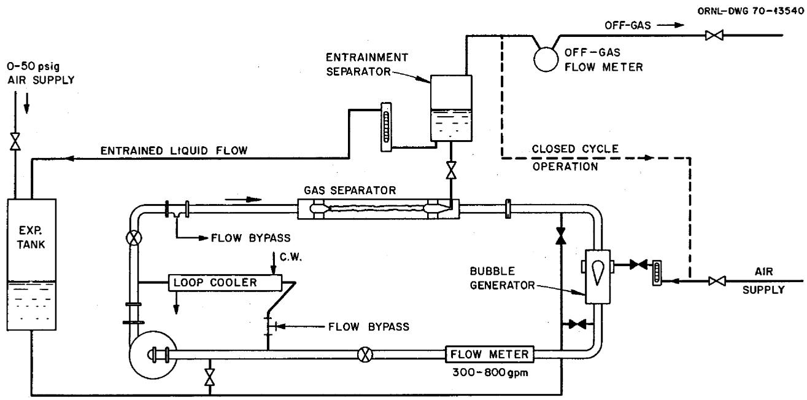  
Fig. 5.5 Gas-Handling Water Test Loop.

# 5.1.3 Water Test Loop

A water test loop which will permit testing full-sized MSBE bubble generators and gas separators has been designed and is being fabricated. Figure 5.5 is a schematic diagram of the loop. The test loop will have a liquid flow range of 300 to $800\mathrm{gpm}$ and a gas input capacity that will provide a maximum void fraction of about 0.02. This loop will be used to verify the performance of the full-sized bubble generators and separators in water and will also permit testing with different fluid properties to obtain hydraulic similarity with molten salt. Although the high surface tension of molten salt cannot be duplicated in water, surfactants and wetting agents will be used in an effort to determine the effect of surface tension on the bubble generation and separation. The loop will also be useful to study the operating characteristics of the separator and generator in a closed system and to determine the control requirements for maintaining a desired gas flow on void fraction.

# 5.2 MOLTEN-SALT STEAM GENERATOR

R.E.Helms J.L.Crowley

Steam generators for molten-salt reactors require the development of much new technology because the proposed heat source can be any one of several salts which freeze at temperatures in the range of 700 to

$850^{\circ}\mathrm{F}$ . These freezing temperatures are well above the temperature at which water is normally admitted in conventional steam generators. The tendency for the salt to freeze, the large temperature gradients that can exist in some regions of the steam generator, and the need to provide materials that are compatible with salt and water create problems that require special attention. Since so little is known about steam generators for molten-salt reactors, design studies and some immediate experiments are needed to assist in the definition of a development program for this component.

The steam generator development program plan3 as previously formulated has been reduced in scope from one of procurement of steam generators for the MSBE and the testing of models in the 3-MW Steam Generator Tube Test Stand to one of obtaining conceptual design studies from industrial firms and of gaining some experimental information through operation of a small technology loop. A discussion of these programs follows.

# 5.2.1 Steam Generator Industrial Program

The major objective of this program has been changed from the specific development of steam generators for the Molten-Salt Breeder Experiment to the investigation

of the basic technological problems associated with molten-salt-heated steam generators. Design studies from U.S. industrial firms will be requested to assist in the definition of the development program for this component. Therefore, as a result of the change in objective from procurement of MSBE hardware to development of technology, the request for proposal package to obtain design studies from industrial firms has been rewritten. One or two industrial firms will be chosen on the basis of their proposal of how they would proceed to accomplish the design studies. The studies include four tasks, which may be described generally as follows:

Task I: Conceptual Design of a Steam Generator for the ORNL 1000-MW(e) MSBR "Reference Steam Cycle"   
Task II: Conceptual Design of a Steam Generator for the 2250-MW(t) MSBR "Alternate Steam Cycle"   
Task III: Conceptual Design of a Steam Generator for a Molten-Salt Reactor of about 150 MW(t)   
Task IV: Description of a Research and Development Program for the Task III Steam Generator

In Task I the industrial firm will produce a conceptual design of a steam generator unit for the ORNL 1000-MW(e) MSBR reference design. The salt conditions will be specified by ORNL. The ORNL steam cycle requires that feedwater be supplied to the steam generator at supercritical pressure and $700^{\circ}\mathrm{F}$ with full load outlet conditions of 3600 psia and $1000^{\circ}\mathrm{F}$ .

For Task II the industrial firm will define changes that it believes will improve the reference steam cycle. These changes could result in a steam cycle with different steam and feedwater pressures and temperatures, a different steam generator design, etc.

For Task III the industrial firm will use the conceptual design chosen by ORNL from Task I or II and show how it would modify the unit for operation in a molten-salt reactor system of about 150 MW(t), the power level of the MSBE.

For Task IV the industrial firm will prepare a report describing the research and development program necessary to assure the adequacy of the design of the Task III steam generator.

# 5.2.2 Steam Generator Tube Test Stand (STTS) $^3$

Our plan for the development of steam generators for the Molten-Salt Breeder Experiment (MSBE) included a facility for testing models containing full-size, full

length tubes in a configuration representative of steam generator designs for the MSBR. This facility included a salt-circulating system with a salt heater capable of supplying 3 MW of heat, a water purification system, a feedwater system to provide water to the test unit at pressures to about 4000 psi and temperatures to $700^{\circ}\mathrm{F}$ , and a cooling system to remove 3 MW of heat while letting the $1000^{\circ}\mathrm{F}$ supercritical steam down to atmospheric pressure. A conceptual system design description (CSDD) of this facility was written and will be published as an ORNL internal memorandum. Further work on this facility was suspended for the present.

# 5.2.3 Molten-Salt Steam Generator Technology Loop (SGTL)

A steam generator in which molten salt is the heating medium is an essential component in present versions of molten-salt power reactors. There are many uncertainties associated with the design, startup, and operation of molten-salt-heated steam generators. At present, there is no experience, and there are no test facilities that can be used to resolve the uncertainties.

The decision not to proceed in FY 1971 or FY 1972 with the 3-MW Steam Generator Tube Test Stand (STTS) has delayed until at least FY 1975 the time that experiments could be run in this facility. Since it is important to begin now to develop basic steam generator technology, a Molten-Salt Steam Generator Technology Loop (SGTL) is proposed to permit proceeding with experiments on a smaller scale. This loop will have a capacity in the range of 50 to $150\mathrm{kW}$ and will be used to study steady-state operation of sections of molten-salt-heated steam generators. A conceptual system design description (CSDD) is being prepared for this facility.

# 5.2.4 Development Basis for Steam Generators Using Molten Salt as the Heat Source

Although no one has built a steam generator to work by transferring heat from molten salt to water, there has been some experience with similar systems using sodium as the source of heat, and this experience is continuing to accumulate. The lower melting point of sodium, which is well below the 700 to $850^{\circ}\mathrm{F}$ liquidus of the candidate salts, makes the design and operation problem different. However, there are many similarities which will make the experimental program for the LMFBR useful to the molten-salt steam generator development program. We are preparing a report which will describe the status of the molten-salt steam

generator technology, show which elements of the LMFBR program will be of use in the molten-salt technology program, and define the areas which need further experimental study.

# 5.3 SODIUM FLUOROBORATE TEST LOOP

R.B.Gallaher A.N.Smith

The fluoroborate circulation loop was operated for 478 hr during this report period. A test was run to determine whether a small quantity (about $10\mathrm{g}$ ) of water injected into the salt in the pump bowl could be detected by monitoring the off-gas stream for a change in contaminant level. The test was completed, and the loop was shut down on April 13, 1970, concluding the current phase of the test program. Since the initial operation in March 1968, 11,567 hr of circulating time have been accumulated. Of this time, 10,632 hr have been with the clean batch of salt.

# 5.3.1 Water Addition Test

Previous reports4,5 have included discussions of the acid fluid which has been observed in the fluoroborate loop off-gas stream. In an attempt to shed additional light on the fluid emission question, a water injection test was run during the current report period. Briefly, the procedure was to make a rapid injection of water under the surface of the salt in the pump bowl, then to make observations to determine what effect the injection had made on the nature and concentration of contaminants in the off-gas stream.

A schematic diagram of the test arrangement is shown in Fig. 5.6. The injection apparatus was connected to the pump bowl at the salt sample access pipe. The salt temperature was $1025^{\circ}\mathrm{F}$ , and the total overpressure was 24 psig. As part of the normal operation of the loop, a continuous purge of helium was passed down the pump shaft to protect the oil seal region from the $\mathrm{BF}_3$ in the pump bowl. A small flow of $\mathrm{BF}_3$ , slightly diluted with helium, was added through the bubbler of the liquid level indicator to make the partial pressure of $\mathrm{BF}_3$ in the mixed gases equal to the partial pressure of $\mathrm{BF}_3$ in the salt at the temperature in the pump bowl. These two gas flows totaled $1500~\mathrm{cm}^3/\mathrm{min}$ , of which about $50~\mathrm{cm}^3/\mathrm{min}$ was $\mathrm{BF}_3$ .

From the pump bowl the gas stream passed through a mist trap, a sintered metal filter, and a trap cooled with wet ice, as previously described for the mist trap tests, $^{6}$ and then through a trap cooled with a mixture of dry ice and trichloroethylene $(-100^{\circ}\mathrm{F})$ . The mist trap was maintained at $900^{\circ}\mathrm{F}$ at the inlet end and $340^{\circ}\mathrm{F}$ at the outlet end. A connection was installed between the mist trap and the sintered metal filter to provide a $100\text{-cm}^{3}/\text{min}$ sample flow to a Karl Fischer water analyzer. The sample line to the water analyzer was maintained at $250^{\circ}\mathrm{F}$ to reduce the possibility of condensation. After leaving the cold traps, the gas stream flowed at 1 fps through about 25 ft of $\frac{3}{8}$ -in. tubing before reaching the takeoff for the conductivity cell feed line and the loop pressure control valve. These lines were at ambient temperatures $(80^{\circ}\mathrm{F})$ .

With the system at steady state, background readings were obtained on the Karl Fischer apparatus and the thermal conductivity cell, and collection rates were determined by periodic weighings of the traps. Then on April 2, 1970, helium was used to force $9.9\mathrm{g}$ of water into the salt in the pump bowl in 20 sec. During the injection an auxiliary flow of $100~\mathrm{cm}^3/\mathrm{min}$ of helium was maintained through the water injection tube to guard against plugging the tube by suck-back of salt. Some helium (estimated $\leqslant 200~\mathrm{cm}^3$ ) was also admitted to the pump bowl through the bomb along with the charge of water. Immediately after the injection there was a sudden pressure rise of 4 psi. Following this, automatic control valve action caused the pressure to oscillate, with the maximum deviations being $3^{1/2}$ psi above and $2^{1/4}$ psi below the control point pressure of 24 psig. About 15 min after the injection the pressure appeared to be stabilizing, but at this time the pressure drop across the sintered metal filter became excessive ( $\Delta P = 24$ psi). The filter element was replaced, during which time ( $\leqslant 5$ min) the gas flow was bypassed around the cold traps. Replacement of the filter element and associated operation of valves caused additional pressure fluctuations of $4^{1/2}$ psi above and below the control point. At this time (33 min after the injection), normal flow through the traps was restored, and the pressure was level at 24 psig. The pressure remained level until $2^{3/4}$ hr after the injection of water, at which time flow through the sintered metal again became restricted ( $\Delta P = 15$ psi). Replacement of the filter element took about 15 min. During this time the pressure was maintained by bleeding gas through the trap bypass line. At 3 hr 5 min after the water injection

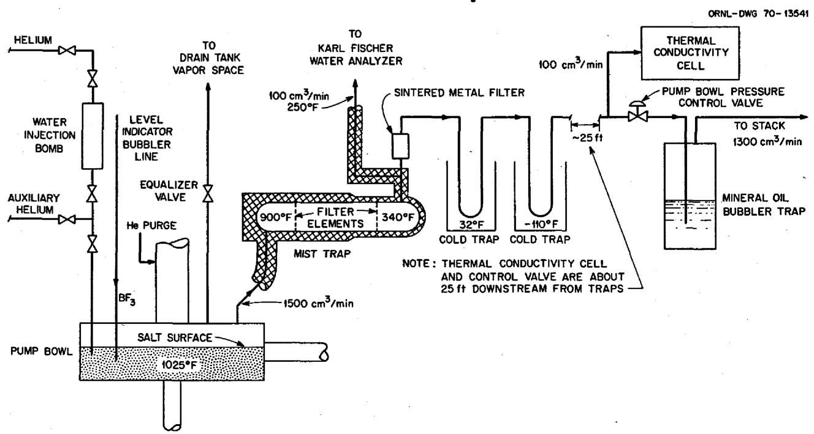  
Fig. 5.6. Schematic Diagram of Water Injection Test. $\mathrm{NaBF_4}$ circulation test, PKP loop, 9201-3.

the pressure leveled out once again at 24 psig, and pressure control was steady for the balance of the test. For several hours after the injection, sample flow was maintained to the Karl Fischer water analyzer and the thermal conductivity cell. The cold traps were weighed periodically throughout the test, and weight gains were recorded as grams of fluid. The mineral oil bubbler, which is downstream of the pressure control valve, was examined visually $24\mathrm{hr}$ after the injection, and the oil had a cloudy appearance, as though it contained suspended solids. The oil recovered its normal transparent appearance with continued operation; however, the oil bubbler walls appeared to have collected some material. The water injection test was terminated on April 13, 1970, after $478\mathrm{hr}$ of circulation.

After shutdown of the loop, the mist trap was cut open for inspection. Visual inspection revealed that the upstream side of the hot-zone filter had a dark film on all metal surfaces but had little or no salt on it. One gram of salt was recovered ahead of the filter as two solid lumps. Between the two filters, $7.3\mathrm{g}$ of salt was found. None was found on the face of the cool filter, but its appearance suggested that salt had been dislodged from the filter during handling. The trap discharge line contained $0.23\mathrm{g}$ of black solids. No film was found on the trap walls downstream of the cool filter. Spectrographic analysis (semiquantitative) of similar black solids recovered from a previous test

showed the major elements to be Fe, Cr, and Ni. Carbon, if present, would not be detected. The mist trap and the connecting tubing were fabricated from 304 stainless steel. Figure 5.7 shows the posttest appearance of the upstream face of the filter elements from both the hot and cold sections of the mist trap.

Three different techniques were used to observe the effects of the water injection on the off-gas stream: collection of fluid in cold traps, a Karl Fischer on-line water analyzer, and an on-line thermal conductivity cell. The following is a brief discussion of the observed effects as compared with the effects which might have been predicted.

1. The total amount of fluid collected during the test was $4\mathrm{g}$ , distributed as follows: $2.6\mathrm{g}$ in the $32^{\circ}\mathrm{F}$ trap, $0.8\mathrm{g}$ in the $-110^{\circ}\mathrm{F}$ trap, and $0.64\mathrm{g}$ in the sintered metal filter. No solids were observed in the sintered metal filter. Data from the trap weighings are summarized in Table 5.1. The results indicate that the collection rate increased sharply immediately after the injection but returned to the average background rate within about $24\mathrm{hr}$ .

It is difficult to predict the amount of material which should have been collected in the cold traps. If the water was all vaporized and transported out of the pump bowl, the theoretical amount of condensate available would be $9.9\mathrm{g}$ of water plus an estimated $3\mathrm{g}$ of $\mathrm{BF}_3$ which would be present in a saturated water

solution. It is more reasonable to assume that the water reacted with the $\mathrm{BF}_3$ or the salt, but it is not clear as to what the nature and quantity of the reaction products would be. There are several possible reaction products which could be transported out of the pump bowl in the form of gases or mists which would condense in the cold trap - for example, HF, $\mathrm{HBF}_4$ , and $\mathrm{H}_3\mathrm{BO}_3$ . If a reaction occurred, the theoretical weight of material could be much greater than $10\mathrm{g}$ . For example, a stoichiometric yield of as much as $60\mathrm{g}$ and as little as $11.4\mathrm{g}$ of product could be obtained by reacting $10\mathrm{g}$ of $\mathrm{H}_2\mathrm{O}$ with $\mathrm{BF}_3$ . In addition to the questions of degree of reaction and identity of reaction products, there are uncertainties regarding the amount of material which might have been deposited in the lines between the mist trap outlet and the cold traps, the efficiency of the cold traps, the amount of material lost through the bypass line while the sintered metal filter elements were being changed, the amount of material retained by the salt, and the material lost by reaction with the metal surfaces in the loop and in the gas lines.

2. Sample flow was maintained to the Karl Fischer water analyzer during the water injection and for several hours thereafter. At no time during this period did the instrument show an increase in the water content of the gas. The Karl Fischer reagent would titrate $6.7\mathrm{mg}$ of $\mathbf{H}_2\mathbf{O}$ per milliliter of reagent, and the buret could be read to the nearest $0.1\mathrm{ml}$ , so that a flow of $0.67\mathrm{mg}$ $\mathbf{H}_2\mathbf{O}$ to the analyzer should have been detectable. If all the $\mathbf{H}_2\mathbf{O}$ had been converted to steam, the maximum concentration in the off-gas would have

been $250\mathrm{mg}$ of $\mathrm{H}_2\mathrm{O}$ per liter of gas (pump bowl gas space is estimated to be $1.5\mathrm{ft}^3$ ). This would have been equivalent to $0.4\mathrm{ml}$ of reagent per cubic centimeter of off-gas, and a sample flow of $100\mathrm{cm}^3/\mathrm{min}$ would have resulted in a reagent usage of $40\mathrm{ml/min}$ . If the actual concentration had been only $1\%$ of the theoretical, the reagent usage would have been $0.4\mathrm{ml/min}$ , which should have been easily detectable. After the Karl Fischer analyzer had been taken off stream, two tests

Table 5.1 Cold Trap Data from Water Injection Test Sodium fluoroborate circulation test, PKP loop, 9201-3   

<table><tr><td rowspan="2">Date</td><td rowspan="2">Time (hr)</td><td rowspan="2">Net Collection Time (hr)</td><td colspan="3">Average Collection Rate (mg/hr)</td></tr><tr><td>32°F Trap</td><td>-100°F Trap</td><td>Total Collected (g)</td></tr><tr><td>3-24-70</td><td>1120</td><td colspan="4">Loop filled and salt circulation started</td></tr><tr><td>3-30-70</td><td>1000</td><td>96</td><td>9</td><td>0.05</td><td>0.86</td></tr><tr><td>4-1-70</td><td>1000</td><td>48</td><td>3</td><td>2</td><td>0.20</td></tr><tr><td>4-2-70</td><td>0900</td><td>23</td><td>6</td><td>2</td><td>0.18</td></tr><tr><td>4-2-70</td><td>1020</td><td colspan="4">Water (9.9 g) injected into salt in pump bowl</td></tr><tr><td>4-2-70</td><td>1305</td><td>2.75</td><td>329a</td><td>84</td><td>1.13</td></tr><tr><td>4-3-70</td><td>1045</td><td>22</td><td>34</td><td>12</td><td>1.01</td></tr><tr><td>4-6-70</td><td>1000</td><td>72</td><td>8</td><td>0</td><td>0.59</td></tr><tr><td>4-9-70</td><td>1000</td><td>72</td><td>4</td><td>3</td><td>0.52</td></tr><tr><td>4-13-70</td><td>0930</td><td>95.5</td><td>8</td><td>0.8</td><td>0.83</td></tr></table>

$a$ Includes $0.640\mathrm{g}$ of material accumulated in sintered filter.

PHOTO 77770

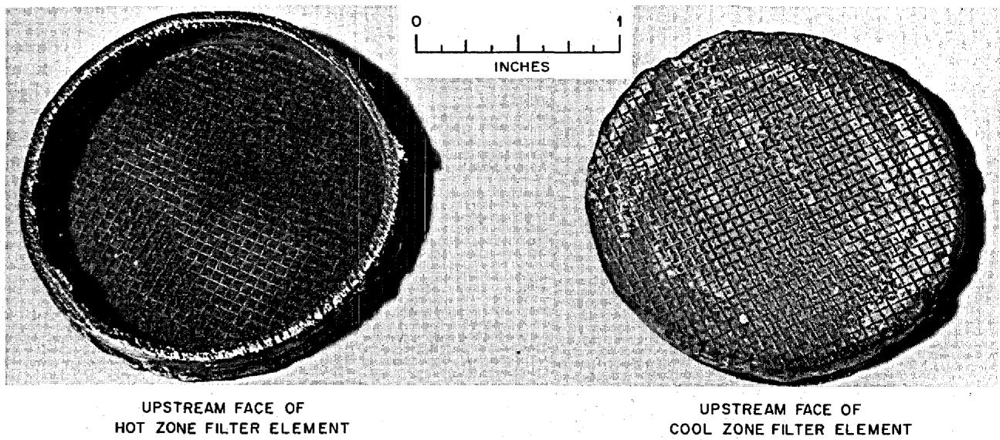  
Fig. 5.7. Filter Elements from Mist Trap. Sodium fluoroborate circulation test, PKP loop, 9201-3.

were run to check the sensitivity of the analyzer to the trapped fluid. In the first test the 1-in.-ID × 18-in.-long Pyrex pipe cold trap containing about $0.5\mathrm{g}$ of the condensed fluid was mounted vertically on a laboratory bench, and the lower three-fourths of the trap was wrapped with electrical heating tape. A small flow of helium (about $100~\mathrm{cc / min}$ ) was established through the trap, and the effluent gas stream was conducted to the Karl Fischer analyzer by a length of $\frac{1}{6}$ -in.-OD tubing about 3 ft long. The trap was then heated until the temperature of the lower end was at an estimated $400^{\circ}\mathrm{F}$ . At this point it was observed that the inner wall at the upper end of the trap was wet, as though vapor were rising from the lower heated section and condensing on the relatively cool upper surface. The temperature of the upper surface is not known, but it was probably somewhere between 150 and $250^{\circ}\mathrm{F}$ . With the system at the elevated temperature, the gas flow to the analyzer was maintained for several minutes. At no time, however, did the analyzer show a response which would indicate that the gas contained water or a water derivative. In the second test some of the fluid was taken from the cold trap and poured directly into the Karl Fischer reagent in the analyzer. This time there was a strong positive response.

3. After the water injection the thermal conductivity cell showed a decrease equivalent to a drop in $\mathrm{BF}_3$ concentration of about $10\%$ . The instrument returned to its normal preinjection reading within a few minutes. If it is assumed that the water reacted with the $\mathrm{BF}_3$ in the pump bowl gas space, then a concentration drop of $100\%$ would be theoretically possible, since the water was capable of combining with 16 liters of $\mathrm{BF}_3$ , and the normal $\mathrm{BF}_3$ content of the gas space is 1.5 liters. Other experiments indicate that $\mathrm{BF}_3$ lost from the gas space is quickly replaced by transfer of $\mathrm{BF}_3$ from the bulk salt, so that the brief transient which was observed is the type of change which one might predict. It should be noted that the feed line to the thermal conductivity cell was downstream of the cold traps, so that many of the condensables would have been removed.

# 5.3.2 Conclusions

The general conclusions from the water injection test are as follows:

1. The injection produced an immediate increase in the cold trap collection rate. The rate returned to the normal background level within 24 hr. The material collected appeared to be the same as, or similar to, the fluid which has been routinely collected in the $32^{\circ}\mathrm{F}$ cold trap throughout the course of the fluoroborate

circulation test program. The mass of material collected was about $40\%$ of the mass of water injected. Various uncertainties in the test prevented the formation of any meaningful conclusions as to the fate of the missing material.

2. An on-line Karl Fischer water analyzer, which was used to monitor the off-gas stream during and after the injection, failed to show a positive response, although in a subsequent test the instrument gave a strong positive response to a sample of the fluid which had been collected in the $32^{\circ}\mathrm{F}$ cold trap. This suggests that the material was trapped in the lines upstream of the analyzer, although none was found in the room-temperature lines upstream of the cold traps except in the sintered metal filter.

3. A thermal conductivity cell which was used to monitor the off-gas stream showed a brief drop in reading shortly after the injection. The change could be interpreted as a decrease in $\mathrm{BF}_3$ concentration, and such a response would be expected if the water reacted rapidly with a large fraction of the $\mathrm{BF}_3$ in the pump bowl gas space and the reaction products condensed out of the carrier gas before reaching the conductivity cell.

# 5.4 MSBR PUMPS

P.G.Smith

L.V.Wilson

H.C.Young

A. G. Grindell

H. C. Savage

# 5.4.1 MSBE Salt Pump Procurement

The general approach outlined in the Program Plan for the Procurement and Testing of MSBE Salt Pumps was approved by DRDT-Washington.

The evaluation team reviewed the additional information supplied by Westinghouse for their proposal to produce the MSBE salt pumps. In the opinion of the team, the Westinghouse proposal indicated that they were qualified to design and fabricate the MSBE salt pumps. Westinghouse was informed of the decision not to proceed with the program at the present time and thanked for the cooperation they gave us and the work they put into their proposal.

Although the MSBE salt pump procurement program was delayed indefinitely, plans are being made to obtain additional design information for MSBE and MSBR pumps. We will obtain data on the nuclear radiation dose and heat deposition rates to be expected in the salt

pumps and will proceed with studies to obtain needed information on the rotor dynamic characteristics of suitable rotary element configurations.

# 5.4.2 MSBE Salt Pump Test Stand

Early in the report period DRDT-Washington reviewed and provided technical comments on the Preliminary System Design Description $^{8}$ (Title I) for the MSBE Salt Pump Test Stand. $^{7}$ We then provided DRDT with our written discussion of these technical comments. All work on the Salt Pump Test Stand was suspended indefinitely in view of the AEC decision to redirect the efforts of the MSRP toward a technology program.

# 5.4.3 ALPHA Pump

The fabrication and assembly of the water test model of the ALPHA pump, which were delayed by a craft strike of ten weeks' duration at the X-10 and Y-12 plants, were completed at the end of the report period. Installation of the pump into the water test stand and electrical connections to the drive motor remain to be completed prior to the initiation of water tests of the pump.

# 5.5 REMOTE WELDING

P.P.Holz C.M.Smith,Jr.

R. Blumberg G.M. Slaughter

# T. R. Housley

In the remote welding program, emphasis has been placed on developing equipment, welding procedures, and automatic controls so that welds of nuclear quality can be produced in many applications without direct observation or manual adjustments. Automated cutting and welding equipment that performs to nuclear systems standards will be of value in the initial construction of reactors and will also be suitable for further development to achieve completely remote operation for maintenance applications in high-radiation zones.

The welding development program is a joint effort of the Reactor and the Metals and Ceramics Divisions. The basic equipment for automated welding is the cutting

and welding system developed under an Air Force contract by North American Rockwell Corporation. During the past year we have developed and fabricated modified equipment and controls which greatly improve the cutting and welding performance.

# 5.5.1 Operational Prototype Equipment

The basic equipment used in the ORNL program to develop a reliable remote maintenance system for molten-salt (and other) reactors consists of a conventional welding power supply, an electronic console called the programmer-controller, and an orbiting carriage which propels interchangeable cutting or welding heads around the circumference of pipe. With this system a different orbiting carriage is provided for each of the following ranges of pipe sizes: 1-3 in., 3-6 in., 6-9 in., 9-12 in., and 12-16 in. Many of the same subassemblies and parts, as well as the cutting and welding heads, are used in all sizes of carriages. This assists greatly in minimizing the spare parts inventory. Figure 5.8 shows a schematic diagram of a remote maintenance system that includes, for future development, means for remotely aligning, inspecting, bore cleaning, and handling the pipe.

# 5.5.2 Cutting Development

Results of cutter performance tests on horizontal pipes in the size range of the 6-9 in. carriage have been reported previously. $^{11,12}$ These tests were essentially duplicated in limited trials of 1-3 in. and 3-6 in. carriages loaned to us by the Air Force. These smaller-diameter orbiting carriages do not have enough room in the arms for the torsion spring-loaded links that provide flexible gripping force in the large carriages; instead, they use gear trains in the horseshoe-shaped arms to provide a gripping force on the pipe. In the pipe cutting tests, especially those with difficult-to-machine materials such as Hastelloy N, the more rigid, gear-traindriven gripping arrangement of the smaller carriages produced less vibration and less tool chatter and made deeper cuts possible. However, the rigidity which helps the cutting action can cause the gears to break when a

weld-spatter spot or out-of-round section of pipe is encountered. Since out-of-roundness and variations in wall thickness are controlled by piping manufacturers as a percentage of the pipe diameter, larger pipe sizes will have greater dimensional variation, so the rigid structure of the gear train may not be applicable to larger carriages.

We cut 2-in., 0.065-in.-wall type 304 stainless steel tubing with the Air Force 1-3 in. carriage. Three orbits

were used in cutting through the wall with a $\frac{1}{16}$ -in-thick circular saw blade: one to scribe or index, one to cut nearly through the wall, and one to sever the tube. No problems were encountered. The as-cut square tube ends were satisfactory for welding.

We were not able to properly clamp the Air Force 1-3 in. carriage on a 1-in. pipe. It appears that $1^{1/2}$ -in.-OD tubing is the smallest diameter this carriage can handle. We have not yet attempted to make a cut

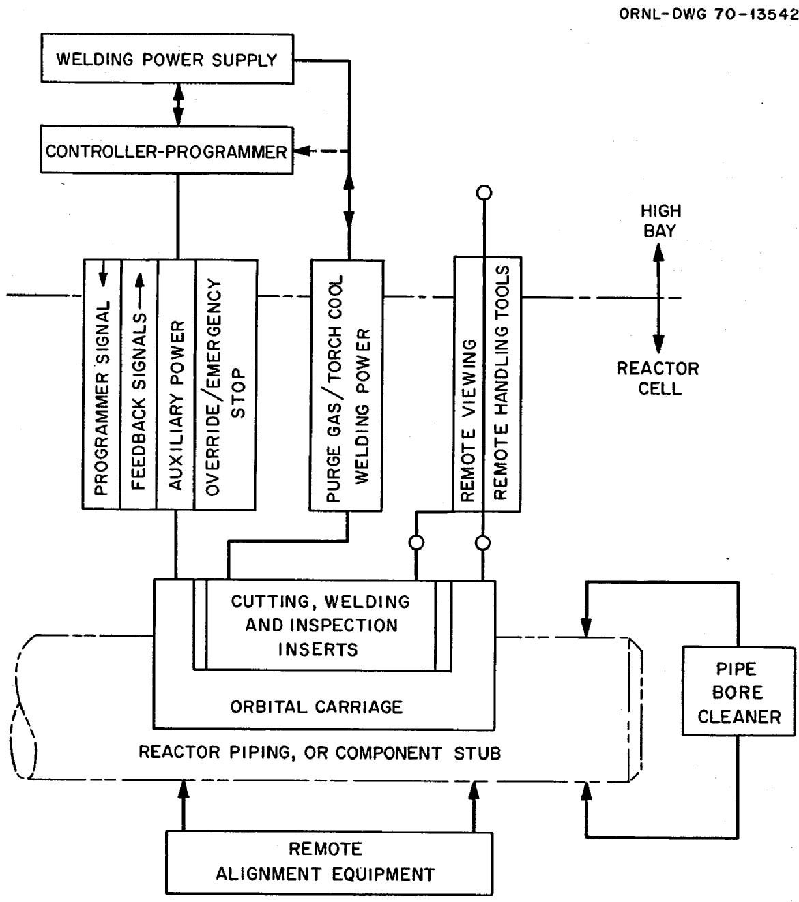  
Fig. 5.8. Remote Welding Equipment Schematic.

with the Air Force 12-16 in. carriage. The idler rollers and drive rollers are slightly out of parallel, and this prevents "true" saw blade tracking when cutting.

# 5.5.3 Welding Development

Welding development tests under laboratory conditions continued to demonstrate clearly that our equipment is capable of producing high-quality welds automatically by use of programmed welding control procedures. The incorporation of a drive motor which adapts the torch up-and-down position in response to arc-voltage feedback signals has provided improved control of the torch-to-work spacing. The torch drive control also provides a means of automatically tack welding the edges of pipe joints prior to welding the root pass. We developed and demonstrated an effective welding control program for the tack welding.

Test welds on butt joints, with and without consumable inserts, were made on 347 stainless steel with very good results. For the present it appears that insertless joints should be limited to production-type welds where conditions can be extremely well controlled. We continue to recommend use of square insert rings for any remote welding of pipe joints where misfit is likely to occur and commercial Y insert rings for butt joints where satisfactory (nonprecision) fitup can be assured.

We also performed welding tests on 6-in. sched 80 stainless pipe positioned horizontally to obtain information on maximum production rates. The highest rate of production of good weld with 0.045 in.-diam filler wire was obtained under the following conditions:

Tungsten electrode

$\frac{3}{32}$ in. diameter

Passes

1 root and 9 filler

Wire feed

Approx. 40 in./min

Dc amperes

170

Torch oscillation

$3 / 4$ in. total width at 200 cpm

Travel speed

$2^{1 / 2}$ in./min

Elapsed weld time

Approx. 10 min per pass, 100 min total

Total elapsed time

200 min

(including setup, interpass

cooling to $350^{\circ}\mathrm{F}$ , etc.)

Although good welds were produced in a few tests under the above conditions, we are not sure that a good weld would be produced every time at this maximum production rate. We believe that the following more conservative conditions provide better assurance of consistently high-quality welds at a high production rate.

Tungsten electrode

$\frac{3}{32}$ in. diameter (with 0.045-in. wire)

Passes

1 root and 11 to 12 filler

Wire feed

Approx. 35 in./min

Dc amperes

140

Torch oscillation

1/2 to 5/8 in. total width at 200 cpm

Travel speed

3 in./min

Elapsed weld time

$\sim 9$ min per pass, 108 to 117 min total

Total elapsed time

216 to 234 min

It is possible to increase the speed of the "optimum" procedure by shifting from 0.045- to 0.060-in.-diam filler wire after five or six passes. It therefore still appears feasible to produce quality welds on 6-in. sched 80 stainless pipe in $200\mathrm{min}$ .

Excellent results have also been obtained in tests of welding pipes in the vertical position (see Fig. 5.9). Accurate tracking around the pipe was obtained by adding nylon thrust bearings to the rear of our 6-9 in. carriage to transfer vertical loads to a split collar that was clamped to the pipe. Root and filler passes of butt joints with Y inserts in 6-in. heavy-wall 347 stainless steel pipe were made with the same programmer input selections that were used for horizontally positioned pipe. The welds were of high quality. The bead shape (Fig. 5.10) and the metallographic results adequately met requirements. The vertical position is actually better suited to automatic welding than the horizontal position because the effects of gravity and capillary action on the weld puddle remain constant around the entire circumference of the pipe joint.

We utilized the borrowed 1-3 in. Air Force carriage with our welding head for fusion welding of tubing without addition of filler metal and for multipass welding of pipe. Satisfactory results were obtained with single-pass welds on thin-wall tubing provided that the arc was kept stable throughout the welding. This was best accomplished by lowering the arc voltage, using a $\frac{1}{16}$ -in. electrode, and reducing the welding current to almost half the normal value. Satisfactory multipass welds were made on 2-in. sched 80 type 304L stainless steel pipe by use of Y inserts. Welding parameters for the tube and pipe welding were as follows:

<table><tr><td></td><td>2-in. Tube
(0.065-in. Wall)</td><td>2-in. Sched 40 Pipe</td></tr><tr><td>Position</td><td>Tube axis horizontal</td><td>Pipe axis horizontal</td></tr><tr><td>Tungsten</td><td>1/16 in. diameter</td><td>3/32 in. diameter</td></tr><tr><td>Arc voltage control</td><td>7 V</td><td>8.5 V</td></tr><tr><td>Travel speed</td><td>3 in./min</td><td>2.5 in./min</td></tr><tr><td>Current</td><td></td><td></td></tr><tr><td>Root pass</td><td>46 A</td><td>80 A</td></tr><tr><td>Filler pass</td><td></td><td>Up to 86 A</td></tr><tr><td>Filler wire</td><td>None</td><td>0.045-in.-diam
308 ELS wire</td></tr><tr><td>Insert</td><td>None (butt joint)</td><td>Commercial Y
insert, 308 ELC</td></tr><tr><td>Purge and weld gas</td><td>Argon</td><td>Argon</td></tr></table>

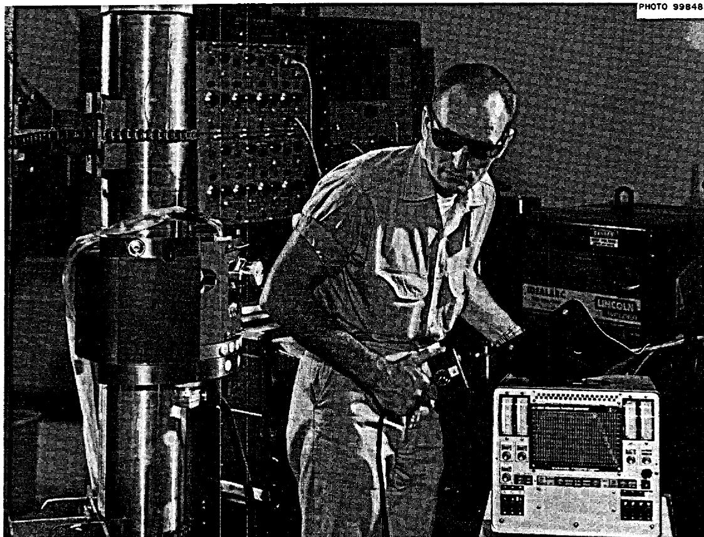

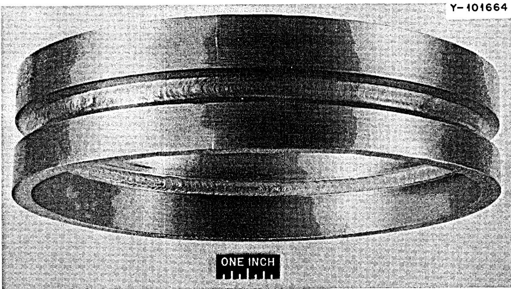  
Fig. 5.9. Automatic Welder Operating with Pipe in the Vertical Position.   
Fig. 5.10. Root and Filler Pass Made on Heavy-Wall 347 Stainless Steel Pipe with Y Insert and with Pipe Vertical.

We also used the borrowed 9-12 in. Air Force carriage to investigate methods for welding 12-in. sched 10 (about $3 / _{16}$ -in. wall) type 304 pipe that was available. We had to program the welding current during the orbit of the carriage to compensate for the greatly decreased heat capacity of the thin-walled pipe and to adjust for the bending caused by the weight of the carriage, which is approximately 50 lb. Best results were obtained without the use of consumable inserts. Additional development work is needed to overcome the complicating factors of the thin wall.

Limited tests on 6-in. sched 40 carbon steel pipe were conducted in order to investigate the influence of metallurgical variables (melting point, thermal conductivity, viscosity, etc.) on welding parameters. So far, it appears that power, speed, and other welding control parameters are about the same as for stainless steels and Hastelloy N.

In these exploratory tests on carbon steel, we welded samples having four different joint designs. The best was J-beveled with pipe ends butted together and welded without insert rings. Filler wire was added to the root pass because we found that burn-through would occur on subsequent passes unless care was exercised to first obtain a heavy root pass. Even then, relatively thin beads had to be added over the first filler pass before heavier beads could be used. The other three joint designs were made with consumable inserts. The root pass tended to burn through in some cases and to lack full penetration in others.

We built a special combination pipe-bore-sizing and tool-handling fixture for handling Y-shaped welding inserts. The jib permits precise fitting of the ring and improves the efficiency and quality of the weld-ring tacking operation.

The weld programmer was checked to determine whether any of the readouts had shifted during several months of weld development testing. The curves that were produced were identical to the initial calibration data recorded over nine months earlier.

# 5.5.4 External Interest

Interest has been generated in our automated orbital welding system for use in field erection of nuclear reactors and other systems for containing radioactive materials. We have been requested to submit proposals for automated welding systems to the Tennessee Valley Authority Browns Ferry site and to the Division of Reactor Development and Technology, USAEC, for possible use in the construction of the FFTF, SPTS (Sodium Pump Test Facility), and/or the LOFT facility.

Use of the equipment for construction applications will provide valuable information and experience under actual field conditions. The extensive performance testing and the resulting improvements of the machinery and programming components that are common to both the automatic-direct and the fully remote systems will be of great benefit to the MSRP remote maintenance program.

# 5.5.5 Design Studies

Looking beyond our prototype equipment, we have begun to design larger-size orbiting carriages and to consider ways of overcoming problems of high temperature and radiation. In the matter of size, it appears questionable whether one can scale up the design of the existing carriages beyond the 12-16 in. size. The limiting factors to simple scaleup are the following: (1) more torque is required to propel the heavier equipment around the pipe and to provide the thrust force for the cutting operation, (2) as the pipe diameter increases, the effects of out-of-roundness, pipe wall thickness variations, and surface irregularities become increasingly important and require the use of a more

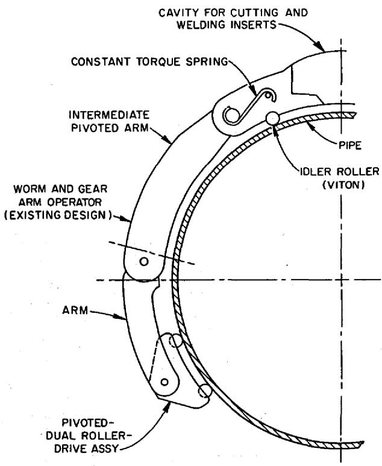  
ORNL-DWG 70-13543   
Fig. 5.11. Conceptual Design for Large-Size Carriages.

flexible system, (3) larger equipment of the existing design would be expensive to fabricate. Design changes to overcome these difficulties are indicated, conceptually, in Fig. 5.11. The pivoted roller assembly with two rollers, instead of one, provides room for larger motors, and more motors if necessary, plus more area for frictional contact. The pivot arrangement also decreases the effects of pipe surface irregularities on the uniform travel of the carriage. The constant-torque spring maintains a constant pressure between the roller and the pipe regardless of any out-of-roundness condition.

Use of the constant-torque spring and the pivoted roller assembly is attractive for the MSR situation. Here, the primary problems result from high temperature and gamma radiation. The two most vulnerable items of the present carriage design are the Viton rubber rollers and the drive motors. The Viton on the drive rollers can be eliminated by use of a pair of split geared tracks around the pipe to serve as a driving surface for gears on the carriage, as shown in Fig. 5.12. The body of the carriage fits between the two tracks, allowing the idler roller to contact the pipe and thus position the torch with respect to the work as is done in present practice. Use of the constant-torque spring permits the Viton to be eliminated from the idler roller. The split track design also offers advantages for operations such as internal pipe cleaning, weld preparation, and pipe aligning. Protection from gamma radiation can be obtained by housing the dual drive assembly in such a way as to provide shielding for the motor.

The welding module has been improved with the addition of the self-adjusting vertical torch positioning

device. This reduces the stringent requirements that formerly had to be met in the carriage design to compensate for pipe irregularities. The design criteria will be further simplified if a new horizontal torch positioning device now being designed performs satisfactorily.

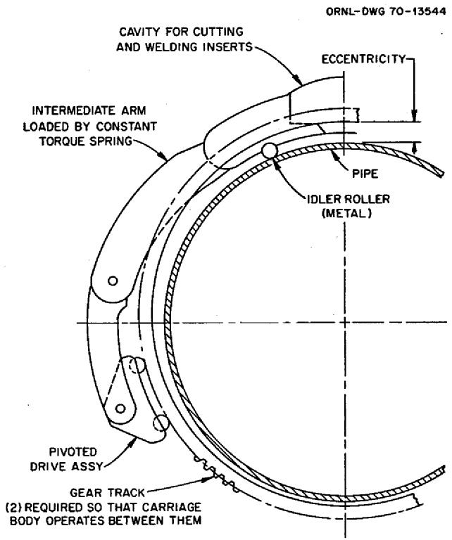  
Fig. 5.12. Gear-Track Drive Conceptual Design.

# 6. MSBR Instrumentation and Controls

W. H. Sides, Jr.

The report on the methods and results of the analog simulation studies of the reference 1000-MW(e) MSBR described earlier1 has been issued.2 A report which will document the analog computer program used in this study is in preparation.3

Further studies were conducted of the part-load steady-state behavior of the reference MSBR plant. A digital computer program similar to that reported in ref. 4 was written for a single-tube model of the steam generator. The unit was divided into 500 axial regions of equal heat flow. Variations in heat transfer coefficients were taken into account, and steam-table data and metal and salt property variations were included. The inlet and outlet temperatures of the salts in the primary heat exchanger were calculated using a "log mean $\Delta T$ approximation.

In the part-load cases studied the heat load and certain system flow rates and temperatures were specified in various combinations as constants or functions of load. The remaining system temperatures and flows were calculated for loads between 20 and $100\%$ of design load.

Five cases have been calculated. The primary salt flow rate was held constant, and the feedwater temperature was held constant at $700^{\circ}\mathrm{F}$ at all loads in all cases.

In case 1 the steam temperature was held constant at $1000^{\circ}\mathrm{F}$ , and the flow rate of the secondary salt was held constant at all loads. The reactor inlet and outlet temperatures, the secondary salt hot and cold leg

temperatures, and the flow rate and inlet pressure of the steam were calculated as functions of load.

Case 2 was similar to case 1 except that the secondary salt flow rate was specified as directly proportional to the load. The results of this case are shown in Fig. 6.1. Both these cases yielded an unacceptably low reactor inlet temperature and/or secondary salt cold leg temperature and indicated the need for a more effective means to decouple the salt system from the steam system at part load.

Case 3 included a variable bypass flow of secondary salt around the primary heat exchanger. Again, the steam temperature was held constant at $1000^{\circ}\mathrm{F}$ , and the secondary salt flow rate through the steam generator was held constant. Also, the reactor inlet temperature was held constant at $1050^{\circ}\mathrm{F}$ at all loads. This arrangement prevented the low salt temperatures. The temperature difference between the secondary salt cold leg and the feedwater increased, however, from $150^{\circ}\mathrm{F}$ at design load to about $240^{\circ}\mathrm{F}$ at $20\%$ load. Two further cases were calculated to investigate a solution to this problem.

In case 4 the steam temperature was allowed to rise with decreasing load. The secondary salt flow rate was a specific linearly decreasing function of load with no bypass used. The reactor inlet temperature was again held constant at $1050^{\circ}\mathrm{F}$ . The increasing steam temperature was subsequently attenuated to $1000^{\circ}\mathrm{F}$ before reaching the turbine by the injection of feedwater. The results yielded salt temperatures in an acceptable range. The temperature difference between secondary salt cold leg and the feedwater increased only to $190^{\circ}\mathrm{F}$ at $20\%$ load.

In case 5 the steam temperature was held constant at $1000^{\circ}\mathrm{F}$ at all loads. The secondary salt flow rate was variable in the steam generator as well as in the primary heat exchanger. A bypass of secondary salt around the primary heat exchanger was included. The secondary salt cold leg temperature was held constant at $850^{\circ}\mathrm{F}$

and the reactor inlet temperature at $1050^{\circ}\mathrm{F}$ . The required flow rates of secondary salt in the steam generator and in the primary heat exchanger were calculated. The results indicated that in order to maintain the cold leg temperature at $850^{\circ}\mathrm{F}$ , a slight increase in secondary salt flow above the design point value was required in the steam generator in the range of 60 to $100\%$ load. However, the penalty for not allowing the flow rate to increase above its design value but maintaining it constant in this range was a decrease of only a few degrees in the secondary salt cold leg temperature. These results are shown in Fig. 6.2. The salt temperatures remained within the acceptable range,

and the temperature difference between the secondary salt cold leg and the feedwater varied only a few degrees over the 20 to $100\%$ load.

The results of cases 4 and 5 yielded acceptable temperature and flow profiles. The arrangement of case 4 required steam attemperation, and that of case 5 required a salt bypass valve and mixing chamber.

Further investigation is being carried on of the part-load conditions for the MSBR. When one or more systems for operating at part load are developed, further dynamic analysis will be required to determine overall system behavior.

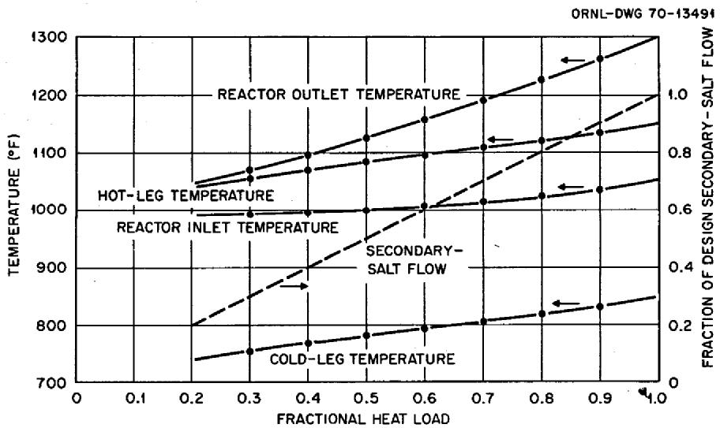  
Fig. 6.1. MSBR Steady-State Temperature Profiles for Constant Primary Salt Flow Rate, Secondary Salt Flow Rate Proportional to Load, and Steam Temperature Constant at $1000^{\circ}$ F.

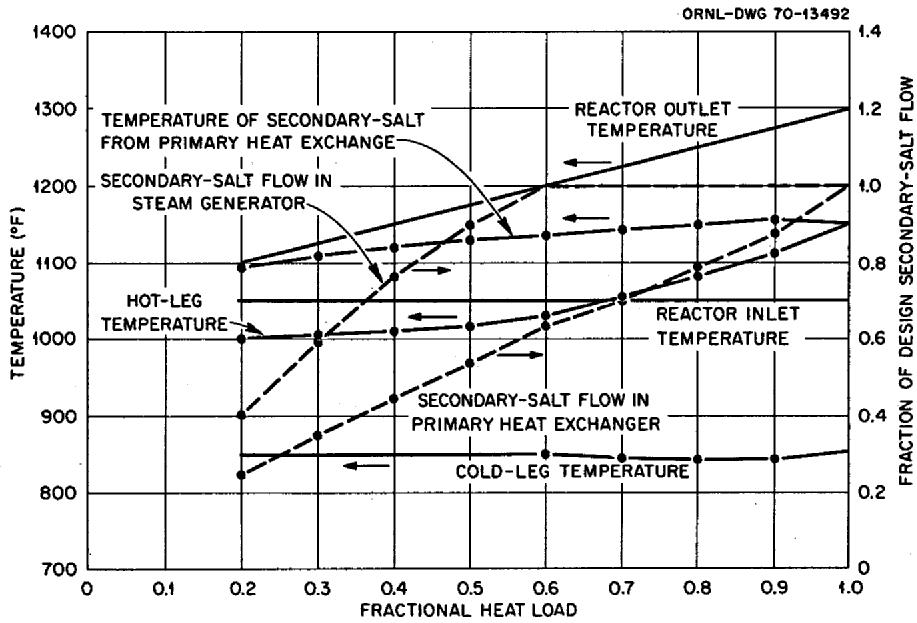  
Fig. 6.2. MSBR Steady-State Flow and Temperature Profiles with Secondary Salt Bypass and Steam Temperature Constant at $1000^{\circ}\mathrm{F}$ .

# 7. Heat and Mass Transfer and Thermophysical Properties

H.W.Hoffman J.J.Keyes, Jr.

# 7.1 HEAT TRANSFER

J.W.Cooke

Heat transfer experiments employing a proposed MSBR fuel salt $(\mathrm{LiF - BeF_2 - ThF_4 - UF_4}$ 67.5-20-12-0.5 mole $\%$ )flowing in a horizontal tube have indicated that the local heat transfer coefficient varies somewhat irregularly along the entire length of the tube in the range $1000 < N_{\mathrm{Re}} < 4000$ for heat fluxes of the order of $2\times 10^{5}$ Btu hr-1 ft-2;it was suggested that a delay in transition to turbulent flow could result in such a variation for the transitional flow range.1,2

To study the effect of flow development on heat transfer, a new test section has been fabricated which is

being installed in the inert-gas-pressurized molten-salt heat transfer system shown schematically in Fig. 7.1. This test section consists of a 48-in. length of 0.25-in.-OD $\times$ 0.035-in.-wall Hastelloy N tubing which is centrally supported from a weigh cell by an electrically insulated sliding cantilever beam. This weigh cell will be used to ensure that a change in the supported weight will not affect the calibration of the other two weigh cells used to calculate the mass flow rate of salt.

$^{1}$ MSR Program Semiann. Progr. Rept. Feb. 28, 1970, ORNL-4548, pp. 87-88.   
$^{2}$ MSR Program Semiann. Progr. Rept. Aug. 31, 1969, ORNL-4449, pp. 85-89.

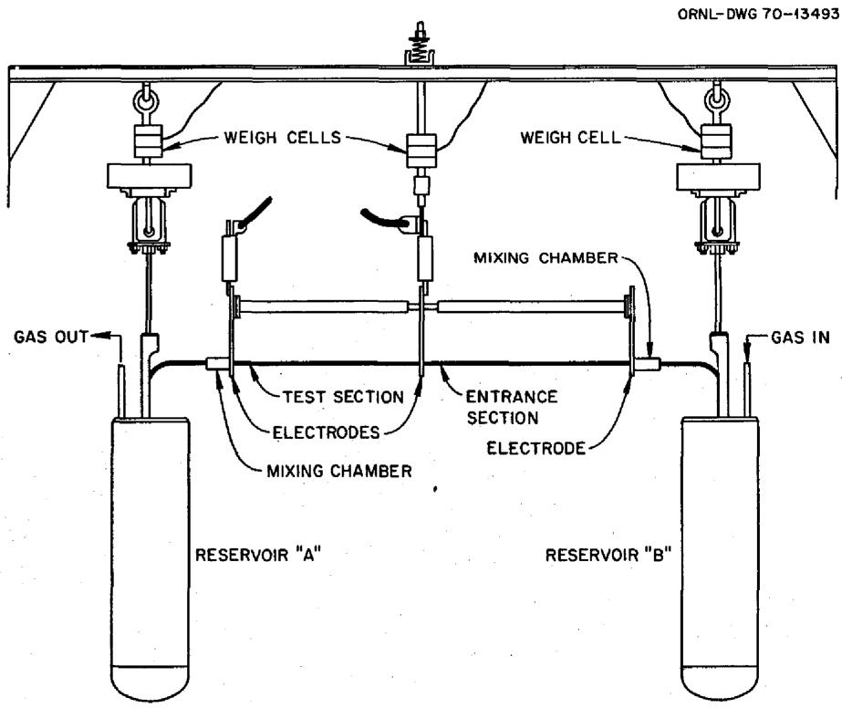  
Fig. 7.1. Inert-Gas-Pressurized Molten-Salt Heat Transfer System.

Three electrodes are welded to the test section so that either the left or right half, or the entire length, can be resistance heated.

Since the flow alternates in direction, six different modes of operation of the heat transfer system are possible. Initially it is planned to heat only the left section so that, with flow to the left, there will be a 24-in. hydrodynamic entrance length $(l / d = 130)$ and with flow to the right there will be no entrance length. The 24-in. entrance length should be sufficient to establish turbulent flow before the heat is applied. Thus comparisons of heat transfer results for flow with and without an entrance length should establish whether a delay in the transition to turbulent flow does exist and, if it does, to what extent the heat transfer coefficient is affected.

In addition to the entrance effect studies, an investigation of the effect of wetting on heat transfer is planned. The fuel salt is normally nonwetting, but the addition of certain metals (normally uranium) can cause the salt to be reducing and to wet certain materials, including Hastelloy N. The wetting characteristics of the fuel salt with respect to Hastelloy N will be monitored by an apparatus described in the following section.

The influence of gas entrained by or evolved from the molten salt on heat transfer is related to wetting of the wall by the salt. Based on flow visualization studies employing a 0.2-in.-diam tube with water flow and helium bubble injection, it was concluded that bubble coalescence would result in gas voids filling the cross section of the small-diameter test section; it was decided to defer gas entrainment experiments until a pump loop is available which could accommodate a larger test section. It is still planned to investigate the effect of helium replacing argon as cover gas, on the basis that more gas will be evolved due to the higher solubility of helium.

# 7.2 THERMOPHYSICAL PROPERTIES

# J.W.Cooke

A new technique has been developed to determine the angle of contact, $\theta$ , at the common intersection of the interfaces separating a solid, a liquid, and a gas (see Fig. 7.2). This technique consists in measuring the pressure difference across the interface between a gas and a liquid at various stages of the growth of a bubble which is formed on the tip of a capillary tube immersed in the liquid specimen.

In Fig. 7.3 are shown the various stages of bubble growth for a given fluid which wets, partially wets, and

ORNL-DWG 70-13494

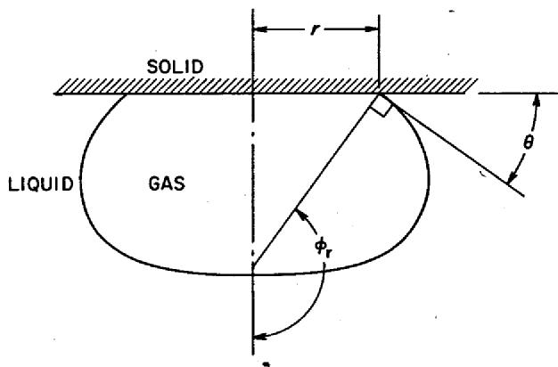  
Fig. 7.2. Bubble Formation at a Capillary Tip.

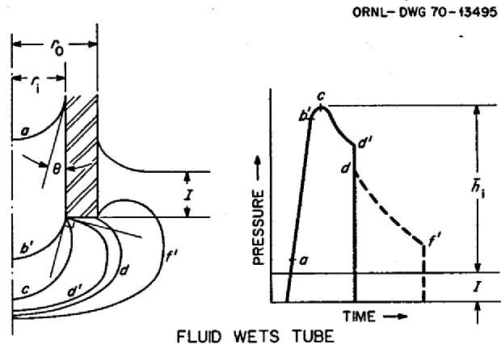

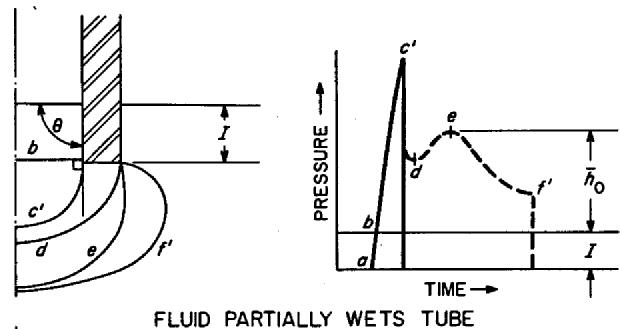

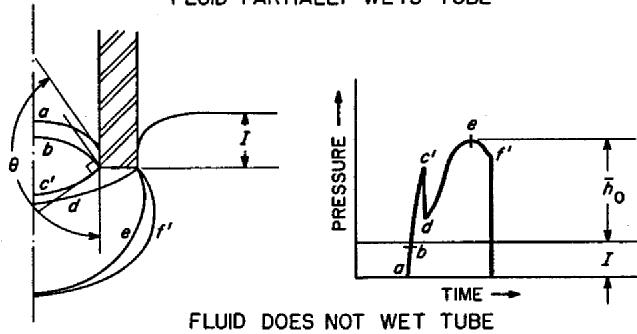  
Fig. 7.3. Various Stages of Growth and Corresponding Pressure Changes Within a Bubble for Wetting, Partially Wetting, and Nonwetting Systems.

does not wet the capillary tube. For a constant volumetric flow rate of gas into the capillary tube, the traces of pressure difference as a function of time are shown on the right of the figure.

In the situation where the fluid wets the tube, the pressure difference increases linearly as the interface moves from position $a$ to the end of the tube at position $b'$ , where the interface is free to make a $90^{\circ}$ turn to position $d'$ . In the process of moving from position $b'$ to $d'$ , the radius of curvature of the interface passes through a minimum (and the pressure difference passes through a maximum value of $\overline{h_i}$ ) at position $c$ . At position $d'$ , the interface cannot turn further because of the contact angle, $\theta$ , and must move to the outside radius of the capillary (position $d$ ), where (under stable conditions) it is free to make another $90^{\circ}$ turn to position $f'$ . The dashed portion of this curve and the curve for partial wetting cannot be recorded unless the total free gas volume (i.e., the bubble, the pressure measuring device, and the connecting tubing) is very small ( $< 1 \, \text{cm}^3$ ).

In the situations where the fluid wets the tube only partially, or not at all, the contact angle limits the further growth of the bubble on the inside tube radius (positions $c^{\prime}$ ) before the maximum pressure difference, $h_i$ , can be obtained. The interface must then move to the outside tube radius (positions $d$ ), where it is again free to make another $90^{\circ}$ turn to position $f^{\prime}$ . In moving from positions $d$ to $f^{\prime}$ , the pressure differences will again reach a maximum value of $\overline{h}_o$ . Either $\overline{h}_o$ and $r_o$ or $\overline{h}_i$ and $r_i$ can be directly related to the surface tension.

The pressure differences at the points on the pressure trace where the pressure rise is no longer linear (position $b'$ ), where the further growth of the bubble on the inside tube radius is limited by the contact angle (positions $c'$ and $d'$ ), and where the growth on the outside tube radius is limited by the contact angle (positions $f'$ ) can all be related to the contact angle.

Using the results obtained from a computer solution for the interface separating two fluids, the contact angle can be related to the dimensionless radius of attachment, $r / a$ , and the reduced pressure difference:

$$
\frac {\bar {h} - h _ {\theta}}{\bar {h}}, \tag {1}
$$

where

$$
r = \text {r a d i u s o f a t t a c h m e n t}, \mathrm {c m},
$$

$$
a ^ {2} = \text {s p e c i f i c c o h e s i o n}, \mathrm {c m} ^ {2},
$$

$$
\bar {h} = \text {m a x i m u m p r e s s u r e d i f f e r e n c e , c m o f f l u i d},
$$

$$
\begin{array}{l} \overline {{h}} _ {\theta} = \text {p r e s s u r e d i f f e r e n c e a t p o i n t s w h e r e t h e c o n t a c t} \\ \text {a n g l e c a n b e d e t e r m i n e d} (b ^ {\prime}, c ^ {\prime}, d ^ {\prime}, \text {a n d} f ^ {\prime}), \text {c m o f} \\ \text {f l u i d .} \end{array}
$$

A plot of the reduced pressure difference as a function of $r / a$ for various $\phi_r$ , the angle between the axis of revolution and the normal to the interface at the radius of attachment (see Fig. 7.2), is given in Fig. 7.4. The solid curves describe the conditions before the maximum pressure difference, $h$ , is obtained (points $b'$ and $c'$ ), and the dashed curves describe the conditions after the maximum pressure difference is obtained (points $d'$ and $f'$ ). To relate $\theta$ to $\phi_r$ , the following equations are used. For the contact angle with respect to the inside tube surface (position $b'$ ),

$$
\theta = 9 0 ^ {\circ} - \phi_ {r}; \tag {2}
$$

for the contact angle with respect to the tube tip surface (positions $c'$ and $d'$ ),

$$
\theta = 1 8 0 ^ {\circ} - \phi_ {r}; \tag {3}
$$

and, finally, for the contact angle with respect to the outside tube surface (positions $f'$ ),

$$
\theta = 2 7 0 ^ {\circ} - \phi_ {r}. \tag {4}
$$

Experimental verifications of the technique have been obtained using mercury and water at room temperature $(24.5^{\circ}\mathrm{C})$ . Unretouched recorder traces of the pressure transducer output for the three types of wetting are shown in Figs. 7.5-7.7. It is clear that each of these recorder traces is nearly identical to those corresponding in Fig. 7.3.

The pressure differences at the various positions shown in Figs. 7.5-7.7 were used in conjunction with the functions plotted in Fig. 7.4 and with Eqs. (2), (3), and (4) to obtain the results for the contact angle given in Table 7.1. Concurrently, a standard sessile drop technique (where direct optical measurements are made of the profile of a drop resting on a horizontal surface) was also used to obtain the contact angles for the same systems. These results are also given in Table 7.1 and are in excellent agreement with the results obtained by the new technique. It is planned to use this technique for monitoring the wetting characteristics of the molten-salt-Hastelloy N system during the heat transfer experiments discussed in Sect. 7.1.

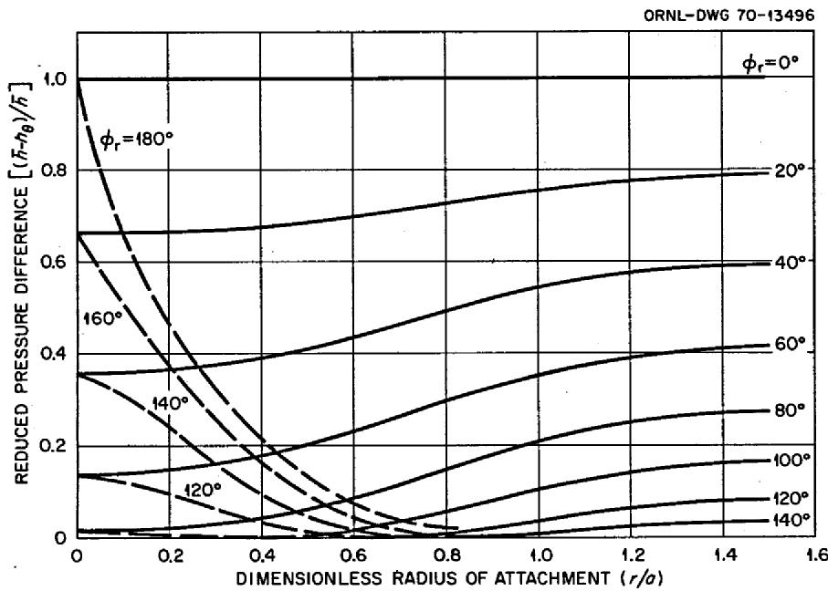  
Fig. 7.4. Reduced Pressure Difference as a Function of the Radius of Attachment for Various Values of $\phi_{r}$ .

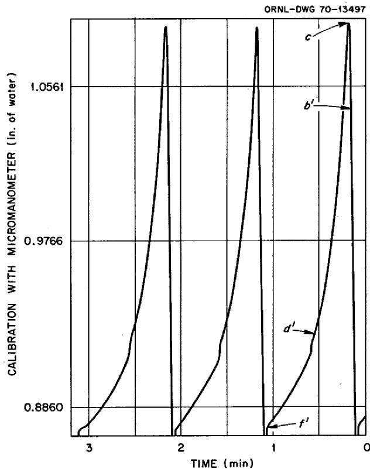  
Fig. 7.5. Pressure Trace for the Wetting of Water on Type 304 Stainless Steel at $24.5^{\circ}\mathbf{C}$ .

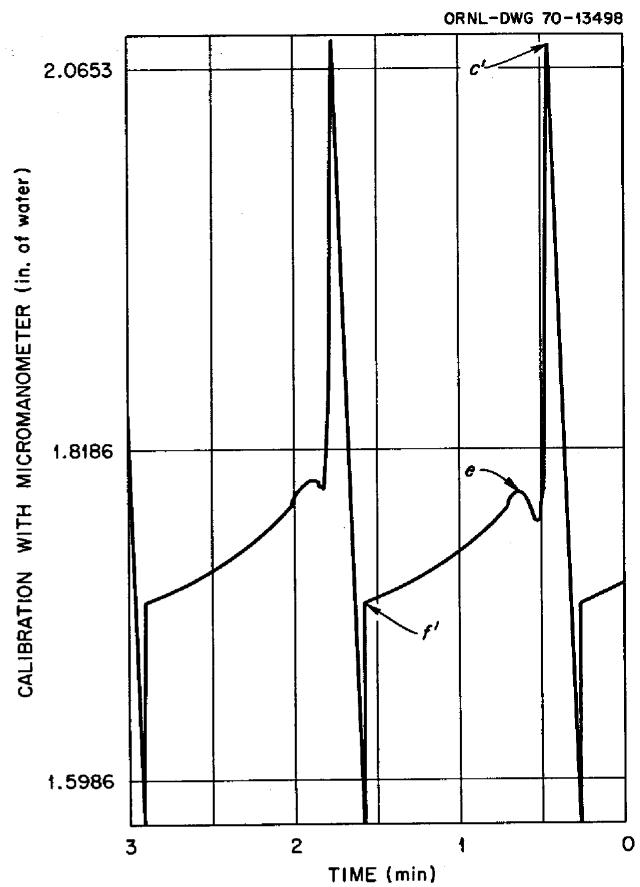  
Fig. 7.6. Pressure Trace for the Partial Wetting of Water on Teflon at $24.5^{\circ}\mathrm{C}$ .

Table 7.1. Measured Contact Angles for Mercury and Water on Stainless Steel Type 304 and Teflon at $24.5^{\circ}\mathbf{C}$   

<table><tr><td rowspan="2">Method</td><td colspan="3">Contact Angle, θ (deg)</td></tr><tr><td>Water on SS 304</td><td>Water on Teflon</td><td>Mercury on SS 304</td></tr><tr><td>Bubble pressure</td><td>15</td><td>115</td><td>135</td></tr><tr><td>Sessile drop</td><td>20</td><td>110</td><td>135</td></tr></table>

# 7.3 MASS TRANSFER TO CIRCULATING BUBBLES

# T. S. Kress

It was found that bubbles produced by the bubble generator in the mass transfer system can be characterized by a size distribution function that had been developed to describe droplet sizes produced by spray nozzles. If the percent of the total number of bubbles having diameters, $D$ , lying in the range $D \pm 1/2$ $dD$ is

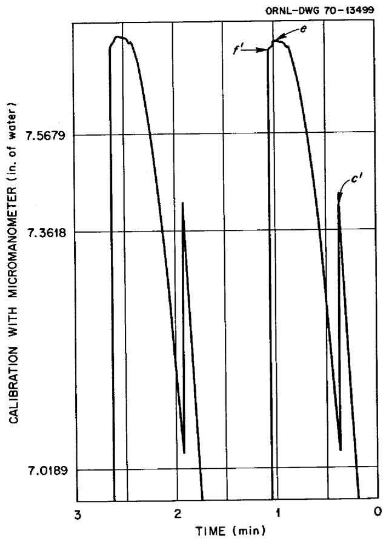  
Fig. 7.7. Pressure Trace for the Nonwetting of Mercury on Type 304 Stainless Steel at $24.5^{\circ}\mathrm{C}$ .

defined as $f(D) \, dD$ , then the distribution function is

$$
f (D) = 4 \left(\frac {\alpha^ {3}}{\pi}\right) ^ {1 / 2} D ^ {2} \exp (- \alpha D ^ {2}),
$$

in which

$$
\alpha \equiv \left[ \frac {4 \sqrt {\pi} N _ {v}}{6 \Phi} \right] ^ {2 / 3},
$$

$N_{\nu}\equiv$ the total number of bubbles per unit volume, and

$\Phi \equiv$ the void fraction occupied by the bubbles.

Integration of the product $N_{\nu}\pi D^{2}f(D)dD$ over all diameters gives the interfacial surface area per unit volume.

The void fraction for two-phase flow has been empirically correlated by Hughmark3 for many dif

ferent mixtures of liquids and gases in both horizontal and vertical flow. Hughmark defined a flow parameter, $K$ , which for the conditions of the present experiment relates $\Phi$ to the ratio of volumetric flows of gas and liquid, $Q_{g} / Q_{l}$ :

$$
\Phi \cong K Q _ {g} / Q _ {l}.
$$

For the flows and conditions of present interest, $K$ is relatively constant at an average value of about 0.73. Therefore

$$
\Phi \cong 0. 7 3 Q _ {g} / Q _ {l},
$$

and, by determining $N_{\nu}$ directly from the bubble photographs for each run, calculated values can be obtained for $a_{*}$ . Some values of $a_{*}$ obtained this way are compared in Fig. 7.8 with measurements taken directly from photographs randomly selected from about $10\%$ of the runs made thus far.

Using the technique described above to establish the interfacial area, mass transfer coefficients have been obtained in a 2-in.-diam vertical test section for three mixtures of glycerol and water (0, 37.5, and $50\%$ glycerol, corresponding, respectively, to Schmidt moduli of 419, 2015, and 3446), with and without the addition of about $200~\mathrm{ppm}$ $n$ -butyl alcohol to serve as a

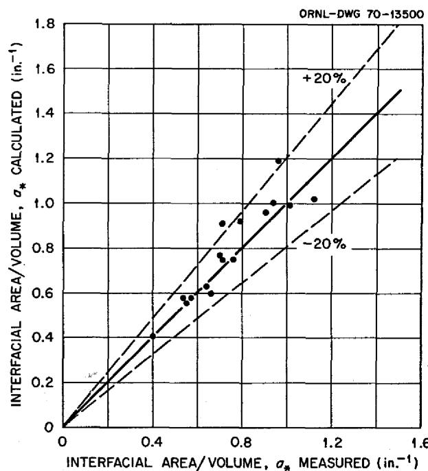  
Fig. 7.8. Interfacial Areas per Unit Volume: Comparison of Calculated Values with Measured Values.

surfactant, over the Reynolds modulus range from $4 \times 10^{3}$ to $1.8 \times 10^{5}$ and bubble mean diameters from 0.015 to 0.08 in.

Figure 7.9 illustrates the variation in mass transfer coefficient, $k$ , with a bubble mean diameter,

$$
\overline {{{d}}} _ {v s g} \left[ \equiv \int_ {0} ^ {\infty} D ^ {3} f (D) d D \Big / \int_ {0} ^ {\infty} D ^ {2} f (D) d D \right],
$$

for different flows (Reynolds moduli) for the $37.5\%$ mixture. It is seen that $k$ increases with bubble diameter over the range covered but appears to be leveling off at low and at high mean bubble diameters.

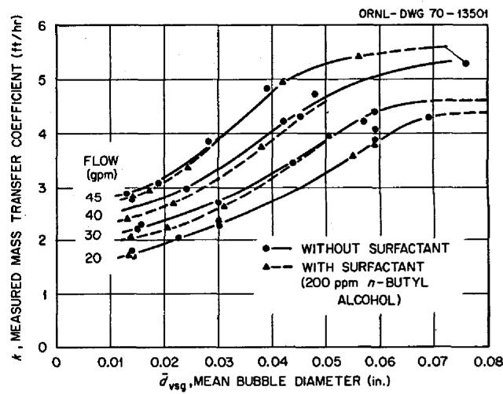  
Fig. 7.9. Measured Values of Mass Transfer Coefficient, $k$ , vs Sauter Mean Bubble Diameter, $d_{\mathrm{vsg}}$ , as a Function of Volumetric Flow Rates, With and Without the Addition of a Surface Active Agent. Oxygen is being removed from a mixture of $62.5\%$ water and $37.5\%$ glycerin by small helium bubbles in a 2-in.-diam vertical test section.

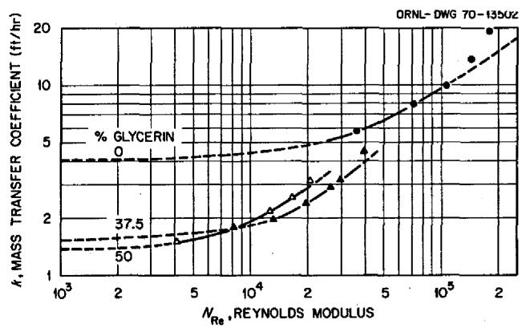  
Fig. 7.10. Mass Transfer Coefficients vs Reynolds Modulus for 0.02-in.-diam Bubbles and Three Mixtures of Glycerin and Water.

Figure 7.10 is a cross plot of the data of Fig. 7.9 along with that of the other two mixtures for a bubble diameter of 0.02 in. As the Reynolds modulus is decreased, the mass transfer coefficients appear to approach a more or less constant value. The asymptotic behavior at low values of the Reynolds modulus may be deduced by assuming that the mass transfer coefficient for a swarm of bubbles rising through a quiescent liquid has the same functional dependence as that of a single bubble. The latter is given by Calderbank,4

$$
k \sim (g \mu / \rho) ^ {1 / 3} / (N _ {\mathrm {S c}}) ^ {2 / 3},
$$

and, using the apparent asymptote of the $50\%$ glycerol data as a base, the asymptotes of the other mixtures are calculated to be as shown by the dashed lines in Fig. 7.10.

# Part 3. Chemistry

W. R. Grimes

The chemical research and development activities described below are conducted to establish the basic chemical information required for the development of advanced molten-salt reactor systems.

A substantial fraction of these efforts continued to be devoted to the transport, distribution, and chemistry of fission products in the MSRE. Investigations of fission product behavior have been continued with specimens removed from the MSRE fuel circuit, with "synthetic" fuel mixtures, and by investigation of the chemistry of molybdenum, niobium, and ruthenium in molten fluoride mixtures.

A broad program of fundamental investigations into the physical chemistry of molten-salt systems was maintained; from it are derived the basic data for reactor and chemical reprocessing design. Within the scope of these efforts are included research in solution thermodynamics and phase equilibria, crystal chemistry, electrochemistry, spectroscopy (both Raman and electronic absorption), transport processes, and theoretical aspects of molten-salt chemistry.

Studies of the chemical aspects of separations methods were continued. The results of these studies

form the basis for evolving modifications of methods for reprocessing MSBR fuel salts. With recent adoption of a fundamental change in the reference design for MSBR fuel reprocessing, one which effects transfer of rare earths from liquid bismuth to lithium chloride as an acceptor solvent, emphasis in separation studies has expanded to include the chemistry of molten chloride systems.

The principal emphasis of analytical chemical development programs has been placed on methods for use in semiautomated operational control of molten-salt breeder reactors, for example, the development of in-line analytical methods for the analysis of MSR fuels, for reprocessing streams, and for gas streams. These methods include electrochemical and spectrophotometric means for determination of the concentration of $\mathbf{U}^{3+}$ and other ionic species in fuels and coolants and adaptation of small on-line computers to electroanalytical methods. Parallel efforts have been devoted to the development of analytical methods related to assay and control of the concentration of water, oxides, and tritium in fluoroborate coolants.

# 8. Fission Product Behavior

# 8.1 NOBLE METAL FISSION PRODUCT BEHAVIOR

E. L. Compere E. G. Bohlmann

It was noted in the previous report1 that noble metals in MSRE salt samples acted as if they were particulate

constituents of a mobile "pool" of such substances held up in the system for a substantial period and that evidence regarding this might be obtained from the activity ratio of pairs of isotopes.

Pairs of the same element, thereby having the same chemical behavior (e.g., $^{103}\mathrm{Ru} / ^{106}\mathrm{Ru}$ ), should be particularly effective. As produced, the activity ratio of such a pair is proportional to ratios of fission yields and decay constants. Accumulation over the operating history yields the inventory ratio, ultimately proport

tional (at constant fission rate) only to the ratio of fission yields. If however there is an intermediate holdup and release before final deposition, the activity ratio of the retained material will depend on holdup time and will fall between production and inventory values. Furthermore, the material deposited after such a holdup will, as a result, have ratio values lower than inventory. (Values for the isotope of shorter half-life, here $^{103}\mathrm{Ru}$ , will be used in the numerator of the ratio throughout our discussion.) Consequently, comparison of an observed ratio of activities (in the same sample) with associated production and inventory ratios should provide an indication of the "accumulation history" of the region represented by the sample. Since both determinations are for isotopes of the same element in the same sample (consequently subjected to identical treatment), many sampling and handling errors cancel and do not affect the ratio. Ratio values are thereby subject to less variation.

We are in process of using the $^{103}\mathrm{Ru} / ^{106}\mathrm{Ru}$ activity ratio among others to examine samples of various kinds taken at various times in the MSRE operation. These include salt and gas samples from the pump bowl and other materials briefly exposed there at various times.

Data are also available from the sets of surveillance specimens removed after runs 11, $14,3$ 18, and 20. Materials removed from the off-gas line after runs $14^{6}$ and $18^{7}$ offer useful data. Some information is available from the on-site gamma spectrometer surveys of the MSRE following runs 18 and 19, particularly with regard to the heat exchanger and off-gas line.

Inventory and Model. - The data will be discussed in terms of a "compartment" model, which will assign first-order transfer rates common for both isotopes between given regions and assume this behavior was consistent throughout MSRE history. Because the

half-lives of $^{103}\mathrm{Ru}$ and $^{106}\mathrm{Ru}$ are quite different, 39.6 days and 367 days respectively, appreciably different isotope activity ratios are indicated for different compartments and times as simulated operation proceeds. A sketch of a useful scheme of compartments is shown in Fig. 8.1.

We assume direct production of $^{103}\mathrm{Ru}$ and $^{196}\mathrm{Ru}$ in the fuel salt in proportion to fission rate and fuel composition as determined by MSRE history. The material is fairly rapidly lost from salt either to "surfaces" or to a mobile "particulate pool" of agglomerated material. The pool loses material to one or more final repositories, nominally "off-gas," and also may deposit material on the "surfaces." Rates are such as to result in an appreciable holdup period of the order of 50 to 100 days in the "particulate pool." Decay, of course, occurs in all compartments.

Material is also transferred to the "drain tank" as required by the history, and transport between compartments ceases in the interval.

From the atoms of each type at a given time in a given compartment, the activity ratio can be calculated, as well as an overall inventory ratio.

We shall identify samples taken from different regions of the MSRE with the various compartments and thus obtain insight into the transport paths and lags leading to the sampled region. It should be noted that a compartment can involve more than one region or kind of sample. The additional information required to establish the amounts of material to be assigned to a given region, and thereby to produce a material balance, is not available.

In comparison with the overall inventory value of $^{103}\mathrm{Ru} / ^{106}\mathrm{Ru}$ , we should expect "surface" values to equal it if the deposited material comes rapidly and only from "salt," and to be somewhat below it if in addition "particulate" is deposited. If there is no direct deposition from "salt" to "surface," but only "particulate," then deposited material should approach "off-gas" compartment ratio.

The "off-gas" compartment ratio should be below inventory, since it is assumed to be steadily deposited from the "particulate pool," which is richer in the long-lived $^{106}\mathrm{Ru}$ component than production, and inventory is the accumulation of production minus decay.

The particulate pool will be above inventory if material is transferred to it rapidly and lost from it at a significant rate. Slow loss rates correspond to long holdup periods, and ratio values tend toward inventory.

Differential equations involving proposed transport, accumulation, and decay of $^{103}\mathrm{Ru}$ and $^{106}\mathrm{Ru}$ atoms

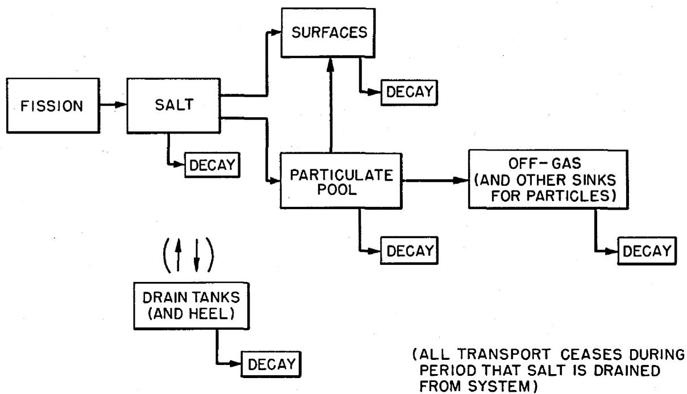  
Fig. 8.1. Compartment Model for Noble-Metal Fission Transport in MSRE.

with respect to these compartments were incorporated into a fourth-order Runge-Kutta numerical integration scheme which was operated over the full MSRE power history.

The rates used in one calculation referred to in the discussion below show rapid loss (<1 day) from salt to particulates and surface, with about $4\%$ going directly to surface. Holdup in the particulate pool results in a daily transport of about $0.2\%$ of the pool to "surface" and about $2\%$ per day of the pool to "off-gas," for an effective average holdup period of about 45 days. All transport processes are assumed irreversible in this scheme.

Off-Gas Line Deposits. - Data have been reported on the examination $^{6}$ after run 14 (March 1968) of the jumper line installed after run 9 (December 1966), of the examination $^{7}$ after run 18 (June 1969) of parts of a specimen holder assembly from the main off-gas line installed after run 14, and of the examination $^{7}$ of parts of line 523, the fuel pump overflow tank purge gas outlet to the main off-gas line, which was installed during original fabrication of MSRE. These data are shown in Table 8.1.

For the jumper line removed after run 14, observed ratios range from 2.4 to 7.3. By comparison the inventory ratio for the net exposure interval was 12.1. If a holdup period of about 45 days prior to deposition in the off-gas line is assumed, we calculate a lower ratio for the compartment of 7.0. It seems indicated that a holdup of ruthenium of 45 days or more is required.

Ratio values from the specimen holder removed from the 522 line after run 18 ranged between 9.7 and 5.0. Net inventory ratio for the period was 19.7, and for material deposited after a 45-day holdup we estimated a ratio of 12.3. A longer holdup would reduce this estimate. However, we recall that gas flow through this line was appreciably diminished during the final month of run 18. This would cause the observed ratio values to be lower by an appreciable factor than would ensue from steady gas flow all the time. A holdup period of something over 45 days still appears indicated.

Flow of off-gas through line 523 was less well known. In addition to bubbler gas to measure salt depth in the overflow tank, part of the main off-gas flow from the pump bowl went through the overflow tank when flow through line 522 was hindered by deposits. The

Observed vs calculated $\left(\frac{\mathrm{dis} / \mathrm{min}^{103}\mathrm{Ru}}{\mathrm{dis} / \mathrm{min}^{106}\mathrm{Ru}}\right)^a$

Table 8.1. Ruthenium Isotope Activity Ratios of Off-Gas Line Deposits   

<table><tr><td>Sample</td><td>Obs. Ratio</td><td>Calc. Values of Ratio</td></tr></table>

I. Jumper Section of Line 522, Exposed December 1966 to March 25, 1968   

<table><tr><td>Flextool</td><td>2.4</td><td></td></tr><tr><td>Upstream hose</td><td>2.4</td><td></td></tr><tr><td>Downstream hose</td><td>4.1</td><td></td></tr><tr><td>Inlet dust</td><td>7.3</td><td></td></tr><tr><td>Outlet dust</td><td>4.4</td><td></td></tr><tr><td></td><td></td><td>Productionb 58</td></tr><tr><td></td><td></td><td>Net inventory 12.1</td></tr><tr><td></td><td></td><td>Net deposit if:</td></tr><tr><td></td><td></td><td>45-day holdup 7.0</td></tr><tr><td></td><td></td><td>90-day holdup 5.5</td></tr></table>

II. Specimen Holder, Line 522, Exposed August 1968 to June 1969   

<table><tr><td>Bail end</td><td>9.7</td></tr><tr><td>Flake</td><td>5.0</td></tr><tr><td>Tube sections</td><td>5.4, 5.9</td></tr><tr><td>Recount 7/70, corr</td><td>6, 2</td></tr><tr><td></td><td></td></tr><tr><td></td><td>Productionc 43</td></tr><tr><td></td><td>Net inventory 19.7</td></tr><tr><td></td><td></td></tr><tr><td></td><td>Net deposit if:</td></tr><tr><td></td><td>45-day holdup 12.3</td></tr><tr><td></td><td>90-day holdup 9.3</td></tr></table>

III. Overflow Tank Off-Gas Line (523), Exposed 1965 to June 1969   

<table><tr><td>Valve V523</td><td>8.0</td><td></td></tr><tr><td>Line 523</td><td>11.3, 13.7, 13.3</td><td></td></tr><tr><td>Valve HCV 523</td><td>13.3, 12.5, 10.0</td><td>Inventory 9.6</td></tr><tr><td></td><td></td><td>Net deposit if:</td></tr><tr><td></td><td>45-day holdup</td><td>5.8</td></tr><tr><td></td><td>90-day holdup</td><td>4.3</td></tr></table>

$a$ Corrected to time of shutdown.

$b^{235}\mathrm{U}.^{238}\mathrm{U}$ fuel, with inbred $^{239}\mathrm{Pu}$ .

$c^{233}\mathrm{U}$ fuel, including $2.1\%$ of fissions from contained $^{235}\mathrm{U}$ and $4.3\%$ from $^{239}\mathrm{Pu}$ .

observed ratio after run 18 was 8-13.7, inventory was 9.6, and for material deposited after 45 days holdup the ratio is calculated to be 5.8. However, the unusually great flow during the final month of run 18 (until blockage of line 523 on May 25) would increase the observed ratio considerably. This response is consistent with the low value for material from line 522 cited above. So we believe the assumption of an appreciable holdup period prior to deposition in off-gas regions remains valid.

Surveillance Specimens. - Surveillance specimens of graphite and also selected segments of metal were removed from, the core surveillance assembly after exposure throughout several runs. Table 8.2 shows values of the activity ratios for $^{103}\mathrm{Ru} / ^{106}\mathrm{Ru}$ for a number of graphite and metal specimens removed on different occasions in 1967, $^{2}$ 1968, $^{3}$ and 1969. $^{4,5}$ Insofar as deposition of these isotopes occurred irre

versibly and with reasonable directness soon after fission, the ratio values should agree with the net inventory for the period of exposure, and the samples that had been exposed longest at a given removal time should have appropriately lower values for the $10^{3}\mathrm{Ru} / 10^{6}\mathrm{Ru}$ activity ratio.

Examination of Table 8.2 shows this latter view is confirmed - the older samples do have values that are lower, to about the right extent. However, we also note that most observed ratio values fall somewhat below the net inventory values. This could come about if in addition to direct deposition from salt onto surfaces deposition also occurred from the holdup "pool," presumed colloidal or particulate, which we mentioned in discussing the off-gas deposits. Few of the observed values fall below the parenthesized off-gas values. This value was calculated to result if all the deposited material had come from the holdup pool. Therefore, we conclude that the surface deposits did not occur only by deposition of material from the "particulate pool"; calculated values are shown which assume rates which would have about two-thirds coming from a particulate pool of about 45-day holdup. The agreement is not uncomfortable.

In general the metal segments showed lower values than graphite specimens similarly exposed, with some observed values below any corresponding calculated values. This implies that in some way in the later part of its exposure the tendency of the metal surface to receive and retain ruthenium isotope deposits became diminished, particularly in comparison with the graphite specimens. Also the metal may have retained more particulate and less directly deposited material than the graphite, but on balance the deposits on both types of specimen appear to have occurred by a combination of the two modes.

Pump Bowl Samples. -- Ratio data are available on salt samples and later gas samples removed from the pump bowl spray shield beginning with run 7 in 1966. Similar data are also available for other materials exposed from time to time to the gas or liquid regions within the spray shield. Data from outer sheaths of double-wall capsules are included. Data for the activity ratios (dis min $^{-1}$ 103Ru/dis min $^{-1}$ 106Ru) are shown for most of these in Fig. 8.2. In this figure the activity ratios are plotted in sample sequence. Also shown on the plot are values of the overall inventory ratio, which was calculated from power history, and the production ratio, which was calculated from yields based on fuel composition. This changed appreciably during runs 4-14, where the plutonium content increased because of the relatively high $^{238}\mathrm{U}$ content of the fuel. The

Table 8.2. Ruthenium Isotope Activity Ratios of Surveillance Specimens   
Observed vs calculated $\left(\frac{\mathrm{dis} / \mathrm{min}^{103}\mathrm{Ru}}{\mathrm{dis} / \mathrm{min}^{106}\mathrm{Ru}}\right)$   

<table><tr><td rowspan="2">Exposure, Runs</td><td rowspan="2">Material</td><td rowspan="2">Observed Ratios, Median Underlined</td><td colspan="3">Calculated Values of Ratio</td></tr><tr><td>Net Inventory</td><td>Plus Deposition from Holdup (45 day)</td><td>Off-Gas</td></tr><tr><td>8–11</td><td>Graphite</td><td>20a22, 23a25b27, 52</td><td>25.5</td><td>19.2</td><td>(15.9)</td></tr><tr><td>8–14</td><td>Graphite</td><td>9c12</td><td>11.4</td><td>8.4</td><td>(6.8)</td></tr><tr><td>12–14</td><td>Graphite Metal</td><td>11, 12d (&gt;12), 13b (&gt;13), 14, (&gt;14), 16, 17 10a11, 12b15</td><td>16.7</td><td>11.6</td><td>(9.3)</td></tr><tr><td>8–18</td><td>Graphite Metal basket</td><td>6b7a8 (3.5)b</td><td>9.8</td><td>7.2</td><td>(5.7)</td></tr><tr><td>15–18</td><td>Graphite Metal</td><td>2, 10, 11b12e13, 14, 15b16, 21, 27 6, 7a8, 9, 10</td><td>19.7</td><td>14.9</td><td>(12.3)</td></tr><tr><td>19–20</td><td>Graphite Metal</td><td>10b11, 12e13b14, 3200 6, 7e8, 10a11a12b13a15</td><td>21.7</td><td>13.4</td><td>(9.6)</td></tr></table>

$^{a}$ S. S. Kirslis and F. F. Blankenship, MSR Program Semiann. Progr. Rept. Aug. 31, 1968, ORNL-4344, pp. 115-41.   
bS. S. Kirlis and F. F. Blankenship, MSR Program Semiann. Progr. Rept. Aug. 31, 1967, ORNL-4191, pp. 121-28.   
$\mathbf{c}\mathbf{F}$ F. F. Blankenship, personal communication.   
dE. L. Compere, MSR Program Semiann. Progr. Rept. Aug. 31, 1968, ORNL-4344, pp. 206-10.   
$^{\text{e}}$ F. F. Blankenship, S. S. Kirslis, and E. L. Compere, MSR Program Semiann. Progr. Rept. Aug. 31, 1969, ORNL-4449, pp. 104-7; Feb. 28, 1970, ORNL-4548, pp. 104-10.

$\mathbf{106}\mathrm{Ru}$ yield from $^{239}\mathrm{Pu}$ is more than tenfold greater than its yield from ${}^{233}\mathrm{U}$ or ${}^{235}\mathrm{U}$ . The plutonium content of the fuel did not vary nearly as much during the ${}^{233}\mathrm{U}$ operation and was taken as constant.

Also shown are lines which have been computed assuming a particulate pool with average retention periods of 45 and 100 days. The point has been made previously1 that noble metal activity associated with any materials exposed in or sampled from the pump bowl is principally from this mobile pool rather than being dissolved in salt or occurring as gaseous substances. Consequently, similar ratios should be encountered for salt and gas samples and surfaces of various materials exposed in the pump bowl.

Examination of Fig. 8.2 indicates that the preponderance of points fall between the inventory line and a line for 45-day average retention, agreeing reasonably well with an average holdup of between 45 and 100 days - but with release to off-gas, surfaces, and other regions resulting in a limited retention rather than the unlimited retention implied by an inventory value.

Although meaningful differences doubtless exist between different kinds of samples taken from the pump bowl, their similarity clearly indicates that all are taken from the same mobile pool, which loses material, but slowly enough to have an average retention period of several months.

Discussion. - The data presented above represent practically all the ratio data available for MSRE samples. The data based on gamma spectrometer surveys of various reactor regions particularly after runs 18 and 19 have not been examined in detail but in cursory views appear not too inconsistent with values given here.

It appears possible to summarize our findings about fission product ruthenium in this way:

The off-gas deposits appear to have resulted from the fairly steady accumulation of material which had been retained elsewhere for periods of the order of several months prior to deposition.

The deposits on surfaces also appear to have contained material retained elsewhere prior to deposition, though not to quite the same extent, so that an appreciable part could have been deposited soon after fission.

All materials taken from the pump bowl contain ruthenium isotopes with a common attribute - they are representative of an accumulation of several months. Thus all samples from the pump bowl presumably get their ruthenium from a common source.

Since it is reasonable to expect fission products to enter salt first, as ions or atoms, presumably these rapidly deposit on surfaces or are agglomerated. The agglomerated material is not dissolved in salt but is

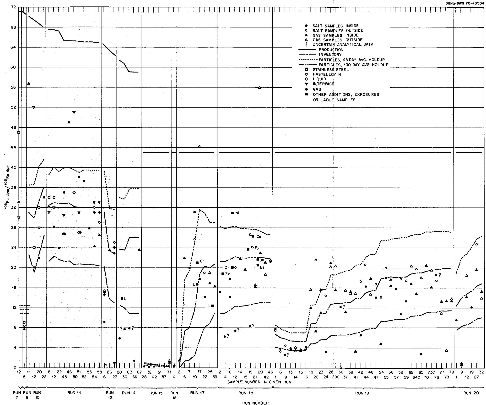  
Fig. 8.2. Ratio of Ruthenium Isotope Activities for Pump Bowl Samples.

fairly well dispersed and may deposit on surfaces to some extent. It is believed that regions associated with the pump bowl - the liquid surface, including bubbles, the shed roof, mist shield, and overflow tank - are effective in accumulating this agglomerated material. Regions with highest salt surface/salt mass (gas samples containing mist and surfaces exposed to the gas-liquid interface) have been found to have the highest quantities of these isotopes relative to the amount of salt in the sample. So the agglomerate seeks the surfaces. Since the subsurface salt samples, however, never show amounts of ruthenium in excess of inventory, $^{1}$ it would appear that material entrained, possibly with bubbles, is fairly well dispersed when in salt.

Loss of the agglomerated material to one or more permanent sinks at a rate of 1 or $2\%$ per day is indicated. In addition to the off-gas system and to some extent the reactor surfaces, these sinks could include the overflow tank and various nooks, crannies, and crevices if they provided for a reasonably steady irreversible loss.

The ratio method without additional information cannot indicate how much material follows a particular path to a particular sink, but it does serve to indicate the paths and the transport lags along them for the isotopes under consideration.

# 8.2 SHORT-TERM FISSION PRODUCT DEPOSITION TESTS

S. S. Kirslis F. F. Blankenship L. L. Fairchild

A considerable amount of data pertaining to fission product deposition on graphite and Hastelloy N during long-term exposures to fissioning fuel salt in the MSRE core has been collected. It is of practical interest to know whether reactor surfaces become "saturated" with deposited fission products leading to decreasing deposition rates with continued reactor operation. The data from long-term tests are generally consistent with deposition rates for all fission products not changing with time after long operation. This conclusion would be strengthened if short-term tests showed early deposition rates rapidly leveling off to match the long-term rates. The results of early attempts to measure short-term deposition rates in the MSRE pump bowl were uninterpretable because of heavy deposition of fission products on the specimens from the gas phase above the fuel salt level, while the specimens were being lowered down to and raised up from the fuel. Therefore, a "window" capsule was designed in which the specimens were protected from the gas phase before and after

immersion in the fuel. Three small graphite rods and three Hastelloy N strips were attached by wires below a hollow metal bulb (Fig. 8.3) which could move vertically inside a nickel capsule with windows cut in its sides. The walls of the cylindrical bulb sealed the windows except when the capsule was immersed in the fuel salt; immersion caused the buoyant hollow bulb to

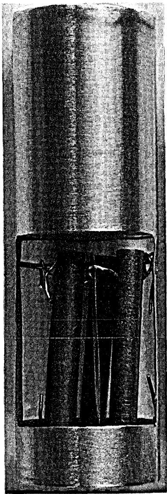  
PHOTO 97167

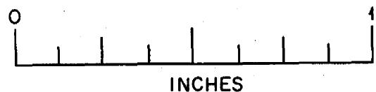  
Fig. 8.3. Sample Holder for Short-Term Deposition Test.

float upward, "opening the windows" and exposing the specimens to fuel salt. Four capsules of this type were immersed in the pump bowl fuel salt for exposures of 10, 3, 1, and $\frac{1}{6}$ hr.

The small quantities of $^{95}\mathrm{Zr}$ , $^{141}\mathrm{Ce}$ , $^{144}\mathrm{Ce}$ , $^{147}\mathrm{Nd}$ , and $^{140}\mathrm{Ba}$ found on all specimens, corresponding to 0.02 mg or less of fuel salt per square centimeter of sample, could be reasonably accounted for as simple contamination by the fuel salt. This explanation is consistent with the further observation that there was no significant variation of deposition with exposure time for these species. The higher depositions of these species on core-exposed specimens (1 to 4 mg of salt per square centimeter) was probably due to the operation of fission recoil, a mechanism absent in the pump bowl.

The behavior of $^{89}\mathrm{Sr}$ , shown in Table 8.3, was at first surprising: the deposition on all specimens for all exposure times was approximately the same - equivalent to about $0.1\mathrm{mg}$ of fuel salt per square centimeter of surface. By comparison, $^{89}\mathrm{Sr}$ deposition on core-exposed metal specimens corresponded to about $3\mathrm{mg}$ of fuel salt per square centimeter, while on graphite specimens it was equivalent to $3000\mathrm{mg}$ of salt per square centimeter or $4000\mathrm{mg}$ of fuel salt per gram of graphite.

These facts can be rationalized if the $^{89}\mathrm{Kr}$ concentration in the pump bowl salt were low as compared with that in the core salt. This must be so, since the core salt is relieved of the bulk of its gas content by being sprayed into the pump bowl. Thus one would not expect that much $^{89}\mathrm{Kr}$ enters the graphite while it is

Table 8.3. Deposition of ${}^{89}\mathrm{{Sr}}$ in Pump Bowl Tests   

<table><tr><td rowspan="2">Exposure Time</td><td colspan="2">Deposition (‘‘mg’’/cm2)a</td></tr><tr><td>Graphite</td><td>Hastelloy N</td></tr><tr><td>10 hr</td><td>0.100</td><td>0.129</td></tr><tr><td>10 hr</td><td>0.078</td><td>0.136</td></tr><tr><td>10 hr</td><td>0.082</td><td>0.095</td></tr><tr><td>3 hr</td><td>0.097</td><td>0.098</td></tr><tr><td>3 hr</td><td>0.175</td><td>0.046</td></tr><tr><td>3 hr</td><td>0.089</td><td>0.088</td></tr><tr><td>10 min</td><td>0.12</td><td>0.11</td></tr><tr><td>10 min</td><td>0.12</td><td>0.087</td></tr><tr><td>10 min</td><td>0.067</td><td>0.074</td></tr></table>

$a^{*}\mathrm{Mg}^*$ represents milligrams of theoretical fuel salt, that is, fuel salt containing the concentration of $^{89}\mathrm{Sr}$ it would contain after the actual power history if radioactive decay were the only loss mechanism. The fuel actually contained about $70\%$ of this concentration of $^{89}\mathrm{Sr}$ , since some $^{89}\mathrm{Kr}$ was lost to the off-gas.

submerged in the pump bowl salt, regardless of immersion time.

On the other hand, while the metal and graphite specimens are in the gas phase, before and after immersion, they are equally exposed to a rain of $^{89}\mathrm{Sr}$ from decaying krypton in the gas phase. If both surfaces are good sinks for elemental Sr, the equal deposition on both surfaces is explained. The exposures to the gas phase were for similar lengths of time for all these runs. The window capsule can protect the samples against a particulate dust or spray but not against truly gaseous species like $^{89}\mathrm{Kr}$ .

The deposition of the noble metal nuclides $\left({}^{99}\mathrm{Mo}, {}^{95}\mathrm{Nb}, {}^{111}\mathrm{Ag}, {}^{129}\mathrm{Te}, {}^{132}\mathrm{Te}, {}^{103}\mathrm{Ru}, \text{and } {}^{106}\mathrm{Ru}\right)$ and $^{131}\mathrm{I}$ on both graphite and Hastelloy N showed a definite but not very large variation with time of exposure. The 10- and 3-hr exposures showed about five times as much deposition of these nuclides as the 1-hr and 10-min exposures. However, the data from the 10- and 3-hr exposures were very similar, as was the case for the 1-hr and 10-min exposures. These data are best compared with each other and with the long-term surveillance data in terms of the rate equation:

$$
\frac {d N}{d t} = k - \lambda N,
$$

which for constant $k$ integrates to

$$
N = \frac {k}{\lambda} (1 - e ^ {- \lambda t}),
$$

where

$$
N = \text {a t o m s}
$$

$$
k = \text {d e p o s i t i o n r a t e}, \text {a t o m s} \mathrm {c m} ^ {- 2} \sec^ {- 1},
$$

$$
\lambda = \text {d e c a y} \quad \text {r a t e}, \sec^ {- 1}, \text {a n d}
$$

$$
t = \text {d e p o s i t i o n}
$$

Table 8.4 gives a comparison of deposition rates $(k$ 's) calculated from the 10-hr exposure data and from the fifth set of surveillance specimens. Reasons for the low 10-hr deposition rates of $^{99}\mathrm{Mo}$ , $^{132}\mathrm{Te}$ , and $^{131}\mathrm{I}$ on Hastelloy N are not known. However, a surprising number of the ratios of these rates are near 1, indicating nearly equal deposition rates in the pump bowl after 10 hr and in the core after about 2000 hr. Thus it appears that the reactor surfaces would not become saturated with noble metal fission products and would therefore continuously absorb them. It also appears that the original fast 10-min rates of deposition are reduced within about 10 hr to more moderate rates which then remain constant.

Table 8.4. Comparison of Long-Term and Short-Term Deposition Rates   

<table><tr><td rowspan="2">Isotope</td><td colspan="2">Ratio, 10-hr Rate/1786-hr Rate</td></tr><tr><td>Graphite</td><td>Hastelloy N</td></tr><tr><td>99Mo</td><td>1.18</td><td>0.138</td></tr><tr><td>95Nb</td><td>1.68</td><td>1.30</td></tr><tr><td>129Te</td><td>1.47</td><td></td></tr><tr><td>132Te</td><td></td><td>0.022(?)</td></tr><tr><td>103Ru</td><td>6.16</td><td>1.5</td></tr><tr><td>131I</td><td>24.8</td><td>0.31</td></tr></table>

The high 10-hr deposition rate of $^{131}\mathrm{I}$ on graphite resulting in the unusually high ratio of 24.8 in Table 8.4 is also difficult to explain. The deposition rate of $^{131}\mathrm{I}$ on graphite for the 3-hr exposure in the pump bowl was even higher. In both short-term tests the deposition of $^{131}\mathrm{I}$ was usually only slightly less than that of $^{132}\mathrm{Te}$ and usually higher than that of $^{129}\mathrm{Te}$ , measured in grams of theoretical salt per sample. In long-term core exposures, the deposition of tellurium usually exceeded that of $^{131}\mathrm{I}$ by an order of magnitude or more measured in the same units. This suggests that the 25-min $^{131}\mathrm{Te}$ originally deposited heavily, then decayed to $^{131}\mathrm{I}$ , which was slowly washed off by the fuel salt.

# 8.3 FISSION PRODUCT DEPOSITION ON THE FIFTH SET OF GRAPHITE AND HASTELLOY N SAMPLES FROM THE MSRE CORE

S. S. Kirslis F. F. Blankenship L. L. Fairchild

A fifth set of long-term surveillance specimens of graphite (Poco grade AXF-5Q) and Hastelloy N was exposed to fissioning molten fuel salt for 12,943 MWhr during the final runs 19 and 20 of the MSRE. These tubular specimens were especially designed to test the effects of surface roughness and different flow conditions on the deposition of fission products from the fuel salt on or into the solids. One of the specimen assemblies contained electron microscope screens for detecting particulate matter in the gas phase above stagnant molten fissioning fuel salt.

# 8.3.1 Effect of Surface Roughness

There was no variation of deposition of any fission product with surface roughness for either graphite or Hastelloy N. For graphite the adjacent samples were machined to surface roughnesses of 5, 25, and $125\mu \mathrm{in}$ rms. Most of the metal samples were machined to the same range of roughnesses, but they also included $1 / _{16}$ -in.-diam Hastelloy N wire samples with surfaces as drawn and one tube with surface as machined (of undetermined roughness).

Two different explanations are invoked for the lack of dependence of deposition on surface roughness, which clearly eliminates a simple adsorption theory. For the deposition of $^{95}\mathrm{Zr}$ , $^{141}\mathrm{Ce}$ , and $^{144}\mathrm{Ce}$ on graphite and of $^{89}\mathrm{Sr}$ , $^{95}\mathrm{Zr}$ , $^{137}\mathrm{Cs}$ , $^{140}\mathrm{Ba}$ , $^{141}\mathrm{Ce}$ , and $^{144}\mathrm{Ce}$ on Hastelloy N, the quantity deposited amounted only to the equivalent of contamination by 1 to 4 mg of fuel salt per square centimeter of surface. Fission recoil is thought to be the mechanism by which these species are injected into the graphite and metal surfaces. The much heavier (by two or three orders of magnitude) depositions of noble metal fission products ( $^{99}\mathrm{Mo}$ , $^{95}\mathrm{Nb}$ , $^{103}\mathrm{Ru}$ , $^{129}\mathrm{Te}$ , $^{132}\mathrm{Te}$ ) on metal and graphite are thought to be controlled by mass transfer through a stagnant film of salt adjacent to the surface. However, large differences in diffusion coefficients, particle size, or accommodation coefficients for the different elements must be invoked to make the simple mass transfer model fit the data.

A similar model for the mass transfer of the rare-gas precursors of $^{89}\mathrm{Sr}$ and $^{140}\mathrm{Ba}$ through a salt film is thought to account for the observed heavy deposition of these species in graphite. In the case of $^{137}\mathrm{Cs}$ a mobility of cesium in the graphite must be also postulated to account for the low concentration remaining in the graphite.

# 8.3.2 Effect of Flow Conditions on Deposition

The several tubular test specimens of graphite and Hastelloy N in the fifth set of surveillance specimens were intentionally arranged to provide some variety of flow conditions under which the fuel contacted the graphite and metal surfaces. The low pressure drops available made it impossible to extend the flow conditions into the turbulent range. The flow conditions varied only from stagnant fuel salt to linear velocities of about 1 fps, or Reynolds numbers of about 700. Turbulence promoter wires were wrapped around one graphite and one metal tube, although sizable effects on turbulence were not expected at these low velocities.

On the Hastelloy N specimens, deposition of fission products varied significantly from the average only for the tube containing stagnant fuel salt with a $1^{1/2}$ -in.-long gas-phase region above the salt. Deposition on Hastelloy N from stagnant salt was about the same as from flowing fuel for $^{89}\mathrm{Sr}$ , $^{95}\mathrm{Zr}$ , $^{137}\mathrm{Cs}$ , $^{140}\mathrm{Ba}$ , $^{141}\mathrm{Ce}$ , and $^{144}\mathrm{Ce}$ . As expected, heavy deposition of $^{89}\mathrm{Sr}$ and fivefold greater deposition of $^{140}\mathrm{Ba}$ than from salt took place from the gas phase on Hastelloy N. For $^{99}\mathrm{Mo}$ , deposition from stagnant fuel was even heavier than the heavy deposition from flowing fuel. There was equally heavy deposition of $^{99}\mathrm{Mo}$ on the metal surfaces contacting the gas phase. But the deposition from stagnant salt of $^{95}\mathrm{Nb}$ , $^{103}\mathrm{Ru}$ , $^{132}\mathrm{Te}$ , and $^{131}\mathrm{I}$ was lower by a factor of 10 than from flowing salt. The quantities of $^{95}\mathrm{Nb}$ , $^{103}\mathrm{Ru}$ , $^{106}\mathrm{Ru}$ , and $^{131}\mathrm{I}$ on gas-exposed Hastelloy N were another factor of 10 lower. The amounts of $^{132}\mathrm{Te}$ on Hastelloy N exposed to stagnant salt and to the gas phase were similar. The different behaviors of $^{99}\mathrm{Mo}$ , $^{132}\mathrm{Te}$ , and the remaining noble metal fission products are difficult to explain.

There was no graphite specimen exposed to stagnant fuel; thus no significant variations of deposition on the graphite specimens were observed.

It was rather disappointing that the above results did not confirm the film-controlled diffusion model more definitely. The decreased deposition of $^{95}\mathrm{Nb}$ , $^{103}\mathrm{Ru}$ , $^{106}\mathrm{Ru}$ , $^{132}\mathrm{Te}$ , and $^{131}\mathrm{I}$ from the stagnant fuel is in accord with the model. The behavior of $^{99}\mathrm{Mo}$ in the stagnant region is anomalous.

# 8.3.3 Comparison of Deposition of Noble Metal Fission Products on Graphite and Hastelloy N

One of the assemblies in the fifth set of surveillance specimens was designed expressly to compare fission product deposition on metal and graphite surfaces exposed to fissioning fuel under identical conditions. The fuel was made to flow in a $1/16$ -in.-wide annulus between a Hastelloy N core $1/2$ in. in diameter and a $5/8$ -in.-ID Poco graphite tube.

The deposition of noble metal fission products on these graphite and metal surfaces is compared in Table 8.5. The unit of activity used in the table is grams of theoretical salt per square centimeter of surface. The theoretical salt contains all of each nuclide which would be found in the fuel salt if decay were the only loss mechanism. This unit of comparison takes into account the power history of the fuel. Each value can be multiplied by the total area of graphite $(\sim 2\times 10^{6}\mathrm{cm}^{2})$ or metal $(\sim 1\times 10^{6}\mathrm{cm}^{2})$ and divided by the total grams of fuel $(\sim 5\times 10^{6})$ in the reactor to yield the

Table 8.5. Comparison of Fission Product Deposition on Graphite and Hastelloy N   

<table><tr><td></td><td>Adjacent Graphite</td><td>Adjacent Hastelloy N</td><td>Average Graphite</td><td>Average Hastelloy N</td></tr><tr><td>95Nb</td><td>0.36</td><td>0.45</td><td>0.30</td><td>0.54</td></tr><tr><td>99Mo</td><td>0.31</td><td>1.93</td><td>0.31</td><td>3.02</td></tr><tr><td>103Ru</td><td>0.12</td><td>0.18</td><td>0.09</td><td>0.23</td></tr><tr><td>106Ru</td><td>0.09</td><td>0.22</td><td>0.07</td><td>0.23</td></tr><tr><td>129Te</td><td>0.04</td><td></td><td>0.06</td><td></td></tr><tr><td>132Te</td><td></td><td>1.37</td><td></td><td>3.16</td></tr><tr><td>131I</td><td>0.007</td><td>0.24</td><td>0.005</td><td>0.30</td></tr></table>

fraction of total nuclide present to be found on the graphite or metal.

The last two columns of the table give the average depositions on the 12 graphite and the 13 metal surveillance specimens exposed to flowing fuel salt during the same period.

These results show that the deposition behavior on adjacent specimens is generally similar to that on geometrically separated samples and confirm the previously noted preference of most noble metal nuclides to deposit on metal rather than on graphite. This would argue for different accommodation coefficients for deposition on metal and graphite. In previous tests more $^{95}\mathrm{Nb}$ usually deposited on graphite than on metal.

# 8.3.4 Concentration Profiles of Fission Products in Graphite

The interior surfaces of the two graphite tubes from the fifth set of surveillance specimens (see ref. 9) were sampled in a hot cell with a special adjustable boring tool making successive cuts 1, 2, 3, 10, and 10 and 20 mils thick. The graphite powder samples were dissolved and analyzed radiochemically for ${}^{89}\mathrm{Sr}$ , ${}^{95}\mathrm{Zr}$ , ${}^{140}\mathrm{Ba}$ , ${}^{137}\mathrm{Cs}$ , ${}^{141}\mathrm{Ce}$ , ${}^{144}\mathrm{Ce}$ , ${}^{99}\mathrm{Mo}$ , ${}^{129}\mathrm{Te}$ , ${}^{132}\mathrm{Te}$ , ${}^{131}\mathrm{I}$ , ${}^{95}\mathrm{Nb}$ , ${}^{103}\mathrm{Ru}$ , and ${}^{106}\mathrm{Ru}$ . A sample of each graphite piece which remained after boring was analyzed to provide information on fission product deposition on the exterior surfaces of the graphite tubes.

The concentration profiles and total depositions per square centimeter obtained were generally similar to those from previous sets of surveillance specimens. As usual, except for $^{89}\mathrm{Sr}$ , $^{137}\mathrm{Cs}$ , and $^{140}\mathrm{Ba}$ the concentrations of fission products fell by two or more orders of magnitude in a few mils. For the three exceptions, each possessing a rare-gas precursor of appreciable half-life, the interior profiles were level, as previously observed for Poco graphite. The interior level averaged

$3.7 \times 10^{11}$ dis $\min^{-1} g^{-1}$ for $^{89} \mathrm{Sr}$ , about twice the average for Poco graphite in the fourth set of surveillance specimens and four times the average for Poco graphite in the third set. The interior concentrations for $^{140} \mathrm{Ba}$ (and most other isotopes) were similar in the three sets of specimens.

The $^{89}\mathrm{Sr}$ profiles were unusual also in that all five of them showed higher interior than surface concentrations. The first surface sample, about 1 mil thick, usually contained a concentration of about $2 \times 10^{11}$ dis min $^{-1}$ g $^{-1}$ of $^{89}\mathrm{Sr}$ , which rose to about $4 \times 10^{11}$ dis min $^{-1}$ g $^{-1}$ at a depth of 5 mils. Hints of similar behavior were noted for $^{140}\mathrm{Ba}$ and $^{137}\mathrm{Cs}$ . A reexamination of profiles for $^{89}\mathrm{Sr}$ , $^{140}\mathrm{Ba}$ , and $^{137}\mathrm{Cs}$ from previous surveillance specimens also frequently showed low concentrations in the first few mils from the salt-exposed surface. Typically, the concentrations would fall from a high initial value at the surface to a low value at a depth of 3 to 5 mils, then rise to a level intermediate value.

This mobility was anticipated for $^{137}\mathrm{Cs}$ , which is known to exhibit a volatility as the element or carbide. Some information on a high mobility of $^{89}\mathrm{Sr}$ and $^{140}\mathrm{Ba}$ diffusing through pyrolytic carbon coatings on $\mathrm{UO}_2$ and $\mathrm{UC}_2$ fuel particles is in accord with the observed profiles. Since the fuel salt or flush salt should be an effective sink for elemental $^{89}\mathrm{Sr}$ , $^{140}\mathrm{Ba}$ , and $^{137}\mathrm{Cs}$ , their diffusion from the interior of the graphite toward the salt could conceivably result in the observed concentration gradients, particularly during low- or zero-power operation.

# 8.3.5 Electron Microscope Examination of Particles in the Gas Phase Above Fuel Salt in the MSRE

The topmost test assembly in the fifth set of surveillance specimens was a Hastelloy N tube closed at the top end, open to flowing salt at the bottom end, and containing a central rod with 11 electron microscope screens attached every $\frac{1}{2}$ in. vertically. Post-irradiation examination of the rod and screens showed that during MSRE power operation the salt level in the tube rose so that only the top two screens were in the helium gas phase at the top of the tube. The long heating of the screens caused them to self-weld to the rod, so that it was not possible to remove the copper screens from the Hastelloy N rod without damaging the delicate carbon film on the screens.

With the electron microscope it was possible to see irregularly shaped particles with a sintered appearance on a few remaining scraps of carbon film. The particles were about 0.1 to $10\mu$ in size, occasionally strung

together in chains, and gave electron diffraction patterns suggestive of $\mathrm{Li}_2\mathrm{BeF}_4$ crystals. No other kinds of particles could be identified on the screens from the gas phase above the molten fissioning salt. Radiochemical analyses had shown that deposits on the gas-phase tube walls contained 6 to $9\times 10^{15}$ atoms of $^{99}\mathrm{Mo}$ per square centimeter (several monolayers) at reactor shutdown. Apparently this material did not collect into particles big enough to see with the electron microscope.

# 8.4 A POSSIBLE ORIGIN OF SMOKES AND MISTS EMITTED BY MSRE FUEL

# F. F. Blankenship

The fact that fluoride fuels are strongly nonwetting toward clean metals is well established. The consequences of such interfacial behavior for very small metallic particles or even single atoms are perhaps novel, if not surprising.

In the first place, a particle which is at the melt surface is on the surface rather than in the surface as in more familiar cases. This is because the interfacial energies are less the smaller the area of liquid-solid contact. A particle at the surface is expelled from the surface, and work would be required to cause the particle to penetrate the surface again.

As diagrammed simply in Fig. 8.4, once out of the liquid the particle tends to remain out. Figure 8.4 shows the interfacial energy levels, $E$ , over a distance interval $(d)$ that includes a liquid-gas interface.

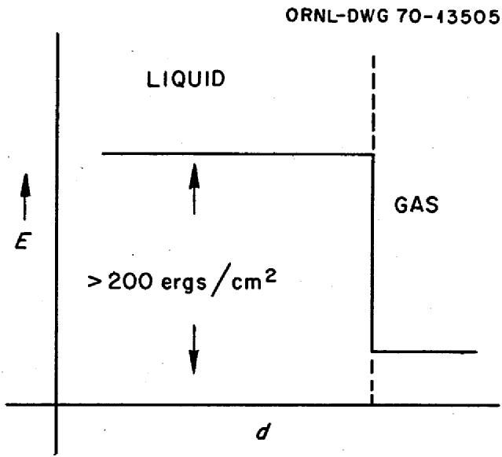  
Fig. 8.4. Surface Energy Levels for a Nonwetted Particle on Either Side of a Liquid-Gas Interface.

The question arises whether, as a particle moves from a higher potential energy in the liquid to a lower energy state outside, part of the potential energy difference is converted to kinetic energy.

Looking at the reverse process we can calculate the minimum kinetic energy a metal particle must possess to penetrate the surface as it collides with the liquid interface. A new liquid-metal interface having the area of the particle is created. The assumption is made that the increase in interfacial energy is at least as great as for this much newly created liquid area. The surface energy of the liquid is numerically equal to the surface tension, and in the case of MSRE fuel is about 200 ergs/cm². The surface tension increases as temperature decreases.

Considering a single atom of molybdenum (diameter 2.80 Å), the surface area is $2.46 \times 10^{-15} \, \text{cm}^2$ and the energy increment is $4.92 \times 10^{-13} \, \text{erg}$ . Thus the minimum velocity required is $8 \times 10^4 \, \text{cm/sec}$ . For comparison, the most probable velocity for gas molecules is $\sqrt{2RT / M}$ which for molybdenum at $900^\circ \text{K}$ is $4 \times 10^4 \, \text{cm/sec}$ .

The notion of using for the surface energy of a single atom the same value as for an ordinary interface seems somewhat unrealistic. However, this procedure gives the correct answers in calculating the solubility of rare gases in liquids and in nucleation theory.

If, when the liquid surface collapses as the particle is ejected, droplets are also jetted, as when a gas bubble collapses, we have an explanation of both the smoke and the mist that seem to arise from the fuel.

Another peculiar consequence of the nonwetting interface is that a single atom is already a critical nucleus. In other words, there is no surface energy barrier to the growth of any size clump. Thus the only hindrance to homogeneous or bulk nucleation of metals in the melt is the great dilution. We suspect that not much nucleation occurs there or else the metals would form alloys and travel together. Usually for homogeneous nucleation about 200 atoms are required to form a critical nucleus.

According to the hypothesis presented here, the differences noted in the behavior of various metal fission product atoms are to be attributed to differences in wettability which alter the value of 200 ergs/cm² used in Fig. 8.4.

This proposed mechanism is compatible with the observed behavior of smokes arising from quiescent fuels where there are no bubbles. It explains why the phenomena can be demonstrated at the tracer level with $^{95}\mathrm{Zr} - ^{95}\mathrm{Nb}$ , again without bubbles. It also explains why we were unable to prepare stable metallic colloids in the

fuel. It allows the diffusion in the liquid to be the rate-controlling step and does not depend on the nature of the surface in contact with the liquid.

At first glance the particle rejection by the fuel, as proposed here, is at variance with the fact that during the later operation of the MSRE the noble metals were sometimes found in the fuel and sometimes not, in an erratic fashion. The explanation may lie in the fact that fuel analyses detected sludges that were rafted around and were sometimes sampled and sometimes not. The sludge was probably not in the liquid in the sense that a wetted or soluble particle might be. Also, the sludge was alloyed, in that the proportions of the metals were not erratic.

Another prediction that can be made with confidence is that a nonwetted particle on the surface of a liquid could, if small enough, be dislodged by the molecular movements causing Brownian motion.

# 8.5 SYNTHESIS OF NIOBIUM FLUORIDES

C.F.Weaver J.S.Gill

Small (1-g) samples of niobium tetrafluoride were synthesized by the reduction of excess $\mathrm{NbF}_5$ with niobium metal in quartz containers at $200^{\circ}\mathrm{C}$ . The product was identified by x-ray diffraction analysis. It is currently being used in studies of the disproportionation reactions of the lower fluorides of niobium. A portion of the tetrafluoride was supplied to J. B. Bates and G. E. Boyd for use in Raman spectra studies.

Prolonged heating of $\mathrm{NbF_4}$ at $250^{\circ}\mathrm{C}$ under vacuum in a quartz tube produced $\mathrm{NbF_5}$ and a material different than Nb, $\mathrm{NbF_4}$ , and $\mathrm{NbF_5}$ which by mass spectrometric analysis contained few impurities, suggesting that this was a niobium fluoride with valence less than 4.

These studies will be continued in order to determine the conditions under which the niobium fluorides are stable and under which the disproportionations may be used to synthesize the lower fluorides.

# 8.6 MOLYBDENUM AND NIOBIUM FLUORIDE SOLUTIONS IN MOLTEN $\mathbf{L}\mathbf{i}_2\mathbf{B}\mathbf{e}\mathbf{F}_4$

C. F. Weaver H. A. Friedman

J. S. Gill

The addition of graphite (6 g of graphite per kilogram of melt) to molten $\mathrm{Li}_2\mathrm{BeF}_4$ at $500^{\circ}\mathrm{C}$ containing 530

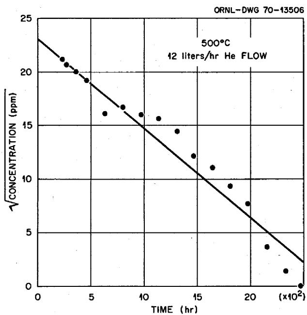  
Fig. 8.5. Removal of $\mathbf{Mo}^{3+}$ from Molten $\mathbf{Li}_2\mathbf{BeF}_4$ .

ppm of $\mathbf{Mo}^{3+}$ had no significant effect on the rate of loss of molybdenum from the system. The experiment was repeated, and the results are presented in Figs. 8.5 and 8.6. All of the kinetic experiments with this system $^{12-18}$ at $500^{\circ}\mathrm{C}$ indicate that the molybdenum left the system by a half-order process with a rate constant, defined as

$$
K = t ^ {- 1} \left(C _ {0} ^ {1 / 2} - C ^ {1 / 2}\right),
$$

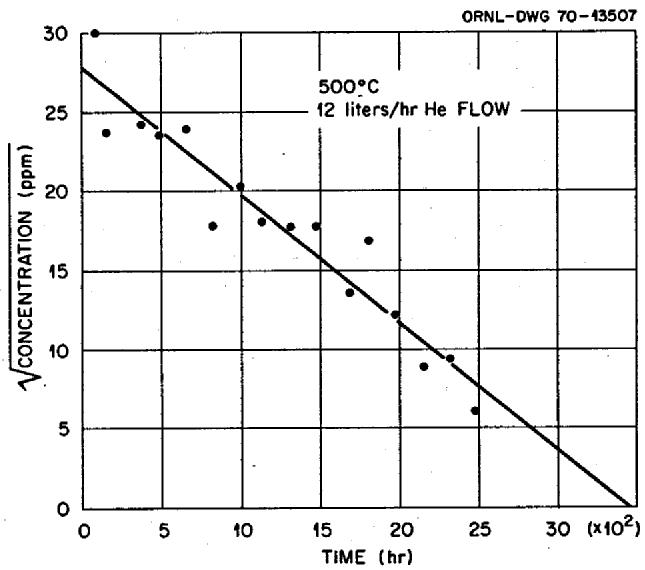  
Fig. 8.6. Removal of $\mathbf{Mo}^{3+}$ from Molten $\mathbf{Li}_2\mathbf{BeF}_4$ .

of $7 \times 10^{-3} \mathrm{ppm}^{-1 / 2} \mathrm{hr}^{-1}$ . This behavior was not affected by the helium flow rate, surface area of the copper container, presence of $\mathrm{UF_4}$ , presence of graphite, or the quantity of molybdenum metal produced. In no case has the copper container been oxidized by the molybdenum solutions. These observations lead to the conclusion that trivalent molybdenum in molten $\mathrm{Li_2BeF_4}$ at $500^{\circ}\mathrm{C}$ was removed from the system by a homogeneous disproportionation reaction.

The behavior of similar solutions at higher temperatures is not as well understood at present. The few experiments which we have conducted at $700^{\circ}\mathrm{C}$ suggest $^{12-15}$ that the loss of molybdenum occurred more rapidly than at $500^{\circ}\mathrm{C}$ , the order of removal was variable and higher than at $500^{\circ}\mathrm{C}$ , and the removal rate was flow dependent. A recent experiment was started at $500^{\circ}\mathrm{C}$ and finished at $600^{\circ}\mathrm{C}$ as shown in Fig. 8.7. It displayed a much more rapid loss of molybdenum than a similar experiment which differed only in that the surface area of the copper container was less by an order of magnitude. These experiments suggest that the mechanism of removal of $\mathrm{Mo}^{3+}$ from molten $\mathrm{Li}_2\mathrm{BeF}_4$ is different in the 600 to $700^{\circ}\mathrm{C}$ temperature range than near $500^{\circ}\mathrm{C}$ . Such observations are consistent with the previously reported mass spectrometric results $^{15,16,19}$ that near $500^{\circ}$ only $\mathrm{MoF}_6$ and $\mathrm{MoF}_5$ are found in the vapor above disproportionating $\mathrm{MoF}_3$ . Above $500^{\circ}\mathrm{C}$ $\mathrm{MoF}_4$ occurs and becomes an increasingly important species as the temperature rises.

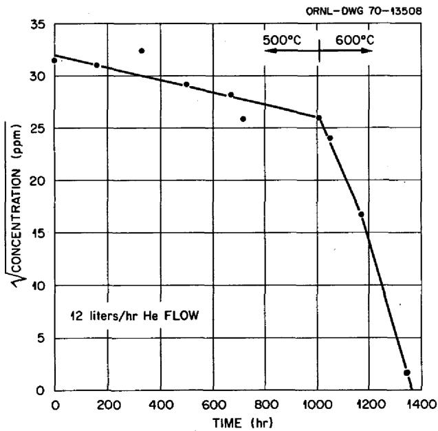  
Fig. 8.7. Removal of $\mathrm{Mo}^{3+}$ from Molten $\mathrm{Li}_2\mathrm{BeF}_4$

Evidence that niobium metal was oxidized in the MSRE when the $\mathrm{U}^{3+}/\mathrm{U}^{4+}$ ratios were low led to the suggestion that its behavior might provide a means of monitoring the redox potential of such a system. In this connection the reactions

$$
\mathrm {N b} + x \mathrm {H F} (\mathrm {g}) \rightleftharpoons (x / 2) \mathrm {H} _ {2} (\mathrm {g}) + \mathrm {N b F} _ {x} (\mathrm {d})
$$

and

$$
\mathrm {N b F} _ {x} (\mathrm {d}) + \mathrm {L i} \rightarrow \mathrm {N b} + x \mathrm {L i F}
$$

in molten $\mathbf{L}\mathbf{i}_2\mathbf{B}\mathbf{e}\mathbf{F}_4$ are being investigated.17,18

The solutions produced by hydrofluorination of niobium metal at $500^{\circ}\mathrm{C}$ in molten $\mathrm{Li}_2\mathrm{BeF}_4$ have been found to be stable for periods as long as a month with no evidence of a drop in concentration and have shown strong resistance to reduction with $\mathbf{H}_2$ gas. Consequently a stronger reductant, lithium metal, was used to reduce the $\mathrm{Nb}^{x+}$ and to determine its valence. Over the concentration range 340 to $2990~\mathrm{ppm}$ $\mathrm{Nb}^{x+}$ the valence was determined to be $3.8 \pm 0.3$ . We detected no obvious trend in the value with concentration. The fractional value may be caused by a mixture of species, a cluster compound, or simply experimental error in the determination. The value of $P_{\mathrm{HF}} / P_{\mathrm{H}}^{1/2}$ was near $10^{-4}$ atm $^{1/2}$ and varied by about $20\%$ over the concentration range 1000 to 1600 ppm of $\mathrm{Nb}^{x+}$ consistent with the high valence mentioned

above. This behavior with respect to reduction by hydrogen indicates that niobium is only slightly more noble than chromium and considerably more reactive than iron. These observations should not be extrapolated to other temperatures, since there is evidence in the literature $^{20}$ that both the valence and the stability of the niobium fluorides are strongly temperature dependent.

# 8.7 MASS SPECTROSCOPY OF NIOBIUM FLUORIDES

C.F.Weaver J.D.Redman

Earlier work $^{16,17,21}$ on the mass spectroscopy of niobium fluorides consisted in observing the pentafluoride, the associated oxyfluoride impurities, and the fluorination of niobium metal. More recently the disproportionation of the lower fluorides was given attention. We have previously reported that both a dimer and trimer of $\mathrm{NbF_5}$ have been observed. $^{21}$ The ionization efficiency curves and appearance potentials for the fragments of these species were given. $^{16,17,21}$ The cracking pattern for $\mathrm{NbOF_3}$ was tabulated as well as that for the complex polymer mixture of pentavalent niobium fluorides. We have recently attempted to resolve this composite pattern into the cracking patterns for the individual pentavalent species. Tentative cracking patterns based on the assumption that the vapor over $\mathrm{NbF_5}$ crystals at $75^{\circ}C$ is essentially all $\mathrm{Nb}_2\mathrm{F}_{10}$ are:

<table><tr><td rowspan="2">Ion</td><td colspan="2">Relative Intensity</td></tr><tr><td>Dimer</td><td>Monomer</td></tr><tr><td>NbF4+</td><td>100</td><td>100</td></tr><tr><td>NbF3+</td><td>16</td><td>10</td></tr><tr><td>NbF2+</td><td>4</td><td>13</td></tr><tr><td>NbF+</td><td>1</td><td>7</td></tr><tr><td>Nb+</td><td>0.3</td><td>3</td></tr><tr><td>Nb2F9+</td><td>45</td><td></td></tr></table>

These studies have also shown that at the higher temperatures both fluorination of niobium metal as well as the disproportion of $\mathrm{NbF_4}$ produce, in addition to $\mathrm{NbF}_5$ , at least one lower fluoride of niobium, probably $\mathrm{NbF}_3$ , in the vapor phase.

Analysis of the $\mathrm{NbF_4}$ disproportionation experiments, which are still in progress, suggests that $\mathrm{NbF_4}$ disproportionates above $100^{\circ}\mathrm{C}$ . This is consistent with the disproportionation of $\mathrm{NbF_4}$ in quartz at $250^{\circ}$ noted above (Sect. 10.3). That these temperatures are somewhat lower than those in the literature $^{20}$ is most likely a reflection of low operating pressure and high sensitivity of the mass spectrometer. In the temperature range $100 - 300^{\circ}\mathrm{C}$ the vapor over disproportionating $\mathrm{NbF_4}$ was nearly all $\mathrm{NbF_5}$ . Above $300^{\circ}\mathrm{C}$ the vapor contained, in addition to $\mathrm{NbF_5}$ , a lower niobium fluoride, probably $\mathrm{NbF_3}$ . A typical vapor composition in the temperature range 320 to $550^{\circ}\mathrm{C}$ was $89\%$ $\mathrm{NbF_5}$ , $1\%$ $\mathrm{Nb_2F_{10}}$ , and $10\%$ $\mathrm{NbF_3}$ . The low-temperature instability of pure $\mathrm{NbF_4}$ contrasts sharply with the stability of the $\mathrm{NbF_{3,8}}$ solutions in molten $\mathrm{Li_2BeF_4}$ at $500^{\circ}\mathrm{C}$ described in Sect. 10.4. The temperature dependence of the equilibrium shown in Fig. 8.8 yields a $\Delta H^{\circ}$ of 7 kcal per mole of $\mathrm{Nb_2F_{10}}$ in the same temperature range.

Use of the cracking patterns tabulated above to analyze the results of niobium fluorination indicates that the reaction $\mathrm{Nb} + \mathrm{F}_2$ yields essentially pure $\mathrm{NbF}_5$ with a few percent $\mathrm{Nb}_2\mathrm{F}_{10}$ between 150 and $600^{\circ}\mathrm{C}$ . At temperatures between 650 and $900^{\circ}\mathrm{C}$ the trifluoride also appeared to be present. A typical yield was $83\%$ $\mathrm{NbF}_5$ , $11\%$ $\mathrm{Nb}_2\mathrm{F}_{10}$ , and $6\%$ $\mathrm{NbF}_3$ .

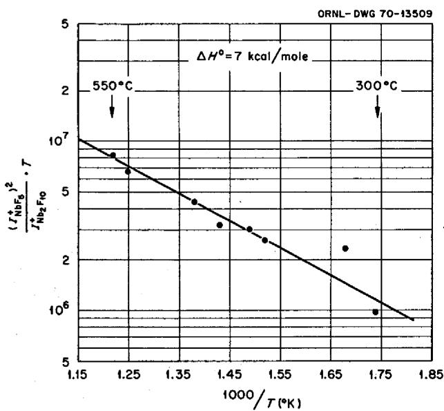  
Fig. 8.8. Enthalpy of the Reaction $\mathbf{Nb}_2\mathbf{F}_{10} \rightleftharpoons 2\mathbf{Nb}\mathbf{F}_5$ .

# 8.8 RAMAN SPECTRA OF CRYSTALLINE $\mathbf{MoF}_5$ AND $\mathbf{MoF}_4$

John B. Bates George E. Boyd

The infrared and Raman spectra of liquid and polycrystalline $\mathrm{MoF}_5$ have been reported by Quellette et al. The vibrational spectrum of molten $\mathrm{MoF}_5$ was interpreted on the basis of $D_{3h}$ molecular symmetry (trigonal bipyramid), but no attempt was made to assign the infrared or Raman spectrum of the polycrystalline material. The Raman spectrum of crystalline $\mathrm{MoF}_4$ has not, to the best of our knowledge, been previously reported.

We have remeasured the room-temperature Raman spectrum of crystalline $\mathrm{MoF}_5$ under conditions of higher resolution than were employed previously. The spectrum, shown in Fig. 8.9, was recorded with a Jarrell-Ash model 25-300 spectrophotometer using the 4880-Å line of a Spectra Physics 141 argon ion laser as the exciting source. The spectral slit width (resolution) was set at between 1 and $2\mathrm{cm}^{-1}$ on different scans. Samples of $\mathrm{MoF}_5$ which had been sublimed onto the upper walls of a quartz reaction flask were employed. Spectra of $\mathrm{MoF}_4$ (Fig. 8.10) were obtained from a yellowish-tan solid contained in the bottom of the reaction flask using the 6328-Å line of a helium-neon laser. Both $\mathrm{MoF}_5$ and $\mathrm{MoF}_4$ were obtained in one stage of a process leading to the synthesis of $\mathrm{MoF}_3$ . By

22T. J. Quellette, C. T. Ratcliffe, and D. W. A. Sharp, J. Chem. Soc. (A) 1969, 2351.   
$^{23}$ C. F. Weaver and H. A. Friedman, MSR Program Semiann Progr. Rept. Aug. 31, 1969, ORNL-4449, pp. 114-15.

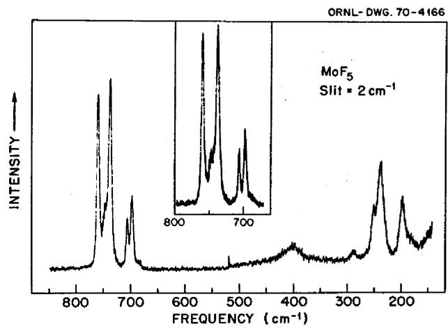  
Fig. 8.9. Raman Spectrum of Crystalline $\mathbf{MoF}_5$ Measured at $298^{\circ}\mathbf{K}$ .

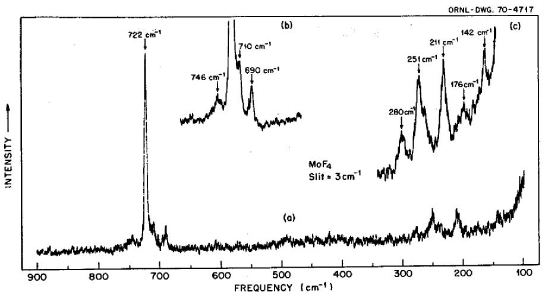  
Fig. 8.10. Raman Spectrum of Crystalline $\mathrm{MoF_4}$ Measured at $298^{\circ}\mathrm{K}$ .

exciting the Raman spectra of these materials when they were contained in the evacuated reaction flask, it was not necessary to interrupt the synthesis of $\mathrm{MoF}_3$ at this stage.

Raman spectra of crystalline $\mathbf{NbF}_5$ and $\mathrm{TaF}_5$ , which have the same crystal structure as $\mathbf{MoF}_5$ ,[24] were recently reported by Beattie and coworkers.[25] The observed bands were assigned from a normal coordinate analysis of the $\mathbf{Nb}_4\mathbf{F}_{20}$ and $\mathbf{Ta}_4\mathbf{F}_{20}$ tetrameric structures which are contained in the primitive unit cell of the respective crystal lattices.[26,27] Of particular importance to the subject of this report, it was assumed in ref. 25 that coupling between the four corners of the tetramers across the fluoride bridges was small.

From the structure determination of Edwards et al., $^{24}$ MoF $_5$ crystallizes in the monoclinic system, and the lattice belongs to the $C_{2h}^3$ ( $C_2 / m$ ) space group. There are 24 atoms in the primitive cell in which the four molybdenum atoms are joined through fluoride bridges to form a square tetrameric unit, as shown in Fig. 8.11. Two of the molybdenum atoms located at opposite corners of the tetramer occupy $C_2$ sites, while the remaining (opposite) pair of molybdenum atoms

occupy $C_s$ sites. Using the structural data of ref. 24 and standard procedures, the irreducible representation for the 69 optical ( $k = 0$ ) modes of crystalline $\mathrm{MoF}_5$ is given by

$$
\Gamma^ {\mathrm {o p}} \left(C _ {2 h}\right) = 1 9 A _ {g} + 1 7 B _ {g} + 1 5 A _ {u} + 1 8 B _ {u}.
$$

Thus, based on $C_{2h}$ selection rules, $36k = 0$ modes of crystalline $\mathrm{MoF}_5$ are Raman active and the remaining 33 optical modes are infrared active. The observed spectrum of crystalline $\mathrm{MoF}_5$ (Fig. 8.9 and ref. 22), however, appears to be much less complex than expected from the above selection rules. A comparison of the Raman spectrum of crystalline $\mathrm{MoF}_5$ (Fig. 8.9)

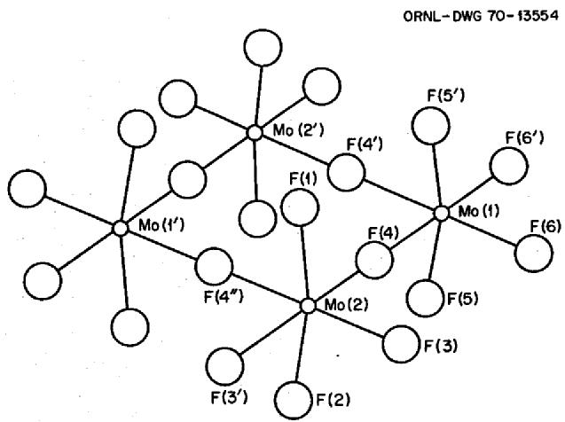  
Fig. 8.11. The Square Tetrameric Unit of the Molybdenum Pentafluoride Structure. $^{24}$

with that of the molten material suggested to us an interpretation of the crystal spectrum based on a double-correlation scheme.

The correlation diagrams which map the symmetry species of the $D_{3h}$ (molecular) group of $\mathrm{MoF}_5$ onto the species of the $C_{2h}$ factor group through the $C_2$ and $C_s$ site groups are presented in Table 8.6. The $\sigma_h$ orientation of the $C_s$ group with respect to the $D_{3h}$ group was chosen (Table 8.6) after consideration of the arrangement of fluorine atoms about the " $C_s$ " corners of the $\mathrm{Mo}_4\mathrm{F}_{20}$ tetramer. The correct orientation is not clear in this case, but this is a minor point in the following discussion and in view of the presently available spectral data. The 12 MoF $s$ fundamental modes assuming $D_{3h}$ symmetry are described by $2A_{1}^{\prime} + 2A_{2}^{\prime \prime} + 3E^{\prime} + E^{\prime \prime}$ . In the limit of zero (or very weak) coupling between adjacent corners of the $\mathrm{Mo}_4\mathrm{F}_{20}$ tetramer, the origin of the MoF $s$ $k = 0$ crystal vibrations can be determined from Table 10.6. For example, the $\nu_{1}(A_{1}^{\prime})$ molecular mode gives rise to two $A_g$ components in the crystal, $A_{g}^{a}$ and $A_{g}^{b}$ , where $a$ and $b$ denote that the factor group states arise, respectively, from a $C_s$ and a $C_2$ site state. The observed splitting between the Raman-active $(A_g)$ components of $\nu_{1}$ is caused by the difference in the static fields at the two (nonequivalent) sites occupied by molybdenum atoms $(C_s$ and $C_2)$ .

The remaining assignments of the Raman spectrum of crystalline $\mathrm{MoF}_5$ proposed in Table 8.7 follow from the example of $\nu_{1}$ discussed above: The $A_2^{\prime \prime}$ modes ( $\nu_{3}$ and $\nu_{4}$ ) give rise to two $B_g$ crystal components (Table 8.6), but only single, weak bands were assigned to these modes (Table 8.7). Four Raman-active crystal components are derived from the $E^{\prime}$ modes ( $A_g$ and $B_g$ from $C_2$ site states and two $A_g$ from $C_s$ site states). However, only two components each were assigned to $\nu_{6}$ and $\nu_{7}$ , and a single component of $\nu_{5}$ was identified at 747 cm $^{-1}$ (Fig. 8.9 and Table 8.7). Additional components

Table 8.6. Double Correlation Diagram for Crystalline ${\mathrm{{MoF}}}_{5}$   

<table><tr><td>Molecular Group D3h</td><td>Group A C2</td><td>Factor Group C2h</td><td>Site Group B Cs(σh)</td><td>Molecular Group D3h</td></tr><tr><td>A&#x27;1A&#x27;1E&#x27;A&#x27;2A&#x27;2</td><td>A1B</td><td>AgBgAuBu</td><td>A&#x27;A&#x27;</td><td>A&#x27;1A&#x27;2E&#x27;A&#x27;2</td></tr></table>

Table 8.7. Assignment of the Bands Observed in the Raman Spectrum of Polycrystalline $\mathbf{MoF}_5$ at $298^{\circ}\mathbf{K}$   

<table><tr><td colspan="2">Frequency (cm-1)</td><td rowspan="2">Assignment</td></tr><tr><td>Melta</td><td>Crystalb</td></tr><tr><td>747</td><td>759 s (Ag)</td><td>ν1(A&#x27;1)</td></tr><tr><td></td><td>738 s (Ag)</td><td></td></tr><tr><td>730</td><td>747 m</td><td>ν5(E&#x27;)</td></tr><tr><td>703</td><td>706 m (Ag)</td><td>ν2(A&#x27;1)</td></tr><tr><td></td><td>696 m (Ag)</td><td></td></tr><tr><td>685</td><td>684 w</td><td>ν3(A&#x27;&#x27;2)</td></tr><tr><td>500</td><td>494 vw</td><td>ν4(A&#x27;&#x27;2)</td></tr><tr><td>440</td><td>436 w</td><td>ν8(E&#x27;&#x27;)</td></tr><tr><td>250</td><td>252 m (Ag)</td><td>ν6(E&#x27;)</td></tr><tr><td></td><td>239 m (Ag)</td><td></td></tr><tr><td>201</td><td>199 m (Ag)</td><td>ν7(E&#x27;)</td></tr><tr><td></td><td>181 w (Ag)</td><td></td></tr></table>

${}^{a}$ Frequencies and assignments of molten ${\mathrm{{MoF}}}_{5}$ were taken from ref. 22.   
$b_{\mathbf{s}} =$ strong, $\mathfrak{m} =$ medium, $\mathbf{w} =$ weak, $\mathbf{vw} =$ very weak.

of $\nu_{s}$ are probably obscured by the strong $\nu_{1}(A_{1}^{\prime})$ components. The $E''$ modes, which give rise to four Raman-active components ( $A_{g}$ and $B_{g}$ from $C_{2}$ site states and two $B_{g}$ from $C_{s}$ site states), exhibited only single, weak components in the Raman spectrum of crystalline $\mathrm{MoF}_5$ (Table 8.7).

The assignment of the Raman spectrum of crystalline $\mathrm{MoF}_5$ proposed in Table 8.7 successfully accounts for both the number and intensity of the observed crystal components, especially in the stretching mode region, in which two strong components are observed for each of the $A_1'$ modes. The treatment of Beattie et al.25 could probably be applied in assigning the modes of crystalline $\mathrm{MoF}_5$ , but the analysis should be based on a tetrameric structure having $C_{2h}$ symmetry rather than $D_{2h}$ symmetry assumed in ref. 24.

The crystal structure of $\mathbf{MoF}_4$ has not been determined, so that a satisfactory interpretation of the Raman spectrum (Fig. 8.10) cannot be given at this time. However, we can tentatively identify the crystal components as originating from $\nu_{1}(A_{1}),\nu_{2}(E),\nu_{3}$ $(F_{2})$ , and $\pmb{\nu}_{4}$ $(F_{2})$ modes of an assumed tetrahedral MoF4.

The strong band at $722\mathrm{cm}^{-1}$ is a totally symmetric component of $\nu_{1}(A_{1})$ , and one of the weaker bands at 746, 710, and $690~\mathrm{cm}^{-1}$ may be a second component of $\nu_{1}$ (the $746\text{-cm}^{-1}$ band is a likely candidate). Two of the three weaker bands observed in this region are probably crystal components of the $\nu_{3}(F_{2})$ asymmetric

stretching mode. Alternatively, all three of the weak bands (746, 710, and $690\mathrm{cm}^{-1}$ ) may be correlation field components of $\nu_{3}(F_{2})$

The degenerate bending modes of $\mathrm{MoF_4}$ are probably giving rise to the low-frequency components observed at 280, 251, and $211~\mathrm{cm}^{-1}$ and possibly to the low-frequency shoulder on the $251\text{-cm}^{-1}$ band observed at about $220~\mathrm{cm}^{-1}$ (Fig. 8.10). The bands observed at 176 and $142~\mathrm{cm}^{-1}$ may be due to external modes of the $\mathrm{MoF_4}$ lattice, as these frequencies have about the correct magnitudes expected for librational motions of the $\mathrm{MoF_4}$ tetrahedra. However, the $176\text{-cm}^{-1}$ band could also be a correlation field component of one of the degenerate bending modes $(\nu_{2}$ or $\nu_{4})$

The crystal structure of $\mathbf{MoF}_5$ is isomorphic to that of $\mathrm{NbF_4}$ ; hence, we might suppose that $\mathbf{MoF_4}$ has the

same structure as $\mathrm{NbF_4}$ as determined by Gortsema and Didchenko.28 A group theoretical analysis of the $\mathrm{NbF_4}$ structure $(D_{4h}^{17})$ , however, shows that only two $k = 0$ modes are Raman active:

$$
\Gamma^ {\mathrm {o p}} = A _ {1 g} + E _ {g} + 2 A _ {2 u} + B _ {2 u} + 3 E _ {u}.
$$

In view of the spectrum shown in Fig. 8.10, it would not appear that the sample of $\mathrm{MoF_4}$ observed in this work has the $\mathrm{NbF_4}$ structure.

# 9. Properties of the Alkali Fluoroborates

# 9.1 SOLUBILITY OF $\mathbf{BF}_3$ GAS IN FLUORIDE MELTS

S. Cantor W. T. Ward

The purposes of this program are: (1) to use $\mathrm{BF}_3$ solubility as a thermodynamic probe to determine changes in fluoride ion activity and (2) to provide data on how $\mathrm{BF}_3$ might be used as a burnable neutron poison for purposes of reactor control.

The initial data in this program were obtained on $\mathrm{LiF - BeF_2}$ (66-34 mole %) employing a double-pot apparatus similar to that described by Shaffer et al.,1,2 in which the salt was saturated with $\mathrm{BF}_3$ in one vessel, after which a portion was transferred through a connecting tube to a second vessel where the transferred melt was stripped of $\mathrm{BF}_3$ by sparging with helium. For greater experimental convenience we have employed a single-pot apparatus in which the vessel of $900~\mathrm{cm}^3$ volume was fabricated from $2^{1 / 2}$ -in. sched 40 nickel pipe.

The experimental procedure consists, as before, of saturating the molten salt at constant pressure and temperature and stripping with helium. After exiting from the vessel the helium- $\mathrm{BF}_3$ stream passes through columns of aqueous NaF solution which remove the $\mathrm{BF}_3$ . The absorbed $\mathrm{BF}_3$ is analyzed by mannitol titration. The vapor space above the melt at the end of the saturation consists solely of $\mathrm{BF}_3$ gas; this quantity of gas, easily calculated for the temperature-pressure conditions of the run, is subtracted from the total $\mathrm{BF}_3$ analyzed in the absorber.

The saturating time has been about 4 hr for virtually all the runs. Two runs in which 1-hr saturation times were used yielded $\mathrm{BF}_3$ solubilities 9 to $10\%$ lower than the 4-hr runs for the same temperatures and pressures. Stripping data indicate that with a helium flow rate of

100 cm³/min, 4 hr is sufficient to remove >99% of the BF₃ from the LiF-BeF₂ melt.

The main advantage of the single-pot apparatus is the elimination of the melt-transferring procedures. In the double-pot apparatus, the two transfers per run required at least 1 hr, sometimes longer because dip lines frequently plugged during the transfer operations. There appear to be no disadvantages in the single-pot system as long as the solubility of $\mathbf{BF}_3$ is great enough so that $\mathbf{BF}_3$ in the gas space above the melt is small compared with that dissolved in the melt. In LiF-BeF $_2$ (66-34 mole %), the ratio of $\mathbf{BF}_3$ in the gas space to that in the liquid varied from 0.032 at $523^{\circ}\mathrm{C}$ to 0.18 at $723^{\circ}\mathrm{C}$ (the melt occupying $\sim 60\%$ of the volume of the vessel).

In the pressure range studied, 1 to 2.5 atm, Henry's law was obeyed. A plot of Henry's law constants obtained by the single-pot procedure is given by the solid line in Fig. 9.1 using

$$
\ln K = - 2 2. 1 / R + 1 5, 9 0 0 / (R T),
$$

where $R$ is the gas constant, 1.987, and $T$ is in degrees Kelvin. The line and the scatter for the data obtained in the double-pot procedure are also shown for comparison, as are the data reported by Shaffer et al. for $\mathrm{BF}_3$ solubility in $\mathrm{LiF - BeF}_2 - \mathrm{ZrF}_4 - \mathrm{ThF}_4 - \mathrm{UF}_4$ (65-28-5-1-1 mole%). In the latter melt the solubility of $\mathrm{BF}_3$ is about two-thirds that in $\mathrm{LiF - BeF}_2$ (66-34 mole%). The lesser $\mathrm{BF}_3$ solubility is consistent with the hypothesis that, in fluoride melts containing alkali fluoride as the major component, $\mathbf{M}^{4+}$ ion "combines" with more fluoride ions (and therefore makes fluoride ions less available for interaction with $\mathrm{BF}_3$ ) than does $\mathrm{Be}^{2+}$ ion.

Solubilities of gaseous HF have also been measured² in LiF-BeF₂ (66-34 mole %), and inert gases have been measured³ in a slightly different melt (64-36 mole %).

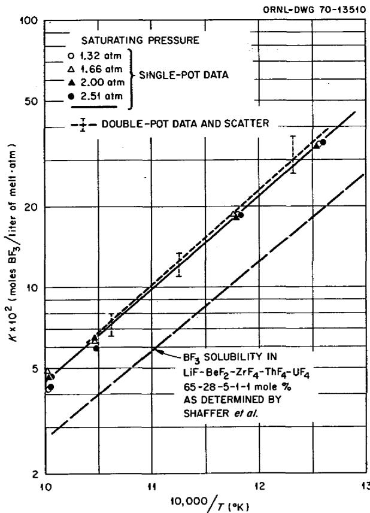  
Fig. 9.1. Solubility of $\mathbf{BF}_3$ in LiF-BeF $_2$ (66-34 Mole%).

Table 9.1. Gas Solubility in LiF-BeF ${}_{2}$   

<table><tr><td rowspan="2"></td><td colspan="3">Henry&#x27;s Law Constant (moles of gas per liter of melt per atmosphere)</td><td rowspan="2">ΔH° of Solubility</td></tr><tr><td>500°C</td><td>600°C</td><td>700°C</td></tr><tr><td>BF3a</td><td>4.6 × 10-1</td><td>1.4 × 10-1</td><td>0.56 × 10-1</td><td>-15.9</td></tr><tr><td>HFb</td><td>1.9 × 10-1</td><td>1.3 × 10-1</td><td>0.89 × 10-1</td><td>-5.98</td></tr><tr><td>HeC</td><td>7.5 × 10-5</td><td>1.2 × 10-4</td><td>1.5 × 10-4</td><td>5.2</td></tr><tr><td>XeC</td><td>1.0 × 10-6</td><td>2.3 × 10-6</td><td>5.1 × 10-6</td><td>12.1</td></tr></table>

${}^{a}$ Melt composition,66-34 mole %.   
$b$ Also in 66-34 mole $\%$ ref.2.   
cMelt composition, 64-36 mole $\%$ ref. 3.

These data are summarized and compared with $\mathbf{BF}_3$ solubility in Table 9.1. Note that $\mathbf{BF}_3$ and HF solubilities decrease with increasing temperature. For $\mathbf{BF}_3$ the magnitude of the enthalpy $(\Delta H^{\circ})$ of solubility

suggests that a strong chemical interaction occurs in the melt (perhaps the reaction $\mathrm{BF}_3(\mathbf{g}) + \mathbf{F}^{-}\rightleftharpoons \mathbf{BF}_4$ ).

There is a qualitative difference in the solubility of $\mathrm{BF}_3$ and HF, on one hand, as compared with the solubility of the inert gases. Note in Table 9.1 that the inert gas solubilities are about four orders of magnitude less and that solubility increases with temperature. The interaction of inert gas and the melt is probably "physical" (in contrast to "chemical") in which dissolution has been effectively represented $^4$ as the inert gas making bubbles of atomic dimensions by working against the surface tension of the liquid.

# 9.2 STUDIES OF HYDROGEN EVOLUTION AND TRITIUM EXCHANGE IN FLUOROBORATE COOLANT SALT

S. Cantor R. M. Waller

Investigations that seek to determine the extent to which chemically bound hydrogen in low concentrations will be retained in fluoroborate salts in the presence of metals of construction were continued. If it were noncorrosive, bound hydrogen in low concentrations in the melt would afford a reservoir for isotopic exchange with tritium diffusing into the MSBR coolant circuit. The metals of construction are those (Ni, Mo, Cr, Fe) which constitute the heat exchanger, steam generator-superheater, and the coolant drain tanks.

The main feature of the experimental apparatus used in this investigation is a silica vessel connected to a manifold from which gas samples can be removed or added (e.g., tritium gas can be introduced). Evacuated capsules containing salt and metal coupons were positioned within the silica vessel. The silica vessel fits into a tube furnace. The apparatus was described previously.[5]

The conditions and observations of the experimental runs are given in Table 9.2. In all cases the salt used, $\mathrm{NaBF_4}$ NaF (92-8 mole %), has an analyzed $\mathrm{H}_2\mathrm{O}$ content of $120\pm 60$ ppm. In the analysis the moisture was extracted from the salt with pyridine, and the pyridine-water azeotrope was subsequently distilled into Karl Fischer reagent. All capsules were constructed of nickel.

The most significant experiment is run 5. The tritium analysis of the salt shows that very little tritium

Table 9.2. Summary of Experimental Investigations of H-T Exchange in NaF-NaBF4   

<table><tr><td>Run No.</td><td>Metal Coupons in Capsule</td><td>Procedure and Observations</td></tr><tr><td rowspan="2">3</td><td rowspan="2">Chromium</td><td>While heating to 550°C, vapor pressure in silica vessel rose and reached a steady value (4 mm) in 2 hr. Gas sample taken at this point showed 62 vol % H2. Removal of subsequent gas samples led to decrease in pressure, but with increases in percentage of H2. Gases were analyzed chromatographically. Assuming that all hydrogen came from the reaction</td></tr><tr><td>Cr + 3/2H2O + BF3(1) → CrF3 + 1/2B2O3(1) + 3/2H2(g), then, from analysis, 50 ppm H2O had reacted.</td></tr><tr><td>4</td><td>Hastelloy N</td><td>In heating to 530°C, vapor pressure in silica vessel rose steadily to 3.4 mm in 4 hr. First gas sample contained 74% H2; subsequent gas samples contained a higher percentage of H2, reached 87 vol%. Assuming all hydrogen gas came from reaction of H2O with Cr (see above) then 57 ppm H2O has reacted.</td></tr><tr><td>5</td><td>Chromium</td><td>Heated to 500°C; in 1.7 hr pressure reached a steady value of 3.5 mm, of which 74 vol % was H2. Subsequent samples were higher in H2. From hydrogen analyses, 58 ppm H2O had reacted. After 3.5 days at temperature, vessel and sample were cooled to room temperature and vessel and manifold were evacuated. Then 0.098 Ci of tritium gas (T2) was introduced into the silica vessel, which was heated back up to 500°C. The T2 interacted with the sample at 500° for almost three days. After cooling, capsule was cut open and some salt removed for tritium analysis. Another salt sample was removed after overnight evacuation. Both samples gave precisely the same low tritium concentration - 1.61 × 10-8g-atom of T per mole of salt. The total tritium in the salt sample was 0.00032 Ci.</td></tr><tr><td>6</td><td>Nickel</td><td>Heated to 520°C. Pressure reached steady value in 2 hr; first gas sample contained 64% H2. Experiment in progress.</td></tr></table>

exchanged with hydrogen in the salt. At the time the tritium was introduced into the experiment the concentration of bound hydrogen was miniscule - when expressed in terms of $\mathrm{H}_2\mathrm{O}$ , the concentration was probably less than 1 ppm. (An attempt to analyze gaseous $\mathbf{H}_2$ , HT, and $\mathbf{T}_2$ , mass spectrographically, towards the end of the experiment was unsuccessful; hence the equilibrium ratio of bound hydrogen to bound tritium in the salt is not known.) The results of these experiments seem to indicate that in the presence of chromium the fluoroborate coolant salt does not retain sufficient $\mathbf{H}_2\mathbf{O}$ or $\mathrm{OH}^-$ ions to serve as the tritium trap in a molten-salt reactor.

The question arises: If the salt contained 120 ppm $\mathrm{H}_2\mathrm{O}$ , how is it that in runs 3, 4, and 5 only 50 to 58 ppm $\mathrm{H}_2\mathrm{O}$ can be accounted for in terms of the gas chromatographic analysis for hydrogen? The only answer consistent with the analysis for tritium in the salt at the end of run 5 is that the analysis of 120 ppm was too high by about a factor of 2. Since it is known that $\mathrm{C}_5\mathrm{H}_5\mathrm{N} - \mathrm{BF}_3$ is more stable than $\mathrm{NaF} - \mathrm{BF}_3$ , it is quite plausible that $\mathrm{C}_5\mathrm{H}_5\mathrm{N}$ (pyridine) would react with any

$$
\mathrm {N a F} - \mathrm {B} \underset {\mathrm {F}} {\rightleftharpoons} \mathrm {O}
$$

in the salt to form

$$
\mathrm {C} _ {5} \mathrm {H} _ {5} \mathrm {N} - \mathrm {B} \underset {\mathrm {F}} {\rightleftharpoons} 0,
$$

some of which would be distilled into the Karl Fischer reagent. (The

$$
\mathrm {C} _ {5} \mathrm {H} _ {5} \mathrm {N} - \mathrm {B} \stackrel {\mathrm {O}} {<  } _ {\mathrm {F}}
$$

would react with methanol in the Karl Fischer reagent to yield water, which would, of course, be reported as water.)

# 9.3 REACTION OF WATER WITH THE SODIUM FLUORIDE-SODIUM TETRAFLUOROBORATE EUTECTIC

Harold W. Kohn

On the basis of present knowledge,6 the equilibria in the $\mathrm{NaBF_4 - H_2O}$ system can be represented by the sum and difference of the two equations:

$$
\mathrm {N a B F} _ {4} + \mathrm {H} _ {2} \mathrm {O} \rightleftharpoons \mathrm {N a B F} _ {3} \mathrm {O H} + \mathrm {H F}, \tag {1}
$$

$$
\mathrm {N a B F} _ {3} \mathrm {O H} \rightleftharpoons \mathrm {N a B F} _ {2} \mathrm {O} + \mathrm {H F}. \tag {2}
$$

A study of these equilibria was initiated in order to assess the hydroxide concentration attainable in molten fluoroborates and to evaluate the possibility of using the reverse reaction as a purification method. Neither the actual existence nor stability of $\mathrm{NaBF}_3\mathrm{OH}$ in molten fluoroborates has been established. On the basis of standard free energy data and estimates of B-OH bond energy (from the standard free energy of formation of boric acid suitably corrected for temperature) one concludes that the standard free energy is $+16.5$ kcal for the first reaction and $-26.5$ kcal for the second. These calculations suggest that the compound $\mathrm{NaBF}_3\mathrm{OH}$ is unstable with respect to decomposition into $\mathrm{NaBF}_2\mathrm{O}$ and HF. There are additional reasons, some presented later in this report, which lead to the inference that $\mathrm{NaBF}_3\mathrm{OH}$ is to some extent stable, especially when dilute in molten $\mathrm{NaBF}_4$ .

By passing $\mathrm{HF} + \mathrm{H}_2\mathrm{O}$ into $5\mathrm{kg}$ of a sodium fluoroborate eutectic in a nickel pot containing residual oxide and/or hydroxide, we attempted to measure the equilibrium quotient for the reverse of the two reactions shown. The concentration of $\mathrm{HF} + \mathrm{BF}_3$ in the off-gas stream was determined by alkalimetry, $\mathrm{H}_2\mathrm{O}$ by titration with Karl Fischer reagent, and oxide plus hydroxide in the salt by $\mathrm{KBrF_4}$ reaction with filtered samples. It may be assumed that all the oxygen as measured is present as hydroxide, as oxide, or as a mixture of the two. If one assumes that reaction (1) predominates (oxygen present as hydroxide), the measured equilibrium quotients,

$$
K _ {1} = \frac {\mathrm {H} _ {2} \mathrm {O}}{\left[ \mathrm {O H} ^ {-} \right] \left[ \mathrm {H F} \right]},
$$

are 0.79 at $510^{\circ}$ , 1.3 at $460^{\circ}$ , 2.1 at $425^{\circ}$ , and 4.2 at $402^{\circ}$ . If one assumes reaction (2) predominates, the measured equilibrium quotients,

$$
K _ {2} = \frac {\left[ \mathrm {H} _ {2} \mathrm {O} \right]}{\left[ \mathrm {O} ^ {2 -} \right] \left[ \mathrm {H F} \right] ^ {2}},
$$

are 120 at $510^{\circ}$ , 145 at $450^{\circ}$ , 240 at $425^{\circ}$ , and 605 at $402^{\circ}$ C. The values obtained at $402^{\circ}$ and $510^{\circ}$ are single determinations. The variation in individual determinations is quite wide because of various analytical

difficulties; the interference of $\mathbf{BF}_3$ with the Karl Fischer titration is particularly serious. Hence the data are not useful for calculations involving the coexistence of oxide and hydroxide.

In a continued effort to examine the pertinence of reactions (1) and (2), auxiliary experiments were conducted adding various quantities of boron oxide to the melt. In one experiment $3\mathrm{g}$ of $\mathrm{B}_2\mathrm{O}_3$ was added to the melt, and after overnight agitation the melt was purged continuously with a gas stream containing HF. For 1 hr the water in the effluent gas remained low, $<0.2\mathrm{mg}/\mathrm{liter}$ , then suddenly increased about tenfold to $2\mathrm{mg}/\mathrm{liter}$ . We assumed that this was due to the preferential reaction of oxide first with HF to form hydroxide followed by the reaction of hydroxide with HF to form water. On the other hand, when we measured $\mathrm{HF/H_2O}$ over a range in a highly ( $>1000\mathrm{ppm}$ ) oxide-contaminated melt, so that the oxide is sensibly constant, the results shown in Table 9.3 were obtained. These data suggest that the true equilibrium quotient is more likely to be

$$
\frac {\left[ \mathrm {H} _ {2} \mathrm {O} \right]}{\left[ \mathrm {H F} \right] ^ {2} \left[ \mathrm {O} ^ {2 -} \right]}
$$

rather than

$$
\frac {[ \mathrm {H} _ {2} \mathrm {O} ]}{[ \mathrm {H F} ] [ \mathrm {O H} ^ {-} ]}.
$$

When we passed $\mathrm{H}_2\mathrm{O}$ through molten $\mathrm{NaF - NaBF_4}$ eutectic to see whether the reverse of reaction (1) or (2) was the preferred reaction by measuring the equivalence of HF per molecule, the results were too erratic to be meaningful. Again, interference from $\mathrm{BF}_3$ is an important factor.

We also conducted experiments using deuterium as a tracer to test the stability of the $\mathrm{NaBF}_3\mathrm{OD}$ formed and to avoid interferences from this ubiquitous $\mathbf{H}_2\mathbf{O}$ which could arise from accidental contamination. A gas stream containing $\mathrm{D}_2\mathrm{O}$ vapor was passed into a $\mathrm{NaF - NaBF_4}$

Table 9.3. Concentration of $\mathrm{{HF}}/{\mathrm{H}}_{2}\mathrm{O}$ in Equilibrium with NaF-NaBF ${}_{4}$   

<table><tr><td>HF (meq/liter)</td><td>H2O (meq/liter)</td><td>H2O/HF</td><td>H2O/(HF)2</td></tr><tr><td>5.0</td><td>0.022</td><td>4.5 × 10-2</td><td>8.8 × 10-4</td></tr><tr><td>6.2</td><td>0.035</td><td>6.4</td><td>9.3</td></tr><tr><td>8.5</td><td>0.083</td><td>9.8</td><td>11.4</td></tr></table>

eutectic melt at 400 and $550^{\circ}\mathrm{C}$ . The amount of deuterium which remained in the salt was determined by reaction with metallic chromium in a sealed capsule, $^{8}$

$$
3 \mathrm {N a B F} _ {3} \mathrm {O D} + \mathrm {C r} ^ {0} \rightarrow \mathrm {C r F} _ {3} + 3 \mathrm {N a B F} _ {2} \mathrm {O} + 3 / _ {2} \mathrm {D} _ {2}. \tag {3}
$$

The hydrogen gas generated in the reaction was purified in the process by diffusion through the sealed capsule. Most of the gas so collected was protium, corresponding to 300 to $500~\mathrm{ppm}~\mathrm{OH}^{-}$ which, presumably, remained from the previous experiment. A small amount might also have been contributed by a handling blank. A nonnegligible amount of deuterium was, however, retained by the salt and released by reaction (3), but this was less than $5\%$ of the total deuterium added. The results are summarized in Table 9.4.

It was anticipated that half of the added $\mathbf{D}_2\mathbf{O}$ would be lost immediately as DF by reaction (1), and an additional amount might be lost as a result of corrosion reactions. The apparent retention of a small fraction of deuterium leaves open the possibility that a small amount of hydrogenous species can be retained in sodium fluoroborate at $400^{\circ}$ . The release of protium in this experiment, corresponding to results obtained by Cantor and Waller, $^8$ suggests rather an artifact effect.

An auxiliary observation we have made is that in spite of the addition of comparatively large amounts of $\mathbf{B}_2\mathbf{O}_3$ and of water to the fluoroborate melts, none of the filtered samples contained greater than 816 ppm of $\mathrm{O}^{2-}$ , although, according to inventory calculations, the concentration could have been as high as 2500 ppm. This result suggests the separation of an oxide-rich phase which has been reported cursorily before $^{9,10}$ but the existence of which Pawlenko disputes. $^6$ Indeed, if

we use a saturation value for oxide of 816 ppm to calculate the equilibrium quotients from the data in Table 9.4, we get, respectively, $K_{1} = 0.85$ , 1.2, and 1.85 and $K_{1} \cdot K_{2} = 166$ , 175, and 215, in reasonable agreement with the previous $460^{\circ}$ data. Analysis of the samples has also indicated segregation of an oxygen-rich phase during cooling of fluoroborate melts, suggesting that solubility of oxides in these melts is quite limited.[11]

# 9.4 RAMAN SPECTRA OF MOLTEN $\mathrm{NaBF}_4$ AND NaF-NaBF $_4$ TO $606^{\circ}\mathrm{C}$

Arvin S. Quist John B. Bates George E. Boyd

Studies of the vibrational spectra of molten salts provide the possibility of directly identifying polyatomic species which may exist in the melt and also indicating the extent and nature of interionic interactions in these liquids. Differences in the vibrational spectra of an ion observed in the "free" and the molten state may be attributed to cation-anion complex formation in the latter or to interactions with quasi-lattice states in the melt, depending on the magnitude and type of the changes observed.

Raman spectroscopy is particularly well suited for studying the tetrahedral tetrafluoroborate anion $\left(\mathrm{BF}_4\right)$ , because all four normal modes of vibration are Raman active. The characteristic vibrational spectrum of the $\mathrm{BF}_4$ ion in molten salts has not been obtained until now, primarily because these melts are very corrosive toward the usual optical window materials. However, the recently developed windowless cells for laser Raman spectroscopy of fused salts1,2 can be used to study these melts.

Table 9.4. Concentration of ${\mathrm{D}}_{2}/{\mathrm{D}}_{2}\mathrm{O}$ in Equilibrium with $\mathrm{{NaF}} - {\mathrm{{NaBF}}}_{4}$   

<table><tr><td>Sample No.</td><td>Temperature of Preparation</td><td>Milliequivalents of D2O Added per Gram</td><td>Milliequivalents of D2O Formed per Gram</td><td>D2/D2O</td></tr><tr><td>15</td><td>400</td><td>9.65</td><td>0.33</td><td>0.034</td></tr><tr><td>16</td><td>400</td><td>28.2</td><td>1.11</td><td>0.039</td></tr><tr><td>17</td><td>550</td><td>3.86</td><td>0.11</td><td>0.029</td></tr><tr><td>18</td><td>400</td><td>16.2</td><td>0.91</td><td>0.056</td></tr><tr><td>19</td><td>400</td><td>#18 exchanged with H2 gas</td><td>0.42(?)</td><td></td></tr></table>

High-purity $\mathrm{NaBF}_4$ was obtained from L. O. Gilpatrick of the Reactor Chemistry Division. $^{13}$ Single-crystal NaF was purchased from Harshaw Chemical Co., Cleveland, Ohio. The high-temperature Raman studies were conducted with the salts contained in nickel windowless cells, $^{12}$ which in turn were enclosed in sealed quartz tubes under helium at a pressure of approximately $1/3$ atm. There was no direct contact between the molten salt and the quartz. A cutaway view of the furnace used is given in Fig. 9.2. A complete

$^{13}$ L. O. Gilpatrick and R. Apple, MSR Program Semiann. Progr. Rept. Feb. 28, 1970, ORNL-4548, p. 134.

description is given elsewhere. $^{1,2}$ Raman spectra were recorded photoelectrically with a Jarrell-Ash model 25-300 spectrometer (Jarrell-Ash Company, Waltham, Massachusetts). The 4880 Å line of a Spectra-Physics 141 argon ion laser (Spectra-Physics, Mountain View, California) was used to excite the spectra. The scattered light was collected at right angles to the incident beam with the optical system described previously. $^{1,2}$

The Raman spectrum of molten $\mathrm{NaBF_4}$ was obtained at temperatures from $414^{\circ}\mathrm{C}$ (just above its melting point of $408^{\circ}$ ) to $606^{\circ}\mathrm{C}$ . A typical spectrum is shown in Fig. 9.3 for a temperature of $437^{\circ}\mathrm{C}$ . Spectra of the eutectic mixture (mp $384^{\circ}\mathrm{C}$ ) of 8 mole $\%$ NaF in

ORNL DWG 70-6530

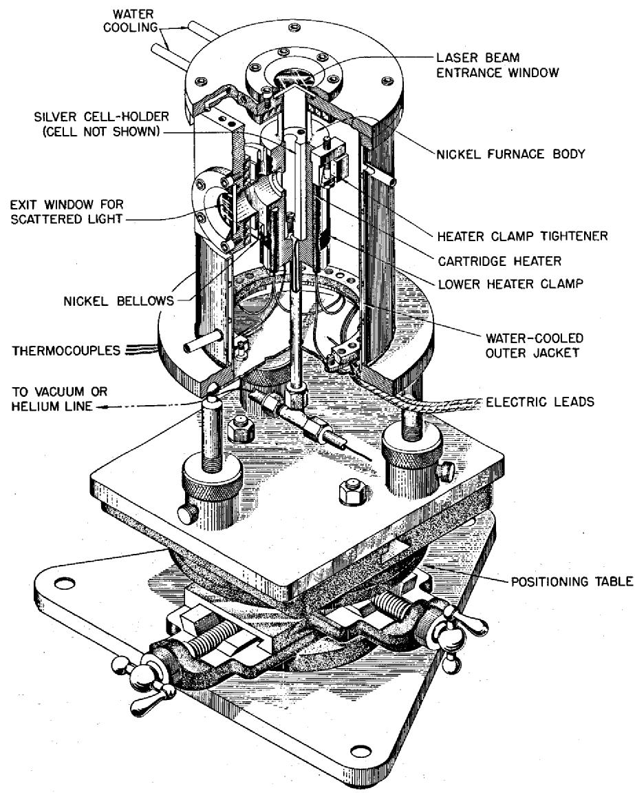  
Fig. 9.2. Furnace for Laser Raman Spectroscopy of Molten Salts.

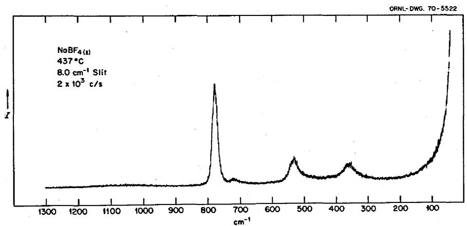  
Fig. 9.3. A Typical Raman Spectrum of $\mathrm{NaBF}_4$ .

$\mathrm{NaBF}_4$ were also recorded to temperatures of $503^{\circ}\mathrm{C}$ . The spectrum of the mixture did not differ significantly from that for pure $\mathrm{NaBF}_4$ at corresponding temperatures. The Raman spectra of polycrystalline $\mathrm{NaBF}_4^{14}$ and of a $3M$ aqueous solution of $\mathrm{NaBF}_4$ also were measured at $25^{\circ}\mathrm{C}$ in connection with the studies on molten $\mathrm{NaBF}_4$ . The $\mathrm{BF}_4^-$ frequencies observed in the Raman spectra of polycrystalline, aqueous $3M$ , and molten $\mathrm{NaBF}_4$ are collected in Table 9.5.

The four fundamental modes of vibration of the $\mathrm{BF}_4^-$ ion have been assigned for aqueous $\mathrm{NaBF}_4$ solutions. In the melt at $483^{\circ}\mathrm{C}$ the totally symmetric stretch, $\nu_{1}(A_{1})$ , was observed as a strong polarized band at 774 $\mathrm{cm}^{-1}$ , and the degenerate bending modes, $\nu_{2}(E)$ and $\nu_{4}(F_{2})$ , appeared at 358 and $532~\mathrm{cm}^{-1}$ respectively. The asymmetric stretching mode, $\nu_{3}(F_{2})$ , was observed as a weak band at approximately $1065~\mathrm{cm}^{-1}$ . These assignments are consistent with those by Goubeau and Bues. The frequencies of these bands in the melt did not change significantly with added NaF. However, their maxima appeared to shift to lower frequencies with increasing temperature.

The only unusual feature of the spectrum shown in Fig. 9.3 is the weak band which appears on the low-frequency side of $\nu_{1}$ at approximately 710 to 720 $\mathrm{cm}^{-1}$ . With increasing temperature this band increased in intensity, and another, weaker band appeared near $660~\mathrm{cm}^{-1}$ . These two weak bands are most probably caused by impurities, in particular by $\mathrm{SiF}_5^-$ and $\mathrm{SiF}_6^{2-}$ ions, which may be present as a result of the reaction of

Table 9.5. Frequencies Observed in the Raman Spectra of Polycrystalline, Aqueous $3M$ , and Molten $\mathrm{NaBF}_4$ S = strong, M = medium, W = weak, P = polarized   

<table><tr><td>Aqueous, 3 M, 25°C</td><td>Molten, 483°C</td><td>Polycrystalline, 25°C</td></tr><tr><td>357 M</td><td>358 M</td><td>344 M v2(E) 369 M</td></tr><tr><td>528 M</td><td>530 M</td><td>532 M v4(F2) 534 M 554 M</td></tr><tr><td>773 S, P</td><td>774 S, P</td><td>785 S v1(A1)</td></tr><tr><td>1080 W</td><td>1065 W</td><td>1115 W v3(F2) 1055 W</td></tr></table>

$\mathbf{BF}_3$ (a result of the partial dissociation of $\mathbf{BF}_4^-$ at high temperatures) with quartz to form volatile $\mathrm{SiF_4}$ which in turn dissolved in the melt and reacted with the excess fluoride ion present. These bands are polarized, and their wave numbers are consistent with those for the totally symmetric stretching modes previously reported for $\mathrm{SiF}_5^-$ (ref. 16) and $\mathrm{SiF}_6^{2 - }$ (ref. 17).

From a study of the polarized infrared and Raman spectra of single-crystal $\mathrm{NaBF}_4$ ,18 the correlation field components observed in the polycrystalline spectra

reported earlier $^{1,4}$ were assigned, and the observed band splitting was discussed in terms of the anistropic forces acting on the $\mathrm{BF}_4^-$ ion in the crystal lattice. The observed wave number difference between the high-frequency components of the $\mathrm{BF}_4^-$ fundamentals in crystalline $\mathrm{NaBF}_4$ and those observed in the melt (Table 9.5) can be attributed to anisotropy at the site occupied by $\mathrm{BF}_4^-$ in the crystal lattice. The lack of any evidence for splitting of the bands in molten $\mathrm{NaBF}_4$ (i.e., as separate components or as shoulders on the main bands) indicates that there is no cation-anion complex formation; the $\mathrm{BF}_4^-$ ion in the melt is in an isotropic environment. This conclusion is supported by the close agreement between the spectrum of the $3M$ aqueous solution and the melt spectra (Table 9.5), because the spectrum in solution can be considered as arising from the "free ion."

In general the band maxima in molten $\mathrm{NaBF}_4$ appeared to shift to lower frequencies with increasing temperature. For example, the maximum intensity of the $\nu_{1}$ band was observed at $776\mathrm{cm}^{-1}$ at $414^{\circ}\mathrm{C}$ , while at $606^{\circ}\mathrm{C}$ its frequency was $772\mathrm{cm}^{-1}$ . The shift to lower frequencies of the $\mathrm{BF}_4^-$ vibrations as the temperature of the melt is increased may be due to the increased population of higher vibrational levels or to changes in the effective force constants of $\mathrm{BF}_4^-$ resulting from changes in cation-anion interactions as the temperature is changed. It should also be pointed out that, similar to the behavior of molten perchlorates, $^{19,20}$ no low-frequency, quasi-lattice vibrations of the type common to nitrate melts were observed in molten $\mathrm{NaBF}_4$ .

# 9.5 ELECTRONIC POLARIZABILITY OF THE TETRAFLUOROBORATE ION AND VARIOUS GASEOUS HALIDE MOLECULES AS COMPARED WITH THE FREE (GASEOUS) HALIDE IONS

M. A. Bredig

Together with the polarizing power, mainly of the positive ion, the polarizability of the negative ion is one of the important fundamental parameters determining the chemical and physical properties of a salt. For example, the large difference in the polarizabilities of the $\mathbf{Cl}^{-}$ and $\mathbf{F}^{-}$ ions is implicitly the basis of the metal transfer process using a chloride melt for purposes of

separations presently under development. Unfortunately, there is considerable confusion in the literature in regard to the use of proper standard ion polarizabilities with which to compare the measured polarizabilities of a given salt. We are dealing in the following with a brief discussion of this problem as applied to (1) the tetrafluoroborate ion, of great current interest to the Molten-Salt Reactor Program, (2) a number of halides of polyvalent elements similar to boron, and (3) some "anomalous" behavior found with tri- and tetrahalides of the larger, more highly polarizable halide ions, $\mathbf{Br}^{-}$ and $\mathbf{I}^{-}$ .

# 9.5.1 The Polarizability of the Tetrafluoroborate Ion

The polarizabilities, $\alpha_{m}$ , of the alkali metal tetrafluoroborates, $\mathbf{MBF}_4$ , measured by Cantor, McDermott, and Gilpatrick $^{21}$ were used together with the polarizabilities of the free (gaseous) cations, $\alpha_{+}$ , given by Fajans and co-workers, $^{22}$ to derive $\alpha_{-} \equiv \alpha_{m} - \alpha_{+}$ for $\mathbf{BF}_4$ in these crystals (Table 9.6).

In the salts of sodium to cesium, $\alpha_{-} = 3.06 \pm 0.04\mathring{\mathrm{A}}^{3}$ does not show a systematic change. This is as expected, because in $\mathbf{M}(\mathbf{BF}_4)$ the weak field of $\mathbf{M}^{+}$ ("ionic potential," $z / r \approx 1.05$ to 0.6 as compared with $z / r \approx 15$ for $\mathbf{B}^{3 + }$ ) contributes very little to the tightening of the electron shells, which is $\Delta \alpha / 4 = -0.84 / 4 = -0.21\mathring{\mathrm{A}}^{3}$ (21%) per $\mathbf{F}^{-}$ ion. In the alkali sulfates, $\Delta \alpha = -1.40 \pm 0.03\mathring{\mathrm{A}}^{3}$ per $\mathbf{O}^{2 - }$ and $\Delta \alpha / \alpha = 49\%$ are similarly constant.

An apparent trend for $\alpha_{-}$ , from $2.87\mathring{\mathrm{A}}^{3}$ in $\mathrm{Na(BF_4)}$ to 2.29 in $\mathrm{Cs(BF_4)}$ , reported earlier,[21] was merely the result of the very misleading nature of the average solid-state polarizabilities proposed for the cations by Tessman, Kahn, and Shockley[23] which were used in the calculations and which are inconsistent with the observation of distinct systematic deviations from additivity in the alkali halides.

The polarizability of $\mathrm{BF}_4^-$ in the lithium salt, $\alpha_{-} < 3.4$ Å $^3$ (see Table 9.6), is not accessible at present to more exact measurement but most likely resembles that of the other four salts, $\alpha_{-} \approx 3.0$ Å $^3$ .

It seems noteworthy that the amount of the tightening in $\mathbf{BF}_4^-$ , $-0.21\mathring{\mathrm{A}}^3$ per $\mathbf{F}^{-}$ , appears to be not smaller, as might have been expected from the larger

Table 9.6. Fluoride Polarizability in $\mathbf{BF}_4^-$ (Crystals) and Free $\mathbf{F}^-$   

<table><tr><td>M in MBF4</td><td>αm(Å3)a</td><td>α+(Å3)b</td><td>α_-(Å3)</td><td>Δα (Å3)c</td><td>Δα/4αF- (%)</td></tr><tr><td>Li d</td><td>&lt;3.41</td><td>0.03</td><td>&lt;3.38</td><td>&gt;0.52</td><td>&gt;15</td></tr><tr><td>Na</td><td>3.282</td><td>0.19</td><td>3.09</td><td>0.81</td><td>21</td></tr><tr><td>K</td><td>4.005</td><td>0.895</td><td>3.11</td><td>0.79</td><td>20</td></tr><tr><td>Rb</td><td>4.508</td><td>1.503</td><td>3.005</td><td>0.89</td><td>23</td></tr><tr><td>Cs</td><td>5.627</td><td>2.59</td><td>3.04</td><td>0.86</td><td>22</td></tr><tr><td>Mean (Na–Cs)</td><td></td><td></td><td>3.06 ± 0.04</td><td>0.84 ± 0.04</td><td>21 ± 1</td></tr></table>

$a$ See ref. 21.   
$b_{\mathrm{See~ref.}}$ 22.   
$c_{\Delta \alpha} = \alpha_{-} - [4\alpha (\mathrm{F}^{-}) + \alpha (\mathrm{B}^{3 + })] = \alpha_{-} - [3.88 + 0.02] = \alpha_{-} - 3.90\AA^{3}$ . $\Delta \alpha$ represents the tightening of the four free (gaseous) fluoride ions, $\alpha (\mathrm{F}^{-}) = 0.97\AA^{3}$ , on formation of the $\mathrm{BF}_4^-$ in the crystals.   
$d_{\mathrm{From}}$ a new measurement of $n_{\mathbf{D}} < 1.30$ by G. Brunton and S. Cantor.

B-F distance, $^{24}$ 1.45 vs $1.30\text{\AA},^{25}$ but slightly greater than in gaseous $\mathrm{BF}_3$ $-0.18\text{\AA}^3$ as derived from $\alpha_{m} = 2.38\text{\AA}^3$ .

# 9.5.2 Test of a Recent Theoretical Set of Ion Polarizabilities

In considering the tightening of free fluoride ions in the strong field of $\mathbf{B}^{3+}$ , I have used $\alpha(\mathbf{F}^{-}) = 0.97\mathring{\mathrm{A}}^{3}$ ( $\lambda = 5897\mathring{\mathrm{A}}$ ) and $0.95\mathring{\mathrm{A}}^{3}$ ( $\lambda = \infty$ ) from the set of free ion polarizabilities of Fajans and co-workers.[22] Recently, on the basis of a theoretical model, speciously documented, a radical modification was proposed to a much larger value, $1.56\mathring{\mathrm{A}}^{3}$ (model II, Wilson and Curtis[27]) or even higher, $1.83\mathring{\mathrm{A}}^{3}$ (their model I). For a test of the validity of the value 1.56, I have chosen as a simple criterion the relative change in polarizability, $\Delta \alpha/\alpha$ (or refractivity, $\Delta R_{\infty}/R_{\infty}$ , at infinite wavelength), on formation of the hydrogen halides from the gaseous ions according to $\mathbf{X}^{-} + \mathbf{H}^{+} \rightarrow \mathbf{HX}$ . $R_{\mathrm{D}}$ of liquid hydrogen fluoride has recently been measured by Perkins,[28] and it is well known for both liquid and gaseous HCl, HBr, and HI, the differences between the two states being small, especially when corrections of

old literature values $^{26}$ are made for more accurate density data.

Figure 9.4 compares $\Delta \alpha / \alpha = (\alpha_{\mathbf{H} \mathbf{X}} - \alpha_{\mathbf{X}^{-}}) / \alpha_{\mathbf{X}^{-}}$ as a function of $\alpha_{\mathbf{X}^{-}}$ for the newly proposed WC II and one of the commonly accepted sets of polarizabilities

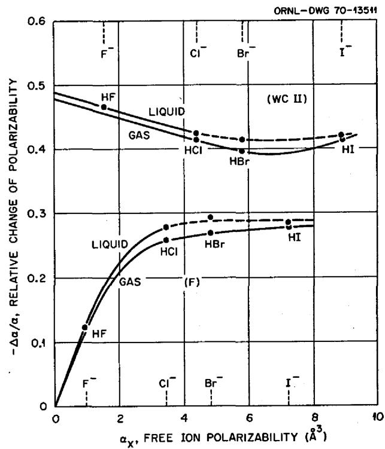  
Fig. 9.4. Test of Wilson-Curtis Model II (1970) vs Fajans Free Halide Ion Polarizabilities $(\lambda = \infty)$ . Relative change in polarizability for the process $\mathbf{X}^{-} + \mathbf{H}^{+} \rightarrow \mathbf{HX}$ . Intercept $-\Delta \alpha / \alpha = 0.48$ for $\alpha = 0$ is unreasonable.

(Fajans, F) of the four halide ions. Curve WC II exhibits an entirely unreasonable dependence of $\Delta \alpha / \alpha$ on $\alpha$ , namely, an increase, instead of a decrease with decreasing $\alpha$ from $X = Br$ on towards the large value of $\Delta \alpha / \alpha = 0.5$ for $\alpha = 0$ . In sharp contrast, curve F shows the expected decrease towards $\Delta \alpha / \alpha = 0$ for $\alpha = 0$ : on an infinitely rigid ion ( $\alpha = 0$ ) a proton cannot effect any change.

In still another test, on the corresponding $\Delta \alpha / \alpha$ values for the formation of the three boron trihalides $\mathrm{BF}_3$ , $\mathrm{BCl}_3$ , and $\mathrm{BBr}_3$ from $\mathrm{B}^{3+} + 3\mathrm{X}^{-} \rightarrow \mathrm{BX}_3$ , an unreasonable rise towards $\Delta \alpha / \alpha = 0.56$ for $\alpha = 0$ is again found for curve WC II in Fig. 9.5. Curve F does show the expected behavior. It is obviously justified, then, to conclude, as Fajans did by applying his method of inequalities of quotients,[29] that the recent theoretical free ion polarizabilities[27] are in disagreement with basic principles and experimental observations and that there is no reason to abandon the well-proven semiempirical set of these polarizabilities, especially that of $\mathrm{F}^{-}$ , $\alpha = 0.95\mathring{\mathrm{A}}^3$ .

29 K. Fajans, private communication; J. Phys. Chem. 74, 3407-10 (1970).

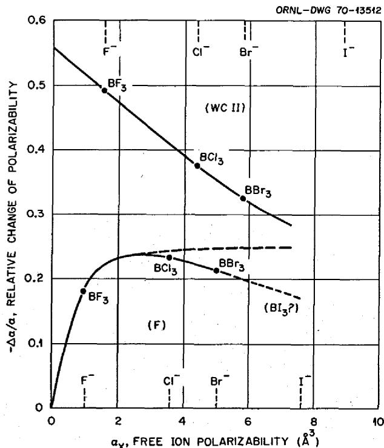  
Fig. 9.5. Test of Wilson-Curtis Model II (1970) vs Fajans Free Halide Ion Polarizabilities $(\lambda = 589~\mathrm{nm})$ . Relative change in polarizability for the process $3X^{-} + B^{3+} \rightarrow BX_{3}$ . Intercept $-\Delta \alpha / \alpha = 0.56$ for $\alpha = 0$ is unreasonable.

# 9.5.3. Effect of Interaction Between Halide Ions on Polarizability

The values of $\Delta \alpha / \alpha$ for $\mathrm{BCl}_3$ and $\mathrm{BBr}_3$ in Fig. 9.5 represent a smaller tightening of $\mathrm{Cl}^-$ and $\mathrm{Br}^-$ than expected from that of $\mathrm{F}^-$ in $\mathrm{BF}_3$ (dashed curve). I propose as an explanation a mutual interaction, such as a "loosening" of the larger, more highly polarizable halide ions $\mathrm{Br}^-$ and $\mathrm{I}^-$ , when "crowded" around a small ion such as $\mathrm{B}^{3+}$ . This interpretation applies also to a similar experimental observation reported for $\mathrm{Al}_2\mathrm{I}_6$ and to a smaller degree for $\mathrm{Al}_2\mathrm{Br}_6$ in the series of the three aluminum trihalide dimer molecules.[30-32] Here the tightening of $\mathrm{I}^-$ , $-\Delta \alpha / \alpha = 0.089$ , and also that of $\mathrm{Br}^-$ , $-\Delta \alpha / \alpha = 0.144$ , is smaller than expected in comparison with that of $\mathrm{Cl}^-$ , $-\Delta \alpha / \alpha = 0.153$ (Fig. 9.6). Quite similarly, in the carbon and silicon tetrahalides, $\mathrm{CX}_4$ and $\mathrm{SiX}_4$ , the apparent tightening increases at first from $-\Delta \alpha / \alpha = 0.24$ and 0.18 in the fluorides to 0.26 and 0.21 in the chlorides but then decreases to 0.24 and 0.19 in the bromides. By analogy with $\mathrm{Al}_2\mathrm{I}_6$ a further decrease must surely be anticipated for the iodides, for which data do not seem to be available.

The mutual interaction of the halide ions here referred to may consist of a mutual loosening of the electron shells near the periphery of the molecule.

30K.Fajans,Z.Phys.Chem.B24,103-51 (1934).   
31M. A. Bredig and F. K. V. Koch, Z. Phys. Chem. B24, 187-93 (1934).   
$^{32}$ F. K. V. Koch and H. Kohner. Z. Phys. Chem. B 24, 194-98 (1934).

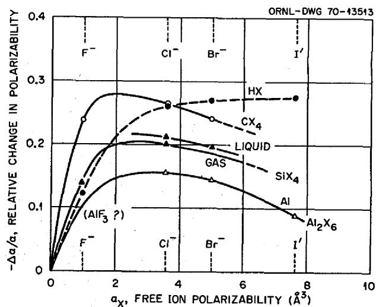  
Fig. 9.6. Effect of "Crowding" of $\mathbf{X}^{-}$ on Polarizability in Aluminum Trihalides and Carbon or Silicon Tetrahalides ( $\lambda = 589\mathrm{nm}$ ).

Alternatively, and perhaps more plausibly, the relative tightening of $\mathbf{Br}^{-}$ and $\mathbf{I}^{-}$ in the central fields of $\mathbf{B}^{3+}$ , $\mathbf{C}^{4+}$ , $\mathbf{Al}^{3+}$ , and $\mathbf{Si}^{4+}$ may just not quite proceed as far as it could in a molecule with fewer, or smaller, less

"crowded" $\mathbf{X}^{-}$ ions such as in a $\mathbf{BX}_2^+$ or in the fluorides of these elements. Attempts to understand this significant and quite distinct effect theoretically in a more quantitative manner would seem to be of interest.

# 10. Physical Chemistry of Molten Salts

# 10.1 LIQUIDUS TEMPERATURE OF THE SALT MIXTURE LiF-BeF $_2$ -ThF $_4$ (70-15-15 MOLE %)

L. O. Gilpatrick C. J. Barton H. Insley

Bauman and Chang1 have recently recommended that the salt composition $\mathrm{LiF - BeF_2 - ThF_4}$ (70-15-15 mole %) be adopted as the optimum composition for succeeding studies of the permanent-core single-fluid MSBR. In view of its probable importance in future reactor design considerations, we thought it desirable to confirm the liquidus temperature and the primary phase assignment of this specific composition.

The composition was prepared from the pure components and examined by the quench tube technique. It was found to have a melting point of $505 \pm 2^{\circ}\mathrm{C}$ , and the primary phase was identified from its optical properties as $3\mathrm{LiF} \cdot \mathrm{ThF}_4$ . The liquidus temperature was confirmed by an independent set of three differential thermal analysis (D.T.A.) measurements which averaged $506.3 \pm 1^{\circ}\mathrm{C}$ .

Results agree very well with the published phase diagram in all respects.2

# 10.2 EQUILIBRIUM PHASE RELATIONSHIPS IN THE SYSTEM LiF-BeF $_2$ -CeF $_3$

L. O. Gilpatrick H. Insley C. J. Barton

Investigation of this system was reported earlier and has progressed far enough to warrant the preparation of a tentative phase diagram (Fig. 10.1). Additional data have been obtained using the gradient quench technique. The solubility of $\mathbf{C e F_{3}}$ in LiF-BeF2 compositions was measured earlier and correlated with other

$\mathbf{CeF}_3$ solubility measurements.5 Interest in the system stems chiefly from the analogy between the behavior of $\mathbf{CeF}_3$ and $\mathbf{PuF}_3$ , a possible fuel constituent.7

Four primary phase fields have been identified in this system, of which the largest is $\mathrm{CeF}_3$ , as expected from its high melting point $(1459^{\circ}\mathrm{C})$ . Lithium fluoride forms the next most extensive primary phase field, followed by $2\mathrm{LiF} \cdot \mathrm{BeF}_2$ . Adjoining or contained in this field are the lowest-melting compositions in the system, the lowest being the ternary eutectic melting at $358^{\circ}\mathrm{C}$ having the approximate composition $\mathrm{LiF - BeF}_2 - \mathrm{CeF}_3$ (47.5-52.0-0.5 mole%). As $\mathrm{CeF}_3$ is added to a mixture of this composition there is a sharp rise in the liquidus temperature. This can be seen from the closely spaced isothermal contours tracing the liquidus boundary in Fig. 10.1. For example, when as little as 3 mole% $\mathrm{CeF}_3$ is added to the LiF-BeF $_2$ eutectic composition melting at $360^{\circ}\mathrm{C}$ , the equilibrium liquidus temperature rises to $635^{\circ}\mathrm{C}$ .

At higher $\mathrm{BeF}_2$ compositions, such as those above 80 mole $\%$ , the experimental difficulties entailed in securing equilibrium data mount rapidly because of the high viscosity of liquid $\mathrm{BeF}_2$ . Additional data will be needed to refine the present diagram at high $\mathrm{BeF}_2$ compositions. At the higher $\mathrm{CeF_3}$ compositions, the need for high-temperature techniques has been a limitation.

Invariant compositions and their temperatures can be read from Fig. 10.1. They represent tentative values based upon our present understanding of the system.

# 10.3 PHASE RELATIONSHIPS IN THE SYSTEM $\mathbf{C e F}_{3}$ -ThF4

L. O. Gilpatrick H. Insley C. J. Barton

The system $\mathbf{CeF}_3\cdot \mathbf{ThF}_4$ is being studied as part of a long-range investigation of the system LiF-BeF2-CeF3

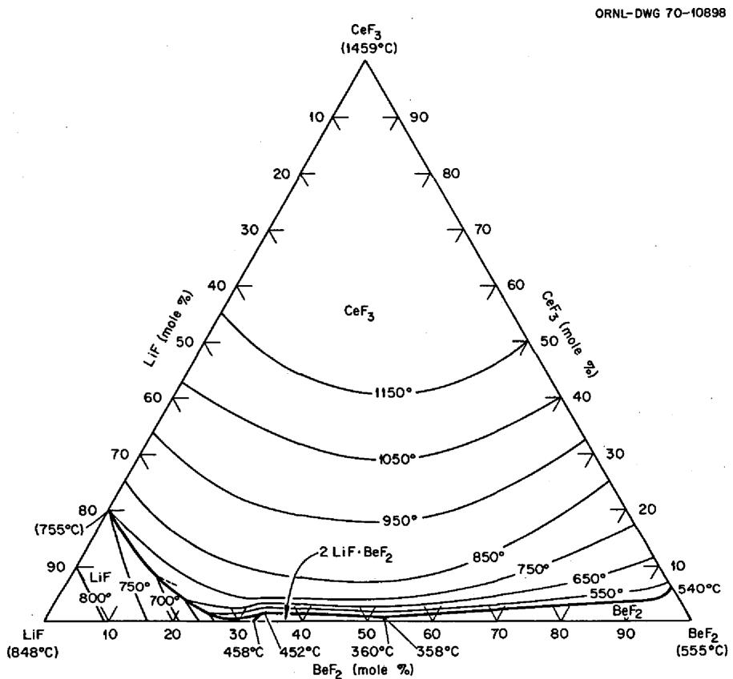  
Fig. 10.1. The System LiF-BeF $_2$ -CeF $_3$ .

$\mathbf{ThF_4}$ . Preliminary results were given for this subsystem in an earlier report. Some progress has been made in overcoming the experimental problems referred to earlier when using the quench-tube technique at temperatures between 1000 and $1200^{\circ}\mathrm{C}$ . Inserting a graphite liner with a cap into the nickel furnace core has prevented the nickel-to-nickel welding between sample tube and core which previously resulted in many lost heats. Use of Rodar alloy (Fe-Ni-Co-Mn, 51-29-17-3 at. $\%$ quench tubes which have a greater strength at $1200^{\circ}\mathrm{C}$ than pure nickel has also reduced the failure rate, although neither it nor other commonly available alloys are found to possess both entirely adequate strength and corrosion resistance in this temperature range.

A preliminary phase diagram is presented in Fig. 10.2 which represents our present understanding of this system. The compositions region greater than 40 mole $\%$ in $\mathrm{ThF_4}$ has been examined in sufficient detail at

temperatures below $1100^{\circ}\mathrm{C}$ to give a fairly clear picture of the system in this region. A eutectic is formed at 45 mole $\%$ $\mathrm{ThF_4}$ between $\mathrm{CeF_3\cdot 2ThF_4}$ and $\mathrm{ThF_4}$ ; it exhibits the lowest melting temperature in the system, estimated to be $950^{\circ}\mathrm{C}$ . Thorium fluoride is the primary phase at higher $\mathrm{ThF_4}$ compositions, but the compound $\mathrm{CeF_3\cdot 2ThF_4}$ is the primary phase for only a narrow composition range from the eutectic to 73 mole $\%$ $\mathrm{ThF_4}$ . At this composition a peritectic is found which is formed by the incongruent melting of $\mathrm{CeF_3\cdot 2ThF_4}$ at $960^{\circ}\mathrm{C}$ .

A second peritectic is formed when the compound $\mathrm{CeF}_3\cdot \mathrm{ThF}_4$ melts incongruently at about $1155^{\circ}\mathrm{C}$ . At higher temperatures the only stable solid phase is $\mathrm{CeF}_3$ solid solution. From the change in optical properties, we infer the existence of a $\mathrm{CeF}_3$ solid solution; but more work is needed to define the extent of this region as shown by the dotted lines. Below approximately $860^{\circ}\mathrm{C}$ $\mathrm{CeF}_3\cdot 2\mathrm{ThF}_4$ is unstable, and only $\mathrm{ThF}_4$ and $\mathrm{CeF}_3$ solid solution exists. Additional information is needed especially in the temperature range above $1100^{\circ}\mathrm{C}$ to complete this study.

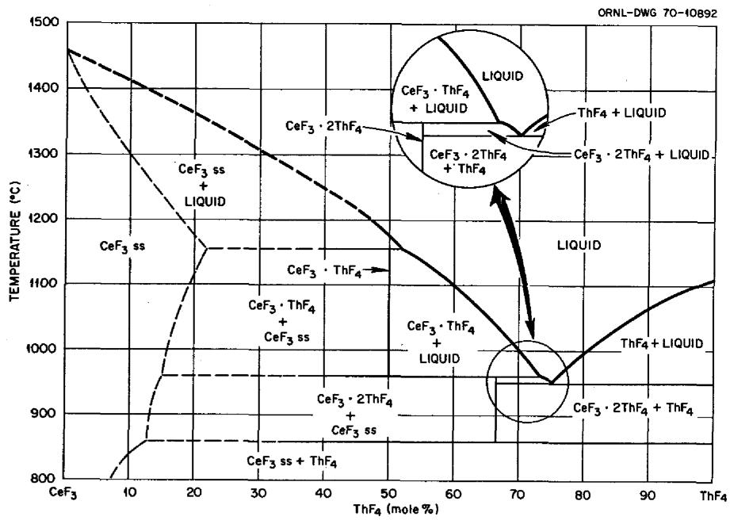  
Fig. 10.2. The System $\mathsf{CeF}_3\cdot \mathsf{ThF}_4$

# 10.4 THE INSTABILITY OF $\mathbf{PuOF}$ AND THE SOLUBILITY OF $\mathbf{Pu(III)}$ IN MSBR SOLVENT SALT

C.E.Bamberger R.G.Ross C.F.Baes, Jr.

We have previously reported9 measurements of the following equilibrium involving the oxidative precipitation of plutonium oxide at 590 and $690^{\circ}$ :

$$
\begin{array}{l} 3 / 4 \mathrm {T h O} _ {2} (\mathrm {s s}) + 1 / 2 \mathrm {N i O} (\mathrm {c}) + \mathrm {P u F} _ {3} (\mathrm {d}) \\ \rightleftharpoons \mathrm {P u O} _ {2} (\mathrm {s s}) + 3 / 4 \mathrm {T h F} _ {4} (\mathrm {d}) + 1 / 2 \mathrm {N i} ^ {\circ} (\mathrm {c}), \\ \end{array}
$$

where ss, c, and d denote, respectively, a solid solution of $\mathrm{PuO_2}$ and $\mathrm{ThO_2}$ , pure crystalline phases, and components dissolved in LiF-BeF $_2$ -ThF $_4$ (72-16-12 mole%). From these results and available thermochemical data for the other reactants, we were able to estimate the free energy of formation of $\mathrm{PuF_3}$ and to conclude therefrom that under the normal reducing conditions of an MSBR fuel there was no possibility of precipitating plutonium as $\mathrm{PuO_2}$ , $\mathrm{PuO_{1.61}}$ , or $\mathrm{PuO_{1.5}}$ . One other oxygen-containing compound of $\mathrm{Pu(III)}$ has been reported by early workers10 from x-ray examina

tion of impurities formed during the reduction of $\mathbf{PuF}_3$ by atomic hydrogen and during the determination of the melting points of $\mathbf{PuF}_3$ in an argon atmosphere. Indeed, Oetting11 has estimated the thermochemical values for $\mathbf{PuOF}$ by comparison with those for $\mathbf{PuOCl}$ , $\mathbf{PuCl}_3$ , and $\mathbf{PuF}_3$ . Using his estimation procedure and our revised estimate for the formation free energy of $\mathbf{PuF}_3$ , we would predict the precipitation of $\mathbf{PuOF}$ by the addition of $\mathbf{ThO}_2$ to a molten fluoride containing $\mathbf{PuF}_3$ . This has been clearly ruled out, however, by one of our previously reported tests in which an addition of excess oxide failed to remove a detectable amount of $\mathbf{Pu(III)}$ from such a molten fluoride solution nearly saturated with $\mathbf{PuF}_3$ (0.21 mole % at $494^{\circ}\mathrm{C}$ ). Thus the $\mathbf{PuOF}$ clearly is less stable than might be judged from Oetting's estimation procedure.

The present measurements were made in order to confirm previous estimates of the solubility of $\mathrm{PuF_3}$ in LiF-BeF2-ThF4 (72-16-12 mole %) and to determine if the presence of oxide has any effect on that solubility. While it appears that the solubility is not decreased by the precipitation of an oxyfluoride, the possibility remains that it might be increased by the formation of an oxy ion such as $\mathrm{PuO^{+}}$ .

The experimental procedure consisted in equilibrating the melt with excess $\mathbf{PuF}_3$ (containing $\sim 0.1\%$ $^{241}\mathrm{Am}$ )

by sparging the mixture with argon at $120~\mathrm{cc / min}$ for several (4-16) hours. The plutonium concentration was determined by alpha pulse-height analysis of ${}^{239}\mathrm{Pu}$ and by neutron activation analysis. The ${}^{241}\mathrm{Am}$ present showed the same distribution behavior as ${}^{239}\mathrm{Pu}$ between the crystalline $\mathrm{PuF_3}$ and the melt and therefore was used as a tracer for rapid analysis during the runs. In runs with $\mathrm{ThO_2}$ present, stirring was used for mixing the phases under an atmosphere of $\mathrm{Ar + 4\% H_2}$ . The reducing atmosphere was used in order to avoid the formation of $\mathrm{PuO_2 - ThO_2}$ solid solution in case of accidental contamination with air.

The solubility of $\mathrm{PuF_3}$ measured in the presence and absence of $\mathrm{ThO_2}$ was the same within the scatter of the analytical data (Fig. 10.3). This indicates that an oxy ion of plutonium III, such as $\mathrm{PuO^{+}}$ , has no significant stability in the molten fluoride solvent used. Thus $\mathrm{PuO^{+}}$ appears to form neither a stable solid fluoride nor a stable species in molten fluoride.

The results of the various analyses used to determine the solubility of $\mathrm{PuF_3}$ in 72-16-12 salt (Fig. 10.3) were fitted by least squares, giving

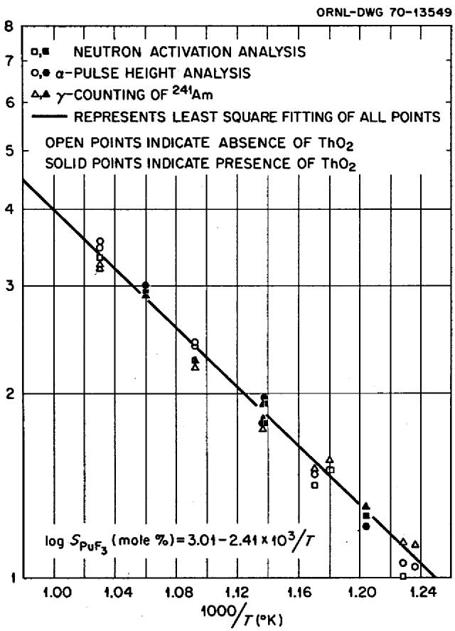  
Fig. 10.3. Solubility of $\mathbf{PuF}_3$ in LiF-BeF $_2$ -ThF $_4$ (72-16-12 Mole%).

$$
\begin{array}{l} \log S _ {\mathrm {P u F} _ {3}} (\text {mole} \%) \\ = (3. 0 1 \pm 0. 0 6) - (2. 4 1 \pm 0. 0 5) \times 1 0 ^ {3} / T. \\ \end{array}
$$

The heat of solution of $\mathbf{PuF}_3$ was estimated from this equation to be

$$
\Delta H _ {s} = 1 1, 0 0 8 \pm 2 3 7 \mathrm {c a l / m o l e}.
$$

These results are nearly identical with those obtained by Barton et al.12 for $\mathrm{CeF}_3$ in the same solvent salt, 72-16-12, thus confirming the suitability of $\mathrm{CeF}_3$ as a proxy for plutonium in the earlier measurements.

# 10.5 OXIDE CHEMISTRY OF PROTACTINIUM IN MSBR FUEL SOLVENT SALT

R.G.Ross C.E.Bamberger C.F.Baes, Jr.

The precipitation of protactinium from $\mathrm{LiF - BeF_2}$ $\mathrm{ThF_4}$ molten mixtures by oxide additions was demonstrated by Shaffer et al. some years ago.13 When it later became apparent from reductive extraction measurements that the valence of protactinium in such melts was $+4$ , it was generally assumed that the oxide precipitated in these earlier experiments was $\mathrm{PaO}_2$ Furthermore, since $\mathrm{UO}_2$ and $\mathrm{ThO}_2$ form solid solutions in equilibrium with such melts when $\mathrm{UF_4}$ is present,14 it seemed likely that protactinium was precipitated by the formation of a (U-Pa-Th)O2 solid solution.

The present further investigation of the oxide chemistry of protactinium in molten fluorides was undertaken by us to identify the oxide phases of protactinium which are precipitated under various conditions and to measure the related equilibria. In an initial test (Fig. 10.4) an $\mathrm{LiF - BeF_2 - ThF_4}$ melt containing $100~\mathrm{ppm}$ of protactinium was treated with an excess of $\mathrm{UO}_2$ more than sufficient to precipitate all the protactinium. Surprisingly, only a small fraction $(\sim 10\%)$ of the protactinium was precipitated. A subsequent addition of hyperstoichiometric $\mathrm{UO}_2$ (an oxidant), however, caused a sharp increase in the amount of protactinium precipitated. Hydrogen sparging of the mixture returned much of this protactinium to solution, while subsequent addition of $\mathrm{NiF_2}$ (an oxidant) again increased the amount of protactinium precipitated. It is

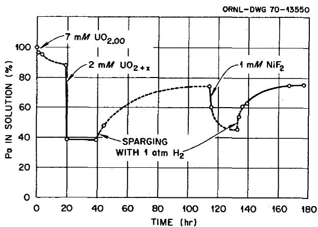  
Fig. 10.4. Effect of Oxidizing and Reducing Agents on the Precipitation of Protactinium Oxide from LiF-BeF $_2$ -ThF $_4$ -UF $_4$ (72-16-12-0.25 Mole %) at $625^{\circ}\mathrm{C}$ . The initial protactinium concentration was 100 ppm.

clear from these results that the extent of protactinium precipitation as oxide increases with increased oxidation of the system. It seems likely that a $\mathrm{Pa(V)}$ oxide, presumably a pure phase or a solid solution of $\mathrm{Pa}_2\mathrm{O}_5$ with $\mathrm{ThO}_2$ , was the principal oxide formed in these tests and in the previous tests of Shaffer et al. $^{13}$

In order to characterize more directly the protactinium oxide precipitated, an $\mathrm{LiF - BeF_2 - ThF_4}$ mixture (72-16-12 mole $\%$ ) containing 3000 ppm protactinium was extensively hydrofluorinated with HF at $\sim 0.7$ atm to dissolve any oxides initially present and to oxidize the protactinium to the pentavalent state. This was followed by equilibration at several temperatures with small amounts of $\mathrm{ThO_2}$ added stepwise in a leak-tight stirred vessel $^{15}$ assembled in a glove box suited for work with alpha-active material. The results obtained are shown in Fig. 10.5 as the number of moles of protactinium in solution plotted vs total moles of $O^{2 - }$ added. It can be seen that at $563^{\circ}C,$ the experimental points agree well with a line calculated on the assumption that the protactinium was precipitated quantitatively as $\mathrm{Pa}_2\mathrm{O}_5$ . From this we conclude that the precipitated oxide is pure or nearly pure $\mathrm{Pa}_2\mathrm{O}_5$ .At higher temperatures the amount of protactinium in solution was well above the line corresponding to complete precipitation. Calculating the amount of oxide ion in solution by a material balance based on the

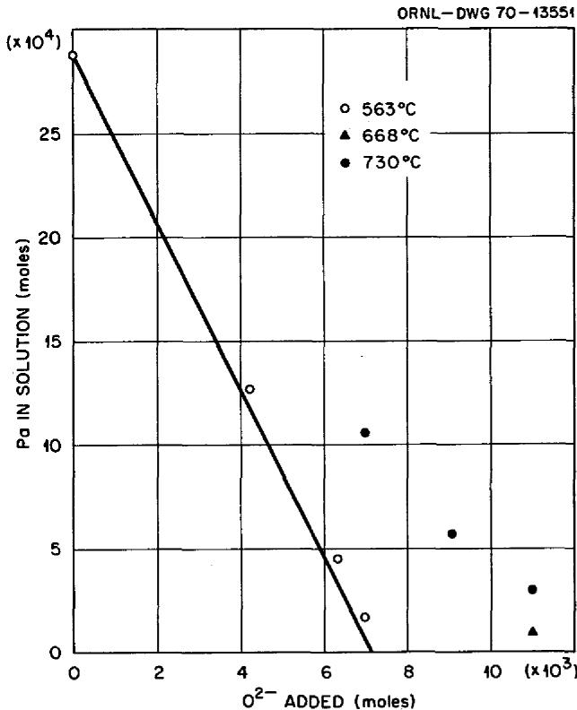  
Fig. 10.5. Precipitation of Protactinium Oxide from LiF $\mathrm{BeF}_2$ -ThF $_4$ (72-16-12 Mole %) by addition of $\mathrm{ThO}_2$ . The line corresponds to the quantitative precipitation of $\mathrm{Pa}_2\mathrm{O}_5$ .

amount of $\mathrm{ThO_2}$ added and the amount of protactinium presumed to have precipitated as $\mathrm{Pa}_2\mathrm{O}_5$ , we estimated the solubility product of $\mathrm{Pa}_2\mathrm{O}_5$ as

$$
1 / 2 \mathrm {P a} _ {2} \mathrm {O} _ {5} (\mathrm {c}) \rightleftharpoons \mathrm {P a} ^ {5 +} + 5 / 2 \mathrm {O} ^ {2 -}, \tag {1}
$$

$$
\log \left(X _ {\mathrm {P a} ^ {5 +}} X _ {\mathrm {O} ^ {2 -}} ^ {2. 5}\right) = 4. 7 3 - 1 6. 5 \left(1 0 ^ {3} / T\right).
$$

In another experiment excess $\mathrm{ThO_2}$ and NiO were added to define, respectively, the oxide ion concentration and the redox potential. The resulting protactinium concentrations (Fig. 10.6) were used to calculate the equilibrium quotient for the reaction

$$
\begin{array}{l} 5 / 4 \mathrm {T h F} _ {4} (\mathrm {d}) + 1 / 2 \mathrm {P a} _ {2} \mathrm {O} _ {5} (\mathrm {c}) \\ \rightleftharpoons \mathrm {P a F} _ {5} (\mathrm {d}) + 5 / 4 \mathrm {T h O} _ {2} (\mathrm {c}), \tag {2} \\ \end{array}
$$

giving

$$
\log \left(X _ {\mathrm {P a} ^ {5 +}} / X _ {\mathrm {T h} ^ {4 +}} ^ {5 / 4}\right) = 5. 9 4 - 9. 9 8 \left(1 0 ^ {3} / T\right).
$$

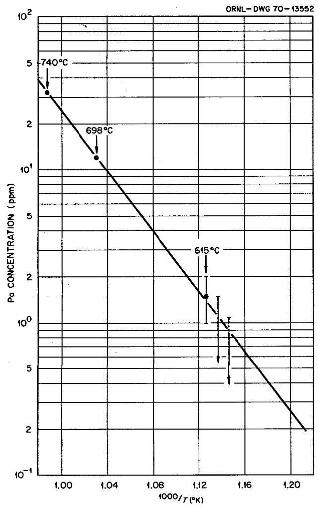  
Fig. 10.6. Solubility of Protactinium Oxide in LiF-BeF $_2$ . ThF $_4$ (72-16-12 Mole %) at Saturation in the Presence of an Oxidant (NiO).

Combining Eqs. (1) and (2) we obtain the following estimate for the solubility product of $\mathrm{ThO}_2$ in the MSBR solvent salt:

$$
\log \left(X _ {\mathrm {T h} ^ {4 +}} X _ {\mathrm {O} ^ {2 -}} ^ {2}\right) = - 0. 9 7 - 5. 2 2 \left(1 0 ^ {3} / T\right). \tag {3}
$$

Combining this with the previously measured equilibrium2

$$
\mathrm {T h O} _ {2} (\mathrm {s s}) + \mathrm {U F} _ {4} (\mathrm {d}) \rightleftharpoons \mathrm {T h F} _ {4} (\mathrm {d}) + \mathrm {U O} _ {2} (\mathrm {s s}), \tag {4}
$$

$$
\log Q = 2. 3 7 7 \left(1 0 ^ {3} / T\right),
$$

we estimate in turn the following solubility product of $\mathbf{U}\mathbf{O}_2$ :

$$
\log \left(X _ {\mathrm {U} ^ {4 +}} X _ {\mathrm {O} ^ {2 -}} ^ {2}\right) = - 0. 9 7 - 7. 6 0 \left(1 0 ^ {3} / T\right). \tag {5}
$$

These estimates of the solubility products of $\mathrm{ThO_2}$ [Eq. (3)] and $\mathrm{UO_2}$ [Eq. (5)] in LiF-BeF $_2$ -ThF $_4$ (72-16-12 mole %) are in reasonably good agreement with previous estimates16 of these quantities in $\mathrm{Li_2BeF_4}$ melts, considering the uncertainties involved and the change in medium. We are thus encouraged to believe that the protactinium was precipitated in these tests as pure or nearly pure $\mathrm{Pa_2O_5}$ and that the present estimate of its low solubility is a usefully accurate one.

Upon combining reactions (2) and (4) we obtain

$$
\begin{array}{l} 5 / 4 \mathrm {U F} _ {4} (\mathrm {d}) + 1 / 2 \mathrm {P a} _ {2} \mathrm {O} _ {5} (\mathrm {c}) \\ \rightleftharpoons \mathrm {P a F} _ {5} (\mathrm {d}) + 5 / 4 \mathrm {U O} _ {2} (\mathrm {s s}), \tag {6} \\ \log \left[ \frac {X _ {\mathrm {P a F} _ {5}}}{X _ {\mathrm {U F} _ {4}} ^ {5 / 4}} a _ {\mathrm {U O} _ {2}} ^ {5 / 4} \right] = 6. 0 - 7. 0 (1 0 ^ {3} / T), \\ \end{array}
$$

which relates the saturation concentration of $\mathrm{PaF}_5$ in the presence of $\mathrm{Pa}_2\mathrm{O}_5(\mathrm{c})$ to the oxide ion concentration in the melt - here expressed in terms of the activity of $\mathrm{UO}_2$ - and the $\mathrm{UF_4}$ concentration. This, then, is a useful representation of the behavior to be expected in an MSBR fuel. In the absence of protactinium, sufficient oxide will cause the precipitation of a $\mathrm{UO}_2$ -rich ( $\sim 95$ mole $\%$ ) solid solution with $\mathrm{ThO}_2$ . Such a precipitate would establish a $\mathrm{UO}_2$ activity near unity (Fig. 10.7). With $\mathrm{PaF}_5$ present, equilibrium described in Eq. (6) would apply, showing clearly that the amount of $\mathrm{PaF}_5$ remaining in a solution saturated with $\mathrm{Pa}_2\mathrm{O}_5$ depends on the concentration of $\mathrm{UF_4}$ in the fuel and on the oxide activity. The behavior predicted from the present estimate of the equilibrium quotient for reaction (6) is indicated in Fig. 10.7. From this we conclude that it should be possible to selectively precipitate protactinium as pure or nearly pure $\mathrm{Pa}_2\mathrm{O}_5$ from an MSBR fuel salt without prior removal of uranium. This important conclusion will be verified by precipitation tests on melts containing both uranium and protactinium.

The redox potential required to produce the $\mathrm{PaF}_5$ in such a melt remained to be estimated. This was investigated by means of the reaction

$$
\mathrm {P a F} _ {5} (\mathrm {d}) + 1 / 2 \mathrm {H} _ {2} (\mathrm {g}) \rightarrow \mathrm {H F} (\mathrm {g}) + \mathrm {P a F} _ {4} (\mathrm {d}), \tag {7}
$$

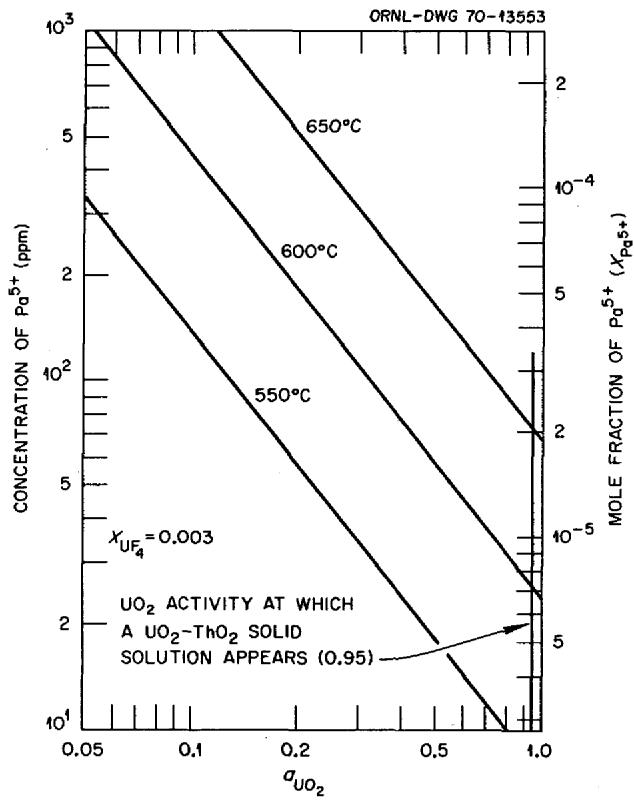  
Fig. 10.7. Concentration of $\mathsf{PaF}_5$ in LiF-BeF $_2$ -ThF $_4$ -UF $_4$ (72-16-12-0.3 Mole %) Saturated with $\mathsf{Pa}_2\mathsf{O}_5$ as a Function of the Activity of $\mathsf{UO}_2$ .

wherein $\mathbf{H}_2$ was sparged through the melt and the evolved HF was measured. The reaction apparently is too slow to provide equilibrium results by this transpiration technique, and, as a result, we can only estimate the following limits for the equilibrium quotient:

$$
Q = \frac {X _ {\mathrm {P a F} _ {4}} P _ {\mathrm {H F}}}{X _ {\mathrm {P a F} _ {5}} P _ {\mathrm {H} _ {2}} ^ {1 / 2}} \left\{ \begin{array}{l} \geqslant 0. 0 0 1 5 \text {a t} 5 5 0 ^ {\circ} \mathrm {C} \\ \geqslant 0. 0 1 \text {a t} 7 4 7 ^ {\circ} \mathrm {C}. \end{array} \right. \tag {8}
$$

Combining these results (8) with those of Long and Blankenship for the reduction of $\mathbf{U}\mathbf{F}_4$ to $\mathbf{U}\mathbf{F}_3$ by hydrogen, $^{17}$ we obtain

$$
Q _ {9} = \frac {X _ {\mathrm {P a} ^ {4 +}} X _ {\mathrm {U} ^ {4 +}}}{X _ {\mathrm {P a} ^ {5 +}} X _ {\mathrm {U} ^ {3 +}}} \left\{ \begin{array}{l} \geqslant 3 0, 0 0 0 \text {a t} 5 5 0 ^ {\circ} \mathrm {C} \\ \geqslant 1 2 0 0 \text {a t} 7 4 7 ^ {\circ} \mathrm {C}. \end{array} \right. \tag {9}
$$

The results of Eq. (9) suggest that it will be readily possible to maintain the protactinium sufficiently reduced in an MSBR by adjustment of the $\mathrm{UF_4 / UF_3}$

ratio so that insufficient $\mathbf{Pa}^{5+}$ is available to cause inadvertent precipitation as $\mathbf{Pa}_2\mathbf{O}_5$ .

The equilibrium quotients $Q_{6}$ and $Q_{9}$ may be used to estimate the conditions under which $^{233}\mathrm{Pa}$ might be isolated as $\mathrm{Pa}_{2}\mathrm{O}_{5}$ in an MSBR. If oxide is added to an isolation (decay) tank and the redox potential adjusted to precipitate $\mathrm{Pa}_{2}\mathrm{O}_{5}$ , then the total $^{233}\mathrm{Pa}$ content of the salt at equilibrium with the $\mathrm{Pa}_{2}\mathrm{O}_{5}$ ( $X_{\Sigma \mathrm{Pa}}$ ) should be given by

$$
X _ {\Sigma \mathrm {P a}} = Q _ {6} \left(\frac {X _ {\mathrm {U F} _ {4}}}{a _ {\mathrm {U O} _ {2}}}\right) ^ {5 / 4} \left[ 1 + Q _ {9} \frac {X _ {\mathrm {U F} _ {3}}}{X _ {\mathrm {U F} _ {4}}} \right]. \tag {10}
$$

From this expression it can be seen that the concentration of protactinium in the effluent from the decay tank will be minimized by (1) lowering $Q_{6}$ (i.e., lowering the temperature), (2) lowering the ratio of the $\mathrm{UF_4}$ concentration to the activity of dissolved $\mathrm{UO}_2$ $(a_{\mathrm{UO}_2})$ - presumably by increasing the latter, and (3) lowering the ratio of $\mathrm{UF_3}$ to $\mathrm{UF_4}$ . Based on the present estimates of $Q_{6}$ and $Q_{9}$ , it is thus predicted that with an $X_{\mathrm{UF_3}} / X_{\mathrm{UF_4}}$ ratio less than $10^{-6}$ and with an oxide concentration equivalent to a $\mathrm{UO}_2$ activity of 0.5, which should be insufficient to precipitate a uranium-rich oxide phase, it should be possible to lower the protactinium concentration of a fuel stream to $\sim 20$ ppm by precipitation of $\mathrm{Pa}_2\mathrm{O}_5$ .

The current program of investigation includes experiments which are designed to define the redox potential of the $\mathrm{Pa}^{5+}/\mathrm{Pa}^{4+}$ couple with high precision because of the significance of this value to the control of precipitation of protactinium as oxide in molten-salt reactors. Subsequently, the present estimate of the extent to which protactinium may be selectively precipitated as $\mathrm{Pa}_2\mathrm{O}_5$ in the presence of $\mathrm{UF}_4$ , without precipitation of $\mathrm{UO}_2$ as a pure phase or as an oxide solid solution, will be verified in direct tests.

# 10.6 ENTROPIES OF MOLTEN SALTS

# Stanley Cantor

The entropies of several classes of inorganic compounds in both the liquid and solid states are currently being correlated. An equation that has been developed to correlate entropy of binary compounds with molecular weight and density is:

$$
S _ {T} = A + \frac {n}{2} (5 R \ln M - 2 R \ln \rho_ {T}), \tag {1}
$$

where $S_{T}$ is the absolute molar entropy at temperature $T(^{\circ}\mathrm{K})$ , $R$ is the gas constant (1.98716 cal mole $^{-1}$ )

$\mathrm{^\circ K^{-1}}$ ）, $M$ is the gram-formula weight, $\rho_{T}$ is the density18 $(\mathrm{g / cm}^3)$ at temperature $T$ n is the number of atoms in the formula (e.g., $n = 2$ for LiF and for MgO, $n$ $= 3$ for $\mathrm{BeF}_2$ ), and $A$ is an empirical correlation constant that is dependent only on temperature and the formal charge of the constituent atoms. The constant $A$ is evaluated from measured entropies via Eq. (1). For example, using the experimental entropy of crystalline KCl at $298^{\circ}\mathrm{K}$ and Eq. (1) to evaluate $A$ , one obtains $A$ $= -20.38$ . When this value of $A$ is fed back into Eq. (1)

$^{18}$ Density data for almost all the compounds treated in the section were obtained from G. J. Janz et al., "Molten Salts: Vol. 1. Electrical Conductance, Density, and Viscosity Data," Natl. Std. Ref. Data Serv., Natl. Bur. Std. (U.S.), Washington 1968, No. 15.

to calculate $S_{298}$ of 24 other crystalline univalent (alkali, Ag, Cu, Tl) halides, the worst discrepancy between calculated and experimental $S_{298}$ is 1.6 cal mole $^{-1}$ K $^{-1}$ .

It can be shown that the form of Eq. (1) follows from Debye's theory of lattice heat capacity. [Indeed, Eq. (1) can be used to predict the maximum lattice vibrational frequency which is the scaling factor of Debye's theory.]

The entropies of molten univalent halides at $1000^{\circ}\mathrm{K}$ have now been correlated by Eq. (1). An average $A = 0.62$ was derived from 16 alkali halides for which experimental entropies are available. The results of the correlation are given in Table 10.1. Also in Table 10.1 are entropies of five other univalent halides. The

Table 10.1. Entropy at ${1000}^{ \circ  }\mathrm{K}$ of Molten Univalent Halides   

<table><tr><td rowspan="2">Alkali Halides</td><td colspan="2">Entropy (cal mole-1K-1)</td><td rowspan="2">Other Halides</td><td colspan="2">Entropy (cal mole-1K-1)</td></tr><tr><td>Observeda</td><td>Calculatedb</td><td>Observeda</td><td>Calculatedb</td></tr><tr><td>LiF</td><td>28.8</td><td>30.5</td><td>CuCl</td><td>42.7</td><td>41.3</td></tr><tr><td>LiCl</td><td>35.5</td><td>36.4</td><td>AgCl</td><td>44.8</td><td>43.9</td></tr><tr><td>NaF</td><td>33.7</td><td>34.8</td><td>AgBr</td><td>47.0</td><td>46.0</td></tr><tr><td>NaCl</td><td>39.5</td><td>39.2</td><td>TlCl</td><td>48.4</td><td>48.6</td></tr><tr><td>NaBr</td><td>43.0</td><td>42.7</td><td>TlBr</td><td>50.9</td><td>50.0</td></tr><tr><td>NaI</td><td>45.8</td><td>46.1</td><td></td><td></td><td></td></tr><tr><td>KF</td><td>37.5</td><td>38.2</td><td></td><td></td><td></td></tr><tr><td>KCl</td><td>42.0</td><td>41.6</td><td></td><td></td><td></td></tr><tr><td>KBr</td><td>45.4</td><td>45.1</td><td></td><td></td><td></td></tr><tr><td>KI</td><td>49.1</td><td>47.9</td><td></td><td></td><td></td></tr><tr><td>RbBr</td><td>48.9</td><td>47.5</td><td></td><td></td><td></td></tr><tr><td>RbI</td><td>51.1</td><td>49.8</td><td></td><td></td><td></td></tr><tr><td>CsF</td><td>44.5</td><td>45.4</td><td></td><td></td><td></td></tr><tr><td>CsCl</td><td>47.2</td><td>47.6</td><td></td><td></td><td></td></tr><tr><td>CsBr</td><td>50.3</td><td>49.5</td><td></td><td></td><td></td></tr><tr><td>Csl</td><td>52.6</td><td>51.2</td><td></td><td></td><td></td></tr></table>

${}^{a}$ Experimental uncertainties within $\pm  2$ cal mole ${}^{-1}{}^{ \circ  }{\mathrm{K}}^{-1}$ . Data for LiF through KI directly from JANAF tables. Data for CuCl through TlBr derived by combining ${S}_{298}^{ \circ  }\left( \mathrm{{cr}}\right)$ in NBS Technical Notes 270-3 and 270-4 with ${S}_{1000}^{ \circ  }\left( \mathrm{l}\right)  -$ ${S}_{298}^{ \circ  }\left( \mathrm{{cr}}\right)$ in K. K. Kelley, U.S. Bureau of Mines Bulletin 584. For RbBr and Rbl, ${S}_{298}^{ \circ  }\left( \mathrm{{cr}}\right)$ taken from K. K. Kelley and E. G. King, U.S. Bureau of Mines Bulletin 584, and combined with other calorimetric data from A. S. Dworkin and M. A. Bredig, J. Phys. Chem. 64, 269 (1960), and A. S. Dworkin, unpublished measurements. For CsF, ${S}_{298}^{ \circ  }\left( \mathrm{{cr}}\right)$ in I. E. Pawkov and F. S. Rachmenkalov, Russ. J. Phys. Chem. 43, 438 (1969), combined with A. S. Dworkin, unpublished measurements. Data for CsCl obtained by combining measurements in U.S. Bureau of Mines Reports of Investigations 6157 and 5832. For CsBr and Csl, ${S}_{298}^{ \circ  }\left( \mathrm{{cr}}\right)$ in M. Sorai, H. Suga, and S. Seki, Bull. Chem. Soc. Japan 41, 312 (1968), combined with calorimetric data of A. S. Dworkin and M. A. Bredig, op. cit., and A. S. Dworkin, unpublished measurements.

bCalculated from: $S_{1000}^{\circ}(\mathfrak{l}) = 0.62 + 5R\ln M - 2R\ln \rho_{1000}$

maximum discrepancy between calculated and experimental $S_{1000}$ for these cases is 1.4 cal mole $^{-1}$ deg $^{-1}$ .

When Eq. (1) is applied to the entropies at $1000^{\circ}\mathrm{K}$ of eight molten alkaline-earth halides (note that $n = 3$ ), the average value of $A = -13.4$ . The correlation is poorer than for the alkali halides; the worst discrepancy between calculated and experimental $S_{1000}^{\circ}$ is 6 cal mole $^{-1}$ deg $^{-1}$ .

The success in correlating the entropies of alkali and other univalent halides has led to extensions of Eq. (1) for estimating the entropies of more complex compounds. Among these are salts containing a complex anion (examples: fluoroborates, hydroxides, nitrates, carbonates, and sulfates). In these compounds it can be assumed that the anions exhibit "gaslike" degrees of freedom. In other words, in the melt the complex anions execute rotations and the atoms within the anion execute internal vibrations, both types of motion being unhindered by the immediate environment. When these assumptions are included in the calculated entropy, Eq. (1) is modified:

$$
S _ {T} = A + \frac {n}{2} (5 R \ln M - 2 R \ln \rho_ {T}) + S _ {\mathrm {a f r}} + S _ {\mathrm {a i v}}, \tag {2}
$$

where the subscripts afr and aiv refer to "anion free rotation" and "anion internal vibration." The last two entropy terms are calculated from standard equations of statistical thermodynamics:19

$$
S _ {\mathrm {a f r}} = R \ln (I T / \sigma) + 1 7 7. 6 6 7 (\text {l i n e a r a n i o n}), \tag {3a}
$$

$$
\begin{array}{l} S _ {\mathrm {a f r}} = \frac {R}{2} \ln I _ {x} I _ {y} I _ {z} + \frac {3}{2} R \ln T \\ - R \ln \sigma + 2 6 7. 6 4 0 (\text {n o n l i n e a r a n i o n}), \tag {3b} \\ \end{array}
$$

$$
\begin{array}{l} S _ {\mathrm {a i v}} = R \sum_ {i = 1} ^ {3 m - 5 (\text {l i n e a r a n i o n})} \left[ (1. 4 3 8 7 \omega_ {i} / T) \right. \\ \times \left(e ^ {1. 4 3 8 7 \omega_ {i} / T} - 1\right) ^ {- 1} \\ \left. - \ln \left(1 - e ^ {- 1. 4 3 8 7 \omega_ {l} / T}\right) \right], \tag {4} \\ \end{array}
$$

where $I$ (with and without subscript) is moment of inertia $(\mathrm{g - cm}^2)$ , $\sigma$ is the symmetry number, $m$ is the number of atoms in the anion (e.g., 2 for $\mathrm{OH^{-}}$ , 5 for

$\mathrm{SO}_4^{2-})$ , and $\omega_{i}$ is the vibrational frequency20 $(\mathrm{cm}^{-1})$

In applying Eq. (2) to nine compounds with univalent anions, the constant $A$ at $1000^{\circ}\mathrm{K}$ was assumed to be the same (0.62) as for the univalent halides. The calculated and experimental entropies are given in the upper part of Table 10.2. Only LiOH exhibits a sizable discrepancy between observed and calculated values. For melts of divalent anions, the constant $A$ was obtained from Eq. (2) using the experimental $S_{1000}(l)$ of $\mathrm{Na}_2\mathrm{SO}_4$ (hence in Table 10.2 observed and calculated entropies for $\mathrm{Na}_2\mathrm{SO}_4$ must agree). Equation (2), with $A = -17$ , was then applied to four other alkali melts containing divalent anions. The results for these four, given in Table 10.2, show fairly good agreement, with $\mathrm{Li}_2\mathrm{CO}_3$ showing the worst discrepancy.

Table 10.2. Entropy at $1000^{\circ}\mathrm{K}$ of Molten Salts Containing Complex Anions   

<table><tr><td></td><td colspan="2">Entropy (cal mole-1K-1)</td></tr><tr><td></td><td>Observeda</td><td>Calculated</td></tr><tr><td colspan="3">Univalent Anions</td></tr><tr><td>KHF2</td><td>61.7</td><td>60.5b</td></tr><tr><td>NaBF4</td><td>90c</td><td>89.1b</td></tr><tr><td>KBF4</td><td>91c</td><td>90.7b</td></tr><tr><td>LiOH</td><td>36.7</td><td>41.0b</td></tr><tr><td>NaOH</td><td>42.7</td><td>44.6b</td></tr><tr><td>KOH</td><td>47.6</td><td>48.0b</td></tr><tr><td>NaNO3</td><td>74.7</td><td>74.9b</td></tr><tr><td>KNO3</td><td>74.2</td><td>76.6b</td></tr><tr><td>AgNO3</td><td>75.9</td><td>78.7b</td></tr><tr><td colspan="3">Divalent Anions</td></tr><tr><td>Li2CO3</td><td>72.2</td><td>75.8d</td></tr><tr><td>Na2CO3</td><td>81.7</td><td>80.5d</td></tr><tr><td>K2CO3</td><td>84.9</td><td>84.7d</td></tr><tr><td>Na2SO4</td><td>93.8</td><td>93.8d (see text)</td></tr><tr><td>K2SO4</td><td>100.4</td><td>97.3d</td></tr></table>

${}^{a}$ Experimental uncertainties are usually $\pm  2\mathrm{{cal}}{\mathrm{{mole}}}^{-1}{}^{ \circ  }{\mathrm{K}}^{-1}$ , sometimes more. Data taken directly from JANAF tables or derived by combining data in K. K. Kelley, U.S. Bureau of Mines Bulletin 584, and K. K. Kelley and E. G. King, U.S. Bureau of Mines Bulletin 592.   
bCalculated from: $S_{1000}^{o}(l) = 0.62 + 5R\ln M - 2R\ln \rho +$ $S_{\mathrm{afr}} + S_{\mathrm{aiv}}$   
cExperimentally obtained from reaction equilibria.   
$d_{\text{Calculated from:}}$ $S_{1000}^{6}(\mathbf{l}) = -17 + 7.5 \ln M - 3R \ln \rho + S_{\text{afr}} + S_{\text{aiv}}$ .

The experimental entropies of the two lithium compounds, LiOH and $\mathrm{Li_2CO_3}$ , are both considerably less than the calculated values. A possible explanation for this discrepancy is that the anionic rotation is not totally free - perhaps the relatively large electric field strength of the lithium ions acts to hinder the free rotation of the anion.

# 10.7 ALL-METAL CONDUCTANCE CELL FOR USE IN MOLTEN SALTS

G. D. Robbins J. Braunstein

Electrically insulating materials which are inert to molten fluorides are rare. Previously, we have employed conductance cells constructed of silica with molten $\mathrm{LiF - BeF_2}$ mixtures,[21] over ranges of temperature and composition where the degree of attack was small and did not influence the conductance results. This imposed an undesirable limitation on the range of salt compositions and temperatures amenable to study. For example, it did not prove possible to supercool these melts in the presence of silica, probably due to the presence of corrosion product precipitates. Thus information on that part of the liquid range where transport properties are changing most rapidly with temperature – the supercooled region – could not be investigated. Drawing on the experience of previous investigators of molten fluorides,[22] a new conductance apparatus has been designed and constructed[23] in which only metal contacts the molten fluoride melts. The cell is designed to permit conductance measurements in an inert atmosphere and is compatible with the currently employed silica and Lavite furnace.[24] Provision is also made for the periodic addition of solid salt under a protective atmosphere.

Figure 10.8 is a schematic drawing of the metal conductance apparatus. The melt is contained in a nickel cup (6.6 cm ID, 9 cm high) resting on three silica pegs and enclosed in a silica well 8.3 cm in diameter and 34 cm high. The silica well fits into a silica and Lavite

$^{21}$ G. D. Robbins and J. Braunstein, "Electrical Conductivity Measurements in Molten Fluoride Mixtures, and Some General Considerations on Frequency Dispersion," pp. 443-47 in Molten Salts: Characterization and Analysis, ed. by G. Mamantov, Marcel Dekker, New York, 1969.   
22See, for example, the survey of experimental approaches in G. D. Robbins, J. Electrochem. Soc. 116, 813 (1969).   
23The advice and assistance of T. R. Mueller (Analytical Chemistry Division) and R. W. Poole and C. W. Wright, Jr., of the Fabrication Department, Oak Ridge National Laboratory, is gratefully acknowledged.   
24K. A. Romberger, MSR Program Semiann. Progr. Rept. Feb. 29, 1968, ORNL-4254, p. 149.

furnace²⁴ which permits visual observation of its interior.

ORNL-DWG70-9648

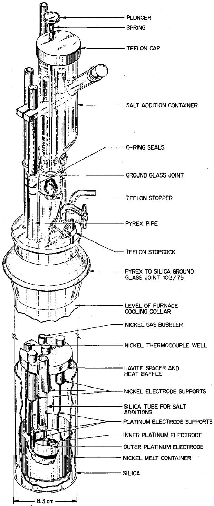  
Fig. 10.8. Schematic Representation of Conductance Apparatus.

The two platinum electrodes are concentric cylinders Heliarc welded to unplatinized platinum rods. The outer electrode is $4\mathrm{cm}$ in diameter and $1.5\mathrm{cm}$ high, while the dimensions of the inner cylinder are $0.5\times 0.5$ cm. The two replaceable electrodes are rendered immobile relative to each other by means of a Lavite spacer holding tightly fitted nickel rods into which the platinum support rods are inserted and held by nickel screws. This affords the capability of modifying the electrode size and configuration to accommodate varying electrochemical demands. The Lavite spacer also serves as a heat baffle to reduce convective currents in the glass envelope. The three electrode supports rise through the Pyrex cell top (joined to the silica well by a 102/75 ground glass joint) through heavy-walled Pyrex pipes. Double O-ring seals provide protection against atmospheric contamination. The maximum vertical displacement of the electrode assembly is $8\mathrm{cm}$ . The length of the silica well is such that the upper portion of the apparatus shown in Fig. 10.8, including the ground joint, is above the cooling collar and outside the furnace.

Two Teflon core stopcocks admit and release an inert cover gas. If gas bubbling into the melt is desired, the retractable nickel bubbling tube is used. The movable nickel thermocouple well and bubbler are admitted in the same manner as the electrode supports.

A Pyrex bulb for adding frozen salt to the melt is shown joined to the top by a ground glass joint. Normally a Pyrex cap fills this joint while salt is loaded into the addition chamber in an inert-atmosphere dry box. While rapidly expelling inert gas, the addition chamber is positioned onto the glass joint. Depression of the plunger lowers the Teflon cone, permitting salt to fall down the silica addition tube which terminates just above the nickel cup. In this way salt additions are made with minimum exposure to atmospheric moisture.

The cell has been satisfactorily leak tested (empty) up to $500^{\circ}\mathrm{C}$ . Room temperature tests in dilute aqueous KCl and $\mathrm{KCl - H_2O}$ -dioxane mixtures are currently in progress and indicate a cell constant of the order of 0.1 $\mathrm{cm}^{-1}$ .

# 10.8 GLASS TRANSITION TEMPERATURES IN NaF-BeF $_2$ MIXTURES

G. D. Robbins J. Braunstein

In the recent development of transport theories of molten salts, $^{25-27}$ attention has been focused on the lower end of the liquid range - the supercooled region. Supported by the concept of a vanishing free volume $^{28}$

or configurational entropy $^{29,30}$ at temperatures above $0^{\circ}\mathrm{K}$ , it has been suggested $^{25,27}$ that the heat capacity of a supercooled liquid (in metastable equilibrium) must drop rapidly, as the temperature is reduced, to values near those of the crystalline phase. This is in order to avoid the implausibility of an (amorphous) liquid phase having lower entropy than the corresponding crystal. The temperature of such a transition has been termed a "theoretical glass transition temperature," $T_{0}$ , and is thought to lie near, but somewhat below, the experimental glass transition temperature, $T_{g}$ . Attempts at comparing $T_{0}$ obtained from analysis of conductance data from supercooled nitrate $^{25}$ and acetate $^{31}$ melts with experimental glass transitions have previously been reported. No such information is available for molten fluorides.

As part of an investigation of transport and thermodynamic properties in molten fluorides, glass transition temperatures have been measured by differential thermal analysis $^{32}$ for three glass-forming $\mathrm{NaF - BeF_2}$ mixtures. These melt compositions correspond to the congruently melting compound $\mathrm{NaBeF}_3$ (mp $376^{\circ}\mathrm{C}$ ), the eutectic at 55 mole $\% \mathrm{BeF}_2$ ( $365^{\circ}\mathrm{C}$ ), and 60 mole $\% \mathrm{BeF}_2$ (liquidus $= 405^{\circ}\mathrm{C}$ ). $^{33,34}$

DTA samples were prepared from optical-grade single-crystal chips of NaF obtained from Harshaw Chemical Company and vacuum-distilled $\mathrm{BeF}_2^{35}$ which had been previously treated with $\mathrm{H}_2 / \mathrm{HF}$ followed by

hydrogen. These were ground to 100 mesh in a controlled-atmosphere box (moisture content $< 0.1$ ppm, continuously monitored), and 10-g quantities of the requisite weighed proportions ( $\pm 0.1$ mole $\%$ ) were mixed on a rotating tumbler. Approximately 3 g of each mixed material was subsequently loaded into predried nickel DTA sample tubes, evacuated at $100^{\circ}\mathrm{C}$ and welded closed. Heating for approximately 20 hr at $850^{\circ}\mathrm{C}$ with intermittent inversions and shaking was followed by quenching into ice water. The exterior of the nickel cell (wall thickness $= 0.5\mathrm{mm}$ ) experienced the $850^{\circ}$ temperature drop in approximately 2 sec.

Figure 10.9 shows reproductions of actual pen traces from DTA warmups at heating rates of $2^{\circ} / \mathrm{min}$ for the three compositions. The ordinate represents the temperature difference (in microvolts) between one thermocouple in an aluminum oxide reference sample and a second thermocouple monitoring the fluoride glass, the temperature of which is shown as the abscissa. The upper portion of the figure depicts duplicate warmups on glass formed by quenching the 50 mole $\%$ $\mathrm{BeF}_2$ mixture. The initial part of the trace corresponds to the difference in heat absorption of the $\mathrm{Al_2O_3}$ and glass sample with its characteristic heat capacity, $C_{p,\mathrm{glass}}$ . At $117^{\circ}\mathrm{C}$ the heat capacity of the sample exhibits a pronounced change corresponding to an endothermic process. This is interpreted as the glass transition, subsequent heating reflecting the heat capacity of a mobile amorphous phase persisting until the onset of crystallization.

Similar behavior is exhibited by the eutectic composition, as shown in the center section of Fig. 10.9. Here trace 1 corresponds to the glass formed by cooling $850^{\circ}$ in $\sim 2$ sec. After observation of the glass transition but prior to the onset of crystallization, the sample was slowly cooled $(100^{\circ}$ in $\sim 4$ hr), followed by a second warmup. The same value of $T_{g} = 117(\pm 2^{\circ}\mathrm{C})$ was observed as at the higher quenching rate. Traces 3 and 4 are a repeat of the experiment at a different heating rate after which the temperature was again cycled past $T_{g}$ following crystallization (trace 5). The absence of thermal effects in cycle 5 is consistent with the interpretation that the double peaks in the 200 to $250^{\circ}$ region represent crystallization of the liquid, the resulting crystalline phase exhibiting no solid state transitions over this interval and, of course, no glass transition.

The lower portion of the figure represents results obtained on a quench from the primary phase field of $\mathrm{BeF}_2$ , and again $T_{g}$ 's of 117 ( $\pm 2^{\circ}\mathrm{C}$ ) were observed. Examination of the glass of the eutectic composition by powder x-ray diffraction and polarizing light petrography $^{36}$ did not indicate the existence of microscopic phase separation. Thus it appears that over the composition range investigated here, the experimental glass transition temperature of 117 ( $\pm 2^{\circ}\mathrm{C}$ ) is invariant with composition.

$^{36}$ G. D. Brunton, private communication, Oak Ridge National Laboratory.

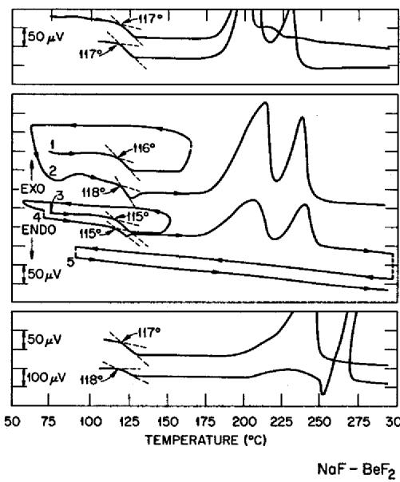  
Fig. 10.9. Differential Thermal Analysis Traces of $\mathrm{NaF - BeF}_2$ Mixtures.

$$
\begin{array}{l}\text {ORNL - DWG 70 - 4817}\\50 \text {mole} \% \mathrm {BeF}_2 (\mathrm {M.P.} = 376^\circ)\\\text {QUENCHED} 850^\circ \rightarrow 0^\circ \mathrm {IN} \sim 2 \sec \quad \mathrm {H.R.} = 2\% \min\end{array}
$$

$$
\begin{array}{l}55\text{mole}\% \mathrm{BeF}_{2}(\mathrm{EUTECTIC} = 365^{\circ})\\ \\ 1\quad \text{QUENCHED} 850^{\circ}\mathrm{-}0^{\circ}\mathrm{IN}\sim 2\sec \quad \mathrm{H.R.} = 2\% \min \\ 2\quad \text{COOLED} 100^{\circ}\mathrm{IN}4\mathrm{hr}\quad \mathrm{H.R.} = 2\% \min \\ 3\quad \text{QUENCHED} 850^{\circ}\mathrm{-}0^{\circ}\mathrm{IN}\sim 2\sec \quad \mathrm{H.R.} = 2\% \min \\ 4\quad \text{COOLED} 100^{\circ}\mathrm{IN}4\mathrm{hr}\quad \mathrm{H.R.} = 1\% \min \\ 5\quad \mathrm{H.R.} = 1\% \min \end{array}
$$

$$
60 \text {mole} \% \mathrm {BeF}_{2} (\text {LIQUIDUS} = 405^{\circ}) \\ \text {QUENCHED} 850^{\circ} - 0^{\circ} \mathrm {IN} \sim 2 \sec \mathrm {H.R.} = 2\% \min
$$

# 10.9 CORRELATIONS OF ELECTRICAL CONDUCTIVITIES IN MOLTEN LiF-BeF $_2$ -ThF $_4$ MIXTURES

G. D. Robbins A. S. Gallanter37

In a previous report38 we communicated specific electrical conductance data for six molten lithium-beryllium-thorium fluoride mixtures ranging in composition from 73-16-11 to 60.5-28.0-11.5 mole % LiF-BeF $_2$ -ThF $_4$ . Among these were several proposed MSBR fuel compositions. For these mixtures specific conductances were well represented as linear functions of temperature from near the liquidus to $650^{\circ}\mathrm{C}$ . In order to interpolate between the experimental compositions, and as an aid in estimating conductances of nearby compositions, attempts to obtain a smoothly varying correlation of conductance as a function of composition have been made.

A number of correlations were tested: (1) for the specific conductance (the conductance of one cubic centimeter of melt), (2) for the conductance of one equivalent of fluoride ions, $\Lambda_{\mathbf{F}}$ , and (3) for the conductance per equivalent of lithium ions, $\Lambda_{\mathrm{Li}}$ . These are related as $\Lambda = \kappa / C_{\mathrm{eq}}$ , where $C_{\mathrm{eq}}$ is the concentration (in equivalents per cubic centimeter) of the assumed charge-carrying constituent and $\rho$ is the density. Hence,

$$
\Lambda_ {\mathrm {F}} = \frac {\kappa}{\rho} \left(\frac {X M _ {\mathrm {L i F}} + Y M _ {\mathrm {B e F} _ {2}} + Z M _ {\mathrm {T h F} _ {4}}}{X + 2 Y + 4 Z}\right)
$$

and

$$
\Lambda_ {\mathrm {L i}} = \frac {\kappa}{\rho} \left(\frac {X M _ {\mathrm {L i F}} + Y M _ {\mathrm {B e F} _ {2}} + Z M _ {\mathrm {T h F} _ {4}}}{X}\right),
$$

where $X, Y,$ and $Z$ are mole fractions of LiF, $\mathrm{BeF}_2$ , and $\mathrm{ThF}_4$ , respectively, and $M$ with subscript is formula weight. Densities were calculated assuming additivity of molar volumes. $^{39}$

Isothermal values of $\kappa, \Lambda_{\mathbf{F}}$ , and $\Lambda_{\mathbf{Li}}$ were first plotted against mole fraction and equivalent fractions of each

individual component where equivalent fractions, $X^{\prime}$ $Y^{\prime}$ , and $Z^{\prime}$ , are defined as

$$
X ^ {\prime} = \frac {X}{X + 2 Y + 4 Z},
$$

$$
Y ^ {\prime} = \frac {2 Y}{X + 2 Y + 4 Z},
$$

and

$$
Z ^ {\prime} = \frac {4 Z}{X + 2 Y + 4 Z}.
$$

Fairly smooth correlations were obtained for $\kappa$ and $\Lambda_{\mathbf{F}}$ vs $X^{\prime}$ , as shown in Fig. 10.10. The curves shown represent the expressions:

$$
\Lambda_ {\mathrm {F}} = P _ {1} t \left(^ {\circ} \mathrm {C}\right) + P _ {2} X ^ {\prime} + P _ {3} X ^ {\prime 2} + P _ {4} t X ^ {\prime 2},
$$

$$
\kappa = P _ {5} t \left(^ {\circ} \mathrm {C}\right) + P _ {6} X ^ {\prime} + P _ {7} X ^ {\prime 2} + P _ {8} t X ^ {\prime 2}.
$$

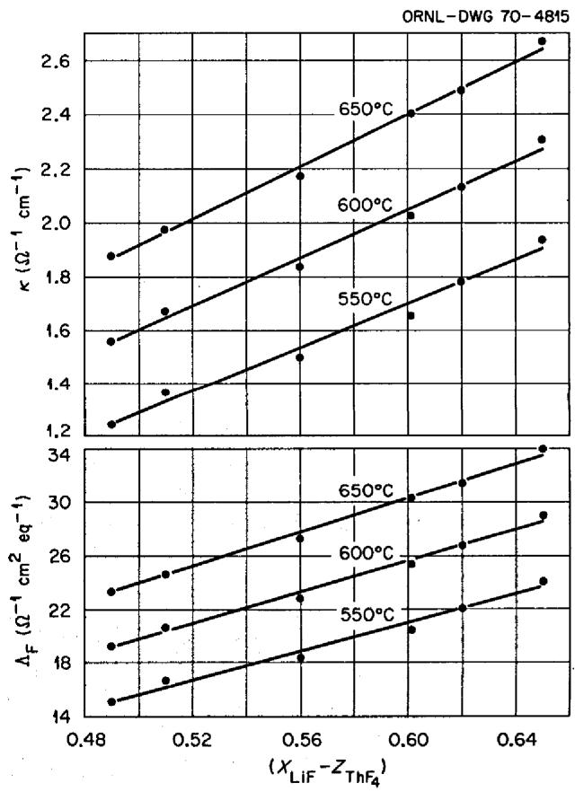  
Fig. 10.10. Conductance of $\mathbf{LiF - BeF_2 - ThF_4}$ Mixtures vs Equivalent Fraction LiF.

Table 10.3. Parameter Values for Correlation Functions   

<table><tr><td>Equation:</td><td>ΛF = P1t(°C) + P2X&#x27; + P3X&#x27;2 + P4tX&#x27;2</td></tr><tr><td>Parameter values:</td><td>P1 = 5.860 × 10-2, P2 = -123.04, P3 = 122.38, P4 = 0.15841</td></tr><tr><td>σ:</td><td>0.316</td></tr><tr><td>Equation:</td><td>κ = P5t(°C) + P6X&#x27; + P7X&#x27;2 + P8tX&#x27;2</td></tr><tr><td>Parameter values:</td><td>P5 = 4.728 × 10-3, P6 = -9.686, P7 = 10.56, P8 = 1.0625 × 10-2</td></tr><tr><td>σ:</td><td>0.024</td></tr><tr><td>Equation:</td><td>ΛF = P9 + P10t(°C) + P11t(X - Z)</td></tr><tr><td>Parameter values:</td><td>P8 = -30.17, P10 = 3.435 × 10-2, P11 = 9.774 × 10-2</td></tr><tr><td>σ:</td><td>0.366</td></tr><tr><td>Equation:</td><td>κ = P12 + P13t(°C) + P14t(X - Z)</td></tr><tr><td>Parameter values:</td><td>P12 = -2.193, P13 = 2.589 × 10-3, P14 = 7.458 × 10-3</td></tr><tr><td>σ:</td><td>0.027</td></tr></table>

$P^{\prime}$ s with subscripts are parameter values and are listed in the upper portion of Table 10.3 together with the standard error of fit, $\sigma$ . These expressions in $X^{\prime}$ and $t$ were obtained by least-squares computer fitting of $Y$ $(\Lambda_{\mathbf{F}}$ or $\kappa$ ) vs $X^{\prime}$ at constant temperature, from which it appeared that

$$
Y = a + b X ^ {\prime} + c X ^ {\prime 2}
$$

adequately represented the isothermal data. Furthermore, $a$ , $b$ , and $c$ appeared to be linear functions of temperature. Expressing them as such and substituting into the equation for $Y$ resulted in a six-parameter representation of $Y = f(X', t)$ . Eliminating various combinations of parameters and comparing the results both graphically and with $o$ , the representations given in the upper portion of Table 10.3 were determined.

One linear combination of mole fractions, namely $X - Z$ , resulted in a useful linear correlation of $\kappa$ and $\Lambda_{\mathbf{F}}$ . These plots are shown in Fig. 10.11, where the lines represent the least-squares equations listed in the lower portion of Table 10.3. Equations of this form were determined in the manner described for $Y = f(X', t)$ , except that the isothermal representations were found to be linear functions of the argument. No doubt other more complex combinations of composition would also produce smooth correlations.

It is not to be expected that extrapolations of these correlation functions to distant regions of the phase diagram should accurately predict values of conductance. The primary utility of the correlations lies in the

ternary composition region near which the data are reported.

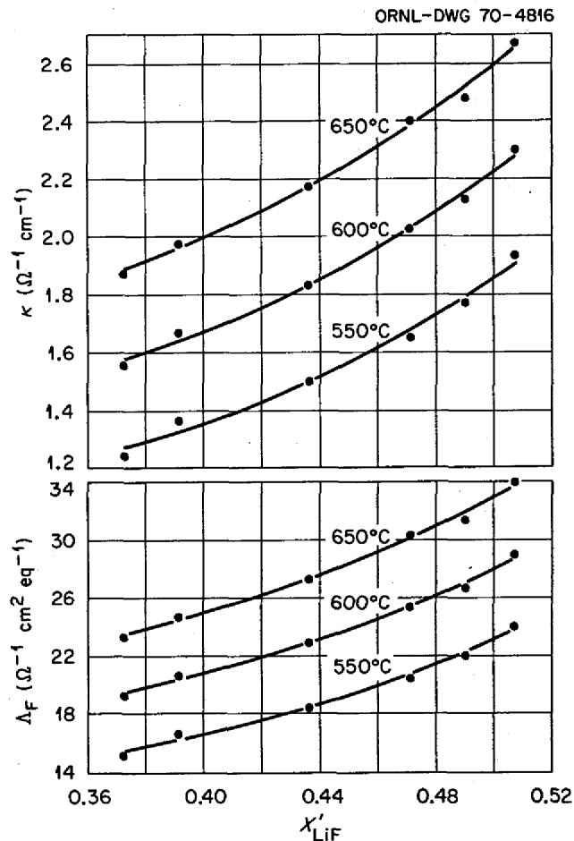  
Fig. 10.11. Conductance of $\mathsf{LiF - BeF}_2\cdot \mathsf{ThF}_4$ Mixtures vs Difference in Mole Fractions of LiF and $\mathsf{ThF_4}$

# 10.10 COORDINATION EFFECTS ON U(IV) SPECTRA IN FLUORIDE MELTS

L.M.Toth

The investigation of coordination effects on U(IV) spectra in molten fluorides has continued in an effort to broaden our understanding of how these effects influence both the spectrum and the reactivity of pertinent transition metal ions in solution. Spectra demonstrating a change from one species present in fluoride-rich low-temperature melts to another present in fluoride-deficient high-temperature melts have been shown previously.[40] The characteristic transitions of each species are listed in Table 10.4 along with absorption coefficients of some major peaks.

Previous experience with transition metal ions in molten salts indicates that these changes originate primarily from an interaction of the solvent anions in the first coordination sphere with central metal ion. Identification of these changes could, in principle, be accomplished by energy-level calculations. However, this method is, at the moment, not refined to the point where changes as shown in Table 10.4 for the actinides can be unequivocally identified. A more direct method is by comparison of the melt spectra with crystal spectra where the coordination of the cation has been described by an independent means - x-ray crystal

logy. Such an approach is ordinarily hampered by a lack of corresponding single-crystal structural information. However, fluoride single crystals have been under examination for some years now at this laboratory, $^{42}$ so that an accumulation of fluoride crystal structural information is available.

Host crystals of general formula $\mathrm{A}_x\mathrm{Th}_y\mathrm{F}_{4y + x}$ (where A is an alkali metal) doped with approximately 1 mole $\%$ U(IV) in the sites of known fluoride ion coordination number have been grown. Spectra of these U(IV) crystals have been measured from 25 to $550^{\circ}\mathrm{C}$ . Representative spectra of 9, 8, and 7 coordination are shown in Figs. 10.12-10.14, with characteristic peaks and noteworthy absorption coefficients listed in Table 10.4. Comparison of the two melt species spectra (Table 10.4) with 9-, 8-, and 7-coordinated U(IV) crystal spectra at $550^{\circ}\mathrm{C}$ (Table 10.5) leads to the conclusion that the fluoride-rich species is $\mathrm{UF_8}^{4 - }$ and the fluoride-deficient is $\mathrm{UF_7}^{3 - }$ - apparently in an equilibrium which is dependent upon the $\mathbf{F}^{-}$ concentration:

$$
\mathrm {U F} _ {8} ^ {4 -} \rightleftharpoons \mathrm {U F} _ {7} ^ {3 -} + \mathrm {F} ^ {-}.
$$

The identification of the $\mathrm{UF_8}^{4-}$ species in solution is based on the close agreement of the melt spectrum with

Table 10.5. Characteristic Transitions for 9-, 8-, and 7- Coordinated U(IV) in Fluoride Host Crystals $\mathbf{K}\mathbf{T}\mathbf{h}_{2}\mathbf{F}_{9}$ $\mathbf{K}_7\mathbf{Th}_6\mathbf{F}_{31}$ ,and $\mathrm{Cs_3ThF_7}$ ,respectively,at $550^{\circ}C$ Taken from Figs. 10.12-10.14 of this report Absorption coefficients in liters mole ${}^{-1}\mathrm{cm}^{-1}$ for some major peaks are given in parentheses

Table 10.4. Characteristic Transitions $(\mathbf{cm}^{-1}\times 10^{-3})$ for the Two Species in Solution Taken from Figs. 12.13 and 12.14 of ref. 40   
Absorption coefficients at $550^{\circ}\mathrm{C}$ in liters mole ${}^{-1}\mathrm{cm}^{-1}$ for some major peaks are given in parentheses   

<table><tr><td>Fluoride-Rich Species</td><td>Fluoride-Deficient Species</td></tr><tr><td>4.7</td><td>4.95</td></tr><tr><td>6.2</td><td></td></tr><tr><td>7.1</td><td></td></tr><tr><td>9.1 (20.8)</td><td>9.25 (&lt;14a)</td></tr><tr><td>15.25 (11.0)</td><td>15.85</td></tr><tr><td>16.30 (8.7)</td><td>16.7</td></tr><tr><td>19.0</td><td>19.4</td></tr><tr><td>21.1 (6.8)</td><td>20.25</td></tr><tr><td>22.5</td><td>22.5</td></tr><tr><td>23.2</td><td></td></tr></table>

<table><tr><td colspan="3">Coordination Number</td></tr><tr><td>9</td><td>8</td><td>7</td></tr><tr><td></td><td>4.7</td><td>5.0</td></tr><tr><td></td><td>6.25</td><td></td></tr><tr><td>6.65</td><td>6.80</td><td></td></tr><tr><td>9.05 (19.0)</td><td>9.1 (22.1)</td><td>9.20 (12.16)</td></tr><tr><td>11.5</td><td></td><td></td></tr><tr><td>15.55 (15.5)</td><td>15.35 (9.8)</td><td>15.3 (4.1)</td></tr><tr><td></td><td>15.85 (7.6)</td><td>15.8 (5.6)</td></tr><tr><td></td><td>16.40</td><td>16.4</td></tr><tr><td>18.6</td><td>18.9</td><td>19.4</td></tr><tr><td></td><td>19.25</td><td>20.1</td></tr><tr><td>20.8</td><td>21.3</td><td></td></tr><tr><td>23.7</td><td>22.6</td><td>22.8</td></tr><tr><td></td><td>24.5</td><td></td></tr></table>

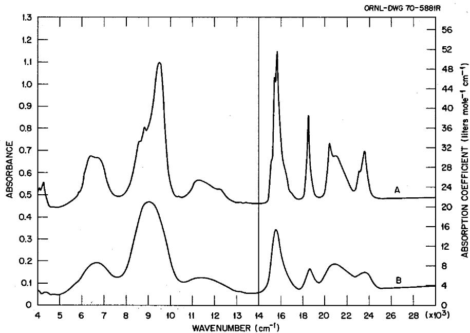  
Fig. 10.12. Nine-Coordinatesed Crystal Spectrum of U(IV) at Room Temperature, Curve $A$ , and at $550^{\circ}\mathbf{C}$ , Curve $B$ . The crystal is KTh₂F₉ doped with 1.5 mole % UF₄.

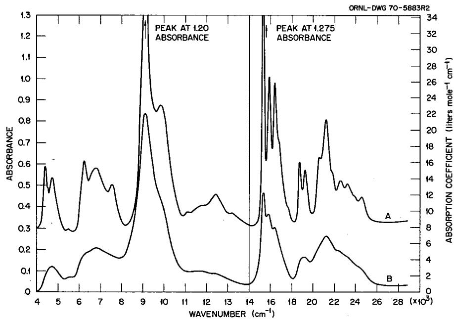  
Fig. 10.13. Eight-Coordinatesed Crystal Spectrum of U(IV) at Room Temperature, Curve $A$ , and at $550^{\circ}C$ , Curve $B$ . The crystal is $\mathbf{K}_7\mathbf{Th}_6\mathbf{F}_{31}$ doped with 2.0 mole % UF4.

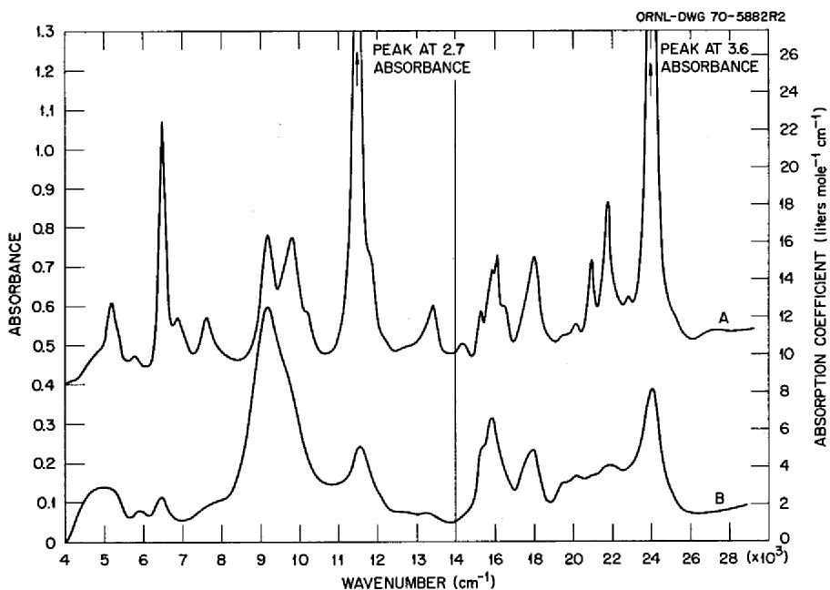  
Fig. 10.14. Seven-Coordinatesed Crystal Spectrum of U(IV) at Room Temperature, Curve A, and at $550^{\circ}\mathrm{C}$ , Curve B. The crystal is $\mathrm{Cs}_3\mathrm{ThF}_7$ containing 1.65 mole $\%$ UF $_4$ .

the well-established crystal species. However, the identification of the $\mathrm{UF}_7^{3-}$ species is less certain because the crystal structure is not as well established (being of a defect-type structure $^{43}$ ) and because the spectrum undergoes gross changes upon heating from 25 to $550^{\circ}\mathrm{C}$ . Very good agreement between both peak position and intensity of this $550^{\circ}$ crystal spectrum and the fluoride-deficient melt spectrum cannot be overlooked, and therefore the cautious conclusion is drawn that the two species, crystalline and melt, are the same. Confirmation that the crystal structure at $550^{\circ}\mathrm{C}$ is still 7-coordinated would strengthen this conclusion.

Turning from the identification of the species, it is possible to use the spectral measurements at $550^{\circ}\mathrm{C}$ for an estimation of relative concentrations of the two species in $\mathbf{LiF - BeF}_2$ solution as a function of $\mathbf{F}^{-}$

concentration. At 66-34 and 48-52 mole $\%$ LiF-BeF $_2$ the $\mathrm{UF_8}^{4-}/\mathrm{UF_7}^{3-}$ ratios are 0.66 and 0.177 respectively. For such a concentration change, the $\mathbf{F}^{-}$ activity would have to decrease by a factor of 4 in the above equilibrium -- which is actually the case in the LiF-BeF $_2$ system. $^{45}$

The 7- and 8-coordination equilibrium does not agree with conclusions drawn by Baes using the polymer model to calculate coordination numbers.46 He calculates much lower coordination numbers for the very analogous Th(IV) ion. Although this discrepancy has been discussed, it has not been resolved.47 It should be stressed, however, that the melt coordination numbers determined by spectroscopy are by direct comparison of known crystal spectra with melt spectra. There is agreement both in peak position and intensity, accounting for all48 of the U(IV) as either 7 or 8 coordinated. Data of this nature therefore demonstrate the validity of predictions made from simple models.

# 11. Chemistry of Molten-Salt Reactor Fuel Technology

# 11.1 REMOVAL OF FLUORIDE FROM MOLTEN LiCl

F.A.Doss W.R.Grimes J.H.Shaffer

During operation of the MSBR fuel reprocessing plant by the reductive extraction process, rare earths will be back-extracted from molten bismuth into molten lithium chloride. This process step provides, as its primary feature, for the separation of rare earths from thorium. If the fluoride fuel is entrained or has finite solubility in the molten bismuth stream, contamination of the molten LiCl system will occur. In this event thorium will be more readily extracted into the chloride phase, and the corresponding separation of rare earths from thorium will become less effective. Thus a process for stripping fluoride ion from molten chlorides may be required for the satisfactory operation of the fuel reprocessing plant. This experimental program has examined the reaction

$$
\mathrm {B C l} _ {3} (\mathrm {g}) + 3 \mathrm {L i F} (\mathrm {d}) \rightleftharpoons 3 \mathrm {L i C l} (\mathrm {I}) + \mathrm {B F} _ {3} (\mathrm {g})
$$

for possible application to MSBR fuel reprocessing technology.

The experimental procedure was similar to that used for studying the removal of chloride ion from a simulated MSBR fuel solvent. Boron trichloride admixed with hydrogen was bubbled through molten LiCl at $650^{\circ}\mathrm{C}$ to which known amounts of LiF had been added. Samples of the gas influent and effluent streams were periodically collected in water and analyzed by titration with standard caustic solution. Filtered samples of the molten salt were also withdrawn at intervals during the reaction period and analyzed for fluoride ion.

The results from four of eight experiments conducted thus far are shown in Fig. 11.1; they demonstrate the

effectiveness of this method for removing fluoride ion from molten LiCl. Initial concentrations of 5000 to 10,000 ppm by weight fluoride were rapidly diminished to low values within the 4-hr reaction periods at low $\mathrm{BCl}_3$ concentration (0.8 millimole per liter of $\mathbf{H}_2$ ) in the sparge gas stream.

After establishing that essentially complete fluoride removal from LiCl $(< 40~\mathrm{ppm})$ could be achieved, the

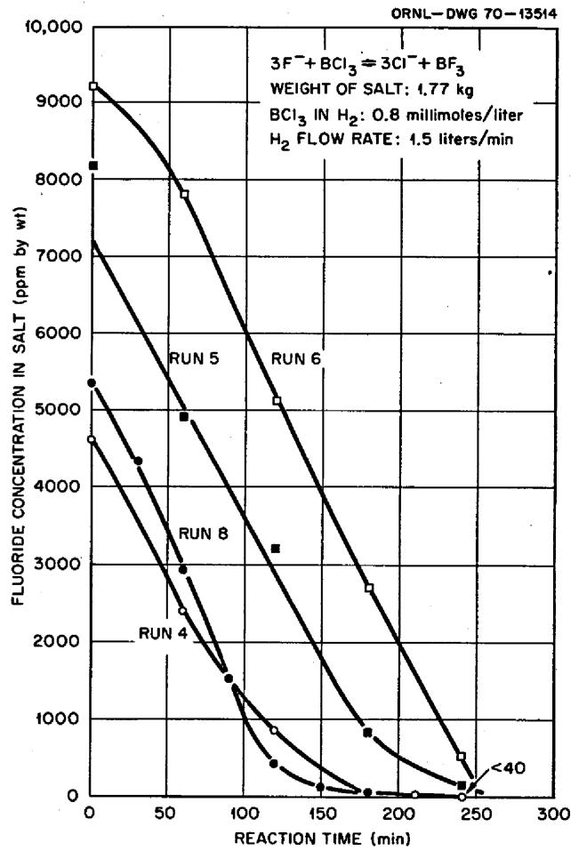  
Fig. 11.1. Removal of Fluoride from Molten LiCl by Reaction with $\mathbf{BCl}_3$ at $650^{\circ}\mathbf{C}$

purpose of subsequent experiments was to determine relative reaction velocity constants and equilibrium quotients. However, experimental conditions imposed thus far have been inadequate for these determinations. As shown by Fig. 11.2, the reaction of fluoride ion with $\mathrm{BCl}_3$ has been essentially quantitative even at these low concentrations. Thus the rate of chemical reaction has been controlled by the rate at which $\mathrm{BCl}_3$ was admitted to the system. Values calculated for the equilibrium relation given by

$$
K = \frac {N _ {\mathrm {B F} 3}}{N _ {\mathrm {B C l} 3}} \cdot \frac {1}{N _ {\mathrm {F}} ^ {3}},
$$

where estimates of the $\mathrm{BCl}_3$ concentration over the melt could be made, showed a continuous increase as the fluoride ion concentration in the melt diminished and approached a value of $10^{14}$ as a limit. Continued experiments will be made in an attempt to determine precisely the velocity and equilibrium constants for the exchange reaction.

The high rate of chemical recombination observed by these experiments and the effectiveness of fluoride removal are very favorable attributes of this proposed chemical process. In addition chemical analyses of salt samples have indicated that measurable corrosion of the

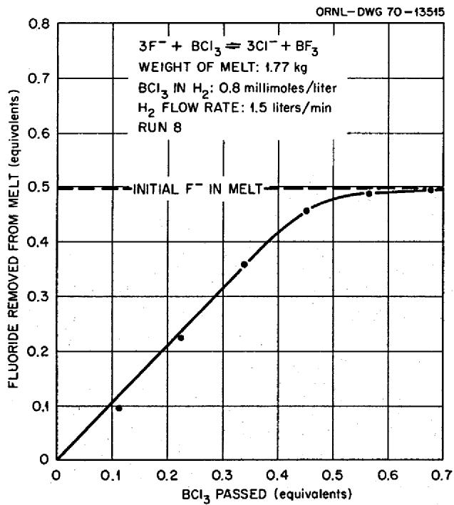  
Fig. 11.2. Material Balance on Removal of Fluoride from LiCl by Reaction with $\mathrm{BCl}_3$ at $650^{\circ}\mathrm{C}$ .

nickel reaction vessel by $\mathrm{BCl}_3$ has not occurred. Chemical analyses also indicated that the boron content of the melt, used repetitively, increased to about 200 ppm during initial experiments and has remained essentially constant at that value during the later experiments. However, a spectrochemical method has failed to detect boron concentrations above an analytical limit of 50 ppm. Although the differences in the analytical methods have not been resolved, the presence of this small boron concentration in the salt is not a serious deterrent for the process. Elemental boron is not wet by bismuth even at temperatures of 1500 to $1600^{\circ}\mathrm{C}$ . Its transport to the fluoride fuel should then be limited to a salt entrainment condition and should be a negligible process consideration.

# 11.2 DISTRIBUTION OF SODIUM AND POTASSIUM IN THE METAL TRANSFER PROCESS AT $650^{\circ}\mathrm{C}$

# D.M.Richardson J.H.Shaffer

The reductive extraction process for removing rare earths from MSBR fuel solvent will also result in transport of other fission products and impurities among the many liquid phases of the extractor system. It is important to determine where these elements would become concentrated so that they could be effectively removed and so that locations of possible interaction with process efficiency can be identified. Additional interest in the distributions of the alkali metals arose from the possibility that some of them might be used as diluents in the lithium chloride phase of the system, thereby conserving $^{7}\mathrm{Li}$ whenever it became desirable to discard the chloride extractant. The distributions of sodium and potassium for both the fluoride/bismuth and chloride/bismuth extractions have been measured at $650^{\circ}\mathrm{C}$ .

The four reductive extractions were performed in 4-in. IPS SS 304L vessels with mild steel liners. In each vessel two $3/4$ -in. steel pipes extended to within $1/2$ in. of the bottom and provided separately for adding lithium directly to the metal phase and for withdrawing bismuth samples in graphite dippers. Additional ports were provided for material additions, salt sampling with hydrogen-fired copper filter sticks, gas exhaust, and thermocouples. In the fluoride/bismuth experiments insulated ports for inserting beryllium electrodes were also provided. Each vessel was charged with approxi-

mately $3000\mathrm{g}$ of bismuth and was hydrogen sparged for 8 hr at $600^{\circ}\mathrm{C}$ .

The fluoride salts consisted of $\mathrm{LiF - BeF_2 - ThF_4}$ (72-16-12 mole %) to which NaF (labeled with several millicuries of $^{22}\mathrm{Na}$ ) or KF was added to make 1 mole %. The salts were treated in nickel preparation vessels at $650^{\circ}\mathrm{C}$ according to standard hydrofluorination procedures, followed by hydrogen sparging, and approximately $3000\mathrm{g}$ were transferred at $650^{\circ}\mathrm{C}$ to the extraction vessels under flowing argon.

The chloride salts consisted of LiCl to which NaCl (also labeled with several milicuries of $^{22}\mathrm{Na}$ ) or KCl was added to make 1 mole%. The salts were sparged at $650^{\circ}\mathrm{C}$ for 8 hr with 50-50 vol% hydrogen-hydrogen chloride at 1 liter/min. They were then hydrogen sparged at 1 liter/min until the effluent gas contained less than 0.02 meq HCl per liter hydrogen. Under flowing argon, approximately 2000 g of these purified mixtures were transferred to the extraction vessels at $650^{\circ}\mathrm{C}$ .

Reductions were made by incremental additions of 0.5- or $1.0\mathrm{-g}$ pieces of clean lithium metal directly to the metal phases. Equilibration of the fluoride/bismuth experiments was promoted by argon sparging at 1 liter/min for a minimum of 5 hr and until a beryllium electrode temporarily inserted into the salt showed a stabilized potential. Equilibration of the chloride/bismuth experiments was promoted by overnight sparging with argon at about 0.3 liter/min.

The analyses of lithium and the corrosion product metals were performed by the Spectrochemical Laboratory. Analyses of potassium were made by the General Analysis Laboratory. Analyses of sodium were made by gamma-spectrometric counting of the 0.511-MeV annihilation radiation of $^{22}\mathrm{Na}$ . Six days were allowed for decay of thorium daughters in the bismuth pellet samples, and fluoride salt activities were corrected for thorium daughters by use of an identical fluoride mixture without radiotracer sodium.

The results obtained are shown in Fig. 11.3 together with the derived theoretical lines. In the fluoride/bismuth experiments $\log D_{\mathrm{Na}} = \log X_{\mathrm{Li}} + 1.225$ and $\log D_{\mathrm{K}} = \log X_{\mathrm{Li}} + 1.045$ , where $X_{\mathrm{Li}}$ is the mole fraction of lithium in bismuth; $\log (D_{\mathrm{Na}} / D_{\mathrm{Li}}) = 1.080$ , and $\log (D_{\mathrm{K}} / D_{\mathrm{Li}}) = 0.899$ . The separation factors, $D_{\mathrm{M}} / D_{\mathrm{Li}}$ , for sodium and potassium from 72-16-12 fluoride were $30\%$ to $70\%$ smaller than the separation factors for trivalent rare earths. In the chloride/bismuth experiments $\log D_{\mathrm{Na}} = \log X_{\mathrm{Li}} - 0.164$ and $\log D_{\mathrm{K}} = \log X_{\mathrm{Li}} - 1.099$ ; $\log (D_{\mathrm{Na}} / D_{\mathrm{Li}}) = -0.168$ , and $\log (D_{\mathrm{K}} / D_{\mathrm{Li}}) = -1.104$ .

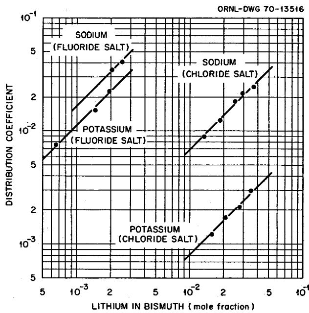  
Fig. 11.3. Reductive Extraction into Bismuth, $650^{\circ}\mathrm{C}$ .

Material balances were good for sodium in the fluoride system and for potassium in both systems, as well as could be determined. In the case of sodium in the chloride/bismuth extraction there appeared to be losses as the reductions proceeded, and $5\%$ of the sodium was unaccounted for at termination.

A difficulty encountered in all four experiments was that the concentrations of corrosion ions $(\mathrm{Cr}, \mathrm{Ni}, \mathrm{Mn})$ were unusually high in the bismuth phase. This resulted from the fact that the dip tubes that extended through both salt and bismuth phases were constructed of stainless steel. This was especially troublesome in the fluoride/bismuth experiments, since both thorium and nickel were lost from the bismuth solutions and the apparent lithium metal utilization was about $20\%$ . Whether the distributions measured in the fluoride/bismuth experiments were affected by this circumstance will require checking. It is not expected that any effect would be found in the chloride/bismuth experiments. These experiments served as a reminder that the extractions into bismuth are sensitive to metal impurities, especially nickel, and that methods for control or removal of such impurities may be a necessary part of the reductive extraction system.

At the first stage of the currently proposed metal transfer process the fuel solvent mixture of fluorides is contacted with bismuth, containing approximately 0.002 mole fraction lithium, which then contacts the lithium chloride salt phase and is returned to the fluoride extractor. In the second stage of the process the lithium chloride phase is next contacted with bismuth containing approximately 0.05 mole fraction lithium. The equilibrium distribution between a salt and a bismuth phase for a metal with valence $n$ is given by the equilibrium quotient, $Q$ ,

$$
Q = \frac {D _ {\mathrm {M}}}{\left(D _ {\mathrm {L i}}\right) ^ {n}} = \frac {N _ {\mathrm {M} , \mathrm {B i}}}{N _ {\mathrm {M} , \mathrm {s a l t}}} \times \frac {N _ {\mathrm {L i} , \mathrm {s a l t}} ^ {n}}{N _ {\mathrm {L i} , \mathrm {B i}} ^ {n}},
$$

where $D$ denotes $N_{\mathbf{M},\mathbf{Bi}} / N_{\mathbf{M},\mathbf{salt}}$ and $N$ denotes the respective mole fractions. The equilibrium distribution between two salt phases that are interfaced by the same bismuth phase is then

$$
\frac {Q _ {\text {f l u o r i d e}}}{Q _ {\text {c h l o r i d e}}} = \frac {N _ {\mathrm {L i} , \text {f l u o r i d e}} ^ {n}}{N _ {\mathrm {L i} , \text {c h l o r i d e}} ^ {n}} \times \frac {N _ {\mathrm {M} , \text {c h l o r i d e}}}{N _ {\mathrm {M} , \text {f l u o r i d e}}}.
$$

The calculated equilibrium distributions of sodium and potassium in the metal transfer process at $650^{\circ}\mathrm{C}$ are shown in Table 11.1 for the arbitrary case that the impurity is $100\mathrm{ppm}$ (as the metal) in $\mathrm{LiF - BeF_2 - ThF_4}$ (72-16-12 mole%). It is apparent that these impurities become most concentrated in the chloride phase, that potassium is more completely extracted than sodium, and that the rates of removal from the fluoride salt would be relatively slow due to low concentrations in the first bismuth phase.

The relative merits of sodium and potassium as diluents in the lithium chloride phase were compared, arbitrarily, at the composition LiCl-MCl (60-40 mole $\%$ ). In the LiCl-NaCl system the melting point is

approximately $590^{\circ}\mathrm{C}$ . In the LiCl-KCl system the melting point is approximately $370^{\circ}\mathrm{C}$ . The equilibrium concentration of sodium in the fluoride solvent mixture (72-16-12 mole $\%$ would be 2.71 mole $\%$ , and that of potassium would be 0.477 mole $\%$ . Factoring these calculated concentrations by the thermal neutron cross section of 0.53 b for sodium and of 1.97 b for potassium, the breeding penalty due to potassium would be two-thirds as much as would result from sodium.

# 11.3 REMOVAL OF LANTHANIDES FROM LITHIUM CHLORIDES ON ZEOLITES

D.M.Moulton J.H.Shaffer

In the MSBR processing plant rare earths but not thorium will be oxidized from the bismuth extractant into lithium chloride. Any alkalies or alkaline earths which are present in the bismuth will also be oxidized. Since the LiCl must be chemically and isotopically pure, occasional repurification will be required so that it can be recycled. McNeese has proposed a second bismuth extraction with higher reductant concentrations. This would work best with the trivalent earths, less well with divalent ones, and not at all with the alkalies. We have explored a process which might be considered as an alternative. This consists in exchanging the impurity ions for lithium on a solid zeolite.

Zeolites are natural or synthetic aluminosilicates with the formula $\mathrm{MAIO}_2\cdot (\mathrm{SiO}_2)_n$ . They have an open cage

Table 11.1. Equilibrium Distributions of Sodium and Potassium in the Metal Transfer Process at ${650}^{ \circ  }\mathrm{C}$   

<table><tr><td rowspan="3">Impurity</td><td colspan="4">Concentration of Impurity in Each Phase</td></tr><tr><td>MSBR Fuel</td><td>Bismuth, 0.002 Mole Fraction</td><td rowspan="2">LiCl</td><td rowspan="2">Bismuth, 0.05 Mole Fraction Lithium</td></tr><tr><td>Solvent (72-16-12)</td><td>Lithium</td></tr><tr><td>Sodium</td><td>100 ppm (0.0275 mole %)</td><td>1.0 ppm (9.18 × 10-4mole %)</td><td>3600 ppm (0.672 mole %)</td><td>26.5 ppm (0.0230 mole %)</td></tr><tr><td>Potassium</td><td>100 ppm (0.0162 mole %)</td><td>0.67 ppm (3.56 × 10-4mole %)</td><td>20,000 ppm (2.21 mole %)</td><td>17.5 ppm (8.90 × 10-3mole %)</td></tr></table>

structure which allows both cation exchange and the inclusion of neutral salt "molecules" (also of water at lower temperatures). The selectivity constant of an ion $i$ of valence $\pmb{p}$ is defined as

$$
K _ {i} = \frac {\overline {{N}} _ {i}}{N _ {i}} \bigg (\frac {N _ {j}}{\overline {{N}} _ {j}} \bigg) ^ {p},
$$

where $j$ is the original monovalent ion and the barred and unbarred quantities are the mole fractions in the zeolite and solution respectively. Platek and Marinsky found $K_{i}$ for tracer levels of Na, Rb, and Cs in LiCl at $660^{\circ}$ to be 78, 246, and 62 with Linde Zeolite A. Thus, at least at low levels, zeolite can remove these impurities from LiCl. Zeolite ion exchange has been studied more often in molten nitrates at around $330^{\circ}\mathrm{C}$ . Liquornik and Marcus found that strontium and calcium are strongly absorbed at low concentrations in $\mathrm{NaNO}_3$ , but that the barium form of Zeolite A does not exist. Callahan concluded that in $\mathrm{LiNO}_3$ the zeolite mineral chabazite preferentially absorbed large cations and those of low valence. However, if a cation is too large, as cesium is, it may not be able to squeeze through the relatively narrow openings into the central chamber of the zeolite; this shows up with Zeolite A but not so much with chabazite, where the holes are a little bigger.

Some of these results can be applied directly to our problem. Platek and Marinsky's work, for example, was carried out under exactly the same conditions as we use and shows that rubidium and cesium can be removed from the chloride. The nitrate studies may be less pertinent because of the temperature difference and the fact that the anions also play a role in ion exchange, since, according to Liquornik and Marcus, they enter the zeolite structure as ion pairs. Their experiments indicate that strontium, at least, may be removable, but this has not been confirmed directly. The feasibility of using zeolites may rest on the outcome of experiments which we have initiated to establish their chemical and physical stability in LiCl at $650^{\circ}\mathrm{C}$ . Zeolites are known to undergo thermal degradation at temperatures in excess of $700^{\circ}\mathrm{C}$ ; they may, therefore, approach instability under conditions which might foreseeably occur in their application to fuel reprocessing. There

should be no chemical corrosion as long as the salt is dry, since the composition of zeolite corresponds essentially to that of glass, which contains chlorides quite well.

We have finished the first of a planned series of experiments using zeolite to remove fission products from LiCl. Lithium zeolite was prepared from Linde Zeolite 4A by grinding zeolite pellets to $< 200$ mesh and soaking the powder in $13M\mathrm{LiCl}$ solution. Only about half the sodium originally present was replaced by lithium in this procedure. About $25\mathrm{g}$ of this material was put into a steel pot and fired with $\mathrm{Ar - }10\% \mathrm{H}_2$ at $350^{\circ}\mathrm{C}$ . Then $1.5\mathrm{kg}$ of LiCl containing $0.21\mathrm{g}$ of labeled $\mathrm{CeCl}_3$ was added at $650^{\circ}\mathrm{C}$ . Filter and dipper samples were taken, the latter type under agitation so that some solid could be gathered. The filtered samples showed about $60\%$ removal of the cerium, while the six solid samples all showed increased activity. The highest had nearly ten times as much cerium per gram as the original salt, corresponding to $60\mathrm{mg}$ zeolite. Unfortunately, it was not possible to separate the zeolite from the salt, so this concentration could not be checked. A value of 330 was found for $K_{\mathrm{Ce}}$ , assuming that all the lost cerium was on the zeolite and that cerium was trivalent.

The preliminary results obtained in the experiments described above indicate that the zeolites are potentially useful materials for the removal of rare earths from lithium chloride. We are therefore continuing our investigation of their potential application to fuel reprocessing.

# 11.4 ZIRCONIUM PLATINIDE AS A REMOVAL AGENT FOR RARE EARTHSH

D.M.Moulton J.H.Shaffer

The possibility of precipitating zirconium platinide from uranium-containing systems of bismuth and fluoride salt has been described earlier. In that experiment the platinum content was slightly less than stoichiometric for the formation of $\mathrm{ZrPt_3}$ . We now report an experiment in which the platinum content was varied, rising eventually to a substantial excess.

The experimental procedure was straightforward: 2.9 kg of $\mathrm{LiF - BeF_2 - ThF_4}$ (72-16-12 mole %) containing 32 g of uranium and $1.6\mathrm{g}$ of zirconium was extracted in an all-graphite pot at $600^{\circ}\mathrm{C}$ into $3\mathrm{kg}$ of bismuth using incremental lithium additions. Three extractions were

carried out in the same apparatus, separated by a platinum addition and a hydrofluorination. The platinum contents were 4, 11, and $41\mathrm{g}$ , corresponding to 50, 110, and $410\%$ of the zirconium equivalent. The behavior of the uranium and zirconium is shown in Fig. 11.4.

In the first part of the experiment things behaved as expected. The zirconium was extracted from the salt, but only 15 to $20\%$ appeared in the metal. The uranium was also extracted, but its balance remained high (about $115\%$ throughout). Half the platinum did not appear with the first sample, and the deficit increased as the experiment proceeded. This early loss cannot be explained by platinide precipitation, since both uranium and zirconium were all in the salt and no reductant had been added.

With the second platinum addition unexpected behavior occurred. Again the zirconium was removed, but this time the uranium balance fell from 90 to $70\%$ .

Both uranium and zirconium showed a balance minimum a little before the end of the run; they were lost from the salt before reappearing in the metal. This coincided with a drop in platinum and a rise in thorium. This behavior probably indicates that when the major fractions of uranium and zirconium were reduced, reduction of thorium began; then it displaced uranium and zirconium from the platinide compound. Only about $10\%$ of the platinum ever appeared in the metal, an amount too small to be explained by $\mathrm{ZrPt}_3$ precipitation in the early stages of the experiment.

After the last addition the pattern was similar except that the minima were more pronounced, with uranium falling below $20\%$ balance. Again most of the platinum was absent from the very beginning of the run, though the bismuth phase concentration of all of the active metals was below detectability and the deficit of uranium and zirconium was not nearly enough to account for the discrepancy.

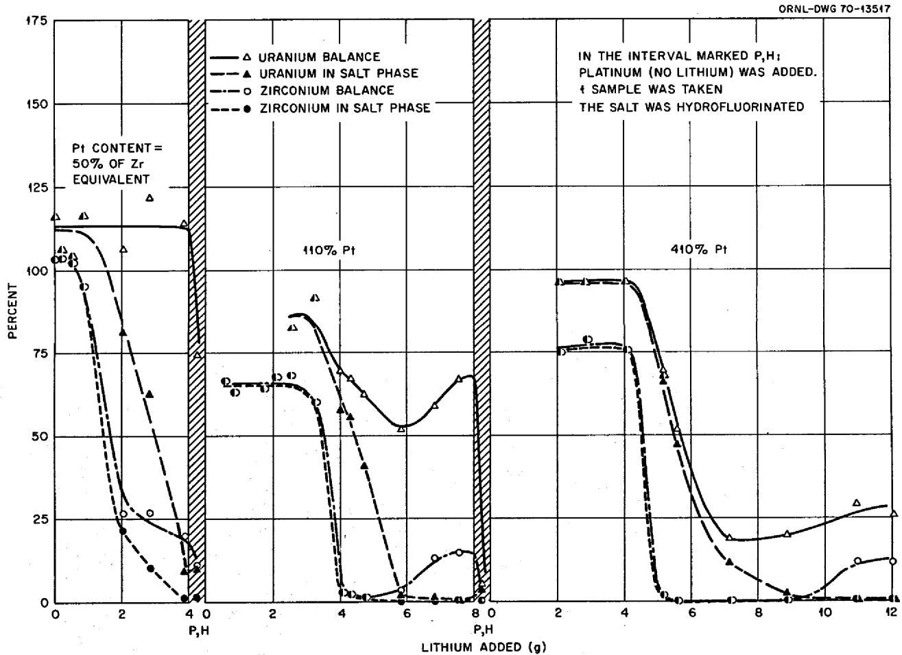  
Fig. 11.4. Uranium and Zirconium Behavior on Extraction into Bismuth-Platinum Solutions.

We have assumed that the precipitate in this reaction is $\mathbf{ZrPt}_3$ . A log-log plot of data for platinum vs the other metals is widely scattered, but $\mathbf{ZrPt}_3$ appears to be more likely than any of the other reported species, which begin with $\mathbf{Zr}_2\mathbf{Pt}_3$ . The uranium and thorium data are, however, fitted best if it is assumed that the formulas of their platinides, respectively, are $\mathbf{UPt}_2$ and $\mathbf{ThPt}$ (or possibly $\mathbf{ThPt}_2$ ). These assignments must be regarded as tentative until additional data are obtained.

In terms relevant to reprocessing, we draw the following conclusions: First, the uranium-zirconium separation is confirmed (first run). Second, at an excess of platinum, uranium is also precipitated. Third, at a high reductant concentration thorium platinide will displace the other two intermetallics. Thus if this process is to be used in a plant it will be necessary to control operating conditions carefully so that only zirconium is removed.

# 12. Development and Evaluation of Analytical Methods for Molten-Salt Reactors

# 12.1 SPECTRAL STUDIES OF MSRE FUEL SAMPLES

J. P. Young

The three samples of MSRE fuel which were taken for molten-salt spectral determination of the U(III)/U(IV) ratio have all been examined. A description of the sampling and spectral study procedures and a partial discussion of the results which were obtained have been given previously. Samples of the MSRE fuel were taken during the last power run of the reactor (run 20). On the basis of material balance of reductant added to the MSRE fuel, the following percent concentrations of U(III) had been calculated for these samples: (1) negligible U(III), (2) $1.2\%$ U(III), and (3) $2.9\%$ U(III). The samples were stored varying lengths of time for up to two months at a temperature of $>200^{\circ}\mathrm{C}$ until they could be melted for study. The first two samples could not be transferred without exposing the samples to the atmosphere. The failure in both cases was the inability to open a sealed, threaded plug immediately under the sample container. These plugs were in a high radiation field and heated for over a month at $250^{\circ}\mathrm{C}$ . The third sample, same storage conditions, opened without problem and was successfully transferred without exposure to air. The first two samples when melted under a helium atmosphere were visibly turbid; the spectra of the resultant melt showed no evidence of U(III) or U(IV). It would appear that the dissolved uranium obviously present in reactor fuel had come out of solution in sampling, storage, or remelting of the sample in the spectral furnace. The initial spectral study of the

last sample has been described. The spectrum of U(IV) was seen, but not that of U(III).

After the initial spectral measurements, experiments were performed to attempt the radiolytic and chemical generation of U(III) in this sample. The sample of MSRE fuel was maintained at room temperature for two periods of four days each and one period of six days. At the end of each period the atmosphere around the sample was evacuated and purged with helium several times; this operation would also remove any radiolytically generated $\mathbf{F}_2$ that was present in the sample. The sample was then melted for spectral study. Each time an increase in ultraviolet absorbance of the solution was noted which corresponds to an increase in the U(III) concentration of 30 to $40~\mathrm{ppm}$ per four-day period. Based on estimates that the $G$ factor for the radiolytic formation of $\mathbf{F}_2$ in the salt is approximately $0.02,^3$ the amount of U(III) formed is about $10\%$ of that which could be generated if all the radiolytic $\mathbf{F}_2$ that formed had been removed from the sample. One would not expect all of this radiolytic $\mathbf{F}_2$ to leave the sample environment, however, so the apparent increase in U(III) concentration is reasonable. After this study a small amount of uranium metal ( $\sim 60~\mathrm{mg}$ ) was added to the sample while exposed to the air. On remelting in an atmosphere of helium, the color of the MSRE sample changed from light green to dark red within $5\mathrm{min}$ . The resultant spectrum of U(III) was very intense; light was only transmitted through those wavelength ranges where U(III) absorbs little or no light. The relatively weak absorption peak for U(III) at $720~\mathrm{nm}$ could be observed, however. Again the sample was cooled, and a crystal of $\mathrm{FeF}_2$ ( $\sim 3\mathrm{mg}$ ) was added to the sample. After flushing with helium, the sample was again melted. Due to the generation of metallic iron by the U(III),

$$
2 \mathrm {U} (\mathrm {I I I}) + \mathrm {F e} (\mathrm {I I}) \rightarrow \mathrm {F e} ^ {0} + 2 \mathrm {U} (\mathrm {I V}),
$$

spectral traces were poor, but they did show the reappearance of U(IV) within a period of 15 min.

Along with the chemical and radiolytic studies, visual observation of the wetting behavior of the melt to its nickel container could be made. Based on observations made of the sample and container when the sample was withdrawn at the MSRE, the salt was nonwetting. After the possible radiolytic generation of U(III), the solidified melt was still nonwetting to the container. After the $\mathbf{U}^0$ addition, the melt was wetting. The melt was again nonwetting after the reaction with $\mathrm{FeF_2}$ . These observations on the radioactive salt are in line with the wetting behavior that has been observed in nonradioactive melts. At the end of all the studies with this $\sim 300\mathrm{-mg}$ sample of MSRE fuel, the sample was reading about $70~\mathrm{R}$ at contact based on the in-cell radiation monitor.

# 12.2 SPECTRAL STUDIES OF ACTINIDE IONS IN MOLTEN FLUORIDE SALTS

J. P. Young

Now that the hot-cell spectrophotometric facility has been installed, $^{1}$ it is possible to spectrally study various radioactive actinides in molten fluoride melts. Such studies provide information about the chemical and solution properties of these solute species, provide analytical usefulness in helping to determine oxidation state and/or concentration of these solute species, and provide background information pertaining to spectral studies of such radioactive-molten salts. For spectral measurements, the melts are contained in windowless cells. The solutions are prepared by dissolving solute salts in the solvent melt or by melting prepared samples in the optical cells. These samples are contained in $\frac{1}{4}$ -in.-diam copper tubing; these segments have been cut from copper filter sticks after a sample has been withdrawn into the filter stick and allowed to freeze.

In cooperation with C. Bamberger and R. G. Ross, who have furnished the copper tube samples, spectral studies of $\mathrm{Pa(IV)}$ and $\mathrm{Pu(III)}$ in $\mathrm{LiF - BeF_2 - ThF_4}$ (72-16-12 mole %) have been carried out. These spectral studies of $\mathrm{Pa(IV)}$ appear to be the first spectral studies of protactinium in molten salts. We have further

observed some weak absorption bands for $\mathrm{Pa(IV)}$ in the region of $1.83\mu (5460~\mathrm{cm}^{-1})$ which we have tentatively assigned to $f - f$ transitions of this ion. This is apparently the first observation of these transitions for $\mathrm{Pa(IV)}$ in a solution of any kind, although they have been observed in crystalline solids. Besides the weak absorption bands for $\mathrm{Pa(IV)}$ near $1.83\mu$ (molar absorptivity unknown), $\mathrm{Pa(IV)}$ exhibits two overlapping strong absorption bands at 330 and $260~\mathrm{nm}$ . The molar absorptivity of the $330\mathrm{-nm}$ band is the order of 600 liters $\mathrm{mol}^{-1}\mathrm{cm}^{-1}$ at a temperature of $\sim 570^{\circ}\mathrm{C}$ . With this sensitivity $\mathrm{Pa(IV)}$ could be detected, spectrally, at a concentration of $< 50~\mathrm{ppm}$ in a 1-cm path length. The ultraviolet spectrum of $\mathrm{Pa(IV)}$ compares favorably with that seen for $\mathrm{Pa(IV)}$ in aqueous $\mathrm{NH_4F}$ solutions. The spectrum we obtained for $\mathrm{Pu(III)}$ in molten $\mathrm{LiF - BeF_2 - ThF_4}$ is essentially the same that has been reported for $\mathrm{Pu(III)}$ in aqueous solutions. The spectral study of $\mathrm{Pu(III)}$ in the molten fluoride salt was performed to see if the presence of $\mathrm{O^{2 - }}$ in the solution affected the coordination of $\mathrm{Pu(III)}$ , for example, by formation of $\mathrm{PuO^{+}}$ . The spectrum of $\mathrm{Pu(III)}$ in $\mathrm{LiF - BeF_2 - ThF_4}$ in the presence or absence of excess $\mathrm{ThO_2}$ was identical. This result indicates that the nature of the $\mathrm{Pu(III)}$ soluble species was not affected by $\mathbf{O}^{2 - }$ .

Molar absorptivities of the many absorption peaks seen in the wavelength range $300\mathrm{nm}$ to $2\mu$ have not yet been calculated, but they would all be less than 40 liters $\mathrm{mole}^{-1}\mathrm{cm}^{-1}$ at $575^{\circ}\mathrm{C}$ . The spectrum of $\mathrm{Pu(III)}$ exhibits many peaks, some of which could interfere with spectral measurements of U(IV), U(III), or $\mathrm{Pa(IV)}$ . Computer resolution of the spectrum could be used to minimize this interference.

The spectrum of $\mathrm{Cm(III)}$ has been obtained in molten LiF-BeF $_2$ -ThF $_4$ . $\mathrm{CmF_3}$ was prepared by the method of Cunningham et al., in which $\mathrm{CmF_3}$ was precipitated by HF addition to aqueous $\mathrm{Cm(NO_3)_3}$ solution. The air-dried precipitate was added to solid LiF-BeF $_2$ -ThF $_4$ , and on melting, the spectrum of $\mathrm{Cm(III)}$ grew in. The spectrum of $\mathrm{Cm(III)}$ is similar to that reported by Carnall for $\mathrm{Cm(III)}$ in aqueous solution; the molten fluoride spectrum exhibits more detail than the spectrum seen by Carnall for $\mathrm{Cm(III)}$ dissolved in molten nitrate media. Although the main $\mathrm{Cm(III)}$ absorption peaks are in the ultraviolet region, a weak extraneous

peak was seen at $500\mathrm{nm}$ . Based on mass assay of the starting material, it is likely that this peak arises from an $\mathrm{Am(III)}$ impurity in the curium.

# 12.3 REFERENCE ELECTRODE STUDIES IN MOLTEN FLUORIDES

D. L. Manning F. L. Clayton

Studies were continued on an $\mathrm{Ni} / \mathrm{NiF}_2$ reference electrode which utilizes single-crystal $\mathrm{LaF}_3$ as the ionic conductor between the reference electrode compartment and the melt being investigated.

An electrode was fabricated where the single-crystal $\mathrm{LaF}_3$ ionic conductor is in the form of a small cup (crystal, $3 / 8$ in. diam $\times 5 / 8$ in. long, hole $1 / 8$ in. diam $\times 3 / 8$ in. deep). With this configuration, the reference electrode is comprised of a small nickel electrode that is immersed in molten $\mathrm{LiF - BeF_2 - ZrF_4}$ ( $\mathrm{NiF_2}$ saturated) contained in the $\mathrm{LaF_3}$ crystal. The crystal is enclosed in a copper sheath, and contact with the melt is made through a fine-porosity nickel frit as previously described. $^{10}$ The electrode was immersed in molten $\mathrm{LiF - BeF_2 - ZrF_4}$ , and emf measurements were made between the reference electrode and a nickel electrode immersed in the melt as known amounts of $\mathrm{NiF_2}$ were added to the melt. The nickel concentration at each emf measurement was also determined by chemical analysis. A plot of the emf values vs the log of the nickel concentration gave a very good straight line with the predicted Nernst slope. The reference electrode exhibited good electrical characteristics, and the emf values were stable and reproducible. It appears that this form of the reference electrode with a fluoride melt (saturated with $\mathrm{NiF_2}$ ) inside the $\mathrm{LaF_3}$ crystal exhibits better electrical response than the type in which the $\mathrm{Ni / NiF_2}$ is present as a solid phase in the form of a pressed pellet. At melt saturation in $\mathrm{NiF_2}$ , an emf of $\sim 50\mathrm{mV}$ (reference positive) was still present. Although this is somewhat closer to the theoretical zero emf than was realized with the pellet-type electrode $^{10}$ in molten $\mathrm{LiF - BeF_2 - ZrF_4}$ at $500^{\circ}\mathrm{C}$ , it appears that we are still confronted with a small unknown "junction" potential.

In another experiment the same type of reference electrode was used to follow voltammetrically the half-wave potential of the $\mathrm{U(IV)}\rightarrow \mathrm{U(III)}$ reduction wave in molten $\mathrm{LiF - BeF_2 - ZrF_4}$ $(500^{\circ}\mathrm{C})$ relative to the $\mathrm{Ni / NiF_2(LaF_3)}$ reference as the $\mathrm{U(IV) / U(III)}$ ratio was

varied. Of interest here was to observe if the increase in the concentration of U(III) (i.e., melt more reducing) would have any adverse effect on the potential of the reference electrode. The $E_{1/2}$ of the $\mathrm{U}(\mathrm{IV}) \rightarrow \mathrm{U}(\mathrm{III})$ reduction wave was constant at $-1.352 \pm 0.024\mathrm{~V}$ over a period of 20 days. The $\mathrm{U}(\mathrm{IV}) / \mathrm{U}(\mathrm{III})$ ratio, adjusted with zirconium metal, varied from $>10,000:1$ to $\sim 10:1$ . It thus appears that the reducing potential of the melt does not adversely affect the potential of the reference. The experiment was discontinued because electrical contact with the reference was lost. It appeared as if the fine-porosity nickel frit had become plugged. The reason for this is not apparent; however, we do plan for future electrodes to increase the porosity of the nickel frits from $\sim 1$ to $\sim 10\mu$ pore size.

The $E_{1/2}$ of the $\mathrm{U}(\mathrm{IV}) \rightarrow \mathrm{U}(\mathrm{III})$ reduction wave is the voltammetric equivalent of the standard electrode potential $(E^{\circ})$ of the $\mathrm{U}(\mathrm{IV}) / \mathrm{U}(\mathrm{III})$ reference vs the $\mathrm{Ni} / \mathrm{NiF}_2$ reference. A value of $-1.35\mathrm{V}$ at $500^{\circ}\mathrm{C}$ was calculated from the equation $\Delta F = -nFE^{\circ}$ and the free energy of formation of $\mathrm{UF}_4$ , $\mathrm{UF}_3$ , and $\mathrm{NiF}_2$ . The measured $E^{\circ}$ of the $\mathrm{U}(\mathrm{IV}) / \mathrm{U}(\mathrm{III})$ couple vs $\mathrm{Ni} / \mathrm{NiF}_2$ is in good agreement with the predicted value, although the measured result was not corrected for any "junction" potential.

We are continuing the experiments to observe the stability of the electrode over longer periods of time and to better understand and control the small extraneous potentials observed in the LiF-BeF $_2$ -ZrF $_4$ melts.

# 12.4 KINETIC STUDIES ON THE Ni/Ni(II) COUPLE IN MOLTEN LiF-BeF $_2$ -ZrF $_4$

D. L. Manning Gleb Mamantov12

Additional work was done in the area of kinetic measurements on the Ni/Ni(II) couple in molten LiF-BeF $_2$ -ZrF $_4$ at $500^{\circ}\mathrm{C}$ by the voltage step method13 and the potential step integral method.14

Previous results15 on the heterogeneous rate constant $(k)$ and the transfer coefficient $(\alpha)$ were obtained at a

nickel electrode for the voltage step experiments and at platinum and pyrolytic graphite electrodes for the potential step integral data. In order to compare the results obtained from the two methods relative to the same electrode material (nickel), the potential step integral experiments were repeated at a nickel electrode. The potential step data obtained in molten $\mathrm{LiF - BeF_2 - ZrF_4}$ were also reevaluated after fitting the experimental lines to the data points by the method of least squares. Average values obtained for the apparent $k$ and for $\alpha$ utilizing the voltage step method and the potential step integral method are $\sim 2\times 10^{-3}$ and $4\times$ $10^{-3}\mathrm{cm / sec}$ and 0.34 and 0.43 respectively. The measurements of $k$ and $\alpha$ by the two methods are in reasonable agreement. A rate constant in the range determined for the nickel/nickel(II) couple in this study (2 to $4\times 10^{-3}\mathrm{cm / sec})$ may be considered to correspond to a reversible (or quasi-reversible) process, although it is considerably lower than the rate constant of $\sim 0.1\mathrm{cm / sec}$ reported for the same couple in LiCl-KCl at $450^{\circ}\mathrm{C}$ .

# 12.5 ANALYTICAL STUDIES OF $\mathrm{NaBF_4}$ COOLANT SALT

R. F. Apple

J.M.Dale

L. J. Brady

A. S. Meyer

The proposed use of $\mathrm{NaBF}_4$ eutectic as a coolant for the MSBR has introduced a number of new analytical problems. Those problems associated with the analysis of the salt have largely been handled by refinements in the analytical procedures that have been made over an extended period during service analyses of samples. Analytical studies of the cover gas have included on-site attempts to identify and measure certain objectionable contaminants in the off-gas. An effort is being made to extend this latter work to the study of methods for the removal of such contaminants from the cover gas and the recovery of its constituents for recycling.

Analysis of $\mathrm{NaBF}_4$ . - A method has been developed for the direct titration of the excess NaF in the eutectic coolant. The method depends on the fact that the $\mathrm{BF}_4^-$ ion is hydrolyzed very slowly in cold water. $^{17}$ Immediately after dissolution of the samples, therefore, the fluoride ion in solution comes almost entirely from the excess NaF in the salt. A titration with thorium nitrate solution made immediately after sample dissolution

corresponds to the free fluoride in the sample. This method will be valuable because an elemental analysis of the salt is a very insensitive index to the $\mathrm{F}^{-} / \mathrm{BF}_{4}^{-}$ ratios. The method has been checked by standard addition of NaF to $\mathrm{NaBF}_4$ but has not yet been applied to samples.

Several questions have been raised by the apparently anomalous relationship between the water content of $\mathrm{NaBF_4}$ samples and the observed corrosion rates in loops operated by the Metals and Ceramics Division.18 Water in the salt samples is normally determined by the Karl Fischer titration. Stoichiometric reaction of this reagent with various compounds containing boron and oxygen has been reported,19 each oxygen atom consuming reagent equivalent to that of a water molecule. Essentially identical water titrations20 obtained after the water is separated by azeotropic distillation with pyridine have provided supporting evidence that the titrations represent water in the salts, or at least compounds that are converted to water at the temperature of boiling pyridine $(\sim 115^{\circ}\mathrm{C})$ .Also, $\mathbf{B}_2\mathbf{O}_3$ was found to titrate equivalent to three waters per mole, but an azeotropic distillation of $\mathbf{B}_2\mathbf{O}_3$ yielded no titratable water.20

Cantor $^{21}$ has suggested that since pyridine would be expected to form strong addition compounds with $\mathrm{BF}_3$ and possibly other constituents of the salt, some volatile addition compound might be contributing to the titration obtained in the azeotropic distillations. In order to test this, benzene, a less favorable distillation medium but which offers little possibility of complex formation, was substituted for pyridine. Although the results were scattered, they overlapped the range obtained with the pyridine distillation. It should be noted, however, that these measurements were made on a highly purified sample of $\mathrm{NaBF}_4$ , and tests should also be run on more contaminated samples.

Analysis of Coolant Cover Gas. - Certain modifications in the off-gas system of the $\mathrm{NaBF_4}$ Circulating Test Loop were made to study the role of contaminants in the off-gas from the coolant salt system. These changes, made by Gallaher,[22] included a weighable ice-cooled trap and a porous metal filter for the

collection of particulate matter. Of particular interest in these studies was to measure the concentration of the corrosive liquid which has been found to deposit in the off-gas system and to determine whether such measurements could be used to detect steam leaks into the coolant salt. Analysis of the salt particles collected on the filter revealed that their composition was the same as that in the loop. An infrared spectrum of a sample of the dark oily material showed heavily bonded OH bands as well as structures such as B-F, C-F, and Si-O.

A Karl Fischer titration of a 100-cc/min sample taken upstream of the traps did not increase upon addition of $10\mathrm{g}$ of water to the loop, although it had been estimated that $\mathrm{"H_2O"}$ concentrations equivalent to several times the background titration would be expected. During the period after the water addition, approximately $3\mathrm{g}$ of the liquid contaminant was collected in the ice trap. The material showed some tendency to reflux under heating but could not be distilled conveniently from the trap because of its design. The material was transferred to a titration vessel with anhydrous methanol and found to consume titrant equivalent to $800\mathrm{mg}$ of water. This quantity of water in $3\mathrm{g}$ of the oily liquid corresponds to a composition of an approximately equimolar mixture of $\mathrm{BF}_3\cdot \mathrm{H}_2\mathrm{O}$ and $\mathrm{BF}_3\cdot 2\mathrm{H}_2\mathrm{O}$ , in general agreement with the earlier postulation as to the composition of such contaminants as contaminated $\mathrm{BF}_3$ hydrates.[23]

To simulate the water injection experiment, a gas train was set up in which mixtures of $\mathrm{BF}_3$ and helium could be passed through a fluorothene trap containing a few milliliters of water. The effluent from the trap was titrated with the Karl Fischer reagent. As the purging continued the liquid in the trap increased in volume and became more viscous. During this saturation period the titration rate dropped and approached the background titration. The trap and connecting lines were then placed in an oven and gradually heated. A perceptible titration was noted when the trap temperature reached about $50^{\circ}\mathrm{C}$ and rose rapidly to exceed the titration rate of the apparatus ( $\sim 30,000\mathrm{ppm}$ ) at about $100^{\circ}\mathrm{C}$ . This would appear to explain the lack of titrations at the Pump Loop, as there were relatively cool regions of the off-gas system upstream of the sampling point. The deposition of the fluid at points downstream is not completely explained, but it may have been transported as aerosol particles.

We are attempting to use the apparatus to study methods of recovery of $\mathbf{BF}_3$ and helium from the

coolant off-gas for recycle to the pump seal purge system and sparge lines. The first step of such a process would be a trapping system that would remove these impurities from the off-gas. We have tested several molecular sieves and found them to be less than $100\%$ effective within the 50 to $90^{\circ}\mathrm{C}$ temperature range required to maintain the hydrates in the vapor state. The present apparatus is rather difficult to use; we are, therefore, reconditioning a corrosive gas chromatograph that is equipped with a gas density detector to provide a more efficient means of screening potential adsorbents. This chromatograph will also be used to test some $\mathrm{BF}_3$ adsorbents suggested by Kohn.[21]

In an allied study an apparatus has been assembled to measure $\mathbf{BF}_3$ as it is stripped from saturated fluoride salts by sparging with helium. The apparatus is being used to assist in $\mathbf{BF}_3$ solubility studies being made by Ward and Cantor.[21] At present it has been used only in a qualitative mode to observe when stripping is complete ( $\sim 5$ hr from LiF-BeF $_2$ melts), but it is expected to provide a quantitative measure of the total $\mathbf{BF}_3$ removed and replace the less convenient absorption techniques now in use.

The apparatus utilizes a nickel-filament thermal conductivity (TC) cell and includes a Teflon plug gas chromatographic valve which can direct flows for restandardization of the TC cell with only momentary disruption of the stripping gas. Also included is a dynamic dilution system which provides standardizing gas mixtures of from 0 to $100\% \mathrm{BF}_3$ . This system will be available to calibrate other TC assemblies.

Because of its chemical reactivity the accurate measurement of small $\mathrm{BF}_3$ flows has been a problem. In the past we have approximated its flow from measurements of the time required for the pressure of $\mathrm{BF}_3$ in an isolated volume upstream of the controlling capillary to decay by a small increment. These times are compared with those observed when the same system is pressurized with helium, a gas whose flow can be accurately measured with a soap film flow meter. Because the viscosities of these two gases are very similar, this technique appeared adequate.

The technique was attempted on the present system using a precision pressure gage (Heiss, model H50743, 0-1000 mm). When some difficulties were experienced in establishing a TC calibration curve, an equation was derived to relate the time required for an incremental pressure drop, the upstream volume, and the viscosity of the gas flowing through the capillary. Measurements were made over the pressure range used, 150 to 1000 mm gage. The technique was tested using $\mathbf{H}_2$ as an unknown with helium as a calibrating gas, and excellent

reproducibility was obtained. The technique would appear to be generally applicable to corrosive gases.

The flow of $\mathbf{BF}_3$ through capillaries was found to deviate markedly from that predicted by the Poiseulle law. This is surprising since the $P-V-T$ relationships of $\mathbf{BF}_3^{24}$ approach the ideal gas law at the conditions of these measurements, and the Reynolds number at maximum flow is less than 1000. Ideally, the flow of gas corresponds to the formula

$$
F = k \left(P _ {\mathrm {u}} ^ {2} - P _ {\mathrm {d}} ^ {2}\right),
$$

where $P_{\mathbf{u}}$ and $P_{\mathrm{d}}$ are the pressures upstream and downstream of the capillary and $k$ involves capillary dimensions, fundamental constants, and the viscosity of the gas being measured. We find that the usual noncondensable gases conform to this formula within our precision of measurement. For $\mathrm{BF}_3$ , however, the value of $k$ was found to decrease by as much as $20\%$ with upstream pressure ranges from 150 to $1000~\mathrm{mm}$ . The variation is linear with gage pressure, and its magnitude varies with the dimensions of the capillary. Extrapolated values of $k$ are in reasonable agreement with viscosities reported for $\mathrm{BF}_3$ measured at near atmospheric pressure.[25] To eliminate the possibility

24C. R. F. Smith, P-V-T Relationship of $BF_{3}$ Gas, p. 15, NAA-SR-5286 (1960).   
25 A. N. Spencer and J. L. Trobridge-Williams, The Viscosity of Gaseous Boron Trifluoride, IGR-R/CA-235 (1957).

that these data result from adsorption in the upstream portions of the apparatus the effluent $\mathrm{BF}_3$ was measured by displacement over mercury. These measurements confirmed the pressure-time calculations.

Using the experimentally derived $k$ values to calculate composition, a reasonable TC vs composition curve was obtained with small positive deviations from additive thermal conductivities. The above phenomenon on capillary flow will be investigated further, as time permits, because it might be of importance in future experiments with coolant cover gases.

# 12.6 IN-LINE CHEMICAL ANALYSES

# J.M.Dale

The PDP-8/I digital computer purchased for application to in-line analytical methods for molten salts was received by the Reactor Projects Group. It is planned to make the first application of the computer to the control of voltammetric determinations of U(IV)/U(III) ratios in simulated MSRE fuel salt in a thermal convection loop. This project will be carried out in cooperation with members of the Metals and Ceramics Division who designed and are in the process of constructing the salt loop. A new more versatile voltammeter is also being fabricated for use on this project. Besides providing information on the effect of U(III) concentrations on fuel salt characteristics, this project will allow practical knowledge to be obtained for application to automated in-line analyses of fuel salts by other analytical techniques.

# Part 4. Materials Development

J.R.Weir, Jr.

Our materials program has concentrated on the development of graphite and Hastelloy N with improved resistance to irradiation damage. We have approached the graphite problem by studying the dimensional changes during irradiation of several commercial graphites. These studies have revealed which graphites are most stable and, additionally, have shown what preirradiation properties are important in making some experimental graphites that likely will have improved dimensional stability during irradiation. The graphite used in an MSBR must also be sealed to reduce the permeability to gaseous fission products. We are developing techniques for sealing graphite with carbon.

The fast flux seen by the Hastelloy N is quite low, and the irradiation damage to this material is associated with the production of helium from the transmutation of $^{10}\mathrm{B}$ by thermal neutrons. The threshold boron level required to cause embrittlement is too low to be obtained commercially, so we sought to reduce the problem by changes in alloy chemistry. Modified compositions of Hastelloy N containing additions of Ti, Hf, and Nb look promising. The improved properties are associated with the formation of a fine dispersion of

type MC carbides, and we are studying how the carbide type changes with alloy composition and aging.

The compatibility of Hastelloy N with fluoride salts continues to receive attention; the main emphasis is currently placed on the proposed coolant salt, sodium fluoroborate. This salt is more corrosive than other fluoride salts; we attribute this aggressiveness to the presence of adsorbed moisture. The variation of corrosion rate with moisture content and methods of removing moisture from a flowing salt stream are being studied.

Some work has begun on developing structural materials suitable for use in the chemical processing plant. In this application the materials will be exposed to both salt and bismuth. Nickel-base alloys are highly soluble in bismuth, and iron-base alloys mass transfer very badly. Molybdenum seems compatible, but it is difficult to fabricate. One avenue of research involves methods of coating steels with molybdenum or tungsten to protect them from bismuth. A second area of endeavor is that of finding brazing alloys that are compatible with bismuth for joining molybdenum.

# 13. Examination of MSRE Components

H. E. McCoy

Operation of the MSRE has been terminated after successfully completing its mission. Some additional information can be gained by examining selected parts of the reactor. This examination to date has been limited to the coolant circuit; work on the radioactive part of the system will begin in the near future. The coolant circuit has circulated $\mathrm{LiF - BeF_2}$ salt for 26,000

hr. When the system was at full power, the inlet temperature of the salt to the radiator was $590^{\circ}\mathrm{C}$ and the outlet temperature was $538^{\circ}\mathrm{C}$ . These were the conditions for about half of the operation. At low power the system was isothermal at about $650^{\circ}\mathrm{C}$ . Salt analyses had shown that the chromium concentration remained about constant at $32 \pm 7$ ppm, indicating little

corrosion. We examined tubing from the inlet and outlet ends of the radiator and thermocouple wells from the inlet and outlet lines to the radiator.

# 13.1 EXAMINATION OF TUBING FROM THE MSRE RADIATOR

H.E.McCoy B.McNabb

Samples of the $3/4$ -in.-OD $\times 0.072$ -in.-wall tubing from the MSRE radiator were removed from the inlet and outlet ends for examination. The insides of the tubes had been exposed to flowing LiF-BeF $_2$ (64-36 mole %) for about 26,000 hr. During about half of this time the whole radiator operated isothermally at $650^{\circ}\mathrm{C}$ , and during the other half the salt inlet temperature was $593^{\circ}\mathrm{C}$ and the outlet temperature was $538^{\circ}\mathrm{C}$ .

We first examined the tubes visually and found them to be very clean and free of any deposits of metal or salt.

The tubing was produced by Wall Tube and Metal Products Company, Newport, Tennessee, to specifications MET-RM-B-163, MET-NDT-3, and MET-NDT-165. The heat number was 5097, and the certified chemical composition was Ni-16.2% Mo-7.0% Cr-4.2% Fe-0.62% Si-0.47% Mn, 0.20% W, 0.33% V, 0.18% Co, 0.06% C, 0.001% P, 0.01% S, 0.02% Al + Ti, 0.01% Cu, 0.002% B. The material was annealed following fabrication to some unspecified temperature, likely in the range of 1000 to $1200^{\circ}\mathrm{C}$ . Typical photomicrographs of the as-received tubing are shown in Fig. 13.1. The relatively fine grain size of the material and the carbide stringers in the primary working direction are evident in Fig. 13.1a. Figure 13.1b shows a typical high-magnification view of the carbide stringers in the as-polished condition. The carbides are quite brittle, and they fracture during fabrication to produce cracks a few tenths of a mil long. An etched view of the inside edge is shown in Fig. 13.1c. The etchant attacked the carbides readily, causing them to fall out and to leave holes. A typical etched cross-sectional view is shown in Fig. 13.1d. The stringers are not apparent since they are being viewed from the ends.

The microstructure of the tubing was altered two ways during service. The outside of the tubing was oxidized, and the inside of the tubing etched more rapidly to a depth of about 5 mils. These changes are shown in Fig. 13.2 for tubing at the inlet end and in Fig. 13.3 for the outlet end. The oxidation is not excessive, and the penetration of the oxide front is typical for nickel alloys with chromium as low as

Hastelloy N. The tubing at the outlet end of the radiator was very similar (Fig. 13.3).

We investigated further the difference in etching characteristics near the inside surface of the tubing. A less aggressive electrolytic etchant was used to delineate the carbide structure better. The as-received material is shown in Fig. 13.4. There is still some attack of the primary carbide stringers, but very few fine carbides are present. The tubing from the inlet end of the heat exchanger is shown in Fig. 13.5. Fine carbides are present throughout the material. They are concentrated along the grain boundaries and are even more concentrated near the surface. The tubing from the outlet end looked very similar. Thus the long time in service caused carbides to precipitate throughout the material, particularly near the inside surface.

In further pursuit of the different etching characteristics near the surface, we examined the samples with the electron microprobe analyzer. No compositional variations in Cr, Mo, Ni, or Fe were observable to within $2\mu$ of the surface (the allowable working range on these samples). The lubricants that are used in drawing tubing are often high in silicon or carbon, but the concentrations of these elements were too low for the electron microprobe analyzer. We machined turnings from the tube for analysis for these elements, and the results are given in Table 13.1. The analysis shows a higher carbon concentration at the inside surface, a fact that should lead to increased carbide precipitation. The carbon would be dissolved by the post-fabrication anneal and reprecipitate during service.

We ran a tensile test on a piece of pipe from the outlet end and a piece of as-received tubing from the same lot (heat 5101). The properties are given in Table 13.2. The only significant property change is the fracture strain and the reduction area. However, these changes are rather modest and do not indicate a serious embrittlement of the material.

Table 13.1. Chemical Analyses of Sections of As-Received Radiator Tubing   

<table><tr><td></td><td>Silicon (%)</td><td>Carbon (%)</td></tr><tr><td>Inner 5 mils of wall</td><td>0.53</td><td>0.095</td></tr><tr><td>Center 62 mils of wall</td><td>0.79</td><td>0.073</td></tr><tr><td>Outer 5 mils of wall</td><td>0.79</td><td>0.036</td></tr><tr><td>Bulk composition</td><td>0.62a</td><td>0.06a</td></tr></table>

${}^{a}$ Vendor analysis; others made at ORNL.

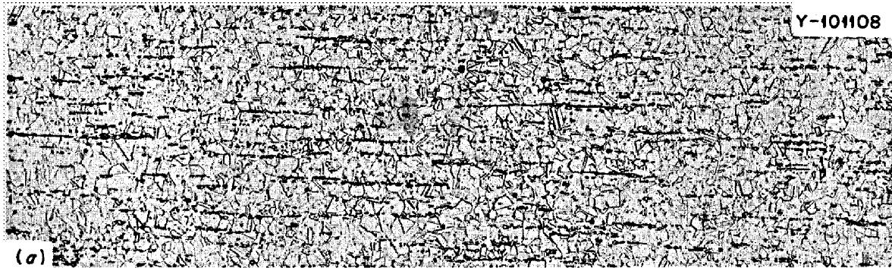

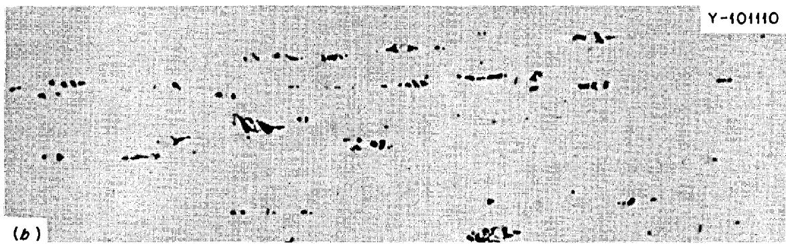

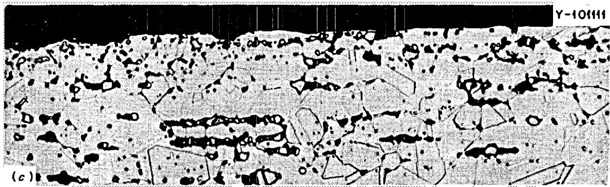

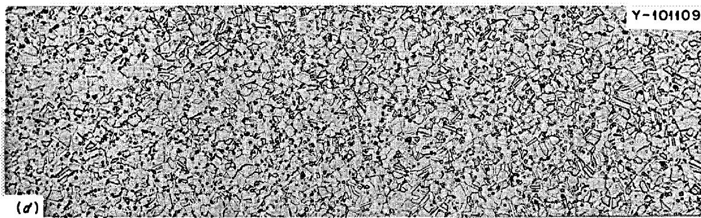  
Fig. 13.1. Typical Photomicrographs of As-Received Hastelloy N (Heat 5097) Tubing Used in the MSRE Radiator. (a) Longitudinal view, etched with glyceregia, $100 \times$ ; (b) as-polished longitudinal view, $500 \times$ ; (c) inside edge of tubing etched with glyceregia, $500 \times$ ; (d) cross-sectional view, etched with glyceregia, $100 \times$ .

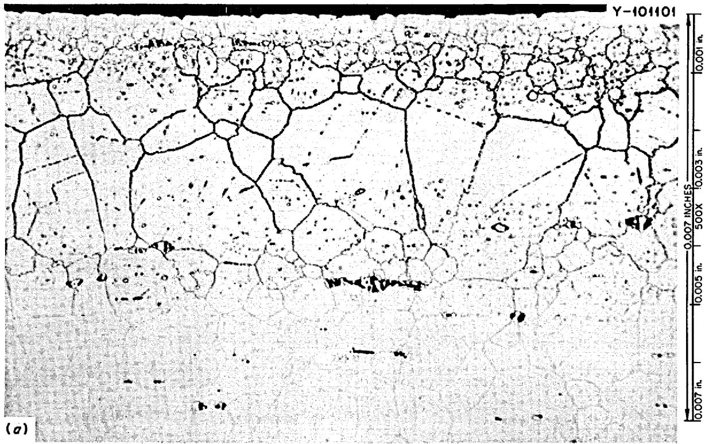

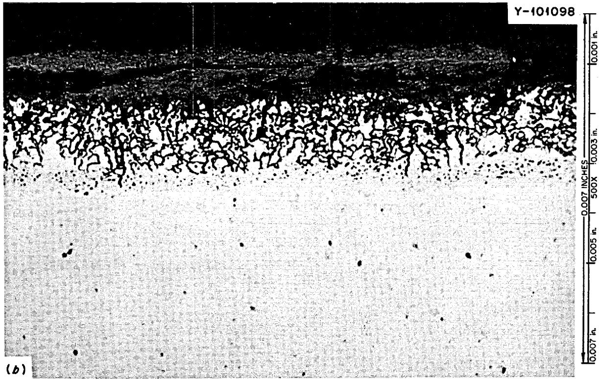  
Fig. 13.2. Microstructures of a Longitudinal Section of Hastelloy N Tubing from the Inlet End of the MSRE Radiator. (a) Inside of pipe wall, etched with glyceregia; (b) outside of pipe wall, as polished.

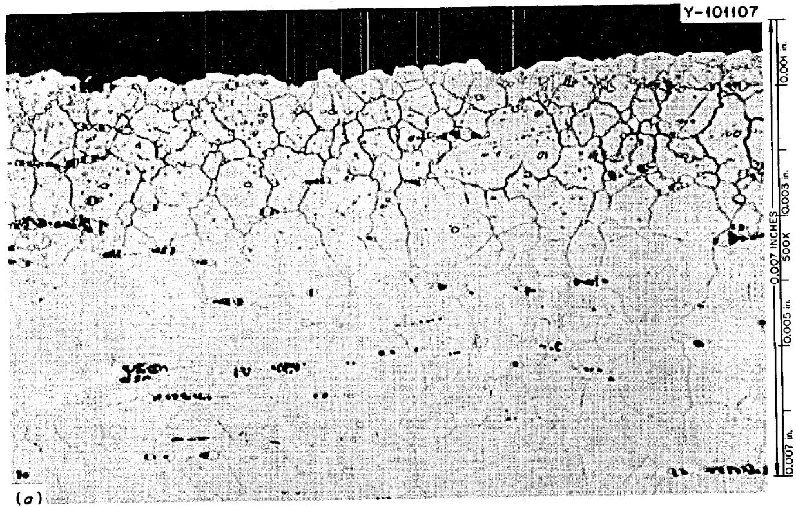

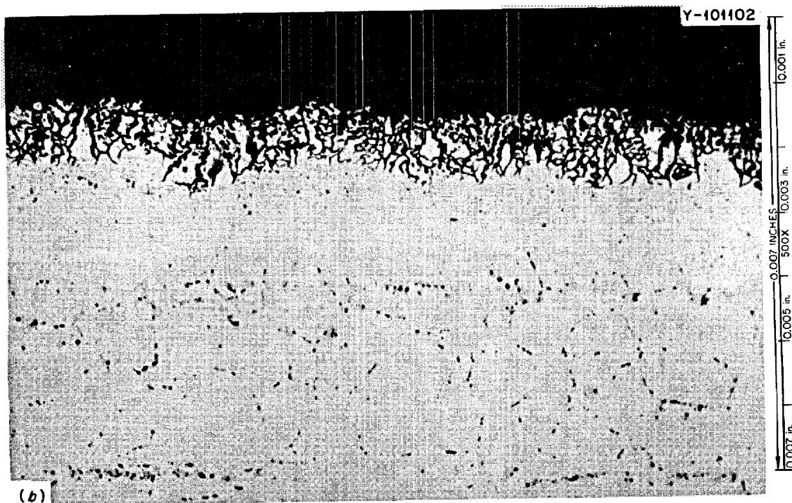  
Fig. 13.3. Microstructures of a Longitudinal Section of Hastelloy N Tubing from the Outlet End of the MSRE Radiator. (a) Inside of pipe wall, etched with glyceregia; (b) outside of pipe wall, as polished.

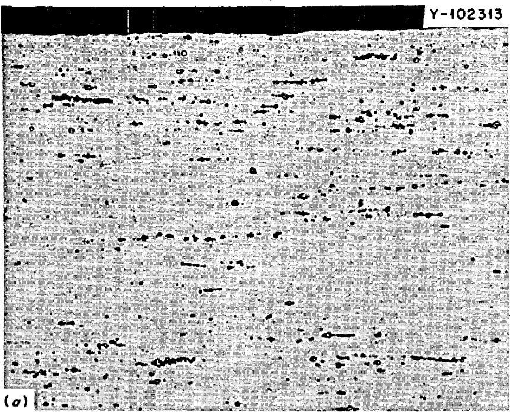

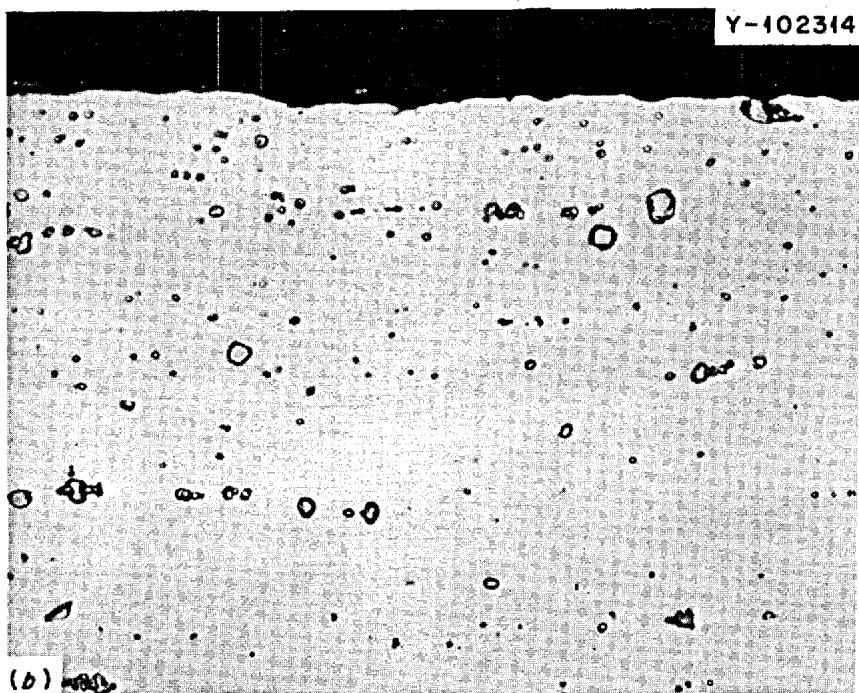  
Fig. 13.4. Photomicrographs of As-Received Tubing Used in the MSRE Radiator. Etched electrolytically in aqueous solution of $5\%$ sodium citrate, $5\%$ sodium acetate, $1\%$ citric acid, $1\%$ potassium thiocyanate. $600\mathrm{mV}$ , $1.5\mathrm{mA}$ for 15 sec plus $700\mathrm{mV}$ , $2.5\mathrm{mA}$ for 10 sec. Magnification: (a) $250\times$ , (b) $1000\times$ .

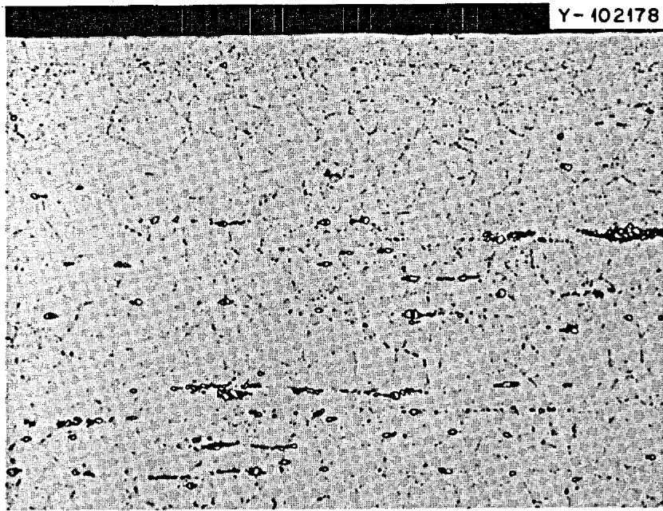

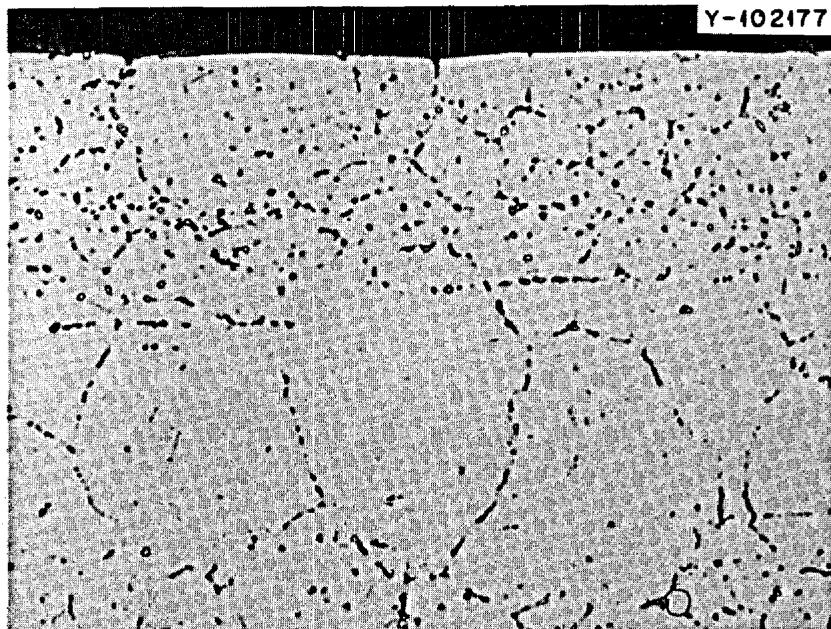  
Fig. 13.5. Photomicrographs of Tubing from the Inlet End of the MSRE Radiator. Etched electrolytically in an aqueous solution of $5\%$ sodium citrate, $5\%$ sodium acetate, $1\%$ citric acid, $1\%$ potassium thiocyanate. $700\mathrm{mV}$ for 10 sec, started at $8\mathrm{mA}$ and dropped to $4\mathrm{mA}$ .

Table 13.2. Tensile Properties at $25^{\circ}\mathrm{C}$ of Tubing from the Outlet End of the MSRE Heat Exchanger and As-Received Material   

<table><tr><td></td><td>Yield Stress (psi)</td><td>Ultimate Tensile Stress (psi)</td><td>Fracture Strain, % in 2 in.</td><td>Reduction in Area (%)</td></tr><tr><td>As received</td><td>63,500</td><td>123,100</td><td>52.0</td><td>44.1</td></tr><tr><td>Heat exchanger</td><td>64,600</td><td>123,800</td><td>38.8</td><td>29.5</td></tr></table>

# 13.2 EXAMINATION OF THERMOCOUPLE WELLS FROM THE MSRE COOLANT CIRCUIT

H.E.McCoy B.McNabb

Two thermocouple wells from the inlet and outlet 5-in. coolant lines to the radiator were removed and examined. The inlet well after it was removed by cutting with a coated welding electrode is shown in Fig. 13.6. The oxidized appearance and the metal fragments on the part arose from the cutting operation. The geometry of the well can be described with the aid of Fig. 13.6. The circular piece of material is part of the 5-in. pipe wall. The thermocouple well was machined from bar stock so that it extended about 3 in. into the flowing salt stream. The well was machined with a

protrusion that was to be field ground and welded to the 5-in. pipe. The cross-sectional view of part of the inlet well in Fig. 13.7 makes the geometry more evident. The pipe wall, the welds, and the thermocouple well are evident.

Metallographic examination of the mounted cross section shown in Fig. 13.7 revealed that the weld had cracked on the salt side of the pipe. The cracks on both of the polished surfaces in Fig. 13.7 are shown in Fig. 13.8. In the worst case the cracks penetrate to a depth of about 3 mils. The remaining half of the well was cleaned by acid etching to remove the metal from the cutting operation, and the weld was checked with dye penetrant. A photograph of the weld with dye still present is shown in Fig. 13.9. Note that the crack as indicated by the dark color extends almost completely around the weld. There is also an area where complete penetration of the root pass did not occur. We propose that the cracks formed as the weld was made due to the poor fitup of the parts to be welded. The welds were not stress relieved, and the fact that the cracks did not penetrate further attests to the lack of stress and crevice corrosion in lithium-beryllium fluoride salts.

We did not section the outlet well, but we did clean the weld and examine it with dye penetrant. No cracks were observed.

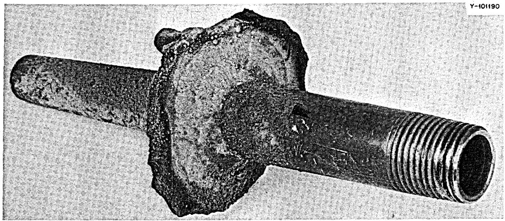

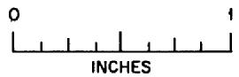  
Fig. 13.6. Photograph of Thermocouple Well Removed from the Inlet Line to the Radiator of the MSRE. Much of the discoloration and the fragments of metal resulted from cutting the part out with a coated welding electrode.

The outside surface of the 5-in. pipe was exposed to air and was oxidized. Figure 13.10 shows the spotty nature of the oxide and the fact that it has a maximum thickness of about 3 mils.

A cross section from the bottom of the well was examined. A macroscopic view of this section is shown in Fig. 13.11. The inside of the well was prepared by drilling, and the pointed shape of the drill is still apparent at the bottom. The weld metal deposit on the bottom was made to ensure that salt did not leak along the carbide stringers. The amount of oxidation at the bottom of the well was greater than that further up the well. The transition to the thinner oxide about $\frac{1}{8}$ in. from the bottom is apparent in Fig. 13.11. Figure 13.12a shows the oxide layer of about 5 mils at the bottom of the well, and Fig. 13.12b shows the abrupt transition that took place about $\frac{1}{8}$ in. from the

bottom. We suggest that this difference may have been due to the bottom of the well not being as clean as the sides. Some lubricant would have been used during the drilling.

A further significant observation was that the surfaces of the well exposed to the salt looked quite similar to those of surveillance samples removed from the MSRE (Fig. 13.13). We have previously attributed this modified surface structure to cold working from machining and have shown that it can be produced in the absence of salt. The structure likely results from carbides forming on the slip bands produced by machining. Thus there is no evidence of corrosion of this part.

$^{1}$ H. E. McCoy, An Evaluation of the Molten-Salt Reactor Experiment Hastelloy N Surveillance Specimens - Fourth Group, ORNL-TM-3063 (to be published).

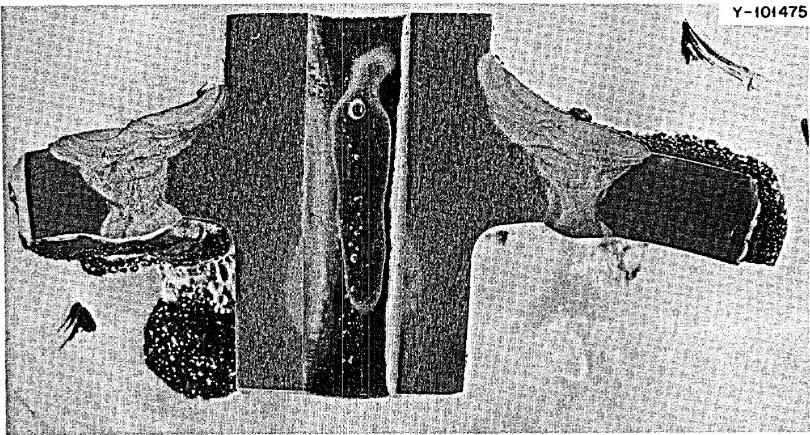  
Fig. 13.7. Cross Section of Thermocouple Well from the Inlet Line to the MSRE Radiator. From left to right the components are the 5-in. coolant line, the weld, and the thermocouple well. The side having the most weld metal was exposed to air, and the other side was exposed to coolant salt.

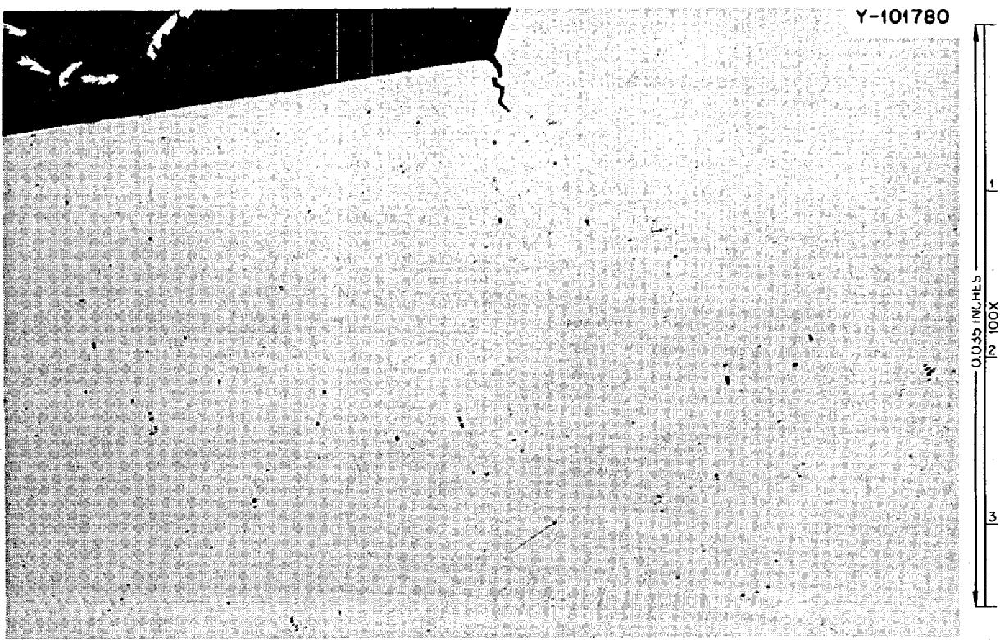

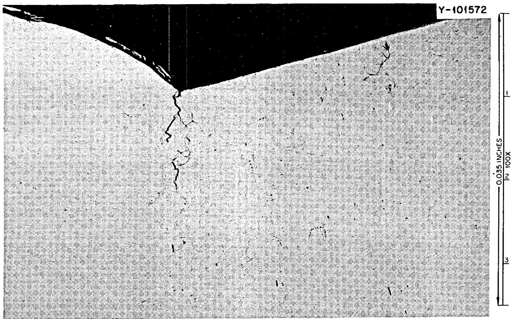  
Fig. 13.8. Photomicrographs of Cracks in the Root Pass of the Inlet Weld. The cracks occur at the fusion line and likely result from the poor fitup of the parts. As polished.

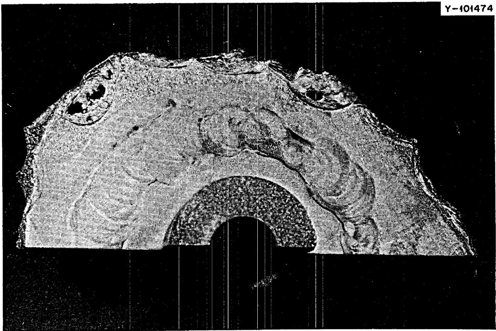  
Fig. 13.9. Photograph of the Underside (Salt Side) of Half of the Thermocouple Well from the Inlet Line to the MSRE Radiator. The part was acid etched and coated with dye penetrant. Note the indication of a crack around most of the weld and an incomplete root pass region.

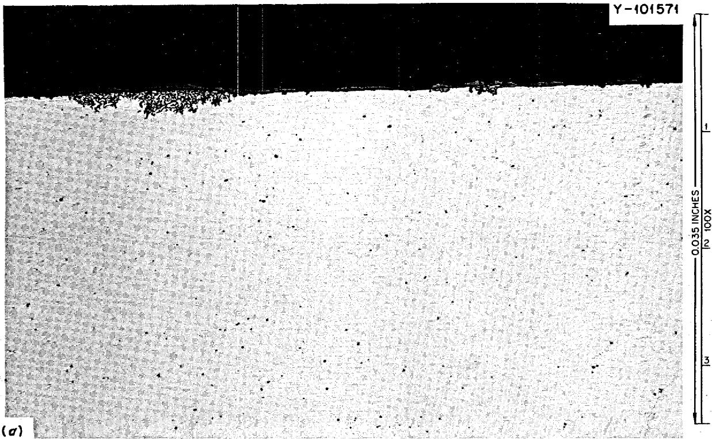

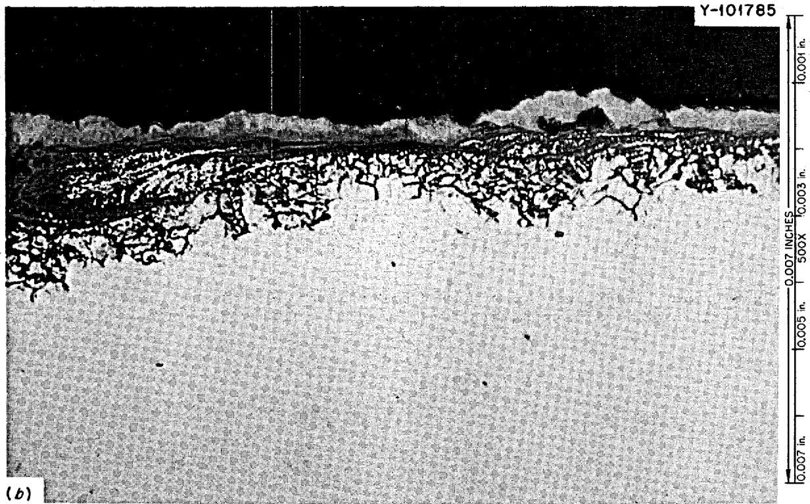  
Fig. 13.10. Photomicrographs of the Oxide Formed on the Outside of the 5-in. Coolant Line. (a) $100 \times$ , (b) $500 \times$ . As polished.

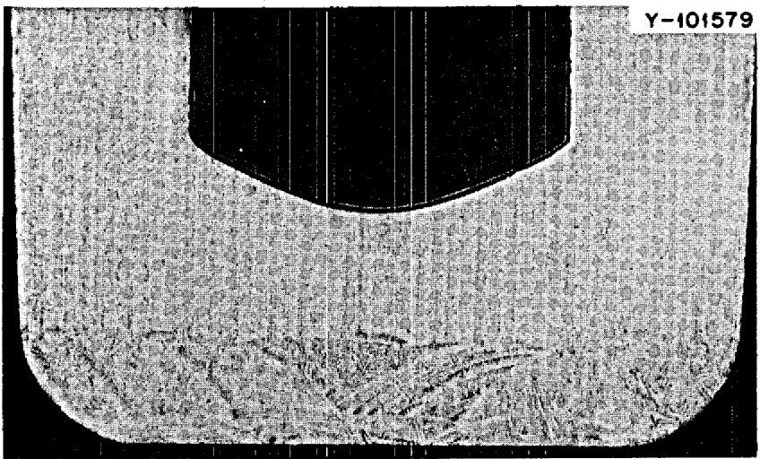  
Fig. 13.11. Photograph of the Cross Section of the Inlet Thermocouple Well. The outside was exposed to coolant salt and the inside contained the thermocouple in an air environment. $8 \times$ , as polished.

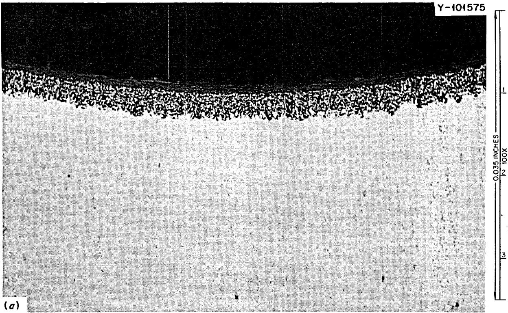

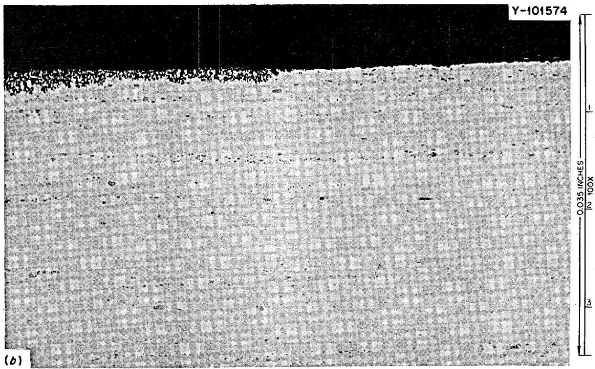  
Fig. 13.12. Photomicrographs of Oxide Inside the Inlet Thermocouple Well. (a) Oxide at the bottom; (b) transition in oxide depth about $\frac{1}{8}$ in, from bottom of well. As polished.

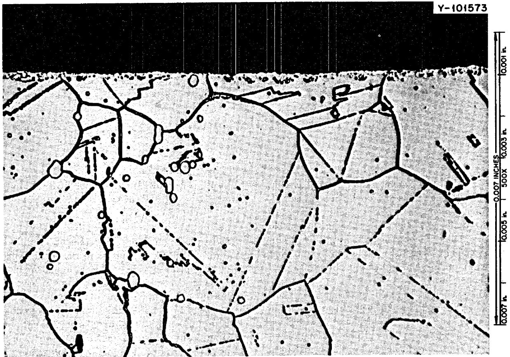  
Fig. 13.13. Photomicrograph of the Outside of the Inlet Thermocouple Well That Was Exposed to Coolant Salt. Note the modified layer near the outer surface. Etchant, glyceregia.

# 14. Graphite Studies

W. P. Eatherly

The purpose of the graphite studies is to develop improved graphite suitable for use in molten-salt reactors. The graphite in these reactors will be exposed to high neutron fluences and must maintain reasonable dimensional stability and mechanical integrity. Furthermore, the graphite must have a fine pore texture that will exclude not only the molten salt but also gaseous fission products, notably $^{135}\mathrm{Xe}$ .

Additional materials supplied by vendors or fabricated at ORNL continue to be initiated into the evaluation program. Several of these materials are being irradiated in order to develop further information on damage mechanism as it depends on raw materials. Other samples are being investigated because of microstructural similarities to the most damage-resistant materials heretofore irradiated. In addition, studies have been initiated on the chemistry of raw materials and their carbonization aimed at establishing a better basis for the fabrication studies.

A second new program recently initiated is the investigation of thermal conductivity changes due to irradiation. Because the rate of damage is a function of temperature in the higher ranges expected in molten-salt reactors, changes in thermal conductance can lead to increased graphite temperatures and possibly enhanced damage rates. Samples have been prepared for preirradiation measurements, and irradiations are planned in early 1971.

Results on irradiated base structures and pyrolytically impregnated structures continue to indicate a steady deterioration in permeability and imply the generation of new pore structures. This is to say, regardless of changes occurring in the original pore structure, there is an opening up of new pores induced by radiation damage. Conversely, pyrolytically coated samples (as distinct from pyrolytically impregnated samples) continue to look very promising, at least up to fluences of $1.6 \times 10^{22}$ neutrons/cm $^2$ ( $E > 50 \mathrm{keV}$ ), the maximum to which they have been exposed.

# 14.1 PROCEDURE OF NEW GRADES OF GRAPHITE

W. H. Cook

We have continued our procurement of different grades of graphite in our effort to obtain those most resistant to neutron radiation damage and those that will extend our knowledge about the behavior of graphite in neutron irradiation. All materials specifically sought by us or submitted to us by graphite producers (governmental, universities, or commercial) are given initial evaluation tests to determine if they justify extensive evaluation. As our work progresses, the number of samples that constitute untested grades of graphite steadily decreases.

We recently acquired eight additional grades of graphite that are being given initial evaluations. These are grades VQMB, GCMB, TS-995, P-03, HS-82, H413, H414, H415, and 1076. Grades VQMB and GCMB, which are pitch-coke-based and Gilsonite-coke-based materials, respectively, will not be included in our irradiation program because we already have data on these types of graphites. Grade TS-995 is a high-strain-to-fracture type of graphite. Grades P-03 and 1076 are near isotropic grades. Grade HS-82 is a high-strength graphite supplied by Stackpole Carbon Company. Grades H413, H414, and H415 are mesophase types.

To acquire the most irradiation-resistant grade of graphite, it is necessary that we know more about the source materials. Such information is often proprietary and unobtainable for some commercial or developmental materials. Also, as a part of the evaluation of the

new binders that are being developed, it is necessary that reference fillers be used. Toward this end we have begun to acquire some filler materials. We now have Robinson (Air-Blown) coke, $^{1}$ graphitized Robinson (Air-Blown) coke, $^{1}$ grade JOZ graphite flour, $^{3}$ Santa Maria coke, $^{4}$ PXE-5Q1S, $^{5}$ and PXA-5Q1S. $^{5}$ Initial fabrication studies with a conventional coal tar pitch and the graphitized Robinson coke, the JOZ graphite flour, and the Santa Maria coke have been reported. $^{6}$ Work is planned with the ungraphitized Robinson coke, grade PXE-5Q1S, and grade PXA-5Q1S, all of which approach being isotropic filler materials. Grade JOZ was obtained by crushing and grinding fabricated bodies of grade JOZ graphite.

# 14.2 GENERAL PHYSICAL PROPERTY MEASUREMENTS

W. H. Cook

We are in the initial stages of determining the physical properties of pitch-bonded lampblack materials, grades S20, L31, and SA-45, and graphite grades HS-82, 1076, P-03, TS-995, H-413, H414, and H415 described previously. Average bulk (apparent) densities, electrical resistance values, and microstructure observations are summarized in Table 14.1. The lampblack-based materials have low bulk densities, but their irradiation stabilities at low fluences have been surprisingly good. The initial irradiation data on these are given by C. R. Kennedy in Sect. 14.7. The resistivity values for the various graphite grades are typical for these fine-grained, near-isotropic materials.

The maximum mean filler size used in graphites listed in Table 14.1 appeared to be approximately 5 mils, except for the mesophase grades H-413, H414, and H-415, which appeared to be at least twice as large. None of these have pore entrance diameters approaching the desired $1\mu$ or less sought for MSR graphite. Therefore, the pore entrance diameters would have to be decreased for any that showed potential in other properties.

The most interesting and encouraging aspect of the microstructures of the latest graphites received is their strong similarity to those for grades AXF-5Q7 and H337

or H364, which have shown the greatest resistance to neutron damage. Additional evaluations will determine if the potential suggested by the microstructures is warranted.

# 14.3 GRAPHITE FABRICATION: CHEMISTRY

R. A. Strehlow

Irradiation results to date suggest that graphite with improved radiation damage resistance will be one of four types:

1. isotropic graphite with large crystallite size,   
2.isotropicgraphitewithuniformcrystallite size,   
3. "binderless" graphite,   
4. "grainless" isotropic graphite (presumably of very small crystallite size).

It is anticipated that one or all of these rather general types of structure should offer a distinct increase in radiation life. The chemistry studies are directed toward developing the necessary chemical knowledge to fabricate well-characterized samples of these four sorts of graphite for testing purposes.

Graphite is made normally from organic compounds by polymerization and thermal decomposition followed by high-temperature heat treatment. The structure of the product is a relic of those polymeric aggregates formed early in the process. Graphite is customarily made from three general types of carbon precursors: petroleum coke, coal tar, pitch, and gas-furnace carbon blacks.

A twofold approach has been taken to find out to what extent petroleum tars or coal tar pitch can be carbonized to yield the essential isotropy. The first step is to develop new and appropriate characterization techniques. The second is to determine the extent to which carbon structures can be controlled by chemical means. A study of the applicability of high-temperature centrifugation has been conducted which was intended to approach these two goals simultaneously. Samples of about 1-g size of three commercial pitches were centrifuged in nickel crucibles at temperatures of up to $525^{\circ}\mathrm{C}$ and for times of up to 6 hr. The samples were examined metallographically after longitudinal sectioning of the capsules. A sample low-softening-point pitch (grade 15V of Allied Chemical Corporation) is shown in Fig. 14.1 after a 1-hr centrifugation at $425^{\circ}\mathrm{C}$ . Material at the bottom of the capsule which apparently had not dissolved at $425^{\circ}\mathrm{C}$ was present in an amount of perhaps 5 to $8\%$ . On top of this "insoluble" was found a thin layer of anistropic material. On top of the thin layer,

the glassy pitch mixture was basically featureless except for a few artifacts probably due to shrinkage. Closer examination of the thin layer was made and is shown in Fig. 14.2. This shows the now well-known spheres of "mesophase," or liquid crystal material, formed from the melt and in the process of coalescing into a semicarbon, semiliquid material. Over this 1-hr period, flow and reaction had evidently occurred leading to a

more highly reticulated set of interference patterns under polarized light.

A sample of a medium-melting pitch (type 30M, Allied Chemical Corporation) was centrifuged and appeared to be quite similar except for the presence of a much greater amount of "insoluble" material, perhaps 18 to $20\%$ by volume. The coalesced mesophase was quite similar to that observed for the softer 15V pitch.

Table 14.1. Bulk (Apparent) Densities and Electrical Resistivities of Pitch-Bonded Lampblack Materials and Several Grades of Graphitea   

<table><tr><td>Grade</td><td>Bulk 
(Apparent) 
Density 
(g/cm3)</td><td>Orientationb</td><td>Nominal 
Resistivity 
(μΩ·cm)</td><td>Comments on Microstructure</td></tr><tr><td colspan="5">Pitch-Bonded Lampblack Materials</td></tr><tr><td rowspan="2">S20c</td><td></td><td>L</td><td>5150</td><td>Sharp angular particles with extremely fine 
domainsdwithin the particles and very little 
visible binder.</td></tr><tr><td></td><td>W</td><td></td><td></td></tr><tr><td rowspan="2">L31</td><td>1.61(36)</td><td>L</td><td>2890(4)</td><td>Same as grade S20 except that the domains 
may be somewhat easier to resolve.</td></tr><tr><td></td><td>W</td><td>2900(4)</td><td></td></tr><tr><td rowspan="2">SA-45</td><td>1.53(42)</td><td>L</td><td>6130(12)</td><td></td></tr><tr><td></td><td>W</td><td>8580(6)</td><td></td></tr><tr><td colspan="5">Graphite</td></tr><tr><td rowspan="2">HS-82</td><td>1.71(36)</td><td>L</td><td>1530(6)</td><td>Appears to be a body of fine-grained, gap-
graded particles with random orientation 
of domains within the particles.</td></tr><tr><td></td><td>W</td><td>1540(6)</td><td></td></tr><tr><td rowspan="2">1076</td><td>1.79(30)</td><td>L</td><td>1260(6)</td><td>The domains are small and very randomly 
oriented within the particles. Some 
shrinkage cracks adjacent to some particles.</td></tr><tr><td></td><td>R</td><td>1300(6)</td><td></td></tr><tr><td rowspan="2">P-03(A)e</td><td>1.84(36)</td><td>L</td><td>1370(36)</td><td>The particles appear to have some anisotropy 
within themselves, but the particles are 
positioned so that the body is anisotropic.</td></tr><tr><td></td><td>R</td><td>1310(3)</td><td></td></tr><tr><td rowspan="2">P-03(B)e</td><td>1.85(36)</td><td>L</td><td>1435(36)</td><td></td></tr><tr><td></td><td></td><td>1320(3)</td><td></td></tr><tr><td>TS-995</td><td>1.86(1)</td><td></td><td></td><td>The domains within the grains are blocky 
but anisotropic. The bulk material does not 
show an anisotropic trend.</td></tr><tr><td>H-413</td><td>1.89(2)</td><td></td><td></td><td>The domains show some orientation within 
the particles and take a form similar to 
ragged, wave stippling. The particles are 
large and angular with scattered spheroid 
structure.</td></tr><tr><td>H-414</td><td>1.92(2)</td><td></td><td></td><td></td></tr><tr><td>H-415</td><td>1.93(2)</td><td></td><td></td><td></td></tr></table>

$a$ The numbers in parentheses are the number of values averaged for the value given.   
The electrical resistance was determined in a direction parallel with the orientation indicated for the original stock from which the specimens were taken: $\mathbf{L} = \mathbf{length}$ , $\mathbf{W} = \mathbf{width}$ , $\mathbf{R} = \mathbf{radius}$ .   
$c$ Fired at a carbonizing temperature.   
$d_{\text{Regions of like crystallite orientation}}$ .   
eTwo stock pieces were received which were designated as A and B.

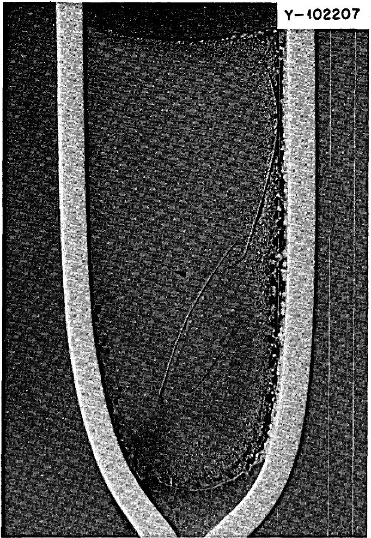  
Fig. 14.1. 15V Pitch Centrifuged at $425^{\circ}\mathrm{C}$ for 1 hr.

High-temperature pitch (type 350HR, Allied Chemical Corporation) was found, rather surprisingly, to contain very little more insolubles at $425^{\circ}\mathrm{C}$ than the medium 30M pitch showed. This was unexpected, since the standard chemical solubility tests for benzene-insoluble components are generally present in greater amounts as the softening range of the pitch increases, and one might anticipate a parallel increase of high molecular species which presumably dominate the insoluble species found in this study. An added distinction for the high-temperature material was that eight or nine times as much coalesced material was found as in the medium- or low-temperature pitches. This is shown in Fig. 14.3.

Centrifugation for $6\mathrm{hr}$ at $425^{\circ}\mathrm{C}$ produced the sample shown in Fig. 14.4. Here and in the highermagnification micrograph, Fig. 14.5, one can see a structure of insoluble-free mesophase which suggests the hour-by-hour history of pitch coke formation. After formation and settling of the small spheres of sizes up to a $20 - \mu$ diameter, coalescence is followed by a continued gas evolution which slowly causes contraction, flow, and an increase in mesophase viscosity. A bubble is seen rising in the now well-ordered carbon. This material would be a precursor of highly anisotropic graphite. The conclusion seems unavoidable that for MSR use where isotropy is crucial, flow of the type evidenced in these samples must be avoided.

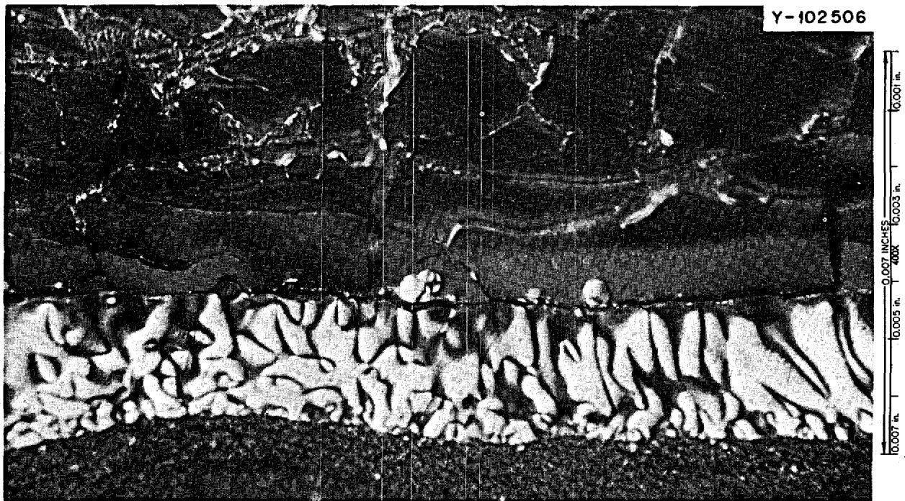  
Fig. 14.2. Detail of Sample Shown in Fig. 14.1. 400X.

Two samples of pitch 30M and 350HT were heated to $530^{\circ}\mathrm{C}$ and cooled at about $200^{\circ}\mathrm{hr}$ . The samples in Figs. 14.6 and 14.7 show that the amount of insoluble fraction is comparable in each of these. Both of the coalesced mesophase samples had flowed extensively. The difference in gas bubble shape is probably due to an intrinsic difference in viscosity, although a slight difference in thermal history may be a factor.

Whether fluidized bed polymerization and decomposition techniques can be used in developing new isotropic cokes or whether techniques of increasing the viscosity

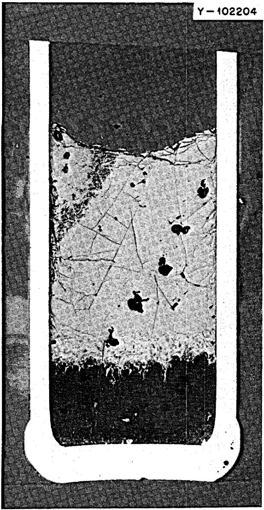  
Fig. 14.3. Capsule with 350 HT Pitch Centrifuged 1 hr at $425^{\circ}\mathrm{C}$ .

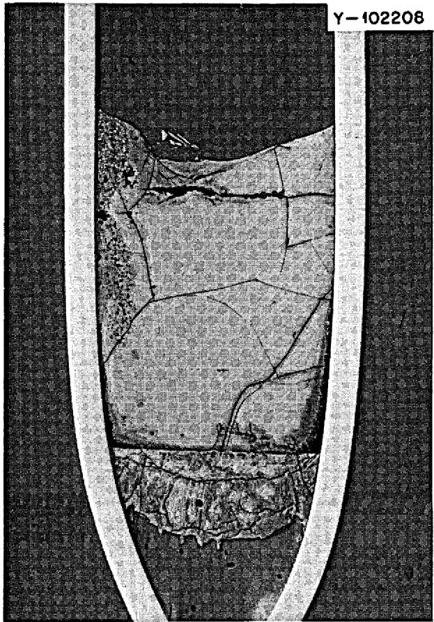  
Fig. 14.4. Capsule of 30 Medium Pitch Centrifuged at $425^{\circ}\mathrm{C}$ for 6 hr.

of coalesced material still more than shown in the high-temperature pitch case would be beneficial remains to be determined. In the limit, of course, increase of viscosity would yield a material which approaches the character of thermosetting resins. These have been of great value in specialty carbon manufacture.

Parallel to the study of the complex carbon precursors a study of model compound carbonization has been conducted for the two reasons of developing better analytical techniques and to attempt carbonizations of the most highly characterized materials possible. Model compound carbonization has been used to simulate the polymerization-decomposition routes of the more usual graphite precursors. A question of the route of carbonization of a frequently used model compound, acenaphthylene, was studied using thin-layer separations of tars formed by pyrolysis of poly-acenaphthylene.

Polyacenaphthylene was prepared by thermal polymerization in air and subjected to inert-atmosphere

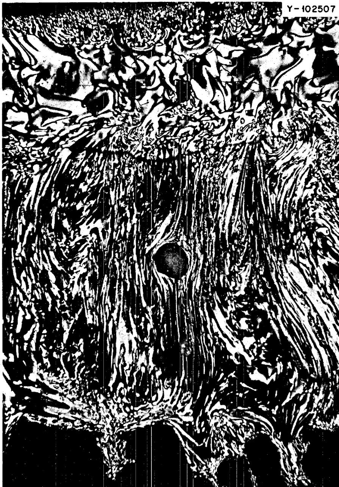  
Fig. 14.5. Detail of Coalesced Mesophase of Sample Shown in Fig. 14.3. $45\mathrm{X}$

carbonization in a temperature gradient furnace. The material was found to "pitchify" rapidly above a temperature of $340^{\circ}\mathrm{C}$ (which thermogravimetry had shown to be the temperature of rapid weight loss). The pitches made in the temperature range from 345 to $355^{\circ}\mathrm{C}$ and 380 to $390^{\circ}\mathrm{C}$ were subjected to thin-layer chromatographic analysis. It was found in this work that the carbonization proceeds dominantly through the dehydrogenated cyclic trimer decacylene. Three conflicting earlier studies8-1,0 can be rationalized in terms of the carbonization conditions, as follows:

8L. Singer and I. Lewis, Carbon 2, 119 (1964).   
9A. G. Sharkey, Jr., J. L. Shultz, and R. A. Friedel, Carbon 4, 375 (1966).   
$^{10}$ E. Fitzer and K. Müller, 8th Biennial Conference on Carbon, Paper S 167, 1967, Buffalo, N.Y.

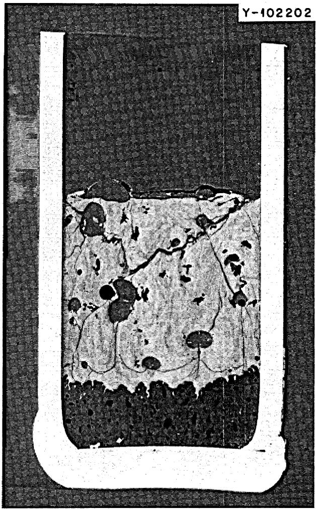  
Fig. 14.6. Medium Pitch (30M) Fully Coalesced by $525^{\circ}\mathrm{C}$ Heat Treatment.

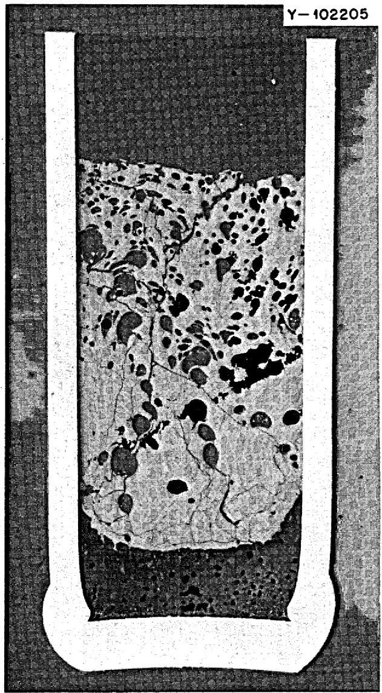  
Fig. 14.7. Hard Pitch (350HT) Fully Coalesced by $534^{\circ}\mathrm{C}$ Heat Treatment.

The work of Singer and Lewis8 was conducted in relatively dilute solution in biphenyl. Their observation of a dimeric intermediate is not inconsistent with the work of Fitzer and Muller,10 who examined, as we did, the nonvolatile residue of a bulk pyrolysis, and who obtained the oxidized cyclic trimer decacycline. The work of Sharkey et al.9 was directed toward the determination of volatile components which were formed. Their finding of acenaphthene agrees with our findings for the volatile material. Such work on model compounds is necessary if highly pedigree materials are to be fabricated for test and is broadly useful in the difficult work of characterizing the more complex

precursors which ultimately may be required for practical materials.

# 14.4 MEASUREMENT OF THE THERMAL CONDUCTIVITY OF GRAPHITE

J.P.Moore D.L.McElroy

Tests of the previously described11 guarded linear heat flow apparatus were completed to the design limit of $700^{\circ}\mathrm{C}$ using Armco iron as a thermal conductivity standard. The percentage deviation of each thermal conductivity measurement from the assumed value for the standard is shown in Fig. 14.8 vs temperature. The upper line represents the results assuming linear heat flow in the longitudinal system. The results are improved substantially by calculating corrections for radial heat flow between the guard cylinder and specimen as shown by the dashed line. The data, as corrected for radial heat exchange, are within $\pm 1.2\%$ of the standard value; since there could be an uncertainty of $\pm 1.5\%$ in the standard sample, the agreement is considered excellent.

Specimens of H337 and Poco AXF graphite are in hand for preirradiation measurements. Following these measurements the specimens will be irradiated in HFIR to various fluences from 550 to $700^{\circ}\mathbf{C}$ to evaluate the effects of irradiation and postirradiation annealing on thermal conductivity.

# 14.5 X-RAY STUDIES

O.B.Cavin J.E.Spruiell12

We have shown previously that the crystalline isotropy is a necessary property of graphites that have potential usage in the core of the MSR.13 We have continued the crystalline anisotropy determinations on experimental materials fabricated at the Y-12 installation as well as new materials received into the group. Listed in Table 14.2 are anisotropy parameters of five materials supplied by other installations. Our BAF (Bacon anisotropy factor) values, as calculated from the $R$ parameters, agree quite closely with most of those determined by the suppliers. The reconstituted

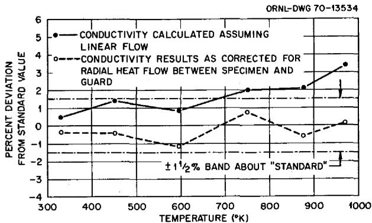  
Fig. 14.8. Calibration of Thermal Conductivity Apparatus.

Table 14.2. Anisotropy Values Determined by Sphere Technique   

<table><tr><td>Grade</td><td>Form</td><td>RII</td><td>R⊥</td><td>BAFa</td><td>BAFB</td></tr><tr><td>CSFc</td><td>Extruded</td><td>0.709</td><td>0.646</td><td>1.217</td><td>1.42</td></tr><tr><td>TSXc</td><td>Extruded</td><td>0.771</td><td>0.615</td><td>1.681</td><td>1.88</td></tr><tr><td>TSGBFc</td><td>Extruded</td><td>0.720</td><td>0.640</td><td>1.284</td><td>1.28</td></tr><tr><td>ABS-5d</td><td>Extruded</td><td>0.673</td><td>0.664</td><td>1.029</td><td>1.04</td></tr><tr><td>AAQ-1d</td><td>Extruded</td><td>0.726</td><td>0.637</td><td>1.323</td><td>1.36</td></tr><tr><td>Y588e</td><td>Extruded</td><td>0.686</td><td>0.657</td><td>1.092</td><td></td></tr><tr><td>Y586f</td><td>Extruded</td><td>0.675</td><td>0.663</td><td>1.038</td><td></td></tr><tr><td>9948</td><td>Molded</td><td>0.657</td><td>0.672</td><td>1.046</td><td></td></tr><tr><td>CGB</td><td>Extruded</td><td>0.796</td><td>0.602</td><td>1.953</td><td></td></tr></table>

$a_{\mathrm{BAF}}$ for extruded material $= R_{\parallel} / 2(1 - R_{\parallel})$ ; for molded material $[2(1 - R_{\parallel})] / R_{\parallel}$ . Parallel and perpendicular refer to the symmetry axis of the material.   
$b$ Determined by BNWL and LASL.   
${}^{c}$ Supplied by W. J. Gray of BNWL.   
$d_{\mathrm{Supplied}}$ by M. C. Smith of LASL.   
$e_{\text{Reconstituted AXF filler}}$ .   
$f_{\mathrm{Reconstituted 2033 filler}}$

and extruded AXF (Y586) has essentially the same $R$ parameters as those previously reported for AXF ( $R_{\parallel} = 0.673, R_{\perp} = 0.663$ ).

In addition to the anisotropy determinations, we are analyzing the Bragg diffraction maxima to more accurately determine the lattice parameters, crystallite size, and percent of less-graphitic material. After applying all the necessary corrections to the diffraction data, the peaks arising from the (00l) diffraction always have a long low-angle tail. The length and intensity of this tail is caused by the presence of less-graphitic material in the sample. We have assumed that the high-angle side of the diffraction maxima is representa

tive of the peak shape obtained from the more-graphitic material. By using this assumption and unfolding a symmetrical peak about the maxima, the peak is separated into two portions, as shown in Fig. 14.9. The ratio of the integrated intensities of the low-angle contribution to the composite peak is directly proportional to the amount of less-graphitic carbon present. The average interplanar spacing of this material is also determined from the peak position. A summary of results obtained on four grades of Poco graphite by this technique is shown in Table 14.3. The lattice parameter $(c)$ of the more-graphitic material is slightly less than that reported previously for the composite15 and is due to the corrections and unfolding applied to the peak. This is an additional parameter which can be used to follow the effect of filler and fabrication variables.

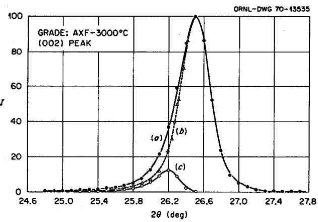  
Fig. 14.9. Plot of X-Ray Intensity Diffracted from the (002) Planes of AXF Graphite Heated to $3000^{\circ}\mathrm{C}$ . $(a)$ The composite peak, $(b)$ the symmetrical contribution from the better graphitized material, and $(c)$ the contribution from the less graphitic material.

Table 14.3. Lattice Parameters and Amount of Less-Graphitic Material Present in Poco Graphites   

<table><tr><td>Sample</td><td>a (110) (Å)</td><td>c (002)a (Å)</td><td>c (002)b (Å)</td><td>Percent of Less-Graphitic Material</td></tr><tr><td>AXF</td><td>2.457</td><td>6.745</td><td>6.826</td><td>10.4</td></tr><tr><td>AXF-3</td><td>2.459</td><td>6.725</td><td>6.803</td><td>9.9</td></tr><tr><td>AXF-5QBG</td><td>2.459</td><td>6.728</td><td>6.809</td><td>11.2</td></tr><tr><td>AXF-5ABG-3</td><td>2.459</td><td>6.728</td><td>6.806</td><td>8.6</td></tr></table>

${}^{a}$ Lattice parameter of most-graphitic material.   
$b$ Lattice parameter of less-graphitic portion.

In addition to continuing to study the variations in crystalline parameters, we plan to look at variations, if any, in the anisotropy of materials subjected to an irradiation environment. These parameters obtainable from polycrystalline graphites will better help us to characterize the starting materials and to understand the effects of neutron irradiation at high fluences.

# 14.6 REDUCTION OF GRAPHITE PERMEABILITY BY PYROLYTIC CARBON SEALING

C. B. Pollock

We have been studying techniques by which commercially available graphite can be sealed with pyrolytic carbon so as to exclude fuel salts and gaseous fission products. Experiences with the MSRE have demonstrated that graphite can be manufactured by conventional techniques so as to exclude fuel salts, but current models indicate that the graphite will not exclude significant portions of $^{135}\mathrm{Xe}$ unless the average accessible pore diameter can be reduced to less than $0.1\mu \mathrm{m}$ . A technique for reducing the average pore size to the desired level was developed at this laboratory.[16] The open pores in graphite are plugged with pyrolytic carbon in a vacuum-pulse gas impregnation process.

Graphite processed in this manner has been irradiated in the HFIR facility to a peak dose of $2.8 \times 10^{22}$ neutrons/cm $^2$ ( $E > 50 \mathrm{keV}$ ) at a temperature of $700^{\circ} \mathrm{C}$ . A plot of helium permeability as a function of fluence is shown in Fig. 14.10. An equation of the form $\log F = A + B \Phi$ can be used to describe changes in the helium permeability $F$ as a function of the fluence $\Phi$ . Dimensional changes are beginning to accelerate, and at peak fluence they exceed dimensional changes for unim-pregnated base stock by a factor of 2. Figure 14.11 is a plot of fractional length and diameter changes as a function of fluence for gas-impregnated Poco graphite and base stock material irradiated in HFIR experiments.

We have continued to investigate pyrolytic carbon coatings as a means of sealing graphite for molten-salt applications. The last irradiation experiments contained eight samples coated with pyrolytic carbon derived from propylene. The coatings were deposited at $1300^{\circ}\mathrm{C}$ in a fluidized-bed furnace. The carbon density was 1.85 g/cc, and coating thickness ranged from 3 to 5 mils. The samples were all sealed to helium permeabilities of less

than $10^{-9} \mathrm{~cm}^2/\mathrm{sec}$ . The samples received fast-neutron doses ranging from 6 to $16 \times 10^{22}$ neutrons/cm $^2$ ( $E > 50 \mathrm{keV}$ ) at a temperature of $700^{\circ} \mathrm{C}$ . One sample (Great Lakes grade H 337) cracked during the test, and two

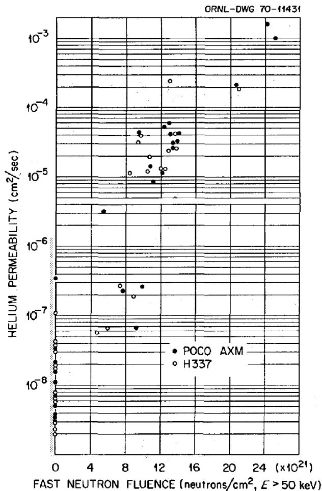  
Fig. 14.10. The Effect of Neutron Irradiation at $700^{\circ}\mathrm{C}$ on Helium Permeability.

samples (Poco AXM) were damaged near the end of the samples for reasons unknown; their helium permeabilities were quite high. The other five samples had postirradiation helium permeabilities of less than $2 \times 10^{-8} \, \mathrm{cm}^3/\mathrm{sec}$ and virtually no dimensional changes. Table 14.4 summarizes the results from this test.

We have continued to evaluate samples of gas-impregnated graphite irradiated in the previous experiment. In order to examine the pore size contours in irradiated samples we utilized a technique developed by R. L. Beatty that consists of a mercury impregnation step at various pressures combined with radiographic examination. We examined a number of irradiated samples along with unirradiated controls. The zone of reduced pore size spectrum near the surface appeared to

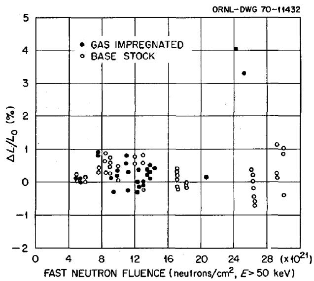  
Fig. 14.11. Fast-Neutron-Induced Dimensional Changes in Poco AXM Graphite.

Table 14.4. Effect of Fast-Neutron Irradiation at ${700}^{ \circ  }\mathrm{C}$ on Pyrolytic-Carbon-Coated Graphite   

<table><tr><td rowspan="2">Sample No.</td><td rowspan="2">Material</td><td colspan="2">Helium Permeability (cm2/sec)</td><td rowspan="2">Fluence × 1021neutrons/cm2(E &gt; 50 keV)</td><td rowspan="2">Comments</td></tr><tr><td>Before</td><td>After</td></tr><tr><td>CI243</td><td>Poco</td><td>5.8 × 10-9</td><td>8.4 × 10-7</td><td>6.33</td><td>Damaged ends</td></tr><tr><td>CI242</td><td>Poco</td><td>1.6 × 10-8</td><td>1.1 × 10-7</td><td>7.37</td><td></td></tr><tr><td>CI249</td><td>Poco</td><td>2 × 10-8</td><td>1.9 × 10-7</td><td>12.10</td><td></td></tr><tr><td>CI245</td><td>Poco</td><td>1.4 × 10-8</td><td>1.7 × 10-8</td><td>12.73</td><td></td></tr><tr><td>CI251</td><td>Poco</td><td>4.1 × 10-9</td><td>1.9 × 10-8</td><td>15.68</td><td></td></tr><tr><td>CI253</td><td>Poco</td><td>1.1 × 10-8</td><td>&gt;10-2</td><td>15.78</td><td>Damaged ends</td></tr><tr><td>CI252</td><td>Poco</td><td>6.8 × 10-9</td><td>9.3 × 10-8</td><td>15.87</td><td></td></tr><tr><td>CR32</td><td>A337</td><td>6.3 × 10-9</td><td>&gt;10-2</td><td>15.47</td><td>Sample cracked</td></tr></table>

be substantially the same for both samples or even greater in the irradiated sample. Figure 14.12 is an example of this comparison.

In order to determine the location and magnitude of the diffusion barrier in the gas-impregnated samples, a series of machining experiments have been initiated. In

these experiments we carefully remove very thin layers of graphite from the sample and then measure the helium leak rate through the remaining wall. Early results have been quite promising. One sample that had an initial wall thickness of 137 mils and a helium leak rate of $1 \times 10^{-7} \, \text{cm}^3/\text{sec}$ was machined down to a

Y-103060A

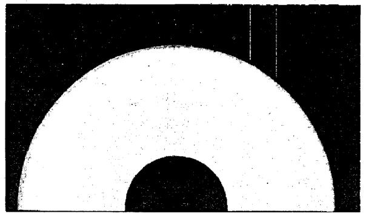  
NON IRRADIATED

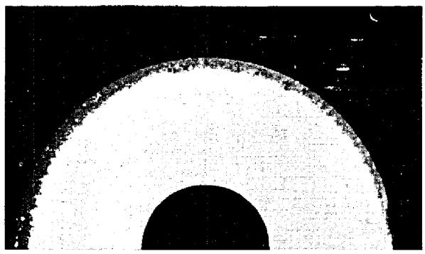  
IRRADIATED   
1000 psi

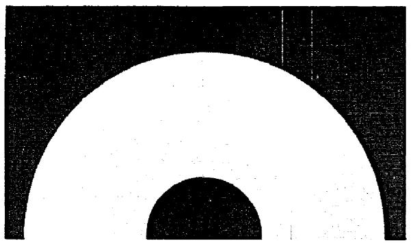  
NON IRRADIATED

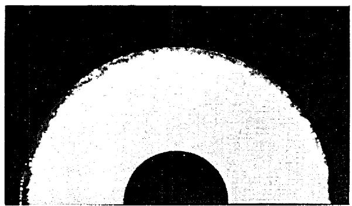  
IRRADIATED   
5000 psi

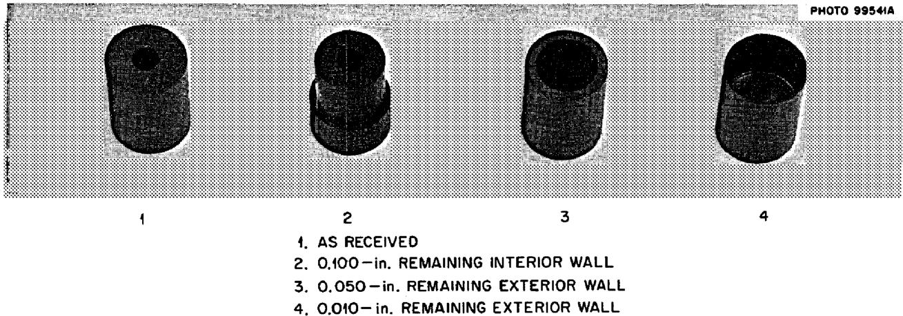  
Fig. 14.12. Effect of Irradiation on Pore Size in Carbon-Impregnated Graphite.   
Fig. 14.13. Machining Study of Impregnated Graphite.

minimum wall thickness of 7 mils, and the leak rate increased only to $4 \times 10^{-7} \mathrm{~cm}^{3} / \mathrm{sec}$ . Figure 14.13 is a typical array of samples used in the machining experiment. In order to examine irradiated samples by this technique we are enclosing our equipment in a plastic cage at the present time.

# 14.7 HFIR IRRADIATION PROGRAM

C. R. Kennedy

Experiments 11 and 12 have been removed from HFIR, samples extracted, and dimensional measurements made. Most of the materials irradiated were new and have not received prior irradiation exposure. Thus these materials have currently received doses no greater than $1.5 \times 10^{22}$ neutrons/cm $^2$ ( $E > 50$ keV). The purposes of these irradiations were to: (1) evaluate various isotropic coke and binder systems, (2) evaluate several specialty grades as potential candidate materials, (3) begin evaluation of lampblack bodies for nuclear use, and (4) determine the effect of irradiation on glassy carbon. Because of the relatively low fluence seen by these samples, the present conclusions must be considered preliminary, and higher exposure results will be needed for confirmation.

We have previously $^{17}$ noted that the major cause for premature failure of the graphite is the inability of the binder region to withstand the differential growth between filler particles. One possible solution to the problem is to seek improved binder systems. We have, therefore, irradiated a number of experimental graphites having isotropic filler particles but using at least four different binders. The irradiation results of graphite grades 586, 588, YMI-3, YM350-10 made with AXF, 2033, and AXM filler materials bindered with Vaccum, isotruxene, and 350 pitch have been reported previously. $^{17}$ The recent results for grades ROB-5, ABS, and 9950, described in Table 14.5, are given in Fig 14.14. We again note that the graphites follow the generalized behavior for high-temperature calcined filler coke graphites independent of the binder.

The irradiation dimensional change results do, however, demonstrate an effect of the method of fabrication on densification. Graphites fabricated by molding shrink isotropically, while extruded graphites like grades 586, 588, and ABS show that the parallel direction shrinks 1 to $1\frac{1}{2}\%$ more than the transverse direction. This implies that even the most crystal-

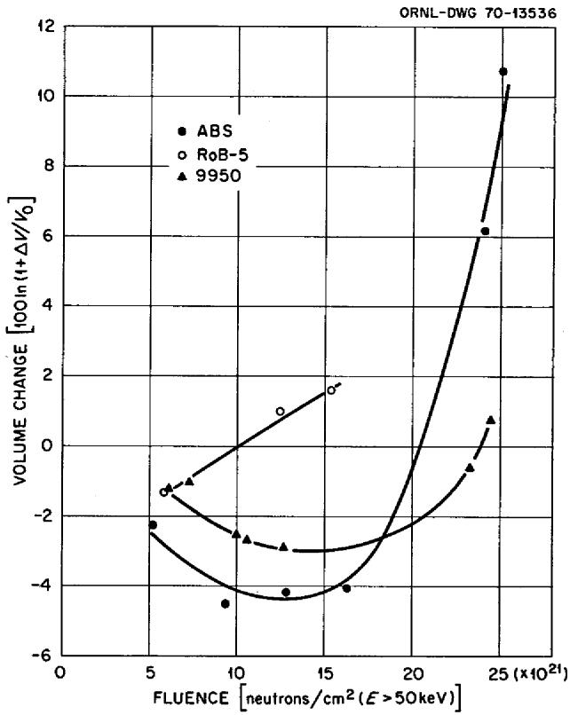  
Fig. 14.14. The Volume Change of Three Isotropic Grades of Graphite. $715^{\circ}\mathrm{C}$ .

lographically isotropic graphite will never have isotropic dimensional changes closer than $1\%$ if fabricated by extrusion.

We have also suggested that one possibility for the increased life of the Poco graphites is the extremely small isotropic entity. The particles themselves are so isotropic that the $a$ -axis expansion cancels the $a$ -axis contraction within the particle and thus does not concentrate the shear at the boundary region. It has been observed that lampblack carbons have extremely fine isotropic structures which should also reduce the strains on the binder regions. These poor graphitic materials have not been suggested for nuclear use because of the extremely high crystallographic growth rates (at least 20 times that of needle coke graphites) reported by Gulf General Atomic.[17] However, we have demonstrated[18] that $15\%$ Thermax additions have had no influence on dimensional stability and also[19] that propylene-derived pyrocarbons, which have very small

Table 14.5. New Isotropic Graphites   

<table><tr><td>Graphite Grade</td><td>Source</td><td>Bulk Density</td><td>Forming Method</td><td>Filler</td><td>Binder</td></tr><tr><td>9950</td><td>Airco Speer</td><td>1.71</td><td>Ma</td><td>Gilsonite or fluid cokeb</td><td>Pitch</td></tr><tr><td>ABS</td><td>LASL</td><td>1.85</td><td>Ec</td><td>Santa Marie and 15% Thermax</td><td>Varcum</td></tr><tr><td>ROB-5</td><td>ORNL</td><td>1.96</td><td>M</td><td>Robinson coke and 15% Thermax</td><td>Pitch</td></tr></table>

$a_{\mathbf{M}} =$ molded.   
$b_{\text{Deducted}}$   
$\pmb{c}_{\mathbf{E}} =$ extruded.

crystallite sizes, are as stable or more stable than any bulk graphite to $2 \times 10^{22}$ neutrons/cm². Therefore we have reopened the question of lampblack as a potential nuclear material, and the results of the first irradiation are very encouraging. We have irradiated materials with final heat treatments from 1000 to $2800^{\circ}\mathrm{C}$ . These materials were characterized by extreme isotropy, and their dimensional behavior is shown in Fig. 14.15. The dimensional stability appears to increase with increasing heat treatment temperatures, the most stable materials being heat treated to $2300 - 2800^{\circ}\mathrm{C}$ while the least stable (the same starting material as L-31) was treated to only $1000^{\circ}\mathrm{C}$ . These materials with others are being irradiated to higher fluences.

The evaluation of two new candidate materials yielded one with promise and one that was highly unstable. Stackpole Carbon Company has provided two materials which originate from anisotropic starting materials but by fabrication technique result in an isotropic bulk graphite. One material, grade 2020, has been reported previously. $^{17}$ The new material, grade HS-82, resulted in dimensional changes of $+1.0\%$ and $-3.7\%$ in orthogonal directions at a fluence of only 1.3 $\times 10^{22}$ neutrons/cm $^2$ ( $E > 50~\mathrm{keV}$ ). These results indicate again gross initial isotropy is not a sufficient criterion to establish isotropic irradiation behavior.

The second new material is grade HL-18 obtained from Airco-Speer Corporation. This material was found to be very isotropic and stable to $1.3 \times 10^{22}$ neutrons/cm². The microstructure of this grade is very similar to the Poco materials and does follow their general behavior up to this fluence. This graphite, unlike the Poco grades, is available in sizes of interest for reactor application.

Glassy carbon was irradiated to confirm the assumption that it would experience significant densification.

After a $10^{22}$ -neutron/cm $^2$ exposure, the actual measurements demonstrated a $33\%$ increase in density, which was much larger than expected. Of four samples irradiated, three were broken due to the severe contrac

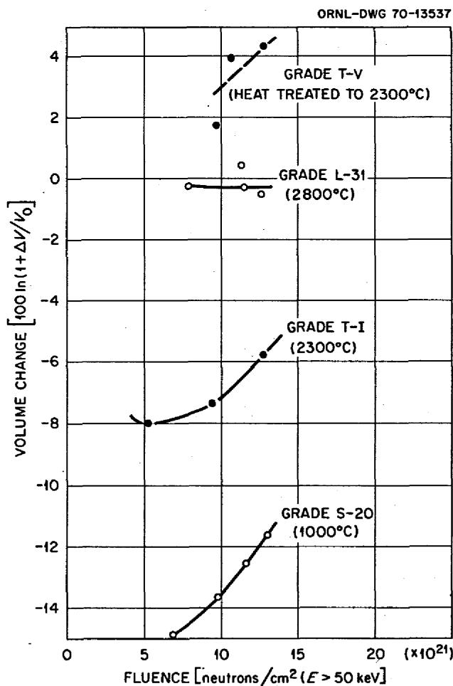  
Fig. 14.15. The Volume Change of Four Lampblack Materials Due to Irradiation. $715^{\circ}\mathrm{C}$

tion and the fourth is now so small it will not fit into the irradiation assembly for further irradiation.

We are, of course, very interested in the alteration in the morphology of structure, particularly the void volume as it affects gas or salt permeation. Assuming for simplicity a model for graphite microstructure consisting of loose stacks of platelike material, one can calculate from BET surface area measurements the height of the hypothetical plates. Therefore, measurements of the BET surface area of selected graphites irradiated in HFIR have been made. The results are

given in Table 14.6. As can be seen by studying the table, the increase in surface area is several times the increase in pore volume and thus must be a result of an increase in number of pores. This has been observed17 in the microscopic observations of the irradiated graphite. We have not as yet been able to determine microscopically the microstructural location of the newly introduced porosity.

If we again make the assumption that the pore structure can be approximated by a loose stack of platelike particles, we can calculate the average distance

Table 14.6. Porosimetry Measurements Made on Irradiated Graphite   

<table><tr><td>Specimen No.</td><td>Grade</td><td>Fluence (φt × 1021)</td><td>BET Surface Area (m2/g)</td><td>Helium Density (g/cm3)</td><td>Open Pore Porosity (%)</td><td>Volume Change (%)</td><td>Layer Height (μ)</td></tr><tr><td>225</td><td>BY-12</td><td>5.0</td><td>0.3</td><td>2.08</td><td>7.2</td><td>-1.84</td><td>3.2</td></tr><tr><td>227</td><td>BY-12</td><td>12.3</td><td>0.2</td><td>2.12</td><td>9.4</td><td>-2.25</td><td>4.7</td></tr><tr><td>0</td><td>RY-12-29</td><td>0</td><td>0.056</td><td>1.94</td><td>2.06</td><td></td><td>18.4</td></tr><tr><td>96</td><td>RY-12-29</td><td>6.9</td><td>0.3</td><td>1.96</td><td>1.0</td><td>-2.03</td><td>3.4</td></tr><tr><td>94</td><td>RY-12-29</td><td>8.9</td><td>0.2</td><td>2.03</td><td>4.9</td><td>-1.50</td><td>4.9</td></tr><tr><td>98</td><td>RY-12-29</td><td>24.9</td><td>4.8</td><td>2.14</td><td>19.2</td><td>9.60</td><td>0.20</td></tr><tr><td>0</td><td>RY-12-31</td><td>0</td><td>0.137</td><td>1.95</td><td>8.21</td><td></td><td>7.5</td></tr><tr><td>88</td><td>RY-12-31</td><td>5.8</td><td>0.1</td><td>2.01</td><td>9.0</td><td>-2.09</td><td>10.0</td></tr><tr><td>90</td><td>RY-12-21</td><td>8.4</td><td>0.1</td><td>1.99</td><td>7.5</td><td>-2.45</td><td>10.1</td></tr><tr><td>86</td><td>RY-12-31</td><td>25.4</td><td>0.7</td><td>2.12</td><td>22.3</td><td>8.45</td><td>1.35</td></tr><tr><td>0</td><td>ATJ-SG</td><td>0</td><td>0.139</td><td>2.01</td><td>10.2</td><td></td><td>7.4</td></tr><tr><td>407</td><td>ATJ-SG</td><td>5.6</td><td>0.4</td><td>2.07</td><td>10.7</td><td>-2.63</td><td>2.4</td></tr><tr><td>399</td><td>ATJ-SG</td><td>8.8</td><td>0.9</td><td>2.09</td><td>10.0</td><td>-4.29</td><td>1.1</td></tr><tr><td>400</td><td>ATJ-SG</td><td>20.3</td><td>2.6</td><td>2.04</td><td>11.3</td><td>-0.54</td><td>0.38</td></tr><tr><td>0</td><td>AXF</td><td>0</td><td>0.34</td><td>2.14</td><td>15.4</td><td></td><td>2.8</td></tr><tr><td>120</td><td>AXF</td><td>5.4</td><td>0.9</td><td>2.08</td><td>13.0</td><td>0</td><td>1.1</td></tr><tr><td>119</td><td>AXF</td><td>34.2</td><td>1.9</td><td>2.07</td><td>15.0</td><td>2.95</td><td>0.51</td></tr><tr><td>129</td><td>AXF-3</td><td>7.2</td><td>0.5</td><td>2.10</td><td>14.3</td><td>0.67</td><td>1.91</td></tr><tr><td>130</td><td>AXF-3</td><td>37.3</td><td>3.3</td><td>2.10</td><td>17.6</td><td>4.45</td><td>0.29</td></tr><tr><td>0</td><td>AXF-5QBG</td><td>0</td><td>0.21</td><td>2.11</td><td>9.7</td><td></td><td>4.6</td></tr><tr><td>0</td><td>AXF-5QBG</td><td>0</td><td>0.41</td><td>2.13</td><td>10.8</td><td></td><td>2.3</td></tr><tr><td>106</td><td>AXF-5QBG</td><td>12.9</td><td>2.3</td><td>2.15</td><td>12.0</td><td>-0.31</td><td>0.40</td></tr><tr><td>104</td><td>AXF-5QBG</td><td>30.8</td><td>4.0</td><td>2.16</td><td>14.8</td><td>2.5</td><td>0.23</td></tr><tr><td>103</td><td>AXF-5QBG</td><td>38.2</td><td>2.5</td><td>2.13</td><td>15.5</td><td>6.22</td><td>0.38</td></tr><tr><td>170</td><td>AXF-5QBG-3</td><td>7.6</td><td>0.7</td><td>2.11</td><td>10.4</td><td>1.25</td><td>1.35</td></tr><tr><td>173</td><td>AXF-5QBG-3</td><td>10.2</td><td>0.5</td><td>2.14</td><td>12.1</td><td>0.44</td><td>1.87</td></tr><tr><td>171</td><td>AXF-5QBG-3</td><td>38.3</td><td>4.1</td><td>2.11</td><td>14.2</td><td>4.4</td><td>0.23</td></tr><tr><td>177</td><td>AXF-5QBG-3</td><td>42.3</td><td>3.2</td><td>2.11</td><td>2.04</td><td>12.9</td><td>0.30</td></tr><tr><td>292</td><td>H-364</td><td>9.5</td><td>1.1</td><td>2.07</td><td>5.8</td><td>-0.60</td><td>0.88</td></tr><tr><td>273</td><td>H-364</td><td>20.0</td><td>1.6</td><td>2.10</td><td>7.6</td><td>-0.05</td><td>0.60</td></tr><tr><td>271</td><td>H-364</td><td>25.1</td><td>1.5</td><td>2.14</td><td>10.3</td><td>0.98</td><td>0.62</td></tr><tr><td>296</td><td>H-364</td><td>31.9</td><td>0.3</td><td>2.05</td><td>1.9</td><td>16.9</td><td>3.25</td></tr><tr><td>291</td><td>H-364</td><td>37.6</td><td>1.2</td><td></td><td></td><td>32.2</td><td></td></tr></table>

between boundaries open to the surface of the graphite. The thickness of the particles (or distance between boundaries open to the gas) can be calculated by

$$
\text {t h i c k n e s s} = \frac {2 \times 1 0 ^ {4}}{A ^ {\prime} \rho_ {\mathrm {H e}}} \mathrm {A},
$$

where

$$
\rho_ {\mathrm {H e}} = \text {h e l i u m d e n s i t y} (\mathrm {g} / \mathrm {c m} ^ {3}),
$$

$$
A ^ {\prime} = \text {B E T} \quad \text {s u r f a c e} \quad \left(\mathrm {m} ^ {2} / \mathrm {g}\right).
$$

The layer height calculations are also given in Table 14.6. Although this approximation can only be considered to be accurate within a factor of 2 on the high side, the results are quite informative. The calculations show that originally before irradiation the boundaries admitting gas are between 2 and $15\mu$ apart. This corresponds to optical domain boundaries observable in the microscope. These are regions within the particle which have a high degree of preferred orientation and have an equal response to sensitive tint (homogeneous

orientation). However, with irradiation the distance between boundaries generally decreases toward values below $0.3\mu$ . This strongly suggests that the boundaries beginning to open up and admit gas are truly intercrystalline.

There does appear to be a first-order relationship between open pore porosity and layer height independent of grade. This gives a further indication that structural breakdown and volume expansion occur at the level of crystallite boundaries. It leaves open the question of whether this failure is intrinsic to the individual adjacent crystallites or represents accumulated strain on a grosser scale. All that can be said at this time is that the detailed morphological structure significantly affects the rate of both pore and surface area generation. Conversely, the relative stability of the Poco graphites furnishes sufficient evidence to conclude that plastic flow can at least partially counter the gross effects of crystallite distortion. Unfortunately, these conclusions also suggest that sealing of the initial pore structure may not maintain impermeability during damage due to the formation of a new pore system.

# 15. Hastelloy N

H. E. McCoy

We are concentrating on developing a modified composition of Hastelloy N that has improved ductility when irradiated. We have found that small additions of Ti, Hf, and Nb are effective in improving the properties. We dislike the hafnium addition because it is expensive (~$100/lb) and because it carries with it substantial amounts of zirconium (2 to 5%). We have found that zirconium causes weld cracking even in concentrations as low as 0.05%, so we must limit the amount of hafnium added. We currently are testing laboratory and commercial melts to determine the optimum composition. This work is very active, but the results at this time are fragmentary, and we cannot present a very clear picture.

The compatibility of Hastelloy N with fluoride salts and steam continues to receive much attention. The work with salts is still concentrating on the proposed new coolant sodium fluoroborate. Although the compatibility of Hastelloy N with steam continues to look acceptable, we are running exploratory tests on a duplex tubing made of nickel and Incoloy 800.

# 15.1 INFLUENCE OF TITANIUM ON THE STRENGTHENING OF AN Ni-Mo-Cr ALLOY²

C. E. Sessions

R.E.Gehlbach

E. E. Stansbury3

H. E. McCoy

The presence of $1\%$ titanium in an Ni- $12\%$ Mo- $7\%$ Cr base alloy changes the type and distribution of the carbide precipitate from that in the titanium-free alloy.

The effect is similar to that in certain austenitic steels in which Nb, Ti, and V segregate to dislocations with precipitation of certain MC-type carbides.4-6 The dislocation decoration process causes dissociation into two partial dislocations. This is followed by additional precipitation of the MC carbide, which, in the case of NbC, causes a Frank partial to move away from the precipitate by dislocation climb to produce a stacking fault. This process of precipitation and dislocation climb is continued with the final result that planar sheets of precipitate particles are produced which significantly strengthen the alloy.

Our studies of this strengthening mechanism in a nickel-base alloy have concentrated primarily on the correlation of structures with high-temperature creep and tensile properties. This brief paper presents a correlation of microstructures and mechanical properties.

The aging behavior of a commercial heat of modified Hastelloy N (Ni-12% Mo-7% Cr-1.2% Ti-0.08% C) was assessed at 650 and $760^{\circ}\mathrm{C}$ for times up to 10,000 hr after solution anneals of 1 hr at either 1175 or $1260^{\circ}\mathrm{C}$ .

A $1260^{\circ}\mathrm{C}$ solution anneal drastically reduced the number of primary carbide precipitates and associated dislocations as compared with an $1175^{\circ}\mathrm{C}$ anneal. Aging at either 650 or $760^{\circ}\mathrm{C}$ after the $1260^{\circ}\mathrm{C}$ anneal caused precipitation of MC-type carbides on dislocations, and stacking faults grew simultaneously with precipitation. Figure 15.1 shows bright- and dark-field micrographs of a sample aged 100 hr at $760^{\circ}\mathrm{C}$ . Discrete precipitate particles lying on $\{111\}$ planes are evident in the

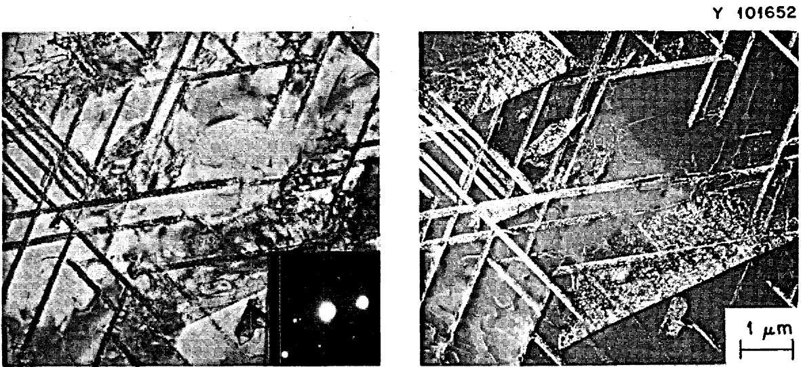  
Fig. 15.1. Bright- and Dark-Field Electron Micrographs of SFP After $100\mathrm{hr}$ at $760^{\circ}\mathrm{C}$ .

dark-field micrograph using a (220) MC carbide diffraction spot. No stacking fault precipitates (denoted as SFP) were found on aging after the $1175^{\circ}\mathrm{C}$ anneal.

The growth of SFP at $760^{\circ}\mathrm{C}$ was followed by a series of observations after aging times of 0, 0.25, 1.5, 100, 1500, 3000, and 10,000 hr. In 1 hr, nucleation of SFP occurred along grain boundaries and around primary carbides. In short times the stacking fault clusters appeared as rosettes, usually with a small primary carbide at the center. Thus nucleation of the precipitates undoubtedly occurred at the prismatic dislocations, which were associated with the primary carbide prior to aging. Extensive growth of stacking faults took place between 1 and 200 hr at $760^{\circ}\mathrm{C}$ , their length increasing from 2 to about $10\mu \mathrm{m}$ . After 5 hr a fine dispersion of MC carbides less than 50 Å in diameter could be easily resolved on the fault, and the stacking fault fringe contrast was generally lost after aging times of 1500 hr or greater.

The changes in the tensile properties at $650^{\circ}\mathrm{C}$ as a function of aging time at 650 and $760^{\circ}\mathrm{C}$ after a $1260^{\circ}\mathrm{C}$ anneal are given in Fig. 15.2. In these samples, the only types of precipitate present before testing were those on stacking faults and a few large primary MC carbides within the matrix. Thus the property changes in Fig. 15.2 are attributed primarily to the influence of this planar array of precipitates. Maximum strengthening (as measured by the $0.2\%$ yield strength) was achieved in $100\mathrm{hr}$ at $760^{\circ}\mathrm{C}$ ; when aged at $650^{\circ}\mathrm{C}$ the strength increased more slowly, but progressively, for aging times up to $10,000\mathrm{hr}$ , the longest time evaluated. The

ductility decreased continuously from 42 to $12\%$ with aging time at both 650 and $760^{\circ}\mathrm{C}$ . Thus comparable strengths and ductilities were produced during aging at 650 and $760^{\circ}\mathrm{C}$ , but the times to achieve a certain value were longer at the lower temperature.

A comparison of the creep behavior of samples with SFP (solution annealed at $1260^{\circ}\mathrm{C}$ , curve $D$ ) and with no SFP (solution annealed at $1175^{\circ}\mathrm{C}$ , curve $B$ ) is given in Fig. 15.3 for samples aged 1500 hr at $760^{\circ}\mathrm{C}$ . Ignoring small differences in grain size produced by the

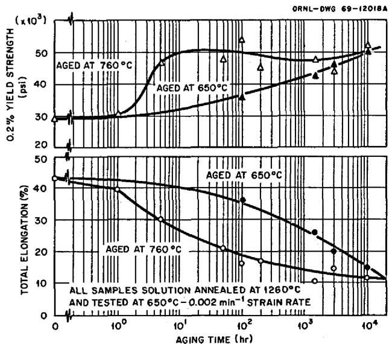  
Fig. 15.2. Changes in $650^{\circ}\mathrm{C}$ Tensile Properties with Aging Time at $650^{\circ}\mathrm{C}$ and $760^{\circ}\mathrm{C}$ , for $1.2\%$ Ti Heat Solution Annealed 1 hr at $1260^{\circ}\mathrm{C}$ .

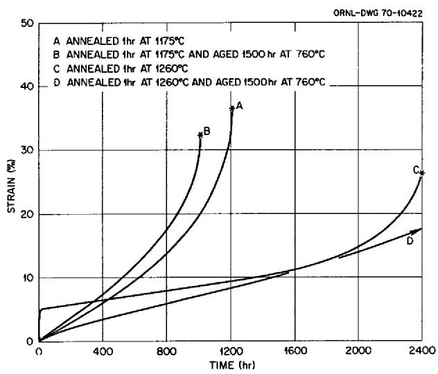  
Fig. 15.3. Creep Curves at $650^{\circ}\mathrm{C}$ and 40,000 psi After Different Annealing and Aging Treatments.

different prior solution anneals, an influence of a prior stacking fault distribution is inferred.

The creep rates (0.007 and $0.02\% / \mathrm{hr}$ ) and times to rupture (greater than 2400 and 1006 hr) at 40,000 psi would indicate a factor of 2 increase in the creep resistance that could be attributed to the SFP distribution established in sample $D$ . The creep strain at fracture was normally lower for samples annealed at $1260^{\circ} \mathrm{C}$ as compared with those annealed at $1175^{\circ} \mathrm{C}$ before test.

The effect of SFP formed at $760^{\circ}\mathrm{C}$ on the properties at room temperature was measured using tensile tests and microhardness (Vickers DPH, 1-kg load). An increase in the yield strength from 36,000 to 63,000 psi and a decrease in the total elongation from 68 to $36\%$ (at a strain rate of $0.002\mathrm{min}^{-1}$ ) was found after aging 100 hr (Fig. 15.4) and is attributed to SFP. An average of four microhardness values per condition is plotted in Fig. 15.5 as a function of aging time at $760^{\circ}\mathrm{C}$ . The hardness increased rapidly between 1 and 10 hr of aging at $760^{\circ}\mathrm{C}$ and reached a peak in 100 hr. Slight overaging at 10,000 hr aging time is indicated by these hardness data.

We used the techniques of black-white outer fringe contrast analysis to show that the stacking faults produced in this alloy were extrinsic in nature. Preliminary experiments also indicated that the contrast behavior of the outer partial dislocation bounding the stacking faults at early aging times was that expected of a Frank partial dislocation; thus the mechanism of nucleation and growth of the SFP in this alloy is the

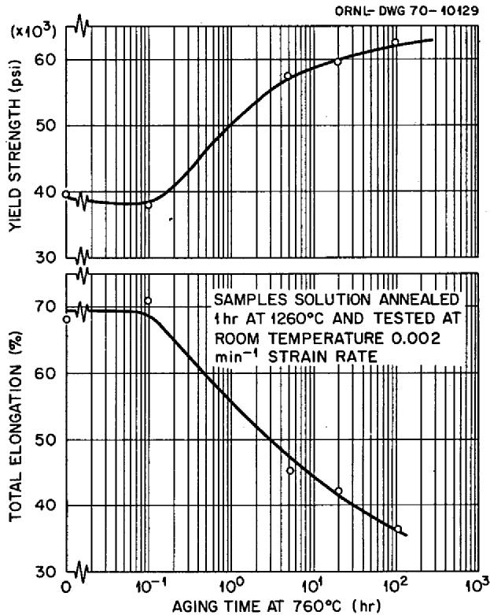  
Fig. 15.4. Changes in the Room-Temperature Tensile Properties with Aging Time at $760^{\circ}\mathrm{C}$ .

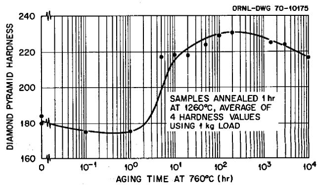  
Fig. 15.5. Microhardness Variation with Aging Time at $760^{\circ}\mathrm{C}$ .

same as that proposed by Silcock and Tunstall and found to apply generally in steels.

Our observation that SFP are nucleated near grain boundaries as well as at primary carbide clusters differs from the distribution of NbC-generated stacking faults in stainless steels and in Inconel 625 (ref. 7). Nu

cleation of SFP near grain boundaries could indicate either a high density of primary carbides and dislocations in this region or the presence of finer invisible nuclei which generate dislocations that grow into stacking faults. We have made observations which could be interpreted to support either view.

Transmission electron microscopy (TEM) examination of samples after a $1260^{\circ}\mathrm{C}$ solution anneal indicated patches of precipitates with high dislocation densities within the grain interior and along grain boundaries. Also, within some grain boundaries TEM contrast characteristic of fine precipitates was found. In addition, however, the postaging precipitate morphology near grain boundaries included SFP and other types of precipitates not associated with stacking faults. It could be that either large primary carbides, fine precipitates, or other invisible nuclei could be responsible for enhanced nucleation of SFP near grain boundaries. In either case the grain boundary could supply the vacancies needed for the nucleation and initial growth of the SFP.

Silcock and Denham8 coined the term "matrix dot" precipitation (MDP) to describe a general homogeneous distribution of fine precipitates that they observed at temperatures below that required for precipitation on stacking faults in steels. They argued that this apparently homogeneous precipitate is actually nucleated heterogeneously by unknown nuclei, but punches out dislocations during the growth process that could dissociate into stacking faults. Froes, Warrington, and Honeycombe9 suggested that the MDP nuclei were either collapsed vacancy disks or vacancy-solute agglomerates on {111} planes. Thus we feel that our TEM observations of SFP near grain boundaries could be related to MDP nuclei which occur nearer to grain boundaries,8 but where high dislocation densities exist, such as around large primary carbides, stacking faults grow after dislocation decoration and dissociation.

A small zone along grain boundaries, about $0.1\mu \mathrm{m}$ was denuded of SFP in our system. This observation is contrary to the width of the denuded zone observed for NbC SFP in steels and Inconel 625 (ref. 7). Differences in the width of the precipitate-free zone in this nickel alloy and in stainless steels could be related to several different factors. Cooling rate differences would

produce different vacancy concentration gradients near grain boundaries which would affect the width of the denuded zone. Starke10 has also pointed out that the zone width is dependent on whether the aging temperature is above or below the critical temperature for homogeneous precipitation.

The role of solute supersaturation can be approached from chemical analyses of the precipitated carbides. Microgram quantities of electrolytically extracted precipitates were analyzed by emission spectroscopy, and the metallic content of the carbide was found to be approximately $52\%$ Mo- $35\%$ Ti- $13\%$ Cr (atomic percent). A relatively small atom fraction of titanium in the MC carbide determines its MC-type crystal structure which is required for precipitation and simultaneous growth with the stacking fault, but molybdenum is the major metallic constituent of the carbide. Both primary carbides and the SFP carbides have the same lattice parameter, 4.28 Å, and therefore similar metallic compositions. Since more primary carbide is dissolved at the higher solution annealing temperature $(1260^{\circ}\mathrm{C})$ , a supersaturation of Mo, Ti, Cr, and C is present to readily precipitate on the dislocations around the remaining primary carbide particles: Although these nucleation sites are present after annealing at $1175^{\circ}\mathrm{C}$ , insufficient solute supersaturation exists to promote the growth of SFP during subsequent aging.

Attempts were made to investigate the effects of solute supersaturation on SFP. A series of dual anneals (1 hr at $1260^{\circ}\mathrm{C}$ followed by 1 hr at $1175^{\circ}\mathrm{C}$ ) were given prior to aging in order to establish the grain size and precipitate distribution characteristic of $1260^{\circ}\mathrm{C}$ , but with a lower solute supersaturation characteristic of $1175^{\circ}\mathrm{C}$ . Removing the solute supersaturation (by holding 1 hr at $1175^{\circ}\mathrm{C}$ ) did not eliminate the stacking fault precipitation, even though it did cause additional matrix precipitation (not on stacking faults) to occur, presumably during the time at $1175^{\circ}\mathrm{C}$ before aging. It was subsequently established that the kinetics of carbide dissolution at $1175^{\circ}\mathrm{C}$ were sluggish, and thus the solute supersaturation required for SFP could be obtained in 1 hr only at the higher solutioning temperature of $1260^{\circ}\mathrm{C}$ .

The effect of SFP on strengthening of this Ni-12% Mo-7% Cr-1.2% Ti alloy is significant. The increase in room-temperature strength and hardness is approximately equal (based on percent increase) to that produced in steels with the addition of 1% Nb, Ti, or V (ref. 5). Since the average size of the faults produced in

our alloy was quite large (about $10\mu \mathrm{m}$ ) it is likely that even greater strengthening can be obtained with a finer SFP distribution. If matrix dot precipitation8 does occur at lower aging temperatures in this system, as in steels, then this mode of precipitation should also enhance the strength.

Few if any data have been reported in the literature on the creep strengthening due to SFP in steels. The creep resistance at $650^{\circ}\mathrm{C}$ in our study was higher for the sample heat treated to give SFP, but the larger grain size for the $1260^{\circ}\mathrm{C}$ anneal would itself tend to reduce the rate of creep. Thus the magnitude of the observed creep strengthening attributable solely to SFP is somewhat uncertain. It is of course possible that shorter aging times or optimum distribution of SFP might produce larger reductions in creep rate than that found here.

The fact that the ductilities are reduced by a greater percentage at elevated temperatures than at room temperature in samples containing SFP undoubtedly indicates that the grain boundary deformation is more important at high temperatures (e.g., $650^{\circ}\mathrm{C}$ ) than at room temperature and that the grain boundary precipitate morphology is a factor in the ductility behavior.

# 15.2 EFFECT OF COMPOSITION ON THE POSTIRRADIATION MECHANICAL PROPERTIES OF MODIFIED HASTELLOY N

C. E. Sessions H. E. McCoy

We have continued postirradiation creep-rupture testing of various modified Hastelloy N alloys in order to assess the influence of composition on the high-temperature irradiation damage. We have measured the creep properties at $650^{\circ}\mathrm{C}$ for approximately 35 different alloys after irradiation at $760^{\circ}\mathrm{C}$ to a thermal fluence of $3 \times 10^{20}$ neutrons/cm $^2$ . All alloys were given a preirradiation anneal of 1 hr at $1177^{\circ}\mathrm{C}$ .

The creep properties at $650^{\circ}\mathrm{C}$ following irradiation at $760^{\circ}\mathrm{C}$ are given in Table 15.1 and plotted in Fig. 15.6 for alloys containing various amounts of titanium. For tests at a relatively high stress of 47,000 psi, the rupture life varied from 0 to 1500 hr over the titanium concentration range of 0 to $3\%$ . This increased rupture life is the result of a drastic decrease in the creep rate. Unfortunately the superior creep resistance at the higher titanium concentrations is offset by low ductility, which we attribute either to precipitation of intermetallic compounds or carbides. Compositions in the range of approximately $2\%$ Ti seem to offer the best

Table 15.1. Creep-Rupture Properties of Irradiated Titanium-Modified Hastelloy $\mathbf{N}^a$   

<table><tr><td rowspan="2">Alloy</td><td rowspan="2">Titanium Content (%)</td><td rowspan="2">Stress (psi)</td><td colspan="3">Postirradiation Creep Properties at 650°C</td></tr><tr><td>Rupture Life (hr)</td><td>Fracture Strain (%)</td><td>Minimum Creep Rate (%/hr)</td></tr><tr><td>21546</td><td>0</td><td>47,000</td><td>0</td><td></td><td></td></tr><tr><td>66548</td><td>0.5</td><td>47,000</td><td>0</td><td></td><td></td></tr><tr><td>289</td><td>1.0</td><td>47,000</td><td>0.7</td><td>0.8</td><td>0.8</td></tr><tr><td>67548</td><td>1.2</td><td>40,000</td><td>0.4</td><td>0.8</td><td>0.6</td></tr><tr><td>291</td><td>2.0</td><td>47,000</td><td>169</td><td>6.8</td><td>0.03</td></tr><tr><td>292</td><td>2.4</td><td>47,000</td><td>96</td><td>0.5</td><td>0.0033</td></tr><tr><td>293</td><td>3.0</td><td>47,000</td><td>1513</td><td>1.0</td><td>0.0004</td></tr></table>

${}^{a}$ Samples annealed 1 hr at ${1177}^{ \circ  }\mathrm{C}$ ,irradiated at ${760}^{ \circ  }\mathrm{C}$ to a thermal fluence of $3 \times  {10}^{20}$ neutrons/cm ${}^{2}$ ,and tested at 47,000 psi and ${650}^{ \circ  }\mathrm{C}$ . Composition of alloys nominally Ni-12% Mo-7% Cr-0.06% C.

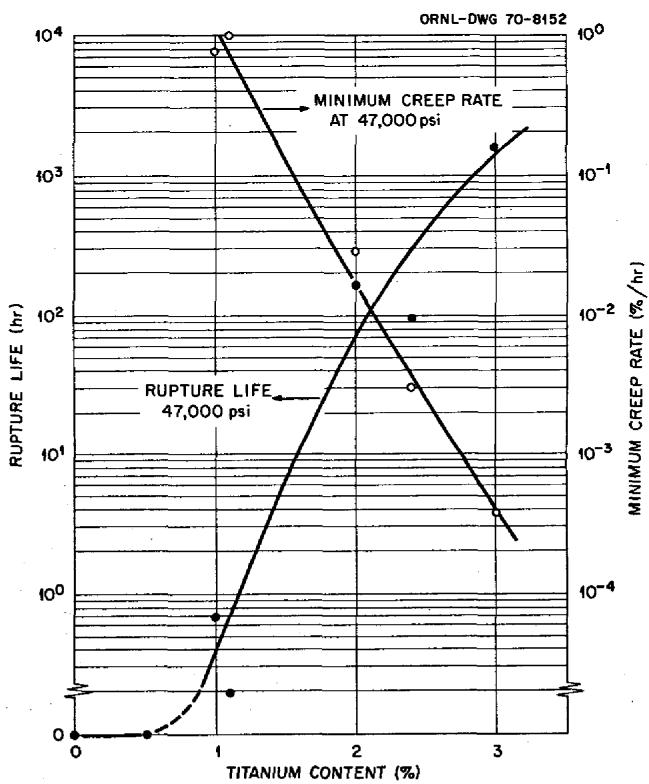  
Fig. 15.6. Effect of Titanium Content in Hastelloy N on the Postirradiation Creep-Rupture Properties at $650^{\circ}\mathrm{C}$ and 47,000 psi Stress. Samples solution annealed 1 hr at $1177^{\circ}\mathrm{C}$ and irradiated at $760^{\circ}\mathrm{C}$ to a thermal fluence of $3 \times 10^{20}$ neutrons/cm $^2$ . The basic alloy composition is Ni-12% Mo-7% Cr-0.05% C.

combination of strength and ductility under these test conditions.

The influence of other alloying additions on the postirradiation creep-rupture behavior of Hastelloy N is shown in Fig. 15.7. The curves plotted in each case correspond to the maximum effect attributable to either single or multiple additions of the elements Ti, Nb, and Hf to a nominal Ni- $12\%$ Mo- $7\%$ Cr- $0.06\%$ C base. Figure 15.7a compares the maximum rupture life achieved for alloys with additions of either Ti, Nb, or Hf. The compositions investigated were: titanium from 0 to $3.0\%$ , hafnium from 0.5 to $1.5\%$ , and niobium from 0 to $2.0\%$ . It is clear that $3\%$ titanium produced greater postirradiation creep-rupture lives than either $1.2\%$ hafnium or $2\%$ niobium. The alloy with $1.2\%$ hafnium was superior to the alloy with $2\%$ niobium

and, in fact, was comparable in rupture life to an alloy with $2\%$ titanium, which is not plotted here. Thus for independent additions of either titanium or niobium, the maximum rupture life corresponds to the highest alloy content. However, for hafnium additions the maximum rupture life occurred for an alloy with $1.2\%$ hafnium.

The combined effects of Ti-Hf, Ti-Nb, Nb-Hf, and Ti-Hf-Nb additions to the Ni-12% Mo-7% Cr-0.06% C base are compared in Fig. 15.7b. The four curves in Fig. 15.7b represent the maximum rupture lives obtained for various alloy classes, each of which contained multiple additions of Ti, Nb, or Hf. The greatest rupture life obtained at $650^{\circ}\mathrm{C}$ after irradiation at $760^{\circ}\mathrm{C}$ was for alloy 310, which contained additions of Nb, Ti, and Hf. Several other alloys containing multiple

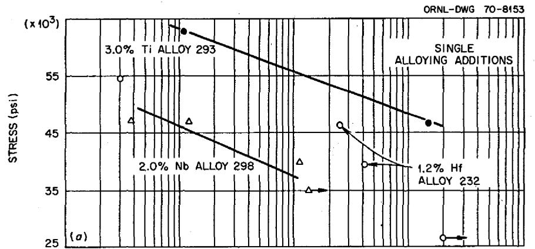

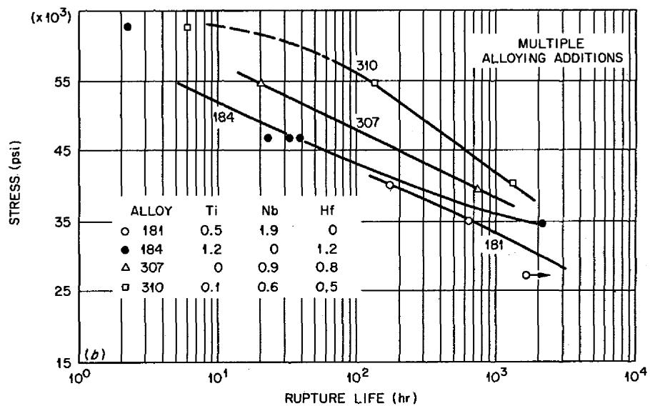  
Fig. 15.7. Postirradiation Creep-Rupture Properties of Several Modified Hastelloy N Compositions at $650^{\circ}\mathbf{C}$ . Samples annealed 1 hr at $1177^{\circ}\mathbf{C}$ , irradiated at $760^{\circ}\mathbf{C}$ to $3 \times 10^{20}$ neutrons/cm $^2$ , and tested at $650^{\circ}\mathbf{C}$ . Alloys had a basic composition of Ni-12% Mo-7% Cr-0.067% C. (a) Properties achieved with single additions of either Ti, Nb, or Hf. (b) Properties achieved with combined additions of Ti, Nb, and Hf.

additions of Ti, Hf, and Nb also had good properties. Alloys such as 307 that contained niobium and hafnium had properties inferior to the Ti-Hf-Nb alloys but were superior to the Ti-Hf and Ti-Nb alloys over the range of alloy compositions investigated.

The postirradiation creep rates of these alloys are shown in Fig. 15.8. For the singular additions of Ti, Nb, and Hf (Fig. 15.8a) the lowest creep rate was obtained for the alloy containing $3.0\%$ titanium. Alloys containing singular additions of $2.0\%$ Ti, $2.0\%$ Nb, and $1.2\%$ Hf

had creep rates that were about equivalent. Of the alloys containing multiple additions (Fig. 15.8b), alloy 310 had the lowest creep rate, and the other three alloys had very similar creep strengths. The scatter bands shown in Fig. 15.8a and $b$ are almost equivalent and indicate that the creep strength is not strongly affected by small additions of Ti, Nb, and Hf.

The postirradiation fracture strains for these alloys are shown in Fig. 15.9. The strains shown in this figure for short rupture times are lower than actually occurred

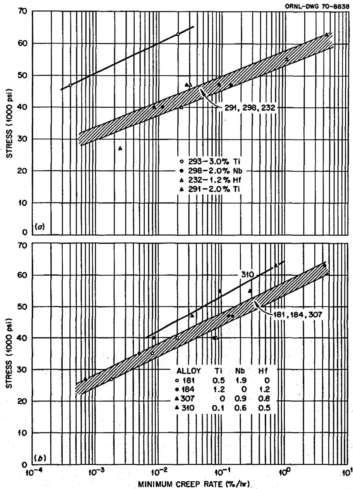  
Fig. 15.8. Effect of Alloy Content on the Postirradiation Creep Rate at $650^{\circ}\mathrm{C}$ . Samples annealed 1 hr at $1177^{\circ}\mathrm{C}$ , irradiated at $760^{\circ}\mathrm{C}$ to a thermal fluence of $3 \times 10^{20}$ neutrons/cm $^2$ , and tested at $650^{\circ}\mathrm{C}$ . (a) Single additions of Ti, Nb, or Hf. (b) Multiple additions of Ti, Nb, and Hf.

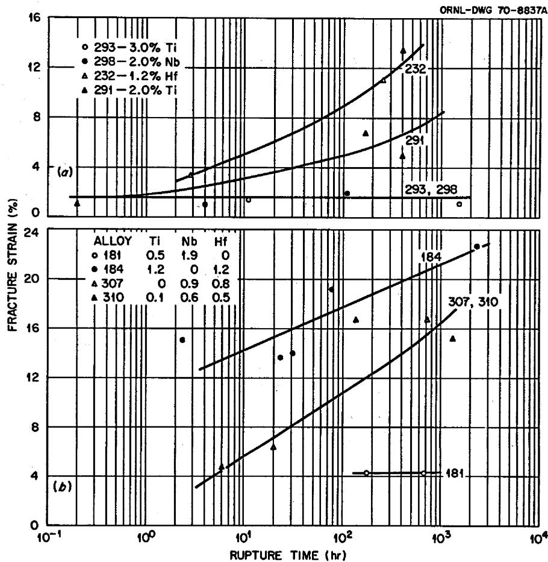  
Fig. 15.9. Effect of Alloy Content on the Postirradiation Creep Ductility of Modified Hastelloy N at $650^{\circ}\mathrm{C}$ . Samples annealed 1 hr at $1177^{\circ}\mathrm{C}$ , irradiated at $760^{\circ}\mathrm{C}$ to a thermal fluence of $3 \times 10^{20}$ neutrons/cm $^2$ , and tested at $650^{\circ}\mathrm{C}$ . (a) Single additions of either Ti, Nb, or Hf. (b) Multiple additions of Ti, Nb, and Hf.

because of the experimental procedure used. The samples were stressed before we began measuring the strain. Since the stresses involved in the tests that failed in short times were above the yield stress, some strain occurred on loading. Thus the strains in short rupture times in Fig. 15.9 may be too low by as much as $5\%$ . However, the results in Fig. 15.9a show the relative effects of singular additions of Nb, Ti, and Hf. The postirradiation fracture strains were quite low for alloy 293, which contained $3.0\%$ titanium. However, alloy 291, with $2.0\%$ titanium, had higher fracture strains. Alloy 298, which contained $2.0\%$ niobium, had low fracture strains, and alloy 232, with $1.2\%$ hafnium, had the highest strains. The properties shown in Fig. 15.9b for the alloys with multiple additions show that various postirradiation fracture strains were obtained. Alloy 184, with $1.2\%$ titanium and $1.2\%$ hafnium, had the highest fracture strain. The strains for alloy 181 were

the lowest, but they are still higher than those noted for standard Hastelloy N. Generally, the alloys with the higher fracture strains contain some hafnium.

# 15.3 COMPARISON OF LABORATORY AND COMMERCIAL HEATS OF MODIFIED HASTELLOY N

C. E. Sessions H. E. McCoy

Initial experiments have been completed on 100-lb commercial heats of Hastelloy N modified with titanium plus hafnium and titanium plus niobium. We have compared the postirradiation mechanical properties with laboratory heats of similar composition since we are interested in being able to scale up from small laboratory heats to large commercial heats.

The chemical analyses of two commercial heats (69641 and 69648) and five laboratory heats are given

Table 15.2. Chemical Compositions of Laboratory and Commercial Heats of Modified Hastelloy N   

<table><tr><td rowspan="2">Heat</td><td rowspan="2">Source</td><td colspan="10">Concentration (%)</td></tr><tr><td>Mo</td><td>Cr</td><td>Fe</td><td>Mn</td><td>Si</td><td>Ti</td><td>Zr</td><td>Hf</td><td>Nb</td><td>C</td></tr><tr><td>69641</td><td>Commercial</td><td>13.9</td><td>6.9</td><td>0.3</td><td>0.35</td><td></td><td>1.3</td><td>0.021</td><td>0.40</td><td>&lt;0.05</td><td>0.05</td></tr><tr><td>184</td><td>ORNL</td><td>13.0</td><td>7.4</td><td>4.6</td><td>0.43</td><td>0.14</td><td>1.2</td><td>&lt;0.05</td><td>1.2</td><td></td><td>0.05</td></tr><tr><td>309</td><td>ORNL</td><td>11.8</td><td>8.06</td><td>4.03</td><td>0.21</td><td>&lt;0.02</td><td>0.47</td><td>0.03</td><td>0.39</td><td>&lt;0.01</td><td>0.062</td></tr><tr><td>69648</td><td>Commercial</td><td>12.8</td><td>6.9</td><td>0.3</td><td>0.24</td><td>0.05</td><td>0.92</td><td>0.005</td><td>&lt;0.05</td><td>1.95</td><td>0.043</td></tr><tr><td>181</td><td>ORNL</td><td>11.5</td><td>6.8</td><td>0.05</td><td>0.23</td><td>0.01</td><td>0.5</td><td></td><td></td><td>1.85</td><td>0.045</td></tr><tr><td>304</td><td>ORNL</td><td>11.2</td><td>8.25</td><td>4.16</td><td>0.22</td><td>0.09</td><td>0.88</td><td>&lt;0.001</td><td>&lt;0.005</td><td>1.3</td><td>0.07</td></tr><tr><td>303</td><td>ORNL</td><td>12a</td><td>7a</td><td>4a</td><td>0.2a</td><td>0.02</td><td>0.49</td><td>&lt;0.005</td><td>0.03</td><td>0.84</td><td></td></tr></table>

$a$ Nominal composition.

in Table 15.2. The titanium/hafnium ratios and titanium/niobium ratios of these heats differ considerably, but they are the closest that we have for making comparisons between commercial and laboratory melts. If the effects of alloy composition on irradiation damage are similar for our laboratory heats and the commercial heats, then we can conclude that the beneficial influence of alloying is reproducible on a commercial scale.

Each alloy was solution annealed 1 hr at $1177^{\circ}\mathrm{C}$ prior to irradiation in the ORR at $760^{\circ}\mathrm{C}$ to a thermal fluence of $3 \times 10^{20}$ neutrons/cm $^2$ . Postirradiation creep-rupture tests were performed at $650^{\circ}\mathrm{C}$ over stresses from 27,000 psi to 63,000 psi. Creep-rupture properties for Hastelloy N alloys containing modifying additions of titanium and hafnium are given in Figs. 15.10-15.12. The commercial heat 69641 contained $1.3\%$ Ti- $0.4\%$ Hf, whereas heats 184 ( $1.2\%$ Ti- $1.2\%$

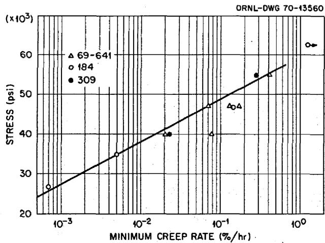  
Fig. 15.10. Postirradiation Minimum Creep Rates for Various Heats of Hastelloy N with Titanium and Hafnium. Samples annealed 1 hr at $1177^{\circ}\mathrm{C}$ , irradiated at $760^{\circ}\mathrm{C}$ to a thermal fluence of $3 \times 10^{20}$ neutrons/cm², and then tested at $650^{\circ}\mathrm{C}$ .

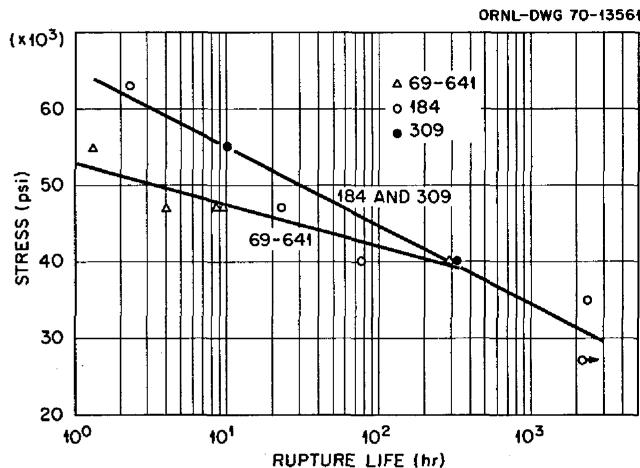  
Fig. 15.11. Postirradiation Creep-Rupture Results for Various Heats of Hastelloy N Modified with Titanium and Hafnium. Samples annealed 1 hr at $1177^{\circ}\mathrm{C}$ , irradiated at $760^{\circ}\mathrm{C}$ to a thermal fluence of $3 \times 10^{20}$ neutrons/cm $^2$ , and then tested at $650^{\circ}\mathrm{C}$ .

Hf) and 309 (0.47% Ti-0.39% Hf) contained higher and slightly lower concentrations of titanium and hafnium respectively. Figure 15.10 indicates that the stress required to produce a certain creep rate in these three alloys is approximately the same. Figure 15.11 indicates, however, that the time to rupture for the commercial heat is lower by a factor of from 3 to 5 than that of the laboratory heats 184 and 309. The observations that the creep rates for the three heats were nearly equivalent but the rupture life of the commercial heat was shorter indicate that the lower fracture ductilities are responsible for the lower times to rupture for heat 69641. The results in Fig. 15.12 show that the fracture ductility of heat 184 is higher than that for either heat 309 or 69641. Since the ductility values for heat 69641 are comparable with those found for heat 309 (Fig. 15.12) we are apparently

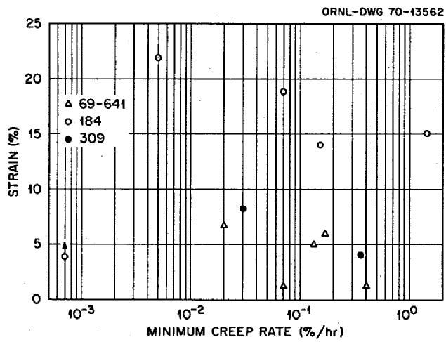  
Fig. 15.12. Postirradiation Fracture Ductility for Various Heats of Hastelloy N Modified with Titanium and Hafnium. Samples annealed 1 hr at $1177^{\circ}\mathrm{C}$ , irradiated at $760^{\circ}\mathrm{C}$ to a thermal fluence of $3 \times 10^{20}$ neutrons/cm $^2$ , and then tested at $650^{\circ}\mathrm{C}$ .

able to achieve good postirradiation mechanical properties in commercial heats of Hastelloy N modified with titanium and hafnium. However, the superior ductility and rupture life of 184 as compared with 69641 probably indicates the beneficial influence of higher hafnium (1.2 vs $0.4\%$ ) in this laboratory heat. The equivalent ductilities of heats 309 and 69641 may indicate that titanium contents greater than $0.5\%$ offer no postirradiation ductility enhancement in alloys containing $0.4\%$ hafnium.

A similar comparison of the effect of alloying with titanium and niobium on postirradiation creep behavior for laboratory and commercial heats is given in Figs. 15.13-15.15. The properties of three laboratory heats, 181 (0.5% Ti-1.85% Nb), 303 (0.4% Ti-0.84% Nb), and 305 (0.88% Ti-1.3% Nb), are compared with those of commercial heat 69648 (0.92% Ti-1.95% Nb). The minimum creep rates, Fig. 15.13, of the commercial heat 69648 are at least a factor of 7 lower for a given stress than those of the three laboratory heats, which plot on a single line. The total concentration of titanium and niobium of the commercial heat is higher than that of the lab heats, but the lower carbon content of the commercial heat leaves this pronounced creep strengthening (i.e., decreased creep rate) unexplained on the basis of alloy chemistry. However, a similar decrease in creep rate was found for unirradiated control tests on this alloy and was attributed to strain-enhanced precipitation.[1]

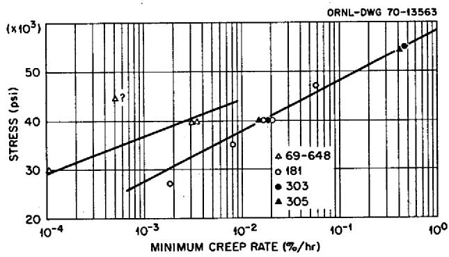  
Fig. 15.13. Postirradiation Minimum Creep Rates for Various Heats of Hastelloy N Modified with Titanium and Niobium. Samples annealed 1 hr at $1177^{\circ}\mathrm{C}$ , irradiated at $760^{\circ}\mathrm{C}$ to a thermal fluence of $3 \times 10^{20}$ neutrons/cm $^2$ , and then tested at $650^{\circ}\mathrm{C}$ .

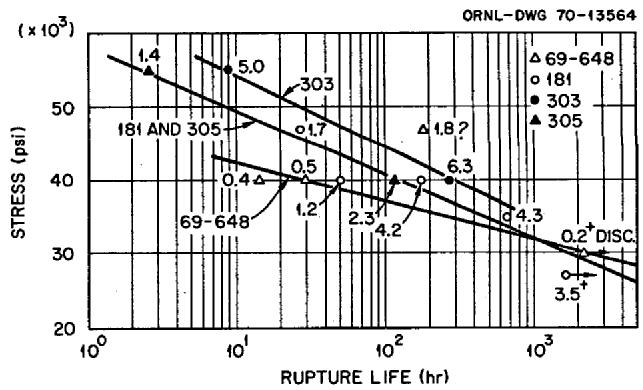  
Fig. 15.14. Postirradiation Creep-Rupture Results for Various Heats of Hastelloy N Modified with Titanium and Niobium. Samples annealed 1 hr at $1177^{\circ}\mathrm{C}$ , irradiated at $760^{\circ}\mathrm{C}$ to a thermal fluence of $3 \times 10^{20}$ neutrons/cm $^2$ , and then tested at $650^{\circ}\mathrm{C}$ .

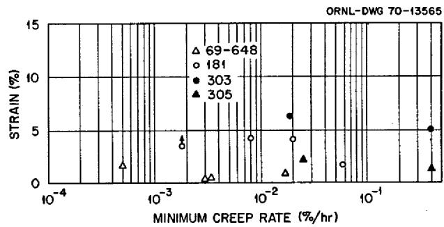  
Fig. 15.15. Postirradiation Fracture Ductility for Various Heats of Hastelloy N Modified with Titanium and Niobium. Samples annealed 1 hr at $1177^{\circ}\mathrm{C}$ , irradiated at $760^{\circ}\mathrm{C}$ to a thermal fluence of $3 \times 10^{20}$ neutrons/cm $^2$ , and then tested at $650^{\circ}\mathrm{C}$ .

Slightly inferior postirradiation creep-rupture lives were found for the commercial heat 69648 (Fig. 15.14) as compared with the laboratory heats. Alloy 303 exhibited the highest rupture lives. One anomalous point for heat 69648 is stronger than heat 303, but we have duplicate results at 40,000 psi that discredit the anomalous test. The fracture strain data (Fig. 15.15) indicate that heat 303 is most ductile, with elongation of about $5\%$ after irradiation. However, some of the strain values plotted in Fig. 15.15 are low because of unrecorded strain that occurred when samples were loaded at creep stresses above about 30,000 psi. In some of these alloys the actual fracture strains may exceed by $5\%$ the values plotted in Figs. 15.12 and 15.15. Generally, however, the range of ductility values after irradiation at $760^{\circ}\mathrm{C}$ was from 1 to $10\%$ for both laboratory and commercial heats.

Comparing the two commercial heats, the stress to cause rupture in 100 hr after irradiation at $760^{\circ}\mathrm{C}$ and testing at $650^{\circ}\mathrm{C}$ was about 42,000 psi for 69641 and about 37,000 psi for 69648. Thus the titanium-hafnium modification is more beneficial, based on both the rupture life and ductility data, than the titanium-niobium modification. This same conclusion was previously drawn for our laboratory heat results and thus indicates that the alloying effects are similar for commercial and laboratory heats.

# 15.4 EFFECT OF PRIOR AGING ON IRRADIATION DAMAGE AT $760^{\circ}\mathrm{C}$

C. E. Sessions

Aging at 650 and $760^{\circ}\mathrm{C}$ produces extreme changes in the microstructure and in the types of precipitates found in titanium-modified Hastelloy N.12 We have measured the creep rupture properties of two heats, containing $0.45\%$ and $1.2\%$ titanium additions to the nominal base alloy composition, following aging and irradiation to a thermal fluence of $3\times 10^{20}$ neutrons $\mathrm{cm}^2$ at $760^{\circ}\mathrm{C}$ . The purpose of this experiment was to determine if the precipitate types and distributions established by aging at $650^{\circ}\mathrm{C}$ before irradiation would reduce the magnitude of the irradiation damage when irradiated at $760^{\circ}\mathrm{C}$ . Creep properties were measured at $650^{\circ}\mathrm{C}$ after irradiations for alloys given five different solution anneal and aging treatments.

We found previously that heat 466548 (0.45% titanium) had very poor properties after irradiation at $760^{\circ}\mathrm{C}$ , and the results listed in Table 15.3 from the

$^{12}$ C. E. Sessions, Influence of Titanium on the High-Temperature Deformation and Fracture Behavior of Some Nickel Based Alloys, ORNL-4561 (July 1970).

$^{13}$ H. E. McCoy, MSR Program Semiann. Progr. Rept. Feb. 28, 1969, ORNL-4396, pp. 235-42.

Table 15.3. Effect of Preirradiation Heat Treatments on the Postirradiation Creep-Rupture Properties at $650^{\circ}\mathrm{C}$ and 27,000 psi   

<table><tr><td rowspan="2">Alloy</td><td colspan="2">Heat Treatment</td><td colspan="4">Postirradiation Creep Properties at 650°C</td></tr><tr><td>Solution Annealb</td><td>Aging Treatment</td><td>ORR Experiment No.</td><td>Rupture Life (hr)</td><td>Fracture Strain (%)</td><td>Minimum Creep Rate (%/hr)</td></tr><tr><td rowspan="5">466548 (0.45% titanium)</td><td>SAc1177°C</td><td></td><td>194</td><td>0.4</td><td>0.9</td><td>2.0</td></tr><tr><td>SA 1177°C</td><td>1500 hr 650°C</td><td>213</td><td>0.3</td><td>0.1</td><td>0.05</td></tr><tr><td>SA 1177°C</td><td>1500 hr 760°C</td><td>213</td><td>0.1</td><td>0.1</td><td>1.1</td></tr><tr><td>SA 1260°C</td><td>1500 hr 650°C</td><td>213</td><td>0.3</td><td>0.16</td><td>0.17</td></tr><tr><td>SA 1260°C</td><td>1500 hr 760°C</td><td>213</td><td>1.0</td><td>1.2</td><td>0.5</td></tr><tr><td rowspan="5">67548 (1.2% titanium)</td><td>SA 1177°C</td><td></td><td>208</td><td>~2000d</td><td>~7</td><td>~0.004</td></tr><tr><td>SA 1177°C</td><td>1500 hr 650°C</td><td>213</td><td>147.6</td><td>3.6</td><td>0.02</td></tr><tr><td>SA 1177°C</td><td>1500 hr 760°C</td><td>213</td><td>100.5</td><td>3.2</td><td>0.008</td></tr><tr><td>SA 1270°C</td><td>1500 hr 650°C</td><td>213</td><td>11.5</td><td>0.26</td><td>0.02</td></tr><tr><td>SA 1260°C</td><td>1500 hr 760°C</td><td>213</td><td>17.6</td><td>0.4</td><td>0.02</td></tr></table>

${}^{a}$ Samples irradiated at ${760}^{ \circ  }\mathrm{C}$ to a thermal fluence of $3 \times  {10}^{20}$ neutrons/cm ${}^{2}$ .   
$\pmb{b}_{1}$ hr duration.   
${}^{c}$ Base composition of $\mathrm{{Ni}} - {12}\% \mathrm{{Mo}} - 7\% \mathrm{{Cr}} - {0.2}\% \mathrm{{Mn}} - {0.05}\% \mathrm{C}$ .   
$d_{\mathrm{Approximated from 25,000 - psi}}$ test.

current experiment show that none of the combinations of solution annealing and aging treatments significantly improved the postirradiation properties of the alloy relative to properties measured for the sample tested after irradiation in the "as annealed at $1177^{\circ}\mathrm{C}$ " condition. Thus for this composition none of the heat treatments evaluated were effective in improving the creep properties after irradiation at $760^{\circ}\mathrm{C}$ .

The postirradiation properties of the higher-titanium heat, 67548 with $1.2\%$ titanium, exhibited a different response with prior thermal treatments. The postirradiation rupture life varied from about 2000 to 11.5 hr for tests at 27,000 psi, and the ductility varied from 8 to $0.3\%$ with prior heat treatment. Irradiation of this alloy after annealing 1 hr at $1177^{\circ}\mathrm{C}$ without aging produced the best properties, and all aging treatments investigated resulted in inferior postirradiation properties. Prior aging resulted in reducing the rupture life and ductility. The material solution annealed at $1260^{\circ}\mathrm{C}$ and aged 1500 hr at either 650 or $760^{\circ}\mathrm{C}$ had much poorer properties than the material annealed at $1177^{\circ}\mathrm{C}$ and aged. This indicates that either the larger grain size produced at $1260^{\circ}\mathrm{C}$ or the precipitation on stacking faults which occurs on aging after a $1260^{\circ}\mathrm{C}$ anneal decreased the postirradiation creep-rupture life and fracture strain for these test conditions.

Aging at $650^{\circ}\mathrm{C}$ produces MC carbides in heat 466548, and aging at either 650 or $760^{\circ}\mathrm{C}$ produces MC

carbides in heat 467548. The formation of the MC carbide improves the ductility of the unirradiated alloys. $^{14,15}$ Since these treatments do not produce superior postirradiation creep properties, we must conclude that the irradiation damage problem at $760^{\circ}\mathrm{C}$ for titanium-modified alloys cannot be solved by establishing prior precipitate distributions.

# 15.5 WELDABILITY OF COMMERCIAL ALLOYS

B. McNabb

H. E. McCoy

Evaluation of weldability of some commercial heats of modified Hastelloy N was conducted on eight additional heats using the same procedures as previously reported. The eight heats are all from Allvac Metals Company, Monroe, North Carolina, and were double-vacuum-melted 50-lb heats yielding three plates approximately in thick, 4 in. wide, and 10 in. long. These were prepared for fully restrained welds as described previously. The chemical composition and relative weldability rating are given in Table 15.4. Some

$^{14}$ C. E. Sessions, MSR Program Semiann. Progr. Rept. Feb. 28, 1969, ORNL-4396, pp. 233-35.   
15R. E. Gehlbach and S. W. Cook, MSR Program Semiann Progr. Rept. Feb. 28, 1969, ORNL-4396, pp. 240--42.   
$^{16}$ B. McNabb and H. E. McCoy, MSR Program Semiann Progr. Rept. Feb. 28, 1970, ORNL-4548, p. 238.

Table 15.4. Analysis of Modified Hastelloy N Heats   

<table><tr><td rowspan="2">Heat No.</td><td rowspan="2">a</td><td colspan="11">Composition (%)</td><td rowspan="2">Relative Weldingb Rating</td></tr><tr><td>Ni</td><td>Mo</td><td>Cr</td><td>Fe</td><td>Mn</td><td>C</td><td>Si</td><td>Ti</td><td>Nb</td><td>Hf</td><td>Zr</td></tr><tr><td rowspan="2">70785</td><td>A</td><td>Bal</td><td>12.8</td><td>7.35</td><td>&lt;0.01</td><td>0.16</td><td>0.054</td><td>0.02</td><td>0.95</td><td></td><td></td><td></td><td>G</td></tr><tr><td>B</td><td>Bal</td><td>12.2</td><td>7.1</td><td>0.16</td><td>0.28</td><td>0.057</td><td>0.09</td><td>1.10</td><td>0.097</td><td>&lt;0.003</td><td>0.012</td><td></td></tr><tr><td rowspan="2">70786</td><td>A</td><td>Bal</td><td>12.5</td><td>7.02</td><td>0.17</td><td>0.28</td><td>0.049</td><td>0.04</td><td>0.65</td><td>0.55</td><td></td><td>0.02</td><td>G</td></tr><tr><td>B</td><td>Bal</td><td>12.2</td><td>7.2</td><td>0.41</td><td>0.48</td><td>0.044</td><td>0.08</td><td>0.82</td><td>0.62</td><td>&lt;0.003</td><td>0.024</td><td></td></tr><tr><td rowspan="2">70787</td><td>A</td><td>Bal</td><td>12.8</td><td>7.18</td><td>&lt;0.01</td><td>0.24</td><td>0.051</td><td>&lt;0.01</td><td>0.78</td><td></td><td></td><td>0.04</td><td>P</td></tr><tr><td>B</td><td>Bal</td><td>12.5</td><td>6.95</td><td>0.18</td><td>0.44</td><td>0.041</td><td>0.09</td><td>0.90</td><td>0.12</td><td>0.77</td><td>0.038</td><td></td></tr><tr><td rowspan="2">70788</td><td>A</td><td>Bal</td><td>13.0</td><td>7.35</td><td>0.25</td><td>0.18</td><td>0.041</td><td>0.06</td><td>1.10</td><td>0.55</td><td></td><td>0.02</td><td>G</td></tr><tr><td>B</td><td>Bal</td><td>12.5</td><td>7.2</td><td>0.43</td><td>0.43</td><td>0.027</td><td>0.1</td><td>1.36</td><td>0.67</td><td>0.30</td><td>0.02</td><td></td></tr><tr><td rowspan="2">70795</td><td>A</td><td>Bal</td><td>12.8</td><td>7.50</td><td>&lt;0.01</td><td>0.62</td><td>0.065</td><td>&lt;0.01</td><td>1.39</td><td></td><td>0.40</td><td>0.03</td><td>VG</td></tr><tr><td>B</td><td>Bal</td><td>12.9</td><td>7.8</td><td>0.035</td><td>0.63</td><td>0.050</td><td>0.03</td><td>1.49</td><td>0.005</td><td>0.43</td><td>0.018</td><td></td></tr><tr><td rowspan="2">70796</td><td>A</td><td>Bal</td><td>12.75</td><td>7.47</td><td>&lt;0.01</td><td>0.68</td><td>0.06</td><td>&lt;.01</td><td></td><td></td><td>0.81</td><td>0.03</td><td>P</td></tr><tr><td>B</td><td>Bal</td><td>12.4</td><td>7.28</td><td>0.054</td><td>0.64</td><td>0.04</td><td>0.02</td><td>0.04</td><td>0.04</td><td>0.71</td><td>0.024</td><td></td></tr><tr><td rowspan="2">70797</td><td>A</td><td>Bal</td><td>12.42</td><td>6.84</td><td>0.22</td><td>0.39</td><td>0.055</td><td>&lt;0.01</td><td>0.61</td><td>0.50</td><td>0.82</td><td>0.03</td><td>P</td></tr><tr><td>B</td><td>Bal</td><td>12.5</td><td>7.0</td><td>0.29</td><td>0.38</td><td>0.049</td><td>0.02</td><td>0.59</td><td>0.98</td><td>0.72</td><td>0.04</td><td></td></tr><tr><td rowspan="2">70798</td><td>A</td><td>Bal</td><td>12.8</td><td>7.2</td><td>0.10</td><td>0.46</td><td>0.05</td><td>&lt;0.01</td><td>0.63</td><td>0.50</td><td>0.20</td><td>0.02</td><td>G</td></tr><tr><td>B</td><td>Bal</td><td>12.9</td><td>7.5</td><td>0.26</td><td>0.53</td><td>0.036</td><td>0.02</td><td>0.71</td><td>0.94</td><td>0.36</td><td>0.012</td><td></td></tr></table>

$a_{\mathbf{A}} =$ vendors analysis; $\mathbf{B} =$ ORNL analysis.   
$b_{\mathbf{G}} = \mathrm{good},\mathbf{P} = \mathrm{poor},\mathbf{V}\mathbf{G} = \mathbf{very}$ good.

observations were made relative to the welding characteristics of the different heats.

Heat 70785 welded clean, and no interpass grinding was required. No flaws were detected during welding or in the side-bend tests. Visual, dye-penetrant, and x-ray inspection of the welded plate showed no cracks.

Heat 70786 welded clean, with no interpass grinding, and no flaws were detected during welding or x-ray inspection of the welded plate. One small indication by dye penetrant was found in one of the side-bend specimens after bending on a $1/4$ -in. radius. The other specimens were all bent on a $3/8$ -in. radius, so this heat probably would not have cracked under the less severe bend test.

Heat 70787 did not weld as clean as the previous two heats, and two small cracks were found in the root pass where the weld stopped. These were removed by rotary filing, and welding resumed. Cracks developed in almost every weld stop, and several minute cracks were detected in the cover passes. Numerous cracks were visible in the side-bend specimens.

Heat 70788 welded clean except for about 3 in. of weld pass No. 8, and laminated weld wire (dirty) was suspected as the cause. No cracks were detected by visual, dye-penetrant, or x-ray inspection of the welded plate. There were five very small dye-penetrant indications on the four side-bend specimens, three of them in the root pass.

Heat 70795 welded very clean, and there were no indications of cracks.

Heat 70796 developed many small cracks during welding, and the heat input was reduced from 180 to $145\mathrm{A}$ and $17\mathrm{V}$ with an interpass temperature of $\sim 100^{\circ}\mathrm{C}$ to minimize cracking. However, there were visible cracks in the cover passes and 29 small indications by dye penetrant in the cover passes. These surface cracks showed up in the x ray of the welded plate. Bend specimens opened up several large cracks.

Heat 70797 showed some interpass cracking, but the small cracks were removed by rotary filing up to the 7th pass, where it was decided to remove all the weld down to the root pass and use a lower heat input of 150 A. Dye-penetrant inspection at the 15th pass showed five small cracks, which were removed by rotary filing, and welding continued. X ray of the welded plate showed two small round spots of porosity. Side-bend specimens are being prepared.

Heat 70798 welded fairly clean, and no cracking was observed by either visual, dye-penetrant, or x-ray inspection of the welded plate. Side-bend specimens are being prepared.

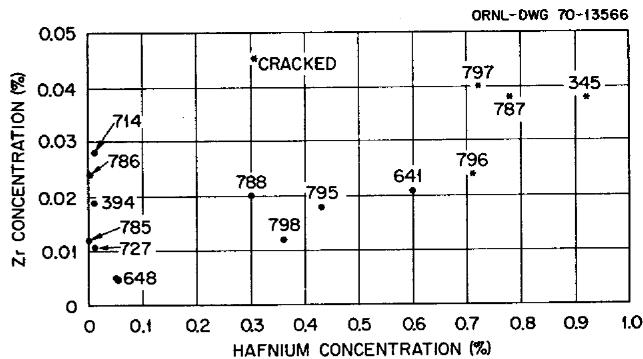  
Fig. 15.16. Variation of Weldability of Modified Hastelloy N with Hafnium and Zirconium Concentrations.

Previous experience has shown that zirconium is very detrimental to the weldability of nickel alloys and that hafnium can be tolerated to higher concentrations. Generally some zirconium is included as an impurity in hafnium, and Fig. 15.16 is a plot of the hafnium vs zirconium concentration of those modified alloys and some alloys reported previously.[16] It appears that alloys with greater than $0.6 \mathrm{wt}\%$ hafnium and $0.025\%$ zirconium will crack during welding unless suitable welding procedures or some judicious alloying additions can be found. The fully restrained weld is a severe test and shows up any tendency toward cracking. All of the cracks in these alloys were in the weld metal. They were very small, and the weld would still have considerable strength even after small cracks opened up in the bend test. Further evaluations of the weld strength in tensile and creep tests are planned as soon as specimens can be prepared from the welded plates.

# 15.6 MECHANICAL PROPERTIES OF UNIRRADIATED COMMERCIAL MODIFIED ALLOYS

H.E.McCoy B.M.McNabb

Our work on small lab melts has demonstrated the effectiveness of strong carbide formers such as Ti, Zr, Hf, and Nb in improving the postirradiation mechanical properties of Hastelloy N. We have obtained several small heats (50 to 100 lb) from two commercial vendors during the past few months and are evaluating their mechanical properties in the unirradiated and irradiated conditions. The compositions of these alloys are given in Table 15.5. They were double vacuum melted, and all have low silicon concentrations. All of these alloys have been irradiated but have not been tested. Only the results for unirradiated alloys will be reported in this section.

Table 15.5. Compositions of Experimental Alloys   

<table><tr><td>Alloy No.</td><td>Mo</td><td>Cr</td><td>Fe</td><td>Mn</td><td>Ti</td><td>Zr</td><td>Hf</td><td>Nb</td><td>C</td></tr><tr><td>70-785</td><td>12.3</td><td>7.0</td><td>0.16</td><td>0.30</td><td>1.1</td><td>0.012</td><td>&lt;0.003</td><td>0.097</td><td>0.057</td></tr><tr><td>70-727</td><td>13.0</td><td>7.4</td><td>0.05</td><td>0.37</td><td>2.1</td><td>0.011</td><td>&lt;0.01</td><td>&lt;0.01</td><td>0.044</td></tr><tr><td>70-796</td><td>12.5</td><td>7.5</td><td>0.054</td><td>0.64</td><td>0.04</td><td>0.024</td><td>0.79</td><td>0.04</td><td>0.04</td></tr><tr><td>69-648</td><td>12.8</td><td>6.9</td><td>0.3</td><td>0.34</td><td>0.92</td><td>0.005</td><td>&lt;0.05</td><td>1.95</td><td>0.043</td></tr><tr><td>69-714</td><td>13.0</td><td>8.5</td><td>0.10</td><td>0.35</td><td>0.80</td><td>0.028</td><td>&lt;0.01</td><td>1.6</td><td>0.013</td></tr><tr><td>70-835</td><td>12.5</td><td>7.9</td><td>0.68</td><td>0.60</td><td>0.71</td><td>&lt;0.005</td><td>0.031</td><td>2.60</td><td>0.052</td></tr><tr><td>70-786</td><td>12.2</td><td>7.6</td><td>0.41</td><td>0.43</td><td>0.82</td><td>0.024</td><td>&lt;0.003</td><td>0.62</td><td>0.044</td></tr><tr><td>69-641</td><td>13.9</td><td>6.9</td><td>0.3</td><td>0.35</td><td>1.3</td><td>0.021</td><td>0.40</td><td>&lt;0.05</td><td>0.05</td></tr><tr><td>70-787</td><td>12.3</td><td>7.0</td><td>0.18</td><td>0.43</td><td>0.90</td><td>0.038</td><td>0.77</td><td>0.12</td><td>0.041</td></tr><tr><td>70-795</td><td>13.7</td><td>8.3</td><td>0.035</td><td>0.63</td><td>1.5</td><td>0.018</td><td>0.42</td><td>0.005</td><td>0.05</td></tr><tr><td>70-788</td><td>12.1</td><td>7.3</td><td>0.43</td><td>0.41</td><td>1.4</td><td>0.020</td><td>0.30</td><td>0.67</td><td>0.027</td></tr><tr><td>70-797</td><td>12.7</td><td>7.0</td><td>0.29</td><td>0.38</td><td>0.59</td><td>0.040</td><td>0.78</td><td>0.98</td><td>0.049</td></tr><tr><td>70-798</td><td>13.5</td><td>7.9</td><td>0.26</td><td>0.53</td><td>0.71</td><td>0.012</td><td>0.28</td><td>0.94</td><td>0.036</td></tr><tr><td>68-688</td><td>14.3</td><td>7.1</td><td>4.6</td><td>0.46</td><td>0.01</td><td>&lt;0.050</td><td>&lt;0.05</td><td>&lt;0.05</td><td>0.079</td></tr><tr><td>68-689</td><td>13.7</td><td>7.4</td><td>4.6</td><td>0.46</td><td>0.36</td><td>&lt;0.05</td><td>&lt;0.05</td><td>&lt;0.05</td><td>0.081</td></tr><tr><td>69-344</td><td>13.0</td><td>7.4</td><td>4.0</td><td>0.56</td><td>0.77</td><td>0.019</td><td>&lt;0.1</td><td>1.7</td><td>0.11</td></tr><tr><td>69-345</td><td>13.0</td><td>8.0</td><td>4.0</td><td>0.52</td><td>1.05</td><td>0.038</td><td>0.88</td><td>&lt;0.01</td><td>0.078</td></tr></table>

The stress-rupture properties are shown in Fig. 15.17, and the creep rates are shown in Fig. 15.18 at $650^{\circ}\mathrm{C}$ . Alloy 70-785, with $1.1\%$ titanium, has not been tested, but alloy 70-727, with $2.1\%$ titanium, has good stress-rupture and creep properties. Alloys 69-648, 69-714, 70-835, and 70-786 have various additions of titanium and niobium. Alloy 69-714 is the weakest alloy in this series, but it had a low carbon content of only $0.013\%$ . Alloy 69-648 is the strongest alloy in this series. This alloy, as shown in Fig. 15.19, formed a strain-induced precipitate that likely accounted for much of its strength. Alloys 69-641, 70-787, and 70-795 contained additions of titanium and hafnium.

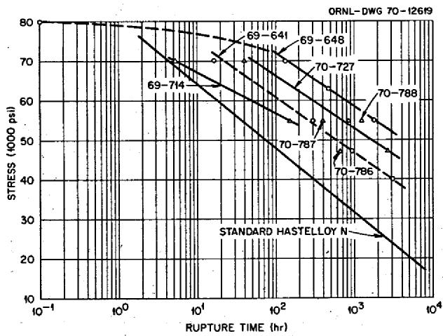  
Fig. 15.17. Stress-Rupture Properties of Modified Hastelloy N Alloys at $650^{\circ}\mathrm{C}$ .

They are all of intermediate strength. Alloys 70-788, 70-797, and 70-798 contain Ti, Hf, and Nb. Data are available only for alloy 70-788, and this appears to be one of the stronger alloys.

Similar creep properties at $760^{\circ}\mathbf{C}$ are shown in Figs. 15.20 and 15.21. Alloys 69-641 and 69-648 seem to be the strongest, with the other alloys having very similar properties.

One of the most important observations is that the modified alloys all have better creep properties than

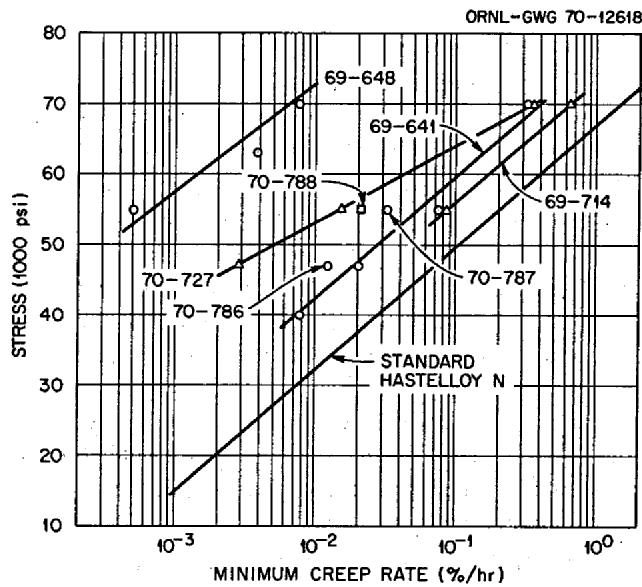  
Fig. 15.18. Creep Properties of Modified Alloys of Hastelloy N at $650^{\circ}\mathrm{C}$ .

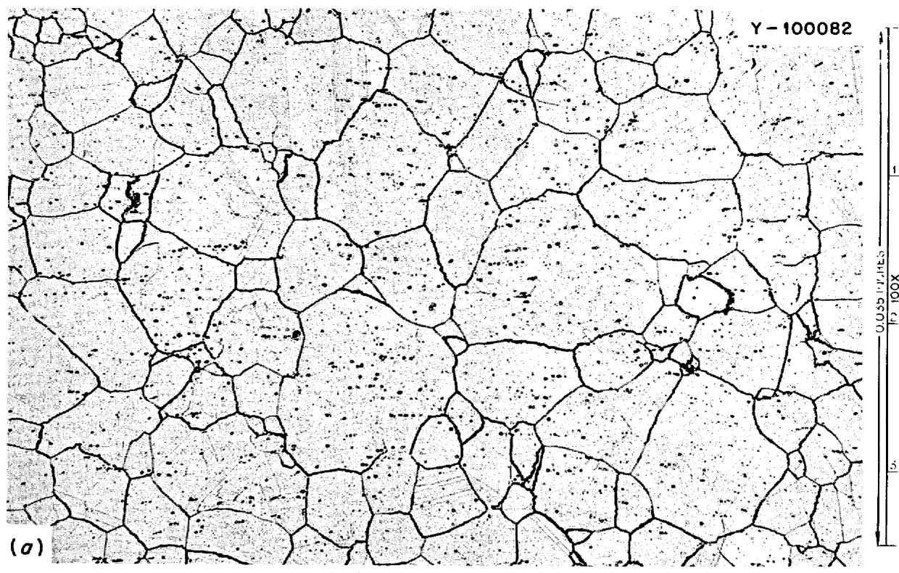

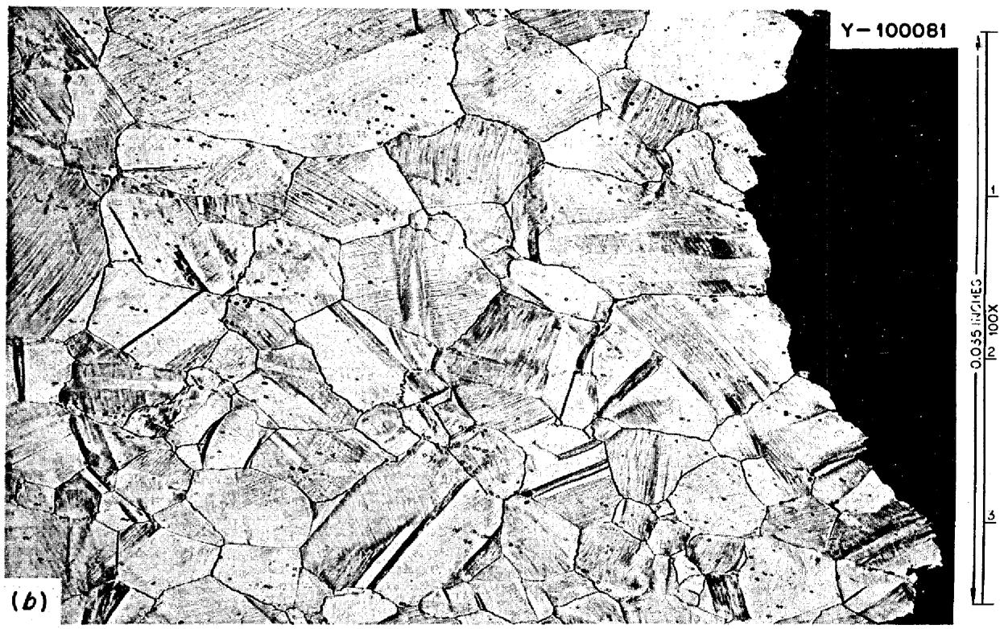  
Fig. 15.19. Photomicrographs of Alloy 69-648 After Testing at 55,000 psi and $650^{\circ}\mathrm{C}$ for 1760 hr. (a) Unstressed portion, (b) stressed portion, Etchant, glyceregia.

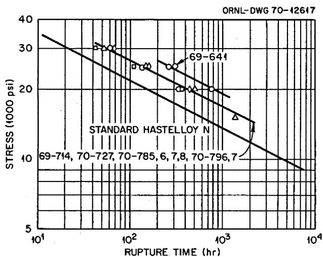  
Fig. 15.20. Stress-Rupture Properties of Modified Alloys of Hastelloy N at $760^{\circ}\mathrm{C}$ .

those of standard Hastelloy N. However, it is also quite interesting that at $650^{\circ}\mathrm{C}$ the compositional variations result in large property variations, whereas at $760^{\circ}\mathrm{C}$ the variations due to chemical composition are very small. A likely explanation for this observation is that at $650^{\circ}\mathrm{C}$ carbide strengthening is important, and the properties are very dependent upon the carbide distributions. The carbide distribution is in turn a strong function of the particular carbide-forming elements present and their concentration and the carbon concentration. At $760^{\circ}\mathrm{C}$ carbides are not as effective strengthensers, and the properties depend less upon the carbide distribution.

# 15.7 ELECTRON MICROSCOPE STUDIES

R.E.Gehlbach S.W.Cook

Our electron microscope and phase analysis studies of modified Hastelloy N alloys were concentrated on characterizing the microstructures of several commercial alloys and their relation to laboratory heats containing the same modifying elements. As reported previously, additions of Ti, Nb, and Hf change the mode of precipitation from $\mathbf{M}_2\mathbf{C}$ (MoC type) to MC type carbides provided appropriate quantities of these

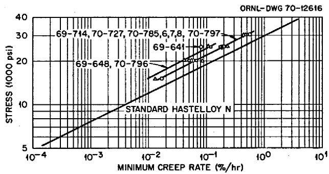  
Fig. 15.21. Creep Properties of Modified Alloys of Hastelloy N at $760^{\circ}\mathrm{C}$ .

elements are used. Metallics in the MC carbides consist of molybdenum, chromium, and one or more of the modifying elements. The fcc monocarbides formed have a wide range of lattice parameters. The alloying additions for the commercial alloys discussed are listed in Table 15.5.

The microstructures of titanium-modified commercial heats closely resemble the higher-purity laboratory melts after the same thermal treatments. At the $1\%$ titanium level, massive stacking fault precipitation is observed along grain boundaries and in the matrix. For titanium concentrations of about $2\%$ , the stacking fault morphology is absent, although MC is precipitated in and along grain boundaries and in the matrix.

The morphology of MC carbides in laboratory alloys modified with hafnium (with or without titanium) are characteristically small particles or platelets approximately $0.2\mu \mathrm{m}$ in diameter. However, the commercial alloys containing hafnium and titanium do not exhibit this morphology after aging at 650 or $760^{\circ}\mathrm{C}$ , but rather a network of MC carbides adjacent to jagged grain boundaries much like that observed in titanium-modified alloys. This typical structure is shown in Fig. 15.22 for a commercial alloy (70-787) containing $0.8\%$ hafnium and $0.9\%$ titanium as the modifying elements. These carbides are generated during aging and have a lattice parameter of 4.28 Å, the same as those which precipitate in the titanium-modified versions. Primary MC carbides not put into solid solution after annealing have large lattice parameters (e.g., 4.60 Å) and are enriched in hafnium. It appears that this difference between laboratory and commercial alloys results from the hafnium being tied up in primary carbides not dissolved during the standard 1-hr solution anneal at $1177^{\circ}\mathrm{C}$ and therefore not available to precipitate during aging. The titanium present in these alloys (0.8 to $1.4\%$ ) is then the modifying element which preci

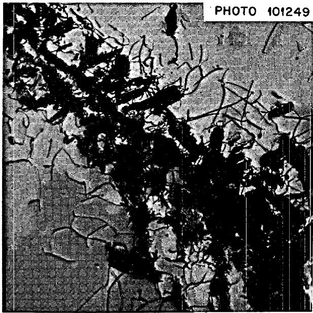  
Fig. 15.22. Microstructure of Commercial Modified Hastelloy N (70-787) Containing $0.8\%$ Hafnium and $0.9\%$ Titanium. This grain-boundary MC carbide distribution, generated by aging 500 hr at $760^{\circ}\mathrm{C}$ , is typical of all commercial alloys modified with hafnium and/or niobium and approximately $1\%$ titanium. 12,000×.

tates in the carbides during elevated temperature exposure.

Precipitation in the commercial niobium-titanium-modified alloys closely resembles that which occurs in the $1\%$ titanium- and hafnium-bearing alloys discussed above. We have not studied titanium-niobium laboratory heats sufficiently to make a strong correlation for this combination of elements.

The effect of silicon on microstructure is consistent with all earlier observations in Hastelloy N. Although all of the silicon-free alloys listed in Table 15.5 contained only MC carbides, the addition of several tenths of a percent silicon resulted in coarse stable $\mathbf{M}_6\mathbf{C}$ in the matrix and grain boundaries. This structure is characteristic of the standard air-melted Hastelloy N. A very small amount of MC does exist, however, and any significant improvement in postirradiation mechanical properties in these two heats (69-344 and 69-345) would probably be due to tying up boron in the MC carbides rather than the effect of precipitate morphology and distribution.

In summary, the effect of hafnium on precipitate morphology and distribution in commercial alloys containing titanium differs from that in small laboratory heats, with the "titanium structure" prevailing

rather than the "hafnium structure" which is observed in the purer materials. The microstructure of these commercial alloys may, however, be resistant to irradiation damage.

# 15.8 CORROSION STUDIES

# J.W.Koger

The success of a molten-salt reactor system is strongly dependent on the compatibility of the materials of construction with the various fluids in the reactor. The experiments discussed in this section are being conducted to determine the behavior of reactor materials in a molten fluoride salt environment. Because heat is transferred to and from the salt, the most prevalent form of corrosion is temperature gradient mass transfer. This can effect the removal of selected alloy constituents, which may compromise certain favorable properties of the alloy, and the deposition of dissolved corrosion products can also restrict flow in the cold part of the system. Important variables which may affect the mass transfer process are (1) impurities in the salts, (2) the nature and amounts of alloy constituents, (3) salt velocity, and (4) temperature. These effects are being studied in both isothermal and polythermal systems with conditions based on Molten-Salt Breeder Reactor design parameters. The isothermal tests are conducted in static capsules, and the polythermal experiments are in thermal convection loops and pumped loop systems.

Many types of alloys have been considered for use in a molten-salt environment, but the nickel-based alloys, especially Hastelloy N, have proven to be the most corrosion resistant. The salts of interest may be classified as (1) LiF-BeF $_2$ -based with UF $_4$ added (fuel salt), ThF $_4$ added (fertile salt), or ThF $_4$ and UF $_4$ added (fertile-fissile salt) and (2) NaBF $_4$ -NaF (92-8 mole %), the proposed coolant salt. The metals tested with these salts, in addition to Hastelloy N, include iron-base alloys such as type 304L stainless steel and a maraging steel as well as pure metals such as chromium, iron, nickel, and molybdenum.

Past work $^{20}$ has shown that, of the major constituents of Hastelloy N, chromium is much more readily oxidized by fluoride salts than Fe, Ni, or Mo. Thus attack is normally manifested by the selective removal of chromium. The rate-limiting step in chromium removal from the Hastelloy N by fluoride salt corrosion

is the solid-state diffusion of chromium in the alloy. Several oxidizing reactions may occur depending on the salt composition and impurity content, but among the most important reactants are $\mathrm{UF_4}$ , $\mathrm{FeF_2}$ , and HF. In fluoroborate salt systems, which in some cases have contained large amounts of $\mathrm{H}_2\mathrm{O}$ and oxygen (>500 ppm), we have found that elements other than chromium may be oxidized by the salt, and as a result the corrosion rate is higher and the attack is more uniform.

# 15.8.1 Results of Thermal Convection Loop Tests

The status of the thermal convection loops in operation is summarized in Table 15.6.

Fuel Salts. - Loop 1255, constructed of Hastelloy N with $2\%$ niobium and containing a simulated MSRE fuel salt plus 1 mole $\% \mathrm{ThF_4}$ , continues to operate without major difficulty after 8.4 years. We are currently developing a plan to replace thermocouples and heaters which are nearing their designed life and to revamp the temperature-control system.

Loop 1258, constructed of type 304L stainless steel and containing removable insert specimens in the hot leg, has operated about 7.1 years with the same salt as

loop 1255. The corrosion rate at the highest temperature, $688^{\circ}\mathrm{C}$ , assuming uniform wall removal, has averaged 1.1 mils/year.

Because of interest in iron-base alloys with lower chromium contents for possible containment of molten salts, we have inserted a maraging steel (12% Ni-5% Cr-3% Mo-bal Fe) specimen in loop 1258. Table 15.7 compares the weight loss and corrosion rate of this specimen with type 304 stainless steel and Hastelloy N under similar conditions of exposure. As expected, because of the lower chromium content the maraging steel shows better corrosion resistance than the stainless

Table 15.7. Comparison of Weight Losses of Alloys at Approx $663^{\circ}\mathrm{C}$ After Approx 3730 hr in Similar Flowing Fuel Salts in a Temperature Gradient System   

<table><tr><td>Alloy</td><td>Weight Loss After 3730 hr (mg/cm2)</td><td>Average Corrosion Rate (mils/year)</td></tr><tr><td>Maraging steel</td><td>4.8</td><td>0.55</td></tr><tr><td>Type 304 stainless steel</td><td>10.0</td><td>1.1</td></tr><tr><td>Hastelloy N</td><td>0.6</td><td>0.06</td></tr></table>

Table 15.6. MSR Program Natural Circulation Loop Operation Through August 31, 1970   

<table><tr><td>Loop Number</td><td>Loop Material</td><td>Specimens</td><td>Salt Type</td><td>Salt Composition (mole %)</td><td>Maximum Temperature (℃)</td><td>\( \Delta T \) (℃)</td><td>Operating Time (hr)</td></tr><tr><td>1255</td><td>Hastelloy N</td><td>Hastelloy N + 2% Nb\( ^{a,b} \)</td><td>Fuel</td><td>LiF-BeF2-ZrF4-UF4-ThF4 (70-23-5-1-1)</td><td>704</td><td>90</td><td>73,740</td></tr><tr><td>1258</td><td>Type 304L SS</td><td>Type 304L stainless steel\( ^{b,c} \)</td><td>Fuel</td><td>LiF-BeF2-ZrF4-UF4-ThF4 (70-23-5-1-1)</td><td>688</td><td>100</td><td>62,440</td></tr><tr><td>NCL-13A</td><td>Hastelloy N</td><td>Hastelloy N; Ti-modified Hastelloy N controls\( ^{c,d} \)</td><td>Coolant</td><td>NaBF4-NaF (92-8)</td><td>607</td><td>125</td><td>16,270</td></tr><tr><td>NCL-14</td><td>Hastelloy N</td><td>Ti-modified Hastelloy N\( ^{c,d} \)</td><td>Coolant</td><td>NaBF4-NaF (92-8)</td><td>607</td><td>150</td><td>24,607</td></tr><tr><td>NCL-15A</td><td>Hastelloy N</td><td>Ti-modified Hastelloy N; Hastelloy N controls\( ^{c,d} \)</td><td>Blanket</td><td>LiF-BeF2-ThF4 (73-2-25)</td><td>677</td><td>55</td><td>17,880</td></tr><tr><td>NCL-16</td><td>Hastelloy N</td><td>Ti-modified Hastelloy N; Hastelloy N controls\( ^{c,d} \)</td><td>Fuel</td><td>LiF-BeF2-UF4 (65.5-34.0-0.5)</td><td>704</td><td>170</td><td>22,240</td></tr><tr><td>NCL-17</td><td>Hastelloy N</td><td>Hastelloy N; Ti-modified Hastelloy N controls\( ^{c,d} \)</td><td>Coolant</td><td>NaBF4-NaF (92-8) plus steam additions</td><td>607</td><td>100</td><td>10,350</td></tr><tr><td>NCL-18</td><td>Hastelloy N</td><td>Ti-modified Hastelloy N; Hastelloy N controls\( ^{c,d} \)</td><td>Fertile-Fissile</td><td>LiF-BeF2-ThF4-UF4 (68-20-11.7-0.3)</td><td>704</td><td>170</td><td>15,930</td></tr><tr><td>NCL-19A</td><td>Hastelloy N</td><td>Hastelloy N; Ti-modified Hastelloy N controls\( ^{c,d} \)</td><td>Fertile-Fissile</td><td>LiF-BeF2-ThF4-UF4 (68-20-11.7-0.3) plus bismuth in molybdenum hot finger</td><td>704</td><td>170</td><td>4,660</td></tr><tr><td>NCL-20</td><td>Hastelloy N</td><td>Hastelloy N; Ti-modified Hastelloy N controls\( ^{c,d} \)</td><td>Coolant</td><td>NaBF4-NaF (92-8)</td><td>687</td><td>250</td><td>6,170</td></tr></table>

4Permanent specimens.   
bHot leg only.   
$c$ Removable specimens.   
$d_{\mathrm{Hot}}$ and cold legs.

steel, but the corrosion behavior of the Hastelloy N is still superior to both.

Figure 15.23 shows the metallographic appearance of the maraging steel specimen after exposure for $5700\mathrm{hr}$ at $662^{\circ}\mathrm{C}$ . Most of the attack is manifested as surface pitting, but there are also subsurface voids such as were seen in the stainless steel specimens of this loop.[21] The void formation is attributed to removal of chromium atoms from the surface. This results in a concentration gradient and causes like atoms from the underlying region to diffuse toward the surface, thus leaving behind a zone enriched with vacancies. In time these vacancies accumulate and form visible voids.

Loop NCL-16, constructed of standard Hastelloy N, with removable specimens in each leg, has operated with the two-fluid MSBR fuel salt for over two years. The corrosion rate at the highest temperature, $704^{\circ}\mathrm{C}$ , is 0.04 mil/year assuming uniform attack. For this system, as with all others studied to date, titanium-modified

Hastelloy N specimens (12% Mo-7% Cr-0.5% Ti-bal Ni) continue to have smaller weight changes than standard Hastelloy N specimens (16% Mo-7% Cr-5% Fe-bal Ni) under equivalent conditions. We attribute this to the absence of iron in the modified alloys. The chromium content of the salt, currently 400 ppm, continues to show a small increase with time, while the iron content of the salt has apparently stabilized. Earlier²² the iron content of the salt had decreased, suggesting that the reaction

$$
\mathrm {F e F} _ {2} (\mathrm {d}) + \mathrm {C r} (\mathrm {s}) \rightleftharpoons \mathrm {C r F} _ {2} (\mathrm {d}) + \mathrm {F e} (\text {d e p o s i t e d}),
$$

where

$$
\mathbf {d} = \text {d i s s o l v e d i n s a l t},
$$

$$
s = \text {s o l i d s o l u t i o n},
$$

was in part responsible for chromium mass transfer. Since no changes in iron are now seen, the $\mathbf{U}\mathbf{F}_4$ corrosion reaction

$^{21}$ J. W. Koger and A. P. Litman, MSR Program Semiann. Progr. Rept. Aug. 31, 1968, ORNL-4344, p. 261.

22J. W. Koger and A. P. Litman, MSR Program Semiann. Progr. Rept. Feb. 28, 1970, ORNL-4548, p. 242.

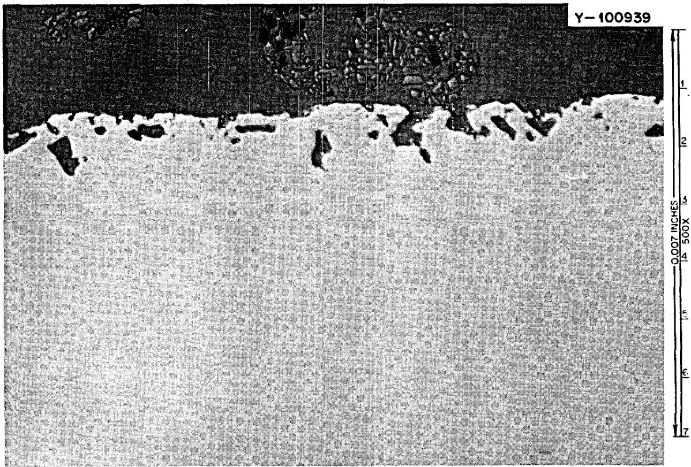  
Fig. 15.23. Microstructure of a Maraging Steel (12% Ni-5% Cr-3% Mo-bal Fe) Exposed to LiF-BeF $_2$ -ZrF $_4$ -UF $_4$ -ThF $_4$ (70-23-5-1-1 Mole %) for 5700 hr at $662^{\circ}\mathrm{C}$ . As polished.

$$
2 \mathrm {U F} _ {4} (\mathrm {d}) + \mathrm {C r} (\mathrm {s}) \rightarrow \mathrm {C r F} _ {2} (\mathrm {d}) + 2 \mathrm {U F} _ {3} (\mathrm {d})
$$

must now be the primary cause for the chromium removal. The rate of the chromium transfer is still controlled by solid-state diffusion of chromium in the alloy.

# 15.8.2 Fertile-Fissile Salt

Loop NCL-18, constructed of standard-Hastelloy N, with removable specimens in each leg, has operated for about two years with the salt mixture $\mathrm{LiF - BeF_2 - }$ $\mathrm{ThF_4 - UF_4}$ (68-20-11.7-0.3 mole %). The weight change at the highest temperature, $704^{\circ}\mathrm{C}$ , is $-1.5\mathrm{mg / cm}^2$ . Assuming uniform attack, the corrosion rate is 0.05 mil/year. The titanium-modified Hastelloy N specimens show smaller weight losses than standard Hastelloy N specimens in equivalent positions, and, as in the case of NCL-16, the chromium content of the salt is increasing (190 ppm at the present) while the iron content is stable. The loop is not operating at present because of an electrical short in one of the main heaters, which burned a hole in the loop piping. Repair work has begun.

Hastelloy N loop NCL-19A is similar to NCL-19 but has a molybdenum-sheathed finger containing bismuth at the bottom of the hot leg. The loop has circulated the fertile-fissile MSBR salt for over 4600 hr. The weight change at the highest temperature, $704^{\circ}\mathrm{C}$ , is $-0.4\mathrm{mg/cm}^2$ . Assuming uniform attack, the calculated corrosion rate is $0.04\mathrm{mil/yr}$ . No difference is apparent in the weight loss of a standard Hastelloy N specimen and a modified specimen ( $12\%$ Mo- $7\%$ Cr- $0.4\%$ Ti- $0.1\%$ Fe- $2.0\%$ Cb) at identical positions. The chromium content in the salt has increased from 25 to 128 ppm, and the iron content has decreased from 111 to 30 ppm. This also suggests a reaction of the type $\mathrm{Cr(s)} + \mathrm{FeF}_2(\mathrm{d}) \rightarrow \mathrm{CrF}_2(\mathrm{d}) + \mathrm{Fe}$ (deposited). The bismuth content of the salt is very low, 3 ppm.

We have also examined specimens from loop NCL-19 to determine if bismuth contained in a "dead leg" before the heated vertical leg in any way affected the properties of the Hastelloy N. In one such test a specimen from the hottest position was bent around a $\frac{1}{4}$ -in.-diam tube and examined metallographically. There was no indication of cracking or weakening of grain boundaries, and as with previous examinations,[24] we saw no signs of salt or bismuth attack.

# 15.8.3 Blanket Salt

Loop NCL-15A, constructed of standard Hastelloy N, with removable specimens in each leg, has operated two years with the LiF-BeF $_2$ salt containing 25 mole $\%$ ThF $_4$ . Specimens exposed to this salt tend to be "glazed" with a coating that is impossible to remove without damaging the metal. This has introduced a positive but random bias in our measured weight changes; however, there has been little change in the chromium concentration of the salt, which is indicative of low corrosion rates.

# 15.8.4 Coolant Salt

Loops NCL-13A and NCL-14, constructed of standard Hastelloy N, with removable specimens in each leg, have operated for two and three years, respectively, with the fluoroborate salt which has been proposed as the MSBR secondary coolant. Figures 15.24 and 15.25 give the weight changes of specimens at various temperatures as a function of operating time. The overall corrosion rates at the maximum temperature, $605^{\circ}\mathrm{C}$ , are 0.5 mil/year and 0.7 mil/year for loops NCL-13A and NCL-14 respectively. The attack is general, and actual measurements of specimens show changes in thickness agreeing with those calculated from weight changes.

Abrupt increases in the slope of the weight change curves (increased gains and losses) indicate changes in the oxidation potential of the salt which we believe were caused by inadvertent air leaks into the system.25 These slope changes were accompanied by increases in Cr, Ni, Fe, and Mo in the salt, which would indicate general attack of the alloy. Under conditions where external impurities did not enter the loops, chromium was the only element removed from the alloy, and corrosion rates during these periods fell to as low as 0.08 mil/year.

The air leaks in loops 13A and 14 have resulted at various mechanical joints in the system such as ball valves, level probes, and pressure gages, all located in the cover gas space above the circulating salt. We had gained extensive experience with similar mechanical joints prior to testing fluoroborate salt mixtures and had encountered no leakage problems. Therefore the frequency of leaks in these two fluoroborate loops strongly suggests that the cover gas atmosphere in these tests has resulted in deterioration of our mechanical

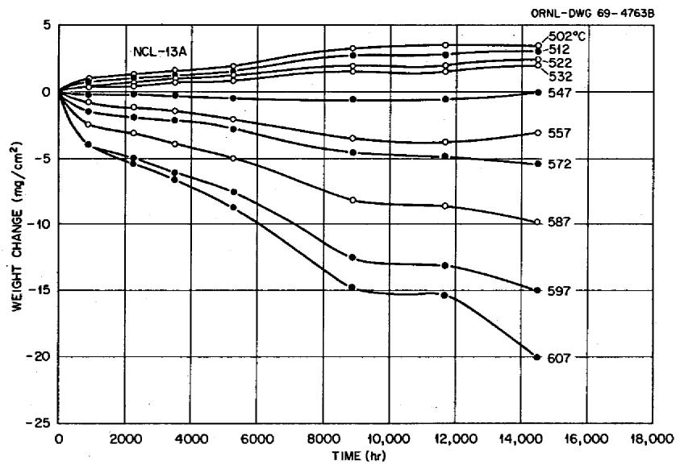  
Fig. 15.24. Weight Change vs Time for Standard Hastelloy N Specimens in NCL-13A Exposed to Fluoroborate Salt at Various Temperatures.

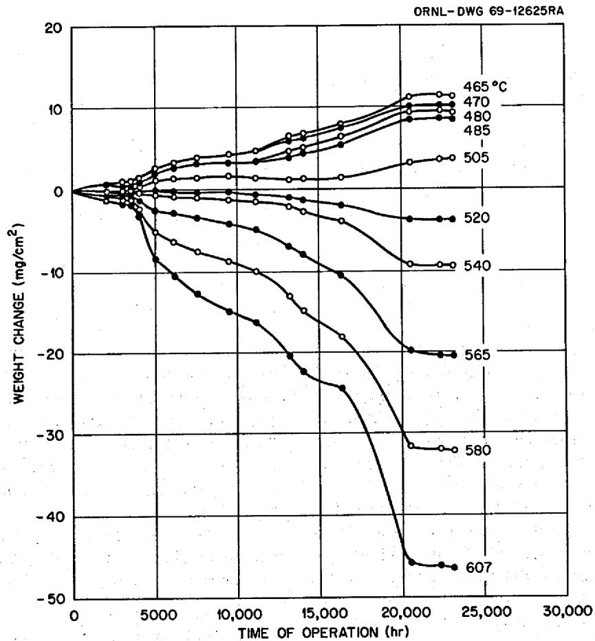  
Fig. 15.25. Weight Change vs Time for Titanium-Modified Hastelloy N Specimens in NCL-14 Exposed to Fluoroborate Salt at Various Temperatures.

seals. We are currently investigating the chemical nature of the cover gas to determine any possible contaminants which might have caused such deterioration. Despite the known problems of air inleakage, these loops have operated for over two years with the fluoroborate salt, and the overall corrosion rate is within acceptable limits.

We are currently using loop NCL-14 to evaluate the corrosion properties of pure Cr, Fe, Mo, and nickel 280 (commercially pure nickel) at $600^{\circ}\mathrm{C}$ in $\mathrm{NaBF}_4$ -NaF (92-8 mole %) salt. As a consequence of the air leaks discussed above, the $\mathrm{H}_2\mathrm{O}$ content of the salt in loop NCL-14 is at an abnormally high level of approximately 2000 ppm. We initially examined the pure metal specimens after a 234-hr exposure. On removal, we found that the chromium and iron specimens had completely disintegrated. The molybdenum specimen showed no weight change, and the nickel specimen showed a slight weight gain. The chromium and iron specimens were replaced, and a second experiment was conducted for 23 hr. Again, the molybdenum specimen did not change weight, and the nickel specimen showed a slight weight gain. Very little of the chromium specimen remained, and the weight loss of the iron specimen was $40\mathrm{mg/cm}^2$ (70 mils/year). Close examination of the chromium specimen showed it to be coated with a black reaction layer $\sim 1/6_4$ in thick. Laser spectroscopy of the outer surface of the black material showed iron and boron as major constituents and sodium and chromium as minor constituents. However, x-ray diffraction of the bulk coating showed it to be over $90\%$ $\mathrm{NaBF}_4$ . This black coating has been observed on Hastelloy N specimens exposed to impure $\mathrm{NaBF}_4$ -NaF (92-8 mole %) in the past,[26] but in these cases it was too thin or too adherent to remove and identify.

Attack of Hastelloy N by impure fluoroborate salt tends to be nonselective in nature; that is, all components of Hastelloy N suffer oxidation, and surfaces of the alloy appear to recede uniformly. However, in this experiment with pure metals, only the chromium and iron were noticeably attacked, the chromium more than iron. We conclude, therefore, that the pure chromium and iron specimens in this system acted to buffer the attack of the nickel and molybdenum specimens. The buffering effect apparently is much less when chromium and iron are present as alloying additions in Hastelloy N, presumably because their chemical activity in the alloy is too low or the rate at which they can enter the salt is too slow, being limited by solid-state

diffusion in the alloy. When the oxidation potential of the salt is reduced, however, as would be the case in a purer fluoroborate salt, attack of Hastelloy N becomes more selective, and the buffering effect of chromium may become more important. In loop tests of nickel-molybdenum alloys containing Fe, Nb, or W, DeVan observed[27] that the concentration of these elements in FLINAK[28] salt was lowered by the presence of chromium in the alloy. These observations suggest that the incorporation of an active metal such as chromium would effectively inhibit attack in a Hastelloy N-fluoroborate circuit.

Loop NCL-17, constructed of commercial Hastelloy N with removable specimens in each leg, is being operated to determine the effect of steam inleakage in a fluoroborate salt-Hastelloy N circuit. This experiment has run for over 10,000 hr and is continuing in order to provide information on the immediate and long-range corrosion of the system after steam injection. The loop was operated for 1000 hr, the specimens removed and weighed, and steam forced into the flowing salt system through a 16-mil hole in a closed $\frac{1}{4}$ -in. Hastelloy N tube, simulating a leaking heat exchanger. Steam was forced into the system until the pressure of the cover gas began to increase, thus indicating that no more steam was soluble in the salt. Figure 15.26 shows the weight changes and temperatures for the specimens in NCL-17. As usual, the changes are temperature dependent, and the rates are decreasing with time. The corrosion rate appears to have stabilized, and no plugging conditions have been noted. Figure 15.27 shows the specimens from the loop 424 hr after exposure to steam. The specimens with the etched appearance have lost weight, and those that are darkened have gained weight.

For the last 3500 hr the concentrations of impurity constituents in the salt (Fe, Cr, Ni, Mo, $\mathbf{H}_2\mathbf{O}$ , and $\mathrm{O_2}$ ) have remained relatively constant (Table 15.8). The present chromium level is $\sim 320$ ppm. The results of this test show that the Hastelloy N system containing fluoroborate salt can tolerate inleakage of steam and, once the leak is repaired, could continue to operate without extensive damage even if the salt were not repurified.

Loop NCL-20, constructed of standard Hastelloy N, with removable specimens in each leg, has circulated a fluoroborate coolant salt for 6000 hr and is being

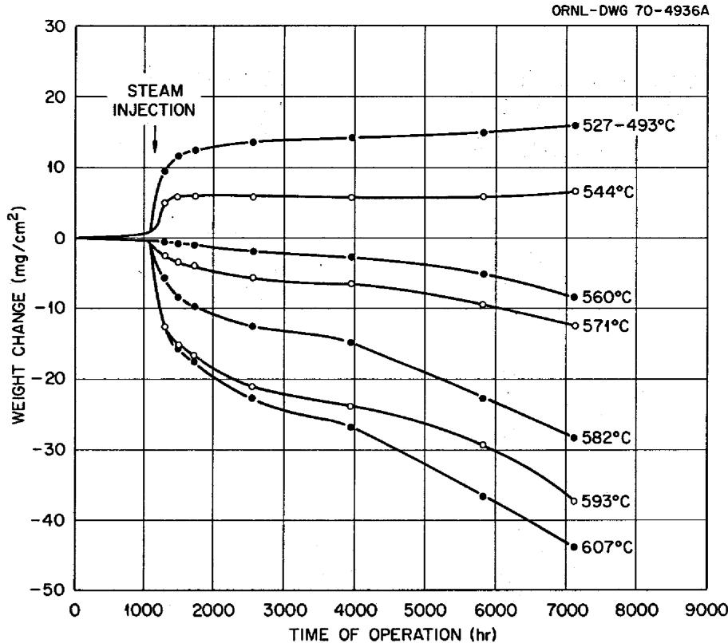  
Fig. 15.26. Weight Change vs Time for Hastelloy N Specimens in NCL-17 Exposed to $\mathrm{NaBF_4}$ NaF (92-8 Mole %) at Various Temperatures.

Table 15.8. Concentration of Impurities in NCL-17 Salt   

<table><tr><td rowspan="2">Salt Circulation Time (hr)</td><td colspan="5">Concentration in Salt (ppm)</td></tr><tr><td>Cr</td><td>Fe</td><td>Ni</td><td>Mo</td><td>H2O</td></tr><tr><td>48</td><td>56</td><td>211</td><td>8</td><td>5</td><td></td></tr><tr><td>1179</td><td>82</td><td>204</td><td>&lt;5</td><td>&lt;5</td><td>630</td></tr><tr><td>1180</td><td></td><td colspan="3">Added steam</td><td></td></tr><tr><td>1182</td><td>109</td><td>222</td><td>51</td><td>71</td><td>1400</td></tr><tr><td>1468</td><td>243</td><td>303</td><td>74</td><td>56</td><td>1900</td></tr><tr><td>1973</td><td>259</td><td>341</td><td>9</td><td>8</td><td></td></tr><tr><td>2880</td><td>320</td><td>375</td><td>11</td><td>12</td><td>3600</td></tr><tr><td>4324</td><td>310</td><td>356</td><td>15</td><td>3</td><td>3600</td></tr><tr><td>6239</td><td>317</td><td>362</td><td>11</td><td>&lt;2</td><td>3500</td></tr></table>

operated at temperature conditions very near those proposed for the maximum $(687^{\circ}\mathrm{C})$ and minimum $(387^{\circ}\mathrm{C})$ salt-metal temperature (primary heat exchanger and steam generator respectively) of the MSBR secondary circuit. Forced air cooling (as opposed to ambient air cooling used on other thermal-convection loops) is used on the lower half of the cold leg, and the operating temperatures obtained were $687^{\circ}\mathrm{C}$ maximum and $\sim 438^{\circ}\mathrm{C}$ minimum (a $\Delta T$ of $250^{\circ}\mathrm{C}$ ). Table 15.9 gives the corrosion results for this experiment. The

Table 15.9. Weight Change of Specimen at $687^{\circ}\mathrm{C}$ and Impurity Content of Salt of NCL-20   

<table><tr><td rowspan="2">Time (hr)</td><td rowspan="2">Weight Loss (mg/cm2)</td><td rowspan="2">Incremental Corrosion Rate (mils/year)a</td><td colspan="3">Chemical Analysis (ppm)</td></tr><tr><td>Cr</td><td>Fe</td><td>H2O</td></tr><tr><td>0</td><td></td><td></td><td>58</td><td>227</td><td>900</td></tr><tr><td>624</td><td>0.3</td><td>0.19</td><td>90</td><td>198</td><td>550</td></tr><tr><td>1460</td><td>0.7</td><td>0.18</td><td>99</td><td>110</td><td>590</td></tr><tr><td>2586</td><td>1.0</td><td>0.15</td><td>109</td><td>104</td><td>470</td></tr><tr><td>3784</td><td>1.7</td><td>0.17</td><td>131</td><td>91</td><td>670</td></tr></table>

$a$ Assuming uniform loss.

corrosion rates are the lowest yet attained with a fluoroborate mixture and confirm the importance of salt purity on compatibility with structural materials. The low values of chromium and water in the salt are also indicative of low corrosion rates.

# 15.8.5 Summary

Our data on fluoroborate salts point out that impurities such as $\mathbf{H}_2\mathbf{O}$ and $\mathbf{O}_2$ strongly affect the fluoride

PHOTO 77157

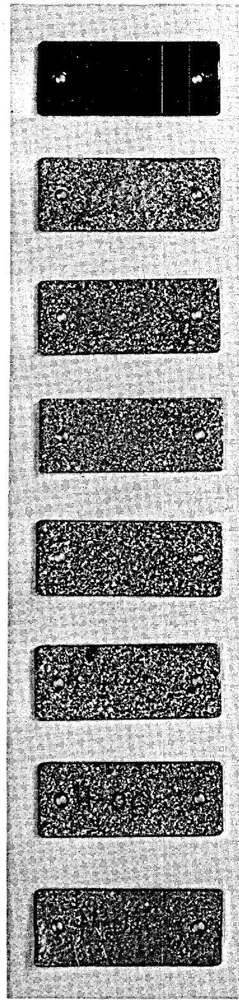

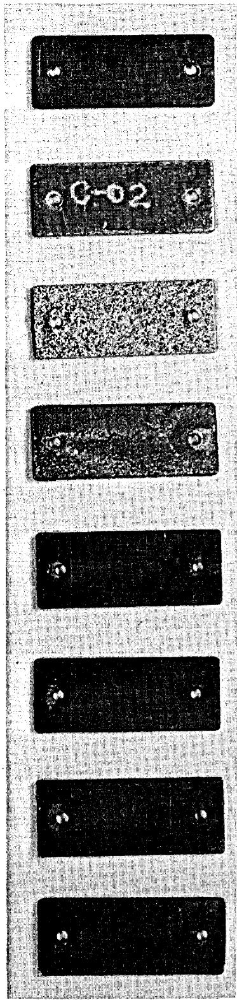

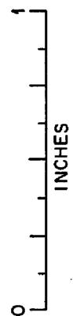  
Fig. 15.27. Hastelloy N Specimens from NCL-17 Exposed to $\mathrm{NaBF}_4$ -NaF (92-8 Mole%). Specimens were exposed to salt for $1050\mathrm{hr}$ before steam injection and for $424\mathrm{hr}$ after steam injection. The specimens on the left were in the hot leg, and those on the right were in the cold leg. Specimens in the etched condition lost weight, and the darkened specimens gained weight.

oxidation potential of this salt. However, we do not yet know the chemical forms taken by these impurities upon entering the salt. Corrosion rates show an instantaneous increase following an air or steam leak into the fluoroborate salt. Once the leak has been detected and corrected, the corrosion rate drops sharply. Analyses of the salt for water (Karl Fischer method) $^{29}$ and oxygen $\left(\mathrm{KBrF}_4\right.$ method) $^{30}$ show an increase in both contaminants as the corrosion rate increases, but the apparent level of the contaminants does not show a corresponding drop as the corrosion rate decreases. One tentative explanation for this behavior is that moisture reacts with the salt to produce HF and compounds (oxides and hydroxides) which analyze as $\mathrm{H}_2\mathrm{O}$ and $\mathrm{O}_2$ by the present analytical techniques. The HF causes rapid oxidation of the containment material and is used up in the process. The compounds which analyze as $\mathrm{H}_2\mathrm{O}$ and $\mathrm{O}_2$ remain, but have only a minor effect on corrosion rate.

# 15.9 FORCED-CONVECTION LOOP MSR-FCL-1

W.R.Huntley J.W.Koger H.C.Savage

The MSR-FCL-1 forced-circulation loop is being operated to evaluate the compatibility of standard Hastelloy N with $\mathrm{NaBF_4}$ -NaF (92-8 mole $\%$ ) coolant salt at temperatures and flow rates similar to those which existed in the MSRE coolant circuit. Salt velocity

$^{29}$ R. E. Apple and A. S. Meyer, MSR Program Semiann. Progr. Rept. Aug. 31, 1969, ORNL-4449, p. 161.   
30J. C. White, MSR Program Semiann, Progr. Rept. July 31, 1964, ORNL-3708, p. 327.

in the $\frac{1}{2}$ -in.-OD, 0.042-in.-wall Hastelloy N loop is nominally 10 fps. The maximum and minimum salt temperatures of the loop are 588 and $510^{\circ}\mathrm{C}$ respectively. Hastelloy N corrosion test specimens are exposed to the circulating salt at three temperatures, 510, 555, and $588^{\circ}\mathrm{C}$ .

# 15.9.1 Operations

The fourth run, which was of 2475 hr duration, was completed on March 18, 1970. Completion of this run brought the total accumulated time at design conditions to 8573 hr. Following run 4, corrosion specimens were removed for metallographic examination and weight change measurements. The $\mathrm{Na}_3\mathrm{CrF}_6$ corrosion product seen on the pump bowl surfaces after some previous runs was not apparent after run 4. The temperature of the pump bowl $(510^{\circ}\mathrm{C})$ is close to the coldest temperature.

The corrosion test specimens were reinstalled, and on April 16, 1970, the loop was brought to design conditions for the start of run 5. Loop operation was interrupted on several occasions by a series of mechanical problems with loop components, and finally run 5 was terminated after $422\mathrm{hr}$ of operation at design conditions when the pump bearings failed. The problems encountered in run 5, along with times when salt samples were taken for analysis, are summarized in Table 15.10 and are discussed below.

On May 4, 1970, after the pump had been removed, we found approximately $50\mathrm{g}$ of intermixed white and green material on the pump liner above the liquid level. Analysis of a small portion of this material showed about equal amounts of NaF and $\mathrm{NaBF_4}$ , with 4300

Table 15.10. Chronological Tabulation of Salt Samples and Problems Encountered During Run 5   

<table><tr><td>Date</td><td>Operating Time (hr)</td><td>Problem</td><td>Comments</td></tr><tr><td>4-16-70</td><td>1.3</td><td>Drive motor bearing failure</td><td>Motor replaced</td></tr><tr><td>4-16-70</td><td>3</td><td></td><td>Salt sample from loop</td></tr><tr><td>4-27-70</td><td>289</td><td>Cooling air blower bearing failure</td><td>Bearings replaced</td></tr><tr><td>5-1-70</td><td>360</td><td>LFB pump bearing failure</td><td>Salt drained to sump tank; pump removed and repaired</td></tr><tr><td>5-4-70</td><td>360</td><td></td><td>Found large amounts of green corrosion product (~50 g) in pump bowl</td></tr><tr><td>5-8-70</td><td>360</td><td>Drive motor bearing failure</td><td>Bearings replaced</td></tr><tr><td>5-13-70</td><td>381</td><td></td><td>Salt sample from loop</td></tr><tr><td>5-15-70</td><td>422</td><td>LFB pump bearing failure</td><td>Salt drained to sump tank; pump removed; run terminated</td></tr><tr><td>5-20-70</td><td>422</td><td></td><td>Salt sample taken from dump tank</td></tr></table>

ppm chromium, assumed to be in the form of $\mathrm{Na}_3\mathrm{CrF}_6$ . The mass of chromium was equivalent to a 25-ppm change in the chromium content of the salt. A salt sample taken May 13, 1970, contained 153 ppm chromium, which was 100 ppm less than our initial salt sample. This indicates either that we did not recover all the green material during pump disassembly or that our sample of the white and green material was not representative. At present we do not know the conditions that caused the deposition of the corrosion product in the pump liner.

The pump-bearing failure at $422\mathrm{hr}$ of operation (May 15, 1970) allowed the pump impeller to come in contact with the impeller housing and caused abrasion of the impeller. Metal particles from the impeller were seen in the salt left in the pump bowl after dumping. Accordingly, the pump was removed from the loop, and at the same time we removed the corrosion test specimen assemblies. This allowed us to clean the loop piping by flushing with demineralized water. A total of $3.31\mathrm{g}$ of Hastelloy N particles was recovered from the loop. The loop was dried by air purging, and the corrosion specimen assemblies and pump were reinstalled. A $40 - \mu$ pore size nickel filter was also installed in the dump tank line to filter any metal particles from the salt being returned to the loop.

We made the following modifications to improve the performance and reliability of the pump: (1) proper tolerance between pump shaft and bearings as recommended by the bearing manufacturers (this is especially important for the present relatively high pump speed of 5000 rpm), (2) use of a rotary oil union designed for operation up to 10,000 rpm in the pump coolant and lube oil line, (3) development of a belt-tightening procedure to ensure that the pump drive belts do not produce excessive radial load on the bearings, (4) compilation of inspection procedures to ensure proper assembly of the pump, and (5) improvements in the pump coolant and lube oil system to ensure reliable oil flow.

Because of the discontinuance of shift coverage by technicians in Building 9201-3, Y-12 Plant, on July 31, 1970, we revised the loop instrumentation and control system prior to the start of run 6. This involved redesign of the control system to protect the loop against changes in flow, temperature excursions, or malfunction of loop components during unattended operation.

Corrosion test specimens were reinstalled in the loop, and the modifications to the instrumentation and control system for unattended operation were completed in mid-August. $\mathrm{NaBF}_4$ -NaF (92-8 mole %) salt

was returned to the loop from the dump tank through the $40 - \mu$ pore size nickel filter. The loop was brought to design conditions for the start of run 6 on August 26, 1970, and is operating satisfactorily. Approximately three months (May 15 to August 26, 1970) were required to return the loop to operating conditions after the termination of run 5. Part of this time (approximately one month) was due to the unavailability of craft labor during the strike. Thus about two months were spent in the necessary repair of the loop and modifications to the loop system for unattended operation.

# 15.9.2 Cold Finger Corrosion Product Trap

During the scheduled loop shutdown at the end of run 4, we enlarged the access port in the pump bowl from $\frac{1}{2}$ -in. to $\frac{3}{4}$ -in. diameter (maximum size possible in the pump bowl) in order to provide more flexibility in the design and operation of cold finger devices.[31] We had concluded from previous tests that a lack of wetting prevented any salt deposit from adhering to the surface of the cold finger and that a grooved or roughened surface would be helpful.

With the enlarged access port we were able to insert a $5 / 8$ -in.-OD cold finger with circumferential grooves which was previously used in another circulating fluoroborate loop (PKP-1) and on which significant deposits of salt containing $\mathrm{Na}_3\mathrm{CrF}_6$ were obtained.32

Several tests were made during run 5 with this cold finger at temperatures between 150 and $420^{\circ}\mathrm{C}$ . The cold finger was inserted below the liquid surface in the pump bowl for periods of 5 to 6 hr for each test. The salt temperature in the pump bowl was approximately $516^{\circ}\mathrm{C}$ . Small deposits with a light-green color (indication of corrosion product $\mathrm{Na}_3\mathrm{CrF}_6$ ) were occasionally seen on the cold finger when it was withdrawn into the sight glass above the pump bowl. However, such deposits usually dropped off immediately. Apparently any slight vibration is enough to knock most of the deposited material loose before the cold finger can be pulled all the way out of the pump bowl.

We plan to try other types of cold finger devices in loop MSR-FCL-1 as time permits.

Table 15.11. Average Weight Change of Specimens in MSR-FCL-1   

<table><tr><td rowspan="2">Run No.</td><td colspan="2">Total Salt Exposure Time (hr)</td><td colspan="3">Average Specimen Weight Change at Indicated Temperature (mg/cm2)</td><td colspan="2">Corrosion Rate at 588°C Assuming Uniform Lossa(mils/year)</td></tr><tr><td>Design Conditions</td><td>Isothermal Conditions</td><td>510°C</td><td>555°C</td><td>588°C</td><td>Overall</td><td>Incremental</td></tr><tr><td>1</td><td>2082</td><td>659</td><td>+1.1</td><td>-2.7</td><td>-11.1</td><td>1.6</td><td>1.6</td></tr><tr><td>2</td><td>4088</td><td>667</td><td>+2.5</td><td>-4.2</td><td>-17.3</td><td>1.4</td><td>1.2</td></tr><tr><td>3</td><td>6097</td><td>667</td><td>+3.1</td><td>-5.2</td><td>-21.0</td><td>1.2</td><td>0.7</td></tr><tr><td>4</td><td>8573</td><td>1018</td><td>+2.1</td><td>-5.8</td><td>-23.1</td><td>0.9</td><td>0.3</td></tr><tr><td>5</td><td>8995</td><td>1068</td><td>+2.5</td><td>-7.9</td><td>-31.9</td><td>1.2</td><td>7.2</td></tr></table>

${}^{a}$ Based on total salt exposure time.

# 15.9.3 Metallurgical Analysis

The weight changes of Hastelloy N specimens in loop MSR-FCL-1 are compared in Table 15.11 for each of five test runs. The corrosion rate decreased steadily over the first four runs and, at the conclusion of run 4, had dropped to $0.3\mathrm{mil / hr}$ at the point of maximum temperature $(588^{\circ}\mathrm{C})$ . However, the corrosion rate during run 5 was higher than in any of the preceding runs.

Although the increased rate of attack during run 5 is undoubtedly associated with operating difficulties encountered during the run, we have not pinpointed the specific causes. Increased corrosion is normally accompanied by an increase in impurities in the salt; however, we did not see any significant impurity changes during run 5. Because of the nature of the last pump-bearing failure, we were not able to take a salt sample from the loop before shutdown in our normal manner. Thus a sample was taken from the dump tank after the loop had been shut down. However, because of dilution there was no assurance that the sample was representative of the salt which had circulated in the loop.

Specimens in the coldest part of the system gained weight during the first three runs and then lost a small amount of weight during run 4. Thickness measurements of these specimens disclosed that the upstream end had reduced in thickness compared with the middle and downstream end. Specimens at other locations in the loop (555 or $588^{\circ}\mathrm{C}$ ) showed similar behavior, although smaller in magnitude. Figure 15.28 shows the visual appearance of a specimen at $588^{\circ}\mathrm{C}$ after run 4 and clearly illustrates the heavier attack at the upstream end. Changes in specimen thickness are summarized in Table 15.12, and they are quite consistent with the changes calculated from weight measurements.

Figure 15.29 shows specimens 2 $(555^{\circ}\mathrm{C})$ , 4 $(588^{\circ}\mathrm{C})$ and 8 $(510^{\circ}\mathrm{C})$ at the end of run 5. Note the change in appearance of specimen 4 between run 4 (Fig. 15.28) and run 5 (Fig. 15.29). The etched appearance of specimen 4 after run 5 is typical of the appearance of Hastelloy N specimens in natural convection corrosion test NCL-17 (see previous section) after extreme oxidizing conditions had been created by intentional steam inleakage. We are hopeful that further sampling of the salt prior to test run 6 will reveal the contaminants

PHOTO 77729

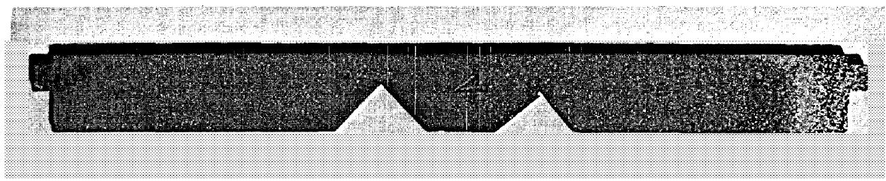  
Fig. 15.28. Hastelloy N Specimen 4 from MSR-FCL-1 Exposed to $\mathrm{NaBF}_4$ -NaF (92-8 Mole %) at $588^{\circ}\mathrm{C}$ for 96 Total Hours (Through Run 4).

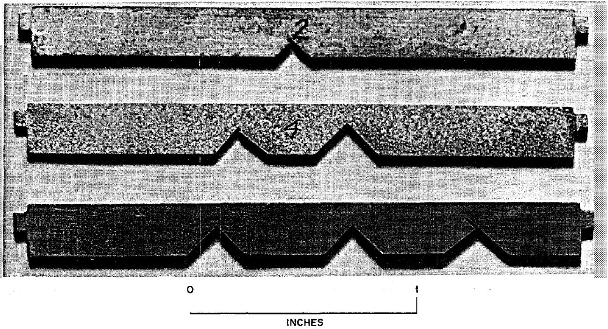  
Fig. 15.29. Hastelloy N Specimens from MSR-FCL-1 Exposed to $\mathrm{NaBF}_4$ -NaF (92-8 Mole %) for 10,000 Total Hours (Through Run 5). From top to bottom the temperatures were 555, 588, and $510^{\circ}\mathrm{C}$ .

Table 15.12. Average Thickness Change of Specimens After 9600 hr Total Exposure to $\mathbf{NaBF}_4$ -NaF (92-8 Mole %) in FCL-1   

<table><tr><td>Specimen Temperature (℃)</td><td>Average Thickness Change (mils)</td></tr><tr><td>588</td><td>-1.25</td></tr><tr><td>555</td><td>-0.75</td></tr><tr><td>510</td><td>+1.0²</td></tr></table>

aDiscounting upstream end of sample, thickness increase is +2.5 (see text).

responsible for the unusually high corrosion rate during run 5.

# 15.9.4 Forced-Convection Loop MSR-FCL-2

We have completed the design of a second molten-salt forced-convection loop, designated MSR-FCL-2, which is to be used to study the mass transfer properties of Hastelloy N in fluoroborate-type coolant salt systems at conditions proposed for the MSBR. Some component parts of the loop have been fabricated, and assembly is in progress.

The loop will be constructed of $\frac{1}{2}$ -in.-OD, 0.042-in.-wall commercial Hastelloy N tubing and will contain three corrosion test specimen assemblies (metallurgical specimens) exposed to the circulating salt at three different temperatures and bulk flow velocities of 10 and 20 fps (4 gpm flow rate). The test specimens are designed for installation and removal without draining salt from the loop.

Salt will be circulated in the loop by means of a new-design centrifugal pump $^{34}$ (designated ALPHA) designed for reliable long-term operation at flow rates up to 30 gpm and heads to 300 ft. This pump is now being tested with water in a pump test stand to determine pump characteristics.

Two resistance-heated sections which are independently controlled and two finned-tube coolers will provide a temperature differential of at least $165^{\circ}\mathrm{C}$ $(300^{\circ}\mathrm{F})$ at a flow rate of 4 gpm. One resistance-heated section is designed with special thermocouple wells at the inlet and outlet and with additional thermocouples

on the pipe wall to determine heat transfer coefficients. An expansion tank is used for salt sampling and will contain liquid-level-indicating probes, "cold finger" devices to study preferential deposition of corrosion products, and gas lines for on-line salt purification.

A simplified flow diagram of loop MSR-FCL-2 is shown in Fig. 15.30. Selected engineering design data are given in Table 15.13, and the calculated temperature profile around the loop circuit at typical design conditions is shown in Fig. 15.31.

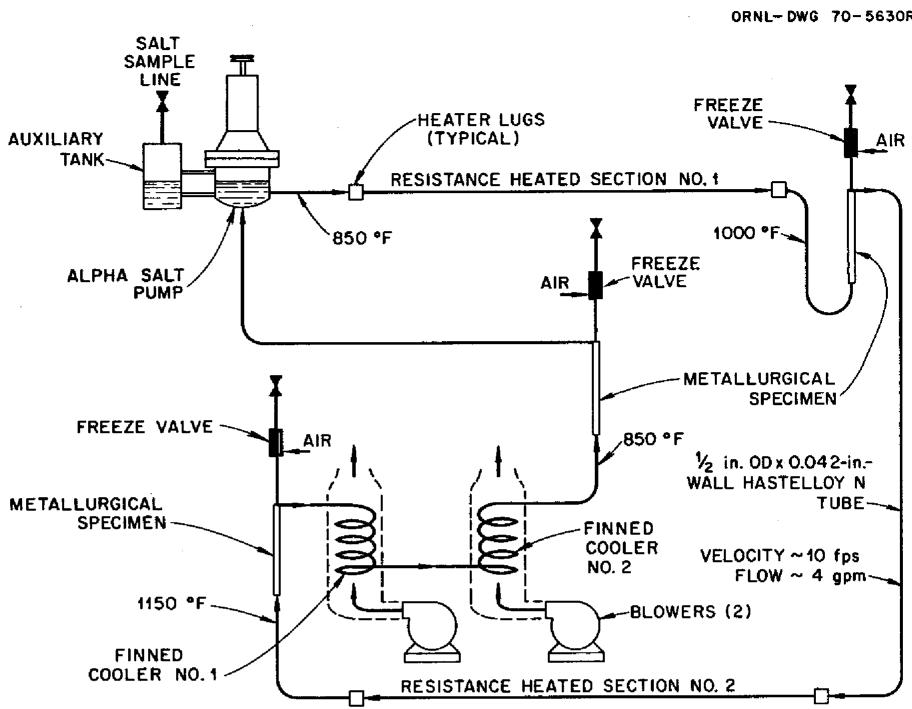  
Fig. 15.30. Molten-Salt Forced-Convection Corrosion Loop MSR-FCL-2: Simplified Flow Diagram.

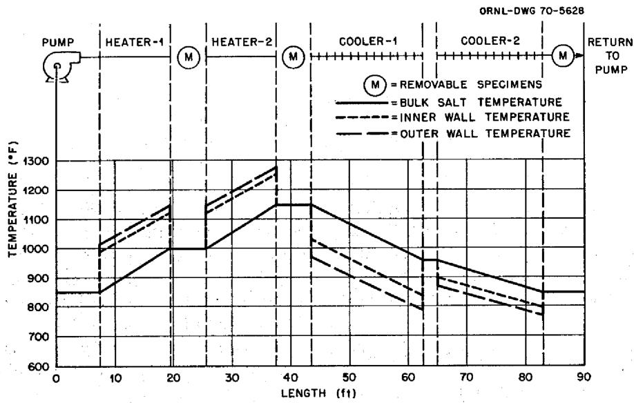  
Fig. 15.31. Temperature Profile of Molten-Salt Forced-Convection Corrosion Loop MSR-FCL-2 at Design Operating Conditions.

Table 15.13. Engineering Design Data for Loop MSR-FCL-2   

<table><tr><td colspan="2">A. Materials, Temperature, Velocities, Volumes</td></tr><tr><td>Tubing and corrosion specimens</td><td>Standard Hastelloy N</td></tr><tr><td>Nominal tubing size</td><td>1/2in. OD, 0.042 in. wall</td></tr><tr><td>Approximate tubing length</td><td>90 ft</td></tr><tr><td>Bulk fluid temperatures</td><td>850–1150°F (455–621°C)</td></tr><tr><td>Bulk fluid ΔT</td><td>300°F (166°C)</td></tr><tr><td>Flow rate</td><td>4 gpm</td></tr><tr><td>Fluid velocity</td><td>10 fps (to 20 fps past corrosion specimens)</td></tr><tr><td>System ΔP at 4 gpm</td><td>82 psi</td></tr><tr><td>Salt volume in loop</td><td>267 in.3(4380 cm3)</td></tr><tr><td colspan="2">B. Heating and Cooling</td></tr><tr><td colspan="2">1. Coolers</td></tr><tr><td>Material</td><td>1/2-in.-OD, 0.042-in.-wall Hastelloy N tubing with 1/16-in.-thick nickel fins</td></tr><tr><td>Number of cooler sections</td><td>2</td></tr><tr><td>Finned length of cooler 1</td><td>18.8 ft</td></tr><tr><td>Finned length of cooler 2</td><td>17.9 ft</td></tr><tr><td>Coolant air flow</td><td>2000 cfm per cooler</td></tr><tr><td>Cooling capacity of cooler 1 (1000 2-in.-OD, 1/16-in.-thick fins)</td><td>101 kW (345,000 Btu/hr)</td></tr><tr><td>Cooling capacity of cooler 2 (645 1/2-in.-OD, 1/16-in.-thick fins)</td><td>43 kW (146,000 Btu/hr)</td></tr><tr><td>Total heat removal (both coolers)</td><td>144 kW (491,000 Btu/hr)</td></tr><tr><td colspan="2">Heat Flux (Based on Tube ID)</td></tr><tr><td>Cooler 1</td><td>168,000 Btu hr-1 ft-2</td></tr><tr><td>Cooler 2</td><td>71,000 Btu hr-1 ft-2</td></tr><tr><td>Inside wall temperature at outlet, cooler 2</td><td>798°F (425°C)</td></tr><tr><td colspan="2">2. Heaters</td></tr><tr><td>Material</td><td>1/2-in.-OD, 0.042-in.-wall Hastelloy N</td></tr><tr><td>Number of heated sections</td><td>2</td></tr><tr><td>Length of each heater</td><td>12 ft</td></tr><tr><td>Heat input each heater</td><td>62.5 kW (213,000 Btu/hr)</td></tr><tr><td>Total</td><td>125 kW (426,000 Btu/hr)</td></tr><tr><td>Inside wall temperature at outlet of heater 2</td><td>1256°F (680°C)</td></tr><tr><td>Outside wall temperature at outlet of heater 2 (max pipe wall temperature)</td><td>1278°F (692°C)</td></tr><tr><td>Heat flux</td><td>162,000 Btu hr-1 ft-2</td></tr><tr><td>Salt Reynolds number in loop piping at 4 gpm</td><td>35,000–47,000</td></tr></table>

The instrument and control system is designed to place the loop in a standby condition, with the salt molten but not circulating, in the event of temperature excursions or equipment malfunction. This will allow the loop to be operated unattended during off-shift hours.

# 15.10 CORROSION OF HASTELLOY N IN STEAM

B. McNabb

H.E.McCoy

Hastelloy N still appears to have good corrosion resistance in steam after approximately 5000 hr at

$538^{\circ}\mathrm{C}$ in the Bull Run Facility. The same trends noted previously are continuing, and the weight gains continue to be small, with the loss of metal less than 0.25 mil/year, assuming uniform corrosion. Some specimens are being tested in steam at higher temperatures in the Bartow Plant of the Florida Power Corporation.[35] The weight changes were slightly higher at $593^{\circ}\mathrm{C}$ , but the corrosion rate was less than 0.5 mil/year over 10,000

hr, assuming uniform corrosion. An air-melted heat had a slightly higher corrosion rate than a vacuum-melted heat. The main differences in composition are that the air-melted heat contained about $0.5\%$ each of silicon and manganese, whereas the vacuum-melted heat contained about $0.1\%$ of each element.

We noted nodules or blisters on the surface of the vacuum-melted heat (2477) that were aligned on machining marks or scratches. Figure 15.32 shows an optical picture and microprobe displays for Fe,Ni,Mo,

Cr, and O on the surface of the specimen. It appears that the nodules are enriched in iron and depleted in other elements except oxygen.

Figure 15.33 shows the microprobe x-ray displays for Fe, Ni, Cr, and M for a cross section of one of the nodules shown in Fig. 15.32. It appears that iron is concentrated at the outer surface, nickel is either with the iron or just below the surface, and below this layer the material is concentrated in chromium and molybdenum and depleted in nickel. Figure 15.34 shows the

Y-100149

32μ

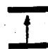

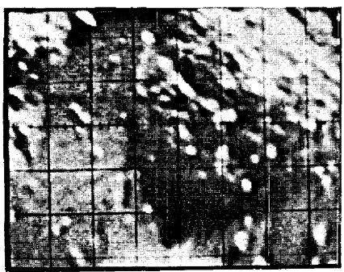  
Electron Backscatter

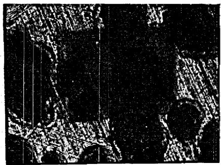  
Optical Picture

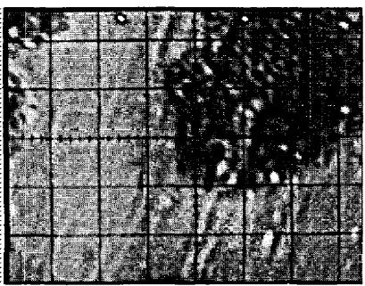  
Sample Current

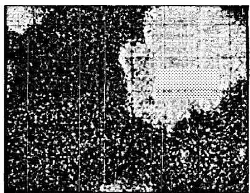  
Iron X-Rays

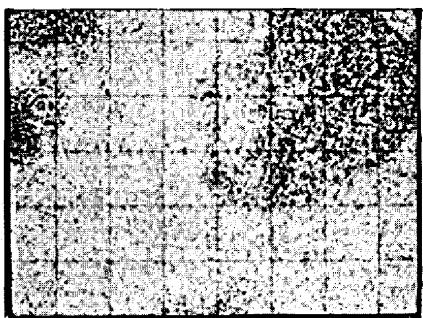  
Nickel X-Rays

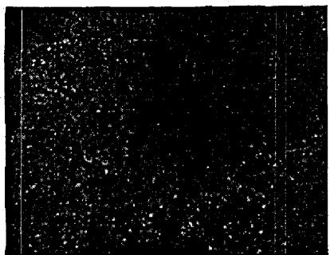  
Molybdenum X-Rays

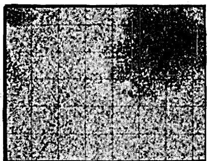  
Chromium X-Rays

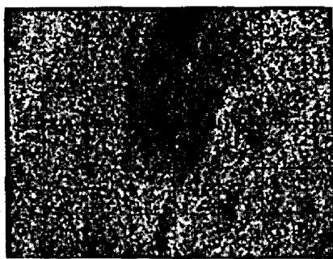  
Oxygen X-Rays   
Fig. 15.32. Electron Microprobe Displays of a Hastelloy N Sample (Heat 2477) Exposed to Steam at $593^{\circ}\mathrm{C}$ and 900 psi for 4000 hr. The sample is being viewed from the as-exposed surface. The electron backscatter and sample current display are influenced by both compositional and topographical variations. The x-ray displays indicate the concentrations of each element, with white indicating higher concentrations than black. The display for oxygen is not valid because of a geometry problem involving the surface not being flat.

Y-100833

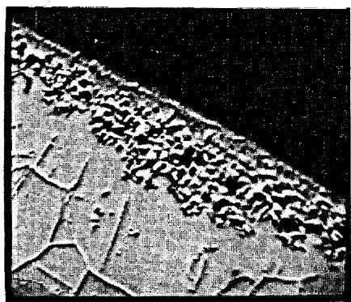  
Backscattered Electrons

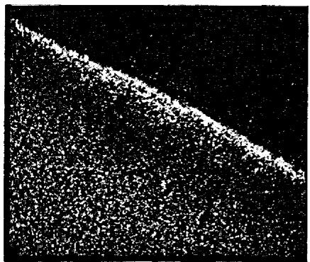  
FeKa

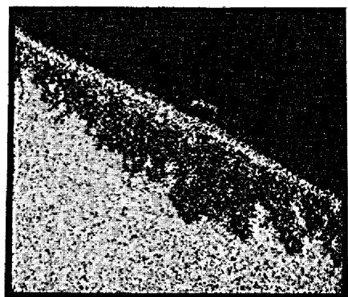  
NiKa

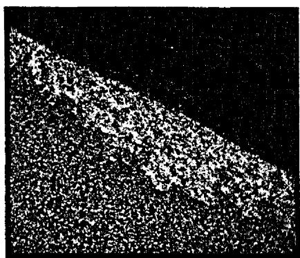  
CrKa

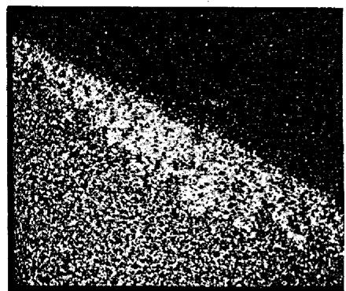  
MoLa   
Fig. 15.33. Electron Microprobe Displays of the Cross Section of an Oxide Nodule on a Hastelloy N Sample (Heat 2477) Exposed to Steam at $593^{\circ}\mathrm{C}$ and 900 psi for 4000 hr. The x-ray displays indicate the concentrations of each element, with white indicating higher concentrations than black.

microprobe displays for the same elements in the air-melted heat (5065) exposed to the same conditions. The relative concentrations of the different elements are changed somewhat, but the trends are the same as for the vacuum-melted heat 2477. There were no significant concentration variations of manganese or silicon in the corroded areas in either material.

There are two possible mechanisms that could cause nodules to align with scratches or machining marks. An uneven surface or protrusion would expose more metal or surface area to the corroding medium and offer preferred nucleation sites for nodules or blisters, and the surface would be easier to erupt when a critical oxide thickness was reached. Another mechanism involves small particles of iron oxide that are entrained in the steam flowing past the specimens, and surface roughness would increase the sticking probability of the particles on the specimen. We have conclusive evidence that iron from the primarily iron systems at both

facilities is being deposited on the specimen surfaces. A specimen in the Bull Run Steam Plant exhibited this same type of nodular alignment on scratches. Microprobe examination showed that iron was present in the nodules in high concentrations (over $50\%$ ), although there was only $0.046\%$ iron in the specimen. A specimen of pure nickel was removed after a short time with a thick oxide that spilled easily. A small piece of the oxide contained about $2\%$ iron. Operating history at Bull Run has shown that large amounts of $\alpha\text{-Fe}_2\mathrm{O}_3$ are deposited in traps and filters throughout the plant. The chromium concentration is so low in Hastelloy N ( $7\%$ ) that the presence of the iron-rich oxide may have the effect of locally reducing the chromium level.

The facility at Bull Run is being modified to include samples that are stressed during exposure to steam. These samples are very critical for assessing the compatibility of Hastelloy with steam.

Y-100832

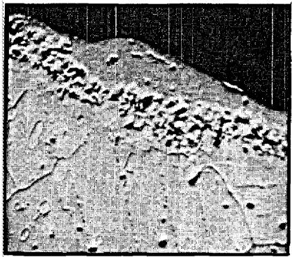  
Backscattered Electrons

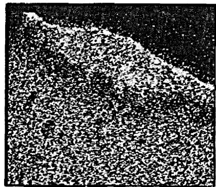  
FeKa

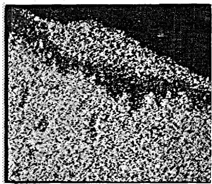  
NiKa

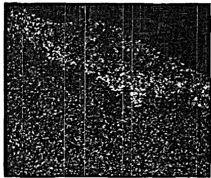  
CrKa

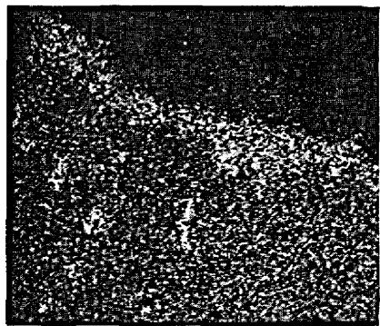  
MoLa   
Fig. 15.34. Electron Microprobe Displays of the Cross Section of an Oxide Nodule on a Hastelloy Sample (Heat 5065) Exposed to Steam at $593^{\circ}\mathrm{C}$ and 900 psi for 4000 hr. The x-ray displays indicate the concentrations of each element, with white indicating higher concentrations than black.

# 15.11 EVALUATION OF DUPLEX TUBING FOR USE IN STEAM GENERATORS

H.E.McCoy B.McNabb

Our results on the compatibility of unstressed Hastelloy N samples with steam look encouraging, but prior results $^{36}$ obtained at another installation leave some doubt concerning the use of Hastelloy N in steam under stress. The further possibility of reducing the migration of tritium into the steam by allowing a fairly high concentration of water in the coolant salt and by having an oxide barrier on the steam side imposes further restrictions upon the materials. The desired corrosion resistance on the fluoroborate side is best obtained by a material with low chromium content, such as pure

nickel, and the corrosion resistance to steam and the barrier to tritium diffusion on the steam side are best obtained with a material high in chromium. Thus the requirements for materials are in conflict, and the potential usefulness of a duplex tube in this case looks very good.

The International Nickel Company (INCO) has made a 10-ft length of duplex tubing for evaluation. The material on the inside (steam side) is Incoloy 800 $(\mathrm{Fe} - 34\% \mathrm{Ni} - 21\% \mathrm{Cr})$ and the material on the salt side is nickel 280 (pure nickel with some $\mathrm{Al}_{2}\mathrm{O}_{3}$ added for grain size control). The outside diameter is 0.750 in., with layers of each material about 0.065 in. thick.

The tubing was made by coextruding the two materials into a tube shell and then drawing into tubing. Longitudinal and transverse views of the interface between the two materials are shown in Fig. 15.35. Figure $15.35a$ shows a longitudinal view. The line of porosity marks the interface. The black stringers are

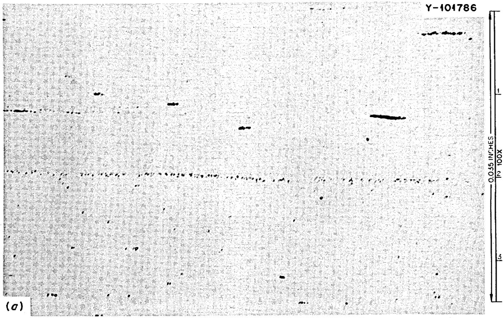

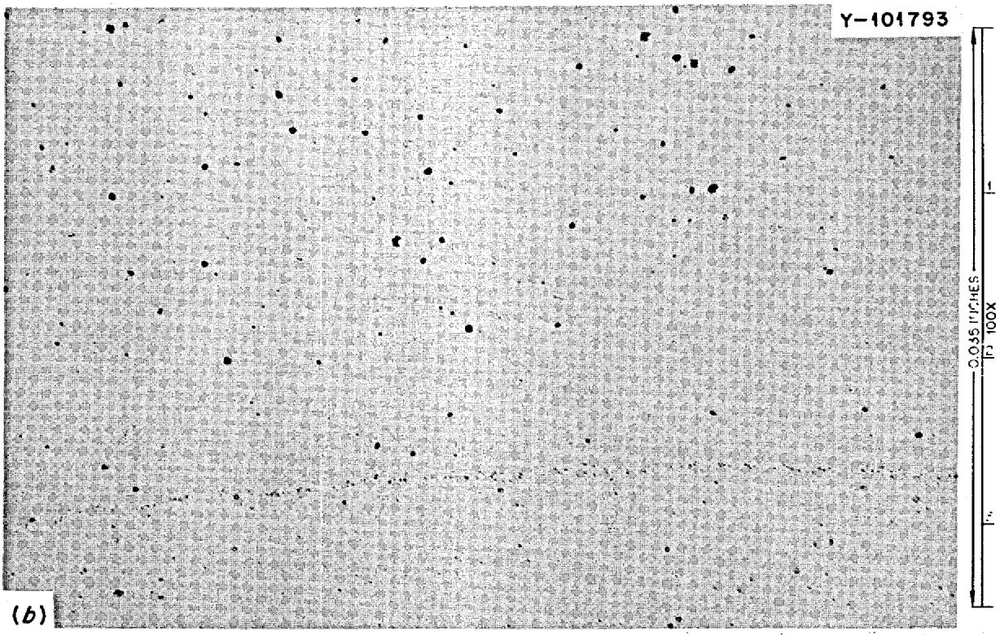  
Fig. 15.35. Photomicrographs of Duplex Tubing of Incoloy 800 and Nickel 280 in the As-Received Condition. Nickel is the upper material in each photomicrograph. (a) Longitudinal view. (b) Transverse view. As polished.

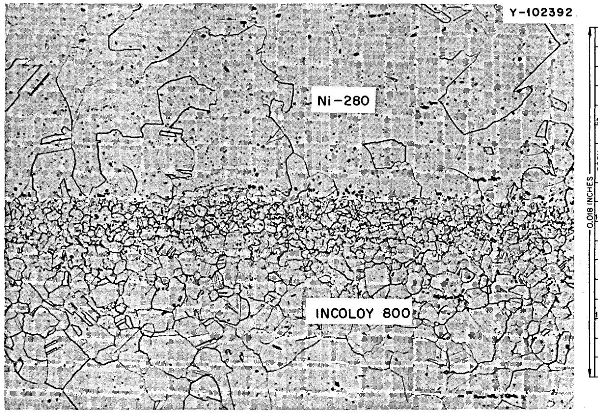  
Fig. 15.36. Photomicrograph of Duplex Tubing of Incoloy 800 and Nickel 280.

oxides and voids and arise from the fact that the nickel is a powder-metallurgy product and relatively high in oxygen. In the transverse view in Fig. 15.35b, the cross sections of the oxide stringers are visible.

The tubing was etched cathodically to reveal the grain sizes of the materials. As shown in Fig. 15.36, the grain sizes are quite similar, indicating that the $\mathrm{Al}_{2}\mathrm{O}_{3}$ is effective in inhibiting the grain growth of the nickel.

Several pieces of the tubing were thermal cycled for various lengths of time. The cycle used was $15\mathrm{min}$ at $650^{\circ}\mathrm{C}$ and $5\mathrm{min}$ at $25^{\circ}\mathrm{C}$ . The samples were sealed in quartz to protect them from oxidation. The exact heating and cooling rates are not known, though they were quite rapid. The samples were examined metallographically after cycling. No changes were visible, even in the sample that had been cycled 600 times.

# 16. Support for Chemical Processing

J.R. DiStefano H.E. McCoy

The reductive extraction process for removal of protactinium and fission products from molten-salt reactor fuels requires materials that are corrosion resistant to bismuth and molten fluoride salts at 600 to $700^{\circ}\mathrm{C}$ . On the basis of solubility data in bismuth, molybdenum, tungsten, rhenium, tantalum, and graphite might all be satisfactory containment materials, since they also appear to have reasonably good compatibility with molten salt.

After considering other factors such as cost, availability, fabricability, and reactions with gaseous environments, as well as corrosion resistance, we have decided to concentrate on the development of molybdenum for this application. At present our program is divided into two parts. One is the fabrication of a molybdenum loop for the Chemical Technology Division to determine hydrodynamic data relating to the reductive extraction process. The second is research to study the compatibility of several of the above materials under various processing conditions and to investigate some possible techniques of coating these corrosion-resistant materials on conventional alloy substrates.

# 16.1 CONSTRUCTION OF A MOLYBDENUM REDUCTIVE EXTRACTION TEST STAND

# J. R. DiStefano

In conjunction with the Chemical Technology Division, a molybdenum test stand for studying a reductive extraction process for molten-salt purification has been designed. Both bismuth and salt will count currently flow through a packed column, and we will obtain engineering data relating to column performance. In addition we shall also obtain valuable experience in fabricating complex molybdenum equipment as well as compatibility data on molybdenum under a variety of experimental conditions.

Although welding and brazing will be used to fabricate and assemble the loop, we are also investigating

various types of molybdenum mechanical couplings. We have obtained experimental metal seal couplings from Stanley Corporation and Aeroquip Corporation, and these are currently being evaluated by leak checking during thermal cycling from $650^{\circ}\mathrm{C}$ to room temperature.

Three sizes of tubing will be used for the connecting lines of the loop. These are $\frac{1}{4}$ in. OD by 0.020 in. wall, $\frac{3}{8}$ in. OD by 0.025 in. wall, and $\frac{1}{2}$ in. OD by 0.030 in. wall. This material was purchased from a commercial vendor and is currently undergoing additional nondestructive inspection for defects.

More detailed information on the design of this loop is presented in Part 5 of this report. Progress on welding, brazing, and fabrication of molybdenum components is reported in this section.

# 16.2 FABRICATION DEVELOPMENT OF MOLYBDENUM COMPONENTS

R.E.McDonald A.C.Schaffhauser

We are supplying molybdenum components for a chemical processing test stand. This involves procurement of materials that are commercially available as well as the development of fabrication processes for other components.

We have developed a back-extrusion process for fabrication of $3\%$ -in.-diam closed-end vessels required for the bismuth and salt head pots and the upper and lower disengagement sections of the extraction column. Figure 16.1 shows two types of end geometries we have back-extruded. Figure 16.1a shows a head with a thick end section, and Fig. 16.1b shows an end with extruded bosses. Both can be machined to provide internal trepans for welding and support for the inlet and exit

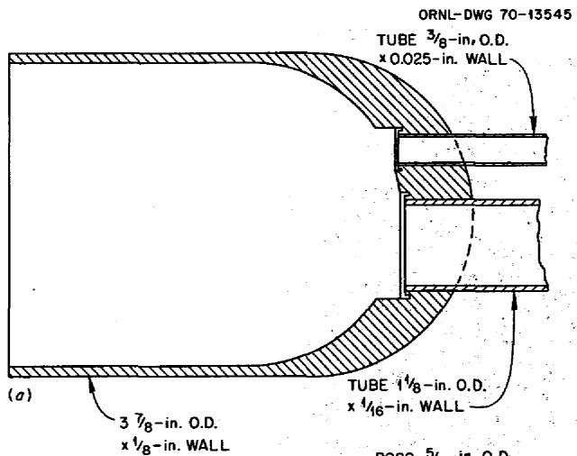

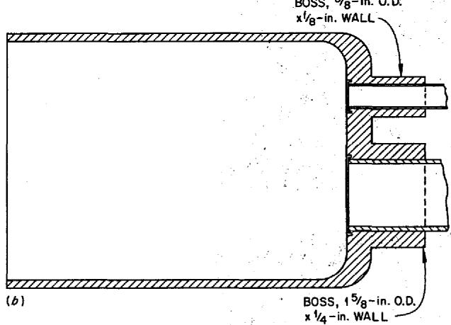  
Fig. 16.1. End-Cap Geometries Fabricated for the $37/8$ -in.-diam Vessels for the Molybdenum Test Stand.

tubes. Test pieces of both designs have been back-extruded at 1300 to $1400^{\circ}\mathrm{C}$ and are being machined for welding studies. The maximum inside length we have been able to back-extrude in a single step is about 4 in. at temperatures up to $1500^{\circ}\mathrm{C}$ . At $1650^{\circ}\mathrm{C}$ an 8-in. length was back-extruded; however, reaction with the tooling produced surface tears. We will attempt to produce the 10-to-12-in. inside lengths required for upper and lower vessels of the extraction column by multiple back-extrusion steps. We are also modifying the tooling in order to provide some relief in back of the working surfaces to reduce frictional forces resisting flow during back extrusion.

Some of the components, such as small-diameter tubing, round bar, rod, plate, and sheet are commercially available, and we are developing specifications for the procurement and machining of these components.

# 16.3 WELDING OF MOLYBDENUM

# A.J.Moorhead T.R.Housley

An assembly procedure has been developed for fabrication of the chemical processing loop which was described in an earlier report. Our basic philosophy is that welds will primarily provide corrosion-resistant seals and that proper joint design and brazing will provide joint strength. Therefore, all of the welds will be reinforced by brazing.

There are two major types of joint in this loop: tube-to-header and tube-to-tube. There are 17 tube-to-header joints in which tubes either terminate at the header or extend into the pot. Ten of these will be in direct contact with bismuth, and welding will be required for corrosion resistance. The other seven joints are in the gas region above the salt and bismuth, where brazing is considered adequate. Two headers (plus a center section for the disengaging pots) will be electron beam welded circumferentially to form a pot. This

2A. J. Moorhead and T. R. Housley, MSR Program Semiann. Progr. Rept. Feb. 28, 1970, ORNL-4548, pp. 254-55.

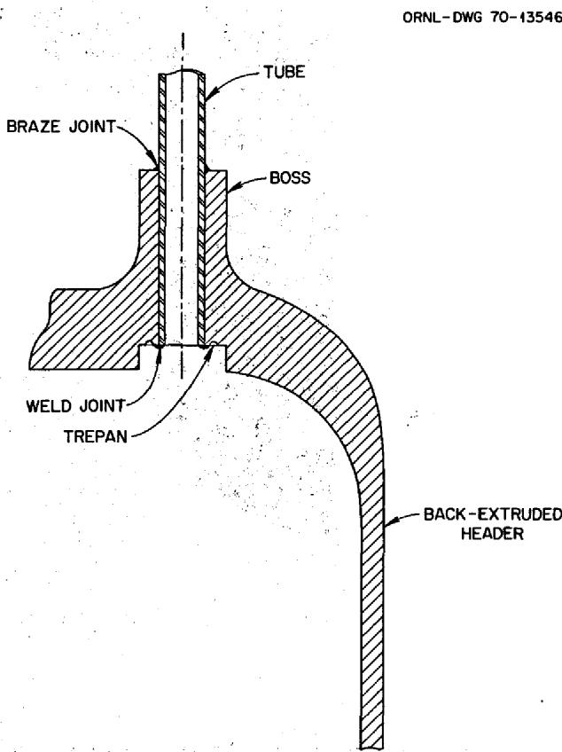  
Fig. 16.2. Typical Tube-to-Header Joint.

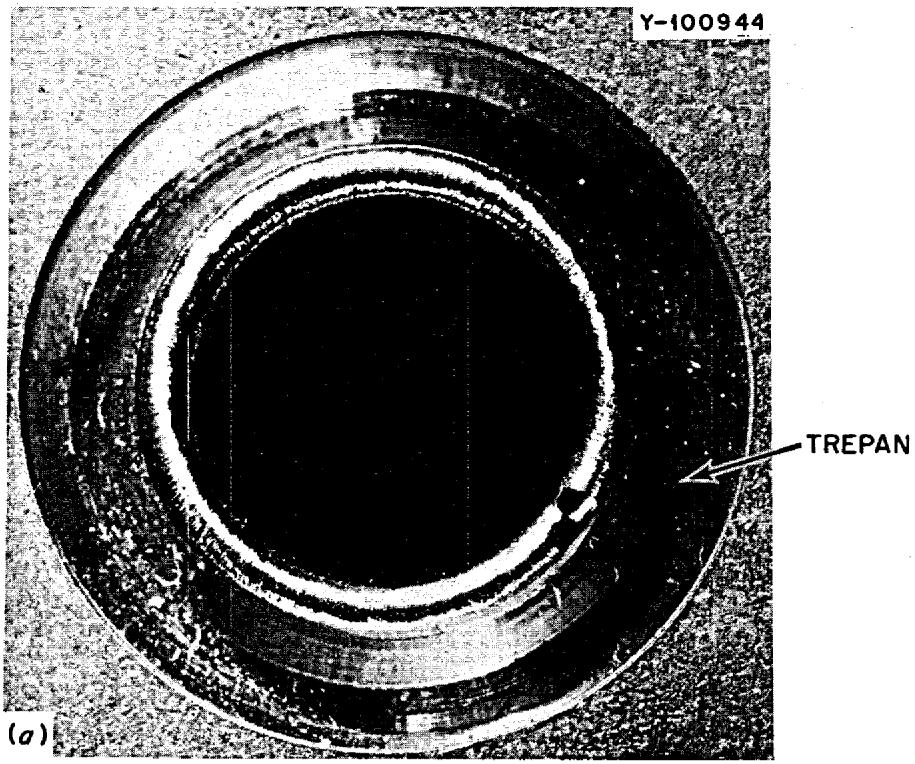

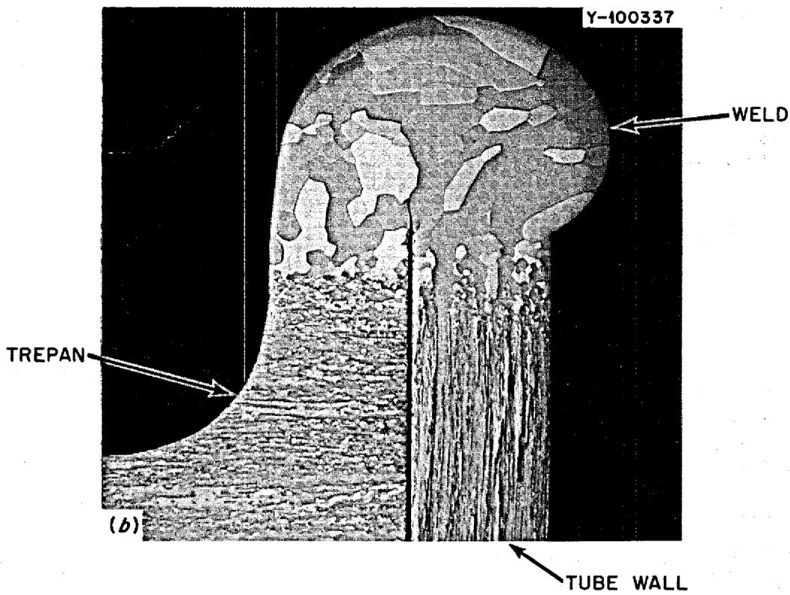  
Fig. 16.3. Electron-Beam-Welded Molybdenum Tube-to-Header Joints. (a) $\frac{3}{8}$ -in.-OD tube. (b) $\frac{1}{4}$ -in.-OD $\times$ 0.040-in.-wall tube; etchant - $50\%$ $\mathrm{NH_4OH}$ , $50\%$ $\mathrm{H_2O_2}$ .

entire assembly (including the tubes which are brazed only) will then be vacuum furnace brazed using a bismuth-corrosion-resistant filler metal. Next, the four pots will be fastened to a vertical support stand, and the interconnecting tubes will be attached. After each tube-to-tube weld is made, a reinforcing sleeve will be induction brazed around the joint.

We are developing procedures for joining the tubes to the headers using the electron beam process. A typical joint design is shown in Fig. 16.2. Electron beam welding minimizes both oxygen contamination and excessive grain growth, and this type of joint will provide mechanical support of the weld and is amenable to back-brazing. Welding parameters and specific joint dimensions have been developed (on $\frac{1}{2} \times 3 \times 3$ in. flat coupons) for welding $\frac{1}{4} \cdot \frac{3}{8}$ , and $\frac{1}{2}$ -in.-diam tube-to-header joints. A typical weld is shown in Fig. 16.3a. All of the welds were excellent in appearance and helium leak-tight, even those made while welding parameters were being developed. Most had helium leak rates less than $1 \times 10^{-3}$ atm cm $^3$ sec $^{-1}$ . Several of these welds were sectioned for metallographic examination, including the one shown in Fig. 16.3b. Note the narrow heat-affected zone and the small grains in the weld compared with those usually found in welds made by the gas tungsten arc process.

Two tube-to-header joints have been back-brazed with a different filler metal. Visually, the brazes look acceptable, but examination is not complete.

Tube-to-tube joints in the loop will be welded by the gas tungsten arc process, either manually in an argon-filled chamber or automatically in the field using a commercial orbiting arc welding head. In order to select tubing with wall thicknesses that would allow us to weld by either technique, manual gas tungsten arc welds were made joining six different sizes of tubing. If a tube can be manually welded without burn-through or excessive root reinforcement, it should also be weldable using automatic equipment. The outside diameter and the wall thicknesses of the tubes which were welded were $\frac{1}{4}$ in., 20 mils; $\frac{1}{4}$ in., 32 mils; $\frac{3}{8}$ in., 25 mils; $\frac{3}{8}$ in., 35 mils; $\frac{1}{2}$ in., 30 mils; and $\frac{1}{2}$ in., 40 mils. The tubes with the thinner wall in each size were fabricated by drawing, while the thicker-wall tubes were manufactured by drilling rod. All of the welds except those in the two $\frac{1}{4}$ in., 32-mil tubes had helium leak rates less than $1 \times 10^{-9}$ atm cm $^3$ sec $^{-1}$ . However, none of the tubes showed an indication of a leak when they were fluorescent-penetrant inspected. Three typical welds are presented in Fig. 16.4. Since we were able to successfully weld both the thin- and thick-wall tubing, the thin-wall tubing was purchased, since it was less expensive and more readily available.

We are presently developing procedures for making tube-to-tube field welds using the orbiting arc head pictured in Fig. 16.5. Eight bead-on-sheet-type welds have been made, all on $\frac{1}{4}$ -in.-diam, 20-mil-wall molybdenum tubes. Hot cracking in the weld center line was

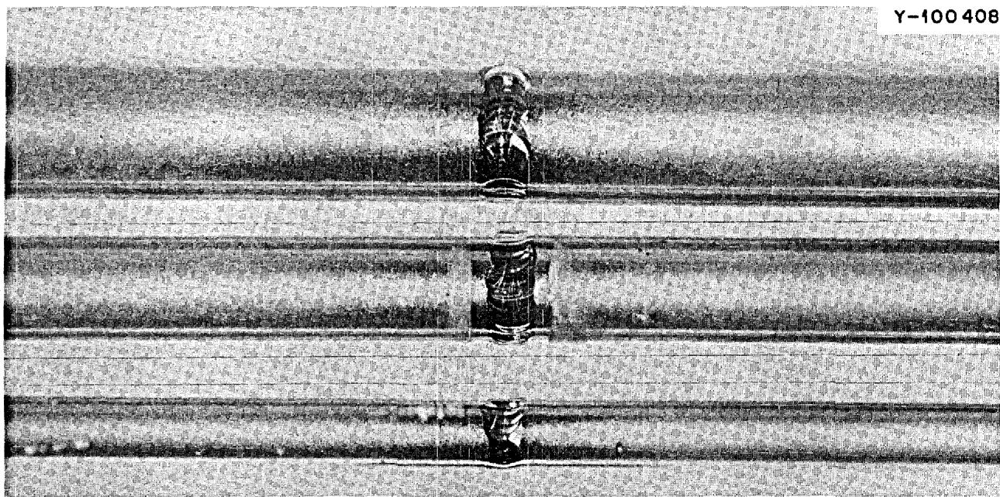  
Fig. 16.4. Typical Manual Gas Tungsten Arc Welds in Thin-Walled $\frac{1}{4}$ , $\frac{3}{8}$ , and $\frac{1}{2}$ -in.-diam Molybdenum Tubes. Filler wire was $\frac{1}{3}$ -in.-diam low-carbon, low-oxygen molybdenum.

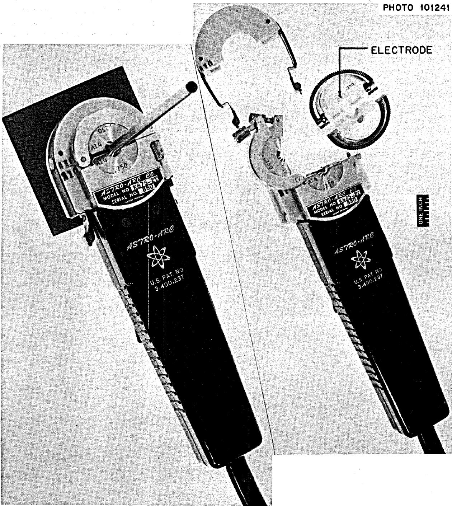  
Fig. 16.5. Commercial Orbiting Arc Tube-Welding Head.

very bad with the first four tubes, but this problem was eliminated when the welding speed was doubled. Increasing the welding speed (reducing the welding time) also reduced the amount of discoloration near the weld. We have also made improvements by optimizing the argon gas flow (at about $10\mathrm{ft}^3/\mathrm{hr}$ ) and minimizing the clamping pressure in the weld head. However, each of the last three welds has had a single short crack near the weld tie-in area as revealed by penetrant inspection.

# 16.4 DEVELOPMENT OF BISMUTH-RESISTANT FILLER METALS FOR BRAZING MOLYBDENUM

N.C.Cole J.W.Koger

In building complex structures of molybdenum, brazing can be used as the primary joining technique or as a backup to welding (as in back-brazing). Since no commercial filler metals for brazing molybdenum are corrosion resistant to bismuth, we are developing brazing alloys for use in fabricating parts of a chemical processing test stand.

An additional experimental filler metal, Fe-Mo-Ge-C-B (42M), has been added to our braze alloy evaluation program. This alloy brazes at the lowest temperature $(1100^{\circ}\mathrm{C})$ of our experimental iron-base brazing alloys and, like the others discussed previously,3 wets and flows on molybdenum very well.

Successful brazes with four iron-base filler metals, Fe-Mo-C-B-Ge (42M), Fe-Mo-C-B (35M and 36M), and Fe-C-B (16M), were made in a variety of joint designs, positions (horizontal and vertical flow), atmospheres, and furnaces. Molybdenum sheet and tubing have been brazed with each of these alloys in vacuum, helium, and argon atmospheres. However, it should be noted that in induction brazing these iron-base alloys must be securely attached to the joint area (by wiring, etc.) to prevent the magnetic field from pulling them away.

Additional tests have been conducted to determine the compatibility of 35M, 36M, and 42M with static bismuth. Each brazing alloy was tested for 644 hr at $600^{\circ}\mathrm{C}$ in separate molybdenum capsules to eliminate interactions between the alloys. The volume of bismuth was sufficient that corrosion would not be limited by the bismuth becoming saturated with the braze alloy constituents. The braze alloy 42M appeared to be the most corrosion resistant. As seen in Fig. 16.6, little, if any, attack occurred. After testing, the chemical analysis of the bulk bismuth surrounding this alloy

showed only 10 ppm iron and $< 3$ ppm germanium. The Fe-Mo-C-B brazing alloys, 35M and 36M, showed only slight attack. Figure 16.7 shows molybdenum brazed with 35M, before and after test. The chemical analysis of the bismuth surrounding 35M and 36M was 50 ppm iron and 10 ppm iron respectively. However, after handling, cracks were found in the joint brazed with 36M. Apparently the higher molybdenum concentration in this alloy (25 vs $15\%$ in 35M) increased the brittleness of this joint.

These alloys are currently being tested in a quartz loop circulating bismuth to determine their compatibility under mass transfer conditions.

# 16.5 COMPATIBILITY OF STRUCTURAL MATERIALS WITH BISMUTH

O.B.Cavin L.R.Trotter

We have continued studying the compatibility of potential structural materials and braze alloys with bismuth in static tests and quartz thermal convection loops operating at a maximum temperature of $700^{\circ}\mathrm{C}$ and a $\Delta T$ of $95\pm 5^{\circ}\mathrm{C}$ . The results of several quartz loop tests are summarized in Table 16.1.

We have used several cleaning procedures to remove the bismuth that adheres to the test samples after draining the bismuth from the loop. In early tests some of the samples were scratched while removing the bismuth, and all of the bismuth was not always removed. For these samples, weight changes may not be an accurate measure of the effect of bismuth during test. Recently we have found that the bismuth can be removed effectively by amalgamating it for a short period at $100^{\circ}\mathrm{C}$ and then removing the amalgam.

Previously we reported4 no significant attack of molybdenum or TZM in contact with bismuth for 3000 hr. The weight changes and room-temperature mechanical properties of 0.020-in.-thick tensile samples are summarized in Table 16.2. The tensile properties of exposed specimens were not significantly different from as-received specimens. The microstructure control (heat treated for 1 hr at $1500^{\circ}\mathrm{C}$ ) and test samples are compared in Fig. 16.8. These specimens show no significant effects of the bismuth exposure; however, a layer of extremely fine grains is evident at the surface of the molybdenum specimens, and these grains in some cases were dislodged from the hot leg specimen after it was etched for metallographic examination. When 100

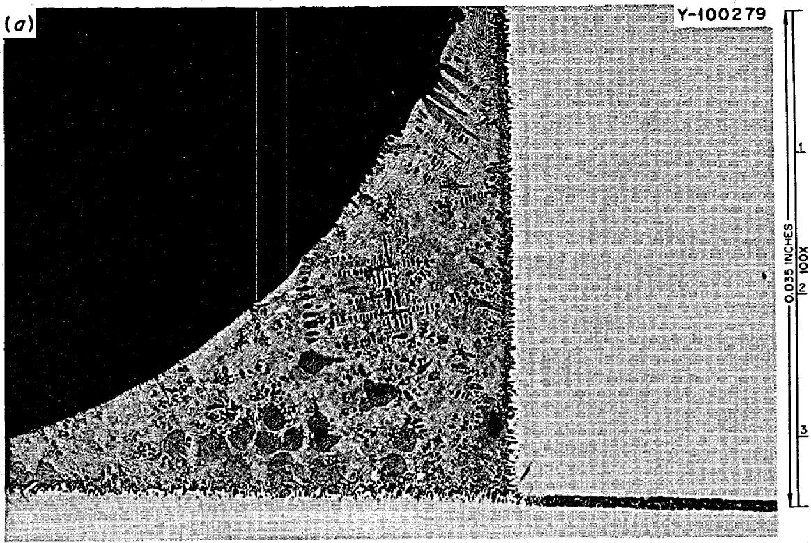

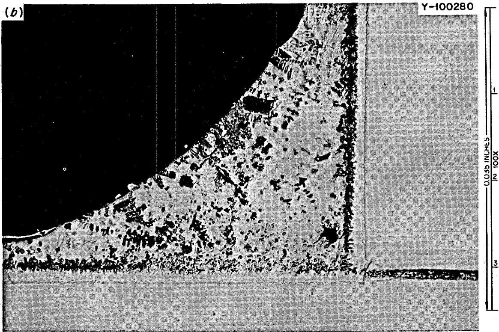  
Fig. 16.6. Molybdenum Brazed with Fe-Mo-C-B-Ge (42M) Brazing Alloy. (a) As brazed. (b) After exposure to bismuth at $600^{\circ}\mathrm{C}$ for 644 hr.

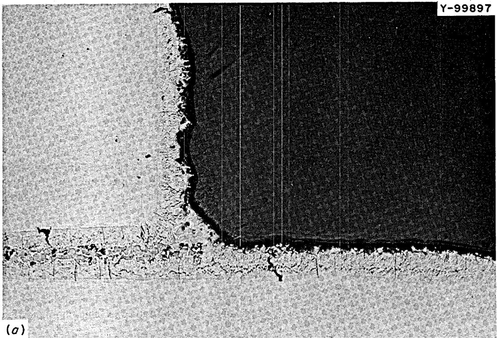  
0.035 INCHES 10.030 in. 100x 10.010 in.

Fig. 16.7. Molybdenum Brazed with Fe-Mo-C-B (35M) Brazing Alloy. (a) As brazed. (b) After exposure to bismuth at $600^{\circ}\mathrm{C}$ for 644 hr.   
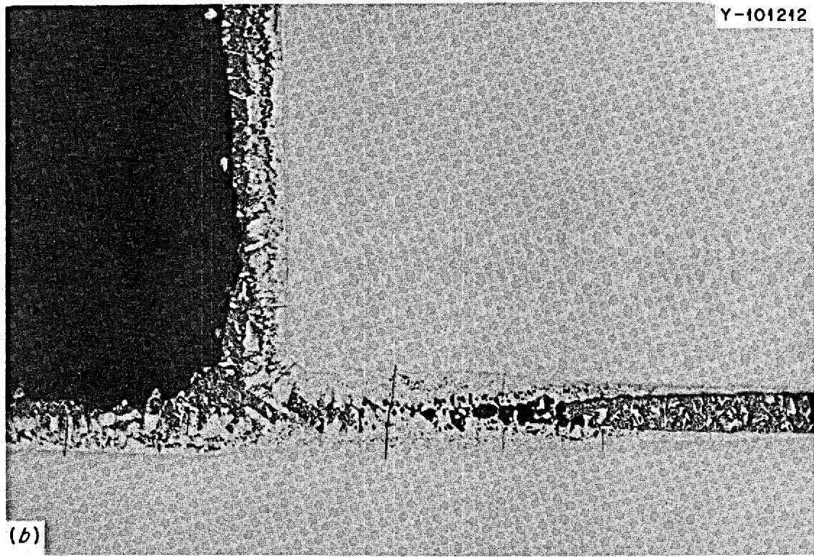  
0.035 INCHES 12

Table 16.1. Quartz Thermal Convection Loop Results   

<table><tr><td>Loop No.</td><td>Operating Time (hr)</td><td>Samples Tested</td><td>Results</td></tr><tr><td>3</td><td>3024</td><td>Mo, TZMa</td><td>Very little if any attack</td></tr><tr><td>4</td><td>115</td><td>Nb, Nb-1% Zr</td><td>Severe dissolution and mass transfer</td></tr><tr><td>6</td><td>3000</td><td>Ta, T-111b</td><td>T-111 brittle; some attackc</td></tr><tr><td>7</td><td>3000</td><td>Mo, TZMd</td><td>Slight attackc</td></tr><tr><td>8</td><td>&gt;2000</td><td>Graphite</td><td>In progress</td></tr><tr><td>9</td><td>423e</td><td>Fe-5% Mo</td><td>Severe attackc</td></tr><tr><td>10</td><td>&gt;200</td><td>Mo tabs brazed with four different Fe-base braze alloys</td><td>In progress</td></tr></table>

$\alpha_{\mathrm{TZM}}$ : Mo-0.5% Ti-0.1% Zr alloy.   
T-111: Ta-8% W-2% Hf alloy.   
$c$ Analysis of test results still in progress.   
$d_{\mathrm{Bismuth}}$ contained 100 ppm lithium.   
ePower failure terminated test; one sample in hot leg came loose and floated to the top after 216 hr.

ppm lithium was added to the bismuth (loop 7), there are indications that some attack did occur at $700^{\circ}\mathrm{C}$ , as evidenced by the weight change on tensile samples, but again the mechanical properties were unaffected. The maximum weight loss was $2.5\mathrm{mg/cm}^2$ (0.3 mil/year), and the weight gain was $1.3\mathrm{mg/cm}^2$ . The samples had a dark surface finish, as seen in Fig. 16.9 (unlike those removed from loop 3), and preliminary metallography shows shallow intergranular cracks limited to the small surface grains discussed above. Chemical analyses of bismuth samples taken from loops 6 and 7 are shown in Table 16.3. The samples from the drain pot of loop 7, which had contained molybdenum and TZM samples, showed a measurable increase in the concentrations of zirconium and molybdenum but a decrease in lithium concentration.

In loop 6, which contained tantalum and T-111 specimens, the tantalum showed a weight loss of 16.1 $\mathrm{mg/cm^2}$ (1.1 mils/year) and the T-111 a weight gain of $4.5\mathrm{mg/cm^2}$ . An increase in the tantalum concentration in the bismuth was also noted (Table 16.3), and preliminary metallographic examination indicates some

Table 16.2. Weight Change and Mechanical Properties of Tensile Samples Tested in Bismuth   

<table><tr><td>Material</td><td>Test Temperature (°C)</td><td>Weight Change (g)</td><td>Percent Elongation (in./in.)</td><td>Ultimate Tensile Strength (psi)</td><td>Yield Strengtha (psi)</td></tr><tr><td></td><td></td><td></td><td></td><td>× 103</td><td>× 103</td></tr><tr><td rowspan="6">Mo b</td><td>660</td><td>-0.0041</td><td>11.0</td><td>112</td><td>104</td></tr><tr><td>610</td><td>+0.0013</td><td></td><td></td><td></td></tr><tr><td>610</td><td>+0.0036</td><td></td><td></td><td></td></tr><tr><td>690</td><td>-0.0026</td><td>12.5</td><td>107</td><td>93</td></tr><tr><td>As received</td><td></td><td>9.0</td><td>114</td><td>87</td></tr><tr><td>As received</td><td></td><td>10.0</td><td>116</td><td>97</td></tr><tr><td rowspan="3">Ta</td><td>650</td><td>-0.0814</td><td>36.0</td><td>51</td><td>33</td></tr><tr><td>690</td><td>-0.1573</td><td>27.5</td><td>53</td><td>36</td></tr><tr><td>As received</td><td></td><td>25.0</td><td>55</td><td>45</td></tr><tr><td rowspan="3">T-111</td><td>620</td><td>No change</td><td>0.0</td><td>73c</td><td></td></tr><tr><td>610</td><td>+0.0459</td><td>0.0</td><td>66c</td><td></td></tr><tr><td>As received</td><td></td><td>22.0</td><td>96</td><td>84</td></tr><tr><td rowspan="4">Mo d</td><td>650</td><td>-0.0020</td><td>11.0</td><td>113</td><td>54</td></tr><tr><td>630</td><td>No change</td><td>11.0</td><td>114</td><td>90</td></tr><tr><td>607</td><td>+0.0091</td><td>13.0</td><td>112</td><td>75</td></tr><tr><td>690</td><td>-0.0178</td><td>14.5</td><td>109</td><td>81</td></tr></table>

$a0.02\%$ offset.   
$b$ Specimens scratched during removal of bismuth.   
$c_{\mathrm{Brittle}}$ fracture.   
$d_{\mathrm{Bismuth}}$ contained 100 ppm lithium.

Y-99457A

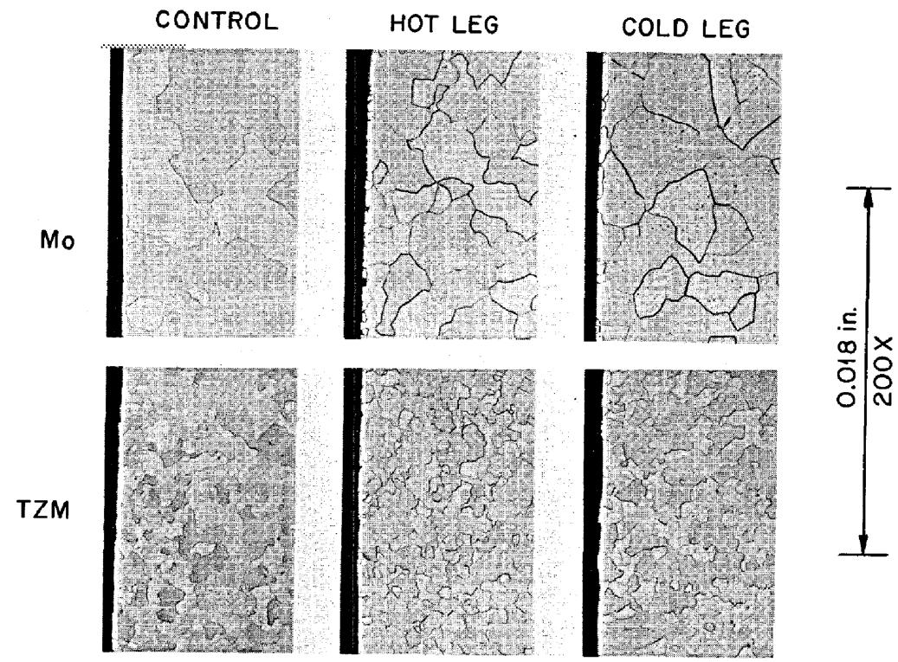  
Fig. 16.8. Photomicrographs of Molybdenum and TZM Tested in Bismuth-Quartz Thermal Convection Loop 3 at $700^{\circ}\mathrm{C}$ and a $\Delta T$ of $100^{\circ}\mathrm{C}$ for 3024 hr. Annealed at $1500^{\circ}\mathrm{C}$ for 1 hr prior to test. Control specimens are as annealed. Etch: $50\%$ $\mathrm{H}_2\mathrm{O}_2$ , $50\%$ $\mathrm{NH}_4\mathrm{OH}$ .

Table 16.3. Chemical Analysis of Bismuth Before and After Tests   

<table><tr><td rowspan="2">Loop No.a</td><td colspan="10">Chemical Analysis (ppm)</td></tr><tr><td>C</td><td>H</td><td>N</td><td>O</td><td>Li</td><td>Mo</td><td>Ni</td><td>Si</td><td>Ta</td><td>Zr</td></tr><tr><td>6b</td><td>36</td><td>1</td><td>1</td><td>2</td><td></td><td>&lt;0.5</td><td>70</td><td>30</td><td>2</td><td>0.5</td></tr><tr><td>6c</td><td>20</td><td>1</td><td>1</td><td>6</td><td></td><td>0.7</td><td>20</td><td>30</td><td>20</td><td>3</td></tr><tr><td>6d</td><td>20</td><td>1</td><td>1</td><td>2</td><td></td><td>0.5</td><td>70</td><td>30</td><td>7</td><td>0.3</td></tr><tr><td>7b</td><td>9</td><td>1</td><td>1</td><td>2</td><td>100</td><td>0.5</td><td>70</td><td>8</td><td>3</td><td>0.3</td></tr><tr><td>7c</td><td>30</td><td>1</td><td>1</td><td>8</td><td>76</td><td>6</td><td>70</td><td>10</td><td>2</td><td>3</td></tr><tr><td>7d</td><td>30</td><td>1</td><td>1</td><td>5</td><td>41</td><td>2</td><td>70</td><td>10</td><td>2</td><td>0.5</td></tr><tr><td>9e</td><td>36</td><td>1</td><td>1</td><td>23</td><td></td><td></td><td></td><td></td><td></td><td></td></tr></table>

$a$ See Table 16.1.   
$b_{\mathrm{Before test}}$   
cFrom top of drain pot.   
$d_{\mathrm{from}}$ near center of drain pot.   
Material at top of cold leg.

dissolution of the tantalum sample by the bismuth. The T-111 specimens appear relatively unaffected. In contrast, the mechanical properties of pure tantalum were essentially unaffected, but T-111 was very brittle after exposure to bismuth. Since increases of oxygen and carbon in the T-111 were small (< 100 ppm) and no

other significant changes in composition were noted, it is difficult to explain the brittle behavior of the T-111. We are now heat treating some T-111 samples in vacuum at $700^{\circ}\mathrm{C}$ to determine if an aging reaction could be responsible for our observations.

Static capsule tests indicated that an Fe-5% Mo alloy did not dissolve a detectable amount when tested in bismuth at $650^{\circ}\mathrm{C}$ for 600 hr. To evaluate the resistance of this alloy to mass transfer it was tested in flowing bismuth (loop 9) at a maximum temperature of $700^{\circ}\mathrm{C}$ . After 216 hr we observed that one of the samples in the hot leg came loose and floated to the top of the bismuth. A power failure after 423 hr caused termination of the test, and the only sample located in the salvaged bismuth was the one that had floated to the top. To explain why dissolution occurred in both hot and cold leg portions of this loop, refer to Fig. 16.10, which shows a schematic of the loop and sample positions. The level of the bismuth in the cold leg was approximately 3 in. above the upper inlet and was the coldest portion of the loop. Material dissolved in the hot leg could have precipitated in this area because of supersaturation, and in the case of iron it would float on the bismuth. The bismuth entering the cold leg

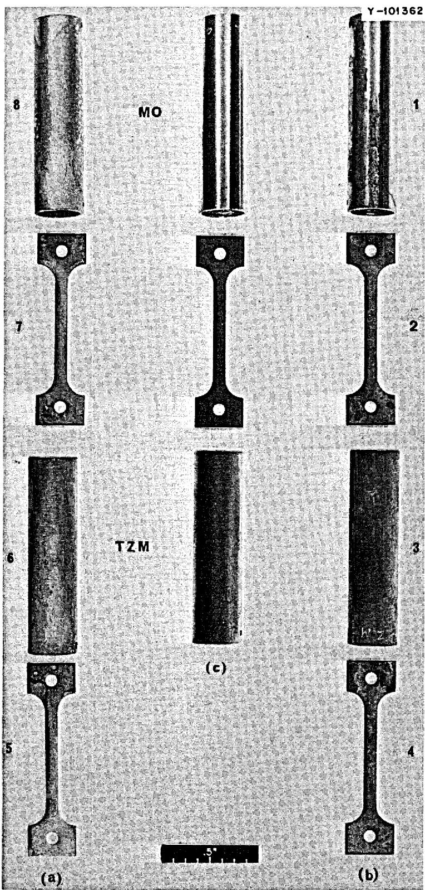  
Fig. 16.9. Molybdenum and TZM Samples After Exposure to Bismuth Containing $100\mathrm{ppm}$ Lithium for 3000 hr at a Maximum Temperature of $700^{\circ}\mathrm{C}$ .

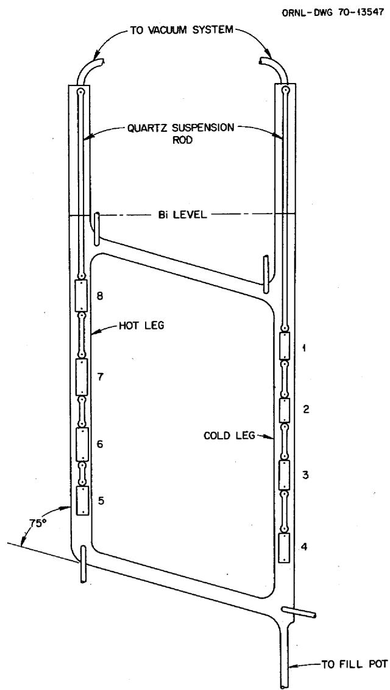  
Fig. 16.10. Schematic of Quartz Loop Showing Bismuth Level and Sample Positions.

would, therefore, not be saturated and would continue to dissolve material in this region as well. Since the power failure caused the bismuth to freeze, the quartz loop material fractured, and the only uncontaminated and recoverable bismuth was solidified in the top of the cold leg. Analysis indicated that it contained, in addition to bismuth, $13\%$ iron and $0.018\%$ molybdenum by weight as well as the other components shown in Table 16.3.

From these results we can conclude that molybdenum is still the most promising material for a chemical processing structural material in contact with molten bismuth at or below $700^{\circ}\mathbf{C}$ . The effect of bismuth containing 100 ppm lithium on molybdenum is some-

what puzzling at this point. There is no reported solubility of molybdenum in pure bismuth at this temperature, and the solubility of molybdenum in pure lithium has been reported as $< 1$ ppm (limit of detection) at $1320^{\circ}\mathrm{C}$ . However, there has been evidence of mass transfer of molybdenum in lithium when another metal such as iron or niobium was present in the system. It is also possible that lithium getters oxygen in the system to an extent that promotes wetting of the molybdenum by bismuth, thereby enhancing the rate of dissolution and mass transfer. We shall continue to study the effect of lithium in bismuth on compatibility with molybdenum in a natural circulation loop fabricated entirely of molybdenum. Specimens will be included in both hot and cold leg regions, and the lithium concentration of the bismuth will be increased to 3 wt%.

# 16.6 CHEMically VAPOR DEPOSITED COATINGS

L.E.Poteat J.I.Federer

Since iron- and nickel-base alloys are attacked by liquid bismuth, we are investigating the use of chemically vapor deposited tungsten and molybdenum coatings as barriers to corrosion. The coatings are being applied by $\mathbf{H}_2$ reduction of $\mathrm{WF_6}$ and $\mathrm{MoF_6}$ at about 600 and $900^{\circ}\mathrm{C}$ respectively.

We have continued to characterize tungsten coatings on small sheet-type specimens, and the tungsten coating process is being scaled up for components of practical size and interest. The molybdenum coating process is less advanced than that for tungsten coating; however, the parameters for obtaining smooth coatings have been determined.

# 16.6.1 Tungsten Coatings

Additional thermal cycling tests were conducted with Hastelloy C, Inconel 600, and nickel-plated types 304 and 430 stainless steel specimens. Cracking of the coating can occur during thermal cycling due to the large difference in thermal expansion between the coating and the substrate. The average coefficient of thermal expansion between 25 and $600^{\circ}\mathrm{C}$ ranges from 11.2 to $18.5\mu$ -in. in. ${}^{-1}{}^{\circ}\mathrm{C}^{-1}$ for types 430 and 304 stainless steels, respectively, while that for tungsten is

only $4.6\mu$ in. in. ${}^{-1}\mathrm{C}^{-1}$ .Several $10\times 3 / 4\times 1 / 16$ in. specimens were coated with about O.006 in. of tungsten and then thermally cycled by alternate exposure to the $600^{\circ}\mathbf{C}$ zone and the $15^{\circ}\mathbf{C}$ water-cooled zone of a furnace tube. Examination at a magnification of $3\times$ revealed no cracks after five or ten cycles. After 25 cycles a dye-penetrant inspection did indicate a few cracks in the coating on one end of the type 304 specimen, but the coatings on the other specimens were uncracked.

Bond strengths between tungsten coatings and several iron- and nickel-base alloys were further evaluated by tensile tests. Specimens coated on both sides were brazed between steel pull bars so that a tensile force could be applied normal to the coating substrate interface. The results of tensile tests are shown in Table 16.4. Initially the cross-sectional area of most of the specimens was about 0.56 in. $\left(3\frac{1}{4} \times \frac{3}{4}\right)$ . This resulted in an applied stress of 17,800 psi when the maximum load of the tensile machine (10,000 lb) was applied. If the specimen sustained this stress, its cross-sectional area was decreased in steps until fracture occurred. Inconel 600, Fe-35% Ni, and Fe-50% Ni specimens sustained a stress of 33,300 psi without fracture, although a second Inconel 600 specimen subsequently failed at a lower stress (17,800 psi). Hastelloy C was not tested to fracture; however, we would expect a bond strength similar to the above specimens. The type 304 and 430 stainless steel specimens had bond strengths of about 22,000 psi. However, our data are not sufficient to precisely conclude what the bond strength is for a particular coating-substrate combination, since bond strengths are affected by the quality of the braze joint and by cracks in the coating inadvertently caused by cutting the specimens to size for the tests.

A method was developed for coating the inner wall and bottom of $1^{3} / 8$ -in.-ID vessels so that the compatibility of the coating with liquid bismuth could be determined. A water-cooled injector releases the $\mathbf{H}_2\cdot$ $\mathrm{WF_6}$ mixture near the bottom of the vessel while an induction-heated zone (approx $600^{\circ}\mathrm{C}$ ) traverses the length of the vessel. A 0.005- to 0.007-in. coating was applied to a nickel-plated type 405 vessel using this technique. Subsequently the vessel contained static bismuth for 667 hr at $600^{\circ}\mathrm{C}$ . Posttest examination revealed no attack of the tungsten coating; however, there were a few cracks in the coating, and the stainless steel substrate was attacked in these areas. We suspect

Table 16.4. Results of Tensile Tests on Tungsten-Coated Specimens   

<table><tr><td>Specimen</td><td>Braze</td><td>Maximum Stress (psi)</td><td>Cross-Sectional Area (in.2)</td><td>Location of Fracture</td></tr><tr><td>Inconel 600</td><td>Cu-Ag</td><td>16,000</td><td>0.563</td><td>Braze and coating</td></tr><tr><td>Inconel 600</td><td>Cu</td><td>17,800</td><td>0.563</td><td>No fracture</td></tr><tr><td>Inconel 600a</td><td>Cu</td><td>33,300</td><td>0.300</td><td>No fracture</td></tr><tr><td>Inconel 600a</td><td>Cu</td><td>17,800</td><td>0.143</td><td>Braze and coating</td></tr><tr><td>Hastelloy C</td><td>Cu</td><td>17,800</td><td>0.563</td><td>No fracture</td></tr><tr><td>Fe-35 Ni</td><td>Cu</td><td>17,800</td><td>0.563</td><td>No fracture</td></tr><tr><td>Fe-35 Nia</td><td>Cu</td><td>33,300</td><td>0.300</td><td>No fracture</td></tr><tr><td>Fe-35 Nia</td><td>Cu</td><td>36,800</td><td>0.146</td><td>Coating</td></tr><tr><td>Fe-50 Ni</td><td>Cu</td><td>17,800</td><td>0.563</td><td>No fracture</td></tr><tr><td>Fe-50 Nia</td><td>Cu</td><td>33,300</td><td>0.300</td><td>No fracture</td></tr><tr><td>Fe-50 Nia</td><td>Cu</td><td>35,500</td><td>0.156</td><td>Coating</td></tr><tr><td>Type 304 (Ni)b</td><td>Cu</td><td>22,400</td><td>0.144</td><td>Braze and coating</td></tr><tr><td>Type 405 (Ni)b</td><td>Cu-Ag</td><td>2,900</td><td>0.563</td><td>Braze</td></tr><tr><td>Type 430 (Ni)b</td><td>Cu-Ag</td><td>8,500</td><td>0.563</td><td>Braze and coating</td></tr><tr><td>Type 430 (Ni)b</td><td>Cu</td><td>22,300</td><td>0.143</td><td>Braze and coating</td></tr><tr><td>Type 430 (Ni)b</td><td>Cu</td><td>17,300</td><td>0.141</td><td>Braze and coating</td></tr><tr><td>Type 442 (Ni)b</td><td>Cu-Ag</td><td>6,400</td><td>0.563</td><td>Coating</td></tr></table>

$^{a}$ Retest of specimen after a step decrease of the cross-sectional area because of a 10,000-lb load limit on the jaws of the tensile machine.   
$b$ Nickel plated before coating with tungsten.

that the cracks developed upon heating to the test temperature, since a dye-penetrant inspection revealed no cracks after coating. The bismuth was found to contain about 100 ppm nickel after test.

We have coated the inner wall of $7_{16}$ -in.-ID stainless steel tubes with a uniform 0.005-in.-thick coating over a length of 4 ft using a technique that would be applicable to lengths of 20 ft. The method consists in moving the tube through a furnace while $\mathbf{H}_2$ and $\mathbf{WF}_6$ flow through the inside of the tube. We have also coated the inner surfaces of a $4^{1/2}$ -in.-OD by 24-in.-long vessel closed on both ends except for $3/4$ -in.-OD tubing penetrations. The coating was accomplished at $550^{\circ}\mathrm{C}$ in a static hot zone.

These results and those previously reported show that CVD tungsten coatings bond to nickel and nickel-base alloys, Fe-35% Ni and Fe-50% Ni alloys, and nickel-plated stainless steels. The coatings remain adherent during thermal cycling and bend tests, and exhibit bond strengths greater than 20,000 psi. The coating is

compatible with bismuth at $600^{\circ}\mathrm{C}$ , but cracks in the coating may allow some corrosion of the base metal to occur. We have demonstrated that the inner wall of tubing can be uniformly coated over long lengths and that vessels of practical size can be coated.

# 16.6.2 Molybdenum Coatings

The results of molybdenum coating experiments indicate that the optimum gas mixture has an $\mathrm{H}_{2} / \mathrm{MoF}_{6}$ ratio of 3 to 6. At lower ratios severe reactions with the substrate occur. At higher ratios the coatings are rough textured and nonuniform in thickness. Smooth coatings were obtained on Inconel 600 and Hastelloy C specimens at about $900^{\circ}\mathrm{C}$ using an $\mathrm{H}_{2} / \mathrm{MoF}_{6}$ ratio of 6. Specimens have also been coated with about 0.005-in.-thick tungsten and then coated with molybdenum. The tungsten coating protected the substrates from attack by $\mathrm{MoF}_{6}$ , and a smooth molybdenum coating was obtained.

We are presently preparing a small molybdenum-coated vessel for a bismuth corrosion test, and we plan to scale the coating process to vessels similar in size to those coated with tungsten.

# 16.7 MOLYBDENUM DEPOSITION FROM $\mathsf{MoF}_6$

J.W.Koger

We have completed a second experiment to deposit molybdenum on stainless steel by an exchange reaction

between $\mathrm{MoF_6}$ and constituents of the stainless steel. Gaseous $\mathrm{MoF_6}$ was dissolved to a level of 10 wt $\%$ in molten LiF-BeF $_2$ (66-34 mole $\%$ ), and the solution was allowed to react with the constituents of type 316 stainless steel at $700^{\circ}\mathrm{C}$ for 50 hr. Metallographic examination and microprobe analysis disclosed three separate layers on the stainless steel. In some areas these layers were quite adherent and in other areas were easily removed. The outermost coating (0.1 mil thick) was nickel. Next to the nickel there was a layer of molybdenum metal (1.5 mils thick), and adhering to the stainless steel there was a 2.5 mil layer of black fluoride corrosion products. Results of a microprobe analysis of the three layers are shown in Fig. 16.11.

The fluoride corrosion products (identified as fluorides of Li, Be, Fe, and Cr) would appear to be largely responsible for the nonadherence of the molybdenum layer. After reaction the salt was removed from the system. It was analyzed as $\mathrm{LiF - BeF_2}$ (2:1 mole ratio) with 5.4 wt % iron and 1.4 wt % chromium (approximate ratio of iron to chromium in the stainless steel) and very little nickel or molybdenum (ppm range). Thus all the $\mathrm{MoF_6}$ in the salt reacted with the stainless steel, and the concentrations of iron and chromium produced apparently exceeded the solubility limits of the respective ions in the salt at $700^{\circ}\mathrm{C}$ .

Based on the results of this experiment, we plan to evaluate deposition kinetics at a lower $\mathrm{MoF_6}$ concentration.

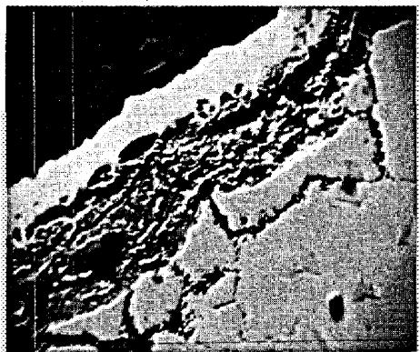  
300X BACKSCATTERED ELECTRONS

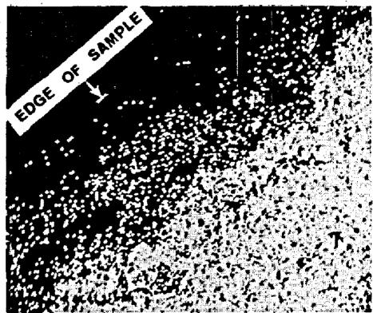  
Fe Ka

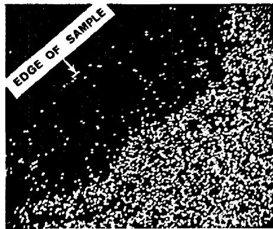  
Cr Ka   
X-RAYS

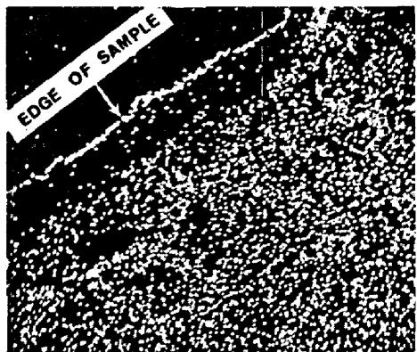  
(MAG. 300X)   
Ni Ka

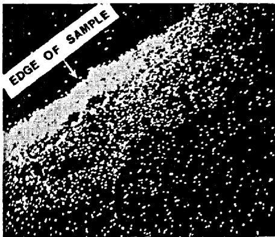  
Mo La   
Fig. 16.11. Cathode-Ray-Tube Displays showing the Distribution of Various Elements in Type 316 Stainless Steel on Which Molybdenum Was Deposited. The stainless steel was exposed to LiF-BeF $_2$ (66-34 mole %) with $10\%$ MoF $_6$ for 50 hr at $700^{\circ}\mathrm{C}$ .

# Part 5. Molten-Salt Processing and Preparation

M. E. Whatley

Part 5 deals with the development of processes for the isolation of protactinium and the removal of fission products from molten-salt reactors. During this reporting period we have continued to evaluate and develop a new flowsheet based on fluorination—reductive extraction for protactinium isolation and the metal transfer process for rare-earth removal. Calculations to determine the usefulness of this flowsheet continue to be promising.

Additional data on the distribution of rare earths between liquid bismuth solutions and molten LiCl confirm that these materials distribute favorably. We have shown that temperature does not markedly affect distribution and that our previous extrapolation of distribution data to conditions involving lithium concentrations in bismuth as high as 50 at. $\%$ appears to be valid. Since contamination of the LiCl with fluoride reduces the thorium-rare-earth separation factor, the fluoride concentrations will have to be kept below about $2\%$ in order to avoid discarding significant quantities of thorium. Maintaining fluoride concentrations at this level is considered to be practical.

Our work on contactor development was quite successful during this reporting period. Flooding data obtained during the countercurrent flow of bismuth and molten salt in a 24-in.-long, 0.82-in.-ID column packed with $\frac{1}{4}$ -in. molybdenum Raschig rings are in good agreement with flooding rates predicted from

studies with mercury and water. These studies indicate that the flow capacity of packed column contactors is sufficiently high for use in MSBR processing systems. Using the same column, we also demonstrated that uranium can be extracted from molten salt by bismuth containing reductants in a flow system. Greater than $95\%$ of the uranium was extracted from a molten-salt stream by countercurrent contact with a bismuth stream.

Our efforts to develop a continuous fluorinator are continuing; a relatively large continuous fluorination experiment that will demonstrate protection against corrosion by use of a layer of frozen salt is planned. A simulated fluorinator system was installed for studying heat generation and heat transfer in a system having the geometry to be used in the planned fluorination experiment.

Our first engineering experiment for study of the metal-transfer process for removing rare earths from single-fluid MSBR fuel salt was completed. The rare earths (lanthanum and neodymium) were extracted from the fluoride salt at about the predicted rates, and approximately $50\%$ of the lanthanum and $25\%$ of the neodymium were removed. The rare earths did not collect in the lithium-bismuth solution as expected; we believe that this was the result of oxide contamination in the system. A second experiment, similar to the first, is planned.

# 17. Flowsheet Analysis

M.J.Bell L.E.McNeese

A flowsheet that uses fluorination—reductive extraction and the metal transfer process for removing protactinium and rare earths from the fuel salt of a single-fluid MSBR has been described previously.1 Calculations to identify the important operating param

eters in the flowsheet and to determine optimum operating conditions have been continued. The reactor

considered was a 2250-MW (thermal) single-fluid MSBR containing $1683\mathrm{ft}^3$ of fuel salt with a nominal composition of 71.7-16.0-12.0-0.3 mole $\%$ ${}^{7}\mathrm{LiF - BeF}_{2}-$ $\mathrm{ThF_4 - UF_4}$ . Chemical processing for both protactinium and rare-earth removal was assumed to be on a ten-day cycle.

Oxide precipitation is being considered as an alternative to fluorination for the removal of uranium from fuel salt from which protactinium has already been removed. Calculations have been made to investigate the operation of an oxide precipitator.

# 17.1 PROTACTINIUM ISOLATION USING FLUORINATION-REDUCTIVE EXTRACTION

Calculations were made for selecting optimum operating conditions for the protactinium isolation system: optimum conditions were tentatively assumed to be those resulting in the minimum partial fuel cycle cost. This cost includes the following components of the fuel cycle cost which are associated with the isolation of protactinium: (1) bismuth and uranium inventories in the protactinium decay tank, (2) the loss in bred uranium resulting from inefficient protactinium isolation, (3) the cost of $^7\mathrm{Li}$ reductant required to extract uranium and protactinium from the fuel salt, and (4) the cost of $\mathsf{BeF}_2$ and $\mathsf{ThF_4}$ which must be added to the system in order to maintain a constant fuel salt composition. A rate of $14\%$ per annum was used to compute inventory charges, and the cost of $^{233}\mathrm{U}$ was taken to be $\$ 12 / g$ . The following chemical costs were used: bismuth, $\$ 5 / lb$ ; $\mathsf{ThF_4}$ , $\$ 6.50 / lb$ ; $\mathsf{BeF_2}$ , $\$ 7.50 / lb$ ; and $^7\mathrm{Li}$ metal, $\$ 55 / lb$ . The partial fuel cycle costs which were obtained include only those charges that are directly related to the isolation of protactinium and include no contribution either for fluorination of the fuel salt to remove uranium or for removal of fission products (notably zirconium) in the protactinium isolation system.

The effect of the number of equilibrium stages in the extraction columns above and below the protactinium decay tank on the partial fuel cycle cost is shown in Fig. 17.1. In the final selection of the number of stages for these columns, one must also consider the cost associated with an increased number of stages. A selection of two stages below and five stages above the protactinium decay tank has been made, since a larger number of stages results in only a small decrease in cost. For a reductant feed rate of 429 equivalents/day and a thorium concentration in the bismuth entering the column equal to $90\%$ of the thorium solubility at $640^{\circ}\mathrm{C}$ , the bismuth-to-salt flow ratio in the columns is

0.14. The required column diameter is 3 in. if the column is packed with $\frac{3}{8}$ -in. molybdenum Raschig rings.

The effects of the reductant addition rate and changes in the volume of the protactinium decay tank on the partial fuel cycle cost are shown in Fig. 17.2. The capital cost of the decay tank, a relatively expensive equipment item, will also influence the final choices for the tank volume and the reductant feed rate; however, this cost has not yet been taken into consideration. Values of $161\mathrm{ft}^3$ for the decay tank volume and 429 equivalents of reductant per day have been selected as optimum values. Decreasing the reductant addition rate from 429 equivalents/day to 400 equivalents/day reduces the partial fuel cycle cost by $2\%$ while increasing the inventory charge on bismuth in the decay tank by about $5\%$ .

The effect of the operating temperature on the performance of the protactinium isolation system, as shown by changes in partial fuel cycle cost, is given in Fig. 17.3. A minimum partial fuel cycle cost of 0.0453 mill/kWhr is observed at a temperature of $640^{\circ}\mathrm{C}$ for a column having two stages below and five stages above the protactinium decay tank, a decay tank volume of 161 ft $^3$ , and a reductant addition rate of 429 equivalents/day. These conditions, which have been chosen as the reference processing conditions, result in a protac

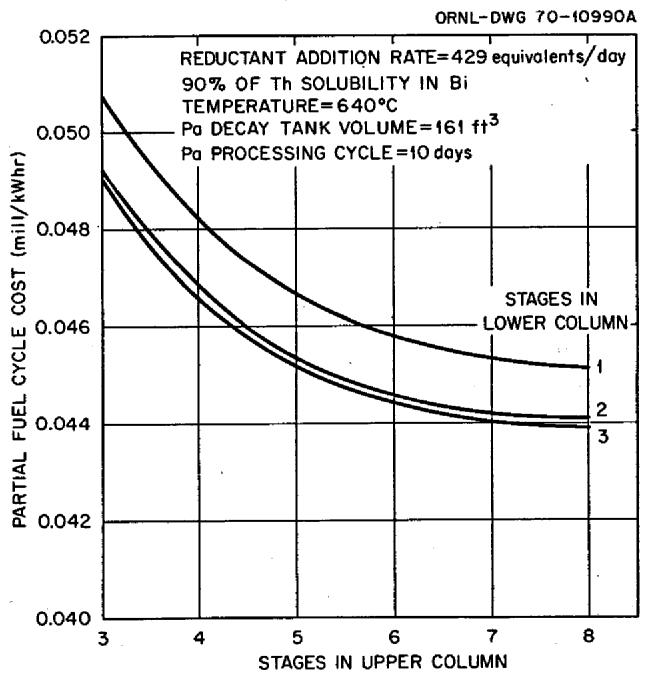  
Fig. 17.1. Partial Fuel Cycle Cost for Protactinium Isolation System as a Function of the Number of Stages in the Extractors Above and Below the Protactinium Decay Tank.

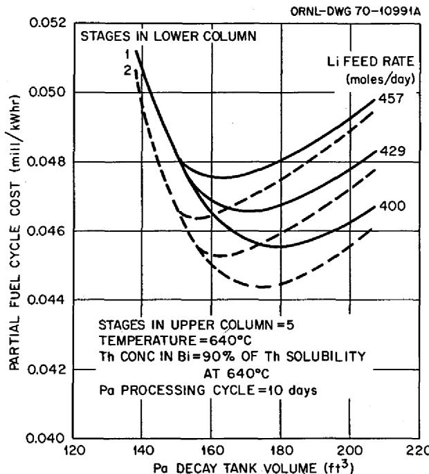  
Fig. 17.2. Partial Fuel Cycle Cost for Protactinium Isolation System as a Function of Protactinium Decay Tank Volume and Reductant Addition Rate.

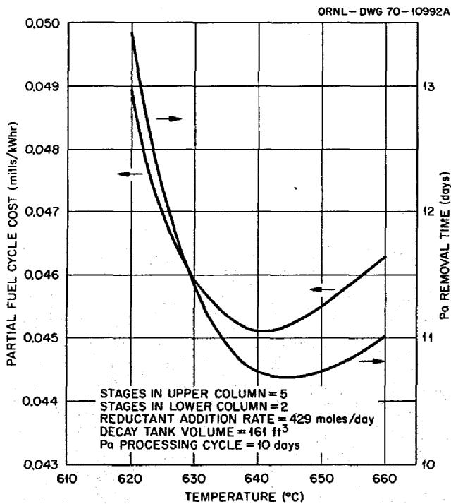  
Fig. 17.3. Protactinium Removal Time and Partial Fuel Cycle Cost for Protactinium Isolation System as a Function of Temperature.

tium removal time of 10.7 days and a uranium inventory of $12.7\mathrm{kg}$ (about $0.67\%$ of reactor inventory) in the protactinium decay tank. The components of the partial fuel cycle cost are as follows: bismuth inventory charge, 0.0097 mill/kWhr; uranium inventory charge, 0.0030 mill/kWhr; loss in ${}^{233}\mathrm{U}$ due to inefficient protactinium isolation, 0.0013 mill/kWhr; Li metal consumption, 0.0151 mill/kWhr; and $\mathrm{BeF}_2$ and $\mathrm{ThF}_4$ addition, 0.0163 mill/kWhr.

# 17.2 RARE-EARTH REMOVAL USING THE METAL TRANSFER PROCESS

Calculations have been continued to show the importance of several variables in the metal transfer process. The quantity that was used as a measure of reactor performance was the breeding gain (breeding ratio minus 1). Figure 17.4 shows the effect of the number of stages in the fuel-salt-bismuth and the LiCl-bismuth contactors, which have an equal number of stages. Little benefit is realized from using more than three stages in each contactor, and three stages are considered optimum.

The effects of the bismuth and LiCl flow rates are shown in Fig. 17.5. A substantial increase in the breeding gain is obtained by increasing the bismuth flow rate from 8.3 to 12.4 gpm; however, further

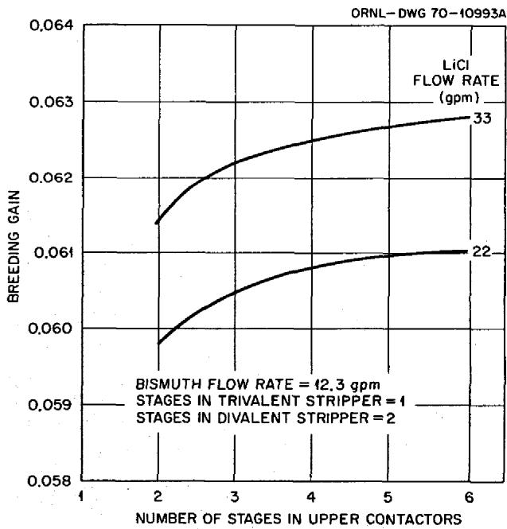  
Fig. 17.4. Effect of Number of Stages in the Fuel-Salt-Bismuth and LiCl-Bismuth Contactors on MSBR Performance.

increases in the flow rate do not produce corresponding gains in reactor performance. The reactor performance is relatively insensitive to increases in the LiCl flow rate above 33 gpm. Bismuth and LiCl flow rates of 12.4 and 33 gpm have been selected for the reference processing conditions. At a bismuth flow rate of 12.4 gpm, the metal-to-salt flow ratio in the fuel-salt-bismuth contactor is 14.1. The column will be packed with $\frac{1}{2}$ -in. Raschig rings and will be 13 in. in diameter. The LiCl-bismuth contactor, which will also be packed with $\frac{1}{2}$ -in. Raschig rings, is 12 in. in diameter.

The presence of fluoride in the LiCl acceptor salt causes a significant decrease in the thorium distribution coefficient. As a result an increase in the rate at which thorium transfers to the LiCl is observed as the LiF content in the LiCl is increased. This is undesirable since the thorium is subsequently extracted, along with rare earths, from the LiCl into the lithium-bismuth solutions and is subsequently discarded. As shown in Fig. 17.6, the thorium transfer rate increases from 0.41 mole/day with no LiF in the acceptor salt to 280 moles/day when the acceptor salt contains 5 mole% LiF. It is likely that the LiF concentration in the LiCl will have to be kept below about 2 mole%, which corresponds to a thorium transfer rate of 7.7 moles/day. Discard of thorium at this rate would add

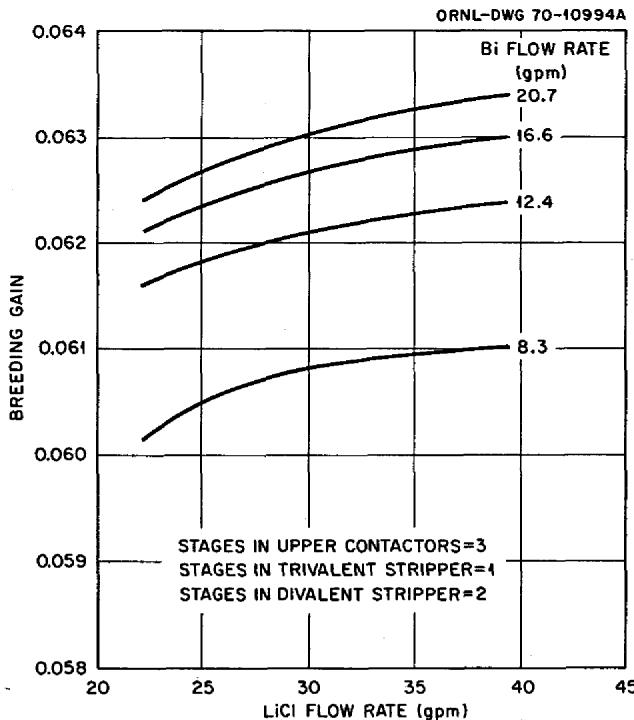  
Fig. 17.5. Effect on LiCl and Bismuth Flow Rates in the Metal Transfer System on MSBR Performance.

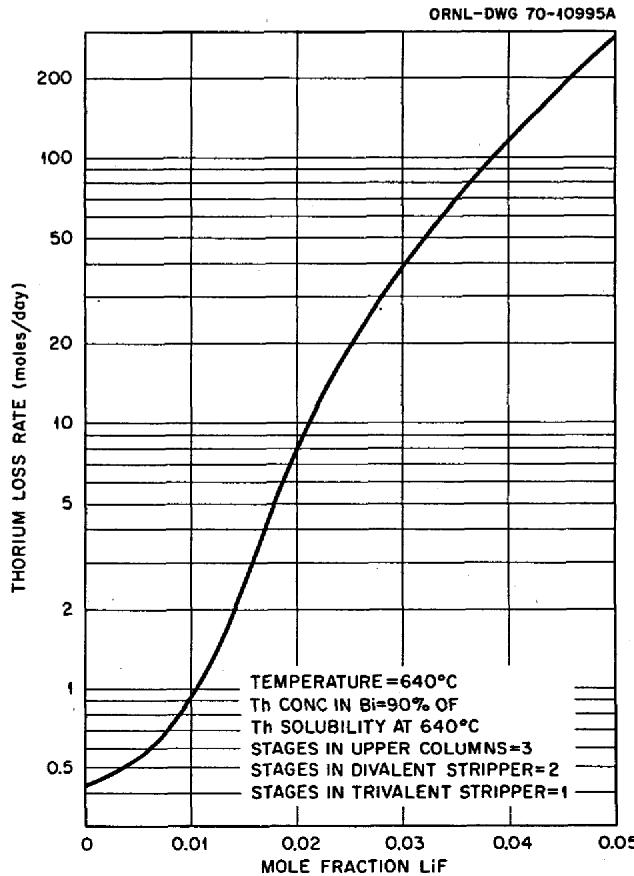  
Fig. 17.6. Effect of LiF Contaminant in LiCl on Thorium Loss Rate in Metal Transfer Process.

0.0013 mill/kWhr to the fuel cycle cost. The effect of the presence of fluoride in the LiCl on the removal of rare earths is negligible; in fact, the rare-earth removal efficiency increases slightly as the fluoride concentration in the LiCl increases.

# 17.3 REMOVAL OF URANIUM FROM FUEL SALT BY OXIDE PRECIPITATION

Oxide precipitation is being considered as an alternative to fluorination for removal of uranium from fuel salt from which protactinium has already been removed. Calculations have been made for an oxide precipitation method that consists in countercurrently contacting the fuel salt with a $\mathrm{UO}_2$ - $\mathrm{ThO}_2$ solid solution in a precipitator, which results in a specified number of equilibrium contacts (stages) between the molten salt and the oxide precipitate. It was assumed that the oxide is initially produced by precipitating a specified number of moles of oxide per mole of salt fed to the last stage (i.e., the stage in which the salt has the lowest $\mathrm{UF}_4$

concentration). The oxide initially precipitated is largely $\mathrm{ThO_2}$ ; however, after subsequent contact with salt having higher $\mathrm{UF_4}$ concentrations (in remaining stages of the precipitator), the oxide becomes principally $\mathrm{UO_2}$ . A computer program was written that calculates the concentration profiles in the precipitator; temperature, the number of stages, the number of moles of oxide precipitated per mole of salt fed, and the number of moles of salt remaining with the oxide during the transfer of salt are the independent variables. The equilibrium data of Bamberger and Baes for $\mathrm{UO_2 - ThO_2}$ solid solutions in contact with fuel salt were employed.

Typical results showing the effects of temperature and number of stages on system performance are shown in Fig. 17.7. The results indicate that greater than $99\%$ of the uranium can be removed from MSBR fuel salt with relatively few stages and that the oxide stream produced will have a $\mathrm{UO}_2$ concentration of greater than $90\%$ . A decrease in performance is observed with increasing temperature. The amount of salt remaining with the oxide during the transfer of salt was varied from 2 to 10 moles of salt per mole of oxide without a significant effect on precipitator performance.

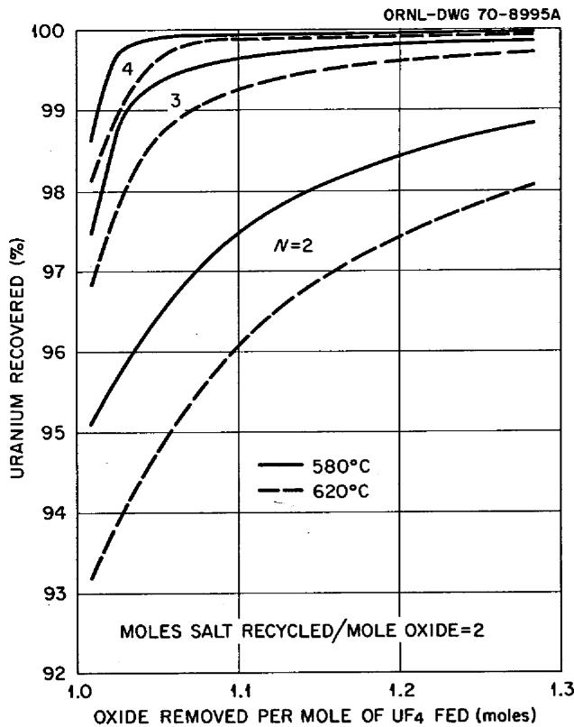  
Fig. 17.7. Effect of Temperature, Number of Stages, and Oxide Removal Rate on Percentage Uranium Recovered in an Oxide Precipitator.

$^{2}$ C. E. Bamberger and C. F. Baes, Jr., J. Nucl. Mater. 35, 177 (1970).

# 18. Measurement of Distribution Coefficients in Molten-Salt-Metal Systems

L. M. Ferris

Studies relating to the development of the metal transfer process $^{1,2}$ for the removal of rare earths from MSBR fuel salt were continued. The major effort involved measuring the effect of temperature on the equilibrium distribution of various elements between liquid bismuth solutions and either molten LiCl or LiBr. In addition, distribution coefficient data were obtained for europium and promethium using LiCl-LiF salt solutions. Studies of the solubilities of rare earths in lithium-bismuth solutions of high lithium concentration and of the solubility of LaOCl in molten LiCl were initiated.

Uranium and protactinium must be isolated from MSBR fuel salt before the metal transfer process can be utilized for rare-earth removal. One isolation technique being evaluated consists in fluorination of the salt to remove the uranium as $\mathrm{UF}_6$ , followed by reductive extraction to isolate the protactinium. We have also been considering an alternative method in which protactinium and uranium would be selectively precipitated from the salt as oxides, leaving the rare earths in solution. Experimentation on oxide precipitation processes has just begun.

# 18.1 METAL TRANSFER PROCESS STUDIES

F.J.Smith

J.C.Mailen

C. T. Thompson

J. F. Land

Measurement of the equilibrium distribution of several lanthanide and actinide elements between liquid bismuth solutions and molten LiCl, LiBr, and LiCl-LiF solutions was continued. At a given temperature, the

distribution coefficients,

$$
D _ {\mathbf {M}} = \frac {\text {m o l e f r a c t i o n o f} \mathbf {M} \text {i n b i s m u t h p h a s e}}{\text {m o l e f r a c t i o n o f} \mathbf {M} \text {i n s a l t p h a s e}}, \tag {1}
$$

could be expressed as

$$
\log D _ {\mathbf {M}} = n \log X _ {\mathrm {L i}} + \log K _ {\mathbf {M}} ^ {*}, \tag {2}
$$

in which $X_{\mathrm{Li}}$ is the mole fraction of lithium in the bismuth phase, $n$ is the valence of $\mathbf{M}^{n + }$ in the salt phase, and log $K_{\mathbf{M}}^{*}$ is a constant. Our studies during this reporting period have consisted mainly in determining the effect of temperature on log $K_{\mathbf{M}}^{*}$ for several elements. The apparatus and general technique have been described elsewhere. In many of the experiments, distribution coefficients were obtained only at one temperature, and the value of log $K_{\mathbf{M}}^{*}$ was obtained from the isotherm represented by Eq. (2). In other experiments, the temperature of the system was varied, and values of log $K_{\mathbf{M}}^{*}$ were calculated, using Eq. (2), from analyses of several samples taken at each temperature.

Distribution coefficients obtained prior to this reporting period, using LiCl, LiBr, LiCl-LiF, and LiBr-LiF as the salt phases, were summarized in the previous semiannual report.3 Additional data obtained from isotherms are given in Table 18.1, and several isotherms are shown in Fig. 18.1. In general the uncertainty in

Table 18.1. Values of log $K_{\mathbf{M}}^{*}$ Obtained from Distribution Coefficient Isotherms: log $D_{\mathbf{M}} = n \log X_{\mathbf{Li}} + \log K_{\mathbf{M}}^{*}$   

<table><tr><td>Salt</td><td>Temperature (°C)</td><td>Element</td><td>log K* M</td></tr><tr><td rowspan="3">LiBr</td><td rowspan="3">640</td><td>Th4+</td><td>14.8 (±0.7)</td></tr><tr><td>Pa4+</td><td>15.7 (±0.8)</td></tr><tr><td>U3+</td><td>10.6 (±0.5)</td></tr><tr><td>LiCl-LiF (97.55-2.45 mole %)</td><td>640</td><td>Pm3+</td><td>8.22</td></tr><tr><td>LiCl</td><td>650</td><td>Eu2+</td><td>2.325</td></tr><tr><td rowspan="7">LiCl</td><td rowspan="7">700</td><td>La3+</td><td>7.185</td></tr><tr><td>Nd3+</td><td>7.831</td></tr><tr><td>Sm2+</td><td>2.756</td></tr><tr><td>Eu2+</td><td>2.133</td></tr><tr><td>Th4+</td><td>13.772</td></tr><tr><td>Pa4+</td><td>15.8 (±0.4)</td></tr><tr><td>U3+</td><td>10.192</td></tr></table>

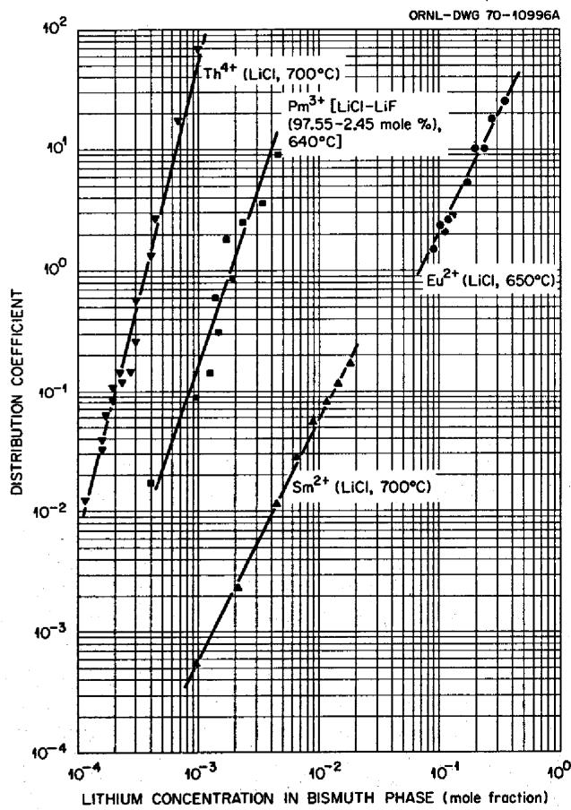  
Fig. 18.1. Distribution Coefficient Isotherms Obtained for Several Elements with Various Salt Phases.

$\log K_{\mathbf{M}}^{*}$ was 0.06 or less; exceptions are noted in Table 18.1. Plots of $\log K_{\mathbf{M}}^{*}$ vs $1 / T$ using data obtained with several elements, were found to be linear over the temperature range of about 625 to $750^{\circ}\mathrm{C}$ (Fig. 18.2); thus for each element the temperature dependence of $\log K_{\mathbf{M}}^{*}$ could be expressed as $\log K_{\mathbf{M}}^{*} = A + B / T$ . Values of $A$ and $B$ for several elements, obtained with either LiCl or LiBr as the salt phase, are given in Table 18.2. These data confirm earlier indications that the distribution behavior of most elements is rather insensitive to temperature changes and that the distribution coefficients for a given element at a given temperature are about the same with LiCl and LiBr. A detailed analysis of the effect of temperature on the metal transfer process has not yet been made.

An experiment was performed to determine qualitatively the behavior of zirconium in the metal transfer process. Zirconium tetrachloride (enough to make the salt 1 wt % in zirconium), along with about 1 mCi of $^{95}\mathrm{Zr}$ tracer, was mixed with about 50 g of LiCl and 300 g of bismuth in a molybdenum apparatus. The two-phase system was treated with HCl·H₂ (80-20 mole %) for 3 hr at 650°C to dissolve the zirconium in the salt phase. During this period about 50% of the zirconium

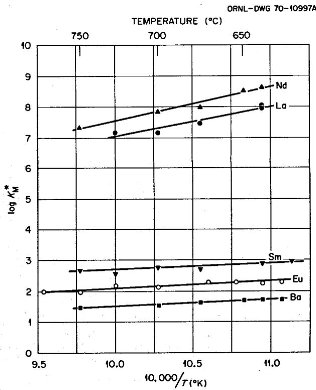  
Fig. 18.2. Effect of Temperature on the Values of $\log K_{\mathbf{M}}^{*}$ Obtained for Several Elements Using LiCl as the Salt Phase.

Table 18.2. Temperature Dependence of log $K_{\mathbf{M}}^{*}$ for Several   
Elements: $\log K_{\mathrm{M}}^{*} = A + B / T(\mathrm{^{\circ}K})$   
Temperature range: 625 to $750^{\circ}\mathrm{C}$   

<table><tr><td>Salt</td><td>Element</td><td>A</td><td>B</td><td>Standard Deviation of log K*M</td></tr><tr><td rowspan="5">LiCl</td><td>Ba2+</td><td>-0.6907</td><td>2,189</td><td>0.02</td></tr><tr><td>La3+</td><td>-2.6585</td><td>9,697</td><td>0.1</td></tr><tr><td>Nd3+</td><td>-3.3568</td><td>10,900</td><td>0.08</td></tr><tr><td>Sm2+</td><td>0.7518</td><td>1,950</td><td>0.05</td></tr><tr><td>Eu2+</td><td>-0.1584</td><td>2,250</td><td>0.05</td></tr><tr><td>LiCl-LiF (97.55-2.45 mole %)</td><td>Pm3+</td><td>-1.2356</td><td>8,536</td><td>0.33</td></tr><tr><td rowspan="2">LiBr</td><td>Ba2+</td><td>-0.0733</td><td>1,333</td><td>0.02</td></tr><tr><td>Nd3+</td><td>4.046</td><td>4,297</td><td>0.1</td></tr></table>

was volatilized from the system. After hydrochlorination, sufficient thorium and lithium-bismuth alloy were added to the system to give a bismuth solution containing about 1500 wt ppm of thorium and 15 wt ppm of lithium. The system was maintained under an argon atmosphere for two weeks, with samples of both the salt and bismuth phases being withdrawn periodically. The zirconium distribution coefficients calculated from chemical analyses of the samples were scattered between 10 and 230; the average value was 85 when the mole fraction of lithium in the bismuth phase was $4.5 \times 10^{-4}$ (15 wt ppm). This distribution coefficient is about the same as that obtained with $\mathrm{LiF - BeF_2 - ThF_4}$ (72-16-12 mole %) at the same lithium concentration in the bismuth phase. Consequently, if zirconium has not been removed from the salt with either the protactinium or uranium, it will be extracted along with the rare earths in the metal transfer process.

During the two weeks that the system was maintained at $650^{\circ}\mathrm{C}$ , the zirconium concentration in the LiCl and bismuth phases did not decrease detectably. In addition, no increase in $^{95}\mathrm{Zr}$ activity was detected in the colder regions of the apparatus, where condensation of volatilized zirconium compounds might be expected to occur. These observations indicate that the partial pressure of zirconium tetrachloride above the LiCl solution in contact with bismuth containing reductants was much lower than that predicted from the vapor pressure of pure $\mathrm{ZrCl_4}$ . This could be an indication that the oxidation state of the zirconium species in the salt was lower than $4^{+}$ .

The main feature of the metal transfer process is the selective transport of rare earths from a fluoride fuel salt into an LiCl or LiBr acceptor salt. In one flowsheet being considered1 the rare earths would be stripped

from the acceptor salt by extraction into lithium-bismuth solutions having lithium concentrations of 5 at. $\%$ or higher. More specifically, the trivalent rare earths (and the small amount of thorium that would also be present in the acceptor salt) would be extracted into liquid lithium-bismuth (5-95 at. $\%$ ), and the divalent rare earths (eupropium and samarium) would be extracted into liquid lithium-bismuth (about 40-60 at. $\%$ ). In the analysis of the flowsheet, it was assumed that the values of $\log K_{\mathrm{M}}^{*}$ obtained with bismuth solutions of low lithium concentration were also valid when the lithium concentration in the bismuth phase was 5 at. $\%$ or higher. This assumption appears to be warranted, based on the results of the experiment at $650^{\circ}\mathrm{C}$ in which europium was extracted from LiCl into lithium-bismuth solutions having lithium concentrations of 10 to 35 at. $\%$ (Table 18.1, Fig. 18.1). The value of log $K_{\mathrm{Eu}}^{*}$ obtained in this experiment (2.325) is in good agreement with the value of 2.28 expected from the correlation (Table 18.2) of the europium distribution coefficients obtained previously. In the earlier experiments the lithium concentration in the bismuth phase was always lower than about 1 at. $\%$ .

The distribution behavior of several solutes, using LiCl-LiF and LiBr-LiF solutions as the salt phase, is being studied to determine the effect of fluoride on the metal transfer process in the event that the acceptor salt becomes contaminated with fluoride fuel salt. It was shown previously3 that the presence of fluoride in either LiCl or LiBr caused a change in the distribution behavior of lanthanum and thorium, particularly thorium. Recently we obtained some data for promethium and europium, using LiCl-LiF solutions as the salt phase (Table 18.3). At $640^{\circ}\mathrm{C}$ the values of $\log K_{\mathrm{Pm}}^{*}$ decreased systematically as the LiF concentration in the

Table 18.3. Effect of LiF Concentration on Values of log $K_{\mathrm{M}}^{*}$ Obtained for Promethium and Europium, Using LiCl-LiF Solutions as the Salt Phase   

<table><tr><td>Element</td><td>Temperature (°C)</td><td>LiF Concentration in Salt (mole %)</td><td>log K* M</td></tr><tr><td rowspan="5">Pm3+</td><td rowspan="5">640</td><td>0</td><td>(8.4)a</td></tr><tr><td>2.45</td><td>8.22</td></tr><tr><td>6.59</td><td>7.22</td></tr><tr><td>10.22</td><td>6.86</td></tr><tr><td>17.56</td><td>6.14</td></tr><tr><td rowspan="5">Eu2+</td><td rowspan="5">650</td><td>0</td><td>2.279</td></tr><tr><td>4.39</td><td>2.265</td></tr><tr><td>11.5</td><td>2.398</td></tr><tr><td>17.3</td><td>2.381</td></tr><tr><td>24.6</td><td>2.374</td></tr></table>

$a_{\text{Estimated}}$

salt phase increased. This behavior is similar to that found previously for lanthanum, and shows that the thorium-promethium separation factor will also be decreased if the acceptor salt becomes contaminated with fuel salt. No value for $\log K_{\mathrm{Pm}}^{*}$ was obtained with pure LiCl as the salt phase; however, the estimated value of 8.4 indicates that the behavior of promethium is similar to that of neodymium. The estimated neodymium-promethium separation factor at $640^{\circ}\mathrm{C}$ with pure LiCl as the salt phase is $3 \pm 2$ . Furthermore, this separation factor is not expected to change significantly with temperature because the values of log $K_{\mathrm{Pm}}^{*}$ obtained with LiCl-LiF (97.55-2.45 mole %) had about the same temperature dependence as the values of $\log K_{\mathrm{La}}^{*}$ and $\log K_{\mathrm{Nd}}^{*}$ obtained with LiCl as the salt phase; that is, the values of $B$ were of the same magnitude (Table 18.2).

As shown in Table 18.3, the values for $\log K_{\mathrm{Eu}}^{*}$ at $650^{\circ}\mathrm{C}$ showed a slight increase when LiF was present in the salt phase. The magnitude of the change is such that contamination of the acceptor salt with fluoride would not markedly affect the behavior of europium in the metal transfer process.

# 18.2 SOLUBILITY OF NEODYMIUM IN Li-Bi-Th SOLUTIONS

F.J.Smith C.T.Thompson

As mentioned in Sect. 18.1, one method for removing rare earths and thorium from an LiCl or LiBr acceptor salt in the metal transfer process is extraction into lithium-bismuth solutions in which the lithium concen

tration is 5 at. $\%$ or higher. Consequently we are investigating the solubilities, both individual and mutual, of rare earths and thorium in lithium-bismuth solutions. In our first experiment the solubility of neodymium in liquid lithium-bismuth ( $\sim 38-62$ at. $\%$ ) was measured over the temperature range 475 to $700^{\circ}\mathrm{C}$ . The experiment was initiated by heating bismuth, neodymium, and lithium (about 186, 10, and $4\mathrm{g}$ respectively) in a molybdenum crucible under argon to $475^{\circ}\mathrm{C}$ and maintaining the system at this temperature for 24 hr before sampling the liquid phase. The temperature of the system was then increased progressively to $700^{\circ}\mathrm{C}$ ; after reaching $700^{\circ}\mathrm{C}$ the temperature of the system was lowered incrementally to $475^{\circ}\mathrm{C}$ . At least 4 hr was allowed at each temperature for the attainment of equilibrium before a filtered sample of the liquid phase was removed for analysis. Flame photometric analyses of the samples indicated a variation in lithium concentration between about 1.9 and 2.2 wt $\%$ during the experiment; the average lithium concentration was 2.0 wt $\%$ , which corresponds to 38 at. $\%$ in the liquid phase. The results of neutron activation analyses of the samples for neodymium are shown in Fig. 18.3 as a plot of $\log_{10}S$ (wt $\%$

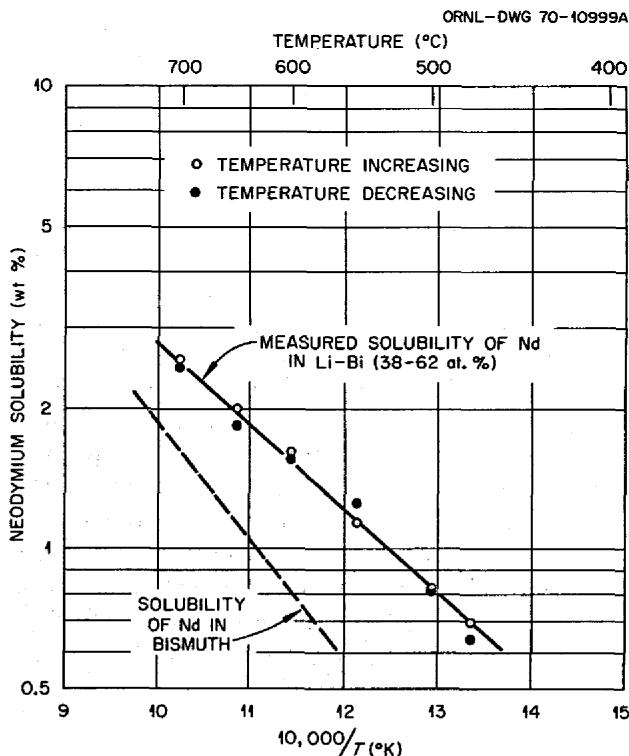  
Fig. 18.3. Solubility of Neodymium in Lithium-Bismuth (38-62 at. $\%$

neodymium) vs $1 / T$ (K). The absence of a hysteretic effect in this plot indicates that equilibrium was attained at each temperature. The solubility data can be expressed as $\log_{10}S$ (wt ppm neodymium) = 6.257 - 1809/T (K). As seen in Fig. 18.3, these values are considerably higher than the reported solubility of neodymium in pure bismuth.

Following the determination of neodymium solubilities, about $1\mathrm{g}$ of thorium was added to the system. Analyses of filtered samples showed that at $650^{\circ}\mathrm{C}$ the solubility of thorium in liquid Li-Bi-Nd (38.0-61.1-0.9 at. $\%$ ) was less than 15 wt ppm. For comparison, the solubility of thorium in liquid bismuth at $650^{\circ}\mathrm{C}$ is about 3500 wt ppm.

# 18.3 SOLUBILITY OF LaOCl IN MOLTEN LiCl

# F.J.Smith C.T.Thompson

A study of the reactions and of the relative stabilities of lanthanide and thorium halides, oxides, and oxyhalides in molten LiCl and LiBr has been initiated. Lanthanide and thorium halides that are dissolved in these potential acceptor salts for the metal transfer process can possibly react with oxygen-containing impurities (such as water vapor) in an argon or helium cover gas to yield unwanted insoluble products. Our initial work was done with LaOCl that had been prepared by the thermal decomposition of $\mathrm{LaCl}_3\cdot 6\mathrm{H}_2\mathrm{O}$ in air at $750^{\circ}\mathrm{C}$ following the procedure given by Wendlandt. X-ray diffraction analysis indicated that the product was pure LaOCl; no $\mathrm{La}_2\mathrm{O}_3$ or residual $\mathrm{LaCl}_3$ was detected. Chemical analysis of the LaOCl gave the following results: La, 72.7 wt%; Cl, 18.2 wt%. These results compare favorably with the corresponding calculated values, 73.0 and $18.6\%$ . Some of the powdered LaOCl was contacted with molten LiCl under argon at about $640^{\circ}\mathrm{C}$ for 144 hr. The system did not change visibly during this period. Finally, two filtered samples of the liquid phase were taken; chemical analysis showed their lanthanum concentrations to be 50 and 73 wt ppm respectively. These results indicate that the solubility of LaOCl in molten LiCl is very low and that LaOCl apparently will not decompose into $\mathrm{LaCl}_3$ and $\mathrm{La}_2\mathrm{O}_3$ to any appreciable extent in the presence of molten LiCl.

# 18.4 OXIDE PRECIPITATION STUDIES

J.C.Mailen J.F.Land

Results of recent work by Baes, Bamberger, and Ross (Sect. 10.5) indicate that protactinium dissolved in MSBR fuel salt could be almost completely oxidized to $\mathrm{Pa}^{5+}$ by treatment of the salt with an $\mathrm{HF - H_2}$ mixture and that the protactinium could be precipitated selectively, probably as pure $\mathrm{Pa}_2\mathrm{O}_5$ , by adding oxide to a salt containing $\mathrm{Pa}^{5+}$ . Earlier work by Bamberger and Baes8 defined the equilibria between molten $\mathrm{LiF - BeF_2 - ThF_4}$ solutions and $\mathrm{UO_2 - ThO_2}$ solid solutions. Their data indicate that under certain conditions most of the uranium could be precipitated from the salt with the attendant precipitation of only a small amount of thorium. These results have led us to consider oxide precipitation methods (instead of fluorination and reductive extraction) as means for isolating both protactinium and uranium from MSBR fuel salt. Once these elements are isolated, the salt would be suitable for use as feed for the metal transfer process, in which rare earths would be removed. The flowsheet we are considering would be approximately as follows: (1) Salt from the reactor would be treated with an $\mathrm{HF - H_2 - H_2O}$ gas mixture to convert most of the protactinium to $\mathrm{Pa}^{5+}$ and to precipitate a large fraction of the protactinium as $\mathrm{Pa}_2\mathrm{O}_5$ . (2) The $\mathrm{Pa}_2\mathrm{O}_5$ would be removed continuously by centrifugation or other suitable means. (3) Most of the protactinium-free salt would be returned to the reactor; however, a side stream would be diverted to a metal transfer system for removal of the rare-earth fission products. (4) Uranium (and a small amount of thorium) would be precipitated from the salt fed to the metal transfer system by reaction of dissolved $\mathrm{UF_4}$ and $\mathrm{ThF_4}$ with water vapor. (5) The $\mathrm{UO_2}$ (and attendant $\mathrm{ThO_2}$ ) precipitated in this step would be isolated by centrifugation (or other means) and then would be redissolved by hydrofluorination in fluoride salt that had been depleted in rare earths in the metal transfer process. We have just begun experimentation on oxide precipitation processes. Preliminary calculations relating to the stagewise precipitation of uranium oxide have been made.

Our first protactinium oxide precipitation experiment was conducted as follows: About $100\mathrm{g}$ of $\mathrm{LiF - BeF_2 - }$ $\mathrm{ThF_4 - UF_4}$ (71.7-16-12-0.3 mole %) containing 100 wt ppm of $^{231}\mathrm{Pa}$ along with $^{233}\mathrm{Pa}$ tracer was treated at $600^{\circ}\mathrm{C}$ , first for 24 hr with $\mathrm{HF - H_2}$ (50-50 mole %) and

then for 24 hr with $\mathrm{HF - H_2}$ (80-20 mole%). Residual HF and $\mathbf{H}_2$ were removed by sparging with pure argon. Then $\mathrm{UO_2}$ microspheres were periodically added to the system in small amounts ( $\sim 10\mathrm{mg}$ ). The total amount of $\mathrm{UO_2}$ added was insufficient to saturate the salt with oxide. After each addition of $\mathrm{UO_2}$ , the system was left undisturbed at $600^{\circ}\mathrm{C}$ for at least 24 hr before a filtered sample of the salt was removed for analysis. After several samples had been withdrawn at $600^{\circ}\mathrm{C}$ , the temperature of the system was increased to $655^{\circ}\mathrm{C}$ and another sample was obtained.

The results of this experiment (Table 18.4) showed that the protactinium concentration in the salt decreased systematically as $\mathrm{UO}_2$ was added to the system at $600^{\circ}\mathrm{C}$ . Values of the solubility product, $K_{\mathrm{sp}} = (X_{\mathrm{Pa}^{5+}})(X_{\mathrm{O}^{2-}})^{2\cdot 5}$ , in which $X$ denotes mole fraction, were calculated from the data assuming that: (1) the protactinium species in the salt was pentavalent after hydrofluorination, (2) the solid phase formed was pure $\mathrm{Pa}_2\mathrm{O}_5$ , (3) the oxide content of the salt after hydrofluorination was practically zero, (4) the $\mathrm{UO}_2$ microspheres dissolved in the melt, and (5) equilibrium was established in each case. Analyses of three samples taken at $600^{\circ}\mathrm{C}$ yielded $\log K_{\mathrm{sp}} \cong -15.5$ , whereas the value of $\log K_{\mathrm{sp}}$ obtained at $655^{\circ}\mathrm{C}$ was about $-14.9$ (Table 18.4). Solubility products are not given for samples 5 and 6 because of the inaccuracy of the protactinium analyses. It should be noted that the presence of some oxide in the system initially would make the true values of $\log K_{\mathrm{sp}}$ less negative than the values actually obtained.

Uranium analyses of samples taken at $600^{\circ}\mathrm{C}$ showed that no more than $5\%$ of the uranium could have been precipitated along with the protactinium oxide. However, since the solid phase could not be isolated and

analyzed, we could not prove that the solid phase was pure $\mathrm{Pa}_2\mathrm{O}_5$ (as we assumed). It was obvious, on the other hand, that the technique employed did result in the preferential precipitation of protactinium.

Calculations were made, using the equilibrium data reported by Bamberger and Baes for the exchange of $\mathbf{U}^{4 + }$ and $\mathrm{Th}^{4 + }$ between molten LiF-BeF2-ThF4-UF4and $(\mathrm{U - Th})\mathrm{O}_2$ solid solutions, in order to investigate possible modes of operation for the selective precipitation of $\mathrm{UO_2}$ from MSBR fuel salt by reaction with water vapor. The initial fuel salt was taken to be LiF-BeF2- $\mathrm{ThF_4 - UF_4}$ (71.7-16-12-0.3 mole %). It was assumed that when water vapor was allowed to contact the salt at $600^{\circ}$ a $\mathrm{UO_2 - ThO_2}$ solid solution was produced and that the solid was in equilibrium with the resulting liquid salt. In a single equilibrium stage, about $29\%$ of the thorium would have to be precipitated in order to remove $99\%$ of the uranium (Table 18.5). This amount of thorium is probably prohibitively large. As shown in Table 18.6, the uranium can be precipitated more selectively by making successive equilibrium precipita

Table 18.5.Single-Stage Precipitation of $\mathrm{UO}_2\cdot \mathrm{ThO}_2$ from LiF-BeF2-ThF4-UF4 (71.7-16-12-0.3 Mole %) by Reaction with Water Vapor at $600^{\circ}\mathrm{C}$   

<table><tr><td colspan="2">Amount 
Precipitated 
(%)</td><td colspan="2">Composition 
of Solid 
(mole %)</td><td colspan="4">Composition 
of Liquid 
(mole %)</td></tr><tr><td>U</td><td>Th</td><td>UO2</td><td>ThO2</td><td>LiF</td><td>BeF2</td><td>ThF4</td><td>UF4</td></tr><tr><td>70</td><td>0.257</td><td>87.18</td><td>12.82</td><td>71.87</td><td>16.04</td><td>11.998</td><td>0.0902</td></tr><tr><td>90</td><td>1.5</td><td>60.0</td><td>40.0</td><td>72.02</td><td>16.07</td><td>11.873</td><td>0.0301</td></tr><tr><td>95</td><td>4.24</td><td>35.89</td><td>64.11</td><td>72.27</td><td>16.13</td><td>11.58</td><td>0.0151</td></tr><tr><td>99</td><td>29.17</td><td>7.82</td><td>92.18</td><td>74.53</td><td>16.63</td><td>8.835</td><td>0.0031</td></tr></table>

Table 18.4. Results of Experiment Involving Precipitation of Protactinium Oxide from LiF-BeF $_2$ -ThF $_4$ -UF $_4$ (71.7-16-12-0.3 Mole %)   

<table><tr><td rowspan="2">Sample</td><td rowspan="2">Temperature (°C)</td><td rowspan="2">UO2Added (mg)</td><td rowspan="2">Protactinium Concentration in Salt (wt ppm)</td><td colspan="2">“Equilibrium” Concentration in Salt (mole ppm)</td><td rowspan="2">log Ksp</td></tr><tr><td>Pa5+</td><td>O2-</td></tr><tr><td>1</td><td>600</td><td>0</td><td>100</td><td>27.4</td><td>0</td><td></td></tr><tr><td>2</td><td>600</td><td>10.8</td><td>90.4</td><td>24.7</td><td>44.2a</td><td>-15.5</td></tr><tr><td>3</td><td>600</td><td>12.0</td><td>39.3</td><td>10.8</td><td>65.2</td><td>-15.4</td></tr><tr><td>4</td><td>600</td><td>10.0</td><td>12.7</td><td>3.47</td><td>93.8</td><td>-15.5</td></tr><tr><td>5</td><td>600</td><td>8.8</td><td>~2</td><td>~0.6</td><td>128</td><td></td></tr><tr><td>6</td><td>600</td><td>9.4</td><td>~2</td><td>~0.6</td><td>172</td><td></td></tr><tr><td>7</td><td>655</td><td>0</td><td>10.2</td><td>2.8</td><td>178</td><td>-14.9</td></tr></table>

${}^{a}$ Oxide added as ${\mathrm{{UO}}}_{2}$ minus oxide consumed in the formation of ${\mathrm{{Pa}}}_{2}{\mathrm{O}}_{5}$ .

tions. For the case given in Table 18.6, in which $90\%$ of the uranium present in the liquid is precipitated in each stage, a total of only about $4.5\%$ of the thorium would accompany $99\%$ of the uranium in two successive stages. Other calculations have indicated that, in principle, the best mode of operation would involve the countercurrent contact of molten salt with solid oxide phases. In a countercurrent system containing about

three equilibrium stages, $99\%$ of the uranium could be removed from the salt, and the amount of thorium in the $\mathrm{ThO_2 - UO_2}$ solid phase exiting from the system would correspond to less than $1\%$ of the thorium present in the fuel salt. The results of the calculations presented above illustrate that uranium can be removed from MSBR fuel salt without the attendant precipitation of a large fraction of the thorium.

Table 18.6. Successive Three-Stage Precipitation of $\mathbf{U}\mathbf{O}_2\text{-}\mathbf{Th}\mathbf{O}_2$ from LiF-BeF $_2$ -ThF $_4$ -UF $_4$ (71.7-16-12-0.3 Mole %) by Reaction with Water Vapor at $600^{\circ}\mathbf{C}$   

<table><tr><td rowspan="2">Stage</td><td colspan="2">Total Precipi-tated (%)</td><td colspan="4">Composition of Liquid After Precipitation (mole %)</td><td colspan="2">Composition of Solida (mole %)</td></tr><tr><td>U</td><td>Th</td><td>LiF</td><td>BeF2</td><td>ThF4</td><td>UF4</td><td>UO2</td><td>ThO2</td></tr><tr><td>1</td><td>90</td><td>1.5</td><td>72.02</td><td>16.07</td><td>11.87</td><td>0.0301</td><td>60.0</td><td>40.0</td></tr><tr><td>2</td><td>99</td><td>4.5</td><td>72.31</td><td>16.14</td><td>11.55</td><td>0.003025</td><td>6.9</td><td>93.1</td></tr><tr><td>3</td><td>99.9</td><td>7.8</td><td>72.60</td><td>16.20</td><td>11.21</td><td>0.0003</td><td>0.7</td><td>99.3</td></tr></table>

${}^{a}$ The composition of the combined solids from stages 1 and 2 would be ${\mathrm{{UO}}}_{2} - {\mathrm{{ThO}}}_{2}$ (35.3-64.7 mole %); the composition of the solids from all three stages would be ${\mathrm{{UO}}}_{2} - {\mathrm{{ThO}}}_{2}$ (24.4-75.6 mole %).

# 19. Engineering Development of Process Operations

L. E. McNeese

# 19.1 REDUCTIVE EXTRACTION ENGINEERING STUDIES

B. A. Hannaford C. W. Kee L. E. McNeese

We have continued our experimental work in the flow-through reductive extraction facility after making system modifications which were described in the previous semiannual report. The principal modification consisted in installing a column packed with $\frac{1}{4}$ -in. molybdenum Raschig rings in place of the column packed with $\frac{1}{4}$ -in. molybdenum solid cylinders.

Three successful hydrodynamic experiments (HR-9, -10, and -11) in which bismuth and molten salt were countercurrently contacted were made with the new column. The resulting flooding data are compared in Fig. 19.1 with values predicted from a flooding correlation developed from studies with a mercury-water system. The agreement between the measured and predicted values is good in that points obtained under nonflooded conditions lie below the predicted flooding curve and points obtained under flooded conditions lie above or close to the flooding curve. This is particularly important because it indicates that simulated systems, such as the mercury-water system, can be used to develop correlations applicable to bismuth-molten-salt systems. Such correlations aid in the planning and analysis of experiments using molten salt and bismuth and facilitate development of the technology required for designing and operating salt-metal systems.

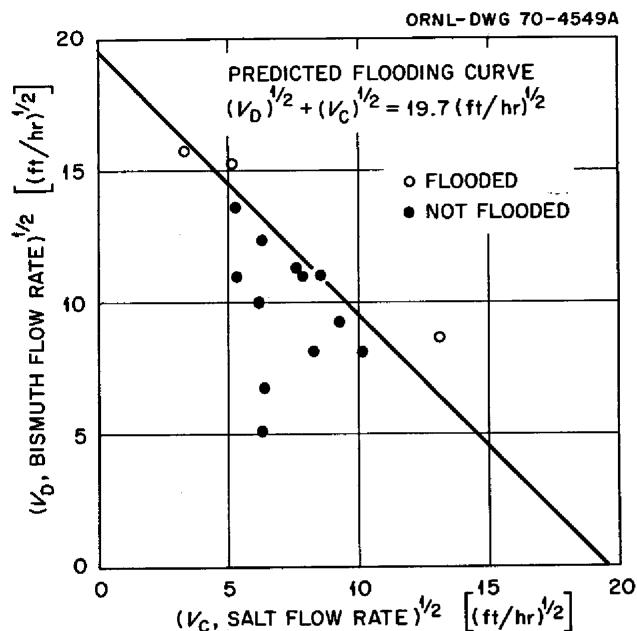  
Fig. 19.1. Flooding Data for the Bismuth-Salt System Compared with the Flooding Curve Predicted from Data for a Mercury-Water System. Column, 0.824 in. ID, packed with $\frac{1}{4}$ -in. Raschig rings, $\epsilon = 0.84$ ; temperature, $600^{\circ}\mathrm{C}$ ; molten salt, LiF-BeF $_2$ -ThF $_4$ (72-16-12 mole%).

The final hydrodynamic experiment (HR-12) was carried out to measure pressure drop through the column when only salt was flowing through it. Since only a small pressure drop was expected, it was necessary that the bismuth-salt interface at the bottom of the column be depressed below the salt inlet. This was accomplished by routing the argon off-gas flow through a mercury seal to pressurize the top of the column, the salt overflow sampler, and the salt receiver. Observed pressure drops through the column were 2, 2.5, and 5 in. $\mathrm{H}_2\mathrm{O}$ at salt flow rates of 68, 127, and $244~\mathrm{ml / min}$ respectively; values predicted by the Ergun

equation3 for these flow rates were 0.5, 1, and 2 in. $\mathrm{H}_2\mathrm{O}$ respectively. These measurements indicate that little if any iron deposition has occurred in the column. Additional measurements will be made to detect possible iron deposition.

In preparation for the first mass transfer run (UTR-1), a sufficient quantity of $\mathrm{LiF - UF_4}$ eutectic mixture was added to the salt feed tank to produce a uranium concentration of 0.0003 mole fraction, and thorium metal was added to the bismuth in the treatment vessel. Hydrodynamically, run UTR-1 was successful. A uniform flow rate of each phase was maintained at 105 ml/min ( $\sim 62\%$ of flooding) for 90 min; during this period seven sets of simultaneous samples (salt out, bismuth out) were taken from the flowing stream samplers. The flow rates were then increased to 129 ml/min ( $\sim 76\%$ of flooding) for 50 min. Surprisingly, however, analyses of flowing bismuth samples showed that only a small fraction ( $\leqslant 0.5\%$ ) of the uranium was extracted from the salt phase. Subsequent investigation showed that a cube of thorium metal had blocked the charging port in the treatment vessel and that there was essentially no reductant in the bismuth phase during the experiment.

In preparation for the next mass transfer run, thorium metal was added directly to the bismuth feed tank. Dissolution of the thorium was slow, requiring a total of about 300 hr (including 120 hr at $650^{\circ}\mathrm{C}$ ). The bismuth was then held in the feed tank at $540^{\circ}\mathrm{C}$ until the run (a period of about four days). The thorium concentration in the bismuth that was fed to the extraction column (determined by chemical analysis) was 580 ppm, which is only about $60\%$ of the calculated thorium solubility at $540^{\circ}\mathrm{C}$ .

Operating conditions and results for run UTR-2 are summarized in Table 19.1. Greater than $95\%$ of the uranium was extracted into the bismuth phase, which initially contained a $140\%$ stoichiometric excess of reductant. Conditions for the experiment were chosen such that a relatively large fraction of the uranium would be extracted, although these conditions are not optimum for the determination of mass transfer performance. This experiment was important in that it demonstrated the reductive extraction of uranium in a flow system. Subsequent experiments will be carried out with extraction factors near unity rather than with the much higher values used in the first experiment.

The failure of mild steel components and transfer lines in the facility diminished to the level of a minor problem. The earlier use of Markal CR paint on all

Table 19.1. Uranium Mass Transfer Run UTR-2   
Fraction of uranium transferred to salt phase, $\sim 95\%$ . Uranium distribution coefficient: 198 at salt inlet, 309 at salt outlet. Fraction of flooding, $77\%$ .   

<table><tr><td></td><td>Bismuth</td><td>Salt</td></tr><tr><td colspan="3">Feed rate</td></tr><tr><td>MI/min</td><td>247</td><td>52</td></tr><tr><td>Moles/min</td><td>11.42</td><td>2.79</td></tr><tr><td colspan="3">Inlet concentrations</td></tr><tr><td>Mole fraction thorium</td><td>0.000522</td><td>0.12</td></tr><tr><td>Mole fraction uranium</td><td>0.0</td><td>0.000808</td></tr><tr><td colspan="3">Outlet concentrations</td></tr><tr><td>Mole fraction thorium</td><td>0.000280</td><td>0.12</td></tr><tr><td>Mole fraction uranium</td><td>0.000157</td><td>0.0000397</td></tr></table>

newly installed components appears to have reduced the rate of air oxidation of the steel surfaces. The only failure due to air oxidation occurred in a short length of tubing, installed during the construction of the facility, that was not coated with protective paint. Following the second mass transfer run, failures in transfer lines were noted at two points: (1) in the salt line entering the bottom of the column and (2) in the bismuth line leaving the bottom of the column. Both failures apparently resulted from the expansion of freezing bismuth. Neither air oxidation of the outer surface nor mass transfer of iron from the inner surface appeared to have been contributing factors. The implication of these observations is that in future operations an attempt should be made to minimize the number of freeze-thaw cycles at the expense of increasing the length of time the lines are held at an elevated temperature $(\sim 600^{\circ}\mathrm{C})$

# 19.2 DESIGN OF A PROCESSING MATERIALS TEST STAND AND THE MOLYBDENUM REDUCTIVE EXTRACTION EQUIPMENT

W. F. Schaffer, Jr. E. L. Nicholson J. Roth

The basic plans for the test stand and the molybdenum reductive extraction equipment were described in the last semiannual report. No major changes have been made in the conceptual design. A report describing the conceptual design is being prepared.

Welding and brazing have been selected as the methods for assembling the molybdenum vessels and piping. The field assembly of process lines using portable inert gas welding and brazing chambers must still be demonstrated. One or more mechanical couplings may be included in the test stand for convenience and experience if a suitable one can be developed.

Design studies to date have been based on piping assembly by mechanical couplings, since they are limiting for nozzle spacing requirements and vessel supports. However, no major changes in layout will be required for the use of welded and brazed connections, and some simplification of vessel supports may be possible when the final design is prepared.

A conceptual full-size layout of the test stand and molybdenum equipment was prepared for use in determining clearances and vessel nozzle and line orientation. A $1/3$ -scale model of the molybdenum portions of the test stand, including piping and the equipment support column, was completed as an additional visual aid for design and fabrication studies.

Conceptual drawings were prepared for equipment hangers that slide on and are guided by a vertical stainless steel column. The hangers are supported from the cover of the containment vessel by molybdenum rods to compensate for the differential expansion between the molybdenum equipment and the stainless steel column. The hangers are designed to resist torque imparted to vessels during assembly if mechanical connectors are used and will also tolerate some misalignment of vessels and piping during assembly.

A preliminary design drawing for the head pots has been prepared, based on the use of molybdenum back-extrusion forgings (essentially forged pipe caps). These forgings will have a finished outside diameter of $3\frac{7}{8}$ in. and an inside diameter of $3\frac{5}{8}$ in. with an inside straight side length of about 2 in. The forged components for the head pots and the packed-column end sections will have the same basic dimensions to minimize extrusion press die costs. The forgings may have either thick ends or one or more integral forged end bosses that can be machined to permit the use of mechanical couplings or welded and brazed connections for process lines. The head pot design incorporates a mechanical assembly method for the internal baffles and orifice components. The design illustrates electron beam welding, reinforced by furnace back-brazing techniques, to attach the lines to the vessel and to join the top and bottom forgings. External circumferential welds on vessels and tubing will be reinforced with a brazed molybdenum band or sleeve.

A full-scale transparent plastic model of the bismuth head pot, the top disengagement section of the column, and a portion of the packed section of the column was fabricated and installed for testing with mercury and water to simulate molten bismuth and salt. Problems to be investigated include head pot deentrainment performance for the gas-lift-pumped bismuth stream, bismuth flow surge damping, bismuth distributor design

for the top of the packed column, and entrainment of bismuth in the salt stream exiting from the top section of the column.

A gas pulse pump using tungsten carbide check valves in the pipe line has been designed and installed for testing as a possible alternative to the gas-lift pumps proposed for the test stand. Possible advantages over gas-lift pumping are: a wider flow range capability, elimination of gas entrainment problems, and reduced consumption of inert gas. In the first tests the pulsed actuating gas pressure will be supplied by a variable-frequency cam-actuated air valve. Subsequent testing will investigate a sealed gas cushion pulsed by a bellows or piston.

We are continuing the investigation of mechanical co $\cdots$ s (see Chap. 16). The Gamah coupling supplied to use earlier leaked at the seal ring after a few temperature cycles. Failure may have been due to the high-temperature relaxation of the stainless steel nut on the fitting or to severe oxidation of the joint before it was received. The swaged joints between the tubing and coupling hubs have shown no signs of leakage. A new Gamah coupling made entirely of molybdenum has been received. It, along with several other couplings, will be subjected to high-temperature $(650^{\circ}\mathrm{C})$ cyclic leak testing.

# 19.3 CONTACTOR DEVELOPMENT: PRESSURE DROP, HOLDUP, AND FLOODING IN PACKED COLUMN

J. S. Watson L. E. McNeese

We are studying the hydrodynamics of packed-column operation with fluids having high densities and a large density difference in order that we may evaluate and design countercurrent contactors for use in MSBR processing systems based on reductive extraction. Mercury and water are being used to simulate bismuth and molten salt in these studies. We previously reported measurements of flooding, dispersed-phase holdup, and pressure drop for columns packed with $\frac{1}{4}$ -in. Raschig rings and solid cylinders and $\frac{3}{8}$ -in. Raschig rings.

During this report period, measurements of pressure drop and dispersed-phase holdup were carried out with a 2-in.-ID column packed with $\frac{1}{2}$ -in. Raschig rings. The holdup data were similar to those obtained previously with smaller packing materials; the results can be

correlated by the assumption of a constant superficial slip velocity, $V_{s}$ , defined as

$$
V _ {s} = \frac {V _ {c}}{1 - X} + \frac {V _ {d}}{X}, \tag {1}
$$

where $V_{c}$ and $V_{d}$ are superficial velocities of the continuous and dispersed phases, respectively, and $X$ is the fraction of the column void fraction occupied by the dispersed phase. Fifty-nine holdup measurements were made with the $\frac{1}{2}$ -in. Raschig ring packing. The calculated superficial slip velocity was $1531 \pm 249 \mathrm{ft/hr}$ .

The superficial slip velocities for packings studied previously were also calculated, and standard deviations of 10 to $15\%$ (estimated to be the experimental error in the holdup data) were observed. The data for $1/4$ -in. Raschig rings and solid cylinders in 1- and 2-in.-ID columns suggest that the superficial slip velocity is also expected to be dependent on packing size and that although the slip velocity for $3/8$ -in. Raschig rings (i.e., 819 ft/hr) is approximately equal to that for $1/4$ -in. Raschig rings, the slip velocity for $1/2$ -in. Raschig rings (1531 ft/hr) is considerably higher than that for smaller packing.

The observation that the dispersed-phase holdup data can be correlated on the basis of a constant superficial slip velocity is especially important, since this suggests a method for correlating flooding data. At flooding it is assumed that the following conditions obtain:

$$
\frac {\partial V _ {d}}{\partial X} = \frac {\partial V _ {c}}{\partial X} = 0. \tag {2}
$$

If the superficial slip velocity remains constant up to flooding, combining Eqs. (1) and (2) yields the relation:

$$
(V _ {c, \text {f l o o d}}) ^ {1 / 2} + (V _ {d, \text {f l o o d}}) ^ {1 / 2} = V _ {s} ^ {1 / 2}, \tag {3}
$$

where $V_{c,flood}$ and $V_{d,flood}$ are the continuous- and dispersed-phase superficial velocities at flooding. Thus a plot of $(V_{c,flood})^{1 / 2}$ vs $(V_{d,flood})^{1 / 2}$ should produce a straight line having a slope of $-1$ . This has been observed in the literature, and our previous flooding data with $1 / 4$ -in. and $3 / 8$ -in. Raschig rings and $1 / 4$ -in. solid cylinders are well represented by this correlation. It was

not possible to flood the column packed with $\frac{1}{2}$ -in. Raschig rings because of insufficient capacities in the mercury and water pumping systems, although the column appeared to be approaching flooding at the highest flow rates used. Hence it was not possible to verify experimentally that the slip velocity, as calculated from holdup measurements, is equal to the value that would be determined from flooding data.

To date, our attempts to correlate pressure drop data have not been successful. The pressure drop behavior is especially complex at low water flow rates, where the pressure drop observed with water flow is actually lower than observed with no water flow. Since this is contrary to our expectations, we are continuing to study the phenomenon.

We have attempted to extend the correlations developed for the mercury-water system in order to obtain relations that are applicable to molten-salt-bismuth systems. The physical properties of the fluids were not varied in these studies, and there are significant differences in properties between the mercury-water system and molten-salt-bismuth systems. The most important ones were considered to be the viscosity of the continuous phase and the difference in densities of the phases. The slip velocity is assumed to be directly proportional to the difference in the densities of the phases. The correction for changes in interfacial tension is believed to be small since the interfacial tension for the mercury-water system is approximately equal to that for a molten-salt-bismuth system. The interaction of the dispersed phase with the continuous phase is expected to be inertial in nature, and the continuous-phase viscosity should have only a slight effect.

On the basis of these considerations and the data discussed earlier, the superficial slip velocity for a given packing size was assumed to be proportional to both the packing void fraction and the difference in densities of the phases. The resulting relation for the flooding rates in a salt-bismuth system is then

$$
\begin{array}{l} (V _ {c, \text {f l o o d}}) ^ {1 / 2} + (V _ {d, \text {f l o o d}}) ^ {1 / 2} \\ = \sqrt {V _ {s , \mathrm {H g - H} _ {2} \mathrm {O}} \left(\frac {\Delta \rho}{\Delta \rho_ {\mathrm {H g - H} _ {2} \mathrm {O}}}\right) \left(\frac {\epsilon}{\epsilon_ {\mathrm {r e f}}}\right)}, \\ \end{array}
$$

where

$$
\begin{array}{l} V _ {c, \text {f l o o d}} = \text {c o n t i n u o u s - p h a s e} \quad \text {s u p e r f i c i a l v e l o c i t y a t} \\ V _ {d, \text {f l o o d}} = \text {d i s p e r s e d - p h a s e} \quad \text {s u p e r f i c i a l v e l o c i t y a t} \\ \end{array}
$$

$V_{s,\mathrm{Hg - H_2O}} =$ superficial slip velocity for the mercury-water system with the type of packing to be used,

$\Delta \rho =$ difference in densities of the phases,

$\Delta \rho_{\mathrm{Hg - H_2O}} =$ difference in densities of mercury and water,

$\epsilon =$ packingvoidfraction,

$\epsilon_{\mathrm{ref}} =$ void fraction of packing for which $V_{s,\mathbf{Hg - H_2O}}$ was determined.

Values of $V_{s,\mathrm{Hg - H_2O}}$ and associated values of $\epsilon_{\mathrm{ref}}$ are given in Table 19.2 for the packing sizes studied to date.

Table 19.2. Superficial Slip Velocities for Several Packing Sizes and Associated Packing Void Fraction Values   

<table><tr><td>Packing Size (in.)</td><td>Superficial Slip Velocity (ft/hr)</td><td>Reference Packing Void Fraction</td></tr><tr><td>1/4</td><td>315</td><td>0.314</td></tr><tr><td>3/8</td><td>819</td><td>0.684</td></tr><tr><td>1/2</td><td>1531</td><td>0.71</td></tr></table>

# 19.4 CONTACTOR DEVELOPMENT: AXIAL MIXING IN PACKED COLUMNNS

J.S.Watson L.E.McNeese

We have continued our measurements of axial dispersion in packed columns during the countercurrent flow of fluids having high densities and a large density difference. The experimental technique, described previously, consists in making photometric measurements to show the steady-state concentration profile of cupric nitrate tracer in the continuous (aqueous) phase along the length of the column. These experiments, which use mercury and water, are intended to simulate conditions in packed columns through which bismuth and molten salt are in countercurrent flow. Results were reported previously for a 2-in.-ID column packed with $3/8$ -in. Raschig rings. Figure 19.2 provides a comparison of the data obtained during this reporting period for $1/4$ -in.

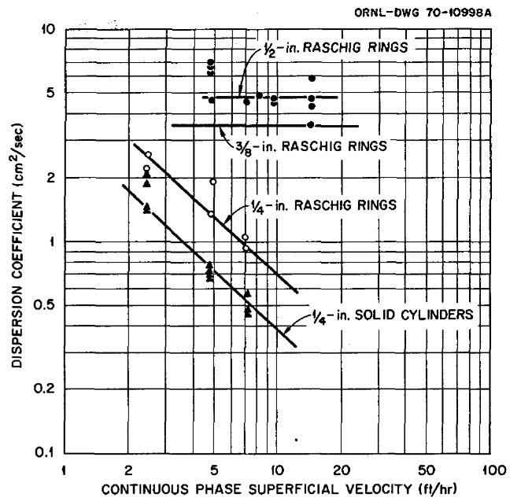  
Fig. 19.2. Axial Dispersion Coefficients in Packed Columns During Countercurrent Flow of Mercury and Water.

Raschig rings, $\frac{1}{4}$ -in. solid cylinders, and $\frac{1}{2}$ -in. Raschig rings with the previous results for $\frac{3}{8}$ -in. Raschig rings.

In each case the axial dispersion coefficient was independent of the dispersed-phase (mercury) flow rate. Dispersion coefficients for $\frac{3}{8}$ - and $\frac{1}{2}$ -in. packing were also independent of the continuous-phase (water) flow rate; their values were 3.5 and $4.8~\mathrm{cm}^2/\mathrm{sec}$ respectively. Data for the $\frac{1}{4}$ -in. packing indicate that the dispersion coefficient is inversely proportional to the continuous-phase flow rate. Differences between the dispersion coefficients for the two $\frac{1}{4}$ -in. packing materials are probably related to the difference in the packing void fractions of the materials. The data appear to portray two types of behavior, one for $\frac{1}{4}$ -in. packing and one for larger packing.

Axial dispersion coefficient data obtained during countercurrent flow of liquids having low densities and small differences in densities in columns packed with materials that are wet by the liquids are reported in the literature. Data of Vermeulen, Moon, Hennico, and Miyauchi suggest that, for conditions corresponding to the present studies, the dispersion coefficient should be proportional to the quantity

$$
\epsilon d ^ {1 / 2} \frac {V _ {d}}{\left(V _ {c}\right) ^ {1 / 2}},
$$

where

$\epsilon =$ packing void fraction,

$d =$ packing diameter,

$V_{d} =$ superficial velocity of the dispersed phase,

$V_{c} =$ superficial velocity of the continuous phase.

The data obtained in the present study are not in agreement with the predicted dependence on flow rates. However, it should be noted that the conditions of the present study are significantly different from those for which the reported correlation was developed. Lack of agreement is not surprising, since similar differences in behavior have been observed previously between the mercury-water system and aqueous-organic systems.

# 19.5 AXIAL MIXING IN OPEN BUBBLE COLUMNNS

J.S.Watson L.E.McNeese

Axial mixing is important in the design of continuous fluorinators, which are envisioned as open columns through which fluorine is bubbled countercurrent to a flow of molten salt. We have previously reported data $^{9-10}$ showing the variation of dispersion coefficient with changes in gas and liquid flow rates and with the physical properties of the liquid.

Additional data showing the importance of column diameter and gas inlet diameter have been obtained in a study by Jeje and Bozzuto, of the MIT Practice School, $^{11}$ who used an air-water system. The experimental technique, discussed previously, $^{9}$ consisted in measuring the concentration profile of a tracer along the length of the column. Results obtained with three gas inlet diameters (0.04, 0.06, and 0.085 in. ID) in a 2-in.-ID, 6-ft-long column are shown in Fig. 19.3. The dispersion coefficient is seen to be independent of gas inlet diameter for the size range studied. We have also made similar measurements in $1\frac{1}{2}$ - and 3-in.-diam columns using inlet diameters ranging from 0.04 to 0.17 in. No effect of gas inlet diameter was found.

It is not surprising that the dispersion coefficient is independent of gas inlet diameter in the slugging region (high gas flow rates), since a great deal of bubble

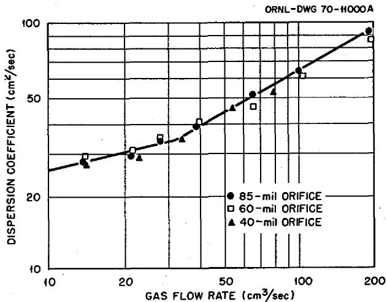  
Fig. 19.3. Effect of Gas Flow Rate and Orifice Diameter on Axial Dispersion in a 2-in.-diam Open Column.

coalescence occurs and the final bubble population may be essentially independent of the gas inlet diameter. However, in the bubbly region (low gas flow rates), little coalescence occurs, and gas inlet diameter would appear to be more important. It has been postulated11 that chain bubbling occurs at low gas rates (i.e., that gas bubbles are not formed consecutively). In this case the bubble diameter would not be highly dependent on the gas inlet diameter.

Even with different bubble diameters, one would not expect large differences in bubble rise velocities, and possibly the changes in dispersion coefficients would be small. Davies and Taylor12 report that the bubble rise velocity is proportional to the $\frac{1}{6}$ power of the bubble volume. Thus, even for conditions resulting in the release of single bubbles (i.e., where bubble volume is proportional to the cube root of the inlet diameter), one would find little variation in rise velocities with changes in inlet diameter, and hence little variation in dispersion coefficient.

Figure 19.4 shows the effect of column diameter on dispersion coefficient for 1.5-, 2-, and 3-in.-diam columns. In the slugging region the dispersion coefficient data from the three columns showed little difference for a given volumetric gas flow rate. These data, however, do not extend to high gas rates for all column diameters; therefore, extrapolation to larger gas flow rate values is questionable. In the bubbly region, results from the 2-in. and 3-in.-diam columns are

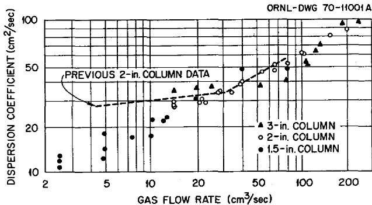  
Fig. 19.4. Effect of Column Diameter on Dispersion Coefficient in an Open Column.

essentially the same. Results for the $1 \frac{1}{2}$ -in. column indicate significantly lower values for the dispersion coefficient and show a greater dependence on gas flow rate than has been observed for the larger columns.

The fluorinators of interest will require relatively high gas rates and will operate in the slugging region. Future studies will deal mainly with this region but will also consider other types of gas inlets such as those envisioned for fluorinators.

# 19.6 DEMONSTRATION OF THE METAL TRANSFER PROCESS FOR RARE-EARTH REMOVAL

E. L. Youngblood L. E. McNeese

W. F. Schaffer, Jr. E. L. Nicholson

The first engineering experiment (MTE-1) for the study of the metal transfer process for removing rare earths from single-fluid MSBR fuel salt has been completed. This experiment was performed in a 6-in.-ID carbon steel vessel (see Fig. 19.5) at $660^{\circ}\mathrm{C}$ . The vessel has two compartments that are interconnected at the bottom by a pool of molten bismuth saturated with thorium. One compartment contained fluoride salt (72-16-12 mole $\%$ LiF-BeF $_2$ -ThF $_4$ ) to which sufficient LaF $_3$ to produce a concentration of 0.38 mole $\%$ and 2 mCi of $^{147}\mathrm{Nd}$ had been added. The second compartment contained LiCl. A cup containing a lithium-bismuth solution was also located in the lithium chloride compartment. During operation LiCl was circulated through the lithium-bismuth container via a quartz pump. The concentration of reductant (35 at. $\%$ lithium) in the lithium-bismuth was sufficiently high that at equilibrium essentially all of the neodymium and lanthanum should have been extracted from the LiCl into the metal phase. The quantities of materials used in the experiment are given in Table 19.3. The

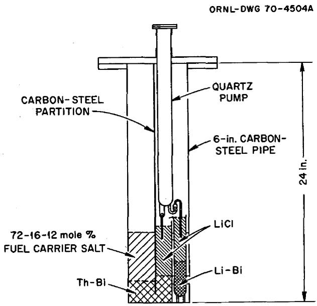  
Fig. 19.5. Carbon Steel Vessel for Use in Metal Transfer Experiment MTE-1.

Table 19.3. Materials Used in Metal Transfer Experiment MTE-1   

<table><tr><td></td><td>Volume (cm3)</td><td>Moles (g)</td></tr><tr><td>Fluoride salt (LiF-BeF2-ThF4-LaF3, 72.0-15.5-12.1-0.4 mole %; 2 mCi 147NdF3)</td><td>709</td><td>36.6</td></tr><tr><td>Bismuth saturated with thorium (0.0035 mole fraction thorium, 0.0024 mole fraction lithium)</td><td>797</td><td>36.7</td></tr><tr><td>LiCl</td><td>1042</td><td>36.6</td></tr><tr><td>Li-Bi (35 at. % lithium)</td><td>192</td><td>11.1</td></tr></table>

LiCl was purified prior to use by contact with bismuth saturated with thorium at $650^{\circ}\mathrm{C}$ . Both the carbon steel vessel and the bismuth were hydrogen treated at $650^{\circ}\mathrm{C}$ for removal of oxides prior to use.

The experiment was designed to demonstrate the selective removal of rare earths (lanthanum and neodymium) from a fluoride salt containing thorium. Provision was made for determining distribution coefficients between the phases that were present as well as determining the rate of accumulation of materials in the lithium-bismuth stripping solution during the experiment.

The sequence of operations carried out during the experiment consisted in pumping the LiCl through the lithium-bismuth container for 3 hr at a flow rate of 25 $\mathrm{cm}^3/\mathrm{min}$ . Pumping was then stopped, and the system was allowed to approach equilibrium during a 4-hr period. At this point, filtered samples of the salt and metal phases were taken. This sequence was repeated for 11 cycles. Three additional cycles were run in which the pumping period was increased to 7 hr and the equilibration period was omitted. During the pumping and equilibration periods the bismuth-thorium phase was forced to flow back and forth between the fluoride and chloride compartments at a rate equivalent to $10\%$ of the metal volume every 7 min in order to promote mixing in the bismuth-thorium phase.

The distribution coefficients for lanthanum and neodymium between the fluoride salt and the thorium-saturated bismuth were relatively constant throughout the run; the respective averages, 0.044 and 0.073, were in good agreement with expected values. On the other hand, the distribution coefficients for lanthanum and neodymium between the LiCl and the thorium-saturated bismuth varied throughout a considerable range during the run. In general, they were higher than anticipated during the first part of the run but approached the expected values near the end of the run.

Approximately $50\%$ of the lanthanum and $25\%$ of the neodymium (after correcting for $^{147}\mathrm{Nd}$ decay) originally present in the fluoride salt were removed during the run. Figure 19.6 shows the decreases in the lanthanum and neodymium concentrations in the fluoride salt as functions of pumping time and run time. The rates at which the rare earths were removed are in close agreement with the expected removal rates.

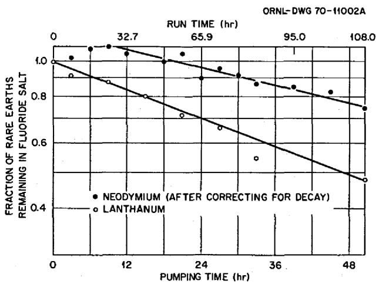  
Fig. 19.6. Rate of Removal of Neodymium and Lanthanum from the Fluoride Salt in Metal Transfer Experiment MTE-1.

However, on their removal from the fluoride salt, the lanthanum and neodymium did not collect in the lithium-bismuth as expected; in fact, only small fractions of these materials were found there.

After the run was completed the vessel was cut apart for inspection. Most of the lanthanum and neodymium that had been removed from the fluoride salt was found in a $1/8$ -in.-thick layer of material located at the interface between the LiCl and the bismuth-thorium. This material was a black porous solid which contained metallic particles (probably bismuth). The estimated weight of the layer was 250 g. Results of a chemical analysis of the material are given in Table 19.4. X-ray diffraction data indicated that the material was mostly $\mathrm{ThO}_2$ and LiCl and that it possibly contained metallic lanthanum or LaBi. The thorium oxide was expected to be present as a result of the presence of water or oxygen in the system. The layer also contained small amounts of silicon and iron.

The chemical form of the rare earths in the black material has not been determined; however, it is believed that the presence of oxides in the system may account for the accumulation of the rare earths at this point. Oxides were introduced into the system mainly by two mechanisms. First, general deterioration of the quartz pump was noted; also, the pump discharge tube, which was broken off, fell into the lithium-bismuth solution and was severely attacked. Second, water and oxygen were introduced into the system at the beginning of the experiment when it became necessary to replace a faulty pump.

Another metal transfer experiment, in which a metal pump will be used instead of the quartz pump, is planned. A metal pump that uses molten bismuth as check valves has been operated successfully in LiCl at $650^{\circ}\mathrm{C}$ for about two weeks and appears to be suitable for this purpose.

Table 19.4. Results of Chemical Analysis of Black Material Found at Interface Between LiCl and Bismuth-Thorium Solution After MTE-1   

<table><tr><td>Material</td><td>Wt %</td></tr><tr><td>La</td><td>3.55</td></tr><tr><td>Th</td><td>7.70</td></tr><tr><td>Li</td><td>12.0</td></tr><tr><td>Cl</td><td>59.1</td></tr><tr><td>O</td><td>4.44</td></tr><tr><td>Si</td><td>0.95</td></tr><tr><td>Fe</td><td>0.54</td></tr><tr><td>Bi</td><td>~12</td></tr></table>

# 19.7 DEVELOPMENT OF A FROZEN-WALL FLUORINATOR

J.R.Hightower,Jr. L.E.McNeese

In the fluorination--reductive-extraction--metal-transfer flowsheet for MSBR processing, a continuous fluorinator is used to remove uranium from the fuel salt prior to isolation of the protactinium. We are developing a continuous fluorinator that will be protected from corrosion by a layer of frozen salt. In a processing plant the heat necessary for maintaining molten salt adjacent to the frozen layer will be provided by the decay of fission products. In order to study fluorinator operation in a nonradioactive system, it is necessary to provide a source of heat in the molten salt. Earlier calculations and experiments13 have indicated that high-frequency induction heating may be an acceptable method for this purpose.

We have continued to make calculations that will provide an estimate of the performance of a frozen-wall fluorinator having an induction coil embedded in frozen salt near the fluorinator wall. Because of uncertainties in the effect of bubbles in the molten salt and in the amount of heat that will be generated in the metal walls

of the fluorinator, equipment is being assembled for studying heat generation in a simulated fluorinator.

Calculated Heat Generation and Heat Transfer Rates. Calculations were continued for a fluorinator having a design designated previously $^{13}$ as configuration I. The following assumptions were made: (1) the fluorinator consisted of a 5-in.-ID coil (having two turns per inch) placed inside a 6-in.-diam sched 40 nickel pipe, (2) the molten salt had the physical properties $^{14}$ of 68-20-12 mole % LiF-BeF $_2$ -ThF $_4$ , and (3) the induction heater operated at a frequency of 400 kHz.

Calculated steady-state values of the frozen-salt-layer thickness are shown in Fig. 19.7 for a range of induction coil current values and temperature differences across the frozen layer. It should be noted that for a given power density in the salt, temperature differences greater than a critical value result in complete freezing of salt in the fluorinator. The thickness of the frozen layer at the critical temperature difference has a unique value for all power densities and is proportional to the inside diameter of the induction coil. Operating conditions should be chosen such that (1) a reasonably thick layer of frozen salt is maintained, (2) a sufficiently large temperature difference for

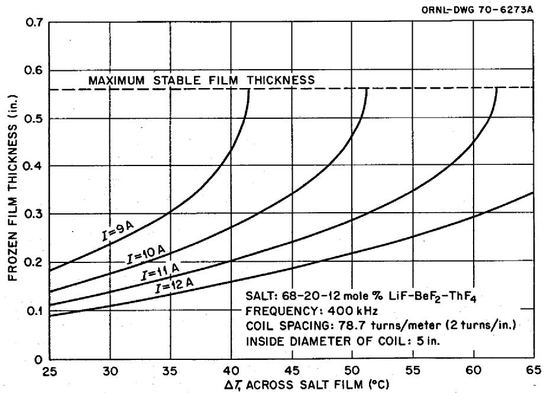  
Fig. 19.7. Effect of Coil Current and Temperature Difference Across Frozen Salt Film on the Frozen Film Thickness in a Frozen-Wall Fluorinator.

accurate determination is present, and (3) the thickness of the frozen layer does not change sharply with changes in the temperature difference. As shown in Fig. 19.7, these conditions can be met with a coil current of 11 A and a temperature difference of $51^{\circ}\mathrm{C}$ ; the resulting frozen-layer thickness in this case is about 0.3 in.

The existence of a maximum stable steady-state film thickness suggested that the control of film thickness might be difficult. In order to determine the consequences of short-term deviations of operating conditions from the prescribed conditions, a transient analysis of heat generation and heat transfer was carried out. Conditions that included coil current values of 0 and $11\mathrm{A}$ with a temperature difference of $82^{\circ}\mathrm{C}$ , which is about $20^{\circ}\mathrm{C}$ greater than the critical temperature difference for a coil current of $11\mathrm{A}$ , were examined. As shown in Fig. 19.8, a period of slightly more than 1.5 hr is required for complete freezing of the salt when there is no flow of current through the coil, while a period of more than 2.9 hr is required when a current of $11\mathrm{A}$ is flowing through the coil. Thus it is believed that there is sufficient time for corrective control action, such as decreasing the temperature difference across the frozen salt layer, if it should become necessary. Control of the thickness of the frozen layer could best be accomplished by using a directly measured thickness value in a feedback loop; methods for measuring the thickness of the frozen layer are being considered.

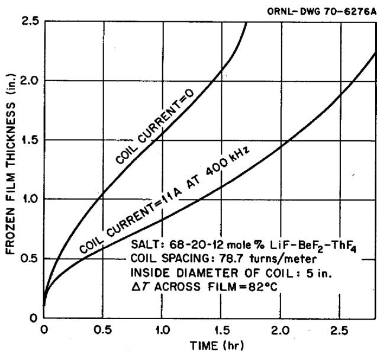  
Fig. 19.8. Rate of Formation of Frozen Salt Film.

With the heating method presently under study, heat will be generated in the external metal wall of the fluorinator and in the induction coils as well as in the molten salt. Estimates of heat generation in these regions have been made assuming that the fluorinator and induction coils were fabricated from nickel and that the metal temperature was maintained below the Curie transition temperature $(358^{\circ}\mathrm{C})$ . For a 5-in.-ID coil (two turns per inch) located inside a 6-in.-diam sched 40 nickel pipe, a coil current of $11\mathrm{A}$ , and a frequency of $400\mathrm{kHz}$ , heat would be generated in the salt at a rate of $1661\mathrm{W}$ per foot of fluorinator length, in the coil at $133\mathrm{W / ft}$ , and in the vessel wall at $42.7\mathrm{W / ft}$ . A generator having an output of at least $9.2\mathrm{kW}$ would be required for a 5-ft-long fluorinator.

There is considerable uncertainty in the estimated heat generation rates as well as questions on the effect of bubbles in the molten salt. Additional information on these questions will be obtained in a simulated fluorinator, which will use nitric acid in place of molten salt.

Simulated Frozen-Wall Fluorinator. - We have designed and are installing an experimental system for recirculating a $30\%$ $\mathrm{HNO}_3$ solution through a 5-in.-OD by 5-ft-long glass tube that is surrounded by an induction coil (coil spacing, two turns per inch) and a 5-ft-long section of pipe representing the fluorinator vessel. A flow diagram of the system is shown in Fig. 19.9. The acid is circulated through the glass column, where it is heated by the induction coil, and through a heat exchanger, where the heat is removed. The heat generation rate in the acid will be determined from a heat balance on the acid as it passes through the column. The pipe representing the fluorinator wall is equipped with a jacket through which cooling water passes. The heat generated in the pipe will be calculated from the change in temperature of the water as it passes through the jacket. A drain tank is provided for holding the nitric acid during system maintenance. Air at rates up to 2 cfm can be countercurrently contacted with the downflowing acid stream in the column. The induction generator is a 25-kW Thermionic model 1400 oscillator which operates at a nominal frequency of $400\mathrm{kHz}$ .

# 19.8 ELECTROLYTIC CELL DEVELOPMENT

# J.R.Hightower,Jr.C.P.Tung L.E.McNeese

Development of the metal transfer process and adoption of the fluorination-reductive-extraction-metal-transfer flowsheet has resulted in a change in emphasis in the electrolytic cell development work. The

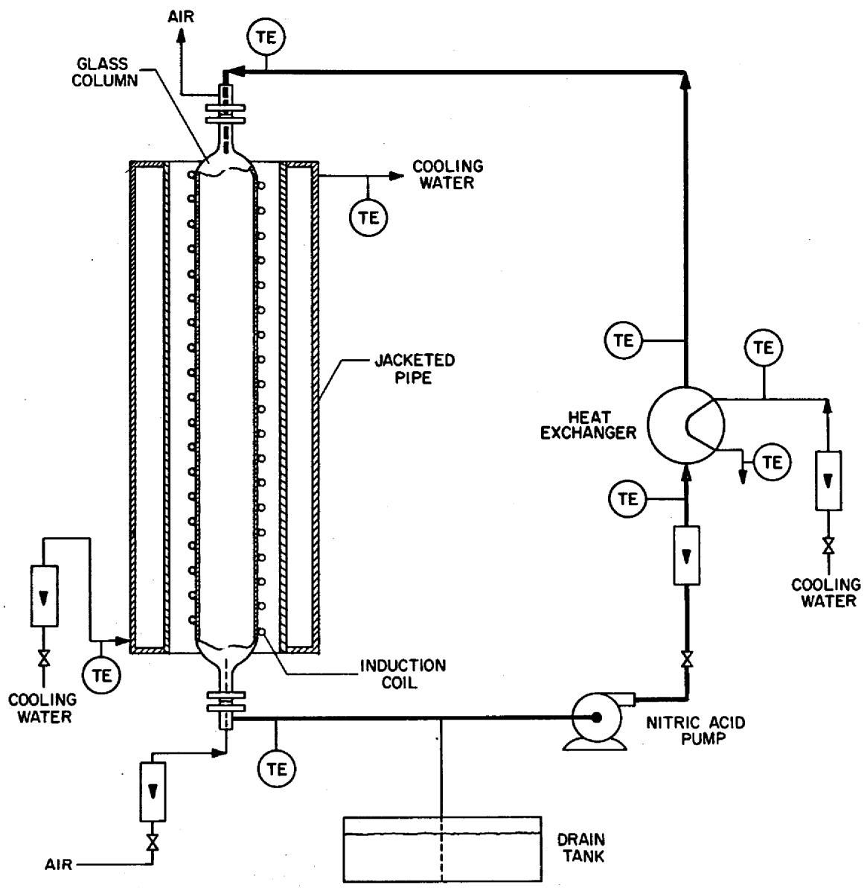  
Fig. 19.9. Flow Diagram for Fluorinator Simulation Experiment.

success of earlier MSBR processing flowsheets was dependent on the development of large electrolytic cells for reducing lithium and thorium from fluoride salt mixtures at a bismuth cathode. Although the flowsheet presently under development does not require electrolytic cells, cells may be useful in recovering lithium from salt streams discarded from the metal transfer process. The cell being considered would use a bismuth cathode and a graphite anode. Lithium would be reduced into the bismuth cathode, and chlorine would

be evolved at the anode. Cells of this type would be much simpler than cells considered earlier. For example, they would not require the use of a frozen wall as a means of protection from corrosion, the anode-cathode separation could be small in order to limit heat generation in the salt, and polarization in the salt adjacent to the cathode would not occur since the salt phase (LiCl) is a single component.

During the period covered by this report, two experiments were performed in static cells. The first

was a duplication of an earlier experiment15 in an all-metal cell and was designed to determine whether quartz contributes to the formation of a black material that had been noted in all previous electrolysis experiments. The second experiment was made to study the electrolytic reduction of lithium from LiCl into a bismuth cathode. Results from these experiments are summarized below.

All-Metal Electrolytic Cell Experiment. - In this experiment the cell vessel consisted of an 18-in. section of 6-in. sched 40 mild steel pipe. The anode was a $15\mathrm{-kg}$ pool of bismuth; the cathode was a $\frac{1}{4}$ -in.-diam mild steel rod located at the center of the vessel and placed $\frac{1}{2}$ to 1 in. above the bismuth pool. Observations in the salt phase were made using the bismuth surface as a mirror to reflect light to a sight glass in the top flange of the vessel. The electrolyte, a mixture of LiF-BeF $_2$ (66-34 mole %), filled the vessel to a level about 3 in. above the bismuth surface. The bismuth had been sparged with H $_2$ at $600^{\circ}\mathrm{C}$ to reduce oxides.

The cell was operated at a voltage of $2.3\mathrm{V}$ (16.8 A) with the cathode rod positioned $\frac{1}{2}$ in. above the bismuth for about 1 min. The cathode was then raised to 1 in. above the surface of the bismuth, and the current decreased to 15.6 A, where it remained constant for about 2 min. The voltage was increased to 2.5 V, resulting in a current that increased from 19.0 to 21.8 A over a period of 7.5 min; the cathode current density was about $2.0\mathrm{A/cm}^2$ . The total current transferred during the run was 12,400 C. The cell temperature was $550^{\circ}\mathrm{C}$ . During the passage of electric current, there was no evidence of the dark material observed in the salt previously; density gradient patterns were visible and showed convective mixing in the salt phase. After operation the salt appeared to have a more definite green color and showed signs of a slight turbidity, although it was still quite transparent.

Part of the material that deposited on the iron cathode appeared to be metallic and was probably not as dense as the salt, since it formed near the salt-gas interface and tended to spread over the salt surface. The remaining material was black, nonmetallic in appearance, and formed more uniformly over the submerged part of the steel electrode. The deposited material (16.5 g) had the composition 9.0 wt % Be, 17.0 wt % Li, 71.8 wt % F, with traces of iron and bismuth. The formation of such a deposit is explained as follows. As $\mathrm{BeF}_2$ was reduced at the cathode during cell operation, the

concentration of $\mathrm{BeF}_2$ in the salt in the vicinity of the cathode decreased. At the operating temperature of $550^{\circ}\mathrm{C}$ , LiF began to crystallize when the $\mathrm{BeF}_2$ concentration reached 30 mole $\%$ . Further reduction of $\mathrm{BeF}_2$ was accompanied by the precipitation of solid LiF in the vicinity of the cathode. When the cathode was removed from the cell, both LiF and $\mathrm{BeF}_2$ were carried with the reduced beryllium.

If one assumes that the lithium was present as LiF and that the remaining fluorine was associated with beryllium as $\mathrm{BeF}_2$ , the cathode deposit contained about $0.5\mathrm{g}$ of beryllium metal ( $33\%$ of the beryllium present in the deposit) or $0.11\mathrm{g}$ -equiv of beryllium. Since 0.129 electrical equivalent was passed, this represents a current efficiency of about $85\%$ for beryllium reduction. The current efficiency was probably actually closer to $100\%$ ; however, the additional beryllium was not recovered with the cathode deposit but floated away from the cathode on the salt surface. Some particulate material was noted on the salt surface when the cell was dismantled.

The results of this test indicate that quartz may have contributed to the formation of black material in the salt, since the salt in this case remained transparent. However, the lack of a bismuth cathode into which lithium could have been reduced may have resulted in a system that was too different from previous cells to permit conclusions to be drawn. The results of the second experiment (described below) suggest that the presence of a bismuth cathode into which lithium is reduced may contribute to the formation of black material.

Reduction of LiCl at a Bismuth Cathode. - An experiment in which LiCl was reduced in a cell having a bismuth cathode and a graphite anode was carried out in order to determine the maximum achievable anode current density, the current efficiency, the extent of attack on the graphite anode, and operational difficulties associated with forming lithium-bismuth alloy at the cathode.

The electrolytic cell consisted of a 4-in.-diam quartz cell vessel, a $3^{1/2}$ -in.-diam by $3^{1/2}$ -in.-tall molybdenum cup containing the bismuth cathode, and a 1-in.-diam graphite anode. Provision was made for measuring the volume of chlorine produced at the anode by allowing the chlorine to displace argon from a 25-ft section of $3^{1/4}$ -in. copper tubing. The volume of displaced argon was measured with a wet-test meter.

Approximately $4.9\mathrm{kg}$ of bismuth and $1.0\mathrm{kg}$ of LiCl were transferred to the cell after purification. The bismuth was purified by hydrogen sparging at $650^{\circ}\mathrm{C}$ until the water concentration in the off-gas was less

than 1 ppm. The LiCl was purified by contact with thorium-saturated bismuth for about 100 hr at $650^{\circ}\mathrm{C}$ . During their transfer to the cell, both the salt and bismuth were filtered through molybdenum filters having a mean pore size of 30 to $40\mu$ .

The cell was operated at $670^{\circ}\mathrm{C}$ at the following anode current densities (based on the area of the bottom of the anode, $5.06\mathrm{cm}^2$ ) for the indicated periods of time: $4.37\mathrm{A/cm}^2$ for 7 min, $6.7\mathrm{A/cm}^2$ for 6 min, and $8.6\mathrm{A/cm}^2$ for 6 min. There appeared to be no limiting current density in this operating range. Disengagement of the chlorine gas that was produced at the anode proceeded smoothly and without difficulty. (The anode had been slightly rounded to promote disengagement of gas.) With the initiation of current flow, the salt turned red; the color grew darker as operation continued, until finally the salt was opaque. Measurement of the $\mathrm{Cl}_2$ evolution rate (and hence current efficiency) was not possible because of reaction of the $\mathrm{Cl}_2$ with the iron components in the cell vessel.

The cell was then cooled to room temperature for examination. A thin metallic film present on the salt surface at the end of the experiment was removed intact when the anode was raised at the end of the experiment. A large amount of black material was found to be suspended in the LiCl. The material was mainly iron but had a bismuth content of 0.63 wt%. The molybdenum cup appeared to be unattacked.

The material that caused the salt to turn red during the operation of this cell is believed to be $\mathbf{L}\mathbf{i}_3\mathbf{B}\mathbf{i}$ , which dissolved in the salt. It is reported that $\mathbf{L}\mathbf{i}_3\mathbf{B}\mathbf{i}$ is slightly soluble in LiCl-LiF eutectic which is in contact with solid $\mathbf{L}\mathbf{i}_3\mathbf{B}\mathbf{i}$ or with a bismuth solution saturated with

$\mathbf{L}\mathbf{i}_{3}\mathbf{B}\mathbf{i}.$ 16 At the current densities used in this experiment, the cathode was probably polarized; this would have resulted in the formation of solid $\mathbf{L}\mathbf{i}_{3}\mathbf{B}\mathbf{i}$ at the salt-bismuth interface. Polarization of the cathode could be avoided by agitating the cathode and restricting the cathode current density. Thus it should be possible to avoid saturating the bismuth surface with $\mathbf{L}\mathbf{i}_{3}\mathbf{B}\mathbf{i}$ , which would significantly reduce the concentration of the lithium-bismuth intermetallic compound in the salt.17

Although this experiment pointed out an unexpected difficulty, it confirms our expectation that the reduction of LiCl using a bismuth cathode and graphite anode should proceed readily.

Effect of Dissolved $\mathrm{Li}_{3}\mathrm{Bi}$ in Previous Electrolytic Cells. - The knowledge that $\mathrm{Li}_{3}\mathrm{Bi}$ (which may be formed at a polarized cathode) is slightly soluble in molten salts offers an explanation for the formation of black material in previous electrolysis experiments in which bismuth electrodes and $\mathrm{LiF - BeF_2}$ electrolyte were used. In these experiments $\mathrm{Li}_{3}\mathrm{Bi}$ could have been introduced into the salt at the cathode surface and could have reacted with $\mathrm{BiF_3}$ (formed at the anode) to produce LiF and finely divided bismuth. The latter product would cause the salt to become opaque and would explain why no black material was seen in the all-metal cell experiment previously reported (i.e., there was no reductant in the salt).

$^{16}$ M. S. Foster et al., J. Phys. Chem. 68, 980 (1964).   
17M. S. Foster, “Laboratory Studies of Intermetallic Cells,” p. 144 in Regenerative EMF Cells, ed. by R. F. Gould, American Chemical Society Publications, Washington, D.C., 1967.

# 20. Continuous Salt Purification System

R.B.Lindauer L.E.McNeese

The system was charged with $28\mathrm{kg}$ of LiF- $\mathrm{BeF}_2$ (66-34 mole $\%$ ), and ten flooding runs were carried out using hydrogen and argon. After the first flooding run with hydrogen had been completed, the feed line to the column became plugged. Since oxide in the salt was believed to be causing the restriction, the salt was treated with $\mathbf{H}_2$ -HF. Oxide exceeding the amount that was soluble in the salt was removed, as indicated by analysis of the off-gas stream for water; however, the plugging recurred after salt was again fed through the column. The difficulty was apparently caused by plugging of the $1/16$ -in. holes in the bottom of the inlet salt distribution ring, since no restriction was found in the $1/4$ -in.-OD feed line. A $3/16$ -in.-diam hole was drilled through the inner wall of the distributor ring to provide an alternate salt inlet, and the feed line was replaced with a $3/8$ -in.-diam line. After this modification, satisfactory salt flow to the column was obtained.

During the flooding runs, salt flow rates of 50 to 400 $\mathrm{cm}^3/\mathrm{min}$ were used with argon and hydrogen flow rates of up to 7.5 and 30 liters/min respectively; the temperature was $700^{\circ}\mathrm{C}$ in each case. The pressure drop across the column increased linearly with increases in gas flow rate, as shown in Fig. 20.1, which summarizes the best data from the ten runs. At the flow rates studied thus far, the salt flow rate had only a minor effect on pressure drop. In the one run in which the system was operated with a very high salt flow rate $(400\mathrm{cm}^3/\mathrm{min})$ and a very low argon flow rate, the pressure drop was about 30 in. $\mathrm{H}_2\mathrm{O}$ . This indicates that a column of this type should have a much higher capacity for an operation such as oxide removal from salt by treatment with $\mathrm{H}_2$ -HF, where the HF utilization is high and low gas-to-salt flow ratios can be used. At the higher gas flow rates used in the present studies, the combined pressure drop in the off-gas line and in the column is sufficient to depress the salt-gas interface below the seal loop in the salt exit line from the column. The maximum flow rates possible with the

present system are about $19\%$ of the calculated flooding rate. At these flow rates, operation was not smooth, and the column pressure drop fluctuated over a range of 2 to 3 in. of salt. The variation in pressure drop was possibly the result of poor salt distribution at the top of the column.

In the final flooding run, stable operation was obtained with a salt flow rate of $100\mathrm{cm}^3/\mathrm{min}$ and hydrogen flow rates up to 20 liters/min. This hydrogen flow rate is sufficient to reduce 400 ppm of iron (as $\mathrm{Fe}^{2+}$ ) from a $100\mathrm{cm}^3/\mathrm{min}$ salt stream, assuming that the salt and gas reach equilibrium at $700^{\circ}\mathrm{C}$ ; however, the mass transfer coefficient is probably not sufficiently high to reach equilibrium with the present column height (81 in.).

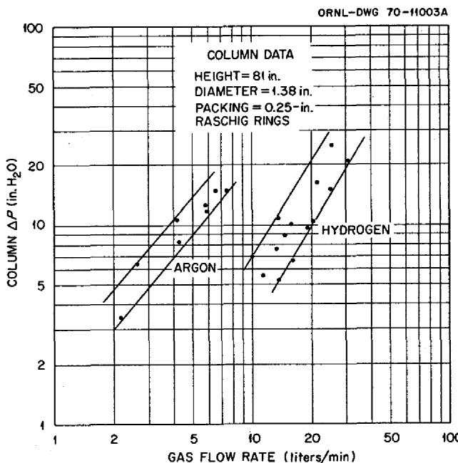  
Fig. 20.1. Column Pressure Drop During Countercurrent Flow of Molten Salt (66-34 Mole % LiF-BeF $_2$ ) and Either Argon Or Hydrogen.

OAK RIDGE NATIONAL LABORATORY

MOLTEN-SALT REACTOR PROGRAM

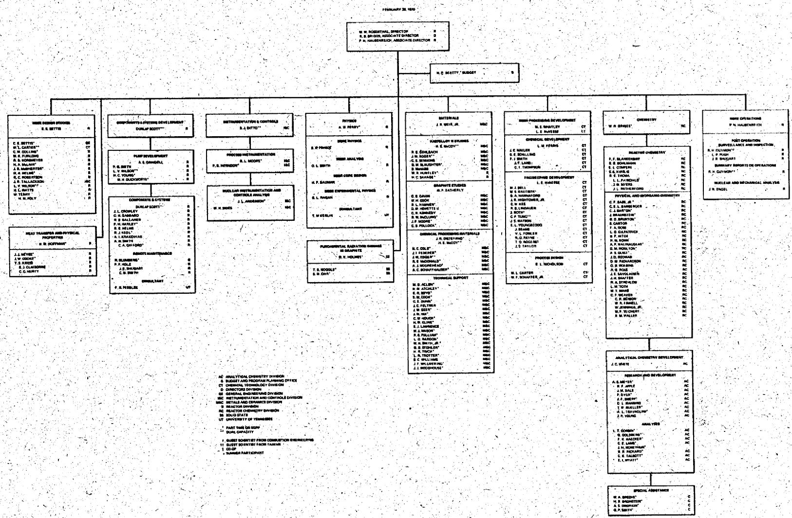

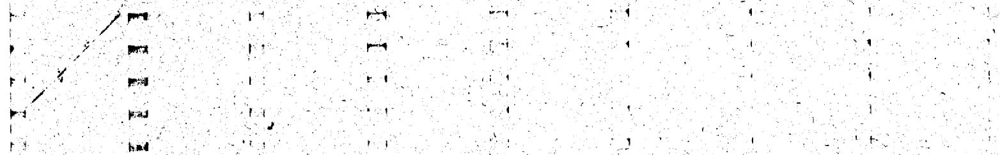

# INTERNAL DISTRIBUTION

1. R. K. Adams   
2. G.M. Adamson   
3. R. D. Affel   
4. J. L. Anderson   
5. R.F. Apple   
6. W.E. Atkinson   
7.C.F.Baes   
8. J.M. Baker   
9. C.E. Bamberger   
10. C. J. Barton   
11. H.F. Bauman   
12. S.E. Beall   
13. H. R. Beatty   
14. M. J. Bell   
15. M. Bender   
16. C. E. Bettis   
17. E. S. Bettis   
18. D. S. Billington   
19. R. E. Blanco   
20. F. F. Blankenship   
21. J.O. Blomeke   
22. R. Blumberg   
23. A. L. Boch   
24. E.G. Bohlmann   
25. C. J. Borkowski   
26. H.I. Bowers   
27. G.E. Boyd   
28. J. Braunstein   
29. M.A.Bredig   
30. E.J. Breeding

31-42. R. B. Briggs

43. H. R. Bronstein   
44. F. R. Bruce   
45. G. D. Brunton   
46. O.W. Burke   
47. D. A. Canonico   
48. S. Cantor   
49. D. W. Cardwell   
50. R. S. Carlsmith   
51. W. L. Carter   
52. O. B. Cavin   
53. S.J. Chang   
54. R. H. Chapman   
55. C.J. Claffey   
56. F.H. Clark

57. Nancy Cole   
58. C. W. Collins   
59. E. L. Compere   
60. W.H.Cook   
61. J.W. Cooke   
62. L. T. Corbin   
63. W. B. Cottrell   
64. S.J. Cromer (K-25)   
65. J. L. Crowley   
66. F. L. Culler   
67. J.M. Dale   
68. R.J. DeBakker   
69. J. H. DeVan   
70. J. R. Distefano   
71. S. J. Ditto   
72. R. G. Donnelly   
73. F.A. Doss   
74. A.S. Dworkin

75-76. W.P. Eatherly   
77. J.R. Engel   
78. W. K. Ergen   
79. J. I. Federer   
80. D. E. Ferguson   
81. L.M. Ferris   
82. A.P. Fraas   
83. J. K. Franzreb   
84. J.H. Frye, Jr.   
85. L. C. Fuller   
86. W. K. Furlong   
87. C. H. Gabbard   
88. W. R. Gall   
89. R. B. Gallaher   
90. R.E. Gehlbach   
91. R. G. Gilliland   
92. L. O. Gilpatrick   
93. W. R. Grimes   
94. A.G.Grindell   
95. R.W.Gunkel   
96. R. H. Guymon   
97. R.P. Hammond   
98. R. L. Hammer   
99. B. A. Hannaford   
00. P. H. Harley   
01. W.O.Harms   
02. C. S. Harrill

103. P.N. Haubenreich   
104. R.E. Helms   
105. P. G. Herndon   
106. D.M. Hewett   
107. R.F.Hibbs   
108. J. R. Hightower   
109. M. R. Hill   
110. E.C.Hise   
111. B.F.Hitch   
112. H. W. Hoffman   
113. D. K. Holmes   
114. P.P.Holz   
115. W. R. Huntley   
116. H. Inouye   
117. W.H. Jordan   
118. P.R.Kasten   
119. R. J. Kedl   
120. C.W. Kee   
121. M. T. Kelley   
122. M. J. Kelly   
123. C. R. Kennedy   
124. T. W. Kerlin   
125. H. T. Kerr   
126. J.J. Keyes   
127. S. S. Kirslis   
128. L. R. Koffman   
129. J.W. Koger   
130. H.W. Kohn   
131. R. B. Korsmeyer   
132. A.I. Krakoviak   
133. T. S. Kress   
134. J. W. Krewson   
135. C.E. Lamb   
136. J. A. Lane   
137. R.B. Lindauer   
138. J. L. Liverman   
139. R. S. Livingston   
140. G. H. Llewellyn   
141. E. L. Long   
142. M. I. Lundin   
143. R.N. Lyon   
144. R. L. Macklin   
145. R.E. MacPherson   
146. F.C. Maienschein   
147. J. C. Mailen

148. A. P. Malinauskas

149. C. D. Martin

150. W. R. Martin

151. H.V. Mateer

152. C.E.Mathews

153. T. H. Mauney

154. H.E. McCoy

155. D. L. McElroy

156. C. K. McGlothlan

157. C. J. McHargue

158. H. A. McLain

159. B. McNabb

160. L.E. McNeese

161. J. R. McWherter

162. H.J.Metz

163. A. S. Meyer

164. C. A. Mills

165. R. L. Moore

166. A. J. Moorhead

167. K. Z. Morgan

168. C. A. Mossman

169. D.M. Moulton

170. M. L. Myers

171. H.H. Nichol

172. J.P. Nichols

173. E. L. Nicholson

174. T. S. Noggle

175. L.C. Oakes

176. S.M. Ohr

177. W.R. Osborn

178-179. R.B. Parker

180. P. Patriarca

181. A.M. Perry

182. T. W. Pickel

183. H. B. Piper

184. C. B. Pollock

185. H.M. Poly

186. B.E. Prince

187. A. S. Quist

188. H.P.Raaen

189. G. L. Ragan

190. J. L. Redford

191. J. D. Redman

192. D.M. Richardson

193. M. Richardson

194. G. D. Robbins

195. R. C. Robertson

196. D.J. Rose

197-222. M.W. Rosenthal

223. R.G. Ross

224. J. Roth

225. J.P. Sanders

226. H.C. Savage

227. W.F. Schaffer

228. Dunlap Scott

229. J. L. Scott

230. H. E. Seagren

231. C.E. Sessions

232. J.H.Shaffer

233. E. D. Shipley

234. W.H. Sides

235. M. J. Skinner

236. G.M. Slaughter

237. A.N. Smith

238. F.J. Smith

239. G.P. Smith

240. O. L. Smith

241. A. H. Snell

242. Din Sood

243. I. Spiewak

244. C. E. Stevenson

245. H. H. Stone

246. R. A. Strehlow

247. R.D. Stulting

248. D. A. Sundberg

249. J. R. Tallackson

250. E.H. Taylor

251. W. Terry

252-253. R.E. Thoma

254. L.M. Toth

255. D. B. Trauger

256. Chia-Pao Tung

257. W.C. Ulrich

258. W.E.Unger

259. D.C. Watkin

260. G.M. Watson

261. J. S. Watson

262. H. L. Watts

263. C.F. Weaver

264. A.M. Weinberg

265. J.R. Weir

266. W.J. Werner

267. H. L. Whaley

268-272. M.E. Whatley

273. J.C. White

274. R.P. Wichner

275. L. V. Wilson

276. G.J. Young

277. H.C. Young

278. J.P. Young

279. E. L. Youngblood

280. F. C. Zapp

281. Biology Library

282. ORNL - Y-12 Technical Library

Document Reference Section

283-286. Central Research Library

286-335. Laboratory Records Department

336. Laboratory Records, ORNL R.C.

# EXTERNAL DISTRIBUTION

337. J. A. Acciarri, Continental Oil Co., Ponca City, Oklahoma 74601

338. J. S. V. Andrews, Atomic Energy Attache, UKAEA, British Embassy, Washington, D.C. 20008

339. R. C. Armstrong, Combustion Engineering, Inc., P.O. Box 500, Windsor, Conn. 06095

340. D. M. Axelrod, Public Serv. Elec. & Gas Co., 80 Park Place, Newark, N.J. 07101

341. B. L. Bailey, Great Lakes Carbon Corp., Pine Ave. & 58th, Niagara Falls, NY 14302

342. N. W. Bass, Brush Beryllium Co., 17876 St. Clair Ave., Cleveland, Ohio 44110

343. J.C. Bowman, Union Carbide Technical Center, P.O. Box 6116, Cleveland, Ohio 44101

344. R. M. Bushong, UCC, Carbon Products Div., 12900 Snow Rd., Parma, Ohio 44130

345. R. H. Chastain, Southern Services, Inc., Birmingham, Alabama 35202

346. C. G. Chezem, Gas & Electric, Wichita, Kansas 67200

347. Gary C. Clasby, Byron Jackson Pump, P.O. Box 2017, Los Angeles, CA 90054

348. Paul Cohen, Westinghouse Electric Corp., P.O. Box 158, Madison, PA 15663   
349. D. F. Cope, Atomic Energy Commission, RDT Site Office, ORNL, Oak Ridge, TN 37830   
350. Raymond L. Copeland, Tennessee Valley Authority, Chattanooga, TN 37401   
351. J. D. Corbett, Iowa State University, Ames, Iowa 50010   
352. J. J. Costantino, Great Lakes Carbon Corp., 299 Park Ave., New York, NY 10017   
353. P. V. Crooks, Atomic Energy Attache, Embassy of Australia, Washington, D.C. 20036   
354. C. B. Deering, Black & Veatch, P.O. Box 8405, Kansas City, Missouri 64114   
355. D. R. deBoisblanc, Ebasco Services, Inc., 2 Rector St., New York, NY 10006   
356. A. R. DeGrazia, USAEC, DRDT, Washington, D.C. 20545   
357. D. E. Erb, Battelle Memorial Institute, 505 King Ave., Columbus, Ohio 43201   
358. Frank V. Fair, Airco Speer Research, 4861 Packard Rd., Niagara Falls, NY 14302   
359. Martin Fate, Jr., Public Service Co. of Oklahoma, P.O. Box 201, Tulsa, OK 74102   
360. James J. Ferritto, Poco Graphite, P.O. Box 2121, Decatur, Texas 76234   
361. J.E. Fox, USAEC, DRDT, Washington, D.C. 20545   
362. W. A. Franks, S. M. Stoller Corp., 1250 Broadway, New York, NY 10001   
363. L. W. Fromm, Argonne National Lab., 9700 S. Cass Ave., Argonne, IL 60439   
364. A. E. Goldmen, UCC, 270 Park Ave., New York, NY 10017   
365. B. J. Goulding, Babcock and Wilcox, P.O. Box 1260, Lynchburg, VA 24505   
366. W. J. Gray, Battelle-Northwest, P.O. Box 999, Richland, Washington 99352   
367. Norton Habermann, RDT, USAEC, Washington, D.C. 20545   
368. J.E. Hard, ACRS, USAEC, Washington, D.C. 20545   
369. R. J. Herbst, W. R. Grace & Co., Clarksville, Md. 21029   
370. A. Houtzeel, TNO, 176 Second Ave., Waltham, Mass. 02154   
371. J. S. Iyer, Pioneer Service & Engr. Co., 2 No. Riverside Plaza, Chicago, IL 60606   
372. Ralph Jamieson, Brush Beryllium Co., Cleveland, Ohio 44110   
373. S. J. Jaye, Gulf General Atomic, P.O. Box 608, San Diego, California 92100   
374. T. R. Johnson, Argonne National Lab., Argonne, IL 60439   
375. W. R. Kannie, General Electric Co., P.O. Box 8, Schenectady, NY 12301   
376. H. H. Kellogg, Henry Krumb School of Mines, Columbia Univ., New York, NY 10027   
377. E. E. Kintner, USAEC, Washington, D.C. 20545   
378. B. W. Kinyon, Combustion Engineering, 911 W. Main St., Chattanooga, TN 37402   
379. H. N. LaCroix, Foster Wheeler Corp., Livingston, NJ 07039   
380. Kermit Laughon, AEC, RDT Site Office, ORNL, Oak Ridge, TN 37830   
381. J. R. Lindgren, Gulf General Atomic, San Diego, CA 92112   
382. D. E. Lyons, Combustion Engineering, 14 Office Park Circle, Birmingham, AL 35223   
383. W. B. McDonald, Battelle-Pacific Northwest Laboratory, Hanford, Washington 99352   
385. T. W. McIntosh, AEC, Washington, D.C. 20545   
386. H. G. MacPherson, University of Tennessee, Knoxville, TN 37916   
387. M. S. Malkin, NUS Corp., 2351 Research Boulevard, Rockville, Maryland 20850   
388. A. J. Marie, Philadelphia Electric. Co., Pittsburgh, PA 19105   
389. H. E. Marsh, *Stellite Div.-Cabot Corp.*, P.O. Box 746, Kokomo, Ind. 46901   
390. C. L. Matthews, AEC, RDT Site Office, ORNL, Oak Ridge, TN 37830   
391. G. A. Muccini, Ashland Oil Inc., R&D Building, Ashland, Kentucky 41101   
392. W. A. Nystrom, Stackpole Carbon Co., St. Marys, Pa 15857   
393. E. H. Okrent, *Jersey Nuclear Co.*, 777-106 Ave., N.E., Bellevue, Washington 98004   
394. John F. Opeka, Northeast Utilities Serv. Co., P.O. Box 270, Hartford, CT 06101   
395. F. J. Patti, Burns & Roe., Inc., 320 Fulton Ave., Hempstead, NY 11550   
396. F. N. Peebles, Dean of Engineering, University of Tenn., Knoxville, TN 37916   
397. David R. Perkins, United Nuclear Corp., Grasslands Rd., Elmsford, NY 10523   
398. A. J. Pressesky, USAEC, Washington, D.C. 20545   
399. Karl H. Puechl, NUMEC, Apollo, PA 15613   
400. D. W. Rahoi, International Nickel Co., Inc., Guyan River Rd., Huntington, WV 25720

401. M. V. Ramaniah, Ahabha Atomic Research Centre, Radiological Laboratories, Trombay, Bombay-85 AS, India   
402. David Richman, Research Division, USAEC, Washington, D.C. 20545   
403. T. K. Roche, *Stellite Division*, Cabot Corp. 1020 Park Ave., Kokomo, Ind. 46901   
404. W. E. Rosengarten, Philadelphia Electric. Co., Pittsburgh, Pa. 19105   
405. Allen S. Russell, Alcoa Research Lab., P.O. Box 772, New Kensington, PA 15068   
406. G. A. Rutledge, Combustion Engr. Inc., 911 W. Main St., Chattanooga, TN 37402   
407. R. O. Sandberg, Bechtel, 220 Bush Street, San Francisco, CA 94119   
408. W. Schröck-Vietor, Kernforschungsanlage Julich, 517 Julich, Germany   
409. Fred Schuellerman, Brush Beryllium Co., 17876 St. Clair Ave., Cleveland, Ohio 44110   
410. R.N. Scroggins, USAEC, Washington, D.C. 20545   
411. M. Shaw, USAEC, Washington, D.C. 20545   
412. Winfield M. Sides, Northeast Utilities Service Co., P.O. Box 270, Hartford, CT 06101   
413. E.E. Sinclair, USAEC, Washington, D.C. 20545   
414. W. L. Smalley, AEC, ORO, Oak Ridge, TN 37830   
415. A. D. Smart, Detroit Edison Co., Detroit, Michigan 48200   
416. Earl O. Smith, Black & Veatch, 1500 Meadowlake Parkway, Kansas City, MO 64114   
417. T. M. Snyder, General Electric Co., 175 Curtner Ave., San Jose, CA 95125   
418. N. Srinivasan, Bhabha Atomic Research Centre, Trombay, Bombay 74, India   
419. C. L. Storrs, Combustion Engineering, Inc., Prospect Hill Rd., Windsor, CT 06095   
420. J. J. Sullivan, Charles T. Main, 441 Stuart St., Boston, MA 02100   
421. E. J. Sundstron, Dow Chemical Co., Freeport, Texas 77541   
422. A.E. Swanson, Black & Veatch, P.O. Box 8405, 1500 Meadowlake, Kansas City, MO 64114   
423. J. A. Swartout, UCC, New York, NY 10000   
424. M. J. Szulinski, Atlantic Richfield Hanford Co., P.O. Box 250, Richland, WA 99352   
425. B. L. Tarmy, Esso Research & Engr. Co., P.O. Box 101, Florham Park, NJ 07932   
426. D. R. Thomas, Commonwealth Associates, Inc., 209 E. Washington Ave., Jackson, MI 49201   
427. R. A. Thomas, Southern Services Inc., Birmingham, Alabama 35202   
428. W. N. Thomas, Virginia Electric and Power Co., Richmond, VA 23209   
429. Ulrich Tillesson, NUKEM, 6451 Wolfgang, Postfach 860, West Germany   
430. J. R. Trinko, Ebasco Services, Inc., 2 Rector St., New York, NY 10006   
431. V. A. Walker, Detroit Edison Co., Detroit, Michigan 48200   
432. E.C. Ward, Northern States Power Co., Minneapolis, MN 55400   
433. C. H. Waugaman, Tennessee Valley Authority, 303 Power Bldg., Chattanooga, TN 37401   
434. R. F. Wehrmann, Poco Graphite Inc., P.O. Box 2121, Decatur, Texas 76234   
435. M. J. Whitman, USAEC, Washington, D.C. 20545   
436. M. P. Whittaker, Great Lakes Research Corp., P.O. Box 1031, Elizabethton, TN 37643   
437. L. A. Wilson, Middle South Services, Inc., P.O. Box 61000, New Orleans, LA 70160   
438. L. R. Zumwalt, North Carolina State Univ., P.O. Box 5635, Raleigh, NC 27607   
439. Laboratory and University Division, AEC, ORO   
440. Patent Office, AEC, ORO   
441-660. Given distribution as shown in TID-4500 under Reactor Technology category (25 copies - NTIS)