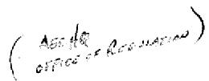
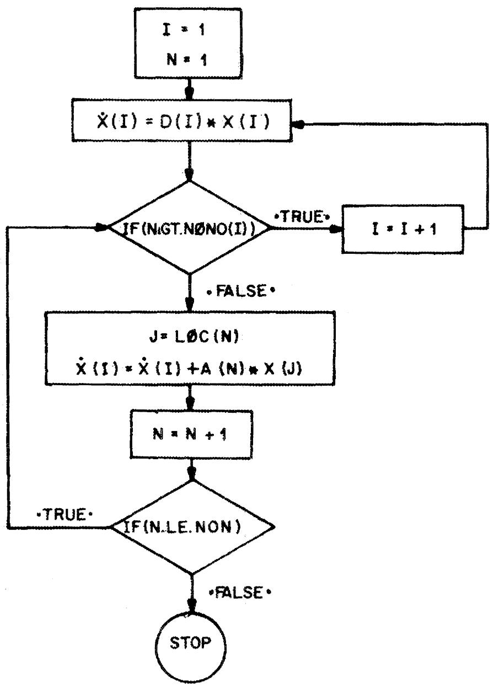

# ORIGEN - THE ORNL ISOTOPE GENERATION AND DEPLETION CODE

M. J. Bell

C. $\mathrm{A}$ 、B 、D 四个氨基酸通过 _连接键通过 _连接键通过

000011 000120

Library Loan Copy

DO NOT TRANSFER TO AND THE FOLLOW

If you want someone else to see this

with the ability to change the


OAK RIDGE NATIONAL LABORATORY

OPERATED BY UNION CARBIDE CORPORATION • FOR THE U.S. ATOMIC ENERGY COMMISSION

Printed in the United States of America. Available from

National Technical Information Service

U.S. Department of Commerce

5285 Port Royal Road, Springfield, Virginia 22151

Price: Printed Copy $5.45; Microfiche $0.95

This report was prepared as an account of work sponsored by the United States Government. Neither the United States nor the United States Atomic Energy Commission, nor any of their employees, nor any of their contractors, subcontractors, or their employees, makes any warranty, express or implied, or assumes any legal liability or responsibility for the accuracy, completeness or usefulness of any information, apparatus, product or process disclosed, or represents that its use would not infringe privately owned rights.

ORNI-4628

UC-32 - Mathematics and Computers

Contract No. W-7405-eng-26

CHEMICAL TECHNOLOGY DIVISION

ORIGEN - THE ORNL ISOTOPE GENERATION AND DEPLETION CODE

M. J. Bell*

F5 175



MAY 1973

A 1

Present address: USAEC, Washington, D.C.,

OAK RIDGE NATIONAL LABORATORY

Oak Ridge, Tennessee 37830

operated by

UNION CARBIDE CORPORATION

for the

U.S. ATOMIC ENERGY COMMISSION


3445600501482


# CONTENTS

Page

Abstract 1

1. Introduction 1   
1.1 References for Section 1 4   
2. Description of Mathematical Method 5   
2.1 Computation of the Matrix Exponential Series 6   
2.2 Use of Asymptotic Solutions of the Nuclide Chain Equations for Short-Lived Isotopes 9   
2.3 Application of the Matrix Exponential Method for Nonhomogeneous Systems 12   
2.4 Computation of Neutron Flux and Specific Power 13   
2.5 Construction of the Transition Matrix 14   
2.6 References for Section 2 18   
3. Description of Nuclear Data Library 19   
3.1 Nuclear Properties of Cladding and Structural Materials 19   
3.2 Nuclear Properties of the Isotopes of the Actinide Elements and Their Daughters 26   
3.3 Nuclear Properties of the Fission Products 28   
3.4 Photon Yield Library 30   
3.5 Miscellaneous Nuclear Properties 34   
3.6 References for Section 3 36   
4. User's Manual for the ORIGEN Code 38   
4.1 Description of ORIGEN Code Programs 41   
4.2 Description of Card Input to the ORIGEN Program 46   
4.3 Input for Sample Problem 53   
4.4 Additional Programming Considerations 56   
4.5 References for Section 4 58

# Page

5. Glossary of Warning and Error Messages 58   
6. Appendix 63

M. J. Bell.

# ABSTRACT

ORIGEN is a versatile point depletion code which solves the equations of radioactive growth and decay for large numbers of isotopes with arbitrary coupling. The code uses the matrix exponential method to solve a large system of coupled, linear, first-order ordinary differential equations with constant coefficients. The general nature of the matrix exponential method permits the treatment of complex decay and transmutation schemes. An extensive library of nuclear data has been compiled, including half-lives and decay schemes, neutron absorption cross sections, fission yields, disintegration energies, and multigroup photon release data. ORIGEN has been used to compute the compositions and radioactivity of fission products, cladding materials, and fuel materials in LWRs, LMFBRs, MSBRs, and HTGRs. The applications are illustrated with calculated inventories and radiation levels for spent fuel irradiated to a burnup of 33,000 MWd/metric ton in a PWR spectrum.

# 1. INTRODUCTION

One of the problems commonly encountered in the field of nuclear energy is the solution of equations involving nuclear transmutation and decay. To a good approximation, these nuclide chain equations can be represented as a simultaneous system of linear, homogeneous, first-order ordinary differential equations with constant coefficients. In many instances, the matrix of nuclear transmutation coefficients is triangular and the system of equations can be solved using the method of Bateman, which has been employed in a number of computer codes. However, each of these codes has generally suffered from an inability to treat more than a few specific types of transmutations and from difficulties encountered in treating "feedback," despite some progress in these areas.

An alternative approach to solving the same system of equations utilizes the matrix exponential method, which has been employed by Pease and others. Although completely general, this method has been limited in the past by the storage that is required to generate the matrix exponential series and by computational inaccuracies. Computational difficulties arise because the nuclide chain equations constitute a classic example of a set of "stiff" ordinary differential equations, that is, one in which the eigenvalues of the characteristic equation for the system are widely separated. The matrix exponential method has been employed in the ORIGEN code in order to exploit its extreme generality. The limitation on the number of nuclides that can be treated, which results from the necessity to store large arrays, has been overcome by two devices:

(1) ORIGEN stores only the nonzero elements of the normally sparse transition matrix and two vectors that are used to locate them; and (2) the expansion of the matrix exponential function is performed using a recursion relation which requires storage of only one vector in addition to the solution. Computational difficulties arising from eigenfunctions with very large eigenvalues (corresponding to nuclides with very short half-lives) are avoided by using asymptotic solutions of the nuclide chain equations for the conditions of secular and transient equilibrium.

The ORIGEN code has been designed to be extremely versatile in its applications. It is capable of computing isotopic compositions of fuel, fission products, and cladding in both fixed and fluid fuel reactors. The library of nuclear data that has been compiled for use with the code is sufficiently extensive to treat $^{235}\mathrm{U}$ and $^{239}\mathrm{Pu}$ fuels in both fast and thermal spectra, and fission of $^{233}\mathrm{U}$ in thermal spectra. The library also contains multigroup photon release rates for the fission products and the heavy metals, which permits the calculation of gamma-ray spectra in spent and refabricated fuels. One other important feature of the code is that the matrix exponential technique has been developed to solve a nonhomogeneous system of equations. This feature makes it possible for ORIGEN to be employed in calculating the accumulation of activity in processing plants, in waste disposal operations, and in the environment.

The remainder of this report consists of three major sections. Section 2 develops the mathematical techniques used in the ORIGEN computations. Section 3 summarizes the information that is contained in the library of nuclear data. Section 4 examines the function of each subroutine in the program, discusses programming considerations, describes the input for the code, and gives input for a sample problem. Output for a sample calculation is included in the Appendix. The individual sections are intended to be independent, so that Section 4 can be employed as a user's manual without reference to preceding sections.

A complete code package has been deposited with the Radiation Shielding Information Center. Inquiries or requests for the code may be mailed to:

Codes Coordinator  
Radiation Shielding Information Center  
Oak Ridge National Laboratory  
Oak Ridge, Tennessee 37830

$$
4 1, 4 4 0 S A P S
$$

or telephoned to:

Area code 615, 483-8611, ext. 3-6944, or FTS XX - 615-483-6944.

Acknowledgments. - The author is deeply indebted to a number of individuals who contributed to the development of the ORIGEN code over a period of several years. The program was initiated by J. P. Nichols, who supervised the development of the code. Much of the nuclear data was compiled by E. D. Arnold with the assistance of H. F. Soard. The author was assisted in the programming by R. S. Dillon and Mrs. L. G. Knauer, and is deeply grateful for the efforts of Mrs. I. G. Loope, who prepared the manuscript. Editing was done by C. W. Kee, who now has the task of data revisions and program modifications. Finally, the author appreciates the encouragement and suggestions of a number of users of the program who have patiently awaited the publication of this report.

# 1.1 References for Section 1

1. H. Bateman, Proc. Cambridge Phil. Soc. 15, 423 (1910).   
2. M. P. Leitzke and H. C. Claiborne, CRUNCH - An IBM-704 Code for Calculating N Successive First Order Reactions, ORNL-2958 (Oct. 24, 1960).   
3. D. R. Vondy, Development of a General Method of Explicit Solution to the Nuclide Chain Equations for Digital Machine Calculations, ORNL-TM-361 (Oct. 17, 1962).   
4. H. H. Van Tuyl, ISOGEN - A Computer Code for Radioisotope Generation Calculations, HW-83785 (1964).   
5. R. O. Gumprecht, "Computer Code RIBD," Trans. Am. Nucl. Soc. 12(1), 141-42 (June 1969).   
6. L. Pease, DEEMS, A FORTRAN Program for Solving the First Degree Coupled Differential Equations by Expansion in Matrix Series, TDSI-49 (October 1963).   
7. H. H. Poynter and J. Suez, "Automatic Digital Set-up and Scaling of Analog Computers," Proc. 1963 Joint Automatic Control Conf., p. 156.   
8. B. H. Duane, in Physics Research Quarterly Report, Oct.-Dec. 1963, HW-30020 (1964).   
9. H. E. Krug, J. E. Olhoeft, and J. Alsina, Chap. 8 in Supplementary Report on Evaluation of Mass Spectrometric and Radiochemical Analyses of Yankee Core I Spent Fuel, Including Isotopes of Elements Thorium through Curium, WCAP-6086 (August 1969).   
10. S. J. Ball and R. K. Adams, MATEXP, A General Purpose Digital Computer Program for Solving Ordinary Differential Equations by the Matrix Exponential Method, ORNL-TM-1933 (August 1967).   
11. M. E. Fowler and R. M. Warten, IBM J. Res. Develop. 11, 537 (1967).

# 2. DESCRIPTION OF MATHEMATICAL METHOD

A general expression for the formation and disappearance of a nuclide by nuclear transmutation and radioactive decay may be written as follows:

$$
\frac {d X _ {i}}{d t} = \sum_ {j = 1} ^ {N} l _ {i j} \lambda_ {j} X _ {j} + \bar {\phi} \sum_ {k = 1} ^ {N} r _ {i k} \sigma_ {k} X _ {k} - (\lambda_ {i} + \bar {\phi} \sigma_ {i}) X _ {i} (i = 1, \dots , N), \tag {1}
$$

where $X_{i}$ is the atom density of nuclide $i$ , $\lambda_{i}$ is the radioactive disintegration constant for nuclide $i$ , $\sigma_{i}$ is the spectrum-averaged neutron absorption cross section of nuclide $i$ , and $\ell_{ij}$ and $f_{ik}$ are the fractions of radioactive disintegration and neutron absorption by other nuclides which lead to the formation of species $i$ . Also in Eq. (1), $\overline{\phi}$ is the position- and energy-averaged neutron flux, which is also assumed to be constant over short intervals of time. Rigorously, the system of equations described by Eq. (1) is nonlinear since the neutron flux will vary with changes in the composition of the fuel. However, the variation with time is slow and, if the neutron flux is considered to be constant over short time intervals, the system of Eq. (1) is a homogeneous set of simultaneous first-order ordinary differential equations with constant coefficients, which may be written in matrix notation:

$$
\overset {\cdot} {X} \underset {\approx} {=} = \underset {\approx} {A} \underset {\approx} {X} \underset {\approx} {.} \tag {2}
$$

Equation (2) has the known solution

$$
\underset {\approx} {X} = \exp (\underset {\approx} {A t}) \underset {\approx} {X} (0), \tag {3}
$$

where $\underset{\approx}{X}(0)$ is a vector of initial atom densities and $\underset{\approx}{A}$ is a transition matrix containing the rate coefficients for radioactive decay and neutron capture. The function $\exp(\mathrm{At})$ in Eq. (3) is the matrix exponential function, a matrix of dimension $\mathbb{N}^2$ , which is defined as

$$
\exp \left(\underset {\approx} {A t}\right) = \underset {\approx} {I} + \underset {\approx} {A t} + \frac {\left(\underset {\approx} {A t}\right) ^ {2}}{2 !} + \dots = \sum_ {m = 0} ^ {\infty} \frac {\left(\underset {\approx} {A t}\right) ^ {m}}{m !}. \tag {4}
$$

If one can generate this function accurately from the transition matrix, then the solution of the nuclide chain equations is readily obtained.

# 2.1 Computation of the Matrix Exponential Series

Two principal difficulties are encountered in employing the matrix exponential technique to solve large systems of equations: (1) a large amount of memory is required to store the transition matrix and the matrix exponential function, and (2) computational problems are encountered in applying the matrix exponential method to systems of equations with widely separated eigenvalues. The generation and storage of the transition matrix are explained in Sect. 2.5. The computation and storage of the matrix exponential function have been facilitated by developing a recursion relation for this function which does not require storage of the entire matrix. Thus it is possible to derive an expression for one nuclide in Eq. (3) which is given by

$$
\mathbf {x} _ {\dot {\mathbf {i}}} (t) = \sum_ {n = 0} ^ {\infty} C _ {\dot {\mathbf {i}}} ^ {n}, \tag {5}
$$

where $C_{i}^{n}$ is generated by use of a recursion relation

$$
C _ {j} ^ {0} = x _ {i} (0), \tag {6a}
$$

$$
C _ {i} ^ {n + 1} = \frac {t}{n + 1} \sum_ {j = 1} ^ {N} a _ {i j} C _ {j} ^ {n}. \tag {6b}
$$

Here, $a_{ij}$ is an element in the transition matrix that is the first-order rate constant for the formation of species $i$ from species $j$ . This algorithm requires storage of only one vector $\mathbf{C}^n$ in addition to the current value of the solution.

In performing the summation indicated by Eq. (5) it is necessary to ensure that precision in the answer will not be lost due to the addition and subtraction of nearly equal large numbers. In the past, this objective

has been accomplished by scaling the time step by repeatedly dividing by 2 until the norm of the matrix is less than some acceptable small value, computing the matrix exponential function for the reduced time step, and repeatedly squaring the resulting matrix to obtain the desired time step. Such a procedure would be impractical for a computation involving large numbers of nuclides (many of which have short half-lives) corresponding to large norms of the At matrix. However, it is just for these short-lived isotopes that the conditions of secular and transient equilibrium are known to apply. Thus, in the computations performed by ORIGEN, only the compositions of those nuclides whose diagonal matrix elements are less than a predetermined value are computed by the matrix exponential method. The concentrations of the isotopes with large diagonal matrix elements are computed using an analytical expression for the conditions of secular or transient equilibrium, as described in Sect. 2.2.

Lapidus and Luus<sup>3</sup> have shown that the accuracy of the computed matrix exponential function can be maintained at any desired value by controlling the time step such that the norm of the matrix $\mathbf{A}t$ is less than a predetermined value which is fixed by the word length of the digital computer used in the calculations. They define a norm of the matrix $\mathbf{A}$ , denoted by [A], which is given by the smaller of the maximum-row absolute sum and the maximum-column absolute sum:

$$
[ A ] = \min  \left\{\max  _ {j} \sum_ {i} \left| a _ {i j} \right|, \max  _ {i} \sum_ {j} \left| a _ {i j} \right| \right\}, \tag {7}
$$

where $|a_{ij}|$ denotes the absolute value of the element $a_{ij}$ . They show that the maximum term in the summation for any element in the matrix exponential function cannot exceed $\frac{n^n}{n!}$ , where $n$ is the largest integer not larger than [A]t. Consideration of the word length of the computer used to perform the calculations will indicate the maximum value of $n$ that can be used while obtaining a desired degree of significance in the results. Using double precision arithmetic, the IBM 360 operating system can perform operations retaining 16 significant decimal figures. In the ORIGEN code, the norm of the transition matrix is restricted to be less than [A] ≤ -2 ln 0.001 = 13.8155, so that the maximum term that will be

calculated will be approximately 49,000. Thus, a value as small as $\exp(-13.8155) = 10^{-6}$ can be computed, while retaining five significant figures. A sufficient number of terms must be added to the infinite summation given by Eq. (5) to ensure that the series has converged. The mth term in the series for $e^{[A]}$ is equal to $\frac{[A]^m}{m!}$ , which, for large values of m, can be approximated by $\left(\frac{[A] e^m}{m}\right)^{-l/2}$ using Stirling's approximation. The value of the norm, [A], is calculated by the code; and m is set equal to the largest integer in $\frac{7}{2} [A] + 5$ , which has been determined as a "rule of thumb" for the number of terms necessary to limit the error to $<0.1\%$ . Thus, for [A] equal 13.8155, 53 terms will be required in the summation. The absolute value of the last term added to the summation in this case will be less than $6.4 \times 10^{-10}$ , which is sufficiently small compared with $10^{-6}$ . It has been observed that the norm is usually less than its maximum value and, in most cases, 30 or fewer terms are required to evaluate the series.

It has been mentioned that, in previous applications of the matrix exponential method, the restriction of the size of the norm of the transition matrix necessary to treat nuclides with large eigenvalues was accomplished by repeatedly dividing the matrix by 2, and the final value of the matrix exponential function was obtained by repeatedly squaring the resulting intermediate matrix exponential function. In the present application, the suggestion of Ball and Adams<sup>4</sup> that the transitions involving isotopes with large decay constants be considered "instantaneous" was adopted; that is, if $A \to B \to C$ and if the decay constant for $B$ is large, the matrix is reformulated as if $C$ were formed from $A$ directly, and the concentration of $B$ is obtained by an alternative technique. Similarly, if the time constant for $A$ is very large, the transition matrix is rewritten as if the amount of isotope $B$ initially present were equal to $A + B$ , and only the transition $B \to C$ is obtained by the matrix exponential technique. This reduction of the transition matrix and the generation of the solution by the matrix exponential method are performed by the subroutine TERM (see Sect. 4.1).

# 2.2 Use of Asymptotic Solutions of the Nuclide Chain Equations for Short-Lived Isotopes

The numerical techniques described in Sect. 2.l are applied only to obtain the solutions for isotopes that are sufficiently long-lived to satisfy the criterion that the norm of the transition matrix be less than 2 ln 1000. Short-lived isotopes are treated by using linear combinations of the homogeneous and particular solutions of the nuclide chain equations that are computed using alternative procedures. The quantity of a short-lived nuclide (originally present at the beginning of an interval) that remains at the end of the interval is computed in subroutine DECAY using a generalized form of the Bateman equations which treats an arbitrary forward-branching chain. The generalized treatment is achieved by searching through the transition matrix and forming a queue of all short-lived precursors of an isotope. The Bateman equation solution is then applied to this queue. The queue is terminated when an isotope having no short-lived precursors is encountered. The algorithm also has provisions for treating two isotopes with equal eigenvalues and for treating cyclic chains.

Bateman's solution for the $i$ th member in a chain at time $t$ may be written in the form:

$$
\begin{array}{l} \mathrm {N} _ {\mathbf {i}} (\mathrm {t}) = \mathrm {N} _ {\mathbf {i}} (0) \mathrm {e} ^ {- \mathrm {d} _ {\mathbf {i}} \mathrm {t}} \\ + \sum_ {k = 1} ^ {i - 1} \mathrm {N} _ {k} (0) \left[ \sum_ {j = k} ^ {i - 1} \frac {\exp (- d _ {j} t) - \exp (- d _ {i} t)}{\left(d _ {i} - d _ {j}\right)} a _ {j + 1, j} \begin{array}{l} i - 1 \\ n = k \\ n \neq j \end{array} \frac {a _ {n + 1 , n}}{d _ {n} - d _ {j}} \right], \tag {8} \\ \end{array}
$$

where $\mathbb{N}_j(0)$ is the amount of isotope $j$ initially present and the members of the chain are numbered consecutively for simplicity. This method of solution used the convention that $\prod_{n=k}^{i-1} a_{n+1,n}$ is equal to the product $a_{k+1,k}, a_{k+2,k+1}, \ldots, a_{i,i-1}$ , and that the empty product ( $k \geq i$ ) is equal to unity. The notation $a_{i,j}$ for the first-order rate constant is the

same as that described in Sect. 2.1, and $d_{i} = -a_{i,i}$ . In the present application, Eq. (8) is recast in the form

$$
\begin{array}{l} N _ {i} (t) = N _ {i} (0) e ^ {- d _ {i} t} \\ + \sum_ {k = 1} ^ {i - 1} N _ {k} (0) \prod_ {n = k} ^ {i - 1} \frac {a _ {n + 1 , n}}{d _ {n}} \left[ \sum_ {j = k} ^ {i - 1} d _ {j} \frac {\exp (- d _ {j} t) - \exp (- d _ {j} t)}{\left(d _ {i} - d _ {j}\right)} \prod_ {n = k} ^ {i - 1} \frac {d _ {n}}{d _ {n} - d _ {j}} \right] \tag {9} \\ \end{array}
$$

by multiplication and division by $\prod_{n=k}^{i-1} d_n$ . The first product in Eq. (9) has significance because it is the fraction of atoms of isotope $k$ that follows a particular sequence of decays and captures. If this product becomes less than $10^{-6}$ , contributions from nuclide $k$ and its precursors to the concentration of nuclide $i$ are neglected. The inner summation in Eq. (9) is performed in double precision arithmetic to preserve accuracy. This procedure is unnecessary for evaluating the outer summation because all the terms in this sum are known to be positive. The difficulties described by Vondy in applying the Bateman equations for small values of $d_i$ do not occur in the present application since, when this condition occurs, the matrix exponential solution is employed. The matrix exponential method and the Bateman equations complement each other; that is, the former method is quite accurate when the magnitude of the characteristic values of the equations to be solved is small, whereas the Bateman solution encounters numerical problems in this range. For the case where two isotopes have equal removal constants ( $d_i = d_j$ ), the second summation in Eq. (9) becomes:

$$
\sum_ {j = k} ^ {i - 1} d _ {j} t e ^ {- d _ {j} t} \prod_ {\substack {n = k \\ n \neq j}} ^ {i - 1} \frac {d _ {n}}{d _ {n} - d _ {j}}. \tag{10}
$$

An analogous expression is derived for the case when $d_n \equiv d_j$ . These forms of the Bateman equations are applied when two isotopes in a chain have the same diagonal element or when a cyclic chain is encountered, in which case a nuclide is considered to be its own precursor.

In the situation where a short-lived nuclide has a long-lived precursor, a second alternative solution is employed. In this instance, the short-lived daughter is assumed to be in secular equilibrium with its parent at the end of any time interval. The concentration of the parent is obtained from subroutine TERM, and the concentration of the daughter is calculated in a subroutine named EQUIL (see Sect. 4.1) by setting Eq. (3) equal to zero:

$$
\dot {x} _ {i} = 0 = \sum_ {j = 1} ^ {N} a _ {i j} x _ {j}. \tag {11}
$$

Equation (11), which is a set of linear algebraic equations for the concentrations of the short-lived isotopes, is readily solved by the Gauss-Seidel iterative technique. The coefficients in Eq. (11) have the property that all the diagonal elements of the matrix are negative and all off-diagonal elements are positive. The algorithm involves inverting Eq. (11) and using assumed or previously calculated values for the unknown concentrations to estimate an improved value, that is,

$$
x _ {i} ^ {k + 1} = - \frac {1}{a _ {i i}} \sum_ {\substack {j = 1 \\ j \neq i}} ^ {N} a _ {i j} x _ {j} ^ {k}. \tag{12}
$$

The iterative procedure has been found to converge very rapidly since, for these short-lived isotopes, cyclic chains are not usually encountered and the procedure reduces to a direct solution.

# 2.3 Application of the Matrix Exponential Method for Nonhomogeneous Systems

Certain problems that involve the accumulation of radioactive materials at a constant rate and are of engineering interest require the solution of a nonhomogeneous system of first-order linear, ordinary differential equations. In matrix notation, one writes

$$
\dot {\underset {\sim} {X}} = \underset {\approx} {\underset {\sim} {A}} \underset {\sim} {X} + \underset {\sim} {B}. \tag {13}
$$

This set of equations has the particular solution

$$
\underset {\approx} {X} (t) = \left[ \exp \left(\underset {\approx} {A} t\right) - \underset {\approx} {I} \right] \underset {\approx} {A} ^ {- 1} \underset {\approx} {B}, \tag {14}
$$

provided that $\underset{\approx}{A}^{-1}$ exists. Substituting the infinite series representation for the matrix exponential function, one obtains

$$
\begin{array}{l} \underset {\approx} {X} (t) = \left[ \underset {\approx} {I} + \frac {A t}{2 !} + \frac {(A t) ^ {2}}{3 !} + \dots \right] B t (15a) \\ = \left(\sum_ {m = 0} ^ {\infty} \frac {\left(\underset {\approx} {A t}\right) ^ {m}}{\left(m + 1\right) !}\right) \underset {\approx} {B t}. (1.5b) \\ \end{array}
$$

The particular solution may also be expressed as the sum of an infinite series:

$$
x _ {i} (t) = \sum_ {n = 1} ^ {\infty} D _ {i} ^ {n}, \tag {16}
$$

whose terms are generated by use of a recursion relation

$$
D _ {i} ^ {1} = b _ {i} t, \tag {17a}
$$

$$
D _ {i} ^ {n + 1} = \frac {t}{n + 1} \sum_ {j = 1} ^ {N} a _ {i j} D _ {j} ^ {n}. \tag {17b}
$$

Once again, the algorithm is applied only to long-lived nuclides, and the concentrations of the short-lived nuclides are obtained by an alternative technique. In this situation, Eq. (ll) is modified to the form

$$
\dot {x} _ {i} = 0 = \sum_ {j = 1} ^ {N} a _ {i j} x _ {j} + b _ {i} \tag {18}
$$

and is solved by the Gauss-Seidel method. After the homogeneous and particular solutions have been obtained, they are added to obtain the complete solution of the system of equations.

# 2.4 Computation of Neutron Flux and Specific Power

In order to compute changes in fuel composition during irradiation at constant power, it is necessary to take into account changes in the neutron flux with time as the fuel is depleted. At the start of the computation, the known parameters are the initial fuel composition and the constant specific power that the fuel must produce during a time interval. The instantaneous neutron flux may be related to the fuel composition at a fixed time by the equation

$$
P = 3. 2 0 \times 1 0 ^ {- 1 7} \Sigma \phi , \tag {19}
$$

where $\mathbb{P}$ is the specific power, in MW per unit of fuel; $\Sigma$ is the macroscopic fission cross section, in cm $^2$ per unit of fuel; and $\phi$ is the instantaneous neutron flux, in neutrons per cm $^2$ -sec. The constant in Eq. (19) is derived by assuming a value of 200 MeV per fission. An approximate expression for the value of the neutron flux as a function of time is obtained by expansion in a Taylor series about the start of the interval:

$$
\phi (t) = 3. 1 2 5 \times 1 0 ^ {1 6} \mathrm {P} \left[ \Sigma (0) ^ {- 1} - t \frac {\dot {\Sigma} (0)}{\Sigma (0) ^ {2}} + \frac {t ^ {2}}{2} \left(\frac {2 [ \dot {\Sigma} (0) ] ^ {2} - \dot {\Sigma} (0) \dot {\Sigma} (0)}{\Sigma (0) ^ {3}}\right) + \dots \right],
$$

OY

$$
\phi (t) = \phi (0) \left[ 1 - t \frac {\dot {\Sigma} (0)}{\Sigma (0)} + \frac {t ^ {2}}{2} \left(\frac {2 \dot {\Sigma} (0) ^ {2} - \ddot {\Sigma} (0)}{\Sigma (0) ^ {2}}\right) + \dots \right]. \tag {20b}
$$

The average neutron flux during the interval is obtained by integrating over the interval and dividing by $t$ :

$$
\bar {\phi} = \phi (0) \left[ 1 - \frac {t}{2} \frac {\dot {\Sigma} (0)}{\Sigma (0)} + \frac {t ^ {2}}{6} \left(\frac {2 \dot {\Sigma} (0) ^ {2} - \Sigma (0) \ddot {\Sigma} (0)}{\Sigma (0) ^ {2}}\right) + \dots \right]. \tag {21}
$$

Here, the notation $\Sigma(0)$ is used for the macroscopic fission cross section at the start of the time interval, and $\dot{\Sigma}(0)$ and $\ddot{\Sigma}(0)$ are the first and second time derivatives evaluated at the start of the interval. The values of $\dot{\Sigma}(0)$ and $\ddot{\Sigma}(0)$ can be evaluated since $\dot{\mathbf{X}}(0) = \underset{\approx}{\mathrm{A}}\mathbf{X}(0)$ and $\ddot{\mathbf{X}}(0) = \underset{\approx}{\mathrm{A}}\dot{\mathbf{X}}(0) = \underset{\approx}{\mathrm{A}}^2\mathbf{X}(0)$ . Equation (10) is used in the computer program in subroutine FLUXO to estimate the average flux during an interval, based on conditions at the start of the interval. The term involving the second derivative is only employed for the first time interval where, for some isotopes, $\dot{\mathbf{X}}(0)$ is zero but $\ddot{\mathbf{X}}(0)$ is nonzero. The average power produced during a time interval for a fuel in a fixed neutron flux is estimated from the initial composition using a similarly derived equation:

$$
P = 3. 2 0 \times 1 0 ^ {- 1 7} \phi \Sigma (0) [ 1 + \dot {\Sigma} (0) \frac {t}{2} + \ddot {\Sigma} (0) \frac {t ^ {2}}{6} + \dots ] \tag {22}
$$

In order for the above procedures to estimate the average neutron flux or average specific power correctly, the changes in neutron flux during the interval must be relatively small. If the average value of either of these quantities differs from the initial value by more than $20\%$ , a message will be printed out advising the user to employ smaller time increments.

# 2.5 Construction of the Transition Matrix

An extensive library of nuclear properties of radioactive isotopes has been compiled for use with the ORIGEN code. (See Sect. 3 for details.) The data are in the form of half-lives, fractions of transitions that produce a given nuclear particle, cross sections, and fractions of absorptions that yield certain particles. These data are read from

the library tape and processed into a form for use by the mathematics routines in subroutine NUDATA (see Sect. 4.1 for description of NUDATA).

It is possible to compute the concentrations of as many as 800 nuclides using the present code. However, straightforward construction of a generalized transition matrix would require the storage of an $800 \times 800$ array, which would tax the storage capacity of the largest computers available today. On the other hand, the transition matrix is normally very sparse, and storage requirements can be reduced substantially by storing only the nonzero elements of the matrix and two relatively small vectors that are used to locate the elements. Subroutine NUDATA is also used to generate the compacted transition matrix and the two storage vectors.

Subroutine NUDATA processes the library tape by reading a six-digit identifying number, NUCL(I), for each nuclide, followed by the half-life and the fraction of each decay that occurs by several competing processes. A second card, which contains neutron absorption cross sections for $(n,\gamma)$ , $(n,\alpha)$ , $n,p)$ , $(n,2n)$ , $(n,3n)$ , and $(n,fission)$ reactions for one of four reactor spectra, is then read. The six-digit identifying number is equal to $Z*10,000 + W*10 + IS$ , where $Z$ is the atomic number, $W$ is the atomic weight (in integral atomic mass units), and $IS$ is either 0 or 1 to indicate a ground state or a metastable state, respectively. This information is processed into a compacted transition matrix, as described below.

First, the half-life is used to calculate the radioactive disintegration constant, $\lambda$ . First-order rate constants for various competing decay processes are calculated by multiplying $\lambda$ by the fraction of transitions to that final state. The product nuclide resulting from each nuclear transition is next identified by addition of a suitable constant to the six-digit identification number for the parent nuclide. (For example, for a $\beta^{\prime}$ decay, 10,000 is added to the parent identifier; for neutron capture, 10 is added; or for isomeric transition, the quantity -l is added.) Two arrays are constructed: the first, NPROD(J,M), contains all the products which can be directly formed from any nuclide J by the transitions considered in the library; and the second, COEFF(J,M), contains the first-order rate constants for the corresponding transitions.

When these arrays have been constructed, a search of the NPROD array is conducted to identify all the parents of a given nuclide I. [Nuclide J is a parent of I if NPROD(J,M) equals NUCL(I) for any reaction of type M.] When a parent of nuclide I has been located, the value of the corresponding coefficient $a_{ij}$ in the transition matrix is equal to COEFF(J,M). However, direct storage of $a_{ij}$ in a square array would require an excessive amount of storage. Hence, this procedure is avoided by incrementing an index, N, each time a coefficient is identified. The coefficients are stored sequentially in a one-dimensional array, A(N); the value of J is stored in another one-dimensional array, LOC(N); and the total number of coefficients for production of nuclide I are stored in a third array, NONO(I). When all of the coefficients for every nuclide have been stored, the NONO(I) array is converted to indicate the cumulative number of matrix coefficients for all the isotopes up to and including I [i.e., NONO(I + 1) = NONO(I) + NONO(I + 1) for all I greater than l]. After this procedure has been executed, the NONO array is a monotonically increasing list of integers whose final value is the number of nonzero, off-diagonal matrix elements in the transition matrix. This final value is preserved separately as the variable NON. For computational convenience, the values of the diagonal matrix elements are stored in a separate vector, D(I). To perform the multiplication of the transition matrix by a vector (e.g., $\dot{\mathbf{x}}_i = \sum_{j=1}^N a_{ij} x_j$ ), as is required to execute the algorithm described in Sect. 2.1, the operations described in the flow chart given in Fig. 2.1 are employed.

Two types of data in the nuclear library require a departure from the procedure just described. In the case of neutron-induced reactions, it is necessary to specify the neutron flux before first-order rate coefficients can be calculated as products of flux and cross sections. At the time the matrix is generated, the neutron flux is unknown. Also, to perform a fuel depletion calculation, the flux must be permitted to vary with time. Thus, when the nonzero, off-diagonal matrix elements for isotope I are stored, all those for formation by radioactive decay are grouped first and are followed by those for formation of I by neutron

ORNL DWG 72-7938

  
Fig. 2.1. Flowchart Illustrating Computational Algorithm Executed to Perform the Matrix Calculation $\underset{\sim}{\mathrm{X}} = \underset{\sim}{\mathrm{A}}\underset{\sim}{\mathrm{X}}$

capture. Another vector, $\mathsf{KD}(\mathsf{I})$ , is also generated and used in a manner analogous to $\mathsf{N\neq NO(I)}$ . It initially is the number of radioactive parents of isotope I, and the difference $\mathsf{N\neq NO(I)} - \mathsf{KD(I)}$ represents the number of coefficients for formation of I by neutron capture. The variables A, L, C, N, NO, and KD are all generated in subroutine NUDATA and are stored in labeled common /MATRIX/. They are used to perform calculations in subroutines FLUXO, DECAY, TERM, and EQUIL (see Sect. 4.1 for description of subroutines).

The second exception to the standard procedure for constructing the transition matrix involves the coefficients corresponding to the fission product yields. The nuclear data library contains direct fission yields for the formation of fission product isotopes from several fissionable nuclides. When these yields are multiplied by the fission cross section for the fissile nuclide and the neutron flux, the result is a first-order rate constant for production of fission product isotope I by fission of nuclide J. Hence, for these data, the construction of the arrays NPROD and COEFF and the subsequent search procedure are not required. The coefficients are entered directly into the A vector, and the corresponding value of J that identifies the fissioning nucleus is recorded in the LφC array.

# 2.6 References for Section 2

1. B. H. Duane, in Physics Research Quarterly Report, Oct.-Dec. 1963, HW-80020 (1964).   
2. H. E. Krug, J. E. Olhoeft, and J. Alsina, Chap. 8 in Supplementary Report on Evaluation of Mass Spectrometric and Radiochemical Analyses of Yankee Core I Spent Fuel, Including Isotopes of Elements Thorium through Curium, WCAP-6086 (August 1969).   
3. L. Lapidus and R. Luus, Optimal Control of Engineering Processes, pp. 45-49, Bleisdell Publishing Co., Waltham, Mass., 1967.   
4. S. J. Ball and R. K. Adams, MATEXP, a General Purpose Digital Computer Program for Solving Ordinary Differential Equations by the Matrix Exponential Method, ORNL-TM-1933 (August 1967).

5. D. R. Vondy, Development of a General Method of Explicit Solution to the Nuclide Chain Equations for Digital Machine Calculations, ORNL-TM-361 (Oct. 17, 1962).   
6. L. Lapidus, Digital Computation for Chemical Engineers, pp. 259-62, McGraw-Hill, New York, 1962.

# 3. DESCRIPTION OF NUCLEAR DATA LIBRARY

An extensive library of nuclear data has been compiled and recorded on magnetic tape for use with the ORIGEN code. The tape consists of six data files; three of these contain information on the decay schemes and neutron absorption cross sections for the 813 isotopes now included in the library, and the other three contain multigroup photon production rates that result from radioactive decay of these nuclides. The first data file catalogs the properties associated with the cladding and structural materials; the second is comprised of nuclear data for the heavy metals in the fuel; and the third file describes the nuclear properties of the fission products. Data files 4, 5, and 6 contain photon yields per disintegration for the cladding, fuel, and fission product nuclides, respectively. The following sections describe in detail the type of data recorded on the tape and the format used, and document the sources of the data.

# 3.1 Nuclear Properties of Cladding and Structural Materials

The nuclear properties for the individual isotopes in each of the first three data files are recorded on five card-image records. The first card image contains information that is independent of the reactor spectrum (e.g., half-life, disintegration energy, etc.). The subsequent four card images contain neutron capture data for four reference reactor spectra.

The first card image is read in the form:

60 READ(7,9034,END=260) NUCL(I), DLAM, IU, FB1, FP, FPI, FT, FA, FSF, Q(I), FG(I), ABUND(I), WMPC(I), AMPC(I)

9034 F#RMAT(17, F9.3, 11, 5F5.3, 1PE9.2, OP2F5.3, F7.3, 2E6.0)

In this instruction, NUCL(I) is a six-digit identification number for isotope I. The variable NUCL(I) is equal to:

$$
2 * 1. 0, 0 0 0 + W * 1. 0 + I S,
$$

where $Z$ is the atomic number, $W$ is the atomic weight, and $IS$ is equal to 0 or 1 for a ground state or metastable state, respectively. The variable DLAM is the physical half-life of the radioactive nuclide in units designated by the key, IU, according to Table 3.1. The definitions of the next six variables are given in Table 3.2. The fraction of disintegrations which are negatron emissions is obtained by difference:

$$
F B = 1. 0 - F P - F A - F T - F S F.
$$

The tables of Lederer et al. constitute the principal source of information on half-lives and decay schemes of the isotopes.

The variable $Q(I)$ is the total amount of energy released by radioactive decay as recoverable heat, in MeV per disintegration. It does not include the energy of the neutrinos released in beta decay transitions. The variable $FG(I)$ is the fraction of the total energy that is associated with gamma radiation. Only photons of energy greater than 200 keV are considered to contribute to the fraction of gamma energy; lower-energy photons are included in the total energy, however. The energy per dis-integration associated with alpha decay and photon emission is obtained directly from the decay schemes given in ref. l. The amount of energy released in a beta decay event is calculated from the abundance and maximum beta energies given in ref. l by using the results of the SPECTRA code of Arnold.[2] This code computes the average beta energy based on the maximum negatron or positron energy and the degree of forbiddenness of the transition, using the Fermi theory of beta decay. Also included in the fraction of gamma-ray energy is the contribution from bremsstrahlung radiation. This quantity is calculated, again using the SPECTRA code, for beta decay taking place in a uranium dioxide matrix.

The variable ABUND(I), the percent abundance of naturally occurring isotopes, is obtained from ref. 1. The variables WMPC(I) and AMPC(I) are the radioactivity concentration guides (RCGs) for continuous ingestion in unrestricted areas as given in Table II, columns I and II, of Part 20 of

Table 3.1. Key to Use of Variable IU to Indicate Units of Half-Life in Nuclear Data Library   

<table><tr><td>IU</td><td>Units</td></tr><tr><td>1</td><td>sec</td></tr><tr><td>2</td><td>min</td></tr><tr><td>3</td><td>hr</td></tr><tr><td>4</td><td>days</td></tr><tr><td>5</td><td>years</td></tr><tr><td>6</td><td>stable</td></tr><tr><td>7</td><td>103 years</td></tr><tr><td>8</td><td>106 years</td></tr><tr><td>9</td><td>109 years</td></tr></table>

Table 3.2. Definitions of Variable Names Used in Nuclear Data Library   

<table><tr><td>Name of Variable</td><td>Definition</td></tr><tr><td>FBL</td><td>Fraction of beta decay transitions that result in a product nuclide in an excited nuclear state</td></tr><tr><td>FP</td><td>Fraction of transitions that take place by positron emission</td></tr><tr><td>FPI</td><td>Fraction of positron emissions that result in a product nuclide in an excited nuclear state</td></tr><tr><td>FA</td><td>Fraction of transitions that take place by alpha particle emission</td></tr><tr><td>FT</td><td>Fraction of disintegrations from an excited nuclear state to the ground state</td></tr><tr><td>FSF</td><td>Fraction of disintegrations that take place by spontaneous fission</td></tr></table>

Title 10 of the Code of Federal Regulations<sup>3</sup> (10 CFR 20). The values included in the library are the lower of the values given for soluble and insoluble compounds of the nuclides. Several heavy metal isotopes not listed in the tables are of sufficient importance in radioactive waste disposal that values for their RCGs have been estimated<sup>4</sup> by using the methods given in ICRP Publication 2 (ref. 5) for occupational workers and dividing the results by 10. The RCGs for all other isotopes not listed in the tables are set equal to unity, which is equivalent to excluding these isotopes from the calculations.

A second card image, which contains data for neutron-induced reactions for one of four reactor spectra, is now read. The form of the READ statement is:

READ(7, 9035) SIGTH, FNG1, FNA, FNP, RITH, FINA, FINP, SIGMEV, FN2NL, FFNA, FFNP, IT.

9035 FFORMAT(7X, F9.2, 3F5.3, F9.2, 2F5.3, F9.2, 3F5.3, T80, I1)

The notation used in this instruction is described in Table 3.3 for the case of a thermal reactor. In the thermal reactor libraries the 2200-m/sec cross sections are taken from the compilation of Stehn et al.,<sup>6</sup> the infinite dilution resonance integrals from Stehn et al.<sup>6</sup> and Drake,<sup>7</sup> and the fission-spectrum-averaged cross sections for $(n,\alpha)$ and $(n,p)$ reactions from Alter and Weber.<sup>8</sup> Fission-spectrum-averaged cross sections for $(n,2n)$ reactions are obtained from Pearlstein,<sup>9</sup> or by integrating the energy-dependent cross sections given in ref. 6 over a Cranberg fission spectrum. For thermal reactors, effective thermal neutron cross sections are obtained by weighting these three energy-group cross sections with spectral indices. For example, the total neutron absorption cross section is calculated as:

$$
\mathrm {T} \phi \mathrm {C A P} = \mathrm {S I G T H} * \text {T H E R M} + \mathrm {R I T H} * \mathrm {R E S} + \mathrm {S I G M E V} * \text {F A S T}.
$$

Here, THERM, RES, and FAST are defined as follows:

THERM = ratio of the neutron reaction rate for a $\frac{1}{\nu}$ absorber with a population of neutrons that has a Maxwell-Boltzmann

Table 3.3. Names of Variables Used in Reading Spectrum-Dependent Data for Cladding and Structural Materials in Thermal Reactors   

<table><tr><td>Name of Variable</td><td>Description</td></tr><tr><td>SIGTH</td><td>Total 2200-m/sec neutron absorption cross section, barns</td></tr><tr><td>FNGL</td><td>Fraction of thermal neutron captures that produce a product nuclide in an excited nuclear state</td></tr><tr><td>FNA</td><td>Fraction of thermal neutron absorptions that are (n,α) reactions</td></tr><tr><td>FNP</td><td>Fraction of thermal neutron absorptions that are (n,p) reactions</td></tr><tr><td>RITH</td><td>Resonance integral (above 0.5 eV) for all epithermal neutron absorption, ∫ 1/ε σT(E) dE, barns 0.5</td></tr><tr><td>FINA</td><td>Fraction of resonance absorptions that are (n,α) reactions</td></tr><tr><td>FINP</td><td>Fraction of resonance absorptions that are (n,p) reactions</td></tr><tr><td>SIGMEV</td><td>Fission-spectrum-averaged cross section for all reactions with a threshold above 1 MeV, barns</td></tr><tr><td>FN2N1</td><td>Fraction of (n,2n) reactions that result in an excited isomeric state of the product nuclide</td></tr><tr><td>FFNA</td><td>Fraction of high-energy reactions that are of (n,α) type</td></tr><tr><td>FFNP</td><td>Fraction of high-energy reactions that are of (n,p) type</td></tr><tr><td>IT</td><td>An index indicating the reactor spectrum over which cross sections have been averaged</td></tr></table>

distribution of energies at absolute temperature, T, to the reaction rate with 2200-m/sec neutrons

$$
\left(\sqrt {\frac {\pi}{4} \frac {T _ {0}}{T}}, T _ {0} = 2 9 3. 1 6 ^ {\circ} K\right).
$$

RES = ratio of the resonance flux per unit lethargy to the thermal neutron flux.

FAST = 1.45 times the ratio of flux above 1 MeV to the thermal neutron flux.

These definitions arise from three assumptions: (1) for thermal neutron energies, the absorption cross section for an isotope varies with the reciprocal of the neutron speed; (2) for the resonance region, the neutron flux varies as the reciprocal of the neutron energy; and (3) in the region above 1 MeV, the neutron spectrum has the same energy dependence as the fission spectrum. It is pointed out that the high-energy group includes only reactions with thresholds above 1 MeV. Reactions with components at lower energies are included in the thermal and resonance group. When the average cross section is defined in the manner described above, the appropriate flux to be used for calculating neutron reaction rates is the total thermal flux. The total thermal flux is the value calculated and printed out by the program when initial compositions, specific power, and spectral indices are specified and the flux is computed by the code. The variable IT distinguishes between reactor spectra and has a value of zero, or 1 through 4. The numbers 1 through 4 indicate that the data are for a particular spectrum, as designated in Table 3.4. A value of zero for IT indicates that the nuclide is not included in the library for a given reactor type.

For the IMFBR library, IT is equal to 3 and the variables in Table 3.3 have a somewhat different meaning. In this instance, SIGTH is the spectrum-averaged $(n,\gamma)$ cross section; the variable RITH is not used; and the variable SIGMEV is the sum of the $(n,2n)$ , $(n,\alpha)$ , and $(n,p)$ cross sections, averaged over a fast reactor spectrum. The spectral indices have no meaning in this case and are equal to 1.0 (the reference flux is then the total neutron flux). The spectrum-averaged neutron capture

Table 3.4. Value of the Variable IT Corresponding to Each Reactor Type   

<table><tr><td>IT</td><td>Reactor Type</td></tr><tr><td>1</td><td>HTGR</td></tr><tr><td>2</td><td>LWR</td></tr><tr><td>3</td><td>LMFBR</td></tr><tr><td>4</td><td>MSBR</td></tr></table>

cross sections that are given in the library for isotopes with atomic numbers less than 22 were computed by integrating numerically the data of ref. 6 over the fast reactor spectrum of Kusters and Metzenroth. $^{10}$ Spectrum-averaged neutron capture cross sections for isotopes with atomic numbers greater than 21 were estimated by Arnold, $^{11}$ who used correlations developed by Macklin and Gibbons $^{12,13}$ to extrapolate cross-section data over the energy range of interest and then integrated the data over an approximation to the spectrum of Kusters and Metzenroth, which was constructed from the sum of eight Maxwellian functions of different average energies. The spectrum-averaged cross sections for $(n,2n)$ , $(n,\alpha)$ , and $(n,p)$ reactions were obtained either by integrating numerically the energy-dependent cross sections (if given in ref. 6) or by assuming that the high-energy portion of the neutron spectrum had the same energy dependence as the fission spectrum and weighting the fission-spectrum-averaged cross sections of Pearlstein $^{9}$ and Alter and Weber. $^{8}$

Two steps are used in reading the nuclear data; first, a card image containing the permanent information is read and, then, a second-card image that contains spectrum-dependent information is read, depending on the value of an input variable, NLIBE. If the value of the variable IT on the second-card image is equal to NLIBE, the data on both cards are processed in the manner described in Sect. 2.5. If IT is equal to

zero, the nuclide is ignored and data are read for the next nuclide on the tape. This procedure is repeated until an end-of-file (EOF) mark is encountered, at which time control is transferred to another part of the program.

# 3.2 Nuclear Properties of the Isotopes of the Actinide Elements and Their Daughters

The nuclear properties of the isotopes of the actinide elements are read in a manner similar to that described above for the light elements. First, permanent data are read from a card image in the previously described format (Sect. 3.1), using the same variable names. However, for the heavy metals, the field containing the isotopic abundances is ignored. Neutron absorption cross sections are read from one of four card images, depending on the reactor type. The instruction used to read these data is:

READ(7,9037)SIGNG，RING，FNG1，SIGF，RIF，SIGFF，SIGN2N，FN2NL，SIGN3N，IT 9037 FORMAT(7X，2F9.2，F5.3，4F9.2，F4.3，F9.2，T80，I1)

The names of the variables used in this instruction are defined in Table 3.5 for the case of a thermal reactor. The variable IT has a value of zero or of 1 through 4, depending on the type of reactor, and is used as described above.

For the thermal reactor libraries, fission and capture cross sections for 2200-m/sec neutrons were obtained from the compilation of Stehn et al., and infinite dilution resonance integrals were taken from the latter and from Drake. The 2200-m/sec cross sections for the isotopes $^{235}\mathrm{U}$ , $^{239}\mathrm{Pu}$ through $^{242}\mathrm{Pu}$ , $^{237}\mathrm{Np}$ , $^{241}\mathrm{Am}$ , and $^{243}\mathrm{Am}$ were corrected for non-1/v behavior using the tabulation of Wescott, and the infinite dilution resonance integrals for the isotopes $^{235}\mathrm{U}$ , $^{238}\mathrm{U}$ , $^{239}\mathrm{Pu}$ , and $^{240}\mathrm{Pu}$ were corrected for self-shielding using the data of Hansen and Roach. In the HTGR library, these parameters for the isotopes through have also been modified to obtain agreement with reactor mass balances for an 1160-MW(e) HTGR. For the PWR, the cross sections and resonance integrals have been adjusted to obtain agreement with fuel mass balances;

Table 3.5. Names of Variables Used to Read Spectrum-Dependent Data for Isotopes of Actinide Elements in Thermal Reactor Libraries   

<table><tr><td>Name of Variable</td><td>Definition</td></tr><tr><td>SIGNG</td><td>Thermal neutron (n,γ) cross section, barns</td></tr><tr><td>RING</td><td>Resonance integral for (n,γ) reactions, barns</td></tr><tr><td>FNGI</td><td>Fraction of (n,γ) absorptions that result in an excited nuclear state of the product nuclide</td></tr><tr><td>SIGF</td><td>Thermal neutron (n,fission) cross section, barns</td></tr><tr><td>RIF</td><td>Resonance integral for (n,fission) reactions, barns</td></tr><tr><td>SIGFF</td><td>Fission-spectrum-averaged (n,fission) cross section for isotope having a high-energy threshold for fission reaction, barns</td></tr><tr><td>SIGN2N</td><td>Fission-spectrum-averaged (n,2n) cross section, barns</td></tr><tr><td>FN2N1</td><td>Fraction of (n,2n) reactions that result in the formation of a product nuclide in an excited nuclear state</td></tr><tr><td>SIGN3N</td><td>Fission-spectrum-averaged (n,3n) cross section, barns</td></tr></table>

and the data in the MSBR library have been adjusted to agree with reaction rates calculated by Baumann for the reference 1000-MW(e) MSBR. $^{18}$ Fission-spectrum-averaged cross sections for nuclides having a high-energy threshold $(E > 1\mathrm{MeV})$ for the fission reaction were obtained by integrating numerically the differential cross sections given in ref. 6. Cross sections for (n,2n) and (n,3n) reactions were obtained from Pearlstein. Reactor-spectrum-averaged cross sections were obtained by assuming that the reactor spectrum for neutron energies greater than 1 MeV had the same energy dependence as the fission spectrum, and by multiplying the fission-spectrum-averaged cross sections by the ratio of the fraction of the neutron flux above 1 MeV for the two spectra. (This ratio is contained in the parameter FAST that was defined in Sect. 3.1.)

The variables RING, RIF, and SIGFF are not employed for the LMFBR library. Reactor-spectrum-averaged capture, fission, and (n,2n) cross sections were generated by averaging the 18-energy-group AI/ENDF cross sections over the spectrum of ref. 10. Cross sections for (n,3n) reactions were estimated by ratioing the values given in ref. 9. The procedure for reading this information from the tape for the actinides is identical to that described for the cladding and structural materials in Sect. 3.1.

# 3.3 Nuclear Properties of the Fission Products

The nuclear properties of each fission product isotope are contained in five card-image records. The first card contains data of a permanent nature in the format described previously, again with the exception that the field containing the isotopic abundances is ignored. The remaining four cards consist of neutron absorption and fission product yield data for the four reactor types described above. The form of the instruction used to read these data is:

READ(7,9038)SIGNG，RING，FNG1，Y，IT

9038 FORMAT(7X, 2F9.2, F5.3, 5F9.2, T80, I1)

All of the variables in this instruction except Y have the definitions given in Sect. 3.2. Radiative capture is the only neutron absorption

event that is treated for the fission products. The 2200-m/sec cross sections and infinite dilution resonance integrals for the thermal reactors were obtained from Stehn et al.6 and from Drake;7 those for the LMFBR were estimated by Arnold.11 The variable RING is not employed in the fast reactor library, and the variable SIGNG is a spectrum-averaged value in this instance. The variable Y is an array of dimension "5" and contains energy-dependent direct fission product yields for a number of fissionable isotopes. Table 3.6 describes the information contained in the Y array for each of the reactor spectra. Thermal fission yields and fission yields for fast-neutron-induced fission of $^{232}\mathrm{Th}$ were generated from the compilation of Katcoff $^{20}$ by conservatively assuming that all of the direct yield was to the first member of a chain when experimental data were not available. Direct fission yields for fast-neutron-induced fission of $^{235}\mathrm{U}$ , $^{238}\mathrm{U}$ , and $^{239}\mathrm{Pu}$ were obtained from Meek and Rider. $^{21}$ The data of Meek and Rider for thermal-neutron fission yields of $^{235}\mathrm{U}$ and $^{239}\mathrm{Pu}$ were tested against the values in the ORIGEN library by comparing the calculated postirradiation properties of the fission products computed using the two sets of yields with the afterheat values of Shure. $^{22}$ For postirradiation times less than 300 sec, use of the yields in the ORIGEN library results in better agreement with Shure's afterheat curves

Table 3.6. Fissionable Isotopes for Which Direct Fission Yield Data Are Included in the ORIGEN Library for Various Reactor Spectra   

<table><tr><td>Reactor</td><td>Y(1)a</td><td>Y(2)a,b</td><td>Y(3)b</td><td>Y(4)b</td><td>Y(5)a,b</td></tr><tr><td>HTGR</td><td>233U-t</td><td>235U-t</td><td>232Th-f</td><td>238U-f</td><td>239Pu-t</td></tr><tr><td>LWR</td><td>233U-t</td><td>235U-t</td><td></td><td>238U-f</td><td>239Pu-t</td></tr><tr><td>IMFBR</td><td></td><td>235U-f</td><td></td><td>238U-f</td><td>239Pu-f</td></tr><tr><td>MSER</td><td>233U-t</td><td>235U-t</td><td>232Th-f</td><td>238U-f</td><td>239Pu-t</td></tr></table>

${}^{a}$ t indicates that the yield is for thermal-neutron-induced fission.   
b. indicates that the yield is for fission-spectrum-energy neutrons.

than does use of Meek and Rider's yield data. Hence, the present set of fission product yields has been retained since, for the fission product isotopes and properties in the ORIGEN library, they result in calculated postirradiation properties that agree more closely with accepted values. The disagreement is on the low side; and there is speculation that the data of Shure may underpredict actual afterheats, which would aggravate the disagreement. A later and more extensive compilation of fission product yields by Meek and Rider<sup>23</sup> could not be considered at the present writing, but may result in better agreement of the afterheat values.

In a light water reactor fueled with low-enrichment uranium, a few percent of the fissions will occur in the isotope $^{241}\mathrm{Pu}$ ; in an LMFBR, fission will take place in both $^{240}\mathrm{Pu}$ and $^{241}\mathrm{Pu}$ . Hence, estimates of direct fission yields for fission of these isotopes are required to treat such fuels. Extensive measurements of direct fission yields for these isotopes have not been made, and calculations that have been made involve arbitrary correction factors which have not been verified experimentally and have been the subject of criticism by Wahl.[25] Therefore, in the present ORIGEN code, the direct fission yields for these isotopes are taken to be equal to those for $^{239}\mathrm{Pu}$ . Although this approximation is believed to be sufficiently accurate for computing properties of mixed fission products, it may introduce substantial errors in estimates of concentrations of individual isotopes, particularly for chains whose yields fall on the edges of the low mass peak.

# 3.4 Photon Yield Library

Data files 4, 5, and 6 contain multigroup photon production data for the cladding and structural materials, heavy metal isotopes, and fission product isotopes, respectively. Both files 4 and 6 contain 12 energy groups, in the PHOEBE group structure.[26] The lower energy bound and average energy in each of these groups are given in Table 3.7. For the isotopes of the actinide elements, the lowest energy group has been divided into seven smaller groups with energies down to $20\mathrm{keV}$ , resulting in an 18-energy-group structure. This modification was made in order to

Table 3.7. Lower Energy Bounds and Average Group Energies for 12 Photon Energy Groups in the ORIGEN Library   

<table><tr><td>Group</td><td>Lower Energy (MeV)</td><td>Mean Energy (MeV)</td></tr><tr><td>1</td><td>0.2</td><td>0.3</td></tr><tr><td>2</td><td>0.4</td><td>0.63</td></tr><tr><td>3</td><td>0.9</td><td>1.10</td></tr><tr><td>4</td><td>1.35</td><td>1.55</td></tr><tr><td>5</td><td>1.8</td><td>1.99</td></tr><tr><td>6</td><td>2.2</td><td>2.38</td></tr><tr><td>7</td><td>2.6</td><td>2.75</td></tr><tr><td>8</td><td>3.0</td><td>3.2</td></tr><tr><td>9</td><td>3.5</td><td>3.7</td></tr><tr><td>10</td><td>4.0</td><td>4.22</td></tr><tr><td>11</td><td>4.5</td><td>4.70</td></tr><tr><td>12</td><td>5.0</td><td>5.25</td></tr></table>

enable the user to compute the x-ray source strength in refabricated fuels. The bounds and average energies for these low-energy groups are given in Table 3.8. For the isotopes of the actinide elements, groups 8 through 18 have the same energy bounds and average energies as groups 2 through 12 for the fission products.

The photon abundances and energies accompanying a disintegration event are based entirely on the tables of Lederer et al. Arnold has used the SPECTRA code to calculate the contribution to the gamma-ray source from brehmsstrahlung radiation produced by beta decay in a uranium dioxide matrix. His results for several of the more important fission products are given in Table 3.9. These values have been added to the photon yields in the nuclear data library, which are recorded in the form of an equivalent number of photons per disintegration having the average energy of a given group.

Table 3.8. Lower Energy Bounds and Average Group Energies for X-Ray Groups in Actinide Photon Library   

<table><tr><td>Group</td><td>Lower Energy (MeV)</td><td>Average Energy (MeV)</td></tr><tr><td>1</td><td>0.02</td><td>0.03</td></tr><tr><td>2</td><td>0.035</td><td>0.04</td></tr><tr><td>3</td><td>0.050</td><td>0.06</td></tr><tr><td>4</td><td>0.075</td><td>0.1</td></tr><tr><td>5</td><td>0.125</td><td>0.15</td></tr><tr><td>6</td><td>0.175</td><td>0.2</td></tr><tr><td>7</td><td>0.25</td><td>0.3</td></tr></table>

Table 3.9. Estimates of Bremsstrahlung Photons Resulting from Beta Decay of Several Fission Products in a Uranium Dioxide Matrix   

<table><tr><td>Isotope</td><td>Photon Energy Group</td><td>Photons per Beta Disintegration</td></tr><tr><td rowspan="2">85Kr or 137Cs</td><td>1</td><td>1.01 x 10-2</td></tr><tr><td>2</td><td>4.24 x 10-5</td></tr><tr><td rowspan="2">90Sr</td><td>1</td><td>4.69 x 10-3</td></tr><tr><td>2</td><td>4.39 x 10-6</td></tr><tr><td rowspan="5">90Y</td><td>1</td><td>4.94 x 10-2</td></tr><tr><td>2</td><td>1.62 x 10-2</td></tr><tr><td>3</td><td>2.48 x 10-3</td></tr><tr><td>4</td><td>2.48 x 10-4</td></tr><tr><td>5</td><td>1.36 x 10-5</td></tr><tr><td rowspan="8">106Rh</td><td>1</td><td>1.529 x 10-1</td></tr><tr><td>2</td><td>6.452 x 10-2</td></tr><tr><td>3</td><td>1.617 x 10-2</td></tr><tr><td>4</td><td>3.886 x 10-3</td></tr><tr><td>5</td><td>1.231 x 10-3</td></tr><tr><td>6</td><td>3.687 x 10-4</td></tr><tr><td>7</td><td>3.401 x 10-5</td></tr><tr><td>8</td><td>4.248 x 10-6</td></tr><tr><td rowspan="7">144Pr</td><td>1</td><td>7.528 x 10-2</td></tr><tr><td>2</td><td>2.55 x 10-2</td></tr><tr><td>3</td><td>8.672 x 10-3</td></tr><tr><td>4</td><td>1.236 x 10-3</td></tr><tr><td>5</td><td>2.770 x 10-4</td></tr><tr><td>6</td><td>3.962 x 10-5</td></tr><tr><td>7</td><td>4.00 x 10-7</td></tr><tr><td rowspan="2">146Pm</td><td>1</td><td>7.583 x 10-3</td></tr><tr><td>2</td><td>9.722 x 10-5</td></tr><tr><td>147Pm</td><td>1</td><td>6.733 x 10-4</td></tr></table>

In computing the x-ray source strength in refabricated plutonium fuels, one source of photon radiation that is to be considered is $(\alpha, \gamma)$ radiation originating from the reaction $^{18}O(\alpha, n)^{21}N$ in oxide fuels. Since $^{238}\mathrm{Pu}$ is the plutonium isotope of highest specific alpha activity that is present in quantity in recycle plutonium fuels, the photon production from this source has been included in the photon production data for $^{238}\mathrm{Pu}$ . The spectrum of photon radiation resulting from alpha decay of $^{238}\mathrm{Pu}$ in an oxide matrix was obtained from the compilation of Stoddard and Albenesius.[27]

# 3.5 Miscellaneous Nuclear Properties

The ORIGEN code treats several other sources of radiation that are not included in the nuclear data library but, instead, are programmed into the code. Specifically, these are photon and neutron production from spontaneous fission of the transplutonium isotopes, and neutron production by $(\alpha, n)$ reactions of alpha particles with $^{17}0$ and $^{18}0$ in oxide fuels. The spontaneous fission photon spectrum was taken to be the sum of the prompt gamma-ray photon spectrum of $^{235}U$ given by Peele and Maienschein $^{28}$ and the equilibrium fission product photon spectrum used by Stoddard. These data were converted to the 18-energy-group structure shown in Table 3.10, using flat weighting within energy groups. This information, which is stored in the array SFGAMA (defined in sub-routine GAMMA), is employed to compute the photon spectrum resulting from radioactive decay of the isotopes of the actinide elements.

Spontaneous fission of isotopes of the actinide elements is accompanied by the release of neutrons, which present an additional source of penetrating radiation. The average number of neutrons released, $\nu$ , in the spontaneous fission of a number of isotopes has been summarized by Arnold.[30] The values of $\nu$ for isotopes of mass 238 through 244 increase approximately linearly with increasing atomic weight, A, and, within the scatter of the data, are well represented by the equation

$$
v = 2. 8 4 + 0. 1 2 2 5 (A - 2 4 4). \tag {1}
$$

Prompt plus equilibrium fission product x- and $\gamma$ -rays

Table 3.10. Photon Yields per $^{235}\mathrm{U}$ Fission for 18-Energy-Group Structure Employed in ORIGEN Library   

<table><tr><td>Group</td><td>Average Energy (MeV)</td><td>Photons/Fission</td><td>MeV/Fission</td></tr><tr><td>1</td><td>0.03</td><td>0.084</td><td>0.00252</td></tr><tr><td>2</td><td>0.04</td><td>0.084</td><td>0.00336</td></tr><tr><td>3</td><td>0.06</td><td>0.14</td><td>0.0084</td></tr><tr><td>4</td><td>0.1</td><td>0.46</td><td>0.046</td></tr><tr><td>5</td><td>0.15</td><td>0.64</td><td>0.096</td></tr><tr><td>6</td><td>0.2</td><td>0.99</td><td>0.198</td></tr><tr><td>7</td><td>0.3</td><td>2.01</td><td>0.603</td></tr><tr><td>8</td><td>0.63</td><td>9.15</td><td>5.76</td></tr><tr><td>9</td><td>1.10</td><td>1.87</td><td>2.06</td></tr><tr><td>10</td><td>1.55</td><td>1.27</td><td>1.97</td></tr><tr><td>11</td><td>1.99</td><td>0.67</td><td>1.34</td></tr><tr><td>12</td><td>2.38</td><td>0.34</td><td>0.80</td></tr><tr><td>13</td><td>2.75</td><td>0.16</td><td>0.43</td></tr><tr><td>14</td><td>3.2</td><td>0.097</td><td>0.31</td></tr><tr><td>15</td><td>3.7</td><td>0.062</td><td>0.23</td></tr><tr><td>16</td><td>4.22</td><td>0.039</td><td>0.16</td></tr><tr><td>17</td><td>4.70</td><td>0.019</td><td>0.087</td></tr><tr><td>18</td><td>5.25</td><td>0.012</td><td>0.061</td></tr><tr><td colspan="2">Sum</td><td>18.09</td><td>14.17</td></tr></table>

This function is used in subroutine GAMMA to compute the specific neutron generation rates in spent fuels. The ORIGEN code calculates only the total neutron production rates; however, the energy dependence of the spontaneous fission neutron spectrum for several isotopes has been found to be similar to that of $^{235}\mathrm{U}$ .

In some applications, neutrons produced by $(\alpha ,n)$ reactions of high-energy alpha particles with light elements constitute an important source of penetrating radiation. Theoretical estimates have been made27,29,30 of the quantity and spectra of neutrons produced by reactions of alpha particles from $^{238}\mathrm{Pu},$ $^{242}\mathrm{Cm}$ , and $^{244}\mathrm{Cm}$ with oxygen atoms in oxide fuels and, in the case of $^{238}\mathrm{PuO_2}$ , have been found to exceed experimental values by a factor of 2. In the ORIGEN code, the number of neutrons produced per alpha disintegration in $\mathrm{UO}_2$ fuel is calculated from the relationship:

$$
\frac {\text {n e u t r o n s}}{\text {a l p h a d i s i n t e g r a t i o n}} = 1. 0 \times 1 0 ^ {- 1 0} \mathrm {E} _ {\alpha} ^ {3. 6 5}, \tag {2}
$$

where $\mathbf{E}_{\alpha}$ is the alpha particle energy in MeV. This expression results in source strengths that are approximately $50\%$ of theoretical, in agreement with the experimental results for ${}^{238}\mathrm{Pu}$ . Equation (2) is employed to compute neutron production by all alpha emitters, including those for which data have not previously been available.

# 3.6 References for Section 3

1. C. M. Lederer, J. M. Hollander, and S. Perlman, Table of Isotopes, 6th ed., Wiley, New York, 1967.   
2. E. D. Arnold, Handbook of Shielding Requirements and Radiation Characteristics of Isotopic Power Sources for Terrestrial, Marine and Space Applications, ORNL-3576, Appendix A (1964).   
3. Code of Federal Regulations, Title 10, Part 20.   
4. M. E. LaVerne, Radiation Concentration Guides for the Actinides from 253Es to 207Tl, ORNL-TM-4132 (in preparation).   
5. Report of Committee II on Permissible Dose for Internal Radiation, Chapter IV, Pergamon Press, 1959.   
6. J. R. Stehn, M. D. Goldberg, B. A. Magurna, and Renate Weiner-Chasman, Neutron Cross Sections, 2d ed., Suppl. 2, BNL-325 (1964).

7. M. K. Drake, Nucleonics 24, 108-54 (1966).   
8. H. Alter and C. E. Weber, J. Nucl. Mater. 16, 68-73 (1965).   
9. S. Pearlstein, Analysis of (n,2n) Cross Sections for Nuclei of Mass A > 30, BNI-897 (1964).   
10. H. Kusters and M. Metzenroth, The Influence of Some Important Group Constants on Integral Fast Reactor Quantities, ANL-7120 (1965), p. 431.   
11. W. E. Unger, R. E. Blanco, C. D. Watson, D. J. Crouse, and A. R. Irvine (compilers), *Aqueous Processing of LMFBR Fuels*, Progress Report, March 1969, No. 1, ORNL-TM-2552 (April 1969), pp. 38-41.   
12. R. L. Macklin and J. H. Gibbons, Rev. Mod. Phys. 37, 166-76 (1965).   
13. R. L. Macklin, J. H. Gibbons, and T. Inada, Phys. Rev. 129, 2695-97 (1963).   
14. C. H. Wescott, Effective Cross Section Values for Well-Moderated Thermal Reactor Spectra, 3d ed. (Corrected), CCRP-960 (1960).   
15. G. E. Hansen and W. H. Roach, Six and Sixteen Group Cross Sections for Fast and Intermediate Critical Assemblies, IAMS-2543 (1961).   
16. J. P. Nichols, Oak Ridge National Laboratory, personal communication (August 1972).   
17. D. E. Deonigi, Battelle Pacific Northwest Laboratory, unpublished mass flow data for light water reactors (May 1972).   
18. MSR Program Semiannu. Progr. Rep. Feb. 28, 1970, ORNL-4548, p. 58.   
19. K. Buttrey, O. R. Hillig, P. M. Magee, and E. H. Ottewitte, Liquid Metal Fast Breeder Reactor (IMFBR) Task Force Fuel Cycle Study, NAA-SR-MEMO-12604 (1968).   
20. S. Katcoff, Nucleonics 18, 201-8 (1960).   
21. M. E. Meek and B. F. Rider, Summary of Fission Product Yields for 235U, 238U, 239Pu and 241Pu at Thermal, Fission Spectrum and 14 MeV Neutron Energies, APED-5398-A (Rev.) (1968).   
22. K. Shure, Bettis Technical Review, WAPD-BT-24 (December 1961), p. 1.   
23. M. E. Meek and B. F. Rider, Compilation of Fission Product Yields, Vallecitos Nuclear Center, 1972, NEDO-12154 (January 1972).

24. E. A. C. Crouch, Calculated Independent Yields in Thermal Neutron Fission of $^{233}\mathrm{U}$ , $^{235}\mathrm{U}$ , $^{239}\mathrm{Pu}$ , $^{241}\mathrm{Pu}$ , and in Fission of $^{232}\mathrm{Th}$ , $^{238}\mathrm{U}$ and $^{240}\mathrm{Pu}$ , AERE-R-6056 (1969).   
25. A. C. Wahl, A. E. Norris, R. A. Rouse, and J. C. Williams, "Products from Thermal Neutron Induced Fission of 235U: A Correlation of Radiochemical Charge and Mass Data," pp. 813-43 in Physics and Chemistry of Fission (Proc. Symp. Vienna 1969), IAEA, Vienna, 1969.   
26. E. D. Arnold, PHOEBE - A Code for Calculating Beta and Gamma Activity and Spectra for 235U Fission Products, ORNL-3931 (July 1966).   
27. D. H. Stoddard and E. L. Albenesius, Radiation Properties of $^{238}\mathrm{Pu}$ Produced for Isotopic Power Generators, DP-98 $^{14}$ (1965).   
28. R. W. Peelle and F. C. Maienschein, The Absolute Spectrum of Photons Emitted in Coincidence with Thermal-Neutron Fission of Uranium-235, ORNL-4457 (April 1970).   
29. D. H. Stoddard, Radiation Properties of $^{244}\mathrm{Cm}$ Produced for Isotopic Power Generators, DP-939 (1964).   
30. E. D. Arnold, "Neutron Sources," pp. 30-35 in Engineering Compendium on Radiation Shielding, Vol. I, ed. by R. G. Jaeger, Springer-Verlag, New York, 1968.

# 4. USER'S MANUAL FOR THE ORIGEN CODE

The ORIGEN computer code is a collection of programs that: (1) processes a library of nuclear properties to construct a set of first-order, linear, ordinary differential equations describing the rates of formation and destruction of the nuclides contained in the library; (2) solves the resulting set of equations, for a given set of initial conditions and irradiation history, to obtain the isotopic compositions of the discharged fuel components as a function of postirradiation time; and (3) uses the isotopic compositions and nuclear properties of individual nuclides to construct tables describing the radioactivities, thermal power, potential inhalation and ingestion hazards, and photon and neutron production rates in the discharged fuel. At present, the nuclides in the library are divided into three classes: (1) cladding and structural materials; (2) isotopes of actinide elements and their radioactive decay products; and (3) fission products. In the output tables, the three classes of

materials are presented separately; as a result, certain isotopes are repeated. Thus, tritium and helium that are formed from spallation reactions of the light elements are distinguished from fission product tritium or from helium produced in alpha decay. Also, isotopes of several elements, notably zirconium, are considered both with the cladding and structural materials and as fission products. This distinction between the sources of the isotopes enables the user to treat problems such as the effects of exposure on cladding embrittlement and on changes in the isotopic composition of structural materials.

The first output that the program produces consists of a summary of the nuclear data library. A dictionary that explains the abbreviations used in the column headings in the library is included at the beginning of the library. The code then prints a table containing the isotopic composition of the fuel as a function of exposure time. The compositions will be given in units of g-atoms per unit of fuel charged to the reactor. The unit of fuel considered is an input variable and may be any consistent quantity (e.g., a metric ton of uranium, an entire fuel assembly, or 100 atoms of $^{235}\mathrm{U}$ ).

The code next prints tables showing the properties of the discharged fuel. The following properties are computed for the unit of fuel that was specified to be charged to the reactor:

(1) $g$ -atoms,   
(2) grams,   
(3)curies,   
(4) total $\beta +\gamma$ watts,   
(5) $\gamma$ watts,   
(6) cubic meters of air required to dilute the radioactivity to $\mathrm{RCG}_{\mathrm{a}}$ , and   
(7) cubic meters of water required to dilute the radioactivity to $\mathrm{RCG}_{\mathrm{w}}$ .

All seven types of information are first computed for the cladding and structural materials, then for the heavy metal isotopes, and finally for the fission products. Four tables are printed for each property; the first gives the properties of every individual isotope considered in the

library, the second gives the properties as a function of each chemical element, the third summarizes the properties for only the most important individual isotopes and is designed to fit on an $8-1/2 \times 11$ in. page, and the fourth summarizes the properties of the chemical elements. Thus, 84 tables can be printed -- four tables for seven properties of three classes of isotopes. By proper selection of input variables, it is possible to eliminate certain of these tables as described in Sect. 4.2.

Following the tables of the properties of the isotopes and elements, tables of the penetrating radiations emanating from the spent fuel are printed out. The first table gives, as a function of postirradiation time, a 12-energy-group spectrum of gamma radiation emitted from the fuel as the result of the activity induced in the cladding and structural materials. The data are presented as the number of photons of a given average energy which are produced per second per unit of fuel as charged to the reactor. A second table is also printed that gives, as a function of postirradiation time, the number of megavolts per second per watt of average power produced in a unit of fuel which are released as photons into the 12 energy groups. Subsequently, two tables that provide the same information for the fission products are printed out. Following the tables of photon release rates for the fission products is a table summarizing the most important contributors to the photon production rate in each of the 12 energy groups.

The final tables contain information generated concerning the penetrating radiations produced in the isotopes of the actinide elements and their radioactive decay daughters. First, a table is printed that gives, for each alpha radioactive isotope as a function of postirradiation time, estimates of the number of neutrons released per second from a unit of fuel as the result of $(\alpha ,n)$ reactions. This is followed by a table which gives estimates of the number of neutrons released per second from a unit of fuel by isotopes that undergo spontaneous fission. In each of these tables, only the total number of neutrons of all energies released at a given time is calculated. However, the energy spectrum of neutrons emitted in spontaneous fission of several nuclides has been found to be

similar to that for $^{235}\mathrm{U},^1$ and estimates of the spectrum of neutron energies arising from $(\alpha ,n)$ reactions have been made for several of the more important $(\alpha ,n)$ sources.

The final table that is printed contains estimates, using an 18-energy-group structure, of the spectrum of photons produced by decay of isotopes of the actinide elements and their radioactive daughters, as a function of postirradiation time. The data in this table also include the contributions from the prompt gamma rays accompanying spontaneous fission and from the gamma rays released by the equilibrium fission products that are formed in spontaneous fission. Every table in the output is concluded by a row of totals representing the sum of the properties for the isotopes in that table. To obtain the total contribution from all isotopes (cladding, fuel, and fission products), it is necessary to add the contributions from the separate tables.

# 4.1 Description of ORIGEN Code Programs

The names of the various subroutines, their major functions, and the important variable names in each routine are described below in the order in which they are employed in the code.

MAIN. - This is the program that supervises the execution of tasks by the other routines. With the exception of the nuclear data, all input is read by the MAIN program from the card reader (Unit 50). The code solves the set of first-order, linear, ordinary differential equations

$$
\overset {\cdot} {\underset {\approx} {X}} = \underset {\approx} {\underset {\approx} {A}} \underset {\approx} {X} + \underset {\approx} {\underset {\approx} {B}}, \text {g i v e n} \underset {\approx} {X} (0), \tag {1}
$$

where $\mathbf{X}(0)$ is a set of initial concentrations, $\mathbf{X}(t)$ is the time-dependent solution that is desired, $\mathbf{A}$ is a matrix of first-order rate coefficients, and $\mathbf{B}$ is a forcing vector. The solution $\mathbf{X}(t)$ is obtained at intervals $t_1, t_2, \ldots, t_k$ , and it is required that $\mathbf{A}$ and $\mathbf{B}$ be constant between intervals. The construction of the matrix $\mathbf{A}$ is performed by other subroutines that are described below. The vectors $\mathbf{A}$ and $\mathbf{B}$ are assigned values in the program MAIN either by reading data from cards or by manipulation of data generated in a previous calculation that is stored in an array. In the

code, the variables A and B have the names A and B, the variable X(0) has the name XZERO, and the solution has the name XNEW. These variables are stored in labeled common blocks /MATRIX/ and /EQ/.

NUDATA. - Subroutine N统计数据 processes the nuclear data from the library tape and constructs part of the transition matrix A. It reads two cards from the card reader. The first one contains a title for the library that will be printed with the output, as well as an integer, NLIBE (in column 75), that designates the reactor spectrum over which the cross sections are to be averaged. The second one contains weighting factors for the reactor spectrum, a field for the date, and switches to suppress part of the output. The subroutine reads the data from the library tape and prints out the library of data to be used in the calculations. The nonzero, off-diagonal terms of the matrix A are stored in the variable A. Three integer vectors, LPC, NONO, and KD, are also constructed to be used to locate the matrix elements. These variables are stored in labeled common block /MATRIX/. Table 4.1 lists other data (from the nuclear library) that are stored by subroutine N统计数据 and will be required in subsequent calculations.

HALF. - This subroutine computes the radioactive decay constant in units of $\sec^{-1}$ , when the half-life of the radionuclide is given in units designated by the variable IU (see Sect. 3.1).

NOAH. - This subroutine constructs a three-word alphanumeric symbol for an isotope from its six-digit identifying number. The three words consist of the symbol for the chemical element, the atomic weight, and either a blank or an "M" to designate a ground or metastable state, respectively. These symbols are used only when printing output tables.

BLOCK DATA. - A BLOCK DATA subroutine is used to initialize the variables in labeled common block /LABEL/. These variables consist of an array of chemical symbols, ELE, and a variable to designate the isomeric state of a nuclide, STA. These arrays are used in conjunction with subroutine NQAH.

Table 4.1. Definitions and Storage Locations of Important Variables Assigned Values in Subroutine N统计数据   

<table><tr><td>Variable</td><td>Common Block</td><td>Definition</td></tr><tr><td>ABUND</td><td>/∅UT/</td><td>Isotopic abundances of the cladding and structural materials, at. %</td></tr><tr><td>ALPHAN</td><td>/∅UT/</td><td>Number of neutrons produced per alpha disintegration by heavy metal isotopes</td></tr><tr><td>AMPC</td><td>/MPC/</td><td>Radioactivity concentration guide for continuous inhalation in unrestricted areas, μCi/cm3</td></tr><tr><td>DIS</td><td>/FLUXN/</td><td>Radioactive decay constant, sec-1</td></tr><tr><td>FG</td><td>/∅UT/</td><td>Fraction of radioactive decay energy that results from photons of energies above 200 keV</td></tr><tr><td>FISS</td><td>/FLUXN/</td><td>Spectrum-averaged fission cross section, barns</td></tr><tr><td>NUCL</td><td>/∅UT/</td><td>Six-digit integer constant used to identify isotopes</td></tr><tr><td>Q</td><td>/∅UT/</td><td>Radioactive decay energy released as recoverable heat, MeV/disintegration</td></tr><tr><td>SPONF</td><td>/∅UT/</td><td>Spontaneous fission rate for heavy metal isotopes, fissions/sec-atom</td></tr><tr><td>TφCAP</td><td>/FLUXN/</td><td>Total spectrum-averaged neutron absorption cross section, barns</td></tr><tr><td>WMPC</td><td>/MPC/</td><td>Radioactivity concentration guide for continuous ingestion in unrestricted areas, μCi/cm3</td></tr></table>

PHoLIB. - PHoLIB reads the multigroup photon production data from the nuclear library tape and stores the information in the arrays GAMGRP and ACTGRP. The array GAMGRP contains 12-energy-group photon production data for the isotopes of the cladding and structural materials and of the fission products, while the array ACTGRP contains 18-energy-group data for isotopes of the actinide elements and their radioactive decay daughters. This subroutine also prints a table containing the data in the library.

FLUX $\phi$ . - This subroutine uses a Taylor series expansion about the start of a computational interval to estimate: (1) the average flux during the interval, when the reactor power is given; or (2) the average power generated by the fuel during the interval, when the neutron flux is given. Once the flux has been obtained, it is multiplied by the cross sections to generate first-order rate constants for production and destruction of nuclides by neutron-induced reactions. The subroutine also constructs the diagonal matrix element for each isotope from the negative of the sum of the disintegration constant, the product of the spectrum-averaged total absorption cross section times the flux, and the rate coefficient for other removal processes that are proportional to the instantaneous concentration (e.g., leakage or first-order chemical reaction). The diagonal matrix elements are stored in the array D in labeled common block /EQ/.

DECAY. - This subroutine solves the Bateman equations for nuclides that occur at the beginning of decay chains and have half-lives that are short with respect to the time interval for the calculation (time interval greater than 10 half-lives). The concentrations of the short-lived nuclides at the end of the interval are contained in the array XNEW, and the concentrations of any long-lived or stable daughters at the start of the interval are augmented by the amount that the short-lived precursor has decayed. The variable XTEMP is used to contain the adjusted initial concentrations of the long-lived and stable materials. The variables are stored in labeled common block /EQ/.

TERM. - The subroutine TERM has two principal functions. It constructs a reduced coefficient matrix that involves transitions between only long-lived or stable nuclides. By way of explanation, if a chain $A \rightarrow B \rightarrow C$ exists, and if isotope $B$ is short-lived while isotopes $A$ and $C$ are long-lived, a matrix element is created for the event $A \rightarrow C$ directly and is entered into the array AP. The array AP is a local variable that is used in subroutine TERM. The second function of subroutine TERM is to solve the reduced system of equations that results when the short-lived nuclides are excluded. The equations are solved by the matrix exponential method, using an algorithm which involves use of a recursion relation to generate the matrix exponential function, as described in Sect. 2.1. The solution that is obtained for the concentrations of the long-lived and stable nuclides at the end of the time interval is contained in the array XNEW.

EQUIL. - Subroutine EQUIL is used to place short-lived daughters in secular equilibrium with long-lived parents. The subroutine uses the Gauss-Seidel successive substitution algorithm to solve a set of linear algebraic equations. The resulting concentrations are contained in the array XNEW.

$\phi$ OUTPUT. - As its name indicates, this subroutine produces tables of output containing the properties of irradiated materials. $\phi$ OUTPUT has available to it the array XNEW, which contains the concentrations of the fuel as a function of time, and other arrays containing the radioactive decay constant, the heat per disintegration, etc. From these, it computes inventories, radioactivities, thermal powers, and other properties of interest. It prints tables of properties of individual isotopes and of chemical elements, and prepares summary tables of the most important contributors.

GAMMA. - This subroutine prepares tables of penetrating radiation sources in spent fuels. Using the isotopic compositions in the XNEW array, the photon release data in labeled common block /PHOTON/, and the neutron production data in labeled common block /OUT/, GAMMA compiles tables of multigroup photon release rates and neutron production rates as a function of time.

# 4.2 Description of Card Input to the ORIGEN Program

The first two input cards are read by the subroutine N统计数据. These cards furnish a title for the library of nuclear data, identify the nuclear data library that is to be read from the tape, provide spectral indices for the reactor, and select certain options.

A. READ (50, 9011, END = 920) (TITLE(I), I = 1, 18), NLIBE 9011. FÖRMA T (18A4, I3)

TITLE is a 72-character alphanumeric title which will be printed as the heading on the printout of the nuclear library.

NLIBE is an integer that identifies the library to be read from the tape.

= 1 for HTGR   
2 for LWR   
= 3 for LMFBR   
=4 for MSBR

B. READ (50, 9001) THERM, RES, FAST, ERR, NMφ, NDAY, NYR, MPCTAB, INPT, IR 9001 FFORMAT (4F10.5, 612)

$\mathrm{THERM}^{\star} = \frac{1}{v}$ ratio of the neutron reaction rate for a $\frac{1}{v}$ absorber with a population of neutrons having a Maxwell-Boltzmann distribution of energies at absolute temperature, $T$ , to the reaction rate with 2200-m/sec neutrons

$$
\left. \left(= \sqrt {\frac {\pi}{4} \frac {T _ {0}}{T}}, T _ {0} = 2 9 3. 1 6 ^ {\circ} K\right). \right.
$$

RES = ratio of the resonance flux per unit lethargy to the thermal neutron flux.

FAST = ratio of flux above 1 MeV to the fraction of the fission spectrum above 1 MeV, divided by the thermal neutron flux.

ERR = a truncation error limit which will be considered to be zero by the code (10-25 recommended).

NMO, NDAY, = month, day, and year when case is run, to help in NYR identifying output.

MPCTAB = an output option. If MPCTAB = 0, the output tables will include the quantities of air and water that could be contaminated to the radioactivity concentration guide (RCG) values for inhalation and ingestion by each of the radionuclides. Otherwise, the tables are omitted.

INPT = an input option. If INPT = 0, the entire nuclear data library will be read from tape on data set reference No. 7. If INPT ≠ 0, the photon library is read from cards on data set reference No. 50. Note that the three groups of isotopes in the photon library must be separated by blank cards. (See the FORTRAN listing of subroutine PHOLIB for details.)

IR = an output option. If IR ≠ 0, the code will write out all the elements of the transition matrix that it constructs from the nuclear data library. This is a debugging tool, and IR is usually equal to zero.

C. 70 READ (50, 9008, END = 590), MMN, MOUT, NBLND, INDEX, NTABLE, MSTAR, NGφ, MPRφS, MFEED

9008 F#RMAT (1615)

MMN = number of time intervals during irradiation period $\leq 10$ .

MOUT = total number of time intervals for irradiation and post-irradiation periods $\leq 10$ .

NOBLND = number of materials to be blended ≤10. Enter 0 or 1 if no blending is to be done.

INDEX = an input indicator. If INDEX = 0, POWER(M) will be read on a subsequent card. If INDEX = 1, FLUX(M) will be read. If MMN = 0, INDEX is not used by the code in this step.

NTABLE = an output indicator. If NTABLE = 0, all isotopes and all times will be given in the output. If NTABLE = 1, only summaries of most important isotopes will be given.

MSTAR = another output indicator. When summarizing the most important isotopes, the code eliminates the isotopes whose values are below some threshold (see card type I) in time period M = MSTAR.

NG $\phi =$ an indicator which tells the code whether the calculation will be continued in a subsequent set of times, or whether a new calculation will be done. NG $< 0$ indicates a new calculation with new initial conditions using the same nuclear data. A card of type C will be expected following card K or N. NG $\phi = 0$ indicates a new calculation with a new set of nuclear data. A card of type A will be expected following card K or N. NG $\phi > 0$ indicates the present calculation will be continued. A card of type $\phi$ , following card K or N, will be expected.

MPR $\phi S =$ an indicator for continuous chemical processing option. MPR $\phi S =$ number of groups of chemical elements processed. MPR $\phi S = 0$ for no chemical processing.

MFEED = continuous feed option for fluid fuel reactor. MFEED = 0 for no continuous feed; >0 for continuous feed.

D. READ (50, 9004) TITLE

9004 FfORMAT (2OA4)

TITLE = a title for the calculation containing up to 80 alphanumeric characters.

Cards of type E or F are included only if MMN is greater than zero.

E. IF (INDEX.EQ.O) READ (50, 9005) (POwER(M), M = 1, MMN)

9005 F#RMAT (10E8.2)

$\mathsf{P}\mathsf{o}\mathsf{W}\mathsf{E}\mathsf{R}(\mathsf{M}) =$ specific thermal power of fuel in irradiation period M (MW/unit of fuel). There may be periods of zero power; however, there may not be two consecutive zero-power intervals, and the final irradiation period may not have zero power.

F. IF (INDEX.EQ.1) READ (50, 9005) (FLUX(M), M = 1, MMN)

FLUX(M) = thermal-neutron flux in irradiation period M (neutrons/cm²·sec), or the total neutron flux for a fast reactor. There may be periods when the flux is zero during the irradiation period; however, there may not be two consecutive periods of zero flux, and the final irradiation period may not have zero flux.

G. READ (50, 9005) $(\mathrm{T}(\mathrm{M}), \mathrm{M} = 1, \mathrm{M} \not\subset \mathrm{UT})$

T(M) = elapsed time since the beginning of the calculation (measured in terms of TUNIT).

H. READ (50, 9013) BASIS, TCONST, TUNIT

9013 F#RMAT (10A4, F7.0, A3, F10.3)

BASIS = a 40-character alphanumeric title that is the unit of fuel on which the calculation is based and that will be printed out as the basis for the calculation (e.g., "Metric Ton of Fuel Charged to Reactor").

TCONST = a factor to convert the input values of T(M) into seconds (e.g., TCONST = 3.155E7 if values of T(M) are input in terms of years).

TUNIT = an alphanumeric designation for the input units of T(M) (e.g., "D" for days).

I. READ (50, 9006) CUTOFF  
9006 FFORMAT (8E10.3)  
CUTOFF(MS) = a threshold value for output summary tables. Any isotope whose value in the time period MSTAR is less than CUTOFF(MS) will be omitted from the summary table of property MS. MS = 1 - g-atom table  
2 - gram table  
3 - curie table  
4 - $\beta +\gamma$ power table  
5 - $\gamma$ power table  
6 - relative inhalation hazard  
7 - relative ingestion hazard  
A value of 0.001 is recommended for Tables 1 to 5, and a value of 1.0 is recommended for Tables 6 and 7.

```txt
J. IF (NØBLND.GT.1) READ (50, 9006) (FACT(N), N = 1, NØBLND)  
9006 FØRMA T (8E10.3) 
```

$\mathrm{FACT}(\mathbb{N}) =$ atom fraction of each material in a calculation for a blended fuel.

```txt
K. 110 READ (50, 9007, END = 200) (INUCL(I), XCφMP(I), I = 1, 5), NEXT 9007 FFORMAT (5(I6, E9.2), I5) 
```

INUCL = nuclide identifier for an isotope in fresh fuel. $\equiv$ ATOMIC NO. * 10000 + ATOMIC WT * 10 + IS, where IS = 0 for ground state, = 1 for excited state.

```txt
XCΦMP = concentration of nuclide INUCL in fresh fuel (expressed as g-atoms per unit of BASIS). 
```

```txt
NEXT = an indicator giving the type of the five isotopes on the card. Thus all five must be of one type. 
```

$= 1$ for isotopes of cladding and structural materials $= 2$ for heavy metal isotopes

```txt
= 3 for fission product isotopes 
```

$= 4$ for elements of cladding and structural materials

All cards of this type should be followed by a single blank card. When the program encounters the blank card, it continues to the next part of the input. If it encounters a blank INUCL field, it skips the rest of the information on that card and returns to statement 110.

The following cards (L and M) are read only if MPR $\phi$ S > 0.

L. READ (50, 9011) (PRATE(M), N/PR/OS(M), M = 1, MPROS)

9011 F#rMaT (8 (E8.2, 12))

PRATE(M) is a first-order removal constant for chemical processing by processing stream M, sec-1.

$\mathsf{N}\phi \mathsf{P}\mathsf{R}\phi \mathsf{S}(\mathsf{M})$ is the number of elements removed by stream M.

M. READ (50, 9012) ((NZPRΦS(M,N), N = 1, NφPRΦS (M)), M = 1, MPRΦS)

9012 FOrmat (2014)

$\mathbf{NZPR}\phi \mathbf{S}(\mathbf{M},\mathbf{N}) =$ atomic number of element N in processing stream M.

The following card (N) is read only if MFEED > 0.

N. READ (50, 9007, END = 330) (INUCL(1), XCOMP(1), I = 1, 5), NEXT

XCΦMP is the continuous feed rate of isotope INUCL (in g-atoms per second per unit of fuel). The unit of fuel is given by the variable BASIS.

INUCL and NEXT follow the same conventions as described for cards of type K.

The program will now calculate the isotopic compositions for all MOUT time periods and write output. After writing output, the program will either be ready to start a new problem (if $\mathrm{NG}\phi \leq 0$ ) or continue the present one ( $\mathrm{NG}\phi > 0$ ). In the latter case, the input for the continuation of the calculation has the form:

O. READ (50, 9008) MMN, MOUT, NBLND, INDEX, MSUB, MSTAR, NGφ, MPRφS, MFEED

MSUB = the time period in the last calculation considered as the start of the new calculation; also used to indicate that batch chemical processing occurs if the value is negative.

MFEED = an input indicator for continuous feed.   
$= 0$ ，no feed  
$= >0$ , continuous feed at the same rate as for the previous calculation.

All other variables have their former meanings.

This card is followed by cards of type D, E, F, G, and H or H' (see below) to complete the input for the continued calculation. This procedure may be repeated as desired. The calculation will stop when a blank card is read in place of a card of type C.

When continuing a calculation that was started in a previous set of time periods, a card of type H may be modified to include one additional piece of information.

H'. READ (50, 9013) BASIS, CONST, TUNIT, TM

The first three variables have their previous meaning, while the variable TM $\phi$ is the time to which the times read on card type G are referenced. Thus it is possible to calculate the postirradiation properties of a fuel, say, for ten years after discharge in ten time periods, and then to calculate the properties for ten subsequent time periods by setting MSUB equal to 10 and TM $\phi$ equal

to ten years. The array TIME will have the values ll through 20, and the code will calculate the properties for the elapsed timesince the tenth year. Postirradiation properties are calculated with respect to the time of discharge if TMØ is not given a value.

A negative value for the variable MSUB indicates that batch chemical processing is assumed to occur at time T(-MSUB), and that data giving processing information are required to be read. When MSUB has a negative value, cards of the type P are expected to follow card H'.

P. 500 READ (50, 9003) LEMENT, FREPR(LEMENT)  
9003 FFORMAT (16, 4X, E10.3)

The variable LEMENT is the atomic number of a certain chemical element to be removed, and FREPR(LEMENT) is the fraction of the material that remains after processing. The array FREPR is initially set equal to 1.0; thus, if no data are read for an element, processing does not affect its concentration. Cards of type P are expected to be read until a blank card is encountered.

This is all of the card input that is required to perform a variety of calculations with the ORIGEN code. An example of the card input for a sample case that illustrates many of the features of the code is given below.

# 4.3 Input for Sample Problem

The use of the ORIGEN program is illustrated with the example of a pressurized water reactor, in which fuel with an initial $235\mathrm{U}$ enrichment of 3.3 wt $\%$ was assumed to be exposed for a period of 1100 days at a constant average specific power of 30 MW per metric ton of uranium charged to the core at the start of an equilibrium cycle. The isotopic compositions of the Zircaloy cladding and Inconel spacer grids were computed, along with the composition of the heavy metal isotopes and the fission products. The postirradiation properties of the spent fuel

were calculated for decay times up to 10 years. These results were followed by a calculation of the properties of the waste that was generated when the fuel was reprocessed at a postirradiation time of 150 days and $100\%$ of the Xe and Kr and $99.5\%$ of the uranium and plutonium were removed. The input required to perform these calculations is given in Table 4.2. The letters typed in the leftmost column of Table 4.2 correspond to those given in the description of input in the previous section and do not actually appear on the cards.

Card A contains a title for the library, and the numeral "2" in column 75 indicates that the LWR library is to be used for the calculation. Card B does the following things: (1) gives the values 0.632, 0.333, and 2.0 for THERM, RES, and FAST, respectively; (2) indicates that concentrations less than $10^{-25}$ g-atom per unit of fuel will be neglected; (3) supplies the date; and (4) indicates that hazard tables will be calculated, that the photon library will be read from tape, and that the matrix that is constructed will not be written out. Card C indicates that: (1) ten irradiation periods will be calculated, (2) there will be no blending of fuels, (3) the specific power will be read on card E, (4) full output tables will be written, (5) the sequence of calculations will be continued (NGO = 1), and (6) there will be no feed or processing of fuel. Card D is a title card for this part of the calculation. Card E indicates that the specific power is constant at 30 MW per unit of fuel throughout the ten irradiation steps. Card G gives ten irradiation times in equal increments of 110 days. Card H designates the unit of fuel as a metric ton of heavy metal charged to the reactor and indicates that the unit of time for this part of the calculation is days. Card I gives lower limits for the summary tables that will be printed during the postirradiation calculations. Cards of type K give the isotopic concentrations of the cladding and fuel at the start of the irradiation period.

These are all the cards required to perform the first step in the calculations. The code will compute the isotopic concentrations at the ten times given on card G and will print tables containing this information. When this task is completed, the code will read card $\varnothing$ , which indicates that: (1) the properties are desired at ten postirradiation

<table><tr><td>A</td><td colspan="101">NUCLEAR DATA LIBRARY FOR REFERENCE PWR</td><td></td><td></td><td></td><td></td><td></td><td></td><td></td><td></td><td></td><td></td><td></td><td></td><td></td><td></td><td></td><td></td><td></td><td></td><td></td><td></td><td></td><td></td><td></td><td></td><td></td><td></td><td></td><td></td><td></td><td></td><td></td><td></td><td></td><td></td><td></td><td></td><td></td><td></td><td></td><td></td><td></td><td></td><td></td><td></td><td></td><td></td><td></td><td></td><td></td><td></td><td></td><td></td><td></td><td></td><td></td><td></td><td></td><td></td><td></td><td></td><td></td><td></td><td></td><td></td><td></td><td></td><td></td><td></td><td></td><td></td><td></td><td></td><td></td><td></td><td></td><td></td><td></td><td></td><td></td><td></td><td></td><td></td><td></td><td></td><td></td><td></td><td></td><td></td><td></td><td></td><td></td><td></td><td></td><td></td><td></td><td></td><td></td><td></td><td></td><td></td><td></td><td></td><td></td><td></td><td></td><td></td><td></td><td></td><td></td><td></td><td></td><td></td><td></td><td></td><td></td><td></td><td></td><td></td><td></td><td></td><td></td><td></td><td></td><td></td><td></td><td></td><td></td><td></td><td></td><td></td><td></td><td></td><td></td><td></td><td></td><td></td><td></td><td></td><td></td><td></td><td></td><td></td><td></td><td></td><td></td><td></td><td></td><td></td><td></td><td></td><td></td><td></td><td></td><td></td><td></td><td></td><td></td><td></td><td></td><td></td><td></td><td></td><td></td><td></td><td></td><td></td><td></td><td></td><td></td><td></td><td></td><td></td><td></td><td></td><td></td><td></td><td></td><td></td><td></td><td></td><td></td><td></td><td></td><td></td><td></td><td></td><td></td><td></td><td></td><td></td><td></td><td></td><td></td><td></td><td></td><td></td><td></td></tr><tr><td>B</td><td colspan="100">0.632</td><td></td><td></td><td></td><td></td><td></td><td></td><td></td><td></td><td></td><td></td><td></td><td></td><td></td><td></td><td></td><td></td><td></td><td></td><td></td><td></td><td></td><td></td><td></td><td></td><td></td><td></td><td></td><td></td><td></td><td></td><td></td><td></td><td></td><td></td><td></td><td></td><td></td><td></td><td></td><td></td><td></td><td></td><td></td><td></td><td></td><td></td><td></td><td></td><td></td><td></td><td></td><td></td><td></td><td></td><td></td><td></td><td></td><td></td><td></td><td></td><td></td><td></td><td></td><td></td><td></td><td></td><td></td><td></td><td></td><td></td><td></td><td></td><td></td><td></td><td></td><td></td><td></td><td></td><td></td><td></td><td></td><td></td><td></td><td></td><td></td><td></td><td></td><td></td><td></td><td></td><td></td><td></td><td></td><td></td><td></td><td></td><td></td><td></td><td></td><td></td><td></td><td></td><td></td><td></td><td></td><td></td><td></td><td></td><td></td><td></td><td></td><td></td><td></td><td></td><td></td><td></td><td></td><td></td><td></td><td></td><td></td><td></td><td></td><td></td><td></td><td></td><td></td><td></td><td></td><td></td><td></td><td></td><td></td><td></td><td></td><td></td><td></td><td></td><td></td><td></td><td></td><td></td><td></td><td></td><td></td><td></td><td></td><td></td><td></td><td></td><td></td><td></td><td></td><td></td><td></td><td></td><td></td><td></td><td></td><td></td><td></td><td></td><td></td><td></td><td></td><td></td><td></td><td></td><td></td><td></td><td></td><td></td><td></td><td></td><td></td><td></td><td></td><td></td><td></td><td></td><td></td><td></td><td></td><td></td><td></td><td></td><td></td><td></td><td></td><td></td><td></td><td></td><td></td><td></td><td></td><td></td><td></td><td></td></tr><tr><td>C</td><td colspan="100">10</td><td colspan="99">0.0000</td><td colspan="99">1.0E-25 32073 0 0 0</td></tr></table>

times, (2) the initial compositions for the decay calculation are the discharge compositions from the previous calculation (MSUB = 10), (3) the nuclides whose properties are below the cutoff values in the sixth decay period will be omitted from the summary tables (MSTAR = 6), and (4) a third sequence of calculations is required when the present set is completed (NGO = 1). Card D is a title for the postirradiation tables. Card G contains the ten postirradiation times at which the properties are desired. Card H gives the unit of fuel, which must be the same as designated previously, and the unit of time, which is permitted to change. At this point, the postirradiation properties are computed and another set of output tables is printed.

Another card of type $\varnothing$ is read, indicating that ten decay periods will be treated and that the initial composition for the calculation will be fuel aged 150 days (after discharge) to which some batch chemical processing has been done (MSUB = 6). The value MSTAR = 4 indicates that the summary tables will exclude isotopes whose properties are below the CUTOFFs at time period 4, and that, at the end of the present calculation, a new calculation will be initiated using a different set of initial compositions and exposure history. Card D is a title for the step in the sequence of calculations, and card G gives postprocessing times at which the properties of the remaining isotopes are desired. Card H gives the unit of fuel and the unit of time. Cards of type P indicate that all of the xenon and krypton and $99.5\%$ of the uranium and plutonium have been removed from the fuel at the time of processing. Part of the output that results from this set of input data is given in the Appendix.

# 4.4 Additional Programming Considerations

The ORIGEN code was designed for use on the IBM 360 Operating System. It is written in IBM FORTRAN H and is usually compiled using full optimization on the H-level compiler. For convenience, it employs several IBM features that are not standard.

The normal word length on the IBM 360 Operating System is four hexadecimal bytes. In order to decrease storage requirements, a number of integer variables are defined as INTEGER*2 and several logical variables

are defined as $\text{LLOGICAL*1}$ . In addition, to preserve accuracy in the calculations, several variables in subroutines DECAY and TERM are defined as $\text{REAL*8}$ . In other computing systems with longer word lengths, the lengths of these variables may be changed without affecting the operation of the code or significantly affecting the accuracy of the results. However, an increase in the amount of storage that is required will result.

The numerical techniques that are employed in the code are designed so that the maximum relative error in the concentration of any single nuclide that results in one time interval will be less than $0.1\%$ . It is possible that the relative error in the concentration of a given nuclide could reach a few percent at the end of a long sequence of calculations involving dozens of time intervals. However, in most applications, errors of this magnitude are acceptable and are within the limitations of the uncertainties in nuclear data and in the neutron spectrum. In most cases, the accuracy of the aggregate properties of a spent fuel, such as the total thermal power or activity level, is limited only by the accuracy of the nuclear data itself. As more complete experimental information on the fission yields and decay schemes of the short-lived fission products becomes available, the code should be able to represent quite accurately the postirradiation properties of a variety of fuel types.

The magnetic tape supplied to users usually contains two complete copies of the FORTRAN listing of the ORIGEN code and of the nuclear data libraries. The data are contained in 14 files; files 8-14 are duplicates of files 1-7. The tape is written in card-image form, in EBCDIC, DCB = (RECFM = FB,LRECL = 80, BLKSIZE = 3200). Files 1 and 8 contain the FORTRAN listing of the code, and files 2-7 and 9-14 contain nuclear data in the proper format for use by the code.

The code is programmed to read card input on data set reference No. 50, and tape input on No. 7. Output written on the printer refers to data set reference No. 51; punched output refers to No. 52. Instructions built into the code call for it to punch a number of cards on data set reference No. 52, and a data set definition card for this data set must be included in the job control language. It should normally be dummed out.

The code requires about $320\mathrm{k}$ bytes on the IBM/360 system without OVERLAY. By use of the overlay attribute of the IBM linkage editor, it is possible to reduce the REGION used to less than $270\mathrm{k}$ . The overlay structure is quite simple, using only one segment into which the sub-routines NUDATA and HALF are placed first; next, PHOLIB, TERM, DECAY, and EQUIL; and finally, OUTPUT and GAMMA. Normal running time on the 360/91 is about 1 min for the sample problem contained in the Appendix.

For a number of applications, the program does not have to be executed with the entire library of light elements, actinides, and fission products. If, for example, the isotopic composition of the fuel material after a given irradiation history is desired, the light elements and fission products need not be included in the calculation. When the IRM/360 operating system is used, these may be omitted by referencing DUMMY data sets for the first and third files read by subroutine N统计数据. In this example, the fourth data set to be read would then be the actinide photon library.

# 4.5 References for Section 4

1. D. H. Stoddard, Radiation Properties of $^{244}\mathrm{Cm}$ Produced for Isotopic Power Generators, DP-939 (1964).   
2. D. H. Stoddard and E. L. Albenesius, Radiation Properties of 238 Pu Produced for Isotopic Power Generators, DP-984 (1965).

# 5. GLOSSARY OF WARNING AND ERROR MESSAGES

Several potential problems have been anticipated, and the program contains built-in tests for common errors. Some of the messages issued by the code under conditions where an error may have occurred are discussed below. The anticipated error is described and, where possible, remedies for the problem are suggested.

The program MAIN contains the two warning messages: "MMN or MOUT EXCEEDS DIMENSIONS," and "MMN SHOULD NOT EXCEED MOUT." The variables MMN and MOUT have a maximum value of 10, and MOUT must be greater than or equal to MMN.

The subroutine N统计数据 will issue one of several error messages that are self-explanatory. For example, assume that the number of isotopes of light elements, actinide elements, fission products, or total number of isotopes exceeds a dimension. In the case of the light elements, the dimension of the variable ABUND has been exceeded. For the actinides, the dimensions of the variables FISS, SPONF, and ALPHAN have been exceeded. In the case of the fission products, only the dimension of the variable YIELD has been exceeded. If the total number of nuclides exceeds 800, the dimensions of a large number of arrays throughout the program would be exceeded and extensive modifications to the program would be required. One possibility in this case would be to run the problem in two parts, obtaining the concentrations of the actinides and fission products in the first calculation, and computing the properties of the light elements in a second calculation by making use of the fluxes obtained from the first calculation. It should be noted that, to obtain concentrations of fission products being produced from fissions, it is necessary to include both actinides and fission products in the calculation.

Two additional messages are produced by subroutine N统计数据. These are: "WARNING, M OUT OF RANGE IN N统计数据," and "NON HAS EXCEEDED 2500, EQUAL TO." Either of these messages indicates that, in making modifications to the library, the user has increased the number of reactions to cause a dimension to be exceeded. In the first message, the subscript M counts the number of transmutation products that can be produced through all the competing channels for removal of a nuclide. These were not expected to exceed 7, and did not do so in the original library. If this condition occurs, the dimensions of the variables C/EFF and NPRD will be exceeded. If these dimensions are to be increased, the EQUVALENCE statement at the start of N统计数据 must be altered. The alternative would be to neglect some minor pathway.

The second message indicates that the dimensions of the variables A and LOC in COMMON /MATRIX/ have been exceeded. These may be increased, or the problem may be partitioned as described above.

Warning messages are also issued by subroutine PH $\phi$ LIB if an error is encountered in the order of the photon release data. These messages are most likely to be encountered when an addition or deletion is made to the isotope library (files 1 through 3) without a corresponding change in the photon library (files 4 through 6).

Subroutine FLUX will issue a warning message if the estimated depletion of the fuel material during a time interval in an irradiation calculation exceeds $20\%$ . Corrective action is suggested in the message. This message is frequently generated as the result of an input error in the fuel compositions or in the time intervals.

Subroutines DECAY and TERM both employ the Bateman equations to solve the chain equations for short-lived nuclides. The algorithm that is adopted anticipates both cyclic chains and the occurrence of two chain members with nearly equal half-lives. If more than two chain members have nearly equal half-lives, it is possible that the algorithm might result in an erroneous negative concentration. A test is built into the program to identify this condition and to provide information helpful for correcting the problem. Subroutine TERM writes the message: "BATE IS NEGATIVE IN TERM. THERE ARE MORE THAN TWO SHORT-LIVED NUCLIDES IN A CHAIN WITH NEARLY EQUAL DIAGONAL ELEMENTS. L, IM, BATE, BATM =", where L is the sequence number of the nuclide in error, IM is the number of precursors in the chain in which the error occurred, BATE is the erroneous negative contribution that was calculated in the summation for nuclide L, and BATM is the current value of the sum. The negative value is not added to the summation, however.

If the problem occurs in subroutine DECAY, the message "L, I, BATE, XTEM, XTEMP(J1), AKDJQ =" is written along with the values of these variables. In this instance, L is the sequence number of the nuclide whose concentration is in error, I is the number of nuclides in the chain in which the error occurred, the product XTEMP(J1)*AKDJQ*BATE is the erroneous negative contribution that was calculated in the summation for nuclide L, and XTEM is the current value of the sum giving the concentration of nuclide L. Again, the negative contribution to the chain is not added to the summation since it is known to be in error.

If this condition occurs, it is thus possible to identify the nuclide in error and the chain in which the error occurred. A comparison of the magnitude of the term in error to the calculated concentration indicates the relative magnitude of the error involved in neglecting the contribution from a particular chain. If the error appears appreciable, it may be possible to eliminate the error by changing the size of the time step for the calculation or by altering the removal constants. This type of error is most likely to occur in a calculation where rapid removal of many materials at the same rate occurs as, for example, in the calculation of the inventory remaining in a tank that is being decontaminated by treatment in an external purification system. If the time interval for the calculation is large compared with the time required to process one tank volume through the purification system, the problem may be encountered. For certain problems of this type, the program may not be suitable. Nevertheless, difficulties should not occur in normal calculations of the properties of discharged solid fuels.

The subroutine EQUIL employs the Gauss-Seidel successive iteration technique to calculate the concentrations of short-lived nuclides with long-lived precursors or with external sources. In calculations involving isotope buildup and decay in fixed fuels, this algorithm has been found to converge very rapidly. However, in systems involving fluid fuels with recycle, the method converges slowly, if at all. There is a variable in subroutine EQUIL that counts the number of iterations and, when 100 iterations are reached without convergence, causes the calculation to be terminated and the following message to be printed: "GAUSS-SEIDEL ITERATION DID NOT CONVERGE IN EQUIL."


# 6. APPENDIX

The following tables show some of the information printed as output by the ORIGEN code. For brevity, many of the longer tables have been omitted, and only the summary tables have been included.


NUCLEAR TRANSMUTATION DATA PEVISED 3/20/73

TABLE A-1. NUCLEAR DATA LIBRARY FOR REFERENCE PWR CALCULATION   

<table><tr><td>NUCL = NUCLIDE = 10000 * ATOMIC NO + 10 * MASS NO + ISOMPTIC STATE (0 OR 1) DIAM = DECAY CONSTANT (1/SEC).</td></tr><tr><td>PB, PP, FA, FP = FRACTOVAL DECAY BY BETA, POSITION (OR ELECTRON CAPTURE), ALPHA, INTPPNAL TRANSMISSION. PB = 1 - PP - FA - PT</td></tr><tr><td>PB1, PP1, PNG1, FN2N1 = FFACTION OF BETA, POSITRON, N-GAMMA, N-2N TRANSITIONS TO EXCITED STATE OF PRODUCT NUCLIDE</td></tr><tr><td>SIGTH, SIGNG, SIGP, SIGNA, SIGNF = THERMAL CROSS SECTIONS (BAPNS) FOR ABSOPPTION, N-GAMMA, FISSION, N-ALPHA, N-PROTON.</td></tr><tr><td>SIGNG = SIGTH * (1 - PNA - PNP), STGNA = SIGTH * FNA, SIGND = SIGTH * FNP, FNA, FNP = FPACTION THERMAL N-ALPHA, N-PROTON.</td></tr><tr><td>RITH, RING, RIF, PINA, PINP = FPSONANCE INTEGRAL FOR ABSOPPTION, N-GAMMA, FISSION, N-ALPHA, N-PROTON.</td></tr><tr><td>RING = FITH * (1 - FINA - FINP), PINA = RITH * PINA, RINP = PITH * FINP, FINA, FINP = FRACTION FPSONANCE N-ALPHA, N-PROTON.</td></tr><tr><td>SIGMEV, SIGFP, SIGN2N, SIGNAF, SIGNFF = FAST CPOSS SECTIONS (BARNS) FOR ABSOPPTION, FISSION, N-2N, N-ALPHA, N-PROTON.</td></tr><tr><td>SIGN2N = SIGMEV * (1 - FPPA - FFPN), SIGNF = SIGMEV * FPA, SIGNPF = SIGMEV * FNP, FPA, FNP = FPACTION FAST N-ALPHA, N-P.</td></tr><tr><td>Y23, Y25, Y28, Y49 = FISSION YIELD (PEPCENT) FROM 233-U, 235-U, 232-TH, 238-U, 239-PU.</td></tr><tr><td>Q = HEAT PER DISINTEGRATION. FG = FRACTION OF HEAT IN GAMMAS OF ENERGY GREATER THAN 0.2 MEV.</td></tr></table>

EFFECTIVE CROSS SECTIONS FOR A VOLUME AVERAGED THEPMAL (LT 0.876 EV) FUX APF AS FOLLOWS.

N-GAMMA - SIGNG \* THFPM $^+$ RING \* PES.

PISSION $\clubsuit$ SIGF $\clubsuit$ THERM $\clubsuit$ RIF $\clubsuit$ RES $\clubsuit$ SIGFF $\clubsuit$ FAST.

N-2N -SIGN2N \* FAST.

N-ALPHA - SIGNA \* THERM + RINA \* PES + SIGNAF \* FAST.

N-PROTON $\clubsuit$ SIGNP $\clubsuit$ THERM $^+$ EINP $\clubsuit$ PPS $^+$ SIGNPF $\clubsuit$ FAST.

# REFERENCES

HALF LIVES, DECAY SCHEMES, AND THERMAL POWER   
C M LEDEPERF, J M HOLLANDER, AND I PERLMAN 'TABLE OF ISOTOPES - SIXTH EDITION' JOHN WILEY AND SONS, INC (1967)   
B S DZHELEPOV AND L K PEKER 'DECAY SCHEMES OF PADIACTIVE NUCLET' PEPGAMMON PPFSS (1961)   
D T GOLDMAN AND JAMES F POSSEF 'CHAPT OF THE NUCLIDES' NINTH EDITION GENERAL ELECTRIC CO (JULY 1966)   
E D ARNOLD 'PROGRAMSPECTRA' APPENDIX A OF ORNL-3576 (APPII 1964) CPOSS SECTIONS AND FLUX SPECTPA   
B E PPINCE 'NEUTRON REACTION PATES IN THE MSRE SPECTPUM' OFNL-4119, PP 79-83 (JULY 1967)   
B E PRINCE 'NEUTRON ENERGY SPECTRA IN MSPE AND MSBP' OPNL-4191, PP 50-58 (DPC 1967)   
M D GOLDBPGE T A L 'NEUTRON CROSS SECTIONS' BNL-325, SPCOND ED, SUPP NO 2 (MAY 1964 - AUG 1965) ALSO EAPLIEP EDITIONS   
H T KFR, UNPUBLISHED EPC COMPILEATION (PEB 1968)   
M K DRAKE 'A COMPILEATION OF RPSONANCE INTEGFRALS' NUCIEONICS, VOL 24, NO 8, PP 108-111 (AUG 1966)   
BNWL STAPP INVESTIGATION OP N-2N CROSS SECTIONS' BNWC-98, PP 44-98 (JUNE 1965)   
H ALTER AND C E WEBER 'PRODUCTION OF H AND HE IN METALS DURING PRACTOP IFRADIATION' J NUCL MATS, VOL 16, PP 68-73 (1965)   
I L BENNET 'PREFERRED FISSION PRODUCT CHAINS FOR USE IN FEACTOR EVALUATION STUDIES' OPNI-TH-1658 (SEPT 1966) FISSION PRODUCT YIELDS   
M E M E R K AND B P RIDEP, 'SUMMARY OF FISSION PRODUCT YIPLDS FOP U-235, U-238, PU-239, AND PU-241 AT THERMAL, FISSION SPFCTPUM AND 14 MEV NEUTRON ENERGIES' APED-5398-A (FEV.), (OCT. 1968)   
S KATCOFF ' FISSION PRODUCTYIELDS FOM NPUTPON INDUCED FISSION' NUCLPONICS, VOL 18, NO 11, (NOV 1960)   
N D DUKEY ' FEVIEW OF LOW-MASS ATOM PRODUCTION IN FAST REACTORS' ANL-7434, (APRIL 1968)

THEPM

0.63200

RES=

0.33300

PAST=

2.0000

NPUTFON SOURCE=

922330

922350

942410

922380

942390

NLIBE= 2

TABLE A-1 (CONTINUED)   
LIGHT ELEMENTS, MATERIALS OF CONSTRUCTION, AND ACTIVATION PRODUCTS  

<table><tr><td>NUCL</td><td>DLAM</td><td>PB1</td><td>PP</td><td>PP1</td><td>FT</td><td>FA</td><td>SIGNG</td><td>PNG1</td><td>SIGN2N</td><td>FN2N1</td><td>SIGNA</td><td>SIGNP</td><td>Q</td><td>FG</td><td>ABUNDANCE</td></tr><tr><td>H</td><td>1</td><td>0.0</td><td>0.0</td><td>0.0</td><td>0.0</td><td>0.0</td><td>2.65E-01</td><td>0.0</td><td>0.0</td><td>0.0</td><td>0.0</td><td>0.0</td><td>0.0</td><td>0.0</td><td>99.985</td></tr><tr><td>H</td><td>2</td><td>0.0</td><td>0.0</td><td>0.0</td><td>0.0</td><td>0.0</td><td>3.16E-04</td><td>0.0</td><td>7.78E-03</td><td>0.0</td><td>0.0</td><td>0.0</td><td>0.0</td><td>0.0</td><td>0.015</td></tr><tr><td>H</td><td>3</td><td>1.79F-09</td><td>0.0</td><td>0.0</td><td>0.0</td><td>0.0</td><td>0.0</td><td>0.0</td><td>0.0</td><td>0.0</td><td>0.0</td><td>0.0</td><td>0.0</td><td>0.0</td><td>0.0</td></tr><tr><td>H</td><td>4</td><td>0.0</td><td>0.0</td><td>0.0</td><td>0.0</td><td>0.0</td><td>0.0</td><td>0.0</td><td>1.98E 11</td><td>0.0</td><td>0.0</td><td>0.0</td><td>0.0</td><td>0.0</td><td>0.0</td></tr><tr><td>HF</td><td>3</td><td>0.0</td><td>0.0</td><td>0.0</td><td>0.0</td><td>0.0</td><td>0.0</td><td>0.0</td><td>0.0</td><td>0.0</td><td>0.0</td><td>3.37E 03</td><td>0.0</td><td>0.0</td><td>0.0</td></tr><tr><td>HF</td><td>4</td><td>0.0</td><td>0.0</td><td>0.0</td><td>0.0</td><td>0.0</td><td>0.0</td><td>0.0</td><td>0.0</td><td>0.0</td><td>0.0</td><td>0.0</td><td>0.0</td><td>0.0</td><td>100.000</td></tr><tr><td>HE</td><td>6</td><td>8.56E-01</td><td>0.0</td><td>0.0</td><td>0.0</td><td>0.0</td><td>0.0</td><td>0.0</td><td>0.0</td><td>0.0</td><td>0.0</td><td>0.0</td><td>1.580</td><td>0.0</td><td>0.0</td></tr><tr><td>LI</td><td>6</td><td>0.0</td><td>0.0</td><td>0.0</td><td>0.0</td><td>0.0</td><td>0.0</td><td>0.0</td><td>0.0</td><td>0.0</td><td>6.93E 02</td><td>8.27E-03</td><td>0.0</td><td>0.0</td><td>7.420</td></tr><tr><td>LI</td><td>7</td><td>0.0</td><td>0.0</td><td>0.0</td><td>0.0</td><td>0.0</td><td>2.57E-02</td><td>0.0</td><td>0.0</td><td>0.0</td><td>5.16E-02</td><td>0.0</td><td>0.0</td><td>0.0</td><td>92.580</td></tr><tr><td>LI</td><td>8</td><td>8.25F-01</td><td>0.0</td><td>0.0</td><td>0.0</td><td>0.0</td><td>0.0</td><td>0.0</td><td>0.0</td><td>0.0</td><td>0.0</td><td>0.0</td><td>8.490</td><td>0.0</td><td>0.0</td></tr><tr><td>BE</td><td>8</td><td>2.31F 15</td><td>0.0</td><td>0.0</td><td>0.0</td><td>0.0</td><td>1.000</td><td>0.0</td><td>0.0</td><td>0.0</td><td>0.0</td><td>0.0</td><td>0.095</td><td>0.0</td><td>0.0</td></tr><tr><td>BE</td><td>9</td><td>0.0</td><td>0.0</td><td>0.0</td><td>0.0</td><td>0.0</td><td>2.80E-02</td><td>0.0</td><td>4.30E-01</td><td>0.0</td><td>2.50E-01</td><td>0.0</td><td>0.0</td><td>0.0</td><td>100.000</td></tr><tr><td>BE</td><td>10</td><td>8.79F-15</td><td>0.0</td><td>0.0</td><td>0.0</td><td>0.0</td><td>0.0</td><td>0.0</td><td>0.0</td><td>0.0</td><td>0.0</td><td>0.0</td><td>0.0</td><td>0.0</td><td>0.0</td></tr><tr><td>BE</td><td>11</td><td>5.10E-02</td><td>0.0</td><td>0.0</td><td>0.0</td><td>0.0</td><td>0.0</td><td>0.0</td><td>0.0</td><td>0.0</td><td>0.0</td><td>0.0</td><td>5.353</td><td>0.253</td><td>0.0</td></tr><tr><td>B</td><td>10</td><td>0.0</td><td>0.0</td><td>0.0</td><td>0.0</td><td>0.0</td><td>0.0</td><td>0.0</td><td>0.0</td><td>0.0</td><td>3.05E 03</td><td>0.0</td><td>0.0</td><td>0.0</td><td>19.780</td></tr><tr><td>B</td><td>11</td><td>0.0</td><td>0.0</td><td>0.0</td><td>0.0</td><td>0.0</td><td>3.16E-03</td><td>0.0</td><td>5.08E-06</td><td>0.0</td><td>1.70E-04</td><td>0.0</td><td>0.0</td><td>0.0</td><td>80.220</td></tr><tr><td>B</td><td>12</td><td>3.47F 01</td><td>0.0</td><td>0.0</td><td>0.0</td><td>0.0</td><td>0.0</td><td>0.0</td><td>0.0</td><td>0.0</td><td>0.0</td><td>0.0</td><td>6.381</td><td>0.009</td><td>0.0</td></tr><tr><td>C</td><td>12</td><td>0.0</td><td>0.0</td><td>0.0</td><td>0.0</td><td>0.0</td><td>2.79E-03</td><td>0.0</td><td>0.0</td><td>0.0</td><td>9.00E-04</td><td>0.0</td><td>0.0</td><td>0.0</td><td>98.890</td></tr><tr><td>C</td><td>13</td><td>0.0</td><td>0.0</td><td>0.0</td><td>0.0</td><td>0.0</td><td>5.69E-04</td><td>0.0</td><td>0.0</td><td>0.0</td><td>5.20E-03</td><td>0.0</td><td>0.0</td><td>0.0</td><td>1.110</td></tr><tr><td>C</td><td>14</td><td>3.83E-12</td><td>0.0</td><td>0.0</td><td>0.0</td><td>0.0</td><td>0.0</td><td>0.0</td><td>0.0</td><td>0.0</td><td>0.0</td><td>0.0</td><td>0.050</td><td>0.0</td><td>0.0</td></tr><tr><td>N</td><td>13</td><td>1.16E-03</td><td>0.0</td><td>1.000</td><td>0.0</td><td>0.0</td><td>0.0</td><td>0.0</td><td>0.0</td><td>0.0</td><td>0.0</td><td>0.0</td><td>1.499</td><td>0.682</td><td>0.0</td></tr><tr><td>N</td><td>14</td><td>0.0</td><td>0.0</td><td>0.0</td><td>0.0</td><td>0.0</td><td>4.75E-02</td><td>0.0</td><td>0.0</td><td>0.0</td><td>8.32E-02</td><td>1.66E 00</td><td>0.0</td><td>0.0</td><td>99.630</td></tr><tr><td>N</td><td>15</td><td>0.0</td><td>0.0</td><td>0.0</td><td>0.0</td><td>0.0</td><td>0.0</td><td>0.0</td><td>0.0</td><td>0.0</td><td>2.61E-05</td><td>3.90E-06</td><td>0.0</td><td>0.0</td><td>0.370</td></tr><tr><td>N</td><td>16</td><td>9.76E-02</td><td>0.0</td><td>0.0</td><td>0.0</td><td>0.0</td><td>0.0</td><td>0.0</td><td>0.0</td><td>0.0</td><td>0.0</td><td>0.0</td><td>7.168</td><td>0.643</td><td>0.0</td></tr><tr><td>O</td><td>16</td><td>0.0</td><td>0.0</td><td>0.0</td><td>0.0</td><td>0.0</td><td>2.19E-02</td><td>0.0</td><td>0.0</td><td>0.0</td><td>1.20E-02</td><td>3.61E-05</td><td>0.0</td><td>0.0</td><td>99.759</td></tr><tr><td>O</td><td>17</td><td>0.0</td><td>0.0</td><td>0.0</td><td>0.0</td><td>0.0</td><td>0.0</td><td>0.0</td><td>0.0</td><td>0.0</td><td>1.49E-01</td><td>0.0</td><td>0.0</td><td>0.0</td><td>0.037</td></tr><tr><td>O</td><td>18</td><td>0.0</td><td>0.0</td><td>0.0</td><td>0.0</td><td>0.0</td><td>1.26E-04</td><td>0.0</td><td>0.0</td><td>0.0</td><td>3.00E-03</td><td>0.0</td><td>0.0</td><td>0.0</td><td>0.204</td></tr><tr><td>O</td><td>19</td><td>2.39F-02</td><td>0.0</td><td>0.0</td><td>0.0</td><td>0.0</td><td>0.0</td><td>0.0</td><td>0.0</td><td>0.0</td><td>0.0</td><td>0.0</td><td>2.622</td><td>0.398</td><td>0.0</td></tr><tr><td>F</td><td>19</td><td>0.0</td><td>0.0</td><td>0.0</td><td>0.0</td><td>0.0</td><td>1.92E-02</td><td>0.0</td><td>0.0</td><td>0.0</td><td>3.43E-02</td><td>3.14E-03</td><td>0.0</td><td>0.0</td><td>100.000</td></tr><tr><td>F</td><td>20</td><td>6.30E-02</td><td>0.0</td><td>0.0</td><td>0.0</td><td>0.0</td><td>0.0</td><td>0.0</td><td>0.0</td><td>0.0</td><td>0.0</td><td>4.146</td><td>0.392</td><td>0.0</td><td>0.</td></tr><tr><td>NE</td><td>20</td><td>0.0</td><td>0.0</td><td>0.0</td><td>0.0</td><td>0.0</td><td>0.0</td><td>0.0</td><td>0.0</td><td>0.0</td><td>4.00E-02</td><td>0.0</td><td>0.0</td><td>0.0</td><td>90.923</td></tr><tr><td>NE</td><td>21</td><td>0.0</td><td>0.0</td><td>0.0</td><td>0.0</td><td>0.0</td><td>0.0</td><td>0.0</td><td>0.0</td><td>0.0</td><td>7.84E-00</td><td>0.0</td><td>0.0</td><td>0.0</td><td>0.257</td></tr><tr><td>NE</td><td>22</td><td>0.0</td><td>0.0</td><td>0.0</td><td>0.0</td><td>0.0</td><td>2.28E-02</td><td>0.0</td><td>0.0</td><td>0.0</td><td>0.0</td><td>0.0</td><td>0.0</td><td>0.0</td><td>8.820</td></tr><tr><td>NE</td><td>23</td><td>1.84E-02</td><td>0.0</td><td>0.0</td><td>0.0</td><td>0.0</td><td>0.0</td><td>0.0</td><td>0.0</td><td>0.0</td><td>0.0</td><td>2.058</td><td>0.077</td><td>0.0</td><td></td></tr><tr><td>NA</td><td>22</td><td>8.38E-09</td><td>0.0</td><td>1.000</td><td>0.0</td><td>0.0</td><td>2.25F 05</td><td>0.0</td><td>0.0</td><td>0.0</td><td>0.0</td><td>2.448</td><td>0.897</td><td>0.0</td><td></td></tr><tr><td>NA</td><td>23</td><td>0.0</td><td>0.0</td><td>0.0</td><td>0.0</td><td>0.0</td><td>4.42F-01</td><td>0.0</td><td>0.0</td><td>0.0</td><td>1.10F-03</td><td>1.94E-03</td><td>0.0</td><td>0.0</td><td>100.00</td></tr><tr><td>NA</td><td>24</td><td>1.28E-05</td><td>0.0</td><td>0.0</td><td>0.0</td><td>0.0</td><td>0.0</td><td>0.0</td><td>0.0</td><td>0.0</td><td>0.0</td><td>4.727</td><td>0.872</td><td>0.0</td><td></td></tr><tr><td>NA</td><td>25</td><td>1.16E-02</td><td>0.0</td><td>0.0</td><td>0.0</td><td>0.0</td><td>0.0</td><td>0.0</td><td>0.0</td><td>0.0</td><td>0.0</td><td>1.909</td><td>0.199</td><td>0.0</td><td></td></tr><tr><td>MG</td><td>24</td><td>0.0</td><td>0.0</td><td>0.0</td><td>0.0</td><td>0.0</td><td>1.90E-02</td><td>0.0</td><td>0.0</td><td>0.0</td><td>3.00E-03</td><td>2.62E-03</td><td>0.0</td><td>0.0</td><td>78.70</td></tr><tr><td>MG</td><td>25</td><td>0.0</td><td>0.0</td><td>0.0</td><td>0.0</td><td>0.0</td><td>1.71E-01</td><td>0.0</td><td>0.0</td><td>0.0</td><td>3.40F-02</td><td>3.99E-03</td><td>0.0</td><td>0.0</td><td>10.13</td></tr><tr><td>MG</td><td>26</td><td>0.0</td><td>0.0</td><td>0.0</td><td>0.0</td><td>0.0</td><td>1.90E-02</td><td>0.0</td><td>0.0</td><td>0.0</td><td>6.00E-03</td><td>0.0</td><td>0.0</td><td>0.0</td><td>11.17</td></tr><tr><td>MG</td><td>27</td><td>1.22F-03</td><td>0.0</td><td>0.0</td><td>0.0</td><td>0.0</td><td>0.0</td><td>0.0</td><td>0.0</td><td>0.0</td><td>0.0</td><td>2.668</td><td>0.431</td><td>0.0</td><td></td></tr><tr><td>AI</td><td>27</td><td>0.0</td><td>0.0</td><td>0.0</td><td>0.0</td><td>0.0</td><td>2.08E-01</td><td>0.0</td><td>0.0</td><td>0.0</td><td>1.30E-03</td><td>6.20E-03</td><td>0.0</td><td>0.0</td><td>100.0</td></tr><tr><td>AL</td><td>28</td><td>5.00E-03</td><td>0.0</td><td>0.0</td><td>0.0</td><td>0.0</td><td>0.0</td><td>0.0</td><td>0.0</td><td>0.0</td><td>1.36E-03</td><td>6.21E-03</td><td>3.222</td><td>0.589</td><td>0.</td></tr><tr><td>AL</td><td>29</td><td>1.75F-03</td><td>0.0</td><td>0.0</td><td>0.0</td><td>0.0</td><td>5.66E-02</td><td>0.0</td><td>0.0</td><td>0.0</td><td>1.48F-03</td><td>8.81E-03</td><td>0.0</td><td>0.0</td><td>92.21</td></tr><tr><td>ST</td><td>28</td><td>0.0</td><td>0.0</td><td>0.0</td><td>0.0</td><td>0.0</td><td>1.77E-01</td><td>0.0</td><td>0.0</td><td>0.0</td><td>1.28E-02</td><td>5.41E-03</td><td>0.0</td><td>0.0</td><td>4.7</td></tr><tr><td>ST</td><td>29</td><td>0.0</td><td>0.0</td><td>0.0</td><td>0.0</td><td>0.0</td><td>6.95E-02</td><td>0.0</td><td>0.0</td><td>0.0</td><td>2.25F-04</td><td>7.91E-06</td><td>0.0</td><td>0.0</td><td>3.69</td></tr><tr><td>ST</td><td>31</td><td>7.35E-05</td><td>0.0</td><td>0.0</td><td>0.0</td><td>0.0</td><td>1.51E-01</td><td>0.0</td><td>0.0</td><td>0.0</td><td>2.58F-03</td><td>6.21E-02</td><td>0.0</td><td>0.0</td><td>1</td></tr></table>

TABLE A-1 (CONTINUED)   
LIGHT ELEMENTS, MATERIALS OF CONSTRUCTION, AND ACTIVATION PRODUCTS  

<table><tr><td>NUCI</td><td>DLAM</td><td>FB1</td><td>FP</td><td>FP1</td><td>PT</td><td>PA</td><td>SIGNG</td><td>FNG1</td><td>SIGN2N</td><td>FN2N1</td><td>SIGNA</td><td>SIGNP</td><td>Q</td><td>PG ABUNDANCE</td><td></td><td></td></tr><tr><td>P 32</td><td>5.61E-07</td><td>0.0</td><td>0.0</td><td>0.0</td><td>0.0</td><td>0.0</td><td>0.0</td><td>0.0</td><td>0.0</td><td>0.0</td><td>0.0</td><td>0.0</td><td>0.695</td><td>0.0</td><td>0.0</td><td></td></tr><tr><td>P 33</td><td>3.21E-07</td><td>0.0</td><td>0.0</td><td>0.0</td><td>0.0</td><td>0.0</td><td>0.0</td><td>0.0</td><td>0.0</td><td>0.0</td><td>0.0</td><td>0.0</td><td>0.076</td><td>0.0</td><td>0.0</td><td></td></tr><tr><td>P 34</td><td>5.59E-02</td><td>0.0</td><td>0.0</td><td>0.0</td><td>0.0</td><td>0.0</td><td>0.0</td><td>0.0</td><td>0.0</td><td>0.0</td><td>0.0</td><td>0.0</td><td>4.168</td><td>0.130</td><td>0.0</td><td></td></tr><tr><td>S 32</td><td>0.0</td><td>0.0</td><td>0.0</td><td>0.0</td><td>0.0</td><td>0.0</td><td>0.0</td><td>0.0</td><td>0.0</td><td>0.0</td><td>3.24E-02</td><td>1.20E-01</td><td>0.0</td><td>0.0</td><td>95.006</td><td></td></tr><tr><td>S 33</td><td>0.0</td><td>0.0</td><td>0.0</td><td>0.0</td><td>0.0</td><td>0.0</td><td>0.0</td><td>0.0</td><td>0.0</td><td>0.0</td><td>5.00E-03</td><td>1.30E-02</td><td>0.0</td><td>0.0</td><td>0.760</td><td></td></tr><tr><td>S 34</td><td>0.0</td><td>0.0</td><td>0.0</td><td>0.0</td><td>0.0</td><td>0.0</td><td>0.0</td><td>0.0</td><td>0.0</td><td>0.0</td><td>0.0</td><td>0.0</td><td>0.048</td><td>0.0</td><td>0.0</td><td></td></tr><tr><td>S 35</td><td>9.12E-08</td><td>0.0</td><td>0.0</td><td>0.0</td><td>0.0</td><td>0.0</td><td>1.71E-01</td><td>0.0</td><td>0.0</td><td>0.0</td><td>5.00E-03</td><td>1.26E-03</td><td>0.0</td><td>0.0</td><td>4.220</td><td></td></tr><tr><td>S 36</td><td>0.0</td><td>0.0</td><td>0.0</td><td>0.0</td><td>0.0</td><td>0.0</td><td>8.85E-02</td><td>0.0</td><td>0.0</td><td>0.0</td><td>0.0</td><td>0.0</td><td>0.0</td><td>0.0</td><td>0.014</td><td></td></tr><tr><td>S 37</td><td>2.28E-03</td><td>0.0</td><td>0.0</td><td>0.0</td><td>0.0</td><td>0.0</td><td>0.0</td><td>0.0</td><td>0.0</td><td>0.0</td><td>0.0</td><td>0.0</td><td>3.564</td><td>0.780</td><td>0.0</td><td></td></tr><tr><td>CL 35</td><td>0.0</td><td>0.0</td><td>0.0</td><td>0.0</td><td>0.0</td><td>0.0</td><td>2.78E-01</td><td>0.0</td><td>0.0</td><td>0.0</td><td>1.22E-02</td><td>2.85E-01</td><td>0.0</td><td>0.0</td><td>75.530</td><td></td></tr><tr><td>CL 36</td><td>7.09E-14</td><td>0.0</td><td>0.019</td><td>0.0</td><td>0.0</td><td>0.0</td><td>6.32E-01</td><td>0.0</td><td>0.0</td><td>0.0</td><td>0.0</td><td>0.0</td><td>0.314</td><td>0.0</td><td>0.0</td><td></td></tr><tr><td>CL 37</td><td>0.0</td><td>0.0</td><td>0.0</td><td>0.0</td><td>0.0</td><td>0.0</td><td>2.74E-01</td><td>0.0</td><td>0.0</td><td>0.0</td><td>2.40E-03</td><td>4.81E-04</td><td>0.0</td><td>0.0</td><td>24.470</td><td></td></tr><tr><td>CL 38</td><td>3.10E-04</td><td>0.0</td><td>0.0</td><td>0.0</td><td>0.0</td><td>0.0</td><td>0.0</td><td>0.0</td><td>0.0</td><td>0.0</td><td>0.0</td><td>0.0</td><td>3.101</td><td>0.525</td><td>0.0</td><td></td></tr><tr><td>AP 36</td><td>0.0</td><td>0.0</td><td>0.0</td><td>0.0</td><td>0.0</td><td>0.0</td><td>3.79E-00</td><td>0.0</td><td>0.0</td><td>0.0</td><td>8.12E-02</td><td>1.43E-01</td><td>0.0</td><td>0.0</td><td>0.337</td><td></td></tr><tr><td>AP 37</td><td>2.29E-07</td><td>0.0</td><td>1.000</td><td>0.0</td><td>0.0</td><td>0.0</td><td>0.0</td><td>0.0</td><td>0.0</td><td>0.0</td><td>0.0</td><td>0.0</td><td>0.814</td><td>0.0</td><td>0.0</td><td></td></tr><tr><td>AP 38</td><td>0.0</td><td>0.0</td><td>0.0</td><td>0.0</td><td>0.0</td><td>0.0</td><td>5.06E-01</td><td>0.0</td><td>0.0</td><td>0.0</td><td>0.0</td><td>0.0</td><td>0.0</td><td>0.0</td><td>0.063</td><td></td></tr><tr><td>AP 39</td><td>8.17E-11</td><td>0.0</td><td>0.0</td><td>0.0</td><td>0.0</td><td>0.0</td><td>6.32E-02</td><td>0.0</td><td>0.0</td><td>0.0</td><td>0.0</td><td>0.0</td><td>0.234</td><td>0.0</td><td>0.0</td><td></td></tr><tr><td>AP 40</td><td>0.0</td><td>0.0</td><td>0.0</td><td>0.0</td><td>0.0</td><td>0.0</td><td>1.40E-01</td><td>0.0</td><td>0.0</td><td>0.0</td><td>3.98E-01</td><td>0.0</td><td>0.0</td><td>99.600</td><td></td><td></td></tr><tr><td>AP 41</td><td>1.05E-04</td><td>0.0</td><td>0.0</td><td>0.0</td><td>0.0</td><td>0.0</td><td>3.16E-01</td><td>0.0</td><td>0.0</td><td>0.0</td><td>0.0</td><td>0.0</td><td>3.355</td><td>0.382</td><td>0.0</td><td></td></tr><tr><td>K 39</td><td>0.0</td><td>0.0</td><td>0.0</td><td>0.0</td><td>0.0</td><td>0.0</td><td>1.39E-00</td><td>0.0</td><td>0.0</td><td>0.0</td><td>3.42E-02</td><td>1.44E-01</td><td>0.0</td><td>0.0</td><td>93.108</td><td></td></tr><tr><td>K 40</td><td>1.69E-17</td><td>0.0</td><td>0.0</td><td>0.0</td><td>0.0</td><td>0.0</td><td>4.42E-01</td><td>0.0</td><td>0.0</td><td>0.0</td><td>0.0</td><td>2.53E-00</td><td>0.161</td><td>1.000</td><td>0.012</td><td></td></tr><tr><td>K 41</td><td>0.0</td><td>0.0</td><td>0.0</td><td>0.0</td><td>0.0</td><td>0.0</td><td>6.95E-01</td><td>0.0</td><td>0.0</td><td>0.0</td><td>0.0</td><td>0.0</td><td>0.0</td><td>6.880</td><td></td><td></td></tr><tr><td>K 42</td><td>1.55E-05</td><td>0.0</td><td>0.0</td><td>0.0</td><td>0.0</td><td>0.0</td><td>0.0</td><td>0.0</td><td>0.0</td><td>0.0</td><td>0.0</td><td>1.677</td><td>0.165</td><td>0.0</td><td></td><td></td></tr><tr><td>K 43</td><td>8.60E-06</td><td>0.0</td><td>0.0</td><td>0.0</td><td>0.0</td><td>0.0</td><td>0.0</td><td>0.0</td><td>0.0</td><td>0.0</td><td>0.0</td><td>1.296</td><td>0.764</td><td>0.0</td><td></td><td></td></tr><tr><td>K 44</td><td>5.25E-04</td><td>0.0</td><td>0.0</td><td>0.0</td><td>0.0</td><td>0.0</td><td>0.0</td><td>0.0</td><td>0.0</td><td>0.0</td><td>0.0</td><td>3.489</td><td>0.559</td><td>0.0</td><td></td><td></td></tr><tr><td>CA 40</td><td>0.0</td><td>0.0</td><td>0.0</td><td>0.0</td><td>0.0</td><td>0.0</td><td>1.26E-01</td><td>0.0</td><td>0.0</td><td>0.0</td><td>1.34E-02</td><td>9.40E-02</td><td>0.0</td><td>0.0</td><td>96.970</td><td></td></tr><tr><td>CA 41</td><td>2.75E-13</td><td>0.0</td><td>1.000</td><td>0.0</td><td>0.0</td><td>0.0</td><td>0.0</td><td>0.0</td><td>0.0</td><td>0.0</td><td>0.0</td><td>0.427</td><td>0.0</td><td>0.0</td><td></td><td></td></tr><tr><td>CA 42</td><td>0.0</td><td>0.0</td><td>0.0</td><td>0.0</td><td>0.0</td><td>0.0</td><td>0.0</td><td>0.0</td><td>0.0</td><td>0.0</td><td>4.80E-02</td><td>4.20E-02</td><td>0.0</td><td>0.0</td><td>0.640</td><td></td></tr><tr><td>CA 43</td><td>0.0</td><td>0.0</td><td>0.0</td><td>0.0</td><td>0.0</td><td>0.0</td><td>0.0</td><td>0.0</td><td>0.0</td><td>0.0</td><td>1.68E-02</td><td>6.80E-03</td><td>0.0</td><td>0.0</td><td>6.145</td><td></td></tr><tr><td>CA 44</td><td>0.0</td><td>0.0</td><td>0.0</td><td>0.0</td><td>0.0</td><td>0.0</td><td>0.0</td><td>0.0</td><td>0.0</td><td>0.0</td><td>0.0</td><td>0.0</td><td>4.057</td><td>0.782</td><td>0.0</td><td></td></tr><tr><td>CA 45</td><td>4.86E-08</td><td>0.0</td><td>0.0</td><td>0.0</td><td>0.0</td><td>0.0</td><td>0.0</td><td>0.0</td><td>0.0</td><td>0.0</td><td>0.0</td><td>0.103</td><td>0.0</td><td>0.0</td><td></td><td></td></tr><tr><td>CA 46</td><td>0.0</td><td>0.0</td><td>0.0</td><td>0.0</td><td>0.0</td><td>0.0</td><td>1.90E-01</td><td>0.0</td><td>0.0</td><td>0.0</td><td>0.0</td><td>0.0</td><td>0.0</td><td>0.0</td><td></td><td></td></tr><tr><td>CA 47</td><td>1.77E-06</td><td>0.0</td><td>0.0</td><td>0.0</td><td>0.0</td><td>0.0</td><td>0.0</td><td>0.0</td><td>0.0</td><td>0.0</td><td>0.0</td><td>1.356</td><td>0.724</td><td>0.0</td><td></td><td></td></tr><tr><td>CA 48</td><td>0.0</td><td>0.0</td><td>0.0</td><td>0.0</td><td>0.0</td><td>0.0</td><td>6.95E-01</td><td>0.0</td><td>0.0</td><td>0.0</td><td>0.0</td><td>0.0</td><td>0.0</td><td>0.182</td><td></td><td></td></tr><tr><td>CA 49</td><td>1.31E-03</td><td>0.0</td><td>0.0</td><td>0.0</td><td>0.0</td><td>0.0</td><td>0.0</td><td>0.0</td><td>0.0</td><td>0.0</td><td>0.0</td><td>4.057</td><td>0.782</td><td>0.0</td><td></td><td></td></tr><tr><td>SC 45</td><td>0.0</td><td>0.0</td><td>0.0</td><td>0.0</td><td>0.0</td><td>0.0</td><td>1.92E-01</td><td>0.0</td><td>0.0</td><td>0.0</td><td>7.44E-05</td><td>1.66E-04</td><td>0.0</td><td>0.0</td><td>100.000</td><td></td></tr><tr><td>SC 46</td><td>9.56E-08</td><td>0.0</td><td>0.0</td><td>0.0</td><td>0.0</td><td>0.0</td><td>0.0</td><td>0.0</td><td>0.0</td><td>0.0</td><td>0.0</td><td>2.368</td><td>8.849</td><td>0.0</td><td></td><td></td></tr><tr><td>SC 47</td><td>2.34E-06</td><td>0.0</td><td>0.0</td><td>0.0</td><td>0.0</td><td>0.0</td><td>0.0</td><td>0.0</td><td>0.0</td><td>0.0</td><td>0.0</td><td>2.491</td><td>8.242</td><td>0.0</td><td></td><td></td></tr><tr><td>SC 48</td><td>4.38E-06</td><td>0.0</td><td>0.0</td><td>0.0</td><td>0.0</td><td>0.0</td><td>0.0</td><td>0.0</td><td>0.0</td><td>0.0</td><td>0.0</td><td>3.578</td><td>9.939</td><td>0.0</td><td></td><td></td></tr><tr><td>SC 49</td><td>2.01E-04</td><td>0.0</td><td>0.0</td><td>0.0</td><td>0.0</td><td>0.0</td><td>0.0</td><td>0.0</td><td>0.0</td><td>0.0</td><td>0.0</td><td>8.825</td><td>0.011</td><td>0.0</td><td></td><td></td></tr><tr><td>SC 50</td><td>6.72E-03</td><td>0.0</td><td>0.0</td><td>0.0</td><td>0.0</td><td>0.0</td><td>0.0</td><td>0.0</td><td>0.0</td><td>0.0</td><td>0.0</td><td>4.633</td><td>6.689</td><td>C.</td><td></td><td></td></tr><tr><td>TI 46</td><td>0.0</td><td>0.0</td><td>0.0</td><td>0.0</td><td>0.0</td><td>0.0</td><td>3.79E-01</td><td>0.0</td><td>0.0</td><td>0.0</td><td>1.32E-03</td><td>2.57E-02</td><td>0.0</td><td>0.793D</td><td></td><td></td></tr><tr><td>TI 47</td><td>0.0</td><td>0.0</td><td>0.0</td><td>0.0</td><td>0.0</td><td>0.0</td><td>1.07E-01</td><td>0.0</td><td>0.0</td><td>0.0</td><td>1.10E-02</td><td>4.40E-02</td><td>0.0</td><td>C.</td><td></td><td></td></tr><tr><td>TI 48</td><td>0.0</td><td>0.0</td><td>0.0</td><td>0.0</td><td>0.0</td><td>0.0</td><td>5.06E-01</td><td>0.0</td><td>0.0</td><td>0.0</td><td>2.21E-05</td><td>4.20E-04</td><td>C.</td><td>73.94D</td><td></td><td></td></tr><tr><td>TI 49</td><td>0.0</td><td>0.0</td><td>0.0</td><td>0.0</td><td>0.0</td><td>0.0</td><td>1.20E-01</td><td>0.0</td><td>0.0</td><td>0.0</td><td>1.62E-03</td><td>4.60E-03</td><td>C.</td><td>5.51D</td><td></td><td></td></tr><tr><td>TI 50</td><td>0.0</td><td>0.0</td><td>0.0</td><td>0.0</td><td>0.0</td><td>0.0</td><td>8.85E-02</td><td>C.</td><td>C.</td><td>C.</td><td>8.66E-07</td><td>1.00E-04</td><td>C.</td><td>5.34D</td><td></td><td></td></tr><tr><td>TI 51</td><td>1.99E-03</td><td>C.</td><td>C.</td><td>C.</td><td>C.</td><td>C.</td><td>C.</td><td>C.</td><td>C.</td><td>C.</td><td>C.</td><td>C.</td><td>C.</td><td>99.76D</td><td></td><td></td></tr></table>

TABLE A-1 (CONTINUED)   
LIGHT ELEMENTS, MATERIALS OF CONSTRUCTION, AND ACTIVATION PRODUCTS  

<table><tr><td>NUCI</td><td>DLAM</td><td>FB1</td><td>FP</td><td>FP1</td><td>FT</td><td>PA</td><td>STNGG</td><td>PNG1</td><td>SIGN2N</td><td>PN2N1</td><td>SIGNA</td><td>SIGNP</td><td>Q</td><td>FG ABUNDANCE</td><td></td><td></td><td></td><td></td><td></td><td></td><td></td></tr><tr><td>V 52</td><td>3.43E-03</td><td>0.0</td><td>0.0</td><td>0.0</td><td>0.0</td><td>0.0</td><td>0.0</td><td>0.0</td><td>0.0</td><td>0.0</td><td>0.0</td><td>0.0</td><td>2.624</td><td>0.552</td><td>0.0</td><td></td><td></td><td></td><td></td><td></td><td></td></tr><tr><td>V 53</td><td>5.78E-03</td><td>0.0</td><td>0.0</td><td>0.0</td><td>0.0</td><td>0.0</td><td>0.0</td><td>0.0</td><td>0.0</td><td>0.0</td><td>0.0</td><td>0.0</td><td>1.892</td><td>0.529</td><td>0.0</td><td></td><td></td><td></td><td></td><td></td><td></td></tr><tr><td>V 54</td><td>1.26E-02</td><td>0.0</td><td>0.0</td><td>0.0</td><td>0.0</td><td>0.0</td><td>0.0</td><td>0.0</td><td>0.0</td><td>0.0</td><td>0.0</td><td>0.0</td><td>5.460</td><td>0.740</td><td>0.0</td><td></td><td></td><td></td><td></td><td></td><td></td></tr><tr><td>CP 50</td><td>0.0</td><td>0.0</td><td>0.0</td><td>0.0</td><td>0.0</td><td>0.0</td><td>1.07E 01</td><td>0.0</td><td>0.0</td><td>0.0</td><td>1.30E-03</td><td>5.07E-02</td><td>0.0</td><td>0.0</td><td>4.310</td><td></td><td></td><td></td><td></td><td></td><td></td></tr><tr><td>CP 51</td><td>2.89E-07</td><td>0.0</td><td>1.000</td><td>0.0</td><td>0.0</td><td>0.0</td><td>0.0</td><td>0.0</td><td>0.0</td><td>0.0</td><td>0.0</td><td>0.0</td><td>0.746</td><td>0.039</td><td>0.0</td><td></td><td></td><td></td><td></td><td></td><td></td></tr><tr><td>CP 52</td><td>0.0</td><td>0.0</td><td>0.0</td><td>0.0</td><td>0.0</td><td>0.0</td><td>5.06E-01</td><td>0.0</td><td>0.0</td><td>0.0</td><td>1.47E-04</td><td>1.60E-03</td><td>0.0</td><td>0.0</td><td>83.760</td><td></td><td></td><td></td><td></td><td></td><td></td></tr><tr><td>CP 53</td><td>0.0</td><td>0.0</td><td>0.0</td><td>0.0</td><td>0.0</td><td>0.0</td><td>1.14E 01</td><td>0.0</td><td>0.0</td><td>0.0</td><td>6.00E-03</td><td>1.98E-04</td><td>0.0</td><td>0.0</td><td>9.550</td><td></td><td></td><td></td><td></td><td></td><td></td></tr><tr><td>CP 54</td><td>0.0</td><td>0.0</td><td>0.0</td><td>0.0</td><td>0.0</td><td>0.0</td><td>2.40E-01</td><td>0.0</td><td>0.0</td><td>0.0</td><td>9.20E-05</td><td>8.00E-06</td><td>0.0</td><td>0.0</td><td>2.380</td><td></td><td></td><td></td><td></td><td></td><td></td></tr><tr><td>CR 55</td><td>3.30E-03</td><td>0.0</td><td>0.0</td><td>0.0</td><td>0.0</td><td>0.0</td><td>0.0</td><td>0.0</td><td>0.0</td><td>0.0</td><td>0.0</td><td>0.0</td><td>1.230</td><td>0.0</td><td>0.0</td><td></td><td></td><td></td><td></td><td></td><td></td></tr><tr><td>MN 56</td><td>2.65E-08</td><td>0.0</td><td>1.000</td><td>0.0</td><td>0.0</td><td>0.0</td><td>0.0</td><td>0.0</td><td>0.0</td><td>0.0</td><td>0.0</td><td>0.0</td><td>1.366</td><td>0.612</td><td>0.0</td><td></td><td></td><td></td><td></td><td></td><td></td></tr><tr><td>MN 55</td><td>0.0</td><td>0.0</td><td>0.0</td><td>0.0</td><td>0.0</td><td>0.0</td><td>1.31E 01</td><td>0.0</td><td>0.0</td><td>0.0</td><td>2.60E-04</td><td>8.00E-04</td><td>0.0</td><td>0.0</td><td>100.000</td><td></td><td></td><td></td><td></td><td></td><td></td></tr><tr><td>MN 56</td><td>7.46E-05</td><td>0.0</td><td>0.0</td><td>0.0</td><td>0.0</td><td>0.0</td><td>0.0</td><td>0.0</td><td>0.0</td><td>0.0</td><td>0.0</td><td>0.0</td><td>2.636</td><td>0.662</td><td>0.0</td><td></td><td></td><td></td><td></td><td></td><td></td></tr><tr><td>MN 57</td><td>6.80E-03</td><td>0.0</td><td>0.0</td><td>0.0</td><td>0.0</td><td>0.0</td><td>0.0</td><td>0.0</td><td>0.0</td><td>0.0</td><td>0.0</td><td>0.0</td><td>0.924</td><td>0.106</td><td>0.0</td><td></td><td></td><td></td><td></td><td></td><td></td></tr><tr><td>MN 58</td><td>1.05E-02</td><td>0.0</td><td>0.0</td><td>0.0</td><td>0.0</td><td>0.0</td><td>0.0</td><td>0.0</td><td>0.0</td><td>0.0</td><td>0.0</td><td>0.0</td><td>2.147</td><td>0.0</td><td>0.0</td><td></td><td></td><td></td><td></td><td></td><td></td></tr><tr><td>FE 54</td><td>0.0</td><td>0.0</td><td>0.0</td><td>0.0</td><td>0.0</td><td>0.0</td><td>1.83E 00</td><td>0.0</td><td>0.0</td><td>0.0</td><td>8.79E-03</td><td>1.32E-01</td><td>0.0</td><td>0.0</td><td>5.820</td><td></td><td></td><td></td><td></td><td></td><td></td></tr><tr><td>FE 55</td><td>8.45E-09</td><td>0.0</td><td>1.000</td><td>0.0</td><td>0.0</td><td>0.0</td><td>0.0</td><td>0.0</td><td>0.0</td><td>0.0</td><td>0.0</td><td>0.0</td><td>0.220</td><td>0.0</td><td>0.0</td><td></td><td></td><td></td><td></td><td></td><td></td></tr><tr><td>FE 56</td><td>0.0</td><td>0.0</td><td>0.0</td><td>0.0</td><td>0.0</td><td>0.0</td><td>1.58E 00</td><td>0.0</td><td>0.0</td><td>0.0</td><td>6.98E-04</td><td>1.74E-03</td><td>0.0</td><td>0.0</td><td>91.660</td><td></td><td></td><td></td><td></td><td></td><td></td></tr><tr><td>FE 57</td><td>0.0</td><td>0.0</td><td>0.0</td><td>0.0</td><td>0.0</td><td>0.0</td><td>1.58E 00</td><td>0.0</td><td>0.0</td><td>0.0</td><td>7.00E-03</td><td>8.03E-04</td><td>0.0</td><td>0.0</td><td>2.190</td><td></td><td></td><td></td><td></td><td></td><td></td></tr><tr><td>FE 58</td><td>0.0</td><td>0.0</td><td>0.0</td><td>0.0</td><td>0.0</td><td>0.0</td><td>1.14E 00</td><td>0.0</td><td>0.0</td><td>0.0</td><td>2.00E-05</td><td>2.00E-05</td><td>0.0</td><td>0.0</td><td>0.330</td><td></td><td></td><td></td><td></td><td></td><td></td></tr><tr><td>FE 59</td><td>1.78E-07</td><td>0.0</td><td>0.0</td><td>0.0</td><td>0.0</td><td>0.0</td><td>0.0</td><td>0.0</td><td>0.0</td><td>0.0</td><td>0.0</td><td>0.0</td><td>1.311</td><td>0.908</td><td>0.0</td><td></td><td></td><td></td><td></td><td></td><td></td></tr><tr><td>CO 58M</td><td>2.14E-05</td><td>0.0</td><td>0.0</td><td>0.0</td><td>1.000</td><td>0.0</td><td>8.65E 04</td><td>0.0</td><td>0.0</td><td>0.0</td><td>0.0</td><td>0.0</td><td>0.025</td><td>0.0</td><td>0.0</td><td></td><td></td><td></td><td></td><td></td><td></td></tr><tr><td>CO 58</td><td>1.13E-07</td><td>0.0</td><td>1.000</td><td>0.0</td><td>0.0</td><td>0.0</td><td>1.58E 03</td><td>0.0</td><td>0.0</td><td>0.0</td><td>0.0</td><td>0.0</td><td>2.304</td><td>0.424</td><td>0.0</td><td></td><td></td><td></td><td></td><td></td><td></td></tr><tr><td>CO 59</td><td>0.0</td><td>0.0</td><td>0.0</td><td>0.0</td><td>0.0</td><td>0.0</td><td>4.75E 01</td><td>0.54E 0</td><td>0.0</td><td>0.0</td><td>9.99E-01</td><td>6.00E-04</td><td>0.0</td><td>0.0</td><td>100.000</td><td></td><td></td><td></td><td></td><td></td><td></td></tr><tr><td>CO 60M</td><td>1.10E-03</td><td>0.0</td><td>0.0</td><td>0.0</td><td>0.997</td><td>0.0</td><td>6.32E 01</td><td>0.0</td><td>0.0</td><td>0.0</td><td>0.0</td><td>0.0</td><td>0.064</td><td>0.071</td><td>0.0</td><td></td><td></td><td></td><td></td><td></td><td></td></tr><tr><td>CO 60</td><td>4.18E-09</td><td>0.0</td><td>0.0</td><td>0.0</td><td>0.0</td><td>0.0</td><td>3.79E 00</td><td>0.0</td><td>0.0</td><td>0.0</td><td>0.0</td><td>0.0</td><td>2.637</td><td>0.950</td><td>0.0</td><td></td><td></td><td></td><td></td><td></td><td></td></tr><tr><td>CO 61</td><td>1.17E-04</td><td>0.0</td><td>0.0</td><td>0.0</td><td>0.0</td><td>0.0</td><td>0.0</td><td>0.0</td><td>0.0</td><td>0.0</td><td>0.0</td><td>0.0</td><td>0.566</td><td>0.0</td><td>0.0</td><td></td><td></td><td></td><td></td><td></td><td></td></tr><tr><td>CO 62</td><td>8.31E-04</td><td>0.0</td><td>0.0</td><td>0.0</td><td>0.0</td><td>0.0</td><td>0.0</td><td>0.0</td><td>0.0</td><td>0.0</td><td>0.0</td><td>0.0</td><td>3.916</td><td>0.744</td><td>0.0</td><td></td><td></td><td></td><td></td><td></td><td></td></tr><tr><td>NT 58</td><td>0.0</td><td>0.0</td><td>0.0</td><td>0.0</td><td>0.0</td><td>0.0</td><td>2.78E 00</td><td>0.0</td><td>0.0</td><td>0.0</td><td>4.48E-04</td><td>2.24E-01</td><td>0.0</td><td>0.0</td><td>67.840</td><td></td><td></td><td></td><td></td><td></td><td></td></tr><tr><td>NT 59</td><td>2.75E-13</td><td>0.0</td><td>1.000</td><td>0.0</td><td>0.0</td><td>0.0</td><td>0.0</td><td>0.0</td><td>0.0</td><td>0.0</td><td>0.0</td><td>0.0</td><td>0.0</td><td>0.0</td><td>0.0</td><td></td><td></td><td></td><td></td><td></td><td></td></tr><tr><td>NT 60</td><td>0.0</td><td>0.0</td><td>0.0</td><td>0.0</td><td>0.0</td><td>0.0</td><td>1.64E 00</td><td>0.0</td><td>0.0</td><td>0.0</td><td>1.60E-03</td><td>4.00E-03</td><td>0.0</td><td>0.0</td><td>26.230</td><td></td><td></td><td></td><td></td><td></td><td></td></tr><tr><td>NT 61</td><td>0.0</td><td>0.0</td><td>0.0</td><td>0.0</td><td>0.0</td><td>0.0</td><td>1.26E 00</td><td>0.0</td><td>0.0</td><td>0.0</td><td>7.40E-03</td><td>3.40E-03</td><td>0.0</td><td>0.0</td><td>1.190</td><td></td><td></td><td></td><td></td><td></td><td></td></tr><tr><td>NT 62</td><td>0.0</td><td>0.0</td><td>0.0</td><td>0.0</td><td>0.0</td><td>0.0</td><td>9.48E 00</td><td>0.0</td><td>0.0</td><td>0.0</td><td>1.30E-04</td><td>2.00E-04</td><td>0.0</td><td>0.0</td><td>3.660</td><td></td><td></td><td></td><td></td><td></td><td></td></tr><tr><td>NT 63</td><td>2.39E-10</td><td>0.0</td><td>0.0</td><td>0.0</td><td>0.0</td><td>0.0</td><td>0.0</td><td>0.0</td><td>0.0</td><td>0.0</td><td>0.0</td><td>0.0</td><td>0.027</td><td>0.0</td><td>0.0</td><td></td><td></td><td></td><td></td><td></td><td></td></tr><tr><td>NT 64</td><td>0.0</td><td>0.0</td><td>0.0</td><td>0.0</td><td>0.0</td><td>0.0</td><td>9.48E-01</td><td>0.0</td><td>0.0</td><td>0.0</td><td>0.0</td><td>0.0</td><td>0.0</td><td>1.080</td><td></td><td></td><td></td><td></td><td></td><td></td><td></td></tr><tr><td>NT 65</td><td>7.52E-05</td><td>0.0</td><td>0.0</td><td>0.0</td><td>0.0</td><td>0.0</td><td>1.26E 01</td><td>0.0</td><td>0.0</td><td>0.0</td><td>0.0</td><td>0.0</td><td>1.207</td><td>0.489</td><td>0.0</td><td></td><td></td><td></td><td></td><td></td><td></td></tr><tr><td>CU 62</td><td>1.18E-03</td><td>0.0</td><td>1.000</td><td>0.0</td><td>0.0</td><td>0.0</td><td>0.0</td><td>0.0</td><td>0.0</td><td>0.0</td><td>0.0</td><td>0.0</td><td>2.311</td><td>0.435</td><td>0.0</td><td></td><td></td><td></td><td></td><td></td><td></td></tr><tr><td>CU 63</td><td>0.0</td><td>0.0</td><td>0.0</td><td>0.0</td><td>0.0</td><td>0.0</td><td>4.51E 00</td><td>0.0</td><td>0.0</td><td>0.0</td><td>1.44E-03</td><td>1.80E-02</td><td>0.0</td><td>0.0</td><td>69.090</td><td></td><td></td><td></td><td></td><td></td><td></td></tr><tr><td>CU 64</td><td>1.50E-05</td><td>0.0</td><td>0.620</td><td>0.0</td><td>0.0</td><td>0.0</td><td>0.0</td><td>0.0</td><td>0.0</td><td>0.0</td><td>0.0</td><td>0.0</td><td>1.035</td><td>0.194</td><td>0.0</td><td></td><td></td><td></td><td></td><td></td><td></td></tr><tr><td>CU 65</td><td>0.0</td><td>0.0</td><td>0.0</td><td>0.0</td><td>0.0</td><td>0.0</td><td>2.32E 00</td><td>0.0</td><td>1.42E-03</td><td>0.0</td><td>3.00E-04</td><td>7.22E-04</td><td>0.0</td><td>0.0</td><td>30.910</td><td></td><td></td><td></td><td></td><td></td><td></td></tr><tr><td>CU 66</td><td>2.27E-03</td><td>0.0</td><td>0.0</td><td>0.0</td><td>0.0</td><td>0.0</td><td>8.22E 01</td><td>0.0</td><td>0.0</td><td>0.0</td><td>0.0</td><td>0.0</td><td>1.163</td><td>0.082</td><td>0.0</td><td></td><td></td><td></td><td></td><td></td><td></td></tr><tr><td>ZN 63</td><td>3.01E-04</td><td>0.0</td><td>1.000</td><td>0.0</td><td>0.0</td><td>0.0</td><td>0.0</td><td>0.0</td><td>0.0</td><td>0.0</td><td>0.0</td><td>0.0</td><td>2.20C</td><td>0.491</td><td>0.0</td><td></td><td></td><td></td><td></td><td></td><td></td></tr><tr><td>ZN 64</td><td>0.0</td><td>0.0</td><td>0.0</td><td>0.0</td><td>0.0</td><td>0.0</td><td>5.94E-01</td><td>0.0</td><td>0.0</td><td>0.0</td><td>0.0</td><td>0.0</td><td>0.0</td><td>0.0</td><td>48.89C</td><td></td><td></td><td></td><td></td><td></td><td></td></tr><tr><td>ZN 65</td><td>3.27E-08</td><td>0.0</td><td>1.000</td><td>0.0</td><td>0.0</td><td>0.0</td><td>0.0</td><td>0.0</td><td>0.0</td><td>0.0</td><td>0.0</td><td>0.0</td><td>1.34C</td><td>0.42C</td><td>C</td><td></td><td></td><td></td><td></td><td></td><td></td></tr><tr><td>ZN 66</td><td>0.0</td><td>0.0</td><td>0.0</td><td>0.0</td><td>0.0</td><td>0.0</td><td>4.51E 00</td><td>0.0</td><td>0.0</td><td>0.0</td><td>0.0</td><td>C 1,44E-03</td><td>1,80E-02</td><td>C 1,44C</td><td>C 1,44C</td><td></td><td></td><td></td><td></td><td></td><td></td></tr><tr><td>ZN 67</td><td>C 1,56E-15</td><td>C 1,56C</td><td>C 1,56C</td><td>C 1,56C</td><td>C 1,56C</td><td>C 1,56C</td><td>C 1,56C</td><td>C 1,56C</td><td>C 1,56C</td><td>C 1,56C</td><td>C 1,56C</td><td>C 1,56C</td><td>C 1,56C</td><td>C 1,56C</td><td>C 2,78C</td><td></td><td></td><td></td><td></td><td></td><td></td></tr><tr><td>ZN 68</td><td>C 1,44E-15</td><td>C 1,44C</td><td>C 1,44C</td><td>C 1,44C</td><td>C 1,44C</td><td>C 1,44C</td><td>C 1,44C</td><td>C 1,44C</td><td>C 1,44C</td><td>C 1,44C</td><td>C 1,44C</td><td>C 1,44C</td><td>C 1,44C</td><td>C 1,44C</td><td>C 2,78C</td><td></td><td></td><td></td><td></td><td></td><td></td></tr><tr><td>ZN 69M</td><td>1.44E-15</td><td>C 1,44C</td><td>C 1,44C</td><td>C 1,44C</td><td>C 1,44C</td><td>C 1,44C</td><td>C 1,44C</td><td>C 1,44C</td><td>C 1,44C</td><td>C 1,44C</td><td>C 1,44C</td><td>C 1,44C</td><td>C 1,34C</td><td>C 1,44C</td><td>C 2,78C</td><td></td><td></td><td></td><td></td><td></td><td></td></tr><tr><td>ZN 71M</td><td>4.91E-15</td><td>C 1,44C</td><td>C 1,44C</td><td>C 1,44C</td><td>C 1,44C</td><td>C 1,44C</td><td>C 1,44C</td><td>C 1,44C</td><td>C 1,44C</td><td>C 1,44C</td><td>C 1,44C</td><td>C 1,44C</td><td>C 1,34D C 1,44D C 1,44D C 1,44D C 1,44D C 1,44D C 1,44D C 1,44D C 1,44D C 1,44D C 1,44D C 1,44D C 1,44D C 1,44D C 1,44D C 1,44C D C 1,44C D C 1,44C D C 1,44C D C 1,44C D C 1,44C D C 1,44C D C 1,44C D C 1,44C D C 1,44C D C 1,44C D C 1,44C D C 1,44C D C 1,C 1,44C D C 1,44C D C 1,44C D C 1,44C D C 1,44C D C 1,44C D C 1,44C D C 1,44C D C 1,44C D C 1,44C D C 1,44C D C 1,44C D C 1,34D C 1,44D C C 1,44D C C 1,44D C C 1,44D C C 1,44D C C 1,44D C C 1,44D C C 1,44D C C 1,44D C C 1,44D C C 1,44D C C 1,44D C C 1,44D C C 1,C 1,44D C C 1,44D C C 1,44D C C 1,44D C C 1,44D C C 1,44D C C 1,44D C C 1,44D C C 1,44D C C 1,44D C C 1,44D C C 1,44D C C 1,34D C C 1,44D C C 1,44D C C 1,44D C C 1,44D C C 1,44D C C 1,44D C C 1,44D C C 1,44D C C 1,44D C C 1,44D C C 1,44D C C 1,44D C D C 1,44D C D C 1,44D C D C 1,44D C D C 1,44D C D C 1,44D C D C 1,44D C D C 1,44D C D C 1,44D C D C 1,44D C D C 1,44D C D C 1,44D C D D C 1,44D C D C 1,44D C D C 1,44D C D C 1,44D C D C 1,44D C D C 1,44D C D C 1,44D C D C 1,44D C D C 1,44D C D C 1,44D C D C 1,44D C C 1,44D C C 1,44D C C 1,44D C C 1,44D C C 1,44D C C 1,44D C C 1,44D C C 1,44D C C 1,44D C C 1,44D C C 1,44D C C 1C 1,44D C C 1,44D C C 1,44D C C 1,44D C C 1,44D C C 1,44D C C 1,44D C C 1,44D C C 1,44D C C 1,44D C C 1,44D C C 1,44D C C 1,57E-15</td><td>C 1,44D C C 1,44D C C 1,44D C C 1,44D C C 1,44D C C 1,44D C C 1,44D C C 1,44D C C 1,44D C C 1,44D C C 1,44D C C 1,44D C C 1,C1,44D C C 1,44D C C 1,44D C C 1,44D C C 1,44D C C 1,44D C C 1,44D C C 1,44D C C 1,44D C C 1,44D C C 1,44D C C 1,44D C C 1,43D C C 1,44D C C 1,44D C C 1,44D C C 1,44D C C 1,44D C C 1,44D C C 1,44D C C 1,44D C C 1,44D C C 1,44D C C 1,44D C C 1,44D C C C 1,44D C C 1,44D C C 1,44D C C 1,44D C C 1,44D C C 1,44D C C 1,44D C C 1,44D C C 1,44D C C 1,44D C C 1,44D C C 1,44D C C 2,78C D C 1,44D C C 1,44D C C 1,44D C C 1,44D C C 1,44D C C 1,44D C C 1,44D C C 1,44D C C 1,44D C C 1,44D C C 1,44D C C 1,44D C C 278C D C 1,44D C C 278C D C 1,44D C C 278C D C 1,44D C C 278C D C 1,44D C C 278C D C 1,44D C C 278C D C 1,44D C C 278C D C 1,44D C C D C 1,44D C C D C 1,44D C C D C 1,44D C C D C 1,44D C C D C 1,44D C C D C 1,44D C C D C 1,44D C C D C 1,44D C C D C 1,44D C C D C 1,44D C D C 1,44D C D C 1,44D C D C 1,44D C D C 1,44D C D C 1,44D C D C 1,44D C D C 1,44D C D C 1,44D C D C 1,44D C D C 1,44D D C C 1,44D D C C 1,44D D C C 1,44D D C C 1,44D D C C 1,44D D C C 1,44D D C C 1,44D D C C 1,44D D C C 1,44D D C C 1,44D D C C 1,44D D C D C 1,44D D C C 1,44D D C D C 1,44D D C D C 1,44D D C D C 1,44D D C D C 1,44D D C D C 1,44D D C D C 1,44D D C D C 1,44D D C D C 1,44D D C D C 1,44D D C D C 1,44D D C C D C 1,44D D C D C 1,44D D C D C 1,44D D C D C 1,44D D C D C 1,44D D C D C 1,44D D C D C 1,44D D C D C 1,44D D C D C 1,44D D C D C 1,44D E-15</td><td>C 1,44D E-15</td><td>C 1,44D E-15</td><td>C 1,44D E-15</td><td>C 1,44D E-15</td><td>C 1,44D E-15</td><td>C 1,44D E-15</td><td>C 1,44D E-15</td></tr></table>

TABLE A-1 (CONTINUED)   
LIGHT ELEMENTS, MATERIALS OF CONSTRUCTION, AND ACTIVATION PRODUCTS  

<table><tr><td>NUCL</td><td>DLAM</td><td>PB1</td><td>FP</td><td>FP1</td><td>PA</td><td>SIGNG</td><td>PNG1</td><td>SIGN2N</td><td>PN2N1</td><td>SIGN3</td><td>SIGNP</td><td>Q</td><td>PG ABUNDANCE</td><td></td></tr><tr><td>ZN 71</td><td>8.81E-03</td><td>0.0</td><td>0.0</td><td>0.0</td><td>0.0</td><td>0.0</td><td>0.0</td><td>0.0</td><td>0.0</td><td>0.0</td><td>0.0</td><td>1.110</td><td>0.100</td><td>0.0</td></tr><tr><td>GA 69</td><td>0.0</td><td>0.0</td><td>0.0</td><td>0.0</td><td>0.0</td><td>5.30E 00</td><td>0.0</td><td>0.0</td><td>0.0</td><td>0.0</td><td>0.0</td><td>0.0</td><td>0.0</td><td>60.200</td></tr><tr><td>GA 70</td><td>5.47E-04</td><td>0.0</td><td>0.0</td><td>0.0</td><td>0.0</td><td>0.0</td><td>0.0</td><td>0.0</td><td>0.0</td><td>0.0</td><td>0.0</td><td>0.690</td><td>0.008</td><td>0.0</td></tr><tr><td>GA 71</td><td>0.0</td><td>0.0</td><td>0.0</td><td>0.0</td><td>0.0</td><td>1.04F 01</td><td>0.0</td><td>0.0</td><td>0.0</td><td>0.0</td><td>0.0</td><td>0.0</td><td>0.0</td><td>39.800</td></tr><tr><td>GF 70</td><td>0.0</td><td>0.0</td><td>0.0</td><td>0.0</td><td>0.0</td><td>2.02E 00</td><td>0.0</td><td>0.0</td><td>0.0</td><td>0.0</td><td>0.0</td><td>0.0</td><td>0.0</td><td>20.550</td></tr><tr><td>SP 88</td><td>0.0</td><td>0.0</td><td>0.0</td><td>0.0</td><td>0.0</td><td>3.79E-03</td><td>0.0</td><td>0.0</td><td>0.0</td><td>0.0</td><td>0.0</td><td>0.0</td><td>0.0</td><td>82.560</td></tr><tr><td>SP 89</td><td>1.54E-07</td><td>0.0</td><td>0.0</td><td>0.0</td><td>0.0</td><td>3.83F-01</td><td>0.0</td><td>0.0</td><td>0.0</td><td>0.0</td><td>0.0</td><td>0.607</td><td>0.0</td><td>0.0</td></tr><tr><td>SP 90</td><td>7.82E-10</td><td>0.0</td><td>0.0</td><td>0.0</td><td>0.0</td><td>1.23E 00</td><td>0.0</td><td>0.0</td><td>0.0</td><td>0.0</td><td>0.0</td><td>0.221</td><td>0.006</td><td>0.0</td></tr><tr><td>SP 91</td><td>1.99E-05</td><td>0.590</td><td>0.0</td><td>0.0</td><td>0.0</td><td>0.0</td><td>0.0</td><td>0.0</td><td>0.0</td><td>0.0</td><td>0.0</td><td>1.366</td><td>0.516</td><td>0.0</td></tr><tr><td>Y 90M</td><td>6.21E-05</td><td>0.0</td><td>0.0</td><td>0.0</td><td>1.000</td><td>0.0</td><td>0.0</td><td>0.0</td><td>0.0</td><td>0.0</td><td>0.0</td><td>0.664</td><td>1.000</td><td>0.0</td></tr><tr><td>Y 90</td><td>3.01E-06</td><td>0.0</td><td>0.0</td><td>0.0</td><td>0.0</td><td>2.68E 00</td><td>0.500</td><td>0.0</td><td>0.0</td><td>0.0</td><td>0.0</td><td>0.993</td><td>0.029</td><td>0.0</td></tr><tr><td>Y 91M</td><td>7.70E-04</td><td>0.0</td><td>0.0</td><td>0.0</td><td>1.000</td><td>0.0</td><td>0.0</td><td>0.0</td><td>0.0</td><td>0.0</td><td>0.0</td><td>0.551</td><td>1.000</td><td>0.0</td></tr><tr><td>Y 91</td><td>1.36E-07</td><td>0.0</td><td>0.0</td><td>0.0</td><td>0.0</td><td>8.16E-01</td><td>0.0</td><td>0.0</td><td>0.0</td><td>0.0</td><td>0.0</td><td>0.642</td><td>0.006</td><td>0.0</td></tr><tr><td>ZP 90</td><td>0.0</td><td>0.0</td><td>0.0</td><td>0.0</td><td>0.0</td><td>7.65E-02</td><td>0.500</td><td>0.0</td><td>0.0</td><td>7.23E-06</td><td>1.80E-03</td><td>0.0</td><td>0.0</td><td>51.460</td></tr><tr><td>ZP 91</td><td>0.0</td><td>0.0</td><td>0.0</td><td>0.0</td><td>0.0</td><td>3.93E 00</td><td>0.0</td><td>0.0</td><td>0.0</td><td>3.00E-03</td><td>5.592E-04</td><td>0.0</td><td>0.0</td><td>11.230</td></tr><tr><td>ZP 92</td><td>0.0</td><td>0.0</td><td>0.0</td><td>0.0</td><td>0.0</td><td>3.41E-01</td><td>0.0</td><td>0.0</td><td>0.0</td><td>1.48E-04</td><td>3.202E-04</td><td>0.0</td><td>0.0</td><td>17.110</td></tr><tr><td>ZP 93</td><td>1.46E-14</td><td>1.000</td><td>0.0</td><td>0.0</td><td>0.0</td><td>1.00E 01</td><td>0.0</td><td>0.0</td><td>0.0</td><td>1.00E-04</td><td>0.0</td><td>0.020</td><td>0.0</td><td>0.0</td></tr><tr><td>ZP 94</td><td>0.0</td><td>0.0</td><td>0.0</td><td>0.0</td><td>0.0</td><td>1.14E-01</td><td>0.0</td><td>0.0</td><td>0.0</td><td>2.80E-05</td><td>2.00E-05</td><td>0.0</td><td>0.0</td><td>17.400</td></tr><tr><td>ZP 95</td><td>1.23E-07</td><td>0.020</td><td>0.0</td><td>0.0</td><td>0.0</td><td>0.0</td><td>0.0</td><td>0.0</td><td>0.0</td><td>0.0</td><td>0.0</td><td>0.883</td><td>0.821</td><td>0.0</td></tr><tr><td>ZP 96</td><td>0.0</td><td>0.0</td><td>0.0</td><td>0.0</td><td>0.0</td><td>5.68E-02</td><td>0.0</td><td>0.0</td><td>0.0</td><td>6.01E-07</td><td>7.99E-07</td><td>0.0</td><td>0.0</td><td>2.800</td></tr><tr><td>NB 92</td><td>7.87E-07</td><td>0.0</td><td>0.0</td><td>0.0</td><td>0.0</td><td>0.0</td><td>0.0</td><td>0.0</td><td>0.0</td><td>0.0</td><td>0.0</td><td>2.031</td><td>0.471</td><td>0.0</td></tr><tr><td>NB 93M</td><td>1.62E-09</td><td>0.0</td><td>0.0</td><td>0.0</td><td>1.000</td><td>0.0</td><td>0.0</td><td>0.0</td><td>0.0</td><td>0.0</td><td>0.0</td><td>0.059</td><td>0.492</td><td>0.0</td></tr><tr><td>NB 93</td><td>0.0</td><td>0.0</td><td>0.0</td><td>0.0</td><td>0.0</td><td>6.95E-01</td><td>0.0</td><td>0.0</td><td>0.0</td><td>8.10E-05</td><td>3.60E-03</td><td>0.0</td><td>0.0</td><td>10C.000</td></tr><tr><td>NB 94</td><td>1.10E-15</td><td>0.0</td><td>0.0</td><td>0.0</td><td>0.0</td><td>9.48E 00</td><td>0.0</td><td>0.0</td><td>0.0</td><td>0.0</td><td>1.972</td><td>0.799</td><td>0.0</td><td></td></tr><tr><td>NB 95</td><td>2.29E-07</td><td>0.0</td><td>0.0</td><td>0.0</td><td>0.0</td><td>3.16E 00</td><td>0.0</td><td>0.0</td><td>0.0</td><td>0.0</td><td>0.812</td><td>0.945</td><td>0.0</td><td></td></tr><tr><td>NB 96</td><td>8.37E-06</td><td>0.0</td><td>0.0</td><td>0.0</td><td>0.0</td><td>0.0</td><td>0.0</td><td>0.0</td><td>0.0</td><td>0.0</td><td>2.568</td><td>8.898</td><td>0.0</td><td></td></tr><tr><td>NB 97</td><td>1.60E-04</td><td>0.0</td><td>0.0</td><td>0.0</td><td>0.0</td><td>0.0</td><td>0.0</td><td>0.0</td><td>0.0</td><td>0.0</td><td>1.159</td><td>0.580</td><td>0.0</td><td></td></tr><tr><td>MO 92</td><td>0.0</td><td>0.0</td><td>0.0</td><td>0.0</td><td>0.0</td><td>1.90E-01</td><td>0.020</td><td>0.0</td><td>0.0</td><td>6.23E-05</td><td>1.24E-02</td><td>0.0</td><td>0.0</td><td>15.840</td></tr><tr><td>MO 93</td><td>2.44E-12</td><td>0.0</td><td>1.000</td><td>850</td><td>0.0</td><td>0.0</td><td>0.0</td><td>0.0</td><td>0.0</td><td>0.0</td><td>0.420</td><td>0.0</td><td>0.0</td><td></td></tr><tr><td>MO 93M</td><td>2.79E-05</td><td>0.0</td><td>0.0</td><td>0.0</td><td>1.000</td><td>0.0</td><td>0.0</td><td>0.0</td><td>0.0</td><td>2.317</td><td>1.000</td><td>0.0</td><td></td><td></td></tr><tr><td>MO 94</td><td>0.0</td><td>0.0</td><td>0.0</td><td>0.0</td><td>0.0</td><td>4.28E 01</td><td>0.0</td><td>0.0</td><td>0.0</td><td>1.32E-03</td><td>1.66E-03</td><td>0.0</td><td>0.0</td><td>9.040</td></tr><tr><td>MO 95</td><td>0.0</td><td>0.0</td><td>0.0</td><td>0.0</td><td>0.0</td><td>6.32E-01</td><td>0.0</td><td>0.0</td><td>0.0</td><td>7.46E-03</td><td>2.60E-04</td><td>0.0</td><td>0.0</td><td>15.720</td></tr><tr><td>MO 96</td><td>0.0</td><td>0.0</td><td>0.0</td><td>0.0</td><td>0.0</td><td>1.26E 00</td><td>0.0</td><td>0.0</td><td>0.0</td><td>6.00E-04</td><td>3.80E-04</td><td>0.0</td><td>0.0</td><td>16.530</td></tr><tr><td>MO 97</td><td>0.0</td><td>0.0</td><td>0.0</td><td>0.0</td><td>0.0</td><td>2.33E 00</td><td>0.0</td><td>0.0</td><td>0.0</td><td>2.60E-03</td><td>2.60E-04</td><td>0.0</td><td>0.0</td><td>9.450</td></tr><tr><td>MO 98</td><td>0.0</td><td>0.0</td><td>0.0</td><td>0.0</td><td>0.0</td><td>2.33E 01</td><td>0.0</td><td>0.0</td><td>0.0</td><td>1.32E-04</td><td>1.60E-05</td><td>0.0</td><td>0.0</td><td>23.780</td></tr><tr><td>MO 99</td><td>2.87E-06</td><td>0.870</td><td>0.0</td><td>0.0</td><td>0.0</td><td>0.0</td><td>0.0</td><td>0.0</td><td>0.0</td><td>0.0</td><td>0.652</td><td>0.187</td><td>0.0</td><td></td></tr><tr><td>MO 100</td><td>0.0</td><td>0.0</td><td>0.0</td><td>0.0</td><td>0.0</td><td>1.70E 00</td><td>0.0</td><td>0.0</td><td>0.0</td><td>7.60E-06</td><td>2.00E-06</td><td>0.0</td><td>0.0</td><td>9.630</td></tr><tr><td>MO 101</td><td>7.91E-04</td><td>0.0</td><td>0.0</td><td>0.0</td><td>0.0</td><td>0.0</td><td>0.0</td><td>0.0</td><td>0.0</td><td>0.0</td><td>2.449</td><td>6.695</td><td>0.0</td><td></td></tr><tr><td>TC 99M</td><td>3.21E-05</td><td>0.0</td><td>0.0</td><td>1.000</td><td>0.0</td><td>0.0</td><td>0.0</td><td>0.0</td><td>0.0</td><td>0.0</td><td>0.283</td><td>4.495</td><td>0.0</td><td></td></tr><tr><td>TC 99</td><td>1.05E-13</td><td>0.0</td><td>0.0</td><td>0.0</td><td>0.0</td><td>4.45E 01</td><td>0.0</td><td>0.0</td><td>0.0</td><td>0.0</td><td>0.290</td><td>0.0</td><td>0.0</td><td></td></tr><tr><td>TC101</td><td>8.25E-04</td><td>0.0</td><td>0.0</td><td>0.0</td><td>0.0</td><td>4.45E 01</td><td>0.0</td><td>0.0</td><td>0.0</td><td>0.0</td><td>7.797</td><td>4.455</td><td>0.0</td><td></td></tr><tr><td>PU101</td><td>0.0</td><td>0.0</td><td>0.0</td><td>0.0</td><td>0.0</td><td>2.82E 01</td><td>0.0</td><td>0.0</td><td>0.0</td><td>0.0</td><td>0.0</td><td>0.0</td><td>17.070</td><td></td></tr><tr><td>CD113M</td><td>1.57E-09</td><td>0.0</td><td>0.0</td><td>0.0</td><td>0.01</td><td>1.29E 04</td><td>0.0</td><td>0.0</td><td>0.0</td><td>0.0</td><td>0.223</td><td>6.661</td><td>0.0</td><td></td></tr><tr><td>CD113</td><td>0.0</td><td>0.0</td><td>0.0</td><td>0.0</td><td>0.0</td><td>1.29E 04</td><td>0.0</td><td>0.0</td><td>0.0</td><td>0.0</td><td>6.662</td><td>6.661</td><td>0.</td><td></td></tr><tr><td>CD115M</td><td>1.87E-07</td><td>0.0</td><td>0.0</td><td>0.0</td><td>0.0</td><td>0.0</td><td>0.0</td><td>0.0</td><td>0.0</td><td>0.0</td><td>6.622</td><td>6.661</td><td>0.</td><td></td></tr><tr><td>CD115</td><td>3.69E-06</td><td>1.999</td><td>0.0</td><td>0.0</td><td>0.0</td><td>1.999</td><td>0.0</td><td>0.0</td><td>0.0</td><td>1.564</td><td>3.475</td><td>6.661</td><td>0.</td><td></td></tr><tr><td>CD119M</td><td>4.28E-03</td><td>1.66E-13</td><td>1.999</td><td>1.66E-13</td><td>1.999</td><td>1.66E-13</td><td>1.999</td><td>1.66E-13</td><td>1.999</td><td>1.564</td><td>1.564</td><td>1.564</td><td>1.564</td><td></td></tr><tr><td>CD119</td><td>1.16E-13</td><td>1.66E-13</td><td>1.66E-13</td><td>1.66E-13</td><td>1.66E-13</td><td>1.66E-13</td><td>1.66E-13</td><td>1.66E-13</td><td>1.66E-13</td><td>1.564</td><td>1.564</td><td>1.564</td><td></td><td></td></tr><tr><td>CD121</td><td>3.39E-13</td><td>3.39E-13</td><td>3.39E-13</td><td>3.39E-13</td><td>3.39E-13</td><td>3.39E-13</td><td>3.39E-13</td><td>3.39E-13</td><td>3.39E-13</td><td>3.39E-13</td><td>3.39E-13</td><td>3.39E-13</td><td></td><td></td></tr><tr><td>IN113</td><td>0.0</td><td>0.0</td><td>0.0</td><td>0.0</td><td>0.0</td><td>3.57E 22</td><td>0.730</td><td>0.0</td><td>0.0</td><td>0.0</td><td>6.495</td><td>6.661</td><td>0.</td><td></td></tr></table>

TABLE A-1 (CONTINUED)   
LIGHT ELEMENTS, MATERIALS OF CONSTRUCTION, AND ACTIVATION PRODUCTS  

<table><tr><td>NUCL</td><td>DLAM</td><td>FB1</td><td>FP</td><td>FP1</td><td>PT</td><td>FA</td><td>SIGNG</td><td>PNG1</td><td>SIGN2N</td><td>FN2N1</td><td>SIGNA</td><td>SIGNP</td><td>Q</td><td>FG ABUNDANCE</td><td></td><td></td><td></td><td></td><td></td><td></td><td></td><td></td><td></td></tr><tr><td>IN119M</td><td>6.42E-04</td><td>0.0</td><td>0.0</td><td>0.0</td><td>0.050</td><td>0.0</td><td>6.32E-01</td><td>0.600</td><td>0.0</td><td>0.0</td><td>0.0</td><td>0.0</td><td>1.168</td><td>0.052</td><td>0.0</td><td></td><td></td><td></td><td></td><td></td><td></td><td></td><td></td></tr><tr><td>IN119</td><td>5.50E-03</td><td>0.050</td><td>0.0</td><td>0.0</td><td>0.0</td><td>0.0</td><td>6.32E-01</td><td>0.600</td><td>0.0</td><td>0.0</td><td>0.0</td><td>0.0</td><td>1.487</td><td>0.565</td><td>0.0</td><td></td><td></td><td></td><td></td><td></td><td></td><td></td><td></td></tr><tr><td>IN121M</td><td>3.73E-03</td><td>0.0</td><td>0.0</td><td>0.0</td><td>0.0</td><td>0.0</td><td>0.0</td><td>0.0</td><td>0.0</td><td>0.0</td><td>0.0</td><td>0.0</td><td>1.530</td><td>0.0</td><td>0.0</td><td></td><td></td><td></td><td></td><td></td><td></td><td></td><td></td></tr><tr><td>IN121</td><td>2.31E-02</td><td>0.0</td><td>0.0</td><td>0.0</td><td>0.0</td><td>0.0</td><td>0.0</td><td>0.0</td><td>0.0</td><td>0.0</td><td>0.0</td><td>0.0</td><td>2.073</td><td>0.453</td><td>0.0</td><td></td><td></td><td></td><td></td><td></td><td></td><td></td><td></td></tr><tr><td>SN114</td><td>0.0</td><td>0.0</td><td>0.0</td><td>0.0</td><td>0.0</td><td>0.0</td><td>6.32F-02</td><td>0.0</td><td>0.0</td><td>0.0</td><td>3.83E-05</td><td>6.00E-04</td><td>0.0</td><td>0.0</td><td>0.650</td><td></td><td></td><td></td><td></td><td></td><td></td><td></td><td></td></tr><tr><td>SN115</td><td>0.0</td><td>0.0</td><td>0.0</td><td>0.0</td><td>0.0</td><td>0.0</td><td>0.0</td><td>0.0</td><td>0.0</td><td>0.0</td><td>5.81E-04</td><td>5.99E-04</td><td>0.0</td><td>0.0</td><td>0.340</td><td></td><td></td><td></td><td></td><td></td><td></td><td></td><td></td></tr><tr><td>SN116</td><td>0.0</td><td>0.0</td><td>0.0</td><td>0.0</td><td>0.0</td><td>0.0</td><td>4.67E 00</td><td>1.000</td><td>0.0</td><td>0.0</td><td>4.17E-06</td><td>1.00E-04</td><td>0.0</td><td>0.0</td><td>14.240</td><td></td><td></td><td></td><td></td><td></td><td></td><td></td><td></td></tr><tr><td>SN117M</td><td>5.73E-07</td><td>0.0</td><td>0.0</td><td>0.0</td><td>1.000</td><td>0.0</td><td>0.0</td><td>0.0</td><td>0.0</td><td>0.0</td><td>0.0</td><td>0.0</td><td>0.317</td><td>0.0</td><td>0.0</td><td></td><td></td><td></td><td></td><td></td><td></td><td></td><td></td></tr><tr><td>SN117</td><td>0.0</td><td>0.0</td><td>0.0</td><td>0.0</td><td>0.0</td><td>0.0</td><td>7.03F 00</td><td>0.0</td><td>0.0</td><td>0.0</td><td>1.08E-04</td><td>1.80E-04</td><td>0.0</td><td>0.0</td><td>7.570</td><td></td><td></td><td></td><td></td><td></td><td></td><td></td><td></td></tr><tr><td>SN118</td><td>0.0</td><td>0.0</td><td>0.0</td><td>0.0</td><td>0.0</td><td>0.0</td><td>6.32E-03</td><td>1.000</td><td>0.0</td><td>0.0</td><td>4.08E-07</td><td>2.00E-05</td><td>0.0</td><td>0.0</td><td>24.010</td><td></td><td></td><td></td><td></td><td></td><td></td><td></td><td></td></tr><tr><td>SN119M</td><td>3.21E-08</td><td>0.0</td><td>0.0</td><td>0.0</td><td>1.000</td><td>0.0</td><td>0.0</td><td>0.0</td><td>0.0</td><td>0.0</td><td>0.0</td><td>0.0</td><td>0.089</td><td>0.0</td><td>0.0</td><td></td><td></td><td></td><td></td><td></td><td></td><td></td><td></td></tr><tr><td>SN119</td><td>0.0</td><td>0.0</td><td>0.0</td><td>0.0</td><td>0.0</td><td>0.0</td><td>3.78E 00</td><td>0.0</td><td>0.0</td><td>0.0</td><td>1.74E-05</td><td>4.00E-05</td><td>0.0</td><td>0.0</td><td>8.580</td><td></td><td></td><td></td><td></td><td></td><td></td><td></td><td></td></tr><tr><td>SN120</td><td>0.0</td><td>0.0</td><td>0.0</td><td>0.0</td><td>0.0</td><td>0.0</td><td>3.59E-01</td><td>0.007</td><td>0.0</td><td>0.0</td><td>4.00E-06</td><td>0.0</td><td>0.0</td><td>0.0</td><td>32.970</td><td></td><td></td><td></td><td></td><td></td><td></td><td></td><td></td></tr><tr><td>SN121M</td><td>2.89E-10</td><td>0.0</td><td>0.0</td><td>0.0</td><td>0.0</td><td>0.0</td><td>0.0</td><td>0.0</td><td>0.0</td><td>0.0</td><td>0.0</td><td>0.0</td><td>0.177</td><td>0.0</td><td>0.0</td><td></td><td></td><td></td><td></td><td></td><td></td><td></td><td></td></tr><tr><td>SN121</td><td>7.13E-06</td><td>0.0</td><td>0.0</td><td>0.0</td><td>0.0</td><td>0.0</td><td>0.0</td><td>0.0</td><td>0.0</td><td>0.0</td><td>0.0</td><td>0.0</td><td>0.112</td><td>0.0</td><td>0.0</td><td></td><td></td><td></td><td></td><td></td><td></td><td></td><td></td></tr><tr><td>SN122</td><td>0.0</td><td>0.0</td><td>0.0</td><td>0.0</td><td>0.0</td><td>0.0</td><td>1.14E-01</td><td>0.995</td><td>0.0</td><td>0.0</td><td>8.00E-07</td><td>0.0</td><td>0.0</td><td>0.0</td><td>4.710</td><td></td><td></td><td></td><td></td><td></td><td></td><td></td><td></td></tr><tr><td>SN123M</td><td>2.89E-04</td><td>0.0</td><td>0.0</td><td>0.0</td><td>0.0</td><td>0.0</td><td>0.0</td><td>0.0</td><td>0.0</td><td>0.0</td><td>0.0</td><td>0.0</td><td>0.682</td><td>0.0</td><td>0.0</td><td></td><td></td><td></td><td></td><td></td><td></td><td></td><td></td></tr><tr><td>SN123</td><td>6.42E-08</td><td>0.0</td><td>0.0</td><td>0.0</td><td>0.0</td><td>0.0</td><td>0.0</td><td>0.0</td><td>0.0</td><td>0.0</td><td>0.0</td><td>0.0</td><td>0.575</td><td>0.0</td><td>5.980</td><td></td><td></td><td></td><td></td><td></td><td></td><td></td><td></td></tr><tr><td>SN124</td><td>0.0</td><td>0.0</td><td>0.0</td><td>0.0</td><td>0.0</td><td>0.0</td><td>8.85E-02</td><td>0.960</td><td>0.0</td><td>0.0</td><td>2.00E-07</td><td>0.0</td><td>0.0</td><td>0.0</td><td>0.0</td><td></td><td></td><td></td><td></td><td></td><td></td><td></td><td></td></tr><tr><td>SN125M</td><td>1.19E-03</td><td>0.0</td><td>0.0</td><td>0.0</td><td>0.0</td><td>0.0</td><td>0.0</td><td>0.0</td><td>0.0</td><td>0.0</td><td>0.0</td><td>0.0</td><td>1.183</td><td>0.296</td><td>0.0</td><td></td><td></td><td></td><td></td><td></td><td></td><td></td><td></td></tr><tr><td>SN125</td><td>8.53E-07</td><td>0.0</td><td>0.0</td><td>0.0</td><td>0.0</td><td>0.0</td><td>0.0</td><td>0.0</td><td>0.0</td><td>0.0</td><td>0.0</td><td>0.0</td><td>0.997</td><td>0.069</td><td>0.0</td><td></td><td></td><td></td><td></td><td></td><td></td><td></td><td></td></tr><tr><td>SB121</td><td>0.0</td><td>0.0</td><td>0.0</td><td>0.0</td><td>0.0</td><td>0.0</td><td>5.17E 01</td><td>0.100</td><td>0.0</td><td>0.0</td><td>0.0</td><td>0.0</td><td>0.0</td><td>0.0</td><td>57.250</td><td></td><td></td><td></td><td></td><td></td><td></td><td></td><td></td></tr><tr><td>SB123</td><td>0.0</td><td>0.0</td><td>0.0</td><td>0.0</td><td>0.0</td><td>0.0</td><td>6.25E 01</td><td>0.013</td><td>0.0</td><td>0.0</td><td>0.0</td><td>0.0</td><td>0.0</td><td>0.0</td><td>42.750</td><td></td><td></td><td></td><td></td><td></td><td></td><td></td><td></td></tr><tr><td>SB124M</td><td>7.45E-03</td><td>0.0</td><td>0.0</td><td>0.0</td><td>0.800</td><td>0.0</td><td>0.0</td><td>0.0</td><td>0.0</td><td>0.0</td><td>0.0</td><td>0.0</td><td>0.443</td><td>0.791</td><td>0.0</td><td></td><td></td><td></td><td></td><td></td><td></td><td></td><td></td></tr><tr><td>SB124</td><td>1.34E-07</td><td>0.0</td><td>0.0</td><td>0.0</td><td>0.0</td><td>0.0</td><td>7.99E 03</td><td>0.0</td><td>0.0</td><td>0.0</td><td>0.0</td><td>0.0</td><td>2.200</td><td>0.813</td><td>0.0</td><td></td><td></td><td></td><td></td><td></td><td></td><td></td><td></td></tr><tr><td>SB125</td><td>8.14E-09</td><td>0.390</td><td>0.0</td><td>0.0</td><td>0.0</td><td>0.0</td><td>1.19E 00</td><td>0.500</td><td>0.0</td><td>0.0</td><td>0.0</td><td>0.0</td><td>0.684</td><td>6.628</td><td>0.0</td><td></td><td></td><td></td><td></td><td></td><td></td><td></td><td></td></tr><tr><td>SB126M</td><td>6.08E-04</td><td>0.0</td><td>0.0</td><td>0.0</td><td>0.990</td><td>0.0</td><td>0.0</td><td>0.0</td><td>0.0</td><td>0.0</td><td>0.0</td><td>0.0</td><td>1.141</td><td>0.947</td><td>0.0</td><td></td><td></td><td></td><td></td><td></td><td></td><td></td><td></td></tr><tr><td>SB126</td><td>6.42E-07</td><td>0.0</td><td>0.0</td><td>0.0</td><td>0.0</td><td>0.0</td><td>0.0</td><td>0.0</td><td>0.0</td><td>0.0</td><td>0.0</td><td>0.0</td><td>2.195</td><td>6.646</td><td>0.0</td><td></td><td></td><td></td><td></td><td></td><td></td><td></td><td></td></tr><tr><td>TE124</td><td>0.0</td><td>0.0</td><td>0.0</td><td>0.0</td><td>0.0</td><td>0.0</td><td>4.42F 00</td><td>0.715</td><td>0.0</td><td>0.0</td><td>0.0</td><td>0.0</td><td>0.0</td><td>0.4610</td><td></td><td></td><td></td><td></td><td></td><td></td><td></td><td></td><td></td></tr><tr><td>TE125M</td><td>1.38E-07</td><td>0.0</td><td>0.0</td><td>0.0</td><td>1.000</td><td>0.0</td><td>0.0</td><td>0.0</td><td>0.0</td><td>0.0</td><td>0.0</td><td>0.0</td><td>0.145</td><td>0.0</td><td>0.0</td><td></td><td></td><td></td><td></td><td></td><td></td><td></td><td></td></tr><tr><td>TE125</td><td>0.0</td><td>0.0</td><td>0.0</td><td>0.0</td><td>0.0</td><td>0.0</td><td>8.98F 00</td><td>0.0</td><td>0.0</td><td>0.0</td><td>0.0</td><td>0.0</td><td>0.0</td><td>6.990</td><td></td><td></td><td></td><td></td><td></td><td></td><td></td><td></td><td></td></tr><tr><td>TE126</td><td>0.0</td><td>0.0</td><td>0.0</td><td>0.0</td><td>0.0</td><td>0.0</td><td>3.60F 00</td><td>0.130</td><td>0.0</td><td>0.0</td><td>0.0</td><td>0.0</td><td>0.0</td><td>18.710</td><td></td><td></td><td></td><td></td><td></td><td></td><td></td><td></td><td></td></tr><tr><td>TA18C</td><td>0.0</td><td>0.0</td><td>0.0</td><td>0.0</td><td>0.0</td><td>0.0</td><td>6.5E 00</td><td>0.055</td><td>0.0</td><td>0.0</td><td>0.0</td><td>0.0</td><td>0.0</td><td>0.012</td><td></td><td></td><td></td><td></td><td></td><td></td><td></td><td></td><td></td></tr><tr><td>TA18T</td><td>0.0</td><td>0.0</td><td>0.0</td><td>0.0</td><td>0.0</td><td>0.0</td><td>2.06F 02</td><td>0.0</td><td>0.0</td><td>0.0</td><td>0.0</td><td>0.0</td><td>0.0</td><td>99.989</td><td></td><td></td><td></td><td></td><td></td><td></td><td></td><td></td><td></td></tr><tr><td>TA182M</td><td>7.66E-04</td><td>0.0</td><td>0.0</td><td>0.0</td><td>1.03D</td><td>0.0</td><td>0.0</td><td>0.0</td><td>0.0</td><td>0.0</td><td>0.0</td><td>0.037</td><td>1.00D</td><td>0.0</td><td></td><td></td><td></td><td></td><td></td><td></td><td></td><td></td><td></td></tr><tr><td>TA182</td><td>6.98E-08</td><td>0.0</td><td>0.0</td><td>0.0</td><td>0.0</td><td>0.0</td><td>0.0</td><td>0.0</td><td>0.0</td><td>0.0</td><td>0.0</td><td>1.205</td><td>8.895</td><td>0.</td><td></td><td></td><td></td><td></td><td></td><td></td><td></td><td></td><td></td></tr><tr><td>W18C</td><td>0.0</td><td>0.0</td><td>0.0</td><td>0.0</td><td>0.0</td><td>0.0</td><td>6.32F 00</td><td>0.0</td><td>0.0</td><td>0.0</td><td>0.0</td><td>0.0</td><td>0.0</td><td>1.12D</td><td></td><td></td><td></td><td></td><td></td><td></td><td></td><td></td><td></td></tr><tr><td>W181</td><td>5.73E-08</td><td>0.0</td><td>1.00D</td><td>0.0</td><td>0.0</td><td>0.0</td><td>0.0</td><td>0.0</td><td>0.0</td><td>0.0</td><td>0.0</td><td>0.17D</td><td>D. D.D.D.D.D.D.D.D.D.D.D.D.D.D.D.D.D.D.D.D.D.D.D.D.D.D.D.D.D.D.D.D.D.D.D.D.D.D.D.D.D.D.D.D.D.D.D.D.D.D.D.D.D.D.D.D.D.D.D.D.D.D.D.D.D.D.D.D.D.D.D.D.D.D.D.D.D.D.D.D.D.D.D.D.D.D.D.D.D.D.D.D.D.D.D.D.D.D.D.D.D/D.D.D.D.D.D.D.D.D.D.D.D.D.D.D.D.D.D.D.D.D.D.D.D.D.D.D.D.D.D.D.D.D.D.D.D.D.D.D.D.D.D.D.D.D.D.D.D.D.D.D.D.D.D.D.D.D.D.D.D.D.D.D.D.D.D.D.D.D.D.D.D.D.D.D.D.D.D.D.D.D.D.D.D.D.D.D.D.D.D.D.D.D.D.D.D.D.D.D.D.
W183M</td><td>1.31F-01</td><td>0.0</td><td>0.0</td><td>1.00D</td><td>0.0</td><td>6.45E 00</td><td>D. D.D.D.D.D.D.D.D.D.D.D.D.D.D.D.D.D.D.D.D.D.D.D.D.D.D.D.D.D.D.D.D.D.D.D.D.D.D.D.D.D.D.D.D.D.D.D.D.D.D.D.D.D.D.D.D.D.D.D.D.D.D.D.D.D.D.D.D.D.D.D.D.D.D.D.D.D.D.D.D.D.D.D.D.D.D.D.D.D.D.D.D.D.D.D.D.
W184M</td><td>D. D.D.D.D.D.D.D.D.D.D.D.D.D.D.D.D.D.D.D.D.D.D.D.D.D.D.D.D.D.D.D.D.D.D.D.D.D.D.D.D.D.D.D.D.D.D.D.D.D.D.D.D.D.D.D.D.D.D.D.D.D.D.D.D.D.D.D.D.D.D.D.D.D.D.D.D.D.D.D.D.D.D.D.D.D.D.D.D.D.D.D.D.D.D.D.D
W185M</td><td>7.22E-03</td><td>D. D.D.D.D.D.D.D.D.D.D.D.D.D.D.D.D.D.D.D.D.D.D.D.D.D.D.D.D.D.D.D.D.D.D.D.D.D.D.D.D.D.D.D.D.D.D.D.D.D.D.D.D.D.D.D.D.D.D.D.D.D.D.D.D.D.D.D.D.D.D.D.D.D.D.D.D.D.D.D.D.D.D.D.D.D.D.D.D.D.D.D.D.D.D.D.D</td></tr></table>

TABLE A-1 (CONTINUED)   
ACTINIDES AND THE PADEGENTS   

<table><tr><td>NUCL</td><td>DLAM</td><td>FB1</td><td>FP</td><td>FP1</td><td>FT</td><td>FA</td><td>PSF</td><td>E+6</td><td>SIGNG</td><td>PNG21</td><td>SIGF</td><td>SIGN2N</td><td>SIGN3N</td><td>Q</td><td>PG</td></tr><tr><td>HF 4</td><td>0.0</td><td>0.0</td><td>0.0</td><td>0.0</td><td>0.0</td><td>0.0</td><td>0.0</td><td>0.0</td><td>0.0</td><td>0.0</td><td>0.0</td><td>0.0</td><td>0.0</td><td>0.0</td><td>0.0</td></tr><tr><td>TL207</td><td>2.41E-03</td><td>0.0</td><td>0.0</td><td>0.0</td><td>0.0</td><td>0.0</td><td>0.0</td><td>0.0</td><td>0.0</td><td>0.0</td><td>0.0</td><td>0.0</td><td>0.0</td><td>0.510</td><td>0.00</td></tr><tr><td>TL208</td><td>3.73E-03</td><td>0.0</td><td>0.0</td><td>0.0</td><td>0.0</td><td>0.0</td><td>0.0</td><td>0.0</td><td>0.0</td><td>0.0</td><td>0.0</td><td>0.0</td><td>0.0</td><td>3.929</td><td>0.85</td></tr><tr><td>TL209</td><td>5.25E-03</td><td>0.0</td><td>0.0</td><td>0.0</td><td>0.0</td><td>0.0</td><td>0.0</td><td>0.0</td><td>0.0</td><td>0.0</td><td>0.0</td><td>0.0</td><td>0.0</td><td>2.758</td><td>0.73</td></tr><tr><td>PB206</td><td>0.0</td><td>0.0</td><td>0.0</td><td>0.0</td><td>0.0</td><td>0.0</td><td>0.0</td><td>0.0</td><td>0.0</td><td>0.0</td><td>0.0</td><td>0.0</td><td>0.0</td><td>0.0</td><td>0.0</td></tr><tr><td>PB207</td><td>0.0</td><td>0.0</td><td>0.0</td><td>0.0</td><td>0.0</td><td>0.0</td><td>0.0</td><td>0.0</td><td>0.0</td><td>0.0</td><td>0.0</td><td>0.0</td><td>0.0</td><td>0.0</td><td>0.0</td></tr><tr><td>PB208</td><td>0.0</td><td>0.0</td><td>0.0</td><td>0.0</td><td>0.0</td><td>0.0</td><td>0.0</td><td>0.0</td><td>0.0</td><td>0.0</td><td>0.0</td><td>0.0</td><td>0.0</td><td>0.0</td><td>0.0</td></tr><tr><td>PB209</td><td>5.83E-05</td><td>0.0</td><td>0.0</td><td>0.0</td><td>0.0</td><td>0.0</td><td>0.0</td><td>0.0</td><td>0.0</td><td>0.0</td><td>0.0</td><td>0.0</td><td>0.0</td><td>0.194</td><td>0.0</td></tr><tr><td>PB210</td><td>1.05E-09</td><td>0.0</td><td>0.0</td><td>0.0</td><td>0.0</td><td>0.0</td><td>0.0</td><td>0.0</td><td>0.0</td><td>0.0</td><td>0.0</td><td>0.0</td><td>0.0</td><td>0.007</td><td>0.0</td></tr><tr><td>PB211</td><td>3.20E-04</td><td>0.0</td><td>0.0</td><td>0.0</td><td>0.0</td><td>0.0</td><td>0.0</td><td>0.0</td><td>0.0</td><td>0.0</td><td>0.0</td><td>0.0</td><td>0.0</td><td>0.564</td><td>0.13</td></tr><tr><td>PB212</td><td>1.82E-05</td><td>0.0</td><td>0.0</td><td>0.0</td><td>0.0</td><td>0.0</td><td>0.0</td><td>0.0</td><td>0.0</td><td>0.0</td><td>0.0</td><td>0.0</td><td>0.0</td><td>0.242</td><td>0.51</td></tr><tr><td>PB214</td><td>4.31E-04</td><td>0.0</td><td>0.0</td><td>0.0</td><td>0.0</td><td>0.0</td><td>0.0</td><td>0.0</td><td>0.0</td><td>0.0</td><td>0.0</td><td>0.0</td><td>0.0</td><td>0.411</td><td>0.43</td></tr><tr><td>BI209</td><td>0.0</td><td>0.0</td><td>0.0</td><td>0.0</td><td>0.0</td><td>0.0</td><td>0.0</td><td>0.0</td><td>0.0</td><td>0.0</td><td>0.0</td><td>0.0</td><td>0.0</td><td>0.0</td><td>0.0</td></tr><tr><td>BT210</td><td>1.60E-06</td><td>0.0</td><td>0.0</td><td>0.0</td><td>0.0</td><td>0.0</td><td>0.0</td><td>0.0</td><td>0.0</td><td>0.0</td><td>0.0</td><td>0.0</td><td>0.0</td><td>0.444</td><td>0.0</td></tr><tr><td>BT211</td><td>5.37E-03</td><td>0.0</td><td>0.0</td><td>0.0</td><td>0.0</td><td>0.0</td><td>0.997</td><td>0.0</td><td>0.0</td><td>0.0</td><td>0.0</td><td>0.0</td><td>0.0</td><td>6.570</td><td>0.0</td></tr><tr><td>BT212</td><td>1.91E-04</td><td>0.0</td><td>0.0</td><td>0.0</td><td>0.0</td><td>0.0</td><td>0.360</td><td>0.0</td><td>0.0</td><td>0.0</td><td>0.0</td><td>0.0</td><td>0.0</td><td>2.929</td><td>0.10</td></tr><tr><td>BT213</td><td>2.46E-04</td><td>0.0</td><td>0.0</td><td>0.0</td><td>0.0</td><td>0.0</td><td>0.022</td><td>0.0</td><td>0.0</td><td>0.0</td><td>0.0</td><td>0.0</td><td>0.0</td><td>1.037</td><td>0.41</td></tr><tr><td>BT214</td><td>5.86E-04</td><td>0.0</td><td>0.0</td><td>0.0</td><td>0.0</td><td>0.0</td><td>0.0</td><td>0.0</td><td>0.0</td><td>0.0</td><td>0.0</td><td>0.0</td><td>0.0</td><td>2.349</td><td>0.67</td></tr><tr><td>PO210</td><td>5.81E-08</td><td>0.0</td><td>0.0</td><td>0.0</td><td>0.0</td><td>1.000</td><td>0.0</td><td>0.0</td><td>0.0</td><td>0.0</td><td>0.0</td><td>0.0</td><td>0.0</td><td>5.310</td><td>0.0</td></tr><tr><td>PO211</td><td>1.33E-08</td><td>0.0</td><td>0.0</td><td>0.0</td><td>0.0</td><td>1.000</td><td>0.0</td><td>0.0</td><td>0.0</td><td>0.0</td><td>0.0</td><td>0.0</td><td>0.0</td><td>7.450</td><td>0.00</td></tr><tr><td>PO212</td><td>2.31E-06</td><td>0.0</td><td>0.0</td><td>0.0</td><td>0.0</td><td>1.000</td><td>0.0</td><td>0.0</td><td>0.0</td><td>0.0</td><td>0.0</td><td>0.0</td><td>0.0</td><td>8.940</td><td>0.0</td></tr><tr><td>PO213</td><td>1.65E-05</td><td>0.0</td><td>0.0</td><td>0.0</td><td>0.0</td><td>1.000</td><td>0.0</td><td>0.0</td><td>0.0</td><td>0.0</td><td>0.0</td><td>0.0</td><td>0.0</td><td>8.377</td><td>0.0</td></tr><tr><td>PO214</td><td>3.47E-03</td><td>0.0</td><td>0.0</td><td>0.0</td><td>0.0</td><td>1.000</td><td>0.0</td><td>0.0</td><td>0.0</td><td>0.0</td><td>0.0</td><td>0.0</td><td>0.0</td><td>7.687</td><td>0.0</td></tr><tr><td>PO215</td><td>3.85E-02</td><td>0.0</td><td>0.0</td><td>0.0</td><td>0.0</td><td>1.000</td><td>0.0</td><td>0.0</td><td>0.0</td><td>0.0</td><td>0.0</td><td>0.0</td><td>0.0</td><td>7.388</td><td>0.0</td></tr><tr><td>PO216</td><td>4.62E-00</td><td>0.0</td><td>0.0</td><td>0.0</td><td>0.0</td><td>1.000</td><td>0.0</td><td>0.0</td><td>0.0</td><td>0.0</td><td>0.0</td><td>0.0</td><td>0.0</td><td>6.903</td><td>0.0</td></tr><tr><td>PO218</td><td>3.79E-03</td><td>0.0</td><td>0.0</td><td>0.0</td><td>0.0</td><td>1.000</td><td>0.0</td><td>0.0</td><td>0.0</td><td>0.0</td><td>0.0</td><td>0.0</td><td>0.0</td><td>6.111</td><td>0.0</td></tr><tr><td>AT217</td><td>2.17E-01</td><td>0.0</td><td>0.0</td><td>0.0</td><td>0.0</td><td>1.000</td><td>0.0</td><td>0.0</td><td>0.0</td><td>0.0</td><td>0.0</td><td>0.0</td><td>0.0</td><td>7.070</td><td>0.0</td></tr><tr><td>PN219</td><td>1.73E-01</td><td>0.0</td><td>0.0</td><td>0.0</td><td>0.0</td><td>1.000</td><td>0.0</td><td>0.0</td><td>0.0</td><td>0.0</td><td>0.0</td><td>0.0</td><td>0.0</td><td>6.828</td><td>0.0</td></tr><tr><td>RP226</td><td>1.24E-02</td><td>0.0</td><td>0.0</td><td>0.0</td><td>0.0</td><td>1.000</td><td>0.0</td><td>0.0</td><td>0.0</td><td>0.0</td><td>0.0</td><td>0.0</td><td>0.0</td><td>6.396</td><td>0.0</td></tr><tr><td>PN222</td><td>2.10E-06</td><td>0.0</td><td>0.0</td><td>0.0</td><td>0.0</td><td>1.000</td><td>0.0</td><td>0.0</td><td>0.0</td><td>0.0</td><td>0.0</td><td>0.0</td><td>0.0</td><td>5.497</td><td>0.0</td></tr><tr><td>FP221</td><td>2.41E-03</td><td>0.0</td><td>0.0</td><td>0.0</td><td>0.0</td><td>1.000</td><td>0.0</td><td>0.0</td><td>0.0</td><td>0.0</td><td>0.0</td><td>0.0</td><td>0.0</td><td>6.275</td><td>0.0</td></tr><tr><td>FP223</td><td>5.25E-04</td><td>0.0</td><td>0.0</td><td>0.0</td><td>0.0</td><td>0.0</td><td>0.0</td><td>0.0</td><td>0.0</td><td>0.0</td><td>0.0</td><td>0.0</td><td>0.0</td><td>6.395</td><td>0.01</td></tr><tr><td>RA223</td><td>7.04E-07</td><td>0.0</td><td>0.0</td><td>0.0</td><td>0.0</td><td>1.000</td><td>0.0</td><td>0.0</td><td>0.0</td><td>0.0</td><td>0.0</td><td>0.0</td><td>0.0</td><td>5.860</td><td>0.01</td></tr><tr><td>RA224</td><td>2.20E-06</td><td>0.0</td><td>0.0</td><td>0.0</td><td>0.0</td><td>1.000</td><td>0.0</td><td>7.58E 00</td><td>0.0</td><td>0.0</td><td>0.0</td><td>0.0</td><td>0.0</td><td>5.771</td><td>0.0</td></tr><tr><td>RA225</td><td>5.42E-07</td><td>0.0</td><td>0.0</td><td>0.0</td><td>0.0</td><td>0.0</td><td>0.0</td><td>0.0</td><td>0.0</td><td>0.0</td><td>0.0</td><td>0.0</td><td>0.0</td><td>1.111</td><td>0.0</td></tr><tr><td>RA226</td><td>1.37E-11</td><td>0.0</td><td>0.0</td><td>0.0</td><td>0.0</td><td>1.000</td><td>0.0</td><td>0.0</td><td>0.0</td><td>0.0</td><td>0.0</td><td>0.0</td><td>4.775</td><td>0.0</td><td></td></tr><tr><td>RA228</td><td>3.28E-09</td><td>0.0</td><td>0.0</td><td>0.0</td><td>0.0</td><td>0.0</td><td>0.0</td><td>0.0</td><td>0.0</td><td>0.0</td><td>0.0</td><td>0.0</td><td>0.0</td><td>6.013</td><td>0.0</td></tr><tr><td>AC225</td><td>8.02E-07</td><td>0.0</td><td>0.0</td><td>0.0</td><td>0.0</td><td>1.000</td><td>0.0</td><td>0.0</td><td>0.0</td><td>0.0</td><td>0.0</td><td>0.0</td><td>5.791</td><td>0.0</td><td></td></tr><tr><td>AC227</td><td>1.02E-09</td><td>0.0</td><td>0.0</td><td>0.0</td><td>0.0</td><td>0.014</td><td>0.0</td><td>0.0</td><td>0.0</td><td>0.0</td><td>0.0</td><td>0.0</td><td>6.485</td><td>0.0</td><td></td></tr><tr><td>AC228</td><td>3.14E-05</td><td>0.0</td><td>0.0</td><td>0.0</td><td>0.0</td><td>0.0</td><td>0.0</td><td>0.0</td><td>0.0</td><td>0.0</td><td>0.0</td><td>0.0</td><td>6.895</td><td>2.52</td><td></td></tr><tr><td>TH227</td><td>4.41E-07</td><td>0.0</td><td>0.0</td><td>0.0</td><td>0.0</td><td>1.000</td><td>0.0</td><td>0.0</td><td>0.0</td><td>0.0</td><td>0.0</td><td>0.0</td><td>5.805</td><td>0.01</td><td></td></tr><tr><td>TH228</td><td>1.15E-08</td><td>0.0</td><td>0.0</td><td>0.0</td><td>0.0</td><td>1.000</td><td>0.0</td><td>7.58E 01</td><td>0.0</td><td>0.0</td><td>0.0</td><td>0.0</td><td>5.525</td><td>0.0</td><td></td></tr><tr><td>TH229</td><td>3.01E-12</td><td>0.0</td><td>0.0</td><td>0.0</td><td>0.0</td><td>1.000</td><td>0.0</td><td>0.0</td><td>0.0</td><td>2.02E 01</td><td>0.0</td><td>0.0</td><td>6.100</td><td>0.0</td><td></td></tr><tr><td>TH230</td><td>2.75E-13</td><td>0.0</td><td>0.0</td><td>0.0</td><td>0.0</td><td>1.000</td><td>0.0</td><td>3.48E 02</td><td>0.0</td><td>0.0</td><td>0.0</td><td>0.0</td><td>4.767</td><td>0.0</td><td></td></tr><tr><td>TH231</td><td>7.52E-06</td><td>0.0</td><td>0.0</td><td>0.0</td><td>0.0</td><td>0.0</td><td>0.0</td><td>0.0</td><td>0.0</td><td>0.0</td><td>0.0</td><td>0.0</td><td>6.133</td><td>0.0</td><td></td></tr><tr><td>TH232</td><td>1.56E-18</td><td>0.0</td><td>0.0</td><td>0.0</td><td>0.0</td><td>1.000</td><td>0.0</td><td>3.23E 01</td><td>0.0</td><td>3.79E-02</td><td>3.29E-22</td><td>4.49E-22</td><td>4.49E-22</td><td>4.49E-22</td><td>4.49E-22</td></tr><tr><td>TH233</td><td>5.23E-04</td><td>0.0</td><td>0.0</td><td>0.0</td><td>0.0</td><td>0.0</td><td>0.0</td><td>1.08E 03</td><td>0.0</td><td>0.0</td><td>0.0</td><td>0.0</td><td>6.427</td><td>0.02</td><td></td></tr><tr><td>TH234</td><td>3.33E-07</td><td>1.000</td><td>0.0</td><td>0.0</td><td>0.0</td><td>0.0</td><td>0.0</td><td>0.0</td><td>0.0</td><td>0.0</td><td>0.0</td><td>0.0</td><td>6.166</td><td>1.289</td><td></td></tr><tr><td>PA231</td><td>6.76E-13</td><td>0.0</td><td>0.0</td><td>0.0</td><td>1.000</td><td>1.000</td><td>0.0</td><td>2.86F 02</td><td>0.2</td><td>2.76F 02</td><td>6.427</td><td></td><td></td><td></td><td></td></tr><tr><td>PA232</td><td>6.68E-16</td><td>1.289</td><td></td><td></td><td></td><td></td><td></td><td></td><td></td><td></td><td></td><td></td><td></td><td></td><td></td></tr><tr><td>PA233</td><td>2.93E-17</td><td></td><td></td><td></td><td></td><td></td><td></td><td></td><td></td><td></td><td></td><td></td><td></td><td></td><td></td></tr></table>

TABLE A-1 (CONTINUED)   
ACTINIDES AND THEIR DAUGHTEPS   

<table><tr><td>NUCI</td><td>DIAH</td><td>FB1</td><td>FP</td><td>PP1</td><td>PT</td><td>PA</td><td>PSF</td><td>P+6</td><td>SIGNG</td><td>PNG21</td><td>SIGF</td><td>SIGN2N</td><td>SIGN3N</td><td>Q</td><td>FG</td><td></td><td></td><td></td><td></td></tr><tr><td>PA234</td><td>2.85E-05</td><td>0.0</td><td>0.0</td><td>0.0</td><td>0.0</td><td>0.0</td><td>0.0</td><td>0.0</td><td>0.0</td><td>0.0</td><td>0.0</td><td>0.0</td><td>0.0</td><td>1.533</td><td>0.79</td><td></td><td></td><td></td><td></td></tr><tr><td>U232</td><td>3.05E-10</td><td>0.0</td><td>0.0</td><td>0.0</td><td>0.0</td><td>1.000</td><td>0.0</td><td>1.43F</td><td>02</td><td>0.0</td><td>1.55E</td><td>02</td><td>5.20E-03</td><td>6.00E-05</td><td>5.414</td><td>0.0</td><td></td><td></td><td></td></tr><tr><td>U233</td><td>1.36E-13</td><td>0.0</td><td>0.0</td><td>0.0</td><td>0.0</td><td>1.000</td><td>0.0</td><td>7.99E</td><td>01</td><td>0.0</td><td>5.80E</td><td>02</td><td>6.60E-03</td><td>1.26E-05</td><td>4.910</td><td>0.00</td><td></td><td></td><td></td></tr><tr><td>U234</td><td>8.89E-14</td><td>0.0</td><td>0.0</td><td>0.0</td><td>0.0</td><td>1.000</td><td>0.0</td><td>2.81E</td><td>02</td><td>0.0</td><td>3.86E</td><td>00</td><td>1.44E-02</td><td>8.60E-05</td><td>4.856</td><td>0.0</td><td></td><td></td><td></td></tr><tr><td>U235</td><td>3.09E-17</td><td>0.0</td><td>0.0</td><td>0.0</td><td>0.0</td><td>1.000</td><td>0.0</td><td>1.05E</td><td>02</td><td>0.0</td><td>4.09E</td><td>02</td><td>3.00E-02</td><td>9.40E-05</td><td>4.681</td><td>0.0</td><td></td><td></td><td></td></tr><tr><td>U236</td><td>9.19E-16</td><td>0.0</td><td>0.0</td><td>0.0</td><td>0.0</td><td>1.000</td><td>0.0</td><td>7.37E</td><td>01</td><td>0.0</td><td>3.24E</td><td>00</td><td>1.30E-02</td><td>1.58E-04</td><td>4.573</td><td>0.0</td><td></td><td></td><td></td></tr><tr><td>U237</td><td>1.19E-06</td><td>0.0</td><td>0.0</td><td>0.0</td><td>0.0</td><td>0.0</td><td>0.0</td><td>0.0</td><td>0.0</td><td>0.0</td><td>3.76F</td><td>00</td><td>0.0</td><td>0.0</td><td>0.112</td><td>0.07</td><td></td><td></td><td></td></tr><tr><td>U238</td><td>4.87E-18</td><td>0.0</td><td>0.0</td><td>0.0</td><td>0.0</td><td>1.000</td><td>0.0</td><td>8.35E</td><td>00</td><td>0.0</td><td>5.98E-01</td><td>01</td><td>3.00E-02</td><td>3.00E-04</td><td>4.268</td><td>0.0</td><td></td><td></td><td></td></tr><tr><td>U239</td><td>4.92E-04</td><td>0.0</td><td>0.0</td><td>0.0</td><td>0.0</td><td>0.0</td><td>0.0</td><td>0.0</td><td>0.0</td><td>0.0</td><td>0.0</td><td>0.0</td><td>0.0</td><td>0.0</td><td>0.400</td><td>0.0</td><td></td><td></td><td></td></tr><tr><td>U240</td><td>1.37E-05</td><td>1.000</td><td>0.0</td><td>0.0</td><td>0.0</td><td>0.0</td><td>0.0</td><td>0.0</td><td>0.0</td><td>0.0</td><td>0.0</td><td>0.0</td><td>0.0</td><td>0.211</td><td>0.21</td><td></td><td></td><td></td><td></td></tr><tr><td>NP236</td><td>8.75E-06</td><td>0.0</td><td>0.430</td><td>0.0</td><td>0.0</td><td>0.0</td><td>0.0</td><td>0.0</td><td>0.0</td><td>0.0</td><td>3.54E</td><td>00</td><td>0.0</td><td>0.476</td><td>0.0</td><td></td><td></td><td></td><td></td></tr><tr><td>NP237</td><td>1.03E-14</td><td>0.0</td><td>0.0</td><td>0.0</td><td>0.0</td><td>1.000</td><td>0.0</td><td>3.59E</td><td>02</td><td>0.0</td><td>2.45E</td><td>00</td><td>2.60E-03</td><td>1.90E-05</td><td>4.956</td><td>0.0</td><td></td><td></td><td></td></tr><tr><td>NP238</td><td>3.82E-06</td><td>0.0</td><td>0.0</td><td>0.0</td><td>0.0</td><td>0.0</td><td>0.0</td><td>0.0</td><td>0.0</td><td>0.0</td><td>1.01E</td><td>03</td><td>0.0</td><td>0.0</td><td>0.839</td><td>0.68</td><td></td><td></td><td></td></tr><tr><td>NP239</td><td>3.41E-06</td><td>0.0</td><td>0.0</td><td>0.0</td><td>0.0</td><td>0.0</td><td>0.0</td><td>1.76E</td><td>02</td><td>0.0</td><td>0.0</td><td>0.0</td><td>0.0</td><td>0.228</td><td>0.23</td><td></td><td></td><td></td><td></td></tr><tr><td>NP240M</td><td>1.58E-03</td><td>0.0</td><td>0.0</td><td>0.0</td><td>0.0</td><td>0.0</td><td>0.0</td><td>0.0</td><td>0.0</td><td>0.0</td><td>0.0</td><td>0.0</td><td>0.0</td><td>1.065</td><td>0.32</td><td></td><td></td><td></td><td></td></tr><tr><td>NP240</td><td>1.83E-04</td><td>0.0</td><td>0.0</td><td>0.0</td><td>0.0</td><td>0.0</td><td>0.0</td><td>0.0</td><td>0.0</td><td>0.0</td><td>0.0</td><td>0.0</td><td>0.0</td><td>0.280</td><td>0.0</td><td></td><td></td><td></td><td></td></tr><tr><td>PU236</td><td>7.71E-09</td><td>0.0</td><td>0.0</td><td>0.0</td><td>0.0</td><td>1.000</td><td>0.0</td><td>0.0</td><td>0.0</td><td>0.0</td><td>1.07E</td><td>02</td><td>0.0</td><td>5.870</td><td>0.0</td><td></td><td></td><td></td><td></td></tr><tr><td>PU238</td><td>2.47E-10</td><td>0.0</td><td>0.0</td><td>0.0</td><td>0.0</td><td>1.000</td><td>0.0</td><td>3.66F</td><td>02</td><td>0.0</td><td>1.94E</td><td>01</td><td>5.20E-03</td><td>6.00E-05</td><td>5.587</td><td>0.0</td><td></td><td></td><td></td></tr><tr><td>PU239</td><td>9.00E-13</td><td>0.0</td><td>0.0</td><td>0.0</td><td>0.0</td><td>1.000</td><td>0.0</td><td>4.43F</td><td>02</td><td>0.0</td><td>1.06E</td><td>03</td><td>1.16E-04</td><td>1.16E-04</td><td>5.243</td><td>0.0</td><td></td><td></td><td></td></tr><tr><td>PU240</td><td>3.25E-12</td><td>0.0</td><td>0.0</td><td>0.0</td><td>0.0</td><td>1.000</td><td>0.0</td><td>8.97E</td><td>02</td><td>0.0</td><td>2.46F</td><td>00</td><td>7.00E-03</td><td>7.00E-05</td><td>5.255</td><td>0.0</td><td></td><td></td><td></td></tr><tr><td>PU241</td><td>1.50E-09</td><td>0.0</td><td>0.0</td><td>0.0</td><td>0.0</td><td>0.0</td><td>0.0</td><td>3.94F</td><td>02</td><td>0.0</td><td>1.11E</td><td>03</td><td>1.58E-02</td><td>1.58E-04</td><td>0.007</td><td>0.0</td><td></td><td></td><td></td></tr><tr><td>PU242</td><td>5.80E-14</td><td>0.0</td><td>0.0</td><td>0.0</td><td>0.0</td><td>1.000</td><td>5.34E-38F</td><td>02</td><td>0.0</td><td>2.22E-01</td><td>1.48E-02</td><td>1.48E-02</td><td>1.48E-04</td><td>4.980</td><td>0.0</td><td></td><td></td><td></td><td></td></tr><tr><td>PU243</td><td>3.87E-05</td><td>0.0</td><td>0.0</td><td>0.0</td><td>0.0</td><td>0.0</td><td>0.0</td><td>0.0</td><td>0.0</td><td>2.58E</td><td>00</td><td>0.0</td><td>0.0</td><td>0.239</td><td>0.01</td><td></td><td></td><td></td><td></td></tr><tr><td>PU244</td><td>2.65E-16</td><td>0.0</td><td>0.0</td><td>0.0</td><td>0.0</td><td>0.999</td><td>126E-1</td><td>1.01E</td><td>00</td><td>0.0</td><td>0.0</td><td>0.0</td><td>0.0</td><td>4.680</td><td>0.0</td><td></td><td></td><td></td><td></td></tr><tr><td>PU245</td><td>1.82E-05</td><td>0.0</td><td>0.0</td><td>0.0</td><td>0.0</td><td>0.0</td><td>0.0</td><td>1.75E</td><td>02</td><td>0.0</td><td>0.0</td><td>0.0</td><td>0.0</td><td>0.400</td><td>0.0</td><td></td><td></td><td></td><td></td></tr><tr><td>AM241</td><td>5.07E-11</td><td>0.0</td><td>0.0</td><td>0.0</td><td>0.0</td><td>1.000</td><td>0.0</td><td>1.30E</td><td>03</td><td>162</td><td>4.19E</td><td>00</td><td>1.00E-05</td><td>1.00E-05</td><td>5.630</td><td>0.0</td><td></td><td></td><td></td></tr><tr><td>AM242M</td><td>1.45E-10</td><td>0.0</td><td>0.0</td><td>0.0</td><td>1.000</td><td>0.0</td><td>0.0</td><td>1.26E</td><td>03</td><td>3.80E</td><td>03</td><td>3.70E-02</td><td>3.80E-04</td><td>0.048</td><td>0.0</td><td></td><td></td><td></td><td></td></tr><tr><td>AM242</td><td>1.20E-05</td><td>0.0</td><td>0.18E</td><td>0.0</td><td>0.0</td><td>0.0</td><td>0.0</td><td>0.0</td><td>0.0</td><td>1.83E</td><td>03</td><td>3.70E-02</td><td>3.80E-04</td><td>0.225</td><td>0.0</td><td></td><td></td><td></td><td></td></tr><tr><td>AM243</td><td>2.87E-12</td><td>0.0</td><td>0.0</td><td>0.0</td><td>0.0</td><td>1.000</td><td>0.0</td><td>5.66E</td><td>02</td><td>0.0</td><td>7.84E-01</td><td>0.0</td><td>0.0</td><td>6.158</td><td>0.12</td><td></td><td></td><td></td><td></td></tr><tr><td>AM244</td><td>4.44E-04</td><td>0.0</td><td>0.0</td><td>0.0</td><td>0.0</td><td>0.0</td><td>0.0</td><td>0.0</td><td>0.0</td><td>1.45E</td><td>03</td><td>0.0</td><td>0.0</td><td>1.256</td><td>0.57</td><td></td><td></td><td></td><td></td></tr><tr><td>AM245</td><td>9.30E-05</td><td>0.0</td><td>0.0</td><td>0.0</td><td>0.0</td><td>0.0</td><td>0.0</td><td>0.0</td><td>0.0</td><td>0.0</td><td>0.0</td><td>0.0</td><td>0.0</td><td>0.313</td><td>0.0</td><td></td><td></td><td></td><td></td></tr><tr><td>CM242</td><td>4.92E-08</td><td>0.0</td><td>0.0</td><td>0.0</td><td>0.0</td><td>1.000</td><td>0.1</td><td>1.90E</td><td>01</td><td>0.0</td><td>3.16E</td><td>00</td><td>0.0</td><td>6.217</td><td>0.0</td><td></td><td></td><td></td><td></td></tr><tr><td>CM243</td><td>6.86E-10</td><td>0.0</td><td>0.0</td><td>0.0</td><td>0.0</td><td>1.000</td><td>0.0</td><td>2.93E</td><td>02</td><td>0.0</td><td>9.95E</td><td>02</td><td>1.00E-02</td><td>1.00E-04</td><td>6.201</td><td>0.01</td><td></td><td></td><td></td></tr><tr><td>CM244</td><td>1.21E-09</td><td>0.0</td><td>0.0</td><td>0.0</td><td>1.000</td><td>1.3</td><td>2.23E</td><td>02</td><td>0.0</td><td>4.92E</td><td>00</td><td>0.0</td><td>0.0</td><td>5.902</td><td>0.0</td><td></td><td></td><td></td><td></td></tr><tr><td>CM245</td><td>2.66E-12</td><td>0.0</td><td>0.0</td><td>0.0</td><td>1.000</td><td>0.0</td><td>2.57E</td><td>02</td><td>0.0</td><td>1.47E</td><td>03</td><td>0.0</td><td>0.0</td><td>5.295</td><td>0.01</td><td></td><td></td><td></td><td></td></tr><tr><td>CM246</td><td>4.66E-12</td><td>0.0</td><td>0.0</td><td>0.0</td><td>1.000</td><td>262E-4</td><td>4.11E</td><td>01</td><td>0.0</td><td>0.0</td><td>0.0</td><td>0.0</td><td>0.0</td><td>5.536</td><td>0.0</td><td></td><td></td><td></td><td></td></tr><tr><td>CM247</td><td>1.34E-15</td><td>0.0</td><td>0.0</td><td>0.0</td><td>1.000</td><td>0.0</td><td>2.04E</td><td>02</td><td>0.0</td><td>4.29E</td><td>C2</td><td>0.0</td><td>0.0</td><td>5.300</td><td>0.0</td><td></td><td></td><td></td><td></td></tr><tr><td>CM248</td><td>6.24E-14</td><td>0.0</td><td>0.0</td><td>0.0</td><td>917</td><td>833E-35</td><td>5.89E</td><td>01</td><td>0.0</td><td>0.0</td><td>0.0</td><td>0.0</td><td>0.0</td><td>21.41E</td><td>0.0</td><td></td><td></td><td></td><td></td></tr><tr><td>CM249</td><td>1.80E-04</td><td>0.0</td><td>0.0</td><td>0.0</td><td>0.0</td><td>0.0</td><td>1.77E</td><td>02</td><td>0.0</td><td>3.16E</td><td>01</td><td>0.0</td><td>0.0</td><td>0.300</td><td>0.0</td><td></td><td></td><td></td><td></td></tr><tr><td>CM250</td><td>1.26E-12</td><td>0.0</td><td>0.0</td><td>0.0</td><td>0.0</td><td>100E-11</td><td>1.26E</td><td>02</td><td>0.0</td><td>0.0</td><td>0.0</td><td>0.0</td><td>0.0</td><td>195.00E</td><td>0.0</td><td></td><td></td><td></td><td></td></tr><tr><td>BK249</td><td>2.55E-08</td><td>0.0</td><td>0.0</td><td>0.0</td><td>0.0</td><td>1.33E-33</td><td>1.33E</td><td>03</td><td>0.0</td><td>0.0</td><td>0.0</td><td>0.0</td><td>0.0</td><td>0.042</td><td>0.0</td><td></td><td></td><td></td><td></td></tr><tr><td>BK250</td><td>5.98E-05</td><td>0.0</td><td>0.0</td><td>0.0</td><td>0.0</td><td>2.21E</td><td>2.21E</td><td>02</td><td>0.0</td><td>1.90E</td><td>03</td><td>0.0</td><td>0.0</td><td>1.507</td><td>0.61</td><td></td><td></td><td></td><td></td></tr><tr><td>CF249</td><td>6.24E-11</td><td>0.0</td><td>0.0</td><td>0.0</td><td>1.00E</td><td>2.85E</td><td>2.85E</td><td>02</td><td>0.0</td><td>2.04E</td><td>03</td><td>0.0</td><td>0.0</td><td>6.637</td><td>0.05</td><td></td><td></td><td></td><td></td></tr><tr><td>CF250</td><td>1.68E-09</td><td>0.0</td><td>0.0</td><td>0.0</td><td>992</td><td>793E-5</td><td>5.66E</td><td>03</td><td>0.0</td><td>5.17E</td><td>C3,17E-33E-33E-33E-33E-33E-33E-33E-33E-33E-33E-33E-33E-33E-33E-33E-33E-33E-33E-33E-33E-33E-33E-33E-33E-33E-3</td><td></td><td></td><td></td><td></td><td></td><td></td><td></td><td></td></tr><tr><td>CF251</td><td>2.44E-11</td><td>0.0</td><td>0.0</td><td>0.0</td><td>1.00E</td><td>2.33E-33E-33E-33E-33E-33E-33E-33E-33E-33E-33E-33E-33E-33E-33E-33E-33E-33E-33E-33E-33E-33E-33E-33E-33E -</td><td></td><td></td><td></td><td></td><td></td><td></td><td></td><td></td><td></td><td></td><td></td><td></td><td></td></tr><tr><td>CF252</td><td>8.39E-09</td><td>0.0</td><td>0.0</td><td>0.0</td><td>969</td><td>31E-32E-32E-32E-32E-32E-32E-32E-32E-32E-32E-32E-32E-32E-32E-32E-32E-32E-32E-32E-32E-32E-32E-32E-32E-32E-3</td><td></td><td></td><td></td><td></td><td></td><td></td><td></td><td></td><td></td><td></td><td></td><td></td><td></td></tr></table>

TABLE A-1 (CONTINUED)   

<table><tr><td colspan="15">TISSION PRODUCTS</td></tr><tr><td>NUCL</td><td>DLAW</td><td>FB1</td><td>FP</td><td>FP1</td><td>FT</td><td>SIGNG</td><td>FNG1</td><td>Y23</td><td>Y25</td><td>Y26</td><td>Y49</td><td>Q</td><td>FG</td><td></td></tr><tr><td>H 3</td><td>1.79P-09</td><td>0.0</td><td>0.0</td><td>0.0</td><td>0.0</td><td>0.0</td><td>0.0</td><td>1.10E-02</td><td>1.30E-02</td><td>8.00E-03</td><td>2.00E-02</td><td>2.50E-02</td><td>0.006</td><td>0.0</td></tr><tr><td>ZN 72</td><td>4.14P-06</td><td>0.0</td><td>0.0</td><td>0.0</td><td>0.0</td><td>0.0</td><td>0.0</td><td>2.00E-04</td><td>1.60E-05</td><td>3.30E-04</td><td>1.01E-05</td><td>1.20E-04</td><td>0.225</td><td>0.0</td></tr><tr><td>GA 72</td><td>1.37E-05</td><td>0.0</td><td>0.0</td><td>0.0</td><td>0.0</td><td>0.0</td><td>0.0</td><td>0.0</td><td>0.0</td><td>0.0</td><td>0.0</td><td>0.0</td><td>3.641</td><td>0.867</td></tr><tr><td>GF 72</td><td>0.0</td><td>0.0</td><td>0.0</td><td>0.0</td><td>0.0</td><td>6.19E 00</td><td>0.0</td><td>0.0</td><td>0.0</td><td>0.0</td><td>0.0</td><td>0.0</td><td>0.0</td><td>0.0</td></tr><tr><td>GA 73</td><td>3.93E-05</td><td>0.0</td><td>0.0</td><td>0.0</td><td>0.0</td><td>0.0</td><td>0.0</td><td>6.00E-04</td><td>1.10E-04</td><td>4.50E-04</td><td>5.05E-05</td><td>2.00E-04</td><td>1.006</td><td>0.331</td></tr><tr><td>GF 73</td><td>0.0</td><td>0.0</td><td>0.0</td><td>0.0</td><td>0.0</td><td>8.85E 00</td><td>0.0</td><td>0.0</td><td>0.0</td><td>0.0</td><td>0.0</td><td>0.0</td><td>0.0</td><td>0.0</td></tr><tr><td>GA 74</td><td>1.46E-03</td><td>0.0</td><td>0.0</td><td>0.0</td><td>0.0</td><td>0.0</td><td>0.0</td><td>1.00E-03</td><td>3.50E-04</td><td>2.50E-03</td><td>1.01E-04</td><td>8.00E-04</td><td>4.010</td><td>0.718</td></tr><tr><td>GE 74</td><td>0.0</td><td>0.0</td><td>0.0</td><td>0.0</td><td>0.0</td><td>2.84E-01</td><td>0.440</td><td>0.0</td><td>0.0</td><td>0.0</td><td>0.0</td><td>0.0</td><td>0.0</td><td>0.0</td></tr><tr><td>GA 75</td><td>5.78E-03</td><td>0.960</td><td>0.0</td><td>0.0</td><td>0.0</td><td>0.0</td><td>0.0</td><td>3.00E-03</td><td>8.00E-04</td><td>5.00E-03</td><td>3.03E-04</td><td>8.00E-04</td><td>1.472</td><td>0.014</td></tr><tr><td>GE 75M</td><td>1.44E-02</td><td>0.0</td><td>0.0</td><td>0.0</td><td>1.000</td><td>0.0</td><td>0.0</td><td>0.0</td><td>0.0</td><td>0.0</td><td>0.0</td><td>0.0</td><td>0.140</td><td>0.0</td></tr><tr><td>GP 75</td><td>1.41E-04</td><td>0.0</td><td>0.0</td><td>0.0</td><td>0.0</td><td>2.84E 00</td><td>0.0</td><td>0.0</td><td>0.0</td><td>0.0</td><td>0.0</td><td>0.0</td><td>0.468</td><td>0.079</td></tr><tr><td>AS 75</td><td>0.0</td><td>0.0</td><td>0.0</td><td>0.0</td><td>0.0</td><td>1.52E 01</td><td>0.0</td><td>1.50E-05</td><td>4.00E-06</td><td>2.50E-05</td><td>0.0</td><td>4.00E-06</td><td>0.0</td><td>0.0</td></tr><tr><td>GA 76</td><td>2.17E-02</td><td>0.0</td><td>0.0</td><td>0.0</td><td>0.0</td><td>0.0</td><td>0.0</td><td>5.00E-03</td><td>2.50E-03</td><td>1.30E-02</td><td>9.80E-04</td><td>3.00E-03</td><td>3.280</td><td>0.170</td></tr><tr><td>GE 76</td><td>0.0</td><td>0.0</td><td>0.0</td><td>0.0</td><td>0.0</td><td>2.77E-01</td><td>0.100</td><td>0.0</td><td>0.0</td><td>0.0</td><td>0.0</td><td>0.0</td><td>0.0</td><td>0.0</td></tr><tr><td>AS 76</td><td>7.27E-06</td><td>0.0</td><td>0.0</td><td>0.0</td><td>0.0</td><td>0.0</td><td>0.0</td><td>0.0</td><td>0.0</td><td>0.0</td><td>0.0</td><td>0.0</td><td>2.327</td><td>0.164</td></tr><tr><td>SE 76</td><td>0.0</td><td>0.0</td><td>0.0</td><td>0.0</td><td>0.0</td><td>5.37E 01</td><td>0.260</td><td>0.0</td><td>0.0</td><td>0.0</td><td>0.0</td><td>0.0</td><td>0.0</td><td>0.0</td></tr><tr><td>GE 77M</td><td>1.28E-02</td><td>0.0</td><td>0.0</td><td>0.0</td><td>0.240</td><td>0.0</td><td>0.0</td><td>1.30E-02</td><td>6.70E-03</td><td>1.40E-02</td><td>3.94E-03</td><td>8.10E-03</td><td>1.094</td><td>0.012</td></tr><tr><td>GE 77</td><td>1.70E-05</td><td>0.0</td><td>0.0</td><td>0.0</td><td>0.0</td><td>0.0</td><td>0.0</td><td>8.00E-03</td><td>1.60E-03</td><td>6.00E-03</td><td>1.91E-04</td><td>1.90E-03</td><td>1.724</td><td>0.651</td></tr><tr><td>AS 77</td><td>4.98E-05</td><td>0.003</td><td>0.0</td><td>0.0</td><td>0.0</td><td>0.0</td><td>0.500</td><td>0.0</td><td>0.0</td><td>0.0</td><td>0.0</td><td>0.0</td><td>0.240</td><td>0.042</td></tr><tr><td>SE 77M</td><td>3.96E-02</td><td>0.0</td><td>0.0</td><td>0.0</td><td>1.000</td><td>0.0</td><td>0.0</td><td>0.0</td><td>0.0</td><td>0.0</td><td>0.0</td><td>0.0</td><td>0.161</td><td>0.0</td></tr><tr><td>SE 77</td><td>0.0</td><td>0.0</td><td>0.0</td><td>0.0</td><td>0.0</td><td>3.62E 01</td><td>0.0</td><td>0.0</td><td>0.0</td><td>0.0</td><td>0.0</td><td>0.0</td><td>0.0</td><td>0.0</td></tr><tr><td>GE 78</td><td>1.31E-04</td><td>0.0</td><td>0.0</td><td>0.0</td><td>0.0</td><td>0.0</td><td>0.0</td><td>6.00E-02</td><td>2.00E-02</td><td>1.00E-01</td><td>1.31E-02</td><td>2.50E-02</td><td>0.500</td><td>0.521</td></tr><tr><td>AS 78M</td><td>1.93E-03</td><td>0.0</td><td>0.0</td><td>0.0</td><td>1.000</td><td>0.0</td><td>0.0</td><td>0.0</td><td>0.0</td><td>0.0</td><td>0.0</td><td>0.0</td><td>0.0</td><td>0.0</td></tr><tr><td>AS 78</td><td>1.27E-04</td><td>0.0</td><td>0.0</td><td>0.0</td><td>0.0</td><td>0.0</td><td>0.0</td><td>0.0</td><td>0.0</td><td>0.0</td><td>1.91E-03</td><td>0.0</td><td>2.343</td><td>0.385</td></tr><tr><td>SE 78</td><td>0.0</td><td>0.0</td><td>0.0</td><td>0.0</td><td>0.0</td><td>2.72E-01</td><td>0.880</td><td>0.0</td><td>0.0</td><td>0.0</td><td>0.0</td><td>0.0</td><td>0.0</td><td>0.0</td></tr><tr><td>AS 79</td><td>1.28E-03</td><td>1.000</td><td>0.0</td><td>0.0</td><td>0.0</td><td>0.0</td><td>0.0</td><td>1.00E-01</td><td>5.60E-02</td><td>1.80E-01</td><td>4.14E-02</td><td>4.00E-02</td><td>0.031</td><td>1.000</td></tr><tr><td>SE 79M</td><td>2.96E-03</td><td>0.0</td><td>0.0</td><td>0.0</td><td>1.000</td><td>0.0</td><td>0.0</td><td>0.0</td><td>0.0</td><td>0.0</td><td>0.0</td><td>0.0</td><td>0.096</td><td>0.0</td></tr><tr><td>SE 79</td><td>3.38E-13</td><td>0.0</td><td>0.0</td><td>0.0</td><td>0.0</td><td>3.96E 00</td><td>0.0</td><td>0.0</td><td>0.0</td><td>0.0</td><td>0.0</td><td>0.0</td><td>0.064</td><td>0.0</td></tr><tr><td>BP 79</td><td>0.0</td><td>0.0</td><td>0.0</td><td>0.0</td><td>0.0</td><td>5.78E 01</td><td>0.248</td><td>2.00E-04</td><td>5.00E-06</td><td>3.00E-05</td><td>0.0</td><td>4.60E-06</td><td>0.0</td><td>0.0</td></tr><tr><td>AS 80</td><td>4.53E-02</td><td>0.0</td><td>0.0</td><td>0.0</td><td>0.0</td><td>0.0</td><td>0.0</td><td>2.00E-01</td><td>1.00E-01</td><td>3.30E-01</td><td>0.0</td><td>7.00E-02</td><td>2.932</td><td>0.167</td></tr><tr><td>SE 80</td><td>0.0</td><td>0.0</td><td>0.0</td><td>0.0</td><td>0.0</td><td>6.62E-01</td><td>0.130</td><td>0.0</td><td>0.0</td><td>0.0</td><td>0.0</td><td>0.0</td><td>0.0</td><td>0.0</td></tr><tr><td>BP 8OM</td><td>4.40E-05</td><td>0.0</td><td>0.0</td><td>0.0</td><td>1.000</td><td>0.0</td><td>0.0</td><td>3.90E-04</td><td>1.00E-05</td><td>5.00E-04</td><td>0.0</td><td>7.00E-06</td><td>0.086</td><td>0.0</td></tr><tr><td>BP 8C</td><td>6.56E-04</td><td>0.0</td><td>0.080</td><td>0.0</td><td>0.0</td><td>0.0</td><td>0.0</td><td>0.0</td><td>0.0</td><td>0.0</td><td>8.79E-02</td><td>0.0</td><td>837</td><td>0.990</td></tr><tr><td>KP 8C</td><td>0.0</td><td>0.0</td><td>0.0</td><td>0.0</td><td>0.0</td><td>3.32E 02</td><td>0.500</td><td>0.0</td><td>0.0</td><td>0.0</td><td>6.79E-02</td><td>0.0</td><td>6.79E-02</td><td>0.0</td></tr><tr><td>AS 81</td><td>2.10E-02</td><td>1.000</td><td>0.0</td><td>0.0</td><td>0.0</td><td>0.0</td><td>0.0</td><td>2.40E-02</td><td>8.40E-03</td><td>3.50E-02</td><td>1.62E-01</td><td>7.00E-03</td><td>1.670</td><td>0.0</td></tr><tr><td>SE 81M</td><td>2.03E-04</td><td>0.0</td><td>0.0</td><td>0.0</td><td>1.000</td><td>0.0</td><td>0.0</td><td>0.0</td><td>0.0</td><td>0.0</td><td>0.0</td><td>0.0</td><td>1.133</td><td>0.0</td></tr><tr><td>SE 81</td><td>6.21E-04</td><td>0.0</td><td>0.0</td><td>0.0</td><td>0.0</td><td>2.23E 01</td><td>0.920</td><td>0.0</td><td>0.0</td><td>0.0</td><td>1.16E-01</td><td>1.167</td><td>1.167</td><td></td></tr><tr><td>BP 81</td><td>0.0</td><td>0.0</td><td>0.0</td><td>0.0</td><td>1.000</td><td>0.0</td><td>0.0</td><td>0.0</td><td>0.0</td><td>0.0</td><td>1.19E-01</td><td>1.197</td><td></td><td></td></tr><tr><td>KP 81M</td><td>5.33E-02</td><td>0.0</td><td>0.0</td><td>0.0</td><td>1.000</td><td>0.0</td><td>0.0</td><td>0.0</td><td>0.0</td><td>0.0</td><td>1.19E-01</td><td>1.197</td><td></td><td></td></tr><tr><td>KP 81</td><td>0.0</td><td>0.0</td><td>0.0</td><td>0.0</td><td>0.0</td><td>9.37E 01</td><td>0.967</td><td>0.0</td><td>0.0</td><td>0.0</td><td>1.277</td><td>1.277</td><td></td><td></td></tr><tr><td>SE 82</td><td>0.0</td><td>0.0</td><td>0.0</td><td>0.0</td><td>1.26E 00</td><td>9.93E 01</td><td>6.90E-01</td><td>3.20E-01</td><td>1.30E-02</td><td>2.63E-01</td><td>2.00E-01</td><td>1.30E-02</td><td></td><td></td></tr><tr><td>BP 82M</td><td>1.89E-03</td><td>0.0</td><td>0.0</td><td>0.0</td><td>1.92E 02</td><td>1.92E 02</td><td>1.19E-03</td><td>4.00E-05</td><td>1.92E-04</td><td>1.92E-04</td><td>3.00E-05</td><td>1.92E-04</td><td></td><td></td></tr><tr><td>BP 82</td><td>5.45E-06</td><td>0.0</td><td>0.0</td><td>0.0</td><td>1.92E 02</td><td>1.92E 02</td><td>1.19E-03</td><td>9.20E-01</td><td>3.36E-02</td><td>8.48E-01</td><td>8.48E-01</td><td></td><td></td><td></td></tr><tr><td>KP 82</td><td>0.0</td><td>0.0</td><td>0.0</td><td>0.0</td><td>9.37E 01</td><td>9.37E 01</td><td>1.92E-03</td><td>9.20E-01</td><td>9.20E-02</td><td>9.20E-02</td><td>9.20E-02</td><td></td><td></td><td></td></tr><tr><td>KP 83M</td><td>9.96E-33</td><td>0.0</td><td>0.0</td><td>0.0</td><td>9.37E 01</td><td>9.37E 01</td><td>1.92E-03</td><td>9.20E-01</td><td>9.20E-02</td><td>9.20E-02</td><td>9.20E-02</td><td></td><td></td><td></td></tr><tr><td>KP 83M</td><td>4.62E-45</td><td>1.000</td><td>0.0</td><td>0.0</td><td>1.18E-02</td><td>1.18E-02</td><td>1.92E-03</td><td>9.20E-11</td><td>8.28E-11</td><td>8.28E-11</td><td></td><td></td><td></td><td></td></tr><tr><td>KP 83M</td><td>7.99E-55</td><td>1.000</td><td>0.0</td><td>0.0</td><td>1.18E-02</td><td>1.18E-02</td><td>1.92E-11</td><td>9.20E-11</td><td>9.20E-11</td><td></td><td></td><td></td><td></td><td></td></tr><tr><td>NUCL</td><td>DLAM</td><td>PB1</td><td>FP</td><td>FP1</td><td>STNGG</td><td>FNG1</td><td>Y23</td><td>Y25</td><td>Y02</td><td>Y28</td><td>Y49</td><td>Q</td><td>FG</td><td></td></tr><tr><td>BP 84M</td><td>1.93E-03</td><td>0.0</td><td>0.0</td><td>0.0</td><td>0.0</td><td>0.0</td><td>0.0</td><td>3.70E-02</td><td>1.90E-02</td><td>6.90E-02</td><td>1.01E-02</td><td>9.90E-03</td><td>3.125</td><td>0.755</td></tr><tr><td>BP 84</td><td>3.63E-04</td><td>0.0</td><td>0.0</td><td>0.0</td><td>0.0</td><td>0.0</td><td>0.0</td><td>0.0</td><td>0.0</td><td>0.0</td><td>0.0</td><td>0.0</td><td>2.862</td><td>0.499</td></tr><tr><td>KP 84</td><td>0.0</td><td>0.0</td><td>0.0</td><td>0.0</td><td>0.0</td><td>1.66E-00</td><td>0.710</td><td>1.19E-01</td><td>6.10E-02</td><td>2.20E-01</td><td>0.0</td><td>2.90E-02</td><td>0.0</td><td>0.0</td></tr><tr><td>SE 85</td><td>1.78E-02</td><td>0.0</td><td>0.0</td><td>0.0</td><td>0.0</td><td>0.0</td><td>0.0</td><td>2.15E-00</td><td>1.10E-00</td><td>3.70E-00</td><td>6.97E-01</td><td>4.56E-01</td><td>3.200</td><td>0.0</td></tr><tr><td>BP 85</td><td>3.85E-03</td><td>1.000</td><td>0.0</td><td>0.0</td><td>0.0</td><td>0.0</td><td>0.0</td><td>0.0</td><td>0.0</td><td>4.04E-02</td><td>0.0</td><td>1.050</td><td>0.0</td><td></td></tr><tr><td>KP 85M</td><td>4.38E-05</td><td>0.0</td><td>0.0</td><td>0.0</td><td>0.230</td><td>0.0</td><td>0.0</td><td>2.80E-01</td><td>1.43E-01</td><td>7.50E-02</td><td>0.0</td><td>5.90E-02</td><td>0.377</td><td>0.105</td></tr><tr><td>KP 85</td><td>2.03E-09</td><td>0.0</td><td>0.0</td><td>0.0</td><td>0.0</td><td>9.25E-00</td><td>0.0</td><td>1.10E-01</td><td>5.70E-02</td><td>3.00E-02</td><td>0.0</td><td>2.40E-02</td><td>0.274</td><td>0.019</td></tr><tr><td>PB 85</td><td>0.0</td><td>0.0</td><td>0.0</td><td>0.0</td><td>0.0</td><td>7.96E-01</td><td>0.080</td><td>0.0</td><td>0.0</td><td>0.0</td><td>0.0</td><td>0.0</td><td>0.0</td><td>0.0</td></tr><tr><td>BP 86</td><td>1.28E-02</td><td>0.0</td><td>0.0</td><td>0.0</td><td>0.0</td><td>0.0</td><td>0.0</td><td>3.27E-00</td><td>2.02F-00</td><td>6.00E-00</td><td>0.0</td><td>7.60E-01</td><td>3.230</td><td>0.0</td></tr><tr><td>KP 86</td><td>0.0</td><td>0.0</td><td>0.0</td><td>0.0</td><td>0.0</td><td>5.66E-02</td><td>0.0</td><td>0.0</td><td>0.0</td><td>1.39F</td><td>0.0</td><td>0.0</td><td>0.0</td><td>0.0</td></tr><tr><td>PB 86M</td><td>1.11E-02</td><td>0.0</td><td>0.0</td><td>0.0</td><td>0.0</td><td>1.000</td><td>0.0</td><td>2.30E-04</td><td>2.90E-05</td><td>8.60E-05</td><td>0.0</td><td>2.30E-05</td><td>0.560</td><td>1.000</td></tr><tr><td>PB 86</td><td>4.29E-07</td><td>0.0</td><td>0.0</td><td>0.0</td><td>0.0</td><td>0.0</td><td>0.0</td><td>0.0</td><td>0.0</td><td>0.0</td><td>0.0</td><td>0.0</td><td>6.797</td><td>0.119</td></tr><tr><td>SP 86</td><td>0.0</td><td>0.0</td><td>0.0</td><td>0.0</td><td>0.0</td><td>5.06E-01</td><td>1.000</td><td>0.0</td><td>0.0</td><td>0.0</td><td>0.0</td><td>0.0</td><td>0.0</td><td>0.0</td></tr><tr><td>BP 87</td><td>1.26E-02</td><td>0.0</td><td>0.0</td><td>0.0</td><td>0.0</td><td>0.0</td><td>0.0</td><td>4.56E-00</td><td>2.49E-00</td><td>6.50E-00</td><td>0.0</td><td>9.20E-01</td><td>5.676</td><td>0.672</td></tr><tr><td>KP 87</td><td>1.52E-04</td><td>0.0</td><td>0.0</td><td>0.0</td><td>0.0</td><td>3.79E-02</td><td>0.0</td><td>0.0</td><td>0.0</td><td>1.72E-00</td><td>0.0</td><td>2.736</td><td>0.502</td><td></td></tr><tr><td>RB 87</td><td>4.39E-19</td><td>0.0</td><td>0.0</td><td>0.0</td><td>0.0</td><td>1.32E-01</td><td>0.0</td><td>0.0</td><td>0.0</td><td>0.0</td><td>0.0</td><td>0.0</td><td>0.110</td><td>0.0</td></tr><tr><td>SP 87M</td><td>6.80E-05</td><td>0.0</td><td>0.0</td><td>0.0</td><td>0.993</td><td>0.0</td><td>0.0</td><td>0.0</td><td>0.0</td><td>0.0</td><td>0.0</td><td>0.0</td><td>0.388</td><td>1.000</td></tr><tr><td>SP 87</td><td>0.0</td><td>0.0</td><td>0.0</td><td>0.0</td><td>0.0</td><td>2.53E-01</td><td>0.0</td><td>0.0</td><td>0.0</td><td>0.0</td><td>0.0</td><td>0.0</td><td>0.0</td><td>0.0</td></tr><tr><td>BP 88</td><td>4.33E-02</td><td>0.0</td><td>0.0</td><td>0.0</td><td>0.0</td><td>0.0</td><td>0.0</td><td>5.37E-00</td><td>3.57E-00</td><td>6.70E-00</td><td>0.0</td><td>1.42F</td><td>0.0</td><td>0.0</td></tr><tr><td>KP 88</td><td>6.85E-05</td><td>0.0</td><td>0.0</td><td>0.0</td><td>0.0</td><td>0.0</td><td>0.0</td><td>0.0</td><td>0.0</td><td>2.12F</td><td>0.0</td><td>2.097</td><td>0.818</td><td></td></tr><tr><td>RB 88</td><td>6.49E-04</td><td>0.0</td><td>0.0</td><td>0.0</td><td>0.0</td><td>6.32E-01</td><td>0.0</td><td>0.0</td><td>0.0</td><td>0.0</td><td>0.0</td><td>2.694</td><td>0.212</td><td></td></tr><tr><td>SP 88</td><td>0.0</td><td>0.0</td><td>0.0</td><td>0.0</td><td>0.0</td><td>3.79E-03</td><td>0.0</td><td>0.0</td><td>0.0</td><td>0.0</td><td>0.0</td><td>0.0</td><td>0.0</td><td>0.0</td></tr><tr><td>BP 89</td><td>1.54E-01</td><td>0.0</td><td>0.0</td><td>0.0</td><td>0.0</td><td>0.0</td><td>0.0</td><td>5.62E-00</td><td>4.59E-00</td><td>6.42E-00</td><td>0.0</td><td>1.64F</td><td>3.270</td><td>0.0</td></tr><tr><td>KP 89</td><td>3.61E-03</td><td>0.0</td><td>0.0</td><td>0.0</td><td>0.0</td><td>0.0</td><td>0.0</td><td>0.0</td><td>0.0</td><td>3.23E-00</td><td>0.0</td><td>3.213</td><td>0.552</td><td></td></tr><tr><td>PB 89</td><td>7.50E-04</td><td>0.0</td><td>0.0</td><td>0.0</td><td>0.0</td><td>3.83E-01</td><td>0.0</td><td>2.40E-01</td><td>2.80E-01</td><td>0.0</td><td>7.10F-02</td><td>0.607</td><td>0.0</td><td></td></tr><tr><td>SP 89</td><td>1.54E-07</td><td>0.0</td><td>0.0</td><td>0.0</td><td>0.0</td><td>3.83E-01</td><td>0.0</td><td>2.40E-01</td><td>2.80E-01</td><td>0.0</td><td>7.10F-02</td><td>0.607</td><td>0.0</td><td></td></tr><tr><td>Y 89</td><td>0.0</td><td>0.0</td><td>0.0</td><td>0.0</td><td>0.0</td><td>1.09E-00</td><td>0.001</td><td>0.0</td><td>0.0</td><td>0.0</td><td>0.0</td><td>0.0</td><td>0.0</td><td>0.0</td></tr><tr><td>KP 90</td><td>2.10E-02</td><td>0.0</td><td>0.0</td><td>0.0</td><td>0.0</td><td>0.0</td><td>0.0</td><td>5.65E-00</td><td>5.69E-00</td><td>5.69E-00</td><td>3.03E-00</td><td>1.98F</td><td>3.091</td><td>0.668</td></tr><tr><td>PB 90</td><td>3.98E-03</td><td>0.0</td><td>0.0</td><td>0.0</td><td>0.0</td><td>0.0</td><td>0.0</td><td>0.0</td><td>0.0</td><td>2.02F-01</td><td>0.0</td><td>4.635</td><td>0.686</td><td></td></tr><tr><td>SR 90</td><td>7.82E-10</td><td>0.0</td><td>0.0</td><td>0.0</td><td>0.0</td><td>1.23E-00</td><td>0.0</td><td>7.80E-01</td><td>7.70E-01</td><td>9.10E-01</td><td>0.0</td><td>2.30E-01</td><td>0.221</td><td>0.066</td></tr><tr><td>Y 90M</td><td>6.21E-05</td><td>0.0</td><td>0.0</td><td>0.0</td><td>1.000</td><td>0.0</td><td>0.0</td><td>0.0</td><td>0.0</td><td>0.0</td><td>0.0</td><td>0.644</td><td>1.000</td><td></td></tr><tr><td>Y 90</td><td>3.01E-06</td><td>0.0</td><td>0.0</td><td>0.0</td><td>2.68E-00</td><td>0.500</td><td>0.0</td><td>0.0</td><td>0.0</td><td>0.0</td><td>0.0</td><td>0.993</td><td>0.029</td><td></td></tr><tr><td>ZR 90</td><td>0.0</td><td>0.0</td><td>0.0</td><td>0.0</td><td>7.65E-02</td><td>0.500</td><td>0.0</td><td>0.0</td><td>0.0</td><td>0.0</td><td>0.0</td><td>0.0</td><td>0.0</td><td></td></tr><tr><td>KP 91</td><td>6.93E-02</td><td>0.0</td><td>0.0</td><td>0.0</td><td>0.0</td><td>3.31E-00</td><td>3.45E-01</td><td>4.27E-01</td><td>3.94E-01</td><td>1.44F</td><td>1.570</td><td>0.642</td><td>0.066</td><td></td></tr><tr><td>PB 91</td><td>9.63E-03</td><td>0.0</td><td>0.0</td><td>0.0</td><td>0.0</td><td>3.93E-01</td><td>3.60F-01</td><td>1.98F-01</td><td>2.45E-01</td><td>6.06F-01</td><td>8.30E-01</td><td>2.451</td><td>1.663</td><td></td></tr><tr><td>SP 91</td><td>1.99E-05</td><td>0.590</td><td>0.0</td><td>0.0</td><td>0.0</td><td>3.60F-01</td><td>3.80F-01</td><td>4.70E-01</td><td>1.61E-01</td><td>1.66F-01</td><td>1.446</td><td>0.368</td><td></td><td></td></tr><tr><td>Y 91M</td><td>2.31E-04</td><td>0.0</td><td>0.0</td><td>0.0</td><td>1.000</td><td>0.0</td><td>0.0</td><td>0.0</td><td>0.0</td><td>0.0</td><td>0.0</td><td>0.551</td><td>1.666</td><td></td></tr><tr><td>Y 91</td><td>1.36E-07</td><td>0.0</td><td>0.0</td><td>0.0</td><td>8.16E-01</td><td>0.0</td><td>0.0</td><td>0.0</td><td>0.0</td><td>0.0</td><td>0.0</td><td>0.642</td><td>0.066</td><td></td></tr><tr><td>ZP 91</td><td>1.36E-07</td><td>0.0</td><td>0.0</td><td>0.0</td><td>8.16E-01</td><td>0.0</td><td>0.0</td><td>8.60E-01</td><td>3.45E-02</td><td>4.00E-02</td><td>0.0</td><td>1.80F-01</td><td>0.0</td><td></td></tr><tr><td>KP 92</td><td>2.31E-01</td><td>0.0</td><td>0.0</td><td>0.0</td><td>3.93E-01</td><td>0.0</td><td>8.60E-01</td><td>1.87E-01</td><td>2.23E-02</td><td>3.23E-02</td><td>9.73F-01</td><td>2.250</td><td>0.0</td><td></td></tr><tr><td>RS 92</td><td>1.31E-01</td><td>0.0</td><td>0.0</td><td>0.0</td><td>3.78E-01</td><td>3.43E-01</td><td>4.10E-01</td><td>1.11E-01</td><td>1.79F-01</td><td>1.79F-01</td><td>4.558</td><td>4.558</td><td>2.35</td><td></td></tr><tr><td>SP 92</td><td>7.10E-05</td><td>0.0</td><td>0.0</td><td>0.0</td><td>3.78E-01</td><td>3.43E-01</td><td>4.10E-01</td><td>1.11E-01</td><td>1.79F-01</td><td>1.79F-01</td><td>4.558</td><td>4.558</td><td>2.35</td><td></td></tr><tr><td>Y 92</td><td>5.45E-05</td><td>0.0</td><td>0.0</td><td>0.0</td><td>3.41E-01</td><td>3.41E-01</td><td>7.30E-01</td><td>8.70E-01</td><td>8.70E-01</td><td>3.80F-01</td><td>3.80F-01</td><td>3.80F-01</td><td>1.635</td><td></td></tr><tr><td>ZP 92</td><td>0.0</td><td>0.0</td><td>0.0</td><td>0.0</td><td>3.41E-01</td><td>3.41E-01</td><td>7.30E-01</td><td>8.70E-01</td><td>8.70E-01</td><td>3.80F-01</td><td>3.80F-01</td><td>3.80F-01</td><td>1.635</td><td></td></tr><tr><td>KR 93</td><td>3.47E-01</td><td>0.0</td><td>0.0</td><td>0.0</td><td>3.93E-01</td><td>3.41E-01</td><td>4.80E-01</td><td>5.30E-01</td><td>2.73F-01</td><td>3.00E-01</td><td>3.68C</td><td>3.68C</td><td>3.68C</td><td></td></tr><tr><td>RB 93</td><td>1.24F-01</td><td>0.0</td><td>0.0</td><td>0.0</td><td>3.68E-01</td><td>3.68E-01</td><td>5.62F-01</td><td>6.17E-01</td><td>1.72F-01</td><td>3.46F-01</td><td>3.46F-01</td><td>2.75C</td><td>3.68C</td><td></td></tr><tr><td>SR 93</td><td>1.44F-03</td><td>0.0</td><td>0.0</td><td>0.0</td><td>3.78E-01</td><td>3.43E-01</td><td>4.10E-01</td><td>1.11E-01</td><td>1.79F-01</td><td>1.79F-01</td><td>4.558</td><td>4.558</td><td>2.75C</td><td></td></tr><tr><td>Y 93</td><td>1.89E-05</td><td>0.0</td><td>0.0</td><td>0.0</td><td>3.41E-01</td><td>3.41E-01</td><td>7.30E-01</td><td>8.70E-01</td><td>8.70E-01</td><td>3.84F-01</td><td>3.84F-01</td><td>3.84F-01</td><td>1.635</td><td></td></tr><tr><td>ZR 93</td><td>1.46E-14</td><td>1.00C</td><td>0.0</td><td>0.0</td><td>1.00E-01</td><td>3.86E-01</td><td>3.56E-01</td><td>3.86F-01</td><td>3.86F-01</td><td>2.19F-01</td><td>3.86F-01</td><td>3.86F-01</td><td>1.635</td><td></td></tr><tr><td>NB 93M</td><td>1.62E-09</td><td>0.0</td><td>0.0</td><td>1.00C</td><td>3.41E-01</td><td>3.41E-01</td><td>7.30E-01</td><td>8.70E-01</td><td>8.70E-01</td><td>3.84F-01</td><td>3.84F-01</td><td>3.84F-01</td><td>1.635</td><td></td></tr><tr><td>NUCI</td><td>DLAM</td><td>FB1</td><td>PP</td><td>PP1</td><td>FT</td><td>SIGNG</td><td>FNG1</td><td>Y23</td><td>Y25</td><td>Y02</td><td>Y28</td><td>Y49</td><td>Q</td><td>FG</td></tr><tr><td>NB 93</td><td>0.0</td><td>0.0</td><td>0.0</td><td>0.0</td><td>0.0</td><td>6.95E-01</td><td>1.000</td><td>0.0</td><td>0.0</td><td>0.0</td><td>0.0</td><td>0.0</td><td>0.0</td><td>0.0</td></tr><tr><td>KR 94</td><td>4.95E-01</td><td>0.0</td><td>0.0</td><td>0.0</td><td>0.0</td><td>0.0</td><td>0.0</td><td>1.00E-01</td><td>1.00E-01</td><td>1.10E-01</td><td>1.92E-00</td><td>7.00E-02</td><td>2.910</td><td>0.0</td></tr><tr><td>RB 94</td><td>2.39E-01</td><td>0.0</td><td>0.0</td><td>0.0</td><td>0.0</td><td>0.0</td><td>0.0</td><td>2.51E 00</td><td>2.40E 00</td><td>2.62E 00</td><td>2.32E 00</td><td>1.68E 00</td><td>4.170</td><td>0.0</td></tr><tr><td>SE 94</td><td>8.89E-03</td><td>0.0</td><td>0.0</td><td>0.0</td><td>0.0</td><td>0.0</td><td>0.0</td><td>3.03F 00</td><td>2.90E 00</td><td>3.17E 00</td><td>1.01E 00</td><td>2.03F 00</td><td>2.253</td><td>0.630</td></tr><tr><td>Y 94</td><td>5.69E-04</td><td>0.0</td><td>0.0</td><td>0.0</td><td>0.0</td><td>0.0</td><td>0.0</td><td>0.0</td><td>0.0</td><td>0.0</td><td>0.0</td><td>0.0</td><td>2.434</td><td>0.262</td></tr><tr><td>ZP 94</td><td>0.0</td><td>0.0</td><td>0.0</td><td>0.0</td><td>0.0</td><td>1.19E-01</td><td>0.0</td><td>1.04E 00</td><td>1.00E 00</td><td>1.09E 00</td><td>0.0</td><td>7.00E-01</td><td>0.0</td><td>0.0</td></tr><tr><td>RB 95</td><td>2.77E-01</td><td>0.0</td><td>0.0</td><td>0.0</td><td>0.0</td><td>0.0</td><td>0.0</td><td>1.50E 00</td><td>1.55E 00</td><td>1.71E 00</td><td>4.34F 00</td><td>1.24E 00</td><td>3.420</td><td>0.0</td></tr><tr><td>SP 95</td><td>1.44E-02</td><td>0.0</td><td>0.0</td><td>0.0</td><td>0.0</td><td>0.0</td><td>0.0</td><td>2.95E 00</td><td>3.00E 00</td><td>3.30F 00</td><td>1.41E 00</td><td>2.41F 00</td><td>2.500</td><td>0.0</td></tr><tr><td>Y 95</td><td>1.06E-03</td><td>0.0</td><td>0.0</td><td>0.0</td><td>0.0</td><td>0.0</td><td>0.0</td><td>1.60F 00</td><td>1.65E 00</td><td>1.81F 00</td><td>1.01E-01</td><td>1.32F 00</td><td>2.782</td><td>0.426</td></tr><tr><td>ZP 95</td><td>1.23E-07</td><td>0.020</td><td>0.0</td><td>0.0</td><td>0.0</td><td>0.0</td><td>0.0</td><td>0.0</td><td>0.0</td><td>0.0</td><td>0.0</td><td>0.0</td><td>0.883</td><td>0.821</td></tr><tr><td>NB 95M</td><td>2.14E-06</td><td>0.0</td><td>0.0</td><td>0.0</td><td>1.000</td><td>0.0</td><td>0.0</td><td>0.0</td><td>0.0</td><td>0.0</td><td>0.0</td><td>0.0</td><td>0.235</td><td>1.000</td></tr><tr><td>NB 95</td><td>2.29E-07</td><td>0.0</td><td>0.0</td><td>0.0</td><td>0.0</td><td>3.16E 00</td><td>0.0</td><td>0.0</td><td>0.0</td><td>0.0</td><td>0.0</td><td>0.0</td><td>0.812</td><td>0.945</td></tr><tr><td>MO 95</td><td>0.0</td><td>0.0</td><td>0.0</td><td>0.0</td><td>0.0</td><td>4.28E 01</td><td>0.0</td><td>6.00E-02</td><td>7.00E-02</td><td>7.70E-02</td><td>0.0</td><td>5.60F-02</td><td>0.0</td><td>0.0</td></tr><tr><td>Y 96</td><td>5.02E-03</td><td>0.0</td><td>0.0</td><td>0.0</td><td>0.0</td><td>0.0</td><td>0.500</td><td>5.58E 00</td><td>6.33E 00</td><td>6.60E 00</td><td>5.86F 00</td><td>5.17F 00</td><td>3.207</td><td>0.530</td></tr><tr><td>ZP 96</td><td>0.0</td><td>0.0</td><td>0.0</td><td>0.0</td><td>0.0</td><td>5.68E-02</td><td>0.0</td><td>0.0</td><td>0.0</td><td>0.0</td><td>0.0</td><td>0.0</td><td>0.0</td><td>0.0</td></tr><tr><td>NB 96</td><td>8.37E-06</td><td>0.0</td><td>0.0</td><td>0.0</td><td>0.0</td><td>0.0</td><td>0.0</td><td>6.50E-03</td><td>6.10E-04</td><td>7.00E-03</td><td>0.0</td><td>3.60F-03</td><td>2.569</td><td>0.898</td></tr><tr><td>MO 96</td><td>0.0</td><td>0.0</td><td>0.0</td><td>0.0</td><td>0.0</td><td>9.42F 00</td><td>0.0</td><td>0.0</td><td>0.0</td><td>0.0</td><td>0.0</td><td>0.0</td><td>0.0</td><td>0.0</td></tr><tr><td>Y 97</td><td>1.16E-01</td><td>0.0</td><td>0.0</td><td>0.0</td><td>0.0</td><td>0.0</td><td>0.0</td><td>5.23E 00</td><td>5.90E 00</td><td>5.10E 00</td><td>4.84E 00</td><td>5.50F 00</td><td>2.250</td><td>0.0</td></tr><tr><td>ZP 97</td><td>1.13E-05</td><td>0.960</td><td>0.0</td><td>0.0</td><td>0.0</td><td>0.0</td><td>0.0</td><td>0.0</td><td>0.0</td><td>0.0</td><td>1.01E-01</td><td>0.0</td><td>1.575</td><td>0.501</td></tr><tr><td>NB 97M</td><td>1.16E-02</td><td>0.0</td><td>0.0</td><td>0.0</td><td>1.000</td><td>0.0</td><td>0.0</td><td>0.0</td><td>0.0</td><td>0.0</td><td>0.0</td><td>0.0</td><td>5.750</td><td>1.000</td></tr><tr><td>NB 97</td><td>1.60E-04</td><td>0.0</td><td>0.0</td><td>0.0</td><td>0.0</td><td>0.0</td><td>0.0</td><td>0.0</td><td>0.0</td><td>0.0</td><td>0.0</td><td>0.0</td><td>1.159</td><td>0.580</td></tr><tr><td>MO 97</td><td>0.0</td><td>0.0</td><td>0.0</td><td>0.0</td><td>0.0</td><td>6.72E 00</td><td>0.0</td><td>1.40E-01</td><td>1.90E-01</td><td>1.00E-01</td><td>0.0</td><td>1.50F-01</td><td>0.0</td><td>0.0</td></tr><tr><td>ZP 98</td><td>1.16E-02</td><td>1.000</td><td>0.0</td><td>0.0</td><td>0.0</td><td>0.0</td><td>0.0</td><td>4.95E 00</td><td>5.72F 00</td><td>3.50E 00</td><td>6.06E 00</td><td>5.69F 00</td><td>0.550</td><td>0.0</td></tr><tr><td>NB 98M</td><td>5.78E-03</td><td>0.0</td><td>0.0</td><td>0.0</td><td>0.0</td><td>0.0</td><td>0.0</td><td>0.0</td><td>0.0</td><td>0.0</td><td>0.0</td><td>0.0</td><td>3.213</td><td>0.365</td></tr><tr><td>NB 98</td><td>2.27E-04</td><td>0.0</td><td>0.0</td><td>0.0</td><td>0.0</td><td>0.0</td><td>0.500</td><td>2.00F-01</td><td>6.40F-02</td><td>1.00E-01</td><td>0.0</td><td>2.00F-01</td><td>3.634</td><td>0.634</td></tr><tr><td>MO 98</td><td>0.0</td><td>0.0</td><td>0.0</td><td>0.0</td><td>0.0</td><td>2.33E 00</td><td>0.0</td><td>0.0</td><td>0.0</td><td>0.0</td><td>0.0</td><td>0.0</td><td>0.0</td><td>0.0</td></tr><tr><td>NB 99</td><td>4.81E-03</td><td>0.0</td><td>0.0</td><td>0.0</td><td>0.0</td><td>0.0</td><td>0.0</td><td>4.80E 00</td><td>6.06F 00</td><td>2.70E 00</td><td>6.62E 00</td><td>6.10E 00</td><td>1.411</td><td>0.184</td></tr><tr><td>MO 99</td><td>2.87E-06</td><td>0.870</td><td>0.0</td><td>0.0</td><td>0.0</td><td>0.0</td><td>0.0</td><td>0.0</td><td>0.0</td><td>0.0</td><td>0.0</td><td>0.0</td><td>0.687</td><td>0.217</td></tr><tr><td>TC 99M</td><td>3.21E-05</td><td>0.0</td><td>0.0</td><td>0.0</td><td>1.000</td><td>0.0</td><td>0.0</td><td>0.0</td><td>0.0</td><td>0.0</td><td>0.0</td><td>0.0</td><td>0.143</td><td>0.0</td></tr><tr><td>TC 99</td><td>1.04F-13</td><td>0.0</td><td>0.0</td><td>0.0</td><td>0.0</td><td>4.45E 01</td><td>0.0</td><td>0.0</td><td>0.0</td><td>0.0</td><td>0.0</td><td>0.0</td><td>0.114</td><td>0.0</td></tr><tr><td>FU 99</td><td>0.0</td><td>0.0</td><td>0.0</td><td>0.0</td><td>0.0</td><td>6.95E 00</td><td>0.0</td><td>0.0</td><td>0.0</td><td>0.0</td><td>0.0</td><td>0.0</td><td>0.0</td><td>0.0</td></tr><tr><td>NB100</td><td>3.85E-03</td><td>0.0</td><td>0.0</td><td>0.0</td><td>0.0</td><td>0.0</td><td>0.0</td><td>4.41E 00</td><td>6.30E 00</td><td>1.00E 00</td><td>6.36E 00</td><td>7.10F 00</td><td>3.645</td><td>0.328</td></tr><tr><td>MO100</td><td>0.0</td><td>0.0</td><td>0.0</td><td>0.0</td><td>0.0</td><td>1.70E 00</td><td>0.0</td><td>0.0</td><td>0.0</td><td>0.0</td><td>0.0</td><td>0.0</td><td>0.0</td><td>0.0</td></tr><tr><td>TC100</td><td>4.08F-02</td><td>0.0</td><td>0.0</td><td>0.0</td><td>0.0</td><td>9.70E 00</td><td>0.0</td><td>0.0</td><td>0.0</td><td>0.0</td><td>0.0</td><td>0.0</td><td>1.460</td><td>0.0</td></tr><tr><td>RU100</td><td>0.0</td><td>0.0</td><td>0.0</td><td>0.0</td><td>0.0</td><td>9.70E 00</td><td>0.0</td><td>0.0</td><td>0.0</td><td>0.0</td><td>0.0</td><td>0.0</td><td>0.0</td><td>0.0</td></tr><tr><td>NB101</td><td>1.16E-02</td><td>0.0</td><td>0.0</td><td>0.0</td><td>0.0</td><td>0.0</td><td>0.0</td><td>2.91E 00</td><td>5.50E 00</td><td>5.50E-01</td><td>6.06E 00</td><td>5.91E 00</td><td>1.150</td><td>0.0</td></tr><tr><td>MO101</td><td>7.91E-04</td><td>0.0</td><td>0.0</td><td>0.0</td><td>0.0</td><td>0.0</td><td>0.0</td><td>0.0</td><td>0.0</td><td>0.0</td><td>3.03F-01</td><td>0.0</td><td>2.080</td><td>0.801</td></tr><tr><td>TC101</td><td>8.25E-04</td><td>0.0</td><td>0.0</td><td>0.0</td><td>0.0</td><td>6.95E 00</td><td>0.0</td><td>0.500</td><td>0.0</td><td>0.0</td><td>0.0</td><td>0.0</td><td>8.244</td><td>0.425</td></tr><tr><td>RU101</td><td>0.0</td><td>0.0</td><td>0.0</td><td>0.0</td><td>0.0</td><td>2.82E 01</td><td>0.0</td><td>0.0</td><td>0.0</td><td>0.0</td><td>0.0</td><td>0.0</td><td>0.0</td><td>0</td></tr><tr><td>MO102</td><td>1.05E-03</td><td>0.500</td><td>0.0</td><td>0.0</td><td>0.0</td><td>0.0</td><td>0.0</td><td>2.22E 00</td><td>4.10E 00</td><td>2.20E-01</td><td>6.46E 00</td><td>5.99F 00</td><td>1.793</td><td>0.725</td></tr><tr><td>TC102M</td><td>2.57E-03</td><td>0.0</td><td>0.0</td><td>0.0</td><td>0.0</td><td>0.0</td><td>0.0</td><td>0.0</td><td>0.0</td><td>0.0</td><td>0.0</td><td>0.0</td><td>1.305</td><td>0.360</td></tr><tr><td>TC102</td><td>1.39E-01</td><td>0.0</td><td>0.0</td><td>0.0</td><td>0.0</td><td>0.0</td><td>0.0</td><td>0.0</td><td>0.0</td><td>0.0</td><td>0.0</td><td>0.0</td><td>1.920</td><td>0.0</td></tr><tr><td>RU102</td><td>0.0</td><td>0.0</td><td>0.0</td><td>0.0</td><td>0.0</td><td>4.57E 00</td><td>0.0</td><td>0.0</td><td>0.0</td><td>0.0</td><td>0.0</td><td>0.0</td><td>0.0</td><td>0.0</td></tr><tr><td>MO103</td><td>1.12E-02</td><td>0.0</td><td>0.0</td><td>0.0</td><td>0.0</td><td>0.0</td><td>0.0</td><td>1.80E 08</td><td>3.00E 08</td><td>1.60E-01</td><td>5.86E 08</td><td>5.67F 08</td><td>1.200</td><td>0.0</td></tr><tr><td>TC103</td><td>1.39E-02</td><td>0.0</td><td>0.0</td><td>0.0</td><td>0.0</td><td>0.0</td><td>0.0</td><td>0.0</td><td>0.0</td><td>0.0</td><td>0.0</td><td>0.0</td><td>1.128</td><td>0.661</td></tr><tr><td>RU103M</td><td>2.03E-07</td><td>1.000</td><td>0.0</td><td>0.0</td><td>0.0</td><td>1.00E 0.0</td><td>0.0</td><td>0.0</td><td>0.0</td><td>0.0</td><td>0.0</td><td>0.0</td><td>1.288</td><td>0.881</td></tr><tr><td>PH103M</td><td>2.03E-04</td><td>0.0</td><td>0.0</td><td>1.00E 0.0</td><td>1.00E 0.0</td><td>1.12E-12</td><td>1.12E-12</td><td>1.12E-12</td><td>1.12E-12</td><td>1.12E-12</td><td>1.12E-12</td><td>1.12E-12</td><td>1.128</td><td>1.128</td></tr><tr><td>PH103M</td><td>8.89F-03</td><td>0.0</td><td>0.0</td><td>1.12E-12</td><td>1.12E-12</td><td>4.48E 12</td><td>4.48E 12</td><td>4.48E 12</td><td>4.48E 12</td><td>4.48E 12</td><td>4.48E 12</td><td>4.48E 12</td><td>4.48E 12</td><td>4.48E 12</td></tr><tr><td>NUCI</td><td>DLAM</td><td>PB1</td><td>FP</td><td>FP1</td><td>PT</td><td>SIGNG</td><td>PNG1</td><td>Y23</td><td>Y25</td><td>Y02</td><td>Y28</td><td>Y49</td><td>Q</td><td>FG</td></tr><tr><td>PU104</td><td>0.0</td><td>0.0</td><td>0.0</td><td>0.0</td><td>0.0</td><td>1.83E-00</td><td>0.0</td><td>0.0</td><td>0.0</td><td>0.0</td><td>0.0</td><td>0.0</td><td>0.0</td><td>0.0</td></tr><tr><td>PH104M</td><td>2.62F-03</td><td>0.0</td><td>0.0</td><td>0.0</td><td>0.0</td><td>1.000</td><td>0.0</td><td>0.500</td><td>0.0</td><td>0.0</td><td>0.0</td><td>0.0</td><td>0.132</td><td>0.022</td></tr><tr><td>PH104</td><td>1.61E-02</td><td>0.0</td><td>0.005</td><td>0.0</td><td>0.0</td><td>0.0</td><td>0.0</td><td>0.500</td><td>0.0</td><td>0.0</td><td>0.0</td><td>0.0</td><td>1.010</td><td>0.015</td></tr><tr><td>PD104</td><td>0.0</td><td>0.0</td><td>0.0</td><td>0.0</td><td>0.0</td><td>1.01E-01</td><td>0.0</td><td>0.0</td><td>0.0</td><td>0.0</td><td>0.0</td><td>0.0</td><td>0.0</td><td>0.0</td></tr><tr><td>KO105</td><td>1.73E-02</td><td>0.0</td><td>0.0</td><td>0.0</td><td>0.0</td><td>0.0</td><td>0.0</td><td>4.80E-01</td><td>9.00E-01</td><td>7.00E-02</td><td>3.03E-00</td><td>5.30F-00</td><td>2.200</td><td>0.0</td></tr><tr><td>TC105</td><td>8.65F-02</td><td>0.0</td><td>0.0</td><td>0.0</td><td>0.0</td><td>0.0</td><td>0.0</td><td>0.0</td><td>0.0</td><td>0.0</td><td>3.03E-01</td><td>0.0</td><td>1.501</td><td>0.073</td></tr><tr><td>FU105</td><td>4.34F-05</td><td>1.000</td><td>0.0</td><td>0.0</td><td>0.0</td><td>1.53E-01</td><td>0.0</td><td>0.0</td><td>0.0</td><td>0.0</td><td>0.0</td><td>0.0</td><td>1.088</td><td>0.622</td></tr><tr><td>RH105M</td><td>1.54E-02</td><td>0.0</td><td>0.0</td><td>0.0</td><td>1.000</td><td>0.0</td><td>0.0</td><td>0.0</td><td>0.0</td><td>0.0</td><td>0.0</td><td>0.0</td><td>0.258</td><td>0.500</td></tr><tr><td>PH105</td><td>5.36E-06</td><td>0.0</td><td>0.0</td><td>0.0</td><td>0.0</td><td>6.63E-04</td><td>0.310</td><td>0.0</td><td>0.0</td><td>0.0</td><td>0.0</td><td>0.0</td><td>0.223</td><td>0.340</td></tr><tr><td>PD105</td><td>0.0</td><td>0.0</td><td>0.0</td><td>0.0</td><td>0.0</td><td>3.23E-01</td><td>0.0</td><td>0.0</td><td>0.0</td><td>0.0</td><td>0.0</td><td>0.0</td><td>0.0</td><td>0.0</td></tr><tr><td>TC106</td><td>1.87F-02</td><td>0.0</td><td>0.0</td><td>0.0</td><td>0.0</td><td>0.0</td><td>0.0</td><td>2.40E-01</td><td>3.80E-01</td><td>4.20E-02</td><td>2.83E-00</td><td>4.57F-00</td><td>2.000</td><td>0.0</td></tr><tr><td>PU106</td><td>2.19F-08</td><td>0.0</td><td>0.0</td><td>0.0</td><td>0.0</td><td>7.58E-01</td><td>0.0</td><td>0.0</td><td>0.0</td><td>0.0</td><td>0.0</td><td>0.0</td><td>0.010</td><td>0.0</td></tr><tr><td>PH106M</td><td>8.89E-05</td><td>0.0</td><td>0.0</td><td>0.0</td><td>0.0</td><td>0.0</td><td>0.0</td><td>0.0</td><td>0.0</td><td>0.0</td><td>0.0</td><td>0.0</td><td>2.661</td><td>0.892</td></tr><tr><td>PH106</td><td>2.31F-02</td><td>0.0</td><td>0.0</td><td>0.0</td><td>0.0</td><td>0.0</td><td>0.0</td><td>0.0</td><td>0.0</td><td>0.0</td><td>0.0</td><td>0.0</td><td>1.773</td><td>0.192</td></tr><tr><td>PD106</td><td>0.0</td><td>0.0</td><td>0.0</td><td>0.0</td><td>0.0</td><td>2.17E-00</td><td>1.000</td><td>0.0</td><td>0.0</td><td>0.0</td><td>0.0</td><td>0.0</td><td>0.0</td><td>0.0</td></tr><tr><td>PU107</td><td>2.75F-03</td><td>0.0</td><td>0.0</td><td>0.0</td><td>0.0</td><td>0.0</td><td>0.0</td><td>1.60E-01</td><td>1.90E-01</td><td>6.00E-02</td><td>1.31E-00</td><td>3.50F-00</td><td>1.506</td><td>0.144</td></tr><tr><td>RH107</td><td>5.25F-04</td><td>0.200</td><td>0.0</td><td>0.0</td><td>0.0</td><td>0.0</td><td>0.0</td><td>0.0</td><td>0.0</td><td>0.0</td><td>0.0</td><td>0.0</td><td>0.813</td><td>0.403</td></tr><tr><td>PD107M</td><td>3.15E-02</td><td>0.0</td><td>0.0</td><td>0.0</td><td>1.000</td><td>0.0</td><td>0.0</td><td>0.0</td><td>0.0</td><td>0.0</td><td>0.0</td><td>0.0</td><td>0.210</td><td>1.000</td></tr><tr><td>PD107</td><td>3.14E-15</td><td>0.0</td><td>0.0</td><td>0.0</td><td>0.0</td><td>1.96E-01</td><td>0.0</td><td>0.0</td><td>0.0</td><td>0.0</td><td>0.0</td><td>0.0</td><td>0.014</td><td>0.0</td></tr><tr><td>AG107</td><td>0.0</td><td>0.0</td><td>0.0</td><td>0.0</td><td>0.0</td><td>2.21E-01</td><td>0.0</td><td>0.0</td><td>0.0</td><td>0.0</td><td>0.0</td><td>0.0</td><td>0.0</td><td>0.0</td></tr><tr><td>RU108</td><td>2.57F-03</td><td>0.0</td><td>0.0</td><td>0.0</td><td>0.0</td><td>0.0</td><td>0.0</td><td>7.00E-02</td><td>6.50E-02</td><td>5.90E-02</td><td>6.36E-01</td><td>2.50F-00</td><td>0.547</td><td>0.084</td></tr><tr><td>RH108</td><td>4.08F-02</td><td>0.0</td><td>0.0</td><td>0.0</td><td>0.0</td><td>5.91E-01</td><td>0.021</td><td>0.0</td><td>0.0</td><td>0.0</td><td>0.0</td><td>0.0</td><td>2.505</td><td>0.279</td></tr><tr><td>PD108</td><td>0.0</td><td>0.0</td><td>0.0</td><td>0.0</td><td>0.0</td><td>6.32E-00</td><td>0.0</td><td>0.0</td><td>0.0</td><td>0.0</td><td>0.0</td><td>0.0</td><td>0.738</td><td>0.171</td></tr><tr><td>AG108</td><td>4.77F-03</td><td>0.0</td><td>0.025</td><td>0.0</td><td>0.0</td><td>6.32E-00</td><td>0.0</td><td>0.0</td><td>0.0</td><td>0.0</td><td>0.0</td><td>0.0</td><td>0.0</td><td>0.0</td></tr><tr><td>CD108</td><td>0.0</td><td>0.0</td><td>0.0</td><td>0.0</td><td>0.0</td><td>6.32E-00</td><td>0.0</td><td>0.0</td><td>0.0</td><td>0.0</td><td>0.0</td><td>0.0</td><td>0.0</td><td>0.0</td></tr><tr><td>RH108</td><td>2.31E-02</td><td>0.0</td><td>0.0</td><td>0.0</td><td>0.0</td><td>0.0</td><td>0.0</td><td>4.40E-02</td><td>3.00E-02</td><td>5.50E-02</td><td>2.63E-01</td><td>1.40F-00</td><td>0.728</td><td>0.0</td></tr><tr><td>PD109M</td><td>2.46F-03</td><td>0.0</td><td>0.0</td><td>0.0</td><td>1.000</td><td>0.0</td><td>0.0</td><td>0.0</td><td>0.0</td><td>0.0</td><td>0.0</td><td>0.0</td><td>0.376</td><td>0.500</td></tr><tr><td>PD109</td><td>1.43E-05</td><td>1.000</td><td>0.0</td><td>0.0</td><td>0.0</td><td>0.0</td><td>0.0</td><td>0.0</td><td>0.0</td><td>0.0</td><td>0.0</td><td>0.0</td><td>0.413</td><td>0.0</td></tr><tr><td>AG109M</td><td>1.73F-02</td><td>0.0</td><td>0.0</td><td>0.0</td><td>1.000</td><td>0.0</td><td>0.0</td><td>0.0</td><td>0.0</td><td>0.0</td><td>0.0</td><td>0.0</td><td>0.176</td><td>0.500</td></tr><tr><td>AG109</td><td>0.0</td><td>0.0</td><td>0.0</td><td>0.0</td><td>0.0</td><td>5.37E-02</td><td>0.038</td><td>0.0</td><td>0.0</td><td>0.0</td><td>0.0</td><td>0.0</td><td>0.0</td><td>0.0</td></tr><tr><td>CD109</td><td>1.77F-08</td><td>0.0</td><td>1.000</td><td>1.000</td><td>0.0</td><td>0.0</td><td>0.0</td><td>0.0</td><td>0.0</td><td>0.0</td><td>0.0</td><td>0.0</td><td>0.168</td><td>0.524</td></tr><tr><td>PH110</td><td>1.39E-01</td><td>0.0</td><td>0.0</td><td>0.0</td><td>0.0</td><td>0.0</td><td>0.0</td><td>3.00E-02</td><td>2.00P-02</td><td>5.50E-02</td><td>1.41E-01</td><td>5.00F-01</td><td>2.320</td><td>0.024</td></tr><tr><td>PD1110</td><td>0.0</td><td>0.0</td><td>0.0</td><td>0.0</td><td>0.0</td><td>3.48E-00</td><td>0.156</td><td>0.0</td><td>0.0</td><td>0.0</td><td>0.0</td><td>0.0</td><td>0.0</td><td>0.0</td></tr><tr><td>AG111M</td><td>3.17E-08</td><td>0.0</td><td>0.0</td><td>0.0</td><td>0.130</td><td>5.18E-01</td><td>1.000</td><td>0.0</td><td>0.0</td><td>0.0</td><td>0.0</td><td>0.0</td><td>2.850</td><td>0.962</td></tr><tr><td>AG111M</td><td>2.84E-02</td><td>0.0</td><td>0.0</td><td>0.0</td><td>0.0</td><td>0.0</td><td>0.0</td><td>0.0</td><td>0.0</td><td>0.0</td><td>0.0</td><td>0.0</td><td>1.224</td><td>0.027</td></tr><tr><td>CD111M</td><td>0.0</td><td>0.0</td><td>0.0</td><td>0.0</td><td>1.01E-01</td><td>1.86E-01</td><td>1.93E-04</td><td>2.40E-02</td><td>1.93E-02</td><td>5.20E-02</td><td>2.30E-02</td><td>8.08E-02</td><td>2.30E-03</td><td>3.373</td></tr><tr><td>PD111M</td><td>3.50F-05</td><td>1.000</td><td>0.0</td><td>0.0</td><td>750</td><td>0.0</td><td>0.0</td><td>2.40E-04</td><td>1.93E-04</td><td>5.20E-02</td><td>8.08E-02</td><td>2.30E-03</td><td>3.373</td><td>0.0</td></tr><tr><td>PD111M</td><td>5.25F-04</td><td>1.000</td><td>0.0</td><td>0.0</td><td>0.0</td><td>1.66E-01</td><td>1.93E-04</td><td>1.66E-02</td><td>1.66E-02</td><td>5.70E-02</td><td>7.07F-02</td><td>1.20F-01</td><td>1.114</td><td>1.158</td></tr><tr><td>AG111M</td><td>9.37F-03</td><td>0.0</td><td>0.0</td><td>0.0</td><td>1.000</td><td>0.0</td><td>0.0</td><td>2.40E-02</td><td>1.93E-02</td><td>5.20E-02</td><td>1.20F-01</td><td>8.848</td><td>0.0</td><td></td></tr><tr><td>AG111M</td><td>1.07E-06</td><td>0.0</td><td>0.0</td><td>0.0</td><td>1.000</td><td>0.0</td><td>0.0</td><td>0.0</td><td>0.0</td><td>0.0</td><td>1.224</td><td>1.224</td><td>1.224</td><td></td></tr><tr><td>CD111M</td><td>2.38E-04</td><td>0.0</td><td>0.0</td><td>0.0</td><td>1.000</td><td>0.0</td><td>0.0</td><td>0.0</td><td>0.0</td><td>1.224</td><td>1.224</td><td>1.224</td><td></td><td></td></tr><tr><td>CD111M</td><td>0.0</td><td>0.0</td><td>0.0</td><td>0.0</td><td>1.86E-01</td><td>1.93E-04</td><td>1.93E-04</td><td>1.66E-02</td><td>1.66E-02</td><td>5.70E-02</td><td>7.07F-02</td><td>1.20F-01</td><td>1.114</td><td></td></tr><tr><td>PD112</td><td>9.17E-06</td><td>0.0</td><td>0.0</td><td>0.0</td><td>1.93E-04</td><td>1.93E-04</td><td>1.66E-02</td><td>1.66E-02</td><td>1.66E-02</td><td>5.70E-02</td><td>7.07F-02</td><td>1.20F-01</td><td>1.114</td><td></td></tr><tr><td>AG112M</td><td>6.02F-05</td><td>0.0</td><td>0.0</td><td>0.0</td><td>1.93E-04</td><td>1.93E-04</td><td>1.66E-02</td><td>1.66E-02</td><td>1.66E-02</td><td>5.70E-02</td><td>7.07F-02</td><td>1.20F-01</td><td>1.777</td><td></td></tr><tr><td>CD112M</td><td>0.0</td><td>0.0</td><td>0.0</td><td>0.0</td><td>4.35E-00</td><td>1.93E-04</td><td>1.93E-04</td><td>1.66E-02</td><td>1.66E-02</td><td>5.70E-02</td><td>7.95E-02</td><td>1.250</td><td></td><td></td></tr><tr><td>PD113M</td><td>8.25F-03</td><td>1.100</td><td>0.0</td><td>0.0</td><td>1.93E-04</td><td>1.93E-04</td><td>1.66E-02</td><td>1.66E-02</td><td>1.66E-02</td><td>5.75E-02</td><td>7.95E-02</td><td>1.250</td><td></td><td></td></tr><tr><td>AG113M</td><td>9.63E-03</td><td>0.0</td><td>0.0</td><td>0.0</td><td>1.93E-04</td><td>1.93E-04</td><td>1.66E-02</td><td>1.66E-02</td><td>1.66E-02</td><td>5.75E-02</td><td>7.95E-02</td><td>1.251</td><td></td><td></td></tr><tr><td>AG113M</td><td>3.63F-05</td><td>1.57E-09</td><td>0.0</td><td>0.0</td><td>1.93E-04</td><td>1.93E-04</td><td>1.66E-02</td><td>1.66E-02</td><td>1.66E-02</td><td>5.75E-02</td><td>7.95E-02</td><td>1.251</td><td></td><td></td></tr><tr><td>CD113M</td><td>1.57E-09</td><td>1.57E-12</td><td>0.0</td><td>0.0</td><td>1.93E-04</td><td>1.93E-04</td><td>1.66E-02</td><td>1.66E-02</td><td>1.66E-02</td><td>5.75E-02</td><td>7.95E-02</td><td>1.251</td><td></td><td></td></tr><tr><td>NUCL</td><td>DLAM</td><td>FB1</td><td>FP</td><td>FP1</td><td>FT</td><td>SIGNG</td><td>FNG1</td><td>Y23</td><td>Y25</td><td>Y02</td><td>Y28</td><td>Y49</td><td>Q</td><td>FG</td></tr><tr><td>TN113</td><td>0.0</td><td>0.0</td><td>0.0</td><td>0.0</td><td>0.0</td><td>3.57E-02</td><td>0.730</td><td>0.0</td><td>0.0</td><td>0.0</td><td>0.0</td><td>0.0</td><td>0.0</td><td>0.0</td></tr><tr><td>PD114</td><td>4.81E-03</td><td>0.0</td><td>0.0</td><td>0.0</td><td>0.0</td><td>0.0</td><td>0.0</td><td>1.90E-02</td><td>1.20E-02</td><td>5.50P-02</td><td>3.84P-02</td><td>5.20E-02</td><td>1.250</td><td>0.0</td></tr><tr><td>AG114</td><td>1.39E-01</td><td>0.0</td><td>0.0</td><td>0.0</td><td>0.0</td><td>0.0</td><td>0.0</td><td>0.0</td><td>0.0</td><td>0.0</td><td>0.0</td><td>0.0</td><td>2.268</td><td>0.246</td></tr><tr><td>CD114</td><td>0.0</td><td>0.0</td><td>0.0</td><td>0.0</td><td>0.0</td><td>7.88E-00</td><td>0.110</td><td>0.0</td><td>0.0</td><td>0.0</td><td>0.0</td><td>0.0</td><td>0.0</td><td>0.0</td></tr><tr><td>IN114M</td><td>1.60E-07</td><td>0.0</td><td>0.035</td><td>0.0</td><td>0.965</td><td>0.0</td><td>0.0</td><td>0.0</td><td>0.0</td><td>0.0</td><td>0.0</td><td>0.0</td><td>0.182</td><td>0.0</td></tr><tr><td>IN114</td><td>9.63P-03</td><td>0.0</td><td>0.019</td><td>0.0</td><td>0.0</td><td>0.0</td><td>0.0</td><td>0.0</td><td>0.0</td><td>0.0</td><td>0.0</td><td>0.0</td><td>0.795</td><td>0.003</td></tr><tr><td>SN114</td><td>0.0</td><td>0.0</td><td>0.0</td><td>0.0</td><td>0.0</td><td>5.32E-02</td><td>0.0</td><td>0.0</td><td>0.0</td><td>0.0</td><td>0.0</td><td>0.0</td><td>0.0</td><td>0.0</td></tr><tr><td>PD115</td><td>1.54E-02</td><td>0.280</td><td>0.0</td><td>0.0</td><td>0.0</td><td>0.0</td><td>0.0</td><td>2.10E-02</td><td>1.04E-02</td><td>7.50E-02</td><td>4.55E-02</td><td>4.10E-02</td><td>2.000</td><td>0.0</td></tr><tr><td>AG115M</td><td>3.47E-02</td><td>0.0</td><td>0.0</td><td>0.0</td><td>0.0</td><td>0.0</td><td>0.0</td><td>0.0</td><td>0.0</td><td>0.0</td><td>0.0</td><td>0.0</td><td>1.960</td><td>0.306</td></tr><tr><td>AG115</td><td>5.78E-04</td><td>0.090</td><td>0.0</td><td>0.0</td><td>0.0</td><td>0.0</td><td>0.0</td><td>0.0</td><td>0.0</td><td>0.0</td><td>0.0</td><td>0.0</td><td>2.065</td><td>0.586</td></tr><tr><td>CD115M</td><td>1.87E-07</td><td>0.0</td><td>0.0</td><td>0.0</td><td>0.0</td><td>0.0</td><td>0.0</td><td>0.0</td><td>0.0</td><td>0.0</td><td>0.0</td><td>0.0</td><td>0.617</td><td>0.050</td></tr><tr><td>CD115</td><td>3.60E-06</td><td>1.000</td><td>0.0</td><td>0.0</td><td>0.0</td><td>0.0</td><td>0.0</td><td>0.0</td><td>0.0</td><td>0.0</td><td>0.0</td><td>0.0</td><td>0.564</td><td>0.347</td></tr><tr><td>IN115M</td><td>4.28E-05</td><td>0.0</td><td>0.0</td><td>0.0</td><td>0.950</td><td>0.0</td><td>0.0</td><td>0.0</td><td>0.0</td><td>0.0</td><td>0.0</td><td>0.0</td><td>0.333</td><td>0.951</td></tr><tr><td>IN115</td><td>0.0</td><td>0.0</td><td>0.0</td><td>0.0</td><td>0.0</td><td>1.26E-03</td><td>0.790</td><td>0.0</td><td>0.0</td><td>0.0</td><td>0.0</td><td>0.0</td><td>0.198</td><td>0.0</td></tr><tr><td>SN115</td><td>0.0</td><td>0.0</td><td>0.0</td><td>0.0</td><td>0.0</td><td>0.0</td><td>0.0</td><td>0.0</td><td>0.0</td><td>0.0</td><td>0.0</td><td>0.0</td><td>0.0</td><td>0.0</td></tr><tr><td>AG116</td><td>4.62E-03</td><td>0.0</td><td>0.0</td><td>0.0</td><td>0.0</td><td>0.0</td><td>0.0</td><td>1.80E-02</td><td>1.05E-02</td><td>5.50E-02</td><td>3.53E-02</td><td>3.80E-02</td><td>3.361</td><td>0.196</td></tr><tr><td>CD116M</td><td>2.14E-04</td><td>0.0</td><td>0.0</td><td>0.0</td><td>0.0</td><td>0.0</td><td>0.0</td><td>0.0</td><td>0.0</td><td>0.0</td><td>0.0</td><td>0.0</td><td>2.785</td><td>0.894</td></tr><tr><td>IN116</td><td>4.95E-02</td><td>0.0</td><td>0.0</td><td>0.0</td><td>0.0</td><td>0.0</td><td>0.0</td><td>0.0</td><td>0.0</td><td>0.0</td><td>0.0</td><td>0.0</td><td>1.400</td><td>0.009</td></tr><tr><td>SN116</td><td>0.0</td><td>0.0</td><td>0.0</td><td>0.0</td><td>0.0</td><td>4.67E-00</td><td>1.000</td><td>0.0</td><td>0.0</td><td>0.0</td><td>0.0</td><td>0.0</td><td>0.0</td><td>0.0</td></tr><tr><td>AG117</td><td>1.05E-02</td><td>0.0</td><td>0.0</td><td>0.0</td><td>0.0</td><td>0.0</td><td>0.0</td><td>1.70E-02</td><td>1.10E-02</td><td>5.40E-02</td><td>3.43E-02</td><td>3.90E-02</td><td>1.250</td><td>0.0</td></tr><tr><td>CD117M</td><td>5.66E-05</td><td>0.440</td><td>0.0</td><td>0.0</td><td>0.0</td><td>0.0</td><td>0.0</td><td>0.0</td><td>0.0</td><td>0.0</td><td>0.0</td><td>0.0</td><td>2.065</td><td>0.655</td></tr><tr><td>CD117</td><td>8.02E-05</td><td>1.000</td><td>0.0</td><td>0.0</td><td>0.0</td><td>0.0</td><td>0.0</td><td>0.0</td><td>0.0</td><td>0.0</td><td>0.0</td><td>0.0</td><td>1.367</td><td>0.635</td></tr><tr><td>IN117M</td><td>9.98E-05</td><td>0.0</td><td>0.0</td><td>0.0</td><td>0.470</td><td>6.32E-00</td><td>0.500</td><td>0.0</td><td>0.0</td><td>0.0</td><td>0.0</td><td>0.0</td><td>0.590</td><td>0.349</td></tr><tr><td>IN117</td><td>2.63E-04</td><td>0.0</td><td>0.0</td><td>0.0</td><td>0.0</td><td>6.32E-00</td><td>0.500</td><td>0.0</td><td>0.0</td><td>0.0</td><td>0.0</td><td>0.0</td><td>1.140</td><td>0.632</td></tr><tr><td>SN117M</td><td>5.73E-07</td><td>0.0</td><td>0.0</td><td>0.0</td><td>1.000</td><td>0.0</td><td>0.0</td><td>0.0</td><td>0.0</td><td>0.0</td><td>0.0</td><td>0.0</td><td>0.637</td><td>0.502</td></tr><tr><td>SN117</td><td>0.0</td><td>0.0</td><td>0.0</td><td>0.0</td><td>0.0</td><td>7.03E-00</td><td>0.0</td><td>0.0</td><td>0.0</td><td>0.0</td><td>0.0</td><td>0.0</td><td>0.0</td><td>0.0</td></tr><tr><td>CD118</td><td>2.36E-04</td><td>0.0</td><td>0.0</td><td>0.0</td><td>0.0</td><td>6.32E-01</td><td>0.500</td><td>1.70E-02</td><td>1.10E-02</td><td>5.50E-02</td><td>3.43E-02</td><td>3.90E-02</td><td>0.266</td><td>0.0</td></tr><tr><td>IN118M</td><td>2.63E-03</td><td>0.0</td><td>0.0</td><td>0.0</td><td>0.0</td><td>6.32E-01</td><td>0.500</td><td>0.0</td><td>0.0</td><td>0.0</td><td>0.0</td><td>0.0</td><td>3.241</td><td>0.808</td></tr><tr><td>IN118</td><td>1.39E-01</td><td>0.0</td><td>0.0</td><td>0.0</td><td>0.0</td><td>6.32E-01</td><td>0.500</td><td>0.0</td><td>0.0</td><td>0.0</td><td>0.0</td><td>0.0</td><td>1.920</td><td>0.696</td></tr><tr><td>SN118</td><td>0.0</td><td>0.0</td><td>0.0</td><td>0.0</td><td>0.0</td><td>6.32E-03</td><td>1.000</td><td>0.0</td><td>0.0</td><td>0.0</td><td>0.0</td><td>0.0</td><td>0.0</td><td>0.0</td></tr><tr><td>CD119M</td><td>4.28E-03</td><td>1.000</td><td>0.0</td><td>0.0</td><td>0.0</td><td>0.0</td><td>8.50E-03</td><td>6.00E-03</td><td>2.80E-02</td><td>1.72E-02</td><td>2.00E-02</td><td>1.500</td><td>0.0</td><td></td></tr><tr><td>CD119</td><td>1.16E-03</td><td>1.000</td><td>0.0</td><td>0.0</td><td>0.0</td><td>8.50E-03</td><td>6.00E-03</td><td>2.80E-02</td><td>1.72E-02</td><td>2.00E-02</td><td>1.601</td><td>0.062</td><td></td><td></td></tr><tr><td>IN119M</td><td>6.42E-04</td><td>0.0</td><td>0.0</td><td>0.0</td><td>0.050</td><td>6.32E-01</td><td>6.600</td><td>0.0</td><td>0.0</td><td>0.0</td><td>0.0</td><td>1.174</td><td>0.057</td><td></td></tr><tr><td>IN119M</td><td>5.50E-03</td><td>0.050</td><td>0.0</td><td>0.0</td><td>6.32E-01</td><td>6.62E-01</td><td>6.600</td><td>0.0</td><td>0.0</td><td>0.0</td><td>0.0</td><td>1.487</td><td>0.565</td><td></td></tr><tr><td>SN119M</td><td>3.21E-08</td><td>0.0</td><td>0.0</td><td>0.0</td><td>1.000</td><td>0.0</td><td>0.0</td><td>0.0</td><td>0.0</td><td>0.0</td><td>0.0</td><td>1.178</td><td>0.560</td><td></td></tr><tr><td>SN119</td><td>0.0</td><td>0.0</td><td>0.0</td><td>0.0</td><td>3.78E-00</td><td>0.0</td><td>0.0</td><td>0.0</td><td>0.0</td><td>0.0</td><td>0.0</td><td>0.0</td><td></td><td></td></tr><tr><td>CD120</td><td>1.16E-02</td><td>0.500</td><td>0.0</td><td>0.0</td><td>0.0</td><td>8.50E-02</td><td>1.30E-02</td><td>3.78E-02</td><td>3.43E-02</td><td>4.00E-02</td><td>4.00E-02</td><td>1.250</td><td>0.0</td><td></td></tr><tr><td>IN12OM</td><td>2.17E-01</td><td>0.0</td><td>0.0</td><td>0.0</td><td>2.00E-02</td><td>0.0</td><td>0.0</td><td>0.0</td><td>0.0</td><td>0.0</td><td>0.0</td><td>2.550</td><td>0.069</td><td></td></tr><tr><td>IN12OM</td><td>1.51E-02</td><td>0.0</td><td>0.0</td><td>0.0</td><td>2.00E-02</td><td>0.0</td><td>0.0</td><td>0.0</td><td>0.0</td><td>0.0</td><td>0.0</td><td>4.854</td><td>0.755</td><td></td></tr><tr><td>SN12O</td><td>0.0</td><td>0.0</td><td>0.0</td><td>0.0</td><td>3.59E-01</td><td>0.007</td><td>0.0</td><td>0.0</td><td>0.0</td><td>0.0</td><td>0.0</td><td>0.0</td><td></td><td></td></tr><tr><td>CD121</td><td>3.30E-03</td><td>1.000</td><td>0.0</td><td>0.0</td><td>0.0</td><td>8.50E-02</td><td>1.50E-02</td><td>5.90E-02</td><td>2.63E-02</td><td>4.40E-02</td><td>4.40E-02</td><td>1.345</td><td>0.632</td><td></td></tr><tr><td>IN121M</td><td>3.73E-03</td><td>0.0</td><td>0.0</td><td>0.0</td><td>8.50E-02</td><td>8.50E-02</td><td>8.50E-02</td><td>8.50E-02</td><td>8.50E-02</td><td>8.50E-02</td><td>8.50E-02</td><td>1.530</td><td>0.0</td><td></td></tr><tr><td>IN121M</td><td>2.31E-02</td><td>0.0</td><td>0.0</td><td>0.0</td><td>8.50E-03</td><td>8.50E-03</td><td>8.50E-03</td><td>8.50E-03</td><td>8.50E-03</td><td>8.50E-03</td><td>8.50E-03</td><td>2.074</td><td>0.453</td><td></td></tr><tr><td>SN121M</td><td>2.89E-10</td><td>0.0</td><td>0.0</td><td>0.0</td><td>8.50E-11</td><td>8.50E-11</td><td>8.50E-11</td><td>8.50E-11</td><td>8.50E-11</td><td>8.50E-11</td><td>8.50E-11</td><td>2.114</td><td>1.173</td><td></td></tr><tr><td>SN121M</td><td>7.13E-06</td><td>0.0</td><td>0.0</td><td>0.0</td><td>8.50E-11</td><td>8.50E-11</td><td>8.50E-11</td><td>8.50E-11</td><td>8.50E-11</td><td>8.50E-11</td><td>8.50E-11</td><td>1.112</td><td>0.0</td><td></td></tr><tr><td>SB121</td><td>0.0</td><td>0.0</td><td>0.0</td><td>0.0</td><td>5.17E-11</td><td>5.17E-11</td><td>5.17E-11</td><td>5.17E-11</td><td>5.17E-11</td><td>5.17E-11</td><td>5.17E-11</td><td>1.112</td><td>0.0</td><td></td></tr><tr><td>IN122</td><td>8.66E-02</td><td>0.0</td><td>0.0</td><td>0.0</td><td>8.66E-11</td><td>8.66E-11</td><td>8.66E-11</td><td>8.66E-11</td><td>8.66E-11</td><td>8.66E-11</td><td>8.66E-11</td><td>3.662</td><td>0.469</td><td></td></tr><tr><td>SN122M</td><td>2.75E-03</td><td>0.0</td><td>0.0</td><td>0.0</td><td>1.48E-11</td><td>9.995</td><td>9.995</td><td>9.995</td><td>9.995</td><td>9.995</td><td>9.995</td><td>9.995</td><td>9.995</td><td></td></tr><tr><td>NUCI</td><td>DLAM</td><td>PB1</td><td>FP</td><td>FP1</td><td>PT</td><td>SIGNG</td><td>FNG1</td><td>Y23</td><td>Y25</td><td>Y02</td><td>Y28</td><td>Y49</td><td>Q</td><td>FG</td></tr><tr><td>SB122</td><td>2.87E-06</td><td>0.0</td><td>0.031</td><td>0.0</td><td>0.0</td><td>0.0</td><td>0.0</td><td>0.0</td><td>0.0</td><td>0.0</td><td>0.0</td><td>0.0</td><td>1.023</td><td>0.403</td></tr><tr><td>TE122</td><td>0.0</td><td>0.0</td><td>0.0</td><td>0.0</td><td>0.0</td><td>1.90E 00</td><td>0.333</td><td>0.0</td><td>0.0</td><td>0.0</td><td>0.0</td><td>0.0</td><td>0.0</td><td>0.0</td></tr><tr><td>IN123M</td><td>1.93E-02</td><td>0.0</td><td>0.0</td><td>0.0</td><td>0.0</td><td>0.0</td><td>0.0</td><td>4.50E-02</td><td>1.60E-02</td><td>6.00E-02</td><td>1.97E-02</td><td>5.00E-02</td><td>2.029</td><td>0.542</td></tr><tr><td>IN123</td><td>6.93E-02</td><td>1.000</td><td>0.0</td><td>0.0</td><td>0.0</td><td>0.0</td><td>0.0</td><td>5.00E-03</td><td>1.30E-03</td><td>6.00E-03</td><td>1.97E-02</td><td>5.00P-03</td><td>2.029</td><td>0.542</td></tr><tr><td>SN123M</td><td>2.89E-04</td><td>0.0</td><td>0.0</td><td>0.0</td><td>0.0</td><td>0.0</td><td>0.0</td><td>0.0</td><td>0.0</td><td>0.0</td><td>0.0</td><td>0.0</td><td>0.842</td><td>0.190</td></tr><tr><td>SN123</td><td>6.42E-08</td><td>0.0</td><td>0.0</td><td>0.0</td><td>0.0</td><td>0.0</td><td>0.0</td><td>0.0</td><td>0.0</td><td>0.0</td><td>0.0</td><td>0.0</td><td>0.597</td><td>0.036</td></tr><tr><td>SB123</td><td>0.0</td><td>0.0</td><td>0.0</td><td>0.0</td><td>0.0</td><td>6.26E 01</td><td>0.013</td><td>0.0</td><td>0.0</td><td>0.0</td><td>0.0</td><td>0.0</td><td>0.0</td><td>0.0</td></tr><tr><td>TP123M</td><td>6.86E-08</td><td>0.0</td><td>0.0</td><td>0.0</td><td>0.0</td><td>1.000</td><td>0.0</td><td>0.0</td><td>0.0</td><td>0.0</td><td>0.0</td><td>0.0</td><td>0.496</td><td>0.500</td></tr><tr><td>TP123</td><td>0.0</td><td>0.0</td><td>0.0</td><td>0.0</td><td>0.0</td><td>2.53E 02</td><td>0.0</td><td>0.0</td><td>0.0</td><td>0.0</td><td>0.0</td><td>0.0</td><td>0.0</td><td>0.0</td></tr><tr><td>IN124</td><td>1.73E-01</td><td>0.0</td><td>0.0</td><td>0.0</td><td>0.0</td><td>0.0</td><td>0.0</td><td>7.00E-02</td><td>2.20E-02</td><td>6.70E-02</td><td>0.0</td><td>7.00E-02</td><td>4.449</td><td>0.477</td></tr><tr><td>SN124</td><td>0.0</td><td>0.0</td><td>0.0</td><td>0.0</td><td>0.0</td><td>8.85E-02</td><td>0.960</td><td>0.0</td><td>0.0</td><td>0.0</td><td>4.24E-02</td><td>0.0</td><td>0.0</td><td>0.0</td></tr><tr><td>SB124M</td><td>7.45E-03</td><td>0.0</td><td>0.0</td><td>0.0</td><td>0.0</td><td>8.85E-02</td><td>0.960</td><td>0.0</td><td>0.0</td><td>0.0</td><td>0.0</td><td>0.0</td><td>0.976</td><td>0.806</td></tr><tr><td>SB124</td><td>1.34E-07</td><td>0.0</td><td>0.0</td><td>0.0</td><td>0.0</td><td>7.99E 03</td><td>0.0</td><td>0.0</td><td>0.0</td><td>0.0</td><td>0.0</td><td>0.0</td><td>2.318</td><td>0.823</td></tr><tr><td>TE124</td><td>0.0</td><td>0.0</td><td>0.0</td><td>0.0</td><td>0.0</td><td>4.82E 00</td><td>0.715</td><td>0.0</td><td>0.0</td><td>0.0</td><td>0.0</td><td>0.0</td><td>0.0</td><td>0.0</td></tr><tr><td>SN125M</td><td>1.19E-03</td><td>0.0</td><td>0.0</td><td>0.0</td><td>0.0</td><td>0.0</td><td>0.0</td><td>3.20E-02</td><td>8.00E-03</td><td>2.80E-02</td><td>4.40E-02</td><td>1.182</td><td>0.296</td><td></td></tr><tr><td>SN125</td><td>8.53E-07</td><td>0.0</td><td>0.0</td><td>0.0</td><td>0.0</td><td>0.0</td><td>0.0</td><td>5.20E-02</td><td>1.30E-02</td><td>4.50E-02</td><td>7.37E-02</td><td>7.10P-02</td><td>1.072</td><td>0.134</td></tr><tr><td>SB125</td><td>8.14E-09</td><td>0.390</td><td>0.0</td><td>0.0</td><td>0.0</td><td>1.19E 00</td><td>0.500</td><td>0.0</td><td>0.0</td><td>0.0</td><td>1.01E-03</td><td>0.0</td><td>0.684</td><td>0.628</td></tr><tr><td>TE125M</td><td>1.38E-07</td><td>0.0</td><td>0.0</td><td>0.0</td><td>1.000</td><td>0.0</td><td>0.0</td><td>0.0</td><td>0.0</td><td>0.0</td><td>0.0</td><td>0.0</td><td>0.290</td><td>0.500</td></tr><tr><td>TE125</td><td>0.0</td><td>0.0</td><td>0.0</td><td>0.0</td><td>0.0</td><td>8.98E 00</td><td>0.0</td><td>0.0</td><td>0.0</td><td>0.0</td><td>0.0</td><td>0.0</td><td>0.0</td><td>0.0</td></tr><tr><td>SN126</td><td>2.20E-13</td><td>1.000</td><td>0.0</td><td>0.0</td><td>0.0</td><td>2.29E-01</td><td>0.500</td><td>2.00E-01</td><td>4.40E-02</td><td>8.00E-02</td><td>5.66E-02</td><td>2.00E-01</td><td>0.182</td><td>0.506</td></tr><tr><td>SB126M</td><td>6.08E-04</td><td>0.0</td><td>0.0</td><td>0.0</td><td>0.990</td><td>0.0</td><td>0.0</td><td>0.0</td><td>0.0</td><td>0.0</td><td>0.0</td><td>0.0</td><td>1.140</td><td>0.947</td></tr><tr><td>SB126</td><td>6.42E-07</td><td>0.0</td><td>0.0</td><td>0.0</td><td>0.0</td><td>0.0</td><td>0.0</td><td>0.0</td><td>0.0</td><td>0.0</td><td>1.01E-03</td><td>0.0</td><td>2.195</td><td>0.646</td></tr><tr><td>TE126</td><td>0.0</td><td>0.0</td><td>0.0</td><td>0.0</td><td>0.0</td><td>3.60E 00</td><td>0.130</td><td>0.0</td><td>0.0</td><td>0.0</td><td>0.0</td><td>0.0</td><td>0.0</td><td>0.0</td></tr><tr><td>SN127M</td><td>2.89E-03</td><td>0.0</td><td>0.0</td><td>0.0</td><td>0.0</td><td>0.0</td><td>0.0</td><td>0.0</td><td>0.0</td><td>0.0</td><td>6.55E-02</td><td>0.0</td><td>1.616</td><td>0.303</td></tr><tr><td>SN127</td><td>9.17E-05</td><td>0.0</td><td>0.0</td><td>0.0</td><td>0.0</td><td>0.0</td><td>0.0</td><td>6.00E-01</td><td>1.30E-01</td><td>1.20E-01</td><td>6.55E-02</td><td>3.90E-01</td><td>1.745</td><td>0.512</td></tr><tr><td>SB127</td><td>2.07E-06</td><td>0.220</td><td>0.0</td><td>0.0</td><td>0.0</td><td>0.0</td><td>0.500</td><td>0.0</td><td>0.0</td><td>0.0</td><td>1.01E-02</td><td>0.0</td><td>1.064</td><td>0.570</td></tr><tr><td>TE127M</td><td>7.36E-08</td><td>0.0</td><td>0.0</td><td>0.0</td><td>0.985</td><td>0.0</td><td>0.0</td><td>0.0</td><td>0.0</td><td>0.0</td><td>0.0</td><td>0.0</td><td>0.093</td><td>0.0</td></tr><tr><td>TE127</td><td>2.05E-05</td><td>0.0</td><td>0.0</td><td>0.0</td><td>0.0</td><td>0.0</td><td>0.0</td><td>0.0</td><td>0.0</td><td>0.0</td><td>0.0</td><td>0.0</td><td>0.272</td><td>0.006</td></tr><tr><td>I127</td><td>0.0</td><td>0.0</td><td>0.0</td><td>0.0</td><td>0.0</td><td>6.29E 01</td><td>0.0</td><td>0.0</td><td>0.0</td><td>0.0</td><td>0.0</td><td>0.0</td><td>0.0</td><td>0.0</td></tr><tr><td>SN128</td><td>1.95E-04</td><td>0.970</td><td>0.0</td><td>0.0</td><td>0.0</td><td>0.0</td><td>0.500</td><td>1.10P 00</td><td>3.70E-01</td><td>1.80E-01</td><td>3.13E-01</td><td>1.10F 00</td><td>0.744</td><td>0.602</td></tr><tr><td>SB128M</td><td>1.05E-03</td><td>0.0</td><td>0.0</td><td>0.0</td><td>0.0</td><td>0.0</td><td>0.0</td><td>0.0</td><td>0.0</td><td>0.0</td><td>0.0</td><td>0.0</td><td>2.764</td><td>0.597</td></tr><tr><td>SB128</td><td>2.14E-05</td><td>0.0</td><td>0.0</td><td>0.0</td><td>0.0</td><td>0.0</td><td>0.0</td><td>1.10E-01</td><td>3.90E-02</td><td>1.80E-02</td><td>5.05E-02</td><td>1.10F-01</td><td>2.313</td><td>0.782</td></tr><tr><td>TE128</td><td>0.0</td><td>0.0</td><td>0.0</td><td>0.0</td><td>0.0</td><td>3.84E 00</td><td>0.110</td><td>0.0</td><td>0.0</td><td>0.0</td><td>0.0</td><td>0.0</td><td>0.0</td><td>0.0</td></tr><tr><td>I128</td><td>4.62E-04</td><td>0.0</td><td>0.063</td><td>0.0</td><td>0.0</td><td>9.99E-05</td><td>3.00E-05</td><td>1.00F-05</td><td>0.0</td><td>9.99E-05</td><td>1.99F-05</td><td>9.99F-05</td><td>8.867</td><td>0.885</td></tr><tr><td>XE128</td><td>0.0</td><td>0.0</td><td>0.0</td><td>0.0</td><td>1.90E 00</td><td>5.50E 00</td><td>0.0</td><td>0.0</td><td>0.0</td><td>0.0</td><td>0.0</td><td>0.0</td><td>0.0</td><td>0.0</td></tr><tr><td>SN129M</td><td>1.93E-04</td><td>0.0</td><td>0.0</td><td>0.0</td><td>0.0</td><td>0.0</td><td>2.00F 00</td><td>1.00F 00</td><td>4.90E-01</td><td>3.58E-01</td><td>1.70F 00</td><td>1.980</td><td>0.581</td><td></td></tr><tr><td>SN129</td><td>1.28E-03</td><td>0.0</td><td>0.0</td><td>0.0</td><td>0.0</td><td>0.0</td><td>0.0</td><td>0.0</td><td>0.0</td><td>0.0</td><td>3.58E-01</td><td>0.0</td><td>2.570</td><td>0.677</td></tr><tr><td>SB129</td><td>4.88E-05</td><td>0.160</td><td>0.0</td><td>0.0</td><td>0.54E 00</td><td>0.0</td><td>0.0</td><td>0.0</td><td>0.0</td><td>0.0</td><td>1.72E-01</td><td>0.0</td><td>1.782</td><td>0.572</td></tr><tr><td>TE129M</td><td>2.36E-07</td><td>0.0</td><td>0.0</td><td>0.0</td><td>0.64E 00</td><td>0.0</td><td>0.0</td><td>0.0</td><td>0.0</td><td>0.0</td><td>0.0</td><td>0.0</td><td>0.335</td><td>0.122</td></tr><tr><td>TE129</td><td>1.67E-04</td><td>0.0</td><td>0.0</td><td>0.0</td><td>0.0</td><td>0.0</td><td>0.0</td><td>0.0</td><td>0.0</td><td>0.0</td><td>0.0</td><td>0.0</td><td>0.613</td><td>0.152</td></tr><tr><td>I129</td><td>1.29E-15</td><td>0.0</td><td>0.0</td><td>0.0</td><td>3.45E 01</td><td>3.68E 01</td><td>6.68E 01</td><td>0.0</td><td>0.0</td><td>0.0</td><td>0.0</td><td>0.0</td><td>1.111</td><td>0.342</td></tr><tr><td>XE129M</td><td>1.69E-06</td><td>0.0</td><td>0.0</td><td>0.0</td><td>1.99E 00</td><td>1.33E 01</td><td>7.99E-04</td><td>4.99E-04</td><td>1.99E-04</td><td>1.99E-04</td><td>6.99E-04</td><td>6.99E-04</td><td>6.99E-04</td><td>6.99E-04</td></tr><tr><td>XF129</td><td>0.0</td><td>0.0</td><td>0.0</td><td>0.0</td><td>1.33E 01</td><td>1.33E 01</td><td>7.99E-04</td><td>4.99E-04</td><td>1.99E-04</td><td>1.99E-04</td><td>6.99E-04</td><td>6.99E-04</td><td>6.99E-04</td><td>6.99E-04</td></tr><tr><td>SN130</td><td>4.44E-03</td><td>0.99E</td><td>0.0</td><td>0.0</td><td>0.0</td><td>1.99E 01</td><td>1.15E 01</td><td>1.31E 01</td><td>8.99E-01</td><td>1.31E 01</td><td>2.69E-01</td><td>3.50E</td><td>3.50E 633</td><td></td></tr><tr><td>SB130M</td><td>1.65E-03</td><td>0.0</td><td>0.0</td><td>0.0</td><td>1.14E 01</td><td>1.14E 01</td><td>6.99E-04</td><td>5.99E-04</td><td>2.99E-04</td><td>2.99E-04</td><td>6.99E-04</td><td>6.99E-04</td><td>2.41E 633</td><td></td></tr><tr><td>SB130M</td><td>3.59E-04</td><td>0.0</td><td>0.0</td><td>0.0</td><td>1.99E 01</td><td>1.99E 01</td><td>6.99E 01</td><td>1.99E 01</td><td>1.99E 01</td><td>1.99E 01</td><td>1.99E 01</td><td>1.99E 01</td><td>1.99E 01</td><td></td></tr><tr><td>TE130M</td><td>1.26E-03</td><td>0.0</td><td>0.0</td><td>0.0</td><td>1.99E 01</td><td>2.31E-01</td><td>1.15E 01</td><td>1.31E 01</td><td>1.31E 01</td><td>1.31E 01</td><td>1.31E 01</td><td>1.31E 01</td><td>1.31E 01</td><td></td></tr><tr><td>I130M</td><td>1.55E-05</td><td>0.0</td><td>0.0</td><td>0.0</td><td>1.14E 01</td><td>1.14E 01</td><td>6.99E-04</td><td>5.99E-04</td><td>2.99E-04</td><td>2.99E-04</td><td>6.99E-04</td><td>6.99E-04</td><td>2.41E 633</td><td></td></tr><tr><td>XE130</td><td>0.0</td><td>0.0</td><td>0.0</td><td>0.0</td><td>1.99E 01</td><td>1.99E 01</td><td>6.99E 01</td><td>1.99E 01</td><td>1.99E 01</td><td>1.99E 01</td><td>1.99E 01</td><td>1.99E 01</td><td>1.99E 01</td><td></td></tr><tr><td>NUCL</td><td>DLAM</td><td>FB1</td><td>FP</td><td>FP1</td><td>FT</td><td>SIGNG</td><td>FNG1</td><td>Y23</td><td>Y25</td><td>Y02</td><td>Y28</td><td>Y49</td><td>Q</td><td>FG</td></tr><tr><td>SN131</td><td>3.40E-03</td><td>0.0</td><td>0.0</td><td>0.0</td><td>0.0</td><td>0.0</td><td>0.0</td><td>2.90E 00</td><td>2.93E 00</td><td>1.20E 00</td><td>1.92E 00</td><td>3.78E 00</td><td>2.000</td><td>0.0</td></tr><tr><td>SB131</td><td>5.02P-04</td><td>0.150</td><td>0.0</td><td>0.0</td><td>0.0</td><td>0.0</td><td>0.500</td><td>0.0</td><td>0.0</td><td>0.0</td><td>1.11E 00</td><td>0.0</td><td>1.599</td><td>0.433</td></tr><tr><td>TE131M</td><td>6.42E-06</td><td>0.0</td><td>0.0</td><td>0.0</td><td>0.180</td><td>0.0</td><td>0.0</td><td>0.0</td><td>0.0</td><td>0.0</td><td>0.0</td><td>0.0</td><td>2.394</td><td>0.867</td></tr><tr><td>TE131</td><td>4.62P-04</td><td>0.0</td><td>0.0</td><td>0.0</td><td>0.0</td><td>0.0</td><td>0.0</td><td>0.0</td><td>0.0</td><td>0.0</td><td>2.02E-01</td><td>0.0</td><td>1.277</td><td>0.325</td></tr><tr><td>T131</td><td>9.97E-07</td><td>0.008</td><td>0.0</td><td>0.0</td><td>0.0</td><td>3.11E 00</td><td>0.0</td><td>0.0</td><td>0.0</td><td>0.0</td><td>0.0</td><td>0.0</td><td>0.589</td><td>0.678</td></tr><tr><td>XP131M</td><td>6.80E-07</td><td>0.0</td><td>0.0</td><td>0.0</td><td>1.000</td><td>0.0</td><td>0.0</td><td>0.0</td><td>0.0</td><td>0.0</td><td>0.0</td><td>0.0</td><td>0.328</td><td>0.500</td></tr><tr><td>XP131</td><td>0.0</td><td>0.0</td><td>0.0</td><td>0.0</td><td>0.0</td><td>3.40E 02</td><td>0.0</td><td>4.90E-01</td><td>0.0</td><td>4.20E-01</td><td>0.0</td><td>0.0</td><td>0.0</td><td>0.0</td></tr><tr><td>SN132</td><td>5.25E-03</td><td>0.0</td><td>0.0</td><td>0.0</td><td>0.0</td><td>0.0</td><td>0.0</td><td>4.40E 00</td><td>4.24E 00</td><td>2.77E 00</td><td>2.42E 00</td><td>5.10E 00</td><td>2.000</td><td>0.0</td></tr><tr><td>SB132M</td><td>1.54E-02</td><td>0.0</td><td>0.0</td><td>0.0</td><td>0.0</td><td>0.0</td><td>0.0</td><td>0.0</td><td>0.0</td><td>0.0</td><td>0.0</td><td>0.0</td><td>3.360</td><td>0.0</td></tr><tr><td>SB132</td><td>5.50E-03</td><td>0.0</td><td>0.0</td><td>0.0</td><td>0.0</td><td>0.0</td><td>0.0</td><td>0.0</td><td>0.0</td><td>0.0</td><td>1.62E 00</td><td>0.0</td><td>3.360</td><td>0.0</td></tr><tr><td>TE132</td><td>2.47E-06</td><td>0.0</td><td>0.0</td><td>0.0</td><td>0.0</td><td>0.0</td><td>0.500</td><td>0.0</td><td>0.0</td><td>0.0</td><td>4.04E-01</td><td>0.0</td><td>0.383</td><td>0.627</td></tr><tr><td>T132</td><td>8.37E-05</td><td>0.0</td><td>0.0</td><td>0.0</td><td>0.0</td><td>0.0</td><td>0.0</td><td>1.40E-01</td><td>1.40E-01</td><td>1.00E-01</td><td>3.03E-01</td><td>1.60E-01</td><td>2.907</td><td>0.817</td></tr><tr><td>XE132</td><td>0.0</td><td>0.0</td><td>0.0</td><td>0.0</td><td>9.46E-01</td><td>0.080</td><td>0.0</td><td>0.0</td><td>0.0</td><td>0.0</td><td>0.0</td><td>0.0</td><td>0.0</td><td>0.0</td></tr><tr><td>SB133</td><td>2.75E-03</td><td>0.720</td><td>0.0</td><td>0.0</td><td>0.0</td><td>0.0</td><td>0.0</td><td>3.38E 00</td><td>3.87E 00</td><td>2.46E 00</td><td>4.54E 00</td><td>4.04E 00</td><td>2.760</td><td>0.0</td></tr><tr><td>TE133M</td><td>2.31E-04</td><td>0.0</td><td>0.0</td><td>0.0</td><td>0.130</td><td>0.0</td><td>0.0</td><td>1.96E 00</td><td>2.24E 00</td><td>1.42E 00</td><td>0.0</td><td>2.34E 00</td><td>3.038</td><td>0.698</td></tr><tr><td>TE133</td><td>9.24E-04</td><td>0.0</td><td>0.0</td><td>0.0</td><td>0.0</td><td>0.0</td><td>0.0</td><td>0.0</td><td>0.0</td><td>0.0</td><td>1.01E 00</td><td>0.0</td><td>2.736</td><td>0.775</td></tr><tr><td>T133</td><td>9.17E-06</td><td>0.024</td><td>0.0</td><td>0.0</td><td>0.0</td><td>0.0</td><td>0.0</td><td>4.40E-01</td><td>5.00E-01</td><td>3.20E-01</td><td>0.0</td><td>1.53E-01</td><td>1.177</td><td>0.580</td></tr><tr><td>XE133M</td><td>3.55P-06</td><td>0.0</td><td>0.0</td><td>0.0</td><td>1.000</td><td>0.0</td><td>0.0</td><td>0.0</td><td>0.0</td><td>0.0</td><td>0.0</td><td>0.0</td><td>0.466</td><td>0.500</td></tr><tr><td>XE133</td><td>1.52P-06</td><td>0.0</td><td>0.0</td><td>0.0</td><td>1.51E 02</td><td>0.0</td><td>0.0</td><td>0.0</td><td>0.0</td><td>0.0</td><td>0.0</td><td>0.0</td><td>0.264</td><td>0.310</td></tr><tr><td>CS133</td><td>0.0</td><td>0.0</td><td>0.0</td><td>0.0</td><td>1.73E 02</td><td>0.085</td><td>0.0</td><td>0.0</td><td>0.0</td><td>0.0</td><td>0.0</td><td>0.0</td><td>0.0</td><td>0.0</td></tr><tr><td>SB134</td><td>4.62E-01</td><td>0.0</td><td>0.0</td><td>0.0</td><td>0.0</td><td>0.0</td><td>0.0</td><td>5.09E 00</td><td>6.90E 00</td><td>4.60E 00</td><td>3.74E 00</td><td>6.39E 00</td><td>3.878</td><td>0.052</td></tr><tr><td>TE134</td><td>2.75E-04</td><td>0.0</td><td>0.0</td><td>0.0</td><td>6.32E-02</td><td>0.0</td><td>0.0</td><td>0.0</td><td>0.0</td><td>2.42E 00</td><td>0.0</td><td>2.800</td><td>0.0</td><td></td></tr><tr><td>T134</td><td>2.19E-04</td><td>0.0</td><td>0.0</td><td>0.0</td><td>0.0</td><td>0.0</td><td>6.60E-01</td><td>9.00E-01</td><td>6.00E-01</td><td>5.05E-01</td><td>8.30E-01</td><td>3.141</td><td>0.807</td><td></td></tr><tr><td>XP134</td><td>0.0</td><td>0.0</td><td>0.0</td><td>0.0</td><td>7.27E-01</td><td>0.960</td><td>1.96E-01</td><td>2.60E-01</td><td>1.70E-01</td><td>0.0</td><td>2.40E-01</td><td>0.0</td><td>0.0</td><td></td></tr><tr><td>CS134M</td><td>6.64E-05</td><td>0.0</td><td>0.0</td><td>0.0</td><td>9.990</td><td>1.64E 00</td><td>0.500</td><td>0.0</td><td>0.0</td><td>0.0</td><td>0.0</td><td>0.0</td><td>0.291</td><td>0.526</td></tr><tr><td>CS134</td><td>1.07P-08</td><td>0.0</td><td>0.0</td><td>0.0</td><td>1.07E 02</td><td>0.500</td><td>0.0</td><td>0.0</td><td>0.0</td><td>0.0</td><td>0.0</td><td>1.787</td><td>0.891</td><td></td></tr><tr><td>BA134</td><td>0.0</td><td>0.0</td><td>0.0</td><td>0.0</td><td>6.32E-01</td><td>0.160</td><td>0.0</td><td>0.0</td><td>0.0</td><td>0.0</td><td>0.0</td><td>0.0</td><td>0.0</td><td></td></tr><tr><td>TE135</td><td>2.39E-02</td><td>0.0</td><td>0.0</td><td>0.0</td><td>0.0</td><td>0.0</td><td>5.05E 00</td><td>6.09E 00</td><td>4.50E 00</td><td>3.10E 00</td><td>5.70E 00</td><td>2.630</td><td>0.0</td><td></td></tr><tr><td>T135</td><td>2.87E-05</td><td>0.300</td><td>0.0</td><td>0.0</td><td>0.0</td><td>0.0</td><td>0.0</td><td>0.0</td><td>0.0</td><td>1.41E 00</td><td>0.0</td><td>2.112</td><td>1.000</td><td></td></tr><tr><td>XF135M</td><td>7.41E-04</td><td>0.0</td><td>0.0</td><td>0.0</td><td>1.000</td><td>0.0</td><td>0.0</td><td>0.0</td><td>0.0</td><td>0.0</td><td>0.0</td><td>0.527</td><td>1.000</td><td></td></tr><tr><td>XF135</td><td>2.09E-05</td><td>0.0</td><td>0.0</td><td>0.0</td><td>2.28E 06</td><td>0.0</td><td>1.11E 00</td><td>3.20E-01</td><td>1.00E 00</td><td>1.01E-01</td><td>1.47E 00</td><td>0.567</td><td>0.460</td><td></td></tr><tr><td>CS135M</td><td>2.18E-04</td><td>0.0</td><td>0.0</td><td>0.0</td><td>1.000</td><td>0.0</td><td>0.0</td><td>0.0</td><td>0.0</td><td>0.0</td><td>0.0</td><td>1.621</td><td>1.000</td><td></td></tr><tr><td>CS135</td><td>7.32E-15</td><td>0.0</td><td>0.0</td><td>0.0</td><td>3.23E 01</td><td>0.0</td><td>0.0</td><td>0.0</td><td>0.0</td><td>0.0</td><td>0.0</td><td>0.082</td><td>0.0</td><td></td></tr><tr><td>BA135M</td><td>6.71E-06</td><td>0.0</td><td>0.0</td><td>0.0</td><td>1.000</td><td>0.0</td><td>0.0</td><td>0.0</td><td>0.0</td><td>0.0</td><td>0.0</td><td>0.054</td><td>1.000</td><td></td></tr><tr><td>BA135</td><td>0.0</td><td>0.0</td><td>0.0</td><td>0.0</td><td>3.16E 00</td><td>0.0</td><td>0.0</td><td>0.0</td><td>0.0</td><td>0.0</td><td>0.0</td><td>6.0</td><td>0.0</td><td></td></tr><tr><td>T136</td><td>8.35P-03</td><td>0.0</td><td>0.0</td><td>0.0</td><td>0.0</td><td>0.0</td><td>1.80E 00</td><td>3.10E 00</td><td>2.71E 00</td><td>0.0</td><td>2.10E 00</td><td>4.527</td><td>0.549</td><td></td></tr><tr><td>XE136</td><td>0.0</td><td>0.0</td><td>0.0</td><td>0.0</td><td>1.78E-01</td><td>0.0</td><td>4.83E 00</td><td>3.36E 00</td><td>2.94E 00</td><td>5.96E 00</td><td>4.53E 00</td><td>0.0</td><td>0.0</td><td></td></tr><tr><td>CS136</td><td>6.17E-07</td><td>0.0</td><td>0.0</td><td>0.0</td><td>0.0</td><td>0.0</td><td>1.20E-01</td><td>6.80E-03</td><td>1.00E-01</td><td>3.33E-02</td><td>1.10E-01</td><td>2.317</td><td>0.932</td><td></td></tr><tr><td>BA136</td><td>0.0</td><td>0.0</td><td>0.0</td><td>0.0</td><td>4.58E 00</td><td>0.050</td><td>0.0</td><td>0.0</td><td>0.0</td><td>0.0</td><td>0.0</td><td>0.0</td><td></td><td></td></tr><tr><td>T137</td><td>3.01E-02</td><td>0.0</td><td>0.0</td><td>0.0</td><td>4.52E 00</td><td>6.42E 00</td><td>6.60E 00</td><td>6.14E 00</td><td>6.14E 00</td><td>6.47E 00</td><td>6.47E 00</td><td>1.766</td><td>0.0</td><td></td></tr><tr><td>XE137</td><td>2.96E-03</td><td>0.0</td><td>0.0</td><td>0.0</td><td>5.54E-01</td><td>0.0</td><td>0.0</td><td>0.0</td><td>0.0</td><td>6.26E 00</td><td>0.0</td><td>2.057</td><td>1.148</td><td></td></tr><tr><td>CS137</td><td>7.32E-10</td><td>0.935</td><td>0.0</td><td>0.0</td><td>1.69E-01</td><td>0.0</td><td>1.60E-01</td><td>1.50E-01</td><td>1.50E-01</td><td>1.61E-01</td><td>1.60E-01</td><td>2.766</td><td>0.11</td><td></td></tr><tr><td>BA137M</td><td>4.53E-03</td><td>0.0</td><td>0.0</td><td>0.0</td><td>1.000</td><td>0.0</td><td>0.0</td><td>0.0</td><td>0.0</td><td>0.0</td><td>0.0</td><td>6.663</td><td>1.000</td><td></td></tr><tr><td>BA137</td><td>0.0</td><td>0.0</td><td>0.0</td><td>0.0</td><td>3.89E 00</td><td>0.0</td><td>0.0</td><td>0.0</td><td>0.0</td><td>0.0</td><td>0.0</td><td>6.31E 00</td><td>4.919</td><td>0.305</td></tr><tr><td>T138</td><td>1.17P-01</td><td>0.0</td><td>0.0</td><td>0.0</td><td>6.31E 00</td><td>5.74E 00</td><td>6.66E 00</td><td>6.66E 00</td><td>6.66E 00</td><td>6.31E 00</td><td>4.919</td><td>4.919</td><td>3.365</td><td></td></tr><tr><td>XE138</td><td>6.80E-04</td><td>0.0</td><td>0.0</td><td>0.0</td><td>6.31E 00</td><td>5.74E 00</td><td>6.66E 00</td><td>6.66E 00</td><td>6.66E 00</td><td>6.31E 00</td><td>4.919</td><td>1.416</td><td>0.297</td><td></td></tr><tr><td>CS138</td><td>3.59E-04</td><td>0.0</td><td>0.0</td><td>0.0</td><td>6.31E 00</td><td>5.74E 00</td><td>6.66E 00</td><td>6.66E 00</td><td>6.66E 00</td><td>6.31E 00</td><td>4.919</td><td>3.227</td><td>0.652</td><td></td></tr><tr><td>BA138</td><td>0.0</td><td>0.0</td><td>0.0</td><td>0.0</td><td>5.54E-01</td><td>0.0</td><td>0.0</td><td>0.0</td><td>0.0</td><td>0.0</td><td>0.0</td><td>6.47E 00</td><td>1.766</td><td></td></tr><tr><td>T139</td><td>3.47E-01</td><td>0.0</td><td>0.0</td><td>0.0</td><td>5.54E-01</td><td>0.0</td><td>5.32F 00</td><td>5.46E 00</td><td>5.69E 00</td><td>5.69E 00</td><td>4.84F 00</td><td>2.476</td><td>0.276</td><td></td></tr><tr><td>XE139</td><td>1.61E-02</td><td>0.0</td><td>0.0</td><td>0.0</td><td>6.31E 00</td><td>5.46E 00</td><td>5.46E 01</td><td>5.54E-01</td><td>5.54E-01</td><td>5.61E-01</td><td>4.84F 00</td><td>2.476</td><td>1.233</td><td></td></tr><tr><td>NUCL</td><td>DIAM</td><td>FB1</td><td>FP</td><td>FP1</td><td>FT</td><td>SIGNG</td><td>FNG1</td><td>Y23</td><td>Y25</td><td>Y02</td><td>Y28</td><td>Y49</td><td>Q</td><td>FG</td></tr><tr><td>CS139</td><td>1.22P-03</td><td>0.0</td><td>0.0</td><td>0.0</td><td>0.0</td><td>0.0</td><td>0.0</td><td>1.05E00</td><td>1.07F00</td><td>1.13F00</td><td>1.11E00</td><td>9.59F-01</td><td>2.077</td><td>0.460</td></tr><tr><td>BA139</td><td>1.39E-04</td><td>0.0</td><td>0.0</td><td>0.0</td><td>0.0</td><td>0.0</td><td>0.0</td><td>7.00E-02</td><td>8.00E-02</td><td>8.00E-02</td><td>1.01E-01</td><td>7.00F-02</td><td>0.935</td><td>0.006</td></tr><tr><td>LA139</td><td>0.0</td><td>0.0</td><td>0.0</td><td>0.0</td><td>0.0</td><td>8.85E00</td><td>0.0</td><td>0.0</td><td>0.0</td><td>0.0</td><td>0.0</td><td>0.0</td><td>0.0</td><td>0.0</td></tr><tr><td>XP140</td><td>4.33E-02</td><td>0.0</td><td>0.0</td><td>0.0</td><td>0.0</td><td>0.0</td><td>0.0</td><td>3.23F00</td><td>3.80E00</td><td>4.71F00</td><td>3.94E00</td><td>3.32E00</td><td>1.690</td><td>0.0</td></tr><tr><td>CS140</td><td>1.05E-02</td><td>0.0</td><td>0.0</td><td>0.0</td><td>0.0</td><td>0.0</td><td>0.0</td><td>1.87F00</td><td>2.20E00</td><td>2.15E00</td><td>1.82F00</td><td>1.93E00</td><td>3.415</td><td>0.448</td></tr><tr><td>BA140</td><td>6.27E-07</td><td>0.0</td><td>0.0</td><td>0.0</td><td>0.0</td><td>9.15E00</td><td>0.0</td><td>3.00E-01</td><td>3.50E-01</td><td>3.40E-01</td><td>3.03E-01</td><td>3.10F-01</td><td>0.563</td><td>0.465</td></tr><tr><td>LA140</td><td>4.79F-06</td><td>0.0</td><td>0.0</td><td>0.0</td><td>0.0</td><td>8.56E00</td><td>0.0</td><td>9.00E-01</td><td>0.0</td><td>0.0</td><td>0.0</td><td>2.976</td><td>0.783</td><td></td></tr><tr><td>CB140</td><td>0.0</td><td>0.0</td><td>0.0</td><td>0.0</td><td>0.0</td><td>5.42E-01</td><td>0.0</td><td>1.70E-01</td><td>9.00E-02</td><td>8.80E-02</td><td>0.0</td><td>7.90F-02</td><td>0.0</td><td>0.0</td></tr><tr><td>XE141</td><td>3.47E-01</td><td>0.0</td><td>0.0</td><td>0.0</td><td>0.0</td><td>0.0</td><td>0.0</td><td>1.47E00</td><td>1.33F00</td><td>1.87E00</td><td>2.42E00</td><td>1.18E00</td><td>2.670</td><td>0.0</td></tr><tr><td>CS141</td><td>2.89E-02</td><td>0.0</td><td>0.0</td><td>0.0</td><td>0.0</td><td>0.0</td><td>0.0</td><td>3.03E00</td><td>3.27E00</td><td>4.60E00</td><td>2.32E00</td><td>2.31E00</td><td>2.040</td><td>0.0</td></tr><tr><td>BA141</td><td>6.42E-04</td><td>0.0</td><td>0.0</td><td>0.0</td><td>0.0</td><td>0.0</td><td>0.0</td><td>1.88E00</td><td>1.70E00</td><td>2.39E00</td><td>8.08E-01</td><td>1.51E00</td><td>2.327</td><td>0.412</td></tr><tr><td>LA141</td><td>4.94E-05</td><td>0.0</td><td>0.0</td><td>0.0</td><td>0.0</td><td>0.0</td><td>0.0</td><td>1.10E-01</td><td>1.00E-01</td><td>1.40E-01</td><td>0.0</td><td>8.90E-02</td><td>1.010</td><td>0.027</td></tr><tr><td>C2141</td><td>2.48E-07</td><td>0.0</td><td>0.0</td><td>0.0</td><td>0.0</td><td>1.83E01</td><td>0.0</td><td>0.0</td><td>0.0</td><td>0.0</td><td>0.0</td><td>0.332</td><td>0.0</td><td></td></tr><tr><td>PR141</td><td>0.0</td><td>0.0</td><td>0.0</td><td>0.0</td><td>0.0</td><td>1.25E01</td><td>0.0</td><td>0.0</td><td>0.0</td><td>0.0</td><td>0.0</td><td>0.0</td><td>0.0</td><td></td></tr><tr><td>XE142</td><td>4.62E-01</td><td>0.0</td><td>0.0</td><td>0.0</td><td>0.0</td><td>0.0</td><td>0.0</td><td>4.00E-01</td><td>3.50E-01</td><td>4.00E-01</td><td>1.41E00</td><td>2.90F-01</td><td>3.000</td><td>0.0</td></tr><tr><td>CS142</td><td>3.01E-01</td><td>0.0</td><td>0.0</td><td>0.0</td><td>0.0</td><td>0.0</td><td>0.0</td><td>3.53E00</td><td>3.11E00</td><td>3.83E00</td><td>2.42E00</td><td>2.59F00</td><td>3.000</td><td>0.0</td></tr><tr><td>BA142</td><td>1.05E-03</td><td>0.0</td><td>0.0</td><td>0.0</td><td>0.0</td><td>0.0</td><td>0.0</td><td>2.55E00</td><td>2.24E00</td><td>2.85E00</td><td>1.31E00</td><td>1.87E00</td><td>1.479</td><td>0.373</td></tr><tr><td>LA142</td><td>1.26E-04</td><td>0.0</td><td>0.0</td><td>0.0</td><td>0.0</td><td>0.0</td><td>0.0</td><td>3.50E-01</td><td>3.10E-01</td><td>3.50E-01</td><td>1.01E-01</td><td>2.60F-01</td><td>3.279</td><td>0.712</td></tr><tr><td>CE142</td><td>0.0</td><td>0.0</td><td>0.0</td><td>0.0</td><td>0.0</td><td>1.33E00</td><td>0.0</td><td>0.0</td><td>0.0</td><td>0.0</td><td>0.0</td><td>0.0</td><td>0.0</td><td></td></tr><tr><td>PR142</td><td>1.00F-05</td><td>0.0</td><td>0.0</td><td>0.0</td><td>0.0</td><td>1.37E01</td><td>0.0</td><td>0.0</td><td>0.0</td><td>0.0</td><td>0.0</td><td>0.915</td><td>0.069</td><td></td></tr><tr><td>ND142</td><td>0.0</td><td>0.0</td><td>0.0</td><td>0.0</td><td>0.0</td><td>1.37E01</td><td>0.0</td><td>0.0</td><td>0.0</td><td>0.0</td><td>0.0</td><td>0.0</td><td>0.0</td><td></td></tr><tr><td>XF143</td><td>6.93E-01</td><td>0.0</td><td>0.0</td><td>0.0</td><td>0.0</td><td>0.0</td><td>0.0</td><td>5.10E-02</td><td>5.10E-02</td><td>4.50E-02</td><td>5.96E-01</td><td>3.80F-02</td><td>3.090</td><td>0.0</td></tr><tr><td>CS143</td><td>3.47E-01</td><td>0.0</td><td>0.0</td><td>0.0</td><td>0.0</td><td>0.0</td><td>0.0</td><td>1.79E00</td><td>1.80E00</td><td>2.58E00</td><td>1.83E00</td><td>1.36E00</td><td>2.895</td><td>0.148</td></tr><tr><td>BA143</td><td>5.78E-02</td><td>0.0</td><td>0.0</td><td>0.0</td><td>0.0</td><td>0.0</td><td>0.0</td><td>2.90E00</td><td>2.92E00</td><td>3.57E00</td><td>1.51E00</td><td>2.21F-00</td><td>2.722</td><td>0.313</td></tr><tr><td>LA143</td><td>8.25E-04</td><td>0.0</td><td>0.0</td><td>0.0</td><td>0.0</td><td>0.0</td><td>0.0</td><td>1.25E00</td><td>9.60E-01</td><td>1.11E00</td><td>4.04E-01</td><td>9.50F-01</td><td>2.115</td><td>0.403</td></tr><tr><td>CE143</td><td>5.83E-06</td><td>0.0</td><td>0.0</td><td>0.0</td><td>0.0</td><td>4.59E00</td><td>0.0</td><td>0.0</td><td>0.0</td><td>0.0</td><td>0.0</td><td>0.840</td><td>0.449</td><td></td></tr><tr><td>PR143</td><td>5.86F-07</td><td>0.0</td><td>0.0</td><td>0.0</td><td>0.0</td><td>1.20E02</td><td>0.0</td><td>0.0</td><td>0.0</td><td>0.0</td><td>0.0</td><td>0.366</td><td>0.0</td><td></td></tr><tr><td>ND143</td><td>0.0</td><td>0.0</td><td>0.0</td><td>0.0</td><td>0.0</td><td>2.28F02</td><td>0.0</td><td>0.0</td><td>0.0</td><td>0.0</td><td>0.0</td><td>0.0</td><td>0.0</td><td></td></tr><tr><td>LA144</td><td>1.73E-01</td><td>0.0</td><td>0.0</td><td>0.0</td><td>0.0</td><td>0.0</td><td>0.0</td><td>4.61E00</td><td>5.62E00</td><td>7.10E00</td><td>4.34E00</td><td>3.93F-00</td><td>2.610</td><td>0.0</td></tr><tr><td>CP144</td><td>2.82F-08</td><td>0.0</td><td>0.0</td><td>0.0</td><td>0.0</td><td>1.50E00</td><td>0.0</td><td>0.0</td><td>0.0</td><td>0.0</td><td>0.0</td><td>0.138</td><td>0.217</td><td></td></tr><tr><td>PR144</td><td>6.68E-04</td><td>0.0</td><td>0.0</td><td>0.0</td><td>0.0</td><td>0.0</td><td>0.0</td><td>0.0</td><td>0.0</td><td>0.0</td><td>0.0</td><td>1.307</td><td>0.062</td><td></td></tr><tr><td>ND144</td><td>0.0</td><td>0.0</td><td>0.0</td><td>0.0</td><td>0.0</td><td>7.16E00</td><td>0.0</td><td>0.0</td><td>0.0</td><td>0.0</td><td>0.0</td><td>0.0</td><td></td><td></td></tr><tr><td>CE145</td><td>3.85E-03</td><td>0.0</td><td>0.0</td><td>0.0</td><td>0.0</td><td>0.0</td><td>0.0</td><td>3.47E00</td><td>3.98F-00</td><td>5.00F-00</td><td>3.53E-00</td><td>3.13F-00</td><td>1.670</td><td>0.359</td></tr><tr><td>PP145</td><td>3.22E-05</td><td>0.0</td><td>0.0</td><td>0.0</td><td>0.0</td><td>0.0</td><td>0.0</td><td>0.0</td><td>0.0</td><td>0.0</td><td>0.0</td><td>0.749</td><td>0.075</td><td></td></tr><tr><td>ND145</td><td>0.0</td><td>0.0</td><td>0.0</td><td>0.0</td><td>0.0</td><td>8.41E01</td><td>0.0</td><td>0.0</td><td>0.0</td><td>0.0</td><td>0.0</td><td>0.0</td><td></td><td></td></tr><tr><td>CE146</td><td>8.25E-04</td><td>0.0</td><td>0.0</td><td>0.0</td><td>0.0</td><td>0.0</td><td>0.0</td><td>2.63E00</td><td>3.07E-00</td><td>4.00F-00</td><td>3.23E-00</td><td>2.60F-00</td><td>0.581</td><td>0.551</td></tr><tr><td>PR146</td><td>4.81F-04</td><td>0.0</td><td>0.0</td><td>0.0</td><td>0.0</td><td>0.0</td><td>0.0</td><td>0.0</td><td>0.0</td><td>0.0</td><td>0.0</td><td>2.734</td><td>0.623</td><td></td></tr><tr><td>ND146</td><td>0.0</td><td>0.0</td><td>0.0</td><td>0.0</td><td>0.0</td><td>1.46E01</td><td>0.0</td><td>0.0</td><td>0.0</td><td>0.0</td><td>0.0</td><td>0.0</td><td></td><td></td></tr><tr><td>CE147</td><td>1.07E-02</td><td>0.0</td><td>0.0</td><td>0.0</td><td>0.0</td><td>0.0</td><td>0.0</td><td>1.98E-02</td><td>2.36F-02</td><td>2.80E-02</td><td>2.93F-02</td><td>2.07F-02</td><td>2.000</td><td>0.0</td></tr><tr><td>PR147</td><td>9.63E-04</td><td>0.0</td><td>0.0</td><td>0.0</td><td>0.0</td><td>8.41E-04</td><td>0.0</td><td>0.0</td><td>0.0</td><td>0.0</td><td>0.0</td><td>1.585</td><td>0.472</td><td></td></tr><tr><td>ND147</td><td>7.23F-07</td><td>0.0</td><td>0.0</td><td>0.0</td><td>0.0</td><td>8.25E-04</td><td>0.0</td><td>0.0</td><td>0.0</td><td>0.0</td><td>0.0</td><td>0.548</td><td>0.176</td><td></td></tr><tr><td>PM147</td><td>8.38F-09</td><td>0.0</td><td>0.0</td><td>0.0</td><td>0.0</td><td>1.22E-03</td><td>0.472</td><td>0.0</td><td>0.0</td><td>0.0</td><td>0.0</td><td>6.087</td><td>0.04</td><td></td></tr><tr><td>SM147</td><td>0.0</td><td>0.0</td><td>0.0</td><td>0.0</td><td>0.0</td><td>2.91F-02</td><td>0.0</td><td>0.0</td><td>0.0</td><td>0.0</td><td>0.0</td><td>0.0</td><td></td><td></td></tr><tr><td>CF148</td><td>1.61F-02</td><td>0.0</td><td>0.0</td><td>0.0</td><td>0.0</td><td>0.0</td><td>0.0</td><td>1.34F-00</td><td>1.71E-02</td><td>9.00E-01</td><td>1.85F-02</td><td>1.73F-02</td><td>2.000</td><td>0.0</td></tr><tr><td>PP148</td><td>5.78F-03</td><td>0.0</td><td>0.0</td><td>0.0</td><td>0.0</td><td>8.66E-03</td><td>0.0</td><td>0.0</td><td>0.0</td><td>0.0</td><td>1.01F-01</td><td>0.0</td><td></td><td></td></tr><tr><td>ND148</td><td>0.0</td><td>0.0</td><td>0.0</td><td>0.0</td><td>0.0</td><td>8.66E-03</td><td>0.0</td><td>0.0</td><td>0.0</td><td>0.0</td><td>0.0</td><td>2.088</td><td>0.144</td><td></td></tr><tr><td>PM148M</td><td>1.91E-07</td><td>0.0</td><td>0.0</td><td>0.0</td><td>0.77E-04</td><td>3.02E-04</td><td>0.0</td><td>0.0</td><td>0.0</td><td>0.0</td><td>0.0</td><td>2.991</td><td>9.908</td><td></td></tr><tr><td>PM148</td><td>1.49E-06</td><td>0.0</td><td>0.0</td><td>0.0</td><td>1.72E-04</td><td>6.66E-04</td><td>0.0</td><td>0.0</td><td>0.0</td><td>0.0</td><td>0.0</td><td>1.368</td><td>9.455</td><td></td></tr><tr><td>SM148</td><td>5.62E-03</td><td>0.0</td><td>0.0</td><td>0.0</td><td>2.23E-03</td><td>1.13E-03</td><td>0.0</td><td>0.0</td><td>0.0</td><td>0.0</td><td>0.0</td><td>6.66E-03</td><td></td><td></td></tr><tr><td>PR149</td><td>5.62E-03</td><td>0.0</td><td>0.0</td><td>0.0</td><td>5.62E-03</td><td>7.66E-03</td><td>1.13E-03</td><td>5.62E-03</td><td>5.62E-03</td><td>5.62E-03</td><td>5.62E-03</td><td>2.32E-03</td><td></td><td></td></tr><tr><td colspan="15">FISSION PRODUCTS</td></tr><tr><td>NUCL</td><td>DLAM</td><td>PB1</td><td>PP</td><td>FP1</td><td>FT</td><td>SIGNG</td><td>PNG1</td><td>Y23</td><td>Y25</td><td>Y02</td><td>Y28</td><td>Y49</td><td>Q</td><td>FG</td></tr><tr><td>ND149</td><td>1.07E-04</td><td>0.0</td><td>0.0</td><td>0.0</td><td>0.0</td><td>0.0</td><td>0.0</td><td>0.0</td><td>0.0</td><td>0.0</td><td>2.22E-00</td><td>0.0</td><td>0.966</td><td>0.453</td></tr><tr><td>PM149</td><td>3.63P-06</td><td>0.0</td><td>0.0</td><td>0.0</td><td>0.0</td><td>1.07E 03</td><td>0.0</td><td>0.0</td><td>0.0</td><td>0.0</td><td>0.0</td><td>0.0</td><td>0.424</td><td>0.027</td></tr><tr><td>SM149</td><td>0.0</td><td>0.0</td><td>0.0</td><td>0.0</td><td>0.0</td><td>2.77E 04</td><td>0.0</td><td>0.0</td><td>0.0</td><td>0.0</td><td>0.0</td><td>0.0</td><td>0.0</td><td>0.0</td></tr><tr><td>ND150</td><td>0.0</td><td>0.0</td><td>0.0</td><td>0.0</td><td>0.0</td><td>6.56E 00</td><td>0.0</td><td>5.60E-01</td><td>6.70E-01</td><td>2.60E-01</td><td>8.69E-01</td><td>1.01E 00</td><td>0.0</td><td>0.0</td></tr><tr><td>PM150</td><td>7.13F-05</td><td>0.0</td><td>0.0</td><td>0.0</td><td>0.0</td><td>0.0</td><td>0.0</td><td>0.0</td><td>0.0</td><td>0.0</td><td>0.0</td><td>0.0</td><td>2.182</td><td>0.646</td></tr><tr><td>SM150</td><td>0.0</td><td>0.0</td><td>0.0</td><td>0.0</td><td>0.0</td><td>1.40E 02</td><td>0.0</td><td>0.0</td><td>0.0</td><td>0.0</td><td>0.0</td><td>0.0</td><td>0.0</td><td>0.0</td></tr><tr><td>ND151</td><td>9.63F-04</td><td>0.0</td><td>0.0</td><td>0.0</td><td>0.0</td><td>0.0</td><td>0.0</td><td>3.35E-01</td><td>4.40E-01</td><td>1.70E-01</td><td>9.60E-01</td><td>8.00E-01</td><td>1.459</td><td>0.164</td></tr><tr><td>PM151</td><td>6.89F-06</td><td>0.0</td><td>0.0</td><td>0.0</td><td>0.0</td><td>0.0</td><td>0.0</td><td>0.0</td><td>0.0</td><td>0.0</td><td>0.0</td><td>0.0</td><td>0.536</td><td>0.346</td></tr><tr><td>SM151</td><td>2.52E-10</td><td>0.0</td><td>0.0</td><td>0.0</td><td>0.0</td><td>2.05E 03</td><td>0.0</td><td>0.0</td><td>0.0</td><td>0.0</td><td>0.0</td><td>0.0</td><td>0.294</td><td>0.001</td></tr><tr><td>BD151</td><td>0.0</td><td>0.0</td><td>0.0</td><td>0.0</td><td>0.0</td><td>5.56E 03</td><td>0.352</td><td>0.0</td><td>0.0</td><td>0.0</td><td>0.0</td><td>0.0</td><td>0.0</td><td>0.0</td></tr><tr><td>PM152</td><td>1.93E-03</td><td>0.0</td><td>0.0</td><td>0.0</td><td>0.0</td><td>0.0</td><td>0.0</td><td>2.20E-01</td><td>2.81E-01</td><td>5.50E-02</td><td>6.36E-01</td><td>6.20E-01</td><td>2.317</td><td>0.561</td></tr><tr><td>SM152</td><td>0.0</td><td>0.0</td><td>0.0</td><td>0.0</td><td>0.0</td><td>1.14E 03</td><td>0.0</td><td>0.0</td><td>0.0</td><td>0.0</td><td>1.01E-02</td><td>0.0</td><td>0.0</td><td>0.0</td></tr><tr><td>EU152M</td><td>2.07E-05</td><td>0.0</td><td>0.230</td><td>0.0</td><td>0.0</td><td>0.0</td><td>0.0</td><td>0.0</td><td>0.0</td><td>0.0</td><td>0.0</td><td>0.0</td><td>1.454</td><td>0.182</td></tr><tr><td>EU152</td><td>1.83F-09</td><td>0.0</td><td>0.720</td><td>0.0</td><td>0.0</td><td>3.16F 03</td><td>0.0</td><td>0.0</td><td>0.0</td><td>0.0</td><td>0.0</td><td>0.0</td><td>3.023</td><td>0.318</td></tr><tr><td>GD152</td><td>0.0</td><td>0.0</td><td>0.0</td><td>0.0</td><td>0.0</td><td>1.14E 02</td><td>0.0</td><td>0.0</td><td>0.0</td><td>0.0</td><td>0.0</td><td>0.0</td><td>0.0</td><td>0.0</td></tr><tr><td>PM153</td><td>2.10E-03</td><td>0.0</td><td>0.0</td><td>0.0</td><td>0.0</td><td>0.0</td><td>0.0</td><td>1.10E-01</td><td>1.50E-01</td><td>1.80E-02</td><td>0.0</td><td>3.70E-01</td><td>0.825</td><td>0.0</td></tr><tr><td>SM153</td><td>4.10E-06</td><td>0.0</td><td>0.0</td><td>0.0</td><td>0.0</td><td>0.0</td><td>0.0</td><td>2.00E-02</td><td>1.90E-02</td><td>2.00E-03</td><td>3.94E-01</td><td>4.70E-02</td><td>0.375</td><td>0.010</td></tr><tr><td>BD153</td><td>0.0</td><td>0.0</td><td>0.0</td><td>0.0</td><td>0.0</td><td>6.28E 02</td><td>0.0</td><td>0.0</td><td>0.0</td><td>0.0</td><td>0.0</td><td>0.0</td><td>0.0</td><td>0.0</td></tr><tr><td>GD153</td><td>3.32F-08</td><td>0.0</td><td>1.000</td><td>0.0</td><td>0.0</td><td>0.0</td><td>0.0</td><td>0.0</td><td>0.0</td><td>0.0</td><td>0.0</td><td>0.0</td><td>0.243</td><td>0.0</td></tr><tr><td>SM154</td><td>4.62E-03</td><td>0.0</td><td>0.0</td><td>0.0</td><td>0.0</td><td>0.0</td><td>0.0</td><td>4.50E-02</td><td>7.70E-02</td><td>1.00E-02</td><td>2.42E-01</td><td>2.90E-01</td><td>1.010</td><td>0.0</td></tr><tr><td>SM154</td><td>0.0</td><td>0.0</td><td>0.0</td><td>0.0</td><td>0.0</td><td>1.18E 01</td><td>0.0</td><td>0.0</td><td>0.0</td><td>0.0</td><td>0.0</td><td>0.0</td><td>0.0</td><td>0.0</td></tr><tr><td>EU154</td><td>1.37E-09</td><td>0.0</td><td>0.0</td><td>0.0</td><td>0.0</td><td>1.08E 03</td><td>0.0</td><td>0.0</td><td>0.0</td><td>0.0</td><td>0.0</td><td>0.0</td><td>1.385</td><td>0.817</td></tr><tr><td>GD154</td><td>0.0</td><td>0.0</td><td>0.0</td><td>0.0</td><td>0.0</td><td>2.40E 02</td><td>0.0</td><td>0.0</td><td>0.0</td><td>0.0</td><td>0.0</td><td>0.0</td><td>0.0</td><td>0.0</td></tr><tr><td>SM155</td><td>5.02E-04</td><td>0.0</td><td>0.0</td><td>0.0</td><td>0.0</td><td>0.0</td><td>0.0</td><td>2.30E-02</td><td>3.30E-02</td><td>4.50E-03</td><td>1.51E-01</td><td>2.30E-01</td><td>0.668</td><td>0.165</td></tr><tr><td>EU155</td><td>1.21E-08</td><td>0.0</td><td>0.0</td><td>0.0</td><td>0.0</td><td>1.01E 04</td><td>0.0</td><td>0.0</td><td>0.0</td><td>0.0</td><td>0.0</td><td>0.0</td><td>0.142</td><td>0.0</td></tr><tr><td>GD155</td><td>0.0</td><td>0.0</td><td>0.0</td><td>0.0</td><td>0.0</td><td>3.50E 04</td><td>0.0</td><td>0.0</td><td>0.0</td><td>0.0</td><td>0.0</td><td>0.0</td><td>0.0</td><td>0.0</td></tr><tr><td>SM156</td><td>2.05E-05</td><td>0.0</td><td>0.0</td><td>0.0</td><td>0.0</td><td>0.0</td><td>0.0</td><td>1.10E-02</td><td>1.40E-02</td><td>2.00E-03</td><td>7.58E-02</td><td>1.10E-01</td><td>0.327</td><td>0.441</td></tr><tr><td>EU156</td><td>5.35E-07</td><td>0.0</td><td>0.0</td><td>0.0</td><td>0.0</td><td>0.0</td><td>0.0</td><td>0.0</td><td>0.0</td><td>0.0</td><td>0.0</td><td>0.0</td><td>1.678</td><td>0.745</td></tr><tr><td>GD156</td><td>0.0</td><td>0.0</td><td>0.0</td><td>0.0</td><td>0.0</td><td>1.49E 01</td><td>0.0</td><td>0.0</td><td>0.0</td><td>0.0</td><td>0.0</td><td>0.0</td><td>0.0</td><td>0.0</td></tr><tr><td>SM157</td><td>2.31E-02</td><td>0.0</td><td>0.0</td><td>0.0</td><td>0.0</td><td>0.0</td><td>0.0</td><td>4.50E-03</td><td>7.80E-03</td><td>7.50E-04</td><td>4.04E-02</td><td>8.00E-02</td><td>9.920</td><td>0.620</td></tr><tr><td>EU157</td><td>1.27F-05</td><td>0.0</td><td>0.0</td><td>0.0</td><td>0.0</td><td>0.0</td><td>0.0</td><td>0.0</td><td>0.0</td><td>0.0</td><td>1.01E-03</td><td>0.0</td><td>6.648</td><td>0.371</td></tr><tr><td>GD157</td><td>0.0</td><td>0.0</td><td>0.0</td><td>0.0</td><td>0.0</td><td>1.61E 05</td><td>0.0</td><td>0.0</td><td>0.0</td><td>0.0</td><td>0.0</td><td>0.0</td><td>0.0</td><td>0.0</td></tr><tr><td>EU158</td><td>2.51F-04</td><td>0.0</td><td>0.0</td><td>0.0</td><td>0.0</td><td>0.0</td><td>0.0</td><td>1.50F-03</td><td>2.00E-03</td><td>2.50E-04</td><td>1.82E-02</td><td>4.00E-02</td><td>2.678</td><td>0.652</td></tr><tr><td>GD158</td><td>0.0</td><td>0.0</td><td>0.0</td><td>0.0</td><td>0.0</td><td>1.19E 01</td><td>0.0</td><td>0.0</td><td>0.0</td><td>0.0</td><td>0.0</td><td>0.0</td><td>0.0</td><td>0.0</td></tr><tr><td>EU159</td><td>6.42F-04</td><td>0.0</td><td>0.0</td><td>0.0</td><td>0.0</td><td>0.0</td><td>0.0</td><td>8.00E-04</td><td>1.07E-03</td><td>1.30E-04</td><td>9.19E-03</td><td>2.10E-02</td><td>1.395</td><td>0.409</td></tr><tr><td>GD159</td><td>1.07E-05</td><td>0.0</td><td>0.0</td><td>0.0</td><td>0.0</td><td>0.0</td><td>0.0</td><td>0.0</td><td>0.0</td><td>0.0</td><td>0.0</td><td>0.0</td><td>6.430</td><td>0.151</td></tr><tr><td>TB159</td><td>0.0</td><td>0.0</td><td>0.0</td><td>0.0</td><td>0.0</td><td>2.38E 02</td><td>0.0</td><td>0.0</td><td>0.0</td><td>0.0</td><td>0.0</td><td>0.0</td><td>0.0</td><td>0.0</td></tr><tr><td>EU160</td><td>4.62E-03</td><td>0.0</td><td>0.0</td><td>0.0</td><td>0.0</td><td>0.0</td><td>0.0</td><td>2.00E-04</td><td>3.00E-04</td><td>3.33E-03</td><td>9.80E-03</td><td>1.490</td><td>0.0</td><td></td></tr><tr><td>GD160</td><td>0.0</td><td>0.0</td><td>0.0</td><td>0.0</td><td>0.0</td><td>5.06E-01</td><td>0.0</td><td>0.0</td><td>0.0</td><td>0.0</td><td>1.01E-04</td><td>0.0</td><td>0.0</td><td></td></tr><tr><td>TB160</td><td>1.11F-07</td><td>0.0</td><td>0.0</td><td>0.0</td><td>0.0</td><td>4.21E 02</td><td>0.0</td><td>0.0</td><td>0.0</td><td>0.0</td><td>0.0</td><td>0.0</td><td>1.433</td><td>0.822</td></tr><tr><td>DY160</td><td>0.0</td><td>0.0</td><td>0.0</td><td>0.0</td><td>0.0</td><td>4.21E 02</td><td>0.0</td><td>0.0</td><td>0.0</td><td>0.0</td><td>0.0</td><td>0.0</td><td>0.0</td><td></td></tr><tr><td>GD161</td><td>3.12F-03</td><td>0.0</td><td>0.0</td><td>0.0</td><td>0.0</td><td>0.0</td><td>0.0</td><td>6.60E-05</td><td>7.60E-05</td><td>1.00E-05</td><td>1.82E-03</td><td>3.90E-03</td><td>1,030</td><td>0.390</td></tr><tr><td>TB161</td><td>1.16F-06</td><td>0.0</td><td>0.0</td><td>0.0</td><td>0.0</td><td>0.0</td><td>0.500</td><td>0.0</td><td>0.0</td><td>0.0</td><td>0.0</td><td>0.0</td><td>2.274</td><td>0.0</td></tr><tr><td>DY161</td><td>0.0</td><td>0.0</td><td>0.0</td><td>0.0</td><td>0.0</td><td>9.35E 02</td><td>0.0</td><td>0.0</td><td>0.0</td><td>0.0</td><td>0.0</td><td>0.0</td><td>0.0</td><td></td></tr><tr><td>GD162</td><td>1.11F-03</td><td>1.000</td><td>0.0</td><td>0.0</td><td>0.0</td><td>0.0</td><td>0.0</td><td>2.70E-05</td><td>3.90E-05</td><td>7.00E-06</td><td>2.00E-03</td><td>6.574</td><td>0.6</td><td></td></tr><tr><td>TB162M</td><td>1.54E-03</td><td>0.0</td><td>0.0</td><td>0.0</td><td>0.0</td><td>0.0</td><td>0.0</td><td>0.0</td><td>0.0</td><td>0.0</td><td>0.0</td><td>8.276</td><td>0.503</td><td></td></tr><tr><td>TB162</td><td>8.75E-05</td><td>0.0</td><td>0.0</td><td>0.0</td><td>0.0</td><td>1.21E 03</td><td>0.0</td><td>0.0</td><td>0.0</td><td>0.0</td><td>0.0</td><td>2.222</td><td>2.492</td><td></td></tr><tr><td>DY162</td><td>0.0</td><td>0.0</td><td>0.0</td><td>0.0</td><td>0.0</td><td>1.21E 03</td><td>0.0</td><td>0.0</td><td>0.0</td><td>0.0</td><td>0.0</td><td>0.0</td><td>0.0</td><td></td></tr><tr><td>TB163M</td><td>1.65E-03</td><td>0.0</td><td>0.0</td><td>0.0</td><td>0.0</td><td>1.21E 03</td><td>0.0</td><td>1.20E-05</td><td>1.80E-05</td><td>0.0</td><td>0.0</td><td>4.50E-04</td><td>7.499</td><td>2.44</td></tr><tr><td>TB163</td><td>2.96E-05</td><td>0.0</td><td>0.0</td><td>0.0</td><td>0.0</td><td>1.21E 03</td><td>0.0</td><td>0.0</td><td>0.0</td><td>0.0</td><td>4.50E-04</td><td>8.899</td><td>2.96</td><td></td></tr><tr><td colspan="15">FISSON PRODUCTS</td></tr><tr><td>NUCL</td><td>DLAM</td><td>FB1</td><td>PP</td><td>FP1</td><td>FT</td><td>SIGNG</td><td>PNG1</td><td>Y23</td><td>Y25</td><td>Y02</td><td>Y28</td><td>Y49</td><td>Q</td><td>FG</td></tr><tr><td>DY163</td><td>0.0</td><td>0.0</td><td>0.0</td><td>0.0</td><td>0.0</td><td>7.32E-02</td><td>0.0</td><td>0.0</td><td>0.0</td><td>0.0</td><td>0.0</td><td>0.0</td><td>0.0</td><td>0.0</td></tr><tr><td>TB164</td><td>8.37E-06</td><td>0.0</td><td>0.0</td><td>0.0</td><td>0.0</td><td>0.0</td><td>0.0</td><td>0.0</td><td>6.00F-06</td><td>0.0</td><td>0.0</td><td>3.00F-04</td><td>1.580</td><td>0.0</td></tr><tr><td>DY164</td><td>0.0</td><td>0.0</td><td>0.0</td><td>0.0</td><td>0.0</td><td>1.83E-03</td><td>0.740</td><td>0.0</td><td>0.0</td><td>0.0</td><td>0.0</td><td>0.0</td><td>0.0</td><td>0.0</td></tr><tr><td>DY165M</td><td>9.17E-03</td><td>0.0</td><td>0.0</td><td>0.0</td><td>0.0</td><td>0.0</td><td>0.0</td><td>0.0</td><td>0.0</td><td>0.0</td><td>0.0</td><td>1.30E-04</td><td>0.568</td><td>0.020</td></tr><tr><td>DY165</td><td>8.31E-05</td><td>0.0</td><td>0.0</td><td>0.0</td><td>0.0</td><td>2.97E-03</td><td>0.0</td><td>0.0</td><td>0.0</td><td>0.0</td><td>0.0</td><td>0.0</td><td>0.532</td><td>0.028</td></tr><tr><td>H0165</td><td>0.0</td><td>0.0</td><td>0.0</td><td>0.0</td><td>0.0</td><td>3.29E-02</td><td>0.015</td><td>0.0</td><td>0.0</td><td>0.0</td><td>0.0</td><td>0.0</td><td>0.0</td><td>0.0</td></tr><tr><td>DY166</td><td>2.36E-06</td><td>0.0</td><td>0.0</td><td>0.0</td><td>0.0</td><td>0.0</td><td>0.0</td><td>0.0</td><td>0.0</td><td>0.0</td><td>0.0</td><td>6.80F-05</td><td>0.147</td><td>0.027</td></tr><tr><td>H0166M</td><td>1.83E-11</td><td>0.0</td><td>0.0</td><td>0.0</td><td>0.0</td><td>0.0</td><td>0.0</td><td>0.0</td><td>0.0</td><td>0.0</td><td>0.0</td><td>1.814</td><td>0.988</td><td></td></tr><tr><td>H0166</td><td>7.16E-06</td><td>0.0</td><td>0.0</td><td>0.0</td><td>0.0</td><td>0.0</td><td>0.0</td><td>0.0</td><td>0.0</td><td>0.0</td><td>0.0</td><td>0.0</td><td>0.755</td><td>0.023</td></tr><tr><td>EF166</td><td>0.0</td><td>0.0</td><td>0.0</td><td>0.0</td><td>0.0</td><td>3.03E-02</td><td>0.0</td><td>0.0</td><td>0.0</td><td>0.0</td><td>0.0</td><td>0.0</td><td>0.0</td><td>0.0</td></tr><tr><td>EF167</td><td>0.0</td><td>0.0</td><td>0.0</td><td>0.0</td><td>0.0</td><td>4.42E-02</td><td>0.0</td><td>0.0</td><td>0.0</td><td>0.0</td><td>0.0</td><td>0.0</td><td>0.0</td><td>0.0</td></tr><tr><td colspan="9">SUM OF YIELDS OF ALL FISSION PRODUCTS</td><td>2.01F 00</td><td>2.00E 00</td><td>2.00F 00</td><td>1.98E 00</td><td>2.012 00</td><td></td></tr></table>

TABLE A-2. PHOTON LIBRARY FOR REFERENCE PWR CALCULATION  

<table><tr><td colspan="13">PHOTONS/DISINTEGRATION FOR THE LIGHT ELEMENTS</td></tr><tr><td>NUCLIDE</td><td colspan="12">EMPIEN (KEV)</td></tr><tr><td></td><td>0.30</td><td>0.63</td><td>1.10</td><td>1.55</td><td>1.99</td><td>2.38</td><td>2.75</td><td>3.25</td><td>3.70</td><td>4.22</td><td>5.70</td><td>6.25</td></tr><tr><td>H 1</td><td>0.0</td><td>0.0</td><td>0.0</td><td>0.0</td><td>0.0</td><td>0.0</td><td>0.0</td><td>0.0</td><td>0.0</td><td>0.0</td><td>0.0</td><td>0.0</td></tr><tr><td>H 2</td><td>0.0</td><td>0.0</td><td>0.0</td><td>0.0</td><td>0.0</td><td>0.0</td><td>0.0</td><td>0.0</td><td>0.0</td><td>0.0</td><td>0.0</td><td>0.0</td></tr><tr><td>H 3</td><td>0.0</td><td>0.0</td><td>0.0</td><td>0.0</td><td>0.0</td><td>0.0</td><td>0.0</td><td>0.0</td><td>0.0</td><td>0.0</td><td>0.0</td><td>0.0</td></tr><tr><td>H 4</td><td>0.0</td><td>0.0</td><td>0.0</td><td>0.0</td><td>0.0</td><td>0.0</td><td>0.0</td><td>0.0</td><td>0.0</td><td>0.0</td><td>0.0</td><td>0.0</td></tr><tr><td>HE 3</td><td>0.0</td><td>0.0</td><td>0.0</td><td>0.0</td><td>0.0</td><td>0.0</td><td>0.0</td><td>0.0</td><td>0.0</td><td>0.0</td><td>0.0</td><td>0.0</td></tr><tr><td>HE 4</td><td>0.0</td><td>0.0</td><td>0.0</td><td>0.0</td><td>0.0</td><td>0.0</td><td>0.0</td><td>0.0</td><td>0.0</td><td>0.0</td><td>0.0</td><td>0.0</td></tr><tr><td>HE 5</td><td>0.0</td><td>0.0</td><td>0.0</td><td>0.0</td><td>0.0</td><td>0.0</td><td>0.0</td><td>0.0</td><td>0.0</td><td>0.0</td><td>0.0</td><td>0.0</td></tr><tr><td>LI 6</td><td>0.0</td><td>0.0</td><td>0.0</td><td>0.0</td><td>0.0</td><td>0.0</td><td>0.0</td><td>0.0</td><td>0.0</td><td>0.0</td><td>0.0</td><td>0.0</td></tr><tr><td>LI 7</td><td>0.0</td><td>0.0</td><td>0.0</td><td>0.0</td><td>0.0</td><td>0.0</td><td>0.0</td><td>0.0</td><td>0.0</td><td>0.0</td><td>0.0</td><td>0.0</td></tr><tr><td>LI 8</td><td>0.0</td><td>0.0</td><td>0.0</td><td>0.0</td><td>0.0</td><td>0.0</td><td>0.0</td><td>0.0</td><td>0.0</td><td>0.0</td><td>0.0</td><td>0.0</td></tr><tr><td>BE 8</td><td>0.0</td><td>0.0</td><td>0.0</td><td>0.0</td><td>0.0</td><td>0.0</td><td>0.0</td><td>0.0</td><td>0.0</td><td>0.0</td><td>0.0</td><td>0.0</td></tr><tr><td>BE 9</td><td>0.0</td><td>0.0</td><td>0.0</td><td>0.0</td><td>0.0</td><td>0.0</td><td>0.0</td><td>0.0</td><td>0.0</td><td>0.0</td><td>0.0</td><td>0.0</td></tr><tr><td>BE 10</td><td>0.0</td><td>0.0</td><td>0.0</td><td>0.0</td><td>0.0</td><td>0.0</td><td>0.0</td><td>0.0</td><td>0.0</td><td>0.0</td><td>0.0</td><td>0.0</td></tr><tr><td>BE 11</td><td>0.0</td><td>0.0</td><td>0.0</td><td>0.0</td><td>3.41E-01</td><td>0.0</td><td>0.0</td><td>0.0</td><td>0.0</td><td>0.0</td><td>2.07E-02</td><td>1.10E-01</td></tr><tr><td>B 10</td><td>0.0</td><td>0.0</td><td>0.0</td><td>0.0</td><td>0.0</td><td>0.0</td><td>0.0</td><td>0.0</td><td>0.0</td><td>0.0</td><td>0.0</td><td>0.0</td></tr><tr><td>B 11</td><td>0.0</td><td>0.0</td><td>0.0</td><td>0.0</td><td>0.0</td><td>0.0</td><td>0.0</td><td>0.0</td><td>0.0</td><td>0.0</td><td>0.0</td><td>0.0</td></tr><tr><td>B 12</td><td>0.0</td><td>0.0</td><td>0.0</td><td>0.0</td><td>0.0</td><td>0.0</td><td>0.0</td><td>0.0</td><td>0.0</td><td>1.36E-02</td><td>0.0</td><td>0.0</td></tr><tr><td>C 12</td><td>0.0</td><td>0.0</td><td>0.0</td><td>0.0</td><td>0.0</td><td>0.0</td><td>0.0</td><td>0.0</td><td>0.0</td><td>0.0</td><td>0.0</td><td>0.0</td></tr><tr><td>C 13</td><td>0.0</td><td>0.0</td><td>0.0</td><td>0.0</td><td>0.0</td><td>0.0</td><td>0.0</td><td>0.0</td><td>0.0</td><td>0.0</td><td>0.0</td><td>0.0</td></tr><tr><td>C 14</td><td>0.0</td><td>0.0</td><td>0.0</td><td>0.0</td><td>0.0</td><td>0.0</td><td>0.0</td><td>0.0</td><td>0.0</td><td>0.0</td><td>0.0</td><td>0.0</td></tr><tr><td>N 13</td><td>0.0</td><td>1.62E-00</td><td>0.0</td><td>0.0</td><td>0.0</td><td>0.0</td><td>0.0</td><td>0.0</td><td>0.0</td><td>0.0</td><td>0.0</td><td>0.0</td></tr><tr><td>N 14</td><td>0.0</td><td>0.0</td><td>0.0</td><td>0.0</td><td>0.0</td><td>0.0</td><td>0.0</td><td>0.0</td><td>0.0</td><td>0.0</td><td>0.0</td><td>0.0</td></tr><tr><td>N 15</td><td>0.0</td><td>0.0</td><td>9.0</td><td>0.0</td><td>0.0</td><td>0.0</td><td>0.0</td><td>0.0</td><td>0.0</td><td>0.0</td><td>0.0</td><td>0.0</td></tr><tr><td>N 16</td><td>0.0</td><td>0.0</td><td>0.0</td><td>0.0</td><td>0.0</td><td>0.0</td><td>1.00E-02</td><td>0.0</td><td>0.0</td><td>0.0</td><td>0.0</td><td>8.73E-01</td></tr><tr><td>C 16</td><td>0.0</td><td>0.0</td><td>0.0</td><td>0.0</td><td>0.0</td><td>0.0</td><td>0.0</td><td>0.0</td><td>0.0</td><td>0.0</td><td>0.0</td><td>0.0</td></tr><tr><td>C 17</td><td>0.0</td><td>0.0</td><td>0.0</td><td>0.0</td><td>0.0</td><td>0.0</td><td>0.0</td><td>0.0</td><td>0.0</td><td>0.0</td><td>0.0</td><td>0.0</td></tr><tr><td>C 18</td><td>0.0</td><td>0.0</td><td>0.0</td><td>0.0</td><td>0.0</td><td>0.0</td><td>0.0</td><td>0.0</td><td>0.0</td><td>0.0</td><td>0.0</td><td>0.0</td></tr><tr><td>C 19</td><td>6.57E-01</td><td>0.0</td><td>0.0</td><td>5.47E-01</td><td>0.0</td><td>0.0</td><td>0.0</td><td>0.0</td><td>0.0</td><td>0.0</td><td>0.0</td><td>0.0</td></tr><tr><td>F 19</td><td>0.0</td><td>0.0</td><td>0.0</td><td>0.0</td><td>0.0</td><td>0.0</td><td>0.0</td><td>0.0</td><td>0.0</td><td>0.0</td><td>0.0</td><td>0.0</td></tr><tr><td>F 20</td><td>0.0</td><td>0.0</td><td>0.0</td><td>1.05E-00</td><td>0.0</td><td>0.0</td><td>0.0</td><td>0.0</td><td>0.0</td><td>0.0</td><td>0.0</td><td>0.0</td></tr><tr><td>NE 20</td><td>0.0</td><td>0.0</td><td>0.0</td><td>0.0</td><td>0.0</td><td>0.0</td><td>0.0</td><td>0.0</td><td>0.0</td><td>0.0</td><td>0.0</td><td>0.0</td></tr><tr><td>NE 21</td><td>0.0</td><td>0.0</td><td>0.0</td><td>0.0</td><td>0.0</td><td>0.0</td><td>0.0</td><td>0.0</td><td>0.0</td><td>0.0</td><td>0.0</td><td>0.0</td></tr><tr><td>NE 22</td><td>0.0</td><td>0.0</td><td>0.0</td><td>0.0</td><td>0.0</td><td>0.0</td><td>0.0</td><td>0.0</td><td>0.0</td><td>0.0</td><td>0.0</td><td>0.0</td></tr><tr><td>NE 23</td><td>0.0</td><td>2.23E-01</td><td>0.0</td><td>9.50E-03</td><td>1.10E-03</td><td>4.00E-04</td><td>0.0</td><td>0.0</td><td>0.0</td><td>0.0</td><td>0.0</td><td>0.0</td></tr><tr><td>NA 22</td><td>0.0</td><td>1.46E-00</td><td>1.16E-00</td><td>0.0</td><td>0.0</td><td>0.0</td><td>0.0</td><td>0.0</td><td>0.0</td><td>0.0</td><td>0.0</td><td>0.0</td></tr><tr><td>NA 23</td><td>0.0</td><td>0.0</td><td>0.0</td><td>0.0</td><td>0.0</td><td>0.0</td><td>0.0</td><td>0.0</td><td>0.0</td><td>0.0</td><td>0.0</td><td>0.0</td></tr><tr><td>NA 24</td><td>0.0</td><td>0.0</td><td>0.0</td><td>8.83E-01</td><td>0.0</td><td>0.0</td><td>1.00E-02</td><td>0.0</td><td>0.0</td><td>0.0</td><td>0.0</td><td>0.0</td></tr><tr><td>NA 25</td><td>1.82E-01</td><td>1.29E-01</td><td>1.34E-01</td><td>6.23E-02</td><td>0.0</td><td>0.0</td><td>0.0</td><td>0.0</td><td>0.0</td><td>0.0</td><td>0.0</td><td>0.0</td></tr><tr><td>MG 24</td><td>0.0</td><td>0.0</td><td>0.0</td><td>0.0</td><td>0.0</td><td>0.0</td><td>0.0</td><td>0.0</td><td>0.0</td><td>0.0</td><td>0.0</td><td>0.0</td></tr><tr><td>MG 25</td><td>0.0</td><td>0.0</td><td>0.0</td><td>0.0</td><td>0.0</td><td>0.0</td><td>0.0</td><td>0.0</td><td>0.0</td><td>0.0</td><td>0.0</td><td>0.0</td></tr><tr><td>MG 26</td><td>0.0</td><td>0.0</td><td>0.0</td><td>0.0</td><td>0.0</td><td>0.0</td><td>0.0</td><td>0.0</td><td>0.0</td><td>0.0</td><td>0.0</td><td>0.0</td></tr><tr><td>MG 27</td><td>4.20E-03</td><td>9.33E-01</td><td>2.75E-01</td><td>0.0</td><td>0.0</td><td>0.0</td><td>0.0</td><td>0.0</td><td>0.0</td><td>0.0</td><td>0.0</td><td>0.0</td></tr><tr><td>AL 27</td><td>0.0</td><td>0.0</td><td>0.0</td><td>0.0</td><td>0.0</td><td>0.0</td><td>0.0</td><td>0.0</td><td>0.0</td><td>0.0</td><td>0.0</td><td>0.0</td></tr><tr><td>AL 28</td><td>0.0</td><td>0.0</td><td>0.0</td><td>1.15E-06</td><td>0.0</td><td>0.0</td><td>0.0</td><td>0.0</td><td>0.0</td><td>0.0</td><td>0.0</td><td>0.0</td></tr><tr><td>AL 29</td><td>0.0</td><td>0.0</td><td>1.09E-06</td><td>0.0</td><td>0.0</td><td>6.13E-02</td><td>0.0</td><td>0.0</td><td>0.0</td><td>0.0</td><td>0.0</td><td>0.0</td></tr><tr><td>SI 28</td><td>0.0</td><td>0.0</td><td>0.0</td><td>0.0</td><td>0.0</td><td>0.0</td><td>0.0</td><td>0.0</td><td>0.0</td><td>9.0</td><td>9.0</td><td>9.0</td></tr><tr><td>SI 29</td><td>0.0</td><td>0.0</td><td>0.0</td><td>6.23E-11</td><td>6.23E-11</td><td>6.23E-11</td><td>6.23E-11</td><td>6.23E-11</td><td>6.23E-11</td><td>6.23E-11</td><td>6.23E-11</td><td>6.23E-11</td></tr><tr><td>SI 30</td><td>0.0</td><td>0.0</td><td>0.0</td><td>6.23E-11</td><td>6.23E-11</td><td>6.23E-11</td><td>6.23E-11</td><td>6.23E-11</td><td>6.23E-11</td><td>6.23E-11</td><td>6.23E-11</td><td>6.23E-11</td></tr><tr><td>SI 31</td><td>0.0</td><td>0.0</td><td>8.66E-11</td><td>6.23E-11</td><td>6.23E-11</td><td>6.23E-11</td><td>6.23E-11</td><td>6.23E-11</td><td>6.23E-11</td><td>6.23E-11</td><td>6.23E-11</td><td>6.23E-11</td></tr><tr><td>P 31</td><td>0.0</td><td>0.0</td><td>6.23E-11</td><td>6.23E-11</td><td>6.23E-11</td><td>6.23E-11</td><td>6.23E-11</td><td>6.23E-11</td><td>6.23E-11</td><td>6.23E-11</td><td>6.23E-11</td><td>6.23E-11</td></tr></table>

TABLE A-2 (CONTINUED)   

<table><tr><td rowspan="2">NUCLIDE</td><td colspan="11">PHOTONS/DISINTEGRATION FOR THE LIGHT ELEMENTS</td></tr><tr><td colspan="11">EMPAN (MEV)</td></tr><tr><td></td><td>0.30</td><td>0.63</td><td>1.10</td><td>1.55</td><td>1.99</td><td>2.38</td><td>2.75</td><td>3.25</td><td>3.70</td><td>4.22</td><td>5.25</td></tr><tr><td>P 32</td><td>0.0</td><td>0.0</td><td>0.0</td><td>0.0</td><td>0.0</td><td>0.0</td><td>0.0</td><td>0.0</td><td>0.0</td><td>0.0</td><td>0.0</td></tr><tr><td>P 33</td><td>0.0</td><td>0.0</td><td>0.0</td><td>0.0</td><td>0.0</td><td>0.0</td><td>0.0</td><td>0.0</td><td>0.0</td><td>0.0</td><td>0.0</td></tr><tr><td>P 34</td><td>0.0</td><td>0.0</td><td>0.0</td><td>0.0</td><td>2.68F-01</td><td>0.0</td><td>0.0</td><td>0.0</td><td>0.0</td><td>1.90E-03</td><td>0.0</td></tr><tr><td>S 32</td><td>0.0</td><td>0.0</td><td>0.0</td><td>0.0</td><td>0.0</td><td>0.0</td><td>0.0</td><td>0.0</td><td>0.0</td><td>0.0</td><td>0.0</td></tr><tr><td>S 33</td><td>0.0</td><td>0.0</td><td>0.0</td><td>0.0</td><td>0.0</td><td>0.0</td><td>0.0</td><td>0.0</td><td>0.0</td><td>0.0</td><td>0.0</td></tr><tr><td>S 34</td><td>0.0</td><td>0.0</td><td>0.0</td><td>0.0</td><td>0.0</td><td>0.0</td><td>0.0</td><td>0.0</td><td>0.0</td><td>0.0</td><td>0.0</td></tr><tr><td>S 35</td><td>0.0</td><td>0.0</td><td>0.0</td><td>0.0</td><td>0.0</td><td>0.0</td><td>0.0</td><td>0.0</td><td>0.0</td><td>0.0</td><td>0.0</td></tr><tr><td>S 36</td><td>0.0</td><td>0.0</td><td>0.0</td><td>0.0</td><td>0.0</td><td>0.0</td><td>0.0</td><td>0.0</td><td>0.0</td><td>0.0</td><td>0.0</td></tr><tr><td>S 37</td><td>0.0</td><td>0.0</td><td>0.0</td><td>0.0</td><td>0.0</td><td>0.0</td><td>0.0</td><td>B.56E-01</td><td>0.0</td><td>0.0</td><td>0.0</td></tr><tr><td>CL 35</td><td>0.0</td><td>0.0</td><td>0.0</td><td>0.0</td><td>0.0</td><td>0.0</td><td>0.0</td><td>0.0</td><td>0.0</td><td>0.0</td><td>0.0</td></tr><tr><td>CL 36</td><td>0.0</td><td>0.0</td><td>0.0</td><td>0.0</td><td>0.0</td><td>0.0</td><td>0.0</td><td>0.0</td><td>0.0</td><td>0.0</td><td>0.0</td></tr><tr><td>CL 37</td><td>0.0</td><td>0.0</td><td>0.0</td><td>0.0</td><td>0.0</td><td>0.0</td><td>0.0</td><td>0.0</td><td>0.0</td><td>0.0</td><td>0.0</td></tr><tr><td>CL 38</td><td>0.0</td><td>0.0</td><td>0.0</td><td>3.92F-01</td><td>5.12F-01</td><td>0.0</td><td>0.0</td><td>0.0</td><td>2.00F-04</td><td>0.0</td><td>0.0</td></tr><tr><td>AR 36</td><td>0.0</td><td>0.0</td><td>0.0</td><td>0.0</td><td>0.0</td><td>0.0</td><td>0.0</td><td>0.0</td><td>0.0</td><td>0.0</td><td>0.0</td></tr><tr><td>AP 37</td><td>0.0</td><td>0.0</td><td>0.0</td><td>0.0</td><td>0.0</td><td>0.0</td><td>0.0</td><td>0.0</td><td>0.0</td><td>0.0</td><td>0.0</td></tr><tr><td>AP 38</td><td>0.0</td><td>0.0</td><td>0.0</td><td>0.0</td><td>0.0</td><td>0.0</td><td>0.0</td><td>0.0</td><td>0.0</td><td>0.0</td><td>0.0</td></tr><tr><td>AP 39</td><td>0.0</td><td>0.0</td><td>0.0</td><td>0.0</td><td>0.0</td><td>0.0</td><td>0.0</td><td>0.0</td><td>0.0</td><td>0.0</td><td>0.0</td></tr><tr><td>AP 40</td><td>0.0</td><td>0.0</td><td>0.0</td><td>0.0</td><td>0.0</td><td>0.0</td><td>0.0</td><td>0.0</td><td>0.0</td><td>0.0</td><td>0.0</td></tr><tr><td>AP 41</td><td>0.0</td><td>0.0</td><td>1.17E-00</td><td>5.00F-04</td><td>0.0</td><td>0.0</td><td>0.0</td><td>0.0</td><td>0.0</td><td>0.0</td><td>0.0</td></tr><tr><td>K 39</td><td>0.0</td><td>0.0</td><td>0.0</td><td>0.0</td><td>0.0</td><td>0.0</td><td>0.0</td><td>0.0</td><td>0.0</td><td>0.0</td><td>0.0</td></tr><tr><td>K 40</td><td>0.0</td><td>0.0</td><td>0.0</td><td>1.04E-01</td><td>0.0</td><td>0.0</td><td>0.0</td><td>0.0</td><td>0.0</td><td>0.0</td><td>0.0</td></tr><tr><td>K 41</td><td>0.0</td><td>0.0</td><td>0.0</td><td>0.0</td><td>0.0</td><td>0.0</td><td>0.0</td><td>0.0</td><td>0.0</td><td>0.0</td><td>0.0</td></tr><tr><td>K 42</td><td>2.10E-03</td><td>1.00E-04</td><td>3.00F-04</td><td>1.76E-01</td><td>5.00E-04</td><td>3.00F-04</td><td>0.0</td><td>0.0</td><td>0.0</td><td>0.0</td><td>0.0</td></tr><tr><td>K 43</td><td>1.31E-00</td><td>9.18F-01</td><td>1.84E-02</td><td>0.0</td><td>0.0</td><td>0.0</td><td>0.0</td><td>0.0</td><td>0.0</td><td>0.0</td><td>0.0</td></tr><tr><td>K 44</td><td>0.0</td><td>0.0</td><td>6.41E-01</td><td>8.98E-02</td><td>3.90E-01</td><td>0.0</td><td>6.62E-02</td><td>0.0</td><td>4.00E-02</td><td>0.0</td><td>0.0</td></tr><tr><td>CA 40</td><td>0.0</td><td>0.0</td><td>0.0</td><td>0.0</td><td>0.0</td><td>0.0</td><td>0.0</td><td>0.0</td><td>0.0</td><td>0.0</td><td>0.0</td></tr><tr><td>CA 41</td><td>0.0</td><td>0.0</td><td>0.0</td><td>0.0</td><td>0.0</td><td>0.0</td><td>0.0</td><td>0.0</td><td>0.0</td><td>0.0</td><td>0.0</td></tr><tr><td>CA 42</td><td>0.0</td><td>0.0</td><td>0.0</td><td>0.0</td><td>0.0</td><td>0.0</td><td>0.0</td><td>0.0</td><td>0.0</td><td>0.0</td><td>0.0</td></tr><tr><td>CA 43</td><td>0.0</td><td>0.0</td><td>0.0</td><td>0.0</td><td>0.0</td><td>0.0</td><td>0.0</td><td>0.0</td><td>0.0</td><td>0.0</td><td>0.0</td></tr><tr><td>CA 44</td><td>0.0</td><td>0.0</td><td>0.0</td><td>0.0</td><td>0.0</td><td>0.0</td><td>0.0</td><td>0.0</td><td>0.0</td><td>0.0</td><td>0.0</td></tr><tr><td>CA 45</td><td>0.0</td><td>0.0</td><td>0.0</td><td>0.0</td><td>0.0</td><td>0.0</td><td>0.0</td><td>0.0</td><td>0.0</td><td>0.0</td><td>0.0</td></tr><tr><td>CA 46</td><td>0.0</td><td>0.0</td><td>0.0</td><td>0.0</td><td>0.0</td><td>0.0</td><td>0.0</td><td>0.0</td><td>0.0</td><td>0.0</td><td>0.0</td></tr><tr><td>CA 47</td><td>0.0</td><td>1.05F-01</td><td>8.33E-01</td><td>0.0</td><td>0.0</td><td>0.0</td><td>0.0</td><td>0.0</td><td>0.0</td><td>0.0</td><td>0.0</td></tr><tr><td>CA 48</td><td>0.0</td><td>0.0</td><td>0.0</td><td>0.0</td><td>0.0</td><td>0.0</td><td>0.0</td><td>0.0</td><td>0.0</td><td>0.0</td><td>0.0</td></tr><tr><td>CA 49</td><td>0.0</td><td>0.0</td><td>0.0</td><td>0.0</td><td>0.0</td><td>0.0</td><td>0.0</td><td>0.0</td><td>0.0</td><td>0.0</td><td>0.0</td></tr><tr><td>SC 45</td><td>0.0</td><td>0.0</td><td>0.0</td><td>0.0</td><td>0.0</td><td>0.0</td><td>0.0</td><td>8.41E-01</td><td>0.0</td><td>9.57E-02</td><td>8.00E-03</td></tr><tr><td>SC 46</td><td>0.0</td><td>1.41E-00</td><td>1.02E-00</td><td>0.0</td><td>0.0</td><td>0.0</td><td>0.0</td><td>0.0</td><td>0.0</td><td>0.0</td><td>0.0</td></tr><tr><td>SC 47</td><td>3.97E-01</td><td>0.0</td><td>0.0</td><td>0.0</td><td>0.0</td><td>0.0</td><td>0.0</td><td>0.0</td><td>0.0</td><td>0.0</td><td>0.0</td></tr><tr><td>SC 48</td><td>3.56F-02</td><td>0.0</td><td>3.05E-02</td><td>0.0</td><td>0.0</td><td>0.0</td><td>0.0</td><td>0.0</td><td>5.0</td><td>0.0</td><td>0.0</td></tr><tr><td>SC 49</td><td>0.0</td><td>0.0</td><td>0.0</td><td>3.00E-04</td><td>0.0</td><td>0.0</td><td>0.0</td><td>0.0</td><td>0.0</td><td>0.0</td><td>0.0</td></tr><tr><td>SC 50</td><td>0.0</td><td>8.25E-01</td><td>1.02E-00</td><td>1.00E-00</td><td>0.0</td><td>0.0</td><td>0.0</td><td>0.0</td><td>0.0</td><td>0.0</td><td>0.0</td></tr><tr><td>TI 46</td><td>0.0</td><td>0.0</td><td>0.0</td><td>0.0</td><td>0.0</td><td>0.0</td><td>0.0</td><td>0.0</td><td>0.0</td><td>0.0</td><td>0.0</td></tr><tr><td>TI 47</td><td>0.0</td><td>0.0</td><td>0.0</td><td>0.0</td><td>0.0</td><td>0.0</td><td>0.0</td><td>0.0</td><td>0.0</td><td>0.0</td><td>0.0</td></tr><tr><td>TI 48</td><td>0.0</td><td>0.0</td><td>0.0</td><td>0.0</td><td>0.0</td><td>0.0</td><td>0.0</td><td>0.0</td><td>0.0</td><td>0.0</td><td>0.0</td></tr><tr><td>TI 49</td><td>0.0</td><td>0.0</td><td>0.0</td><td>0.0</td><td>0.0</td><td>0.0</td><td>0.0</td><td>0.0</td><td>0.0</td><td>0.0</td><td>0.0</td></tr><tr><td>TI 50</td><td>0.0</td><td>0.0</td><td>0.0</td><td>0.0</td><td>0.0</td><td>0.0</td><td>0.0</td><td>0.0</td><td>0.0</td><td>0.0</td><td>0.0</td></tr><tr><td>TI 51</td><td>1.01F-02</td><td>1.34F-02</td><td>3.89F-02</td><td>0.0</td><td>0.0</td><td>0.0</td><td>0.0</td><td>0.0</td><td>0.0</td><td>0.0</td><td>0.0</td></tr><tr><td>V 49</td><td>0.0</td><td>0.0</td><td>0.0</td><td>0.0</td><td>0.0</td><td>0.0</td><td>0.0</td><td>0.0</td><td>0.0</td><td>0.0</td><td>0.0</td></tr><tr><td>V 50</td><td>0.0</td><td>0.0</td><td>0.0</td><td>0.0</td><td>0.0</td><td>0.0</td><td>0.0</td><td>0.0</td><td>0.0</td><td>0.0</td><td>0.0</td></tr><tr><td>V 51</td><td>0.0</td><td>0.0</td><td>0.0</td><td>0.0</td><td>0.0</td><td>0.0</td><td>0.0</td><td>0.0</td><td>0.0</td><td>0.0</td><td>0.0</td></tr></table>

TABLE A-2 (CONTINUED)   

<table><tr><td colspan="14">PHOTONS/DISINTEGRATION FOR THE LIGHT ELEMENTS</td></tr><tr><td>NUCLIDE</td><td colspan="13">EMFAN (MEV)</td></tr><tr><td colspan="2"></td><td>0.30</td><td>0.63</td><td>1.10</td><td>1.55</td><td>1.99</td><td>2.38</td><td>2.75</td><td>3.25</td><td>3.70</td><td>4.22</td><td>4.70</td><td>5.25</td></tr><tr><td colspan="2">V 52</td><td>0.0</td><td>0.0</td><td>1.21E-02</td><td>9.27E-01</td><td>0.0</td><td>0.0</td><td>0.0</td><td>0.0</td><td>0.0</td><td>0.0</td><td>0.0</td><td>0.0</td></tr><tr><td colspan="2">V 53</td><td>0.0</td><td>0.0</td><td>9.09E-01</td><td>0.0</td><td>0.0</td><td>0.0</td><td>0.0</td><td>0.0</td><td>0.0</td><td>0.0</td><td>0.0</td><td>0.0</td></tr><tr><td colspan="2">V 54</td><td>0.0</td><td>1.33E 00</td><td>9.00E-01</td><td>0.0</td><td>0.0</td><td>9.29E-01</td><td>0.0</td><td>0.0</td><td>0.0</td><td>0.0</td><td>0.0</td><td>0.0</td></tr><tr><td colspan="2">CP 50</td><td>0.0</td><td>0.0</td><td>0.0</td><td>0.0</td><td>0.0</td><td>0.0</td><td>0.0</td><td>0.0</td><td>0.0</td><td>0.0</td><td>0.0</td><td>0.0</td></tr><tr><td colspan="2">CP 51</td><td>9.75E-02</td><td>0.0</td><td>0.0</td><td>0.0</td><td>0.0</td><td>0.0</td><td>0.0</td><td>0.0</td><td>0.0</td><td>0.0</td><td>0.0</td><td>0.0</td></tr><tr><td colspan="2">CR 52</td><td>0.0</td><td>0.0</td><td>0.0</td><td>0.0</td><td>0.0</td><td>0.0</td><td>0.0</td><td>0.0</td><td>0.0</td><td>0.0</td><td>0.0</td><td>0.0</td></tr><tr><td colspan="2">CR 53</td><td>0.0</td><td>0.0</td><td>0.0</td><td>0.0</td><td>0.0</td><td>0.0</td><td>0.0</td><td>0.0</td><td>0.0</td><td>0.0</td><td>0.0</td><td>0.0</td></tr><tr><td colspan="2">CR 54</td><td>0.0</td><td>0.0</td><td>0.0</td><td>0.0</td><td>0.0</td><td>0.0</td><td>0.0</td><td>0.0</td><td>0.0</td><td>0.0</td><td>0.0</td><td>0.0</td></tr><tr><td colspan="2">CR 55</td><td>0.0</td><td>0.0</td><td>0.0</td><td>0.0</td><td>0.0</td><td>0.0</td><td>0.0</td><td>0.0</td><td>0.0</td><td>0.0</td><td>0.0</td><td>0.0</td></tr><tr><td colspan="2">MN 54</td><td>0.0</td><td>1.33E 00</td><td>0.0</td><td>0.0</td><td>0.0</td><td>0.0</td><td>0.0</td><td>0.0</td><td>0.0</td><td>0.0</td><td>0.0</td><td>0.0</td></tr><tr><td colspan="2">MN 55</td><td>0.0</td><td>0.0</td><td>0.0</td><td>0.0</td><td>0.0</td><td>0.0</td><td>0.0</td><td>0.0</td><td>0.0</td><td>0.0</td><td>0.0</td><td>0.0</td></tr><tr><td colspan="2">MN 56</td><td>0.0</td><td>1.33E 00</td><td>0.0</td><td>0.0</td><td>4.24E-01</td><td>1.16E-02</td><td>1.07E-02</td><td>2.10E-03</td><td>0.0</td><td>0.0</td><td>0.0</td><td>0.0</td></tr><tr><td colspan="2">MN 57</td><td>3.25E-01</td><td>0.0</td><td>0.0</td><td>0.0</td><td>0.0</td><td>0.0</td><td>0.0</td><td>0.0</td><td>0.0</td><td>0.0</td><td>0.0</td><td>0.0</td></tr><tr><td colspan="2">MN 58</td><td>0.0</td><td>0.0</td><td>0.0</td><td>0.0</td><td>0.0</td><td>0.0</td><td>0.0</td><td>0.0</td><td>0.0</td><td>0.0</td><td>0.0</td><td>0.0</td></tr><tr><td colspan="2">FE 54</td><td>0.0</td><td>0.0</td><td>0.0</td><td>0.0</td><td>0.0</td><td>0.0</td><td>0.0</td><td>0.0</td><td>0.0</td><td>0.0</td><td>0.0</td><td>0.0</td></tr><tr><td colspan="2">FE 55</td><td>0.0</td><td>0.0</td><td>0.0</td><td>0.0</td><td>0.0</td><td>0.0</td><td>0.0</td><td>0.0</td><td>0.0</td><td>0.0</td><td>0.0</td><td>0.0</td></tr><tr><td colspan="2">FE 56</td><td>0.0</td><td>0.0</td><td>0.0</td><td>0.0</td><td>0.0</td><td>0.0</td><td>0.0</td><td>0.0</td><td>0.0</td><td>0.0</td><td>0.0</td><td>0.0</td></tr><tr><td colspan="2">FE 57</td><td>0.0</td><td>0.0</td><td>0.0</td><td>0.0</td><td>0.0</td><td>0.0</td><td>0.0</td><td>0.0</td><td>0.0</td><td>0.0</td><td>0.0</td><td>0.0</td></tr><tr><td colspan="2">FE 58</td><td>0.0</td><td>0.0</td><td>0.0</td><td>0.0</td><td>0.0</td><td>0.0</td><td>0.0</td><td>0.0</td><td>0.0</td><td>0.0</td><td>0.0</td><td>0.0</td></tr><tr><td colspan="2">FE 59</td><td>2.33E-02</td><td>0.0</td><td>1.08E 00</td><td>0.0</td><td>0.0</td><td>0.0</td><td>0.0</td><td>0.0</td><td>0.0</td><td>0.0</td><td>0.0</td><td>0.0</td></tr><tr><td colspan="2">CO 58M</td><td>0.0</td><td>0.0</td><td>0.0</td><td>0.0</td><td>0.0</td><td>0.0</td><td>0.0</td><td>0.0</td><td>0.0</td><td>0.0</td><td>0.0</td><td>0.0</td></tr><tr><td colspan="2">CO 58</td><td>0.0</td><td>1.53E 00</td><td>0.0</td><td>6.50E-03</td><td>0.0</td><td>0.0</td><td>0.0</td><td>0.0</td><td>0.0</td><td>0.0</td><td>0.0</td><td>0.0</td></tr><tr><td colspan="2">CO 59</td><td>0.0</td><td>0.0</td><td>0.0</td><td>0.0</td><td>0.0</td><td>0.0</td><td>0.0</td><td>0.0</td><td>0.0</td><td>0.0</td><td>0.0</td><td>0.0</td></tr><tr><td colspan="2">CO 60M</td><td>4.10E-03</td><td>0.0</td><td>3.00P-03</td><td>0.0</td><td>0.0</td><td>0.0</td><td>0.0</td><td>0.0</td><td>0.0</td><td>0.0</td><td>0.0</td><td>0.0</td></tr><tr><td colspan="2">CO 60</td><td>0.0</td><td>0.0</td><td>2.28E 00</td><td>0.0</td><td>0.0</td><td>0.0</td><td>0.0</td><td>0.0</td><td>0.0</td><td>0.0</td><td>0.0</td><td>0.0</td></tr><tr><td colspan="2">CO 61</td><td>0.0</td><td>0.0</td><td>0.0</td><td>0.0</td><td>0.0</td><td>0.0</td><td>0.0</td><td>0.0</td><td>0.0</td><td>0.0</td><td>0.0</td><td>0.0</td></tr><tr><td colspan="2">CO 62</td><td>0.0</td><td>0.0</td><td>1.91E 00</td><td>4.03E-01</td><td>7.14E-02</td><td>1.79E-02</td><td>0.0</td><td>0.0</td><td>0.0</td><td>0.0</td><td>0.0</td><td>0.0</td></tr><tr><td colspan="2">NT 58</td><td>0.0</td><td>0.0</td><td>0.0</td><td>0.0</td><td>0.0</td><td>0.0</td><td>0.0</td><td>0.0</td><td>0.0</td><td>0.0</td><td>0.0</td><td>0.0</td></tr><tr><td colspan="2">NT 59</td><td>0.0</td><td>0.0</td><td>0.0</td><td>0.0</td><td>0.0</td><td>0.0</td><td>0.0</td><td>0.0</td><td>0.0</td><td>0.0</td><td>0.0</td><td>0.0</td></tr><tr><td colspan="2">NT 60</td><td>0.0</td><td>0.0</td><td>0.0</td><td>0.0</td><td>0.0</td><td>0.0</td><td>0.0</td><td>0.0</td><td>0.0</td><td>0.0</td><td>0.0</td><td>0.0</td></tr><tr><td colspan="2">NT 61</td><td>0.0</td><td>0.0</td><td>0.0</td><td>0.0</td><td>0.0</td><td>0.0</td><td>0.0</td><td>0.0</td><td>0.0</td><td>0.0</td><td>0.0</td><td>0.0</td></tr><tr><td colspan="2">NT 62</td><td>0.0</td><td>0.0</td><td>0.0</td><td>0.0</td><td>0.0</td><td>0.0</td><td>0.0</td><td>0.0</td><td>0.0</td><td>0.0</td><td>0.0</td><td>0.0</td></tr><tr><td colspan="2">NT 63</td><td>0.0</td><td>0.0</td><td>0.0</td><td>0.0</td><td>0.0</td><td>0.0</td><td>0.0</td><td>0.0</td><td>0.0</td><td>0.0</td><td>0.0</td><td>0.0</td></tr><tr><td colspan="2">NT 64</td><td>0.0</td><td>0.0</td><td>0.0</td><td>0.0</td><td>0.0</td><td>0.0</td><td>0.0</td><td>0.0</td><td>0.0</td><td>0.0</td><td>0.0</td><td>0.0</td></tr><tr><td colspan="2">NT 65</td><td>5.49E-02</td><td>7.70E-03</td><td>1.62E-01</td><td>2.51E-01</td><td>0.0</td><td>0.0</td><td>0.0</td><td>0.0</td><td>0.0</td><td>0.0</td><td>0.0</td><td>0.0</td></tr><tr><td colspan="2">CU 62</td><td>0.0</td><td>1.59E 00</td><td>6.30E-03</td><td>0.0</td><td>0.0</td><td>0.0</td><td>0.0</td><td>0.0</td><td>0.0</td><td>0.0</td><td>0.0</td><td>0.0</td></tr><tr><td colspan="2">CU 63</td><td>0.0</td><td>0.0</td><td>0.0</td><td>0.0</td><td>0.0</td><td>0.0</td><td>0.0</td><td>0.0</td><td>0.0</td><td>0.0</td><td>0.0</td><td>0.0</td></tr><tr><td colspan="2">CU 64</td><td>0.0</td><td>3.08E-01</td><td>6.10E-03</td><td>0.0</td><td>0.0</td><td>0.0</td><td>0.0</td><td>0.0</td><td>0.0</td><td>0.0</td><td>0.0</td><td>0.0</td></tr><tr><td colspan="2">CU 65</td><td>0.0</td><td>0.0</td><td>0.0</td><td>0.0</td><td>0.0</td><td>0.0</td><td>0.0</td><td>0.0</td><td>0.0</td><td>0.0</td><td>0.0</td><td>0.0</td></tr><tr><td colspan="2">CU 66</td><td>0.0</td><td>3.30E-03</td><td>8.50E-02</td><td>0.0</td><td>0.0</td><td>0.0</td><td>0.0</td><td>0.0</td><td>0.0</td><td>0.0</td><td>0.0</td><td>0.0</td></tr><tr><td colspan="2">ZN 63</td><td>0.0</td><td>1.59E 00</td><td>5.20E-02</td><td>8.20E-03</td><td>0.0</td><td>0.0</td><td>0.0</td><td>0.0</td><td>0.0</td><td>0.0</td><td>0.0</td><td>0.0</td></tr><tr><td colspan="2">ZN 64</td><td>0.0</td><td>0.0</td><td>0.0</td><td>0.0</td><td>0.0</td><td>0.0</td><td>0.0</td><td>0.0</td><td>0.0</td><td>0.0</td><td>0.0</td><td>0.0</td></tr><tr><td colspan="2">ZN 65</td><td>5.49E-02</td><td>2.80E-02</td><td>5.00E-01</td><td>0.0</td><td>0.0</td><td>0.0</td><td>0.0</td><td>0.0</td><td>0.0</td><td>0.0</td><td>0.0</td><td>0.0</td></tr><tr><td colspan="2">ZN 66</td><td>0.0</td><td>0.0</td><td>0.0</td><td>1.12E-01</td><td>0.0</td><td>0.0</td><td>0.0</td><td>0.0</td><td>0.0</td><td>0.0</td><td>0.0</td><td>0.0</td></tr><tr><td colspan="2">ZN 67</td><td>5.62E-01</td><td>6.62E-01</td><td>5.62E-11</td><td>5.62E-11</td><td>5.62E-11</td><td>5.62E-11</td><td>5.62E-11</td><td>5.62E-11</td><td>5.62E-11</td><td>5.62E-11</td><td>5.62E-11</td><td>5.62E-11</td></tr><tr><td colspan="2">ZN 68</td><td>5.62E-11</td><td>6.62E-11</td><td>5.62E-11</td><td>5.62E-11</td><td>5.62E-11</td><td>5.62E-11</td><td>5.62E-11</td><td>5.62E-11</td><td>5.62E-11</td><td>5.62E-11</td><td>5.62E-11</td><td>5.62E-11</td></tr><tr><td colspan="2">ZN 69M</td><td>5.62E-11</td><td>6.62E-11</td><td>5.62E-11</td><td>5.62E-11</td><td>5.62E-11</td><td>5.62E-11</td><td>5.62E-11</td><td>5.62E-11</td><td>5.62E-11</td><td>5.62E-11</td><td>5.62E-11</td><td></td></tr><tr><td colspan="2">ZN 70</td><td>5.62E-11</td><td>6.62E-11</td><td>5.62E-11</td><td>5.62E-11</td><td>5.62E-11</td><td>5.62E-11</td><td>5.62E-11</td><td>5.62E-11</td><td>5.62E-11</td><td>5.62E-11</td><td></td><td></td></tr><tr><td colspan="2">ZN 71M</td><td>1.21P 1111111111111111111111111111111111111111111111111111111111111111111111111111111111111111111111111111</td><td></td><td></td><td></td><td></td><td></td><td></td><td></td><td></td><td></td><td></td><td></td></tr><tr><td colspan="2">NUCLIDE</td><td>0.30</td><td>0.63</td><td>1.10</td><td>1.55</td><td>1.99</td><td>2.38</td><td>2.75</td><td>3.25</td><td>3.70</td><td>4.22</td><td>4.70</td><td>5.25</td></tr><tr><td>ZN</td><td>71</td><td>1.70E-02</td><td>1.05E-01</td><td>3.80E-02</td><td>0.0</td><td>0.0</td><td>0.0</td><td>0.0</td><td>0.0</td><td>0.0</td><td>0.0</td><td>0.0</td><td>0.0</td></tr><tr><td>GA</td><td>69</td><td>0.0</td><td>0.0</td><td>0.0</td><td>0.0</td><td>0.0</td><td>0.0</td><td>0.0</td><td>0.0</td><td>0.0</td><td>0.0</td><td>0.0</td><td>0.0</td></tr><tr><td>GA</td><td>70</td><td>0.0</td><td>0.0</td><td>4.70E-03</td><td>0.0</td><td>0.0</td><td>0.0</td><td>0.0</td><td>0.0</td><td>0.0</td><td>0.0</td><td>0.0</td><td>0.0</td></tr><tr><td>GA</td><td>71</td><td>0.0</td><td>0.0</td><td>0.0</td><td>0.0</td><td>0.0</td><td>0.0</td><td>0.0</td><td>0.0</td><td>0.0</td><td>0.0</td><td>0.0</td><td>0.0</td></tr><tr><td>GE</td><td>70</td><td>0.0</td><td>0.0</td><td>0.0</td><td>0.0</td><td>0.0</td><td>0.0</td><td>0.0</td><td>0.0</td><td>0.0</td><td>0.0</td><td>0.0</td><td>0.0</td></tr><tr><td>SR</td><td>88</td><td>0.0</td><td>0.0</td><td>0.0</td><td>0.0</td><td>0.0</td><td>0.0</td><td>0.0</td><td>0.0</td><td>0.0</td><td>0.0</td><td>0.0</td><td>0.0</td></tr><tr><td>SP</td><td>89</td><td>0.0</td><td>0.0</td><td>1.00E-04</td><td>0.0</td><td>0.0</td><td>0.0</td><td>0.0</td><td>0.0</td><td>0.0</td><td>0.0</td><td>0.0</td><td>0.0</td></tr><tr><td>SP</td><td>90</td><td>4.69F-03</td><td>4.39E-06</td><td>0.0</td><td>0.0</td><td>0.0</td><td>0.0</td><td>0.0</td><td>0.0</td><td>0.0</td><td>0.0</td><td>0.0</td><td>0.0</td></tr><tr><td>SP</td><td>91</td><td>0.0</td><td>4.75E-01</td><td>3.05E-01</td><td>4.56F-02</td><td>0.0</td><td>0.0</td><td>0.0</td><td>0.0</td><td>0.0</td><td>0.0</td><td>0.0</td><td>0.0</td></tr><tr><td>Y</td><td>90M</td><td>6.77P-01</td><td>7.32E-01</td><td>0.0</td><td>0.0</td><td>0.0</td><td>0.0</td><td>0.0</td><td>0.0</td><td>0.0</td><td>0.0</td><td>0.0</td><td>0.0</td></tr><tr><td>Y</td><td>90</td><td>4.94F-02</td><td>1.62E-02</td><td>2.48E-03</td><td>4.48E-04</td><td>1.36E-05</td><td>0.0</td><td>0.0</td><td>0.0</td><td>0.0</td><td>0.0</td><td>0.0</td><td>0.0</td></tr><tr><td>Y</td><td>91M</td><td>0.0</td><td>8.75E-01</td><td>0.0</td><td>0.0</td><td>0.0</td><td>0.0</td><td>0.0</td><td>0.0</td><td>0.0</td><td>0.0</td><td>0.0</td><td>0.0</td></tr><tr><td>Y</td><td>91</td><td>0.0</td><td>0.0</td><td>3.30F-03</td><td>0.0</td><td>0.0</td><td>0.0</td><td>0.0</td><td>0.0</td><td>0.0</td><td>0.0</td><td>0.0</td><td>0.0</td></tr><tr><td>ZP</td><td>90</td><td>0.0</td><td>0.0</td><td>0.0</td><td>0.0</td><td>0.0</td><td>0.0</td><td>0.0</td><td>0.0</td><td>0.0</td><td>0.0</td><td>0.0</td><td>0.0</td></tr><tr><td>ZP</td><td>91</td><td>0.0</td><td>0.0</td><td>0.0</td><td>0.0</td><td>0.0</td><td>0.0</td><td>0.0</td><td>0.0</td><td>0.0</td><td>0.0</td><td>0.0</td><td>0.0</td></tr><tr><td>ZP</td><td>92</td><td>0.0</td><td>0.0</td><td>0.0</td><td>0.0</td><td>0.0</td><td>0.0</td><td>0.0</td><td>0.0</td><td>0.0</td><td>0.0</td><td>0.0</td><td>0.0</td></tr><tr><td>ZP</td><td>93</td><td>0.0</td><td>0.0</td><td>0.0</td><td>0.0</td><td>0.0</td><td>0.0</td><td>0.0</td><td>0.0</td><td>0.0</td><td>0.0</td><td>0.0</td><td>0.0</td></tr><tr><td>ZP</td><td>94</td><td>0.0</td><td>0.0</td><td>0.0</td><td>0.0</td><td>0.0</td><td>0.0</td><td>0.0</td><td>0.0</td><td>0.0</td><td>0.0</td><td>0.0</td><td>0.0</td></tr><tr><td>ZP</td><td>95</td><td>0.0</td><td>1.15F 00</td><td>0.0</td><td>0.0</td><td>0.0</td><td>0.0</td><td>0.0</td><td>0.0</td><td>0.0</td><td>0.0</td><td>0.0</td><td>0.0</td></tr><tr><td>ZP</td><td>96</td><td>0.0</td><td>0.0</td><td>0.0</td><td>0.0</td><td>0.0</td><td>0.0</td><td>0.0</td><td>0.0</td><td>0.0</td><td>0.0</td><td>0.0</td><td>0.0</td></tr><tr><td>NB</td><td>92</td><td>0.0</td><td>2.60E-02</td><td>8.41E-01</td><td>0.0</td><td>7.30F-03</td><td>0.0</td><td>0.0</td><td>0.0</td><td>0.0</td><td>0.0</td><td>0.0</td><td>0.0</td></tr><tr><td>NB</td><td>93M</td><td>9.672-02</td><td>0.0</td><td>0.0</td><td>0.0</td><td>0.0</td><td>0.0</td><td>0.0</td><td>0.0</td><td>0.0</td><td>0.0</td><td>0.0</td><td>0.0</td></tr><tr><td>NB</td><td>93</td><td>0.0</td><td>0.0</td><td>0.0</td><td>0.0</td><td>0.0</td><td>0.0</td><td>0.0</td><td>0.0</td><td>0.0</td><td>0.0</td><td>0.0</td><td>0.0</td></tr><tr><td>NB</td><td>94</td><td>0.0</td><td>2.50F 00</td><td>0.0</td><td>0.0</td><td>0.0</td><td>0.0</td><td>0.0</td><td>0.0</td><td>0.0</td><td>0.0</td><td>0.0</td><td>0.0</td></tr><tr><td>NB</td><td>95</td><td>0.0</td><td>1.22F 00</td><td>0.0</td><td>0.0</td><td>0.0</td><td>0.0</td><td>0.0</td><td>0.0</td><td>0.0</td><td>0.0</td><td>0.0</td><td>0.0</td></tr><tr><td>NB</td><td>96</td><td>0.0</td><td>2.41F 00</td><td>7.15F-01</td><td>0.0</td><td>0.0</td><td>0.0</td><td>0.0</td><td>0.0</td><td>0.0</td><td>0.0</td><td>0.0</td><td>0.0</td></tr><tr><td>NB</td><td>97</td><td>0.0</td><td>1.03E 00</td><td>1.85F-02</td><td>0.0</td><td>0.0</td><td>0.0</td><td>0.0</td><td>0.0</td><td>0.0</td><td>0.0</td><td>0.0</td><td>0.0</td></tr><tr><td>MO</td><td>92</td><td>0.0</td><td>0.0</td><td>0.0</td><td>0.0</td><td>0.0</td><td>0.0</td><td>0.0</td><td>0.0</td><td>0.0</td><td>0.0</td><td>0.0</td><td>0.0</td></tr><tr><td>MO</td><td>93</td><td>0.0</td><td>0.0</td><td>0.0</td><td>0.0</td><td>0.0</td><td>0.0</td><td>0.0</td><td>0.0</td><td>0.0</td><td>0.0</td><td>0.0</td><td>0.0</td></tr><tr><td>MO</td><td>93M</td><td>5.10F-01</td><td>1.09E 00</td><td>0.0</td><td>9.54E-01</td><td>0.0</td><td>0.0</td><td>0.0</td><td>0.0</td><td>0.0</td><td>0.0</td><td>0.0</td><td>0.0</td></tr><tr><td>MO</td><td>94</td><td>0.0</td><td>0.0</td><td>0.0</td><td>0.0</td><td>0.0</td><td>0.0</td><td>0.0</td><td>0.0</td><td>0.0</td><td>0.0</td><td>0.0</td><td>0.0</td></tr><tr><td>MO</td><td>95</td><td>0.0</td><td>0.0</td><td>0.0</td><td>0.0</td><td>0.0</td><td>0.0</td><td>0.0</td><td>0.0</td><td>0.0</td><td>0.0</td><td>0.0</td><td>0.0</td></tr><tr><td>MO</td><td>96</td><td>0.0</td><td>0.0</td><td>0.0</td><td>0.0</td><td>0.0</td><td>0.0</td><td>0.0</td><td>0.0</td><td>0.0</td><td>0.0</td><td>0.0</td><td>0.0</td></tr><tr><td>MO</td><td>97</td><td>0.0</td><td>0.0</td><td>0.0</td><td>0.0</td><td>0.0</td><td>0.0</td><td>0.0</td><td>0.0</td><td>0.0</td><td>0.0</td><td>0.0</td><td>0.0</td></tr><tr><td>MO</td><td>98</td><td>0.0</td><td>0.0</td><td>0.0</td><td>0.0</td><td>0.0</td><td>0.0</td><td>0.0</td><td>0.0</td><td>0.0</td><td>0.0</td><td>0.0</td><td>0.0</td></tr><tr><td>MO</td><td>99</td><td>1.24E-02</td><td>1.90F-01</td><td>0.0</td><td>0.0</td><td>0.0</td><td>0.0</td><td>0.0</td><td>0.0</td><td>0.0</td><td>0.0</td><td>0.0</td><td>0.0</td></tr><tr><td>MO10C</td><td>0.0</td><td>0.0</td><td>0.0</td><td>0.0</td><td>0.0</td><td>0.0</td><td>0.0</td><td>0.0</td><td>0.0</td><td>0.0</td><td>0.0</td><td>0.0</td><td>0.0</td></tr><tr><td>MO101</td><td>0.0</td><td>0.0</td><td>6.52E-01</td><td>3.50E-01</td><td>1.91E-01</td><td>1.67E-01</td><td>0.0</td><td>0.0</td><td>0.0</td><td>0.0</td><td>0.0</td><td>0.0</td><td>0.0</td></tr><tr><td>TC 99M</td><td>4.67F-01</td><td>0.0</td><td>0.0</td><td>0.0</td><td>0.0</td><td>0.0</td><td>0.0</td><td>0.0</td><td>0.0</td><td>0.0</td><td>0.0</td><td>0.0</td><td>0.0</td></tr><tr><td>TC 99</td><td>0.0</td><td>0.0</td><td>0.0</td><td>0.0</td><td>0.0</td><td>0.0</td><td>0.0</td><td>0.0</td><td>0.0</td><td>0.0</td><td>0.0</td><td>0.0</td><td>0.0</td></tr><tr><td>TC101</td><td>9.31F-01</td><td>6.92F-02</td><td>0.0</td><td>0.0</td><td>0.0</td><td>0.0</td><td>0.0</td><td>0.0</td><td>0.0</td><td>0.0</td><td>0.0</td><td>0.0</td><td>0.0</td></tr><tr><td>RU101</td><td>0.0</td><td>0.0</td><td>0.0</td><td>0.0</td><td>0.0</td><td>0.0</td><td>0.0</td><td>0.0</td><td>0.0</td><td>0.0</td><td>0.0</td><td>0.0</td><td>0.0</td></tr><tr><td>CD113M</td><td>9.00F-04</td><td>0.0</td><td>0.0</td><td>0.0</td><td>0.0</td><td>0.0</td><td>0.0</td><td>0.0</td><td>0.0</td><td>0.0</td><td>0.0</td><td>0.0</td><td>0.0</td></tr><tr><td>CD113</td><td>0.0</td><td>0.0</td><td>0.0</td><td>0.0</td><td>0.0</td><td>0.0</td><td>0.0</td><td>0.0</td><td>0.0</td><td>0.0</td><td>0.0</td><td>0.0</td><td>0.0</td></tr><tr><td>CD115M</td><td>0.0</td><td>0.0</td><td>2.88E-02</td><td>2.70F-03</td><td>0.0</td><td>0.0</td><td>0.0</td><td>0.0</td><td>0.0</td><td>0.0</td><td>0.0</td><td>0.0</td><td>0.0</td></tr><tr><td>CD115</td><td>1.22F-02</td><td>3.05F-01</td><td>0.0</td><td>0.0</td><td>0.0</td><td>0.0</td><td>0.0</td><td>0.0</td><td>0.0</td><td>0.0</td><td>0.0</td><td>0.0</td><td>0.0</td></tr><tr><td>CD119M</td><td>0.0</td><td>0.0</td><td>0.0</td><td>0.0</td><td>0.0</td><td>0.0</td><td>0.0</td><td>0.0</td><td>0.0</td><td>0.0</td><td>0.0</td><td>0.0</td><td>0.0</td></tr><tr><td>CD119</td><td>0.0</td><td>0.0</td><td>0.0</td><td>0.0</td><td>0.0</td><td>0.0</td><td>0.0</td><td>0.0</td><td>0.0</td><td>0.0</td><td>0.0</td><td>0.0</td><td>0.0</td></tr><tr><td>CD121</td><td>0.0</td><td>0.0</td><td>0.0</td><td>0.0</td><td>0.0</td><td>0.0</td><td>0.0</td><td>0.0</td><td>0.0</td><td>0.0</td><td>0.0</td><td>0.0</td><td>0.0</td></tr><tr><td>TN113</td><td>0.0</td><td>0.0</td><td>0.0</td><td>0.0</td><td>0.0</td><td>0.0</td><td>0.0</td><td>0.0</td><td>0.0</td><td>0.0</td><td>0.0</td><td>0.0</td><td>0.0</td></tr></table>

TABLE A-2 (CONTINUED)   

<table><tr><td colspan="13">PHOTONS/DISINTEGRATION FOR THE LIGHT ELEMENTS</td></tr><tr><td>NUCLIDE</td><td>0.30</td><td>0.63</td><td>1.10</td><td>1.55</td><td>1.99</td><td>2.38</td><td>2.75</td><td>3.25</td><td>3.70</td><td>4.22</td><td>4.70</td><td>5.25</td></tr><tr><td>IN119M</td><td>5.00E-02</td><td>3.49E-02</td><td>2.14E-02</td><td>0.0</td><td>0.0</td><td>0.0</td><td>0.0</td><td>0.0</td><td>0.0</td><td>0.0</td><td>0.0</td><td>0.0</td></tr><tr><td>IN119</td><td>0.0</td><td>1.33E-00</td><td>0.0</td><td>0.0</td><td>0.0</td><td>0.0</td><td>0.0</td><td>0.0</td><td>0.0</td><td>0.0</td><td>0.0</td><td>0.0</td></tr><tr><td>IN121M</td><td>0.0</td><td>0.0</td><td>0.0</td><td>0.0</td><td>0.0</td><td>0.0</td><td>0.0</td><td>0.0</td><td>0.0</td><td>0.0</td><td>0.0</td><td>0.0</td></tr><tr><td>IN121</td><td>0.0</td><td>0.0</td><td>8.54E-01</td><td>0.0</td><td>0.0</td><td>0.0</td><td>0.0</td><td>0.0</td><td>0.0</td><td>0.0</td><td>0.0</td><td>0.0</td></tr><tr><td>SN114</td><td>0.0</td><td>0.0</td><td>0.0</td><td>0.0</td><td>0.0</td><td>0.0</td><td>0.0</td><td>0.0</td><td>0.0</td><td>0.0</td><td>0.0</td><td>0.0</td></tr><tr><td>SN115</td><td>0.0</td><td>0.0</td><td>0.0</td><td>0.0</td><td>0.0</td><td>0.0</td><td>0.0</td><td>0.0</td><td>0.0</td><td>0.0</td><td>0.0</td><td>0.0</td></tr><tr><td>SN116</td><td>0.0</td><td>0.0</td><td>0.0</td><td>0.0</td><td>0.0</td><td>0.0</td><td>0.0</td><td>0.0</td><td>0.0</td><td>0.0</td><td>0.0</td><td>0.0</td></tr><tr><td>SN117M</td><td>0.0</td><td>0.0</td><td>0.0</td><td>0.0</td><td>0.0</td><td>0.0</td><td>0.0</td><td>0.0</td><td>0.0</td><td>0.0</td><td>0.0</td><td>0.0</td></tr><tr><td>SN117</td><td>0.0</td><td>0.0</td><td>0.0</td><td>0.0</td><td>0.0</td><td>0.0</td><td>0.0</td><td>0.0</td><td>0.0</td><td>0.0</td><td>0.0</td><td>0.0</td></tr><tr><td>SN118</td><td>0.0</td><td>0.0</td><td>0.0</td><td>0.0</td><td>0.0</td><td>0.0</td><td>0.0</td><td>0.0</td><td>0.0</td><td>0.0</td><td>0.0</td><td>0.0</td></tr><tr><td>SN119M</td><td>0.0</td><td>0.0</td><td>0.0</td><td>0.0</td><td>0.0</td><td>0.0</td><td>0.0</td><td>0.0</td><td>0.0</td><td>0.0</td><td>0.0</td><td>0.0</td></tr><tr><td>SN119</td><td>0.0</td><td>0.0</td><td>0.0</td><td>0.0</td><td>0.0</td><td>0.0</td><td>0.0</td><td>0.0</td><td>0.0</td><td>0.0</td><td>0.0</td><td>0.0</td></tr><tr><td>SN120</td><td>0.0</td><td>0.0</td><td>0.0</td><td>0.0</td><td>0.0</td><td>0.0</td><td>0.0</td><td>0.0</td><td>0.0</td><td>0.0</td><td>0.0</td><td>0.0</td></tr><tr><td>SN121M</td><td>0.0</td><td>0.0</td><td>0.0</td><td>0.0</td><td>0.0</td><td>0.0</td><td>0.0</td><td>0.0</td><td>0.0</td><td>0.0</td><td>0.0</td><td>0.0</td></tr><tr><td>SN121</td><td>0.0</td><td>0.0</td><td>0.0</td><td>0.0</td><td>0.0</td><td>0.0</td><td>0.0</td><td>0.0</td><td>0.0</td><td>0.0</td><td>0.0</td><td>0.0</td></tr><tr><td>SN122</td><td>0.0</td><td>0.0</td><td>0.0</td><td>0.0</td><td>0.0</td><td>0.0</td><td>0.0</td><td>0.0</td><td>0.0</td><td>0.0</td><td>0.0</td><td>0.0</td></tr><tr><td>SN123M</td><td>0.0</td><td>0.0</td><td>0.0</td><td>0.0</td><td>0.0</td><td>0.0</td><td>0.0</td><td>0.0</td><td>0.0</td><td>0.0</td><td>0.0</td><td>0.0</td></tr><tr><td>SN123</td><td>0.0</td><td>0.0</td><td>0.0</td><td>0.0</td><td>0.0</td><td>0.0</td><td>0.0</td><td>0.0</td><td>0.0</td><td>0.0</td><td>0.0</td><td>0.0</td></tr><tr><td>SN124</td><td>0.0</td><td>0.0</td><td>0.0</td><td>0.0</td><td>0.0</td><td>0.0</td><td>0.0</td><td>0.0</td><td>0.0</td><td>0.0</td><td>0.0</td><td>0.0</td></tr><tr><td>SN125M</td><td>1.06E-00</td><td>1.03E-02</td><td>0.0</td><td>1.63E-02</td><td>0.0</td><td>0.0</td><td>0.0</td><td>0.0</td><td>0.0</td><td>0.0</td><td>0.0</td><td>0.0</td></tr><tr><td>SN125</td><td>0.0</td><td>4.44E-02</td><td>4.90E-03</td><td>1.80E-03</td><td>1.58E-02</td><td>5.00E-04</td><td>0.0</td><td>0.0</td><td>0.0</td><td>0.0</td><td>0.0</td><td>0.0</td></tr><tr><td>SB121</td><td>0.0</td><td>0.0</td><td>0.0</td><td>0.0</td><td>0.0</td><td>0.0</td><td>0.0</td><td>0.0</td><td>0.0</td><td>0.0</td><td>0.0</td><td>0.0</td></tr><tr><td>SB123</td><td>0.0</td><td>0.0</td><td>0.0</td><td>0.0</td><td>0.0</td><td>0.0</td><td>0.0</td><td>0.0</td><td>0.0</td><td>0.0</td><td>0.0</td><td>0.0</td></tr><tr><td>SB124M</td><td>0.0</td><td>5.56E-01</td><td>0.0</td><td>0.0</td><td>0.0</td><td>0.0</td><td>0.0</td><td>0.0</td><td>0.0</td><td>0.0</td><td>0.0</td><td>0.0</td></tr><tr><td>SB124</td><td>0.0</td><td>1.07E-00</td><td>4.03E-02</td><td>6.04E-01</td><td>6.62F-02</td><td>0.0</td><td>0.0</td><td>0.0</td><td>0.0</td><td>0.0</td><td>0.0</td><td>0.0</td></tr><tr><td>SB125</td><td>4.11E-02</td><td>6.62E-01</td><td>0.0</td><td>0.0</td><td>0.0</td><td>0.0</td><td>0.0</td><td>0.0</td><td>0.0</td><td>0.0</td><td>0.0</td><td>0.0</td></tr><tr><td>SB126M</td><td>0.0</td><td>1.71E-00</td><td>0.0</td><td>0.0</td><td>0.0</td><td>0.0</td><td>0.0</td><td>0.0</td><td>0.0</td><td>0.0</td><td>0.0</td><td>0.0</td></tr><tr><td>SB126</td><td>0.0</td><td>2.05E-00</td><td>0.0</td><td>8.30E-02</td><td>0.0</td><td>0.0</td><td>0.0</td><td>0.0</td><td>0.0</td><td>0.0</td><td>0.0</td><td>0.0</td></tr><tr><td>TF124</td><td>0.0</td><td>0.0</td><td>0.0</td><td>0.0</td><td>0.0</td><td>0.0</td><td>0.0</td><td>0.0</td><td>0.0</td><td>0.0</td><td>0.0</td><td>0.0</td></tr><tr><td>TF125M</td><td>0.0</td><td>0.0</td><td>0.0</td><td>0.0</td><td>0.0</td><td>0.0</td><td>0.0</td><td>0.0</td><td>0.0</td><td>0.0</td><td>0.0</td><td>0.0</td></tr><tr><td>TF125</td><td>0.0</td><td>0.0</td><td>0.0</td><td>0.0</td><td>0.0</td><td>0.0</td><td>0.0</td><td>0.0</td><td>0.0</td><td>0.0</td><td>0.0</td><td>0.0</td></tr><tr><td>TF126</td><td>0.0</td><td>0.0</td><td>0.0</td><td>0.0</td><td>0.0</td><td>0.0</td><td>0.0</td><td>0.0</td><td>0.0</td><td>0.0</td><td>0.0</td><td>0.0</td></tr><tr><td>TA180</td><td>0.0</td><td>0.0</td><td>0.0</td><td>0.0</td><td>0.0</td><td>0.0</td><td>0.0</td><td>0.0</td><td>0.0</td><td>0.0</td><td>0.0</td><td>0.0</td></tr><tr><td>TA181</td><td>0.0</td><td>0.0</td><td>0.0</td><td>0.0</td><td>0.0</td><td>0.0</td><td>0.0</td><td>0.0</td><td>0.0</td><td>0.0</td><td>0.0</td><td>0.0</td></tr><tr><td>TA182M</td><td>5.67E-02</td><td>0.0</td><td>0.0</td><td>0.0</td><td>0.0</td><td>0.0</td><td>0.0</td><td>0.0</td><td>0.0</td><td>0.0</td><td>0.0</td><td>0.0</td></tr><tr><td>TA182</td><td>5.92E-02</td><td>0.0</td><td>9.65E-01</td><td>0.0</td><td>0.0</td><td>0.0</td><td>0.0</td><td>0.0</td><td>0.0</td><td>0.0</td><td>0.0</td><td>0.0</td></tr><tr><td>W180</td><td>0.0</td><td>0.0</td><td>0.0</td><td>0.0</td><td>0.0</td><td>0.0</td><td>0.0</td><td>0.0</td><td>0.0</td><td>0.0</td><td>0.0</td><td>0.0</td></tr><tr><td>W181</td><td>0.0</td><td>0.0</td><td>0.0</td><td>0.0</td><td>0.0</td><td>0.0</td><td>0.0</td><td>0.0</td><td>0.0</td><td>0.0</td><td>0.0</td><td>0.0</td></tr><tr><td>W182</td><td>0.0</td><td>0.0</td><td>0.0</td><td>0.0</td><td>0.0</td><td>0.0</td><td>0.0</td><td>0.0</td><td>0.0</td><td>0.0</td><td>0.0</td><td>0.0</td></tr><tr><td>W183M</td><td>0.0</td><td>0.0</td><td>0.0</td><td>0.0</td><td>0.0</td><td>0.0</td><td>0.0</td><td>0.0</td><td>0.0</td><td>0.0</td><td>C. 0</td><td>C. 0</td></tr><tr><td>W183</td><td>0.0</td><td>0.0</td><td>0.0</td><td>0.0</td><td>0.0</td><td>0.0</td><td>0.0</td><td>C. 0</td><td>C. 0</td><td>C. 0</td><td>C. 0</td><td>C. 0</td></tr><tr><td>W184</td><td>0.0</td><td>0.0</td><td>0.0</td><td>0.0</td><td>0.0</td><td>C. 0</td><td>C. 0</td><td>C. 0</td><td>C. 0</td><td>C. 0</td><td>C. 0</td><td>C. 0</td></tr><tr><td>W185M</td><td>0.0</td><td>0.0</td><td>C. 0</td><td>C. 0</td><td>C. 0</td><td>C. 0</td><td>C. 0</td><td>C. 0</td><td>C. 0</td><td>C. 0</td><td>C. 0</td><td>C. 0</td></tr><tr><td>W185</td><td>C. 0</td><td>C. 0</td><td>C. 0</td><td>C. 0</td><td>C. 0</td><td>C. 0</td><td>C. 0</td><td>C. 0</td><td>C. 0</td><td>C. 0</td><td>C. 0</td><td>C. 0</td></tr><tr><td>W186</td><td>C. 0</td><td>C. 0</td><td>C. 0</td><td>C. 0</td><td>C. 0</td><td>C. 0</td><td>C. 0</td><td>C. 0</td><td>C. 0</td><td>C. 0</td><td>C. 0</td><td>C. 0</td></tr><tr><td>W187</td><td>C. 0</td><td>C. 21E-01</td><td>C. 0</td><td>C. 0</td><td>C. 0</td><td>C. 0</td><td>C. 0</td><td>C. 0</td><td>C. 0</td><td>C. 0</td><td>C. 0</td><td>C. 0</td></tr></table>

TABLE A-2 (CONTINUED)   

<table><tr><td rowspan="2">NUCLIDE</td><td colspan="13">EMBRAN(NEV)</td></tr><tr><td>0.03</td><td>0.04</td><td>0.06</td><td>0.10</td><td>0.15</td><td>0.20</td><td>0.30</td><td>0.63</td><td>1.10</td><td>1.55</td><td>1.99</td><td>2.38</td><td>2.75</td></tr><tr><td>HE 4</td><td>0.0</td><td>0.0</td><td>0.0</td><td>0.0</td><td>0.0</td><td>0.0</td><td>0.0</td><td>0.0</td><td>0.0</td><td>0.0</td><td>0.0</td><td>0.0</td><td>0.0</td></tr><tr><td>TL207</td><td>0.0</td><td>0.0</td><td>0.0</td><td>0.0</td><td>0.0</td><td>0.0</td><td>0.0</td><td>2.28E-03</td><td>0.0</td><td>0.0</td><td>0.0</td><td>0.0</td><td>0.0</td></tr><tr><td>TL208</td><td>0.0</td><td>0.0</td><td>0.0</td><td>0.0</td><td>0.0</td><td>0.0</td><td>0.0</td><td>1.15E-00</td><td>0.0</td><td>0.0</td><td>0.0</td><td>0.0</td><td>9.51E-01</td></tr><tr><td>TL209</td><td>0.0</td><td>0.0</td><td>0.0</td><td>6.00E-01</td><td>0.0</td><td>0.0</td><td>0.0</td><td>7.10E-01</td><td>0.0</td><td>1.01E-00</td><td>0.0</td><td>0.0</td><td>0.0</td></tr><tr><td>PB206</td><td>0.0</td><td>0.0</td><td>0.0</td><td>0.0</td><td>0.0</td><td>0.0</td><td>0.0</td><td>0.0</td><td>0.0</td><td>0.0</td><td>0.0</td><td>0.0</td><td>0.0</td></tr><tr><td>PB207</td><td>0.0</td><td>0.0</td><td>0.0</td><td>0.0</td><td>0.0</td><td>0.0</td><td>0.0</td><td>0.0</td><td>0.0</td><td>0.0</td><td>0.0</td><td>0.0</td><td>0.0</td></tr><tr><td>PB208</td><td>0.0</td><td>0.0</td><td>0.0</td><td>0.0</td><td>0.0</td><td>0.0</td><td>0.0</td><td>0.0</td><td>0.0</td><td>0.0</td><td>0.0</td><td>0.0</td><td>0.0</td></tr><tr><td>PB209</td><td>0.0</td><td>0.0</td><td>0.0</td><td>0.0</td><td>0.0</td><td>0.0</td><td>0.0</td><td>0.0</td><td>0.0</td><td>0.0</td><td>0.0</td><td>0.0</td><td>0.0</td></tr><tr><td>PB210</td><td>0.0</td><td>6.77E-02</td><td>0.0</td><td>0.0</td><td>0.0</td><td>0.0</td><td>0.0</td><td>0.0</td><td>0.0</td><td>0.0</td><td>0.0</td><td>0.0</td><td>0.0</td></tr><tr><td>PB211</td><td>0.0</td><td>0.0</td><td>6.73E-04</td><td>3.36E-04</td><td>0.0</td><td>0.0</td><td>7.63E-04</td><td>1.06E-01</td><td>3.73E-03</td><td>0.0</td><td>0.0</td><td>0.0</td><td>0.0</td></tr><tr><td>PB212</td><td>0.0</td><td>0.0</td><td>0.0</td><td>5.17E-02</td><td>0.0</td><td>9.71E-01</td><td>4.06E-01</td><td>1.32E-03</td><td>0.0</td><td>0.0</td><td>0.0</td><td>0.0</td><td>0.0</td></tr><tr><td>PB214</td><td>0.0</td><td>0.0</td><td>5.59E-03</td><td>0.0</td><td>0.0</td><td>9.05E-02</td><td>5.89E-01</td><td>0.0</td><td>0.0</td><td>0.0</td><td>0.0</td><td>0.0</td><td>0.0</td></tr><tr><td>BI209</td><td>0.0</td><td>0.0</td><td>0.0</td><td>0.0</td><td>0.0</td><td>0.0</td><td>0.0</td><td>0.0</td><td>0.0</td><td>0.0</td><td>0.0</td><td>0.0</td><td>0.0</td></tr><tr><td>BT210</td><td>0.0</td><td>0.0</td><td>0.0</td><td>0.0</td><td>0.0</td><td>0.0</td><td>0.0</td><td>0.0</td><td>0.0</td><td>0.0</td><td>0.0</td><td>0.0</td><td>0.0</td></tr><tr><td>BT211</td><td>0.0</td><td>0.0</td><td>0.0</td><td>0.0</td><td>0.0</td><td>0.0</td><td>3.27E-03</td><td>0.0</td><td>0.0</td><td>0.0</td><td>0.0</td><td>0.0</td><td>0.0</td></tr><tr><td>BT212</td><td>0.0</td><td>0.0</td><td>0.0</td><td>0.0</td><td>0.0</td><td>0.0</td><td>3.90E-01</td><td>2.57E-02</td><td>1.32E-02</td><td>6.37E-03</td><td>0.0</td><td>0.0</td><td>0.0</td></tr><tr><td>BT213</td><td>0.0</td><td>0.0</td><td>0.0</td><td>0.0</td><td>0.0</td><td>0.0</td><td>6.78E-01</td><td>0.0</td><td>0.0</td><td>0.0</td><td>0.0</td><td>0.0</td><td>0.0</td></tr><tr><td>BT214</td><td>0.0</td><td>0.0</td><td>0.0</td><td>0.0</td><td>0.0</td><td>0.0</td><td>6.19E-01</td><td>3.13E-01</td><td>3.73E-01</td><td>4.34E-02</td><td>7.60E-02</td><td>1.65E-03</td><td>0.0</td></tr><tr><td>PO210</td><td>0.0</td><td>0.0</td><td>0.0</td><td>0.0</td><td>0.0</td><td>0.0</td><td>0.0</td><td>0.0</td><td>0.0</td><td>0.0</td><td>0.0</td><td>0.0</td><td>0.0</td></tr><tr><td>PO211</td><td>0.0</td><td>0.0</td><td>0.0</td><td>0.0</td><td>0.0</td><td>0.0</td><td>1.16E-02</td><td>0.0</td><td>0.0</td><td>0.0</td><td>0.0</td><td>0.0</td><td>0.0</td></tr><tr><td>PO212</td><td>0.0</td><td>0.0</td><td>0.0</td><td>0.0</td><td>0.0</td><td>0.0</td><td>0.0</td><td>0.0</td><td>0.0</td><td>0.0</td><td>0.0</td><td>0.0</td><td>0.0</td></tr><tr><td>PO213</td><td>0.0</td><td>0.0</td><td>0.0</td><td>0.0</td><td>0.0</td><td>0.0</td><td>1.27E-04</td><td>0.0</td><td>0.0</td><td>0.0</td><td>0.0</td><td>0.0</td><td>0.0</td></tr><tr><td>PO214</td><td>0.0</td><td>0.0</td><td>0.0</td><td>0.0</td><td>0.0</td><td>0.0</td><td>0.0</td><td>0.0</td><td>0.0</td><td>0.0</td><td>0.0</td><td>0.0</td><td>0.0</td></tr><tr><td>PO215</td><td>0.0</td><td>0.0</td><td>0.0</td><td>0.0</td><td>0.0</td><td>0.0</td><td>2.57E-03</td><td>0.0</td><td>0.0</td><td>0.0</td><td>0.0</td><td>0.0</td><td>0.0</td></tr><tr><td>PO216</td><td>0.0</td><td>0.0</td><td>0.0</td><td>0.0</td><td>0.0</td><td>0.0</td><td>2.57E-03</td><td>0.0</td><td>0.0</td><td>0.0</td><td>0.0</td><td>0.0</td><td>0.0</td></tr><tr><td>PO218</td><td>0.0</td><td>0.0</td><td>0.0</td><td>0.0</td><td>0.0</td><td>0.0</td><td>0.0</td><td>0.0</td><td>0.0</td><td>0.0</td><td>0.0</td><td>0.0</td><td>0.0</td></tr><tr><td>AT217</td><td>0.0</td><td>0.0</td><td>0.0</td><td>0.0</td><td>0.0</td><td>0.0</td><td>0.0</td><td>0.0</td><td>0.0</td><td>0.0</td><td>0.0</td><td>0.0</td><td>0.0</td></tr><tr><td>PN219</td><td>0.0</td><td>0.0</td><td>0.0</td><td>0.0</td><td>0.0</td><td>1.05E-01</td><td>4.84E-02</td><td>0.0</td><td>0.0</td><td>0.0</td><td>0.0</td><td>0.0</td><td>0.0</td></tr><tr><td>PN220</td><td>0.0</td><td>0.0</td><td>0.0</td><td>0.0</td><td>0.0</td><td>0.0</td><td>2.58E-04</td><td>0.0</td><td>0.0</td><td>0.0</td><td>0.0</td><td>0.0</td><td>0.0</td></tr><tr><td>PN222</td><td>0.0</td><td>0.0</td><td>0.0</td><td>0.0</td><td>0.0</td><td>0.0</td><td>6.50E-04</td><td>0.0</td><td>0.0</td><td>0.0</td><td>0.0</td><td>0.0</td><td>0.0</td></tr><tr><td>FB221</td><td>0.0</td><td>0.0</td><td>0.0</td><td>0.0</td><td>1.53E-01</td><td>0.0</td><td>0.0</td><td>0.0</td><td>0.0</td><td>0.0</td><td>0.0</td><td>0.0</td><td>0.0</td></tr><tr><td>FP223</td><td>0.0</td><td>4.98E-01</td><td>0.0</td><td>1.92E-01</td><td>0.0</td><td>3.30E-02</td><td>8.27E-03</td><td>0.0</td><td>0.0</td><td>0.0</td><td>0.0</td><td>0.0</td><td>0.0</td></tr><tr><td>PA223</td><td>0.0</td><td>0.0</td><td>0.0</td><td>9.93F-02</td><td>0.0</td><td>1.56E-01</td><td>0.0</td><td>0.0</td><td>0.0</td><td>0.0</td><td>0.0</td><td>0.0</td><td>0.0</td></tr><tr><td>PA224</td><td>0.0</td><td>0.0</td><td>0.0</td><td>0.0</td><td>4.46E-02</td><td>9.67E-05</td><td>1.69E-04</td><td>0.0</td><td>0.0</td><td>0.0</td><td>0.0</td><td>0.0</td><td>0.0</td></tr><tr><td>PA225</td><td>0.0</td><td>3.30F-01</td><td>0.0</td><td>0.0</td><td>5.01E-02</td><td>8.67E-05</td><td>7.16E-05</td><td>0.0</td><td>0.0</td><td>0.0</td><td>0.0</td><td>0.0</td><td>0.0</td></tr><tr><td>RA226</td><td>0.0</td><td>0.0</td><td>0.0</td><td>0.0</td><td>0.0</td><td>0.0</td><td>0.0</td><td>0.0</td><td>0.0</td><td>0.0</td><td>0.0</td><td>0.0</td><td>0.0</td></tr><tr><td>PA228</td><td>0.0</td><td>0.0</td><td>0.0</td><td>0.0</td><td>0.0</td><td>6.00E-03</td><td>1.49E-03</td><td>0.0</td><td>0.0</td><td>0.0</td><td>0.0</td><td>0.0</td><td>0.0</td></tr><tr><td>AC225</td><td>0.0</td><td>2.56E-01</td><td>0.0</td><td>8.95E-02</td><td>9.00E-03</td><td>0.0</td><td>0.0</td><td>0.0</td><td>0.0</td><td>0.0</td><td>0.0</td><td>0.0</td><td>0.0</td></tr><tr><td>AC227</td><td>1,99F-01</td><td>0.0</td><td>0.0</td><td>0.0</td><td>0.0</td><td>0.0</td><td>0.0</td><td>0.0</td><td>0.0</td><td>0.0</td><td>0.0</td><td>0.0</td><td>0.0</td></tr><tr><td>AC228</td><td>0.0</td><td>0.0</td><td>0.0</td><td>0.0</td><td>0.0</td><td>1.70E-01</td><td>3.81E-01</td><td>0.0</td><td>0.0</td><td>0.0</td><td>0.0</td><td>0.0</td><td>0.0</td></tr><tr><td>TH227</td><td>0.0</td><td>1.10P-02</td><td>8.20F-02</td><td>1.42E-01</td><td>1.46E-01</td><td>1.69E-01</td><td>2.57E-04</td><td>0.0</td><td>0.0</td><td>0.0</td><td>0.0</td><td>0.0</td><td>0.0</td></tr><tr><td>TH228</td><td>0.0</td><td>0.0</td><td>0.0</td><td>2.35E-01</td><td>3.31E-03</td><td>3.35E-03</td><td>0.0</td><td>0.0</td><td>0.0</td><td>0.0</td><td>0.0</td><td>0.0</td><td>0.0</td></tr><tr><td>TH229</td><td>0.0</td><td>1.42E-01</td><td>1.51E-01</td><td>1.51E-01</td><td>1.51E-01</td><td>1.51E-01</td><td>5.83E-04</td><td>0.0</td><td>0.0</td><td>0.0</td><td>0.0</td><td>0.0</td><td>0.0</td></tr><tr><td>TH230</td><td>0.0</td><td>0.0</td><td>6.69E-03</td><td>0.0</td><td>6.63E-04</td><td>9.20E-05</td><td>1.69E-04</td><td>0.0</td><td>0.0</td><td>0.0</td><td>0.0</td><td>0.0</td><td>0.0</td></tr><tr><td>TH231</td><td>0.0</td><td>0.0</td><td>1.62E-01</td><td>4.96E-03</td><td>0.0</td><td>0.0</td><td>0.0</td><td>0.0</td><td>0.0</td><td>0.0</td><td>0.0</td><td>0.0</td><td>0.0</td></tr><tr><td>TH232</td><td>0.0</td><td>2.36E-01</td><td>0.0</td><td>0.0</td><td>0.0</td><td>0.0</td><td>0.0</td><td>0.0</td><td>0.0</td><td>0.0</td><td>0.0</td><td>0.0</td><td>0.0</td></tr><tr><td>TH233</td><td>1.93F-03</td><td>0.0</td><td>0.0</td><td>2.35E-02</td><td>7.98E-03</td><td>2.92E-03</td><td>1.18E-02</td><td>0.0</td><td>0.0</td><td>0.0</td><td>0.0</td><td>0.0</td><td>0.0</td></tr><tr><td>TH234</td><td>0.0</td><td>3.67E-02</td><td>3.72E-02</td><td>3.72E-02</td><td>0.0</td><td>0.0</td><td>0.0</td><td>0.0</td><td>0.0</td><td>0.0</td><td>0.0</td><td>0.0</td><td>0.0</td></tr><tr><td>PA231</td><td>6.63E-01</td><td>0.0</td><td>2.43E-01</td><td>3.27E-02</td><td>1.21E-01</td><td>1.17E-01</td><td>8.42E-01</td><td>3.53E-01</td><td>0.0</td><td>0.0</td><td>0.0</td><td>0.0</td><td>0.0</td></tr><tr><td>PA232</td><td>3.76E-02</td><td>0.0</td><td>0.0</td><td>3.76E-02</td><td>1.21E-01</td><td>1.21E-01</td><td>8.96E-03</td><td>3.96E-03</td><td>0.0</td><td>0.0</td><td>0.0</td><td>0.0</td><td>0.0</td></tr><tr><td>PA233</td><td>3.76E-02</td><td>0.0</td><td>0.0</td><td>3.76E-02</td><td>1.21E-01</td><td>1.21E-01</td><td>8.96E-03</td><td>3.96E-03</td><td>0.0</td><td>0.0</td><td>0.0</td><td>0.0</td><td>0.0</td></tr><tr><td rowspan="2">NUCLIDE</td><td colspan="13">EMAN (MEV)</td></tr><tr><td>0.03</td><td>0.04</td><td>0.06</td><td>0.10</td><td>0.15</td><td>0.20</td><td>0.30</td><td>0.63</td><td>1.10</td><td>1.55</td><td>1.99</td><td>2.38</td><td>2.75</td></tr><tr><td>PA234</td><td>0.0</td><td>0.0</td><td>0.0</td><td>7.60E-01</td><td>0.0</td><td>0.0</td><td>1.56E-01</td><td>9.00E-01</td><td>4.04E-01</td><td>8.59E-02</td><td>9.30E-03</td><td>0.0</td><td>0.0</td></tr><tr><td>U232</td><td>0.0</td><td>0.0</td><td>2.03E-03</td><td>0.0</td><td>6.99E-04</td><td>0.0</td><td>7.92E-05</td><td>0.0</td><td>0.0</td><td>0.0</td><td>0.0</td><td>0.0</td><td>0.0</td></tr><tr><td>U233</td><td>0.0</td><td>0.0</td><td>3.75E-02</td><td>1.50E-02</td><td>7.20E-03</td><td>6.00E-03</td><td>1.00E-02</td><td>0.0</td><td>0.0</td><td>0.0</td><td>0.0</td><td>0.0</td><td>0.0</td></tr><tr><td>U234</td><td>0.0</td><td>0.0</td><td>2.47E-01</td><td>4.23E-03</td><td>0.0</td><td>0.0</td><td>0.0</td><td>0.0</td><td>0.0</td><td>0.0</td><td>0.0</td><td>0.0</td><td>0.0</td></tr><tr><td>U235</td><td>0.0</td><td>0.0</td><td>0.0</td><td>2.75E-02</td><td>1.59E-01</td><td>1.13E-01</td><td>0.0</td><td>0.0</td><td>0.0</td><td>0.0</td><td>0.0</td><td>0.0</td><td>0.0</td></tr><tr><td>U236</td><td>0.0</td><td>0.0</td><td>2.25E-01</td><td>0.0</td><td>0.0</td><td>0.0</td><td>0.0</td><td>0.0</td><td>0.0</td><td>0.0</td><td>0.0</td><td>0.0</td><td>0.0</td></tr><tr><td>U237</td><td>3.87E-01</td><td>2.10E-02</td><td>3.73E-01</td><td>7.00E-04</td><td>2.20E-02</td><td>2.40E-01</td><td>2.45E-02</td><td>0.0</td><td>0.0</td><td>0.0</td><td>0.0</td><td>0.0</td><td>0.0</td></tr><tr><td>U238</td><td>0.0</td><td>2.76E-01</td><td>0.0</td><td>0.0</td><td>0.0</td><td>0.0</td><td>0.0</td><td>0.0</td><td>0.0</td><td>0.0</td><td>0.0</td><td>0.0</td><td>0.0</td></tr><tr><td>U239</td><td>5.81E-02</td><td>6.09E-02</td><td>0.0</td><td>5.63E-01</td><td>0.0</td><td>0.0</td><td>0.0</td><td>0.0</td><td>0.0</td><td>0.0</td><td>0.0</td><td>0.0</td><td>0.0</td></tr><tr><td>U240</td><td>0.0</td><td>1.10E-00</td><td>0.0</td><td>0.0</td><td>0.0</td><td>0.0</td><td>0.0</td><td>0.0</td><td>0.0</td><td>0.0</td><td>0.0</td><td>0.0</td><td>0.0</td></tr><tr><td>NE236</td><td>0.0</td><td>2.25E-01</td><td>0.0</td><td>0.0</td><td>0.0</td><td>0.0</td><td>0.0</td><td>0.0</td><td>0.0</td><td>0.0</td><td>0.0</td><td>0.0</td><td>0.0</td></tr><tr><td>NE237</td><td>1.35E-01</td><td>0.0</td><td>1.31E-01</td><td>1.22E-01</td><td>7.73E-03</td><td>3.87E-03</td><td>0.0</td><td>0.0</td><td>0.0</td><td>0.0</td><td>0.0</td><td>0.0</td><td>0.0</td></tr><tr><td>NE238</td><td>0.0</td><td>1.10E-00</td><td>0.0</td><td>0.0</td><td>0.0</td><td>0.0</td><td>0.0</td><td>0.0</td><td>5.19E-01</td><td>0.0</td><td>0.0</td><td>0.0</td><td>0.0</td></tr><tr><td>NE239</td><td>0.0</td><td>2.02E-01</td><td>3.55E-01</td><td>1.20E-03</td><td>2.60E-01</td><td>1.95E-01</td><td>1.38E-01</td><td>1.81E-02</td><td>0.0</td><td>0.0</td><td>0.0</td><td>0.0</td><td>0.0</td></tr><tr><td>NE240M</td><td>0.0</td><td>4.18E-01</td><td>0.0</td><td>0.0</td><td>0.0</td><td>0.0</td><td>2.56E-02</td><td>3.67E-01</td><td>1.88E-02</td><td>4.05E-02</td><td>0.0</td><td>0.0</td><td>0.0</td></tr><tr><td>NE240</td><td>0.0</td><td>0.0</td><td>0.0</td><td>0.0</td><td>0.0</td><td>0.0</td><td>0.0</td><td>0.0</td><td>0.0</td><td>0.0</td><td>0.0</td><td>0.0</td><td>0.0</td></tr><tr><td>PU236</td><td>0.0</td><td>5.87E-04</td><td>0.0</td><td>1.10E-04</td><td>7.70E-06</td><td>0.0</td><td>4.59E-06</td><td>0.0</td><td>0.0</td><td>0.0</td><td>0.0</td><td>0.0</td><td>0.0</td></tr><tr><td>PU238</td><td>0.0</td><td>4.35E-04</td><td>0.0</td><td>7.97E-05</td><td>1.01E-05</td><td>4.06E-08</td><td>2.02E-08</td><td>8.81E-07</td><td>0.0</td><td>4.90E-09</td><td>7.00E-10</td><td>7.50E-10</td><td>7.60E-10</td></tr><tr><td>PU239</td><td>0.0</td><td>1.90E-05</td><td>6.07E-05</td><td>2.42E-05</td><td>0.0</td><td>4.14E-06</td><td>2.06E-05</td><td>6.00E-06</td><td>0.0</td><td>0.0</td><td>0.0</td><td>0.0</td><td>0.0</td></tr><tr><td>PU240</td><td>0.0</td><td>2.72E-01</td><td>0.0</td><td>9.36E-04</td><td>3.20E-05</td><td>0.0</td><td>2.08E-07</td><td>0.0</td><td>0.0</td><td>0.0</td><td>0.0</td><td>0.0</td><td>0.0</td></tr><tr><td>PU241</td><td>0.0</td><td>0.0</td><td>0.0</td><td>0.0</td><td>1.93E-06</td><td>0.0</td><td>0.0</td><td>0.0</td><td>0.0</td><td>0.0</td><td>0.0</td><td>0.0</td><td>0.0</td></tr><tr><td>PU242</td><td>0.0</td><td>2.68E-01</td><td>0.0</td><td>0.0</td><td>0.0</td><td>0.0</td><td>0.0</td><td>0.0</td><td>0.0</td><td>0.0</td><td>0.0</td><td>0.0</td><td>0.0</td></tr><tr><td>PU243</td><td>0.0</td><td>1.05E-02</td><td>0.0</td><td>1.76E-01</td><td>0.0</td><td>0.0</td><td>1.23E-02</td><td>0.0</td><td>0.0</td><td>0.0</td><td>0.0</td><td>0.0</td><td>0.0</td></tr><tr><td>PU244</td><td>0.0</td><td>0.0</td><td>0.0</td><td>0.0</td><td>0.0</td><td>0.0</td><td>0.0</td><td>0.0</td><td>0.0</td><td>0.0</td><td>0.0</td><td>0.0</td><td>0.0</td></tr><tr><td>PU245</td><td>0.0</td><td>0.0</td><td>0.0</td><td>0.0</td><td>0.0</td><td>0.0</td><td>0.0</td><td>0.0</td><td>0.0</td><td>0.0</td><td>0.0</td><td>0.0</td><td>0.0</td></tr><tr><td>AM241</td><td>2.90E-02</td><td>0.0</td><td>3.58E-01</td><td>4.00E-04</td><td>0.0</td><td>7.35E-06</td><td>6.17E-06</td><td>8.69E-06</td><td>0.0</td><td>0.0</td><td>0.0</td><td>0.0</td><td>0.0</td></tr><tr><td>AM242M</td><td>0.0</td><td>1.20E-00</td><td>0.0</td><td>0.0</td><td>0.0</td><td>0.0</td><td>0.0</td><td>0.0</td><td>0.0</td><td>0.0</td><td>0.0</td><td>0.0</td><td>0.0</td></tr><tr><td>AM242</td><td>0.0</td><td>7.39E-01</td><td>0.0</td><td>0.0</td><td>0.0</td><td>0.0</td><td>0.0</td><td>0.0</td><td>0.0</td><td>0.0</td><td>0.0</td><td>0.0</td><td>0.0</td></tr><tr><td>AM243</td><td>0.0</td><td>4.40E-02</td><td>6.25E-01</td><td>0.0</td><td>1.95E-01</td><td>0.0</td><td>7.85E-01</td><td>2.05E-01</td><td>0.0</td><td>0.0</td><td>0.0</td><td>0.0</td><td>0.0</td></tr><tr><td>AM244</td><td>0.0</td><td>2.50E-01</td><td>0.0</td><td>4.97E-03</td><td>1.95E-01</td><td>0.0</td><td>7.85E-01</td><td>2.05E-01</td><td>0.0</td><td>0.0</td><td>0.0</td><td>0.0</td><td>0.0</td></tr><tr><td>AM245</td><td>0.0</td><td>0.0</td><td>0.0</td><td>0.0</td><td>0.0</td><td>0.0</td><td>0.0</td><td>0.0</td><td>0.0</td><td>0.0</td><td>0.0</td><td>0.0</td><td>0.0</td></tr><tr><td>CH242</td><td>0.0</td><td>4.40E-04</td><td>0.0</td><td>4.94E-05</td><td>2.10E-07</td><td>0.0</td><td>1.79E-04</td><td>9.18E-08</td><td>0.0</td><td>0.0</td><td>0.0</td><td>0.0</td><td>0.0</td></tr><tr><td>CH243</td><td>0.0</td><td>4.46E-02</td><td>7.06E-02</td><td>0.0</td><td>1.79E-01</td><td>1.29E-01</td><td>0.0</td><td>0.0</td><td>0.0</td><td>0.0</td><td>0.0</td><td>0.0</td><td>0.0</td></tr><tr><td>CH244</td><td>0.0</td><td>1.07E-04</td><td>0.0</td><td>2.00E-05</td><td>1.00E-05</td><td>0.0</td><td>8.73E-07</td><td>1.87E-06</td><td>0.0</td><td>0.0</td><td>0.0</td><td>0.0</td><td>0.0</td></tr><tr><td>CH245</td><td>0.0</td><td>0.0</td><td>0.0</td><td>0.0</td><td>2.05E-01</td><td>0.0</td><td>0.0</td><td>0.0</td><td>0.0</td><td>0.0</td><td>0.0</td><td>0.0</td><td>0.0</td></tr><tr><td>CH246</td><td>0.0</td><td>2.11E-01</td><td>0.0</td><td>0.0</td><td>0.0</td><td>0.0</td><td>0.0</td><td>0.0</td><td>0.0</td><td>0.0</td><td>0.0</td><td>0.0</td><td>0.0</td></tr><tr><td>CH247</td><td>0.0</td><td>1.80E-01</td><td>0.0</td><td>0.0</td><td>0.0</td><td>0.0</td><td>0.0</td><td>0.0</td><td>0.0</td><td>0.0</td><td>0.0</td><td>0.0</td><td>0.0</td></tr><tr><td>CH248</td><td>0.0</td><td>1.80E-01</td><td>0.0</td><td>0.0</td><td>0.0</td><td>0.0</td><td>0.0</td><td>0.0</td><td>0.0</td><td>0.0</td><td>0.0</td><td>0.0</td><td>0.0</td></tr><tr><td>CH249</td><td>0.0</td><td>0.0</td><td>0.0</td><td>0.0</td><td>0.0</td><td>0.0</td><td>0.0</td><td>0.0</td><td>0.0</td><td>0.0</td><td>0.0</td><td>0.0</td><td>0.0</td></tr><tr><td>CH250</td><td>0.0</td><td>0.0</td><td>0.0</td><td>0.0</td><td>0.0</td><td>0.0</td><td>0.0</td><td>0.0</td><td>0.0</td><td>0.0</td><td>0.0</td><td>0.0</td><td>0.0</td></tr><tr><td>BK249</td><td>0.0</td><td>5.77E-01</td><td>0.0</td><td>0.0</td><td>0.0</td><td>0.0</td><td>3.37E-05</td><td>0.0</td><td>0.0</td><td>0.0</td><td>0.0</td><td>0.0</td><td>0.0</td></tr><tr><td>BK250</td><td>0.0</td><td>5.77E-01</td><td>0.0</td><td>0.0</td><td>0.0</td><td>0.0</td><td>0.0</td><td>8.16E-01</td><td>0.0</td><td>0.0</td><td>0.0</td><td>0.0</td><td>0.0</td></tr><tr><td>CF249</td><td>0.0</td><td>2.17E-04</td><td>1.54E-01</td><td>3.11E-03</td><td>2.43E-03</td><td>1.08F 0.0</td><td>0.0</td><td>0.0</td><td>0.0</td><td>0.0</td><td>0.0</td><td>0.0</td><td>0.0</td></tr><tr><td>CF250</td><td>0.0</td><td>1.82E-01</td><td>0.0</td><td>0.0</td><td>0.0</td><td>0.0</td><td>0.0</td><td>0.0</td><td>0.0</td><td>0.0</td><td>0.0</td><td>0.0</td><td>0.0</td></tr><tr><td>CF251</td><td>0.0</td><td>0.0</td><td>0.0</td><td>0.0</td><td>4.95E-01</td><td>0.0</td><td>0.0</td><td>0.0</td><td>0.0</td><td>0.0</td><td>0.0</td><td>0.0</td><td>0.0</td></tr><tr><td>CF252</td><td>0.0</td><td>1.52E-04</td><td>0.0</td><td>1.08E-04</td><td>0.0</td><td>0.0</td><td>0.0</td><td>0.0</td><td>2.06E-05</td><td>0.0</td><td>0.0</td><td>0.0</td><td>0.0</td></tr><tr><td>CF253</td><td>0.0</td><td>0.0</td><td>0.0</td><td>0.0</td><td>0.0</td><td>0.0</td><td>0.0</td><td>0.0</td><td>0.0</td><td>0.0</td><td>0.0</td><td>0.0</td><td>0.0</td></tr><tr><td>CF254</td><td>0.0</td><td>0.0</td><td>0.0</td><td>0.0</td><td>0.0</td><td>0.0</td><td>0.0</td><td>0.0</td><td>0.0</td><td>0.0</td><td>0.0</td><td>0.0</td><td>0.0</td></tr><tr><td>ES253</td><td>0.0</td><td>0.0</td><td>0.0</td><td>0.0</td><td>0.0</td><td>0.0</td><td>0.0</td><td>0.0</td><td>0.0</td><td>0.0</td><td>0.0</td><td>0.0</td><td>0.0</td></tr></table>

TABLE A-2 (CONTINUED)   

<table><tr><td colspan="13">PHOTONS/DISINTEGRATION FOP FISSION PRODUCTS</td></tr><tr><td>NUCLIDE</td><td colspan="12">EMFAN (HEV)</td></tr><tr><td></td><td>0.30</td><td>0.63</td><td>1.10</td><td>1.55</td><td>1.99</td><td>2.38</td><td>2.75</td><td>3.25</td><td>3.70</td><td>4.22</td><td>4.70</td><td>5.25</td></tr><tr><td>H 3</td><td>0.0</td><td>0.0</td><td>0.0</td><td>0.0</td><td>0.0</td><td>0.0</td><td>0.0</td><td>0.0</td><td>0.0</td><td>0.0</td><td>0.0</td><td>0.0</td></tr><tr><td>ZN 72</td><td>0.0</td><td>0.0</td><td>0.0</td><td>0.0</td><td>0.0</td><td>0.0</td><td>0.0</td><td>0.0</td><td>0.0</td><td>0.0</td><td>0.0</td><td>0.0</td></tr><tr><td>GA 72</td><td>0.0</td><td>2.09F 00</td><td>0.0</td><td>1.09E-01</td><td>0.0</td><td>6.94F-01</td><td>0.0</td><td>5.30E-03</td><td>0.0</td><td>0.0</td><td>0.0</td><td>0.0</td></tr><tr><td>GE 72</td><td>0.0</td><td>0.0</td><td>0.0</td><td>0.0</td><td>0.0</td><td>0.0</td><td>0.0</td><td>0.0</td><td>0.0</td><td>0.0</td><td>0.0</td><td>0.0</td></tr><tr><td>GA 73</td><td>9.24F-01</td><td>7.14F-02</td><td>9.50F-03</td><td>0.0</td><td>0.0</td><td>0.0</td><td>0.0</td><td>0.0</td><td>0.0</td><td>0.0</td><td>0.0</td><td>0.0</td></tr><tr><td>GE 73</td><td>0.0</td><td>0.0</td><td>0.0</td><td>0.0</td><td>0.0</td><td>0.0</td><td>0.0</td><td>0.0</td><td>0.0</td><td>0.0</td><td>0.0</td><td>0.0</td></tr><tr><td>GA 74</td><td>0.0</td><td>1.08F 00</td><td>2.29E-01</td><td>2.77E-01</td><td>0.0</td><td>4.44F-01</td><td>1.50E-01</td><td>0.0</td><td>0.0</td><td>0.0</td><td>1.06F-02</td><td>0.0</td></tr><tr><td>GF 74</td><td>0.0</td><td>0.0</td><td>0.0</td><td>0.0</td><td>0.0</td><td>0.0</td><td>0.0</td><td>0.0</td><td>0.0</td><td>0.0</td><td>0.0</td><td>0.0</td></tr><tr><td>GA 75</td><td>1.20F-02</td><td>2.76F-02</td><td>0.0</td><td>0.0</td><td>0.0</td><td>0.0</td><td>0.0</td><td>0.0</td><td>0.0</td><td>0.0</td><td>0.0</td><td>0.0</td></tr><tr><td>GE 75M</td><td>0.0</td><td>0.0</td><td>0.0</td><td>0.0</td><td>0.0</td><td>0.0</td><td>0.0</td><td>0.0</td><td>0.0</td><td>0.0</td><td>0.0</td><td>0.0</td></tr><tr><td>GF 75</td><td>1.10E-01</td><td>6.30F-03</td><td>0.0</td><td>0.0</td><td>0.0</td><td>0.0</td><td>0.0</td><td>0.0</td><td>0.0</td><td>0.0</td><td>0.0</td><td>0.0</td></tr><tr><td>AS 75</td><td>0.0</td><td>0.0</td><td>0.0</td><td>0.0</td><td>0.0</td><td>0.0</td><td>0.0</td><td>0.0</td><td>0.0</td><td>0.0</td><td>0.0</td><td>0.0</td></tr><tr><td>GA 76</td><td>1.86F 00</td><td>0.0</td><td>0.0</td><td>0.0</td><td>0.0</td><td>0.0</td><td>0.0</td><td>0.0</td><td>0.0</td><td>0.0</td><td>0.0</td><td>0.0</td></tr><tr><td>GE 76</td><td>0.0</td><td>0.0</td><td>0.0</td><td>0.0</td><td>0.0</td><td>0.0</td><td>0.0</td><td>0.0</td><td>0.0</td><td>0.0</td><td>0.0</td><td>0.0</td></tr><tr><td>AS 76</td><td>0.0</td><td>4.44E-01</td><td>5.54E-02</td><td>1.48F-02</td><td>9.50F-03</td><td>0.0</td><td>0.0</td><td>0.0</td><td>0.0</td><td>0.0</td><td>0.0</td><td>0.0</td></tr><tr><td>SF 76</td><td>0.0</td><td>0.0</td><td>0.0</td><td>0.0</td><td>0.0</td><td>0.0</td><td>0.0</td><td>0.0</td><td>0.0</td><td>0.0</td><td>0.0</td><td>0.0</td></tr><tr><td>GF 77M</td><td>9.40E-02</td><td>0.0</td><td>0.0</td><td>0.0</td><td>0.0</td><td>0.0</td><td>0.0</td><td>0.0</td><td>0.0</td><td>0.0</td><td>0.0</td><td>0.0</td></tr><tr><td>GF 77</td><td>1.39E 00</td><td>5.17F-01</td><td>2.22E-01</td><td>4.80F-02</td><td>0.0</td><td>2.55F-02</td><td>0.0</td><td>0.0</td><td>0.0</td><td>0.0</td><td>0.0</td><td>0.0</td></tr><tr><td>AS 77</td><td>1.99F-02</td><td>6.60F-03</td><td>0.0</td><td>0.0</td><td>0.0</td><td>0.0</td><td>0.0</td><td>0.0</td><td>0.0</td><td>0.0</td><td>0.0</td><td>0.0</td></tr><tr><td>SE 77M</td><td>0.0</td><td>0.0</td><td>0.0</td><td>0.0</td><td>0.0</td><td>0.0</td><td>0.0</td><td>0.0</td><td>0.0</td><td>0.0</td><td>0.0</td><td>0.0</td></tr><tr><td>SF 77</td><td>0.0</td><td>0.0</td><td>0.0</td><td>0.0</td><td>0.0</td><td>0.0</td><td>0.0</td><td>0.0</td><td>0.0</td><td>0.0</td><td>0.0</td><td>0.0</td></tr><tr><td>GE 78</td><td>8.68E-01</td><td>0.0</td><td>0.0</td><td>0.0</td><td>0.0</td><td>0.0</td><td>0.0</td><td>0.0</td><td>0.0</td><td>0.0</td><td>0.0</td><td>0.0</td></tr><tr><td>AS 78M</td><td>0.0</td><td>0.0</td><td>0.0</td><td>0.0</td><td>0.0</td><td>0.0</td><td>0.0</td><td>0.0</td><td>0.0</td><td>0.0</td><td>0.0</td><td>0.0</td></tr><tr><td>AS 78</td><td>0.0</td><td>6.85E-01</td><td>2.83E-01</td><td>0.0</td><td>3.77E-02</td><td>3.52F-02</td><td>0.0</td><td>0.0</td><td>0.0</td><td>0.0</td><td>0.0</td><td>0.0</td></tr><tr><td>SP 78</td><td>0.0</td><td>0.0</td><td>0.0</td><td>0.0</td><td>0.0</td><td>0.0</td><td>0.0</td><td>0.0</td><td>0.0</td><td>0.0</td><td>0.0</td><td>0.0</td></tr><tr><td>AS 79</td><td>2.40E-02</td><td>3.79F-02</td><td>0.0</td><td>0.0</td><td>0.0</td><td>0.0</td><td>0.0</td><td>0.0</td><td>0.0</td><td>0.0</td><td>0.0</td><td>0.0</td></tr><tr><td>SE 79M</td><td>0.0</td><td>0.0</td><td>0.0</td><td>0.0</td><td>0.0</td><td>0.0</td><td>0.0</td><td>0.0</td><td>0.0</td><td>0.0</td><td>0.0</td><td>0.0</td></tr><tr><td>SE 79</td><td>0.0</td><td>0.0</td><td>0.0</td><td>0.0</td><td>0.0</td><td>0.0</td><td>0.0</td><td>0.0</td><td>0.0</td><td>0.0</td><td>0.0</td><td>0.0</td></tr><tr><td>BP 79</td><td>0.0</td><td>0.0</td><td>0.0</td><td>0.0</td><td>0.0</td><td>0.0</td><td>0.0</td><td>0.0</td><td>0.0</td><td>0.0</td><td>0.0</td><td>0.0</td></tr><tr><td>AS 80</td><td>0.0</td><td>4.62E-01</td><td>4.44F-02</td><td>9.70E-02</td><td>0.0</td><td>0.0</td><td>0.0</td><td>0.0</td><td>0.0</td><td>0.0</td><td>0.0</td><td>0.0</td></tr><tr><td>SP 80</td><td>0.0</td><td>0.0</td><td>0.0</td><td>0.0</td><td>0.0</td><td>0.0</td><td>0.0</td><td>0.0</td><td>0.0</td><td>0.0</td><td>0.0</td><td>0.0</td></tr><tr><td>BF 80M</td><td>0.0</td><td>0.0</td><td>0.0</td><td>0.0</td><td>0.0</td><td>0.0</td><td>0.0</td><td>0.0</td><td>0.0</td><td>0.0</td><td>0.0</td><td>0.0</td></tr><tr><td>BP 80</td><td>0.0</td><td>1.20F-01</td><td>0.0</td><td>0.0</td><td>0.0</td><td>0.0</td><td>0.0</td><td>0.0</td><td>0.0</td><td>0.0</td><td>0.0</td><td>0.0</td></tr><tr><td>KR 80</td><td>0.0</td><td>0.0</td><td>0.0</td><td>0.0</td><td>0.0</td><td>0.0</td><td>0.0</td><td>0.0</td><td>0.0</td><td>0.0</td><td>0.0</td><td>0.0</td></tr><tr><td>AS 81</td><td>0.0</td><td>0.0</td><td>0.0</td><td>0.0</td><td>0.0</td><td>0.0</td><td>0.0</td><td>0.0</td><td>0.0</td><td>0.0</td><td>0.0</td><td>0.0</td></tr><tr><td>SE 81M</td><td>0.0</td><td>0.0</td><td>0.0</td><td>0.0</td><td>0.0</td><td>0.0</td><td>0.0</td><td>0.0</td><td>0.0</td><td>0.0</td><td>0.0</td><td>0.0</td></tr><tr><td>SE 81</td><td>8.40E-03</td><td>5.30E-03</td><td>0.0</td><td>0.0</td><td>0.0</td><td>0.0</td><td>0.0</td><td>0.0</td><td>0.0</td><td>0.0</td><td>0.0</td><td>0.0</td></tr><tr><td>BP 81</td><td>0.0</td><td>0.0</td><td>0.0</td><td>0.0</td><td>0.0</td><td>0.0</td><td>0.0</td><td>0.0</td><td>0.0</td><td>0.0</td><td>0.0</td><td>0.0</td></tr><tr><td>KR 81M</td><td>0.0</td><td>0.0</td><td>0.0</td><td>0.0</td><td>0.0</td><td>0.0</td><td>0.0</td><td>0.0</td><td>0.0</td><td>0.0</td><td>0.0</td><td>0.0</td></tr><tr><td>KR 81</td><td>0.0</td><td>0.0</td><td>0.0</td><td>0.0</td><td>0.0</td><td>0.0</td><td>0.0</td><td>0.0</td><td>0.0</td><td>0.0</td><td>0.0</td><td>0.0</td></tr><tr><td>SE 82</td><td>0.0</td><td>0.0</td><td>0.0</td><td>0.0</td><td>0.0</td><td>0.0</td><td>0.0</td><td>0.0</td><td>0.0</td><td>0.0</td><td>0.0</td><td>0.0</td></tr><tr><td>BP 82N</td><td>0.0</td><td>1.80F-03</td><td>0.0</td><td>8.56F-05</td><td>0.0</td><td>0.0</td><td>0.0</td><td>0.0</td><td>0.0</td><td>0.0</td><td>0.0</td><td>0.0</td></tr><tr><td>BP 82</td><td>0.0</td><td>2.70F 00</td><td>2.83F-01</td><td>8.02E-01</td><td>0.0</td><td>0.0</td><td>0.0</td><td>0.0</td><td>0.0</td><td>0.0</td><td>0.0</td><td>0.0</td></tr><tr><td>KP 82</td><td>0.0</td><td>0.0</td><td>0.0</td><td>0.0</td><td>0.0</td><td>0.0</td><td>0.0</td><td>0.0</td><td>0.0</td><td>0.0</td><td>0.0</td><td>0.0</td></tr><tr><td>SP 83M</td><td>1.87F-01</td><td>1.03F-01</td><td>4.60E-01</td><td>0.0</td><td>2.03F-01</td><td>0.0</td><td>0.0</td><td>0.0</td><td>0.0</td><td>0.0</td><td>0.0</td><td>0.0</td></tr><tr><td>SE 83</td><td>1.15E 00</td><td>1.31E 00</td><td>4.52E-01</td><td>0.0</td><td>1.51F-01</td><td>8.66E-02</td><td>0.0</td><td>0.0</td><td>0.0</td><td>0.0</td><td>0.0</td><td>0.0</td></tr><tr><td>BP 83</td><td>0.0</td><td>1.18F-02</td><td>0.0</td><td>0.0</td><td>0.0</td><td>0.0</td><td>0.0</td><td>0.0</td><td>0.0</td><td>0.0</td><td>0.0</td><td>0.0</td></tr><tr><td>KP 83M</td><td>0.0</td><td>0.0</td><td>0.0</td><td>0.0</td><td>0.0</td><td>0.0</td><td>0.0</td><td>0.0</td><td>0.0</td><td>0.0</td><td>0.0</td><td>0.0</td></tr><tr><td>KP 83</td><td>0.0</td><td>0.0</td><td>0.0</td><td>0.0</td><td>0.0</td><td>0.0</td><td>0.0</td><td>0.0</td><td>0.0</td><td>0.0</td><td>0.0</td><td>0.0</td></tr><tr><td>SE 84</td><td>0.0</td><td>0.0</td><td>0.0</td><td>0.0</td><td>0.0</td><td>0.0</td><td>0.0</td><td>0.0</td><td>0.0</td><td>0.0</td><td>0.0</td><td>0.0</td></tr><tr><td colspan="2">NUCLIDE</td><td colspan="11">EMFAN (MEV)</td></tr><tr><td></td><td>0.30</td><td>0.63</td><td>1.10</td><td>1.55</td><td>1.99</td><td>2.38</td><td>2.75</td><td>3.25</td><td>3.70</td><td>4.22</td><td>4.70</td><td>5.25</td></tr><tr><td>BP 84M</td><td>0.0</td><td>1.52E-00</td><td>0.0</td><td>7.06E-01</td><td>1.52E-01</td><td>0.0</td><td>0.0</td><td>0.0</td><td>0.0</td><td>0.0</td><td>0.0</td><td>0.0</td></tr><tr><td>BP 84</td><td>0.0</td><td>6.31E-01</td><td>6.15E-02</td><td>2.03E-01</td><td>0.0</td><td>0.0</td><td>1.15E-01</td><td>0.0</td><td>8.92E-02</td><td>0.0</td><td>0.0</td><td>0.0</td></tr><tr><td>KB 84</td><td>0.0</td><td>0.0</td><td>0.0</td><td>0.0</td><td>0.0</td><td>0.0</td><td>0.0</td><td>0.0</td><td>0.0</td><td>0.0</td><td>0.0</td><td>0.0</td></tr><tr><td>SP 85</td><td>0.0</td><td>0.0</td><td>0.0</td><td>0.0</td><td>0.0</td><td>0.0</td><td>0.0</td><td>0.0</td><td>0.0</td><td>0.0</td><td>0.0</td><td>0.0</td></tr><tr><td>BP 85</td><td>0.0</td><td>0.0</td><td>0.0</td><td>0.0</td><td>0.0</td><td>0.0</td><td>0.0</td><td>0.0</td><td>0.0</td><td>0.0</td><td>0.0</td><td>0.0</td></tr><tr><td>KP 85M</td><td>1.32E-01</td><td>0.0</td><td>0.0</td><td>0.0</td><td>0.0</td><td>0.0</td><td>0.0</td><td>0.0</td><td>0.0</td><td>0.0</td><td>0.0</td><td>0.0</td></tr><tr><td>KP 85</td><td>1.01E-02</td><td>3.30E-03</td><td>0.0</td><td>0.0</td><td>0.0</td><td>0.0</td><td>0.0</td><td>0.0</td><td>0.0</td><td>0.0</td><td>0.0</td><td>0.0</td></tr><tr><td>PB 85</td><td>0.0</td><td>0.0</td><td>0.0</td><td>0.0</td><td>0.0</td><td>0.0</td><td>0.0</td><td>0.0</td><td>0.0</td><td>0.0</td><td>0.0</td><td>0.0</td></tr><tr><td>BP 86</td><td>0.0</td><td>0.0</td><td>0.0</td><td>0.0</td><td>0.0</td><td>0.0</td><td>0.0</td><td>0.0</td><td>0.0</td><td>0.0</td><td>0.0</td><td>0.0</td></tr><tr><td>KP 86</td><td>0.0</td><td>0.0</td><td>0.0</td><td>0.0</td><td>0.0</td><td>0.0</td><td>0.0</td><td>0.0</td><td>0.0</td><td>0.0</td><td>0.0</td><td>0.0</td></tr><tr><td>PB 86M</td><td>0.0</td><td>8.89E-01</td><td>0.0</td><td>0.0</td><td>0.0</td><td>0.0</td><td>0.0</td><td>0.0</td><td>0.0</td><td>0.0</td><td>0.0</td><td>0.0</td></tr><tr><td>PB 86</td><td>0.0</td><td>0.0</td><td>8.62E-02</td><td>0.0</td><td>0.0</td><td>0.0</td><td>0.0</td><td>0.0</td><td>0.0</td><td>0.0</td><td>0.0</td><td>0.0</td></tr><tr><td>SP 86</td><td>0.0</td><td>0.0</td><td>0.0</td><td>0.0</td><td>0.0</td><td>0.0</td><td>0.0</td><td>0.0</td><td>0.0</td><td>0.0</td><td>0.0</td><td>0.0</td></tr><tr><td>BP 87</td><td>0.0</td><td>0.0</td><td>0.0</td><td>5.61E-01</td><td>0.0</td><td>9.19E-02</td><td>2.99E-01</td><td>0.0</td><td>5.54E-02</td><td>1.36E-01</td><td>2.39E-01</td><td>0.0</td></tr><tr><td>KP 87</td><td>0.0</td><td>7.53E-01</td><td>0.0</td><td>0.0</td><td>0.0</td><td>0.0</td><td>3.27E-01</td><td>0.0</td><td>0.0</td><td>0.0</td><td>0.0</td><td>0.0</td></tr><tr><td>PB 87</td><td>0.0</td><td>0.0</td><td>0.0</td><td>0.0</td><td>0.0</td><td>0.0</td><td>0.0</td><td>0.0</td><td>0.0</td><td>0.0</td><td>0.0</td><td>0.0</td></tr><tr><td>SP 87M</td><td>1.29E 00</td><td>0.0</td><td>0.0</td><td>0.0</td><td>0.0</td><td>0.0</td><td>0.0</td><td>0.0</td><td>0.0</td><td>0.0</td><td>0.0</td><td>0.0</td></tr><tr><td>SR 87</td><td>0.0</td><td>0.0</td><td>0.0</td><td>0.0</td><td>0.0</td><td>0.0</td><td>0.0</td><td>0.0</td><td>0.0</td><td>0.0</td><td>0.0</td><td>0.0</td></tr><tr><td>BP 88</td><td>0.0</td><td>0.0</td><td>0.0</td><td>0.0</td><td>0.0</td><td>0.0</td><td>0.0</td><td>0.0</td><td>0.0</td><td>0.0</td><td>0.0</td><td>0.0</td></tr><tr><td>KP 88</td><td>2.62E-01</td><td>3.10E-01</td><td>0.0</td><td>1.41E-01</td><td>1.93E-01</td><td>3.53E-01</td><td>0.0</td><td>0.0</td><td>0.0</td><td>0.0</td><td>0.0</td><td>0.0</td></tr><tr><td>PB 88</td><td>0.0</td><td>1.85E-01</td><td>0.0</td><td>0.0</td><td>1.97E-01</td><td>0.0</td><td>2.24E-02</td><td>0.0</td><td>0.0</td><td>0.0</td><td>0.0</td><td>0.0</td></tr><tr><td>SP 88</td><td>0.0</td><td>0.0</td><td>0.0</td><td>0.0</td><td>0.0</td><td>0.0</td><td>0.0</td><td>0.0</td><td>0.0</td><td>0.0</td><td>0.0</td><td>0.0</td></tr><tr><td>BP 89</td><td>0.0</td><td>0.0</td><td>0.0</td><td>0.0</td><td>0.0</td><td>0.0</td><td>0.0</td><td>0.0</td><td>0.0</td><td>0.0</td><td>0.0</td><td>0.0</td></tr><tr><td>KP 89</td><td>2.47E-01</td><td>6.93E-01</td><td>2.05E-01</td><td>3.08E-01</td><td>6.50E-02</td><td>7.93E-02</td><td>8.80E-02</td><td>0.0</td><td>0.0</td><td>0.0</td><td>0.0</td><td>0.0</td></tr><tr><td>PB 89</td><td>0.0</td><td>0.0</td><td>1.45E 00</td><td>3.80E-02</td><td>0.0</td><td>2.73E-01</td><td>2.80E-02</td><td>0.0</td><td>2.19E-02</td><td>0.0</td><td>0.0</td><td>0.0</td></tr><tr><td>SP 89</td><td>0.0</td><td>0.0</td><td>1.00E-04</td><td>0.0</td><td>0.0</td><td>0.0</td><td>0.0</td><td>0.0</td><td>0.0</td><td>0.0</td><td>0.0</td><td>0.0</td></tr><tr><td>Y 89</td><td>0.0</td><td>0.0</td><td>0.0</td><td>0.0</td><td>0.0</td><td>0.0</td><td>0.0</td><td>0.0</td><td>0.0</td><td>0.0</td><td>0.0</td><td>0.0</td></tr><tr><td>KP 90</td><td>3.14E-01</td><td>5.44E-01</td><td>5.06E-01</td><td>3.90E-01</td><td>0.0</td><td>8.51E-02</td><td>9.61E-02</td><td>0.0</td><td>0.0</td><td>0.0</td><td>0.0</td><td>0.0</td></tr><tr><td>PB 90</td><td>0.0</td><td>8.37E-01</td><td>1.17E-01</td><td>7.81E-02</td><td>0.0</td><td>0.0</td><td>1.85E-01</td><td>4.78E-02</td><td>2.81E-01</td><td>4.89E-02</td><td>3.96E-02</td><td></td></tr><tr><td>SP 90</td><td>4.69E-03</td><td>4.39E-06</td><td>0.0</td><td>0.0</td><td>0.0</td><td>0.0</td><td>0.0</td><td>0.0</td><td>0.0</td><td>0.0</td><td>0.0</td><td></td></tr><tr><td>Y 90M</td><td>6.53E-01</td><td>6.96E-01</td><td>0.0</td><td>0.0</td><td>0.0</td><td>3.90E-03</td><td>0.0</td><td>0.0</td><td>0.0</td><td>0.0</td><td>0.0</td><td></td></tr><tr><td>Y 90</td><td>4.94E-02</td><td>1.62E-02</td><td>2.48E-03</td><td>4.48E-04</td><td>1.36E-05</td><td>0.0</td><td>0.0</td><td>0.0</td><td>0.0</td><td>0.0</td><td>0.0</td><td></td></tr><tr><td>ZP 90</td><td>0.0</td><td>0.0</td><td>0.0</td><td>0.0</td><td>0.0</td><td>0.0</td><td>0.0</td><td>0.0</td><td>0.0</td><td>0.0</td><td>0.0</td><td></td></tr><tr><td>KR 91</td><td>0.0</td><td>0.0</td><td>0.0</td><td>0.0</td><td>0.0</td><td>0.0</td><td>0.0</td><td>0.0</td><td>0.0</td><td>0.0</td><td>0.0</td><td></td></tr><tr><td>RB 91</td><td>0.0</td><td>6.35E-01</td><td>0.0</td><td>0.0</td><td>0.0</td><td>0.0</td><td>0.0</td><td>0.0</td><td>0.0</td><td>0.0</td><td>0.0</td><td></td></tr><tr><td>SP 91</td><td>4.74E-01</td><td>3.05E-01</td><td>4.56E-02</td><td>0.0</td><td>0.0</td><td>0.0</td><td>0.0</td><td>0.0</td><td>0.0</td><td>0.0</td><td>0.0</td><td></td></tr><tr><td>Y 91M</td><td>0.0</td><td>8.75E-01</td><td>0.0</td><td>0.0</td><td>0.0</td><td>0.0</td><td>0.0</td><td>0.0</td><td>0.0</td><td>0.0</td><td>0.0</td><td></td></tr><tr><td>Y 91</td><td>0.0</td><td>0.0</td><td>3.30E-03</td><td>0.0</td><td>0.0</td><td>0.0</td><td>0.0</td><td>0.0</td><td>0.0</td><td>0.0</td><td>0.0</td><td></td></tr><tr><td>ZP 91</td><td>0.0</td><td>0.0</td><td>0.0</td><td>0.0</td><td>0.0</td><td>0.0</td><td>0.0</td><td>0.0</td><td>0.0</td><td>0.0</td><td>0.0</td><td></td></tr><tr><td>KR 92</td><td>0.0</td><td>0.0</td><td>0.0</td><td>0.0</td><td>0.0</td><td>0.0</td><td>0.0</td><td>0.0</td><td>0.0</td><td>0.0</td><td>0.0</td><td></td></tr><tr><td>PB 92</td><td>0.0</td><td>0.0</td><td>9.73E-01</td><td>0.0</td><td>0.0</td><td>0.0</td><td>0.0</td><td>0.0</td><td>0.0</td><td>0.0</td><td>0.0</td><td></td></tr><tr><td>SP 92</td><td>2.30E-03</td><td>2.79E-02</td><td>7.00E-04</td><td>9.50E-11</td><td>0.0</td><td>0.0</td><td>0.0</td><td>0.0</td><td>0.0</td><td>0.0</td><td>0.0</td><td></td></tr><tr><td>Y 92</td><td>0.0</td><td>3.94E-02</td><td>1.19E-01</td><td>4.25E-02</td><td>3.68E-03</td><td>0.0</td><td>0.0</td><td>0.0</td><td>0.0</td><td>0.0</td><td>0.0</td><td></td></tr><tr><td>ZP 92</td><td>0.0</td><td>0.0</td><td>0.0</td><td>0.0</td><td>0.0</td><td>0.0</td><td>0.0</td><td>0.0</td><td>0.0</td><td>0.0</td><td>0.0</td><td></td></tr><tr><td>KR 93</td><td>0.0</td><td>0.0</td><td>0.0</td><td>0.0</td><td>0.0</td><td>0.0</td><td>0.0</td><td>0.0</td><td>0.0</td><td>0.0</td><td>0.0</td><td></td></tr><tr><td>PB 93</td><td>0.0</td><td>0.0</td><td>0.0</td><td>0.0</td><td>0.0</td><td>0.0</td><td>0.0</td><td>0.0</td><td>0.0</td><td>0.0</td><td>0.0</td><td></td></tr><tr><td>SP 93</td><td>2.50E-01</td><td>3.90E-01</td><td>5.60E-01</td><td>1.24E-01</td><td>3.51E-02</td><td>6.90E-02</td><td>0.0</td><td>0.0</td><td>0.0</td><td>0.0</td><td>0.0</td><td></td></tr><tr><td>Y 93</td><td>5.34E-02</td><td>7.44E-03</td><td>1.97E-02</td><td>6.41E-03</td><td>4.67E-02</td><td>0.0</td><td>0.0</td><td>0.0</td><td>0.0</td><td>0.0</td><td>0.0</td><td></td></tr><tr><td>ZP 93</td><td>0.0</td><td>0.0</td><td>0.0</td><td>0.0</td><td>0.0</td><td>0.0</td><td>0.0</td><td>0.0</td><td>0.0</td><td>0.0</td><td>0.0</td><td></td></tr><tr><td>NB 93M</td><td>0.0</td><td>0.0</td><td>0.0</td><td>0.0</td><td>0.0</td><td>0.0</td><td>0.0</td><td>0.0</td><td>0.0</td><td>0.0</td><td>0.0</td><td></td></tr><tr><td colspan="13">PHOTONS/DISINTEGRATION FOR FISSION PRODUCTS</td></tr><tr><td colspan="2">NUCLIDF</td><td colspan="11">EWAN (MPV)</td></tr><tr><td></td><td>0.30</td><td>0.63</td><td>1.10</td><td>1.55</td><td>1.99</td><td>2.38</td><td>2.75</td><td>3.25</td><td>3.70</td><td>4.22</td><td>4.70</td><td>5.25</td></tr><tr><td>NB 93</td><td>0.0</td><td>0.0</td><td>0.0</td><td>0.0</td><td>0.0</td><td>0.0</td><td>0.0</td><td>0.0</td><td>0.0</td><td>0.0</td><td>0.0</td><td>0.0</td></tr><tr><td>KP 94</td><td>0.0</td><td>0.0</td><td>0.0</td><td>0.0</td><td>0.0</td><td>0.0</td><td>0.0</td><td>0.0</td><td>0.0</td><td>0.0</td><td>0.0</td><td>0.0</td></tr><tr><td>BB 94</td><td>0.0</td><td>0.0</td><td>0.0</td><td>0.0</td><td>0.0</td><td>0.0</td><td>0.0</td><td>0.0</td><td>0.0</td><td>0.0</td><td>0.0</td><td>0.0</td></tr><tr><td>SP 94</td><td>0.0</td><td>0.0</td><td>0.0</td><td>0.0</td><td>9.16E-01</td><td>0.0</td><td>0.0</td><td>0.0</td><td>0.0</td><td>0.0</td><td>0.0</td><td>0.0</td></tr><tr><td>Y 94</td><td>0.0</td><td>5.33F-02</td><td>3.65E-01</td><td>2.55E-02</td><td>4.10E-02</td><td>1.62E-02</td><td>0.0</td><td>1.22E-02</td><td>1.05E-03</td><td>0.0</td><td>0.0</td><td>0.0</td></tr><tr><td>ZP 94</td><td>0.0</td><td>0.0</td><td>0.0</td><td>0.0</td><td>0.0</td><td>0.0</td><td>0.0</td><td>0.0</td><td>0.0</td><td>0.0</td><td>0.0</td><td>0.0</td></tr><tr><td>PB 95</td><td>0.0</td><td>0.0</td><td>0.0</td><td>0.0</td><td>0.0</td><td>0.0</td><td>0.0</td><td>0.0</td><td>0.0</td><td>0.0</td><td>0.0</td><td>0.0</td></tr><tr><td>SR 95</td><td>0.0</td><td>0.0</td><td>0.0</td><td>0.0</td><td>0.0</td><td>0.0</td><td>0.0</td><td>0.0</td><td>0.0</td><td>0.0</td><td>0.0</td><td>0.0</td></tr><tr><td>Y 95</td><td>3.66F-01</td><td>4.12E-01</td><td>2.47E-01</td><td>1.44E-01</td><td>6.60F-02</td><td>3.24E-02</td><td>4.10E-02</td><td>0.0</td><td>0.0</td><td>0.0</td><td>0.0</td><td>0.0</td></tr><tr><td>ZP 95</td><td>0.0</td><td>1.15F-00</td><td>0.0</td><td>0.0</td><td>0.0</td><td>0.0</td><td>0.0</td><td>0.0</td><td>0.0</td><td>0.0</td><td>0.0</td><td>0.0</td></tr><tr><td>NB 95M</td><td>7.83F-01</td><td>0.0</td><td>0.0</td><td>0.0</td><td>0.0</td><td>0.0</td><td>0.0</td><td>0.0</td><td>0.0</td><td>0.0</td><td>0.0</td><td>0.0</td></tr><tr><td>NB 95</td><td>0.0</td><td>1.22F-00</td><td>0.0</td><td>0.0</td><td>0.0</td><td>0.0</td><td>0.0</td><td>0.0</td><td>0.0</td><td>0.0</td><td>0.0</td><td>0.0</td></tr><tr><td>NO 95</td><td>0.0</td><td>0.0</td><td>0.0</td><td>0.0</td><td>0.0</td><td>0.0</td><td>0.0</td><td>0.0</td><td>0.0</td><td>0.0</td><td>0.0</td><td>0.0</td></tr><tr><td>Y 96</td><td>0.0</td><td>0.0</td><td>0.0</td><td>1.10E-00</td><td>0.0</td><td>0.0</td><td>0.0</td><td>0.0</td><td>0.0</td><td>0.0</td><td>0.0</td><td>0.0</td></tr><tr><td>ZP 96</td><td>0.0</td><td>0.0</td><td>0.0</td><td>0.0</td><td>0.0</td><td>0.0</td><td>0.0</td><td>0.0</td><td>0.0</td><td>0.0</td><td>0.0</td><td>0.0</td></tr><tr><td>NB 96</td><td>0.0</td><td>2.41F-00</td><td>7.15F-01</td><td>0.0</td><td>0.0</td><td>0.0</td><td>0.0</td><td>0.0</td><td>0.0</td><td>0.0</td><td>0.0</td><td>0.0</td></tr><tr><td>NO 96</td><td>0.0</td><td>0.0</td><td>0.0</td><td>0.0</td><td>0.0</td><td>0.0</td><td>0.0</td><td>0.0</td><td>0.0</td><td>0.0</td><td>0.0</td><td>0.0</td></tr><tr><td>Y 97</td><td>0.0</td><td>0.0</td><td>0.0</td><td>0.0</td><td>0.0</td><td>0.0</td><td>0.0</td><td>0.0</td><td>0.0</td><td>0.0</td><td>0.0</td><td>0.0</td></tr><tr><td>ZP 97</td><td>0.0</td><td>1.10F-00</td><td>8.59E-02</td><td>0.0</td><td>0.0</td><td>0.0</td><td>0.0</td><td>0.0</td><td>0.0</td><td>0.0</td><td>0.0</td><td>0.0</td></tr><tr><td>NB 97M</td><td>0.0</td><td>1.19F-00</td><td>0.0</td><td>0.0</td><td>0.0</td><td>0.0</td><td>0.0</td><td>0.0</td><td>0.0</td><td>0.0</td><td>0.0</td><td>0.0</td></tr><tr><td>NB 97</td><td>0.0</td><td>1.03F-00</td><td>1.85F-02</td><td>0.0</td><td>0.0</td><td>0.0</td><td>0.0</td><td>0.0</td><td>0.0</td><td>0.0</td><td>0.0</td><td>0.0</td></tr><tr><td>NO 97</td><td>0.0</td><td>0.0</td><td>0.0</td><td>0.0</td><td>0.0</td><td>0.0</td><td>0.0</td><td>0.0</td><td>0.0</td><td>0.0</td><td>0.0</td><td>0.0</td></tr><tr><td>ZP 98</td><td>0.0</td><td>0.0</td><td>0.0</td><td>0.0</td><td>0.0</td><td>0.0</td><td>0.0</td><td>0.0</td><td>0.0</td><td>0.0</td><td>0.0</td><td>0.0</td></tr><tr><td>NB 98M</td><td>4.00F-01</td><td>4.50E-01</td><td>2.70E-01</td><td>1.58F-01</td><td>7.23F-02</td><td>3.50E-02</td><td>0.0</td><td>0.0</td><td>0.0</td><td>0.0</td><td>0.0</td><td>0.0</td></tr><tr><td>NB 98</td><td>9.90R-02</td><td>2.10F-00</td><td>3.16F-01</td><td>2.41E-01</td><td>1.16F-01</td><td>0.0</td><td>0.0</td><td>0.0</td><td>0.0</td><td>0.0</td><td>0.0</td><td>0.0</td></tr><tr><td>NO 98</td><td>0.0</td><td>0.0</td><td>0.0</td><td>0.0</td><td>0.0</td><td>0.0</td><td>0.0</td><td>0.0</td><td>0.0</td><td>0.0</td><td>0.0</td><td>0.0</td></tr><tr><td>NB 99</td><td>8.67F-01</td><td>0.0</td><td>0.0</td><td>0.0</td><td>0.0</td><td>0.0</td><td>0.0</td><td>0.0</td><td>0.0</td><td>0.0</td><td>0.0</td><td>0.0</td></tr><tr><td>NO 99</td><td>5.71F-02</td><td>2.03E-01</td><td>3.40E-03</td><td>0.0</td><td>0.0</td><td>0.0</td><td>0.0</td><td>0.0</td><td>0.0</td><td>0.0</td><td>0.0</td><td>0.0</td></tr><tr><td>TC 99M</td><td>0.0</td><td>0.0</td><td>0.0</td><td>0.0</td><td>0.0</td><td>0.0</td><td>0.0</td><td>0.0</td><td>0.0</td><td>0.0</td><td>0.0</td><td>0.0</td></tr><tr><td>TC 99</td><td>0.0</td><td>0.0</td><td>0.0</td><td>0.0</td><td>0.0</td><td>0.0</td><td>0.0</td><td>0.0</td><td>0.0</td><td>0.0</td><td>0.0</td><td>0.0</td></tr><tr><td>BU 99</td><td>0.0</td><td>0.0</td><td>0.0</td><td>0.0</td><td>0.0</td><td>0.0</td><td>0.0</td><td>0.0</td><td>0.0</td><td>0.0</td><td>0.0</td><td>0.0</td></tr><tr><td>RB 100</td><td>0.0</td><td>1.43F-00</td><td>1.99F-01</td><td>4.74E-02</td><td>0.0</td><td>0.0</td><td>0.0</td><td>0.0</td><td>0.0</td><td>0.0</td><td>0.0</td><td>0.0</td></tr><tr><td>MO 100</td><td>0.0</td><td>0.0</td><td>0.0</td><td>0.0</td><td>0.0</td><td>0.0</td><td>0.0</td><td>0.0</td><td>0.0</td><td>0.0</td><td>0.0</td><td>0.0</td></tr><tr><td>TC100</td><td>0.0</td><td>0.0</td><td>0.0</td><td>0.0</td><td>0.0</td><td>0.0</td><td>0.0</td><td>0.0</td><td>0.0</td><td>0.0</td><td>0.0</td><td>0.0</td></tr><tr><td>RU100</td><td>0.0</td><td>0.0</td><td>0.0</td><td>0.0</td><td>0.0</td><td>0.0</td><td>0.0</td><td>0.0</td><td>0.0</td><td>0.0</td><td>0.0</td><td>0.0</td></tr><tr><td>NB101</td><td>0.0</td><td>0.0</td><td>0.0</td><td>0.0</td><td>0.0</td><td>0.0</td><td>0.0</td><td>0.0</td><td>0.0</td><td>0.0</td><td>0.0</td><td>0.0</td></tr><tr><td>MO101</td><td>1.73F-01</td><td>7.31E-01</td><td>3.83E-01</td><td>2.58F-01</td><td>1.67F-01</td><td>0.0</td><td>0.0</td><td>0.0</td><td>0.0</td><td>0.0</td><td>0.0</td><td>0.0</td></tr><tr><td>TC101</td><td>1.02F-00</td><td>6.92F-02</td><td>0.0</td><td>0.0</td><td>0.0</td><td>0.0</td><td>0.0</td><td>0.0</td><td>0.0</td><td>0.0</td><td>0.0</td><td>0.0</td></tr><tr><td>PU101</td><td>0.0</td><td>0.0</td><td>0.0</td><td>0.0</td><td>0.0</td><td>0.0</td><td>0.0</td><td>0.0</td><td>0.0</td><td>0.0</td><td>0.0</td><td>6.0</td></tr><tr><td>MO102</td><td>0.0</td><td>0.0</td><td>1.18E-01</td><td>0.0</td><td>0.0</td><td>0.0</td><td>0.0</td><td>0.0</td><td>0.0</td><td>0.0</td><td>6.0</td><td>6.0</td></tr><tr><td>TC102M</td><td>0.0</td><td>7.46F-01</td><td>0.0</td><td>0.0</td><td>0.0</td><td>0.0</td><td>0.0</td><td>0.0</td><td>0.0</td><td>6.0</td><td>6.0</td><td>6.0</td></tr><tr><td>TC102</td><td>0.0</td><td>0.0</td><td>0.0</td><td>0.0</td><td>0.0</td><td>0.0</td><td>0.0</td><td>0.0</td><td>6.0</td><td>6.0</td><td>6.0</td><td>6.0</td></tr><tr><td>RU102</td><td>0.0</td><td>0.0</td><td>0.0</td><td>0.0</td><td>0.0</td><td>6.0</td><td>6.0</td><td>6.0</td><td>6.0</td><td>6.0</td><td>6.0</td><td>6.0</td></tr><tr><td>MO103</td><td>0.0</td><td>0.0</td><td>0.0</td><td>0.0</td><td>6.0</td><td>6.0</td><td>6.0</td><td>6.0</td><td>6.0</td><td>6.0</td><td>6.0</td><td>6.0</td></tr><tr><td>TC103</td><td>2.28F-01</td><td>6.28E-03</td><td>7.74E-01</td><td>6.28E-01</td><td>6.28E-01</td><td>6.28E-01</td><td>6.28E-01</td><td>6.28E-01</td><td>6.28E-01</td><td>6.28E-01</td><td>6.28E-01</td><td>6.28E-01</td></tr><tr><td>FU103</td><td>6.28E-03</td><td>7.74E-01</td><td>6.28E-01</td><td>6.28E-01</td><td>6.28E-01</td><td>6.28E-01</td><td>6.28E-01</td><td>6.28E-01</td><td>6.28E-01</td><td>6.28E-01</td><td>6.28E-01</td><td>6.28E-01</td></tr><tr><td>PH103M</td><td>1.33F-01</td><td>6.33F-01</td><td>6.33F-01</td><td>6.33F-01</td><td>6.33F-01</td><td>6.33F-01</td><td>6.33F-01</td><td>6.33F-01</td><td>6.33F-01</td><td>6.33F-01</td><td>6.33F-01</td><td>6.33F-01</td></tr><tr><td>PH103</td><td>6.33F-01</td><td>6.33F-01</td><td>6.33F-01</td><td>6.33F-01</td><td>6.33F-01</td><td>6.33F-01</td><td>6.33F-01</td><td>6.33F-01</td><td>6.33F-01</td><td>6.33F-01</td><td>6.33F-01</td><td>6,63</td></tr><tr><td>MO104</td><td>2.33E-01</td><td>6.33E-01</td><td>6.33E-01</td><td>6.33E-01</td><td>6.33E-01</td><td>6.33E-01</td><td>6.33E-01</td><td>6.33E-01</td><td>6.33E-01</td><td>6.33E-01</td><td>6.33E-01</td><td>6.33E-</td></tr><tr><td>TC104</td><td>6.33E-01</td><td>6.33E-01</td><td>6.33E-01</td><td>6.33E-01</td><td>6.33E-01</td><td>6.33E-01</td><td>6.33E-01</td><td>6.33E-01</td><td>6.33E-01</td><td>6.33E-01</td><td>6.33E-01</td><td>6,63</td></tr></table>

TABLE A-2 (CONTINUED)   

<table><tr><td rowspan="2">NUCLIDE</td><td colspan="11">PHOTONS/DISINTEGRATION POP FISSION PRODUCTS</td></tr><tr><td colspan="11">EMFAN(MV)</td></tr><tr><td>RU104</td><td>0.0</td><td>0.0</td><td>0.0</td><td>0.0</td><td>0.0</td><td>0.0</td><td>0.0</td><td>0.0</td><td>0.0</td><td>0.0</td><td>0.0</td></tr><tr><td>PH104M</td><td>0.0</td><td>4.53E-03</td><td>0.0</td><td>0.0</td><td>0.0</td><td>0.0</td><td>0.0</td><td>0.0</td><td>0.0</td><td>0.0</td><td>0.0</td></tr><tr><td>PH104</td><td>0.0</td><td>1.77E-02</td><td>0.0</td><td>0.0</td><td>1.80E-03</td><td>0.0</td><td>0.0</td><td>0.0</td><td>0.0</td><td>0.0</td><td>0.0</td></tr><tr><td>PD104</td><td>0.0</td><td>0.0</td><td>0.0</td><td>0.0</td><td>0.0</td><td>0.0</td><td>0.0</td><td>0.0</td><td>0.0</td><td>0.0</td><td>0.0</td></tr><tr><td>MC105</td><td>0.0</td><td>0.0</td><td>0.0</td><td>0.0</td><td>0.0</td><td>0.0</td><td>0.0</td><td>0.0</td><td>0.0</td><td>0.0</td><td>0.0</td></tr><tr><td>TC105</td><td>3.67E-01</td><td>0.0</td><td>0.0</td><td>0.0</td><td>0.0</td><td>0.0</td><td>0.0</td><td>0.0</td><td>0.0</td><td>0.0</td><td>0.0</td></tr><tr><td>RU105</td><td>3.79E-01</td><td>7.98E-01</td><td>4.93E-02</td><td>3.90E-03</td><td>0.0</td><td>0.0</td><td>0.0</td><td>0.0</td><td>0.0</td><td>0.0</td><td>0.0</td></tr><tr><td>PH105M</td><td>4.30E-01</td><td>0.0</td><td>0.0</td><td>0.0</td><td>0.0</td><td>0.0</td><td>0.0</td><td>0.0</td><td>0.0</td><td>0.0</td><td>0.0</td></tr><tr><td>PH105</td><td>2.53E-01</td><td>0.0</td><td>0.0</td><td>0.0</td><td>0.0</td><td>0.0</td><td>0.0</td><td>0.0</td><td>0.0</td><td>0.0</td><td>0.0</td></tr><tr><td>PD105</td><td>0.0</td><td>0.0</td><td>0.0</td><td>0.0</td><td>0.0</td><td>0.0</td><td>0.0</td><td>0.0</td><td>0.0</td><td>0.0</td><td>0.0</td></tr><tr><td>TC106</td><td>0.0</td><td>0.0</td><td>0.0</td><td>0.0</td><td>0.0</td><td>0.0</td><td>0.0</td><td>0.0</td><td>0.0</td><td>0.0</td><td>0.0</td></tr><tr><td>PU106</td><td>0.0</td><td>0.0</td><td>0.0</td><td>0.0</td><td>0.0</td><td>0.0</td><td>0.0</td><td>0.0</td><td>0.0</td><td>0.0</td><td>0.0</td></tr><tr><td>PH106M</td><td>1.32E-01</td><td>2.30E 00</td><td>5.50E-01</td><td>1.81E-01</td><td>0.0</td><td>0.0</td><td>0.0</td><td>0.0</td><td>0.0</td><td>0.0</td><td>0.0</td></tr><tr><td>PH106</td><td>1.53E-01</td><td>3.43E-01</td><td>5.20E-02</td><td>7.50E-03</td><td>2.30E-03</td><td>1.70E-03</td><td>1.34E-04</td><td>4.25E-06</td><td>0.0</td><td>0.0</td><td>0.0</td></tr><tr><td>PD106</td><td>0.0</td><td>0.0</td><td>0.0</td><td>0.0</td><td>0.0</td><td>0.0</td><td>0.0</td><td>0.0</td><td>0.0</td><td>0.0</td><td>0.0</td></tr><tr><td>RU107</td><td>9.10E-02</td><td>9.56E-02</td><td>1.18E-01</td><td>0.0</td><td>0.0</td><td>0.0</td><td>0.0</td><td>0.0</td><td>0.0</td><td>0.0</td><td>0.0</td></tr><tr><td>PH107</td><td>1.02E 00</td><td>3.29E-02</td><td>0.0</td><td>0.0</td><td>0.0</td><td>0.0</td><td>0.0</td><td>0.0</td><td>0.0</td><td>0.0</td><td>0.0</td></tr><tr><td>PD107M</td><td>7.00E-01</td><td>0.0</td><td>0.0</td><td>0.0</td><td>0.0</td><td>0.0</td><td>0.0</td><td>0.0</td><td>0.0</td><td>0.0</td><td>0.0</td></tr><tr><td>PD107</td><td>0.0</td><td>0.0</td><td>0.0</td><td>0.0</td><td>0.0</td><td>0.0</td><td>0.0</td><td>0.0</td><td>0.0</td><td>0.0</td><td>0.0</td></tr><tr><td>AG107</td><td>0.0</td><td>0.0</td><td>0.0</td><td>0.0</td><td>0.0</td><td>0.0</td><td>0.0</td><td>0.0</td><td>0.0</td><td>0.0</td><td>0.0</td></tr><tr><td>RU108</td><td>1.54E-01</td><td>0.0</td><td>0.0</td><td>0.0</td><td>0.0</td><td>0.0</td><td>0.0</td><td>0.0</td><td>0.0</td><td>0.0</td><td>0.0</td></tr><tr><td>RH108</td><td>5.78E-01</td><td>8.34E-01</td><td>0.0</td><td>0.0</td><td>0.0</td><td>0.0</td><td>0.0</td><td>0.0</td><td>0.0</td><td>0.0</td><td>0.0</td></tr><tr><td>PD108</td><td>0.0</td><td>0.0</td><td>0.0</td><td>0.0</td><td>0.0</td><td>0.0</td><td>0.0</td><td>0.0</td><td>0.0</td><td>0.0</td><td>0.0</td></tr><tr><td>AG108</td><td>0.0</td><td>2.00E-01</td><td>0.0</td><td>0.0</td><td>0.0</td><td>0.0</td><td>0.0</td><td>0.0</td><td>0.0</td><td>0.0</td><td>0.0</td></tr><tr><td>CD108</td><td>0.0</td><td>0.0</td><td>0.0</td><td>0.0</td><td>0.0</td><td>0.0</td><td>0.0</td><td>0.0</td><td>0.0</td><td>0.0</td><td>0.0</td></tr><tr><td>RH109</td><td>0.0</td><td>0.0</td><td>0.0</td><td>0.0</td><td>0.0</td><td>0.0</td><td>0.0</td><td>0.0</td><td>0.0</td><td>0.0</td><td>0.0</td></tr><tr><td>PD109M</td><td>6.27E-01</td><td>0.0</td><td>0.0</td><td>0.0</td><td>0.0</td><td>0.0</td><td>0.0</td><td>0.0</td><td>0.0</td><td>0.0</td><td>0.0</td></tr><tr><td>PD109</td><td>0.0</td><td>3.00E-04</td><td>0.0</td><td>0.0</td><td>0.0</td><td>0.0</td><td>0.0</td><td>0.0</td><td>0.0</td><td>0.0</td><td>0.0</td></tr><tr><td>AG109M</td><td>2.93E-01</td><td>0.0</td><td>0.0</td><td>0.0</td><td>0.0</td><td>0.0</td><td>0.0</td><td>0.0</td><td>0.0</td><td>0.0</td><td>0.0</td></tr><tr><td>AG109</td><td>0.0</td><td>0.0</td><td>0.0</td><td>0.0</td><td>0.0</td><td>0.0</td><td>0.0</td><td>0.0</td><td>0.0</td><td>0.0</td><td>0.0</td></tr><tr><td>CD109</td><td>2.93E-01</td><td>0.0</td><td>0.0</td><td>0.0</td><td>0.0</td><td>0.0</td><td>0.0</td><td>0.0</td><td>0.0</td><td>0.0</td><td>0.0</td></tr><tr><td>PH110</td><td>1.87E-01</td><td>0.0</td><td>0.0</td><td>0.0</td><td>0.0</td><td>0.0</td><td>0.0</td><td>0.0</td><td>0.0</td><td>0.0</td><td>0.0</td></tr><tr><td>PD110</td><td>0.0</td><td>0.0</td><td>0.0</td><td>0.0</td><td>0.0</td><td>0.0</td><td>0.0</td><td>0.0</td><td>0.0</td><td>0.0</td><td>0.0</td></tr><tr><td>AG110M</td><td>0.0</td><td>2.40E 00</td><td>2.74E-01</td><td>5.98E-01</td><td>0.0</td><td>0.0</td><td>0.0</td><td>0.0</td><td>0.0</td><td>0.0</td><td>0.0</td></tr><tr><td>AG110</td><td>0.0</td><td>5.22E-02</td><td>0.0</td><td>0.0</td><td>0.0</td><td>0.0</td><td>0.0</td><td>0.0</td><td>0.0</td><td>0.0</td><td>0.0</td></tr><tr><td>CD110</td><td>0.0</td><td>0.0</td><td>0.0</td><td>0.0</td><td>0.0</td><td>0.0</td><td>0.0</td><td>0.0</td><td>0.0</td><td>0.0</td><td>0.0</td></tr><tr><td>PD111M</td><td>0.0</td><td>0.0</td><td>0.0</td><td>0.0</td><td>0.0</td><td>0.0</td><td>0.0</td><td>0.0</td><td>0.0</td><td>0.0</td><td>0.0</td></tr><tr><td>PD111</td><td>0.0</td><td>0.0</td><td>0.0</td><td>0.0</td><td>0.0</td><td>0.0</td><td>0.0</td><td>0.0</td><td>0.0</td><td>0.0</td><td>0.0</td></tr><tr><td>AG111M</td><td>0.0</td><td>0.0</td><td>0.0</td><td>0.0</td><td>0.0</td><td>0.0</td><td>0.0</td><td>0.0</td><td>0.0</td><td>0.0</td><td>0.0</td></tr><tr><td>AG111</td><td>7.97E-02</td><td>0.0</td><td>0.0</td><td>0.0</td><td>0.0</td><td>0.0</td><td>0.0</td><td>0.0</td><td>0.0</td><td>0.0</td><td>0.0</td></tr><tr><td>CD111M</td><td>9.73E-01</td><td>0.0</td><td>0.0</td><td>0.0</td><td>0.0</td><td>0.0</td><td>0.0</td><td>0.0</td><td>0.0</td><td>0.0</td><td>0.0</td></tr><tr><td>CD111</td><td>0.0</td><td>0.0</td><td>0.0</td><td>0.0</td><td>0.0</td><td>0.0</td><td>0.0</td><td>0.0</td><td>0.0</td><td>0.0</td><td>0.0</td></tr><tr><td>PD112</td><td>6.00E-02</td><td>0.0</td><td>0.0</td><td>0.0</td><td>0.0</td><td>0.0</td><td>0.0</td><td>0.0</td><td>0.0</td><td>0.0</td><td>0.0</td></tr><tr><td>AG112</td><td>0.0</td><td>4.01E-01</td><td>7.67E-02</td><td>3.18E-02</td><td>0.0</td><td>2.14E-02</td><td>0.0</td><td>0.0</td><td>0.0</td><td>0.0</td><td>0.0</td></tr><tr><td>CD112</td><td>0.0</td><td>0.0</td><td>0.0</td><td>0.0</td><td>0.0</td><td>0.0</td><td>0.0</td><td>0.0</td><td>0.0</td><td>0.0</td><td>0.0</td></tr><tr><td>PD113</td><td>0.0</td><td>0.0</td><td>0.0</td><td>0.0</td><td>0.0</td><td>0.0</td><td>0.0</td><td>0.0</td><td>0.0</td><td>0.0</td><td>0.0</td></tr><tr><td>AG113M</td><td>1.83E-01</td><td>2.06E-01</td><td>1.24E-01</td><td>7.20E-02</td><td>3.30E-02</td><td>1.60E-02</td><td>2.00E-02</td><td>0.0</td><td>0.0</td><td>0.0</td><td>0.0</td></tr><tr><td>AG113</td><td>1.83E-01</td><td>2.06E-01</td><td>1.24E-01</td><td>7.20E-02</td><td>3.30E-02</td><td>1.60E-02</td><td>2.00E-02</td><td>0.0</td><td>0.0</td><td>0.0</td><td>0.0</td></tr><tr><td>CD113M</td><td>9.00E-04</td><td>0.0</td><td>0.0</td><td>0.0</td><td>0.0</td><td>0.0</td><td>0.0</td><td>0.0</td><td>0.0</td><td>0.0</td><td>0.0</td></tr><tr><td>CD113</td><td>0.0</td><td>0.0</td><td>0.0</td><td>0.0</td><td>0.0</td><td>0.0</td><td>0.0</td><td>0.0</td><td>0.0</td><td>0.0</td><td>0.0</td></tr></table>

TABLE A-2 (CONTINUED)   

<table><tr><td rowspan="2">NUCLIDE</td><td colspan="12">PHOTONS/DISTINTEGRATION FOR FISSION PRODUCTS</td></tr><tr><td colspan="12">BREAN(MEV)</td></tr><tr><td></td><td>0.30</td><td>0.63</td><td>1.10</td><td>1.55</td><td>1.99</td><td>2.38</td><td>2.75</td><td>3.25</td><td>3.70</td><td>4.22</td><td>4.70</td><td>5.25</td></tr><tr><td>IN113</td><td>0.0</td><td>0.0</td><td>0.0</td><td>0.0</td><td>0.0</td><td>0.0</td><td>0.0</td><td>0.0</td><td>0.0</td><td>0.0</td><td>0.0</td><td>0.0</td></tr><tr><td>PD114</td><td>0.0</td><td>0.0</td><td>0.0</td><td>0.0</td><td>0.0</td><td>0.0</td><td>0.0</td><td>0.0</td><td>0.0</td><td>0.0</td><td>0.0</td><td>0.0</td></tr><tr><td>AG114</td><td>0.0</td><td>8.86F-01</td><td>0.0</td><td>0.0</td><td>0.0</td><td>0.0</td><td>0.0</td><td>0.0</td><td>0.0</td><td>0.0</td><td>0.0</td><td>0.0</td></tr><tr><td>CD114</td><td>0.0</td><td>0.0</td><td>0.0</td><td>0.0</td><td>0.0</td><td>0.0</td><td>0.0</td><td>0.0</td><td>0.0</td><td>0.0</td><td>0.0</td><td>0.0</td></tr><tr><td>IN114M</td><td>0.0</td><td>0.0</td><td>0.0</td><td>0.0</td><td>0.0</td><td>0.0</td><td>0.0</td><td>0.0</td><td>0.0</td><td>0.0</td><td>0.0</td><td>0.0</td></tr><tr><td>IN114</td><td>0.0</td><td>6.50F-05</td><td>2.00F-03</td><td>0.0</td><td>0.0</td><td>0.0</td><td>0.0</td><td>0.0</td><td>0.0</td><td>0.0</td><td>0.0</td><td>0.0</td></tr><tr><td>SN114</td><td>0.0</td><td>0.0</td><td>0.0</td><td>0.0</td><td>0.0</td><td>0.0</td><td>0.0</td><td>0.0</td><td>0.0</td><td>0.0</td><td>0.0</td><td>0.0</td></tr><tr><td>PD115</td><td>0.0</td><td>0.0</td><td>0.0</td><td>0.0</td><td>0.0</td><td>0.0</td><td>0.0</td><td>0.0</td><td>0.0</td><td>0.0</td><td>0.0</td><td>0.0</td></tr><tr><td>AG115M</td><td>0.0</td><td>9.52F-01</td><td>0.0</td><td>0.0</td><td>0.0</td><td>0.0</td><td>0.0</td><td>0.0</td><td>0.0</td><td>0.0</td><td>0.0</td><td>0.0</td></tr><tr><td>AG115</td><td>6.64E-01</td><td>2.36F-01</td><td>0.0</td><td>2.14F-01</td><td>2.54F-01</td><td>1.05F-02</td><td>0.0</td><td>0.0</td><td>0.0</td><td>0.0</td><td>0.0</td><td>0.0</td></tr><tr><td>CD115M</td><td>0.0</td><td>2.40F-03</td><td>2.67E-02</td><td>0.0</td><td>0.0</td><td>0.0</td><td>0.0</td><td>0.0</td><td>0.0</td><td>0.0</td><td>0.0</td><td>0.0</td></tr><tr><td>CD115</td><td>1.22E-02</td><td>3.05F-01</td><td>0.0</td><td>0.0</td><td>0.0</td><td>0.0</td><td>0.0</td><td>0.0</td><td>0.0</td><td>0.0</td><td>0.0</td><td>0.0</td></tr><tr><td>IN115M</td><td>1.06F 00</td><td>0.0</td><td>0.0</td><td>0.0</td><td>0.0</td><td>0.0</td><td>0.0</td><td>0.0</td><td>0.0</td><td>0.0</td><td>0.0</td><td>0.0</td></tr><tr><td>IN115</td><td>0.0</td><td>0.0</td><td>0.0</td><td>0.0</td><td>0.0</td><td>0.0</td><td>0.0</td><td>0.0</td><td>0.0</td><td>0.0</td><td>0.0</td><td>0.0</td></tr><tr><td>SN115</td><td>0.0</td><td>0.0</td><td>0.0</td><td>0.0</td><td>0.0</td><td>0.0</td><td>0.0</td><td>0.0</td><td>0.0</td><td>0.0</td><td>0.0</td><td>0.0</td></tr><tr><td>AG116</td><td>0.0</td><td>1.05F 00</td><td>0.0</td><td>0.0</td><td>0.0</td><td>0.0</td><td>0.0</td><td>0.0</td><td>0.0</td><td>0.0</td><td>0.0</td><td>0.0</td></tr><tr><td>CD116</td><td>0.0</td><td>0.0</td><td>0.0</td><td>0.0</td><td>0.0</td><td>0.0</td><td>0.0</td><td>0.0</td><td>0.0</td><td>0.0</td><td>0.0</td><td>0.0</td></tr><tr><td>IN116M</td><td>0.0</td><td>4.59F-01</td><td>1.47F 00</td><td>1.07F-01</td><td>2.12F-01</td><td>0.0</td><td>0.0</td><td>0.0</td><td>0.0</td><td>0.0</td><td>0.0</td><td>0.0</td></tr><tr><td>IN116</td><td>0.0</td><td>0.0</td><td>1.18F-02</td><td>0.0</td><td>0.0</td><td>0.0</td><td>0.0</td><td>0.0</td><td>0.0</td><td>0.0</td><td>0.0</td><td>0.0</td></tr><tr><td>SN116</td><td>0.0</td><td>0.0</td><td>0.0</td><td>0.0</td><td>0.0</td><td>0.0</td><td>0.0</td><td>0.0</td><td>0.0</td><td>0.0</td><td>0.0</td><td>0.0</td></tr><tr><td>AG117</td><td>0.0</td><td>0.0</td><td>0.0</td><td>0.0</td><td>0.0</td><td>0.0</td><td>0.0</td><td>0.0</td><td>0.0</td><td>0.0</td><td>0.0</td><td>0.0</td></tr><tr><td>CD117M</td><td>2.70E-01</td><td>2.66F-01</td><td>3.49E-01</td><td>2.26E-01</td><td>1.51F-01</td><td>2.90F-02</td><td>0.0</td><td>0.0</td><td>0.0</td><td>0.0</td><td>0.0</td><td>0.0</td></tr><tr><td>CD117</td><td>4.89F-01</td><td>1.84F-01</td><td>3.07F-01</td><td>1.73E-01</td><td>0.0</td><td>0.0</td><td>0.0</td><td>0.0</td><td>0.0</td><td>0.0</td><td>0.0</td><td>0.0</td></tr><tr><td>IN117M</td><td>5.77F-01</td><td>5.21F-02</td><td>0.0</td><td>0.0</td><td>0.0</td><td>0.0</td><td>0.0</td><td>0.0</td><td>0.0</td><td>0.0</td><td>0.0</td><td>0.0</td></tr><tr><td>IN117</td><td>5.33F-01</td><td>6.89F-01</td><td>0.0</td><td>0.0</td><td>0.0</td><td>0.0</td><td>0.0</td><td>0.0</td><td>0.0</td><td>0.0</td><td>0.0</td><td>0.0</td></tr><tr><td>SN117M</td><td>1.07F 00</td><td>0.0</td><td>0.0</td><td>0.0</td><td>0.0</td><td>0.0</td><td>0.0</td><td>0.0</td><td>0.0</td><td>0.0</td><td>0.0</td><td>0.0</td></tr><tr><td>SN117</td><td>0.0</td><td>0.0</td><td>0.0</td><td>0.0</td><td>0.0</td><td>0.0</td><td>0.0</td><td>0.0</td><td>0.0</td><td>0.0</td><td>0.0</td><td>0.0</td></tr><tr><td>CD118</td><td>0.0</td><td>0.0</td><td>0.0</td><td>0.0</td><td>0.0</td><td>0.0</td><td>0.0</td><td>0.0</td><td>0.0</td><td>0.0</td><td>0.0</td><td>0.0</td></tr><tr><td>IN118M</td><td>0.0</td><td>7.23F-01</td><td>1.91F 00</td><td>0.0</td><td>3.08E-02</td><td>0.0</td><td>0.0</td><td>0.0</td><td>0.0</td><td>0.0</td><td>0.0</td><td>0.0</td></tr><tr><td>IN118</td><td>0.0</td><td>0.0</td><td>1.58F-01</td><td>0.0</td><td>0.0</td><td>0.0</td><td>0.0</td><td>0.0</td><td>0.0</td><td>0.0</td><td>0.0</td><td>0.0</td></tr><tr><td>SN118</td><td>0.0</td><td>0.0</td><td>0.0</td><td>0.0</td><td>0.0</td><td>0.0</td><td>0.0</td><td>0.0</td><td>0.0</td><td>0.0</td><td>0.0</td><td>0.0</td></tr><tr><td>CD119M</td><td>0.0</td><td>0.0</td><td>0.0</td><td>0.0</td><td>0.0</td><td>0.0</td><td>0.0</td><td>0.0</td><td>0.0</td><td>0.0</td><td>0.0</td><td>0.0</td></tr><tr><td>CD119</td><td>3.33F-01</td><td>0.0</td><td>0.0</td><td>0.0</td><td>0.0</td><td>0.0</td><td>0.0</td><td>0.0</td><td>0.0</td><td>0.0</td><td>0.0</td><td>0.0</td></tr><tr><td>IN119M</td><td>4.08E-02</td><td>0.0</td><td>4.95F-02</td><td>0.0</td><td>0.0</td><td>0.0</td><td>0.0</td><td>0.0</td><td>0.0</td><td>0.0</td><td>0.0</td><td>0.0</td></tr><tr><td>IN119</td><td>0.0</td><td>1.33F 00</td><td>0.0</td><td>0.0</td><td>0.0</td><td>0.0</td><td>0.0</td><td>0.0</td><td>0.0</td><td>0.0</td><td>0.0</td><td>0.0</td></tr><tr><td>SN119M</td><td>2.97B-01</td><td>0.0</td><td>0.0</td><td>0.0</td><td>0.0</td><td>0.0</td><td>0.0</td><td>0.0</td><td>0.0</td><td>0.0</td><td>0.0</td><td>0.0</td></tr><tr><td>SN119</td><td>0.0</td><td>0.0</td><td>0.0</td><td>0.0</td><td>0.0</td><td>0.0</td><td>0.0</td><td>0.0</td><td>0.0</td><td>0.0</td><td>0.0</td><td>0.0</td></tr><tr><td>CD120</td><td>0.0</td><td>0.0</td><td>0.0</td><td>0.0</td><td>0.0</td><td>0.0</td><td>0.0</td><td>0.0</td><td>0.0</td><td>0.0</td><td>0.0</td><td>0.0</td></tr><tr><td>IN120M</td><td>0.0</td><td>0.0</td><td>1.60F-01</td><td>0.0</td><td>0.0</td><td>0.0</td><td>0.0</td><td>0.0</td><td>0.0</td><td>0.0</td><td>0.0</td><td>0.0</td></tr><tr><td>IN120</td><td>0.0</td><td>1.27F 00</td><td>1.92F 00</td><td>3.13F-01</td><td>0.0</td><td>9.24F-02</td><td>1.91E-02</td><td>0.0</td><td>0.0</td><td>0.0</td><td>0.0</td><td>0.0</td></tr><tr><td>SN120</td><td>0.0</td><td>0.0</td><td>0.0</td><td>0.0</td><td>0.0</td><td>0.0</td><td>0.0</td><td>0.0</td><td>0.0</td><td>0.0</td><td>0.0</td><td>0.0</td></tr><tr><td>CD121</td><td>0.0</td><td>1.35F 00</td><td>0.0</td><td>0.0</td><td>0.0</td><td>0.0</td><td>0.0</td><td>0.0</td><td>0.0</td><td>0.0</td><td>0.0</td><td>0.0</td></tr><tr><td>IN121M</td><td>0.0</td><td>0.0</td><td>0.0</td><td>0.0</td><td>0.0</td><td>0.0</td><td>0.0</td><td>0.0</td><td>0.0</td><td>0.0</td><td>0.0</td><td>0.0</td></tr><tr><td>IN121</td><td>0.0</td><td>8.54F-01</td><td>0.0</td><td>0.0</td><td>0.0</td><td>0.0</td><td>0.0</td><td>0.0</td><td>0.0</td><td>0.0</td><td>0.0</td><td>0.0</td></tr><tr><td>SN121M</td><td>1.23F-01</td><td>0.0</td><td>0.0</td><td>0.0</td><td>0.0</td><td>0.0</td><td>0.0</td><td>0.0</td><td>0.0</td><td>0.0</td><td>0.0</td><td>0.0</td></tr><tr><td>SN121</td><td>0.0</td><td>0.0</td><td>0.0</td><td>0.0</td><td>0.0</td><td>0.0</td><td>0.0</td><td>0.0</td><td>0.0</td><td>0.0</td><td>0.0</td><td>0.0</td></tr><tr><td>SB121</td><td>0.0</td><td>0.0</td><td>0.0</td><td>0.0</td><td>0.0</td><td>0.0</td><td>0.0</td><td>0.0</td><td>0.0</td><td>0.0</td><td>0.0</td><td>0.0</td></tr><tr><td>IN122</td><td>0.0</td><td>0.0</td><td>1.53E 00</td><td>0.0</td><td>0.0</td><td>0.0</td><td>0.0</td><td>0.0</td><td>0.0</td><td>0.0</td><td>0.0</td><td>0.0</td></tr><tr><td>SN122M</td><td>0.0</td><td>0.0</td><td>0.0</td><td>0.0</td><td>0.0</td><td>0.0</td><td>0.0</td><td>0.0</td><td>0.0</td><td>0.0</td><td>0.0</td><td>0.0</td></tr><tr><td>SB122M</td><td>0.0</td><td>0.0</td><td>0.0</td><td>0.0</td><td>0.0</td><td>0.0</td><td>0.0</td><td>0.0</td><td>0.0</td><td>0.0</td><td>0.0</td><td>0.0</td></tr><tr><td colspan="2">NUCLIDE</td><td colspan="11">PHOTONS/DISINTEGRATION FOP FISSION PRODUCTS</td></tr><tr><td></td><td></td><td colspan="11">FMEAN (MEV)</td></tr><tr><td></td><td>0.30</td><td>0.63</td><td>1.10</td><td>1.55</td><td>1.99</td><td>2.38</td><td>2.75</td><td>3.25</td><td>3.70</td><td>4.22</td><td>4.70</td><td>5.25</td></tr><tr><td>SB122</td><td>0.0</td><td>6.28E-01</td><td>1.53E-02</td><td>0.0</td><td>0.0</td><td>0.0</td><td>0.0</td><td>0.0</td><td>0.0</td><td>0.0</td><td>0.0</td><td>0.0</td></tr><tr><td>TE122</td><td>0.0</td><td>0.0</td><td>0.0</td><td>0.0</td><td>0.0</td><td>0.0</td><td>0.0</td><td>0.0</td><td>0.0</td><td>0.0</td><td>0.0</td><td>0.0</td></tr><tr><td>IN123M</td><td>0.0</td><td>0.0</td><td>1.00E 00</td><td>0.0</td><td>0.0</td><td>0.0</td><td>0.0</td><td>0.0</td><td>0.0</td><td>0.0</td><td>0.0</td><td>0.0</td></tr><tr><td>TN123</td><td>0.0</td><td>0.0</td><td>1.00E 00</td><td>0.0</td><td>0.0</td><td>0.0</td><td>0.0</td><td>0.0</td><td>0.0</td><td>0.0</td><td>0.0</td><td>0.0</td></tr><tr><td>SN123M</td><td>5.33E-01</td><td>0.0</td><td>0.0</td><td>0.0</td><td>0.0</td><td>0.0</td><td>0.0</td><td>0.0</td><td>0.0</td><td>0.0</td><td>0.0</td><td>0.0</td></tr><tr><td>SN123</td><td>0.0</td><td>0.0</td><td>1.96E-02</td><td>0.0</td><td>0.0</td><td>0.0</td><td>0.0</td><td>0.0</td><td>0.0</td><td>0.0</td><td>0.0</td><td>0.0</td></tr><tr><td>SB123</td><td>0.0</td><td>0.0</td><td>0.0</td><td>0.0</td><td>0.0</td><td>0.0</td><td>0.0</td><td>0.0</td><td>0.0</td><td>0.0</td><td>0.0</td><td>0.0</td></tr><tr><td>TE123M</td><td>8.27E-01</td><td>0.0</td><td>0.0</td><td>0.0</td><td>0.0</td><td>0.0</td><td>0.0</td><td>0.0</td><td>0.0</td><td>0.0</td><td>0.0</td><td>0.0</td></tr><tr><td>TE123</td><td>0.0</td><td>0.0</td><td>0.0</td><td>0.0</td><td>0.0</td><td>0.0</td><td>0.0</td><td>0.0</td><td>0.0</td><td>0.0</td><td>0.0</td><td>0.0</td></tr><tr><td>TN124</td><td>0.0</td><td>0.0</td><td>1.93E 00</td><td>0.0</td><td>0.0</td><td>0.0</td><td>0.0</td><td>0.0</td><td>0.0</td><td>0.0</td><td>0.0</td><td>0.0</td></tr><tr><td>SN124</td><td>0.0</td><td>0.0</td><td>0.0</td><td>0.0</td><td>0.0</td><td>0.0</td><td>0.0</td><td>0.0</td><td>0.0</td><td>0.0</td><td>0.0</td><td>0.0</td></tr><tr><td>SB124M</td><td>1.10E-01</td><td>5.56E-01</td><td>0.0</td><td>0.0</td><td>0.0</td><td>0.0</td><td>0.0</td><td>0.0</td><td>0.0</td><td>0.0</td><td>0.0</td><td>0.0</td></tr><tr><td>SB124</td><td>0.0</td><td>1.16E 00</td><td>7.97E-02</td><td>6.09E-01</td><td>7.34E-02</td><td>0.0</td><td>0.0</td><td>0.0</td><td>0.0</td><td>0.0</td><td>0.0</td><td>0.0</td></tr><tr><td>TE124</td><td>0.0</td><td>0.0</td><td>0.0</td><td>0.0</td><td>0.0</td><td>0.0</td><td>0.0</td><td>0.0</td><td>0.0</td><td>0.0</td><td>0.0</td><td>0.0</td></tr><tr><td>SN125M</td><td>1.06E 00</td><td>1.03E-02</td><td>0.0</td><td>1.63E-02</td><td>0.0</td><td>0.0</td><td>0.0</td><td>0.0</td><td>0.0</td><td>0.0</td><td>0.0</td><td>0.0</td></tr><tr><td>SN125</td><td>3.42E-03</td><td>2.23E-02</td><td>5.18E-02</td><td>3.81E-02</td><td>5.94E-03</td><td>4.68E-04</td><td>0.0</td><td>0.0</td><td>0.0</td><td>0.0</td><td>0.0</td><td>0.0</td></tr><tr><td>SB125</td><td>4.11E-02</td><td>6.62E-01</td><td>0.0</td><td>0.0</td><td>0.0</td><td>0.0</td><td>0.0</td><td>0.0</td><td>0.0</td><td>0.0</td><td>0.0</td><td>0.0</td></tr><tr><td>TE125M</td><td>4.83E-01</td><td>0.0</td><td>0.0</td><td>0.0</td><td>0.0</td><td>0.0</td><td>0.0</td><td>0.0</td><td>0.0</td><td>0.0</td><td>0.0</td><td>0.0</td></tr><tr><td>TN125</td><td>0.0</td><td>0.0</td><td>0.0</td><td>0.0</td><td>0.0</td><td>0.0</td><td>0.0</td><td>0.0</td><td>0.0</td><td>0.0</td><td>0.0</td><td>0.0</td></tr><tr><td>SN126</td><td>3.07E-01</td><td>0.0</td><td>0.0</td><td>0.0</td><td>0.0</td><td>0.0</td><td>0.0</td><td>0.0</td><td>0.0</td><td>0.0</td><td>0.0</td><td>0.0</td></tr><tr><td>SB126M</td><td>0.0</td><td>1.71E 00</td><td>0.0</td><td>0.0</td><td>0.0</td><td>0.0</td><td>0.0</td><td>0.0</td><td>0.0</td><td>0.0</td><td>0.0</td><td>0.0</td></tr><tr><td>SB126</td><td>0.0</td><td>2.05E 00</td><td>0.0</td><td>8.30E-02</td><td>0.0</td><td>0.0</td><td>0.0</td><td>0.0</td><td>0.0</td><td>0.0</td><td>0.0</td><td>0.0</td></tr><tr><td>TE126</td><td>0.0</td><td>0.0</td><td>0.0</td><td>0.0</td><td>0.0</td><td>0.0</td><td>0.0</td><td>0.0</td><td>0.0</td><td>0.0</td><td>0.0</td><td>0.0</td></tr><tr><td>SN127M</td><td>0.0</td><td>7.78E-01</td><td>0.0</td><td>0.0</td><td>0.0</td><td>0.0</td><td>0.0</td><td>0.0</td><td>0.0</td><td>0.0</td><td>0.0</td><td>0.0</td></tr><tr><td>SN127</td><td>3.05E-01</td><td>3.43E-01</td><td>2.06E-01</td><td>1.20E-01</td><td>5.50E-02</td><td>2.70E-02</td><td>0.0</td><td>0.0</td><td>0.0</td><td>0.0</td><td>0.0</td><td>0.0</td></tr><tr><td>SB127</td><td>2.21E-01</td><td>8.58E-01</td><td>0.0</td><td>0.0</td><td>0.0</td><td>0.0</td><td>0.0</td><td>0.0</td><td>0.0</td><td>0.0</td><td>0.0</td><td>0.0</td></tr><tr><td>TE127M</td><td>0.0</td><td>4.20E-05</td><td>0.0</td><td>0.0</td><td>0.0</td><td>0.0</td><td>0.0</td><td>0.0</td><td>0.0</td><td>0.0</td><td>0.0</td><td>0.0</td></tr><tr><td>TE127</td><td>8.00E-04</td><td>2.00E-03</td><td>0.0</td><td>0.0</td><td>0.0</td><td>0.0</td><td>0.0</td><td>0.0</td><td>0.0</td><td>0.0</td><td>0.0</td><td>0.0</td></tr><tr><td>TN127</td><td>0.0</td><td>0.0</td><td>0.0</td><td>0.0</td><td>0.0</td><td>0.0</td><td>0.0</td><td>0.0</td><td>0.0</td><td>0.0</td><td>0.0</td><td>0.0</td></tr><tr><td>SN128</td><td>5.55E-02</td><td>6.85E-01</td><td>0.0</td><td>0.0</td><td>0.0</td><td>0.0</td><td>0.0</td><td>0.0</td><td>0.0</td><td>0.0</td><td>0.0</td><td>0.0</td></tr><tr><td>SB128M</td><td>0.0</td><td>1.19E 00</td><td>8.18E-01</td><td>0.0</td><td>0.0</td><td>0.0</td><td>0.0</td><td>0.0</td><td>0.0</td><td>0.0</td><td>0.0</td><td>0.0</td></tr><tr><td>SB128</td><td>8.85E-01</td><td>2.38E 00</td><td>3.89E-02</td><td>0.0</td><td>0.0</td><td>0.0</td><td>0.0</td><td>0.0</td><td>0.0</td><td>0.0</td><td>0.0</td><td>0.0</td></tr><tr><td>TE128</td><td>0.0</td><td>0.0</td><td>0.0</td><td>0.0</td><td>0.0</td><td>0.0</td><td>0.0</td><td>0.0</td><td>0.0</td><td>0.0</td><td>0.0</td><td>0.0</td></tr><tr><td>TN128</td><td>0.0</td><td>1.12E-01</td><td>2.64E-03</td><td>0.0</td><td>0.0</td><td>0.0</td><td>0.0</td><td>0.0</td><td>0.0</td><td>0.0</td><td>0.0</td><td>0.0</td></tr><tr><td>XE128</td><td>0.0</td><td>0.0</td><td>0.0</td><td>0.0</td><td>0.0</td><td>0.0</td><td>0.0</td><td>0.0</td><td>0.0</td><td>0.0</td><td>0.0</td><td>0.0</td></tr><tr><td>SN129M</td><td>0.0</td><td>0.0</td><td>1.05E 00</td><td>0.0</td><td>0.0</td><td>0.0</td><td>0.0</td><td>0.0</td><td>0.0</td><td>0.0</td><td>0.0</td><td>0.0</td></tr><tr><td>SN129</td><td>0.0</td><td>0.0</td><td>0.0</td><td>1.12E 00</td><td>0.0</td><td>0.0</td><td>0.0</td><td>0.0</td><td>0.0</td><td>0.0</td><td>0.0</td><td>0.0</td></tr><tr><td>SB129</td><td>2.43E-01</td><td>7.04E-01</td><td>3.78E-01</td><td>5.61E-02</td><td>0.0</td><td>0.0</td><td>0.0</td><td>0.0</td><td>0.0</td><td>0.0</td><td>0.0</td><td>0.0</td></tr><tr><td>TE129M</td><td>0.0</td><td>6.50E-02</td><td>0.0</td><td>0.0</td><td>0.0</td><td>0.0</td><td>0.0</td><td>0.0</td><td>0.0</td><td>0.0</td><td>0.0</td><td>0.0</td></tr><tr><td>TE129</td><td>1.56E-02</td><td>1.15E-01</td><td>1.47E-02</td><td>0.0</td><td>0.0</td><td>0.0</td><td>0.0</td><td>0.0</td><td>0.0</td><td>0.0</td><td>0.0</td><td>0.0</td></tr><tr><td>TN129</td><td>1.27E-01</td><td>0.0</td><td>0.0</td><td>0.0</td><td>0.0</td><td>0.0</td><td>0.0</td><td>0.0</td><td>0.0</td><td>0.0</td><td>0.0</td><td>0.0</td></tr><tr><td>XE129M</td><td>7.87E-01</td><td>0.0</td><td>0.0</td><td>0.0</td><td>0.0</td><td>0.0</td><td>0.0</td><td>0.0</td><td>0.0</td><td>0.0</td><td>0.0</td><td>0.0</td></tr><tr><td>XE129</td><td>0.0</td><td>0.0</td><td>0.0</td><td>0.0</td><td>0.0</td><td>0.0</td><td>0.0</td><td>0.0</td><td>0.0</td><td>0.0</td><td>0.0</td><td>0.0</td></tr><tr><td>SN130M</td><td>0.0</td><td>0.0</td><td>0.0</td><td>0.0</td><td>0.0</td><td>0.0</td><td>0.0</td><td>0.0</td><td>0.0</td><td>0.0</td><td>0.0</td><td>0.0</td></tr><tr><td>SB130M</td><td>6.10E-01</td><td>6.80E-01</td><td>4.10E-01</td><td>2.40E-01</td><td>1.10E-01</td><td>5.40E-02</td><td>6.80E-02</td><td>4.60E-02</td><td>0.0</td><td>0.0</td><td>0.0</td><td>0.0</td></tr><tr><td>SB130</td><td>6.10E-01</td><td>6.80E-01</td><td>4.10E-01</td><td>2.40E-01</td><td>1.10E-01</td><td>5.40E-02</td><td>6.80E-02</td><td>4.60E-02</td><td>0.0</td><td>0.0</td><td>0.0</td><td>0.0</td></tr><tr><td>TE130M</td><td>0.0</td><td>0.0</td><td>0.0</td><td>0.0</td><td>0.0</td><td>0.0</td><td>0.0</td><td>0.0</td><td>0.0</td><td>0.0</td><td>0.0</td><td>0.0</td></tr><tr><td>I13OM</td><td>3.33P-1</td><td>0.0</td><td>0.0</td><td>0.0</td><td>0.0</td><td>0.0</td><td>0.0</td><td>0.0</td><td>0.0</td><td>0.0</td><td>0.0</td><td>0.0</td></tr><tr><td>I13O</td><td>0.0</td><td>3.18E 00</td><td>1.25E-01</td><td>0.0</td><td>0.0</td><td>0.0</td><td>0.0</td><td>0.0</td><td>0.0</td><td>0.0</td><td>0.0</td><td>0.0</td></tr><tr><td>XE13O</td><td>0.0</td><td>0.0</td><td>0.0</td><td>0.0</td><td>0.0</td><td>0.0</td><td>0.0</td><td>0.0</td><td>0.0</td><td>0.0</td><td>0.0</td><td>0.0</td></tr><tr><td rowspan="2">NUCLIDE</td><td colspan="12">PHOTONS/DISINTEGRATION FOR FISSION PRODUCTS</td></tr><tr><td colspan="12">FMEAN (NEV)</td></tr><tr><td></td><td>0.30</td><td>0.63</td><td>1.10</td><td>1.55</td><td>1.99</td><td>2.38</td><td>2.75</td><td>3.25</td><td>3.70</td><td>4.22</td><td>4.70</td><td>5.25</td></tr><tr><td>SN131</td><td>0.0</td><td>0.0</td><td>0.0</td><td>0.0</td><td>0.0</td><td>0.0</td><td>0.0</td><td>0.0</td><td>0.0</td><td>0.0</td><td>0.0</td><td>0.0</td></tr><tr><td>SB131</td><td>0.0</td><td>3.75E-01</td><td>4.14E-01</td><td>0.0</td><td>0.0</td><td>0.0</td><td>0.0</td><td>0.0</td><td>0.0</td><td>0.0</td><td>0.0</td><td>0.0</td></tr><tr><td>TE131M</td><td>5.28P-01</td><td>1.26E-00</td><td>8.97E-01</td><td>0.0</td><td>5.87E-02</td><td>0.0</td><td>0.0</td><td>0.0</td><td>0.0</td><td>0.0</td><td>0.0</td><td>0.0</td></tr><tr><td>TE131</td><td>3.40E-01</td><td>2.23E-01</td><td>1.56E-01</td><td>0.0</td><td>0.0</td><td>0.0</td><td>0.0</td><td>0.0</td><td>0.0</td><td>0.0</td><td>0.0</td><td>0.0</td></tr><tr><td>T131</td><td>1.07E-00</td><td>1.26E-01</td><td>0.0</td><td>0.0</td><td>0.0</td><td>0.0</td><td>0.0</td><td>0.0</td><td>0.0</td><td>0.0</td><td>0.0</td><td>0.0</td></tr><tr><td>XE131M</td><td>5.47E-01</td><td>0.0</td><td>0.0</td><td>0.0</td><td>0.0</td><td>0.0</td><td>0.0</td><td>0.0</td><td>0.0</td><td>0.0</td><td>0.0</td><td>0.0</td></tr><tr><td>XE131</td><td>0.0</td><td>0.0</td><td>0.0</td><td>0.0</td><td>0.0</td><td>0.0</td><td>0.0</td><td>0.0</td><td>0.0</td><td>0.0</td><td>0.0</td><td>0.0</td></tr><tr><td>SN132</td><td>0.0</td><td>0.0</td><td>0.0</td><td>0.0</td><td>0.0</td><td>0.0</td><td>0.0</td><td>0.0</td><td>0.0</td><td>0.0</td><td>0.0</td><td>0.0</td></tr><tr><td>SB132M</td><td>0.0</td><td>0.0</td><td>0.0</td><td>0.0</td><td>0.0</td><td>0.0</td><td>0.0</td><td>0.0</td><td>0.0</td><td>0.0</td><td>0.0</td><td>0.0</td></tr><tr><td>SB132</td><td>0.0</td><td>0.0</td><td>0.0</td><td>0.0</td><td>0.0</td><td>0.0</td><td>0.0</td><td>0.0</td><td>0.0</td><td>0.0</td><td>0.0</td><td>0.0</td></tr><tr><td>TE132</td><td>8.00E-01</td><td>0.0</td><td>0.0</td><td>0.0</td><td>0.0</td><td>0.0</td><td>0.0</td><td>0.0</td><td>0.0</td><td>0.0</td><td>0.0</td><td>0.0</td></tr><tr><td>T132</td><td>8.00E-03</td><td>2.79E-00</td><td>3.35E-01</td><td>1.27E-01</td><td>2.55E-02</td><td>0.0</td><td>0.0</td><td>0.0</td><td>0.0</td><td>0.0</td><td>0.0</td><td>0.0</td></tr><tr><td>XF132</td><td>0.0</td><td>0.0</td><td>0.0</td><td>0.0</td><td>0.0</td><td>0.0</td><td>0.0</td><td>0.0</td><td>0.0</td><td>0.0</td><td>0.0</td><td>0.0</td></tr><tr><td>SB133</td><td>0.0</td><td>0.0</td><td>0.0</td><td>0.0</td><td>0.0</td><td>0.0</td><td>0.0</td><td>0.0</td><td>0.0</td><td>0.0</td><td>0.0</td><td>0.0</td></tr><tr><td>TE133M</td><td>2.17E-01</td><td>2.28E-00</td><td>5.63E-01</td><td>0.0</td><td>0.0</td><td>0.0</td><td>0.0</td><td>0.0</td><td>0.0</td><td>0.0</td><td>0.0</td><td>0.0</td></tr><tr><td>TE133</td><td>2.17E-01</td><td>2.28E-00</td><td>5.63E-01</td><td>0.0</td><td>0.0</td><td>0.0</td><td>0.0</td><td>0.0</td><td>0.0</td><td>0.0</td><td>0.0</td><td>0.0</td></tr><tr><td>T133</td><td>0.0</td><td>9.39E-01</td><td>8.27E-02</td><td>0.0</td><td>0.0</td><td>0.0</td><td>0.0</td><td>0.0</td><td>0.0</td><td>0.0</td><td>0.0</td><td>0.0</td></tr><tr><td>XE133M</td><td>7.77E-01</td><td>0.0</td><td>0.0</td><td>0.0</td><td>0.0</td><td>0.0</td><td>0.0</td><td>0.0</td><td>0.0</td><td>0.0</td><td>0.0</td><td>0.0</td></tr><tr><td>XE133</td><td>2.73E-01</td><td>0.0</td><td>0.0</td><td>0.0</td><td>0.0</td><td>0.0</td><td>0.0</td><td>0.0</td><td>0.0</td><td>0.0</td><td>0.0</td><td>0.0</td></tr><tr><td>CS133</td><td>0.0</td><td>0.0</td><td>0.0</td><td>0.0</td><td>0.0</td><td>0.0</td><td>0.0</td><td>0.0</td><td>0.0</td><td>0.0</td><td>0.0</td><td>0.0</td></tr><tr><td>SB134</td><td>6.67E-01</td><td>0.0</td><td>0.0</td><td>0.0</td><td>0.0</td><td>0.0</td><td>0.0</td><td>0.0</td><td>0.0</td><td>0.0</td><td>0.0</td><td>0.0</td></tr><tr><td>TE134</td><td>0.0</td><td>0.0</td><td>0.0</td><td>0.0</td><td>0.0</td><td>0.0</td><td>0.0</td><td>0.0</td><td>0.0</td><td>0.0</td><td>0.0</td><td>0.0</td></tr><tr><td>T134</td><td>2.03E-01</td><td>2.91E-00</td><td>3.25E-01</td><td>1.83E-01</td><td>0.0</td><td>0.0</td><td>0.0</td><td>0.0</td><td>0.0</td><td>0.0</td><td>0.0</td><td>0.0</td></tr><tr><td>XF134</td><td>0.0</td><td>0.0</td><td>0.0</td><td>0.0</td><td>0.0</td><td>0.0</td><td>0.0</td><td>0.0</td><td>0.0</td><td>0.0</td><td>0.0</td><td>0.0</td></tr><tr><td>CS134M</td><td>5.10E-01</td><td>0.0</td><td>0.0</td><td>0.0</td><td>0.0</td><td>0.0</td><td>0.0</td><td>0.0</td><td>0.0</td><td>0.0</td><td>0.0</td><td>0.0</td></tr><tr><td>CS134</td><td>0.0</td><td>2.40E-00</td><td>3.10E-02</td><td>3.00E-02</td><td>0.0</td><td>0.0</td><td>0.0</td><td>0.0</td><td>0.0</td><td>0.0</td><td>0.0</td><td>0.0</td></tr><tr><td>BA134</td><td>0.0</td><td>0.0</td><td>0.0</td><td>0.0</td><td>0.0</td><td>0.0</td><td>0.0</td><td>0.0</td><td>0.0</td><td>0.0</td><td>0.0</td><td>0.0</td></tr><tr><td>TE135</td><td>0.0</td><td>0.0</td><td>0.0</td><td>0.0</td><td>0.0</td><td>0.0</td><td>0.0</td><td>0.0</td><td>0.0</td><td>0.0</td><td>0.0</td><td>0.0</td></tr><tr><td>T135</td><td>0.0</td><td>0.0</td><td>1.11E-00</td><td>2.11E-01</td><td>9.95E-02</td><td>0.0</td><td>0.0</td><td>0.0</td><td>0.0</td><td>0.0</td><td>0.0</td><td>0.0</td></tr><tr><td>XF135M</td><td>0.0</td><td>8.36E-01</td><td>0.0</td><td>0.0</td><td>0.0</td><td>0.0</td><td>0.0</td><td>0.0</td><td>0.0</td><td>0.0</td><td>0.0</td><td>0.0</td></tr><tr><td>XF135</td><td>8.09E-01</td><td>2.90E-02</td><td>0.0</td><td>0.0</td><td>0.0</td><td>0.0</td><td>0.0</td><td>0.0</td><td>0.0</td><td>0.0</td><td>0.0</td><td>0.0</td></tr><tr><td>CS135M</td><td>0.0</td><td>2.57E-00</td><td>0.0</td><td>0.0</td><td>0.0</td><td>0.0</td><td>0.0</td><td>0.0</td><td>0.0</td><td>0.0</td><td>0.0</td><td>0.0</td></tr><tr><td>CS135</td><td>0.0</td><td>0.0</td><td>0.0</td><td>0.0</td><td>0.0</td><td>0.0</td><td>0.0</td><td>0.0</td><td>0.0</td><td>0.0</td><td>0.0</td><td>0.0</td></tr><tr><td>BA135M</td><td>1.79E-01</td><td>0.0</td><td>0.0</td><td>0.0</td><td>0.0</td><td>0.0</td><td>0.0</td><td>0.0</td><td>0.0</td><td>0.0</td><td>0.0</td><td>0.0</td></tr><tr><td>BA135</td><td>0.0</td><td>0.0</td><td>0.0</td><td>0.0</td><td>0.0</td><td>0.0</td><td>0.0</td><td>0.0</td><td>0.0</td><td>0.0</td><td>0.0</td><td>0.0</td></tr><tr><td>T136</td><td>4.89E-01</td><td>0.0</td><td>1.14E-00</td><td>0.0</td><td>0.0</td><td>1.84E-01</td><td>1.77E-01</td><td>4.92E-02</td><td>0.0</td><td>0.0</td><td>0.0</td><td>0.0</td></tr><tr><td>XE136</td><td>0.0</td><td>0.0</td><td>0.0</td><td>0.0</td><td>0.0</td><td>0.0</td><td>0.0</td><td>0.0</td><td>0.0</td><td>0.0</td><td>0.0</td><td>0.0</td></tr><tr><td>CS136</td><td>7.64E-01</td><td>1.30E-00</td><td>1.01E-00</td><td>0.0</td><td>0.0</td><td>0.0</td><td>0.0</td><td>0.0</td><td>0.0</td><td>0.0</td><td>0.0</td><td>0.0</td></tr><tr><td>BA136</td><td>0.0</td><td>0.0</td><td>0.0</td><td>0.0</td><td>0.0</td><td>0.0</td><td>0.0</td><td>0.0</td><td>0.0</td><td>0.0</td><td>0.0</td><td>0.0</td></tr><tr><td>T137</td><td>0.0</td><td>0.0</td><td>0.0</td><td>0.0</td><td>0.0</td><td>0.0</td><td>0.0</td><td>0.0</td><td>0.0</td><td>0.0</td><td>0.0</td><td>0.0</td></tr><tr><td>XF137</td><td>0.0</td><td>4.84E-01</td><td>0.0</td><td>0.0</td><td>0.0</td><td>0.0</td><td>0.0</td><td>0.0</td><td>0.0</td><td>0.0</td><td>0.0</td><td>0.0</td></tr><tr><td>CS137</td><td>1.01E-02</td><td>4.24E-05</td><td>0.0</td><td>0.0</td><td>0.0</td><td>0.0</td><td>0.0</td><td>0.0</td><td>0.0</td><td>0.0</td><td>0.0</td><td>0.0</td></tr><tr><td>BA137M</td><td>0.0</td><td>1.05E-00</td><td>0.0</td><td>0.0</td><td>0.0</td><td>0.0</td><td>0.0</td><td>0.0</td><td>0.0</td><td>0.0</td><td>0.0</td><td>0.0</td></tr><tr><td>BA137</td><td>0.0</td><td>0.0</td><td>0.0</td><td>0.0</td><td>0.0</td><td>0.0</td><td>0.0</td><td>0.0</td><td>0.0</td><td>0.0</td><td>0.0</td><td>0.0</td></tr><tr><td>T138</td><td>0.0</td><td>0.0</td><td>9.68E-01</td><td>0.0</td><td>0.0</td><td>0.0</td><td>0.0</td><td>0.0</td><td>0.0</td><td>0.0</td><td>0.0</td><td>0.0</td></tr><tr><td>XE138</td><td>1.52E-01</td><td>4.90E-02</td><td>0.0</td><td>1.11E-01</td><td>8.63E-02</td><td>0.0</td><td>0.0</td><td>0.0</td><td>0.0</td><td>0.0</td><td>0.0</td><td>0.0</td></tr><tr><td>CS138</td><td>0.0</td><td>2.53E-01</td><td>2.29E-01</td><td>6.72E-01</td><td>C. 0.</td><td>2.67E-01</td><td>C. 0.</td><td>5.19E-03</td><td>C. 0.</td><td>C. 0.</td><td>C. 0.</td><td>C. 0.</td></tr><tr><td>BA138</td><td>0.0</td><td>0.0</td><td>0.0</td><td>0.0</td><td>0.0</td><td>C. 0.</td><td>C. 0.</td><td>C. 0.</td><td>C. 0.</td><td>C. 0.</td><td>C. 0.</td><td>C. 0.</td></tr><tr><td>T139</td><td>0.0</td><td>0.0</td><td>C. 42E-01</td><td>C. 42E-11</td><td>C. 42E-11</td><td>C. 42E-11</td><td>C. 42E-11</td><td>C. 42E-11</td><td>C. 42E-11</td><td>C. 42E-11</td><td>C. 42E-11</td><td>C. 42E-11</td></tr><tr><td colspan="13">PHOTONS/DISINTEGRATION FOR FISSION PRODUCTS</td></tr><tr><td>NUCLIDE</td><td colspan="12">EMFAN (MEV)</td></tr><tr><td></td><td>0.30</td><td>0.63</td><td>1.10</td><td>1.55</td><td>1.99</td><td>2.38</td><td>2.75</td><td>3.25</td><td>3.70</td><td>4.22</td><td>4.70</td><td>5.25</td></tr><tr><td>CS139</td><td>0.0</td><td>5.00E-01</td><td>5.82E-01</td><td>0.0</td><td>0.0</td><td>0.0</td><td>0.0</td><td>0.0</td><td>0.0</td><td>0.0</td><td>0.0</td><td>0.0</td></tr><tr><td>BA139</td><td>0.0</td><td>0.0</td><td>0.0</td><td>3.70E-03</td><td>0.0</td><td>0.0</td><td>0.0</td><td>0.0</td><td>0.0</td><td>0.0</td><td>0.0</td><td>0.0</td></tr><tr><td>LA139</td><td>0.0</td><td>0.0</td><td>0.0</td><td>0.0</td><td>0.0</td><td>0.0</td><td>0.0</td><td>0.0</td><td>0.0</td><td>0.0</td><td>0.0</td><td>0.0</td></tr><tr><td>XE140</td><td>0.0</td><td>0.0</td><td>0.0</td><td>0.0</td><td>0.0</td><td>0.0</td><td>0.0</td><td>0.0</td><td>0.0</td><td>0.0</td><td>0.0</td><td>0.0</td></tr><tr><td>CS140</td><td>4.73E-01</td><td>5.32E-01</td><td>3.19E-01</td><td>1.86E-01</td><td>8.50E-02</td><td>4.20E-02</td><td>5.27E-02</td><td>0.0</td><td>0.0</td><td>0.0</td><td>0.0</td><td>0.0</td></tr><tr><td>BA140</td><td>1.04E-01</td><td>3.66E-01</td><td>0.0</td><td>0.0</td><td>0.0</td><td>0.0</td><td>0.0</td><td>0.0</td><td>0.0</td><td>0.0</td><td>0.0</td><td>0.0</td></tr><tr><td>LA140</td><td>2.19E-01</td><td>8.95E-01</td><td>8.40E-02</td><td>9.88E-01</td><td>0.0</td><td>3.20E-02</td><td>0.0</td><td>0.0</td><td>0.0</td><td>0.0</td><td>0.0</td><td>0.0</td></tr><tr><td>CE140</td><td>0.0</td><td>0.0</td><td>0.0</td><td>0.0</td><td>0.0</td><td>0.0</td><td>0.0</td><td>0.0</td><td>0.0</td><td>0.0</td><td>0.0</td><td>0.0</td></tr><tr><td>XP141</td><td>0.0</td><td>0.0</td><td>0.0</td><td>0.0</td><td>0.0</td><td>0.0</td><td>0.0</td><td>0.0</td><td>0.0</td><td>0.0</td><td>0.0</td><td>0.0</td></tr><tr><td>CS141</td><td>0.0</td><td>0.0</td><td>0.0</td><td>0.0</td><td>0.0</td><td>0.0</td><td>0.0</td><td>0.0</td><td>0.0</td><td>0.0</td><td>0.0</td><td>0.0</td></tr><tr><td>BA141</td><td>1.96E 00</td><td>5.85E-01</td><td>0.0</td><td>0.0</td><td>0.0</td><td>0.0</td><td>0.0</td><td>0.0</td><td>0.0</td><td>0.0</td><td>0.0</td><td>0.0</td></tr><tr><td>LA141</td><td>0.0</td><td>0.0</td><td>0.0</td><td>1.75E-02</td><td>0.0</td><td>0.0</td><td>0.0</td><td>0.0</td><td>0.0</td><td>0.0</td><td>0.0</td><td>0.0</td></tr><tr><td>CE141</td><td>0.0</td><td>0.0</td><td>0.0</td><td>0.0</td><td>0.0</td><td>0.0</td><td>0.0</td><td>0.0</td><td>0.0</td><td>0.0</td><td>0.0</td><td>0.0</td></tr><tr><td>PP141</td><td>0.0</td><td>0.0</td><td>0.0</td><td>0.0</td><td>0.0</td><td>0.0</td><td>0.0</td><td>0.0</td><td>0.0</td><td>0.0</td><td>0.0</td><td>0.0</td></tr><tr><td>XE142</td><td>0.0</td><td>0.0</td><td>0.0</td><td>0.0</td><td>0.0</td><td>0.0</td><td>0.0</td><td>0.0</td><td>0.0</td><td>0.0</td><td>0.0</td><td>0.0</td></tr><tr><td>CS142</td><td>0.0</td><td>0.0</td><td>0.0</td><td>0.0</td><td>0.0</td><td>0.0</td><td>0.0</td><td>0.0</td><td>0.0</td><td>0.0</td><td>0.0</td><td>0.0</td></tr><tr><td>BA142</td><td>3.73E-01</td><td>1.33E-01</td><td>3.24E-01</td><td>0.0</td><td>0.0</td><td>0.0</td><td>0.0</td><td>0.0</td><td>0.0</td><td>0.0</td><td>0.0</td><td>0.0</td></tr><tr><td>LA142</td><td>0.0</td><td>4.85E-01</td><td>2.54E-01</td><td>2.05E-01</td><td>1.35E-01</td><td>3.89E-01</td><td>0.0</td><td>7.26E-02</td><td>0.0</td><td>0.0</td><td>0.0</td><td>0.0</td></tr><tr><td>CE142</td><td>0.0</td><td>0.0</td><td>0.0</td><td>0.0</td><td>0.0</td><td>0.0</td><td>0.0</td><td>0.0</td><td>0.0</td><td>0.0</td><td>0.0</td><td>0.0</td></tr><tr><td>PP142</td><td>0.0</td><td>0.0</td><td>0.0</td><td>4.05E-02</td><td>0.0</td><td>0.0</td><td>0.0</td><td>0.0</td><td>0.0</td><td>0.0</td><td>0.0</td><td>0.0</td></tr><tr><td>XD142</td><td>0.0</td><td>0.0</td><td>0.0</td><td>0.0</td><td>0.0</td><td>0.0</td><td>0.0</td><td>0.0</td><td>0.0</td><td>0.0</td><td>0.0</td><td>0.0</td></tr><tr><td>XE143</td><td>0.0</td><td>0.0</td><td>0.0</td><td>0.0</td><td>0.0</td><td>0.0</td><td>0.0</td><td>0.0</td><td>0.0</td><td>0.0</td><td>0.0</td><td>0.0</td></tr><tr><td>CS143</td><td>1.23E-01</td><td>1.38E-01</td><td>8.30E-02</td><td>4.80E-02</td><td>2.20E-02</td><td>1.10E-02</td><td>1.40E-02</td><td>9.20E-03</td><td>0.0</td><td>0.0</td><td>0.0</td><td>0.0</td></tr><tr><td>BA143</td><td>0.0</td><td>2.45E-01</td><td>2.16E-01</td><td>7.20E-02</td><td>8.80E-02</td><td>0.0</td><td>6.30E-02</td><td>0.0</td><td>0.0</td><td>0.0</td><td>0.0</td><td>0.0</td></tr><tr><td>LA143</td><td>0.0</td><td>2.45E-01</td><td>2.16E-01</td><td>7.20E-02</td><td>8.80E-02</td><td>0.0</td><td>6.30E-02</td><td>0.0</td><td>0.0</td><td>0.0</td><td>0.0</td><td>0.0</td></tr><tr><td>CE143</td><td>5.38E-01</td><td>5.73E-02</td><td>1.63E-01</td><td>0.0</td><td>0.0</td><td>0.0</td><td>0.0</td><td>0.0</td><td>0.0</td><td>0.0</td><td>0.0</td><td>0.0</td></tr><tr><td>PP143</td><td>0.0</td><td>0.0</td><td>0.0</td><td>0.0</td><td>0.0</td><td>0.0</td><td>0.0</td><td>0.0</td><td>0.0</td><td>0.0</td><td>0.0</td><td>0.0</td></tr><tr><td>XD143</td><td>0.0</td><td>0.0</td><td>0.0</td><td>0.0</td><td>0.0</td><td>0.0</td><td>0.0</td><td>0.0</td><td>0.0</td><td>0.0</td><td>0.0</td><td>0.0</td></tr><tr><td>LA144</td><td>0.0</td><td>0.0</td><td>0.0</td><td>0.0</td><td>0.0</td><td>0.0</td><td>0.0</td><td>0.0</td><td>0.0</td><td>0.0</td><td>0.0</td><td>0.0</td></tr><tr><td>CE144</td><td>1.00E-01</td><td>0.0</td><td>0.0</td><td>0.0</td><td>0.0</td><td>0.0</td><td>0.0</td><td>0.0</td><td>0.0</td><td>0.0</td><td>0.0</td><td>0.0</td></tr><tr><td>PE144</td><td>7.53E-02</td><td>4.32E-02</td><td>8.67E-03</td><td>3.64E-03</td><td>8.30E-03</td><td>3.96E-05</td><td>4.00E-07</td><td>0.0</td><td>0.0</td><td>0.0</td><td>0.0</td><td>0.0</td></tr><tr><td>ND144</td><td>0.0</td><td>0.0</td><td>0.0</td><td>0.0</td><td>0.0</td><td>0.0</td><td>0.0</td><td>0.0</td><td>0.0</td><td>0.0</td><td>0.0</td><td>0.0</td></tr><tr><td>CE145</td><td>1.00E 00</td><td>4.76E-01</td><td>0.0</td><td>0.0</td><td>0.0</td><td>0.0</td><td>0.0</td><td>0.0</td><td>0.0</td><td>0.0</td><td>0.0</td><td>0.0</td></tr><tr><td>PP145</td><td>0.0</td><td>0.0</td><td>5.09E-02</td><td>0.0</td><td>0.0</td><td>0.0</td><td>0.0</td><td>0.0</td><td>0.0</td><td>0.0</td><td>0.0</td><td>0.0</td></tr><tr><td>ND145</td><td>0.0</td><td>0.0</td><td>0.0</td><td>0.0</td><td>0.0</td><td>0.0</td><td>0.0</td><td>0.0</td><td>0.0</td><td>0.0</td><td>0.0</td><td>0.0</td></tr><tr><td>CE146</td><td>1.07E 00</td><td>0.0</td><td>0.0</td><td>0.0</td><td>0.0</td><td>0.0</td><td>0.0</td><td>0.0</td><td>0.0</td><td>0.0</td><td>0.0</td><td>0.0</td></tr><tr><td>PE146</td><td>0.0</td><td>1.11E 00</td><td>2.24E-01</td><td>3.54E-01</td><td>0.0</td><td>8.74E-02</td><td>0.0</td><td>0.0</td><td>0.0</td><td>0.0</td><td>0.0</td><td>0.0</td></tr><tr><td>ND146</td><td>0.0</td><td>0.0</td><td>0.0</td><td>0.0</td><td>0.0</td><td>0.0</td><td>0.0</td><td>0.0</td><td>0.0</td><td>0.0</td><td>0.0</td><td>0.0</td></tr><tr><td>CE147</td><td>0.0</td><td>0.0</td><td>0.0</td><td>0.0</td><td>0.0</td><td>0.0</td><td>0.0</td><td>0.0</td><td>0.0</td><td>0.0</td><td>0.0</td><td>0.0</td></tr><tr><td>PE147</td><td>5.77E-01</td><td>6.92E-01</td><td>1.26E-01</td><td>0.0</td><td>0.0</td><td>0.0</td><td>0.0</td><td>0.0</td><td>0.0</td><td>0.0</td><td>0.0</td><td>0.0</td></tr><tr><td>ND147</td><td>3.19E-02</td><td>1.38E-01</td><td>0.0</td><td>0.0</td><td>0.0</td><td>0.0</td><td>0.0</td><td>0.0</td><td>0.0</td><td>0.0</td><td>0.0</td><td>0.0</td></tr><tr><td>PM147</td><td>1.07E-03</td><td>0.0</td><td>0.0</td><td>0.0</td><td>0.0</td><td>0.0</td><td>0.0</td><td>0.0</td><td>0.0</td><td>0.0</td><td>0.0</td><td>0.0</td></tr><tr><td>SM147</td><td>0.0</td><td>0.0</td><td>0.0</td><td>0.0</td><td>0.0</td><td>0.0</td><td>0.0</td><td>0.0</td><td>0.0</td><td>0.0</td><td>0.0</td><td>0.0</td></tr><tr><td>CE148</td><td>0.0</td><td>0.0</td><td>0.0</td><td>0.0</td><td>0.0</td><td>0.0</td><td>0.0</td><td>0.0</td><td>0.0</td><td>0.0</td><td>0.0</td><td>0.0</td></tr><tr><td>PP148</td><td>1.00E 00</td><td>0.0</td><td>0.0</td><td>0.0</td><td>0.0</td><td>0.0</td><td>0.0</td><td>0.0</td><td>0.0</td><td>0.0</td><td>0.0</td><td>0.0</td></tr><tr><td>ND148</td><td>0.0</td><td>0.0</td><td>0.0</td><td>0.0</td><td>0.0</td><td>0.0</td><td>0.0</td><td>0.0</td><td>0.0</td><td>0.0</td><td>0.0</td><td>0.0</td></tr><tr><td>PM148M</td><td>1.75E-01</td><td>2.29E 00</td><td>3.40E-01</td><td>1.88E-02</td><td>0.0</td><td>0.0</td><td>0.0</td><td>0.0</td><td>0.0</td><td>0.0</td><td>0.0</td><td>0.0</td></tr><tr><td>PM148</td><td>0.0</td><td>2.36E-01</td><td>1.25E-01</td><td>2.17E-01</td><td>0.0</td><td>0.0</td><td>0.0</td><td>0.0</td><td>0.0</td><td>0.0</td><td>0.0</td><td>0.0</td></tr><tr><td>SM148</td><td>0.0</td><td>0.0</td><td>0.0</td><td>0.0</td><td>0.0</td><td>0.0</td><td>0.0</td><td>0.0</td><td>0.0</td><td>0.0</td><td>0.0</td><td>0.0</td></tr><tr><td>PP149</td><td>0.0</td><td>0.0</td><td>0.0</td><td>0.0</td><td>0.0</td><td>0.0</td><td>0.0</td><td>0.0</td><td>0.0</td><td>0.0</td><td>0.0</td><td>0.0</td></tr><tr><td rowspan="2">NUCLIDE</td><td colspan="12">PHOTONS/DISINTEGRATION FOR FISSION PRODUCTS</td></tr><tr><td colspan="12">EMAN (MFV)</td></tr><tr><td></td><td>0.30</td><td>0.63</td><td>1.10</td><td>1.55</td><td>1.99</td><td>2.38</td><td>2.75</td><td>3.25</td><td>3.70</td><td>4.22</td><td>4.70</td><td>5.25</td></tr><tr><td>ND149</td><td>9.40E-01</td><td>2.48E-01</td><td>0.0</td><td>0.0</td><td>0.0</td><td>0.0</td><td>0.0</td><td>0.0</td><td>0.0</td><td>0.0</td><td>0.0</td><td>0.0</td></tr><tr><td>PM149</td><td>2.85E-02</td><td>4.40E-03</td><td>0.0</td><td>0.0</td><td>0.0</td><td>0.0</td><td>0.0</td><td>0.0</td><td>0.0</td><td>0.0</td><td>0.0</td><td>0.0</td></tr><tr><td>SM149</td><td>0.0</td><td>0.0</td><td>0.0</td><td>0.0</td><td>0.0</td><td>0.0</td><td>0.0</td><td>0.0</td><td>0.0</td><td>0.0</td><td>0.0</td><td>0.0</td></tr><tr><td>HD150</td><td>0.0</td><td>0.0</td><td>0.0</td><td>0.0</td><td>0.0</td><td>0.0</td><td>0.0</td><td>0.0</td><td>0.0</td><td>0.0</td><td>0.0</td><td>0.0</td></tr><tr><td>PM150</td><td>7.90E-01</td><td>5.40E-01</td><td>5.10E-01</td><td>1.13E-01</td><td>3.70E-02</td><td>0.0</td><td>8.30E-03</td><td>0.0</td><td>0.0</td><td>0.0</td><td>0.0</td><td>0.0</td></tr><tr><td>SM150</td><td>0.0</td><td>0.0</td><td>0.0</td><td>0.0</td><td>0.0</td><td>0.0</td><td>0.0</td><td>0.0</td><td>0.0</td><td>0.0</td><td>0.0</td><td>0.0</td></tr><tr><td>ND151</td><td>9.40E-02</td><td>1.30E-01</td><td>1.17E-01</td><td>0.0</td><td>0.0</td><td>0.0</td><td>0.0</td><td>0.0</td><td>0.0</td><td>0.0</td><td>0.0</td><td>0.0</td></tr><tr><td>PM151</td><td>3.33E-01</td><td>1.36E-01</td><td>0.0</td><td>0.0</td><td>0.0</td><td>0.0</td><td>0.0</td><td>0.0</td><td>0.0</td><td>0.0</td><td>0.0</td><td>0.0</td></tr><tr><td>SM151</td><td>1.20E-03</td><td>0.0</td><td>0.0</td><td>0.0</td><td>0.0</td><td>0.0</td><td>0.0</td><td>0.0</td><td>0.0</td><td>0.0</td><td>0.0</td><td>0.0</td></tr><tr><td>EU151</td><td>0.0</td><td>0.0</td><td>0.0</td><td>0.0</td><td>0.0</td><td>0.0</td><td>0.0</td><td>0.0</td><td>0.0</td><td>0.0</td><td>0.0</td><td>0.0</td></tr><tr><td>PM152</td><td>1.00E 00</td><td>0.0</td><td>9.09E-01</td><td>0.0</td><td>0.0</td><td>0.0</td><td>0.0</td><td>0.0</td><td>0.0</td><td>0.0</td><td>0.0</td><td>0.0</td></tr><tr><td>SM152</td><td>0.0</td><td>0.0</td><td>0.0</td><td>0.0</td><td>0.0</td><td>0.0</td><td>0.0</td><td>0.0</td><td>0.0</td><td>0.0</td><td>0.0</td><td>0.0</td></tr><tr><td>FU152M</td><td>2.87E-02</td><td>1.74E-01</td><td>1.19E-01</td><td>9.90E-03</td><td>0.0</td><td>0.0</td><td>0.0</td><td>0.0</td><td>0.0</td><td>0.0</td><td>0.0</td><td>0.0</td></tr><tr><td>FU152</td><td>3.74E-01</td><td>1.73E-01</td><td>3.92E-01</td><td>2.00E-01</td><td>0.0</td><td>0.0</td><td>0.0</td><td>0.0</td><td>0.0</td><td>0.0</td><td>0.0</td><td>0.0</td></tr><tr><td>GD152</td><td>0.0</td><td>0.0</td><td>0.0</td><td>0.0</td><td>0.0</td><td>0.0</td><td>0.0</td><td>0.0</td><td>0.0</td><td>0.0</td><td>0.0</td><td>0.0</td></tr><tr><td>PM153</td><td>0.0</td><td>0.0</td><td>0.0</td><td>0.0</td><td>0.0</td><td>0.0</td><td>0.0</td><td>0.0</td><td>0.0</td><td>0.0</td><td>0.0</td><td>0.0</td></tr><tr><td>SM153</td><td>0.0</td><td>6.00E-03</td><td>0.0</td><td>0.0</td><td>0.0</td><td>0.0</td><td>0.0</td><td>0.0</td><td>0.0</td><td>0.0</td><td>0.0</td><td>0.0</td></tr><tr><td>EU153</td><td>0.0</td><td>0.0</td><td>0.0</td><td>0.0</td><td>0.0</td><td>0.0</td><td>0.0</td><td>0.0</td><td>0.0</td><td>0.0</td><td>0.0</td><td>0.0</td></tr><tr><td>GD153</td><td>0.0</td><td>0.0</td><td>0.0</td><td>0.0</td><td>0.0</td><td>0.0</td><td>0.0</td><td>0.0</td><td>0.0</td><td>0.0</td><td>0.0</td><td>0.0</td></tr><tr><td>PM154</td><td>0.0</td><td>0.0</td><td>0.0</td><td>0.0</td><td>0.0</td><td>0.0</td><td>0.0</td><td>0.0</td><td>0.0</td><td>0.0</td><td>0.0</td><td>0.0</td></tr><tr><td>SM154</td><td>0.0</td><td>0.0</td><td>0.0</td><td>0.0</td><td>0.0</td><td>0.0</td><td>0.0</td><td>0.0</td><td>0.0</td><td>0.0</td><td>0.0</td><td>0.0</td></tr><tr><td>EU154</td><td>5.80E-02</td><td>5.25E-01</td><td>7.12E-01</td><td>0.0</td><td>0.0</td><td>0.0</td><td>0.0</td><td>0.0</td><td>0.0</td><td>0.0</td><td>0.0</td><td>0.0</td></tr><tr><td>GD154</td><td>0.0</td><td>0.0</td><td>0.0</td><td>0.0</td><td>0.0</td><td>0.0</td><td>0.0</td><td>0.0</td><td>0.0</td><td>0.0</td><td>0.0</td><td>0.0</td></tr><tr><td>SM155</td><td>3.68E-01</td><td>0.0</td><td>0.0</td><td>0.0</td><td>0.0</td><td>0.0</td><td>0.0</td><td>0.0</td><td>0.0</td><td>0.0</td><td>0.0</td><td>0.0</td></tr><tr><td>EU155</td><td>0.0</td><td>0.0</td><td>0.0</td><td>0.0</td><td>0.0</td><td>0.0</td><td>0.0</td><td>0.0</td><td>0.0</td><td>0.0</td><td>0.0</td><td>0.0</td></tr><tr><td>GD155</td><td>0.0</td><td>0.0</td><td>0.0</td><td>0.0</td><td>0.0</td><td>0.0</td><td>0.0</td><td>0.0</td><td>0.0</td><td>0.0</td><td>0.0</td><td>0.0</td></tr><tr><td>SM156</td><td>4.81E-01</td><td>0.0</td><td>0.0</td><td>0.0</td><td>0.0</td><td>0.0</td><td>0.0</td><td>0.0</td><td>0.0</td><td>0.0</td><td>0.0</td><td>0.0</td></tr><tr><td>EU156</td><td>3.11E-02</td><td>3.36E-01</td><td>5.65E-01</td><td>0.0</td><td>2.05E-01</td><td>0.0</td><td>0.0</td><td>0.0</td><td>0.0</td><td>0.0</td><td>0.0</td><td>0.0</td></tr><tr><td>GD156</td><td>0.0</td><td>0.0</td><td>0.0</td><td>0.0</td><td>0.0</td><td>0.0</td><td>0.0</td><td>0.0</td><td>0.0</td><td>0.0</td><td>0.0</td><td>0.0</td></tr><tr><td>SM157</td><td>0.0</td><td>9.05E-01</td><td>0.0</td><td>0.0</td><td>0.0</td><td>0.0</td><td>0.0</td><td>0.0</td><td>0.0</td><td>0.0</td><td>0.0</td><td>0.0</td></tr><tr><td>FU157</td><td>2.26E-01</td><td>2.74E-01</td><td>0.0</td><td>0.0</td><td>0.0</td><td>0.0</td><td>0.0</td><td>0.0</td><td>0.0</td><td>0.0</td><td>0.0</td><td>0.0</td></tr><tr><td>GD157</td><td>0.0</td><td>0.0</td><td>0.0</td><td>0.0</td><td>0.0</td><td>0.0</td><td>0.0</td><td>0.0</td><td>0.0</td><td>0.0</td><td>0.0</td><td>0.0</td></tr><tr><td>FU158</td><td>2.67F-01</td><td>3.79E-01</td><td>1.20E 00</td><td>0.0</td><td>5.15E-02</td><td>0.0</td><td>0.0</td><td>0.0</td><td>0.0</td><td>0.0</td><td>0.0</td><td>0.0</td></tr><tr><td>GD158</td><td>0.0</td><td>0.0</td><td>0.0</td><td>0.0</td><td>0.0</td><td>0.0</td><td>0.0</td><td>0.0</td><td>0.0</td><td>0.0</td><td>0.0</td><td>0.0</td></tr><tr><td>EU159</td><td>0.0</td><td>4.09E-01</td><td>1.11E-01</td><td>1.23E-01</td><td>0.0</td><td>0.0</td><td>0.0</td><td>0.0</td><td>0.0</td><td>0.0</td><td>0.0</td><td>0.0</td></tr><tr><td>GD159</td><td>2.31F-01</td><td>0.0</td><td>0.0</td><td>0.0</td><td>0.0</td><td>0.0</td><td>0.0</td><td>0.0</td><td>0.0</td><td>0.0</td><td>0.0</td><td>0.0</td></tr><tr><td>TB159</td><td>0.0</td><td>0.0</td><td>0.0</td><td>0.0</td><td>0.0</td><td>0.0</td><td>0.0</td><td>0.0</td><td>0.0</td><td>0.0</td><td>0.0</td><td>0.0</td></tr><tr><td>EU160</td><td>0.0</td><td>0.0</td><td>0.0</td><td>0.0</td><td>0.0</td><td>0.0</td><td>0.0</td><td>0.0</td><td>0.0</td><td>0.0</td><td>0.0</td><td>0.0</td></tr><tr><td>GD160</td><td>0.0</td><td>0.0</td><td>0.0</td><td>0.0</td><td>0.0</td><td>0.0</td><td>0.0</td><td>0.0</td><td>0.0</td><td>0.0</td><td>0.0</td><td>0.0</td></tr><tr><td>TB160</td><td>4.65E-01</td><td>5.30E-01</td><td>6.40E-01</td><td>0.0</td><td>0.0</td><td>0.0</td><td>0.0</td><td>0.0</td><td>0.0</td><td>0.0</td><td>0.0</td><td>0.0</td></tr><tr><td>DY160</td><td>0.0</td><td>0.0</td><td>0.0</td><td>0.0</td><td>0.0</td><td>0.0</td><td>0.0</td><td>0.0</td><td>0.0</td><td>0.0</td><td>0.0</td><td>0.0</td></tr><tr><td>GD161</td><td>1.24F 00</td><td>4.64E-02</td><td>0.0</td><td>0.0</td><td>0.0</td><td>0.0</td><td>0.0</td><td>0.0</td><td>0.0</td><td>0.0</td><td>0.0</td><td>0.0</td></tr><tr><td>TB161</td><td>0.0</td><td>0.0</td><td>0.0</td><td>0.0</td><td>0.0</td><td>0.0</td><td>0.0</td><td>0.0</td><td>0.0</td><td>0.0</td><td>0.0</td><td>0.0</td></tr><tr><td>DY161</td><td>0.0</td><td>0.0</td><td>0.0</td><td>0.0</td><td>0.0</td><td>0.0</td><td>0.0</td><td>0.0</td><td>0.0</td><td>0.0</td><td>0.0</td><td>0.0</td></tr><tr><td>GD162</td><td>0.0</td><td>0.0</td><td>0.0</td><td>0.0</td><td>0.0</td><td>0.0</td><td>0.0</td><td>0.0</td><td>0.0</td><td>0.0</td><td>0.0</td><td>0.0</td></tr><tr><td>TB162M</td><td>9.80E-01</td><td>1.35E 00</td><td>0.0</td><td>0.0</td><td>0.0</td><td>0.0</td><td>0.0</td><td>0.0</td><td>0.0</td><td>0.0</td><td>0.0</td><td>0.0</td></tr><tr><td>TB162</td><td>8.60E-01</td><td>1.33F 00</td><td>0.0</td><td>0.0</td><td>0.0</td><td>0.0</td><td>0.0</td><td>0.0</td><td>0.0</td><td>0.0</td><td>0.0</td><td>0.0</td></tr><tr><td>DY162</td><td>C. 0.</td><td>C. 0.</td><td>C. 0.</td><td>C. 0.</td><td>C. 0.</td><td>C. 0.</td><td>C. 0.</td><td>C. 0.</td><td>C. 0.</td><td>C. 0.</td><td>C. 0.</td><td>C. 0.</td></tr><tr><td>TB163M</td><td>6.00E-01</td><td>C. 0.</td><td>C. 0.</td><td>C. 0.</td><td>C. 0.</td><td>C. 0.</td><td>C. 0.</td><td>C. 0.</td><td>C. 0.</td><td>C. 0.</td><td>C. 0.</td><td>C. 0.</td></tr><tr><td>TB163</td><td>5.61E-01</td><td>1.13F-01</td><td>C. 0.</td><td>C. 0.</td><td>C. 0.</td><td>C. 0.</td><td>C. 0.</td><td>C. 0.</td><td>C. 0.</td><td>C. 0.</td><td>C. 0.</td><td>C. 0.</td></tr></table>

TABLE A-2 (CONTINUED)   

<table><tr><td rowspan="2">NUCLIDE</td><td colspan="11">PHOTONS/DISINTEGRATION FOR FISSION PRODUCTS</td></tr><tr><td colspan="11">FMEAN (MEV)</td></tr><tr><td></td><td>0.30</td><td>0.63</td><td>1.10</td><td>1.55</td><td>1.99</td><td>2.38</td><td>2.75</td><td>3.25</td><td>3.70</td><td>4.22</td><td>5.25</td></tr><tr><td>DY163</td><td>0.0</td><td>0.0</td><td>0.0</td><td>0.0</td><td>0.0</td><td>0.0</td><td>0.0</td><td>0.0</td><td>0.0</td><td>0.0</td><td>0.0</td></tr><tr><td>TB164</td><td>0.0</td><td>0.0</td><td>0.0</td><td>0.0</td><td>0.0</td><td>0.0</td><td>0.0</td><td>0.0</td><td>0.0</td><td>0.0</td><td>0.0</td></tr><tr><td>DY164</td><td>0.0</td><td>0.0</td><td>0.0</td><td>0.0</td><td>0.0</td><td>0.0</td><td>0.0</td><td>0.0</td><td>0.0</td><td>0.0</td><td>0.0</td></tr><tr><td>DY165M</td><td>7.20E-03</td><td>1.47E-02</td><td>0.0</td><td>0.0</td><td>0.0</td><td>0.0</td><td>0.0</td><td>0.0</td><td>0.0</td><td>0.0</td><td>0.0</td></tr><tr><td>DY165</td><td>1.88E-02</td><td>1.50E-02</td><td>0.0</td><td>0.0</td><td>0.0</td><td>0.0</td><td>0.0</td><td>0.0</td><td>0.0</td><td>0.0</td><td>0.0</td></tr><tr><td>H0165</td><td>0.0</td><td>0.0</td><td>0.0</td><td>0.0</td><td>0.0</td><td>0.0</td><td>0.0</td><td>0.0</td><td>0.0</td><td>0.0</td><td>0.0</td></tr><tr><td>DY166</td><td>6.20E-03</td><td>3.40E-03</td><td>0.0</td><td>0.0</td><td>0.0</td><td>0.0</td><td>0.0</td><td>0.0</td><td>0.0</td><td>0.0</td><td>0.0</td></tr><tr><td>H0166M</td><td>6.67F-01</td><td>2.41E-00</td><td>6.59E-02</td><td>0.0</td><td>0.0</td><td>0.0</td><td>0.0</td><td>0.0</td><td>0.0</td><td>0.0</td><td>0.0</td></tr><tr><td>H0166</td><td>0.0</td><td>0.0</td><td>0.0</td><td>1.11E-02</td><td>0.0</td><td>0.0</td><td>0.0</td><td>0.0</td><td>0.0</td><td>0.0</td><td>0.0</td></tr><tr><td>EP166</td><td>0.0</td><td>0.0</td><td>0.0</td><td>0.0</td><td>0.0</td><td>0.0</td><td>0.0</td><td>0.0</td><td>0.0</td><td>0.0</td><td>0.0</td></tr><tr><td>EP167</td><td>0.0</td><td>0.0</td><td>0.0</td><td>0.0</td><td>0.0</td><td>0.0</td><td>0.0</td><td>0.0</td><td>0.0</td><td>0.0</td><td>0.0</td></tr></table>

TABLE A-3. ISOTOPIC CONCENTRATIONS (G-ATOM/METRIC TON OF U) OF CLADDING AND STRUCTURAL MATERIALS AS A FUNCTION OF IRRADIATION TIME (DAYS)

REFERENCE PWR FQUILIBPTOM PUEL CYCLE -- 3.3 0/0 FNRICHED O POWER= 30.00MW, BURNUP= 33000.MWD, FLOW= 2.92P 13N/cm*2-SPC

NUCLIDE CONCENTPATIONS, GPAM ATOMS  
BASIS = MT OF HEAVY METAL CHARGED TO FEACTOR   

<table><tr><td></td><td>CHARGE</td><td>110. D</td><td>220. D</td><td>330. D</td><td>440. D</td><td>550. D</td><td>660. D</td><td>770. D</td><td>880. D</td><td>990. D</td><td>1100. D</td></tr><tr><td>H</td><td>1 0.0</td><td>7.15E-03</td><td>1.43F-02</td><td>2.16E-02</td><td>2.91E-02</td><td>3.69E-02</td><td>4.49E-02</td><td>5.34E-02</td><td>6.21E-02</td><td>7.12E-02</td><td>8.07E-02</td></tr><tr><td>H</td><td>2 0.0</td><td>2.32E-07</td><td>9.30E-07</td><td>2.12E-06</td><td>3.85E-06</td><td>6.19E-06</td><td>9.21E-06</td><td>1.30E-05</td><td>1.76E-05</td><td>2.32E-05</td><td>2.98E-05</td></tr><tr><td>H</td><td>3 0.0</td><td>5.54E-13</td><td>4.25E-12</td><td>1.40E-11</td><td>3.30E-11</td><td>6.45E-11</td><td>1.12E-10</td><td>1.80E-10</td><td>2.73E-10</td><td>3.95E-10</td><td>5.51E-10</td></tr><tr><td>H</td><td>4 0.0</td><td>2.11E-33</td><td>2.97E-32</td><td>1.36E-31</td><td>3.93E-31</td><td>8.93E-31</td><td>1.74E-30</td><td>3.05E-30</td><td>4.97E-30</td><td>7.63E-30</td><td>1.12E-29</td></tr><tr><td>HP</td><td>3 0.0</td><td>2.03E-15</td><td>2.72E-14</td><td>1.17E-13</td><td>3.22E-13</td><td>6.90E-13</td><td>1.27E-12</td><td>2.10E-12</td><td>3.23E-12</td><td>4.70E-12</td><td>6.54E-12</td></tr><tr><td>HE</td><td>4 0.0</td><td>5.40E-04</td><td>1.08E-03</td><td>1.62E-03</td><td>2.18E-03</td><td>2.76E-03</td><td>3.36E-03</td><td>3.98E-03</td><td>4.62E-03</td><td>5.29E-03</td><td>5.98E-03</td></tr><tr><td>BE</td><td>6 0.0</td><td>2.49E-18</td><td>4.99E-18</td><td>7.69E-18</td><td>1.07E-17</td><td>1.80E-17</td><td>1.78E-17</td><td>2.20E-17</td><td>2.67E-17</td><td>3.19E-17</td><td>3.77E-17</td></tr><tr><td>LI</td><td>6 0.0</td><td>9.58E-12</td><td>3.63E-11</td><td>7.85E-11</td><td>1.35E-10</td><td>2.06E-10</td><td>2.90E-10</td><td>3.87E-10</td><td>4.97E-10</td><td>6.18E-10</td><td>7.51E-10</td></tr><tr><td>LI</td><td>7 0.0</td><td>8.09E-21</td><td>1.14E-19</td><td>5.20E-19</td><td>1.51E-18</td><td>3.43E-18</td><td>6.69E-18</td><td>1.17E-17</td><td>1.91E-17</td><td>2.93E-17</td><td>4.30E-17</td></tr><tr><td>LI</td><td>8 0.0</td><td>6.51E-33</td><td>9.16E-32</td><td>4.27E-31</td><td>1.28E-30</td><td>3.01E-30</td><td>6.09E-30</td><td>1.11E-29</td><td>1.89E-29</td><td>3.02E-29</td><td>4.62E-29</td></tr><tr><td>BF</td><td>8 0.0</td><td>1.59E-33</td><td>3.19E-33</td><td>4.91E-33</td><td>6.82E-33</td><td>8.96E-33</td><td>1.14E-32</td><td>1.41E-32</td><td>1.71E-32</td><td>2.04E-32</td><td>2.41E-32</td></tr><tr><td>BP</td><td>9 0.0</td><td>3.31E-07</td><td>6.62E-07</td><td>1.00E-06</td><td>1.35E-06</td><td>1.71E-06</td><td>2.08E-06</td><td>2.48E-06</td><td>2.89E-06</td><td>3.31E-06</td><td>3.75E-06</td></tr><tr><td>BE</td><td>10 0.0</td><td>1.79E-12</td><td>7.16E-12</td><td>1.63E-11</td><td>2.97E-11</td><td>4.77E-11</td><td>7.10E-11</td><td>1.00E-10</td><td>1.36E-10</td><td>1.79E-10</td><td>2.30E-10</td></tr><tr><td>BE</td><td>11 0.0</td><td>0.0</td><td>0.0</td><td>0.0</td><td>0.0</td><td>0.0</td><td>0.0</td><td>0.0</td><td>0.0</td><td>0.0</td><td>0.0</td></tr><tr><td>B</td><td>10 0.0</td><td>4.17E-20</td><td>2.85E-19</td><td>8.34E-19</td><td>1.74E-18</td><td>3.03E-18</td><td>4.70E-18</td><td>6.77E-18</td><td>9.24E-18</td><td>1.21E-17</td><td>1.54E-17</td></tr><tr><td>B</td><td>11 0.0</td><td>4.43E-24</td><td>7.09E-23</td><td>3.66E-22</td><td>1.19E-21</td><td>3.02E-21</td><td>6.55E-21</td><td>1.27E-20</td><td>2.29E-20</td><td>3.86E-20</td><td>6.22E-20</td></tr><tr><td>B</td><td>12 0.0</td><td>1.05E-38</td><td>1.68E-37</td><td>8.83E-37</td><td>2.96E-36</td><td>7.60E-36</td><td>1.76E-35</td><td>3.56E-35</td><td>6.66E-35</td><td>1.17E-34</td><td>1.96E-34</td></tr><tr><td>C</td><td>12 0.0</td><td>1.50E-00</td><td>1.50E-00</td><td>1.50E-00</td><td>1.50E-00</td><td>1.50E-00</td><td>1.50E-00</td><td>1.50E-00</td><td>1.50E-00</td><td>1.50E-00</td><td>1.50E-00</td></tr><tr><td>C</td><td>13 0.0</td><td>1.03E-06</td><td>2.05E-06</td><td>3.10E-06</td><td>4.18E-06</td><td>5.30E-06</td><td>6.46E-06</td><td>7.67E-06</td><td>8.94E-06</td><td>1.03E-05</td><td>1.16E-05</td></tr><tr><td>C</td><td>14 0.0</td><td>7.15E-14</td><td>2.36E-13</td><td>5.53E-13</td><td>1.19E-12</td><td>1.91E-12</td><td>2.84E-12</td><td>4.00E-12</td><td>5.43E-12</td><td>7.15E-12</td><td>9.19E-12</td></tr><tr><td>N</td><td>13 0.0</td><td>0.0</td><td>0.0</td><td>0.0</td><td>0.0</td><td>0.0</td><td>0.0</td><td>0.0</td><td>0.0</td><td>0.0</td><td>0.0</td></tr><tr><td>N</td><td>14 0.0</td><td>8.68E-19</td><td>6.95E-18</td><td>2.36E-17</td><td>5.66E-17</td><td>1.12P-16</td><td>1.98E-16</td><td>3.22E-16</td><td>4.93E-16</td><td>7.21E-16</td><td>1.02E-15</td></tr><tr><td>N</td><td>15 0.0</td><td>2.53E-24</td><td>4.05E-23</td><td>2.09E-22</td><td>6.81E-22</td><td>1.73E-21</td><td>3.75E-21</td><td>7.28E-21</td><td>1.31E-20</td><td>2.21E-20</td><td>3.55E-20</td></tr><tr><td>N</td><td>16 0.0</td><td>2.09E-35</td><td>3.35E-34</td><td>1.78E-33</td><td>6.07E-33</td><td>1.63E-32</td><td>3.74E-32</td><td>7.76E-32</td><td>1.49E-31</td><td>2.69E-31</td><td>4.61E-31</td></tr><tr><td>O</td><td>16 0.0</td><td>0.0</td><td>2.09E-35</td><td>3.56E-34</td><td>2.14E-33</td><td>8.21E-33</td><td>2.45E-32</td><td>6.19E-32</td><td>1.39E-31</td><td>1.44E-25</td><td>4.03E-25</td></tr><tr><td>O</td><td>17 0.0</td><td>0.0</td><td>1.04F-25</td><td>1.25E-24</td><td>4.55E-24</td><td>1.21E-23</td><td>2.70E-23</td><td>5.39E-23</td><td>9.95E-23</td><td>1.73E-22</td><td>2.85E-22</td></tr><tr><td>O</td><td>18 0.0</td><td>2.97E-16</td><td>2.39E-15</td><td>8.24E-15</td><td>2.02E-14</td><td>4.11E-14</td><td>7.46E-14</td><td>1.25E-13</td><td>1.97E-13</td><td>4.98E-13</td><td>4.34E-13</td></tr><tr><td>O</td><td>19 0.0</td><td>4.06E-29</td><td>3.26E-28</td><td>1.15E-27</td><td>2.90E-27</td><td>6.12E-27</td><td>1.16E-26</td><td>2.02E-26</td><td>3.32E-26</td><td>5.22E-26</td><td>7.91E-26</td></tr><tr><td>F</td><td>19 0.0</td><td>2.31E-24</td><td>3.70E-23</td><td>1.93E-22</td><td>6.37E-22</td><td>1.65E-21</td><td>3.64E-21</td><td>7.25E-21</td><td>1.33E-20</td><td>2.31E-20</td><td>3.81E-20</td></tr><tr><td>F</td><td>20 0.0</td><td>3.53E-26</td><td>1.42F-25</td><td>3.30E-25</td><td>6.18E-25</td><td>1.03E-24</td><td>1.59E-24</td><td>2.34F-24</td><td>3.31F-24</td><td>4.54E-24</td><td>6.07E-24</td></tr><tr><td>F</td><td>20 0.0</td><td>7.06E-21</td><td>5.65F-20</td><td>1.95E-19</td><td>4.77E-19</td><td>9.72E-19</td><td>1.76E-18</td><td>2.96E-18</td><td>4.67E-18</td><td>7.06E-18</td><td>1.03E-17</td></tr><tr><td>F</td><td>21 0.0</td><td>4.64E-13</td><td>1.86E-12</td><td>4.26E-12</td><td>7.74E-12</td><td>1.24E-11</td><td>1.85E-11</td><td>2.61E-11</td><td>3.53E-11</td><td>4.65E-11</td><td>5.97E-11</td></tr><tr><td>F</td><td>22 0.0</td><td>9.18E-13</td><td>3.68E-12</td><td>8.39E-12</td><td>1.52E-11</td><td>2.45E-11</td><td>3.64E-11</td><td>5.14E-11</td><td>6.98E-11</td><td>9.18E-11</td><td>1.18E-10</td></tr><tr><td>F</td><td>23 0.0</td><td>8.96E-19</td><td>1.79F-18</td><td>2.77E-18</td><td>3.84E-18</td><td>5.05E-18</td><td>6.41E-18</td><td>7.93E-18</td><td>9.63E-18</td><td>1.15E-17</td><td>1.36E-17</td></tr><tr><td>NA</td><td>22 0.0</td><td>0.0</td><td>0.0</td><td>0.0</td><td>0.0</td><td>0.0</td><td>0.0</td><td>0.0</td><td>0.0</td><td>0.0</td><td>0.0</td></tr><tr><td>NA</td><td>23 0.0</td><td>7.85E-14</td><td>3.14E-13</td><td>7.77E-13</td><td>1.30E-12</td><td>2.09E-12</td><td>3.12E-12</td><td>4.40E-12</td><td>5.96E-12</td><td>7.85E-12</td><td>1.01E-11</td></tr><tr><td>NA</td><td>24 0.0</td><td>1.04F-08</td><td>1.04F-08</td><td>1.07E-08</td><td>1.10E-08</td><td>1.14P-08</td><td>1.18E-08</td><td>1.23E-08</td><td>1.29E-08</td><td>1.34E-08</td><td>1.39E-08</td></tr><tr><td>NA</td><td>25 0.0</td><td>1.96E-18</td><td>3.93E-18</td><td>6.06E-18</td><td>8.41E-18</td><td>1.11E-17</td><td>1.40E-17</td><td>1.74E-17</td><td>2.11E-17</td><td>2.52E-17</td><td>2.97E-17</td></tr><tr><td>NG</td><td>24 0.0</td><td>1.26E-06</td><td>2.54E-06</td><td>3.84E-06</td><td>5.17E-06</td><td>6.56E-06</td><td>8.00E-05</td><td>9.51F-05</td><td>1.11F-05</td><td>1.27E-05</td><td>1.44F-05</td></tr><tr><td>NG</td><td>25 0.0</td><td>2.20F-07</td><td>4.41E-07</td><td>6.66E-07</td><td>8.97E-07</td><td>1.14E-06</td><td>1.39F-06</td><td>1.65E-06</td><td>1.92E-06</td><td>2.20E-06</td><td>2.50E-06</td></tr><tr><td>NG</td><td>26 0.0</td><td>1.07F-07</td><td>2.13F-07</td><td>3.22E-07</td><td>4.35E-07</td><td>5.51E-07</td><td>6.73E-07</td><td>7.99E-07</td><td>9.31E-07</td><td>1.07E-06</td><td>1.21F-06</td></tr><tr><td>NG</td><td>27 0.0</td><td>5.26E-10</td><td>5.27E-10</td><td>5.37E-10</td><td>5.54E-10</td><td>5.74E-10</td><td>5.97E-10</td><td>6.22E-10</td><td>6.48F-10</td><td>6.76F-10</td><td>7.03F-10</td></tr><tr><td>AL</td><td>27 4.00F 00</td><td>4.00F 00</td><td>4.00F 00</td><td>4.00F 00</td><td>4.00F 00</td><td>4.00F 00</td><td>4.00F 00</td><td>4.00F 00</td><td>4.00F 00</td><td>4.00F 00</td><td>4.00F 00</td></tr><tr><td>AL</td><td>28 0.0</td><td>4.32E-09</td><td>4.32E-09</td><td>4.41E-09</td><td>4.54E-09</td><td>4.71E-09</td><td>4.90E-09</td><td>5.11F-09</td><td>5.32E-09</td><td>5.54E-09</td><td>5.77F-09</td></tr><tr><td>AL</td><td>29 0.0</td><td>2.71E-12</td><td>2.71F-12</td><td>2.77F-12</td><td>2.85F-12</td><td>2.96E-12</td><td>3.08E-12</td><td>3.21E-12</td><td>3.34F-12</td><td>3.48F-12</td><td>3.63F-12</td></tr><tr><td>SI</td><td>28 6.07F-01</td><td>6.07F-01</td><td>6.07F-01</td><td>6.08F-01</td><td>6.08F-01</td><td>6.08F-01</td><td>6.08F-01</td><td>6.08F-01</td><td>6.09F-01</td><td>6.09F-01</td><td>6.09F-01</td></tr><tr><td>SI</td><td>29 3.40F-02</td><td>3.40F-02</td><td>3.40F-02</td><td>3.40F-02</td><td>3.40F-02</td><td>3.40F-02</td><td>3.40F-02</td><td>3.40F-02</td><td>3.41F-02</td><td>3.41F-02</td><td>3.41F-02</td></tr><tr><td>SI</td><td>30 0.0</td><td>1.48F-06</td><td>2.95F-06</td><td>4.85F-06</td><td>6.01E-06</td><td>7.62E-06</td><td>9.30E-06</td><td>1.10E-05</td><td>1.29E-05</td><td>1.48E-05</td><td>1.67F-05</td></tr><tr><td>SI</td><td>31 0.0</td><td>3.60F-14</td><td>7.21F-14</td><td>1.11F-13</td><td>1.54F-13</td><td>2.03F-13</td><td>2.58F-13</td><td>3.19F-13</td><td>3.87F-13</td><td>4.63F-13</td><td>5.46F-13</td></tr><tr><td>P</td><td>31 0.0</td><td>1.26F-11</td><td>5.03F-11</td><td>1.15F-10</td><td>2.09F-10</td><td>3.35F-10</td><td>4.99F-10</td><td>7.04F-10</td><td>9.55F-10</td><td>1.26F-09</td><td>1.62F-09</td></tr><tr><td>P</td><td>32 0.0</td><td>6.05F-17</td><td>2.90F-16</td><td>7.16F-16</td><td>1.38F-15</td><td>2.38F-15</td><td>3.67F-15</td><td>5.44F-15</td><td>7.74F-15</td><td>1.07F-14</td><td>1.43F-14</td></tr><tr><td>P</td><td>33 0.0</td><td>0.0</td><td>0.0</td><td>0.0</td><td>0.0</td><td>0.0</td><td>0.0</td><td>0.0</td><td>0.0</td><td>0.0</td><td>0.0</td></tr></table>

TABLE A-3 (CONTINUED)

RPPFERENCE PWR EQUILIBRIUM FUEL CYCLE - 3.3 0/O ENRICHED U

POWER= 30.00MW, BURNUP= 33000.MWD, FUX= 2.92E 13N/CM**2-SEC

BASIS = MT OF HEAVY METAL CHARGED TO PFACTOR

NUCLIDE CONCENTRATIONS, GRAM ATOMS   

<table><tr><td></td><td>CHARGE</td><td>110. D</td><td>220. D</td><td>330. D</td><td>440. D</td><td>550. D</td><td>660. D</td><td>770. D</td><td>880. D</td><td>990. D</td><td>1100. D</td></tr><tr><td>P 34</td><td>0.0</td><td>7.32E-30</td><td>5.87E-29</td><td>2.06E-28</td><td>5.21E-28</td><td>1.10E-27</td><td>2.08E-27</td><td>3.62E-27</td><td>5.97E-27</td><td>9.39E-27</td><td>1.42E-26</td></tr><tr><td>S 32</td><td>0.0</td><td>9.42E-17</td><td>9.51E-16</td><td>3.56E-15</td><td>9.10E-15</td><td>1.90E-14</td><td>3.51E-14</td><td>5.95E-14</td><td>9.48E-14</td><td>1.44E-13</td><td>2.11E-13</td></tr><tr><td>S 33</td><td>0.0</td><td>0.0</td><td>0.0</td><td>0.0</td><td>0.0</td><td>0.0</td><td>0.0</td><td>0.0</td><td>0.0</td><td>0.0</td><td>0.0</td></tr><tr><td>S 34</td><td>0.0</td><td>9.73E-25</td><td>1.56E-23</td><td>8.11E-23</td><td>2.68E-22</td><td>6.92E-22</td><td>1.53E-21</td><td>3.05E-21</td><td>5.61E-21</td><td>9.71E-21</td><td>1.60E-20</td></tr><tr><td>S 35</td><td>0.0</td><td>0.0</td><td>0.0</td><td>0.0</td><td>0.0</td><td>0.0</td><td>0.0</td><td>0.0</td><td>1.57E-25</td><td>3.22E-25</td><td>5.86E-25</td></tr><tr><td>S 36</td><td>0.0</td><td>0.0</td><td>0.0</td><td>0.0</td><td>0.0</td><td>0.0</td><td>0.0</td><td>0.0</td><td>0.0</td><td>0.0</td><td>0.0</td></tr><tr><td>S 37</td><td>0.0</td><td>9.14E-22</td><td>3.66E-21</td><td>8.53E-21</td><td>1.60E-20</td><td>2.66E-20</td><td>4.11E-20</td><td>6.05E-20</td><td>8.55E-20</td><td>1.17E-19</td><td>1.57E-19</td></tr><tr><td>CL 35</td><td>0.0</td><td>0.0</td><td>0.0</td><td>0.0</td><td>0.0</td><td>0.0</td><td>0.0</td><td>0.0</td><td>0.0</td><td>1.36E-25</td><td>5.27E-25</td></tr><tr><td>CL 36</td><td>0.0</td><td>0.0</td><td>0.0</td><td>0.0</td><td>0.0</td><td>0.0</td><td>0.0</td><td>0.0</td><td>0.0</td><td>0.0</td><td>0.0</td></tr><tr><td>CL 37</td><td>0.0</td><td>6.61E-18</td><td>5.30E-17</td><td>1.82E-15</td><td>4.47E-16</td><td>9.11E-16</td><td>1.65E-15</td><td>2.77E-15</td><td>4.37E-15</td><td>6.60E-15</td><td>9.62E-15</td></tr><tr><td>CL 38</td><td>0.0</td><td>1.51E-25</td><td>1.21E-24</td><td>4.25E-24</td><td>1.07E-23</td><td>2.26E-23</td><td>4.27E-23</td><td>7.46E-23</td><td>1.23E-22</td><td>1.93E-22</td><td>2.93E-22</td></tr><tr><td>AR 36</td><td>0.0</td><td>0.0</td><td>0.0</td><td>0.0</td><td>0.0</td><td>0.0</td><td>0.0</td><td>0.0</td><td>0.0</td><td>0.0</td><td>0.0</td></tr><tr><td>AP 37</td><td>0.0</td><td>0.0</td><td>0.0</td><td>0.0</td><td>0.0</td><td>0.0</td><td>0.0</td><td>0.0</td><td>0.0</td><td>0.0</td><td>0.0</td></tr><tr><td>AP 38</td><td>0.0</td><td>1.11E-22</td><td>1.78E-21</td><td>9.25E-21</td><td>3.06E-20</td><td>7.89E-20</td><td>1.75E-19</td><td>3.47E-19</td><td>6.39E-19</td><td>1.11E-18</td><td>1.83E-18</td></tr><tr><td>AP 39</td><td>0.0</td><td>5.56E-23</td><td>7.98E-22</td><td>3.70E-21</td><td>1.09E-20</td><td>2.51E-20</td><td>4.95E-20</td><td>8.78E-20</td><td>1.44E-19</td><td>2.23E-19</td><td>3.29E-19</td></tr><tr><td>AP 40</td><td>0.0</td><td>2.03E-13</td><td>8.13E-13</td><td>1.86E-12</td><td>3.37E-12</td><td>5.42E-12</td><td>8.06E-12</td><td>1.14E-11</td><td>1.54E-11</td><td>2.03E-11</td><td>2.61E-11</td></tr><tr><td>AP 41</td><td>0.0</td><td>1.28E-17</td><td>2.57E-17</td><td>3.96E-17</td><td>5.50E-17</td><td>7.23E-17</td><td>9.18E-17</td><td>1.14E-16</td><td>1.38E-16</td><td>1.65E-16</td><td>1.95E-16</td></tr><tr><td>K 39</td><td>0.0</td><td>0.0</td><td>0.0</td><td>1.49E-24</td><td>6.75E-24</td><td>2.01E-23</td><td>4.83E-23</td><td>1.01E-22</td><td>1.89E-22</td><td>3.30E-22</td><td>5.42E-22</td></tr><tr><td>K 40</td><td>0.0</td><td>0.0</td><td>0.0</td><td>0.0</td><td>0.0</td><td>0.0</td><td>0.0</td><td>0.0</td><td>0.0</td><td>0.0</td><td>1.50E-25</td></tr><tr><td>K 41</td><td>0.0</td><td>6.41E-15</td><td>2.57E-14</td><td>5.86E-14</td><td>1.07E-13</td><td>1.71E-13</td><td>2.55E-13</td><td>3.60E-13</td><td>4.88E-13</td><td>6.42E-13</td><td>8.26E-13</td></tr><tr><td>K 42</td><td>0.0</td><td>3.77E-19</td><td>1.32E-18</td><td>2.67E-18</td><td>4.38E-18</td><td>6.44E-18</td><td>8.84E-18</td><td>1.16E-17</td><td>1.47E-17</td><td>1.82E-17</td><td>2.21E-17</td></tr><tr><td>K 43</td><td>0.0</td><td>2.01E-15</td><td>4.03E-15</td><td>6.21E-15</td><td>8.62E-15</td><td>1.13E-14</td><td>1.44E-14</td><td>1.78E-14</td><td>2.16E-14</td><td>2.58E-14</td><td>3.04E-14</td></tr><tr><td>K 44</td><td>0.0</td><td>5.87E-18</td><td>1.18E-17</td><td>1.81E-17</td><td>2.52E-17</td><td>3.30E-17</td><td>4.19E-17</td><td>5.19E-17</td><td>6.30E-17</td><td>7.53E-17</td><td>8.88E-17</td></tr><tr><td>CA 40</td><td>0.0</td><td>0.0</td><td>0.0</td><td>0.0</td><td>0.0</td><td>0.0</td><td>0.0</td><td>0.0</td><td>0.0</td><td>0.0</td><td>0.0</td></tr><tr><td>CA 41</td><td>0.0</td><td>0.0</td><td>0.0</td><td>0.0</td><td>0.0</td><td>0.0</td><td>0.0</td><td>0.0</td><td>0.0</td><td>0.0</td><td>0.0</td></tr><tr><td>CA 42</td><td>0.0</td><td>1.91E-17</td><td>1.38E-16</td><td>4.30E-16</td><td>9.53E-16</td><td>1.76E-15</td><td>2.90E-15</td><td>4.43E-15</td><td>6.41E-15</td><td>8.88E-15</td><td>1.19E-14</td></tr><tr><td>CA 43</td><td>0.0</td><td>9.86E-08</td><td>1.97E-07</td><td>2.98E-07</td><td>4.02E-07</td><td>5.09E-07</td><td>6.21E-07</td><td>7.38E-07</td><td>8.59E-07</td><td>9.86E-07</td><td>1.12F-06</td></tr><tr><td>CA 44</td><td>0.0</td><td>7.47E-07</td><td>1.49E-06</td><td>2.26E-06</td><td>3.04E-06</td><td>3.86E-06</td><td>4.70E-06</td><td>5.59E-06</td><td>6.51E-06</td><td>7.46E-06</td><td>8.46E-06</td></tr><tr><td>CA 45</td><td>0.0</td><td>1.20E-08</td><td>1.96E-08</td><td>2.46E-08</td><td>2.81E-08</td><td>3.07E-08</td><td>3.29E-08</td><td>3.48E-08</td><td>3.66E-08</td><td>3.83E-08</td><td>4.00E-08</td></tr><tr><td>CA 46</td><td>0.0</td><td>8.16E-08</td><td>1.65E-07</td><td>2.51E-07</td><td>3.41E-07</td><td>4.36E-07</td><td>5.36E-07</td><td>6.43E-07</td><td>7.55E-07</td><td>8.75E-07</td><td>1.00F-06</td></tr><tr><td>CA 47</td><td>0.0</td><td>2.58E-12</td><td>2.81E-12</td><td>3.11E-12</td><td>3.47E-12</td><td>3.88E-12</td><td>4.35E-12</td><td>4.88E-12</td><td>5.48E-12</td><td>6.13E-12</td><td>5.85E-12</td></tr><tr><td>CA 48</td><td>0.0</td><td>0.0</td><td>0.0</td><td>0.0</td><td>0.0</td><td>0.0</td><td>0.0</td><td>0.0</td><td>0.0</td><td>0.0</td><td>0.0</td></tr><tr><td>CA 49</td><td>0.0</td><td>0.0</td><td>0.0</td><td>0.0</td><td>0.0</td><td>0.0</td><td>0.0</td><td>0.0</td><td>0.0</td><td>0.0</td><td>0.0</td></tr><tr><td>SC 45</td><td>0.0</td><td>2.99E-09</td><td>1.04E-08</td><td>2.06E-08</td><td>3.27E-08</td><td>4.61E-08</td><td>6.06E-08</td><td>7.59E-08</td><td>9.20E-08</td><td>1.09E-07</td><td>1.26E-07</td></tr><tr><td>SC 46</td><td>0.0</td><td>1.26E-06</td><td>1.77E-06</td><td>2.00E-06</td><td>2.13E-06</td><td>2.23E-06</td><td>2.32E-06</td><td>2.42E-06</td><td>2.53E-06</td><td>2.63E-06</td><td>2.76E-06</td></tr><tr><td>SC 47</td><td>0.0</td><td>1.38E-07</td><td>1.35E-07</td><td>1.37E-07</td><td>1.41E-07</td><td>1.47E-07</td><td>1.52E-07</td><td>1.59E-07</td><td>1.65E-07</td><td>1.72E-07</td><td>1.79E-07</td></tr><tr><td>SC 48</td><td>0.0</td><td>6.84E-09</td><td>6.84E-09</td><td>6.97E-09</td><td>7.17E-09</td><td>7.43E-09</td><td>7.71E-09</td><td>8.03E-09</td><td>8.36E-09</td><td>8.69E-09</td><td>9.03E-09</td></tr><tr><td>SC 49</td><td>0.0</td><td>1.23E-10</td><td>1.25E-10</td><td>1.29E-10</td><td>1.35E-10</td><td>1.43E-10</td><td>1.51E-10</td><td>1.60E-10</td><td>1.70E-10</td><td>1.80E-10</td><td>1.91E-10</td></tr><tr><td>SC 50</td><td>0.0</td><td>7.69E-14</td><td>7.69E-14</td><td>7.85E-14</td><td>8.09E-14</td><td>8.39E-14</td><td>8.74E-14</td><td>9.11E-14</td><td>9.50E-14</td><td>9.90E-14</td><td>1.03E-13</td></tr><tr><td>TI 46</td><td>3.04E-01</td><td>3.04E-01</td><td>3.04E-01</td><td>3.04E-01</td><td>3.04E-01</td><td>3.04E-01</td><td>3.04E-01</td><td>3.04E-01</td><td>3.04E-01</td><td>3.04E-01</td><td>3.04E-01</td></tr><tr><td>TI 47</td><td>2.77E-01</td><td>2.77E-01</td><td>2.77E-01</td><td>2.77E-01</td><td>2.77E-01</td><td>2.77E-01</td><td>2.77E-01</td><td>2.77E-01</td><td>2.77E-01</td><td>2.77E-01</td><td>2.76E-01</td></tr><tr><td>TI 48</td><td>2.77E-00</td><td>2.77E-00</td><td>2.76E-00</td><td>2.76E-00</td><td>2.76E-00</td><td>2.75E-00</td><td>2.75E-00</td><td>2.75E-00</td><td>2.74E-00</td><td>2.74E-00</td><td>2.73E-00</td></tr><tr><td>TI 49</td><td>2.08E-01</td><td>2.07E-01</td><td>2.11E-01</td><td>2.14E-01</td><td>2.18E-01</td><td>2.21E-01</td><td>2.25E-01</td><td>2.29E-01</td><td>2.33E-01</td><td>2.38E-01</td><td>2.42E-01</td></tr><tr><td>TI 50</td><td>2.00E-01</td><td>2.00E-01</td><td>2.00E-01</td><td>2.00E-01</td><td>2.00E-01</td><td>2.00E-01</td><td>2.00E-01</td><td>2.01E-01</td><td>2.01E-01</td><td>2.01E-01</td><td>2.01E-01</td></tr><tr><td>TI 51</td><td>0.0</td><td>2.31E-10</td><td>2.32E-10</td><td>2.36E-10</td><td>2.44E-10</td><td>2.53E-10</td><td>2.63E-10</td><td>2.74E-10</td><td>2.86E-10</td><td>2.98E-10</td><td>3.11F-10</td></tr><tr><td>V 49</td><td>0.0</td><td>0.0</td><td>0.0</td><td>0.0</td><td>0.0</td><td>0.0</td><td>0.0</td><td>0.0</td><td>0.0</td><td>0.0</td><td>0.0</td></tr><tr><td>V 50</td><td>0.0</td><td>6.22E-05</td><td>1.24E-04</td><td>1.85E-04</td><td>2.48E-04</td><td>3.11E-04</td><td>3.77E-04</td><td>4.43E-04</td><td>5.12E-04</td><td>5.81E-04</td><td>6.52E-04</td></tr><tr><td>V 51</td><td>0.0</td><td>8.75E-03</td><td>2.17E-02</td><td>3.51E-02</td><td>4.87E-02</td><td>6.29E-02</td><td>7.75E-02</td><td>9.26E-02</td><td>1.08E-01</td><td>1.25E-01</td><td>1.42E-01</td></tr><tr><td>V 52</td><td>0.0</td><td>8.96E-10</td><td>1.20E-09</td><td>1.54E-09</td><td>1.92E-09</td><td>2.35E-09</td><td>2.83E-09</td><td>3.37E-09</td><td>3.96E-09</td><td>4.62E-09</td><td>5.33E-09</td></tr><tr><td>V 53</td><td>0.0</td><td>5.68E-12</td><td>5.67E-12</td><td>5.78E-12</td><td>5.94E-12</td><td>6.15E-12</td><td>6.38E-12</td><td>6.64E-12</td><td>7.91E-12</td><td>7.18E-12</td><td>7.45E-12</td></tr><tr><td>V 54</td><td>0.0</td><td>2.61E-14</td><td>2.64E-14</td><td>2.72E-14</td><td>2.84E-14</td><td>2.98E-14</td><td>3.13E-14</td><td>3.31E-14</td><td>3.49E-14</td><td>3.68E-14</td><td>3.88E-14</td></tr><tr><td>CR 50</td><td>5.04F 00</td><td>5.03F 00</td><td>5.01F 00</td><td>5.00F 00</td><td>4.99F 00</td><td>4.97F 00</td><td>4.96F 00</td><td>4.94F 00</td><td>4.93F 00</td><td>4.91F 00</td><td>4.89F 00</td></tr></table>

TABLE A-3 (CONTINUED)

PFFFENCE FPR EQUILIBRIUM FUEL CYCLE - - 3.3 0/0 ENPICED U

POWFR= 30.00M8, BUPNOP= 33000.MWD, FLOX= 2.92F 13N/CH**2-SEC

BASIS = MT OF HEAVY METAL CHARGED TO PEACTOR

NUCLIDF CONCENTPATIONS, GPM ATOMS   

<table><tr><td></td><td>CHARGE</td><td>110. D</td><td>220. D</td><td>330. D</td><td>440. D</td><td>550. D</td><td>660. D</td><td>770. D</td><td>880. D</td><td>990. D</td><td>1100. D</td></tr><tr><td>CP 51</td><td>0.0</td><td>4.52E-03</td><td>4.81E-03</td><td>4.90E-03</td><td>5.00E-03</td><td>5.20E-03</td><td>5.40E-03</td><td>5.60E-03</td><td>5.82E-03</td><td>6.05E-03</td><td>6.27E-03</td></tr><tr><td>CP 52</td><td>5.74E 01</td><td>5.74E 01</td><td>5.74E 01</td><td>5.74E 01</td><td>5.74E 01</td><td>5.74E 01</td><td>5.74E 01</td><td>5.74E 01</td><td>5.74E 01</td><td>5.74E 01</td><td>5.73E 01</td></tr><tr><td>CP 53</td><td>6.41E 00</td><td>6.40E 00</td><td>6.39E 00</td><td>6.38E 00</td><td>6.37E 00</td><td>6.36E 00</td><td>6.35E 00</td><td>6.34E 00</td><td>6.32E 00</td><td>6.31E 00</td><td>5.29E 00</td></tr><tr><td>CP 54</td><td>1.57E 00</td><td>1.59E 00</td><td>1.61E 00</td><td>1.63E 00</td><td>1.65E 00</td><td>1.67E 00</td><td>1.69E 00</td><td>1.71E 00</td><td>1.73E 00</td><td>1.75E 00</td><td>1.77E 00</td></tr><tr><td>CP 55</td><td>0.0</td><td>2.99E-09</td><td>3.03E-09</td><td>3.12E-09</td><td>3.25E-09</td><td>3.39E-09</td><td>3.59E-09</td><td>3.79E-09</td><td>4.00E-09</td><td>4.22E-09</td><td>4.45E-09</td></tr><tr><td>MN 54</td><td>0.0</td><td>1.16E-04</td><td>2.06E-04</td><td>2.78E-04</td><td>3.38E-04</td><td>3.88E-04</td><td>4.33E-04</td><td>4.73E-04</td><td>5.10E-04</td><td>5.44E-04</td><td>5.77E-04</td></tr><tr><td>MN 55</td><td>3.27E-01</td><td>3.26E-01</td><td>3.25E-01</td><td>3.25E-01</td><td>3.24E-01</td><td>3.23E-01</td><td>3.23E-01</td><td>3.23E-01</td><td>3.23E-01</td><td>3.23E-01</td><td>3.22E-01</td></tr><tr><td>MN 56</td><td>0.0</td><td>1.82E-06</td><td>1.82E-06</td><td>1.85E-06</td><td>1.90E-06</td><td>1.96E-06</td><td>2.04E-06</td><td>2.12E-06</td><td>2.20E-06</td><td>2.29E-06</td><td>2.37E-06</td></tr><tr><td>MN 57</td><td>0.0</td><td>4.46E-12</td><td>4.53E-12</td><td>4.70E-12</td><td>4.92E-12</td><td>5.18E-12</td><td>5.48E-12</td><td>5.81E-12</td><td>6.16E-12</td><td>6.54E-12</td><td>6.93E-12</td></tr><tr><td>MN 58</td><td>0.0</td><td>1.54E-14</td><td>1.56E-14</td><td>1.62E-14</td><td>1.69E-14</td><td>1.78E-14</td><td>1.89E-14</td><td>1.99E-14</td><td>2.11E-14</td><td>2.24E-14</td><td>2.37E-14</td></tr><tr><td>FE 54</td><td>4.04E 00</td><td>4.04E 00</td><td>4.03E 00</td><td>4.03E 00</td><td>4.03E 00</td><td>4.03E 00</td><td>4.02E 00</td><td>4.02E 00</td><td>4.02E 00</td><td>4.02E 00</td><td>4.01E 00</td></tr><tr><td>FE 55</td><td>0.0</td><td>1.75E-03</td><td>3.37E-03</td><td>4.90E-03</td><td>6.37E-03</td><td>7.79E-03</td><td>9.17E-03</td><td>1.05E-02</td><td>1.19E-02</td><td>1.32E-02</td><td>1.45E-02</td></tr><tr><td>FE 56</td><td>6.10E 01</td><td>6.10E 01</td><td>6.10E 01</td><td>6.10E 01</td><td>6.09E 01</td><td>6.09E 01</td><td>6.09E 01</td><td>6.09E 01</td><td>6.08E 01</td><td>6.08E 01</td><td>6.08E 01</td></tr><tr><td>FE 57</td><td>1.44E 00</td><td>1.44E 00</td><td>1.49E 00</td><td>1.51E 00</td><td>1.53E 00</td><td>1.56E 00</td><td>1.58E 00</td><td>1.61E 00</td><td>1.64E 00</td><td>1.67E 00</td><td>1.70E 00</td></tr><tr><td>FE 58</td><td>3.10E-01</td><td>3.13E-01</td><td>3.17E-01</td><td>3.22E-01</td><td>3.27E-01</td><td>3.32E-01</td><td>3.38E-01</td><td>3.43E-01</td><td>3.49E-01</td><td>3.55E-01</td><td>3.61E-01</td></tr><tr><td>FE 59</td><td>0.0</td><td>4.21E-05</td><td>5.05E-05</td><td>5.35E-05</td><td>5.61E-05</td><td>5.91E-05</td><td>6.24E-05</td><td>6.60E-05</td><td>7.00E-05</td><td>7.41E-05</td><td>7.84E-05</td></tr><tr><td>CO 58M</td><td>0.0</td><td>0.0</td><td>0.0</td><td>0.0</td><td>0.0</td><td>0.0</td><td>0.0</td><td>0.0</td><td>0.0</td><td>0.0</td><td>0.0</td></tr><tr><td>CO 58</td><td>0.0</td><td>3.23E-03</td><td>3.98E-03</td><td>4.20E-03</td><td>4.32E-03</td><td>4.43E-03</td><td>4.56E-03</td><td>4.69E-03</td><td>4.82E-03</td><td>4.95E-03</td><td>5.09E-03</td></tr><tr><td>CO 59</td><td>9.15E-01</td><td>9.05E-01</td><td>8.96E-01</td><td>8.87E-01</td><td>8.77E-01</td><td>8.68E-01</td><td>8.59E-01</td><td>8.49E-01</td><td>8.39E-01</td><td>8.29E-01</td><td>8.18E-01</td></tr><tr><td>CO 60M</td><td>0.0</td><td>5.44E-07</td><td>5.39E-07</td><td>5.45E-07</td><td>5.55E-07</td><td>5.69E-07</td><td>5.86E-07</td><td>6.03E-07</td><td>6.22E-07</td><td>6.40E-07</td><td>6.57E-07</td></tr><tr><td>CO 60</td><td>0.0</td><td>1.04E-02</td><td>2.03E-02</td><td>2.99E-02</td><td>3.93E-02</td><td>4.86E-02</td><td>5.79E-02</td><td>6.71E-02</td><td>7.63E-02</td><td>8.55E-02</td><td>9.47E-02</td></tr><tr><td>CO 61</td><td>0.0</td><td>1.02E-08</td><td>1.85E-08</td><td>2.71E-08</td><td>3.62E-08</td><td>4.61E-08</td><td>5.68E-08</td><td>6.83E-08</td><td>8.08E-08</td><td>9.41E-08</td><td>1.08E-07</td></tr><tr><td>CO 62</td><td>0.0</td><td>3.50E-11</td><td>3.49E-11</td><td>3.56E-11</td><td>3.66E-11</td><td>3.78E-11</td><td>3.92E-11</td><td>4.08E-11</td><td>4.24E-11</td><td>4.41E-11</td><td>4.57E-11</td></tr><tr><td>NT 58</td><td>1.12E 02</td><td>1.12E 02</td><td>1.12E 02</td><td>1.12E 02</td><td>1.12E 02</td><td>1.11E 02</td><td>1.11E 02</td><td>1.11E 02</td><td>1.11E 02</td><td>1.11E 02</td><td>1.11E 02</td></tr><tr><td>NT 59</td><td>0.0</td><td>7.63E-02</td><td>1.53E-02</td><td>2.30E-02</td><td>3.10E-02</td><td>3.53E-02</td><td>4.79E-02</td><td>5.89E-02</td><td>6.63E-02</td><td>7.60E-02</td><td>8.61E-02</td></tr><tr><td>NT 60</td><td>4.18E 01</td><td>4.18E 01</td><td>4.18E 01</td><td>4.17E 01</td><td>4.17E 01</td><td>4.17E 01</td><td>4.17E 01</td><td>4.17E 01</td><td>4.16E 01</td><td>4.16E 01</td><td>4.16E 01</td></tr><tr><td>NT 61</td><td>1.87E 00</td><td>1.89E 00</td><td>1.90E 00</td><td>1.92E 00</td><td>1.94E 00</td><td>1.95E 00</td><td>1.97E 00</td><td>1.99E 00</td><td>2.01E 00</td><td>2.03E 00</td><td>2.05E 00</td></tr><tr><td>NT 62</td><td>5.64E 00</td><td>5.63E 00</td><td>5.62E 00</td><td>5.61E 00</td><td>5.59E 00</td><td>5.58E 00</td><td>5.57E 00</td><td>5.55E 00</td><td>5.54E 00</td><td>5.52E 00</td><td>5.51E 00</td></tr><tr><td>NT 63</td><td>0.0</td><td>1.31E-02</td><td>2.61E-02</td><td>3.94E-02</td><td>5.30E-02</td><td>6.70E-02</td><td>8.15E-02</td><td>9.66E-02</td><td>1.12E-01</td><td>1.29E-01</td><td>1.45E-01</td></tr><tr><td>NT 64</td><td>1.61E 00</td><td>1.61E 00</td><td>1.61E 00</td><td>1.61E 00</td><td>1.61E 00</td><td>1.61E 00</td><td>1.61E 00</td><td>1.61E 00</td><td>1.61E 00</td><td>1.61E 00</td><td>1.61E 00</td></tr><tr><td>XI 65</td><td>0.0</td><td>5.23E-07</td><td>5.23E-07</td><td>5.34E-07</td><td>5.50E-07</td><td>5.70E-07</td><td>5.93E-07</td><td>6.18E-07</td><td>6.64E-07</td><td>6.70E-07</td><td>6.97E-07</td></tr><tr><td>CU 62</td><td>0.0</td><td>0.0</td><td>0.0</td><td>0.0</td><td>0.0</td><td>0.0</td><td>0.0</td><td>0.0</td><td>0.0</td><td>0.0</td><td>0.0</td></tr><tr><td>CU 63</td><td>0.0</td><td>1.49E-05</td><td>5.93E-05</td><td>1.34E-04</td><td>2.38E-04</td><td>3.74E-04</td><td>5.42E-04</td><td>7.43E-04</td><td>9.79E-04</td><td>1.25E-03</td><td>1.56E-03</td></tr><tr><td>CU 64</td><td>0.0</td><td>1.16E-10</td><td>4.61E-10</td><td>1.06E-09</td><td>1.94E-09</td><td>3.15E-09</td><td>4.76E-09</td><td>6.80E-09</td><td>9.34E-09</td><td>1.24E-08</td><td>1.61E-08</td></tr><tr><td>CU 65</td><td>0.0</td><td>3.73E-04</td><td>7.47E-04</td><td>1.13E-03</td><td>1.52E-03</td><td>1.93E-03</td><td>2.35E-03</td><td>2.79E-03</td><td>3.25E-03</td><td>3.72E-03</td><td>4.22E-03</td></tr><tr><td>CU 66</td><td>0.0</td><td>9.86E-12</td><td>1.98E-12</td><td>3.04E-11</td><td>4.23E-11</td><td>5.55E-11</td><td>7.04E-11</td><td>8.71E-11</td><td>1.06E-10</td><td>1.26E-10</td><td>1.49E-10</td></tr><tr><td>ZN 63</td><td>0.0</td><td>0.0</td><td>0.0</td><td>0.0</td><td>0.0</td><td>0.0</td><td>0.0</td><td>0.0</td><td>0.0</td><td>0.0</td><td>0.0</td></tr><tr><td>ZN 64</td><td>0.0</td><td>2.09E-09</td><td>1.67E-08</td><td>5.70E-08</td><td>1.38E-07</td><td>2.77E-07</td><td>4.94E-07</td><td>8.12E-07</td><td>1.26E-06</td><td>1.85E-06</td><td>2.64E-06</td></tr><tr><td>ZN 65</td><td>0.0</td><td>7.19E-14</td><td>1.08E-12</td><td>5.31E-12</td><td>1.65E-11</td><td>4.03E-11</td><td>8.42E-11</td><td>1.58E-10</td><td>2.76E-10</td><td>4.53E-10</td><td>7.09E-10</td></tr><tr><td>ZN 66</td><td>0.0</td><td>1.06E-07</td><td>4.25E-07</td><td>9.70E-07</td><td>1.76E-05</td><td>2.83E-06</td><td>4.21E-06</td><td>5.94E-06</td><td>8.06E-06</td><td>1.06E-05</td><td>1.36E-05</td></tr><tr><td>ZN 67</td><td>0.0</td><td>0.0</td><td>0.0</td><td>0.0</td><td>0.0</td><td>0.0</td><td>0.0</td><td>0.0</td><td>0.0</td><td>0.0</td><td>0.0</td></tr><tr><td>ZN 68</td><td>0.0</td><td>0.0</td><td>0.0</td><td>0.0</td><td>0.0</td><td>0.0</td><td>0.0</td><td>0.0</td><td>0.0</td><td>0.0</td><td>0.0</td></tr><tr><td>ZN 69M</td><td>0.0</td><td>0.0</td><td>0.0</td><td>0.0</td><td>0.0</td><td>0.0</td><td>0.0</td><td>0.0</td><td>0.0</td><td>0.0</td><td>0.0</td></tr><tr><td>ZN 69</td><td>0.0</td><td>0.0</td><td>0.0</td><td>0.0</td><td>0.0</td><td>0.0</td><td>0.0</td><td>0.0</td><td>0.0</td><td>0.0</td><td>0.0</td></tr><tr><td>ZN 70</td><td>0.0</td><td>0.0</td><td>0.0</td><td>0.0</td><td>0.0</td><td>0.0</td><td>0.0</td><td>0.0</td><td>0.0</td><td>0.0</td><td>0.0</td></tr><tr><td>ZN 71M</td><td>0.0</td><td>0.0</td><td>0.0</td><td>0.0</td><td>0.0</td><td>0.0</td><td>0.0</td><td>0.0</td><td>0.0</td><td>0.0</td><td>0.0</td></tr><tr><td>ZN 71</td><td>0.0</td><td>0.0</td><td>0.0</td><td>0.0</td><td>0.0</td><td>0.0</td><td>0.0</td><td>0.0</td><td>0.0</td><td>0.0</td><td>0.0</td></tr><tr><td>ZN 72</td><td>0.0</td><td>0.0</td><td>0.0</td><td>0.0</td><td>0.0</td><td>0.0</td><td>0.0</td><td>0.0</td><td>0.0</td><td>0.0</td><td>0.0</td></tr></table>

TABLE A-3 (CONTINUED)

REFERENCE PwE EQUILIBFium FUPL CYCLE -- 3.3 C/O ENFINCHED U

POWER= 30.00MW, BURNUP= 33000.MWD, FLUX= 2.92E 13N/CM**2-SEC

NUCLIDE CONCENTRATIONS, GPM ATOMS  
BASIS = MT OF HEAVY METAL CHAPGED TO REACTOR   

<table><tr><td></td><td>CHARGE</td><td>110. D</td><td>220. D</td><td>330. D</td><td>440. D</td><td>550. D</td><td>660. D</td><td>770. D</td><td>880. D</td><td>990. D</td><td>1100. D</td></tr><tr><td>SR 89</td><td>0.0</td><td>8.80E-06</td><td>1.08E-05</td><td>1.15E-05</td><td>1.19E-05</td><td>1.24E-05</td><td>1.29E-05</td><td>1.34E-05</td><td>1.40E-05</td><td>1.46E-05</td><td>1.52E-05</td></tr><tr><td>SP 90</td><td>0.0</td><td>9.81E-10</td><td>3.33E-09</td><td>6.80E-09</td><td>1.14E-08</td><td>1.73E-08</td><td>2.46E-08</td><td>3.35E-08</td><td>4.42E-08</td><td>5.69E-08</td><td>7.16E-08</td></tr><tr><td>SR 91</td><td>0.0</td><td>1.67E-08</td><td>1.67E-08</td><td>1.70E-08</td><td>1.76E-08</td><td>1.82E-08</td><td>1.89E-08</td><td>1.97E-08</td><td>2.06E-08</td><td>2.14E-08</td><td>2.23E-08</td></tr><tr><td>Y 90M</td><td>0.0</td><td>0.0</td><td>0.0</td><td>0.0</td><td>0.0</td><td>0.0</td><td>0.0</td><td>0.0</td><td>0.0</td><td>0.0</td><td>0.0</td></tr><tr><td>Y 90</td><td>0.0</td><td>2.20E-05</td><td>2.20E-05</td><td>2.24E-05</td><td>2.31E-05</td><td>2.39E-05</td><td>2.49E-05</td><td>2.60E-05</td><td>2.71E-05</td><td>2.82E-05</td><td>2.93E-05</td></tr><tr><td>Y 91M</td><td>0.0</td><td>2.55E-10</td><td>2.56E-10</td><td>2.61E-10</td><td>2.69E-10</td><td>2.79E-10</td><td>2.90E-10</td><td>3.02E-10</td><td>3.15E-10</td><td>3.28E-10</td><td>3.42E-10</td></tr><tr><td>Y 91</td><td>0.0</td><td>2.53E-05</td><td>3.22E-05</td><td>3.46E-05</td><td>3.60E-05</td><td>3.74E-05</td><td>3.88E-05</td><td>4.04E-05</td><td>4.20E-05</td><td>4.37E-05</td><td>4.55E-05</td></tr><tr><td>ZR 90</td><td>1.42E 03</td><td>1.42E 03</td><td>1.42E 03</td><td>1.42E 03</td><td>1.42E 03</td><td>1.42E 03</td><td>1.42E 03</td><td>1.42E 03</td><td>1.42E 03</td><td>1.42E 03</td><td>1.42E 03</td></tr><tr><td>ZR 91</td><td>3.07E 02</td><td>3.06E 02</td><td>3.06E 02</td><td>3.06E 02</td><td>3.06E 02</td><td>3.05E 02</td><td>3.05E 02</td><td>3.05E 02</td><td>3.04E 02</td><td>3.04E 02</td><td>3.04E 02</td></tr><tr><td>ZR 92</td><td>4.62E 02</td><td>4.62E 02</td><td>4.63E 02</td><td>4.63E 02</td><td>4.63E 02</td><td>4.64E 02</td><td>4.64E 02</td><td>4.64E 02</td><td>4.64E 02</td><td>4.65E 02</td><td>4.65E 02</td></tr><tr><td>ZR 93</td><td>0.0</td><td>3.86E-02</td><td>7.72E-02</td><td>1.17E-01</td><td>1.57E-01</td><td>1.99E-01</td><td>2.42E-01</td><td>2.87E-01</td><td>3.34E-01</td><td>3.83E-01</td><td>4.34E-01</td></tr><tr><td>ZR 94</td><td>4.60E 02</td><td>4.60E 02</td><td>4.60E 02</td><td>4.60E 02</td><td>4.60E 02</td><td>4.60E 02</td><td>4.60E 02</td><td>4.60E 02</td><td>4.60E 02</td><td>4.60E 02</td><td>4.60E 02</td></tr><tr><td>ZR 95</td><td>0.0</td><td>7.57E-03</td><td>9.92E-03</td><td>1.08E-02</td><td>1.13P-02</td><td>1.18E-02</td><td>1.22E-02</td><td>1.27B-02</td><td>1.33E-02</td><td>1.38E-02</td><td>1.44E-02</td></tr><tr><td>ZR 96</td><td>7.25E 01</td><td>7.25E 01</td><td>7.25E 01</td><td>7.25E 01</td><td>7.25E 01</td><td>7.25E 01</td><td>7.25E 01</td><td>7.25E 01</td><td>7.25E 01</td><td>7.25E 01</td><td>7.25E 01</td></tr><tr><td>NB 92</td><td>0.0</td><td>3.89E-07</td><td>3.90E-07</td><td>3.98E-07</td><td>4.10E-07</td><td>4.25E-07</td><td>4.42E-07</td><td>4.60E-07</td><td>4.80E-07</td><td>5.00E-07</td><td>5.20E-07</td></tr><tr><td>NB 93M</td><td>0.0</td><td>3.11E-09</td><td>1.24E-08</td><td>2.78E-08</td><td>4.93E-08</td><td>7.72E-08</td><td>1.11E-07</td><td>1.52E-07</td><td>2.00E-07</td><td>2.55E-07</td><td>3.16E-07</td></tr><tr><td>NB 93</td><td>1.03E 01</td><td>1.03E 01</td><td>1.03E 01</td><td>1.03E 01</td><td>1.03E 01</td><td>1.02E 01</td><td>1.02E 01</td><td>1.02E 01</td><td>1.02E 01</td><td>1.02E 01</td><td>1.02E 01</td></tr><tr><td>NB 94</td><td>0.0</td><td>1.75E-03</td><td>3.49E-03</td><td>5.27E-03</td><td>7.09E-03</td><td>8.98E-03</td><td>1.09E-02</td><td>1.30E-02</td><td>1.51E-02</td><td>1.73E-02</td><td>1.95E-02</td></tr><tr><td>NB 95</td><td>0.0</td><td>2.67E-03</td><td>4.68E-03</td><td>5.49E-03</td><td>5.86E-03</td><td>6.12E-03</td><td>6.37E-03</td><td>6.63E-03</td><td>6.91E-03</td><td>7.21E-03</td><td>7.50E-03</td></tr><tr><td>NB 96</td><td>0.0</td><td>2.72E-08</td><td>4.68E-08</td><td>5.59E-08</td><td>6.15E-08</td><td>6.65E-08</td><td>7.20E-08</td><td>7.80E-08</td><td>8.47E-08</td><td>9.20E-08</td><td>9.96E-08</td></tr><tr><td>NB 97</td><td>0.0</td><td>2.29E-11</td><td>2.29E-11</td><td>2.33E-11</td><td>2.40E-11</td><td>2.49E-11</td><td>2.59E-11</td><td>2.70E-11</td><td>2.82E-11</td><td>2.93E-11</td><td>3.05E-11</td></tr><tr><td>MO 92</td><td>9.57E-01</td><td>9.57E-01</td><td>9.57E-01</td><td>9.57E-01</td><td>9.57E-01</td><td>9.57E-01</td><td>9.57E-01</td><td>9.57E-01</td><td>9.57E-01</td><td>9.57E-01</td><td>9.56E-01</td></tr><tr><td>MO 93</td><td>0.0</td><td>4.45E-05</td><td>8.90E-05</td><td>1.34E-04</td><td>1.81E-04</td><td>2.30E-04</td><td>2.80E-04</td><td>3.33E-04</td><td>3.86E-04</td><td>4.45E-04</td><td>5.04E-04</td></tr><tr><td>MO 93M</td><td>0.0</td><td>3.36E-09</td><td>3.36E-09</td><td>3.43E-09</td><td>3.53E-09</td><td>3.66E-09</td><td>3.81E-09</td><td>3.97E-09</td><td>4.13E-09</td><td>4.31E-09</td><td>4.48E-09</td></tr><tr><td>MO 94</td><td>5.32E-01</td><td>5.32E-01</td><td>5.32E-01</td><td>5.32E-01</td><td>5.32E-01</td><td>5.32E-01</td><td>5.32E-01</td><td>5.32E-01</td><td>5.32E-01</td><td>5.32E-01</td><td>5.32E-01</td></tr><tr><td>MO 95</td><td>9.26E-01</td><td>9.19E-01</td><td>9.18E-01</td><td>9.19E-01</td><td>9.21E-01</td><td>9.24E-01</td><td>9.26E-01</td><td>9.29E-01</td><td>9.32E-01</td><td>9.34E-01</td><td>9.37E-01</td></tr><tr><td>MO 96</td><td>9.58E-01</td><td>9.68E-01</td><td>9.77E-01</td><td>9.87E-01</td><td>9.97E-01</td><td>1.01E-00</td><td>1.02E-00</td><td>1.03E-00</td><td>1.04E-00</td><td>1.05E-00</td><td>1.07E-00</td></tr><tr><td>MO 97</td><td>5.46E-01</td><td>5.46E-01</td><td>5.46E-01</td><td>5.46E-01</td><td>5.46E-01</td><td>5.46E-01</td><td>5.46E-01</td><td>5.46E-01</td><td>5.46E-01</td><td>5.46E-01</td><td>5.46E-01</td></tr><tr><td>MO 98</td><td>1.36E 00</td><td>1.36E 00</td><td>1.36E 00</td><td>1.36E 00</td><td>1.35E 00</td><td>1.35E 00</td><td>1.35E 00</td><td>1.35E 00</td><td>1.35E 00</td><td>1.35E 00</td><td>1.35E 00</td></tr><tr><td>MO 99</td><td>0.0</td><td>2.83E-05</td><td>2.83E-05</td><td>2.89E-05</td><td>2.98E-05</td><td>3.08E-05</td><td>3.21E-05</td><td>3.34E-05</td><td>3.48E-05</td><td>3.62E-05</td><td>3.77E-05</td></tr><tr><td>MO100</td><td>5.40E-01</td><td>5.40E-01</td><td>5.40E-01</td><td>5.39E-01</td><td>5.39E-01</td><td>5.39E-01</td><td>5.39E-01</td><td>5.38E-01</td><td>5.38E-01</td><td>5.38E-01</td><td>5.37E-01</td></tr><tr><td>MO101</td><td>0.0</td><td>2.99E-08</td><td>2.99E-08</td><td>3.05E-08</td><td>3.14E-08</td><td>3.25E-08</td><td>3.38E-08</td><td>3.52E-08</td><td>3.67E-08</td><td>3.82E-08</td><td>3.98E-08</td></tr><tr><td>TC 99M</td><td>0.0</td><td>2.21E-06</td><td>2.21E-06</td><td>2.25E-06</td><td>2.32E-06</td><td>2.40E-06</td><td>2.50E-06</td><td>2.60E-06</td><td>2.71E-06</td><td>2.82E-06</td><td>2.93E-06</td></tr><tr><td>TC 99</td><td>0.0</td><td>7.39E-04</td><td>1.50E-03</td><td>2.27E-03</td><td>3.05E-03</td><td>3.85E-03</td><td>4.67E-03</td><td>5.52E-03</td><td>6.38E-03</td><td>7.28E-03</td><td>8.19E-03</td></tr><tr><td>TC101</td><td>0.0</td><td>2.87E-08</td><td>2.87E-08</td><td>2.92E-08</td><td>3.01E-08</td><td>3.12E-08</td><td>3.24E-08</td><td>3.38E-08</td><td>3.52E-08</td><td>3.67E-08</td><td>3.81E-08</td></tr><tr><td>FU101</td><td>0.0</td><td>2.24F-04</td><td>4.47E-04</td><td>6.72E-04</td><td>9.02E-04</td><td>1.14E-03</td><td>1.38E-03</td><td>1.64E-03</td><td>1.90E-03</td><td>2.17F-03</td><td>2.45E-03</td></tr><tr><td>CD113M</td><td>0.0</td><td>0.0</td><td>0.0</td><td>0.0</td><td>0.0</td><td>0.0</td><td>0.0</td><td>0.0</td><td>0.0</td><td>0.0</td><td>0.0</td></tr><tr><td>CD113</td><td>0.0</td><td>1.45E-09</td><td>1.51E-09</td><td>1.51E-09</td><td>1.51E-09</td><td>1.51E-09</td><td>1.51E-09</td><td>1.51E-09</td><td>1.51E-09</td><td>1.51E-09</td><td>1.51E-09</td></tr><tr><td>CD115M</td><td>0.0</td><td>0.0</td><td>0.0</td><td>0.0</td><td>0.0</td><td>0.0</td><td>0.0</td><td>0.0</td><td>0.0</td><td>0.0</td><td>0.0</td></tr><tr><td>CD115</td><td>0.0</td><td>2.26E-11</td><td>2.27E-11</td><td>2.31E-11</td><td>2.38E-11</td><td>2.47E-11</td><td>2.57E-11</td><td>2.68E-11</td><td>2.80E-11</td><td>2.92E-11</td><td>3.04E-11</td></tr><tr><td>CD119M</td><td>0.0</td><td>0.0</td><td>0.0</td><td>0.0</td><td>0.0</td><td>0.0</td><td>0.0</td><td>0.0</td><td>0.0</td><td>0.0</td><td>0.0</td></tr><tr><td>CD119</td><td>0.0</td><td>2.62E-14</td><td>2.62E-14</td><td>2.68E-14</td><td>2.76E-14</td><td>2.86E-14</td><td>2.97E-14</td><td>3.10E-14</td><td>3.23E-14</td><td>3.36E-14</td><td>3.50E-14</td></tr><tr><td>CD121</td><td>0.0</td><td>2.85E-15</td><td>2.85E-15</td><td>2.91E-15</td><td>3.00E-15</td><td>3.11B-15</td><td>3.23E-15</td><td>3.37E-15</td><td>3.51E-15</td><td>3.66E-15</td><td>3.81F-15</td></tr><tr><td>TN113</td><td>0.0</td><td>0.0</td><td>0.0</td><td>0.0</td><td>0.0</td><td>0.0</td><td>0.0</td><td>0.0</td><td>0.0</td><td>0.0</td><td>0.0</td></tr><tr><td>TN119M</td><td>0.0</td><td>4.72E-14</td><td>4.72E-14</td><td>4.82E-14</td><td>4.96E-14</td><td>5.15E-14</td><td>5.35E-14</td><td>5.58E-14</td><td>5.81E-14</td><td>6.06E-14</td><td>6.38E-14</td></tr><tr><td>TN119</td><td>0.0</td><td>5.14E-13</td><td>5.14E-13</td><td>5.24E-13</td><td>5.39E-13</td><td>5.58E-13</td><td>5.80E-13</td><td>6.04E-13</td><td>6.29E-13</td><td>6.37E-13</td><td>6.37E-13</td></tr><tr><td>TN121M</td><td>0.0</td><td>2.52E-15</td><td>2.53E-15</td><td>2.58E-15</td><td>2.66E-15</td><td>2.75E-15</td><td>2.86E-15</td><td>2.98E-15</td><td>3.11B-15</td><td>3.24E-15</td><td>3.37E-15</td></tr><tr><td>TN121M</td><td>0.0</td><td>0.0</td><td>0.0</td><td>0.0</td><td>0.0</td><td>0.0</td><td>0.0</td><td>0.0</td><td>0.0</td><td>0.0</td><td>0.0</td></tr><tr><td>SN114</td><td>2.19E-01</td><td>2.19E-01</td><td>2.19E-01</td><td>2.19E-01</td><td>2.19E-01</td><td>2.19E-01</td><td>2.19E-01</td><td>2.19E-01</td><td>2.19F-01</td><td>2.19F-01</td><td>2.19F-01</td></tr><tr><td>SN115</td><td>1.13E-01</td><td>1.13E-01</td><td>1.13E-01</td><td>1.13E-01</td><td>1.13E-01</td><td>1.13E-01</td><td>1.13E-01</td><td>1.13E-01</td><td>1.13E-01</td><td>1.13E-01</td><td>1.13E-01</td></tr><tr><td>SN116</td><td>4.68E 00</td><td>4.68E 00</td><td>4.67E 00</td><td>4.66E 00</td><td>4.66E 00</td><td>4.65E 00</td><td>4.65E 00</td><td>4.64E 00</td><td>4.63E 00</td><td>4.63E 00</td><td>4.62E 00</td></tr><tr><td>SN117M</td><td>0.0</td><td>9.78E-04</td><td>9.82E-04</td><td>1.00E-03</td><td>1.03E-03</td><td>1.07E-03</td><td>1.11E-03</td><td>1.15E-03</td><td>1.20F-03</td><td>1.25E-03</td><td>1.30E-03</td></tr></table>

PREFERENCE PWR EQUILIBRIUM FUEL CYCLE - 3.3 0/0 ENRICHED II

POWER= 30.00MW, BURNUP= 33000.MWD, FLUX= 2.92F 13N/CM**2-SEC

NUCLIDE CONCENTPATIONS,GRAM ATOMS

BASIS = MT OF HEAVY METAL CHARGED TO PRACTOP

TABLE A-3 (CONTINUED)   

<table><tr><td></td><td>CHAPGE</td><td>110. D</td><td>220. D</td><td>330. D</td><td>440. D</td><td>550. D</td><td>660. D</td><td>770. D</td><td>880. D</td><td>990. D</td><td>1100. D</td></tr><tr><td>SN117</td><td>2.47E 00</td><td>2.47E 00</td><td>2.47E 00</td><td>2.47E 00</td><td>2.47E 00</td><td>2.47E 00</td><td>2.47E 00</td><td>2.48E 00</td><td>2.48E 00</td><td>2.48E 00</td><td>2.48E 00</td></tr><tr><td>SN118</td><td>7.73E 00</td><td>7.73E 00</td><td>7.74E 00</td><td>7.74E 00</td><td>7.75E 00</td><td>7.75E 00</td><td>7.76E 00</td><td>7.76E 00</td><td>7.77E 00</td><td>7.77E 00</td><td>7.78E 00</td></tr><tr><td>SN119M</td><td>0.0</td><td>1.03E-05</td><td>1.80E-05</td><td>2.38E-05</td><td>2.84E-05</td><td>3.22E-05</td><td>3.55E-05</td><td>3.84E-05</td><td>4.11E-05</td><td>4.36E-05</td><td>4.60E-05</td></tr><tr><td>SN119</td><td>2.74E 00</td><td>2.74E 00</td><td>2.73E 00</td><td>2.73E 00</td><td>2.73E 00</td><td>2.73E 00</td><td>2.72E 00</td><td>2.72E 00</td><td>2.72E 00</td><td>2.71E 00</td><td>2.71E 00</td></tr><tr><td>SN120</td><td>1.04E 01</td><td>1.04E 01</td><td>1.04E 01</td><td>1.04E 01</td><td>1.04E 01</td><td>1.04E 01</td><td>1.04E 01</td><td>1.04E 01</td><td>1.04E 01</td><td>1.04E 01</td><td>1.04E 01</td></tr><tr><td>SN121M</td><td>0.0</td><td>6.39E-06</td><td>1.28E-05</td><td>1.93E-05</td><td>2.59E-05</td><td>3.29E-05</td><td>4.00E-05</td><td>4.75E-05</td><td>5.52E-05</td><td>6.33E-05</td><td>7.17E-05</td></tr><tr><td>SN121</td><td>0.0</td><td>1.34E-05</td><td>1.34E-05</td><td>1.37E-05</td><td>1.41E-05</td><td>1.46E-05</td><td>1.52E-05</td><td>1.59E-05</td><td>1.65E-05</td><td>1.72E-05</td><td>1.79E-05</td></tr><tr><td>SN122</td><td>1.47E 00</td><td>1.47E 00</td><td>1.47E 00</td><td>1.47E 00</td><td>1.47E 00</td><td>1.47E 00</td><td>1.47E 00</td><td>1.47E 00</td><td>1.47E 00</td><td>1.47E 00</td><td>1.47E 00</td></tr><tr><td>SN123M</td><td>0.0</td><td>1.48E-08</td><td>1.48E-08</td><td>1.51E-08</td><td>1.56E-08</td><td>1.62E-08</td><td>1.68E-08</td><td>1.75E-08</td><td>1.83E-08</td><td>1.90E-08</td><td>1.98E-08</td></tr><tr><td>SN123</td><td>0.0</td><td>1.53E-07</td><td>2.37E-07</td><td>2.85E-07</td><td>3.16E-07</td><td>3.39E-07</td><td>3.58E-07</td><td>3.76E-07</td><td>3.93E-07</td><td>4.10E-07</td><td>4.27E-07</td></tr><tr><td>SN124</td><td>1.82E 00</td><td>1.82E 00</td><td>1.82E 00</td><td>1.82E 00</td><td>1.82E 00</td><td>1.82E 00</td><td>1.82E 00</td><td>1.82E 00</td><td>1.82E 00</td><td>1.82E 00</td><td>1.82E 00</td></tr><tr><td>SN125M</td><td>0.0</td><td>3.35E-09</td><td>3.36E-09</td><td>3.43E-09</td><td>3.53E-09</td><td>3.66E-09</td><td>3.81E-09</td><td>3.97E-09</td><td>4.13E-09</td><td>4.31E-09</td><td>4.48E-09</td></tr><tr><td>SN125</td><td>0.0</td><td>1.95E-07</td><td>1.95E-07</td><td>1.99E-07</td><td>2.05E-07</td><td>2.13E-07</td><td>2.21E-07</td><td>2.31E-07</td><td>2.40E-07</td><td>2.50E-07</td><td>2.61E-07</td></tr><tr><td>SB121</td><td>0.0</td><td>8.89E-04</td><td>1.78E-03</td><td>2.68E-03</td><td>3.59E-03</td><td>4.53E-03</td><td>5.49E-03</td><td>6.47E-03</td><td>7.48E-03</td><td>8.52E-03</td><td>9.58E-03</td></tr><tr><td>SB123</td><td>0.0</td><td>4.04E-05</td><td>8.04E-05</td><td>1.21E-04</td><td>1.61E-04</td><td>2.03E-04</td><td>2.45E-04</td><td>2.89E-04</td><td>3.33E-04</td><td>3.79E-04</td><td>4.25E-04</td></tr><tr><td>SB124M</td><td>0.0</td><td>1.14E-13</td><td>2.27E-13</td><td>3.47E-13</td><td>4.78E-13</td><td>6.23E-13</td><td>7.84E-13</td><td>9.62E-13</td><td>1.16E-12</td><td>1.37E-12</td><td>1.60E-12</td></tr><tr><td>SB124</td><td>0.0</td><td>1.35E-07</td><td>3.23E-07</td><td>5.18E-07</td><td>7.21E-07</td><td>9.34E-07</td><td>1.16E-06</td><td>1.40E-06</td><td>1.64E-06</td><td>1.90E-06</td><td>2.17E-06</td></tr><tr><td>SB125</td><td>0.0</td><td>3.80E-05</td><td>7.37E-05</td><td>1.08E-04</td><td>1.41E-04</td><td>1.74E-04</td><td>2.06E-04</td><td>2.39E-04</td><td>2.71E-04</td><td>3.04E-04</td><td>3.37E-04</td></tr><tr><td>SB126M</td><td>0.0</td><td>9.61E-13</td><td>1.87E-12</td><td>2.79E-12</td><td>3.75E-12</td><td>4.79E-12</td><td>5.92E-12</td><td>7.14E-12</td><td>9.45E-12</td><td>1.83E-08</td><td>2.11E-08</td></tr><tr><td>SB126</td><td>0.0</td><td>1.52E-09</td><td>3.24E-09</td><td>4.99E-09</td><td>5.81E-09</td><td>8.76E-09</td><td>1.09E-08</td><td>1.32E-08</td><td>1.56E-08</td><td>1.83E-08</td><td>2.11E-08</td></tr><tr><td>TB124</td><td>0.0</td><td>6.98E-08</td><td>3.63E-07</td><td>9.01E-07</td><td>1.69E-06</td><td>2.75E-06</td><td>4.09E-06</td><td>5.73E-06</td><td>7.68E-06</td><td>9.95E-06</td><td>1.26E-05</td></tr><tr><td>TB125M</td><td>0.0</td><td>3.90E-07</td><td>1.11E-06</td><td>1.89E-06</td><td>2.66E-06</td><td>3.42E-06</td><td>4.17E-06</td><td>4.91E-06</td><td>5.66E-06</td><td>6.41E-06</td><td>7.17E-06</td></tr><tr><td>TB125</td><td>0.0</td><td>1.09E-06</td><td>4.71E-06</td><td>1.10E-05</td><td>1.98E-05</td><td>3.12E-05</td><td>4.50E-05</td><td>6.14E-05</td><td>9.02E-05</td><td>1.01E-04</td><td>1.25E-04</td></tr><tr><td>TB126</td><td>0.0</td><td>4.87E-09</td><td>2.55E-08</td><td>6.80E-08</td><td>1.40E-07</td><td>2.48E-07</td><td>4.04E-07</td><td>6.16E-07</td><td>8.96E-07</td><td>1.26E-05</td><td>1.71E-06</td></tr><tr><td>TA180</td><td>0.0</td><td>0.0</td><td>0.0</td><td>0.0</td><td>0.0</td><td>0.0</td><td>0.0</td><td>0.0</td><td>0.0</td><td>0.0</td><td>0.0</td></tr><tr><td>TA181</td><td>0.0</td><td>0.0</td><td>0.0</td><td>0.0</td><td>0.0</td><td>0.0</td><td>0.0</td><td>0.0</td><td>0.0</td><td>0.0</td><td>0.0</td></tr><tr><td>TA182M</td><td>0.0</td><td>0.0</td><td>0.0</td><td>0.0</td><td>0.0</td><td>0.0</td><td>0.0</td><td>0.0</td><td>0.0</td><td>0.0</td><td>0.0</td></tr><tr><td>TA182</td><td>0.0</td><td>0.0</td><td>0.0</td><td>0.0</td><td>0.0</td><td>0.0</td><td>0.0</td><td>0.0</td><td>0.0</td><td>0.0</td><td>0.0</td></tr><tr><td>W180</td><td>0.0</td><td>0.0</td><td>0.0</td><td>0.0</td><td>0.0</td><td>0.0</td><td>0.0</td><td>0.0</td><td>0.0</td><td>0.0</td><td>0.0</td></tr><tr><td>W181</td><td>0.0</td><td>0.0</td><td>0.0</td><td>0.0</td><td>0.0</td><td>0.0</td><td>0.0</td><td>0.0</td><td>0.0</td><td>0.0</td><td>0.0</td></tr><tr><td>W182M</td><td>0.0</td><td>0.0</td><td>0.0</td><td>0.0</td><td>0.0</td><td>0.0</td><td>0.0</td><td>0.0</td><td>0.0</td><td>0.0</td><td>0.0</td></tr><tr><td>W183M</td><td>0.0</td><td>0.0</td><td>0.0</td><td>0.0</td><td>0.0</td><td>0.0</td><td>0.0</td><td>0.0</td><td>0.0</td><td>0.0</td><td>0.0</td></tr><tr><td>W184</td><td>0.0</td><td>0.0</td><td>0.0</td><td>0.0</td><td>0.0</td><td>0.0</td><td>0.0</td><td>0.0</td><td>0.0</td><td>0.0</td><td>0.0</td></tr><tr><td>W185M</td><td>0.0</td><td>0.0</td><td>0.0</td><td>0.0</td><td>0.0</td><td>0.0</td><td>0.0</td><td>0.0</td><td>0.0</td><td>0.0</td><td>0.0</td></tr><tr><td>W185</td><td>0.0</td><td>0.0</td><td>0.0</td><td>0.0</td><td>0.0</td><td>0.0</td><td>0.0</td><td>0.0</td><td>0.0</td><td>0.0</td><td>0.0</td></tr><tr><td>W186</td><td>0.0</td><td>0.0</td><td>0.0</td><td>0.0</td><td>0.0</td><td>0.0</td><td>0.0</td><td>0.0</td><td>0.0</td><td>0.0</td><td>0.0</td></tr><tr><td>W187</td><td>0.0</td><td>0.0</td><td>0.0</td><td>0.0</td><td>0.0</td><td>0.0</td><td>0.0</td><td>0.0</td><td>0.0</td><td>0.0</td><td>0.0</td></tr><tr><td>TOTALS</td><td>3.08F 03</td><td>3.08F 03</td><td>3.08E 03</td><td>3.08E 03</td><td>3.08E 03</td><td>3.08E 03</td><td>3.08E 03</td><td>3.08E 03</td><td>3.08E 03</td><td>3.08E 03</td><td>3.08F 03</td></tr></table>

TABLE A-4. ISOTOPIC CONCENTRATIONS (G-ATOM/METRIC TON OF U) OF ACTINIDES AND THEIR DAUGHTERS AS A FUNCTION OF IRRADIATION TIME (DAYS)

EFFERENCE PWP EQUILIBPIOM FUEL CYCLE -- 3.3 0/0 ENPICHED U POWER= 30.00MW, BURNUP= 33000.MWD, FLUX= 2.92E 13N/CH**2-5FC

NUCLIDE CONCENTRATIONS,GRAM ATONS BASIS= MT OF HPAVY METAL CHARGED TO PRACTOP   

<table><tr><td colspan="2">CHARGE</td><td>110. D</td><td>220. D</td><td>330. D</td><td>440. D</td><td>550. D</td><td>660. D</td><td>770. D</td><td>880. D</td><td>990. D</td><td>1100. D</td></tr><tr><td>HE 4</td><td>0.0</td><td>3.74E-05</td><td>1.725E-04</td><td>5.18E-04</td><td>1.37E-03</td><td>3.24E-03</td><td>6.87E-03</td><td>1.32E-02</td><td>2.31E-02</td><td>3.77E-02</td><td>5.78E-02</td></tr><tr><td>TL207</td><td>0.0</td><td>3.57E-20</td><td>2.83E-19</td><td>9.00E-19</td><td>2.01E-18</td><td>3.69E-18</td><td>6.03E-18</td><td>9.07E-18</td><td>1.28E-17</td><td>1.73E-17</td><td>2.25E-17</td></tr><tr><td>T1208</td><td>0.0</td><td>3.80E-17</td><td>1.54E-16</td><td>3.65E-16</td><td>7.06E-16</td><td>1.22B-15</td><td>1.98E-15</td><td>3.05E-15</td><td>4.51E-15</td><td>6.43E-15</td><td>8.89E-15</td></tr><tr><td>TL209</td><td>0.0</td><td>1.35E-22</td><td>6.50E-22</td><td>1.63E-21</td><td>3.24E-21</td><td>5.77E-21</td><td>9.59E-21</td><td>1.52F-20</td><td>2.33E-20</td><td>3.45E-20</td><td>4.96E-20</td></tr><tr><td>PB206</td><td>0.0</td><td>1.17E-20</td><td>3.67E-19</td><td>2.55E-18</td><td>9.75E-18</td><td>2.70E-17</td><td>6.12E-17</td><td>1.21E-16</td><td>2.15E-16</td><td>3.56E-16</td><td>5.54E-16</td></tr><tr><td>PB207</td><td>0.0</td><td>1.97E-16</td><td>3.29E-15</td><td>1.61E-14</td><td>4.84E-14</td><td>1.13E-13</td><td>2.23E-13</td><td>3.96E-13</td><td>6.46E-13</td><td>9.91E-13</td><td>1.45E-12</td></tr><tr><td>PB208</td><td>0.0</td><td>1.19E-12</td><td>9.72E-12</td><td>3.39E-11</td><td>8.46E-11</td><td>1.77E-10</td><td>3.30E-10</td><td>5.72E-10</td><td>9.36E-10</td><td>1.46E-09</td><td>2.21E-09</td></tr><tr><td>PB209</td><td>0.0</td><td>5.53E-19</td><td>2.66E-18</td><td>6.67E-18</td><td>1.33E-17</td><td>2.36E-17</td><td>3.92E-17</td><td>6.22E-17</td><td>9.52E-17</td><td>1.41E-16</td><td>2.03E-16</td></tr><tr><td>PB210</td><td>0.0</td><td>4.94E-17</td><td>3.87E-16</td><td>1.27E-15</td><td>2.90E-15</td><td>5.45E-15</td><td>9.05E-15</td><td>1.38E-14</td><td>1.98E-14</td><td>2.70E-14</td><td>3.55E-14</td></tr><tr><td>PB211</td><td>0.0</td><td>2.70E-19</td><td>2.14E-18</td><td>6.80E-18</td><td>1.52E-17</td><td>2.79E-17</td><td>4.56E-17</td><td>6.86E-17</td><td>9.70E-17</td><td>1.31E-16</td><td>1.70E-16</td></tr><tr><td>PB212</td><td>0.0</td><td>2.17E-14</td><td>8.79E-14</td><td>2.08E-13</td><td>4.02E-13</td><td>6.97E-13</td><td>1.13E-12</td><td>1.74E-12</td><td>2.57E-12</td><td>3.66E-12</td><td>5.07E-12</td></tr><tr><td>PB214</td><td>0.0</td><td>3.77E-20</td><td>1.43E-19</td><td>3.06E-19</td><td>5.17E-19</td><td>7.67E-19</td><td>1.05E-18</td><td>1.35E-18</td><td>1.67E-18</td><td>1.99E-18</td><td>2.32E-18</td></tr><tr><td>BT209</td><td>0.0</td><td>8.89E-17</td><td>9.54E-16</td><td>3.69E-15</td><td>9.72E-15</td><td>2.10E-14</td><td>4.04E-14</td><td>7.20E-14</td><td>1.21E-13</td><td>1.95E-13</td><td>3.04E-13</td></tr><tr><td>BT210</td><td>0.0</td><td>3.23E-20</td><td>2.53E-19</td><td>8.27E-19</td><td>1.89E-18</td><td>3.56E-18</td><td>5.92E-18</td><td>9.02E-18</td><td>1.29E-17</td><td>1.77E-17</td><td>2.32E-17</td></tr><tr><td>BT211</td><td>0.0</td><td>1.61E-20</td><td>1.28E-19</td><td>4.05E-19</td><td>9.03E-19</td><td>1.66E-18</td><td>2.72E-18</td><td>4.08E-18</td><td>5.77E-18</td><td>7.79E-18</td><td>1.01E-17</td></tr><tr><td>BT212</td><td>0.0</td><td>2.07E-15</td><td>8.37E-15</td><td>1.98E-14</td><td>3.83E-14</td><td>6.65E-14</td><td>1.08E-13</td><td>1.66E-13</td><td>2.45E-13</td><td>3.09E-13</td><td>4.83E-13</td></tr><tr><td>BT213</td><td>0.0</td><td>1.31E-19</td><td>6.31E-19</td><td>1.58E-18</td><td>3.15E-18</td><td>5.60E-18</td><td>9.31E-18</td><td>1.48E-17</td><td>2.26E-17</td><td>3.35E-17</td><td>4.82E-17</td></tr><tr><td>BT214</td><td>0.0</td><td>2.77E-20</td><td>1.05E-19</td><td>2.25E-19</td><td>3.80E-19</td><td>5.64E-19</td><td>7.69E-19</td><td>9.92E-19</td><td>1.23E-18</td><td>1.47E-18</td><td>1.71E-18</td></tr><tr><td>PO210</td><td>0.0</td><td>1.04E-19</td><td>1.53E-18</td><td>6.94E-18</td><td>1.96E-17</td><td>4.28E-17</td><td>7.96E-17</td><td>1.33E-16</td><td>2.04E-16</td><td>2.95E-16</td><td>4.07E-16</td></tr><tr><td>PO211</td><td>0.0</td><td>1.94E-25</td><td>1.54E-24</td><td>4.90E-24</td><td>1.09E-23</td><td>2.01E-23</td><td>3.28E-23</td><td>4.94E-23</td><td>6.98E-23</td><td>9.42E-23</td><td>1.22E-22</td></tr><tr><td>PO212</td><td>0.0</td><td>1.09E-25</td><td>4.42E-25</td><td>1.05E-24</td><td>2.02E-24</td><td>3.51E-24</td><td>5.68E-24</td><td>8.74E-24</td><td>1.29E-23</td><td>1.84E-23</td><td>2.55E-23</td></tr><tr><td>PO213</td><td>0.0</td><td>1.91E-28</td><td>9.19E-28</td><td>2.31E-27</td><td>4.59E-27</td><td>8.16E-27</td><td>1.36E-26</td><td>2.15E-26</td><td>3.29E-26</td><td>4.88E-26</td><td>7.02E-26</td></tr><tr><td>PO214</td><td>0.0</td><td>4.69E-27</td><td>1.78E-26</td><td>3.81E-26</td><td>6.43E-26</td><td>9.54E-26</td><td>1.30E-25</td><td>1.68E-25</td><td>2.07E-25</td><td>4.88E-25</td><td>2.89E-25</td></tr><tr><td>PO215</td><td>0.0</td><td>2.24E-25</td><td>1.78E-24</td><td>5.65E-24</td><td>1.26E-23</td><td>2.32E-23</td><td>3.79E-23</td><td>5.70E-23</td><td>8.06E-23</td><td>1.09E-22</td><td>1.41E-22</td></tr><tr><td>PO216</td><td>0.0</td><td>8.52E-20</td><td>3.45E-19</td><td>8.18E-19</td><td>1.58E-18</td><td>2.74E-18</td><td>4.44E-18</td><td>6.83E-18</td><td>1.01E-17</td><td>1.44E-17</td><td>1.99E-17</td></tr><tr><td>PO217</td><td>0.0</td><td>4.29E-21</td><td>1.63E-20</td><td>3.49E-20</td><td>5.89E-20</td><td>8.73E-20</td><td>1.19E-19</td><td>1.54E-19</td><td>1.90E-19</td><td>2.27E-19</td><td>2.64E-19</td></tr><tr><td>BT218</td><td>0.0</td><td>1.49E-24</td><td>7.16E-24</td><td>1.80E-23</td><td>3.57E-23</td><td>6.36E-23</td><td>1.06E-22</td><td>1.68E-22</td><td>2.56E-22</td><td>3.80E-22</td><td>5.47E-22</td></tr><tr><td>FN219</td><td>0.0</td><td>4.98E-22</td><td>3.96E-21</td><td>1.26E-20</td><td>2.80E-20</td><td>5.15E-20</td><td>8.42E-20</td><td>1.27E-19</td><td>1.79E-19</td><td>2.42E-19</td><td>3.14E-19</td></tr><tr><td>FN220</td><td>0.0</td><td>3.18E-17</td><td>1.29E-16</td><td>3.06E-16</td><td>5.90E-16</td><td>1.02E-15</td><td>1.66E-15</td><td>2.55E-15</td><td>3.77E-15</td><td>5.38E-15</td><td>7.44E-15</td></tr><tr><td>FN222</td><td>0.0</td><td>7.74E-18</td><td>2.94E-17</td><td>6.29E-17</td><td>1.06E-16</td><td>1.57E-16</td><td>2.15E-16</td><td>2.77E-16</td><td>3.42E-16</td><td>4.09E-16</td><td>4.77E-16</td></tr><tr><td>FB221</td><td>0.0</td><td>1.34E-20</td><td>6.44E-20</td><td>1.62E-19</td><td>3.22E-19</td><td>5.72E-19</td><td>9.51E-19</td><td>1.51E-18</td><td>2.31E-18</td><td>3.42E-18</td><td>4.92E-18</td></tr><tr><td>FB223</td><td>0.0</td><td>5.51E-21</td><td>2.92E-20</td><td>8.00E-20</td><td>1.65E-19</td><td>2.89E-19</td><td>4.57E-19</td><td>6.71E-19</td><td>9.31E-19</td><td>1.24E-18</td><td>1.59E-18</td></tr><tr><td>PA224</td><td>0.0</td><td>1.23E-16</td><td>9.74E-16</td><td>3.09E-15</td><td>6.89E-15</td><td>1.27E-14</td><td>2.07E-14</td><td>3.12E-14</td><td>4.41E-14</td><td>5.95E-14</td><td>7.73E-14</td></tr><tr><td>PA225</td><td>0.0</td><td>7.79E-13</td><td>7.24E-13</td><td>1.72E-12</td><td>3.31E-12</td><td>5.75E-12</td><td>9.31E-12</td><td>1.43E-11</td><td>2.12E-11</td><td>3.02E-11</td><td>4.18E-11</td></tr><tr><td>PA226</td><td>0.0</td><td>1.18E-12</td><td>4.50E-12</td><td>9.62E-12</td><td>1.62E-11</td><td>2.52E-15</td><td>4.18E-15</td><td>6.63E-15</td><td>1.01E-14</td><td>1.50E-14</td><td>2.16E-14</td></tr><tr><td>PA228</td><td>0.0</td><td>7.46E-20</td><td>5.71E-19</td><td>1.84E-18</td><td>4.18E-18</td><td>7.84E-18</td><td>1.30E-17</td><td>4.24E-11</td><td>5.23E-11</td><td>6.26E-11</td><td>7.29E-11</td></tr><tr><td>AC225</td><td>0.0</td><td>4.02E-17</td><td>1.93E-16</td><td>4.85E-16</td><td>9.65E-16</td><td>1.72E-15</td><td>2.85E-15</td><td>4.53E-15</td><td>6.92E-15</td><td>1.03E-14</td><td>1.48E-14</td></tr><tr><td>AC227</td><td>0.0</td><td>2.03E-13</td><td>1.08E-12</td><td>2.95E-12</td><td>6.08E-12</td><td>1.07E-11</td><td>1.69E-11</td><td>2.47E-11</td><td>3.43E-11</td><td>4.56E-11</td><td>5.86E-11</td></tr><tr><td>AC228</td><td>0.0</td><td>7.79E-24</td><td>5.95E-23</td><td>1.92E-22</td><td>4.37E-22</td><td>8.18E-22</td><td>1.36E-21</td><td>2.07E-21</td><td>2.97E-21</td><td>4.06E-21</td><td>5.35E-21</td></tr><tr><td>TH227</td><td>0.0</td><td>2.79E-16</td><td>1.86E-15</td><td>5.53E-15</td><td>1.19E-14</td><td>2.16E-14</td><td>3.48E-14</td><td>5.18E-14</td><td>7.27E-14</td><td>9.75E-14</td><td>1.26E-13</td></tr><tr><td>TH228</td><td>0.0</td><td>3.42E-11</td><td>1.39E-10</td><td>3.28E-10</td><td>6.33E-10</td><td>1.10E-09</td><td>1.78E-09</td><td>2.74E-09</td><td>4.04E-09</td><td>5.76E-09</td><td>7.97E-09</td></tr><tr><td>TH229</td><td>0.0</td><td>4.48E-12</td><td>1.74E-11</td><td>3.85E-11</td><td>6.85E-11</td><td>1.09E-10</td><td>1.64E-10</td><td>2.40E-10</td><td>3.42E-10</td><td>8.83E-10</td><td>6.76E-10</td></tr><tr><td>TH230</td><td>0.0</td><td>8.84E-07</td><td>1.64E-06</td><td>2.27E-06</td><td>2.79E-06</td><td>3.20E-06</td><td>3.52E-06</td><td>3.75E-06</td><td>3.89E-06</td><td>3.96E-06</td><td>3.97E-06</td></tr><tr><td>TH231</td><td>0.0</td><td>1.56E-09</td><td>2.40E-09</td><td>3.16E-09</td><td>3.85E-09</td><td>4.47E-09</td><td>5.03E-09</td><td>5.52E-09</td><td>6.92E-09</td><td>6.28E-09</td><td>6.47E-09</td></tr><tr><td>TH232</td><td>0.0</td><td>1.50E-08</td><td>5.73E-08</td><td>1.23E-07</td><td>2.09E-07</td><td>3.12E-07</td><td>4.31E-07</td><td>5.62E-07</td><td>7.03E-07</td><td>8.52E-07</td><td>1.01E-06</td></tr><tr><td>TH233</td><td>0.0</td><td>2.40E-14</td><td>9.14E-14</td><td>2.00E-13</td><td>3.51E-13</td><td>5.43E-13</td><td>7.79E-13</td><td>1.06E-12</td><td>1.38E-12</td><td>1.74E-12</td><td>2.15E-12</td></tr><tr><td>TH234</td><td>0.0</td><td>5.68E-08</td><td>5.91E-08</td><td>5.91E-08</td><td>5.89E-08</td><td>5.88E-08</td><td>5.87E-08</td><td>5.85E-08</td><td>5.83E-08</td><td>5.82E-08</td><td>5.80E-08</td></tr><tr><td>PA231</td><td>0.0</td><td>7.42E-08</td><td>2.07E-07</td><td>3.86E-07</td><td>6.03E-07</td><td>8.49E-07</td><td>1.12E-06</td><td>1.39E-06</td><td>1.69E-06</td><td>1.95E-06</td><td>2.22E-06</td></tr><tr><td>PA232</td><td>0.0</td><td>9.01E-11</td><td>2.52E-10</td><td>4.79E-10</td><td>7.72E-10</td><td>1.13E-09</td><td>1.54E-09</td><td>2.01E-09</td><td>2.51E-09</td><td>3.05E-09</td><td>3.61E-09</td></tr><tr><td>PA233</td><td>0.0</td><td>1.13E-09</td><td>4.31E-09</td><td>9.05E-09</td><td>1.51E-08</td><td>2.23E-08</td><td>3.03E-08</td><td>3.91E-08</td><td>4.85E-08</td><td>5.81E-08</td><td>6.79E-08</td></tr></table>

PREFEPENCE PWD FQUILIBRIUM PUPL CYCLE - 3.3 0/0 PNFRICHED G

POWEP= 30.00MW, BURNUP= 33000.MWD, FLUX= 2.92E 13N/cm**2-SEC

NUCLIDE CONCENTPATIONS, GRAM ATOMS

BASIS = MT OF HEAVY METAL CHARGED TO PFACTOR

TABLE A-4 (CONTINUED)   

<table><tr><td></td><td>CEAPGP</td><td>110. D</td><td>220. D</td><td>330. D</td><td>440. D</td><td>550. D</td><td>660. D</td><td>770. D</td><td>830. D</td><td>990. D</td><td>1100. D</td></tr><tr><td>PA234</td><td>0.0</td><td>8.30E-13</td><td>1.33E-12</td><td>2.05E-12</td><td>3.03E-12</td><td>4.27E-12</td><td>5.76E-12</td><td>7.50E-12</td><td>9.49E-12</td><td>1.17E-11</td><td>1.40E-11</td></tr><tr><td>U232</td><td>0.0</td><td>2.50E-08</td><td>5.53E-08</td><td>9.74E-08</td><td>1.58E-07</td><td>2.42E-07</td><td>3.56E-07</td><td>5.09E-07</td><td>7.02E-07</td><td>9.38E-07</td><td>1.22E-06</td></tr><tr><td>U233</td><td>0.0</td><td>6.36E-06</td><td>1.12E-05</td><td>1.49E-05</td><td>1.76E-05</td><td>1.95E-05</td><td>2.07E-05</td><td>2.14E-05</td><td>2.15E-05</td><td>2.12E-05</td><td>2.06E-05</td></tr><tr><td>U234</td><td>1.13E 00</td><td>1.05E 00</td><td>9.94E-01</td><td>9.17E-01</td><td>8.53E-01</td><td>7.91E-01</td><td>7.31E-01</td><td>6.74E-01</td><td>6.20E-01</td><td>5.68E-01</td><td>5.19E-01</td></tr><tr><td>U235</td><td>1.40E 02</td><td>1.24E 02</td><td>1.09E 02</td><td>9.61E 01</td><td>8.42E 01</td><td>6.38E 01</td><td>5.50E 01</td><td>4.71E 01</td><td>4.01E 01</td><td>3.40E 01</td><td></td></tr><tr><td>U236</td><td>0.0</td><td>3.37E 00</td><td>6.29E 00</td><td>8.84E 00</td><td>3.11E 01</td><td>1.31E 01</td><td>1.48E 01</td><td>1.62E 01</td><td>1.75E 01</td><td>1.85E 01</td><td>1.93E 01</td></tr><tr><td>U237</td><td>0.0</td><td>8.04E-03</td><td>1.27E-02</td><td>1.72E-02</td><td>2.15E-02</td><td>2.57E-02</td><td>2.98E-02</td><td>3.38E-02</td><td>3.77E-02</td><td>4.13E-02</td><td>4.47E-02</td></tr><tr><td>U238</td><td>4.06E 03</td><td>4.05E 03</td><td>4.04E 03</td><td>4.04E 03</td><td>4.03E 03</td><td>4.02E 03</td><td>4.01E 03</td><td>4.00E 03</td><td>3.98E 03</td><td>3.97E 03</td><td>3.96E 03</td></tr><tr><td>U239</td><td>0.0</td><td>1.78E-03</td><td>1.77E-03</td><td>1.81E-03</td><td>1.85E-03</td><td>1.92E-03</td><td>1.99E-03</td><td>2.07E-03</td><td>2.15E-03</td><td>2.24E-03</td><td>2.32E-03</td></tr><tr><td>U240</td><td>0.0</td><td>1.22E-34</td><td>2.06E-31</td><td>1.58E-29</td><td>3.49E-28</td><td>3.67E-27</td><td>2.80E-26</td><td>1.51E-25</td><td>6.49E-25</td><td>2.36E-24</td><td>7.51E-24</td></tr><tr><td>ND236</td><td>0.0</td><td>4.11E-10</td><td>1.23E-09</td><td>2.40E-09</td><td>3.94E-09</td><td>5.84E-09</td><td>8.12E-09</td><td>1.07E-08</td><td>1.37E-08</td><td>1.69E-08</td><td>2.04E-08</td></tr><tr><td>ND237</td><td>0.0</td><td>5.37E-02</td><td>1.60E-01</td><td>3.07E-01</td><td>4.88E-01</td><td>6.99E-01</td><td>9.32E-01</td><td>1.18E 00</td><td>1.45E 00</td><td>1.72E 00</td><td>1.99E 00</td></tr><tr><td>ND238</td><td>0.0</td><td>1.29E-04</td><td>3.85E-04</td><td>7.55E-04</td><td>1.24E-03</td><td>1.84E-03</td><td>2.65E-03</td><td>3.38E-03</td><td>4.30E-03</td><td>5.32E-03</td><td>6.41E-03</td></tr><tr><td>ND239</td><td>0.0</td><td>2.56E-01</td><td>2.55E-01</td><td>2.60E-01</td><td>2.67E-01</td><td>2.76E-01</td><td>2.86E-01</td><td>2.98E-01</td><td>3.09E-01</td><td>3.21E-01</td><td>3.33E-01</td></tr><tr><td>ND240</td><td>0.0</td><td>1.05E-36</td><td>1.77E-33</td><td>1.36E-31</td><td>3.00E-30</td><td>3.34E-29</td><td>2.42E-28</td><td>1.30E-27</td><td>5.60E-27</td><td>2.04E-26</td><td>6.48E-26</td></tr><tr><td>ND240</td><td>0.0</td><td>6.33E-06</td><td>6.33E-06</td><td>6.57E-06</td><td>6.96E-06</td><td>7.46E-06</td><td>8.06E-06</td><td>8.72E-06</td><td>9.45E-06</td><td>1.02E-05</td><td>1.10E-05</td></tr><tr><td>PU236</td><td>0.0</td><td>7.69E-09</td><td>4.45E-08</td><td>1.24E-07</td><td>2.60E-07</td><td>4.63E-07</td><td>7.44E-07</td><td>1.11E-06</td><td>1.57E-06</td><td>2.13E-06</td><td>2.79E-06</td></tr><tr><td>PU238</td><td>0.0</td><td>1.88E-03</td><td>1.07E-02</td><td>2.99E-02</td><td>6.27E-02</td><td>1.12E-01</td><td>1.81E-01</td><td>2.71E-01</td><td>3.84E-01</td><td>5.19E-01</td><td>6.78E-01</td></tr><tr><td>PU239</td><td>0.0</td><td>6.73E 00</td><td>1.15E 01</td><td>1.49E 01</td><td>1.73E 01</td><td>1.99E 01</td><td>2.00E 01</td><td>2.07E 01</td><td>2.12E 01</td><td>2.15E 01</td><td>2.17E 01</td></tr><tr><td>PU240</td><td>0.0</td><td>3.69E-01</td><td>1.23E 00</td><td>2.34E 00</td><td>3.53E 00</td><td>4.71E 00</td><td>5.82E 00</td><td>6.82E 00</td><td>7.69E 00</td><td>8.42E 00</td><td>9.02E 00</td></tr><tr><td>PU241</td><td>0.0</td><td>2.61E-02</td><td>1.65E-01</td><td>4.48E-01</td><td>8.66E-01</td><td>1.39E-01</td><td>1.98E 00</td><td>2.59E 00</td><td>3.20E 00</td><td>3.77E 00</td><td>4.29E 00</td></tr><tr><td>PU242</td><td>0.0</td><td>6.57E-04</td><td>8.42E-03</td><td>3.55E-02</td><td>9.47E-02</td><td>1.97E-01</td><td>3.50E-01</td><td>5.56E-01</td><td>8.15E-01</td><td>1.12E 00</td><td>1.46E 00</td></tr><tr><td>PU243</td><td>0.0</td><td>1.92E-07</td><td>2.46E-06</td><td>1.06E-05</td><td>2.91E-05</td><td>6.28E-05</td><td>1.16E-04</td><td>1.92E-04</td><td>2.94E-04</td><td>4.20E-04</td><td>5.71E-04</td></tr><tr><td>PU244</td><td>0.0</td><td>6.28E-24</td><td>1.06E-20</td><td>8.14E-19</td><td>1.79E-17</td><td>2.00E-16</td><td>1.44E-15</td><td>7.76E-15</td><td>3.35E-14</td><td>1.22E-13</td><td>3.87E-13</td></tr><tr><td>PU245</td><td>0.0</td><td>9.03E-30</td><td>1.52E-26</td><td>1.19E-26</td><td>2.71E-23</td><td>3.13E-22</td><td>2.35E-21</td><td>1.32E-20</td><td>5.92E-20</td><td>2.25E-19</td><td>7.42E-19</td></tr><tr><td>AM241</td><td>0.0</td><td>9.30E-05</td><td>1.14E-03</td><td>4.51E-03</td><td>1.12E-02</td><td>2.16E-02</td><td>3.54E-02</td><td>5.17E-02</td><td>6.93E-02</td><td>8.71E-02</td><td>1.08E-02</td></tr><tr><td>AM242K</td><td>0.0</td><td>8.31E-07</td><td>1.76E-05</td><td>9.26E-05</td><td>2.76E-04</td><td>6.04E-04</td><td>1.08E-03</td><td>1.70E-03</td><td>2.41E-03</td><td>3.16E-03</td><td>3.89E-03</td></tr><tr><td>AM242</td><td>0.0</td><td>2.17E-07</td><td>2.66E-06</td><td>1.07E-05</td><td>2.75E-05</td><td>5.50E-05</td><td>9.36E-05</td><td>1.42E-04</td><td>1.99E-04</td><td>2.61E-04</td><td>3.24E-04</td></tr><tr><td>AM243</td><td>0.0</td><td>1.45E-05</td><td>3.73E-04</td><td>2.39E-03</td><td>8.71E-03</td><td>2.32E-02</td><td>5.07E-02</td><td>9.64E-02</td><td>1.65E-01</td><td>2.62E-01</td><td>3.87E-01</td></tr><tr><td>AM244</td><td>0.0</td><td>4.75E-10</td><td>1.23E-08</td><td>8.04E-08</td><td>3.01E-07</td><td>8.32E-07</td><td>1.89E-06</td><td>3.75E-05</td><td>6.69E-06</td><td>1.10E-05</td><td>1.70E-05</td></tr><tr><td>AM245</td><td>0.0</td><td>6.65E-28</td><td>1.06E-24</td><td>7.93E-23</td><td>1.72E-21</td><td>1.89E-20</td><td>1.36E-19</td><td>7.28E-19</td><td>3.12E-18</td><td>1.13E-17</td><td>3.55E-17</td></tr><tr><td>AM245</td><td>0.0</td><td>3.93E-06</td><td>9.23E-05</td><td>5.37E-04</td><td>1.76E-03</td><td>4.22E-03</td><td>8.29E-03</td><td>1.42E-02</td><td>2.19E-02</td><td>3.12E-02</td><td>4.17E-02</td></tr><tr><td>CM242</td><td>0.0</td><td>3.93E-06</td><td>9.23E-05</td><td>5.37E-04</td><td>1.76E-03</td><td>4.22E-03</td><td>8.29E-03</td><td>7.87E-05</td><td>1.39E-04</td><td>2.24E-04</td><td>3.32E-04</td></tr><tr><td>CM243</td><td>0.0</td><td>3.07E-09</td><td>1.43E-07</td><td>1.25E-06</td><td>5.49E-06</td><td>1.65E-05</td><td>3.92E-05</td><td>8.28E-03</td><td>3.89E-02</td><td>7.21E-02</td><td>1.24E-02</td></tr><tr><td>CM244</td><td>0.0</td><td>3.45E-07</td><td>1.80E-05</td><td>1.77E-04</td><td>8.86E-04</td><td>3.05E-03</td><td>8.28E-03</td><td>1.91E-02</td><td>8.58E-04</td><td>4.21E-03</td><td>7.89E-03</td></tr><tr><td>CM245</td><td>0.0</td><td>2.64E-09</td><td>2.66E-07</td><td>3.83E-06</td><td>2.50E-05</td><td>1.06E-04</td><td>3.36E-04</td><td>8.95E-04</td><td>2.05E-03</td><td>4.21E-03</td><td>7.89E-03</td></tr><tr><td>CM246</td><td>0.0</td><td>2.15E-11</td><td>4.40E-09</td><td>9.77E-08</td><td>8.78E-07</td><td>4.81E-06</td><td>1.93E-05</td><td>6.21E-05</td><td>1.70E-04</td><td>4.12E-04</td><td>9.01E-04</td></tr><tr><td>CM247</td><td>0.0</td><td>2.44E-14</td><td>9.97E-12</td><td>3.34E-10</td><td>4.05E-09</td><td>2.82E-08</td><td>1.36E-07</td><td>5.28E-07</td><td>8.69E-06</td><td>4.58E-06</td><td>1.16E-05</td></tr><tr><td>CM248</td><td>0.0</td><td>1.26E-16</td><td>1.04E-13</td><td>5.32E-12</td><td>8.82E-11</td><td>7.90E-10</td><td>4.79E-09</td><td>2.22E-08</td><td>8.40E-08</td><td>2.72E-07</td><td>7.78E-07</td></tr><tr><td>CM249</td><td>0.0</td><td>1.06E-21</td><td>8.73E-19</td><td>4.57E-17</td><td>7.81E-16</td><td>7.25E-15</td><td>4.58E-14</td><td>2.21E-13</td><td>8.71F-13</td><td>2.94F-12</td><td>9.75E-12</td></tr><tr><td>CM250</td><td>0.0</td><td>0.0</td><td>7.12E-23</td><td>5.69E-21</td><td>1.33E-19</td><td>1.58E-18</td><td>1.23E-17</td><td>7.15E-17</td><td>3.34E-16</td><td>1.31E-15</td><td>4.49E-15</td></tr><tr><td>BK249</td><td>0.0</td><td>1.61F-19</td><td>2.56F-16</td><td>1.92E-14</td><td>4.16E-13</td><td>4.58E-12</td><td>3.29E-11</td><td>7.76F-10</td><td>7.55F-10</td><td>2.73E-09</td><td>8.61E-09</td></tr><tr><td>BK250</td><td>0.0</td><td>9.23F-23</td><td>1.47F-19</td><td>1.12F-17</td><td>2.51E-16</td><td>2.87E-15</td><td>2.14E-14</td><td>1.19F-13</td><td>5.34F-13</td><td>2.01E-12</td><td>6.60F-12</td></tr><tr><td>CP249</td><td>0.0</td><td>3.20E-21</td><td>9.85E-18</td><td>1.06E-15</td><td>2.92E-14</td><td>3.82E-13</td><td>3.13P-12</td><td>1.85E-11</td><td>8.58E-11</td><td>3.31E-10</td><td>1.10F-09</td></tr><tr><td>CP250</td><td>0.0</td><td>4.09E-21</td><td>1.21E-17</td><td>1.27E-15</td><td>3.48E-14</td><td>4.56E-13</td><td>3.75E-12</td><td>2.23F-11</td><td>1.05E-10</td><td>4.09F-10</td><td>1.37F-09</td></tr><tr><td>CP251</td><td>0.0</td><td>3.60E-22</td><td>1.94E-18</td><td>2.85E-16</td><td>9.71E-15</td><td>1.49E-13</td><td>1.39E-12</td><td>9.13F-12</td><td>4.64F-11</td><td>1.94F-10</td><td>6.90F-10</td></tr><tr><td>CP252</td><td>0.0</td><td>1.51F-23</td><td>1.65E-19</td><td>3.72E-17</td><td>1.73F-15</td><td>3.42E-14</td><td>3.94E-13</td><td>3.12F-12</td><td>1.88F-11</td><td>9.11F-10</td><td>3.73F-10</td></tr><tr><td>CP253</td><td>0.0</td><td>0.0</td><td>9.64E-23</td><td>2.79E-20</td><td>1.55E-18</td><td>3.44E-17</td><td>4.40E-16</td><td>3.80F-15</td><td>2.47F-14</td><td>2.99F-13</td><td>5.63F-13</td></tr><tr><td>CP254</td><td>0.0</td><td>0.0</td><td>8.86E-24</td><td>6.29E-22</td><td>6.29E-22</td><td>1.71E-20</td><td>2.55F-19</td><td>2.53F-18</td><td>1.85F-17</td><td>1.07F-16</td><td>5.11F-16</td></tr><tr><td>ES253</td><td>0.0</td><td>0.0</td><td>3.72F-23</td><td>1.40E-20</td><td>9.18E-19</td><td>2.28E-17</td><td>3.09F-16</td><td>2.83F-15</td><td>1.93E-14</td><td>1.04F-13</td><td>4.69F-13</td></tr><tr><td>TOTALS</td><td>4.20E 03</td><td>4.19E 03</td><td>4.17E 03</td><td>4.16E 03</td><td>4.14E 03</td><td>4.13E 03</td><td>4.11E 03</td><td>4.10F 03</td><td>4.09F 03</td><td>4.07F 03</td><td>4.06F 03</td></tr><tr><td>FLOX</td><td></td><td>2.58E 13</td><td>2.58E 13</td><td>2.63F 13</td><td>2.71E 13</td><td>2.81E 13</td><td>2.93E 13</td><td>3.05F 13</td><td>3.31F 13</td><td>3.45F 13</td><td></td></tr></table>

TABLE A-5. ISOTOPIC CONCENTRATIONS (G-ATOM/METRIC TON OF U) OF FISSION PRODUCTS AS A FUNCTION OF IRRADIATION TIME (DAYS)

REFERENCE PWE EQUILIBPIUM FUEL CYCLE - 3.3 0/0 PNETCHED U

POWPP= 30.00MW, BUPNUP= 33000.MWD, FIUX=2.92F 13N/CM**2-SBC

NUCLIDE CONCENTRATIONS, GPM ATONS BASIS = MT OF HEAVY METAL CHARGED TO PEFACTOR   

<table><tr><td></td><td>CHAPGE</td><td>110. D</td><td>220. D</td><td>330. D</td><td>440. D</td><td>550. D</td><td>660. D</td><td>770. D</td><td>880. D</td><td>990. D</td><td>1100. D</td></tr><tr><td>H</td><td>3</td><td>0.0</td><td>2.05E-03</td><td>4.25E-03</td><td>6.56E-03</td><td>8.95E-03</td><td>1.14E-02</td><td>1.39E-02</td><td>1.65E-02</td><td>1.91E-02</td><td>2.44E-02</td></tr><tr><td>ZN</td><td>72</td><td>0.0</td><td>1.06E-07</td><td>1.40E-07</td><td>1.67E-07</td><td>1.90E-07</td><td>2.12E-07</td><td>2.31E-07</td><td>2.50E-07</td><td>2.68E-07</td><td>3.00E-07</td></tr><tr><td>GA</td><td>72</td><td>0.0</td><td>3.20E-08</td><td>4.23E-08</td><td>5.06E-08</td><td>5.77E-08</td><td>6.42E-08</td><td>7.01E-08</td><td>7.58E-08</td><td>8.11E-08</td><td>8.62E-08</td></tr><tr><td>GE</td><td>72</td><td>0.0</td><td>3.19E-06</td><td>8.07E-06</td><td>1.42E-05</td><td>2.13E-05</td><td>2.94E-05</td><td>3.82E-05</td><td>4.78E-05</td><td>5.82E-05</td><td>6.92E-05</td></tr><tr><td>GA</td><td>73</td><td>0.0</td><td>4.68E-08</td><td>4.94E-08</td><td>5.17E-08</td><td>5.37E-08</td><td>5.55E-08</td><td>5.72E-08</td><td>5.88E-08</td><td>6.03E-08</td><td>6.32E-08</td></tr><tr><td>GE</td><td>73</td><td>0.0</td><td>1.66E-05</td><td>3.47E-05</td><td>5.38E-05</td><td>7.37E-05</td><td>9.44E-05</td><td>1.16E-04</td><td>1.38E-04</td><td>1.60E-04</td><td>2.07E-04</td></tr><tr><td>GA</td><td>74</td><td>0.0</td><td>4.18E-09</td><td>4.56E-09</td><td>4.87E-09</td><td>5.15E-09</td><td>5.39E-09</td><td>5.62E-09</td><td>5.84E-09</td><td>6.05E-09</td><td>6.44E-09</td></tr><tr><td>GE</td><td>74</td><td>0.0</td><td>5.43E-05</td><td>1.16E-04</td><td>1.62E-04</td><td>2.53E-04</td><td>3.28E-04</td><td>4.07E-04</td><td>4.89E-04</td><td>5.74E-04</td><td>7.53E-04</td></tr><tr><td>GA</td><td>75</td><td>0.0</td><td>2.10E-09</td><td>2.07E-09</td><td>2.06E-09</td><td>2.05E-09</td><td>2.05E-09</td><td>2.04E-09</td><td>2.04E-09</td><td>2.04E-09</td><td>2.03E-09</td></tr><tr><td>GE</td><td>75M</td><td>0.0</td><td>8.05E-10</td><td>7.96E-10</td><td>7.92E-10</td><td>7.89E-10</td><td>7.86E-10</td><td>7.84E-10</td><td>7.83E-10</td><td>7.82E-10</td><td>7.80E-10</td></tr><tr><td>GE</td><td>75</td><td>0.0</td><td>8.60E-08</td><td>8.50E-08</td><td>8.45E-08</td><td>8.42E-08</td><td>8.40E-08</td><td>8.38E-08</td><td>8.36E-08</td><td>8.35E-08</td><td>8.34E-08</td></tr><tr><td>AS</td><td>75</td><td>0.0</td><td>1.15E-04</td><td>2.30E-04</td><td>3.45E-04</td><td>4.59E-04</td><td>5.72E-04</td><td>6.85E-04</td><td>7.97E-04</td><td>9.08E-04</td><td>1.02E-03</td></tr><tr><td>GA</td><td>76</td><td>0.0</td><td>1.79E-09</td><td>1.80E-09</td><td>1.82E-09</td><td>1.83E-09</td><td>1.85E-09</td><td>1.86E-09</td><td>1.88E-09</td><td>1.89E-09</td><td>1.90E-09</td></tr><tr><td>GE</td><td>76</td><td>0.0</td><td>3.64E-04</td><td>7.36E-04</td><td>1.11E-03</td><td>1.50E-03</td><td>1.88E-03</td><td>2.27E-03</td><td>2.67E-03</td><td>3.06E-03</td><td>3.87E-03</td></tr><tr><td>AS</td><td>76</td><td>0.0</td><td>6.24E-09</td><td>1.25E-08</td><td>1.91E-08</td><td>2.61E-08</td><td>3.38E-08</td><td>4.21E-08</td><td>5.10E-08</td><td>6.06E-08</td><td>7.08E-08</td></tr><tr><td>SF</td><td>76</td><td>0.0</td><td>2.11E-07</td><td>8.49E-07</td><td>1.93E-06</td><td>3.47E-06</td><td>5.50E-06</td><td>8.06E-06</td><td>1.12E-05</td><td>1.49E-05</td><td>1.92E-05</td></tr><tr><td>GE</td><td>77M</td><td>0.0</td><td>8.17E-09</td><td>8.23E-09</td><td>8.31E-09</td><td>8.38E-09</td><td>8.45E-09</td><td>8.52E-09</td><td>8.59E-09</td><td>8.66E-09</td><td>8.73E-09</td></tr><tr><td>GE</td><td>77</td><td>0.0</td><td>2.91E-06</td><td>2.93E-06</td><td>2.96E-06</td><td>2.98E-06</td><td>3.01E-06</td><td>3.03E-06</td><td>3.05E-06</td><td>3.07E-06</td><td>3.12E-06</td></tr><tr><td>AS</td><td>77</td><td>0.0</td><td>2.60E-05</td><td>2.62E-05</td><td>2.64E-05</td><td>2.66E-05</td><td>2.69E-05</td><td>2.71E-05</td><td>2.73E-05</td><td>2.77E-05</td><td>2.79E-05</td></tr><tr><td>SE</td><td>77M</td><td>0.0</td><td>9.80E-12</td><td>9.88E-12</td><td>9.98E-12</td><td>1.01E-11</td><td>1.02E-11</td><td>1.03E-11</td><td>1.04E-11</td><td>1.05E-11</td><td>1.07E-11</td></tr><tr><td>SE</td><td>77</td><td>0.0</td><td>1.18E-03</td><td>2.41E-03</td><td>3.64E-03</td><td>4.88E-03</td><td>6.13E-03</td><td>7.36E-03</td><td>8.60E-03</td><td>9.83E-03</td><td>1.11E-02</td></tr><tr><td>GE</td><td>78</td><td>0.0</td><td>2.41E-06</td><td>2.44E-06</td><td>2.46E-06</td><td>2.49E-06</td><td>2.52E-06</td><td>2.54E-06</td><td>2.57E-06</td><td>2.59E-06</td><td>2.62E-06</td></tr><tr><td>AS</td><td>78M</td><td>0.0</td><td>0.0</td><td>0.0</td><td>0.0</td><td>0.0</td><td>0.0</td><td>0.0</td><td>0.0</td><td>0.0</td><td>0.0</td></tr><tr><td>AS</td><td>78</td><td>0.0</td><td>2.49E-06</td><td>2.52E-06</td><td>2.55E-06</td><td>2.58E-06</td><td>2.60E-06</td><td>2.63E-06</td><td>2.66E-06</td><td>2.68E-06</td><td>2.71E-06</td></tr><tr><td>SE</td><td>78</td><td>0.0</td><td>2.96E-03</td><td>6.01E-03</td><td>9.14E-03</td><td>1.23E-02</td><td>1.56E-02</td><td>1.89E-02</td><td>2.22E-02</td><td>2.56E-02</td><td>2.91E-02</td></tr><tr><td>AS</td><td>79</td><td>0.0</td><td>6.47E-07</td><td>6.23E-07</td><td>6.06E-07</td><td>5.92E-07</td><td>5.80E-07</td><td>5.69E-07</td><td>5.59E-07</td><td>5.50E-07</td><td>5.34E-07</td></tr><tr><td>SE</td><td>79M</td><td>0.0</td><td>2.81E-07</td><td>2.70E-07</td><td>2.63E-07</td><td>2.57E-07</td><td>2.51E-07</td><td>2.47E-07</td><td>2.42E-07</td><td>2.38E-07</td><td>2.35E-07</td></tr><tr><td>SF</td><td>79</td><td>0.0</td><td>8.02E-03</td><td>1.58E-02</td><td>2.34E-02</td><td>3.08E-02</td><td>3.80E-02</td><td>4.52E-02</td><td>5.22E-02</td><td>5.90E-02</td><td>6.58E-02</td></tr><tr><td>BP</td><td>79</td><td>0.0</td><td>7.06E-07</td><td>1.41E-06</td><td>2.12E-06</td><td>2.83E-06</td><td>3.54E-06</td><td>4.26E-06</td><td>4.97E-06</td><td>5.68E-06</td><td>6.39E-06</td></tr><tr><td>AS</td><td>80</td><td>0.0</td><td>3.17E-08</td><td>3.04E-08</td><td>2.95E-08</td><td>2.87E-08</td><td>2.80E-08</td><td>2.74E-08</td><td>2.69E-08</td><td>2.63E-08</td><td>2.58E-08</td></tr><tr><td>SE</td><td>80</td><td>0.0</td><td>1.39E-02</td><td>2.74E-02</td><td>4.05E-02</td><td>5.33E-02</td><td>6.58E-02</td><td>7.81E-02</td><td>9.01E-02</td><td>1.02E-01</td><td>1.13E-01</td></tr><tr><td>BP</td><td>80M</td><td>0.0</td><td>3.27E-09</td><td>3.15E-09</td><td>3.06E-09</td><td>2.99E-09</td><td>2.92E-09</td><td>2.87E-09</td><td>2.82E-09</td><td>2.77E-09</td><td>2.73E-09</td></tr><tr><td>BR</td><td>80</td><td>0.0</td><td>8.40E-08</td><td>8.38E-08</td><td>8.53E-08</td><td>8.77E-08</td><td>9.07E-08</td><td>9.41E-08</td><td>9.78E-08</td><td>1.02E-07</td><td>1.06E-07</td></tr><tr><td>KP</td><td>80</td><td>0.0</td><td>4.63E-04</td><td>8.90E-04</td><td>1.29E-03</td><td>1.67E-03</td><td>2.02E-03</td><td>2.36E-03</td><td>2.68E-03</td><td>3.26E-03</td><td>3.52E-03</td></tr><tr><td>AS</td><td>81</td><td>0.0</td><td>1.07E-08</td><td>1.05E-08</td><td>1.05E-08</td><td>1.05E-08</td><td>1.06E-08</td><td>1.07E-08</td><td>1.09E-08</td><td>1.11E-08</td><td>1.14E-08</td></tr><tr><td>SE</td><td>81M</td><td>0.0</td><td>1.10E-06</td><td>1.09E-06</td><td>1.09E-06</td><td>1.09E-06</td><td>1.10E-06</td><td>1.11E-06</td><td>1.13E-06</td><td>1.15E-06</td><td>1.17E-06</td></tr><tr><td>SE</td><td>81</td><td>0.0</td><td>3.46E-06</td><td>3.37E-06</td><td>3.32E-06</td><td>3.27E-06</td><td>3.23E-06</td><td>3.20E-06</td><td>3.17E-06</td><td>3.15E-06</td><td>3.12E-06</td></tr><tr><td>BF</td><td>81</td><td>0.0</td><td>2.06E-02</td><td>4.06E-02</td><td>6.03E-02</td><td>7.97E-02</td><td>9.88E-02</td><td>1.18E-01</td><td>1.36E-01</td><td>1.54E-01</td><td>1.72E-01</td></tr><tr><td>KP</td><td>81M</td><td>0.0</td><td>3.72E-11</td><td>7.15E-11</td><td>1.06E-10</td><td>1.41E-10</td><td>1.77E-10</td><td>2.15E-10</td><td>2.55E-10</td><td>3.36E-10</td><td>3.78E-10</td></tr><tr><td>KP</td><td>81</td><td>0.0</td><td>1.91E-05</td><td>7.45E-05</td><td>1.65E-04</td><td>2.92E-04</td><td>4.56E-04</td><td>6.59E-04</td><td>9.02E-04</td><td>1.19E-03</td><td>1.51E-03</td></tr><tr><td>SP</td><td>82</td><td>0.0</td><td>4.57E-02</td><td>8.96E-02</td><td>1.32E-01</td><td>1.73E-01</td><td>2.13E-01</td><td>2.53E-01</td><td>3.28E-01</td><td>3.65E-01</td><td>4.01E-01</td></tr><tr><td>BR</td><td>82M</td><td>0.0</td><td>6.04E-09</td><td>1.16E-08</td><td>1.75E-08</td><td>2.37E-08</td><td>3.04E-08</td><td>3.75E-08</td><td>4.51E-08</td><td>5.33E-08</td><td>6.19E-08</td></tr><tr><td>BF</td><td>82</td><td>0.0</td><td>2.27E-06</td><td>4.39E-06</td><td>6.59E-06</td><td>8.93E-06</td><td>1.14E-05</td><td>1.41E-05</td><td>1.70E-05</td><td>2.01E-05</td><td>2.33E-05</td></tr><tr><td>KP</td><td>82</td><td>0.0</td><td>6.02E-05</td><td>2.29E-04</td><td>5.07E-04</td><td>8.97E-04</td><td>1.40E-03</td><td>2.03E-03</td><td>2.79E-03</td><td>3.68E-03</td><td>4.70E-03</td></tr><tr><td>SP</td><td>83M</td><td>0.0</td><td>3.91E-07</td><td>3.53E-07</td><td>3.24E-07</td><td>3.00E-07</td><td>2.78E-07</td><td>2.57E-07</td><td>2.39E-07</td><td>2.21E-07</td><td>2.04E-07</td></tr><tr><td>SE</td><td>83</td><td>0.0</td><td>6.91E-06</td><td>6.28E-06</td><td>5.82E-06</td><td>5.43E-06</td><td>5.09E-06</td><td>4.78E-06</td><td>4.49E-06</td><td>4.23E-06</td><td>3.97E-06</td></tr><tr><td>BP</td><td>83</td><td>0.0</td><td>8.85E-05</td><td>8.01E-05</td><td>7.38E-05</td><td>6.85E-05</td><td>6.38E-05</td><td>5.95E-05</td><td>5.56E-05</td><td>5.18E-05</td><td>4.83E-05</td></tr><tr><td>KP</td><td>83M</td><td>0.0</td><td>6.83E-05</td><td>6.19E-05</td><td>5.70E-05</td><td>5.29E-05</td><td>4.93E-05</td><td>4.60E-05</td><td>4.29E-05</td><td>4.00E-05</td><td>3.73E-05</td></tr><tr><td>KR</td><td>83</td><td>0.0</td><td>7.51E-02</td><td>1.43F-01</td><td>2.05E-01</td><td>2.61E-01</td><td>3.12E-01</td><td>3.57E-01</td><td>3.98E-01</td><td>4.33E-01</td><td>4.64E-01</td></tr><tr><td>SP</td><td>84</td><td>0.0</td><td>3.81E-06</td><td>3.57E-06</td><td>3.40E-06</td><td>3.26E-06</td><td>3.13E-06</td><td>3.02E-06</td><td>2.91E-06</td><td>2.81E-06</td><td>2.72E-06</td></tr><tr><td>BP</td><td>84M</td><td>0.0</td><td>1.41E-07</td><td>1.32E-07</td><td>1.25E-07</td><td>1.20E-07</td><td>1.15E-07</td><td>1.11E-07</td><td>1.07E-07</td><td>1.03E-07</td><td>9.58E-08</td></tr></table>

TABLE A-5 (CONTINUED)

PEFFRENCE FWR FQUILIBPIUM FUEL CYCLE - - 3.3 0/0 ENPCHED U

POWER= 30.00MW, BURNUP= 33000.MWD, FLUX= 2.92R 13N/cm**2-SEC

BASIS = MT OF HPEAVY METAL CHARGED TO PFACTOR

NUCLIDE CONCENTPATIONS,GRAM ATOMS   

<table><tr><td></td><td>CHAPGE</td><td>110. D</td><td>220. D</td><td>330. D</td><td>440. D</td><td>550. D</td><td>660. D</td><td>770. D</td><td>880. D</td><td>990. D</td><td>1100. D</td></tr><tr><td>KP 84</td><td>0.0</td><td>1.43F-01</td><td>2.82F-01</td><td>4.17E-01</td><td>5.51E-01</td><td>6.83E-01</td><td>8.13E-01</td><td>9.43E-01</td><td>1.07E-00</td><td>1.20F-00</td><td>1.33F-00</td></tr><tr><td>SP 85</td><td>0.0</td><td>8.80F-07</td><td>8.20F-07</td><td>7.76E-07</td><td>7.38E-07</td><td>7.05E-07</td><td>6.75E-07</td><td>6.47F-07</td><td>6.21F-07</td><td>5.97E-07</td><td>5.74F-07</td></tr><tr><td>BP 85</td><td>0.0</td><td>4.07F-06</td><td>3.79F-06</td><td>3.59E-06</td><td>3.41E-06</td><td>3.26E-06</td><td>3.12E-06</td><td>3.00F-06</td><td>2.88F-06</td><td>2.76E-06</td><td>2.66F-06</td></tr><tr><td>KP 85M</td><td>0.0</td><td>4.03F-04</td><td>3.76F-04</td><td>3.56E-04</td><td>3.38E-04</td><td>3.23E-04</td><td>3.10F-04</td><td>2.97F-04</td><td>2.85F-04</td><td>2.74F-04</td><td>2.64F-04</td></tr><tr><td>KP 85</td><td>0.0</td><td>4.71F-02</td><td>9.02F-02</td><td>1.30E-01</td><td>1.67E-01</td><td>2.02E-01</td><td>2.34E-01</td><td>2.64E-01</td><td>2.92F-01</td><td>3.16E-01</td><td>3.42E-01</td></tr><tr><td>PB 85</td><td>0.0</td><td>1.34E-01</td><td>2.60F-01</td><td>3.81E-01</td><td>4.96E-01</td><td>6.08E-01</td><td>7.15E-01</td><td>8.19E-01</td><td>9.20E-01</td><td>1.02E-00</td><td>1.11E-00</td></tr><tr><td>BP 86</td><td>0.0</td><td>2.16E-06</td><td>2.00E-06</td><td>1.88E-06</td><td>1.78E-06</td><td>1.69E-06</td><td>1.61F-06</td><td>1.53F-06</td><td>1.45F-06</td><td>1.38F-06</td><td>1.32E-06</td></tr><tr><td>KP 86</td><td>0.0</td><td>2.82E-01</td><td>5.45E-01</td><td>7.94E-01</td><td>1.03E-00</td><td>1.25E-00</td><td>1.47F-00</td><td>1.68E-00</td><td>1.87F-00</td><td>2.06E-00</td><td>2.24F-00</td></tr><tr><td>PB 86M</td><td>0.0</td><td>5.78F-11</td><td>7.53F-11</td><td>9.36E-11</td><td>1.13E-10</td><td>1.33E-10</td><td>1.55E-10</td><td>1.77E-10</td><td>2.01E-10</td><td>2.26E-10</td><td>2.53E-10</td></tr><tr><td>RB 86</td><td>0.0</td><td>5.87E-06</td><td>1.20E-05</td><td>1.82E-05</td><td>2.46E-05</td><td>3.13F-05</td><td>3.84E-05</td><td>4.59E-05</td><td>5.38F-05</td><td>6.21E-05</td><td>7.06E-05</td></tr><tr><td>SP 86</td><td>0.0</td><td>1.14E-05</td><td>4.80E-05</td><td>1.10E-04</td><td>1.98E-04</td><td>3.13E-04</td><td>4.56E-04</td><td>6.30E-04</td><td>8.36E-04</td><td>1.07E-03</td><td>1.35E-03</td></tr><tr><td>BP 87</td><td>0.0</td><td>2.71E-06</td><td>2.51E-06</td><td>2.36E-06</td><td>2.23E-06</td><td>2.11E-06</td><td>2.01E-06</td><td>1.91F-06</td><td>1.81F-06</td><td>1.73E-06</td><td>1.64E-06</td></tr><tr><td>KP 87</td><td>0.0</td><td>2.32E-04</td><td>2.15E-04</td><td>2.03E-04</td><td>1.92E-04</td><td>1.83E-04</td><td>1.74F-04</td><td>1.66E-04</td><td>1.59E-04</td><td>1.52F-04</td><td>1.46F-04</td></tr><tr><td>PB 87</td><td>0.0</td><td>3.48E-01</td><td>6.71E-01</td><td>9.77E-01</td><td>1.27E-00</td><td>1.54F-00</td><td>1.81F-00</td><td>2.06E-00</td><td>2.30F-00</td><td>2.53E-00</td><td>2.75F-00</td></tr><tr><td>SF 87M</td><td>0.0</td><td>2.19E-12</td><td>9.20E-12</td><td>2.15E-11</td><td>3.99E-11</td><td>6.54E-11</td><td>9.93E-11</td><td>1.43E-10</td><td>1.98F-10</td><td>2.65E-10</td><td>3.45E-10</td></tr><tr><td>SR 87</td><td>0.0</td><td>4.51E-10</td><td>3.85E-09</td><td>1.35E-08</td><td>3.31E-08</td><td>6.71E-08</td><td>1.20E-07</td><td>1.99E-07</td><td>3.10F-07</td><td>4.60E-07</td><td>6.59F-07</td></tr><tr><td>BP 88</td><td>0.0</td><td>1.14E-06</td><td>1.05E-06</td><td>9.94E-07</td><td>9.42E-07</td><td>8.95E-07</td><td>8.53E-07</td><td>8.14E-07</td><td>7.76E-07</td><td>7.41E-07</td><td>7.08F-07</td></tr><tr><td>KF 88</td><td>0.0</td><td>7.35E-04</td><td>6.84E-04</td><td>6.46E-04</td><td>6.13E-04</td><td>5.85E-04</td><td>5.59E-04</td><td>5.35E-04</td><td>5.12E-04</td><td>4.91E-04</td><td>4.71E-04</td></tr><tr><td>PB 88</td><td>0.0</td><td>7.79E-05</td><td>7.25E-05</td><td>6.84E-05</td><td>6.50E-05</td><td>6.20E-05</td><td>5.92E-05</td><td>5.67E-05</td><td>5.43E-05</td><td>5.21E-05</td><td>5.00E-05</td></tr><tr><td>SP 88</td><td>0.0</td><td>4.97E-01</td><td>9.61E-01</td><td>1.40E-00</td><td>1.82E-00</td><td>2.22E-00</td><td>2.60E-00</td><td>2.97E-00</td><td>3.32E-00</td><td>3.65E-00</td><td>3.97E-00</td></tr><tr><td>BP 89</td><td>0.0</td><td>4.09E-07</td><td>3.78E-07</td><td>3.54E-07</td><td>3.34E-07</td><td>3.16E-07</td><td>3.00E-07</td><td>2.85E-07</td><td>2.71E-07</td><td>2.57E-07</td><td>2.45E-07</td></tr><tr><td>KP 89</td><td>0.0</td><td>1.80E-05</td><td>1.67E-05</td><td>1.57E-05</td><td>1.49E-05</td><td>1.41E-05</td><td>1.34E-05</td><td>1.28F-05</td><td>1.22F-05</td><td>1.17F-05</td><td>1.12F-05</td></tr><tr><td>EB 89</td><td>0.0</td><td>6.67F-05</td><td>8.03E-05</td><td>7.55E-05</td><td>7.15E-05</td><td>6.80E-05</td><td>6.48E-05</td><td>6.18E-05</td><td>5.90E-05</td><td>5.63E-05</td><td>5.38F-05</td></tr><tr><td>SP 89</td><td>0.0</td><td>3.48E-01</td><td>4.03E-01</td><td>3.97E-01</td><td>3.80E-01</td><td>3.62E-01</td><td>3.45E-01</td><td>3.29F-01</td><td>3.13E-01</td><td>2.99E-01</td><td>2.86F-01</td></tr><tr><td>Y 89</td><td>0.0</td><td>3.21E-01</td><td>8.87E-01</td><td>1.48E-00</td><td>2.05E-00</td><td>2.59E-00</td><td>3.11E-00</td><td>3.61E-00</td><td>4.08E-00</td><td>4.53E-00</td><td>5.38F-05</td></tr><tr><td>KR 90</td><td>0.0</td><td>3.37F-06</td><td>3.14E-06</td><td>2.96E-06</td><td>2.81E-06</td><td>2.68E-06</td><td>2.56E-06</td><td>2.45F-06</td><td>2.35E-06</td><td>2.25E-06</td><td>2.16F-06</td></tr><tr><td>PB 90</td><td>0.0</td><td>1.78E-05</td><td>1.66E-05</td><td>1.56E-05</td><td>1.49E-05</td><td>1.42E-05</td><td>1.35E-05</td><td>1.30F-05</td><td>1.24E-05</td><td>1.19F-05</td><td>1.14F-05</td></tr><tr><td>SP 90</td><td>0.0</td><td>7.99E-01</td><td>1.54E-00</td><td>2.23E-00</td><td>2.88F-00</td><td>3.49E-00</td><td>4.07E-00</td><td>4.62F-00</td><td>5.14F-00</td><td>5.63F-00</td><td>6.10F-00</td></tr><tr><td>Y 90M</td><td>0.0</td><td>1.45E-10</td><td>4.01E-10</td><td>6.82E-10</td><td>9.75E-10</td><td>1.28F-09</td><td>1.60E-09</td><td>1.93E-09</td><td>2.27F-09</td><td>2.63E-09</td><td>3.00F-09</td></tr><tr><td>Y 90</td><td>0.0</td><td>2.11E-04</td><td>4.08E-04</td><td>5.93E-04</td><td>7.68E-04</td><td>9.34E-04</td><td>1.09E-03</td><td>1.24E-03</td><td>1.38E-03</td><td>1.52E-03</td><td>1.65F-03</td></tr><tr><td>ZP 90</td><td>0.0</td><td>2.93E-03</td><td>1.17E-02</td><td>2.60E-02</td><td>4.54E-02</td><td>6.97E-02</td><td>9.86E-02</td><td>1.32F-01</td><td>1.69E-01</td><td>2.11E-01</td><td>2.56E-01</td></tr><tr><td>KP 91</td><td>0.0</td><td>7.24E-07</td><td>6.76E-07</td><td>6.40E-07</td><td>6.11E-07</td><td>5.85E-07</td><td>5.62E-07</td><td>5.40E-07</td><td>5.20F-07</td><td>5.01E-07</td><td>4.83F-07</td></tr><tr><td>PB 91</td><td>0.0</td><td>8.10E-06</td><td>7.55E-06</td><td>7.15E-06</td><td>6.81E-06</td><td>6.52E-06</td><td>6.25E-06</td><td>6.00E-06</td><td>5.77F-06</td><td>5.55E-06</td><td>5.34F-06</td></tr><tr><td>SP 91</td><td>0.0</td><td>4.18E-03</td><td>3.90E-03</td><td>3.70E-03</td><td>3.52E-03</td><td>3.37E-03</td><td>3.23E-03</td><td>3.10E-03</td><td>2.99E-03</td><td>2.87F-03</td><td>2.77F-03</td></tr><tr><td>Y 91M</td><td>0.0</td><td>2.13F-04</td><td>1.98E-04</td><td>1.88E-04</td><td>1.79E-04</td><td>1.71E-04</td><td>1.64E-04</td><td>1.58E-04</td><td>1.52E-04</td><td>1.46E-04</td><td>1.41F-04</td></tr><tr><td>Y 91</td><td>0.0</td><td>4.53F-01</td><td>5.49E-01</td><td>5.53E-01</td><td>5.36E-01</td><td>5.15E-01</td><td>4.94E-01</td><td>4.75E-01</td><td>4.56E-01</td><td>4.39E-01</td><td>4.22F-01</td></tr><tr><td>ZP 91</td><td>0.0</td><td>3.67E-01</td><td>1.04E-00</td><td>1.78E-00</td><td>2.50E-00</td><td>3.19E-00</td><td>3.86F-00</td><td>4.50F-00</td><td>5.12F-00</td><td>5.72E-00</td><td>6.29E-00</td></tr><tr><td>KP 92</td><td>0.0</td><td>1.22E-07</td><td>1.16E-07</td><td>1.11E-07</td><td>1.07E-07</td><td>1.03E-07</td><td>1.00E-07</td><td>9.76F-08</td><td>9.51F-08</td><td>9.27F-08</td><td>9.05F-08</td></tr><tr><td>RB 92</td><td>0.0</td><td>5.89E-07</td><td>5.56E-07</td><td>5.31E-07</td><td>5.11F-07</td><td>4.93E-07</td><td>4.77E-07</td><td>4.62F-07</td><td>4.48F-07</td><td>4.35F-07</td><td>4.23F-07</td></tr><tr><td>SP 92</td><td>0.0</td><td>1.08E-03</td><td>1.02E-03</td><td>9.79E-04</td><td>9.41E-04</td><td>9.09E-04</td><td>8.79E-04</td><td>8.52F-04</td><td>8.26F-04</td><td>8.03E-04</td><td>7.80F-04</td></tr><tr><td>Y 92</td><td>0.0</td><td>1.60E-03</td><td>1.51E-03</td><td>1.44E-03</td><td>1.39E-03</td><td>1.34E-03</td><td>1.30E-03</td><td>1.22E-03</td><td>1.22E-03</td><td>1.18E-03</td><td>1.15E-03</td></tr><tr><td>ZP 92</td><td>0.0</td><td>8.50E-01</td><td>1.66E-00</td><td>2.44E-00</td><td>3.18E-00</td><td>3.91E-00</td><td>4.61E-00</td><td>5.29E-00</td><td>6.59F-00</td><td>6.59F-00</td><td>7.22F-00</td></tr><tr><td>KP 93</td><td>0.0</td><td>2.46E-08</td><td>2.37E-08</td><td>2.31E-08</td><td>2.26E-08</td><td>2.23E-08</td><td>2.20E-08</td><td>2.18F-08</td><td>2.16F-08</td><td>2.15F-08</td><td>2.13F-08</td></tr><tr><td>PB 93</td><td>0.0</td><td>7.22E-07</td><td>6.88E-07</td><td>6.63E-07</td><td>6.43E-07</td><td>6.25E-07</td><td>6.09E-07</td><td>5.95F-07</td><td>5.81F-07</td><td>5.68F-07</td><td>5.56F-07</td></tr><tr><td>SP 93</td><td>0.0</td><td>6.21E-05</td><td>5.91E-05</td><td>5.70E-05</td><td>5.53F-05</td><td>5.38F-05</td><td>5.24E-05</td><td>5.12F-05</td><td>5.00E-05</td><td>4.89F-05</td><td>4.79F-05</td></tr><tr><td>Y 93</td><td>0.0</td><td>4.75E-03</td><td>4.52F-03</td><td>4.36E-03</td><td>4.23E-03</td><td>4.11F-03</td><td>4.01E-03</td><td>3.91F-03</td><td>3.82F-03</td><td>3.74F-03</td><td>3.66F-03</td></tr><tr><td>ZP 93</td><td>0.0</td><td>9.13E-01</td><td>1.79E-00</td><td>2.64E-00</td><td>3.46E-00</td><td>4.25E-00</td><td>5.02F-00</td><td>5.78F-00</td><td>6.51F-00</td><td>7.22F-00</td><td>7.91F-00</td></tr><tr><td>NB 93M</td><td>0.0</td><td>6.36E-08</td><td>2.50E-07</td><td>5.53E-07</td><td>9.67E-07</td><td>1.49E-06</td><td>2.10E-06</td><td>2.82E-06</td><td>3.52F-06</td><td>4.52F-06</td><td>5.50F-06</td></tr><tr><td>NB 93</td><td>0.0</td><td>3.27E-10</td><td>2.59E-09</td><td>8.61E-09</td><td>2.01E-08</td><td>3.88E-08</td><td>6.62E-08</td><td>1.04E-07</td><td>1.53E-07</td><td>2.16F-07</td><td>2.92F-07</td></tr><tr><td>KP 94</td><td>0.0</td><td>5.32E-09</td><td>5.20E-09</td><td>5.16E-09</td><td>5.16E-09</td><td>5.19E-09</td><td>5.23E-09</td><td>5.28E-09</td><td>5.35E-09</td><td>5.42F-09</td><td>5.49F-09</td></tr><tr><td>PB 94</td><td>0.0</td><td>1.61E-07</td><td>1.55E-07</td><td>1.51E-07</td><td>1.48F-07</td><td>1.45F-07</td><td>1.42F-07</td><td>1.40F-07</td><td>1.38F-07</td><td>1.36F-07</td><td>1.35F-07</td></tr><tr><td>SP 94</td><td>0.0</td><td>9.09F-06</td><td>8.74E-06</td><td>8.49E-06</td><td>8.29F-06</td><td>8.12F-06</td><td>7.96F-06</td><td>7.82F-06</td><td>7.57F-06</td><td>7.46F-06</td><td></td></tr></table>

TABLE A-5 (CONTINUED)

PREFERENCE PWP EQUILIBPIUM FUEL CYCLE - 3.3 0/0 ENPICHD U

POWER= 30.00MW, BURNUP= 33000.MWD, FLUX= 2.92E 13N/CM**2-SEC

NUCLIDE CONCENTRATIONS, GPAM ATOMS  
BASIS = MT OF HEAVY METAL CHARGED TO PFACTOR   

<table><tr><td></td><td>CHAPGE</td><td>110. D</td><td>220. D</td><td>330. D</td><td>440. D</td><td>550. D</td><td>660. D</td><td>770. D</td><td>880. D</td><td>990. D</td><td>1100. D</td></tr><tr><td>Y 94</td><td>0.0</td><td>1.42E-04</td><td>1.36E-04</td><td>1.33E-04</td><td>1.29E-04</td><td>1.27E-04</td><td>1.24E-04</td><td>1.22E-04</td><td>1.20E-04</td><td>1.18E-04</td><td>1.17E-04</td></tr><tr><td>ZR 94</td><td>0.0</td><td>9.20E-01</td><td>1.81E 00</td><td>2.68E 00</td><td>3.54E 00</td><td>4.38E 00</td><td>5.21E 00</td><td>6.03E 00</td><td>6.83E 00</td><td>7.63E 00</td><td>8.42E 00</td></tr><tr><td>PB 95</td><td>0.0</td><td>9.10E-08</td><td>8.86E-08</td><td>8.70E-08</td><td>8.59E-08</td><td>8.50E-08</td><td>8.43E-08</td><td>8.37E-08</td><td>8.32E-08</td><td>8.27E-08</td><td>8.24E-08</td></tr><tr><td>SP 95</td><td>0.0</td><td>4.83E-06</td><td>4.69E-06</td><td>4.60E-06</td><td>4.53E-06</td><td>4.47E-06</td><td>4.41E-06</td><td>4.37E-06</td><td>4.33E-06</td><td>4.29E-06</td><td>4.25E-06</td></tr><tr><td>Y 95</td><td>0.0</td><td>8.85E-05</td><td>8.59E-05</td><td>8.42E-05</td><td>8.28E-05</td><td>8.17E-05</td><td>8.06E-05</td><td>7.97E-05</td><td>7.89E-05</td><td>7.81E-05</td><td>7.74E-05</td></tr><tr><td>ZR 95</td><td>0.0</td><td>5.29E-01</td><td>6.81E-01</td><td>7.19E-01</td><td>7.24E-01</td><td>7.19E-01</td><td>7.12E-01</td><td>7.04E-01</td><td>6.97E-01</td><td>6.90E-01</td><td>6.83E-01</td></tr><tr><td>RB 95M</td><td>0.0</td><td>6.11E-04</td><td>7.97E-04</td><td>8.45E-04</td><td>8.51E-04</td><td>8.46E-04</td><td>8.37E-04</td><td>8.28E-04</td><td>8.19E-04</td><td>8.11E-04</td><td>8.03E-04</td></tr><tr><td>NB 95</td><td>0.0</td><td>1.91E-01</td><td>3.30E-01</td><td>3.77E-01</td><td>3.89E-01</td><td>3.89E-01</td><td>3.86E-01</td><td>3.82E-01</td><td>3.78E-01</td><td>3.74E-01</td><td>3.70E-01</td></tr><tr><td>MO 95</td><td>0.0</td><td>1.89E-01</td><td>7.85E-01</td><td>1.56E 00</td><td>2.39E 00</td><td>3.22E 00</td><td>4.03E 00</td><td>4.82E 00</td><td>5.59E 00</td><td>6.34E 00</td><td>7.07E 00</td></tr><tr><td>Y 96</td><td>0.0</td><td>1.91E-05</td><td>1.86E-05</td><td>1.82E-05</td><td>1.79E-05</td><td>1.77E-05</td><td>1.75E-05</td><td>1.73E-05</td><td>1.71E-05</td><td>1.70E-05</td><td>1.68E-05</td></tr><tr><td>ZR 96</td><td>0.0</td><td>9.20E-01</td><td>1.82E 00</td><td>2.71E 00</td><td>3.59E 00</td><td>4.45E 00</td><td>5.31E 00</td><td>6.16E 00</td><td>7.00E 00</td><td>7.84E 00</td><td>8.66E 00</td></tr><tr><td>NB 96</td><td>0.0</td><td>3.61E-06</td><td>5.44E-06</td><td>6.37E-06</td><td>6.94E-06</td><td>7.39E-06</td><td>7.80E-06</td><td>8.19E-06</td><td>8.58E-06</td><td>8.96E-06</td><td>9.32E-06</td></tr><tr><td>MO 96</td><td>0.0</td><td>7.75E-04</td><td>6.00E-03</td><td>1.90E-02</td><td>4.12E-02</td><td>7.38E-02</td><td>1.17E-01</td><td>1.73E-01</td><td>2.40E-01</td><td>3.20E-01</td><td>4.14F-01</td></tr><tr><td>Y 97</td><td>0.0</td><td>7.81E-07</td><td>7.68E-07</td><td>7.60E-07</td><td>7.54E-07</td><td>7.49E-07</td><td>7.45E-07</td><td>7.42E-07</td><td>7.39E-07</td><td>7.37E-07</td><td>7.35E-07</td></tr><tr><td>ZR 97</td><td>0.0</td><td>7.97E-03</td><td>7.84E-03</td><td>7.76E-03</td><td>7.70E-03</td><td>7.65E-03</td><td>7.61E-03</td><td>7.58E-03</td><td>7.55E-03</td><td>7.52E-03</td><td>7.50E-03</td></tr><tr><td>NB 97M</td><td>0.0</td><td>7.50E-06</td><td>7.37E-06</td><td>7.30E-06</td><td>7.24E-06</td><td>7.20E-06</td><td>7.16E-06</td><td>7.13E-06</td><td>7.10E-06</td><td>7.08E-06</td><td>7.06E-06</td></tr><tr><td>NB 97</td><td>0.0</td><td>5.63E-04</td><td>5.53P-04</td><td>5.47E-04</td><td>5.43E-04</td><td>5.40E-04</td><td>5.37E-04</td><td>5.35E-04</td><td>5.33E-04</td><td>5.31E-04</td><td>5.30E-04</td></tr><tr><td>MO 97</td><td>0.0</td><td>8.78E-01</td><td>1.76E 00</td><td>2.63E 00</td><td>3.50E 00</td><td>4.36E 00</td><td>5.21E 00</td><td>6.06E 00</td><td>6.91E 00</td><td>7.75E 00</td><td>8.58E 00</td></tr><tr><td>ZR 98</td><td>0.0</td><td>7.70E-06</td><td>7.62E-06</td><td>7.57E-06</td><td>7.55E-06</td><td>7.53E-06</td><td>7.52E-06</td><td>7.51E-06</td><td>7.51E-06</td><td>7.51E-06</td><td>7.51E-06</td></tr><tr><td>NB 98M</td><td>0.0</td><td>1.54E-05</td><td>1.52E-05</td><td>1.51E-05</td><td>1.51E-05</td><td>1.51E-05</td><td>1.50E-05</td><td>1.50E-05</td><td>1.50F-05</td><td>1.50E-05</td><td>1.50E-05</td></tr><tr><td>NB 98</td><td>0.0</td><td>5.32E-06</td><td>6.09E-06</td><td>6.72E-06</td><td>7.26E-06</td><td>7.75E-06</td><td>8.21E-06</td><td>8.64E-06</td><td>9.05E-06</td><td>9.44E-06</td><td>9.81E-06</td></tr><tr><td>MO 98</td><td>0.0</td><td>8.56E-01</td><td>1.71E 00</td><td>2.58E 00</td><td>3.44E 00</td><td>4.31E 00</td><td>5.17E 00</td><td>6.04E 00</td><td>6.92E 00</td><td>7.79E 00</td><td>8.67F 00</td></tr><tr><td>NB 99</td><td>0.0</td><td>1.96E-05</td><td>1.94E-05</td><td>1.93E-05</td><td>1.93E-05</td><td>1.93E-05</td><td>1.93E-05</td><td>1.93E-05</td><td>1.93E-05</td><td>1.93E-05</td><td>1.93E-05</td></tr><tr><td>MO 99</td><td>0.0</td><td>3.29E-02</td><td>3.25E-02</td><td>3.25E-02</td><td>3.24E-02</td><td>3.24E-02</td><td>3.24E-02</td><td>3.24E-02</td><td>3.24E-02</td><td>3.25E-02</td><td>3.25E-02</td></tr><tr><td>TC 99M</td><td>0.0</td><td>2.56E-03</td><td>2.54E-03</td><td>2.53E-03</td><td>2.52E-03</td><td>2.52E-03</td><td>2.52E-03</td><td>2.52E-03</td><td>2.53E-03</td><td>2.54E-03</td><td>2.54E-03</td></tr><tr><td>TC 99</td><td>0.0</td><td>8.60E-01</td><td>1.75E 00</td><td>2.62E 00</td><td>3.49E 00</td><td>4.35E 00</td><td>5.20E 00</td><td>6.04E 00</td><td>6.86E 00</td><td>7.67E 00</td><td>8.46E 00</td></tr><tr><td>RU 99</td><td>0.0</td><td>4.23F-07</td><td>1.72E-06</td><td>3.89E-06</td><td>6.91E-06</td><td>1.08E-05</td><td>1.55E-05</td><td>2.10E-05</td><td>2.73E-05</td><td>3.44E-05</td><td>4.23F-05</td></tr><tr><td>MB 100</td><td>0.0</td><td>2.58E-05</td><td>2.58E-05</td><td>2.59E-05</td><td>2.60E-05</td><td>2.61E-05</td><td>2.63E-05</td><td>2.64E-05</td><td>2.56E-05</td><td>2.67E-05</td><td>2.68E-05</td></tr><tr><td>MO 100</td><td>0.0</td><td>9.37E-01</td><td>1.88E 00</td><td>2.84E 00</td><td>3.81E 00</td><td>4.78E 00</td><td>5.76E 00</td><td>6.74E 00</td><td>7.73E 00</td><td>8.73R 00</td><td>9.72E 00</td></tr><tr><td>TC 100</td><td>0.0</td><td>2.42E-08</td><td>4.92E-08</td><td>7.55E-08</td><td>1.04E-07</td><td>1.34E-07</td><td>1.66E-07</td><td>2.01E-07</td><td>2.38E-07</td><td>2.78E-07</td><td>3.19E-07</td></tr><tr><td>RU 100</td><td>0.0</td><td>4.69E-03</td><td>1.91E-02</td><td>4.36E-02</td><td>7.89E-02</td><td>1.26E-01</td><td>1.85E-01</td><td>2.57E-01</td><td>4.34E-01</td><td>4.44F-01</td><td>5.60B-01</td></tr><tr><td>MB 101</td><td>0.0</td><td>6.92E-06</td><td>6.96E-06</td><td>7.01E-06</td><td>7.07E-06</td><td>7.12E-06</td><td>7.18E-06</td><td>7.23E-06</td><td>7.29E-06</td><td>7.34E-06</td><td>7.40E-06</td></tr><tr><td>MO 101</td><td>0.0</td><td>1.01E-04</td><td>1.02E-04</td><td>1.03E-04</td><td>1.04E-04</td><td>1.04E-04</td><td>1.05E-04</td><td>1.06E-04</td><td>1.07E-04</td><td>1.08E-04</td><td>1.09E-04</td></tr><tr><td>TC 101</td><td>0.0</td><td>9.72E-05</td><td>9.77E-05</td><td>9.85E-05</td><td>9.94E-05</td><td>1.00E-04</td><td>1.01E-04</td><td>1.02E-04</td><td>1.03E-04</td><td>1.04E-04</td><td>1.05F-04</td></tr><tr><td>RU 101</td><td>0.0</td><td>7.51E-01</td><td>1.51E 00</td><td>2.28E 00</td><td>3.05E 00</td><td>3.82E 00</td><td>4.60E 00</td><td>5.37E 00</td><td>6.15E 00</td><td>6.92E 00</td><td>7.69F 00</td></tr><tr><td>MO 102M</td><td>0.0</td><td>6.54F-05</td><td>6.71E-05</td><td>6.88E-05</td><td>7.04E-05</td><td>7.18E-05</td><td>7.32E-05</td><td>7.45E-05</td><td>7.59E-05</td><td>7.71E-05</td><td>8.83F-05</td></tr><tr><td>TC 102M</td><td>0.0</td><td>1.34E-05</td><td>1.37E-05</td><td>1.41E-05</td><td>1.44E-05</td><td>1.47E-05</td><td>1.50E-05</td><td>1.52E-05</td><td>1.55E-05</td><td>1.58E-05</td><td>1.60E-05</td></tr><tr><td>TC 102</td><td>0.0</td><td>2.48E-07</td><td>2.54E-07</td><td>2.61E-07</td><td>2.66E-07</td><td>2.72E-07</td><td>2.77E-07</td><td>2.82E-07</td><td>2.87E-07</td><td>2.92E-07</td><td>2.97E-07</td></tr><tr><td>RU 102</td><td>0.0</td><td>6.38E-01</td><td>1.31E 00</td><td>2.01E 00</td><td>2.73E 00</td><td>3.48E 00</td><td>4.25E 00</td><td>5.04E 00</td><td>5.85E 00</td><td>6.68E 00</td><td>7.53E 00</td></tr><tr><td>MO 103</td><td>0.0</td><td>4.77E-06</td><td>5.05E-06</td><td>5.29E-06</td><td>5.50E-06</td><td>5.70E-06</td><td>5.89E-06</td><td>6.07E-06</td><td>6.24E-06</td><td>6.41E-06</td><td>6.57E-06</td></tr><tr><td>TC 103</td><td>0.0</td><td>3.85E-06</td><td>4.07E-06</td><td>4.27E-06</td><td>4.49E-06</td><td>4.60E-06</td><td>4.75E-06</td><td>4.90E-06</td><td>5.04E-06</td><td>5.17E-06</td><td>5.30F-06</td></tr><tr><td>RU 103</td><td>0.0</td><td>2.18E-01</td><td>2.67E-01</td><td>2.88E-01</td><td>3.03E-01</td><td>3.16E-01</td><td>3.27E-01</td><td>3.39E-01</td><td>3.49E-01</td><td>3.60E-01</td><td>3.69F-01</td></tr><tr><td>PH 103K</td><td>0.0</td><td>2.18E-04</td><td>2.67E-04</td><td>2.88E-04</td><td>3.03E-04</td><td>3.15E-04</td><td>3.27E-04</td><td>3.36F-04</td><td>3.49F-04</td><td>3.60F-04</td><td>3.69F-04</td></tr><tr><td>RH 103K</td><td>0.0</td><td>2.56E-01</td><td>6.82E-01</td><td>1.12E 00</td><td>1.54E 00</td><td>1.93E 00</td><td>2.29E 00</td><td>2.62E 00</td><td>2.91E 00</td><td>3.17E 00</td><td>3.40F 00</td></tr><tr><td>MO 104</td><td>0.0</td><td>4.28E-06</td><td>4.87E-06</td><td>5.37B-06</td><td>5.80E-06</td><td>6.20E-06</td><td>6.57E-06</td><td>6.92E-06</td><td>7.26E-06</td><td>7.58E-06</td><td>7.88F-06</td></tr><tr><td>TC 104</td><td>0.0</td><td>5.95E-05</td><td>6.78E-05</td><td>7.47E-05</td><td>8.06E-05</td><td>8.61E-05</td><td>9.13E-05</td><td>9.61E-05</td><td>1.01E-04</td><td>1.05E-04</td><td>1.10E-04</td></tr><tr><td>RU 104</td><td>0.0</td><td>3.29E-01</td><td>7.21E-01</td><td>1.16E 00</td><td>1.65E 00</td><td>2.17E 00</td><td>2.72E 00</td><td>3.31F 00</td><td>3.92F 00</td><td>4.57F 00</td><td>5.24F 00</td></tr><tr><td>PH 104M</td><td>0.0</td><td>8.23F-08</td><td>2.20E-07</td><td>3.68E-07</td><td>5.21E-07</td><td>6.78E-07</td><td>8.37E-07</td><td>9.97E-07</td><td>1.162-06</td><td>1.31E-06</td><td>1.46F-06</td></tr><tr><td>PH 104</td><td>0.0</td><td>1.83E-07</td><td>4.89E-07</td><td>6.19E-07</td><td>1.16E-06</td><td>1.51E-06</td><td>1.86E-06</td><td>2.22E-06</td><td>2.57F-06</td><td>2.92F-06</td><td>3.25F-06</td></tr><tr><td>PD104</td><td>0.0</td><td>1.06E-02</td><td>6.14E-02</td><td>1.62E-01</td><td>3.14E-01</td><td>5.21E-01</td><td>7.80E-01</td><td>1.09F 00</td><td>1.46F 00</td><td>1.88E 00</td><td>2.36F 00</td></tr><tr><td>MO 105</td><td>0.0</td><td>1.35E-06</td><td>1.69E-06</td><td>1.96E-06</td><td>2.28E-06</td><td>2.422E-06</td><td>2.62E-06</td><td>2.81E-06</td><td>2.99F-06</td><td>3.16F-06</td><td>3.32F-06</td></tr><tr><td>TC 105</td><td>0.0</td><td>2.73E-07</td><td>3.40E-07</td><td>3.95E-07</td><td>4.42B-07</td><td>4.85B-07</td><td>5.26E-07</td><td>5.64F-07</td><td>6.00E-07</td><td>6.34F-07</td><td>6.67F-07</td></tr></table>

PREFERENCE PWP EQUITYPEIUM FUEL CYCLE - 3.3 0/0 ENRICHED U

POWEP= 30.00MW, BUPNUP= 33000.MWD, PLUX= 2.92E 13N/CM**2-SEC

NUCLIDE CONCENTRATIONS, GPAM ATOMS

BASIS = MT OF HEAVY METAL CHAPGED TO PFACTOR

TABLE A-5 (CONTINUED)   

<table><tr><td></td><td>CHARGE</td><td>110. D</td><td>220. D</td><td>330. D</td><td>440. D</td><td>550. D</td><td>660. D</td><td>770. D</td><td>880. D</td><td>990. D</td><td>1100. D</td></tr><tr><td>PU105</td><td>0.0</td><td>5.45E-04</td><td>6.80E-04</td><td>7.90E-04</td><td>8.86E-04</td><td>9.72E-04</td><td>1.05E-03</td><td>1.13E-03</td><td>1.20E-03</td><td>1.27E-03</td><td>1.34E-03</td></tr><tr><td>PH105M</td><td>0.0</td><td>1.54E-06</td><td>1.92E-06</td><td>2.23E-06</td><td>2.49E-06</td><td>2.74E-06</td><td>2.97E-06</td><td>3.18E-06</td><td>3.39E-06</td><td>3.59E-06</td><td>3.77E-06</td></tr><tr><td>PH105</td><td>0.0</td><td>3.34E-03</td><td>4.17E-03</td><td>4.82E-03</td><td>5.36E-03</td><td>5.83E-03</td><td>6.25E-03</td><td>6.64E-03</td><td>6.99E-03</td><td>7.31E-03</td><td>7.60E-03</td></tr><tr><td>PD105</td><td>0.0</td><td>1.40E-01</td><td>3.32E-01</td><td>5.62E-01</td><td>8.21E-01</td><td>1.11E-00</td><td>1.41E-00</td><td>1.73E-00</td><td>2.05E-00</td><td>2.43E-00</td><td>2.80E-00</td></tr><tr><td>TC106</td><td>0.0</td><td>8.10E-07</td><td>1.11E-06</td><td>1.35E-06</td><td>1.57E-06</td><td>1.76E-06</td><td>1.93E-06</td><td>2.10E-06</td><td>2.25E-06</td><td>2.41E-06</td><td>2.56E-06</td></tr><tr><td>PD106</td><td>0.0</td><td>1.00E-01</td><td>2.39E-01</td><td>3.97E-01</td><td>5.63E-01</td><td>7.31E-01</td><td>8.98E-01</td><td>1.06E-00</td><td>1.22E-00</td><td>1.38E-00</td><td>1.53E-00</td></tr><tr><td>PH106M</td><td>0.0</td><td>2.00E-05</td><td>2.49E-05</td><td>2.94E-05</td><td>3.37E-05</td><td>3.80E-05</td><td>4.24E-05</td><td>4.68E-05</td><td>5.14E-05</td><td>5.60E-05</td><td>6.06E-05</td></tr><tr><td>RH106</td><td>0.0</td><td>2.66E-07</td><td>4.40E-07</td><td>6.27E-07</td><td>8.21E-07</td><td>1.02E-06</td><td>1.21E-06</td><td>1.41E-06</td><td>1.60E-06</td><td>1.78E-06</td><td>1.97E-06</td></tr><tr><td>PD106</td><td>0.0</td><td>5.48E-02</td><td>1.53E-01</td><td>2.99E-01</td><td>4.93E-01</td><td>7.37E-01</td><td>1.03E-00</td><td>1.38E-00</td><td>1.77E-00</td><td>2.22E-00</td><td>2.71E-00</td></tr><tr><td>PG107</td><td>0.0</td><td>3.55E-06</td><td>5.18E-06</td><td>6.49E-06</td><td>7.62E-06</td><td>8.64E-06</td><td>9.59E-06</td><td>1.05E-05</td><td>1.13E-05</td><td>1.22E-05</td><td>1.29E-05</td></tr><tr><td>RE107</td><td>0.0</td><td>1.86E-05</td><td>2.71E-05</td><td>3.40E-05</td><td>3.99E-05</td><td>4.53E-05</td><td>5.02E-05</td><td>5.49E-05</td><td>5.94E-05</td><td>6.37E-05</td><td>6.77E-05</td></tr><tr><td>PD107M</td><td>0.0</td><td>6.21E-08</td><td>9.07E-08</td><td>1.14E-07</td><td>1.34E-07</td><td>1.70E-07</td><td>1.86E-07</td><td>2.02E-07</td><td>2.17E-07</td><td>2.32E-07</td><td></td></tr><tr><td>PD107</td><td>0.0</td><td>6.54E-02</td><td>1.81E-01</td><td>3.36E-01</td><td>5.23E-01</td><td>7.38E-01</td><td>9.78E-01</td><td>1.24E-00</td><td>1.53E-00</td><td>1.83E-00</td><td>2.16E-00</td></tr><tr><td>AG107</td><td>0.0</td><td>8.29E-10</td><td>8.40E-09</td><td>1.20E-08</td><td>2.47E-08</td><td>4.32E-08</td><td>6.84E-08</td><td>1.01E-07</td><td>1.41E-07</td><td>1.90E-07</td><td>2.48E-07</td></tr><tr><td>RG108</td><td>0.0</td><td>2.29E-06</td><td>3.57E-06</td><td>4.61E-06</td><td>5.50E-06</td><td>6.30E-06</td><td>7.04E-06</td><td>7.75E-06</td><td>8.42E-06</td><td>9.05E-06</td><td>9.65E-06</td></tr><tr><td>PH108</td><td>0.0</td><td>1.44E-07</td><td>2.25E-07</td><td>2.90E-07</td><td>3.46E-07</td><td>3.97E-07</td><td>4.43E-07</td><td>4.88E-07</td><td>5.30E-07</td><td>5.70E-07</td><td>6.08E-07</td></tr><tr><td>PD108</td><td>0.0</td><td>3.56E-02</td><td>1.08E-01</td><td>2.09E-01</td><td>3.34E-01</td><td>4.78E-01</td><td>6.41E-01</td><td>8.20E-01</td><td>1.01E-00</td><td>1.22E-00</td><td>1.44E-00</td></tr><tr><td>AG108</td><td>0.0</td><td>9.92E-17</td><td>5.26E-16</td><td>1.46E-15</td><td>3.10E-15</td><td>5.64E-15</td><td>9.29E-15</td><td>1.43E-14</td><td>2.08E-14</td><td>2.92E-14</td><td>3.97E-14</td></tr><tr><td>CD108</td><td>0.0</td><td>1.33E-12</td><td>1.36E-11</td><td>5.58E-11</td><td>1.55E-10</td><td>3.47E-10</td><td>6.78E-10</td><td>1.20E-09</td><td>1.98E-09</td><td>3.10E-09</td><td>4.64E-09</td></tr><tr><td>RH109</td><td>0.0</td><td>1.36E-07</td><td>2.17E-07</td><td>2.81E-07</td><td>3.37E-07</td><td>3.97E-07</td><td>4.33E-07</td><td>4.77E-07</td><td>5.19E-07</td><td>5.59E-07</td><td>5.96E-07</td></tr><tr><td>PD109M</td><td>0.0</td><td>4.63E-10</td><td>1.41E-09</td><td>2.78E-09</td><td>4.57E-09</td><td>6.79E-09</td><td>9.46E-09</td><td>1.26E-08</td><td>1.63E-08</td><td>2.04E-08</td><td>2.51E-08</td></tr><tr><td>PD109M</td><td>0.0</td><td>2.24E-04</td><td>3.62E-04</td><td>4.78E-04</td><td>5.83E-04</td><td>6.82E-04</td><td>7.60E-04</td><td>8.77E-04</td><td>9.74E-04</td><td>1.07E-03</td><td>1.17E-03</td></tr><tr><td>AG109M</td><td>0.0</td><td>1.85F-07</td><td>2.98E-07</td><td>3.94E-07</td><td>4.80E-07</td><td>5.62E-07</td><td>6.42E-07</td><td>7.22E-07</td><td>8.82E-07</td><td>8.63E-07</td><td>9.64E-07</td></tr><tr><td>PG109</td><td>0.0</td><td>1.77E-02</td><td>5.38E-02</td><td>1.02E-01</td><td>1.57E-01</td><td>2.18E-01</td><td>2.82E-01</td><td>3.49E-01</td><td>4.15E-01</td><td>4.82E-01</td><td>5.47E-01</td></tr><tr><td>CD109</td><td>0.0</td><td>4.69E-16</td><td>9.09E-15</td><td>5.41E-14</td><td>1.97E-13</td><td>5.48E-13</td><td>1.26E-12</td><td>2.65E-12</td><td>5.02E-12</td><td>8.88E-12</td><td>1.49E-11</td></tr><tr><td>PH110</td><td>0.0</td><td>9.18E-09</td><td>1.39E-08</td><td>1.76E-08</td><td>2.09E-08</td><td>2.38E-08</td><td>2.65E-08</td><td>2.91E-08</td><td>3.16E-08</td><td>3.39E-08</td><td>3.61E-08</td></tr><tr><td>PD110</td><td>0.0</td><td>3.22E-05</td><td>1.77E-04</td><td>4.49E-02</td><td>7.08E-02</td><td>1.57E-03</td><td>1.35E-01</td><td>1.72E-01</td><td>2.13E-01</td><td>2.57E-01</td><td>3.04E-01</td></tr><tr><td>AG110M</td><td>0.0</td><td>8.32E-09</td><td>2.53E-08</td><td>4.88E-08</td><td>7.78E-08</td><td>1.12E-07</td><td>1.51E-07</td><td>1.94E-07</td><td>2.41E-07</td><td>2.91E-07</td><td>3.44E-07</td></tr><tr><td>CD110</td><td>0.0</td><td>8.92E-04</td><td>5.32E-03</td><td>1.54E-02</td><td>3.28E-02</td><td>5.90E-02</td><td>9.55E-02</td><td>1.43E-01</td><td>2.04E-01</td><td>2.78E-01</td><td>3.66E-01</td></tr><tr><td>PD111M</td><td>0.0</td><td>1.64E-06</td><td>1.72E-06</td><td>1.82E-06</td><td>1.93E-06</td><td>2.05E-06</td><td>2.38E-06</td><td>4.47E-06</td><td>2.43E-06</td><td>2.57E-06</td><td>2.70E-06</td></tr><tr><td>PD111M</td><td>0.0</td><td>1.37E-06</td><td>1.91E-06</td><td>2.36E-06</td><td>2.74E-06</td><td>3.09E-06</td><td>3.41E-06</td><td>3.72E-06</td><td>4.01E-06</td><td>4.29E-06</td><td>4.55E-06</td></tr><tr><td>AG111K</td><td>0.0</td><td>7.81E-08</td><td>1.09E-07</td><td>1.34E-07</td><td>1.55E-07</td><td>1.75E-07</td><td>1.94E-07</td><td>2.11E-07</td><td>2.28E-07</td><td>2.44E-07</td><td>2.60E-07</td></tr><tr><td>AG111K</td><td>0.0</td><td>6.84E-04</td><td>9.53E-04</td><td>1.17E-03</td><td>1.36E-03</td><td>1.53E-03</td><td>1.70E-03</td><td>1.85E-03</td><td>2.20E-03</td><td>2.15E-03</td><td>2.27E-03</td></tr><tr><td>CD111M</td><td>0.0</td><td>3.13E-11</td><td>1.87E-10</td><td>5.52E-10</td><td>1.21E-09</td><td>2.26E-09</td><td>3.81E-09</td><td>5.95E-09</td><td>8.82E-09</td><td>1.25E-08</td><td>1.72E-08</td></tr><tr><td>CD111M</td><td>0.0</td><td>4.70E-03</td><td>1.31E-02</td><td>2.41E-02</td><td>3.72E-02</td><td>5.22E-02</td><td>6.91E-02</td><td>8.77E-02</td><td>1.08E-01</td><td>1.30E-01</td><td>1.53E-01</td></tr><tr><td>PD112</td><td>0.0</td><td>4.33E-05</td><td>5.95E-05</td><td>7.26E-05</td><td>8.39E-05</td><td>9.42E-05</td><td>1.04E-04</td><td>1.13E-04</td><td>1.21E-04</td><td>1.30E-04</td><td>1.37E-04</td></tr><tr><td>AG112</td><td>0.0</td><td>6.59E-06</td><td>9.06E-06</td><td>1.11E-05</td><td>1.28E-05</td><td>1.44E-05</td><td>1.58E-05</td><td>1.58E-05</td><td>1.85E-05</td><td>1.97E-05</td><td>2.09E-05</td></tr><tr><td>CD112</td><td>0.0</td><td>2.83E-03</td><td>7.42E-03</td><td>1.34E-02</td><td>2.05E-02</td><td>2.86E-02</td><td>3.77E-02</td><td>4.78E-02</td><td>5.87E-02</td><td>7.05E-02</td><td>8.32E-02</td></tr><tr><td>PD113</td><td>0.0</td><td>6.91E-08</td><td>7.48E-08</td><td>9.77E-08</td><td>8.39E-08</td><td>8.77E-08</td><td>9.14E-08</td><td>9.49E-08</td><td>9.82E-08</td><td>1.01E-07</td><td>1.04E-07</td></tr><tr><td>AG113M</td><td>0.0</td><td>5.92E-09</td><td>6.41E-09</td><td>6.83E-09</td><td>7.19E-09</td><td>7.52E-09</td><td>7.83E-09</td><td>8.13E-09</td><td>8.61E-09</td><td>8.69E-09</td><td>8.95E-09</td></tr><tr><td>AG113M</td><td>0.0</td><td>1.41E-05</td><td>1.53E-05</td><td>1.63E-05</td><td>1.71E-05</td><td>1.79E-05</td><td>1.87E-05</td><td>1.94E-05</td><td>2.07E-05</td><td>2.07E-05</td><td>2.13E-05</td></tr><tr><td>CD113M</td><td>0.0</td><td>1.33E-06</td><td>6.66E-06</td><td>1.77E-05</td><td>3.63E-05</td><td>6.41E-05</td><td>1.03E-04</td><td>1.55E-04</td><td>2.22E-04</td><td>3.07E-04</td><td>4.11E-04</td></tr><tr><td>CD113M</td><td>0.0</td><td>1.59E-03</td><td>1.82E-03</td><td>1.92E-03</td><td>1.97E-03</td><td>2.00E-03</td><td>2.00E-03</td><td>2.00E-03</td><td>1.99E-03</td><td>1.97E-03</td><td>1.95E-03</td></tr><tr><td>IN113</td><td>0.0</td><td>6.06B-09</td><td>5.74B-08</td><td>2.20E-07</td><td>5.78E-07</td><td>1.23E-06</td><td>2.29E-06</td><td>3.89E-06</td><td>6.14E-06</td><td>9.21E-06</td><td>1.32P-05</td></tr><tr><td>PD114</td><td>0.0</td><td>5.75E-08</td><td>6.84E-08</td><td>7.73B-08</td><td>8.51E-08</td><td>9.21E-08</td><td>9.87E-08</td><td>1.05E-07</td><td>1.11E-07</td><td>1.17E-07</td><td>1.22P-07</td></tr><tr><td>AG114</td><td>0.0</td><td>2.00E-09</td><td>2.37E-09</td><td>2.68E-09</td><td>2.95E-09</td><td>3.20E-09</td><td>3.43E-09</td><td>3.54E-09</td><td>3.85E-09</td><td>4.05E-09</td><td>4.23E-09</td></tr><tr><td>CD114</td><td>0.0</td><td>5.79E-03</td><td>1.41E-02</td><td>2.36E-02</td><td>3.38E-02</td><td>4.47E-02</td><td>5.63E-02</td><td>6.84E-02</td><td>8.10E-02</td><td>9.42E-02</td><td>1.08E-01</td></tr><tr><td>IN114M</td><td>0.0</td><td>7.09F-11</td><td>1.06F-09</td><td>5.13B-09</td><td>5.57B-08</td><td>7.76E-08</td><td>7.71E-08</td><td>1.42E-07</td><td>2.42E-07</td><td>3.88E-07</td><td>5.93E-07</td></tr><tr><td>IN114M</td><td>0.0</td><td>2.70E-15</td><td>3.19E-14</td><td>1.40E-13</td><td>4.10E-13</td><td>9.51E-13</td><td>9.91E-12</td><td>3.47E-12</td><td>5.85E-12</td><td>9.38E-12</td><td>1.41E-11</td></tr><tr><td>SN114</td><td>0.0</td><td>5.44F-11</td><td>1.25E-09</td><td>8.18E-09</td><td>3.15E-08</td><td>9.06E-08</td><td>2.17E-07</td><td>4.55E-07</td><td>8.71E-07</td><td>1.55E-06</td><td>2.60F-06</td></tr><tr><td>PD115</td><td>0.0</td><td>1.56E-08</td><td>1.82F-08</td><td>2.03E-08</td><td>2.22B-08</td><td>2.39E-08</td><td>2.55E-08</td><td>2.70E-08</td><td>2.84E-08</td><td>2.98E-08</td><td>3.11E-08</td></tr></table>

REFERENCE PWR EQUILIBPIUM FUEL CYCIF - 3.3 0/0 ENRICHED U

POWEP= 30.00MW, BUPNUP= 33000.MWD, FLUX=2.92E 13N/CM**2-SEC

NUCLIDF CONCENTPATIONS,GRAM ATOMS

BASIS = MT OF HEAVY METAL CHARGED TO RFACTOR

TABLE A-5 (CONTINUED)   

<table><tr><td></td><td>CHARGE</td><td>110. D</td><td>220. D</td><td>330. D</td><td>440. D</td><td>550. D</td><td>660. D</td><td>770. D</td><td>880. D</td><td>990. D</td><td>1100. D</td></tr><tr><td>AG115M</td><td>0.0</td><td>1.94E-09</td><td>2.26E-09</td><td>2.53E-09</td><td>2.76E-09</td><td>2.97E-09</td><td>3.17E-09</td><td>3.36E-09</td><td>3.54E-09</td><td>3.71E-09</td><td>3.88E-09</td></tr><tr><td>AG115</td><td>0.0</td><td>2.99E-07</td><td>3.49E-07</td><td>3.90E-07</td><td>4.26E-07</td><td>4.58E-07</td><td>4.89E-07</td><td>5.18E-07</td><td>5.46E-07</td><td>5.73E-07</td><td>5.98E-07</td></tr><tr><td>CD115M</td><td>0.0</td><td>6.41E-05</td><td>8.92E-05</td><td>1.05E-04</td><td>1.18E-04</td><td>1.29E-04</td><td>1.40E-04</td><td>1.51E-04</td><td>1.61E-04</td><td>1.71E-04</td><td>1.81E-04</td></tr><tr><td>CD115</td><td>0.0</td><td>6.27E-05</td><td>7.34E-05</td><td>8.25E-05</td><td>9.05E-05</td><td>9.80E-05</td><td>1.05E-04</td><td>1.12E-04</td><td>1.19E-04</td><td>1.25E-04</td><td>1.32E-04</td></tr><tr><td>IN115M</td><td>0.0</td><td>5.27E-06</td><td>6.18E-06</td><td>6.94E-06</td><td>7.61E-06</td><td>8.24E-06</td><td>8.84E-06</td><td>9.43E-06</td><td>9.99E-06</td><td>1.06E-05</td><td>1.11E-05</td></tr><tr><td>IN115</td><td>0.0</td><td>1.58E-03</td><td>3.20E-03</td><td>4.70E-03</td><td>6.01E-03</td><td>7.14E-03</td><td>8.08E-03</td><td>8.86E-03</td><td>9.48E-03</td><td>9.98E-03</td><td>1.04E-02</td></tr><tr><td>SN115</td><td>0.0</td><td>9.22E-05</td><td>2.10E-04</td><td>3.46E-04</td><td>4.97E-04</td><td>6.62E-04</td><td>8.41E-04</td><td>1.03E-03</td><td>1.23E-03</td><td>1.45E-03</td><td>1.68E-03</td></tr><tr><td>AG116</td><td>0.0</td><td>4.96E-08</td><td>5.74E-08</td><td>6.37E-08</td><td>6.93E-08</td><td>7.43E-08</td><td>7.91E-08</td><td>8.36E-08</td><td>8.79E-08</td><td>9.20E-08</td><td>9.59E-08</td></tr><tr><td>CD116</td><td>0.0</td><td>1.95E-03</td><td>4.32E-03</td><td>7.03E-03</td><td>1.00E-02</td><td>1.32E-02</td><td>1.67E-02</td><td>2.03E-02</td><td>2.42E-02</td><td>2.82E-02</td><td>3.24E-02</td></tr><tr><td>TN116M</td><td>0.0</td><td>1.89E-07</td><td>3.84E-07</td><td>5.75E-07</td><td>7.58E-07</td><td>9.34E-07</td><td>1.10E-06</td><td>1.26E-06</td><td>1.40E-06</td><td>1.54E-06</td><td>1.66E-06</td></tr><tr><td>IN116</td><td>0.0</td><td>2.17E-10</td><td>4.41E-10</td><td>6.60E-10</td><td>8.71E-10</td><td>1.07E-09</td><td>1.26E-09</td><td>1.44E-09</td><td>1.61E-09</td><td>1.76E-09</td><td>1.91E-09</td></tr><tr><td>SN116</td><td>0.0</td><td>2.41E-04</td><td>9.91E-04</td><td>2.25E-03</td><td>4.00E-03</td><td>6.23E-03</td><td>8.91E-03</td><td>1.20E-02</td><td>1.55E-02</td><td>1.94E-02</td><td>2.36E-02</td></tr><tr><td>AG117</td><td>0.0</td><td>2.26E-08</td><td>2.60E-08</td><td>2.89E-08</td><td>3.14E-08</td><td>3.36E-08</td><td>3.57E-08</td><td>3.78E-08</td><td>3.97E-08</td><td>4.15E-08</td><td>4.33E-08</td></tr><tr><td>CD117M</td><td>0.0</td><td>5.11E-10</td><td>1.13E-09</td><td>1.88E-09</td><td>2.76E-09</td><td>3.78E-09</td><td>4.96E-09</td><td>6.29E-09</td><td>7.80E-09</td><td>9.49E-09</td><td>1.13E-08</td></tr><tr><td>CD117</td><td>0.0</td><td>2.96E-06</td><td>3.41E-06</td><td>3.78E-06</td><td>4.11E-06</td><td>4.41E-06</td><td>4.69E-06</td><td>4.95E-06</td><td>5.20E-06</td><td>5.45E-06</td><td>5.68E-06</td></tr><tr><td>IN117M</td><td>0.0</td><td>2.38E-06</td><td>2.74E-06</td><td>3.04E-06</td><td>3.31E-06</td><td>3.54E-06</td><td>3.77E-06</td><td>3.98E-06</td><td>4.19E-06</td><td>4.38E-06</td><td>4.57E-06</td></tr><tr><td>IN117</td><td>0.0</td><td>4.25E-07</td><td>4.90E-07</td><td>5.44E-07</td><td>5.91E-07</td><td>6.33E-07</td><td>6.74E-07</td><td>7.12E-07</td><td>7.49E-07</td><td>7.84E-07</td><td>8.17E-07</td></tr><tr><td>SN117M</td><td>0.0</td><td>3.53E-08</td><td>1.74E-07</td><td>4.28E-07</td><td>8.09E-07</td><td>1.33E-06</td><td>2.00E-06</td><td>2.84E-06</td><td>3.85E-06</td><td>5.03E-06</td><td>6.39E-06</td></tr><tr><td>SN117</td><td>0.0</td><td>2.02E-03</td><td>4.46E-03</td><td>7.24E-03</td><td>1.03E-02</td><td>1.36E-02</td><td>1.71E-02</td><td>2.09E-02</td><td>2.48E-02</td><td>2.90E-02</td><td>3.33E-02</td></tr><tr><td>CD118</td><td>0.0</td><td>1.01E-06</td><td>1.16E-06</td><td>1.29E-06</td><td>1.40E-06</td><td>1.50E-06</td><td>1.59E-06</td><td>1.68E-06</td><td>1.77E-06</td><td>1.85E-06</td><td>1.93E-06</td></tr><tr><td>IN118M</td><td>0.0</td><td>8.70E-14</td><td>1.00E-13</td><td>1.14E-13</td><td>1.27E-13</td><td>1.42E-13</td><td>1.57E-13</td><td>1.72E-13</td><td>1.89E-13</td><td>2.06E-13</td><td>2.23E-13</td></tr><tr><td>IN118</td><td>0.0</td><td>1.71E-09</td><td>1.97E-09</td><td>2.19E-09</td><td>2.38E-09</td><td>2.55E-09</td><td>2.71E-09</td><td>2.86E-09</td><td>3.01E-09</td><td>3.15E-09</td><td>3.28E-09</td></tr><tr><td>SN118</td><td>0.0</td><td>2.02E-03</td><td>4.48E-03</td><td>7.28E-03</td><td>1.04E-02</td><td>1.37E-02</td><td>1.73E-02</td><td>2.11E-02</td><td>2.51E-02</td><td>2.93E-02</td><td>3.37E-02</td></tr><tr><td>CD119M</td><td>0.0</td><td>2.95E-08</td><td>3.37E-08</td><td>3.72E-08</td><td>4.02E-08</td><td>4.30E-08</td><td>4.56E-08</td><td>4.80E-08</td><td>5.05E-08</td><td>5.26E-08</td><td>5.48E-08</td></tr><tr><td>CD119</td><td>0.0</td><td>1.09E-07</td><td>1.25E-07</td><td>1.38E-07</td><td>1.49E-07</td><td>1.59E-07</td><td>1.69E-07</td><td>1.78E-07</td><td>1.87E-07</td><td>1.95E-07</td><td>2.03E-07</td></tr><tr><td>IN119M</td><td>0.0</td><td>3.93E-07</td><td>4.49E-07</td><td>4.96E-07</td><td>5.36E-07</td><td>5.73E-07</td><td>6.07E-07</td><td>6.40E-07</td><td>6.72E-07</td><td>7.02E-07</td><td>7.30E-07</td></tr><tr><td>IN119</td><td>0.0</td><td>2.29E-09</td><td>2.62E-09</td><td>2.89E-09</td><td>3.13E-09</td><td>3.34E-09</td><td>3.54E-09</td><td>3.74E-09</td><td>3.92E-09</td><td>4.09E-09</td><td>4.26E-09</td></tr><tr><td>SN119M</td><td>0.0</td><td>4.69E-06</td><td>9.07E-06</td><td>1.30E-05</td><td>1.65E-05</td><td>1.97E-05</td><td>2.25E-05</td><td>2.50E-05</td><td>2.73E-05</td><td>3.14E-05</td><td></td></tr><tr><td>SN119</td><td>0.0</td><td>2.16E-03</td><td>4.74E-03</td><td>7.66E-03</td><td>1.09E-02</td><td>1.43E-02</td><td>1.80E-02</td><td>2.19E-02</td><td>2.59E-02</td><td>3.02E-02</td><td>3.46E-02</td></tr><tr><td>CD120</td><td>0.0</td><td>2.29E-08</td><td>2.59E-08</td><td>2.84E-08</td><td>3.06E-08</td><td>3.26E-08</td><td>3.44E-08</td><td>3.62E-08</td><td>3.78E-08</td><td>3.95E-08</td><td>4.10E-08</td></tr><tr><td>IN120M</td><td>0.0</td><td>6.12E-10</td><td>6.92E-10</td><td>7.58E-10</td><td>8.15E-10</td><td>8.68E-10</td><td>9.17E-10</td><td>9.64E-10</td><td>1.01E-09</td><td>1.05E-09</td><td>1.09E-09</td></tr><tr><td>IN120</td><td>0.0</td><td>8.80E-09</td><td>9.94E-09</td><td>1.09E-08</td><td>1.17E-08</td><td>1.25E-08</td><td>1.32E-08</td><td>1.39E-08</td><td>1.45E-08</td><td>1.51E-08</td><td>1.57E-08</td></tr><tr><td>SN120</td><td>0.0</td><td>2.30E-03</td><td>5.01E-03</td><td>8.05E-03</td><td>1.14E-02</td><td>1.49E-02</td><td>1.87E-02</td><td>2.27E-02</td><td>2.69E-02</td><td>3.13E-02</td><td>3.58E-02</td></tr><tr><td>CD121</td><td>0.0</td><td>8.90E-08</td><td>1.00E-07</td><td>1.09E-07</td><td>1.17E-07</td><td>1.25E-07</td><td>1.32E-07</td><td>1.38E-07</td><td>1.44E-07</td><td>1.50E-07</td><td>1.56E-07</td></tr><tr><td>IN121M</td><td>0.0</td><td>7.88E-08</td><td>8.87E-08</td><td>9.69E-08</td><td>1.04E-07</td><td>1.11E-07</td><td>1.17E-07</td><td>1.22E-07</td><td>1.28E-07</td><td>1.33E-07</td><td>1.38E-07</td></tr><tr><td>IN121</td><td>0.0</td><td>2.19E-10</td><td>2.18E-10</td><td>2.22E-10</td><td>2.29E-10</td><td>2.36E-10</td><td>2.45E-10</td><td>2.55E-10</td><td>2.65E-10</td><td>2.75E-10</td><td>2.86E-10</td></tr><tr><td>SN121M</td><td>0.0</td><td>6.81E-10</td><td>2.91E-09</td><td>7.00E-09</td><td>1.33E-08</td><td>2.20E-08</td><td>3.37E-08</td><td>4.87E-08</td><td>6.73E-08</td><td>9.01E-08</td><td>1.17E-07</td></tr><tr><td>SN121</td><td>0.0</td><td>4.20E-05</td><td>4.72E-05</td><td>5.15E-05</td><td>5.52F-05</td><td>5.86E-05</td><td>6.18E-05</td><td>6.49E-05</td><td>6.78E-05</td><td>7.06E-05</td><td>7.33E-05</td></tr><tr><td>SB121</td><td>0.0</td><td>2.55E-03</td><td>5.55E-03</td><td>8.86E-03</td><td>1.24F-02</td><td>1.62E-02</td><td>2.01E-02</td><td>2.42E-02</td><td>2.84E-02</td><td>3.27E-02</td><td>3.71E-02</td></tr><tr><td>IN122</td><td>0.0</td><td>3.37E-09</td><td>3.80E-09</td><td>4.14E-09</td><td>4.44E-09</td><td>4.72E-09</td><td>4.97E-09</td><td>5.21E-09</td><td>5.44E-09</td><td>5.65E-09</td><td>5.86E-09</td></tr><tr><td>SN122</td><td>0.0</td><td>2.76E-03</td><td>5.96E-03</td><td>9.51F-03</td><td>1.34E-02</td><td>1.75E-02</td><td>2.18E-02</td><td>2.64F-02</td><td>3.11E-02</td><td>3.61E-02</td><td>4.13E-02</td></tr><tr><td>SB122M</td><td>0.0</td><td>1.24E-10</td><td>2.70E-10</td><td>4.39E-10</td><td>6.33E-10</td><td>8.55E-10</td><td>1.11E-09</td><td>1.39E-09</td><td>1.70E-09</td><td>2.04E-09</td><td>2.41F-09</td></tr><tr><td>SB122</td><td>0.0</td><td>1.19E-06</td><td>2.59E-06</td><td>4.21E-06</td><td>6.09E-06</td><td>8.21E-06</td><td>1.06E-05</td><td>1.33E-05</td><td>1.63E-05</td><td>1.96E-05</td><td>2.31E-05</td></tr><tr><td>TF122</td><td>0.0</td><td>1.46E-05</td><td>6.38E-05</td><td>1.53F-04</td><td>2.90F-04</td><td>8.81E-04</td><td>7.32E-04</td><td>1.05E-03</td><td>1.45E-03</td><td>1.93E-03</td><td>2.50E-03</td></tr><tr><td>IN123M</td><td>0.0</td><td>1.63E-08</td><td>1.86E-08</td><td>2.04E-08</td><td>2.20F-08</td><td>2.35E-08</td><td>2.49E-08</td><td>2.62E-08</td><td>2.74E-08</td><td>2.86E-08</td><td>2.97E-08</td></tr><tr><td>IN123</td><td>0.0</td><td>5.56E-10</td><td>6.25E-10</td><td>6.85E-10</td><td>7.39E-10</td><td>8.37E-10</td><td>8.83E-10</td><td>9.83E-10</td><td>9.28E-10</td><td>9.71E-10</td><td>1.01E-09</td></tr><tr><td>SN123M</td><td>0.0</td><td>1.33E-07</td><td>1.50E-07</td><td>1.64F-07</td><td>1.77E-07</td><td>1.90E-07</td><td>2.01E-07</td><td>2.12E-07</td><td>2.23E-07</td><td>2.34E-07</td><td>2.44F-07</td></tr><tr><td>SN123</td><td>0.0</td><td>2.04E-03</td><td>3.53E-03</td><td>4.64F-03</td><td>5.50E-03</td><td>6.18E-03</td><td>6.75F-03</td><td>7.25F-03</td><td>7.70F-03</td><td>8.11E-03</td><td>8.50F-03</td></tr><tr><td>SB123</td><td>0.0</td><td>9.85E-04</td><td>3.08E-03</td><td>5.96F-03</td><td>9.43E-03</td><td>1.33E-02</td><td>1.76E-02</td><td>2.21F-02</td><td>2.68E-02</td><td>3.17E-02</td><td>3.68F-02</td></tr><tr><td>TE123M</td><td>0.0</td><td>6.36E-10</td><td>4.82E-09</td><td>5.53E-08</td><td>6.73E-08</td><td>1.15E-07</td><td>1.82F-07</td><td>2.73E-07</td><td>3.93E-07</td><td>5.49F-07</td><td>5.46F-07</td></tr><tr><td>TE123M</td><td>0.0</td><td>1.57E-08</td><td>1.41E-08</td><td>5.22F-08</td><td>7.34E-08</td><td>2.83E-07</td><td>5.28E-07</td><td>9.00E-07</td><td>1.44F-06</td><td>2.18E-06</td><td>3.19E-06</td></tr><tr><td>IN124</td><td>0.0</td><td>2.40E-09</td><td>2.76E-09</td><td>3.05E-09</td><td>3.30E-09</td><td>3.53E-09</td><td>3.74F-09</td><td>3.94F-09</td><td>8.13E-09</td><td>4.31E-09</td><td>4.48F-09</td></tr></table>

TABLE A-5 (CONTINUED)

REFERENCE PWP FQUILIBRIUM FUEL CYCLE - 3.3 0/0 ENPICKED U

POWER= 30.00MW, BUPNUP= 33000.MWD, FLUX= 2.92E 13N/CM**2-SEC

BASIS = MT OF HEAVY METAL CHARGED TO PFACTOR

NUCLIDE CONCENTPATIONS,GRAM ATOMS   

<table><tr><td></td><td>CHAPGE</td><td>110. D</td><td>220. D</td><td>330. D</td><td>440. D</td><td>550. D</td><td>660. D</td><td>770. D</td><td>880. D</td><td>990. D</td><td>1100. D</td></tr><tr><td>SN124</td><td>0.0</td><td>3.81E-03</td><td>8.36E-03</td><td>1.35E-02</td><td>1.91E-02</td><td>2.51E-02</td><td>3.15E-02</td><td>3.83E-02</td><td>4.54E-02</td><td>5.29E-02</td><td>6.06E-02</td></tr><tr><td>SB124M</td><td>0.0</td><td>2.77E-12</td><td>8.67E-12</td><td>1.72E-11</td><td>2.80E-11</td><td>4.10E-11</td><td>5.62E-11</td><td>7.36E-11</td><td>9.31E-11</td><td>1.15E-10</td><td>1.38E-10</td></tr><tr><td>SB124</td><td>0.0</td><td>2.86E-06</td><td>1.13E-05</td><td>2.41E-05</td><td>4.04E-05</td><td>5.96E-05</td><td>8.12E-05</td><td>1.05E-04</td><td>1.31E-04</td><td>1.58E-04</td><td>1.86E-04</td></tr><tr><td>TE124</td><td>0.0</td><td>1.203-06</td><td>9.74E-06</td><td>3.20E-05</td><td>7.31E-05</td><td>1.37E-04</td><td>2.27E-04</td><td>3.46E-04</td><td>4.97E-04</td><td>6.82E-04</td><td>9.02E-04</td></tr><tr><td>SN125M</td><td>0.0</td><td>1.55E-07</td><td>1.96E-07</td><td>2.28E-07</td><td>2.56E-07</td><td>2.81E-07</td><td>3.05E-07</td><td>3.27E-07</td><td>3.48E-07</td><td>3.67E-07</td><td>3.86E-07</td></tr><tr><td>SN125</td><td>0.0</td><td>4.10E-04</td><td>5.05E-04</td><td>5.82E-04</td><td>6.50E-04</td><td>7.11E-04</td><td>7.68E-04</td><td>8.23E-04</td><td>8.76E-04</td><td>9.26E-04</td><td>9.73E-04</td></tr><tr><td>SB125</td><td>0.0</td><td>3.83E-03</td><td>9.06E-03</td><td>1.50E-02</td><td>2.15E-02</td><td>2.83E-02</td><td>3.54E-02</td><td>4.28E-02</td><td>5.03E-02</td><td>5.79E-02</td><td>6.57E-02</td></tr><tr><td>TE125M</td><td>0.0</td><td>3.72B-05</td><td>1.29E-04</td><td>2.50E-04</td><td>3.89E-04</td><td>5.39E-04</td><td>6.97E-04</td><td>8.62E-04</td><td>1.03E-03</td><td>1.21E-03</td><td>1.38E-03</td></tr><tr><td>TE125</td><td>0.0</td><td>1.02B-04</td><td>5.20E-04</td><td>1.35E-03</td><td>2.64E-03</td><td>4.43E-03</td><td>6.75E-03</td><td>9.62E-03</td><td>1.31E-02</td><td>1.71E-02</td><td>2.16E-02</td></tr><tr><td>SN126</td><td>0.0</td><td>8.01E-03</td><td>1.84E-02</td><td>3.07E-02</td><td>4.45E-02</td><td>5.97E-02</td><td>7.61E-02</td><td>9.37E-02</td><td>1.12B-01</td><td>1.32B-01</td><td>1.53E-01</td></tr><tr><td>SB126M</td><td>0.0</td><td>9.97E-11</td><td>2.36E-10</td><td>3.99E-10</td><td>5.88E-10</td><td>8.03E-10</td><td>1.04F-09</td><td>1.31E-09</td><td>1.61E-09</td><td>1.93E-09</td><td>2.28E-09</td></tr><tr><td>SB126</td><td>0.0</td><td>1.13E-06</td><td>1.35E-06</td><td>1.70E-06</td><td>2.07E-06</td><td>2.50E-06</td><td>2.99E-06</td><td>3.53E-06</td><td>4.12E-06</td><td>4.76E-06</td><td>5.45E-06</td></tr><tr><td>TE126</td><td>0.0</td><td>5.48E-06</td><td>1.36E-05</td><td>2.53E-05</td><td>4.15E-05</td><td>6.40E-05</td><td>9.49E-05</td><td>1.36E-04</td><td>1.91E-04</td><td>2.60E-04</td><td>3.49E-04</td></tr><tr><td>SN127M</td><td>0.0</td><td>1.42E-08</td><td>1.42E-08</td><td>1.45E-08</td><td>1.49E-08</td><td>1.59E-08</td><td>1.60E-08</td><td>1.66E-08</td><td>1.73E-08</td><td>1.80E-08</td><td>1.87E-08</td></tr><tr><td>SN127</td><td>0.0</td><td>2.68E-05</td><td>3.04E-05</td><td>3.34E-05</td><td>3.60E-05</td><td>3.83E-05</td><td>4.05E-05</td><td>4.25E-05</td><td>4.45E-05</td><td>4.64E-05</td><td>4.81E-05</td></tr><tr><td>SB127</td><td>0.0</td><td>1.21E-03</td><td>1.37E-03</td><td>1.50E-03</td><td>1.62E-03</td><td>1.72E-03</td><td>1.82E-03</td><td>1.91E-03</td><td>2.00E-03</td><td>2.08E-03</td><td>2.16E-03</td></tr><tr><td>TE127M</td><td>0.0</td><td>3.30E-03</td><td>5.67E-03</td><td>7.33E-03</td><td>8.56E-03</td><td>9.52E-03</td><td>1.03E-02</td><td>1.10E-02</td><td>1.17E-02</td><td>1.23E-02</td><td>1.28E-02</td></tr><tr><td>TE127</td><td>0.0</td><td>1.07E-04</td><td>1.28E-04</td><td>1.45E-04</td><td>1.58E-04</td><td>1.69E-04</td><td>1.80E-04</td><td>1.90E-04</td><td>1.99E-04</td><td>2.08E-04</td><td>2.16E-04</td></tr><tr><td>I127</td><td>0.0</td><td>1.71E-02</td><td>4.00E-02</td><td>6.63E-02</td><td>9.52E-02</td><td>1.26E-01</td><td>1.59E-01</td><td>1.93E-01</td><td>2.28E-01</td><td>2.64E-01</td><td>3.01E-01</td></tr><tr><td>SN128</td><td>0.0</td><td>3.61E-05</td><td>4.08E-05</td><td>4.47E-05</td><td>4.81E-05</td><td>5.12E-05</td><td>5.41E-05</td><td>5.68E-05</td><td>5.94E-05</td><td>6.18E-05</td><td>6.42E-05</td></tr><tr><td>SB128M</td><td>0.0</td><td>6.52E-06</td><td>7.38E-06</td><td>8.09E-06</td><td>8.70E-06</td><td>9.25E-06</td><td>9.78E-06</td><td>1.03E-05</td><td>1.07E-05</td><td>1.12E-05</td><td>1.16E-05</td></tr><tr><td>SB128</td><td>0.0</td><td>4.47E-05</td><td>5.92E-05</td><td>5.48E-05</td><td>5.87E-05</td><td>6.23E-05</td><td>6.57E-05</td><td>6.89E-05</td><td>7.19E-05</td><td>7.49E-05</td><td>7.76E-05</td></tr><tr><td>TE128</td><td>0.0</td><td>6.74E-02</td><td>1.47E-01</td><td>2.36E-01</td><td>3.34E-01</td><td>4.88E-01</td><td>5.48E-01</td><td>6.64E-01</td><td>7.86E-01</td><td>9.13E-01</td><td>1.04E-00</td></tr><tr><td>I128</td><td>0.0</td><td>6.12E-08</td><td>1.42E-07</td><td>2.39E-07</td><td>3.53E-07</td><td>4.85E-07</td><td>6.34E-07</td><td>8.01E-07</td><td>9.87E-07</td><td>1.19E-06</td><td>1.41E-06</td></tr><tr><td>X2128</td><td>0.0</td><td>1.21E-04</td><td>5.43E-04</td><td>1.34E-03</td><td>2.58E-03</td><td>4.39E-03</td><td>6.69E-03</td><td>9.71E-03</td><td>1.35E-02</td><td>1.80E-02</td><td>2.35E-02</td></tr><tr><td>SN129M</td><td>0.0</td><td>8.53E-05</td><td>8.94E-05</td><td>9.29E-05</td><td>9.60E-05</td><td>9.88E-05</td><td>1.01E-04</td><td>1.04E-04</td><td>1.06E-04</td><td>1.09E-04</td><td>1.11E-04</td></tr><tr><td>SN129</td><td>0.0</td><td>1.74E-07</td><td>1.74E-07</td><td>1.77E-07</td><td>1.82E-07</td><td>1.89E-07</td><td>1.96E-07</td><td>2.03E-07</td><td>2.11E-07</td><td>2.28E-07</td><td></td></tr><tr><td>SB129</td><td>0.0</td><td>3.74E-04</td><td>3.92E-04</td><td>4.07E-04</td><td>4.20E-04</td><td>4.33E-04</td><td>4.45E-04</td><td>4.56E-04</td><td>4.67E-04</td><td>4.77E-04</td><td></td></tr><tr><td>TE129M</td><td>0.0</td><td>9.89E-03</td><td>1.16E-02</td><td>1.22E-02</td><td>1.27E-02</td><td>1.31E-02</td><td>1.35E-02</td><td>1.39E-02</td><td>1.43E-02</td><td>1.49E-02</td><td></td></tr><tr><td>TE129</td><td>0.0</td><td>9.30E-05</td><td>9.85E-05</td><td>1.03E-04</td><td>1.06E-04</td><td>1.09E-04</td><td>1.12E-04</td><td>1.15E-04</td><td>1.18E-04</td><td>1.21E-04</td><td></td></tr><tr><td>I129</td><td>0.0</td><td>1.42E-01</td><td>3.03E-01</td><td>4.72E-01</td><td>6.46E-01</td><td>8.25E-01</td><td>1.01E-00</td><td>1.19E-00</td><td>1.38E-00</td><td>1.57E-00</td><td></td></tr><tr><td>XE129M</td><td>0.0</td><td>2.96E-09</td><td>1.33E-08</td><td>3.33E-08</td><td>6.62E-08</td><td>1.16E-07</td><td>1.85E-07</td><td>2.80E-07</td><td>4.05E-07</td><td>5.65E-07</td><td></td></tr><tr><td>XE129</td><td>0.0</td><td>5.84E-05</td><td>1.20E-04</td><td>1.84E-04</td><td>2.50E-04</td><td>3.18E-04</td><td>3.88E-04</td><td>4.62E-04</td><td>5.38E-04</td><td>6.18E-04</td><td></td></tr><tr><td>SN130</td><td>0.0</td><td>7.14E-06</td><td>7.25E-06</td><td>7.35E-06</td><td>7.46E-06</td><td>7.56E-06</td><td>7.65E-06</td><td>7.74E-06</td><td>7.83E-06</td><td>7.92E-06</td><td></td></tr><tr><td>SB130M</td><td>0.0</td><td>1.73E-05</td><td>1.76E-05</td><td>1.78E-05</td><td>1.81E-05</td><td>1.83E-05</td><td>1.85E-05</td><td>1.88E-05</td><td>1.90E-05</td><td>1.92E-05</td><td></td></tr><tr><td>SB130</td><td>0.0</td><td>9.97E-06</td><td>1.01E-05</td><td>1.03E-05</td><td>1.04E-05</td><td>1.06E-05</td><td>1.07E-05</td><td>1.09E-05</td><td>1.10E-05</td><td>1.13E-05</td><td></td></tr><tr><td>TE130</td><td>0.0</td><td>2.99E-01</td><td>6.08E-01</td><td>9.24E-01</td><td>1.25E-00</td><td>1.57E-00</td><td>1.90E-00</td><td>2.24E-00</td><td>2.58E-00</td><td>2.93E-00</td><td></td></tr><tr><td>T130M</td><td>0.0</td><td>6.86E-08</td><td>1.46E-07</td><td>2.32E-07</td><td>3.27E-07</td><td>4.33E-07</td><td>5.50E-07</td><td>6.79E-07</td><td>9.72E-07</td><td>1.13E-06</td><td></td></tr><tr><td>I130</td><td>0.0</td><td>8.65E-06</td><td>1.79E-05</td><td>2.81E-05</td><td>3.94E-05</td><td>5.20E-05</td><td>6.60E-05</td><td>8.13E-05</td><td>9.80E-05</td><td>1.35E-04</td><td></td></tr><tr><td>XP130</td><td>0.0</td><td>6.48E-04</td><td>2.60E-03</td><td>6.01E-03</td><td>1.10E-02</td><td>1.79E-02</td><td>2.67E-02</td><td>3.76E-02</td><td>5.13E-02</td><td>6.73E-02</td><td></td></tr><tr><td>SN131</td><td>0.0</td><td>1.37E-05</td><td>1.39E-05</td><td>1.41E-05</td><td>1.43E-05</td><td>1.44E-05</td><td>1.46E-05</td><td>1.48E-05</td><td>1.49E-05</td><td>1.51E-05</td><td></td></tr><tr><td>SB131M</td><td>0.0</td><td>9.38E-05</td><td>9.52E-05</td><td>9.66E-05</td><td>9.78E-05</td><td>9.91E-05</td><td>1.00E-04</td><td>1.02E-04</td><td>1.03E-04</td><td>1.04E-04</td><td></td></tr><tr><td>TE131M</td><td>0.0</td><td>1.10E-03</td><td>1.12E-03</td><td>1.13E-03</td><td>1.15E-03</td><td>1.16E-03</td><td>1.18E-03</td><td>1.19E-03</td><td>1.21E-03</td><td>1.23E-03</td><td></td></tr><tr><td>TE131</td><td>0.0</td><td>8.97E-05</td><td>9.10E-05</td><td>9.23E-05</td><td>9.36E-05</td><td>9.48E-05</td><td>9.60E-05</td><td>9.71E-05</td><td>9.82F-05</td><td>9.94F-05</td><td></td></tr><tr><td>T131</td><td>0.0</td><td>4.74E-02</td><td>4.81E-02</td><td>4.88E-02</td><td>4.95E-02</td><td>5.01E-02</td><td>5.07E-02</td><td>5.13E-02</td><td>5.19F-02</td><td>5.25F-02</td><td></td></tr><tr><td>XE131M</td><td>0.0</td><td>4.97E-04</td><td>5.09E-04</td><td>5.18E-04</td><td>5.27E-04</td><td>5.35E-04</td><td>5.44E-04</td><td>5.52E-04</td><td>5.60E-04</td><td>5.69E-04</td><td></td></tr><tr><td>XE131</td><td>0.0</td><td>3.80E-01</td><td>7.88E-01</td><td>1.17E-00</td><td>1.53E-00</td><td>1.86E-00</td><td>2.16E-00</td><td>2.43E-00</td><td>2.67E-00</td><td>2.93E-00</td><td></td></tr><tr><td>SN132</td><td>0.0</td><td>1.26E-05</td><td>1.27E-05</td><td>1.28E-05</td><td>1.29E-05</td><td>1.30F-05</td><td>1.31E-05</td><td>1.32E-05</td><td>1.33E-05</td><td>1.34E-05</td><td></td></tr><tr><td>SB132M</td><td>0.0</td><td>C.O</td><td>O.O</td><td>O.O</td><td>O.O</td><td>O.O</td><td>O.O</td><td>O.O</td><td>O.O</td><td>O.O</td><td></td></tr><tr><td>SB132</td><td>0.0</td><td>1.22E-05</td><td>1.23E-05</td><td>1.24E-05</td><td>1.25E-05</td><td>1.26E-05</td><td>1.27E-05</td><td>1.29E-05</td><td>1.30F-05</td><td>1.31F-05</td><td></td></tr><tr><td>T132</td><td>0.0</td><td>2.74F-02</td><td>2.76E-02</td><td>2.78E-02</td><td>2.80E-02</td><td>2.83E-02</td><td>2.85E-02</td><td>2.86E-02</td><td>2.90F-02</td><td>2.92F-02</td><td></td></tr><tr><td>T132</td><td>0.0</td><td>8.35E-04</td><td>8.48E-04</td><td>8.55E-04</td><td>8.62E-04</td><td>8.76E-04</td><td>8.77E-04</td><td>8.84E-04</td><td>8.92F-04</td><td>8.99F-04</td><td></td></tr></table>

TABLE A-5 (CONTINUED)

REFERENCE PWR EQUILIBRIUM FULC CYCLE - 3.3 0/0 ENRICHED U

POWER= 30.00MW, BURNUP= 33000.MWD, FLUX= 2.92E 13N/CM**2-SEC

NUCLIDE CONCENTRATIONS, GPAM ATOMS  
BASIS = MT OF HEAVY METAL CHAPGED TO REACTOR   

<table><tr><td></td><td>CHARGE</td><td>110. D</td><td>220. D</td><td>330. D</td><td>440. D</td><td>550. D</td><td>660. D</td><td>770. D</td><td>880. D</td><td>990. D</td><td>1100. D</td></tr><tr><td>XF132</td><td>0.0</td><td>6.46E-01</td><td>1.37E-00</td><td>2.14E-00</td><td>2.95E-00</td><td>3.80E-00</td><td>4.70E-00</td><td>5.64E-00</td><td>6.63E-00</td><td>7.65E-00</td><td>8.72F-00</td></tr><tr><td>SB133</td><td>0.0</td><td>2.21E-05</td><td>2.20E-05</td><td>2.19E-05</td><td>2.19E-05</td><td>2.20E-05</td><td>2.20E-05</td><td>2.20E-05</td><td>2.20E-05</td><td>2.21E-05</td><td>2.21E-05</td></tr><tr><td>TE133M</td><td>0.0</td><td>3.35E-04</td><td>3.33E-04</td><td>3.32E-04</td><td>3.31E-04</td><td>3.31E-04</td><td>3.32E-04</td><td>3.32E-04</td><td>3.32E-04</td><td>3.33E-04</td><td>3.33E-04</td></tr><tr><td>TP133</td><td>0.0</td><td>3.00E-05</td><td>2.98E-05</td><td>2.97E-05</td><td>2.97E-05</td><td>2.98E-05</td><td>2.98E-05</td><td>2.99E-05</td><td>3.00E-05</td><td>3.01E-05</td><td>3.02E-05</td></tr><tr><td>T133</td><td>0.0</td><td>1.11E-02</td><td>1.10E-02</td><td>1.09E-02</td><td>1.09E-02</td><td>1.08E-02</td><td>1.08E-02</td><td>1.08E-02</td><td>1.08E-02</td><td>1.08E-02</td><td>1.08E-02</td></tr><tr><td>XE133M</td><td>0.0</td><td>6.89E-04</td><td>6.81E-04</td><td>6.77E-04</td><td>6.75E-04</td><td>6.74E-04</td><td>6.73E-04</td><td>6.73E-04</td><td>6.73E-04</td><td>6.73E-04</td><td>6.74E-04</td></tr><tr><td>XE133</td><td>0.0</td><td>6.67E-02</td><td>6.60E-02</td><td>6.56E-02</td><td>6.53E-02</td><td>6.51E-02</td><td>6.50E-02</td><td>6.49E-02</td><td>6.49E-02</td><td>6.48E-02</td><td>6.48E-02</td></tr><tr><td>CS133</td><td>0.0</td><td>8.72E-01</td><td>1.78E-00</td><td>2.65E-00</td><td>3.48E-00</td><td>4.27E-00</td><td>5.02E-00</td><td>5.71E-00</td><td>6.36E-00</td><td>6.97E-00</td><td>7.52F-00</td></tr><tr><td>SB134</td><td>0.0</td><td>2.26E-07</td><td>2.22E-07</td><td>2.19E-07</td><td>2.17E-07</td><td>2.16E-07</td><td>2.14E-07</td><td>2.13E-07</td><td>2.12E-07</td><td>2.11E-07</td><td>2.10E-07</td></tr><tr><td>TF134</td><td>0.0</td><td>3.84E-04</td><td>3.78E-04</td><td>3.74E-04</td><td>3.71E-04</td><td>3.68E-04</td><td>3.66E-04</td><td>3.65E-04</td><td>3.63E-04</td><td>3.62E-04</td><td>3.61E-04</td></tr><tr><td>T134</td><td>0.0</td><td>5.45E-04</td><td>5.36E-04</td><td>5.30E-04</td><td>5.26E-04</td><td>5.22E-04</td><td>5.19E-04</td><td>5.17E-04</td><td>5.15E-04</td><td>5.13E-04</td><td>5.12E-04</td></tr><tr><td>XE134</td><td>0.0</td><td>1.18E-00</td><td>2.34E-00</td><td>3.50E-00</td><td>4.66E-00</td><td>5.81E-00</td><td>6.95E-00</td><td>8.09E-00</td><td>9.23E-00</td><td>1.04E-01</td><td>1.15E-01</td></tr><tr><td>CS134M</td><td>0.0</td><td>4.99E-06</td><td>1.02E-05</td><td>1.55E-05</td><td>2.10E-05</td><td>2.67E-05</td><td>3.26E-05</td><td>3.86E-05</td><td>4.49E-05</td><td>5.12E-05</td><td>5.75E-05</td></tr><tr><td>CS134</td><td>0.0</td><td>1.78E-02</td><td>7.07E-02</td><td>1.55E-01</td><td>2.67E-01</td><td>4.04E-01</td><td>5.66E-01</td><td>7.50E-01</td><td>9.54E-01</td><td>1.18E-00</td><td>1.41E-00</td></tr><tr><td>BA134</td><td>0.0</td><td>6.30E-04</td><td>4.95E-03</td><td>1.63E-02</td><td>3.77E-02</td><td>7.19E-02</td><td>1.21E-01</td><td>1.89E-01</td><td>2.76E-01</td><td>3.84E-01</td><td>5.16E-01</td></tr><tr><td>TE135</td><td>0.0</td><td>3.85E-06</td><td>3.78E-06</td><td>3.74E-06</td><td>3.71E-06</td><td>3.69E-06</td><td>3.67E-06</td><td>3.65E-06</td><td>3.64E-06</td><td>3.62E-06</td><td>3.61E-06</td></tr><tr><td>T135</td><td>0.0</td><td>3.23E-03</td><td>3.18E-03</td><td>3.15E-03</td><td>3.12E-03</td><td>3.10E-03</td><td>3.09E-03</td><td>3.07E-03</td><td>3.06E-03</td><td>3.05E-03</td><td>3.04E-03</td></tr><tr><td>XE135M</td><td>0.0</td><td>3.76E-05</td><td>3.70E-05</td><td>3.67E-05</td><td>3.65E-05</td><td>3.63E-05</td><td>3.61E-05</td><td>3.60E-05</td><td>3.59E-05</td><td>3.54E-05</td><td>3.58E-05</td></tr><tr><td>XE135</td><td>0.0</td><td>1.25E-03</td><td>1.25E-03</td><td>1.24E-03</td><td>1.22E-03</td><td>1.19E-03</td><td>1.16E-03</td><td>1.13E-03</td><td>1.10E-03</td><td>1.07E-03</td><td>1.04E-03</td></tr><tr><td>CS135M</td><td>0.0</td><td>1.13E-07</td><td>4.47E-07</td><td>9.96E-07</td><td>1.77E-06</td><td>2.79E-06</td><td>4.06E-06</td><td>5.60E-06</td><td>7.42E-06</td><td>9.53E-06</td><td>1.19E-05</td></tr><tr><td>CS135</td><td>0.0</td><td>2.45E-01</td><td>4.94E-01</td><td>7.41E-01</td><td>9.85E-01</td><td>1.23E-00</td><td>1.46E-00</td><td>1.70E-00</td><td>1.93E-00</td><td>2.16E-00</td><td>2.80E-00</td></tr><tr><td>BA135M</td><td>0.0</td><td>2.45E-10</td><td>1.93E-09</td><td>6.47E-09</td><td>1.54E-08</td><td>3.05E-08</td><td>5.36E-08</td><td>8.67E-08</td><td>1.32E-07</td><td>1.92E-07</td><td>2.68E-07</td></tr><tr><td>BA135</td><td>0.0</td><td>3.32E-08</td><td>4.21E-07</td><td>2.03E-05</td><td>6.33E-06</td><td>1.55E-05</td><td>3.23E-05</td><td>6.04E-05</td><td>1.04E-04</td><td>1.70E-04</td><td>2.62E-04</td></tr><tr><td>T136</td><td>0.0</td><td>5.31E-06</td><td>5.09E-06</td><td>4.92E-06</td><td>4.78E-06</td><td>4.66E-06</td><td>4.55E-06</td><td>4.45E-06</td><td>4.36E-06</td><td>4.27E-06</td><td>4.18E-06</td></tr><tr><td>XE136</td><td>0.0</td><td>1.64E-00</td><td>3.30E-00</td><td>4.97E-00</td><td>6.65E-00</td><td>8.35E-00</td><td>1.01E-01</td><td>1.18E-01</td><td>1.35E-01</td><td>1.53E-01</td><td>1.70E-01</td></tr><tr><td>CS136M</td><td>0.0</td><td>7.35E-04</td><td>1.31E-03</td><td>1.86E-03</td><td>2.40E-03</td><td>2.95E-03</td><td>3.51E-03</td><td>4.11E-03</td><td>4.73E-03</td><td>5.38E-03</td><td>6.05E-03</td></tr><tr><td>BA136M</td><td>0.0</td><td>2.35E-03</td><td>8.42E-03</td><td>1.78E-02</td><td>3.04E-02</td><td>4.62E-02</td><td>6.54E-02</td><td>8.80E-02</td><td>1.14E-01</td><td>1.44E-01</td><td>1.78E-01</td></tr><tr><td>T137</td><td>0.0</td><td>3.00E-06</td><td>2.98E-06</td><td>2.98E-06</td><td>2.98E-06</td><td>2.99E-06</td><td>2.99E-06</td><td>2.99E-06</td><td>3.00E-06</td><td>3.00E-05</td><td>3.01E-06</td></tr><tr><td>XE137M</td><td>0.0</td><td>3.18E-05</td><td>3.17E-05</td><td>3.17E-05</td><td>3.18E-05</td><td>3.18E-05</td><td>3.19E-05</td><td>3.20E-05</td><td>3.21E-05</td><td>3.23E-05</td><td>3.24E-05</td></tr><tr><td>CS137M</td><td>0.0</td><td>9.09E-01</td><td>1.82E-00</td><td>2.73E-00</td><td>3.64E-00</td><td>4.55E-00</td><td>5.45E-00</td><td>6.35E-00</td><td>7.25E-00</td><td>8.15E-00</td><td>9.04F-00</td></tr><tr><td>BA137M</td><td>0.0</td><td>1.37E-07</td><td>2.75E-07</td><td>4.13E-07</td><td>5.50E-07</td><td>6.87E-07</td><td>9.24E-07</td><td>9.60E-07</td><td>1.10E-06</td><td>1.23E-06</td><td>1.37E-06</td></tr><tr><td>BA137M</td><td>0.0</td><td>3.16E-03</td><td>1.27E-02</td><td>2.85E-02</td><td>5.07E-02</td><td>7.92E-02</td><td>1.14E-01</td><td>1.55E-01</td><td>2.02E-01</td><td>2.56F-01</td><td>3.16F-01</td></tr><tr><td>T138M</td><td>0.0</td><td>7.37E-07</td><td>7.36E-07</td><td>7.36E-07</td><td>7.38E-07</td><td>7.39E-07</td><td>7.41E-07</td><td>7.43E-07</td><td>7.44E-07</td><td>7.46E-07</td><td>7.48E-07</td></tr><tr><td>XE138M</td><td>0.0</td><td>1.33E-04</td><td>1.32E-04</td><td>1.33E-04</td><td>1.33E-04</td><td>1.33E-04</td><td>1.34E-04</td><td>1.34E-04</td><td>1.35E-04</td><td>1.35E-04</td><td>1.36E-04</td></tr><tr><td>CS138M</td><td>0.0</td><td>2.52E-04</td><td>2.51E-04</td><td>2.52E-04</td><td>2.53E-04</td><td>2.54E-04</td><td>2.55E-04</td><td>2.56E-04</td><td>2.57E-04</td><td>2.58E-04</td><td>2.59E-04</td></tr><tr><td>BA138M</td><td>0.0</td><td>8.53E-01</td><td>1.72F-00</td><td>2.58E-00</td><td>3.46F-00</td><td>4.34E-00</td><td>5.23E-00</td><td>6.12E-00</td><td>7.01E-00</td><td>8.81E-00</td><td></td></tr><tr><td>T139M</td><td>0.0</td><td>2.29F-07</td><td>2.24E-07</td><td>2.21E-07</td><td>2.19E-07</td><td>2.16E-07</td><td>2.15E-07</td><td>2.13E-07</td><td>2.11E-07</td><td>2.10E-07</td><td>2.08E-07</td></tr><tr><td>XE139M</td><td>0.0</td><td>5.12E-06</td><td>5.01E-06</td><td>4.95E-06</td><td>4.90E-06</td><td>4.86E-06</td><td>4.82E-06</td><td>4.79E-06</td><td>4.77E-06</td><td>4.74E-06</td><td>4.72E-06</td></tr><tr><td>CS139M</td><td>0.0</td><td>8.13E-05</td><td>7.97E-05</td><td>7.87E-05</td><td>7.79E-05</td><td>7.72E-05</td><td>7.67E-05</td><td>7.62E-05</td><td>7.58E-05</td><td>7.55E-05</td><td>7.51F-05</td></tr><tr><td>BA139M</td><td>0.0</td><td>7.19E-04</td><td>7.04E-04</td><td>6.95E-04</td><td>6.88E-04</td><td>6.83E-04</td><td>6.78E-04</td><td>6.74E-04</td><td>6.71E-04</td><td>6.68E-04</td><td>6.65F-04</td></tr><tr><td>LA139M</td><td>0.0</td><td>9.55E-01</td><td>1.90E-00</td><td>2.83E-00</td><td>3.76E-00</td><td>4.67E-00</td><td>5.58E-00</td><td>6.48E-00</td><td>7.39E-00</td><td>8.26E-00</td><td>9.14F-00</td></tr><tr><td>XB140M</td><td>0.0</td><td>1.34E-06</td><td>1.31E-06</td><td>1.29E-06</td><td>1.28E-06</td><td>1.27E-06</td><td>1.26E-06</td><td>1.25E-06</td><td>1.24E-06</td><td>1.23E-06</td><td>1.23E-06</td></tr><tr><td>CS140M</td><td>0.0</td><td>8.73E-06</td><td>8.53E-06</td><td>8.41E-06</td><td>8.31E-06</td><td>8.23E-06</td><td>8.17E-06</td><td>8.11E-06</td><td>8.06E-06</td><td>8.01E-06</td><td>7.97E-06</td></tr><tr><td>BA140M</td><td>0.0</td><td>1.55E-01</td><td>1.52E-01</td><td>1.50E-01</td><td>1.49E-01</td><td>1.47E-01</td><td>1.46E-01</td><td>1.45E-01</td><td>1.44E-01</td><td>1.43E-01</td><td>1.42E-01</td></tr><tr><td>LA140M</td><td>0.0</td><td>2.03E-02</td><td>2.00E-02</td><td>1.98E-02</td><td>1.96E-02</td><td>1.95E-02</td><td>1.94E-02</td><td>1.93E-02</td><td>1.93E-02</td><td>1.93E-02</td><td>1.92E-02</td></tr><tr><td>CP140M</td><td>0.0</td><td>7.86F-01</td><td>7.74F-00</td><td>2.68F-00</td><td>3.62F-00</td><td>4.55E-00</td><td>5.48E-00</td><td>6.41F-00</td><td>7.33E-00</td><td>8.25E-00</td><td>9.17F-00</td></tr><tr><td>XE141M</td><td>0.0</td><td>6.08E-08</td><td>5.95E-08</td><td>5.88E-08</td><td>5.82E-08</td><td>5.78E-08</td><td>5.75E-08</td><td>5.72E-08</td><td>5.70E-08</td><td>5.68E-08</td><td>5.67E-08</td></tr><tr><td>CS141M</td><td>0.0</td><td>2.41E-06</td><td>2.33E-06</td><td>2.27E-06</td><td>2.23E-06</td><td>2.19E-06</td><td>2.16E-06</td><td>2.13E-06</td><td>2.10E-06</td><td>2.08E-06</td><td>2.05F-06</td></tr><tr><td>BA141M</td><td>0.0</td><td>1.48E-04</td><td>1.44E-04</td><td>1.41E-04</td><td>1.38E-04</td><td>1.36E-04</td><td>1.34E-04</td><td>1.33E-04</td><td>1.31E-04</td><td>1.30E-04</td><td>1.29E-04</td></tr><tr><td>LA141M</td><td>0.0</td><td>1.95E-03</td><td>1.90E-03</td><td>1.86E-03</td><td>1.83E-03</td><td>1.80E-03</td><td>1.77E-03</td><td>1.75E-03</td><td>1.73E-03</td><td>1.72E-03</td><td>1.70F-03</td></tr><tr><td>CE141M</td><td>0.0</td><td>3.54E-01</td><td>3.79E-01</td><td>3.75E-01</td><td>3.69E-01</td><td>3.64E-01</td><td>3.60E-01</td><td>3.56E-01</td><td>3.52E-01</td><td>3.48E-01</td><td>3.45E-01</td></tr><tr><td>PF141M</td><td>0.0</td><td>5.69E-01</td><td>1.45E-00</td><td>2.33E-00</td><td>3.21E-00</td><td>4.07E-00</td><td>4.91E-00</td><td>5.74E-00</td><td>6.56E-00</td><td>7.37E-00</td><td>8.16E-00</td></tr></table>

TABLE A-5 (CONTINUED)

REFERENCE PWR EQUILIBRIUM FUEL CYCLE - 3.3 0/0 ENPICHED U

POWER= 30.00M, BUPNUP= 33000.MWD, FLUK= 2.92E 13N/CM**2-SEC

BASIS = MT OF HEAVY METAL CHARGED TO PFACTOR

NUCLIDE CONCENTPATIONS, GPAM ATOMS   

<table><tr><td></td><td>CHARGE</td><td>110. D</td><td>220. D</td><td>330. D</td><td>440. D</td><td>550. D</td><td>660. D</td><td>770. D</td><td>880. D</td><td>990. D</td><td>1100. D</td></tr><tr><td>XF142</td><td>0.0</td><td>1.30E-08</td><td>1.26E-08</td><td>1.25E-08</td><td>1.24E-08</td><td>1.23E-08</td><td>1.22E-08</td><td>1.22E-08</td><td>1.22E-08</td><td>1.21E-08</td><td>1.21E-08</td></tr><tr><td>CE142</td><td>0.0</td><td>1.76E-07</td><td>1.71E-07</td><td>1.66E-07</td><td>1.66E-07</td><td>1.64E-07</td><td>1.62E-07</td><td>1.60E-07</td><td>1.59E-07</td><td>1.58E-07</td><td>1.57E-07</td></tr><tr><td>BA142</td><td>0.0</td><td>8.23E-05</td><td>8.01E-05</td><td>7.87E-05</td><td>7.76E-05</td><td>7.56E-05</td><td>7.58E-05</td><td>7.51E-05</td><td>7.44E-05</td><td>7.38E-05</td><td>7.33E-05</td></tr><tr><td>LA142</td><td>0.0</td><td>7.25E-04</td><td>7.05E-04</td><td>6.93E-04</td><td>6.83E-04</td><td>6.75E-04</td><td>6.68E-04</td><td>6.61E-04</td><td>6.55E-04</td><td>6.50E-04</td><td>6.45E-04</td></tr><tr><td>CF142</td><td>0.0</td><td>8.73E-01</td><td>1.73E-00</td><td>2.58E-00</td><td>3.41E-00</td><td>4.24E-00</td><td>5.06E-00</td><td>5.87E-00</td><td>6.68E-00</td><td>7.48E-00</td><td>8.27E-00</td></tr><tr><td>BP142</td><td>0.0</td><td>1.83E-05</td><td>4.65E-05</td><td>7.66E-05</td><td>1.09E-04</td><td>1.43E-04</td><td>1.79E-04</td><td>2.18E-04</td><td>2.60E-04</td><td>3.04E-04</td><td>3.50E-04</td></tr><tr><td>ND142</td><td>0.0</td><td>6.69E-04</td><td>3.73E-03</td><td>9.61E-03</td><td>1.85E-02</td><td>3.05E-02</td><td>4.60E-02</td><td>6.50E-02</td><td>8.79E-02</td><td>1.15E-01</td><td>1.46E-01</td></tr><tr><td>XB143</td><td>0.0</td><td>1.60E-09</td><td>1.56E-09</td><td>1.54E-09</td><td>1.54E-09</td><td>1.54E-09</td><td>1.54E-09</td><td>1.55E-09</td><td>1.56E-09</td><td>1.57E-09</td><td>1.58E-09</td></tr><tr><td>CS143</td><td>0.0</td><td>8.16E-08</td><td>7.89E-08</td><td>7.71E-08</td><td>7.56E-08</td><td>7.44E-08</td><td>7.33E-08</td><td>7.23E-08</td><td>7.14E-08</td><td>7.06E-08</td><td>6.99E-08</td></tr><tr><td>BA143</td><td>0.0</td><td>1.24E-06</td><td>1.20E-06</td><td>1.17E-06</td><td>1.14E-06</td><td>1.12E-06</td><td>1.11E-06</td><td>1.09E-06</td><td>1.08E-06</td><td>1.06E-06</td><td>1.05E-06</td></tr><tr><td>LA143</td><td>0.0</td><td>1.04E-04</td><td>1.01E-04</td><td>9.90E-05</td><td>9.73E-05</td><td>9.58E-05</td><td>9.45E-05</td><td>9.34E-05</td><td>9.23E-05</td><td>9.13E-05</td><td>9.04E-05</td></tr><tr><td>CF143</td><td>0.0</td><td>1.47E-02</td><td>1.43E-02</td><td>1.40E-02</td><td>1.38E-02</td><td>1.36E-02</td><td>1.34E-02</td><td>1.32E-02</td><td>1.31E-02</td><td>1.30E-02</td><td>1.28E-02</td></tr><tr><td>BP143</td><td>0.0</td><td>1.44E-01</td><td>1.40E-01</td><td>1.38E-01</td><td>1.35E-01</td><td>1.34E-01</td><td>1.32E-01</td><td>1.30E-01</td><td>1.29E-01</td><td>1.28E-01</td><td>1.26E-01</td></tr><tr><td>ND143</td><td>0.0</td><td>6.49E-01</td><td>1.40E-00</td><td>2.10E-00</td><td>2.74E-00</td><td>3.33E-00</td><td>3.86E-00</td><td>4.34E-00</td><td>4.78E-00</td><td>5.16E-00</td><td>5.49E-00</td></tr><tr><td>LA144</td><td>0.0</td><td>4.81E-07</td><td>4.52E-07</td><td>4.49E-07</td><td>4.38E-07</td><td>4.29E-07</td><td>4.20E-07</td><td>4.13E-07</td><td>4.06E-07</td><td>3.99E-07</td><td>3.93E-07</td></tr><tr><td>CF144</td><td>0.0</td><td>7.05E-01</td><td>1.22E-00</td><td>1.60E-00</td><td>1.87E-00</td><td>2.07E-00</td><td>2.21E-00</td><td>2.30E-00</td><td>2.36E-00</td><td>2.40E-00</td><td>2.42E-00</td></tr><tr><td>BP144</td><td>0.0</td><td>3.05E-05</td><td>5.23E-05</td><td>6.83E-05</td><td>7.99E-05</td><td>8.82E-05</td><td>9.40E-05</td><td>9.81E-05</td><td>1.01E-04</td><td>1.02B-04</td><td>1.03E-04</td></tr><tr><td>ND144</td><td>0.0</td><td>1.19E-01</td><td>4.43E-01</td><td>9.29E-01</td><td>1.54E-00</td><td>2.26E-00</td><td>3.06E-00</td><td>3.94E-00</td><td>4.88E-00</td><td>5.87E-00</td><td>5.91E-00</td></tr><tr><td>CE145</td><td>0.0</td><td>1.56E-05</td><td>1.51E-05</td><td>1.48E-05</td><td>1.45E-05</td><td>1.43E-05</td><td>1.41E-05</td><td>1.39E-05</td><td>1.38E-05</td><td>1.36E-05</td><td>1.35E-05</td></tr><tr><td>BP145</td><td>0.0</td><td>1.86E-03</td><td>1.81E-03</td><td>1.77E-03</td><td>1.74E-03</td><td>1.71E-03</td><td>1.69E-03</td><td>1.67E-03</td><td>1.65E-03</td><td>1.63E-03</td><td>1.62E-03</td></tr><tr><td>ND145</td><td>0.0</td><td>5.69E-01</td><td>1.12E-00</td><td>1.64E-00</td><td>2.15E-00</td><td>2.64E-00</td><td>3.11E-00</td><td>3.56E-00</td><td>3.39E-00</td><td>4.41E-00</td><td>4.80E-00</td></tr><tr><td>CE146</td><td>0.0</td><td>5.69E-05</td><td>5.54E-05</td><td>5.45E-05</td><td>5.38E-05</td><td>5.32E-05</td><td>5.27E-05</td><td>5.23E-05</td><td>5.19E-05</td><td>5.15E-05</td><td>5.12E-05</td></tr><tr><td>BP146</td><td>0.0</td><td>9.75E-05</td><td>9.50E-05</td><td>9.35E-05</td><td>9.23E-05</td><td>9.12E-05</td><td>9.04E-05</td><td>8.96E-05</td><td>8.89E-05</td><td>8.83E-05</td><td>8.77E-05</td></tr><tr><td>ND146</td><td>0.0</td><td>4.54E-01</td><td>9.11E-01</td><td>1.37E-00</td><td>1.84E-00</td><td>2.31E-00</td><td>2.80E-00</td><td>3.29E-00</td><td>3.78E-00</td><td>4.29E-00</td><td>4.81E-00</td></tr><tr><td>CF147</td><td>0.0</td><td>3.42E-06</td><td>3.35E-06</td><td>3.30E-06</td><td>3.25E-06</td><td>3.23E-05</td><td>3.21E-06</td><td>3.19E-06</td><td>3.17E-06</td><td>3.16E-06</td><td>3.14E-06</td></tr><tr><td>BP147</td><td>0.0</td><td>3.79E-05</td><td>3.71E-05</td><td>3.65E-05</td><td>3.62E-05</td><td>3.58E-05</td><td>3.56E-05</td><td>3.53E-05</td><td>3.51E-05</td><td>3.50E-05</td><td>3.48E-05</td></tr><tr><td>ND147</td><td>0.0</td><td>5.07E-02</td><td>5.00E-02</td><td>4.97E-02</td><td>4.94E-02</td><td>4.93E-02</td><td>4.93E-02</td><td>4.94E-02</td><td>4.95E-02</td><td>4.97E-02</td><td>5.00E-02</td></tr><tr><td>PM147</td><td>0.0</td><td>2.54E-01</td><td>4.63E-01</td><td>6.01E-01</td><td>6.90E-01</td><td>7.42E-01</td><td>7.69E-01</td><td>7.78E-01</td><td>7.75E-01</td><td>7.65E-01</td><td>7.50E-01</td></tr><tr><td>SM147</td><td>0.0</td><td>9.18E-03</td><td>3.67E-02</td><td>7.55E-02</td><td>1.20E-01</td><td>1.66E-01</td><td>2.11E-01</td><td>2.53E-01</td><td>2.91E-01</td><td>3.24E-01</td><td>3.52E-01</td></tr><tr><td>CF148</td><td>0.0</td><td>1.66E-06</td><td>1.64E-06</td><td>1.63E-06</td><td>1.63E-06</td><td>1.63E-06</td><td>1.63E-06</td><td>1.63E-06</td><td>1.63E-06</td><td>1.63E-06</td><td>1.63E-06</td></tr><tr><td>BP148</td><td>0.0</td><td>4.63E-06</td><td>4.58E-06</td><td>4.57E-06</td><td>4.55E-06</td><td>4.55E-06</td><td>4.55E-06</td><td>4.55E-06</td><td>4.55E-06</td><td>4.56E-06</td><td>4.56E-06</td></tr><tr><td>ND148</td><td>0.0</td><td>2.54E-01</td><td>5.07E-01</td><td>7.60E-01</td><td>1.01E-00</td><td>1.27E-00</td><td>1.52E-00</td><td>1.77E-00</td><td>2.02F-00</td><td>2.27E-00</td><td>2.52F-00</td></tr><tr><td>PM148M</td><td>0.0</td><td>3.92E-03</td><td>7.25E-03</td><td>9.52E-03</td><td>1.10E-02</td><td>1.19E-02</td><td>1.25E-02</td><td>1.27E-02</td><td>1.28E-02</td><td>1.27E-02</td><td>1.25E-02</td></tr><tr><td>PM148</td><td>0.0</td><td>2.22E-03</td><td>4.07E-03</td><td>5.39E-03</td><td>6.33E-03</td><td>6.33E-03</td><td>7.48E-03</td><td>7.80E-03</td><td>8.01E-03</td><td>8.14E-03</td><td>8.21E-03</td></tr><tr><td>PM148</td><td>0.0</td><td>1.68E-02</td><td>2.72E-02</td><td>1.57E-02</td><td>2.64E-02</td><td>3.87E-02</td><td>5.23E-02</td><td>5.69E-02</td><td>8.22E-02</td><td>8.80E-02</td><td>1.14E-02</td></tr><tr><td>PM148M</td><td>0.0</td><td>1.68E-02</td><td>2.72E-02</td><td>1.57E-02</td><td>2.64E-02</td><td>3.87E-02</td><td>5.23E-02</td><td>5.69E-02</td><td>8.22E-02</td><td>8.80E-02</td><td>1.14E-02</td></tr><tr><td>PM1548M</td><td>0.0</td><td>3.42E-06</td><td>3.42E-06</td><td>3.42E-06</td><td>3.42E-06</td><td>3.52E-06</td><td>3.52E-06</td><td>3.52E-06</td><td>3.56E-06</td><td>3.56E-06</td><td>3.56E-06</td></tr><tr><td>PM149</td><td>0.0</td><td>1.74E-04</td><td>1.75E-04</td><td>1.77E-04</td><td>1.79E-04</td><td>1.81E-04</td><td>1.83E-04</td><td>1.85E-04</td><td>1.86E-04</td><td>1.86E-04</td><td>1.92E-04</td></tr><tr><td>PM149M</td><td>0.0</td><td>6.20E-03</td><td>7.16E-03</td><td>7.91E-03</td><td>8.50E-03</td><td>8.98E-03</td><td>9.38E-03</td><td>9.72E-03</td><td>1.00E-02</td><td>1.03E-02</td><td>1.05E-02</td></tr><tr><td>SM149</td><td>0.0</td><td>2.93E-02</td><td>3.40E-02</td><td>3.95E-02</td><td>4.13E-02</td><td>4.22E-02</td><td>4.24E-02</td><td>4.23E-02</td><td>4.19E-02</td><td>4.13E-02</td><td>4.07E-02</td></tr><tr><td>ND150</td><td>0.0</td><td>1.03E-01</td><td>2.11E-01</td><td>3.23E-01</td><td>4.36E-01</td><td>5.57E-01</td><td>6.77E-01</td><td>6.80E-01</td><td>9.25E-01</td><td>1.05E-01</td><td>1.18E-01</td></tr><tr><td>PM150</td><td>0.0</td><td>2.41E-06</td><td>2.79E-06</td><td>3.14E-06</td><td>3.48E-06</td><td>3.81E-06</td><td>4.14E-06</td><td>4.47E-06</td><td>4.79E-06</td><td>5.44E-06</td><td>5.44E-06</td></tr><tr><td>PM150M</td><td>0.0</td><td>1.54E-01</td><td>3.86E-01</td><td>6.31E-01</td><td>8.97E-01</td><td>1.17E-00</td><td>1.45E-00</td><td>1.74E-00</td><td>2.02F-00</td><td>2.29E-00</td><td>2.57F-00</td></tr><tr><td>ND151</td><td>0.0</td><td>8.14E-06</td><td>8.60E-06</td><td>8.99E-06</td><td>9.35E-06</td><td>9.69E-06</td><td>9.69E-06</td><td>1.00E-05</td><td>1.06E-05</td><td>1.09F-05</td><td>1.12F-05</td></tr><tr><td>PM151</td><td>0.0</td><td>1.14E-03</td><td>1.20E-03</td><td>1.26E-03</td><td>1.31E-03</td><td>1.36E-03</td><td>1.40E-03</td><td>1.45E-03</td><td>1.49E-03</td><td>1.53E-03</td><td>1.57E-03</td></tr><tr><td>SM151</td><td>0.0</td><td>5.75E-02</td><td>1.03F-01</td><td>1.40E-01</td><td>1.71E-01</td><td>1.98E-01</td><td>2.22F-01</td><td>2.44F-01</td><td>2.65E-01</td><td>2.84F-01</td><td>3.03F-01</td></tr><tr><td>EU151M</td><td>0.0</td><td>4.77E-03</td><td>1.25E-03</td><td>1.95E-04</td><td>2.51E-04</td><td>2.92E-04</td><td>3.23E-04</td><td>3.47E-04</td><td>3.64E-04</td><td>3.78E-04</td><td>3.90F-04</td></tr><tr><td>PM152M</td><td>0.0</td><td>2.71E-06</td><td>2.92E-06</td><td>3.10E-06</td><td>3.27E-06</td><td>3.45E-06</td><td>3.55E-06</td><td>3.69E-06</td><td>3.81F-06</td><td>3.94F-06</td><td>4.05F-06</td></tr><tr><td>SM152M</td><td>0.0</td><td>5.47E-02</td><td>1.23E-01</td><td>1.97E-01</td><td>2.71E-01</td><td>3.42E-01</td><td>4.09F-01</td><td>4.71E-01</td><td>5.23F-01</td><td>5.80F-01</td><td>6.28F-01</td></tr><tr><td>EU152M</td><td>0.0</td><td>1.16E-07</td><td>3.07E-07</td><td>4.88E-07</td><td>6.44E-07</td><td>7.79E-07</td><td>8.97E-07</td><td>1.00E-05</td><td>1.19E-06</td><td>1.19E-06</td><td>1.27F-06</td></tr><tr><td>PU152M</td><td>0.0</td><td>1.30E-05</td><td>6.19E-05</td><td>1.30E-04</td><td>2.00E-04</td><td>2.62E-04</td><td>3.12E-04</td><td>3.51E-04</td><td>3.81F-04</td><td>4.03F-04</td><td>4.21F-04</td></tr><tr><td>GD152M</td><td>0.0</td><td>6.62E-06</td><td>3.83E-06</td><td>9.79E-05</td><td>1.82E-04</td><td>2.86E-04</td><td>4.05E-04</td><td>4.38E-04</td><td>3.81F-04</td><td>8.31F-04</td><td>9.89F-04</td></tr><tr><td>PM153M</td><td>0.0</td><td>1.26E-06</td><td>1.39E-06</td><td>1.50E-06</td><td>1.59E-06</td><td>1.67E-06</td><td>1.75E-06</td><td>1.83E-06</td><td>1.90E-06</td><td>1.97E-06</td><td>2.03F-06</td></tr></table>

TABLE A-5 (CONTINUED)

PPEPERENCE PPR FQUILIBPTUM FUII CYCLE - - 3.3 O/O ENPICED U

POWEP= 30.00MW, BURNUP= 33000.HWD, FLUX= 2.92E 13N/CM**2-SEC

BASIS = MT OF HEAVY METAL CHAPGED TO PEACTOR

NUCLIDE CONCENTRATIONS,GRAM ATOMS   

<table><tr><td colspan="2">CHARGE</td><td>110. D</td><td>220. D</td><td>330. D</td><td>440. D</td><td>550. D</td><td>660. D</td><td>770. D</td><td>880. D</td><td>990. D</td><td>1100. D</td></tr><tr><td>SM153</td><td>0.0</td><td>1.18E-03</td><td>1.75E-03</td><td>2.37E-03</td><td>3.02E-03</td><td>3.71E-03</td><td>4.41E-03</td><td>5.13E-03</td><td>5.85E-03</td><td>6.57E-03</td><td>7.29E-03</td></tr><tr><td>FU153</td><td>0.0</td><td>3.26E-02</td><td>8.08E-02</td><td>1.44E-01</td><td>2.21E-01</td><td>3.10E-01</td><td>4.08E-01</td><td>5.13E-01</td><td>6.23E-01</td><td>7.35E-01</td><td>8.46E-01</td></tr><tr><td>GD153</td><td>0.0</td><td>4.67E-08</td><td>5.36E-07</td><td>2.04E-06</td><td>5.03E-06</td><td>9.82E-06</td><td>1.66E-05</td><td>2.56E-05</td><td>3.67E-05</td><td>5.02E-05</td><td>6.58E-05</td></tr><tr><td>PM154</td><td>0.0</td><td>3.66E-07</td><td>4.26E-07</td><td>4.76E-07</td><td>5.18E-07</td><td>5.57E-07</td><td>5.94E-07</td><td>6.29E-07</td><td>6.62E-07</td><td>6.94E-07</td><td>7.24E-07</td></tr><tr><td>SM154</td><td>0.0</td><td>1.43E-02</td><td>3.18E-02</td><td>5.18E-02</td><td>7.39E-02</td><td>9.78E-02</td><td>1.23E-01</td><td>1.50E-01</td><td>1.79E-01</td><td>2.09E-01</td><td>2.40E-01</td></tr><tr><td>EU154</td><td>0.0</td><td>2.13E-03</td><td>9.31E-03</td><td>2.26E-02</td><td>4.28E-02</td><td>7.05E-02</td><td>1.06E-01</td><td>1.49E-01</td><td>1.98E-01</td><td>2.53E-01</td><td>3.13E-01</td></tr><tr><td>GD154</td><td>0.0</td><td>8.95E-05</td><td>7.58E-05</td><td>2.68E-04</td><td>6.60E-04</td><td>1.33E-03</td><td>2.36E-03</td><td>3.80E-03</td><td>5.72E-03</td><td>8.14E-03</td><td>1.11E-02</td></tr><tr><td>SM155</td><td>0.0</td><td>1.90E-06</td><td>2.43E-06</td><td>2.87E-06</td><td>3.25E-06</td><td>3.61E-06</td><td>3.94E-06</td><td>4.25E-06</td><td>4.56E-06</td><td>8.86E-06</td><td>5.14E-06</td></tr><tr><td>FU155</td><td>0.0</td><td>3.01E-03</td><td>4.78E-03</td><td>6.74E-03</td><td>9.17E-03</td><td>1.22E-02</td><td>1.60E-02</td><td>2.05E-02</td><td>2.58E-02</td><td>3.16E-02</td><td>3.79E-02</td></tr><tr><td>GD155</td><td>0.0</td><td>4.05E-05</td><td>6.61E-05</td><td>9.25E-05</td><td>1.24E-04</td><td>1.63E-04</td><td>2.09E-04</td><td>2.64E-04</td><td>3.24E-04</td><td>3.91E-04</td><td>4.62E-04</td></tr><tr><td>SM156</td><td>0.0</td><td>2.12E-05</td><td>2.74E-05</td><td>3.25E-05</td><td>3.70E-05</td><td>4.09E-05</td><td>4.47E-05</td><td>4.82E-05</td><td>5.16E-05</td><td>5.48E-05</td><td>5.78E-05</td></tr><tr><td>EU156</td><td>0.0</td><td>2.00E-03</td><td>3.17E-03</td><td>4.35E-03</td><td>5.82E-03</td><td>7.69E-03</td><td>1.01E-02</td><td>1.31E-02</td><td>1.67E-02</td><td>2.10E-02</td><td>2.60E-02</td></tr><tr><td>GD156</td><td>0.0</td><td>5.89E-03</td><td>1.96E-02</td><td>3.95E-02</td><td>6.63E-02</td><td>1.02E-01</td><td>1.49E-01</td><td>2.10E-01</td><td>2.89E-01</td><td>3.89E-01</td><td>5.12E-01</td></tr><tr><td>SM157</td><td>0.0</td><td>1.19E-08</td><td>1.61E-08</td><td>1.95E-08</td><td>2.24E-08</td><td>2.51E-08</td><td>2.75E-08</td><td>2.99E-08</td><td>3.21E-08</td><td>3.42E-08</td><td>3.62E-08</td></tr><tr><td>FU157</td><td>0.0</td><td>2.18E-05</td><td>2.94E-05</td><td>3.56E-05</td><td>4.09E-05</td><td>4.58E-05</td><td>5.03E-05</td><td>5.45E-05</td><td>5.86E-05</td><td>6.25E-05</td><td>6.61E-05</td></tr><tr><td>GD157</td><td>0.0</td><td>6.70E-05</td><td>9.16E-05</td><td>1.10E-04</td><td>1.25E-04</td><td>1.38E-04</td><td>1.49E-04</td><td>1.60E-04</td><td>1.72E-04</td><td>1.85E-04</td><td>1.99E-04</td></tr><tr><td>EU158</td><td>0.0</td><td>4.44E-07</td><td>6.48E-07</td><td>8.13E-07</td><td>9.56E-07</td><td>1.08E-06</td><td>1.20E-06</td><td>1.32E-06</td><td>1.42E-06</td><td>1.53E-06</td><td>1.62E-06</td></tr><tr><td>GD158</td><td>0.0</td><td>2.71E-03</td><td>7.20E-03</td><td>1.31E-02</td><td>2.01E-02</td><td>2.82E-02</td><td>3.74E-02</td><td>4.76E-02</td><td>5.89E-02</td><td>7.14E-02</td><td>8.51E-02</td></tr><tr><td>EU159</td><td>0.0</td><td>9.12E-08</td><td>1.33E-07</td><td>1.67E-07</td><td>1.96E-07</td><td>2.23E-07</td><td>2.47E-07</td><td>2.70E-07</td><td>2.92E-07</td><td>3.13E-07</td><td>3.33E-07</td></tr><tr><td>GD159</td><td>0.0</td><td>5.55E-06</td><td>8.20E-06</td><td>1.04E-05</td><td>1.24E-05</td><td>1.42E-05</td><td>1.60E-05</td><td>1.78E-05</td><td>1.95E-05</td><td>2.14E-05</td><td>2.32E-05</td></tr><tr><td>TB159</td><td>0.0</td><td>3.82E-04</td><td>1.05E-03</td><td>1.93E-03</td><td>2.97E-03</td><td>4.13E-03</td><td>5.39E-03</td><td>6.74E-03</td><td>8.16E-03</td><td>9.63E-03</td><td>1.11E-02</td></tr><tr><td>EU160</td><td>0.0</td><td>5.22E-09</td><td>8.01E-09</td><td>1.02E-08</td><td>1.22E-08</td><td>1.39E-08</td><td>1.55E-08</td><td>1.71E-08</td><td>1.85E-08</td><td>1.99E-08</td><td>2.12E-08</td></tr><tr><td>GD160</td><td>0.0</td><td>1.51E-04</td><td>4.49E-04</td><td>8.59E-04</td><td>1.36E-03</td><td>1.95E-03</td><td>2.62E-03</td><td>3.35E-03</td><td>4.16E-03</td><td>5.02E-03</td><td>5.95E-03</td></tr><tr><td>TB160</td><td>0.0</td><td>7.10E-06</td><td>2.99E-05</td><td>6.78E-05</td><td>1.20E-04</td><td>1.85E-04</td><td>2.64E-04</td><td>3.55E-04</td><td>4.50E-04</td><td>5.78E-04</td><td>7.08E-04</td></tr><tr><td>DY160</td><td>0.0</td><td>2.37E-06</td><td>1.97E-05</td><td>6.61E-05</td><td>1.53E-04</td><td>2.89E-04</td><td>4.82E-04</td><td>7.36E-04</td><td>1.05E-03</td><td>1.44E-03</td><td>1.89E-03</td></tr><tr><td>GD161</td><td>0.0</td><td>2.99E-09</td><td>4.66E-09</td><td>6.00E-09</td><td>7.15E-09</td><td>8.20E-09</td><td>9.17E-09</td><td>1.01E-08</td><td>1.13E-08</td><td>1.18E-08</td><td>1.26E-08</td></tr><tr><td>TB161</td><td>0.0</td><td>8.03E-06</td><td>1.25E-05</td><td>1.61E-05</td><td>1.92E-05</td><td>2.20E-05</td><td>2.46E-05</td><td>2.71E-05</td><td>2.95E-05</td><td>3.17E-05</td><td>3.38E-05</td></tr><tr><td>DY161</td><td>0.0</td><td>4.80E-05</td><td>1.42E-04</td><td>2.60E-04</td><td>3.91E-04</td><td>5.33E-04</td><td>6.83E-04</td><td>8.43E-04</td><td>1.01E-03</td><td>1.20E-03</td><td>1.40E-03</td></tr><tr><td>GD162</td><td>0.0</td><td>3.79E-09</td><td>6.18E-09</td><td>8.11E-09</td><td>9.75E-09</td><td>1.12E-08</td><td>1.26E-08</td><td>1.39E-08</td><td>1.51E-08</td><td>1.63E-08</td><td>1.74E-08</td></tr><tr><td>TB162M</td><td>0.0</td><td>2.73E-09</td><td>4.46E-09</td><td>5.85E-09</td><td>7.03E-09</td><td>8.10E-09</td><td>9.10E-09</td><td>1.00E-08</td><td>1.09E-08</td><td>1.18E-08</td><td>1.26E-08</td></tr><tr><td>TB162</td><td>0.0</td><td>0.0</td><td>0.0</td><td>0.0</td><td>0.0</td><td>0.0</td><td>0.0</td><td>0.0</td><td>0.0</td><td>0.0</td><td>0.0</td></tr><tr><td>DY162</td><td>0.0</td><td>2.55E-05</td><td>8.59E-05</td><td>1.73E-04</td><td>2.80E-04</td><td>4.01E-04</td><td>5.35E-04</td><td>6.77E-04</td><td>8.26E-04</td><td>9.83E-04</td><td>1.15E-03</td></tr><tr><td>TB163M</td><td>0.0</td><td>6.46E-10</td><td>1.00E-09</td><td>1.29E-09</td><td>1.53E-09</td><td>1.75E-09</td><td>1.95E-09</td><td>2.14E-09</td><td>2.33E-09</td><td>2.50E-09</td><td>2.66E-09</td></tr><tr><td>TB163</td><td>0.0</td><td>2.81E-08</td><td>4.88E-08</td><td>6.59E-08</td><td>7.96E-08</td><td>9.24E-08</td><td>1.04E-07</td><td>1.15E-07</td><td>1.26E-07</td><td>1.36E-07</td><td>1.46E-07</td></tr><tr><td>DY163</td><td>0.0</td><td>1.27E-05</td><td>4.78E-05</td><td>1.07E-04</td><td>1.93E-04</td><td>3.06E-04</td><td>4.45E-04</td><td>6.10E-04</td><td>8.00E-04</td><td>1.01E-03</td><td>1.25E-03</td></tr><tr><td>TB164</td><td>0.0</td><td>7.56E-08</td><td>1.24E-07</td><td>1.62E-07</td><td>1.95E-07</td><td>2.24E-07</td><td>2.52E-07</td><td>2.78E-07</td><td>3.03E-07</td><td>3.26E-07</td><td>3.48E-07</td></tr><tr><td>DY164</td><td>0.0</td><td>3.75E-06</td><td>1.33E-05</td><td>2.92E-05</td><td>5.27E-05</td><td>8.48E-05</td><td>1.27E-04</td><td>1.79E-04</td><td>2.42E-04</td><td>3.15E-04</td><td>3.99E-04</td></tr><tr><td>DY165M</td><td>0.0</td><td>4.05E-11</td><td>9.64E-11</td><td>1.75E-10</td><td>2.86E-10</td><td>4.39E-10</td><td>6.46E-10</td><td>9.15E-10</td><td>1.26E-09</td><td>1.67E-09</td><td>2.17E-09</td></tr><tr><td>DY165</td><td>0.0</td><td>5.54E-10</td><td>1.97E-09</td><td>4.41E-09</td><td>8.19E-09</td><td>1.37E-08</td><td>2.12E-08</td><td>3.13E-08</td><td>4.41E-08</td><td>5.99E-08</td><td>7.88E-08</td></tr><tr><td>HO165</td><td>0.0</td><td>1.79E-06</td><td>8.28E-06</td><td>2.14E-05</td><td>4.39E-05</td><td>7.91E-05</td><td>1.31E-04</td><td>2.06E-04</td><td>3.07E-04</td><td>4.40E-04</td><td>6.09E-04</td></tr><tr><td>DY166M</td><td>0.0</td><td>5.32E-08</td><td>9.31E-08</td><td>1.25E-07</td><td>1.52E-07</td><td>1.77E-07</td><td>2.00E-07</td><td>2.22E-07</td><td>2.43E-07</td><td>2.64E-07</td><td>2.83E-07</td></tr><tr><td>HO166M</td><td>0.0</td><td>6.98E-10</td><td>6.25E-09</td><td>2.38E-08</td><td>6.43E-08</td><td>1.44E-07</td><td>2.86E-07</td><td>5.25E-07</td><td>9.03E-07</td><td>1.48E-06</td><td>2.32E-06</td></tr><tr><td>HO166</td><td>0.0</td><td>1.97E-08</td><td>4.04E-08</td><td>6.68E-08</td><td>1.04E-07</td><td>1.59E-07</td><td>2.40E-07</td><td>3.57E-07</td><td>5.22E-07</td><td>7.47E-07</td><td>1.04E-06</td></tr><tr><td>PP166</td><td>0.0</td><td>6.31E-07</td><td>2.55E-06</td><td>5.87E-06</td><td>1.10E-05</td><td>1.88E-05</td><td>3.04E-05</td><td>4.75E-05</td><td>7.22E-05</td><td>1.07E-04</td><td>1.56E-04</td></tr><tr><td>PP167</td><td>0.0</td><td>1.54E-08</td><td>1.23F-07</td><td>4.10E-07</td><td>9.88E-07</td><td>2.02E-06</td><td>3.73E-06</td><td>6.48E-06</td><td>1.08E-05</td><td>1.74E-05</td><td>2.71E-05</td></tr><tr><td>TOTALS</td><td>0.0</td><td>2.96E 01</td><td>5.92E 01</td><td>8.88E 01</td><td>1.18E 02</td><td>1.48E 02</td><td>1.78E 02</td><td>2.07E 02</td><td>2.37E 02</td><td>2.67E 02</td><td>2.96E 02</td></tr></table>

NUCLIDES WHOSE CONTRIBUTION TO THE SPECIFIC ACTIVITY OF THE FUEL IS LESS THAN 0,001 CI/METRIC TON OF U AT A POSTIRRADIATION TIME OF 150 DAYS ARE EXCLUDING.

TABLE A-6. SUMMARY TABLE OF ISOTOPIC ACTIVITIES (CI/METRIC TON OF U) OF CLADDING AND STRUCTURAL MATERIALS AS A FUNCTION OF POSTIRRADIATION TIME (DAYS)   

<table><tr><td colspan="2">CHAPGE</td><td colspan="2">DISCHARGE</td><td colspan="2">30. D</td><td colspan="2">90. D</td><td colspan="2">160. D</td><td colspan="2">365. D</td><td colspan="2">3653. D</td></tr><tr><td>CA</td><td>45</td><td>0.0</td><td>3.17E-02</td><td colspan="2">2.79E-02</td><td colspan="2">2.17E-02</td><td colspan="2">1.62E-02</td><td colspan="2">6.83E-03</td><td colspan="2">6.87E-09</td></tr><tr><td>SC</td><td>46</td><td>0.0</td><td>4.26E 00</td><td colspan="2">3.33E 00</td><td colspan="2">2.03E 00</td><td colspan="2">1.14E 00</td><td colspan="2">2.09E-01</td><td colspan="2">3.35E-13</td></tr><tr><td>CR</td><td>51</td><td>0.0</td><td>2.95E 04</td><td colspan="2">1.39E 04</td><td colspan="2">3.12F 03</td><td colspan="2">5.45E 02</td><td colspan="2">3.29E 00</td><td colspan="2">0.0</td></tr><tr><td>MN</td><td>54</td><td>0.0</td><td>2.49E 02</td><td colspan="2">2.32E 02</td><td colspan="2">2.02E 02</td><td colspan="2">1.72E 02</td><td colspan="2">1.08E 02</td><td colspan="2">5.87E-02</td></tr><tr><td>PE</td><td>55</td><td>0.0</td><td>2.00E 03</td><td colspan="2">1.95E 03</td><td colspan="2">1.87E 03</td><td colspan="2">1.78E 03</td><td colspan="2">1.53E 03</td><td colspan="2">1.39E 02</td></tr><tr><td>PE</td><td>59</td><td>0.0</td><td>2.28E 02</td><td colspan="2">1.43E 02</td><td colspan="2">5.69E 01</td><td colspan="2">1.94E 01</td><td colspan="2">8.24E-01</td><td colspan="2">8.39E-23</td></tr><tr><td>CO</td><td>58</td><td>0.0</td><td>9.32E 03</td><td colspan="2">6.96E 03</td><td colspan="2">3.89E 03</td><td colspan="2">1.97E 03</td><td colspan="2">2.68E 02</td><td colspan="2">3.53E-12</td></tr><tr><td>CO</td><td>60</td><td>0.0</td><td>6.44E 03</td><td colspan="2">6.37E 03</td><td colspan="2">6.23E 03</td><td colspan="2">6.08E 03</td><td colspan="2">5.64E 03</td><td colspan="2">1.72E 03</td></tr><tr><td>NI</td><td>59</td><td>0.0</td><td>3.85E 00</td><td colspan="2">3.85E 00</td><td colspan="2">3.85E 00</td><td colspan="2">3.85E 00</td><td colspan="2">3.85E 00</td><td colspan="2">3.85E 00</td></tr><tr><td>NT</td><td>63</td><td>0.0</td><td>5.65E 02</td><td colspan="2">5.65E 02</td><td colspan="2">5.64E 02</td><td colspan="2">5.63E 02</td><td colspan="2">5.61E 02</td><td colspan="2">5.24E 02</td></tr><tr><td>SR</td><td>89</td><td>0.0</td><td>3.81E 01</td><td colspan="2">2.56E 01</td><td colspan="2">1.15E 01</td><td colspan="2">4.52E 00</td><td colspan="2">2.94E-01</td><td colspan="2">2.73E-20</td></tr><tr><td>Y</td><td>91</td><td>0.0</td><td>1.01E 02</td><td colspan="2">7.10E 01</td><td colspan="2">3.50E 01</td><td colspan="2">1.53E 01</td><td colspan="2">1.37E 00</td><td colspan="2">2.02E-17</td></tr><tr><td>ZF</td><td>93</td><td>0.0</td><td>1.03E-01</td><td colspan="2">1.03E-01</td><td colspan="2">1.03E-01</td><td colspan="2">1.03E-01</td><td colspan="2">1.03E-01</td><td colspan="2">1.03E-01</td></tr><tr><td>ZR</td><td>95</td><td>0.0</td><td>2.69E 04</td><td colspan="2">2.10E 04</td><td colspan="2">1.11E 04</td><td colspan="2">5.25E 03</td><td colspan="2">5.90E 02</td><td colspan="2">3.51E-13</td></tr><tr><td>NB</td><td>93M</td><td>0.0</td><td>8.32E-03</td><td colspan="2">8.79E-03</td><td colspan="2">9.72E-03</td><td colspan="2">1.08E-02</td><td colspan="2">1.39E-02</td><td colspan="2">5.31E-02</td></tr><tr><td>NB</td><td>95</td><td>0.0</td><td>2.80E 04</td><td colspan="2">2.62E 04</td><td colspan="2">1.79E-04</td><td colspan="2">9.74E 03</td><td colspan="2">1.23E 03</td><td colspan="2">7.46E-13</td></tr><tr><td>MO</td><td>93</td><td>0.0</td><td>2.00E-02</td><td colspan="2">2.00E-02</td><td colspan="2">2.00E-02</td><td colspan="2">2.00E-02</td><td colspan="2">2.00E-02</td><td colspan="2">2.00E-02</td></tr><tr><td>TC</td><td>99</td><td>0.0</td><td>1.40E-02</td><td colspan="2">1.40E-02</td><td colspan="2">1.40E-02</td><td colspan="2">1.40E-02</td><td colspan="2">1.40E-02</td><td colspan="2">1.40E-02</td></tr><tr><td>SN117M</td><td>0.0</td><td>0.0</td><td>1.21E 04</td><td colspan="2">2.74E 03</td><td colspan="2">1.40E 02</td><td colspan="2">4.39E 00</td><td colspan="2">1.72E-04</td><td colspan="2">0.0</td></tr><tr><td>SN119M</td><td>0.0</td><td>0.0</td><td>2.41E 01</td><td colspan="2">2.21E 01</td><td colspan="2">1.87E 01</td><td colspan="2">1.54E 01</td><td colspan="2">8.74F 00</td><td colspan="2">9.62E-04</td></tr><tr><td>SN121M</td><td>0.0</td><td>0.0</td><td>3.37E-01</td><td colspan="2">3.37E-01</td><td colspan="2">3.37E-01</td><td colspan="2">3.36E-01</td><td colspan="2">3.34E-01</td><td colspan="2">3.08F-01</td></tr><tr><td>SN123</td><td>0.0</td><td>0.0</td><td>4.47E-01</td><td colspan="2">3.78E-01</td><td colspan="2">2.71E-01</td><td colspan="2">1.84E-01</td><td colspan="2">5.90E-02</td><td colspan="2">7.14E-10</td></tr><tr><td>SB124</td><td>0.0</td><td>0.0</td><td>4.73E 00</td><td colspan="2">3.35E 00</td><td colspan="2">1.67F 00</td><td colspan="2">7.45E-01</td><td colspan="2">6.98E-02</td><td colspan="2">2.24F-18</td></tr><tr><td>SB125</td><td>0.0</td><td>0.0</td><td>4.47E 01</td><td colspan="2">4.38E 01</td><td colspan="2">4.20E 01</td><td colspan="2">4.00E 01</td><td colspan="2">3.46F 01</td><td colspan="2">3.43E 00</td></tr><tr><td>TF125M</td><td>0.0</td><td>0.0</td><td>1.62E 01</td><td colspan="2">1.65E 01</td><td colspan="2">1.66E 01</td><td colspan="2">1.62E 01</td><td colspan="2">1.43F 01</td><td colspan="2">1.42F 00</td></tr><tr><td>SUBTOT</td><td>0.0</td><td>0.0</td><td>1.16E 05</td><td colspan="2">8.03E 04</td><td colspan="2">4.52F 04</td><td colspan="2">2.62F 04</td><td colspan="2">1.00F 04</td><td colspan="2">2.40E 03</td></tr><tr><td>TOTALS</td><td>0.0</td><td>0.0</td><td>1.42E 05</td><td colspan="2">8.03E 04</td><td colspan="2">4.52F 04</td><td colspan="2">2.62F 04</td><td colspan="2">1.00E 04</td><td colspan="2">2.40E 03</td></tr></table>

NUCLIDES WHOSE CONTRIBUTION TO THE SPECIFIC ACTIVITY OF THE FUEL IS LESS THAN 0.001 CI/METRIC TON OF U AT A POSTIRRADIATION TIME OF 150 DAYS ARE EXCUSED.

TABLE A-7. SUMMARY TABLE OF ISOTOPIC ACTIVITIES (CI/METRIC TON OF U) OF ACTINIDES AND THEIR DAUGHTERS AS A FUNCTION OF POSTIRRADIATION TIME (DAYS)   

<table><tr><td colspan="9">REFERENCE PWR EQUILIBRIUM FUEL CYCLE -- FUEL DECAY TIMES</td></tr><tr><td colspan="9">POWFR= 30.00MW, BURNUP= 33000.MWD, PLUX= 2.92E 13N/CM**2-SEC</td></tr><tr><td colspan="9">NUCLIDE RADIOACTIVITY, CUPIES</td></tr><tr><td colspan="9">BASIS = MT OF HEAVY METAL CHARGED TO REFACTOR</td></tr><tr><td></td><td>CHARGE</td><td>DISCHARGE</td><td>30. D</td><td>90. D</td><td>160. D</td><td>365. D</td><td>365. D</td><td></td></tr><tr><td>PB212</td><td>0.0</td><td>1.50E-03</td><td>1.61E-03</td><td>1.90E-03</td><td>2.29E-03</td><td>3.40E-03</td><td>1.60E-03</td><td></td></tr><tr><td>BI212</td><td>0.0</td><td>1.50E-03</td><td>1.61E-03</td><td>1.90E-03</td><td>2.29E-03</td><td>3.40E-03</td><td>1.60E-03</td><td></td></tr><tr><td>PO212</td><td>0.0</td><td>9.59E-04</td><td>1.03E-03</td><td>1.21E-03</td><td>1.46E-03</td><td>2.17E-03</td><td>1.02E-03</td><td></td></tr><tr><td>PO216</td><td>0.0</td><td>1.50E-03</td><td>1.61E-03</td><td>1.90E-03</td><td>2.29E-03</td><td>3.40E-03</td><td>1.60E-03</td><td></td></tr><tr><td>RN220</td><td>0.0</td><td>1.50E-03</td><td>1.61E-03</td><td>1.90E-03</td><td>2.29E-03</td><td>3.40E-03</td><td>1.60E-03</td><td></td></tr><tr><td>RA224</td><td>0.0</td><td>1.50E-03</td><td>1.61E-03</td><td>1.90E-03</td><td>2.29E-03</td><td>3.40E-03</td><td>1.60E-03</td><td></td></tr><tr><td>TH228</td><td>0.0</td><td>1.49E-03</td><td>1.63E-03</td><td>1.92E-03</td><td>2.27E-03</td><td>3.38E-03</td><td>1.60E-03</td><td></td></tr><tr><td>TH231</td><td>0.0</td><td>7.93E-01</td><td>1.71E-02</td><td>1.71E-02</td><td>1.71E-02</td><td>1.71E-02</td><td>1.71E-02</td><td></td></tr><tr><td>TH234</td><td>0.0</td><td>3.14E-01</td><td>3.14E-01</td><td>3.14E-01</td><td>3.14E-01</td><td>3.14E-01</td><td>3.14E-01</td><td></td></tr><tr><td>PA233</td><td>0.0</td><td>3.24E-01</td><td>3.31E-01</td><td>3.38E-01</td><td>3.40E-01</td><td>3.40E-01</td><td>3.43E-01</td><td></td></tr><tr><td>PA234M</td><td>0.0</td><td>3.21E-01</td><td>3.14E-01</td><td>3.14E-01</td><td>3.14E-01</td><td>3.14E-01</td><td>3.14E-01</td><td></td></tr><tr><td>U232</td><td>0.0</td><td>6.07E-03</td><td>6.36E-03</td><td>6.88E-03</td><td>7.46E-03</td><td>9.01E-03</td><td>1.74E-03</td><td></td></tr><tr><td>U234</td><td>1.64E-00</td><td>7.51E-01</td><td>7.52E-01</td><td>7.53E-01</td><td>7.55E-01</td><td>7.59E-01</td><td>8.30E-01</td><td></td></tr><tr><td>U235</td><td>7.07E-02</td><td>1.71E-02</td><td>1.71E-02</td><td>1.71E-02</td><td>1.71E-02</td><td>1.71E-02</td><td>1.71E-02</td><td></td></tr><tr><td>U236</td><td>0.0</td><td>2.88E-01</td><td>2.88E-01</td><td>2.88E-01</td><td>2.88E-01</td><td>2.88E-01</td><td>2.88E-01</td><td></td></tr><tr><td>U237</td><td>0.0</td><td>8.65E-05</td><td>3.97E-04</td><td>8.63E-01</td><td>2.54E-00</td><td>2.41E-00</td><td>1.57E-01</td><td></td></tr><tr><td>U238</td><td>3.22E-01</td><td>3.14E-01</td><td>3.14E-01</td><td>3.14E-01</td><td>3.14E-01</td><td>3.14E-01</td><td>3.14E-01</td><td></td></tr><tr><td>NP237</td><td>0.0</td><td>3.33E-01</td><td>3.40E-01</td><td>3.40E-01</td><td>3.40E-01</td><td>3.40E-01</td><td>3.43E-01</td><td></td></tr><tr><td>NP239</td><td>0.0</td><td>1.85E-07</td><td>2.70E-03</td><td>1.82E-01</td><td>1.82E-01</td><td>1.82E-01</td><td>1.82E-01</td><td></td></tr><tr><td>PU236</td><td>0.0</td><td>3.50E-01</td><td>3.44E-01</td><td>3.31E-01</td><td>3.16E-01</td><td>2.75E-01</td><td>3.08E-01</td><td></td></tr><tr><td>PU238</td><td>0.0</td><td>2.72E-03</td><td>2.77E-03</td><td>2.80E-03</td><td>2.82E-03</td><td>2.86E-03</td><td>2.70E-03</td><td></td></tr><tr><td>PU239</td><td>0.0</td><td>3.18E-02</td><td>3.23E-02</td><td>3.23E-02</td><td>3.23E-02</td><td>3.23E-02</td><td>3.23E-02</td><td></td></tr><tr><td>PU240</td><td>0.0</td><td>4.77E-02</td><td>4.77E-02</td><td>4.77E-02</td><td>4.77E-02</td><td>4.77E-02</td><td>4.79E-02</td><td></td></tr><tr><td>PU241</td><td>0.0</td><td>1.05E-05</td><td>1.05E-05</td><td>1.04E-05</td><td>1.03E-05</td><td>1.00E-05</td><td>6.53E-05</td><td></td></tr><tr><td>PU242</td><td>0.0</td><td>1.38E-00</td><td>1.38E-00</td><td>1.38E-00</td><td>1.38E-00</td><td>1.38E-00</td><td>1.38E-00</td><td></td></tr><tr><td>AM241</td><td>0.0</td><td>8.59E-01</td><td>9.97E-01</td><td>1.27E-02</td><td>1.59E-02</td><td>2.50E-02</td><td>1.41E-02</td><td></td></tr><tr><td>AM242M</td><td>0.0</td><td>9.16E-00</td><td>9.16E-00</td><td>9.15E-00</td><td>9.14E-00</td><td>9.12E-00</td><td>8.75E-02</td><td></td></tr><tr><td>AM242</td><td>0.0</td><td>6.34E-04</td><td>9.16E-00</td><td>9.15E-00</td><td>9.14E-00</td><td>9.12E-00</td><td>8.75E-02</td><td></td></tr><tr><td>AM243</td><td>0.0</td><td>1.81E-01</td><td>1.82E-01</td><td>1.82E-01</td><td>1.82E-01</td><td>1.82E-01</td><td>1.82E-01</td><td></td></tr><tr><td>CM242</td><td>0.0</td><td>3.34E-04</td><td>2.96E-04</td><td>2.29E-04</td><td>1.70E-04</td><td>7.12E-03</td><td>7.18E-03</td><td></td></tr><tr><td>CM243</td><td>0.0</td><td>3.71E-00</td><td>3.70E-00</td><td>3.69E-00</td><td>3.68E-00</td><td>3.63E-00</td><td>2.99E-00</td><td></td></tr><tr><td>CM244</td><td>0.0</td><td>2.44E-03</td><td>2.44E-03</td><td>2.42E-03</td><td>2.40E-03</td><td>2.35E-03</td><td>1.67E-03</td><td></td></tr><tr><td>CM245</td><td>0.0</td><td>3.41E-01</td><td>3.41E-01</td><td>3.41E-01</td><td>3.41E-01</td><td>3.41E-01</td><td>3.41E-01</td><td></td></tr><tr><td>CM246</td><td>0.0</td><td>6.84E-02</td><td>6.84E-02</td><td>6.84E-02</td><td>6.84E-02</td><td>6.84E-02</td><td>6.83E-02</td><td></td></tr><tr><td>BK249</td><td>0.0</td><td>3.58E-03</td><td>3.36E-03</td><td>2.94E-03</td><td>2.52E-03</td><td>1.60E-03</td><td>1.13E-03</td><td></td></tr><tr><td>SUBTOT</td><td>2.03E-00</td><td>1.96E-07</td><td>1.83E-05</td><td>1.33E-05</td><td>1.26E-05</td><td>1.14E-05</td><td>7.20E-05</td><td></td></tr><tr><td>TOTALS</td><td>2.03E-00</td><td>3.91E-07</td><td>1.83E-05</td><td>1.33E-05</td><td>1.26E-05</td><td>1.14E-05</td><td>7.20E-05</td><td></td></tr></table>

TABLE A-8. SUMMARY TABLE OF ISOTOPIC THERMAL POWER (W/METRICTON OF U) OF ACTINIDES AND THEIR DAUGHTERS AS A FUNCTION OF POSTIRRADIATION TIME (DAYS)

NUCLIDES WHOSE CONTRIBUTION TO THE SPECIFIC POWER OF THE FUEL IS LESS THAN U,001 W/METRIC TON OF U AT A POSTIRADIATION TIME OF 150 DAYS ARE EXCUSED.

REFERENCE PWR EQUILIBRIUM FUEL CYCLE - FUEL RECYT TIMES

POWEP= 30.00M, BURNUP= 33000.MWD, FUX= 2.922 13N/CH**2-SEC

NUCLIDE THERMAL POWER, WATTS

BASIS = MT OF HPAVY METAL CHARGED TO PEACTOR

<table><tr><td></td><td>CHARGE</td><td>DISCHARGE</td><td>30. D</td><td>90. D</td><td>160. D</td><td>365. D</td><td>3653. D</td></tr><tr><td>PA234M</td><td>0.0</td><td>1.65E-03</td><td>1.62E-03</td><td>1.62E-03</td><td>1.62E-03</td><td>1.62E-03</td><td>1.62E-03</td></tr><tr><td>U234</td><td>4.71E-02</td><td>2.16E-02</td><td>2.16E-02</td><td>2.17E-02</td><td>2.17E-02</td><td>2.19E-02</td><td>2.39E-02</td></tr><tr><td>U236</td><td>0.0</td><td>7.81E-03</td><td>7.81E-03</td><td>7.81E-03</td><td>7.81E-03</td><td>7.81E-03</td><td>7.82E-03</td></tr><tr><td>U237</td><td>0.0</td><td>5.74E-02</td><td>2.64E-01</td><td>5.73E-02</td><td>1.68E-03</td><td>1.60E-03</td><td>1.04E-03</td></tr><tr><td>U238</td><td>8.15E-03</td><td>7.95E-03</td><td>7.95E-03</td><td>7.95E-03</td><td>7.95E-03</td><td>7.95E-03</td><td>7.95E-03</td></tr><tr><td>NP237</td><td>0.0</td><td>9.77E-03</td><td>9.98E-03</td><td>9.99E-03</td><td>9.99E-03</td><td>9.99E-03</td><td>1.01E-02</td></tr><tr><td>NP239</td><td>0.0</td><td>2.51E-04</td><td>3.65E-00</td><td>2.46E-02</td><td>2.46E-02</td><td>2.46E-02</td><td>2.45E-02</td></tr><tr><td>PU236</td><td>0.0</td><td>1.22E-02</td><td>1.20E-02</td><td>1.15E-02</td><td>1.10E-02</td><td>9.58E-03</td><td>1.07E-03</td></tr><tr><td>PU238</td><td>0.0</td><td>9.02E-01</td><td>9.17E-01</td><td>9.27E-01</td><td>9.35E-01</td><td>9.47E-01</td><td>8.94E-01</td></tr><tr><td>PU239</td><td>0.0</td><td>9.89E-00</td><td>1.00E-01</td><td>1.00E-01</td><td>1.00E-01</td><td>1.00E-01</td><td>1.00E-01</td></tr><tr><td>PU240</td><td>0.0</td><td>1.49E-01</td><td>1.49E-01</td><td>1.49E-01</td><td>1.49E-01</td><td>1.49E-01</td><td>1.49E-01</td></tr><tr><td>PU241</td><td>0.0</td><td>4.36E-00</td><td>4.34E-00</td><td>4.31E-00</td><td>4.27E-00</td><td>4.16E-00</td><td>2.71E-00</td></tr><tr><td>PU242</td><td>0.0</td><td>4.07E-02</td><td>4.07E-02</td><td>4.07E-02</td><td>4.07E-02</td><td>4.07E-02</td><td>4.07E-02</td></tr><tr><td>AM241</td><td>0.0</td><td>2.87E-00</td><td>3.33E-00</td><td>4.24E-00</td><td>5.30E-00</td><td>8.33E-00</td><td>4.71E-01</td></tr><tr><td>AM242M</td><td>0.0</td><td>2.61E-03</td><td>2.61E-03</td><td>2.60E-03</td><td>2.60E-03</td><td>2.60E-03</td><td>2.49E-03</td></tr><tr><td>AM242</td><td>0.0</td><td>8.46E-01</td><td>1.22E-02</td><td>1.22E-02</td><td>1.22E-02</td><td>1.22E-02</td><td>1.17E-02</td></tr><tr><td>AM243</td><td>0.0</td><td>6.62E-01</td><td>6.63E-01</td><td>6.63E-01</td><td>6.63E-01</td><td>6.63E-01</td><td>6.63E-01</td></tr><tr><td>CM242</td><td>0.0</td><td>1.23E-03</td><td>1.09E-03</td><td>8.45E-02</td><td>6.27E-02</td><td>2.62F-02</td><td>2.65E-01</td></tr><tr><td>CM243</td><td>0.0</td><td>1.36E-01</td><td>1.36E-01</td><td>1.36E-01</td><td>1.35E-01</td><td>1.33E-01</td><td>1.10E-01</td></tr><tr><td>CM244</td><td>0.0</td><td>8.55E-01</td><td>8.52E-01</td><td>8.47E-01</td><td>8.41E-01</td><td>8.23E-01</td><td>5.83F-01</td></tr><tr><td>CM245</td><td>0.0</td><td>1.07E-02</td><td>1.07E-02</td><td>1.07E-02</td><td>1.07E-02</td><td>1.07E-02</td><td>1.07E-02</td></tr><tr><td>CM246</td><td>0.0</td><td>2.24E-03</td><td>2.24E-03</td><td>2.24E-03</td><td>2.24E-03</td><td>2.24E-03</td><td>2.24E-03</td></tr><tr><td>SUBTOT</td><td>5.52E-02</td><td>2.72E-04</td><td>1.33E-03</td><td>1.06E-03</td><td>8.40E-02</td><td>4.78E-02</td><td>2.24F-02</td></tr><tr><td>TOTALS</td><td>5.72E-02</td><td>7.46E-04</td><td>1.33E-03</td><td>1.06E-03</td><td>8.40E-02</td><td>4.78E-02</td><td>2.24F-02</td></tr></table>

NUCLIDES WHOSE CONTRIBUTION TO THE SPECIFIC ACTIVITY OF THE FUEL IS LESS THAN 0.001 C1/METRIC TON OF U AT A POSTIRRADIATION TIME OF 150 DAYS ARE EXCUSED.

TABLE A-9. SUMMARY TABLE OF ISOTOPIC ACTIVITIES (CI/METRIC TON OF U) OF FISSION PRODUCTS AS A FUNCTION OF POSTIRADIATION TIME (DAYS)   

<table><tr><td colspan="11">PFFEPENCE PWR EQUILIBRIUM FUEL CYCLE - FUEL TECAY TIMES</td></tr><tr><td colspan="11">POWEP= 30.00MW, BURNUP= 33000.MWD, FLUX= 2.92E 13N/CM**2-SEC</td></tr><tr><td colspan="11">NUCLIDE PADIACIVITY, CUPIES</td></tr><tr><td colspan="11">BASIS = NT OF HEAVY METAL CHARGED TO REACTOR</td></tr><tr><td></td><td>CHARGE</td><td>DISCHARGE</td><td>30. D</td><td>90. D</td><td>160. D</td><td>365. D</td><td>3653. D</td><td></td><td></td><td></td></tr><tr><td>H 3</td><td>0.0</td><td>7.09E 02</td><td>7.05E 02</td><td>6.99E 02</td><td>6.91E 02</td><td>6.70E 02</td><td>4.03E 02</td><td></td><td></td><td></td></tr><tr><td>SE 79</td><td>0.0</td><td>3.98E-01</td><td>3.98E-01</td><td>3.98E-01</td><td>3.98E-01</td><td>3.98E-01</td><td>3.98E-01</td><td></td><td></td><td></td></tr><tr><td>KB 85</td><td>0.0</td><td>1.13E 04</td><td>1.13E 04</td><td>1.11E 04</td><td>1.10E 04</td><td>1.06E 04</td><td>5.96E 03</td><td></td><td></td><td></td></tr><tr><td>RB 86</td><td>0.0</td><td>4.93E 02</td><td>1.62E 02</td><td>1.76E 01</td><td>1.31E 00</td><td>6.57E-04</td><td>0.0</td><td></td><td></td><td></td></tr><tr><td>SR 89</td><td>0.0</td><td>7.18E 05</td><td>4.81E 05</td><td>2.16E 05</td><td>8.51E 04</td><td>5.53E 03</td><td>5.15E-16</td><td></td><td></td><td></td></tr><tr><td>SR 90</td><td>0.0</td><td>7.76E 04</td><td>7.75E 04</td><td>7.72E 04</td><td>7.68E 04</td><td>7.57E 04</td><td>6.07E 04</td><td></td><td></td><td></td></tr><tr><td>Y 90</td><td>0.0</td><td>8.07E 04</td><td>7.75E 04</td><td>7.72E 04</td><td>7.68E 04</td><td>7.58E 04</td><td>6.07E 04</td><td></td><td></td><td></td></tr><tr><td>Y 91</td><td>0.0</td><td>9.38E 05</td><td>6.63E 05</td><td>3.27E 05</td><td>1.43E 05</td><td>1.28E 04</td><td>1.89E-13</td><td></td><td></td><td></td></tr><tr><td>ZR 93</td><td>0.0</td><td>1.89E 00</td><td>1.89E 00</td><td>1.89E 00</td><td>1.89E 00</td><td>1.89E 00</td><td>1.89E 00</td><td></td><td></td><td></td></tr><tr><td>NB 93M</td><td>0.0</td><td>1.45E-01</td><td>1.52E-01</td><td>1.66E-01</td><td>1.83E-01</td><td>2.31E-01</td><td>8.40E-01</td><td></td><td></td><td></td></tr><tr><td>ZR 95</td><td>0.0</td><td>1.37E 06</td><td>9.97E 05</td><td>5.26E 05</td><td>2.49E 05</td><td>2.80E 04</td><td>1.67E-11</td><td></td><td></td><td></td></tr><tr><td>NB 95M</td><td>0.0</td><td>2.80E 04</td><td>2.11E 04</td><td>1.12E 04</td><td>5.29E 03</td><td>5.94E 02</td><td>3.54E-13</td><td></td><td></td><td></td></tr><tr><td>NB 95</td><td>0.0</td><td>1.38E 06</td><td>1.28E 06</td><td>8.72E 05</td><td>4.73E 05</td><td>5.95E 04</td><td>3.61E-11</td><td></td><td></td><td></td></tr><tr><td>TC 99</td><td>0.0</td><td>1.43E 01</td><td>1.43E 01</td><td>1.43E 01</td><td>1.43E 01</td><td>1.43E 01</td><td>1.43E 01</td><td></td><td></td><td></td></tr><tr><td>RU103</td><td>0.0</td><td>1.22E 06</td><td>7.21E 05</td><td>2.52E 05</td><td>7.41E 04</td><td>2.05E 03</td><td>2.09E-22</td><td></td><td></td><td></td></tr><tr><td>PH103M</td><td>0.0</td><td>1.22E 06</td><td>7.22E 05</td><td>2.52E 05</td><td>7.41E 04</td><td>2.05E 03</td><td>2.09E-22</td><td></td><td></td><td></td></tr><tr><td>RU106</td><td>0.0</td><td>5.45E 05</td><td>5.15E 05</td><td>4.59E 05</td><td>4.03E 05</td><td>2.73E 05</td><td>5.50E 02</td><td></td><td></td><td></td></tr><tr><td>RH106</td><td>0.0</td><td>7.40E 05</td><td>5.15E 05</td><td>4.59E 05</td><td>4.03E 05</td><td>2.73E 05</td><td>5.50E 02</td><td></td><td></td><td></td></tr><tr><td>PD107</td><td>0.0</td><td>1.10E-01</td><td>1.10E-01</td><td>1.10E-01</td><td>1.10E-01</td><td>1.10E-01</td><td>1.10E-01</td><td></td><td></td><td></td></tr><tr><td>AG110M</td><td>0.0</td><td>3.68E 03</td><td>3.39E 03</td><td>2.88E 03</td><td>2.37E 03</td><td>1.35E 03</td><td>1.66E-01</td><td></td><td></td><td></td></tr><tr><td>AG110</td><td>0.0</td><td>1.59E 05</td><td>4.41E 02</td><td>3.74E 02</td><td>3.09E 02</td><td>1.76E 02</td><td>2.16E-02</td><td></td><td></td><td></td></tr><tr><td>AG111</td><td>0.0</td><td>3.96E 04</td><td>2.48E 03</td><td>9.70E 00</td><td>1.50E-02</td><td>8.89E-11</td><td>0</td><td></td><td></td><td></td></tr><tr><td>CD113M</td><td>0.0</td><td>1.05E 01</td><td>1.05E 01</td><td>1.04E 01</td><td>1.03E 01</td><td>9.99E 00</td><td>6.40E 00</td><td></td><td></td><td></td></tr><tr><td>IN114M</td><td>0.0</td><td>1.55E 00</td><td>1.02E 00</td><td>4.45E-01</td><td>1.69E-01</td><td>9.84E-03</td><td>1.58E-22</td><td></td><td></td><td></td></tr><tr><td>IN114</td><td>0.0</td><td>2.21E 00</td><td>9.87E-01</td><td>4.30E-01</td><td>1.63E-01</td><td>9.49E-03</td><td>1.53E-22</td><td></td><td></td><td></td></tr><tr><td>CD115M</td><td>0.0</td><td>5.51E 02</td><td>3.40E 02</td><td>1.29E 02</td><td>4.18E 01</td><td>1.53E 00</td><td>1.48E-23</td><td></td><td></td><td></td></tr><tr><td>SN117M</td><td>0.0</td><td>5.96E 01</td><td>1.35E 01</td><td>6.92E-01</td><td>2.16E-02</td><td>8.45E-07</td><td>0</td><td></td><td></td><td></td></tr><tr><td>SN119M</td><td>0.0</td><td>1.64E 01</td><td>1.51E 01</td><td>1.28E 01</td><td>1.05E 01</td><td>5.96E 00</td><td>6.56E-04</td><td></td><td></td><td></td></tr><tr><td>SN123</td><td>0.0</td><td>8.88E 03</td><td>7.52E 03</td><td>5.39E 03</td><td>3.66E 03</td><td>1.17E 03</td><td>1.42E-05</td><td></td><td></td><td></td></tr><tr><td>TF123M</td><td>0.0</td><td>6.10E-01</td><td>5.11E-01</td><td>3.58E-01</td><td>2.36E-01</td><td>7.02E-02</td><td>2.44E-10</td><td></td><td></td><td></td></tr><tr><td>SB124</td><td>0.0</td><td>4.06E 02</td><td>2.87E 02</td><td>1.44E 02</td><td>6.39E 01</td><td>5.99E 00</td><td>1.92E-16</td><td></td><td></td><td></td></tr><tr><td>SN125</td><td>0.0</td><td>1.35E 04</td><td>1.48F 03</td><td>1.77E 01</td><td>1.02E-01</td><td>2.77E-08</td><td>0</td><td></td><td></td><td></td></tr><tr><td>SB125</td><td>0.0</td><td>8.70E 03</td><td>8.64E 03</td><td>8.29E 03</td><td>7.89E 03</td><td>6.83E 03</td><td>6.78E-02</td><td></td><td></td><td></td></tr><tr><td>TE125M</td><td>0.0</td><td>3.11E 03</td><td>3.20E 03</td><td>3.25E 03</td><td>3.19E 03</td><td>2.83E 03</td><td>2.81E-02</td><td></td><td></td><td></td></tr><tr><td>SN126</td><td>0.0</td><td>5.46E-01</td><td>5.46E-01</td><td>5.46E-01</td><td>5.46E-01</td><td>5.46E-01</td><td>5.46E-01</td><td></td><td></td><td></td></tr><tr><td>SB126M</td><td>0.0</td><td>2.25E 01</td><td>5.46E-01</td><td>5.46E-01</td><td>5.46E-01</td><td>5.46E-01</td><td>5.46E-01</td><td></td><td></td><td></td></tr><tr><td>SB126</td><td>0.0</td><td>5.70E 01</td><td>1.12E 01</td><td>9.25E-01</td><td>5.49E-01</td><td>5.41E-01</td><td>5.41E-01</td><td></td><td></td><td></td></tr><tr><td>TE127M</td><td>0.0</td><td>1.54E 04</td><td>1.32E 04</td><td>9.00E 03</td><td>5.77E 03</td><td>1.57E 03</td><td>1.30E-06</td><td></td><td></td><td></td></tr><tr><td>TF127</td><td>0.0</td><td>7.20E 04</td><td>1.33E 04</td><td>8.90E 03</td><td>5.70E 03</td><td>1.55E 03</td><td>1.29E-06</td><td></td><td></td><td></td></tr><tr><td>TF129M</td><td>0.0</td><td>5.73E 04</td><td>3.13E 04</td><td>9.20E 03</td><td>2.21E 03</td><td>3.38E 01</td><td>0</td><td></td><td></td><td></td></tr><tr><td>TF129</td><td>0.0</td><td>3.37E 05</td><td>2.00E 04</td><td>5.90E 03</td><td>1.42E 03</td><td>2.17E 01</td><td>0</td><td></td><td></td><td></td></tr><tr><td>I129</td><td>0.0</td><td>3.71E-02</td><td>3.73E-02</td><td>3.74E-02</td><td>3.74E-02</td><td>3.74E-02</td><td>3.74E-02</td><td></td><td></td><td></td></tr><tr><td>I131</td><td>0.0</td><td>8.61E 05</td><td>6.71E 04</td><td>3.83E 02</td><td>9.23E-01</td><td>1.99E-08</td><td>0</td><td></td><td></td><td></td></tr><tr><td>XP131M</td><td>0.0</td><td>6.39E 03</td><td>2.56E 03</td><td>1.03E 02</td><td>1.78E 00</td><td>1.07E-05</td><td>0</td><td></td><td></td><td></td></tr><tr><td>XP133</td><td>0.0</td><td>1.61F 06</td><td>3.83E 04</td><td>1.43F 01</td><td>1.44F-03</td><td>2.80E-15</td><td>0</td><td></td><td></td><td></td></tr></table>

TABLE A-9 (CONTINUED)   

<table><tr><td colspan="10">PEPPEPENCE PWR EQUITY RIOUM FUEL CYCLE -- FUEL LFCAY TIMES</td></tr><tr><td colspan="10">POWFF= 30.00MW, BURNUP= 33000.MWD, FLUX= 2.92E 13N/CH**2-SEC</td></tr><tr><td colspan="10">NUCLE DE RADIOACTIVITY, CUIIES
BASIS = MT OF HEAVY METAL CHAPGED TO FAXCTOR</td></tr><tr><td></td><td>CHARGE</td><td>DISCHARGE</td><td>30. D</td><td>90. D</td><td>160. D</td><td>365. D</td><td>3653. D</td><td></td><td></td></tr><tr><td>CS134</td><td>0.0</td><td>2.46E 05</td><td>2.40E 05</td><td>2.27E 05</td><td>2.12E 05</td><td>1.76E 05</td><td>8.38E 03</td><td></td><td></td></tr><tr><td>CS135</td><td>0.0</td><td>2.86E-01</td><td>2.86E-01</td><td>2.86E-01</td><td>2.86E-01</td><td>2.86E-01</td><td>2.86E-01</td><td></td><td></td></tr><tr><td>CS136</td><td>0.0</td><td>6.08E 04</td><td>1.23E 04</td><td>5.01E 02</td><td>1.20E 01</td><td>2.16E-04</td><td>0.0</td><td></td><td></td></tr><tr><td>CS137</td><td>0.0</td><td>1.08E 05</td><td>1.08E 05</td><td>1.07E 05</td><td>1.07E 05</td><td>1.05E 05</td><td>8.56E 04</td><td></td><td></td></tr><tr><td>BA137M</td><td>0.0</td><td>1.01E 05</td><td>1.01E 05</td><td>1.00E 05</td><td>9.98E 04</td><td>9.85E 04</td><td>8.00E 04</td><td></td><td></td></tr><tr><td>BA140</td><td>0.0</td><td>1.45E 06</td><td>2.86E 05</td><td>1.11E 04</td><td>2.51E 02</td><td>3.79E-03</td><td>0.0</td><td></td><td></td></tr><tr><td>LA140</td><td>0.0</td><td>1.50E 06</td><td>3.30E 05</td><td>1.28E 04</td><td>2.89E 02</td><td>4.36E-03</td><td>0.0</td><td></td><td></td></tr><tr><td>CE141</td><td>0.0</td><td>1.39E 06</td><td>7.35E 05</td><td>2.04E 05</td><td>4.56E 04</td><td>5.67E 02</td><td>0.0</td><td></td><td></td></tr><tr><td>PR143</td><td>0.0</td><td>1.20E 06</td><td>2.94E 05</td><td>1.41E 04</td><td>4.09E 02</td><td>1.29E-02</td><td>0.0</td><td></td><td></td></tr><tr><td>CE144</td><td>0.0</td><td>1.11E 06</td><td>1.03E 06</td><td>8.92E 05</td><td>7.52E 05</td><td>4.56E 05</td><td>1.51E 02</td><td></td><td></td></tr><tr><td>PP144</td><td>0.0</td><td>1.12E 06</td><td>1.03E 06</td><td>8.93E 05</td><td>7.52E 05</td><td>4.56E 05</td><td>1.51E 02</td><td></td><td></td></tr><tr><td>ND147</td><td>0.0</td><td>5.88E 05</td><td>9.04E 04</td><td>2.13E 03</td><td>2.70E 01</td><td>7.39E-05</td><td>0.0</td><td></td><td></td></tr><tr><td>PM147</td><td>0.0</td><td>1.02E 05</td><td>1.06E 05</td><td>1.02E 05</td><td>9.73E 04</td><td>8.39E 04</td><td>7.75E 03</td><td></td><td></td></tr><tr><td>PM148M</td><td>0.0</td><td>3.88E 04</td><td>2.37E 04</td><td>8.80E 03</td><td>2.77E 03</td><td>9.40E 01</td><td>2.57E-22</td><td></td><td></td></tr><tr><td>PM148</td><td>0.0</td><td>1.99E 05</td><td>6.06E 03</td><td>7.09E 02</td><td>2.23E 02</td><td>7.55E 00</td><td>2.07E-23</td><td></td><td></td></tr><tr><td>SM151</td><td>0.0</td><td>1.25E 03</td><td>1.25E 03</td><td>1.25E 03</td><td>1.25E 03</td><td>1.24E 03</td><td>1.16E 03</td><td></td><td></td></tr><tr><td>EU152</td><td>0.0</td><td>1.25E 01</td><td>1.25E 01</td><td>1.24E 01</td><td>1.22E 01</td><td>1.18E 01</td><td>7.04E 00</td><td></td><td></td></tr><tr><td>GD153</td><td>0.0</td><td>3.55E 01</td><td>3.26E 01</td><td>2.75E 01</td><td>2.25E 01</td><td>1.25E 01</td><td>1.02E-03</td><td></td><td></td></tr><tr><td>EU154</td><td>0.0</td><td>6.99E 03</td><td>6.97E 03</td><td>6.92E 03</td><td>6.86E 03</td><td>6.69E 03</td><td>4.53E 03</td><td></td><td></td></tr><tr><td>EU155</td><td>0.0</td><td>7.48E 03</td><td>7.25E 03</td><td>6.81E 03</td><td>6.33E 03</td><td>5.11E 03</td><td>1.63E 02</td><td></td><td></td></tr><tr><td>EU156</td><td>0.0</td><td>2.26E 05</td><td>5.66E 04</td><td>3.54E 03</td><td>1.39E-02</td><td>1.07E-02</td><td>0.0</td><td></td><td></td></tr><tr><td>TB160</td><td>0.0</td><td>1.28E 03</td><td>9.61E 02</td><td>5.40E 02</td><td>2.75E 02</td><td>3.84E 01</td><td>7.21E-13</td><td></td><td></td></tr><tr><td>SUBTOT</td><td>0.0</td><td>2.10E 07</td><td>1.08E 07</td><td>6.19E 06</td><td>4.19E 06</td><td>2.22E 06</td><td>3.18E 05</td><td></td><td></td></tr><tr><td>TOTALS</td><td>0.0</td><td>1.38E 08</td><td>1.08E 07</td><td>6.19E 06</td><td>4.19E 06</td><td>2.22E 06</td><td>3.18E 05</td><td></td><td></td></tr></table>

REFERENCE PHP EQUILIBITUM FUEL CYCLE -- FUEL DECAY TIMES POWER= 30.00MW, BURNUP= 33000.MWD, FLUX= 2.92E 13N/CM**2-SEC

TABLE A-10. THERMAL POWER (W/METRIC TON OF U) OF FISSION PRODUCT ELEMENTS AS A FUNCTION OF POSTIRRADIATION TIME (DAYS)   

<table><tr><td colspan="15">ELEMENT THPMAL POWER, WATTS</td></tr><tr><td colspan="15">BASIS = MT OF HEAVY METAL CHARGED TO PEACTOR</td></tr><tr><td></td><td>CHARGE</td><td>DISCHARGE</td><td>10. D</td><td>30. D</td><td>60. D</td><td>90. D</td><td>120. D</td><td>160. D</td><td>270. D</td><td>365. D</td><td>1096. D</td><td>3653. D</td><td></td><td></td></tr><tr><td>H</td><td>0.0</td><td>2.52E-02</td><td>2.52E-02</td><td>2.51E-02</td><td>2.50E-02</td><td>2.49E-02</td><td>2.47E-02</td><td>2.46E-02</td><td>2.42E-02</td><td>2.38E-02</td><td>2.13E-02</td><td>1.43E-02</td><td></td><td></td></tr><tr><td>ZN</td><td>0.0</td><td>2.70E-02</td><td>7.55E-04</td><td>5.89E-07</td><td>1.29E-11</td><td>2.81E-16</td><td>6.12E-21</td><td>3.74E-27</td><td>3.03E-44</td><td>5.27E-59</td><td>0.0</td><td>0.0</td><td></td><td></td></tr><tr><td>GA</td><td>0.0</td><td>1.91E 01</td><td>1.75E-02</td><td>1.37E-05</td><td>2.99E-10</td><td>6.52E-15</td><td>1.42E-19</td><td>8.67E-26</td><td>7.04E-43</td><td>1.22E-57</td><td>0.0</td><td>0.0</td><td></td><td></td></tr><tr><td>GE</td><td>0.0</td><td>3.81E 01</td><td>3.57E-06</td><td>5.83E-19</td><td>3.85E-38</td><td>2.54E-57</td><td>0.0</td><td>0.0</td><td>0.0</td><td>0.0</td><td>0.0</td><td>0.0</td><td></td><td></td></tr><tr><td>AS</td><td>0.0</td><td>4.48E 02</td><td>5.09E-02</td><td>9.35E-06</td><td>2.35E-11</td><td>5.88E-17</td><td>1.48E-22</td><td>5.03E-30</td><td>1.47E-50</td><td>0.0</td><td>0.0</td><td>0.0</td><td></td><td></td></tr><tr><td>SE</td><td>0.0</td><td>5.36E 03</td><td>2.53E-04</td><td>1.51E-04</td><td>1.51E-04</td><td>1.51E-04</td><td>1.51E-04</td><td>1.51E-04</td><td>1.51E-04</td><td>1.51E-04</td><td>1.51E-04</td><td>1.51E-04</td><td></td><td></td></tr><tr><td>BF</td><td>0.0</td><td>4.43E 04</td><td>3.52E-01</td><td>2.84E-05</td><td>2.06E-11</td><td>1.49E-17</td><td>1.08E-23</td><td>7.02E-32</td><td>0.0</td><td>0.0</td><td>0.0</td><td>0.0</td><td></td><td></td></tr><tr><td>KR</td><td>0.0</td><td>5.19E 04</td><td>1.84E 01</td><td>1.83E 01</td><td>1.82E 01</td><td>1.81E 01</td><td>1.80E 01</td><td>1.79E 01</td><td>1.75E 01</td><td>1.72E 01</td><td>1.52E 01</td><td>9.68E 00</td><td></td><td></td></tr><tr><td>PB</td><td>0.0</td><td>1.16E 05</td><td>1.61E 00</td><td>7.67E-01</td><td>2.52E-01</td><td>8.29E-02</td><td>2.73E-02</td><td>6.19E-03</td><td>1.05E-04</td><td>3.12E-06</td><td>1.28E-08</td><td>1.28E-08</td><td></td><td></td></tr><tr><td>SP</td><td>0.0</td><td>5.62E 04</td><td>2.36E 03</td><td>1.83E 03</td><td>1.26E 03</td><td>8.79E 02</td><td>6.23E 02</td><td>4.07E 02</td><td>1.71E 02</td><td>1.19E 02</td><td>9.44E 01</td><td>7.95E 01</td><td></td><td></td></tr><tr><td>Y</td><td>0.0</td><td>1.06E 05</td><td>3.65E 03</td><td>2.98E 03</td><td>2.23E 03</td><td>1.70E 03</td><td>1.33E 03</td><td>9.97E 02</td><td>5.98E 02</td><td>4.95E 02</td><td>4.24E 02</td><td>3.57E 02</td><td></td><td></td></tr><tr><td>ZR</td><td>0.0</td><td>2.47E 04</td><td>6.46E 03</td><td>5.22E 03</td><td>3.79E 03</td><td>2.75E 03</td><td>2.00E 03</td><td>1.30E 03</td><td>4.04E 02</td><td>1.47E 02</td><td>6.05E-02</td><td>2.24E-04</td><td></td><td></td></tr><tr><td>NB</td><td>0.0</td><td>1.08E 05</td><td>6.62E 03</td><td>6.20E 03</td><td>5.24E 03</td><td>4.21E 03</td><td>3.28E 03</td><td>2.29E 03</td><td>7.70E 02</td><td>2.87E 02</td><td>1.21E-01</td><td>1.49E-04</td><td></td><td></td></tr><tr><td>MC</td><td>0.0</td><td>5.95E 04</td><td>5.18E 02</td><td>3.61E 00</td><td>2.10E-03</td><td>1.22E-06</td><td>7.13E-10</td><td>3.46E-14</td><td>4.77E-26</td><td>2.72E-36</td><td>0.0</td><td>0.0</td><td></td><td></td></tr><tr><td>TC</td><td>0.0</td><td>7.63E 04</td><td>1.03E 02</td><td>7.28E-01</td><td>1.01E-02</td><td>9.69E-03</td><td>9.69E-03</td><td>9.69E-03</td><td>9.69E-03</td><td>9.69E-03</td><td>9.69E-03</td><td>9.69E-03</td><td></td><td></td></tr><tr><td>PU</td><td>0.0</td><td>1.66E 04</td><td>3.40E 03</td><td>2.41E 03</td><td>1.43E 03</td><td>8.58E 02</td><td>5.17E 02</td><td>2.68E 02</td><td>5.50E 01</td><td>2.29E 01</td><td>4.07E 00</td><td>3.26E-02</td><td></td><td></td></tr><tr><td>PH</td><td>0.0</td><td>2.81E 04</td><td>6.11E 03</td><td>5.75E 03</td><td>5.31E 03</td><td>4.95E 03</td><td>4.63E 03</td><td>4.27E 03</td><td>3.44E 03</td><td>2.87E 03</td><td>7.22E 02</td><td>5.78E 00</td><td></td><td></td></tr><tr><td>PD</td><td>0.0</td><td>1.30E 03</td><td>8.00E-03</td><td>9.16E-06</td><td>9.16E-06</td><td>9.16E-06</td><td>9.16E-06</td><td>9.16E-06</td><td>9.16E-06</td><td>9.16E-06</td><td>9.16E-06</td><td>9.16E-06</td><td></td><td></td></tr><tr><td>AG</td><td>0.0</td><td>2.34E 03</td><td>1.04F 02</td><td>6.68E 01</td><td>5.61E 01</td><td>5.13E 01</td><td>4.73E 01</td><td>4.24E 01</td><td>3.13E 01</td><td>2.42E 01</td><td>3.26E 00</td><td>2.96E-03</td><td></td><td></td></tr><tr><td>CD</td><td>0.0</td><td>2.94E 02</td><td>2.89E 00</td><td>7.26E-00</td><td>7.80E-01</td><td>4.86E-01</td><td>3.05E-01</td><td>1.66E-01</td><td>3.93E-02</td><td>1.88E-02</td><td>1.20E-02</td><td>8.46E-03</td><td></td><td></td></tr><tr><td>IN</td><td>0.0</td><td>1.20F 03</td><td>7.54E-01</td><td>7.26E-03</td><td>3.80E-03</td><td>2.50E-03</td><td>1.65E-03</td><td>9.49E-04</td><td>2.07E-04</td><td>5.53E-05</td><td>2.20E-09</td><td>8.92E-25</td><td></td><td></td></tr><tr><td>SN</td><td>0.0</td><td>4.17E 04</td><td>7.10E 01</td><td>3.61E 01</td><td>2.36E 01</td><td>1.92E 01</td><td>1.62E 01</td><td>1.30E 01</td><td>7.04E 00</td><td>4.16E 00</td><td>7.35E-02</td><td>5.91E-04</td><td></td><td></td></tr><tr><td>SB</td><td>0.0</td><td>1.04F 05</td><td>1.20E 02</td><td>4.13E 01</td><td>3.72E 01</td><td>3.56E 01</td><td>3.43E 01</td><td>3.29E 01</td><td>2.99E 01</td><td>2.78E 01</td><td>1.66E 01</td><td>2.76E 00</td><td></td><td></td></tr><tr><td>TE</td><td>0.0</td><td>9.04E 04</td><td>5.85E 02</td><td>1.74E 02</td><td>1.02E 02</td><td>6.46E 01</td><td>4.30E 01</td><td>2.74E 01</td><td>1.23E 01</td><td>8.36E 00</td><td>2.95E 00</td><td>4.83E-01</td><td></td><td></td></tr><tr><td>I</td><td>0.0</td><td>1.60E 05</td><td>3.81E 03</td><td>2.69E 02</td><td>1.78E 01</td><td>1.34E 00</td><td>1.01E-01</td><td>3.25E-03</td><td>2.49E-05</td><td>2.46E-05</td><td>2.46E-05</td><td>2.46E-05</td><td></td><td></td></tr><tr><td>XE</td><td>0.0</td><td>7.26E 04</td><td>8.46E 02</td><td>6.49E 01</td><td>2.23E-03</td><td>2.22E-01</td><td>3.45E-03</td><td>5.50E-06</td><td>2.08E-08</td><td>4.67E-27</td><td>0.0</td><td>0.0</td><td></td><td></td></tr><tr><td>CS</td><td>0.0</td><td>1.11E 05</td><td>3.25E 03</td><td>2.88E 03</td><td>2.68E 03</td><td>2.58E 03</td><td>2.51E 03</td><td>2.42E 03</td><td>2.21E 03</td><td>2.03E 03</td><td>1.11E 03</td><td>2.29E-02</td><td></td><td></td></tr><tr><td>BA</td><td>0.0</td><td>5.91E 04</td><td>3.22E 03</td><td>1.35E 03</td><td>5.83E 02</td><td>4.31E 02</td><td>4.01E 02</td><td>3.93E 02</td><td>3.89E 02</td><td>3.87E 02</td><td>3.70E 02</td><td>3.14E 02</td><td></td><td></td></tr><tr><td>LA</td><td>0.0</td><td>9.27E 04</td><td>1.71E 04</td><td>5.82E 03</td><td>1.15E 03</td><td>2.26E 02</td><td>4.44E 01</td><td>5.09E 00</td><td>1.32E-02</td><td>7.70E-05</td><td>4.95E-22</td><td>0.0</td><td></td><td></td></tr><tr><td>CE</td><td>0.0</td><td>3.20E 04</td><td>3.15E 03</td><td>2.29E 03</td><td>1.55E 03</td><td>1.13E 03</td><td>8.90E 02</td><td>7.05E 02</td><td>4.79E 02</td><td>3.74E 02</td><td>6.27E 01</td><td>1.23E-01</td><td></td><td></td></tr><tr><td>PF</td><td>0.0</td><td>4.04E 04</td><td>1.02E 04</td><td>8.64E 03</td><td>7.58E 03</td><td>6.95E 03</td><td>6.43E 03</td><td>5.83E 03</td><td>4.46E 03</td><td>3.53E 03</td><td>5.94E 02</td><td>1.17F 00</td><td></td><td></td></tr><tr><td>ND</td><td>0.0</td><td>5.35E 03</td><td>1.02E 03</td><td>2.94E 02</td><td>4.51E 01</td><td>6.93E 00</td><td>1.06E 00</td><td>8.76E-02</td><td>8.99E-05</td><td>2.40E-07</td><td>3.59E-27</td><td>0.0</td><td></td><td></td></tr><tr><td>PM</td><td>0.0</td><td>6.75E 03</td><td>9.94E 02</td><td>3.97E 02</td><td>2.43E 02</td><td>1.68E 02</td><td>1.22E 02</td><td>8.63E 01</td><td>5.22E 01</td><td>4.45E 01</td><td>2.55E 01</td><td>4.00E 00</td><td></td><td></td></tr><tr><td>SM</td><td>0.0</td><td>1.36E 03</td><td>3.36E 01</td><td>2.21E 00</td><td>2.18E 00</td><td>2.18E 00</td><td>2.18E 00</td><td>2.18E 00</td><td>2.17E 00</td><td>2.17E 00</td><td>2.13E 00</td><td>2.02E 00</td><td></td><td></td></tr><tr><td>EU</td><td>0.0</td><td>2.52E 03</td><td>1.48E 03</td><td>6.27E 02</td><td>2.04E 02</td><td>9.79E 01</td><td>7.12E 01</td><td>6.32E 01</td><td>6.05E 01</td><td>5.95E 01</td><td>5.26E 01</td><td>3.75E 01</td><td></td><td></td></tr><tr><td>GD</td><td>0.0</td><td>1.53E 01</td><td>5.08E-02</td><td>4.70E-02</td><td>4.31E-02</td><td>3.96E-02</td><td>3.63E-02</td><td>3.24E-02</td><td>2.36E-02</td><td>1.80E-02</td><td>2.22E-03</td><td>1.46E-06</td><td></td><td></td></tr><tr><td>TB</td><td>0.0</td><td>1.73E 01</td><td>1.03E 01</td><td>8.22E 00</td><td>6.12E 00</td><td>4.59E 00</td><td>3.44E 00</td><td>2.34E 00</td><td>8.13E-01</td><td>3.26E-01</td><td>2.89E-04</td><td>6.13E-15</td><td></td><td></td></tr><tr><td>DY</td><td>0.0</td><td>1.44E 00</td><td>1.23E-03</td><td>2.08E-05</td><td>4.59E-08</td><td>1.00E-10</td><td>2.19E-13</td><td>6.23E-17</td><td>1.10E-26</td><td>4.19E-35</td><td>0.0</td><td>0.0</td><td></td><td></td></tr><tr><td>HO</td><td>0.0</td><td>5.46E-01</td><td>1.04E-02</td><td>1.67E-04</td><td>7.79E-06</td><td>7.44E-06</td><td>7.44E-06</td><td>7.44E-06</td><td>7.44E-06</td><td>7.44E-06</td><td>7.43E-06</td><td>7.44E-06</td><td></td><td></td></tr><tr><td>TOTALS</td><td>0.0</td><td>1.52E 06</td><td>7.52E 04</td><td>4.74E 04</td><td>3.36E 04</td><td>2.71E 04</td><td>2.30E 04</td><td>1.92E 04</td><td>1.32E 04</td><td>1.05E 04</td><td>3.50E 03</td><td>1.04E 03</td><td></td><td></td></tr></table>

TABLE A-11. TWELVE-ENERGY-GROUP PHOTON SPECTRUM OF THE FISSION PRODUCTS AS A FUNCTION OF POSTIRRADIATION TIME (DAYS)  

<table><tr><td rowspan="2">EMAN
(NPV)</td><td colspan="17">TIME AFTER DISCHARGE</td><td></td></tr><tr><td>INITIAL</td><td>10. D</td><td>30. D</td><td>60. D</td><td>90. D</td><td>120. D</td><td>160. D</td><td>270. D</td><td>365. D</td><td>1096. D</td><td>3653. D</td><td></td><td></td><td></td><td></td><td></td><td></td><td></td></tr><tr><td>3.00E-01</td><td>9.12E 09</td><td>5.45E 08</td><td>2.19E 08</td><td>1.31E 08</td><td>1.06E 08</td><td>9.20E 15</td><td>8.00E 15</td><td>5.97E 15</td><td>4.81E 15</td><td>1.12E 15</td><td>1.76E 14</td><td></td><td></td><td></td><td></td><td></td><td></td><td></td></tr><tr><td>6.30E-01</td><td>1.72E 18</td><td>2.49E 17</td><td>1.74E 17</td><td>1.25E 17</td><td>1.02E 17</td><td>8.27E 16</td><td>6.40E 16</td><td>3.73E 16</td><td>2.80E 16</td><td>1.29E 16</td><td>4.01E 15</td><td></td><td></td><td></td><td></td><td></td><td></td><td></td></tr><tr><td>1.10E 00</td><td>6.40E 17</td><td>1.19E 16</td><td>4.97E 15</td><td>2.60E 15</td><td>1.96E 15</td><td>1.71E 15</td><td>1.54E 15</td><td>1.25E 15</td><td>1.08E 15</td><td>4.29E 14</td><td>1.36E 14</td><td></td><td></td><td></td><td></td><td></td><td></td><td></td></tr><tr><td>1.55E 00</td><td>3.90E 17</td><td>3.73E 16</td><td>1.28E 16</td><td>2.99E 15</td><td>1.05E 15</td><td>6.38E 14</td><td>5.18E 14</td><td>4.22E 14</td><td>3.64E 14</td><td>1.36E 14</td><td>1.05E 13</td><td></td><td></td><td></td><td></td><td></td><td></td><td></td></tr><tr><td>1.99E 00</td><td>6.54E 16</td><td>1.60E 15</td><td>7.93E 14</td><td>4.44E 14</td><td>3.40E 14</td><td>2.99E 14</td><td>2.66E 14</td><td>2.05E 14</td><td>1.63E 14</td><td>2.99E 13</td><td>1.24E 11</td><td></td><td></td><td></td><td></td><td></td><td></td><td></td></tr><tr><td>2.38E 00</td><td>7.14E 16</td><td>1.18E 15</td><td>4.24E 14</td><td>1.09E 14</td><td>4.53E 13</td><td>3.15E 13</td><td>2.68E 13</td><td>2.14E 13</td><td>1.79E 13</td><td>4.43E 12</td><td>3.42E 10</td><td></td><td></td><td></td><td></td><td></td><td></td><td></td></tr><tr><td>2.75E 00</td><td>2.98E 16</td><td>2.66E 12</td><td>2.57E 12</td><td>2.42E 12</td><td>2.29E 12</td><td>2.16E 12</td><td>2.01E 12</td><td>1.63E 12</td><td>1.36E 12</td><td>3.42E 11</td><td>2.73E 09</td><td></td><td></td><td></td><td></td><td></td><td></td><td></td></tr><tr><td>3.25E 00</td><td>5.19E 16</td><td>8.42E 10</td><td>8.09E 10</td><td>7.64E 10</td><td>7.22E 10</td><td>6.82E 10</td><td>6.33E 10</td><td>5.14E 10</td><td>4.30E 10</td><td>1.08E 10</td><td>8.65E 07</td><td></td><td></td><td></td><td></td><td></td><td></td><td></td></tr><tr><td>3.70E 00</td><td>3.07E 15</td><td>0.0</td><td>0.0</td><td>0.0</td><td>0.0</td><td>0.0</td><td>0.0</td><td>0.0</td><td>0.0</td><td>0.0</td><td>0.0</td><td></td><td></td><td></td><td></td><td></td><td></td><td></td></tr><tr><td>4.22E 00</td><td>9.40E 15</td><td>0.0</td><td>0.0</td><td>0.0</td><td>0.0</td><td>0.0</td><td>0.0</td><td>0.0</td><td>0.0</td><td>0.0</td><td>0.0</td><td></td><td></td><td></td><td></td><td></td><td></td><td></td></tr><tr><td>4.70E 00</td><td>4.32E 15</td><td>0.0</td><td>0.0</td><td>0.0</td><td>0.0</td><td>0.0</td><td>0.0</td><td>0.0</td><td>0.0</td><td>0.0</td><td>0.0</td><td></td><td></td><td></td><td></td><td></td><td></td><td></td></tr><tr><td>5.25E 00</td><td>1.69E 15</td><td>0.0</td><td>0.0</td><td>0.0</td><td>0.0</td><td>0.0</td><td>0.0</td><td>0.0</td><td>0.0</td><td>0.0</td><td>0.0</td><td></td><td></td><td></td><td></td><td></td><td></td><td></td></tr><tr><td>TOTAL</td><td>3.90E 18</td><td>3.55E 17</td><td>2.15E 17</td><td>1.49E 17</td><td>1.16E 17</td><td>9.46E 16</td><td>7.43E 16</td><td>4.52E 16</td><td>3.45E 16</td><td>1.46E 16</td><td>4.33E 15</td><td></td><td></td><td></td><td></td><td></td><td></td><td></td></tr><tr><td>MEV/SEC</td><td>3.29E 18</td><td>2.50E 17</td><td>1.44E 17</td><td>9.41E 16</td><td>7.22E 16</td><td>5.84E 16</td><td>4.58E 16</td><td>2.78E 16</td><td>2.12E 16</td><td>9.19E 15</td><td>2.74E 15</td><td></td><td></td><td></td><td></td><td></td><td></td><td></td></tr><tr><td colspan="18">TWEIVE GROUP ENERGY RELEASE RATES, MEV/WATT-SFC
BASIS = MT OF HEAVY METAL CHARGED TO RFACTOR</td><td></td></tr><tr><td rowspan="2">EMAN
(NPV)</td><td colspan="17">TIME AFTER DISCHARGE</td><td></td></tr><tr><td>INITIAL</td><td>10. D</td><td>30. D</td><td>60. D</td><td>90. D</td><td>120. D</td><td>160. D</td><td>270. D</td><td>365. D</td><td>1096. D</td><td>3653. D</td><td></td><td></td><td></td><td></td><td></td><td></td><td></td></tr><tr><td>3.00E-01</td><td>9.12E 09</td><td>5.45E 08</td><td>2.19E 08</td><td>1.31E 08</td><td>1.06E 08</td><td>9.20E 07</td><td>8.00E 07</td><td>5.97E 07</td><td>4.81E 07</td><td>1.12E 07</td><td>1.76E 06</td><td></td><td></td><td></td><td></td><td></td><td></td><td></td></tr><tr><td>6.30E-01</td><td>3.61E 10</td><td>5.22E 09</td><td>3.66E 09</td><td>2.72E 09</td><td>2.15E 09</td><td>1.74E 09</td><td>1.34E 09</td><td>7.83E 08</td><td>5.89E 08</td><td>2.70E 08</td><td>8.41E 07</td><td></td><td></td><td></td><td></td><td></td><td></td><td></td></tr><tr><td>1.10E 00</td><td>2.35E 10</td><td>4.38E 08</td><td>1.82E 08</td><td>9.52E 07</td><td>7.17E 07</td><td>6.28E 07</td><td>5.64E 07</td><td>4.59E 07</td><td>3.94E 07</td><td>1.57E 07</td><td>4.98E 06</td><td></td><td></td><td></td><td></td><td></td><td></td><td></td></tr><tr><td>1.55E 00</td><td>2.01E 10</td><td>1.93E 09</td><td>6.59E 08</td><td>1.54E 08</td><td>5.41E 07</td><td>3.30E 07</td><td>2.68E 07</td><td>2.18E 07</td><td>1.88E 07</td><td>6.91E 06</td><td>5.44E 05</td><td></td><td></td><td></td><td></td><td></td><td></td><td></td></tr><tr><td>1.99E 00</td><td>4.34E 09</td><td>1.06E 08</td><td>5.26E 07</td><td>2.95E 07</td><td>2.26E 07</td><td>1.98E 07</td><td>1.77E 07</td><td>1.36E 07</td><td>1.08E 07</td><td>1.95E 06</td><td>8.20E 03</td><td></td><td></td><td></td><td></td><td></td><td></td><td></td></tr><tr><td>2.38E 00</td><td>5.66E 09</td><td>9.39E 07</td><td>3.37E 07</td><td>8.63E 06</td><td>3.60E 06</td><td>2.50E 06</td><td>2.12E 06</td><td>1.70E 06</td><td>1.42E 06</td><td>3.52E 05</td><td>2.76E 03</td><td></td><td></td><td></td><td></td><td></td><td></td><td></td></tr><tr><td>2.75E 00</td><td>2.74E 09</td><td>2.44E 05</td><td>2.35E 05</td><td>2.22E 05</td><td>2.10E 05</td><td>1.98E 05</td><td>1.84E 05</td><td>1.49E 05</td><td>1.25E 05</td><td>3.13E 04</td><td>2.50E 02</td><td></td><td></td><td></td><td></td><td></td><td></td><td></td></tr><tr><td>3.25E 00</td><td>5.63E 09</td><td>9.12E 03</td><td>8.76E 03</td><td>8.28E 03</td><td>7.82E 03</td><td>7.39E 03</td><td>6.86E 03</td><td>5.57E 03</td><td>4.65E 03</td><td>1.17E 03</td><td>9.37E 00</td><td></td><td></td><td></td><td></td><td></td><td></td><td></td></tr><tr><td>3.70E 00</td><td>3.79E 08</td><td>0.0</td><td>0.0</td><td>0.0</td><td>0.0</td><td>0.0</td><td>0.0</td><td>0.0</td><td>0.0</td><td>0.0</td><td>0.0</td><td></td><td></td><td></td><td></td><td></td><td></td><td></td></tr><tr><td>4.22E 00</td><td>1.32E 09</td><td>0.0</td><td>0.0</td><td>0.0</td><td>0.0</td><td>0.0</td><td>0.0</td><td>0.0</td><td>0.0</td><td>0.0</td><td>0.0</td><td></td><td></td><td></td><td></td><td></td><td></td><td></td></tr><tr><td>4.70E 00</td><td>6.77E 08</td><td>0.0</td><td>0.0</td><td>0.0</td><td>0.0</td><td>0.0</td><td>0.0</td><td>0.0</td><td>0.0</td><td>0.0</td><td>0.0</td><td></td><td></td><td></td><td></td><td></td><td></td><td></td></tr><tr><td>5.25E 00</td><td>1.90E 08</td><td>0.0</td><td>0.0</td><td>0.0</td><td>0.0</td><td>0.0</td><td>0.0</td><td>0.0</td><td>0.0</td><td>0.0</td><td>0.0</td><td></td><td></td><td></td><td></td><td></td><td></td><td></td></tr><tr><td>TOTAL</td><td>1.10E 11</td><td>8.33F 09</td><td>4.80F 09</td><td>3.10E 09</td><td>2.41F 09</td><td>1.95F 09</td><td>1.53F 09</td><td>9.26F 08</td><td>7.07F 08</td><td>3.05F 08</td><td>9.16E 07</td><td></td><td></td><td></td><td></td><td></td><td></td><td></td></tr></table>

NUCLIDES THAT CONTRIBUTE MORE THAN $5 \%$ OF THE SPECIFIC ENERGY RELEASE RATE IN A GROUP AT A POSTIRRADIATION TIME OF 150 DAYS ARE INCLUDED.

TABLE A-12. SUMMARY OF THE MOST IMPORTANT COLIBUTORS TO EACH PHOTON ENERGY GROUP OF THE FISSION PRODUCT GAMMA RAY SPECTRUM  

<table><tr><td colspan="15">PRINCIPAL PHOTON SOURCES IN GROUP 1, MEV/WATT-SEC</td></tr><tr><td colspan="15">MEAN ENERGY = 0.300MEV</td></tr><tr><td>NUCLIDE</td><td colspan="14">TIME AFTER DISCHARGE</td></tr><tr><td></td><td>INITIAL</td><td>10. D</td><td>30. D</td><td>60. D</td><td>90. D</td><td>120. D</td><td>160. D</td><td>270. D</td><td>365. D</td><td>1096. D</td><td>3653. D</td><td></td><td></td><td></td></tr><tr><td>PH106</td><td>4.18E 07</td><td>3.02E 07</td><td>2.91E 07</td><td>2.75E 07</td><td>2.60E 07</td><td>2.46E 07</td><td>2.28E 07</td><td>1.85E 07</td><td>1.55E 07</td><td>3.89E 06</td><td>3.11F 04</td><td></td><td></td><td></td></tr><tr><td>CE144</td><td>4.11E 07</td><td>4.01E 07</td><td>3.82E 07</td><td>3.55E 07</td><td>3.30E 07</td><td>3.07E 07</td><td>2.78E 07</td><td>2.13E 07</td><td>1.69E 07</td><td>2.83E 06</td><td>5.58F 03</td><td></td><td></td><td></td></tr><tr><td>PP144</td><td>3.12E 07</td><td>3.02E 07</td><td>2.88E 07</td><td>2.67E 07</td><td>2.49E 07</td><td>2.31E 07</td><td>2.09E 07</td><td>1.60E 07</td><td>1.27E 07</td><td>2.13E 06</td><td>4.20E 03</td><td></td><td></td><td></td></tr><tr><td colspan="15">PRINCIPAL PHOTON SOURCES IN GROUP 2, MEV/WATT-SEC</td></tr><tr><td colspan="15">MEAN ENERGY = 0.630MEV</td></tr><tr><td>NUCLIDE</td><td colspan="14">TIME AFTER DISCHARGE</td></tr><tr><td></td><td>INITIAL</td><td>10. D</td><td>30. D</td><td>60. D</td><td>90. D</td><td>120. D</td><td>160. D</td><td>270. D</td><td>365. D</td><td>1096. D</td><td></td><td></td><td></td><td></td></tr><tr><td>ZF 95</td><td>1.23E 09</td><td>1.10E 09</td><td>8.91E 08</td><td>6.47E 08</td><td>4.70E 08</td><td>3.41E 08</td><td>2.23E 08</td><td>6.89E 07</td><td>2.50E 07</td><td>1.03E 04</td><td></td><td></td><td></td><td></td></tr><tr><td>NB 95</td><td>1.31E 09</td><td>1.29E 09</td><td>1.21E 09</td><td>1.03E 09</td><td>8.25E 08</td><td>6.43E 08</td><td>4.43E 08</td><td>1.51E 08</td><td>5.63E 07</td><td>2.36E 04</td><td></td><td></td><td></td><td></td></tr><tr><td>RH106</td><td>1.97E 08</td><td>1.42E 08</td><td>1.37E 08</td><td>1.30E 08</td><td>1.22E 08</td><td>1.16E 08</td><td>1.07E 08</td><td>8.71E 07</td><td>7.28E 07</td><td>1.83E 07</td><td></td><td></td><td></td><td></td></tr><tr><td>CS134</td><td>4.59F 08</td><td>4.55E 08</td><td>4.47E 08</td><td>4.34E 08</td><td>4.22E 08</td><td>4.11E 08</td><td>3.96E 08</td><td>3.58F 08</td><td>3.29F 08</td><td>1.66E 08</td><td></td><td></td><td></td><td></td></tr><tr><td>BA137M</td><td>8.24E 07</td><td>8.23E 07</td><td>8.22E 07</td><td>8.21E 07</td><td>8.19E 07</td><td>8.17E 07</td><td>8.15E 07</td><td>8.10P 07</td><td>8.05E 07</td><td>7.68E 07</td><td></td><td></td><td></td><td></td></tr><tr><td colspan="15">PRINCIPAL PHOTON SOURCES IN GROUP 3, MEV/WATT-SEC</td></tr><tr><td colspan="15">MEAN ENERGY = 1.100MEV</td></tr><tr><td>NUCLIDE</td><td colspan="14">TIME AFTER DISCHARGE</td></tr><tr><td></td><td>INITIAL</td><td>10. D</td><td>30. D</td><td>60. D</td><td>90. D</td><td>120. D</td><td>160. D</td><td>270. D</td><td>365. D</td><td>1096. P</td><td></td><td></td><td></td><td></td></tr><tr><td>PH106</td><td>5.22E 07</td><td>3.77E 07</td><td>3.63E 07</td><td>3.43E 07</td><td>3.24E 07</td><td>3.06E 07</td><td>2.84E 07</td><td>2.31E 07</td><td>1.93E 07</td><td>4.85E 06</td><td></td><td></td><td></td><td></td></tr><tr><td>CS134</td><td>1.04E 07</td><td>1.03E 07</td><td>1.01E 07</td><td>9.80E 06</td><td>9.53E 06</td><td>9.27E 06</td><td>8.93E 06</td><td>8.07P 06</td><td>7.39E 06</td><td>3.75E 06</td><td></td><td></td><td></td><td></td></tr><tr><td>PB144</td><td>1.32E 07</td><td>1.28E 07</td><td>1.22E 07</td><td>1.13E 07</td><td>1.05E 07</td><td>9.75E 06</td><td>8.85E 06</td><td>6.76E 06</td><td>5.36E 06</td><td>9.01E 05</td><td></td><td></td><td></td><td></td></tr><tr><td>EU154</td><td>6.75E 06</td><td>6.74E 06</td><td>6.73E 06</td><td>6.70E 06</td><td>6.68E 06</td><td>6.65E 06</td><td>6.62E 06</td><td>6.54E 06</td><td>6.46E 06</td><td>5.93E 06</td><td></td><td></td><td></td><td></td></tr><tr><td colspan="15">PRINCIPAL PHOTON SOURCES IN GROUP 4, MEV/WATT-SEC</td></tr><tr><td colspan="15">MEAN ENERGY = 1.550MEV</td></tr><tr><td>NUCLIDE</td><td colspan="14">TIME AFTER DISCHARGE</td></tr><tr><td></td><td>INITIAL</td><td>10. D</td><td>30. D</td><td>60. D</td><td>90. D</td><td>120. D</td><td>160. D</td><td>270. D</td><td>365. D</td><td>1096. D</td><td></td><td></td><td></td><td></td></tr><tr><td>RH106</td><td>1.06E 07</td><td>7.65E 06</td><td>7.38E 06</td><td>6.97E 06</td><td>6.59E 06</td><td>6.22E 06</td><td>5.77E 06</td><td>4.69P 06</td><td>3.92E 06</td><td>9.85E 05</td><td></td><td></td><td></td><td></td></tr><tr><td>AG110M</td><td>4.21E 06</td><td>4.09E 06</td><td>3.88E 06</td><td>3.57E 06</td><td>3.29E 06</td><td>3.03E 06</td><td>2.71E 06</td><td>2.01E 06</td><td>1.55E 06</td><td>2.09E 05</td><td></td><td></td><td></td><td></td></tr><tr><td>CS134</td><td>1.41E 07</td><td>1.40E 07</td><td>1.37E 07</td><td>1.34E 07</td><td>1.30E 07</td><td>1.26E 07</td><td>1.22E 07</td><td>1.10P 07</td><td>1.01E 07</td><td>5.12E 06</td><td></td><td></td><td></td><td></td></tr><tr><td>PF144</td><td>7.79E 06</td><td>7.55E 06</td><td>7.19E 06</td><td>6.58E 06</td><td>6.21E 06</td><td>5.77E 06</td><td>5.23E 06</td><td>4.00E 06</td><td>3.17E 06</td><td>5.33E 05</td><td></td><td></td><td></td><td></td></tr><tr><td colspan="15">PRINCIPAL PHOTON SOURCES IN GROUP 5, MEV/WATT-SEC</td></tr><tr><td colspan="15">MEAN ENERGY = 1.990MEV</td></tr><tr><td>NUCLIDE</td><td colspan="14">TIME AFTER DISCHARGE</td></tr><tr><td></td><td>INITIAL</td><td>10. D</td><td>30. D</td><td>60. D</td><td>90. D</td><td>120. D</td><td>160. D</td><td>270. D</td><td>365. D</td><td colspan="5">1096. D</td></tr><tr><td>PH106</td><td>4.17E 06</td><td>3.02E 06</td><td>2.90E 06</td><td>2.74E 06</td><td>2.59E 06</td><td>2.45E 06</td><td>2.27E 06</td><td>1.85E 06</td><td>1.54E 06</td><td>3.89E 05</td><td></td><td></td><td></td><td></td></tr><tr><td>PF144</td><td>2.28E 07</td><td>2.21E 07</td><td>2.10E 07</td><td>1.96E 07</td><td>1.82E 07</td><td>1.69E 07</td><td>1.53E 07</td><td>1.17P 07</td><td>9.29E 06</td><td>1.56E 06</td><td></td><td></td><td></td><td></td></tr></table>

TABLE A-12 (CONTINUED)   

<table><tr><td colspan="13">PRINCIPAL PHOTON SOURCES IN GROUP 6, MPV/WATT-SEC
MEAN PNPPGY = 2.380MEV</td></tr><tr><td>NUCLIDE
PH106</td><td>INITIAL
3.69F 06</td><td>10. D
2.67E 06</td><td>30. D
2.57E 06</td><td>60. D
2.43E 06</td><td>TIME AFTER DISCHARGE
90. D
2.29E 06</td><td>120. D
2.17E 06</td><td>160. D
2.01E 06</td><td>270. D
1.63E 06</td><td>365. D
1.36E 06</td><td>1096. D
3.43E 05</td><td>3653. D
2.75E 03</td><td></td></tr><tr><td colspan="13">PRINCIPAL PHOTON SOURCES IN GPOUP 7, MEV/WATT-SPC
MEAN PNPPGY = 2.750MEV</td></tr><tr><td>NUCLIDE
RH106</td><td>INITIAL
3.36F 05</td><td>10. D
2.43E 05</td><td>30. D
2.34E 05</td><td>60. D
2.21E 05</td><td>TIME AFTER DISCHARGE
90. D
2.09E 05</td><td>120. D
1.97E 05</td><td>160. D
1.83E 05</td><td>270. D
1.49E 05</td><td>365. D
1.24E 05</td><td>1096. D
3.12E 04</td><td>3653. D
2.50E 02</td><td></td></tr><tr><td colspan="13">PRINCIPAL PHOTON SOURCES IN GPOUP 8, MEV/WATT-SEC
MEAN ENERGY = 3.250MEV</td></tr><tr><td>NUCLIDE
RH106</td><td>INITIAL
1.26F 04</td><td>10. D
9.10E 03</td><td>30. D
8.76E 03</td><td>60. D
8.28E 03</td><td>TIME AFTER DISCHARGE
90. D
7.82E 03</td><td>120. D
7.39E 03</td><td>160. D
6.86E 03</td><td>270. D
5.57E 03</td><td>365. D
4.65E 03</td><td>1096. D
1.17E 03</td><td>3653. D
9.37E 00</td><td></td></tr></table>

REFFERENCE PWP EQUILITERIUM FUEI CYCLE -- FUEI DECAY TIMES ALPHA-N NEUTRON SOURCE IN DISCHARGED FUEI, NFUTPONS/SEC BASIS $=$ MT OP HEAVY MPTAL CHARGED TO REACTOF

TABLE A-13. SOURCES OF NEUTRONS FROM $(\alpha ,N)$ REACTIONS AND SPONTANEOUS FISSION REACTIONS AS A FUNCTION OF POSTIRRADIATION TIME (DAYS)   

<table><tr><td></td><td>INITIAL</td><td>10.</td><td>D</td><td>30.</td><td>D</td><td>60.</td><td>D</td><td>90.</td><td>D</td><td>120.</td><td>D</td><td>160.</td><td>D</td><td>270.</td><td>D</td><td>365.</td><td>D</td><td>1096.</td><td>D</td><td>3653.</td><td>D</td></tr><tr><td>BI211</td><td>3.15B-03</td><td>3.22E-03</td><td>3.36E-03</td><td>3.36E-03</td><td>3.58E-03</td><td>3.80E-03</td><td>3.80E-03</td><td>4.02E-03</td><td>4.31E-03</td><td>5.11F-03</td><td>5.80F-03</td><td>5.80F-03</td><td>5.80F-03</td><td>5.80F-03</td><td>5.80F-03</td><td>5.80F-03</td><td>1.13E-02</td><td>2.83F-02</td><td></td><td></td><td></td></tr><tr><td>BI212</td><td>1.01E-01</td><td>1.02F-01</td><td>1.08E-01</td><td>1.18E-01</td><td>1.28E-01</td><td>1.38E-01</td><td>1.38E-01</td><td>1.54E-01</td><td>1.93F-01</td><td>1.93F-01</td><td>1.93F-01</td><td>1.93F-01</td><td>1.93F-01</td><td>1.93F-01</td><td>1.93F-01</td><td>1.93F-01</td><td>5.07E-01</td><td>1.07E-01</td><td></td><td></td><td></td></tr><tr><td>BI213</td><td>1.79E-08</td><td>1.62E-08</td><td>1.04E-08</td><td>5.35E-09</td><td>3.75E-09</td><td>3.33E-09</td><td>3.33E-09</td><td>3.24E-09</td><td>3.39F-09</td><td>3.39F-09</td><td>3.45E-09</td><td>3.45E-09</td><td>3.45E-09</td><td>3.45E-09</td><td>3.45E-09</td><td>3.45E-09</td><td>4.34E-09</td><td>7.75E-09</td><td></td><td></td><td></td></tr><tr><td>PO210</td><td>6.31E-07</td><td>6.49E-07</td><td>6.85E-07</td><td>7.40E-07</td><td>7.99E-07</td><td>8.59E-07</td><td>8.59E-07</td><td>9.46E-07</td><td>1.20F-06</td><td>1.20F-06</td><td>1.46E-06</td><td>1.46E-06</td><td>1.46E-06</td><td>1.46E-06</td><td>1.46E-06</td><td>1.46E-06</td><td>6.46E-05</td><td>5.09E-05</td><td></td><td></td><td></td></tr><tr><td>PO211</td><td>1.50E-05</td><td>1.53E-05</td><td>1.60E-05</td><td>1.70E-05</td><td>1.81E-05</td><td>1.91E-05</td><td>1.91E-05</td><td>2.05E-05</td><td>2.43E-05</td><td>2.43E-05</td><td>2.43E-05</td><td>2.43E-05</td><td>2.43E-05</td><td>2.43E-05</td><td>2.43E-05</td><td>2.43E-05</td><td>5.39E-05</td><td>1.35E-04</td><td></td><td></td><td></td></tr><tr><td>PO212</td><td>1.05E-01</td><td>1.07E-01</td><td>1.13E-01</td><td>1.23E-01</td><td>1.33E-01</td><td>1.44E-01</td><td>1.44E-01</td><td>1.61E-01</td><td>2.01F-01</td><td>2.01F-01</td><td>2.39E-01</td><td>2.39E-01</td><td>2.39E-01</td><td>2.39E-01</td><td>2.39E-01</td><td>2.39E-01</td><td>5.30F-01</td><td>1.12E-02</td><td></td><td></td><td></td></tr><tr><td>PO213</td><td>1.63E-03</td><td>1.48E-03</td><td>9.45E-03</td><td>4.88E-04</td><td>3.41E-04</td><td>3.03E-04</td><td>2.95E-04</td><td>3.09E-04</td><td>3.09E-04</td><td>3.14E-04</td><td>3.14E-04</td><td>3.14E-04</td><td>3.14E-04</td><td>3.14E-04</td><td>3.14E-04</td><td>3.14E-04</td><td>7.66E-04</td><td>7.66E-04</td><td></td><td></td><td></td></tr><tr><td>PO214</td><td>1.03E-04</td><td>1.04E-04</td><td>1.06E-04</td><td>1.11E-04</td><td>1.15E-04</td><td>1.19E-04</td><td>1.26E-04</td><td>1.26E-04</td><td>1.44E-04</td><td>1.44E-04</td><td>1.61E-04</td><td>1.61E-04</td><td>1.61E-04</td><td>1.61E-04</td><td>1.61E-04</td><td>1.61E-04</td><td>3.30E-04</td><td>1.51E-03</td><td></td><td></td><td></td></tr><tr><td>PO215</td><td>4.85E-03</td><td>4.96E-03</td><td>5.18E-03</td><td>5.51E-03</td><td>5.85E-03</td><td>6.19E-03</td><td>6.64E-03</td><td>6.64E-03</td><td>7.87E-03</td><td>8.93E-03</td><td>8.93E-03</td><td>8.93E-03</td><td>8.93E-03</td><td>8.93E-03</td><td>8.93E-03</td><td>8.93E-03</td><td>7.74E-02</td><td>4.36E-02</td><td></td><td></td><td></td></tr><tr><td>PO216</td><td>6.40E-00</td><td>6.49E-00</td><td>6.87E-00</td><td>7.47E-00</td><td>8.10E-00</td><td>8.73E-00</td><td>8.73E-00</td><td>9.76E-00</td><td>1.23E-01</td><td>1.45E-01</td><td>1.45E-01</td><td>1.45E-01</td><td>1.45E-01</td><td>1.45E-01</td><td>1.45E-01</td><td>1.45E-01</td><td>6.82E-01</td><td>6.82E-01</td><td></td><td></td><td></td></tr><tr><td>PO218</td><td>4.66E-05</td><td>4.50E-05</td><td>4.61E-05</td><td>4.79E-05</td><td>4.97E-05</td><td>5.16E-05</td><td>5.46E-05</td><td>5.46E-05</td><td>6.23E-05</td><td>6.95E-05</td><td>6.95E-05</td><td>6.95E-05</td><td>6.95E-05</td><td>6.95E-05</td><td>6.95E-05</td><td>6.95E-05</td><td>4.54E-04</td><td>4.54E-04</td><td></td><td></td><td></td></tr><tr><td>AT217</td><td>8.99E-04</td><td>8.12E-04</td><td>5.21E-04</td><td>2.69E-04</td><td>1.88E-04</td><td>1.67E-04</td><td>1.67E-04</td><td>1.67E-04</td><td>1.70F-04</td><td>1.70F-04</td><td>1.70F-04</td><td>1.70F-04</td><td>1.70F-04</td><td>1.70F-04</td><td>1.70F-04</td><td>1.70F-04</td><td>2.18E-04</td><td>3.89E-04</td><td></td><td></td><td></td></tr><tr><td>PN219</td><td>3.63E-03</td><td>3.72E-03</td><td>3.88E-03</td><td>4.13E-03</td><td>4.39E-03</td><td>4.64E-03</td><td>4.98E-03</td><td>5.90E-03</td><td>6.70E-03</td><td>6.70E-03</td><td>6.70E-03</td><td>6.70E-03</td><td>6.70E-03</td><td>6.70E-03</td><td>6.70E-03</td><td>6.70E-03</td><td>3.37E-02</td><td></td><td></td><td></td><td></td></tr><tr><td>PN220</td><td>4.85E-00</td><td>4.91E-00</td><td>5.20E-00</td><td>5.66E-00</td><td>6.13E-00</td><td>6.61E-00</td><td>6.61E-00</td><td>7.39E-00</td><td>9.27E-00</td><td>1.10E-01</td><td>1.10E-01</td><td>1.10E-01</td><td>1.10E-01</td><td>1.10E-01</td><td>1.10E-01</td><td>1.10E-01</td><td>2.44E-01</td><td>5.16E-01</td><td></td><td></td><td></td></tr><tr><td>RN222</td><td>3.03E-05</td><td>3.05E-05</td><td>3.13E-05</td><td>3.25E-05</td><td>3.38E-05</td><td>3.51E-05</td><td>3.51E-05</td><td>3.71E-05</td><td>4.23E-05</td><td>4.72E-05</td><td>4.72E-05</td><td>4.72E-05</td><td>4.72E-05</td><td>4.72E-05</td><td>4.72E-05</td><td>4.72E-05</td><td>9.70E-05</td><td>4.44E-04</td><td></td><td></td><td></td></tr><tr><td>TR223</td><td>5.82E-04</td><td>5.26E-04</td><td>5.37E-04</td><td>1.74E-04</td><td>1.88E-04</td><td>1.98E-04</td><td>2.66E-03</td><td>2.85E-03</td><td>3.38E-03</td><td>3.38E-03</td><td>3.38E-03</td><td>3.38E-03</td><td>3.38E-03</td><td>3.38E-03</td><td>3.38E-03</td><td>3.38E-03</td><td>7.48E-03</td><td>8.89E-04</td><td></td><td></td><td></td></tr><tr><td>PA223</td><td>2.08E-03</td><td>2.13E-03</td><td>2.22E-03</td><td>2.37E-03</td><td>2.51E-03</td><td>2.66E-03</td><td>2.66E-03</td><td>2.85E-03</td><td>3.38E-03</td><td>3.38E-03</td><td>3.38E-03</td><td>3.38E-03</td><td>3.38E-03</td><td>3.38E-03</td><td>3.38E-03</td><td>3.38E-03</td><td>7.48E-03</td><td></td><td></td><td></td><td></td></tr><tr><td>PA224</td><td>3.33E-03</td><td>3.38E-03</td><td>3.57E-03</td><td>3.89E-03</td><td>4.21E-03</td><td>4.54E-03</td><td>5.08E-03</td><td>5.08E-03</td><td>6.37E-03</td><td>6.37E-03</td><td>6.37E-03</td><td>6.37E-03</td><td>6.37E-03</td><td>6.37E-03</td><td>6.37E-03</td><td>6.37E-03</td><td>1.67E-01</td><td></td><td></td><td></td><td></td></tr><tr><td>PA226</td><td>1.81E-05</td><td>1.84E-05</td><td>1.89E-05</td><td>1.96E-05</td><td>2.03E-05</td><td>2.11E-05</td><td>2.22E-05</td><td>2.53E-05</td><td>2.53E-05</td><td>2.53E-05</td><td>2.53E-05</td><td>2.53E-05</td><td>2.53E-05</td><td>2.53E-05</td><td>2.53E-05</td><td>2.53E-05</td><td>6.80E-05</td><td></td><td></td><td></td><td></td></tr><tr><td>AC225</td><td>4.38E-04</td><td>3.92E-04</td><td>2.51E-04</td><td>1.30E-04</td><td>9.07E-05</td><td>8.06E-05</td><td>8.06E-05</td><td>7.84E-05</td><td>8.22E-05</td><td>8.22E-05</td><td>8.22E-05</td><td>8.22E-05</td><td>8.22E-05</td><td>8.22E-05</td><td>8.22E-05</td><td>8.22E-05</td><td>1.05E-04</td><td></td><td></td><td></td><td></td></tr><tr><td>AC227</td><td>6.21E-12</td><td>6.35E-12</td><td>6.61E-12</td><td>7.01E-12</td><td>7.40E-12</td><td>7.87E-12</td><td>7.87E-12</td><td>8.32E-12</td><td>9.77E-12</td><td>9.77E-12</td><td>9.77E-12</td><td>9.77E-12</td><td>9.77E-12</td><td>9.77E-12</td><td>9.77E-12</td><td>9.77E-12</td><td>1.10E-11</td><td></td><td></td><td></td><td></td></tr><tr><td>TR227</td><td>2.05E-03</td><td>2.10E-03</td><td>2.19E-03</td><td>2.29E-03</td><td>2.33E-03</td><td>2.47E-03</td><td>2.60E-03</td><td>2.79E-03</td><td>3.29E-03</td><td>3.29E-03</td><td>3.29E-03</td><td>3.29E-03</td><td>3.29E-03</td><td>3.29E-03</td><td>3.29E-03</td><td>3.29E-03</td><td>7.18E-02</td><td></td><td></td><td></td><td></td></tr><tr><td>TH228</td><td>2.83E-02</td><td>2.92E-02</td><td>3.09E-02</td><td>3.36E-02</td><td>3.64E-02</td><td>3.64E-02</td><td>3.64E-02</td><td>4.31E-02</td><td>5.48E-02</td><td>5.48E-02</td><td>5.48E-02</td><td>5.48E-02</td><td>5.48E-02</td><td>5.48E-02</td><td>5.48E-02</td><td>5.48E-02</td><td>3.03F-01</td><td></td><td></td><td></td><td></td></tr><tr><td>TH229</td><td>4.69E-05</td><td>4.70E-05</td><td>4.74E-05</td><td>4.79E-05</td><td>4.84E-05</td><td>4.89E-05</td><td>4.89E-05</td><td>4.96E-05</td><td>5.14E-05</td><td>5.14E-05</td><td>5.14E-05</td><td>5.14E-05</td><td>5.14E-05</td><td>5.14E-05</td><td>5.14E-05</td><td>5.14E-05</td><td>1.88E-04</td><td></td><td></td><td></td><td></td></tr><tr><td>TH230</td><td>1.96E-02</td><td>1.98E-02</td><td>2.02E-02</td><td>2.08E-02</td><td>2.14E-02</td><td>2.20E-02</td><td>2.20E-02</td><td>2.28E-02</td><td>2.50F-02</td><td>2.50F-02</td><td>2.50F-02</td><td>2.50F-02</td><td>2.50F-02</td><td>2.50F-02</td><td>2.50F-02</td><td>2.49E-08</td><td>9.54F-02</td><td></td><td></td><td></td><td></td></tr><tr><td>TH232</td><td>1.60E-08</td><td>1.62E-08</td><td>1.67E-08</td><td>1.75E-08</td><td>1.82E-08</td><td>1.89E-08</td><td>1.89E-08</td><td>1.99E-08</td><td>2.26E-08</td><td>2.26E-08</td><td>2.26E-08</td><td>2.26E-08</td><td>2.26E-08</td><td>2.26E-08</td><td>2.26E-08</td><td>2.26E-08</td><td>1.05E-07</td><td></td><td></td><td></td><td></td></tr><tr><td>PA231</td><td>3.58E-02</td><td>3.59E-02</td><td>3.69E-02</td><td>3.69E-02</td><td>3.69E-02</td><td>3.69E-02</td><td>3.69E-02</td><td>3.69E-02</td><td>3.69E-02</td><td>3.69E-02</td><td>3.69E-02</td><td>3.69E-02</td><td>3.69E-02</td><td>3.68E-02</td><td>3.69E-02</td><td>3.69E-02</td><td>4.12F-02</td><td></td><td></td><td></td><td></td></tr><tr><td>U232</td><td>1.07B-01</td><td>1.09B-01</td><td>1.12B-01</td><td>1.17B-01</td><td>1.21B-01</td><td>1.26B-01</td><td>1.26B-01</td><td>1.31B-01</td><td>1.46B-01</td><td>1.46B-01</td><td>1.46B-01</td><td>1.46B-01</td><td>1.46B-01</td><td>1.46B-01</td><td>1.46B-01</td><td>1.46B-01</td><td>2.29F-01</td><td></td><td></td><td></td><td></td></tr><tr><td>U233</td><td>5.61E-02</td><td>5.61E-02</td><td>5.61E-02</td><td>5.63E-02</td><td>5.65E-02</td><td>5.66E-02</td><td>5.66E-02</td><td>5.68E-02</td><td>5.68E-02</td><td>5.68E-02</td><td>5.68E-02</td><td>5.68E-02</td><td>5.68E-02</td><td>5.68E-02</td><td>5.68E-02</td><td>5.68E-02</td><td>3.47F-02</td><td></td><td></td><td></td><td></td></tr><tr><td>U234</td><td>8.89E-02</td><td>8.89E-02</td><td>8.90E-02</td><td>8.90E-02</td><td>8.91E-02</td><td>8.91E-02</td><td>8.91E-02</td><td>8.93E-02</td><td>8.96E-02</td><td>8.96E-02</td><td>8.96E-02</td><td>8.96E-02</td><td>8.96E-02</td><td>8.96E-02</td><td>8.96E-02</td><td>8.96E-02</td><td>7.48F-02</td><td></td><td></td><td></td><td></td></tr><tr><td>U235</td><td>1.77B-01</td><td>1.77B-01</td><td>1.77B-01</td><td>1.77B-01</td><td>1.77B-01</td><td>1.77B-01</td><td>1.77B-01</td><td>1.77B-01</td><td>1.77B-01</td><td>1.77B-01</td><td>1.77B-01</td><td>1.77B-01</td><td></td><td></td><td></td><td></td><td></td><td></td><td></td><td></td><td></td></tr><tr><td>U236</td><td>2.74B-02</td><td>2.74B-02</td><td>2.74B-02</td><td>2.74B-02</td><td>2.74B-02</td><td>2.74B-02</td><td>2.74B-02</td><td>2.74B-02</td><td>2.74B-02</td><td>2.74B-02</td><td>2.74B-02</td><td>2.74B-02</td><td></td><td></td><td></td><td></td><td></td><td></td><td></td><td></td><td></td></tr><tr><td>U238</td><td>3.22B-02</td><td>3.22B-02</td><td>3.24B-02</td><td>3.24B-02</td><td>3.24B-02</td><td>3.24B-02</td><td>3.24B-02</td><td>3.24B-02</td><td>3.24B-02</td><td>3.24B-02</td><td>3.24B-02</td><td>3.24B-02</td><td></td><td></td><td></td><td></td><td></td><td></td><td></td><td></td><td></td></tr><tr><td>P2237</td><td>4.24B-02</td><td>4.30B-02</td><td>4.33B-02</td><td>4.33B-02</td><td>4.33B-02</td><td>4.33B-02</td><td>4.33B-02</td><td>4.33B-02</td><td>4.33B-02</td><td>4.33B-02</td><td>4.33B-02</td><td>4.33B-02</td><td></td><td></td><td></td><td></td><td></td><td></td><td></td><td></td><td></td></tr><tr><td>P2236</td><td>8.26B-02</td><td>8.24B-02</td><td>8.24B-02</td><td>8.13B-02</td><td>7.97B-02</td><td>7.82B-02</td><td>7.86B-02</td><td>7.45B-02</td><td>6.51E-02</td><td>6.51E-02</td><td>6.51E-02</td><td>6.51E-02</td><td></td><td></td><td></td><td></td><td></td><td></td><td></td><td></td><td></td></tr><tr><td>P2238</td><td>5.38E-06</td><td>5.44E-06</td><td>5.46E-06</td><td>5.50E-06</td><td>5.52B-06</td><td>5.55B-06</td><td>5.55B-06</td><td>5.57E-06</td><td>5.62C-06</td><td>5.62C-06</td><td>5.62C-06</td><td></td><td></td><td></td><td></td><td></td><td></td><td></td><td></td><td></td><td></td></tr><tr><td>P2239</td><td>4.98B-05</td><td>5.05E-05</td><td>5.06E-05</td><td>5.06E-05</td><td>5.06E-05</td><td>5.06E-05</td><td>5.06E-05</td><td>5.06E-05</td><td>5.06E-05</td><td>5.06E-05</td><td>5.06E-05</td><td></td><td></td><td></td><td></td><td></td><td></td><td></td><td></td><td></td><td></td></tr><tr><td>P2240</td><td>7.53E-05</td><td>7.53E-05</td><td>7.53E-05</td><td>7.53E-05</td><td>7.53E-05</td><td>7.53E-05</td><td>7.53E-05</td><td>7.53E-05</td><td>7.53E-05</td><td>7.53E-05</td><td></td><td></td><td></td><td></td><td></td><td></td><td></td><td></td><td></td><td></td><td></td></tr><tr><td>P2241</td><td>1.27B-07</td><td>1.27B-07</td><td>1.27B-07</td><td>1.27B-07</td><td>1.26E-07</td><td>1.26E-07</td><td>1.25E-07</td><td>1.25E-07</td><td>1.23F-07</td><td>1.21F-07</td><td>1.21F-07</td><td></td><td></td><td></td><td></td><td></td><td></td><td></td><td></td><td></td><td></td></tr><tr><td>P2242</td><td>1.79B-03</td><td>1.79B-03</td><td>1.79B-03</td><td>1.79B-03</td><td>1.79B-03</td><td>1.79B-03</td><td>1.79B-03</td><td>1.79B-03</td><td>1.79B-03</td><td>1.79B-03</td><td>1.79B-03</td><td></td><td></td><td></td><td></td><td></td><td></td><td></td><td></td><td></td><td></td></tr><tr><td>P2243</td><td>1.73B-12</td><td>1.79B-12</td><td>1.80B-12</td><td>1.81B-12</td><td>1.81B-12</td><td>1.81B-12</td><td>1.81B-12</td><td>1.81B-12</td><td>1.81B-12</td><td>1.81B-12</td><td>1.81B-12</td><td></td><td></td><td></td><td></td><td></td><td></td><td></td><td></td><td></td><td></td></tr><tr><td>AM241</td><td>1.74B-05</td><td>1.74B-05</td><td>1.74B-05</td><td>1.74B-05</td><td>1.74B-05</td><td>1.74B-05</td><td>1.74B-05</td><td>1.74B-05</td><td>1.74B-05</td><td>1.74B-05</td><td></td><td></td><td></td><td></td><td></td><td></td><td></td><td></td><td></td><td></td><td></td></tr><tr><td>AM243</td><td>5.11B-04</td><td>5.12B-04</td><td>5.12B-04</td><td>5.12B-04</td><td>5.12B-04</td><td>5.12B-04</td><td>5.12B-04</td><td>5.12B-04</td><td>5.12B-04</td><td>5.12B-04</td><td></td><td></td><td></td><td></td><td></td><td></td><td></td><td></td><td></td><td></td><td></td></tr><tr><td>AM244</td><td>5.13B-01</td><td>5.14B-01</td><td>5.14B-01</td><td>5.14B-01</td><td>5.14B-01</td><td>5.14B-01</td><td>5.14B-01</td><td>5.14B-01</td><td>5.14B-01</td><td></td><td></td><td></td><td></td><td></td><td></td><td></td><td></td><td></td><td></td><td></td><td></td></tr><tr><td>CM242</td><td>9.73B-07</td><td>9.73B-07</td><td>9.73B-07</td><td>9.73B-07</td><td>9.73B-07</td><td>9.73B-07</td><td>9.73B-07</td><td>9.73B-07</td><td>9.73B-07</td><td></td><td></td><td></td><td></td><td></td><td></td><td></td><td></td><td></td><td></td><td></td><td></td></tr><tr><td>CM243</td><td>7.07B-04</td><td>7.07B-04</td><td>7.07B-04</td><td>7.07B-04</td><td>7.07B-04</td><td>7.07B-04</td><td>7.07B-04</td><td>7.07B-04</td><td>7.07B-04</td><td></td><td></td><td></td><td></td><td></td><td></td><td></td><td></td><td></td><td></td><td></td><td></td></tr><tr><td>CM244</td><td>5.89B-06</td><td>5.89B-06</td><td>5.89B-06</td><td>5.89B-06</td><td>5.89B-06</td><td>5.89B-06</td><td>5.89B-06</td><td>5.89B-06</td><td>5.89B-06</td><td></td><td></td><td></td><td></td><td></td><td></td><td></td><td></td><td></td><td></td><td></td><td></td></tr><tr><td>CM245</td><td>5.84B-02</td><td>5.84B-02</td><td>5.84B-02</td><td>5.84B-02</td><td>5.84B-02</td><td>5.84B-02</td><td>5.84B-02</td><td>5.84B-02</td><td>5.84B-02</td><td></td><td></td><td></td><td></td><td></td><td></td><td></td><td></td><td></td><td></td><td></td><td></td></tr><tr><td>CM246</td><td>1.30B-02</td><td>1.30B-02</td><td>1.30B-02</td><td>1.30B-02</td><td>1.30B-02</td><td>1.30B-02</td><td>1.30B-02</td><td>1.30B-02</td><td>1.30B-02</td><td></td><td></td><td></td><td></td><td></td><td></td><td></td><td></td><td></td><td></td><td></td><td></td></tr><tr><td>CM247</td><td>4.11B-04</td><td>4.11B-04</td><td>4.11B-04</td><td>4.11B-04</td><td>4.11B-04</td><td>4.11B-04</td><td>4.11B-04</td><td>4.11B-04</td><td>4.11B-04</td><td></td><td></td><td></td><td></td><td></td><td></td><td></td><td></td><td></td><td></td><td></td><td></td></tr><tr><td>CM248</td><td>1.93B-01</td><td>1.93B-01</td><td>1.93B-01</td><td>1.93B-01</td><td>1.93B-01</td><td>1.93B-01</td><td>1.93B-01</td><td>1.93B-01</td><td>1.93B-01</td><td></td><td></td><td></td><td></td><td></td><td></td><td></td><td></td><td></td><td></td><td></td><td></td></tr><tr><td>BK249</td><td>1.88B-12</td><td>1.88B-12</td><td>1.88B-12</td><td>1.88B-12</td><td>1.88B-12</td><td>1.88B-12</td><td>1.88B-12</td><td>1.88B-12</td><td>1.88B-12</td><td></td><td></td><td></td><td></td><td></td><td></td><td></td><td></td><td></td><td></td><td></td><td></td></tr></table>

TABLE A-13 (CONTINUED)   
FEFFPENCE PWP EQUILIERIUM FUEL CYCLE - FUEL DECAY TIMES SPONTANEOUS FISSION NEUTRON SOUPCF IN DISCHARGED FUEL, NUTFRONS/SEC BASIS = MT OF HEAVY METAL CHARGED TO FACTOP   

<table><tr><td></td><td>INITIAL</td><td>10. D</td><td>30. D</td><td>60. D</td><td>90. D</td><td>120. D</td><td>160. D</td><td>270. D</td><td>365. D</td><td>1096. D</td><td>3653. D</td></tr><tr><td>PU238</td><td>3.73F 05</td><td>3.78E 05</td><td>3.79E 05</td><td>3.82E 05</td><td>3.83E 05</td><td>3.85E 05</td><td>3.87E 05</td><td>3.90E 05</td><td>3.92F 05</td><td>3.91F 05</td><td>3.70F 05</td></tr><tr><td>PU250</td><td>2.04F 06</td><td>2.04E 06</td><td>2.04E 06</td><td>2.04E 06</td><td>2.04E 06</td><td>2.04E 06</td><td>2.04E 06</td><td>2.04E 06</td><td>2.04E 06</td><td>2.04E 06</td><td>2.04F 06</td></tr><tr><td>PU242</td><td>7.07E 05</td><td>7.07E 05</td><td>7.07E 05</td><td>7.07E 05</td><td>7.07E 05</td><td>7.07E 05</td><td>7.07E 05</td><td>7.07E 05</td><td>7.07E 05</td><td>7.07E 05</td><td>7.07F 05</td></tr><tr><td>PU244</td><td>2.21E-07</td><td>2.43E-07</td><td>2.87E-07</td><td>3.53E-07</td><td>4.19E-07</td><td>8.85E-07</td><td>5.73E-07</td><td>8.15E-07</td><td>1.02E-06</td><td>2.63E-06</td><td>8.26F-06</td></tr><tr><td>CM242</td><td>1.98E 08</td><td>1.91E 08</td><td>1.75E 08</td><td>1.54E 08</td><td>1.36E 08</td><td>1.20E 08</td><td>1.01E 08</td><td>6.33E 07</td><td>4.22F 07</td><td>1.93E 06</td><td>4.26F 04</td></tr><tr><td>CM244</td><td>3.44E 08</td><td>3.44E 08</td><td>3.43E 08</td><td>3.42E 08</td><td>3.41E 08</td><td>3.40E 08</td><td>3.38E 08</td><td>3.34E 08</td><td>3.31F 08</td><td>3.07E 08</td><td>2.35F 08</td></tr><tr><td>CM246</td><td>2.04E 06</td><td>2.04E 06</td><td>2.04E 06</td><td>2.04E 06</td><td>2.04E 06</td><td>2.04E 06</td><td>2.04E 06</td><td>2.04E 06</td><td>2.04E 06</td><td>2.04E 06</td><td>2.04F 06</td></tr><tr><td>CM248</td><td>8.11E 03</td><td>8.11E 03</td><td>8.11E 03</td><td>8.11E 03</td><td>8.11E 03</td><td>8.11E 03</td><td>8.11E 03</td><td>8.12E 03</td><td>8.12F 03</td><td>8.12E 03</td><td>8.12P 03</td></tr><tr><td>CM250</td><td>1.22E-03</td><td>1.22E-03</td><td>1.22E-03</td><td>1.22E-03</td><td>1.22E-03</td><td>1.22E-03</td><td>1.22E-03</td><td>1.22E-03</td><td>1.22E-03</td><td>1.22E-03</td><td>1.22F-03</td></tr><tr><td>CF250</td><td>3.94E 03</td><td>3.95E 03</td><td>3.94E 03</td><td>3.92E 03</td><td>3.91E 03</td><td>3.89E 03</td><td>3.87E 03</td><td>3.81E 03</td><td>3.75E 03</td><td>3.38E 03</td><td>2.33F 03</td></tr><tr><td>CF252</td><td>2.21E 05</td><td>2.19E 05</td><td>2.16E 05</td><td>2.12E 05</td><td>2.07E 05</td><td>2.03E 05</td><td>1.97E 05</td><td>1.82E 05</td><td>1.70E 05</td><td>1.01E 05</td><td>1.61E 04</td></tr><tr><td>CF254</td><td>1.66E 02</td><td>1.48E 02</td><td>1.17E 02</td><td>8.32F 01</td><td>5.90F 01</td><td>4.19E 01</td><td>2.65E 01</td><td>7.51E 00</td><td>2.53E 00</td><td>5.83E-04</td><td>1.11F-16</td></tr><tr><td>TOTAL</td><td>5.47E 08</td><td>5.40E 08</td><td>5.24E 08</td><td>5.02E 08</td><td>4.82E 08</td><td>4.65E 08</td><td>4.45E 08</td><td>4.03E 08</td><td>3.79E 08</td><td>3.14E 08</td><td>2.40F 08</td></tr><tr><td>TOTAL</td><td>6.57F 08</td><td>6.47E 08</td><td>6.23E 08</td><td>5.90E 08</td><td>5.62E 08</td><td>5.37E 08</td><td>5.07E 08</td><td>4.47F 08</td><td>4.13F 08</td><td>3.28E 08</td><td>2.53E 08</td></tr></table>

PREFENCE PWP EQUILIEPIUM FUEL CYCLF -- FUEL DPCAY TIMES POWER= 30.00 MW, BURNUP= 33000.MWD, FLUX= 2.92F 13 N**2-SEC

ACTINIDE PHOTON RELEASE RATES, PHOTONS/SEC BASIS = MT OF HEAVY MFTAI CHARGED TO PEACITOR

TABLE A-14. EIGHTEEN-ENERGY-GROUP PHOTON SPECTRUM PRODUCED BY THE ACTINIDES AND THEIR DAUGHTERS AS A FUNCTION OF POSTIRRADIATION TIME (DAYS)   

<table><tr><td colspan="2">EMEAN</td><td colspan="15">TIME APTEP DISCHAPGE</td><td colspan="2">3Y</td><td colspan="2">10Y</td></tr><tr><td>(HEV)</td><td>INITIAL</td><td>10. D</td><td>30. D</td><td>60. D</td><td>90. D</td><td>120. D</td><td>160. D</td><td>270. D</td><td>365. D</td><td>1096. D</td><td>3653. D</td><td></td><td></td><td></td><td></td><td></td><td></td><td></td><td></td><td></td></tr><tr><td>3.00E-02</td><td>5.23E 16</td><td>4.44E 15</td><td>5.69E 14</td><td>2.63E 13</td><td>1.37E 12</td><td>2.44E 11</td><td>2.09E 11</td><td>2.60E 11</td><td>3.05E 11</td><td>6.28E 11</td><td>1.54E 12</td><td></td><td></td><td></td><td></td><td></td><td></td><td></td><td></td><td></td></tr><tr><td>4.00E-02</td><td>2.00E 17</td><td>8.15E 15</td><td>5.80E 13</td><td>7.55E 12</td><td>6.14E 12</td><td>6.04E 12</td><td>5.98E 12</td><td>5.88E 12</td><td>5.82E 12</td><td>5.71E 12</td><td>5.69E 12</td><td></td><td></td><td></td><td></td><td></td><td></td><td></td><td></td><td></td></tr><tr><td>6.00E-02</td><td>2.55E 17</td><td>1.71E 16</td><td>5.86E 14</td><td>2.74E 13</td><td>3.55E 12</td><td>2.63E 12</td><td>2.82E 12</td><td>3.47E 12</td><td>4.02E 12</td><td>8.05E 12</td><td>1.94E 13</td><td></td><td></td><td></td><td></td><td></td><td></td><td></td><td></td><td></td></tr><tr><td>1.00E-01</td><td>3.90E 17</td><td>5.15E 13</td><td>1.22E 12</td><td>1.18E 11</td><td>6.83E 10</td><td>5.24E 10</td><td>5.79E 10</td><td>4.92E 10</td><td>4.45E 10</td><td>3.88E 10</td><td>5.03E 10</td><td></td><td></td><td></td><td></td><td></td><td></td><td></td><td></td><td></td></tr><tr><td>1.50E-01</td><td>1.80E 17</td><td>9.65E 15</td><td>5.85E 13</td><td>1.83E 12</td><td>4.07E 11</td><td>3.39E 11</td><td>3.34E 11</td><td>3.29E 11</td><td>3.20E 11</td><td>3.17E 11</td><td></td><td></td><td></td><td></td><td></td><td></td><td></td><td></td><td></td><td></td></tr><tr><td>2.00E-01</td><td>1.41E 17</td><td>9.80E 15</td><td>3.72E 14</td><td>1.64E 13</td><td>9.22E 11</td><td>2.12E 11</td><td>1.78E 11</td><td>1.77E 11</td><td>1.77E 11</td><td>1.66E 11</td><td></td><td></td><td></td><td></td><td></td><td></td><td></td><td></td><td></td><td></td></tr><tr><td>3.00E-01</td><td>9.56E 16</td><td>5.27E 15</td><td>4.98E 13</td><td>1.78E 12</td><td>1.95E 11</td><td>1.23E 11</td><td>1.19E 11</td><td>1.19E 11</td><td>1.19E 11</td><td>1.16E 11</td><td></td><td></td><td></td><td></td><td></td><td></td><td></td><td></td><td></td><td></td></tr><tr><td>6.30E-01</td><td>1.60E 16</td><td>6.55E 14</td><td>2.53E 12</td><td>7.15E 11</td><td>6.94E 11</td><td>6.76E 11</td><td>6.55E 11</td><td>6.12E 11</td><td>5.89E 11</td><td>5.42E 11</td><td></td><td></td><td></td><td></td><td></td><td></td><td></td><td></td><td></td><td></td></tr><tr><td>1.10E 00</td><td>8.59E 15</td><td>2.82E 14</td><td>5.39E 11</td><td>1.38E 11</td><td>1.38E 11</td><td>1.38E 11</td><td>1.38E 11</td><td>1.38E 11</td><td>1.38E 11</td><td>1.38E 11</td><td></td><td></td><td></td><td></td><td></td><td></td><td></td><td></td><td></td><td></td></tr><tr><td>1.55E 00</td><td>2.75E 08</td><td>2.52E 08</td><td>2.44E 08</td><td>2.33E 08</td><td>2.24E 08</td><td>2.16E 08</td><td>2.06E 08</td><td>1.86E 08</td><td>1.75E 08</td><td>1.76E 08</td><td></td><td></td><td></td><td></td><td></td><td></td><td></td><td></td><td></td><td></td></tr><tr><td>1.99E 00</td><td>1.37E 08</td><td>1.32E 08</td><td>1.28E 08</td><td>1.23E 08</td><td>1.18E 08</td><td>1.13E 08</td><td>1.08E 08</td><td>9.76E 07</td><td>9.15E 07</td><td>6.07E 07</td><td></td><td></td><td></td><td></td><td></td><td></td><td></td><td></td><td></td><td></td></tr><tr><td>2.38E 00</td><td>6.69E 07</td><td>6.60E 07</td><td>6.39E 07</td><td>6.10E 07</td><td>5.85E 07</td><td>5.63E 07</td><td>5.37E 07</td><td>4.84E 07</td><td>4.53E 07</td><td>3.72E 07</td><td></td><td></td><td></td><td></td><td></td><td></td><td></td><td></td><td></td><td></td></tr><tr><td>2.75E 00</td><td>5.02E 07</td><td>5.00E 07</td><td>5.01E 07</td><td>5.06E 07</td><td>5.13E 07</td><td>5.21E 07</td><td>5.40E 07</td><td>5.89E 07</td><td>6.41E 07</td><td>1.13E 08</td><td></td><td></td><td></td><td></td><td></td><td></td><td></td><td></td><td></td><td></td></tr><tr><td>3.25E 00</td><td>1.93E 07</td><td>1.91E 07</td><td>1.85E 07</td><td>1.76E 07</td><td>1.69E 07</td><td>1.63E 07</td><td>1.55E 07</td><td>1.40E 07</td><td>1.31E 07</td><td>1.07E 07</td><td></td><td></td><td></td><td></td><td></td><td></td><td></td><td></td><td></td><td></td></tr><tr><td>3.70E 00</td><td>1.24E 07</td><td>1.23E 07</td><td>1.19E 07</td><td>1.13E 07</td><td>1.09E 07</td><td>1.05E 07</td><td>9.97E 06</td><td>8.98E 06</td><td>6.90E 06</td><td>5.27E 06</td><td></td><td></td><td></td><td></td><td></td><td></td><td></td><td></td><td></td><td></td></tr><tr><td>4.22E 00</td><td>7.84E 06</td><td>7.73E 06</td><td>7.48E 06</td><td>7.15E 06</td><td>6.35E 06</td><td>6.59E 06</td><td>6.29E 06</td><td>5.67E 06</td><td>5.30E 06</td><td>4.35E 06</td><td></td><td></td><td></td><td></td><td></td><td></td><td></td><td></td><td></td><td></td></tr><tr><td>4.70E 00</td><td>3.71E 06</td><td>3.66E 06</td><td>3.54E 06</td><td>3.38E 06</td><td>3.24E 06</td><td>3.12E 06</td><td>2.98E 06</td><td>2.68E 06</td><td>2.51E 06</td><td>2.05E 06</td><td></td><td></td><td></td><td></td><td></td><td></td><td></td><td></td><td></td><td></td></tr><tr><td>5.25E 00</td><td>2.33E 06</td><td>2.30E 06</td><td>2.23E 06</td><td>2.13E 06</td><td>2.04E 06</td><td>1.96E 06</td><td>1.87E 06</td><td>1.69E 06</td><td>1.58E 06</td><td>1.30E 06</td><td></td><td></td><td></td><td></td><td></td><td></td><td></td><td></td><td></td><td></td></tr><tr><td>TOTAL</td><td>1.34E 18</td><td>5.54E 16</td><td>1.70E 15</td><td>8.22E 13</td><td>1.35E 13</td><td>1.05E 13</td><td>1.05E 13</td><td>1.10E 13</td><td>1.15E 13</td><td>2.79E 13</td><td></td><td></td><td></td><td></td><td></td><td></td><td></td><td></td><td></td><td></td></tr><tr><td>HEV/SEC</td><td>1.67E 17</td><td>7.20E 15</td><td>1.55E 14</td><td>7.43E 12</td><td>1.40E 12</td><td>1.12E 12</td><td>1.11E 12</td><td>1.12F 12</td><td>1.13E 12</td><td>2.05E 12</td><td></td><td></td><td></td><td></td><td></td><td></td><td></td><td></td><td></td><td></td></tr></table>

ACTINIDE FNEGY PLEESE PATES, MEV/WATT-SFC BASIS = MT OF HEAVY METAL CHARGED TO PFACTOR

<table><tr><td colspan="2">EMEAN</td><td colspan="14">TIME AFTER DISCHARGE</td></tr><tr><td>(HEV)</td><td>INITIAL</td><td>10. D</td><td>30. D</td><td>60. D</td><td>90. D</td><td>120. D</td><td>160. D</td><td>270. D</td><td>365. D</td><td>1096. D</td><td>3653. D</td><td></td><td></td><td></td><td></td></tr><tr><td>3.00E-02</td><td>5.23E 07</td><td>4.44E 06</td><td>5.69E 05</td><td>2.63E 04</td><td>1.37E 03</td><td>2.44E 02</td><td>2.09E 02</td><td>2.60E 02</td><td>3.05E 02</td><td>6.28E 02</td><td>1.54E 03</td><td></td><td></td><td></td><td></td></tr><tr><td>4.00E-02</td><td>2.67E 08</td><td>1.09E 07</td><td>7.73E 04</td><td>1.01E 04</td><td>8.19E 03</td><td>8.05E 03</td><td>7.98E 03</td><td>7.84E 03</td><td>7.76E 03</td><td>7.61E 03</td><td>7.56E 03</td><td></td><td></td><td></td><td></td></tr><tr><td>6.00E-02</td><td>5.11E 08</td><td>3.42E 07</td><td>1.17E 06</td><td>5.48E 04</td><td>7.11E 03</td><td>5.26E 03</td><td>5.63E 03</td><td>6.93E 03</td><td>8.04E 03</td><td>1.61E 04</td><td>3.88E 04</td><td></td><td></td><td></td><td></td></tr><tr><td>1.00E-01</td><td>1.30E 09</td><td>1.72E 05</td><td>4.08E 03</td><td>3.93E 02</td><td>2.28E 02</td><td>2.08E 02</td><td>1.93E 02</td><td>1.64E 02</td><td>1.48E 02</td><td>1.29E 02</td><td>1.68E 02</td><td></td><td></td><td></td><td></td></tr><tr><td>1.50E-01</td><td>8.99E 08</td><td>4.83E 07</td><td>2.92E 05</td><td>9.15E 03</td><td>2.03E 03</td><td>1.70E 03</td><td>1.67E 03</td><td>1.64E 03</td><td>1.63E 03</td><td>1.60E 03</td><td>1.58E 03</td><td></td><td></td><td></td><td></td></tr><tr><td>2.00E-01</td><td>9.43E 08</td><td>6.53E 07</td><td>2.48E 06</td><td>1.09E 05</td><td>6.15E 03</td><td>1.42E 03</td><td>1.19E 03</td><td>1.18E 03</td><td>1.18E 03</td><td>1.16E 03</td><td>1.11E 03</td><td></td><td></td><td></td><td></td></tr><tr><td>3.00E-01</td><td>9.56E 08</td><td>5.27E 07</td><td>4.98E 05</td><td>1.78E 04</td><td>1.95E 03</td><td>1.23E 03</td><td>1.19E 03</td><td>1.19E 03</td><td>1.19E 03</td><td>1.18E 03</td><td>1.16E 03</td><td></td><td></td><td></td><td></td></tr><tr><td>5.30E-01</td><td>3.36E 08</td><td>1.38E 07</td><td>5.32E 04</td><td>1.50E 04</td><td>1.46E 04</td><td>1.42E 04</td><td>1.37E 04</td><td>1.29E 04</td><td>1.24E 04</td><td>1.14E 04</td><td>1.14E 04</td><td></td><td></td><td></td><td></td></tr><tr><td>1.10E 00</td><td>3.15E 08</td><td>1.03E 07</td><td>1.98E 04</td><td>5.07E 03</td><td>5.07E 03</td><td>5.07E 03</td><td>5.07E 03</td><td>5.07E 03</td><td>5.06E 03</td><td>5.06E 03</td><td>5.06E 03</td><td></td><td></td><td></td><td></td></tr><tr><td>1.55E 00</td><td>1.42E 01</td><td>1.30E 01</td><td>1.26E 01</td><td>1.21E 01</td><td>1.16E 01</td><td>1.11E 01</td><td>1.06E 01</td><td>9.61E 00</td><td>9.02E 00</td><td>7.54E 00</td><td>6.03E 00</td><td></td><td></td><td></td><td></td></tr><tr><td>1.99E 00</td><td>9.06E 00</td><td>8.79E 00</td><td>8.51E 00</td><td>8.14E 00</td><td>7.81E 00</td><td>7.51E 00</td><td>7.17E 00</td><td>6.47E 00</td><td>6.07E 00</td><td>5.06E 00</td><td>4.03E 00</td><td></td><td></td><td></td><td></td></tr><tr><td>2.38E 00</td><td>5.31E 00</td><td>5.23E 00</td><td>5.07E 00</td><td>4.84E 00</td><td>4.64E 00</td><td>4.47E 00</td><td>4.26E 00</td><td>3.89E 00</td><td>3.59E 00</td><td>2.95E 00</td><td>2.25E 00</td><td></td><td></td><td></td><td></td></tr><tr><td>2.75E 00</td><td>4.60E 00</td><td>4.58E 00</td><td>4.60E 00</td><td>4.64E 00</td><td>4.70E 00</td><td>4.78E 00</td><td>4.95E 00</td><td>5.40E 00</td><td>5.88E 00</td><td>1.03E 01</td><td>1.98E 01</td><td></td><td></td><td></td><td></td></tr><tr><td>3.25E 00</td><td>2.10E 00</td><td>2.07E 00</td><td>2.00E 00</td><td>1.91E 00</td><td>1.83E 00</td><td>1.76E 00</td><td>1.68E 00</td><td>1.51E 00</td><td>1.42E 00</td><td>1.16E 00</td><td>8.89E-01</td><td></td><td></td><td></td><td></td></tr><tr><td>3.70E 00</td><td>1.53E 00</td><td>1.51E 00</td><td>1.46E 00</td><td>1.40E 00</td><td>1.34E 00</td><td>1.29E 00</td><td>1.23E 00</td><td>1.11E 00</td><td>1.04E 00</td><td>8.51E-01</td><td>6.50E-01</td><td></td><td></td><td></td><td></td></tr><tr><td>4.22E 00</td><td>1.10E 00</td><td>1.09E 00</td><td>1.05E 00</td><td>1.01E 00</td><td>9.64E-01</td><td>9.28E-01</td><td>8.85E-01</td><td>7.97E-01</td><td>7.46E-01</td><td>6.12E-01</td><td>4.68E-01</td><td></td><td></td><td></td><td></td></tr><tr><td>4.70E 00</td><td>5.81E-01</td><td>5.73E-01</td><td>5.55E-01</td><td>5.30E-01</td><td>5.08E-01</td><td>4.89E-01</td><td>4.66E-01</td><td>4.20E-01</td><td>3.93E-01</td><td>3.23E-01</td><td>2.47E-01</td><td></td><td></td><td></td><td></td></tr><tr><td>5.25E 00</td><td>4.08E-01</td><td>4.03E-01</td><td>3.90E-01</td><td>3.73E-01</td><td>3.57E-01</td><td>3.44E-01</td><td>3.28E-01</td><td>2.95E-01</td><td>2.76E-01</td><td>2.27E-01</td><td>1.73E-01</td><td></td><td></td><td></td><td></td></tr><tr><td>TOTAL</td><td>5.58E 09</td><td>2.40F 08</td><td>5.17E 06</td><td>2.48E 05</td><td>4.67E 04</td><td>3.74E 04</td><td>3.69E 04</td><td>3.72E 04</td><td>3.77E 04</td><td>4.49E 04</td><td>6.84E 04</td><td></td><td></td><td></td><td></td></tr><tr><td>GAMKA WATTS</td><td>2.68E 04</td><td>1.15E 03</td><td>2.48E 01</td><td>1.19E 00</td><td>2.25E-01</td><td>1.80E-01</td><td>1.77E-01</td><td>1.79E-01</td><td>1.81E-01</td><td>2.16E-01</td><td>3.29E-01</td><td></td><td></td><td></td><td></td></tr></table>

TABLE A-15. ISOTOPIC ACTIVITIES (Ci), AS A FUNCTION OF TIME AFTER PROCESSING, OF THE ACTINIDES AND THEIR DAUGHTERS IN THE WASTE RESULTING FROM A METRIC TON OF URANUM CHARGED TO A PWR

CALCULATIONS ARE BASED ON REMOING $99.5\%$ OF U AND PU AT 150 DAYS AFTER DISCHARGE.

REFERENCE PRR EQUILIBRIUM FUEL CYCLE -- WASTE DECAY TIMES

POWER= 30.00M, BURKUP= 33000.MWD, FUX= 2.92F 13H/CM**2-SEC

NUCLIDE PADI/OACTIVITY, CUPIES
BASIS = MT OF HFAVY METAL CHARGED TO PRACTOR   

<table><tr><td></td><td>CHARGE</td><td>DISCHARGE</td><td>1. Y</td><td>3. Y</td><td>10. Y</td><td>30. Y</td><td>100. Y</td><td>300. Y</td><td>1000. Y</td><td>3000. Y</td><td>10000. Y</td><td>10000. Y</td><td>10000. Y</td><td>10000. Y</td><td>10000. Y</td><td>10000. Y</td><td>10000. Y</td><td>10000. Y</td><td>10000. Y</td><td>10000. Y</td><td>10000. Y</td><td>10000. Y</td><td>100000. Y</td><td></td></tr><tr><td>HE 4</td><td>0.0</td><td>0.0</td><td>0.0</td><td>0.0</td><td>0.0</td><td>0.0</td><td>0.0</td><td>0.0</td><td>0.0</td><td>0.0</td><td>0.0</td><td>0.0</td><td>0.0</td><td>0.0</td><td>0.0</td><td>0.0</td><td>0.0</td><td>0.0</td><td>0.0</td><td>0.0</td><td>0.0</td><td>0.0</td><td>0.0</td><td>0.0</td></tr><tr><td>TL207</td><td>0.0</td><td>1.21E-06</td><td>2.03E-06</td><td>3.44E-06</td><td>7.70E-06</td><td>1.57E-05</td><td>2.37E-05</td><td>2.49E-05</td><td>2.59E-05</td><td>2.86E-05</td><td>3.90E-05</td><td>2.70E-05</td><td>2.70E-05</td><td>2.70E-05</td><td>2.70E-05</td><td>2.70E-05</td><td>2.70E-05</td><td>2.70E-05</td><td>2.70E-05</td><td>2.70E-05</td><td>2.70E-05</td><td>2.70E-05</td><td>2.71E-06</td><td>2.71E-06</td></tr><tr><td>TL208</td><td>0.0</td><td>8.23F-04</td><td>5.77F-04</td><td>2.91F-04</td><td>5.09E-05</td><td>2.83E-05</td><td>1.45E-05</td><td>2.11F-06</td><td>2.54E-05</td><td>1.06E-10</td><td>4.31E-10</td><td>6.69E-09</td><td>2.86E-05</td><td>2.86E-05</td><td>2.86E-05</td><td>2.86E-05</td><td>2.86E-05</td><td>2.86E-05</td><td>2.86E-05</td><td>2.86E-05</td><td>2.86E-05</td><td>2.86E-05</td><td>2.86E-05</td><td>2.86E-05</td></tr><tr><td>TL209</td><td>0.0</td><td>7.67E-10</td><td>7.73E-10</td><td>7.87E-10</td><td>9.34E-10</td><td>2.18E-09</td><td>1.61F-08</td><td>1.39F-07</td><td>1.53E-06</td><td>1.33E-05</td><td>1.22E-04</td><td>2.85E-03</td><td>2.85E-03</td><td>2.85E-03</td><td>2.85E-03</td><td>2.85E-03</td><td>2.85E-03</td><td>2.85E-03</td><td>2.85E-03</td><td>2.85E-03</td><td>2.85E-03</td><td>2.85E-03</td><td>2.85E-03</td><td></td></tr><tr><td>PB206</td><td>0.0</td><td>0.0</td><td>0.0</td><td>0.0</td><td>0.0</td><td>0.0</td><td>0.0</td><td>0.0</td><td>0.0</td><td>0.0</td><td>0.0</td><td>0.0</td><td>0.0</td><td>0.0</td><td>0.0</td><td>0.0</td><td>0.0</td><td>0.0</td><td>0.0</td><td>0.0</td><td>0.0</td><td>0.0</td><td>0.0</td><td></td></tr><tr><td>PB207</td><td>0.0</td><td>0.0</td><td>0.0</td><td>0.0</td><td>0.0</td><td>0.0</td><td>0.0</td><td>0.0</td><td>0.0</td><td>0.0</td><td>0.0</td><td>0.0</td><td>0.0</td><td>0.0</td><td>0.0</td><td>0.0</td><td>0.0</td><td>0.0</td><td>0.0</td><td>0.0</td><td>0.0</td><td>0.0</td><td></td><td></td></tr><tr><td>PB208</td><td>0.0</td><td>0.0</td><td>0.0</td><td>0.0</td><td>0.0</td><td>0.0</td><td>0.0</td><td>0.0</td><td>0.0</td><td>0.0</td><td>0.0</td><td>0.0</td><td>0.0</td><td>0.0</td><td>0.0</td><td>0.0</td><td>0.0</td><td>0.0</td><td>0.0</td><td>0.0</td><td>0.0</td><td>0.0</td><td></td><td></td></tr><tr><td>PB209</td><td>0.0</td><td>3.49E-08</td><td>3.51E-08</td><td>3.56E-08</td><td>4.25E-08</td><td>9.89E-08</td><td>7.33E-07</td><td>6.30E-06</td><td>6.96E-05</td><td>6.04E-04</td><td>5.55E-03</td><td>5.55E-03</td><td>5.55E-03</td><td>5.55E-03</td><td>5.55E-03</td><td>5.55E-03</td><td>5.55E-03</td><td>5.55E-03</td><td>5.55E-03</td><td>5.55E-03</td><td>5.55E-03</td><td>5.55E-03</td><td></td><td></td></tr><tr><td>PB210</td><td>0.0</td><td>8.54E-10</td><td>1.62E-09</td><td>3.93E-09</td><td>1.95E-08</td><td>1.13E-07</td><td>7.50E-07</td><td>5.01E-06</td><td>6.30E-05</td><td>6.30E-05</td><td>6.78E-04</td><td>6.78E-04</td><td>6.78E-04</td><td>6.78E-04</td><td>6.78E-04</td><td>6.78E-04</td><td>6.78E-04</td><td>6.78E-04</td><td>6.78E-04</td><td>6.78E-04</td><td>6.78E-04</td><td>6.78E-04</td><td></td><td></td></tr><tr><td>PB211</td><td>0.0</td><td>1.21E-06</td><td>2.04E-06</td><td>3.95E-06</td><td>7.72E-06</td><td>1.58E-05</td><td>2.38E-05</td><td>2.50E-05</td><td>6.96E-05</td><td>6.96E-05</td><td>6.96E-05</td><td>6.96E-05</td><td>6.96E-05</td><td>6.96E-05</td><td>6.96E-05</td><td>6.96E-05</td><td>6.96E-05</td><td>6.96E-05</td><td>6.96E-05</td><td>6.96 E-05</td><td>6.96 E-05</td><td>6.96 E-05</td><td></td><td></td></tr><tr><td>PB212</td><td>0.0</td><td>2.29E-03</td><td>1.60E-03</td><td>8.08E-03</td><td>1.41E-04</td><td>7.87E-05</td><td>4.01E-05</td><td>5.85E-06</td><td>6.30E-05</td><td>6.30E-05</td><td>6.78E-04</td><td>6.78E-04</td><td>6.78E-04</td><td>6.78E-04</td><td>6.78E-04</td><td>6.78E-04</td><td>6.78E-04</td><td>6.78E-04</td><td>6.78 E-04</td><td>6.78 E-04</td><td>6.78 E-04</td><td>6.78 E-04</td><td></td><td></td></tr><tr><td>PB214</td><td>0.0</td><td>2.00E-08</td><td>2.39E-08</td><td>4.68E-08</td><td>1.10E-07</td><td>2.96E-07</td><td>7.50E-07</td><td>6.00E-06</td><td>6.30E-05</td><td>6.30E-05</td><td>6.78E-04</td><td>6.78E-04</td><td>6.78E-04</td><td>6.78E-04</td><td>6.78E-04</td><td>6.78E-04</td><td>6.78 E-04</td><td>6.78 E-04</td><td>6.78 E-04</td><td>6.78 E-04</td><td>6.78 E-04</td><td>6.78 E-04</td><td></td><td></td></tr><tr><td>EO210</td><td>0.0</td><td>5.77E-10</td><td>1.19E-09</td><td>3.21E-09</td><td>1.95E-08</td><td>1.13E-07</td><td>7.50E-07</td><td>6.00E-06</td><td>6.30E-05</td><td>6.30E-05</td><td>6.78E-04</td><td>6.78E-04</td><td>6.78E-04</td><td>6.78E-04</td><td>6.78E-04</td><td>6.78 E-04</td><td>6.78 E-04</td><td>6.78 E-04</td><td>6.78 E-04</td><td>6.78 E-04</td><td>6.78 E-04</td><td>6.78 E-04</td><td></td><td></td></tr><tr><td>PO211</td><td>0.0</td><td>3.64E-09</td><td>6.12E-09</td><td>1.03E-08</td><td>2.32E-08</td><td>4.73E-08</td><td>7.14E-08</td><td>7.50E-08</td><td>7.50E-08</td><td>7.79E-08</td><td>8.59E-08</td><td>8.59E-08</td><td>8.59E-08</td><td>8.59E-08</td><td>8.59E-08</td><td>8.59 E-08</td><td>8.59 E-08</td><td>8.59 E-08</td><td>8.59 E-08</td><td>8.59 E-08</td><td>8.59 E-08</td><td>8.59 E-08</td><td></td><td></td></tr><tr><td>PO212</td><td>0.0</td><td>1.46E-03</td><td>1.03E-03</td><td>5.17E-04</td><td>9.04E-05</td><td>5.04E-05</td><td>2.57E-05</td><td>3.75E-05</td><td>4.51E-09</td><td>4.51E-10</td><td>7.67E-10</td><td>7.67E-10</td><td>7.67E-10</td><td>7.67E-10</td><td>7.67E-10</td><td>7.67 E-09</td><td>7.67 E-09</td><td>7.67 E-09</td><td>7.67 E-09</td><td>7.67 E-09</td><td>7.67 E-09</td><td>7.67 E-09</td><td></td><td></td></tr><tr><td>PO213</td><td>0.0</td><td>3.41E-06</td><td>3.44E-06</td><td>3.45E-06</td><td>7.72E-06</td><td>1.58E-05</td><td>2.38E-05</td><td>2.50E-05</td><td>6.80E-05</td><td>6.80E-05</td><td>6.80E-05</td><td>6.80E-05</td><td>6.80E-05</td><td>6.80E-05</td><td>6.80E-05</td><td>6.80 E-05</td><td>6.80 E-05</td><td>6.80 E-05</td><td>6.80 E-05</td><td>6.80 E-05</td><td>6.80 E-05</td><td>6.80 E-05</td><td></td><td></td></tr><tr><td>PO214</td><td>0.0</td><td>2.29E-03</td><td>1.60E-03</td><td>8.08E-04</td><td>1.41E-04</td><td>7.67E-05</td><td>4.77E-05</td><td>7.17E-07</td><td>6.16E-06</td><td>6.16E-06</td><td>6.16E-06</td><td>6.16E-06</td><td>6.16E-06</td><td>6.16E-06</td><td>6.16 E-05</td><td>6.16 E-05</td><td>6.16 E-05</td><td>6.16 E-05</td><td>6.16 E-05</td><td>6.16 E-05</td><td>6.16 E-05</td><td></td><td></td><td></td></tr><tr><td>PO215</td><td>0.0</td><td>1.21E-06</td><td>2.49E-06</td><td>3.45E-06</td><td>7.72E-06</td><td>1.58E-05</td><td>2.38E-05</td><td>2.50E-05</td><td>6.80E-05</td><td>6.80E-05</td><td>6.80E-05</td><td>6.80E-05</td><td>6.80E-05</td><td>6.80 E-05</td><td>6.80 E-05</td><td>6.80 E-05</td><td>6.80 E-05</td><td>6.80 E-05</td><td>6.8 1E-05</td><td>6.8 1E-05</td><td>6.8 1E-05</td><td></td><td></td><td></td></tr><tr><td>PO216</td><td>0.0</td><td>2.29E-03</td><td>1.60E-03</td><td>8.08E-04</td><td>1.41E-04</td><td>7.87E-05</td><td>4.01E-05</td><td>5.85E-06</td><td>6.30E-05</td><td>6.30E-05</td><td>6.30E-05</td><td>6.30E-05</td><td>6.30 E-05</td><td>6.30 E-05</td><td>6.30 E-05</td><td>6.30 E-05</td><td>6.30 E-05</td><td>6.30 E-05</td><td>6.30 E-05</td><td>6.30 E-05</td><td>6.30 E-05</td><td></td><td></td><td></td></tr><tr><td>PO218</td><td>0.0</td><td>2.29E-03</td><td>1.60E-03</td><td>8.46E-03</td><td>1.10E-07</td><td>2.96E-07</td><td>7.50E-06</td><td>6.30E-06</td><td>6.30E-06</td><td>6.30E-06</td><td>6.30E-06</td><td>6.30 E-05</td><td>6.30 E-05</td><td>6.30 E-05</td><td>6.30 E-05</td><td>6.30 E-05</td><td>6.30 E-05</td><td>6.30 E-05</td><td>6.30 E-05</td><td>6.30 E-05</td><td>6.30 E-05</td><td></td><td></td><td></td></tr><tr><td>PT217</td><td>0.0</td><td>3.49E-08</td><td>3.51E-08</td><td>3.58E-08</td><td>4.25E-08</td><td>9.89E-08</td><td>7.33E-07</td><td>6.30E-06</td><td>6.30E-06</td><td>6.30E-06</td><td>6.30 E-05</td><td>6.30 E-05</td><td>6.30 E-05</td><td>6.30 E-05</td><td>6.30 E-05</td><td>6.30 E-05</td><td>6.30 E-05</td><td>6.30 E-05</td><td></td><td></td><td></td><td></td><td></td><td></td></tr><tr><td>PN219</td><td>0.0</td><td>1.21E-06</td><td>2.04E-06</td><td>3.45E-06</td><td>7.72E-06</td><td>1.58E-05</td><td>2.38E-05</td><td>2.50E-05</td><td>6.30E-05</td><td>6.30 E-05</td><td>6.30 E-05</td><td>6.30 E-05</td><td>6.30 E-05</td><td>6.30 E-05</td><td>6.30 E-05</td><td>6.30 E-05</td><td>6.30 E-05</td><td></td><td></td><td></td><td></td><td></td><td></td><td></td></tr><tr><td>PN213</td><td>0.0</td><td>2.29E-03</td><td>1.60E-03</td><td>8.08E-04</td><td>1.41E-04</td><td>7.87E-05</td><td>4.11E-04</td><td>6.30E-05</td><td>6.30 E-05</td><td>6.30 E-05</td><td>6.30 E-05</td><td>6.30 E-05</td><td>6.30 E-05</td><td>6.30 E-05</td><td>6.30 E-05</td><td>6.30 E-05</td><td></td><td></td><td></td><td></td><td></td><td></td><td></td><td></td></tr><tr><td>PN214</td><td>0.0</td><td>2.29E-03</td><td>1.60E-03</td><td>8.46E-08</td><td>1.10E-07</td><td>2.96E-07</td><td>1.11E-06</td><td>6.30E-05</td><td>6.30 E-05</td><td>6.30 E-05</td><td>6.30 E-05</td><td>6.30 E-05</td><td>6.30 E-05</td><td>6.30 E-05</td><td>6.30 E-05</td><td></td><td></td><td></td><td></td><td></td><td></td><td></td><td></td><td></td></tr><tr><td>PN215</td><td>0.0</td><td>3.49E-08</td><td>3.45E-08</td><td>3.45E-08</td><td>7.72E-06</td><td>1.58E-05</td><td>2.38E-05</td><td>2.50E-05</td><td>6.30 E-05</td><td>6.30 E-05</td><td>6.30 E-05</td><td>6.30 E-05</td><td>6.30 E-05</td><td>6.30 E-05</td><td></td><td></td><td></td><td></td><td></td><td></td><td></td><td></td><td></td><td></td></tr><tr><td>PN216</td><td>0.0</td><td>2.29E-03</td><td>1.60E-03</td><td>8.46E-08</td><td>1.41E-04</td><td>7.87E-05</td><td>4.11E-04</td><td>6.30 E-05</td><td>6.30 E-05</td><td>6.30 E-05</td><td>6.30 E-05</td><td>6.30 E-05</td><td>6.30 E-05</td><td>6.30 E-05</td><td></td><td></td><td></td><td></td><td></td><td></td><td></td><td></td><td></td><td></td></tr><tr><td>PA223</td><td>0.0</td><td>1.21E-06</td><td>2.49E-06</td><td>3.45E-06</td><td>7.72E-06</td><td>1.58E-05</td><td>2.38E-05</td><td>2.50E-05</td><td>6.30 E-05</td><td>6.30 E-05</td><td>6.30 E-05</td><td>6.30 E-05</td><td>6.30 E-05</td><td>6.30 E-05</td><td></td><td></td><td></td><td></td><td></td><td></td><td></td><td></td><td></td><td></td></tr><tr><td>PA224</td><td>0.0</td><td>2.29E-03</td><td>1.60E-03</td><td>8.46E-08</td><td>1.41E-04</td><td>7.87E-05</td><td>4.11E-04</td><td>6.30 E-05</td><td>6.30 E-05</td><td>6.30 E-05</td><td>6.30 E-05</td><td>6.30E-05</td><td>6.30 E-05</td><td></td><td></td><td></td><td></td><td></td><td></td><td></td><td></td><td></td><td></td><td></td></tr><tr><td>PA225</td><td>0.0</td><td>3.49E-08</td><td>3.51E-08</td><td>3.58E-08</td><td>4.25E-08</td><td>9.89E-08</td><td>7.33E-07</td><td>6.30 E-05</td><td>6.30 E-05</td><td>6.30 E-05</td><td>6.30 E-05</td><td>6.30 E-05</td><td>6.30 E-05</td><td></td><td></td><td></td><td></td><td></td><td></td><td></td><td></td><td></td><td></td><td></td></tr><tr><td>PA226</td><td>0.0</td><td>1.99E-08</td><td>2.49E-08</td><td>4.68E-08</td><td>1.10E-07</td><td>2.96E-07</td><td>1.11E-06</td><td>6.30 E-05</td><td>6.30 E-05</td><td>6.30 E-05</td><td>6.30 E-05</td><td>6.30 E-05</td><td></td><td></td><td></td><td></td><td></td><td></td><td></td><td></td><td></td><td></td><td></td><td></td></tr><tr><td>PA227</td><td>0.0</td><td>3.49E-08</td><td>3.45E-08</td><td>3.45E-08</td><td>4.25E-08</td><td>9.89E-08</td><td>7.33E-07</td><td>6.30 E-05</td><td>6.30 E-05</td><td>6.30 E-05</td><td>6.30 E-05</td><td>6.30 E-05</td><td></td><td></td><td></td><td></td><td></td><td></td><td></td><td></td><td></td><td></td><td></td><td></td></tr><tr><td>PA228</td><td>0.0</td><td>2.29E-03</td><td>1.60E-03</td><td>8.46E-08</td><td>1.41E-04</td><td>7.87E-05</td><td>4.11E-04</td><td>6.30 E-05</td><td>6.30 E-05</td><td>6.30 E-05</td><td>6.30 E-05</td><td>6.30 F-11</td><td></td><td></td><td></td><td></td><td></td><td></td><td></td><td></td><td></td><td></td><td></td><td></td></tr><tr><td>PA229</td><td>0.0</td><td>3.49E-08</td><td>3.45E-08</td><td>3.45E-08</td><td>4.25E-08</td><td>9.89E-08</td><td>7.33E-07</td><td>6.30 E-05</td><td>6.30 E-05</td><td>6.30 E-05</td><td>6.30 E-05</td><td>6.30 F-11</td><td></td><td></td><td></td><td></td><td></td><td></td><td></td><td></td><td></td><td></td><td></td><td></td></tr><tr><td>PA230</td><td>0.0</td><td>2.29E-03</td><td>1.60E-03</td><td>8.46E-08</td><td>1.41E-04</td><td>7.87E-05</td><td>4.11E-04</td><td>6.30 E-05</td><td>6.30 E-05</td><td>6.30 E-05</td><td>6.30 E-05</td><td>6.30 I-11</td><td></td><td></td><td></td><td></td><td></td><td></td><td></td><td></td><td></td><td></td><td></td><td></td></tr><tr><td>PA231</td><td>0.0</td><td>1.21E-06</td><td>2.49E-06</td><td>3.45E-06</td><td>7.12E-06</td><td>2.29E-05</td><td>2.38E-05</td><td>2.50E-05</td><td>6.30 E-05</td><td>6.30 E-05</td><td>6.30 E-05</td><td>6.30 E-05</td><td></td><td></td><td></td><td></td><td></td><td></td><td></td><td></td><td></td><td></td><td></td><td></td></tr><tr><td>PA232</td><td>0.0</td><td>3.49E-11</td><td>1.19E-11</td><td>8.59E-11</td><td>8.59E-11</td><td>8.59E-11</td><td>8.59E-11</td><td>8.59 E-11</td><td>8.59 E-11</td><td>8.59 E-11</td><td>8.59 E-11</td><td></td><td></td><td></td><td></td><td></td><td></td><td></td><td></td><td></td><td></td><td></td><td></td><td></td></tr><tr><td>TH233</td><td>0.0</td><td>3.17E-11</td><td>3.18E-11</td><td>3.20E-11</td><td>3.25E-11</td><td>3.39E-11</td><td>3.39 E-11</td><td>3.39 E-11</td><td>3.39 E-11</td><td>3.39 E-11</td><td></td><td></td><td></td><td></td><td></td><td></td><td></td><td></td><td></td><td></td><td></td><td></td><td></td><td></td></tr></table>

TABLE A-15 (CONTINUED)   
REFERENCE PWR EQUILIBRUM FUEL CYCLE -- WASTE DPCAY TIMES POWER= 30.00MW, BURNUP= 33000.MWD, FLUX= 2.92E 13N/CH**2-SEC   

<table><tr><td colspan="15">NUCLIDE RADIOACTIVITY, COPIES</td></tr><tr><td colspan="15">BASIS = MI OF HEAVY METAL CHARGED TO PEACTOP</td></tr><tr><td></td><td>CHARGE</td><td>DISCHARGE</td><td>1. Y</td><td>3. Y</td><td>10. Y</td><td>30. Y</td><td>100. Y</td><td>300. Y</td><td>1000. Y</td><td>3000. Y</td><td>10000. Y</td><td>10000. Y</td><td>10000. Y</td><td>10000. Y</td></tr><tr><td>PA234</td><td>0.0</td><td>3.14E-06</td><td>1.58E-06</td><td>1.57E-06</td><td>1.57E-06</td><td>1.57E-06</td><td>1.57E-06</td><td>1.57E-06</td><td>1.57E-06</td><td>1.57E-06</td><td>1.57E-06</td><td>1.57E-06</td><td>1.57E-06</td><td>1.57E-06</td></tr><tr><td>U232</td><td>0.0</td><td>3.73E-05</td><td>5.04E-05</td><td>6.81E-05</td><td>8.72E-05</td><td>7.66E-05</td><td>3.91E-05</td><td>5.70E-06</td><td>6.76E-09</td><td>2.93E-17</td><td>0.0</td><td>0.0</td><td>0.0</td><td>0.0</td></tr><tr><td>U233</td><td>0.0</td><td>2.31E-07</td><td>1.84E-06</td><td>4.91E-06</td><td>1.51E-05</td><td>4.43E-05</td><td>1.47E-04</td><td>4.46E-04</td><td>1.53E-03</td><td>4.70E-03</td><td>1.56E-02</td><td>1.29E-01</td><td>1.29E-01</td><td>1.29E-01</td></tr><tr><td>U234</td><td>1.64E-00</td><td>3.77E-03</td><td>3.93E-03</td><td>4.45E-03</td><td>6.32E-03</td><td>1.12E-02</td><td>2.36E-02</td><td>3.85E-02</td><td>4.40E-02</td><td>4.39E-02</td><td>4.31E-02</td><td>3.38E-02</td><td>3.38E-02</td><td>3.38E-02</td></tr><tr><td>U235</td><td>7.07E-02</td><td>8.55E-05</td><td>8.55E-05</td><td>8.55E-05</td><td>8.56E-05</td><td>8.56E-05</td><td>8.57E-05</td><td>8.60E-05</td><td>8.73E-05</td><td>9.21E-05</td><td>1.17E-04</td><td>3.53E-04</td><td>3.53E-04</td><td>3.53E-04</td></tr><tr><td>U236</td><td>0.0</td><td>1.44E-03</td><td>1.44E-03</td><td>1.44E-03</td><td>1.44E-03</td><td>1.45E-03</td><td>1.46E-03</td><td>1.51E-03</td><td>1.69E-03</td><td>2.10E-03</td><td>3.04E-03</td><td>3.93E-03</td><td>3.93E-03</td><td>3.93E-03</td></tr><tr><td>U237</td><td>0.0</td><td>1.27E-02</td><td>1.18E-02</td><td>1.07E-02</td><td>7.69E-03</td><td>2.98E-03</td><td>1.15E-04</td><td>8.01E-06</td><td>7.55E-06</td><td>6.38E-06</td><td>3.55E-06</td><td>1.87E-09</td><td>1.87E-09</td><td>1.87E-09</td></tr><tr><td>U238</td><td>3.22E-01</td><td>1.57E-03</td><td>1.57E-03</td><td>1.57E-03</td><td>1.57E-03</td><td>1.57E-03</td><td>1.57E-03</td><td>1.57E-03</td><td>1.57E-03</td><td>1.57E-03</td><td>1.57E-03</td><td>1.57E-03</td><td>1.57E-03</td><td></td></tr><tr><td>U239</td><td>0.0</td><td>0.0</td><td>0.0</td><td>0.0</td><td>0.0</td><td>0.0</td><td>0.0</td><td>0.0</td><td>0.0</td><td>0.0</td><td>0.0</td><td>0.0</td><td>0.0</td><td>0.0</td></tr><tr><td>U240</td><td>0.0</td><td>2.16E-17</td><td>6.08E-15</td><td>1.82E-14</td><td>6.07E-14</td><td>1.82E-13</td><td>6.06E-13</td><td>1.82E-12</td><td>6.06E-12</td><td>1.81E-11</td><td>6.00P-11</td><td>5.50E-10</td><td>5.50E-10</td><td>5.50E-10</td></tr><tr><td>NP236</td><td>0.0</td><td>8.32E-53</td><td>0.0</td><td>0.0</td><td>0.0</td><td>0.0</td><td>0.0</td><td>0.0</td><td>0.0</td><td>0.0</td><td>0.0</td><td>0.0</td><td>0.0</td><td>0.0</td></tr><tr><td>NP237</td><td>0.0</td><td>3.40E-01</td><td>3.40E-01</td><td>3.40E-01</td><td>3.41E-01</td><td>3.42E-01</td><td>3.45E-01</td><td>3.54E-01</td><td>3.68E-01</td><td>3.75E-01</td><td>3.75E-01</td><td>3.65E-01</td><td>3.65E-01</td><td>3.65E-01</td></tr><tr><td>NP238</td><td>0.0</td><td>4.83E-18</td><td>0.0</td><td>0.0</td><td>0.0</td><td>0.0</td><td>0.0</td><td>0.0</td><td>0.0</td><td>0.0</td><td>0.0</td><td>0.0</td><td>0.0</td><td>0.0</td></tr><tr><td>NP239</td><td>0.0</td><td>1.82E-01</td><td>1.82E-01</td><td>1.82E-01</td><td>1.82E-01</td><td>1.81E-01</td><td>1.80E-01</td><td>1.77E-01</td><td>1.66E-01</td><td>1.38E-01</td><td>7.34E-00</td><td>2.11E-03</td><td>2.11E-03</td><td>2.11E-03</td></tr><tr><td>NP240M</td><td>0.0</td><td>4.32E-15</td><td>6.08E-15</td><td>1.82E-14</td><td>6.07E-14</td><td>1.82E-13</td><td>6.06E-13</td><td>1.82E-12</td><td>6.06E-12</td><td>1.81E-11</td><td>6.00E-11</td><td>5.50E-10</td><td>5.50E-10</td><td>5.50E-10</td></tr><tr><td>ND240</td><td>0.0</td><td>0.0</td><td>0.0</td><td>0.0</td><td>0.0</td><td>0.0</td><td>0.0</td><td>0.0</td><td>0.0</td><td>0.0</td><td>0.0</td><td>0.0</td><td>0.0</td><td>0.0</td></tr><tr><td>PU236</td><td>0.0</td><td>1.58E-03</td><td>1.24E-03</td><td>7.61E-04</td><td>1.39E-04</td><td>1.07E-06</td><td>4.31E-14</td><td>3.22E-35</td><td>0.0</td><td>0.0</td><td>0.0</td><td>0.0</td><td>0.0</td><td>0.0</td></tr><tr><td>PU238</td><td>0.0</td><td>1.41E-01</td><td>8.10E-01</td><td>9.69E-01</td><td>9.29E-01</td><td>8.05E-01</td><td>4.90E-01</td><td>1.25E-01</td><td>2.23E-01</td><td>2.07E-05</td><td>2.83E-19</td><td>5.78E-01</td><td>5.78E-01</td><td>5.78E-01</td></tr><tr><td>PU239</td><td>0.0</td><td>1.62E-00</td><td>1.62E-00</td><td>1.62E-00</td><td>1.62E-00</td><td>1.63E-00</td><td>1.67E-00</td><td>1.76E-00</td><td>2.06E-00</td><td>2.78E-00</td><td>4.11E-00</td><td>5.78E-01</td><td>5.78E-01</td><td>5.78E-01</td></tr><tr><td>PU240</td><td>0.0</td><td>2.39E-00</td><td>2.63E-00</td><td>3.08E-00</td><td>4.43E-00</td><td>6.77E-00</td><td>8.61E-00</td><td>8.57E-00</td><td>7.98E-00</td><td>6.50E-00</td><td>3.17E-00</td><td>3.11E-04</td><td>3.11E-04</td><td>3.11E-04</td></tr><tr><td>PU241</td><td>0.0</td><td>5.14E-02</td><td>4.91E-02</td><td>4.96E-02</td><td>3.20E-02</td><td>1.24E-02</td><td>4.80E-00</td><td>3.34E-01</td><td>3.15E-01</td><td>2.66E-01</td><td>1.48E-01</td><td>7.29E-05</td><td>7.29E-05</td><td>7.29E-05</td></tr><tr><td>PU242</td><td>0.0</td><td>6.90E-03</td><td>6.90E-03</td><td>6.91E-03</td><td>6.93E-03</td><td>6.98E-03</td><td>7.15E-03</td><td>7.42E-03</td><td>7.65E-03</td><td>7.82E-03</td><td>8.07E-03</td><td>7.01E-03</td><td>7.01E-03</td><td>7.01E-03</td></tr><tr><td>PU243</td><td>0.0</td><td>1.26E-09</td><td>2.52E-07</td><td>2.52E-07</td><td>2.52E-07</td><td>2.52E-07</td><td>2.52E-07</td><td>2.52E-07</td><td>2.52E-07</td><td>2.52E-07</td><td>2.52E-07</td><td>2.52E-07</td><td>2.52E-07</td><td>2.52E-07</td></tr><tr><td>PU244</td><td>0.0</td><td>2.17E-17</td><td>6.09E-15</td><td>1.82E-14</td><td>6.07E-14</td><td>1.82E-13</td><td>6.07E-13</td><td>1.82E-12</td><td>6.07E-12</td><td>1.82E-11</td><td>6.01E-11</td><td>5.51E-10</td><td>5.51E-10</td><td>5.51E-10</td></tr><tr><td>PU245</td><td>0.0</td><td>0.0</td><td>0.0</td><td>0.0</td><td>0.0</td><td>0.0</td><td>0.0</td><td>0.0</td><td>0.0</td><td>0.0</td><td>0.0</td><td>0.0</td><td>0.0</td><td>0.0</td></tr><tr><td>AM241</td><td>0.0</td><td>1.59E-02</td><td>1.59E-02</td><td>1.60E-02</td><td>1.63E-02</td><td>1.64E-02</td><td>1.50E-02</td><td>1.09E-02</td><td>3.59E-01</td><td>1.72E-00</td><td>1.45E-01</td><td>8.22E-05</td><td>8.22E-05</td><td>8.22E-05</td></tr><tr><td>AM242M</td><td>0.0</td><td>5.14E-00</td><td>9.10E-00</td><td>9.02E-00</td><td>8.74E-00</td><td>7.97E-00</td><td>5.80E-00</td><td>2.33E-00</td><td>9.56E-02</td><td>1.05E-05</td><td>1.43E-19</td><td>0.0</td><td>0.0</td><td>0.0</td></tr><tr><td>AM242</td><td>0.0</td><td>9.14E-00</td><td>9.14E-00</td><td>9.14E-00</td><td>8.74E-00</td><td>7.98E-00</td><td>5.80E-00</td><td>2.33E-00</td><td>9.56E-02</td><td>1.05E-05</td><td>1.43E-19</td><td>0.0</td><td>0.0</td><td>0.0</td></tr><tr><td>AM243</td><td>0.0</td><td>1.82E-01</td><td>1.82E-01</td><td>1.82E-01</td><td>1.82E-01</td><td>1.81E-01</td><td>1.80E-01</td><td>1.77E-01</td><td>1.66E-01</td><td>1.38E-01</td><td>7.34E-00</td><td>2.11F-03</td><td>2.11F-03</td><td>2.11F-03</td></tr><tr><td>AM244</td><td>0.0</td><td>5.63E-18</td><td>7.92E-18</td><td>2.37E-17</td><td>7.90E-17</td><td>2.37E-16</td><td>7.89E-16</td><td>2.37E-15</td><td>7.89E-15</td><td>2.36F-14</td><td>7.82F-14</td><td>7.16F-13</td><td>7.16F-13</td><td>7.16F-13</td></tr><tr><td>AM245</td><td>0.0</td><td>3.78E-08</td><td>1.69E-08</td><td>3.36E-09</td><td>1.19E-11</td><td>1.18E-10</td><td>0.0</td><td>0.0</td><td>0.0</td><td>0.0</td><td>0.0</td><td>0.0</td><td>0.0</td><td>0.0</td></tr><tr><td>CM242</td><td>0.0</td><td>1.70E-04</td><td>3.61E-03</td><td>1.68E-02</td><td>7.17E-00</td><td>6.54E-00</td><td>4.75E-00</td><td>1.91E-00</td><td>8.60E-06</td><td>1.17F-19</td><td>0.0</td><td>0.0</td><td>0.0</td><td>0.0</td></tr><tr><td>CM243</td><td>0.0</td><td>3.68E-00</td><td>3.68E-00</td><td>3.44E-00</td><td>2.96E-00</td><td>1.92E-00</td><td>4.21E-01</td><td>5.53E-03</td><td>1.48E-09</td><td>2.19F-28</td><td>0.0</td><td>0.0</td><td>0.0</td><td>0.0</td></tr><tr><td>CM244</td><td>0.0</td><td>2.40E-03</td><td>2.31E-03</td><td>2.14E-03</td><td>1.64E-03</td><td>7.62E-02</td><td>5.22E-01</td><td>2.46E-02</td><td>6.38E-14</td><td>7.82E-14</td><td>7.16F-13</td><td>7.16F-13</td><td>7.16F-13</td><td>7.16F-13</td></tr><tr><td>CM245</td><td>0.0</td><td>3.41E-01</td><td>3.41E-01</td><td>3.41E-01</td><td>3.41E-01</td><td>3.41E-01</td><td>3.39E-01</td><td>3.33E-01</td><td>3.14E-01</td><td>2.65E-01</td><td>1.48E-01</td><td>7.78E-05</td><td>7.78E-05</td><td>7.78E-05</td></tr><tr><td>CM246</td><td>0.0</td><td>6.84E-02</td><td>6.84E-02</td><td>6.83E-02</td><td>6.83E-02</td><td>6.81E-02</td><td>6.78E-02</td><td>6.54E-02</td><td>5.90E-02</td><td>4.40E-02</td><td>2.78F-08</td><td>2.78F-08</td><td>2.78F-08</td><td>2.78F-08</td></tr><tr><td>CM247</td><td>0.0</td><td>2.52E-07</td><td>2.52E-07</td><td>2.52E-07</td><td>2.52E-07</td><td>2.52E-07</td><td>2.52E-07</td><td>2.52E-07</td><td>2.52E-07</td><td>2.52F-07</td><td>2.52F-07</td><td>2.52F-07</td><td>2.52F-07</td><td>2.52F-07</td></tr><tr><td>CM248</td><td>0.0</td><td>7.91E-07</td><td>7.91E-07</td><td>7.91E-07</td><td>7.91E-07</td><td>7.91E-07</td><td>7.91E-07</td><td>7.91E-07</td><td>7.91E-07</td><td>7.87F-07</td><td>7.76F-07</td><td>7.65F-07</td><td>7.65F-07</td><td>7.65F-07</td></tr><tr><td>CM249</td><td>0.0</td><td>2.54E-11</td><td>1.70E-17</td><td>7.62E-30</td><td>0.0</td><td>0.0</td><td>0.0</td><td>0.0</td><td>0.0</td><td>0.0</td><td>0.0</td><td>0.0</td><td>0.0</td><td>0.0</td></tr><tr><td>CM250</td><td>0.0</td><td>9.23E-14</td><td>9.23E-14</td><td>9.23E-14</td><td>9.23E-14</td><td>9.22E-14</td><td>9.19E-14</td><td>9.12E-14</td><td>8.87F-14</td><td>8.19F-14</td><td>6.20F-14</td><td>1.72F-15</td><td>1.72F-15</td><td>1.72F-15</td></tr><tr><td>BK249</td><td>0.0</td><td>2.52E-03</td><td>1.12E-03</td><td>2.24E-04</td><td>7.95E-07</td><td>7.88E-14</td><td>0.0</td><td>0.0</td><td>0.0</td><td>0.0</td><td>0.0</td><td>0.0</td><td>0.0</td><td>0.0</td></tr><tr><td>BK250</td><td>0.0</td><td>9.23F-14</td><td>9.23F-14</td><td>9.23F-14</td><td>9.23F-14</td><td>9.22F-14</td><td>9.19F-14</td><td>9.12E-14</td><td>8.87F-14</td><td>8.19F-14</td><td>6.20F-14</td><td>1.72F-15</td><td>1.72F-15</td><td>1.72F-15</td></tr><tr><td>CF249</td><td>0.0</td><td>3.72E-06</td><td>7.12E-06</td><td>9.28E-06</td><td>9.70E-06</td><td>9.32E-06</td><td>8.12E-06</td><td>5.48E-06</td><td>1.38E-06</td><td>2.69E-08</td><td>2.77F-14</td><td>7.78F-14</td><td>7.78F-14</td><td>7.78F-14</td></tr><tr><td>CF250</td><td>0.0</td><td>3.69F-05</td><td>3.50E-05</td><td>3.15E-05</td><td>2.17E-05</td><td>2.52E-05</td><td>1.84E-07</td><td>4.68E-12</td><td>8.19F-14</td><td>8.19F-14</td><td>6.20F-14</td><td>1.72F-15</td><td>1.72F-15</td><td>1.72F-15</td></tr><tr><td>CF251</td><td>0.0</td><td>2.74E-07</td><td>2.74E-07</td><td>2.73E-07</td><td>2.72E-07</td><td>2.68E-07</td><td>2.54E-07</td><td>2.17E-07</td><td>2.72F-08</td><td>1.24F-10</td><td>1.24F-10</td><td>0.0</td><td>0.0</td><td>0.0</td></tr><tr><td>CF252</td><td>0.0</td><td>4.50F-05</td><td>3.46E-05</td><td>2.05E-05</td><td>3.27E-05</td><td>1.73E-08</td><td>1.88E-16</td><td>8.87E-16</td><td>0.0</td><td>0.0</td><td>0.0</td><td>0.0</td><td>0.0</td><td>0.0</td></tr><tr><td>CF253</td><td>0.0</td><td>8.16F-09</td><td>5.47F-15</td><td>2.45F-27</td><td>2.45F-27</td><td>0.0</td><td>0.0</td><td>0.0</td><td>0.0</td><td>0.0</td><td>0.0</td><td>0.0</td><td>0.0</td><td>0.0</td></tr><tr><td>CF254</td><td>0.0</td><td>1.77F-10</td><td>2.69F-12</td><td>6.23E-16</td><td>1.18E-28</td><td>0.0</td><td>0.0</td><td>0.0</td><td>0.0</td><td>0.0</td><td>0.0</td><td>0.0</td><td>0.0</td><td>0.0</td></tr><tr><td>FS253</td><td>0.0</td><td>8.38E-08</td><td>6.32E-13</td><td>1.65E-23</td><td>0.0</td><td>0.0</td><td>0.0</td><td>0.0</td><td>0.0</td><td>0.0</td><td>0.0</td><td>0.0</td><td>0.0</td><td>0.0</td></tr><tr><td>TOTAL</td><td>2.03E 00</td><td>2.02E 04</td><td>6,71E 03</td><td>3,08E 03</td><td>2,29F 03</td><td>1,20E 03</td><td>3,21E 02</td><td>1,76E 02</td><td>8,11E 01</td><td>4,01E 01</td><td>2,33F 01</td><td>2,75F 00</td><td>2,75F 00</td><td></td></tr></table>

TABLE A-16. ISOTOPIC THERMAL POWER (W), AS A FUNCTION OF TIME AFTER PROCESSING, OF THE ACTINIDES AND THEIR DAUGHTERS IN THE WASTE RESULTING FROM A METRIC TON OF URANUM CHARGED TO A PNR

CALCULATIONS ARE BASED ON REMOING $99.5\%$ OF U AND PU FROM THE SPENT FUEL AT 150 DAYS AFTER DISCHARGE.

PREFEPENCE PWR EQUILIBRIUM FUEL CYCIF -- WASTE DECAY TIMES

POWFF= 30.00MW, BURNUP= 33000.MWD, FUX= 2.92E 13N/cm**2-SEC

NUCLIDE THPPMAL POWER, WATTS  
BASIS = MI OF HEAVY MPTAI CHARGED TO REFACTOR   

<table><tr><td></td><td>CHARGE</td><td>DISCHARGE</td><td>1. Y</td><td>3. Y</td><td>10. Y</td><td>30. Y</td><td>100. Y</td><td>300. Y</td><td>1000. Y</td><td>3000. Y</td><td>10000. Y</td><td>10000. Y</td><td>100000. Y</td></tr><tr><td>HE 4</td><td>0.0</td><td>0.0</td><td>0.0</td><td>0.0</td><td>0.0</td><td>0.0</td><td>0.0</td><td>0.0</td><td>0.0</td><td>0.0</td><td>0.0</td><td>0.0</td><td>0.0</td></tr><tr><td>TL207</td><td>0.0</td><td>3.65E-09</td><td>6.15E-09</td><td>1.04E-08</td><td>2.33E-08</td><td>4.75E-08</td><td>7.18E-08</td><td>7.54E-08</td><td>7.63E-08</td><td>8.63E-08</td><td>1.18E-07</td><td>8.15E-07</td><td></td></tr><tr><td>TL208</td><td>0.0</td><td>1.92E-05</td><td>1.34E-05</td><td>6.77E-06</td><td>1.18E-06</td><td>6.60E-07</td><td>3.37E-07</td><td>4.91E-08</td><td>5.91E-11</td><td>2.47E-12</td><td>1.00E-11</td><td>1.56E-10</td><td></td></tr><tr><td>TL209</td><td>0.0</td><td>1.25E-11</td><td>1.26E-11</td><td>1.29E-11</td><td>1.53E-11</td><td>3.56E-11</td><td>2.64E-10</td><td>2.27E-09</td><td>2.50E-08</td><td>2.17E-07</td><td>2.00E-06</td><td>4.65E-05</td><td></td></tr><tr><td>PB206</td><td>0.0</td><td>0.0</td><td>0.0</td><td>0.0</td><td>0.0</td><td>0.0</td><td>0.0</td><td>0.0</td><td>0.0</td><td>0.0</td><td>0.0</td><td>0.0</td><td></td></tr><tr><td>PB207</td><td>0.0</td><td>0.0</td><td>0.0</td><td>0.0</td><td>0.0</td><td>0.0</td><td>0.0</td><td>0.0</td><td>0.0</td><td>0.0</td><td>0.0</td><td>0.0</td><td></td></tr><tr><td>PB208</td><td>0.0</td><td>0.0</td><td>0.0</td><td>0.0</td><td>0.0</td><td>0.0</td><td>0.0</td><td>0.0</td><td>0.0</td><td>0.0</td><td>0.0</td><td>0.0</td><td></td></tr><tr><td>PB209</td><td>0.0</td><td>4.01E-11</td><td>4.04E-11</td><td>4.12E-11</td><td>4.88E-11</td><td>1.14E-10</td><td>8.43E-10</td><td>7.24E-09</td><td>8.00E-08</td><td>6.95E-07</td><td>6.39E-05</td><td>1.49E-04</td><td></td></tr><tr><td>PB210</td><td>0.0</td><td>3.55E-14</td><td>6.71E-14</td><td>1.63E-13</td><td>8.09E-13</td><td>4.67E-12</td><td>3.11E-11</td><td>2.08E-10</td><td>2.61E-09</td><td>1.98E-08</td><td>1.16E-07</td><td>9.16E-07</td><td></td></tr><tr><td>PB211</td><td>0.0</td><td>4.05E-09</td><td>6.82E-09</td><td>1.15E-08</td><td>2.58E-08</td><td>5.27E-08</td><td>7.36E-08</td><td>5.36E-08</td><td>8.69E-08</td><td>9.57E-08</td><td>1.31E-07</td><td>9.09E-07</td><td></td></tr><tr><td>PB212</td><td>0.0</td><td>3.28E-06</td><td>2.30E-06</td><td>1.16E-06</td><td>2.03E-07</td><td>1.13E-07</td><td>5.76E-08</td><td>8.40E-09</td><td>1.01E-11</td><td>4.23E-13</td><td>1.72E-12</td><td>2.67E-11</td><td></td></tr><tr><td>PB214</td><td>0.0</td><td>4.86E-11</td><td>7.03E-11</td><td>1.14E-10</td><td>2.68E-10</td><td>7.22E-10</td><td>2.69E-09</td><td>1.46E-08</td><td>1.53E-07</td><td>1.16E-06</td><td>6.81E-06</td><td>5.38E-05</td><td></td></tr><tr><td>BT209</td><td>0.0</td><td>0.0</td><td>0.0</td><td>0.0</td><td>0.0</td><td>0.0</td><td>0.0</td><td>0.0</td><td>0.0</td><td>0.0</td><td>0.0</td><td>0.0</td><td></td></tr><tr><td>BT210</td><td>0.0</td><td>2.22E-12</td><td>4.26E-12</td><td>1.03E-11</td><td>5.13E-11</td><td>2.96E-10</td><td>1.97E-09</td><td>1.32E-08</td><td>1.66E-07</td><td>1.26E-06</td><td>7.35E-06</td><td>5.81E-05</td><td></td></tr><tr><td>BT211</td><td>0.0</td><td>4.72E-08</td><td>7.95E-08</td><td>1.34E-07</td><td>3.01E-07</td><td>6.14E-07</td><td>9.27E-07</td><td>9.74E-07</td><td>1.01E-06</td><td>1.12E-06</td><td>1.52E-06</td><td>1.05E-05</td><td></td></tr><tr><td>BT212</td><td>0.0</td><td>3.97E-05</td><td>2.78E-05</td><td>1.40E-05</td><td>2.45E-05</td><td>1.37E-06</td><td>6.97E-07</td><td>1.02E-07</td><td>1.22E-10</td><td>5.12E-12</td><td>2.08E-11</td><td>3.23E-10</td><td></td></tr><tr><td>BT213</td><td>0.0</td><td>2.14E-10</td><td>2.16E-10</td><td>2.20E-10</td><td>2.61E-10</td><td>6.08E-10</td><td>4.50E-09</td><td>3.87E-08</td><td>4.28E-07</td><td>3.72E-06</td><td>3.41E-05</td><td>7.96E-05</td><td></td></tr><tr><td>BT214</td><td>0.0</td><td>2.78E-10</td><td>4.02E-10</td><td>6.51E-10</td><td>1.53E-09</td><td>4.13E-09</td><td>1.54E-08</td><td>8.35E-08</td><td>8.77E-07</td><td>6.65E-06</td><td>3.89E-05</td><td>3.07E-04</td><td></td></tr><tr><td>PO210</td><td>0.0</td><td>1.92E-11</td><td>3.75E-11</td><td>1.01E-10</td><td>6.14E-10</td><td>3.55E-09</td><td>2.36E-08</td><td>1.58E-07</td><td>1.98E-06</td><td>1.50E-05</td><td>6.79E-05</td><td>6.95E-04</td><td></td></tr><tr><td>PO211</td><td>0.0</td><td>1.51E-10</td><td>2.70E-10</td><td>4.57E-10</td><td>1.02E-09</td><td>2.09E-09</td><td>3.15E-09</td><td>3.31E-09</td><td>3.44E-09</td><td>3.79E-09</td><td>5.18E-09</td><td>3.58E-08</td><td></td></tr><tr><td>PO212</td><td>0.0</td><td>7.75E-05</td><td>5.85E-05</td><td>2.74E-05</td><td>4.79E-06</td><td>2.67E-06</td><td>1.36E-06</td><td>1.99E-07</td><td>2.39E-10</td><td>1.00E-11</td><td>4.06E-11</td><td>6.31E-10</td><td></td></tr><tr><td>PO213</td><td>0.0</td><td>1.69E-09</td><td>1.71E-09</td><td>1.74E-09</td><td>2.06E-09</td><td>4.80E-09</td><td>3.56E-08</td><td>3.66E-07</td><td>3.38E-06</td><td>2.94E-05</td><td>2.70E-04</td><td>6.29E-03</td><td></td></tr><tr><td>PO214</td><td>0.0</td><td>9.09E-10</td><td>1.32E-09</td><td>2.13E-09</td><td>5.00E-09</td><td>1.35E-08</td><td>5.09E-08</td><td>2.73E-07</td><td>2.87E-06</td><td>2.18E-05</td><td>1.27E-04</td><td>1.01E-03</td><td></td></tr><tr><td>PO215</td><td>0.0</td><td>5.31E-08</td><td>8.94E-08</td><td>1.51E-07</td><td>3.38E-07</td><td>6.90E-07</td><td>1.04E-06</td><td>1.10E-06</td><td>1.14E-06</td><td>1.25E-06</td><td>1.71E-06</td><td>1.18E-05</td><td></td></tr><tr><td>PO216</td><td>0.0</td><td>9.35E-05</td><td>6.56E-05</td><td>3.30E-05</td><td>5.78E-06</td><td>3.22E-06</td><td>1.64E-06</td><td>2.39E-07</td><td>2.89E-10</td><td>1.21E-11</td><td>4.90E-11</td><td>7.61E-10</td><td></td></tr><tr><td>PO218</td><td>0.0</td><td>7.23E-10</td><td>1.05E-09</td><td>1.69E-09</td><td>3.98E-09</td><td>1.07E-08</td><td>4.01E-08</td><td>2.17E-07</td><td>2.28E-06</td><td>1.73E-05</td><td>1.01E-04</td><td>7.99E-04</td><td></td></tr><tr><td>AT217</td><td>0.0</td><td>1.46E-09</td><td>1.47E-09</td><td>1.50E-09</td><td>1.78E-09</td><td>4.19E-09</td><td>3.07E-08</td><td>2.64E-07</td><td>2.92E-06</td><td>2.53E-05</td><td>2.33E-04</td><td>5.42E-03</td><td></td></tr><tr><td>PK219</td><td>0.0</td><td>4.91E-08</td><td>8.26E-08</td><td>1.40E-07</td><td>3.13E-07</td><td>6.38E-07</td><td>9.64E-07</td><td>1.01E-06</td><td>1.05E-06</td><td>1.15E-06</td><td>1.58E-06</td><td>1.09E-05</td><td></td></tr><tr><td>PK220</td><td>0.0</td><td>8.67E-05</td><td>5.03E-05</td><td>3.06E-05</td><td>5.36E-06</td><td>1.52E-06</td><td>2.22E-07</td><td>2.67E-10</td><td>1.12E-11</td><td>4.54E-11</td><td>7.05E-10</td><td></td><td></td></tr><tr><td>PK222</td><td>0.0</td><td>6.50E-10</td><td>9.41E-10</td><td>1.52E-09</td><td>3.58E-09</td><td>9.66E-09</td><td>3.60E-08</td><td>1.96E-07</td><td>2.05E-06</td><td>1.56E-05</td><td>9.10E-05</td><td>7.19E-04</td><td></td></tr><tr><td>P2223</td><td>0.0</td><td>1.30E-09</td><td>1.31E-09</td><td>1.33E-09</td><td>1.58E-09</td><td>3.68E-09</td><td>2.73E-08</td><td>2.34E-07</td><td>2.59E-06</td><td>2.25E-05</td><td>2.07E-05</td><td>4.81E-03</td><td></td></tr><tr><td>FF223</td><td>0.0</td><td>4.26E-11</td><td>6.68E-11</td><td>1.13E-10</td><td>2.53E-10</td><td>5.16E-10</td><td>7.80E-10</td><td>8.20E-10</td><td>8.52E-10</td><td>9.39E-10</td><td>1.28E-09</td><td>8.86E-09</td><td></td></tr><tr><td>PA223</td><td>0.0</td><td>4.21E-08</td><td>7.09E-08</td><td>1.20E-07</td><td>2.68E-07</td><td>5.48E-07</td><td>8.27E-07</td><td>8.69E-07</td><td>9.02E-07</td><td>1.36E-06</td><td>9.39E-06</td><td></td><td></td></tr><tr><td>PA224</td><td>0.0</td><td>7.82E-05</td><td>5.49E-05</td><td>2.76E-05</td><td>4.83E-06</td><td>2.69E-06</td><td>1.37E-06</td><td>2.00E-07</td><td>2.91E-10</td><td>1.01E-11</td><td>4.10E-11</td><td>6.36E-10</td><td></td></tr><tr><td>PA225</td><td>0.0</td><td>2.29E-11</td><td>2.31E-11</td><td>2.35E-11</td><td>2.79E-11</td><td>6.51E-11</td><td>4.82E-10</td><td>4.54E-08</td><td>4.54E-08</td><td>3.98E-07</td><td>3.65E-06</td><td>6.52E-05</td><td></td></tr><tr><td>PA226</td><td>0.0</td><td>5.84E-10</td><td>8.17E-10</td><td>1.32E-09</td><td>3.13E-09</td><td>6.38E-09</td><td>3.13E-08</td><td>1.78E-07</td><td>1.78E-06</td><td>1.35E-05</td><td>9.71E-05</td><td>6.25E-04</td><td></td></tr><tr><td>PA228</td><td>0.0</td><td>2.99E-16</td><td>5.11E-16</td><td>8.75E-16</td><td>1.70E-15</td><td>2.46E-15</td><td>3.00E-15</td><td>4.12E-15</td><td>8.36E-15</td><td>2.27E-14</td><td>9.23E-14</td><td>1.43E-12</td><td></td></tr><tr><td>AC225</td><td>0.0</td><td>1.20B-09</td><td>1.21E-09</td><td>1.23E-09</td><td>1.46E-09</td><td>3.39E-09</td><td>2.52E-08</td><td>2.39E-06</td><td>2.07E-05</td><td>1.91E-04</td><td>4.48E-03</td><td></td><td></td></tr><tr><td>AC227</td><td>0.0</td><td>6.55E-10</td><td>1.03E-09</td><td>1.74E-09</td><td>3.89E-09</td><td>7.98E-09</td><td>1.20E-08</td><td>1.26E-08</td><td>1.31E-08</td><td>1.44E-08</td><td>1.97E-08</td><td>1.36E-07</td><td></td></tr><tr><td>AC228</td><td>0.0</td><td>2.06E-14</td><td>3.52E-14</td><td>6.02E-14</td><td>1.17E-13</td><td>1.70E-13</td><td>2.06E-13</td><td>2.84E-13</td><td>5.75E-13</td><td>1.56E-12</td><td>6.36E-12</td><td>9.86E-11</td><td></td></tr><tr><td>TH227</td><td>0.0</td><td>4.23E-08</td><td>6.92E-08</td><td>1.17E-07</td><td>2.62E-07</td><td>5.35E-07</td><td>8.49E-07</td><td>8.49E-07</td><td>8.81E-07</td><td>9.72E-07</td><td>1.33E-06</td><td>9.17E-05</td><td></td></tr><tr><td>TH228</td><td>0.0</td><td>7.45E-05</td><td>5.23E-05</td><td>2.63E-05</td><td>4.62E-06</td><td>2.58E-06</td><td>3.13E-06</td><td>1.92E-07</td><td>2.31E-10</td><td>9.65E-12</td><td>3.92E-11</td><td>6.09E-10</td><td></td></tr><tr><td>TH229</td><td>0.0</td><td>1.06E-09</td><td>1.06E-09</td><td>1.28E-09</td><td>2.98E-09</td><td>2.99E-09</td><td>2.32E-08</td><td>1.92E-07</td><td>2.10E-06</td><td>1.83E-05</td><td>1.68E-04</td><td>3.91E-03</td><td></td></tr><tr><td>TH230</td><td>0.0</td><td>5.82E-07</td><td>5.83E-07</td><td>5.85E-07</td><td>5.95E-07</td><td>6.38E-07</td><td>9.44E-07</td><td>9.84E-06</td><td>3.10E-05</td><td>1.01F-04</td><td>6.23E-04</td><td></td><td></td></tr><tr><td>TH231</td><td>0.0</td><td>1.35E-05</td><td>6.74E-08</td><td>6.74E-08</td><td>6.75E-08</td><td>6.75E-08</td><td>6.76E-08</td><td>6.78E-08</td><td>6.89E-08</td><td>7.26E-08</td><td>9.19E-08</td><td>2.78E-07</td><td></td></tr><tr><td>TH232</td><td>0.0</td><td>7.68E-13</td><td>7.70E-13</td><td>7.73E-13</td><td>7.85E-13</td><td>8.19E-13</td><td>9.40E-13</td><td>1.29E-12</td><td>2.62F-12</td><td>7.13E-12</td><td>9.36E-12</td><td>9.46E-11</td><td></td></tr><tr><td>TH233</td><td>0.0</td><td>0.0</td><td>0.0</td><td>0.0</td><td>0.0</td><td>0.0</td><td>0.0</td><td>0.0</td><td>0.0</td><td>0.0</td><td>0.0</td><td>0.0</td><td></td></tr><tr><td>TH234</td><td>0.0</td><td>1.12B-04</td><td>5.62B-07</td><td>5.59B-07</td><td>5.59B-07</td><td>5.59B-07</td><td>5.59B-07</td><td>5.59B-07</td><td>5.59B-07</td><td>5.59B-07</td><td>5.59B-07</td><td>5.59B-07</td><td></td></tr><tr><td>PA231</td><td>0.0</td><td>7.53B-07</td><td>7.53B-07</td><td>7.53B-07</td><td>7.53B-07</td><td>7.54B-07</td><td>7.57B-07</td><td>7.64B-07</td><td>7.92B-07</td><td>8.73B-07</td><td>1.19E-06</td><td>8.25B-06</td><td></td></tr><tr><td>PA232</td><td>0.0</td><td>8.86B-40</td><td>0.0</td><td>0.0</td><td>0.0</td><td>0.0</td><td>0.0</td><td>0.0</td><td>0.0</td><td>0.0</td><td>0.0</td><td>0.0</td><td></td></tr><tr><td>PA233</td><td>0.0</td><td>4.59B-44</td><td>4.60B-44</td><td>4.60B-44</td><td>4.62B-44</td><td>4.67B-44</td><td>4.67B-44</td><td>4.78B-44</td><td>4.98B-44</td><td>5.07B-44</td><td>5.07B-44</td><td>4.93B-44</td><td></td></tr><tr><td>PA234M</td><td>0.0</td><td>1.62B-03</td><td>8.13B-06</td><td>8.08B-06</td><td>8.08B-06</td><td>8.08B-06</td><td>8.08B-06</td><td>8.08B-06</td><td>8.08B-06</td><td>8.08B-06</td><td>8.08B-06</td><td>8.08B-06</td><td></td></tr></table>

TABLE A-16 (CONTINUED)

REFERENCE PWP EQUILIBRIUM FUI CYCLE -- WASTE DECAY TIMES

POWER= 30.00N, BURNUP= 33000.MWD, FLUX= 2.92F 13N/CM**2-SEC

NUCLIDE THERMAL POWER, WATTS  
BASIS = MT OF HEAVY METAL CHARGED TO PFACTOR   

<table><tr><td></td><td>CHARGE</td><td>DISCHARGE</td><td>1. Y</td><td>3. Y</td><td>10. Y</td><td>30. Y</td><td>100. Y</td><td>300. Y</td><td>1000. Y</td><td>3000. Y</td><td>10000. Y</td><td>10000. Y</td><td>10000. Y</td></tr><tr><td>PA234</td><td>0.0</td><td>2.86E-06</td><td>1.44E-08</td><td>1.43E-08</td><td>1.43E-08</td><td>1.43E-08</td><td>1.43E-08</td><td>1.43E-08</td><td>1.43E-08</td><td>1.43E-08</td><td>1.43E-08</td><td>1.43E-08</td><td>1.43E-08</td></tr><tr><td>U232</td><td>0.0</td><td>1.20E-06</td><td>1.62E-06</td><td>2.19E-06</td><td>2.80E-06</td><td>2.46E-06</td><td>1.25E-06</td><td>1.83E-07</td><td>2.17E-10</td><td>9.41E-19</td><td>0.0</td><td>0.0</td><td>0.0</td></tr><tr><td>U233</td><td>0.0</td><td>6.72E-09</td><td>5.37E-08</td><td>1.43E-07</td><td>4.40E-07</td><td>1.29E-06</td><td>4.28E-06</td><td>1.30E-05</td><td>4.45E-05</td><td>1.37E-04</td><td>4.55E-04</td><td>3.75E-03</td><td>3.75E-03</td></tr><tr><td>U234</td><td>4.71E-02</td><td>1.09E-04</td><td>1.13E-04</td><td>1.28E-04</td><td>1.82E-04</td><td>3.22E-04</td><td>6.80E-04</td><td>1.11E-03</td><td>1.27E-03</td><td>1.26E-03</td><td>1.24E-03</td><td>9.73E-04</td><td>9.73E-04</td></tr><tr><td>U235</td><td>1.96E-03</td><td>2.37E-06</td><td>2.37E-06</td><td>2.37E-06</td><td>2.37E-06</td><td>2.37E-06</td><td>2.38E-06</td><td>2.39E-06</td><td>2.42E-06</td><td>2.56E-06</td><td>3.23E-06</td><td>9.79E-06</td><td>9.79E-06</td></tr><tr><td>U236</td><td>0.0</td><td>3.91E-05</td><td>3.91E-05</td><td>3.91E-05</td><td>3.91E-05</td><td>3.92E-05</td><td>3.96E-05</td><td>4.10E-05</td><td>4.55E-05</td><td>5.69E-05</td><td>8.24E-05</td><td>1.06E-04</td><td>1.06E-04</td></tr><tr><td>U237</td><td>0.0</td><td>8.42E-06</td><td>7.83E-06</td><td>7.12E-06</td><td>5.11E-06</td><td>1.98E-06</td><td>7.65E-08</td><td>5.32E-09</td><td>5.01E-09</td><td>4.24E-09</td><td>2.36F-09</td><td>1.24E-12</td><td>1.24E-12</td></tr><tr><td>U238</td><td>8.15E-03</td><td>3.97E-05</td><td>3.97E-05</td><td>3.97E-05</td><td>3.97E-05</td><td>3.97E-05</td><td>3.97F-05</td><td>3.97F-05</td><td>3.97F-05</td><td>3.97F-05</td><td>3.97F-05</td><td>3.97E-05</td><td>3.97E-05</td></tr><tr><td>U239</td><td>0.0</td><td>0.0</td><td>0.0</td><td>0.0</td><td>0.0</td><td>0.0</td><td>0.0</td><td>0.0</td><td>0.0</td><td>0.0</td><td>0.0</td><td>0.0</td><td>0.0</td></tr><tr><td>U240</td><td>0.0</td><td>2.70E-20</td><td>7.61E-18</td><td>2.28E-17</td><td>7.59E-17</td><td>2.28E-16</td><td>7.58F-16</td><td>2.27F-15</td><td>7.58F-15</td><td>2.27E-14</td><td>7.51E-14</td><td>6.88E-13</td><td>6.88E-13</td></tr><tr><td>KP236</td><td>0.0</td><td>2.35E-55</td><td>0.0</td><td>0.0</td><td>0.0</td><td>0.0</td><td>0.0</td><td>0.0</td><td>0.0</td><td>0.0</td><td>0.0</td><td>0.0</td><td>0.0</td></tr><tr><td>KP237</td><td>0.0</td><td>9.99E-03</td><td>9.99E-03</td><td>1.00E-02</td><td>1.00E-02</td><td>1.00E-02</td><td>1.01E-02</td><td>1.04E-02</td><td>1.08E-02</td><td>1.10E-02</td><td>1.10E-02</td><td>1.07E-02</td><td>1.07E-02</td></tr><tr><td>KP238</td><td>0.0</td><td>2.40E-20</td><td>0.0</td><td>0.0</td><td>0.0</td><td>0.0</td><td>0.0</td><td>0.0</td><td>0.0</td><td>0.0</td><td>0.0</td><td>0.0</td><td>0.0</td></tr><tr><td>KP239</td><td>0.0</td><td>2.46E-02</td><td>2.46E-02</td><td>2.45E-02</td><td>2.45E-02</td><td>2.45E-02</td><td>2.43E-02</td><td>2.39E-02</td><td>2.24E-02</td><td>1.87E-02</td><td>9.92E-03</td><td>2.85E-05</td><td>2.85E-05</td></tr><tr><td>KP240M</td><td>0.0</td><td>2.73E-17</td><td>3.84E-17</td><td>1.15E-16</td><td>3.83E-16</td><td>1.15E-15</td><td>3.83E-15</td><td>1.15E-14</td><td>3.82E-14</td><td>1.15E-13</td><td>3.79F-13</td><td>3.47E-12</td><td>3.47E-12</td></tr><tr><td>KP240</td><td>0.0</td><td>0.0</td><td>0.0</td><td>0.0</td><td>0.0</td><td>0.0</td><td>0.0</td><td>0.0</td><td>0.0</td><td>0.0</td><td>0.0</td><td>0.0</td><td>0.0</td></tr><tr><td>PU236</td><td>0.0</td><td>5.49E-05</td><td>4.31E-05</td><td>2.65E-05</td><td>4.82E-06</td><td>3.72E-08</td><td>1.50F-15</td><td>1.12E-36</td><td>0.0</td><td>0.0</td><td>0.0</td><td>0.0</td><td>0.0</td></tr><tr><td>PU238</td><td>0.0</td><td>4.68E-01</td><td>2.68E-01</td><td>3.21E-00</td><td>3.08E-00</td><td>2.67E-00</td><td>1.62E-00</td><td>4.14E-01</td><td>7.39E-03</td><td>6.87E-07</td><td>9.38F-21</td><td>9.38F-21</td><td>9.38F-21</td></tr><tr><td>PU239</td><td>0.0</td><td>5.02E-02</td><td>5.02E-02</td><td>5.02E-02</td><td>5.04E-02</td><td>5.07E-02</td><td>5.18E-02</td><td>5.46E-02</td><td>6.85E-02</td><td>8.65E-02</td><td>1.28E-01</td><td>1.80E-02</td><td>1.80E-02</td></tr><tr><td>PU240</td><td>0.0</td><td>7.44E-02</td><td>8.19E-02</td><td>9.61E-02</td><td>1.38E-01</td><td>2.11E-01</td><td>2.68E-01</td><td>2.67E-01</td><td>2.48E-01</td><td>2.02E-01</td><td>9.87E-02</td><td>9.69E-06</td><td>9.69E-06</td></tr><tr><td>PU241</td><td>0.0</td><td>2.13E-02</td><td>2.04E-02</td><td>1.85E-02</td><td>1.33E-02</td><td>5.15E-03</td><td>1.99E-04</td><td>1.39E-05</td><td>1.31E-05</td><td>1.10E-05</td><td>6.14E-06</td><td>6.14E-06</td><td>6.14E-06</td></tr><tr><td>PU242</td><td>0.0</td><td>2.04E-04</td><td>2.04E-04</td><td>2.04E-04</td><td>2.05E-04</td><td>2.06E-04</td><td>2.11E-04</td><td>2.16E-04</td><td>2.26E-04</td><td>2.31E-04</td><td>2.38E-04</td><td>2.38E-04</td><td>2.38E-04</td></tr><tr><td>PU243</td><td>0.0</td><td>1.79E-12</td><td>3.58E-10</td><td>3.58E-10</td><td>3.58E-10</td><td>3.58E-10</td><td>3.58E-10</td><td>3.58E-10</td><td>3.58E-10</td><td>3.58E-10</td><td>3.58E-10</td><td>3.58E-10</td><td>3.58E-10</td></tr><tr><td>PU244</td><td>0.0</td><td>6.01E-19</td><td>1.69E-16</td><td>5.06E-16</td><td>1.68E-15</td><td>5.05E-15</td><td>1.68E-14</td><td>5.05E-14</td><td>1.68E-13</td><td>5.04E-13</td><td>1.67F-12</td><td>1.67F-12</td><td>1.67F-12</td></tr><tr><td>PU245</td><td>0.0</td><td>0.0</td><td>0.0</td><td>0.0</td><td>0.0</td><td>0.0</td><td>0.0</td><td>0.0</td><td>0.0</td><td>0.0</td><td>0.0</td><td>0.0</td><td>0.0</td></tr><tr><td>AM241</td><td>0.0</td><td>5.30E-00</td><td>5.31E-00</td><td>5.35E-00</td><td>5.43E-00</td><td>5.47E-00</td><td>5.02E-00</td><td>3.65E-00</td><td>1.20E-00</td><td>5.75E-02</td><td>4.94E-03</td><td>2.74E-06</td><td>2.74E-06</td></tr><tr><td>AM242M</td><td>0.0</td><td>2.60E-03</td><td>2.59E-03</td><td>2.57E-03</td><td>2.49E-03</td><td>2.27E-03</td><td>1.65E-03</td><td>6.62E-04</td><td>2.72E-05</td><td>2.97E-09</td><td>4.06E-23</td><td>0.0</td><td>0.0</td></tr><tr><td>AM242</td><td>0.0</td><td>1.22E-02</td><td>1.21E-02</td><td>1.20E-02</td><td>1.17E-02</td><td>1.06E-02</td><td>7.73E-03</td><td>3.10E-03</td><td>1.28E-04</td><td>1.39E-08</td><td>1.90E-22</td><td>0.0</td><td>0.0</td></tr><tr><td>AM243</td><td>0.0</td><td>6.63E-01</td><td>6.63E-01</td><td>6.63E-01</td><td>6.63E-01</td><td>6.61E-01</td><td>6.57E-01</td><td>6.45E-01</td><td>6.06E-01</td><td>5.05E-01</td><td>2.68F-01</td><td>7.70E-05</td><td>7.70E-05</td></tr><tr><td>AM244</td><td>0.0</td><td>4.19E-20</td><td>5.90E-20</td><td>1.76E-19</td><td>5.88E-19</td><td>1.76E-18</td><td>5.88E-18</td><td>1.76E-17</td><td>5.87E-17</td><td>1.76E-16</td><td>5.82E-16</td><td>5.33F-15</td><td>5.33F-15</td></tr><tr><td>AM245</td><td>0.0</td><td>7.01E-11</td><td>3.13E-11</td><td>6.24E-12</td><td>2.21E-14</td><td>2.19E-21</td><td>0.0</td><td>0.0</td><td>0.0</td><td>0.0</td><td>0.0</td><td>0.0</td><td>0.0</td></tr><tr><td>CM242</td><td>0.0</td><td>6.27E-02</td><td>1.33F-02</td><td>6.21E-02</td><td>2.64E-01</td><td>2.41E-01</td><td>1.75E-01</td><td>7.03E-02</td><td>2.89E-03</td><td>3.17E-07</td><td>4.33E-21</td><td>0.0</td><td>0.0</td></tr><tr><td>CM243</td><td>0.0</td><td>1.35E-01</td><td>1.32E-01</td><td>1.27E-01</td><td>1.09E-01</td><td>7.05E-02</td><td>1.55E-02</td><td>2.03E-04</td><td>5.28E-11</td><td>8.06E-30</td><td>0.0</td><td>0.0</td><td>0.0</td></tr><tr><td>CM244</td><td>0.0</td><td>8.41E-01</td><td>8.09E-01</td><td>7.50E-01</td><td>5.73E-01</td><td>2.66E-01</td><td>1.83E-00</td><td>8.60E-04</td><td>2.23E-15</td><td>8.26E-16</td><td>2.73F-15</td><td>2.51E-14</td><td>2.51E-14</td></tr><tr><td>CM245</td><td>0.0</td><td>1.07E-02</td><td>1.07E-02</td><td>1.07E-02</td><td>1.07E-02</td><td>1.07E-02</td><td>1.06E-02</td><td>1.05E-02</td><td>9.86E-03</td><td>8.33E-03</td><td>4.63F-03</td><td>2.44F-06</td><td>2.44F-06</td></tr><tr><td>CM246</td><td>0.0</td><td>2.24E-03</td><td>2.24E-03</td><td>2.24E-03</td><td>2.24E-03</td><td>2.23E-03</td><td>2.21E-03</td><td>2.15E-03</td><td>1.94E-03</td><td>1.44E-03</td><td>5.15E-04</td><td>9.13F-10</td><td>9.13F-10</td></tr><tr><td>CM247</td><td>0.0</td><td>7.93E-09</td><td>7.93E-09</td><td>7.93E-09</td><td>7.93E-09</td><td>7.93E-09</td><td>7.93E-09</td><td>7.93E-09</td><td>7.93F-09</td><td>7.93F-09</td><td>7.93F-09</td><td>7.93F-09</td><td>7.93F-09</td></tr><tr><td>CM248</td><td>0.0</td><td>1.60E-07</td><td>1.60E-07</td><td>1.60E-07</td><td>1.60E-07</td><td>1.60E-07</td><td>1.60E-07</td><td>1.60E-07</td><td>1.60E-07</td><td>9.98E-08</td><td>8.65E-08</td><td>6.25F-08</td><td>6.25F-08</td></tr><tr><td>CM249</td><td>0.0</td><td>4.51E-14</td><td>3.02E-20</td><td>1.35E-32</td><td>0.0</td><td>0.0</td><td>0.0</td><td>0.0</td><td>0.0</td><td>0.0</td><td>0.0</td><td>0.0</td><td>0.0</td></tr><tr><td>CM250</td><td>0.0</td><td>1.07E-13</td><td>1.07E-13</td><td>1.07E-13</td><td>1.07E-13</td><td>1.07E-13</td><td>1.06E-13</td><td>1.05E-13</td><td>1.03F-13</td><td>9.47E-14</td><td>7.16E-14</td><td>1.99E-15</td><td>1.99E-15</td></tr><tr><td>BK249</td><td>0.0</td><td>6.27E-07</td><td>2.80E-07</td><td>5.58E-08</td><td>1.98E-10</td><td>1.96E-17</td><td>0.0</td><td>0.0</td><td>0.0</td><td>0.0</td><td>0.0</td><td>0.0</td><td>0.0</td></tr><tr><td>BK250</td><td>0.0</td><td>8.25E-16</td><td>8.25E-16</td><td>8.24E-16</td><td>8.24E-16</td><td>8.24E-16</td><td>8.21E-16</td><td>8.15E-16</td><td>7.92E-16</td><td>7.32E-16</td><td>5.54E-16</td><td>1.53E-17</td><td>1.53E-17</td></tr><tr><td>CP249</td><td>0.0</td><td>1.46E-07</td><td>2.80E-07</td><td>3.65E-07</td><td>3.81E-07</td><td>3.67E-07</td><td>3.20E-07</td><td>2.16E-07</td><td>5.43E-08</td><td>1.06E-09</td><td>1.09E-09</td><td>1.09E-09</td><td>1.09E-09</td></tr><tr><td>CP250</td><td>0.0</td><td>1.38E-06</td><td>1.30E-06</td><td>1.17E-06</td><td>8.09E-07</td><td>2.80E-07</td><td>6.87E-09</td><td>6.75E-13</td><td>3.31E-15</td><td>3.05E-15</td><td>2.31F-15</td><td>6.41E-17</td><td>6.41E-17</td></tr><tr><td>CP251</td><td>0.0</td><td>9.81E-09</td><td>9.80E-09</td><td>9.78E-09</td><td>9.73E-09</td><td>9.58E-09</td><td>9.08E-09</td><td>7.78E-09</td><td>4.54F-09</td><td>9.73E-10</td><td>4.45F-12</td><td>0.0</td><td>0.0</td></tr><tr><td>CF252</td><td>0.0</td><td>3.27E-06</td><td>2.51E-06</td><td>1.49E-06</td><td>2.38E-07</td><td>1.26E-09</td><td>1.37E-17</td><td>0.0</td><td>0.0</td><td>0.0</td><td>0.0</td><td>0.0</td><td>0.0</td></tr><tr><td>CF253</td><td>0.0</td><td>5.27E-12</td><td>3.53F-18</td><td>1.58E-30</td><td>0.0</td><td>0.0</td><td>0.0</td><td>0.0</td><td>0.0</td><td>0.0</td><td>0.0</td><td>0.0</td><td>0.0</td></tr><tr><td>CF254</td><td>0.0</td><td>2.03B-10</td><td>3.10E-12</td><td>7.18E-16</td><td>1.36E-28</td><td>0.0</td><td>0.0</td><td>0.0</td><td>0.0</td><td>0.0</td><td>0.0</td><td>0.0</td><td>0.0</td></tr><tr><td>PS253</td><td>0.0</td><td>3.35F-09</td><td>2.53F-14</td><td>6.62F-25</td><td>0.0</td><td>0.0</td><td>0.0</td><td>0.0</td><td>0.0</td><td>0.0</td><td>0.0</td><td>0.0</td><td>0.0</td></tr><tr><td>TOTAL</td><td>5.72E-02</td><td>7.18E 02</td><td>2.23E 02</td><td>9.07E 01</td><td>6.71E 01</td><td>3.61E 01</td><td>9.69E 00</td><td>5.16E 00</td><td>2.17E 00</td><td>8.94F-01</td><td>5.30F-01</td><td>6.53E-02</td><td>6.53E-02</td></tr></table>

TABLE A-17. SUMMARY TABLE OF THE RELATIVE INHALATION HAZARDS OF ISOTOPES OF THE ACTINIDE ELEMENTS AND THEIR DAUGHTERS THE RELATIVE INHALATION HAZARD IS DEFINED AS THE VOLUME OF AIR $(\mathfrak{m}^3)$ REQUIRED TO DILUTE THE RADIGACTIVITY IN WASTE TO THE LEVELS GIVEN IN TABLE II, COLUMN 1, OF 10 CFR 20. NUCLIDES WHOSE HAZARD MEASURE IS LESS THAN $10^{6}\mathrm{M}^{3}$ OF AIR AT A TIME AFTER PROCESSING OF 30 YEARS ARE EXCUSED.

<table><tr><td colspan="13">APPRESENF DE PWP FQUILIBRIUM FUEI CYCLE -- WASTE DECAY TIMES</td></tr><tr><td colspan="13">POWEP= 30.00MW, BURNUP= 33000.MWD, FLUX= 2.92E 13N/CH**2-SEC</td></tr><tr><td colspan="13">NUCLIDE INHALATION HAZARD, M**3 OF AIR AT PCG</td></tr><tr><td colspan="13">BASIS = MT OF HAVY METAL CHARGD TO REACTOR</td></tr><tr><td colspan="13">CHAPGE DISCHAPGE 3.Y 30.Y 300.Y 3000.Y 1100000.Y</td></tr><tr><td colspan="13">AC227 0.0 1.628 07 4.31F 07 1.97E 08 3.13E 08 3.58E 08 3.38E 09</td></tr><tr><td colspan="13">TH227 0.0 1.238 05 3.40E 05 1.55F 06 2.47E 06 2.82F 06 2.62E 07 9.83E 02 6.20E 04</td></tr><tr><td colspan="13">TH228 0.0 7.58E 09 2.68E 09 2.62E 08 3.15E 08 3.02E 10 6.47E 12</td></tr><tr><td colspan="13">TH229 0.0 1.75E 06 1.79E 06 4.94E 06 3.15E 08 3.02E 10 6.47E 12</td></tr><tr><td colspan="13">TH230 0.0 2.58E 08 2.59E 08 2.82E 08 1.13E 09 1.37E 10 2.75E 11</td></tr><tr><td colspan="13">PA231 0.0 6.17E 08 6.17E 08 6.18E 08 6.26E 08 7.16E 08 6.76E 09</td></tr><tr><td colspan="13">PA233 0.0 1.70E 07 1.70E 07 1.71E 07 1.77E 07 1.88E 07 1.83E 07</td></tr><tr><td colspan="13">U232 0.0 1.24E 07 2.27E 07 2.55E 07 1.90E 06 9.78E-06 0.0</td></tr><tr><td colspan="13">U233 0.0 1.15E 04 2.46E 05 2.22E 06 2.23E 07 2.35E 08 6.45E 09</td></tr><tr><td colspan="13">U234 8.18E 10 1.89E 08 2.23E 08 5.59E 08 1.93E 09 2.19E 09 1.69E 09</td></tr><tr><td colspan="13">U235 3.54E 09 4.28E 06 4.28E 06 4.28E 06 4.30E 06 4.61E 06 1.76E 07</td></tr><tr><td colspan="13">U236 0.0 7.21E 07 7.21E 07 7.23E 07 7.56E 07 1.05E 08 1.96E 08</td></tr><tr><td colspan="13">U238 1.07E 11 5.24E 08 5.24E 08 5.24E 08 5.24E 08 5.24E 08 5.24E 08</td></tr><tr><td colspan="13">NP237 0.0 3.40E 12 3.40E 12 3.42E 12 3.54E 12 3.75E 12 3.65E 12</td></tr><tr><td colspan="13">NP239 0.0 6.06E 08 6.05E 08 6.04E 08 5.89E 08 4.61E 08 7.03E 04</td></tr><tr><td colspan="13">PU236 0.0 2.63E 09 1.27E 09 1.78E 06 5.36E-23 0.0</td></tr><tr><td colspan="13">PU238 0.0 2.02E 14 1.38E 15 1.15E 15 1.79E 14 2.96E 08 0.0</td></tr><tr><td colspan="13">PU239 0.0 2.69E 13 2.69E 13 2.72E 13 2.93E 14 4.64E 13 9.63E 12</td></tr><tr><td colspan="13">PU240 0.0 3.98E 13 5.14E 13 1.13E 14 1.43E 14 1.08E 14 5.18E 09</td></tr><tr><td colspan="13">PU241 0.0 1.71E 14 1.49E 14 4.14E 13 1.11E 11 8.87E 10 2.60E 07</td></tr><tr><td colspan="13">PU242 0.0 1.15E 11 1.15E 11 1.16E 11 1.26E 11 1.30E 11 1.17E 11</td></tr><tr><td colspan="13">AM241 0.0 7.93E 14 8.01E 14 8.20E 14 5.47E 14 8.62E 12 4.11E 08</td></tr><tr><td colspan="13">AM242M 0.0 4.57E 13 4.51E 13 3.99E 13 1.16E 13 5.23E 07 0.0</td></tr><tr><td colspan="13">AM242 0.0 9.14E 09 9.02E 09 7.98E 09 2.33E 09 1.05E 04 0.0</td></tr><tr><td colspan="13">AM243 0.0 9.08E 13 9.08E 13 9.06E 13 8.84E 13 6.92E 13 1.05E 10</td></tr><tr><td colspan="13">CM242 0.0 4.25E 15 4.21E 13 1.63E 12 4.77E 11 2.15E 06 0.0</td></tr><tr><td colspan="13">CM243 0.0 1.84E 13 1.72E 13 9.59E 12 2.77E 10 1.10E-15 0.0</td></tr><tr><td colspan="13">CM244 0.0 8.61E 15 7.14E 15 2.54E 15 8.20E 10 7.87E-02 2.39E 00</td></tr><tr><td colspan="13">CM245 0.0 1.71E 12 1.71E 12 1.70E 12 1.66E 12 1.33E 12 3.89E 08</td></tr><tr><td colspan="13">CM246 0.0 3.42E 11 3.42E 11 3.40E 11 3.27E 11 2.20E 11 1.39E 05</td></tr><tr><td colspan="13">CM247 0.0 1.26E 06 1.26E 06 1.26E 06 1.26E 06 1.26E 06</td></tr><tr><td colspan="13">CM248 0.0 3.95E 07 3.96E 07 3.96E 07 3.95E 07 3.93E 07 3.25E 07</td></tr><tr><td colspan="13">CP249 0.0 7.44E 07 1.86E 08 1.86E 08 1.10E-08 5.38E 05 0.0</td></tr><tr><td colspan="13">CP250 0.0 1.84E 08 1.57E 08 3.76E 07 2.34E 01 4.10E-01 8.59E-03</td></tr><tr><td colspan="13">CP251 0.0 4.57E 06 4.56E 06 4.46E 06 3.62E 06 4.53E 05 0.0</td></tr><tr><td colspan="13">SUBTOT 1.93E 11 1.37E 16 9.75E 15 4.84E 15 1.00E 15 2.38E 14 2.02E 13</td></tr><tr><td colspan="13">TOTALS 1.93E 11 1.37E 16 9.75E 15 4.84E 15 1.00E 15 2.38E 14 2.02E 13</td></tr></table>

TABLE A-18. SUMMARY TABLE OF THE RELATIVE INGESTION HAZARDS OF ISOTOPES OF THE ACTINIDE ELEMENTS AND THEIR DAUGHTERS THE RELATIVE INGESTION HAZARD IS DEFINED AS THE VOLUME OF WATER (M³) REQUIRED TO DILUTE THE RADICACTIVITY IN THE WASTE TO THE LEVELS GIVEN IN TABLE II, COLUMN 2, OF 10 CFR 20. NUCLIDES WHOSE HAZARD MEASURE IS LESS THAN 1 M³ OF WATER AT A TIME AFTER PROCESSING OF 30 YEARS ARE EXCUSED.

<table><tr><td colspan="12">REPERENCE PWR EQUILIBRIUM FUEI CYCLE -- WASTE DECAY TIMES</td></tr><tr><td colspan="12">POWER= 30.00MW, BURNUP= 33000.MWD, FLUX= 2.92E 13N/CM**2-SEC</td></tr><tr><td colspan="12">NUCLIDE INGPESTION HAZARD, M**3 OF WATER AT PCG</td></tr><tr><td colspan="12">BASIS = MT OF HEAVY METAL CHARGED TO PRACTOR</td></tr><tr><td></td><td>CHARGE</td><td>DISCHARGE</td><td>3. Y</td><td>30. Y</td><td>300. Y</td><td>3000. Y</td><td>Y100000. Y</td><td></td><td></td><td></td><td></td></tr><tr><td>NP237</td><td>0.0</td><td>1.13E 05</td><td>1.13E 05</td><td>1.14E 05</td><td>1.18E 05</td><td>1.25E 05</td><td>1.22E 05</td><td></td><td></td><td></td><td></td></tr><tr><td>NP239</td><td>0.0</td><td>1.82E 05</td><td>1.82E 05</td><td>1.81E 05</td><td>1.77E 05</td><td>1.38E 05</td><td>2.11E 01</td><td></td><td></td><td></td><td></td></tr><tr><td>PU238</td><td>0.0</td><td>2.82E 06</td><td>1.94E 07</td><td>1.61E 07</td><td>2.50E 06</td><td>4.15E 00</td><td>0.0</td><td></td><td></td><td></td><td></td></tr><tr><td>PU239</td><td>0.0</td><td>3.23E 05</td><td>3.23E 05</td><td>3.26E 05</td><td>3.52E 05</td><td>5.57E 05</td><td>1.16E 05</td><td></td><td></td><td></td><td></td></tr><tr><td>PU240</td><td>0.0</td><td>4.77E 05</td><td>6.17E 05</td><td>1.35E 06</td><td>1.71E 06</td><td>1.30E 06</td><td>6.22E 01</td><td></td><td></td><td></td><td></td></tr><tr><td>PU241</td><td>0.0</td><td>2.57E 06</td><td>2.23E 06</td><td>6.20E 05</td><td>1.67E 03</td><td>1.33E 03</td><td>3.90E-01</td><td></td><td></td><td></td><td></td></tr><tr><td>AM241</td><td>0.0</td><td>3.97E 07</td><td>4.01E 07</td><td>4.10E 07</td><td>2.73E 07</td><td>4.31E 05</td><td>2.06F 01</td><td></td><td></td><td></td><td></td></tr><tr><td>AM242M</td><td>0.0</td><td>2.29E 06</td><td>2.26E 06</td><td>1.99E 06</td><td>5.82E 05</td><td>2.61E 00</td><td>0.0</td><td></td><td></td><td></td><td></td></tr><tr><td>AM242</td><td>0.0</td><td>9.14E 04</td><td>9.02E 04</td><td>7.98E 04</td><td>2.33E 04</td><td>1.05E-01</td><td>0.0</td><td></td><td></td><td></td><td></td></tr><tr><td>AM243</td><td>0.0</td><td>4.54E 06</td><td>4.54E 06</td><td>4.53E 06</td><td>4.42E 06</td><td>3.46F 06</td><td>5.27E 02</td><td></td><td></td><td></td><td></td></tr><tr><td>CM242</td><td>0.0</td><td>8.51E 08</td><td>8.42E 06</td><td>3.27E 05</td><td>9.54E 04</td><td>4.30E-01</td><td>0.0</td><td></td><td></td><td></td><td></td></tr><tr><td>CM243</td><td>0.0</td><td>7.35E 05</td><td>6.89E 05</td><td>3.84E 05</td><td>1.11E 03</td><td>4.39E-23</td><td>0.0</td><td></td><td></td><td></td><td></td></tr><tr><td>CM244</td><td>0.0</td><td>3.43E 08</td><td>3.06E 08</td><td>1.09E 08</td><td>3.51E 03</td><td>3.37E-09</td><td>1.02E-07</td><td></td><td></td><td></td><td></td></tr><tr><td>CM245</td><td>0.0</td><td>8.54E 04</td><td>8.53E 04</td><td>8.52E 04</td><td>8.32E 04</td><td>6.64E 04</td><td>1.94E 01</td><td></td><td></td><td></td><td></td></tr><tr><td>CM246</td><td>0.0</td><td>1.71E 04</td><td>1.71E 04</td><td>1.70E 04</td><td>1.64E 04</td><td>1.10E 04</td><td>6.95E-03</td><td></td><td></td><td></td><td></td></tr><tr><td>SUBTOT</td><td>0.0</td><td>1.25F 09</td><td>3.85E 08</td><td>1.76F 08</td><td>3.74E 07</td><td>6.09E 06</td><td>2.38F 05</td><td></td><td></td><td></td><td></td></tr><tr><td>TOTALS</td><td>6.50E 04</td><td>1.25F 09</td><td>3.85E 08</td><td>1.76F 08</td><td>3.74E 07</td><td>6.12F 06</td><td>1.86E 06</td><td></td><td></td><td></td><td></td></tr></table>

TABLE A-19. SUMMARY TABLE OF RADIOACTIVITY OF THE FISSION PRODUCTS AS A FUNCTION OF TIME AFTER PROCESSING NUCLIDES WHOSE RADIOACTIVITY EXCEEDS 0.001 CI/METRIC TON OF U CHARGED TO THE REACTOR ARE INCLUDED. IT IS ASSUMED THAT, AT THE TIME OF PROCESSING, $100\%$ OF THE XE AND KR IN THE WASTE IS REMOVED.

PREFERENCE PVP EQUILIBRIUM FUI CYCLE -- WASTE DECAY TIMES

POWER= 30.00MW, BURNUP= 33000.MWD, FLUX= 2.92E 13N/CM**2-SEC

NUCLIDE RADIOACTIVITY, COPIES

BASIS = MT OF HEAVY METAL CHARGED TO PEACTOP

<table><tr><td></td><td>CHARGE</td><td>DISCHARGE</td><td>3. Y</td><td>30. Y</td><td>300. Y</td><td>3000. Y</td><td>100000. Y</td></tr><tr><td>E</td><td>3 0.0</td><td>6.91E-02</td><td>5.84E-02</td><td>1.27E-02</td><td>3.14E-05</td><td>0.0</td><td>0.0</td></tr><tr><td>SF</td><td>79 0.0</td><td>3.98E-01</td><td>3.98E-01</td><td>3.98E-01</td><td>3.97E-01</td><td>3.86F-01</td><td>1.37E-01</td></tr><tr><td>SR</td><td>90 0.0</td><td>7.68F-04</td><td>7.13E-04</td><td>3.66F-04</td><td>4.69E-01</td><td>5.54F-28</td><td>0.0</td></tr><tr><td>Y</td><td>90 0.0</td><td>7.68E-04</td><td>7.13E-04</td><td>3.66F-04</td><td>4.69E-01</td><td>5.54F-28</td><td>0.0</td></tr><tr><td>ZR</td><td>93 0.0</td><td>1.89E-00</td><td>1.89E-00</td><td>1.89F-00</td><td>1.89F-00</td><td>1.88F-00</td><td>1.80E-00</td></tr><tr><td>NB</td><td>93M 0.0</td><td>1.83E-01</td><td>4.25E-01</td><td>1.52E-00</td><td>1.89E-00</td><td>1.88F-00</td><td>1.80F-00</td></tr><tr><td>TC</td><td>99 0.0</td><td>1.43E-01</td><td>1.43E-01</td><td>1.43E-01</td><td>1.43E-01</td><td>1.42F-01</td><td>1.03F-01</td></tr><tr><td>PD107</td><td>0.0</td><td>1.10F-01</td><td>1.10E-01</td><td>1.10F-01</td><td>1.10F-01</td><td>1.10F-01</td><td>1.09F-01</td></tr><tr><td>CD113M</td><td>0.0</td><td>1.03F-01</td><td>8.86E-00</td><td>2.33F-00</td><td>3.64F-06</td><td>0.0</td><td>0.0</td></tr><tr><td>SB125</td><td>0.0</td><td>7.89E-03</td><td>3.65E-03</td><td>3.56F-00</td><td>0.0</td><td>0.0</td><td>0.0</td></tr><tr><td>TF125M</td><td>0.0</td><td>3.19E-03</td><td>1.51E-03</td><td>1.48F-00</td><td>0.0</td><td>0.0</td><td>0.0</td></tr><tr><td>SN126</td><td>0.0</td><td>5.46E-01</td><td>5.46E-01</td><td>5.46F-01</td><td>5.45E-01</td><td>5.35E-01</td><td>2.73E-01</td></tr><tr><td>SB126M</td><td>0.0</td><td>5.46F-01</td><td>5.46E-01</td><td>5.46F-01</td><td>5.45E-01</td><td>5.35E-01</td><td>2.73F-01</td></tr><tr><td>SB126</td><td>0.0</td><td>5.49E-01</td><td>5.41E-01</td><td>5.41E-01</td><td>5.40E-01</td><td>5.30E-01</td><td>2.70F-01</td></tr><tr><td>T129</td><td>0.0</td><td>3.74F-02</td><td>3.74E-02</td><td>3.74F-02</td><td>3.74E-02</td><td>3.74F-02</td><td>3.73F-02</td></tr><tr><td>CS134</td><td>0.0</td><td>2.12F-05</td><td>7.70E-04</td><td>8.40F-00</td><td>0.0</td><td>0.0</td><td>0.0</td></tr><tr><td>CS135</td><td>0.0</td><td>2.86F-01</td><td>2.86E-01</td><td>2.86F-01</td><td>2.86E-01</td><td>2.86E-01</td><td>2.80F-01</td></tr><tr><td>CS137</td><td>0.0</td><td>1.07E-05</td><td>9.96E-04</td><td>5.34F-04</td><td>1.04E-02</td><td>8.37F-26</td><td>0.0</td></tr><tr><td>BA137M</td><td>0.0</td><td>9.98F-04</td><td>9.31E-04</td><td>4.99F-04</td><td>9.75F-01</td><td>7.82F-26</td><td>0.0</td></tr><tr><td>PM147</td><td>0.0</td><td>9.73F-04</td><td>4.40E-04</td><td>3.47F-01</td><td>0.0</td><td>0.0</td><td>0.0</td></tr><tr><td>SM151</td><td>0.0</td><td>1.25E-03</td><td>1.22E-03</td><td>9.83F-02</td><td>1.14E-02</td><td>5.23E-08</td><td>0.0</td></tr><tr><td>EU152</td><td>0.0</td><td>1.22F-01</td><td>1.03E-01</td><td>2.16F-00</td><td>3.64F-07</td><td>0.0</td><td>0.0</td></tr><tr><td>EU154</td><td>0.0</td><td>6.86E-03</td><td>6.02E-03</td><td>1.87F-03</td><td>1.55E-02</td><td>0.0</td><td>0.0</td></tr><tr><td>EU155</td><td>0.0</td><td>6.33E-03</td><td>2.01E-03</td><td>6.48E-02</td><td>0.0</td><td>0.0</td><td>0.0</td></tr><tr><td>SUBTOT</td><td>0.0</td><td>6.96E-05</td><td>4.71E-05</td><td>1.80F-05</td><td>4.30E-02</td><td>2.04F-01</td><td>1.53F-01</td></tr><tr><td>TOTALS</td><td>0.0</td><td>4.18E-06</td><td>6.77E-05</td><td>1.80E-05</td><td>4.30E-02</td><td>2.04E-01</td><td>1.53F-01</td></tr></table>

RELATIVE INHALATION HAZARD IS DEFINED AS THE VOLUME OF AIR $(\mathfrak{m}^3)$ REQUIRED TO DILUTE THE RADIOACTIVITY IN THE WASTE TO THE LEVELS GIVEN IN TABLE II, COLUMN 1, OF 10 CFR 20. NUCLIDES WHOSE HAZARD MEASURE IS BELOW $106~\text{M}^3$ OF AIR AT A TIME AFTER PROCESSING OF 30 YEARS ARE EXCUSED. IT IS ASSUMED THAT, AT THE TIME OF PROCESSING, $100\%$ OF THE KR AND XE IN THE WASTE IS REMOVED.

TABLE A-20. SUMMARY TABLE OF RELATIVE INHALATION HAZARDS OF THE FISSION PRODUCTS IN THE WASTE RESULTING FROM A METRIC TON OF URANIUM CHARGED TO A PWR   

<table><tr><td colspan="12">REPERENCE PWR EQUILIBRIUM FUEL CYCLE -- WASTE DECAY TIMES</td></tr><tr><td colspan="12">POWER= 30.00MW, BURKUE= 33000.MWD, FLUX= 2.92E 13N/CM**2-SEC</td></tr><tr><td colspan="12">NUCLIDE INHALATION HAZAFD, M**3 OF AIB AT PCG</td></tr><tr><td colspan="12">BASIS = MT OF HEAVY METAL CHARGED TO REACTOR</td></tr><tr><td></td><td>CHAPGE</td><td>DISCHARGE</td><td>3. Y</td><td>30. Y</td><td>300. Y</td><td>3000. Y</td><td>Y100000. Y</td><td></td><td></td><td></td><td></td></tr><tr><td>H 3</td><td>0.0</td><td>3.46E 09</td><td>2.92E 09</td><td>6.37F 08</td><td>1.57E 02</td><td>0.0</td><td>0.0</td><td></td><td></td><td></td><td></td></tr><tr><td>SP 90</td><td>0.0</td><td>2.56E 15</td><td>2.38E 15</td><td>1.22F 15</td><td>1.56E 12</td><td>1.85E-17</td><td>0.0</td><td></td><td></td><td></td><td></td></tr><tr><td>Y 90</td><td>0.0</td><td>2.56E 13</td><td>2.38E 13</td><td>1.22F 13</td><td>1.56E 10</td><td>1.85E-19</td><td>0.0</td><td></td><td></td><td></td><td></td></tr><tr><td>ZR 93</td><td>0.0</td><td>4.72E 08</td><td>4.72E 08</td><td>4.72F 08</td><td>4.72E 08</td><td>4.71E 08</td><td>4.50E 08</td><td></td><td></td><td></td><td></td></tr><tr><td>NB 93M</td><td>0.0</td><td>4.57E 07</td><td>1.06E 08</td><td>3.79E 08</td><td>4.72E 08</td><td>4.71E 08</td><td>4.50E 08</td><td></td><td></td><td></td><td></td></tr><tr><td>TC 99</td><td>0.0</td><td>7.17E 09</td><td>7.17E 09</td><td>7.17E 09</td><td>7.16E 09</td><td>7.10E 09</td><td>5.17E 09</td><td></td><td></td><td></td><td></td></tr><tr><td>PU106</td><td>0.0</td><td>2.01E 15</td><td>2.54E 14</td><td>2.07F 06</td><td>0.0</td><td>0.0</td><td>0.0</td><td></td><td></td><td></td><td></td></tr><tr><td>SB125</td><td>0.0</td><td>8.77E 12</td><td>4.06E 12</td><td>3.96F 09</td><td>0.0</td><td>0.0</td><td>0.0</td><td></td><td></td><td></td><td></td></tr><tr><td>TE125M</td><td>0.0</td><td>7.97E 11</td><td>3.79E 11</td><td>3.69F 08</td><td>0.0</td><td>0.0</td><td>0.0</td><td></td><td></td><td></td><td></td></tr><tr><td>I129</td><td>0.0</td><td>1.87E 09</td><td>1.87E 09</td><td>1.87F 09</td><td>1.87E 09</td><td>1.87E 09</td><td>1.86E 09</td><td></td><td></td><td></td><td></td></tr><tr><td>CS134</td><td>0.0</td><td>5.31E 14</td><td>1.93E 14</td><td>2.10F 10</td><td>0.0</td><td>0.0</td><td>0.0</td><td></td><td></td><td></td><td></td></tr><tr><td>CS135</td><td>0.0</td><td>9.54E 07</td><td>9.54E 07</td><td>9.54F 07</td><td>9.54E 07</td><td>9.53E 07</td><td>9.32E 07</td><td></td><td></td><td></td><td></td></tr><tr><td>CS137</td><td>0.0</td><td>2.13E 14</td><td>1.99E 14</td><td>1.07F 14</td><td>2.08E 11</td><td>1.67E-16</td><td>0.0</td><td></td><td></td><td></td><td></td></tr><tr><td>PM147</td><td>0.0</td><td>4.87E 13</td><td>2.20E 13</td><td>1.74F 10</td><td>0.0</td><td>0.0</td><td>0.0</td><td></td><td></td><td></td><td></td></tr><tr><td>SM151</td><td>0.0</td><td>6.24E 11</td><td>6.09E 11</td><td>4.91F 11</td><td>5.72E 10</td><td>2.61E 01</td><td>0.0</td><td></td><td></td><td></td><td></td></tr><tr><td>EU152</td><td>0.0</td><td>3.06E 10</td><td>2.57E 10</td><td>5.40E 09</td><td>9.09F 02</td><td>0.0</td><td>0.0</td><td></td><td></td><td></td><td></td></tr><tr><td>EU154</td><td>0.0</td><td>6.86E 13</td><td>6.02E 13</td><td>1.87E 13</td><td>1.55E 08</td><td>0.0</td><td>0.0</td><td></td><td></td><td></td><td></td></tr><tr><td>FU155</td><td>0.0</td><td>2.11E 12</td><td>6.69E 11</td><td>2.16E 07</td><td>0.0</td><td>0.0</td><td>0.0</td><td></td><td></td><td></td><td></td></tr><tr><td>SUBTOT</td><td>0.0</td><td>5.47E 15</td><td>3.13E 15</td><td>1.36E 15</td><td>1.85E 12</td><td>1.00E 10</td><td>8.03E 09</td><td></td><td></td><td></td><td></td></tr><tr><td>TOTALS</td><td>0.0</td><td>1.01E 16</td><td>3.39E 15</td><td>1.36E 15</td><td>1.85E 12</td><td>1.00E 10</td><td>8.03E 09</td><td></td><td></td><td></td><td></td></tr></table>

RELATIVE INGESTION HAZARD IS DEFINED AS THE VOLUME OF WATER $(\mathfrak{m}^3)$ REQUIRED TO DILUTE THE RADIOACTIVITY IN THE WASTE TO THE LEVELS GIVEN IN TABLE II, COLUMN 2, OF 10 CFR 20, NUCLDES WHOSE HAZARD MEASURE IS BELOW $1\textbf{m}^3$ OF WATER AT A TIME AFTER PROCESSING OF 30 YEARS ARE EXCUSED. IT IS ASSUMED THAT, AT THE TIME OF PROCESSING, $100\%$ OF THE KR AND XE IN THE WASTE IS REMOVED.

TABLE A-21. SUMMARY TABLE OF RELATIVE INGESTION HAZARDS OF THE FISSION PRODUCTS IN THE WASTE RESULTING FROM A METRIC TON OF URANUM CHARGED TO A PWR   

<table><tr><td colspan="11">REFERENCE PWR EQUILIBRIUM FUEL CYCLE -- WASTE DPCAY TIMES</td></tr><tr><td colspan="11">POWER= 30.00MW, BURNUP= 33000.MWD, FLUX= 2.92E 13N/CH**2-SEC</td></tr><tr><td colspan="11">NUCLIDE INGESTION HAZAPD, M**3 OF WATER AT PCG</td></tr><tr><td colspan="11">BASIS = MT OF HEAVY METAL CHARGED TO PRACTOR</td></tr><tr><td colspan="11">CHARGE DISCHARGE 3.Y 30.Y 300.Y 3000.Y 100000. Y</td></tr><tr><td>H 3 0.0</td><td>2.30E 05</td><td>1.95E 05</td><td>4.25E 04</td><td>1.05E-02</td><td>0.0</td><td>0.0</td><td></td><td></td><td></td><td></td></tr><tr><td>SP 90 0.0</td><td>2.56E 11</td><td>2.38E 11</td><td>1.22E 11</td><td>1.56E 08</td><td>1.85E-21</td><td>0.0</td><td></td><td></td><td></td><td></td></tr><tr><td>Y 90 0.0</td><td>3.84E 09</td><td>3.57E 09</td><td>1.83E 09</td><td>2.35E 06</td><td>2.77E-23</td><td>0.0</td><td></td><td></td><td></td><td></td></tr><tr><td>TC 99 0.0</td><td>7.17E 04</td><td>7.17E 04</td><td>7.17E 04</td><td>7.16E 04</td><td>7.10E 04</td><td>5.17E 04</td><td></td><td></td><td></td><td></td></tr><tr><td>SB125 0.0</td><td>7.89E 07</td><td>3.65E 07</td><td>3.56E 04</td><td>0.0</td><td>0.0</td><td>0.0</td><td></td><td></td><td></td><td></td></tr><tr><td>TE125M 0.0</td><td>3.19E 07</td><td>1.51E 07</td><td>1.48E 04</td><td>0.0</td><td>0.0</td><td>0.0</td><td></td><td></td><td></td><td></td></tr><tr><td>I129 0.0</td><td>6.24E 05</td><td>6.24E 05</td><td>6.24E 05</td><td>6.24E 05</td><td>6.24E 05</td><td>6.21E 05</td><td></td><td></td><td></td><td></td></tr><tr><td>CS134 0.0</td><td>2.36E 10</td><td>8.56E 09</td><td>9.33E 05</td><td>0.0</td><td>0.0</td><td>0.0</td><td></td><td></td><td></td><td></td></tr><tr><td>CS137 0.0</td><td>5.34E 09</td><td>4.98E 09</td><td>2.67E 09</td><td>5.21E 06</td><td>4.18E-21</td><td>0.0</td><td></td><td></td><td></td><td></td></tr><tr><td>BA137M 0.0</td><td>9.98E 04</td><td>9.31E 04</td><td>4.99E 04</td><td>9.75E 01</td><td>7.82E-26</td><td>0.0</td><td></td><td></td><td></td><td></td></tr><tr><td>PM147 0.0</td><td>4.87E 08</td><td>2.20E 08</td><td>1.74E 05</td><td>0.0</td><td>0.0</td><td>0.0</td><td></td><td></td><td></td><td></td></tr><tr><td>SM151 0.0</td><td>3.12E 06</td><td>3.05E 06</td><td>2.46E 06</td><td>2.86E 05</td><td>1.31E-04</td><td>0.0</td><td></td><td></td><td></td><td></td></tr><tr><td>EU152 0.0</td><td>1.53E 05</td><td>1.28E 05</td><td>2.70E 04</td><td>4.55E-03</td><td>0.0</td><td>0.0</td><td></td><td></td><td></td><td></td></tr><tr><td>EU154 0.0</td><td>3.43E 08</td><td>3.01E 08</td><td>9.35E 07</td><td>7.77E 02</td><td>0.0</td><td>0.0</td><td></td><td></td><td></td><td></td></tr><tr><td>SUBTOT 0.0</td><td>2.90E 11</td><td>2.55E 11</td><td>1.27E 11</td><td>1.65E 08</td><td>6.95E 05</td><td>6.73F 05</td><td></td><td></td><td></td><td></td></tr><tr><td>TOTALS 0.0</td><td>4.49E 11</td><td>2.66E 11</td><td>1.27E 11</td><td>1.65E 08</td><td>7.05E 05</td><td>6.83F 05</td><td></td><td></td><td></td><td></td></tr></table>

TABLE A-22. TWELVE-ENERGY-GROUP PHOTON SPECTRUM AS A FUNCTION OF TIME FOR FISSION PRODUCTS IN THE WASTE RESULTING FROM A METRIC TON OF URANUM CHARGED TO A PWR

IT IS ASSUMED THAT, AT THE TIME OF PROCESSING, $100\%$ OF THE KR AND XE IN THE WASTE IS REMOVED.

REFERENCE PWR EQUILIBRIUM FUEL CYCLE -- WASTE DECAY TIMES
POWER= 30.00 MW, BURNUP= 33000.MWD, FLUX= 2.92E 13 N**2-SEC   

<table><tr><td colspan="16">TWEIVE GPOUPEPONC RELEEASE RATES, PHOTONS/SEC
BASIS = MT OF HEAVY METAL CHARGED TO REACTOR</td></tr><tr><td>EMEAN
(MEV)</td><td>INITIAL</td><td>1. Y</td><td>3. Y</td><td>10. Y</td><td>30. Y</td><td>100. Y</td><td>300. Y</td><td>1000. Y</td><td>3000. Y</td><td>10000. Y</td><td>10000. Y</td><td>100000. Y</td><td>100000. Y</td><td>100000. Y</td><td>100000. Y</td></tr><tr><td>3.00E-01</td><td>8.00E 15</td><td>3.41E 15</td><td>8.51E 14</td><td>1.70E 14</td><td>9.74E 13</td><td>1.72E 13</td><td>1.44E 11</td><td>6.36E 09</td><td>6.25E 09</td><td>5.96E 09</td><td>3.27E 09</td><td></td><td></td><td></td><td></td></tr><tr><td>6.30E-01</td><td>6.40E 16</td><td>2.14E 16</td><td>1.14E 16</td><td>3.87E 15</td><td>2.00E 15</td><td>3.91E 14</td><td>3.90E 12</td><td>7.40E 10</td><td>7.05E 10</td><td>3.78E 10</td><td></td><td></td><td></td><td></td><td></td></tr><tr><td>1.10E 00</td><td>1.54E 15</td><td>8.51E 14</td><td>3.69E 14</td><td>1.32E 14</td><td>5.26E 13</td><td>2.97E 12</td><td>4.71E 09</td><td>9.46E 05</td><td>5.22E 03</td><td>0.0</td><td></td><td></td><td></td><td></td><td></td></tr><tr><td>1.55E 00</td><td>5.18E 14</td><td>2.86E 14</td><td>1.10E 14</td><td>9.19E 12</td><td>6.34E 11</td><td>1.10E 11</td><td>2.43E 09</td><td>1.65E 09</td><td>1.55E 09</td><td>8.30E 08</td><td></td><td></td><td></td><td></td><td></td></tr><tr><td>1.99E 00</td><td>2.66E 14</td><td>1.12E 14</td><td>2.03E 13</td><td>9.61E 10</td><td>1.84E 10</td><td>3.28E 09</td><td>2.36E 07</td><td>7.47E-01</td><td>2.79E-22</td><td>0.0</td><td></td><td></td><td></td><td></td><td></td></tr><tr><td>2.38E 00</td><td>2.68E 13</td><td>1.31E 13</td><td>3.27E 12</td><td>2.57E 10</td><td>2.60E 04</td><td>2.76E-17</td><td>0.0</td><td>0.0</td><td>0.0</td><td>0.0</td><td></td><td></td><td></td><td></td><td></td></tr><tr><td>2.75E 00</td><td>2.01E 12</td><td>1.01E 12</td><td>2.53E 11</td><td>2.02E 09</td><td>2.05E 03</td><td>2.18E-18</td><td>0.0</td><td>0.0</td><td>0.0</td><td>0.0</td><td></td><td></td><td></td><td></td><td></td></tr><tr><td>3.25E 00</td><td>6.33E 10</td><td>3.17E 10</td><td>7.99E 09</td><td>6.39E 07</td><td>6.50E 01</td><td>6.91E-20</td><td>0.0</td><td>0.0</td><td>0.0</td><td>0.0</td><td></td><td></td><td></td><td></td><td></td></tr><tr><td>3.70E 00</td><td>0.0</td><td>0.0</td><td>0.0</td><td>0.0</td><td>0.0</td><td>0.0</td><td>0.0</td><td>0.0</td><td>0.0</td><td>0.0</td><td></td><td></td><td></td><td></td><td></td></tr><tr><td>4.22E 00</td><td>0.0</td><td>0.0</td><td>0.0</td><td>0.0</td><td>0.0</td><td>0.0</td><td>0.0</td><td>0.0</td><td>0.0</td><td>0.0</td><td></td><td></td><td></td><td></td><td></td></tr><tr><td>4.70E 00</td><td>0.0</td><td>0.0</td><td>0.0</td><td>0.0</td><td>0.0</td><td>0.0</td><td>0.0</td><td>0.0</td><td>0.0</td><td>0.0</td><td></td><td></td><td></td><td></td><td></td></tr><tr><td>5.25E 00</td><td>0.0</td><td>0.0</td><td>0.0</td><td>0.0</td><td>0.0</td><td>0.0</td><td>0.0</td><td>0.0</td><td>0.0</td><td>0.0</td><td></td><td></td><td></td><td></td><td></td></tr><tr><td>TOTAL</td><td>7.43E 16</td><td>2.61E 16</td><td>1.28E 16</td><td>4.18E 15</td><td>2.15E 15</td><td>4.11E 14</td><td>4.05E 12</td><td>8.31E 10</td><td>8.19E 10</td><td>7.80E 10</td><td></td><td></td><td></td><td></td><td></td></tr><tr><td>MEV/SEC</td><td>4.58E 16</td><td>1.62E 16</td><td>8.09E 15</td><td>2.65E 15</td><td>1.35E 15</td><td>2.55E 14</td><td>2.51E 12</td><td>5.18E 10</td><td>5.10E 10</td><td>4.86E 10</td><td></td><td></td><td></td><td></td><td></td></tr><tr><td colspan="16">TWELVE GROUP ENERGY RELEASE RATES, MEV/WATT-SEC
BASIS = MT OF HEAVY METAL CHARGED TO REACTOR</td></tr><tr><td>EMEAN
(MEV)</td><td>INITIAL</td><td>1. Y</td><td>3. Y</td><td>10. Y</td><td>30. Y</td><td>100. Y</td><td>300. Y</td><td>1000. Y</td><td>3000. Y</td><td>10000. y</td><td>10000. y</td><td></td><td></td><td></td><td></td></tr><tr><td>3.00E-01</td><td>8.00E 07</td><td>3.41E 07</td><td>8.51E 06</td><td>1.70E 06</td><td>9.74E 05</td><td>1.72E 05</td><td>1.44E 03</td><td>6.36E 01</td><td>6.25E 01</td><td>5.96E 01</td><td></td><td></td><td></td><td></td><td></td></tr><tr><td>6.30E-01</td><td>1.34E 09</td><td>4.50E 08</td><td>2.40E 08</td><td>8.12E 07</td><td>4.20E 07</td><td>8.21E 06</td><td>8.18E 04</td><td>1.58E 03</td><td>1.56E 03</td><td>7.94E 02</td><td></td><td></td><td></td><td></td><td></td></tr><tr><td>1.10E 00</td><td>5.64E 07</td><td>3.12E 07</td><td>1.35E 07</td><td>8.83E 06</td><td>1.93E 06</td><td>1.09E 05</td><td>1.73E 02</td><td>3.47E-02</td><td>1.92E-04</td><td>0.0</td><td></td><td></td><td></td><td></td><td></td></tr><tr><td>1.55E 00</td><td>2.68E 07</td><td>1.48E 07</td><td>5.70E 06</td><td>4.75E 05</td><td>3.28E 04</td><td>5.68E 03</td><td>1.26E 02</td><td>8.52E 01</td><td>8.40E 01</td><td>4.29E 01</td><td></td><td></td><td></td><td></td><td></td></tr><tr><td>1.99E 00</td><td>1.77E 07</td><td>7.42E 06</td><td>1.35E 06</td><td>6.38E 03</td><td>1.22E 03</td><td>2.17E 02</td><td>1.57E 00</td><td>4.95E-08</td><td>1.85E-29</td><td>0.0</td><td></td><td></td><td></td><td></td><td></td></tr><tr><td>2.38E 00</td><td>2.12E 06</td><td>1.04E 06</td><td>2.59E 05</td><td>2.04E 03</td><td>2.06E-03</td><td>2.19E-24</td><td>0.0</td><td>0.0</td><td>0.0</td><td>0.0</td><td></td><td></td><td></td><td></td><td></td></tr><tr><td>2.75E 00</td><td>1.84E 05</td><td>9.22E 04</td><td>2.32E 04</td><td>1.85E 02</td><td>1.88E-04</td><td>2.00E-25</td><td>0.0</td><td>0.0</td><td>0.0</td><td>0.0</td><td></td><td></td><td></td><td></td><td></td></tr><tr><td>3.25E 00</td><td>6.86E 03</td><td>3.44E 03</td><td>8.65E 02</td><td>6.92E 00</td><td>7.04E-06</td><td>7.49E-27</td><td>0.0</td><td>0.0</td><td>0.0</td><td>0.0</td><td></td><td></td><td></td><td></td><td></td></tr><tr><td>3.70E 00</td><td>0.0</td><td>0.0</td><td>0.0</td><td>0.0</td><td>0.0</td><td>0.0</td><td>0.0</td><td>0.0</td><td>0.0</td><td>0.0</td><td></td><td></td><td></td><td></td><td></td></tr><tr><td>4.22E 00</td><td>0.0</td><td>0.0</td><td>0.2</td><td>0.0</td><td>0.0</td><td>0.0</td><td>0.0</td><td>0.0</td><td>0.0</td><td>0.0</td><td></td><td></td><td></td><td></td><td></td></tr><tr><td>4.70E 00</td><td>0.0</td><td>0.0</td><td>0.0</td><td>0.0</td><td>0.0</td><td>0.0</td><td>0.0</td><td>0.0</td><td>0.0</td><td>0.0</td><td></td><td></td><td></td><td></td><td></td></tr><tr><td>5.25E 01</td><td>0.0</td><td>0.0</td><td>0.0</td><td>0.0</td><td>0.0</td><td>0.0</td><td>0.0</td><td>0.0</td><td>0.0</td><td>0.0</td><td></td><td></td><td></td><td></td><td></td></tr><tr><td>TOTAL</td><td>1.53E 09</td><td>5.38E 08</td><td>2.70E 08</td><td>8.82E 07</td><td>4.49E 07</td><td>8.50E 06</td><td>8.36E 04</td><td>1.73E 03</td><td>1.70E 03</td><td>1.62E 03</td><td></td><td></td><td></td><td></td><td></td></tr><tr><td>GAMMA WATTS</td><td>7.34E 03</td><td>2.59E 03</td><td>1.30E 03</td><td>4.24E 02</td><td>2.16E 02</td><td>4.09E 01</td><td>4.02E-01</td><td>8.30E-03</td><td>8.18E-03</td><td>7.79E-03</td><td></td><td></td><td></td><td></td><td></td></tr></table>

TABLE A-23. NEUTRON SOURCE, AS A FUNCTION OF TIME AFTER PROCESSING, FOR ISOTOPES OF ACTINIDE ELEMENTS PRESENT IN THE WASTE RESULTING FROM A METRIC TON OF URANUM CHARGED TO A PWR IT IS ASSUMED THAT, AT THE TIME OF PROCESSING, $99.5\%$ OF THE II AND PU IN THE WASTE IS REMOVED.   
EPPFENCE PWP FQUILIEPIUM FUEL CYCLE - WASTE DECAY TIMES ALPHA-N NEUTRON SOURCE IN DISCHARGED FUEL, NEUTRONS/SEC BASIS = MT OF HEAVY METAL CHARGED TO REFACTOR   

<table><tr><td></td><td>INITIAL</td><td>1.</td><td>Y</td><td>3.</td><td>Y</td><td>10.</td><td>Y</td><td>30.</td><td>Y</td><td>100.</td><td>Y</td><td>300.</td><td>Y</td><td>1000.</td><td>Y</td><td>1000.</td><td>Y</td><td>10000.</td><td>Y</td></tr><tr><td>BI211</td><td>4.31E-03</td><td>7.25E-03</td><td>1.23E-02</td><td>2.75E-02</td><td>5.60E-02</td><td>8.47E-02</td><td>8.89E-02</td><td>9.24E-02</td><td>9.24E-02</td><td>1.02E-01</td><td>1.39E-01</td><td>1.39E-01</td><td>1.39E-01</td><td>1.39E-01</td><td>1.39E-01</td><td>9.61E-01</td><td>9.61E-01</td><td>9.61E-01</td><td>9.61E-01</td></tr><tr><td>BI212</td><td>1.54E-01</td><td>1.08E-01</td><td>5.43E-02</td><td>9.51E-03</td><td>5.29E-03</td><td>2.70E-03</td><td>3.94E-04</td><td>4.75E-07</td><td>1.98E-08</td><td>8.06E-08</td><td>8.06E-08</td><td>8.06E-08</td><td>8.06E-08</td><td>8.06E-08</td><td>8.06E-08</td><td>1.25E-06</td><td>1.25E-06</td><td>1.25E-06</td><td>1.25E-06</td></tr><tr><td>BI213</td><td>3.24E-09</td><td>3.26E-09</td><td>3.33E-09</td><td>3.95E-09</td><td>9.19E-09</td><td>6.81E-08</td><td>5.85E-07</td><td>6.45E-06</td><td>5.62E-05</td><td>5.16E-04</td><td>5.16E-04</td><td>5.16E-04</td><td>5.16E-04</td><td>5.16E-04</td><td>5.16E-04</td><td>1.20E-02</td><td>1.20E-02</td><td>1.20E-02</td><td>1.20E-02</td></tr><tr><td>PO210</td><td>9.46E-07</td><td>1.95E-06</td><td>5.26E-06</td><td>3.20E-05</td><td>1.85E-04</td><td>1.23E-03</td><td>8.22E-03</td><td>1.03E-01</td><td>7.83E-01</td><td>4.85E-04</td><td>4.85E-04</td><td>4.85E-04</td><td>4.85E-04</td><td>4.85E-04</td><td>4.85E-04</td><td>6.45E-03</td><td>6.45E-03</td><td>6.45E-03</td><td>6.45E-03</td></tr><tr><td>PO211</td><td>2.05E-05</td><td>3.45E-05</td><td>5.84E-05</td><td>1.31E-04</td><td>2.57E-05</td><td>4.03E-04</td><td>4.23E-04</td><td>4.03E-04</td><td>4.03E-04</td><td>4.03E-04</td><td>4.03E-04</td><td>4.03E-04</td><td>4.03E-04</td><td>4.03E-04</td><td>4.03E-04</td><td>6.45E-03</td><td>6.45E-03</td><td>6.45E-03</td><td>6.45E-03</td></tr><tr><td>PO212</td><td>1.61E-01</td><td>1.13E-01</td><td>5.67E-00</td><td>9.93E-01</td><td>5.53E-01</td><td>2.82E-01</td><td>4.11E-02</td><td>4.96E-05</td><td>2.07E-06</td><td>8.42E-06</td><td>8.42E-06</td><td>8.42E-06</td><td>8.42E-06</td><td>8.42E-06</td><td>8.42E-06</td><td>1.31E-04</td><td>1.31E-04</td><td>1.31E-04</td><td>1.31E-04</td></tr><tr><td>PO213</td><td>2.95E-04</td><td>2.97E-04</td><td>3.03E-04</td><td>3.60E-04</td><td>6.37E-04</td><td>6.20E-03</td><td>5.33E-02</td><td>5.89E-03</td><td>5.12E-00</td><td>4.70E-01</td><td>4.70E-01</td><td>4.70E-01</td><td>4.70E-01</td><td>4.70E-01</td><td>4.70E-01</td><td>1.10E-03</td><td>1.10E-03</td><td>1.10E-03</td><td>1.10E-03</td></tr><tr><td>PO214</td><td>1.26E-04</td><td>1.83E-04</td><td>2.96E-04</td><td>6.95E-04</td><td>1.87E-03</td><td>7.00E-03</td><td>3.80E-02</td><td>3.93E-01</td><td>3.02E-00</td><td>1.77E-01</td><td>1.77E-01</td><td>1.77E-01</td><td>1.77E-01</td><td>1.77E-01</td><td>1.77E-01</td><td>1.40E-02</td><td>1.40E-02</td><td>1.40E-02</td><td>1.40E-02</td></tr><tr><td>PO215</td><td>6.64E-03</td><td>1.12E-02</td><td>1.89E-02</td><td>4.23E-02</td><td>8.63E-02</td><td>1.30E-01</td><td>1.37E-01</td><td>1.32E-01</td><td>1.37E-01</td><td>1.37E-01</td><td>1.37E-01</td><td>1.37E-01</td><td>1.37E-01</td><td>1.37E-01</td><td>1.37E-01</td><td>2.14E-01</td><td>2.14E-01</td><td>2.14E-01</td><td>2.14E-01</td></tr><tr><td>PO216</td><td>9.76E-00</td><td>6.85E-00</td><td>3.45E-00</td><td>6.03E-01</td><td>3.36E-01</td><td>1.71E-01</td><td>2.50E-02</td><td>3.01E-05</td><td>1.26E-06</td><td>5.12E-06</td><td>5.12E-06</td><td>5.12E-06</td><td>5.12E-06</td><td>5.12E-06</td><td>5.12E-06</td><td>1.94E-05</td><td>1.94E-05</td><td>1.94E-05</td><td>1.94E-05</td></tr><tr><td>PO218</td><td>5.46E-05</td><td>9.46E-05</td><td>1.28E-05</td><td>3.01E-04</td><td>8.11E-04</td><td>3.03E-03</td><td>1.64E-02</td><td>1.72E-01</td><td>1.71E-01</td><td>1.72E-01</td><td>1.72E-01</td><td>1.72E-01</td><td>1.72E-01</td><td>1.72E-01</td><td>1.72E-01</td><td>7.65E-00</td><td>6.04E-01</td><td>6.04E-01</td><td>6.04E-01</td></tr><tr><td>AM217</td><td>1.63E-04</td><td>1.64E-04</td><td>1.67E-04</td><td>1.98E-04</td><td>6.61E-04</td><td>3.42E-03</td><td>2.94E-02</td><td>3.24E-01</td><td>2.82E-02</td><td>2.82E-02</td><td>2.82E-02</td><td>2.82E-02</td><td>2.82E-02</td><td>2.82E-02</td><td>2.82E-02</td><td>5.95E-01</td><td>5.95E-01</td><td>5.95E-01</td><td>5.95E-01</td></tr><tr><td>PN219</td><td>4.98E-03</td><td>8.37E-03</td><td>1.42E-02</td><td>3.17E-02</td><td>6.47E-02</td><td>9.77E-02</td><td>1.03E-01</td><td>1.07E-01</td><td>1.18E-01</td><td>1.18E-01</td><td>1.18E-01</td><td>1.18E-01</td><td>1.18E-01</td><td>1.18E-01</td><td>1.18E-01</td><td>6.01E-01</td><td>6.01E-01</td><td>6.01E-01</td><td>6.01E-01</td></tr><tr><td>PN220</td><td>7.39E-00</td><td>5.19E-00</td><td>2.61E-00</td><td>4.57E-01</td><td>1.30E-01</td><td>1.30E-01</td><td>1.89E-02</td><td>2.28E-02</td><td>2.28E-02</td><td>2.28E-02</td><td>2.28E-02</td><td>2.28E-02</td><td>2.28E-02</td><td>2.28E-02</td><td>2.28E-02</td><td>8.57E-06</td><td>6.01E-05</td><td>6.01E-05</td><td>6.01E-05</td></tr><tr><td>PN222</td><td>3.71E-05</td><td>5.37E-05</td><td>8.70E-05</td><td>5.78E-05</td><td>2.04E-04</td><td>5.51E-04</td><td>2.56E-03</td><td>1.12E-02</td><td>1.12E-01</td><td>1.12E-01</td><td>1.12E-01</td><td>1.12E-01</td><td>1.12E-01</td><td>1.12E-01</td><td>8.68E-01</td><td>5.20E-00</td><td>5.20E-00</td><td>5.20E-00</td><td>5.20E-00</td></tr><tr><td>PF221</td><td>1.05E-04</td><td>1.05E-04</td><td>1.08E-04</td><td>1.08E-04</td><td>2.98E-04</td><td>1.21E-03</td><td>1.90E-02</td><td>2.21E-03</td><td>2.21E-03</td><td>2.21E-03</td><td>2.21E-03</td><td>2.21E-03</td><td>2.21E-03</td><td>2.21E-03</td><td>1.67E-01</td><td>1.67E-01</td><td>1.67E-01</td><td>1.67E-01</td><td>1.67E-01</td></tr><tr><td>PA223</td><td>2.85E-03</td><td>4.79E-03</td><td>8.70E-03</td><td>8.70E-03</td><td>1.81E-03</td><td>3.70E-02</td><td>5.69E-02</td><td>5.86E-02</td><td>6.70E-02</td><td>6.70E-02</td><td>6.70E-02</td><td>6.70E-02</td><td>6.70E-02</td><td>6.70E-02</td><td>6.70E-02</td><td>9.86E-01</td><td>9.86E-01</td><td>9.86E-01</td><td>9.86E-01</td></tr><tr><td>PA224</td><td>5.08E-00</td><td>3.56E-00</td><td>3.56E-00</td><td>3.56E-00</td><td>3.14E-01</td><td>1.75E-01</td><td>8.92E-02</td><td>1.30E-02</td><td>1.30E-02</td><td>1.30E-02</td><td>1.30E-02</td><td>1.30E-02</td><td>1.30E-02</td><td>1.30E-02</td><td>2.56E-06</td><td>2.56E-06</td><td>2.56E-06</td><td>2.56E-06</td><td>2.56E-06</td></tr><tr><td>PA226</td><td>2.22E-05</td><td>3.21E-05</td><td>5.20E-05</td><td>5.20E-05</td><td>2.22E-04</td><td>3.30E-04</td><td>1.23E-03</td><td>1.23E-03</td><td>1.23E-03</td><td>1.23E-03</td><td>1.23E-03</td><td>1.23E-03</td><td>1.23E-03</td><td>1.23E-03</td><td>5.31E-01</td><td>5.31E-01</td><td>5.31E-01</td><td>5.31E-01</td><td>5.31E-01</td></tr><tr><td>AC225</td><td>7.84E-05</td><td>7.90E-05</td><td>8.05E-05</td><td>9.55E-05</td><td>9.55E-05</td><td>2.22E-04</td><td>1.65E-03</td><td>1.65E-03</td><td>1.65E-03</td><td>1.65E-03</td><td>1.65E-03</td><td>1.65E-03</td><td>1.65E-03</td><td>1.65E-03</td><td>1.65E-03</td><td>1.65E-03</td><td>1.65E-03</td><td>1.65E-03</td><td></td></tr><tr><td>AC227</td><td>8.32E-02</td><td>1.21E-02</td><td>2.21E-02</td><td>4.94E-11</td><td>1.01E-01</td><td>1.53E-10</td><td>1.60E-10</td><td>1.60E-10</td><td>1.60E-10</td><td>1.60E-10</td><td>1.60E-10</td><td>1.60E-10</td><td>1.60E-10</td><td>1.60E-10</td><td>1.60E-10</td><td>5.73E-09</td><td>5.73E-09</td><td>5.73E-09</td><td>5.73E-09</td></tr><tr><td>TH227</td><td>2.79E-03</td><td>4.57E-03</td><td>7.72E-03</td><td>7.72E-03</td><td>1.73E-02</td><td>3.53E-02</td><td>5.60E-02</td><td>5.60E-02</td><td>5.60E-02</td><td>5.60E-02</td><td>5.60E-02</td><td>5.60E-02</td><td>5.60E-02</td><td>5.60E-02</td><td>5.60E-02</td><td>8.75E-02</td><td>8.75E-02</td><td>8.75E-02</td><td>8.75E-02</td></tr><tr><td>TH228</td><td>4.31E-02</td><td>3.02E-02</td><td>1.52E-02</td><td>2.67E-01</td><td>1.49E-01</td><td>7.61E-01</td><td>7.61E-01</td><td>7.61E-01</td><td>7.61E-01</td><td>7.61E-01</td><td>7.61E-01</td><td>7.61E-01</td><td>7.61E-01</td><td>7.61E-01</td><td>7.61E-01</td><td>7.61E-01</td><td>7.61 E-01</td><td>7.61 E-01</td><td>7.61 E-01</td></tr><tr><td>TH229</td><td>4.96E-05</td><td>4.97E-05</td><td>5.06E-05</td><td>5.06E-05</td><td>4.08E-04</td><td>1.49E-03</td><td>8.91E-03</td><td>8.91E-03</td><td>8.91E-03</td><td>8.91E-03</td><td>8.91E-03</td><td>8.91E-03</td><td>8.91E-03</td><td>8.91E-03</td><td>8.91E-03</td><td>7.86E-00</td><td>7.86E-00</td><td>7.86E-00</td><td>7.86E-00</td></tr><tr><td>TH230</td><td>2.88E-02</td><td>2.28E-02</td><td>2.28E-02</td><td>2.28E-02</td><td>2.33E-02</td><td>3.50E-02</td><td>7.70E-02</td><td>7.70E-02</td><td>7.70E-02</td><td>7.70E-02</td><td>7.70E-02</td><td>7.70E-02</td><td>7.70E-02</td><td>7.70E-02</td><td>7.70E-02</td><td>7.70E-02</td><td>7.70E-02</td><td>7.7 02 E-02</td><td>7.7 02 E-02</td></tr><tr><td>TH232</td><td>1.99E-08</td><td>1.99E-08</td><td>1.99E-08</td><td>2.00E-08</td><td>2.03E-08</td><td>2.12E-08</td><td>2.44E-08</td><td>2.44E-08</td><td>2.44E-08</td><td>2.44E-08</td><td>2.44E-08</td><td>2.44E-08</td><td>2.44E-08</td><td>2.44E-08</td><td>2.44E-08</td><td>7.51E-07</td><td>7.51 E-07</td><td>7.51 E-07</td><td>7.51 E-07</td></tr><tr><td>PA231</td><td>3.61E-02</td><td>3.61E-02</td><td>3.61E-02</td><td>3.61E-02</td><td>3.61E-02</td><td>3.61E-02</td><td>3.63E-02</td><td>3.67E-02</td><td>3.67E-02</td><td>3.67E-02</td><td>3.67E-02</td><td>3.67E-02</td><td>3.67E-02</td><td>3.67E-02</td><td>3.67E-02</td><td>7.72E-02</td><td>7.72 E-02</td><td>7.72 E-02</td><td>7.72 E-02</td></tr><tr><td>U232</td><td>6.57E-02</td><td>6.57E-02</td><td>6.57E-02</td><td>6.57E-02</td><td>6.57E-02</td><td>6.57E-02</td><td>6.57E-02</td><td>6.57E-02</td><td>6.57E-02</td><td>6.57E-02</td><td>6.57E-02</td><td>6.57E-01</td><td>6.57E-01</td><td>6.57E-01</td><td>6.57E-01</td><td>6.57 E-01</td><td>6.57 E-01</td><td>6.57 E-01</td><td>6.57 E-01</td></tr><tr><td>U233</td><td>2.84E-04</td><td>2.27E-04</td><td>2.27E-04</td><td>2.27E-04</td><td>1.49E-04</td><td>1.49E-04</td><td>1.49E-04</td><td>1.49E-04</td><td>1.49E-04</td><td>1.49E-04</td><td>1.49E-04</td><td>1.49E-04</td><td>1.49E-04</td><td>1.49E-04</td><td>1.49 E-04</td><td>9.79 E-03</td><td>9.79 E-03</td><td>9.79 E-03</td><td>9.79 E-03</td></tr><tr><td>U234</td><td>4.46E-03</td><td>4.46E-03</td><td>4.46E-03</td><td>4.46E-03</td><td>4.46E-03</td><td>1.32E-01</td><td>2.80E-01</td><td>4.56E-01</td><td>4.56E-01</td><td>4.56E-01</td><td>4.56E-01</td><td>4.56E-01</td><td>4.56E-01</td><td>4.56E-01</td><td>4.56 E-01</td><td>5.97 E-03</td><td>5.97 E-03</td><td>5.97 E-03</td><td>5.97 E-03</td></tr><tr><td>U235</td><td>8.85E-02</td><td>8.85E-02</td><td>8.85E-02</td><td>8.85E-02</td><td>8.85E-02</td><td>8.85E-02</td><td>8.85E-02</td><td>8.85E-02</td><td>8.85E-02</td><td>8.85E-02</td><td>8.85E-02</td><td>8.85E-02</td><td></td><td></td><td></td><td></td><td></td><td></td><td></td></tr><tr><td>U236</td><td>3.37F-00</td><td>3.37F-00</td><td>3.37F-00</td><td>3.37F-00</td><td>3.37F-00</td><td>3.37F-00</td><td>3.37F-00</td><td>3.37F-00</td><td>3.37F-00</td><td>3.37F-00</td><td>3.37F-00</td><td>3.37F-00</td><td></td><td></td><td></td><td></td><td></td><td></td><td></td></tr><tr><td>U238</td><td>1.16E-00</td><td>1.16E-00</td><td>1.16E-00</td><td>1.16E-00</td><td>1.16E-00</td><td>1.16E-00</td><td>1.16E-00</td><td>1.16E-00</td><td>1.16E-00</td><td>1.16E-00</td><td>1.16E-00</td><td>1.16E-00</td><td></td><td></td><td></td><td></td><td></td><td></td><td></td></tr><tr><td>NP237</td><td>4.33E-02</td><td>4.33E-02</td><td>4.33E-02</td><td>4.33E-02</td><td>4.35E-02</td><td>4.40E-02</td><td>4.40E-02</td><td>4.40E-02</td><td>4.40E-02</td><td>4.40E-02</td><td>4.40E-02</td><td>4.40E-02</td><td></td><td></td><td></td><td></td><td></td><td></td><td></td></tr><tr><td>PZ236</td><td>3.73F-00</td><td>3.73F-00</td><td>3.82B-00</td><td>3.82B-01</td><td>3.82B-01</td><td>3.82B-01</td><td>3.82B-01</td><td>3.82B-01</td><td>3.82B-01</td><td>3.82B-01</td><td>3.82B-01</td><td>3.82B-01</td><td></td><td></td><td></td><td></td><td></td><td></td><td></td></tr><tr><td>PZ237</td><td>2.79F-04</td><td>2.79F-04</td><td>2.79F-04</td><td>2.79F-04</td><td>2.79F-04</td><td>2.79F-04</td><td>2.79F-04</td><td>2.79F-04</td><td>2.79F-04</td><td>2.79F-04</td><td>2.79F-04</td><td></td><td></td><td></td><td></td><td></td><td></td><td></td><td></td></tr><tr><td>PZ238</td><td>2.53F-03</td><td>2.53F-03</td><td>2.53F-03</td><td>2.53F-03</td><td>2.53F-03</td><td>2.53F-03</td><td>2.53F-03</td><td>2.53F-03</td><td>2.53F-03</td><td>2.53F-03</td><td>2.53F-03</td><td></td><td></td><td></td><td></td><td></td><td></td><td></td><td></td></tr><tr><td>PZ240</td><td>3.77F-03</td><td>3.77F-03</td><td>3.77F-03</td><td>3.77F-03</td><td>3.77F-03</td><td>3.77F-03</td><td>3.77F-03</td><td>3.77F-03</td><td>3.77F-03</td><td>3.77F-03</td><td>3.77F-03</td><td></td><td></td><td></td><td></td><td></td><td></td><td></td><td></td></tr><tr><td>PZ241</td><td>6.23F-10</td><td>6.23F-10</td><td>6.23F-10</td><td>6.23F-10</td><td>6.23F-10</td><td>6.23F-10</td><td>6.23F-10</td><td>6.23F-10</td><td>6.23F-10</td><td>6.23F-10</td><td>6.23F-10</td><td></td><td></td><td></td><td></td><td></td><td></td><td></td><td></td></tr><tr><td>PZ242</td><td>8.95F-00</td><td>8.95F-00</td><td>8.95F-00</td><td>8.95F-00</td><td>8.95F-00</td><td>8.95F-00</td><td>8.95F-00</td><td>8.95F-00</td><td>8.95F-00</td><td>8.95F-00</td><td>8.95F-00</td><td></td><td></td><td></td><td></td><td></td><td></td><td></td><td></td></tr><tr><td>PZ243</td><td>2.42F-14</td><td>2.42F-14</td><td>2.42F-14</td><td>2.42F-14</td><td>2.42F-14</td><td>2.42F-14</td><td>2.42F-14</td><td>2.42F-14</td><td>2.42F-14</td><td>2.42F-14</td><td>2.42F-14</td><td></td><td></td><td></td><td></td><td></td><td></td><td></td><td></td></tr><tr><td>PZ244</td><td>3.22F-25</td><td>3.22F-25</td><td>3.22F-25</td><td>3.22F-25</td><td>3.22F-25</td><td>3.22F-25</td><td>3.22F-25</td><td>3.22F-25</td><td>3.22F-25</td><td>3.22F-25</td><td></td><td></td><td></td><td></td><td></td><td></td><td></td><td></td><td></td></tr><tr><td>PZ245</td><td>5.12E-04</td><td>5.12E-04</td><td>5.12E-04</td><td>5.12E-04</td><td>5.12E-04</td><td>5.12E-04</td><td>5.12E-04</td><td>5.12E-04</td><td>5.12E-04</td><td>5.12E-04</td><td></td><td></td><td></td><td></td><td></td><td></td><td></td><td></td><td></td></tr><tr><td>PZ246</td><td>4.57E-04</td><td>4.57E-04</td><td>4.57E-04</td><td>4.57E-04</td><td>4.57E-04</td><td>4.57E-04</td><td>4.57E-04</td><td>4.57E-04</td><td>4.57E-04</td><td></td><td></td><td></td><td></td><td></td><td></td><td></td><td></td><td></td><td></td></tr><tr><td>PZ247</td><td>3.95F-01</td><td>3.95F-01</td><td>3.95F-01</td><td>3.95F-01</td><td>3.95F-01</td><td>3.95F-01</td><td>3.95F-01</td><td>3.95F-01</td><td>3.95F-01</td><td></td><td></td><td></td><td></td><td></td><td></td><td></td><td></td><td></td><td></td></tr><tr><td>BK249</td><td>1.32F-12</td><td>1.32F-12</td><td>1.32F-12</td><td>1.32F-12</td><td>1.32F-12</td><td>1.32F-12</td><td>1.32F-12</td><td>1.32F-12</td><td>1.32F-12</td><td></td><td></td><td></td><td></td><td></td><td></td><td></td><td></td><td></td><td></td></tr><tr><td>CP249</td><td>1.38F-02</td><td>2.63F-02</td><td>3.44F-02</td><td>3.44F-02</td><td>3.44F-02</td><td>3.44F-02</td><td>3.44F-02</td><td>3.44F-02</td><td>3.44F-02</td><td></td><td></td><td></td><td></td><td></td><td></td><td></td><td></td><td></td><td></td></tr><tr><td>CP250</td><td>1.11E-01</td><td>1.06E-01</td><td>1.06E-01</td><td>1.06E-01</td><td>1.06E-01</td><td>1.06E-01</td><td>1.06E-01</td><td>1.06E-01</td><td>1.06E-01</td><td></td><td></td><td></td><td></td><td></td><td></td><td></td><td></td><td></td><td></td></tr><tr><td>CP251</td><td>7.18F-04</td><td>7.18F-04</td><td>7.18F-04</td><td>7.18F-04</td><td>7.18F-04</td><td>7.18F-04</td><td>7.18F-04</td><td>7.18F-04</td><td>7.18F-04</td><td></td><td></td><td></td><td></td><td></td><td></td><td></td><td></td><td></td><td></td></tr><tr><td>CP252</td><td>1.51E-00</td><td>1.51E-00</td><td>1.51E-00</td><td>1.51E-00</td><td>1.51E-00</td><td>1.51E-00</td><td>1.51E-00</td><td>1.51E-00</td><td>1.51E-00</td><td></td><td></td><td></td><td></td><td></td><td></td><td></td><td></td><td></td><td></td></tr><tr><td>CP253</td><td>2.87F-14</td><td>1.92F-20</td><td>8.62F-23</td><td>3.87E-33</td><td>3.87E-33</td><td>3.87E-33</td><td>3.87E-33</td><td>3.87E-33</td><td>3.87E-33</td><td></td><td></td><td></td><td></td><td></td><td></td><td></td><td></td><td></td><td></td></tr><tr><td>CP254</td><td>4.57F-24</td><td>6.96F-26</td><td>6.96F-26</td><td>6.96F-26</td><td>6.96F-26</td><td>6.96F-26</td><td>6.96F-26</td><td>6.96F-26</td><td>6.96F-26</td><td></td><td></td><td></td><td></td><td></td><td></td><td></td><td></td><td></td><td></td></tr><tr><td>CP255</td><td>3.99F-04</td><td>3.99F-04</td><td>3.99F-04</td><td>3.99F-04</td><td>3.99F-04</td><td>3.99F-04</td><td>3.99F-04</td><td>3.99F-04</td><td>3.99F-04</td><td></td><td></td><td></td><td></td><td></td><td></td><td></td><td></td><td></td><td></td></tr></table>

TABLE A-23 (CONTINUED)   

<table><tr><td colspan="14">REFERENCE PWR EQUILIBIPIUM FUEL CYCLE - WASTE DECAY TIMES
SPONTANPOUS PISSION NEUTRON SOURCE IN DISCHARGED FUEL, NEUTRONS/SEC
BASIS = MT OF HEAVY METAL CHARGED TO REACTOR</td></tr><tr><td></td><td>INITIAL</td><td>1. Y</td><td>3. Y</td><td>10. Y</td><td>30. Y</td><td>100. Y</td><td>300. Y</td><td>1000. Y</td><td>3000. Y</td><td>10000. Y</td><td>100000. Y</td><td></td><td></td></tr><tr><td>PU238</td><td>1.93E-03</td><td>1.11E-04</td><td>1.33E-04</td><td>1.27E-04</td><td>1.10E-04</td><td>6.71E-03</td><td>1.71E-03</td><td>3.06E-01</td><td>2.84E-03</td><td>3.88E-17</td><td>0.0</td><td></td><td></td></tr><tr><td>PU240</td><td>1.02E-04</td><td>1.12E-04</td><td>1.32E-04</td><td>1.89E-04</td><td>2.89E-04</td><td>3.67E-04</td><td>3.66E-04</td><td>3.40E-04</td><td>2.77E-04</td><td>1.35E-04</td><td>1.33E-00</td><td></td><td></td></tr><tr><td>PU242</td><td>3.54E-03</td><td>3.54E-03</td><td>3.54E-03</td><td>3.55E-03</td><td>3.58E-03</td><td>3.66E-03</td><td>3.80E-03</td><td>3.92E-03</td><td>4.01E-03</td><td>4.14E-03</td><td>3.59E-03</td><td></td><td></td></tr><tr><td>PU244</td><td>2.87E-09</td><td>8.06E-07</td><td>2.41E-06</td><td>6.04E-06</td><td>2.41E-05</td><td>8.04E-05</td><td>2.41E-04</td><td>8.03E-04</td><td>2.40E-03</td><td>7.96E-03</td><td>7.29E-02</td><td></td><td></td></tr><tr><td>CM242</td><td>1.01E-08</td><td>2.14E-07</td><td>9.99E-05</td><td>4.25E-04</td><td>3.88E-04</td><td>2.82E-04</td><td>1.13E-04</td><td>4.65E-02</td><td>5.10E-02</td><td>6.96E-16</td><td>0.0</td><td></td><td></td></tr><tr><td>CM244</td><td>3.38E-08</td><td>3.26E-08</td><td>3.02E-08</td><td>2.31E-08</td><td>1.07E-08</td><td>7.35E-06</td><td>3.46E-03</td><td>8.96E-09</td><td>3.32E-09</td><td>1.10E-08</td><td>1.01E-07</td><td></td><td></td></tr><tr><td>CM246</td><td>2.04E-06</td><td>2.04E-06</td><td>2.04E-06</td><td>2.04E-06</td><td>2.04E-06</td><td>2.01E-06</td><td>1.96E-06</td><td>1.76E-06</td><td>1.31E-06</td><td>4.69E-05</td><td>8.32E-01</td><td></td><td></td></tr><tr><td>CM248</td><td>8.11E-03</td><td>8.12E-03</td><td>8.12E-03</td><td>8.12E-03</td><td>8.12E-03</td><td>8.12E-03</td><td>8.11E-03</td><td>8.10E-03</td><td>8.07E-03</td><td>7.96E-03</td><td>6.67E-03</td><td></td><td></td></tr><tr><td>CM250</td><td>1.22E-03</td><td>1.22E-03</td><td>1.22E-03</td><td>1.22E-03</td><td>1.22E-03</td><td>1.22E-03</td><td>1.21E-03</td><td>1.17E-03</td><td>1.08E-03</td><td>8.20E-04</td><td>2.27E-05</td><td></td><td></td></tr><tr><td>CF250</td><td>3.87E-03</td><td>3.67E-03</td><td>3.30E-03</td><td>2.28E-03</td><td>7.89E-02</td><td>1.93E-01</td><td>4.91E-04</td><td>9.30E-06</td><td>8.59E-06</td><td>6.50E-06</td><td>1.80E-07</td><td></td><td></td></tr><tr><td>CF252</td><td>1.97E-05</td><td>1.52E-05</td><td>8.97E-04</td><td>1.43E-04</td><td>7.59E-01</td><td>8.24E-07</td><td>0.0</td><td>0.0</td><td>0.0</td><td>0.0</td><td>0.0</td><td></td><td></td></tr><tr><td>CF254</td><td>2.65E-01</td><td>4.03E-01</td><td>9.34E-05</td><td>1.77E-17</td><td>0.0</td><td>0.0</td><td>0.0</td><td>0.0</td><td>0.0</td><td>0.0</td><td>0.0</td><td></td><td></td></tr><tr><td>TOTAL</td><td>4.42E-08</td><td>3.49E-08</td><td>3.05E-08</td><td>2.33E-08</td><td>1.09E-08</td><td>9.44E-06</td><td>2.02E-06</td><td>1.81E-06</td><td>1.35E-06</td><td>4.95E-05</td><td>1.03E-04</td><td></td><td></td></tr><tr><td>TOTAL</td><td>4.97E-08</td><td>3.66E-08</td><td>3.11E-08</td><td>2.37E-08</td><td>1.12E-08</td><td>1.01E-07</td><td>2.34E-06</td><td>1.95E-06</td><td>1.41E-06</td><td>5.28E-05</td><td>1.47E-04</td><td></td><td></td></tr></table>

IT IS ASSUMED THAT, AT THE TIME OF PROCESSING, $99.5\%$ OF THE U AND PU IS REMOVED FROM THE WASTE.

RFFEENCE PWR EQUILIEPIUM FUEL CYCLE - - WASTE DPCAY TIMES

POWER= 30.00 M#, BURNUP= 33000.MWD, PDX= 2.92E 13 F**2-SEC

ACTYNIDE PHOTON FPEAST RATES, PHOTONS/SEC

BASIS = MT OF HEAVY METAL CHARGED TO REFACTOR

TABLE A-24. EIGHEEN-ENERGY-GROUP PHOTON SPECTRUM, AS A FUNCTION OF TIME AFTER PROCESSING, FOR ISOTOPES OF ACTINIDE ELEMENTS PRESENT IN THE WASTE RESULTING FROM A METRIC TON OF URANUM CHARGED TO A PWR  

<table><tr><td colspan="2">EVEAN</td><td colspan="17">TIME APPFP DISCHARGE</td></tr><tr><td>(MEV)</td><td>INITIAL</td><td>1. Y</td><td>3. Y</td><td>10. Y</td><td>30. Y</td><td>100. Y</td><td>300. Y</td><td>1000. Y</td><td>3000. Y</td><td>10000. Y</td><td>10000. Y</td><td>10000. Y</td><td>10000. Y</td><td>10000. Y</td><td>10000. Y</td><td>10000. Y</td><td>10000. Y</td><td>10000. Y</td></tr><tr><td>3.00E-02</td><td>1.73E 11</td><td>1.73F 11</td><td>1.74E 11</td><td>1.77E 11</td><td>1.78E 11</td><td>1.64E 11</td><td>1.20E 11</td><td>4.08E 10</td><td>4.24E 09</td><td>2.55F 09</td><td>2.33E 09</td><td></td><td></td><td></td><td></td><td></td><td></td><td></td></tr><tr><td>4.00E-02</td><td>1.14E 12</td><td>9.20F 11</td><td>8.62E 11</td><td>8.50F 11</td><td>8.13E 11</td><td>6.68E 11</td><td>4.15E 11</td><td>2.39E 11</td><td>1.92E 11</td><td>9.90E 10</td><td>2.95E 09</td><td></td><td></td><td></td><td></td><td></td><td></td><td></td></tr><tr><td>6.00E-02</td><td>2.77E 12</td><td>2.78E 12</td><td>2.79E 12</td><td>2.82E 12</td><td>2.84E 12</td><td>2.65E 12</td><td>2.09E 12</td><td>1.08F 12</td><td>5.27E 11</td><td>2.70E 11</td><td>3.06E 09</td><td></td><td></td><td></td><td></td><td></td><td></td><td></td></tr><tr><td>1.00E-01</td><td>3.27E 10</td><td>1.22E 10</td><td>7.00E 09</td><td>6.44E 09</td><td>5.84E 09</td><td>5.08E 09</td><td>4.35E 09</td><td>3.22E 09</td><td>2.58E 09</td><td>2.21E 09</td><td>2.95E 09</td><td></td><td></td><td></td><td></td><td></td><td></td><td></td></tr><tr><td>1.50E-01</td><td>3.23E 11</td><td>3.12E 11</td><td>3.09E 11</td><td>3.09E 11</td><td>3.08E 11</td><td>3.06E 11</td><td>3.00E 11</td><td>2.82E 11</td><td>2.35E 11</td><td>1.25E 11</td><td>1.74E 09</td><td></td><td></td><td></td><td></td><td></td><td></td><td></td></tr><tr><td>2.00E-01</td><td>1.56E 11</td><td>1.55E 11</td><td>1.54E 11</td><td>1.51E 11</td><td>1.44E 11</td><td>1.33E 11</td><td>1.20E 11</td><td>9.99E 10</td><td>5.31E 11</td><td>1.66E 09</td><td></td><td></td><td></td><td></td><td></td><td></td><td></td><td></td></tr><tr><td>3.00E-01</td><td>1.17E 11</td><td>1.16E 11</td><td>1.16E 11</td><td>1.19E 11</td><td>1.08E 11</td><td>1.00E 11</td><td>9.66E 10</td><td>9.13E 10</td><td>7.44E 10</td><td>4.43E 10</td><td>7.10E 09</td><td></td><td></td><td></td><td></td><td></td><td></td><td></td></tr><tr><td>5.30E-01</td><td>6.54E 11</td><td>5.65E 11</td><td>5.42E 11</td><td>5.40E 11</td><td>5.39E 11</td><td>5.35E 11</td><td>5.25E 11</td><td>4.93E 11</td><td>4.11E 11</td><td>2.18E 11</td><td>4.03E 09</td><td></td><td></td><td></td><td></td><td></td><td></td><td></td></tr><tr><td>1.10E 00</td><td>1.38E 11</td><td>1.38E 11</td><td>1.38E 11</td><td>1.38E 11</td><td>1.37E 11</td><td>1.37E 11</td><td>1.34E 11</td><td>1.26E 11</td><td>1.05E 11</td><td>5.57E 10</td><td>2.72E 08</td><td></td><td></td><td></td><td></td><td></td><td></td><td></td></tr><tr><td>1.55E 00</td><td>2.04E 08</td><td>1.58E 08</td><td>1.37E 08</td><td>1.04E 08</td><td>4.89E 07</td><td>4.21E 06</td><td>9.36E 05</td><td>7.65E 06</td><td>4.33E 07</td><td>4.11E 08</td><td></td><td></td><td></td><td></td><td></td><td></td><td></td><td></td></tr><tr><td>1.99E 00</td><td>1.07E 08</td><td>8.33E 07</td><td>7.22E 07</td><td>5.50E 07</td><td>2.58E 07</td><td>2.21E 06</td><td>4.55E 05</td><td>4.98E 05</td><td>1.06E 06</td><td>4.59E 05</td><td></td><td></td><td></td><td></td><td></td><td></td><td></td><td></td></tr><tr><td>2.38E 00</td><td>5.32E 07</td><td>4.14E 07</td><td>3.59E 07</td><td>2.74E 07</td><td>1.29E 07</td><td>1.10E 06</td><td>2.38E 05</td><td>3.75E 05</td><td>1.49E 06</td><td>7.91E 06</td><td></td><td></td><td></td><td></td><td></td><td></td><td></td><td></td></tr><tr><td>2.75E 00</td><td>5.37E 07</td><td>3.96E 07</td><td>2.70E 07</td><td>1.46E 07</td><td>7.00E 06</td><td>1.02E 06</td><td>1.78E 05</td><td>9.61E 04</td><td>9.81E 04</td><td>1.96E 05</td><td></td><td></td><td></td><td></td><td></td><td></td><td></td><td></td></tr><tr><td>3.25E 00</td><td>1.54E 07</td><td>1.20E 07</td><td>1.04E 07</td><td>7.95E 06</td><td>3.73E 06</td><td>3.17E 05</td><td>6.41E 04</td><td>5.82E 04</td><td>4.95E 04</td><td>5.98E 04</td><td></td><td></td><td></td><td></td><td></td><td></td><td></td><td></td></tr><tr><td>3.70E 00</td><td>9.89E 06</td><td>7.70E 06</td><td>6.68E 06</td><td>5.10E 06</td><td>2.40E 06</td><td>2.04E 05</td><td>4.11E 04</td><td>3.68E 04</td><td>2.75E 04</td><td>1.01E 04</td><td></td><td></td><td></td><td></td><td></td><td></td><td></td><td></td></tr><tr><td>4.22E 00</td><td>6.24E 06</td><td>4.86E 06</td><td>4.22E 06</td><td>3.22E 06</td><td>1.51E 06</td><td>1.29E 05</td><td>2.59E 04</td><td>2.32E 04</td><td>1.74E 04</td><td>6.35E 03</td><td></td><td></td><td></td><td></td><td></td><td></td><td></td><td></td></tr><tr><td>4.70E 00</td><td>2.95E 06</td><td>2.30E 06</td><td>2.00E 06</td><td>1.52E 06</td><td>7.15E 06</td><td>6.09E 04</td><td>1.23E 04</td><td>1.10E 04</td><td>8.22E 03</td><td>3.01E 03</td><td></td><td></td><td></td><td></td><td></td><td></td><td></td><td></td></tr><tr><td>5.25E 00</td><td>1.86E 06</td><td>1.45E 06</td><td>1.26E 06</td><td>9.58E 05</td><td>4.50E 05</td><td>3.83E 04</td><td>7.72E 03</td><td>6.91E 03</td><td>5.17E 03</td><td>1.89E 03</td><td></td><td></td><td></td><td></td><td></td><td></td><td></td><td></td></tr><tr><td>TOTAL</td><td>5.50E 12</td><td>5.17E 12</td><td>5.09E 12</td><td>5.11E 12</td><td>5.07E 12</td><td>4.69E 12</td><td>3.81E 12</td><td>2.47E 12</td><td>1.65E 12</td><td>8.71E 11</td><td></td><td></td><td></td><td></td><td></td><td></td><td></td><td></td></tr><tr><td>MEV/SEC</td><td>9.00E 11</td><td>8.31E 11</td><td>8.14E 11</td><td>8.12E 11</td><td>8.07E 11</td><td>7.81E 11</td><td>7.24E 11</td><td>6.19E 11</td><td>4.93E 11</td><td>2.62E 11</td><td></td><td></td><td></td><td></td><td></td><td></td><td></td><td></td></tr></table>

ACTINYDF ENERGY PLEESE PATRS, MPV/WATT-SFC

BASIS = MT OF HEAVY METAL CHAPGED TO PRACTOF

<table><tr><td colspan="2">PMEAN</td><td colspan="14">TIME AFTER DISCHARGE</td></tr><tr><td>(MEV)</td><td>INITIAL</td><td>1. Y</td><td>3. Y</td><td>10. Y</td><td>30. Y</td><td>100. Y</td><td>300. Y</td><td>1000. Y</td><td>3000. Y</td><td>10000. Y</td><td>10000. Y</td><td>10000. Y</td><td>10000. Y</td><td>10000. Y</td><td>10000. Y</td></tr><tr><td>3.00E-02</td><td>1.73E-02</td><td>1.73E-02</td><td>1.74E-02</td><td>1.77E-02</td><td>1.78E-02</td><td>1.64E-02</td><td>1.20E-02</td><td>4.08F-01</td><td>4.24E-00</td><td>2.55E-00</td><td>2.33E-00</td><td></td><td></td><td></td><td></td></tr><tr><td>4.00E-02</td><td>1.52E-03</td><td>1.23E-03</td><td>1.15E-03</td><td>1.13E-03</td><td>1.08E-03</td><td>9.91E-02</td><td>5.53E-02</td><td>3.18E-02</td><td>2.56E-02</td><td>1.32E-02</td><td>3.94E-00</td><td></td><td></td><td></td><td></td></tr><tr><td>6.00E-02</td><td>5.54E-03</td><td>5.56E-03</td><td>5.58E-03</td><td>5.64E-03</td><td>5.67E-03</td><td>5.29E-03</td><td>4.18E-03</td><td>2.16E-03</td><td>1.05E-03</td><td>5.41E-02</td><td>6.13E-00</td><td></td><td></td><td></td><td></td></tr><tr><td>1.00E-01</td><td>1.09E-02</td><td>4.07E-01</td><td>2.33E-01</td><td>2.15E-01</td><td>1.95E-01</td><td>1.69E-01</td><td>1.45E-01</td><td>1.07E-01</td><td>8.60E-00</td><td>7.35E-00</td><td>9.82E-00</td><td></td><td></td><td></td><td></td></tr><tr><td>1.50E-01</td><td>1.61E-03</td><td>1.56E-03</td><td>1.55E-03</td><td>1.54E-03</td><td>1.54E-03</td><td>1.53E-03</td><td>1.50E-03</td><td>1.41E-03</td><td>6.24E-02</td><td>8.72E-00</td><td></td><td></td><td></td><td></td><td></td></tr><tr><td>2.00E-01</td><td>1.04E-03</td><td>1.08E-03</td><td>1.03E-03</td><td>1.01E-03</td><td>9.57E-02</td><td>8.85E-02</td><td>8.51E-02</td><td>7.98E-02</td><td>6.56E-02</td><td>3.54E-02</td><td>1.11E-01</td><td></td><td></td><td></td><td></td></tr><tr><td>3.00E-01</td><td>1.17E-03</td><td>1.16E-03</td><td>1.16E-03</td><td>1.13E-03</td><td>1.08E-03</td><td>1.00E-03</td><td>9.66E-02</td><td>9.13E-02</td><td>7.74E-02</td><td>4.43E-02</td><td>7.10E-01</td><td></td><td></td><td></td><td></td></tr><tr><td>6.30E-01</td><td>1.37E-04</td><td>1.19E-04</td><td>1.19E-04</td><td>1.13E-04</td><td>1.13E-04</td><td>1.12E-04</td><td>1.10E-04</td><td>1.04E-04</td><td>8.64E-03</td><td>4.59E-03</td><td>8.47E-01</td><td></td><td></td><td></td><td></td></tr><tr><td>1.10E-00</td><td>5.07E-03</td><td>5.06E-03</td><td>5.06E-03</td><td>5.05E-03</td><td>5.04E-03</td><td>5.01E-03</td><td>4.92E-03</td><td>4.61E-03</td><td>3.85E-03</td><td>2.08E-03</td><td>9.97E-00</td><td></td><td></td><td></td><td></td></tr><tr><td>1.55E-00</td><td>1.05E-01</td><td>8.15E-00</td><td>7.05E-00</td><td>5.38E-00</td><td>2.53E-00</td><td>2.17E-01</td><td>4.84E-02</td><td>8.68E-02</td><td>3.95E-01</td><td>2.24E-00</td><td></td><td></td><td></td><td></td><td></td></tr><tr><td>1.99E-00</td><td>7.11E-00</td><td>5.53E-00</td><td>4.79E-00</td><td>3.65E-00</td><td>1.71E-00</td><td>1.47E-01</td><td>3.02E-02</td><td>3.30E-02</td><td>7.06E-02</td><td>3.05E-01</td><td></td><td></td><td></td><td></td><td></td></tr><tr><td>2.38E-00</td><td>4.22E-00</td><td>3.29E-00</td><td>2.85E-00</td><td>2.18E-00</td><td>1.02E-00</td><td>8.73E-02</td><td>1.89E-02</td><td>2.97E-02</td><td>1.18E-01</td><td>6.27E-01</td><td></td><td></td><td></td><td></td><td></td></tr><tr><td>2.75E-00</td><td>4.92E-00</td><td>3.63E-00</td><td>2.47E-00</td><td>1.34E-00</td><td>6.41E-01</td><td>9.35E-02</td><td>1.63E-02</td><td>8.81E-03</td><td>8.99E-03</td><td>1.79E-02</td><td>1.24E-01</td><td></td><td></td><td></td><td></td></tr><tr><td>3.25E-00</td><td>1.67E-00</td><td>1.30E-00</td><td>1.13E-00</td><td>8.61E-01</td><td>4.04E-01</td><td>3.44E-02</td><td>6.94E-03</td><td>6.30E-03</td><td>5.37E-03</td><td>5.93E-03</td><td>3.35E-02</td><td></td><td></td><td></td><td></td></tr><tr><td>3.70E-00</td><td>1.22E-00</td><td>9.50E-01</td><td>8.24E-01</td><td>6.29E-01</td><td>2.95E-01</td><td>2.51E-02</td><td>5.07E-03</td><td>4.54E-03</td><td>3.40E-03</td><td>1.24E-03</td><td>2.60E-05</td><td></td><td></td><td></td><td></td></tr><tr><td>4.22E-00</td><td>8.78E-01</td><td>6.83E-01</td><td>5.93E-01</td><td>4.53E-01</td><td>2.13E-01</td><td>1.81E-02</td><td>3.65E-03</td><td>3.26E-03</td><td>2.48E-03</td><td>8.95E-04</td><td></td><td></td><td></td><td></td><td></td></tr><tr><td>4.70E-00</td><td>4.63E-01</td><td>3.60E-01</td><td>3.13E-01</td><td>2.39E-01</td><td>1.12B-01</td><td>9.54E-03</td><td>1.92E-03</td><td>1.72E-03</td><td>1.29E-03</td><td>4.72F-04</td><td></td><td></td><td></td><td></td><td></td></tr><tr><td>5.25E-00</td><td>3.25E-01</td><td>2.53E-01</td><td>2.20E-01</td><td>1.68E-01</td><td>7.87E-02</td><td>6.70E-03</td><td>1.35E-03</td><td>1.21E-03</td><td>9.05E-04</td><td>3.31E-04</td><td></td><td></td><td></td><td></td><td></td></tr><tr><td>TOTAL</td><td>3.00E-04</td><td>2.77E-04</td><td>2.71E-04</td><td>2.71E-04</td><td>2.69E-04</td><td>2.60E-04</td><td>2.41E-04</td><td>2.06E-04</td><td>1.64E-04</td><td>8.74E-03</td><td>2.36E-02</td><td></td><td></td><td></td><td></td></tr><tr><td>WATTS</td><td>1.44E-01</td><td>1.33E-01</td><td>1.30E-01</td><td>1.30E-01</td><td>1.29E-01</td><td>1.25E-01</td><td>1.16E-01</td><td>9.92E-02</td><td>7.90E-02</td><td>4.20E-02</td><td>1.14E-03</td><td></td><td></td><td></td><td></td></tr></table>

ORNL-4628

UC-32 - Mathematics and Computers

# INTERNAL DISTRIBUTION

1. R. G. Affel

2. S.I.Auerbach

3. J. A. Auxier

4-6. H. Barnert-Wiemer

7. S. E. Beall

8. M. Bender

9. J. E. Bigelow

10. F. T. Binford

11. R. E. Blanco

12. J. O. Blomeke

13. C. J. Borkowski

14. R. E. Brooksbank

15. C. V. Chester

16. R. D. Cheverton

17. H.C.Claiborne

18. W.B.Cottrell

19. K. E. Cowser

20. O. L. Culberson

21. F. L. Culler

22. V. A. DeCarlo

23. D. E. Ferguson

24. J. L. Fowler

25. J.H.Frye, Jr.

26. W.R.Gambill

27. J.H.Gillette

28. D. J. Horen

29. D. S. Joy

30. S. V. Kaye

31-50. C. W. Kee

51. M. E. LaVerne

52. R. E. Leuze

53. K.H. Lin

54. R. S. Lowrie

55. F. C. Maienschein

56. L. E. McNeese

57. D. J. Nelson

58. J. P. Nichols

59. L.C.Oakes

60. J. J. Perona

61. A. M. Perry

62. R. E. Plemens

63. R. R. Rickard

64. T. H. Row

65. R. Salmon

66. A. H. Snell

67. J. W. Snider

68. W. S. Snyder

69. H. F. Board

70. E. G. Struxness

71. D. B. Trauger

72. D. K. Trubey

73. W. E. Unger

74. A. M. Weinberg

75. J. C. White

76. J. T. White

77. R. G. Wymer

78. 0. 0. Yarbro

79. J. C. Frye (consultant)

80. C. H. Ice (consultant)

81. J. J. Katz (consultant)

82. E. A. Mason (consultant)

83. Peter Murray (consultant)

84. R. B. Richards (consultant)

35-104. Radiation Shielding Inf. Center

105. Biology Library

106-108. Central Research Library

109. ORNL - Y-12 Technical Library

Document Reference Section

110-129. Laboratory Records

130. Laboratory Records-RC

131. ORNL Patent Office

132. Patent Office, AEC-ORO

133. Research and Tech. Support

Div., ORO

# EXTERNAL DISTRIBUTION

USAEC, RDT Site Office (ORNL)

134. D. F. Cope

USAEC, ORO

135. H. N. Culver

136. R. Egli

137. J. A. Lenhard

138. B. M. Robinson

USAEC, Washington, D.C. 20545

139. C.B.Bartlett

151. W.H.McVey

140-144. M.J.Bell

152. R.H. Odegaarten

145. W.G.Belter

153. A. F. Pergc

146. M. B. Biles

154. F. K. Pittman

147. W. A. Burns

155. R. W. Ramsey, Jr.

148. G.H.Daly

156. M. Shaw

149. O.P.Gormley

157. H. F. Soule

150. Norton Haberman

158. T. W. Working

159. K. K. Kennedy, USAEC-IDO, P.O. Box 2108, Idaho Falls, Idaho 83401.

160. J. A. Buckham, Allied Chemical Corporation, P.O. Box 2204, Idaho Falls, Idaho 83401.

161. A. L. Ayres, Allied-Gulf Nuclear Services, P.O. Box 847, Barnwell, South Carolina 29812.

162. D. S. Webster, Argonne National Laboratory, 9700 South Cass Ave., Argonne, Illinois 60439.

163. M. J. Szulinski, Atlantic Richfield Hanford Company, Attention: Document Control, P.O. Box 250, Richland, Washington 99352.

164. A. M. Platt, Battelle Pacific Northwest Laboratory, P.O. Box 999, Richland, Washington 99352.

165. H. L. Hull, E. I. du Pont de Nemours & Company, Savannah River Laboratory, Aiken, South Carolina 29801.

166. R. W. Rex, Institute of Geophysics, University of California, Riverside, California 92502.

167. S. J. Beard, Exxon Nuclear Co., Inc., c/o Bechtel Corp., P.O. Box 3965, San Francisco, California 94119.

168. E. L. Christensen, Los Alamos Scientific Laboratory, P.O. Box 1663, Los Alamos, New Mexico 87544.

169. E. N. Cramer, Southern California Edison Company, P.O. Box 800, Rosemead, California 91770.

170. C. R. Cooley, Westinghouse Electric, HEDL, P.O. Box 1970, Richland, Washington 99352.

171. R. G. Barnes, General Electric Co., 175 Curtner Ave. (M/C 160), San Jose, California 95125.

172. E. F. Gloyna, Dean of Engineering, Taylor Hall, Room 167, University of Texas, Austin, Texas 78712.

173. W. W. Hambleton, Director, The State Geological Survey, University of Kansas, Lawrence, Kansas 66044.

174. George Kennedy, University of California Los Angeles, Institute of Geophysics and Planetary Physics, Los Angeles, California 90024.

175. Cyrus Klingsberg, NAS-NRC, 2101 Constitution Ave., Washington, D.C. 20418.

176. K. K. Landes, 1005 Berkshire Road, Ann Arbor, Michigan 48104.

177. F. L. Parker, Vanderbilt University, Nashville, Tennessee 37203.

178. J. F. Proctor, E. I. du Pont de Nemours & Co., Atomic Energy Division, 10th and Market Streets, Wilmington, Delaware 19898.

179. W. A. Rodger, Nuclear Safety Associates, 1055-R Rockville Pike, Rockville, Maryland 20852.

180. D. J. Rose, Dept. of Nuclear Engineering, Massachusetts Institute of Technology, Cambridge, Massachusetts 02139.

181. L. R. Sitney, The Aerospace Corporation, P.O. Box 95085, Los Angeles, California 90045.   
182. J. A. Swartout, Union Carbide Corporation, New York, N.Y. 10017.   
183. Giacomo Calleri, Comitato Nazionale per l'Energia Nucleare, Programma EUREX, Saluggia (Vc), Italy.   
184. T. Ishihara, Japan Atomic Energy Research Institute, Tokai-mura, Ibaraki-Ken, Japan.   
185. D. G. Jacobs, IAEA, P.O. Box 645, A-1011, Vienna, Austria.   
186. Hans W. Levi, Hahn-Meitner Institut für Kernforschung, Glienicker Strasse 100, l Berlin 39, Germany.   
187. H. Krause, Gesellschaft für Kernforschung M.B.H., Postfach 3640, 75 Karlsruhe l., West Germany.   
183. Carlo Polvani, Divisione Protezione Saintaria e Controlli, CNEN, Viale Regina Margherita 125, 00198, Roma, Italy.   
189. M. Y. Sousselier, Commissariat, l-Energie Atomique, Chatillon-sous-Bagneux, France.   
190. K. T. Thomas, Atomic Energy Establishment, Trombay, Bombay 85, India.   
191. E. Wallauschek, OECD-ENEA, 2 Rue Andre Pascal, Paris $16^{\mathrm{e}}$ , France.   
192. H. O. G. Witte, Nukem, 645 Hanau Postfach 869, West Germany.   
193. Philip Garrett, Dept. of Chemistry, University of California at Los Angeles, Los Angeles, California 90024.   
194. Juris A. Balodis, NL Industries, Inc., Nuclear Division, Foot of West Street, Wilmington, Delaware 19801.   
195. Virgil E. Schrock, Dept. of Nuclear Engineering, University of California, Berkeley, California 94720.   
196. Robert W. McKee, Battelle Northwest Laboratories, Battelle Boulevard, Richland, Washington 99352.   
197. Joe Fouguet, Boeing Computer Service, 3801 South Oliver, Wichita, Kansas 67210.   
198. William Morgan, Linde Division, Union Carbide Corp., N.F.R.C.C. (Bldg. 11), P.O. Box 44, Tonawanda, New York 14150.   
199. John R. Fisher, Nuclear Associates International Corp., 12601 Twinbrook Parkway, Rockville, Maryland 20852.   
200. D. C. Keeton, Supervisor, Nuclear Section, Tennessee Valley Authority, Chattanooga, Tennessee 37401.   
201. Peter Kirkegaard, Research Establishment RISO, DK-4000 Roskilde, Denmark.   
202. A. Whittaker, UKAEA, Windscale and Calder Works, Sellafield, Seascale, Cumberland, England.   
203. Miss Dorothy Trend, ATCOR, Inc., 5 Westchester Plaza, Elmsford, New York 10523.   
204. Simcha Golan, Atomics International, P.O. Box 309, Canoga Park, California 91305.   
205. Manson Benedict, Dept. of Nuclear Engineering, Massachusetts Institute of Technology, Cambridge, Mass. 02139.   
206. Miss Carol Grote, Thermal Systems Division, Battelle Columbus Laboratories, 505 King Ave., Columbus, Ohio 43201.   
207. E. T. Merrill, Battelle Pacific Northwest Laboratories, P.O. Box 999, Richland, Washington 99352.   
208. James W. Thiesing, Senior Engineer - Nuclear Products, Boeing Computer Services, Inc., 3801 South Oliver, Wichita, Kansas 67210.

209. H. R. Brooks, OR Section, BNFL, Windscale Works, Cumberland, England.   
210. J. Saidl, Gesellschaft für Kernforschung M.B.H., 75 Karlsruhe l, Postfach 3640, Karlsruhe, Germany.   
211. J. D. Rollins, Nuclear Fuel Services, Inc., Wheaton Plaza Bldg., Suite 906, Wheaton, Maryland 20902.   
212. G. Lanzano, Ufficio Di Rappresentanza, C.N.E.N., 818 18th Street N.W., Suite 500, Washington, D.C. 20006.   
213. G. M. Gasparini, C.N.E.N. - C.S.N. Casaccia, Lab. Chimica Industriale, S.P. Anguillarese km. I + 300, Roma, Italy.   
214. Ralph Best, Nuclear Fuels Services, Inc., 6000 Executive Blvd., Suite 600, Rockville, Maryland 20852.   
215. Ing. Andrea Gandellini, AGIP Nucleare S.P.A., Corso di Porta Romana, 68, 20122 Milano, Italy.   
216. J. F. Strahl, NUS Corp., 4 Research Place, Rockville, Maryland 20850.   
217. Raymond Sund, Gulf Energy and Environmental Systems, P.O. Box 608, San Diego, California 92112.   
218. Tal England, Group T2, Los Alamos Scientific Laboratory, P.O. Box 1663, Los Alamos, New Mexico 87544.   
219. Capt. Joseph A. Angelo, Jr., 1035 USAF FLD Acty Gp (Hq. Comd.), Patrick Air Force Base, Florida 32925.   
220-425. Given distribution as shown in TID-4500 under Mathematics and Computers category (25 copies - NTIS).