ORNL-4658

UC-80 - Reactor Technology

CHEMICAL ASPECTS OF MSRE OPERATIONS

Roy E. Thoma

# OAK RIDGE NATIONAL LABORATORY

operated by

UNION CARBIDE CORPORATION

for the

U.S. ATOMIC ENERGY COMMISSION

Printed in the United States of America. Available from

National Technical Information Service

U.S. Department of Commerce

5285 Port Royal Road, Springfield, Virginia 22151

Price: Printed Copy $3.00; Microfiche$ 0.95

This report was prepared as an account of work sponsored by the United States Government. Neither the United States nor the United States Atomic Energy Commission, nor any of their employees, nor any of their contractors, subcontractors, or their employees, makes any warranty, express or implied, or assumes any legal liability or responsibility for the accuracy, completeness or usefulness of any information, apparatus, product or process disclosed, or represents that its use would not infringe privately owned rights.

# DISCLAIMER

This report was prepared as an account of work sponsored by an agency of the United States Government. Neither the United States Government nor any agency Thereof, nor any of their employees, makes any warranty, express or implied, or assumes any legal liability or responsibility for the accuracy, completeness, or usefulness of any information, apparatus, product, or process disclosed, or represents that its use would not infringe privately owned rights. Reference herein to any specific commercial product, process, or service by trade name, trademark, manufacturer, or otherwise does not necessarily constitute or imply its endorsement, recommendation, or favoring by the United States Government or any agency thereof. The views and opinions of authors expressed herein do not necessarily state or reflect those of the United States Government or any agency thereof.

# DISCLAIMER

Portions of this document may be illegible in electronic image products. Images are produced from the best available original document.

Contract No. W-7405-eng-26

MOLTEN-SALT REACTOR PROGRAM

# CHEMICAL ASPECTS OF MSRE OPERATIONS

Roy E. Thoma

REACTOR CHEMISTRY DIVISION

# NOTICE

This report was prepared as an account of work sponsored by the United States Government. Neither the United States nor the United States Atomic Energy Commission, nor any of their employees, nor any of their contractors, subcontractors, or their employees, makes any warranty, express or implied, or assumes any legal liability or responsibility for the accuracy, completeness or usefulness of any information, apparatus, product or process disclosed, or represents that its use would not infringe privately owned rights.

DECEMBER 1971

OAK RIDGE NATIONAL LABORATORY

Oak Ridge, Tennessee 37830

operated by

UNION CARBIDE CORPORATION

for the

U.S. ATOMIC ENERGY COMMISSION

# CONTENTS

ABSTRACT 1

EXECUTIVE SUMMARY 1

ACKNOWLEDGMENTS 2

KEYWORDINDEX 3

1 INTRODUCTION 3   
2 CHEMICAL BEHAVIOR IN THE FUEL AND COOLANT SALT SYSTEMS DURING PRENUCLEAR OPERATIONS 9

21 Preoperational Procedures 9   
2 2 Flush Salt 10   
23Coolant Salt 14

24 Fuel Salt 15

241 On Site Preparation 15   
242 Uranium Assay 16   
243Structural Metal Impurities 19   
244 Oxide Contaminants 26   
245 Analysis of Helium Cover Gas 30   
246 Lithium Analysis 31   
247 Examination of Salts after Zero-Power Experiment 31   
248 Appraisal of Chemical Surveillance in Prepower Tests 33

3 CHEMICAL COMPOSITION OF THE FUEL SALT DURING NUCLEAR OPERATIONS 36

31 Introduction 36   
3.2 Component Analysis 50   
3 3 Oxide Analysis 50   
34 Uranium Concentration 52   
35Structural Metal Impurities 53   
36 Chemical Effects of Reprocessing 55   
37 Material Balances for $^{235}\mathrm{U}$ and $^{233}\mathrm{U}$ Operations 57

371Recovery of $^{235}\mathrm{U}$ and $^{238}\mathrm{U}$ 57   
372Inventories for Stored Salts 58   
373 Salt Loss from Leakage 59

4 CHEMICAL COMPOSITION OF THE FLUSH SALT DURING NUCLEAR OPERATIONS 61

41 Role of Flush Salt Analysis in the Determination of Salt Residue Masses 61   
42 Transfer of Uranium and Plutonium to Flush Salt in $^{233}\mathrm{U}$ Operations 64   
43Flush Salt Loss to Off-Gas Holdup Tank 64

5 CHEMICAL BEHAVIOR OF THE COOLANT SALT 65

51 Composition Analysis 66   
52 Corrosion Behavior 69

6 CORROSION IN THE FUEL CIRCUIT 71

61 Modes of Corrosion 71   
62 Corrosion in Prenuclear Operations 74   
63Corrosion in Power Operations 74   
64Additions of Reductants and Oxidants to the Fuel Salt 79   
65 Effect of Uranium Trifluoride on the $^{95}\mathrm{Nb}$ Concentration of the Fuel Salt 94

7 DETERMINATION OF REACTOR POWER 99

71 Power Estimates with $^{235}\mathrm{U}$ Fuel from Heat Balance and Other Methods 99   
72Power Output of the MSBR Based on the Isotopic Composition of Plutonium 101   
73 Isotopic Composition of Uranium during $^{233}\mathrm{U}$ Operations 108   
74 Isotopic Composition of Uranium during $^{235}\mathrm{U}$ Operations 110

8 PHYSICAL PROPERTIES 112

81 General Properties 112   
82 Density of Fuel and Coolant Salts 112   
83 Crystallization of the MSRE Fuel 116

9 INTERACTIONS OF FUEL SALT WITH MODERATOR GRAPHITE AND SURVEILLANCE SAMPLE MATERIALS 118

10 CHEMICAL SURVEILLANCE OF AUXILIARY FLUID SYSTEMS 121

10.1 Water Systems 121   
10 1 1 Cooling Tower Water 122   
10 1 2 Treated Water Supply 122   
10 1 3 Vapor Condensing System 123

10 2 Helium Cover Gas 127   
103 Reactor Cell Air 128   
104 Oil Lubrication Systems 128

11 TRANSPORT OF MATERIALS FROM SALT TO COVER GAS SYSTEMS 131

11.1 Fission Products 131   
112 Restrictions in the Off Gas System 132   
113Tritium Transport in the MSRE 138

12 IMPLICATIONS OF THE MSRE CHEMISTRY FOR FUTURE MOLTEN SALT REACTORS 139

# R E Thoma

# ABSTRACT

In this report are tabulated all results of laboratory analyses performed in surveillance of MSRE salt, water, cover gas, and oil systems. Excepted are analytical data pertaining to fission product and tritium distribution and transport. The report recapitulates conclusions derived from chemical analyses performed from the 1964 preoperational test period until termination of power operations in 1969, modified by the results of postoperational examination of the reactor components. Surveillance results were evaluated with respect to their significance as indicators of the performance of the MSRE and as indicators of the need and potential for development of specific in-line methods of analysis for molten-salt power reactors

As judged from chemical data, the MSRE was highly successful as a materials demonstration. The flowing salts did not wet their containment systems, fuel salt neither wetted nor penetrated the graphite moderator surface. The cumulative generalized corrosion within the fuel circuit resulted in the removal of chromium from the alloy to an average depth of $0.4\mathrm{ml}$ , while that in the coolant system was undetectably low. The results of postoperational examinations, although corroborative of predicted corrosion, also indicated finite but slight intergranular attack. In operations which successively employed ${}^{235}\mathrm{U}$ , ${}^{233}\mathrm{U}$ , and ${}^{239}\mathrm{Pu}$ as sources of power in the reactor, the circulated fluids remained chemically stable, free of radiation damage, and free of contamination. The average full-power output of the reactor, as computed from experimental results of isotopic dilution mass spectrometric analysis of fissile species and subsequently confirmed by capture-to-absorption ratio measurements, was shown to be 7.4 MW(t)

# EXECUTIVE SUMMARY

The Molten Salt Reactor Experiment (MSRE) was conducted during the period from 1965 to 1969 as the first extensive demonstration of the operability of molten-salt reactors. During this period, continuous surveillance of the chemical behavior in the circulating fluid salt, water, cover gas, and oil systems was maintained through a program of laboratory analysis. The principal function of the program was to ensure that the Experiment would proceed with the freedom

from chemical problems that was anticipated from the results of prior supporting research and development programs. The results of chemical analyses were also used for assistance in developing operational plans for nuclear engineering experiments with the reactor. In these experiments, the reactor was employed to a limited extent as an experimental chemical facility to obtain chemical data that were not otherwise available

All of the results of laboratory analyses (except the mass of data on fission product and tritium distribution and transport) performed in surveillance of the MSRE salt, water, cover gas, and oil systems are summarized in the current report. In this archive record are recapitulated various conclusions derived from the laboratory analyses performed from 1965 to 1969 as modified by the results of postoperational examination of the reactor components

Surveillance results were evaluated with respect to their significance as indicators of the need and potential for development of specific in-line methods of analyses for molten-salt power reactors. Examination of metal-graphite assemblages removed periodically from a flow channel in the graphite moderator confirmed inferences from chemical data that materials compatibility was excellent

This report is divided into chapters that pertain to the chemical behavior of flush, coolant, carrier, and fuel salts in the prenuclear operational period, the chemical composition of the fuel and flush salts during nuclear operations, the results of corrosion surveillance, power estimates from chemical and isotopic dilution data, and the results obtained from analysis of samples from auxiliary fluid systems

Experience with the MSRE throughout the shakedown periods preceding power operations confirmed that the molten fluoride salt mixtures were intrinsically noncorrosive to Hastelloy N and that effective procedures were employed to prevent serious contamination of the salt circuits during this period

Upon initiation of power operations, orifices in the fuel off-gas system became restricted. Investigation showed that the cause was organic material oil that seeped into the fuel pump. Improved filters successfully alleviated the plugging problem, but the continued passage of hydrocarbons through the pump constituted a chemical factor that introduced a degree of uncertainty to some interpretations of chemical behavior in the MSRE

In operations which successively employed $^{235}\mathrm{U}$ , $^{233}\mathrm{U}$ , and $^{239}\mathrm{Pu}$ as sources of power in the reactor, the circulated fuel salt remained chemically stable, free of radiation damage, and essentially free of contamination.

While chemical data alone were useful as statistical indicators of trends in the concentration of fissile species in the fuel salt over extended periods of power operation, they were of secondary importance in day-to-day operations because on-site reactivity balance measurements proved to be some ten times more sensitive to changes in the concentration of fissile material than the individual chemical results. The combined results of chemical and mass spectrometric analysis, however, furnished information that was uniquely suited to use in establishing numerous absolute values and were applicable for determination of trends in performance, in computation of inventory, and in establishing the distribution of uranium between the fuel- and flush-salt systems

After three years of operations with $^{235,238}\mathrm{U}$ fuel salt, uranium was removed from the carrier salt in preparation for tests of $^{233}\mathrm{U}$ as a fuel for molten-salt reactors. Uranium was removed from the carrier salt by fluorination, the uranium hexafluoride product was absorbed on NaF beds. Recovery of the uranium from the NaF absorber beds yielded less uranium than expected. A painstaking investigation was made which led to a refinement in the material balances of fissionable species in the reactor from the outset of operations. From these it was deduced that the disparity was caused by retention of $0.8\mathrm{kg}$ of $^{235}\mathrm{U}$ (248 kg $\Sigma \mathrm{U}$ ) in the chemical reprocessing facility at the MSRE.

Fuel salt was prevented from becoming increasingly oxidizing as burnup of fissionable material proceeded by the addition of small amounts of beryllium metal to the salt flowing through the pump bowl. The results of these experiments showed that the disposition of $^{95}\mathrm{Nb}$ between the containment materials and the salt could be used as an indicator of the freedom from our development of a potentially oxidizing condition in the fuel salt.

Disposal of gaseous tritium emanating from the MSRE posed no radiological hazard, consequently, no program for completely defining its distribution was instituted at the outset of operations. After recognition of the importance of tritium control in large molten-salt reactors, studies of tritium in the MSRE were actively pursued. Results of these studies are described in other MSRP reports and are not treated extensively here.

As judged from chemical data, the MSRE was highly successful as a materials demonstration. The flowing salts did not wet their containment systems, fuel salt neither wetted nor penetrated the graphite moderator surface. Chemical analyses showed corrosion with the $2\mathrm{LiF}\cdot \mathrm{BeF}_2$ coolant system to be negligible. This has been borne out by subsequent examination of the salt side of the tubes from the air-cooled radiator and of the coolant side of the primary heat exchanger. Similar but more numerous analyses suggested that corrosion within the fuel system was slight (but observable). The cumulative generalized corrosion within the fuel circuit resulted in the removal of chromium (the most chemically active constituent of the alloy) from an average depth of $0.4\mathrm{mil}$ , some ten times less than was anticipated from the preoperational laboratory measurements of self-diffusion coefficients of chromium in Hastelloy N. It is inferred that the major fraction of this corrosion resulted from interactions of atmospheric oxygen retained in the graphite moderator after periods of reactor maintenance.

Postoperational examination by metallographic techniques confirmed the low generalized corrosion but disclosed a grain-boundary effect near surfaces exposed to the fuel which resulted in cracks to a depth of one grain in strained specimens. This hitherto unobserved phenomenon is currently being investigated.

A salient conclusion from the chemical studies described in the current report is that development of automated in-line methods for determination of redox potential $\left[\mathrm{U}^{3+}\right] / \left[\Sigma \mathrm{U}\right]$ of fuel salts, for dynamic assessment of corrosion rates, and for measurement of the presence of oxides at low $(< 50~\mathrm{ppm})$ concentrations in flowing salt will be required for operation of larger reactors

Operation of the MSRE served to demonstrate the practicality of the molten-salt reactor concept, its safety, reliability, and tractability to simple maintenance methods. These operations confirmed that the molten fluoride salts are immune to radiation damage, equally serviceable with various fissile species as energy sources, and tolerant of the buildup of fission and corrosion products. The MSRE thus fulfilled its role and demonstrated chemical compatibility of materials, simple refueling and reprocessing of salts, and the potential need for automated in-line analysis as part of the operational controls system in molten-salt reactors.

# ACKNOWLEDGMENTS

The data recorded in this document were obtained through the efforts of a large number of people in

several Divisions of the Oak Ridge National Laboratory: Analytical Chemistry, Chemistry, Chemical Technology, Metals and Ceramics, Operations, Reactor, and the Solid State Divisions. We are especially indebted to the staff of the Analytical Chemistry Division, for only through the enthusiastic commitments of these chemists to the needs of the Molten-Salt Reactor Program was it possible to obtain the excellent quality of chemical information pertaining to MSRE operations that we now have. The efforts of this group were led by R. F. Apple, R. E. Eby, J. M. Dale, C. E. Lamb, A. S. Meyer, Jr., and W. F. Vaughan, with the administrative support of L. T. Corbin, J. C. White, and M. T. Kelley. We were assisted as well by E. M. King and his associates in hot-cell examinations of specimens from the MSRE.

Counsel and advice was provided throughout the period of reactor operations by members of the MSR program staff, M. W. Rosenthal, R. B. Briggs, P. N. Haubenreich, J. R. Engel, R. H. Guymon, and B. E. Prince, and by the chemists who have been my associates in the program. Of this group W. R. Grimes, E. G. Bohlmann, F. F. Blankenship, and H. F. McDuffie supplied special assistance and provided significant contributions to the conclusions offered here.

# KEY-WORD INDEX

\*analytical chemistry $^+$ *burnup $^+$ *chemical properties $^+$ \*chemistry $^+$ \*corrosion products $^+$ \*fluorides $^+$ \*fuels $^+$ \*fused salts $^+$ \*MSRE $^+$ \*power measurement $^+$ \*primary salt $^+$ \*reactors $^+$ \*sampling $^+$ \*secondary salts $^+$ \*single-fluid reactors $^+$ \*surveillance $^+$ \*uranium fluorides $^+$ \*uranium-233 $^+$ \*uranium-235 $^+$ beryllium fluoride $^+$ coolants $^+$ cover gas $^+$ fuel preparation $^+$ graphite $^+$ Hastelloy N $^+$ inventories $^+$ lithium fluoride $^+$ MSRP $^+$ nickel alloys $^+$ oxides $^+$ oxidation $^+$ oxygen $^+$ phase equilibria $^+$ plutonium fluorides $^+$ primary system $^+$ reactor vessel $^+$ zirconium fluoride

# 1. INTRODUCTION

During the last two decades a great number of reactor concepts have been proposed to fill the foreseeable need for electric power toward the end of the century and to conserve supplies of fissionable materials. Of these concepts, only a few remain of potential significance to the nuclear economy. Foremost among this group are the Liquid-Metal Fast Breeder (LMFBR), the Gas-Cooled Fast Breeder (GCFBR), the Light Water Breeder (LWBR), and the Molten-Salt Breeder (MSBR).

The initial efforts to develop the molten-salt system began more than 20 years ago at the Oak Ridge National Laboratory. A detailed examination of the program which followed is described in a series of papers published early in 1970.1 By 1964 development of MSR's had culminated in the construction and operation of the Molten-Salt Reactor Experiment (MSRE) as a demonstration of the practicality of these reactors. It was designed to employ, as nearly as was feasible, the same materials that were proposed for use in molten-salt breeder reactors. Thus the MSRE was constructed to circulate uranium fuel as $\mathrm{UF_4}$ dissolved in a molten fluoride mixture within a Hastelloy N circuit. The fuel mixture was pumped at a rate of 1200 gpm through a graphite core matrix contained in a cylindrical core vessel (Fig. 1.1). Dry, deoxygenated helium was supplied at 5 psig to the pump bowl. A flow of this gas carried xenon and krypton out of the pump bowl to charcoal beds.

When the reactor was operated at full power, fuel entered the graphite core at $632^{\circ}\mathrm{C}$ $(1170^{\circ}\mathrm{F})$ and was heated to $654^{\circ}\mathrm{C}$ $(1210^{\circ}\mathrm{F})$ . The salt was then discharged through the shell side of a tube and shell heat exchanger, returning through a fuel inlet to the reactor vessel. A coolant salt circulated through the heat exchanger, through the air-cooled radiator to the coolant pump, and back to the heat exchanger to complete the circuit. At full power, the temperature of the coolant salt varied from $546^{\circ}\mathrm{C}$ $(1015^{\circ}\mathrm{F})$ to $579^{\circ}\mathrm{C}$ $(1075^{\circ}\mathrm{F})$ in this circuit. Design parameters of the MSRE are summarized in comparison with those for larger molten-salt reactors in Table 1.1. Here it is noted that two fuel salt compositions were employed in the MSRE. The reactor was operated initially with a $^{235}\mathrm{U}$ fuel charge; the uranium from this charge was recovered and replaced with $^{233}\mathrm{U}$ for the latter period of reactor operations. Nuclear characteristics of the MSRE with its $^{235}\mathrm{U}$ fuel charge are listed in Table 1.2.

From the inception of operations with the MSRE in 1965, the performance of the MSRE was positive indication of the technical feasibility of molten-salt reactors. The MSRE has shown that a molten-fluoride reactor can be operated at temperatures above $1200^{\circ}\mathrm{F}$ without attack on either the metal or graphite parts of the system; that reactor equipment in the radioactive parts of the plant can be repaired or replaced; and that xenon can be stripped continuously from the fuel.

Operations with the MSRE were terminated as planned late in 1969. The reactor was operated for a cumulative period of 13,172 equivalent full power hours during the period of nuclear operations from June 1, 1965, to December 12, 1969. A chronological

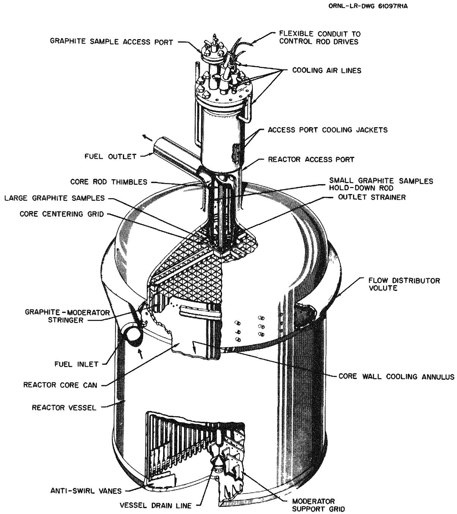  
Fig. 1.1. MSRE reactor vessel.

Table 1.1. Comparison of MSRE, MSBE, and MSBR design data   

<table><tr><td></td><td>MSRE</td><td>MSBE</td><td>MSBR</td></tr><tr><td>Reactor power, MW(t)</td><td>7 3</td><td>150</td><td>2250</td></tr><tr><td>Peak graphite damage flux (En&gt;50 keV), neutrons cm-2sec-1</td><td>3 × 1013</td><td>5 × 1014</td><td>3 × 1014</td></tr><tr><td>Peak power density, W/cc</td><td></td><td></td><td></td></tr><tr><td>Primary salt</td><td>30</td><td>760</td><td>500</td></tr><tr><td>Core including graphite</td><td>6 6</td><td>114</td><td>65</td></tr><tr><td>Peak neutron heating in graphite, W/cc</td><td>0 2</td><td>2 6</td><td>1 7</td></tr><tr><td>Peak gamma heating in graphite, W/cc</td><td>0 7</td><td>6 3</td><td>4 7</td></tr><tr><td>Primary salt</td><td></td><td></td><td></td></tr><tr><td>Volume fraction in core</td><td>0 225</td><td>0 15</td><td>0 13</td></tr><tr><td>Composition, mole %</td><td></td><td></td><td></td></tr><tr><td>7LiF</td><td>65 (64 5)b</td><td></td><td></td></tr><tr><td>BeF2</td><td>29 2 (30 2)</td><td>71 5</td><td>71 7</td></tr><tr><td>ThF4</td><td>0 (0)</td><td>16</td><td>16</td></tr><tr><td>235 238 UF4</td><td>0 83 (0)</td><td>12</td><td>12</td></tr><tr><td>233 UF4</td><td>0 (0 14)</td><td>0 5</td><td>0 3</td></tr><tr><td>ZrF4</td><td>5 (5 2)</td><td>None</td><td>None</td></tr><tr><td>Liquidus, °C</td><td>434</td><td>500</td><td>500</td></tr><tr><td>Liquidus, °F</td><td>813</td><td>932</td><td>932</td></tr><tr><td>Density, lb/ft3 at 1100°F</td><td>141</td><td>211c</td><td>210</td></tr><tr><td>Viscosity, lb ft-1 hr-1 at 1100°F</td><td>19</td><td>29d</td><td>29</td></tr><tr><td>Heat capacity, Btu/lb°F</td><td>0 47</td><td>0 32</td><td>0 32</td></tr><tr><td>Thermal conductivity, Btu hr-1 ft-1 °F-1</td><td>0 83</td><td>0 75</td><td>0 75</td></tr><tr><td>Volumetric heat capacity, Btu ft-3 °F-1</td><td>66</td><td>66</td><td>66</td></tr><tr><td>Temperature, °F</td><td></td><td></td><td></td></tr><tr><td>Inlet reactor vessel</td><td>1170</td><td>1050</td><td>1050</td></tr><tr><td>Outlet reactor vessel</td><td>1210</td><td>1300</td><td>1300</td></tr><tr><td>Circulating primary salt volume, ft3</td><td>70</td><td>266</td><td>1720</td></tr><tr><td>Inventory fissile, kg</td><td>76 (32)b</td><td>396e</td><td>1470</td></tr><tr><td>Power density primary salt circulating average, W/cc</td><td>4</td><td>20</td><td>46</td></tr></table>

$^{a}$ Irom J R McWherter, Molten Salt Breeder Experiment Design Bases, ORNL-TM 3177, p 3 (November 1970)   
bFigures in parentheses refer to the second fuel loading, containing 233UF4   
c206 at $1300^{\circ}\mathrm{F}$ 212 at $1050^{\circ}\mathrm{F}$   
$d_{164}$ at $1300^{\circ}\mathrm{F}$ , 342 at $1050^{\circ}\mathrm{F}$   
e233 U initial

Table 1.2. Nuclear characteristics of MSRE with ${}^{235}\mathrm{U}$ fuel   

<table><tr><td colspan="2">Thermal neutron fluxesa,neutrons cm-2sec-1</td></tr><tr><td>Maximum</td><td>3 79 × 1013</td></tr><tr><td>Average in graphite moderated regions</td><td>1 48 × 1013</td></tr><tr><td>Average in circulating fuel</td><td>4 74 × 1012</td></tr><tr><td colspan="2">Reactivity coefficientsb</td></tr><tr><td>Temperature, (°F)-1</td><td>7 7 × 10-5</td></tr><tr><td>235U concentration</td><td>0 253</td></tr><tr><td>Fuel salt density</td><td>0 23</td></tr><tr><td>Graphite density</td><td>0 53</td></tr><tr><td>Prompt neutron lifetime, sec</td><td>2 8 × 10-4</td></tr></table>

$^a$ At operating fuel concentration, 7.4 MW   
$b_{\mathrm{At}}$ initial critical concentration Where units are shown, coefficients for variable $x$ are of the form $(1 / k) / (\partial k / \partial x)$ , other coefficients are of the form $(x / k) / (\partial k / \partial x)$

history of reactor operations is summarized in Fig 12 Detailed accounts of these operations are described in the Molten-Salt Reactor Program semiannual progress reports

In operation, the MSRE employed three salt mixtures fuel, coolant, and flush salt (that was used to scavenge impurities from the fuel circuit and from surfaces of the graphite moderator before and after the fuel containment system was opened)

Fuel and coolant salts for use in the MSRE were selected on the basis of considerations which are discussed in detail in an earlier report. The fuel salt consisted essentially of a carrier mixture into which suitable amounts of fissile material could be dissolved to produce fuel salt. The carrier was selected to be a mixture of ${}^{7}\mathrm{LiFBeF}_{2}-\mathrm{ZrF}_{4}$ such as to provide the optimum physical and chemical properties of the fuel salt. Some of the criteria included in optimizing the carrier composition were liquidus temperature, viscosity, and zirconium (included to ensure that $\mathrm{UO}_2$ could not be precipitated from the molten fluoride solution) concentration. The phase diagram of the $\mathrm{LiF-BeF_2-ZrF_4}$ system shown in Fig 13 illustrates the options available for choice of carrier salt. The salt composition selected on the basis of the considerations mentioned was ${}^{7}\mathrm{LiFBeF}_{2}-\mathrm{ZrF}_{4}$ (65-30-5 mole%)

An additional measure was adopted in the selection of salt composition of the fuel to minimize the possibility that troublesome deposits containing fissionable material might segregate from the molten-fluoride fuel solution. This was the choice to constitute the uranium fuel charge of about two-thirds $^{238}\mathrm{U}$ and one-third $^{235}\mathrm{U}$ , it was based on chemical considerations, and arose from uncertainty as to the probable value of the oxidation-reduction potential that would prevail in the

fuel salt in normal operations From Long and Blankenship's4 results, it was concluded that the disproportionation of $\mathrm{UF_4}$ would not proceed to the extent that the amount of metallic uranium produced would precipitate or cause problems by alloying with the fuel salt containment system If, for some reason, however, the $[\mathrm{U}^{3 + }] / [\Sigma \mathrm{U}]$ concentration ratio were to rise above $50\%$ formation of uranium alloys and carbides was foreseen as possible This difficulty was recognized in the inexactness of our information concerning the value of the average total cation-anion balance that would result from one fission event in the reactor environment. If the tendency was toward a slight excess of cations, the potential for reduction of $\mathrm{U}^{4 + }\rightarrow \mathrm{U}^{3 + }$ and disproportionation was increased Increasing the total inventory of uranium would reduce proportionately the rate of development of unfavorable $[\mathrm{U}^{3 + }] / [\Sigma \mathrm{U}]$ concentration ratios For these reasons, the choice was made to specify that the concentration of uranium in the fuel salt would be 0.9 mole $\%$ even though $<  0.3$ mole $\%$ of highly enriched uranium would have been sufficient to make the MSRE critical Such measures, it was shown, were overly conservative in affording protection which it is recognized now was not essential Notwithstanding, they, like the meticulous operational methods which were employed, comprise the margins of safety which were appropriate to the experiment Under similar considerations, the coolant salt was chosen as a mixture corresponding to the fuel composition but containing neither fissile material nor zirconium Salt of the composition $^7\mathrm{LiF - BeF}_2$ (66-34 mole $\%$ ) was used both as the coolant and as the flush salt

Samples of the MSRE fuel mixture and (less frequently) the coolant mixture were analyzed routinely during all periods when salts were circulated in the reactor. On each occasion of its use, the flush salt also was analyzed. The concentrations of the salt constituents, oxide contaminants, and fission product species were monitored on a continuing basis. Chemical analyses were performed regularly with samples removed from the circulating salts in order to evaluate the utility of a continuous surveillance program as well as to fix goals for in-line analytical controls for future molten-salt reactors. The MSRE provided the initial experience in these respects, although a molten-salt reactor, the Aircraft Reactor Experiment, previously demonstrated the operability of molten-salt reactors, the scheduled period of its operation was brief and did not include a program of chemical analysis. For the MSRE, however, we sought to demonstrate through a long period of operation the stability of such reactors,

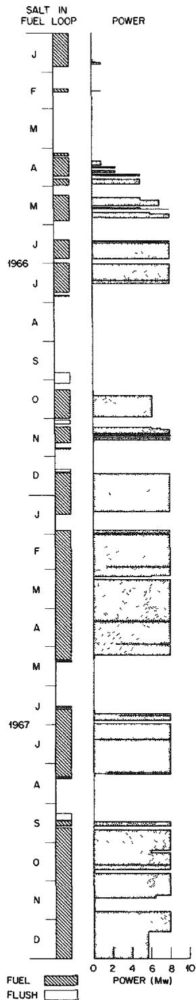

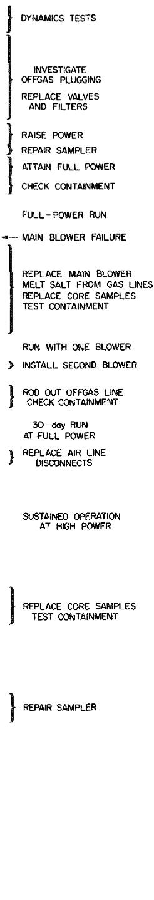

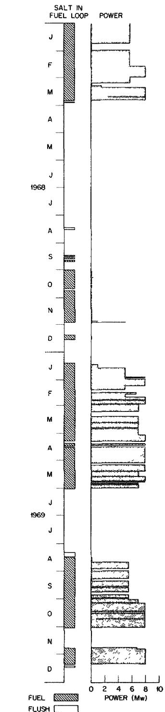

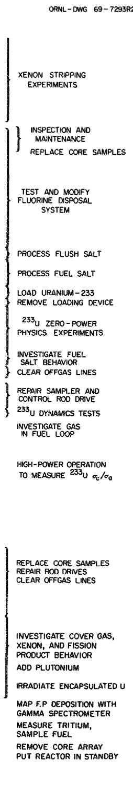  
Fig. 1.2. Chronological outline of MSRE operations.

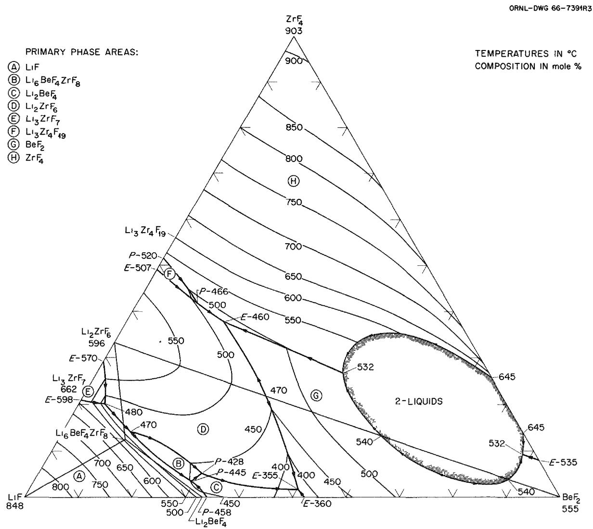  
Fig. 1.3. The system $\mathrm{LiF - BeF_2 - ZrF_4}$

and their capability to operate free from corrosion problems for long periods of time at high temperatures. It was also our purpose to examine the possibility of adapting those analytical chemical methods which proved to be most successful with the MSRE to the development of in-line methods for MSBR analysis and control. Accordingly, our primary goals were to determine continually whether the concentration of uranium in the fuel salt coincided with that expected from reactor physics calculations and on-site neutronic measurements, whether chemical evidence would indicate that the salts remained free of oxide as a contaminant, and to establish rates of corrosion. The frequency of sampling was set at the beginning of operations essentially to coincide with estimates of

reasonable maximum capability of the analytical laboratory, and was at first about one sample per shift, decreasing in frequency as it became evident that no serious problems were developing in relation to corrosion and reactivity anomalies to one per day, three per week, and in the final stages of MSRE operations to once a week.

The results of chemical analyses have served as a good measurement of the generalized corrosion and have provided a convincing demonstration of the compatibility of molten-fluoride fuels and coolants with Hastelloy N. Analyses of the changes in isotopic composition of the plutonium and uranium in the fuel salt samples established with good precision the average power output of the reactor. Studies of the relation of $^{95}\mathrm{Nb}$

disposition within the fuel system of the MSRE showed that the distribution of the isotope within the system reflects the oxidation-reduction potential of the salt in such a manner that behavior of $^{95}\mathrm{Nb}$ in molten-salt breeder reactors may be exploited as an in-line indicator of potential corrosion

Results of the chemical analyses performed in support of MSRE operations comprise the basic data from which various inferences can be made pertaining to the performance of the MSRE. For example, those relating to corrosion phenomena, power output, fuel stability, fission product chemistry, and distribution of tritium within the system have been judged on the basis of results obtained in a program of chemical monitoring of specimens removed from the MSRE. They comprise a body of information which forms the basis for ranking priorities in future research and development programs. For these reasons, this report has been prepared to include all of the available results of chemical analysis which were obtained in connection with the operation of the MSRE. Except for the correlations of the disposition of $^{95}\mathrm{Nb}$ in the fuel salt in relation to the oxidation-reduction potential of the salt, fission product chemistry is omitted. Studies of the behavior of fission products in the MSRE have been carried out by F F Blankenship, S S Kirslis, E G Bohlmann, and E L Compere. The results of their studies are described in a report which summarizes this aspect of the operational experience with the MSRE

# References

1 Nucl Appl 8(2) (February 1970)   
2 W R Grimes, Nucl Appl 8, 137 (1970)   
3 RE Thoma et al, J Nucl Mater 27, 166 (1968)   
4 G Long and F F Blankenship, Reactor Chem Div Ann Progr Rep Jan 31, 1965, ORNL-3789, p 65   
5 E S Bettis and W K Ergen, "Aircraft Reactor Experiment," chap 16 in Fluid Fuel Reactors ed by J A Lane, H G MacPherson, and F Maslan, Addison-Wesley, Reading, Pa, 1958   
6 F F Blankenship, E G Bohlmann, S S Kirshis, and E L Compere, Fission Product Behavior in the MSRE, ORNL-4684 (in preparation)

# 2 CHEMICAL BEHAVIOR IN THE FUEL AND COOLANT SALT SYSTEMS DURING PRENUCLEAR OPERATIONS

# 21 Preoperational Procedures

Three types of fluoride mixtures were prepared for use in the MSRE (1) a salt mixture of the approximate composition $^7\mathrm{LiFBeF}_2$ $\mathrm{ZrF_4}$ 65305 mole $\%$ ,for use as the fuel carrier (2) another of the composition $^7\mathrm{LiFBeF}_2$ 6634 mole $\%$ ,for use as the coolant and flush salts, and (3) $^7\mathrm{LiF}^{238}\mathrm{UF}_4$ and $^7\mathrm{LiF}^{235}\mathrm{UF}_4$ (7327 mole $\%$ ) mixtures, for use in constituting the initial fuel charge as well as for subsequent enrichment of the fuel as required A detailed description of the methods employed is reported elsewhere

Late in 1964, the MSRE fuel and coolant salt systems were heated to $\sim 650^{\circ}\mathrm{C}$ and purged of moisture, the fuel and coolant drain tanks were then charged with salt of the composition $^{7}\mathrm{LiFBeF}_{2}$ (66 34 mole %) $2611\mathrm{kg}$ in the coolant system and $4187\mathrm{kg}$ in the fuel system. The coolant loop was filled on January 9, 1965, and on January 12, 1965, flush salt was circulated in the fuel loop for the first time

After the operability of the equipment and the cleanness of the system had been demonstrated, fuel carrier salt (lacking enriched uranium) was charged into fuel drain tank No 2 (FD-2) beginning on April 21, 1965. The contents of 35 shipping containers $(4560\mathrm{kg}$ of salt) were melted and transferred to the drain tank. To this was added $236~\mathrm{kg}$ of ${}^{7}\mathrm{LiFUF}_{4}$ eutectic containing $147\mathrm{kg}$ of ${}^{238}\mathrm{U}$ (depleted in ${}^{235}\mathrm{U}$ ). Batch containers were heated above the liquidus temperature of the salt mixture in auxiliary furnaces and connected by a small diameter Inconel tube to the drain tank. The connecting tube extended to the bottom of the batch container so that the salt mixture could be transferred as a liquid by controlling the differential gas pressure in the two containers. All fill operations were accomplished in a routine manner without causing detectable beryllium contamination of the reactor facilities

The initial fuel loading of the MSRE required approximately $75\mathrm{ft}^3$ of fused fluorides having the composition ${}^{7}\mathrm{LiFBeF}_{2}\mathrm{ZrF}_{4}\mathrm{UF}_{4}$ (65 0 29 2 5 0 0 83 mole %), fissionable ${}^{235}\mathrm{U}$ comprised about one third of the uranium inventory To provide for an orderly approach to critical operation of the reactor and to facilitate fuel preparation, the fuel was produced from

the three salt mixtures described above. The enriched fuel concentrate mixture, in which all $^{235}\mathrm{U}$ was combined with $^7\mathrm{LiF}$ as $\mathrm{UF_4}$ $93\%$ enriched in $^{235}\mathrm{U}$ , to form the binary eutectic mixture (27 mole $\%$ $\mathrm{UF_4}$ ), was prepared in six small batches (15 kg of $^{235}\mathrm{U}$ each) for nuclear safety and for planned incremental additions to the reactor fuel system. The balance of the uranium required for the fuel was provided as a chemically identical mixture with $\mathrm{UF_4}$ depleted of $^{235}\mathrm{U}$ . The third component mixture, the barren fuel solvent, consisted of the remaining constituents of the reactor fuel and had the chemical composition $^7\mathrm{LiF - BeF_2 - ZrF_4}$ (64.7-30 1-5.2 mole %). The reactor fuel for the zero-power experiments was produced subsequently by adding small increments of $^7\mathrm{LiF - }^{235}\mathrm{UF_4}$ into this carrier salt in the drain tanks and finally into the pump bowl. The composition of the salt was fixed at this point by the amount of $^{235}\mathrm{UF_4}$ required for criticality to be sustained with one control rod completely inserted.

The addition of the enriched fuel concentrate mixture to the MSRE to within $1\mathrm{kg}$ of $^{235}\mathrm{U}$ of criticality was accomplished during the latter part of May 1965. The first major addition of enriched fuel concentrate consisted of the transfer of about $44.17\mathrm{kg}$ of $^{235}\mathrm{U}$ from three containers directly into the fuel drain tank. Three subsequent additions of $^{235}\mathrm{U}$ to the reactor drain tank increased its $^{235}\mathrm{U}$ inventory to 59.35, 64.42, and finally $68.76\mathrm{kg}$ . The transfer of less than batch-size quantities of $^{235}\mathrm{U}$ was made by inserting the salt transfer line to a predetermined depth in the batch container.

It was anticipated that the composition of the fuel at this point would be $^7\mathrm{LiF - BeF}_2 - \mathrm{ZrF}_4 - \mathrm{UF}_4$ (65 0-29.17-5.0-0.83 mole %), the composition calculated from the weights of the carrier and enriching salts added to the reactor was changed steadily throughout the zero-power experiments as capsules of the enriching salt were added to the pump bowl.

Complete results of all analyses performed with MSRE salts during the precritical and zero-power experiments are summarized in the following sections of this chapter.

# 2.2 Flush Salt

Part of the $\mathsf{LiF - BeF}_2$ mixture which was furnished for use in the MSRE was employed to flush the fuel system initially and later, on occasions before and after maintenance periods if it were likely that atmospheric contaminants could have entered the system. Samples of each of the batches of $^7\mathsf{LiF - BeF}_2$ mixtures for use as

flush and coolant salts were analyzed in the facilities of the ORNL Analytical Chemistry Division prior to use in the MSRE. Analytical results for the 61 batches of salt used as flush salt and primary coolant are listed in Table 2.1. Although the nominal composition was $^7\mathrm{LiF - BeF}_2$ (63-34 mole $\%$ ), the average composition as determined by chemical analysis was $^7\mathrm{LiF - BeF}_2$ $(63.56\pm 0.005-$ $36.44\pm 0.005$ mole $\%$ ). Examinations of the material balance of the production operations indicate that the disparity in composition was due to an analytical bias. Efforts to determine whether such a bias actually existed were made by the analytical chemists, but were unfruitful.

Before salt was charged into the reactor, the drain tanks and salt loop systems were carefully dried by evacuating and purging with dry helium. A detailed description of the procedures employed is given elsewhere. Thereafter, late in 1964, approximately 4187 kg of flush salt was charged into the fuel drain tank; it was then transferred among the tanks in the drain tank cell. These operations served to calibrate the weighing devices, to check elevations and volumes, and to establish the operating requirements of the freeze valves. Throughout the prenuclear test period, specimens of the circulating flush salt were obtained for chemical and spectrochemical analysis. The results of spectrochemical analysis are listed in Table 2.2, chemical analyses are listed in Table 2.3. Spectrochemical data were of principal value to ensure that during the early stages of operation the salt charge was free from any unexpected cationic contaminants in the containment system. These analyses were very useful in that they provided the assurance required, but with extended experience with the reactor they became of less significance and were discontinued.

The data shown in Table 2.3 suggest that the operations connected with transfers of the flush salt among the storage tanks in the drain tank cells in November and December of 1964 did not introduce appreciable amounts of structural metal contaminants into the salt, the analytical results for iron suggest, rather, that since its apparent concentration in the salt samples removed from the drain tank was lower by about one standard deviation than the average concentration in the salt before use and in use, it was present in the flush salt initially as metallic particulates which were precipitated from the salt during this period. Little or no change is evident in the chromium concentration before circulation of the flush salt, the data in Table 2.3 can be interpreted, however, to indicate that after completion of the flushing operations in January-March 1965, the chromium analyses represent an

Table 2.1. Chemical analyses of $\mathrm{LiF - BeF_2}$ (66-34 mole %) produced for use as MSRE flush and coolant salts   

<table><tr><td rowspan="3">Batch No.</td><td rowspan="3">Net wt. of salt (kg)</td><td rowspan="3">7Li Assay</td><td colspan="6">Analyses</td></tr><tr><td>Li</td><td>Be</td><td>F</td><td>Cr</td><td>Ni</td><td>Fe</td></tr><tr><td colspan="3">(wt %)</td><td colspan="3">(ppm)</td></tr><tr><td>116</td><td>117.3</td><td>99.992</td><td>13.76</td><td>9.61</td><td>77.3</td><td>18</td><td>14</td><td>204</td></tr><tr><td>117</td><td>119.3</td><td>99.992</td><td>13.77</td><td>9.75</td><td>77.5</td><td>32</td><td>14</td><td>171</td></tr><tr><td>121</td><td>119.8</td><td>99.992</td><td>13.29</td><td>9.51</td><td>77.2</td><td>62</td><td>6</td><td>125</td></tr><tr><td>125</td><td>117.8</td><td>99.991</td><td>13.20</td><td>9.59</td><td>77.3</td><td>16</td><td>5</td><td>55</td></tr><tr><td>126</td><td>119.8</td><td>99.992</td><td>13.27</td><td>9.69</td><td>76.9</td><td>15</td><td>32</td><td>103</td></tr><tr><td>127</td><td>119.6</td><td>99.992</td><td>12.98</td><td>9.86</td><td>76.8</td><td>7</td><td>12</td><td>123</td></tr><tr><td>128</td><td>119.6</td><td>99.992</td><td>13.06</td><td>9.81</td><td>76.9</td><td>9</td><td>45</td><td>112</td></tr><tr><td>129</td><td>117.1</td><td>99.992</td><td>13.20</td><td>9.53</td><td>77.2</td><td>&lt;5</td><td>&lt;5</td><td>97</td></tr><tr><td>131*</td><td>117.2</td><td>99.991</td><td>13.30</td><td>9.67</td><td>77.0</td><td>14</td><td>31</td><td>104</td></tr><tr><td>132</td><td>117.7</td><td>99.992</td><td>13.00</td><td>9.78</td><td>77.1</td><td>&lt;5</td><td>18</td><td>76</td></tr><tr><td>133</td><td>124.8</td><td>99.992</td><td>12.41</td><td>9.30</td><td>76.3</td><td>8</td><td>79</td><td>161</td></tr><tr><td>134</td><td>126.1</td><td>99.991</td><td>12.80</td><td>9.84</td><td>77.3</td><td>6</td><td>72</td><td>151</td></tr><tr><td>135</td><td>120.4</td><td>99.991</td><td>12.90</td><td>9.82</td><td>77.5</td><td>7</td><td>21</td><td>123</td></tr><tr><td>136</td><td>120.0</td><td>99.991</td><td>12.20</td><td>9.97</td><td>77.2</td><td>8</td><td>11</td><td>180</td></tr><tr><td>137</td><td>119.4</td><td>99.991</td><td>12.76</td><td>9.49</td><td>77.8</td><td>6</td><td>10</td><td>72</td></tr><tr><td>138</td><td>119.2</td><td>99.991</td><td>12.70</td><td>9.90</td><td>77.0</td><td>15</td><td>23</td><td>85</td></tr><tr><td>139</td><td>105.5</td><td>99.991</td><td>12.91</td><td>9.78</td><td>76.2</td><td>6</td><td>66</td><td>119</td></tr><tr><td>140</td><td>125.3</td><td>99.991</td><td>12.70</td><td>9.81</td><td>77.1</td><td>21</td><td>91</td><td>130</td></tr><tr><td>141</td><td>117.7</td><td>99.991</td><td>12.70</td><td>9.86</td><td>77.4</td><td>37</td><td>36</td><td>138</td></tr><tr><td>142</td><td>111.0</td><td>99.991</td><td>12.90</td><td>10.00</td><td>77.2</td><td>23</td><td>5</td><td>130</td></tr><tr><td>143</td><td>124.4</td><td>99.993</td><td>12.70</td><td>9.97</td><td>77.3</td><td>19</td><td>34</td><td>79</td></tr><tr><td>144*</td><td>118.1</td><td>99.994</td><td>12.90</td><td>9.98</td><td>77.2</td><td>14</td><td>56</td><td>110</td></tr><tr><td>145</td><td>119.8</td><td>99.994</td><td>12.80</td><td>9.96</td><td>77.0</td><td>15</td><td>&lt;5</td><td>142</td></tr><tr><td>146</td><td>119.8</td><td>99.994</td><td>13.00</td><td>10.00</td><td>77.4</td><td>23</td><td>134</td><td>135</td></tr><tr><td>147</td><td>118.8</td><td>99.994</td><td>12.90</td><td>10.00</td><td>77.1</td><td>18</td><td>107</td><td>117</td></tr><tr><td>148</td><td>119.1</td><td>99.993</td><td>12.90</td><td>10.10</td><td>77.3</td><td>24</td><td>12</td><td>119</td></tr><tr><td>149</td><td>117.5</td><td>99.993</td><td>12.80</td><td>9.89</td><td>77.4</td><td>13</td><td>105</td><td>166</td></tr><tr><td>150</td><td>118.7</td><td>99.993</td><td>13.20</td><td>9.70</td><td>76.7</td><td>18</td><td>34</td><td>86</td></tr><tr><td>151</td><td>124.6</td><td>99.993</td><td>12.90</td><td>9.82</td><td>77.4</td><td>13</td><td>12</td><td>143</td></tr><tr><td>152</td><td>112.3</td><td>99.994</td><td>12.50</td><td>9.62</td><td>77.4</td><td>9</td><td>27</td><td>172</td></tr><tr><td>153</td><td>125.6</td><td>99.994</td><td>13.00</td><td>9.84</td><td>76.7</td><td>17</td><td>31</td><td>132</td></tr><tr><td>154</td><td>95.9</td><td>99.994</td><td>11.10</td><td>9.55</td><td>77.2</td><td>26</td><td>47</td><td>106</td></tr><tr><td>155</td><td>128.1</td><td>99.994</td><td>13.90</td><td>8.92</td><td>76.2</td><td>27</td><td>91</td><td>117</td></tr><tr><td>156</td><td>119.1</td><td>99.993</td><td>12.70</td><td>9.55</td><td>77.3</td><td>17</td><td>28</td><td>92</td></tr><tr><td>157</td><td>118.8</td><td>99.993</td><td>13.20</td><td>9.80</td><td>77.0</td><td>11</td><td>29</td><td>93</td></tr><tr><td>158</td><td>119.4</td><td>99.993</td><td>13.20</td><td>9.80</td><td>77.1</td><td>17</td><td>29</td><td>124</td></tr><tr><td>159</td><td>119.2</td><td>99.993</td><td>13.10</td><td>9.74</td><td>76.9</td><td>13</td><td>108</td><td>163</td></tr><tr><td>160*</td><td>119.6</td><td>99.994</td><td>13.20</td><td>9.77</td><td>77.0</td><td>13</td><td>11</td><td>99</td></tr><tr><td>161</td><td>118.9</td><td>99.994</td><td>13.20</td><td>9.80</td><td>77.2</td><td>8</td><td>18</td><td>75</td></tr></table>

\* Production Excess.

Table 2.2. Spectrochemical analysis of MSRE flush salt during initial use   

<table><tr><td rowspan="2">Sample No</td><td colspan="11">Impurity concentrationa</td><td></td></tr><tr><td>Al</td><td>B</td><td>Bi</td><td>Ca</td><td>Cu</td><td>Mg</td><td>Mn</td><td>Na</td><td>Pb</td><td>Si</td><td>Sn</td><td>Zr</td></tr><tr><td>FD-2-2b</td><td>B</td><td></td><td></td><td>A</td><td>C</td><td>C</td><td>C</td><td></td><td></td><td></td><td></td><td></td></tr><tr><td>FD-2-3</td><td>B</td><td></td><td></td><td>A</td><td>C</td><td>C</td><td>C</td><td></td><td></td><td></td><td></td><td></td></tr><tr><td>FD-2-4</td><td>A</td><td>C</td><td></td><td>A</td><td>C</td><td>C</td><td>C</td><td></td><td></td><td></td><td></td><td></td></tr><tr><td>FD-2-5</td><td>A</td><td></td><td></td><td>A</td><td>C</td><td>C</td><td>C</td><td>B</td><td></td><td></td><td></td><td></td></tr><tr><td>FP-1c</td><td>A</td><td></td><td></td><td>A</td><td>C</td><td>C</td><td>C</td><td></td><td>B</td><td>B</td><td></td><td></td></tr><tr><td>FP-2</td><td>A</td><td></td><td></td><td>A</td><td>C</td><td>C</td><td>C</td><td></td><td></td><td>B</td><td></td><td></td></tr><tr><td>FP-3</td><td>A</td><td></td><td></td><td>A</td><td>C</td><td>C</td><td>C</td><td></td><td>B</td><td>B</td><td></td><td></td></tr><tr><td>FP-4</td><td>A</td><td></td><td></td><td>A</td><td>C</td><td>C</td><td>C</td><td></td><td>A</td><td>B</td><td></td><td></td></tr><tr><td>FP-5</td><td>A</td><td></td><td>B</td><td>A</td><td>C</td><td>C</td><td>C</td><td></td><td>B</td><td>B</td><td></td><td></td></tr><tr><td>FP-6</td><td>A</td><td></td><td></td><td>A</td><td>C</td><td>C</td><td>C</td><td></td><td></td><td></td><td></td><td></td></tr><tr><td>FP-7</td><td>A</td><td></td><td></td><td>A</td><td>B</td><td>C</td><td>C</td><td></td><td></td><td></td><td></td><td></td></tr><tr><td>FP-8</td><td>A</td><td></td><td>C</td><td>A</td><td>B</td><td>C</td><td>C</td><td></td><td></td><td></td><td></td><td></td></tr><tr><td>FP-9</td><td>A</td><td></td><td>A</td><td>A</td><td>B</td><td>C</td><td>C</td><td></td><td>C</td><td></td><td>B</td><td></td></tr><tr><td>FP-10</td><td>A</td><td></td><td>C</td><td>A</td><td>B</td><td>C</td><td>C</td><td></td><td>C</td><td></td><td></td><td></td></tr><tr><td>FP-11</td><td>A</td><td></td><td></td><td>A</td><td>B</td><td>C</td><td>C</td><td></td><td></td><td></td><td></td><td></td></tr><tr><td>FP-12</td><td>A</td><td></td><td></td><td>A</td><td>B</td><td>C</td><td>C</td><td></td><td>B</td><td></td><td></td><td></td></tr><tr><td>FST-1d</td><td>B</td><td></td><td></td><td>A</td><td></td><td>B</td><td>C</td><td></td><td></td><td></td><td></td><td>B</td></tr><tr><td>FST-2</td><td>B</td><td></td><td></td><td>A</td><td>&lt; C</td><td>B</td><td>C</td><td></td><td></td><td></td><td></td><td></td></tr><tr><td>FST-3</td><td>B</td><td></td><td></td><td>A</td><td></td><td>B</td><td>C</td><td></td><td></td><td></td><td></td><td></td></tr><tr><td>FD2-7</td><td>B</td><td></td><td></td><td>A</td><td></td><td></td><td></td><td></td><td></td><td></td><td></td><td>&gt;A</td></tr><tr><td>FD2 8</td><td>B</td><td></td><td></td><td>A</td><td></td><td></td><td></td><td></td><td></td><td></td><td></td><td>&gt;A</td></tr><tr><td>FD2-9</td><td>B</td><td></td><td></td><td>A</td><td></td><td></td><td></td><td></td><td></td><td></td><td></td><td>&gt;A</td></tr></table>

$a_{\mathrm{L1}}$ and Be omitted $\mathbf{A} = 100$ to $1500~\mathrm{ppm}$ $\mathbf{B} = 10$ to $100$ ppm, $C = 1$ to $10~\mathrm{ppm}$   
bFD designates samples removed from the fuel drain tank   
${}^{c}$ FP designates samples removed from the fuel pump bowl   
$d_{\mathrm{FST}}$ designates samples removed from the fuel storage tank

average final value of $60~\mathrm{ppm}$ If it is assumed that the increase resulted from scavenging of moisture or oxides from the system, one would anticipate a corresponding increase of $12~\mathrm{ppm}$ of oxygen in the salt (see Sect 6.1)

Results of oxygen analyses of the flush salt exhibited perplexing variance. The larger values are believed to reflect adsorption of moisture inadvertently introduced through the handling procedures after samples were removed from the reactor. If the oxygen concentrations were representative of either contamination of the salt by water or oxidation of the container alloy by atmospheric oxygen, the occurrence of chemical attack on the Hastelloy N walls of the circuit should have been reflected in increased concentrations of chromium in the salt. For example, if an increase of oxide concentration in the order of $200~\mathrm{ppm}$ were to have been caused by such reactions, an equivalent increase in chromium concentration of $60~\mathrm{ppm}$ should have been observed

To test whether a large bias might have been involved in the fluorination assay of oxygen concentration (the $\mathrm{KBrF_4}$ method), large $(50\mathrm{g})$ samples of the salt were obtained and analyzed by a newly developed method which, like the purification procedures, depends on the removal of water by sparging the molten salt with an $\mathrm{H}_2$ -HF stream. For the three samples that were analyzed in this manner, the average concentration found was $75~\mathrm{ppm}$

After the flush salt was drained from the reactor on completion of the tests in which it was used, the flush

Table 2.3. Composition of MSRE flush salt in prenuclear operations   

<table><tr><td rowspan="3">Date</td><td rowspan="3">Sample</td><td colspan="7">Weight percent</td><td colspan="5">Parts per million</td></tr><tr><td rowspan="2">Li</td><td rowspan="2">Be</td><td rowspan="2">Zr</td><td colspan="2">U</td><td rowspan="2">F</td><td rowspan="2">Σ</td><td rowspan="2">Fe</td><td rowspan="2">Cr</td><td rowspan="2">Ni</td><td rowspan="2">Pu</td><td rowspan="2">Oa</td></tr><tr><td>Book</td><td>Analytical</td></tr><tr><td></td><td>Charge saltb</td><td>12 68</td><td>9 62</td><td></td><td></td><td></td><td>76 51</td><td>99 01</td><td>137</td><td>17</td><td>34</td><td></td><td></td></tr><tr><td>11/30/64</td><td>DC-1</td><td>13 12</td><td>9 68</td><td></td><td></td><td></td><td>77 08</td><td>99 94</td><td>45</td><td>45</td><td>7</td><td></td><td>432</td></tr><tr><td>12/8/64</td><td>DT-1</td><td></td><td></td><td></td><td></td><td></td><td></td><td></td><td>59</td><td>16</td><td>24</td><td></td><td>419</td></tr><tr><td>12/11/64</td><td>DT 2</td><td></td><td></td><td></td><td></td><td></td><td></td><td></td><td>48</td><td>18</td><td>&lt;3</td><td></td><td>390</td></tr><tr><td>12/15/64</td><td>FD-2-3</td><td></td><td></td><td></td><td></td><td></td><td></td><td></td><td>44</td><td>22</td><td>49</td><td></td><td>555</td></tr><tr><td>1/12/65</td><td>FD-2-5</td><td></td><td></td><td></td><td></td><td></td><td></td><td></td><td>140</td><td>24</td><td>10</td><td></td><td></td></tr><tr><td>1/12/65</td><td>FP-1</td><td></td><td></td><td></td><td></td><td></td><td></td><td></td><td></td><td></td><td></td><td></td><td>35</td></tr><tr><td>1/13/65</td><td>FP-2</td><td>13 65</td><td>9 83</td><td></td><td></td><td></td><td>80 52</td><td>104 02</td><td>110</td><td>&lt;10</td><td>33</td><td></td><td>56</td></tr><tr><td>1/14/65</td><td>FP 3</td><td></td><td></td><td></td><td></td><td></td><td></td><td></td><td></td><td></td><td></td><td></td><td>46c</td></tr><tr><td>1/16/65</td><td>FP-4</td><td>13 55</td><td>9 35</td><td></td><td></td><td></td><td>79 34</td><td>102 27</td><td>212</td><td>62</td><td>30</td><td></td><td>74</td></tr><tr><td>1/18/65</td><td>FP-5</td><td></td><td></td><td></td><td></td><td></td><td></td><td></td><td></td><td></td><td></td><td></td><td>72c</td></tr><tr><td>1/20/65</td><td>FP-6</td><td>13 50</td><td>9 96</td><td></td><td></td><td></td><td>80 07</td><td>103 56</td><td>125</td><td>&lt;10</td><td>&lt;20</td><td></td><td>180</td></tr><tr><td>1/23/65</td><td>FP-7</td><td>13 65</td><td>9 46</td><td></td><td></td><td></td><td>77 85</td><td>101 00</td><td>180</td><td>54</td><td>&lt;20</td><td></td><td>150</td></tr><tr><td>2/3/65</td><td>FP-8</td><td></td><td></td><td></td><td></td><td></td><td></td><td></td><td></td><td></td><td></td><td></td><td>106c</td></tr><tr><td>2/3/65</td><td>FP-9</td><td>13 35</td><td>9 98</td><td></td><td></td><td></td><td>75 80</td><td>99 17</td><td>210</td><td>57</td><td>&lt;20</td><td></td><td>142</td></tr><tr><td>2/11/65</td><td>FP-10</td><td></td><td>9 49</td><td></td><td></td><td></td><td>75 05</td><td></td><td>128</td><td>60</td><td>&lt;20</td><td></td><td>1560d</td></tr><tr><td>2/23/65</td><td>FP-11</td><td></td><td></td><td></td><td></td><td></td><td colspan="2">No analyses performed</td><td></td><td></td><td></td><td></td><td></td></tr><tr><td>3/4/65</td><td>FP-12</td><td></td><td></td><td></td><td></td><td></td><td></td><td></td><td></td><td></td><td></td><td></td><td>144</td></tr><tr><td></td><td>Av</td><td>13 47</td><td>9 68</td><td></td><td></td><td></td><td>77 96</td><td>101 66</td><td>118</td><td>38</td><td>22</td><td></td><td></td></tr></table>

$a_{\mathrm{KBrF_4}}$ method unless otherwise noted   
$b_{\text{Average for 61 batches}}$

cHF purge method

$d$ Sample stored 48 hr in capped plastic container before analysis

salt was reprocessed $^{3}$ The salt was transferred by gas pressure to the fuel storage tank in the fuel reprocessing system and sparged with a mixture of $\mathrm{H}_{2}$ and HF It was concluded from measurements of the HF concentration in the off-gas stream that the reprocessing operations were effective in removing 115 ppm of oxide from the salt $^{3}$ The oxide concentration should have been reduced by this process to the same concentration which resulted from preparation and purification of the salt, $\sim 55$ ppm $^{4}$ The results of chemical analysis indicated that the chromium concentration of the flush salt increased by 43 ppm in use, corresponding to an increase of $180\mathrm{g}$ of chromium, and equivalent to $55.5\mathrm{g}$ of oxide, or to an increase of 13 ppm in oxide concentration The $\mathrm{H}_{2}$ -HF analytical data indicated that the average concentration of oxide in the flush salt during its use was 75 ppm, or that the oxide concentration of the salt increased by 20 ppm in use. This increase, while slightly greater than would have been anticipated from the above discussion, may be rationalized by the following considerations: An indeterminate fraction of the oxide removed in reprocessing was introduced from the oxide scales present on the surfaces of the chemical reprocessing facility containers, the fuel storage tank, and the walls of the fuel circuit. Prior purge of the system with dry inert gas was performed before the facility was used for reprocessing the flush salt, but the system was not previously flushed with a scavenger salt. It might therefore have been anticipated that the oxide concentration of the salt in the reprocessing system, after its initial use, would yield a higher concentration of oxide than that removed from the salt in the fuel circulation system. Thus, if it is assumed that in the reprocessing experiment $\sim 0.4\mathrm{kg}$ of oxide scale was removed from the system, good agreement exists among the analytical data, except for measurement of oxide concentration by the $\mathrm{KBrF}_4$ method

One potential use of the flush salt that had been anticipated was to remove any oxides that might deposit in the heat exchanger if the fuel salt were to become seriously contaminated Concurrent with the beginning of MSRE operations, chemical data appeared which showed that the solubility of the least soluble oxide in the $\mathrm{LiF - BeF_2 - ZrF_4}$ carrier salt was some three times that in $\mathrm{LiF - BeF_2}$ mixtures. It was thus necessary to regard the flush salt as an agent which might have limited capacity to scavenge oxide impurities from the fuel circuit unless, if saturated, it were reprocessed Its principal function after initial use was to remove residues containing uranium fluoride from the fuel circuit after it was drained Concurrently, the

capacity of the flush salt to contain dissolved oxides increased with each use in the reactor, because the fuel residues carried into the flush salt added about $25\mathrm{kg}$ of zirconium to the salt each time it was used. It would probably have questionable value if it were expedient to dissolve precipitated oxide deposits from the heat exchanger. This did not preclude the use of $\mathrm{LiF - BeF_2}$ flush salt for such application, because at $650^{\circ}\mathrm{C}$ the solubility of the saturating oxide phase, $\mathrm{BeO}$ , in the salt was known to be $\sim 200$ ppm, corresponding to a capacity of the flush salt to dissolve and retain $1135\mathrm{kg}$ of $\mathrm{ZrO_2}$ in solution at this temperature. Successive repurification and removal of oxides that were picked up in the salt would permit it to be used to clear the heat exchanger of an oxide plug if necessary. No such requirement developed. A preferable alternative was also available if needed. The increased solubility which small amounts of zirconium fluoride provide, increasing the oxide solubility to $800~\mathrm{ppm}$ for a few mole percent of $\mathrm{ZrF_4}$ , showed that if it were expedient to do so, the composition of the flush salt could have been changed simply by the addition of ${}^{7}\mathrm{LiFZrF}_{4}$ so as to enhance its solvent capacity for precipitated oxides

Operation with the flush salt also shed light on another aspect of the use of molten fluorides in a circulating system, namely, the appearance of salt (or salt constituents) in the cover gas Analysis of the helium cover gas by Million and Pappas (see Sect 245) indicated the presence of fluorides in the fuel off gas, but this probably represented salt droplets rather than any decomposition product

The principal difference in the design of the fuel and coolant pumps is that the fuel pump contains a spray ring which functions to remove fission product gases from the fuel. The major salt flow into the pump tank is through a bypass that is taken from the volute discharge line into a toroidal spray ring in the upper part of the pump bowl. From there the salt sprays out through two rows of holes and impinges on the salt surface in the tank to provide gas-liquid contact for gas stripping. This difference in design of the two pumps seems to account for the fact that it was occasionally necessary to remove solids from filters, valves, and lines in the fuel system, but rarely necessary with the coolant system. Material recovered from the coolant off-gas system showed only traces of salt constituents, but the fuel off-gas solids generally contained minute beads of frozen salt

One experiment conducted during the precritical operation period consisted of krypton stripping tests. For these tests, a special insert was installed into the side of the off-gas flange nearest to the fuel pump bowl

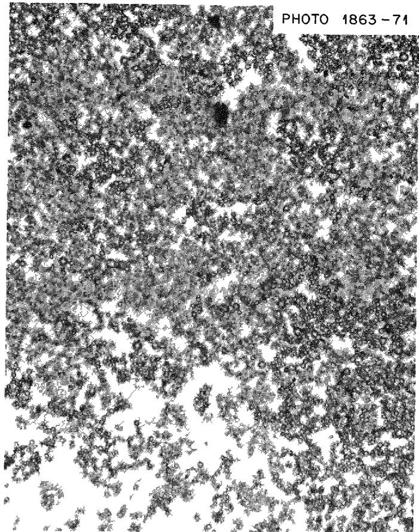  
Fig. 2.1. Fluoride glass beads removed from MSRE off-gas line after precritical experiment PC-1.

Later, the flange was opened to remove the insert, inspection showed that small amounts of small glassy beads were deposited between the flange faces

Toward the end of the first set of experiments with flush salt, fuel pressure control became erratic (see Chap 11) After the salt was drained from the circuit in March 1965, the gas pressure control valve far downstream at the vent house was found to be partially plugged. The valve body was rinsed with acetone, which was found to contain beads (1 to $5\mu$ in diameter) of a glassy material

After a week of carrier salt circulation in May 1965, the small control valve again began to plug. This time, it was removed and cut open for examination A deposit on the stem was found to be about $20\%$ amorphous carbon, and the remainder was 1- to $5 - \mu$ beads having the composition of the flush salt A photograph of these beads, obtained with the petrographic microscope, is shown in Fig 2 1 The glass beads were found to have a refractive index of 1315 As computed by interpolation of the refractive indices of the crystalline components LiF and $\mathrm{BeF}_2$ , its composition would be

$\mathrm{LiF - BeF_2}$ (54-45 mole $\%$ ) Chemical analysis showed, however, that its actual composition was $\mathrm{LiF - BeF_2}$ (66-34 mole $\%$ ) The anomalous refractive index of the glass results from its glassy character, that is, the liquid phase at $\mathrm{LiF - BeF_2}$ (66-34 mole $\%$ ) is of significantly lower density than the crystalline solids of this composition. The beads were glass rather than crystalline, implying rapid cooling of the molten-salt mist. The carbon was presumably soot from oil that had been thermally decomposed in the pump bowl

# 23 Coolant Salt

The coolant salt mixtures for use in the MSRE were prepared as described elsewhere. Twenty-four batches of the salt mixture were allocated for use as the coolant. The composition and purity of these mixtures are listed in Table 24. A charge of $2610\mathrm{kg}$ of ${}^{7}\mathrm{LiF - BeF}_{2}$ (66-34 mole %) was delivered in molten form to the coolant drain tank in October 1964. The coolant system was preheated and purged of moisture in a similar manner to the fuel system, but was not

Table 2.4. Fluoride production for MSRE coolant salt mixture $\mathrm{LiF - BeF_2}$ (66-34 mole %)   

<table><tr><td rowspan="3">Batch No</td><td rowspan="3">Net weight of salt (kg)</td><td rowspan="3">\( {}^{7}{\mathrm{L}}_{1} \) assay</td><td colspan="6">Chemical analyses</td></tr><tr><td colspan="3">Weight percent</td><td colspan="3">Parts per million</td></tr><tr><td>L1</td><td>Be</td><td>F</td><td>Cr</td><td>\( {\mathrm{N}}_{1} \)</td><td>Fe</td></tr><tr><td>101</td><td>118.1</td><td>99.991</td><td>13.68</td><td>9 43</td><td>76.9</td><td>8</td><td>32</td><td>133</td></tr><tr><td>102</td><td>116 2</td><td>99.991</td><td>14.23</td><td>9.14</td><td>77 2</td><td>5</td><td>8</td><td>175</td></tr><tr><td>103</td><td>121.2</td><td>99.991</td><td>13.81</td><td>9 32</td><td>76 7</td><td>10</td><td>58</td><td>182</td></tr><tr><td>104</td><td>119 5</td><td>99.990</td><td>13.68</td><td>9 82</td><td>77 2</td><td>17</td><td>11</td><td>208</td></tr><tr><td>105</td><td>113.2</td><td>99.990</td><td>12 83</td><td>9 57</td><td>77 1</td><td>27</td><td>45</td><td>216</td></tr><tr><td>106</td><td>119 0</td><td>99.990</td><td>13 43</td><td>9 66</td><td>77.2</td><td>11</td><td>68</td><td>309</td></tr><tr><td>107</td><td>115 0</td><td>99.990</td><td>13 12</td><td>9 58</td><td>76 9</td><td>10</td><td>18</td><td>94</td></tr><tr><td>108</td><td>114 5</td><td>99.990</td><td>12.81</td><td>9 65</td><td>77 3</td><td>7</td><td>13</td><td>246</td></tr><tr><td>109</td><td>119 9</td><td>99.990</td><td>13 73</td><td>9 27</td><td>77 0</td><td>8</td><td>5</td><td>62</td></tr><tr><td>110</td><td>127 9</td><td>99.990</td><td>13 15</td><td>9 57</td><td>76 6</td><td>19</td><td>12</td><td>94</td></tr><tr><td>111</td><td>121.2</td><td>99.990</td><td>13.99</td><td>9 21</td><td>76 5</td><td>13</td><td>8</td><td>142</td></tr><tr><td>112</td><td>120 0</td><td>99.991</td><td>13.81</td><td>9 47</td><td>77 0</td><td>11</td><td>48</td><td>218</td></tr><tr><td>113</td><td>117.6</td><td>99.991</td><td>13.80</td><td>9.53</td><td>77.0</td><td>&lt;5</td><td>25</td><td>212</td></tr><tr><td>114</td><td>120 9</td><td>99.991</td><td>13 14</td><td>9 79</td><td>77 0</td><td>9</td><td>22</td><td>196</td></tr><tr><td>115</td><td>120.8</td><td>99.991</td><td>13.74</td><td>9 54</td><td>77.4</td><td>14</td><td>5</td><td>131</td></tr><tr><td>118</td><td>125.0</td><td>99.991</td><td>13 06</td><td>9 91</td><td>77 3</td><td>9</td><td>20</td><td>134</td></tr><tr><td>119</td><td>114.5</td><td>99.991</td><td>12.41</td><td>10.16</td><td>76 9</td><td>10</td><td>18</td><td>182</td></tr><tr><td>120</td><td>125.5</td><td>99.991</td><td>13.65</td><td>9.52</td><td>77 1</td><td>8</td><td>35</td><td>127</td></tr><tr><td>122</td><td>117.8</td><td>99.991</td><td>13 26</td><td>9.48</td><td>77 3</td><td>39</td><td>70</td><td>126</td></tr><tr><td>123</td><td>117.9</td><td>99.991</td><td>13 37</td><td>9 48</td><td>76.9</td><td>48</td><td>10</td><td>113</td></tr><tr><td>124</td><td>118.5</td><td>99.991</td><td>13.35</td><td>9.45</td><td>77 1</td><td>86</td><td>14</td><td>154</td></tr><tr><td>130</td><td>119.9</td><td>99.990</td><td>13.10</td><td>9 55</td><td>77 4</td><td>40</td><td>13</td><td>188</td></tr></table>

preflushed with molten salt. The system was filled and drained 18 times during the time the MSRE was operated. The chemical behavior of the coolant salt was not noticeably different during prenuclear operations from those that followed, and will be described in detail later in this report.

# 2.4 Fuel Salt

2.4.1 On-site preparation. After circulation in the reactor in March 1965, the flush salt was drained to fuel drain tank FD-1. The fuel salt was then constituted within the reactor. The $^7\mathrm{LiF - BeF}_2 - \mathrm{ZrF}_4$ fuel carrier mixture was charged into fuel drain tank FD-2, starting April 21, 1965. On-site records show that $4558.1\mathrm{kg}$ (the contents of 35 shipping containers) of this carrier salt was melted and transferred to the drain tank; to this was added $236.2\mathrm{kg}$ of $^7\mathrm{LiF - }^{238}\mathrm{UF}_4$ , containing $1476\mathrm{kg}$ of $^{238}\mathrm{U}$ (depleted in $^{235}\mathrm{U}$ ) In our current review of the significance of the results of chemical and mass spectrochemical analyses, it becomes evident that these values are in minor error. The $^7\mathrm{LiF - BeF}_2 - \mathrm{ZrF}_4 - ^{238}\mathrm{UF}_4$ as described above was circulated through the fuel circuit for some $250\mathrm{hr}$ during precritical test PC-2.

Each of the two fuel drain tanks on the MSRE incorporates two pneumatic weigh cells for estimating the inventory of the salt in these tanks. Calibrations of the weigh cells in the drain tanks were made carefully during the initial stages of operations. The precision of these measurements was found to be about $\pm 0.8\%$ ( $\pm 28$ kg).7 Continued experience with this equipment indicated long-term drifts in the readings. It was necessary, therefore, to determine inventories on the basis of analytical chemical data, and on computations involving salt densities and volumes at certain reference points (the circulating loops filled to the pump bowls or the tanks filled to the level probe points) to eliminate the effects of extraneous forces on the indicated weight.8

During the initial fill operations, $^7\mathrm{LiF - BeF}_2$ flush salt was admitted to all parts of the fuel circuit system. On draining the reactor, flush salt remained on the pump rotor and in the freeze valves, as well as residue in the heat exchanger. At this point, some $35~\mathrm{kg}$ of salt was unaccounted for by the weigh cell data and was presumed to have remained in these locations. The $^7\mathrm{LiF - BeF}_2\mathrm{-ZrF_4}\cdot^{238}\mathrm{UF_4}$ salt mixture was introduced into the same circuitry at the beginning of the PC-2 test and was, therefore, diluted slightly by flush salt. Later in this report, it is shown that the increased concentration of uranium in the flush salt after use indicates that the salt residue left in the fuel circuit system after it is drained is about $20~\mathrm{kg}$ . Estimation of the nominal concentration of uranium in the fuel during precritical test PC-2 thus requires the assumption that $\sim 20~\mathrm{kg}$ of flush salt was added initially to the fuel. As noted in Sect. 2.4.2, however, the best agreement between expected and observed concentration is found when it is assumed that a negligible amount of flush salt residue remained in the system at completion of PC-2. This assumption is untenable. An alternate assumption, that less carrier salt was delivered to the reactor than was credited in the loading operation, is more credible as an explanation of the apparent anomaly.

Chemical analyses were conducted during the precritical experiments for the purpose of establishing analytical base lines for use in the full-power operating period. Prior to the zero-power experiment, analyses of all salt samples were conducted with conventional equipment in the facilities of the ORNL Analytical Chemistry Division. Thereafter, the fission product activity made it necessary to perform all analyses in the ORNL High-Radiation-Level Analytical Laboratory (HRLAL). The facilities of this laboratory have been described elsewhere. In order to provide continuity which would relate the results of prenuclear operations with those that followed, specimens of the fuel salt obtained

during the precritical test period were analyzed concurrently in both facilities

Mass spectrometric analyses were performed routinely throughout $^{235,238}\mathrm{U}$ operations. Samples of the fuel salt were analyzed before, during, and at the completion of the $^{235}\mathrm{U}$ loading operation. The results reflected the isotopic dilution of $^{238}\mathrm{U}$ precisely and were used in tests for corroboration of the agreement between estimated and analytical values of the concentration of uranium in the fuel salt and to refine estimates of the amount of depleted uranium that was charged into the fuel system

The composition of the fuel salt was changed steadily throughout the zero power experiments (run No 3) as capsules of the enriching salt were added to the pump bowl. Compositional analysis during this period served, therefore, to permit evaluation of the fuel composition dynamically rather than as a statistical base for reference during the power run

Most of the uranium required for enrichment was loaded in four charging operations to one of the fuel drain tanks, FD 2. After each addition the salt was transferred to the second drain tank and back again to ensure thorough mixing. The mixed salt was loaded into the reactor system after each charging operation, and count rate data were taken at several salt levels in the core and with the reactor vessel full. These data were compared with the barren-salt data to monitor the neutron multiplication and to establish the size of the next addition10. Extrapolation of inverse count-rate plots with the reactor vessel full showed that the loading after the fourth addition was within $0.8\mathrm{kg}$ of $^{235}\mathrm{U}$ of the critical loading when the salt was not circulating and the control rods were withdrawn to their upper limits. The remainder of the $^{235}\mathrm{U}$ was added directly to the circulating loop with enriching capsules. These were inserted into the fuel-pump bowl via the sampler-enricher to increase the loading by $85\mathrm{g}$ of uranium at a time. Count rates were measured after each capsule with the fuel pump off and the control rods withdrawn. The reactor became critical after the eighth capsule with the pump off, two rods fully withdrawn, and one rod poisoning 0.03 of its available worth

These zero-power experiments (run 3) were completed on July 4, 1965, after $764\mathrm{hr}$ of circulation of the salt. The fuel was then drained and mixed with the salt remaining in the drain tanks. After the fuel loop was drained, it was filled with flush salt, which was circulated $13\mathrm{hr}$ , sampled, and drained. Analysis of the flush salt led to the conclusion that $0.77\mathrm{kg}$ of uranium remained in the fuel circuit on completion of run No 3

Final preparations were made for operation of the reactor at power In December 1965, low power experiments were begun. As soon as containment testing was finished, the instruments, controls, and equipment were given the check outs required prior to startup. The fuel system was then heated, and flush salt was circulated for three days. Samples of the flush salt were taken. Then fuel was charged to the loop for tests in the reactor at various low power levels, 100 and $500\mathrm{kW}$ and finally 1 MW. The experiments that were conducted during this time extended over a one month period, providing the single period of operation when the composition of the fuel salt remained nominally constant

Samples of the fuel salt were obtained regularly during this period in a continuing effort to appraise the utility of the chemical surveillance program and in order to verify that the reactor system was in suitable condition for the initiation of power operations. Good agreement between anticipated and observed results was found. The results of chemical analyses indicated that the system had remained free of corrosion during all preliminary operations, and it seemed that the analyses would serve as a reliable measure of fuel stability and corrosion

242 Uranium assay Chemical analyses and on site nuclear measurements were accumulated regularly when fuel salt was circulated in the reactor in order to evaluate as many aspects of the behavior of the molten radioactive fuel salt as feasible in contact with the Hastelloy N containment system and with the graphite moderator. A number of important characteristics of the reactor soon became evident. For example, by the time that statistically significant populations of analytical chemical data were produced from the HRLAL it had become apparent that on site neutronic measurements of the reactivity balance were sufficiently sensitive to detect changes of as little as $0.1\%$ in the concentration of fissile material circulating in the fuel system. This represented at least a factor of 10 greater sensitivity than was indicated by the statistically significant results of chemical analysis. In addition, reactivity balance measurements were made dynamically and, essentially, on a continuous basis. While chemical data alone were useful as statistical indicators of trends in the concentration of uranium over extended periods, the combined results of chemical and mass spectrometric analyses furnished information that was uniquely suited for use in establishing numerous fundamental values for use in subsequent evaluations of MSRE performance, and in accounting for the changes in the distribution of uranium between the fuel and flush salt systems

In order to compare the concentration of uranium in the fuel salt as measured analytically with expected values, we have evaluated the results of chemical analysis, mass spectrometric analysis, the weights of the fluorides as measured in the production facility, and on-site measurements of the weights of the salt containers delivered to the MSRE. From the weights of the enriching salts credited to the reactor and from the isotopic composition a uranium material balance was computed. Progress reports for this period of MSRE operations indicate that satisfactory agreement between nominal and analytical values was found. As the results of mass spectrometric analyses were accumulated, however, comparisons of the nominal isotopic composition of uranium during initial loading operations at the MSRE with the results of mass spectrometric analyses disclosed that closest agreement is reached when the assumption is made that the initial $^{7}\mathrm{L}_{1}\mathrm{F}^{-238}\mathrm{UF}_{4}$ charge contained 1456 kg of uranium rather than 1476 kg as credited (see below). This lesser amount of uranium, carried by 2345 kg of $^{7}\mathrm{L}_{1}\mathrm{F}^{-238}\mathrm{UF}_{4}$ enriching salt and

added to the amount of $^{7}\mathrm{LiF - BeF}_2 - \mathrm{ZrF}_4$ carrier salt credited to the MSRE (45581 kg), would produce a salt mixture in which the concentration of uranium is 3038 wt %

The average concentration observed was 3044 wt % In the early stages of analysis, a bias of $-0.8\%$ was discovered in the amperometric data which, when used to correct the analytical results, causes the average observed concentration in precritical run No 2 to be 3068 wt % Thus the nominal concentration of uranium in the fuel salt is inexplicably lower than the averages of the observed values if the amount of carrier salt credited to the MSRE (4558 kg) is assumed to be accurate A computation of the material balance for the MSRE fuel salt in prepower tests, using this value, is summarized in Table 2 5, which shows that the analytical values tend to indicate slightly greater average concentrations than nominal If, however, we assume that $\sim 40\mathrm{kg}$ of the carrier salt was not charged into the fuel circuit, and the fuel charge during the precritical experiment was constituted from $14560\mathrm{kg}$ of uranium

Table 2.5. Material balance for MSRE fuel salt in prepower tests   

<table><tr><td rowspan="2"></td><td colspan="3">Inventory (kg)</td><td colspan="2">Uranium concentration (wt %)</td></tr><tr><td>U</td><td>\( ^7\text{LiF-UF}_4 \)</td><td>Total</td><td>Nominal</td><td>Analytical</td></tr><tr><td>Run PC-2 (av)</td><td>145 60</td><td>234 5</td><td>4792 6</td><td>3 038</td><td>3 068</td></tr><tr><td>Run 3, FP-3-1,2</td><td></td><td></td><td></td><td></td><td></td></tr><tr><td>Added</td><td>+47 49</td><td>76 5</td><td></td><td></td><td></td></tr><tr><td>Total</td><td>193 09</td><td>311 0</td><td>4869 1</td><td>3 965</td><td>3 998</td></tr><tr><td>Run 3, FP 3-3</td><td></td><td></td><td></td><td></td><td></td></tr><tr><td>Added</td><td>+21 43</td><td>34 53</td><td></td><td></td><td></td></tr><tr><td>Total</td><td>214 52</td><td>345 53</td><td>4903 6</td><td>4 375</td><td>4 390</td></tr><tr><td>Run 3, FP-3-4</td><td></td><td></td><td></td><td></td><td></td></tr><tr><td>Added</td><td>+4 67</td><td>+7 52</td><td></td><td></td><td></td></tr><tr><td>Total</td><td>219 19</td><td>353 05</td><td>4911 1</td><td>4 463</td><td>4 446</td></tr><tr><td>Loop charge</td><td>195 23</td><td></td><td>4374 3</td><td>4 463</td><td></td></tr><tr><td>Left in drain tank</td><td>23 96</td><td></td><td>536 8</td><td>4 463</td><td></td></tr><tr><td>Run 3-F</td><td></td><td></td><td></td><td></td><td></td></tr><tr><td>Added</td><td>+7 83</td><td>+12 74</td><td></td><td></td><td></td></tr><tr><td>Σ charge</td><td>227 02</td><td></td><td>4923 7</td><td>4 611</td><td></td></tr><tr><td>Loop charge</td><td>203 06</td><td></td><td>4386 9</td><td>4 629</td><td></td></tr><tr><td>Loop residue</td><td>-0 77</td><td></td><td>16 5</td><td></td><td></td></tr><tr><td>To drain tank</td><td>202 29</td><td></td><td>4370 4</td><td>4 629</td><td></td></tr><tr><td>Already in drain tank</td><td>+23 96</td><td></td><td>+536 8</td><td>4 462</td><td></td></tr><tr><td>FD-10-3</td><td>226 25</td><td></td><td>4907 2</td><td>4 611</td><td>4 648</td></tr><tr><td>Run 4 I loop charge</td><td>208 15</td><td></td><td>4514 6</td><td>4 611</td><td></td></tr><tr><td>Flush residue</td><td></td><td></td><td>+18 0</td><td></td><td></td></tr><tr><td>Loop charge</td><td>208 15</td><td></td><td>4532 6</td><td>4 592</td><td>4 642 ± 0 028</td></tr><tr><td>Run 5-I, drain tank</td><td>226 25</td><td></td><td>4925 2</td><td>4 593</td><td></td></tr><tr><td>Runs 5 7 (av of 14 samples)</td><td></td><td></td><td></td><td></td><td>4 629 + 0 026</td></tr><tr><td>Run 4 (av of 22 samples)</td><td></td><td></td><td></td><td></td><td>4 642 + 0 028</td></tr><tr><td>Runs 4 7 (av of 36 samples)</td><td></td><td></td><td></td><td></td><td>4 638 ± 0 025</td></tr></table>

and $4754.5\mathrm{kg}$ of salt, the nominal concentration of uranium should be 3.062 wt $\%$ as compared with an analytical value of 3.068 wt $\%$ . Comparably improved agreement is found between the nominal and observed concentrations of uranium for all other prepower measurements when the assumption is made that the above quantities of uranium and salt were charged to the MSRE fuel system. A uranium material balance for the prepower period was computed on the basis of these values, and is given in Table 2.6. We deduce, therefore, that the salt charge which was used for the precritical test, PC-2, consisted of $145.6\mathrm{kg}^{238}\mathrm{U}$ in a total salt charge of $4754.5\mathrm{kg}$ . The results of the chemical analyses performed with samples of the fuel salt during this test are listed in Table 2.7 Most of the uranium required for enrichment was loaded in four charging operations to one of the fuel drain tanks, FD-2. Samples of the fuel salt were obtained frequently during this period in a continuing attempt to appraise the utility of the chemical surveillance program, and to

verify that the reactor system was in suitable condition for the initiation of power operation.

As the concentration of uranium in the fuel salt was increased in preparation for operating the reactor at full power, fuel-salt samples were obtained for isotopic and compositional analysis after groups of three or four capsules of enriching salt were added. Changes in the isotopic composition of uranium in the fuel salt during initial loading operations are summarized in Table 2.8. Compositional analyses were obtained over a period when the incremental change in the concentration of uranium in the fuel salt was large in comparison to that in the normal operating mode of the reactor. They serve, therefore, to permit evaluation of the fuel composition dynamically rather than as a statistical base for reference during the power run. The results of these analyses are listed in Tables 2.9 and 2.10.

As noted previously, the salt mixture used in the precritical test, PC-2, was formed from purified salt mixtures of the nominal compositions $^7\mathrm{L}\uparrow \mathrm{F - BeF}_2 - \mathrm{ZrF}_4$

Table 2.6. Material balance for MSRE fuel salt in prepower tests   

<table><tr><td rowspan="2"></td><td colspan="3">Inventory (kg)</td><td colspan="2">Uranium concentration (wt %)</td></tr><tr><td>U</td><td>\( ^7\text{LiF-UF}_4 \)</td><td>Total</td><td>Nominal</td><td>Analytical</td></tr><tr><td>Run PC-2 (av)</td><td>145 60</td><td>234.5</td><td>4752.6</td><td>3.064</td><td>3.068</td></tr><tr><td>Run 3, FP-3-1,2</td><td></td><td></td><td></td><td></td><td></td></tr><tr><td>Added</td><td>+47.49</td><td>76.5</td><td></td><td></td><td></td></tr><tr><td>Total</td><td>193.09</td><td>311.0</td><td>4829.1</td><td>3.998</td><td>3.998</td></tr><tr><td>Run 3, FP-3-3</td><td></td><td></td><td></td><td></td><td></td></tr><tr><td>Added</td><td>+21 43</td><td>34.53</td><td></td><td></td><td></td></tr><tr><td>Total</td><td>214.52</td><td>345 5</td><td>4863.6</td><td>4.410</td><td>4.390</td></tr><tr><td>Run 3, FP-3-4</td><td></td><td></td><td></td><td></td><td></td></tr><tr><td>Added</td><td>+4.67</td><td>+7.52</td><td></td><td></td><td></td></tr><tr><td>Total</td><td>219 19</td><td>353.05</td><td>4871 1</td><td>4 500</td><td>4.446</td></tr><tr><td>Loop charge</td><td>195 23</td><td></td><td>4338.6</td><td>4 500</td><td></td></tr><tr><td>Left in drain tank</td><td>23 96</td><td></td><td>532.5</td><td>4 500</td><td></td></tr><tr><td>Run 3-F</td><td></td><td></td><td></td><td></td><td></td></tr><tr><td>Added</td><td>+7 83</td><td>+12.74</td><td></td><td></td><td></td></tr><tr><td>Σ charge</td><td>227.02</td><td></td><td>4883 8</td><td>4.648</td><td></td></tr><tr><td>Loop charge</td><td>203.06</td><td></td><td>4351 3</td><td>4.667</td><td>4.665</td></tr><tr><td>Loop residue</td><td>-0.77</td><td></td><td>-16 5</td><td></td><td></td></tr><tr><td>To drain tank</td><td>202 29</td><td></td><td>4334.8</td><td>4.667</td><td></td></tr><tr><td>Already in drain tank</td><td>+23 96</td><td></td><td>+532 5</td><td>4 500</td><td></td></tr><tr><td>FD-10-3</td><td>226.25</td><td></td><td>4867.3</td><td>4 648</td><td>4.648</td></tr><tr><td>Run 4-I, loop charge</td><td>208 15</td><td></td><td>4477.9</td><td>4 648</td><td></td></tr><tr><td>Flush residue</td><td></td><td></td><td>+18 0</td><td></td><td></td></tr><tr><td>Loop charge</td><td>208.15</td><td></td><td>4495 9</td><td>4.630</td><td>4.642 ± 0.028</td></tr><tr><td>Run 5-I, drain tank</td><td>226 25</td><td></td><td>4885 3</td><td>4.631</td><td></td></tr><tr><td>Runs 5-7 (av of 14 samples)</td><td></td><td></td><td></td><td></td><td>4.629 ± 0.026</td></tr><tr><td>Run 4 (av of 22 samples)</td><td></td><td></td><td></td><td></td><td>4.642 ± 0.028</td></tr><tr><td>Runs 4-7 (av of 36 samples)</td><td></td><td></td><td></td><td></td><td>4.638 ± 0.025</td></tr></table>

Table 2.7. Summary of MSRE salt analyses, experiment No. 2, fuel salt   
Nominal composition of salt ${}^{7}{\mathrm{{LiF} - {BeF}}}_{2} - {\mathrm{{ZrF}}}_{4} - {}^{238}{\mathrm{{UI}}}_{4}\left( {{6486} - {2954} - 507053}\right)$ mole %)   

<table><tr><td rowspan="3">Date</td><td rowspan="3">Sample</td><td colspan="7">Weight percent</td><td colspan="4">Parts per million</td></tr><tr><td rowspan="2">L1</td><td rowspan="2">Be</td><td rowspan="2">Zr</td><td colspan="2">U</td><td rowspan="2">F</td><td rowspan="2">Σ</td><td rowspan="2">Fe</td><td rowspan="2">Cr</td><td rowspan="2">N1</td><td rowspan="2">O</td></tr><tr><td>Nominal</td><td>Analytical</td></tr><tr><td>5/11/65</td><td>FP-2-13a</td><td>10 30</td><td>6 99</td><td>11 32</td><td>3 062</td><td>3 043</td><td>67 50</td><td>98 66</td><td>74</td><td>26</td><td>34</td><td>2045b</td></tr><tr><td>5/12/65</td><td>FP-2-14c</td><td>10 20</td><td>6 55</td><td>11 49</td><td>3 062</td><td>3 041</td><td>71 90</td><td>103 18</td><td>149</td><td>&lt;50</td><td>36</td><td></td></tr><tr><td>5/12/65</td><td>I-P 2-15</td><td>10 14</td><td>7 09</td><td>11 42</td><td>3 062</td><td>3 023</td><td></td><td></td><td>95</td><td>19</td><td>18</td><td>4715</td></tr><tr><td>5/13/65</td><td>FP-2-16</td><td>10 50</td><td>6 60</td><td>12 09</td><td>3 062</td><td>3 044</td><td>71 60</td><td>103 84</td><td>271</td><td>&lt;50</td><td>33</td><td></td></tr><tr><td>5/13/65</td><td>FP-2-17</td><td>10 30</td><td>6 54</td><td>11 08</td><td>3 062</td><td>3 053</td><td>67 40</td><td>98 38</td><td>75</td><td>21</td><td>21</td><td>155</td></tr><tr><td>5/13/65</td><td>FP-2-18</td><td>10 50</td><td>6 54</td><td>11 81</td><td>3 062</td><td>3 053</td><td>73 40</td><td>105 31</td><td>152</td><td>&lt;50</td><td>43</td><td></td></tr><tr><td>5/14/65</td><td>FP 2-19</td><td>10 20</td><td>6 16</td><td>11 41</td><td>3 062</td><td>3 061</td><td>71 40</td><td>102 22</td><td>130</td><td>26</td><td>47</td><td></td></tr><tr><td>5/15/65</td><td>FP-2-20</td><td>10 53</td><td>6 64</td><td>11 36</td><td>3 062</td><td>3 023</td><td>68 20</td><td>99 76</td><td>120</td><td>23</td><td>21</td><td>660</td></tr><tr><td>5/16/65</td><td>FP 2-21</td><td>10 30</td><td>6 38</td><td>11 08</td><td>3 062</td><td>3 039</td><td>71 00</td><td>101 81</td><td>133</td><td>25</td><td>49</td><td></td></tr><tr><td>5/17/65</td><td>I-P 2-22</td><td>10 20</td><td>6 21</td><td>11 17</td><td>3 062</td><td>3 052</td><td>71 10</td><td>101 74</td><td>221</td><td>28</td><td>55</td><td></td></tr><tr><td>5/18/65</td><td>I-P 2-23</td><td>10 30</td><td>6 16</td><td>11 23</td><td>3 062</td><td>3 033</td><td>70 50</td><td>101 23</td><td>159</td><td>28</td><td>42</td><td></td></tr><tr><td>5/18/65</td><td>I-P-2-24</td><td>10 78</td><td>6 84</td><td>11 18</td><td>3 062</td><td>3 014</td><td>68 60</td><td>100 42</td><td>76</td><td>23</td><td>&lt;5</td><td>215</td></tr><tr><td>5/19/65</td><td>FP 2-25</td><td>10 52</td><td>6 50</td><td>11 36</td><td>3 062</td><td>3 014</td><td>67 00</td><td>98 40</td><td>110</td><td>24</td><td>17</td><td></td></tr><tr><td>5/19/65</td><td>FP-2-26</td><td>10 60</td><td>6 67</td><td>11 27</td><td>3 062</td><td>3 038</td><td>71 40</td><td>102 98</td><td>113</td><td>24</td><td>&lt;20</td><td></td></tr><tr><td>5/20/65</td><td>FP-2-27</td><td>10 46</td><td>6 44</td><td>11 28</td><td>3 062</td><td>3 063</td><td>67 10</td><td>98 35</td><td>27</td><td>23</td><td>14</td><td>70</td></tr><tr><td>5/20/65</td><td>FP 2-28</td><td>10 55</td><td>6 57</td><td>11 05</td><td>3 062</td><td>2 998</td><td>72 30</td><td>103 47</td><td>123</td><td>34</td><td>&lt;20</td><td></td></tr><tr><td>5/21/65</td><td>FP 2-29</td><td>10 51</td><td>7 30</td><td>11 11</td><td>3 062</td><td>3 053</td><td>67 70</td><td>99 68</td><td>203</td><td>28</td><td>20</td><td>405</td></tr><tr><td>5/21/65</td><td>I-P-2-30</td><td>10 61</td><td>6 59</td><td>11 66</td><td>3 062</td><td>3 025</td><td>71 9</td><td>103 70</td><td>175</td><td>27</td><td>&lt;20</td><td></td></tr><tr><td></td><td></td><td></td><td></td><td></td><td></td><td></td><td></td><td></td><td>95</td><td>23</td><td>16 5</td><td></td></tr><tr><td></td><td></td><td></td><td></td><td></td><td></td><td></td><td></td><td></td><td>+21</td><td>+2</td><td>+4</td><td></td></tr></table>

${}^{a}$ Analyses performed under supervision of W F Vaughan   
$b$ Analyzed by KBrF4 method   
cAnalysis performed under supervision of C E Lamb

(64 7-30 1-5 2 mole %) and $^{7}\mathrm{LiF - UF_4}$ (73-27 mole %) The results of chemical analyses of the individual batches of these salts are listed in Tables 2 11 and 2 12. Results of the analyses of the carrier salt indicate that its composition was $^{7}\mathrm{LiF - BeF_2 - ZrF_4}$ (62 25-32 47-5 28 mole %), or that the $\mathrm{Li / Be}$ ratio is skewed as noted previously in connection with the coolant and flush salt. While the results from chemical analyses show similar bias in determination of lithium and beryllium when compared with nominal values, they are in good agreement when the analyses of the salts are compared with those for the starting materials Reexamination of the material balance in the preparation of these salts indicated that deviations from the nominal compositions are much less than is indicated by the analytical data $^{13}$ . In order to estimate how closely the composition of the fuel-salt mixture matched the design composition, it is necessary to compare the analytical results with a nominal composition computed from the analyses of production plant samples. The composition of the salt mixture used in the precritical run compares as shown in Table 2 13 with the nominal composition which would result from (1) combining the carrier salt and $\mathrm{LiF - }^{238}\mathrm{UF_4}$ of the design compositions and (2)

combining compositions as indicated from chemical analysis

In the foregoing discussion, we have estimated the quantities of carrier salt and $\mathrm{LiF - UF_4}$ mixtures used to constitute the MSRE fuel for power tests. The chemical composition of the salt circulated in the fuel circuit at various stages during the zero power and in all prenuclear operations is compared with the results of chemical analyses in Tables 2 14 and 2 15. The values listed in these tables coincide within the precision limits of the analytical chemical results, the mass spectrometric methods, and the estimates of the physical properties of these fluids. We have therefore adopted the nominal compositions listed in Table 2 15 as reference compositions for appraisal of results throughout the remainder of MSRE operations

2.4.3 Structural metal impurities. One of the features which originally suggested the potential feasibility of molten-salt reactors was the recognition that if the physical and mechanical properties of any one of several nickel-based alloys, such as those composed principally of Ni-Mo-Cr-Fe, were suitable for reactor construction, the alloys would almost certainly be

Table 2.8. Isotopic composition of uranium in the MSRE fuel salt during initial loading operations   

<table><tr><td></td><td>ΣU Inv. (kg)</td><td>Loop Inv. (kg)</td><td>234U</td><td>235U (kg)</td><td>236U</td><td>238U</td><td>234U</td><td>235U (wt %)</td><td>236U</td><td>238U</td></tr><tr><td>LiF-238UF4Loading</td><td>145.60</td><td></td><td>-</td><td>0.323</td><td>-</td><td>145.277</td><td></td><td></td><td></td><td></td></tr><tr><td>LiF-235UF4to 5/25/65</td><td>47.49</td><td></td><td>0.452</td><td>44.143</td><td>0.187</td><td>2.708</td><td></td><td></td><td></td><td></td></tr><tr><td rowspan="2">Sample No. FP3-2</td><td rowspan="2">193.090</td><td></td><td>0.452</td><td>44.466</td><td>0.187</td><td>147.985</td><td>0.234</td><td>23.029</td><td>0.097</td><td>76.640a</td></tr><tr><td></td><td></td><td></td><td></td><td></td><td>0.234</td><td>22.501</td><td>0.099</td><td>77.086b</td></tr><tr><td rowspan="3">LiF-235UF4to 5/30/65</td><td>+26.100</td><td></td><td>0.249</td><td>+24.261</td><td>+0.102</td><td>+1.488</td><td></td><td></td><td></td><td></td></tr><tr><td>219.190</td><td></td><td>0.701</td><td>68.727</td><td>0.289</td><td>149.473</td><td>0.320</td><td>31.355</td><td>0.132</td><td>68.193</td></tr><tr><td></td><td>195.240</td><td>0.625</td><td>61.218</td><td>0.257</td><td>133.140</td><td></td><td></td><td></td><td></td></tr><tr><td rowspan="3">Sample No. FP3-7</td><td></td><td>+0.820</td><td>+0.008</td><td>+0.762</td><td>+0.003</td><td>+0.047</td><td></td><td></td><td></td><td></td></tr><tr><td></td><td>196.060</td><td>0.633</td><td>61.980</td><td>0.260</td><td>133.187</td><td>0.323</td><td>31.613</td><td>0.133</td><td>67.932</td></tr><tr><td></td><td></td><td></td><td></td><td></td><td></td><td>0.247</td><td>23.233</td><td>0.103</td><td>76.437c</td></tr><tr><td rowspan="3">Sample No. FP3-12</td><td></td><td>+1.094</td><td>+0.010</td><td>+1.017</td><td>+0.004</td><td>+0.063</td><td></td><td></td><td></td><td></td></tr><tr><td></td><td>197.154</td><td>0.643</td><td>62.997</td><td>0.264</td><td>133.250</td><td>0.326</td><td>31.953</td><td>0.134</td><td>67.587</td></tr><tr><td></td><td></td><td></td><td></td><td></td><td></td><td>0.335</td><td>31.784</td><td>0.138</td><td>67.743</td></tr><tr><td rowspan="3">Sample No. FP3-17</td><td></td><td>+1.789</td><td>+0.017</td><td>+1.663</td><td>+0.007</td><td>+0.102</td><td></td><td></td><td></td><td></td></tr><tr><td></td><td>198.943</td><td>0.660</td><td>64.660</td><td>0.271</td><td>133.352</td><td>0.332</td><td>32.502</td><td>0.136</td><td>67.030</td></tr><tr><td></td><td></td><td></td><td></td><td></td><td></td><td>0.340</td><td>32.606</td><td>0.136</td><td>66.918</td></tr><tr><td rowspan="3">Sample No. FP3-22</td><td></td><td>+1.787</td><td>+0.017</td><td>+1.661</td><td>+0.007</td><td>+0.102</td><td></td><td></td><td></td><td></td></tr><tr><td></td><td>200.730</td><td>0.677</td><td>66.321</td><td>0.278</td><td>133.454</td><td>0.337</td><td>33.041</td><td>0.138</td><td>66.484</td></tr><tr><td></td><td></td><td></td><td></td><td></td><td></td><td>0.352</td><td>33.222</td><td>0.141</td><td>66.386</td></tr><tr><td rowspan="3">Sample No. FP3-27</td><td></td><td>+1.030</td><td>+0.010</td><td>+0.957</td><td>+0.004</td><td>+0.059</td><td></td><td></td><td></td><td></td></tr><tr><td></td><td>201.760</td><td>0.687</td><td>67.278</td><td>0.282</td><td>133.513</td><td>0.340</td><td>33.346</td><td>0.140</td><td>66.174</td></tr><tr><td></td><td></td><td></td><td></td><td></td><td></td><td>0.355</td><td>33.340</td><td>0.141</td><td>66.165</td></tr><tr><td rowspan="3">Sample No. FP3-32</td><td></td><td>+1.274</td><td>+0.012</td><td>+1.184</td><td>+0.005</td><td>+0.073</td><td></td><td></td><td></td><td></td></tr><tr><td></td><td>203.034</td><td>0.699</td><td>68.462</td><td>0.287</td><td>133.586</td><td>0.344</td><td>33.720</td><td>0.141</td><td>65.795</td></tr><tr><td></td><td></td><td></td><td></td><td></td><td></td><td>0.355</td><td>33.729</td><td>0.139</td><td>65.787</td></tr><tr><td rowspan="3">Run 3-Residue</td><td></td><td>-0.77</td><td>-0.003</td><td>-0.241</td><td>-0.001</td><td>-0.525</td><td></td><td></td><td></td><td></td></tr><tr><td></td><td>202.264</td><td>0.696</td><td>68.221</td><td>0.286</td><td>133.061</td><td></td><td></td><td></td><td></td></tr><tr><td></td><td></td><td>0.077</td><td>7.510</td><td>0.032</td><td>16.332</td><td></td><td></td><td></td><td></td></tr><tr><td rowspan="3">Run 4-I</td><td>23.950</td><td></td><td></td><td></td><td></td><td></td><td>0.342</td><td>33.477</td><td>0.141</td><td>66.041</td></tr><tr><td>226.214</td><td></td><td>0.773</td><td>75.730</td><td>0.318</td><td>149.393</td><td>0.354</td><td>33.553</td><td>0.145</td><td>65.948d</td></tr><tr><td></td><td></td><td></td><td></td><td></td><td></td><td>0.350</td><td>33.250</td><td>0.240</td><td>66.260e</td></tr></table>

aBold face type indicates nominal values.   
Results of mass spectrometric analyses.   
Anomalous results; possible misidentification of sample.

Average of 3 analyses.

Average of 4 analyses.

Table 2.9. Summary of MSRE salt analyses, experiment No. 3, fuel salt   

<table><tr><td rowspan="3">Date</td><td rowspan="3">Sample</td><td colspan="7">Weight percent</td><td colspan="4">Parts per million</td><td rowspan="3">235U in fuel circuit (kg)</td></tr><tr><td rowspan="2">Li</td><td rowspan="2">Be</td><td rowspan="2">Zr</td><td colspan="2">U</td><td rowspan="2">F</td><td rowspan="2">Σ</td><td rowspan="2">Fe</td><td rowspan="2">Cr</td><td rowspan="2">Ni</td><td rowspan="2">O</td></tr><tr><td>Nominal</td><td>Analyticala</td></tr><tr><td>5/27/65</td><td>FP-3-1</td><td>10.45</td><td>6.49</td><td>10.90</td><td>4.01</td><td>3.984</td><td>66.8</td><td>98.62</td><td>115</td><td>28</td><td>38</td><td>335</td><td>39.3</td></tr><tr><td>5/27/65</td><td>FP-3-2</td><td>10.7</td><td>6.14</td><td>11.19</td><td>4.01</td><td>3.822</td><td>68.63</td><td>100.49</td><td>161</td><td>30</td><td>44</td><td>3350</td><td>39.3</td></tr><tr><td>5/30/65</td><td>FP-3-3</td><td>10.7</td><td>6.51</td><td>11.08</td><td>4.42</td><td>4.355</td><td>69.23</td><td>101.88</td><td>323</td><td>24</td><td>53</td><td>3915</td><td>56.9</td></tr><tr><td>5/31/65</td><td>FP-3-4</td><td>10.8</td><td>6.57</td><td>11.10</td><td>4.51</td><td>4.411</td><td>68.4</td><td>101.33</td><td>371</td><td>36</td><td>48</td><td></td><td>60.93</td></tr><tr><td>5/31/65</td><td>FP-3-5b</td><td>10.35</td><td>6.71</td><td>11.04</td><td>4.51</td><td>4.450</td><td>67.6</td><td>100.15</td><td>162</td><td>28</td><td>30</td><td>490</td><td>60.93</td></tr><tr><td>6/2/65</td><td>FP-3-6</td><td>10.75</td><td>6.16</td><td>11.60</td><td>4.52</td><td>4.457</td><td>69.69</td><td>102.66</td><td>112</td><td>31</td><td>39</td><td>330</td><td>61.46</td></tr><tr><td>6/3/65</td><td>FP-3-7</td><td>10.6</td><td>6.62</td><td>11.18</td><td>4.52</td><td>4.416</td><td>70.9</td><td>103.72</td><td>121</td><td>31</td><td>44</td><td></td><td>61.46</td></tr><tr><td>6/4/65</td><td>FP-3-8</td><td>10.65</td><td>6.39</td><td>11.57</td><td>4.53</td><td>4.448</td><td>70.10</td><td>103.16</td><td>130</td><td>28</td><td>49</td><td>520</td><td>61.62</td></tr><tr><td>6/6/65</td><td>FP-3-9</td><td>10.6</td><td>6.29</td><td>11.43</td><td>4.53</td><td>4.448</td><td>69.35</td><td>102.13</td><td>113</td><td>34</td><td>61</td><td>320</td><td>61.87</td></tr><tr><td>6/7/65</td><td>FP-3-10</td><td>10.75</td><td>6.75</td><td>11.39</td><td>4.54</td><td>4.464</td><td>70.12</td><td>103.45</td><td>122</td><td>34</td><td>25</td><td>875</td><td>62.05</td></tr><tr><td>6/8/65</td><td>FP-3-11</td><td>10.65</td><td>6.46</td><td>11.11</td><td>4.54</td><td>4.444</td><td>70.90</td><td>103.56</td><td>123</td><td>35</td><td>62</td><td>3715</td><td>62.22</td></tr><tr><td>6/9/65</td><td>FP-3-12</td><td>10.55</td><td>6.70</td><td>11.69</td><td>4.55</td><td>4.461</td><td>68.21</td><td>101.61</td><td>238</td><td>42</td><td>68</td><td>1745</td><td>62.47</td></tr><tr><td>6/10/65</td><td>FP-3-13</td><td>10.70</td><td>6.56</td><td>11.06</td><td>4.56</td><td>4.494</td><td>70.08</td><td>102.89</td><td>150</td><td>33</td><td>53</td><td>2465</td><td>62.89</td></tr><tr><td>6/11/65</td><td>FP-3-14</td><td>10.50</td><td>6.38</td><td>11.32</td><td>4.57</td><td>4.439</td><td>69.72</td><td>102.36</td><td>141</td><td>38</td><td>60</td><td>1760</td><td>63.23</td></tr><tr><td>6/12/65</td><td>FP-3-15</td><td>10.70</td><td>6.55</td><td>11.27</td><td>4.57</td><td>4.454</td><td>69.25</td><td>102.22</td><td>116</td><td>38</td><td>39</td><td>1115</td><td>63.31</td></tr><tr><td>6/13/65</td><td>FP-3-16</td><td>10.30</td><td>6.36</td><td>11.23</td><td>4.58</td><td>4.462</td><td>68.15</td><td>100.90</td><td>185</td><td>48</td><td>34</td><td>555</td><td>63.81</td></tr><tr><td>6/15/65</td><td>FP-3-17</td><td>10.50</td><td>6.28</td><td>11.11</td><td>4.59</td><td>4.523</td><td>68.94</td><td>101.56</td><td>151</td><td>44</td><td>44</td><td>855</td><td>64.14</td></tr><tr><td>6/16/65</td><td>FP-3-18</td><td>10.80</td><td>6.46</td><td>11.62</td><td>4.59</td><td>4.463</td><td>69.48</td><td>102.82</td><td>143</td><td>42</td><td>68</td><td></td><td>64.30</td></tr><tr><td>6/17/65</td><td>FP-3-19</td><td>10.00</td><td>6.53</td><td>11.13</td><td>4.60</td><td>4.566</td><td>67.12</td><td>99.54</td><td>139</td><td>36</td><td>71</td><td>605</td><td>64.71</td></tr><tr><td>6/18/65</td><td>FP-3-20</td><td>10.50</td><td>6.68</td><td>10.75</td><td>4.60</td><td>4.499</td><td>68.57</td><td>101.03</td><td>105</td><td>49</td><td>61</td><td>425</td><td>65.12</td></tr><tr><td>6/19/65</td><td>FP-3-21</td><td>10.45</td><td>6.31</td><td>10.69</td><td>4.61</td><td>4.504</td><td>68.30</td><td>100.32</td><td>97</td><td>31</td><td>74</td><td>705</td><td>65.46</td></tr><tr><td>6/20/65</td><td>FP-3-22</td><td>10.50</td><td>6.54</td><td>11.24</td><td>4.62</td><td>4.535</td><td>68.90</td><td>101.82</td><td>134</td><td>35</td><td>73</td><td>820</td><td>65.80</td></tr><tr><td>6/21/65</td><td>FP-3-23</td><td>9.90</td><td>6.67</td><td>10.99</td><td>4.63</td><td>4.568</td><td>68.09</td><td>100.47</td><td>122</td><td>35</td><td>84</td><td>1570</td><td>66.13</td></tr><tr><td>6/22/65</td><td>FP-3-24</td><td>10.30</td><td>6.50</td><td>11.17</td><td>4.63</td><td>4.582</td><td>68.99</td><td>101.54</td><td>77</td><td>37</td><td>47</td><td>840</td><td>66.13</td></tr><tr><td>6/23/65</td><td>FP-3-25</td><td>10.60</td><td>6.80</td><td>11.12</td><td>4.63</td><td>4.587</td><td>67.99</td><td>101.10</td><td>135</td><td>38</td><td>52</td><td>580</td><td>66.21</td></tr><tr><td>6/24/65</td><td>FP-3-26</td><td>10.45</td><td>6.51</td><td>11.48</td><td>4.63</td><td>4.557</td><td>68.20</td><td>101.21</td><td>135</td><td>34</td><td>90</td><td>440</td><td>66.37</td></tr><tr><td>6/25/65</td><td>FP-3-27</td><td>10.40</td><td>6.44</td><td>10.27</td><td>4.64</td><td>4.633</td><td>68.68</td><td>100.42</td><td>167</td><td>53</td><td>28</td><td>310</td><td>66.80</td></tr><tr><td>6/26/65</td><td>FP-3-28</td><td>10.65</td><td>6.26</td><td>10.85</td><td>4.65</td><td>4.610</td><td>67.43</td><td>99.80</td><td>105</td><td>38</td><td>34</td><td>475</td><td>67.05</td></tr><tr><td>6/27/65</td><td>FP-3-29</td><td>10.40</td><td>6.52</td><td>10.18</td><td>4.66</td><td>4.640</td><td>68.54</td><td>100.28</td><td>110</td><td>36</td><td>44</td><td>520</td><td>67.56</td></tr><tr><td>6/28/65</td><td>FP-3-30</td><td>10.35</td><td>6.55</td><td>10.54</td><td>4.66</td><td>4.651</td><td>68.25</td><td>100.34</td><td>121</td><td>37</td><td>40</td><td>935</td><td>67.90</td></tr><tr><td>6/29/65</td><td>FP-3-31</td><td>10.10</td><td>6.56</td><td>10.84</td><td>4.67</td><td>4.642</td><td>67.83</td><td>99.97</td><td>128</td><td>39</td><td>49</td><td>326</td><td>67.98</td></tr><tr><td>6/30/65</td><td>FP-3-32</td><td>10.10</td><td>6.97</td><td>11.20</td><td>4.67</td><td>4.605</td><td>71.66</td><td>104.55</td><td>149</td><td>42</td><td>93</td><td>1235</td><td>67.98</td></tr><tr><td>7/2/65</td><td>FP-3-33</td><td>10.40</td><td>6.47</td><td>11.24</td><td>4.67</td><td>4.563</td><td>68.20</td><td>100.87</td><td>170</td><td>40</td><td>88</td><td>965</td><td>67.98</td></tr><tr><td>7/3/65</td><td>FP-3-34c</td><td></td><td></td><td></td><td>4.67</td><td></td><td></td><td></td><td></td><td></td><td></td><td></td><td>67.98</td></tr><tr><td>7/4/65</td><td>FP-3-35</td><td>10.40</td><td>6.85</td><td>11.15</td><td>4.67</td><td>4.597</td><td>67.79</td><td>100.79</td><td>158</td><td>48</td><td>74</td><td>1070</td><td>67.98</td></tr><tr><td></td><td></td><td></td><td></td><td></td><td></td><td></td><td></td><td>Av (34)</td><td>148</td><td>37</td><td>55</td><td></td><td></td></tr></table>

$a_{\mathrm{Corrected}}$ for $^{235}\mathrm{U}$ enrichment.   
Criticality.   
$c50\mathrm{-g}$ sample obtained for A. S. Meyer.

compatible with molten-fluoride mixtures. This recognition developed from the fact that numerous metal fluorides were more stable than the fluorides of these alloy constituents and could be used for fuel and coolant mixtures. By the time conceptual plans for the MSRE were formulated, an alloy of this type was developed at ORNL specifically for application in molten-salt reactor systems, and is now designated as Hastelloy N. Its average composition is 70Ni-16Mo-7Cr-7Fe-0.05C wt %. The selection of salt constituents with respect to their compatibility with such alloys has

been reviewed by Grimes14 and does not require further elaboration here.

Values for the standard free energies of formation of the structural metal fluorides, $\mathrm{CrF}_2$ , $\mathrm{FeF}_2$ , and $\mathrm{NiF}_2$ , signify that, as impurities in the reactor salts, iron and nickel should be present in metallic form.

In the molten-salt reactor fuel salt, the fluid contains small amounts of $\mathrm{UF}_3$ generated in the equilibrium reaction $\mathrm{Cr}^0 + 2\mathrm{UF}_4 \rightleftharpoons 2\mathrm{UF}_3 + \mathrm{CrF}_2$ . In power operations with the MSRE the concentration of $\mathrm{UF}_3$ was adjusted occasionally by in-situ generation of $\mathrm{U}^{3+}$

Table 2.10. Comparison of nominal and analytical values of uranium concentration in the MSRE fuel circuit - zero-power experiment   

<table><tr><td rowspan="2">Sample No.</td><td colspan="2">Reactor Inventory</td><td colspan="2">Loop Inventory</td><td colspan="2">Additions</td><td colspan="2">Concentration U</td></tr><tr><td>U</td><td>Salt</td><td>U</td><td>Salt</td><td>U</td><td>Salt</td><td>Nominal</td><td>Observeda(wt %)</td></tr><tr><td></td><td colspan="8">(kg)</td></tr><tr><td>Run 3-I</td><td>145.60</td><td>4754.5</td><td></td><td></td><td>145.60</td><td>234.5</td><td>3.044</td><td>3.068b</td></tr><tr><td>FP 3-1</td><td>193.09</td><td>4831.0</td><td></td><td></td><td>47.49</td><td>76.5</td><td>3.997</td><td>4.016</td></tr><tr><td>FP 3-2</td><td></td><td></td><td></td><td></td><td></td><td></td><td>3.822</td><td>3.853</td></tr><tr><td>FP 3-3</td><td>214.52</td><td>4865.5</td><td></td><td></td><td>21.43</td><td>34.53</td><td>4.409</td><td>4.390</td></tr><tr><td>FP 3-4</td><td>219.19</td><td>4873.0</td><td></td><td></td><td>4.67</td><td>7.52</td><td>4.498</td><td></td></tr><tr><td></td><td></td><td></td><td>195.24</td><td>4340.4</td><td></td><td></td><td>4.498</td><td>4.446</td></tr><tr><td>FP 3-5</td><td></td><td></td><td>195.24</td><td>4340.4</td><td></td><td></td><td>4.498</td><td>4.486</td></tr><tr><td>FP 3-6</td><td></td><td></td><td>195.70</td><td>4341.1</td><td>0.4581</td><td>0.7394</td><td>4.508</td><td>4.493</td></tr><tr><td>FP 3-7</td><td></td><td></td><td>196.06</td><td>4341.7</td><td>0.3622</td><td>0.5847</td><td>4.516</td><td>4.452</td></tr><tr><td>FP 3-8</td><td></td><td></td><td>196.24</td><td>4342.0</td><td>0.1813</td><td>0.2926</td><td>4.520</td><td>4.484</td></tr><tr><td>FP 3-9</td><td></td><td></td><td>196.51</td><td>4342.5</td><td>0.2687</td><td>0.4337</td><td>4.525</td><td>4.484</td></tr><tr><td>FP 3-10</td><td></td><td></td><td>196.70</td><td>4342.7</td><td>0.1853</td><td>0.2989</td><td>4.529</td><td>4.500</td></tr><tr><td>FP 3-11</td><td></td><td></td><td>196.88</td><td>4343.0</td><td>0.1847</td><td>0.2981</td><td>4.533</td><td>4.480</td></tr><tr><td>FP 3-12</td><td></td><td></td><td>197.15</td><td>4343.5</td><td>0.2742</td><td>0.4426</td><td>4.539</td><td>4.497</td></tr><tr><td>FP 3-13</td><td></td><td></td><td>197.60</td><td>4344.2</td><td>0.4527</td><td>0.7306</td><td>4.549</td><td>4.530</td></tr><tr><td>FP 3-14</td><td></td><td></td><td>197.97</td><td>4344.8</td><td>0.3632</td><td>0.5862</td><td>4.557</td><td>4.475</td></tr><tr><td>FP 3-15</td><td></td><td></td><td>198.06</td><td>4345.0</td><td>0.0893</td><td>0.1441</td><td>4.558</td><td>4.490</td></tr><tr><td>FP 3-16</td><td></td><td></td><td>198.59</td><td>4345.8</td><td>0.5323</td><td>0.8589</td><td>4.570</td><td>4.498</td></tr><tr><td>FP 3-17</td><td></td><td></td><td>198.94</td><td>4346.4</td><td>0.3516</td><td>0.5674</td><td>4.577</td><td>4.559</td></tr><tr><td>FP 3-18</td><td></td><td></td><td>199.12</td><td>4346.7</td><td>0.1723</td><td>0.2782</td><td>4.581</td><td>4.499</td></tr><tr><td>FP 3-19</td><td></td><td></td><td>199.56</td><td>4347.4</td><td>0.4421</td><td>0.7136</td><td>4.590</td><td>4.602</td></tr><tr><td>FP 3-20</td><td></td><td></td><td>200.01</td><td>4348.1</td><td>0.4494</td><td>0.7253</td><td>4.600</td><td>4.535</td></tr><tr><td>FP 3-21</td><td></td><td></td><td>200.37</td><td>4348.7</td><td>0.3648</td><td>0.5887</td><td>4.608</td><td>4.540</td></tr><tr><td>FP 3-22</td><td></td><td></td><td>200.73</td><td>4349.3</td><td>0.3581</td><td>0.5779</td><td>4.615</td><td>4.571</td></tr><tr><td>FP 3-23</td><td></td><td></td><td>201.09</td><td>4349.8</td><td>0.3558</td><td>0.5742</td><td>4.623</td><td>4.604</td></tr><tr><td>FP 3-24</td><td></td><td></td><td>201.09</td><td>4349.8</td><td></td><td></td><td>4.623</td><td>4.618</td></tr><tr><td>FP 3-25</td><td></td><td></td><td>201.17</td><td>4350.0</td><td>0.0883</td><td>0.1426</td><td>4.625</td><td>4.623</td></tr><tr><td>FP 3-26</td><td></td><td></td><td>201.35</td><td>4350.3</td><td>0.1756</td><td>0.2833</td><td>4.628</td><td>4.593</td></tr><tr><td>FP 3-27</td><td></td><td></td><td>201.80</td><td>4351.0</td><td>0.4494</td><td>0.7252</td><td>4.638</td><td>4.669</td></tr><tr><td>FP 3-28</td><td></td><td></td><td>202.16</td><td>4351.6</td><td>0.3599</td><td>0.5760</td><td>4.646</td><td>4.646</td></tr><tr><td>FP 3-29</td><td></td><td></td><td>202.61</td><td>4352.3</td><td>0.4538</td><td>0.7324</td><td>4.655</td><td>4.676</td></tr><tr><td>FP 3-30</td><td></td><td></td><td>202.98</td><td>4352.9</td><td>0.3675</td><td>0.5932</td><td>4.663</td><td>4.688</td></tr><tr><td>FP 3-31</td><td></td><td></td><td>203.07</td><td>4353.0</td><td>0.0918</td><td>0.1482</td><td>4.665</td><td>4.679</td></tr><tr><td>FP 3-32</td><td></td><td></td><td>203.07</td><td>4353.0</td><td></td><td></td><td>4.665</td><td>4.642</td></tr><tr><td>FP 3-33</td><td></td><td></td><td>203.07</td><td>4353.0</td><td></td><td></td><td>4.665</td><td>4.599</td></tr><tr><td>FP 3-34</td><td></td><td></td><td>203.07</td><td>4353.0</td><td></td><td></td><td>4.665</td><td></td></tr><tr><td>FP 3-35</td><td></td><td></td><td>203.07</td><td>4353.0</td><td></td><td></td><td>4.665</td><td>4.634</td></tr><tr><td>Run 3-F</td><td></td><td></td><td>203.07</td><td>4353.0</td><td></td><td></td><td>4.665</td><td></td></tr><tr><td>Run 3-F circuit residue</td><td></td><td></td><td>-0.77</td><td></td><td>-0.77</td><td>16.50</td><td>4.665</td><td></td></tr><tr><td></td><td></td><td></td><td>202.30</td><td>4353.0c</td><td></td><td></td><td></td><td></td></tr><tr><td>Drain tank charge</td><td></td><td></td><td>23.95</td><td>532.6</td><td></td><td></td><td></td><td></td></tr><tr><td>Run 4-I</td><td></td><td></td><td>226.25</td><td>4885.6</td><td></td><td></td><td>4.631</td><td></td></tr></table>

aCorrected for $-0.8\%$ bias.   
bAverage for Precritical Experiment, PC-2.   
Neglects probability that mass of fuel and flush residues are not identical.

Table 2.11. Chemical analyses for MSRE fuel carrier salt   
$^{7}\mathrm{LiF - BeF}_{2} - \mathrm{ZrF}_{4}$ (64.7-30.1-5.2 mole %)   

<table><tr><td rowspan="3">Batch</td><td rowspan="3">Net wt. of salt (kg)</td><td rowspan="3">7Li Assay</td><td colspan="7">Analyses</td></tr><tr><td>Li</td><td>Be</td><td>Zr</td><td>F</td><td>Cr</td><td>Ni</td><td>Fe</td></tr><tr><td colspan="4">(wt %)</td><td colspan="3">(ppm)</td></tr><tr><td>F-162</td><td>130.8</td><td>99.994</td><td>10.6</td><td>7.43</td><td>11.5</td><td>70.0</td><td>23</td><td>17</td><td>38</td></tr><tr><td>F-163</td><td>131.6</td><td>99.994</td><td>10.6</td><td>7.36</td><td>12.0</td><td>69.9</td><td>21</td><td>21</td><td>54</td></tr><tr><td>F-164</td><td>133.8</td><td>99.996</td><td>11.0</td><td>7.43</td><td>11.6</td><td>69.9</td><td>14</td><td>24</td><td>145</td></tr><tr><td>F-165</td><td>132.0</td><td>99.996</td><td>10.8</td><td>7.30</td><td>12.1</td><td>70.1</td><td>29</td><td>24</td><td>39</td></tr><tr><td>F-166</td><td>137.0</td><td>99.996</td><td>11.3</td><td>6.98</td><td>11.5</td><td>70.0</td><td>23</td><td>8</td><td>124</td></tr><tr><td>F-167</td><td>125.2</td><td>99.996</td><td>10.9</td><td>7.23</td><td>12.1</td><td>70.1</td><td>19</td><td>&lt;3</td><td>26</td></tr><tr><td>F-168</td><td>133.1</td><td>99.996</td><td>10.8</td><td>7.30</td><td>12.0</td><td>70.0</td><td>13</td><td>3</td><td>33</td></tr><tr><td>F-169</td><td>132.6</td><td>99.995</td><td>11.1</td><td>7.38</td><td>12.0</td><td>69.6</td><td>15</td><td>16</td><td>36</td></tr><tr><td>F-170</td><td>134.5</td><td>99.995</td><td>10.5</td><td>7.37</td><td>11.8</td><td>70.3</td><td>20</td><td>7</td><td>46</td></tr><tr><td>F-171</td><td>132.9</td><td>99.995</td><td>10.69</td><td>6.98</td><td>11.90</td><td>70.3</td><td>17</td><td>17</td><td>91</td></tr><tr><td>F-172</td><td>134.2</td><td>99.995</td><td>10.61</td><td>7.33</td><td>11.72</td><td>70.3</td><td>26</td><td>16</td><td>89</td></tr><tr><td>F-173</td><td>133.1</td><td>99.995</td><td>10.50</td><td>7.29</td><td>12.12</td><td>70.0</td><td>18</td><td>24</td><td>79</td></tr><tr><td>F-174</td><td>133.8</td><td>99.995</td><td>10.66</td><td>7.57</td><td>11.99</td><td>70.0</td><td>31</td><td>17</td><td>141</td></tr><tr><td>F-175</td><td>133.6</td><td>99.995</td><td>11.17</td><td>7.05</td><td>11.97</td><td>70.37</td><td>19</td><td>&lt;5</td><td>120</td></tr><tr><td>F-176</td><td>133.8</td><td>99.995</td><td>11.65</td><td>7.27</td><td>11.84</td><td>69.65</td><td>13</td><td>&lt;5</td><td>80</td></tr><tr><td>F-177</td><td>133.8</td><td>99.995</td><td>10.58</td><td>6.95</td><td>11.92</td><td>69.77</td><td>29</td><td>26</td><td>90</td></tr><tr><td>F-178</td><td>131.1</td><td>99.995</td><td>11.03</td><td>7.37</td><td>12.09</td><td>69.91</td><td>28</td><td>7</td><td>84</td></tr><tr><td>F-179</td><td>131.1</td><td>99.995</td><td>10.79</td><td>7.47</td><td>12.24</td><td>69.75</td><td>33</td><td>11</td><td>106</td></tr><tr><td>F-180</td><td>133.4</td><td>99.995</td><td>11.19</td><td>7.49</td><td>11.72</td><td>70.45</td><td>29</td><td>40</td><td>198</td></tr><tr><td>F-181</td><td>134.8</td><td>99.995</td><td>10.84</td><td>6.90</td><td>12.48</td><td>69.1</td><td>25</td><td>29</td><td>141</td></tr><tr><td>F-182</td><td>134.2</td><td>99.995</td><td>10.73</td><td>6.89</td><td>12.44</td><td>69.3</td><td>27</td><td>29</td><td>240</td></tr><tr><td>F-183</td><td>133.0</td><td>99.994</td><td>10.99</td><td>7.21</td><td>12.35</td><td>69.80</td><td>22</td><td>8</td><td>53</td></tr><tr><td>F-184</td><td>132.8</td><td>99.995</td><td>10.90</td><td>7.16</td><td>12.28</td><td>69.27</td><td>23</td><td>&lt;5</td><td>61</td></tr><tr><td>F-185</td><td>133.2</td><td>99.995</td><td>10.92</td><td>7.30</td><td>11.99</td><td>70.24</td><td>22</td><td>&lt;5</td><td>58</td></tr><tr><td>F-186</td><td>133.5</td><td>99.995</td><td>10.99</td><td>6.86</td><td>12.10</td><td>69.59</td><td>19</td><td>&lt;5</td><td>53</td></tr><tr><td>F-187</td><td>133.4</td><td>99.995</td><td>10.87</td><td>7.13</td><td>12.25</td><td>69.71</td><td>27</td><td>9</td><td>136</td></tr><tr><td>F-188</td><td>133.8</td><td>99.995</td><td>10.86</td><td>7.14</td><td>11.84</td><td>69.86</td><td>24</td><td>19</td><td>113</td></tr><tr><td>F-189</td><td>134.2</td><td>99.995</td><td>10.87</td><td>7.32</td><td>11.93</td><td>70.74</td><td>22</td><td>6</td><td>63</td></tr><tr><td>F-190</td><td>134.1</td><td>99.995</td><td>10.89</td><td>7.26</td><td>11.78</td><td>70.62</td><td>22</td><td>8</td><td>88</td></tr><tr><td>F-191</td><td>132.0</td><td>99.995</td><td>10.35</td><td>7.23</td><td>12.0</td><td>71.2</td><td>17</td><td>13</td><td>69</td></tr><tr><td>F-192</td><td>134.3</td><td>99.995</td><td>10.31</td><td>7.19</td><td>11.5</td><td>72.0</td><td>28</td><td>28</td><td>150</td></tr><tr><td>F-193</td><td>133.4</td><td>99.995</td><td>9.75</td><td>7.40</td><td>11.4</td><td>71.4</td><td>13</td><td>10</td><td>220</td></tr><tr><td>F-194</td><td>137.3</td><td>99.995</td><td>10.82</td><td>7.33</td><td>12.1</td><td>70.3</td><td>21</td><td>12</td><td>137</td></tr><tr><td>F-195</td><td>134.1</td><td>99.994</td><td>10.56</td><td>7.34</td><td>12.2</td><td>70.5</td><td>19</td><td>16</td><td>173</td></tr><tr><td>F-196</td><td>131.1</td><td>99.994</td><td>10.48</td><td>7.34</td><td>11.4</td><td>71.5</td><td>24</td><td>11</td><td>151</td></tr><tr><td>F-197</td><td>132.6</td><td>99.994</td><td>10.88</td><td>7.39</td><td>11.18</td><td>70.6</td><td>21</td><td>10</td><td>130</td></tr><tr><td>F-198A</td><td>146.4</td><td>99.994</td><td>4.68</td><td></td><td>U-62.26</td><td>33.60</td><td>8</td><td>29</td><td>66</td></tr><tr><td>F-198B</td><td>136.6</td><td>99.994</td><td>4.67</td><td></td><td>U-62.82</td><td>33.82</td><td>10</td><td>&lt;5</td><td>33</td></tr></table>

in the salt or by addition of $\mathrm{FeF_2}$ as an oxidant Generally, an effort was made to limit the $[\mathrm{U}^{3 + }] / [\Sigma \mathrm{U}]$ ratio to $\sim 0.01$ as a means of retarding the corrosion reaction

The reaction $\mathrm{Cr^{0} + 2UF_{4}}\rightleftharpoons 2\mathrm{UF_{3}} + \mathrm{CrF_{2}}$ has an equilibrium constant with a small degree of temperature dependence. Since the equilibrium constant increases with temperature, operation of a loop with a significant temperature gradient causes the chromium concentration of the alloy surface that is at high temperature to decrease, transferring metal to the cooler regions. Since chromium comprises a small fraction of Hastelloy N and its availability to the salt is diffusion limited, attainment of equilibrium by this reaction is very slow

In prenuclear operations with nonuraniferous salts, the salt loops were operated in essentially isothermal conditions. Under these conditions, corrosion of the circuit walls could arise only from contaminants

In all the activities associated with the startup of the MSRE, stringent measures were taken to remove all traces of moisture from the newly constructed system and to prevent subsequent introduction of impurities

Table 2.12. Chemical analyses for ${}^{7}{\mathrm{{LiF}}}^{-{235}}{\mathrm{{UF}}}_{4}$ (73-27 mole %) fuel concentrate for the MSRE   

<table><tr><td rowspan="3">Batch No</td><td colspan="6">Chemical analysis</td></tr><tr><td colspan="3">Weight percent</td><td colspan="3">Parts per million</td></tr><tr><td>L1</td><td>U</td><td>F</td><td>Cr</td><td>N1</td><td>Fe</td></tr><tr><td>E 201</td><td>479</td><td>6153</td><td>330</td><td>17</td><td>&lt;5</td><td>26</td></tr><tr><td>E 202</td><td>480</td><td>6202</td><td>332</td><td>27</td><td>89</td><td>74</td></tr><tr><td>E 203</td><td>492</td><td>6226</td><td>334</td><td>29</td><td>47</td><td>11</td></tr><tr><td>E 204</td><td>481</td><td>6121</td><td>333</td><td>24</td><td>9</td><td>69</td></tr><tr><td>E 205</td><td>468</td><td>6159</td><td>330</td><td>21</td><td>14</td><td>22</td></tr><tr><td>E 206</td><td>470</td><td>6151</td><td>327</td><td>&lt;5</td><td>21</td><td>&lt;5</td></tr></table>

During October and November 1964, the fuel system was readied for use, it was purged of moisture, heated to $650^{\circ}\mathrm{C}$ , and tested for leak tightness. The purge gas was high-purity helium. To ensure that it was free of oxygen and moisture in use, the gas flowed through a series of dryers and preheaters and through hot titanium sponge before it entered the reactor

From the results of analyses of the individual salt batches produced for use in the MSRE (see Tables 2 11 and 2 12) the average concentrations of Cr, Fe, and $\mathbf{N}\mathbf{I}$ in the blended salt charge $(^{7}\mathrm{LiF - BeF}_{2} - \mathrm{ZrF}_{4} - ^{238}\mathrm{UF}_{4})$ at the beginning of the precritical experiment PC-2 should have been 21, 99, and 14 ppm respectively. The salt samples removed from the fuel pump during this test were supplied to the ORNL General Analytical Laboratory (GAL) as well as to the HRLAL so the overlapping results would show whether slight biases might result as new equipment and necessary modifications in methods were employed. As determined by the GAL, the average concentrations of structural metal impurities in the PC-2 fuel circuit salt were Cr 19, Fe 99, Ni 23 ppm, while from the HRLAL, the average concentrations were found to be Cr 37, Fe 163, Ni 34 ppm (Table 2 7). Following run PC-2, $^7\mathrm{LiF}^{235}\mathrm{UF}_4$ enriching salt was added to the carrier salt to constitute the final $^{235}\mathrm{U}$ fuel mixture. The average concentrations of the impurities on completion of this experiment as determined by the HRLAL were Cr 37, Fe 148, Ni 55 ppm (Table 2 7)

With extended experience, we learned that one standard deviation for Cr analysis was $\sim 7$ ppm, there fore, the difference in chromium concentration as measured in the two laboratories can be regarded as a bias correction - that is, HRLAL results could be expected to average about $18~\mathrm{ppm}$ higher than those from the GAL

Table 2.13. Composition of the MSRE fuel salt in the precritical examination   

<table><tr><td></td><td>\( ^{7}L1 \)</td><td>Be</td><td>Zr</td><td>\( ^{237,934}U \)</td><td>Total</td></tr><tr><td>Carrier (nominal composition), kg</td><td>516 91</td><td>309 62</td><td>541 36</td><td></td><td>4520 0</td></tr><tr><td>\( ^{7}LiF-^{238}UF_4 \)(nominal composition), kg</td><td>11 55</td><td></td><td></td><td>145 60</td><td>234 5</td></tr><tr><td>Total fuel salt (nominal), kg</td><td>528 46</td><td>309 62</td><td>541 36</td><td>145 60</td><td>4754 5</td></tr><tr><td>Weight percent</td><td>11 12</td><td>6 51</td><td>11 39</td><td>3 062</td><td></td></tr><tr><td>Weight percent analytical (18 samples)</td><td>10 42</td><td>6 60</td><td>11 35</td><td>3 068</td><td></td></tr><tr><td>Carrier (analytical composition), kg</td><td>487 75</td><td>327 61</td><td>539 06</td><td></td><td></td></tr><tr><td>\( ^{7}LiF-^{238}UF_4 \)(analytical composition), kg</td><td>10 96</td><td></td><td></td><td>146 34</td><td>234 5</td></tr><tr><td>Total fuel salt (analytical), kg</td><td>498 71</td><td>327 61</td><td>539 06</td><td>146 34</td><td></td></tr><tr><td>Weight percent</td><td>10 49</td><td>6 89</td><td>11 34</td><td>3 077</td><td></td></tr><tr><td>Weight percent analytical (18 samples)</td><td>10 42</td><td>6 60</td><td>11 35</td><td>3 068</td><td></td></tr></table>

Table 2.14. Summary of MSRE salt analyses, experiment No. 4, fuel salt   

<table><tr><td rowspan="3">Date</td><td rowspan="3">Sample</td><td colspan="7">Weight percent</td><td colspan="4">Parts per million</td></tr><tr><td rowspan="2">L1</td><td rowspan="2">Be</td><td rowspan="2">Zr</td><td colspan="2">Ua</td><td rowspan="2">F</td><td rowspan="2">Σ</td><td rowspan="2">Fe</td><td rowspan="2">Cr</td><td rowspan="2">N1</td><td rowspan="2">O</td></tr><tr><td>Nominal</td><td>Analytical</td></tr><tr><td>12/21/65</td><td>FP-4-15</td><td></td><td></td><td></td><td></td><td></td><td></td><td></td><td></td><td></td><td></td><td>80b</td></tr><tr><td>12/21/65</td><td>FP-4-16c</td><td></td><td></td><td></td><td></td><td></td><td></td><td></td><td></td><td></td><td></td><td></td></tr><tr><td>12/22/65</td><td>FP-4-17</td><td></td><td></td><td></td><td></td><td></td><td></td><td></td><td></td><td></td><td></td><td>65b</td></tr><tr><td>12/24/65</td><td>FP-4-18</td><td>10 25</td><td>6 68</td><td>11 24</td><td></td><td>4 651</td><td>67 44</td><td>100 26</td><td>144</td><td>43</td><td>44</td><td>85d</td></tr><tr><td>12/22/65</td><td>FP-4-19e</td><td></td><td></td><td></td><td></td><td></td><td></td><td></td><td></td><td></td><td></td><td></td></tr><tr><td>12/23/65</td><td>FP 4-20e</td><td></td><td></td><td></td><td></td><td></td><td></td><td></td><td></td><td></td><td></td><td></td></tr><tr><td>12/24/65</td><td>FP-4-21</td><td>10 47</td><td>6 40</td><td>10 82</td><td></td><td>4 671</td><td>66 79</td><td>99 15</td><td>121</td><td>60</td><td>52</td><td></td></tr><tr><td>12/25/65</td><td>FP-4-22</td><td>10 54</td><td>6 54</td><td>10 95</td><td></td><td>4 664</td><td>64 68</td><td>97 37</td><td>116</td><td>44</td><td>84</td><td></td></tr><tr><td>12/26/65</td><td>FP-4-23</td><td>10 27</td><td>6 74</td><td>10 86</td><td></td><td>4 642</td><td>65 06</td><td>97 57</td><td>99</td><td>46</td><td>35</td><td></td></tr><tr><td>12/27/65</td><td>FP-4-24</td><td>10 65</td><td>6 65</td><td>10 96</td><td></td><td>4 655</td><td>67 66</td><td>100 58</td><td>116</td><td>48</td><td>45</td><td></td></tr><tr><td>12/31/65</td><td>FP 4-25</td><td>10 60</td><td>6 37</td><td>11 41</td><td></td><td>4 646</td><td>65 44</td><td>98 47</td><td>26</td><td>35</td><td>42</td><td></td></tr><tr><td>1/1/66</td><td>FP-4 26</td><td>10 60</td><td>6 63</td><td>11 20</td><td></td><td>4 642</td><td>66 90</td><td>99 97</td><td>89</td><td>48</td><td>47</td><td></td></tr><tr><td>1/2/66</td><td>FP-4-27</td><td>10 55</td><td>6 53</td><td>11 07</td><td></td><td>4 618</td><td>67 68</td><td>100 45</td><td>222</td><td>50</td><td>41</td><td></td></tr><tr><td>1/3/66</td><td>FP-4-28</td><td>10 60</td><td>6 42</td><td>11 10</td><td></td><td>4 663</td><td>66 19</td><td>98 97</td><td>211</td><td>49</td><td>34</td><td></td></tr><tr><td>1/5/66</td><td>FP-4-29</td><td>10 70</td><td>6 71</td><td>11 54</td><td></td><td>4 654</td><td>69 75</td><td>103 35</td><td>111</td><td>39</td><td>31</td><td></td></tr><tr><td>1/7/66</td><td>FP-4-30</td><td>10 63</td><td>6 81</td><td>11 19</td><td></td><td>4 661</td><td>67 32</td><td>100 58</td><td>83</td><td>49</td><td>27</td><td></td></tr><tr><td>1/10/66</td><td>FP-4-31</td><td>10 30</td><td>6 63</td><td>11 26</td><td></td><td>4 632</td><td>68 51</td><td>101 33</td><td>190</td><td>37</td><td>41</td><td></td></tr><tr><td>1/12/66</td><td>FP-4-32</td><td>10 55</td><td>6 71</td><td>11 80</td><td></td><td>4 625</td><td>67 66</td><td>101 34</td><td>173</td><td>43</td><td>33</td><td></td></tr><tr><td>1/14/66</td><td>FP-4 33</td><td>11 20f</td><td>6 75</td><td>11 07</td><td></td><td>4 596</td><td>66 25</td><td>99 97</td><td>55</td><td>50</td><td>39</td><td></td></tr><tr><td>1/17/66</td><td>FP-4-34</td><td>11 35f</td><td>6 49</td><td>11 13</td><td></td><td>4 601</td><td>68 20</td><td>101 82</td><td>164</td><td>58</td><td>16</td><td></td></tr><tr><td>1/19/66</td><td>FP-4-35</td><td>11 36f</td><td>6 68</td><td>10 86</td><td></td><td>4 721</td><td>69 35</td><td>103 01</td><td>74</td><td>54</td><td>&lt;5</td><td></td></tr><tr><td>1/21/66</td><td>FP-4-36</td><td>11 25f</td><td>6 32</td><td>11 20</td><td></td><td>4 632</td><td>66 76</td><td>100 16</td><td>125</td><td>47</td><td>&lt;5</td><td></td></tr><tr><td>1/22/66</td><td>FP-4-37</td><td>11 30f</td><td>6 33</td><td>11 08</td><td></td><td>4 622</td><td>69 35</td><td>102 68</td><td>189</td><td>53</td><td>80</td><td></td></tr><tr><td>1/24/66</td><td>FP-4-38</td><td>10 70</td><td>6 54</td><td>11 46</td><td></td><td>4 608</td><td>67 25</td><td>100 56</td><td>311</td><td>51</td><td>25</td><td></td></tr><tr><td>1/26/66</td><td>FP-4-39</td><td></td><td></td><td></td><td></td><td></td><td></td><td></td><td></td><td></td><td></td><td></td></tr></table>

${}^{a}$ Values corrected to 33 696 at $\% {}^{235}\mathrm{U}$   
$b_{\mathrm{HF}}$ purge method   
No sample obtained   
${}^{d}\mathrm{KBrF}_{4}$ method   
For amperometric analysis   
$f_{\mathrm{Erroneously}}$ high because of weak batteries in automatic pipet

On completion of the fueling operation in July 1965, the reactor was drained and flushed. Radiation levels were low enough to permit maintenance and installation work to begin immediately in all areas, in preparation for high-power operation In August 1965, the assembly of graphite and Hastelloy N surveillance specimens, which had been in the core from the beginning of salt operation, was removed While the reactor vessel was open, inspection revealed that pieces were broken from the horizontal graphite bar that supported the sample array The pieces were recovered for examination, and a new sample assembly, designed for exposure at high power and suspended from above, was installed The fuel-pump rotary element was removed in a final rehearsal of remote maintenance and to permit inspection of the pump internals It was reinstalled after inspection showed the pump to be in very good condition

Tests had shown that the heats of Hastelloy N used in the reactor vessel had poor high-temperature rupture life and ductility in the as-welded condition. Since the vessel closure weld had not been heat treated, the entire vessel was heated to $760^{\circ}\mathrm{C}$ $(1400^{\circ}\mathrm{F})$ for $100\mathrm{hr}$ , using the installed heaters, to improve these properties

The experience which was developed with the MSRE throughout the shakedown period preceding power operations confirmed that the molten-fluoride salt mixtures were intrinsically noncorrosive to Hastelloy N and that effective procedures were employed to prevent serious contamination of the salt circuits during this period

By December, maintenance and modifications were completed, and flush salt was circulated through the fuel system for a period of three days On December 20, 1965, the fuel salt was loaded into the system, and the zero-power experiment began On completion of

Table 2.15. Chemical composition of the MSRE fuel salt in prenuclear operations   

<table><tr><td></td><td>7Li</td><td>Be</td><td>Zr</td><td>U</td><td>Σ</td></tr><tr><td>Carrier salt, kg</td><td>516 91</td><td>309 62</td><td>541 36</td><td></td><td>4520 0</td></tr><tr><td>7LiF-238UF4, kg</td><td>11 55</td><td></td><td></td><td>145 60</td><td>234 5</td></tr><tr><td>7LiF-235UF4 (bulk charge), kg</td><td>5 84</td><td></td><td></td><td>73 59</td><td>118 55</td></tr><tr><td>Total fuel salt, kg</td><td>534 30</td><td>309 62</td><td>541 36</td><td>219 19</td><td>4873 05</td></tr><tr><td>Loop charge (89 07%), kg</td><td></td><td></td><td></td><td></td><td></td></tr><tr><td>Carner salt</td><td>460 41</td><td>275 78</td><td>482 19</td><td></td><td></td></tr><tr><td>LiF-238UF4</td><td>10 29</td><td></td><td></td><td>129 69</td><td></td></tr><tr><td>LiF 235UF4</td><td>5 20</td><td></td><td></td><td>65 55</td><td></td></tr><tr><td>Additions to loop</td><td>6 32</td><td></td><td></td><td>7 83</td><td>12 736</td></tr><tr><td>Total</td><td></td><td></td><td></td><td></td><td>4353 0</td></tr><tr><td>Loop charge, wt %</td><td>11 08</td><td>6 34</td><td>11 08</td><td>4 665</td><td></td></tr><tr><td>FP 3-32-35 (3), wt %</td><td>10 30</td><td>6 76</td><td>11 20</td><td>4 624</td><td></td></tr><tr><td>Fuel salt residue in loop, kg</td><td>1 83</td><td>1 05</td><td>1 83</td><td>0 77</td><td>16 5</td></tr><tr><td>Salt to drain tank, kg</td><td>480 39</td><td>274 73</td><td>480 36</td><td>202 30</td><td>4336 5</td></tr><tr><td>Drain tank charge, kg</td><td>58 40</td><td>33 84</td><td>59 08</td><td>23 95</td><td>532 6</td></tr><tr><td></td><td>538 79</td><td>308 57</td><td>539 44</td><td>226 25</td><td>4869 1</td></tr><tr><td>Drain tank charge, wt %</td><td>11 07</td><td>6 34</td><td>11 08</td><td>4 647</td><td></td></tr><tr><td>Charge to loop for run 4 (92%), kg</td><td>495 69</td><td>283 88</td><td>496 29</td><td>208 15</td><td>4479 6</td></tr><tr><td>Flush salt residue in loop, kg</td><td>2 51</td><td>1 66</td><td></td><td></td><td>18 0</td></tr><tr><td>Total fuel salt, kg</td><td>498 20</td><td>285 54</td><td>496 29</td><td>208 15</td><td>4497 6</td></tr><tr><td>Total fuel salt, wt %</td><td>11 08</td><td>6 35</td><td>11 04</td><td>4 628</td><td></td></tr><tr><td>Analytical (69 samples), wt %</td><td>10 785 + 0 064</td><td>6 571 + 0 076</td><td>11 197 ± 0 260</td><td>4 641 + 0 026</td><td></td></tr></table>

this period the concentrations of the structural metal impurities had average values of $\mathrm{Cr} 48 \pm 7$ , Fe $131 \pm 65$ , Ni $40 \pm 20$ ppm. Here, for the first time, there was evidence that an increase in the concentration of chromium in the fuel-salt mixture had taken place. As will be noted later, such increases followed a regular pattern, occurring almost exclusively after periods of maintenance when the reactor was opened to the ambient atmosphere for some period of time. It now seems that circulation of the flush salt for periods of only a few days was insufficient to negate the effect of the exposure completely

2 4.4 Oxide contaminants. Among the summary reports on various aspects of MSRE operations, no separate review of analytical chemical developments is included Except for a few analyses, for example, for oxide and for lithium, the methods in the ORNL Master Analytical Manual were employed routinely and found to be satisfactory In response to the need for improved methods for determination of the concentration of oxides in the MSRE salts, a reliable and accurate method was devised and applied concurrent with early MSRE operations This development was an important aspect of MSRE chemical development and is therefore described in detail here

Long before operations with the MSRE were started it was demonstrated in laboratory tests that precipitation of oxide as the saturating phase in the molten fuel, flush, or coolant salt was very unlikely. However, assurance that the concentration of oxide as a contaminant of these salts was not increasing could not be obtained from initial measurements using conventional methods15 Many of the results of early analyses of MSRE flush and carrier salts were anomalous, as shown in Tables 2 2, 2 7, and 2 9. At face value, the analytical data shown in these tables might suggest that the concentration of oxide in the samples examined ranged sporadically from 100 to $4000\mathrm{ppm}$ . If real, the higher values would represent the presence of more than $0.5\%$ $\mathrm{ZrO_2}$ in the specimens. Each of the 52 specimens obtained for analysis during precritical run No 2 and during the zero-power experiment was subjected to petrographic examination. With the carrier and LiF-BeF2 salt, the sensitivity for detection of well-formed crystals of $\mathrm{ZrO_2}$ by the petrographic methods is well below $100\mathrm{ppm}$ , neither crystalline $\mathrm{ZrO_2}$ nor oxy-fluorides were found to be present in any of the specimens examined

The sampling procedures employed at the MSRE effectively protected salt specimens from contact with

moisture up to the point where they were transferred into a transport container, subsequent handling procedures, however, were not so stringent and are presumed to have allowed moisture to contact the surfaces of the fluoride specimens on occasion Beryllium fluoride and $\mathrm{LiF - BeF_2}$ glassy phases are hygroscopic Crystallization of each of the MSRE salt mixtures can produce minute quantities of these phases, typical sampling conditions effect rapid cooling of the samples and are therefore even more conducive toward the production of the hygroscopic phases than equilibrium crystallization of the salt mixtures These hygroscopic phases, once moistened, cannot be redried completely by ordinary desiccants at room temperature The anomalously high values for oxide analyses during the early stages of MSRE operations are thus indicative of exposure of the salt samples to moisture-laden atmospheres

An effort was initiated to develop improved methods for oxide analysis that would be adaptable for use in the HRLAL. After a study of several methods which might have application under conditions such as those which prevailed in the HRLAL and where no provision for atmospheric control in the hot cells was made, the analytical chemists concluded that a hydrofluorination-transpiration method based on the reaction $\mathrm{O}^2 + 2\mathrm{HF(g)} \rightleftharpoons \mathrm{H}_2\mathrm{O(g)} + 2\mathrm{F}^-$ was potentially the most useful. Their development of the new method is described in the following paragraphs

In principle, the amount of water evolved from purging a molten-salt sample with an $\mathrm{H}_{2}$ -HF gas mixture would serve as a measure of the quantity of oxide in the molten-salt sample. Since the water evolved and the HF consumed are both proportional to the amount of oxide present, either compound would serve as an indicator species. Water monitoring methods were selected because of their greater convenience and reliability than those for HF

The application of this method to the analysis of radioactive samples required the development of (1) a sampling technique which minimized atmospheric contamination, (2) the incorporation of a water-measurement technique which was convenient for hot-cell operations, and (3) the fabrication of a compact apparatus for conserving the limited space available in the hot cells. It was necessary to adapt the sampling techniques from methods already developed to obtain samples for wet analysis. By using a copper ladle of nearly the same dimensions as the enriching capsules, approximately 50-g samples were obtained which could be transported in the existing transport container Exposure to the atmosphere was minimized by remelting and hydrofluorinating the entire sample in the

sample ladle The ladle was sealed in a nickel-Monel hydrofluorinator, with a delivery tube spring-loaded against the surface of the frozen salt. Before the salt was melted, the apparatus was purged with a hydrofluorinating gas mixture to remove water from the inner surface of the hydrofluorinator and from the exposed surface of the salt. As the sample was melted, the delivery tube was driven to the bottom of the ladle by spring action for efficient purging of the salt

In all preliminary tests the water in the effluent purge gas was measured by Karl Fischer titration While the Karl Fischer reagent was shown to be remarkably stable to radiation, the titration would have been excessively difficult to perform routinely in the hot cell As an alternative, an electrolytic moisture monitor was adapted for these measurements. Since such equipment is subject to interference and damage from HF, it was practical to include a sodium fluoride column in the effluent gas train In operation at about $90^{\circ}\mathrm{C}$ it removed HF from the effluent gas without significant holdup of water

A schematic flow diagram of the apparatus installed in the HRLAL is shown in Fig 2.2 The apparatus is pictured in Fig 2.3 A modular design was selected to facilitate any changes found necessary during component testing and to permit necessary repairs in the hot cell. Except for the hydrofluorination furnace, all hot cell components were contained within a cubical compartment, 16 in on a side

Samples of the flush and fuel salt taken during the December startup of the reactor were analyzed for oxide Table 2 16 summarizes the results Figure 2 4 is a recording of the data output from analysis of the first fuel-salt sample taken after the fuel was loaded into the reactor The results of the analyses by the hydrofluorination method were in good agreement with those by the $\mathrm{KBrF_4}$ procedure The $\mathrm{KBrF_4}$ values paralleled the trends shown by the hydrofluorination method but

Table 2.16. Oxide concentrations of flush and fuel salt from the MSRE   

<table><tr><td>Sample</td><td>Time of salt circulation (hr)</td><td>Oxide concentration (ppm)</td></tr><tr><td rowspan="3">Flush salt</td><td>24 7</td><td>46</td></tr><tr><td>29 1</td><td>72</td></tr><tr><td>47 6</td><td>106</td></tr><tr><td rowspan="4">Fuel salt</td><td>3 4</td><td>120</td></tr><tr><td>23 8</td><td>105</td></tr><tr><td>32 2</td><td>80</td></tr><tr><td>52 5</td><td>65</td></tr></table>

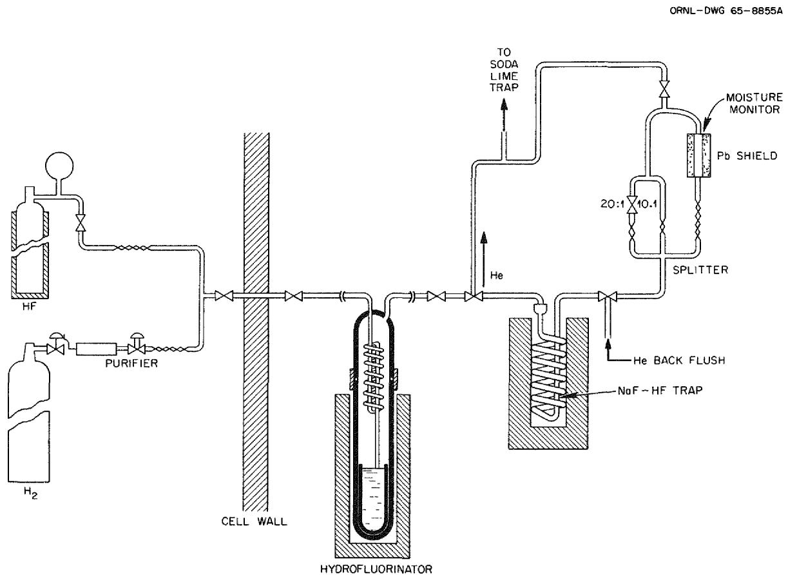  
Fig. 2.2. Schematic flow diagram of the apparatus for the determination of oxide in MSRE fuel by hydrofluorination.

averaged slightly higher. This bias was not unexpected, since the pulverized samples required for the $\mathrm{KBrF_4}$ method were easily contaminated by atmospheric moisture. Subsequently, $50\mathrm{-g}$ fuel-salt samples were taken at various power levels from zero to full power. With an in-cell radiation monitor, the initial sample read $30\mathrm{R}$ at 1 ft. This activity increased to $1000\mathrm{R}$ at 1 ft at the full-power level. Results of the oxide analyses are given in Table 2.17.

The oxide in the coolant salt sample, $25~\mathrm{ppm}$ is, for practical considerations, identical with a value of 38 ppm obtained for a coolant salt sample taken on January 25, 1966, and analyzed in the laboratory after three weeks' storage. The fuel-salt analyses are in reasonable agreement with the samples analyzed in the development laboratory before the reactor was operated at power. The oxide concentration in these nonradioactive samples seemed to decrease gradually from 106 to $65~\mathrm{ppm}$ . Between the FP-6 and FP-7 series the sampler-enricher station was opened for maintenance, and thus the apparent increase in oxide concentration (ca. $15~\mathrm{ppm}$ ) may represent contamination of

Table 2.17. Oxide concentrations of coolant and fuel salt from the MSRE   

<table><tr><td>Sample</td><td>Code</td><td>Oxide concentration (ppm)</td></tr><tr><td>Coolant salt</td><td>CP-4-4</td><td>25</td></tr><tr><td>Fuel salt</td><td>FP-6-1</td><td>49</td></tr><tr><td></td><td>FP-6-4</td><td>53</td></tr><tr><td></td><td>FP-6-12</td><td>50</td></tr><tr><td></td><td>FP-6-18</td><td>47</td></tr><tr><td></td><td>FP-7-5</td><td>66</td></tr><tr><td></td><td>FP-7-9</td><td>59</td></tr><tr><td></td><td>FP-7-13</td><td>66</td></tr><tr><td></td><td>FP-7-16</td><td>56</td></tr></table>

the samples by residual moisture in the sampling system; however, the number of determinations was not at the time sufficient to establish the precision of the method at these low concentration levels.

In an attempt to determine whether radiolytic fluorine removes oxide from the fuel samples, sample FP-7-9 was removed from the transport container and

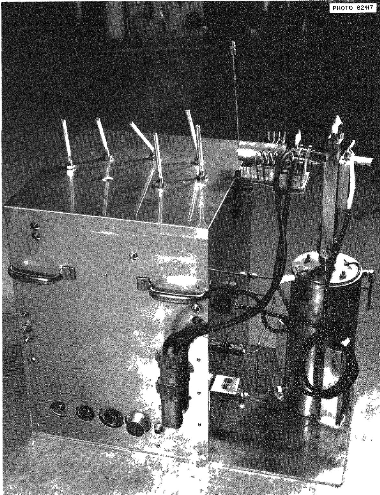  
Fig. 2.3. Hot-cell apparatus.

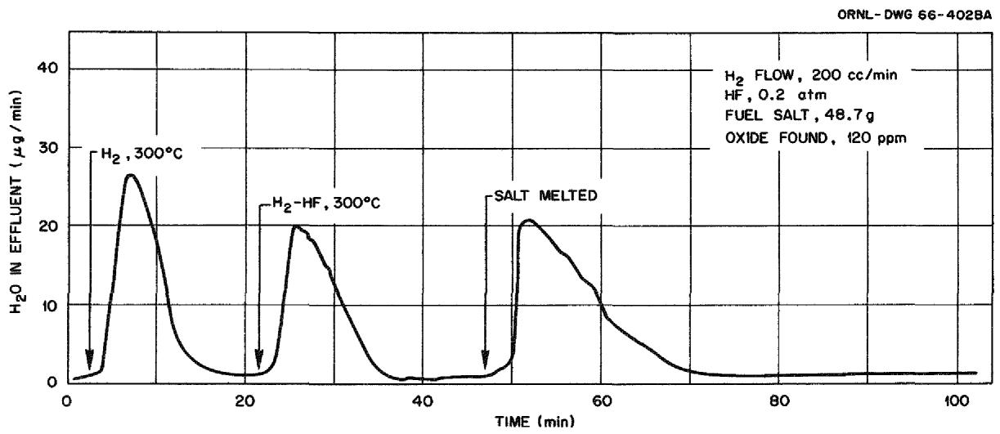  
Fig. 2.4. Determination of oxide in MSR fuel sample FP4-11 by hydrofluorination.

stored in a desiccator for $24\mathrm{hr}$ prior to analysis. Since the oxide content, $59~\mathrm{ppm}$ , is comparable with that of the remaining samples for which analyses were started 6 to $10\mathrm{hr}$ after sampling, no significant loss of oxygen is indicated. A more direct method of establishing the validity of these results by measuring the recovery of a standard addition of oxide was used in subsequent operations. A tin capsule containing a known amount of $\mathrm{SnO}_2$ was heated to $550^{\circ}\mathrm{C}$ in the hydrofluorinator as hydrogen passed through the system. The $\mathrm{SnO}_2$ was reduced to the metal, and the water that was formed passed on to the electrolysis cell. Two standard samples of $\mathrm{SnO}_2$ were analyzed after a four-month interim, and oxide recoveries of 96.1 and $95.6\%$ were obtained.

The slight negative bias was attributed to momentary interruptions in the flow of the hydrofluorinator effluent gas through the water electrolysis cell. Difficulty with cell plugging was encountered throughout the period of development of the oxide method. As an attempt to eliminate the negative bias and also to provide a replacement cell for the remote oxide apparatus, it was deemed necessary to find a method of regenerating the electrolysis cell that would permit a steady gas flow at relatively low flow rates.

The water electrolysis cell contains partially hydrated $\mathbf{P}_2\mathrm{O}_5$ in the form of a thin viscous film in contact with two spirally wound 5-mil rhodium electrode wires. The wires are retained on the inside of an inert plastic tube forming a 20-mil capillary through which the sample passes. The 2-ft-long tubing element is coiled in a helix inside of a $5/8$ in.-diam pipe and potted in plastic for permanence.

During the course of the investigation of the cell, it was found that a wet gas stream in itself did not cause

the electrolysis cell to plug. It was also necessary for current to be flowing through the cell for flow interruptions to occur. This indicated that the hydrogen and oxygen evolving from the electrodes create bubbles in the partially hydrated $\mathbf{P}_2\mathrm{O}_5$ film, which then grow in size sufficiently to bridge the capillary and form an obstructing film.

After many unsuccessful approaches, an acceptable solution to the problem was obtained by means of a special regenerating technique which employed dilute acetone solutions of $\mathrm{H}_3\mathrm{PO}_4$ as the regenerating solutions. This provided a desiccant coating sufficient to absorb the water in the gas stream and gave a minimal amount of flow interruptions during electrolysis. The cells were thereafter successfully regenerated in this manner and yielded oxide recoveries of $99.6 \pm 1.3\%$ from standard $\mathrm{SnO}_2$ samples.

2.4.5 Analysis of helium cover gas. As noted in Sect. 2.4.4, a reliable means for the determination of oxide in the fuel salt did not exist when the initial experiments with the MSRE began. The results of the oxide analyses were perplexing, and they were almost certainly invalid as indicators of contamination by moisture, since the concentrations of structural metal contaminants in the salt remained essentially constant. In order to obtain some direct assurance that negligible inleakage of moisture was occurring in the fuel system, temporary measures were devised and applied. The method consisted in bleeding off a small flow of the helium gas in the pump bowl and passing it through a monitoring system in the high-bay area.

Mean values for the concentration of HF in the helium cover gas were obtained during the PC-2 and

zero-power experiments by adaptation of a continuous internal electrolysis analyzer for gaseous fluorides Through the cooperation of ORGDP personnel, data were obtained regularly throughout prenuclear operations The results showed that HF was evolved from the salt at a maximum mean value of 150 to $200\mu \mathrm{g / liter}^{18}$ The validity of this value is somewhat questionable because of the probable positive bias that particulate fluorides would contribute. The results are, therefore, conservative to an indeterminate degree, but correspond to the introduction of no more than $1\mathrm{ppm}$ of oxide into the salt per day through the reaction

$$
2 \mathrm {H} _ {2} \mathrm {O} + \mathrm {Z r F} _ {4} \rightleftharpoons \mathrm {Z r O} _ {2} + 4 \mathrm {H F},
$$

an amount which would escape detection by other methods

246 Lithium analysis In Sect 242 we noted that chemical analyses of the fuel salt routinely indicated that $\mathrm{Be / Li}$ ratios were significantly greater than for the nominal composition of the salt. A careful examination of the results for all the salt mixtures prepared for use in the MSRE shows that if it is assumed that the analytical results are correct for beryllium in the coolant and flush salts, for beryllium and zirconium in the carrier salt, and for uranium in the $\mathrm{LiF - UF_4}$ salt mixtures, and if a correction factor of 5 to $6\%$ is added to each of the results of lithium analyses, the average results of composition analyses nearly coincide with nominal values

When this disparity was first noted, a reexamination of the production records was made but did not disclose any disparity in the material balances that would account for the anomaly in $\mathrm{Be / L_1}$ results. Evidence from the purification-plant inventory data indicated that the composition of the salt delivered into the reactor system was of the design composition, $660\pm 025$ mole $\%$ LiF, $340\pm 025$ mole $\%$ $\mathrm{BeF}_2$ A sample of the MSRE coolant, taken from one of the batches loaded into the reactor, showed a liquid-solid phase transition temperature of $457~6^{\circ}\mathrm{C}$ , this is within $0.1^{\circ}\mathrm{C}$ of the temperature of the equilibrium liquid-solid reactions which can occur in LiF- $\mathrm{BeF}_2$ mixtures richer than $\sim 33$ mole $\%$ LiF Chemical analyses of this material indicated its composition to be LiF- $\mathrm{BeF}_2$ (63 63-36 37 mole $\%$ The thermal data indicated, however, that the material contained at least 65 5 mole $\%$ LiF, and thus confirmed the composition indicated by the weights of the materials used in its preparation

Application of the same correction factor to the results of lithium analyses for either $\mathbf{L}\mathbf{F} - \mathbf{U}\mathbf{F}_4$ or $\mathbf{L}\mathbf{F} - \mathbf{B}\mathbf{e}\mathbf{F}_2$ mixtures effects equal improvement of the

match of analytical results with nominal values, we must conclude therefore that a negative bias of 5 to $6\%$ existed in the lithium results Lithium was determined in the MSRE salt samples by flame spectrophotometric methods. The results are compared with calibrated standards, and regarded by the analytical chemists to match satisfactorily with these standards. However, in view of the coincidence of values which results when a correction of $\sim 5\%$ is applied to the results, we must infer that a negative bias of that magnitude affected the MSRE results

The lithium used to produce the salt charges for the MSRE was selected from stockpiled LiOH in which the $^6\mathrm{Li}$ had been depleted to $0.01\%$ or less. Assays were available on each batch of LiOH, these analyses served as criteria for selection of the material used $^{19,20}$ The assays of the batches of LiOH which were to be used for the MSRE ranged from 0 0072 to $0.0085\%$ ${}^6\mathrm{Li}$ , with the average of the batches which were to be used for the flush salt and the fuel carrier salt as $0.0074\%$ . After each conversion of hydroxide to the fluoride, the lithium in each product batch was again assayed before the LiF was used to make up the coolant, flush, or carrier salt. The assays of the batches of LiF used to make up the fuel salt ranged from 0 004 to $0.006\%$ and averaged $0.0049\%$ $^{21}$

In view of the relation of tritium production in the MSRE to the isotopic composition of lithium, Haubenreich $^{22}$ recently completed a full review of the possible sources of tritium and of the analyses on which production estimates were based. In connection with that review, S Cantor obtained new analyses for ${}^{6}\mathrm{Li}$ in unused $\mathrm{LiF - BeF_2 - ZrF_4}$ carrier salt. The results coincided with those obtained initially for $\mathrm{LiOH}$ , but were, for reasons still unknown, substantially higher than the $\sim 50$ ppm which was previously used as the basis for estimation of production rates $^{23}$

247 Examination of salts after zero-power experiment. At termination of the zero-power experiment, the fuel salt was drained for temporary storage in fuel drain tank FD-2. Flush salt was circulated through the fuel system for a 24-hr period and drained for storage. Four specimens of fuel salt were obtained from the fuel drain tank at intervals during the first 300-hr period of storage. This practice was not continued after power generation began because of the hazards which would be incurred by attempts to provide temporary access for sampling radioactive salt. One purpose of the effort to sample salt from the drain tank was to confirm that the composition of the salt in the tank conformed to that expected from mixing the newly constituted salt in the fuel circuit with that of lower uranium concen

tration in the drain tank Any mismatch noted at this time would serve as a base-line correction to data obtained later during power operations A second purpose was to investigate the effectiveness of quiescent storage of the salt in reducing the amounts of suspended particles of the structural metals iron and nickel In retrospect, this period afforded the opportunity for securing a wide variety of base-line data, an opportunity that was exploited only to a modest extent, in that only four salt samples were removed for analysis Their compositions, as determined from chemical analysis, are listed in Table 2 18

The data shown in Table 2 18 indicate that approximately the same bias noted previously in the analysis of carrier constituents continued to be evident and that the disparity between the analytical data and the nominal concentration of uranium was $\approx 0.3\%$ , which is within the precision normally found for uranium analyses

A comparison of the values for iron and nickel in the samples drawn from the drain tank and those previously

obtained from the pump bowl shows no significant difference. Evidence confirming this expectation was provided later by analysis of two samples removed from the pump bowl before the reactor was operated at power. Samples were withdrawn from the reactor in enricher ladles and were transferred under an inert atmosphere to the graphite crucible of an electrochemical cell assembly for electrochemical studies by D L Manning. The cell assembly and electrodes developed for these electrochemical studies are described elsewhere24 Average total concentrations of iron and nickel in the melt, as determined by conventional methods, were about 125 and $45~\mathrm{ppm}$ respectively. Iron and nickel, as cationic species in the molten fuel, are electroreducible in the melt and can thus give voltametric reduction waves By voltammetry and by standard addition techniques, Manning found24 that the salt contained $\sim 10$ ppm of iron as $\mathrm{Fe}^{2 + }$ and that if nickel were present as a cationic species, its concentration was below the limit of detection by voltammetry (< 1 ppm)

Table 2.18. Composition of MSRE fuel-salt samples obtained from fuel drain tank FD-2   

<table><tr><td rowspan="2">Sample No</td><td colspan="4">Composition (wt %)</td><td colspan="4">Composition (mole %)</td></tr><tr><td>L1</td><td>Be</td><td>Zr</td><td>U</td><td>Lil·</td><td>BeF2</td><td>ZrF4</td><td>UF4</td></tr><tr><td>FD-2-10</td><td>10 13</td><td>6 54</td><td>11 10</td><td>4 580</td><td></td><td></td><td></td><td></td></tr><tr><td>FD-2-11</td><td>10 18</td><td>6 54</td><td>11 27</td><td>4 638</td><td></td><td></td><td></td><td></td></tr><tr><td>FD-2-12</td><td>10 55</td><td>6 68</td><td>11 95</td><td>4 614</td><td></td><td></td><td></td><td></td></tr><tr><td>FD-2-13</td><td>10 55</td><td>6 22</td><td>10 95</td><td>4 613</td><td></td><td></td><td></td><td></td></tr><tr><td>Average</td><td>10 35</td><td>6 41</td><td>11 32</td><td>4 611</td><td>63 38</td><td>30 46</td><td>5 32</td><td>0 836</td></tr><tr><td>Nominal</td><td></td><td></td><td></td><td></td><td>65 19</td><td>29 00</td><td>5 01</td><td>0 808</td></tr><tr><td rowspan="2">Sample No</td><td colspan="3">Parts per million</td><td></td><td></td><td></td><td></td><td></td></tr><tr><td>Cr</td><td>Fe</td><td>N1</td><td></td><td></td><td></td><td></td><td></td></tr><tr><td>FD-2-10</td><td></td><td></td><td></td><td></td><td></td><td></td><td></td><td></td></tr><tr><td>Aa</td><td>37</td><td>141</td><td>83</td><td></td><td></td><td></td><td></td><td></td></tr><tr><td>Bb</td><td>&lt;30</td><td>53</td><td>&lt;30</td><td></td><td></td><td></td><td></td><td></td></tr><tr><td>FD-2-11</td><td></td><td></td><td></td><td></td><td></td><td></td><td></td><td></td></tr><tr><td>A</td><td>37</td><td>97</td><td>72</td><td></td><td></td><td></td><td></td><td></td></tr><tr><td>B</td><td>&lt;30</td><td>63</td><td>&lt;30</td><td></td><td></td><td></td><td></td><td></td></tr><tr><td>FD-2-12</td><td></td><td></td><td></td><td></td><td></td><td></td><td></td><td></td></tr><tr><td>A</td><td>26</td><td>91</td><td>31</td><td></td><td></td><td></td><td></td><td></td></tr><tr><td>B</td><td>&lt;70</td><td>50</td><td>7</td><td></td><td></td><td></td><td></td><td></td></tr><tr><td>FD-2-13</td><td></td><td></td><td></td><td></td><td></td><td></td><td></td><td></td></tr><tr><td>A</td><td>38</td><td>147</td><td>132</td><td></td><td></td><td></td><td></td><td></td></tr><tr><td>B</td><td>&lt;70</td><td>50</td><td>6</td><td></td><td></td><td></td><td></td><td></td></tr><tr><td>Average</td><td></td><td></td><td></td><td></td><td></td><td></td><td></td><td></td></tr><tr><td>A(4)</td><td>35</td><td>119</td><td>80</td><td></td><td></td><td></td><td></td><td></td></tr><tr><td>A(3)</td><td>33</td><td>110</td><td>62</td><td></td><td></td><td></td><td></td><td></td></tr><tr><td>Run 3</td><td></td><td></td><td></td><td></td><td></td><td></td><td></td><td></td></tr><tr><td>A</td><td>37 ± 8</td><td>154 ± 55</td><td>48 ± 19</td><td></td><td></td><td></td><td></td><td></td></tr></table>

${}^{a}$ Analysis by wet chemical methods   
Analysis by spectrochemical methods

Fig. 2.5. Flush salt residue from volute of the pump bowl.   
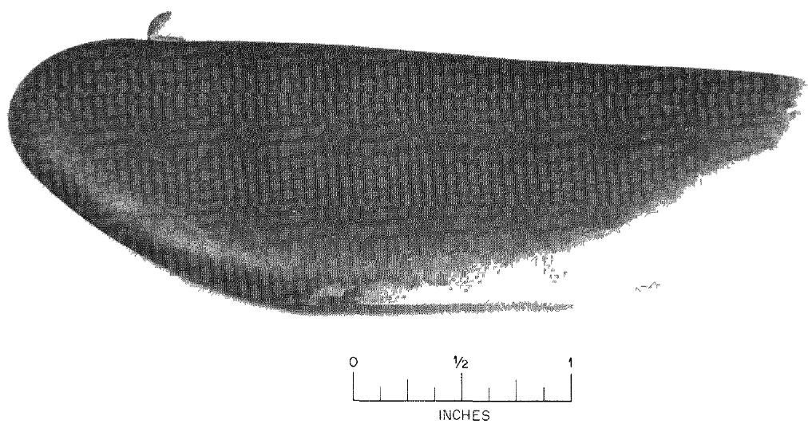  
PHOTO 80844

Since all previous transits of the salt were conducive to retaining suspended metal in the salt, we felt that possibly the finely divided metal (some threefold more dense than the fluoride mixtures) would gradually settle in drain tanks on conclusion of the zero-power experiment. In an attempt to test this possibility, samples of the static fuel salt were obtained from the fuel storage tanks throughout a two-week period following the zero-power experiment. The concentrations of the structural metal impurities were not found to change during this storage period. We concluded, therefore, that thermal convection in the storage tank was sufficient to prevent settling of fine metallic particles in this tank and that the concentrations of these metals in the salt might be expected to remain essentially constant throughout the remainder of MSRE operations.

On removal of the fuel pump rotor for examination,[25] approximately $1\mathrm{kg}$ of flush salt was found to have been retained in the rotor flange area (Fig. 2.6) and in the volute of the pump bowl (Fig. 2.5). Additional small fragments of salt were found in various adjacent locations: in the grooves of the shield-block O-ring and in line 903, through which pump-bowl gas was vented to an HF analyzer that was installed temporarily in the prenuclear operational period to analyze the composition of the off-gas. All salt specimens were submitted for microscopic and/or chemical analysis and were found to be entirely free of oxides or oxyfluorides. Results of the chemical analyses performed with these samples are listed in Table 2.19. A minor oil leak allowed oil to enter the shield-block

Table 2.19. Chemical analysis of fuel pump salt samples   

<table><tr><td rowspan="2">Sample location</td><td colspan="5">Chemical composition (wt %)</td></tr><tr><td>L1</td><td>Be</td><td>Zr</td><td>U</td><td>I</td></tr><tr><td>Labyrinth flange</td><td>13.36</td><td>9.81</td><td>0.15</td><td>0.0177</td><td>78 05</td></tr><tr><td>Pump volute</td><td>13.70</td><td>9.71</td><td>0.021</td><td>0.0195</td><td>77.68</td></tr><tr><td>Upper O-ring groove</td><td>9.81</td><td>6.9</td><td>10.87</td><td>4.294</td><td>62.57</td></tr><tr><td>Lower O-ring groove</td><td>12.1</td><td></td><td>0.910</td><td>0.295</td><td>72.76</td></tr><tr><td>Pump suction</td><td colspan="5">No chemical analysis run. Contained dispersion of fine nongraphitic carbon.</td></tr><tr><td>Fuel salt</td><td>10.25</td><td>6.71</td><td>11.11</td><td>4.602</td><td>68.87</td></tr><tr><td>Flush salt</td><td>13.12</td><td>9.68</td><td>0</td><td>0</td><td>77.08</td></tr></table>

section of the pump. Thermal decomposition products of the pump oil were in contact with the salt specimens in these areas and were found as partial films on some of the salt (Fig. 2.5) or dispersed through fragments of other specimens. In all locations where crystallized salt deposits were found, it was evident that the molten salt had not adhered to the metal surfaces. This was particularly evident in the volute deposit, where the molten specimen cooled rapidly and maintained the surface angle tangency characteristic of sessile drops which are free of contaminant oxides.

2.4.8 Appraisal of chemical surveillance in prepower tests. From a chemical standpoint, operations of the MSRE during the precritical and zero-power experiments were performed in a manner that maintained the purity of the salt charges during all transfer, fill, and circulation operations. The results of the chemical analyses obtained with samples from the fuel and

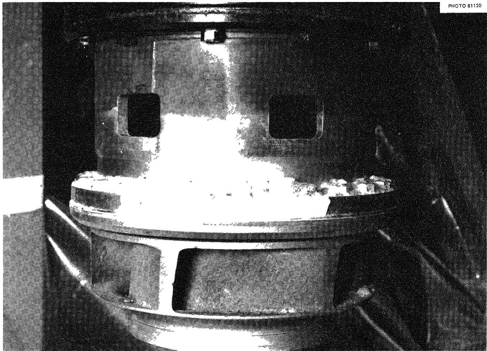  
Fig. 2.6. Flush salt in rotor flange area.

coolant systems reinforced the longstanding conclusion, drawn in laboratory and engineering-scale experiments, that pure molten-fluoride mixtures are completely compatible with nickel-based alloys.

The utility of routine analysis of salt samples removed from the circulating systems came to be realized as of questionable value with respect to several of the constituents after brief experience with the MSRE. It became quite clear, for example, that only easily recognized operational perturbations were likely to cause the average concentrations of carrier or coolant salt constituents to vary beyond standard deviations in the analyses and that without major refinement in the analytical methods for determining the concentration of uranium in fluoride mixtures these analyses would not provide operational control. Nonetheless, the potential value for applications of statistically significant results justified, in our judgment, a continued and active program of chemical analysis. Furthermore, by the time the zero-power experiment was completed, the value of chromium analysis as the single quantitative indicator of corrosion or of corrosion-free performance

was solidly established. Analysis of salt samples for this impurity involves wet chemical dissolution techniques, which account for some $90\%$ of the cost of a complete analysis. Because of this factor, there was little reason to omit analysis of more than one component, for such omission would preclude determination of overall composition.

Several aspects of the relation of analysis to MSRE operations proved to be discomfiting by the completion of the zero-power experiment. Annoyingly, chemical analysis of the flush-salt samples removed from the system indicated that the amounts of salt residues remaining in the system after drain operations were somewhat more than could be accounted for by the on-site estimates of the volumes of probable void space where it was deduced that salt could reside. Ultimately, the application of neutron activation and mass spectrometric analysis to this problem confirmed that estimates made from chemical data were the most nearly correct. Until this problem was resolved, continued exchange of fuel and flush salt by drain-fill operations suggested a negative bias in the analysis of

uranium. Methods were developed for slight refinements in the uranium analysis, but not surprisingly, these did little to resolve the fundamental problem. Weigh cell data, in which some reliance was placed originally, proved to be of little value with continued experience, and accordingly, increasing reliance on chemical analyses was developed.

For a lengthy period, there was no absolute method for establishing the level of contamination of the salts by small amounts of oxide ion. This assay was performed in a partly satisfactory manner during the precritical and zero-power experiments, but the method was not adapted for application to highly radioactive materials until well into the power period.

The lack of dynamic methods for obtaining various analyses of the gas and vapor above the surface of the fuel salt proved to be a severe limitation in the interpretation of the chemical behavior which occurred in the fuel system. In the absence of on-site gas analysis, either by mass spectrometry or gamma-ray spectrometry (which was developed later for postoperational examinations), interpretation of several aspects of molten-salt reactor behavior remained less than completely resolved - in particular, of greater significance in power operations, the experimental investigation of factors controlling the transport of noble metal fission products.

In general, the surveillance program was, to this stage, a success principally because of the careful procedures which were employed to ensure its trouble-free operation and because of the intrinsic stability and compatibility of the materials used in its construction.

# References

1. J. H. Shaffer, Preparation and Handling of Salt Mixtures for the Molten-Salt Reactor Experiment, ORNL4614 (January 1971).   
2. MSR Program Semiannu. Progr. Rep. Feb. 28, 1965, ORNL-3812, p. 5.   
3. R. B. Lindauer, Processing of the MSRE Flush and Fuel Salts, ORNL-TM-2578 (August 1969); G. Long and F. F. Blankenship, The Stability of Uranium Trifluoride, ORNL-TM-2065 (November 1969).   
4. R. B. Lindauer, private communication.   
5. C. F. Baes, "The Chemistry and Thermodynamics of Molten-Salt Reactor Fluoride Solutions," IAEA Symposium on Thermodynamics with Emphasis on Nuclear Materials and Atomic Transport in Solids, Vienna, Austria, 1965.

6. A more detailed description of the hydraulics in the system is given in the report by J. R. Engel, P. N. Haubenreich, and A. Houtzeel, Spray, Mist, Bubbles and Foam in the Molten-Salt Reactor Experiment, ORNL-TM-3027 (June 1970).   
7. MSR Program Semiannu. Progr. Rep. Feb. 28, 1965, ORNL-3812, p. 10.   
8. MSR Program Semiannu. Progr. Rep. Feb. 28, 1965, ORNL-3812, p. 10.   
9. L. T. Corbin, W. R. Winsbro, C. E. Lamb, and M. T. Kelley, "Design and Construction of ORNL High-Radiation-Level Analytical Laboratory," 11th Hot Lab Conf. Proceedings, ANS, November 1963; "High-Radiation-Level Analytical Laboratories," Anal. Chem. 37(13), 83A (1965).   
10. B. E. Prince et al., Zero-Power Physics Experiments on the MSRE, ORNL-4233 (February 1968).   
11. J. R. Engel and B. E. Prince, The Reactivity Balance in the MSRE, ORNL-TM-1796 (March 1967).   
12. MSR Program Semiannu. Progr. Rep. Feb. 28, 1966, ORNL-3936, p. 122.   
13. J. H. Shaffer, internal correspondence, Oct. 9, 1964.   
14. W. R. Grimes, Nucl. Appl. Technol. 8, 137 (1970).   
15. G. Goldberg, A. S. Meyer, Jr., and J. C. White, Anal. Chem. 32, 314 (1960).   
16. A. S. Meyer, R. F. Apple, and J. M. Dale, ORNL Analytical Chemistry Division.   
17. W. S. Pappas, Anal. Chem. 38, 615 (1966).   
18. Results summarized in a memorandum from J. G. Million (ORGDP) to R. E. Thoma, July 14, 1965.   
19. P. N. Haubenreich, "Selection of Lithium for MSRE Fuel, Flush and Coolant Salt," internal correspondence, Apr. 10, 1962.   
20. H. F. McDuffie, "Selection of $^7$ Li Batches for MSRE Fuel, Flush and Coolant Salt," internal correspondence, May 22, 1962.   
21. J. H. Shaffer, personal communication.   
22. P. N. Haubenreich, A Review of Production and Observed Distribution of Tritium in MSRE in Light of Recent Findings, ORNL-CF-71-8-34 (in press).   
23. P. N. Haubenreich, Tritium in the MSRE: Calculated Production Rates and Observed Amounts, ORNL-CF-70-2-7 (Feb. 4, 1970).   
24. D. L. Manning, internal correspondence, Jan. 19, 1966.   
25. C. H. Gabbard, Inspection of Molten-Salt Reactor Experiment (MSRE) Fuel Pump after Zero Power Experiments (Run 3), ORNL-CF-66-8-5 (Aug. 4, 1966).

# 3 CHEMICAL COMPOSITION OF THE FUEL SALT DURING NUCLEAR OPERATIONS

# 31 Introduction

The MSRE was not the first reactor to use a molten fluoride fuel mixture. The ARE (Aircraft Reactor Experiment) was operated as the initial demonstration of a molten-salt reactor in November 1954, using a fuel solution of $\mathrm{NaF - ZrF_4 - ^{235}UF_4}$ (53-41-6 mole $\%$ ) The time during which the molten fluoride fuel was circulated was brief, $\sim 1000\mathrm{hr}$ , and did not include a program of chemical surveillance. In contrast, the MSRE was intended to provide the experience and operational data on which design and plans for molten-salt reactors of 30-year operating lifetimes could be based. Plans for its operation, therefore, included a chemical surveillance program that was comprehensive in scope. Moreover, chemical information and quantitative data pertaining to a number of phenomena that could only be obtained from operating reactors were lacking, even though a thorough program of laboratory, engineering-scale, and in-pile tests had established the principal parameters required to design and operate the MSRE. Among the most important of these are the chemical factors which control the distribution of fission products within the fuel and off-gas systems, and the redox chemistry typical of dynamic fuel systems in which fuel burnup and replenishment proceed concurrently. It was also important to establish the corrosion resistance of Hastelloy N under realistic and typical operating conditions, to examine the capability of a molten-salt reactor to operate under circumstances where contaminants might enter the salt occasionally or chronically, and to study the possible effects that operation of numerous chemical components of the reactor might have on fuel and coolant chemistry. It was the intent of these efforts to evaluate, on a continuing basis, the adequacy of the surveillance program to assess the performance and safety of the MSRE as the prototype of a molten-salt breeder reactor

Initial activities of the program of chemical surveillance served to establish that the behavior of the fuel and coolant salts would conform with that expected from laboratory and engineering tests. We sought information that would indicate whether the fuel and coolant salts remained chemically stable and noncorrosive, to what extent the consumption of fissile material deviated from that expected from nuclear considerations, and whether or not uranium losses could be detected by chemical examination of salt samples. In

the beginning stages of MSRE operation, samples were taken on one-day intervals to assess the chemical stability of the fuel, to establish whether or not the concentration of oxide contaminants remained below the saturation limits ( $\sim 700$ ppm for the average operating temperature of $650^{\circ}\mathrm{C}$ ), and to correlate concomitant corrosion, if it occurred, with possible introduction of contaminants into the system. Finally, we anticipated that through measurement of isotopic changes in the uranium composition of the fuel it might be possible to obtain accurate comparisons of the amounts of uranium burned with those expected from nuclear considerations

After a significant amount of uranium had undergone fission, procedures were initiated to monitor the relative concentration of trivalent uranium in the fuel salt. Studies of the chemical effects of uranium fission in molten-fluoride mixtures had led to an early estimate that the fission reaction would be mildly oxidative and would produce $\sim 0.8$ equivalent of oxidation per gram atomic weight of uranium consumed. This estimate was based on an appraisal of the yield and chemical stability of the state of the fission products. Since it was possible to evaluate only the equilibrium states of all the various fission product species - for example, the rare earths, iodine, tellurium, and the "noble" metals, including Mo, Nb, Ru, Ta, Re, and Tc - nonequilibrium behavior in highly radioactive environments of the MSRE would not have been surprising and would conceivably introduce uncertainties into interpretation of fission product behavior in the MSRE. Previous experience with fission product behavior had been explored almost exclusively through in-pile capsule tests, although some appraisal of the ARE fission product distribution was made. A vigorous investigation of the fate of fission products in the MSRE was therefore initiated and pursued throughout the entire period of reactor operations. The results of those studies are summarized elsewhere. Concurrently, laboratory studies were developed in support of the on-site efforts to establish the relationships of fission product distributions in the MSRE with chemical parameters. During the course of MSRE operations it became increasingly evident that minor variations in the oxidation-reduction potential of the fuel salt almost certainly had a real effect on some of the fission product distributions within the system and that accurate means for the determination of the concentration of trivalent uranium in MSR's would be needed. Active work was devoted thereafter to the development of means for analysis of $\mathrm{U}^{3+}/\Sigma \mathrm{U}$

Based on the considerations discussed above, a program of chemical surveillance was formulated and

Table 3.1. Composition of the MSRE fuel salt   

<table><tr><td rowspan="2">Date</td><td rowspan="2">Sample</td><td rowspan="2">Equiv. Full Power HR.</td><td colspan="3">(Li Be Zr)</td><td colspan="2">(U)</td><td>F</td><td>Σ</td><td>Fe</td><td>Cr</td><td>Ni</td><td colspan="2">(ppm)</td><td>ΣU in Circulation</td><td>ΔU (kg)</td><td>Σ Eq. Oxidation</td><td>Σ Eq. Reduction</td><td>[U3+/ΣU] % Nom.</td></tr><tr><td></td><td></td><td></td><td>Nom.</td><td>Obs.</td><td></td><td></td><td></td><td></td><td></td><td></td><td></td><td></td><td></td><td></td><td></td><td></td></tr><tr><td>2/13/66</td><td>Run 5-I</td><td></td><td></td><td></td><td></td><td>4.631</td><td></td><td></td><td></td><td></td><td></td><td></td><td></td><td></td><td>209.950</td><td>0</td><td>0</td><td>3.633</td><td>0.41</td></tr><tr><td>2/14/66</td><td>FP 5-1</td><td>4</td><td>10.65</td><td>6.53</td><td>11.45</td><td>4.631</td><td>4.625</td><td>68.18</td><td>101.44</td><td>68</td><td>51</td><td>15</td><td></td><td></td><td>0</td><td>0</td><td>3.633</td><td>0.41</td><td></td></tr><tr><td>2/16/66</td><td>Run 5-F</td><td></td><td></td><td></td><td></td><td></td><td></td><td></td><td></td><td></td><td></td><td></td><td></td><td></td><td></td><td></td><td></td><td></td><td></td></tr><tr><td>4/5/66</td><td>Run 6-I</td><td></td><td></td><td></td><td></td><td></td><td></td><td></td><td></td><td></td><td></td><td></td><td></td><td></td><td></td><td></td><td></td><td></td><td></td></tr><tr><td>4/6/66</td><td>FP 6-1</td><td></td><td colspan="16">Concentration of oxide: 49 ppma</td><td></td></tr><tr><td>4/6/66</td><td>-</td><td></td><td colspan="16">Fuel circuit drained because of restriction in valve No. 561.</td><td></td></tr><tr><td>4/8/66</td><td>-</td><td></td><td colspan="16">Fuel circuit filled</td><td></td></tr><tr><td>4/9/66</td><td>FP 6-2</td><td></td><td>11.43</td><td>6.22</td><td>10.80</td><td>4.631</td><td>4.622</td><td>68.97</td><td>102.07</td><td>77</td><td>57</td><td>63</td><td>209.950</td><td>0</td><td>0</td><td>3.633</td><td>0.41</td><td></td><td></td></tr><tr><td>4/13/66</td><td>FP 6-3</td><td></td><td colspan="16">Sample for oxide analysis: analysis unsuccessful</td><td></td></tr><tr><td>4/14/66</td><td>FP 6-4</td><td></td><td colspan="16">Concentration of oxide: 55 ppma</td><td></td></tr><tr><td>4/15/66</td><td>FP 6-5</td><td>15</td><td>10.45</td><td>6.37</td><td>11.12</td><td>4.630</td><td>4.605</td><td>69.85</td><td>102.40</td><td>234</td><td>65</td><td>35</td><td>209.944</td><td>-0.006</td><td>-0.005</td><td>3.628</td><td>0.41</td><td></td><td></td></tr><tr><td>4/16/66</td><td>FP 6-6</td><td>15</td><td>10.55</td><td>6.46</td><td>11.32</td><td>4.630</td><td>4.625</td><td>68.56</td><td>101.52</td><td>101</td><td>46</td><td>49</td><td></td><td></td><td></td><td></td><td></td><td></td><td></td></tr><tr><td>4/17/66</td><td>FP 6-7</td><td></td><td>10.32</td><td>6.41</td><td>11.42</td><td>4.630</td><td>4.647</td><td>69.67</td><td>102.47</td><td>71</td><td>46</td><td>58</td><td></td><td></td><td></td><td></td><td></td><td></td><td></td></tr><tr><td>4/19/66</td><td>FP 6-8</td><td>30</td><td>10.43</td><td>6.49</td><td>11.29</td><td>4.630</td><td>4.655</td><td>68.90</td><td>101.77</td><td>89</td><td>45</td><td>58</td><td>209.938</td><td>-0.012</td><td>0.039</td><td>3.594</td><td>0.41</td><td></td><td></td></tr><tr><td>4/20/66</td><td>FP 6-9</td><td>39</td><td>10.48</td><td>6.66</td><td>11.52</td><td>4.630</td><td>4.684</td><td>68.92</td><td>102.26</td><td>168</td><td>58</td><td>55</td><td>209.934</td><td>-0.016</td><td>0.050</td><td>3.583</td><td>0.40</td><td></td><td></td></tr><tr><td>4/25/66</td><td>FP 6-10</td><td>55</td><td>10.30</td><td>6.76</td><td>11.54</td><td>4.630</td><td>4.595</td><td>68.81</td><td>102.00</td><td>129</td><td>42</td><td>36</td><td>209.928</td><td>-0.022</td><td>0.070</td><td>3.563</td><td>0.40</td><td></td><td></td></tr><tr><td>5/9/66</td><td>FP 6-11</td><td>115</td><td>10.30</td><td>6.42</td><td>11.28</td><td>4.630</td><td>4.612</td><td>70.09</td><td>102.70</td><td>95</td><td>59</td><td>125</td><td>209.904</td><td>-0.046</td><td>0.147</td><td>3.486</td><td>0.40</td><td></td><td></td></tr><tr><td>5/10/66</td><td>FP 6-12</td><td>138</td><td colspan="16">Concentration of oxide: 50 ppma</td><td></td></tr><tr><td>5/11/66</td><td>FP 6-13</td><td>147</td><td>10.50</td><td>6.41</td><td>11.06</td><td>4.629</td><td>4.628</td><td>66.79</td><td>99.38</td><td>101</td><td>52</td><td>54</td><td>209.891</td><td>-0.059</td><td>0.188</td><td>3.445</td><td>0.39</td><td></td><td></td></tr><tr><td>5/13/66</td><td>FP 6-14</td><td>166</td><td>10.50</td><td>6.45</td><td>11.33</td><td>4.629</td><td>4.617</td><td>68.18</td><td>101.08</td><td>107</td><td>48</td><td>74</td><td>209.884</td><td>-0.066</td><td>0.212</td><td>3.421</td><td>0.39</td><td></td><td></td></tr><tr><td>5/14/66</td><td>FP 6-15</td><td>190</td><td>10.55</td><td>6.86</td><td>11.35</td><td>4.629</td><td>4.601</td><td>68.18</td><td>101.54</td><td>94</td><td>45</td><td>52</td><td>209.874</td><td>-0.076</td><td>0.243</td><td>3.390</td><td>0.38</td><td></td><td></td></tr><tr><td>5/18/66</td><td>FP 6-16</td><td>254</td><td>10.50</td><td>6.58</td><td>11.31</td><td>4.628</td><td>4.629</td><td>67.88</td><td>100.90</td><td>84</td><td>45</td><td>36</td><td>209.848</td><td>-0.102</td><td>0.326</td><td>3.307</td><td>0.37</td><td></td><td></td></tr><tr><td>5/23/66</td><td>FP 6-17</td><td>322</td><td>11.44</td><td>6.64</td><td>11.05</td><td>4.628</td><td>4.652</td><td>68.26</td><td>102.04</td><td>122</td><td>49</td><td>54</td><td>209.822</td><td>-0.128</td><td>0.411</td><td>3.222</td><td>0.36</td><td></td><td></td></tr><tr><td>5/25/66</td><td>FP 6-18</td><td></td><td colspan="16">Concentration of oxide: 47 ppma</td><td></td></tr><tr><td>5/26/66</td><td>FP 6-19</td><td>400</td><td>10.40</td><td>6.88</td><td>11.72</td><td>4.627</td><td>4.667</td><td>69.10</td><td>102.77</td><td>99</td><td>39</td><td>39</td><td>209.790</td><td>-0.160</td><td>0.512</td><td>3.121</td><td>0.35</td><td></td><td></td></tr><tr><td>5/28/66</td><td>Run 6-F</td><td></td><td></td><td></td><td></td><td></td><td></td><td></td><td></td><td></td><td></td><td></td><td></td><td></td><td></td><td></td><td></td><td></td><td></td></tr><tr><td>6/12/66</td><td>Run 7-I</td><td></td><td></td><td></td><td></td><td></td><td></td><td></td><td></td><td></td><td></td><td></td><td></td><td></td><td></td><td></td><td></td><td></td><td></td></tr><tr><td>6/12/66</td><td>FP 7-1</td><td>400</td><td>10.60</td><td>6.78</td><td>11.16</td><td>4.627</td><td>4.647</td><td>69.26</td><td>102.45</td><td>108</td><td>51</td><td>70</td><td>209.806</td><td></td><td></td><td></td><td></td><td></td><td></td></tr><tr><td>6/15/66</td><td>FP 7-2</td><td></td><td colspan="16">Sample for oxide analysis: sample unsatisfactory for analysis</td><td></td></tr><tr><td>6/17/66</td><td>FP 7-3</td><td>487</td><td>10.55</td><td>6.56</td><td>11.44</td><td>4.626</td><td>4.656</td><td>68.24</td><td>101.45</td><td>148</td><td>50</td><td>51</td><td>209.756</td><td>-0.194</td><td>0.623</td><td>3.010</td><td>0.34</td><td></td><td></td></tr><tr><td>6/20/66</td><td>FP 7-4</td><td>526</td><td>10.50</td><td>6.40</td><td>11.61</td><td>4.626</td><td>4.640</td><td>67.82</td><td>100.97</td><td>110</td><td>52</td><td>38</td><td>209.740</td><td>-0.210</td><td>0.673</td><td>2.960</td><td>0.34</td><td></td><td></td></tr><tr><td>6/22/66</td><td>FP 7-5</td><td></td><td colspan="16">Concentration of oxide: 66 ppma</td><td></td></tr><tr><td>6/24/66</td><td>FP 7-6</td><td>658</td><td>10.60</td><td>6.63</td><td>11.35</td><td>4.625</td><td>4.614</td><td>69.22</td><td>102.41</td><td>115</td><td>61</td><td>66</td><td>209.687</td><td>-0.263</td><td>0.843</td><td>2.790</td><td>0.32</td><td></td><td></td></tr><tr><td>6/26/66</td><td>FP 7-7</td><td>706</td><td>10.55</td><td>6.65</td><td>11.13</td><td>4.624</td><td>4.641</td><td>69.60</td><td>102.57</td><td>78</td><td>46</td><td>54</td><td>209.668</td><td>-0.282</td><td>0.904</td><td>2.729</td><td>0.31</td><td></td><td></td></tr><tr><td>7/1/66</td><td>FP 7-8</td><td>725</td><td>10.60</td><td>6.59</td><td>11.67</td><td>4.624</td><td>4.663</td><td>67.87</td><td>101.39</td><td>94</td><td>49</td><td>52</td><td>209.661</td><td>-0.289</td><td>0.927</td><td>2.796</td><td>0.31</td><td></td><td></td></tr><tr><td>7/4/66</td><td>FP 7-9</td><td></td><td colspan="16">Concentration of oxide: 59 ppma</td><td></td></tr><tr><td>7/6/66</td><td>FP 7-10</td><td>846</td><td>10.63</td><td>6.91</td><td>11.21</td><td>4.623</td><td>4.609</td><td>68.20</td><td>101.56</td><td>36</td><td>49</td><td>&lt;20</td><td>209.612</td><td>-0.338</td><td>1.084</td><td>2.549</td><td>0.29</td><td></td><td></td></tr><tr><td>7/10/66</td><td>FP 7-11</td><td>944</td><td>10.45</td><td>7.00</td><td>11.22</td><td>4.622</td><td>4.630</td><td>69.48</td><td>102.78</td><td>58</td><td>39</td><td>36</td><td>209.573</td><td>-0.377</td><td>1.210</td><td>2.423</td><td>0.27</td><td></td><td></td></tr><tr><td>7/13/66</td><td>FP 7-12</td><td>1012</td><td>10.50</td><td>6.65</td><td>11.04</td><td>4.622</td><td>4.640</td><td>68.44</td><td>101.27</td><td>84</td><td>46</td><td>45</td><td>209.546</td><td>-0.404</td><td>1.300</td><td>2.333</td><td>0.26</td><td></td><td></td></tr><tr><td>7/15/66</td><td>FP 7-13</td><td></td><td colspan="16">Concentration of oxide: 66 ppma</td><td></td></tr><tr><td>7/18/66</td><td>FP 7-14</td><td>1032</td><td>10.55</td><td>6.50</td><td>11.26</td><td>4.622</td><td>4.660</td><td>68.79</td><td>101.76</td><td>53</td><td>44</td><td>63</td><td>209.538</td><td>-0.412</td><td>1.321</td><td>2.312</td><td>0.26</td><td></td><td></td></tr><tr><td>7/20/66</td><td>FP 7-15</td><td>1047</td><td>10.55</td><td>6.71</td><td>11.60</td><td>4.621</td><td>4.638</td><td>67.59</td><td>101.08</td><td>83</td><td>44</td><td>28</td><td>209.532</td><td>-0.418</td><td>1.341</td><td>2.292</td><td>0.26</td><td></td><td></td></tr><tr><td>7/22/66</td><td>FP 7-16</td><td></td><td colspan="16">Concentration of oxide: 56 ppma</td><td></td></tr><tr><td>7/25/66</td><td>Run 7-F</td><td></td><td></td><td></td><td></td><td></td><td></td><td></td><td></td><td></td><td></td><td></td><td></td><td></td><td></td><td></td><td></td><td></td><td></td></tr><tr><td>9/25/66</td><td>Run 8-I</td><td></td><td></td><td></td><td></td><td></td><td></td><td></td><td></td><td></td><td></td><td></td><td></td><td></td><td></td><td></td><td></td><td></td><td></td></tr><tr><td>10/8/66</td><td>FP 8-5</td><td>1047</td><td>11.10</td><td>6.23</td><td>11.21</td><td>4.603</td><td>4.643</td><td>71.21</td><td>104.39</td><td>139</td><td></td><td>108</td><td>208.711</td><td>-0.434</td><td>1.341</td><td>2.292</td><td>0.26</td><td></td><td></td></tr><tr><td>10/11/66</td><td>FP 8-6</td><td>1100</td><td>10.95</td><td>6.37</td><td>10.97</td><td>4.603</td><td>4.624</td><td>70.24</td><td>103.15</td><td>133</td><td>61</td><td>72</td><td>208.706</td><td>-0.439</td><td>1.408</td><td>2.225</td><td>0.25</td><td></td><td></td></tr></table>

Table 3.1 (continued)   

<table><tr><td rowspan="2">Date</td><td rowspan="2">Sample</td><td rowspan="2">Equiv. Full Power llr</td><td colspan="4">(Li Be Zr U</td><td colspan="2">F Σ</td><td colspan="3">(ppm)</td><td>ΣU in Circulation</td><td>ΔU (kg)</td><td>Σ Eq. Oxidation</td><td>Σ Eq. Reducation</td><td>[U^3+/ΣU] % Nom.</td><td></td></tr><tr><td></td><td>Nom.</td><td>Obs.</td><td></td><td></td><td></td><td></td><td></td><td></td><td></td><td></td><td></td><td></td><td></td><td></td></tr><tr><td>10/13/66</td><td>FP 8-7</td><td colspan="15">Concentration of oxide: 44 ppma</td><td></td></tr><tr><td>10/17/66</td><td>FP 8-8</td><td>1166</td><td>10.95</td><td>6.88</td><td>11.23</td><td>4.603</td><td>4.638</td><td>69.94</td><td>103.64</td><td>219</td><td>65</td><td>35</td><td>208.680</td><td>-0.465</td><td>1.491</td><td>2.142</td><td>0.24</td></tr><tr><td>10/19/66</td><td>FP 8-9</td><td>1200</td><td>11.00</td><td>6.60</td><td>10.79</td><td>4.602</td><td>4.626</td><td>72.27</td><td>105.29</td><td>124</td><td>66</td><td>42</td><td>208.666</td><td>-0.479</td><td>1.536</td><td>2.097</td><td>0.24</td></tr><tr><td>10/21/66</td><td>FP 8-10</td><td>1228</td><td>11.00</td><td>6.43</td><td>11.41</td><td>4.602</td><td>4.630</td><td>67.55</td><td>101.02</td><td>89</td><td>73</td><td>119</td><td>208.655</td><td>-0.490</td><td>1.572</td><td>2.061</td><td>0.23</td></tr><tr><td>10/24/66</td><td>FP 8-11</td><td colspan="15">Sample for oxide analysis: analysis unsuccessful</td><td></td></tr><tr><td>10/26/66</td><td>FP 8-12</td><td>1357</td><td>11.15</td><td>6.62</td><td>11.20</td><td>4.601</td><td>4.650</td><td>69.01</td><td>102.63</td><td>106</td><td>51</td><td>26</td><td>208.603</td><td>-0.542</td><td>1.738</td><td>1.895</td><td>0.22</td></tr><tr><td>10/28/66</td><td>FP 8-13</td><td>1380</td><td>14.25</td><td>6.49</td><td>11.29</td><td>4.601</td><td>4.623</td><td>68.82</td><td>105.47</td><td>84</td><td>63</td><td>60</td><td>208.594</td><td>-0.551</td><td>1.767</td><td>1.866</td><td>0.21</td></tr><tr><td>10/31/66</td><td>FP 8-14</td><td>1401</td><td>13.85</td><td>6.65</td><td>11.17</td><td>4.601</td><td>4.620</td><td>69.08</td><td>105.37</td><td>82</td><td>63</td><td>25</td><td>208.586</td><td>-0.559</td><td>1.793</td><td>1.840</td><td>0.21</td></tr><tr><td>10/31/66</td><td>Run 8-F</td><td>1401</td><td></td><td></td><td></td><td>4.601</td><td></td><td></td><td></td><td></td><td></td><td></td><td>208.586</td><td></td><td></td><td></td><td></td></tr><tr><td>11/7/66</td><td>FP 9-I</td><td>1401</td><td></td><td></td><td></td><td>4.582</td><td></td><td></td><td></td><td></td><td></td><td></td><td>207.754</td><td></td><td></td><td></td><td></td></tr><tr><td>11/7/66</td><td>FP 9-I</td><td>1401</td><td></td><td></td><td></td><td>4.582</td><td></td><td></td><td></td><td></td><td></td><td></td><td>207.754</td><td>-0.559</td><td>1.793</td><td>1.840</td><td>0.21</td></tr><tr><td>11/9/66</td><td>FP 9-I</td><td>1449</td><td></td><td></td><td></td><td>4.582</td><td></td><td></td><td></td><td></td><td></td><td></td><td>207.754</td><td></td><td></td><td></td><td></td></tr><tr><td>11/11/66</td><td>FP 9-I</td><td>1480</td><td></td><td></td><td></td><td>4.582</td><td></td><td></td><td></td><td></td><td></td><td></td><td>207.723</td><td>-0.591</td><td>1.895</td><td>1.738</td><td>0.20</td></tr><tr><td>11/14/66</td><td>FP 9-I</td><td>1528</td><td></td><td></td><td></td><td>4.582</td><td></td><td></td><td></td><td></td><td></td><td></td><td>207.703</td><td>-0.610</td><td>1.956</td><td>1.677</td><td>0.19</td></tr><tr><td>11/16/66</td><td>FP 9-I</td><td>1544</td><td></td><td></td><td></td><td>4.581</td><td></td><td></td><td></td><td></td><td></td><td></td><td>207.697</td><td>-0.616</td><td>1.976</td><td>1.657</td><td>0.19</td></tr><tr><td>11/17/66</td><td>FP 9-I</td><td>1544</td><td></td><td></td><td></td><td>4.581</td><td></td><td></td><td></td><td></td><td></td><td></td><td>207.650</td><td>-0.663</td><td>2.126</td><td>1.507</td><td>0.17</td></tr><tr><td>11/19/66</td><td>FP 9-I</td><td>1662</td><td></td><td></td><td></td><td>4.580</td><td></td><td></td><td></td><td></td><td></td><td></td><td>207.650</td><td>-0.663</td><td>2.126</td><td>1.507</td><td>0.17</td></tr><tr><td>11/20/66</td><td>Run 9-F</td><td>1662</td><td></td><td></td><td></td><td>4.580</td><td></td><td></td><td></td><td></td><td></td><td></td><td>206.815</td><td></td><td></td><td></td><td></td></tr><tr><td>12/12/66</td><td>Run 10-I</td><td>1662</td><td></td><td></td><td></td><td>4.561</td><td></td><td></td><td></td><td></td><td></td><td></td><td>206.815</td><td></td><td></td><td></td><td></td></tr><tr><td>12/12/66</td><td>FP 10-3</td><td>1662</td><td></td><td></td><td></td><td colspan="11">Sample for determination of organics in offgas; sample faulty</td><td></td></tr><tr><td>12/12/66</td><td>FP 10-4</td><td>1662</td><td></td><td></td><td></td><td colspan="11">Sample for determination of organics in offgas by CuO; 600 ppm HF</td><td></td></tr><tr><td>12/14/66</td><td>FP 10-5</td><td>1662</td><td></td><td></td><td></td><td colspan="11">Sample for determination of organics in offgas by CuO; 600 ppm HF</td><td></td></tr><tr><td>12/16/66</td><td>FP 10-6</td><td>1662</td><td></td><td></td><td></td><td colspan="11">Sample for determination of organics in offgas by CuO; 600 ppm HF</td><td></td></tr><tr><td>12/19/66</td><td>FP 10-7</td><td>1677</td><td></td><td></td><td></td><td colspan="11">Sample for determination of organics in offgas by CuO; 600 ppm HF</td><td></td></tr><tr><td>12/22/66</td><td>FP 10-8</td><td>1746</td><td></td><td></td><td></td><td colspan="11">Sample for determination of organics in offgas by CuO; 600 ppm HF</td><td></td></tr><tr><td>12/24/66</td><td>FP 10-9</td><td>1794</td><td></td><td></td><td></td><td colspan="11">Sample for determination of organics in offgas by CuO; 600 ppm HF</td><td></td></tr><tr><td>12/27/66</td><td>FP 10-10</td><td></td><td></td><td></td><td></td><td colspan="11">Sample for determination of organics in offgas by CuO; 600 ppm HF</td><td></td></tr><tr><td>12/27/66</td><td>FP 10-11G</td><td></td><td></td><td></td><td></td><td colspan="11">Sample for determination of organics in offgas by CuO; 600 ppm HF</td><td></td></tr><tr><td>12/28/66</td><td>FP 10-12</td><td>1813</td><td></td><td></td><td></td><td colspan="11">Sample for determination of organics in offgas by CuO; 600 ppm HF</td><td></td></tr><tr><td>12/30/66</td><td>FP 10-13</td><td>1846</td><td></td><td></td><td></td><td colspan="11">Sample for determination of organics in offgas by CuO; 600 ppm HF</td><td></td></tr><tr><td>1/1/67</td><td>FP 10-14</td><td>1870</td><td></td><td></td><td></td><td colspan="7">Be addition: 3 g as powder</td><td>206.732</td><td>-0.746</td><td>2.393</td><td>1.906</td><td>0.22</td></tr><tr><td>1/2/67</td><td>FP 10-15</td><td></td><td></td><td></td><td></td><td colspan="7">Special sample (50 g); not subjected to chemical analysis</td><td>206.732</td><td>-0.746</td><td>2.393</td><td>1.906</td><td>0.22</td></tr><tr><td>1/3/67</td><td>FP 10-16</td><td>1920</td><td></td><td></td><td></td><td colspan="7">Be addition: 1 g as powder</td><td>206.712</td><td>-0.766</td><td>2.457</td><td>2.064</td><td>0.24</td></tr><tr><td>1/3/67</td><td>FP 10-17</td><td>1920</td><td></td><td></td><td></td><td colspan="7">Be addition: 1 g as powder</td><td>206.712</td><td>-0.766</td><td>2.457</td><td>2.064</td><td>0.24</td></tr><tr><td>1/4/67</td><td>FP 10-18</td><td>1948</td><td></td><td></td><td></td><td colspan="7">Be addition: 1 g as rod</td><td>206.701</td><td>-0.777</td><td>2.492</td><td>2.391</td><td>0.27</td></tr><tr><td>1/6/67</td><td>FP 10-19</td><td>1968</td><td></td><td></td><td></td><td colspan="7">Be addition: 1 g as rod</td><td>206.693</td><td>-0.785</td><td>2.518</td><td>2.365</td><td>0.27</td></tr><tr><td>1/9/67</td><td>FP 10-20</td><td>2161</td><td></td><td></td><td></td><td colspan="7">Be addition: 1 g as rod</td><td>206.615</td><td>-0.863</td><td>2.768</td><td>2.115</td><td>0.24</td></tr><tr><td>1/11/67</td><td>FP 10-21</td><td></td><td></td><td></td><td></td><td colspan="11">50 g sample for oxide determination</td><td></td></tr><tr><td>1/11/67</td><td>FP 10-22G</td><td></td><td></td><td></td><td></td><td colspan="11">Freeze valve capsule-gas sample</td><td></td></tr><tr><td>1/13/67</td><td>FP 10-23</td><td>2247</td><td></td><td></td><td></td><td colspan="7">Be addition: 10.65 g as rod</td><td>206.581</td><td>-0.897</td><td>2.877</td><td>4.369</td><td>0.50</td></tr><tr><td>1/13/67</td><td>FP 10-24</td><td>2247</td><td></td><td></td><td></td><td colspan="7">Be addition: 10.65 g as rod</td><td>206.581</td><td>-0.897</td><td>2.877</td><td>4.369</td><td>0.50</td></tr><tr><td>1/15/67</td><td>FP 10-25</td><td>2288</td><td></td><td></td><td></td><td colspan="7">50 g sample for U3+/ΣU analysis; U3+/ΣU = 0.66%</td><td>206.565</td><td>-0.913</td><td>2.928</td><td>4.318</td><td>0.50</td></tr><tr><td>1/16/67</td><td>Run 10-F</td><td>2288</td><td></td><td></td><td></td><td colspan="7">4.556</td><td>206.565</td><td>-0.913</td><td>2.928</td><td>4.318</td><td>0.50</td></tr><tr><td>1/28/67</td><td>Run 11-I</td><td>2288</td><td></td><td></td><td></td><td colspan="7">4.556</td><td>206.585</td><td>-0.913</td><td>2.928</td><td>4.318</td><td>0.50</td></tr><tr><td>1/28/67</td><td>FP 11-1</td><td>2288</td><td></td><td></td><td></td><td colspan="7">4.556</td><td>206.585</td><td>-0.913</td><td>2.928</td><td>4.318</td><td>0.50</td></tr><tr><td>1/30/67</td><td>FP 11-2</td><td>2308</td><td></td><td></td><td></td><td colspan="7">4.556</td><td>206.585</td><td>-0.913</td><td>2.928</td><td>4.318</td><td>0.50</td></tr><tr><td>2/1/67</td><td>FP 11-3</td><td>2331</td><td></td><td></td><td></td><td colspan="7">4.556</td><td>206.577</td><td>-0.921</td><td>2.954</td><td>4.292</td><td>0.49</td></tr></table>

Table 3.1 (continued)   

<table><tr><td rowspan="3">Date</td><td rowspan="3">Sample</td><td rowspan="3">Equiv. Full Power hr</td><td colspan="9">Weight %</td><td colspan="9">(ppm)</td></tr><tr><td rowspan="2">Li</td><td rowspan="2">Be</td><td rowspan="2">Zr</td><td colspan="2">U</td><td rowspan="2">F</td><td rowspan="2">Σ</td><td rowspan="2">Fe</td><td rowspan="2">Cr</td><td rowspan="2">Ni</td><td rowspan="2">Σ in Circulation</td><td rowspan="2">ΔU (kg)</td><td rowspan="2">Σ Eq. Oxidation</td><td rowspan="2">Σ Eq. Reduction</td><td rowspan="2">[13+ / ΣU] % Nom.</td><td></td><td></td><td></td></tr><tr><td>Nom.</td><td>Obs.</td><td></td><td></td><td></td></tr><tr><td>2/3/67</td><td>FP</td><td>11-4</td><td>2372</td><td>11.10</td><td>6.33</td><td>11.10</td><td>4.556</td><td>4.592</td><td>67.87</td><td>100.99</td><td>145</td><td>62</td><td>22</td><td>206.551</td><td>-0.947</td><td>3.037</td><td>4.209</td><td>0.48</td><td></td><td></td></tr><tr><td>2/6/67</td><td>FP</td><td>11-5</td><td>2468</td><td colspan="10">50 g sample for U3+/ΣU analysis; U3+/ΣU = 0.60%</td><td>206.513</td><td>-0.985</td><td>3.159</td><td>4.037</td><td>0.47</td><td></td><td></td></tr><tr><td>2/8/67</td><td>FP</td><td>11-6</td><td>2516</td><td>11.25</td><td>6.31</td><td>10.97</td><td>4.554</td><td>4.555</td><td>67.44</td><td>100.52</td><td>131</td><td>67</td><td>33</td><td>206.494</td><td>-1.004</td><td>3.220</td><td>4.026</td><td>0.46</td><td></td><td></td></tr><tr><td>2/10/67</td><td>FL</td><td>11-7</td><td>2541</td><td>11.38</td><td>6.70</td><td>11.27</td><td>4.554</td><td>4.558</td><td>69.92</td><td>103.83</td><td>172</td><td>62</td><td>50</td><td>206.484</td><td>-1.014</td><td>3.252</td><td>3.994</td><td>0.46</td><td></td><td></td></tr><tr><td>2/13/67</td><td>FP</td><td>11-8</td><td>2614</td><td>11.50</td><td>6.62</td><td>10.81</td><td>4.553</td><td>4.569</td><td>68.89</td><td>102.39</td><td>312</td><td>54</td><td>107</td><td>206.455</td><td>-1.043</td><td>3.345</td><td>3.901</td><td>0.45</td><td></td><td></td></tr><tr><td></td><td>FV</td><td>11-9G</td><td colspan="11">Freeze valve capsule-gas sample</td><td>206.435</td><td>-1.063</td><td>3.409</td><td>6.424</td><td>0.74</td><td></td><td></td></tr><tr><td>2/15/67</td><td>FP</td><td>11-10</td><td>2663</td><td colspan="10">Be metal addition; 11.66 g as rod</td><td>206.389</td><td>-1.109</td><td>3.557</td><td>6.276</td><td>0.72</td><td></td><td></td></tr><tr><td>2/17/67</td><td>FP</td><td>11-11</td><td>2779</td><td>10.67</td><td>6.57</td><td>10.87</td><td>4.552</td><td>4.551</td><td>69.94</td><td>102.60</td><td>165</td><td>73</td><td>43</td><td>206.376</td><td>-1.122</td><td>3.598</td><td>6.235</td><td>0.72</td><td></td><td></td></tr><tr><td>2/21/67</td><td>FP</td><td>11-12</td><td>2811</td><td>10.93</td><td>6.27</td><td>10.88</td><td>4.552</td><td>4.567</td><td>69.96</td><td>102.60</td><td>76</td><td>75</td><td>34</td><td>206.366</td><td>-1.132</td><td>3.631</td><td>6.202</td><td>0.71</td><td></td><td></td></tr><tr><td>2/22/67</td><td>FP</td><td>11-13</td><td>2835</td><td colspan="10">50 g sample for U3+/ΣU analysis; U3+/ΣU = 0.69%</td><td>206.347</td><td>-1.151</td><td>3.691</td><td>6.142</td><td>0.71</td><td></td><td></td></tr><tr><td>2/24/67</td><td>FP</td><td>11-14</td><td>2884</td><td>10.98</td><td>6.35</td><td>11.26</td><td>4.551</td><td>4.525</td><td>67.83</td><td>100.95</td><td>98</td><td>78</td><td>75</td><td>206.347</td><td>-1.151</td><td>3.691</td><td>6.142</td><td>0.71</td><td></td><td></td></tr><tr><td></td><td>FV</td><td>11-14</td><td>2884</td><td></td><td></td><td></td><td>4.551</td><td>4.539</td><td></td><td></td><td></td><td></td><td></td><td>206.347</td><td>-1.151</td><td>3.691</td><td>6.142</td><td>0.71</td><td></td><td></td></tr><tr><td>2/28/67</td><td>FP</td><td>11-15</td><td>2950</td><td>11.11</td><td>6.49</td><td>10.74</td><td>4.551</td><td>4.552</td><td>68.89</td><td>101.78</td><td>71</td><td>62</td><td>37</td><td>206.321</td><td>-1.177</td><td>3.775</td><td>6.055</td><td>0.70</td><td></td><td></td></tr><tr><td>2/28/67</td><td>FV</td><td>11-16G</td><td colspan="11">Freeze valve capsule-gas sample</td><td>206.321</td><td>-1.177</td><td>3.775</td><td>6.055</td><td>0.70</td><td></td><td></td></tr><tr><td>3/1/67</td><td>FP</td><td>11-17</td><td>2994</td><td>11.33</td><td>6.47</td><td>11.21</td><td>4.550</td><td>4.553</td><td>70.25</td><td>103.81</td><td>67</td><td>58</td><td>47</td><td>206.303</td><td>-1.195</td><td>3.833</td><td>6.000</td><td>0.69</td><td></td><td></td></tr><tr><td>3/2/67</td><td>FP</td><td>11-19</td><td>3014</td><td>10.73</td><td>6.67</td><td>11.17</td><td>4.550</td><td>4.576</td><td>68.68</td><td>101.83</td><td>120</td><td>56</td><td>43</td><td>206.295</td><td>-1.203</td><td>3.858</td><td>5.975</td><td>0.69</td><td></td><td></td></tr><tr><td>3/3/67</td><td>FP</td><td>11-19</td><td>3038</td><td>10.47</td><td>6.57</td><td>11.11</td><td>4.550</td><td>4.589</td><td>67.12</td><td>99.86</td><td>117</td><td>68</td><td>42</td><td>206.285</td><td>-1.213</td><td>3.890</td><td>5.943</td><td>0.68</td><td></td><td></td></tr><tr><td>3/6/67</td><td>FP</td><td>11-20</td><td>3109</td><td>10.51</td><td>6.72</td><td>10.98</td><td>4.549</td><td>4.561</td><td>67.60</td><td>100.37</td><td>122</td><td>59</td><td>49</td><td>206.257</td><td>-1.241</td><td>3.980</td><td>5.853</td><td>0.67</td><td></td><td></td></tr><tr><td>3/8/67</td><td>FP</td><td>11-21</td><td>3126</td><td>10.50</td><td>6.36</td><td>10.89</td><td>4.549</td><td>4.576</td><td>66.83</td><td>99.16</td><td>168</td><td>63</td><td>46</td><td>206.250</td><td>-1.248</td><td>4.003</td><td>5.830</td><td>0.67</td><td></td><td></td></tr><tr><td>3/9/67</td><td>FP</td><td>11-22</td><td>3126</td><td>10.55</td><td>6.57</td><td>10.92</td><td>4.549</td><td>4.572</td><td>66.05</td><td>98.66</td><td>104</td><td>62</td><td>63</td><td>206.250</td><td>-1.248</td><td>4.003</td><td>5.830</td><td>0.67</td><td></td><td></td></tr><tr><td>3/10/67</td><td>FP</td><td>11-23</td><td>3126</td><td>10.53</td><td>6.49</td><td>10.95</td><td>4.549</td><td>4.583</td><td>69.70</td><td>102.25</td><td>136</td><td>63</td><td>55</td><td>206.250</td><td>-1.248</td><td>4.003</td><td>5.830</td><td>0.67</td><td></td><td></td></tr><tr><td>3/13/67</td><td>FP</td><td>11-24</td><td>3169</td><td>10.55</td><td>6.51</td><td>10.90</td><td>4.549</td><td>4.547</td><td>68.50</td><td>101.01</td><td>173</td><td>67</td><td>63</td><td>206.233</td><td>-1.265</td><td>4.057</td><td>5.776</td><td>0.66</td><td></td><td></td></tr><tr><td>3/16/67</td><td>FP</td><td>11-25</td><td colspan="11">3050 g sample for oxide analysis; analysis unsuccessful</td><td>206.157</td><td>-1.341</td><td>4.301</td><td>5.532</td><td>0.64</td><td></td><td></td></tr><tr><td>3/20/67</td><td>FP</td><td>11-26</td><td>3359</td><td>10.43</td><td>6.49</td><td>10.91</td><td>4.547</td><td>4.570</td><td>67.17</td><td>99.57</td><td>118</td><td>52</td><td>53</td><td>206.157</td><td>-1.349</td><td>4.327</td><td>5.506</td><td>0.63</td><td></td><td></td></tr><tr><td>3/21/67</td><td>FP</td><td>11-27</td><td>3380</td><td>10.52</td><td>6.85</td><td>10.85</td><td>4.547</td><td>4.577</td><td>66.04</td><td>98.84</td><td>72</td><td>63</td><td>80</td><td>206.149</td><td>-1.349</td><td>4.327</td><td>5.506</td><td>0.63</td><td></td><td></td></tr><tr><td>3/21/67</td><td>FP</td><td>11-28</td><td colspan="11">Concentration of oxide: 58 ppm</td><td>206.138</td><td>-1.360</td><td>4.362</td><td>5.471</td><td>0.63</td><td></td><td></td></tr><tr><td>3/22/67</td><td>FP</td><td>11-29</td><td>3407</td><td>10.48</td><td>6.46</td><td>10.92</td><td>4.546</td><td>4.584</td><td>64.62</td><td>97.06</td><td>126</td><td>64</td><td>56</td><td>206.138</td><td>-1.381</td><td>4.429</td><td>5.404</td><td>0.62</td><td></td><td></td></tr><tr><td>3/23/67</td><td>FP</td><td>11-30</td><td>3460</td><td>10.48</td><td>6.39</td><td>11.02</td><td>4.546</td><td>4.597</td><td>64.51</td><td>96.99</td><td>115</td><td>66</td><td>71</td><td>206.117</td><td>-1.381</td><td>4.429</td><td>5.404</td><td>0.62</td><td></td><td></td></tr><tr><td>3/27/67</td><td>FP</td><td>11-31</td><td>3524</td><td>10.53</td><td>6.58</td><td>11.06</td><td>4.546</td><td>4.559</td><td>67.06</td><td>99.79</td><td>80</td><td>64</td><td>50</td><td>206.092</td><td>-1.406</td><td>4.509</td><td>5.324</td><td>0.61</td><td></td><td></td></tr><tr><td>3/28/67</td><td>FP</td><td>11-32</td><td>3548</td><td colspan="10">50 g sample for U3+/ΣU analysis; U3+/ΣU = 0.045%</td><td>206.082</td><td>-1.416</td><td>4.541</td><td>5.292</td><td>0.61</td><td></td><td></td></tr><tr><td>3/29/67</td><td>FP</td><td>11-33</td><td>3571</td><td>10.53</td><td>6.43</td><td>11.14</td><td>4.545</td><td>4.567</td><td>66.38</td><td>99.04</td><td>142</td><td>72</td><td>72</td><td>206.073</td><td>-1.425</td><td>4.570</td><td>5.263</td><td>0.61</td><td></td><td></td></tr><tr><td>3/31/67</td><td>FP</td><td>11-34</td><td>3619</td><td>10.55</td><td>6.33</td><td>11.37</td><td>4.545</td><td>4.582</td><td>68.99</td><td>101.82</td><td>146</td><td>64</td><td>64</td><td>206.054</td><td>-1.444</td><td>4.631</td><td>5.202</td><td>0.60</td><td></td><td></td></tr><tr><td>4/3/67</td><td>FP</td><td>11-35</td><td>3690</td><td>10.53</td><td>6.35</td><td>11.12</td><td>4.544</td><td>4.566</td><td>67.24</td><td>99.81</td><td>194</td><td>73</td><td>64</td><td>206.025</td><td>-1.473</td><td>4.724</td><td>5.109</td><td>0.59</td><td></td><td></td></tr><tr><td>4/4/67</td><td>FV</td><td>11-36G</td><td colspan="11">Freeze valve sample; capsule penetrated by leaching solution</td><td>206.025</td><td>-1.473</td><td>4.724</td><td>5.109</td><td>0.59</td><td></td><td></td></tr><tr><td>4/5/67</td><td>FP</td><td>11-37</td><td>3739</td><td>10.55</td><td>6.33</td><td>10.75</td><td>4.544</td><td>4.541</td><td>65.93</td><td>96.10</td><td>79</td><td>80</td><td>49</td><td>206.006</td><td>-1.492</td><td>4.785</td><td>5.048</td><td>0.58</td><td></td><td></td></tr><tr><td>4/6/67</td><td>FP</td><td>11-38</td><td>3763</td><td colspan="10">50 g sample for U3+/ΣU analysis; U3+/ΣU = μ</td><td>205.996</td><td>-1.502</td><td>4.817</td><td>5.016</td><td>0.58</td><td></td><td></td></tr><tr><td>4/7/67</td><td>FP</td><td>11-39</td><td>3856</td><td>11.57</td><td>6.44</td><td>10.92</td><td>4.543</td><td>4.536</td><td>66.55</td><td>100.02</td><td>182</td><td>69</td><td>52</td><td>205.959</td><td>-1.539</td><td>4.936</td><td>4.897</td><td>0.56</td><td></td><td></td></tr><tr><td>4/10/67</td><td>FP</td><td>11-40</td><td>3856</td><td colspan="10">Be addition: 8.40 g as rod</td><td>205.959</td><td>-1.539</td><td>4.936</td><td>6.761</td><td>0.78</td><td></td><td></td></tr><tr><td>4/10/67</td><td>FP</td><td>11-41</td><td>3856</td><td>10.42</td><td>6.37</td><td>10.77</td><td>4.543</td><td>4.579</td><td>68.58</td><td>100.72</td><td>135</td><td>56</td><td>58</td><td>205.959</td><td>-1.539</td><td>4.936</td><td>6.761</td><td>0.78</td><td></td><td></td></tr><tr><td>4/11/67</td><td>FP</td><td>11-42G</td><td colspan="18">Freeze valve sample - wt gain: 0 g Pump off 40 min. Sampler port 2&quot; above salt surface</td></tr><tr><td>4/12/67</td><td>FP</td><td>11-43</td><td>3904</td><td colspan="17">50 g sample for U3+/ΣU analysis; sampler machined improperly; no results obtained</td></tr><tr><td>4/14/67</td><td>FP</td><td>11-44</td><td>3937</td><td>10.50</td><td>6.60</td><td>11.01</td><td>4.542</td><td>4.561</td><td>69.88</td><td>102.55</td><td>140</td><td>59</td><td>44</td><td>205.927</td><td>-1.571</td><td>5.038</td><td>6.659</td><td>0.77</td><td></td><td></td></tr><tr><td>4/17/67</td><td>FP</td><td>11-45d</td><td>4007</td><td>10.58</td><td>6.50</td><td>10.65</td><td>4.541</td><td>4.548</td><td>67.13</td><td>99.41</td><td>88</td><td>54</td><td>41</td><td>205.899</td><td>-1.599</td><td>5.128</td><td>6.569</td><td>0.77</td><td></td><td></td></tr><tr><td>4/18/67</td><td>FP</td><td>11-46G</td><td colspan="18">Freeze valve sample. Pump on. Sampler port above salt surface</td></tr><tr><td>4/21/67</td><td>FP</td><td>11-47</td><td>4107</td><td>10.95</td><td>6.48</td><td>10.96</td><td>4.558</td><td>4.604</td><td>66.65</td><td>99.64</td><td>169</td><td>71</td><td>75</td><td>206.678</td><td>-1.639</td><td>5.257</td><td>6.440</td><td>0.74</td><td></td><td></td></tr><tr><td>4/24/67</td><td>FP</td><td>11-48</td><td>4172</td><td>10.45</td><td>6.52</td><td>10.85</td><td>4.558</td><td>4.578</td><td>67.23</td><td>99.63</td><td>210</td><td>49</td><td>58</td><td>206.652</td><td>-1.665</td><td>5.340</td><td>6.357</td><td>0.73</td><td></td><td></td></tr><tr><td>4/25/67</td><td>FP</td><td>11-49</td><td>4196</td><td colspan="10">50 g sample for U3+/ΣU analysis; &gt;2000μ moles HF</td><td>206.642</td><td>-1.675</td><td>5.372</td><td>6.325</td><td>0.73</td><td></td><td></td></tr></table>

Table 3.1 (continued)   

<table><tr><td rowspan="2">Date</td><td rowspan="2">Sample</td><td rowspan="2">Equiv. Full Power hr</td><td colspan="4">(Li Be Zr U</td><td colspan="3">F Σ</td><td colspan="3">(ppm)</td><td>ΣU in Circulation</td><td>ΔU (kg)</td><td>Σ Eq. Oxidation</td><td>Σ Eq. Reduction</td><td>[U^3+/ΣU] % Nom.</td></tr><tr><td></td><td>Nom.</td><td>Obs.</td><td></td><td></td><td></td><td></td><td></td><td></td><td></td><td></td><td></td><td></td><td></td><td></td></tr><tr><td>4/26/67</td><td>FP 11-50</td><td colspan="16">Tandem graphite specimens - wire showed 30 X activity at salt-gas interface</td></tr><tr><td>4/28/67</td><td>FP 11-51</td><td>4274</td><td>11.20</td><td>6.45</td><td>10.97</td><td>4.557</td><td>4.571</td><td>69.61</td><td>102.80</td><td>114</td><td>61</td><td>61</td><td>206.611</td><td>-1.706</td><td>5.471</td><td>6.226</td><td>0.71</td></tr><tr><td>5/1/67</td><td>FP 11-52</td><td>4341</td><td>11.33</td><td>6.45</td><td>10.79</td><td>4.556</td><td>4.566</td><td>69.27</td><td>102.41</td><td>80</td><td>60</td><td>25</td><td>206.584</td><td>-1.733</td><td>5.558</td><td>6.139</td><td>0.70</td></tr><tr><td>5/3/67</td><td>FV 11-53G 4388</td><td colspan="11">Freeze valve sample. Pump on, level low (51%)</td><td>206.566</td><td>-1.751</td><td>5.616</td><td>6.081</td><td>0.70</td></tr><tr><td>5/5/67</td><td>FP 11-54</td><td>4436</td><td>10.93</td><td>6.63</td><td>10.95</td><td>4.556</td><td>4.551</td><td>69.91</td><td></td><td>158</td><td>61</td><td>63</td><td>206.547</td><td>-1.770</td><td>5.677</td><td>6.020</td><td>0.69</td></tr><tr><td>5/8/67</td><td>FP 11-55</td><td>4507</td><td colspan="10">50 g sample for use in hot cell experiments</td><td>206.518</td><td>-1.799</td><td>3.770</td><td>5.927</td><td>0.68</td></tr><tr><td>5/9/67</td><td>FP 11-56</td><td colspan="16">50 g sample for oxide analysis - poor results obtained; estimate: 50-150 ppm</td></tr><tr><td>5/10/67</td><td>FP 11-57</td><td colspan="16">Sampler was found to be empty</td></tr><tr><td>5/10/67</td><td>FP 11-58</td><td>4513</td><td>10.48</td><td>6.66</td><td>11.27</td><td>4.556</td><td>4.607</td><td>70.85</td><td>103.97</td><td>131</td><td>81</td><td>42</td><td>206.516</td><td>-1.801</td><td>5.777</td><td>5.920</td><td>0.68</td></tr><tr><td>5/10/67</td><td>Run 11-F</td><td>4513</td><td></td><td></td><td></td><td>4.556</td><td></td><td></td><td></td><td></td><td></td><td></td><td>206.516</td><td>-1.801</td><td>5.777</td><td>5.920</td><td>0.68</td></tr><tr><td>6/19/67</td><td>Run 12-I</td><td>4513</td><td></td><td></td><td></td><td>4.536</td><td></td><td></td><td></td><td></td><td></td><td></td><td>205.679</td><td></td><td></td><td></td><td></td></tr><tr><td>6/19/67</td><td>FP 12-5</td><td>45.13</td><td>11.2</td><td>6.74</td><td>10.94</td><td>4.536</td><td>4.550</td><td>66.32</td><td>99.75</td><td>123</td><td>52</td><td>60</td><td>205.679</td><td>-1.801</td><td>5.777</td><td>5.920</td><td>0.68</td></tr><tr><td>6/21/67</td><td>FP 12-6</td><td>4513</td><td colspan="10">50 g sample for U+3/ΣU analysis U+3/ΣU = 0.71°C</td><td>205.679</td><td>-1.801</td><td>5.777</td><td>5.920</td><td>0.68</td></tr><tr><td>6/21/67</td><td>FV 12-7G</td><td colspan="16">Freeze valve sample for Run 12 baseline data</td></tr><tr><td>6/21/67</td><td>FP 12-8</td><td colspan="11">Be addition: 7.933 g as rod</td><td>205.679</td><td>-1.801</td><td>5.777</td><td>7.676</td><td>0.89</td></tr><tr><td>6/23/67</td><td>FP 12-9</td><td>4558</td><td colspan="10">Be addition: 9.840 g as rod</td><td>205.661</td><td>-1.819</td><td>5.834</td><td>9.807</td><td>1.13</td></tr><tr><td>6/26/67</td><td>FP 12-10</td><td>4602</td><td>11.6</td><td>6.91</td><td>10.57</td><td>4.536</td><td>4.525</td><td>67.27</td><td>110.87</td><td>134</td><td>71</td><td>72</td><td>205.643</td><td>-1.837</td><td>5.892</td><td>9.749</td><td>1.12</td></tr><tr><td>6/29/67</td><td>FP 12-11</td><td>4674</td><td colspan="10">50 g sample for U+3/ΣU analysis U+3/ΣU = 1.3%</td><td>205.615</td><td>-1.865</td><td>5.981</td><td>9.660</td><td>1.10</td></tr><tr><td>6/30/67</td><td>FP 12-12</td><td>4706</td><td>11.6</td><td>6.54</td><td>10.91</td><td>4.535</td><td>4.545</td><td>66.66</td><td>100.76</td><td>113</td><td>64</td><td>62</td><td>205.602</td><td>-1.878</td><td>6.023</td><td>9.618</td><td>1.11</td></tr><tr><td>7/3/67</td><td>FP 12-13</td><td>4739</td><td colspan="10">Be addition: 8330 g as rod</td><td>205.589</td><td>-1.891</td><td>6.065</td><td>11.424</td><td>1.32</td></tr><tr><td>7/5/67</td><td>FP 12-14</td><td>4787</td><td>11.5</td><td>6.50</td><td>11.22</td><td>4.534</td><td>4.557</td><td>67.95</td><td>101.73</td><td>145</td><td>82</td><td>47</td><td>205.569</td><td>-1.911</td><td>6.129</td><td>11.360</td><td>1.31</td></tr><tr><td>7/6/67</td><td>FP 12-15</td><td>4811</td><td colspan="10">Be addition: 11.677 as rod</td><td>205.560</td><td>-1.920</td><td>6.158</td><td>13.922</td><td>1.61</td></tr><tr><td>7/7/67</td><td>FP 12-16</td><td>4836</td><td>11.4</td><td>6.40</td><td>10.62</td><td>4.534</td><td>4.567</td><td>68.27</td><td>101.26</td><td>269</td><td>110</td><td>68</td><td>205.550</td><td>-1.930</td><td>6.190</td><td>13.890</td><td>1.60</td></tr><tr><td>7/10/67</td><td>FP 12-17</td><td>4885</td><td>11.3</td><td>6.40</td><td>10.66</td><td>4.533</td><td>4.532</td><td>66.92</td><td>99.81</td><td>216</td><td>144</td><td>53</td><td>205.530</td><td>-1.950</td><td>6.254</td><td>13.826</td><td>1.60</td></tr><tr><td>7/11/67</td><td>FP 12-18</td><td>4909</td><td colspan="15">Concentration of oxide 57 ppm</td></tr><tr><td>7/11/67</td><td>FP 12-19</td><td>4917</td><td>11.5</td><td>6.19</td><td>11.00</td><td>4.533</td><td>4.522</td><td>65.05</td><td>98.26</td><td>100</td><td>102</td><td>62</td><td>205.518</td><td>-1.962</td><td>6.292</td><td>13.788</td><td>1.59</td></tr><tr><td>7/12/67</td><td>FP 12-20</td><td>4933</td><td>10.6</td><td>6.36</td><td>10.76</td><td>4.533</td><td>4.557</td><td>65.76</td><td>98.04</td><td>81</td><td>64</td><td>44</td><td>205.511</td><td>-1.969</td><td>6.315</td><td>13.765</td><td>1.58</td></tr><tr><td>7/13/67</td><td>FP 12-21</td><td>4981</td><td colspan="10">50 g sample for U+3/ΣU analysis: U+3/ΣU = 1.0%</td><td>205.492</td><td>-1.988</td><td>6.376</td><td>13.704</td><td>1.58</td></tr><tr><td>7/13/67</td><td>FP 12-22</td><td>4981</td><td>10.5</td><td>6.52</td><td>10.43</td><td>4.532</td><td>4.566</td><td>66.18</td><td>98.19</td><td>247</td><td>90</td><td>50</td><td>205.492</td><td>-1.988</td><td>6.376</td><td>13.704</td><td>1.58</td></tr><tr><td>7/14/67</td><td>FP 12-23</td><td>4998</td><td>10.6</td><td>6.68</td><td>10.58</td><td>4.532</td><td>4.526</td><td>65.26</td><td>97.64</td><td>154</td><td>78</td><td>76</td><td>205.485</td><td>-1.995</td><td>6.398</td><td>13.682</td><td>1.58</td></tr><tr><td>7/15/67</td><td>FP 12-24</td><td>5022</td><td>11.38</td><td>6.36</td><td>10.67</td><td>4.532</td><td>4.567</td><td>66.46</td><td>99.44</td><td>176</td><td>67</td><td>56</td><td>205.476</td><td>-2.004</td><td>6.427</td><td>13.653</td><td>1.58</td></tr><tr><td>7/16/67</td><td>FP 12-25</td><td>5046</td><td>10.7</td><td>6.46</td><td>10.53</td><td>4.532</td><td>4.496</td><td>66.10</td><td>98.29</td><td>208</td><td>68</td><td>62</td><td>205.466</td><td>-2.014</td><td>6.459</td><td>13.621</td><td>1.57</td></tr><tr><td>7/17/67</td><td>FP 12-26G</td><td colspan="16">Freeze valve capsule-gas sample</td></tr><tr><td>7/17/67</td><td>FP 12-27</td><td>5070</td><td>10.7</td><td>6.61</td><td>10.78</td><td>4.532</td><td>4.550</td><td>67.50</td><td>100.14</td><td>195</td><td>75</td><td>72</td><td>205.457</td><td>-2.023</td><td>6.488</td><td>13.592</td><td>1.57</td></tr><tr><td>7/18/67</td><td>FP 12-28</td><td>5097</td><td>10.7</td><td>6.44</td><td>10.66</td><td>4.531</td><td>4.569</td><td>69.00</td><td>101.37</td><td>150</td><td>68</td><td>52</td><td>205.446</td><td>-2.034</td><td>6.523</td><td>13.557</td><td>1.56</td></tr><tr><td>7/19/67</td><td>FP 12-29</td><td>5121</td><td>10.7</td><td>6.41</td><td>10.87</td><td>4.531</td><td>4.529</td><td>67.11</td><td>99.62</td><td>177</td><td>84</td><td>78</td><td>205.436</td><td>-2.044</td><td>6.555</td><td>13.525</td><td>1.56</td></tr><tr><td>7/19/67</td><td>FP 12-30</td><td></td><td colspan="15">U Addn. caps. no. 99</td></tr><tr><td>7/19/67</td><td>FP 12-31</td><td></td><td colspan="15">U addn. caps. No. 100</td></tr><tr><td>7/20/67</td><td>FP 12-32</td><td></td><td colspan="15">U addn. caps. no. 101</td></tr><tr><td>7/20/67</td><td>FP 12-33</td><td></td><td colspan="15">U addn. caps. no. 102</td></tr><tr><td>7/20/67</td><td>FP 12-34</td><td></td><td colspan="15">U addn. caps. no. 103</td></tr><tr><td>7/21/67</td><td>FP 12-35</td><td></td><td colspan="10">U addn. caps. no. 104 4.543</td><td>205.983</td><td>-2.044</td><td>6.555</td><td>13.525</td><td>1.56</td></tr><tr><td>7/21/67</td><td>FP 12-36</td><td>5169</td><td>10.5</td><td>6.68</td><td>10.96</td><td>4.543</td><td>4.554</td><td>66.40</td><td>99.09</td><td>156</td><td>84</td><td>129</td><td>205.964</td><td>-2.063</td><td>6.616</td><td>13.464</td><td>1.55</td></tr><tr><td>7/21/67</td><td>FP 12-37</td><td></td><td colspan="15">U addn. caps. no. 105</td></tr><tr><td>7/22/67</td><td>FP 12-38</td><td></td><td colspan="15">U addn. caps. no. 106</td></tr><tr><td>7/22/67</td><td>FP 12-39</td><td></td><td colspan="15">U addn. caps. no. 107</td></tr><tr><td>7/22/67</td><td>FP 12-40</td><td></td><td colspan="10">U addn. caps. no. 108 4.551</td><td>206.328</td><td>-2.063</td><td>6.616</td><td>13.464</td><td>1.55</td></tr></table>

Table 3.1 (continued)   

<table><tr><td rowspan="3">Date</td><td rowspan="3">Sample</td><td rowspan="3">Equiv. Full Power</td><td>(Li</td><td>Be</td><td>Zr</td><td colspan="7">Weight %</td><td colspan="6">(ppm)</td><td>ΣU in Circulation</td><td>ΔU (kg)</td><td>Σ Eq. Oxidation</td><td>Σ Eq. Reduction</td><td>[U^3+/ΣU] % Nom.</td><td></td></tr><tr><td></td><td></td><td></td><td colspan="3">U</td><td>F</td><td>Σ</td><td>Fe</td><td>Cr</td><td>Ni</td><td></td><td></td><td></td><td></td><td></td><td></td><td></td><td></td><td></td><td></td><td></td></tr><tr><td></td><td></td><td></td><td>Nom.</td><td>Obs.</td><td></td><td></td><td></td><td></td><td></td><td></td><td></td><td></td><td></td><td></td><td></td><td></td><td></td><td></td><td></td><td></td><td></td></tr><tr><td>7/23/67</td><td>FP 12-41</td><td>5229</td><td>10.6</td><td>6.52</td><td>10.68</td><td>4.550</td><td>4.562</td><td>68.00</td><td>100.36</td><td>110</td><td>64</td><td>192</td><td></td><td>206.304</td><td>-2.087</td><td>6.693</td><td>13.387</td><td>1.54</td><td></td><td></td><td></td><td></td><td></td><td></td></tr><tr><td>7/23/67</td><td>FP 12-42</td><td></td><td>U</td><td>6.52 capsule</td><td>No. 109</td><td></td><td></td><td></td><td></td><td></td><td></td><td></td><td></td><td></td><td></td><td></td><td></td><td></td><td></td><td></td><td></td><td></td><td></td><td></td></tr><tr><td>7/23/67</td><td>FP 12-43</td><td></td><td>U addn. caps. no.</td><td>110</td><td></td><td></td><td></td><td></td><td></td><td></td><td></td><td></td><td></td><td></td><td></td><td></td><td></td><td></td><td></td><td></td><td></td><td></td><td></td><td></td></tr><tr><td>7/23/67</td><td>FP 12-44</td><td></td><td>U addn. caps. no.</td><td>111</td><td></td><td></td><td></td><td></td><td></td><td></td><td></td><td></td><td></td><td></td><td></td><td></td><td></td><td></td><td></td><td></td><td></td><td></td><td></td><td></td></tr><tr><td>7/23/67</td><td>FP 12-45</td><td></td><td>U addn. caps. no.</td><td>112</td><td></td><td></td><td></td><td></td><td></td><td></td><td></td><td></td><td></td><td></td><td></td><td></td><td></td><td></td><td></td><td></td><td></td><td></td><td></td><td></td></tr><tr><td>7/23/67</td><td>FP 12-46</td><td></td><td>U addn. caps. no.</td><td>113</td><td>4.560</td><td></td><td></td><td></td><td></td><td></td><td></td><td></td><td></td><td>206.760</td><td>-2.087</td><td>6.693</td><td>13.387</td><td>1.54</td><td></td><td></td><td></td><td></td><td></td><td></td></tr><tr><td>7/25/67</td><td>FP 12-47</td><td>5266</td><td>10.6</td><td>6.50</td><td>10.50</td><td>4.560</td><td>4.586</td><td>66.34</td><td>98.53</td><td>120</td><td>72</td><td>70</td><td></td><td>206.745</td><td>-2.102</td><td>6.741</td><td>13.339</td><td>1.53</td><td></td><td></td><td></td><td></td><td></td><td></td></tr><tr><td>7/25/67</td><td>FP 12-48</td><td></td><td>U addn. caps. no.</td><td>114</td><td></td><td></td><td></td><td></td><td></td><td></td><td></td><td></td><td></td><td></td><td></td><td></td><td></td><td></td><td></td><td></td><td></td><td></td><td></td><td></td></tr><tr><td>7/25/67</td><td>FP 12-49</td><td></td><td>U addn. caps. no.</td><td>115</td><td></td><td></td><td></td><td></td><td></td><td></td><td></td><td></td><td></td><td></td><td></td><td></td><td></td><td></td><td></td><td></td><td></td><td></td><td></td><td></td></tr><tr><td>7/25/67</td><td>FP 12-50</td><td></td><td>U addn. caps. no.</td><td>116</td><td>4.566</td><td></td><td></td><td></td><td></td><td></td><td></td><td></td><td></td><td>207.020</td><td>-2.102</td><td>6.741</td><td>13.339</td><td>1.53</td><td></td><td></td><td></td><td></td><td></td><td></td></tr><tr><td>7/26/67</td><td>FP 12-51</td><td>5296</td><td>11.22</td><td>6.60</td><td>10.32</td><td>4.566</td><td>4.588</td><td>66.32</td><td>99.05</td><td>94</td><td>72</td><td>39</td><td></td><td>207.008</td><td>-2.114</td><td>6.780</td><td>13.300</td><td>1.52</td><td></td><td></td><td></td><td></td><td></td><td></td></tr><tr><td>7/28/67</td><td>FP 12-52</td><td>5366</td><td>10.7</td><td>6.47</td><td>10.71</td><td>4.565</td><td>4.594</td><td>65.98</td><td>98.45</td><td>119</td><td>72</td><td>92</td><td></td><td>206.980</td><td>-2.142</td><td>6.870</td><td>13.210</td><td>1.51</td><td></td><td></td><td></td><td></td><td></td><td></td></tr><tr><td>7/31/67</td><td>FP 12-53</td><td>5433</td><td>10.5</td><td>6.39</td><td>10.66</td><td>4.565</td><td>4.503</td><td>65.48</td><td>97.53</td><td>182</td><td>72</td><td>60</td><td></td><td>206.954</td><td>-2.168</td><td>6.953</td><td>13.127</td><td>1.50</td><td></td><td></td><td></td><td></td><td></td><td></td></tr><tr><td>8/1/67</td><td>FP 12-54</td><td>5433</td><td colspan="11">50 g sample for isotopic analysis</td><td>206.942</td><td>-2.180</td><td>6.991</td><td>13.089</td><td>1.50</td><td></td><td></td><td></td><td></td><td></td><td></td></tr><tr><td>8/2/67</td><td>FP 12-55</td><td>5463</td><td colspan="11">4.564</td><td>206.942</td><td>-2.180</td><td>6.991</td><td>13.089</td><td>1.50</td><td></td><td></td><td></td><td></td><td></td><td></td></tr><tr><td>8/3/67</td><td>FP 12-56</td><td>5492</td><td>10.75</td><td>6.44</td><td>11.12</td><td>4.564</td><td>4.577</td><td>65.72</td><td>98.61</td><td>156</td><td>72</td><td>300</td><td></td><td>206.942</td><td>-2.192</td><td>7.030</td><td>15.205</td><td>1.74</td><td></td><td></td><td></td><td></td><td></td><td></td></tr><tr><td>8/3/67</td><td>FP 12-57</td><td>5496</td><td>10.80</td><td>6.42</td><td>10.95</td><td>4.564</td><td>4.575</td><td>64.57</td><td>97.32</td><td>136</td><td>58</td><td>720</td><td></td><td>206.942</td><td>-2.194</td><td>7.036</td><td>15.199</td><td>1.74</td><td></td><td></td><td></td><td></td><td></td><td></td></tr><tr><td>8/4/67</td><td>FP 12-58</td><td>5500</td><td>11.33</td><td>6.59</td><td>11.08</td><td>4.564</td><td>4.587</td><td>65.14</td><td>98.73</td><td>156</td><td>54</td><td>170</td><td></td><td>206.927</td><td>-2.195</td><td>7.040</td><td>15.195</td><td>1.74</td><td></td><td></td><td></td><td></td><td></td><td></td></tr><tr><td>8/4/67</td><td>FP 12-59</td><td>5500</td><td>11.30</td><td>6.74</td><td>11.28</td><td>4.564</td><td>4.549</td><td>66.53</td><td>100.40</td><td>160</td><td>64</td><td>424</td><td></td><td>206.927</td><td>-2.195</td><td>7.040</td><td>15.195</td><td>1.74</td><td></td><td></td><td></td><td></td><td></td><td></td></tr><tr><td>8/5/67</td><td>Run 12-F</td><td>5500</td><td colspan="11">Sampler cable severed</td><td>206.927</td><td>-2.195</td><td>7.040</td><td>15.195</td><td>1.74</td><td></td><td></td><td></td><td></td><td></td><td></td></tr><tr><td>9/15/67</td><td>Run 13-I</td><td>5500</td><td></td><td></td><td></td><td>4.543</td><td></td><td></td><td></td><td></td><td></td><td></td><td></td><td>205.984</td><td>-2.195</td><td>7.040</td><td>15.195</td><td>1.74</td><td></td><td></td><td></td><td></td><td></td><td></td></tr><tr><td>9/15/67</td><td>FP 13-4</td><td>5568</td><td>10.98</td><td>6.90</td><td>11.21</td><td>4.543</td><td>4.552</td><td>65.88</td><td>99.55</td><td>141</td><td>82</td><td>82</td><td></td><td>205.957</td><td>-2.222</td><td>7.126</td><td>15.109</td><td>1.74</td><td></td><td></td><td></td><td></td><td></td><td></td></tr><tr><td>9/15/67</td><td>FP 13-5</td><td>5568</td><td colspan="11">50 g sample for U3+/ΣU; U3+/ΣU = 1.60%</td><td>205.957</td><td>-2.222</td><td>7.126</td><td>15.109</td><td>1.74</td><td></td><td></td><td></td><td></td><td></td><td></td></tr><tr><td>9/18/67</td><td>FP 13-6</td><td>5666</td><td>10.95</td><td>6.42</td><td>10.78</td><td>4.542</td><td>4.587</td><td>67.01</td><td>99.77</td><td>118</td><td>66</td><td>76</td><td></td><td>205.918</td><td>-2.261</td><td>7.251</td><td>14.984</td><td>1.72</td><td></td><td></td><td></td><td></td><td></td><td></td></tr><tr><td>9/18/67</td><td>Run 13-F</td><td></td><td></td><td></td><td></td><td>4.542</td><td></td><td></td><td></td><td></td><td></td><td></td><td></td><td>205.918</td><td></td><td></td><td></td><td></td><td></td><td></td><td></td><td></td><td></td><td></td></tr><tr><td>9/20/67</td><td>Run 14-I</td><td></td><td></td><td></td><td></td><td>4.542</td><td></td><td></td><td></td><td></td><td></td><td></td><td></td><td>205.924</td><td>-2.261</td><td>7.251</td><td>14.984</td><td>1.72</td><td></td><td></td><td></td><td></td><td></td><td></td></tr><tr><td>9/20/67</td><td>FP 14-1</td><td></td><td colspan="21">Sample capsule suspended in empty pump bowl for 10 minutes</td><td></td></tr><tr><td>9/21/67</td><td>FP 14-2</td><td></td><td colspan="21">No sample obtained; sampler found to have no sample port.</td><td></td></tr><tr><td>9/22/67</td><td>FP 14-3</td><td></td><td colspan="21">50 g sample for isotopic analyses</td><td></td></tr><tr><td>9/25/67</td><td>FP 14-4</td><td>5757</td><td>10.70</td><td>6.32</td><td>11.52</td><td>4.541</td><td>4.577</td><td>66.16</td><td>99.30</td><td>104</td><td>76</td><td>46</td><td></td><td>205.887</td><td>-2.298</td><td>7.370</td><td>14.865</td><td>1.71</td><td></td><td></td><td></td><td></td><td></td><td></td></tr><tr><td>9/26/67</td><td>FP 14-5</td><td></td><td colspan="21">50 g sample for isotopic analyses</td><td></td></tr><tr><td>9/27/67</td><td>FP 14-6</td><td></td><td colspan="21">50 g sample for isotopic analyses</td><td></td></tr><tr><td>9/28/67</td><td>FP 14-7</td><td>5828</td><td>10.70</td><td>6.24</td><td>10.98</td><td>4.540</td><td>4.572</td><td>66.19</td><td>98.71</td><td>102</td><td>79</td><td>63</td><td></td><td>205.859</td><td>-2.326</td><td>7.460</td><td>14.775</td><td>1.70</td><td></td><td></td><td></td><td></td><td></td><td></td></tr><tr><td>10/2/67</td><td>FP 14-8</td><td>5923</td><td>10.80</td><td>6.13</td><td>10.98</td><td>4.540</td><td>4.584</td><td>66.54</td><td>99.12</td><td>98</td><td>74</td><td>68</td><td></td><td>205.821</td><td>-2.364</td><td>7.582</td><td>14.653</td><td>1.69</td><td></td><td></td><td></td><td></td><td></td><td></td></tr><tr><td>10/3/67</td><td>FP 14-9</td><td>5933</td><td colspan="21">Sample for oxide analyses; no results obtained</td><td></td></tr><tr><td>10/5/67</td><td>FP 14-10</td><td>5995</td><td>10.90</td><td>6.74</td><td>11.40</td><td>4.539</td><td>4.587</td><td>65.48</td><td>99.13</td><td>150</td><td>80</td><td>76</td><td></td><td>205.792</td><td>-2.393</td><td>7.675</td><td>14.560</td><td>1.68</td><td></td><td></td><td></td><td></td><td></td><td></td></tr><tr><td>10/9/67</td><td>FP 14-11</td><td>6086</td><td>10.80</td><td>6.20</td><td>11.06</td><td>4.538</td><td>4.579</td><td>65.18</td><td>97.78</td><td>128</td><td>88</td><td>66</td><td></td><td>205.756</td><td>-2.429</td><td>7.790</td><td>14.445</td><td>1.66</td><td></td><td></td><td></td><td></td><td></td><td></td></tr><tr><td>10/12/67</td><td>FP 14-12</td><td>6155</td><td>10.90</td><td>6.88</td><td>11.01</td><td>4.538</td><td>4.579</td><td>66.82</td><td>100.22</td><td>176</td><td>60</td><td>60</td><td></td><td>205.728</td><td>-2.457</td><td>7.880</td><td>14.355</td><td>1.65</td><td></td><td></td><td></td><td></td><td></td><td></td></tr><tr><td>10/16/67</td><td>FP 14-13</td><td>6249</td><td>10.50</td><td>6.36</td><td>11.08</td><td>4.537</td><td>4.575</td><td>65.73</td><td>98.27</td><td>146</td><td>65</td><td>57</td><td></td><td>205.691</td><td>-2.494</td><td>8.000</td><td>14.235</td><td>1.64</td><td></td><td></td><td></td><td></td><td></td><td></td></tr><tr><td>10/20/67</td><td>FP 14-14</td><td>6344</td><td>10.65</td><td>6.52</td><td>11.25</td><td>4.536</td><td>4.480</td><td>66.88</td><td>99.81</td><td>110</td><td>80</td><td>112</td><td></td><td>205.653</td><td>-2.532</td><td>8.120</td><td>14.115</td><td>1.63</td><td></td><td></td><td></td><td></td><td></td><td></td></tr><tr><td>10/23/67</td><td>FP 14-15</td><td></td><td colspan="21">50 g sample for hot cell experiments</td><td></td></tr><tr><td>10/24/67</td><td>FP 14-16</td><td>6440</td><td>10.80</td><td>6.30</td><td>11.28</td><td>4.535</td><td>4.556</td><td>65.75</td><td>98.72</td><td>158</td><td>76</td><td>105</td><td></td><td>205.615</td><td>-2.570</td><td>8.242</td><td>13.993</td><td>1.61</td><td></td><td></td><td></td><td></td><td></td><td></td></tr><tr><td>10/26/67</td><td>FP 14-17</td><td>6440</td><td>10.80</td><td>6.26</td><td>10.81</td><td>4.535</td><td>4.557</td><td>66.14</td><td>98.59</td><td>124</td><td>80</td><td>55</td><td></td><td>205.615</td><td>-2.570</td><td>8.242</td><td>13.993</td><td>1.61</td><td></td><td></td><td></td><td></td><td></td><td></td></tr><tr><td>10/30/67</td><td>FP 14-18</td><td>6506</td><td>10.53</td><td>6.00</td><td>11.00</td><td>4.535</td><td>4.553</td><td>65.24</td><td>97.35</td><td>112</td><td>70</td><td>62</td><td></td><td>205.594</td><td>-2.591</td><td>8.310</td><td>13.925</td><td>1.61</td><td></td><td></td><td></td><td></td><td></td><td></td></tr></table>

Table 3.1 (continued)   

<table><tr><td rowspan="3">Date</td><td rowspan="3">Sample</td><td rowspan="3">Equiv. Full Power Hr</td><td colspan="9">Weight %</td><td colspan="8">(ppm)</td></tr><tr><td rowspan="2">Li</td><td rowspan="2">Be</td><td rowspan="2">Zr</td><td colspan="2">U</td><td rowspan="2">F</td><td rowspan="2">Σ</td><td rowspan="2">Fe</td><td rowspan="2">Cr</td><td rowspan="2">Ni</td><td rowspan="2">ΣU in Circulation</td><td rowspan="2">ΔU (kg)</td><td rowspan="2">Σ Eq. Oxidation</td><td rowspan="2">Σ Eq. Reduction</td><td rowspan="2">[U^3+/ΣU] % Nom.</td><td></td><td></td></tr><tr><td>Nom.</td><td>Obs.</td><td></td><td></td></tr><tr><td>11/3/67</td><td>FP</td><td>14-19</td><td>6604</td><td>10.73</td><td>5.92</td><td>11.25</td><td>4.534</td><td>4.553</td><td>66.68</td><td>99.13</td><td>108</td><td>70</td><td>51</td><td>205.549</td><td>-2.636</td><td>8.454</td><td>13.781</td><td>1.59</td><td></td></tr><tr><td>11/3/67</td><td>FV</td><td>14-20S</td><td></td><td colspan="15">Freeze valve capsule - salt sample</td><td></td></tr><tr><td>11/6/67</td><td>FP</td><td>14-21</td><td>6678</td><td>10.60</td><td>5.94</td><td>10.69</td><td>4.533</td><td>4.557</td><td>65.88</td><td>97.69</td><td>128</td><td>76</td><td>61</td><td>205.520</td><td>-2.665</td><td>8.547</td><td>13.688</td><td>1.58</td><td></td></tr><tr><td>11/7/67</td><td>FP</td><td>14-22</td><td>6702</td><td>10.60</td><td>5.86</td><td>11.32</td><td>4.533</td><td>4.529</td><td>66.74</td><td>99.07</td><td>106</td><td>72</td><td>74</td><td>205.510</td><td>-2.675</td><td>8.580</td><td>13.655</td><td>1.58</td><td></td></tr><tr><td>11/8/67</td><td>FP</td><td>14-23</td><td>6726</td><td>10.43</td><td>6.04</td><td>11.29</td><td>4.532</td><td>4.534</td><td>66.89</td><td>99.21</td><td>94</td><td>68</td><td>56</td><td>205.501</td><td>-2.684</td><td>8.608</td><td>13.627</td><td>1.57</td><td></td></tr><tr><td>11/9/67</td><td>FP</td><td>14-24</td><td>6751</td><td>10.63</td><td>6.18</td><td>11.34</td><td>4.532</td><td>4.567</td><td>66.42</td><td>99.17</td><td>169</td><td>72</td><td>72</td><td>205.491</td><td>-2.694</td><td>8.640</td><td>13.595</td><td>1.57</td><td></td></tr><tr><td>11/13/67</td><td>FP</td><td>14-25</td><td>6848</td><td>10.40</td><td>6.12</td><td>10.92</td><td>4.531</td><td>4.548</td><td>66.19</td><td>98.20</td><td>124</td><td>72</td><td>62</td><td>205.452</td><td>-2.733</td><td>8.765</td><td>13.470</td><td>1.55</td><td></td></tr><tr><td>11/14/67</td><td>FP</td><td>14-26</td><td>6872</td><td>10.63</td><td>6.10</td><td>11.00</td><td>4.531</td><td>4.572</td><td>66.34</td><td>98.66</td><td>103</td><td>66</td><td>60</td><td>205.442</td><td>-2.743</td><td>8.797</td><td>13.438</td><td>1.55</td><td></td></tr><tr><td>11/27/67</td><td>FP</td><td>14-27</td><td>6913</td><td>10.20</td><td>6.19</td><td>11.12</td><td>4.531</td><td>4.553</td><td>66.53</td><td>98.62</td><td>126</td><td>72</td><td>69</td><td>205.426</td><td>-2.759</td><td>8.848</td><td>13.387</td><td>1.54</td><td></td></tr><tr><td>11/30/67</td><td>FP</td><td>14-28</td><td>7020</td><td>10.53</td><td>6.19</td><td>11.18</td><td>4.530</td><td>4.589</td><td>66.79</td><td>99.31</td><td>135</td><td>72</td><td>60</td><td>205.383</td><td>-2.802</td><td>8.986</td><td>13.249</td><td>1.53</td><td></td></tr><tr><td>12/4/67</td><td>FP</td><td>14-29</td><td>7142</td><td>10.40</td><td>6.34</td><td>10.88</td><td>4.529</td><td>4.564</td><td>66.42</td><td>98.63</td><td>121</td><td>70</td><td>72</td><td>205.335</td><td>-2.850</td><td>9.140</td><td>13.095</td><td>1.51</td><td></td></tr><tr><td>12/5/67</td><td>FP</td><td>14-30S</td><td></td><td colspan="14">Freeze valve capsule - salt sample</td><td></td><td></td></tr><tr><td>12/6/67</td><td>FP</td><td>14-31</td><td></td><td colspan="14">50 g sample for use in hot cell experiments</td><td></td><td></td></tr><tr><td>12/11/67</td><td>FP</td><td>14-32</td><td>7313</td><td>10.40</td><td>6.45</td><td>10.94</td><td>4.527</td><td>4.550</td><td>66.52</td><td>98.88</td><td>120</td><td>70</td><td>58</td><td>205.266</td><td>-2.919</td><td>9.362</td><td>12.873</td><td>1.49</td><td></td></tr><tr><td>12/12/67</td><td>FP</td><td>14-33</td><td></td><td colspan="14">10 g sample exposed to atmosphere in Line 928, 1.5'ft, above pump bowl</td><td></td><td></td></tr><tr><td>12/13/67</td><td>FP</td><td>14-34</td><td></td><td colspan="14">10 g sample exposed to atmosphere in Area 1C for 10 min.</td><td></td><td></td></tr><tr><td>12/14/67</td><td>FP</td><td>14-35</td><td></td><td colspan="14">50 g sample for isotopic analysis</td><td></td><td></td></tr><tr><td>12/15/67</td><td>FP</td><td>14-36</td><td></td><td colspan="14">50 g sample for isotopic analysis</td><td></td><td></td></tr><tr><td>12/18/67</td><td>FP</td><td>14-37</td><td></td><td colspan="14">50 g sample for isotopic analysis</td><td></td><td></td></tr><tr><td>12/19/67</td><td>FP</td><td>14-38</td><td>7464</td><td>10.80</td><td>6.38</td><td>10.56</td><td>4.526</td><td>4.561</td><td>66.06</td><td>98.39</td><td>174</td><td>82</td><td>96</td><td>205.206</td><td>-2.979</td><td>9.554</td><td>12.681</td><td>1.47</td><td></td></tr><tr><td>12/20/67</td><td>FP</td><td>14-39</td><td></td><td colspan="14">Concentration of oxide: 46 ppm</td><td></td><td></td></tr><tr><td>12/26/67</td><td>FP</td><td>14-20</td><td>7597</td><td>10.30</td><td>6.28</td><td>10.87</td><td>4.524</td><td>4.531</td><td>66.31</td><td>98.32</td><td>113</td><td>79</td><td>69</td><td>205.103</td><td>-3.032</td><td>9.724</td><td>12.511</td><td>1.45</td><td></td></tr><tr><td>1/2/68</td><td>FP</td><td>14-41</td><td>7732</td><td>10.30</td><td>6.34</td><td>11.12</td><td>4.524</td><td>4.536</td><td>66.23</td><td>98.55</td><td>134</td><td>84</td><td>59</td><td>205.099</td><td>-3.086</td><td>9.897</td><td>12.338</td><td>1.43</td><td></td></tr><tr><td>1/8/68</td><td>FP</td><td>14-42</td><td>7799</td><td>10.50</td><td>6.10</td><td>11.16</td><td>4.523</td><td>4.531</td><td>66.41</td><td>98.73</td><td>148</td><td>87</td><td>73</td><td>205.072</td><td>-3.113</td><td>9.984</td><td>12.251</td><td>1.42</td><td></td></tr><tr><td>1/11/68</td><td>FP</td><td>14-43</td><td>7849</td><td>10.10</td><td>6.46</td><td>10.96</td><td>4.523</td><td>4.524</td><td>66.36</td><td>98.33</td><td>118</td><td>74</td><td>70</td><td>205.052</td><td>-3.133</td><td>9.984</td><td>12.251</td><td>1.42</td><td></td></tr><tr><td>1/15/68</td><td>FP</td><td>14-44</td><td>7917</td><td>9.80</td><td>6.42</td><td>10.45</td><td>4.522</td><td>4.466</td><td>66.51</td><td>97.67</td><td>120</td><td>90</td><td>68</td><td>205.025</td><td>-3.160</td><td>10.13</td><td>12.105</td><td>1.40</td><td></td></tr><tr><td>1/16/68</td><td>FP</td><td>14-45</td><td>7939</td><td colspan="10">50 g sample for U^3+ /U analysis;</td><td>205.016</td><td>-3.169</td><td>10.16</td><td>12.075</td><td>1.40</td><td></td></tr><tr><td>1/17/68</td><td>FP</td><td>14-46</td><td>7953</td><td>10.20</td><td>6.50</td><td>11.16</td><td>4.522</td><td>4.516</td><td>67.06</td><td>99.47</td><td>152</td><td>84</td><td>72</td><td>205.011</td><td>-3.174</td><td>10.18</td><td>12.055</td><td>1.39</td><td></td></tr><tr><td>1/18/68</td><td>FP</td><td>14-47</td><td>7970</td><td>10.50</td><td>6.40</td><td>11.01</td><td>4.522</td><td>4.536</td><td>66.78</td><td>99.25</td><td>136</td><td>81</td><td>53</td><td>205.005</td><td>-3.180</td><td>10.20</td><td>12.035</td><td>1.39</td><td></td></tr><tr><td>1/22/68</td><td>FP</td><td>14-48</td><td>8038</td><td>10.25</td><td>6.42</td><td>10.92</td><td>4.521</td><td>4.557</td><td>66.96</td><td>99.13</td><td>111</td><td>90</td><td>51</td><td>204.977</td><td>-3.208</td><td>10.29</td><td>11.945</td><td>1.38</td><td></td></tr><tr><td>1/25/68</td><td>FP</td><td>14-49</td><td>8040</td><td>10.28</td><td>6.56</td><td>10.85</td><td>4.521</td><td>4.538</td><td>66.92</td><td>99.17</td><td>108</td><td>74</td><td>56</td><td>204.976</td><td>-3.209</td><td>10.29</td><td>11.945</td><td>1.38</td><td></td></tr><tr><td>1/29/68</td><td>FP</td><td>14-50</td><td>8040</td><td>10.20</td><td>6.38</td><td>11.38</td><td>4.521</td><td>4.541</td><td>66.24</td><td>98.76</td><td>121</td><td>79</td><td>70</td><td>204.976</td><td>-3.209</td><td>10.29</td><td>11.945</td><td>1.38</td><td></td></tr><tr><td>2/1/68</td><td>FP</td><td>14-51</td><td>8057</td><td>10.3</td><td>6.70</td><td>10.96</td><td>4.521</td><td>4.541</td><td>66.43</td><td>98.96</td><td>132</td><td>81</td><td>73</td><td>204.969</td><td>-3.216</td><td>10.31</td><td>11.925</td><td>1.38</td><td></td></tr><tr><td>2/5/68</td><td>FP</td><td>14-52</td><td>8129</td><td>10.15</td><td>6.56</td><td>10.90</td><td>4.520</td><td>4.541</td><td>66.57</td><td>98.74</td><td>110</td><td>68</td><td>48</td><td>204.941</td><td>-3.244</td><td>10.40</td><td>11.835</td><td>1.37</td><td></td></tr><tr><td>2/6/68</td><td>FP</td><td>14-53</td><td></td><td colspan="14">Concentration of oxide: 58 ppm</td><td></td><td></td></tr><tr><td>2/8/68</td><td>FP</td><td>14-54</td><td>8186</td><td>9.88</td><td>6.03</td><td>10.38</td><td>4.520</td><td>4.446</td><td>66.58</td><td>97.35</td><td>105</td><td>80</td><td>50</td><td>204.918</td><td>-3.267</td><td>10.48</td><td>11.755</td><td>1.36</td><td></td></tr><tr><td>2/9/68</td><td>FP</td><td>14-55</td><td></td><td colspan="14">Ni rod suspended in Ni basket - 2 hours</td><td></td><td></td></tr><tr><td>2/12/68</td><td>FP</td><td>14-56</td><td>8236</td><td>10.28</td><td>6.36</td><td>11.08</td><td>4.519</td><td>4.533</td><td>66.53</td><td>98.84</td><td>117</td><td>90</td><td>68</td><td>204.898</td><td>-3.287</td><td>10.54</td><td>11.695</td><td>1.35</td><td></td></tr><tr><td>2/13/68</td><td>FP</td><td>14-57</td><td></td><td colspan="14">50 g sample for U^3+ /U analysis; U^3+ /U = 0.35%</td><td></td><td></td></tr><tr><td>2/15/68</td><td>FP</td><td>14-58</td><td>8305</td><td>10.30</td><td>6.40</td><td>10.93</td><td>4.515</td><td>4.529</td><td>66.70</td><td>98.89</td><td>94</td><td>82</td><td>58</td><td>204.870</td><td>-3.315</td><td>10.63</td><td>11.605</td><td>1.34</td><td></td></tr><tr><td>2/19/68</td><td>FP</td><td>14-59</td><td>8401</td><td>10.23</td><td>6.58</td><td>10.79</td><td>4.518</td><td>4.527</td><td>65.93</td><td>98.09</td><td>101</td><td>82</td><td>42</td><td>204.832</td><td>-3.353</td><td>10.75</td><td>11.485</td><td>1.33</td><td></td></tr><tr><td>2/20/68</td><td>FP</td><td>14-60</td><td></td><td colspan="14">50 g sample for F. P. experiments - S. S. Kirslis; 10 g obtained</td><td></td><td></td></tr><tr><td>2/22/68</td><td>FP</td><td>14-61</td><td>8456</td><td>-</td><td>6.21</td><td>10.96</td><td>4.517</td><td>-</td><td>66.63</td><td>-</td><td></td><td></td><td></td><td>204.810</td><td>-3.375</td><td>10.82</td><td>11.415</td><td>1.32</td><td></td></tr><tr><td>2/26/68</td><td>FP</td><td>14-62</td><td></td><td colspan="14">50 g sample for use in hot cell experiments</td><td></td><td></td></tr><tr><td>2/27/68</td><td>FP</td><td>14-63S</td><td></td><td colspan="13">Freeze valve capsule - salt sample</td><td></td><td></td><td></td></tr><tr><td>2/28/68</td><td>FP</td><td>14-64</td><td>8602</td><td>10.30</td><td>6.24</td><td>10.80</td><td>4.516</td><td>4.552</td><td>66.04</td><td>97.94</td><td>144</td><td>80</td><td>56</td><td>204.752</td><td>-3.433</td><td>11.01</td><td>11.225</td><td>1.30</td><td></td></tr><tr><td>3/4/68</td><td>FP</td><td>14-65</td><td>8697</td><td>10.20</td><td>6.40</td><td>11.08</td><td>4.515</td><td>4.510</td><td>66.58</td><td>98.80</td><td>63</td><td>83</td><td>36</td><td>204.714</td><td>-3.471</td><td>11.13</td><td>11.105</td><td>1.29</td><td></td></tr><tr><td rowspan="2">Date</td><td rowspan="2">Sample</td><td rowspan="2">Equiv. Full Power Hr</td><td colspan="8">Weight %</td><td colspan="4">(ppm)</td><td rowspan="2">ΣU in Circulation</td><td rowspan="2">ΔU (kg)</td><td rowspan="2">Σ Eq. Oxidation</td><td rowspan="2">Σ Eq. Reduction</td><td rowspan="2">[U3+/ΣU] % Nom.</td></tr><tr><td>Li</td><td>Be</td><td>Zr</td><td colspan="2">U</td><td>F</td><td>Σ</td><td>Fe</td><td>Cr</td><td>Ni</td><td>Pu</td><td></td></tr><tr><td>3/5/68</td><td>FV 14-66S</td><td></td><td colspan="17">Freeze valve capsule - salt sample</td></tr><tr><td>3/6/68</td><td>FV 14-67G</td><td></td><td colspan="17">Freeze valve capsule - gas sample</td></tr><tr><td>3/7/68</td><td>FP 14-68</td><td>8742</td><td>10.09</td><td>6.24</td><td>10.85</td><td>4.515</td><td>4.474</td><td>66.41</td><td>98.10</td><td>118</td><td>78</td><td>72</td><td></td><td>204.696</td><td>-3.489</td><td>11.19</td><td>11.045</td><td>1.28</td><td></td></tr><tr><td>3/8/68</td><td>FP 14-69</td><td></td><td colspan="17">50 g sample for use in hot cell experiment</td></tr><tr><td>3/11/68</td><td>FP 14-70</td><td></td><td colspan="17">Malfunction of sampler; no sample obtained</td></tr><tr><td>3/28/69</td><td>FP 14-71</td><td></td><td colspan="17">50 g sample capsule; no sample obtained</td></tr><tr><td>3/28/68</td><td>Run 14-F</td><td>9005</td><td></td><td></td><td></td><td></td><td></td><td></td><td></td><td></td><td></td><td></td><td></td><td></td><td>-3.615</td><td></td><td></td><td></td><td></td></tr><tr><td>8/18/68</td><td>FSTe-19</td><td></td><td colspan="17">50 g sample for UF3 analysis (after transfer to FST)</td></tr><tr><td>8/19/68</td><td>FST-20</td><td></td><td colspan="17">Isotopic analysis for ETA measurement</td></tr><tr><td>8/19/68</td><td>FST-21</td><td></td><td colspan="17">Isotopic analysis for ETA measurement</td></tr><tr><td>8/19/68</td><td>FST-22</td><td></td><td colspan="17">Isotopic analysis for ETA measurement</td></tr><tr><td>8/19/68</td><td>FST-23</td><td></td><td colspan="17">Isotopic analysis for ETA measurement</td></tr><tr><td>8/19/68</td><td>FST-24</td><td></td><td colspan="17">Isotopic analysis for ETA measurement</td></tr><tr><td>8/21/68</td><td>FST-25</td><td></td><td>6.92</td><td>1054</td><td></td><td>4.306</td><td></td><td></td><td></td><td>131</td><td>170</td><td>36</td><td></td><td></td><td></td><td></td><td></td><td></td><td></td></tr><tr><td>8/21/68</td><td>FST-26</td><td></td><td>6.80</td><td>10.46</td><td></td><td>4.293</td><td></td><td></td><td></td><td>132</td><td>164</td><td>35</td><td></td><td></td><td></td><td></td><td></td><td></td><td></td></tr><tr><td>8/29/68</td><td>FST-27</td><td></td><td></td><td></td><td></td><td>26 ppm</td><td></td><td></td><td></td><td>400</td><td>420</td><td>840 at finish of F2</td><td></td><td></td><td></td><td></td><td></td><td></td><td></td></tr><tr><td>9/2/68</td><td>FST-28</td><td></td><td></td><td></td><td></td><td>8 ppm</td><td></td><td></td><td></td><td>430</td><td>420</td><td>1540 filtered; after hr F2</td><td></td><td></td><td></td><td></td><td></td><td></td><td></td></tr><tr><td>9/3/68</td><td>FST-29</td><td></td><td></td><td></td><td></td><td>3 ppm</td><td></td><td></td><td></td><td>400</td><td>420</td><td>530 filtered; after 33 hr f2</td><td></td><td></td><td></td><td></td><td></td><td></td><td></td></tr><tr><td>9/4/68</td><td>FST-30</td><td></td><td></td><td></td><td>11.42</td><td></td><td>4 ppm</td><td></td><td></td><td>360</td><td>440</td><td>530 not filtered</td><td></td><td></td><td></td><td></td><td></td><td></td><td></td></tr><tr><td>9/4/68</td><td>FST-31</td><td></td><td colspan="17">50 g sample for oxide analysis</td></tr><tr><td>9/6/68</td><td>FST-32</td><td></td><td></td><td></td><td>11.52</td><td></td><td>2 ppm</td><td></td><td></td><td>110</td><td>100</td><td>10</td><td></td><td></td><td></td><td></td><td></td><td></td><td></td></tr><tr><td>9/7/68</td><td>FST-33</td><td></td><td colspan="17">no results; filter end empty</td></tr><tr><td>9/14/68</td><td>FP 15-5</td><td></td><td colspan="17">10 g sample for analysis of total concentration of reductants</td></tr><tr><td>9/14/68</td><td>FP 15-6</td><td></td><td>10.40</td><td>6.86</td><td>11.11</td><td>0.513</td><td>0.516</td><td>64.38</td><td>93.30</td><td>140</td><td>42</td><td>46</td><td>113</td><td>21.887</td><td>-</td><td>-</td><td>-</td><td>0</td><td></td></tr><tr><td>9/15/68</td><td>FP 15-7</td><td></td><td colspan="17">Be addition: 10.08 g as powder</td></tr><tr><td>9/15/68</td><td>FP 15-8</td><td></td><td colspan="7">Scrapings of metal deposit from Be cage</td><td>12.0%</td><td>0.11%</td><td>8.03%</td><td>-</td><td></td><td></td><td></td><td></td><td></td><td></td></tr><tr><td>9/17/68</td><td>FP 15-9</td><td></td><td colspan="17">10 g sample for total reducing power; lost by explosion in lab</td></tr><tr><td>9/19/68</td><td>FP 15-10</td><td></td><td>10.45</td><td>6.44</td><td>11.28</td><td>0.768</td><td>0.764</td><td>67.18</td><td>96.13</td><td>125</td><td>29</td><td>60</td><td>102</td><td>32.862</td><td>+4.489</td><td></td><td></td><td></td><td></td></tr><tr><td>9/20/68</td><td>FP 15-11</td><td></td><td colspan="17">Capsule No. 30 Enrichment No. 1</td></tr><tr><td>10/1/68</td><td>FP 15-12</td><td></td><td>-</td><td>6.18</td><td>11.07</td><td>0.770</td><td>0.764</td><td>66.68</td><td>-</td><td>109</td><td>31</td><td>70</td><td>120</td><td>32.952</td><td>+0.090</td><td></td><td></td><td></td><td></td></tr><tr><td>10/2/68</td><td>FP 15-13</td><td></td><td colspan="17">Capsule No. 28 Enrichment No. 2</td></tr><tr><td>10/2/68</td><td>FP 15-14</td><td></td><td colspan="17">Capsule No. 25 enrichment No. 3</td></tr><tr><td>10/2/68</td><td>FP 15-15</td><td></td><td colspan="17">Capsule No. 26 Enrichment No. 4</td></tr><tr><td>10/3/68</td><td>FP 15-16</td><td></td><td colspan="17">Capsule No. 24 Enrichment No. 5</td></tr><tr><td>10/3/68</td><td>FP 15-17</td><td></td><td colspan="17">Capsule No. 23 Enrichment No. 6</td></tr><tr><td>10/5/68</td><td>FP 15-18</td><td></td><td>10.63</td><td>6.62</td><td>10.94</td><td>0.780</td><td>0.822</td><td>67.61</td><td>99.66</td><td>159</td><td>36</td><td>82</td><td>106</td><td>33.430</td><td>+0.478</td><td></td><td></td><td></td><td></td></tr><tr><td>10/6/68</td><td>FP 15-19</td><td></td><td colspan="17">Capsule No. 20 Enrichment No. 7</td></tr><tr><td>10/6/68</td><td>FP 15-20</td><td></td><td colspan="17">Capsule No. 19 Enrichment No. 8</td></tr><tr><td>10/6/68</td><td>FP 15-11</td><td></td><td colspan="17">Capsule No. 27 Enrichment No. 9</td></tr><tr><td>10/7/68</td><td>FP 15-22</td><td></td><td colspan="17">Capsule No. 29 Enrichment No. 10</td></tr><tr><td>10/8/68</td><td>FP 15-34</td><td></td><td colspan="17">Capsule No. 16 Enrichment No. 11</td></tr><tr><td>10/9/68</td><td>FP 15-24</td><td></td><td>Capsule No. 21 Enrichment No. 12</td><td></td><td></td><td></td><td></td><td></td><td></td><td></td><td></td><td></td><td></td><td></td><td></td><td></td><td></td><td></td><td></td></tr></table>

Table 3.1 (continued)   

<table><tr><td rowspan="3">Date</td><td rowspan="3">Sample</td><td rowspan="3">Equiv. Full Power Hr</td><td colspan="9">Weight %</td><td colspan="5">(ppm)</td><td rowspan="2">ΣU in Circulation</td><td rowspan="2">ΔU (kg)</td><td rowspan="2">Σ Eq. Oxidation</td><td rowspan="2">Σ Eq. Reduction</td><td>[U3+/EU] % Nom.</td></tr><tr><td>Li</td><td>Be</td><td>Zr</td><td colspan="2">U</td><td>F</td><td>Σ</td><td>Fe</td><td>Cr</td><td>Ni</td><td>Pu</td><td>ΣU in Circulation</td><td>ΔU (kg)</td><td>Σ Eq. Oxidation</td><td></td></tr><tr><td></td><td></td><td></td><td>Nom.</td><td>Obs.</td><td></td><td></td><td></td><td></td><td></td><td></td><td></td><td></td><td></td><td></td><td></td><td></td><td></td><td></td></tr><tr><td>10/ /68</td><td>FP 15-25</td><td colspan="19">10 g sample for analysis of total concentration of reductants: Σ = 0.6%, [U3+]/[LU] equivalent: 0.09%</td><td></td></tr><tr><td>10/10/68</td><td>FP 15-26</td><td>11.60</td><td>6.72</td><td>10.95</td><td>0.794</td><td>0.804</td><td>71.36</td><td>102.24</td><td>140</td><td>50</td><td>51</td><td></td><td></td><td>34.009</td><td>+0.579</td><td></td><td></td><td></td><td></td><td></td><td></td></tr><tr><td>10/12/68</td><td>FP 15-27</td><td>Capsule No.</td><td>22</td><td>Enrichment No.</td><td>13</td><td></td><td></td><td></td><td></td><td></td><td></td><td></td><td></td><td>34.009</td><td></td><td></td><td></td><td></td><td></td><td></td><td></td></tr><tr><td>10/12/68</td><td>FV 15-28S</td><td colspan="19">Freeze valve capsule - salt sample; no sample obtained</td><td></td></tr><tr><td>10/12/68</td><td>FV 15-29G</td><td colspan="19">Freeze valve capsule - gas sample</td><td></td></tr><tr><td>10/13/68</td><td>FP 15-30</td><td colspan="12">Be addition; 8.34 g as rod</td><td>-</td><td>-</td><td>-</td><td>0</td><td></td><td></td><td></td><td></td></tr><tr><td></td><td></td><td colspan="8">Scale from Be rod</td><td>36.5%</td><td>50.3%</td><td>13.2%</td><td></td><td></td><td></td><td></td><td></td><td></td><td></td><td></td><td></td></tr><tr><td></td><td></td><td colspan="8">Scale from Ni cage</td><td>78.6%</td><td>4.0%</td><td>17.4%</td><td></td><td></td><td></td><td></td><td></td><td></td><td></td><td></td><td></td></tr><tr><td>10/15/68</td><td>FP 15-31S</td><td>Capsule No.</td><td>35</td><td>Enrichment No.</td><td>14</td><td></td><td></td><td></td><td></td><td></td><td></td><td></td><td></td><td>34.189</td><td>+0.090</td><td></td><td></td><td></td><td></td><td></td><td></td></tr><tr><td>10/15/68</td><td>FV 15-32S</td><td>11.75</td><td>6.44</td><td>11.17</td><td>0.795</td><td>0.785</td><td>-</td><td>-</td><td>134</td><td>59</td><td>-</td><td></td><td></td><td>34.189</td><td>-</td><td></td><td></td><td></td><td></td><td></td><td></td></tr><tr><td>10/17/68</td><td>FP 15-33</td><td>11.55</td><td>6.36</td><td>11.16</td><td>0.795</td><td>0.797</td><td>68.36</td><td>98.23</td><td>158</td><td>56</td><td>61</td><td>133</td><td></td><td>34.189</td><td>-</td><td></td><td></td><td></td><td></td><td></td><td></td></tr><tr><td>10/18/68</td><td>FP 15-34</td><td>Capsule No.</td><td>42</td><td>Enrichment No.</td><td>15</td><td></td><td></td><td></td><td></td><td></td><td></td><td></td><td></td><td></td><td></td><td></td><td></td><td></td><td></td><td></td><td></td></tr><tr><td>10/19/68</td><td>FP 15-35</td><td>Capsule No.</td><td>18</td><td>Enrichment No.</td><td>16</td><td></td><td></td><td></td><td></td><td></td><td></td><td></td><td></td><td></td><td></td><td></td><td></td><td></td><td></td><td></td><td></td></tr><tr><td>10/19/68</td><td>FP 15-36</td><td>Capsule No.</td><td>17</td><td>Enrichment No.</td><td>17</td><td></td><td></td><td></td><td></td><td></td><td></td><td></td><td></td><td></td><td></td><td></td><td></td><td></td><td></td><td></td><td></td></tr><tr><td>10/20/68</td><td>FP 15-37</td><td>Capsule No.</td><td>36</td><td>Enrichment No.</td><td>18</td><td></td><td></td><td></td><td></td><td></td><td></td><td></td><td></td><td></td><td></td><td></td><td></td><td></td><td></td><td></td><td></td></tr><tr><td>10/20/68</td><td colspan="20">Fuel circuit drained</td><td></td></tr><tr><td>10/23/68</td><td colspan="20">Fuel circuit filled</td><td></td></tr><tr><td>10/23/68</td><td>FP 15-38</td><td>11.45</td><td>6.76</td><td>11.45</td><td>0.804</td><td>0.797</td><td>66.72</td><td>97.21</td><td>154</td><td>68</td><td>43</td><td>146</td><td></td><td>34.443</td><td>+0.571</td><td>-</td><td>-</td><td>0</td><td></td><td></td><td></td></tr><tr><td>10/26/68</td><td>FP 15-39a</td><td></td><td></td><td></td><td>0.804</td><td>0.795</td><td></td><td></td><td></td><td></td><td></td><td></td><td></td><td></td><td></td><td></td><td></td><td></td><td></td><td></td><td></td></tr><tr><td>10/28/68</td><td>FP 15-40</td><td>12.37</td><td>-</td><td>-</td><td>0.804</td><td>0.820</td><td>-</td><td>-</td><td>676</td><td>139</td><td>74</td><td></td><td></td><td></td><td></td><td></td><td></td><td></td><td></td><td></td><td></td></tr><tr><td>10/28/68</td><td>FP 15-41</td><td>Capsule No.</td><td>41</td><td>Enrichment No.</td><td>19</td><td></td><td></td><td></td><td></td><td></td><td></td><td></td><td></td><td>34.533</td><td>+0.090</td><td>-</td><td>-</td><td>0</td><td></td><td></td><td></td></tr><tr><td>10/29/68</td><td>FV 15-42S</td><td>-</td><td>6.13</td><td>11.09</td><td>0.804</td><td>0.779</td><td>-</td><td>-</td><td>132</td><td>60</td><td>143</td><td>135</td><td></td><td>34.533</td><td>-</td><td>-</td><td>-</td><td>0</td><td></td><td></td><td></td></tr><tr><td>10/29/68</td><td>FV 15-43G</td><td colspan="19">Freeze valve capsule - gas sample</td><td></td></tr><tr><td>10/30/68</td><td>FV 15-44</td><td>Capsule No.</td><td>38</td><td>Enrichment No.</td><td>20</td><td></td><td></td><td></td><td></td><td></td><td></td><td></td><td></td><td></td><td></td><td></td><td></td><td></td><td></td><td></td><td></td></tr><tr><td>10/30/68</td><td>FP 15-45</td><td>Capsule No.</td><td>34</td><td>Enrichment No.</td><td>21</td><td></td><td></td><td></td><td></td><td></td><td></td><td></td><td></td><td></td><td></td><td></td><td></td><td></td><td></td><td></td><td></td></tr><tr><td>10/31/68</td><td>FP 15-46</td><td>Capsule No.</td><td>45</td><td>Enrichment No.</td><td>22</td><td></td><td></td><td></td><td></td><td></td><td></td><td></td><td></td><td></td><td></td><td></td><td></td><td></td><td></td><td></td><td></td></tr><tr><td>10/31/68</td><td>FP 15-47</td><td>Capsule No.</td><td>39</td><td>Enrichment No.</td><td>23</td><td></td><td></td><td></td><td></td><td></td><td></td><td></td><td></td><td></td><td></td><td></td><td></td><td></td><td></td><td></td><td></td></tr><tr><td>11/4/68</td><td>FP 15-48</td><td>Capsule No.</td><td>32</td><td>Enrichment No.</td><td>24</td><td></td><td></td><td></td><td></td><td></td><td></td><td></td><td></td><td></td><td></td><td></td><td></td><td></td><td></td><td></td><td></td></tr><tr><td>11/4/68</td><td>FP 15-49</td><td>Capsule No.</td><td>31</td><td>Enrichment No.</td><td>25</td><td></td><td></td><td></td><td></td><td></td><td></td><td></td><td></td><td></td><td></td><td></td><td></td><td></td><td></td><td></td><td></td></tr><tr><td>11/5/68</td><td>FP 15-50</td><td>Capsule No.</td><td>37</td><td>Enrichment No.</td><td>26</td><td></td><td></td><td></td><td></td><td></td><td></td><td></td><td></td><td></td><td></td><td></td><td></td><td></td><td></td><td></td><td></td></tr><tr><td>11/6/68</td><td>FV 15-51S</td><td>-</td><td>-</td><td>11.18</td><td>0.821</td><td>0.798</td><td></td><td></td><td></td><td></td><td></td><td></td><td></td><td>35.144</td><td>-</td><td></td><td></td><td></td><td></td><td></td><td></td></tr><tr><td>11/6/68</td><td>FV 15-52G</td><td colspan="19">Freeze valve capsule - gas sample</td><td></td></tr><tr><td>11/6/68</td><td>FP 15-53</td><td colspan="19">Cu capsule containing a magnet; exposed to salt 5 min.</td><td></td></tr><tr><td>11/9/68</td><td>FP 15-54</td><td>Capsule No.</td><td>44</td><td>Enrichment No.</td><td>27</td><td></td><td></td><td></td><td></td><td></td><td></td><td></td><td></td><td>35.234</td><td>+0.090</td><td></td><td></td><td>0</td><td></td><td></td><td></td></tr><tr><td>11/11/68</td><td>FP 15-55</td><td>11.30</td><td>6.53</td><td>10.99</td><td>0.823</td><td>0.813</td><td>68.00</td><td>97.68</td><td>181</td><td>80</td><td>140</td><td></td><td></td><td>35.234</td><td>+0.070</td><td>-</td><td>-</td><td>0</td><td></td><td></td><td></td></tr><tr><td>11/11/68</td><td>FP 15-56</td><td>Capsule No.</td><td colspan="18">32, from PF 15-48, for laboratory tests</td><td></td></tr><tr><td>11/12/68</td><td>FV 15-57S</td><td colspan="19">Freeze valve capsule - salt sample</td><td></td></tr><tr><td></td><td>Filtrate residue</td><td>0.823</td><td>0.736</td><td></td><td></td><td></td><td></td><td></td><td>2510</td><td>1290</td><td>340</td><td></td><td></td><td></td><td></td><td></td><td></td><td></td><td></td><td></td><td></td></tr><tr><td></td><td></td><td>0.823</td><td>0.794</td><td></td><td></td><td></td><td></td><td></td><td>183</td><td>76</td><td>76</td><td></td><td></td><td></td><td></td><td></td><td></td><td></td><td></td><td></td><td></td></tr><tr><td>11/12/68</td><td>FV 15-58G</td><td colspan="19">Freeze valve capsule - gas sample</td><td></td></tr><tr><td>11/13/68</td><td>FP 15-59</td><td colspan="19">Segmented magnets - suspended in salt 1 hr; pump off</td><td></td></tr><tr><td>11/15/68</td><td>FP 15-60</td><td>11.25</td><td>6.64</td><td>11.15</td><td>0.823</td><td>0.828</td><td>68.50</td><td>98.41</td><td>176</td><td>62</td><td>31</td><td>148</td><td></td><td></td><td></td><td></td><td></td><td></td><td></td><td></td><td></td></tr><tr><td>11/15/68</td><td>FP 15-61</td><td colspan="19">Segmented magnets - suspended in salt 1 hr; pump on</td><td></td></tr><tr><td>11/15/68</td><td>FP 15-62</td><td colspan="7">Be addition: 9.38 g as rod Scale from Ni cage cap Scale from Ni cage body</td><td>4.72%</td><td>3.26%</td><td>4.71%</td><td></td><td></td><td></td><td></td><td></td><td></td><td></td><td></td><td></td><td></td></tr><tr><td></td><td></td><td></td><td></td><td></td><td></td><td></td><td></td><td></td><td>2.74%</td><td>4.53%</td><td>0.10%</td><td></td><td></td><td></td><td></td><td></td><td></td><td></td><td></td><td></td><td></td></tr><tr><td>11/16/68</td><td>FP 15-63</td><td>11.50</td><td>6.50</td><td>11.04</td><td>0.823</td><td>0.818</td><td>69.52</td><td>99.42</td><td>143</td><td>62</td><td>46</td><td>153</td><td></td><td></td><td></td><td></td><td></td><td></td><td></td><td></td><td></td></tr></table>

Table 3.1 (continued)   

<table><tr><td rowspan="2">Date</td><td rowspan="2">Sample</td><td rowspan="2">Equiv. Full Power hr</td><td>(Li</td><td>Be</td><td>7r</td><td colspan="6">(Weight %)</td><td colspan="4">(ppm)</td><td>EU in Circulation</td><td>ΔU (kg)</td><td>Σ Eq. Oxidation</td><td>Σ Eq. Reduction</td><td>[U3+/ΣU] % Nom.</td></tr><tr><td></td><td></td><td></td><td>Nom.</td><td>Obs.</td><td></td><td></td><td></td><td></td><td></td><td></td><td></td><td></td><td></td><td></td><td></td><td></td><td></td></tr><tr><td>11/19/68</td><td>FP</td><td>15-64</td><td></td><td></td><td></td><td></td><td></td><td></td><td></td><td></td><td></td><td></td><td></td><td></td><td></td><td></td><td></td><td></td><td></td><td></td></tr><tr><td>11/20/68</td><td>FP</td><td>15-65</td><td></td><td></td><td></td><td></td><td></td><td></td><td></td><td></td><td></td><td></td><td></td><td></td><td></td><td></td><td></td><td></td><td></td><td></td></tr><tr><td>11/20/68</td><td>FP</td><td>15-66</td><td></td><td></td><td></td><td></td><td></td><td></td><td></td><td></td><td></td><td></td><td></td><td></td><td></td><td></td><td></td><td></td><td></td><td></td></tr><tr><td>11/21/68</td><td>FP</td><td>15-67</td><td></td><td></td><td></td><td></td><td></td><td></td><td></td><td></td><td></td><td></td><td></td><td></td><td></td><td></td><td></td><td></td><td></td><td></td></tr><tr><td>11/22/68</td><td>FP</td><td>15-68</td><td></td><td></td><td></td><td></td><td></td><td></td><td></td><td></td><td></td><td></td><td></td><td></td><td></td><td></td><td></td><td></td><td></td><td></td></tr><tr><td>11/25/68</td><td>FV</td><td>15-69G</td><td></td><td></td><td></td><td></td><td></td><td></td><td></td><td></td><td></td><td></td><td></td><td></td><td></td><td></td><td></td><td></td><td></td><td></td></tr><tr><td>11/26/68</td><td>FP</td><td>15-70</td><td></td><td></td><td></td><td></td><td></td><td></td><td></td><td></td><td></td><td></td><td></td><td></td><td></td><td></td><td></td><td></td><td></td><td></td></tr><tr><td>11/27/68</td><td>FV</td><td>15-71S</td><td></td><td></td><td></td><td></td><td></td><td></td><td></td><td></td><td></td><td></td><td></td><td></td><td></td><td></td><td></td><td></td><td></td><td></td></tr><tr><td>11/28/68</td><td>Run 15-Ff</td><td></td><td></td><td></td><td></td><td></td><td></td><td></td><td></td><td></td><td></td><td></td><td></td><td></td><td></td><td></td><td></td><td></td><td></td><td></td></tr><tr><td>12/11/68</td><td>Run 16-I</td><td></td><td></td><td></td><td></td><td></td><td></td><td></td><td></td><td></td><td></td><td></td><td></td><td></td><td></td><td></td><td></td><td></td><td></td><td></td></tr><tr><td>12/12/68</td><td>FP</td><td>16-1</td><td></td><td></td><td></td><td></td><td></td><td></td><td></td><td></td><td></td><td></td><td></td><td></td><td></td><td></td><td></td><td></td><td></td><td></td></tr><tr><td>12/13/68</td><td>FP</td><td>16-2</td><td></td><td></td><td></td><td></td><td></td><td></td><td></td><td></td><td></td><td></td><td></td><td></td><td></td><td></td><td></td><td></td><td></td><td></td></tr><tr><td>12/13/68</td><td>FV</td><td>16-3S</td><td></td><td></td><td></td><td></td><td></td><td></td><td></td><td></td><td></td><td></td><td></td><td></td><td></td><td></td><td></td><td></td><td></td><td></td></tr><tr><td>12/16/68</td><td>FV</td><td>16-4S</td><td></td><td></td><td></td><td></td><td></td><td></td><td></td><td></td><td></td><td></td><td></td><td></td><td></td><td></td><td></td><td></td><td></td><td></td></tr><tr><td>12/16/68</td><td>Run 16-F</td><td></td><td></td><td></td><td></td><td></td><td></td><td></td><td></td><td></td><td></td><td></td><td></td><td></td><td></td><td></td><td></td><td></td><td></td><td></td></tr><tr><td>1/12/69</td><td>Run 17-I</td><td>0</td><td></td><td></td><td></td><td></td><td></td><td></td><td></td><td></td><td></td><td></td><td></td><td></td><td></td><td></td><td></td><td></td><td></td><td></td></tr><tr><td>1/12/69</td><td>FP</td><td>17-1</td><td>0</td><td>11.35</td><td>6.39</td><td>10.90</td><td>0.823</td><td>0.807</td><td>67.88</td><td>-</td><td>152</td><td>84</td><td>30</td><td></td><td></td><td></td><td></td><td></td><td></td><td></td></tr><tr><td>1/14/69</td><td>FV</td><td>17-2S</td><td>2</td><td>-</td><td>7.02</td><td>11.08</td><td>0.823</td><td>0.812</td><td>66.18</td><td>-</td><td>122</td><td>68</td><td>53</td><td></td><td></td><td></td><td></td><td></td><td></td><td></td></tr><tr><td>1/16/69</td><td>FP</td><td>17-3</td><td>84</td><td colspan="10">50 g sample for oxide determination - overheated - not usable</td><td colspan="7">35.207</td></tr><tr><td>1/21/69</td><td>FP</td><td>17-4</td><td></td><td>11.58</td><td>6.82</td><td>11.32</td><td>0.822</td><td>0.812</td><td>67.89</td><td>98.46</td><td>112</td><td>62</td><td>56</td><td>144</td><td colspan="6">35.207</td></tr><tr><td>1/21/69</td><td>FP</td><td>17-5</td><td></td><td colspan="17">50 g sample for oxide determination: 61 ppm</td></tr><tr><td>1/22/69</td><td>FV</td><td>17-6S</td><td></td><td colspan="17">Freeze valve capsule - salt sample</td></tr><tr><td>1/22/69</td><td>FV</td><td>17-7S</td><td>124</td><td colspan="17">Freeze valve capsule - salt sample</td></tr><tr><td>1/22/69</td><td>FV</td><td>17-8</td><td>124</td><td colspan="17">Be addition: 8.57 g as rod</td></tr><tr><td>1/27/69</td><td>FP</td><td>17-9</td><td>148</td><td>11.35</td><td>6.88</td><td>11.08</td><td>0.822</td><td>0.823</td><td>66.64</td><td>96.97</td><td>149</td><td>58</td><td>64</td><td>158</td><td colspan="6">35.195</td></tr><tr><td>1/28/69</td><td>FV</td><td>17-10S</td><td>172</td><td>6.68</td><td>10.39</td><td>0.822</td><td>0.822</td><td colspan="3">0.598c</td><td>162</td><td>128</td><td>270</td><td></td><td colspan="6">35.180</td></tr><tr><td>1/30/69</td><td>FP</td><td>17-11</td><td>220</td><td colspan="17">CrO rod exposed to fuel for 6.5 hr, 4.73 g dissolved (0.18 eq.)</td></tr><tr><td>2/6/69</td><td>FP</td><td>17-12</td><td>374</td><td>11.50</td><td>6.58</td><td>10.71</td><td>0.820</td><td>0.815</td><td>70.09</td><td>99.74</td><td>148</td><td>78</td><td>60</td><td>145</td><td colspan="6">35.116</td></tr><tr><td>2/8/69</td><td>FP</td><td>17-13-16</td><td></td><td colspan="17">50 g samples for mass spectrometric analysis</td></tr><tr><td>2/10/69</td><td>FV</td><td>17-17G</td><td></td><td colspan="17">Freeze valve capsule - gas sample</td></tr><tr><td>2/12/69</td><td>FP</td><td>17-18</td><td>467</td><td>11.60</td><td>6.90</td><td>11.14</td><td>0.819</td><td>0.820</td><td>67.63</td><td>98.13</td><td>163</td><td>70</td><td>54</td><td>156</td><td colspan="6">35.087</td></tr><tr><td>2/19/69</td><td>FP</td><td>17-19</td><td>543</td><td>11.40</td><td>7.00</td><td>11.12</td><td>0.819</td><td>0.817</td><td>68.50</td><td>98.88</td><td>125</td><td>70</td><td>56</td><td>156</td><td colspan="6">35.063</td></tr><tr><td>2/26/69</td><td>FP</td><td>17-20</td><td>698</td><td>11.30</td><td>6.92</td><td>10.86</td><td>0.818</td><td>0.817</td><td>69.03</td><td>98.97</td><td>143</td><td>63</td><td>54</td><td>145</td><td colspan="6">35.014</td></tr><tr><td>2/26/69</td><td>FP</td><td>17-21</td><td></td><td colspan="17">Dumbell shaped Ni rod exposed to fuel salt for 30 seconds</td></tr><tr><td>2/31/69</td><td>FP</td><td>17-22S</td><td>818</td><td colspan="17">Freeze valve capsule - salt sample</td></tr><tr><td>3/5/69</td><td>FP</td><td>17-23</td><td>839</td><td>11.60</td><td>6.75</td><td>10.60</td><td>0.817</td><td>0.814</td><td></td><td>132</td><td>70</td><td>58</td><td>132</td><td colspan="7">34.976</td></tr><tr><td>3/13/69</td><td>FP</td><td>17-24</td><td>921</td><td>11.50</td><td>6.64</td><td>10.62</td><td>0.816</td><td>0.816</td><td></td><td>136</td><td>76</td><td>40</td><td>144</td><td colspan="7">34.943</td></tr><tr><td>3/17/69</td><td>FP</td><td>17-25G</td><td></td><td colspan="17">Freeze valve capsule - gas sample</td></tr><tr><td>3/17/69</td><td>FP</td><td>17-26</td><td>1006</td><td colspan="17">50 g sample for determination of U3+/ΣU concentration</td></tr><tr><td>3/19/69</td><td>FP</td><td>17-27</td><td>1048</td><td>11.50</td><td>6.72</td><td>11.03</td><td>0.815</td><td>0.806</td><td></td><td>98</td><td>70</td><td>77</td><td>141</td><td colspan="7">34.903</td></tr><tr><td>3/26/69</td><td>FP</td><td>17-28</td><td>1147</td><td>11.93</td><td>6.82</td><td>11.56</td><td>0.814</td><td>0.805</td><td></td><td>147</td><td>71</td><td>33</td><td>159</td><td colspan="7">34.872</td></tr><tr><td>3/26/69</td><td>FP</td><td>17-29S</td><td>1171</td><td colspan="17">Freeze valve capsule-salt sample</td></tr><tr><td>4/1/69</td><td>FP</td><td>17-30</td><td>1292</td><td>11.40</td><td>7.01</td><td>11.09</td><td>0.813</td><td>0.817</td><td>68.60</td><td>98.96</td><td>148</td><td>69</td><td>34</td><td>148</td><td colspan="6">34.826</td></tr><tr><td>4/2/69</td><td>FP</td><td>17-31S</td><td></td><td>10.40</td><td>7.24</td><td>7.69</td><td>0.813</td><td>0.972</td><td></td><td></td><td></td><td></td><td></td><td></td><td colspan="6">34.811</td></tr><tr><td>4/3/69</td><td>FP</td><td>17-32S</td><td>1340</td><td colspan="17">Freeze valve capsule - salt sample</td></tr><tr><td>4/4/69</td><td>FP</td><td>17-33G</td><td></td><td colspan="17">Freeze valve capsule - gas sample</td></tr><tr><td>4/7-8/69</td><td>FP</td><td>17-34-40</td><td></td><td colspan="17">50 g samples for mass spectrometric analysis</td></tr><tr><td>4/9/69</td><td>Run 17-F</td><td>1538</td><td></td><td></td><td></td><td></td><td></td><td></td><td></td><td></td><td></td><td></td><td></td><td colspan="7">34.748</td></tr><tr><td>4/14/69</td><td>Run 18-I</td><td>1538</td><td></td><td></td><td></td><td></td><td></td><td></td><td></td><td></td><td></td><td></td><td></td><td></td><td></td><td></td><td></td><td></td><td></td><td></td></tr></table>

Table 3.1 (continued)   

<table><tr><td rowspan="2">Date</td><td rowspan="2">Sample</td><td rowspan="2">Equiv. Full Power Hr</td><td colspan="4">(Li Be Zr U</td><td colspan="2">F Σ</td><td colspan="3">Fe Cr Ni Pu</td><td>ΣU in Circulation</td><td>ΔU (kg)</td><td>Σ Eq. Oxidation</td><td>Σ Eq. Reduction</td><td># [U3+/ΣU] % Nom.</td><td></td><td></td></tr><tr><td></td><td>Nom.</td><td>Obs.</td><td></td><td></td><td></td><td></td><td></td><td></td><td></td><td></td><td></td><td></td><td></td><td></td><td></td></tr><tr><td>4/14/69</td><td>FP 18-1</td><td>1538</td><td>11.30</td><td>6.50</td><td>10.65</td><td>0.812</td><td>0.800</td><td>66.50</td><td>95.78</td><td>151</td><td>86</td><td>53</td><td>157</td><td>34.787</td><td>-0.486</td><td>1.58</td><td>0.50</td><td>0.34</td></tr><tr><td>4/14/69</td><td>FV 18-2S</td><td>1538</td><td>11.36</td><td>6.70</td><td>14.16</td><td>0.812</td><td>0.897</td><td></td><td></td><td>Nb: 42%</td><td></td><td></td><td></td><td>34.787</td><td>-0.486</td><td>1.58</td><td>0.50</td><td>0.34</td></tr><tr><td>4/18/69</td><td>FP 18-3</td><td>1564</td><td colspan="11">Zr rod exposed to fuel for hr; 20.24 g dissolved (0.89 eq.)</td><td>34.779</td><td>-0.494</td><td>2.61</td><td>1.36</td><td>0.91</td></tr><tr><td>4/19/69</td><td>FV 18-4S</td><td>1565</td><td>10.50</td><td>6.62</td><td>13.82</td><td>0.812</td><td>0.861</td><td></td><td></td><td></td><td></td><td></td><td></td><td>34.779</td><td>-0.494</td><td>2.61</td><td>1.36</td><td>0.91</td></tr><tr><td>4/18/69</td><td>FDE-A</td><td></td><td></td><td></td><td></td><td></td><td></td><td></td><td></td><td></td><td></td><td></td><td></td><td></td><td></td><td></td><td></td><td></td></tr><tr><td>4/22/69</td><td>FDE-B</td><td></td><td>9.50</td><td>5.14</td><td>17.68</td><td></td><td></td><td></td><td></td><td>0.179%</td><td>2.73%</td><td>0.037%</td><td></td><td></td><td></td><td></td><td></td><td></td></tr><tr><td>4/23/69</td><td>FDE-C</td><td></td><td>5.49</td><td>5.67</td><td>13.39</td><td></td><td></td><td></td><td></td><td>0.510%</td><td>1.61%</td><td>0.227%</td><td></td><td></td><td></td><td></td><td></td><td></td></tr><tr><td>4/23/69</td><td>FP 18-5</td><td>1718</td><td>11.35</td><td>6.53</td><td>11.41</td><td>0.811</td><td>0.805</td><td>69.10</td><td>99.23</td><td>100</td><td>77</td><td>50</td><td>156</td><td>34.730</td><td>-0.543</td><td>2.77</td><td>1.20</td><td>0.81</td></tr><tr><td>4/23/69</td><td>FV 18-6S</td><td></td><td>6.28</td><td>6.19</td><td>9.34</td><td>0.811</td><td>0.755</td><td></td><td></td><td></td><td></td><td></td><td></td><td>34.715</td><td>-0.558</td><td>2.25</td><td>1.77</td><td>1.18</td></tr><tr><td>4/25/69</td><td>FP 18-7</td><td>1766</td><td colspan="15">Zr Rods exposed to fuel: 24.04 g dissolved (1.05 eq.)</td><td></td></tr><tr><td>4/26/69</td><td>FP 18-8</td><td></td><td colspan="15">50 g sample for isotopic analyses</td><td></td></tr><tr><td>4/29/69</td><td>FP 18-9</td><td></td><td colspan="15">50 g sample for isotopic analyses</td><td></td></tr><tr><td>4/29/69</td><td>FP 18-10</td><td>1855</td><td>11.50</td><td>6.38</td><td>11.18</td><td>0.810</td><td>0.826</td><td>69.40</td><td>99.32</td><td>119</td><td>79</td><td>44</td><td>139</td><td>34.687</td><td>-0.586</td><td>1.91</td><td>2.11</td><td>1.41</td></tr><tr><td>4/30/69</td><td>FP 18-11</td><td></td><td colspan="15">Empty Ni cage, exposed to salt for 10 hours</td><td></td></tr><tr><td>5/2/69</td><td>FP 18-12S</td><td></td><td>9.61</td><td></td><td></td><td></td><td></td><td></td><td></td><td></td><td></td><td></td><td></td><td></td><td></td><td></td><td></td><td></td></tr><tr><td>5/5/69</td><td>FP 18-13</td><td>1979</td><td>10.50</td><td>6.21</td><td>10.95</td><td>0.809</td><td>0.781</td><td>69.80</td><td>98.28</td><td>119</td><td>65</td><td>50</td><td>147</td><td>34.648</td><td>-0.625</td><td>2.04</td><td>1.98</td><td>1.33</td></tr><tr><td>5/6/69</td><td>FV 18-14G</td><td></td><td colspan="15">Freeze valve capsule - gas sample</td><td></td></tr><tr><td>5/6/69</td><td>FV 18-15G</td><td></td><td colspan="15">Freeze valve capsule - gas sample</td><td></td></tr><tr><td>5/8/69</td><td>FP 18-16</td><td>2044</td><td colspan="11">50 g sample for U3+/U2 analysis. U3+/U2 = 0.4%</td><td>34.627</td><td>-0.646</td><td>2.10</td><td>1.92</td><td>1.28</td></tr><tr><td>5/8/69</td><td>FP 18-17</td><td></td><td colspan="15">30 g FeF2 added to pump bowl. (0.64 oxidation equiv).</td><td></td></tr><tr><td>5/9/69</td><td>FP 18-18</td><td></td><td colspan="12">Interfacial tension measurement</td><td>2.74</td><td>1.28</td><td>0.86</td><td></td></tr><tr><td>5/9/69</td><td>FV 18-19S</td><td></td><td>7.16</td><td>10.61</td><td></td><td>0.672</td><td></td><td></td><td></td><td></td><td></td><td></td><td></td><td></td><td></td><td></td><td></td><td></td></tr><tr><td>5/12/69</td><td>FP 18-20</td><td></td><td colspan="15">Cu cage exposed to fuel salt for 10 hr.</td><td></td></tr><tr><td>5/13/60</td><td>FV 18-21G</td><td></td><td colspan="15">Freeze valve capsule - gas sample</td><td></td></tr><tr><td>5/14/69</td><td>FP 18-22</td><td>2224</td><td>11.23</td><td>6.89</td><td>11.32</td><td>0.807</td><td>0.804</td><td>70.10</td><td>100.38</td><td>107</td><td>65</td><td>33</td><td>154</td><td>34.570</td><td>-0.703</td><td>2.93</td><td>1.09</td><td>0.73</td></tr><tr><td>5/15/69</td><td>FP 18-23</td><td>2248</td><td colspan="11">Be addition: 5.68 g as rod (1.26 eq)</td><td>34.563</td><td>-0.710</td><td>2.95</td><td>2.33</td><td>1.57</td></tr><tr><td>5/17/69</td><td>FP 18-24</td><td></td><td colspan="15">Interfacial tension measurement</td><td></td></tr><tr><td>5/17/69</td><td>FV 18-25G</td><td></td><td colspan="15">Freeze valve capsule - gas sample</td><td></td></tr><tr><td>5/17/69</td><td>FV 18-26G</td><td></td><td colspan="15">Freeze valve capsule - gas sample</td><td></td></tr><tr><td>5/19/69</td><td>FP 18-26</td><td></td><td colspan="15">Fission product deposition sampler (liquid phase test), 1 hr. exposure</td><td></td></tr><tr><td>5/20/69</td><td>FP 18-27</td><td>2344</td><td>10.50</td><td>7.10</td><td>10.82</td><td>0.807</td><td>0.799</td><td>68.20</td><td>97.46</td><td>149</td><td>79</td><td>33</td><td>133</td><td>34.436</td><td>-0.740</td><td>3.05</td><td>2.23</td><td>1.51</td></tr><tr><td>5/20/69</td><td>FP 18-28</td><td>2344</td><td colspan="11">Interfacial tension measurement - Be present in sampler (3.17 g;0.704 eq)</td><td>34.532</td><td>-0.740</td><td>3.05</td><td></td><td></td></tr><tr><td>5/21/69</td><td>FV 18-29G</td><td></td><td colspan="15">Freeze valve capsule - gas sample</td><td></td></tr><tr><td>5/21/69</td><td>FP 18-30</td><td></td><td colspan="15">50 g sample for isotopic analyses (48.1 g obtained)</td><td></td></tr><tr><td>5/22/69</td><td>FP 18-31</td><td></td><td colspan="15">50 g sample for isotopic analyses (41.7 g obtained)</td><td></td></tr><tr><td>5/22/69</td><td>FP 18-32</td><td></td><td colspan="15">50 g sample for isotopic analyses (36.5 g obtained)</td><td></td></tr><tr><td>5/23/69</td><td>FP 18-33</td><td></td><td colspan="15">50 g sample for isotopic analyses (44.1 g obtained)</td><td></td></tr><tr><td>5/23/69</td><td>FP 18-34</td><td></td><td colspan="15">50 g sample for isotopic analyses (40.4 g obtained)</td><td></td></tr><tr><td>5/23/69</td><td>FP 18-35</td><td></td><td colspan="15">50 g sample for isotopic analyses (37.4 g obtained)</td><td></td></tr><tr><td>5/26/69</td><td>FP 18-36</td><td></td><td colspan="15">50 g sample for isotopic analyses (42.6 g obtained)</td><td></td></tr><tr><td>5/26/69</td><td>FP 18-37</td><td></td><td colspan="15">50 g sample for isotopic analyses (42.0 g obtained)</td><td></td></tr><tr><td>5/27/69</td><td>FP 18-38</td><td></td><td colspan="15">50 g sample for isotopic analyses (41.0 g obtained)</td><td></td></tr><tr><td>5/27/69</td><td>FP 18-39</td><td></td><td colspan="15">50 g sample for isotopic analyses (39.7 g obtained)</td><td></td></tr><tr><td>5/27/69</td><td>FP 18-40</td><td></td><td colspan="15">50 g sample for isotopic analyses (44.5 g obtained)</td><td></td></tr><tr><td>5/27/69</td><td>FP 18-41</td><td></td><td colspan="15">50 g sample for isotopic analyses (41.3 g obtained)</td><td></td></tr><tr><td>5/28/69</td><td>FV 18-42G</td><td></td><td colspan="15">Freeze valve capsule - gas sample</td><td></td></tr><tr><td>5/28/69</td><td>FP 18-43</td><td>2464</td><td>10.40</td><td>5.92</td><td>10.40</td><td>0.806</td><td>0.791</td><td>70.60</td><td>98.16</td><td>199</td><td>72</td><td>38</td><td>153</td><td>34.495</td><td>-0.778</td><td>3.17</td><td></td><td></td></tr><tr><td rowspan="2">Date</td><td rowspan="2">Sample</td><td rowspan="2">Equiv. Full Power Hr</td><td colspan="3">(Li Be Zr U</td><td colspan="2">F Σ</td><td>Fe</td><td>Cr</td><td>Ni</td><td>Pu</td><td>ΣU in Circulation</td><td>ΔU (kg)</td><td>Σ Eq. Oxidation</td><td>Σ Eq. Reducation</td><td>[U3+/ΣU] % Nom.</td><td></td><td></td></tr><tr><td>Nom.</td><td>Obs.</td><td></td><td></td><td></td><td></td><td></td><td></td><td></td><td></td><td></td><td></td><td></td><td></td><td></td><td></td></tr><tr><td>5/29/69</td><td>FV 18-44G</td><td></td><td colspan="3">Freeze valve capsule - gas sample</td><td></td><td></td><td></td><td></td><td></td><td></td><td></td><td></td><td></td><td></td><td></td><td></td><td></td></tr><tr><td>6/1/69</td><td>FV 18-45G</td><td></td><td colspan="3">Sample taken 30 min. after shutdown</td><td></td><td></td><td></td><td></td><td></td><td></td><td></td><td></td><td></td><td></td><td></td><td></td><td></td></tr><tr><td>6/1/69</td><td>FV 18-46G</td><td></td><td colspan="3">Sample taken 6 hr after shutdown</td><td></td><td></td><td></td><td></td><td></td><td></td><td></td><td></td><td></td><td></td><td></td><td></td><td></td></tr><tr><td>6/6/69</td><td>Run 18-F</td><td>2547</td><td colspan="3">0.805</td><td></td><td></td><td></td><td></td><td></td><td></td><td>34.468</td><td>-0.805</td><td>3.26</td><td></td><td></td><td></td><td></td></tr><tr><td>8/11/69</td><td>Run 19-I</td><td>2547</td><td colspan="3">0.802</td><td></td><td></td><td></td><td></td><td></td><td></td><td>34.360</td><td>-0.805</td><td></td><td></td><td>0</td><td></td><td></td></tr><tr><td>8/16/69</td><td>FP 19-8</td><td>2547</td><td>10.50</td><td>6.12</td><td>10.90</td><td>0.802</td><td>0.850</td><td>78.5</td><td>106.82</td><td>186</td><td>78</td><td>92</td><td>181α</td><td>34.360</td><td>-0.805</td><td></td><td></td><td></td></tr><tr><td>8/18/69</td><td>FV 19-9S</td><td></td><td colspan="3">Freeze valve capsule - salt sample</td><td></td><td></td><td></td><td></td><td>66</td><td>Nb: 34%</td><td></td><td></td><td></td><td></td><td></td><td></td><td></td></tr><tr><td>8/19/69</td><td>FP 19-10</td><td></td><td colspan="3">Fuel enrichment - 162.047 g salt = 100.145 g U</td><td></td><td></td><td></td><td></td><td></td><td></td><td></td><td></td><td></td><td></td><td></td><td></td><td></td></tr><tr><td>8/19/69</td><td>FP 19-11</td><td></td><td colspan="3">Fuel enrichment - 155.387 g salt = 96.029 g U</td><td></td><td></td><td></td><td></td><td></td><td></td><td></td><td></td><td></td><td></td><td></td><td></td><td></td></tr><tr><td>8/21/69</td><td>FV 19-12</td><td>2547</td><td colspan="3">Fuel enrichment - 155.383 g salt = 96.027 g U EU = 292.201</td><td></td><td></td><td></td><td></td><td></td><td></td><td>34.652</td><td>-0.805</td><td></td><td></td><td>developed</td><td></td><td></td></tr><tr><td>8/21/69</td><td>FV 19-13G</td><td></td><td colspan="3">Freeze valve capsule - gas sample</td><td></td><td></td><td></td><td></td><td></td><td></td><td></td><td></td><td></td><td></td><td></td><td></td><td></td></tr><tr><td>8/21/69</td><td>FV 19-14G</td><td></td><td colspan="3">Freeze valve capsule - gas sample</td><td></td><td></td><td></td><td></td><td></td><td></td><td></td><td></td><td></td><td></td><td></td><td></td><td></td></tr><tr><td>8/21/69</td><td>FV 19-15G</td><td></td><td colspan="3">Freeze valve capsule - gas sample</td><td></td><td></td><td></td><td></td><td></td><td></td><td></td><td></td><td></td><td></td><td></td><td></td><td></td></tr><tr><td>8/21/69</td><td>FV 19-16G</td><td></td><td colspan="3">Freeze valve capsule - gas sample</td><td></td><td></td><td></td><td></td><td></td><td></td><td></td><td></td><td></td><td></td><td></td><td></td><td></td></tr><tr><td>8/27/69</td><td>FP 19-17</td><td>2629</td><td>11.0</td><td>5.69</td><td>10.94</td><td>0.809</td><td>0.811</td><td>72.2</td><td>100.68</td><td>221</td><td>83</td><td>48</td><td>117α</td><td>34.626</td><td>-0.830</td><td></td><td>by</td><td></td></tr><tr><td>8/28/69</td><td>FP 19-18</td><td>2646</td><td>11.4</td><td>5.85</td><td>11.01</td><td>0.809</td><td>0.797</td><td>68.0</td><td>97.09</td><td>197</td><td>75</td><td>42</td><td>124</td><td>34.621</td><td>-0.836</td><td></td><td>corrosion</td><td></td></tr><tr><td>9/4/69</td><td>FV 19-19G</td><td></td><td colspan="3">Freeze valve capsule - gas sample</td><td></td><td></td><td></td><td></td><td></td><td></td><td></td><td></td><td></td><td></td><td></td><td></td><td></td></tr><tr><td>9/4/69</td><td>FV 19-20G</td><td></td><td colspan="3">Freeze valve capsule - gas sample</td><td></td><td></td><td></td><td></td><td></td><td></td><td></td><td></td><td></td><td></td><td></td><td></td><td></td></tr><tr><td>9/5/69</td><td>FP 19-21</td><td>2727</td><td>10.90</td><td>7.20</td><td>11.20</td><td>0.808</td><td>0.795</td><td>69.80</td><td>99.92</td><td>177</td><td>89</td><td>15</td><td>98</td><td>34.595</td><td>-0.861</td><td></td><td></td><td></td></tr><tr><td>9/9/69</td><td>FP 19-22</td><td>2793</td><td>10.95</td><td>6.92</td><td>11.30</td><td>0.807</td><td>0.799</td><td>68.50</td><td>98.50</td><td>147</td><td>87</td><td>20</td><td>104</td><td>34.575</td><td>-0.882</td><td></td><td></td><td></td></tr><tr><td>9/10/69</td><td>FV 19-23G</td><td></td><td colspan="3">Freeze valve capsule - gas sample</td><td></td><td></td><td></td><td></td><td></td><td></td><td></td><td></td><td></td><td></td><td></td><td></td><td></td></tr><tr><td>9/10/69</td><td>FV 19-24S</td><td></td><td colspan="3">Freeze valve capsule - salt sample</td><td></td><td></td><td></td><td></td><td>17</td><td></td><td></td><td></td><td></td><td></td><td>0.81</td><td>0.55</td><td></td></tr><tr><td>9/12/69</td><td>FP 19-25</td><td></td><td colspan="3">PuF3addition: 31.6 g PuF3(Zr: 0.62 g; = 0.03 eq.)</td><td></td><td></td><td></td><td></td><td></td><td></td><td></td><td></td><td></td><td></td><td>0.84</td><td>0.57</td><td></td></tr><tr><td>9/19/69</td><td>FP 19-26</td><td></td><td colspan="3">PuF3addition: 35.6 PuF3</td><td></td><td></td><td></td><td></td><td></td><td></td><td></td><td></td><td></td><td></td><td></td><td></td><td></td></tr><tr><td>9/19/69</td><td>FP 19-27</td><td>2793</td><td>10.70</td><td>7.12</td><td>10.80</td><td>0.807</td><td>0.792</td><td>70.10</td><td>99.55</td><td>183</td><td>96</td><td>50</td><td>144</td><td>34.575</td><td>-0.882</td><td></td><td>0.84</td><td>0.57</td></tr><tr><td>9/23/69</td><td>FV 19-28G</td><td></td><td colspan="3">Freeze valve capsule - gas sample</td><td></td><td></td><td></td><td></td><td></td><td></td><td></td><td></td><td></td><td></td><td></td><td></td><td></td></tr><tr><td>9/23/69</td><td>FV 19-29G</td><td></td><td colspan="3">Freeze valve capsule - gas sample</td><td></td><td></td><td></td><td></td><td></td><td></td><td></td><td></td><td></td><td></td><td></td><td></td><td></td></tr><tr><td>9/24/69</td><td>FP 19-30</td><td></td><td>10.70</td><td>7.38</td><td>10.90</td><td>0.807</td><td>0.781</td><td>66.30</td><td>96.10</td><td>227</td><td>97</td><td>48</td><td>142</td><td></td><td></td><td></td><td></td><td></td></tr><tr><td>9/24/69</td><td>FP 19-31</td><td></td><td colspan="3">PuF3addition: 39.2 g PuF3</td><td></td><td></td><td></td><td></td><td></td><td></td><td></td><td></td><td></td><td></td><td></td><td></td><td></td></tr><tr><td>9/25/69</td><td>FP 19-32</td><td></td><td colspan="3">PuF3addition: 40.8 g PuF3</td><td></td><td></td><td></td><td></td><td></td><td></td><td></td><td></td><td></td><td></td><td></td><td></td><td></td></tr><tr><td>9/25/69</td><td>FP 19-33</td><td></td><td colspan="3">PuF3addition: 42.2 g PuF3</td><td></td><td></td><td></td><td></td><td></td><td></td><td></td><td></td><td></td><td></td><td></td><td></td><td></td></tr><tr><td>9/26/69</td><td>FP 19-34</td><td></td><td colspan="3">PuF3addition: 39.2 g PuF3</td><td></td><td></td><td></td><td></td><td></td><td></td><td></td><td></td><td></td><td></td><td></td><td></td><td></td></tr><tr><td>9/29/69</td><td>FP 19-35</td><td>2968</td><td>10.75</td><td>7.07</td><td>11.10</td><td>0.806</td><td>0.775</td><td>69.00</td><td>98.73</td><td>214</td><td>97</td><td>52</td><td>165α</td><td>34.519</td><td>-0.938</td><td>(0.18)g</td><td>0.71</td><td>0.48</td></tr><tr><td>9/29/69</td><td>FV 19-36S</td><td></td><td colspan="3">Freeze valve capsule - salt sample</td><td></td><td></td><td></td><td></td><td></td><td></td><td></td><td></td><td></td><td></td><td></td><td></td><td></td></tr><tr><td>9/30/69</td><td>FV 19-37G</td><td>2992</td><td colspan="3">Freeze valve capsule - gas sample</td><td></td><td></td><td></td><td></td><td></td><td></td><td></td><td></td><td></td><td></td><td></td><td></td><td></td></tr><tr><td>9/30/69</td><td>FV 19-38G</td><td>2992</td><td colspan="3">Freeze valve capsule - gas sample</td><td></td><td></td><td></td><td></td><td></td><td></td><td></td><td></td><td></td><td></td><td></td><td></td><td></td></tr><tr><td>10/1/69</td><td>FP 19-39</td><td></td><td colspan="3">Surface tension exp. no Be present</td><td></td><td></td><td></td><td></td><td></td><td></td><td></td><td></td><td></td><td></td><td></td><td></td><td></td></tr><tr><td>10/2/69</td><td>FP 19-40</td><td>3040</td><td colspan="3">Surface tension exp. - 2.87 g Be dissolved (0.64 eq.)</td><td></td><td></td><td></td><td></td><td></td><td></td><td></td><td></td><td></td><td></td><td></td><td></td><td></td></tr><tr><td>10/2/69</td><td>FP 19-40</td><td></td><td colspan="3">Emg: 1171</td><td></td><td></td><td>0.54</td><td>22.4</td><td>&lt;0.01</td><td></td><td></td><td></td><td></td><td></td><td></td><td></td><td></td></tr><tr><td>10/3/69</td><td>FV 19-41G</td><td></td><td colspan="3">Freeze valve capsule - gas sample</td><td></td><td></td><td></td><td></td><td></td><td></td><td></td><td></td><td></td><td></td><td></td><td></td><td></td></tr><tr><td>10/3/69</td><td>FV 19-42S</td><td></td><td colspan="3">Freeze valve capsule - salt sample</td><td></td><td></td><td></td><td></td><td>Nb: 0%</td><td></td><td></td><td></td><td></td><td></td><td></td><td></td><td></td></tr><tr><td>10/5/69</td><td>FP 19-43</td><td>3106</td><td>10.60</td><td>6.61</td><td>11.40</td><td>0.805</td><td>0.767</td><td>71.70</td><td></td><td>183</td><td>96</td><td>45</td><td>165</td><td>34.476</td><td>-0.981</td><td>(0.32)</td><td>1.21</td><td>0.82</td></tr><tr><td>10/6/69</td><td>FV 19-44S</td><td></td><td colspan="3">Freeze valve capsule - salt sample</td><td></td><td></td><td></td><td></td><td></td><td></td><td></td><td></td><td></td><td></td><td></td><td></td><td></td></tr><tr><td>10/6/69</td><td>FP 19-45</td><td>3130</td><td colspan="3">50 g for U3+/U</td><td></td><td></td><td></td><td></td><td></td><td></td><td></td><td></td><td></td><td></td><td></td><td></td><td></td></tr><tr><td>10/7/69</td><td>FV 19-46G</td><td></td><td colspan="3">Freeze valve capsule - gas sample</td><td></td><td></td><td></td><td></td><td></td><td></td><td></td><td></td><td></td><td></td><td></td><td></td><td></td></tr><tr><td>10/7/69</td><td>FV 19-47S</td><td>3154</td><td colspan="3">Freeze valve capsule - salt sample</td><td></td><td></td><td></td><td></td><td></td><td></td><td></td><td></td><td></td><td></td><td></td><td></td><td></td></tr><tr><td rowspan="2">Date</td><td rowspan="2">Sample</td><td rowspan="2">Equiv. Full Power Hr</td><td colspan="4">(Li Be Zr U</td><td>F</td><td>Σ</td><td>Fe</td><td>Cr</td><td>Ni</td><td>Pu</td><td>ΣU in Circulation</td><td>ΔU (kg)</td><td>Σ Eq. Oxidation</td><td>Σ Eq. Reducation</td><td>[U3+/ΣU] % Nom.</td><td></td></tr><tr><td>Nom.</td><td>Obs.</td><td></td><td></td><td></td><td></td><td></td><td></td><td></td><td></td><td></td><td></td><td></td><td></td><td></td><td></td></tr><tr><td rowspan="2">10/8/69</td><td rowspan="2">FP 19-48</td><td rowspan="2">3178</td><td colspan="4">Be addition: 4.91 g as rod (1.09 eq.)</td><td></td><td></td><td></td><td></td><td></td><td></td><td>34.461</td><td>-0.996</td><td>(0.37)</td><td>2.25</td><td>1.52</td><td></td></tr><tr><td>8.58</td><td>6.95</td><td>14.7</td><td>0.804</td><td>0.849</td><td>(65.11)</td><td></td><td>0.21%</td><td>3.53%</td><td>0.07%</td><td>161</td><td>34.453</td><td>-1.004</td><td>(0.40)</td><td>2.22</td><td>1.50</td></tr><tr><td>10/9/69</td><td>FP 19-49</td><td></td><td colspan="4">Graphite assembly exposed to pump bowl vapor</td><td></td><td></td><td></td><td></td><td></td><td></td><td></td><td></td><td></td><td></td><td></td><td></td></tr><tr><td>10/9/69</td><td>FP 19-50</td><td></td><td colspan="4">Graphite assembly exposed to pump bowl salt</td><td></td><td></td><td></td><td></td><td></td><td></td><td></td><td></td><td></td><td></td><td></td><td></td></tr><tr><td>10/9/69</td><td>FP 19-51</td><td></td><td colspan="4">Graphite assembly exposed to pump bowl salt</td><td></td><td></td><td></td><td></td><td></td><td></td><td></td><td></td><td></td><td></td><td></td><td></td></tr><tr><td>10/13/69</td><td>FP 19-52</td><td></td><td colspan="4">Copper rod exposed to pump bowl salt</td><td></td><td></td><td></td><td></td><td></td><td></td><td></td><td></td><td></td><td></td><td></td><td></td></tr><tr><td>10/13/69</td><td>FP 19-53</td><td>3321</td><td>11.48</td><td>6.79</td><td>11.60</td><td>0.804</td><td>0.786</td><td>68.50</td><td></td><td>235</td><td>102</td><td>40</td><td>164</td><td>34.411</td><td>-1.049</td><td>(0.54)</td><td>2.08</td><td>1.41</td></tr><tr><td>10/14/69</td><td>FP 19-54G</td><td></td><td colspan="4">Freeze valve capsule - gas sample</td><td></td><td></td><td></td><td></td><td></td><td></td><td></td><td></td><td></td><td></td><td></td><td></td></tr><tr><td>10/14/69</td><td>FP 19-55S</td><td></td><td colspan="4">Freeze valve capsule - salt sample</td><td></td><td></td><td></td><td></td><td></td><td></td><td></td><td></td><td></td><td></td><td></td><td></td></tr><tr><td>10/15/69</td><td>FP 19-56G</td><td></td><td colspan="4">Freeze valve capsule - gas sample</td><td></td><td></td><td></td><td></td><td></td><td></td><td></td><td></td><td></td><td></td><td></td><td></td></tr><tr><td>10/17/69</td><td>FP 19-57S</td><td></td><td colspan="4">Freeze valve capsule - salt sample</td><td></td><td></td><td></td><td></td><td></td><td></td><td></td><td></td><td></td><td></td><td></td><td></td></tr><tr><td>10/17/69</td><td>FP 19-58S</td><td></td><td colspan="4">Gas sample taken 1 hr after reduction of power to 10 kw</td><td></td><td></td><td></td><td></td><td></td><td></td><td></td><td></td><td></td><td></td><td></td><td></td></tr><tr><td>10/18/69</td><td>FP 19-59S</td><td></td><td colspan="4">Gas sample taken 4 hr after reduction of power to 10 kw</td><td></td><td></td><td></td><td></td><td></td><td></td><td></td><td></td><td></td><td></td><td></td><td></td></tr><tr><td>10/20/69</td><td>FP 19-60</td><td>3458</td><td colspan="4">50 g sample for U3+/EU analysis; U3+/EU = 0.07%h</td><td></td><td></td><td></td><td></td><td></td><td></td><td>34.365</td><td>-1.092</td><td>(0.68)</td><td>1.94</td><td>1.31</td><td></td></tr><tr><td>10/21/69</td><td>FP 19-61</td><td></td><td colspan="4">Nb foil exposed to fuel salt 45 min</td><td></td><td></td><td></td><td></td><td></td><td></td><td></td><td></td><td></td><td></td><td></td><td></td></tr><tr><td>10/22/69</td><td>FP 19-62G</td><td></td><td colspan="4">Gas sample with intake port at bottom</td><td></td><td></td><td></td><td></td><td></td><td></td><td></td><td></td><td></td><td></td><td></td><td></td></tr><tr><td>10/22/69</td><td>FP 19-63</td><td>3506</td><td>11.25</td><td>6.78</td><td>10.90</td><td>0.802</td><td>0.802</td><td>70.0</td><td>99.78</td><td>136</td><td>95</td><td>33</td><td>173</td><td>34.350</td><td>-1.107</td><td>(0.73)</td><td>1.89</td><td>1.29</td></tr><tr><td>10/22/69</td><td>FP 19-64G</td><td></td><td></td><td></td><td></td><td></td><td></td><td></td><td></td><td></td><td></td><td></td><td></td><td></td><td></td><td></td><td></td><td></td></tr><tr><td>10/23/69</td><td>FP 19-65G</td><td></td><td colspan="4">Freeze valve capsule - gas sample</td><td></td><td></td><td></td><td></td><td></td><td></td><td></td><td></td><td></td><td></td><td></td><td></td></tr><tr><td>10/24/69</td><td>FP 19-66</td><td></td><td colspan="4">Capsule for FP plating experiment - 10 hr exposure</td><td></td><td></td><td></td><td></td><td></td><td></td><td></td><td></td><td></td><td></td><td></td><td></td></tr><tr><td>10/24/69</td><td>FP 19-67</td><td></td><td colspan="4">Capsule for FP plating experiment - 3 hr exposure</td><td></td><td></td><td></td><td></td><td></td><td></td><td></td><td></td><td></td><td></td><td></td><td></td></tr><tr><td>10/27/69</td><td>FP 19-68</td><td></td><td colspan="4">Capsule for FP plating experiment - 10 min exposure</td><td></td><td></td><td></td><td></td><td></td><td></td><td></td><td></td><td></td><td></td><td></td><td></td></tr><tr><td>10/28/69</td><td>FP 19-69</td><td>3627</td><td colspan="4">50 g sample for oxide analysis; sample not removable from transport container.34.311</td><td></td><td></td><td></td><td></td><td></td><td></td><td></td><td>-1.146</td><td>(0.86)</td><td>1.76</td><td>1.20</td><td></td></tr><tr><td>10/28/69</td><td>FP 19-70G</td><td></td><td colspan="4">Gas sample with intake port at top</td><td></td><td></td><td></td><td></td><td></td><td></td><td></td><td></td><td></td><td></td><td></td><td></td></tr><tr><td>10/28/69</td><td>FP 19-71</td><td></td><td colspan="4">50 g sample for hot cell tests</td><td></td><td></td><td></td><td></td><td></td><td></td><td></td><td></td><td></td><td></td><td></td><td></td></tr><tr><td>10/29/69</td><td>FP 19-72</td><td></td><td colspan="4">50 g sample for hot cell tests</td><td></td><td></td><td></td><td></td><td></td><td></td><td></td><td></td><td></td><td></td><td></td><td></td></tr><tr><td>10/29/69</td><td>FP 19-73G</td><td></td><td></td><td></td><td></td><td></td><td></td><td></td><td></td><td></td><td></td><td></td><td></td><td></td><td></td><td></td><td></td><td></td></tr><tr><td>10/30/69</td><td>FP 19-74</td><td>3698</td><td>11.20</td><td>7.31</td><td>10.70</td><td>0.801</td><td>0.796</td><td>69.30</td><td>99.35</td><td>124</td><td>101</td><td>20</td><td>168</td><td>34.289</td><td>-1.168</td><td>(0.93)</td><td>1.69</td><td>1.15</td></tr><tr><td>10/30/69</td><td>FP 19-75</td><td></td><td colspan="4">50 g sample for U3+/EU analysis: U3+/EU = 0.02%h</td><td></td><td></td><td></td><td></td><td></td><td></td><td></td><td></td><td></td><td></td><td></td><td></td></tr><tr><td>10/31/69</td><td>FP 19-76S</td><td></td><td colspan="4">Freeze valve capsule - salt sample</td><td></td><td></td><td></td><td></td><td></td><td></td><td></td><td></td><td></td><td></td><td></td><td></td></tr><tr><td>10/31/69</td><td>FP 19-77S</td><td></td><td colspan="4">Freeze valve capsule - salt sample</td><td></td><td></td><td></td><td></td><td></td><td></td><td></td><td></td><td></td><td></td><td></td><td></td></tr><tr><td>11/2/69</td><td>FP 19-78G</td><td></td><td colspan="4">Gas sample obtained 1 hr after drain</td><td></td><td></td><td></td><td></td><td></td><td></td><td></td><td></td><td></td><td></td><td></td><td></td></tr><tr><td></td><td>Run 19-F</td><td>3777</td><td></td><td></td><td></td><td></td><td></td><td></td><td></td><td></td><td></td><td></td><td>34.267</td><td>-1.193</td><td>(1.01)</td><td>1.61</td><td>1.10</td><td></td></tr><tr><td></td><td>Run 20-I</td><td></td><td></td><td></td><td></td><td></td><td></td><td></td><td></td><td></td><td></td><td></td><td></td><td></td><td></td><td></td><td></td><td></td></tr><tr><td>11/26/69</td><td>FP 20-1S</td><td></td><td colspan="4">Surface tension experiment - control sample, 2 hr exposure</td><td></td><td></td><td></td><td></td><td></td><td></td><td>34.274</td><td>-1.193</td><td>-</td><td>-</td><td>0</td><td></td></tr><tr><td>11/26/69</td><td>FP 20-2</td><td>3777</td><td colspan="4">7LiF-233UF4addition U = 97.2 g</td><td></td><td></td><td></td><td></td><td></td><td></td><td></td><td></td><td></td><td></td><td></td><td></td></tr><tr><td>11/27/69</td><td>FP 20-3</td><td></td><td></td><td></td><td></td><td></td><td></td><td></td><td></td><td></td><td></td><td></td><td></td><td></td><td></td><td></td><td></td><td></td></tr><tr><td>11/27/69</td><td>FP 20-4</td><td></td><td colspan="4">50 g sample for oxide determination: 58 ppm</td><td></td><td></td><td></td><td></td><td></td><td></td><td>34.371</td><td>-1.201</td><td></td><td></td><td></td><td></td></tr><tr><td>11/28/69</td><td>FP 20-5</td><td></td><td colspan="4">Sample for U3+/ZU analysis by spectrophotometric method</td><td></td><td></td><td></td><td></td><td></td><td></td><td></td><td></td><td></td><td></td><td></td><td></td></tr><tr><td>11/28/69</td><td>FP 20-6</td><td>3825</td><td>10.00</td><td>7.19</td><td>10.90</td><td>0.802</td><td>0.783</td><td>72.80</td><td>101.71</td><td>199</td><td>98</td><td>72</td><td>117</td><td>34.356</td><td>-1.208</td><td>0.15</td><td>0.1</td><td></td></tr><tr><td>11/29/69</td><td>FP 20-7</td><td>3849</td><td colspan="4">Be addition: 6.974 as rod (1.55 eq.)</td><td></td><td></td><td></td><td></td><td></td><td></td><td>34.384</td><td>-1.216</td><td>(-)</td><td>1.53</td><td>1.04</td><td></td></tr><tr><td></td><td>White Salt</td><td></td><td>9.92</td><td>7.42</td><td>11.95</td><td>0.803</td><td>0.799</td><td>--</td><td></td><td>0.17%</td><td>1.88%</td><td>0.04%</td><td></td><td></td><td></td><td></td><td></td><td></td></tr><tr><td></td><td>Dark Crust</td><td></td><td></td><td></td><td></td><td></td><td></td><td></td><td></td><td>0.10%</td><td>6.44%</td><td>0.047%</td><td></td><td></td><td></td><td></td><td></td><td></td></tr><tr><td>11/30/69</td><td>FP 20-8</td><td></td><td colspan="4">CuO-Ni assembly exposed to fuel pump vapor 8 hr</td><td></td><td></td><td></td><td></td><td></td><td></td><td></td><td></td><td></td><td></td><td></td><td></td></tr><tr><td>12/1/69</td><td>FP 20-9G</td><td></td><td colspan="4">Freeze valve capsule - gas sample</td><td></td><td></td><td></td><td></td><td></td><td></td><td></td><td></td><td></td><td></td><td></td><td></td></tr><tr><td>12/1/69</td><td>FP 20-10</td><td></td><td colspan="4">Ni powder in Ni capsule, exposed to fuel pump vapor 8 hr</td><td></td><td></td><td></td><td></td><td></td><td></td><td></td><td></td><td></td><td></td><td></td><td></td></tr><tr><td>12/2/69</td><td>FP 20-11</td><td></td><td colspan="4">Electron microscope screen assembly, exposed to fuel pump vapor 2 hr</td><td></td><td></td><td></td><td></td><td></td><td></td><td></td><td></td><td></td><td></td><td></td><td></td></tr><tr><td>12/2/69</td><td>FP 20-12G</td><td></td><td colspan="4">Freeze valve capsule - gas sample</td><td></td><td></td><td></td><td></td><td></td><td></td><td></td><td></td><td></td><td></td><td></td><td></td></tr><tr><td>12/3/69</td><td>FP 20-13</td><td></td><td colspan="4">Ni rod, exposed to fuel pump vapor 8 hr</td><td></td><td></td><td></td><td></td><td></td><td></td><td></td><td></td><td></td><td></td><td></td><td></td></tr></table>

Table 3.1 (continued)   

<table><tr><td rowspan="2">Date</td><td rowspan="2">Sample</td><td rowspan="2">Equiv. Full power Hr</td><td colspan="9">(weight %)</td><td colspan="6">(ppm)</td><td rowspan="2">ΣU in Circulation</td><td rowspan="2">ΔU (kg)</td><td rowspan="2">Σ Eq. Oxidation</td><td rowspan="2">Σ Eq. Reduction</td><td rowspan="2">[U^3+/ΣU] % Nom.</td></tr><tr><td>Li</td><td>Be</td><td>Zr</td><td colspan="3">U</td><td>F</td><td>Σ</td><td>Fe</td><td>Cr</td><td>Ni</td><td>Pu</td><td></td><td></td><td></td></tr><tr><td>12/3/69</td><td>FP</td><td>20-14</td><td></td><td></td><td></td><td colspan="3">50 g sample for U^3+/ΣU analysis: 0.11%</td><td></td><td></td><td></td><td></td><td></td><td></td><td></td><td></td><td></td><td></td><td></td><td></td><td></td><td></td></tr><tr><td>12/3/69</td><td>FP</td><td>20-15</td><td></td><td></td><td></td><td colspan="3">Sample for U^3+/ΣU analysis by spectrophotometric method</td><td></td><td></td><td></td><td></td><td></td><td></td><td></td><td></td><td></td><td></td><td></td><td></td><td></td><td></td></tr><tr><td>12/4/69</td><td>FP</td><td>20-16</td><td></td><td></td><td></td><td colspan="3">CuO-Ni assembly exposed to fuel pump vapor 8 hr</td><td></td><td></td><td></td><td></td><td></td><td></td><td></td><td></td><td></td><td></td><td></td><td></td><td></td><td></td></tr><tr><td>12/4/69</td><td>FP</td><td>20-17</td><td></td><td></td><td></td><td colspan="3">CuO-Ni assembly exposed to fuel pump vapor 8 hr</td><td></td><td></td><td></td><td></td><td></td><td></td><td></td><td></td><td></td><td></td><td></td><td></td><td></td><td></td></tr><tr><td>12/4/69</td><td>FP</td><td>20-18</td><td></td><td></td><td></td><td colspan="3">7 LiF-233UF4 addition, U:92 g</td><td></td><td></td><td></td><td></td><td></td><td></td><td></td><td></td><td></td><td></td><td></td><td></td><td></td><td></td></tr><tr><td>12/5/69</td><td>FP</td><td>20-19S</td><td></td><td></td><td></td><td colspan="3">Freeze valve capsule - salt sample</td><td></td><td></td><td></td><td></td><td></td><td></td><td></td><td></td><td></td><td></td><td></td><td></td><td></td><td></td></tr><tr><td>12/5/69</td><td>FP</td><td>20-20</td><td></td><td></td><td></td><td colspan="3">Ni bar exposed to fuel pump 8 hr</td><td></td><td></td><td></td><td></td><td></td><td></td><td></td><td></td><td></td><td></td><td></td><td></td><td></td><td></td></tr><tr><td>12/8/69</td><td>FP</td><td>20-21</td><td></td><td></td><td></td><td colspan="3">CuO-Ni assembly exposed to fuel pump salt 8 hr</td><td></td><td></td><td></td><td></td><td></td><td></td><td></td><td></td><td></td><td></td><td></td><td></td><td></td><td></td></tr><tr><td>12/9/69</td><td>FP</td><td>20-22</td><td>4093</td><td></td><td></td><td colspan="3">Be addition; 9.874 g as rod (2.19 eq.)</td><td></td><td></td><td></td><td></td><td></td><td></td><td>34.271</td><td>-1.293</td><td>(0.25)</td><td>3.54</td><td>2.41</td><td></td><td></td><td></td></tr><tr><td>12/9/69</td><td>FP</td><td>20-23</td><td></td><td></td><td></td><td colspan="3">Surface tension experiment, with Be^0, 4 hr exposure</td><td></td><td></td><td></td><td></td><td></td><td></td><td></td><td></td><td></td><td></td><td></td><td></td><td></td><td></td></tr><tr><td>12/9/69</td><td>FP</td><td>20-24</td><td></td><td></td><td></td><td colspan="3">Sample for U^3+/ΣU analysis by spectrophotometric method.</td><td></td><td></td><td></td><td></td><td></td><td></td><td></td><td></td><td></td><td></td><td></td><td></td><td></td><td></td></tr><tr><td>12/10/69</td><td>FP</td><td>20-25</td><td></td><td></td><td></td><td colspan="3">Ni bar exposed to fuel pump vapor 8 hr</td><td></td><td></td><td></td><td></td><td></td><td></td><td></td><td></td><td></td><td></td><td></td><td></td><td></td><td></td></tr><tr><td>12/10/69</td><td>FP</td><td>20-26</td><td></td><td></td><td></td><td colspan="3">50 g sample for U^3+/ΣU analysis; U^3+/ΣU = 0.20%</td><td></td><td></td><td></td><td></td><td></td><td></td><td></td><td></td><td></td><td></td><td></td><td></td><td></td><td></td></tr><tr><td>12/10/69</td><td>FP</td><td>20-27G</td><td></td><td></td><td></td><td colspan="3">Freeze valve capsule - gas sample</td><td></td><td></td><td></td><td></td><td></td><td></td><td></td><td></td><td></td><td></td><td></td><td></td><td></td><td></td></tr><tr><td>12/10/69</td><td>FP</td><td>20-28</td><td></td><td></td><td></td><td colspan="3">CuO-Ni assembly exposed to fuel pump salt 8 hr</td><td></td><td></td><td></td><td></td><td></td><td></td><td></td><td></td><td></td><td></td><td></td><td></td><td></td><td></td></tr><tr><td>12/11/69</td><td>FP</td><td>20-29</td><td></td><td></td><td></td><td colspan="3">CuO-Ni assembly with Pd windows exposed to pump bowl vapor 8 hr</td><td></td><td></td><td></td><td></td><td></td><td></td><td></td><td></td><td></td><td></td><td></td><td></td><td></td><td></td></tr><tr><td>12/11/69</td><td>FP</td><td>20-30</td><td>4140</td><td></td><td></td><td colspan="3">Sample for U^3+/ΣU analysis by spectrophotometric method</td><td></td><td></td><td></td><td></td><td></td><td></td><td>34.256</td><td>-1.308</td><td>(0.30)</td><td>3.49</td><td>2.37</td><td></td><td></td><td></td></tr><tr><td>12/12/69</td><td>FP</td><td>20-31</td><td>4165</td><td></td><td></td><td colspan="3">10.80 6.80 10.90 0.800 0.801 71.60 101.03 265 92</td><td></td><td></td><td></td><td></td><td></td><td>34.249</td><td>-1.316</td><td>(0.33)</td><td>3.46</td><td>2.35</td><td></td><td></td><td></td><td></td></tr><tr><td>12/12/69</td><td>FP</td><td>20-32G</td><td></td><td></td><td></td><td colspan="3">Obtained 1 hr after fuel drain</td><td></td><td></td><td></td><td></td><td></td><td></td><td></td><td></td><td></td><td></td><td></td><td></td><td></td><td></td></tr><tr><td>12/12/69</td><td>Run</td><td>20-F</td><td>4167</td><td></td><td></td><td colspan="3">0.800</td><td></td><td></td><td></td><td></td><td></td><td></td><td>34.249</td><td>-1.316</td><td>(0.33)</td><td>3.46</td><td>2.35</td><td></td><td></td><td></td></tr></table>

*Analyzed after storage for 30 hr at room temperature.   
a MSRP Semiann. Prog. Rept. for P/E Feb. 28, 1967, ORNL-4119, p 156.   
b MSRP Semiann. Prog. Rept. for P/E Aug. 31, 1967, ORNL-4191, p. 168.   
c R. E. Thoma and J. M. Dale, ORNL-4396, Feb. 28, 1969, p. 134.   
\underline{d} 0.819 kg U added; sample addition capsules not designated by FP-numbers   
Samples removed from the fuel storage tank   
f 50 g sample for determination of uranium concentration by fluorination.   
g Increase in oxidation equivalents after FP 19-26. ORNL-4548, p 180   
$\underline{\underline{\mathbf{h}}}$ Sample was not usable for $\mathrm{U}^{3+}/\Sigma \mathrm{U}$ analysis. Oxide concentration determined to be 71 ppm.

maintained throughout the entire period of reactor operations with the MSRE. All salt, metal, and gas specimens removed from or introduced into the fuel system were assigned sample designation numbers. Analytical data obtained with these specimens are summarized in Table 3.1, which will serve as the basis for the discussion in the remainder of this section.

# 3.2 Component Analysis

As soon as a statistically significant number of fuel-salt samples were obtained it became evident that the average variation in the analytical values for the components Li, Be, Zr, and F within one standard unit of deviation (1 $\sigma$ ) would preclude the use of the results of chemical analyses for these components for operational control of the reactor. Of special interest in this connection is the component zirconium. It might seem that if reduction in the concentration of zirconium in the salt were detectable analytically, such reduction would signal that the oxide saturation limit was exceeded. However, assuming that the salt was originally completely free of oxide and that the solubility limit is $\sim 700$ ppm at $650^{\circ}\mathrm{C}$ , the fuel salt could accommodate $0.34~\mathrm{kg}$ of oxide before it became saturated. If the source of the oxide was from moisture, saturation by oxide would correspond to complete reaction of $0.23~\mathrm{kg}$ of HF with the containment vessel, from which $0.29~\mathrm{kg}$ of Cr would be leached into the salt, increasing its concentration there by $59~\mathrm{ppm}$ . It is thus evident that unless highly sensitive techniques were available for measuring the oxide concentration of the salt introduced from contamination of the salt by moisture, the initial indication of such contamination would be the increase of chromium. The $1\sigma$ sensitivity limit for zirconium corresponds to $\pm 0.24\%$ , which corresponds to $1.75~\mathrm{kg}$ of $\mathrm{ZrO_2}$ . Although the solubility of $\mathrm{ZrO_2}$ in the fuel salt is sufficiently temperature dependent to expect that on saturating the molten-salt solution with oxide and that further formation of oxide would result in the deposition of oxide crystals at the coldest point in the circuit, it has not been established experimentally that, with rapidly circulated streams, such crystal growth would actually occur. If not, significant amounts of zirconium might be carried in the salt in slurry form and an analysis of samples removed from the pump bowl would not signify a loss of zirconium from the salt as one might expect otherwise. It is thus clear that by the time it would have been possible to establish from zirconium analysis that the $1\sigma$ limit had been exceeded, at least $1.41~\mathrm{kg}$ of $\mathrm{ZrO_2}$ would have been precipitated and probably

carried by the salt as a slurry. Since, of all the fuel salt constituents, zirconium is the one whose reduction in concentration would independently reflect increasing amounts of oxide impurity, only perfunctory attention was given to the precision of the analyses of the carrier constituents. Analysis of these constituents was continued on a routine basis because of their use in providing general confirmation of the inference that the fuel was chemically stable and because the principal analytical costs were incurred from operations related to handling and processing the radioactive samples; laboratory tests which followed dissolution of the salts for analysis comprised a minor fraction of the overall charges. Mean values of the MSRE fuel-salt composition as determined from analysis of samples removed from the pump bowl are given in Table 3.2.

# 3.3 Oxide Analysis

Until the chemical equilibria involving $\mathrm{H}_{2}$ , HF, and oxides in LiF-BeF $_2$ melts were defined completely, $^4$ no satisfactory analytical method existed for determination of oxide in MSRE salts. The KBrF $_4$ method, $^5$ while occasionally satisfactory, produced results that reflected the frequent contamination of samples after they were removed from the reactor by quantities of water adsorbed in transit and during storage, and were for the most part generally incredibly large and erratic.

Subsequently, an improved method of analysis was developed based on the equilibrium $\mathrm{O}^{2-} + 2\mathrm{HF(g)} \rightleftharpoons \mathrm{H}_2\mathrm{O(g)} + 2\mathrm{F}^-$ , which occurs when a molten-salt sample is purged with an $\mathrm{HF - H_2}$ gas mixture. Although this hydrofluorination method was regarded as less sensitive than the inert-gas fusion method or the $\mathrm{KBrF_4}$ method, satisfactory sensitivity was achieved by $\sim 50\mathrm{-g}$ samples. After development, only this method was used for analysis of MSRE salt samples. During the period when the MSRE was in operation it was important to know the approximate concentration of oxides in the fuel and coolant salts, but the information was not considered to be particularly relevant to a need to develop highly sensitive in-line analytical methods for reactors in which on-line fuel reprocessing is done. This arises from the fact that on-line reprocessing methods are likely to employ chemical processes in which, for rare earth removal, there is a complete turnaround in the uranium inventory. If this is done, the turnaround will be accomplished by fluorination, and the reconstituted stream will be adjusted in uranium (IV, III) concentration.

The fuel-salt mixtures which are most suited for use in breeder or converter systems employ a fertile carrier

Table 3.2. Mean values of the MSRE fuel composition from chemical analysis   

<table><tr><td rowspan="2">Sample Group</td><td rowspan="2">No. of Samples</td><td>Li</td><td>Be</td><td>Zr</td><td>U</td><td>F</td><td>LiF</td><td>BeF2</td><td>ZrF4</td><td>UF4</td><td>Cr</td><td>Fe</td><td>Ni</td><td rowspan="2">Nom. Aver. Wt % U</td></tr><tr><td></td><td colspan="4">(wt %)</td><td colspan="4">(mole %)</td><td colspan="3">(ppm)</td></tr><tr><td>\( Carrier^a \)</td><td>36</td><td>10.79+0.33</td><td>7.25+0.18</td><td>11.93+0.31</td><td>-</td><td>70.17+0.62</td><td>62.24+0.90</td><td>32.48+0.90</td><td>5.28+0.16</td><td></td><td>22+5</td><td>102+54</td><td>14+9</td><td></td></tr><tr><td>Run 2a</td><td>8</td><td>10.44+0.19</td><td>6.79+0.31</td><td>11.26+0.13</td><td>3.04+0.02</td><td>67.50+0.62</td><td>62.84+1.08</td><td>31.46+1.12</td><td>5.16+0.11</td><td>0.54+0.01</td><td>19+8</td><td>98+51</td><td>23+3</td><td>3.038</td></tr><tr><td>Run 2</td><td>10</td><td>10.39+0.17</td><td>6.44+0.02</td><td>11.43+0.34</td><td>3.05+0.02</td><td>71.65+0.80</td><td>63.72+0.43</td><td>30.40+0.44</td><td>5.33+0.14</td><td>0.55+0.01</td><td>37+13</td><td>163+49</td><td>34+11</td><td>3.038</td></tr><tr><td>Run 3</td><td>51</td><td>10.45+0.21</td><td>6.49+0.21</td><td>11.22+0.35</td><td>3.98+0.71</td><td>69.80+1.72</td><td>63.46+0.83</td><td>30.60+0.84</td><td>5.23+0.17</td><td>0.71+0.12</td><td>37+8</td><td>154+55</td><td>48+19</td><td></td></tr><tr><td>Run 4</td><td>22</td><td>10.51+0.14</td><td>6.55+0.16</td><td>11.14+0.30</td><td>4.642+0.028</td><td>67.17+1.44</td><td>63.36+0.57</td><td>30.65+0.58</td><td>5.15+0.12</td><td>0.83+0.01</td><td>48+7</td><td>131+65</td><td>40+20</td><td>4.648</td></tr><tr><td>Run 5-7</td><td>14</td><td>10.52+0.28</td><td>6.54+0.19</td><td>11.32+0.23</td><td>4.629+0.026</td><td>68.72+0.86</td><td>63.36+1.03</td><td>30.58+0.91</td><td>5.23+0.14</td><td>0.824+0.013</td><td>50+7</td><td>108+44</td><td>54+25</td><td>4.627</td></tr><tr><td>Run 4-7</td><td>47</td><td>10.52+0.18</td><td>6.57+0.18</td><td>11.24+0.27</td><td>4.638+0.025</td><td>67.96+1.36</td><td>63.29+0.72</td><td>30.70+0.70</td><td>5.19+0.13</td><td>0.824+0.011</td><td>49+7</td><td>114+55</td><td>46+21</td><td></td></tr><tr><td>Run 8</td><td>8</td><td>11.78+1.41</td><td>6.53+0.20</td><td>11.16+0.19</td><td>4.632+0.011</td><td>69.77+1.49</td><td>65.84+2.49</td><td>28.57+2.12</td><td>4.82+0.35</td><td>0.771+0.058</td><td>64+7</td><td>122+45</td><td>61+36</td><td>4.605</td></tr><tr><td>Run 9</td><td>4</td><td>10.99+0.10</td><td>6.63+0.07</td><td>11.15+0.37</td><td>4.603+0.031</td><td>68.55+0.48</td><td>64.17+0.10</td><td>30.04+0.15</td><td>4.99+0.19</td><td>0.794+0.011</td><td>61+5</td><td>150+17</td><td>52+20</td><td>4.587</td></tr><tr><td>Run 10</td><td>10</td><td>11.14+0.08</td><td>6.58+0.19</td><td>11.05+0.15</td><td>4.609+0.020</td><td>67.82+1.38</td><td>64.65+0.45</td><td>29.64+0.48</td><td>4.92+0.06</td><td>0.791+0.010</td><td>60+4</td><td>150+30</td><td>74+35</td><td>4.567</td></tr><tr><td>Run 11A</td><td>31</td><td>10.80+0.35</td><td>6.46+0.15</td><td>10.97+0.18</td><td>4.570+0.018</td><td>67.81+1.46</td><td>64.30+0.90</td><td>29.88+0.82</td><td>5.02+0.13</td><td>0.804+0.018</td><td>64+6</td><td>131+48</td><td>54+16</td><td>4.557</td></tr><tr><td>Run 11B</td><td>6</td><td>10.89+0.36</td><td>6.53+0.09</td><td>10.97+0.17</td><td>4.579+0.023</td><td>68.94+1.66</td><td>64.27+1.00</td><td>29.96+0.85</td><td>4.97+0.14</td><td>0.799+0.017</td><td>64+11</td><td>144+46</td><td>54+18</td><td>4.565</td></tr><tr><td>Run 11</td><td>38</td><td>10.82+0.35</td><td>6.47+0.15</td><td>10.97+0.17</td><td>4.571+0.019</td><td>67.99+1.53</td><td>64.30+0.90</td><td>29.89+0.81</td><td>5.01+0.13</td><td>0.803+0.018</td><td>64+7</td><td>133+47</td><td>54+16</td><td></td></tr><tr><td>Run 10-11A</td><td>41</td><td>10.89+0.34</td><td>6.49+0.17</td><td>11.00+0.17</td><td>4.580+0.024</td><td>67.83+1.43</td><td>64.34+0.82</td><td>29.81+0.76</td><td>4.99+0.13</td><td>0.801+0.017</td><td>63+6</td><td>136+45</td><td>59+24</td><td></td></tr><tr><td>Run 10-11</td><td>48</td><td>10.88+0.34</td><td>6.49+0.16</td><td>10.99+0.17</td><td>4.579+0.024</td><td>67.95+1.47</td><td>64.37+0.83</td><td>29.84+0.76</td><td>4.99+0.13</td><td>0.801+0.017</td><td>63+7</td><td>136+44</td><td>58+23</td><td></td></tr><tr><td>Run 12-A</td><td>15</td><td>11.00+0.45</td><td>6.50+0.18</td><td>10.75+0.21</td><td>4.544+0.023</td><td>66.79+1.10</td><td>64.65+0.96</td><td>29.70+0.90</td><td>4.85+0.13</td><td>0.790+0.020</td><td>71+9</td><td>166+54</td><td>61+11</td><td>4.535</td></tr><tr><td>Run 12-B</td><td>11</td><td>10.85+0.32</td><td>6.54+0.11</td><td>10.82+0.29</td><td>4.570+0.028</td><td>66.10+0.90</td><td>64.21+0.57</td><td>30.08+0.49</td><td>4.92+0.14</td><td>0.800+0.017</td><td>69+8</td><td>139+26</td><td>226+209</td><td>4.571</td></tr><tr><td>Run 12</td><td>26</td><td>10.93+0.40</td><td>6.52+0.15</td><td>10.78+0.24</td><td>4.555+0.027</td><td>66.50+1.06</td><td>64.46+0.83</td><td>29.86+0.77</td><td>4.88+0.14</td><td>0.794+0.021</td><td>70+9</td><td>154+46</td><td>110+?</td><td></td></tr><tr><td>Run 13-14A</td><td>24</td><td>10.65+0.20</td><td>6.28+0.28</td><td>11.10+0.21</td><td>4.561+0.024</td><td>66.27+0.52</td><td>64.51+0.74</td><td>29.51+0.80</td><td>5.16+0.14</td><td>0.817+0.017</td><td>63+6</td><td>125+22</td><td>68+15</td><td></td></tr><tr><td>Run 14B</td><td>20</td><td>10.35+0.28</td><td>6.39+0.16</td><td>10.91+0.24</td><td>4.523+0.030</td><td>66.49+0.32</td><td>63.55+0.92</td><td>30.48+0.86</td><td>5.15+0.14</td><td>0.821+0.012</td><td>82+7</td><td>121+14?</td><td>62+14</td><td></td></tr><tr><td>Run 14</td><td>44</td><td>10.51+0.28</td><td>6.33+0.24</td><td>11.01+0.24</td><td>4.543+0.032</td><td>66.37+0.45</td><td>64.07+0.95</td><td>29.95+0.95</td><td>5.15+0.13</td><td>0.819+0.015</td><td>77+8</td><td>123+43</td><td>65+15</td><td>4.548</td></tr><tr><td>Run 4-14</td><td>176</td><td>10.75+0.50</td><td>6.48+0.21</td><td>11.04+0.27</td><td>4.585+0.046</td><td>67.44+1.49</td><td>64.09+1.11</td><td>30.05+1.00</td><td>5.06+0.19</td><td>0.809+0.024</td><td>64+13</td><td>130+45</td><td>67+67</td><td></td></tr><tr><td>Run 16-18</td><td>21</td><td>11.33+0.39</td><td>6.71+0.30</td><td>10.99+0.29</td><td>0.809+0.011</td><td>68.71+1.26</td><td>65.08+0.91</td><td>29.93+0.93</td><td>4.85+0.14</td><td>0.137+0.004</td><td>72+9</td><td>135+24</td><td>49+12</td><td>0.8155</td></tr><tr><td>Run 19</td><td>11</td><td>10.95+0.34</td><td>6.83+0.48</td><td>11.08+0.27</td><td>0.791+0.013</td><td>69.40+1.66</td><td>63.94+1.67</td><td>30.96+1.74</td><td>4.97+0.18</td><td>0.137+0.005</td><td>93+8</td><td>186+38</td><td>38+13</td><td>0.8045</td></tr><tr><td>Run 19-20</td><td>13</td><td>10.86+0.40</td><td>6.85+0.45</td><td>11.05+0.26</td><td>0.791+0.012</td><td>69.83+1.86</td><td>63,68+1.75</td><td>31.21+1.79</td><td>4.97+0.17</td><td>0.137+0.005</td><td>93+8</td><td>193+41</td><td>41+16</td><td></td></tr><tr><td>Run 16-20</td><td>33</td><td>11.14+0.45</td><td>6.76+0.37</td><td>11.02+0.28</td><td>0.802+0.015</td><td>69.18+1.60</td><td>64.53+1.46</td><td>30.43+1.46</td><td>4.90+0.16</td><td>0.137+0.004</td><td>80+14</td><td>157+43</td><td>46+14</td><td></td></tr><tr><td>Run 2-20</td><td>258</td><td>10.79+0.50</td><td>6.53+0.25</td><td>11.05+0.28</td><td>3.881+1.462</td><td>67.87+1.65</td><td>64.10+1.24</td><td>30.16+1.08</td><td>5.05+0.19</td><td>0.685+0.261</td><td>62+17</td><td>136+58</td><td>62+58</td><td></td></tr></table>

a Analyses from the General Analysis Lab., all others from the HRLAL.

salt of the approximate composition ${}^{7}\mathrm{LiF - BeF}_2 \cdot \mathrm{ThF}_4$ (72-16-12 mole%). It has been deduced recently that in uraniferous fuel salts constituted from this base, the oxide tolerance at operating temperatures is in the range 30 to 70 ppm. Although there is no need for incorporation of an oxygen getter, such as $\mathrm{ZrF}_4$ , in the salt directly, this low oxide tolerance indicates that there will be a need for swift, satisfactory, and preferably in-line methods for determination of $\mathrm{O}^{2-}$ (and $\mathrm{UF}_3$ ) concentrations in the fuel after storage and during startup and operation. Further, it will be necessary to incorporate a demonstrated continuous process for removal of $\mathrm{O}^{2-}$ to a satisfactorily low level from a substantial side stream from the reactor. The results listed in Table 3.1 show that the concentration

of oxide never exceeded $\sim 10\%$ of saturation and were thus regarded, along with the corrosion data, as satisfactory evidence that the fuel system did not experience contamination during periods when fuel was circulated in it. Other material pertinent to this discussion is described in Chap. 6, concerning corrosion and anomalies in the behavior of $\mathrm{UF}_3$ .

# 3.4 Uranium Concentration

One of the purposes of the Molten-Salt Reactor Experiment was to examine the applicability of various techniques for rapid, accurate, reliable means of establishing the inventory of uranium in the fuel-salt system. We projected that the experience gained with the MSRE

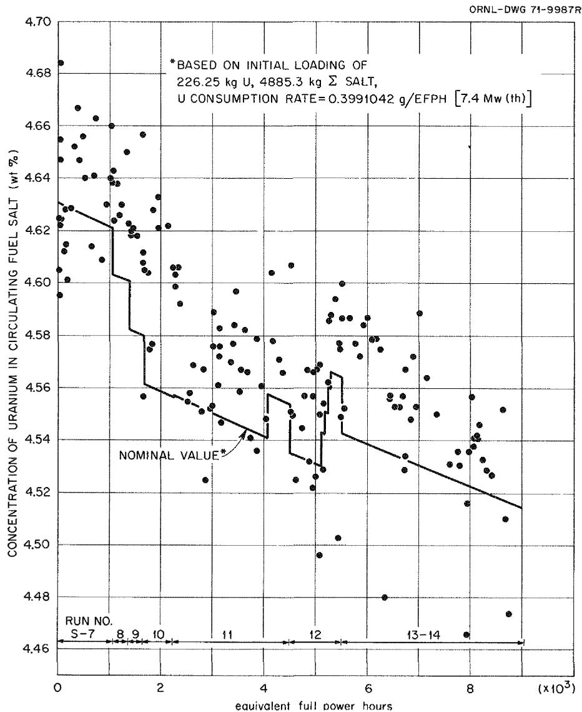  
Fig. 3.1. Comparison of analytical and computed values of uranium in the MSRE fuel salt ( $^{235}\mathrm{U}$ and $^{238}\mathrm{U}$ fuel charge).

would fix the alternatives to be explored for the development of larger molten-salt reactors. When it was noted early in MSRE power operations that the sensitivity of on-site determination of uranium concentration coefficient in the reactivity balance was some tenfold greater than the statistical variation in chemical analysis, further consideration of the applicability of laboratory analysis of individual samples for operational control was abandoned.

Other sections of this report discuss uranium burnup rates (Chap. 7), fissile inventory (Sect. 2.4.2), and material balances (Sects. 3.6 and 3.7), the results of which led to the final estimates of the concentrations of uranium in the fuel salt as listed in Table 3.1. After final adjustments in the estimated amounts of salts contained in the reactor system and of the power

production rates, comparisons of the analytical data for uranium concentration were made with the nominal values for $^{235}\mathrm{U}$ and $^{233}\mathrm{U}$ fuel, respectively, in Figs. 3.1 and 3.2. It is evident in Fig. 3.1 that the analytical data contain a small positive bias in reference to nominal values. The bias is of little consequence, for with the average uranium inventory a difference in the estimated carrier salt mass of $1\mathrm{kg}$ changes the nominal concentration of uranium by $0.01\mathrm{wt}\%$ .

# 3.5 Structural Metal Impurities

In the development of molten-salt reactor technology, continually recurring needs for accurate values of the properties of moving fluids become apparent. Consequences of ever increasing amounts of structural metal

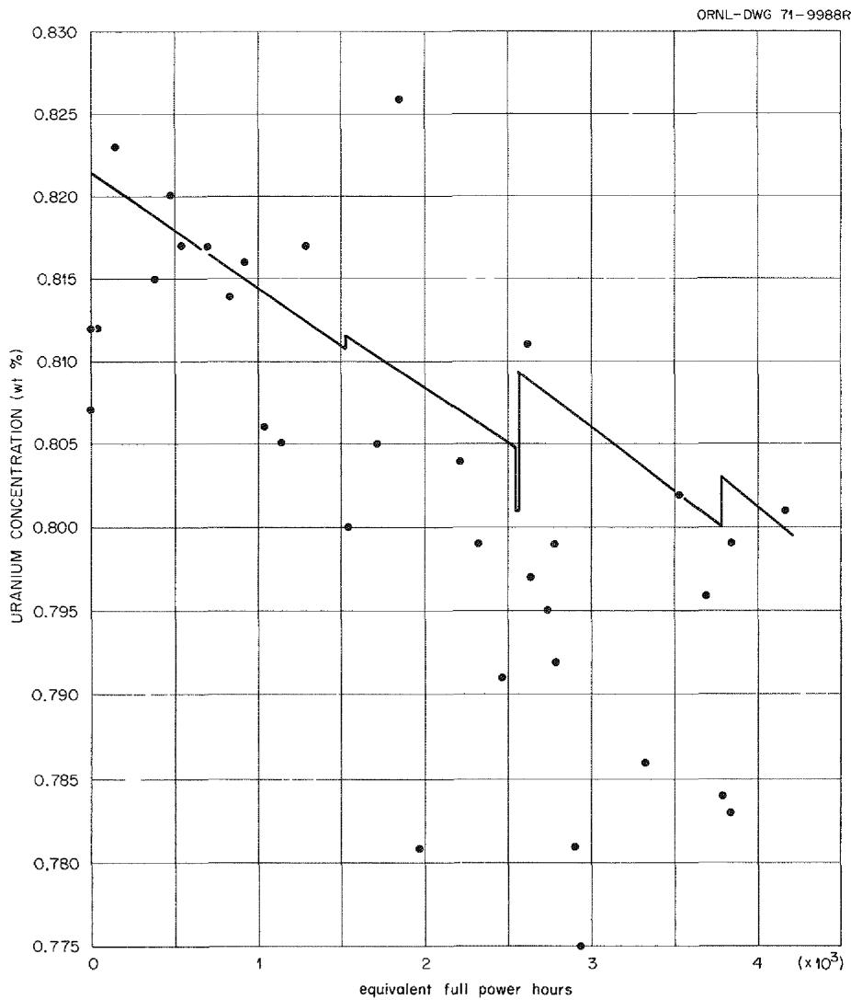  
Fig. 3.2. Concentration of uranium $(^{233}\mathrm{U})$ in the MSRE fuel circuit.

impurities that might be generated in the MSRE and that might alter the properties of the flowing salt streams into which they were released were envisioned at the outset of operations. With the possibility that impurities would exist both as ionic and metallic species, it was desirable to examine the interrelationships of their development with respect to corrosion of the container circuits, fission product transport, cavitation effects, changes in the flow characteristics, and their impact on MSBR reprocessing capability. Since all but the initial aspect of this behavior comprises an ongoing effort, the scope of the present report includes consideration of structural metal impurities in the MSRE only with respect to the implication of changes in their concentration as related to corrosion. Specific discussion of the chemical significance of the amounts of impurities and changes in the concentrations is deferred for consideration under Sects. 5 and 6, in which corrosion in the fuel and coolant circuits is discussed, and for subsequent reports where the relationships of physical and chemical properties of the MSRE to metallurgical behavior and to fission product behavior are assessed.

Midway through the experiment, phenomena were observed that led to the speculation that changes in the surface-related properties of the impurities were of possible significance to the changes observed. It was not experimentally feasible at that time to utilize the reactor as the experimental tool for studies of the interfacial behavior in salt-metal systems. By the time that laboratory studies had advanced to the stage where a program of studies with the reactor could be formulated, the schedule for operation of the reactor called for its termination.

The combined experience from laboratory investigations and from an extensive engineering test program in which various fluoride mixtures were circulated in thermal convection and forced circulation loops led to the expectation that the concentration of structural metals in the MSRE salts would increase only slightly throughout the planned period of reactor operation. As anticipated, only modest increases occurred.

The MSRE fuel was produced, as described in Sect. 2.4, from carrier salt and fuel concentrate, for which the chemical analyses indicated average concentrations of impurities were quite low. Chemical analyses were performed with samples of fuel salt removed regularly from the fuel pump bowl, and occasionally from the fuel drain tank. The average concentrations of the structural metal impurities found in these samples are listed in Table 3.2. Individual analyses are listed in Table 3.1.

Table 3.3. Average concentration of structural metal impurities in the MSRE fuel salt   

<table><tr><td rowspan="2">Sample group</td><td rowspan="2">Number of samples</td><td colspan="3">Impurity concentration (ppm)</td></tr><tr><td>Cr</td><td>Fe</td><td>Ni</td></tr><tr><td colspan="5">Fuel concentrate</td></tr><tr><td>Run No.</td><td></td><td></td><td></td><td></td></tr><tr><td>2</td><td></td><td></td><td></td><td></td></tr><tr><td>3</td><td>34</td><td>37 ± 7</td><td>148 ± 59</td><td>55 ± 18</td></tr><tr><td>4</td><td>69</td><td>53 ± 8</td><td>122 ± 51</td><td>52 ± 27</td></tr><tr><td>5–7</td><td>14</td><td>50 ± 7</td><td>108 ± 44</td><td>54 ± 25</td></tr><tr><td>8</td><td>8</td><td>64 ± 7</td><td>122 ± 45</td><td>61 ± 36</td></tr><tr><td>9–10</td><td></td><td></td><td></td><td></td></tr><tr><td>11</td><td>38</td><td>64 ± 7</td><td>133 ± 47</td><td>54 ± 16</td></tr><tr><td>12</td><td>18</td><td>72 ± 9</td><td>160 ± 52</td><td>85 ± 73</td></tr><tr><td>13–14</td><td></td><td></td><td></td><td></td></tr><tr><td>Early stages</td><td>24</td><td>73 ± 6</td><td>125 ± 22</td><td>68 ± 15</td></tr><tr><td>Latter stages</td><td>20</td><td>82 ± 7</td><td>121 ± 24</td><td>62 ± 14</td></tr><tr><td>Total</td><td>44</td><td>77 ± 8</td><td>123 ± 23</td><td>65 ± 15</td></tr><tr><td>15</td><td></td><td></td><td></td><td></td></tr><tr><td>16–18</td><td>21</td><td>72 ± 9</td><td>135 ± 24</td><td>49 ± 12</td></tr><tr><td>19–20</td><td>13</td><td>93 ± 8</td><td>193 ± 41</td><td>41 ± 16</td></tr></table>

The methods employed by the analytical chemists for determination of structural metal impurities were described previously. Each of the methods employed is capable of approximately the same precision. Yet, as shown by the results in Table 3.3, the experimental precision obtained was much better for chromium than for either iron or nickel. Corrosion reactions in the MSRE were expected to produce only $\mathrm{CrF}_2$ as a dissolved species in the salts; iron, nickel, and molybdenum, if present, were expected to persist in the metallic species. The differences in observed standard deviations for the three elements suggest that behavior very similar to that anticipated did result. Inspection of the individual results in Table 3.1 shows that the relative concentrations of iron and nickel found among individual samples rarely were constant. This is a somewhat surprising result since the excellent mixing conditions which existed in the circulating salt should have been conducive for allowing these metals to produce equilibrium solid solution alloys. The possibility that the metal particles might have deposited from the salt also was expected but seemingly did not occur either during circulation or during storage. In retrospect, these observations are compatible with the early conclusion that the pure salt fluids do not wet metal surfaces and with the fact that the low viscosities of the fluoride mixtures enable thermal convection currents to maintain the fluids in well-mixed condition during storage. That thermal mixing occurs in these tanks was substantiated by the first composition analysis in PC-2. As

evidenced by the composition of a sample which was obtained from No 2 drain tank shortly after $^{7}\mathrm{LiF}$ $^{238}\mathrm{UF}_4$ was added to the carrier salt, virtually complete mixing of $^{7}\mathrm{LiF - UF_4}$ and carrier salt was achieved before intertank transfers were made to ensure homogenization. Comparably efficient mixing is also probably adequate to prevent settling of the very fine (below the limit of microscopic detection) metallic particles of iron and nickel in the drain tanks

A quality control program was initiated by the Analytical Chemistry Division as chemical surveillance of the reactor salt began. The results of this survey showed that comparable accuracy and precision were achieved in the analysis of structural metal impurities in the salt samples10 From the beginning, molybdenum was not detected in the samples. Its absence then and later was interpreted to signify that such corrosion as occurred in the reactor was essentially diffusion limited

# 3.6 Chemical Effects of Reprocessing

The MSRE included a fuel processing plant for removal of oxides, if necessary, from the fuel, flush, and coolant salts. The plant was also intended for use in recovering uranium from the fuel and flush salts after termination of experiments with the MSRE A detailed description of the methods, operating procedures, and components is given in the MSRE Design and Operations Report 11. It proved to be unnecessary to repurify any of the salt charges in MSRE maintenance operations, although flush salt was repurified after its initial use and prior to nuclear operations in order to remove from the salt the oxides that it had accumulated during its initial use in the fuel system. As planned, the $^{235,238}\mathrm{U}$ fuel salt was fluorinated in the chemical reprocessing plant after completion of experiments with $^{235}\mathrm{U}$ fuel salt. Decision to utilize $^{233}\mathrm{U}$ as fuel entailed not only fluorination of the $^{235}\mathrm{U}$ salt but subsequent reduction of the structural metal impurities that enter the salt as it is fluorinated. Decision to reuse the carrier to constitute $^{233}\mathrm{U}$ fuel made it exigent to remove metal particulates from the salt carrier before returning it to the fuel system. Procedures for reduction of the fluorides were evaluated and tested, and an optimum filter medium was selected 12. A sintered metal filter was then designed 13 and incorporated in the return line from the processing plant

Flush salt was reprocessed first to remove the uranium it had accumulated in use (see Sect 4.2). Following fluorination, the fuel was treated, as was the flush salt, to reduce the structural metal fluorides present in their metallic forms

The amounts of uranium which were recovered from the fuel and flush salts were estimated from the increases in weights of the NaF absorbers in which $\mathrm{UF}_6$ was collected. The actual weights of $\mathrm{UF}_6$ were not measurable because fluorination of the salts in Hastelloy N processing vessels converted small amounts of molybdenum to its volatile fluorides, which were absorbed along with $\mathrm{UF}_6$ on the sodium fluoride beds. The approximate amounts of molybdenum absorbed on these beds were estimated from the proportionate amounts of iron, chromium, and nickel that were dissolved into the flush and carrier salts after fluorination. Estimates of the weights of uranium recovered were then obtained by subtraction of the probable amounts of molybdenum absorbed from the total weights gained by the absorbers. In a summary of experience with the processing plant, Lindauer has estimated that the amounts of uranium recovered from the flush and fuel salts at this time were $\sim 65$ and $21785\mathrm{kg}$ respectively [14] The sodium fluoride absorbers were subsequently delivered to the Goodyear Atomic Plant in Portsmouth, Ohio, where wet chemical procedures were used to recover the uranium charge from the NaF absorbers. The results of these efforts and their significance are discussed in Sect 3 7

The reprocessing procedures were notably successful in decontaminating the uranium charge from fission products. The only activity collected in any measurable amount on the absorbers with $\mathrm{UF}_6$ was $^{95}\mathrm{Nb}$ None of the filled absorber vessels exceeded maximum permissible radiation levels, each vessel could be removed from the processing plant without protective shielding

At termination of operations of the MSRE with $^{235}\mathrm{U}$ fuel, the concentration of structural metal contaminants in the flush and fuel salts was scarcely greater than when they were first used Fluorination of the salts in the processing plant increased the concentrations of chromium, iron, and nickel contaminants temporarily. On completion of reprocessing procedures, their concentrations were reduced once again to satisfactorily low values. Changes in these concentrations as a result of processing the salts are listed in Table 3 4

For operation of the reactor with $^{233}\mathrm{U}$ fuel, a charge of only about $40\mathrm{kg}$ of uranium was required as compared with the some $220\mathrm{kg}$ of uranium that was used during $^{235}\mathrm{U}$ operations. In order to provide a sufficient volume of the fluid fuel mixture, the reactor was loaded with a supplementary charge of fuel carrier salt amounting to $1299\mathrm{kg}$

Methods for removal of the lanthanide element fission products from the fuel streams of molten-salt reactors using reductive extraction techniques were not fully

Table 3.4. Structural metal fluoride concentrations ${}^{a}$   

<table><tr><td></td><td colspan="3">Concentration (ppm)</td></tr><tr><td></td><td>Cr ± 10</td><td>Fe ± 40</td><td>Ni ± 15</td></tr><tr><td>Flush saltb</td><td></td><td></td><td></td></tr><tr><td>In reactor system</td><td>76</td><td>150</td><td>52</td></tr><tr><td>Before fluorination</td><td>104</td><td></td><td></td></tr><tr><td>After fluorination</td><td>133</td><td>210</td><td>516</td></tr><tr><td>After 10.8 hr of H2 sparging</td><td></td><td>No sample taken</td><td></td></tr><tr><td>After 604 g of Zr and 9 hr of H2 sparging</td><td>100c</td><td>174c</td><td>50c</td></tr><tr><td>After 1074 g of Zr and 25 hr of H2 sparging</td><td></td><td>No sample taken</td><td></td></tr><tr><td>After filtration</td><td>76c</td><td>141c</td><td>26</td></tr><tr><td>Fuel saltb</td><td></td><td></td><td></td></tr><tr><td>In reactor system</td><td>85</td><td>130</td><td>60</td></tr><tr><td>Before fluorination</td><td>170</td><td>131</td><td>36</td></tr><tr><td>After fluorination</td><td>420</td><td>400</td><td>840</td></tr><tr><td>After 17.1 hr of H2 sparging</td><td>420c</td><td>430c</td><td>d</td></tr><tr><td>After 33.5 hr of H2 sparging</td><td>420c</td><td>400c</td><td>520c</td></tr><tr><td>After 51.1 hr of H2 sparging</td><td>460c</td><td>380c</td><td>180c</td></tr><tr><td>After 5000 g of Zr and 24 hr of H2 sparging</td><td>100c</td><td>110c</td><td>&lt;10c</td></tr><tr><td>After 5100 g of Zr and 32 hr of H2 sparging</td><td></td><td>No sample taken</td><td></td></tr><tr><td>After filtration</td><td>34</td><td>110</td><td>60</td></tr></table>

${}^{a}$ From R. B. Lindauer,Processing of the MSRE Flush and Fuel Salts, ORNL-TM-2578 (August 1969).   
${}^b\mathrm{H}_2$ sparging times are cumulative.   
$c_{\mathrm{Filtered}}$ sample.   
$d_{\mathrm{Contaminated}}$ sample.

developed until after the MSRE had operated for some time. Until then the most promising method for their separation was the high-temperature low-pressure distillation of fuel carriers after removal of uranium. Tests of this method with irradiated salt were scheduled to take place at the MSRE on completion of $^{235}\mathrm{U}$ operations after removal of uranium from the fuel salt. Approximately 48 liters of irradiated carrier salt was allocated for this experiment; when the charge was delivered, however, it was found that only a total of 12 liters was transferred. Partly because of this anomalous behavior and because of its importance in the evaluation of the reactor fuel inventory, a considerable effort was made to obtain an accurate measurement of the volume of salt remaining in the fuel storage tank.

At the beginning of $^{233}\mathrm{U}$ operations, samples of fuel salt were removed from the MSRE pump bowl and analyzed regularly by coulometric methods which had been applied previously and which were checked against standards on a routine basis. Their precision and accuracy is regarded to be $\sim \pm 0.5\%$ . The results of these analyses were, on the average, greater than the nominal values by 0.008 wt %, $\sim 1\%$ of the nominal value, and indicated (disregarding precision limits for purposes of this calculation) that the net weight of the carrier salt during this period was $4639\mathrm{kg}$ rather than $4708\mathrm{kg}$ , or

that an additional mass of $69.0\mathrm{kg}$ $(1.13\mathrm{ft}^3)$ of salt, that is, a total of $2.99\mathrm{ft}^3$ of the original carrier salt, was not returned to the reactor to constitute the $^{233}\mathrm{U}$ fuel charge. In an attempt to support the conclusion that some $3.0\mathrm{ft}^3$ of carrier salt was left in the fuel storage tank, an isotopic dilution experiment was performed in April 1969, in which two samples of $^{6}\mathrm{LiF}$ $(35\mathrm{g})$ were added to this tank. Retrieval of samples from the tank using a windlass and $10\mathrm{-g}$ sample ladles was subsequently successful in removing small amounts of salt (which incidentally were found to be encrusted with metal residues) only through repeated attempts. The total weight of $^{6}\mathrm{LiF}$ added was $66.28\mathrm{g}$ $(15.8\mathrm{g}$ of $^{6}\mathrm{Li})$ . Prior to $^{6}\mathrm{LiF}$ addition the carrier salt was found by analysis to have an average $^{7}\mathrm{Li}/\Sigma \mathrm{Li}$ concentration of $99.9905 \pm 0.0015\mathrm{wt}\%$ . The samples recovered after the addition had a concentration of $99.914 \pm 0.024\mathrm{wt}\%$ , which would indicate that the volume of the salt is $3.0 \pm 0.84\mathrm{ft}^3$ . However, samples of the carrier salt delivered to the still-pot section of the distillation apparatus were found to have concentrations of $^{6}\mathrm{Li}/\Sigma \mathrm{Li} = 1.59$ and $2.85\mathrm{wt}\%$ , indicating that the $^{6}\mathrm{LiF}$ was not dispersed homogeneously in the storage tank but instead had dissolved preferentially in the salt fraction delivered to the still pot. Homogeneous dispersal would have resulted in a higher average $^{6}\mathrm{Li}$ concentration in

Table 3.5. Chemical composition of the MSRE carrier salt as indicated by chemical analysis   

<table><tr><td rowspan="2">Specimen</td><td rowspan="2">Number of samples</td><td colspan="3">Chemical composition (mole %)</td></tr><tr><td>LiF</td><td>BeF2</td><td>ZrF4</td></tr><tr><td>Carrier salt, as produced</td><td>36</td><td>62 24 ± 0 90</td><td>32 48 ± 0 90</td><td>5 28 ± 0 16</td></tr><tr><td>Carrier salt, assuming transfer of 13 93 kg Zrd</td><td></td><td>62 33</td><td>32 58</td><td>5 15</td></tr><tr><td>Runs 4 14, all samples</td><td>176</td><td>64 61 ± 1 12</td><td>30 29 ± 1 0</td><td>5 10 ± 0 19</td></tr><tr><td>Run 14 (only)</td><td>44</td><td>64 61 ± 0 95</td><td>30 20 ± 0 95</td><td>5 19 ± 0 13</td></tr><tr><td>Runs 17 20, all samples</td><td>33</td><td>64 53 ± 1 46</td><td>30 43 + 1 46</td><td>4 90 ± 0 16</td></tr></table>

${}^{a}$ Assumption of the removal of ${1393}\mathrm{\;{kg}}$ of zirconium from this salt permits comparison after its dilution by six flush salt residues

the sample recovered from the fuel storage tank, and a lesser volume of salt would have been computed from the results of the isotopic dilution analysis experiment Thus, although its lower limit cannot be deduced unequivocally from the isotopic data, the volume of salt retained in the storage tank cannot have been as high as 384 ft³

The efforts to obtain samples from the storage tank provided additional information that allows a separate estimate of the salt volume. Sometimes small quantities of salt were obtained, sometimes none. If this is interpreted to mean that the salt level was at the point in the dashed head directly below the samplers, the pool contained $\sim 30\mathrm{ft}^3$ of salt. Assuming that the storage tank contained $30\mathrm{ft}^3$ of salt rather than $113\mathrm{ft}^3$ used before, we correct the earlier result $4707 - 1826(30\mathrm{ft}^3)\mathrm{kg} + 1130(113\mathrm{ft}^3)\mathrm{kg}$ and conclude that the drain tank contained $4638\mathrm{kg}$ of carrier salt at the beginning of $^{233}\mathrm{U}$ power operations. Thus the net weight of the fuel charge at the beginning of $^{233}\mathrm{U}$ power operations was $4638\mathrm{kg} + 383\mathrm{kg} = 4676\mathrm{kg}$ , and the uranium concentration was $0.819\mathrm{wt}\%$

Ample thermodynamic evidence existed to indicate that reprocessing procedures would not change the average composition of the fuel carrier salt. This expectation was confirmed by comparison of the average composition of the fuel salt before and after reprocessing and by determination that the uranium concentration in the $^{233}\mathrm{U}$ fuel mixture conformed to our expectations. A discussion of the uranium assay during this period may be found in Sect 7.3. The results of chemical analyses shown in Table 3.5 support the conclusion that the average composition of the fuel carrier salt remained essentially constant throughout the entire period of MSRE operations

# 3.7 Material Balances for $^{235}\mathrm{U}$ and $^{233}\mathrm{U}$ Operations

37.1 Recovery of $^{235}\mathbf{U}$ and $^{238}\mathbf{U}$ . A material balance of the fuel and flush salts was maintained on a

continuous basis from the beginning of experimental operations with the MSRE With refinements in physical property data for the salts, in neutron absorption cross-section data, and in analytical methods, the quality of the balance improved steadily. The accuracy afforded by these improvements was established finally by recovery operations at ORNL and at the Goodyear Atomic Corporation, Piketon, Ohio There, the uranium hexafluoride removed from the $^{235}\mathrm{U}$ fuel and flush salts by chemical processing at ORNL was recovered by wet chemical methods. The amounts of uranium recovered using these methods were $6420 \pm 0006\mathrm{kg}$ from absorbers 6, 7, and 8 (from the flush salt) and 214 572 $\pm 0204\mathrm{kg}$ from the remaining 25 absorbers. The procedures employed in the recovery of uranium were described in detail in a report from the Goodyear Corporation as follows

The NaF material (25 absorbers) was processed using the continuous dissolver and resulted in 120 batches of solution, for a total of 46,049 liters containing 214,456 grams of uranium. These batches were measured and sampled, in duplicate, using the solution recovery accountability measuring columns. Batch samples were proportionally composited, in duplicate, representing from 10 to 20 batches of solution. All composite samples were analyzed for total uranium and weight percent U 235 by thermal mass spectrometer. In addition, the continuous dissolver operation generated 1,588 pounds of filter cake, containing 105 grams of uranium. This material was also sampled in duplicate and composited on a weight basis Vent losses resulting from steam effluent were calculated to be 11 grams of uranium

The limits of error used for the measurement of solution and filter cake resulting from processing the remaining sodium fluoride were $\pm 0.18$ and $\pm 10$ percent of the reported value per composite analyzed. The limit of error for the total uranium recovered was based on propagation of error applicable to each composite group measured. Also, included in the limit of error is a bias estimate for the volume measurements of $\pm 0.25$ liter per batch, equivalent to $\pm 126$ grams of uranium

These limits of error are based on previously determined precision and accuracy estimates Statistical evaluation of the analyses obtained was not performed at this time since the

variation between samples indicates the precision will be well within the estimated values. Analyses of standard samples for comparison to known uranium value were made during the processing period and showed excellent agreement.

The following precautions and special consideration were taken while processing the NaF material to minimize measurement uncertainty:

1. The continuous dissolver and solution recovery systems were dedicated to processing NaF material exclusively from mid-March through June, 1970, to minimize rinsing of equipment as well as possible crossover of other material in process.   
2. The accountability measuring columns were recalibrated on a weight basis and the recycle time required for representative sampling was determined by test data.   
3. The accountability measuring columns were rinsed twice, 30 liters per rinse, between each batch measured and sampled.   
4. All containers, plastic, and miscellaneous scrap generated during opening the 25 absorbers were decontaminated and the resulting solution processed through the dissolver.   
5. Vent losses, even though minimal, were calculated based on total steam flow to atmosphere and the uranium concentration determined by analyses of condensate samples throughout the processing period.   
6. System clean-out was initiated after processing the solution generated from the last three absorbers which were estimated at zero uranium content. This solution, 4,210 liters, contained an average of 0.033 grams of uranium per liter. Final rinse of the system averaged less than 0.002 grams U/liter.

A disparity between the ORNL material balance and the Goodyear results of $0.83\mathrm{kg}$ of $^{235}\mathrm{U}$ was evident. In an attempt to resolve this discrepancy we requested the Goodyear Corporation to retain the absorber vessels until investigation of the cause of the disparity was identified. In a telephone conversation between R. B. Lindauer and J. G. Crawford,[17] two pertinent details were disclosed: the few fines remaining in the absorber tanks were removed (by wiping the interior surfaces with moistened tissues) and added to the process solutions. Further, the interior surfaces of the absorbers were noted to be bright and shiny, a condition which seems to preclude the possibility that significant amounts of uranium were retained on these surfaces.

The overall results strongly suggest that rationalization of the disparity in the amount of uranium which we anticipated would be recovered by the Goodyear plant and that which was actually recovered would be possible only through a careful review of MSRE operations. In this connection, two possibilities were suggested, by J. R. Engel and R. B. Lindauer, respectively.[18]

Engel noted that the particle filter (a 9-ft filter designed to remove corrosion product solids from the

fluorinated salt before its reuse in the reactor) in the line between the fuel storage tank and the processing tanks could, after treatment of the flush salt was completed, have contained an unknown amount of zirconium metal, delivered to this location as the processed flush salt was returned to the reactor system. It is difficult to assign high probability to the events which could have reduced the uranium from the fuel charge as, subsequently, it passed through this filter, in such a way that some $2\mathrm{kg}$ of uranium remained in the filter; however, the possibility cannot be excluded and merits further examination.

Another possible site where uranium may have been retained, as has been suggested by R. B. Lindauer, is the high-temperature sodium fluoride absorber bed which is positioned between the fuel storage tank and the NaF absorbers. The design temperature for operation of this absorber is $750^{\circ}\mathrm{F}$ , based on previous laboratory studies.[19] The laboratory studies indicate that this absorber would not retain $\mathrm{UF}_6$ at the operating temperature; the possibility that temperature gradients prevailed within the absorber at periods near the end of fluorination operations which allowed the retention of some uranium within the absorber should now be examined.

The possibilities that such errors as might be ascribed to misestimates of power output of the reactor, reactivity anomalies, and implications of short-term trends in the results of chemical analyses, have been reexamined; we conclude that their possible contribution to the disparity described is negligible.

The possibility that the retention of uranium in either site might be established with certainty by application of newly developed neutron interrogation techniques using a californium source seemed favorable. Mockup experiments were devised and tested in the remote maintenance practice cell at the MSRE with a neutron source and an ORR fuel element. These tests showed, however, that the method could not be used without considerable modification, including procurement of a more intense source, and the effort was abandoned. Although confirmation of the results of the existing isotopic dilution analyses would be desirable by direct experiments such as were planned, the data which were used to monitor the transfers of uranium and plutonium within the reactor system appear to be sufficiently reliable to estimate the amounts of $^{235}\mathrm{U}$ and $^{238}\mathrm{U}$ retained in the reprocessing system and for computation of final inventory distribution.

3.7.2 Inventories for stored salts. Later in this report, methods for establishment of the power output of the MSRE are described (see Sect. 7). By application of the

Table 3.6. Inventory of residual uranium and plutonium in the MSRE ${}^{a}$   
A. Uranium   

<table><tr><td></td><td>233U</td><td>234U</td><td>235U</td><td>236U</td><td>238U</td><td>ΣU</td></tr><tr><td>Fuel circuit inventory, run 20-I, kg</td><td>28782</td><td>2545</td><td>0876</td><td>0036</td><td>2035</td><td>34274</td></tr><tr><td>Total inventory, run 20-I, kg</td><td>31052</td><td>2746</td><td>0945</td><td>0039</td><td>2196</td><td>36978</td></tr><tr><td>Drain-tank inventory, run 20-I, kg</td><td>2270</td><td>0201</td><td>0069</td><td>0003</td><td>0161</td><td>2704</td></tr><tr><td>Fuel-circuit inventory, run 20-F, kg</td><td>28739</td><td>2563</td><td>0876</td><td>0036</td><td>2035</td><td>34249</td></tr><tr><td>Transfer to flush salt, run 20-F, kg</td><td>0411</td><td>0037</td><td>0013</td><td>0001</td><td>0029</td><td>0491</td></tr><tr><td>Charged into drain tank, run 20-F, kg</td><td>28328</td><td>2526</td><td>0863</td><td>0035</td><td>2006</td><td>33758</td></tr><tr><td>Drain tank residue, kg</td><td>2270</td><td>0201</td><td>0069</td><td>0003</td><td>0161</td><td>2704</td></tr><tr><td>Final drain tank inventory, kg</td><td>30598</td><td>2727</td><td>0932</td><td>0038</td><td>2167</td><td>36462</td></tr><tr><td>U/ΣU, wt %</td><td>83918</td><td>7479</td><td>2556</td><td>0104</td><td>5943</td><td></td></tr></table>

B. Plutonum   

<table><tr><td></td><td>239Pu</td><td>240Pu</td><td>238,241,242Pu</td><td>ΣPu</td></tr><tr><td>Fuel circuit inventory, run 20-I, g</td><td>625 8</td><td>61 81</td><td>2 39</td><td>690 0</td></tr><tr><td>Total inventory, run 20-I, g</td><td>680 2</td><td>67 19</td><td>2 60</td><td>749 99</td></tr><tr><td>Drain tank inventory, run 20-I, g</td><td>54 4</td><td>5 38</td><td>0 21</td><td>59 99</td></tr><tr><td>Fuel-circuit inventory, run 20-F, g</td><td>615 6</td><td>65 43</td><td>2 37</td><td>683 4</td></tr><tr><td>Transfer to flush salt, run 20-F, b g</td><td>61 8</td><td>6 57</td><td>0 23</td><td>68 6</td></tr><tr><td>Charged into drain tank, run 20-F, g</td><td>553 8</td><td>58 86</td><td>2 14</td><td>614 8</td></tr><tr><td>Drain tank residue, g</td><td>54 4</td><td>5 38</td><td>0 21</td><td>59 99</td></tr><tr><td>Final drain tank inventory, g</td><td>608 2</td><td>64 24</td><td>2 35</td><td>674 79</td></tr><tr><td>Pu/ΣPu, wt %</td><td>90 13</td><td>9 52</td><td>0 35</td><td></td></tr></table>

${}^{a}$ Weights are based on comparisons of analytical results and computed values These comparisons indicate that maximum power output was ${7.4}\mathrm{{MW}}\left( \mathrm{t}\right)$ Final estimates assume 4167 EFPH (equivalent full-power hours) at ${7.4}\mathrm{{MW}}\left( \mathrm{t}\right)$   
bThis item makes the simplifying assumption that the total amount of plutonium estimated to be transferred to the flush salt was transferred during the final flush of the fuel circuit

isotopic analyses used for this determination, together with other analytical methods, it became possible to establish the power output of the reactor with good precision, and accordingly to compute final material balances for the fuel and flush salt systems. The results of these computations are listed in Table 3.6

In storage, the fuel salt is divided equally between the two drain tanks. Both fuel and flush salt were frozen in storage and are maintained between 232 and $343^{\circ}\mathrm{C}$ to minimize the evolution of fluorine from the frozen salts

An inventory of the uranium and plutonium contained in the drain tanks, based on data listed in Table 3.6, together with results of mass spectrometric analyses, is shown in Table 3.7. Using the values in this inventory the composition of the fuel salt was calculated. Nominal values are compared with analytical data in Table 3.8.

3.7.3 Salt loss from leakage. Experiments with the MSRE were terminated on December 12, 1969. The fuel and coolant salts were drained for storage in the

drain tanks. After the fuel was drained, and while the freeze valves were being frozen, an increase in the radioactivity in the reactor containment cell was observed, which indicated that a very small leak had occurred in the primary containment. After several hours the activity began to decrease after having driven the monitor on the recirculating cell atmosphere to a maximum of $35\mathrm{mR / hr}$ . The fuel loop and drain tanks were pressurized without causing an apparent effect on the activity. A sample of the cell atmosphere indicated that the activity was caused primarily from $^{13}3\mathrm{Xe}$ . Since leakage had apparently stopped, flush salt was charged into the fuel system and circulated for 17 hr. Before flush salt was drained from the circuit the system was pressurized to 20 psig for 2 hr without showing any signs of leakage. It was concluded after further investigation that the leak was in freeze valve FV-105 or in the immediate vicinity of this valve. To conclude operations with the fuel circuit, flush salt was transferred through the fill line to ensure that FV-105 and the adjacent line were filled with salt

Table 3.7. Material balance for the MSRE fuel and flush salts   

<table><tr><td rowspan="2"></td><td colspan="3">Inventory (kg)</td><td colspan="2">Uranium concentration (wt %)</td></tr><tr><td>Uranium</td><td>Fuel salt</td><td>Carrier salt</td><td>Calculated</td><td>Observed</td></tr><tr><td>Total uranium charged to the MSRE, 1964</td><td>229.020</td><td></td><td></td><td></td><td></td></tr><tr><td>Correction to 238U inventorya</td><td>-2.0</td><td></td><td></td><td></td><td></td></tr><tr><td>Fuel inventory at termination of run No. 3</td><td>227.02</td><td>4883.8</td><td>4656.8</td><td>4.648</td><td>4.648</td></tr><tr><td>Total uranium burned in 235U operations, 9057 EFPH at 7.4 MW(t)b</td><td>-3.615</td><td>-3.615</td><td>0</td><td></td><td></td></tr><tr><td>Uranium added as fuel replenishment</td><td>+2.461</td><td>+3.074</td><td>+0.613</td><td></td><td></td></tr><tr><td>Total uranium removed in samples</td><td>-0.256c</td><td>-5.583</td><td>-5.327</td><td></td><td></td></tr><tr><td>Uranium returned to circuit with 233U charge</td><td>-1.935</td><td>0</td><td>0</td><td></td><td></td></tr><tr><td>Transfer balance, fuel to flush salt</td><td>-6.420</td><td>-12.0</td><td>-12.0</td><td></td><td></td></tr><tr><td>Maximum amount of uranium recoverable</td><td>217.255</td><td>4865.68</td><td>4648.42</td><td></td><td></td></tr><tr><td>Maximum amount of uranium recovered (ORNL)d</td><td>217.99</td><td></td><td></td><td></td><td></td></tr><tr><td>Maximum amount of uranium recovered (Goodyear)e</td><td>214.776</td><td></td><td></td><td></td><td></td></tr><tr><td>ORNL inventory minus Goodyear recovery value</td><td>-2.479</td><td></td><td></td><td></td><td></td></tr><tr><td>Carrier salt retained in storage tank (3.0 ft3)</td><td></td><td></td><td>-182.6</td><td></td><td></td></tr><tr><td>Supplementary addition of carrier salt</td><td></td><td></td><td>+129.9</td><td></td><td></td></tr><tr><td>LiF-233UF4(including 1.935 kg 235,238U residue)</td><td>38.298</td><td>57.367</td><td>+21.00</td><td></td><td></td></tr><tr><td>Fuel salt charge at beginning of run No. 16</td><td>38.298</td><td>4654.80</td><td>4616.50</td><td>0.823</td><td>0.820</td></tr><tr><td>Total uranium burned in 233U operations</td><td>-1.316</td><td>-1.316</td><td>0</td><td></td><td></td></tr><tr><td>Uranium added as fuel replacement</td><td>+0.389</td><td>+0.630</td><td>+0.241</td><td></td><td></td></tr><tr><td>Transfer balance, fuel to flush salt</td><td>-0.289</td><td>-0.289</td><td>0</td><td></td><td></td></tr><tr><td>Total uranium removed in samples</td><td>-0.025</td><td>-3.167</td><td>-3.142</td><td></td><td></td></tr><tr><td>Fuel inventory at termination of MSRE operations</td><td>37.057</td><td>4650.5</td><td>4613.6</td><td>0.797</td><td>0.792f</td></tr></table>

$a_{\mathrm{Se}}$ sect. 2.4.2.   
$b$ Burnup rate: -0.3991042 g/EFPH. See B. E. Prince, MSR Program Semiannu. Progr. Rep. Aug. 31, 1969, ORNL-4449, p. 25.   
cI. R. Engel, MSRE Book Uranium Inventories at Recovery of $^{235}$ U Fuel Charge, MSR-68-79 (May 15, 1968).   
$^{d}$ R. B. Lindauer, Chem. Technol. Div. Annu. Progr. Rep. May 31, 1969, ORNL-4422, p. 40.   
$e$ See sect. 3.7.1.   
Average of four samples obtained during run 20.

Table 3.8. Composition of fuel salt stored in the MSRE drain tanks   

<table><tr><td></td><td>7LiF</td><td>BeF2</td><td>ZrF4</td><td>233.42UF4</td><td>239.11PuF3</td></tr><tr><td colspan="6">Mole Percent</td></tr><tr><td>Nominal</td><td>64.50</td><td>30.18</td><td>5.19a</td><td>0.134</td><td>2.38 × 10-3</td></tr><tr><td>Analyticalb</td><td>64.53</td><td>30.43</td><td>4.90</td><td>0.137</td><td></td></tr><tr><td colspan="6">Weight Percent</td></tr><tr><td>Nominal</td><td>41.87</td><td>35.44</td><td>21.67</td><td>1.033</td><td>0.0177</td></tr><tr><td>Analyticalb</td><td>41.37</td><td>35.27</td><td>20.19</td><td>1.06</td><td></td></tr></table>

${}^{a}$ Current calculations do not include corrections for transfer of carrier solvent residues to flush salt or flush salt residues to fuel. Disparity between nominal and analytical values for zirconium will be reduced by introduction of this correction factor.

$b_{\mathrm{Run}}$ 17-20, average of 33 samples.

# References

1. E.S. Bettis et al., Nucl. Sci. Eng. 2, 841 (1957).   
2. J. A. Lane, H. G. MacPherson, and Frank Maslan (eds.), Fluid Fuel Reactors, p. 590, Addison-Wesley, Reading, Mass., 1958.   
3. F. F. Blankenship, E. G. Bohlmann, S. S. Kirslis, and E. L. Compere, Fission Product Behavior in the MSRE, ORNL-4684 (in preparation).   
4. A. L. Mathews and C. F. Baes, Jr., Oxide Chemistry and Thermodynamics of Molten Lithium Fluoride-Beryllium Fluoride by Equilibration with Gaseous Water-Hydrogen Fluoride Mixtures, thesis, ORNL-TM-1129 (May 7, 1965).   
5. G. Goldberg, A. S. Meyer, Jr., and J. C. White, Anal. Chem. 32, 314 (1960).   
6. MSR Program Semiannu. Progr. Rep. Aug. 31, 1965, ORNL-3872, p. 140.

7. MSR Program Semiannu. Progr. Rep. Feb. 28, 1965, ORNL-3812, p. 160.   
8. C. E. Bamberger and C. F. Baes, Jr., MSR Program Semiannu. Progr. Rep. Aug. 31, 1970, ORNL-4622, p. 91.   
9. MSR Program Semiannu. Progr. Rep. Feb. 28, 1966, ORNL-3936, p. 168; ibid., Aug. 31, 1966, ORNL-4037, p. 200; ibid., Feb. 28, 1967, ORNL-4119, p. 165.   
10. M. T. Kelley, Statistical Quality Control Report, January-March 1969, ORNL-CF-69-4-30; April-June 1969, ORNL-CF-69-7-65; July-September 1969, ORNL-CF-69-10-36; October-December 1969, ORNL-CF-70-1-37.   
11. R. B. Lindauer, MSRE Design and Operations Report, Part VII, ORNL-TM-907 (May 1965).   
12. R. B. Lindauer and C. K. McGlothlan, Design, Construction, and Testing of a Large Molten-Salt Filter, ORNL-TM-2478 (March 1969).   
13. J. H. Shaffer and L. E. McNeese, Removal of Ni, Fe, and Cr Fluorides from Simulated MSRE Fuel Carrier Salt, ORNL-CF-68-4-41 (April 1968).   
14. R. B. Lindauer, Processing of the MSRE Flush and Fuel Salts, ORNL-TM-2578 (August 1969).   
15. Analyses performed by J. R. Sites, Analytical Chemistry Division.   
16. Correspondence from W. B. Thompson, Supervisor of Process Engineering, Goodyear Atomic Corporation, Piketon, Ohio, to the Oak Ridge National Laboratory, September 2, 1970.   
17. Goodyear Atomic Corporation, Piketon, Ohio.   
18. Personal communication.   
19. G. I. Cathers, M. R. Bennett, and C. J. Shipman, MSR Program Semiannu. Progr. Rep. Aug. 31, 1968, ORNL-4344, p. 321.

# 4. CHEMICAL COMPOSITION OF THE FLUSH SALT DURING NUCLEAR OPERATIONS

# 4.1 Role of Flush Salt Analysis in the Determination of Salt Residue Masses

The potential utility of a flush salt to scour contaminants from the MSRE fuel circuit was recognized early in the MSRE development program; the sagacity of the choice to use this salt was confirmed immediately after preliminary experiments with the reactor - experiments in which the flush salt was repurified after its first period of circulation through the fuel system. The repurification procedures employed at that time showed that in its first use the salt had served to remove

a considerable amount of contaminants from the fuel and moderator graphite system. Not foreseen, however, was the fact that it would function later to have a significant influence on evaluations of reactor performance. This arose from the fact that the quantities of residues of fuel and flush salt, intermittently cross-transferred before and after reactor maintenance, could not be adduced from on-site inferences. Soon after experiments began with the circulating fuel salt, it became evident that only the results of highly accurate chemical analysis of the flush salt would make it possible to establish reliable values for the amounts of fuel and flush salt residues left in the reactor fuel system after it was drained. Accuracy in these values was also necessary in order to compute changes in nominal values of the concentration of fissionable material in the fuel circuit as the reactor experiment proceeded.

Results of chemical analyses indicated that after the fuel salt was drained, circulation of the flush salt removed an average of $20\mathrm{kg}$ of fuel salt from the drained circuit. Refinements in the values for the physical properties of the fuel and flush salts allowed an estimation from the relative density of the flush and fuel salts that the average mass of flush salt residues would be $\sim 17.5\mathrm{kg}$ . With these values, nominal values for the composition of the fuel salt were calculated for the period when experiments were conducted with $^{235}\mathrm{U}$ fuel.

The total mass of flush salt originally charged into the MSRE was about $4190\mathrm{kg}$ . From averages of the increments in the changes in concentration of uranium which developed in the flush salt in use, it was expected that after its final use with $^{235}\mathrm{U}$ fuel the flush salt would contain uranium at a concentration of 1500 ppm, representing a total pickup of $6.29\mathrm{kg}$ of uranium. Analysis of the flush salt after its final use to remove $^{235}\mathrm{U}$ fuel residue from the fuel circuit showed that the concentration of uranium was 1488 ppm and, therefore, that the amount of uranium which was recoverable from the salt was $6.23\mathrm{kg}$ ; the actual amount of uranium recovered was $6.420\mathrm{kg}$ . With the final amount of uranium in the flush salt established as $6.420\mathrm{kg}$ , the average increments were established as $0.917\mathrm{kg}$ , and the average mass of fuel residue as $20.0\mathrm{kg}$ .

Complete results of the chemical analyses performed with the flush-salt samples removed from the MSRE are listed in Table 4.1. The average concentrations of uranium in the samples removed from the system during $^{235}\mathrm{U}$ operations are shown in Fig. 4.1.

Flush salt was circulated in the MSRE fuel-salt circuitry 13 times as a part of the $^{235}\mathrm{U}$ operations and

Table 4.1. Summary of MSRE salt analyses, flush salt   

<table><tr><td rowspan="3">Date</td><td rowspan="3">Sample</td><td colspan="6">Weight %</td><td colspan="4">Parts per million</td></tr><tr><td rowspan="2">Li</td><td rowspan="2">Be</td><td rowspan="2">Zr</td><td colspan="2">Ua</td><td rowspan="2">F</td><td rowspan="2">Σ</td><td rowspan="2">Fe</td><td rowspan="2">Cr</td><td rowspan="2">Ni</td></tr><tr><td>Book</td><td>Analytical</td></tr><tr><td></td><td>PC-1</td><td>13.12</td><td>9.68</td><td></td><td></td><td></td><td>77.08</td><td>99.93</td><td>45</td><td>45</td><td>7</td></tr><tr><td></td><td>FP-3-36</td><td>13.70</td><td>9.71</td><td>0.021</td><td></td><td>0.0195</td><td>77.68</td><td>101.17</td><td>144</td><td>64</td><td>75</td></tr><tr><td>12/15/65</td><td>FP-4-1</td><td></td><td></td><td></td><td></td><td></td><td></td><td></td><td></td><td></td><td>35b</td></tr><tr><td>12/16/65</td><td>FP-4-2</td><td>13.65</td><td>9.83</td><td>&lt;0.0025</td><td></td><td>0.0210</td><td>80.52</td><td>104.04</td><td>110</td><td>&lt;10</td><td>33</td></tr><tr><td>12/16/65</td><td>FP-4-3.</td><td></td><td></td><td></td><td></td><td></td><td></td><td></td><td></td><td></td><td>46c</td></tr><tr><td>12/16/65</td><td>FP-4-4</td><td>13.55</td><td>9.35</td><td>&lt;0.0025</td><td></td><td>0.0207</td><td>79.34</td><td>102.30</td><td>212</td><td>62</td><td>30</td></tr><tr><td>12/17/65</td><td>FP-4-5</td><td></td><td></td><td></td><td></td><td></td><td></td><td></td><td></td><td></td><td>72c</td></tr><tr><td>12/17/65</td><td>FP-4-6</td><td>13.50</td><td>9.96</td><td>&lt;0.0025</td><td></td><td>0.0200</td><td>80.07</td><td>103.58</td><td>125</td><td>&lt;10</td><td>&lt;20</td></tr><tr><td>12/17/65</td><td>FP-4-7</td><td>13.65</td><td>9.46</td><td>&lt;0.0025</td><td></td><td>0.0241</td><td>77.85</td><td>101.03</td><td>180</td><td>54</td><td>&lt;20</td></tr><tr><td>12/17/65</td><td>FP-4-8</td><td></td><td></td><td></td><td></td><td></td><td></td><td></td><td></td><td></td><td>106c</td></tr><tr><td>12/17/65</td><td>FP-4-9</td><td>13.35</td><td>9.98</td><td>&lt;0.0025</td><td></td><td>0.0221</td><td>75.80</td><td>99.20</td><td>210</td><td>57</td><td>&lt;20</td></tr><tr><td>12/18/65</td><td>FP-4-10</td><td></td><td>9.49</td><td>&lt;0.0025</td><td></td><td>0.0230</td><td>75.05</td><td>98.26</td><td>128</td><td>60</td><td>&lt;20</td></tr><tr><td>9/28/66</td><td>FP-8-1</td><td>12.40</td><td>9.79</td><td>0.02</td><td></td><td>0.0409</td><td>80.70</td><td>102.99</td><td>262</td><td>75</td><td>31</td></tr><tr><td>9/29/66</td><td>FP-8-2</td><td>12.40</td><td>9.66</td><td>0.25</td><td></td><td>0.505</td><td>78.14</td><td>101.01</td><td>197</td><td>82</td><td>225</td></tr><tr><td>9/30/66</td><td>FP-8-3</td><td></td><td></td><td></td><td></td><td></td><td></td><td></td><td></td><td></td><td>22b</td></tr><tr><td>9/30/66</td><td>FP-8-4</td><td>12.43</td><td>9.02</td><td>0.22</td><td></td><td>0.458</td><td>75.75</td><td>98.93</td><td>382</td><td>53</td><td>74</td></tr><tr><td>11/2/66</td><td>FP-8-15</td><td></td><td>9.34</td><td>&lt;0.01</td><td></td><td>0.0578</td><td>78.74</td><td></td><td>128</td><td>65</td><td>&lt;15</td></tr><tr><td>11/3/66</td><td>FP-8-16</td><td>13.50</td><td>9.24</td><td>&lt;0.10</td><td></td><td>0.0715</td><td>78.01</td><td>100.94</td><td>125</td><td>61</td><td>&lt;15</td></tr><tr><td>11/4/66</td><td>FP-8-17</td><td>13.40</td><td>8.62</td><td>&lt;0.10</td><td></td><td>0.0556</td><td>73.63</td><td>95.81</td><td>76</td><td>52</td><td>&lt;15</td></tr><tr><td>11/24/66</td><td>FP-9-8</td><td>13.35</td><td>9.59</td><td>0.24</td><td></td><td>0.0840</td><td>72.15</td><td>95.43</td><td>175</td><td>53</td><td>26</td></tr><tr><td>12/11/66</td><td>FP-10-1</td><td>13.15</td><td>8.90</td><td>0.145</td><td></td><td>0.0828</td><td>72.67</td><td>94.98</td><td>169</td><td>71</td><td>53</td></tr><tr><td>12/11/66</td><td>FP-10-2</td><td>13.10</td><td>8.41</td><td>0.190</td><td></td><td>0.0747</td><td>73.03</td><td>94.84</td><td>194</td><td>75</td><td>42</td></tr><tr><td>5/10/67</td><td>FP-11-59</td><td>13.43</td><td>7.57</td><td>0.345</td><td></td><td>0.0292</td><td>76.10</td><td>97.50</td><td>222</td><td>68</td><td>40</td></tr><tr><td>5/10/67</td><td>FP-11-59</td><td></td><td></td><td></td><td></td><td>0.930d</td><td></td><td></td><td></td><td></td><td></td></tr><tr><td>5/10/67</td><td>FP-11-59</td><td></td><td></td><td></td><td></td><td>0.1080e</td><td></td><td></td><td></td><td></td><td></td></tr><tr><td>5/11/67</td><td>FP-11-60</td><td>13.40</td><td>9.36</td><td>0.260</td><td></td><td>0.0268</td><td>79.23</td><td>102.30</td><td>119</td><td>74</td><td>34</td></tr><tr><td>6/16/67</td><td>FP-12-1</td><td>13.40</td><td>8.64</td><td>&lt;0.2</td><td></td><td>0.0778</td><td>80.22</td><td>102.56</td><td>108</td><td>66</td><td>26</td></tr><tr><td>6/16/67</td><td>FP-12-2</td><td>13.70</td><td>9.50</td><td>&lt;0.2</td><td></td><td>0.0793</td><td>75.40</td><td>98.89</td><td>104</td><td>70</td><td>23</td></tr><tr><td>6/17/67</td><td>FP-12-3</td><td>13.60</td><td>9.38</td><td>&lt;0.2</td><td></td><td>0.0826e</td><td>77.40</td><td>100.68</td><td>93</td><td>68</td><td>24</td></tr><tr><td>6/17/67</td><td>FP-12-4</td><td colspan="10">50-g sample for oxide analysis</td></tr><tr><td>9/8/67</td><td>FP-13-1</td><td>12.70</td><td>8.42</td><td>&lt;0.2</td><td></td><td>0.1392</td><td>75.14</td><td>96.64</td><td>106</td><td>82</td><td>260</td></tr><tr><td>9/10/67</td><td>FP-13-2</td><td>12.80</td><td>8.84</td><td>0.72</td><td></td><td>0.1084</td><td>76.12</td><td>98.72</td><td>140</td><td>60</td><td>250</td></tr><tr><td>9/11/67</td><td>FP-13-3</td><td>12.80</td><td>10.04</td><td>0.70</td><td></td><td>0.1069</td><td>77.72</td><td>101.42</td><td>202</td><td>76</td><td>232</td></tr><tr><td>4/28/68</td><td>FP-14-72</td><td>12.53</td><td>9.66</td><td>0.42</td><td></td><td>0.1507</td><td>73.85</td><td>96.64</td><td>150</td><td>76</td><td>52</td></tr><tr><td>4/28/68</td><td>FP-14-72</td><td></td><td></td><td></td><td></td><td>0.1488e</td><td></td><td></td><td></td><td></td><td></td></tr><tr><td>8/2/68</td><td>FST-11</td><td></td><td></td><td></td><td></td><td>0.1172</td><td></td><td></td><td></td><td>104</td><td>(before F2)</td></tr><tr><td>8/4/68</td><td>FST-12</td><td></td><td></td><td></td><td></td><td>24 ppm</td><td></td><td></td><td>176</td><td>119</td><td>(after F2)</td></tr><tr><td>8/4/68</td><td>FST-13</td><td></td><td></td><td></td><td></td><td>7 ppm</td><td></td><td></td><td>232</td><td>112</td><td>516 (after F2)</td></tr><tr><td>8/5/68</td><td>FST-14</td><td></td><td></td><td></td><td></td><td>6 ppm</td><td></td><td></td><td>174</td><td>133</td><td>543 (after F2)</td></tr><tr><td>8/8/68</td><td>FST-15</td><td colspan="10">No sample obtained</td></tr><tr><td>8/8/68</td><td>FST-16</td><td></td><td></td><td></td><td>0.30</td><td></td><td></td><td></td><td>206</td><td>136</td><td>36</td></tr><tr><td>8/8/68</td><td>FST-17</td><td colspan="10">50-g FVS capsule after Zr addition</td></tr><tr><td>8/10/68</td><td>FST-18</td><td colspan="10">No sample obtained</td></tr><tr><td>8/14/68</td><td>FP-15-1</td><td>13.43</td><td>9.16</td><td>0.546</td><td></td><td>0.0036</td><td></td><td></td><td>152</td><td>76</td><td>26</td></tr><tr><td>8/15/68</td><td>FP-15-2</td><td colspan="10">50-6 sample for eta experiment - no sample retrieved</td></tr><tr><td>8/15/68</td><td>FP-15-3</td><td colspan="10">25-g sample for eta experiment</td></tr><tr><td>8/16/68</td><td>FP-15-4</td><td colspan="10">25-g sample for eta experiment</td></tr><tr><td>8/11/69</td><td>FV-19-1S</td><td></td><td></td><td></td><td></td><td></td><td></td><td></td><td></td><td></td><td></td></tr><tr><td>8/12/69</td><td>FP-19-2</td><td>12.43</td><td>9.64</td><td>0.51</td><td></td><td>0.0072</td><td>79.7</td><td>102.30</td><td>128</td><td>81</td><td>23</td></tr><tr><td>8/13/69</td><td>FP-19-3</td><td colspan="10">50-g sample for oxide determination</td></tr><tr><td>8/13/69</td><td>FP-19-4</td><td>12.50</td><td>9.53</td><td>0.41</td><td></td><td>0.0065</td><td>79.2</td><td>101.68</td><td>197</td><td>74</td><td>25</td></tr><tr><td>8/13/69</td><td>FP-19-5</td><td>11.55</td><td>7.55</td><td>0.49</td><td></td><td>0.0075</td><td>80.5</td><td>100.14</td><td>241</td><td>80</td><td>40</td></tr><tr><td>12/13/69</td><td>FP-20-33</td><td>11.55</td><td>8.19</td><td>0.430</td><td></td><td>0.0118</td><td>77.40</td><td>103.59</td><td>146</td><td>93</td><td>49</td></tr><tr><td>12/13/69</td><td>FP-20-34</td><td colspan="10">50-g sample of flush salt for oxide analysis</td></tr><tr><td>12/14/69</td><td>FP-20-35</td><td>11.50</td><td>8.45</td><td>0.540</td><td></td><td>0.0108</td><td>77.90</td><td>103.4</td><td>155</td><td>88</td><td>46</td></tr></table>

${}^{a}$ Values corrected to 33.696 at. $\% {}^{235}\mathrm{U}$ .   
${}^b\mathrm{KBrF}_4$ method employed unless otherwise noted.   
${}^c\mathrm{HF}$ purge method used.

$d_{\mathrm{Recheck}}$ by fluorometric method.

$e$ Delayed neutron activation analysis.

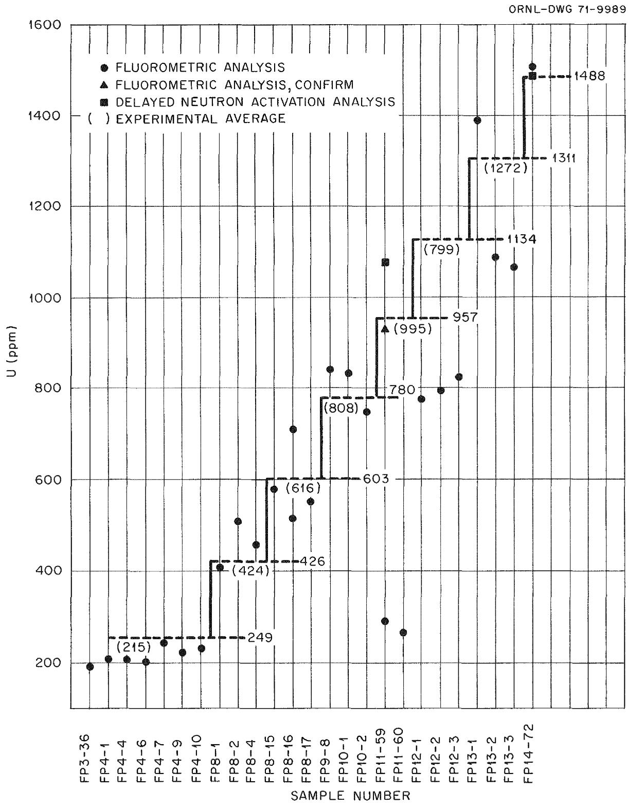  
Fig. 4.1. Uranium concentration in MSRE flush salt. Calculated average increment $= 177$ ppm (includes transfers of five fuel residues totaling $11.34$ kg from fill line).

three times as part of $^{233}\mathrm{U}$ operations, once on each occasion before the fuel was constituted in the reactor system, and thereafter whenever the fuel system was to be opened for maintenance. If during the maintenance period, the possibility developed that the fuel circuit was exposed to ambient cell atmosphere, the circuit was again washed with the molten flush salt before resumption of experiments with the fuel salt. In use, the flush salt was circulated for brief periods, usually 24 to $48\mathrm{hr}$ , because it was assumed that molten $\mathrm{LiF - BeF_2}$ flowing in the metal circuit at $650^{\circ}\mathrm{C}$ would be extremely effective as a solvent for contaminants that may have entered the system during the previous maintenance period. Gross exposures of the circuit to potentially contaminating atmospheres were avoided during the maintenance periods first by flushing the reactor system with argon, and subsequently by maintaining a nitrogen atmosphere in the standpipe column through which access to the reactor core was gained. Neither blanket gas was specially purified for this application.

It was judged that the flush salt was circulated for sufficient periods of time to be effective, because, in use, major increases were not observed in the concentration of contaminants in the salt nor were there major increases in the concentration of chromium in the fuel salt on initiation of the subsequent experiments with fuel salt. After each of these occasions, however, the chromium concentration of the fuel salt gradually rose to a higher value than had preceded the maintenance period. The significance of these changes is discussed in Sect. 6.

# 4.2 Transfer of Uranium and Plutonium to Flush Salt in $^{233}\mathrm{U}$ Operations

Reclamation of $6.420\mathrm{kg}$ of uranium from the flush salt indicates that the average increase in uranium concentration developed from the removal of a single fuel-salt heel during $^{235}\mathrm{U}$ operations was 219 ppm rather than the average 215 ppm we had observed from analyses performed during the course of reactor operations. With the $^{233}\mathrm{U}$ fuel salt, a reduction of the concentration increments was anticipated proportionate to the lower concentration of uranium in the fuel salt, and should have resulted in an average increase of $\sim 40$ ppm per flush operation. The average of the two results obtained with the flush salt after completion of run No. 20 shows that the final concentration of uranium in the salt was 113 ppm, or that for each of the three times flush salt was used to remove fuel salt residues, the average increase in the concentration was 38 ppm, in good agreement with the anticipated value.

Table 4.2. Results of mass spectrometric analysis of MSRE flush salt   
In weight percent   

<table><tr><td colspan="6">Uranium</td></tr><tr><td>Sample No.</td><td>233U</td><td>234U</td><td>235U</td><td>236U</td><td>238U</td></tr><tr><td>FP-20-33</td><td>40.55</td><td>3.73</td><td>17.67</td><td>0.25</td><td>37.80</td></tr><tr><td>FP-20-35</td><td>38.20</td><td>3.47</td><td>17.06</td><td>0.24</td><td>41.03</td></tr></table>

<table><tr><td colspan="5">Plutonium</td></tr><tr><td>Sample No.</td><td>233Pu</td><td>240Pu</td><td>241Pu</td><td>242Pu</td></tr><tr><td>FP-20-33</td><td>94.74</td><td>4.78</td><td>0.44</td><td>0.04</td></tr><tr><td>FP-20-35</td><td>94.63</td><td>4.87</td><td>0.45</td><td>0.05</td></tr></table>

After termination of experiments with $^{233}\mathrm{U}$ fuel the reactor was drained and flushed. Two samples of flush salt were obtained (FP-20-33 and -35) in which the average concentration of uranium was 113 ppm, an increase of 42 ppm over that found during the single previous use in which it removed a fuel-salt heel in $^{233}\mathrm{U}$ operations (the beginning of run No. 19). The single flush-salt sample obtained during the startup operation preceding the introduction of $^{233}\mathrm{U}$ fuel into the system was reported to have contained 36 ppm of uranium. The three groups of data are thus consistent -- an indication that the concentration of uranium increased as predicted. They also suggest that the flush salt contained 35 to 40 ppm of uranium when it was returned from the chemical reprocessing plant.

Isotopic analyses obtained from the last two samples of flush salt are shown in Table 4.2. The isotopic composition of the uranium contained in these samples indicates that (correcting for the contribution from the fuel of $0.023\mathrm{kg}$ and neglecting a correction for $^{238}\mathrm{U}$ burnout) the flush salt contained $\sim 50$ ppm $(0.21\mathrm{kg})$ of uranium. This is somewhat more than one would expect considering the excellent agreement between expected and observed amounts of uranium previously recovered from the flush salt, and from analyses obtained during the uranium recovery experiments with flush salt in which results indicated the residual concentration was no higher than $24~\mathrm{ppm}$ , and possibly as low as $4\mathrm{ppm}$ .

# 4.3 Flush Salt Loss to Off-Gas Holdup Tank

The results of the chemical and mass spectrometric analyses described above provide a basis for the conclusion that only very small amounts of either fuel or flush salt could have been lost from the primary containment or came in contact with the cell atmosphere through the leak that developed adjacent to the

freeze valves (see Sect. 3.6.3). If cell air were aspirated into the fuel salt as it drained from the reactor at termination of run No. 20, a probable consequence would have been that $\mathrm{ZrO_2}$ deposits may have formed in the region of the break, later to be dissolved in the flush salt. Possibly, some uranium would have been deposited as well, along with the $\mathrm{ZrO_2}$ . Small amounts of $\mathrm{ZrF_4}$ are transferred to the flush salt as a part of fuel residues, yet, as shown in Table 4.1, the concentration of zirconium in the flush salt after its final use does not seem to have increased. Second, sizable amounts of uranium deposited in the area of the break would both increase the anticipated concentration in the flush salt and alter the isotopic ratio in favor of an anomalous increase in $^{233}\mathrm{U}$ fraction. The isotopic analyses shown in Table 4.2 denote a slight anomaly in isotopic ratios of uranium, but of opposite character than suggested above; that is, they indicate that slightly more $^{235}\mathrm{U}$ and $^{238}\mathrm{U}$ were present than was expected from the prior reprocessing operations. In one previous incident, the possibility developed that flush salt was inadvertently $^2$ lost from the salt system.

In Piper's account of operations in July 1966, he notes that the fuel loop was filled with flush salt in preparation for maintenance work in the reactor cell. Flush salt was transferred into the overflow tank to flush out the residual fuel and to check the indicated level in the pump bowl at the overflow point, and transfer began when the indicated level was 9.6 in. (In January the indicated level at the overflow point had been 9.2 in.) After approximately $0.6\mathrm{ft}^3$ of salt was transferred, the fuel pump level suddenly rose off scale. Rising level in the overflow tank triggered a drain, but not before salt had entered some of the lines connected to the top of the pump bowl. This behavior resulted from an operational error which allowed the salt level in the flush tank to be lowered too far, and also allowed the pressurizing gas to enter the fill line and pass up into the reactor vessel. The gas expanded rapidly as it rose through the salt, causing salt to flood the pump bowl. The pump bowl reference line was plugged with frozen salt, and enough salt was frozen in the sampler tube to obstruct passage of the latch. A thermocouple indicated that some salt also entered the off-gas line, but this line was not plugged. Salt also froze on the annulus around the fuel-pump shaft, preventing its rotation. In subsequent maintenance operations electric heaters were applied to the outside of the lines to melt out the salt in the bubbler reference line and the sampler tube. The short flexible portion of the off-gas line was replaced because of uncertainty over the possible effects of salt in the convolutions.

We noted above that for the increments observed in the change of concentration in the flush salt the projected amount of uranium recoverable for the salt was $\sim 6.3\mathrm{kg}$ , and that a total of $6.42\mathrm{kg}$ was recovered. The projected value was calculated from the final analytical values, $1488\mathrm{ppm} \times [4187 + 7 \times 2.6\mathrm{kg}$ (the average mass increase from fuel-flush cross transfer)] = $6.257\mathrm{kg}$ . The fact that $6.42\mathrm{kg}$ of uranium was recovered suggests that if the analytical data are free of bias, only a small volume of flush salt could have transferred to the off-gas in the overflow accident. For example, if $50\mathrm{kg}$ of flush salt were lost by transfer the maximum amount of uranium which could be recovered from the flush salt at a concentration of $1488\mathrm{ppm}$ would not exceed $6.18\mathrm{kg}$ . Although it cannot be contended that the above results unequivocally demonstrate that the amount of flush salt transferred was negligible, they provide convincing evidence that the amount was indeed small.

In retrospect, the flush salt has served as the source of several kinds of valuable information pertaining to the performance of the MSRE. It now seems evident that it could have been used more effectively as a more valuable source if the periods of its use had been extended and designated for additional chemical investigations.

# References

1. R. B. Lindauer, Processing of the MSRE Flush and Fuel Salts, ORNL-TM-2578 (August 1969).   
2. H. B. Piper, MSR Program Semiannu. Progr. Rep. Aug. 31, 1966, ORNL-4037, p. 24.

# 5. CHEMICAL BEHAVIOR OF THE COOLANT SALT

Of some $7000\mathrm{kg}$ of $\mathrm{LiF - BeF_2}$ (66-34 mole $\%$ prepared for the MSRE, $2610\mathrm{kg}$ was designated for use as the coolant salt and the remainder as flush salt. This coolant was circulated by a 75-hp motor and pump through a circuit which included a tube and shell heat exchanger and an air-cooled radiator. Detailed descriptions of this coolant system are given in the MSRE Design and Operations Report. At termination of the Molten-Salt Reactor Experiment the salt had circulated in the system for a period of $\sim 26,000\mathrm{hr}$ . With the reactor at full power, coolant salt entered the tube bundle of the heat exchanger (Fig. 5.1) at a temperature of $546^{\circ}\mathrm{C}$ ( $1015^{\circ}\mathrm{F}$ ) and at 77 psig, removing heat from the fuel salt as it circulated through the shell side of the exchanger, and flowed on to the air-cooled

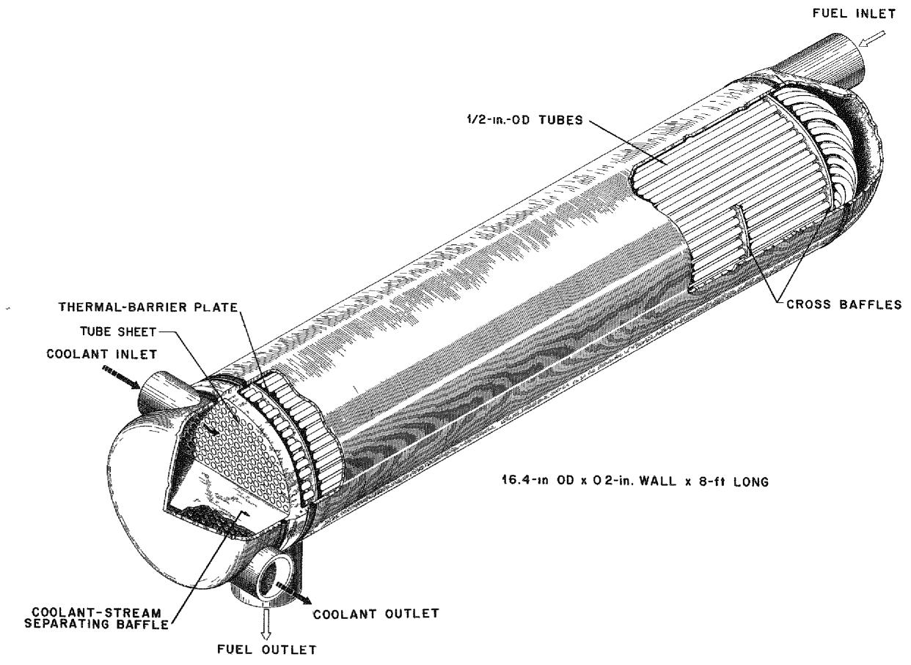  
Fig. 5.1. Primary heat exchanger.

radiator (Fig. 5.2). On reentry to the heat exchanger, the salt was at a temperature of $579^{\circ}\mathrm{C}$ $(1075^{\circ}\mathrm{F})$ . The coolant was circulated under these conditions for approximately half the period of its use. At zero or low power the salt was circulated isothermally, at about $650^{\circ}\mathrm{C}$ $(1200^{\circ}\mathrm{F})$ . The coolant pump operated at constant speed, developing a salt flow of $6286\mathrm{kg / min}$ (793 gpm).

# 5.1 Composition Analysis

The salt was circulated for some 1200 hr during the prenuclear test period. Since flush and coolant salts were supplied from the same inventory, the coolant salt was analyzed during this period only for impurities.

At the end of prenuclear testing, concentrations of the structural metal impurities, chromium, iron, and

nickel, were established to be approximately 30, 90, and 7 ppm respectively - remarkably low considering that the circuit had not been flushed previously with molten salt. The results of spectrochemical analyses showed that no significant amounts of additional impurities were introduced during this period. As the reactor was brought to full power early in 1966, coolant salt was again circulated, sampled regularly, and subjected to compositional and impurity analysis. The results of these analyses, together with all other analyses of the coolant salt, are listed in Table 5.1.

It was stipulated that the chemical analyses include a determination of zirconium concentration as part of the procedures for coolant-salt analysis. Although such analyses were not conceivably applicable as primary indicators of fuel leakage, their incorporation supplied base-line data for the contingency that possible analysis

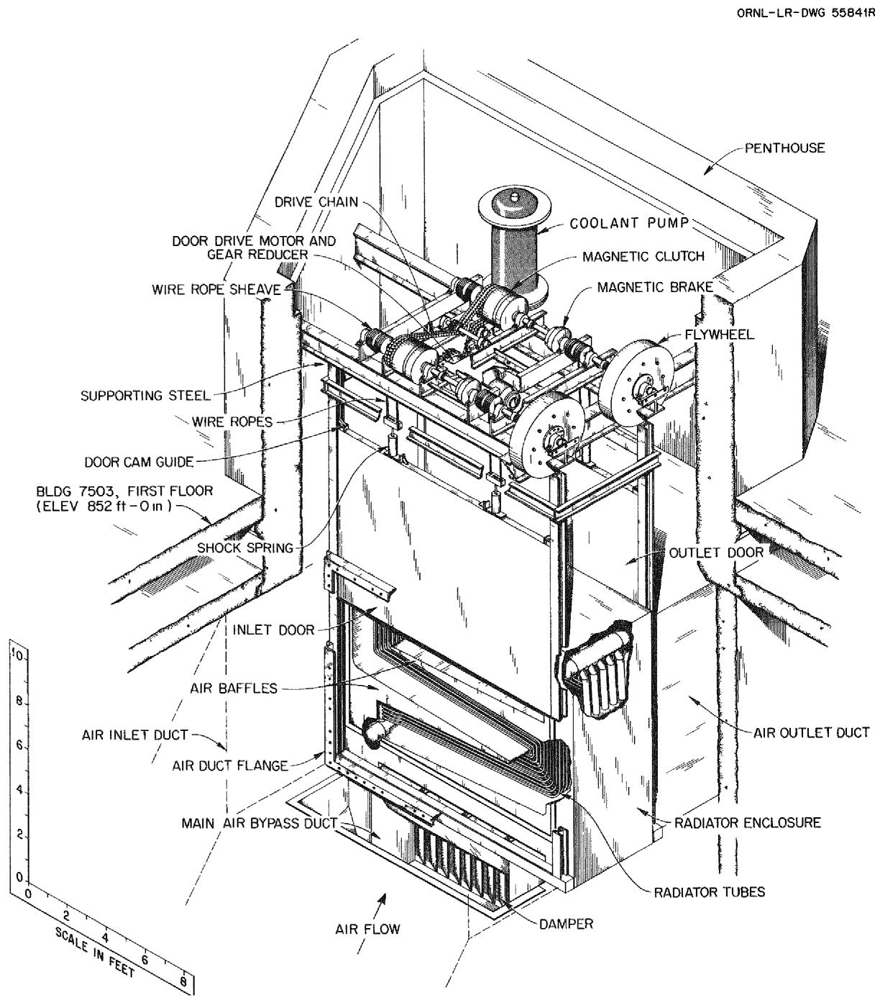  
Fig. 5.2. MSRE radiator coil and enclosure.

Table 5.1. Summary of analytical chemical data for the MSRE coolant circuit   

<table><tr><td rowspan="2">Date</td><td rowspan="2">Total Number Hr. in circuit</td><td rowspan="2">Sample Design</td><td>Li</td><td>Be</td><td>Zr</td><td>F</td><td>Cr</td><td>Fe</td><td>Ni</td><td>\( 0^a \)</td></tr><tr><td colspan="6">(wt %)</td><td colspan="2">(ppm)</td></tr><tr><td>1/9/65</td><td>0.3</td><td>CP1-1</td><td>-</td><td>-</td><td>-</td><td>-</td><td>20</td><td>117</td><td>8</td><td>420</td></tr><tr><td>1/10/65</td><td>24</td><td>CP1-2</td><td>-</td><td>-</td><td>-</td><td>-</td><td>25</td><td>181</td><td>&lt;5</td><td>433</td></tr><tr><td>1/11/65</td><td>44</td><td>CP1-3</td><td>-</td><td>-</td><td>-</td><td>-</td><td>26</td><td>184</td><td>&lt;5</td><td>472</td></tr><tr><td>1/13/65</td><td>94</td><td>CP1-4</td><td>-</td><td>-</td><td>-</td><td>-</td><td>27</td><td>96</td><td>12</td><td>580</td></tr><tr><td>1/15/65</td><td>143</td><td>CP1-5</td><td>-</td><td>-</td><td>-</td><td>-</td><td>27</td><td>83</td><td>&lt;12</td><td>325</td></tr><tr><td>1/17/65</td><td>186</td><td>CP1-6</td><td>-</td><td>-</td><td>-</td><td>-</td><td>27</td><td>93</td><td>&lt;12</td><td>525</td></tr><tr><td>1/20/65</td><td>267</td><td>Run 1-F</td><td></td><td></td><td></td><td></td><td></td><td></td><td></td><td></td></tr><tr><td>1/22/65</td><td>267</td><td>Run 2-F</td><td></td><td></td><td></td><td></td><td></td><td></td><td></td><td></td></tr><tr><td>1/22/65</td><td>277</td><td>CP2-1</td><td>-</td><td>-</td><td>-</td><td>-</td><td>30</td><td>63</td><td>5</td><td>388</td></tr><tr><td>1/27/65</td><td>393</td><td>CP2-2</td><td>-</td><td>-</td><td>-</td><td>-</td><td>29</td><td>101</td><td>7</td><td>270</td></tr><tr><td>2/1/65</td><td>514</td><td>CP2-3</td><td>-</td><td>-</td><td>-</td><td>-</td><td>28</td><td>65</td><td>25</td><td>263</td></tr><tr><td>2/11/65</td><td>757</td><td>CP2-4</td><td></td><td></td><td></td><td></td><td></td><td></td><td></td><td></td></tr><tr><td>2/18/65</td><td>913</td><td>CP2-5</td><td></td><td></td><td></td><td></td><td></td><td></td><td></td><td></td></tr><tr><td>2/24/65</td><td>1062</td><td>CP2-6</td><td></td><td></td><td></td><td></td><td></td><td></td><td></td><td></td></tr><tr><td>3/5/65</td><td>1249</td><td>CP2-7</td><td></td><td></td><td></td><td></td><td></td><td></td><td></td><td></td></tr><tr><td>3/5/65</td><td>1249</td><td>Run 2-F</td><td></td><td></td><td></td><td></td><td></td><td></td><td></td><td></td></tr><tr><td>6/26/65</td><td>1249</td><td>Run 3-1</td><td></td><td></td><td></td><td></td><td></td><td></td><td></td><td></td></tr><tr><td>6/26/65</td><td>1250</td><td>CP3-1</td><td></td><td></td><td></td><td></td><td></td><td></td><td></td><td></td></tr><tr><td>6/30/65</td><td>1342</td><td>CP3-2</td><td></td><td></td><td></td><td></td><td></td><td></td><td></td><td></td></tr><tr><td>6/30/65</td><td>1364</td><td>CP3-3</td><td>12.87</td><td>9.53</td><td>-</td><td></td><td>33</td><td>78</td><td>38</td><td>695</td></tr><tr><td>7/1/65</td><td>1370</td><td>Run 3-F</td><td></td><td></td><td></td><td></td><td></td><td></td><td></td><td></td></tr><tr><td>1/8/66</td><td>1370</td><td>Run 4-I</td><td></td><td></td><td></td><td></td><td></td><td></td><td></td><td></td></tr><tr><td>1/8/66</td><td>1371</td><td>CP4-1</td><td></td><td></td><td></td><td></td><td>36</td><td>65</td><td>&lt;5</td><td>-</td></tr><tr><td>1/18/66</td><td>1375</td><td>CP4-2</td><td></td><td></td><td></td><td></td><td>26</td><td>83</td><td>&lt;5</td><td>130</td></tr><tr><td>1/20/66</td><td>1423</td><td>CP4-3</td><td>13.78</td><td>8.91</td><td></td><td>76.50</td><td>40</td><td>40</td><td>40</td><td>190b</td></tr><tr><td>1/20/66</td><td>1431</td><td>CP4-4</td><td colspan="7">50 g sample for oxide analysis</td><td>25b</td></tr><tr><td>1/25/66</td><td>1544</td><td>CP4-5</td><td>14.20</td><td>8.87</td><td>&lt;0.002</td><td>76.80</td><td>50</td><td>50</td><td>20</td><td>180b</td></tr><tr><td>1/25/66</td><td>1558</td><td>CP4-6</td><td colspan="7">50 g sample for oxide analysis</td><td>38b</td></tr><tr><td>1/27/66</td><td>1593</td><td>Run 4-F</td><td></td><td></td><td></td><td></td><td></td><td></td><td></td><td></td></tr><tr><td>2/7/66</td><td>1593</td><td>Run 5-I</td><td></td><td></td><td></td><td></td><td></td><td></td><td></td><td></td></tr><tr><td>2/7/66</td><td>1600</td><td>CP5-1</td><td>13.86</td><td>8.85</td><td>0.0015</td><td>76.70</td><td>35</td><td>5</td><td>&lt;10</td><td>150</td></tr><tr><td>2/10/66</td><td>1664</td><td>CP5-2</td><td>13.82</td><td>8.55</td><td>0.0016</td><td>76.60</td><td>35</td><td>&lt;2</td><td>&lt;10</td><td>110</td></tr><tr><td>2/15/66</td><td>1784</td><td>CP5-3</td><td>12.76</td><td>10.51</td><td>0.0062</td><td>76.04</td><td>46</td><td>57</td><td>64</td><td>65</td></tr><tr><td>2/18/66</td><td>1865</td><td>CP5-4</td><td>12.60</td><td>9.17</td><td>0.0175</td><td>76.80</td><td>35</td><td>119</td><td>14</td><td>&lt;20</td></tr><tr><td>2/23/66</td><td>1977</td><td>CP5-5</td><td>12.60</td><td>9.15</td><td>0.0153</td><td>76.70</td><td>42</td><td>87</td><td>28</td><td>120</td></tr><tr><td>3/2/66</td><td>2170</td><td>CP5-6</td><td>13.01</td><td>10.06</td><td>0.0050</td><td>77.20</td><td>20</td><td>100</td><td>8</td><td>260</td></tr><tr><td>3/4/66</td><td>2219</td><td>CP5-7</td><td>13.17</td><td>9.49</td><td>0.0099</td><td>76.40</td><td>24</td><td>112</td><td>&lt;2</td><td>171</td></tr><tr><td>3/8/66</td><td>2331</td><td>CP5-8</td><td>12.70</td><td>10.22</td><td>0.0069</td><td>77.20</td><td>29</td><td>36</td><td>&lt;2</td><td>71</td></tr><tr><td>3/11/66</td><td>2406</td><td>CP5-9</td><td>12.77</td><td>9.43</td><td>0.0105</td><td>76.70</td><td>32</td><td>44</td><td>&lt;2</td><td>35</td></tr><tr><td>3/15/66</td><td>2482</td><td>CP5-10</td><td>12.97</td><td>9.59</td><td>0.0016</td><td>76.90</td><td>33</td><td>31</td><td>&lt;2</td><td>&lt;20</td></tr><tr><td>3/20/66</td><td>2560</td><td>CP5-11</td><td>12.92</td><td>9.61</td><td>0.0032</td><td>76.40</td><td>36</td><td>49</td><td>53</td><td>&lt;20</td></tr><tr><td>3/22/66</td><td>2648</td><td>CP5-12</td><td>12.75</td><td>9.74</td><td>0.0030</td><td>76.40</td><td>44</td><td>57</td><td>8</td><td>&lt;20</td></tr><tr><td>3/25/66</td><td>2722</td><td>CP5-13</td><td>13.10</td><td>9.98</td><td>0.0997</td><td>76.20</td><td>32</td><td>73</td><td>10</td><td>162</td></tr><tr><td>3/25/66</td><td>2730</td><td>Run 5-F</td><td></td><td></td><td></td><td></td><td></td><td></td><td></td><td></td></tr><tr><td>3/29/66</td><td>2730</td><td>Run 6-I</td><td></td><td></td><td></td><td></td><td></td><td></td><td></td><td></td></tr><tr><td>3/29/66</td><td>2825</td><td>CP6-1</td><td>13.09</td><td>9.73</td><td>0.0031</td><td>76.10</td><td>30</td><td>43</td><td>41</td><td>&lt;20</td></tr><tr><td>4/1/66</td><td>2907</td><td>CP6-2</td><td>12.68</td><td>9.56</td><td>0.0220</td><td>76.40</td><td>38</td><td>28</td><td>9</td><td>&lt;20</td></tr><tr><td>4/20/66</td><td>3321</td><td>CP6-3</td><td>12.82</td><td>9.13</td><td>-</td><td>76.80</td><td>45</td><td>76</td><td>47</td><td>210</td></tr><tr><td>4/24/66</td><td>3431</td><td>CP6-4</td><td>12.76</td><td>9.63</td><td>0.0055</td><td>76.00</td><td>57</td><td>68</td><td>15</td><td>210</td></tr><tr><td>5/16/66</td><td>3946</td><td>CP6-5</td><td>12.70</td><td>9.79</td><td>0.0095</td><td>74.80</td><td>20</td><td>57</td><td>6</td><td>135</td></tr><tr><td>6/8/66</td><td>4499</td><td>CP6-6</td><td>-</td><td>9.65</td><td>0.0050</td><td>74.80</td><td>28</td><td>37</td><td>6</td><td>&lt;40</td></tr><tr><td>6/8/66</td><td>4499</td><td>Run 6-F</td><td></td><td></td><td></td><td></td><td></td><td></td><td></td><td></td></tr><tr><td>6/28/66</td><td>4499</td><td>Run 7-I</td><td></td><td></td><td></td><td></td><td></td><td></td><td></td><td></td></tr><tr><td>6/28/66</td><td>4807</td><td>CP7-1</td><td>13.64</td><td>8.72</td><td>0.0032</td><td>74.65</td><td>32</td><td>60</td><td>&lt;2</td><td>&lt;20</td></tr><tr><td>6/29/66</td><td>4826</td><td>CP7-2</td><td>12.16</td><td>9.88</td><td>0.0070</td><td>74.50</td><td>31</td><td>51</td><td>&lt;2</td><td>300</td></tr><tr><td>7/5/66</td><td>4967</td><td>CP7-3</td><td>12.39</td><td>10.24</td><td>0.0096</td><td>74.80</td><td>51</td><td>80</td><td>&lt;2</td><td>145</td></tr><tr><td>7/12/66</td><td>5134</td><td>CP7-4</td><td>12.70</td><td>9.26</td><td>0.0008</td><td>75.90</td><td>46</td><td>24</td><td>28</td><td>85</td></tr><tr><td>7/22/66</td><td>5374</td><td>Run 7-F</td><td></td><td></td><td></td><td></td><td></td><td></td><td></td><td></td></tr><tr><td>10/2/66</td><td>5374</td><td>Run 8-I</td><td></td><td></td><td></td><td></td><td></td><td></td><td></td><td></td></tr><tr><td>10/2/66</td><td>5376</td><td>CP8-1</td><td>12.90</td><td>9.94</td><td>0.0008</td><td>74.55</td><td>17</td><td>23</td><td>&lt;5</td><td>53</td></tr><tr><td>10/25/66</td><td>5929</td><td>CP8-2</td><td>12.40</td><td>9.35</td><td>0.0013</td><td>75.70</td><td>24</td><td>39</td><td>&lt;2</td><td>&lt;25</td></tr><tr><td>10/25/66</td><td>5929</td><td>Run 8-F</td><td></td><td></td><td></td><td></td><td></td><td></td><td></td><td></td></tr><tr><td>11/8/66</td><td>6484</td><td>Run 9-I</td><td></td><td></td><td></td><td></td><td></td><td></td><td></td><td></td></tr><tr><td>11/8/66</td><td>6264</td><td>CP9-1</td><td>12.30</td><td>9.71</td><td>0.0012</td><td>77.40</td><td>4</td><td>30</td><td>29</td><td>73</td></tr><tr><td>11/22/66</td><td>6608</td><td>CP9-2</td><td>12.65</td><td>9.55</td><td>&lt;0.0005</td><td>74.23</td><td>33</td><td>25</td><td>&lt;29</td><td>75</td></tr><tr><td>11/22/66</td><td>6608</td><td>Run 9-F</td><td></td><td></td><td></td><td></td><td></td><td></td><td></td><td></td></tr><tr><td>12/7/66</td><td>6962</td><td>CP10-1</td><td>11.90</td><td>9.64</td><td>0.0033</td><td>74.80</td><td>30</td><td>36</td><td>&lt;5</td><td>75</td></tr><tr><td>1/5/67</td><td>7655</td><td>CP10-2</td><td>12.80</td><td>9.40</td><td>0.0032</td><td>74.50</td><td>20</td><td>65</td><td>34</td><td>475</td></tr><tr><td>1/5/67</td><td>7655</td><td>Run 10-F</td><td></td><td></td><td></td><td></td><td></td><td></td><td></td><td></td></tr><tr><td>2/2/67</td><td>7655</td><td>Run 11-I</td><td></td><td></td><td></td><td></td><td></td><td></td><td></td><td></td></tr><tr><td>2/2/67</td><td>8570</td><td>CP11-1</td><td>12.50</td><td>9.73</td><td>&lt;0.0020</td><td>77.00</td><td>18</td><td>78</td><td>&lt;10</td><td>330</td></tr><tr><td>2/16/67</td><td>8798</td><td>CP11-2</td><td>11.90</td><td>9.57</td><td>0.0017</td><td>76.50</td><td>23</td><td>35</td><td>&lt;10</td><td>530</td></tr><tr><td>3/7/67</td><td>9258</td><td>CP11-3</td><td>13.20</td><td>9.46</td><td>0.0090</td><td>76.00</td><td>13</td><td>105</td><td>15</td><td>380</td></tr><tr><td>3/27/67</td><td>9751</td><td>CP11-4</td><td></td><td></td><td></td><td></td><td></td><td></td><td></td><td></td></tr><tr><td>4/13/67</td><td>10145</td><td>CP11-5</td><td>12.90</td><td>9.70</td><td>&lt;0.002</td><td>76.00</td><td>32</td><td>24</td><td>&lt;10</td><td>-</td></tr><tr><td>5/11/67</td><td>10836</td><td>CP11-6</td><td>13.50</td><td>9.46</td><td>0.0060</td><td>76.10</td><td>35</td><td>35</td><td>14</td><td>314</td></tr><tr><td>5/11/67</td><td>10836</td><td>Run 11-F</td><td></td><td></td><td></td><td></td><td></td><td></td><td></td><td></td></tr><tr><td>6/16/67</td><td>10848</td><td>Run 12-I</td><td></td><td></td><td></td><td></td><td></td><td></td><td></td><td></td></tr><tr><td>6/16/67</td><td>11346</td><td>CP12-1</td><td>12.70</td><td>9.30</td><td>0.0074</td><td>77.40</td><td>39</td><td>168</td><td>10</td><td>-</td></tr><tr><td>7/6/67</td><td>11460</td><td>CP12-2</td><td>14.90</td><td>9.10</td><td>&lt;0.0026</td><td>75.10</td><td>26</td><td>33</td><td>&lt;20</td><td>88</td></tr><tr><td>7/11/67</td><td></td><td>CP12-3</td><td>12.73</td><td>9.40</td><td>&lt;0.0040</td><td>74.30</td><td>30</td><td>27</td><td>26</td><td>230</td></tr><tr><td>7/11/67</td><td></td><td>Run F-12</td><td></td><td></td><td></td><td></td><td></td><td></td><td></td><td></td></tr></table>

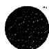

Table 5.1 (continued)   

<table><tr><td rowspan="2">Date</td><td rowspan="2">Total Number Hr. in circuit</td><td rowspan="2">Sample Design</td><td>Li</td><td>Be</td><td>Zr</td><td>F</td><td>Cr</td><td>Fe</td><td>Ni</td><td>\( 0^a \)</td></tr><tr><td colspan="4">(wt %)</td><td colspan="4">(ppm)</td></tr><tr><td>8/29/67</td><td></td><td>Run 13,14-I</td><td></td><td></td><td></td><td></td><td></td><td></td><td></td><td></td></tr><tr><td>9/8/67</td><td>12150</td><td>CP13-1</td><td>12.40</td><td>9.27</td><td>0.0045</td><td>73.80</td><td>&lt;15</td><td>62</td><td>&lt;20</td><td>264</td></tr><tr><td>9/29/67</td><td>12550</td><td>CP14-1</td><td>12.60</td><td>9.87</td><td>0.0098</td><td>72.80</td><td>24</td><td>&lt;10</td><td>&lt;20</td><td>158</td></tr><tr><td>10/25/67</td><td>13174</td><td>CP14-2</td><td>14.30</td><td>8.86</td><td>0.0011</td><td>76.32</td><td>24</td><td>25</td><td>37</td><td>210</td></tr><tr><td>11/27/67</td><td>13966</td><td>CP14-3</td><td>15.20</td><td>9.35</td><td>0.0100</td><td>75.50</td><td>24</td><td>61</td><td>&lt;10</td><td>348</td></tr><tr><td>1/18/68</td><td>15214</td><td>CP14-4</td><td>12.50</td><td>10.10</td><td>0.0019</td><td>76.10</td><td>25</td><td>21</td><td>&lt;20</td><td>197</td></tr><tr><td>3/20/68</td><td>16702</td><td>CP14-5</td><td>14.60</td><td>9.61</td><td>0.0078</td><td>77.20</td><td>&lt;15</td><td>38</td><td>&lt;25</td><td>104</td></tr><tr><td>3/28/68</td><td>16894</td><td>Run 14-F</td><td></td><td></td><td></td><td></td><td></td><td></td><td></td><td></td></tr><tr><td>9/ /68</td><td></td><td>Run 15-I</td><td></td><td></td><td></td><td></td><td></td><td></td><td></td><td></td></tr><tr><td>9/17/68</td><td>17714</td><td>CP15-1</td><td></td><td></td><td></td><td></td><td></td><td></td><td></td><td></td></tr><tr><td>11/27/68</td><td>19414</td><td>Run 15-F</td><td></td><td></td><td></td><td></td><td></td><td></td><td></td><td></td></tr><tr><td>12/ /68</td><td></td><td>Run 16-I</td><td></td><td></td><td></td><td></td><td></td><td></td><td></td><td></td></tr><tr><td>12/10/68</td><td>19524</td><td>CP16-1</td><td></td><td></td><td></td><td></td><td></td><td></td><td></td><td></td></tr><tr><td>12/ /68</td><td></td><td>Run 16-F</td><td></td><td></td><td></td><td></td><td></td><td></td><td></td><td></td></tr><tr><td>1/12/69</td><td></td><td>Run 17-I</td><td></td><td></td><td></td><td></td><td></td><td></td><td></td><td></td></tr><tr><td>2/4/69</td><td>20076</td><td>CP17-1</td><td>13.10</td><td>9.26</td><td>&lt;0.0020</td><td>76.60</td><td>26</td><td>21</td><td>7</td><td>372</td></tr><tr><td>3/6/69</td><td>20796</td><td>CP17-2</td><td>13.40</td><td>9.49</td><td>0.0021</td><td>77.00</td><td>25</td><td>15</td><td>&lt;10</td><td>2200</td></tr><tr><td></td><td></td><td>Run 17-F</td><td></td><td></td><td></td><td></td><td></td><td></td><td></td><td></td></tr><tr><td></td><td></td><td>Run 18-I</td><td></td><td></td><td></td><td></td><td></td><td></td><td></td><td></td></tr><tr><td>4/27/69</td><td>22044</td><td>CP18-1</td><td>13.00</td><td>9.52</td><td>0.0013</td><td>77.60</td><td>25</td><td>12</td><td>&lt;5</td><td>720</td></tr><tr><td>5/29/69</td><td>22812</td><td>CP18-2</td><td>13.70</td><td>9.22</td><td>0.0014</td><td>77.50</td><td>25</td><td>14</td><td>&lt;10</td><td>780</td></tr><tr><td></td><td>22860</td><td>Run 19-F</td><td></td><td></td><td></td><td></td><td></td><td></td><td></td><td></td></tr><tr><td></td><td>22860</td><td>Run 19-I</td><td></td><td></td><td></td><td></td><td></td><td></td><td></td><td></td></tr><tr><td>8/10/69</td><td>22870</td><td>CP19-1</td><td>13.40</td><td>9.44</td><td>&lt;0.0019</td><td>77.30</td><td>35</td><td>&lt;5</td><td>10</td><td>1850</td></tr><tr><td>9/14/69</td><td>22966</td><td>CP19-2c</td><td>13.40</td><td>9.25</td><td>0.112</td><td>77.60</td><td>35</td><td>143</td><td>6</td><td>-</td></tr><tr><td>9/14/69</td><td>22966</td><td>CP19-3c</td><td>13.85</td><td>9.13</td><td>0.103</td><td>78.30</td><td>35</td><td>128</td><td>6</td><td></td></tr><tr><td>11/2/69</td><td>23084</td><td>Run 19-F</td><td></td><td></td><td></td><td></td><td></td><td></td><td></td><td></td></tr><tr><td>11/26/69</td><td>23084</td><td>Run 20-I</td><td></td><td></td><td></td><td></td><td></td><td></td><td></td><td></td></tr><tr><td>11/26/69</td><td>23094</td><td>CP20-1</td><td>14.00</td><td>9.55</td><td>0.0019</td><td>77.20</td><td>46</td><td>32</td><td>11</td><td>3200</td></tr><tr><td>12/10/69</td><td>23430</td><td>CP20-2</td><td>13.70</td><td>9.31</td><td>0.0206</td><td>77.20</td><td>60</td><td>114</td><td>10</td><td>\( 1700^b \)</td></tr><tr><td>12/11/69</td><td>23454</td><td>CP20-3</td><td colspan="8">N1 bar, exposed to coolant for tritium experiments</td></tr><tr><td>12/11/69</td><td>23454</td><td>CP20-4</td><td colspan="8">N1 bar, exposed to coolant for tritium experiments</td></tr><tr><td>12/12/69</td><td>23479</td><td>CP20-5</td><td colspan="8">CuO specimens, exposed to coolant for tritium experiments.</td></tr><tr><td>12/16/69</td><td>23479</td><td>CP20-6</td><td colspan="8">CuO specimens, exposed to coolant for tritium experiments.</td></tr><tr><td>12/12/69</td><td></td><td>Run 20-F</td><td></td><td></td><td></td><td></td><td></td><td></td><td></td><td></td></tr></table>

a Unless otherwise noted, oxygen analyses were obtained by the KBrF4 method.   
Results obtained by HF-H2 transpiration method.   
Samples analyzed by HRAL personnel.

of fuel-coolant mixing accidents might arise. Results are omitted from Table 5.1, because in none of the analyses of the coolant salt was zirconium detected.

As noted in Sect. 3.3, procedures used for the determination of the concentrations of oxides in MSRE samples were unsatisfactory until development of the $\mathrm{HF - H_2}$ transpiration method was completed. Not until late in the program of reactor operations was this method applied to coolant-salt samples, and then, for the single sample available, it produced questionable results. The results of analyses for oxides listed in Table 5.1 were obtained with the $\mathrm{KBrF_4}$ method, a method which is generally satisfactory for nonhygroscopic materials, but which was applied to samples which are hygroscopic and had not remained isolated from ambient atmospheres after their removal from the reactor. In view of the established absence of corrosion in the coolant circuit, their credibility is dubious.

Analyses of coolant salts were conducted by the General Analysis Laboratory of the ORNL Analytical Chemistry Division, while those for the fuel were obtained from the High-Radiation-Level Analytical Laboratory of that Division.

# 5.2 Corrosion Behavior

Corrosion of Hastelloy N as a container for molten $\mathrm{LiF - BeF_2}$ mixtures may originate from a very limited number of sources: from impurities in the melt, from oxide films on the metal, and from mass transfer of metal constituents in the fluoride. Of these sources, only the latter, which is caused by the differential temperature coefficient for solubility of metals in salts, affords a mode of continuous attack in reactor systems that are protected from inleakage of contaminants.

Since the procedures adopted for MSRE operations assured that the circuit would be free from chronic sources of contaminants, it was anticipated that surveillance of the coolant salt would indicate imperceptibly low corrosion throughout the experiment.

In the early stages of MSRE operations, samples of the flush salt were removed from the circuit at a rate of one per week. However, as our experience developed, and it was confirmed that chronic sources of oxidizing impurities were absent, the frequency was decreased, finally to intervals of a month or longer. In contrast to the fuel system, the coolant salt system was not

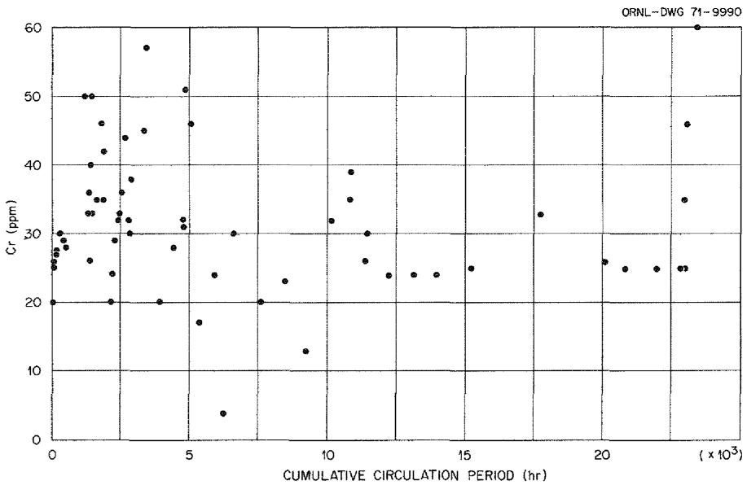  
Fig. 5.3. Concentration of chromium in the MSRE coolant circuit salt.

exposed to the cell atmosphere during the course of MSRE operations. Under these circumstances, it was reasonable to expect that corrosion would not occur in the circuit, and these expectations were borne out in MSRE operations as indicated by the results of chemical analyses, and later in the postoperational examinations of the radiator (see below).

The results of the chemical analyses performed with coolant-salt samples showed that no measurable increase in the concentration of Cr, Fe, and Ni (with average values of 32, 64, and 20 ppm respectively) developed after the coolant salt was first charged into the MSRE. The concentrations of chromium in the coolant-salt samples, as determined in chemical analyses, are shown in Fig. 5.3. The fact that the chromium concentration remained unchanged is remarkable, since it indicates that within the limitation of the analytical precision $(\pm 7~\mathrm{ppm})$ no corrosion, excepting that possibly resulting from mass transfer, occurred in the coolant circuit during the entire period of MSRE operations. The demonstrated compatibility of the coolant salt with its containment alloy is believed to be unmatched in any prior experience with either molten salts or liquid metals as recirculating heat-exchange media.

The average value of the chromium concentration in the coolant salt remained at 32 ppm for the entire period of reactor operation. The apparent trend toward higher values toward the end of the use period, as is reflected in Fig. 5.3, tends to discount the credibility of the view that the system remained free of contami

nants. However, the results of postoperational examinations support this view completely and indicate thereby that continued use and analysis of the salt would have shown that the data were not indicative of a trend, but rather represented normal scatter. As part of the postoperational examination of MSRE components, sections of the radiator tubing were removed from the inlet and outlet ends and tested by ORNL metallurgists. Their analysis of the surfaces of the alloy that were exposed to the coolant salt by electron microprobe techniques disclosed that no compositional variations in Cr, Mo, Ni, or Fe existed within $2\mu$ (the allowable working range on these samples) of the surfaces.

Comparisons of the chemical composition of sections of this tubing with machined turnings showed a higher concentration of carbon at the salt interface after service, as was suggested from examinations of the microstructure.2 However, changes in the tensile strength of the alloy were found to be slight and did not indicate serious embrittlement of the alloy.

The chemical behavior of the coolant salt in the MSRE is a unique demonstration of the compatibility of pure fluoride mixtures with nickel-based alloys, and shows as well that, with normal precautions to ensure that oxidizing contaminants are prevented from entering these systems, corrosion will not occur. The behavior of the coolant salt in the MSRE is a benign indicator of the potential application of $\mathrm{LiF - BeF_2}$ based systems, but has only marginal implication with respect to the coolant salt of larger-scale molten-salt reactors in which lower liquidus temperatures are

mandatory for the coolant, and where the capital cost of the coolant salt will have a pronounced effect on power economics. These factors seem to preclude the choice of $^7\mathrm{LiF - BeF}_2$ mixtures as coolants in such reactors. The current choice for the MSBR coolant salt is the NaF-NaBF $_4$ eutectic mixture. The highly successful performance of the molten fluoride salt $^7\mathrm{LiF - BeF}_2$ in the MSRE is, however, of special significance in that it leads to the recognition that the possibilities of materials combinations are more flexible than was estimable prior to operation of the MSRE.

# References

1. R. C. Robertson, MSRE Design and Operations Report, Part I, ORNL-TM-728 (January 1965).   
2. H. E. McCoy and B. McNabb, MSR Program Semiannu. Progr. Rep. Aug. 31, 1970, ORNL-4622, p. 120.

# 6. CORROSION IN THE FUEL CIRCUIT

# 6.1 Modes of Corrosion

Early recognition that numerous inorganic fluorides are among the most chemically stable materials in nature supplied the initial impetus for investigation of the chemical feasibility of molten-salt reactors. It was noted that the fluorides of commonplace alloy constituents such as iron, nickel, chromium, and molybdenum were less stable than the various compounds which might serve as components of molten-salt reactor fuels and coolants, and thus good alloys were potentially available as containers for molten fluoride mixtures (see Table 6.1). Subsequently, a materials development program was initiated culminating in the development of the alloy now designated as Hastelloy N specifically for use in constructing the MSRE; its approximate composition was Ni-Mo-Cr-Fe (71-17-7-5 wt $\%$ ). The basis for the selection of this exact composition is described by Taboada $^{1}$ in a detailed review of the alloy development program.

Since the major components of the MSRE salts, LiF, $\mathrm{BeF}_2$ , $\mathrm{ZrF_4}$ , and $\mathrm{UF_4}$ , are much more stable than the fluorides which can result from the corrosion of Hastelloy N, that is, $\mathrm{MoF_3}$ , $\mathrm{NiF_2}$ , and $\mathrm{FeF_2}$ , compatibility of the molten-salt mixtures and the alloy was essentially assured.

The most probable mechanisms by which corrosion might occur in the MSRE were identified and examined extensively prior to operation of the reactor. The chemistry of such processes was reviewed recently by

Table 6.1. Relative stability of fluorides for use in molten-salt reactors   

<table><tr><td>Compound</td><td>Free energy of formation at 1000°K (kcal per F atom)</td><td>Melting point (°C)</td><td>Absorption cross sectionb for thermal neutrons (barns)</td></tr><tr><td colspan="4">Structural metal fluorides</td></tr><tr><td>CrF2</td><td>-74</td><td>1100</td><td>3.1</td></tr><tr><td>FeF2</td><td>-66.5</td><td>930</td><td>2.5</td></tr><tr><td>NiF2</td><td>-58</td><td>1330</td><td>4.6</td></tr><tr><td>MoF6</td><td>-50</td><td>17</td><td>2.4</td></tr><tr><td colspan="4">Diluent fluorides</td></tr><tr><td>CaF2</td><td>-125</td><td>1330</td><td>0.43</td></tr><tr><td>LiF</td><td>-125</td><td>848</td><td>0.033c</td></tr><tr><td>BaF2</td><td>-124</td><td>1280</td><td>1.17</td></tr><tr><td>SrF2</td><td>-123</td><td>1400</td><td>1.16</td></tr><tr><td>CeF3</td><td>-118</td><td>1430</td><td>0.7</td></tr><tr><td>YF3</td><td>-113</td><td>1144</td><td>1.27</td></tr><tr><td>MgF2</td><td>-113</td><td>1270</td><td>0.063</td></tr><tr><td>RbF</td><td>-112</td><td>792</td><td>0.70</td></tr><tr><td>NaF</td><td>-112</td><td>995</td><td>0.53</td></tr><tr><td>KF</td><td>-109</td><td>856</td><td>1.97</td></tr><tr><td>BeF2</td><td>-104</td><td>548</td><td>0.010</td></tr><tr><td>ZrF4</td><td>-94</td><td>903</td><td>0.180</td></tr><tr><td>AlF3</td><td>-90</td><td>1404</td><td>0.23</td></tr><tr><td>SnF2</td><td>-62</td><td>213</td><td>0.6</td></tr><tr><td>PbF2</td><td>-62</td><td>850</td><td>0.17</td></tr><tr><td>BiF3</td><td>-50</td><td>727</td><td>0.032</td></tr><tr><td colspan="4">Active fluorides</td></tr><tr><td>ThF4</td><td>-101</td><td>1111</td><td></td></tr><tr><td>UF4</td><td>-95.3</td><td>1035</td><td></td></tr><tr><td>UF3</td><td>-100.4</td><td>1495</td><td></td></tr></table>

${}^{a}$ Reference state is the pure crystalline solid; these values are, accordingly, only very approximately those for solutions in molten mixtures.   
$b_{\mathrm{Of metallic ion}}$   
${}^{c}$ Cross section for ${}^{7}\mathrm{{Li}}$ .

Grimes. In the absence of impurities, corrosion proceeds through two mechanisms, by mass transfer and by selective oxidation of chromium, the most chemically active constituent of the container alloy. Both types of corrosion are limited by self-diffusion of chromium in the alloy and by temperature, which in the MSRE fuel reached extremes of $654^{\circ}\mathrm{C}$ $(1210^{\circ}\mathrm{F})$ and $632^{\circ}\mathrm{C}$ $(1170^{\circ}\mathrm{F})$ .

Preponderantly, oxidation-reduction reactions are responsible for all the corrosion in molten-salt reactor fuel systems. The principal reaction which controls the process is

$$
\mathrm {U F} _ {4} (d) + \frac {1}{2} \mathrm {C r} (a) \rightleftharpoons \mathrm {U F} _ {3} (d) + \frac {1}{2} \mathrm {C r F} _ {2} (d), \tag {1}
$$

for which the standard free energy at $1000^{\circ}\mathrm{K}$ $(727^{\circ}\mathrm{C})$ is $+15.1\mathrm{kcal}$ ; at this temperature the equilibrium constant for the reaction is

$$
K = \frac {N _ {\mathrm {U F} _ {3}} N _ {\mathrm {C r F} _ {2}} ^ {1 / 2}}{N _ {\mathrm {U F} _ {4}} \alpha_ {\mathrm {C r}}} = 5 \times 1 0 ^ {- 4}, \tag {2}
$$

where $N$ is mole fraction of a reactant or product and $\alpha$ is the activity coefficient. For purposes of examining the way this equilibrium affects corrosion behavior, assume conditions similar to those exist with $^{233}\mathrm{U}$ fuel, where $N_{\mathrm{UF_4}} = 1.38\times 10^{-3}$ , $\mathrm{Cr}^{2 + } = 5.15\times 10^{-5}$ (150 ppm), $\alpha_{\mathrm{Cr}} = 3\times 10^{-2}$ . The equilibrium concentration of $\mathrm{UF}_3$ thus becomes $2.832\times 10^{-6}$ and

$$
N _ {\mathrm {U F} _ {3}} / N _ {\mathrm {U F} _ {4}} = 2.832 \times 10 ^ {- 6} / 1.38 \times 10 ^ {- 3} = 0.205 \% .
$$

These results illustrate that the reaction tends to come to equilibrium with a small fraction of the uranium in the trivalent state. Chemical factors which remove $\mathrm{UF}_3$ from the salt system promote the forward reaction (1) and tend to remove chromium from the container alloy by selective oxidation.

Fission in molten-salt reactor fuel systems causes a gradual increase in the oxidation potential in molten-salt fuels (based on $\mathrm{UF_4}$ ) as uranium is consumed. From estimates of fission yields and probable oxidation states of the species produced, the effect of fuel burnup on corrosion can be evaluated. A recent appraisal of this balance indicates that when reducing conditions are maintained and xenon and krypton are removed rapidly from the fuel, the sum of the electrical charges on the fission product cations is less than an average value of $+4$ per mole of uranium burned, and $\sim 0.76$ equivalent of oxidation results from the fission of one gram atomic weight of uranium. It was useful for this reason to increase the $N_{\mathrm{UF_3}} / N_{\mathrm{UF_4}}$ concentration in the fuel salt occasionally as a means of minimizing corrosion.

Self-diffusion coefficients of chromium in nickel-base alloys in the temperature range 600 to $900^{\circ}\mathrm{C}$ were determined by Watson and co-workers $^{6}$ by monitoring the total intake of ${}^{51}\mathrm{Cr}$ by the alloys exposed to salt solutions containing this radiotracer and by measuring the tracer concentration profiles through successive electropolishing of the specimens.

They found from the loop experiments that the diffusion coefficient of $^{51}\mathrm{Cr}$ in Hastelloy N at $650^{\circ}\mathrm{C}$ $(1200^{\circ}\mathrm{F})$ , the mean temperature of the MSRE fuel, was $1 \times 10^{-14} \mathrm{~cm}^2/\mathrm{sec}$ . In recent examination of metal surveillance specimens from the MSRE core, evidence

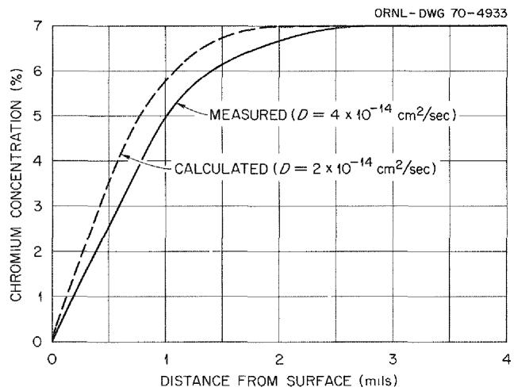  
Fig. 6.1. Chromium gradient in Hastelloy N sample exposed in MSRE core for 22,533 hr.

was found that indicated the diffusion coefficient of chromium in the core specimens may have been as high as $4 \times 10^{-14} \, \mathrm{cm}^2/\mathrm{sec}$ (Fig. 6.1). The fact that the data from the MSRE samples were of necessity obtained from hot-cell operations, whereas no such constraints were imposed in the original laboratory measurement of self-diffusion coefficients, lends somewhat greater credibility to Watson's values. Both values may be accurate, however, because Watson noted that for Inconel the self-diffusion coefficients of chromium were strongly dependent on annealing conditions at low temperatures. Conditions leading to large grains led to low diffusion coefficients and vice versa.

Extrapolation of Watson's data for Hastelloy N (see Fig. 6.2) indicates that the self-diffusion coefficient for Cr in Hastelloy N at the lowest temperature of the MSRE fuel circuit is $8 \times 10^{-15} \, \mathrm{cm}^2/\mathrm{sec}$ . The rate of mass transfer is limited by the rate of diffusion of chromium into the alloy in the coolest area of the system. Corrosion from mass transfer was therefore expected to be of little consequence in the MSRE.*

Fick's equation, $M_{t} = 2C_{0}(Dt / \pi)^{1 / 2}$ (where $C_0 =$ concentration of the diffusing element in the bulk species, $D =$ diffusion coefficient, $t =$ time) can be used to predict the quantity of material removed by dif

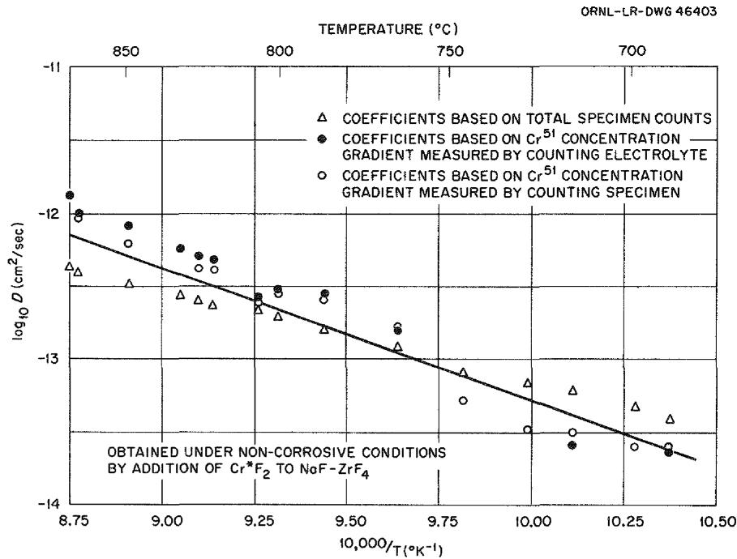  
Fig. 6.2. Self-diffusion coefficients for $^{51}\mathrm{Cr}$ in INOR-8; loop 1248. (from ref. 3).

Table 6.2. Comparison of predicted and observed amounts of chromium in $^{235}\mathrm{U}$ fuel salt Diffusion coefficient $= D$   

<table><tr><td rowspan="3">Time (hr)</td><td colspan="6">Predicted</td><td rowspan="3">Observed (ppm)</td></tr><tr><td colspan="3">Grams</td><td colspan="3">Parts per million</td></tr><tr><td>D=1×10-14cm/sec</td><td>D=2×10-14cm2/sec</td><td>D=4×10-14cm2/sec</td><td>D=1×10-14cm2/sec</td><td>D=2×10-14cm2/sec</td><td>D=4×10-14cm2/sec</td></tr><tr><td>1,000</td><td>263</td><td>372</td><td>525</td><td>54</td><td>76</td><td>108</td><td>48</td></tr><tr><td>2,000</td><td>371</td><td>525</td><td>743</td><td>76</td><td>108</td><td>152</td><td>48</td></tr><tr><td>4,000</td><td>548</td><td>775</td><td>1097</td><td>112</td><td>159</td><td>225</td><td>48</td></tr><tr><td>6,000</td><td>643</td><td>910</td><td>1286</td><td>136</td><td>186</td><td>263</td><td>48</td></tr><tr><td>8,000</td><td>743</td><td>1050</td><td>1486</td><td>152</td><td>215</td><td>304</td><td>62</td></tr><tr><td>10,000</td><td>837</td><td>1184</td><td>1674</td><td>171</td><td>242</td><td>343</td><td>64</td></tr><tr><td>12,000</td><td>909</td><td>1286</td><td>1819</td><td>186</td><td>263</td><td>372</td><td>64</td></tr><tr><td>14,000</td><td>982</td><td>1387</td><td>1965</td><td>201</td><td>284</td><td>402</td><td>70</td></tr><tr><td>16,000</td><td>1050</td><td>1486</td><td>2101</td><td>215</td><td>304</td><td>430</td><td>72</td></tr><tr><td>18,000</td><td>1114</td><td>1575</td><td>2227</td><td>228</td><td>322</td><td>455</td><td>82</td></tr><tr><td>20,000</td><td>1174</td><td>1661</td><td>2349</td><td>240</td><td>340</td><td>480</td><td>82</td></tr></table>

fusion under conditions where the surface concentration of the diffusing element is zero. Table 6.2 lists the amounts of chromium which might have been expected to appear in the fuel salt during $^{235}\mathrm{U}$ operations if all the chromium accessible to the salt were oxidized to $\mathrm{CrF}_2$ . It is apparent from these data that generalized corrosion, as inferred from increases in chromium concentration of the fuel salt, was only one-fourth to one-third of that expected from the

diffusion coefficients. By contrast, the apparent corrosion rates that were observed during the initial stages of MSRE operations with $^{233}\mathrm{U}$ fuel and again in the beginning of run 19 were approximately 5.4 and 3.84 times as rapid as predicted using a diffusion coefficient of $2 \times 10^{-14} \, \mathrm{cm}^2/\mathrm{sec}$ . Such rates were inconsistent with previous observations and more rapid than the maximum allowed by the maximum value observed for the diffusion coefficient, $4 \times 10^{-14} \, \mathrm{cm}^2/\mathrm{sec}$ . Since the

rates of corrosion on these occasions were unlikely to be permitted by chromium diffusion, it seems likely that bulk diffusion involving other constituents of the alloy was operative.

From the following argument it is concluded that the anomalously rapid corrosion during these periods and occasionally during $^{235}\mathrm{U}$ operations was caused by contaminants introduced into the fuel system during periods of maintenance.

# 6.2 Corrosion in Prenuclear Operations

As noted in Chap. 2, chemical analyses were performed concurrently in the General Analysis Laboratory and in the High-Radiation-Level Analytical Laboratory with salt samples removed from the MSRE during the period before nuclear operations began. This procedure reflected that a slight operational bias existed in the results of the two laboratories for some of the species and enabled us to use those biases as correction factors for assessment of changes in the salt. With respect to chromium analyses as a corrosion indicator, the data corrected by this factor showed that at the average value of its concentration, $37 \pm 7$ ppm, no change in the chromium concentration of the fuel circuit salt had occurred throughout the period ending with the completion of the zero-power experiments. In

the low-power experiments following the first maintenance period, during which time the pump rotor was removed for examination, the new average value of chromium in the fuel salt was $48 \pm \mathrm{ppm}$ . Since the standard deviations for these two values overlap, it can be inferred that the flushing operation preceding the low-power operation (run 4) effectively removed corrosion-inducing contaminants that might have entered the system during the maintenance period.

# 6.3 Corrosion in Power Operations

In Fig. 6.3 the results of all chemical analyses of fuel salt samples for chromium are summarized for power runs. The scattered data are described most simply as increasing linearly with time and correspond to an increase in chromium concentration in the salt at a rate of 12 ppm per year. Statistical analyses of the individual groups of data, however, indicate that the average values (least-squares method) are as listed in Table 3.3.

In operation of the reactor with $^{233}\mathrm{U}$ fuel, the concentration of chromium in the samples of fuel salt increased sharply only during two periods, during the initial stages of run Nos. 15 and 19. One interpretation of these analytical results is that corrosion rates exceeded those predicted by diffusion data only after

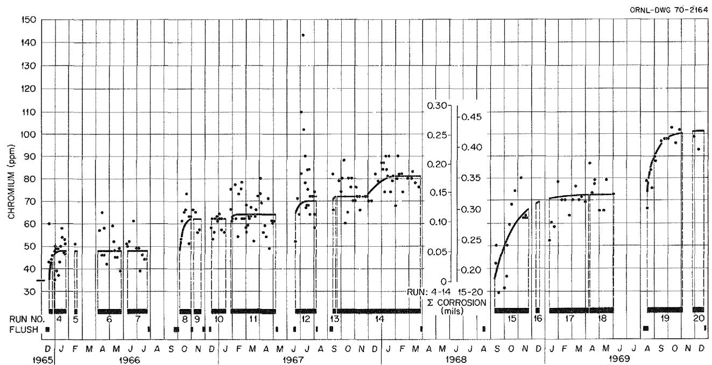  
Fig. 6.3. Corrosion of the MSRE fuel circuit in $^{235}\mathrm{U}$ and $^{233}\mathrm{U}$ power operation.

some specific event. A significant increase in the concentration of chromium in fuel salt samples was noted only during the initial stages of runs Nos. 4, 8, 12, 15, and 19, with an apparent increase partway through run No. 14. In the beginning periods of run Nos. 4, 8, 12, 15, and 19, we find that in each instance a common set of circumstances existed: the reactor core vessel had been opened previously, either for maintenance or to exchange test arrays positioned within the graphite moderator. Although reasonable measures were adopted to minimize the amount of airborne contaminants that might be introduced into the system during these periods, the possibility that significant amounts of oxidants were introduced into the open vessel cannot be excluded. During the first period of power operation, when a significant temperature differential was imposed on the circuit for the first time (run 4), some corrosion was anticipated as the $\mathrm{Cr}^0 + 2\mathrm{UF}_4 \rightleftharpoons \mathrm{CrF}_2 + 2\mathrm{UF}_3$ equilibrium reaction adjusted to the temperature profile of the circuit. Under these conditions the increase in the concentration of chromium in the fuel salt could have resulted from the establishment of the equilibrium reaction and was not necessarily a signal of the presence of oxidizing contaminants.

The increase in the concentration of chromium in the fuel salt well after run 14 began (see Fig. 6.3) seems to be inconsistent with the premise that external contaminants were the principal cause of corrosion. However, in the period preceding run 14 part of the graphite and metal specimens in the core were removed and replaced. It seems quite possible, therefore, that the residual concentration of reductant which was generated within the fuel salt during run 12 was sufficient to offset the combined oxidizing effects of whatever contamination was incurred during shutdown and that characteristic of the fission reaction only through the early part of run 14 and that the subsequent rise in chromium concentration represents the normal compensating shift in the equilibrium corrosion reaction. Generally, it is assumed that the contaminant most likely to be responsible for corrosion is moisture.

The inference that moist air was the corrosion-inducing contaminant calls into question the efficacy of the flush salt. As an agent for removal of adsorbed moisture, molten $\mathrm{LiF - BeF_2}$ flush salt is extremely effective, as demonstrated in numerous laboratory experiments, and unquestionably was an effective moisture scavenger. If an oxidizing contaminant or contaminants were capable of diffusion within the graphite or reacting with species deposited in the surface layers of the graphite, the probability of its removal by brief

circulation of flush salt might be slight; instead it might be released into the salt gradually after the moderator was heated to high temperatures. Thus, oxygen (perhaps as CO), rather than water, seems more likely to be the cause of the observed corrosion. This conclusion is supported by the fact that the scale found on the nickel cages which were used to expose $\mathrm{Be}^0$ to the salt during run 15 was comprised preponderantly of iron, whereas on other occasions the principal structural metal in such scales was chromium. Results of chemical analyses showed that the prior fuel reprocessing treatment was effective in reducing the concentration of chromium in the salt from 133 to $34~\mathrm{ppm}$ and of iron from 174 to $110~\mathrm{ppm}$ . The effectiveness of the reprocessing operations in reducing $\mathrm{Cr}^{2+}$ precludes the likelihood that significant amounts of $\mathrm{Fe}^{2+}$ were delivered to the fuel circuit from the chemical reprocessing plant. The reduction of $\mathrm{Fe}^{2+}$ to $\mathrm{Fe}^0$ by $\mathrm{Be}^0$ suggests rather that $\mathrm{Fe}^{2+}$ was generated after the beginning of fuel circulation by an oxidizing contaminant contained in the closed fuel circuit. As increasing amounts of $\mathrm{Be}^0$ were added to the salt mixture, the ratio of metallic $\mathrm{Fe / Cr}$ found on the nickel metal cages was reduced until a normal balance was reestablished and corrosion ceased (see Tables 6.3 and 6.4).

Laboratory studies of the stability of $\mathrm{FeF}_2$ have led to the conclusion that at equilibrium little or no $\mathrm{Fe}^{2+}$ should exist in the MSRE fuel (see Sect. 2.4.7). The results of these tests confirmed that, of the structural metal impurities in the melt, iron and nickel persist almost entirely as metallic species. The results of other laboratory studies, particularly those concerned with the reduction of $\mathrm{Fe}^{2+}$ by hydrogen,[9] suggest that even in concentrations as large as was found by Manning, the presence of divalent iron was likely to have resulted from reoxidation after transfer and remelting of the salt samples. Subsequent laboratory tests with the MSRE fuel were precluded by the generation of fission products in the salt.

Appraisal of the premise that maintenance operations might possibly permit the ingress of enough oxygen to account for the analytical results requires the following considerations. The cumulative amount of oxidation introduced into the fuel salt (during both $^{235}\mathrm{U}$ and $^{233}\mathrm{U}$ operations) based on the increases of chromium at the beginning of run Nos. 8, 12, 15, and 19 and on the apparent losses of $\mathrm{UF}_3$ at the end of runs 7, 18, and 19 amounts to 51.31 equivalents, or $410.5\mathrm{g}$ of $\mathrm{O}^{2-}$ , and corresponds to a cumulative exposure of $\sim 50\mathrm{ft}^3$ of air. During $^{233}\mathrm{U}$ operations, the amount of oxygen entering the salt might have been expected to increase the concentration of oxide by 83 ppm, in excess of the

Table 6.3. MSRE fuel salt analyses, run No. 15   

<table><tr><td rowspan="2">Sample</td><td rowspan="2">Be0added(g)</td><td colspan="4">Weight percent</td><td colspan="3">% M/Σ Fe + Cr + Ni</td></tr><tr><td>Be</td><td>Fe</td><td>Cr</td><td>Ni</td><td>Fe</td><td>Cr</td><td>Ni</td></tr><tr><td>Carrier, before Zr0addition</td><td></td><td></td><td>0 0380</td><td>0 0460</td><td>0 0180</td><td>3 72</td><td>45 2</td><td>17 6</td></tr><tr><td>Carrier, after Zr0addition</td><td></td><td></td><td>0 0110</td><td>0 0034</td><td>≤0 0010</td><td>71 4</td><td>22 0</td><td>6 5</td></tr><tr><td>FP-15-7</td><td>10 08</td><td></td><td></td><td></td><td></td><td></td><td></td><td></td></tr><tr><td>Scale from Ni cage</td><td></td><td></td><td>12 0</td><td>0 106</td><td>8 03</td><td>59 7</td><td>0 53</td><td>39 8</td></tr><tr><td>FP-15-30</td><td>8 34</td><td></td><td></td><td></td><td></td><td></td><td></td><td></td></tr><tr><td>Scale from Be0rod</td><td></td><td>Σ mg</td><td>(31 1)</td><td>(42 8)</td><td>(11 2)</td><td>36 5</td><td>50 3</td><td>13 2</td></tr><tr><td>Scale from Ni cage</td><td></td><td>Σ mg</td><td>(96 1)</td><td>(4 93)</td><td>(21 2)</td><td>78 6</td><td>4 0</td><td>17 4</td></tr><tr><td>FP-15-62</td><td>9 38</td><td></td><td></td><td></td><td></td><td></td><td></td><td></td></tr><tr><td>Loose particles</td><td></td><td>6 06</td><td>3 83</td><td>3 75</td><td>1 44</td><td>42 5</td><td>41 6</td><td>15 9</td></tr><tr><td>Scale from top</td><td></td><td>6 29</td><td>4 72</td><td>3 26</td><td>4 71</td><td>37 2</td><td>25 7</td><td>37 1</td></tr><tr><td>Scale from cage</td><td></td><td>7 34</td><td>2 74</td><td>4 53</td><td>0 096</td><td>37 2</td><td>61 5</td><td>1 3</td></tr><tr><td>Salt average, 11/23/68</td><td></td><td>6 59</td><td>0 0140</td><td>0 0067</td><td>0 005</td><td>55</td><td>26</td><td>19</td></tr></table>

Table 6.4. Relative fractions of $\mathbf{Fe}^{\mathbf{0}}$ and $\mathbf{Cr}^{\mathbf{0}}$ reduced from MSRE fuel salt in run No. 15   

<table><tr><td>Sample No</td><td>Equivalents of Be0 added</td><td>Corrosion rate (mils/year)</td><td>Fe0/Cr0 on nickel cagea</td></tr><tr><td>FP-15-7</td><td>2 24</td><td>0 88</td><td>113</td></tr><tr><td>FP-15-30</td><td>4 09</td><td>0 54</td><td>19 5</td></tr><tr><td>FP-15-62</td><td>6 17</td><td>0 35</td><td>0 61</td></tr></table>

${}^{a}$ Average Fe/Cr in carrier salt was 2 24 at the inception of run No 15

sensitivity limits for the analytical method and well above that observed. It must be recalled, however, that early in $^{235}\mathrm{U}$ power operations the concentration of $\mathrm{O}^{2-}$ , as measured experimentally, declined from 120 to 60 ppm, suggesting that under power operation $\mathrm{O}^{2-}$ is partially removed from the salt as a volatile species. It may be concluded, therefore, that the corrosion observed in the MSRE is likely to have been caused as described above but that the mechanism has, as yet, not been demonstrated unequivocally

The rationale proposed above has several implications concerning the behavior of the MSRE during $^{233}\mathrm{U}$ operations. During the first 16 hr in which fuel salt was circulated at the beginning of run No 15, the salt did not transfer to the overflow tank and behaved as though it contained a negligibly small bubble fraction. Thereafter, $\mathrm{Be}^0$ was introduced, and the bubble fraction began to increase, with further exposures of the salt to $\mathrm{Be}^0$ the fraction varied erratically $^{10}$ . Certainly the $\mathrm{Be}^0$ reduced the surface tension and thereby allowed easier transport of gas from graphite to salt, followed probably by oxidation of the metallic iron impurity, which acts as an oxidant to the circuit walls

Corrosion would continue until the oxidants were consumed. The model of corrosion proposed here has a relation to the changes in bubble fraction. The corrosion data suggest that with respect to its physical and chemical properties, the fuel did not achieve a reference state until the beginning of run 17. That its bubble fraction then was greater than observed in $^{235}\mathrm{U}$ operations probably was related principally to its lower density

The probability that atmospheric oxygen was the primary causative agent of corrosion in the MSRE was discounted by Grimes in the following appraisal of the observed behavior 11

We find no evidence whatsoever that air was introduced into MSRE during its periods of normal high temperature operation. There is, on the other hand, no doubt that air in appreciable quantities was admitted to this reactor system during shut downs when the reactor circuit was at temperatures of $300^{\circ}\mathrm{F}$ or below. Only a small fraction of the oxygen admitted at such low temperatures should have reacted with the reactor metal and should have been available to cause subsequent corrosion. Flushing of the reactor circuit with helium during the reactor heatup should have removed most of the unreacted air (oxygen). Moreover, use of the flush salt before admission of the fuel should have removed some (and perhaps a large fraction) of the reacted oxygen. However, some oxidant was admitted, and some corrosion from this source probably occurred in MSRE. The evidence suggests that corrosion from admitted air must have been a small fraction of the minor amount which took place

Since a detailed description of the corrosion picture in MSRE at all times is not yet available, it is not possible to define the precise amount of corrosion due to ingress of oxygen. It is easily possible, however, to set upper limits upon the amounts of oxygen that could have been involved. These amounts are small. If all the observed corrosion (as evidenced by rise in $\mathrm{CrF}_2$ concentration) in MSRE Runs 1 thru 9 is attributed to ingress

of oxygen the oxide ion concentration of the fuel should have risen by about 11 ppm If corrosion (by the same indicator) in Runs 10 thru 14 were due to oxygen ingress, and if this oxygen ingress were also responsible for oxidizing all the $\mathrm{UF}_3$ created by the $\mathrm{Be}^0$ added during those runs, the oxide ion concentration of the fuel should have risen by about 25 ppm During the entire sequence of runs with $^{235}\mathrm{UF}_4$ , therefore, all the chemically observed corrosion could be due (it seems very certain that it was not) to the ingress of oxygen resulting in less than 40 ppm of added oxide ion in the fuel Our systematic chemical analyses for $\mathrm{O}^{2-}$ in the MSRE fuel showed no evidence of such an increase. MSRE was provided with no mechanism intended to remove $\mathrm{O}^{2-}$ , and we have been unable to postulate

much less to demonstrate - an inadvertent mechanism for $\mathrm{O}^{2-}$ removal Our methods for determination of $\mathrm{O}^{2-}$ might possibly fail to find this $< 40 \, \mathrm{ppm}$ increase. It seems much more plausible, however, that the actual increase in $\mathrm{O}^{2-}$ was a small fraction of this figure and that the observed corrosion was due to oxidation of chromium by $\mathrm{UF}_4$ through mechanisms similar to those postulated from many years of testing. It is true that we have drawn detailed curves of the chromium behavior of the individual MSRE runs with $^{235}\mathrm{UF}_4$ , and we have been tempted to speculate about them. However the marked scatter in the chromium data gives such curves little or no statistical significance

Rise in the chromium concentrations in MSRE Runs 15 thru 19 (that is in the runs fueled with $^{233}\mathrm{UF}_4$ ) was more dramatic and the initial increases were almost certainly more statistically significant. Several pieces of evidence suggest that the $^{233}\mathrm{UF}_4$ fuel, which by virtue of reuse of the carrier salt was necessarily less well characterized and probably less pure than was the $^{235}\mathrm{UF}_4$ initial fuel charge, was relatively oxidizing. This may have been due to oxygen ingress and oxidation of the MSRE metal surfaces during the long fuel change shutdown between Run 14 and Run 15. If all the corrosion during Runs 15 thru terminal Run 19, again as adduced from increases in chromium concentration of the fuel and allowing for oxidation of all reductant added, is attributed to admitted oxygen, the oxide ion concentration of the fuel should have increased by some 45 ppm, this increase, again, seems conceivable but unlikely

In summary, the corrosion picture shows that the quantity of oxide ion which could have entered the fuel during the whole MSRE operation (involving 20 separate shutdowns) was less than $100~\mathrm{ppm}$ . It seems virtually certain that the actual amount which entered was much less than this. The $\mathrm{ZrF_4}$ present in this fuel would have prevented precipitation of appreciable $\mathrm{UO}_2$ even if much larger quantities had entered, oxide ion at the maximum levels suggested above would not have precipitated $\mathrm{ZrO_2}$ . Subsequent corrosion of the reactor circuit through ingress of oxygen would, however, not have been prevented (or appreciably affected) by the presence of $\mathrm{ZrF_4}$ in the MSRE, this would be equally true for $\mathrm{ZrF_4}$ in the MSBR fuel

It has been postulated that one of the principal reasons for the expectedly low corrosion observed is that the metal surfaces of the fuel circuit have been covered with a film of the noble-metal fission products Nb, Mo, Tc, and Ru about 10 A thick Results of electron microprobe analysis of the metal surveillance specimens12 removed from the MSRE in May 1967 lend support to this view in that they did not reveal any

change in chromium concentration below a depth of 10 $\mu$ , the limit of measurement, as do the results of electron microscopic investigation of the specimens, $^{12}$ which indicated that the surface was covered to a depth of several thousand angstroms by those metals. Although the postulate of a dynamically produced and autoregenerative noble metal film is an attractive rationale of the very low corrosion observed in $^{235}\mathrm{U}$ operations, it fails when the behavior of the MSRE during the early stages of run 19 is considered Here, rapid corrosion was proceeding concurrently with the generation and presumably the deposition of the same noble metal fission products which seemed earlier to have restricted the corrosion of the fuel circuit walls

Another hypothesis has been suggested recently by Grimes $^{13}$ as an alternate rationale of data that indicate the almost complete absence of corrosion during extended periods of operation, while at other times rates were more rapid than could be accounted for by diffusion-controlled mechanisms. It presupposes that the presence of $\mathrm{UF}_3$ in the fuel salt does not counter the corrosion of Hastelloy N effectively once the concentration of $\mathrm{Cr}^{2+}$ in the salt has risen to a level of $\sim 70$ to $80~\mathrm{ppm}$ . Rather, at concentrations of this order and in the presence of the intense radioactive flux in the reactor core, chromium carbide, $\mathrm{Cr}_3\mathrm{C}_2$ , is formed at the surfaces of the graphite moderator. The formation of such a phase thus causes the graphite moderator to act as a sink for chromium and promotes corrosion of the container alloy at the most rapid rate allowed by the diffusion coefficient of chromium. If such a mechanism operates, the difference in the chromium concentration as observed in the fuel salt samples and the maximum possible concentration represents the quantity of chromium which was deposited at the surface of the moderator graphite. On occasions when the oxidation potential of the salt increased substantially, this carbide coating would then decompose and release large amounts of $\mathrm{Cr}^{2+}$ to the salt, thus causing rapid changes in the concentration of chromium in the salt samples submitted for chemical analysis to suggest that the corrosion rate was increasing rapidly. This hypothesis is attractive for a variety of reasons (1) it implies that throughout the operation of the MSRE the corrosion rate was invariant and diffusion limited, (2) the $[\mathrm{UF}_3] / [\mathrm{UF}_4]$ remains so low in such systems at all times that attempts to repress corrosion in MSBR fuels by external adjustment of the $[\mathrm{UF}_3] / [\mathrm{UF}_4]$ are needless, as well as the previously foreseen need to develop in-line analytical methods for its determination, and (3) the hypothesis provides a rationale for the otherwise inexplicably low rates of corrosion which

seemed to characterize operations of the MSRE with $^{235}\mathrm{U}$ fuel.

It seems unlikely that significant quantities of chromium carbides will have formed on the moderator graphite surfaces for the following reasons:

1. In run No. 15, the principal constituent of the slag found on the nickel cages used for the introduction of beryllium was iron (see Sect. 6.7). Presumably, this iron deposit was formed by reduction of $\mathrm{Fe}^{2+}$ from the melt and represents a condition in the melt which is so oxidizing that, if present, the relatively unstable compound $\mathrm{Cr}_3\mathrm{C}_2$ ( $\Delta G_{1000}^{\circ}\mathrm{K} = -23\mathrm{kcal}$ ) should have decomposed completely during this period. The possible amount of chromium which should have been released to the fuel salt by such decomposition, as calculated using diffusion coefficients from $1\times 10^{-14}$ to $4\times 10^{-14}\mathrm{cm}^2/\mathrm{sec}$ , would increase the concentration of chromium in the fuel salt to values of 240 to 480 ppm (see Table 6.2), that is, to much higher concentrations than were observed at any time during MSRE operations.   
2. The coincidence of apparently stepwise increases in Cr followed maintenance periods (as noted previously).   
3. The carbides of niobium are more stable than is $\mathrm{Cr}_3\mathrm{C}_2$ ; in $^{233}\mathrm{U}$ operations the oxidation potential of the salt increased gradually during runs by fission to the point that niobium entered the salt (see Sect. 6.5) and was subsequently reduced and removed from the salt by Be addition; under these conditions, $\mathrm{Cr}_3\mathrm{C}_2$ should have become reoxidized, entered the salt, and increased the chromium concentration of the samples sharply, where, in fact, no perturbation of the average concentration of chromium was noted.

In postoperational examinations with one of the stringer bars from the reactor core, a search was made to ascertain whether or not a coating of chromium carbides adhered to the surface. No evidence of such a coating was found.

A surprising result of the postoperational tests performed with specimens of the MSRE control rod thimbles was the observation of anomalous intergranular penetration of the alloy which had been exposed to the fuel salt. Occasionally, inspection of Hastelloy N specimens removed from the reactor core showed grain boundary cracks at the surfaces of specimens subjected to tensile tests. These cracks appeared in material strained at room temperature, which is not normal for Hastelloy N, but they penetrated only a few mils and

had no detectable effect of the mechanical properties of the specimens. The cracks in the control rod thimbles, however, were deeper than previously observed, at some locations as deep as 7 mils, $^{14}$ some ten times the depth of the generalized attack indicated by changes in the concentration of chromium in the fuel salt. Curiously, several fission products, preponderantly tellurium, had penetrated to depths comparable with those of the cracks.

It is not possible to ascribe this attack to radiation effects per se, for in-pile tests with salt-graphite-alloy assemblages prior to tests with the MSRE showed no corresponding effects. These unpredicted results have caused a renewal of the investigation of materials removed from the MSRE, with the initial objectives to determine if fission products are indeed the cause of grain boundary separation.

While the initial results seem to implicate tellurium as a causative agent, its role is not positively identified. One mechanism, proposed before tellurium was believed to have deposited preferentially, relates the attack to impurities in the following way. Electron microscopic examinations of Hastelloy N show typically that an unidentified group of complex phases comprised of Mo, Cr, C, N, and B, morphologically similar to face-centered $\mathbf{M}_2\mathbf{C}$ carbides, are deposited preferentially at intergranular surfaces. It is also observed that the loss of ductility that occurs with Hastelloy N after irradiation correlates with more pronounced intergranular fracture. Such behavior very possibly means that the chemical activity of the carbide-like phases deposited in these locations is increased. If so, it would not be surprising to find that these phases were highly susceptible to oxidative corrosion. It was noted previously that two unusually oxidative regimes occurred in the MSRE, at the beginning of run 15 and again at the beginning of run 19. In an earlier assessment of corrosion of the MSRE fuel circuit we have deduced that the most probable oxidant at those periods was atmospheric oxygen.[15] We reach the tentative conclusion, therefore, that the intergranular attack noted was a result of attack by oxygen on the carbide-like phases deposited at intergranular surfaces. If oxygen were released from the moderator, as suggested previously, the first metal which it might contact would be the control-rod thimbles. It seems likely, therefore, that the intergranular penetration observed in the postoperational tests resulted from the development of unusually oxidative conditions in the MSRE and is atypical of normal reactor behavior. The overall results of corrosion surveillance in the MSRE, while not totally

unequivocal, appear to indicate that corrosion behavior in molten-salt reactors can properly be anticipated to be negligible over the planned use period of these reactors. Furthermore, the probability of recurrence of the anomalous penetration in future reactors can be assessed in tests with the modified alloys which are currently under development and which will contain a group of carbides perhaps unlike those found in the MSRE alloy.

# 6.4 Additions of Reductants and Oxidants to the Fuel Salt

As discussed earlier in this report (Sect. 6.3) the fuel salt, free of moisture and HF, should remove chromium from Hastelloy N only by the equilibrium reaction

$$
\frac {1}{2} \mathrm {C r} ^ {0} + \mathrm {U F} _ {4} (d) \rightleftharpoons \frac {1}{2} \mathrm {C r F} _ {2} (d) + \mathrm {U F} _ {3} (d).
$$

When the above corrosion equilibrium was first established in MSRE power operations, the $\mathrm{UF}_3$ produced in this reaction, together with that originally added to the fuel concentrate, should have totaled $1500\mathrm{g}$ , with the result that as much as $0.65\%$ of the uranium of the system could have been trivalent soon after the beginning of power operation. The $\mathrm{UF}_3$ content of the MSRE fuel was determined after approximately 11,000 MWhr of operation to be no greater than $0.05\%$ . The fuel salt was considered to be far more oxidizing than was necessary and certain to become more so as additional power was produced unless adjustment was made in the $\mathrm{UF}_3$ concentration. A program was initiated early in 1967 to reduce 1 to $1.5\%$ of the uranium inventory to the trivalent state.

On the basis that it met chemical criteria and that its introduction into fuel salt could be accomplished conveniently, beryllium metal was selected as the most suitable substance to use for in-situ reduction of U(IV) in the fuel salt. Results of laboratory tests had shown that the metal would be sufficiently reductive to require exposure for conveniently short periods of time but was not so reductive as to cause concern that it might reduce U(IV) to the metallic state. The pure material was available in forms that were easily accommodated for use with the sampler-enricher device, and the metal afforded a maximum of reductive equivalents per unit mass.

Initially, $4\mathrm{g}$ of beryllium was introduced into the salt by melting a mixture of ${}^{7}\mathrm{LiF - BeF}_{2}$ carrier salt and powdered beryllium in the MSRE pump bowl sampler cage. Subsequently, three additions were made by suspending specimens of ${}^{3}/8$ in.-diam beryllium rods in

the salt in the pump bowl. The capsules used for adding beryllium were similar in size to those used for sampling for oxide analysis but were penetrated with numerous holes to permit reasonable flow of fuel salt. The beryllium rods were found to react with fuel salt at a steady rate, dissolving at approximately $1.5\mathrm{g / hr}$ . A summary of all the additions of reductants and oxidants introduced into the fuel salt system via the sampler-enricher apparatus is given in Table 6.5.

With $^{235}\mathrm{U}$ fuel salt, all dissolutions of beryllium metal into the fuel salt proceeded smoothly; the bar stock which was withdrawn after exposure to the fuel was observed to be smooth and of symmetrically reduced shape.

No significant effects on reactivity were observed during or following the beryllium additions, nor did the results of chemical analyses indicate that the actual concentration of U(III) had increased until after run 12 had begun (see Table 6.6). The additions preceding run 12 had increased the $\mathrm{U}^{3+}$ concentration in the total uranium by approximately $0.6\%$ . Four exposures of beryllium were made at close intervals during the early part of that run. Samples taken shortly after the last of these four exposures (FP-12-16 et seq., Table 3.1) began to show an unprecedented increase in the concentration of chromium in the specimens, followed by a similar decrease during the subsequent sampling period.

Previous laboratory experience has not disclosed comparable behavior, and no well-defined mechanism was available at the time to account satisfactorily for the observed behavior. Speculation as to the cause, partially supported by experimental data, included the following consideration.

On the two occasions when the most rapid rates of dissolution of the beryllium rods were observed, chromium values for the next several fuel samples, FP-11-10 et seq. and FP-12-16 et seq., rose temporarily above the 1o level and subsequently returned to normal. That the increase in chromium levels in samples FP-12-16 to -19 was temporary indicates that the high chromium concentration of fuel samples removed from the pump bowl was atypical of the salt in the fuel circuit and implies that surface-active solids were in suspension at the salt-gas interfaces in the pump bowl.

That atypical distribution of species in this location does indeed take place was demonstrated earlier by the analysis of sample capsule support wires that were (1) submerged below the pump-bowl salt surface, (2) exposed to the salt-gas interface, and (3) exposed to the pump-bowl cover gas. The results showed that the noble-metal fission products, Mo, Nb, and Ru, were

Table 6.5. Summary of adjustments of $\left[\mathrm{U}^{3+}\right] / \left[\Sigma \mathrm{U}\right]$ in the MSRE fuel salt   

<table><tr><td rowspan="2">Date</td><td rowspan="2">Sample Number</td><td colspan="2">Reductant or oxidant added</td><td rowspan="2">Equivalents of reductant added</td><td rowspan="2">[U3+/ΣU] (%), nominal</td></tr><tr><td>Form</td><td>Weight (g)</td></tr><tr><td>2/13/66</td><td>Runs 5-1</td><td></td><td></td><td></td><td>0.41</td></tr><tr><td>1/1/67</td><td>FP-10-14</td><td>Be powder</td><td>3.0</td><td>0.67</td><td>0.22</td></tr><tr><td>1/3/67</td><td>FP-10-16</td><td>Be powder</td><td>1.0</td><td>0.89</td><td>0.25</td></tr><tr><td>1/4/67</td><td>FP-10-18</td><td>Be rod</td><td>1.63</td><td>1.25</td><td>0.29</td></tr><tr><td>1/13/67</td><td>FP-10-23</td><td>Be rod</td><td>10.65</td><td>3.61</td><td>0.51</td></tr><tr><td>2/15/67</td><td>FP-11-10</td><td>Be rod</td><td>11.66</td><td>6.20</td><td>0.74</td></tr><tr><td>4/10/67</td><td>FP-11-40</td><td>Be rod</td><td>8.40</td><td>8.06</td><td>0.79</td></tr><tr><td>6/21/67</td><td>FP-12-8</td><td>Be rod</td><td>7.93</td><td>9.82</td><td>0.87</td></tr><tr><td>6/23/67</td><td>FP-12-9</td><td>Be rod</td><td>9.84</td><td>12.01</td><td>1.12</td></tr><tr><td>7/3/67</td><td>FP-12-13</td><td>Be rod</td><td>8.33</td><td>13.86</td><td>1.30</td></tr><tr><td>7/6/67</td><td>FP-12-15</td><td>Be rod</td><td>11.68</td><td>16.45</td><td>1.59</td></tr><tr><td>8/3/67</td><td>FP-12-56</td><td>Be rod</td><td>9.71</td><td>18.60</td><td>1.72</td></tr><tr><td>9/15/68</td><td>FP-15-7</td><td>Be rod</td><td>10.08</td><td>2.24</td><td>0</td></tr><tr><td>10/13/68</td><td>FP-15-30</td><td>Be rod</td><td>8.34</td><td>4.09</td><td>0</td></tr><tr><td>11/15/68</td><td>FP-15-62</td><td>Be rod</td><td>9.38</td><td>6.17</td><td>0</td></tr><tr><td>11/20/68</td><td>FP-15-66</td><td>Be washer</td><td>1.00</td><td>6.39</td><td>0</td></tr><tr><td>1/22/16</td><td>FP-17-8</td><td>Be rod</td><td>8.57</td><td>8.29</td><td>1.19</td></tr><tr><td>1/30/69</td><td>FP-17-11</td><td>Cr rod</td><td>4.73</td><td>8.48</td><td>1.19</td></tr><tr><td>4/15/69</td><td>FP-18-3</td><td>Zr rod</td><td>20.24</td><td>9.37</td><td>0.65</td></tr><tr><td>4/26/69</td><td>FP-18-7</td><td>Zr rod</td><td>24.04</td><td>10.42</td><td>1.19</td></tr><tr><td>5/8/69</td><td>FP-18-17</td><td>FeF2powder</td><td>30.00</td><td>9.78</td><td>0.52</td></tr><tr><td>5/15/69</td><td>FP-18-23</td><td>Be rod</td><td>5.68</td><td>11.04</td><td>1.20</td></tr><tr><td>5/20/69</td><td>FP-18-28</td><td>Be rod</td><td>3.17</td><td>11.74</td><td>1.59</td></tr><tr><td>9/12/69</td><td>FP-19-25,26</td><td>Zr foil</td><td>0.62</td><td>11.77</td><td>0</td></tr><tr><td>9/24/69</td><td>FP-19-31-4</td><td>Zr foil</td><td>1.20</td><td>11.82</td><td>0</td></tr><tr><td>10/2/69</td><td>FP-19-40</td><td>Be rod</td><td>2.87</td><td>12.46</td><td>0.99</td></tr><tr><td>10/8/69</td><td>FP-19-48</td><td>Be rod</td><td>4.91</td><td>13.55</td><td>1.61</td></tr><tr><td>10/21/69</td><td>FP-19-51</td><td>Nb foil</td><td>0.018</td><td>13.55</td><td>1.37</td></tr><tr><td>11/29/69</td><td>FP-20-7</td><td>Be rod</td><td>6.974</td><td>15.10</td><td>1.16</td></tr><tr><td>12/9/69</td><td>FP-20-22</td><td>Be rod</td><td>9.894</td><td>17.30</td><td>2.49</td></tr><tr><td>12/9/69</td><td>FP-20-22</td><td>Be rod</td><td>3.019</td><td>17.97</td><td>2.95</td></tr></table>

deposited in abnormally high concentrations at the salt-gas interface. Such behavior suggests that the high chromium concentrations in the fuel specimens were caused by the occurrence of chromium in the pump bowl in nonwetted, surface-active phases in which its activity was low. A possible mechanism which would cause such a phenomenon is the reduction of $\mathrm{Cr}^{2+}$ by $\mathrm{Be}^0$ with the concurrent reaction of $\mathrm{Cr}^0$ with graphite present on the salt surface to form one or more of the chromium carbides, for example, $\mathrm{Cr}_3\mathrm{C}_2$ ( $\Delta H_f^0 = -21$ kcal at $298^\circ \mathrm{K}$ ). Such phases possess relatively low stability and could be expected to decompose, once dispersed in the fuel-circuit salt.

The possibility that surface-active solids were formed as a consequence of the $\mathrm{Be}^0$ additions was tested late in run 12 by obtaining salt specimens at the salt-gas interface as well as below the surface. First, specimens were obtained in a three-compartment sample capsule that was immersed so that the center hole was expected

to be at the interface (Fig. 6.4). Next, a beryllium metal rod was exposed to the fuel salt for $8\mathrm{hr}$ with the result that $9.71\mathrm{g}$ of beryllium metal was introduced into the fuel salt. Twelve hours later a second three-compartment capsule was immersed in the pump bowl. Its appearance after removal from the pump bowl is shown in Fig. 6.5. Chemical analyses of the fuel-salt specimens FP-12-55 and -57 did not show significant differences in chromium; however, the salt-gas interface in FP-12-57 was blackened as compared with FP-12-55 (Fig. 6.6).

An additional purpose of sampling with the three-compartment capsule was to determine whether foam-like material was present in the sampler area and would be collected in the upper compartment. Globules were noted on the upper part of FP-12-57 (Fig. 6.5), indicating that conditions in the pump bowl were substantially different after beryllium was added to the fuel salt.

Table 6.6. Concentration of ${\mathrm{{UF}}}_{3}$ in the MSRE fuel salt ${}^{a}$   

<table><tr><td rowspan="2">Date</td><td rowspan="2">Sample No.</td><td rowspan="2">Megawatt-Hours</td><td rowspan="2">Uranium Consumed (kg)</td><td rowspan="2">Uranium Consumed (moles)</td><td rowspan="2">Net Equivalents of Oxidation</td><td rowspan="2">Total Be0 Added (g)</td><td rowspan="2">Net Equivalents of Reductant Added</td><td rowspan="2">Net Equivalents of Reductant</td><td colspan="2">U3+/ΣU (%)</td></tr><tr><td>Calculated</td><td>Analytical</td></tr><tr><td></td><td></td><td>0</td><td>0</td><td></td><td></td><td></td><td></td><td>3.13</td><td>0.33</td><td></td></tr><tr><td>11/14/66</td><td>FP9-14</td><td>12,345</td><td>0.632</td><td>2.67</td><td>2.14</td><td>0</td><td>3.13</td><td>0.99</td><td>0.10</td><td>0.10</td></tr><tr><td>1/1/67</td><td>FP10-14</td><td>14,950</td><td>0.766</td><td>3.23</td><td>2.58</td><td>3</td><td>3.80</td><td>1.22</td><td>0.13</td><td></td></tr><tr><td>1/3/67</td><td>FP10-16</td><td>15,050</td><td>0.771</td><td>3.25</td><td>2.60</td><td>6</td><td>4.46</td><td>1.80</td><td>0.19</td><td></td></tr><tr><td>1/4/67</td><td>FP10-18</td><td>17,100</td><td>0.877</td><td>3.70</td><td>2.96</td><td>7.63</td><td>4.82</td><td>1.86</td><td>0.20</td><td></td></tr><tr><td>1/13/67</td><td>FP10-23</td><td>17,852</td><td>0.915</td><td>3.86</td><td>3.08</td><td>18.28</td><td>7.19</td><td>4.11</td><td>0.43</td><td></td></tr><tr><td>1/15/67</td><td>FP10-25</td><td>18,050</td><td>0.924</td><td>3.90</td><td>3.10</td><td>18.28</td><td>7.19</td><td>4.09</td><td>0.43</td><td>0.66</td></tr><tr><td>2/6/67</td><td>FP11-5</td><td>19,712</td><td>1.010</td><td>4.26</td><td>3.40</td><td>18.28</td><td>7.19</td><td>3.79</td><td>0.39</td><td>0.60</td></tr><tr><td>2/15/67</td><td>FP11-10</td><td>21,272</td><td>1.090</td><td>4.60</td><td>3.68</td><td>29.94</td><td>9.77</td><td>6.09</td><td>0.64</td><td></td></tr><tr><td>2/22/67</td><td>FP11-13</td><td>22,649</td><td>1.161</td><td>4.90</td><td>3.90</td><td>29.94</td><td>9.77</td><td>5.87</td><td>0.62</td><td>0.69</td></tr><tr><td>3/28/67</td><td>FP11-32</td><td>28,342</td><td>1.453</td><td>6.13</td><td>4.90</td><td>29.94</td><td>9.77</td><td>4.87</td><td>0.51</td><td>0.45</td></tr><tr><td>4/10/67</td><td>FP11-40</td><td>30,900</td><td>1.584</td><td>6.68</td><td>5.34</td><td>38.34</td><td>11.64</td><td>6.30</td><td>0.66</td><td></td></tr><tr><td>6/21/67</td><td>FP12-6</td><td>36,055</td><td>1.663</td><td>7.01</td><td>5.61</td><td>38.34</td><td>11.64</td><td>6.03</td><td>0.64</td><td>0.71</td></tr><tr><td>6/21/67</td><td>FP12-8</td><td>36,055</td><td>1.663</td><td>7.01</td><td>5.61</td><td>46.27</td><td>13.40</td><td>7.79</td><td>0.82</td><td></td></tr><tr><td>6/23/67</td><td>FP12-9</td><td>36,416</td><td>1.866</td><td>7.87</td><td>6.30</td><td>56.11</td><td>15.58</td><td>9.28</td><td>0.98</td><td></td></tr><tr><td>6/29/67</td><td>FP12-11</td><td>37,400</td><td>1.932</td><td>8.15</td><td>6.52</td><td>56.11</td><td>15.58</td><td>9.06</td><td>0.95</td><td>1.30</td></tr><tr><td>7/3/67</td><td>FP12-13</td><td>37,856</td><td>1.940</td><td>8.19</td><td>6.55</td><td>64.24</td><td>17.38</td><td>10.83</td><td>1.14</td><td></td></tr><tr><td>7/13/67</td><td>FP12-15</td><td>38,345</td><td>1.966</td><td>8.30</td><td>6.64</td><td>76.12</td><td>20.02</td><td>13.38</td><td>1.40</td><td></td></tr><tr><td>7/13/67</td><td>FP12-21</td><td>39,500</td><td>2.023</td><td>8.54</td><td>6.83</td><td>76.12</td><td>20.02</td><td>13.19</td><td>1.39</td><td>1.0</td></tr><tr><td>8/3/67</td><td>FP12-56</td><td>43,872</td><td>2.248</td><td>9.49</td><td>7.59</td><td>85.83</td><td>22.18</td><td>14.59</td><td>1.54</td><td></td></tr><tr><td>9/15/67</td><td>FP13-5</td><td>44,781</td><td>2.314</td><td>9.76</td><td>7.81</td><td>85.83</td><td>22.18</td><td>12.42</td><td>1.31</td><td>1.60</td></tr><tr><td>3/26/68</td><td>FP14-(F)</td><td>72,454</td><td>3.743</td><td>15.79</td><td>12.63</td><td>85.83</td><td>22.18</td><td>9.55</td><td>1.01</td><td></td></tr><tr><td>9/15/68</td><td>FP15-7</td><td>0</td><td>0</td><td></td><td></td><td>10.08</td><td>2.23</td><td>0</td><td>0</td><td></td></tr><tr><td>10/13/68</td><td>FP15-30</td><td>0</td><td>0</td><td></td><td></td><td>18.42</td><td>4.09</td><td>0</td><td>0</td><td></td></tr><tr><td>11/15/68</td><td>FP15-62</td><td>0</td><td>0</td><td></td><td></td><td>27.80</td><td>6.17</td><td>0</td><td>0</td><td></td></tr><tr><td>11/20/68</td><td>FP15-66</td><td>0</td><td>0</td><td></td><td></td><td>28.80</td><td>6.39</td><td>0.22</td><td>0.15</td><td></td></tr><tr><td>1/22/69</td><td>FP17-8</td><td>850</td><td>0.044</td><td>0.19</td><td>0.15</td><td>37.37</td><td>8.29</td><td>1.97</td><td>1.31</td><td></td></tr></table>

${}^{a}$ These numbers assume that the ${}^{235}\mathrm{U}$ salt originally was ${0.16}\%$ reduced; that the increase in $\mathrm{{Cr}}$ before initial ${}^{235}\mathrm{U}$ power operations was real,occurred before 11/14/66 , and resulted in reduction of ${\mathrm{U}}^{4 + }$ to ${\mathrm{U}}^{3 + }$ ; that cach fission results in oxidation of 0.8 atom of ${\mathrm{U}}^{3 + }$ ; and that there have been no other losses of ${\mathrm{U}}^{3 + }$ .

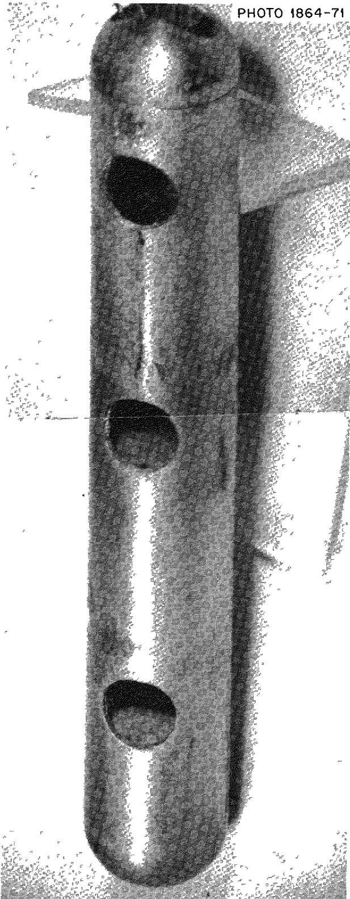  
Fig. 6.4. Three-compartment nickel capsule suspended in MSRE pump bowl before exposure of beryllium to $^{235}\mathrm{U}$ fuel salt. August 2, 1967, FP-12-55.

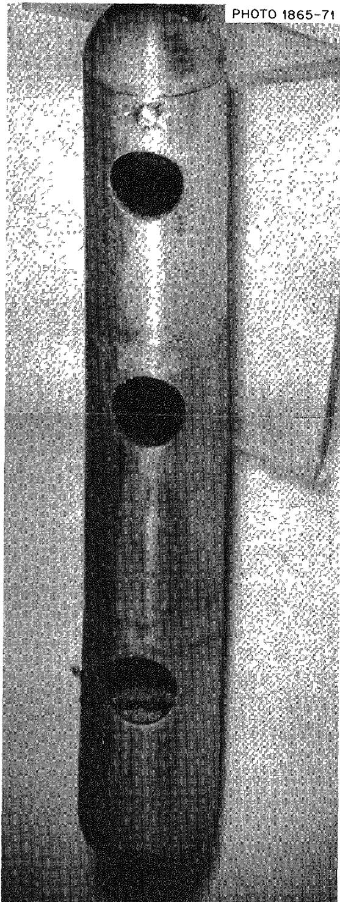  
Fig. 6.5. Three-compartment nickel capsule suspended in MSRE pump bowl after exposure of beryllium to $^{235}\mathrm{U}$ fuel salt. August 3, 1967, FP-12-57. Each of the three compartments in the capsules shown in Figs. 6.4 and 6.5 was open to the outside by two holes as shown here. The capsules were positioned approximately so that the center compartment was expected to be at the salt-gas interface to collect surface-active solids. The upper compartment was to serve as a collector of foam if it were present. No appreciable residue was found in the upper compartment.

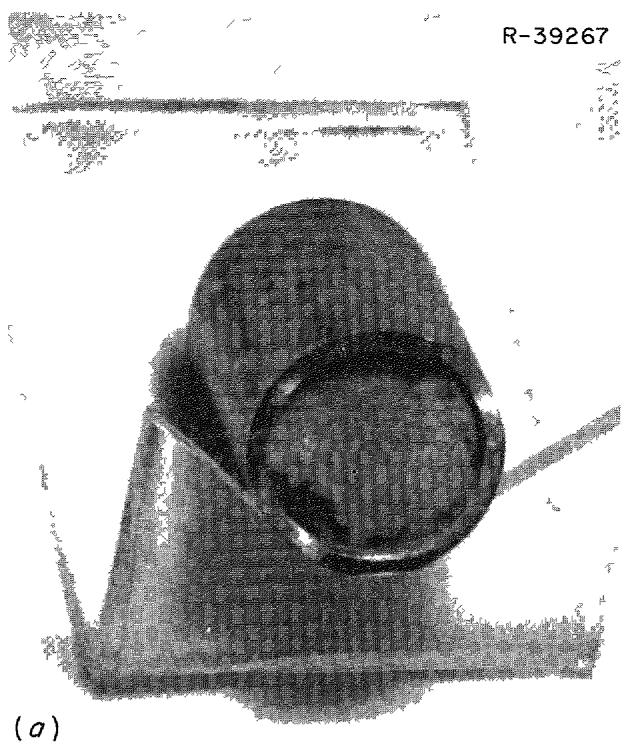  
R-39266

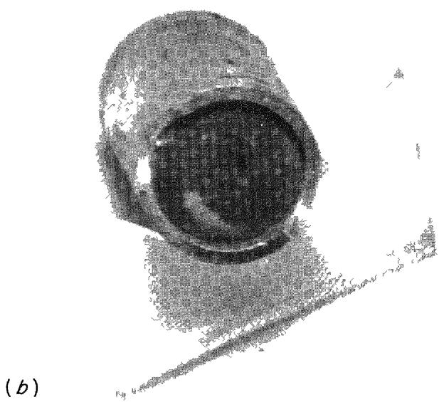  
Fig. 6.6. Surface appearance of fuel salt before and after beryllium exposure to $^{235}\mathrm{U}$ fuel salt. (a) FP-12-55, (b) FP-12-57. Salt analyses did not reflect significant differences in chromium concentration nor were they indicative of the identity of the material at the blackened surface.

Examination of the metal basket that contained the beryllium rod while it was exposed to the fuel showed the presence of dendritic crystals along with a small amount of salt residue (Fig. 6.7). Spectrochemical analysis of material removed from the basket (Fig. 6.7) indicated that the material contained $7.8\mathrm{wt}\%$ chromium and less than $10~\mathrm{ppm}$ of iron and nickel.

The evidence obtained did not permit inference as to the identity of the phases which formed within the pump bowl as a consequence of the beryllium additions. It strongly implied that nonwetted flotsam can be formed and accumulated temporarily in the MSRE pump bowl.

During this period, fuel salt accumulated in the overflow tank steadily during operation and remained there in relative isolation from the fuel stream. At intervals of about one day, part of the salt (60 lb) was returned to the fuel stream. Recognizing that chromium might be injected into the pump bowl as the salt returned, we performed an experiment in which salt samples were obtained from the pump bowl within an hour after fuel was returned from the overflow tank to the pump bowl. The purpose of the experiment was to determine whether material from the overflow tank contributed appreciably to the perturbations in the chromium concentration. The results were negative, possibly, in part, because sampling and salt-transfer operations were not performed concurrently for safety reasons.

In view of the mechanism developed recently16 to account for the transport behavior of the noble metal fission products in the MSRE, we can infer that the exposures of beryllium which generated high concentrations of chromium in the salt samples simply reduced the $\mathrm{Cr}^{2+}$ in the flowing fuel salt to the metal, which in turn became a part of the particulate pool of suspended metals at the surface of the salt in the pump bowl. It remained there temporarily, gradually oxidizing to the fluoride as it reacted with the fuel salt.

In their examinations of the behavior of the noble metal fission products, Kirslis and Blankenship17 did not observe a significant effect of fuel reduction on the noble-metal concentrations in the fuel. The concentrations frequently rose rather than fell, as expected, after adding beryllium. They noted that the $^{99}\mathrm{Mo}$ , $^{103}\mathrm{Ru}$ , $^{106}\mathrm{Ru}$ , and $^{132}\mathrm{Te}$ showed parallel rises and falls. The $^{99}\mathrm{Mo}$ results were extraordinarily high for samples FP-11-8 and FP-11-12. The high values were checked by reruns on fresh samples. If all the $^{99}\mathrm{Mo}$ produced by fission remained uniformly distributed in the fuel, the calculated concentration would be $1.4 \times 10^{11}$ dis

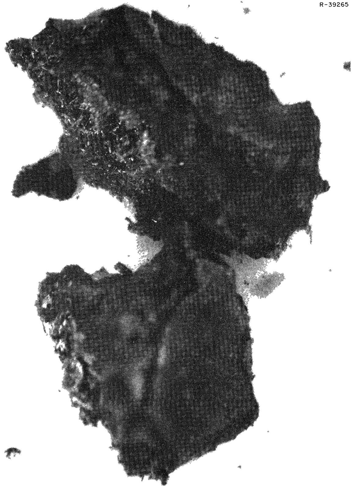  
Fig. 6.7. Residue from beryllium addition capsule FP-12-56, August 3, 1967. Capsule was exposed to fuel salt for $8\mathrm{hr}$ , $971\mathrm{g}$ of $\mathrm{Be}^0$ dissolved. Residue contained $78\mathrm{wt}\%$ Cr and less than a total of $10\mathrm{ppm}$ Fe and Ni

$\min^{-1} \mathrm{~g}^{-1}$ . A calculation showed that if all the $^{99}\mathrm{Mo}$ produced by neutron activation of the $^{98}\mathrm{Mo}$ in the first 0.1-mm thickness of the Hastelloy N reactor containment vessel diffused instantaneously into the fuel melt, the increase in $^{99}\mathrm{Mo}$ concentration would be only about $10^{9} \mathrm{~dis} / \mathrm{min}$ per gram of fuel. It thus appeared that a mechanism was operating which either concentrated fission-produced $^{99}\mathrm{Mo}$ and other noble metals in the pump bowl or resulted in large temporal and spatial variations in their concentrations. Dissolved $^{99}\mathrm{Mo}$ would undoubtedly be uniformly distributed. If the noble metals circulated as a suspension of insoluble metal particles, it was reasoned that they might concentrate in the pump bowl or vary in concentration with pump bowl level, cover gas pressure, and other operating variables. Since clean metal surfaces are not wetted by the fuel salt, there might also be a tendency for metal particles to collect around helium bubbles, which are probably most numerous in the pump bowl.

The $^{95}\mathrm{Nb}$ concentrations varied erratically and did not parallel the behavior of the other noble metals. This was ascribed to analytical difficulties. An unavoidable difficulty was that a large correction for $^{95}\mathrm{Zr}$ decay must be made for each salt analysis.

From the beginning of operations of the MSRE with $^{233}\mathrm{U}$ fuel, the behavior of the fuel salt during and after exposure to the beryllium rods was markedly different than previously observed. A detailed description of the changes in fluid salt and gas behavior during these periods is described in a separate report. $^{10}$ Introduction of beryllium metal into the $^{233}\mathrm{U}$ fuel salt apparently caused a major perturbation of salt-gas interactions and resulted in an increase in void fraction of the fuel salt. The exact reasons for development of the greater void fraction that persisted throughout $^{233}\mathrm{U}$ operations have not been completely determined. In addition to the purely chemical effects which resulted from the addition of beryllium and other reductants, other factors such as pump speed, variation in the solubility of inert gases as a function of hydrostatic pressure, difference in density of the $^{235}\mathrm{U}$ and $^{233}\mathrm{U}$ fuel salt, and changes in interfacial tension were recognized to be related. Interaction of beryllium with the fuel salt during run 15 caused a major change in only one physical property of the fuel - its surface tension. This is the most puzzling aspect of the effect of beryllium on the fuel salt in run 15 since the effect was unprecedented in the fuel system. However, slight changes in interfacial energies in fluid systems are known to account for marked changes in hydraulic behavior. Since the addition of beryllium in the early part of the $^{233}\mathrm{U}$ operations effected both chemical and physical

changes concurrently, the exact way in which these changes altered the void fraction of the salt cannot, therefore, be evaluated exactly, although some aspects of the observed phenomenon can be attributed tentatively to the additions.

If, as inferred in Sect. 6.3, atmospheric oxygen was the causative agent for the increased oxidation potential of the salt, release of the gas from the moderator graphite might well have been triggered by a reduction in the salt-gas interfacial tension, resulting in an increase in the bubble fraction of the salt.

Photographs of the cage assemblies removed from the fuel pump bowl after exposure to the fuel salt are shown in Figs. 6.8-6.23. While none of these cages appeared to have been wetted by salt during $^{235}\mathrm{U}$ operations, each of those removed after treatment of the $^{233}\mathrm{U}$ salt showed evidence that salt had wetted the nickel cage and had adhered to it. A typical example is shown in Fig. 6.17. The presence of bubbles is suggested by the appearance of the upper part of capsule FP-17-8 (Fig. 6.17), on which structures of collapsed bubbles seem to be visible.

Of particular significance to the interpretation of the behavior of the fuel salt from August 1968 to January 1969 are the changes in the relative amounts of iron and chromium contained in the deposits on the nickel cages that were used to suspend beryllium into the pump bowl (Table 6.5). From this and other chemical evidence we deduced that corrosion in the fuel circuit was not checked until early in 1969. By that time, the bubble fraction in excess of that observed in $^{235}\mathrm{U}$ operations was reduced to a fraction that could in general be accounted for by the other factors mentioned above. It may be speculated that the coincidence of the disappearance of reactivity blips with reestablishment of the expected ratio of structural metal fractions in the residues adhering to the nickel cages was indicative of the removal of the last fraction of anomalous excess of bubbles in the fuel salt.

Among the conjectures advanced to account for the excessive rates of salt transfer during this period was one based on the recognition that sharp gradients in the density profile of the fuel salt in the pump bowl existed; from this it was suggested that voluminous amounts of foam were developed in the pump bowl. There was no evidence that such foam had existed in $^{235}\mathrm{U}$ operations, but rather that a salt mist was present in the pump bowl. Indication that such a mist existed was obtained by suspension of a cage-rod assembly of nickel into the pump bowl during run 14. Photographs of the assembly after removal from the pump bowl (Fig. 6.10) show that the surfaces of the rod exposed to

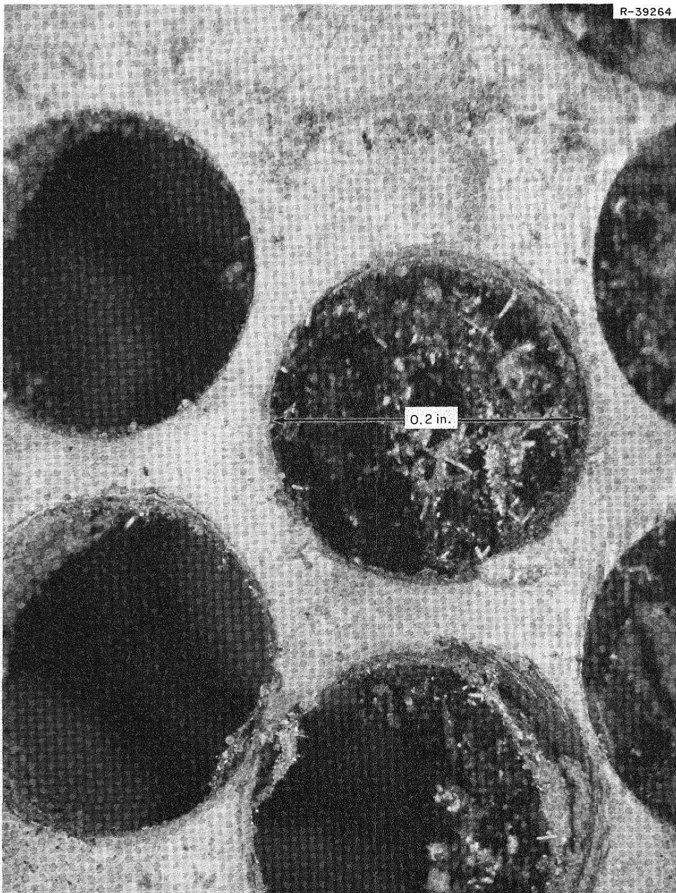  
Fig. 6.8. Dendritic crystals and salt on basket of nickel capsule used to expose beryllium to $^{235}\mathrm{U}$ fuel salt. August 3, 1967, FP-12-56.

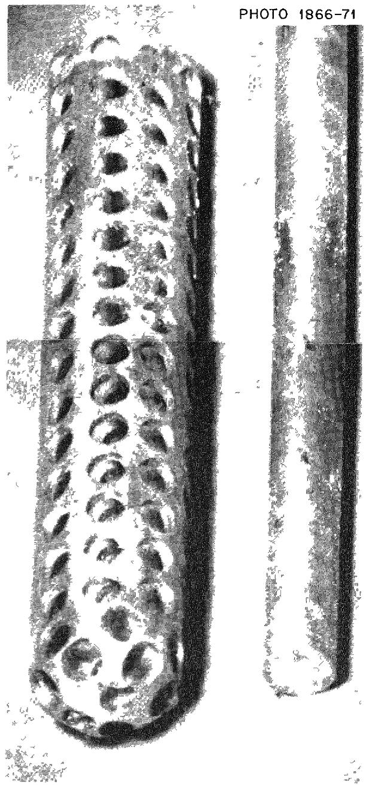  
Fig. 6.9. Appearance of nickel basket and rod after suspension in MSRE fuel salt for $2\mathrm{hr}$ . FP-14-55.

the vapor just above the salt were coated with condensed droplets. Although the vapor space in the sample shroud was probably more quiescent than that in the pump, it was reasoned that foam should also appear here if it were prevalent in the pump bowl.

Attempts to produce foam were performed in the laboratory $^{18}$ but were unsuccessful. Tests for foam production consisted of measurements of the fuel salt level in a 10-in.-diam nickel vessel at intervals during the reduction of essentially all of the uranium to its trivalent state and after stepwise oxidation of the nickel with nickel fluoride. Melt levels were determined by the abrupt change in electrical resistance noted as the insulated nickel rods made contact with the salt mixture. Without exception, the tests showed no evidence of the development of a foam either by increasing or decreasing the oxidation potential of the salt.

In an attempt to identify other possible agents which might cause development of foams in fluoride melts, Kohn and Blankenship19 tested the effect of each of the additives: carbon dust, graphite powder, beryllium metal, finely divided nickel metal, and pump oil vapor. They were unable to promote the development of stable foams with any of these additives in clean melts. Foams were formed only by introducing enough water into the melt, either in the sweep gas or by adding solid hydrates, to give a definite cloudiness. Even so, the foam would collapse very quickly after the purge gas stream was removed.

The phenomena observed in run 15 and later remain as puzzling because the opportunity to perform realistic tests to resolve unanswered questions was lost with the termination of operations of the reactor. It appears that development of a void fraction of unprecedented magnitude took place during a period of rapid corrosion of the containment system and that contaminants which entered the core of the reactor while it was exposed to the atmosphere during maintenance were the source of the corrosion. These contaminants markedly affected the interfacial energies of salt-metal, salt-gas, and salt-graphite surfaces but did not generate foam in the fuel circuit. The conditions which allowed these events to occur are avoidable and are atypical of the operating procedures that are projected for future MSR's.

Additional investigation of the physical properties of molten salts will be necessary to establish quantitatively the relationships of interfacial energies in salt systems to the retention of and stability of bubbles in flowing streams. The initial stages of these investigations can properly be carried out in the laboratory; however, the results may prove to be irrelevant unless the effect of highly radioactive fluxes on the properties is shown to be inconsequential.

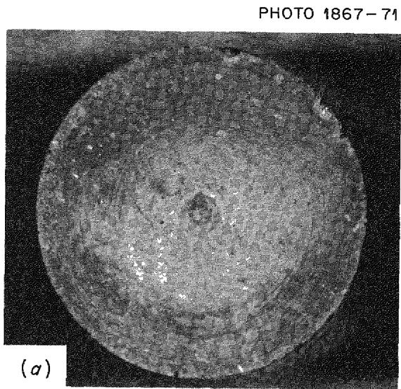

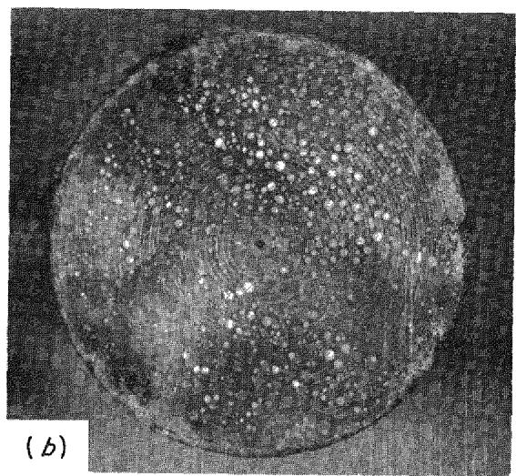  
Fig. 6.10. Appearance of nickel rod from FP-14-55 after suspension in MSRE pump bowl for 2 hr. (a) Upper end, (b) lower end

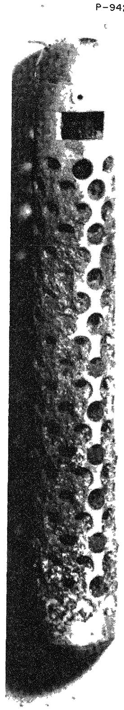  
Fig. 6.11. Nickel cage after second exposure of beryllium to $^{233}\mathrm{U}$ fuel salt. October 13, 1968, FP-15-30, 834 g $\mathrm{Be}^0$ dissolved from Be rod

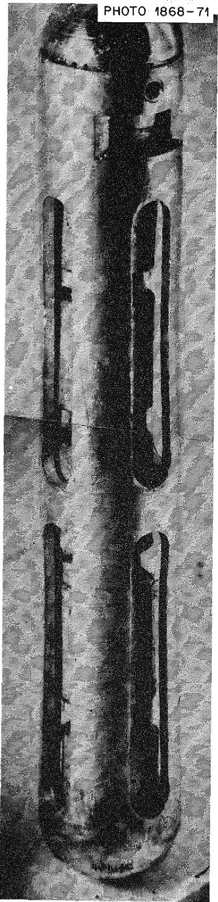  
Fig. 6.12. Copper capsule containing several short magnets before exposure to $^{233}\mathrm{U}$ fuel salt.

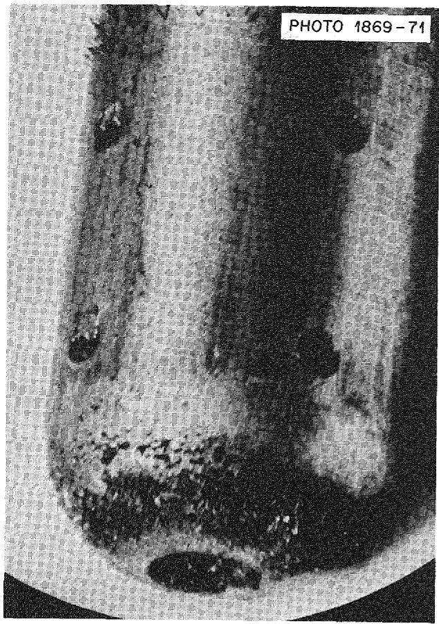  
Fig. 6.13. Metallic particles on copper capsule used to expose a magnet to $^{233}\mathrm{U}$ fuel salt. November 15, 1968, FP-15-61. Dendrites on capsule were composed of fine particles of iron.

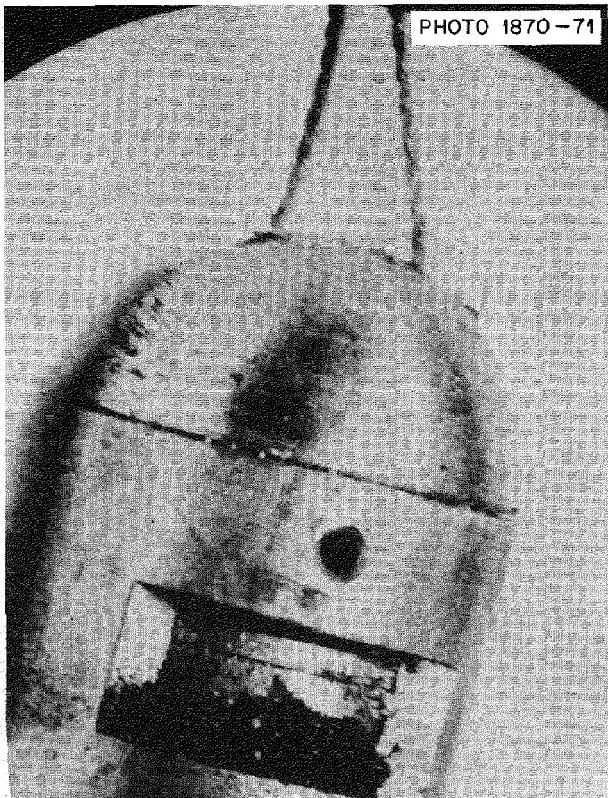  
Fig. 6.14. Upper end of magnet capsule FP-15-61 showing collected material.

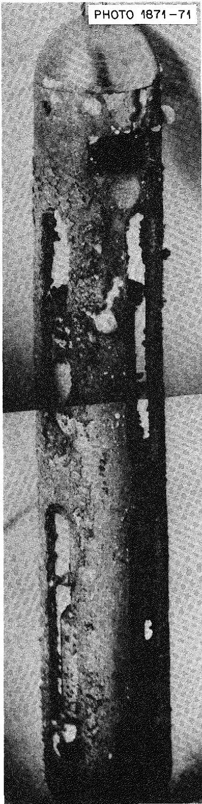  
Fig. 6.15. Copper capsule used to expose beryllium and magnets simultaneously. November 20, 1968, FP-15-66; $1\mathrm{gBe}^0$ dissolved from beryllium metal spacers.

PHOTO 1872-71

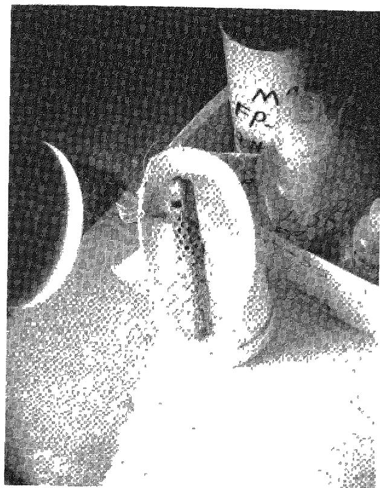

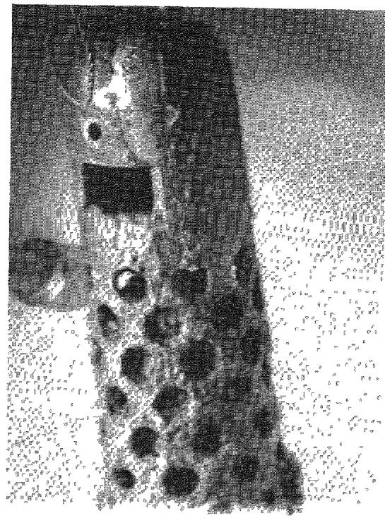

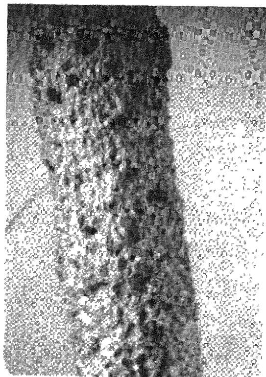  
Fig. 6.16. Nickel cage from third beryllium exposure in $^{233}\mathrm{U}$ fuel salt. November 15, 1968, FP-15-62; 9.38 g Be $^0$ dissolved from rod.

PHOTO 94278

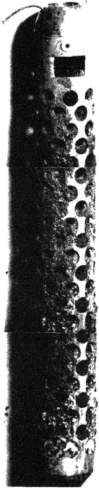  
Fig. 6.17. Nickel cage after fourth exposure of beryllium to $^{233}\mathrm{U}$ fuel salt. November 15, 1968, FP-17-8, $857\mathrm{g}$ of $\mathrm{Be}^0$ dissolved from rod

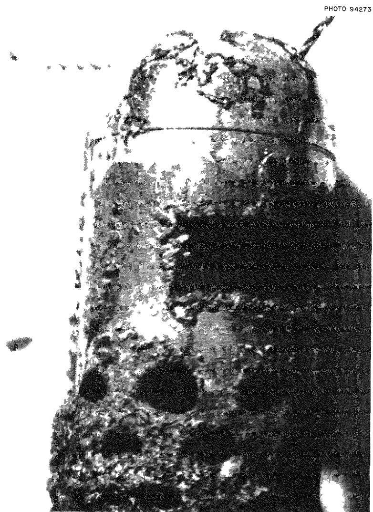  
Fig. 6.18. Top of nickel cage from fourth beryllium exposure in $^{233}\mathrm{U}$ fuel salt January 22 1969 FP-17-8, $857\mathrm{gBe}^0$ dissolved from rod After leach treatment with Verbocit and nitric acid solutions

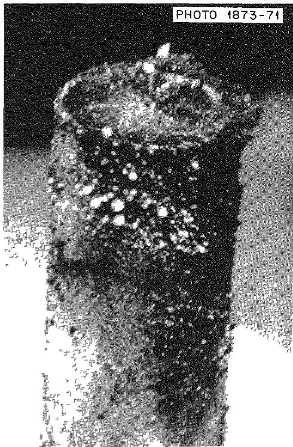  
Fig. 6.19. Chromium rod exposed to $^{233}\mathrm{U}$ fuel salt. January 30, 1969, FP-17-11.

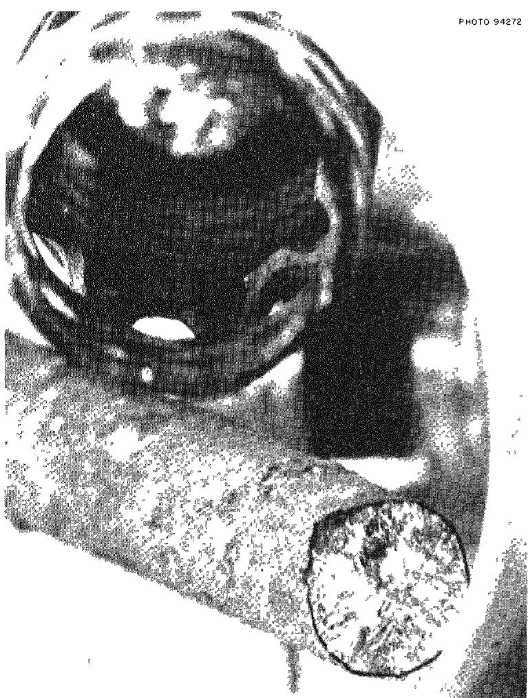  
Fig. 6.20. Cross section of chromium rod showing surface deposit. January 30, 1969, FP-17-11.

  
Fig. 6.21. Nickel cage after exposure of beryllium rod to $^{233}\mathrm{U}$ fuel salt. October 8, 1969, FP-19-48; $4.91\mathrm{gBe}^0$ dissolved from rod.

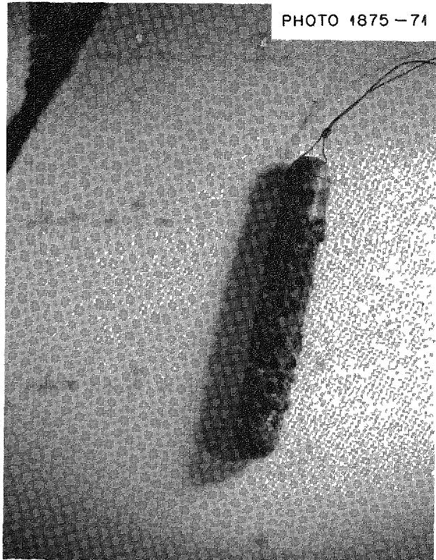  
Fig. 6.22. Nickel cage from exposure of beryllium rod to $^{233}\mathrm{U}$ fuel salt. November 29, 1969, FP-20-7; 6.97 g Be $^0$ dissolved from rod.

# 6.5 Effect of Uranium Trifluoride on the $^{95}\mathrm{Nb}$ Concentration of the Fuel Salt

Minor adjustments in the concentration of uranium trifluoride in the MSRE fuel salt were made occasionally during the period when the MSRE was operated with $^{235}\mathrm{U}$ fuel. Their primary purpose was to offset the oxidizing effects anticipated to result from the fission reaction. Within this period the $[\mathrm{U}^{3+}] / [\Sigma \mathrm{U}]$ concentration ratio was estimated to have varied within the range 0.1 to $\sim 1.7\%$ (Fig. 6.24). No evidence was found that indicated that such variation effected significant changes in either corrosion rate or fission product behavior in the fuel salt within the reactor. This derives from the fact that the $^{235}\mathrm{U}$ fuel was a highly buffered system in comparison with the $^{233}\mathrm{U}$ fuel used later; that is, the total amount of uranium in the $^{235}\mathrm{U}$ fuel exceeded that contained in the $^{233}\mathrm{U}$ fuel by sixfold. In contrast, operation of the MSRE with

${}^{233}\mathrm{U}$ fuel showed pronounced changes in the corrosion rates and fission product chemistry as the concentration of $\mathrm{UF}_3$ was altered. Of considerable interest was the appearance of $^{95}\mathrm{Nb}$ in the fuel salt, noted for the first time in initial operations with $^{233}\mathrm{U}$ fuel.[20] This observation signaled the potential application of the disposition of $^{95}\mathrm{Nb}$ as an in-line redox indicator for molten-salt reactors.

Operation of the MSRE with $^{233}\mathrm{U}$ fuel thus gave evidence that pronounced changes in fission product and corrosion chemistry resulted as variations of the concentration of $\mathrm{UF}_3$ in the fuel salt were made. The $^{233}\mathrm{U}$ fuel was experimentally more tractable for study than the previous charge of $^{235,238}\mathrm{U}$ fuel because of the much lower uranium inventory carried in the $^{233}\mathrm{U}$ fuel. A serious disadvantage was realized, however, when it was discovered that the total amounts of $\mathrm{UF}_3$ which were obtainable in samples of the $^{233}\mathrm{U}$ fuel caused the previously satisfactory method $^{21}$ used for

PHOTO 1876-71

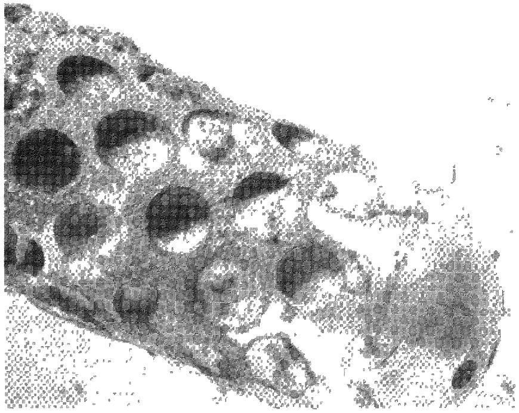

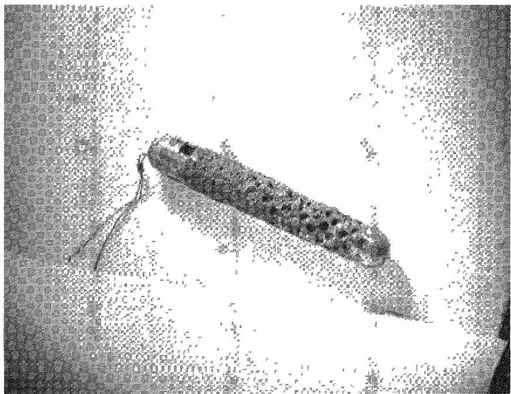  
Fig. 6.23. Nickel cage from exposure of beryllium rod to $^{233}\mathrm{U}$ fuel salt. December 9, 1969, FP-20-22; 9.87 g Be $^0$ dissolved.

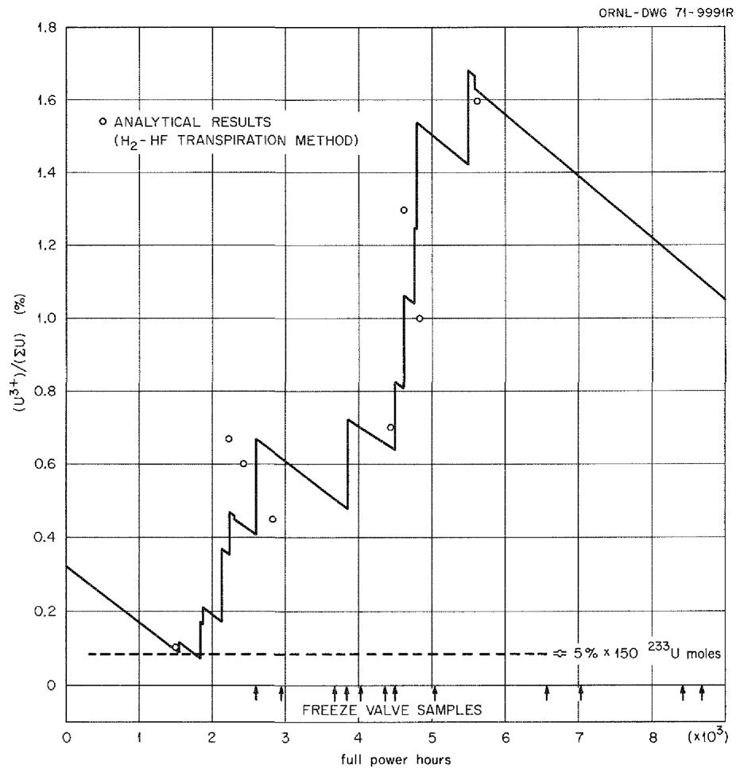  
Fig. 6.24. $\left[\mathbf{U}^{3+}\right] / \left[\Sigma \mathbf{U}\right]$ in the MSRE fuel salt, runs 5-14. Assumed maximum power, 7.4 MW(t):

determination of $\mathbf{U}^{3+}$ in the fuel salt to be of little value and required the development of new methods of analysis.

Adjustments of the uranium trifluoride concentration of the MSRE fuel salt were made frequently during $^{233}\mathrm{U}$ operations in order to study the inhibition of corrosion by control of the $[\mathrm{U}^{3+}] / [\Sigma \mathrm{U}]$ concentration ratio and to evaluate the possible application of $^{95}\mathrm{Nb}$ disposition as a redox indicator. The experimental results obtained during this period of operations provided concrete evidence that values of the equilibrium constant for the reaction $\mathrm{Cr^0 + 2UF_4\rightleftharpoons CrF_2 + 2UF_3}$ , as assigned from standard free energy and activity data, are reasonably accurate. Together with niobium distribution data they show that after the fuel system had been opened for maintenance the fuel salt subsequently appeared to become oxidizing with respect to the MSRE containment circuit even though it did not seem to have caused corrosion in the drain tanks. Comparisons of the relative fraction of the $^{95}\mathrm{Nb}$ inventory

which appeared in the fuel salt as the redox potential of the salt changed indicated that when mildly reducing conditions were imposed, as for steady-state operation of the MSRE, niobium very likely became involved in reaction with the moderator graphite to form niobium carbide.

During August and September 1968 the $^{233}\mathrm{U}$ fuel charge was constituted from $^7\mathrm{LiF - }^{233}\mathrm{UF}_4$ and $^7\mathrm{LiF - }^2\mathrm{BeF}_2 - \mathrm{ZrF}_4$ carrier salt which had previously contained $^{235,238}\mathrm{UF}_4$ . Concurrent with the inception of corrosion in the fuel circuit, as evidenced by a rapid increase in the concentration of Cr in the fuel salt (Fig. 6.25), niobium began to appear in the fuel salt for the first time[21] and persisted there until $28.80\mathrm{g}$ (6.54 equivalents) of $\mathrm{Be}^0$ had been added. During this period the concentration of chromium in the salt rose from 35 to 65 ppm, indicating the removal of $140\mathrm{g}$ (5.89 equivalents) of chromium from the circuit walls. Thus, when $^{95}\mathrm{Nb}$ disappeared from the fuel salt after the final addition of beryllium (sample FP-15-62), a total of

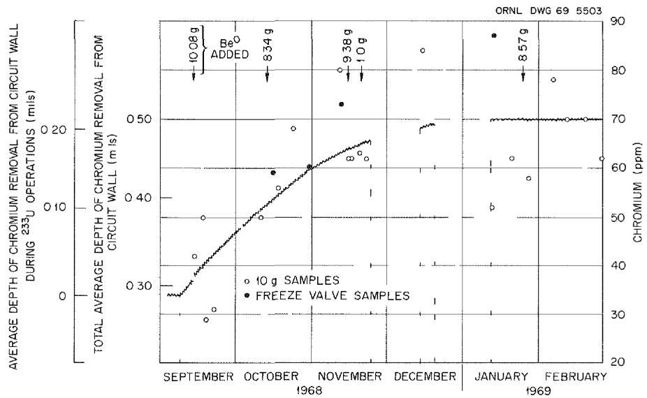  
Fig. 6.25. Corrosion of the MSRE fuel circuit in run Nos. 15 and 16, September-December 1968.

12 43 equivalents were involved in the reduction of $\mathrm{Fe}^{2+}$ and establishment of the $\mathrm{Cr^0 + 2UF_4\rightleftharpoons 2UF_3 + }$ $\mathrm{C_fF_2}$ equilibrium. Samples of the salt obtained during the brief period of the subsequent run (No 16) as well as the beginning of $^{233}\mathrm{U}$ power operations in run No 17 (FP-16-4 and FP-17-2) showed the presence of 52 and $29\%$ of the $^{95}\mathrm{Nb}$ inventory respectively

In Fig 6 26, nominal values of $\mathrm{[U^{3 + }] / [Sigma]}$ are shown for runs 17-20 These operations comprise nearly the total power operation of the MSRE with $^{233}\mathrm{U}$ fuel The concentrations of $\mathrm{UF}_3$ shown in Fig 6 26 are based on the assumption that 0 76 equivalent of oxidation results from the fission of 1 at wt of uranium and that the maximum power achieved by the MSRE was $74\mathrm{MW(t)}$ They also assume that the observed increases in the concentration of chromium in the fuel salt at the beginning of runs 19 and 20 are indicative of the total loss of $\mathrm{U}^{3 + }$ from the salt, the nominal values for $\mathrm{[U^{3 + }] / [Sigma]}$ at these instants are thus shown as zero. The equilibrium constant for the corrosion equilibrium $\mathrm{Cr^0 + 2UF_4\rightleftharpoons 2UF_3 + CrF_2}$ reaction at $650^{\circ}\mathrm{C}$ , assuming an activity for $\mathrm{Cr^0}$ in the Hastelloy to be $003,^3$ is $1271\times 10^{7}$ . Thus, in a regime such as that which prevailed during the initial stages of run No 19, the rate at which $\mathrm{Cr^0}$ is leached from the Hastelloy N circuit gradually decreases as the $\mathrm{Cr^{2 + }}$ concentration of the fuel salt increases During the initial period of run No 19 the $\mathrm{Cr^{2 + }}$ concentration of the circulating fuel salt rose from 72 to $100~\mathrm{ppm}$ . At that point the equilibrium concentration of $\mathrm{[U^{3 + }] / [Sigma]}$ in the fuel salt anticipated from free energy and activity data is $\sim 0.5\%$

The disposition of $^{95}\mathrm{Nb}$ in the $^{233}\mathrm{U}$ fuel during the initial period of run No 19 indicates that when $\left[\mathrm{U}^{3+}\right] / \left[\Sigma\mathrm{U}\right]$ was less than $\sim 0.5\%$ , Nb became oxidized and entered the salt, possibly as $\mathrm{Nb}^{3+}$ or $\mathrm{Nb}^{4+}$ . Then, as the corrosion reaction $\mathrm{Cr}^0 + 2\mathrm{UF}_4 \rightleftharpoons 2\mathrm{UF}_3 + \mathrm{CrF}_2$ proceeded to equilibrium, the $\mathrm{U}^{3+}/\Sigma\mathrm{U}$ concentration ratio increased, and at a $\left[\mathrm{U}^{3+}\right] / \left[\Sigma\mathrm{U}\right]$ value of $0.5\%$ , $^{95}\mathrm{Nb}$ precipitated from the fuel salt. Two levels of nominal $\mathrm{U}^{3+}/\Sigma\mathrm{U}$ concentration are given during run Nos 17 and 18, the higher values based on the assumption that corrosion of the fuel circuit during the early stages of run No 17 may have accounted for a fraction of $\left[\mathrm{U}^{3+}\right] / \left[\Sigma\mathrm{U}\right]$ . The extent to which this reaction might contribute to the total concentration of $\mathrm{UF}_3$ in the fuel at the beginning of run No 17 is obscure, because the MSRE was operated at full power at the inception of run No 17. Such operation deposits the noble metal fission products on the surface of the Hastelloy N, causing the activity of $\mathrm{Cr}^0$ at the alloy surface to be effectively reduced. The beginning period of run No 19 is not analogous, for not until the corrosion equilibrium was established was the reactor operated at full power for sustained periods

Freeze-valve samples were obtained at the request of E G Bohlmann and E L Compere during runs Nos 17-20 Their analyses of the salt removed from the pump bowl showed $^{95}\mathrm{Nb}$ disposition as indicated by the data points in Fig 6 26 It is evident that, as $[\mathrm{U}^{3+}] / [\Sigma \mathrm{U}]$ decreased below $0.5\%$ in run No 17, $^{95}\mathrm{Nb}$ was oxidized and distributed to the fuel salt, to be removed subsequently as this concentration ratio was exceeded Of the data shown in Fig 6 26 only the

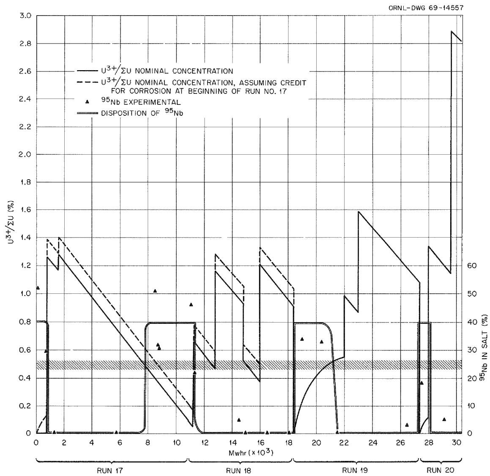  
Fig. 6.26. Effect of $\mathbf{U}^{34} / \Sigma \mathbf{U}$ on distribution of $^{95}\mathrm{Nb}$ in the MSRE fuel salt.

second data point in run 18 appears to be anomalous. It seems likely that this result represents incomplete equilibrium since the sample was obtained just after $\left[\mathrm{U}^{3+}\right] / \left[\Sigma \mathrm{U}\right]$ had been adjusted to a nominal value of $0.7\%$ . In view of the fact that $\mathrm{Be}^0$ , in contact with the molten fuel, generates reduction potential gradients which result in the reduction not only of $\mathrm{U}^{4+}$ to $\mathrm{U}^{3+}$ but of $\mathrm{Cr}^{2+}$ to $\mathrm{Cr}^0$ as well, one might anticipate a kinetic factor to be significant in $\mathrm{Be}^0 \rightleftharpoons \mathrm{Be}^{2+}$ , $\mathrm{U}^{4+} \rightleftharpoons \mathrm{U}^{3+}$ , $\mathrm{Cr}^{2+} \rightleftharpoons \mathrm{Cr}^0$ , $\mathrm{Nb}^{3+} \rightleftharpoons \mathrm{Nb}^0$ equilibria in the MSRE fuel salt.

The results described in Fig. 6.26 indicate that when the $[\mathrm{U}^{3+}] / [\Sigma \mathrm{U}]$ of the $^{233}\mathrm{U}$ MSRE fuel was poised at $\sim 0.5\%$ , disposition of $^{95}\mathrm{Nb}$ toward solution in the salt or deposition within the reactor was at a null point,

and, as indicated by behavior during $^{235}\mathrm{U}$ operations, the $\mathrm{U}^{3+}/^{95}\mathrm{Nb}$ ratio is the controlling factor. At 0.5% $\mathrm{U}^{3+}$ this ratio is 8.5/1.

Little is known concerning the chemistry of niobium in the MSRE fuel salt. Preliminary results of laboratory experiments indicate22 that under mildly oxidative conditions niobium assumes an oxidation number of $\sim 3.7$ . The fact that during run 15, when the oxidation potential of the fuel salt was sufficiently high to permit $\mathrm{Fe}^{2+}$ to exist in the salt in significant concentrations, nearly all of the $^{95}\mathrm{Nb}$ inventory of the fuel salt was in solution, whereas in subsequent operations when the oxidation potential was less, no greater than $\sim 50\%$ of the $^{95}\mathrm{Nb}$ was found in the salt. This behavior seems to indicate that when niobium was deposited on the

moderator graphite it reacted to form niobium carbide and that under the various redox regimes which were established in the MSRE during runs 17 to 20 niobium carbide was not removed from the moderator graphite. The prevalence of niobium as the carbide is compatible with the experimental observations by Blankenship et al. $^{16}$ and as noted by Cuneo and Robertson, $^{23}$ who found that the concentration of $^{95}\mathrm{Nb}$ at all profiles in three different types of graphite was greater than would have been anticipated if after deposition the isotope remained as the metallic species.

# References

1. A. Taboada, MSR Program Semiannu. Progr. Rep. July 31, 1964, ORNL-3708, p. 330.   
2. W. R. Grimes, Nucl. Sci. Appl. Technol. 8, 138 (1970).   
3. M. B. Panish, R. F. Newton, W. R. Grimes, and F. F. Blankenship, J. Phys. Chem. 62, 980 (1962).   
4. J. O. Blomeke and M. F. Todd, "Uranium-235 Fission Product Production as a Function of Thermal Neutron Flux, Irradiation Time, and Decay Time," USAEC report ORNL-2127, Oak Ridge National Laboratory (November 1958).   
5. C. F. Baes, "The Chemistry and Thermodynamics of Molten Salt Reactor Fluoride Solutions," Proc. IAEA Symposium on Thermodynamics with Emphasis on Nuclear Materials and Atomic Transport in Solids, Vienna, Austria, July 1965.   
6. W. R. Grimes, G. M. Watson, J. H. DeVan, and R. B. Evans, "Radiotracer Techniques in the Study of Corrosion by Molten Fluorides," Proceedings of the Conference on the Use of Radioisotopes in the Physical Sciences and Industry, Sept. 6-17, 1960, vol. III, p. 559, International Atomic Energy Agency, Vienna, Austria, 1962.   
7. H. E. McCoy, An Evaluation of the Molten Salt Reactor Experiment Hastelloy-N Surveillance Specimens - Fourth Group, ORNL-TM-3063 (1970).   
8. MSR Program Semiannu. Progr. Rep. Aug. 31, 1965, ORNL-3872, p. 113.   
9. MSR Program Semiannu. Progr. Rep. July 31, 1963, ORNL-3529, p. 130.   
10. J. F. Engel, P. N. Haubenreich, and A. Houtzeel, Spray, Mist, Bubbles, and Foam in the Molten Salt Reactor Experiment, ORNL-TM-3027 (June 1970).   
11. Letter dated February 9, 1971, from D. B. Trauger to M. Shaw, Assessment of Need for Oxygen Getter in MSBR Fuel.   
12. Furnished through the courtesy of C. Crouthamel, Chemical Engineering Division, Argonne National Laboratory, Argonne, Ill.

13. W. R. Grimes, unpublished work, 1970.   
14. B. McNabb and H. E. McCoy, internal correspondence, March 31, 1971.   
15. R. E. Thoma, MSR Program Semiannu. Progr. Rep. Feb. 28, 1970, ORNL-4548, p. 93.   
16. F. F. Blankenship, E. G. Bohlmann, S. S. Kirslis, and E. L. Compere, Fission Product Behavior in MSRE, ORNL-4684 (in preparation).   
17. S. S. Kirlis and F. F. Blankenship, MSR Program Semiannu. Progr. Rep. Feb. 28, 1967, ORNL-4119, p. 131.   
18. J. H. Shaffer and W. R. Grimes, MSR Program Semiannu. Progr. Rep. Feb. 28, 1969, ORNL-4396, p. 135.   
19. H. W. Kohn and F. F. Blankenship, ibid., p. 137.   
20. J. M. Dale, MSR Program Semiannu. Progr. Rep. Aug. 31, 1967, ORNL-4191, p. 167.   
21. E. L. Compere and E. G. Bohlmann, MSR Program Semiannu. Progr. Rep. Feb. 28, 1969, ORNL-4396, p. 139.   
22. C. F. Weaver, private communication.   
23. D. R. Cuneo and H. E. Robertson, MSR Program Semiannu. Progr. Rep. Aug. 31, 1968, ORNL-4344, p. 141.

# 7. DETERMINATION OF REACTOR POWER

# 7.1 Power Estimates with $^{235}\mathrm{U}$ Fuel from Heat Balance and Other Methods

Estimates of the power developed by the MSRE can be derived from nuclear and heat balance data. Both bases were used from the beginning of power operations with the MSRE. As refinements and corrections were introduced into the physical property and nuclear data, new estimates were made. Consequently, MSR Program progress reports cite various values for the maximum average power of the reactor ranging between 7 and 8 MW(t).

The results of the investigation described in this chapter fixed the maximum power of the MSRE at 7.4 MW(t), a value with which other estimates have more recently agreed.

The power generation rate of the MSRE was calculated routinely by an on-line computer; power production was determined from computation of the heat balance in the fuel and coolant systems. Details of the methods employed are described elsewhere. $^{1,2}$ Once heat balances were established, nuclear instrumentation systems were calibrated to correspond to the nuclear power indicated by the heat balance.

The results of chemical and isotopic analysis of fuel salt were assessed carefully throughout the period when the MSRE was operated with $^{235}\mathrm{U}$ fuel and later when the fuel charge was comprised of $^{233}\mathrm{U}$ and plutonium, with the purpose of employing these results to monitor, if possible, the power generated by the reactor. Attempts to use chemically determined values of the concentration of uranium in the fuel-salt samples were generally unsatisfactory because of the point-to-point scatter in these data and because of the overwhelming effect that the use of flush salt in the fuel circuit had on the uranium concentration base lines. The amounts of fuel- and flush-salt residues remaining in the fuel circuit after drains were estimated by comparisons of the chemical analyses of uranium in the flush salt with those in the fuel salt during each period of use. Not until the uranium concentration of the flush salt had undergone several increments was the precision of the average mass of fuel-salt residues narrowed to within $\pm 5$ kg. This was, however, of insufficient precision to afford a sufficiently accurate base line for computation of the power generation. It was thus evident that the results of wet chemical analyses for uranium in the fuel salt would be of potential use in establishing burnup rates only after long periods of power generation which were free from drain-flush-fill interruptions.

Until March 1968, calculations of the heat balance indicated that the maximum power generated by the MSRE was $7.2\mathrm{MW(t)}$ . By that time, a discrepancy between nominal concentration and analytical values for uranium in the circulating fuel salt began to appear; the analytical data over an extended period in run No. 10 showed a negative divergence from the nominal concentration of the uranium in the fuel of about $10\%$ . During this period, however, computations of the reactivity balance did not indicate corresponding or anomalous decreases in the fissile concentration of the salt. Reactivity balance calculations had previously indicated that this method of evaluating reactor performance was sensitive to a factor of 10 greater than chemical analysis with respect to detection of changes in uranium concentration of the fuel. The chemical data suggested that the maximum actual power output of the reactor was $\sim 8.0$ MW rather than $7.2\mathrm{MW}$ . However, little credibility could be accorded to this conclusion for the reasons cited above.

By early 1968 a sufficient amount of $^{236}\mathrm{U}$ was generated in the fuel salt to suggest that comparison of the analytical results of mass spectrometric measurements would provide a good measure of the integrated power. Tests of this comparison yielded a slope that was within $1\%$ of the theoretical slope for a power

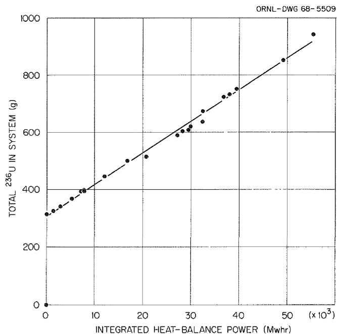  
Fig. 7.1. $^{236}\mathrm{U}$ buildup in MSRE vs power production.

generation rate of $7.2\mathrm{MW}$ . The uncertainty in the theoretical slope was regarded to be probably less than $10\%$ , and the actual integrated power was probably within $10\%$ of the value indicated by the heat balances (see Fig. 7.1).

Although the $^{236}\mathrm{U}$ production rate seemed to confirm estimates that indicated the maximum power output to be 7.2 MW, suspicion was growing that the heat balance calculations were in error, for data collected at different power levels indicated that the value employed for the specific heat of the LiF-BeF $_2$ coolant salt was not temperature dependent, $^4$ whereas a temperature-dependent relationship was employed in the heat balance. $^5$

A program of laboratory measurements of the enthalpy of solid and liquid $\mathrm{Li}_2\mathrm{BeF}_4$ from 273 to $900^{\circ}\mathrm{K}$ was completed at this time, by investigators at the National Bureau of Standards, $^6$ from which it was shown that the heat capacity was $0.56\mathrm{calg}^{-1}(\mathrm{^\circ C})^{-1}$ . A fluoride mixture was synthesized for confirmation at ORNL of the NBS value. Results of these measurements indicated that the derived heat capacity of the coolant salt was $0.577\pm 0.008\mathrm{calg}^{-1}(\mathrm{^\circ C})^{-1},$ in good agreement with the NBS investigations but substantially higher in the operating temperature range of the MSRE than the previously used value, and showed essentially no variation with temperature. The new value of the specific heat was incorporated into the computerized heat balance computations prior to the beginning of

operation with $^{233}\mathrm{U}$ fuel Calculated full-power level was changed from 7.2 to 80 MW as a result of the revision in the value for specific heat and in accord with the analytical chemical results

Throughout this entire period, changes in the nominal amounts of uranium isotopes in the fuel salt were computed based on average cross section data for thermal and epithermal neutron reactions in the MSRE spectrum that were current to $1965^{8,9}$ The consumption and production rates were

<table><tr><td>234U</td><td>-2167 × 10-4g/MWhr</td></tr><tr><td>235U</td><td>5417 × 10-2g/MWhr</td></tr><tr><td>236U</td><td>+1083 × 10-1g/MWhr</td></tr><tr><td>238U</td><td>7017 × 10-2g/MWhr</td></tr><tr><td>Total</td><td>-5146 × 10-2g/MWhr d</td></tr></table>

$a_{\mathrm{Ret}}$ 9

# 7.2 Power Output of the MSBR Based on the Isotopic Composition of Plutonium

The potential use of plutonium as a fuel for molten-salt reactors has been assessed periodically for more than a decade. The results of one early study $^{10}$ showed that a $\mathrm{PuF_3}$ -fueled two-region homogeneous fluoride salt reactor was operable, although its performance was poor. Further development was not pursued for neither the chemical feasibility nor methods for improving its performance were obvious. Although the thermochemical properties of the plutonium fluorides were not well established at that time, it was clear that the most soluble fluoride, $\mathrm{PuF_4}$ , was too strong an oxidant for use with the available structural alloys. The solubility of $\mathrm{PuF_3}$ , while sufficient for criticality even in the presence of fission fragments and nonfissionable isotopes of $\mathrm{Pu}$ , was assumed $^{11}$ to limit the amount of $\mathrm{ThF_4}$ which could be added to the fuel salt. This limitation, coupled with the condition that the continuous use of $^{239}\mathrm{Pu}$ as a fuel would result in poor neutron economy in comparison with that of $^{233}\mathrm{U}$ -fueled reactors, vitiated further efforts to exploit the plutonium fluorides for application in two region MSBRs

Recent developments in fuel reprocessing chemistry and in reactor design have established the feasibility of single-fluid molten-salt breeder reactors. One of the alternative modes of operating such reactors is to employ plutonium in place of enriched $^{235}\mathrm{U}$ for the

initial fuel loading and startup of the reactors Assessments of plutonium to start up MSBRs in this way have concluded that plutonium should prove to be a very satisfactory alternative to enriched uranium, either as initial fuel for a molten-salt breeder reactor or as initial fuel and subsequent feed material $^{12-14}$

It now appears that it will be possible to operate an $\mathrm{LiF - BeF_2 - ThF_4 - PuF_3}$ single-fluid molten-salt reactor with lower concentrations of thorium and plutonium than earlier considerations required, for example, with thorium fluoride concentrations of 8 to 12 mole $\%$ and with a plutonium fluoride concentration of approximately $25\%$ less than required for $^{233}\mathrm{U}$ loading, that is, $\leqslant 0.2$ mole $\%$ These conclusions indicated the desirability of demonstration experiments to examine, in as nearly similar application as possible, the behavior of plutonium in an MSBR The chemical feasibility of this application was evaluated[15] and found to hold promise for successful application. Therefore, when the MSRE resumed operations with $^{233}\mathrm{U}$ fuel, plans were made to include plutonium as a constituent of the fuel. Using pre-1965 cross-section data and assuming that the maximum operating power of the reactor was $80\mathrm{MW}$ , efforts were initiated to establish a material balance for plutonium.

During the final period of operation with $^{235,238}\mathrm{U}$ fuel, a sufficient amount of plutonium was generated for its detection in salt samples to be tractable by standard analytical methods. Approximately $600\mathrm{g}$ of plutonium was generated in the MSRE fuel as it was operated with $^{235}\mathrm{U}$ fuel by neutron absorptions in $^{238}\mathrm{U}$ , enough to afford a comparison of the analytical data with anticipated values. The results of that comparison, expressed as a material balance for plutonium, showed that the analytical chemical methods, which were previously satisfactory for determination of the concentration of plutonium in the fuel salt, were of questionable utility for use with the $^{233}\mathrm{U}$ fuel charge and that isotopic dilution methods, using mass spectrometric analyses, afforded the most satisfactory means of analysis. They indicated, in addition, that at the maximum concentrations in which plutonium occurred in the MSRE fuel salt, it existed as a stable chemical entity and, by inference, that $\mathrm{Pu}_2\mathrm{O}_3$ is not precipitated in the presence of low concentrations (50 to 60 ppm) of oxide ion

The net production rates for plutonium generated in the $^{235,238}$ U fuel salt have been estimated16 to be

$$
\begin{array}{l} G ^ {2 3 9} = G ^ {2 3 8} \cdot 0. 0 1 8 5 8 4 (e ^ {- 0. 6 0 5 3 7 ^ {- 7} T} \\ \left. - e ^ {- 0 3 3 1 8 ^ {- 5} T}\right), \\ \end{array}
$$

$$
\begin{array}{l} G ^ {2 4 0} = G ^ {2 3 8} \cdot (0 0 0 8 2 3 3 e ^ {- 0 2 9 1 6 6 ^ {- 5} T} \\ 0 0 6 4 8 7 9 9 e ^ {- 0} 2 9 1 6 6 ^ {- 5} T \\ + 0 0 5 6 6 4 7 e ^ {- 0 3 3 3 1 8 ^ {- 5} T}), \\ \end{array}
$$

where

$$
\begin{array}{l} \begin{array}{l} G ^ {k} = \text {m a s s o f} k \text {i n c i r c u l a t i o n} (g) (k = 2 3 8, 2 3 9, 2 4 0 \\ \text {r e f e r s t s o t} ^ {2 3 8} \mathrm {U}, ^ {2 3 9} \mathrm {P u}, \text {a n d} ^ {2 4 0} \mathrm {P u} \text {r e s p e c t i v e l y}), \end{array} \\ T = \text {t i m e} (\mathrm {M W h r}) \\ \end{array}
$$

At termination of the $^{235}\mathrm{U}$ experiment, $589\mathrm{g}$ of plutonium should have been generated in the fuel salt with the reactor operating at a maximum power of 80 MW. For a fuel charge of $4900\mathrm{kg}$ , this corresponds to $120\mathrm{ppm}$ . The average concentration of plutonium in the fuel salt, as determined from the results of analyses of 18 fuel salt samples obtained during the latter period of power operations with $^{235,238}\mathrm{U}$ fuel, was $118\mathrm{ppm}$ . The analytical data do not show a significant trend and are probably not sufficiently precise to use as a basis to infer that a real difference exists between calculated and analytical values. On completion of these power operations, uranium was removed from the fuel salt by fluorination. It was anticipated that the plutonium would remain in the carrier salt. Five samples of the carrier salt were removed from the fuel drain after fluorination and found to have an average concentration of $120\mathrm{ppm}$ of plutonium, representing a total of $562\mathrm{g}$ , as compared with an expected value of $125\mathrm{ppm}$ , that is, $27\mathrm{g}$ of plutonium is not accounted for by the results of these analyses

The concentration of plutonium in a salt specimen is calculated from the relation

$$
\begin{array}{l} \text {C o n c e n t r a t i o n} \mathrm {P u (p p m)} = \mathrm {d p m / g} \times 3 9 7 \times 1 0 ^ {- 8} \\ - \left(^ {2 3 8} N \times 1 4 7 0 + ^ {2 3 9} N \times 5 4 0 2 \times 1 0 ^ {- 3} + ^ {2 4 0} N \right. \\ \times 2 0 0 \times 1 0 ^ {- 2} + ^ {2 4} 1 N \times 4 1 0 \times 1 0 ^ {- 4} \\ + ^ {2 4 2} N \times 3 5 \times 1 0 ^ {- 4}), \\ \end{array}
$$

where $N$ is the atom fraction of plutonium as the isotope designated

The concentration of plutonium in each of the $10\mathrm{g}$ samples of fuel salt taken since the beginning of $^{233}\mathrm{U}$ operations was determined using conversion factors which assumed that the plutonium in the MSRE consisted entirely of $^{239}\mathrm{Pu}$ and $^{240}\mathrm{Pu}$ . The average concentration of plutonium after full loading of the reactor was achieved was found to be 147 ppm (Table

71) This value indicates the presence of a total of 689 g of plutonium, thus the enriching salt might then have been expected to contain 100 g of plutonium. In an attempt to substantiate this conclusion a sample of the $^{7}\mathrm{LiF}^{233}\mathrm{UF}_4$ enriching salt was obtained from a section of transfer line at the TURF and submitted for chemical and mass spectrometric analysis. The salt residue which was contained in the line was considered to be typical of that delivered for use in the MSRE. The results of mass spectrometric analysis showed that this salt contained plutonium 164 wt % of which was $^{238}\mathrm{Pu}$ . Revised conversion factors were therefore required for calculation of the total plutonium concentration of the TURF salt and $^{233}\mathrm{U}$ fuel salt because of the high specific activity, $646 \times 10^5$ dis sec $^{-1}$ $\mu \mathrm{g}^{-1}$ , for $^{238}\mathrm{Pu}$ . The plutonium concentration of the TURF salt appears now to have been 249 ppm using the revised factor and corresponds to the addition of 16.4 g of plutonium along with the $^{7}\mathrm{LiF}^{233}\mathrm{UF}_4$ eutectic. Current estimates of the nominal concentration of plutonium are now based on the assumption that this amount of plutonium was added to the fuel salt and, therefore, that the MSRE contained $\sim 605$ g of plutonium at the beginning of $^{233}\mathrm{U}$ power operations

A plutonium inventory of the MSRE fuel was computed, both before and after loading with $^{233}\mathrm{U}$ fuel, based on Prince's estimates of the production and fission rates for plutonium and on the assumption that $164\mathrm{g}$ of plutonium was contained in the enriching salt. These values showed that the plutonium production rate during $^{235}\mathrm{U}$ operations was greater than previously anticipated and, correspondingly, that the relative changes in $^{240}\mathrm{Pu}$ and $^{239}\mathrm{Pu}$ during $^{233}\mathrm{U}$ operations were also slightly different

Estimates of the variation of $^{239}\mathrm{Pu}$ and $^{240}\mathrm{Pu}$ during recent power operations require that the quantity and composition of the final plutonium inventory be known accurately. As noted previously, and as shown in Fig 7.2, attempts to determine the concentration of plutonium in the fuel salt from gross alpha count measurements were not very satisfactory because of the high specific activity of $^{238}\mathrm{Pu}$ . An improved estimate of the plutonium inventory of the system was made from extrapolations of the observed changes in $^{39}\mathrm{Pu}$ and $^{240}\mathrm{Pu}$ in the beginning stages of power operation with $^{233}\mathrm{U}$ fuel. The initial $^{240}\mathrm{Pu}/^{239}\mathrm{Pu}$ concentration ratio was computed to be 0.0453, with the plutonium of the reactor at that point as 568 g, approximately 2% more than estimated from previous analyses. Current estimates of inventory values have been computed for this revised starting inventory. The values obtaining at the time the samples were taken were based on estimated

Table 7.1. Summary of MSRE fuel-salt analyses: plutonium   

<table><tr><td rowspan="3">Sample No.</td><td rowspan="3">Mwhr</td><td colspan="3">Net Weight of Pu in Fuel Salt (g)</td><td colspan="4">Weight % Pu/ΣPu</td><td colspan="2">Concentration of Pu (ppm)</td></tr><tr><td rowspan="2">239Pu</td><td rowspan="2">240Pu</td><td rowspan="2">Σ</td><td colspan="2">Calculated</td><td colspan="2">Analytical</td><td rowspan="2">Calculateda</td><td rowspan="2">Analytical</td></tr><tr><td>239Pu</td><td>240Pu</td><td>239Pu</td><td>240Pu</td></tr><tr><td>FP14-41</td><td>67,767</td><td>487</td><td>18.6</td><td>506</td><td>96.32</td><td>3.68</td><td>96.46</td><td>3.31</td><td>94</td><td>95</td></tr><tr><td>FP14-42</td><td>62,305</td><td>492</td><td>18.8</td><td>511</td><td></td><td></td><td></td><td></td><td>95</td><td>120</td></tr><tr><td>FP14-43</td><td>62,705</td><td>495</td><td>19.0</td><td>514</td><td></td><td></td><td></td><td></td><td>95</td><td>125</td></tr><tr><td>FP14-44</td><td>63,251</td><td>498</td><td>19.3</td><td>517</td><td></td><td></td><td></td><td></td><td>96</td><td>128</td></tr><tr><td>FP14-46</td><td>63,537</td><td>500</td><td>19.5</td><td>520</td><td></td><td></td><td></td><td></td><td>96</td><td>127</td></tr><tr><td>FP14-47</td><td>63,671</td><td>501</td><td>19.6</td><td>521</td><td></td><td></td><td></td><td></td><td>97</td><td>122</td></tr><tr><td>FP14-48</td><td>64,211</td><td>505</td><td>19.8</td><td>525</td><td></td><td></td><td></td><td></td><td>97</td><td>126</td></tr><tr><td>FP14-49</td><td>64,232</td><td>505</td><td>19.8</td><td>525</td><td></td><td></td><td></td><td></td><td>97</td><td>125</td></tr><tr><td>FP14-50</td><td>64,234</td><td>505</td><td>19.8</td><td>525</td><td></td><td></td><td></td><td></td><td>97</td><td>123</td></tr><tr><td>FP14-51</td><td>64,367</td><td>507</td><td>20.0</td><td>527</td><td></td><td></td><td></td><td></td><td>97</td><td>119</td></tr><tr><td>FP14-52</td><td>64,994</td><td>510</td><td>20.3</td><td>530</td><td></td><td></td><td></td><td></td><td>98</td><td>111</td></tr><tr><td>FP14-54</td><td>65,397</td><td>513</td><td>20.5</td><td>534</td><td></td><td></td><td></td><td></td><td>99</td><td>98</td></tr><tr><td>FP14-56</td><td>65,809</td><td>517</td><td>20.8</td><td>538</td><td></td><td></td><td></td><td></td><td>100</td><td>119</td></tr><tr><td>FP14-58</td><td>66,351</td><td>521</td><td>21.2</td><td>542</td><td></td><td></td><td></td><td></td><td>101</td><td>118</td></tr><tr><td>FP14-59</td><td>66,982</td><td>525</td><td>21.5</td><td>547</td><td></td><td></td><td></td><td></td><td>102</td><td>120</td></tr><tr><td>FP14-64</td><td>68,720</td><td>537</td><td>22.7</td><td>560</td><td>95.94</td><td>4.06</td><td>96.05</td><td>3.67</td><td>104</td><td>145</td></tr><tr><td>FP14-65</td><td>69,481</td><td>543</td><td>23.3</td><td>566</td><td></td><td></td><td></td><td></td><td>114</td><td>97</td></tr><tr><td>FP14-68</td><td>69,838</td><td>546</td><td>23.5</td><td>570</td><td></td><td></td><td></td><td></td><td>115</td><td>102</td></tr><tr><td>FP14-Final</td><td>72,454</td><td>563</td><td>25.6</td><td>589</td><td></td><td></td><td></td><td></td><td>120</td><td>120</td></tr><tr><td>FP15-6</td><td>72,454</td><td>571</td><td>27.1</td><td>599</td><td></td><td></td><td></td><td></td><td>128</td><td>113</td></tr><tr><td>FP15-9</td><td>72,454</td><td>573</td><td>27.5</td><td>602</td><td></td><td></td><td></td><td></td><td>128</td><td>112</td></tr><tr><td>FP15-10</td><td>72,454</td><td>575</td><td>27.9</td><td>604</td><td></td><td></td><td></td><td></td><td>129</td><td>96</td></tr><tr><td>FP15-12</td><td>72,454</td><td>575</td><td>27.9</td><td>604</td><td></td><td></td><td></td><td></td><td>129</td><td>112</td></tr><tr><td>FP15-18</td><td>72,454</td><td>575</td><td>27.9</td><td>604</td><td></td><td></td><td></td><td></td><td>129</td><td>100</td></tr><tr><td>FP15-33</td><td>72,454</td><td>575</td><td>27.9</td><td>604</td><td></td><td></td><td></td><td></td><td>129</td><td>134</td></tr><tr><td>FP15-38</td><td>72,454</td><td>576</td><td>28.0</td><td>605</td><td></td><td></td><td></td><td></td><td>129</td><td>143</td></tr><tr><td>FP15-42</td><td>72,454</td><td>576</td><td>28.0</td><td>605</td><td></td><td></td><td></td><td></td><td>129</td><td>135</td></tr><tr><td>FP15-60</td><td>72,454</td><td>576</td><td>28.0</td><td>605</td><td></td><td></td><td></td><td></td><td>129</td><td>129</td></tr><tr><td>FP15-63</td><td>72,454</td><td>576</td><td>28.0</td><td>605</td><td></td><td></td><td></td><td></td><td>129</td><td>141</td></tr><tr><td>FP15-65</td><td>72,454</td><td>576</td><td>28.0</td><td>605</td><td></td><td></td><td></td><td></td><td>129</td><td>159</td></tr><tr><td>FP15-68</td><td>72,454</td><td>576</td><td>28.0</td><td>605</td><td>95.85</td><td>3.99</td><td>95.43</td><td>4.12</td><td>129</td><td>157</td></tr><tr><td>FP17-1</td><td>72,454</td><td>576</td><td>28.0</td><td>605</td><td></td><td></td><td></td><td></td><td>129</td><td>130</td></tr><tr><td>FP17-4</td><td>73,127</td><td>575</td><td>28.0</td><td>605</td><td></td><td></td><td></td><td></td><td>129</td><td>134</td></tr><tr><td>FP17-9</td><td>73,830</td><td>572</td><td>29.4</td><td>602</td><td></td><td></td><td></td><td></td><td>128</td><td>148</td></tr><tr><td>FP17-12</td><td>75,434</td><td>569</td><td>30.4</td><td>598</td><td></td><td></td><td></td><td></td><td>128</td><td>138</td></tr><tr><td>FP17-18</td><td>76,183</td><td>564</td><td>31.9</td><td>597</td><td></td><td></td><td></td><td></td><td>127</td><td>149</td></tr><tr><td>FP17-19</td><td>76,791</td><td>563</td><td>32.5</td><td>596</td><td></td><td></td><td></td><td></td><td>127</td><td>147</td></tr><tr><td>FP17-20</td><td>78,026</td><td>560</td><td>32.7</td><td>594</td><td></td><td></td><td></td><td></td><td>127</td><td>141</td></tr><tr><td>FP17-23</td><td>79,154</td><td>557</td><td>34.8</td><td>593</td><td></td><td></td><td></td><td></td><td>127</td><td>130</td></tr><tr><td>FP17-24</td><td>79,814</td><td>555</td><td>35.5</td><td>592</td><td></td><td></td><td></td><td></td><td>126</td><td>142</td></tr><tr><td>FP17-27</td><td>80,828</td><td>552</td><td>36.4</td><td>589</td><td></td><td></td><td></td><td></td><td>126</td><td>140</td></tr><tr><td>FP17-28</td><td>81,610</td><td>550</td><td>37.2</td><td>588</td><td></td><td></td><td></td><td></td><td>125</td><td>134</td></tr><tr><td>FP17-30</td><td>82,771</td><td>547</td><td>38.3</td><td>586</td><td></td><td></td><td></td><td></td><td>125</td><td>149</td></tr><tr><td>FP18-1</td><td>84,741</td><td>542</td><td>40.1</td><td>583</td><td></td><td></td><td></td><td></td><td>124</td><td>160</td></tr><tr><td>FP18-5</td><td>86,454</td><td>538</td><td>41.8</td><td>581</td><td></td><td></td><td></td><td></td><td>124</td><td>162</td></tr><tr><td>FP18-10</td><td>87,267</td><td>536</td><td>42.5</td><td>580</td><td></td><td></td><td></td><td></td><td>124</td><td>145</td></tr><tr><td>FP18-13</td><td>88,265</td><td>533</td><td>43.5</td><td>578</td><td></td><td></td><td></td><td></td><td>123</td><td>154</td></tr><tr><td>FP18-22</td><td>89,886</td><td>529</td><td>44.8</td><td>575</td><td>92.63</td><td>7.20</td><td>91.81</td><td>7.33</td><td>122</td><td>164</td></tr><tr><td>FP18-27</td><td>90,898</td><td>527</td><td>45.7</td><td>574</td><td></td><td></td><td></td><td></td><td>122</td><td>144</td></tr><tr><td>FP18-43</td><td>92,142</td><td>524</td><td>46.9</td><td>570</td><td>92.30</td><td>7.53</td><td>91.38</td><td>7.70</td><td>122</td><td>171</td></tr><tr><td>FP18-Final</td><td>92,985</td><td>524</td><td>47.3</td><td>570</td><td></td><td></td><td></td><td></td><td>122</td><td></td></tr></table>

${}^{a}$ Based on total fuel charge.

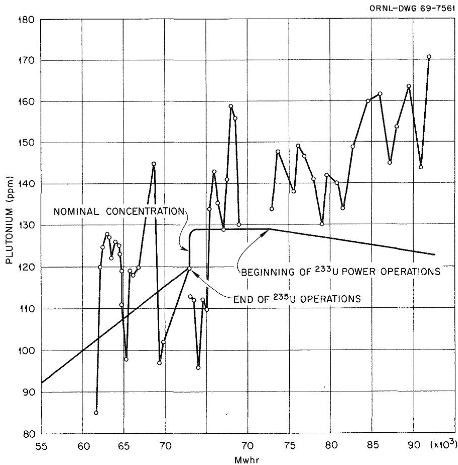  
Fig. 7.2. Comparison of nominal and analytical values for the concentration of plutonium in the MSRE fuel salt.

Table 7.2. Isotopic composition of plutonium in MSRE fuel salt   

<table><tr><td>Sample No.</td><td>Description</td><td>238Pu</td><td>239Pu</td><td>240Pu</td><td>241Pu</td><td>242Pu</td></tr><tr><td rowspan="3">FP14-41</td><td>Σ g (calculated)</td><td></td><td>487</td><td>18.6</td><td>a</td><td>a</td></tr><tr><td>% calculated</td><td></td><td>96.32</td><td>3.68</td><td></td><td></td></tr><tr><td>% analytical</td><td>0.011</td><td>96.45</td><td>3.32</td><td>0.22</td><td>0.002</td></tr><tr><td rowspan="3">FP14-64</td><td>Σ g (calculated)</td><td></td><td>537</td><td>22.7</td><td></td><td></td></tr><tr><td>% calculated</td><td></td><td>95.94</td><td>4.06</td><td></td><td></td></tr><tr><td>% analyticalb</td><td>≤0.015</td><td>96.05</td><td>3.67</td><td>0.28</td><td>0.005</td></tr><tr><td rowspan="5">FP15-68</td><td>Σ g generated in MSRE (calculated)</td><td></td><td>563</td><td>25.6</td><td></td><td></td></tr><tr><td>Σ g added with 7LiF-233UF4</td><td>0.27</td><td>12.9</td><td>2.44</td><td>0.37</td><td>0.33</td></tr><tr><td>Σ g</td><td>0.27</td><td>575.90</td><td>28.04</td><td>0.37</td><td>0.33</td></tr><tr><td>% calculated</td><td>0.04</td><td>95.20</td><td>4.64</td><td>0.06</td><td>0.06</td></tr><tr><td>% analytical</td><td>≤0.08</td><td>95.43</td><td>4.12</td><td>0.34</td><td>0.13</td></tr></table>

$a^{241}\mathrm{Pu}$ and $^{242}\mathrm{Pu}$ not included; B. E. Prince estimates $\Sigma \mathrm{g}^{241,242}\mathrm{Pu}\leqslant 1.8\mathrm{g}$   
$^{b}$ Analyses performed by R. E. Eby.

average values for the rates of change of $^{239}\mathrm{Pu}$ and $^{240}\mathrm{Pu}$ in the period between samples (Table 7.2).

In the MSRE, fluid fuel was circulated at rates which were sufficiently rapid with respect to changes in the isotopic composition of the fissile species that the salt samples removed from the pump bowl were representative of the circulating stream. This characteristic of molten-salt reactors makes it possible to use the results of isotopic analyses for a variety of purposes. One potential application, that of appraising the cumulative power generated by the MSRE at various periods, became apparent with the initiation of $^{233}\mathrm{U}$ operations, for with $^{233}\mathrm{U}$ fuel the isotopic composition of the plutonium inventory (produced partly by that generated in $^{235}\mathrm{U}$ operations as well as from that added later) would change significantly during power production and would possibly serve as an accurate indicator of the power produced.

About $600\mathrm{g}$ of plutonium was produced during power operations with $^{235}\mathrm{U}$ fuel. Thereafter, additional plutonium was introduced into the fuel salt as a contaminant of $^{7}\mathrm{LiF} - ^{233}\mathrm{UF}_4$ enriching salt and later to replenish the fissile inventory of the MSRE during $^{233}\mathrm{U}$ power operations.

Additions of plutonium to the fuel salt as $\mathrm{PuF}_3$ were accomplished smoothly by use of capsules sealed by 12 zirconium disks. These containers were designed and loaded by Carr et al.,[19] a typical capsule is shown in Fig. 7.3. In contact with the fuel salt the zirconium dissolved, permitting the $\mathrm{PuF}_3$ to disperse and to dissolve in the fuel salt. Photographs of one of the capsules after use are shown in Fig. 7.4.

Resolution of the analytical problems with plutonium showed that estimated production rates of plutonium in the $^{235}\mathrm{U}$ fuel salt, based on pre-1965 cross-section data, were low. The programs used for reactor physics calculations were revised using post-1965 data, and as a consequence, both consumption and production rates for plutonium and uranium isotopes were revised significantly.[20]

Samples of the MSRE fuel salt were submitted routinely for determination of the isotopic composition of the contained fissile species. Comparisons of the results of plutonium assays with nominal values that should result from operations at various power levels from $\sim 7$ to $8\mathrm{MW}$ were made. Within this range, best agreement between calculated and experimental values was obtained for a maximum power output of $\sim 7.40$

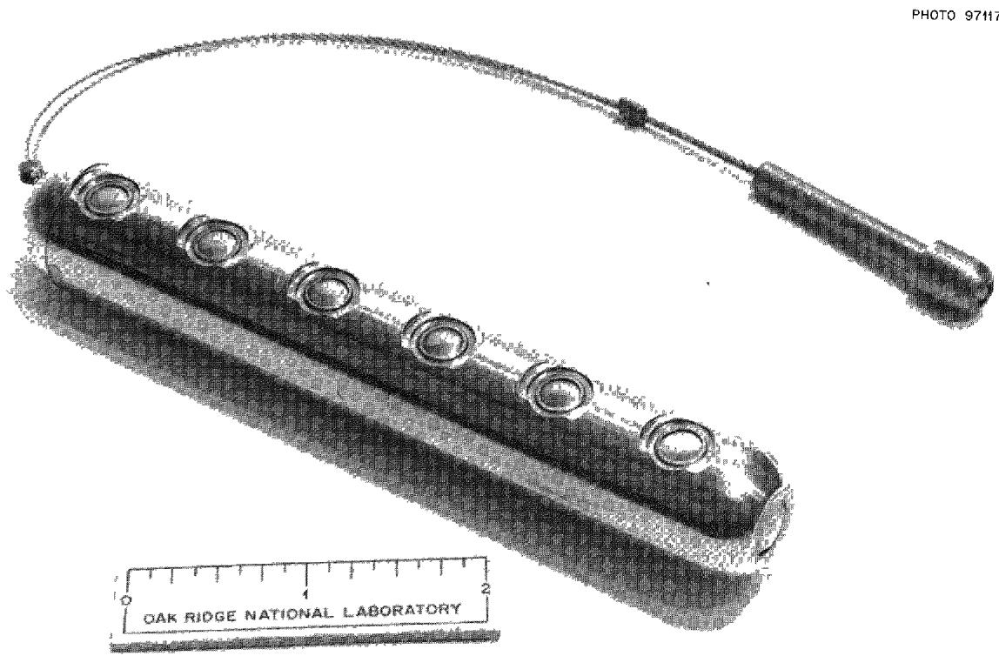  
Fig. 7.3. $^{239}\mathrm{PuF}_3$ capsule for MSRE refueling.

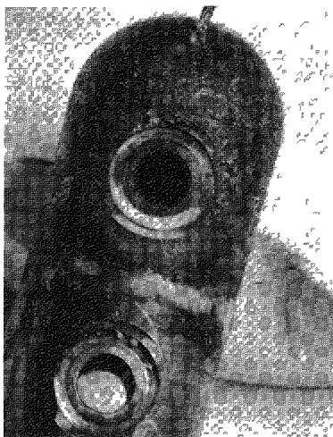  
FP 19-25 TOP SECTION, OPPOSITE SIDE FROM THAT SHOWN IN OVERALL VIEW.

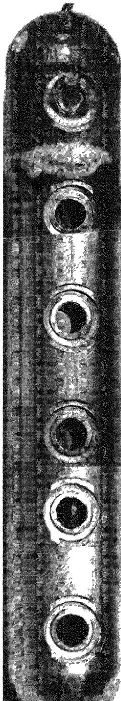  
PHOTO 1877-71

FP 19-25 FIRST CAPSULE

USED TO ADD $\mathsf{PuF}_3$ TO THE

MSRE FUEL SALT. CAPSULE

WAS PARTIALLY SUBMERGED

IN FUEL SALT FOR FOUR HOURS

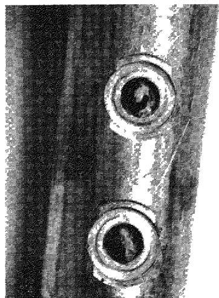  
FP 19-25 BOTTOM SECTION, OPPOSITE SIDE FROM THAT SHOWN IN OVERALL VIEW. SALT RESIDUE MORE CLEARLY EVIDENT HERE THAN IN OVERALL VIEW.

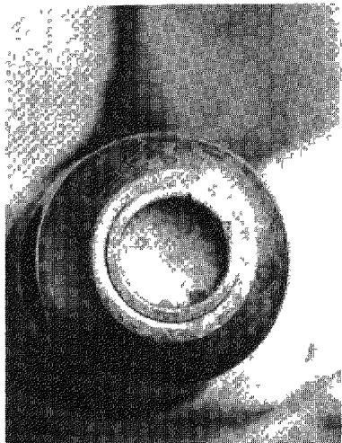  
FP 19-25 CAPSULE VIEWED FROM BOTTOM, SHOWING SALT RESIDUE IN CAPSULE.   
Fig. 7.4. Capsule sections.

Table 7.3. Isotopic composition of plutonium in the MSRE fuel salt at a power generation rate of ${7.40}\mathrm{{Mw}}\left( \mathrm{{th}}\right)$   

<table><tr><td rowspan="3">Sample No.</td><td rowspan="3">Full-Power Hours</td><td rowspan="3">Mwhra</td><td rowspan="3">Δ239Pu(g per 1000 Mwhr)</td><td rowspan="3">Δ240Pu(g per 1000 Mwhr)</td><td colspan="3">Fuel Circuit Inventory (Calculated) (g)b</td><td colspan="3">Isotopic Composition (Calculated)</td><td colspan="3">Isotopic Composition (Analytical)</td></tr><tr><td rowspan="2">239Pu</td><td rowspan="2">240Pu</td><td rowspan="2">ΣPu</td><td colspan="2">Wt % Pu/ΣPu</td><td rowspan="2">240Pu/239Pu</td><td colspan="2">Wt % Pu/ΣPu</td><td rowspan="2">240Pu/239Pu</td></tr><tr><td>239Pu</td><td>240Pu</td><td>239Pu</td><td>240Pu</td></tr><tr><td>Run 17-I</td><td>0</td><td>0</td><td></td><td></td><td>541.5</td><td>24,53</td><td>568.4</td><td>95.26</td><td>4.32</td><td>0.0453</td><td></td><td></td><td></td></tr><tr><td>FP 17-9</td><td>148</td><td>537</td><td>-3,025</td><td>+1,178</td><td>539.8</td><td>25.16</td><td>567.4</td><td>95.14</td><td>4.43</td><td>0.0466</td><td>95.26</td><td>4.35</td><td>0.0457</td></tr><tr><td>FP 17-18</td><td>466</td><td>2,227</td><td>-2,996</td><td>+1,144</td><td>534.8</td><td>27.09</td><td>564.3</td><td>94.76</td><td>4.80</td><td>0.0507</td><td>94.28</td><td>5.16</td><td>0.0547</td></tr><tr><td>FP 17-19</td><td>542</td><td>3,656</td><td>-2,949</td><td>+1,180</td><td>530.6</td><td>28.78</td><td>561.8</td><td>94.44</td><td>5.12</td><td>0.0542</td><td>94.48</td><td>5.00</td><td>0.0508</td></tr><tr><td>FP 17-20</td><td>697</td><td>4,492</td><td>-2,924</td><td>+1,105</td><td>528.1</td><td>29.70</td><td>560.3</td><td>94.26</td><td>5.30</td><td>0.0562</td><td>94.20</td><td>5.25</td><td>0.0557</td></tr><tr><td>FP 17-23</td><td>920</td><td>5,862</td><td>-2,894</td><td>+1,086</td><td>524.2</td><td>31.18</td><td>557.8</td><td>93.97</td><td>5.95</td><td>0.0595</td><td></td><td></td><td></td></tr><tr><td>FP 17-27</td><td>1047</td><td>7,131</td><td>-2,871</td><td>+1,072</td><td>520.5</td><td>32.54</td><td>555.5</td><td>93.70</td><td>5.86</td><td>0.0625</td><td>93.58</td><td>5.80</td><td>0.0620</td></tr><tr><td>FP 17-28</td><td>1145</td><td>7,946</td><td>-2,854</td><td>+1,063</td><td>518.2</td><td>33.42</td><td>554.0</td><td>93.53</td><td>6.03</td><td>0.0645</td><td>94.30</td><td>5.97</td><td>0.0639</td></tr><tr><td>FP 17-30</td><td>1290</td><td>8,827</td><td>-2,845</td><td>+1,054</td><td>515.7</td><td>34.35</td><td>551.5</td><td>93.51</td><td>6.23</td><td>0.0666</td><td>93.16</td><td>6.18</td><td>0.0663</td></tr><tr><td>Run 17-F</td><td>1536</td><td>10,245</td><td>-2,824</td><td>+1,039</td><td>511.7</td><td>35.82</td><td>549.9</td><td>93.04</td><td>6.51</td><td>0.0700</td><td></td><td></td><td></td></tr><tr><td>FP 18-I</td><td>1536</td><td>10,245</td><td></td><td></td><td>514.1</td><td>34.91</td><td>551.4</td><td>93.22</td><td>6.33</td><td>0.0679</td><td></td><td></td><td></td></tr><tr><td>FP 18-I</td><td>1536</td><td>10,245</td><td>-2,875</td><td>+1,075</td><td>514.1</td><td>34.91</td><td>551.4</td><td>93.22</td><td>6.33</td><td>0.0679</td><td>92.92</td><td>6.36</td><td>0.0684</td></tr><tr><td>FP 18-5</td><td>1562</td><td>11,231</td><td>-2,860</td><td>+1,066</td><td>513.5</td><td>35.11</td><td>551.1</td><td>93.18</td><td>6.37</td><td>0.0684</td><td>92.65</td><td>6.61</td><td>0.0713</td></tr><tr><td>FP 18-10</td><td>1851</td><td>12,373</td><td>-2,843</td><td>+1,055</td><td>507.6</td><td>37.32</td><td>547.3</td><td>92.73</td><td>6.82</td><td>0.0735</td><td>92.38</td><td>6.84</td><td>0.0740</td></tr><tr><td>FP 18-13</td><td>1976</td><td>13,873</td><td>-2,826</td><td>+1,038</td><td>505.0</td><td>38.26</td><td>545.7</td><td>92.54</td><td>7.01</td><td>0.0757</td><td>92.16</td><td>7.04</td><td>0.0764</td></tr><tr><td>FP 18-22</td><td>1976</td><td>13,873</td><td>-2,826</td><td>+1,038</td><td>505.0</td><td>38.26</td><td>545.7</td><td>92.54</td><td>7.01</td><td>0.0757</td><td>91.80</td><td>7.36</td><td>0.0802</td></tr><tr><td>FP 18-27</td><td>2306</td><td>15,523</td><td>-2,799</td><td>+1,017</td><td>498.3</td><td>40.69</td><td>541.4</td><td>92.03</td><td>7.52</td><td>0.0817</td><td>91.63</td><td>7.49</td><td>0.0817</td></tr><tr><td>FP 18-43</td><td>2461</td><td>17,281</td><td>-2,773</td><td>+0.999</td><td>495.2</td><td>41.81</td><td>539.5</td><td>91.80</td><td>7.75</td><td>0.0844</td><td>91.48</td><td>7.63</td><td>0.0834</td></tr><tr><td>Run 18-F</td><td>2544</td><td>18,143</td><td>-2,758</td><td>+0.989</td><td>493.5</td><td>42.41</td><td>538.4</td><td>91.67</td><td>7.87</td><td>0.0859</td><td></td><td></td><td></td></tr><tr><td>Run 19-I</td><td>2544</td><td>18,143</td><td></td><td></td><td>495.2</td><td>41.81</td><td>539.4</td><td>91.79</td><td>7.75</td><td>0.0844</td><td></td><td></td><td></td></tr><tr><td>FP 19-17</td><td>2625</td><td>18,739</td><td>-2,770</td><td>+0.993</td><td>493.5</td><td>42.39</td><td>538.4</td><td>91.67</td><td>7.87</td><td>0.0858</td><td>91.22</td><td>7.84</td><td>0.0860</td></tr><tr><td>FP 19-18</td><td>2642</td><td>19,093</td><td>-2,763</td><td>+0.989</td><td>493.2</td><td>42.51</td><td>538.2</td><td>91.65</td><td>7.90</td><td>0.0862</td><td>91.19</td><td>7.87</td><td>0.0863</td></tr><tr><td>FP 19-21</td><td>2724</td><td>19,449</td><td>-2,755</td><td>+0.985</td><td>491.6</td><td>43.10</td><td>537.1</td><td>91.52</td><td>8.02</td><td>0.0877</td><td>91.02</td><td>8.03</td><td>0.0882</td></tr><tr><td>FP 19-22</td><td>2791</td><td>19,693</td><td>-2,752</td><td>+0.985</td><td>490.2</td><td>43.58</td><td>536.3</td><td>91.42</td><td>8.13</td><td>0.0889</td><td>90.90</td><td>8.11</td><td>0.0892</td></tr><tr><td>FP 19-24</td><td>2791</td><td>19,693</td><td>-2,752</td><td>+0.985</td><td>490.2</td><td>43.58</td><td>536.3</td><td>91.42</td><td>8.13</td><td>0.0889</td><td>89.88</td><td>8.99</td><td>0.1000</td></tr><tr><td>FP-19-25-6</td><td>2791</td><td>19,693</td><td>-2,760</td><td>+0.983</td><td>541.1</td><td>46.74</td><td>590.6</td><td>91.62</td><td>7.91</td><td>0.0864</td><td></td><td></td><td></td></tr><tr><td>FP 19-27</td><td>2791</td><td>19,693</td><td>-2,760</td><td>+0.983</td><td>541.1</td><td>46.74</td><td>590.6</td><td>91.62</td><td>7.91</td><td>0.0864</td><td>91.01</td><td>8.03</td><td>0.0882</td></tr><tr><td>FP 19-30</td><td>2818</td><td>19,693</td><td>-2,760</td><td>+0.983</td><td>540.5</td><td>46.93</td><td>589.9</td><td>91.63</td><td>7.96</td><td>0.0868</td><td>90.89</td><td>8.13</td><td>0.0895</td></tr><tr><td>FP 19-31-4</td><td>2818</td><td>19,693</td><td>-2,750</td><td>+0.983</td><td>662.6</td><td>54.51</td><td>719.6</td><td>92.08</td><td>7.58</td><td>0.0823</td><td></td><td></td><td></td></tr><tr><td>FP 19-35</td><td>2964</td><td>20,961</td><td>-3,820</td><td>+1,369</td><td>658.6</td><td>55.96</td><td>717.1</td><td>91.85</td><td>7.80</td><td>0.0850</td><td>91.35</td><td>7.77</td><td>0.0851</td></tr><tr><td>FP 19-43</td><td>3102</td><td>21,989</td><td>-3,810</td><td>+1,357</td><td>654.8</td><td>57.32</td><td>714.5</td><td>91.64</td><td>8.02</td><td>0.0875</td><td>91.18</td><td>7.90</td><td>0.0866</td></tr><tr><td>FP 19-53</td><td>3294</td><td>23,185</td><td>-3,795</td><td>+1,339</td><td>649.5</td><td>59.18</td><td>711.1</td><td>91.33</td><td>8.32</td><td>0.0911</td><td>90.88</td><td>8.25</td><td>0.0908</td></tr><tr><td>FP 19-63</td><td>3561</td><td>24,631</td><td>-3,775</td><td>+1,339</td><td>642.2</td><td>61.77</td><td>706.4</td><td>90.91</td><td>8.74</td><td>0.0962</td><td>90.49</td><td>8.50</td><td>0.0939</td></tr><tr><td>FP 19-74</td><td>3693</td><td>26,078</td><td>-3,750</td><td>+1,316</td><td>639.3</td><td>62.77</td><td>704.5</td><td>89.09</td><td>8.91</td><td>0.0982</td><td>90.15</td><td>8.78</td><td>0.0974</td></tr><tr><td>Run 19-F</td><td>3774</td><td>27,069</td><td>-3,720</td><td>+1,302</td><td>637.1</td><td>63.54</td><td>703.1</td><td>90.62</td><td>9.04</td><td>0.0997</td><td></td><td></td><td></td></tr><tr><td>Run 20-I</td><td>3774</td><td>27,069</td><td></td><td></td><td>625.8</td><td>61.81</td><td>690.0</td><td>90.69</td><td>8.96</td><td>0.0988</td><td></td><td></td><td></td></tr><tr><td>FP 20-6</td><td>3820</td><td>27,236</td><td>-3,670</td><td>+1,309</td><td>624.6</td><td>62.25</td><td>689.3</td><td>90.61</td><td>9.03</td><td>0.0996</td><td>89.89</td><td>8.99</td><td>0.1000</td></tr><tr><td>FP 20-31</td><td>4159</td><td>28,294</td><td>-3,660</td><td>+1,293</td><td>615.6</td><td>65.43</td><td>683.4</td><td>90.07</td><td>9.57</td><td>0.1062</td><td>89.36</td><td>9.43</td><td>0.1055</td></tr><tr><td>Run 20-F</td><td>4159</td><td>28,294</td><td>-3,660</td><td>+1,293</td><td>615.6</td><td>65.43</td><td>683.4</td><td>90.07</td><td>9.57</td><td>0.1062</td><td></td><td></td><td></td></tr></table>

${}^{a}$ Average for period between samples.   
${}^{b}$ Assumes 92% fuel charge in circulation.

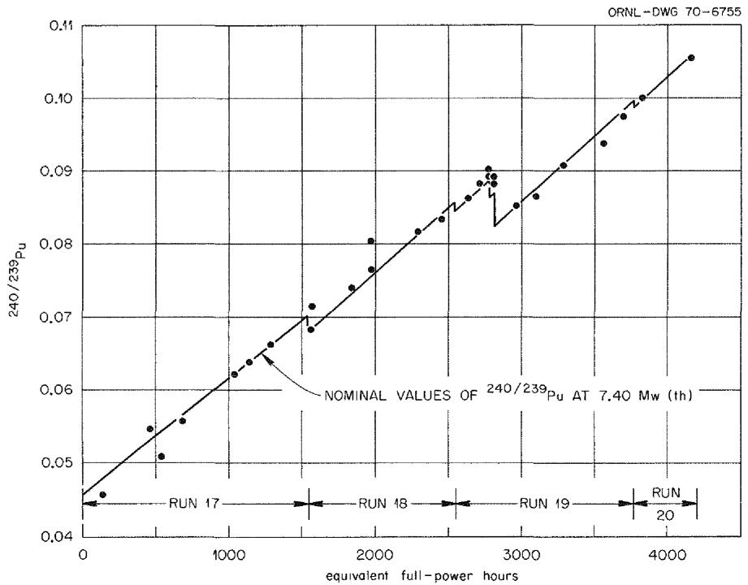  
Fig. 7.5. $\left[{ }^{240/239} \mathrm{Pu}\right]$ in the MSRE fuel salt circuit during $^{233} \mathrm{U}$ operations.

$\mathrm{MW(t)}$ . A comparison of calculated and observed values for the isotopic composition of plutonium which should result from a maximum power output of 7.40 MW is shown in Table 7.3 and in Fig. 7.5. Agreement tests indicate that the standard deviation between calculated and observed values is $\pm 0.63\%$ and that the average positive bias in the experimental data is $0.093\%$ . On this basis the maximum power output was $7.41 \pm 0.05 \mathrm{MW(t)}$ . The precision of this value seems to be adequate for related analyses of reactor operations.

It is considered unlikely that further refinements in cross-section data for the plutonium isotopes will require any substantial changes in the calculated inventories used for this comparison. However, for the purpose of estimating uncertainty in the combined cross-section data and neutronic model used to calculate reaction rates, an equivalent of $\pm 2\%$ in the power output is judged conservative. The results of experiments designed to measure the $^{233}\mathrm{U}$ capture-to-absorption ratio in the fuel of the MSRE were reported recently by Ragan.[21] From these results he concluded that the full-power output of the reactor was $7.34 \pm 0.09$ MW, in excellent agreement with our value. Further corroboration of these estimates was provided by Gabbard[22] in a recent reevaluation of the accuracy of the data produced by the MSRE coolant salt flow transmitters. He found that either the pressure trans

mitter or the square-root converter component, which generated 2- to $10\mathrm{-v}$ signals for the computer, was faulty and caused the device to indicate higher than actual flows. Using a corrected flow rate of $793~\mathrm{gpm}$ rather than a nominal flow rate of $850~\mathrm{gpm}$ , as indicated by the computer, to recompute the heat balance power, he estimated that the full-power output of the reactor was $7.65\mathrm{MW}$ rather than the previous value of $8.2\mathrm{MW}$ .

# 7.3 Isotopic Composition of Uranium during $^{233}\mathrm{U}$ Operations

For operation of the MSRE with $^{233}\mathrm{U}$ fuel, estimation of the power output of the MSRE from measured changes in isotopic composition of the fissile material is achieved with considerably greater precision from analyses of plutonium than from uranium. This arises from the fact that the rate of change in the relative fraction of the most abundant isotopes for plutonium, $^{239}\mathrm{Pu}$ and $^{240}\mathrm{Pu}$ , is some four times that for the uranium pair, $^{233}\mathrm{U}$ and $^{234}\mathrm{U}$ . Analyses of the isotopic composition of uranium in the fuel circuit during $^{233}\mathrm{U}$ operations were employed, therefore, primarily to determine whether they afforded approximate confirmation of the power estimate as inferred from the plutonium data (Sect. 7.2). Calculations of the

Table 7.4. Isotopic composition of uranium in the MSRE fuel-salt circuit ${}^{a}$   

<table><tr><td rowspan="2">Sample No.</td><td rowspan="2">EFPHb</td><td colspan="5">U/ΣU (wt %)</td><td rowspan="2">[234]U/[233]U</td></tr><tr><td>233U</td><td>234U</td><td>235U</td><td>236U</td><td>238U</td></tr><tr><td>Run 17-J</td><td>0</td><td>84.687</td><td>6.948</td><td>2.477</td><td>0.0808</td><td>5.807</td><td>0.08204</td></tr><tr><td>FP 17-18</td><td>466</td><td>84.590</td><td>7.011</td><td>2.489</td><td>0.084</td><td>5.828</td><td>0.08288</td></tr><tr><td></td><td></td><td>84.690</td><td>6.990</td><td>2.470</td><td>0.084</td><td>5.771</td><td>0.08253</td></tr><tr><td>FP 17-24</td><td>920</td><td>84.489</td><td>7.073</td><td>2.501</td><td>0.087</td><td>5.849</td><td>0.08371</td></tr><tr><td></td><td></td><td>84.382</td><td>7.058</td><td>2.487</td><td>0.089</td><td>5.986</td><td>0.08364</td></tr><tr><td>FP 17-32</td><td>1338</td><td>84.440</td><td>7.131</td><td>2.510</td><td>0.090</td><td>5.867</td><td>0.08445</td></tr><tr><td></td><td></td><td>84.445</td><td>7.128</td><td>2.487</td><td>0.087</td><td>5.843</td><td>0.08440</td></tr><tr><td>Run 17-F</td><td>1536</td><td>84.363</td><td>7.152</td><td>2.513</td><td>0.091</td><td>5.875</td><td>0.08477</td></tr><tr><td>Run 18-I</td><td>1536</td><td>84.393</td><td>7.136</td><td>2.511</td><td>0.091</td><td>5.870</td><td>0.08455</td></tr><tr><td>Run 18-2</td><td>1536</td><td>84.199</td><td>7.138</td><td>2.507</td><td>0.089</td><td>6.067</td><td>0.08477</td></tr><tr><td>FP 18-4</td><td>1563</td><td>84.385</td><td>7.141</td><td>2.511</td><td>0.091</td><td>5.871</td><td>0.08462</td></tr><tr><td></td><td></td><td>84.249</td><td>7.158</td><td>2.527</td><td>0.091</td><td>5.975</td><td>0.08496</td></tr><tr><td>FO 18-10</td><td>1852</td><td>84.326</td><td>7.180</td><td>2.518</td><td>0.092</td><td>5.883</td><td>0.08514</td></tr><tr><td></td><td></td><td>84.269</td><td>7.178</td><td>2.507</td><td>0.091</td><td>5.955</td><td>0.08517</td></tr><tr><td>FP 18-13</td><td>1976</td><td>84.298</td><td>7.199</td><td>2.521</td><td>0.092</td><td>5.890</td><td>0.08539</td></tr><tr><td></td><td></td><td>84.060</td><td>7.203</td><td>2.517</td><td>0.087</td><td>6.133</td><td>0.08568</td></tr><tr><td>FP 18-22</td><td>2221</td><td>84.241</td><td>7.232</td><td>2.529</td><td>0.095</td><td>5.902</td><td>0.08584</td></tr><tr><td></td><td></td><td>84.167</td><td>7.208</td><td>2.517</td><td>0.098</td><td>6.016</td><td>0.08563</td></tr><tr><td>FP 18-43</td><td>2461</td><td>84.189</td><td>7.265</td><td>2.534</td><td>0.097</td><td>5.912</td><td>0.08629</td></tr><tr><td></td><td></td><td>84.041</td><td>7.232</td><td>2.537</td><td>0.093</td><td>6.097</td><td>0.08605</td></tr><tr><td>Run 18-F</td><td>2544</td><td>84.169</td><td>7.279</td><td>2.536</td><td>0.098</td><td>5.916</td><td>0.08648</td></tr><tr><td>Run 19-I</td><td>2544</td><td>84.185</td><td>7.267</td><td>2.534</td><td>0.097</td><td>5.913</td><td>0.08632</td></tr><tr><td>FP 19 10-12c</td><td>2544</td><td>84.224</td><td>7.268</td><td>2.526</td><td>0.097</td><td>5.882</td><td>0.08629</td></tr><tr><td>FP 19-35</td><td>2964</td><td>84.377</td><td>7.349</td><td>2.543</td><td>0.100</td><td>5.919</td><td>0.08709</td></tr><tr><td></td><td></td><td>83.987</td><td>7.338</td><td>2.537</td><td>0.099</td><td>6.036</td><td>0.08737</td></tr><tr><td>FP 19-43</td><td>3102</td><td>84.103</td><td>7.348</td><td>2.539</td><td>0.101</td><td>5.909</td><td>0.08726</td></tr><tr><td></td><td></td><td>83.994</td><td>7.328</td><td>2.533</td><td>0.099</td><td>6.047</td><td>0.08724</td></tr><tr><td>FP 19-53</td><td>3294</td><td>84.060</td><td>7.375</td><td>2.546</td><td>0.102</td><td>5.917</td><td>0.08773</td></tr><tr><td></td><td></td><td>83.912</td><td>7.358</td><td>2.537</td><td>0.101</td><td>6.092</td><td>0.08768</td></tr><tr><td>FP 19-63</td><td>3561</td><td>84.000</td><td>7.413</td><td>2.553</td><td>0.104</td><td>5.931</td><td>0.08825</td></tr><tr><td></td><td></td><td>83.927</td><td>7.408</td><td>2.542</td><td>0.102</td><td>6.021</td><td>0.08826</td></tr><tr><td>FP 19-74</td><td>3693</td><td>83.971</td><td>7.430</td><td>2.555</td><td>0.105</td><td>5.937</td><td>0.08848</td></tr><tr><td></td><td></td><td>83.801</td><td>7.418</td><td>2.569</td><td>0.102</td><td>6.102</td><td>0.08851</td></tr><tr><td>Run 19-F</td><td>3774</td><td>83.953</td><td>7.442</td><td>2.557</td><td>0.105</td><td>5.942</td><td>0.08864</td></tr><tr><td>Run 20-I</td><td>3774</td><td>83.973</td><td>7.427</td><td>2.555</td><td>0.105</td><td>5.938</td><td>0.08844</td></tr><tr><td>FP 20-3c</td><td>3774</td><td>83.996</td><td>7.426</td><td>2.549</td><td>0.105</td><td>5.923</td><td>0.08840</td></tr><tr><td>FP 20-6</td><td>3820</td><td>83.986</td><td>7.433</td><td>2.550</td><td>0.105</td><td>5.925</td><td>0.08850</td></tr><tr><td></td><td></td><td>83.614</td><td>7.435</td><td>2.577</td><td>0.104</td><td>6.271</td><td>0.08892</td></tr><tr><td>FP 20-31</td><td>4159</td><td>83.911</td><td>7.482</td><td>2.558</td><td>0.108</td><td>5.940</td><td>0.08916</td></tr><tr><td></td><td></td><td>83.742</td><td>7.484</td><td>2.577</td><td>0.105</td><td>6.092</td><td>0.08936</td></tr></table>

${}^{a}$ Upright type indicates values computed on the basis that the maximum power generated by the MSRE was 7.41 Mw(th). The following rates (furnished by B, E, Prince) were used: ${}^{233}\mathrm{U} :  - {4.643} \times  {10}^{-2}\mathrm{\;g}/\mathrm{{Mwhr}};{}^{234}\mathrm{U} :  + {3.6325} \times  {10}^{-3}\mathrm{\;g}/\mathrm{{Mwhr}};{}^{235}\mathrm{U} :$ $+ {9.5596} \times  {10}^{-5}\mathrm{\;g}/\mathrm{{Mwhr}};{}^{236}\mathrm{U} :  + {3.0725} \times  {10}^{-4}\mathrm{\;g}/\mathrm{{Mwhr}};{}^{238}\mathrm{U} :  - {2.90} \times  {10}^{-4}\mathrm{\;g}/\mathrm{{Mwhr}}.$ Results of mass spectrometric analyses are listed in italicized type.   
${}^{b}$ Equivalent full-power hours.   
$c_{\mathrm{Fuel}}$ addition.

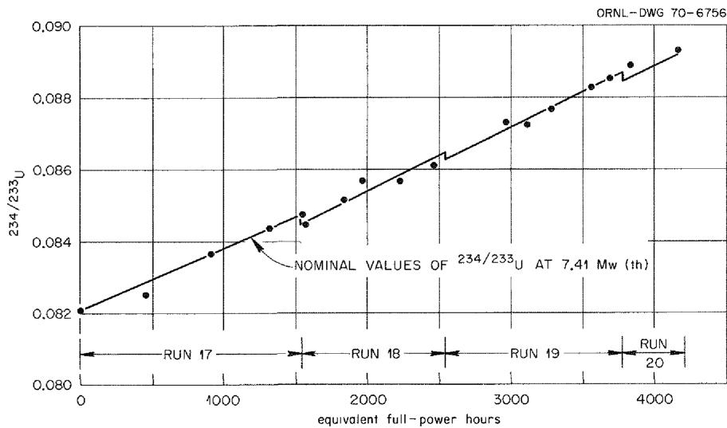  
Fig. 7.6. $^{234/233}$ U in the MSRE fuel circuit during $^{233}$ U operations.

isotopic composition changes of the uranium in the MSRE fuel circuit that should have accompanied operation of the reactor at a maximum power output of $7.41\mathrm{MW(t)}$ were made and compared with the results of mass spectrometric analyses. The results of this comparison are shown in Table 7.4 and in Fig. 7.6; they indicate that the changes observed in the isotopic composition of the uranium were in excellent agreement with those of plutonium.

# 7.4 Isotopic Composition of Uranium during $^{235}\mathrm{U}$ Operations

Once the anomalies in the power production of the MSRE were resolved by analysis of the mass spectrometric data, and assisted by refinements in the cross-section data, internal consistency developed quickly among various other analytical results. In particular, use of the final estimate of power generation at a maximum rate of 7.4 MW to appraise both isotopic analysis and chemical analyses for uranium during the $^{235}\mathrm{U}$ operational period showed that these results were entirely consistent with those for uranium and plutonium during $^{233}\mathrm{U}$ operations. In addition, the revised estimates in the changes in consumption and production rates for $^{234}\mathrm{U}, ^{235}\mathrm{U}, ^{236}\mathrm{U}$ , and $^{238}\mathrm{U}$ , together with improved values for the amounts of uranium transferred to the flush salt, brought nominal and analytical values for the concentration of uranium in the fuel into good agreement as shown in Table 7.5.

Isotopic composition of the uranium in the circulating fuel salt was recalculated on the basis that the

reactor had operated at 7.4 MW and that the consumption and production rates of the uranium isotopes at this power level were those given in Prince's revised estimates.[20] A comparison of the results obtained is shown in Table 7.5. It will be noted that the greatest disparity in nominal and analytical values listed in Table 7.5 is observed for $^{238}\mathrm{U}$ . In Sect. 3.6 it is noted that further analysis of these data led to the conclusion that, of the $^{238}\mathrm{U}$ nominally charged to the MSRE drain tanks, some $2\mathrm{kg}$ was probably not delivered. Recomputation of these results in line with that conclusion would bring the nominal and observed values for the relative fractions of uranium isotopes, as listed in Table 7.5, into even closer agreement.

# References

1. R. H. Guymon, MSRE Design and Operations Report, Part VIII, Operating Procedures, ORNL-TM-908, vol. II (January 1966).   
2. G. H. Burger, J. R. Engel, and C. D. Martin, Computer Manual for MSRE Operators, internal memorandum, MSR-67-19 (March 1967).   
3. R. C. Steffey, Jr., and J. R. Engel, MSR Program Semiannu. Progr. Rep. Feb. 29, 1968, ORNL-4254, p. 10.   
4. C. H. Gabbard, Specific Heats of MSRE Fuel and Coolant Salts, internal memorandum, MSR-67-19 (March 1967).   
5. R. B. Lindauer, Revisions to MSRE Design Data Sheets, Issue No. 9, ORNL-CF-64-6-43 (June 1964).

Table 7.5. Isotopic composition of uranium in the MSRE fuel system ${}^{a}$   

<table><tr><td rowspan="2">Sample No.</td><td rowspan="2">\( EFPH^b \)</td><td>\( 234_U \)</td><td>\( 235_U \)</td><td>\( 236_U \)</td><td>\( 238_U \)</td><td>\( ΣU \)</td><td>\( 234_U \)</td><td>\( 235_U \)</td><td>\( 236_U \)</td><td>\( 238_U \)</td></tr><tr><td colspan="5">(kg)</td><td colspan="4">(wt %)</td></tr><tr><td rowspan="3">Initial Loadingc</td><td></td><td>-</td><td>0.325</td><td>-</td><td>147.272</td><td>147.60</td><td>-</td><td>0.222</td><td>-</td><td>\( 99.778^d \)</td></tr><tr><td></td><td>0.775</td><td>75.645</td><td>0.320</td><td>4.640</td><td>81.38</td><td>0.952</td><td>92.253</td><td>0.393</td><td>\( 5.708^d \)</td></tr><tr><td></td><td>0.775</td><td>75.973</td><td>0.320</td><td>151.912</td><td>228.980</td><td>0.339</td><td>33.179</td><td>0.140</td><td>66.342</td></tr><tr><td>Run 3-Fc</td><td>0</td><td></td><td></td><td></td><td></td><td>228.210</td><td></td><td></td><td></td><td></td></tr><tr><td>Run 4-I</td><td>0</td><td>0.711</td><td>69.660</td><td>0.294</td><td>139.288</td><td>209.953</td><td>0.339</td><td>33.179</td><td>0.140</td><td>66.342</td></tr><tr><td>FP 4-14</td><td>0</td><td></td><td></td><td></td><td></td><td></td><td>0.350</td><td>33.250</td><td>0.140</td><td>66.260</td></tr><tr><td>FP 4-28</td><td>0</td><td></td><td></td><td></td><td></td><td></td><td>0.350</td><td>33.249</td><td>0.142</td><td>66.360</td></tr><tr><td>FP 4-33</td><td>0</td><td></td><td></td><td></td><td></td><td></td><td>0.344</td><td>33.132</td><td>0.137</td><td>66.387</td></tr><tr><td>FP 4-37</td><td>0</td><td></td><td></td><td></td><td></td><td></td><td>0.343</td><td>33.168</td><td>0.138</td><td>66.357</td></tr><tr><td rowspan="2">FP 6-14</td><td>166</td><td>0.712</td><td>69.594</td><td>0.308</td><td>139.276</td><td>209.889</td><td>0.339</td><td>33.157</td><td>0.147</td><td>66.357</td></tr><tr><td></td><td></td><td></td><td></td><td></td><td></td><td>0.349</td><td>33.534</td><td>0.144</td><td>65.973</td></tr><tr><td rowspan="2">FP 6-19</td><td>400</td><td>0.712</td><td>69.498</td><td>0.327</td><td>139.258</td><td>209.795</td><td>0.339</td><td>33.127</td><td>0.156</td><td>66.378</td></tr><tr><td></td><td></td><td></td><td></td><td></td><td></td><td>0.344</td><td>33.445</td><td>0.157</td><td>66.060</td></tr><tr><td rowspan="2">FP 7-8</td><td>725</td><td>0.710</td><td>69.366</td><td>0.353</td><td>139.235</td><td>209.664</td><td>0.339</td><td>38.084</td><td>0.168</td><td>66.408</td></tr><tr><td></td><td></td><td></td><td></td><td></td><td></td><td>0.356</td><td>33.592</td><td>0.176</td><td>65.876</td></tr><tr><td rowspan="2">FP 7-12</td><td>1012</td><td>0.709</td><td>69.250</td><td>0.376</td><td>139.213</td><td>209.548</td><td>0.338</td><td>33.047</td><td>0.179</td><td>66.435</td></tr><tr><td></td><td></td><td></td><td></td><td></td><td></td><td>0.356</td><td>33.552</td><td>0.188</td><td>65.904</td></tr><tr><td rowspan="2">FP 7-15</td><td>1047</td><td>0.709</td><td>69.236</td><td>0.379</td><td>139.211</td><td>209.535</td><td>0.338</td><td>33.043</td><td>0.181</td><td>66.438</td></tr><tr><td></td><td></td><td></td><td></td><td></td><td></td><td>0.347</td><td>33.161</td><td>0.177</td><td>66.315</td></tr><tr><td rowspan="2">FP 8-5</td><td>1047</td><td>0.707</td><td>68.992</td><td>0.371</td><td>138.657</td><td>208.727</td><td>0.339</td><td>33.053</td><td>0.178</td><td>66.430</td></tr><tr><td></td><td></td><td></td><td></td><td></td><td></td><td>0.346</td><td>33.265</td><td>0.176</td><td>66.214</td></tr><tr><td rowspan="2">FP 10-7</td><td>1677</td><td>0.700</td><td>68.203</td><td>0.414</td><td>137.494</td><td>206.811</td><td>0.338</td><td>32.978</td><td>0.200</td><td>66.484</td></tr><tr><td></td><td></td><td></td><td></td><td></td><td></td><td>0.347</td><td>33.259</td><td>0.196</td><td>66.198</td></tr><tr><td rowspan="2">FP 11-14</td><td>2884</td><td>0.698</td><td>67.732</td><td>0.509</td><td>137.409</td><td>206.348</td><td>0.338</td><td>32.824</td><td>0.247</td><td>66.591</td></tr><tr><td></td><td></td><td></td><td></td><td></td><td></td><td>0.343</td><td>32.892</td><td>0.247</td><td>66.524</td></tr><tr><td rowspan="2">FP 11-39</td><td>3856</td><td>0.697</td><td>67.340</td><td>0.588</td><td>137.337</td><td>205.962</td><td>0.338</td><td>32.695</td><td>0.286</td><td>66.681</td></tr><tr><td></td><td></td><td></td><td></td><td></td><td></td><td>0.349</td><td>32.973</td><td>0.276</td><td>66.402</td></tr><tr><td rowspan="2">FP 11-44</td><td>3937</td><td>0.696</td><td>67.305</td><td>0.595</td><td>137.331</td><td>205.927</td><td>0.338</td><td>32.684</td><td>0.289</td><td>66.689</td></tr><tr><td></td><td></td><td></td><td></td><td></td><td></td><td>0.357</td><td>32.962</td><td>0.283</td><td>66.404</td></tr><tr><td rowspan="2">FP 11-44e</td><td>4107</td><td>0.704</td><td>67.997</td><td>0.611</td><td>137.365</td><td>206.677</td><td>0.341</td><td>32.900</td><td>0.296</td><td>66.463</td></tr><tr><td></td><td></td><td></td><td></td><td></td><td></td><td>0.348</td><td>32.987</td><td>0.287</td><td>66.378</td></tr><tr><td rowspan="2">FP 11-48</td><td>4172</td><td>0.704</td><td>67.971</td><td>0.617</td><td>137.361</td><td>206.653</td><td>0.341</td><td>32.891</td><td>0.299</td><td>66.469</td></tr><tr><td></td><td></td><td></td><td></td><td></td><td></td><td>0.351</td><td>33.067</td><td>0.292</td><td>66.290</td></tr><tr><td rowspan="2">FP 12-5</td><td>4513</td><td>0.700</td><td>67.568</td><td>0.627</td><td>136.784</td><td>205.679</td><td>0.340</td><td>32.851</td><td>0.305</td><td>66.504</td></tr><tr><td></td><td></td><td></td><td></td><td></td><td></td><td>0.354</td><td>33.133</td><td>0.296</td><td>66.217</td></tr><tr><td rowspan="2">FP 12-29</td><td>5121</td><td>0.700</td><td>67.321</td><td>0.677</td><td>136.740</td><td>205.438</td><td>0.341</td><td>32.769</td><td>0.330</td><td>66.560</td></tr><tr><td></td><td></td><td></td><td></td><td></td><td></td><td>0.357</td><td>32.968</td><td>0.320</td><td>66.386</td></tr><tr><td rowspan="2">FP 12-51f</td><td>5296</td><td>0.714</td><td>68.777</td><td>0.697</td><td>136.822</td><td>207.010</td><td>0.344</td><td>33.224</td><td>0.337</td><td>66.095</td></tr><tr><td></td><td></td><td></td><td></td><td></td><td></td><td>0.355</td><td>33.475</td><td>0.325</td><td>65.845</td></tr><tr><td rowspan="2">FP 12-58</td><td>5500</td><td>0.714</td><td>68.695</td><td>0.715</td><td>136.807</td><td>206.931</td><td>0.345</td><td>33.197</td><td>0.346</td><td>66.112</td></tr><tr><td></td><td></td><td></td><td></td><td></td><td></td><td>0.353</td><td>33.350</td><td>0.333</td><td>65.964</td></tr><tr><td rowspan="2">FP 14-25</td><td>6848</td><td>0.708</td><td>67.788</td><td>0.813</td><td>136.147</td><td>205.456</td><td>0.344</td><td>32.994</td><td>0.396</td><td>66.266</td></tr><tr><td></td><td></td><td></td><td></td><td></td><td></td><td>0.357</td><td>33.390</td><td>0.379</td><td>65.874</td></tr><tr><td rowspan="2">FP 14-46</td><td>7953</td><td>0.703</td><td>67.337</td><td>0.903</td><td>136.064</td><td>205.007</td><td>0.343</td><td>32.846</td><td>0.441</td><td>66.370</td></tr><tr><td></td><td></td><td></td><td></td><td></td><td></td><td>0.355</td><td>33.171</td><td>0.422</td><td>66.052</td></tr><tr><td rowspan="2">FP 14-68</td><td>8742</td><td>0.701</td><td>67.017</td><td>0.968</td><td>136.008</td><td>204.694</td><td>0.342</td><td>32.740</td><td>0.473</td><td>66.445</td></tr><tr><td></td><td></td><td></td><td></td><td></td><td></td><td>0.354</td><td>32.945</td><td>0.450</td><td>66.251</td></tr><tr><td rowspan="2">FP 14-72</td><td>9006</td><td>0.701</td><td>66.910</td><td>0.989</td><td>135.988</td><td>204.588</td><td>0.343</td><td>32.705</td><td>0.483</td><td>66.469</td></tr><tr><td></td><td></td><td></td><td></td><td></td><td></td><td>0.350</td><td>33.083</td><td>0.260</td><td>66.307</td></tr></table>

${}^{a}$ Bold faced type indicates values computed on the basis that the maximum power generated by the MSRE was 7.40 Mwth. The following rates were used: ${234}_{\mathrm{U}} :  - {1.665} \times  {10}^{-3}\mathrm{\;g}/\mathrm{{EFPH}},\;{235}_{\mathrm{U}} :  - {4.05150} \times  {10}^{-1}\mathrm{\;g}/\mathrm{{EFPH}},\;{236}_{\mathrm{U}} :  + {8.14} \times  {10}^{-2}\mathrm{\;g}/\mathrm{{EFPH}},\;{238}_{\mathrm{U}} :  - {7.3691}\mathrm{\;g}/\mathrm{{EFPH}}$ (see ORNL-4449, p. 25). Results of mass spectrometric analyses are listed in italicized type.   
bEquivalent full power hours.   
cRefers to total inventory in fuel system. All following items refer to fuel circuit inventory only.   
dJ.H.ShaffermemorandumtoR.E.Thoma,Sept.28,1970.   
$e_{0.819\mathrm{kg}}$ uranium added.   
f1.642 kg uranium added.

6. T. B. Douglas and Wm. H. Payne, J. Res. NBS, Ser. A, 73A, 479 (1969).   
7. J. W. Cooke, L. G. Alexander, and H. W. Hoffman, MSR Program Semiannu. Progr. Rep. Aug. 31, 1968, ORNL-4344, p. 100.   
8. B. E. Prince, MSR Program Semiannu. Progr. Rep. Feb. 28, 1967, ORNL-4119, p. 79; B. E. Prince, J. R. Engel, and C. H. Gabbard, Reactivity Balance Calculations and Long-Term Reactivity Behavior with $^{235}U$ in the MSRE, ORNL-4674 (in preparation).   
9. B. E. Prince, MSR Program Semiannu. Progr. Rep. Aug. 31, 1969, ORNL-4449, p. 25.   
10. D. B. Grimes, MSR Program Quart. Progr. Rep. June 30, 1958, ORNL-2551, p. 13.   
11. J. A. Lane, H. G. MacPherson, and F. Maslan, Fluid Fuel Reactors, p. 656, Addison-Wesley, Reading, Mass., 1958.   
12. P. R. Kasten, ORNL Reactor Division, personal communication, 1968.   
13. P. R. Kasten, J. A. Lane, and L. L. Bennett, *Fuel Value Studies of Plutonium and U-233*, unpublished work, 1962.   
14. A. M. Perry, unpublished work, 1971.   
15. R. E. Thoma, Chemical Feasibility of Fueling Molten-Salt Reactors with $\mathsf{PuF}_3$ , ORNL-TM-2256 (June 1968).   
16. B. E. Prince, personal communication.   
17. R. B. Lindauer, Processing of the MSRE Flush and Fuel Salts, ORNL-TM-2578 (July 1969).   
18. R. E. Thoma, MSR Program Semiannu. Progr. Rep. Aug. 31, 1969, ORNL-4449, p. 98.   
19. W. H. Carr, W. F. Shaffer, and E. L. Nicholson, MSR Program Semiannu. Progr. Rep. Aug. 31, 1969, ORNL-4449, p. 245.   
20. B. E. Prince, MSR Program Semiannu. Progr. Rep. Aug. 31, 1969, ORNL-4449, p. 22.   
21. G. L. Ragan, MSR Program Semiannu. Progr. Rep. Aug. 31, 1970, ORNL-4622, p. 31.   
22. C. H. Gabbard, internal correspondence, Mar. 22, 1971.

# 8. PHYSICAL PROPERTIES

# 8.1 General Properties

Successive refinements in the design or in operational criteria for molten-salt reactors evoke repeated reappraisals of the accuracy and precision of the available physical property data for reactor materials.

As experience with the MSRE grew, most of the values for physical properties of the fuel, flush, and

coolant salts were reconfirmed, while for some properties, the values originally employed appeared to be of questionable accuracy. The properties of greatest significance in these respects were viscosity, thermal conductivity, electrical conductivity, phase transition behavior, heat capacity, heat of fusion, density, expansivity, compressibility, vapor pressure, surface tension, solubility of the gases helium, krypton, and xenon, isochoric heat capacity, sonic velocity, thermal diffusivity, kinematic viscosity, and Prandtl number. Of these, the precision and accuracy are intrinsically variable and depend on methods of measurement or estimation. While the accuracy for some classes of properties, for example, liquidus-solidus temperatures, developed to be of minor concern, others, such as surface tension and heat capacity, had neither been measured nor were measurable with the precision that was desirable for reactor performance evaluations. In response to MSRE program requirements, reappraisals and refinements of physical property data were repeatedly made whenever it was feasible. The final evaluation led to values which, for the coolant and flush salt, are summarized in Table 8.1 and, for the fuel salt, are summarized in Table 8.2.

# 8.2 Density of Fuel and Coolant Salts

Laboratory measurements of the density of molten fluoride mixtures were performed by various groups of investigators before the MSRE was operated. The precision in the results, however, was considered to be less than desirable for use in on-site calculations of reactivity balances and for appraisal of temperature effects. An effort was made, therefore, to make direct measurements with the reactor that would serve these purposes and that would afford independent measurement of the salt inventories. An early account gives a perspective on the success of these efforts:

The weigh cells on all the salt drain tanks were calibrated with lead weights shortly after the equipment was installed and before the tanks and connected piping were heated. Additional data were obtained with the tanks hot during various salt-charging and transfer operations. These data served both to calibrate the weighing systems and to give a measure of the density of the salts at operating temperature. Throughout the operation, salt inventories were computed from weigh-cell readings, using scale factors and bare corrections obtained from the calibration tests.

Cold and hot calibration of the coolant drain-tank weigh cells gave scale factors differing by less than $0.5\%$ . Fuel drain tank 2 (FD-2) was calibrated hot twice, with flush salt and with fuel carrier salt; scale factors were within $0.2\%$ of each other but were about $4\%$ higher than the original, cold calibration. The reason for this discrepancy has not been established.

The coolant-salt density was measured in the reactor by three different methods; values ranged from 121.3 to $122.3\mathrm{lb / ft}^3$ at $1200^{\circ}\mathrm{F}$ , with an average of $121.9\mathrm{lb / ft}^3$ . When flush salt, which

Table 8.1 Physical properties of lithium fluoroberyllate, $\mathbf{L}\mathbf{l}_2\mathbf{B}\mathbf{e}\mathbf{F}_4^a$   

<table><tr><td>Property</td><td colspan="4">Value</td><td>Estimated precision</td></tr><tr><td>Viscosity</td><td colspan="4">η(centipoises) = 0.116 exp [3755/Γ(°K)]</td><td>±7</td></tr><tr><td>Thermal conductivity</td><td colspan="4">0.010 watt cm-1°C-1</td><td>±10%</td></tr><tr><td>Electrical conductivity</td><td colspan="4">κ = 1.54 × 6.0 × 10-3(ohm cm)-1at 500°C</td><td>±10%</td></tr><tr><td>Melting pointb</td><td colspan="4">459 1°C</td><td>±0.2°C</td></tr><tr><td>Crystal structure</td><td colspan="4">Hexagonal, space group R3, a = 13 29A, c = 8 91A</td><td>±0.01 A</td></tr><tr><td>Heat capacity</td><td></td><td></td><td></td><td></td><td></td></tr><tr><td>Liquid</td><td colspan="4">Cp=0.57 cal g-1°C-1</td><td>±3%</td></tr><tr><td>Solid</td><td colspan="4">Cp=0.31 + 3.61 × 10-4T(°C) cal g-1°C-1</td><td>±3%</td></tr><tr><td>Density</td><td></td><td></td><td></td><td></td><td></td></tr><tr><td>Liquid</td><td colspan="4">ρ = 2.214 - 4.2 × 10-4T(°C) g/cm3= 122 lb/ft3 at 650°C</td><td>±1%</td></tr><tr><td>Solid</td><td colspan="4">ρ = 2.1953 g/cm3c</td><td></td></tr><tr><td>Expansivity</td><td colspan="4">2.14 × 10-4/°C at 600°C</td><td>±10%</td></tr><tr><td>Compressibility</td><td colspan="4">βT(°K) = 2.3 × 10-12exp [1.0 × 10-3T(°K)] cm2/dyne</td><td>Factor 3</td></tr><tr><td>Vapor pressure</td><td colspan="4">log P(torrs) = 8.0 - 10,000/T(°K)</td><td>Factor 50 from 500 to 700°C</td></tr><tr><td>Surface tension</td><td colspan="4">γ = 260 - 0.12T(°C) dynes/cm×10-8moles cm-3melt atm-1</td><td>+30, 10%</td></tr><tr><td>Solubility of He, Kr, Xe</td><td>T(°C)</td><td>He</td><td>Kr</td><td>Xe</td><td>≥ Factor 10</td></tr><tr><td></td><td>500</td><td>6.6</td><td>0.13</td><td>0.03</td><td></td></tr><tr><td></td><td>600</td><td>10.6</td><td>0.55</td><td>0.17</td><td></td></tr><tr><td></td><td>700</td><td>15.1</td><td>1.7</td><td>0.67</td><td></td></tr><tr><td></td><td>800</td><td>20.1</td><td>4.4</td><td>2.0</td><td></td></tr><tr><td></td><td></td><td colspan="3">× 10-8moles cm-3melt atm-1</td><td></td></tr><tr><td rowspan="2">Isochoric heat capacity, Cv</td><td rowspan="2">T(°C)</td><td colspan="3">Cv</td><td rowspan="2">Cp/Cv</td></tr><tr><td>cal g-1°C-1</td><td>cal g-mole-1°C-1</td><td>cal g atom-1°C-1</td></tr><tr><td></td><td>500</td><td>0.489</td><td>16.2</td><td>6.91</td><td>1.17</td></tr><tr><td></td><td>600</td><td>0.482</td><td>15.9</td><td>6.81</td><td>1.18</td></tr><tr><td></td><td>700</td><td>0.475</td><td>15.7</td><td>6.72</td><td>1.20</td></tr><tr><td>Sonic velocity</td><td></td><td></td><td></td><td></td><td></td></tr><tr><td>500°C μ = 3420 m/sec</td><td></td><td></td><td></td><td></td><td></td></tr><tr><td>600°C μ = 3310 m/sec</td><td></td><td></td><td></td><td></td><td></td></tr><tr><td>700°C μ = 3200 m/sec</td><td></td><td></td><td></td><td></td><td></td></tr><tr><td>Thermal diffusivity</td><td></td><td></td><td></td><td></td><td></td></tr><tr><td>500°C D = 2.09 × 10-3cm2/sec</td><td></td><td></td><td></td><td></td><td></td></tr><tr><td>600°C D = 2.14 × 10-3cm2/sec</td><td></td><td></td><td></td><td></td><td></td></tr><tr><td>700°C D = 2.18 × 10-3cm2/sec</td><td></td><td></td><td></td><td></td><td></td></tr><tr><td>Kinematic viscosity</td><td></td><td></td><td></td><td></td><td></td></tr><tr><td>500°C v = 7.44 × 10-2cm2/sec</td><td></td><td></td><td></td><td></td><td></td></tr><tr><td>600°C v = 4.36 × 10-2cm2/sec</td><td></td><td></td><td></td><td></td><td></td></tr><tr><td>700°C v = 2.86 × 10-2cm2/sec</td><td></td><td></td><td></td><td></td><td></td></tr><tr><td>Prandtl number</td><td></td><td></td><td></td><td></td><td></td></tr><tr><td>500°C Pr = 35.6</td><td></td><td></td><td></td><td></td><td></td></tr><tr><td>600°C Pr = 20.4</td><td></td><td></td><td></td><td></td><td></td></tr><tr><td>700°C Pr = 13.1</td><td></td><td></td><td></td><td></td><td></td></tr></table>

${}^{a}$ Physical properties for the pure compound ${\mathrm{{Li}}}_{2}{\mathrm{{BeF}}}_{4}$ approximate those for the MSRE flush and coolant salts within limits of experimental uncertainty Unless otherwise noted, property values correspond to those reported in Physical Properties of Molten Salt Reactor Fuel Coolant and Flush Salts S Cantor, ed , ORNL-TM-2316 (August 1968)   
$^{b}$ K A Romberger and J Braunstein MSR Program Semiannu Progr Rep Feb 28 1970 ORNL-4548, p 161   
cJ H Burns and E K Gordon, Acta Cryst 20, 135 (1966)

Table 8.2. Physical properties of the MSRE fuel salt   

<table><tr><td>Property</td><td colspan="4">Value</td><td>Estimated precision</td></tr><tr><td>Viscosity</td><td colspan="4">η(centipoises) = 0.116 exp [3755/T(°K)]</td><td>±7</td></tr><tr><td>Thermal conductivity</td><td colspan="4">0.010 watt cm-1°C-1</td><td>±10%</td></tr><tr><td>Electrical conductivity</td><td colspan="4">κ = -2.22 + 6.81 × 10-3T(°C)a</td><td>±10%</td></tr><tr><td>Liquidus temperature</td><td colspan="4">434°C</td><td>±3°C</td></tr><tr><td>Heat capacity</td><td></td><td></td><td></td><td></td><td></td></tr><tr><td>Liquid</td><td colspan="4">Cp=0.57 cal g-1°C-1</td><td>±3%</td></tr><tr><td>Solid</td><td colspan="4">Cp=0.31 + 3.61 × 10-4T(°C) cal g-1°C-1</td><td>±3%</td></tr><tr><td>Density</td><td></td><td></td><td></td><td></td><td></td></tr><tr><td>Liquid</td><td colspan="4">ρ=2.575 - 5.13 × 10-4T(°C) = 139.9 lb/ft3 at 650°C</td><td>±1%</td></tr><tr><td>Expansivity</td><td colspan="4">2.14 × 10-4/°C at 600°C</td><td>±10%</td></tr><tr><td>Compressibility</td><td colspan="4">βT(°K) = 2.3 × 10-12 exp [1.0 × 10-3T(°K)] cm2/dyne</td><td>Factor 3</td></tr><tr><td>Vapor pressure</td><td colspan="4">log P(torrs) = 8.0 - 10,000/T(°K)</td><td>Factor 50 from 500 to 700°C</td></tr><tr><td>Surface tension</td><td colspan="4">γ = 260 - 0.12T(°C) dynes/cm</td><td>+30, -10%</td></tr><tr><td>Solubility of He, Kr, Xe</td><td>T(°C)</td><td>He</td><td>Kr</td><td>Xe</td><td>≥ Factor 10</td></tr><tr><td></td><td>500</td><td>6.6</td><td>0.13</td><td>0.03</td><td></td></tr><tr><td></td><td>600</td><td>10.6</td><td>0.55</td><td>0.17</td><td></td></tr><tr><td></td><td>700</td><td>15.1</td><td>1.7</td><td>0.67</td><td></td></tr><tr><td></td><td>800</td><td>20.1</td><td>4.4</td><td>2.0</td><td></td></tr><tr><td></td><td></td><td colspan="3">× 10-8moles cm-3melt atm-1</td><td></td></tr><tr><td rowspan="2">Isochoric heat capacity, Cv</td><td rowspan="2">T(°C)</td><td colspan="3">Cv</td><td rowspan="2">Cp/Cv</td></tr><tr><td>cal g-1°C-1</td><td>cal g-mole-1°C-1</td><td>cal g-atom-1°C-1</td></tr><tr><td></td><td>500</td><td>0.489</td><td>16.2</td><td>6.91</td><td>1.17</td></tr><tr><td></td><td>600</td><td>0.482</td><td>15.9</td><td>6.81</td><td>1.18</td></tr><tr><td></td><td>700</td><td>0.475</td><td>15.7</td><td>6.72</td><td>1.20</td></tr><tr><td>Sonic velocity</td><td></td><td></td><td></td><td></td><td></td></tr><tr><td>500°C μ = 3420 m/sec</td><td></td><td></td><td></td><td></td><td></td></tr><tr><td>600°C μ = 3310 m/sec</td><td></td><td></td><td></td><td></td><td></td></tr><tr><td>700°C μ = 3200 m/sec</td><td></td><td></td><td></td><td></td><td></td></tr><tr><td>Thermal diffusivity</td><td></td><td></td><td></td><td></td><td></td></tr><tr><td>500°C D = 2.09 × 10-3cm2/sec</td><td></td><td></td><td></td><td></td><td></td></tr><tr><td>600°C D = 2.14 × 10-3cm2/sec</td><td></td><td></td><td></td><td></td><td></td></tr><tr><td>700°C D = 2.18 × 10-3cm2/sec</td><td></td><td></td><td></td><td></td><td></td></tr><tr><td>Kinematic viscosity</td><td></td><td></td><td></td><td></td><td></td></tr><tr><td>500°C v = 7.44 × 10-2cm2/sec</td><td></td><td></td><td></td><td></td><td></td></tr><tr><td>600°C v = 4.36 × 10-2cm2/sec</td><td></td><td></td><td></td><td></td><td></td></tr><tr><td>700°C v = 2.86 × 10-2cm2/sec</td><td></td><td></td><td></td><td></td><td></td></tr><tr><td>Prandtl number</td><td></td><td></td><td></td><td></td><td></td></tr><tr><td>500°C Pr = 35.6</td><td></td><td></td><td></td><td></td><td></td></tr><tr><td>600°C Pr = 20.4</td><td></td><td></td><td></td><td></td><td></td></tr><tr><td>700°C Pr = 13.1</td><td></td><td></td><td></td><td></td><td></td></tr></table>

${}^{a}$ Applicable over the temperature range 530 to ${650}^{ \circ  }\mathrm{C}$ The value of electrical conductivity given here was estimated by G D Robbins and is based on the assumption that ${\mathrm{{ZrF}}}_{4}$ and ${\mathrm{{UF}}}_{4}$ behave identically with ${\mathrm{{ThF}}}_{4}$ ,see G D Robbins and A S Gallanter,MSR Program Semannu Progr Rep Aug 31 1970,ORNL-4548,p 159,ibid,ORNL 4622,p 101

is identical with coolant salt, was charged into FD 2, the amount of salt added between two level probes indicated a density of $124.5\mathrm{lb / ft^3}$ . A density of $120.9\mathrm{lb / ft^3}$ was computed from the pressure required to lift salt from the drain tank to the fuel loop. Weigh cell indications of flush-salt density, using the "hot" calibration factor, ranged from 123.2 to $131.5\mathrm{lb / ft^3}$ at $1200^{\circ}\mathrm{F}$ , the "cold" calibration factor would have given 118.4 to $126.3\mathrm{lb / ft^3}$ . The data on coolant and flush salt densities thus tend to support the "cold" calibration factor for FD-2

The density of the fuel carrier salt, $\mathrm{LiF - BeF_2ZrF_4}$ (65 30 5 mole %) was measured as the salt was being charged to FD 2. This measured density, computed from externally measured weights and the volume between the level probes in FD-2, was $1406\mathrm{lb / ft^3}$ at $1200^{\circ}\mathrm{F}$ . Addition of all the uranium added through run 3 would be expected to increase the density by about $53\mathrm{lb / ft^3}$ . Four measurements were made after the uranium was added, using the weigh cells and the level probes. Densities based on the "hot" calibration of the weigh cells ranged from 149 9 to $1522\mathrm{lb / ft^3}$ , with an average of 151 0 $\mathrm{lb / ft^3}$ at $1200^{\circ}\mathrm{F}$ . With the "cold" scale factor the average was $1451\mathrm{lb / ft^3}$ , very close to the expected density

Salt densities were computed on several occasions from the change in weigh cell readings as the fuel loop was filled. In every case the computed density was less than given by other means, suggesting that a full loop volume may not have been transferred

The temperature coefficients of density for the salts were computed from the change in salt level with loop temperature Measured values of $(\Delta \rho /\rho) / \Delta T$ were for the coolant salt, $-106$ $\times 10^{-4}(\mathrm{^o F})^{-1}$ (average of three measurements), for the flush, $115\times 10^{-4}(\mathrm{^o F})^{-1}$ , and for the fuel salt, $109\times 10^{-4}$ and $-115\times 10^{-4}(\mathrm{^o F})^{-1}$ (two measurements)

The bulk of the inventory data accumulated to date is on the flush salt, because more transfer and fill and drain operations have been done with this salt. Calculated inventories (using "hot" scale factors) have ranged from $17\%$ below to $26\%$ above the nominal or "book" inventory for no ascribable reason

With continued experience it became evident that on-site measurements of salt masses were less and less reliable and would have little consequence in appraising reactor performance because of inaccuracies in the weigh-cell measurements. In the absence of such information the amounts of salts delivered to the circulating system or remaining in the drain tanks were approximated from values of the density of the salt mixtures and the dimensions of the container vessels. Efforts were initiated to appraise and improve, if feasible, the accuracy and precision of data pertaining to the densities of molten fluoride mixtures

Relatively few measurements of the densities of liquid salt mixtures were made in the development of moltensalt technology at ORNL prior to MSRE operations. Experimental values for the densities of a number of $\mathrm{ZrF_4}$ -containing mixtures were made as a part of the Aircraft Nuclear Propulsion program. Similar measurements, which employed the buoyancy principle, as did

the ORNL program, were made later with $\mathrm{LiF - BeF_2 - }$ $\mathrm{UF_4}$ mixtures by the Mound Laboratory3 under contract work with ORNL Most density values for the mixtures used in the MSR program, however, were estimated by the method of mixtures 2 This method was believed to have an accuracy of approximately $\pm 5\%$

In an effort to obtain more accurate values for the salt mixtures used in the MSRE, attempts were made to develop new methods for the laboratory determination of the densities of molten salt mixtures Employing a new technique, Sturm and Thoma obtained density measurements for the MSRE fuel and coolant salt mixtures Measurements of the depth of salt in a cylindrical container of accurately known dimensions, which was contained in a controlled atmosphere glove box, were obtained using an electrical probe attached to a vernier caliper Contact of the probe with the melt was indicated by completion of an electrical circuit through the caliper and the melt Appropriate corrections for thermal expansion at a particular temperature were applied for the container and the probe. Although some shortcomings were evident in the procedure, principally owing to the effects of small amounts of liquid adhering to the probe, it afforded a direct measurement of the densities of liquids which were visually observable during measurement The results of the measurements were found to be in satisfactory agreement with on-site measurements of the densities of the salt stored in the drain tanks $^{5}$ Laboratory efforts were therefore discontinued Concurrently, a method for estimating densities which assumes additivity of molar volumes was devised by Cantor $^{6}$ With continued refinement, the method was developed to the extent that its accuracy was within $5\%$ A comparison of the densities of the MSRE fuel and coolant salts, as found using the several methods described above, is given in Table 8 3

On the basis of reactor physics analysis, it was estimated that the average fraction of the fuel charge circulated during power runs with the MSRE was $92\%$ This value, together with a value of the volume of the circuit computed from component dimensions, 713 ft3, and the mass of the circulated charge as deduced from chemical and isotopic analyses (Table 26), indicates that the density of the $^{235}\mathrm{U}$ fuel at the beginning of power operations was 139 01 lb/ft3, whereas the value computed by Cantor's method is 139 9 lb/ft3 In more recent application of Cantor's method to other salt mixtures, excellent agreement has been found between estimated and observed values Such confirmation, along with its apparent precision for MSRE fuel

Table 8.3. Density of MSRE salt mixtures at ${650}^{ \circ  }\mathrm{C}\left( {{1200}^{ \circ  }\mathrm{F}}\right)$ $\rho  = a - b{T\left( {}^{ \circ  }\mathrm{C}\right) g}/{\mathrm{{cm}}}^{3}$   

<table><tr><td rowspan="2">Composition (mole %)</td><td rowspan="2">Source</td><td colspan="2">Density parameters</td><td colspan="2">ρ, density</td></tr><tr><td>a</td><td>b</td><td>g/cm3</td><td>lb/ft3</td></tr><tr><td></td><td></td><td colspan="2">×10-4</td><td></td><td></td></tr><tr><td rowspan="5">LiF-BeF2(66-34)</td><td>Method of mixturesa</td><td>2.24</td><td>6</td><td>1.85</td><td>115.5</td></tr><tr><td>Mound Laboratoryb</td><td>2.158</td><td>3.7</td><td>1.921</td><td>119.9</td></tr><tr><td>On-site estimate (see text)</td><td></td><td></td><td>1.89–2.11</td><td>118–132</td></tr><tr><td>Electrical probe</td><td>2.296</td><td>4.82</td><td>1.983</td><td>123.8</td></tr><tr><td>Molar volume estimatec</td><td>2.214</td><td>4.2</td><td>1.941</td><td>121.8</td></tr><tr><td rowspan="2">LiF-BeF2-ZrF4(64.7-30.1-5.2)</td><td>Molar volume estimatec</td><td>2.471</td><td>4.95</td><td>2.15</td><td>134.2</td></tr><tr><td>On-site estimate</td><td></td><td></td><td>2.25</td><td>140.6</td></tr><tr><td rowspan="4">LiF-BeF2-ZrF4-UF4(64.7-29.38-5.1-0.82)</td><td>Method of mixturesa</td><td>2.61</td><td>7</td><td>2.15</td><td>134.2</td></tr><tr><td>On-site estimate</td><td></td><td></td><td>2.32–2.44</td><td>145–152</td></tr><tr><td>Electrical probe</td><td>2.848</td><td>7.69</td><td>2.35</td><td>146.6</td></tr><tr><td>Molar volume estimatec</td><td>2.575</td><td>5.13</td><td>2.24</td><td>139.9</td></tr></table>

${}^{a}$ S. I. Cohen and T. N. Jones, A Summary of Density Measurements on Molten Fluoride Mixtures and a Correlation for Predicting Densities of Fluoride Mixtures, ORNL-1702 (July 1954, declassified Nov. 2, 1961).   
bMound Laboratory report MLM-1086 (see ref. 3).   
$\mathfrak{c}$ S. Cantor, unpublished work, 1969.

salt, permits the inference that the most accurate values of MSRE salt densities have been derived by this method.

An important characteristic that easily tends to pass unnoticed from attention is that $\mathrm{Li}_2\mathrm{BeF}_4$ is unique among the complex fluorides which have significance in molten-salt reactor technology, in that it undergoes the least volume change associated with the melting-freezing transition of any of the compounds encountered. This value has not been measured directly but can be estimated by assuming that the linear coefficients of thermal expansion for $\mathrm{Li}_2\mathrm{BeF}_4$ and LiF are similar enough to be used interchangeably. If this assumption is valid, the density of $\mathrm{Li}_2\mathrm{BeF}_4$ is $2.064~\mathrm{g / cm^3}$ at the melting point, about $6\%$ less than at room temperature. The density of liquid of the stoichiometric composition at the melting point, as indicated by the density expression in Table 8.1 is $2.021~\mathrm{g / cm^3}$ . These two values indicate that, on melting $\mathrm{Li}_2\mathrm{BeF}_4$ , the density is reduced only about $2.07\%$ .

It is important to recognize that the MSRE fuel, coolant, and flush salts were nearly of the composition $\mathrm{Li}_2\mathrm{BeF}_4$ , and to some extent the freedom that the MSRE showed from difficulties with freeze valves and from distortion of the radiator tubes under off-specification cooling conditions? is due to the very small volume change this compound undergoes at the melting point.

# 8.3 Crystallization of the MSRE Fuel

Laboratory studies of fluoride mixtures were carried on for some years before the MSRE was operated. In these studies, the crystallization behavior of the LiF $\mathrm{BeF}_2$ - $\mathrm{ZrF}_4$ - $\mathrm{UF}_4$ (65-29.1-5-0.9 mole $\%$ ) mixture was established to approximate that of the MSRE fuel salt when it operated with $^{235}\mathrm{U}$ fuel. Crystallization was found to follow the equilibrium crystallization sequence described below:

On cooling the liquid mixture to $434^{\circ}\mathrm{C}$ , crystalline $\mathrm{Li}_2\mathrm{BeF}_4$ is formed. This phase continues to precipitate on further cooling, and at $431^{\circ}\mathrm{C}$ , $\mathrm{Li}_2\mathrm{ZrF}_6$ begins to crystallize; the onset of crystallization by the tertiary phase, $\mathrm{LiUF}_5$ , begins at $416^{\circ}\mathrm{C}$ . The liquid portion of the mixture decreases but is present down to temperatures as low as $\sim 350^{\circ}\mathrm{C}$ . When completely frozen, the fuel at equilibrium should be composed of crystalline $\mathrm{Li}_2\mathrm{BeF}_4$ , $\mathrm{Li}_2\mathrm{ZrF}_6$ , $\mathrm{LiUF}_5$ , and $\mathrm{BeF}_2$ in volume fractions of 0.735, 0.204, 0.032, and 0.029 respectively. The usual cooling paths for $\mathrm{LiF - BeF_2 - ZrF_4 - UF_4}$ mixtures of compositions similar to the MSRE fuel involve a glassing of the $\mathrm{BeF}_2$ -rich liquids that are low melting and, thus, the last to freeze. Hence, crystals of pure $\mathrm{BeF}_2$ are generally not expected; rather, the last liquid solidifies as glass which incorporates variable amounts of the phases listed above with $\mathrm{BeF}_2$ .

PHOTO 67747AR

<table><tr><td>POSITION</td><td>wt % U</td></tr><tr><td>1</td><td>2.94</td></tr><tr><td>2</td><td>3.49</td></tr><tr><td>3</td><td>4.15</td></tr><tr><td>4</td><td>3.32</td></tr><tr><td>5</td><td>4.28</td></tr><tr><td>6</td><td>4.62</td></tr><tr><td>7</td><td>5.74</td></tr></table>

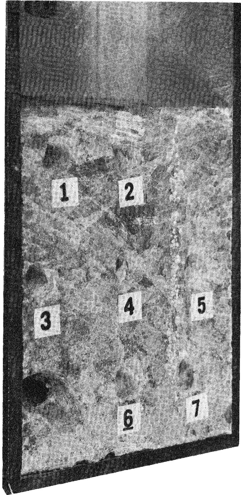  
Fig. 8.1. MSRE fuel ingot resulting from slower cooling rate.

The homogeneity generally characteristic of multicomponent salt mixtures in the liquid state is progressively destroyed as the mixture undergoes gradual crystallization. The possibility that the MSRE fuel mixture, $\mathrm{LiF - BeF_2 - ZrF_4 - UF_4}$ (65-29.1-5.0-0.9 mole %), might, on cooling in the MSRE drain tanks, experience sufficient solid-phase fractionation to create potentially hazardous conditions was examined in laboratory-scale experiments. Some $650\mathrm{g}$ of simulated fuel salt was cooled at rates approximating that expected of the entire drain tank assembly and that expected of the fuel alone, 3.46 and $0.387^{\circ}\mathrm{C / hr}$ respectively. In both cases the radiative cooling geometry was controlled to simulate as nearly as possible that expected in the drain tanks, even though it was realized that the horizontal $\Delta T$ profile in the cooling radioactive fuel mixture would probably be substantially different from that prevailing in the laboratory experiment.

The concentrations of uranium were found to be identical at the top and bottom fractions of each of the two ingots, irrespective of cooling rate. A photograph of the ingot resulting from the slower cooling rate experiments is shown in Fig. 8.1. Chemical analyses of the salt specimens from each of the locations designated in Fig. 8.1 were obtained. For areas 1 to 7, the uranium concentrations were found to be 2.94, 3.49, 4.15, 3.32, 4.28, 4.62, and 5.74 wt%. In comparison with the nominal concentration of uranium in the MSRE fuel, 5.13 wt%, these experiments show a maximum increase of $23.4\%$ in uranium concentration on very slow static cooling. A fact which accounts for the small degree of segregation of the uranium phases in these experiments is that, at the onset of crystallization of $\mathrm{LiUF_5}$ , simultaneous crystallization of the three solid phases $\mathrm{Li_2BeF_4}$ , $\mathrm{Li_2ZrF_6}$ , and $\mathrm{LiUF_5}$ takes place. In addition, the volume of the liquid phase is being reduced steadily, so sharply, in fact, that in this experiment as well as in similar previous ones, some of the liquid phase was apparently occluded among dendritic-like crystals of the solidified phase, a phenomenon which helps prevent compositional variation in the mixture.

In the freezing of multicomponent mixtures, maximum segregation of crystalline phases takes place under equilibrium cooling conditions. The segregation represented by the results obtained in the fractionation experiments described here represents, in a practical way, the nearest approach to equilibrium cooling that the MSRE fuel salt may experience in a single crystallization sequence.

The crystallization behavior described above pertains exclusively to the fuel-salt mixtures used in the MSRE and is, of course, quite unlike that for fuel mixtures

proposed for use in a molten-salt breeder reactor. Crystallization equilibria similar to those for the breeder fuel are described elsewhere by Thoma and Ricci. $^{8}$

# References

1. P. N. Haubenreich et al., MSR Program Semiannu. Progr. Rep. Aug. 31, 1965, ORNL-3872, p. 30; see also Sect. 2.4.2 of this report.   
2. S. I. Cohen and T. N. Jones, A Summary of Density Measurements on Molten Fluoride Mixtures and a Correlation for Predicting Densities of Fluoride Mixtures, ORNL-1702 (July 19, 1954, declassified Nov. 2, 1961).   
3. Density and Viscosity of Fused Mixtures of Lithium, Beryllium and Uranium Fluorides, Mound Laboratory report MLM-1086 (December 1956).   
4. B. J. Sturm and R. E. Thoma, Reactor Chem. Div. Annu. Progr. Rep. Jan. 31, 1965, ORNL-3789, p. 83.   
5. P. N. Haubenreich, private communication, Aug. 16, 1965.   
6. S. Cantor, Reactor Chem. Div. Annu. Progr. Rep. Jan. 31, 1962, ORNL-3262, p. 38.   
7. T. L. Hudson, C. H. Gabbard, and D. M. Richardson, MSR Program Semiannu. Progr. Rep. Aug. 31, 1966, ORNL-4119, p. 41.   
8. R. E. Thoma and J. E. Ricci, Fractional Crystallization in the System LiF-BeF $_2$ -ThF $_4$ , ORNL-TM-2596 (July 1969).

# 9. INTERACTIONS OF FUEL SALT WITH MODERATOR GRAPHITE AND SURVEILLANCE SAMPLE MATERIALS

A new method of in-situ analysis for lithium, beryllium, and fluorine was invented by Macklin, Gibbons, and Handley in response to our appeal for their assistance in examination of graphite specimens removed from the MSRE core. The method they devised employed proton bombardment of target nuclides and measurement of the yields of neutrons and gamma rays produced. It was found to be applicable for measurement of the concentration of target nuclides in graphite at the few-parts-per-million level as a means to determine the extent to which MSRE fuel salt components penetrated into the graphite under radiation. This method has the advantage of applicability to matrix-dispersed samples and in the presence of considerable radioactivity from fission products, features which make it well suited to the examination of MSRE graphite.

The results obtained by these workers were reported in detail previously.2,3 There remain several puzzling aspects of their findings, and because of this the results are reviewed here.

Data were obtained from three samples, (1) a control sample (Y-5 from CGB bar 635) exposed to nonradioactive salt, (2) sample Y-7, removed from the reactor core after 33,400 MWhr of exposure in May 1967, and (3) sample X 13, removed March 25, 1968, after 66,637 MWhr of exposure.

Specimens were moved across a beam of 2.06-MeV protons collimated through a slit of $0.0075\mathrm{cm}$ width at the ORNL 3-MV Van de Graaff accelerator. Measurement of the resulting prompt gamma rays from ${}^{19}\mathrm{F}(p,\alpha \gamma)^{16}\mathrm{O}$ showed that fluorine varied in sample X-13 from $350~\mathrm{ppm}$ near the surface to $60~\mathrm{ppm}$ at the center (Fig. 9.1). The observed ratio of fluorine to lithium was near that characteristic of the MSRE fuel (Fig. 9.2). However, as shown in Figs. 9.1 and 9.3, the lithium and fluorine did not show a simple dependence on depth.

Results of the examination of sample X-13 suggested that much of the Li and F came from bulk intrusion, a finding which differed from that resulting from the previous examination of sample Y-7 (Fig. 9.4), where

the $\mathrm{Li} / \mathrm{F}$ ratio became increasingly higher at greater distances from the surface. Equally puzzling is that comparisons with the results of the analysis for $^{235}\mathrm{U}$ by Kirslis and Blankenship (see Figs. 9.1 and 9.3) showed that the relative concentrations of $\mathbf{F}$ and $^{235}\mathrm{U}$ became steadily divergent with penetration depth and thus seemed to rule out bulk salt intrusion as a mechanism. Further, in the absence of radiation, a control specimen showed less penetration of both salt and uranium by a factor of 100. The possibility was considered that introduction of a fuel aerosol from the gas phase, as was suggested to rationalize the intrusion of certain fission products, was responsible for fuel having penetrated the graphite voids as an aerosol. The cause of this phenomenon is still not resolved.

The uranium profiles shown in Figs. 9.1 and 9.3 were derived in the investigation by Kirslis and Blankenship, in which it was found, from delayed neutron activation analysis, that the uranium concentration profile ranges from values as high as $100\mathrm{ppm}$ at the surface to 6.5 ppm at 50 mils depth, but "in most cases, the total range of variation of the $^{235}\mathrm{U}$ concentration in 50 mils penetration was less than two orders of magnitude. This moderate slope indicates a higher mobility for uranium in graphite than for most fission products [but] ... represents only $1\mathrm{g}$ of $^{235}\mathrm{U}$ per $1000\mathrm{kg}$ of graphite."4

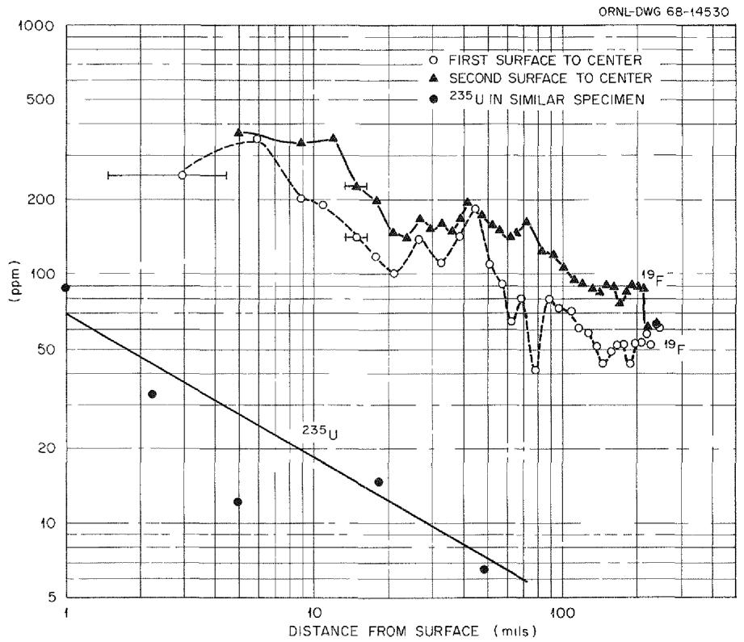  
Fig. 9.1. Fluorine concentration as a function of distance from the surface.

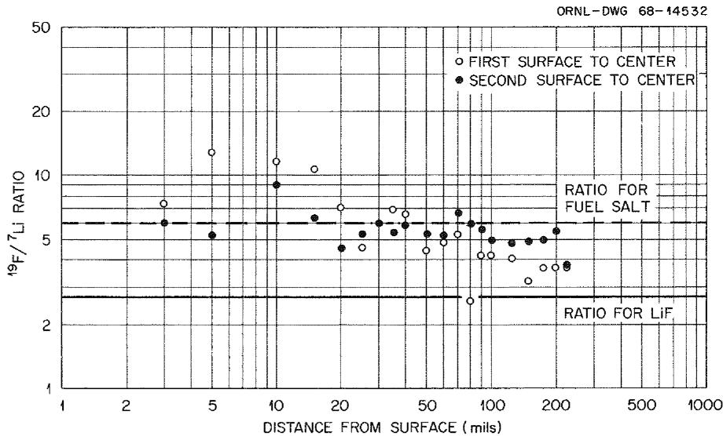  
Fig. 9.2. Mass concentration ratio, F/Li, vs depth.

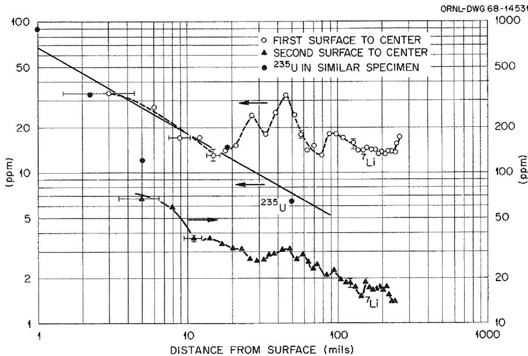  
Fig. 9.3. Lithium concentration as a function of distance from the surface.

Although the results of the proton reaction analysis described by Macklin and co-workers do not seem to permit quantitative generalization, they do suggest several points of significance to further development of molten-salt reactor technology:

1. The penetration of the graphite moderator by lithium and fluorine appears to be real, if not massive. Only samples of CGB graphite were examined in the experiments performed by Macklin et al. Whether similar penetrations of more dense or

coated graphites can be expected for improved MSBR graphites is not estimable from the current results.

2. Effects of salt-gas-graphite interfacial properties on transport of lithium and fluorine through films is unknown at present.   
3. The current data were derived from a fuel salt with a composition, $\mathrm{LiF - BeF_2 - ZrF_4 - UF_4}$ (65-29.2-5.0-0.8 mole %), whose effect on transport conceivably may differ from that for the MSBR. Whether the trans

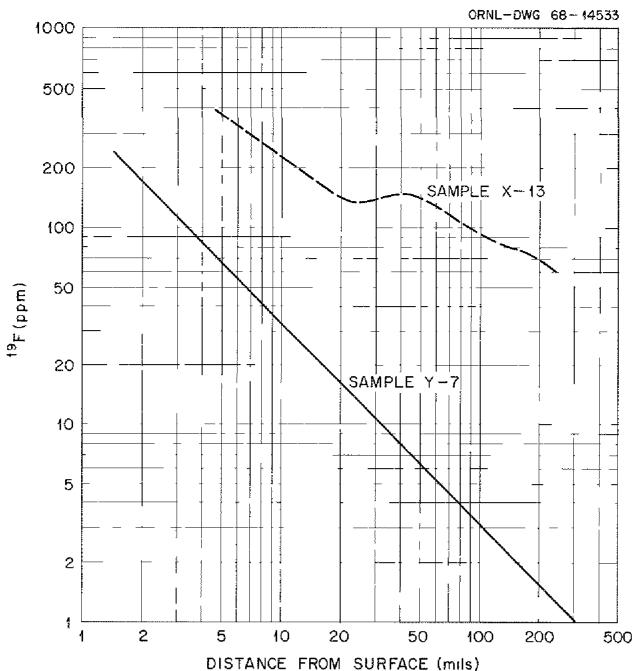  
Fig. 9.4. Comparison of fluorine concentrations in samples Y-7 and X-13, a smooth line having been drawn through the data points.

port would be markedly affected by the large heavy-metal concentration of the MSBR fuel, containing a total of 12 mole $\%$ $\mathrm{ThF_4 + UF_4}$ , is of justifiable curiosity.

The results obtained indicated with $^{235}\mathrm{U}$ fuel salt that there are a number of parameters whose quantitative relationship to the transport of salt species to moderator graphites should be examined by further examination of graphite specimens, especially those removed from the MSRE core after completion of the $^{233}\mathrm{U}$ experiments. Several notable differences between $^{233}\mathrm{U}$ and $^{235}\mathrm{U}$ operations existed, including for $^{233}\mathrm{U}$ operation a uranium concentration less than 20% of that with $^{235}\mathrm{U}$ , a continuously higher void fraction in the fuel salt, and variable differences in the gas-salt interfacial tension. The latter two of these factors were regarded as possibly conducive to enhanced transfer of materials to the graphite moderator and prompted further examination of graphite specimens from the MSRE.

In postoperational examinations of a graphite stringer from the MSRE core vessel, Kirslis and Blankenship obtained spectrochemical and delayed neutron analyses of the graphite milled from the surface of the stringer. Analyses by the proton bombardment method were not performed. The analytical results that were obtained were in partial agreement with the earlier results of Macklin and co-workers and indicated bulk penetration

of the fuel salt, probably via cracks in the graphite, to a depth of $\sim 2$ mils. In contrast, however, they did not indicate penetration to greater depths. Although the results of the two groups of analyses are in good agreement with respect to penetration of the outermost layers, Kirslis and Blankenship did not find anomalous divergence in the relative concentration of any of the components, nor did they find that uranium penetration had occurred to greater depths. The absence of detectable amounts of uranium in the graphite at depths where uranium had been detected with samples from $^{235}\mathrm{U}$ tests tends to support a model of bulk salt penetration, since the $^{233}\mathrm{U}$ concentration of the fuel was less than $20\%$ of that of the $^{235}\mathrm{U}$ fuel.

Applications of new and increasingly sensitive methods of analysis, such as the proton bombardment method, in molten-salt research and development programs are significant to the continued development of the technology. Continued refinement and adaptation of this new method are highly desirable within the framework of future research programs for possible application to MSBR development.

# References

1. R. L. Macklin, J. H. Gibbons, and T. H. Handley, Proton Reaction Analysis for Lithium and Fluorine in Graphite Using a Slit Scanning Technique, ORNL-TM-2238 (July 1968).   
2. R. L. Macklin et al., MSR Program Semiannu. Progr. Rep. Feb. 9, 1968, ORNL-4254, p. 119.   
3. R. L. Macklin et al., MSR Program Semiannu. Progr. Rep. Aug. 31, 1969, ORNL-4344, p. 146.   
4. S. S. Kirslis and F. F. Blankenship, MSR Program Semiannu. Progr. Rep. Aug. 31, 1969, ORNL-4344, p. 115.   
5. S. S. Kirslis and F. F. Blankenship, MSR Program Semiannu. Progr. Rep. Feb. 28, 1971, ORNL-4676, p. 73.

# 10. CHEMICAL SURVEILLANCE OF AUXILIARY FLUID SYSTEMS

# 10.1 Water Systems

Potable water from the ORNL distribution system was supplied to the MSRE for a variety of uses as described in the MSRE Design and Operations Report:1

After passing through a backflow preventer, the water is used in the liquid waste system, in the vapor-condensing system, for general cleanup of equipment, as makeup for the cooling tower water system, and for cooling of the charcoal beds. Two

520-gpm centrifugal pumps are provided for circulating cooling tower water, which is cooled by a two-fan induced draft cooling tower. The cooling tower water is used for air compressors, air conditioners, in the chemical plant, for the lube-oil systems, in the charcoal beds, and for condensing steam from the drain tank steam domes. (Process water can also be used for this.) Cooling tower water is also used in a shell-and-tube heat exchanger to provide cooling for the treated water system. Two 230-gpm centrifugal pumps circulate treated water in a closed loop to cool in cell components. Makeup water is supplied by condensing building steam in a shell and tube heat exchanger using cooling tower water as the coolant. Treated water is also used to fill the Nuclear Instrument penetration. This water is continuously recirculated through a closed loop by a 5-gpm pump to maintain uniformity of the water condition throughout the penetration. In order to minimize corrosion, potassium tetraborate and potassium nitrite were added to the water supply and maintained at concentrations of 500 and $1500~\mathrm{ppm}$ , respectively. Steam condensate is also used to supply water to the feedwater tanks. This untreated water is used in the drain tank bayonets to remove decay heat from the reactor fuel after the reactor has been drained.

The several water systems at the MSRE were sampled periodically and analyzed to determine corrosion rates, buildup of contaminants, loss of corrosion-inhibiting chemicals, etc. Water samples were submitted regularly for chemical analysis in the General Analysis Laboratory. At more frequent intervals, on-site tests were performed to give continuity to the control data and to reduce dependency on analyses from the laboratory. Details of sampling procedures, methods of additions of corrosion inhibitors, and of on-site testing procedures are given in the MSRE Design and Operations Report, Sect. 6-1.

10.1.1 Cooling tower water. Samples of the cooling tower water were tested on-site daily to check the concentration of its chromate ion, which served as a corrosion inhibitor, pH, and hardness. Samples were submitted on a weekly basis for laboratory analysis, where more complete analyses were performed. In use, the cooling tower water supply was maintained in the pH range 7 to 8, concentration of chromate ion at 30 to 50 ppm, hardness $\leqslant 250$ ppm (as $\mathrm{CaCO_3}$ ), and Fe $\leqslant 0.03$ ppm. The results of laboratory analyses with cooling tower water samples are listed in Table 10.1.   
10.1.2 Treated water supply. A supply of treated water was circulated within a closed system to remove heat from the thermal shield and other equipment in the reactor and drain cells. A program of water system surveillance was incorporated into the procedures employed at the MSRE to minimize the probability that operational difficulties would arise from this auxiliary system. Since standardized methods for control of the water chemistry of auxiliary systems such as those which existed in the MSRE were fairly well stand

ardized, it was anticipated that surveillance of the water supply would require only cursory attention. However, when power was first generated with the MSRE, it was found that the chemicals used in the treated water system had become activated. The source of the activity was identified as $^{42}\mathrm{K}$ , produced from the potassium nitrite-potassium tetraborate mixture used to inhibit corrosion in the system. Extrapolation of the radiation levels observed at low power indicated that if the reactor were operated for extended periods at full power, equilibrium radiation levels of about $400\mathrm{mR / hr}$ would prevail in the heat exchanger in the diesel equipment room and in the water control room.

As the alternative, the potassium-containing inhibitors were discarded and replaced with an analogous lithium-based mixture, highly enriched in the $^7\mathrm{Li}$ isotope to minimize tritium production. Lithium nitrite was prepared commercially by ion exchange from potassium nitrite and lithium hydroxide for this use. After the 4000-gal treated-water system was diluted with demineralized water to reduce the potassium from 800 to 3 ppm, the desired inhibitor concentration was attained by adding $^7\mathrm{Li}$ nitrite, boric acid, and $^7\mathrm{Li}$ hydroxide.

When the reactor was next operated at power, in run 5, activation again occurred, this time caused by the presence of sodium, $\sim 1$ ppm of which was present in the demineralized water from the ORNL facility. Condensate was produced at the MSRE with less than 0.1 ppm of sodium and used to dilute the sodium in the treated-water system to $0.3\mathrm{ppm}$ . The concentrations of sodium and $^6\mathrm{Li}$ were thereafter reduced to sufficiently low concentrations that shielding and zero-leakage containment of the water system were not required.

Criteria were established for the treated water after replacement of the inhibitor mixture to meet the following specifications: pH: 7.0 to 9.0, $\mathrm{Na}^{+} \leqslant 3 \mathrm{ppm}$ , $\mathrm{NO}_2 = 760$ to $860 \mathrm{ppm}$ , $\mathrm{B} \geqslant 57 \mathrm{ppm}$ , $\mathrm{K}^{+} \leqslant 8 \mathrm{ppm}$ , $\Delta \mathrm{Al} = 0 \mathrm{ppm}$ , $\mathrm{Fe} = 0 \mathrm{ppm}$ , tritium $\leqslant 2.2 \times 10^5$ dis $\mathrm{min}^{-1} \mathrm{cm}^{-3}$ , $\Delta \Sigma$ hardness (as $\mathrm{CaCO}_3 = 0 \mathrm{ppm}$ ).

Chemical analyses of treated-water samples were obtained at frequent intervals in order to maintain these specifications and as guides for adjustments of the concentrations of chemicals in the treated-water system supply. On-site tests were also performed with greater frequency than laboratory analyses for control of operations, with supplementary analyses obtained from the Analytical Chemistry laboratory at approximately biweekly intervals. The results of the chemical analyses obtained for treated-water samples obtained from the circulating system are listed in Table 10.2. Those obtained from the nuclear instrument penetration are listed in Table 10.3.

The results listed in Tables 10.2 and 10.3 do not warrant detailed comment or interpretation because they were used primarily as guides for controlling the concentrations of the corrosion inhibitors. It is evident from the results listed that they served satisfactorily for this purpose, and that the treated-water systems were essentially free of operational difficulties.

10.1.3 Vapor condensing system. Among the water supplies which were subjected to routine chemical

surveillance was included in the reservoir of the vapor condensing system. This system was incorporated into the MSRE for service only under the accident conditions described in the MSRE Design and Operations Report, Part I. If an accident occurred in which hot fuel salt and the water used to cool equipment inside the cells became mixed, it would be necessary to contain within the MSRE the steam generated by the accident. A vapor condensing system, shown schematically, is shown in Figure 1.

Table 10.1. Results of chemical analysis of MSRE cooling tower water   

<table><tr><td rowspan="2">CTW Sample No.</td><td rowspan="2">Date</td><td rowspan="2">Total Hardness</td><td>CrO4=</td><td>pH</td><td>Fe</td><td rowspan="2">CTW Sample No.</td><td rowspan="2">Date</td><td rowspan="2">Total Hardness</td><td>CrO4=</td><td>pH</td><td>Fe</td></tr><tr><td colspan="3">(ppm)</td><td colspan="3">(ppm)</td></tr><tr><td>8</td><td>6/18/65</td><td>214</td><td>39</td><td>8.53</td><td>&lt;2.0</td><td>456</td><td>12/2/66</td><td>178</td><td>12</td><td>8.00</td><td>&lt;0.3</td></tr><tr><td>9</td><td>6/25/65</td><td>185</td><td>13</td><td>8.63</td><td>&lt;2.0</td><td>458</td><td>12/4/66</td><td>251</td><td>68</td><td>8.00</td><td>&lt;1.0</td></tr><tr><td>10</td><td>7/2/65</td><td>284</td><td>39</td><td>8.70</td><td>&lt;2.0</td><td>467</td><td>12/12/66</td><td>197</td><td>4</td><td>-</td><td>&lt;0.3</td></tr><tr><td>11</td><td>7/9/65</td><td>133</td><td>141</td><td>8.10</td><td>-</td><td>473</td><td>12/18/66</td><td>176</td><td>14</td><td>-</td><td>&lt;2.0</td></tr><tr><td>12</td><td>7/23/65</td><td>105</td><td>21</td><td>9.58</td><td>&lt;1.0</td><td>482</td><td>12/27/66</td><td>187</td><td>28</td><td>81.7</td><td>&lt;0.3</td></tr><tr><td>13</td><td>7/30/65</td><td>105</td><td>30</td><td>7.97</td><td>&lt;1.0</td><td>494</td><td>1/8/67</td><td>178</td><td>16</td><td>8.37</td><td>0.5</td></tr><tr><td>14</td><td>8/6/65</td><td>185</td><td>72</td><td>7.80</td><td>&lt;1.0</td><td>502</td><td>1/15/67</td><td>175</td><td>18</td><td>-</td><td>&lt;0.3</td></tr><tr><td>15</td><td>8/23/65</td><td>194</td><td>-</td><td>8.51</td><td>&lt;0.3</td><td>512</td><td>1/30/67</td><td>171</td><td>9</td><td>8.10</td><td>&lt;0.3</td></tr><tr><td>16</td><td>9/4/65</td><td>248</td><td>-</td><td>6.90</td><td>4.0</td><td>516</td><td>2/5/67</td><td>165</td><td>11</td><td>8.28</td><td>&lt;0.3</td></tr><tr><td>18</td><td>9/17/65</td><td>3.0</td><td>37</td><td>8.77</td><td>1.0</td><td>524</td><td>2/13/67</td><td>171</td><td>-</td><td>-</td><td>&lt;0.3</td></tr><tr><td>26</td><td>9/24/65</td><td>223</td><td>25</td><td>8.60</td><td>-</td><td>532</td><td>2/21/67</td><td>161</td><td>26</td><td>8.02</td><td>&lt;0.3</td></tr><tr><td>32</td><td>10/8/65</td><td>111</td><td>44</td><td>8.00</td><td>0.5</td><td>538</td><td>2/27/67</td><td>175</td><td>17</td><td>8.10</td><td>&lt;0.3</td></tr><tr><td>33</td><td>10/15/65</td><td>30</td><td>32</td><td>8.10</td><td>0.5</td><td>546</td><td>3/6/67</td><td>231</td><td>27</td><td>8.77</td><td>&lt;0.3</td></tr><tr><td>48</td><td>11/10/65</td><td>121</td><td>14</td><td>8.08</td><td>0.3</td><td>559</td><td>3/19/67</td><td>223</td><td>79</td><td>8.36</td><td>&lt;0.3</td></tr><tr><td>55</td><td>11/17/65</td><td>141</td><td>15</td><td>8.22</td><td>0.2</td><td>575</td><td>4/3/67</td><td>-</td><td>23</td><td>8.57</td><td>&lt;0.3</td></tr><tr><td>67</td><td>11/29/65</td><td>161</td><td>16</td><td>7.0</td><td>&lt;0.2</td><td>581</td><td>4/8/67</td><td>342</td><td>36</td><td>8.60</td><td>&lt;0.3</td></tr><tr><td>79</td><td>12/10/65</td><td>129</td><td>29</td><td>7.37</td><td>-</td><td>588</td><td>4/18/67</td><td>241</td><td>-</td><td>8.30</td><td>&lt;1.0</td></tr><tr><td>83</td><td>12/15/65</td><td>137</td><td>21</td><td>8.0</td><td>&lt;0.3</td><td>596</td><td>4/24/67</td><td>239</td><td>29</td><td>8.50</td><td>&lt;1.0</td></tr><tr><td>97</td><td>12/28/65</td><td>143</td><td>-</td><td>7.80</td><td>&lt;0.3</td><td>603</td><td>5/2/67</td><td>235</td><td>26</td><td>8.47</td><td>&lt;0.3</td></tr><tr><td>105</td><td>1/5/66</td><td>-</td><td>-</td><td>8.32</td><td>&lt;0.3</td><td>607</td><td>5/7/67</td><td>286</td><td>66</td><td>-</td><td>&lt;0.5</td></tr><tr><td>109</td><td>1/9/66</td><td>157</td><td>20</td><td>8.17</td><td>0.5</td><td>615</td><td>5/15/67</td><td>193</td><td>50</td><td>8.30</td><td>&lt;0.3</td></tr><tr><td>118</td><td>1/19/66</td><td>151</td><td>17</td><td>8.30</td><td>&lt;0.3</td><td>622</td><td>5/22/67</td><td>143</td><td>54</td><td>8.07</td><td>&lt;0.3</td></tr><tr><td>123</td><td>1/23/66</td><td>153</td><td>17</td><td>8.25</td><td>&lt;0.3</td><td>630</td><td>5/30/67</td><td>152</td><td>53</td><td>8.00</td><td>&lt;0.3</td></tr><tr><td>142</td><td>2/12/66</td><td>150</td><td>15</td><td>8.35</td><td>&lt;0.3</td><td>634</td><td>6/4/67</td><td>132</td><td>59</td><td>7.77</td><td>0.5</td></tr><tr><td>145</td><td>2/13/66</td><td>169</td><td>13</td><td>-</td><td>&lt;0.5</td><td>641</td><td>6/12/67</td><td>155</td><td>44</td><td>7.93</td><td>&lt;0.3</td></tr><tr><td>162</td><td>2/28/66</td><td>262</td><td>42</td><td>8.40</td><td>&lt;0.5</td><td>655</td><td>6/26/67</td><td>217</td><td>108</td><td>8.31</td><td>&lt;0.3</td></tr><tr><td>164</td><td>3/3/66</td><td>128</td><td>-</td><td>8.20</td><td>&lt;0.5</td><td>661</td><td>7/2/67</td><td>-</td><td>71</td><td>8.33</td><td>&lt;0.3</td></tr><tr><td>172</td><td>3/12/66</td><td>153</td><td>17</td><td>8.07</td><td>&lt;0.3</td><td>669</td><td>7/10/67</td><td>245</td><td>58</td><td>7.3</td><td>&lt;0.3</td></tr><tr><td>181</td><td>3/19/66</td><td>151</td><td>17</td><td>8.38</td><td>&lt;0.3</td><td>676</td><td>7/16/67</td><td>260</td><td>58</td><td>8.0</td><td>&lt;0.3</td></tr><tr><td>186</td><td>3/23/66</td><td>186</td><td>19</td><td>7.90</td><td>&lt;0.3</td><td>689</td><td>7/30/69</td><td>149</td><td>-</td><td>-</td><td>&lt;0.3</td></tr><tr><td>189</td><td>3/27/66</td><td>156</td><td>19</td><td>8.20</td><td>&lt;0.3</td><td>697</td><td>8/7/67</td><td>152</td><td>68</td><td>8.54</td><td>&lt;0.3</td></tr><tr><td>209</td><td>4/18/66</td><td>179</td><td>17</td><td>8.14</td><td>&lt;0.5</td><td>704</td><td>8/14/67</td><td>214</td><td>54</td><td>8.40</td><td>0.35</td></tr><tr><td>219</td><td>4/27/66</td><td>-</td><td>17</td><td>-</td><td>&lt;0.3</td><td>711</td><td>8/21/67</td><td>176</td><td>42</td><td>8.51</td><td>&lt;0.2</td></tr><tr><td>224</td><td>5/1/66</td><td>178</td><td>20</td><td>8.4</td><td>&lt;0.3</td><td>721</td><td>8/31/67</td><td>199</td><td>67</td><td>8.22</td><td>&lt;0.3</td></tr><tr><td>232</td><td>5/8/66</td><td>194</td><td>21</td><td>8.42</td><td>&lt;0.5</td><td>725</td><td>9/3/67</td><td>155</td><td>40</td><td>8.44</td><td>&lt;0.3</td></tr><tr><td>240</td><td>5/15/66</td><td>-</td><td>18</td><td>8.32</td><td>&lt;0.3</td><td>734</td><td>9/12/67</td><td>212</td><td>56</td><td>8.53</td><td>&lt;0.4</td></tr><tr><td>248</td><td>5/22/66</td><td>200</td><td>20</td><td>8.28</td><td>&lt;0.3</td><td>740</td><td>9/18/67</td><td>248</td><td>71</td><td>8.50</td><td>&lt;0.4</td></tr><tr><td>256</td><td>5/30/66</td><td>198</td><td>15</td><td>8.22</td><td>&lt;0.3</td><td>748</td><td>9/25/67</td><td>248</td><td>71</td><td>8.38</td><td>1.1</td></tr><tr><td>262</td><td>6/5/66</td><td>187</td><td>14</td><td>8.24</td><td>&lt;0.3</td><td>756</td><td>10/2/67</td><td>268</td><td>71</td><td>8.55</td><td>0.62</td></tr><tr><td>269</td><td>6/12/66</td><td>183</td><td>21</td><td>8.08</td><td>&lt;0.3</td><td>763</td><td>10/9/67</td><td>247</td><td>56</td><td>8.40</td><td>&lt;0.4</td></tr><tr><td>277</td><td>6/19/66</td><td>212</td><td>20</td><td>8.45</td><td>&lt;0.3</td><td>769</td><td>10/16/67</td><td>276</td><td>129</td><td>8.35</td><td>&lt;0.3</td></tr><tr><td>285</td><td>6/26/66</td><td>218</td><td>17</td><td>8.37</td><td>&lt;0.3</td><td>776</td><td>10/23/67</td><td>250</td><td>62</td><td>6.80</td><td>&lt;0.2</td></tr><tr><td>292</td><td>7/2/66</td><td>210</td><td>8</td><td>8.55</td><td>&lt;0.3</td><td>783</td><td>10/30/67</td><td>228</td><td>72</td><td>8.10</td><td>&lt;0.4</td></tr><tr><td>300</td><td>7/10/66</td><td>216</td><td>20</td><td>8.40</td><td>&lt;0.3</td><td>790</td><td>11/6/67</td><td>205</td><td>58</td><td>8.0</td><td>&lt;0.5</td></tr><tr><td>307</td><td>7/17/66</td><td>203</td><td>20</td><td>8.05</td><td>&lt;0.3</td><td>795</td><td>11/13/67</td><td>213</td><td>56</td><td>8.3</td><td>&lt;0.5</td></tr><tr><td>315</td><td>7/23/66</td><td>156</td><td>20</td><td>8.38</td><td>&lt;0.3</td><td>800</td><td>11/18/67</td><td>215</td><td>58</td><td>8.46</td><td>&lt;0.5</td></tr><tr><td>317</td><td>7/24/66</td><td>172</td><td>17</td><td>8.46</td><td>&lt;0.3</td><td>810</td><td>11/27/67</td><td>54</td><td>67</td><td>8.50</td><td>&lt;0.2</td></tr><tr><td>325</td><td>7/31/66</td><td>20</td><td>20</td><td>-</td><td>&lt;0.3</td><td>824</td><td>12/10/68</td><td>273</td><td>67</td><td>8.40</td><td>&lt;0.4</td></tr><tr><td>332</td><td>8/6/66</td><td>126</td><td>15</td><td>7.71</td><td>&lt;1.0</td><td>844</td><td>1/1/68</td><td>-</td><td>-</td><td>8.24</td><td>&lt;0.2</td></tr><tr><td>340</td><td>8/15/66</td><td>129</td><td>32</td><td>-</td><td>&lt;0.3</td><td>921</td><td>3/30/68</td><td>168</td><td>60</td><td>8.12</td><td>&lt;0.4</td></tr><tr><td>346</td><td>8/21/66</td><td>130</td><td>21</td><td>7.70</td><td>&lt;0.3</td><td>928</td><td>4/8/68</td><td>151</td><td>69</td><td>7.48</td><td>&lt;2.0</td></tr><tr><td>354</td><td>8/29/66</td><td>121</td><td>13</td><td>-</td><td>-</td><td>964</td><td>6/21/68</td><td>160</td><td>100</td><td>8.98</td><td>0.1</td></tr><tr><td>360</td><td>9/5/66</td><td>127</td><td>17</td><td>8.10</td><td>&lt;0.4</td><td>992</td><td>6/30/68</td><td>150</td><td>76</td><td>8.24</td><td>&lt;0.4</td></tr><tr><td>366</td><td>9/11/66</td><td>260</td><td>90</td><td>-</td><td>&lt;0.3</td><td>1027</td><td>8/4/68</td><td>193</td><td>47</td><td>8.44</td><td>&lt;0.3</td></tr><tr><td>375</td><td>9/19/66</td><td>145</td><td>12</td><td>8.20</td><td>&lt;0.3</td><td>1186</td><td>1/8/69</td><td>177</td><td>60</td><td>8.05</td><td>&lt;0.1</td></tr><tr><td>383</td><td>9/25/66</td><td>158</td><td>11</td><td>8.20</td><td>&lt;0.3</td><td>1241</td><td>3/2/69</td><td>409</td><td>155</td><td>8.50</td><td>&lt;0.3</td></tr><tr><td>392</td><td>10/3/66</td><td>-</td><td>18</td><td>8.50</td><td>&lt;0.4</td><td>1274</td><td>4/6/69</td><td>186</td><td>36</td><td>8.32</td><td>&lt;0.1</td></tr><tr><td>414</td><td>10/24/66</td><td>294</td><td>30</td><td>-</td><td>&lt;0.5</td><td>1359</td><td>7/6/69</td><td>209</td><td>65</td><td>7.76</td><td>0.12</td></tr><tr><td>422</td><td>10/30/66</td><td>210</td><td>17</td><td>8.57</td><td>-</td><td>1385</td><td>8/3/69</td><td>228</td><td>112</td><td>7.57</td><td>0.08</td></tr><tr><td>433</td><td>11/10/66</td><td>185</td><td>14</td><td>8.70</td><td>&lt;2.0</td><td>1413</td><td>8/31/69</td><td>275</td><td>76</td><td>8.06</td><td>7.0</td></tr><tr><td>438</td><td>11/14/66</td><td>198</td><td>16</td><td>8.70</td><td>&lt;0.3</td><td>1491</td><td>10/9/69</td><td>270</td><td>46</td><td>8.59</td><td>&lt;0.1</td></tr><tr><td>444</td><td>11/20/66</td><td>187</td><td>13</td><td>-</td><td>&lt;0.3</td><td>1503</td><td>10/20/69</td><td>493</td><td>98</td><td>8.82</td><td>&lt;0.2</td></tr><tr><td>452</td><td>11/28/66</td><td>176</td><td>21</td><td>8.16</td><td>&lt;1.0</td><td>1539</td><td>12/4/69</td><td>225</td><td>71</td><td>8.32</td><td>&lt;0.1</td></tr></table>

matically in Fig. 10.1, was provided to prevent steam pressure from rising above the 40 psig allowable pressure for the cells and to retain the noncondensable gases. The vapor condensing tank in this system was kept about two-thirds full of potable water at all times from 1964 to 1969.

Corrosion inhibition in the water reservoir tank was effected by addition of potassium nitrite and potassium tetraborate, as in the recirculated water systems. The water supply in the water reservoir tank was to meet the same specifications as the circulating systems.

Table 10.2. Chemical analysis of treated-water samples from the MSRE circulating system   

<table><tr><td rowspan="2">Date</td><td rowspan="2">Treated Water Sample No.</td><td rowspan="2">pH</td><td>NO2-</td><td>β</td><td>Al</td><td>Fe</td><td>Σ Hardness</td><td rowspan="2">Tritium dpm/cm3</td></tr><tr><td colspan="5">(ppm)</td></tr><tr><td>3/2/66</td><td>129</td><td>9.45</td><td>720</td><td>60</td><td>&lt;1.0</td><td>&lt;0.5</td><td>-</td><td></td></tr><tr><td>3/7/66</td><td>132</td><td>9.40</td><td>860</td><td>61</td><td>&lt;1.0</td><td>-</td><td>-</td><td></td></tr><tr><td>3/17/66</td><td>137</td><td>9.40</td><td>760</td><td>57</td><td>&lt;1.0</td><td>&lt;0.3</td><td>15</td><td></td></tr><tr><td>3/19/66</td><td>138</td><td>8.98</td><td>760</td><td>57</td><td>&lt;0.5</td><td>&lt;0.3</td><td>20</td><td></td></tr><tr><td>3/19/66</td><td>139</td><td>9.40</td><td>750</td><td>57</td><td>&lt;1.0</td><td>&lt;0.3</td><td>20</td><td></td></tr><tr><td>3/23/66</td><td>141</td><td>9.30</td><td>740</td><td>56</td><td>-</td><td>&lt;0.3</td><td>19</td><td></td></tr><tr><td>4/3/66</td><td>145</td><td>9.50</td><td>710</td><td>56</td><td>&lt;1.0</td><td>&lt;0.5</td><td>27</td><td></td></tr><tr><td>4/3/66</td><td>146</td><td>8.45</td><td>740</td><td>57</td><td>&lt;1.0</td><td>&lt;0.3</td><td>25</td><td></td></tr><tr><td>4/18/66</td><td>149</td><td>9.33</td><td>630</td><td>56</td><td>&lt;1.0</td><td>&lt;0.5</td><td>22</td><td></td></tr><tr><td>4/22/66</td><td>152</td><td>9.34</td><td>670</td><td>70</td><td>-</td><td>-</td><td>-</td><td></td></tr><tr><td>5/1/66</td><td>156</td><td>9.28</td><td>600</td><td>70</td><td>&lt;1.0</td><td>&lt;0.3</td><td>25</td><td></td></tr><tr><td>5/10/66</td><td>158</td><td>9.27</td><td>590</td><td>60</td><td>&lt;1.0</td><td>&lt;0.5</td><td>28</td><td></td></tr><tr><td>5/16/66</td><td>169</td><td>9.17</td><td>460</td><td>67</td><td>&lt;1.0</td><td>&lt;0.3</td><td>25</td><td></td></tr><tr><td>5/16/66</td><td>170</td><td>-</td><td>-</td><td>-</td><td>-</td><td>-</td><td>-</td><td>9.04 x 103</td></tr><tr><td>5/27/66</td><td>179</td><td>-</td><td>-</td><td>-</td><td>-</td><td>-</td><td>-</td><td>1.72 x 104</td></tr><tr><td>5/27/66</td><td>180</td><td>9.07</td><td>7.60</td><td>-</td><td>-</td><td>-</td><td>-</td><td></td></tr><tr><td>6/5/66</td><td>187</td><td>9.10</td><td>720</td><td>64</td><td>&lt;1.0</td><td>&lt;0.3</td><td>26</td><td></td></tr><tr><td>7/3/66</td><td>208</td><td>9.20</td><td>690</td><td>64</td><td>&lt;1.0</td><td>&lt;0.3</td><td>26</td><td>1.96 x 104</td></tr><tr><td>9/7/66</td><td>224</td><td>9.38</td><td>520</td><td>42</td><td>-</td><td>&lt;0.3</td><td></td><td></td></tr><tr><td>9/19/66</td><td>227</td><td>9.00</td><td>540</td><td>44</td><td>&lt;1.0</td><td>&lt;0.3</td><td>14</td><td></td></tr><tr><td>10/3/66</td><td>233</td><td>10.10</td><td>500</td><td>51</td><td>13</td><td>&lt;0.3</td><td>7</td><td></td></tr><tr><td>10/5/66</td><td>235</td><td>10.10</td><td>1204</td><td>51</td><td>15</td><td>&lt;0.3</td><td>12</td><td></td></tr><tr><td>10/30/66</td><td>244</td><td>9.62</td><td>560</td><td>68</td><td>22</td><td>&lt;0.3</td><td>16</td><td></td></tr><tr><td>11/10/66</td><td>245</td><td>9.50</td><td>740</td><td>69</td><td>26</td><td>&lt;0.2</td><td>26</td><td>1.4 x 104</td></tr><tr><td>12/4/66</td><td>250</td><td>9.40</td><td>1020</td><td>67</td><td>12</td><td>&lt;1.0</td><td>18</td><td></td></tr><tr><td>1/24/67</td><td>260</td><td>9.20</td><td>860</td><td>58</td><td>49</td><td>&lt;0.3</td><td>20</td><td></td></tr><tr><td>2/5/67</td><td>263</td><td>9.17</td><td>810</td><td>59</td><td>1.0</td><td>&lt;0.3</td><td>16</td><td></td></tr><tr><td>3/6/67</td><td>268</td><td>9.07</td><td>840</td><td>58</td><td>31</td><td>&lt;0.3</td><td>16</td><td>8.07 x 104</td></tr><tr><td>3/9/67</td><td>271</td><td>9.14</td><td>732</td><td>58</td><td>5</td><td>&lt;0.3</td><td>17</td><td>1.1 x 106</td></tr><tr><td>4/3/67</td><td>274</td><td>9.07</td><td>715</td><td>58</td><td>27</td><td>&lt;0.3</td><td>19</td><td>7.85 x 104</td></tr><tr><td>5/7/67</td><td>279</td><td>9.17</td><td>640</td><td>73</td><td>4</td><td>&lt;0.3</td><td>14</td><td>1.26 x 105</td></tr><tr><td>5/9/67</td><td>280</td><td>9.27</td><td>790</td><td>71</td><td>&lt;1.0</td><td>&lt;0.5</td><td>13</td><td>1.48 x 105</td></tr><tr><td>6/4/67</td><td>283</td><td>9.08</td><td>752</td><td>70</td><td>0.5</td><td>&lt;0.5</td><td>18</td><td>1.76 x 105</td></tr><tr><td>6/14/67</td><td>285</td><td>9.07</td><td>900</td><td>72</td><td>1.0</td><td>&lt;0.3</td><td>13</td><td>1.37 x 105</td></tr><tr><td>6/26/67</td><td>286</td><td>9.18</td><td>840</td><td>66</td><td>1.0</td><td>&lt;0.3</td><td>-</td><td>1.33 x 105</td></tr><tr><td>7/2/67</td><td>287</td><td>9.17</td><td>890</td><td>65</td><td>&lt;0.4</td><td>&lt;0.3</td><td>13</td><td>1.42 x 105</td></tr><tr><td>7/5/67</td><td>288</td><td>9.18</td><td>850</td><td>65</td><td>0.5</td><td>&lt;0.3</td><td>12</td><td>1.33 x 105</td></tr><tr><td>8/7/67</td><td>294</td><td>9.20</td><td>810</td><td>64</td><td>0.8</td><td>&lt;0.3</td><td>8</td><td>5.0 x 104</td></tr><tr><td>9/3/67</td><td>298</td><td>8.81</td><td>820</td><td>69</td><td>&lt;0.4</td><td>&lt;0.4</td><td>17</td><td>1.57 x 105</td></tr><tr><td>10/2/67</td><td>302</td><td>9.25</td><td>790</td><td>63</td><td>&lt;0.4</td><td>&lt;0.5</td><td>21</td><td>1.59 x 105</td></tr><tr><td>1/1/68</td><td>312</td><td>9.20</td><td>850</td><td>60</td><td>&lt;0.2</td><td>0.5</td><td>10</td><td>2.23 x 105</td></tr><tr><td>3/30/68</td><td>320</td><td>9.12</td><td>800</td><td>60</td><td>&lt;0.5</td><td>&lt;0.4</td><td>9</td><td>2.44 x 105</td></tr><tr><td>6/2/68</td><td>327</td><td>9.22</td><td>760</td><td>58</td><td>&lt;1.0</td><td>0.3</td><td>10</td><td>2.32 x 105</td></tr><tr><td>6/30/68</td><td>331</td><td>9.34</td><td>780</td><td>55</td><td>&lt;0.5</td><td>&lt;0.4</td><td>9</td><td>2.47 x 105</td></tr><tr><td>8/4/68</td><td>333</td><td>9.23</td><td>730</td><td>56</td><td>0.18</td><td>&lt;0.1</td><td>10</td><td>1.11 x 105</td></tr><tr><td>1/7/69</td><td>343</td><td>9.08</td><td>746</td><td>45</td><td>&lt;0.2</td><td>0.12</td><td>10</td><td></td></tr><tr><td>3/2/69</td><td>349</td><td>9.14</td><td>700</td><td>67</td><td>0.6</td><td>&lt;0.3</td><td>10</td><td>2.26 x 105</td></tr><tr><td>4/6/69</td><td>352</td><td>9.16</td><td>800</td><td>67</td><td>0.4</td><td>0.2</td><td>10</td><td>2.57 x 105</td></tr><tr><td>7/6/69</td><td>355</td><td>8.84</td><td>758</td><td>71</td><td>&lt;0.4</td><td>&lt;0.3</td><td>10</td><td>2.85 x 105</td></tr><tr><td>8/3/69</td><td>357</td><td>9.10</td><td>742</td><td>70</td><td>0.73</td><td>&lt;0.3</td><td>-</td><td>2.83 x 105</td></tr><tr><td>8/31/69</td><td>359</td><td>9.19</td><td>765</td><td>70</td><td>0.74</td><td>&lt;0.3</td><td>9</td><td>2.82 x 105</td></tr><tr><td>10/9/69</td><td>361</td><td>9.15</td><td>730</td><td>69</td><td>1.0</td><td>&lt;0.1</td><td>10</td><td>4.41 x 105</td></tr><tr><td>10/19/69</td><td>362</td><td>9.18</td><td>686</td><td>67</td><td>&lt;0.2</td><td>&lt;0.2</td><td>10</td><td>3.10 x 105</td></tr><tr><td>11/4/69</td><td>363</td><td>9.18</td><td>723</td><td>68</td><td>&lt;0.2</td><td>&lt;0.2</td><td>8</td><td>2.98 x 105</td></tr><tr><td>12/4/69</td><td>365</td><td>9.17</td><td>660</td><td>69</td><td>&lt;0.7</td><td>&lt;0.1</td><td>9</td><td>3.00 x 105</td></tr></table>

Table 10.3. Chemical analyses of treated water from the MSRE instrument shaft   

<table><tr><td>Date</td><td>Treated Water Sample No.</td><td>pH</td><td>NO2</td><td>β</td><td>Al</td><td>Fe</td><td>Σ Hardness</td><td>Tritium dpm/cm3</td></tr><tr><td>9/24/65</td><td>18</td><td>9.71</td><td>120</td><td>46</td><td>2</td><td>&lt;0.5</td><td>4</td><td>-</td></tr><tr><td>10/8/65</td><td>20</td><td>9.51</td><td>1250</td><td>60</td><td>2</td><td>0.5</td><td>8</td><td>-</td></tr><tr><td>10/15/65</td><td>21</td><td>9.47</td><td>1240</td><td>60</td><td>2</td><td>0.5</td><td>9</td><td>-</td></tr><tr><td>11/10/65</td><td>22</td><td>9.60</td><td>1110</td><td>58</td><td>5</td><td>0.3</td><td>6</td><td>-</td></tr><tr><td>11/17/65</td><td>23</td><td>9.55</td><td>1110</td><td>59</td><td>3</td><td>0.2</td><td>9</td><td>-</td></tr><tr><td>11/29/65</td><td>24</td><td>9.52</td><td>-</td><td>59</td><td>2</td><td>&lt;0.2</td><td>10</td><td>-</td></tr><tr><td>12/15/65</td><td>28</td><td>9.50</td><td>1170</td><td>59</td><td>2</td><td>&lt;0.3</td><td>35</td><td>-</td></tr><tr><td>12/28/65</td><td>33</td><td>9.50</td><td>1050</td><td>60</td><td>2</td><td>&lt;0.3</td><td>6</td><td>-</td></tr><tr><td>1/5/66</td><td>36</td><td>9.50</td><td>1060</td><td>58</td><td>1</td><td>&lt;0.3</td><td>-</td><td>-</td></tr><tr><td>1/9/66</td><td>37</td><td>9.53</td><td>1100</td><td>59</td><td>2</td><td>0.5</td><td>9</td><td>-</td></tr><tr><td>1/15/66</td><td>39</td><td>9.18</td><td>1100</td><td>91</td><td>2</td><td>&lt;0.3</td><td>11</td><td>-</td></tr><tr><td>1/23/66</td><td>42</td><td>9.15</td><td>1280</td><td>91</td><td>1</td><td>&lt;0.3</td><td>-</td><td>-</td></tr><tr><td>2/16/66</td><td>48</td><td>9.22</td><td>740</td><td>61</td><td>1</td><td>&lt;0.3</td><td>12</td><td>-</td></tr><tr><td>3/2/66</td><td>53</td><td>9.25</td><td>720</td><td>60</td><td>1</td><td>&lt;0.5</td><td>20</td><td>-</td></tr><tr><td>3/7/66</td><td>56</td><td>9.20</td><td>860</td><td>60</td><td>1</td><td>-</td><td>-</td><td>-</td></tr><tr><td>3/12/66</td><td>58</td><td>9.07</td><td>830</td><td>58</td><td>&lt;1</td><td>&lt;0.3</td><td>16</td><td>-</td></tr><tr><td>3/19/66</td><td>61</td><td>9.15</td><td>810</td><td>58</td><td>1.0</td><td>&lt;0.3</td><td>11</td><td>-</td></tr><tr><td>3/23/66</td><td>63</td><td>9.12</td><td>820</td><td>60</td><td>-</td><td>&lt;0.3</td><td>13</td><td>-</td></tr><tr><td>3/23/66</td><td>64</td><td>9.25</td><td>820</td><td>61</td><td>1.0</td><td>&lt;0.3</td><td>16</td><td>-</td></tr><tr><td>4/8/66</td><td>67</td><td>9.16</td><td>820</td><td>62</td><td>1.0</td><td>&lt;0.5</td><td>13</td><td>-</td></tr><tr><td>5/1/66</td><td>69</td><td>9.10</td><td>700</td><td>62</td><td>&lt;1.0</td><td>0.3</td><td>14</td><td>-</td></tr><tr><td>5/10/66</td><td>71</td><td>9.08</td><td>700</td><td>61</td><td>&lt;1.0</td><td>&lt;0.5</td><td>20</td><td>-</td></tr><tr><td>7/3/66</td><td>79</td><td>8.90</td><td>600</td><td>65</td><td>&lt;1.0</td><td>&lt;0.3</td><td>17</td><td>5.76 x 103</td></tr><tr><td>7/31/66</td><td>87</td><td>8.90</td><td>800</td><td>60</td><td>&lt;1.0</td><td>&lt;0.3</td><td>20</td><td>-</td></tr><tr><td>8/29/66</td><td>91</td><td>8.70</td><td>760</td><td>62</td><td>10</td><td>&lt;0.3</td><td>18</td><td>-</td></tr><tr><td>9/5/66</td><td>92</td><td>8.75</td><td>770</td><td>60</td><td>11</td><td>&lt;0.4</td><td>19</td><td>-</td></tr><tr><td>10/3/66</td><td>97</td><td>8.82</td><td>780</td><td>61</td><td>11</td><td>-</td><td>-</td><td>-</td></tr><tr><td>10/30/66</td><td>103</td><td>8.84</td><td>670</td><td>61</td><td>11</td><td>&lt;0.3</td><td>21</td><td>9.88 x 103</td></tr><tr><td>11/1/66</td><td>105</td><td>8.85</td><td>920</td><td>-</td><td>23</td><td>&lt;2.0</td><td>27</td><td>-</td></tr><tr><td>12/4/66</td><td>109</td><td>8.82</td><td>830</td><td>62</td><td>11</td><td>&lt;1.0</td><td>19</td><td>-</td></tr><tr><td>12/31/66</td><td>115</td><td>8.26</td><td>750</td><td>63</td><td>&lt;0.5</td><td>&lt;0.3</td><td>19</td><td>-</td></tr><tr><td>2/5/67</td><td>120</td><td>8.78</td><td>690</td><td>60</td><td>1.0</td><td>&lt;0.3</td><td>20</td><td>-</td></tr><tr><td>3/6/67</td><td>125</td><td>8.96</td><td>830</td><td>72</td><td>8</td><td>&lt;0.3</td><td>18</td><td>2.30 x 104</td></tr><tr><td>3/19/67</td><td>128</td><td>8.78</td><td>878</td><td>71</td><td>4</td><td>&lt;0.3</td><td>20</td><td>2.99 x 104</td></tr><tr><td>4/3/67</td><td>131</td><td>8.76</td><td>822</td><td>72</td><td>3</td><td>&lt;0.3</td><td>20</td><td>3.90 x 105</td></tr><tr><td>4/16/67</td><td>132</td><td>8.75</td><td>840</td><td>71</td><td>&lt;1</td><td>&lt;1</td><td>18</td><td>3.63 x 105</td></tr><tr><td>5/7/67</td><td>134</td><td>8.73</td><td>690</td><td>72</td><td>4.0</td><td>&lt;0.3</td><td>17</td><td>5.23 x 104</td></tr><tr><td>5/9/67</td><td>135</td><td>8.70</td><td>740</td><td>71</td><td>&lt;1.0</td><td>&lt;0.5</td><td>15</td><td>5.16 x 104</td></tr><tr><td>6/4/67</td><td>137</td><td>8.67</td><td>780</td><td>68</td><td>0.5</td><td>0.5</td><td>22</td><td>7.14 x 104</td></tr><tr><td>7/2/67</td><td>139</td><td>8.68</td><td>830</td><td>70</td><td>0.5</td><td>&lt;0.3</td><td>16</td><td>-</td></tr><tr><td>7/24/67</td><td>142</td><td>8.78</td><td>790</td><td>70</td><td>0.8</td><td>0.3</td><td>49</td><td>1.24 x 105</td></tr><tr><td>8/7/67</td><td>147</td><td>8.74</td><td>860</td><td>69</td><td>0.8</td><td>&lt;0.3</td><td>11</td><td>1.46 x 105</td></tr><tr><td>9/3/67</td><td>151</td><td>8.81</td><td>820</td><td>69</td><td>&lt;0.4</td><td>&lt;0.4</td><td>17</td><td>5.36 x 104</td></tr><tr><td>10/2/67</td><td>155</td><td>8.80</td><td>890</td><td>67</td><td>0.5</td><td>0.9</td><td>21</td><td>4.77 x 104</td></tr><tr><td>11/6/67</td><td>160</td><td>8.70</td><td>895</td><td>69</td><td>&lt;1</td><td>0.7</td><td>16</td><td>6.41 x 104</td></tr><tr><td>1/1/68</td><td>164</td><td>8.81</td><td>1060</td><td>68</td><td>0.6</td><td>0.4</td><td>16</td><td>6.75 x 104</td></tr><tr><td>3/30/68</td><td>173</td><td>8.73</td><td>1070</td><td>67</td><td>1.0</td><td>&lt;0.4</td><td>13</td><td>8.09 x 104</td></tr><tr><td>6/2/68</td><td>179</td><td>8.77</td><td>990</td><td>66</td><td>&lt;1</td><td>0.3</td><td>14</td><td>7.74 x 104</td></tr><tr><td>6/30/68</td><td>183</td><td>8.91</td><td>1040</td><td>62</td><td>&lt;0.5</td><td>&lt;0.4</td><td>13</td><td>8.01 x 104</td></tr><tr><td>8/4/68</td><td>185</td><td>8.83</td><td>1040</td><td>66</td><td>&lt;0.5</td><td>&lt;0.3</td><td>13</td><td>7.25 x 104</td></tr><tr><td>1/7/69</td><td>194</td><td>8.88</td><td>965</td><td>63</td><td>&lt;0.2</td><td>&lt;0.3</td><td>12</td><td>-</td></tr><tr><td>3/2/69</td><td>200</td><td>8.96</td><td>1040</td><td>64</td><td>1.2</td><td>&lt;0.3</td><td>10</td><td>7.63 x 104</td></tr><tr><td>4/6/69</td><td>203</td><td>8.99</td><td>1070</td><td>64</td><td>1.4</td><td>&lt;0.3</td><td>9</td><td>8.44 x 104</td></tr><tr><td>7/6/69</td><td>206</td><td>9.02</td><td>1090</td><td>61</td><td>&lt;0.4</td><td>&lt;0.3</td><td>7</td><td>9.07 x 104</td></tr><tr><td>8/3/69</td><td>208</td><td>9.10</td><td>1058</td><td>62</td><td>0.9</td><td>0.3</td><td>6</td><td>8.75 x 104</td></tr><tr><td>8/31/69</td><td>210</td><td>9.07</td><td>993</td><td>62</td><td>0.7</td><td>0.34</td><td>17</td><td>9.08 x 104</td></tr><tr><td>9/14/69</td><td>211</td><td>9.0</td><td>1040</td><td>62</td><td>1.0</td><td>&lt;0.3</td><td>8</td><td>-</td></tr><tr><td>10/9/69</td><td>212</td><td>9.01</td><td>1040</td><td>62</td><td>1.0</td><td>&lt;0.3</td><td>8</td><td>1.03 x 106</td></tr><tr><td>11/4/69</td><td>214</td><td>9.01</td><td>1030</td><td>63</td><td>1.3</td><td>&lt;0.3</td><td>8</td><td>1.02 x 105</td></tr><tr><td>12/4/69</td><td>216</td><td>8.99</td><td>890</td><td>64</td><td>0.7</td><td>&lt;0.3</td><td>8</td><td>9.83 x 104</td></tr></table>

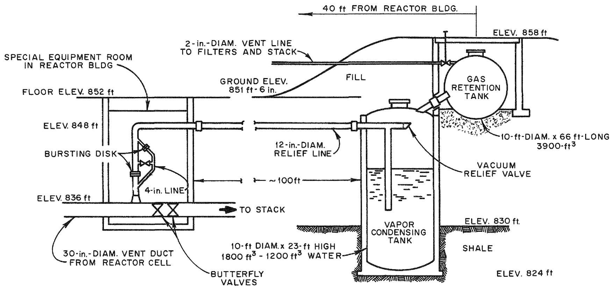  
Fig. 10.1. Diagram of MSRE vapor-condensing system.

126

Samples obtained from the vapor condensing tank were analyzed at approximately semiannual intervals. The results of these analyses are listed in Table 10.4. It may be noted from the last entry in Table 10.4 that the final analysis of the vapor condensing system water reservoir was made more than one year before termination of the reactor experiment. The reason is implicit in the results listed, which show adequate stability of the corrosion inhibitor during the entire period water was stored in the reservoir tank.

# 10.2 Helium Cover Gas

Helium was used to fill voids in the salt circulation systems with an inert protective gas. Commercial helium, supplied from tank trucks, was passed through a purification system to reduce the oxygen and water content to below 1 ppm before the gas was admitted to the reactor. The helium supply was passed continuously through the fuel pump bowl at $\sim 200\mathrm{ft}^3/\mathrm{day}$ (STP) to

transport the fission product gases to activated charcoal absorber beds. The cover gas system was also used to pressurize the drain tanks to move molten salts into the fuel and coolant systems. Exhaust gas from these operations was discharged through the charcoal beds and filters to the atmosphere via the off-gas stack.

Incoming helium gas was passed through hot titanium sponge and then through a moisture analyzer to ensure that the purity of the gas was not degraded by inleakage of moisture at faulty connections. Samples of the helium supply were obtained from each new trailer of the gas delivered to the reactor site and were analyzed using mass spectrometric methods. The upper limits of the allowable concentrations of contaminants in the gas prescribed in design and operations specifications were set at $\leqslant 1$ ppm oxygen and $\leqslant 6$ ppm water. Results of the mass spectrometric analyses performed with samples of the helium gas supply (Table 10.5) showed that the supply was consistently of adequate quality for use in the MSRE.

Table 10.4. Chemical analysis of water samples from the MSRE vapor condensing system   

<table><tr><td rowspan="2">Date</td><td rowspan="2">Sample</td><td rowspan="2">pH</td><td colspan="8">Parts per million</td></tr><tr><td>Li</td><td>Na</td><td>K</td><td>Al</td><td>B</td><td>Fe</td><td>NO2-</td><td>Σ hardness</td></tr><tr><td>2/7/66</td><td>VCS-1</td><td>8.70</td><td>0.1</td><td>6.3</td><td>935</td><td>10</td><td>82</td><td>&lt;0.3</td><td>590</td><td>68</td></tr><tr><td>8/31/66</td><td>VCS-3</td><td>9.00</td><td>1.1</td><td>6.3</td><td>748</td><td>15</td><td>70</td><td>&lt;0.3</td><td>690</td><td>97</td></tr><tr><td>5/27/67</td><td>VCS-4</td><td>8.86</td><td>1.1</td><td>6.6</td><td>800</td><td>1.0</td><td>63</td><td>&lt;0.3</td><td>690</td><td>101</td></tr><tr><td>5/24/68</td><td>VCS-5</td><td>8.77</td><td>6.4</td><td>6.6</td><td>758</td><td>&lt;1.0</td><td>61</td><td>&lt;0.1</td><td>560</td><td></td></tr></table>

Table 10.5. Purity of helium cover gas for the MSRE as measured by mass spectrometric methods   

<table><tr><td rowspan="2">Date</td><td rowspan="2">Laboratory No.</td><td colspan="7">Weight percent</td></tr><tr><td>He</td><td>H2</td><td>H2O</td><td>N2+CO</td><td>O2</td><td>Ar</td><td>CO2</td></tr><tr><td>10/28/65</td><td>6639</td><td>99.998</td><td>&lt;0.0004</td><td>0.0003</td><td>0.0010</td><td>0.0002</td><td>&lt;0.0001</td><td>0.0001</td></tr><tr><td>1/3/66</td><td>6806</td><td>99.981</td><td>0.0004</td><td>&lt;0.0001</td><td>0.0187</td><td>&lt;0.0001</td><td>0.0001</td><td>&lt;0.0001</td></tr><tr><td>1/5/66</td><td>6827</td><td>99.977</td><td>0.0004</td><td>0.0002</td><td>0.0222</td><td>0.0004</td><td></td><td>0.0001</td></tr><tr><td>3/25/66</td><td>7050</td><td>99.990</td><td>0.0006</td><td>0.0003</td><td>0.0084</td><td>0.0001</td><td>&lt;0.0001</td><td>&lt;0.0001</td></tr><tr><td>6/2/66</td><td>7253</td><td>99.995</td><td>0.0004</td><td>0.0001</td><td>0.0059</td><td>0.0001</td><td>0.0001</td><td>0.0001</td></tr><tr><td>8/9/66</td><td>7456</td><td>99.996</td><td>&lt;0.0001</td><td>0.0001</td><td>0.0033</td><td>0.0001</td><td>0.0002</td><td>0.0001</td></tr><tr><td>10/18/66</td><td>7665</td><td>99.996</td><td>0.0002</td><td>&lt;0.0001</td><td>0.0035</td><td>0.0004</td><td>0.0002</td><td>0.0001</td></tr><tr><td>12/22/66</td><td>7865</td><td>99.998</td><td>0.0003</td><td>&lt;0.0001</td><td>0.0009</td><td>0.0002</td><td>0.0001</td><td>0.0001</td></tr><tr><td>3/8/67</td><td>9410</td><td>99.998</td><td>&lt;0.0002</td><td>&lt;0.0002</td><td></td><td>&lt;0.0001</td><td></td><td>0.0001</td></tr><tr><td>8/8/68</td><td></td><td>99.997</td><td>&lt;0.0001</td><td>&lt;0.0007</td><td>0.0018</td><td>0.0004</td><td>0.0002</td><td>0.0001</td></tr><tr><td>8/15/68</td><td></td><td>99.997</td><td>0.0001</td><td>0.0009</td><td>0.0017</td><td>0.0002</td><td>&lt;0.0005</td><td>&lt;0.0001</td></tr><tr><td>9/16/68</td><td>473</td><td>99.997</td><td>0.0001</td><td>0.0006</td><td>0.0019</td><td>0.0003</td><td>0.0002</td><td>&lt;0.0001</td></tr><tr><td>4/11/69</td><td>1192</td><td>99.995</td><td>0.0004</td><td>0.0026</td><td>0.0015</td><td>0.0002</td><td>0.0001</td><td>0.0001</td></tr><tr><td>6/17/69</td><td>1438</td><td>99.998</td><td>0.0003</td><td>0.0002</td><td>0.0014</td><td>0.0001</td><td>0.0001</td><td>&lt;0.0001</td></tr><tr><td>10/10/69</td><td>1812</td><td>99.995</td><td>0.0005</td><td>0.0001</td><td>0.0034</td><td>0.0007</td><td>0.0002</td><td>0.0001</td></tr><tr><td>10/28/69</td><td>1952</td><td>99.995</td><td>0.0003</td><td>&lt;0.0001</td><td>0.0016</td><td>0.0003</td><td>0.0024</td><td>0.0001</td></tr></table>

${}^{a}$ Each entry represents the supply from one trailer $\left( {{39},{000}{\mathrm{{ft}}}^{3}}\right)$ charge as delivered to the MSRE site.

# 10.3 Reactor Cell Air

Composition of the reactor cell atmosphere was adjusted to consist primarily of nitrogen containing less than $5\%$ oxygen. Oxygen was maintained at this low concentration to minimize the possibility of combustion hazards which might occur if lubricating oil leaked from the fuel salt circulation pump system. Nitrogen was added to the cell as needed to make up for air inleakage The normal cell pressure was 12.7 psia, with a maximum permissible air inleakage rate of 0.42 scfh Under these conditions the required nitrogen purge rate was 1.5 scfh. Samples of the atmosphere of the reactor cell were obtained periodically and submitted for mass spectrometric analysis in order to ensure that the specifications were met. Results of these analyses are listed in Table 10 6

Table 10.6. Chemical analyses of MSRE reactor cell air samples   

<table><tr><td rowspan="2">Date</td><td rowspan="2">Cell air sample No</td><td colspan="3">vol %</td></tr><tr><td>O2</td><td>CO2</td><td>H2O</td></tr><tr><td>4/19/66</td><td>2</td><td>1 52</td><td></td><td></td></tr><tr><td>5/8/55</td><td>3</td><td>5 01</td><td></td><td></td></tr><tr><td>5/24/66</td><td>4</td><td>2 35</td><td></td><td></td></tr><tr><td>5/30/66</td><td>5</td><td>1 26</td><td></td><td></td></tr><tr><td>6/12/66</td><td>6</td><td>2 53</td><td></td><td></td></tr><tr><td>6/21/66</td><td>7</td><td>2 09</td><td></td><td></td></tr><tr><td>6/30/66</td><td>8</td><td>2 29</td><td></td><td></td></tr><tr><td>7/3/66</td><td>9</td><td>2 34</td><td></td><td></td></tr><tr><td>7/10/66</td><td>10</td><td>2 9</td><td></td><td></td></tr><tr><td>7/17/66</td><td>11</td><td>2 36</td><td></td><td></td></tr><tr><td>7/25/66</td><td>12</td><td>1 88</td><td></td><td></td></tr><tr><td>1/4/67</td><td>13</td><td>9 45</td><td></td><td></td></tr><tr><td>1/5/67</td><td>14</td><td>6 67</td><td></td><td></td></tr><tr><td>1/9/67</td><td>15</td><td>4 7</td><td></td><td></td></tr><tr><td>8/2/67</td><td>16</td><td>7 0</td><td>0 09</td><td></td></tr><tr><td>12/14/67</td><td>18</td><td>3 6</td><td>0 02</td><td></td></tr><tr><td>1/4/68</td><td>19</td><td>2 63</td><td>0 11</td><td>3 29</td></tr><tr><td>1/23/68</td><td>21</td><td>3 04</td><td></td><td></td></tr><tr><td>2/5/69</td><td>23</td><td>2 92</td><td></td><td></td></tr></table>

At termination of operations with the MSRE, inspection of the reactor cell components was initiated, the preliminary results of which indicated that the machinery in the cell remained relatively free of atmospheric corrosion. The details of these examinations were not complete at the time this report was made and will appear subsequently in progress reports of the Molten Salt Reactor Program

# 10.4 Oil Lubrication Systems

Each of the two salt pumps in the MSRE was served by an independent lubrication oil system, interconnected so that either system could serve both pumps in an emergency. These oil systems supplied both oil for lubrication of bearings and seals, as well as for cooling pump radiation shields. Details of the oil circulation systems are described elsewhere3 Specifications of the oil to be used in the MSRE were recommended by Grundell in 19604

The MSRE employed a turbine-grade paraffinic-base lubricating oil having a viscosity of 66 SSU at $100^{\circ}\mathrm{F}$ , commercially available as Gulfspin-35 No attempts were made to characterize the lubricating oil completely during reactor operations, for in these operations the principal concern was that its lubricating properties would not be degraded in use. Composition and physical property analyses were performed routinely to provide this assurance. The composition analysis conformed with the average specifications for the product, for Gulfspin-35 analytical specifications fixed the carbon content of the paraffinic hydrocarbon at 854 wt $\%$ The average formula of the paraffinic compound conforming to this fraction is $\mathrm{C}_{39}\mathrm{H}_{78}$

Little was known about the identity of the additives in the MSRE lubricating oil, except that nominally they were thermally stable through the operating temperature range to which the oil would be subjected in MSRE usage. Analyses normally requested were for carbon, sulfur, moisture, total solids, bromine number, acid number, flash point, viscosity at 100 and $210^{\circ}\mathrm{F}$ , infrared and spectrographic analyses. In operation, an acid number of 0 06 was to be maintained as indicative of oxidation-free performance, the interfacial tension was not to exceed 18 dynes/cm at $77^{\circ}\mathrm{C}$ . The results of these analyses are summarized in Table 10 7

It was recognized that migration of the fission gases from the pump tank to the region of the shaft lower seal via the shaft annulus could polymerize oil as it leaked down the shaft, plugging the drain line. The pump was designed accordingly with a flow of purge gas down the shaft annulus to minimize this migration5 It was concluded that the oil to be used in the MSRE could withstand radiation doses of as high as $10^{7}$ rads/g without significant degradation of its properties and that this amount of radiation would still permit the oil to flow from the oil catch basin. Although this conclusion, which proved to be valid, led to the expectation of satisfactory performance of the MSRE lubrication oil in service with components that were exposed to highly radioactive fluxes, early experience

Table 10.7. Properties of MSRE lubricating oil as measured in laboratory tests   

<table><tr><td rowspan="2">Date</td><td rowspan="2">Sample Desig.a</td><td colspan="2">Viscosity (Centistokes)</td><td rowspan="2">Bromine Number</td><td rowspan="2">Interfacial Tension (dyne/cm)</td><td colspan="3">Composition (wt %)</td><td rowspan="2">Total Solids (ppm)</td><td rowspan="2">Flash Point (°C)</td><td rowspan="2">Acid Number</td></tr><tr><td>38°C</td><td>99°C</td><td>Carbon</td><td>Sulfur</td><td>Water</td></tr><tr><td>8/25/66</td><td>1-N</td><td></td><td></td><td>1.95</td><td></td><td>86.37</td><td>1.13</td><td>&lt;0.04</td><td>-</td><td>163</td><td></td></tr><tr><td>8/25/66</td><td>2-N</td><td></td><td></td><td>1.86</td><td></td><td>86.43</td><td>1.01</td><td>&lt;0.04</td><td>-</td><td>158</td><td></td></tr><tr><td>8/25/66</td><td>3-N</td><td></td><td></td><td>1.67</td><td></td><td>85.68</td><td>1.67</td><td>&lt;0.04</td><td>-</td><td>158</td><td></td></tr><tr><td>8/25/66</td><td>4-N</td><td></td><td></td><td>1.56</td><td></td><td>85.52</td><td>0.98</td><td>&lt;0.04</td><td>-</td><td>162</td><td></td></tr><tr><td>8/25/66</td><td>5-N</td><td></td><td></td><td>1.86</td><td></td><td>85.82</td><td>0.92</td><td>&lt;0.04</td><td>-</td><td>163</td><td></td></tr><tr><td>3/27/66</td><td>16-C</td><td></td><td></td><td></td><td></td><td></td><td></td><td></td><td></td><td></td><td>1.78</td></tr><tr><td>4/3/66</td><td>17-C</td><td></td><td></td><td></td><td></td><td></td><td></td><td></td><td></td><td></td><td>1.35</td></tr><tr><td>4/3/66</td><td>18-F</td><td></td><td></td><td></td><td></td><td></td><td></td><td></td><td></td><td></td><td>1.40</td></tr><tr><td>4/15/66</td><td>19-F</td><td></td><td></td><td></td><td></td><td></td><td></td><td></td><td></td><td></td><td>1.26</td></tr><tr><td>4/15/66</td><td>20-C</td><td></td><td></td><td></td><td></td><td></td><td></td><td></td><td></td><td></td><td>1.24</td></tr><tr><td>4/18/66</td><td>21-C</td><td></td><td></td><td></td><td>9.60</td><td></td><td></td><td></td><td></td><td></td><td>1.18</td></tr><tr><td>4/18/66</td><td>22-F</td><td></td><td></td><td></td><td>9.22</td><td></td><td></td><td></td><td></td><td></td><td>1.27</td></tr><tr><td>4/29/66</td><td>23-F</td><td></td><td></td><td></td><td>9.32</td><td></td><td></td><td></td><td></td><td></td><td>1.48</td></tr><tr><td>4/29/66</td><td>24-C</td><td></td><td></td><td></td><td>9.89</td><td></td><td></td><td></td><td></td><td></td><td>1.44</td></tr><tr><td>5/1/66</td><td>25-F</td><td></td><td></td><td></td><td>8.65</td><td></td><td></td><td></td><td></td><td></td><td>1.42</td></tr><tr><td>5/1/66</td><td>26-F</td><td></td><td></td><td></td><td>9.89</td><td></td><td></td><td></td><td></td><td></td><td>1.39</td></tr><tr><td>5/8/66</td><td>27-F</td><td></td><td></td><td></td><td>8.43</td><td></td><td></td><td></td><td></td><td></td><td>1.47</td></tr><tr><td>5/8/66</td><td>28-C</td><td></td><td></td><td></td><td>10.05</td><td></td><td></td><td></td><td></td><td></td><td>1.44</td></tr><tr><td>5/24/66</td><td>29-C</td><td></td><td></td><td></td><td>10.77</td><td></td><td></td><td></td><td></td><td></td><td>1.67</td></tr><tr><td>5/24/66</td><td>30-C</td><td></td><td></td><td></td><td>10.13</td><td></td><td></td><td></td><td></td><td></td><td>1.64</td></tr><tr><td>6/3/66</td><td>31-F</td><td></td><td></td><td></td><td></td><td></td><td></td><td>0.03</td><td></td><td></td><td>0.78</td></tr><tr><td>6/3/66</td><td>32-C</td><td></td><td></td><td></td><td></td><td></td><td></td><td>0.04</td><td></td><td></td><td>0.81</td></tr><tr><td>6/3/66</td><td>33-N</td><td></td><td></td><td></td><td></td><td></td><td></td><td>0.03</td><td></td><td></td><td>0.61</td></tr><tr><td>6/21/66</td><td>34-C</td><td></td><td></td><td></td><td>9.48</td><td></td><td></td><td></td><td></td><td></td><td>1.38</td></tr><tr><td>6/21/66</td><td>35-F</td><td></td><td></td><td></td><td>9.20</td><td></td><td></td><td></td><td></td><td></td><td>1.33</td></tr><tr><td>6/26/66</td><td>36-C</td><td></td><td></td><td></td><td>10.60</td><td></td><td></td><td></td><td></td><td></td><td>1.58</td></tr><tr><td>6/26/66</td><td>37-F</td><td></td><td></td><td></td><td>10.70</td><td></td><td></td><td></td><td></td><td></td><td>1.59</td></tr><tr><td>7/3/66</td><td>38-F</td><td></td><td></td><td></td><td>10.14</td><td></td><td></td><td></td><td></td><td></td><td>1.76</td></tr><tr><td>7/3/66</td><td>39-C</td><td></td><td></td><td></td><td>10.33</td><td></td><td></td><td></td><td></td><td></td><td>1.86</td></tr><tr><td>7/10/66</td><td>40-F</td><td></td><td></td><td></td><td>10.25</td><td></td><td></td><td></td><td></td><td></td><td>1.50</td></tr><tr><td>7/10/66</td><td>41-C</td><td></td><td></td><td></td><td></td><td></td><td></td><td></td><td></td><td></td><td>1.40</td></tr><tr><td>7/17/66</td><td>42-F</td><td></td><td></td><td></td><td>10.13</td><td></td><td></td><td></td><td></td><td></td><td>1.10</td></tr><tr><td>7/17/66</td><td>43-F</td><td></td><td></td><td></td><td>10.71</td><td></td><td></td><td></td><td></td><td></td><td>1.00</td></tr><tr><td>7/24/66</td><td>44-F</td><td>10.51</td><td>2.77</td><td>1.70</td><td>10.63</td><td>85.04</td><td>0.032</td><td>0.20</td><td>2120</td><td>165</td><td>0.83</td></tr><tr><td>7/24/66</td><td>45-C</td><td>10.27</td><td>2.07</td><td>1.60</td><td>10.56</td><td>85.28</td><td>0.045</td><td>0.15</td><td>2076</td><td>166</td><td>0.88</td></tr><tr><td>8/12/66</td><td>46-F</td><td>10.00</td><td>2.60</td><td></td><td>17.35</td><td></td><td></td><td></td><td></td><td></td><td>0.92</td></tr><tr><td>8/8/66</td><td>47-N</td><td>9.94</td><td>2.64</td><td>1.26</td><td>17.46</td><td>86.88</td><td>0.012</td><td>0.16</td><td>1872</td><td>155</td><td>0.93</td></tr><tr><td>8/16/66</td><td>48-C</td><td>10.00</td><td>2.27</td><td></td><td>17.55</td><td></td><td></td><td></td><td></td><td></td><td>0.93</td></tr><tr><td>8/13/66</td><td>49-N</td><td></td><td></td><td>1.30</td><td>18.32</td><td>86.21</td><td>0.029</td><td>0.017</td><td>1874</td><td>156</td><td>0.96</td></tr><tr><td>10/17/66</td><td>50-F</td><td>10.16</td><td>2.60</td><td></td><td>16.40</td><td></td><td></td><td></td><td></td><td></td><td>0.33</td></tr><tr><td>10/17/66</td><td>51-C</td><td>10.06</td><td>2.58</td><td></td><td>16.59</td><td></td><td></td><td></td><td></td><td></td><td>0.30</td></tr><tr><td>10/25/66</td><td>52-C</td><td></td><td></td><td></td><td>17.5</td><td></td><td></td><td></td><td></td><td></td><td>0.26</td></tr><tr><td>10/25/66</td><td>53-F</td><td></td><td></td><td></td><td>17.10</td><td></td><td></td><td></td><td></td><td></td><td>0.29</td></tr><tr><td>10/30/66</td><td>54-F</td><td></td><td></td><td></td><td>17.18</td><td></td><td></td><td></td><td></td><td></td><td>0.79</td></tr><tr><td>10/30/66</td><td>55-C</td><td></td><td></td><td></td><td>16.80</td><td></td><td></td><td></td><td></td><td></td><td>0.60</td></tr><tr><td>11/10/66</td><td>56-F</td><td></td><td></td><td></td><td>16.50</td><td></td><td></td><td></td><td></td><td></td><td>0.57</td></tr><tr><td>11/11/66</td><td>57-C</td><td></td><td></td><td></td><td>16.75</td><td></td><td></td><td></td><td></td><td></td><td>0.55</td></tr><tr><td>12/18/66</td><td>58-C</td><td></td><td></td><td></td><td>15.80</td><td></td><td></td><td></td><td></td><td></td><td>1.01</td></tr><tr><td>12/18/66</td><td>59-F</td><td></td><td></td><td></td><td>15.40</td><td></td><td></td><td></td><td></td><td></td><td>0.83</td></tr><tr><td>12/27/66</td><td>60-C</td><td></td><td></td><td></td><td>15.81</td><td></td><td></td><td></td><td></td><td></td><td>0.90</td></tr><tr><td>12/27/66</td><td>61-F</td><td></td><td></td><td></td><td>16.97</td><td></td><td></td><td></td><td></td><td></td><td>0.85</td></tr><tr><td>1/3/67</td><td>62-C</td><td></td><td></td><td></td><td>16.08</td><td></td><td></td><td></td><td></td><td></td><td>1.32</td></tr><tr><td>1/3/67</td><td>63-F</td><td></td><td></td><td></td><td>16.13</td><td></td><td></td><td></td><td></td><td></td><td>1.30</td></tr><tr><td>1/9/67</td><td>64-C</td><td></td><td></td><td></td><td>15.70</td><td></td><td></td><td></td><td></td><td></td><td>1.30</td></tr><tr><td>1/9/67</td><td>65-F</td><td></td><td></td><td></td><td>16.00</td><td></td><td></td><td></td><td></td><td></td><td>1.30</td></tr><tr><td>2/2/67</td><td>66-C</td><td>9.93</td><td>2.64</td><td></td><td>15.70</td><td></td><td></td><td></td><td></td><td></td><td>1.40</td></tr><tr><td>2/2/67</td><td>67-F</td><td></td><td></td><td></td><td>16.00</td><td></td><td></td><td></td><td></td><td></td><td></td></tr><tr><td>2/10/67</td><td>68-F</td><td></td><td></td><td></td><td>15.60</td><td></td><td></td><td></td><td></td><td></td><td>1.4</td></tr><tr><td>2/13/67</td><td>69-C</td><td>9.94</td><td>2.64</td><td>1.90</td><td>15.40</td><td>86.21</td><td>0.10</td><td>0.06</td><td></td><td>161</td><td>1.21</td></tr><tr><td>2/13/67</td><td>70-F</td><td>10.26</td><td>2.67</td><td>1.70</td><td>16.00</td><td>86.60</td><td>0.07</td><td>0.09</td><td></td><td>164</td><td>1.15</td></tr><tr><td>3/2/67</td><td>71-C</td><td>9.88</td><td>2.63</td><td></td><td>15.70</td><td></td><td></td><td></td><td></td><td></td><td>1.40</td></tr><tr><td>3/2/67</td><td>72-F</td><td>10.20</td><td>J.66</td><td></td><td>15.80</td><td></td><td></td><td></td><td></td><td></td><td>1.26</td></tr><tr><td>3/21/67</td><td>75-C</td><td></td><td></td><td></td><td>14.88</td><td></td><td></td><td></td><td></td><td></td><td>1.05</td></tr><tr><td>3/21/67</td><td>76-F</td><td></td><td></td><td></td><td>15.07</td><td></td><td></td><td></td><td></td><td></td><td>1.01</td></tr><tr><td>3/27/67</td><td>77-C</td><td></td><td></td><td></td><td>14.40</td><td></td><td></td><td></td><td></td><td></td><td>1.28</td></tr><tr><td>3/27/67</td><td>78-F</td><td></td><td></td><td></td><td>15.70</td><td></td><td></td><td></td><td></td><td></td><td>1.15</td></tr><tr><td>4/3/67</td><td>80-C</td><td></td><td></td><td></td><td>14.60</td><td></td><td></td><td></td><td></td><td></td><td>1.25</td></tr><tr><td>4/3/67</td><td>81-F</td><td></td><td></td><td></td><td>15.60</td><td></td><td></td><td></td><td></td><td></td><td>1.21</td></tr><tr><td>4/10/67</td><td>82-C</td><td>9.97</td><td>2.60</td><td></td><td>14.40</td><td></td><td></td><td></td><td></td><td></td><td>1.41</td></tr><tr><td>4/10/67</td><td>83-F</td><td>10.40</td><td>2.65</td><td>2.06</td><td>14.90</td><td>85.90</td><td>0.025</td><td>&lt;0.05</td><td></td><td>158</td><td>1.27</td></tr><tr><td>4/17/67</td><td>84-C</td><td></td><td></td><td></td><td>11.30</td><td></td><td></td><td></td><td></td><td></td><td>1.30</td></tr><tr><td>4/17/67</td><td>85-F</td><td></td><td></td><td></td><td>14.20</td><td></td><td></td><td></td><td></td><td></td><td>1.30</td></tr><tr><td>4/24/67</td><td>86-C</td><td></td><td></td><td></td><td>14.80</td><td></td><td></td><td></td><td></td><td></td><td>1.31</td></tr><tr><td>4/24/67</td><td>87-F</td><td></td><td></td><td></td><td>16.10</td><td></td><td></td><td></td><td></td><td></td><td>1.24</td></tr><tr><td>5/1/67</td><td>88-C</td><td></td><td></td><td></td><td>15.80</td><td></td><td></td><td></td><td></td><td></td><td>1.35</td></tr><tr><td>5/1/67</td><td>89-F</td><td></td><td></td><td></td><td>14.40</td><td></td><td></td><td></td><td></td><td></td><td>1.40</td></tr><tr><td>5/7/67</td><td>90-C</td><td></td><td></td><td></td><td>15.10</td><td></td><td></td><td></td><td></td><td></td><td>1.39</td></tr><tr><td>5/7/67</td><td>91-F</td><td></td><td></td><td></td><td>16.80</td><td></td><td></td><td></td><td></td><td></td><td>1.30</td></tr><tr><td>7/3/67</td><td>95-N</td><td></td><td></td><td></td><td>15.60</td><td></td><td></td><td></td><td></td><td></td><td>1.30</td></tr><tr><td>7/3/67</td><td>96-N</td><td></td><td></td><td></td><td>16.20</td><td></td><td></td><td></td><td></td><td></td><td>1.36</td></tr><tr><td>7/10/67</td><td>97-C</td><td>6.01</td><td>2.57</td><td></td><td>16.43</td><td></td><td></td><td></td><td></td><td></td><td>1.30</td></tr><tr><td>7/10/67</td><td>98-F</td><td>10.15</td><td>2.57</td><td></td><td>15.50</td><td></td><td></td><td></td><td></td><td></td><td>1.30</td></tr><tr><td>7/17/67</td><td>99-C</td><td>10.01</td><td>2.56</td><td></td><td>15.80</td><td></td><td></td><td></td><td></td><td></td><td>1.31</td></tr><tr><td>7/17/67</td><td>100-F</td><td>10.16</td><td>2.57</td><td></td><td>15.80</td><td></td><td></td><td></td><td></td><td></td><td>1.31</td></tr><tr><td>7/24/67</td><td>101-C</td><td></td><td></td><td></td><td>15.60</td><td></td><td></td><td></td><td></td><td></td><td>1.38</td></tr><tr><td>7/24/67</td><td>102-F</td><td></td><td></td><td></td><td>15.90</td><td></td><td></td><td></td><td></td><td></td><td>1.29</td></tr><tr><td>7/31/67</td><td>103-C</td><td></td><td></td><td></td><td>15.83</td><td></td><td></td><td></td><td></td><td></td><td>1.36</td></tr><tr><td>7/31/67</td><td>104-F</td><td></td><td></td><td></td><td>15.05</td><td></td><td></td><td></td><td></td><td></td><td>1.43</td></tr><tr><td>8/7/67</td><td>105-C</td><td></td><td></td><td></td><td>15.66</td><td></td><td></td><td></td><td></td><td></td><td>1.52</td></tr><tr><td>8/7/67</td><td>106-F</td><td></td><td></td><td></td><td>15.47</td><td></td><td></td><td></td><td></td><td></td><td>4.42</td></tr><tr><td>8/13/67</td><td>107-C</td><td>9.92</td><td>2.55</td><td>1.96</td><td>11.78</td><td>83.30</td><td>0.011</td><td>0.013</td><td>1809</td><td>157</td><td>1.12</td></tr><tr><td>9/18/67</td><td>108-F</td><td></td><td></td><td></td><td>15.95</td><td></td><td></td><td></td><td></td><td></td><td>1.30</td></tr><tr><td>9/18/67</td><td>109-C</td><td></td><td></td><td></td><td>16.14</td><td></td><td></td><td></td><td></td><td></td><td>1.30</td></tr><tr><td>9/25/67</td><td>110-F</td><td></td><td></td><td></td><td>16.50</td><td></td><td></td><td></td><td></td><td></td><td>1.38</td></tr><tr><td>9/25/67</td><td>111-C</td><td></td><td></td><td></td><td>16.50</td><td></td><td></td><td></td><td></td><td></td><td>1.40</td></tr><tr><td>10/2/67</td><td>112-F</td><td></td><td></td><td></td><td>16.50</td><td></td><td></td><td></td><td></td><td></td><td>1.01</td></tr><tr><td>10/2/67</td><td>113-C</td><td></td><td></td><td></td><td>16.30</td><td></td><td></td><td></td><td></td><td></td><td>1.11</td></tr><tr><td>10/9/67</td><td>114-F</td><td></td><td></td><td></td><td>16.40</td><td></td><td></td><td></td><td></td><td></td><td>0.84</td></tr><tr><td>10/9/67</td><td>115-C</td><td></td><td></td><td></td><td>16.30</td><td></td><td></td><td></td><td></td><td></td><td>1.03</td></tr><tr><td>10/16/67</td><td>116-F</td><td></td><td></td><td></td><td>17.10</td><td></td><td></td><td></td><td></td><td></td><td>1.14</td></tr><tr><td>10/16/67</td><td>117-C</td><td></td><td></td><td></td><td>17.10</td><td></td><td></td><td></td><td></td><td></td><td>1.21</td></tr><tr><td>10/23/67</td><td>118-F</td><td></td><td></td><td></td><td>16.10</td><td></td><td></td><td></td><td></td><td></td><td>1.22</td></tr><tr><td>10/23/67</td><td>119-C</td><td></td><td></td><td></td><td>15.90</td><td></td><td></td><td></td><td></td><td></td><td>1.40</td></tr><tr><td>10/30/67</td><td>120-F</td><td></td><td></td><td></td><td>15.64</td><td></td><td></td><td></td><td></td><td></td><td>1.38</td></tr><tr><td>10/30/67</td><td>121-C</td><td></td><td></td><td></td><td>15.17</td><td></td><td></td><td></td><td></td><td></td><td>1.46</td></tr><tr><td>11/6/67</td><td>122-C</td><td></td><td></td><td></td><td>15.47</td><td></td><td></td><td></td><td></td><td></td><td>1.35</td></tr><tr><td>11/6/67</td><td>123-F</td><td></td><td></td><td></td><td>14.81</td><td></td><td></td><td></td><td></td><td></td><td>1.23</td></tr><tr><td>11/13/67</td><td>124-F</td><td></td><td></td><td></td><td>15.84</td><td></td><td></td><td></td><td></td><td></td><td>1.27</td></tr><tr><td>11/13/67</td><td>125-C</td><td></td><td></td><td></td><td>15.94</td><td></td><td></td><td></td><td></td><td></td><td>1.35</td></tr><tr><td>11/27/67</td><td>126-F</td><td></td><td></td><td></td><td>16.19</td><td></td><td></td><td></td><td></td><td></td><td>1.15</td></tr><tr><td>11/27/67</td><td>127-C</td><td></td><td></td><td></td><td>15.62</td><td></td><td></td><td></td><td></td><td></td><td>1.35</td></tr><tr><td>12/10/67</td><td>128-C</td><td></td><td></td><td></td><td>15.61</td><td></td><td></td><td></td><td></td><td></td><td>0.83</td></tr><tr><td>12/10/67</td><td>129-F</td><td></td><td></td><td></td><td>15.04</td><td></td><td></td><td></td><td></td><td></td><td>0.85</td></tr><tr><td>12/19/67</td><td>130-C</td><td></td><td></td><td></td><td>14.60</td><td></td><td></td><td></td><td></td><td></td><td>1.31</td></tr><tr><td>12/19/67</td><td>131-F</td><td></td><td></td><td></td><td>15.36</td><td></td><td></td><td></td><td></td><td></td><td>1.23</td></tr><tr><td>1/1/68</td><td>132-F</td><td></td><td></td><td></td><td>16.33</td><td></td><td></td><td></td><td></td><td></td><td>1.36</td></tr><tr><td>1/1/68</td><td>133-C</td><td></td><td></td><td></td><td>15.48</td><td></td><td></td><td></td><td></td><td></td><td>1.51</td></tr><tr><td>3/2/69</td><td>146-C</td><td></td><td></td><td></td><td>13.70</td><td></td><td></td><td></td><td></td><td></td><td>1.11</td></tr><tr><td>3/2/69</td><td>147-F</td><td></td><td></td><td></td><td>16.10</td><td></td><td></td><td></td><td></td><td></td><td>0.86</td></tr><tr><td>3/16/69</td><td>148-F</td><td></td><td></td><td></td><td>15.80</td><td></td><td></td><td></td><td></td><td></td><td>0.96</td></tr><tr><td>4/6/69</td><td>149-F</td><td></td><td></td><td></td><td>15.80</td><td></td><td></td><td></td><td></td><td></td><td>1.08</td></tr><tr><td>4/6/69</td><td>150-C</td><td></td><td></td><td></td><td>13.70</td><td></td><td></td><td></td><td></td><td></td><td>1.30</td></tr><tr><td>4/20/69</td><td>151-F</td><td></td><td></td><td></td><td>15.60</td><td></td><td></td><td></td><td></td><td></td><td>1.00</td></tr><tr><td>4/11/69</td><td>152</td><td>10.55</td><td>2.67</td><td>1.69</td><td>13.00</td><td>85.60</td><td>0.016</td><td>0.090</td><td>1780</td><td>164</td><td>1.06</td></tr><tr><td>4/11/69</td><td>153</td><td>9.90</td><td>2.64</td><td>0.63</td><td>11.00</td><td>85.70</td><td>0.045</td><td>0.080</td><td>1640</td><td>159</td><td>0.91</td></tr><tr><td>5/19/69</td><td>154-F</td><td>9.94</td><td>2.58</td><td>1.29</td><td>14.15</td><td>78.00</td><td>0.012</td><td>0.015</td><td>1800</td><td>163</td><td>1.43</td></tr><tr><td>5/19/69</td><td>155-C</td><td>10.52</td><td>2.67</td><td>1.55</td><td>16.41</td><td>76.70</td><td>0.050</td><td>0.020</td><td>1800</td><td>167</td><td>1.20</td></tr><tr><td>9/14/69</td><td>156-C</td><td>9.93</td><td>2.73</td><td>0.63</td><td>12.78</td><td>86.30</td><td>0.019</td><td>0.002</td><td>1730</td><td>168</td><td>1.10</td></tr><tr><td>9/14/69</td><td>157-F</td><td>10.19</td><td>2.73</td><td>1.10</td><td>15.89</td><td>86.30</td><td>0.021</td><td>0.006</td><td>1810</td><td>175</td><td>0.90</td></tr><tr><td>9/14/69</td><td>158-F</td><td>9.80</td><td>2.60</td><td>1.11</td><td>16.10</td><td>85.90</td><td>0.021</td><td>0.003</td><td>1840</td><td>180</td><td>0.81</td></tr><tr><td>10/9/69</td><td>159-F</td><td></td><td></td><td></td><td>15.45</td><td></td><td></td><td></td><td></td><td></td><td>0.88</td></tr><tr><td>10/9/69</td><td>160-C</td><td></td><td></td><td></td><td>10.14</td><td></td><td></td><td></td><td></td><td></td><td>1.14</td></tr><tr><td>10/19/69</td><td>161-F</td><td>10.58</td><td>3.80</td><td>1.35</td><td>15.60</td><td>85.40</td><td>0.018</td><td>0.002</td><td>1940</td><td>174</td><td>0.88</td></tr><tr><td>12/4/69</td><td>167-F</td><td></td><td></td><td></td><td>15.90</td><td></td><td></td><td></td><td></td><td></td><td>1.02</td></tr><tr><td>12/4/69</td><td>168-C</td><td></td><td></td><td></td><td>13.40</td><td></td><td></td><td></td><td></td><td></td><td>1.22</td></tr></table>

aletter designations with sample numbers denote source of sample, $\mathbf{N} =$ unused oil from storage, $\mathbf{C} =$ sample from coolant system, $\mathbf{F} =$ sample from fuel system.

with the MSRE in power operations showed that oil vapors transported to restricted areas could certainly polymerize (see Sect 11.1) We had no foreknowledge as to whether polymerization of the recirculated oil might occur, although we faced this prospect with trepidation because of the formation of varnishes from oil vapors in the off-gas valves This fear seems to have been unwarranted, for throughout the operation of the MSRE the properties of the oil apparently remained unchanged, both as judged on the basis of performance of the components in which it was used as well as from the results of the analyses listed in Table 10 7

On one occasion, at the time when hydrocarbon varnishes were plugging the off-gas stream valves, the lubricating oil was fractionally distilled and the refractive index of each $10\%$ volume cut was measured. The range was found to include refractive indices from 14726 to 14817, as compared with the refractive index of the undistilled oil of 14738

Surveillance analysis included infrared absorption tests to determine whether oxidation was occurring. Occasionally these tests indicated that C-O bands were present, but these bands were only slightly more intense than in the reference sample and seemed not to become more so with continued use of the oil

Among the least well-understood chemical phenomena governing behavior in the MSRE and, as well, among the least tractable for experimental investigation with the MSRE were the chemical relationships involving oil from the MSRE fuel pump and the transport and distribution of fission products and tritium within the reactor system. The properties of the oil, as determined through the chemical monitoring program, disclosed little that was significant concerning these matters. Unquestionably, the thermal degradation products formed in the pump bowl were of some significance in the transport behavior of fission products and tritium Resolution of their exact effects on reactor operations, however, will be derived from future investigations rather than from further scrutiny of MSRE behavior

# References

1 R H Guymon, MSRE Design and Operations Report, Part VIII, Operating Procedures, ORNL-TM-908, vol I, p 3C-1   
2 RC Robertson, MSRE Design and Operations Report, Part I, ORNL-TM-728, p 444   
3RCRobertson,ibid,p144   
4 A G Grindell, Specification of a Lubricant for MSRE Pumps, ORNL-MSR-60-37

5 A G Grundell and P G Smith, MSR Program Semannu Progr Rep July 31, 1964, ORNL-3708, p 155

# 11 TRANSPORT OF MATERIALS FROM SALT TO COVER GAS SYSTEMS

# 11 1 Fission Products

In solid fuel reactors, knowledge of the modes of fission product distribution is of utmost importance to the assessment of reactor safety and control and for the development of reprocessing methods Changes in state and distribution of fission product species in solid fuel matrices have been examined so intensely and for so long a period of time that only problems related to accident conditions remain as challenging to the understanding For molten-salt reactors it is necessary that an even more comprehensive understanding of fission product behavior be achieved, for with fission products intentionally circulated with fuel salt, their disposition, as controlled by mechanical and chemical influences, is of considerably greater importance than in static fuel systems In MSRs, some fission products are removed from the fuel salt continuously and become distributed to the off-gas system, to the fuel storage tanks, and to the processing plant They must be contained and their decay heat removed under all conceivable circumstances

The probable fates of fission products produced in molten-salt reactors were deduced from thermodynamic considerations, from laboratory studies, and from in-pile static capsule tests From the results of these studies, one may group fission product elements in categories according to general chemical properties noble gases Kr, Xe, noble metals Pd, Rh, Ru, Mo, Ag, Te, Tc, Nb, Se, As, transition metals Sn, Sb, In, Cd, Ga, Zr, Zn, lanthanides Y, La, Ce, Pr, Nd, Pm, Sm, Eu, Gd, Tb, Dy, Ho, Er, active metals Cs, Rb, Ba, Sr, halides Br, I

Of the elements produced in high yields, only the lanthanides developed concentrations in the MSRE that were in the range of chemical detection. This group accounts for $53.8\%$ of the fission products Operation of the MSRE resulted in the fissioning of $288~\mathrm{kg}$ of $^{235}\mathrm{U}$ fuel and $132~\mathrm{kg}$ of $^{233}\mathrm{U}$ , a total of 1792 g atoms of uranium. From fission, therefore, 964 g atoms of lanthanides, about $15~\mathrm{kg}$ , were produced ultimately to produce a final concentration of $300~\mathrm{ppm}$ of these elements in the fuel salt. At the very low concentrations which prevailed in the fuel salt, the

lanthanides were of little consequence with respect to general chemical surveillance, and no special effort was made to monitor their concentrations or distributions directly. One method for their removal from MSR carrier salts relies on high-temperature distillation Tests of this separation method with MSRE fuel carrier salt disclosed that the measured concentrations of the lanthanides in the salt agreed well with computed values1

The MSRE provided the first opportunity to begin studies of fission product transport in circulating salt systems. Although some preliminary information was derived from the results of experiments with the Aircraft Reactor Experiment, its scheduled period of operation was so brief as to obviate any real opportunity for such studies. Recognition that the knowledge of fission product behavior was in a rudimentary condition required that programs for their investigation proceed independently from that for general chemical surveillance. Detailed results of the studies of fission product behavior are therefore excluded from the present report and will be described separately.

# 11.2 Restrictions in the Off-Gas System

In both the fuel and coolant systems, control of the pressure in the cover-gas systems over extended periods proved to be difficult and unpredictable. The cause was the accumulation of solids and tarry deposits, mostly originating from lubricating oil, in the off-gas throttling valve used for fuel-system pressure control and in the filter just upstream of the coolant-system pressure-control valve

During the initial period of circulation of coolant salt in the reactor, a period of $1200\mathrm{hr}$ , the off-gas filter plugged and was replaced twice. Examination of the filter medium showed that it was covered with amorphous carbon containing traces of the constituents of the coolant salt and Hastelloy N. Although the filter was replaced by another one with some 35 times the surface area, pressure control again became erratic. It was realized that oil seepage took place down the shaft of both the fuel pump and the coolant pump. Rates of seepage were determined and found to be variable, ranging from indicated rates of zero to $4\mathrm{cm}^3$ of oil per day seeping into the pump bowl

The rates did not seem to increase appreciably from time to time, nor was their variation clearly related to any operational practice. It became routine to replace the filter in the coolant salt off-gas system after several months' use. Each time the filter was replaced, it was found to be covered with oil residues

Pressure control of the fuel system became erratic toward the end of the first extended operation with salt in the circuit During this period, $^{85}\mathrm{Kr}$ was used for tests of the stripping efficiency of the noble gas from the helium stream. After saturation of the salt to near equilibrium concentrations, the inflow of $^{85}\mathrm{Kr}$ was stopped and the gas purged from the system. As one part of the tests, the effect of salt level in the pump bowl was examined with the LiF BeF $_2$ (66 34 mole %) salt at three levels. At this time the void fraction of the salt in the fuel loop was measured for the first time and found to be $0.6\%$ . At termination of these tests the off-gas filter was removed and examined. It was found to be free of deposits. Examination of the pressure control valve showed that it was partially plugged. The residue was washed out with acetone. The liquid suspension was dark in color, and the residue left after evaporation of the acetone consisted of spheres of a glassy material, 1 to $5\mu$ in diameter. Shortly after the cleaned control valve was reinstalled, it became partially restricted again. It was then replaced with another one of greater flow-through capacity. Inspection of the original valve revealed that a black deposit partially covered the tapered stem. The deposit was about $20\%$ amorphous carbon and the remainder was again 1- to $5-\mu$ spheres that were found to have the composition of the flush salt

The program for bringing the MSRE to full-power operation was interrupted on two occasions by flow restrictions in the off-gas system. Symptoms of plugging became pronounced in each case after about $12\mathrm{hr}$ of operation at 1 MW. Restrictions were first noted in the capillary restrictor in line 521, at the same time, check valve HCV-533 became inoperative. Restriction was also noted in the stainless steel line filter and 522 valve assembly. In order to resume operation of the reactor, the capillary restrictor and HCV-533 check valve were replaced by nonrestrictive sections, and the filter-valve assembly was replaced. The filter element which was removed was capable of blocking passage of more than $90\%$ of the particulate matter of $\geqslant 0.7\mu$ in diameter. It was replaced by a filter designed to block particulates of $<  50\mu$ in diameter

Continued difficulty was experienced with restrictions in the off-gas system of the fuel circuit for some time during the early stages of power operation with the MSRE. These difficulties led to a practice which relieved excess pressure in the fuel system by venting gas through HCV-533 to the auxiliary charcoal bed. During this period, evidence of restrictions in the charcoal beds began to appear. On resuming operation at 1 MW, restrictions appeared to develop in three

locations at valve 522B, at the entries to charcoal beds 1A and 1B, and in the lines ahead of the auxiliary charcoal bed Small specimens of the materials which were suspected to have caused plugging were removed from the affected parts of the off-gas system and subjected to laboratory tests in an attempt to determine

the reasons for flow restrictions The results of these examinations are summarized in Table 11.1

The results shown in Table 11.1 indicate that the restriction in the off-gas system may be attributed to varnish-like organic materials whose origin was the Gulfspin-35 lubricating oil. The refractive index of the

Table 11.1. Results of examinations of specimens removed from the MSRE off-gas lines   

<table><tr><td>Specimen description and origin</td><td>Morphology</td><td>Refractive index</td><td>Activity at contact (R/hr)</td><td>Predominant isotopes (from gamma scan)</td><td>Spectrochemical data</td></tr><tr><td>1 Deposit from exit orifice of capillary restrictor</td><td>Isotropic particles, appearing as partly coalesced amber globules</td><td>1520</td><td></td><td></td><td>Li, 99 μg, Be, 124 μg, Zr, 100 μg</td></tr><tr><td>2 Scrapings from spool piece adjacent to capillary</td><td>Same as 1</td><td>1540</td><td></td><td></td><td></td></tr><tr><td>3 Deposit from check valve 533</td><td>Isotropic, amber, varnish like particle, ~50 × 100 μ</td><td></td><td></td><td></td><td>Be, 0.95 μg, Li, 2 μg, Zr, &lt;0.5 μg</td></tr><tr><td>4 Scrapings from valve 522 poppet</td><td>Isotropic, amber, varnish like matrix containing embedded isotropic(?) crystalline material of lower refractive index</td><td>~1540</td><td>2.5</td><td>No Zr, Nb, Ce</td><td></td></tr><tr><td>5 Scrapings from valve 522 seat</td><td>Same as 4</td><td>1544 to 1550</td><td>1.5</td><td>89Sr, 140Ba, 140La</td><td></td></tr><tr><td>6 Oil drops from valve 522 body</td><td></td><td>1509</td><td></td><td>No Zr, Nb, Ce</td><td></td></tr><tr><td>7 Scrapings from stainless steel filter element</td><td>Isotropic, famtly colored material, more nearly scalelike than glassy in appearance</td><td>1524 to 1526</td><td></td><td>140Ba, 140La, 103Ru, 137Cs, no Ce, Zr, Nb</td><td></td></tr><tr><td>8 Metallic scrapings from stainless steel filter element</td><td>Granular opaque particles, low index, transparent, birefringent crystal-line material spalled off metal on microscope slide</td><td></td><td></td><td></td><td></td></tr><tr><td>9 Deposit from HV-621 valve stem</td><td>Isotropic, faintly colored material, varnish like in appearance with peb bly surface</td><td>~1526</td><td></td><td>132Te</td><td></td></tr></table>

heaviest $10\%$ volume fraction obtained on vacuum distillation of the oil (see Sect. 10.4) was found to be approximately 1.50. The high refractive index of the varnish-like materials removed from the off-gas system suggests that oil vapor and fractionation products carried into the off-gas were polymerized in transit to and on the surfaces of the valve parts, and thus plugged the system. This inference is strengthened further by the observation that the varnish-like materials were found to have limited or no solubility at room temperature in xylene, petroleum ether, carbon tetrachloride, or acetone.

Typical examples of the deposits removed from the MSRE and examined in the laboratory are shown in Figs. 11.1-11.4. In one attempt to identify the materials that were causing the restrictions, the reactor was drained, and for several days after, all helium flow through the fuel loop was stopped5 and the contained helium was recirculated at $100^{\circ}\mathrm{F}$ . Three samples of the recirculated gas were isolated for analysis, but the results were inconclusive.

The appearance of restrictions in the off-gas system of the fuel circuit comprised a major operational impediment. Considerable effort was expended to identify the causes of these restrictions and to alleviate the concomitant problems. In April 1966 a particle trap was installed in the fuel system off-gas line, just downstream from the first holdup section. It was replaced in August 1966 with an identical unit. In January 1967 an improved unit was used to replace the original one and

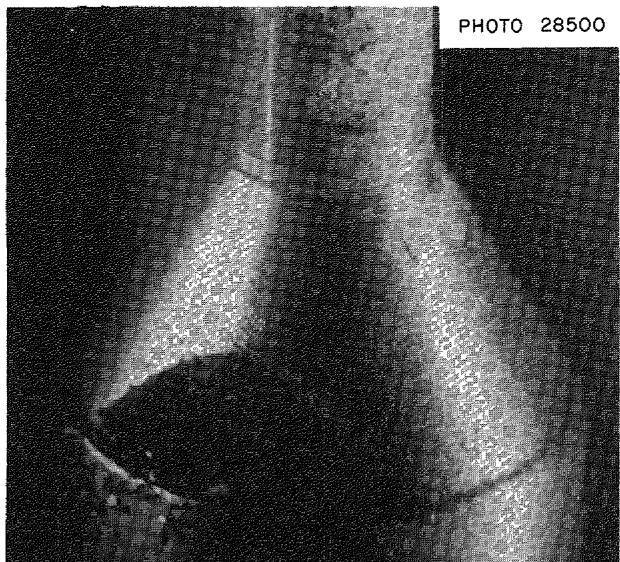  
Fig. 11.1. MSRE valve HCV-621 poppet.

remained in service throughout the remainder of operations with the MSRE. Each of the particle traps employed stainless steel mesh as the roughing section; in addition, finer media, both fibrous metal (Feltmetal) and Fiberfrax, served to block passage of the smallest particles. It served to alleviate the major part of the difficulties that had beset previous operations, but because it was not capable of completely blocking the passage of volatile hydrocarbons, it was ineffective for providing complete freedom from the development of restrictions in the charcoal beds. The system was operable throughout the remainder of MSRE tests, although with chronic indications that oil fractionation products were being transferred downstream to the charcoal beds.

A particle trap that had been installed in the fuel system off-gas line in April 1966 was examined, and samples were removed from the trap for analysis. The results of the examination of this trap were described in detail by Scott and Smith. The chemical results are summarized below.

Mass spectrometric analysis of material leached from Yorkmesh matting at the inlet section of the filter indicated that it had collected a number of fission products. The eluted material contained 20 wt % Ba, 15 wt % Sr, and 0.2 wt % Y. In the same analysis the salt constituents Be and Zr were estimated to be 0.01 and 0.05 wt % respectively. Other samples removed from the metal filter contained small quantities of Cr, Fe, and Ni. Results of gamma-ray spectrometric analysis indicated the presence of $^{137}\mathrm{Cs}$ , $^{89}\mathrm{Sr}$ , $^{103}\mathrm{Ru}$ or $^{106}\mathrm{Ru}$ , $^{110m}\mathrm{Ag}$ , $^{95}\mathrm{Nb}$ , and $^{140}\mathrm{La}$ . All samples were analyzed for determination of the presence of Be, and the concentration present was below the detectable limit of 0.1%. Attempts to determine the presence of Zr were complicated by the presence of large quantities of Sr. The fraction of soluble hydrocarbons was determined for the materials present on the Yorkmesh mat and in other samples was found to range from 60 to 80%. Carbon disulfide extracts were made of the organics and were allowed to evaporate; the residues were used for infrared analysis. All samples were identical and indicated the presence of long-chain hydrocarbons. There was no evidence of any functional groups other than those involving carbon and hydrogen, nor was there any evidence suggesting double or triple bonds. There was an indication of a possible mild cross-linkage. It is likely that there is more cross-linkage of the organic in the gas stream than appeared in these samples, and the low indication could be due to the insolubility of the cross-linked organic and the high operating temperatures of the wire mesh, which would

PHOTO 82611

  
Fig. 11.2. MSRE sample 8-1. Fragment of material removed from line 521 pressure equalizing capillary Photographed in 1414 refractive index oil $206\times$

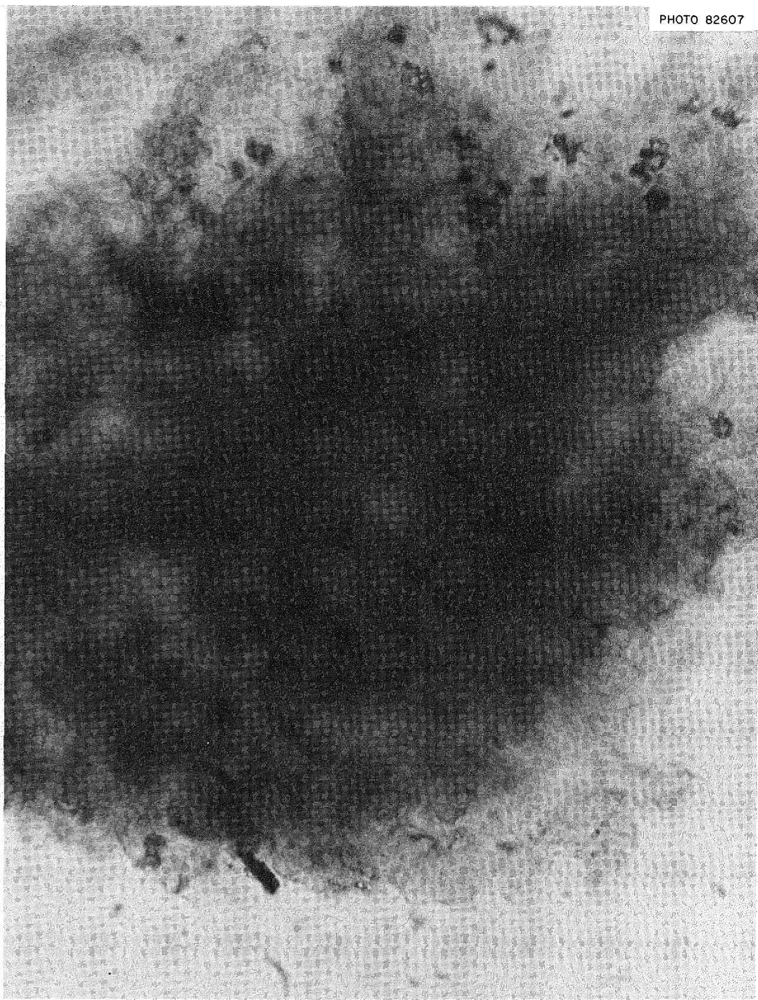  
Fig. 11.3. MSRE sample 8-3. Fragment of material removed from line 521 pressure equalizing capillary. Photographed in 1.520 refraction index oil. $645\times$ . Reduced $20.5\%$ .

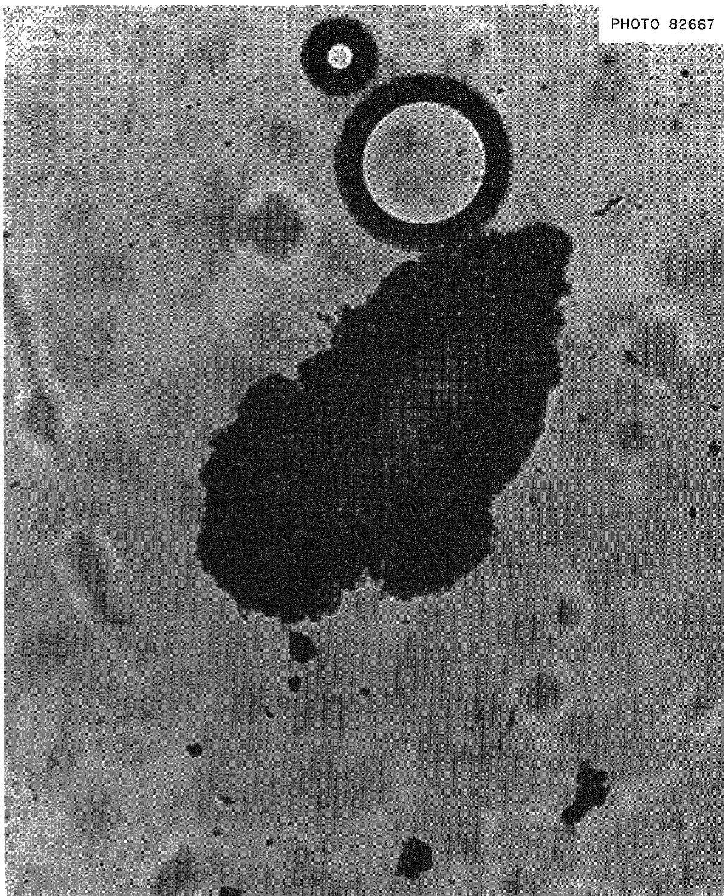  
Fig. 11.4. MSRE sample 8-2c. Fragment of translucent brefrangent material removed from stainless steel filter Refractive index more than $1.468$ . $160\times$

cause breakdown of the organic into elemental carbon and volatiles.

The following conclusions can be drawn from the results of the examination:

1. Since the spectrographic analysis indicated that the concentrations of Be and Zr were very small compared with those of the fission products Ba and Sr, the amount of entrained salt mist carried to the filter was negligible.   
2. The high activity and the large amount of barium and strontium in the inlet section of the particle trap indicate that a large fraction of the solid daughters of Kr and Xe which decay in the line is carried down the line with the off-gas stream.   
3. The distribution of activity indicates that entrance areas of the Yorkmesh mat were unexpectedly effective in trapping the solid fission products. Decay heat in this area resulted in temperatures above $1200^{\circ}\mathrm{F}$ .   
4. The collection of hydrocarbon mist on the York-mesh mat had probably enhanced the collecting efficiency of the mesh for solid particles.

With the adoption of methods to minimize the effect of hydrocarbon transport in the off-gas streams, little further operational difficulty was encountered with the MSRE, and no additional chemical studies were made.

The chemical effects of continually passing hydrocarbon degradation products through the fuel stream are largely unknown. They were viewed as intractable to quantitative assessment with the means at hand for dynamic analysis. In attempts to gain some understanding of the possible relation of the hydrocarbons to various chemical and physical aspects of fuel salt and fission product behavior, a gas sampling facility7 was developed and installed at the MSRE. In use, it provided few data that were of value in appraising the effect of oil seepage and was adapted to other uses. Thermal degradation of the pump oil certainly produced a small finite concentration of hydrogen in the pump bowl atmosphere. There is no evidence in the chemical results obtained from salt analyses that indicates a recognizable effect of its presence. Possible consequences of its effects on fission product chemistry and transport were recognized some time ago. Their assessment may be found in the summary report on fission product behavior.8

# 11.3 Tritium Transport in the MSRE

Shortly before scheduled termination of operations with the MSRE, it was realized that the hot metal

containment system should be highly permeable to hydrogen and that, therefore, the tritium produced in the fuel salt could be expected to diffuse out of the fuel system. An investigation was initiated to measure the amounts of tritium in the air vented to the discharge stack, that released through the radiator tubes, and the amount of tritium in fuel salt samples. Equipment was installed by the analytical chemists in the MSRE vent-house sample station in order to measure the concentrations in the various reactor effluent gas streams. A fraction of the gas stream was passed over a bed of hot copper oxide in order to convert the tritium to water. Tests were conducted with the copper oxide beds either at 340 or $800^{\circ}\mathrm{C}$ . The higher temperature allows the oxidation of methane, while the lower temperature does not. The results of these tests, conducted by Dale, Apple, and Meyer,[9] showed that the maximum amounts of tritium released from the air stack, from the radiator, and found in fuel salt, corresponded to the production of 4.6, 0.6, and 22.7 Ci/day respectively. At full power operation the MSRE produces 60 Ci of tritium per day.

In an evaluation of the results, Briggs10 concluded that the disparity in the material balance suggested that the following behavior may have occurred:

1. Either the metal walls have a much greater resistance to the diffusion of tritium than has been estimated, or most of the tritium is present in a form other than $\mathbf{T}_2$ or HT. Even assuming that graphite is a sink for $\mathbf{T}_2$ , one cannot otherwise explain the small fraction that passes through the radiator tubes and the piping and vessel walls in the primary system.   
2. When TF is taken into consideration but reactions with the graphite are neglected, the fraction of the tritium that leaves the fuel pump off-gas system increases and the amount that passes through the metal walls decreases. Assuming equilibration of liquid and gas in the pump bowl and $\mathrm{UF_4 / UF_3 =}$ 1000, the distribution begins to look like that measured for the MSRE. One would have to further assume that much of the tritium is retained on the carbon beds as TF or organic compounds and that $\mathbf{T}_2$ and TF react with materials in the off-gas system to produce the organic compounds found in the exit of the carbon beds. These calculations contain several uncertainties and simplifications that can considerably affect the results; the results are insensitive to the solubility of TF but are quite sensitive to the solubility of $\mathbf{T}_2$ in the salt and to the value of the equilibrium constant, $k$ . The presence of hydrogen and organic compounds from decomposition of oil in the pump bowl could be important

but is neglected. Agreement between calculations and measurements may be entirely accidental.

3. When retention or reaction with the graphite in the core is considered along with the presence of TF, the graphite becomes a major sink for tritium, mostly as TF. If $\mathrm{UF_4 / UF_3}$ increases from 100 to 1000, almost all the tritium enters the graphite as TF. Very little diffuses through the metal walls or through the fuel pump off-gas system. A distribution about like that observed for the MSRE would be calculated if one assumed partial reaction of TF with graphite to produce hydrocarbons that are released from the graphite and removed through the fuel pump off-gas line. Such reactions are believed to be highly unlikely.

Briggs' assessment thus shows that the transport mechanisms for tritium in the MSRE were not clarified from the data obtained and that inevitably their characteristics must be established because of their significance to design of and procedures for operational control of MSBRs. Termination of operations with the MSRE precluded further assessment of transport mechanisms under realistic conditions. This was not necessarily unfavorable, for the leakage of oil from the fuel pump shaft seal into the pump bowl was unquestionably a complicating factor in attempts to interpret the results of on-site analysis. The fuel pump was known to have permitted small amounts, generally believed to have been $\sim 1$ g/day, of lubricating oil to enter the fuel pump bowl and thus become rapidly, and perhaps heterogeneously, thermally degraded. It seems very probable that radiation also must have had some role in the degradation process. Generation of a spectrum of hydrogenous degradation products in the off-gas must complicate theoretical models of transport mechanisms to a great extent and probably even accounts for the wide range of analytical values obtained at the MSRE. An initial model of tritium behavior was advanced recently by Strehlow.[11] As fundamental to the development of a model of tritium transport, Strehlow noted that "transport processes and chemical behavior of hydrogen isotopes are interrelated parameters in molten-salt reactor design considerations. The transport of hydrogen is determined by the solubility and diffusivity in moderator, salt, and metal. The chemical behavior is a function of the oxidation-reduction potential in the salt, radiation field, and possibly reactivity with the graphite moderator."

Additional tests were conducted at the MSRE near the end of operations in which CuO specimens and Ni rods were exposed to the gas and salt before and after

the addition of beryllium to the salt. The results of these tests have not yet been completed. After termination of the MSRE, one of the graphite stringers was removed for examinations and tests. These tests, conducted by S. S. Kirslis and F. F. Blankenship, were completed in July 1971. The results indicated that about $15\%$ of the tritium produced in the MSRE was sorbed on the moderator graphite. The concentration of tritium in thin surface samples was as high as $10^{11}$ dis $\min^{-1} \mathrm{~g}^{-1}$ , fell to about $10^{9}$ dis $\min^{-1} \mathrm{~g}^{-1}$ at 60 mils depth, and then decreased slowly to about $6 \times 10^{8}$ dis $\min^{-1} \mathrm{~g}^{-1}$ for penetrations to 800 mils. These results are of particular interest in that they suggest a means for controlling the distribution of tritium in molten-salt reactors.

# References

1. J. R. Hightower, Jr., and L. E. McNeese, MSR Program Semiannu. Progr. Rep. Feb. 28, 1970, ORNL-4548, p. 317.

2. F. F. Blankenship, E. G. Bohrmann, S. S. Kirslis, and E. L. Compere, Fission Product Behavior in the MSRE, ORNL-4684 (in preparation).

3. These and other related examinations were made by T. N. McVay (consultant) and the author in the High-Radiation-Level Analytical Facility (HRLAF).

4. Performed by L. J. Brady et al., Analytical Chemistry Division, ORNL.

5. MSR Program Semiannu. Progr. Rep. Aug. 31, 1965, ORNL-3872, p. 26.

6. D. Scott and A. N. Smith, MSR Program Semiannnu. Progr. Rep. Feb. 28, 1967, ORNL-4119, p. 47.

7. MSR Program Semiannu. Progr. Rep. Feb. 28, 1966, ORNL-3936, p. 67.

8. F. F. Blankenship, E. G. Bohlmann, S. S. Kirslis, and E. L. Compere, Fission Product Behavior in MSRE, ORNL-4684 (in preparation).

9. J. M. Dale, R. F. Apple, and A. S. Meyer, MSR Program Semiannu. Progr. Rep. Feb. 28, 1970, ORNL-4548, p. 183.

10. R. B. Briggs, Additional Calculations for the Distribution of Tritium in the MSRE, ORNL-CF-71-7-8 (July 1971).

11. R. A. Strehlow, MSR Program Semiannu. Progr. Rep. Feb. 28, 1970, ORNL-4548, p. 167.

# 12. IMPLICATIONS OF THE MSRE CHEMISTRY FOR FUTURE MOLTEN SALT REACTORS

The Molten-Salt Reactor Experiment was spectacularly successful as a materials demonstration: the

molten fluoride fuel and coolant-salt mixtures flowed through their containment circuitry for thousands of hours, causing little or no corrosion in these systems; the graphite moderator experienced no measurable dimensional changes in use and remained free of penetration by the fuel salt. The reactor equipment operated reliably, and the radioactive liquids and gases were contained safely. The fuel was completely stable. Xenon was removed rapidly from the salt. When necessary, radioactive equipment was repaired and replaced in reasonable time and without overexposing maintenance personnel.

That the MSRE was completed so successfully did not come about as the result of frequent adjustments in the chemical properties of the circulating fluids. A major conclusion that emerges from experience with the MSRE is that chemical surveillance, as carried out with individual samples obtained and removed from the reactor and transferred via necessarily cumbersome processes to off-site laboratories, is of value principally as a basis for attempting to control trends in behavior. Irrespective of the quality of the analytical data obtained, the information feedback process is generally too slow to afford frequent control direction. Chemical surveillance for future MSRs coupled to steam plants, therefore, must be obtained through on-line monitoring systems, and such surveillance systems must function dynamically. In addition, for safety, incorporation of the associated on-line instrumentation that is required must not add significantly to the complexity of the reactor system.

The next molten-salt reactor which is likely to be built will be constructed either exclusively as a federal enterprise, for example, the MSBE, involving both a steam generation system and on-line chemical reprocessing for the removal of rare-earth fission products, or a larger reactor developed partly under the impetus of private industry. Such a reactor would generate steam but would not include a chemical reprocessing plant for the removal of rare-earth fission products. Either of these reactors would utilize a fuel salt containing the same constituents as have been proposed for the MSBR fuel, for which the standard reference design composition is $^7\mathrm{LiF - BeF}_2$ -ThF4-UF4 (72-16-11.7-0.3 mole %). Heat removal would be accomplished through a secondary salt system. Final choice of the coolant for this system has not yet been made for the reasons described below.

It is essential that the tritium produced from fuels based on $^7\mathrm{LiF - BeF}_2$ be managed so that essentially none of the tritium produced in the reactor core can find its way into the steam plant. Complete removal of

tritium from the fuel salt before it passes into the heat exchanger is highly improbable, and accordingly, management of the tritium transferred through the heat-exchanger walls is required.

Fluoroborate mixtures were proposed as suitable for molten-salt reactor coolants and have been under examination for some time for that application. Consideration was given to the possibility that the NaF-NaBF $_4$ eutectic mixture would be substituted for the LiF-BeF $_2$ coolant salt in the MSRE before operations with the reactor were terminated. However, the plan was not implemented for lack of financial support.

A barrier to the selection of fluoroborates as suitable coolants for molten-salt reactors has been their seeming inability to retain hydrogenous species in melts contained in nickel-based alloys. Unless a finite but small, $\sim 50$ ppm, concentration of hydrogenous species can be retained in these melts as a reservoir for TF, their applicability seems tenuous. As an alternative, a reactor design which employs Hitec $\left[\mathrm{NaNO}_3\text{-NaNO}_2\text{-KNO}_3\right.$ (6.9-48.5-44.6 mole $\%$ )] as the coolant salt, isolated from possible contact with fuel salt by an LiF-BeF $_2$ buffer salt, has been proposed. It is necessary to eliminate the possibility that Hitec might come into contact with the graphite moderator. Evaluations of this alternative have begun but will require a considerable research and development effort before the potential applicability of Hitec can be judged.

It is thus evident that the next molten-salt reactor to be built, of whatever type, will employ both fuel and coolant salts unlike those which were used in the MSRE. Even so, the chemistry of molten salts, as advanced by experience with the MSRE, is sufficiently similar to be of practical value.

Until specific choice of a coolant is made, it seems unnecessary to project from MSRE experience the character of surveillance programs for the coolant system. It is most likely that the earliest indications of coolant-fuel mixing would be given by the nuclear surveillance instrumentation and that, therefore, chemical surveillance of the separate systems would be of little operational consequence. The details of coolant-system surveillance must therefore be relegated to future planning efforts.

At this point, no timetable exists for construction of follow-on reactors to the MSRE. Accordingly, as our understanding of the chemical behavior of materials in the MSRE is extended, it can serve to develop detailed surveillance programs as needed. Fuel surveillance, at a minimum, must include consideration of the following chemical factors:

1. Oxide contaminants in the fuel salt. A fuel salt which does not contain a highly polar cation component which interacts chemically with the oxide ion, as did $\mathrm{Zr}^{4+}$ in the $\mathrm{ZrF_4}$ contained in the MSRE fuel salt, will almost certainly not tolerate relatively large concentrations of dissolved oxide ion without precipitation. In the MSRE, the oxide tolerance of the fuel salt was estimated to be $\sim 680$ ppm at the operating temperature of the fuel salt, $650^{\circ}\mathrm{C}$ ( $1200^{\circ}\mathrm{F}$ ), whereas in the MSBR reference fuel salt the tolerance is probably not greater than $\sim 40$ ppm at this temperature. It has been tacitly assumed that all versions of molten-salt reactors operated in the future would include processing equipment for maintaining the concentration of oxide in the fuel salt at quite low levels through continuous processing of a bleed stream of salt.

A detailed evaluation of the consequences of contamination of fuel salt by oxides has been made, from which it was concluded that "there is no necessity for an oxygen getter, such as $\mathrm{ZrF_4}$ , in the MSBR fuel," but that "swift, satisfactory, and preferably on-line, methods for determination of $\mathrm{O}^{2 - }$ and $\mathrm{UF}_3$ concentrations of the MSBR fuel after storage and during startup and operation" must be available.

Preliminary conceptual designs of on-line oxide detection apparatus have been devised by members of the Analytical Chemistry Division. Increasing efforts will undoubtedly be devoted to this activity in the future.

2. Corrosion detection. The extent of generalized corrosion in the MSRE was estimated routinely from changes in the concentration of chromium found in the salt samples removed from the reactor. Results of examinations of surveillance specimens removed occasionally from the reactor core and from postoperational examinations of the alloy removed from the heat exchanger confirmed the general validity of these estimates. The use of $\mathrm{Cr}^{2+}$ concentration as a corrosion indicator thus continues to be uniquely attractive. To verify corrosion-free operation of a large reactor from analyses of numerous samples removed from the reactor would probably be limited by the slow feedback as mentioned above. An alternate means would be far more desirable. One generalization which emerges from MSRE experience is that during periods when the relative concentration of $[\mathrm{U}^{3+}] / [\Sigma \mathrm{U}]$ in the fuel salt was $\geqslant 0.5\%$ , the system appeared to be protected against corrosion. This observation, along with a consideration of the expense, inconvenience, and irrelevance of individual results of chemical analyses, suggests that a more suitable means for establishing that corrosion-free conditions prevail would be to ensure that at all times the proper redox potential existed in the salt stream.

As part of the MSRE experiment, evidence appeared to indicate the possibility that the disposition of niobium in the fuel salt could be exploited as a means of monitoring corrosion in molten-salt reactors on a continuous basis. The lack of success we have experienced in attempting to determine the concentration of trivalent uranium in the fuel salt when the total concentration of uranium was $\leqslant 0.5$ mole $\%$ suggests that there is a clear incentive to develop methods of detecting corrosion such as by niobium monitoring by gamma spectrometry, which can provide on-line continuous monitoring of the chemical potential of the fuel salt.

As noted in Chap. 6, several aspects of corrosion chemistry in molten-salt reactor systems were left unresolved at termination of MSRE operations. The outstanding example of these was that corrosion attack during $^{235}\mathrm{U}$ operations might have been anticipated to be some threefold greater than was observed. Further, examinations of metal surveillance specimens removed from the heat exchanger indicated that mass transfer of metal from hot to cold zones was so little as to be undetectable. Temperature differences in the salt circuits were modest, $\sim 50^{\circ}\mathrm{F}$ , whereas in future molten-salt reactors projected differences run to about $200^{\circ}\mathrm{F}$ . The absence of base-line data for mass transfer that results from these examinations obviated the possibility of projecting mass-transfer coefficients for larger reactors. Generalized corrosion was deduced from chemical measurements of the chromium concentration in fuelsalt samples.

Current developments in the attempts to improve the radiation-induced loss of ductility that Hastelloy N experiences after use in high radiation fluxes include the possible inclusion of small amounts of titanium, hafnium, or zirconium in the alloy.4 All of these metals are more chemically active than chromium, the most chemically active constituent of the unmodified alloy; their inclusion as constituents in significant concentrations may affect the chemical methods for monitoring corrosion on a dynamic basis.

3. Oils and hydrocarbons in the fuel system. The extent of oil leakage into the fuel system must be known accurately and ascertained on a regular basis because of the operational implications of such leakage and because of the chemical effects induced by the presence of hydrocarbon degradation products in the system. Hydrogen, evolved in the thermal degradation of hydrocarbons, will unquestionably be involved in the distribution of tritium in the reactor and will control fission product chemistry, perhaps even favorably if, for example, it enhances the retention of iodine in the

system as iodide or tellurium as the element. Surveillance of the off-gas by means of a gas spectrometer seems to be very desirable; it may possibly be an important requisite for continuous operation. If the gas analysis by mass spectrometry proves to be adaptable for determination of a variety of species, it could provide the most precise source of control data for the reactor.

4. Miscellaneous. One of the most useful kinds of analysis in the MSRE was that provided by mass spectrometric measurements of the isotopic composition of uranium and plutonium. Occasional removal of salt samples from reactors built in the future, principally for mass spectrometric determination of inventory, burnup, etc., could also be used for confirmation by general analyses that the on-line instrumentation was functioning correctly.

Little advantage would accrue from any routine efforts to determine chemically whether there were any chronic leaks from fuel to coolant or in the reverse direction, for, in either event, nuclear data would provide operational control. Similarly, laboratory determination of the condition of auxiliary fluids, such as cooling tower water, oil from pump reservoirs, etc., should probably not be done at all. Experience with the MSRE has shown that there will be little difficulty in maintaining these fluids in condition so they will meet physical and chemical criteria over long periods of time. Information pertaining to their condition can be acquired simply and quickly and should be obtained at suitable predetermined intervals by in-line automated monitoring equipment.

In summary, it becomes evident that operational adjustments for future molten-salt reactors should

originate from chemical controls provided almost exclusively from on-line instrumentation. It is imperative that such instrumentation be stringently restricted to the minimum for safety, because there should be little reason to use the information derived for frequent adjustments of the salt systems. These reduce to (1) a continuous method for determining the identity of species in and composition of the gas above the fuel salt; in all likelihood this will entail the development of an automated mass spectrometer; (2) a method of establishing the redox potential of the fuel salt to ensure corrosion-free operation; for this function, further development of a niobium monitor by on-line gamma spectrometry will be required; (3) verification that bismuth does not enter the fuel stream via the incoming stream from the chemical reprocessing plant; (4) development of a highly sensitive and accurate method for continuous or frequent on-line determination of oxide concentration in the fuel salt.

# References

1. R. E. Thoma and G. M. Hebert, Coolant Salt for a Molten Salt Breeder Reactor, U.S. patent No. 3,448,054, June 3, 1969.   
2. W. R. Grimes, correspondence to Milton Shaw, "Assessment of Need for Oxygen Getter in Molten Salt Breeder Reactor Fuel," February 3, 1971.   
3. A. S. Meyer and J. M. Dale, personal communication.   
4. H. E. McCoy et al., Nucl. Appl. Technol. 8, 156 (1970).

# INTERNAL DISTRIBUTION

1. J. L. Anderson   
2. R. F. Apple   
3. C. F. Baes   
4. C. E. Bamberger   
5. C.J. Barton   
6. J. B. Bates   
7. H. F. Bauman   
8. S. E. Beall   
9. M. J. Bell

10. M. Bender   
11. E. S. Bettis   
12. D. S. Billington   
13. F. F. Blankenship   
14. E. G. Bohlmann   
15. G. E. Boyd   
16. J. Braunstein   
17. M. A. Bredig   
18. R. B. Briggs   
19. H. R. Bronstein   
20. G. D. Brunton   
21. S. Cantor   
22. D. W. Cardwell   
23. R. S. Carlsmith   
24. W. L. Carter   
25. E. L. Compere   
26. W. H. Cook   
27. J.W.Cooke   
28. L. T. Corbin   
29. J. L. Crowley   
30. F. L. Culler   
31. D. R. Cuneo   
32. J.M. Dale   
33. J. H. DeVan   
34. J. R. Distefano   
35. S. J. Ditto   
36. F. A. Doss   
37. A. S. Dworkin   
38. W.P.Eatherly   
39. J. R. Engel   
40. R. B. Evans III

41. D. E. Ferguson   
42. L. M. Ferris   
43. A. P. Fraas   
44. J. H. Frye, Jr.   
45. W. K. Furlong   
46. C. H. Gabbard   
47. R. B. Gallaher   
48. L. O. Gilpatrick   
49. W. R. Grimes   
50. A. G. Grindell   
51. R. H. Guymon   
52. P. H. Harley   
53. P. N. Haubenreich   
54. R. F. Hibbs   
55. G. H. Jenks   
56. E.M. King   
57. A. P. Malinauskas   
58. H. E. McCoy   
59. H. F. McDuffie   
60. H. A. McLain   
61. L. E. McNeese   
62. J. R. McWherter   
63. A. S. Meyer   
64. R. L. Moore   
65. E. L. Nicholson   
66. L.C.Oakes   
67. R. B. Parker   
68. A. M. Perry   
69. H. B. Piper   
70. B.E. Prince   
71. A. S. Quist   
72. G. L. Ragan   
73. J.D. Redman   
74. D. M. Richardson   
75. G. D. Robbins   
76. R.C. Robertson   
-78. M. W. Rosenthal   
79. R.G. Ross   
80. J. P. Sanders   
81. H. C. Savage

82. Dunlap Scott   
83. J. L. Scott   
84. H. E. Seagren   
85. J. H. Shaffer   
86. M. J. Skinner   
87. A. N. Smith   
88. G.P. Smith   
89. A. H. Snell   
90. Din Sood   
91. R. A. Strehlow   
92. D. A. Sundberg   
93. J. R. Tallackson   
94. E. H. Taylor

95-97. R.E.Thoma

98. L. M. Toth   
99. D. B. Trauger   
100. G. C. Warlick   
101. C. F. Weaver   
102. A. M. Weinberg   
103. J. R. Weir   
104. M. E. Whatley   
105. J. C. White   
106. R. P. Wichner   
107. L.V. Wilson   
108. H. C. Young   
109. J. P. Young   
110. J. W. Cobble (consultant)   
111. P. H. Emmett (consultant)   
112. H. Insley (consultant)   
113. E. A. Mason (consultant)   
114. R. F. Newton (consultant)   
115. J. E. Ricci (consultant)   
116. C. H. Secoy (consultant)   
117. H. Steinfink (consultant)   
118. L. R. Zumwalt (consultant)

119-121. Central Research Library   
122. ORNL - Y-12 Technical Library Document Reference Section   
123-157. Laboratory Records Department   
158. Laboratory Records, ORNL R.C.

# EXTERNAL DISTRIBUTION

159-160. MSBR Program Manager, AEC, Washington, D.C.   
161. Merson Booth, AEC, Washington, D.C.   
162. Paul Cohen, Westinghouse Elect. Corp., P.O. Box 158, Madison, Pa. 15663   
163. D. F. Cope, RDT Site Office, ORNL   
164. J. D. Corbett, Iowa State University, Ames, Iowa 50010   
165. J. W. Crawford, AEC, Washington, D.C.   
166. F. E. Dearing, RDT Site Office (ORNL)   
167. D. R. deBoisblanc, Ebasco Services, Inc., 2 Rector St., New York 10006   
168. C. B. Deering, Black & Veatch, P.O. Box 8405, Kansas City, Mo. 64114   
169. A. R. DeGrazia, AEC, Washington, D.C.   
170. S. G. English, AEC, Washington, D.C.   
171. J. J. Ferritto, Poco Graphite, P.O. Box 2121, Decatur, TX 76234   
172. T. A. Flynn, Jr., Ebasco Services, Inc., 2 Rector St., N.Y., N.Y. 10006   
173. E. E. Fowler, AEC, Washington, D.C.   
174. J. E. Fox, AEC, Washington, D.C.   
175. Norton Habermann, RDT, USAEC, Washington, D.C. 20545   
176. A. Houtzeel, TNO, 176 Second Ave., Waltham, MA 02154   
177. G.M. Kavanagh, AEC, Washington, D.C.   
178. H. H. Kellogg, Henry Krumb School of Mines, Columbia U., N.Y., N.Y. 10027   
179. M. Klein, AEC, Washington, D.C.   
180. S. J. Lanes, AEC, Washington, D.C.   
181. Kermit Laughon, AEC, RDT Site Office (ORNL)   
182. J. M. Longo, Esso Research & Eng., P.O. Box 45, Linden, N.J. 07036   
183. T. W. McIntosh, AEC, Washington, D.C. 20545   
184. J. Neff, AEC, Washington, D.C.   
185. R. E. Pahler, AEC, Washington, D.C.   
186. A. J. Pressesky, AEC, Washington, D.C.   
187. M. V. Ramaniah, Bhabha Atomic Research Centre, Radiological Labs., Trombay, Bombay-85, AS, India   
188. David M. Richman, AEC, Washington, D.C.   
189. H. M. Roth, AEC-ORO, Oak Ridge, Tn.   
190. R. M. Scroggins, AEC, Washington, D.C.   
191. M. Shaw, USAEC, Washington, D.C.   
192. T. G. Schlieter, AEC, Washington, D.C.   
193. J. M. Simmons, AEC, Washington, D.C.   
194. S. A. Szawlewicz, AEC, Washington, D.C.   
195. A. R. Van Dyken, AEC, Washington, D.C.   
196. N. Srinivasan, Bhabha Atomic Research Centre, Trombay, Bombay 74, India   
197. R.C. Steffy, Jr., TVA, 540 Mkt. St., Chattanooga, Tn. 37401   
198. A. E. Swanson, Black & Veatch, P.O. Box 8405, 1500 Meadowlake, K.C., Mo.   
199. J. A. Swartout, UCC, New York, N.Y. 10017   
200. B. L. Tarmy, Esso Research & Engr. Co., P.O. Box 101, Florham Pk., N.J. 07923   
201. J. R. Trinko, Ebasco Services, Inc., 2 Rector St., N.Y., N.Y. 10006   
202. C. E. Larson, Commissioner, AEC, Washington, D.C.   
203. W. W. Grigorieff, Oak Ridge Associated Universities   
204. Leo Brewer, Lawrence Radiation Laboratory   
205. R. C. Vogel, Argonne National Laboratory   
206. S. Spaepen, Head of Chemical Technology, SCK-CEN, MOL, Belgium   
207. V. K. Moorthy, Metallurgy Div., BARC, Bombay 83, India

208. R. A. Penneman, Los Alamos Scientific Laboratory   
209. R. K. Steunenberg, Argonne National Laboratory   
210. M. K. Reser, American Ceramic Soc., 4055 N. High St., Columbus, Ohio 43214   
211. Sidney Langer, Gulf General Atomic, San Diego, California   
212. C. W. Keenan, Dept. of Chem., University of Tennessee, Knoxville   
213. Gleb Mamantov, Dept. of Chem., University of Tennessee, Knoxville   
214. Rustum Roy, Materials Res. Lab., Penn State Univ., University Park, Pa.   
215. Minoo D. Karkhanavala, Chem. Div., BARC, Bombay, India   
216. W. Danner, Max-Planck-Institut Fur Plasmaphysik, 8046 Garching Bei, Munchen, West Germany   
217. David Elias, AEC, Washington, D.C.   
218. Ronald Feit, AEC, Washington, D.C.   
219. P. A. Halpine, AEC, Washington, D.C.   
220. W. H. Hannum, AEC, Washington, D.C.   
221. R. Jones, AEC, Washington, D.C.   
222-224. Director, Division of Reactor Licensing (DRL), AEC, Washington, D.C.   
225-226. Director, Division of Reactor Standards (DRS), AEC, Washington, D.C.   
227-231. Executive Secretary, Advisory Committee on Reactor Safeguards, AEC, Washington, D.C.   
232. Laboratory and University Division, AEC, ORO   
233. Patent Office, AEC, ORO   
234-452. Given distribution as shown in TID-4500 under Reactor Technology category (25 copies - NTIS)