49.73

ORNL-4674

UC-80 - Reactor Technology

REACTIVITY BALANCE CALCULATIONS AND

LONG-TERM REACTIVITY BEHAVIOR

WITH 235 U IN THE MSRE

B. E. Prince

J.R. Engel

C. H. Gabbard

OAK RIDGE NATIONAL LABORATORY

operated by

UNION CARBIDE CORPORATION

for the

U.S. ATOMIC ENERGY COMMISSION

OAK RIDGE NATURAL LAGUARCY CENTRAL RESEARCH LIBRARY

# LIBRARY LOAN CDPV

DO NOT TRANSFER TO ANOTHER PERSON

Inventor 2016

determined with the help of a bestocntry that will encourage you

Printed in the United States of America. Available from

National Technical Information Service

U.S. Department of Commerce

5286 Port Royal Road, Springfield, Virginia 22151

Price: Printed Copy $3.00, Microfiche $0.95

This report was prepared as an account of work sponsored by the United States Government. Neither the United States nor the United States Atomic Energy Commission, nor any of their employees, nor any of their contractors, subcontractors, or their employees, makes any warranty, express or implied, or assumes any legal liability or responsibility for the accuracy, completeness or usefulness of any information, apparatus, product or process disclosed, or represents that its use would not infringe privately owned rights.

Contract No. W-7405--eng-26

REACTIVITY BALANCE CALCULATIONS AND LONG-TERM REACTIVITY BEHAVIOR WITH $^{235}\mathrm{U}$ IN THE MSRE

B. E. Prince   
J. R. Engel   
C. H. Gabbard

FEBRUARY 1972

OAK RIDGE NATIONAL LABORATORY Oak Ridge, Tennessee 37830 operated by UNION CARBIDE CORPORATION for the U.S. ATOMIC ENERGY COMMISSION

# CONTENTS

Page

# ABSTRACT V

1. INTRODUCTION 1   
2. THEORETICAL FOUNDATIONS OF THE REACTIVITY BALANCE 3

2.1 General Considerations 3   
2.2 Simplifications 10   
2.3 Approximate Techniques in Calculation 13   
2.4 Reactivity Measurements 18

3. DESCRIPTION OF INDIVIDUAL REACTIVITY EFFECTS IN THE MSRE 22

3.1 Reference Conditions 22   
3.2 The General Reactivity Balance Equation 22   
3.3 Influence of Graphite Irradiation Damage on the MSRE Reactivity Balance 50

4. SOURCES OF DATA AND PARAMETER CALCULATIONS 57

4.1 Initial Nuclide Concentrations 57   
4.2 Average Reaction Cross Sections 57   
4.3 Neutron Flux Normalization 65   
4.4 Flux-Adjoint Flux Integrals and Reactivity Parameters 65   
4.5 Effective Delayed-Neutron Fractions 66

5. EXPERIENCE WITH THE REACTIVITY BALANCE 68

5.1 Brief History of Nuclear Operations with $^{235}\mathrm{U}$ 68   
5.2 Results of On-Line Reactivity Balance Calculations 68   
5.3 Long-Term Reactivity Trends 84

6. CONCLUSIONS 89

REFERENCES 91

APPENDIX 95

__________

# ABSTRACT

Reactivity trends in the Molten-Salt Reactor Experiment were studied from the beginning of power operation by comparing predicted effects of changes in the core conditions with observed compensating effects associated with control rod motion. The calculations were made on-line, during operation by using an available digital-computer data logger. The changes accounted for included uranium depletions and additions; plutonium production; $^{135}\mathrm{Xe}$ , samarium, and other fission product production; temperature variations; and burnout of residual $^{6}\mathrm{Li}$ and $^{10}\mathrm{B}$ (in graphite).

The entire period of operation with $^{235}\mathrm{U}$ in the fuel salt was studied, and the essential conclusions were as follows.

1. In the normal range of reactor operating conditions, the magnitude of residual (unaccounted for) reactivity always remained less than $0.1\% \delta k / k$ ; its rate of variation over the sampling intervals was small and essentially random ( $\pm 0.01\% \delta k / k$ ) and gave no indication of instability of the fuel composition.   
2. The largest "abnormal" variations observed in the residual reactivity were less than $0.2\% \delta k / k$ and appeared to be associated with changes in xenon poisoning and the entrained circulating gas in the core at scheduled off-normal system operating conditions. Although not accounted for by the on-line calculations, these variations were in accord with the qualitative behavior expected under these conditions and hence were not regarded as evidence of malfunctions. At no time did the magnitude of residual reactivity approach the administrative limit established at the start of operations ( $0.5\% \delta k / k$ , which is the approximate value of the delayed-neutron fraction with the fuel circulating).   
3. The apparent stability of other conditions in the core which could potentially affect the reactivity allowed the reactivity balance to be used as an effective diagnostic tool for studying the behavior of $^{135}\mathrm{Xe}$ and effects of cover-gas entrainment in the fuel salt.   
4. The long-term variation in residual reactivity during the entire period of operation with $^{235}\mathrm{U}$ was less than $0.1\% \delta k / k$ . Analysis showed that this amount of variation could be ascribed to the combined uncertainties in thermal power level, fission product removal from the system, and slight structural changes in the graphite during irradiation.

__________   
  
  
  
  
  
  
  
  
  
  
  
  
  
  
  
  
  
__________

# 1. INTRODUCTION

A feature of the nuclear operations analysis of the Molten Salt Reactor Experiment (MSRE) that is not yet commonly used was on-line reactivity balance calculations to serve the dual purpose of malfunction detection and a means of determining the predictability of the long-term nuclear performance of the reactor. MSRE nuclear operations were terminated after about four years of successful power operation encompassing two successive fuel loadings, one with $^{235}\mathrm{U}$ and the other with $^{233}\mathrm{U}$ . This report describes experience with the reactivity balance calculation as a tool of nuclear operations analysis.

The MSRE was built to demonstrate the feasibility and operability of a high-temperature reactor with a mixture of molten fluoride salts as the circulating fluid fuel. A major consideration in the safety of any fluid-fueled reactor is the chemical and physical stability of the fuel mixture. Because of the mobility of the fuel, a considerable effort was required during all phases of the reactor program to assure proper fuel behavior and to attend to the possibility, consequences, and detection of any separation of fissionable material from the mixture. Although there was no known mechanism for fuel separation within a wide range of conditions around the operating point, hypothetical consequences of uranium separation and redispersion were studied extensively in the early safety analysis of the reactor. These studies formed the main original incentive for setting up a program to monitor the nuclear reactivity of the operating system for variations that might suggest abnormal behavior of the fuel. An operating limitation of $\pm 0.5\%$ $\delta k / k$ , was also placed on any reactivity anomaly. As time went on and operating experience was accumulated, no evidence of any instability of fuel behavior (physical or chemical) was apparent, and interest tended to shift toward the use of the reactivity balance calculation as an aid in analysis of normal nuclear operations.

The use of reactivity trends for monitoring and analyzing the state of the reactor actually has had a long history in power reactor development. Perhaps the classic example is the first detection and identification of the reactivity poisoning by $^{135}\mathrm{Xe}$ in the Hanford reactors by Fermi, Wheeler, and others, as discussed by Weinberg and Wigner. $^{1}$ Generally,

however, routine applications of this technique tended to remain dormant while refinements in the techniques of measurement and mathematical modeling of the nuclear performance were being developed. With the advent of on-line digital computers as a means of fast data logging and processing, interest in the potential of the reactivity balance calculation is increasing. The recent article by Danforth2 gives a good status summary of contemporary applications.

In this report of the use of reactivity balance calculations, the first section consists of a general description of the theoretical foundations of the technique. Study of the literature indicated that elements of the mathematical description of this method existed largely in fragments that emphasized other applications. Hence Section 2 was written with the intent of clarifying the rules for using the reactivity concept in a consistent manner for this application. Section 2 is expository in character, and readers who feel sufficiently familiar with the concept of reactivity can omit this section without loss of continuity. Section 3 describes reactivity effects in the MSRE and the procedures used for mathematical modeling of them. The sources of data and calculated parameters that are the required input in the reactivity balance model are discussed in Section 4. The final sections describe the results of applying this technique in the MSRE nuclear operations analysis and include a discussion of the interpretation of the reactivity balance data and a retrospective view of the usefulness and limitations of the technique in application to molten-salt reactor analysis.

# 2. THEORETICAL FOUNDATIONS OF THE REACTIVITY BALANCE

# 2.1 General Considerations

Fundamental principles require that for steady power operation of a nuclear reactor a balance be maintained between the rates of neutron production and disappearance due to absorptions and leakage to the surroundings. Stated loosely, reactivity is a conceptual quantity, introduced to describe transient situations in which these rates do not balance. It is convenient to express this quantity as the ratio of net to total production rates of neutrons in the entire reactor; that is

$$
\text {R e a c t i v i t y} = \frac {\text {t o t a l p r o d u c t i o n r a t e - t o t a l r a t e}}{\text {t o t a l p r o d u c t i o n r a t e}}. \tag {1}
$$

Thus reactivity is a defined quantity that is susceptible to measurement only by indirect means, and only in this indirect sense does it make "physical" appearance when the neutron population is changing. If the population or power level is at steady state in the absence of any neutron source other than the fission chain reaction, the reactivity must be zero, and any attempt to ascribe separate reactivity components to the reactor state at a given instant or to changes during an interval of steady operation is merely a convenient bookkeeping device. However, if procedures are developed for consistent use of this device to monitor reactor operation and it is found that the algebraic sum of these component reactivities deviates from zero, this can mean either that the calculations of individual known effects are in error or that there are unknown or anomalous changes occurring that are not accounted for in the calculations. Power operation of a reactor is a complex situation in which many effects simultaneously influence the neutron reaction rates. The device of separating these effects according to a reactivity scale allows individual experiments or computations to be used as an aid in interpreting the whole process.

While reactivity is a central concept in nuclear operations analysis, the fact that it is an inferred quantity can give rise to inconsistencies in applications. In the reactivity balance, we are concerned with the

theory of compensating reactivity changes that are generally not small, in contrast to the many routine applications of the reactivity concept in which only small, uncompensated changes are considered. This requires a precise examination of the sense in which reactivity effects are additive.

With the present state of the art, neither an approach based purely on theoretical calculations nor one based entirely on experimental measurements is practical. Instead, an operational reactivity balance must consist of a mixture of these two types of evaluation. Thus the construction of the reactivity balance also involves related problems of interpreting individual reactivity measurements.

A specific example, which actually has practical application in interpreting the MSRE rod calibration experiments, can serve as a prototype in discussing the theoretical construction of the reactivity balance. In Fig. 1 the parameter region defining an important part of the rod calibration measurements is shown schematically. Consideration of variations in

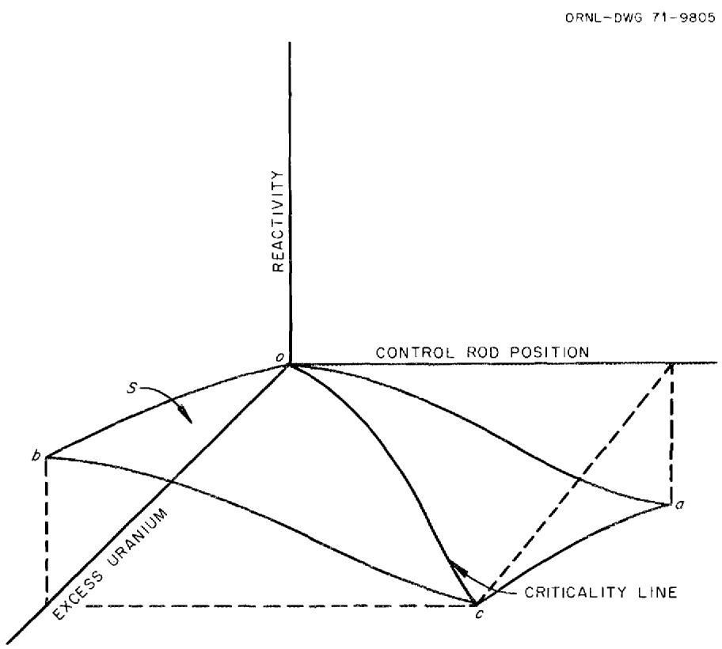  
Fig. 1. Parameter region in zero-power rod-calibration experiments.

core temperature, shim rod positions, xenon and samarium poisoning, and other nuclide changes during power operation have been temporarily suppressed, and we have shown only the effect of varying the position of the regulating rod as the fuel salt is enriched with excess fissile uranium (beyond the amount required for criticality with the rods fully withdrawn). The vertical dimension in this "three-dimensional" plot is a reactivity scale. The locus of points describing the change in critical rod position as excess fissile uranium is added to the reactor is shown as the solid curve on lying in the horizontal plane (reactivity = 0). This locus is a graphical expression of the reactivity balance for this parameter region. We may further observe that this curve (rod position vs uranium concentration) is the only relation directly accessible to us from experiment provided we confine ourselves to critical states of the reactor. Suppose, now, that we wish to extend this description to the case where other parameters mentioned above may also vary during reactor operation. This would correspond to a path of critical states in a multidimensional space analogous to Fig. 1. In this situation, changes in parameters other than those represented along the axes of independent variables of Fig. 1 can balance nuclear effects of changes along these axes in order to produce a critical state. This provides a basic motive for mapping the effects of individual changes in rod position or uranium concentration on the reactivity scale, even though only stationary states of the reactor flux are to be described in this application. This would be represented by knowledge of the complete surface, $S$ , in Fig. 1. To obtain this information, it is necessary to "reach" into the vertical dimension, either by performing kinetic experiments or by performing calculations for the off-critical states.

The static reactivity concept is often used to describe the off-critical state. We shall sketch here only the essential features of this theoretical construction as they relate to this problem. In this concept

the set of physical critical states (the curve $oc$ in Fig. 1) is embedded in a more general set of pseudocritical states in which the actual neutron production per fission, $v$ , is multiplied by a calculated factor $1 - \rho_s$ , determined to make the neutron production and loss rates balance. The quantity $\rho_s$ is defined to be the static reactivity. If the basic theoretical model describing the neutron transport processes in the reactor is sufficiently realistic for the critical state, use of the calculated static reactivities for the off-critical states gives one possible operational description of the surface $S$ in Fig. 1. Leaving aside, for conceptual purposes, the problems of determining what is a sufficiently realistic model for computations (e.g., diffusion theory vs transport theory, etc.) and assuming that our model gives an exact description of the critical state, it is possible to relate the static reactivity for an off-critical state in a precise way to the reactivity inferred from kinetic measurements [via Eq. (1)]. This relation is nontrivial and has been the subject of several fundamental papers in the reactor physics literature.* For the purposes of this review, we will merely state that certain kinetic experiments, such as period-differential worth and rod-drop integral-worth experiments, can be designed and analyzed (introducing calculated correction factors, if necessary) so that differences in the reactivities are operationally insignificant. (Specific details relevant to the application of MSRE measurements in the reactivity balance are described later in this report.) Therefore, as a framework for mathematical description of the theory of compensating reactivity effects, we can use the static reactivity concept.

Two expressions derived for the static reactivity corresponding to an arbitrary reactor state are given in the Appendix of this report, starting with the basic equation describing the balance of neutron production and loss processes. Here, use is made of linear operator notation in order to retain the basic mathematical structure descriptive of the physical processes, while avoiding cumbersome notation associated with choice of a particular description (e.g., the Boltzmann transport equation or the multi-group diffusion equations). The first expression derived involves only

the quantities descriptive of production and loss processes for a single state integrated over the reactor volume; namely,

$$
\rho_ {\varepsilon} = 1 - \frac {(\psi , A \phi) + (\psi , L \phi)}{(\psi , P \phi)}. \tag {2}
$$

In this general notation, $L$ , $A$ , and $P$ represent linear operators governing the neutron leakage, absorption (including energy transfer by scattering), and production from fission respectively. The functions $\phi$ and $\psi$ are the direct and adjoint flux fields corresponding to that reactor state, and the symbol, for example, $(\psi, L\phi)$ , represents the inner product of the functions $\psi$ and $L\phi$ . (The inner product of two functions is defined here as the multiplication of the functions and integration over the spatial, energy, and, in certain applications, the directional variables describing the flux fields.) Further explicit use of Eq. (2) will not be necessary in our application; it is intrinsically contained in the relations for reactivity, however, because it defines in an absolute sense the static reactivity corresponding to some chosen reference state of the reactor.

The second expression is relative in character and involves quantities descriptive of two states, which we will arbitrarily designate "initial" and "final" states. If we use subscript zero to distinguish quantities corresponding to the initial state, this formula may be written

$$
\rho_ {s} - \rho_ {s 0} = (1 - \rho_ {s}) \frac {\left(\psi_ {0} , \delta P \phi\right)}{\left(\psi_ {0} , P _ {0} \phi\right)} - \frac {\left(\psi_ {0} , \delta A \phi\right)}{\left(\psi_ {0} , P _ {0} \phi\right)} - \frac {\left(\psi_ {0} , \delta L \phi\right)}{\left(\psi_ {0} , P _ {0} \phi\right)}. \tag {3a}
$$

An equivalent expression is useful in those situations where the production operator is altered and the reactivity in the final state, $\mathfrak{o}_s$ , is considered to be an unknown quantity. This is,

$$
\rho_ {s} - \rho_ {s 0} = (1 - \rho_ {s 0}) \frac {\left(\psi_ {0} , \delta P \phi\right)}{\left(\psi_ {0} , P \phi\right)} - \frac {\left(\psi_ {0} , \delta A \phi\right)}{\left(\psi_ {0} , P \phi\right)} - \frac {\left(\psi_ {0} , \delta L \phi\right)}{\left(\psi_ {0} , P \phi\right)}. \tag {3b}
$$

In this notation, for example, $\delta P$ represents the change in the neutron production operator between the final and initial states, $P - P_0$ .

By restricting Eq. (3a) to the special case where the two states represent critical states (e.g., two points along the curve $oc$ in Fig. 1), we may set $\rho_{S} = \rho_{S0} = 0$ to obtain

$$
0 = \frac {\left(\psi_ {0} , \delta P \phi\right)}{\left(\psi_ {0} , P _ {0} \phi\right)} - \frac {\left(\psi_ {0} , \delta A \phi\right)}{\left(\psi_ {0} , P _ {0} \phi\right)} - \frac {\left(\psi_ {0} , \delta L \phi\right)}{\left(\psi_ {0} , P _ {0} \phi\right)}. \tag {4}
$$

This equation is one possible mathematical statement of the reactivity balance condition as the reactor changes from the initial to final states. From it, several observations may be derived that relate to the problems of constructing a consistent approximation for use in nuclear operations analysis. First, the changes in the linear operators may be rigorously separated into a sum of component effects corresponding, for example, to movements of the control rod, ingrowth of samarium, depletion of uranium, etc. However, since the flux field for the final state involves the cumulative effect of these components, these component reactivities are strictly additive only if it is assumed that the flux distributions in both the initial and the final states are known quantities. We will examine the extent to which this is a real problem later in this section.

A second potential source of difficulty in constructing a consistent approximation for the reactivity balance relates to the multiplicity of possible paths between initial and final states that may be used to assign magnitudes to the component reactivities. This may be illustrated by reference to Fig. 1. Consider, for example, two paths between the origin (point $o$ ) and the state corresponding to the control rod fully inserted with maximum excess uranium required to maintain criticality (point $c$ ). Let path 1 consist first of the complete insertion of the rod, resulting in state $a$ , followed by addition of excess uranium to arrive at state $c$ . For path 2, let the order of these changes be reversed, leading to the

motion obe. Each of these changes belongs to a class for which the change in the leakage operator $\delta L$ can be neglected. (See also the discussion in the Appendix. This is not equivalent to the statement that the change in total neutron leakage is negligible; for the latter, $L\phi$ can differ through changes in the operand; i.e., the flux distribution.) By use of Eq. (3a), with $\rho_{s0} = \rho_{sc} = 0$ , the motion of the rod in path 1 corresponds to the static reactivity change

$$
\rho_ {s \alpha} = - \frac {\left(\psi_ {0} , \delta A _ {R} \phi_ {\alpha}\right)}{\left(\psi_ {0} , P _ {0} \phi_ {\alpha}\right)}, \tag {5}
$$

and the compensating reactivity associated with the uranium addition is

$$
\bar {p} _ {\varepsilon \alpha} = \frac {\left(\psi_ {\alpha} , \delta P \phi_ {c}\right)}{\left(\psi_ {\alpha} , P _ {0} \phi_ {c}\right)} - \frac {\left(\psi_ {\alpha} , \delta A _ {U ^ {\prime}} \phi_ {c}\right)}{\left(\psi_ {\alpha} , P _ {0} \phi_ {c}\right)}. \tag {6}
$$

In these expressions, $\delta A_{R}$ and $\delta A_{U}$ are the changes in the absorption operator associated with movement of the control rod and additions of uranium respectively. We have also used the fact that $P_{0} = P_{\alpha}$ , or $\delta P = 0$ along the path $o\alpha$ .

For path 2, similar use of Eq. (3b) shows that the static reactivity change for the excess uranium addition is $(P_{\widehat{b}} = P_{c})$

$$
\rho_ {s b} = \frac {\left(\psi_ {0} , \delta P \phi_ {b}\right)}{\left(\psi_ {0} , P _ {c} \phi_ {b}\right)} - \frac {\left(\psi_ {0} , \delta A _ {U} \phi_ {b}\right)}{\left(\psi_ {0} , P _ {c} \phi_ {b}\right)}. \tag {7}
$$

The compensating reactivity change introduced by the control rod motion is

$$
- p _ {s b} = - \frac {\left(\psi_ {b} , \delta A _ {R} \phi_ {e}\right)}{\left(\psi_ {b} , P _ {e} \phi_ {e}\right)}. \tag {8}
$$

Comparison of Eq. (5) with (8) and Eq. (6) with (7) shows that, even if we ignore the differences in the flux fields for the states $0$ , $a$ , $b$ , $c$ , the component reactivity magnitudes still differ by the normalization of the production operator. (In molten-salt reactor applications, the production

operator is directly proportional to the uranium concentration.) Moreover, we can, in principle, develop similar expressions for these components by using an infinite variety of paths, including that of alternating infinitesimal motions in the directions of the coordinate axes, resulting, in the limit, in a net motion along the curve $\mathcal{O}$ in Fig. 1. In each of these cases, the reactivity assigned to the total rod motion or uranium addition will have slightly different magnitude.

As a practical matter, neither of the problems mentioned above present serious obstacles in constructing a reactivity balance model. However, their conceptual recognition is important in developing compatible approximations for the individual components. For those components that must be calculated from basic theory, the perturbation approximation for the flux distribution can be used without seriously restricting the accuracy of the calculations, as described in Section 2.3. The second difficulty is circumvented by setting up a specific convention for the reactivity balance calculations. Care should be taken, however, that this convention also conforms to the interpretation given to individually measured components, particularly the control rod reactivity. These criteria are further discussed in Section 2.4.

# 2.2 Simplifications

One important attribute of molten-salt reactors that has significant consequences in constructing an approximate reactivity balance is the persisting uniform distribution throughout the salt of the most important nuclides influencing the neutronic behavior. This characteristic, more than any other, makes it practical to develop a model simple enough for use in on-line computation with a computer serving many other functions and still sufficiently realistic for use in long-term monitoring of the reactor neutronic behavior (without taking recourse to ad hoc renormalizations). Specifically, as a first consequence, the changes in nuclide concentration that occur in the course of operation are governed by the following expression for the reaction rate:

$$
R _ {i} (t) = N _ {i} (t) \int_ {V _ {R}} d V \int_ {0} ^ {\infty} \sigma_ {i} (E) \phi (\underline {{r}}, E, t) F (\underline {{r}}) d E, \tag {9}
$$

where

$$
R _ {i} (t) = \text {t o t a l r e a c t i o n r a t e f o r i t h n u c l i d e i n s a l t (e v e n t s p e r s e c o n d)},
$$

$$
N _ {i} (t) = \text {n u m b e r d e n s i t y o f i t h n u c l i d e i n s a l t (n u c l e i p e r c u b i c}
$$

$$
\sigma_ {i} (E) = \text {r e a c t i o n c r o s s s e c t i o n f o r i t h n u c l i d e} (\mathrm {c m} ^ {2}),
$$

$$
\begin{array}{l} \phi (\underline {{r}}, E, t) = \begin{array}{l} \text {n e u t r o n f l u x a t p o i n t} \underline {{r}}, \text {e n e r g y} E, \text {a n d t i m e} t \text {(n e u t r o n s} \\ \mathrm {c m} ^ {- 2} \sec^ {- 1}), \end{array} \\ F (\underline {{r}}) = \text {v o l u m e f r a c t i o n o f s a l t a t p o i n t} \underline {{r}}, \\ V _ {R} = \text {a l l r e a c t o r v o l u m e e x p e r i e n c i n g n e u t r o n f l u x (c m ^ {3})}. \\ \end{array}
$$

The factoring of the nuclide concentration from the volume integration in Eq. (9) permits definition of a useful microscopic reactor-average cross section that is influenced by salt composition, but only indirectly, through the neutron energy spectrum. In turn, use of these cross sections simplifies the calculation of the time-dependent nuclide changes and their associated reactivity effects. These calculations will be described in Sections 3 and 4 in specific connection with the MSRE reactivity balance model.

As a second consequence, it becomes possible to factor the concentrations from several of the terms in the reactivity balance and make use of reactivity coefficients derived either from calculations or from experimental measurements. (An exception to this is the treatment of the reactivity effect associated with the control rods. The evaluation of these effects is considered in Section 2.4.) To illustrate, consider the theoretical variation in the static reactivity as excess uranium is added to the salt, starting at the minimum critical loading and maintaining the control rods withdrawn. This is represented by the curve $ob$ in Fig. 1. We will first develop this relation in terms of the general notation of the preceding reactivity formulas. Following this, the discussion will be specialized to a particular neutronic model, in order to study the problems of calculating these coefficients.

By use of the arguments that led to Eq. (7), the static reactivity for an arbitrary point on curve $\sigma b$ is

$$
\rho_ {s} = \frac {\left(\psi_ {0} , \delta P \phi\right)}{\left(\psi_ {0} , P \phi\right)} - \frac {\left(\Psi_ {0} , \delta A _ {U} \phi\right)}{\left(\psi_ {0} , P \phi\right)}. \tag {10}
$$

Next, we observe that the operators $\delta P = P - P_0$ and $\delta A_{\mathrm{U}} = A_{\mathrm{U}} - A_{\mathrm{U0}}$ are macroscopic cross-section-like quantities (i.e., they involve only products of nuclide concentrations and microscopic cross sections), whose explicit form depends on the neutronic model. Since the uranium remains uniformly distributed in the fuel salt and the region geometries and salt volume fractions remain fixed in variations of the uranium concentration, a straightforward analysis shows that the concentration may be factored from these operators. Thus,

$$
\delta P = \left(C _ {U} - C _ {U 0}\right) \mu_ {p} \tag {11}
$$

and

$$
\delta A _ {U} = \left(C _ {U} - C _ {U 0}\right) \mu_ {\alpha}, \tag {12}
$$

where $C_{\mathrm{U}}$ and $C_{\mathrm{U0}}$ represent the uranium concentration in the salt at an arbitrary point along the curve and at the origin, respectively, and $\mu_{a}$ and $\mu_{p}$ are microscopic cross-section-like quantities associated with neutron absorption and production in uranium and also linear operators.

Equation (10) then has the form

$$
\rho_ {s} = \left[ 1 - \frac {\left(\psi_ {0} , \mu_ {a} \phi\right)}{\left(\psi_ {0} , \mu_ {p} \phi\right)} \right] \frac {C _ {U} - C _ {U 0}}{C _ {U}} \tag {13}
$$

or

$$
\rho_ {\mathcal {S}} = K \left(\mathcal {C} _ {\mathrm {U}}\right) \frac {\mathcal {C} _ {\mathrm {U}} - \mathcal {C} _ {\mathrm {U 0}}}{\mathcal {C} _ {\mathrm {U}}} \cdot \tag {14}
$$

As indicated, the reactivity coefficient, $K(C_{\mathrm{U}})$ , depends in principle on the uranium concentration. In application, however, this dependence is very weak for reasons described in Section 2.3; thus $K$ can be considered a constant in the calculation of the uranium reactivity component in the reactivity balance.

# 2.3 Approximate Techniques in Calculation

The simplest theoretical model that includes all the essential features of the calculation of neutron flux and reactivity is the two-group diffusion model. Extension to a larger number of energy groups presents no difficulty, but the notation tends to be cumbersome and obscure these essential features; accordingly, we can discuss the calculation of certain reactivity effects most clearly in terms of this model.

The correspondence between the preceding general reactivity formulas and the two-group model is as follows:

$$
\phi \rightarrow \left(\begin{array}{c}\phi_ {1}\\\phi_ {2}\end{array}\right), \quad \psi \rightarrow \left(\begin{array}{c}\psi_ {1}\\\psi_ {2}\end{array}\right) \tag {15}
$$

$$
\bar {P} \rightarrow \left(\begin{array}{c c}v \Sigma f _ {1}&v \Sigma f _ {2}\\0&0\end{array}\right) \tag {16}
$$

$$
A \rightarrow \left(\begin{array}{l l}\Sigma_ {a 1} + \Sigma_ {1 2}&0\\- \Sigma_ {1 2}&\Sigma_ {a 2}\end{array}\right) \tag {17}
$$

$$
L \rightarrow \left(\begin{array}{c c}- \nabla \cdot D _ {1} \nabla&0\\0&- \nabla \cdot D _ {2} \nabla\end{array}\right). \tag {18}
$$

The direct and adjoint flux vectors are solutions of the equations

$$
\nabla \cdot D _ {1} \nabla \phi_ {1} - \Sigma_ {\alpha 1} \phi_ {1} - \Sigma_ {1 2} \phi_ {1} + (1 - \rho_ {s}) v \Sigma_ {f _ {1}} \phi_ {1} + (1 - \rho_ {s}) v \Sigma_ {f _ {2}} \phi_ {2} = 0, \tag {19}
$$

$$
\nabla \cdot D _ {2} \nabla \phi_ {2} - \Sigma_ {a 2} \phi_ {2} + \Sigma_ {1 2} \phi_ {1} = 0, \tag {20}
$$

$$
\nabla \cdot D _ {1} \nabla \psi_ {1} - \Sigma_ {a 1} \psi_ {1} - \Sigma_ {1 2} \psi_ {1} + (1 - \rho_ {s}) v \Sigma_ {f 1} \psi_ {1} + \Sigma_ {1 2} \psi_ {2} = 0, \tag {21}
$$

$$
\nabla \cdot D _ {2} \nabla \psi_ {2} - \Sigma_ {a _ {2}} \psi_ {2} + (1 - \rho_ {s}) v \Sigma_ {f _ {2}} \psi_ {1} = 0. \tag {22}
$$

In these expressions, $D_{j}, \Sigma_{aj}$ , and $\nu \Sigma_{fj} (j = 1, 2)$ represent the diffusion coefficient, macroscopic absorption cross section, and neutron production cross section for the "fast" ( $j = 1$ ) and "thermal" ( $j = 2$ ) groups respectively. The slowing-down transfer cross section from the fast-to-thermal group is $\Sigma_{12}$ . In the two-group model, the initial state will appear as a superscript to aid in separating this designation from the group indices. The correspondence between the preceding inner product notation and this model is, for example,

$$
\left(\psi_ {0}, P \phi\right)\rightarrow \int_ {V _ {R}} \left[\left(\psi_ {1} ^ {0} \psi_ {2} ^ {0}\right)\left(\begin{array}{c c}v \Sigma f _ {1}&v \Sigma f _ {2}\\0&0\end{array}\right) \binom {\phi_ {1}} {\phi_ {2}} \right] d V. \tag {23}
$$

By applying these correspondences in Eq. (3a) [or (3b)] and carrying out the matrix multiplications, it is found that the static reactivity change associated with a change in concentration of a purely neutron-absorbing material (starting with the state 0) is

$$
\rho - \rho_ {0} = \frac {- \int_ {V _ {R}} \psi_ {1} ^ {0} \delta \Sigma_ {a _ {1}} \phi_ {1} d V - \int_ {V _ {R}} \psi_ {2} ^ {0} \delta \Sigma_ {a _ {2}} \phi_ {2} d V}{\int_ {V _ {R}} \left(\psi_ {1} ^ {0} v \Sigma_ {f _ {1}} ^ {0} \phi_ {1} + \psi_ {1} ^ {0} v \Sigma_ {f _ {2}} ^ {0} \phi_ {2}\right) d V}. \tag {24}
$$

Similarly, the corresponding formulas for the reactivity effect of a change in concentration of fissile material are

$$
\begin{array}{l} \rho - \rho_ {0} = \frac {(1 - \rho) \int_ {V _ {R}} (\psi_ {1} ^ {0} \delta v \Sigma_ {f _ {1}} \phi_ {1} + \psi_ {1} ^ {0} \delta v \Sigma_ {f _ {2}} \phi_ {2}) d V - \int_ {V _ {R}} (\psi_ {1} ^ {0} \delta \Sigma_ {a _ {1}} \phi_ {1} + \psi_ {2} ^ {0} \delta \Sigma_ {a _ {2}} \phi_ {2}) d V}{\rho_ {0}} \\ \int_ {V _ {R}} \left(\psi_ {1} ^ {0} v \Sigma_ {f _ {1}} ^ {0} \phi_ {1} + \psi_ {1} ^ {0} v \Sigma_ {f _ {2}} ^ {0} \phi_ {2}\right) d V \\ \end{array}
$$

(25α)

and

If, as in the present application, the change considered is that of a nuclide uniformly distributed in the fuel salt, it is useful to rewrite these formulas directly in terms of the nuclide concentrations. Setting $F_{\mathrm{S}}$ equal to the volume fraction of fuel salt in the region exposed to the neutron flux, $\delta N_{a}$ and $\sigma_{a}$ equal to the atomic concentrations and microscopic absorption cross sections of the added absorbing material, and $N_{f}$ and $\nu_{f}$ equal to the concentration and cross section of fissile material, respectively, we may rearrange Eq. (24) as follows:

$$
\begin{array}{l} \rho - \rho_ {0} = \frac {\left(1 - \rho_ {0}\right) \int_ {V _ {R}} \left(\psi_ {1} ^ {0} \delta v \Sigma f _ {1} \phi_ {1} + \psi_ {1} ^ {0} \delta v \Sigma f _ {2} \phi_ {2}\right) d V - \int_ {V _ {R}} \left(\psi_ {1} ^ {0} \delta \Sigma a _ {1} \phi_ {1} + \psi_ {2} ^ {0} \delta \Sigma a _ {2} \phi_ {2}\right) d V}{\int_ {V _ {R}} \left(\psi_ {1} ^ {0} v \Sigma f _ {1} \phi_ {1} + \psi_ {1} ^ {0} v \Sigma f _ {2} \phi_ {2}\right) d V}. (25b) \\ \mathrm {o} - \mathrm {p} _ {0} = - \frac {\delta N _ {\alpha} \left(\int_ {V _ {R}} \psi_ {1} ^ {0} F _ {s} \sigma a _ {1} \phi_ {1} d V + \int_ {V _ {R}} \psi_ {2} ^ {0} F _ {s} \sigma a _ {2} \phi_ {2} d V\right)}{N _ {f} ^ {0} \int_ {V _ {R}} (\psi_ {1} ^ {0} F _ {s} \vee \sigma f _ {1} \phi_ {1} + \psi_ {1} ^ {0} F _ {s} \vee \sigma f _ {2} \phi_ {2}) d V}, (26) \\ \rho - \rho_ {0} = - \frac {\delta N _ {\alpha} \left(j _ {1} \sigma_ {\alpha_ {1}} + j _ {2} \sigma_ {\alpha_ {2}}\right)}{N _ {f} ^ {0} \left(j _ {1} v \sigma_ {f _ {1}} + v \sigma_ {f _ {2}}\right)}, (27) \\ = - K _ {\alpha} \frac {\delta N _ {\alpha}}{N _ {f} ^ {0}}. (28) \\ \end{array}
$$

In the last two forms above, $K_{\alpha}$ is a reactivity coefficient for the absorbing material, and the parameters $j_{1}$ and $j_{2}$ are defined by

$$
j _ {1} = \frac {\int_ {V _ {R}} \psi_ {1} ^ {0} F _ {s} \phi_ {1} d V}{\int_ {V _ {R}} \psi_ {1} ^ {0} F _ {s} \phi_ {2} d V} \tag {29}
$$

and

$$
j _ {2} = \frac {\int_ {V _ {R}} \psi^ {0} F _ {s} \phi_ {2} d V}{\int_ {V _ {R}} \psi^ {0} F _ {s} \phi_ {2} d V}. \tag {30}
$$

A similar rearrangement of Eqs. (25a) and (25b) yields the following:

$$
\rho - \rho_ {0} = \frac {\delta N _ {f}}{N _ {f} ^ {0}} \frac {\left[ (1 - \rho) \left(j _ {1} v \sigma_ {f _ {1}} + v \sigma_ {f _ {2}}\right) - j _ {1} \sigma_ {a _ {1}} - j _ {2} \sigma_ {a _ {2}} \right]}{j _ {1} v \sigma_ {f _ {1}} + v \sigma_ {f _ {2}}} \tag {31a}
$$

and

$$
\rho - \rho_ {0} = \frac {\delta N _ {f}}{N _ {f}} \frac {\left[ j _ {1} v \sigma f _ {1} + v \sigma f _ {2} - j _ {1} \sigma \alpha_ {1} - j _ {2} \sigma \alpha_ {2} \right]}{\left. j _ {1} v \sigma f _ {1} + v \sigma f _ {2} \right.}. \tag {31b}
$$

The second expression above may also be rewritten in a form similar to Eq. (14); namely,

$$
\rho \dots \rho_ {0} = \frac {\delta N _ {f}}{N _ {f}} K _ {f}, \tag {32}
$$

where $K_{f}$ is a reactivity coefficient for the fissile material.

In all the preceding descriptions, we have taken care to distinguish between the flux distributions in the initial and final states in a reactivity change. An approximation that affords a great simplification in the practical calculation with these formulas is the first-order perturbation approximation. Here the flux distribution corresponding to the final, or perturbed, state is set equal to the distribution in the starting state before carrying out the necessary integrations to obtain the reactivity coefficients. Although this approximation is often employed in

problems of this general type, the basis of its applicability and its limitations are not always discussed. Toward this end, we may first observe from any of the preceding reactivity formulas that this quantity is independent of the normalization (magnitude) of either the flux distribution for the final state or the adjoint distribution for the initial state. Hence the reactivity calculated with these formulas can conceivably vary with the final flux distribution only through changes in the relative spatial or energy distribution of the flux. Second, in the type of reactors we are considering, most of the neutron reactions occur in the energy region of neutron thermalization and, to a lesser extent, the low-energy, epithermal region. Expressed in terms of the preceding two-group formulas, this means that the terms involving the adjoint-weighted thermal reaction rates tend to dominate in the evaluation of the reactivity. In this situation, an early analysis by Wolfe6 provides a useful criterion for determining when the thermal flux distribution can be expected to remain essentially unchanged during prolonged operation of the reactor. In essence, Wolfe's treatment shows that the net effect of the perturbation on the reactor neutron economy should be small compared with the total neutron leakage from the reactor, so only a small change in the flux shape is required to balance the neutron economy against the perturbation. (This criterion was certainly fulfilled in the MSRE, as can be shown by analysis of the neutron balance.) However, the applicability of the perturbation approximation is actually not as restrictive as this might indicate, particularly when applied to perturbations distributed over the reactor, such as burnup-related effects. Here the integral nature of the computation has a tendency to smooth out errors in the flux distribution. As might be expected, this approximation is generally least accurate in application to a strong and highly localized perturbation (such as a control rod). For these cases, more exact flux distributions or results of individual reactivity measurements (such as described in the following section) should be used.

The incentive for use of the perturbation approximation in the treatment of the calculated reactivity terms is considerable, for it minimizes the number of direct-eigenvalue/flux calculations that must be performed in the course of reactor operation. The fact that it is an approximation, however, indicates that circumspection should accompany its use in any

particular instance, possibly in the form of point checks with results from more exact analysis. Reference 7 provides much valuable insight and background discussion concerning applications of the perturbation technique.

# 2.4 Reactivity Measurements

In Section 2.2, mention was made of the necessity for setting up an ordering convention for reactivity changes that compensate one another and for assuring that the interpretation of individual reactivity measurements conforms to that convention. Of the class of measured components of the reactivity balance, the control rod reactivity is of major importance, particularly if the normal mode of power operation involves substantial insertions of the rods (as was the case with the MSRE). The rods represent strong, localized absorbers, and more elaborate and disproportionate efforts are generally required to calculate their reactivity reliably from basic theory; in any case, a basis of measurement should be available for comparison.

The convention used in this work is based on the concept that the insertion of the control rods always acts to follow and compensate for any net excess positive reactivity relative to the origin in Fig. 1. To see how this may be made to conform to the interpretation of rod calibration experiments, consider the situation depicted in Fig. 2. Here a typical period-differential-worth measurement and a rod-drop, integral-worth measurement are indicated (schematically) for one particular uranium concentration. The period measurement determines the slope of the reactivity versus rod position curve for that uranium concentration and critical rod position. In Fig. 2 this is indicated by the small triangle starting at point $p$ in the plane perpendicular to the uranium mass axis. By varying the uranium content, and with it the initial critical positions for the period experiments, it may be seen that the slope of the reactivity surface $S$ in the neighborhood of the critical line can be obtained.

Similarly, the rod-drop experiment is indicated in Fig. 2 as the triangle $pcd$ , where $cd$ represents the total negative reactivity resulting from rod scream from the initial critical position. It should be noted that these experiments are by nature limited to the subcritical domain, just as

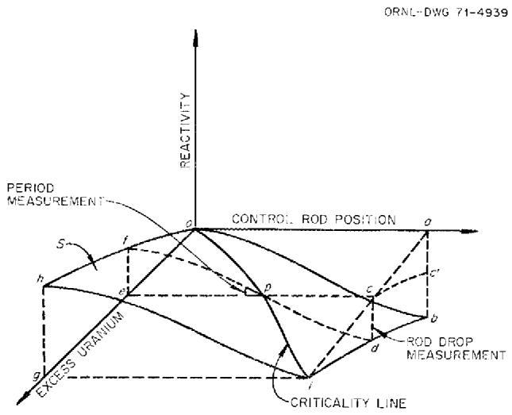  
Fig. 2. Graphical description of rod-calibration measurements.

the positive period measurements apply only to a small region above the critical line. To gain information about the "supercritical" reactivity curve $\mathcal{O}h$ , which the rod insertions must compensate to arrive at the critical line, it is necessary to proceed in an indirect manner. For this purpose, we can make use of the discussion in Section 2.2. This discussion showed that the result of "translating" a rod reactivity measurement parallel to the uranium mass axis introduces a correction factor proportional to the uranium concentration, together with minor corrections associated with changes in the flux spectra. Assume now that two rod-drop experiments have been performed, one with the minimum critical uranium loading in the reactor to measure the reactivity $ab$ in Fig. 1 and the second at an intermediate uranium loading to measure $cd$ as indicated. If we correct the reactivity measured in the first experiment to the loading conditions at the time of the second experiment by using the following approximation,

$$
\Delta \rho_ {a b} ^ {\prime} (\mathrm {U}) \simeq \Delta \rho_ {a b} (\mathrm {U} _ {0}) \frac {C _ {\mathrm {U} 0}}{C _ {\mathrm {U}}} ， \tag {33}
$$

it may be seen that the $\Delta \rho_{ab}^{\prime}$ will be approximately equal to the reactivity difference between points $f$ and $d$ in Fig. 2. Hence,

$$
\Delta \rho_ {e f} \approx \Delta \rho_ {a b} ^ {\prime} - \Delta \rho_ {e d}. \tag {34}
$$

In this indirect manner, the curve $\mathcal{O}h$ can be generated from a number of rod-drop experiments at various uranium concentrations. From this an experimental value for the uranium concentration coefficient of reactivity can be derived [Eq. (14)]. A similar and obvious interpolation procedure can be applied to the results of period measurements to obtain an approximate differential-worth curve for a specified uranium loading.

A final topic that should be mentioned before concluding this discussion of the foundations of the reactivity balance concerns the role of the effective delayed-neutron fraction in reactivity measurements. The general theoretical basis for analyzing these measurements is described in several textbooks dealing with reactor kinetics (see, e.g., Ref. 8). It will suffice to observe here that the measurements considered in the preceding discussion are relative in character, and their interpretation depends on the nature and dynamic behavior of the delayed-neutron precursors. This can give rise to a source of inconsistency in the reactivity balance. In particular, the conversion of the results of measurement to an absolute reactivity scale, in the sense used in this section, requires knowledge of the delayed-neutron source strength relative to that of prompt neutrons from fission in contribution to the neutron cycle. In addition, another characteristic of delayed neutrons that must be taken into account is their energies of emission, which are lower than those of the prompt neutrons from fission. In a thermal reactor such as the MSRE (which had a high fraction of neutron leakage to the surroundings), the net result of this difference in emission energy spectra is that the delayed neutrons have less likelihood of leakage than the prompt neutrons, so their contribution to the chain reaction is enhanced. Hence, both theoretical analysis and physical intuition lead to a "delayed-neutron effectiveness" factor $\gamma_{i}$ by which the delay fraction $\beta_{i}$ for the $i$ th precursor group must be multiplied to obtain their contribution, relative to the prompt neutrons, in promoting the chain reaction.

Chapter 6 of Ref. 8 contains an extensive discussion of the problem of calculating the delayed-neutron effectiveness factors. Although several measurements of the delayed-neutron emission spectra have been made, sufficient uncertainties still exist in the data to suggest that detailed calculations to take into account the shape of the delayed-neutron energy

spectra are not always warranted. For thermal reactors in particular, an adequate estimate of the corrections arising from these differences in energy spectra may be obtained by assuming that all delayed neutrons are emitted with a single average energy, independent of the precursor group. According to data taken from Ref. 8, this average energy is approximately 0.43 MeV. Then $\gamma_{i} \simeq \overline{\gamma}$ can be computed from the approximate formula

$$
\bar {\gamma} = e ^ {+ B ^ {2} \left(\tau_ {p} - \tau_ {d}\right)}, \tag {35}
$$

in which $B^2$ is the geometric buckling corresponding to the "nuclear" size of the core and $\tau_p$ and $\tau_d$ are the values of the average age to thermal energy for prompt fission neutrons and for delayed neutrons respectively.

These effective delayed-neutron fractions, $\overline{\beta}_i = \overline{\gamma}\beta_i$ , with no circulation of the fuel, form the basis for normalization of the "measured" reactivity components. Details of the method of numerical evaluation of $\overline{\gamma}$ for the MSRE are given later in this report (Sect. 4.5).

The procedure described above is strictly sufficient only for reactors with solid fuel and fluid-fuel reactors with negligible circulation of the precursors. For the MSRE the calibration of the control rods and the reactivity measurements derived from these experiments were performed with the circulation stopped. When the fuel is circulating, additional complexities arise from interaction between the fluid flow and precursor dynamics. This delayed-neutron loss is best treated as a separate (negative) reactivity component effect that can be precisely measured and normalized on the basis described above. For conditions of steady-state circulation of fuel, this effect is constant and therefore equivalent to a zero-point correction in the reactivity balance.

The theoretical and experimental interpretation of the delayed-neutron loss effect in the MSRE, both under steady-state and transient-stable period conditions, was the subject of an earlier report.[9]

# 3. DESCRIPTION OF INDIVIDUAL REACTIVITY EFFECTS IN THE MSRE

# 3.1 Reference Conditions

The discussion given in the remainder of this report applies specifically to the MSRE. Some knowledge of the basic reactor design characteristics is assumed, and further details are available in Ref. 10.

If changes in component reactivity effects during operation are to be monitored, it is advantageous to choose a starting, or reference, condition that can be defined by experimental measurements with relatively little error or ambiguity. The reference conditions chosen for this work correspond to the just-critical reactor, isothermal at $1200^{\circ}\mathrm{F}$ by use of the external electric heaters, fuel circulating and free of fission products, and all three control rods withdrawn to their upper limits (51 in.). The uranium concentration for these conditions, as well as the increase in uranium concentration required to compensate for a range of control-rod insertions and isothermal temperature changes, was established during a program of zero-power nuclear experiments. The experimental program pertinent to the first uranium loading, $^{11}$ a mixture of $^{235}\mathrm{U}$ and $^{238}\mathrm{U}$ , were carried out in the summer of 1965. In this program, independent measurements of the control-rod reactivity worth (period-differential-worth experiments and rod-drop integral-worth experiments) were used to determine reactivity equivalents of uranium concentration changes and isothermal temperature variations.

The zero-power experiments pertinent to loading with $^{233}\mathrm{U}$ were carried out in the fall of 1968. This program established the necessary base-line conditions and information for reactivity balance calculations during power operation with $^{233}\mathrm{U}$ . A summary of the results was given in Ref. 12, and further details will be included in subsequent topical reports concerned with analysis of nuclear operation with $^{233}\mathrm{U}$ .

# 3.2 The General Reactivity Balance Equation

The equation describing the general situation when the reactor is operating at some specified power level includes terms representing,

relative to the reference state, (1) the positive effect of the total excess uranium added before increasing the power, (2) the poisoning effect of the rod insertion, and (3) the power and time-integrated power-dependent effects associated with changes in fuel and graphite temperature levels and distributions, $^{235}\mathrm{U}$ burnup, and fission product buildup ( $^{135}\mathrm{Xe}$ , $^{149}\mathrm{Sm}$ , $^{151}\mathrm{Sm}$ and nonsaturating fission products). These terms include the most important direct effects of substantial power generation. There are, however, other indirect effects arising from isotopic changes. These include,

(1) the burnout of the small amount of $^6\mathrm{Li}$ present in the clean fuel salt,   
(2) burnout of residual $^{10}\mathbb{B}$ from the unirradiated graphite moderator,   
(3) production of plutonium from absorptions in $^{238}\mathrm{U}$ , and (4) changes in the concentrations of the other nonfissile isotopes of uranium during operation. There are, in addition, other known reactivity effects that can be shown to be insignificant in the MSRE, such as photoneutron reactions in the beryllium in the fuel salt, changes in rod worth due to gadolinium depletion, and several high-energy neutron reactions. These complete the list of component reactivity effects only if we assume that the structural configuration of the graphite stringers and the associated matrix of fuels-salt channels underwent no significant changes during the power-generating history of the core. If changes in the fuel-moderator geometry were induced, for example, by nonuniform temperature-expansion effects or cumulative radiation-damage effects on the graphite, this could appear as an anomalous reactivity effect not explicitly accounted for in the reactivity balance. Theoretical calculations indicate that some radiation-induced geometric changes may have occurred; these calculations and their influence on the interpretation of reactivity balance data are described in Section 3.3.

There is substantial evidence that another special reactivity effect was of importance in the operation of the MSRE. This arose from the entrainment of helium-gas bubbles in the circulating fuel salt through the action of the xenon-stripping spray ring in the fuel-pump tank. These minute, circulating helium bubbles would be expected to affect the reactivity in two ways: (1) by modifying the neutron leakage through an effective reduction in the density of the fuel salt and (2) by providing an

additional sink for $^{135}\mathrm{Xe}$ and thereby reducing the effective xenon migration to the graphite pores. (These effects will be discussed in greater detail in a later section.)

We can summarize the preceding discussion in the form of a general equation for the reactivity balance. By using the symbol $\Delta \rho(x)$ to represent the algebraic value of the reactivity change due to component $x$ , and grouping terms that can be treated similarly in the calculations, we obtain

$$
\begin{array}{l} 0 = \Delta \rho (\text {r o d s}) + \Delta \rho (\text {e x c e s s} ^ {2 3 5} U) + \Delta \rho (\text {t e m p e r a t u r e}) + \Delta \rho (\text {p o w e r}) \\ + \Delta \rho (S m) + \Delta \rho (1 3 5 X e) + \Delta \rho (\text {o t h e r n u c l i d e t r a n s m u t a t i o n e f f e c t s}) \\ + \Delta \rho (\text {r e s i d u a l}), \tag {36} \\ \end{array}
$$

The final term on the right-hand side of this equation includes effects divisible into three basic categories: (1) any residual effects known to normally occur in the reactor core that are not explicitly accounted for in the calculations, (2) residual reactivity corrections due to any errors in calculating the other terms, and (3) changes that could be considered to constitute anomalous behavior (such as uranium separation from the circulating fuel salt).

Figure 3 illustrates diagrammatically how the information required for on-line calculation of the various terms of Eq. (36) was assembled. In the figure the solid arrows are used to designate the "primary" sources of information used to evaluate the reactivity effects. The dashed arrows indicate where the dependency on theoretical modeling is secondary. This produces a rough separation of the terms into two groups (emphasized by the double line), according to the extent to which experimental measurements were sufficient to evaluate these terms. The dependency of evaluations of the top group on theoretical input resides mainly in the evaluation of the effective delayed-neutron fractions required to convert the results of the rod-calibration experiments to an "absolute" reactivity scale.

The bases of evaluation of the terms of Eq. (36) are described in greater detail in the remainder of this section in the order listed in the equation.

REACTIVITY EFFECTS:

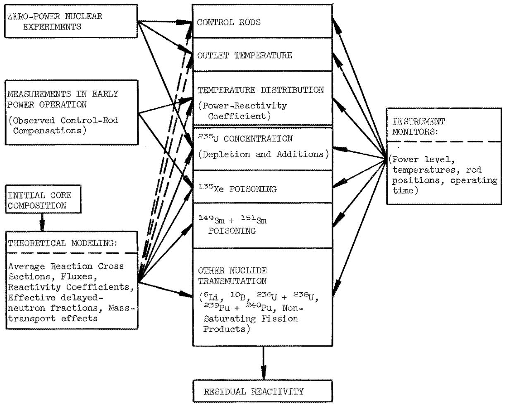  
Fig. 3. Composition of MSRE reactivity balance.

# Control-rod reactivity worth

Quantitative determinations of the rod worth, the $^{235}\mathrm{U}$ reactivity worth, and the temperature reactivity effects were made during the zero-power experiments. Because the uranium and temperature reactivity effects are inferred from the control-rod calibration experiments, and also because the magnitude of other known power-dependent reactivity effects, described later, are evaluated empirically according to the changes in control-rod position following a change in power level, precise determination of rod worth is vital to the successful interpretation of the reactivity balance.

The control rods were calibrated by means of rod bump-period measurements made with the reactor at zero power (i.e., with negligible temperature feedback effects) and the fuel circulating pump stopped during a period of uranium additions sufficient to vary the initial critical position of one rod (the regulating rod) over its entire length of travel. At three intermediate $^{235}\mathrm{U}$ concentrations, banked insertions of the two shim rods required to balance specified increments of withdrawal of the regulating rod were measured. In this way, various combinations of shim- and regulating-rod insertions equivalent in their reactivity poisoning effect were obtained. Rod-drop experiments were also performed at three intermediate $^{235}\mathrm{U}$ concentrations. In these experiments, the equivalent integral negative reactivity insertion of the rod in falling from its initial critical position to its scram position was measured. Agreement between the integral of the differential-worth measurements and the integral reactivity obtained directly from the rod-drop experiments was found to be within $5\%$ .

The reactivity versus position calibration curve for the regulating rod, and the results of the three experiments measuring equivalent shim- and regulating-rod combinations were next combined with an approximate theoretical formula for the reactivity worth of an arbitrary shim-regulating-rod configuration. The theoretical formula contained several parameters that were adjusted so that the formula provided a least-squares fit to the experimental measurements. (Derivation of the formula for rod worth and discussion of its application are given in Ref. 13.) The result of this analysis is shown in Fig. 4. The solid points are data taken from smooth curves drawn through the experimental data and are normalized to the uranium concentration attained at the end of the zero-power experiments with $^{235}\mathrm{U}$ . (As noted in Sect. 2.2, the rod reactivity worth is inversely proportional to the $^{235}\mathrm{U}$ concentration within its range of variation.) Figure 4 indicates that the smoothed data could be fitted very closely with the theoretical rod-worth formula, except for small errors at the extreme positions of the rods (full insertion or withdrawal). No important restrictions in the use of the formula arose from these errors, since the purpose was primarily interpolation of the reactivity worth of intermediate shim-regulating-rod combinations not specifically covered in the three groups of experiments described above. The formula provided a convenient

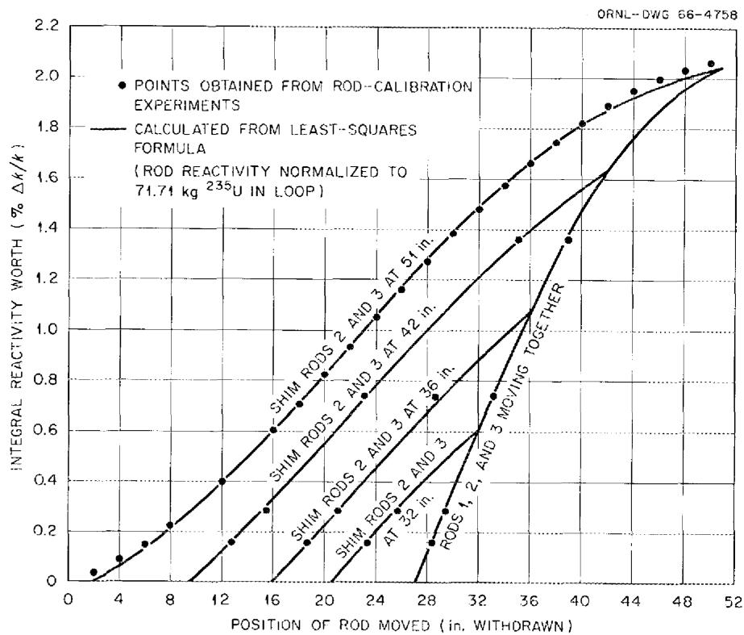  
Fig. 4. Comparison of control rod reactivity from experimental curves and from the least-squares formula.

means of rapidly calculating the reactivity equivalent of the rod configuration during reactor operation by means of the on-line computer. One potential restriction in the practical use of the formula should be noted, however. It could only be applied in regions of rod travel and excess reactivity covered in the zero-power calibration experiments (i.e., magnitude of reactivity less than or equal to the worth of a single rod moving through 51 in. of travel). Modifications of the least-squares formula would have been required to cover a larger reactivity range. Since the reactor fuel loading never exceeded that attained in the initial calibration, this limitation did not affect the actual operation.

Checks were made during power operation of the reactor (see also the discussion in Chap. 5) to determine whether use of the approximate formula would lead to any significant error in the reactivity effect assigned to the rod. These were done by varying the shim- and regulating-rod configuration required to maintain constant reactor operating conditions and comparing the calculated reactivity effects. These tests indicated that the

maximum reactivity variation attributable to systematic errors of this type would be about $0.03\% \delta k / k$ and would generally be associated with the largest changes in shim- and regulating-rod configuration occurring during routine power operations.

# Excess $^{235}\mathrm{U}$ reactivity worth

Relative to the reference conditions defined in the preceding part of this report, the total excess $^{235}\mathrm{U}$ is equal to the amount added during the zero-power experiments (in the form of highly enriched uranium) minus the amount burned during power operation of the reactor plus the amount added to reenrich the fuel salt when the burnup becomes sufficient. Corrections must also be introduced for relative dilution effects each time the reactor fuel loop was drained and the fuel mixed with the fuel salt "heel" remaining in the drain tanks during operation, as well as for absolute dilutions from reactor flushing operations.

The reactivity equivalent of the excess uranium was determined from the zero-power experiments by measuring the amount of control-rod insertion required to balance each addition of $^{235}\mathrm{U}$ and then using the independent calibration of reactivity versus position to determine the incremental reactivity worth of the $^{235}\mathrm{U}$ . The theoretical foundations of this measurement were described in Chapter 2. It was shown that the form of the expression for the excess uranium reactivity effect was

$$
\Delta_ {0} \left(\text {e x c e s s} ^ {2 3 5} U\right) = \frac {K \left(C - C _ {0}\right)}{C}, \tag {37}
$$

where $C$ is the concentration of $^{235}\mathrm{U}$ in the salt, $C_0$ is the value at the minimum critical loading, and $K$ is approximately constant over the range of concentrations encountered in operations. The parameter $K$ is also equal to the concentration coefficient of reactivity at the reference conditions, as can be shown by differentiating Eq. (37) and setting the concentration equal to that at the minimum critical loading:

$$
\left(C \frac {d \Delta \rho}{d C}\right) _ {C = C _ {0}} = K. \tag {38}
$$

Results of fitting the data obtained during the zero-power experiments with an expression of the form of Eq. (37) are shown in Fig. 5. From this analysis, a value of $K = 0.24$ was obtained; correspondingly, the average concentration coefficient of reactivity over the total variation in $^{235}\mathrm{U}$ loading during the zero-power experiments was 0.22.

In order to evaluate the changes in concentration due to $^{235}\mathrm{U}$ depletion in power operation, theoretical calculations of the fission and radiative capture cross sections, averaged over the reactor spectrum, were required. These calculations are described in Chapter 4. The analysis indicated that the $^{235}\mathrm{U}$ would be consumed at the rate of 1.31 g/Mw.d, or at the equivalent rate of about 5% of the circulating inventory per full-power year.

# Temperature reactivity effect

When the core temperature is maintained spatially uniform, a change in this temperature can be related both experimentally and theoretically

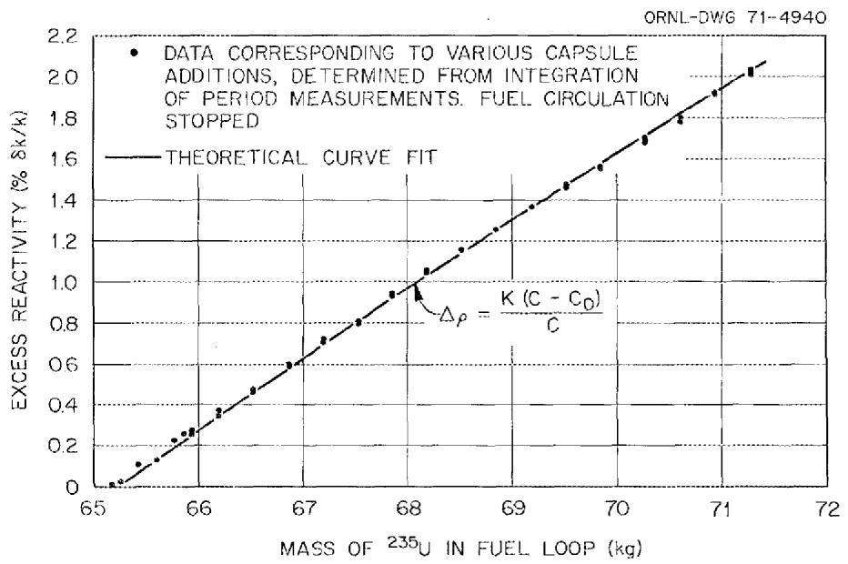  
Fig. 5. Effect of $^{235}\mathrm{U}$ mass on reactivity in first MSRE loading; theoretical curve fit.

to the core reactivity in an unambiguous manner. The method used to measure the isothermal temperature coefficient of reactivity during the zero-power experiments consisted in varying the external heater inputs and allowing the just-critical reactor to cool slowly and uniformly while measuring the change in regulating-rod position required to maintain a constant neutron level. In these experiments the fuel was circulating and the system temperature was taken to be the average of the measurements made with preselected thermocouples distributed over the circulating system. The change in rod position corresponding to the temperature change was converted to reactivity by again using the rod calibration curve. The zero-power experiments measured the combined effect of a uniform change in fuel and graphite temperature. The value of the total isothermal temperature coefficient of reactivity obtained by this means was $-7.3 \times 10^{-5} \circ \mathrm{F}^{-1}$ .

# Power coefficient of reactivity

At power levels higher than about $10\mathrm{kW}$ of heat, spatial distributions of temperature due to the nonuniform heating of the core begin to become significant. The reactivity change, relative to a fixed uniform temperature level, is no longer simply related to a single physically measurable temperature (or even the average of several measured temperatures) in the circulating system. Rather, the reactivity is a cumulative effect of the entire temperature field in the core. This temperature-distribution reactivity effect, or steady-state power coefficient of reactivity, is somewhat difficult to estimate reliably for the MSRE because it requires accurate knowledge of the local heat deposition and temperature distributions in the graphite and salt and the contribution of these local effects to the neutron reaction rates. An approximate way of treating this problem involves the use of a "nuclear average temperature," as

described in Ref. 14. In this method, the local temperature changes are multiplied by a weighting (importance) function that measures their effect on the net reactivity and then integrated over the reactor core. Even if we assume that the temperature distributions in the fuel and core graphite can be calculated accurately, it should be noted that the weighting procedure described in Ref. 14 is theoretically insufficient when applied to a small reactor core, such as the MSRE. Here the principal temperature reactivity effects arise from changes in the neutron leakage. Although nonuniform temperature changes induce expansion in fuel salt and graphite that affect the reactivity according to the weighting procedure indicated above, the complete description of the effects would also require calculation of neutron thermalization in a nonuniform temperature field. Difficulties in the practical computation of these effects can be a source of error in theoretical evaluations of the power coefficient.

The power coefficient of reactivity for a fixed reactor outlet temperature was measured during the approach to power by holding the reactor outlet temperature at a preset value with the servo controller and measuring the control-rod response to the change in steady-state power level. Since the reactivity response to the change in temperature distribution is essentially instantaneous, this effect can be separated from the slower power-dependent reactivity effects, such as the $^{135}\mathrm{Xe}$ and $^{149}\mathrm{Sm}$ effects. The total effect was quite small, and the measured power coefficient was $+0.001\%$ reactivity per megawatt. This observed coefficient corresponded to a difference of about $3^{\circ}\mathrm{F} / \mathrm{MW}$ between the nuclear average temperature of the graphite and that of the fuel. The measured coefficient was applied to evaluate the term $\Delta \rho$ (power) in Eq. (36).

# Samarium poisoning

The term in Eq. (36) representing the poisoning effect of $^{149}\mathrm{Sm}$ and $^{151}\mathrm{Sm}$ cannot be conveniently separated in experimental measurements and is best calculated from basic theoretical considerations. The direct fission production-decay schemes for these high-cross-section nuclides are shown in Fig. 6. The parameters $\hat{\sigma}_{\alpha}$ represent the reaction rate constants for neutron absorption, normalized to unit power level and corrected for the time the fuel spends in the part of the circulating loop external to the

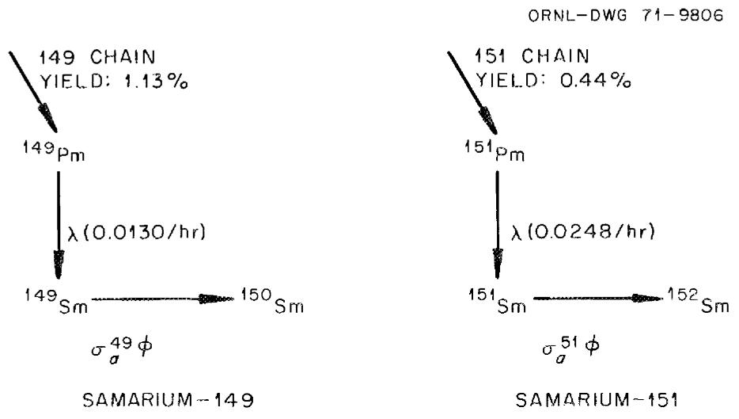  
Fig. 6. First-order decay schemes for production of samarium poisons.

reactor core and thus out of the neutron flux. The calculation of the flux and effective reaction cross sections for the samarium and other nuclides is described in a later section of this report.

In principle, the chains shown in Fig. 6 should be connected by neutron absorption in $^{150}\mathrm{Sm}$ ; other indirect routes for the production of $^{149}\mathrm{Sm}$ can also be considered. However, for the relatively low neutron flux and fraction of uranium burnup engendered in the MSRE, these corrections can be neglected. For periodic calculation with the on-line computer, the differential equations describing the production and decay schemes in Fig. 6 were converted to finite difference form. The form of the equations used for computation in both decay chains was

$$
N _ {\mathrm {P}} \left(t _ {i} + \Delta t\right) = N _ {\mathrm {P}} \left(t _ {i}\right) (1 - \lambda \Delta t) + C _ {1} \vec {Q} \left(t _ {i}\right) \Delta t \tag {39}
$$

$$
N _ {S} (t _ {\vec {i}} + \Delta t) = N _ {S} (t _ {\vec {i}}) [ 1 - \hat {\sigma} _ {\alpha} \phi \overline {{Q}} (t _ {\vec {i}}) \Delta t ] + N _ {P} (t _ {\vec {i}}) \lambda \Delta t \tag {40}
$$

$$
\widetilde {Q} \left(t _ {i}\right) = \frac {Q \left(t _ {i}\right) + Q \left(t _ {i} + \Delta t\right)}{2}, \tag {41}
$$

where $N(t_{i})$ is the atomic concentration of the isotope in the fuel salt at time $t_{i}$ , subscripts P and S refer to promethium and samarium, $\Delta t$ is the

time interval between calculations of the concentrations, and $\overline{Q}$ is the average power level during this time interval. The coefficient $C_1$ is the product of the direct fission yield and the average fission rate per unit volume of fuel salt normalized to 1 MW.

Conversion of the $^{149}\mathrm{Sm}$ and $^{151}\mathrm{Sm}$ concentrations to reactivity effects required calculations of the reactivity coefficients for unit absorbers of this type uniformly distributed in the fuel salt. The theory for these calculations was described in Section 2.3 of this report; specific details on the MSRE nuclear computations are given in Chapter 4.

For the specific example of a step increase in reactor power from zero to 7.25 MW (approximately the maximum heat output of the MSRE), the magnitudes of the samarium reactivity effects are given in Fig. 7. Although these indicate the general magnitudes and time constants, it should be emphasized that these magnitudes apply to this simplified power-time history only; the magnitudes in the reactivity balance calculations differed somewhat, depending on the actual power-time history in reactor operations.

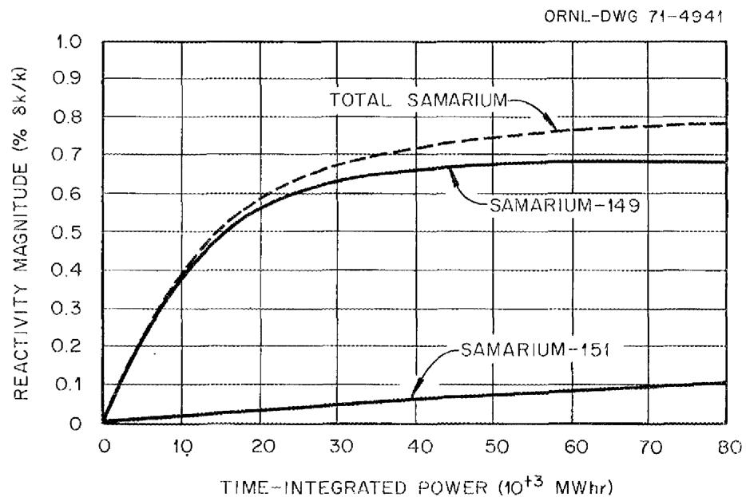  
Fig. 7. Samarium poisoning reactivity effect in MSRE for a step increase from 0 to 7.25 MW at start of power operation.

# 135Xe poisoning

Prior to nuclear operation of the MSRE, estimates of the magnitude of $^{135}\mathrm{Xe}$ poisoning were based on the assumption that at equilibrium a relatively large fraction of the xenon produced in the reactor would diffuse into the pores of the graphite moderator and undergo radioactive decay and neutron absorption there. Continuous removal of some of the xenon from the fuel salt would be accomplished by circulation of a small bypass stream of salt through the spray ring in the fuel-pump tank, which contacted the salt with a stream of helium gas. Estimates of the efficiency of removal of fission gases by this stripping apparatus and also of the expected mass transfer of xenon to the graphite pores were based on experiments with $^{85}\mathrm{Kr}$ tracer performed prior to nuclear operation of the MSRE. From these experiments a model was developed to describe the xenon behavior in the reactor.[15] It was recognized early that the presence of any circulating voids (undissolved helium gas) could drastically affect the xenon behavior, and these effects were considered in the model ultimately developed in Ref. 15. The circulating gas bubbles are effective in reducing the poison level due to the combined effects of the large overall gas-liquid interfacial area for mass transfer to the bubbles and the large xenon storage capability of the bubbles (because of the extreme insolubility of xenon in molten salt). Thus not only do the bubbles compete effectively with the graphite pores for removal of xenon from the liquid, but $^{135}\mathrm{Xe}$ in the circulating fluid is a less effective poison than that in the graphite because about two-thirds of the fluid is outside the core at any instant.

When power operation of the MSRE began, the first attempt at on-line calculation of the $^{135}\mathrm{Xe}$ poisoning term in the reactivity balance did not account for the effects of circulating bubbles. Indications from densitometer measurements during prenuclear testing and experiments during initial nuclear operation had been that practically no bubbles would circulate with the fuel. Also, in the early experiments, several tests had been performed to evaluate the response of the reactivity to changes in system overpressure.[11] The system pressure was slowly increased by about 10 psi and then rapidly reduced to the normal value. If circulating bubbles had been present, their expansion when the pressure was reduced

would have expelled some salt from the core and reduced the nuclear reactivity. In addition, the gas expansion in the entire loop would have raised the salt level in the fuel-pump tank. There was no evidence of undissolved gas in the tests performed with the normal salt level in the pump tank. However, when the salt level was reduced to an abnormally low value, the same experiments did indicate some undissolved gas. Since this gas appeared only under off-design conditions, we concluded that circulating bubbles would not be a factor in the xenon poisoning during normal power operation.

Soon after power operation of the reactor was started, it became apparent that the magnitude of the steady-state $^{135}\mathrm{Xe}$ poisoning was much smaller than had been predicted on the basis of the above considerations. At this point the attempts at on-line calculation of the xenon poisoning were suspended, and the reactivity-balance results were used to measure the actual xenon poisoning. Examination of the steady-state results showed that the low poison level could not be accounted for with reasonable parameter values within the assumption of no circulating bubbles. In addition the system response to small pressure changes now indicated a small circulating void fraction at normal salt levels in the pump tank.

In view of new evidence for circulating bubbles, the steady-state xenon equations were first modified to include bubbles, and the reactivity effect was reevaluated. As expected, the steady-state xenon poisoning was quite sensitive to both the volumetric void fraction and the bubble-stripping efficiency, decreasing monotonically with increases in either of these parameters. However, it was found that the steady-state xenon poisoning as a function of reactor power could be described by a variety of combinations of void fraction and bubble-stripping efficiency. Therefore the analysis was extended to include the time dependence that would permit a comparison of calculated and observed transient $^{135}\mathrm{Xe}$ poisoning effects (as determined by the change in the critical position of the regulating rod during the first 40 hr following a change in the steady-state reactor power level). The purpose was to attempt a separation of those parameter effects that could not be separated in the steady-state correlations. The mathematical model used to calculate the time behavior of the $^{135}\mathrm{Xe}$ poisoning is described in Ref. 16. Here we will give only a brief description of the main aspects and assumptions of the calculation.

The model chosen was patterned after that developed in Ref. 15. We assumed that all the $^{135}\mathrm{I}$ produced from fission would remain in circulation with the salt and that after decay to $^{135}\mathrm{Xe}$ , the xenon would migrate to the accessible pores of the graphite at the boundaries of the fuel channels and also to minute helium bubbles distributed throughout the circulating salt stream. An effective mass-transfer coefficient was used to describe the transfer of xenon from solution in the circulating salt to the interface between the liquid and the graphite pores at the channel boundaries. Equilibrium Henry's-law coefficients were used for the mass transfer of xenon between the liquid phase at the interface and the gas phase in the graphite pores. The numerical value used for the mass-transfer coefficient between the circulating salt and the graphite was based on the krypton-injection experiments with flush salt circulating in the fuel loop.

Similar assumptions were made regarding the mass transfer of xenon from liquid solution to the gas bubbles. The coefficient of mass transfer from the liquid to a small gas bubble of the order of 0.010 in. in diameter moving through the main part of a fuel channel was estimated from theoretical mass-transfer correlations.[15] The equilibrium $^{135}\mathrm{Xe}$ poisoning was shown to be relatively insensitive to the average bubble diameter and mass-transfer coefficient over a reasonable range of variation (uncertainty) for these parameters.

Different efficiencies of removal by the external stripping apparatus of xenon dissolved in the salt and that contained in the gas bubbles were provided for in the computational model. The efficiency of removal of xenon dissolved in the salt (fraction of xenon removed per unit circulated through the spray ring) was estimated to be between 10 and $15\%$ , based on some early mockup experiments for evaluating the performance of the xenon removal apparatus. By contrast, the efficiency of removal from the gas bubbles could be considerably higher, depending on the probability of replacement by fresh sweep-gas bubbles in passage through the spray ring into the pump-bowl reservoir.

The conversion of the calculated $^{135}\mathrm{Xe}$ concentrations in salt, gas bubbles, and graphite pores to the corresponding reactivity poisoning effect followed from considerations similar to those described in the preceding section for the samarium isotopes. Here, however, there was one

special feature that had to be accounted for which is not present in the case of samarium. This arose from the nonuniformity of the spatial distribution of the $^{135}\mathrm{Xe}$ in the graphite pores. For the graphite region, theoretical analysis indicated that the $^{135}\mathrm{Xe}$ would tend to assume a characteristic shape governed by the burnout of the xenon in the neutron flux. The concentration would be lowest near the center of the reactor and highest near the boundaries of the graphite region. This influenced the net reactivity effect, since these regions assume different importances in determining reactivity changes, and therefore a "shape-correction factor" for this effect was required.

To develop an approximate model for on-line calculations of the $^{135}\mathrm{Xe}$ effect, a computational study based on the theoretical model described above was first performed "off-line," with the aid of an IBM 7090 program. These theoretical calculations were compared with the residual reactivity data obtained from on-line calculations by using Eq. (36), with $\Delta \rho$ ( $^{135}\mathrm{Xe}$ ) set equal to zero. The apparent transient $^{135}\mathrm{Xe}$ poisoning was determined by subtracting all other known power-dependent reactivity effects from the reactivity change represented by movement of the regulating rod during the first 40 hr after a step change in the power level. This off-line analysis was the most efficient method of making a first-round analysis of the transient $^{135}\mathrm{Xe}$ behavior because the many other usage requirements of the data logger limited us to a relatively simple "point" kinetic model for on-line computations and also because a wider parameter study could best be performed on a larger machine.

A detailed account of the results of comparing the calculated behavior with reactivity transients observed during the first few power runs of the MSRE was given in Ref. 17. This analysis showed that while the apparent $^{135}\mathrm{Xe}$ poisoning at steady state could be explained by a large void fraction (between 0.5 and 1.0 vol %) and a low bubble stripping efficiency ( $\sim 10\%$ ), the transient behavior could not be closely fitted using these assumptions. The opposite assumption of a relatively high stripping efficiency ( $\varepsilon_{b}$ ) and lower bubble fraction ( $\alpha_{b}$ ) not only fitted the $^{135}\mathrm{Xe}$ transients better but was also consistent with the rates of excess gas removal observed in pressure release experiments. Figures 8 and 9 are representative of the data comparisons obtained for a step increase and

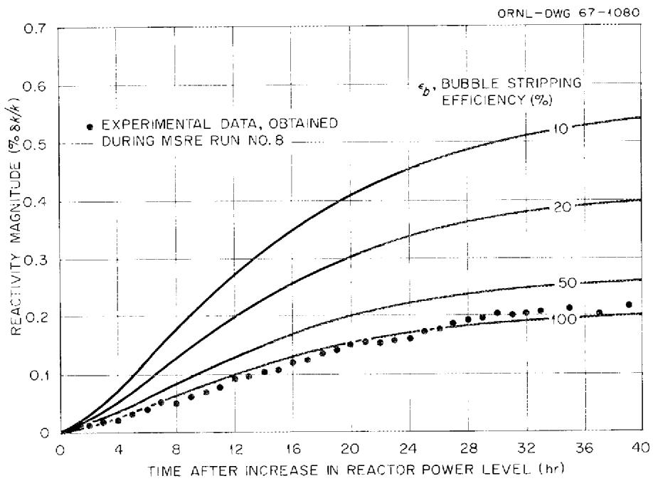  
Fig. 8. Effect of bubble-stripping efficiency on transient buildup of $^{135}\mathrm{Xe}$ reactivity. Step increase in power level from 0 to 5.7 MW; volume percent circulating bubbles, 0.10; MSRE run 8.

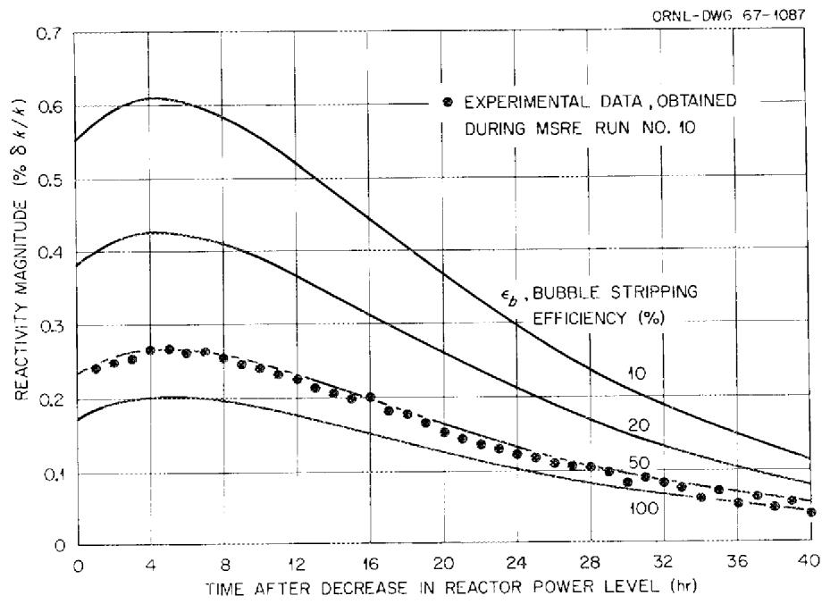  
Fig. 9. Effect of bubble-stripping efficiency on transient decay of $^{135}\mathrm{Xe}$ reactivity. Step decrease in power level from full power to zero; volume percent circulating bubbles, 0.15; MSRE run 10.

a step decrease in the reactor power respectively. The calculated curves for the reduction in power level (Fig. 9) also reveal an important characteristic of the transient xenon behavior that is due to variations in the overall xenon distribution resulting from choice of the parameters $\alpha_{b}$ and $\varepsilon_{b}$ . If the circulating void fraction is relatively low, most of the steady-state poisoning effect is due to $^{135}\mathrm{Xe}$ in the graphite, and only a small amount of xenon is in the circulating fluid. Xenon that is produced in the fluid from iodine decay continues to migrate to the graphite for a period of time after the power has been reduced. This produces a shutdown peak in the xenon poisoning. Eventually, the stripping process reduces the xenon concentration in the fluid so that some of the xenon in the graphite can escape and be stripped out. This results in a more rapid decrease in xenon poisoning than simple radioactive decay. If either the bubble stripping efficiency or the circulating void fraction is increased (the latter effect is not shown explicitly in Fig. 9), the bubbles become a more effective sink for the additional xenon produced from iodine decay, and there is less xenon migration to the graphite. In this case the shutdown peak tends to disappear. This effect makes the shape of the shutdown transients more sensitive to changes in the values assumed for the bubble parameters and thus facilitates the process of fitting the observed data to the calculations.

The parameter studies illustrated by the examples in Figs. 8 and 9 indicated that the circulating void fraction and bubble stripping efficiency might be bracketed between 0.1 and 0.15 vol % and 50 to 100% respectively. Within these ranges, the transient model appeared reasonably insensitive to the choice of parameters. A combination of $\alpha_{b} = 0.15$ vol % and $\varepsilon_{b} = 50\%$ was chosen for further application in the on-line calculations.

Based on the results of the off-line analysis described above, approximate equations and parameters were determined for nominal on-line calculations of the $^{135}\mathrm{Xe}$ reactivity effect during the remainder of power operations with $^{235}\mathrm{U}$ . Similar to the case of the samarium poisoning calculation, these were finite difference equations of the form given below:

$$
I ^ {1 3 5} \left(t _ {i} + \Delta t\right) = I ^ {1 3 5} \left(t _ {i}\right) \left(1 - a _ {0} \Delta t\right) + a _ {1} \bar {Q} \left(t _ {i}\right) \Delta t, \tag {42}
$$

$$
\begin{array}{l} \mathrm {X} _ {\mathcal {S}} ^ {1 3 5} \left(t _ {i} + \Delta t\right) = \mathrm {X} _ {\mathcal {S}} ^ {1 3 5} \left(t _ {i}\right) [ 1 - a _ {2} \Delta t - a _ {3} \bar {Q} \left(t _ {i}\right) \Delta t ] \\ + a _ {4} \mathrm {I} ^ {1 3 5} \left(t _ {i}\right) \Delta t + a _ {5} \mathrm {X} _ {g} ^ {1 3 5} \left(t _ {i}\right) \Delta t + a _ {6} \bar {Q} \left(t _ {i}\right) \Delta t, \tag {43} \\ \end{array}
$$

$$
\begin{array}{l} \mathrm {X} _ {\mathcal {G}} ^ {1 3 5} \left(t _ {i} + \Delta t\right) = \mathrm {X} _ {\mathcal {G}} ^ {1 3 5} \left(t _ {i}\right) \left[ 1 - a _ {7} \Delta t - a _ {8} \bar {Q} \left(t _ {i}\right) \Delta t \right] + a _ {9} \mathrm {X} _ {\mathcal {S}} ^ {1 3 5} \left(t _ {i}\right) \Delta t, (44) \\ \mathrm {X} _ {b} ^ {1 3 5} \left(t _ {i} + \Delta t\right) = \frac {a _ {1 0}}{a _ {1 1} + a _ {1 2} \bar {Q} \left(t _ {i}\right)} \mathrm {X} _ {s} ^ {1 3 5} \left(t _ {i} + \Delta t\right), (45) \\ \left[ \mathrm {X} _ {\mathcal {G}} ^ {1 3 5} \left(t _ {i}\right) \right] _ {\text {e f f}} = w \mathrm {X} _ {\mathcal {G}} ^ {1 3 5} \left(t _ {i}\right). (46) \\ \end{array}
$$

In these equations, $\mathbf{I}^{135}$ is the concentration of $^{135}\mathrm{I}$ in the circulating salt, and $\mathbf{X}^{135}$ is the concentration of $^{135}\mathrm{Xe}$ , with subscripts $s$ , $g$ , and $b$ representing the components in solution, in the graphite pores and in the circulating helium bubbles respectively. The parameters $a_0$ through $a_{12}$ were determined according to the analysis described in the preceding pages and depend on the fission yields, radioactive decay constants, mass-transfer coefficients, bubble characteristics, and external stripping efficiencies. The factor $W$ is an importance-weighted shape-correction factor for the distribution of $^{135}\mathrm{Xe}$ in the graphite pores mentioned above. At full power, this parameter was approximately equal to 0.8.

The approximate model evolved in the manner outlined above (based on an assumed nominal behavior of the circulating gas bubbles) proved adequate to describe the $^{135}\mathrm{Xe}$ reactivity behavior during operation with $^{235}\mathrm{U}$ in the salt; however, as power operation of the MSRE progressed, evidence was accumulated from special experiments designed to study the effects of operating conditions on entrained gas behavior, and particularly from operation with $^{233}\mathrm{U}$ in the salt, which indicated that the behavior of the entrained gas was actually more complex than implied in the preceding

model. This latter evidence suggests that the gas bubbles circulating under normal operating conditions with $^{235}\mathrm{U}$ may actually have averaged only about one-third that indicated by the preceding analysis; furthermore, it suggests that cover-gas solubility effects may have been significant with helium cover gas at these low void fractions. Some of this evidence will be described later in this report in connection with the discussion of the reactivity balance data. Work is being completed on a refined and extended model to describe the behavior of entrained gas and $^{135}\mathrm{Xe}$ in the MSRE.[18]

In addition to its indirect influence on the reactivity through reduction of the $^{135}\mathrm{Xe}$ poisoning, the entrainment of undissolved helium in the circulating salt also directly affects reactivity by increasing the neutron leakage from the reactor core. This "fuel-salt density coefficient of reactivity" was calculated as part of the analysis of core physics characteristics. The value obtained was $-0.23\% \delta k / k$ for 1 vol % circulating gas bubbles. For a circulating bubble fraction between 0.1 and 0.15 vol %, this would correspond to a reactivity effect in the range $-0.023$ to $-0.035\% \delta k / k$ . If the actual gas circulating through the core were less, as indicated above, this reactivity effect may have averaged only about one-third this amount during much of the reactor operation.

Because the actual amount of gas in circulation appeared to vary somewhat during operation, depending on conditions such as the liquid level in the fuel-pump bowl, the transfer rate of salt to the overflow tank, and the temperature, $^{18,19}$ the absolute magnitude of this reactivity effect was never well enough established to be explicitly included in the on-line reactivity balance calculations. The effect is therefore included in the residual reactivity term in the experimental results presented in later sections.

# Other nuclide transmutation effects

The seventh term on the right-hand side of Eq. (36) defines a category that includes the effects of changes in the concentrations of $^{6} \text{Li}$ , $^{234,236,238} \text{U}$ , $^{239,240} \text{Pu}$ , and nonsaturating fission product poisons, all in the fuel salt, and residual $^{10} \text{B}$ in the graphite. (The term "nonsatrating" is applied to describe this fission product group, since neutron

absorption cross sections of the first relatively stable member of these fission product chains are sufficiently small and the MSRE flux levels sufficiently low that burnout and production of secondary products were negligible during MSRE operation.) The similarity of the reactivity changes associated with this category is in the dependence on the integral flux-time, or exposure, rather than the details of the power level variation during a single run. This net reactivity effect must be calculated from basic theoretical considerations. The purpose of this section is to provide a summary of the formulas used in calculating the changes in isotopic concentrations and in converting these changes to reactivity effects. As a by-product, the assumptions in the computational model will be exhibited.

The differential equations governing the changes in the isotopic concentrations of the salt constituents are as follows:

$$
\frac {d N _ {6}}{d t} = - N _ {6} \hat {\sigma} _ {6} \Phi_ {s} \quad \text {f o r} ^ {6} \mathrm {L i}, \tag {47}
$$

$$
\frac {d N _ {2 4}}{d t} = - N _ {2 4} \hat {\sigma} _ {2 4} \Phi_ {S} \quad \text {f o r} ^ {2 3 4} \mathrm {U}, \tag {48}
$$

$$
\frac {d N _ {2 6}}{d t} = - N _ {2 6} \hat {\sigma} _ {2 6} \Phi_ {s} + \alpha_ {2 5} F _ {2 5} \quad \text {f o r} ^ {2 3 6} U, \tag {49}
$$

$$
\frac {d N _ {2 8}}{d t} = - N _ {2 8} \hat {\sigma} _ {2 8} \Phi_ {S} \quad \text {f o r} ^ {2 3 8} U, \tag {50}
$$

$$
\frac {d N _ {4 9}}{d t} = - N _ {4 9} \hat {\sigma} _ {4 9} \Phi_ {S} + N _ {2 8} \hat {\sigma} _ {2 8} \Phi_ {S} \quad \text {f o r} ^ {2 3 9} \mathrm {P u}, ^ {*} \tag {51}
$$

$$
\frac {d N _ {4 0}}{d t} = - N _ {4 0} \hat {\sigma} _ {4 0} \Phi_ {S} + N _ {4 9} \left(\hat {\sigma} _ {4 9} - \hat {\sigma} _ {f ^ {4 9}}\right) \Phi_ {S} \quad \text {f o r} ^ {2 4 0} \mathrm {P u}. \tag {52}
$$

In the preceding equations, $N$ represents the nuclide concentration in the salt, $\Phi_{s}$ corresponds to the neutron flux averaged over the entire circulating fuel volume, $F_{25}$ represents the $^{235}\mathrm{U}$ fission density in the salt averaged over the fuel volume, and $\alpha_{25}$ is the ratio of productions of $^{236}\mathrm{U}$ to fissions of $^{235}\mathrm{U}$ . The reaction cross sections, $\hat{\sigma}$ , are averaged over the reactor neutron spectrum (subscript $f$ refers to the component due to fission); their precise definitions and a description of the method of calculation are deferred to the following section.

The buildup of the nonsaturating group of fission product poisons was represented by the approximate equation (53). In this equation, the production rate of the $i$ th nuclide is proportional to the product of the fission rate in $^{235}\mathrm{U}$ and the yield from fission.* The removal rate due to neutron capture is equated to zero. Thus the differential equation describing buildup of the fission product inventories, ignoring effects of external removal of these products from the circulating fuel system, was

$$
\frac {d N _ {\mathrm {F} . \mathrm {P}} ^ {i}}{d t} = y _ {i} F _ {2 5}. \tag {53}
$$

Actually, MSRE experience indicated that certain of these fission products were continuously removed during operation, and corrections needed to be introduced into inventories calculated according to Eq. (53) to account for these effects. Numerical results obtained in these calculations are described later in this section.

In contrast to the nuclide constituents of the fuel salt, residual $10^{\mathrm{B}}$ in the graphite was exposed to the local neutron flux $\Phi_{g}(\mathbf{r},t)$ , so the burnout rate was position dependent throughout the core. If $N_{10}$ is the concentration of $10^{\mathrm{B}}$ in the graphite, the appropriate differential equation is

$$
\frac {d N _ {1 0}}{d t} = - N _ {1 0} \sigma_ {1 0} \Phi_ {\mathcal {G}} (\mathbf {r}, t). \tag {54}
$$

The flux level and the total exposure of the $^{235}\mathrm{U}$ fuel charge ( $\sim 70,000$ MWhr) were small enough that the magnitude and energy spectrum of the flux corresponding to a given fission rate (or power level) was very nearly independent of exposure. Consequently, the spectrum-averaged reaction cross sections could be reasonably assumed to be invariant during operation. However, the flux in the preceding equations was actually time dependent, since the power level varied during reactor operation. This is commonly accounted for by making the change of variable $t \rightarrow u$ , where

$$
u = \int_ {0} ^ {t} \Phi_ {s} \left(t ^ {\prime}\right) d t ^ {\prime}. \tag {55}
$$

The relation between the total number of fissions during an operating interval and the time integral of the flux during that interval is

Total fissions = $V_{\mathcal{S}}N_{25}^{0}\frac{\hat{\sigma}_{f25}}{\hat{\sigma}_{25}} (1 - e^{-\hat{\sigma}_{25}u}) + V_{\mathcal{S}}\left(N_{49}^{0} - \frac{N_{28}^{0}\hat{\sigma}_{28}}{\hat{\sigma}_{49} - \hat{\sigma}_{28}}\right)\frac{\hat{\sigma}_{f_{49}}}{\hat{\sigma}_{49}}$

$$
\times \left(1 - e ^ {- \hat {\sigma} _ {4 9} u}\right) + V _ {3} N _ {2 8} ^ {0} \left(\frac {\hat {\sigma} _ {4 9}}{\hat {\sigma} _ {4 9} - \hat {\sigma} _ {2 8}}\right) \frac {\hat {\sigma} _ {f _ {4 9}}}{\hat {\sigma} _ {4 9}} \left(1 - e ^ {- \hat {\sigma} _ {2 8} u}\right), \tag {56}
$$

where $N^0$ refers to the concentrations at the beginning of the interval and $V_{s}$ is the total volume of salt in circulation. Because the total fuel exposure was sufficiently low, the time-integrated flux is approximately proportional to the total fissions; that is, to the time integral of the power. Hence the additional simplification

$$
u \approx \phi T \tag {57}
$$

could be used, where $\phi$ is the volume-averaged flux normalized to unit power level and $T$ is the time-integrated power. Moreover, the contribution from $^{239}\mathrm{Pu}$ fissions was quite small (increasing from zero to less than $3\%$ , maximum) during the entire period of power operation with $^{235}\mathrm{U}$ , so the average fission rate in $^{235}\mathrm{U}$ per unit power was essentially constant. With the above assumptions, the integration of the preceding differential equations is a straightforward exercise, and the resulting formulas are those listed below:

$$
\Delta N _ {6} = \neg v _ {6} ^ {0} (1 - e ^ {- \hat {\sigma} _ {6} \phi^ {T}}) \quad f o r 6 L i, \tag {58}
$$

$$
\Delta N _ {2 4} = - N _ {2 4} ^ {0} \left(1 - e ^ {- \hat {\sigma} _ {2 4} \phi T}\right) \text {f o r} ^ {2 3 4} U, \tag {59}
$$

$$
\Delta N _ {2 6} = N _ {2 6} ^ {0} \left(1 - e ^ {- \hat {\sigma} _ {2 6} \phi T}\right) + \frac {\alpha_ {2 5} \bar {F} _ {2 5} \left(1 - e ^ {- \hat {\sigma} _ {2 6} \phi T}\right)}{\hat {\sigma} _ {2 6} \phi} \quad \text {f o r} ^ {2 3 6} U, \tag {60}
$$

$$
\Delta N _ {2 8} = - \mathcal {W} _ {2 8} ^ {0} (1 - e ^ {- \hat {\sigma} _ {2 8} \phi T}) \text {f o r} ^ {2 3 8} \mathrm {U}, \tag {61}
$$

$$
\Delta N _ {4 9} = - N _ {4 9} ^ {0} \left(1 - e ^ {- \hat {\sigma} _ {4 9} \phi T}\right) + \frac {N _ {2 8} ^ {0} \hat {\sigma} _ {2 8}}{\hat {\sigma} _ {4 9} - \hat {\sigma} _ {2 8}} \left(e ^ {- \hat {\sigma} _ {2 8} \phi T} - e ^ {- \hat {\sigma} _ {4 9} \phi T}\right) \text {f o r} ^ {2 3 9} \mathrm {P u}, \tag {62}
$$

$$
\begin{array}{l} \Delta N _ {4 0} = - N _ {4 0} ^ {0} \left(1 - e ^ {- \hat {\sigma} _ {4 0} \phi T}\right) + N _ {4 9} ^ {0} \frac {\hat {\sigma} _ {4 9} - \hat {\sigma} _ {f _ {4 9}}}{\hat {\sigma} _ {4 9} - \hat {\sigma} _ {4 0}} \left(e ^ {- \hat {\sigma} _ {4 0} \phi T} - e ^ {- \hat {\sigma} _ {4 9} \phi T}\right) \\ + \frac {N _ {2 8} ^ {0} \hat {\sigma} _ {2 8}}{\hat {\sigma} _ {4 9} - \hat {\sigma} _ {2 8}} \left[ \frac {\hat {\sigma} _ {4 9} - \hat {\sigma} _ {f 4 9}}{\hat {\sigma} _ {2 8} - \hat {\sigma} _ {4 0}} \left(e ^ {- \hat {\sigma} _ {4 0} \phi T} - e ^ {- \hat {\sigma} _ {2 8} \phi T}\right) \right. \\ \left. - \frac {\hat {\sigma} _ {4 9} - \hat {\sigma} _ {f 4 9}}{\hat {\sigma} _ {4 9} - \hat {\sigma} _ {4 0}} \left(e ^ {- \hat {\sigma} _ {4 0} \phi T} - e ^ {- \hat {\sigma} _ {4 9} \phi T}\right) \right] \quad \text {f o r} 2 ^ {4 0} \mathrm {P u}, \tag {63} \\ \end{array}
$$

$$
\Delta N _ {\mathrm {F} \cdot \mathrm {P} \cdot} ^ {\dot {\iota}} = Y _ {\dot {\iota}} \bar {F} _ {2 5} T \quad \text {f o r n o n - s a t u r a t i n g F . P .}, \tag {64}
$$

$$
\Delta N _ {1 0} = - V _ {1 0} ^ {0} \left(1 - e ^ {- \hat {\sigma}} _ {1 0} \phi_ {\mathcal {G}} (\mathbf {r}) ^ {T}\right) \quad f o r ^ {1 0} B. \tag {65}
$$

In Eqs. (60) and (64) the quantity $\overline{F}_{25}$ is the volume-average fission density in the salt per unit power, and $\phi_{g}(\mathbf{r})$ is the local neutron flux in the graphite, also normalized to unit power level.

The theoretical considerations required to convert the concentration changes to reactivity effects were described in Section 2.3, where formulas were developed in terms of the two-group diffusion model. For a neutron absorbing material distributed in the salt, the reactivity effect was given by Eq. (27). Similarly, for a change in the concentration of a fissile material, the reactivity effect was expressed by Eq. (31b).

The single exception included in this nuclide category, which requires special treatment, is that of the $^{10}\mathrm{B}$ burnout in the graphite. In this case, the spatial distribution of burnout is of significance. If $\delta N_{10}$ represents the local change in $^{10}\mathrm{B}$ concentration, the reactivity equation is (still using the two-group notation)

$$
\Delta \rho_ {1 0} = \frac {- \int_ {V _ {m}} \psi_ {1} \delta N _ {1 0} (1 - F _ {s}) \sigma_ {\alpha 1} \phi_ {1} d V - \int_ {V _ {m}} \psi_ {2} \delta N _ {1 0} (1 - F _ {s}) \sigma_ {\alpha 2} \phi_ {2} d V}{\int_ {V _ {R}} (\psi_ {1} v \Sigma_ {f 1} \phi_ {1} + \psi_ {1} v \Sigma_ {f 2} \phi_ {2}) d V}, \tag {66}
$$

where $V_{m}$ represents a volume enclosing only the moderated (graphite channeled) region.

To better exhibit the spatial effects in this calculation, it is convenient to separate Eq. (66) into the product of a shape-factor correction and the reactivity change that would be associated with uniform burnout of the boron at a rate determined by the spatial-average flux in the graphite. Defining $\delta \overline{N}_{10}$ as the change in concentration if the burn-out is uniform, we may rewrite Eq. (66) as follows:

$$
\Delta \rho_ {1 0} = - S (T) \frac {\delta \bar {N} _ {1 0} \left(j _ {m 1} \sigma_ {\alpha 1} + j _ {m 2} \sigma_ {\alpha 2}\right)}{N _ {f} \left(j _ {1} v \sigma f _ {1} + v \sigma f _ {2}\right)}, \tag {67}
$$

where

$$
j _ {m 1} = \frac {\int_ {V _ {m}} \psi_ {1} \left(1 - F _ {s}\right) \phi_ {1} d V}{\int_ {V _ {R}} \psi_ {1} F _ {s} \phi_ {2} d V} \tag {68}
$$

and

$$
j _ {m 2} = \frac {\int_ {V _ {m}} \psi_ {2} \left(1 - F _ {s}\right) \phi_ {2} d V}{\int_ {V _ {R}} \psi_ {1} F _ {s} \phi_ {2} d V}; \tag {69}
$$

$j_{1}$ is defined by Eq. (29), and the shape factor is defined by

$$
S (T) = \frac {\int_ {V _ {m}} \psi_ {1} \delta N _ {1 0} \sigma_ {\alpha 1} \phi_ {1} d V + \int_ {V _ {m}} \psi_ {2} \delta N _ {1 0} \sigma_ {\alpha 2} \phi_ {2} d V}{\delta \bar {N} _ {1 0} \left(\int_ {V _ {m}} \psi_ {1} \sigma_ {\alpha 1} \phi_ {1} d V + \int_ {V _ {m}} \psi_ {2} \sigma_ {\alpha 2} \phi_ {2} d V\right)}. \tag {70}
$$

In Eq. (70), $\delta N_{10}$ is calculated according to Eq. (65), and the same equation defines $\delta \overline{N}_{10}$ , with the spatial flux distribution replaced by the volume-average flux in the graphite. Expressed in this product form, Eq. (67) is also more suitable for approximation of the spatial flux distribution and calculation of $S(T)$ by numerical integration procedures. Results of numerical calculations of this spatial burnout factor are shown in Fig. 10.

In order to apply the theoretical formulas of this section, information is required concerning initial concentrations of the various nuclides, their reaction cross sections averaged over the MSRE spectrum, and the flux-adjoint flux-product integrals entering into the reactivity formulas. Brief descriptions of the sources of this information are the topic of Chapter 4.

The results of calculations of the individual reactivity effects lumped in this category are shown in Fig. 11.* These numerical values

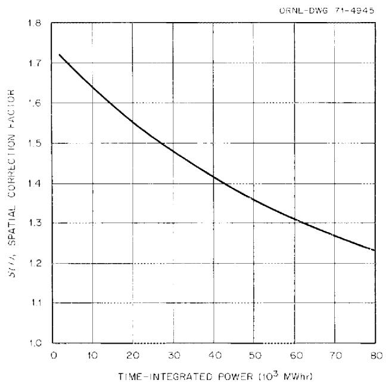  
Fig. 10. Spatial correction factor $S(T)$ for $^{10}\mathrm{B}$ burnout reactivity effect in MSRE graphite.

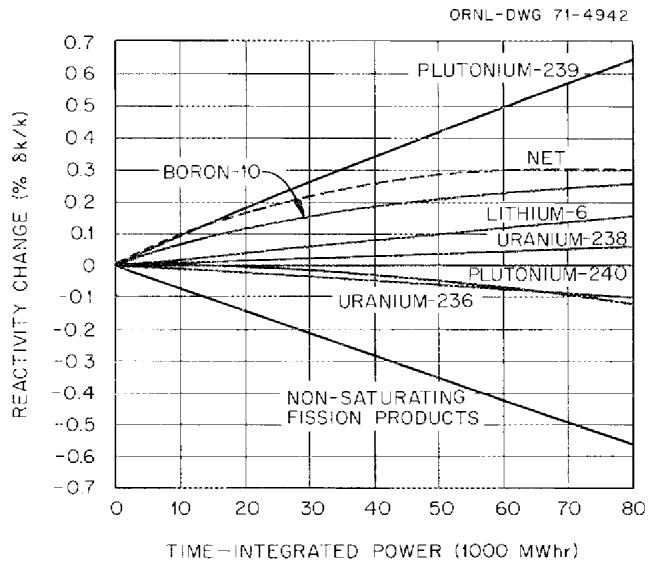  
Fig. 11. Reactivity changes due to long-term nuclide changes in MSRE during operation with $^{235}\mathrm{U}$ ; no fission product removal.

are also normalized to the $^{235}\mathrm{U}$ loading attained at the end of the zero-power experiments and are similar to the normalizations of other reactivity effects shown in Figs. 4 and 7. The curve labeled "net" is the algebraic sum of these effects and would represent the contribution from this category within the overall reactivity balance. As was mentioned above, however, one additional effect needs to be considered; namely, the external removal of certain fission products from the MSRE fuel salt. The calculations in Fig. 11 were based on the assumption that all fission products and their daughters remained in the medium in which they were produced. Many of these fission product chains, however, include noble gases (xenon and krypton) with substantial half-lives. Since these gases are largely insoluble in the fluoride salt melt, they tended to escape into the off-gas system. In addition, there is evidence that significant fractions of some noble metals (notably Mo, Te, Ru, Tc, and Nb) were also removed by the off-gas system, either as volatile fluorides or as colloidal metal particles.[20] Another mechanism for loss of poisoning, which occurred to some extent, was the plateau out of fission products in surfaces outside the core region.[21] A factor that enhanced the poisoning effect of some fission products was the diffusion of some volatile species into the pores of the graphite. It is clear from the above that a quite detailed model of fission product behavior would be required for a precise description of fission product poisoning effects in the MSRE. Although much information was gained from analysis of MSRE operation, such a model is not currently available.

To obtain some indication of the effect of fission product loss on the net poisoning, we made calculations for two idealized cases. In one case, we assumed removal of $100\%$ of the noble gases and in the other, concurrent removal of both the noble gases and the noble metals. (The only members of the latter category that are significant neutron poisons are molybdenum, ruthenium, and tellurium.) Figure 12 shows the changes produced in the net reactivity curve of Fig. 11 when these amounts of external removal of fission products are considered. The largest change resulted from removal of the noble gases. (Note that the direct poisoning by $^{135}\mathrm{Xe}$ is treated separately in the reactivity balance and is therefore not included in this analysis.)

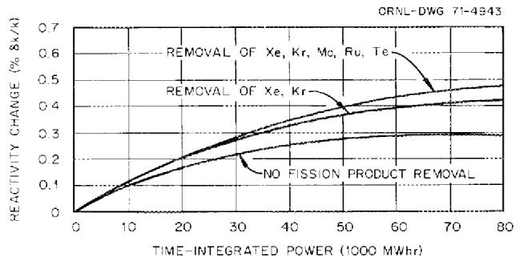  
Fig. 12. Effect of fission product removal on net reactivity change induced by long-term nuclide changes.

In the absence of detailed quantitative information on the behavior of all the fission products, we assumed for the reactivity balance calculations removal of all the noble gases and none of the noble metals. Thus the middle curve in Fig. 12 was chosen to represent the net reactivity effect of this category of long-term core changes.

For the on-line calculations, an approximate formula was used to obtain the net reactivity effect of this group of changes. This was of the form

$$
\Delta \rho = A _ {0} + A _ {1} T + A _ {2} e ^ {- b _ {1} T} + A _ {3} e ^ {- b _ {2} T}. \tag {71}
$$

Numerical values of the parameters in this formula were determined according to the analysis described in this section; renormalization adjustments were also made each time the fuel was drained and mixed with the residue of salt in the fuel drain tanks, which had not been exposed to the flux during that run.

# 3.3 Influence of Graphite Irradiation Damage on the MSRE Reactivity Balance

One effect that was expected to occur but was not specifically included in the reactivity balance calculations was associated with dimensional changes in the core graphite due to fast-neutron irradiation. The type of graphite used in the MSRE undergoes the changes indicated in Fig. 13 (Ref. 22). The result is that the distribution and the amount of

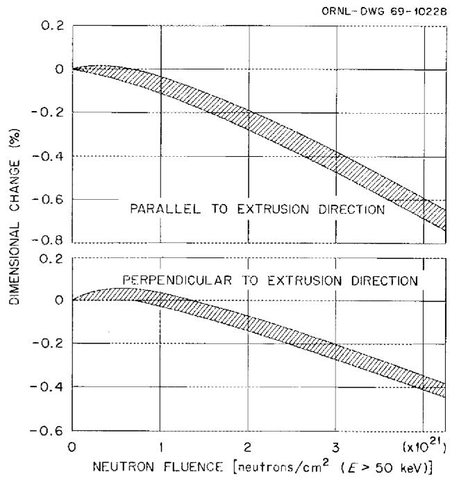  
Fig. 13. Irradiation-induced dimensional changes in MSRE grade CGB graphite.

fuel salt in the core can change both from graphite volume changes and from the bowing and displacement of the graphite stringers. The dimensional changes can potentially affect the core structure in three ways: (1) a direct change in the linear graphite dimensions that is dependent on the neutron fluence, (2) various degrees of bowing of individual stringers, depending on the flux gradient across the stringer and on the total fluence, and (3) displacement of the lower end of each stringer by the dimensional changes of the lower horizontal bars. Since the net changes in the core structure as the hundreds of graphite bars bow in various modes due to the nonuniform flux distribution are quite complex, a computer program was developed in an attempt to describe this situation in detail. Relative changes in the volume fraction of salt and graphite at each core location were obtained, and the associated reactivity effects were estimated as weighted averages of these changes over the core volume. The essential features and results of the calculation are outlined below.

# Calculation of graphite displacement

The individual graphite stringers in the core are bowed by changes in the differential expansion (or contraction) that occur through the thickness of the stringer as a result of the flux gradient. If the stringers were unrestrained and the neutron flux and graphite distortion curves were linear across the thickness of the stringer, there would be no stress, and the deflection at any point could be calculated by conventional beam-deflection equations. We will consider the geometrical relationships indicated in Fig. 14, where the radius of curvature is

$$
R = \frac {C}{\Delta L / L}, \tag {72}
$$

and

$$
\frac {1}{R} = \frac {d ^ {2} y / d x ^ {2}}{x}. \tag {73}
$$

$$
[ 1 + (d y / d x) ^ {2} ] ^ {3 / 2}
$$

If $dy / dx$ is small, $(dy / dx)^2$ is negligible, and

$$
d ^ {2} y / d x ^ {2} \simeq \frac {1}{R} = \frac {\Delta L / L}{C}. \tag {74}
$$

The deflection is

$$
y = \iint \frac {\Delta L / L}{C} d x ^ {2} d x, \tag {75}
$$

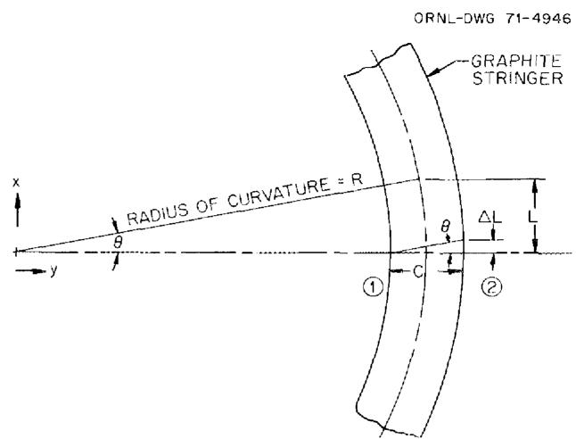  
Fig. 14. Stringer deflection geometry.

and since there are dimensional changes at both positions 1 and 2,

$$
y = \iint_ {C} \left[ \frac {\left(\Delta L / L\right) _ {2} - \left(\Delta L / L\right) _ {1}}{c} \right] d x ^ {\prime} d x. \tag {76}
$$

The change in differential expansion across a stringer, and therefore the deflection of the stringer, depends on the slope of the radial flux profile and on the slope of the axial (parallel to extrusion) distortion curve for the graphite shown in Fig. 14. If there were no contact with adjacent stringers and no local flux perturbations, any stringer in the core would deflect in a radial plane from the reactor center line.

A computer program was written to calculate the components of the radial deflection at 2-in. intervals along the length of each stringer and to add these to the respective displacements of the lower lattice bars. The graphite distortion data and the radial flux profile were fitted to cubic equations for use in the computer program. Equations were obtained for both the upper and lower boundaries of the graphite distortion curves. The axial flux distribution was represented by a chopped cosine curve.

When the lower axial damage curve was used, the deflections were outward for all the stringers, and there were no interferences indicated until an integrated power of 150,000 MWhr was reached. However, when the upper curve was used, the outer stringers with lower neutron exposure and with a positive slope on the distortion curve deflected inward against the neighboring stringers. In this case the outermost stringers were allowed to retain their calculated deflections, and adjustments were made progressively inward on the neighboring stringers to eliminate any interference. No attempt was made to calculate the elastic deflections that would occur when two or more stringers were in contact with each other. However, the above method of adjusting the deflections was found to be unrealistic above 45,000 MWhr and caused solid packing of the graphite over a greater fraction of the core than could actually occur. We did not attempt further refinements in the mathematical model to correct for this, since these calculations were to be used only as rough estimates of the possible magnitudes of reactivity effects introduced by graphite irradiation damage.

After the deflections were calculated and adjusted as above, the changes in graphite and salt volumes were calculated at each core location. The graphite and salt densities based on core volume were then calculated at each location from the volume changes. The relative changes in salt and graphite density at each core location were output on punched cards for use in calculating the reactivity effect.

# Conversion to reactivity effects

The reactivity effects of the relative density changes described above were determined by weighting these changes according to the nuclear importance of the core location and integrating over the core volume. This calculation was similar in form to that for the $^{10}\mathrm{B}$ burnout reactivity effect described in Section 3.2, except that additional terms were required to account for the effects of these density changes on the moderating properties of the core. The total reactivity change was calculated from the following equations (in two-group theory):

$$
\Delta \rho = \sum_ {i, j} ^ {1, 2} \left[ K _ {i j} ^ {\mathcal {G}} \left(\frac {\overline {{\delta N}} _ {\mathcal {G}}}{N _ {\mathcal {G}}}\right) _ {i j} + K _ {i j} ^ {\mathcal {S}} \left(\frac {\overline {{\delta N}} _ {\mathcal {S}}}{N _ {\mathcal {S}}}\right) _ {i j} \right], \tag {77}
$$

where the importance-averaged density changes in the graphite (and similarly for the salt) were

$$
\left(\frac {\overline {{\delta N}}}{N _ {g}}\right) _ {i j} = \frac {\int_ {V _ {g}} \psi_ {j} \left(\frac {\delta N}{N _ {g}}\right) \phi_ {i} d V}{\int_ {V _ {g}} \psi_ {j} \phi_ {i} d V}. \tag {78}
$$

In these equations $N$ is the relative density, the $K_{ij}$ are reactivity coefficients obtained from neutronics perturbation calculations, and $s$ and $g$ refer to salt and graphite respectively. A second computer program was written to perform the integrations and to calculate the total reactivity effect. In this program, the flux profiles were input as tabular data and interpolated as necessary. The values of $\delta N / N$ for salt and graphite were read from the card output of the graphite distortion program.

The reactivity changes predicted by this model were calculated at various exposures up to 200,000 MWhr, well beyond the actual exposure during MSRE operation with $^{235}\mathrm{U}$ . These results are shown in Fig. 15. Calculations with either the upper or lower limits of graphite damage data indicated a long-term positive trend in reactivity. The initial decrease in the curves obtained with the upper graphite damage limit is caused by the positive slope of the graphite damage curve at low neutron exposures. This indicates that the stringers would tend to deflect inward at low values of integrated power and squeeze fuel out of the core; then, as the integrated power increased, the central stringers would begin to deflect outward, bring fuel back into the central region of the core, and increase the reactivity. For the upper-limit damage curves, there is increasing uncertainty in the slope of the reactivity change beyond about 45,000 MWhr because of the problem of accurately assessing interference effects between the stringer deflections.

In addition to the reactivity effects, the computer program also output the various dimensional changes within the core graphite and the magnitude of any interferences. The upper graphite damage curves produced interferences at all integrated powers, while the lower curves produced interferences at 150,000 MWhr or above. At an integrated power of 100,000 MWhr, the maximum bowing was 0.036 in., and the overall length change

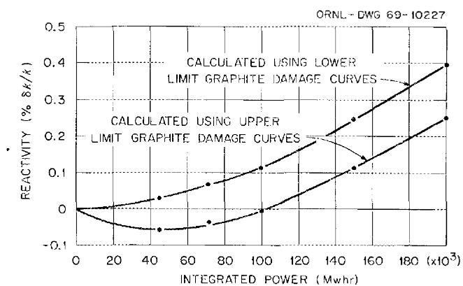  
Fig. 15. Reactivity effect of irradiation-induced dimensional changes in MSRE graphite.

varied from $\sim 0.076$ in. at the center line to $\sim 0.006$ in. at the periphery of the core. The maximum interference between stringers calculated from the top graphite distortion curves was 0.049 in. calculated at 150,000 MWhr. If all this interference were relieved by the deflection of one stringer, the calculated bending stress in that stringer would be 920 psi.

Because of the obvious difficulties involved in modeling the actual core behavior under prolonged graphite irradiation, the calculations described should be viewed as attempts to bracket the possible reactivity component associated with this effect. These results will be further discussed in connection with the interpretation of long-term reactivity trends (Sect. 5.3).

# 4. SOURCES OF DATA AND PARAMETER CALCULATIONS

# 4.1 Initial Nuclide Concentrations

The basis for calculating initial nuclide concentrations for this problem was the fuel-salt "book" inventory and composition records attained at the beginning of the power runs. As reported in Ref. 23, this was $\mathrm{LiF - BeF}_2 - \mathrm{ZrF}_4 - \mathrm{UF}_4$ (64.88-29.26-5.04-0.82 mole %), in which the uranium contained 33.241 wt % $^{235}\mathrm{U}$ . The fuel-salt density required to convert the chemical composition to nuclide concentrations was 145 lb/ft³ at 1200°F (based on evidence discussed in Ref. 11).

The source of data for determining the $^{6}\mathrm{Li}$ isotopic content in the initial fuel salt was a set of mass-spectrographic analyses of the LiOH batches from which the LiF for the fuel salt was prepared. These assays gave an average of 0.0074 at. $\%$ $^{6}\mathrm{Li}$ .24

Data regarding the concentration of residual boron in the MSRE core graphite was taken from Ref. 25. As reported there, the chemical purity analysis of grade CGB graphite was $9 \times 10^{-5}$ wt $\%$ boron (natural isotopic abundance, $19.8\%^{10}\mathrm{B}$ ). The average density of the MSRE graphite at $1200^{\circ}\mathrm{F}$ was assumed to be $1.86~\mathrm{g/cm}^3$ in all calculations.

The source of data for the $^{234}\mathrm{U}$ and $^{236}\mathrm{U}$ concentrations was Ref. 26. The uranium used to prepare the enriching fuel concentrate contained an average of 0.98 wt % $^{234}\mathrm{U}$ and 0.38 wt % $^{236}\mathrm{U}$ . These were sufficiently small that the reactivity balance calculations for the $^{235}\mathrm{U}$ loading were quite insensitive to the initial concentrations of $^{234}\mathrm{U}$ and $^{236}\mathrm{U}$ .

# 4.2 Average Reaction Cross Sections

For those nuclides uniformly distributed in the fuel salt, a general expression for the reaction rate in the $i$ th nuclide was given as Eq. (9) in Section 2.2. This characteristic of uniform distribution is basic to these circulating fuel systems and applies to all the important constituent nuclides in the salt. For our calculations of the time-dependent changes in these nuclides, we have found it convenient to define a microscopic reactor-average cross section by rewriting Eq. (9) as

$$
R _ {i} = N _ {i} \hat {\sigma} _ {i} \Phi_ {t h} V _ {s}, \tag {79}
$$

where we have made the definitions

$$
\hat {\sigma} _ {i} (t) = \frac {\int_ {V _ {R}} d V \int_ {0} ^ {\infty} d E \sigma_ {i} (E) \phi (\mathbf {r} , E , t) F (\mathbf {r})}{\int_ {V _ {R}} d V \int_ {0} ^ {E _ {c}} d E \phi (\mathbf {r} , E , t) F (\mathbf {r})} \tag {80}
$$

and

$$
\Phi_ {t h} (t) = \frac {\int_ {V _ {R}} d V \int_ {0} ^ {E _ {c}} d E \phi (\mathbf {r} , E , t) F (\mathbf {r})}{V _ {S}}. \tag {81}
$$

In these definitions, $E_{\mathcal{C}}$ is a convenient cutoff energy chosen high enough to effectively separate the slowing-down energy range from the thermalization range, $\Phi_{th}$ is the average thermal flux to which the salt is exposed, and $V_{s}$ is the total volume of salt in circulation. [Note that a similar definition could, if desired, be made on the basis of the total neutron flux at all energies, $\Phi$ , simply by replacing $E_{\mathcal{C}}$ by $\infty$ and $\Phi_{th}$ by $\Phi$ in Eqs. (79) through (81).]

As defined by Eq. (80), the average reaction cross sections depend on time through the relative changes in the neutron flux spectrum; however, in the MSRE the variations in salt composition during power operation were sufficiently small, and the flux perturbation due to control rod movements sufficiently localized, that the changes induced in the average cross sections were quite small (see Tables 1 and 2 and related discussion below). Hence, close approximation to the values of $\hat{\sigma}$ could be obtained by calculating the spectrum for average operating conditions during the power runs.

To apply the preceding definitions to reaction rate calculations, it is necessary to approximate the neutron spectrum $\phi (\mathbf{r},E)$ . In our work with the MSRE, we used the GAM-II and THERmos programs to produce four broad-energy-group average nuclide cross sections, where the averaging is with respect to an approximate core spectrum calculated by the programs.[27,28] We then applied the latter cross sections in few-group diffusion calculations with the EXTERMINATOR program[29] to approximate the variation in the

flux spectra in the peripheral, salt-containing regions of the core (i.e., the upper and lower plenumms and the radial downcomer). Here, a two-dimensional $(R,Z)$ geometry representation of the MSRE core was used, with four broad energy groups (one group spanning most of the slowing-down range, two epithermal groups, and one thermal group). The geometric model is shown schematically in Fig. 16.

Approximate expressions corresponding to the defining Eqs. (80) and (81) can readily be obtained to describe the procedure of calculating average reaction cross sections. They are

$$
\hat {\sigma} _ {i} \simeq \frac {\sum_ {k n} V _ {k} F _ {k} \bar {\sigma} _ {i} ^ {n} \Phi_ {n} ^ {k}}{\sum_ {k} V _ {k} F _ {k} \Phi_ {t h} ^ {k}} \tag {82}
$$

and

$$
\Phi_ {t h} \simeq \frac {\sum_ {k} V _ {k} F _ {k} \Phi^ {k} t h}{V _ {s}}, \tag {83}
$$

where $V_{k}$ and $F_{k}$ are the volume and salt volume fraction for the $k$ th sub-region over which the volume fraction of salt is constant and $\Phi_{\text{extremator}}^{k}$ is the EXTERMINATOR flux in broad group $n$ averaged over subregion $k$ ( $\Phi_{\text{th}}^{k}$ is the average thermal flux in region $k$ ). The broad-group nuclide cross sections are defined by:

$$
\bar {\sigma} _ {i} ^ {n} = \frac {\int_ {E _ {n}} ^ {E _ {n + 1}} d E \phi_ {\alpha} (E) \sigma_ {i} (E)}{\int_ {E _ {n}} ^ {E _ {n + 1}} d E \phi_ {\alpha} (E)}, \tag {84}
$$

where $\phi_{\alpha}(E)$ is the approximate neutron spectrum in the graphite-moderated core as obtained from multigroup calculations with the GAM-II and THERMOS programs. The integrals in Eq. (84) are also calculated in terms of finite sums, with up to 99 energy groups used to span the slowing-down range

ORNL-DWG 71-9807

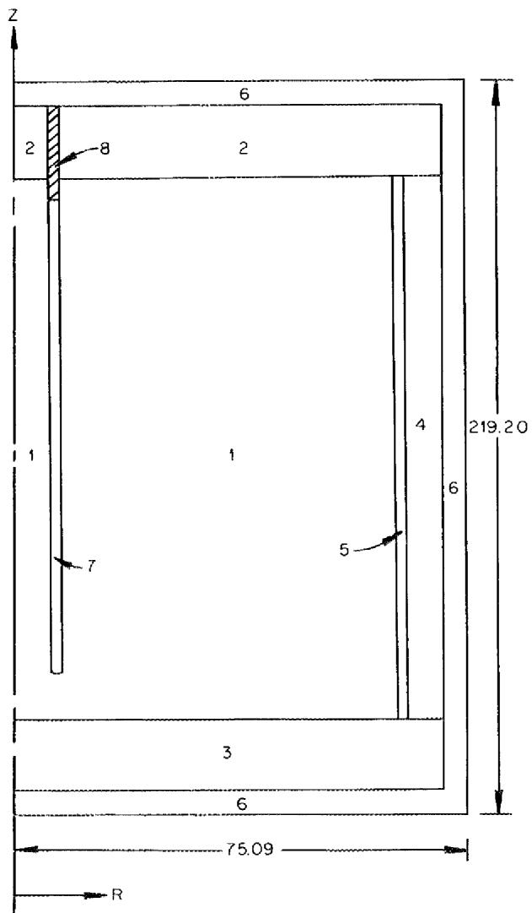

<table><tr><td>COMPOSITION</td><td>REPRESENTS</td><td>DIMENSIONS (R x Z) (cm)</td></tr><tr><td>1</td><td>GRAPHITE-SALT LATTICE</td><td>70.49 x 166.45</td></tr><tr><td>2</td><td>TOP PLENUM</td><td>73.66 x 23.85</td></tr><tr><td>3</td><td>BOTTOM PLENUM AND STRUCTURE</td><td>73.66 x 23.22</td></tr><tr><td>4</td><td>RADIAL DOWNCOMER</td><td>2.54 x 166.45</td></tr><tr><td>5</td><td>CORE CAN</td><td>0.64 x 166.45</td></tr><tr><td rowspan="2">6</td><td>REACTOR VESSEL (TOP AND BOTTOM)</td><td>2.85*</td></tr><tr><td>REACTOR VESSEL (SIDE)</td><td>1.43*</td></tr><tr><td>7</td><td>CONTROL THIMBLES (POISON WITHDRAWN)</td><td>1.80 x 147.25</td></tr><tr><td>8</td><td>CONTROL ELEMENTS (POISON INSERTED)</td><td>1.80 x 29.08</td></tr><tr><td colspan="3">*LENGTH DIMENSIONS ON FIGURE</td></tr></table>

Fig. 16. Geometric representation of MSRE core used in four-group diffusion calculations. Poison elements withdrawn to upper limits; not to scale.

and 30 to span the thermal range. The cutoff energy, $E_{\mathcal{O}}$ , separating these ranges was chosen to be 0.876 eV for MSRE calculations.

In Table 1, are listed the average cross sections calculated by these methods. Two sets of values are given, with the left column representing the averages obtained from cross-section libraries in usage early in the course of MSRE operations and the right column representing averages from more recent data libraries (ENDF/B) currently in use for molten-salt reactor studies. A discussion of the significance of these and other cross-section comparisons in interpreting nuclear operations data for the $^{235}\mathrm{U}$ loading is given in Ref. 30. Most of the on-line calculations described in the next section were based on the older data set given in Table 1; however, a recent reevaluation of the long-term reactivity trends for the $^{235}\mathrm{U}$ loading was made from values of $\hat{\sigma}$ based on the newer data, and these results are described in Section 5.3.

The calculations listed in Table 1 were made for the reactor spectrum corresponding to the minimum critical loading conditions (core isothermal at $1200^{\circ}\mathrm{F}$ and all control rods fully withdrawn). These average cross sections should be corrected for changes caused by increasing the uranium

Table 1. Calculated average reaction cross sections in the MSRE thermal flux with $^{235}\mathrm{U}$ at minimum critical loading conditions   

<table><tr><td rowspan="2">Nuclides</td><td colspan="2">Average cross section (b)</td></tr><tr><td>Pre-1965 data</td><td>1969 calculations</td></tr><tr><td>6Li</td><td>461.02</td><td>466.42</td></tr><tr><td>10B</td><td>1870.35</td><td>1881.13</td></tr><tr><td>135Xe</td><td>1.18 x 106</td><td>1.18 x 106</td></tr><tr><td>149Sm</td><td>3.58 x 104</td><td>3.58 x 104</td></tr><tr><td>151Sm</td><td>2.63 x 103</td><td>2.63 x 103</td></tr><tr><td>234U</td><td>138.19</td><td>130.40</td></tr><tr><td>235U (abs)</td><td>340.53</td><td>333.88</td></tr><tr><td>235U (f)</td><td>270.15</td><td>267.88</td></tr><tr><td>236U</td><td>52.76</td><td>51.11</td></tr><tr><td>238U</td><td>26.32</td><td>27.67</td></tr><tr><td>239Pu (abs)</td><td>1470.1</td><td>1456.1</td></tr><tr><td>239Pu (f)</td><td>874.5</td><td>901.1</td></tr><tr><td>240Pu</td><td>1267.9</td><td>1287.6</td></tr></table>

concentration to reactor operating conditions and also the insertions of the control rod to compensate for the excess reactivity. These changes increase the average epithermal-to-thermal neutron flux ratio in the reactor and thereby increase the reactor--average cross sections [since they are defined by Eq. (80) on the basis of the thermal component of the flux]. In Table 2 we have indicated the relative increases in calculated average cross sections of the most important nuclides corresponding to the maximum $^{235}\mathrm{U}$ concentration and rod poisoning experienced in the $^{235}\mathrm{U}$ run. This occurred at the end of the zero-power experiments and before the fuel was drained, when the $^{235}\mathrm{U}$ concentration had been increased by nearly $10\%$ and the regulating rod was near full insertion. Although further uranium additions were made during the $^{235}\mathrm{U}$ run, at no time during operations were these conditions exceeded. In accord with the relative increase in epithermal flux, the maximum changes in Table 2 may be seen to be associated with those nuclides with strong resonance-capture components.

During the actual course of reactor operation, the uranium concentration and the rod insertion varied in accordance with the fuel burnup and additions and with the various reactivity changes in the core. The changes listed in Table 2 tend to bracket the actual variation in $\hat{\sigma}$ , and, for purposes of calculating the reaction rates, the actual variations can be

Table 2. Relative changes in average reaction cross sections for a $10\%$ increase in $^{235}\mathrm{U}$ concentration, with compensating control rod insertion   

<table><tr><td>Nuclide</td><td>Cross-section ratioa</td></tr><tr><td>234U</td><td>1.063</td></tr><tr><td>235U (abs)</td><td>1.018</td></tr><tr><td>235U (f)</td><td>1.014</td></tr><tr><td>236U</td><td>1.089</td></tr><tr><td>238U</td><td>1.094</td></tr><tr><td>239Pu (abs)</td><td>1.004</td></tr><tr><td>239Pu (f)</td><td>1.004</td></tr></table>

$^{\alpha}$ Cross section at maximum uranium loading conditions divided by cross section at minimum critical loading.

closely approximated either by linearly interpolating the results in Table 2 on the basis of the $^{235}\mathrm{U}$ concentration or by assuming a fixed average composition during operation.

The source of data for cross sections of the nonsaturating group of fission products was Ref. 31.* This provided a summary of fission yields, cross sections at $2200\mathrm{m / sec}$ , and resonance-absorption integrals for these nuclides. These data are listed in Table 3. The group includes all fission products (exclusive of $^{135}\mathrm{Xe}$ , $^{149}\mathrm{Sm}$ , and $^{151}\mathrm{Sm}$ ) known to have nonnegligible cross sections. With the single exception of $^{147}\mathrm{Pm}$ , only the direct products from fission (or daughter products of precursors with very short half-lives) are listed in Table 3. As already indicated, it is reasonable to neglect the secondary products because we were dealing with relatively small fuel exposures. The final nuclide entries in Table 3 are "pseudonuclides," representing groups of fission products in which saturation effects are either negligible (NSFP) or quite small for long fuel exposures, as well as for short exposures (SSFP). Explicit tabulations of the nuclides included in these groups are given in Ref. 31.

For the purposes of this work, we neglected any non- $1 / v$ behavior of the absorption cross sections over the thermal energy range exhibited by the fission product nuclides of Table 3. These are generally small corrections that tend to be unimportant compared with uncertainties associated with transport and removal of fission products in the MSRE fuel system. (Influence of these latter effects is discussed in the next section.) Thus, averaged cross sections for the thermal group were obtained by multiplying the $2200 - m / sec$ cross section by the thermal-spectrum average for a $1 / v$ nuclide that had unit cross section at $2200~\mathrm{m / sec}$ . This latter quantity was calculated to be 0.435 in the MSRE spectrum. The average epithermal cross sections were obtained by dividing the nuclide resonance integral in Table 3 by the lethargy width for the epithermal range.

As an approximate indicator of the significance of saturation effects in calculating the fission product concentrations, one may estimate the

Table 3. Cross section and yields of significant fission product nuclides   

<table><tr><td>Nuclide</td><td>Yield (%)</td><td>σα(2200)</td><td>Resonance integral above 0.414 eV</td><td>Half-life</td></tr><tr><td>82Kr</td><td>0.28</td><td>45.0</td><td>196.0</td><td>∞</td></tr><tr><td>83Kr</td><td>0.544</td><td>205.0</td><td>189.2</td><td>∞</td></tr><tr><td>103Rh</td><td>3.0</td><td>149.0</td><td>1059.0</td><td>∞</td></tr><tr><td>105Rh</td><td>0.90</td><td>15,000</td><td>7261.0</td><td>36 h</td></tr><tr><td>109Ag</td><td>0.03</td><td>87.0</td><td>1447.0</td><td>∞</td></tr><tr><td>131Xe</td><td>2.93</td><td>120.0</td><td>811.4</td><td>∞</td></tr><tr><td>133Xe</td><td>6.59</td><td>180.0</td><td>92.33</td><td>5.27 d</td></tr><tr><td>143Nd</td><td>6.03</td><td>324.0</td><td>134.0</td><td>∞</td></tr><tr><td>145Nd</td><td>3.98</td><td>60.0</td><td>314.6</td><td>∞</td></tr><tr><td>147Pm</td><td>2.36</td><td>235.0</td><td>2279.0</td><td>2.65 y</td></tr><tr><td>152Sm</td><td>0.281</td><td>208.0</td><td>2242.0</td><td>∞</td></tr><tr><td>153Eu</td><td>0.169</td><td>450.0</td><td>432.1</td><td>16 y</td></tr><tr><td>155Eu</td><td>0.033</td><td>14,000</td><td>6787.0</td><td>1.7 y</td></tr><tr><td>NSFP</td><td>126.0</td><td>1.111</td><td>7.354</td><td></td></tr><tr><td>SSFP</td><td>29.8</td><td>13.986</td><td>76.744</td><td></td></tr></table>

$\alpha_{\text{Decay product of 11.1-d}}$ 147Nd.

cross section required for a $10\%$ reduction in the otherwise linear rise in concentration corresponding to zero absorption. For a maximum fuel exposure equivalent to 70,000 MWhr at MSRE flux levels (somewhat larger than the exposure of the $^{235}\mathrm{U}$ fuel loading), the absorption cross section for this reduction would be about 1000 b. Thus, of the nuclides listed in Table 3, only $^{105}\mathrm{Rh}$ and $^{155}\mathrm{Eu}$ would be expected to exhibit significant saturation effects. Due to its short half-life and high cross section, $^{105}\mathrm{Rh}$ would quickly saturate, with an associated reactivity effect of about $-0.004\% \delta k / k$ . Since primary interest was in effects of larger magnitude, this nuclide could be safely excluded from the fission product poisoning concentration. Europium-155, on the other hand, did not reach

its saturation concentration, but neutron absorption would have reduced the otherwise linearly rising concentration by about $40\%$ by the end of the $^{235}\mathrm{U}$ fuel exposure. This gave a total reactivity effect of about $-0.014\%$ $\delta k / k$ by the end of the exposure period, which was still quite small. Rather than treat this as a special case, we approximated this correction by including the nuclide with the remainder of the group of nonsaturating fission products and reducing its effective fission yield by $25\%$ .

# 4.3 Neutron Flux Normalization

The numerical evaluation of the average neutron flux level is basic to the theoretical calculations of nuclide changes in the reactor. The principal determinants of this quantity are (1) the mean energy recovered per fission, assumed to be 200 MeV;[33] (2) the volume of salt in circulation, 70.5 ft[3]; and (3) the inventories of $^{235}\mathrm{U}$ and $^{239}\mathrm{Pu}$ in the loop at operating conditions. The average thermal flux per megawatt for the circulating system is then defined by

$$
\phi_ {t h _ {2}} = \frac {A}{\left(N _ {2 5} \hat {\sigma} _ {f 2 5} + N _ {4 9} \hat {\sigma} _ {f 4 9}\right) V _ {s}}. \tag {85}
$$

For the mean fission energy given above, the conversion factor $A$ is equal to $3.12 \times 10^{16}$ fissions/MWsec. From this calculation, we obtained $\phi_{th} = 6.4 \times 10^{11}$ neutrons $\mathrm{cm}^{-2}$ sec $^{-1}$ per megawatt, near the start of power operations with $^{235}\mathrm{U}$ . The corresponding value of the power-normalized thermal flux averaged only over the graphite was $2.0 \times 10^{12}$ . This flux was used in the calculation of the $^{10}\mathrm{B}$ burnout effect.

# 4.4 Flux-Adjoint Flux Integrals and Reactivity Parameters

The direct and adjoint flux distribution and their volume integrals over various subregions of the reactor core required for calculation of reactivity effects are standard output of the EXTERMINATOR program used for the neutronics calculations. In accordance with the discussion in Section 3.2, the volume integrals over regions of the core with fixed salt fractions, together with the broad-group cross sections for the nuclides, provide information sufficient to convert all nuclide changes to reactivity

effects. (For several nuclides, the reactivity effects of unit changes in concentrations were directly output from the EXTERMINATOR program.)

For the numerical computation of the shape factor, $S(T)$ , in the reactivity effect of boron burnout [Eq. (70)], we employed an additional simplifying approximation. The neutron flux and adjoint distribution in the graphite region were represented by a fundamental mode approximation with a "chopped" Bessel function variation in the radial direction and a "chopped" sinusoidal variation in the axial direction. $S(T)$ was then calculated by numerical integration with an IBM 7090 program. The largest discrepancy between the approximate flux distribution and results of the detailed diffusion model calculations occurred in the radial flux variation; however, the latter calculations indicated that the flux perturbation caused by the control rods remained fairly well localized near the center of the reactor, and over most of the reactor volume the Bessel function approximation would be valid. Thus, this approximation was judged to be adequate for the calculation of $S(T)$ .

# 4.5 Effective Delayed-Neutron Fractions

In accord with the discussion given in Section 2.4, numerical evaluation of the delayed-neutron effectiveness is required for the interpretation of measured reactivity effects. An approximate formula for this calculation was given as Eq. (35). Early estimates $^{34}$ of this effectiveness factor, $\overline{\gamma}$ , gave a value of 1.04; this value was used for all initial interpretations of MSRE reactivity measurements and for the on-line calculations with the $^{235}\mathrm{U}$ loading summarized in Section 5. More recently, near the termination of power operation with $^{235}\mathrm{U}$ , we reexamined $^{35}$ the evaluation of $\overline{\gamma}$ with a more sophisticated calculation (not available at the time of the early calculations) of the difference in average age of prompt and delayed neutrons. The age to the thermal cutoff energy was obtained through use of the GAM-II program. For a salt-graphite composition equal to that of the channeled region of the core and a temperature of $1200^{\circ}\mathrm{F}$ , the age calculated for the prompt fission neutrons was $251.9~\mathrm{cm}^2$ . The calculated age difference between prompt fission neutrons and delayed neutrons was $62.3~\mathrm{cm}^2$ . Based on a geometric buckling corresponding to a

cylinder $29 \times 78$ in. (RxH), the value of $\overline{\gamma}$ calculated from Eq. (35) was 1.086. This implies, for example, that the total effective delayed-neutron fraction for use in interpreting reactivity measurement with $^{235}\mathrm{U}$ was $0.71\%$ , compared with the absolute delay fraction of $0.65\%$ (Ref. 8, p. 90). Hence, it implies that the magnitudes of all measured reactivity effects should be larger by a factor of about 1.05 than the values based on earlier calculations of $\overline{\gamma}$ . In the results reported in Ref. 11, this would have the effect of increasing the difference between the experimental and calculated worths of the MSRE control rods but would tend to bring the measured temperature and $^{235}\mathrm{U}$ concentration coefficients of reactivity into better agreement with calculated values.

We did not attempt to revise the numerical values from the on-line calculations to account for this change but did include its effect in recent reevaluations of the long-term reactivity trends during the $^{235}\mathrm{U}$ operations (see the discussion in Chap. 5).

# 5. EXPERIENCE WITH THE REACTIVITY BALANCE

# 5.1 Brief History of Nuclear Operations with 235U

A summary of significant dates in the chronology of nuclear operations with $^{235}\mathrm{U}$ is given here to provide perspective for those readers least familiar with the details of MSRE operation. The dates and events are listed in Table 4. In connection with the interpretation of long-term trends in reactivity associated with power operation, it should be noted that the first sustained power operation really began with the 30-day run starting on December 14, 1966 (run 10). A full account of the chronology of the MSRE test program and operation is given in Ref, 36.

# 5.2 Results of On-Line Reactivity Balance Calculations

The on-line calculations during MSRE operation were made with a Bunker-Ramo 340 digital computer connected directly with sensors in the MSRE system. This was used for routine scanning of various input signals and for comparisons with alarm limits, data storage operations, and several routine data-reduction operations, such as the heat balance and reactivity balance calculations. The characteristics and functions of and experience with the logger-computer may be found in Ref. 37.

Table 4. Significant dates and events in nuclear operation of the MSRE with ${}^{235}\mathrm{U}$   

<table><tr><td>Event</td><td>Date</td></tr><tr><td>First criticality</td><td>June 1, 1965</td></tr><tr><td>End of zero-power experiment program</td><td>July 3, 1965</td></tr><tr><td>First operation in megawatt range</td><td>Jan. 24, 1966</td></tr><tr><td>Reached full power</td><td>May 23, 1966</td></tr><tr><td>Completed 30-day run</td><td>Jan. 14, 1967</td></tr><tr><td>Completed 3-month run</td><td>Apr. 28, 1967</td></tr><tr><td>Completed 6-month run</td><td>Mar. 20, 1968</td></tr><tr><td>End of nuclear operation with 235U</td><td>Mar. 26, 1968</td></tr></table>

The reactivity balance calculations were performed from the start of reactor operation at significant power. During the very early stages of the operation, many of the calculations were done manually while the computer program was being checked out. Such calculations were quite feasible at that time because the terms which depended on integrated power were negligibly small. Subsequently, the on-line computer was used to execute modified reactivity balances to provide data for evaluating the xenon-poisoning term. Once the testing phase described below was complete, the complete reactivity balance was calculated routinely by the computer every 5 min, and these results were used without further modifications during normal operation. It was found convenient, however, to manually calculate the dilution effects that occurred when the fuel loop was drained. Since shutdown operations generally involved a variety of fuel- and flush-salt transfers, each shutdown needed to be treated as a special case.

The largest of the dilution effects occurred when the reactor was drained in July 1965. During the zero-power nuclear experiments in the period preceding this drain, capsules of enriched fuel had been added to the loop with the sampler-enricher, and by the end of the zero-power experiments the $^{235}\mathrm{U}$ concentration in the primary loop was about $10\%$ greater than that in the salt heel remaining in the drain tanks. Thus monitoring of the reactivity changes in the core actually began with this dilution in uranium concentration following the July drain.

# Low-power calculations

The first operation of the MSRE after the zero-power experiments and hence the first opportunity to apply the reactivity balance calculation occurred in December 1965 and January-February 1966, during a series of low-power experiments. (The intervening period, July-December 1965, was spent in completing those parts of the system that were required for power operation.) The reactor was operated at powers up to $1\mathrm{MW}$ , and a total of 36.5 MWhr of fission energy was produced.

Since the computer program for the on-line calculation was not ready for service during the low-power tests, manual calculations were performed. However, the analytic expression for control rod poisoning and the various

reactivity coefficients that were being incorporated in the computer program were applied. Since very little integrated power was produced, the xenon, samarium, burnup, and other fission product terms were neglected.

The residual reactivity calculated under these low-power conditions was very small $(+0.01 \pm 0.01\% \delta k / k)$ and could easily be attributed to uncertainties in the physical inventory of the system. Hence the reactivity balance appeared to be in close accord with the system conditions just before the start of power operation.

In addition to verifying the zero-power reactivity balance, the calculations at 1 MW indicated that the power coefficient of reactivity was less negative than had been calculated and that the xenon poisoning would be less than expected (see also the discussion in Sect. 3.2). As a result of these and later findings, experiments were performed to evaluate these two terms.

# Intermediate calculations

Operation of the reactor at powers and for times that produced significant fission product terms began in April 1966. This operation soon showed that the xenon term was inadequately treated and that part of the calculation was temporarily deleted from subsequent computations. The calculation results from the other terms in the reactivity balance were then used to aid in the development of an adequate representation of the xenon poisoning.

In order to use the reactivity balance to evaluate xenon poisoning, it was necessary to assume that there were no other unaccounted-for reactivity effects. This assumption was valid for the relatively short times involved in the xenon transients. Since most of the data for the xenon calculation were developed from the reactivity transients after the reactor power was raised or lowered, small errors due to long-term reactivity effects were of little consequence.

Figure 17 shows the results of reactivity-balance calculations without xenon for all power operation of the reactor between April and July 1966. The reactor power is shown with each reactivity plot for reference purposes. The reactivity transients associated with the buildup and removal of xenon due to changes in power are clearly displayed. The apparent steady-state xenon poisoning at maximum power was 0.25 to $0.30\% \delta k / k$ .

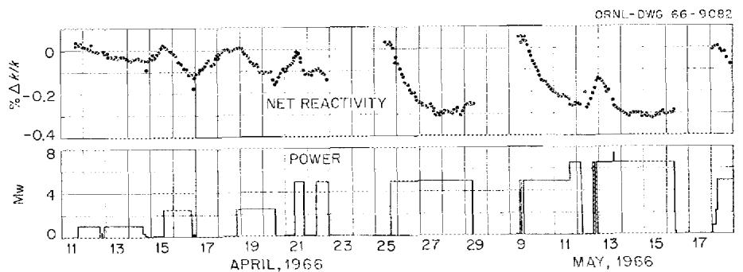

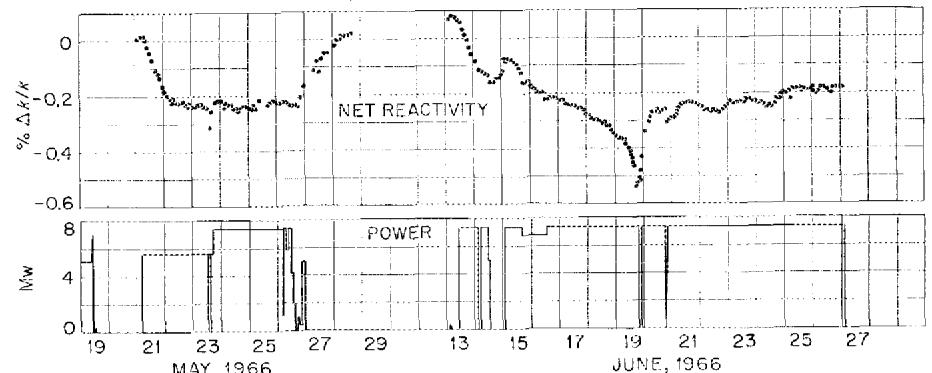

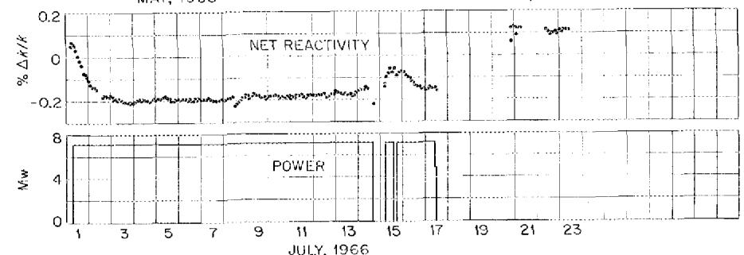  
Fig. 17. Results of modified reactivity balances in MSRE runs 6 and 7.

The large negative-reactivity transient on June 18-19 was caused by the development of circulating gas in the fuel loop and its effect on the xenon poisoning. Operating experience had shown that if the fuel-salt level in the pump tank were allowed to decrease below a given value, the amount of gas in circulation would increase; hence the observed reactivity decrease was at first attributed to a decrease in the average fuel density. However, the level changes in the pump bowl and overflow tank did not indicate a void fraction of sufficient magnitude (vol.5 vol %) to account for the reactivity change. The resolution of this apparent paradox was not

obtained until later experiments during operation with $^{233}\mathrm{U}$ . These experiments demonstrated that with helium cover gas and a very low circulating void fraction, a small increase in the void fraction would produce a significant increase in the xenon poisoning.[18,38] This was in contrast to the behavior predicted by the model described in Section 3.2. Thus the major part of the reactivity transient on June 18-19 was actually due to variations in the xenon poisoning. The reactivity recovered rapidly when the normal pump-tank level was restored and the excess helium gas and xenon were stripped out. Although the mechanism for the change was incorrectly identified at the time, the response of the reactivity balance in this event illustrates the sensitivity of this method for detecting minor anomalies under otherwise normal circumstances.

The reactivity balances calculated for the period shown in Fig. 17 had not been corrected for all long-term nuclide change effects or for flush-salt dilution. This is illustrated by the apparent increase in the residual reactivity at zero power when there was no xenon present. (Note especially the results on April 11, May 9, June 13, and July 1 and 21-23.) Corrections for these factors were subsequently applied to the zero-power balances to evaluate the long-term effects in the reactivity balance.

# Complete calculations

The complete reactivity balance calculation, including all known effects, was first applied to the period of reactor operation which began in October 1966. Figure 18 shows the power history and residual reactivity results on a day-to-day basis for the next three runs (the reactivity scale in Fig. 18 is expanded from that of Fig. 17). During steady-state operation the results show only minor variations in the residual reactivity. However, in October and November there was still some indication of disagreement between the calculated and actual xenon poisoning, both in the absolute magnitude of the term and in the transient behavior. Similar results were observed during the December 1966-January 1967 operations. During this period, we attempted to improve our description of the transient xenon behavior, as was described in Section 3.2.

The larger "spikes" in residual reactivity can all be accounted for by abnormal reactor conditions, which were not explicitly treated in the

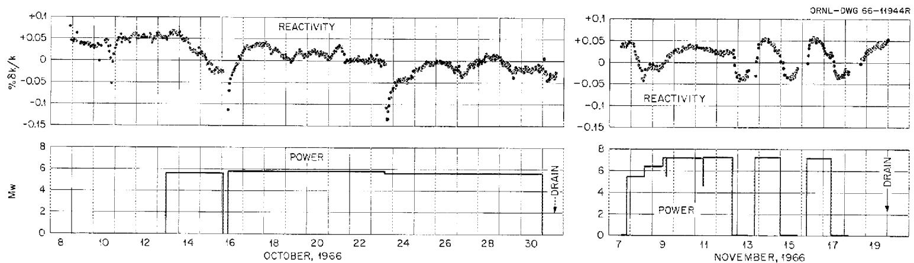

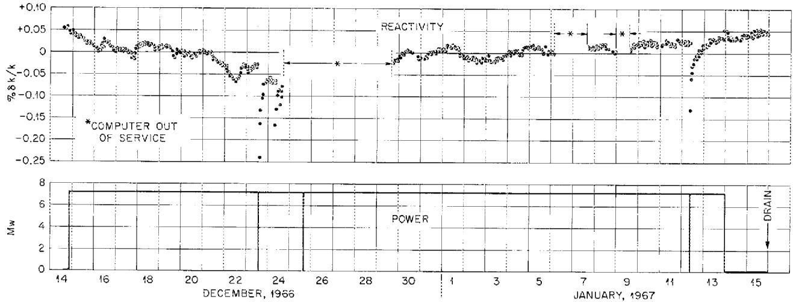  
Fig. 18. Results of complete reactivity balance in MSRE runs 8 and 10.

reactivity balance model. For example, the spikes on October 10 are associated with special experiments during which gas bubbles were circulating with the salt. Fuel-salt circulation was interrupted for $2\frac{1}{2}$ hr on October 16, and no xenon stripping occurred. When circulation and power operation were resumed, the actual xenon poison level was higher than that calculated in the reactivity balance, which assumed continuing circulation and stripping while the power was low. On October 23, the salt level in the pump tank was at an abnormally high level for a brief period. The xenon stripping was much less effective in this condition (because the pump-bowl spray ring was partially submerged), and the xenon poison level rapidly built up to a higher value. When a more normal salt level was restored, the xenon poisoning returned to the normal value.

The perturbations in residual reactivity during the November operation resulted from failure of the calculation to adequately describe the xenon transients. During this run it was necessary to reduce the power on several occasions because of conditions imposed by the reactor off-gas system. In each case the observed xenon behavior was about the same, indicating a longer time constant for xenon stripping than was calculated in the model. This disparity in the time constants produced the cyclic behavior that was observed.

Considerable difficulty was encountered in the operation of the online computer during the last period of operation shown in Fig. 18. As a result, substantial gaps were produced in the complete reactivity balance results. However, the available results were in good agreement with expected behavior. Again, the spikes on December 23 and 24 and January 12 reflect abnormal reactor operations, which resulted in substantial circulating voids. The smaller variations appeared to reflect slight changes in circulating void fraction or net xenon-stripping efficiency associated with variations occurring in the fuel-system overpressure.

The extended periods of full-power operation during runs 11 and 12 provided more stringent tests of the reactivity balance model. Runs 11 and 12 increased the integrated power by 16,200 and 7650 MWhr, respectively, to a total logged output of 40,307 MWhr. In addition to the usual calculations of power- and time-dependent factors, calculations were required in each of these runs to compensate for $^{235}\mathrm{U}$ additions made with

the reactor at full power. The calculated reactivity behavior was highly satisfactory, and no anomalous reactor behavior (producing an unexplained variation in residual reactivity) was indicated at any time. However, during these runs we detected some modifications required in the method of calculation to eliminate some errors that developed, as explained below.

Figures 19 and 20 summarize the results of the on-line calculations during these runs. These results are reproduced exactly as they were generated from the computer calculations. The density of the plotted data points has been reduced from the preceding figures (about $2\%$ of the data points recorded are shown); however, each plotted point is the result of an individual calculation, and scatter of the plotted points is still an

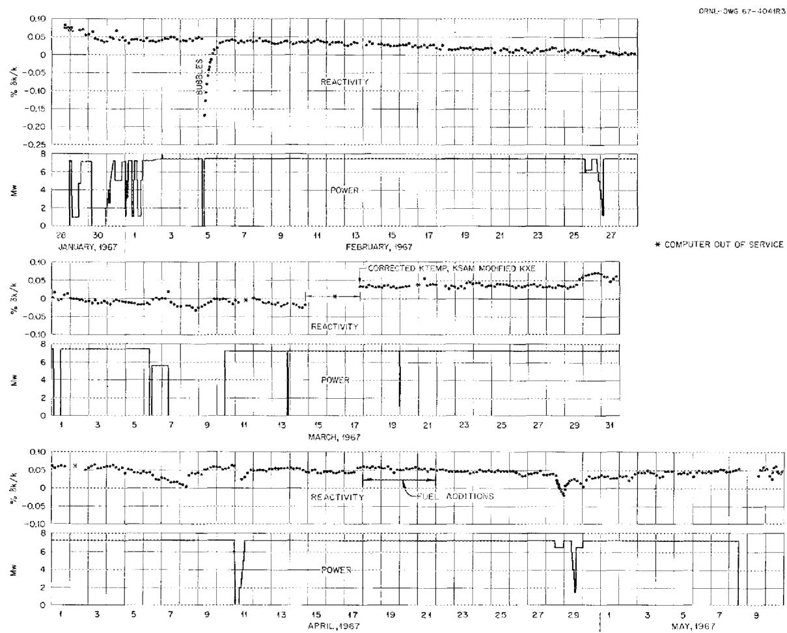  
Fig. 19. Residual reactivity during MSRE run 11.

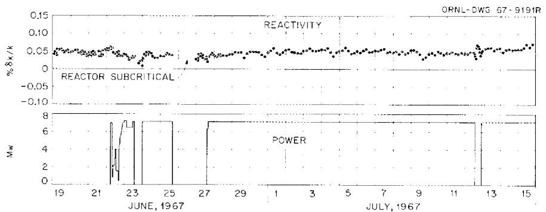

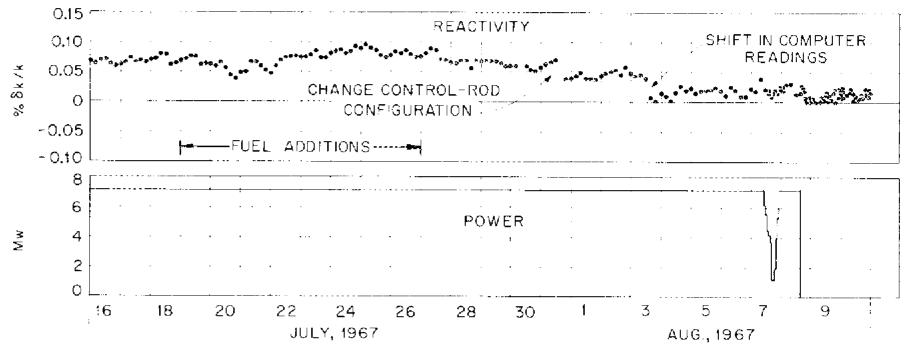  
Fig. 20. Residual reactivity during MSRE run 12.

indication of the precision of the calculations at constant reactor operating conditions. The points at which changes were made to correct errors referred to above are indicated by notes.

Except for one negative variation caused by increased entrainment of circulating gas bubbles immediately after a shutdown in run 11 (Fig. 19), all the calculated values of residual reactivity were between $-0.03$ and $+0.10\% \delta k / k$ . An apparent gradual decline in residual reactivity occurred during the first several weeks of run 11. Detailed analysis of the individual terms revealed two sources of error. One was a gradual downward drift in the temperature indicated by two of the four thermocouples used to calculate the average reactor outlet temperature. These two thermocouples were eliminated and replaced by one that had not drifted. The second error was caused by loss of significance in the calculation of the $^{149}\mathrm{Sm}$ concentration. In the program, as described in Chapter 3, only the change in samarium concentration was computed, and that change was added to the last value to obtain the current value. As the $^{149}\mathrm{Sm}$ concentration

approached $85\%$ of its equilibrium value, the incremental concentration change computed for the 5-min time step between routine reactivity balances was outside the five-decimal-digit precision of the computer. As a result, these increments were lost when the concentration was updated. To avoid using double-precision arithmetic, the program was modified to update only the $^{149}\mathrm{Sm}$ and the $^{151}\mathrm{Sm}$ concentrations every 4 hr while the reactor was at steady power. Summary calculations made off-line were used to verify the adequacy of this change.

When these corrections were introduced on March 17, the apparent downward drift in reactivity disappeared. At the same time, minor changes were made in some of the $^{135}\mathrm{Xe}$ stripping parameters to make the calculated steady-state xenon poisoning agree more closely with the observed value.

Other small reactivity variations were observed in run 11; for example, from March 29 to April 9. These changes were directly correlated to changes in the helium overpressure on the fuel loop; a pressure increase of 1 psi led to a reversible reactivity decrease of slightly less than $0.01\% \delta k / k$ . The mechanism through which pressure and reactivity were coupled was not yet established, however. The direct reactivity effect of the change in circulating voids caused by a change in absolute pressure was at least a factor of 10 smaller than the observed effect of pressure on reactivity. The time constant of the pressure-reactivity effect was relatively long, suggesting a possible connection with the xenon poisoning.

Fuel additions were made for the first time in run 11 with the reactor at full power. Nine capsules containing a total of $761\mathrm{g}$ of $^{235}\mathrm{U}$ were added between April 18 and 21. The reactivity balance results during this time showed close agreement between the calculated and observed effects of the additions. Also, the transient effects of the actual fuel additions were very mild. Figure 21 shows an on-line plot of the position of the regulating control rod made during a typical fuel addition with the reactor on servo control. Control rod movement to compensate for the additional uranium in the core started about 30 sec after the fuel capsule reached the pump bowl, and the entire transient was complete about 2 min later. This indicated rapid melting of the enriching salt and quick, even dispersion in the circulating fuel. The weights of the emptied fuel capsules indicated that essentially all their contained $^{235}\mathrm{U}$ was transferred to the fuel loop.

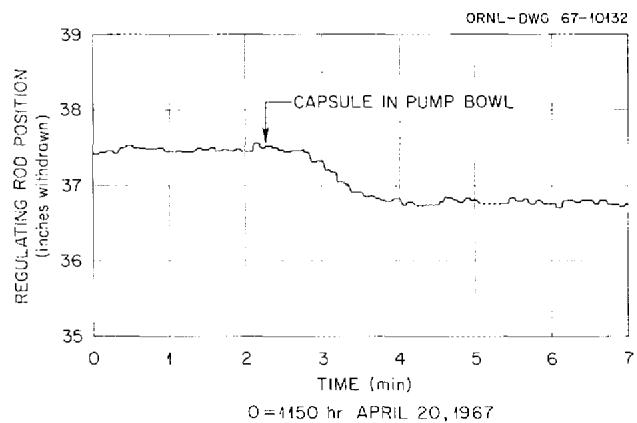  
Fig. 21. Regulating control rod position during fuel addition.

The reactivity balance results in run 12 (Fig. 20) were essentially the same as those in the preceding run. Minor variations associated with pressure and power changes were again observed.

Another series of fuel additions at full power was made in run 12 between July 19 and 26. This series consisted of 18 capsules containing $1527\mathrm{g}$ of $^{235}\mathrm{U}$ . The purpose of this large addition was to provide sufficient excess uranium so that a large amount of integrated power could be produced without intermediate fuel additions. An experimental evaluation of the uranium isotopic-change effects associated with power operation was planned, and substantial burnup was required to make the analyses of isotopic composition useful. A secondary result of this large fuel addition ( $\sim0.5\% \delta k / k$ ) was a drastic change in the control rod configuration. At the end of the additions the separation between the tips of the shim rods and that of the regulating rod was 15.5 in., whereas the normal separation had been 4 to 8 in. The variation in apparent residual reactivity as a function of control rod configuration was reexamined, and an apparent decrease of $0.02\% \delta k / k$ was observed when the more usual configuration was established. This was also consistent with an earlier evaluation of the accuracy of the analytic expression used in the computer to calculate control rod poisoning as a function of rod configuration. (See discussion of the control rod worth evaluation in Sect. 3.2.)

On August 3 a computer failure occurred which required recalibration of the analog-signal amplifiers after service was restored. As a result

of this recalibration, there were small shifts in the values of several of the variables used in the reactivity balance. Errors in reactor-outlet temperature and regulating-rod position caused a downward shift of $0.03\%$ $\delta k / k$ in the residual reactivity.

Following the end of run 12, routine checks of absolute rod positions using the fiducial zero indicators in the rod thimbles revealed an apparent upward shift of about 0.5 in. in rod 1 (the regulating rod). This shift represented a reactivity effect of $+0.02\% \delta k / k$ . The evidence indicated that this shift in position was caused by slippage of the rod drive chain on one of the sprockets after a rod scram. The exact time the shift occurred is not known, although it probably would have been detected by an upward shift in the residual reactivity had it occurred during a run, most likely at the beginning or end of run 12, when there were routine rod scams. Corrections were made for this shift in position by the start of the next run.

Run 13 had barely begun when an oil leak developed in one of the component cooling pumps. Rather than start the planned long run without a standby pump, the reactor was shut down and the pump repaired. A new run (No. 14) was started on September 20, 1967, and the reactor was not drained again until March 26, 1968.

Figure 22 summarizes the reactivity balance data taken during runs 13 and 14. Prior to run 14, the reactor had operated outside a relatively narrow range of operating conditions for only brief periods of time. The normal conditions were $1210^{\circ}\mathrm{F}$ at the reactor outlet, 5 psig helium over-pressure at the fuel pump, and a narrow range of fuel salt levels in the pump bowl. Previous deviations from these conditions had shown that at least temperature and pressure affected the value of the residual reactivity. However, the effects had not been clearly defined.

During run 14, systematic tests were undertaken to evaluate the effects of fuel system temperature and overpressure and fuel-pump-bowl level on residual reactivity. In these tests the reactor outlet temperature was varied between 1180 and $1225^{\circ}\mathrm{F}$ and the overpressure between 3 and 9 psig. Since the fuel-pump level was restricted by the pump hydraulic performance, only the normal range of variation was allowed. These tests were performed at a reactor power of 5 MW to provide the required latitude for the temperature changes.

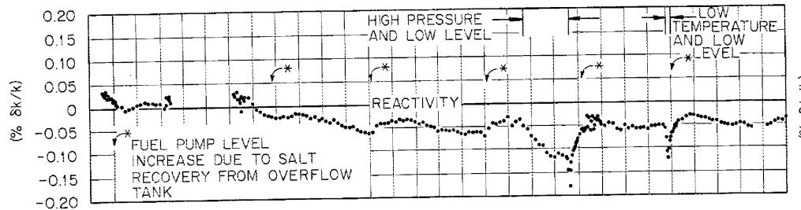

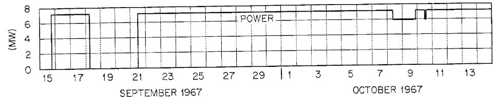

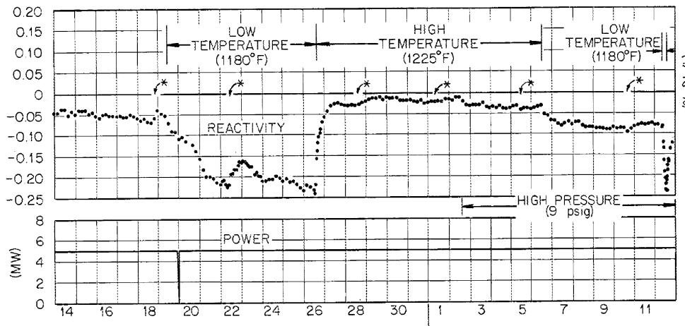  
DECEMBER 1967 JANUARY 1968

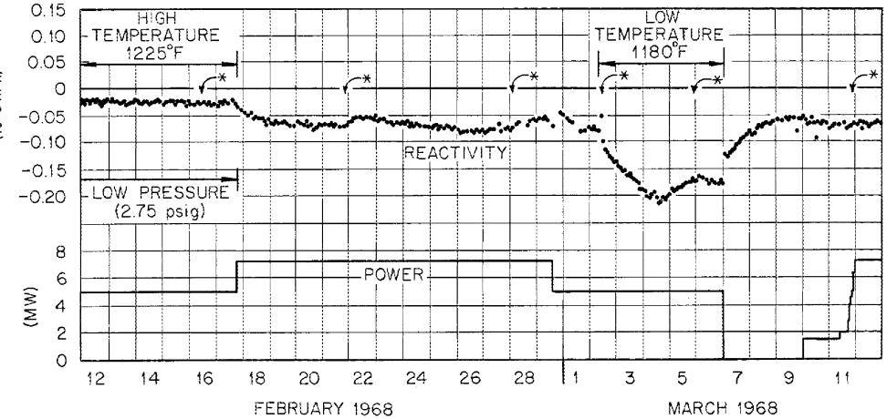

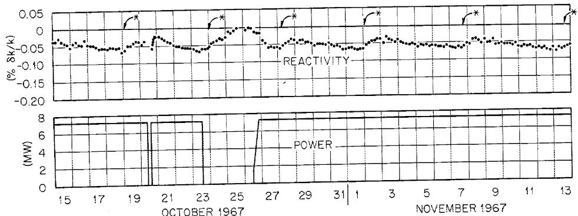

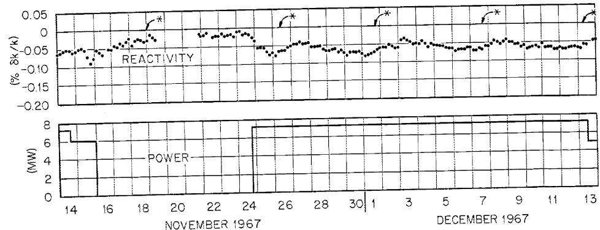

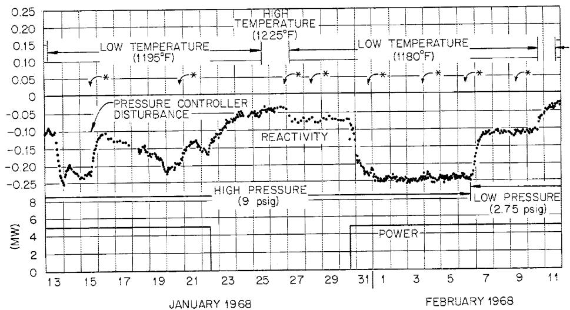

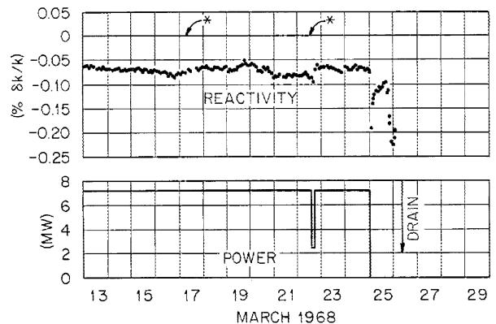  
Fig. 22. Residual reactivity during MSRE runs 13 and 14.

Although a major part of run 14 was devoted to exploration of the effect of the system operating parameters on residual reactivity, the run was started with the normal operating conditions. This operation indicated that the xenon reactivity behavior, which had been closely duplicated by the calculation for both transient and steady-state conditions during run 12, was now different. It was apparent that the steady-state xenon poisoning was now larger even though there were no observable differences in the rest of the system. Also the residual reactivity decreased as salt transferred from the pump bowl to the overflow tank* and then recovered after the salt was returned to the pump bowl, producing a slight cyclic behavior in the residual reactivity history (Fig. 22). This cyclic behavior under normal operating conditions was observed on several occasions during this run (September 23 to October 3, October 27 to November 13, November 26 to December 15, and February 18 to February 26). It was also superimposed on effects associated with systematic changes in temperature and pressure conditions (see Fig. 22). As was described above in connection with observations during run 7 (June 1966), the evidence now indicates that this behavior was due to increases in the xenon poisoning associated with decreases in the salt level in the fuel-pump bowl. As the salt level was lowered, the amount of undissolved helium in circulation increased; in turn, this led to slight changes in the distribution and the effectiveness of removal of the xenon, thereby increasing its poisoning effect. The early observation of this cyclic behavior provided further impetus for additional experimental investigations in this area, which were carried out during operations with $^{23}$ U in the fuel salt.

Correlated with the systematic variations in temperature and pressure, small but significant variations in residual reactivity were observed. The notes in Fig. 22 indicate the operating parameter changes associated with the more prominent reactivity variations.

Between the intervals of scheduled off-normal operating conditions indicated in the figure, normal temperature-pressure conditions were re-established (1210°F, 5 psig). From the directions of these reactivity variations, their magnitudes, and the approximate time constants in seeking new

levels, these systematic variations also appeared to be associated with changes in $^{135}\mathrm{Xe}$ poisoning. The maximum "shift" in residual reactivity level observed during any extended time period was 0.15 to $0.20\% \delta k / k$ , and the rates of variation were approximately reproducible (e.g., the temperature reductions on December 19, 1967, and March 2, 1968, caused the reactivity to decrease by 0.0020 to $0.0025\% \delta k / k$ per hour). Since the processes of ingesting the undissolved gas and that of gas stripping occurring in the fuel-pump bowl as well as the behavior of the gas in circulation could be expected to be sensitive to temperature and pressure, the secondary changes induced in xenon distribution and gas-stripping effectiveness again appeared to be producing the poisoning variations. The calculation model for $^{135}\mathrm{Xe}$ poisoning in the reactivity balance would not have accounted for such effects because the model was based on assumptions of a fixed circulating void fraction and bubble-stripping efficiency (Sect. 3.2).

Although the data in Fig. 22 reflect only the differences between the nominally calculated poisoning and its actual values, the total apparent $^{135}\mathrm{Xe}$ reactivity could be easily derived from these special tests by subtracting the calculated $^{135}\mathrm{Xe}$ effect from the reactivity balance and correcting for known variations in the residual reactivity such as long-term drift effects (samarium changes, burnup-related effects, etc.) and fuel density-related reactivity effects caused by differences in circulating void fraction. The remaining changes were assigned to $^{135}\mathrm{Xe}$ poisoning.

In general, these tests showed that reducing the fuel temperature and increasing the system overpressure increased the xenon poisoning. (Further evidence of the pressure effect is indicated in Fig. 22 when, on January 15, 1968, temporary loss in pressure occurred following a pressure controller disturbance; this was regained about noon on January 16, and the higher pressure was reestablished.) At the highest temperatures, the pressure effect virtually disappeared. Conversely, the temperature effect was smaller at the lower pressures. The effect of fuel-pump level was much less pronounced than the temperature and pressure effects, but decreasing level always led to higher xenon poisoning for the range of levels investigated. At some of the special temperature-pressure conditions, the response (increase) of the residual reactivity to salt recovery from the overflow tank appeared exaggerated relative to normal operating conditions;

however, from about January 30 to February 7, 1968, when the lowest temperature and maximum overpressure were maintained, the residual reactivity appeared quite stable. The available evidence now indicates that the $^{135}\mathrm{Xe}$ poisoning was at or near its maximum value for this particular set of operating conditions. All the tests conducted during run 14 were a prelude to more extensive studies made during operation with $^{233}\mathrm{U}$ , aimed at better understanding of the effects of reactor operating conditions on cover-gas entrainment and xenon transport and removal. Results of these studies will be reported elsewhere.[18]

A significant variation in the amount of undissolved gas in circulation with the fuel salt was also observed during these tests. These changes were inferred from reactivity effects at zero power, with no $^{135}\mathrm{Xe}$ in the system, by making use of the density coefficient of reactivity of the fuel salt. Additional qualitative support for variations in void fraction was obtained during power operation from spectral measurements of the inherent neutron flux noise $^{39}$ and also from temperature observations at the reactor access nozzle. The reactivity balance gave a loss of $0.032\% \delta k / k$ between the condition with the least circulating voids (1225°F and 3 psig over-pressure) and that with the most (1180°F and 9 psig), thereby implying a change of 0.15 to 0.2 vol % in the void fraction between these two conditions.

It now appears that the fuel pump and spray-removal apparatus were normally operating near a threshold where changes in the amount of cover gas being ingested into circulation could be readily induced by small changes in operating conditions.[19] The total changes in circulating gas volume were quite small; in density-related effects alone, it could only account for reactivity changes less than $0.4\% \delta k / k$ . The rest appears associated with $^{135}\mathrm{Xe}$ poisoning, in influencing its distribution between liquid salt, bubbles, and graphite pores, and its efficiency of removal.

The shutdown at the end of run 14, in March 1968, ended nuclear operation with the $^{235}\mathrm{U}$ loading. The experience that had been accumulated with the reactivity balance calculations led to the following conclusions:

1. In the normal ranges of reactor operating parameters, the magnitude of residual (unaccounted for) reactivity always remained less than $0.1\% \delta k / k$ ; its rate of variation over the sampling intervals was small and

essentially random $(\pm 0.01\% \delta k / k)$ , giving no indication of instability of the fuel composition.

2. The largest "abnormal" variations observed in the residual reactivity were less than $0.2\% \delta k / k$ and appeared to be associated with changes in xenon poisoning and the entrained circulating gas in the core at scheduled off-normal system operating conditions. Although not accounted for by the on-line calculations, these variations were in accord with the qualitative behavior expected under these conditions and hence were not regarded as evidence of malfunctions. At no time did the magnitude of residual reactivity approach the administrative limit established at the start of operations ( $0.5\% \delta k / k$ , the approximate value of the delayed-neutron fraction with the fuel circulating).

3. The apparent stability of other conditions in the core, which could potentially affect the reactivity, allowed the reactivity balance to be used as an effective diagnostic tool for studying the behavior of $135\mathrm{Xe}$ and effects of cover-gas entrainment in the fuel salt.

# 5.3 Long-Term Reactivity Trends

Although the records obtained from the on-line calculations adequately depict the short-term trends in residual reactivity (time scale ranging from the sampling interval, 5 min, to several days), some further considerations are necessary in interpreting the long-term reactivity trends (associated with the entire period of operation with $^{235}\mathrm{U}$ ). Primarily, this is a consequence of the fact that evaluations of long-term effects in the on-line calculations were based on nuclear data and salt composition information in use early in the reactor operating history; also, a thorough analysis of the internal consistency of the various component reactivity evaluations (Sect. 2 of this report) had suggested certain changes, described and explained below, in several of the coefficients governing the conversion of concentration changes to associated reactivity effects. These refinements and revisions in data and calculation rules motivated a reexamination of the long-term reactivity trends during $^{235}\mathrm{U}$ operations, after these operations had been terminated. In order to best exhibit the long-term trends, we have considered only the reactivity balance data taken at very low power, where any uncertainties associated with the calculation

of $^{135}\mathrm{Xe}$ poisoning or temperature distribution effects have minimum influence on the analysis.

The particular modifications in the reactivity balance calculations, suggested by information and evidence accumulated since the calculation model was first developed, are summarized as follows:

1. Revisions in nuclear cross-section data combined with self-consistent calculations of the average reaction rates over all fuel salt exposed to the neutron flux predicted an increase of about $1\%$ in the burn-up rate of $^{235}\mathrm{U}$ per megawatt-hour of fission energy and an increase of about $20\%$ in the net rate of depletion of $^{238}\mathrm{U}$ (with a corresponding increase in the $^{239}\mathrm{Pu}$ production rate); a decrease of nearly $11\%$ in the average capture-to-fission ratio for $^{239}\mathrm{Pu}$ with respect to the earlier calculations was also predicted.   
2. All terms in the reactivity balance with magnitude based on earlier evaluations of the zero-power rod calibration experiments11 should be multiplied by a factor of 1.06. This accounts for both an increase in the calculated delayed-neutron effectiveness and also a small change in the absolute delay fraction for $^{235}\mathrm{U}$ to be consistent with currently accepted evaluations.8 The net correction was applied to the rod poisoning, the excess uranium reactivity (relative to minimum critical loading), and the temperature level reactivity (relative to $1200^{\circ}\mathrm{F}$ ).   
3. A second correction needed to be applied to the $^{235}\mathrm{U}$ concentration coefficient of reactivity, by multiplying this coefficient by 1.072. This correction made the treatment of the excess uranium reactivity and the rod-poisoning term self-consistent in the reactivity balance calculations.

The sources of the cross-section revisions listed under modification 1 were fully described in Ref. 30. The component associated with basic data and associated neutron spectrum reevaluations was shown by the comparison of columns 2 and 3 in Table 1, Chapter 4, of this report; the remainder of the changes are a result of refinements in the methods of calculating the reactor-average reaction cross sections. The net revisions affected the reactivity balance mainly in the calculation of nuclide inventory changes, with the exception of the revision in the capture-to-fission ratio data for $^{239}\mathrm{Pu}$ . The latter primarily affected the conversion of inventory changes to the corresponding reactivity addition.

The source of modification 2 was a recent reevaluation of the "delayed-neutron effectiveness factor," described in Section 4.5. As discussed there, the net result of this examination was a renormalization of all measured reactivity coefficients in the reactivity balance model.

Modification 3 has its origin in the dependence of the excess $^{235}\mathrm{U}$ reactivity (and also the control rod worth) on the total $^{235}\mathrm{U}$ concentration. The needed revision was the result of using, for the earlier calculations, an average concentration coefficient of reactivity appropriate to the maximum range of variation in the $^{235}\mathrm{U}$ loading rather than the more accurate relation expressed by Eq. (37). This correction was independent of the additional correction for delayed-neutron effectiveness described above.

The results of including all changes described in the categories above in the interpretation of the reactivity balance data are shown in Fig. 23. This evaluation was based on an assumed full-power level of $7.25\mathrm{MW}$ . In the figure, we have attempted to distinguish the data points based on measurements taken during separate power runs. Transfer and mixing effects during drain and flush operations between runs introduced variations in composition of the salt which generally had larger uncertainties associated with them than did the changes produced during the runs. It is also likely that the approximate treatment of these effects produced some of the small positive shift in the residual reactivity observed during the early power runs (MSRE runs 4 through 6).

The data in Fig. 23 indicate that a slight downward trend in residual reactivity occurred during the first part of operations with $^{235}\mathrm{U}$ , followed by an increase during run 14. The statistical spread in the data points logged over the entire period precludes assignment of a precise shape to

the residual reactivity variation; however, the data taken during the longest uninterrupted power run (run 14) definitely indicate that a gradual increase in the residual reactivity occurred in this interval.

The magnitude and direction of these trends are quite credible in terms of the basic model, because the calculations of possible reactivity effects associated with dimensional changes in the graphite indicate that this type of slow variation could have occurred (Sect. 3.3). Furthermore, there is sufficient uncertainty in the degree of removal of low-cross-section fission products (Fig. 12) that differences between actual poisoning and nominal values assumed for calculations could have produced gradual reactivity changes of either sign (downward trends could be associated with less effective removal, and vice versa). For both these reasons, the magnitudes of residual reactivity variations in Fig. 23 are within a region in which the basic calculation model is judged to be valid.

Those sources of statistical variations and uncertainties in the reactivity balance data which can be identified include (1) a component of about $\pm 0.01\%$ $\delta k / k$ associated with random errors in reading rod positions and temperatures and with variations between sampling intervals in the amount of entrained gas circulating with the salt during normal operations,

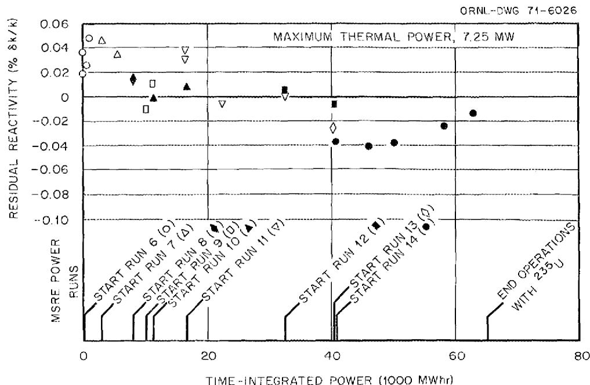  
Fig. 23. Long-term variations in residual reactivity evaluated at zero power during $^{235}\mathrm{U}$ operations; maximum reactor power, 7.25 MW.

and (2) a component associated with uncertainties in fuel transfer during flush operations, increasing in magnitude from zero near the start of power operation to about $\pm 0.02\%$ $\delta k / k$ near the end of operation. Any remaining statistical variations should at present be regarded as inherent in the technique of recording and analyzing the reactivity balance data, rather than as evidence of some anomalous physical process in the reactor.

The data summarized in Fig. 23 represent measurements accumulated over more than two years of power operation of the MSRE. During that time, $^{235}\mathrm{U}$ equivalent to $\sim 1.25\% \delta k / k$ in reactivity had been depleted in power operation; $^{235}\mathrm{U}$ equivalent to $\sim 0.72\% \delta k / k$ had been added to the salt; poisoning due to $^{149}\mathrm{Sm}$ and $^{151}\mathrm{Sm}$ equivalent to $\sim 0.77\% \delta k / k$ had been formed; and changes in isotopic content of other constituents of the salt had produced a net reactivity addition of $\sim 0.43\% \delta k / k$ . The residual reactivity, evaluated at conditions of negligible power and xenon poisoning, drifted by less than $0.1\% \delta k / k$ over this period; hence, our accounting procedures indicate that the reactor behaved in a regular and predictable manner.

# 6. CONCLUSIONS

The reactivity balance operating history proved quite useful as an aid in drawing inferences about the core behavior during sustained power operation of the reactor. From the conceptual standpoint, the reactivity balance is a means of viewing the nuclear operations as a process rather than a sequence of unrelated operating states. As an analysis technique, it provides an independent monitor of the processes which have significant influence on the nuclear properties of the core. This may be used in conjunction with information obtained from other techniques such as chemical or mass-spectrographic analysis of the fuel composition. The disadvantage of reactivity balance monitoring is that it is highly indirect; only a difference in the apparent positive and negative compensating reactivity changes during any operating interval is recorded, and the interpretation of this difference is a separate problem in operations analysis. An observed residual can be real and due to a single phenomenon in the core or it can be due to simultaneous small effects, including errors in the basic models for calculating individual processes. In the former event, other data given by the reactor instrumentation are important in interpreting the significance of the residual. In regard to the latter event, we have given considerable attention in this report to the problem of maintaining consistency among the component reactivity effects calculated by the model.

The largest uncertainty in the model as developed for the MSRE is likely to be in calculating the fission product transport and removal from the core. This model can and undoubtedly will be improved in future applications of this general technique in nuclear operations analysis for molten-salt reactors. Despite this uncertainty, however, the reactivity balance served its intended purposes. As a malfunction detector, reactivity variations less than $0.05\% \delta k / k$ were readily observable over short time intervals. Larger temporary variations that were observed were in accord with expected behavior of the reactor under operating conditions then obtaining; at no time did the residual reactivity become sufficient to have brought operating safety limit considerations into play. As a

long-term indicator of the predictability of the reactor nuclear performance, the residual reactivity remained within the limits of valid prediction of the basic model. In sum, the reactivity balance was a valuable adjunct for analysis of a new experimental reactor type for which no preceding experience was available.

# REFERENCES

1. A. M. Weinberg and E. P. Wigner, The Physical Theory of Neutron Chain Reactors, p. 600, University of Chicago Press, 1958.   
2. H. P. Danforth, "The Reactivity Balance as an Anomaly Detector," Nucl. Safety, 10(5), 411-414 (Sept.-Oct. 1969).   
3. A. F. Henry, "The Application of Reactor Kinetics to the Analysis of Experiments," Nucl. Sci. Eng. 3(1), 52-70 (January 1958).   
4. E. E. Gross and J. H. Marable, "Static and Dynamic Multiplication Factors and Their Relation to the Inhour Equation," Nucl. Sci. Eng. 7(4), 281-91 (April 1960).   
5. T. Gozani, "The Concept of Reactivity and Its Application to Kinetic Measurements," Nukleonik 5(2), 55 (February 1963).   
6. B. Wolfe, "Predicting Reactivity at High Burnup," Nucleonics 16(3), 116-21 (March 1958).   
7. J. Lewins, IMPORTANCE: The Adjoint Function, chap. 5, Pergamon, New York, 1965.   
8. G. R. Keepin, Physics of Nuclear Kinetics, Addison-Wesley, Reading, Mass., 1965.   
9. B. E. Prince, Period Measurements on the Molten-Salt Reactor Experiment During Fuel Circulation: Theory and Experiment, ORNL-TM-1626 (October 1966).   
10. R. C. Robertson, MSRE Design and Operations Report, Part 1: Description of Reactor Design, ORNL-TM-728 (January 1965).   
11. B. E. Prince et al., Zero-Power Physics Experiments on the Molten-Salt Reactor Experiment, ORNL-4233 (February 1968).   
12. MSR Program Semiannu. Progr. Rep. Feb. 28, 1969, ORNL-4396, p. 35-43.   
13. MSR Program Semiannu. Progr. Rep. Feb. 28, 1966, ORNL-3936, pp. 82-87.   
14. B. E. Prince and J. R. Engel, Temperature and Reactivity Coefficient Averaging in the MSRE, ORNL-TM-379 (October 1962).   
15. R. J. Kedl and A. Houtzeel, Development of a Model for Computing $^{135}\mathrm{Xe}$ Migration in the MSRE, ORNL-4069 (June 1967).   
16. MSR Program Semiannu. Progr. Rep. Aug. 31, 1966, ORNL-4037, pp. 13-21.

17. MSR Program Semiannu. Progr. Rep. Feb. 28, 1967, ORNL-4119, pp. 86-94.   
18. R. C. Steffy, J. R. Engel, and R. J. Kedl, Xenon Behavior in the MSRE, to be issued as an ORNL-TM report.   
19. J. R. Engel et al., Spray, Mist, Bubbles, and Foam in the Molten Salt Reactor Experiment, ORNL-TM-3027 (June 1970).   
20. MSR Program Semiannu. Progr. Rep. Aug. 31, 1967, ORNL-4191, p. 116.   
21. MSR Program Semiannu. Progr. Rep. Aug. 31, 1968, ORNL-4344, p. 36.   
22. H. E. McCoy to C. H. Gabbard, ORNL internal communication, Nov. 6, 1967.   
23. MSR Program Semiannu. Progr. Rep. Aug. 31, 1966, ORNL-4037, p. 136.   
24. P. N. Haubenreich to H. F. McDuffie, ORNL internal correspondence, Apr. 10, 1962.   
25. MSR Program Semiannu. Progr. Rep. July 31, 1964, ORNL-3708, p. 376.   
26. J. H. Shaffer to P. N. Haubenreich, ORNL internal correspondence, Jan. 6, 1965.   
27. G. D. Joanou and J. S. Dudek, GAM-II — A B₃ Code for the Calculation of Fast-Neutron Spectra and Associated Multigroup Constants, GA-4265 (September 1963).   
28. H. C. Honeck, THERMOS — A Thermalization Transport Theory Code for Reactor Lattice Calculations, BNL-5826 (September 1961).   
29. T. B. Fowler et al., EXTERMINATOR-2: A Fortran IV Code for Solving Multigroup Neutron Diffusion Equations in Two Dimensions, ORNL-4078 (April 1967).   
30. MSR Program Semiannu. Progr. Rep. Aug. 31, 1969, ORNL-4449, pp. 22-26.   
31. L. L. Bennett, Recommended Fission Product Chains for Use in Reactor Evaluation Studies, ORNL-TM-1658 (September 1966).   
32. T. R. England, Time-Dependent Fission-Product Thermal and Resonance Adsorption Cross Sections, WAPD-TM-333, Bettis Atomic Power Laboratory (November 1962); Addendum No. 1 (January 1965).   
33. P. N. Haubenreich et al., MSRE Design and Operations Report, Part III: Nuclear Analysis, ORNL-TM-730, p. 182 (February 1964).   
34. P. N. Haubenreich, Prediction of Effective Yields of Delayed Neutrons in MSRE, ORNL-TM-380 (October 1962).

35. MSR Program Semiannu. Progr. Rep. Aug. 31, 1968, ORNL-4344, pp. 45-46.   
36. P. N. Haubenreich and J. R. Engel, "Experience with the Molten-Salt Reactor Experiment," Nucl. Appl. Technol. 8(2), 118-36 (February 1970).   
37. C. D. Martin and J. R. Engel, Experience with the MSRE On-Line Computer, to be issued as an ORNL-TM report.   
38. MSR Program Semiannu. Progr. Rep. Aug. 31, 1969, ORNL-4449, p. 10.   
39. D. N. Fry, R. C. Kryter, and J. C. Robinson, Measurement of Helium Void Fraction in the MSRE Fuel Salt Using Neutron-Noise Analysis, ORNL-TM-2315 (Aug. 27, 1968).   
40. MSR Program Semiannu. Progr. Rep. Feb. 28, 1970, ORNL-4548, pp. 65-66.

# APPENDIX

Perturbation theory provides a convenient mathematical apparatus for describing the reactivity effects of arbitrary changes in reactor conditions. We will make use of this general technique, together with the concept of "static" reactivity,\* to derive the general relations used in Chapter 2 of this report. The mathematical treatment will be as brief as necessary to support the discussion in this report; more complete background can be obtained by consulting any standard references in the subject (e.g., Refs. 1 and 7). In order to avoid the necessity of referring to any particular neutronic model, and at the same time simplify some of the algebraic manipulations, we will make use of a general operator notation for the neutron balance equation. Thus the basis for the mathematical description is provided by the equation governing the static reactivity, $\mathfrak{o}_{\beta}$ , for a particular state of the reactor:

$$
L \phi + A \phi = (1 - \rho_ {g}) P \phi , \tag {A.1}
$$

together with the adjoint equation,

$$
L ^ {*} \psi + A ^ {*} \psi = (1 - \rho_ {s}) P ^ {*} \psi , \tag {A.2}
$$

in which $\phi$ and $\psi$ represent the direct and adjoint flux fields and $L$ , $A$ , and $P$ are linear operators governing the neutron leakage, absorption (including energy transfer by scattering), and production from fission respectively. Once a particular theoretical model is chosen in which to represent these operators (e.g., multigroup diffusion theory or transport theory), then the explicit information defining the reactor state, such as core geometry, material composition, and temperature, completely "fixes" these operators. The remaining conditions completing the mathematical description in Eq. (A.1) arise from the physical conditions for the return

flux at the boundaries of the reactor and, also, positivity conditions for the flux field. Similar conditions, called adjoint boundary conditions, apply to the solution of Eq. (A.2) for the adjoint flux field. In Eq. (A.2) the operators with the asterisk represent the adjoint operators, defined by the inner product relations,

$$
(\psi , L \phi) = (L ^ {*} \psi , \phi), \tag {A.3}
$$

$$
(\psi , A \phi) = (A ^ {*} \psi , \phi), \tag {A.4}
$$

$$
(\psi , P \phi) = (P ^ {*} \psi , \phi), \tag {A.5}
$$

where the symbol $(f, g)$ represents the inner product of the functions $f$ and $g$ (the multiplication of the functions and integration over the spatial, energy, and, in certain applications, the directional variables describing the flux field). The scalar quantity, $\rho_{s}$ , is the algebraically largest eigenvalue of Eq. (A.1) and can be shown to be identical with the largest eigenvalue of Eq. (A.2).

For what follows, it is useful to notice that the so-called bilinear identities [Eqs. (A.3), (A.4), and (A.5)] are in the nature of global relations; that is, they apply to the reactor considered as a whole. In this sense, they are less restrictive than the equations describing the local balances, Eqs. (A.1) and (A.2). Thus, for these defining relations to apply requires only that the direct and adjoint flux functions be chosen from sets satisfying appropriate boundary conditions, together with certain physical restrictions such as flux continuity (so that application of the operators on functions contained in these sets has physical meaning). It follows that, in the use of relations (A.3) through (A.5), the functions $\phi$ and $\psi$ do not have to correspond to the same reactor neutronic state, provided that the boundary conditions remain fixed and the above restrictions are satisfied.

In order to derive Eq. (2) of Chapter 2 of this report, we may take the inner product of the neutron balance equation [Eq. (A.1)] with a weight function $w$ , defined on the space of independent variables of the neutron population,

$$
\left(w, L \phi\right) + \left(w, A \phi\right) = \left(1 - \rho_ {S}\right) \left(w, P \phi\right), \tag {A.6}
$$

or, by simple algebraic rearrangement,

$$
\rho_ {\mathcal {S}} = 1 - \frac {(w , A \phi) + (w , L \phi)}{(w , P \phi)}. \tag {A.7}
$$

In this case, since the balance Eq. (A.1) holds at each point in the space of independent variables, the choice of the weight function is arbitrary. Deliberate choice of $w$ equal to $\psi$ , the solution of the adjoint Eq. (A.2) for the same reactor state, leads to Eq. (2) of Chapter 2.

Consider now two reactor states, one arbitrarily designated as a reference state and the other a perturbed, or "operating" state. Using subscripts $\alpha$ and $\beta$ to denote these two states, respectively, we may write

$$
L _ {\alpha} \phi_ {\alpha} + A _ {\alpha} \phi_ {\alpha} = (1 - \rho_ {s \alpha}) P _ {\alpha} \phi_ {\alpha}, \tag {A.8}
$$

$$
L _ {\alpha} ^ {*} \psi_ {\alpha} + A _ {\alpha} ^ {*} \psi_ {\alpha} = (1 - \rho_ {3 \alpha}) P _ {\alpha} ^ {*} \psi_ {\alpha}, \tag {A.9}
$$

$$
L _ {\beta} \phi_ {\beta} + A _ {\beta} \phi_ {\beta} = (1 - \rho_ {s \beta}) P _ {\beta} \phi_ {\beta}, \tag {A.10}
$$

$$
L _ {\beta} ^ {*} \psi_ {\beta} + A _ {\beta} ^ {*} \psi_ {\beta} = (1 - \rho_ {3 \beta}) P _ {\beta} ^ {*} \psi_ {\beta}. \tag {A.11}
$$

Explicitly representing the perturbation in these operators relative to the chosen reference state, we may put

$$
L _ {\beta} = L _ {\alpha} + \delta L, \tag {A.12}
$$

$$
A _ {\beta} = A _ {\alpha} + \delta A, \tag {A.13}
$$

$$
P _ {\beta} = P _ {\alpha} + \delta P. \tag {A.14}
$$

Next, we form the inner product of the adjoint flux for the reference state $\psi_{\alpha}$ with the operating state Eq. (A.10) and use the defining Eqs. (A.12) through (A.14) for the perturbations:

$$
\begin{array}{l} \left(\psi_ {\alpha}, L _ {\alpha} \phi_ {\beta}\right) + \left(\psi_ {\alpha}, \delta l \phi_ {\beta}\right) + \left(\psi_ {\alpha}, A _ {\alpha} \phi_ {\beta}\right) + \left(\psi_ {\alpha}, \delta A \phi_ {\beta}\right) \\ = \left(1 - \rho_ {s \beta}\right) \left(\psi_ {\alpha}, P _ {\alpha} \phi_ {\beta}\right) + \left(1 - \rho_ {s \beta}\right) \left(\psi_ {\alpha}, \delta P \phi_ {\beta}\right). \tag {A.15} \\ \end{array}
$$

By use of the bilinear identities (A.3) and (A.4), we obtain

$$
\left(\psi_ {\alpha}, L _ {\alpha} \phi_ {\beta}\right) + \left(\psi_ {\alpha}, A _ {\alpha} \phi_ {\beta}\right) = \left(L _ {\alpha} ^ {*} \psi_ {\alpha}, \phi_ {\beta}\right) + \left(A _ {\alpha} ^ {*} L _ {\alpha}, \phi_ {\beta}\right), \tag {A.16}
$$

and, from Eq. (A.9),

$$
\begin{array}{l} \left(L _ {\alpha} ^ {*} \psi_ {\alpha}, \phi_ {\beta}\right) + \left(A _ {\alpha} ^ {*} \psi_ {\alpha}, \phi_ {\beta}\right) = (1 - \rho_ {s \alpha}) \left(P _ {\alpha} ^ {*} \psi_ {\alpha}, \phi_ {\beta}\right) \\ = \left(1 - \rho_ {S Q}\right) \left(\psi_ {\alpha}, P _ {\alpha} \phi_ {\beta}\right), \tag {A.17} \\ \end{array}
$$

where the final form of Eq. (A.17) follows from the third bilinear identity (A.5).

If we now combine Eqs. (A.15), (A.16), and (A.17), we obtain

$$
\begin{array}{l} (1 - \rho_ {s \alpha}) (\psi_ {\alpha}, P _ {\alpha} \phi_ {\beta}) + (\psi_ {\alpha}, \delta L \phi_ {\beta}) + (\psi_ {\alpha}, \delta A \phi_ {\beta}) \\ = (1 - \rho_ {s \beta}) (\psi_ {\alpha}, P _ {\alpha} \phi_ {\beta}) + (1 - \rho_ {s \beta}) (\psi_ {\alpha}, \delta P \phi_ {\beta}), \tag {A.18} \\ \end{array}
$$

which, after simple algebraic rearrangement, yields

$$
\rho_ {s \beta} - \rho_ {s \alpha} = (1 - \rho_ {s \beta}) \frac {\left(\psi_ {\alpha} , \delta P \phi_ {\beta}\right)}{\left(\psi_ {\alpha} , P _ {\alpha} \phi_ {\beta}\right)} - \frac {\left(\psi_ {\alpha} , \delta A \phi_ {\beta}\right)}{\left(\psi_ {\alpha} , P _ {\alpha} \phi_ {\beta}\right)} - \frac {\left(\psi_ {\alpha} , \delta L \phi_ {\beta}\right)}{\left(\psi_ {\alpha} , P _ {\alpha} \phi_ {\beta}\right)}. \tag {A.19}
$$

This expression is equivalent to Eq. (3a) of Chapter 2.

A slightly different form of the above expression is useful in those applications where the production operator (i.e., the fissile material concentration) is altered. In this case, it is convenient to move the operating state reactivity $\rho_{\beta}$ (which is generally an unknown quantity) from the right to the left side of Eq. (A.19). By employing the identity $\rho_{\beta} = \rho_{\beta} - \rho_{\alpha} + \rho_{\alpha}$ in the preceding derivation, one can readily obtain

$$
\rho_ {\mathcal {S} \beta} - \rho_ {\mathcal {S} \alpha} = (1 - \rho_ {\mathcal {S} \alpha}) \frac {(\psi_ {\alpha} , \delta P \phi_ {\beta})}{(\psi_ {\alpha} , P _ {\beta} \phi_ {\beta})} - \frac {(\psi_ {\alpha} , \delta A \phi_ {\beta})}{(\psi_ {\alpha} , P _ {\beta} \phi_ {\beta})} - \frac {(\psi_ {\alpha} , \delta L \phi_ {\beta})}{(\psi_ {\alpha} , P _ {\beta} \phi_ {\beta})} \tag {A.20}
$$

equivalent to Eq. (3b) of Chapter 2.

Finally, we may note that Eqs. (A.19) and (A.20) are exact, in the sense that no assumptions have been made concerning the "smallness" of the change in the reactor state. Although we are in some applications able to make what is usually termed the first-order perturbation approximation (i.e., that $\phi_{\alpha} \simeq \phi_{\beta}$ ), it is only in certain instances that the approximation is justified. The flux fields $\phi_{\alpha}$ and $\phi_{\beta}$ may in general be quite different.

In many cases of interest, such as certain reactivity calibration measurements, fuel depletions and read additions, and fission product poisoning, the perturbations considered have the property that the changes induced in neutron transport and slowing-down properties of the core are negligible. In multigroup diffusion theory the leakage perturbation $\delta l$ involves only changes in the group diffusion coefficients, and for this class of perturbations the terms containing $\delta l$ may be neglected in Eqs. (A.19) and (A.20). Also for this case, the term with $\delta A$ is closely approximated by considering only the changes in neutron absorption events. These observations are quite useful when carrying out approximate theoretical calculations of reactivity effects, as described in Section 2.3.

For the class of strong localized perturbations, such as represented by control rod motions, diffusion theory is inadequate, and more accurate transport representations are needed for theoretical description of

neutron scattering and absorption in the rod regions. In this case, it can be shown that $\delta L = 0$ , but $\delta A$ must be understood to include changes in transfer probabilities in energy and direction for neutron scattering. Alternatively, recourse can be made to experimental measurements of the rod reactivity effects, as was described in Section 2.4.

# Internal Distribution

1. J. L. Anderson   
2. R. G. Affel   
3. H. F. Bauman   
4. C. F. Baes   
5. S. E. Beal1   
6. L. L. Bennett   
7. E. S. Bettis   
8. E. G. Bohlmann   
9. G. E. Boyd   
10. R. B. Briggs   
11. W. B. Cottrell   
12. J. L. Crowley   
13. F. L. Culler   
14. J. R. Distefano   
15. S. J. Ditto   
16. W.P.Eatherly   
17. J. R. Engel   
18. D. E. Ferguson   
19. L. M. Ferris   
20. A. P. Fraas   
21. C. H. Gabbard   
22. W. R. Grimes   
23. A. G. Grindell   
24. R.H.Guymon   
25. P. N. Haubenreich   
26. R.F.Hibbs (Y-12)   
27. H.W.Hoffman   
28. P. R. Kasten   
29. J. J. Keyes   
30. A. I. Krakoviak   
31. M. I. Lundin   
32. R.N.Lyon   
33. H. G. MacPherson   
34. R.E. MacPherson   
35. H. E. McCoy

36. H. C. McCurdy   
37. L. E. McNeese   
38. J. R. McWherter   
39. A. S. Meyer   
40. A. J. Miller   
41. R. L. Moore   
42. E. L. Nicholson   
43. L.C.Oakes   
44. A. M. Perry   
45. H. B. Piper

46-50. B. E. Prince   
51. G, L. Ragan   
52-57. M. W. Rosenthal   
58. Dunlap Scott   
59. M.R.Sheldon   
60. W.H. Sides   
61. M. J. Skinner   
62. O. L. Smith   
63. I. Spiewak   
64. D. A. Sundberg   
65. R.E.Thoma   
66. D. B. Trauger   
67. A. M. Weinberg   
68. J. R. Weir   
69. M. E. Whatley   
70. J. C. White   
71. G. D. Whitman   
72. Gale Young

73-75. Central Research Library   
76. Y-12 Document Reference Section   
77-98. Laboratory Records   
99. Laboratory Records (RC)

# External Distribution

100. D. F. Cope, AEC-OSR, Oak Ridge, Tennessee   
101. W. H. Hannum, Reactor Physics Branch, Division of Reactor Development and Technology, USAEC, Washington, D.C. 20545   
102. A. Houtzeel, TNO, 176 Second Ave., Waltham, Massachusetts 02154   
103. Kermit Laughon, AEC-OSR, Oak Ridge, Tennessee   
104-105. MSBR Program Manager, Division of Reactor Development and Technology, USAEC, Washington, D.C. 20545   
106. C. L. Matthews, AEC-OSR, Oak Ridge, Tennessee   
107. Yasuo Osawa, Atomic Energy Research Laboratory, Hitachi Ltd., Ozenji Kawashaki-shi, Kanagawa-ken, Japan   
108. Milton Shaw, Director, Division of Reactor Development and Technology, USAEC, Washington, D.C. 20545   
109. W. L. Smalley, AEC-ORO, Oak Ridge, Tennessee   
110. R. C. Steffy, Tennessee Valley Authority, 303 Power Bldg., Chattanooga, Tennessee 37401   
111. M. J. Whitman, Division of Reactor Development and Technology, USAEC, Washington, D.C. 20545   
112-114. Director, Division of Reactor Licensing, USAEC, Washington, D.C. 20545   
115-116. Director, Division of Reactor Standards, USAEC, Washington, D.C. 20545   
117-121. Executive Secretary, Advisory Committee on Reactor Safeguards, USAEC, Washington, D.C. 20545   
122. Laboratory and University Division, ORO   
123. Patent Office, AEC-ORO   
124-342. Given distribution as shown in TID-4500 under Reactor Technology category (25 copies - NTIS)