3445604282540

ORNL-4676

UC-80 - Reactor Technology

MOLTEN-SALT REACTOR PROGRAM

SEMIANNUAL PROGRESS REPORT

FOR PERIOD ENDING FEBRUARY 28, 1971

OAK RIDGE NATIONAL LABORATORY

CENTRAL RESEARCH LIBRARY

DOCUMENT COLLECTION

LIBRARY LOAN COPY

DO NOT TRANSFER TO ANOTHER PERSON

If you wish someone else to see this

document, send in name with document

and the library will arrange a loan.

UCN-7969

13. 3-6,7

OAK RIDGE NATIONAL LABORATORY

operated by

UNION CARBIDE CORPORATION

for the

U.S. ATOMIC ENERGY COMMISSION

Printed in the United States of America. Available from National Technical Information Service

U.S. Department of Commerce

5285 Port Royal Road, Springfield, Virginia 22151

Price: Printed Copy $3.00; Microfiche$ 0.95

This report was prepared as an account of work sponsored by the United States Government. Neither the United States nor the United States Atomic Energy Commission, nor any of their employees, nor any of their contractors, subcontractors, or their employees, makes any warranty, express or implied, or assumes any legal liability or responsibility for the accuracy, completeness or usefulness of any information, apparatus, product or process disclosed, or represents that its use would not infringe privately owned rights.

Contract No. W-7405-eng-26

MOLTEN-SALT REACTOR PROGRAM

SEMIANNUAL PROGRESS REPORT

For Period Ending February 28, 1971

M. W. Rosenthal, Program Director

R. B. Briggs, Associate Director

P. N. Haubenreich, Associate Director

AUGUST 1971

OAK RIDGE NATIONAL LABORATORY

Oak Ridge, Tennessee

operated by

UNION CARBIDE CORPORATION

for the

U.S. ATOMIC ENERGY COMMISSION

This report is one of a series of periodic reports in which we describe the progress of the program. Other reports issued in this series are listed below.

<table><tr><td>ORNL-2474</td><td>Period Ending January 31, 1958</td></tr><tr><td>ORNL-2626</td><td>Period Ending October 31, 1958</td></tr><tr><td>ORNL-2684</td><td>Period Ending January 31, 1959</td></tr><tr><td>ORNL-2723</td><td>Period Ending April 30, 1959</td></tr><tr><td>ORNL-2799</td><td>Period Ending July 31, 1959</td></tr><tr><td>ORNL-2890</td><td>Period Ending October 31, 1959</td></tr><tr><td>ORNL-2973</td><td>Periods Ending January 31 and April 30, 1960</td></tr><tr><td>ORNL-3014</td><td>Period Ending July 31, 1960</td></tr><tr><td>ORNL-3122</td><td>Period Ending February 28, 1961</td></tr><tr><td>ORNL-3215</td><td>Period Ending August 31, 1961</td></tr><tr><td>ORNL-3282</td><td>Period Ending February 28, 1962</td></tr><tr><td>ORNL-3369</td><td>Period Ending August 31, 1962</td></tr><tr><td>ORNL-3419</td><td>Period Ending January 31, 1963</td></tr><tr><td>ORNL-3529</td><td>Period Ending July 31, 1963</td></tr><tr><td>ORNL-3626</td><td>Period Ending January 31, 1964</td></tr><tr><td>ORNL-3708</td><td>Period Ending July 31, 1964</td></tr><tr><td>ORNL-3812</td><td>Period Ending February 28, 1965</td></tr><tr><td>ORNL-3872</td><td>Period Ending August 31, 1965</td></tr><tr><td>ORNL-3936</td><td>Period Ending February 28, 1966</td></tr><tr><td>ORNL-4037</td><td>Period Ending August 31, 1966</td></tr><tr><td>ORNL-4119</td><td>Period Ending February 28, 1967</td></tr><tr><td>ORNL-4191</td><td>Period Ending August 31, 1967</td></tr><tr><td>ORNL-4254</td><td>Period Ending February 29, 1968</td></tr><tr><td>ORNL-4344</td><td>Period Ending August 31, 1968</td></tr><tr><td>ORNL-4396</td><td>Period Ending February 28, 1969</td></tr><tr><td>ORNL-4449</td><td>Period Ending August 31, 1969</td></tr><tr><td>ORNL-4548</td><td>Period Ending February 28, 1970</td></tr><tr><td>ORNL-4622</td><td>Period Ending August 31, 1970</td></tr></table>

# Contents

INTRODUCTION ix

SUMMARY xi

# PART 1. MOLTEN-SALT REACTOR EXPERIMENT

1. POSTOPERATION EXAMINATIONS 1

1.1 Outline of Program 1   
1.2 Reactor Vessel and Core 2   
1.3 Fuel Pump 6   
1.4 Heat Exchanger 11   
1.5 Leak at Freeze Valve FV-105 12   
1.6 Other Examinations 12   
1.7 Evaluation of Tools and Procedures 13

2. FURTHER INVESTIGATIONS 17

2.1 Test of Coolant Salt Flowmeter and Conclusions 17   
2.2 Inventories of Residual Uranium and Plutonium 18   
2.3 Search for Unrecovered $^{235}\mathrm{U}$ 20

# PART 2. MSBR DESIGN AND DEVELOPMENT

3. DESIGN 21

3.1 Single-Fluid 1000-MW(e) MSBR Design Study Report 21   
3.2 Molten-Salt Demonstration Reactor Design Study 22

3.2.1 Introduction 22   
3.2.2 Addition of Third Salt-Circulation Loop 22   
3.2.3 Salt Overflow and Gas Stripping Systems 24   
3.2.4 Primary Drain Tank 24   
3.2.5 Drain Valves for Salt Service 25   
3.2.6 Heat Exchangers 25   
3.2.7 Building and Containment 28

3.3 Initial Temperature Transients in Empty MSBR "Reference Design" MSBR Heat Exchangers 32   
3.4 The Consequences of Tubing Failure in the MSBR Heat Exchanger 34   
3.5Tritium Distribution and Control in the MSBR 35   
3.6 Industrial Study of 1000-MW(e) Molten-Salt Breeder Reactor 36

3.7 MSBE Design 36

3.7.1 General 36   
3.7.2 MSBE Core Design 36   
3.7.3 MSBE Primary Heat Exchanger Design 39

4. REACTOR PHYSICS 41

4.1 Physics Analysis of MSBR 41

4.1.1 Single-Fluid MSBR Reference Design 41   
4.1.2 Fixed-Moderator Molten-Salt Reactor 43

4.2 MSR Experimental Physics 45

4.2.1 HTLTR Lattice Experiments 45

5. SYSTEMS AND COMPONENTS DEVELOPMENT 49

5.1 Gaseous Fission Product Removal 49   
5.1.1 Gas Separator and Bubble Generator 49   
5.2 Gas System Test Facility 51   
5.3 Molten-Salt Steam Generator 51

5.3.1 Steam Generator Industrial Program 52   
5.3.2 Steam Generator Tube Test Stand (STTS) 52   
5.3.3 Molten-Salt Steam Generator Technology Facility (SGTF) 52   
5.3.4 Development Bases for Steam Generators Using Molten Salt as the Heat Source 52

5.4 Sodium Fluoroborate Test Loop 52

5.4.1 Pump Bowl and Rotary Element 53   
5.4.2 $\mathbf{BF}_3$ Feed and Salt Level Bubbler Tube 55

5.5 -Coolant Salt Technology Facility 57   
5.6 MSBR Pumps 58

5.6.1 MSRE Mark 2 Fuel Pump 58   
5.6.2 MSRE Salt Pump Inspection 58   
5.6.3 ALPHA Pump 59

5.7 Remote Welding 59

5.7.1 Automatic Controls 59   
5.7.2 Pipe Cleaning Tests 60

6.MSBR INSTRUMENTATION AND CONTROLS 61

6.1 Development of a Hybrid Computer Simulation Model of the MSBR System 61

6.1.1 Introduction 61   
6.1.2 Steam Generator Model 61

7. HEAT AND MASS TRANSFER AND THERMOPHYSICAL PROPERTIES 64

7.1 Heat Transfer 64   
7.2 Thermophysical Properties 67

7.2.1 Wetting Studies 67   
7.2.2 Thermal Conductivity 69

7.3 Mass Transfer to Circulating Bubbles 69

7.3.1 Experiment 69   
7.3.2 Theory 70

# PART 3. CHEMISTRY

# 8. FISSION PRODUCT BEHAVIOR 73

8.1 Determination of Tritium and Hydrogen Concentrations in MSRE Pump Bowl Gas 73

8.1.1 Calibration Apparatus 74   
8.1.2 Analysis for Hydrogen 75   
8.1.3Tritium Diffusion-Studies 76

8.2 Examination of Deposits from the Mist Shield in the MSRE Fuel Pump Bowl 76

8.2.1Tritium 82

8.3 Synthesis of Niobium Fluorides 85   
8.4 Reaction Kinetics of Molybdenum and Niobium Fluoride in Molten $\mathbf{L}\mathbf{i}_2\mathbf{B}\mathbf{F}_4$ Solutions 85   
8.5 Mass Spectroscopy of Niobium Fluorides 86

# 9. COOLANT SALT CHEMISTRY AND TRITIUM CONTROL 88

9.1 Studies of Hydrogen Evolution and Tritium Exchange in Fluoroborate Coolant 88   
9.2 Reaction of Sodium Fluoride-Sodium Tetrafluoroborate with Water 90   
9.3 Identification of Corrosion Products in the Bubbler Tube of the Fluoroborate Test Loop 92   
9.4 Mass Spectroscopy of Fluoroborate MSR Coolants 93   
9.5 Spectroscopic Investigations of Hydrogen- and Deuterium-Containing Impurities in $\mathrm{NaBF}_4$ and NaF-NaBF $_4$ Eutectics 94   
9.6 Raman Spectra of the High-Temperature Phase of Polycrystalline $\mathrm{NaBF}_4$ 96   
9.7 A New Method for Synthesis of $\mathrm{NaBF}_3\mathrm{OH}$ 98   
9.8 Solubility of $\mathbf{BF}_3$ Gas in Fluoride Melts 98   
9.9 Equilibrium Phase Relationships in the System RbF-RbBF4 100   
9.10 Activities in Alkali Fluoride - Fluoroborate Mixtures 100   
9.11 High-Temperature Crystal Structure and Volume of Sodium Tetrafluoroborate and Related Compounds 101   
9.12 Hydrogen Permeation through Oxide-Coated Metals 103

# 10. PHYSICAL CHEMISTRY OF MOLTEN SALTS 107

10.1 Thermodynamics of $\mathrm{LiF - BeF}_2$ Mixtures from EMF Measurements of Concentration Cells 107   
10.2 Equilibrium Phase Relationships in the System LiF-BeF $_2$ -CeF $_3$ 109   
10.3 Electrical Conductivity of Molten and Supercooled NaF-BeF $_2$ (40-60Mole %) 109   
10.4 Glass Transition Temperatures in the NaF-BeF $_2$ System 110   
10.5 Raman Spectra of $\mathrm{BeF}_4^{2 - }$ in Molten LiF and NaF to $686^{\circ}\mathbf{C}$ 112   
10.6 Bubble Formation by Impingement of a Jet Stream on a Fluid Surface 115   
10.7 The Solubility of Hydrogen in Molten Salt 115   
10.8 Enthalpy of $\mathrm{UF_4}$ from 298 to $1400^{\circ}\mathbf{K}$ 117   
10.9 Absorption Spectroscopy of Molten Fluorides: The Disproportionation Equilibrium of $\mathbf{U}\mathbf{F}_3$ Solutions 118   
10.10 The Oxide Chemistry of $\mathrm{Pa}^{4+}$ in the MSBR Fuel Solvent Salt 119   
10.11 The Redox Potential of Protactinium in MSBR Fuel Solvent Salt 120

10.12 The Crystal Structures of Complex Fluorides 122

10.12.1 The Crystal Structure of $\mathrm{CsU}_6\mathrm{F}_{25}$ 122   
10.12.2 The Crystal Structure of $\alpha$ -KTh $_6$ F $_{25}$ 122   
10.12.3 The Crystal Structure of $\mathbf{L}\mathbf{i}_2\mathbf{M}\mathbf{o}\mathbf{F}_6$ 122   
10.12.4 The Crystal Structure of $\mathrm{RbTh}_3\mathrm{F}_{13}$ 124   
10.12.5 The Crystal Structure of $\mathrm{Rb}_5\mathrm{Zr}_4\mathrm{F}_{21}$ 125   
10.12.6 Discussion 125

10.13 Noncrystalline $\mathbf{BeF}_2$ at $25^{\circ}\mathrm{C}$ : Structure and Vibrational Motion 125   
10.14 Relationship between Entropy and Sonic Velocity in Molten Salts 126   
10.15 A Reference Electrode System for Use in Fluoride Melts 127

11. CHEMISTRY OF MOLTEN-SALT REACTOR FUEL TECHNOLOGY 129

11.1 Extraction of Rubidium and Cesium from MSBR Fuel Solvent into Bismuth by Reduction with Lithium at $650^{\circ}\mathrm{C}$ 129   
11.2 Distribution of Thorium between MSBR Fuel Solvent and Bismuth Saturated with Nickel and Thorium at $650^{\circ}\mathrm{C}$ 130   
11.3 Bismuth-Manganese Alloys as Extractants for Rare Earths from MSBR Fuel Solvent 131   
11.4 Removal of Solutes from Bismuth by Fractional Crystallization 131

12. DEVELOPMENT AND EVALUATION OF ANALYTICAL METHODS FOR MOLTEN-SALT REACTORS 134

12.1 Electroanalytical Studies of Titanium(IV) in Molten LiF-NaF-KF (46.5-11.5-42.0 Mole %) 134   
12.2 Reference Electrode Studies in Molten $\mathrm{NaBF_4}$ 135   
12.3 Electrochemical-Spectral Studies of Molten Fluoride Salt Solutions 136   
12.4 Spectral Studies of Molten Fluoride Salts 136   
12.5 Analytical Studies of the $\mathrm{NaBF_4}$ Coolant Salt 137   
12.6 In-Line Chemical Analysis 138

# PART 4. MATERIALS DEVELOPMENT

13. EXAMINATION OF MSRE COMPONENTS 139

13.1 Examination of a Graphite Moderator Element 139   
13.2 Auger Analysis of the Surface Layer on Graphite Removed from the Core of the MSRE 143

13.2.1 Auger Electron Spectroscopy 144   
13.2.2 Results and Discussion 145

13.3 Examination of Hastelloy N Control Rod Thimble 147   
13.4 Examination of the Sampler Assembly 150   
13.5 Examination of a Copper Sample Capsule 154   
13.6 Examination of the Primary Heat Exchanger 156   
13.7 Examination of Freeze Valve 105 160

14. GRAPHITE STUDIES 167

14.1 Graphite Irradiations in HFIR 167

14.2 Graphite Fabrication 169   
14.3 Graphite Development - Chemistry 170   
14.4 Graphitization Study of a Lampblack-Pitch Carbon 171   
14.5 Reduction of Graphite Permeability by Pyrolytic Carbon Sealing 173   
14.6 Fundamental Studies of Radiation Damage Mechanisms in Graphite 174   
14.7 Lattice Dynamics of Graphite 176

# 15. HASTELLOY N 179

15.1 Status of Laboratory Heat Postirradiation Evaluation 179   
15.2 Postirradiation Creep Testing of Hastelloy N 180   
15.3 The Unirradiated Mechanical Properties of Several Modified Commercial Alloys 181   
15.4 The Weldability of Several Modified Commercial Alloys 185   
15.5 Postirradiation Properties of Several Commercial Alloys 188   
15.6 Status of Development of a Titanium-Modified Hastelloy N 192   
15.7 Corrosion Studies 192

15.7.1 Fuel Salts 194   
15.7.2 Fertile-Fissile Salt 196   
15.7.3 Blanket Salt 196   
15.7.4 Coolant Salt 196   
15.7.5 Analysis of $\mathbf{H}_2\mathbf{O}$ Impurities in Fluoroborate Salts 197

15.8 Forced-Convection Loop Corrosion Studies 202

15.8.1 Operation of Forced-Convection Loop MSR-FCL-1 202   
15.8.2 Metallurgical Analysis of MSR-FCL-1 204   
15.8.3 Forced-Convection Loop MSR-FCL-2 206

Retention of Tritium by Sodium Fluoroborate 210

15.10 Support for Components Development Program 211   
15.10.1 Metallurgical Examination of Inconel Bubbler Tube from PKP-1 Pump Loop 211   
15.11 Corrosion of Hastelloy N in Steam 216

# 16. SUPPORT FOR CHEMICAL PROCESSING 218

16.1 Construction of a Molybdenum Reductive-Extractive Test Stand 218   
16.2 Fabrication Development of Molybdenum Components 219   
16.3 Welding Molybdenum 220   
16.4 Development of Bismuth-Resistant Filler Metals for Brazing Molybdenum 221   
16.5 Compatibility of Materials with Bismuth 225   
16.6 Chemically Vapor Deposited Coatings 231   
16.7 Molybdenum Deposition from $\mathsf{MoF}_6$ 232

# PART 5. MOLTEN-SALT PROCESSING AND PREPARATION

# 17. FLOWSHEET ANALYSIS 235

17.1 Protactinium Isolation Using Fluorination and Reductive Extraction 235   
17.2 Combination of Discard Streams from the Protactinium Isolation System and the Metal Transfer System 237

17.3 Protactinium Isolation Using Oxide Precipitation 237   
17.4 Stripping of Rare-Earth Fission Products from LiCl in the Metal Transfer System 240   
17.5 Importance of Uranium Inventory in an MSBR Processing Plant 240

18. PROCESSING CHEMISTRY 242

18.1 Measurement of Distribution Coefficients in Molten-Salt-Metal Systems 242   
18.2 Solubilities of Thorium and Neodymium in Lithium-Bismuth Solutions 244   
18.3 Oxide Precipitation Studies 245

19. ENGINEERING DEVELOPMENT OF PROCESSING OPERATIONS 249

19.1 Engineering Studies of the Metal Transfer Process for Rare-Earth Removal 249   
19.2 Design of the Third Metal Transfer Experiment 254   
19.3 Development of Mechanically Agitated Salt-Metal Contactors 255   
19.4 Reductive Extraction Engineering Studies 256   
19.5 Contactor Development: Pressure Drop, Holdup, and Flooding in Packed Columns 260   
19.6 Development of a Frozen-Wall Fluorinator 262   
19.7 Estimated Corrosion Rates in Continuous Fluorinators 264   
19.8 Axial Dispersion in Simulated Continuous Fluorinators 265   
19.9 Engineering Studies of Uranium Removal by Oxide Precipitation 267   
19.10 Design of a Processing Materials Test Stand and the Molybdenum Reductive Extraction Equipment 267

20. CONTINUOUS SALT PURIFICATION SYSTEM 269

ORGANIZATIONAL CHART 271

# Introduction

The objective of the Molten-Salt Reactor Program is the development of nuclear reactors which use fluid fuels that are solutions of fissile and fertile materials in suitable carrier salts. The program is an outgrowth of the effort begun over 20 years ago in the Aircraft Nuclear Propulsion program to make a molten-salt reactor power plant for aircraft. A molten-salt reactor - the Aircraft Reactor Experiment - was operated at ORNL in 1954 as part of the ANP program.

Our major goal now is to achieve a thermal breeder reactor that will produce power at low cost while simultaneously conserving and extending the nation's fuel resources. Fuel for this type of reactor would be $^{233}\mathrm{UF}_4$ dissolved in a salt that is a mixture of LiF and $\mathrm{BeF}_2$ , but it could be started up with $^{235}\mathrm{U}$ or plutonium. The fertile material would be $\mathrm{ThF}_4$ dissolved in the same salt or in a separate blanket salt of similar composition. The technology being developed for the breeder is also applicable to high-performance converter reactors.

A major program activity through 1969 was the operation of the Molten-Salt Reactor Experiment. This reactor was built to test the types of fuels and materials that would be used in thermal breeder and converter reactors and to provide experience with operation and maintenance. The MSRE operated at $1200^{\circ}\mathrm{F}$ and produced $7.3\mathrm{MW}$ of heat. The initial fuel contained 0.9 mole $\% \mathrm{UF_4}$ , $5\% \mathrm{ZrF_4}$ , $29\% \mathrm{BeF_2}$ , and $65\%$ LiF; the uranium was about $33\%$ U. The fuel circulated through a reactor vessel and an external pump and heat exchange system. Heat produced in the reactor was transferred to a coolant salt, and the coolant salt was pumped through a radiator to dissipate the heat to the atmosphere. All this equipment was constructed of Hastelloy N, a nickel-molybdenum-iron-chromium alloy. The reactor core contained an assembly of graphite moderator bars that were in direct contact with the fuel.

Design of the MSRE started in 1960, fabrication of equipment began in 1962, and the reactor was taken critical on June 1, 1965. Operation at low power began in January 1966, and sustained power operation was begun in December. One run continued for six months, until terminated on schedule in March 1968.

Completion of this six-month run brought to a close the first phase of MSRE operation, in which the objective was to demonstrate on a small scale the attractive features and technical feasibility of these systems for civilian power reactors.

We concluded that this objective had been achieved and that the MSRE had shown that molten-fluoride reactors can be operated at $1200^{\circ}\mathrm{F}$ without corrosive attack on either the metal or graphite parts of the system, that the fuel is stable, that reactor equipment can operate satisfactorily at these conditions, that xenon can be removed rapidly from molten salts, and that, when necessary, the radioactive equipment can be repaired or replaced.

The second phase of MSRE operation began in August 1968, when a small facility in the MSRE building was used to remove the original uranium charge from the fuel salt by treatment with gaseous $\mathbf{F}_2$ . In six days of fluorination, $221~\mathrm{kg}$ of uranium was removed from the molten salt and loaded onto absorbers filled with sodium fluoride pellets. The decontamination and recovery of the uranium were very good.

After the fuel was processed, a charge of $^{233}\mathrm{U}$ was added to the original carrier salt, and in October 1968 the MSRE became the world's first reactor to operate on $^{233}\mathrm{U}$ . The nuclear characteristics of the MSRE with the $^{233}\mathrm{U}$ were close to the predictions, and the reactor was quite stable.

In September 1969, small amounts of $\mathrm{PuF}_3$ were added to the fuel to obtain some experience with plutonium in a molten-salt reactor. The MSRE was shut down permanently December 12, 1969, so that the funds supporting its operation could be used elsewhere in the research and development program.

Most of the Molten-Salt Reactor Program is now devoted to the technology needed for future molten-salt reactors. The program includes conceptual design studies and work on materials, on the chemistry of fuel and coolant salts, on fission product behavior, on processing methods, and on the development of components and systems.

Because of limitations on the chemical processing methods available at the time, until three years ago

most of our work on breeder reactors was aimed at two-fluid systems in which graphite tubes would be used to separate uranium-bearing fuel salts from thorium-bearing fertile salts. In late 1967, however, a one-fluid breeder became feasible because of the development of processes that use liquid bismuth to isolate protactinium and remove rare earths from a salt that also contains thorium. Our studies showed that a one-fluid breeder based on these processes can have fuel

utilization characteristics approaching those of our two-fluid designs. Since the graphite serves only as moderator, the one-fluid reactor is more nearly a scaleup of the MSRE. These advantages caused us to change the emphasis of our program from the two-fluid to the one-fluid breeder; most of our design and development effort is now directed to the one-fluid system.

# Summary

# PART 1. MOLTEN-SALT REACTOR EXPERIMENT

# 1. Postoperation Examinations

A limited program of postoperation examinations was completed during this period. The work on the radioactive systems was done through the maintenance shield using tools specially developed and tested in mockups. The control rods, rod thimbles, and one graphite moderator element were removed, and the interior of the reactor vessel was viewed. The interior of the fuel pump bowl was also viewed through a hole left by excision of the sampler cage. A section of the primary heat exchanger shell was cut out, and portions of six tubes were removed. The salt leak that occurred during the final shutdown was located at a freeze valve and was cut out for inspection. The tools and procedures worked well, and conditions in the reactor were found to be generally very good.

# 2. Further Investigations

The differential-pressure system on the coolant salt flowmeter was tested and found to be in error by $6.7\%$ . Correction of all known errors brings the heat-balance value for full power down to 7.65 MW.

Less uranium was recovered from the $\mathrm{UF}_6$ absorbers than had been expected on the basis of salt inventory measurements at the time of the fuel processing in 1968. Careful review of all evidence indicates that about $2.6\mathrm{kg}$ of uranium $(33\%^{235}\mathrm{U})$ was left somewhere in the MSRE processing plant. A uranium search procedure based on neutron interrogation of closed vessels was tested but proved insufficiently sensitive.

# PART 2. MSBR DESIGN AND DEVELOPMENT

# 3. Design

The comprehensive report on the conceptual design of a 1000-MW(e) single-fluid MSBR power station has received final editing and is scheduled for distribution in June 1971.

Exploratory design and evaluation studies of a 300-MW(e) molten-salt demonstration reactor (MSDR)

were continued. In these studies, the design conditions are made less stringent than those in our MSBR reference design. For example, the reactor would operate as a converter so as not to await demonstration of the advanced processing system being designed for the breeder, and the power density would be reduced so that the graphite core would have a life of 30 years. The graphite would not have to be sealed to reduce the permeation by xenon, and rapid fuel reprocessing would not be necessary. By substituting periodic salt replacement for continuous fuel processing the reactor could operate with a conversion ratio of about 0.8 until the chemical plant was fully developed.

The MSDR reactor vessel design has not been revised since last reported, but the general flowsheet, the drain tank, the primary heat exchangers, steam generators and reheaters, and the cells and building have all been changed in an investigation of a salt-circulation loop interposed between the secondary system and the steam system or to otherwise modify the system parameters. The heat transport fluid used in the third loop would be a nitrate-nitrite mixture which would form water of any tritium diffusing into it from the coolant salt and would thus block escape of tritium into the steam system. Use of the nitrate-nitrite salt also makes it possible to construct the steam generators and reheaters of less expensive materials and to deliver feedwater and reheat steam to the boilers and reheaters at conventional temperatures rather than at the abnormally high values specified for the MSBR. The fluid used to transport heat from the primary heat exchangers to the secondary exchangers would be changed from the previously proposed sodium fluoroborate to ${}^{7}\mathrm{LiF - BeF}_{2}$ , a salt used successfully in the MSRE and one which poses few problems if it were to leak into the fuel salt.

In the MSDR the drain tank is not used as an overflow volume for the pump bowls, and only one small pump is used to transfer salt from the tank when filling the primary system. The sump tanks of the main circulation pumps now provide the surge volume. A valve in which a thin film of salt is frozen between a movable poppet and the seat to effect the final leak-tight closure is proposed for use in the reactor drain line. The valve in the drain line from the cell catch

basin would be sealed with a membrane that would be ruptured in the unlikely event that the line is needed.

The primary and secondary heat exchangers were redesigned to use the new secondary and tertiary salts and to account for lowering the fuel salt temperature from the reactor outlet to $1250^{\circ}\mathrm{F}$ . As could be expected, the exchangers have more surface than those in previous concepts.

The design of the heated equipment cells was changed to incorporate water cooling of the cell walls. The method of heating the cells was changed from use of radiant electrical heaters to circulation of hot nitrogen gas. The gas can also be cooled and used to cool some equipment.

The temperature transients following shutdown of the reactor and draining of the primary and secondary salts were calculated for heat exchangers of the design proposed for the MSBR reference plant. Decay of fission products on the metal surfaces provides the heat source, and the heat is radiated to the surroundings, which are at $1000^{\circ}\mathrm{F}$ . It is conservatively estimated that the maximum temperatures would reach 2150 and $1850^{\circ}\mathrm{F}$ , respectively, in heat exchangers of 563- and 141-MW capacity at about 2.7 hr after shutdown.

An analysis was started to determine the consequences of the mixing of primary and secondary salts that would result from the rupture of a tube in a primary heat exchanger of an MSBR.

Additional studies were made of methods for keeping small the amount of tritium that reaches the steam system in an MSBR plant; $0.2\%$ or less would reach the steam if essentially all the tritium and tritium fluoride were stripped from a side steam of $10\%$ of the circulating fuel salt flow in a countercurrent contactor. Use of helium containing a small volume percentage of water vapor as the coolant in the secondary system in place of the sodium fluoroborate salt would inhibit the transport to the steam. Continuous addition and removal of hydrogen fluoride in the sodium fluoroborate in the secondary system would be effective in reducing the transport of tritium to the steam if the rate were more than $50^{\circ}$ times the tritium production rate and the hydrogen fluoride did not react rapidly with the metal walls.

The Evasco Services group, consisting of Evasco Services, Continental Oil, Babcock and Wilcox, Cabot, Union Carbide, and Byron-Jackson companies, was selected to perform the industrial design study of a 1000-MW(e) MSBR plant.

A report was issued that outlined the objectives and design bases of the MSBE and provided a brief description of a reference reactor. Our reference reactor has a graphite core 45 in. in diameter and 57 in. high

containing 15 vol % salt. The core is centered in a 7.5-ft-ID spherical vessel, with the space between the graphite and the vessel wall filled with fuel salt. The design power is 150 MW(t), and the start of life breeding ratio is 0.96.

We continued design studies to determine the problem areas and to evaluate possible solutions. Major emphasis was on maintenance of the core graphite and the primary heat exchanger. We also prepared new layouts of the cell and primary system to help indicate how the problems would be handled in the different configurations.

Alternate core moderator element configurations were investigated. A cylindrical element design appears attractive except that it requires a $20.5\%$ salt fraction, as compared with $15\%$ for the prismatic element. Since the elements do not interlock, this concept lends itself to removal of individual elements by a handling machine.

We sized the primary heat exchanger, holding the tube length constant at the 28 ft proposed for the MSBR. This design, with salt on the tube side, utilizes 1340 tubes $\frac{3}{8}$ in. in diameter in a 31.5-in.-ID shell.

# 4. Reactor Physics

Calculations of the neutronic performance of the reference single-fluid MSBR have been brought up to date by modifying fission product removal rates to conform to the recently adopted metal transfer process. In addition, a few minor data corrections and cross section revisions were included in these calculations. The results indicate a slightly higher breeding ratio for the new processing scheme (1.071 as compared with 1.063) and a very slightly lower fissile inventory (1487 kg as compared with 1504 kg). The most important differences in the neutron balance are the absence of absorptions in plutonium, with the new process, reduced absorptions in fission products, and a higher value of $\eta$ , because a higher proportion of the fissile material is $^{233}\mathrm{U}$ .

Studies of the possible performance of a 1000-MW(e) molten-salt converter reactor have been continued. Some recent calculations were based on the core design of a "permanent-core" MSBR, that is, one whose peak power density is low enough (i.e., $9\mathrm{W / cm}^3$ ) to permit the graphite to have a design life of 24 full-power years. In place of the breeder's continuous, rapid chemical processing, however, we assumed the occasional discard of the carrier salt, with recovery and recycle only of the uranium in the salt. Batch cycles of six and eight full-power years and variations in salt composition were studied. Results indicate that the batch-cycle converter

reactor should be operated with about the same salt composition as the breeder, for a given core design optimized for breeding. Reoptimization for different salt compositions might well reduce the apparent sensitivity of the reactor performance to salt composition. The calculations indicate that a conversion ratio of 0.9 or higher, with a fuel-cycle cost of 0.55 to 0.65 mill/kWhr(e), can be achieved with plutonium feed $(60\%^{239}\mathrm{Pu},24\%^{240}\mathrm{Pu},12\%^{241}\mathrm{Pu},4\%^{242}\mathrm{Pu})$ and a batch fuel replacement cycle of six full-power years.

Reactor physics experiments with an MSBR lattice configuration have been initiated in the High-Temperature Lattice Test Reactor at the Pacific Northwest Laboratory. These experiments include measurements of the neutron multiplication factor at temperatures from 300 to $1000^{\circ}\mathrm{C}$ , along with the reactivity effects of varying fuel density, of changing the lattice configuration, and of inserting various materials in the lattice, including simulated control rods. Results of these measurements will be used to check the accuracy of nuclear data and computational models used in MSBR design studies.

# 5. Systems and Components Development

The construction of the water test loop for testing MSBE-scale gas separators and bubble generators was completed, and operation was begun. The loop was operated primarily on demineralized water at liquid flow rates of 200 to $550~\mathrm{gpm}$ and at gas flow rates of 0 to 2.2 scfm. The loop was also operated with water containing small amounts of $n$ -butyl alcohol and sodium oleate and with a $41.5\%$ glycerin-water mixture which is hydraulically similar to fuel salt. The bubble generator operated satisfactorily, and the bubble separator operated satisfactorily with water. An unexplained reduction in bubble size was observed when the test fluid was changed from demineralized water to the other fluids, and the separator was unable to remove the small bubbles at the required rate. Tests were started to determine if the production of small bubbles was influenced by the pump efficiency or only the pump head. It is believed that the small bubbles are a characteristic of the test fluid and that they will not be produced in salt.

The conceptual design of a molten-salt loop for testing gas systems was completed, and the conceptual system design description was written. Work is now beginning on the preliminary design. The facility will be used for developing the technology of the fuel salt for MSRs and in particular for tests of the bubble generator and separator. The facility is scheduled for initial operation in early FY 1973.

A program plan for obtaining reliable steam generators for the MSRP was outlined, and activities in the first of three phases were started. We received affirmative responses to an inquiry of interest in participating in a conceptual design study from eight of nine industrial firms contacted, and we are proceeding to obtain proposals and to contract with one firm for the studies.

The conceptual systems design description of the 3-MW test facility to be built as part of the molten-salt steam generator program was completed, and further work was suspended until late in FY 1972.

Work was begun on preparation of a development basis report for molten-salt steam generators. In this report we expect to evaluate the elements of the LMFBR and other programs which have a bearing on the molten-salt technology and then to point out problem areas which need further study and outline a program for such studies. This report should be finished in the second quarter of FY 1972.

Following completion of the fluoroborate test program in the PKP test loop, the salt pump rotary element, the bubbler tube for $\mathrm{BF}_3$ feed and salt level indication, and other items of hardware were removed for examination. The appearance of the pump rotary element indicated that the fluoroborate service did not cause excessive corrosion damage to the Inconel system. Deposits of $\mathrm{Na}_3\mathrm{CrF}_6$ and $\mathrm{NaNiF}_3$ found in the bubbler tube were attributed to reaction of the fluoroborate salt with moisture introduced in the gas feed. A deposit of metallic nickel which blocked the mouth of the bubbler tube was probably formed by transfer of corrosion product nickel from the bulk salt. The condition of the gas pressure control valve was found to be like new.

The conceptual system design description for the coolant salt technology facility was completed, and the detailed design of the facility and components was begun. We make maximum use of the drawings from the PKP-1 test stand and of the components and materials to be salvaged from the MSRE. The expected completion date of the facility is late December 1971.

The salt was drained satisfactorily from the main loop of the MSRE Mark 2 pump test stand after replacing the plugged drain line which connects the loop piping to the storage tank.

The rotary element and pump tank of the MSRE coolant salt pump were inspected visually as the pump was removed from the coolant salt system. Except for evidence of leakage oil from the lower shaft seal on shield plug and tank surfaces, the pump appeared to be in very satisfactory condition.

The water test program to qualify the ALPHA pump for the hydraulic conditions required in the MSR-FCL-2

test facility was concluded satisfactorily. The design and fabrication of the remaining parts needed for the pump for the facility were then completed.

Most of the work previously supported by the MSRP remote welding program has been transferred into an automated welding program sponsored by the LMFBR program to meet their needs in reactor pipe construction and maintenance. We are, however, completing a small program to develop and test weld-torch positioning mechanisms and control circuitry; to define remote maintenance inspection, viewing, and alignment criteria; and to investigate pipe cleanliness requirements for maintenance welding in salt systems. Preliminary tests have shown that small pipe filled with solid molten salt can be welded after a rather simple cleaning procedure and that these welds satisfy nuclear code x-ray inspection standards.

# 6. MSBR Instrumentation and Controls

A hybrid computer simulation model of the reference 1000-MW(e) MSBR is being developed. The steam generator is modeled mathematically on the hybrid machine in continuous space and discrete time using sets of differential equations derived from the conservation of momentum, energy, and mass. The integrations are performed by the analog computer, while the digital computer calculates the terms of the derivatives of the differential equations and provides storage and control for the calculations. The thermodynamic properties of water are stored in the digital computer as two-dimensional tables.

The model of the reactor, primary heat exchanger, piping, etc., is a continuous-time model similar to those traditionally used on analog computers and is time scaled to 0.01 of real time. The discrete-time steam generator calculations are stored and sampled at 1-sec intervals, representing 0.01 sec in simulation time, then smoothed and applied to the continuous-time analog model.

The hybrid program for the steam generator has been written and nearly debugged. The analog model has been developed, but has not yet been patched. Integration of the two models will require some additional time, and the total simulation is expected to be in operation during the next reporting period.

# 7. Heat and Mass Transfer and Physical Properties

Heat transfer studies using the inert-gas-pressurized flow system have shown that the average heat transfer coefficient for a proposed MSBR fuel salt at $1070^{\circ}\mathrm{F}$ and a Reynolds modulus of 3300 is $15\%$ higher with a

hydrodynamic entrance length than without. These results are difficult to explain in terms of commonly accepted theories of the combined development of hydrodynamic and thermal boundary layers, but can be explained by a recent theory which suggests that the flow of a fluid whose viscosity has a large negative temperature dependence will be stabilized by heating. The present results tend to substantiate this theory.

A new technique for determining the wetting characteristics of liquids was used to study wetting behavior of the molten salt $\mathrm{LiF - BeF_2 - ZrF_4 - ThF_4 - UF_4}$ (70-23-5-1-1 mole %) on a Hastelloy N surface at $700^{\circ}\mathrm{C}$ $(1292^{\circ}\mathrm{F})$ . It was found that the typical nonwetting condition of this salt could be changed to a wetting condition within several minutes by the introduction of a zirconium rod. Several hours were required to change from the wetting back to the nonwetting condition by the addition of 1 wt % nickel fluoride.

Water calibration of an improved variable-gap thermal conductivity apparatus designed for use with molten salts at $830^{\circ}\mathrm{C}$ gave results in excellent agreement with the specialized room-temperature measurements published in the literature. Thermal conductivity measurements are being made for the molten fluoride salt system $\mathrm{LiF - BeF_2}$ .

MSBR-related mass transfer experiments involving diffusion of oxygen dissolved in glycerin-water solutions into helium bubbles have been extended to include the case of horizontal flow. The volume fraction of bubbles, which is needed to determine the interfacial area per unit volume, was found to correlate with the ratio of axial to thermal velocity of bubble rise. By making use of the interfacial area derived from the bubble volume fraction correlation, overall mass transfer coefficients (including the separator) have been extracted from the measured concentration decay rate of dissolved oxygen for a Reynolds modulus range from 26,000 to 66,000 at one value of the Schmidt modulus, 1228. When these recent results are compared with earlier results for vertical flow, it is found that, at a sufficiently high Reynolds modulus for gravitational forces to be negligible compared with inertial forces, the mass transfer coefficients for vertical and horizontal flow become identical. Mass transfer coefficients for the horizontal test section, corrected by subtracting the measured mass transfer which occurs in the separator, are correlated with Reynolds modulus for three values of mean bubble diameter.

A theoretical description of mass transfer from a turbulent liquid to bubbles moving at the local liquid velocity has been developed which includes variation in eddy diffusivity with concentration gradient near a bubble interface, velocity, and frequency components

of the turbulence. A computer program has been written to solve the pertinent equations.

# PART 3. CHEMISTRY

# 8. Fission Product Behavior

Laboratory apparatus for determination of the concentration of tritium and hydrogen concentrations in the MSRE fuel pump bowl gas was constructed and calibrated.

Examination of the sampler cage and mist shield excised in January 1971 from the MSRE pump bowl revealed that all surfaces were covered with a deposited film, generally gray-black, over unattacked metal. These films contained carbon, lithium and beryllium fluorides (and, doubtless, uranium and zirconium fluorides), structural metals, fission products dominated by noble metal isotopes and $^{137}\mathrm{Cs}$ , and tritium. Much, but probably not all, of the structural metals could be debris from cutting operations. Tritium/carbon atom ratios of $\sim 1 \times 10^{-4}$ are consistent with nontrivial exchange with hydrogen in tars resulting from the cracking of lubricating oil which leaked into the pump bowl. A very high proportion, relative to inventory, was observed for all noble metal fission isotopes: $^{95}\mathrm{Nb}$ , $^{99}\mathrm{Tc}$ , $^{103}\mathrm{Ru}$ , $^{106}\mathrm{Ru}$ , $^{125}\mathrm{Sb}$ , and $^{127m}\mathrm{Te}$ . The relative proportions of $^{103}\mathrm{Ru}$ and $^{106}\mathrm{Ru}$ isotopes and the quantities of deposit suggest that these deposits were accumulated over a long period and that several percent of the reactor inventory of noble metal isotopes is deposited in the pump bowl. Thickest deposits were noted on the sample cage rods and inner mist shield walls below the surface, suggesting the steady agglomeration and deposition of suspended material in the less-agitated regions.

Attempts to synthesize niobium fluorides of lower oxidation numbers provided additional quantitative information concerning their disproportionation and fractional sublimation. Studies of the stability of molybdenum and niobium fluorides in molten $\mathrm{Li}_2\mathrm{BeF}_4$ were extended to temperatures as high as 700 and $900^{\circ}\mathrm{C}$ respectively. Evidence is presented which indicates that the mechanism of removal of $\mathrm{Mo}^{3+}$ from molten $\mathrm{Li}_2\mathrm{BeF}_4$ changes as temperatures exceed $500^{\circ}\mathrm{C}$ . Both increased nobility of niobium metal and instability of $\mathrm{NbF}_4$ solutions were observed in the 700-to- $900^{\circ}\mathrm{C}$ range as contrasted with the range 500 to $700^{\circ}\mathrm{C}$ . Mass spectroscopy of the niobium fluorides yielded new information on the pentafluoride polymers, the fluorination of niobium metal, the disproportionation of $\mathrm{NbF}_4$ , and the behavior of the associated oxyfluorides.

# 9. Coolant Salt Chemistry and Tritium Control

The results of experiments performed with nickel as the only metal in contact with molten sodium fluoroborate indicated that adequate but small concentrations of chemically bound hydrogen can be retained in the salt as a potential means for controlling the distribution of tritium in molten-salt reactors.

Preliminary values for the solubility of HF in the NaF-NaBF $_4$ eutectic mixture were measured in the temperature range 400 to $600^{\circ}\mathrm{C}$ .

Analysis of materials removed from an engineering test loop showed that the corrosion experienced during operation originated with the introduction of water vapor as a contaminant in the cover gas.

Mass spectroscopic studies of the vapors over molten fluoroborate melts were initiated, examining first the effects of NaOH and moisture as impurities in fluoroborate systems.

Evidence for the existence of hydrogen-containing impurities in $\mathrm{NaBF_4}$ was obtained from near-infrared spectra of the molten salt and from mid-infrared spectra of pressed pellets of the pure material.

Raman spectra were measured with polycrystalline $\mathrm{NaBF_4}$ at just above and below the dimorphic crystal transition temperature. The results rationalize anomalies in x-ray diffraction data for $\mathrm{NaBF_4}$ and related structures.

Laboratory studies were continued in attempts to synthesize hydrogen-containing species for the retention of tritium in molten fluoroborates.

The solubility of $\mathbf{BF}_3$ was determined in five molten-salt solvents composed of LiF and $\mathrm{BeF}_2$ . For concentrations of $\mathbf{BF}_3$ in the melt below 1 mole $\%$ Henry's law is obeyed.

An investigation of the equilibrium phase diagram of the system $\mathbf{RbF - RbBF_4}$ was completed.

Component activities at the liquidus in alkali fluoride-fluoroborate systems (Na, K, Rb) were computed and compared with the ideal liquidus. In each case the liquidus shows positive deviations at low concentration of fluoroborates but exhibits negative deviation as it approaches the eutectic.

The relative volume increase of the alkali fluoroborates and perchlorates and alkaline-earth sulfates were correlated for a range of temperatures up to and through that of the dimorphic transition as a function of cation size.

An experimental program was initiated to study hydrogen permeation of metals under conditions closely analogous to those which might be expected in a molten-salt reactor steam generator heat exchanger.

# 10. Physical Chemistry of Molten Salts

Excess chemical potentials and partial molar enthalpies of mixing in molten $\mathrm{LiF - BeF_2}$ were derived from emf measurements using concentration cells.

An investigation of the equilibrium phase relationships in the system $\mathrm{LiF - BeF}_2\mathrm{-CeF}_3$ was continued.

Preliminary electrical conductance measurements of supercooled $\mathrm{NaF - BeF_2}$ melts were obtained with an all-metal conductance cell. Glass transition temperatures were determined in the glass-forming region of the $\mathrm{NaF - BeF_2}$ system to permit comparison with theoretical glass transition temperatures obtained from the temperature dependence of activation energies of electrical conductance in $\mathrm{BeF_2}$ -containing systems.

The Raman spectrum of $\mathrm{BeF}_4^{2-}$ was measured in melts containing excess $\mathbf{F}^{-}$ ion; the results indicated that in the molten mixtures the $\mathrm{BeF}_4^{2-}$ anion retained tetrahedral symmetry under a wide variety of compositions and temperatures as in crystalline $\mathrm{Li}_2\mathrm{BeF}_4$ .

Parameters affecting bubble formation were studied experimentally by impingement of a liquid jet on a fluid surface.

Apparatus was constructed and and used in preliminary measurements of the solubilities of helium and hydrogen in molten salt.

The enthalpy of $\mathrm{UF_4}$ was measured from room temperature to temperatures above the melting point. In contrast with recent reports in the Soviet literature, the compound was found not to be dimorphic.

Factors affecting the stability of uranium trifluoride as a dilute species contained in graphite were examined. The stability, as measured using absorption spectroscopy, was found to be less than predicted; stability was also found to exhibit a marked solvent composition dependence.

Because of the promising simplicity and efficiency of a protactinium removal process based on its precipitation as $\mathrm{Pa}_2\mathrm{O}_5$ , work has continued on the oxide chemistry of protactinium in molten fluorides. The solubility of a $\mathrm{Pa}^{4+}$ -oxide phase was found to be approximately four times higher than that of $\mathrm{Pa}_2\mathrm{O}_5$ . Together with measurements of the redox potential of the couple $\mathrm{Pa}^{4+}/\mathrm{Pa}^{5+}$ , this leads to the prediction that $\mathrm{Pa}_2\mathrm{O}_5$ will not precipitate in the core of an MSCR or MSBR in the event that accidental contamination with oxide occurs.

The crystal structure of several complex compounds of the alkali fluorides and heavy metal fluorides were determined employing automated collection of x-ray diffraction data from single crystals. Structural characteristics of $\mathrm{CsU_6F_{25}}$ , $\alpha$ -KTh $_6$ F $_{25}$ , $\mathrm{Li}_2\mathrm{MoF}_6$ , $\mathrm{RbTh}_3\mathrm{F}_{13}$ , and $\mathrm{Rb}_5\mathrm{Zr}_4\mathrm{F}_{21}$ were established.

A program of investigation of molten salts by x-ray and neutron diffraction was resumed; initial studies were devoted to fluoride glasses and $\mathrm{SiO}_2$ .

The characteristic velocity at which a disturbance (e.g., a thermal spike) is propagated in a fluid (molten salts included) is approximately equal to the sonic velocity in that fluid. A new method, based on the Debye theory of specific heats, was developed which allows sonic velocity to be estimated reliably from the entropy (either measured or estimated) of molten salts.

In continuing efforts to develop an $\mathrm{Ni - NiF_2}$ reference electrode for use in fluoride melts, it was shown that beryllium is very slightly soluble in $\mathrm{LiF - BeF_2}$ melts and that conductance in $\mathrm{LaF_3}$ crystals in such melts has a small electronic component.

# 11. Chemistry of Molten-Salt Reprocessing Technology

Distributions of rubidium and cesium in the fluoride/bismuth extraction at $650^{\circ}\mathrm{C}$ were measured; the order of extractability of the alkali metals from the salt was shown to be Cs, Na, Rb, K.

The distribution of thorium between MSBR fuel solvent and bismuth saturated with nickel and thorium at $650^{\circ}\mathrm{C}$ was measured; the results indicated that the distribution of soluble thorium was unaffected by the presence of $\mathrm{ThNiBi}_2$ in the bismuth phase.

The potential application of bismuth-manganese alloys as extractants for rare earths from MSBR fuel solvent was assessed experimentally. The results were sufficiently encouraging to warrant further investigation.

The removal of solutes from bismuth by fractional crystallization was examined in attempts to rationalize the behavior occasionally observed in metal samples removed directly from liquid bismuth mixtures.

# 12. Development and Evaluation of Analytical Methods for Molten-Salt Reactors

An investigation of the electroanalytical behavior of titanium (a constituent of Hastelloy N) in several molten fluoride salts was initiated. Initial observations in LiF-NaF-KF show that Ti(IV) is reduced reversibly to Ti(III) and, at a more cathodic potential, to the metal. Evidence also suggests that Ti(IV) is reduced to Ti(III) by graphite or nickel. The behavior of titanium in $\mathrm{Li_2BeF_4}$ and $\mathrm{NaBF_4}$ is presently being studied. The $\mathrm{Ni / NiF_2}$ $(\mathrm{LaF}_3)$ reference electrode, which performs satisfactorily in MSRE-type salts, has been found unsuitable for molten $\mathrm{NaBF_4}$ . This appears to be due to the low solubility of $\mathrm{Ni(II)}$ in $\mathrm{NaBF_4}$ . Other electrochemical couples are being investigated for use as a reference system for molten $\mathrm{NaBF_4}$ .

In an investigation of the electrochemical generation and spectral characterization of solute species in molten fluorides, Mn(III), Cu(II), Co(III), U(III), and $\mathrm{CrO_4}^{2-}$ were generated electrolytically. Also, superoxide ion was spectrally characterized in fluoride melts. A continuing study has shown that several other oxygenated species, including $\mathrm{VO_4}^{3-}$ , $\mathrm{NO_2}^-$ , and $-\mathrm{OH}$ can be observed in coolant and/or fuel melts. These observations have led to a cooperative spectral study of $-\mathrm{OH}$ and $-\mathrm{OD}$ in $\mathrm{NaBF_4}$ . The generation of $\mathrm{CrO_4}^{2-}$ is of particular interest because it offers a means for the spectrophotometric determination of traces of chromium and possibly oxide in molten fluorides. In LiF-BeF $_2$ and $\mathrm{NaBF_4}$ , hexavalent chromium was found to exist as $\mathrm{Cr_2O_7}^{2-}$ . The generation of $\mathrm{Cr_2O_7}^{2-}$ by chemical oxidation of $\mathrm{CrF_2}$ has been demonstrated in LiF-BeF $_2$ melts but has not yet been achieved in $\mathrm{NaBF_4}$ .

By careful purification of $\mathrm{NaBF}_4$ , melts transparent to wavelengths as short as $200\mathrm{nm}$ were obtained. Absorbance measurements below $300\mathrm{nm}$ were found to provide a sensitive method for the detection of iron as well as other impurities.

An evaluation of the azeotropic distillation method for the separation of water from $\mathrm{NaBF_4}$ showed that significant positive errors can be introduced by high background (blank) titrations and possible contamination during sample additions. With an improved procedure, previously undetectable concentrations $(< 50$ ppm) of distillable water were found in samples from coolant salt test loops. The azeotropic distillation method is under development for measurement of hydrolysis products in coolant cover gas as well as for salt analysis.

Components for the first in-line applications of electroanalytical methods to fuel salt are now being tested. Voltammetry will be used to establish the $\mathrm{U(III) / U(IV)}$ ratio and to determine the concentrations of certain corrosion products in the flowing fuel in a thermal-convection loop. A reference electrode system will be used for continuous measurement of the redox potential. A PDP-8/I computer coupled with a voltameter of improved design will be used for the unattended measurement of $\mathrm{U(III) / U(IV)}$ ratios. Before installation, this system will be tested on a melt in a grounded cell.

# PART 4. MATERIALS DEVELOPMENT

# 13. Examination of MSRE Components

Several components from the MSRE primary circuit were examined. The graphite moderator element was in

excellent condition, with no detectable dimensional changes. There was no metallographic evidence of corrosion. There was a shallow surface layer about 2 mils deep having a modified structure that we attribute to surface working. All metal surfaces exposed to the fuel salt were embrittled to a depth of 5 to 10 mils as evidenced by grain boundary cracking to a depth of 5 to 10 mils. The failure was located in freeze valve 105 and was attributed to thermal fatigue. A copper sample capsule was retrieved and found to be extremely brittle; all surfaces were coated inhomogeneously with Ni, Fe, Cr, and Mo.

# 14. Graphite Studies

The routine evaluation of vendor-furnished graphites has been essentially completed, and the irradiation program is rapidly shifting to the investigation of experimental graphites exhibiting the desired structural variations. In support of this, the fabrication effort on graphite has expanded. In the study of precursor chemistry, the effect of hetero atoms (N, S, O) is being investigated. These materials lead to a deterioration in crystal perfection, but also lead to the desired isotropicity of the cokes and graphites. Raw cokes and blacks are currently being fabricated into isotropic graphites with the required monolithic structure. This work is still in its early stages, but the fabricated bodies look most promising.

The black-based graphites discussed in the previous semiannual report continue to be irradiated. Heat-treatment series have been prepared and characterized.

At the level of fundamental understanding, the distortions around an interstitial cluster have been calculated from elastic continuum theory, and the phonon dispersion curves have been measured by neutron scattering.

# 15. Hastelloy N

Postirradiation tests on laboratory melts of modified Hastelloy N have shown that acceptable properties can be obtained with additions of 1.5 to $2.5\%$ Ti, at least $0.5\%$ Hf, and multiple additions of Ti, Hf, and Nb. Small commercial melts have confirmed the beneficial effects of Ti and Nb but have not reproduced the beneficial effects of Hf. The creep strength of all of the modified alloys is higher than that of standard Hastelloy N. Weld metal cracking was encountered with high Hf and Zr concentrations, but suitable welds were made using standard Hastelloy N as a filler metal. The evidence is quite encouraging that an alloy with 1.5 to $2.5\%$ Ti will have adequate postirradiation properties.

Corrosion tests of Hastelloy N in LiF, $\mathrm{BeF}_2$ , $\mathrm{UF}_4$ , $\mathrm{ThF}_4$ salts continue to give very low corrosion rates, $< 0.1$ mil/year. Tests in sodium fluoroborate now involve four thermal convection loops and two pump loops. The corrosion rates vary from 0.1 to several mil/year, depending on salt purity. Evidence indicates that the impurities most affecting the corrosion are water and oxygen. A test to study tritium retention in sodium fluoroborate by exchange with H showed that the tritium was released quickly by the salt, indicating a lack of stable hydrogen in the salt. Hastelloy N specimens exposed to steam at $538^{\circ}\mathrm{C}$ continue to show a metal loss rate of $< 0.25$ mil/year.

# 16. Support for Chemical Processing

We have begun fabrication of components for a molybdenum test stand. A 5-ft-long, $1^{1/8}$ -in.-diam by 0.080-in.-wall-thickness section of molybdenum piping was fabricated by forward extrusion. Several $3^{7/8}$ -in.-diam by 0.125-in.-wall closed-end cylinders were back extruded and machined for welding studies. Procedures have been developed for electron beam welding a girth joint between two of the $3^{7/8}$ -in.-OD molybdenum headers and for electron beam welding tube-to-header joints between $1/4$ , $3/8$ , $1/2$ , $7/8$ , and $1^{1/6}$ -in.-OD tubes and the $3^{7/8}$ -in.-OD headers. For field welding molybdenum we have modified a commercial orbiting-arc welding head and developed procedures for making tube-to-tube welds. We continued studies on three iron-base brazing alloys for molybdenum (Fe-15% Mo-5% Ge-4% C-1% B, Fe-15% Mo-4% C-1% B, and Fe-25% Mo-4% C-1% B). We determined the optimum clearance for back brazing welded and mechanical joints in the molybdenum test stand and also found that the braze alloys could be used to repair cracked welds. The shear strength and percent elongation were measured for the Fe-15% Mo-5% Ge-4% C-1% B and Fe-15% Mo-4% C-1% B compositions at both room temperature (30,000 psi and 10%, respectively) and at $650^{\circ}\mathrm{C}$ (18,000-29,000 psi and 40% respectively). Molybdenum metal seal couplings were procured and evaluated by helium leak checking before and after thermally cycling the joints from room temperature to $650^{\circ}\mathrm{C}$ . Two techniques, magnforming and roll bonding, have been investigated for mechanically joining molybdenum. Several helium-leak-tight joints ( $<5 \times 10^{-8}$ std cc/sec) have been made by roll bonding.

We continued to evaluate the compatibility of several container materials and brazing alloys in pure bismuth and bismuth-lithium solutions. In quartz thermal-convection loop tests $(700^{\circ}\mathrm{C}$ maximum temperature,

$100^{\circ}\mathrm{C}$ temperature difference) three different grades of graphite showed no significant attack except that the more open grades contained bismuth in their pores. Four iron-base filler metals (Fe-C-B) that contained 0, 15, or $25\%$ Mo, and in one case $5\%$ Ge, were also tested in pure bismuth under similar conditions. No increase in iron concentration of the bismuth was found, but the alloys picked up significant amounts of bismuth and exhibited surface layers that were high in iron. These alloys showed no attack when exposed to an $\mathrm{LiF - BeF_2 - }$ $\mathrm{ZrF_4 - UF_4 - ThF_4}$ mixture for 1000 hr in a 304L stainless steel thermal-convection loop operating at a maximum temperature of 690 and a $100^{\circ}\mathrm{C}$ temperature difference. A quartz thermal-convection loop containing molybdenum and TZM samples was operated for 3000 hr with a Bi-100 ppm Li solution ( $700^{\circ}\mathrm{C}$ maximum temperature and $100^{\circ}\mathrm{C}$ temperature difference), and only very slight attack of the very fine grains along the surface was found.

We have continued to coat stainless steels and nickel-base alloys with tungsten and molybdenum by hydrogen reduction of $\mathrm{WF}_6$ and $\mathrm{MoF}_6$ . Both coatings were found to be adherent to the base materials during thermal cycling between 25 and $600^{\circ}\mathrm{C}$ , and tungsten coatings exhibited tensile bond strengths of 20,000 to 35,000 psi. Objects of various size and shape were coated with tungsten to demonstrate the applicability of the process. We have found that we can coat cylindrical shapes of up to 4 in. in diameter and 48 in. long with little difficulty. The optimum conditions for applying smooth, adherent molybdenum coatings were found to be about $900^{\circ}\mathrm{C}$ and an $\mathrm{H}_2 / \mathrm{MoF}_6$ ratio of 3 to 6. Bend tests have shown that the molybdenum coatings are more ductile than the tungsten coatings.

Studies have also continued to develop a technique for depositing molybdenum on iron-base substrates from $\mathrm{MoF}_6$ in a molten fluoride salt mixture. Corrosion reactions resulting from too high a concentration of $\mathrm{MoF}_6$ in the salt have limited the success of experiments conducted thus far.

# PART 5. MOLTEN-SALT PROCESSING AND PREPARATION

# 17. Flowsheet Analysis

An improved flowsheet was developed in which protactinium is isolated from the fuel salt of an MSBR and held for decay in a secondary salt stream that is physically and chemically isolated from the reactor. A processing plant based on this flowsheet should be much easier to control than one based on the earlier

flowsheet, and a considerable saving in capital equipment cost should result. A method for combining and fluorinating the various waste streams from the metal transfer process and the protactinium isolation system was developed. This will eliminate several potential routes for loss of fissile material from the system.

Oxide precipitation is being considered as an alternative to the fluorination-reductive-extraction method for isolating protactinium and for subsequently removing uranium from the fuel salt of an MSBR. Two possible flowsheets based on oxide precipitation were developed, and the effects of several parameters on operation of the processes were investigated. In the first flowsheet, the isolated protactinium is held in a secondary salt from which the uranium is removed by fluorination. In the second flowsheet, the isolated protactinium is dissolved in processed fuel carrier salt from the metal transfer process, and the resulting stream is recycled through a protactinium decay tank to the protactinium oxide precipitator. The precipitator efficiency required for these flowsheets is 60 to $80\%$ for the first flowsheet and about $96\%$ for the second.

Although the MSBR processing flowsheets considered thus far have uniformly resulted in very low uranium inventories in the processing plant, several potential processing systems may result in uranium inventories as large as 5 to $10\%$ of the reactor inventory. A processing plant uranium inventory of $5\%$ of the system fissile inventory would increase the fuel cycle cost by about 0.015 mill/kWhr and would increase the system doubling time from 22 to 23.1 years. While there is incentive for maintaining a low uranium inventory in the processing plant, it does not appear that a uranium inventory as high as 5 to $10\%$ of the system fissile inventory would rule out an otherwise attractive processing system.

# 18. Processing Chemistry

Studies in support of the development of the metal transfer process for removing rare-earth and other fission products from MSBR fuels were continued. The distribution of several actinide elements between molten LiCl and liquid bismuth solution was determined at 640 and $700^{\circ}\mathrm{C}$ . Additional information was obtained at $640^{\circ}\mathrm{C}$ on the effect of LiF concentration on the distribution of several solutes between LiCl-LiF solutions and liquid bismuth. This information confirmed earlier indications that LiF in concentrations of less than about 4 mole % has little effect on the behavior of di- and trivalent solutes but that the thorium-rare-earth separation factor decreases with increasing LiF concentration.

Measurements of the solubilities, both individual and mutual, of thorium and rare earths in lithium-bismuth solutions were also continued. At each temperature in the range 400 to $700^{\circ}\mathrm{C}$ , the solubilities of both thorium and neodymium increased as the lithium concentration in the solution increased from 0 to 25 at. $\%$ The mutual solubilities of thorium and neodymium were measured in lithium-bismuth solutions at $640^{\circ}\mathrm{C}$ and appeared to be much higher than those required in the stripping of rare earths from the LiCl acceptor salt into lithium-bismuth solutions.

Investigation of oxide precipitation as a means for isolating protactinium from MSBR fuel salt was continued. Two methods were used to estimate the solubilities, at various temperatures, of $\mathrm{Pa}_2\mathrm{O}_5$ in molten LiF-BeF $_2$ -ThF $_4$ -UF $_4$ (71.8-16-12-0.2 mole %) that was saturated with $\mathrm{UO}_2$ . These solubilities define the lowest protactinium concentrations attainable without attendant precipitation of uranium and thorium oxides.

# 19. Engineering Development of Processing Operations

The second engineering experiment on the metal transfer process for the removal of rare earths from single-fluid MSBR fuel salt has been completed. The experiment operated satisfactorily for about three months before it was shut down for inspection. During that period, more than $85\%$ of the lanthanum and more than $50\%$ of the neodymium originally in the fuel carrier salt were removed and deposited in a lithium-bismuth solution. There was no measurable accumulation of thorium $(< 10~\mathrm{ppm})$ in the lithium-bismuth solution, thus demonstrating that the rare earths can be removed without significant removal of thorium. The thorium-lanthanum decontamination factor was about $10^{5}$ . The distribution coefficients for lanthanum and neodymium between the fluoride salt and the thorium-saturated bismuth were relatively constant and in agreement with expected values. The distribution coefficients for lanthanum and neodymium between LiCl and thorium-saturated bismuth were somewhat higher than expected. When the vessel was disassembled for inspection after the run, the condition of the interior of the vessel was generally good; however, some corrosion had occurred on the components made of thin carbon steel (the lithium-bismuth container and the sparge tubes).

The third engineering experiment for development of the metal transfer process is presently being designed. This experiment will use flow rates that are $1\%$ of the

estimated flow rates for a 1000-MW(e) reactor. Mechanical agitators will be used to promote efficient contacting of the salt and metal phases. The three vessels required for the experiment will be made of carbon steel; one of the vessels has already been fabricated. A test vessel has been fabricated that will be used with salt and bismuth for testing the proposed agitator drive unit, the shaft seal, the performance of a vapor-deposited layer of tungsten on the vessel interior, and a new technique for applying nickel aluminide coatings to the exterior of carbon-steel vessels.

A program has been initiated for the development of mechanically agitated salt-metal contactors as an alternative to packed columns presently considered for the MSBR processing system. Studies to date have been concerned primarily with selection of a contactor design for the third metal transfer experiment. Tests with mercury and water using a four-bladed flat-paddle agitator located in the mercury-water interface frequently resulted in a stable dispersion of very small mercury droplets and entrainment of water in the mercury. We have begun studies of a contactor which has a paddle operating in each phase, well away from the interface, at a speed that does not result in the dispersion of either phase.

We have continued to study the extraction of uranium from molten salt by countercurrent contact with bismuth containing reductant in a packed column. Two successful runs, which included six periods of steady-state operation covering metal-to-salt flow ratios ranging from 0.75 to 2.05, have been made. The data could be correlated by an HTU model based on the assumption that the uranium transfer rate was controlled entirely by the diffusive resistance in the salt phase. The observed HTU values ranged from 0.77 to 2.1 ft and were inversely proportional to the metal-to-salt flow rate ratio. Flooding data obtained during countercurrent flow of salt and bismuth in the packed column have continued to show good agreement with predictions based on studies with a mercury-water system.

Preparations were begun for mass transfer experiments in which the rate of exchange of zirconium isotopes will be measured between salt and bismuth phases otherwise at equilibrium in a packed column. The first experiment of this type had to be terminated because of a salt leak, which necessitated replacement of the salt feed-and-catch tank.

Studies of hydrodynamics in packed columns during the countercurrent flow of high-density liquids are being made in order to evaluate and design contactors for processing systems based on reductive extraction.

Data obtained by an MIT Practice School group show that the slip velocity with nonwetted packing is dependent on the -0.167 power of the continuous-phase viscosity rather than being independent as was previously assumed. Knowledge of the dependence of slip velocity on the continuous-phase viscosity allowed calculation of the power dependence of slip velocity on the difference in densities of the phases. A power dependence of 0.5 was calculated rather than the previously assumed dependence of 1.0. Studies with packing wetted by the metal phase indicate a substantial reduction in interfacial area between the phases and an increase in the slip velocity:

Twenty-seven runs were made with the simulated continuous fluorinator to determine heat generation rates in a column of nitric acid (used as a stand-in for molten salt), in the pipe surrounding the acid column (representing the fluorinator wall), and in induction coils of three different designs. Air was bubbled through the nitric acid at rates up to 2.16 scfh, resulting in bubble volume fractions as high as $18\%$ , to determine the effect of bubbles on the heat generation rate in the acid. Efficiencies predicted for heating molten salt in a fluorinator using the best coil design tested to date ranged from $37.0\%$ with no bubbles to $32.9\%$ with a bubble fraction of $15\%$ . These efficiencies are sufficiently high to allow operation of a fluorinator having a 4.5-in.-diam molten zone and a 1.5-in.-thick frozen salt layer by using an available rf generator.

Rate constants for the corrosion of Ni-200 and Ni-201 in gaseous fluorine at 1-atm pressure were calculated from literature data, assuming that the reaction follows a parabolic rate law; the calculated rate constants were correlated with temperature, assuming an Arrhenius temperature dependence. The resulting data were then used to estimate average corrosion rates when the $\mathrm{NiF}_2$ protective film is periodically destroyed. Average corrosion rates of 2.9 and 0.97 mils/year for Ni-200 and Ni-201, respectively, were estimated at $450^{\circ}\mathrm{C}$ (a typical fluorinator wall temperature) when the $\mathrm{NiF}_2$ film was assumed to be destroyed 52 times annually. These corrosion rates are acceptable for long-term fluorinator operation.

Studies of the effect of column diameter on axial dispersion in open bubble columns were extended to include a 6-in.-diam column, and additional data were obtained on the effect of the viscosity of the liquid. The dispersion coefficient values obtained with a 6-in.-diam, 72-in.-long column were about three times the values measured at the same superficial gas velocity in a 3-in.-diam column; the data show little dependence on superficial gas velocity. The dispersion coefficient in

a 6-in.-diam column is not noticeably affected by changing the viscosity of the liquid from 0.9 to $12\mathrm{cP}$ . The same change in viscosity in a 2-in.-diam column results in a $20\%$ decrease in dispersion coefficient. However, since the diameter of continuous fluorinators will be 6 in. or larger, the viscosity of the liquid will not affect the dispersion coefficient.

An engineering-scale experiment to study the precipitation of uranium oxide from MSBR fuel salt, from which the protactinium has been previously removed, is being designed. In this experiment, uranium will be precipitated from 2 liters of fuel salt in a single-stage batch operation by contact with an argon-steam mixture. The design of the precipitator vessel is described.

Very little additional design work on the processing materials test stand and the molybdenum reductive-extraction equipment has been done pending development of molybdenum fabrication techniques. The

plastic model of the head pot was tested and modified; an improved design is ready for final testing.

# 20. Continuous Salt Purification System

To date, 11 iron fluoride reduction runs have been carried out in order to study the countercurrent contact of molten salt with hydrogen in a packed column. In the first three runs, iron fluoride mass transfer coefficients averaged 0.016 ft/hr. Coefficients for the succeeding runs are questionable because of inconsistent iron analyses. Oxide was removed from the salt by contacting the salt with $\mathrm{H}_2$ -HF, first by countercurrent contact in the column and second by bubbling the gas through a static column of salt. Corrective measures taken to alleviate the increased pressure drop in the packed column are also described.

# Part 1. Molten-Salt Reactor Experiment

P. N. Haubenreich

The postoperation examinations were completed during this report period, and the plant was secured to await ultimate disposal of the salt. This section outlines the examination program, describes the on-site work,

and presents some of the results. Results of some of the detailed analyses made on items removed from the MSRE are described in Parts 3 and 4 of this report.

# 1. Postoperation Examinations

R. H. Guymon

P. N. Haubenreich

The purpose of the postoperation examinations was to round out the MSRE experimental program by providing information not available during operation, such as the condition of materials throughout the system (for comparison with specimens from the core), the condition of key components, the location and nature of deposits in the pump bowl, and the exact location and nature of a leak in the fuel salt drain line.

# 1.1 OUTLINE OF PROGRAM

Within a few weeks after the end of nuclear operations in December 1969, the salt was allowed to freeze in the drain tanks, and other system conditions were established so that routine surveillance could be maintained from the ORNL Central Waste Monitoring Facility. The operating crews were disbanded, and the maintenance planning staff (one engineer and two technicians) began development of the special tools and detailed procedures that would be required for the examination tasks that had been selected. Specimens of the coolant piping and radiator tubes were cut out in July 1970, but it was mid-October before craft support was available for the final testing of the tools for the fuel system.

The special tools included abrasive cutters with vertical and horizontal wheels and a hydraulically operated shear. These were intended for use on small piping, and tests consisted simply of cutting pieces of pipe in the maintenance practice cell, with the tools operated from overhead through the portable maintenance shield. The job of cutting into the pump bowl was more complicated, and the preparations included moving the MSRE prototype pump from the pump development facility into the practice cell and going through the operations of cutting away interfering structure and attaching the bowl-cutting tool. This tool was tested by cutting inclined $\frac{1}{2}$ -in. plates simulating the top of the pump bowl. Preparations for the heat exchanger work involved development by welding specialists of techniques for remotely operating a plasma torch for cutting the shell and a Heliacr torch for welding on a patch. The tools and fixtures for this work were tested on a partial mockup of the heat exchanger in the maintenance practice cell at the MSRE.

Final preparations were completed by November 23, and on that date the reactor cell was opened to begin work on the radioactive systems. The main line of activities, a sequence of operations involving use of the portable maintenance shield, is outlined in Fig. 1.1. Concurrently the coolant pump and the 5-in. coolant piping outside the reactor cell were cut out and removed for use in MSR technology development facilities.

Descriptions of the major tasks are given in the sections which follow.

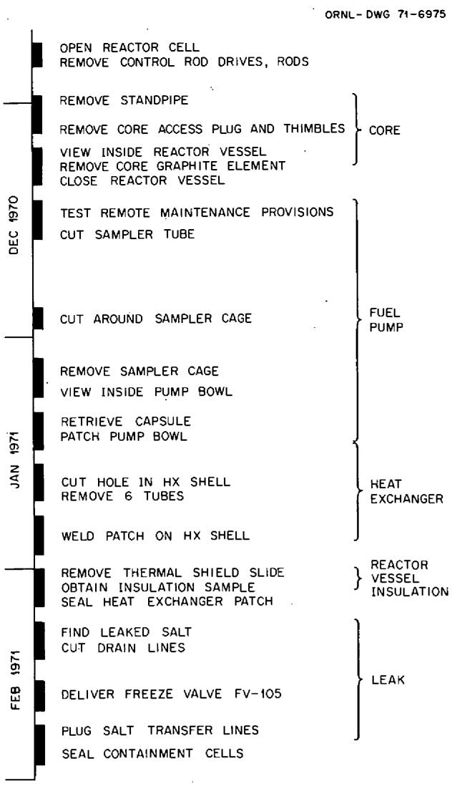  
Fig. 1.1. Outline of postoperation examinations.

# 1.2 REACTOR VESSEL AND CORE

Before the large access flange on the reactor vessel could be opened, equipment above it had to be removed. The first items, the three control-rod drives, were removed quickly and uneventfully. The drives were not inspected but were placed in the equipment storage cell. Next the three control rods were removed and viewed in the reactor cell. They appeared to be in good condition, still flexible, with no perceptible distortions, surfaces smoothly oxidized with only minor marks from rubbing inside the thimbles. The poison section of one rod was severed, put in a lead-shielded pipe, and placed in the storage cell. (Gamma radiation was $7\mathrm{R / hr}$ at the outside of 2 in. of lead.)

The 20-in.-diam standpipe attached to the core specimen access flange came out only after some

flexible air lines were cut with a torch to clear the way. The standpipe, reading $10\mathrm{R / hr}$ at 3 ft, was bagged and buried. After electrical connections and the standpipe ventilation line were detached, the lead which had protected the rod drives was removed.

The bolts in the 10-in. access flange came out without excessive torque. (The removal tool suffered a broken universal joint pin but worked satisfactorily after repair.) The access plug (which includes the control rod thimbles) lifted out freely and was laid down on top of the thermal shield, as shown in Fig. 1.2, for viewing. The surfaces of the rod thimbles were uniform in appearance, with a dull-gray surface. The lower 42 in. of thimble 3 was severed with a Heliacr torch and delivered for hot-cell examination (see Sect. 13.3). In the strainer basket section that had extended into the top head of the reactor vessel, the edges of the perforations were sharp, with no visible erosion. The only salt evident on the whole assembly was small blobs visible through a few of the perforations. There was no heavy deposit in the region of the salt-gas interface, but farther up there was a blackened area (visible near the flange in Fig. 1.2). Inspection of the inside of the access nozzle with a periscope showed a darkened area near the top matching that on the plug. The area was opposite the air inlet into the cooling jacket, suggesting that the dark material was a surface deposit. Otherwise the inside of the access nozzle and the upper head of the reactor vessel appeared to be in excellent condition, with only a few scattered droplets of frozen salt in evidence.

The first view down through the access opening was as shown in Fig. 1.3. Several irregular chunks up to 2 in. in size were seen lying on top of the core structure in this area. Close examination with a right-angle scope showed them to be broken pieces of graphite. Figure 1.4 is a typical view through this scope, looking westward at a large chunk inside the metal centering bridge and a small chunk resting on top of the bridge. (These chunks are visible in Fig. 1.3 at the lower right.) A wide look at the top of the core through a fisheye lens disclosed six or seven more chunks of graphite lying about. Although no gaps were noticed in the core array, the characteristic pyramid shape on at least two of the chunks showed that they were the upper ends of vertical graphite bars. Figure 1.5 is a photograph through the fisheye lens, blurred by vibration of the long scope during the exposure. The direct view was sharper, and gaps in the array would probably have been noticed. The elements were not counted, however, and the absence of some around the periphery could easily have been overlooked.

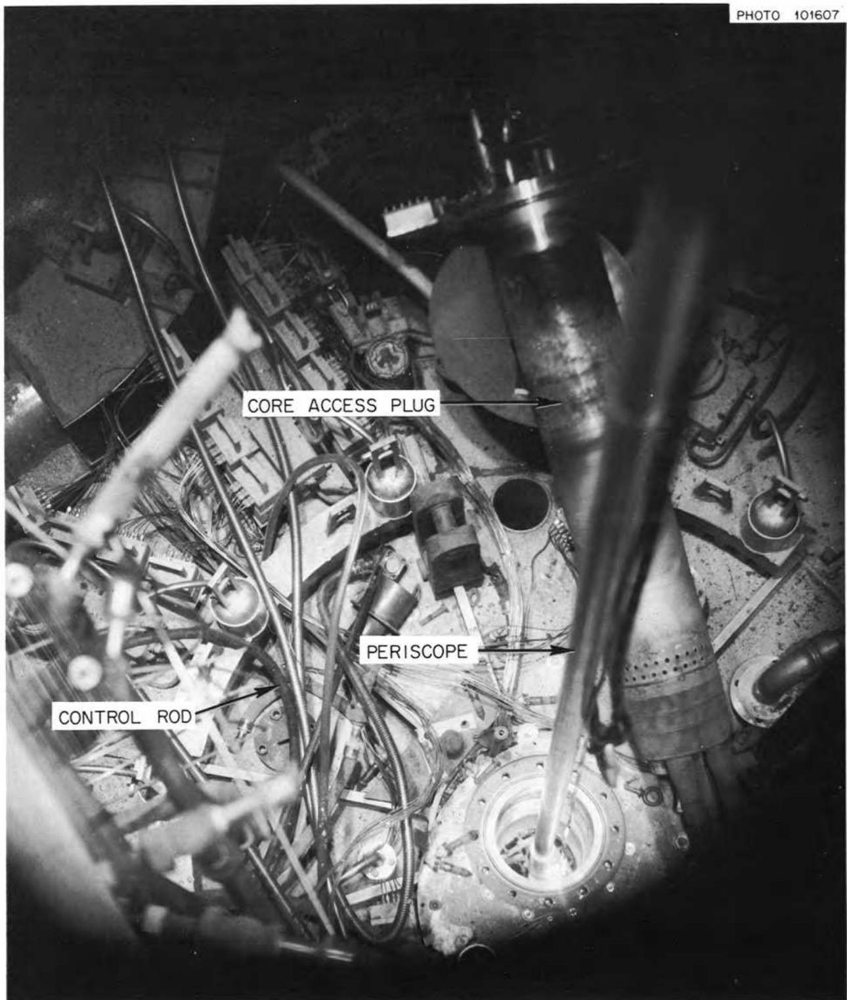  
Fig. 1.2. Top of thermal shield during core inspection.

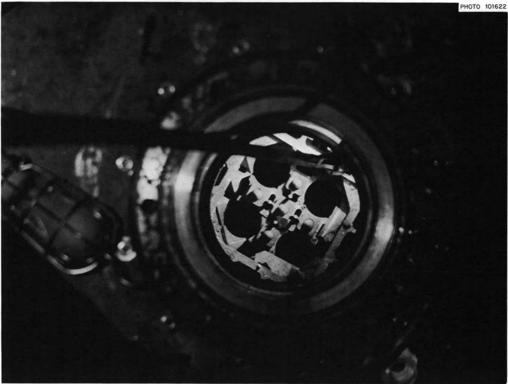  
Fig. 1.3. View of top of core through access opening.

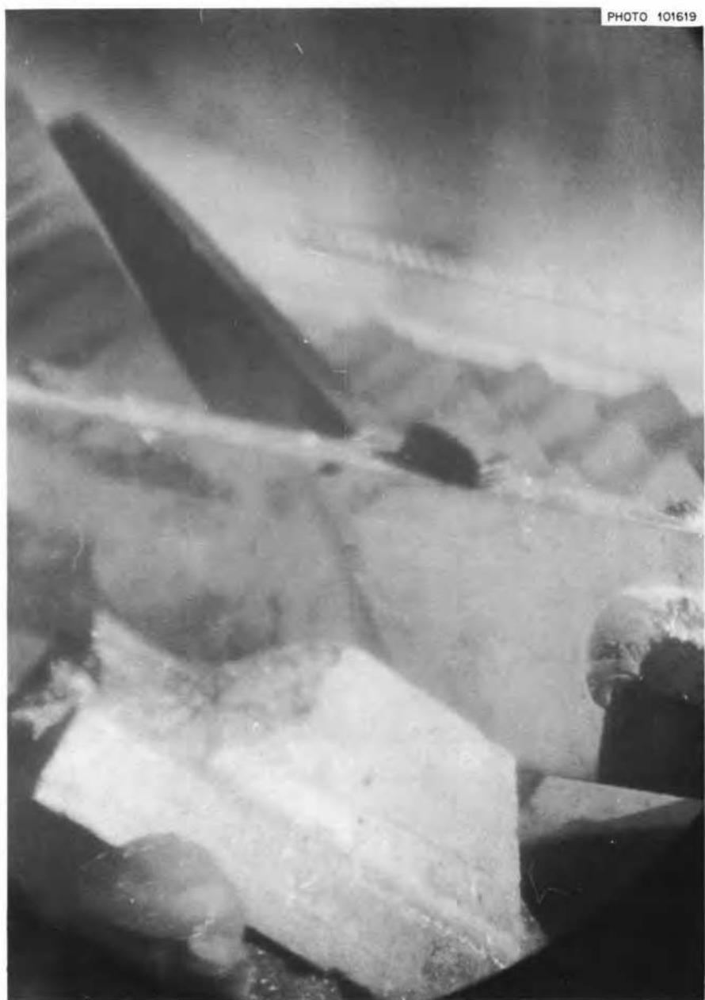  
Fig. 1.4. Closeup view of broken pieces of graphite on top of core.

One piece of graphite visible in Fig. 1.3 was definitely established as coming from the periphery of the core. This was the one lying partly across the rod thimble hole toward the bottom of the figure. (In this view the lighting makes the flat surface which faces upward appear bright.) The angles on the machined end of this piece coincide with those on construction drawings for one of the elements that was partly cut away for the retaining ring that circled the core at the top. It is the mirror image of the piece pointed out in Fig. 1.6.

The most likely explanation for breaking of the graphite is that it occurred during cooldown. After salt

trapped between the Hastelloy N retaining ring and the graphite froze, further thermal contraction of the ring could produce bending loads on the upper ends of the bars. (This is basically the same chain of events that broke many of the graphite pieces in the first specimen array exposed in the core.) The chunks that got loose, to float up to the outlet screen on a fill and subside somewhere atop the core on a drain, were broken off above the retaining wire. The larger pieces (see Fig. 1.5)

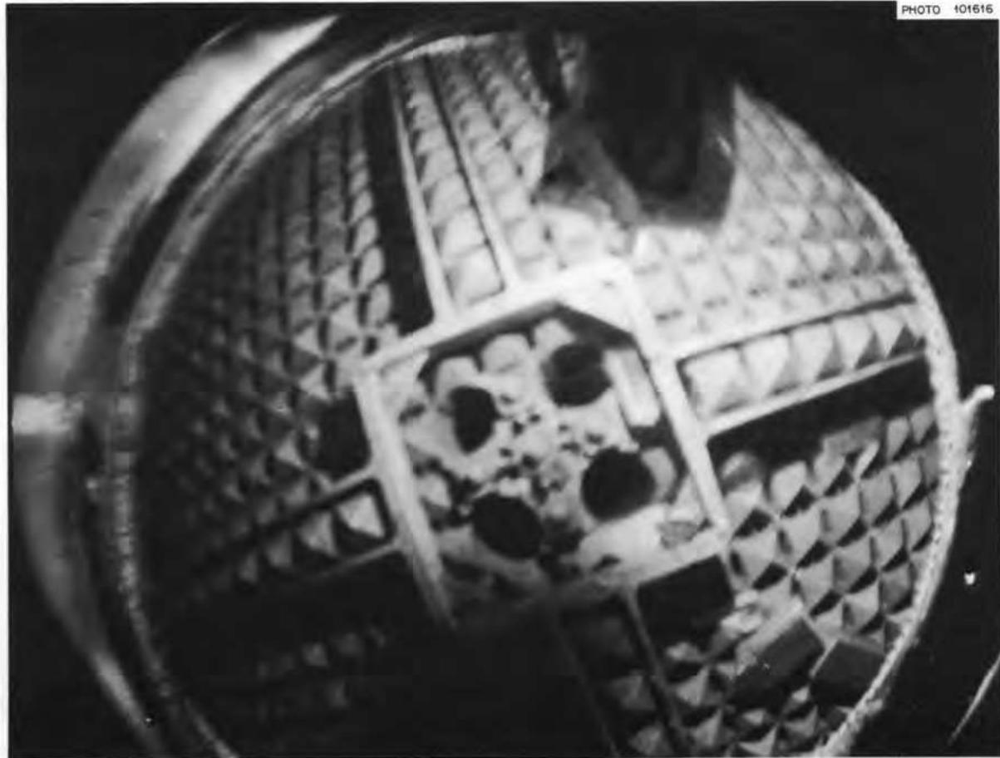  
Fig. 1.5. View of top of core through a fisheye lens.

must have come from the rows inside the centering bridge, where the graphite extended almost 3 in. above the wire.

An attempt was made to retrieve some of the pieces lying directly below the access opening, but all were accidentally dislodged and fell down through the thimble holes into the lower head where they would have been very difficult to recover.

Except for the broken graphite (which could not have caused any significant perturbations during operation), the conditions in the upper head looked good, with clean surfaces and sharp edges. An example is the weld at the extreme right of Fig. 1.4.

The east removable graphite stringer was marked on top to show its orientation and then was removed without difficulty into a shielded carrier for delivery to the HRLEL. (It was found to be in excellent condition, as described in Sect. 13.1.) Another stringer was being lifted out to provide a wider view of the lower head when an improper movement of the crane broke the graphite and the lower part fell back into the core.

There was sufficient clearance for a light and a periscope to be let down into the lower head, but the view was rather restricted because of the metal grid structure. The bottom surface appeared to have a sandy texture, but if there was a deposit, its depth was very small compared with the dimensions of the drain line entrance, which could be clearly seen. No foreign objects were seen in the lower head.

After viewing inside the reactor vessel was finished, one of the control rods was placed in a core channel and the access was closed with a gasketed blank flange.

# 1.3 FUEL PUMP

The preliminary steps in cutting into the fuel pump bowl involved testing some of the built-in remote maintenance devices on the pump. The mechanism for compressing the bellows in the sampler tube spool piece was rusty, and a drive chain broke when its use was attempted, so the spool piece had to be removed by an improvised procedure. On the other hand, bolts in the

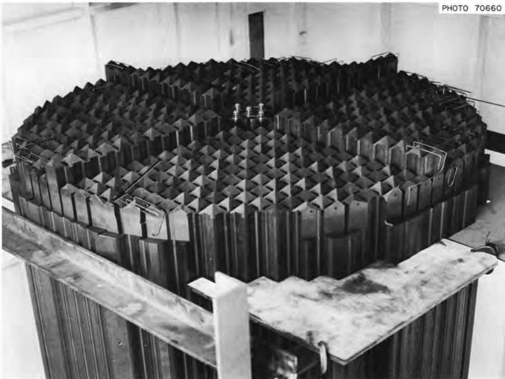  
Fig. 1.6. Core graphite during assembly, before installation of retaining rings and centering bridge. Arrow points to piece similar to one found broken on top of core.

large flanges on the motor and the rotary element were loosened without difficulty.

An oxyacetylene torch was used to cut away the pump support plate, the cooling air shroud, and other obstructions over the pump bowl. The sampler tube was then cut off short, and the latch stop was tapped for attachment of the bowl-cutting tool shown in Fig. 1.7. This special tool consisted of an air-motor-driven abrasive cutter swivel-mounted on a bracket that fastened between the sampler tube stub and a bolt hole in the pump flange. Manual swiveling of the tool produced a trepan cut like that shown in Fig. 1.7 in the simulated pump bowl top. The actual cutting of the pump bowl was delayed by cutting wheels breaking, and when the fourth wheel broke after the cut was nearly complete, a chisel was used to finish freeing the sampler mist shield and cage. This assembly was then removed for detailed examination in the HRLEL, as described in Sects. 8.3 and 13.4.

Visible on the bottom of the pump tank in the area that had been enclosed by the mist shield were the copper bodies of the two 10-g sample capsules that had been dropped in August 1967 and March 1968. The capsules seemed to be coated with an irregular dark deposit, neither had any sign of its steel cap, and one had been mashed rather flat. Subsequently the flattened capsule was retrieved for inspection, but the other capsule was accidentally knocked out of reach. Evidently the recovered capsule was the older of the two, whose corroded steel cap had been retrieved in May 1968 and whose body had been bent by the impact of the heavy magnets used at that time.[5]

In the same area as the capsules there was a pile (50 to $100\mathrm{cm}^3$ ) of loose dark material, some as small particles, some as lumps up to $1\mathrm{cm}$ and some as thin

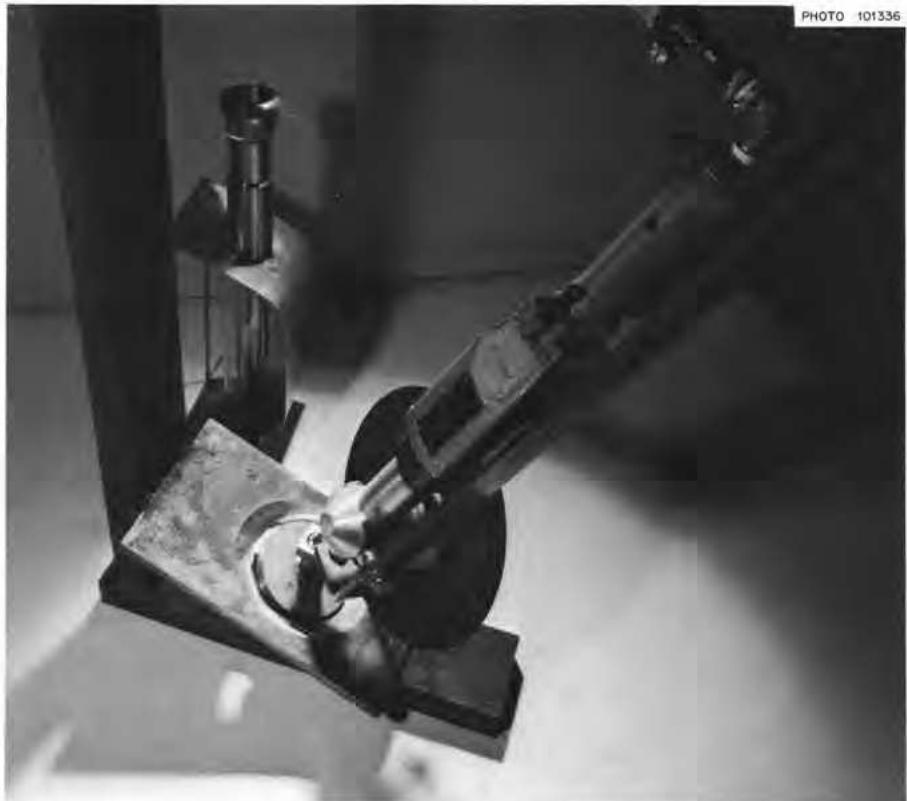  
Fig. 1.7. Tool for excising fuel pump sampler cage, mounted on mockup of top of pump tank.

sheets up to $2\mathrm{cm}$ across. On contact, the larger pieces crumbled easily, and heat from the viewing light caused the material to smoke. A sample was scooped up and delivered with the capsule. Analysis of the loose material and the deposits on the mist shield and cage are described in Sect. 8.3. Results of the inspection of the capsule are given in Sect. 13.5.

A periscope was used to view the interior of the pump bowl, where throughout the years of operation oil had decomposed, salt mist had floated about, and noble metals had concentrated. Considering all this, surprisingly little material was found deposited on the various surfaces of the pump tank that were visible from the opening (see Fig. 1.8).

The top head of the tank was covered with a dull, dark, rather uniform film, seemingly like that on the outside of the mist shield near the top. Here and there thin sheets of this material had peeled and hung down.

Some of the sheets could be seen swaying, presumably in the thermal currents from the hot lamp.

Quite different were the deposits on the upper surface of the sloping baffles in the upper part of the bowl. These were nonuniform, rather rough or angular, and reflected more light than did the deposit on the top head. This type of deposit is illustrated in Fig. 1.9, which is focused on the edge of the $\frac{1}{8}$ -in.-thick baffle that slopes down from the volute support cylinder. (There is some blurring in the image due to motion during the exposure. The overflow pipe and its junction with the lower head, seen in the background, are also out of focus.) The same kind of deposit is seen in Fig. 1.10. This is a closeup of the end of the spray ring and attached baffle. The baffle itself is $\frac{1}{8}$ -in.-thick metal, and the deposit seen here in edge view is less than half as thick. The ripples in the weld on the end of the tube are visible through the deposit. In the patch seen in Fig. 1.10 near the juncture of the baffle and the tube, where the deposit had evidently flaked off, the exposed metal was clean and smooth. Since it seemed that this kind of deposit was also present on the excised mist shield, no effort was made to obtain a sample from surfaces inside the bowl.

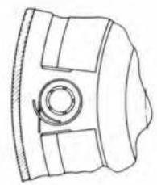

ORNL-DWG 69-10172

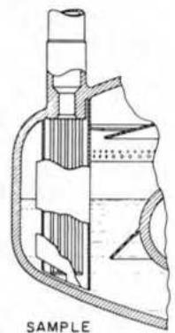  
SAMPLE CAPSULE CAGE

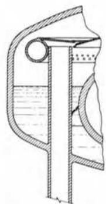  
OVERFLOW PIPE

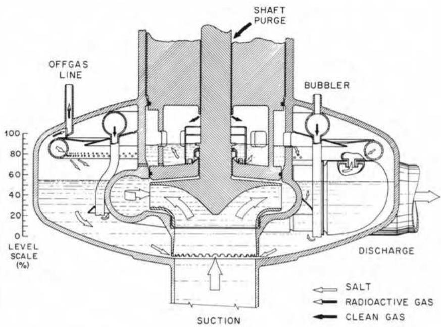

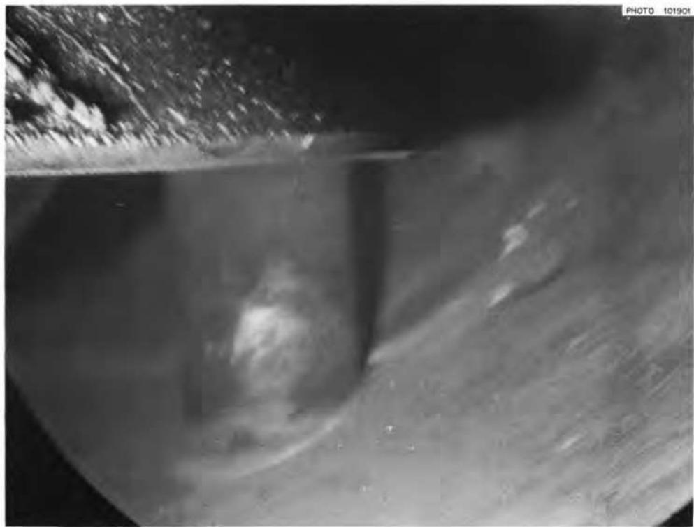  
Fig. 1.8. MSRE fuel pump internals.   
Fig. 1.9. View inside fuel pump bowl showing edge of spray baffle, with scattered deposits. The overflow pipe is visible in the background.

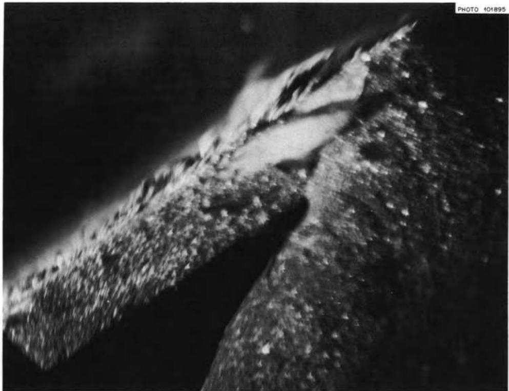  
Fig. 1.10. Closeup of end of spray ring and baffle in fuel pump showing deposit.

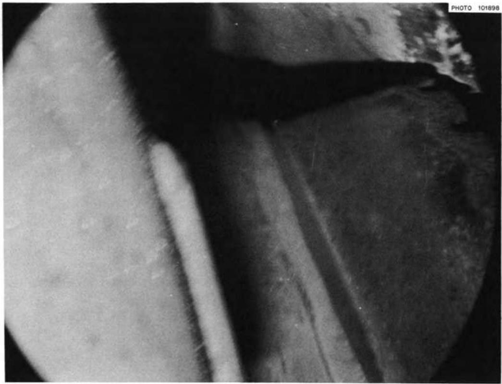  
Fig. 1.11. View in lower part of pump bowl showing ports into volute suction.

The portion of the spray ring below the baffle was clean, and the spray holes that were visible were sharp and clear. One of the brackets supporting the spray ring appeared white and seemed to be detached from the wall.

Nowhere to be seen in the pump bowl were salt droplets or the globular deposits often associated with frozen mist, and nothing was visible in the salt-gas interface zone to suggest that there had been any foam. Except for the debris around the sampler region, the bottom of the pump bowl was relatively clean, with only a few areas showing a thin dark film or deposit. The metal surfaces that had been submerged in the salt were generally smooth dull gray. One exception was on the lower extension of the volute where there was some discoloration and minor roughness around the ports. This is evident in Fig. 1.11. On the bubbler tube there was a white area just above its penetration of the baffle extending out from the volute, where gas that collected beneath the baffle bubbled up through the clearance gap around the tube.

After the viewing was concluded, the hole in the pump bowl was sealed. A steel patch with silicone rubber sealant around the periphery, held in place by a jack bolt extending up to the rotary element flange, was installed and proved leak-tight in a soap test at 5 psig.

# 1.4 HEAT EXCHANGER

Two heater units, HX-1 and -2, had to be removed to permit cutting into the heat exchanger. Both had been removed and reinstalled in 1968 without particular difficulty, but this time HX-1 hung on a freeze flange clamp during removal and was pulled out of shape. Both units were placed in the equipment storage cell.

A section of the $\frac{1}{2}$ -in.-thick shell of the heat exchanger was cut out, using a plasma torch device that had been developed and tested on a mockup of the heat exchanger shell. Figure 1.12 is a view through the 10-by 13-in. oval opening. The dull appearance of the tubes is due to a thin coating which wiped off easily during handling. The oily spot on the tubes at the center of the opening is lubricant used in tapping a hole drilled in the shell for attachment of the torch fixture. The abrasive cutoff tool shown in Fig. 1.13 was used to remove sections of six tubes for the detailed examinations described in Sect. 13.6. Several other tubes were cut and raked out into the reactor cell to permit viewing inside the heat exchanger. The periscopic view showed the inside of the shell, baffles, tubes, and

8. MSR Program Semiannu. Progr. Rep. Aug. 31, 1968, ORNL-4344, p. 31.

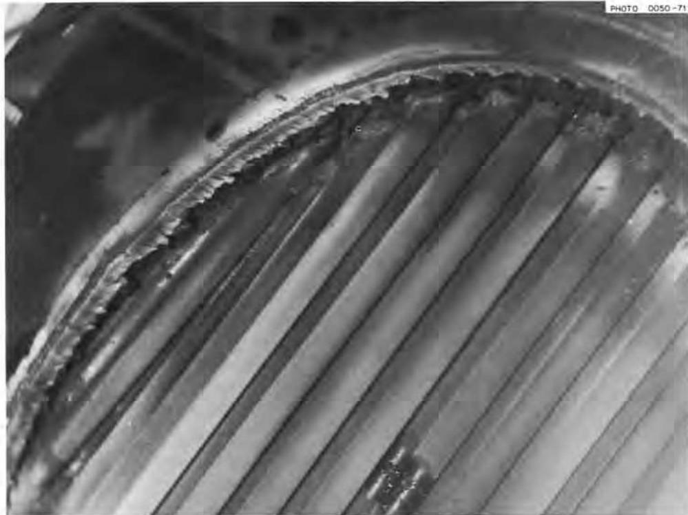  
Fig. 1.12. Opening in primary heat exchanger, showing cut made with plasma torch and exposed tubes.

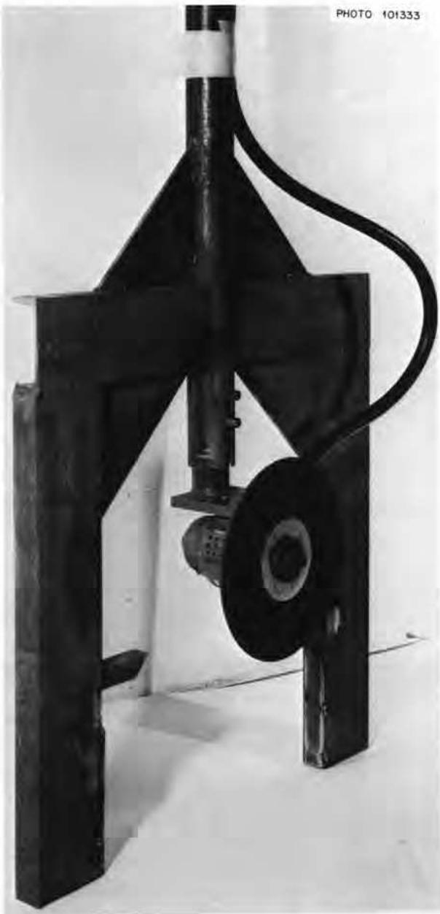  
Fig. 1.13. Abrasive cutoff tool for removing heat exchanger tube section.

cross-lacing. There seemed to be a slight coating on everything, but otherwise nothing unusual was observed.

The opening in the heat exchanger shell was closed by welding on a patch of $\frac{1}{4}$ -in.-thick type 304L stainless steel. A sound weld was obtained around most of the periphery, but at some spots there was porosity. After repeated attempts to obtain a good seal by adding filler metal were unsuccessful, iron-filled epoxy putty was applied. A soap test at 5 psig then disclosed no leaks.

# 1.5 LEAK AT FREEZE VALVE FV-105

When the leak appeared during the final shutdown on December 12, 1969, evidence pointed to freeze valve FV-105 as the probable location. This was confirmed during the postoperation examination as soon as the heater-insulation units were removed from the salt lines. None of the units was especially radioactive except for the one covering FV-105, which was significantly contaminated, and a visual scan of the lines showed a blob of salt in the suspected area, immediately adjacent to the cooling air shroud. Close inspection through a periscope revealed the knobby lump shown in Fig. 1.14, suggestive of a slow leak in a freezing environment. On the other side of the pipe, there was, in addition to more knobby material, a thin sheet of salt that had run out on the flat base under the removable insulation unit. The total amount of salt that had leaked was estimated at between 2 and 3 in.

The section of $1^{1/2}$ -in. pipe containing the freeze valve was cut out with an abrasive cutoff tool and delivered to the HRLEL. Examinations (described in detail in Sect. 13.7) showed the leak to be a crack in the pipe just outside the shroud, where large cyclic stresses were produced by differential thermal expansion of the shroud and pipe during operation. These stresses were higher than in the development model that had been tested because a late modification to increase cooling air flow $^{10}$ had the unintended effect of greatly strengthening the shroud. This had been overlooked, and the failure occurred after many fewer cycles than had been considered allowable.

# 1.6 OTHER EXAMINATIONS

One of the uncertainties in the tritium balance in the $\mathrm{MSRE}^{11}$ was the amount of tritium produced from lithium in the thermal insulation around the reactor vessel. In order to measure the lithium content, samples of the insulation were obtained by taking out one of the removable slides of the thermal shield. The cooling water lines were cut with a torch, and the slide was lifted out without difficulty. Working through the maintenance shield, we chiseled the metal can open and took three samples of the block insulation. Lithium analyses ranged from 12 to $38~\mathrm{ppm}$ , which meant that

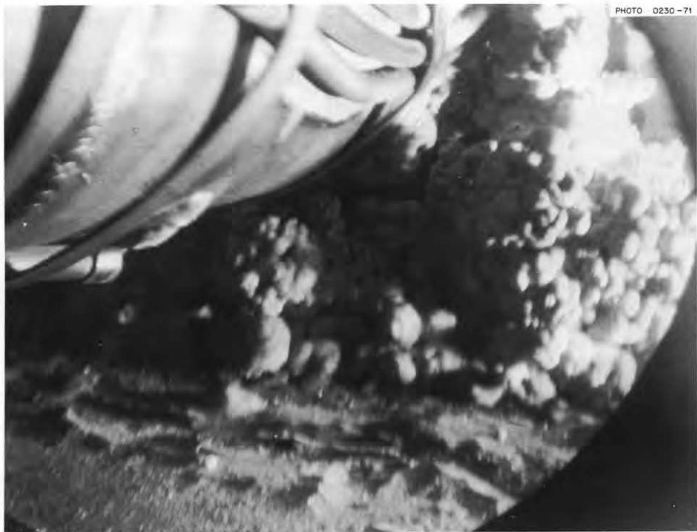  
Fig. 1.14. Closeup view of salt near freeze valve FV-105. The drain line and $\frac{1}{8}$ -in.-diam thermocouple sheaths loom at upper left.

only a small fraction (less than $5\%$ of the 3 to $5\mathrm{Ci / day}$ of tritium appearing in the cell atmosphere could have been produced in the insulation; nearly all must have diffused out through the walls of the fuel system. Tritium in the samples indicated that the total retained in the $500~\mathrm{kg}$ of insulation was only 2 to $3\mathrm{Ci}$ .

The outside of the reactor vessel was examined, using a periscope inserted through the thermal shield slide opening. All visible surfaces of the vessel were smooth and seemed to have remarkably little oxide, being noticeably lighter in color than the 5-in. salt pipe into the vessel, which had a uniform black surface. The drain line, between the reactor vessel and its penetration of the thermal shield, showed no visible effect of operation. The same was true of the heater sheaths and thermal insulation cans.

Several sheathed thermocouples were removed from various locations in the MSRE for testing to determine effects of radiation and/or high temperature. Thermocouple TE-R52, which had been in a well in the core

access plug, was the most highly irradiated of those that were recovered. Two thermocouples were chiseled off the core inlet line and four off the heat exchanger, but attempts to detach one of the thermocouples welded to the outside of the reactor vessel were unsuccessful.

# 1.7 EVALUATION OF TOOLS AND PROCEDURES

It was not required that the postoperation examinations leave the fuel system in operating condition or able to be restored. The patches on the openings in the fuel system were required to be reasonably leak-tight but not necessarily resistant to very high temperature and radiation. This simplified the tools and procedures but limited the demonstration of radioactive maintenance capability. Even so, the experience was valuable.

The technique used in the examinations was basically the same as had been used for maintenance of the radioactive systems: long-handled tools, operated

through a portable work shield set up over a hole in the cell roof. Most of the tasks were new, however, and required specially designed tools. In addition to the usual socket wrenches, hooks, etc., there were airmotor-driven abrasive wheels in several configurations, a hydraulically operated shear, oxyacetylene cutting torches, a plasma torch, and Heliac welding torches. Most of the special tools are shown arrayed on top of the drain tank cell in Fig. 1.15. Not shown are the periscopes and the plasma torch with its fixture for mounting on the heat exchanger.

The removal of the control rods, rod thimbles, and core graphite had been provided for in the reactor design, and few difficulties were encountered. The only one that would have been troublesome if the aim had been to resume operation was the unexpected interference of some flexible air lines with the removal of the containment standpipe.

The remote removal and replacement of the fuel pump motor and rotary element had been tested in 1965, and the relative ease with which the flange bolts were removed during the postoperation work suggested that this task was still practical. Replacement of the pump bowl and piping was a job that had been anticipated but not tried. The failure of the built-in devices for removing the sampler tube spool piece would have added to the already formidable proportions of this task.

Cutting Hastelloy N with long-handled tools was something new. This alloy is characteristically difficult to cut, and under the conditions in the reactor cell, the positive advance of the cutter necessary to avoid work hardening could not be guaranteed. Abrasives work satisfactorily on Hastelloy N, however, so the rotating grinder (Fig. 1.7) was chosen over a hole saw for cutting out the fuel pump sampler cage. When the ground-off latch stop was tapped for attachment of the tool, even though lubricant was applied, the torque required was so high that elastic torsion of the pipe on which the tap was mounted made the job difficult. During the trepanning operation, grinding wheels broke more frequently than in the mockup tests. It appeared that bits of slag from the torch cuts on the obstructions overhead were being dislodged by the vibration and falling into the trepan groove. The cut took about 8 hr grinding time, but replacement of three broken wheels extended the working time to several days.

The grinding wheels worked well in cutting the sampler tube, heat exchanger tubes, and the fuel lines around the freeze valves. Two of the cuts in the last area were made without difficulty through a pipe filled with frozen salt. An advantage of cutting this way was

that the pipe ends were left clean and square, ready for tapping or plugging. The oxyacetylene torch proved quite satisfactory for rough cutting, including the 2-in. steel support plate for the fuel pump, the cooling air shroud, and the water lines to the thermal shield slide.

The plasma torch used on the heat exchanger shell was a commercially available unit: only the device for moving it over the surface was specially designed for this job. Development tests on a mockup proved the device capable of maintaining a constant separation distance and established the proper control settings. In the reactor cell, however, considerable difficulty was met in starting the cut. On the first five attempts, backspatter of molten metal ruined the torch nozzle, which had to be replaced. This was complicated because of radioactive contamination on the torch. Finally the gap between the torch and the shell, which had been set at $7/16$ in., was reduced to $5/16$ in., and the cut was made with no difficulty. The jet from the torch extended far enough to sever a few tubes. Spatter was confined to a zone near the cut, but there was a widespread, nonuniform light coating inside the heat exchanger that was probably condensed material vaporized by the torch (see Sect. 13.6).

Patching the heat exchanger shell was a challenging task. The original plan was to cut a $\frac{1}{2}$ -in.-thick piece of curved plate fitting into the hole left by the plasma torch. Then a Heliacr torch, guided around the path followed by the cutting torch, would fuse the patch and shell. After mockup tests showed that it was very difficult to get an adequate fit, however, it was decided to try an overlapping patch. The overlap unfortunately ruled out use of the existing torch guide to maintain a fixed gap, but successful welds were made by a welder, watching through a periscope and controlling the gap by a rope attached to the torch. Although this worked well in the mockup, troubles were encountered in the reactor. The shell around the hole was prepared with brushes and sanding disks mounted in an electric drill, and the patch was set in place without difficulty. When welding was started, however, the edges of the patch tended to melt and run off without adhering to the shell. Changing the angle of the torch to put more heat on the shell helped, and a good-looking fusion weld was obtained around most of the periphery despite the awkward working arrangement. In places, however, the patch had melted back so far that gaps were left. Attempts to close these up using welding rod were not completely successful as shown by a pressure test. After more fruitless efforts at weld repair, a good seal was made with iron-filled epoxy, backed up by a "dam" cut from a stainless steel plate that had been rolled to fit on

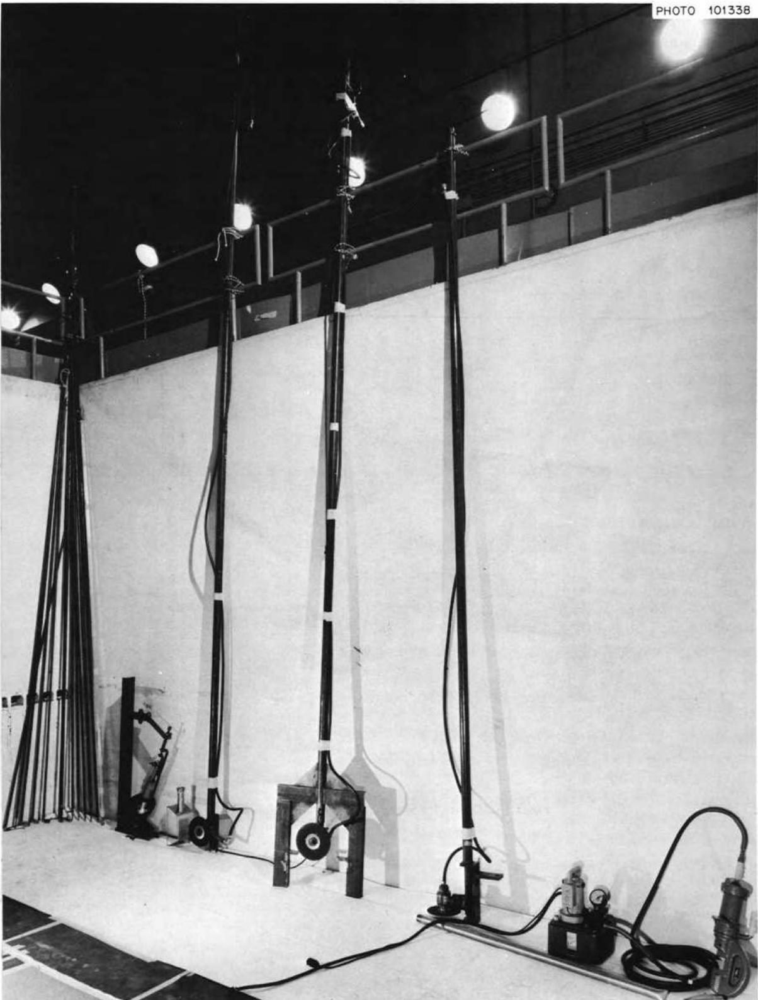  
Fig. 1.15. Special tools for postoperation examination.

the heat exchanger shell around the patch. The radiation level on the shell was $630\mathrm{R / hr}$ which would not cause deterioration of the epoxy for several years.

The severed fuel drain lines were plugged with devices like the one shown in Fig. 1.16. A conical plug of soft copper was forced into the end of the $1^{1/2}$ -in. pipe by a jack bolt through a bracket clamped to the pipe. A tube connected to a hole through the plug extended up to the top of the cell, where temporary connections could

be made for gas addition. Each of the three lines leading to the salt tanks extended down into the frozen salt and so could be pressurized to test the plugs. There were some problems in installation due to brackets breaking, but satisfactory seals were obtained in every case.

The hydraulically operated shear worked well in tests but was not used in the reactor because the anticipated need did not materialize.

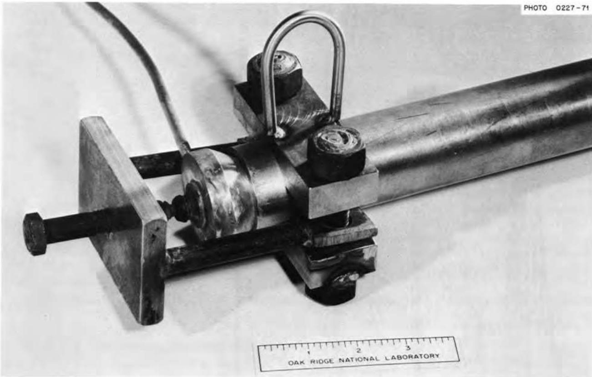  
Fig. 1.16. Device for plugging severed ends of salt lines.

# 2. Further Investigations

During operation of the MSRE there arose two discrepancies which we hoped to resolve during the postoperation examination. One was the discrepancy between the reactor power indicated by the heat balance and that indicated by the changes in ratios of nuclides in the fuel. The other was a difference between the amount of uranium that was stripped from the fuel salt in 1968 and the amount that was later recovered from the $\mathrm{UF}_6$ absorbers.

# 2.1 TEST OF COOLANT SALT FLOWMETER AND CONCLUSIONS

C. H. Gabbard P. N. Haubenreich

The power level of the MSRE was routinely obtained from a heat balance on the reactor cell by the on-line computer. Using the finally accepted value of the specific heat of the coolant salt, this computation indicated that the maximum power (heat removal) was about $8.0\mathrm{MW}$ . Serious doubt was cast on this value, however, when analysis of the changes in uranium and plutonium isotopic ratios over long periods of operation indicated that the power had been 7 to $8\%$ less than that indicated by the computer heat balance. Heat removal in the coolant salt was the preponderant term in the heat balance ( $98\%$ of the total at full power), and suspicion was directed at the coolant salt flow measurement.

The volume flow rate of coolant salt was measured by a venturi flowmeter in the 5-in. pipe near the radiator inlet. There were two readout channels, each consisting of two pressure taps in which molten salt transmitted pressure through metal diaphragms to NaK-filled lines leading out of the heated zone to a differential pressure cell. Associated electronics produced a signal that ranged from 2 to $10\mathrm{V}$ in proportion to the square root of the pressure differential. In the computer this voltage was converted to flow rate by a multiplicative factor based on the manufacturer's calibration of $\Delta p$ vs flow in the venturi and a voltage- $\Delta p$ relation for the instrument that had been determined before operation. Near the end of nuclear operation, a review of the flow- $\Delta p$ calibration disclosed a mistake that was introducing an error of $-2.9\%$ in the indicated flow, and

whose correction only increased the discrepancy between heat balance power and the nuclide indications. The $\Delta p$ -voltage calibration of the flowmeter readout instrumentation could not be checked until the salt piping could be cut.

During the postoperation examinations, the 5-in. coolant pipe was removed on either side of the venturi, and a plug was installed in the converging section and one upstream so that pressure could be applied to the upstream taps. The pressure differential between the upstream and throat taps was raised and lowered through the normal range while $\Delta p$ and voltages were accurately measured. It was found that the voltage which had been interpreted as $850\mathrm{gpm}$ was produced by a pressure differential equivalent (according to the corrected flow- $\Delta p$ calibration) to a flow of only 793 gpm, or an error in the $\Delta p$ -voltage calibration of $+6.7\%$ .

In addition to the errors of $-2.9$ and $+6.7\%$ in the measured salt flow rate, an error of $+0.4\%$ in the salt temperature rise had been indicated by an experiment on the effects of isothermal system temperature changes on thermocouple biases. The net effect of correcting for these errors was to change the heat balance power from 8.0 to $7.65\mathrm{MW}$ .

Ragan had calculated nominal full power values of $7.30 \pm 0.10 \mathrm{MW}$ from the $^{235} \mathrm{U}$ depletion and $7.45 \pm 0.18 \mathrm{MW}$ from the $^{236} \mathrm{U}$ buildup for a weighted average of $7.34 \pm 0.09 \mathrm{MW}$ . Thoma and Prince inferred a value of $7.41 \mathrm{MW}$ from the changes in $^{240} \mathrm{Pu} / ^{239} \mathrm{Pu}$ ratios and observed that changes in the $^{234} \mathrm{U} / ^{233} \mathrm{U}$ ratio were in excellent agreement with this value. The 7.65-MW value from the finally corrected heat balance is higher than the nuclide values by about $3\%$ . Uncertainties in cross sections, fission energies, salt density, salt specific heat, venturi calibration, and d/p instrument calibration are enough to account for the difference.

It is unfortunate that throughout the operation of the MSRE, changes from time to time in the best estimate of the power level required reworking of detailed analyses of reactivity, heat transfer performance, and fuel chemistry. There appears to be no prospect of further reducing the uncertainty that still remains. The nominal full power of the MSRE was probably between 7.4 and 7.6 MW. Analyses and reports that have been made since the last few months of operation have generally used a nominal full power of 7.34 or 7.4 MW, and there is insufficient cause to redo this work.

# 2.2 INVENTORIES OF RESIDUAL URANIUM AND PLUTONIUM

R. E. Thoma

As mentioned in the preceding section, we deduced from comparisons of observed changes in the isotopic composition of plutonium with nominal values that the maximum power output of the MSRE was $7.4\mathrm{MW(t)}$ . After obtaining this value, we computed a material balance on the $^{238}\mathrm{U} + ^{235}\mathrm{U}$ that was in the fuel salt from 1965 to 1968. This balance indicated that the amount that left the fuel salt during the chemical processing operations in 1968 was some $4\mathrm{kg}$ more than the amount that was recovered from the $\mathrm{UF}_6$ absorbers. As will be described in a forthcoming report summarizing experience with the MSRE, refinement of that assessment resulted from isotopic-dilution analyses, which showed that the amount of $^{238}\mathrm{U}$ loaded into the MSRE was actually about $2\mathrm{kg}$ less than was credited in on-site records. The resultant material balance is presented in Table 2.1.

Recovery of uranium was carried out by Goodyear Atomic Corporation, Piketon, Ohio, by dissolution of the NaF pellets in which the $\mathrm{UF}_6$ was absorbed. Special precautions were taken to minimize measurement uncertainties, and a review by Goodyear of the operations did not reveal any reason for revising the originally reported amount of uranium recovered. We have reexamined the possibilities of such errors as might be ascribed to misestimates of power output of the reactor and the implications of reactivity anomalies and

Table 2.1. Material balance for uranium in the fuel salt, 1965-1968   

<table><tr><td></td><td>Kilograms of uranium</td></tr><tr><td>Charge at initiation of power operation</td><td>227.020</td></tr><tr><td>Additions as fuel replenishment</td><td>+2.461</td></tr><tr><td>Transferred to flush salt</td><td>-6.272</td></tr><tr><td>Removed in \( samples^a \)</td><td>-0.256</td></tr><tr><td>Consumed in 9005 EFPH (equivalent full power hours) of \( operation^b \)</td><td>-3.594</td></tr><tr><td>Net at end of \( ^{235}\mathrm{U} \) operation</td><td>219.359</td></tr><tr><td>Retained and mixed with \( ^{233}\mathrm{U} \) \( charge^c \)</td><td>-1.935</td></tr><tr><td>Removed during processing</td><td>217.424</td></tr><tr><td>Recovered from \( UF_6 \) absorbers (max)</td><td>214.776</td></tr><tr><td>Disparity</td><td>2.648</td></tr></table>

$^{a}$ J. R. Engel, MSRE Book Uranium Inventories at Recovery of 235 U Fuel Charge, internal memorandum MSR-68-79 (May 1968).   
bMSR Program Semiannu. Progr. Rep. Aug. 31, 1969, ORNL-4449, p. 25.   
cMSR Program Semiannu. Progr. Rep. Feb. 28, 1969, ORNL-4396, p. 131.

short-term trends in the results of chemical analyses; their possible contribution to the disparity indicated in Table 2.1 is negligible. Analysis of scrubber solutions during the processing showed less than $1\mathrm{g}$ of uranium discarded. The conclusion, therefore, is that the material balance affords unequivocal evidence that some $2.65\mathrm{kg}$ of uranium $(33.08\mathrm{wt}\%^{235}\mathrm{U})$ remains at the MSRE, possibly in the chemical processing plant.

Although there was no direct evidence to support uranium retention in the processing equipment, two components have been identified as conceivable sites for such retention. Engel noted that the particle filter (a $9\mathrm{-ft}^2$ filter designed to remove corrosion product solids from the fluorinated salt before its reuse in the reactor) in the line between the fuel storage tank and the processing tanks could, after treatment of the flush salt was completed, have contained an unknown amount of zirconium metal, delivered to this location as the processed flush salt was returned to the reactor system. It is difficult to assign high probability to the events which could have reduced the uranium from the fuel charge as, subsequently, it passed through this filter in such a way that some $2.5\mathrm{kg}$ of uranium remained in the filter; however, the possibility cannot be excluded.

Another possible site where uranium may have been retained, as suggested by R.B. Lindauer, is the high-temperature sodium fluoride absorber bed, which is positioned between the fuel storage tank and the NaF absorbers. The design temperature for operation of this

Table 2.2 Inventory of residual uranium and plutonium in the MSREa   

<table><tr><td rowspan="2"></td><td colspan="6">Uranium inventory</td></tr><tr><td>233U</td><td>234U</td><td>235U</td><td>236U</td><td>238U</td><td>ΣU</td></tr><tr><td>Fuel circuit inventory, run 20-I, kg</td><td>28.568</td><td>2.526</td><td>0.869</td><td>0.036</td><td>2.020</td><td>34.019</td></tr><tr><td>Total inventory, run 20-I, kg</td><td>31.052</td><td>2.746</td><td>0.945</td><td>0.039</td><td>2.196</td><td>36.978</td></tr><tr><td>Drain tank inventory, run 20-I, kg</td><td>2.484</td><td>0.220</td><td>0.076</td><td>0.003</td><td>0.176</td><td>2.959</td></tr><tr><td>Fuel circuit inventory, run 20-F, kg</td><td>28.406</td><td>2.533</td><td>0.866</td><td>0.036</td><td>2.011</td><td>33.852</td></tr><tr><td>Transfer to flush salt, run 20-F, kg</td><td>0.411</td><td>0.037</td><td>0.013</td><td>0.061</td><td>0.029</td><td>0.491</td></tr><tr><td>Charged into drain tank, run 20-F, kg</td><td>27.995</td><td>2.496</td><td>0.853</td><td>0.035</td><td>1.982</td><td>33.361</td></tr><tr><td>Drain tank residue, kg</td><td>2.484</td><td>0.220</td><td>0.076</td><td>0.003</td><td>0.176</td><td>2.959</td></tr><tr><td>Final drain tank inventory, kg</td><td>30.479</td><td>2.716</td><td>0.929</td><td>0.038</td><td>2.158</td><td>36.320</td></tr><tr><td>U/ΣU, wt %</td><td>83.918</td><td>7.478</td><td>2.558</td><td>0.105</td><td>5.941</td><td></td></tr><tr><td rowspan="2"></td><td colspan="6">Plutonium inventory</td></tr><tr><td>239Pu</td><td>240Pu</td><td colspan="3">238,241,242Pu</td><td>ΣPu</td></tr><tr><td>Fuel circuit inventory, run 20-I, g</td><td>625.8</td><td>61.81</td><td colspan="3">2.39</td><td>690.0</td></tr><tr><td>Total inventory, run 20-I, g</td><td>680.2</td><td>67.19</td><td colspan="3">2.60</td><td>749.99</td></tr><tr><td>Drain tank inventory, run 20-I, g</td><td>54.4</td><td>5.38</td><td colspan="3">0.21</td><td>59.99</td></tr><tr><td>Fuel circuit inventory, run 20-F, g</td><td>615.6</td><td>65.43</td><td colspan="3">2.37</td><td>683.4</td></tr><tr><td>Transfer to flush salt, run 20-F, b g</td><td>61.8</td><td>6.57</td><td colspan="3">0.23</td><td>68.6</td></tr><tr><td>Charged into drain tank, run 20-F, g</td><td>553.8</td><td>58.86</td><td colspan="3">2.14</td><td>614.8</td></tr><tr><td>Drain tank residue, g</td><td>54.4</td><td>5.38</td><td colspan="3">0.21</td><td>59.99</td></tr><tr><td>Final drain tank inventory, g</td><td>608.2</td><td>64.24</td><td colspan="3">2.35</td><td>674.79</td></tr><tr><td>Pu/ΣPu, wt %</td><td>90.13</td><td>9.52</td><td colspan="3">0.35</td><td></td></tr></table>

${}^{a}$ Weights are based on comparisons of analytical results and computed values. These comparisons indicate maximum power output as ${7.4}\mathrm{{MW}}\left( \mathrm{t}\right)$ . Final estimates assume 4167 EFPH at ${7.4}\mathrm{{MW}}\left( \mathrm{t}\right)$ .   
bThis item makes the simplifying assumption that the total amount of plutonium estimated to be transferred to the flush salt was transferred during the final flush of the fuel circuit.

Table 2.3. Composition of fuel salt stored in the MSRE drain tanks   

<table><tr><td></td><td>7LiF</td><td>BeF2</td><td>ZrF4</td><td>233.42UF4</td><td>239.11PuF3</td></tr><tr><td colspan="6">Composition, mole %</td></tr><tr><td>Nominal</td><td>64.50</td><td>30.180</td><td>5.19a</td><td>0.132</td><td>2.38 × 10-3</td></tr><tr><td>Analyticalb</td><td>64.53</td><td>30.43</td><td>4.90</td><td>0.137</td><td></td></tr><tr><td colspan="6">Composition, wt %</td></tr><tr><td>Nominal</td><td>41.87</td><td>35.44</td><td>21.67</td><td>1.0195</td><td>0.0177</td></tr><tr><td>Analyticalb</td><td>41.37</td><td>35.27</td><td>20.19</td><td>1.06</td><td></td></tr></table>

${}^{a}$ Current calculations do not include corrections for transfer of carrier solvent residues to flush salt nor flush salt residues to fuel. Disparity between nominal and analytical values for zirconium will be reduced by introduction of this correction factor.   
$b_{\text{Run 17-20, average of 33 samples.}}$

absorber is $750^{\circ}\mathrm{F}$ , based on previous laboratory studies. The laboratory studies indicate that this absorber would not retain $\mathrm{UF}_6$ at the operating temperature; only the possibility that temperature gradients prevailed within the absorber at periods near the end of fluorination operations and allowed the retention of some uranium within the absorber gives

any credence to the likelihood that uranium would be retained here. Attempts to locate uranium in the processing plant are described in Sect. 2.3.

While confirmation of the amount of uranium in the processing plant by direct experiment would be desirable, the isotopic dilution analyses and the data which were used to monitor the transfers of uranium and plutonium within the reactor system appear to be sufficiently reliable for estimating the amounts of $^{235}\mathrm{U}$

and $^{238}\mathrm{U}$ retained in the reprocessing system and for computation of final inventory distribution.

In preparation for phase III of the program for decommissioning of the MSRE, inventories of uranium and plutonium in the stored salt charges were estimated. Weights and isotopic composition of uranium and plutonium in the drained fuel and flush-salts are listed in Table 2.2. Using these weights and a value of $4707.5\mathrm{kg}$ as the weight of the fuel carrier salt, the composition of the fuel salt was computed. Nominal values are compared with analytical data in Table 2.3.

# 2.3 SEARCH FOR UNRECOVERED $^{235}$ U

# J. R. Engel

The data and analysis reported in the preceding section clearly showed that the removable absorbers in which the original charge of uranium was recovered as $\mathrm{UF}_6$ contained significantly less uranium than had been in the fuel salt at the end of nuclear operation with $^{235}\mathrm{U}$ . We sought to determine more accurately how much uranium had been left behind and where it was located. As a first step we hoped to examine the particle filter and the hot NaF trap.

Since it was necessary to leave the processing plant in an operable condition for ultimate disposal of the fuel and flush salts, a nondestructive technique was required to look for the uranium. Neutron interrogation has been developed as a highly useful technique for assaying the fissile-material content of closed containers. Normally the technique is applied to relatively portable

objects that can be examined under carefully controlled conditions with high-sensitivity neutron detectors and intense sources. For this particular application, the interrogation would have to be performed in situ under relatively crowded conditions in a concrete cell. Nevertheless, it appeared to offer the only hope for a nondestructive search.

Preliminary investigations indicated that useful information might be obtainable with a relatively simple experimental arrangement. Therefore it was decided to proceed with an experiment using an isotopic neutron source and a single neutron detector. The neutron source to be used contained $\sim 14\mu \mathrm{g}$ of $^{252}\mathrm{Cf}$ , which produced about $3\times 10^7$ neutrons/sec. The neutron detector was a boron-lined chamber with an absolute efficiency of 15 counts per nvt. Tools were developed and built to permit positioning and manipulating the source and detector in the processing cell near each of the two components.

Because of the complexity of the geometries involved and the expected importance of extraneous scattered neutrons from the source on the detector response, a simplified mockup of the salt filter was built to measure the absolute sensitivity of the interrogation equipment. A clean ORR fuel element was used as the uranium-bearing target in the mockup. Measurements with this system revealed that the sensitivity was too low to provide reliable information about the components in the processing cell, and the investigation was discontinued. Consideration will be given to other methods of locating and recovering the unaccounted-for uranium during the final phase of the MSRE decommissioning.

# Part 2. MSBR Design and Development

R. B. Briggs

The design and development program has the purpose of describing the characteristics and estimating the performance of future molten-salt reactors, defining the major problems that must be solved in order to build them, and designing and developing solutions to problems of the reactor plant. To this end we have done a conceptual design for a 1000-MW(e) plant, and the report describing the plant is in press. A contract is now being negotiated with an industrial group to do a conceptual design of a 1000-MW(e) MSBR plant using the ORNL design for background and incorporating the experience and the viewpoint of industry. One could not, however, propose to build a 1000-MW(e) plant in the near future, so we are doing studies of plants that could be built as the next step in the development of large MSBRs. One such plant is the Molten-Salt Breeder Experiment (MSBE). The MSBE is intended to provide a test of the major features, the most severe operating conditions, and the fuel reprocessing of an advanced MSBR in a small reactor with a power of about 150 MW(t). An alternative is the Molten-Salt Demonstration Reactor, which would be a 150- to 300-MW(e) plant based largely on the technology demonstrated in the Molten-Salt Reactor Experiment, would incorporate a minimum of fuel reprocessing, and would have the purpose of demonstrating the practicality of a molten-salt reactor for use by a utility to produce electricity. In addition to these general studies of plant designs, the

design activity includes the assessment of the safety of molten-salt reactor plants. Some studies related to safety are in progress preliminary to a comprehensive review of safety based on the design of the 1000-MW(e) MSBR.

The design studies serve to define the needs for new or improved equipment, systems, and data for use in the design of future molten-salt reactors. The purpose of the reactor development program is to satisfy some of those needs. Presently the effort is concerned largely with providing solutions to the major problems of the secondary system and of removing xenon and handling the radioactive off-gases from the primary system. Work is progressing on the design of one loop facility for testing the features and models of equipment for the gaseous fission product removal and off-gas systems and for making special studies of the chemistry of the fuel salt. Design is nearing completion for a second loop facility for studies of equipment and processes and of the chemistry of sodium fluoroborate for the secondary system of a molten-salt reactor. The steam generator is a major item of equipment for which the basic design data are few and the potential problems are many. A program involving industrial participation is being undertaken to provide the technology for designing and building reliable steam generators for molten-salt reactors.

# 3. Design

E. S. Bettis

# 3.1 SINGLE-FLUID 1000-MW(e) MSBR DESIGN STUDY REPORT

Roy C. Robertson

The report1 covering the design and evaluation studies of a 1000-MW(e) molten salt thermal breeder reactor power station in which the fissile and fertile

materials are incorporated in a single fluoride salt has received final editing and approval and is now in the process of being published. Distribution is scheduled for June 1971.

# 3.2 MOLTEN-SALT DEMONSTRATION REACTOR DESIGN STUDY

E. S. Bettis

C.E.Bettis

H. A. McLain

C.W.Collins

J.R.McWherter

W. K. Furlong

H. L. Watts

# 3.2.1 Introduction

Design and evaluation studies of a 300-MW(e) molten-salt demonstration reactor (MSDR) were continued. This power station would be a first-of-a-kind prototype to demonstrate the feasibility and delineate the problems of construction of a large-scale molten-salt reactor power station. The prototype studies have concentrated on concepts which would require a minimum of development and would permit construction of the demonstration plant in the near future. This aspect led to our decision to design the MSDR as a low-power-density converter rather than a breeder, since this could be done without a significant penalty on the short-term fuel cycle costs, yet would eliminate the need for core graphite replacement during the 30-year life of the plant and for sealing of the graphite against gas permeation to reduce the $^{135}\mathrm{Xe}$ poisoning. The converter could also substitute periodic salt replacement for continuous fuel salt processing until a suitable chemical plant was fully developed. The conversion ratio without processing would be about 0.8.

The MSDR general flowsheet, plant layouts, reactor vessel, primary heat exchangers, and drain tanks have been described previously. During the past report period we decided to make several revisions to the concept, however, the most notable of which was to interpose an additional salt circulation loop between the primary heat exchangers and the steam generators in order to assure confinement of the tritium formed in the fuel salt. The building structure was altered to accommodate the new loop, the drain tank and gas-handling systems were modified, and the systems for heating the cells were revised. The revised flowsheet is shown in Fig. 3.1.

No revisions have been made in the reactor concept itself since last reported. The reactor core is 21 ft in diameter and 21 ft high and is surrounded by a $2^{1/2}$ -ft-thick graphite reflector. The all-welded reactor vessel is fabricated of Hastelloy N fortified with additives to improve the resistance to radiation damage (see Sect. 15).

# 3.2.2 Addition of Third Salt-Circulation Loop

Although studies of the amounts of tritium that could diffuse from the fuel salt into the coolant salt and steam system are not complete and the various measures that could be used to mitigate the migration have not been fully evaluated, it was decided for the present to incorporate into the MSDR concept an assured method of tritium confinement. Chemical considerations indicate that an efficient tritium trap can be obtained by use of a nitrate-nitrite salt mixture in a loop between the secondary system and the steam system, as shown in the flowsheet, Fig. 3.1. The salt would oxidize the tritium to water and prevent its reaching the steam system. The nitrate-nitrite salt is believed to be unsuitable for use in the secondary system because it decomposes rapidly as the temperature is raised above $1100^{\circ}\mathrm{F}$ and it would react vigorously with the graphite if it were to leak into the primary system.

Addition of another set of heat exchangers, circulating pumps, and connecting piping has the obvious disadvantages of added complexity and cost, but there are desirable features of the new arrangement besides trapping the tritium, and some of the aspects tend to partially offset the capital cost of the equipment needed for the third loop.

With the steam-raising equipment in a third loop the equipment in the secondary system can be closely coupled, the inventory of secondary salt can be considerably reduced, and use of more expensive coolants with higher melting temperatures can be considered. The most obvious of these is the $^7\mathrm{LiF - BeF}_2$ (66-34 mole % with 99.99% $^7\mathrm{Li}$ ) salt mixture which performed well as a coolant in the MSRE. Although it has a high melting point of about $850^{\circ}\mathrm{F}$ and a relatively high cost of about $\\(11.40$ per pound (based on a $^7\mathrm{Li}$ cost of $\$ 120 \) per kilogram), it has the decided advantage that a leak of the coolant into the fuel salt $(\mathrm{LiF - BeF}_2 - \mathrm{ThF}_4 - \mathrm{UF}_4)$ becomes of considerably less significance. On this basis, $^7\mathrm{LiF - BeF}_2$ was selected as the fluid for the MSDR secondary circulation system shown in the revised flowsheet (Fig. 3.1).

The tertiary circulation loop, which transports heat from the secondary heat exchangers to the steam generators and reheaters, uses a commercially available nitrate-nitrite heat transfer salt, $\mathrm{KNO}_3$ - $\mathrm{NaNO}_2$ - $\mathrm{NaNO}_3$ with the eutectic composition 44.2-48.9-6.9 mole%. In addition to being an effective chemical trap for tritium, the salt has a desirably low liquidus temperature of $288^{\circ}\mathrm{F}$ , a relatively low cost of about $15\phi/\mathrm{lb}$ , and good heat transfer and flow properties (see Table 3.1). There are three outstanding advantages to its use in transporting

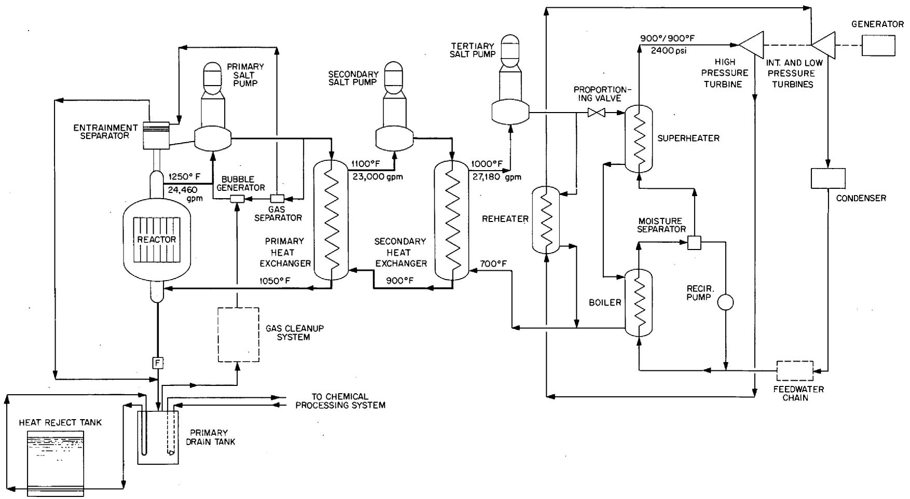  
Fig. 3.1. Preliminary flowsheet for MSDR power plant.

heat to the steam generators and reheaters: (1) in the event of small steam leaks, there is no chemical reaction with water, (2) corrosion rates at high temperature are very low with materials which are less expensive than Hastelloy N, and (3) the low melting temperature permits use of feedwater and cold reheat steam at conventional temperatures. These three advantages are discussed below.

The steam pressure will exceed the pressure in the tertiary heat transport loop; thus tube failures or leakage would cause water to mix with the coolant salt. At the operating temperatures and pressures in the nitrate-nitrite loop, however, essentially all the contaminating water would exist as steam above the surface of the salt, and the vapor could be purged, taking care, of course, to prevent the escape of tritiated water. The salt would not react with the water to produce highly corrosive conditions.

Hastelloy N has been chosen as the material of construction in all previous designs of steam generators and reheaters for molten-salt reactor power systems. Use of the nitrate-nitrite heat transport salt would make it possible to use less expensive materials. For example, the data available to date indicate that the salt would be compatible with Incoloy 800, a material that has proven acceptable for service in high-temperature steam systems. The substitution of Incoloy for Hastelloy N could make significant savings in the capital costs of equipment.

The previous MSBR conceptual design employing sodium fluoroborate coolant salt to transport heat to the steam generators provided a minimum feedwater temperature of $700^{\circ}\mathrm{F}$ . Although this minimum has not been established experimentally, the $725^{\circ}\mathrm{F}$ liquidus temperature of the salt is likely to dictate feedwater temperatures well above those in conventional regenerative feedwater heating systems. In the steam system flowsheet for the reference design MSBR, the cold reheat steam is preheated from 550 to $650^{\circ}\mathrm{F}$ by heat exchange with 3500-psia $1000^{\circ}\mathrm{F}$ steam taken from the throttle supply, and the feedwater is heated to $700^{\circ}\mathrm{F}$ by direct mixing with the exit heating steam from the reheat steam preheater. If the nitrate-nitrite salt, with its liquidus temperature of $288^{\circ}\mathrm{F}$ , were used to transport the heat, conventional feedwater and cold reheat steam temperatures could be used. This would effect important savings through elimination of the reheat steam preheater, the pressure booster pumps, and the mixing chambers employed in the special MSBR feedwater circuit. Since the aforementioned direct-mixing arrangement for feedwater heating fa

vored use of supercritical pressure steam, $^{1}$ elimination of this aspect allows consideration of a 2400-psia cycle on a more equal basis with the 3500-psia system, although the latter is still probably preferred for the MSDR. Although the startup of an MSDR has not been studied to date, it seems probable that the less-restrictive feedwater conditions of the nitrate-nitrite coolant system would also make it possible to use a less expensive type of startup boiler than was assumed in the reference design MSBR. $^{1}$

In summary, addition of a third salt-circulation loop in an MSDR or an MSBR provides tritium control and other important advantages. In particular, it could simplify operation of the MSDR steam system. Were it not for the tritium problem, however, the additional loop probably would not be recommended because of the added capital expense. A more definitive study is now under way to evaluate the costs.

# 3.2.3 Salt Overflow and Gas Stripping Systems

A further major change in the flowsheet from that previously reported $^2$ is elimination of the drain tank as an overflow tank for the primary circulation system. All salt volume changes in the circulation system are now accommodated in the pump tanks. This revision was made in the plant, because the jet pumps used to return the overflow salt to the circulation systems would have had to pump a large flow of salt against a head now considered too large to be practicable in the MSDR. Each primary pump tank has sufficient free volume to accommodate a $10\%$ total change in system salt volume. In addition, each pump tank has an overflow line connected to the reactor outlet plenum. During steady-state operation, the cooling and fountain flows in the pumps are returned to the circulation system via this same route of low flow resistance.

# 3.2.4 Primary Drain Tank

With elimination of the continuous salt overflow from the pump bowls, the drain tank could be modified to provide only one entering salt line. This nozzle connects with both the reactor drain line and with the reactor cell catch basin drain line through valves that are discussed below. A jet pump (activated by a salt flow from a small salt-circulation pump located in the chemical processing cell) is used for returning salt from the drain tank to fill the primary system for startup. The size of the drain tank, the drain tank crucible, and the arrangement of the cooling system are as previously reported.2

# 3.2.5 Drain Valves for Salt Service

The drain valves in the main reactor drain line and in the catch basin drain line are located in a small cell between the reactor cell and the drain tank cell, as shown in Fig. 3.2. The main drain valve for the reactor is now visualized as a combination mechanical and freeze valve. A bellows-sealed poppet, or plug, approaches a hard-faced surface but does not seat tightly against it. A cooling liquid is then circulated through the poppet to freeze an annular ring of stagnant salt between the two faces to effect a tight shutoff. The circulating liquid can be heated to thaw the salt to open the valve.

Two valves are used in parallel in the line from the reactor cell catch basin to the drain tank. These valves would not be opened except in the unlikely event of a salt spill from the primary system and are sealed by a thin membrane. If salt entered the pipe upstream of the valves, a signal from an electrical conductivity probe would cause a spring-loaded actuator to rupture the membrane and permit the collected salt to enter the drain tank. A normally open mechanical-type valve is installed downstream from each of the rupture-type

valves to isolate them from the drain tank in the event it becomes necessary to replace the rupture disks. The bottom of the above-mentioned valve pit is also provided with a catch pan, drain line, and rupture-disk-type drain valve.

# 3.2.6 Heat Exchangers

Addition of the third salt-circulation loop, as discussed in Sect. 3.2.2, not only required a conceptual design for the new secondary heat exchangers but, through changes in the working fluids, made it necessary to redesign the primary heat exchangers and the steam generators. Also, in order to stay closer to MSRE experience, we decided to reduce the maximum salt temperature in the MSDR from 1300 to $1250^{\circ}\mathrm{F}$ . A further aspect was a change in the maintenance philosophy to one in which we propose to plug failed tubes rather than to replace an entire tube bundle as was previously planned.

The properties of the fuel salt and the two coolant salts used in the heat exchanger calculations are given in Table 3.1. The design data for the primary heat exchanger are given in Table 3.2, and a sketch of the

Table 3.1. Physical properties of the fuel and coolant salts used in the MSDR   

<table><tr><td colspan="2">Fuel salt</td></tr><tr><td>Composition</td><td>LiF-BeF2-ThF4-UF4(71.5-16.0-12.0-0.5 mole %)</td></tr><tr><td>Density, lb/ft3</td><td>236.3 - 2.33 × 10-2T (°F)</td></tr><tr><td>Viscosity, lb hr-1 ft-1</td><td>0.2637 exp 7362/459.7 + T (°F)</td></tr><tr><td>Specific heat, Btu lb-1 (°F)-1</td><td>0.324</td></tr><tr><td>Thermal conductivity, Btu hr-1 ft-1 (°F)-1</td><td>0.75</td></tr><tr><td colspan="2">LiF-BeF2coolant salt</td></tr><tr><td>Composition</td><td>7LiF-BeF2(66-34 mole %) (99.99+%7Li)</td></tr><tr><td>Density, lb/ft3</td><td>138.68 - 1.456 × 10-2T (°F)</td></tr><tr><td>Viscosity, lb hr-1 ft-1</td><td>0.2806 exp 6759/459.7 + T (°F)</td></tr><tr><td>Specific heat, Btu lb-1 (°F)-1</td><td>0.57</td></tr><tr><td>Thermal conductivity, Btu hr-1 ft-1 (°F)-1</td><td>0.578</td></tr><tr><td colspan="2">Nitrate-nitrite coolant salt</td></tr><tr><td>Composition (eutectic)</td><td>KNO3-NaNO2-NaNO3(44-49-7 mole %)</td></tr><tr><td>Density, lb/ft3</td><td>130.6 - 2.54 × 10-2T (°F)</td></tr><tr><td>Viscosity, lb hr-1 ft-1</td><td>0.1942 exp 3821.6/459.7 + T (°F)</td></tr><tr><td>Specific heat, Btu lb-1 (°F)-1</td><td>0.373</td></tr><tr><td>Thermal conductivity, Btu hr-1 ft-1 (°F)-1</td><td>0.33</td></tr></table>

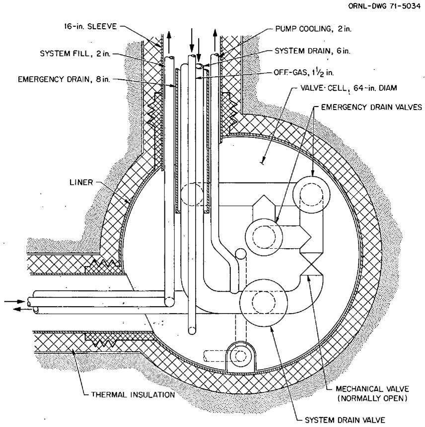

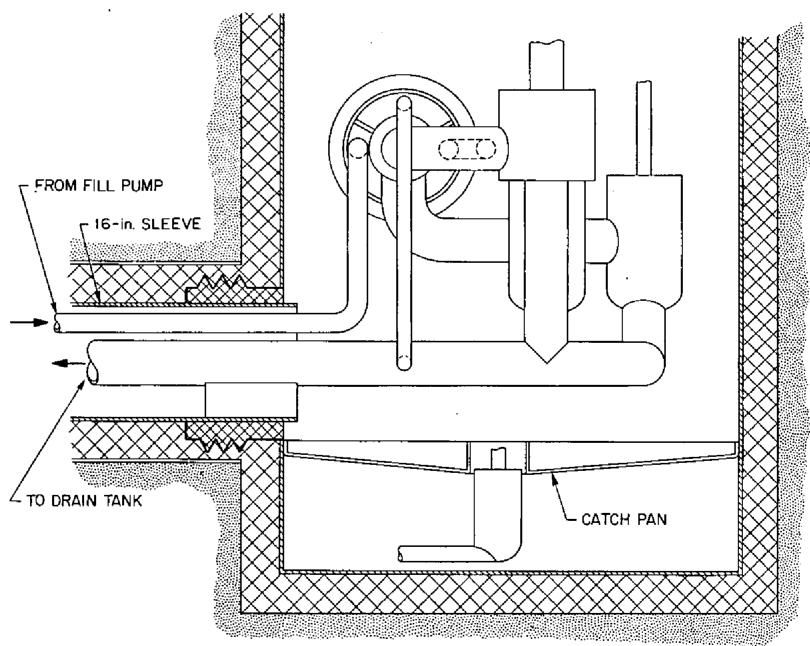  
Fig. 3.2. Containment cell for valves in salt drain lines.

Table 3.2 MSDR primary heat exchanger design data   

<table><tr><td>Type</td><td>U-tube, U-shell, countercurrent, one-pass shell and tubes with disk-and-doughnut baffles</td></tr><tr><td>Rate of heat transfer per unit</td><td></td></tr><tr><td>MW</td><td>125</td></tr><tr><td>Btu/hr</td><td>4.2687 × 108</td></tr><tr><td>Tube-side conditions</td><td></td></tr><tr><td>Hot fluid</td><td>Fuel salt</td></tr><tr><td>Entrance temperature, °F</td><td>1250</td></tr><tr><td>Exit temperature, °F</td><td>1050</td></tr><tr><td>Pressure drop across exchanger, psi</td><td>127.4</td></tr><tr><td>Mass flow rate, lb/hr</td><td>6.588 × 106</td></tr><tr><td>Shell-side conditions</td><td></td></tr><tr><td>Cold fluid</td><td>Coolant salt (2LiF-BeF2)</td></tr><tr><td>Entrance temperature, °F</td><td>900</td></tr><tr><td>Exit temperature, °F</td><td>1100</td></tr><tr><td>Pressure drop across exchanger, psi</td><td>114.7</td></tr><tr><td>Mass flow rate, lb/hr</td><td>3.744 × 106</td></tr><tr><td>Tube material</td><td>Hastelloy N</td></tr><tr><td>Tube OD, in.</td><td>0.375</td></tr><tr><td>Tube thickness, in.</td><td>0.035</td></tr><tr><td>Tube-sheet-to-tube-sheet distance, ft</td><td>29.96</td></tr><tr><td>Shell material</td><td>Hastelloy N</td></tr><tr><td>Shell thickness, in.</td><td>0.5</td></tr><tr><td>Shell ID, in.</td><td>26.32</td></tr><tr><td>Tube sheet material</td><td>Hastelloy N</td></tr><tr><td>Number of tubes</td><td>1368</td></tr><tr><td>Pitch of tubes, in.</td><td>0.672 (triangular)</td></tr><tr><td>Total heat transfer area, ft2</td><td>4023.6</td></tr><tr><td>Basis for area calculation</td><td>Outside of tubes</td></tr><tr><td>Type of baffle</td><td>Disk and doughnut</td></tr><tr><td>Number of baffles</td><td>47</td></tr><tr><td>Baffle spacing, in.</td><td>7.66</td></tr><tr><td>Disk OD, in.</td><td>19.0</td></tr><tr><td>Doughnut ID, in.</td><td>18.6</td></tr><tr><td>Overall heat transfer coefficient, U, Btu hr-1 ft-2</td><td>700.7</td></tr><tr><td>Volume of fuel salt in tubes, ft3</td><td>20.78</td></tr></table>

exchanger is shown in Fig. 3.3. Use of the $^7\mathrm{LiF - BeF}_2$ coolant salt in the shell side and the reduced temperature difference between the fuel salt and the coolant salt altered the heat exchanger dimensions somewhat from those of previous concepts. In order to keep the shell diameter small, for ease of afterheat removal and maintenance, we found it desirable to use two primary heat exchangers in parallel in each of the three fuel-salt circulation loops. The exchangers have a bolted, inverted dished head over a seal-welded membrane. A metal ring gasket in the head flange provides backup containment in the event of a leak in the membrane. This design makes maintenance easier than in the

previously reported concept that involved plasma arc cutting of a 1-in.-thick heat exchanger head.

The secondary heat exchanger design data are given in Table 3.3. The configuration is like that of the primary heat exchanger. Since the $\mathrm{LiF - BeF_2}$ heat transport circuits will become much less radioactive than the primary salt circuits, the remote maintenance requirements for this exchanger are not nearly as restrictive as for the primary units.

The different parameters that can now be considered in design of the steam generators were mentioned in Sect. 3.2.2. We are investigating conceptual designs for

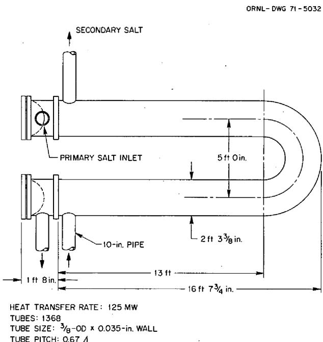  
Fig. 3.3. MSDR 300-MW(e) primary heat exchanger.

both 2400- and 3500-psi steam systems but as yet have no results to report.

# 3.2.7 Building and Containment

The structures housing the MSDR are basically the same as previously reported, but the main containment building has been increased from 92 to 112 ft in diameter and the heat exchanger cells from 23 to 33 ft in diameter and to 38 ft in depth to accommodate the third salt-circulation loop, as shown in Fig. 3.4. The control room has been moved to outside the containment area, and some adjustments have been made in the dimensions of other cells. The revised building plan and elevation are shown in Figs. 3.5 and 3.6.

The reactor cell wall construction has been revised and the cell heating system has been changed. The new construction has $\frac{1}{2}$ -in.-thick 304 stainless steel walls with about 5 in. of blanket-type insulation between the wall and the concrete biological shield, as shown in Fig. 3.4. The flat tops of the cells are hung by Unistrut hangers from the concrete. This design simplified the containment construction to provide a maximum of freedom for thermal expansion and to present a smooth surface on the inside of the cell. The integrity is more assured both from the standpoints of inspection and access for repair. As in the previous design, the cell will operate at a slight negative pressure, but the structure would be designed for a positive pressure of 50 psi.

Table 3.3. MSDR secondary heat exchanger design data   

<table><tr><td>Type</td><td>U-tube, U-shell, counter-current, one-pass shell and tubes with disk-and-doughnut baffles</td></tr><tr><td>Rate of heat transfer per unit</td><td></td></tr><tr><td>MW</td><td>125</td></tr><tr><td>Btu/hr</td><td>4.2687 × 108</td></tr><tr><td>Tube-side conditions</td><td></td></tr><tr><td>Hot fluid</td><td>2LiF-BeF2salt</td></tr><tr><td>Entrance temperature, °F</td><td>1100</td></tr><tr><td>Exit temperature, °F</td><td>900</td></tr><tr><td>Pressure drop across exchanger, psi</td><td>80</td></tr><tr><td>Mass flow rate, lb/hr</td><td>3.744 × 106</td></tr><tr><td>Shell-side conditions</td><td></td></tr><tr><td>Cold fluid</td><td>Hitec</td></tr><tr><td>Entrance temperature, °F</td><td>700</td></tr><tr><td>Exit temperature, °F</td><td>1000</td></tr><tr><td>Pressure drop across exchanger, psi</td><td>80</td></tr><tr><td>Mass flow rate, lb/hr</td><td>3.815 × 106</td></tr><tr><td>Tube material</td><td>Hastelloy N</td></tr><tr><td>Tube OD, in.</td><td>0.375</td></tr><tr><td>Tube thickness, in.</td><td>0.035</td></tr><tr><td>Tube-sheet-to-tube-sheet distance, ft</td><td>37.5</td></tr><tr><td>Shell material</td><td>Hastelloy N</td></tr><tr><td>Shell thickness, in.</td><td>0.5</td></tr><tr><td>Shell ID, in.</td><td>30.5</td></tr><tr><td>Tube sheet material</td><td>Hastelloy N</td></tr><tr><td>Number of tubes</td><td>1604</td></tr><tr><td>Pitch of tubes, in.</td><td>0.7188 (triangular)</td></tr><tr><td>Total heat transfer area, ft2</td><td>5904</td></tr><tr><td>Basis for area calculation</td><td>Outside of tubes</td></tr><tr><td>Type of baffle</td><td>Disk and doughnut</td></tr><tr><td>Number of baffles</td><td>52</td></tr><tr><td>Baffle spacing, in.</td><td>8.65</td></tr><tr><td>Disk OD, in.</td><td>22.0</td></tr><tr><td>Doughnut ID, in.</td><td>21.6</td></tr><tr><td>Overall heat transfer coefficient, U, Btu hr-1 ft-2</td><td>501</td></tr><tr><td>Volume of 2LiF-BeF2salt in tubes, ft3</td><td>30.5</td></tr></table>

Three external electrical furnaces and a circulating hot gas system are used to heat the reactor, heat exchanger, drain tank, and drain valve cells rather than the electric resistance-heated thimbles formerly employed. The furnaces are located adjacent to the heat exchanger cells, as shown in Fig. 3.5. The design data for the heating system are shown in Table 3.4. The new

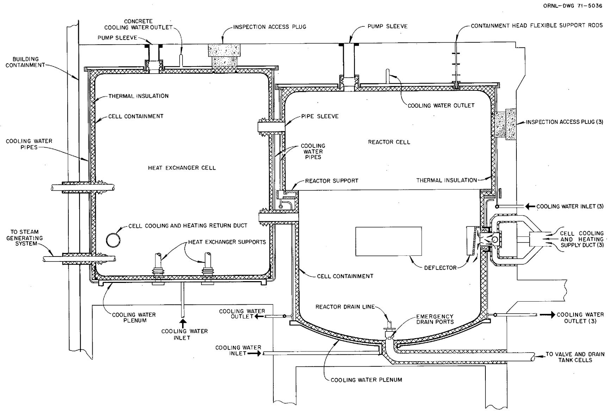  
Fig. 3.4. MSDR 300-MW(e) reactor and heat exchanger cells - elevation.

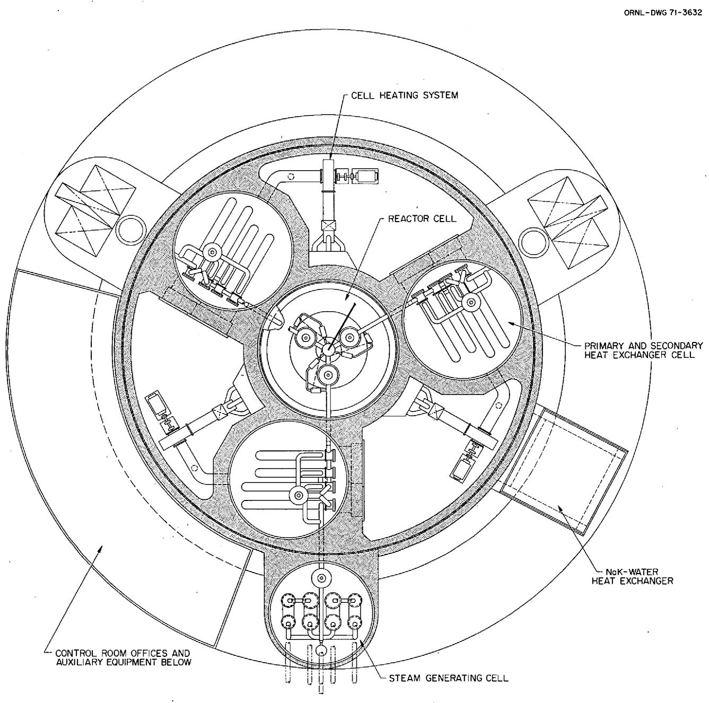  
Fig. 3.5. MSDR 300-MW(e) reactor complex - plan section A-A.

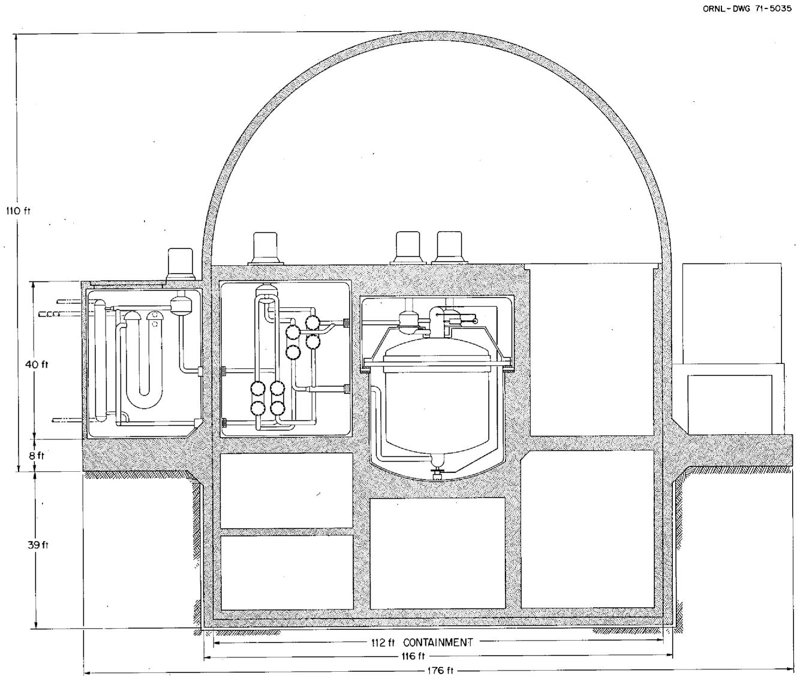  
Fig. 3.6. MSDR 300-MW(e) reactor complex - vertical section X-X.

Table 3.4. Heater design data for MSDR containment cells   

<table><tr><td>Estimated normal containment heat loss (total), kW</td><td>600</td></tr><tr><td>Design heat loss, kW</td><td>1200</td></tr><tr><td>Number of heater cells</td><td>3</td></tr><tr><td>Capacity of each heater cell, kW</td><td>400</td></tr><tr><td>Circulating gas</td><td>N2</td></tr><tr><td>Gas inlet-outlet temperatures at heaters, °F</td><td>1000-1100</td></tr><tr><td>Gas flow rate through each heater cell, cfm</td><td>32,500 (at 1050°F)</td></tr><tr><td>Heater element</td><td>1-in.-OD cartridge with Incoloy 800 cladding</td></tr><tr><td>Heater length, ft</td><td>3</td></tr><tr><td>Number of heater elements per heater cell</td><td>150</td></tr><tr><td>Heater element arrangement per heater cell</td><td>12 rows of 12 or 13 elements on 3-in. Δ pitch</td></tr><tr><td>Pressure drop in circulating gas, in. H2O</td><td>9.6</td></tr><tr><td>Heater cell width and depth, ft</td><td>3.25 × 2.6</td></tr><tr><td>Thermal conductivities for cell wall (k), Btu hr-1 ft-1(°F)-1</td><td></td></tr><tr><td>1/2-in. stainless steel cell liner</td><td>12.4</td></tr><tr><td>5-in.-thick fiber glass cell insulation</td><td>0.034</td></tr><tr><td>Prestressed concrete with 2-in. sched 40</td><td>1.12 (concrete)</td></tr><tr><td>carbon-steel water cooling pipes on 6 in. centers</td><td>25.9 (steel)</td></tr><tr><td>located 4 in. from inside concrete face</td><td></td></tr><tr><td>Assumed heat transfer coefficient in water pipes, Btu hr-1 ft-2(°F)-1</td><td>7.9</td></tr><tr><td>Maximum concrete temperature, °F</td><td>150</td></tr></table>

arrangement reduces the number of cell wall penetrations and gives better access for repair of the electric heaters. The heater elements are inserted into double-walled thimbles welded into the furnace duct and are therefore easily removed for replacement. The same gas circulation system can be provided with cooling coils to remove excess heat from the cell.

# 3.3 INITIAL TEMPERATURE TRANSIENTS IN EMPTY MSBR “REFERENCE DESIGN” MSBR HEAT EXCHANGERS

J. R. Tallackson

Additional calculations3 to estimate the initial after-shutdown temperature transients in these heat ex-changers were completed.4 As in the earlier analyses, $40\%$ of the noble metal fission products (Nb through Te) were assumed to be deposited uniformly on the heat exchanger tubes. Figure 3.7 shows the estimated

after-shutdown temperature growth in the 563-MW(t) "reference design" heat exchanger. If used as a design guide, the estimated peak transient temperature, slightly less than $2150^{\circ}\mathrm{F}$ , is on the high side and should be regarded as conservative. This is because, during the initial phase of the transient, the elements comprising the exchanger, the tubes and inner shell, the intermediate shell, etc., were considered to be isolated and insulated from each other and from the outside. The method used to calculate this transient is described in detail in ref. 4. The curve in Fig. 3.8 applies to the 141-MW(t) unit. This curve was inferred from Fig. 3.7 and drawn by inspection. The peak temperature during the transient is expected to be about $1800^{\circ}\mathrm{F}$ . These peak temperatures, which take into account the effects of heat distribution and heat capacity, supersede the higher steady-state peak temperatures reported earlier.

The Hastelloy N heat exchanger shells, if not highly stressed, will safely withstand temperatures up to $2150^{\circ}\mathrm{F}$ for short periods. If the current estimates of fission product deposition remain unchanged or decrease, it can be concluded that heat exchangers, not dissimilar to the "reference design" and with ratings in the 500-MW(t) region, can be designed to accommodate safely this worst-case afterheat situation.

ORNL-DWG 71-576A

Curve A: Peak steady-state temperature computed for type 1 afterheat rates at the indicated times and with the emissivity of all internal surfaces $= 0.2$ and the emissivity of the outer surface of the outer shell $= 0.8$ .   
Curve B: Temperature growth in the inner shell and the tube annulus computed as if: (1) the annulus and shell are perfectly insulated, (2) have a total heat capacity of 129 Btu/°F per foot of height, and (3) generate $77\%$ of the total afterheat.   
Curve C: Temperature growth in the intermediate shell computed as if: (1) the shell is perfectly insulated, (2) has a heat capacity of 287 Btu/°F per foot of height, and (3) generates $23\%$ of the total afterheat.

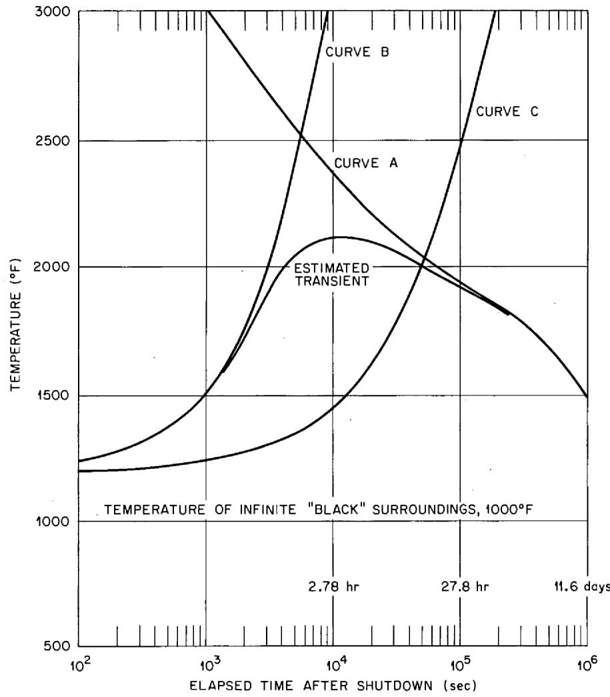  
Fig. 3.7. Estimated initial temperature transient caused by noble metal afterheat in an empty 563-MW MSBR heat exchanger.

ORNL-DWG 71-577A

Curve A: Peak steady-state temperature computed for type 2 afterheat rates at the indicated times and with the emissivity of all internal surfaces $= 0.2$ and the emissivity of the outer surface of the outer shell $= 0.8$ .   
Curve B: Temperature growth in the inner shell and the tube annulus computed as if: (1) the annulus and shell are perfectly insulated, (2) have a total heat capacity of 32 Btu/°F per foot of height, and (3) generate $70\%$ of the total afterheat.   
Curve C: Temperature growth in the intermediate shell computed as if: (1) the shell is perfectly insulated, (2) has a heat capacity of $72\mathrm{Btu} / \mathrm{^9F}$ per foot of height, and (3) generates $23\%$ of the total afterheat.

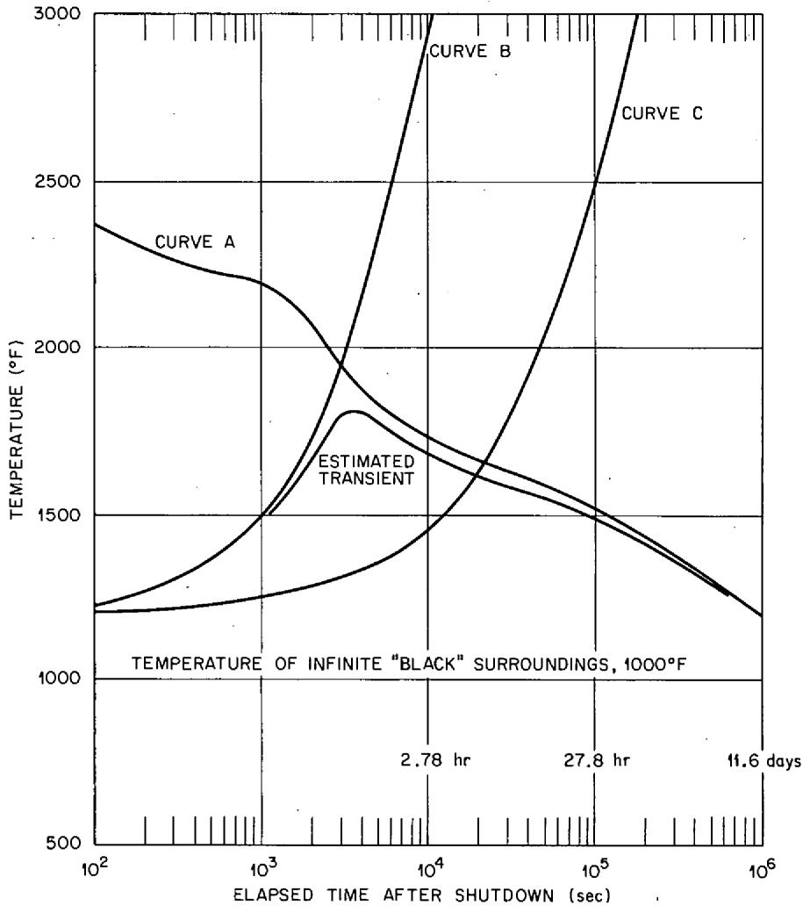  
Fig. 3.8. Estimated initial temperature transient caused by noble metal afterheat in an empty 141-MW MSBR heat exchanger.

# 3.4 THE CONSEQUENCES OF TUBING FAILURE IN THE MSBR HEAT EXCHANGER

R. P. Wichner

An analysis has been started to determine the consequences of tubing failure in one of the main MSBR heat exchangers. The following four cases are being considered:

1. double-ended rupture near the fuel outlet,   
2. double-ended rupture near the fuel inlet,   
3. small leak into the primary system,   
4. small leak into the secondary system.

For case 1, it is estimated that $3.5\mathrm{lb / sec}$ of $\mathrm{NaBF_4}$ will leak into the primary system until protective action, such as pump cutoff, is taken. It is not known if

$\mathbf{BF}_3$ gas will evolve in this case; though sufficient solubility of $\mathbf{BF}_3$ in fuel exists to maintain $\mathbf{BF}_3$ in solution, the kinetics of the mixing process are insufficiently known to preclude this possibility. Hence case 1 is subdivided into (a) assuming no $\mathbf{BF}_3(\mathbf{g})$ evolution and (b) assuming complete $\mathbf{BF}_3(\mathbf{g})$ evolution. For case $1b$ , prompt pump cutoff is essential to prevent excessive primary loop pressures and pump damage due to circulating voids.

It is estimated that the poison effect of $\mathrm{NaBF}_4$ is $-0.18\% \delta k / k$ per pound of $\mathrm{NaBF}_4$ smeared over zones I and II of the MSBR core. This is overwhelmingly due to boron, the effect due to sodium being approximately $0.06\%$ as large.

In addition, for case 1, an estimated $0.96\mathrm{lb}_m / \mathrm{sec}$ of fuel will leak into the secondary system until protective action is taken. For case 2, an estimated $7.4\mathrm{lb}_m / \mathrm{sec}$ of fuel will initially leak into the secondary system, and there will be no coolant flow into the primary system.

# 3.5 TRITIUM DISTRIBUTION AND CONTROL IN THE MSBR

# R.B.Korsmeyer

The transport behavior of tritium in a 1000-MW(e) MSBR was examined previously, and various hypothetical methods for its control and containment were considered. In that study the tritium concentrations in the fuel and coolant salts were assumed constant around each circulation loop - a condition that is closely approximated only when the fraction of tritium that is removed per pass is small.

Since then this restriction was removed, and the efficacy of preventing tritium from appearing in the steam system by purging it from side streams of fuel and coolant salts was examined, along with the effect of a circulating bubble fraction in both fuel and coolant loops. It was found that a bubble fraction in the range of 0.01 to 0.1 circulating in the salt streams had negligible effect on the tritium transport. Increasing the purge gas flow rates increased the tritium removal from the side streams and markedly reduced that reaching the steam system for all side stream fractions. A purge gas flow sufficient to remove essentially all the tritium from a side stream of $10\%$ of the salt flow through the reactor reduced the amount of tritium reaching the steam to $0.2\%$ of the production.

In all cases where the tritium appearing in the steam was negligible, almost all of it was removed from the fuel as TF, which is assumed not to diffuse through the metal walls. Since these results depend strongly on a high $\mathrm{UF_4 / UF_3}$ ratio to convert $\mathbf{T}_2$ to TF according to the mass action relationship used and on the rates of reaction of TF with the walls being low, it will be necessary to reexamine the supporting chemistry before reliance is placed on these results.

In another study7 the effect of using wet helium under pressure as the secondary coolant was examined with reference to the distribution of the tritium flow in the purge gas systems, the cell enclosures, and the steam system by suitable modification of the transport equations used in the TRIPOR program.5 The results of some 18 typical runs showed that:

1. With helium at high pressure and containing water vapor at a partial pressure of 1 atm, the tritium reaching the steam is negligible provided the water vapor is changed at a rate equal to or greater than $0.2\mathrm{lb / hr}$ . If radiolysis were to increase the hydrogen concentration in the steam by a factor as great as 100, the water purge rate would have to be increased to $20\mathrm{lb / hr}$ to maintain the low tritium loss. It would be desirable to keep the purge rate below about $1\mathrm{lb / hr}$ , but rates as high as 75 $\mathrm{lb / hr}$ might be acceptable.

2. If the water vapor partial pressure is as low as 6 or 7 torrs, water purge rates as low as $0.02\mathrm{lb / hr}$ are effective in preventing significant quantities of tritium from reaching the steam. If radiolysis were to multiply the hydrogen concentration by a factor of 100, the purge rate would have to be increased to about $2\mathrm{lb / hr}$ . A radiolysis factor as high as 100 is considered to be very unlikely.

In a third study the effect of adding HF to the sodium fluoroborate coolant salt was examined with reference to the distribution of tritium flow in the coolant purge gas system and the steam system, utilizing a simplified model of the secondary coolant and steam systems instead of the more complete model and transport equations of the TRIPOR program. Use of the simplified model appears justified in that the calculated fraction of tritium transported to the steam in the absence of HF is comparable with that calculated for the same conditions in the TRIPOR program. The results of nine runs showed that:

1. A ratio of HF addition to HT diffusion into the coolant salt of at least 50 is required to hold the tritium reaching the steam to $1\%$ or less of that entering the coolant, the balance being carried off by the purge gas.   
2. For large ratios of HF/HT addition the tritium fraction reaching the steam is inversely proportional to the ratio.   
3. Increasing the purge gas flow from 20 to $100\mathrm{cm}$ , or by a factor of 5, has a negligible effect on the tritium transport, at least for large HF/HT addition ratios.   
4. The mean residence time for fluoride gases (HF + HT) in the circulating coolant salt is an inverse function of the purge gas flow and is independent of the HF feed rate inasmuch as an increased feed rate at constant purge rate merely increases the concentration proportionally. For all cases studied, a purge rate of 20 cfm established a residence time of 62.5 hr, and a rate of 100 cfm reduced the residence time to 12.5 hr. For HF/HT = 50 the corresponding HF concentrations in the salt were 0.60 and 0.12 ppm.   
5. For an assumed corrosion rate equal to half of the HF feed rate to the system and $\mathrm{HF / HT} = 5000$ , the calculated uniform rate of metal removal is about 0.001 in./year.

# 3.6 INDUSTRIAL STUDY OF 1000-MW(e) MOLTEN-SALT BREEDER REACTOR

M. I. Lundin J. R. McWherter

Proposals were solicited from a number of industrial firms to perform design studies of a 1000-MW(e) molten-salt breeder reactor. An evaluation team visited each group that submitted a proposal. The Ebasco Services group, consisting of Ebasco, Conoco, Babcock and Wilcox, Cabot, Union Carbide, and Byron-Jackson companies, was selected as the one that could most nearly meet our objectives. A subcontract is being negotiated with them.

They will initially develop their concept of a molten-salt breeder reactor plant. Using this concept as a base, trade-off and parametric studies of the nuclear steam supply system, the energy conversion system, and the fuel processing system will be made. After incorporation of the results of these studies in the reference concept, they will estimate the plant capital and fuel-cycle costs. A review of the research and development program will be made. An independent assessment of chemical processing and a safety review of the proposed plant will be conducted. Technical liaison is

being furnished by ORNL. All the work will be reported.

# 3.7 MSBE DESIGN

M. I. Lundin J. R. McWherter

# 3.7.1 General

J.R.McWherter W.Terry

The design studies reported previously were continued. A report10 was issued outlining the objectives of the MSBE and establishing the design bases of the plant. The reference core configuration consists of a cylindrical array of graphite bars. The core is 45 in. in diameter and 57 in. high, with $15\%$ of the horizontal cross section open for salt flow. The core is in a 7.5-ft-ID spherical reactor vessel. That part of the vessel between the core and vessel wall, with the exception of the graphite alignment structure, is filled with salt. This configuration achieves a start of life breeding ratio near 1 (0.96) and the desired fast $(E > 50\mathrm{keV})$ neutron flux of $5\times 10^{14}$ neutrons $\mathrm{cm}^{-2}\sec^{-1}$ at a thermal power of 150 MW. Design data of the MSRE and MSBR and that proposed for the MSBE are compared in Table 3.5.

We are conducting studies to determine the problem areas and to evaluate possible solutions. Layouts of the reactor cell and the primary system are being made to indicate how the operational and maintenance problems might be handled in different configurations. The current reactor cell concept is shown in Figs. 3.9 and 3.10.

Removal of the graphite array as a unit and removal of individual graphite bars are being considered. The reactor vessel closure problems associated with the graphite maintenance are being evaluated. It is desired that the graphite maintenance approach be similar to that proposed for the MSBR. The thermal and hydraulic problems of the core are being examined for use of cylindrical and prismatic graphite bars. The support and alignment structure of the graphite bars is being studied.

# 3.7.2 MSBE Core Design

W. K. Furlong W. Terry

A brief investigation was made of alternatives to four previously published $^{9,10}$ MSBE design concepts, speci-

fically: (1) the prismatic moderator elements, (2) the removal and replacement of all the elements as a unit, (3) the unreflected core, and (4) the three-pass flow pattern. The results of these investigations are summarized in the following paragraphs.

A cylindrical graphite moderator element design was evolved. A 4-in.-diam cylinder with a 1-in. central hole appears acceptable, based mainly on temperature con

siderations. The cylinders are separated by $\frac{1}{16}$ -in.-thick collars at three axial locations. This eliminates the low-flow cusp region at points of tangency (except at the narrow collars) and permits interchannel mixing of the salt. The center hole is required to have acceptable temperatures with a 4-in. element. The salt fraction is $20.5\%$ in an array of such elements with 4 in. triangular pitch.

Table 3.5. Comparison of design data for the MSRE, MSBE, and MSBR   

<table><tr><td></td><td>MSRE</td><td>MSBE</td><td>\( MSBR^a \)</td></tr><tr><td>Reactor power, MW(t)</td><td>7.3</td><td>150</td><td>2250</td></tr><tr><td>Breeding ratio</td><td></td><td>0.96</td><td>1.06</td></tr><tr><td>Peak graphite damage flux (\( E_n &gt; 50~keV \)), neutrons \( cm^{-2}~sec^{-1} \)</td><td>\( 3\times 10^{13} \)</td><td>\( 5\times 10^{14} \)</td><td>\( 3\times 10^{14} \)</td></tr><tr><td>Peak power density, w/cc, core including graphite</td><td>6.6</td><td>114</td><td>70</td></tr><tr><td>Volume fraction of salt in core</td><td>0.225</td><td>0.15</td><td>0.13</td></tr><tr><td colspan="4">Primary salt</td></tr><tr><td colspan="4">Composition, mole %</td></tr><tr><td>LiF</td><td>65</td><td>71.5</td><td>71.7</td></tr><tr><td>\( BeF_2 \)</td><td>29.1</td><td>16</td><td>16</td></tr><tr><td>\( ThF_4 \)</td><td>None</td><td>12</td><td>12</td></tr><tr><td>\( UF_4 \)</td><td>0.9</td><td>0.5</td><td>0.3</td></tr><tr><td>\( ZrF_4 \)</td><td>5</td><td>None</td><td>None</td></tr><tr><td>Liquidus,\( ^\circ F \)</td><td>813</td><td>932</td><td>932</td></tr><tr><td>Density, \( lb_m/ft^3 \) at \( 1100^\circ F \)</td><td>141</td><td>211</td><td>210</td></tr><tr><td>Viscosity, \( lb ft^{-1} hr^{-1} \) at \( 1100^\circ F \)</td><td>19</td><td>29</td><td>29</td></tr><tr><td>Heat capacity, \( Btu lb_m^{-1} (^\circ F)^{-1} \)</td><td>0.47</td><td>0.32</td><td>0.32</td></tr><tr><td>Thermal conductivity, \( Btu hr^{-1} ft^{-1} (^\circ F)^{-1} \)</td><td>0.83</td><td>0.71</td><td>0.71</td></tr><tr><td colspan="4">Temperature,\( ^\circ F \)</td></tr><tr><td>Inlet, reactor vessel</td><td>1170</td><td>1050</td><td>1050</td></tr><tr><td>Outlet, reactor vessel</td><td>1210</td><td>1300</td><td>1300</td></tr><tr><td>Circulating primary salt volume, \( ft^3 \)</td><td>70</td><td>266</td><td>1720</td></tr><tr><td>Inventory, fissile, kg</td><td>\( 32^b \)</td><td>\( 396^b \)</td><td>1470</td></tr><tr><td>Power density, primary salt, circulating, average, W/cc</td><td>4</td><td>20</td><td>46</td></tr><tr><td>Number of primary loops</td><td>1</td><td>1</td><td>4</td></tr><tr><td>Primary pump capacity, gpm</td><td>1200</td><td>\( 5400^c \)</td><td>16,000</td></tr><tr><td>Secondary system salt</td><td>\( LiF-BeF_2 \)</td><td>\( NaBF_4-NaF \)</td><td>\( NaBF_4-NaF \)</td></tr><tr><td>Composition, mole %</td><td>66-34</td><td>92-8</td><td>92-8</td></tr><tr><td>Liquidus temperature,\( ^\circ F \)</td><td>850</td><td>725</td><td>725</td></tr><tr><td>Density, \( lb_m/ft^3 \) at \( 1000^\circ F \)</td><td>124.1</td><td>117</td><td>117</td></tr><tr><td>Viscosity, \( lb_m/ft^{-1} hr^{-1} \) at \( 1000^\circ F \)</td><td>28.7</td><td>3.4</td><td>3.4</td></tr><tr><td>Heat capacity, \( Btu lb_m^{-1} (^\circ F)^{-1} \)</td><td>0.57</td><td>0.36</td><td>0.36</td></tr><tr><td>Thermal conductivity, \( Btu hr^{-1} ft^{-1} (^\circ F)^{-1} \)</td><td>0.58</td><td>0.23</td><td>0.23</td></tr><tr><td colspan="4">Temperature,\( ^\circ F \)</td></tr><tr><td>Heat exchanger inlet</td><td>1015</td><td>850</td><td>850</td></tr><tr><td>Heat exchanger outlet</td><td>1075</td><td>1150</td><td>1150</td></tr><tr><td>Number of secondary pumps</td><td>1</td><td>1</td><td>4</td></tr><tr><td>Secondary pump capacity, gpm</td><td>850</td><td>5300</td><td>20,000</td></tr><tr><td>Tertiary system</td><td>Air</td><td>Steam</td><td>Steam</td></tr><tr><td>Inlet temperature,\( ^\circ F \)</td><td>~70</td><td>700</td><td>700</td></tr><tr><td>Outlet temperature,\( ^\circ F \)</td><td>~180</td><td>1000</td><td>1000</td></tr><tr><td>Outlet pressure, psia</td><td>14.7</td><td>3600</td><td>3600</td></tr></table>

$^{a}$ MSR Program Semiannu. Progr. Rep. Feb. 28, 1970, ORNL-4548, pp. 42-45.   
$\mathbf{b}^{233}\mathbf{U}$ initial.   
For $200^{\circ}\mathrm{F}\Delta T$ ; 4300 gpm required at $250^{\circ}\mathrm{F}\Delta T$ .

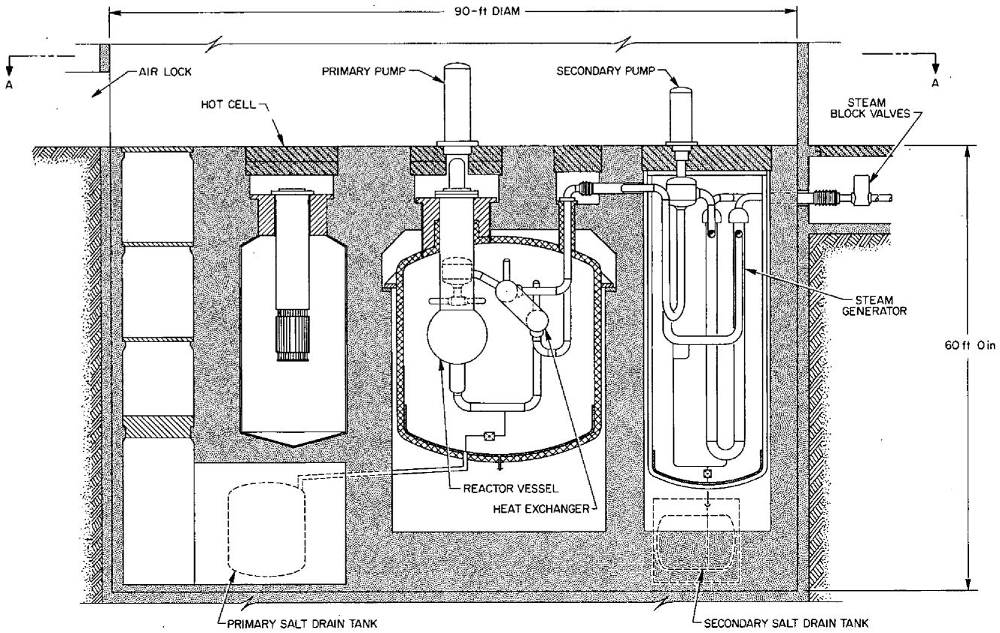  
Fig. 3.9. Molten-salt breeder experiment, reactor building section B-B, 150 MW(t).

A major feature of cylindrical elements is that they do not interlock (as the prismatic elements do) and hence can be moved sideways relative to one another by a handling machine stationed in the center of the core. This idea was pursued through the conceptual design of a moderator element handling machine. The machine has two telescoping arms operating on the jackscrew principle. It can rotate azimuthally, move up and down, and can operate such that elements are removed and replaced either along a radius or offset 4 in. from a radius. The latter position is required for a few elements that will not move along a radius without forcing or jamming them. Exact indexing in all degrees of freedom is obtained by use of worm and sector gears. They are driven either by cables or shafts from electric motors located in a relatively cool, shielded area. The machine is inserted into the core after first removing the center 16 elements plus three control rod sleeves. These are removed through a 20-in. flanged access port by a straight lift using an expandable tool. The flange serves to support and align the machine, which then removes each element, including the noncyindrical "fence"

pieces, to a point where it can be grasped and lifted clear of the vessel by an expandable tool. Further refinements of the machine design may incorporate an elevator mechanism in place of the "manual" expandable tool.

Several reactor and vessel layouts were studied using the cylindrical elements both with and without the need for the handling machine. In the latter case a large (~48 in.) removable head is required. One such layout used a cylindrical vessel with a 1-ft graphite reflector. It appeared feasible to build such a reactor, although, once installed, the reflector would not be removable. Because of this and several other considerations, the decision was made to use an unreflected reactor in a spherical vessel.[10]

One-pass flow through the reactor vessel was used in this most recent study. This has advantages over the previously proposed three-pass (up through blanket, down through outer part of core, up through center of core) arrangement because (1) downflow in the three-pass concept requires a velocity of 2.4 fps to overcome the buoyancy effect for a salt $\Delta T$ of $125^{\circ}\mathrm{F}$ , (2) the

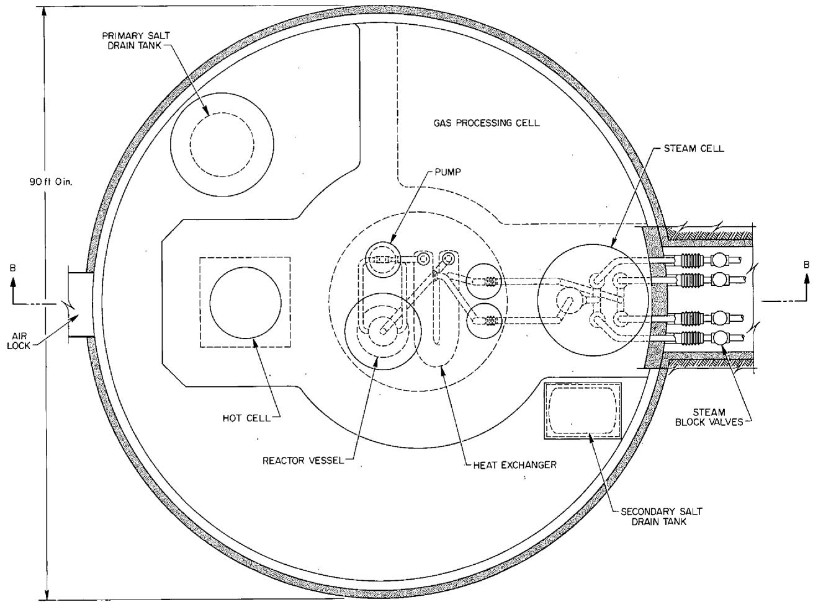  
Fig. 3.10. Molten-salt breeder experiment, reactor building plan A-A, 150 MW(t).

resulting mechanical layout is simpler, and (3) the reactor pressure drop is lower. A drawback is the lower velocity and correspondingly lower heat transfer coefficients for cooling the vessel wall and the moderator elements.

# 3.7.3 MSBE Primary Heat Exchanger Design

H. A. McLain C. E. Bettis W. Terry

The heat transfer area required in the primary heat exchanger was determined for core inlet and outlet temperatures of 1050 and $1300^{\circ}\mathrm{F}$ respectively. It was assumed that the primary salt was in the tubes and that a secondary salt was on the shell side. A number of tube and shell configurations are being considered in the studies of the primary cell arrangement. In the heat exchanger studies, the primary salt inventory is being kept as small as practicable.

It was reported previously that spirally indented heat exchanger tubes would reduce the inventory of primary salt.11 However, they are not being used in the MSBE design for the following reasons: (1) there are no experimental data for heat transfer to molten salts flowing in spirally indented tubes at Reynolds numbers of interest and (2) initial fabrication work on enhanced tubes of "standard" Hastelloy N was troubled with cracking resulting from the carbide stringers present in the metal.12

The principal data for a 150-MW MSBE shell-and-tube primary heat exchanger are given in Table 3.6.

Table 3.6. Principal design data for 150-MW MSBE primary heat exchanger   

<table><tr><td>Thermal rating, MW</td><td>150</td></tr><tr><td>Tube-side conditions</td><td></td></tr><tr><td>Fluid</td><td rowspan="2">Primary salt3/8</td></tr><tr><td>Tube OD, in.</td></tr><tr><td>Tube wall thickness, in.</td><td>0.035</td></tr><tr><td>Tube length, ft</td><td>28.0</td></tr><tr><td>Number of tubes</td><td>1340</td></tr><tr><td>Temperatures, °F</td><td></td></tr><tr><td>Inlet</td><td>1300</td></tr><tr><td>Outlet</td><td>1050</td></tr><tr><td>Mass flow rate, lb/hr</td><td>6.32 × 10^6</td></tr><tr><td>Pressure drop due to flow, psi</td><td>111</td></tr><tr><td>Volume of fluid in tubes, ft³</td><td>19.0</td></tr><tr><td>Shell-side conditions</td><td></td></tr><tr><td>Fluid</td><td>Secondary salt</td></tr><tr><td>Shell ID, in.</td><td>31.5</td></tr><tr><td>Baffle type</td><td>Disk and doughnut</td></tr><tr><td>Baffle spacing, in.</td><td>7.3</td></tr><tr><td>Baffle cut, %</td><td>40</td></tr><tr><td>Tube pitch, in.</td><td>13/16 triangular</td></tr><tr><td>Temperature, °F</td><td></td></tr><tr><td>Inlet</td><td>850</td></tr><tr><td>Outlet</td><td>1150</td></tr><tr><td>Mass flow rate, lb/hr</td><td>4.74 × 10^6</td></tr><tr><td>Pressure drop due to flow, psi</td><td>113</td></tr><tr><td>Tube natural frequency, cps</td><td>99</td></tr><tr><td>Vortex shedding frequency, cps</td><td>45</td></tr><tr><td>Frequency ratio</td><td>2.2</td></tr><tr><td>Approximate overall heat transfer coefficient, Btu hr-1 ft-2(°F)-1</td><td>800</td></tr></table>

Considerable attention was given to reducing the possibility of having a tube vibration problem. Therefore, one design criterion was that the ratio of the natural frequency of the tube to the shell-side vortex shedding frequency must be 2 or greater. Because of this, the tube pitch is greater and the baffle spacing is smaller than are normally used in commercial heat exchangers. The 28-ft tube length is about the same as is proposed for the MSBR primary heat exchangers. Use of the same tube length is desirable to permit investigation of such factors as corrosion, fission product deposition on the tubes, bubble behavior, and transport of tritium through the tube walls.

Layout studies of this unit are in progress, with some consideration being given to the fabrication, reliability, and maintenance. The maintenance approach is to be able to locate a leaking tube and plug the tube with the heat exchanger in place in the reactor cell. In addition, it is to be possible to remove the entire heat exchanger for repair or replacement. These studies so far indicate that the best arrangement is to have a U-shaped horizontal primary heat exchanger located near the top of the reactor cell.

# 4. Reactor Physics

A. M. Perry

# 4.1 PHYSICS ANALYSIS OF MSBR

# 4.1.1 Single-Fluid MSBR Reference Design

H. F. Bauman

The nuclear performance of the reference-design single-fluid MSBR has been calculated again to take into account the effects of the recently adopted metal transfer process on the concentrations of various nuclides in the fuel salt. The last set of calculations for the reference design (case CC-120), reported a year ago, was based on a reductive-extraction process which removed protactinium on a 3-day cycle, europium on a 500-day cycle, and other rare earths on a 50-day cycle; plutonium was assumed not to be removed, though in fact it probably would be removed (in a hydrofluorination step in the process). Thus the assumption is equivalent to assuming recycle of plutonium as well as uranium. The new set of calculations assumed that the fuel salt circulates through the processing plant on a 10-day cycle, with removal efficiencies and effective removal times that depend on the element. In addition, a few minor data corrections and cross-section changes were included in the later calculations.

In calculating the concentrations of noble gases and daughters, we assumed, as in the earlier calculation, that xenon and krypton are removed by gas stripping on a 50-sec cycle. Also, as before, a fixed poison fraction of 0.005 was assumed to allow for absorption of $^{135}\mathrm{Xe}$ by the core graphite. Except for the elements listed in Table 4.1, there is complete removal of fission products from the salt as it passes through the processing plant on a 10-day cycle. Also removed completely are plutonium and protactinium. Two important neutron poisons, $^{237}\mathrm{Np}$ and $^{236}\mathrm{U}$ , were assumed not removed in processing but were assigned 16-year removal times to simulate their average concentrations over the lifetime of the reactor. As in previous calculations the

Table 4.1. Removal efficiencies and effective removal times for rare earth and active metal elements in the metal transfer process   

<table><tr><td>Element</td><td>Removal efficiency</td><td>Effective removal time (days)a</td></tr><tr><td>Rb</td><td>1.0</td><td>10.0</td></tr><tr><td>Sr</td><td>0.595</td><td>16.8</td></tr><tr><td>Y</td><td>0.333</td><td>30.0</td></tr><tr><td>Cs</td><td>1.0</td><td>10.0</td></tr><tr><td>Ba</td><td>0.595</td><td>16.8</td></tr><tr><td>La</td><td>0.452</td><td>22.1</td></tr><tr><td>Ce</td><td>0.602</td><td>16.6</td></tr><tr><td>Pr</td><td>0.333</td><td>30.0</td></tr><tr><td>Nd</td><td>0.333</td><td>30.0</td></tr><tr><td>Pm</td><td>0.340</td><td>29.4</td></tr><tr><td>Sm</td><td>0.372</td><td>26.9</td></tr><tr><td>Eu</td><td>0.195</td><td>51.2</td></tr><tr><td>Gd</td><td>0.333</td><td>30.0</td></tr></table>

For a ten-day processing cycle.

effects of deposition of noble metals in the core and the burnout of boron in the graphite were neglected, since the latter slightly more than compensates for the former. Carrier salt was discarded on a 4200-day cycle.

The description of the reactor given in Table 4.2 is the same as in the last set of calculations (CC-120) except for the absence of plutonium in the fuel.

There were several differences from the earlier calculation besides the change in processing. A key-punch error was corrected in the $^{233}\mathrm{Pa}$ decay constant (from $2.6279 \times 10^{-7} \, \mathrm{sec}^{-1}$ to 2.9279); this correction makes a negligible change in the neutron balance. The same spectrum-weighted cross-section set was used for the annulus as for core zone 2; this set matches the neutron spectrum in this narrow region better than the set weighted for an infinite $100\%$ salt region used previously. The same cross-section set was used for the reflector as for core zone 1. This set matches the spectrum in the reflector reasonably well and avoids an error in the thorium resonance group cross section which was uncovered in the set previously used for the

Table 4.2. Characteristics of the single-fluid MSBR reference design with processing by the metal transfer process on a ten-day cycle   

<table><tr><td colspan="2">A. Description</td></tr><tr><td>Identification</td><td>CC207</td></tr><tr><td>Power</td><td></td></tr><tr><td>MW(e)</td><td>1000</td></tr><tr><td>MW(t)</td><td>2250</td></tr><tr><td>Plant factor</td><td>0.8</td></tr><tr><td>Dimensions, ft</td><td></td></tr><tr><td>Core zone 1</td><td></td></tr><tr><td>Height</td><td>13.0</td></tr><tr><td>Diameter</td><td>14.4</td></tr><tr><td>Region thicknesses</td><td></td></tr><tr><td>Axial</td><td></td></tr><tr><td>Core zone 2</td><td>0.75</td></tr><tr><td>Plenum</td><td>0.25</td></tr><tr><td>Reflector</td><td>2.0</td></tr><tr><td>Radial</td><td></td></tr><tr><td>Core zone 2</td><td>1.25</td></tr><tr><td>Annulus</td><td>0.167</td></tr><tr><td>Reflector</td><td>2.5</td></tr><tr><td>Salt fraction</td><td></td></tr><tr><td>Core zone 1</td><td>0.132</td></tr><tr><td>Core zone 2</td><td>0.37</td></tr><tr><td>Plenum</td><td>0.85</td></tr><tr><td>Annulus</td><td>1.0</td></tr><tr><td>Reflector</td><td>0.01</td></tr><tr><td>Salt composition, mole %</td><td></td></tr><tr><td>UF4</td><td>0.229</td></tr><tr><td>PuF3</td><td>None</td></tr><tr><td>ThF4</td><td>12</td></tr><tr><td>BeF2</td><td>16</td></tr><tr><td>LiF</td><td>72</td></tr></table>

# B. Performance

<table><tr><td>Conservation coefficient, [MW(t)/kg]2</td><td>16.2</td></tr><tr><td>Breeding ratio</td><td>1.071</td></tr><tr><td>Yield, % per annum (at 0.8 plant factor)</td><td>3.63</td></tr><tr><td>Fissile inventory, kg</td><td>1487</td></tr><tr><td>Specific power, MW(t)/kg</td><td>1.51</td></tr><tr><td>System doubling time, years</td><td>19</td></tr><tr><td>Peak damage flux, E &gt; 50 keV, neutrons cm-2sec-1</td><td></td></tr><tr><td>Core zone 1</td><td>3.5 × 1014</td></tr><tr><td>Reflector</td><td>2.9 × 1013</td></tr><tr><td>Vessel</td><td>3.3 × 1011</td></tr><tr><td>Power density, W/cm3</td><td></td></tr><tr><td>Average</td><td>22.2</td></tr><tr><td>Peak</td><td>70.5</td></tr><tr><td>Ratio</td><td>3.18</td></tr></table>

Table 4.2 (continued)   

<table><tr><td colspan="3">Fission power fractions by zone</td></tr><tr><td>Core zone 1</td><td></td><td>0.791</td></tr><tr><td>Core zone 2</td><td></td><td>0.150</td></tr><tr><td>Annulus and plenums</td><td></td><td>0.050</td></tr><tr><td>Reflector</td><td></td><td>0.009</td></tr><tr><td colspan="3">C. Neutron balance</td></tr><tr><td></td><td>Absorptions</td><td>Fissions</td></tr><tr><td>232Th</td><td>0.9968</td><td>0.0030</td></tr><tr><td>233Pa</td><td>0.0045</td><td></td></tr><tr><td>233U</td><td>0.9242</td><td>0.8245</td></tr><tr><td>234U</td><td>0.0819</td><td>0.0004</td></tr><tr><td>235U</td><td>0.0758</td><td>0.0618</td></tr><tr><td>236U</td><td>0.0074</td><td></td></tr><tr><td>237Np</td><td>0.0064</td><td></td></tr><tr><td>238Pu</td><td>0.0001</td><td></td></tr><tr><td>239Pu</td><td>0.0</td><td></td></tr><tr><td>240Pu</td><td>0.0</td><td></td></tr><tr><td>241Pu</td><td>0.0</td><td></td></tr><tr><td>242Pu</td><td>0.0</td><td></td></tr><tr><td>6Li</td><td>0.0032</td><td></td></tr><tr><td>7Li</td><td>0.0161</td><td></td></tr><tr><td>9Be</td><td>0.0070</td><td>0.0044a</td></tr><tr><td>19F</td><td>0.0203</td><td></td></tr><tr><td>Graphite</td><td>0.0510</td><td></td></tr><tr><td>Fission products</td><td>0.0150</td><td></td></tr><tr><td>Leakageb</td><td>0.0221</td><td></td></tr><tr><td>ηε</td><td>2.2318</td><td></td></tr></table>

D. Fuel-cycle costs ${}^{c}$ (mills/kWhr)   

<table><tr><td>Inventory</td><td></td></tr><tr><td>Fissile</td><td>0.382</td></tr><tr><td>Salt</td><td>0.060</td></tr><tr><td>Replacement salt</td><td>0.034</td></tr><tr><td>Processing</td><td>0.293</td></tr><tr><td>Fissile production credit</td><td>-0.104</td></tr><tr><td>Total</td><td>0.665</td></tr></table>

${}^{a}\left( {n,{2n}}\right)$ reaction.

bIncluding delayed neutron losses.

At 13.2%/year inventory charge on materials, 13.7%/year fixed charge rate on processing plant, $13.8/g$ $^{233}$ U, $\$11.9/g$ $^{235}$ U, $\$12/kg$ ThO₂, $\$120/kg$ $^{7}$ Li, $\$26/kg$ carrier salt (including $\mathbf{\Psi}^{7}$ Li). Excluding graphite replacement cost.

reflector. Both these cross-section changes would be expected to enhance the absorptions in thorium relative to uranium and hence to give a higher breeding ratio. However, these changes were in minor regions of the reactor, and the effect on the calculated reactor performance is estimated to be small relative to the effect of the change in processing.

The results indicate a higher breeding ratio, a lower fissile inventory, and a higher conservation coefficient for the reference MSBR with the metal transfer process, compared to the same reactor with the reductive-extraction process (1.071 vs 1.063, $1487\mathrm{kg}$ vs $1504\mathrm{kg}$ , and 16.2 $[\mathrm{MW(t) / kg}]^2$ vs 14.1 $[\mathrm{MW(t) / kg}]^2$ respectively). The most important differences in the neutron balance are the absence of absorptions in plutonium, reduced absorptions in fission products, and a higher value of $\eta \epsilon$ , because a higher proportion of the fissile material is $^{233}\mathrm{U}$ .

The fuel-cycle cost in Table 4.2 is on a different basis from the earlier calculation. The fissile material charge is based on $^{235}\mathrm{U}$ valued at $11.9 per gram. The inventory charge is taken as 13.2% rather than 10%, and no allowance is made for graphite replacement [this allowance has previously been estimated to be about 0.1 mill/kWhr(e)]. On the same basis, the fuel-cycle cost for case CC-120 is 0.70 mill/kWhr.

# 4.1.2 Fixed-Moderator Molten-Salt Reactor

# H. F. Bauman

The use of the ROD and the HISTRY codes for the calculation of molten-salt reactors with batch processing was described in the last semiannual report. An iterative process is used, in which reaction rates per atom for each type of nuclide are obtained from ROD and supplied to HISTRY, where nuclide concentrations as a function of time are calculated over one or several batch processing cycles; averages of these concentrations over the reactor life are then computed and returned to ROD for another calculation of reaction-rate coefficients. The process is continued until ROD and HISTRY converge on a common set of average concentrations. This process has now been automated by including the HISTRY code as a subprogram in ROD. The average performance of a reactor with batch processing may now be calculated in a single case, rather than in four to six separate cases required by the old method. The results obtained are the same, but the chance of error in transcribing data in the iterative

Table 4.3. Fixed-moderator 1000-MW(e) molten-salt breeder reactor   
Core graphite life, 30 years  
Effective processing cycle time: protactinium removal, 10 days; rare earth removal, 25 days   

<table><tr><td>Plant size, MW(e)</td><td>1000</td></tr><tr><td>Thorium concentration in fuel salt, mole %</td><td>14</td></tr><tr><td>Case identification (SCC series)</td><td>201</td></tr><tr><td>Volume fraction salt in core</td><td></td></tr><tr><td>Zone 1</td><td>0.137</td></tr><tr><td>Zone 2</td><td>0.111</td></tr><tr><td>Zone 3</td><td>0.127</td></tr><tr><td>Thickness of core zones,a ft</td><td></td></tr><tr><td>Zone 1</td><td>8.46</td></tr><tr><td>Zone 2</td><td>3.64</td></tr><tr><td>Zone 3</td><td>1.97</td></tr><tr><td>Annulus</td><td>0.14b</td></tr><tr><td>Core diameter, overall, ft</td><td>28.5</td></tr><tr><td>Fissile inventory, kg</td><td>2220</td></tr><tr><td>Breeding ratio</td><td>1.069</td></tr><tr><td>Conservation coefficient, [MW(t)/kg]2</td><td>7.0</td></tr><tr><td>Fuel yield, %/year (at 0.8 plant factor)</td><td>2.34</td></tr><tr><td>Fuel-cycle cost,c mills/kWhr</td><td>0.85</td></tr></table>

${}^{a}$ Three-zoneed core with zone thicknesses and volume fractions optimized for maximum conservation coefficient by ROD calculations in spherical geometry.   
$b_{\mathrm{Not}}$ optimized.   
$^c$ Based on $^{235}\mathrm{U}$ at $11.9 per gram and an inventory charge of 13.2%.

process has been eliminated. The cases in the following section were calculated with the new ROD-HISTORY program.

A study of the fixed-moderator MSBR with continuous processing by the metal transfer process was reported in the last semianual report. The best 1000-MW(e) case from this study was SCC-201, a three-zone-core reactor with 14 mole $\%$ thorium fuel salt. The characteristics of this reactor are given in Table 4.3. We have made a brief study of the performance of this same reactor operated as a converter with batch processing. We assumed plutonium feed of a composition typical of first-cycle discharge from a light-water reactor. We examined thorium concentrations lower than used for the continuous processing case, anticipating that this would give lower fissile inventory and fuel-cycle cost. Since there were no processing restrictions on the salt composition, we elected to use the minimum-liquidus-temperature compositions given in Table 4.4. Batch processing times of six and eight years were used; we know from earlier cases that the optimum range of batch cycle time is about four to eight years. The results of the four cases

in this study are shown in Table 4.5. The fuel-cycle costs are based on a fuel and salt inventory charge of $13.2\%$ , rather than the $10.0\%$ used in previous calculations.

Cases A-13 and -14 show the effect of the batch-processing cycle time, with the salt composition held constant. The reactor lifetime is assumed to be 30 years at 0.8 plant factor, or 24 full-power years. It is convenient to assume a refueling program of either three 8-year cycles or four 6-year cycles. The 6-year cycle appears at first glance better than the 8-year; it has a higher conversion ratio, a lower fissile inventory, and essentially the same fuel-cycle cost. However, it has

Table 4.4. Fuel carrier salt compositions for minimum liquidus temperature   

<table><tr><td>Salt number Composition, mole %</td><td>14/17</td><td>12/20</td><td>10/23</td><td>8/27</td></tr><tr><td>ThF4</td><td>14</td><td>12</td><td>10</td><td>8</td></tr><tr><td>BeF2</td><td>17</td><td>20</td><td>23</td><td>27</td></tr><tr><td>LiF</td><td>69</td><td>68</td><td>67</td><td>65</td></tr><tr><td>Liquidus temperature,a °C</td><td>495</td><td>485</td><td>475</td><td>465</td></tr></table>

$^{a}$ R. E. Thoma (ed.), Phase Diagrams of Nuclear Reactor Materials, ORNL-2548, p. 80 (November 1959).

a higher peak damage flux and therefore a lower core life (0.73 relative to case SCC-201), although this apparent disadvantage could probably be overcome by a slight change in salt volume fractions in the three core zones.

Cases A-14 through A-17 have the same cycle time but different thorium concentrations. The conversion ratio, fissile inventory, fuel-cycle cost, and relative core life all increase with increase in thorium concentration. The lifetime fuel composition for the $12\%$ thorium case is given in Table 4.6.

The base reactor (SCC-201) was optimized with a salt containing 14 mole $\%$ thorium so as to have a flat flux distribution in core zone 1. When other salt compositions are substituted in this design, the flat flux distribution is no longer obtained, and for this reason the cases with lower thorium concentrations tend to have higher peak fluxes and therefore shorter-lived cores. We believe that this penalty on core life can be largely avoided by reoptimizing the core design for the desired salt composition; our purpose in this study, however, was to calculate the effect of changing the fuel composition in a reactor of fixed core design.

We conclude from this study that the fixed-moderator MSBR design is attractive when operated as a converter

Table 4.5. Lifetime averaged performance of a 1000-MW(e) fixed-moderator MSBR operated as a converter reactor with batch processing and plutonium feed   
Base reactor design: SCC-201a   

<table><tr><td>Identification</td><td>A-13</td><td>A-14</td><td>A-16</td><td>A-15</td><td>A-17</td></tr><tr><td>Thorium concentration in fuel salt, mole %</td><td>10</td><td>10</td><td>8</td><td>12</td><td>14</td></tr><tr><td>Carrier \( salt^b \)</td><td>10/23</td><td>10/23</td><td>8/27</td><td>12/20</td><td>14/17</td></tr><tr><td>Processing cycle time, batch, years</td><td>8</td><td>6</td><td>6</td><td>6</td><td>6</td></tr><tr><td>Average conversion \( ratio^c \)</td><td>0.88</td><td>0.90</td><td>0.85</td><td>0.92</td><td>0.93</td></tr><tr><td>Specific fissile inventory, kg/MW(e)</td><td>1.64</td><td>1.60</td><td>1.32</td><td>1.89</td><td>2.09</td></tr><tr><td>Peak damage flux (E&gt;50 keV), 1013neutrons cm-2sec-1</td><td>5.74</td><td>6.15</td><td>6.27</td><td>5.29</td><td>4.73</td></tr><tr><td>Relative core lifed</td><td>0.78</td><td>0.73</td><td>0.72</td><td>0.85</td><td>0.95</td></tr><tr><td>Fuel-cycle cost, mills/kWhr</td><td></td><td></td><td></td><td></td><td></td></tr><tr><td>Inventory, at 13.2%</td><td></td><td></td><td></td><td></td><td></td></tr><tr><td>Fissile</td><td>0.317</td><td>0.322</td><td>0.249</td><td>0.394</td><td>0.443</td></tr><tr><td>Salt</td><td>0.048</td><td>0.045</td><td>0.044</td><td>0.048</td><td>0.049</td></tr><tr><td>\( Replacement^e \)</td><td>0.060</td><td>0.080</td><td>0.075</td><td>0.083</td><td>0.087</td></tr><tr><td>\( Processing^f \)</td><td>0.033</td><td>0.036</td><td>0.036</td><td>0.036</td><td>0.036</td></tr><tr><td>Fissile feedg</td><td>0.015</td><td>0.093</td><td>0.147</td><td>0.059</td><td>0.043</td></tr><tr><td>Total fuel-cycle cost</td><td>0.573</td><td>0.576</td><td>0.551</td><td>0.620</td><td>0.658</td></tr></table>

$a_{\mathrm{Refer}}$ to Table 4.3.   
$b_{\mathrm{Ref}}$ to Table 4.4   
${}^{c}$ Assuming that the plutonium discarded with the fuel salt is not recovered.   
$d_{\mathrm{B}}$ Based on the 30-year core life of the base reactor $= 1.0$   
$e$ Replacement includes thorium and carrier salt.   
fNormalized to 0.1 mill/kWhr for a 300-MW(e) plant on a 4-year cycle; unit cost assumed to vary inversely as the 0.3 power of the average processing rate.   
$^{g}$ First-cycle plutonium; composition $60\%$ $^{239}$ Pu; $24\%$ $^{240}$ Pu; $12\%$ $^{241}$ Pu; $4\%$ $^{242}$ Pu. Valued at $9.88 per gram fissile.

Table 4.6. Lifetime fuel composition and conversion ratio for a fixed-moderator 1000-MW(e) MSR with plutonium feed for four 6-year cycles   
Case A-15, 12 mole % thorium   

<table><tr><td colspan="2">Time (full-power years)</td><td colspan="10">Inventory (kg)</td><td rowspan="2">Conversion ratioa</td></tr><tr><td>Per cycle</td><td>Cumulative</td><td>233Pa</td><td>233U</td><td>234U</td><td>235U</td><td>236U</td><td>237Np</td><td>239Pu</td><td>240Pu</td><td>241Pu</td><td>242Pu</td></tr><tr><td>0</td><td>0</td><td>0.0</td><td>0.0</td><td>0.0</td><td>0.0</td><td>0.0</td><td>0.0</td><td>683.5</td><td>274.5</td><td>137.8</td><td>46.1</td><td>0.768</td></tr><tr><td>1</td><td>1</td><td>58.7</td><td>441.9</td><td>11.8</td><td>0.3</td><td>0.0</td><td>0.0</td><td>475.2</td><td>487.7</td><td>336.6</td><td>146.5</td><td>0.861</td></tr><tr><td>2</td><td>2</td><td>63.0</td><td>804.0</td><td>37.5</td><td>2.0</td><td>0.1</td><td>0.0</td><td>250.7</td><td>404.9</td><td>371.5</td><td>246.1</td><td>0.919</td></tr><tr><td>4</td><td>4</td><td>73.3</td><td>1291.1</td><td>124.3</td><td>12.4</td><td>0.8</td><td>0.0</td><td>107.5</td><td>194.6</td><td>229.0</td><td>390.4</td><td>0.909</td></tr><tr><td>6</td><td>6</td><td>75.0</td><td>1526.7</td><td>230.7</td><td>32.5</td><td>3.6</td><td>0.1b</td><td>89.8b</td><td>131.7b</td><td>141.5b</td><td>434.5b</td><td>0.880</td></tr><tr><td>0</td><td>6</td><td>0.0</td><td>1601.9</td><td>230.7</td><td>32.5</td><td>3.6</td><td>0.0</td><td>29.0</td><td>11.6</td><td>5.8</td><td>1.9</td><td>1.063</td></tr><tr><td>1</td><td>7</td><td>89.5</td><td>1606.2</td><td>292.8</td><td>47.0</td><td>6.6</td><td>0.2</td><td>53.5</td><td>64.0</td><td>49.4</td><td>25.1</td><td>0.980</td></tr><tr><td>2</td><td>8</td><td>88.5</td><td>1659.4</td><td>350.4</td><td>61.9</td><td>10.6</td><td>0.5</td><td>33.1</td><td>51.2</td><td>50.7</td><td>45.4</td><td>0.970</td></tr><tr><td>4</td><td>10</td><td>85.2</td><td>1699.2</td><td>450.3</td><td>91.2</td><td>21.3</td><td>1.4</td><td>34.5</td><td>44.6</td><td>43.4</td><td>74.2</td><td>0.938</td></tr><tr><td>6</td><td>12</td><td>81.5</td><td>1698.1</td><td>527.6</td><td>116.9</td><td>34.9</td><td>2.6b</td><td>41.7b</td><td>52.2b</td><td>48.7b</td><td>97.0b</td><td>0.913</td></tr><tr><td>0</td><td>12</td><td>0.0</td><td>1779.9</td><td>527.6</td><td>116.9</td><td>34.9</td><td>0.0</td><td>0.0</td><td>0.0</td><td>0.0</td><td>0.0</td><td>1.020</td></tr><tr><td>1</td><td>13</td><td>91.9</td><td>1713.5</td><td>563.5</td><td>129.3</td><td>43.3</td><td>1.6</td><td>19.2</td><td>18.7</td><td>13.1</td><td>5.9</td><td>0.993</td></tr><tr><td>2</td><td>14</td><td>89.1</td><td>1726.7</td><td>595.4</td><td>140.3</td><td>52.1</td><td>3.0</td><td>18.8</td><td>22.8</td><td>19.6</td><td>14.0</td><td>0.974</td></tr><tr><td>4</td><td>16</td><td>84.7</td><td>1725.1</td><td>647.3</td><td>158.8</td><td>70.3</td><td>5.9</td><td>27.2</td><td>32.3</td><td>28.9</td><td>33.4</td><td>0.941</td></tr><tr><td>6</td><td>18</td><td>80.8</td><td>1708.0</td><td>685.1</td><td>173.3</td><td>88.8</td><td>8.6b</td><td>37.4b</td><td>45.1b</td><td>40.7b</td><td>57.4b</td><td>0.915</td></tr><tr><td>0</td><td>18</td><td>0.0</td><td>1789.1</td><td>685.1</td><td>173.3</td><td>88.8</td><td>0.0</td><td>0.0</td><td>0.0</td><td>0.0</td><td>0.0</td><td>1.009</td></tr><tr><td>1</td><td>19</td><td>90.7</td><td>1719.4</td><td>702.3</td><td>179.7</td><td>99.0</td><td>3.7</td><td>16.0</td><td>14.5</td><td>9.8</td><td>4.2</td><td>0.992</td></tr><tr><td>2</td><td>20</td><td>87.9</td><td>1730.3</td><td>718.3</td><td>185.4</td><td>109.0</td><td>6.8</td><td>17.7</td><td>20.2</td><td>16.8</td><td>11.1</td><td>0.972</td></tr><tr><td>4</td><td>22</td><td>83.6</td><td>1726.7</td><td>743.9</td><td>194.8</td><td>128.2</td><td>11.8</td><td>27.1</td><td>31.7</td><td>27.9</td><td>29.7</td><td>0.939</td></tr><tr><td>6</td><td>24</td><td>79.9</td><td>1709.0</td><td>761.6</td><td>202.0</td><td>146.6</td><td>15.8b</td><td>37.9b</td><td>45.3b</td><td>40.7b</td><td>54.0b</td><td>0.913</td></tr></table>

${}^{a}$ Not adjusted for discard of plutonium.   
$b$ Quantity discarded at end of cycle.

with batch processing. The results suggest that if the reactor is to be designed for dual-mode operation (e.g., initially as a converter with batch processing and subsequently as a breeder with continuous processing), the salt composition should be essentially the same for either mode of operation. In particular, the thorium concentration cannot be changed significantly without altering the peak flux and the core graphite life.

# 4.2 MSR EXPERIMENTAL PHYSICS

# 4.2.1 HTLTR Lattice Experiments

G. L. Ragan O. L. Smith

The High-Temperature Lattice Test Reactor (HTLTR) is being used to study the reactor physics characteristics of a lattice that simulates a typical molten-salt reactor. Reactor measurements began in February and are to be completed in May. The experiments are being sponsored by the Physics Branch of DRDT and performed by Pacific Northwest Laboratory (PNL). They were planned by ORNL, in consultation with PNL; data reduction and analysis will be similarly shared. Subsequent use of the experimental results to test MSR computational methods is the responsibility of ORNL.

Gulf General Atomic has cooperated with PNL on similar lattice experiments related to high-temperature gas-cooled reactor (HTGR) work. Although the HTLTR lattices related to HTGR differ from those for the MSR in several important details, they are closely related, and we plan to study them carefully. To this end, there are continuing consultations between Gulf General Atomic and ORNL personnel.

The HTLTR consists of a 10-ft cube of graphite surrounded by a gas-tight insulating oven. The central 5-ft-square by 10-ft-long section can be removed and loaded with as much as necessary of the test lattice of interest. The driver fuel and the control system are loaded outside the test lattice. One measures the reactivity changes accompanying a series of perturbations made in a $7.5 \times 7.5 \times 24$ in. test cell volume at the center of the lattice. These and other data are used to determine certain lattice characteristics, especially a suitably defined lattice multiplication factor $k_{\infty}$ . Measurements can be made from room temperature to $1000^{\circ}\mathbf{C}$ .

An extensive set of measurements is first made at room temperature. The cadmium ratio of gold is measured at several positions in and near the test cell volume, as an indicator of spectrum matching. Loading

adjustments are made until the spectrum matching is satisfactory. Foils of other materials are then activated in various positions to obtain data needed in interpreting later measurements. One result of these activation measurements, coupled with a measurement of $k_{\infty}$ for the main lattice, is an experimental determination of the effective value of $\eta (^{233}\mathrm{U})$ . Because of its importance in evaluating the breeding ratio of MSBR design proposals, $\eta (^{233}\mathrm{U})$ will be measured as precisely as possible. However, the accuracy with which $\eta$ can be determined from these measurements is intrinsically not very high, and it is not clear, at present, whether the resulting value will be any more reliable than one obtained from basic cross-section data and calculated neutron spectra.

No attempt was made in designing the HTLTR experiments to achieve an exact mockup of details of current MSBR designs. Instead we use a simple lattice having neutronic characteristics comparable with those of current designs and make certain parametric variations on this basic lattice. Thus we obtain information applicable to possible future changed designs and on the sensitivity of the reactor physics characteristics to such parametric changes. For each configuration, we will test our calculational techniques and cross-section data by making critical comparisons between calculated and measured quantities. These tests of calculational ability constitute the most important objective of the experiment.

Although the lattice finally adopted is neutronically similar to that of a typical MSR, it is quite different physically. Fuel channels are simple 0.786-in.-diam rods spaced 1.875 in. apart in a square lattice array. Instead of using molten salts as fuel, we use an appropriate mixture of solid materials: pyrocarbon-coated particles (containing $^{233}\mathrm{UO}_2$ and some $\mathrm{ThO}_2$ ), powdered $\mathrm{ThO}_2$ , and powdered graphite. These are the same materials that were used for the HTGR experiments but with proportions chosen to give the $^{233}\mathrm{U}$ -to-moderator ratio and $^{233}\mathrm{U}$ -to-Th ratio typical of MSR designs. Compared with the use of actual molten salts in the test lattice, the advantages in availability and ease of handling are evident. Equally evident are shortcomings in simulating MSR fuels: the much lower thermal expansion coefficients of the solid fuel and the omission of significant absorbers such as Li, Be, and F. To compensate for the omission of absorbers, the effective cross section for each omitted nuclide will be determined from central reactivity worth measurements made on a sample containing that nuclide. We can thus evaluate each absorber separately, instead of lumping it with others. Fuel expansion differences are evaluated as

follows. By comparing the worth of a special test block, containing fuel of the same composition but more densely packed, with the worth of a test block containing standard fuel, we will be able to determine the fuel density coefficient of reactivity at each temperature. This is useful information in itself and also permits evaluation of the temperature coefficient of reactivity that would have been obtained using a molten salt fuel, with its known higher expansion coefficient.

Test temperatures selected are room temperature, $300^{\circ}\mathrm{C}$ , $627^{\circ}\mathrm{C}$ , and $1000^{\circ}\mathrm{C}$ . At each temperature the reactivity worths outlined in Table 4.7 are to be measured. Series A includes insertion of a standard block into the central void (to get $k_{\infty}$ ), replacement by a copper foil (for calibration), and replacement by blocks having various perturbations in fuel density, fuel channel geometry, and fuel volume fraction. Other blocks simulate control rods of the "displacement" type (graphite displaces fuel) and of the poison-shutdown type (Hastelloy N plates). In series B, material worth measurements are to be made on samples containing Cu (for calibration); Be (as solid rod); F (in Teflon rod, empirically $\mathrm{CF}_2$ , at $T \leqslant 300^{\circ}\mathrm{C}$ ); ${}^{7}\mathrm{Li}$ (in solid ${}^{7}\mathrm{LiF}$ salt, at $T \leqslant 627^{\circ}\mathrm{C}$ ); Hastelloy N (as a foil); and $\mathrm{ThO}_2$ , ${}^{233}\mathrm{U}$ , ${}^{235}\mathrm{U}$ , and ${}^{239}\mathrm{Pu}$ (as dilute dispersions in graphite powder).

The HTLTR experimental design is based upon a series of $\mathrm{XSDRN}^{3,4}$ neutronic calculations in which the central portion of the HTLTR was mocked up in one-dimensional cylindrical geometry. The results of these calculations are given in Table 4.7 in terms of the "expected" reactivity of the corresponding experimental measurement. It must be emphasized that these calculated reactivities are approximate and were intended only as a guide in choosing experimental design parameters. Numerous known approximations were made. For example, fuel and $\mathrm{ThO}_2$ particle self-shielding effects were neglected. Though these effects are small, they are not negligible and must be included in the final analysis of the experiments. Special analytical tools are now being developed to treat the double heterogeneity of particles in a fuel lump.

There are two series of experiments listed in Table 4.7. In both series the worth of the $7.5 \times 7.5 \times 24$ in test cell (see Fig. 4.1a) is to be determined for a variety

of test cell compositions and temperatures. (The test cell layout for item B1 is shown in Fig. 4.1 and will be discussed in more detail later.) In series A, various neutronic properties specifically applicable to the MSBR are to be determined. In item A1, the test cell will contain the same composition and arrangement as the main lattice fuel, which is designed to approximate the principal properties of an MSBR fuel cell, that is, the same spectrum, $k_{\infty}$ , C/U ratio, resonance absorption, etc. The overall cell temperature coefficient will be determined from this item. The remaining items of

series A will simulate other important features of the MSBR. For example, item A4 will be used to measure the salt density coefficient. Items A5 and A7 will help determine the fuel lumping effect on resonance absorption. Items A8, A9, A10, and A11 will be used to determine control-rod worth. Series B consists of material worth measurements for the principal MSBR materials. From both series A and B, we will obtain information to test the basic nuclear data and the reactor-physics computational techniques used for MSR analysis.

Table 4.7. Summary of HTLTR reactivity measurements required at each temperature   
Series A: Worths of blocks as described $(7.5\times 7.5\times 24$ in. volume) to be measured relative to same volume voided   

<table><tr><td>Item No.</td><td>Descriptive block title</td><td>Block descriptiona</td><td>Precalculated worthb(€ at 900°K)</td></tr><tr><td>1</td><td>Standard</td><td>Standard fuel in 16 holes 0.786 in. diam, 13.64 vol %</td><td></td></tr><tr><td>2</td><td>Calibrating copper</td><td>A standard copper foil, lining cavity</td><td></td></tr><tr><td>3</td><td>V replacing Th</td><td>Vary 1: V2O3replaces ThO2in fuel</td><td></td></tr><tr><td>4</td><td>Dense fuel</td><td>Vary 1: fuel more densely packed</td><td></td></tr><tr><td>5</td><td>Coarse holes</td><td>Vary 1: 4 holes, 1.572 in. diam, 13.64 vol %</td><td></td></tr><tr><td>6</td><td>37.1 vol % fuel</td><td>Vary 1: 4 holes, 2.578 in. diam, 37.1 vol %</td><td></td></tr><tr><td>7</td><td>Cruciform</td><td>Retain 13.64 vol % fuel, geometrically rearranged</td><td></td></tr><tr><td>8</td><td>Solid graphite</td><td>Contains no fuel</td><td>+15</td></tr><tr><td>9</td><td>4-in. control rod</td><td>Vary 8: one 4-in.-diam fuel rod, 22 vol %</td><td>+3</td></tr><tr><td>10</td><td>6-in. control rod</td><td>Vary 8: one 6-in.-diam fuel rod, 50 vol %</td><td>-13</td></tr><tr><td>11</td><td>Shutdown rod</td><td>Vary 8: insert four Hastelloy N blades (2.5 × 0.25 × 23 in.)</td><td>-88</td></tr></table>

${}^{a}$ Vary $n$ : means "like item $n$ ,except as follows."   
bWorths based on 0.018 $\phi$ g Cu per measurements at room temperature.

Series B: Worths of material samples to be measured relative to graphite rod (at center of Fig. 4.1)   

<table><tr><td>Item No.</td><td>Description of samplea</td><td>Precalculated worthb(€ at 900°K)</td></tr><tr><td>1</td><td>Graphite rod, normal density (1.62)</td><td>0</td></tr><tr><td>2</td><td>Graphite powder, density ~1.0</td><td>-0.3</td></tr><tr><td>3</td><td>Void</td><td>-0.8</td></tr><tr><td>4</td><td>Copper foil (10-mil, on 1.96-in.-diam graphite rod)</td><td>-3.6</td></tr><tr><td>5</td><td>Beryllium rod</td><td>+1.7</td></tr><tr><td>6</td><td>Teflon rod (empirically CF2) at T ≤ 300°C</td><td>-0.7</td></tr><tr><td>7</td><td>7LiF (1.375-in.-diam rod; Li is 78 ppm 6Li) at T ≤ 627°C</td><td>-2.0</td></tr><tr><td>8</td><td>ThO2(250 g) dispersed in item 2 type powder</td><td>-4.4</td></tr><tr><td>9</td><td>233U + Th coated particles (7.5 g 233U) in same</td><td>+1.9</td></tr><tr><td>10</td><td>235U coated particles (10 g 235U) in same</td><td>+1.4</td></tr><tr><td>11</td><td>Pu coated particles (4.6 g 239Pu) in same</td><td>+2.0</td></tr><tr><td>12</td><td>Hastelloy N foil (11-mil) on item 4 type rod</td><td>-1.8</td></tr><tr><td>13</td><td>Main-lattice fuel mixture</td><td>-6.1</td></tr></table>

${}^{a}$ All samples 23 in. long and (unless otherwise noted) 2 in. in diameter.   
$b$ Worths based on $0.018\phi /g$ Cu per measurements at room temperature.

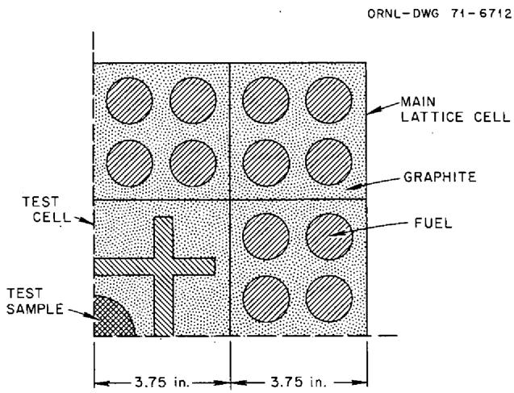  
（a）

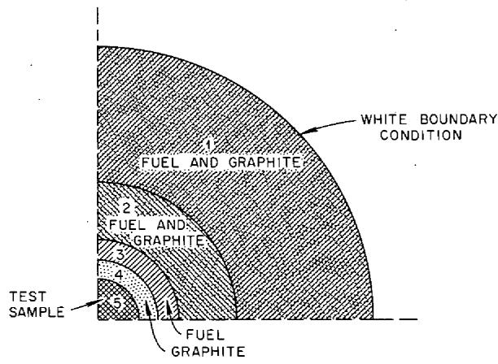  
(b)   
Fig. 4.1. HTLTR central core geometry and composition. (a) Midplane, (b) as simulated in XSDRN calculations.

As an example of the precalculated methods used to generate the approximate values given in Table 4.7, we will describe item B1 in some detail. In Fig. 4.1a is shown one quadrant of the central portion of the HTLTR, including the test cell and one square ring of adjacent main lattice cells. Zone 5 contains the material whose reactivity worth is to be determined. In item B1 the material is graphite. The geometry of Fig. 4.1a is

represented in XSDRN as shown in Fig. 4.1b, where zones 1 through 4 are homogenized circular annuli representing the actual geometry. For example, zone 1 represents the main test lattice.

The white boundary condition at the outer edge of zone 1 simulates the rest of the HTLTR. This is a good approximation since the fluxes in the central portion of the HTLTR are nearly flat.

The direct result of the XSDRN calculation is the multiplication factor $k$ for each of the assemblies described by Fig. 4.1b. Since the reactivity of the HTLTR with the various test samples listed in Table 4.7 (series B) will be measured relative to its reactivity with item B1 in the configuration of Fig. 4.1a, we have expressed our calculated multiplication factors as reactivity changes relative to item B1. In item B2 of Table 4.7 we introduced a 5-mil-thick copper foil at the interface between zones 4 and 5 and calculated the difference in multiplication factor between items 1 and 2, as given by XSDRN for the geometry of Fig. 4.1b. Using the experimentally determined worth of copper at the center of the HTLTR (0.018 $\phi/\mathrm{g}$ ), we normalized our calculated reactivity worths for the remaining samples, as listed in Table 4.7.

Status of the experimental and calculational program at the end of February was as follows. Precalculations, of approximate nature, had been made as a basis for design of the experiment. PNL had prepared all lattice blocks and all materials test samples, except for a few special ones that were supplied by ORNL: $^7\mathrm{LiF}$ , Teflon $(\mathrm{CF}_2)$ , Hastelloy N foils and plates, and some special carbon powder for the densely packed fuel. PNL had completed the room-temperature measurements and had begun on those at $300^{\circ}\mathrm{C}$ . These measurements indicated that good spectral matching was achieved and that the specified design gave $k_{\infty}$ and measured reactivity worths in satisfactory agreement with the approximate precalculated values. ORNL was preparing to make more precise calculations on the as-built lattice. Codes were being developed to permit inclusion of grain self-shielding effects, neglected in precalculations. Cross sections were being processed for the other temperatures needed, the precalculations having been done at $900^{\circ}\mathrm{K}$ $(627^{\circ}\mathrm{C})$ .

# 5. Systems and Components Development

Dunlap Scott

# 5.1 GASEOUS FISSION PRODUCT REMOVAL

C. H. Gabbard

# 5.1.1 Gas Separator and Bubble Generator

Construction of the water test loop for testing MSBE-scale gas separators and bubble generators was completed, and the loop was put into operation. Figure 5.1 shows the test loop with the venturi-type bubble generator and the gas separator installed. The loop has been operated primarily on demineralized water at liquid flow rates of 200 to $550~\mathrm{gpm}$ and at gas flow rates of 0 to 2.2 scfm. It has also been operated with water containing small amounts of $n$ -butyl alcohol and sodium oleate and with a $41.5\%$ glycerin-water mixture which is hydraulically similar to fuel salt.

The performance of the 4-in.-ID gas separator was greatly improved by installation of the annular takeoff port in the recovery vane hub. Straightening vanes were added within the recovery hub to reduce the pressure drop associated with the flow of gas and liquid through the hub. Figure 5.2 shows the final design operating on demineralized water containing about $0.3\%$ voids at the entrance to the separator. The vortex is firmly attached to the central cone within the Plexiglas recovery hub, and only a trace quantity of very small bubbles escapes the separator at any normal operating condition within the gas flow range of 0 to 2.2 scfm. The improvement in performance can be seen by comparing Fig. 5.2 with Figs. 5.1 and 5.2 in the previous semiannual report.

The performance of the venturi-type bubble generator has been satisfactory when operated with the axis vertical. The bubbles were adequately dispersed and were 0.020 in. in diameter or less at flow rates of 400 gpm or greater. There were no strong pulsations in the bubble output, as had been observed in some of the

previous tests of smaller-scale bubble generators, but hydraulic turbulence in the diffuser cone produced small fluctuations in the bubble concentration. A straight cylindrical mixing section about 2.5 throat diameters in length was incorporated in the design to permit the bubbles to be formed and partially dispersed in a high-velocity region prior to reaching the diffuser. However, in practice, the gas traveled the length of the mixing section in relatively straight plumes of large elongated bubbles. The small bubbles were actually formed and dispersed by the turbulence in the diffuser cone. Maintaining a balanced gas feed around the periphery of the bubble generator has not presented a problem with the bubble generator operating in the vertical position and has not required a significant pressure drop across the gas feed holes.

The loop has been operated for short periods of time on water containing, separately, $n$ -butyl alcohol, sodium oleate, and $41.5\%$ glycerin. The $n$ -butyl alcohol was used in concentrations up to $160~\mathrm{ppm}$ to study the effect of a surfactant that would not otherwise alter the properties of the liquid. The sodium oleate was used in concentrations up to $40~\mathrm{ppm}$ with $4~\mathrm{ppm}$ of an antifoaming agent to determine the effect of reducing surface tension (from $72.5~\mathrm{dynes/cm}$ for demineralized water to about $45~\mathrm{dynes/cm}$ ). The $41.5\%$ glycerin-water mixture is hydraulically similar to the fuel salt. The addition of $n$ -butyl alcohol and sodium oleate may have caused a slight decrease in the size of bubbles produced by the bubble generator, but the most obvious effect was to stabilize small bubbles, inhibit their coalescence, and promote clouding of the loop fluid by bubbles 0.001 to 0.002 in. in diameter which were formed by the pump. These small bubbles were not effectively removed by the separator, and several minutes of loop operation without gas input were required to clear the fluid. Operation with the $41.5\%$ glycerin-water mixture gave similar results except that the small bubbles were removed much more slowly. A small amount of foaming occurred at the free liquid surfaces with water containing the $n$ -butyl alcohol; the sodium oleate produced extensive foaming that was greatly reduced but was not eliminated by addition of the antifoaming

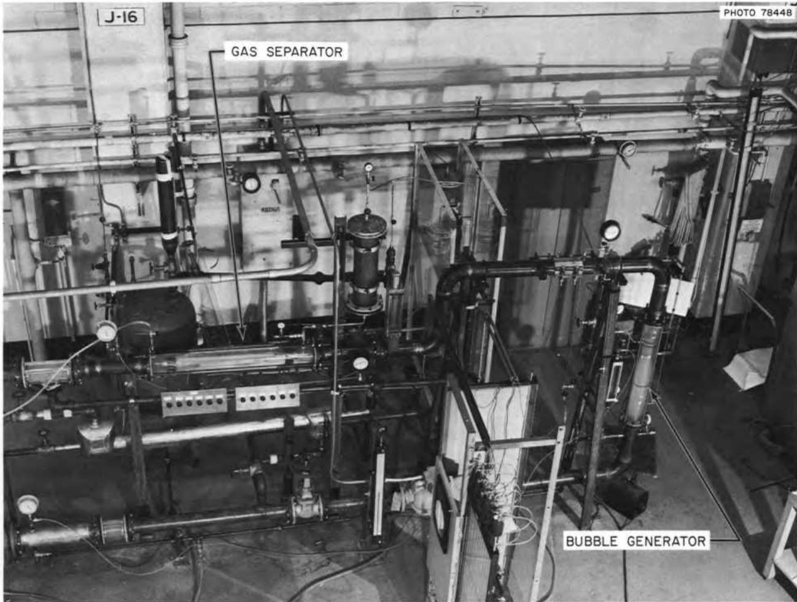  
Fig. 5.1. Gas separator and bubble generator water test loop.

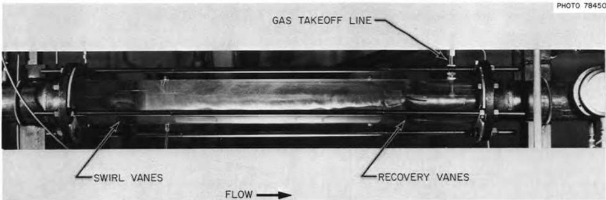  
Fig. 5.2. Four-inch-ID pipeline gas separator operating on demineralized water.

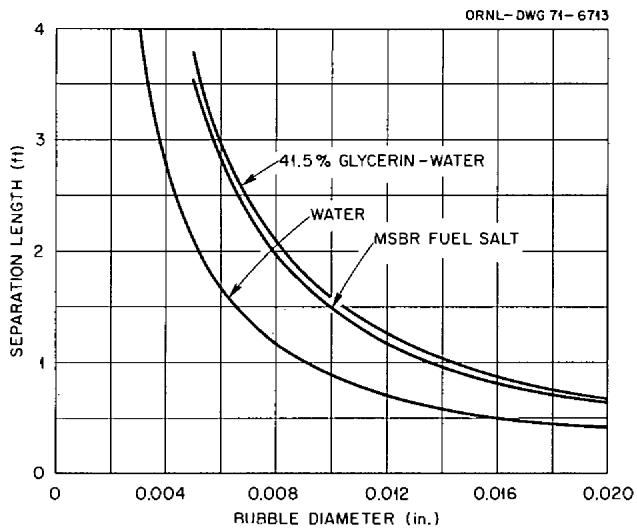  
Fig. 5.3. Calculated separation length vs bubble diameter for 4-in.-ID gas separator and liquid flow of $400\mathrm{gpm}$

agent. No foaming occurred with the glycerin-water mixture. Loop and pump modifications are in progress to determine whether fewer small bubbles are produced by operating the pump near its best efficiency point and at a lower speed.

We infer that the circulating bubbles in the MSRE and in the MSRE prototype pump test loop were not so small because they separated out relatively quickly under low or zero flow conditions. Attempts to produce foams in molten salt by bubbling gas through a coarse glass frit produced bubbles 2 to $3\mathrm{mm}$ or larger in diameter under normal salt conditions, and a foam was generated only when moisture or hydrates were added to the salt. Therefore we do not expect to encounter significant quantities of the very small bubbles in a salt system.

A computer program was written to calculate the required length for separating bubbles in a pipeline separator. The mixture of bubbles and liquid enters the separator with specified axial and rotational velocities, and the required length is the axial distance that a bubble of a specified diameter will travel as it is caused to migrate from the wall of the pipe to the central vortex by the centrifugal forces. Calculations were completed for a 4-in.-ID separator operating on water, salt, and the $41.5\%$ glycerin-water mixture. The results of these calculations are shown in Figs. 5.3 and 5.4. Figure 5.3 shows the rapid increase in the required separation length with decreasing bubble size and shows

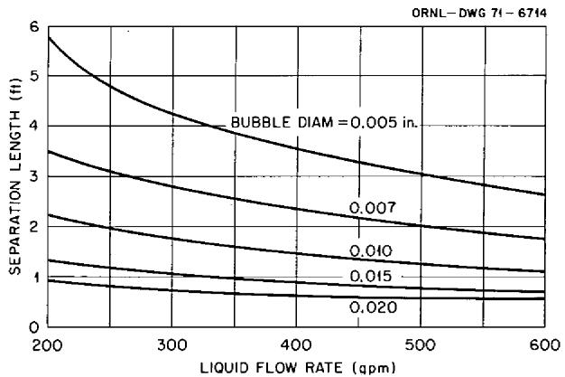  
Fig. 5.4. Calculated separation length vs fuel salt flow rate for 4-in.-ID gas separator.

that the separation length is greater with salt than with water. Figure 5.4 shows the effect of flow rate on the separation length for several bubble sizes.

# 5.2 GAS SYSTEM TEST FACILITY

# W. K. Furlong

The conceptual design of a molten-salt loop for testing gas systems was completed, the conceptual system design description was written, and work is now beginning on the preliminary design. The facility will be used for developing the technology of the fuel salt for MSRs and in particular for tests such as the performance of the bubble injection and separation components and the off-gas handling system. In addition, several other important tests will be run over the life of the loop. These include measurement of surface tension as a function of $\mathrm{UF_4 / UF_3}$ ratio, the study of noble gas and possibly tritium distribution, the study of bubble dynamics, the measurement of heat transfer coefficients, and the measurement of the product of mass transfer coefficient and bubble surface area.

The facility is scheduled for initial operation in the first quarter of FY 1973.

# 5.3 MOLTEN-SALT STEAM GENERATOR

# J. L. Crowley R. E. Helms

Our program plan for obtaining reliable steam generators for the MSRP consists of the following three phases.

Phase I - preliminary development of molten-salt steam generator technology. Some conceptual designs and proposals for development requirements will be

prepared by industrial manufacturers of steam generators. We will independently prepare a molten-salt steam generator development basis report which will also show which elements of the LMFBR program will be of use. In addition, some preliminary information will be obtained from some small-scale tests. Phase I is expected to allow us to proceed with the engineering development, procurement, and testing program for the MSBE steam generator.

Phase II - completion by the industrial manufacturers of a preliminary design of a steam generator based on the conceptual design and completion of the engineering tests defined in phase I. These tests will include the operation of some full-size steam tubes to be supplied by the designer in a molten-salt steam generator tube test stand (STTS). The completion of phase II should place the manufacturers in position to proceed with the detailed design of our MSBE steam generator.

Phase III - detailed design, fabrication, and operation of a prototype steam generator in the MSBE or in a test facility with a very large heat source. With the experience gained from this phase, the manufacturer should be capable of supplying reliable steam generators for future needs of the MSBR program.

A discussion of the present activities of phase I follows.

# 5.3.1 Steam Generator Industrial Program

Efforts continued toward obtaining conceptual designs and development program proposals from a qualified industrial manufacturer of steam generators. A package consisting of a summary of the 1000-MW(e) MSBR reference design, a proposed scope of work for the industrial program, and a cover letter requesting an expression of interest in receiving a request for proposal was sent to nine industrial firms. Eight firms responded affirmatively, and the request for proposal package was sent to them. We hope to enter into a CPFF contract with one firm during this fiscal year to begin work on the four tasks of the industrial study.[5]

# 5.3.2 Steam Generator Tube Test Stand (STTS)

The conceptual system design description (CSDD) was completed and issued as an internal ORNL memo. This CSDD describes the 3-MW test facility to be built as part of phase II of the molten-salt steam generator

program plan previously discussed. Further work in this area has been suspended until late in FY 1972.

# 5.3.3 Molten-Salt Steam Generator Technology Facility (SGTF)

The steam generator technology facility is being considered for use in testing sections of steam generator concepts or portions of single-tube heat exchangers while generating steam at heat rates of $150\mathrm{kW}$ or less. As an aid in preparing the requirements for such tests we are examining several combinations of tube-in-tube test sections to determine what would be most useful. Calculations indicate that these small tests can be useful for tubes up to $3/8$ in. in diameter and 33 ft long producing steam at $1000^{\circ}\mathrm{F}$ and up to 3600 psi pressure. A conceptual design of the equipment to do these tests is being prepared.

# 5.3.4 Development Bases for Steam Generators Using Molten Salt as the Heat Source

Work has begun on preparation of a development basis report for molten-salt steam generators. This report will review the present technology of similar systems using sodium as the heat source and will point out elements of the LMFBR program which will be of use in the molten-salt technology program. This report will identify molten-salt steam generator problem areas needing further fundamental study and development and will outline a program for the development efforts needed for designing and fabricating reliable molten-salt steam generators.

# 5.4 SODIUM FLUOROBORATE TEST LOOP

A. N. Smith

The test program was completed during the previous report period. Following the final shutdown of the loop, the pump rotary element, the bubbler tube which served as the $\mathrm{BF}_3$ feed line and as an indication of the salt level in the pump bowl, the spark plug salt level probes, and the pump bowl pressure control valve were removed from the system for inspection.

The general appearance of the pump impeller and adjacent surfaces indicated that the 11,567 hr of fluoroborate salt circulation did not cause excessive corrosion of the Inconel system. Deposits of salt were found in the upper part of the rotary element near the thermal barrier, about 4 in. above the normal level of

salt in the pump bowl. We concluded that the nature and cause of these deposits were the same as for similar deposits observed in May 1968. The $\mathrm{BF}_3$ feed and salt level bubbler tube (Inconel) was found to contain deposits of several different corrosion products, including one at the mouth of the tube which had severely restricted gas flow. Metallographic and chemical analyses were made to determine the nature of the deposits and the extent of damage due to corrosion. Metallurgical analysis of the Hastelloy N spark plug salt level probes is incomplete. Visual examination of the stem and seat of the off-gas pressure control valve revealed no evidence of corrosive attack. The stainless steel valve was in service throughout the entire test program, operating at room temperature with a $C_p$ of 0.01, a $\Delta P$ of 24 psi, and a gas flow of 1.5 liters/min consisting of helium with $3.5\%$ $\mathrm{BF}_3$ . The material below presents a more detailed discussion of the observations and conclusions resulting from the examination of the pump and $\mathrm{BF}_3$ feed and salt level bubbler tube.

# 5.4.1 Pump Bowl and Rotary Element

The pump rotary element was removed from the pump bowl in September 1970. The appearance of the

pump bowl as viewed from the north side is compared with the same view taken in April 1968 after only 187 hr of salt circulation (see Fig. 5.5). This time considerably more debris, presumably corrosion products, was present on surfaces visible through the fountain flow windows. The material probably fell from the thermal barrier region when the rotary element was removed. The sharp edges on the metal surfaces at the entrance to the volute, which is adjacent to the impeller tip (tip speed of the 9-in. impeller was about 70 fps), is interpreted as an indication that the combined corrosive-erosive attack was slight.

The as-removed appearance of the pump rotary element is shown in Fig. 5.6. Here again, the sharp edges at the impeller discharge openings are an indication of insignificant attack. The debris on the horizontal surface just above the impeller probably fell to that point from the vicinity of the thermal barrier. The presence of the white cake of salt on the thermal barrier surface (an annulus about $1/16$ in. wide is formed by this

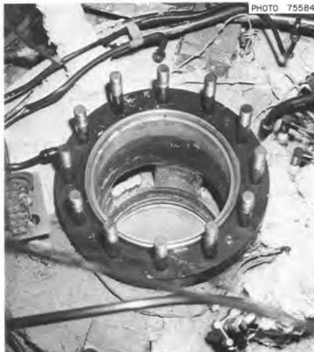  
AFTER 187 hr SALT CIRCULATION (APRIL 1968)

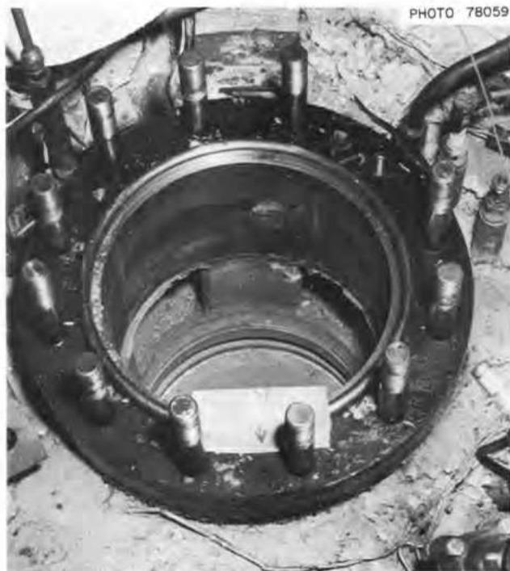  
AFTER 11,567 hr SALT CIRCULATION (SEPTEMBER 1970)

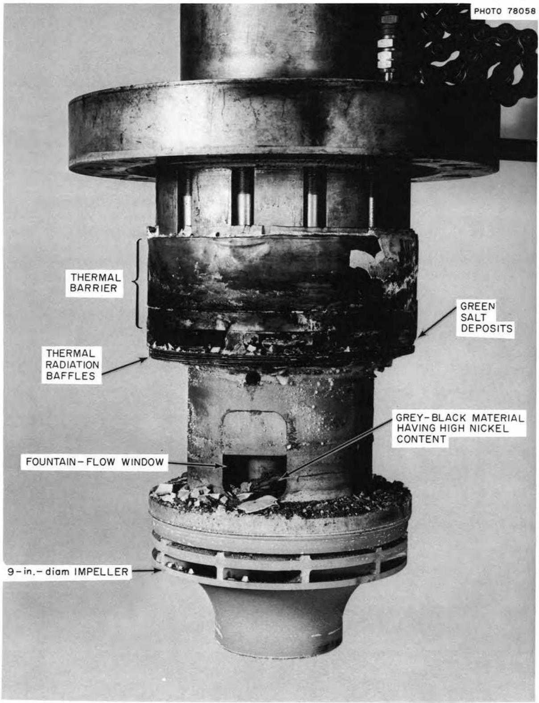  
Fig. 5.6. Post-test appearance of salt pump rotary element, $\mathrm{NaBF}_4$ circulation test, PKP loop, 9201-3.

surface and the pump bowl neck) is an indication that salt was forced into this region, probably during the ingassing transients. The dark material in the openings immediately above the heat baffles is primarily green salt similar to that observed in May 1968. The chemical analyses of the two green salt deposits (Table 5.1) show the later deposit to have a higher iron and chromium content, a lower uranium and thorium content, and a significantly different U/Th ratio. The region of the green salt deposits is about 4 in. above the normal level of salt in the pump bowl. The appearance and composition of the deposits seem to argue against formation from vapor or mist. The inference is that the green salt is a relatively insoluble phase formed by combination of the fluoroborate salt with residue of the fuel (BULT-4) salt formerly used in the loop and that the deposits were formed during periods of abnormal salt level when the bulk salt came into contact with the cool surfaces in the thermal barrier region. The only known periods of abnormally high salt level were during the several brief ingassing transients which occurred during the operation with flush salt. We conclude that the deposits found in September 1970 must have been formed sometime between May 16, 1968, when operations were resumed after inspection of the rotary element, and June 24, 1968, the date of the last ingassing transient.

A gray-black piece of material found outside the fountain flow window (Fig. 5.6) was magnetic and had the following chemical analysis:

<table><tr><td>Element</td><td>Weight %</td></tr><tr><td>Na</td><td>5.0</td></tr><tr><td>B</td><td>3.0</td></tr><tr><td>Fe</td><td>2.5</td></tr><tr><td>Cr</td><td>0.2</td></tr><tr><td>Ni</td><td>66.3</td></tr><tr><td>F</td><td>Assumed remainder</td></tr></table>

We think that this deposit precipitated from the fountain flow (upper labyrinth seal leakage) stream at a point near the impeller hub where the temperature was below the bulk salt temperature. We can speculate that the circulating salt stream was saturated with nickel at normal circulation temperatures, since it has been reported by others10 that the nickel ion has a low solubility in the fluoroborate salt and tends to deposit in low-temperature regions. The nickel-bearing corrosion products would thus tend to separate out at the

Table 5.1. Chemical analyses of green salt deposits   

<table><tr><td rowspan="2">Element</td><td colspan="2">Analysis (wt %)</td></tr><tr><td>September 1970</td><td>May 1968</td></tr><tr><td>Na</td><td>17.8</td><td>11.0</td></tr><tr><td>B</td><td>2.6</td><td>3.9</td></tr><tr><td>Li</td><td>0.17</td><td>0.21</td></tr><tr><td>Be</td><td>0.10</td><td>0.04</td></tr><tr><td>U</td><td>0.35</td><td>12.2</td></tr><tr><td>Th</td><td>13.9</td><td>26.5</td></tr><tr><td>Fe</td><td>9.45</td><td>1.5</td></tr><tr><td>Cr</td><td>8.9</td><td>0.27</td></tr><tr><td>Ni</td><td>0.08</td><td>0.03</td></tr><tr><td>F</td><td>45.3</td><td>43.5</td></tr></table>

first convenient cool surface external to the isothermal circulating stream. None of the green salt was found in this area, which implies that the bulk salt at $1025^{\circ}\mathrm{F}$ was not saturated with respect to the green salt.

# 5.4.2 $\mathbf{BF}_3$ Feed and Salt Level Bubbler Tube

The gas bubbler tube which was used for $\mathrm{BF}_3$ addition and salt level indication was removed from the pump bowl in October 1970. The $5/8$ -in.-OD by $1/2$ -in.-ID Inconel tube had been in service for the entire test program from March 1968 through April 1970, during which time salt circulated $11,567\mathrm{hr}$ . The tube was $13\mathrm{in}$ long, and the bottom end contained one triangular notch $1/4$ in. wide by $1/8$ in. deep. Although operating conditions were varied briefly for special tests, during most of the test program the total gas flow was $370\mathrm{cm}^3/\mathrm{min}$ , and the gas was helium containing $13.5\% \mathrm{BF}_3$ by volume. During periods when the loop was shut down and drained, the $\mathrm{BF}_3$ flow was stopped, argon was used in place of the helium, and the flow rate was somewhat reduced. The total volume of gas which passed through the tube was about $0.26 \times 10^6$ liters during salt circulation and about $0.4 \times 10^6$ liters during the entire test program. Note that inert gas was routinely added to the pump bowl through other lines, so that the total pump bowl gas flow was normally $1500\mathrm{cm}^3/\mathrm{min}$ . The loop was filled and drained a total of 16 times during the test program, and the pump bowl salt level varied somewhat from one operating period to the next. Also, the level varied whenever the salt temperature was changed. The average salt level was $2^{1/2}$ in. above the bottom of the tube during the flush salt operating period and $4^{1/2}$ in. above the bottom during the clean salt operation. In each case there were variations of not more than $\pm 1$ in.

During the final 20 days of loop operation, the salt level instrument showed a steady increase of about 0.06

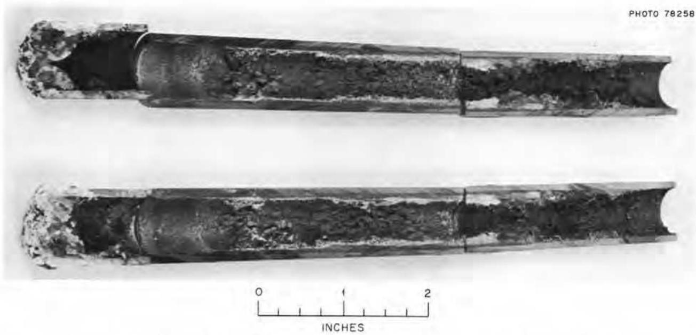  
Fig. 5.7. Interior view of $\mathrm{BF}_3$ feed and salt level bubbler tube, $\mathrm{NaBF}_4$ circulation test, PKP loop, 9201-3.

in./day. This was interpreted as an apparent increase, probably caused by an increase in flow resistance (plug) in the bubbler line. During the final salt drain, when the salt level was decreasing, the indicated salt level rose and went off scale $(100\% = 20$ in. $\mathrm{H}_2\mathrm{O})$ ,an indication of a plugged line.

The appearance of the exterior of the tube was as follows: the opening at the bottom end was completely filled with a silver-gray metallic-appearing magnetic deposit; the lower 4 in. of the exterior surface had a bright silvery-grainy appearance and was very rough to the touch; the next 3 in. was dark, not as rough as the lower region, somewhat grainy in the lower half, and had a thin coating of bright green solid on one side; the upper 4 in. was gray-black to black with a greenish cast.

The tube was cut into four pieces by cuts at 1, $4^{1/2}$ , and $7^{1/2}$ in. from the lower end. The three lower pieces were then slit axially. The inside of the tube appeared as follows (Fig. 5.7). The plug at the bottom end was $1/4$ to $1/2$ in. thick; for about $3/4$ in. above the plug, the wall was covered with a thin black film; for the next $3/4$ in. there was a thin deposit which was mostly light gray with a sprinkling of light green particles. From the $1^{3/4}$ -in. level to the $4^{1/2}$ -in. level, bright green material was deposited and from $4^{1/2}$ to $7^{1/2}$ in. there appeared to be the same green material covered with a loose black magnetic powder. The deposit was $1/3$ , $2$ to $1/6$ in. thick for the most part, except that it was somewhat thicker at about the 2-in. level and filled about $90\%$ of the tube cross section at the $5^{1/2}$ -in. level. In cross

section, the plug at the bottom end of the tube had a white, mottled appearance as though the metallic deposit was interspersed with lumps of salt. The green deposit had a yellowish cast.

Metallographic examination of the tube, under the direction of Koger, produced the following conclusions. About 5 mils of material was removed from the Inconel tube. As expected, attack by salt and by vapor was evident, but no void formation occurred; corrosion product was left on the inside of the tube from vapor attack and was deposited on the lower opening by mass transfer from the bulk salt.

Identification of the various materials found in the tube was made under the direction of Cantor.12 Analyses by x-ray diffraction and electron microprobe indicated that the green salt was $\mathrm{Na}_3\mathrm{CrF}_6$ the yellow salt was predominantly $\mathrm{NaNiF_3}$ and the black, powdery magnetic material was a mixture of nickel and iron in a ratio stoichiometrically equivalent to the alloy $\mathrm{Ni}_3\mathrm{Fe}$ . The plug at the bottom of the tube was a mixture of metallic nickel and $\mathrm{NaBF_4}$ in approximately equal parts.

Cantor surmised that the $\mathrm{Na}_3\mathrm{CrF}_6$ and $\mathrm{NaNiF}_3$ were produced by reaction of the salt with moisture introduced by the various gas streams. The reaction products

probably accumulated as a scum on the surface of the salt and were subsequently transferred to the inner walls of the tube by some mechanism, most likely in liquid droplets formed by the continuous breaking of gas bubbles. Routine surveillance and control were not maintained over the water content of the incoming helium and $\mathrm{BF}_3$ , so we do not have an accurate measure of the quantity of water which was added to the system in the gas feed. However, based on limited observation, $^{13}$ the water content of the $\mathrm{BF}_3$ is thought to have been less than 50 ppm by volume. The helium was supplied from a source which is known to be of high purity (less than 1 ppm $\mathrm{H}_2\mathrm{O}$ ). Brief tests with a moisture monitor indicated that the helium stream at the loop contained about 20 ppm, so we believe that it certainly contained less than 50 ppm $\mathrm{H}_2\mathrm{O}$ . The calculated rate of addition of water to the system would be about $0.8\mathrm{g}$ of $\mathrm{H}_2\mathrm{O}$ per $10^{6}$ liters of gas per ppm $\mathrm{H}_2\mathrm{O}$ by volume. Therefore, if we assume a maximum concentration of $\mathrm{H}_2\mathrm{O}$ in the feed gas of 50 ppm by volume, the maximum amount of water added during salt circulation is estimated to be $40\mathrm{g}$ total injected into the pump, with $10\mathrm{g}$ entering through the bubbler tube and the remainder through the shaft purge. These numbers represent water input rates of about 1 and $3.6\mathrm{mg/hr}$ , respectively, when averaged over the $11,567\mathrm{hr}$ of operation but do not include the $10\mathrm{g}$ of water injected instantaneously in a special test. $^{14}$ We do not know the weight of material which was deposited in the tube, nor what fraction of the total corrosion product this represented. However, by making rough assumptions regarding volume and density, we estimate that the total amount of material in the tube was probably less than $10\mathrm{g}$ , and on this basis it appears possible that water in the gas feed could have been an important contributing factor in the plugging of the tube.

# 5.5 COOLANT SALT TECHNOLOGY FACILITY

# A. I. Krakoviak

A conceptual system design description (CSDD) for the coolant salt technology facility (CSTF) has been prepared (ORNL-CF-70-12-18), and preliminary design of the facility and components has begun.

We plan to use the piping (5 in. sched 40), the pump, and other components from the MSRE coolant system to upgrade the existing sodium fluoroborate test loop (constructed of Inconel) to a facility constructed of Hastelloy N. Where applicable, the existing drawings of the PKP-1 pump test stand, service piping, containment enclosure, cover-gas supply, and off-gas disposal facilities are being reused.

The proposed salt loop will have a pump, a salt-to-air heat exchanger (to dissipate pump power), a drain tank, and the necessary connecting pipe. An orifice will limit the loop flow to $\sim 600$ gpm at a pump discharge pressure of $\sim 100$ psig and a suction pressure of $\sim 25$ psig. The loop will be fabricated with matching sets of nozzles on the discharge and suction lines to permit later attachment of parallel salt circuits. These side loops will be used to provide the additional information needed to assure that the sodium fluoroborate-sodium fluoride eutectic does indeed meet the requirements of a secondary fluid for molten-salt reactors.

The new facility, with its side loop, will supply additional information on

1. boron trifluoride cover-gas addition to and removal from the pump bowl,   
2. chemical removal of water from the fluoroborate salt at rates typical of small steam inleakage,   
3. detection and removal of corrosion products that would result from small steam leaks into the salt,   
4. control of the salt chemistry so that the coolant may also serve as a sink for the tritium inherently produced by lithium-based reactor fuels,   
5. operation of a steam generator test heated by molten salt,   
6. heat and mass transfer near the cold wall of a steam generator,   
7. operation of valves in molten salt.

In some cases, further fundamental chemical and/or metallurgical studies are needed before an engineering-scale test can be made. Although the main facility is designed primarily for testing with sodium fluoroborate salt, it would also be suitable for testing other fluoride salts.

At the end of this report period, the coolant system piping had been removed from the MSRE and the mechanical design of the loop was $\sim 10\%$ completed. The main loop is expected to be complete at the end of December 1971.

# 5.6 MSBR PUMPS

H.C.Savage L.V.Wilson H.C.Young A.G.Grindell

# 5.6.1 MSRE Mark 2 Fuel Pump

As previously reported,15 during the shutdown of the MSRE Mark 2 pump, we found that the system salt could not be drained into the storage tank because the connecting line was plugged. Various attempts to promote draining by increasing the temperature of the salt piping system including the freeze valve and by increasing the differential pressure between the pump and storage tank were unsuccessful. We then replaced the drain line by use of a procedure in which all the salt was frozen except that in the pump tank and in three pressure transmitters. After the new installation was inspected, the salt was melted carefully by heating the pump suction and then the pump discharge piping progressively outward from the hot salt in the pump tank. The salt drained satisfactorily into the storage tank, where it was frozen, and the facility was secured.

The entire length of the plugged drain line was x rayed, and suspect sections were removed, separated into two symmetrical longitudinal pieces (shown in Fig. 5.8), and examined by the Reactor Chemistry Division. The plug was located approximately 32 in. downstream of the junction of the drain line with the main loop piping and 44 in. upstream of the freeze valve.

A considerable amount of relatively large (0.5 mm long) zirconium oxide crystals, which may be seen in

15. MSR Program Semiannu. Progr. Rep. Aug. 31, 1970, ORNL-4622, p. 6.   
16. R. E. Thoma, Examination of Specimens from the MSRE Fuel Salt Pump Test Stand, MSR-70-61 (Nov. 17, 1960) (internal correspondence).

Fig. 5.8, was found in section I-J of the drain line. The zirconium oxide crystals, section I-J, are compared with normal salt, section K-L, in the figure. We hypothesize that the contaminants needed to produce the plugging material were introduced into the salt system by the argon purge gas and during the approximately 60 times the system was opened to perform various maintenance activities and that they precipitated in a cool section of the drain line. Additional details of the draining operation are presented in Incident Report ORNL-70-36-Final.

# 5.6.2 MSRE Salt Pump Inspection

A visual inspection was made of the rotary element and the conveniently accessible interior surfaces of the pump tank in the MSRE coolant salt pump as the rotary element was being removed from the coolant salt system. The observations are described below. The salt had drained well from all salt-exposed surfaces. The salt flow passages in the impeller, volute, and suction line were clean, and no evidence of wear of any kind was noticeable. A black carbon-like residue was seen on the exterior surfaces of the shield plug and its extension, both of which are parts of the rotary element, down to the salt-gas interface. There was a similar residue on the pump tank surface directly opposite the shield plug and on the cylinder which supports the pump volute down to the salt-gas interface. Apparently oil leakage from the lower shaft seal had drained from the catch basin, run down the outside of the shield plug, and decomposed at the $1025^{\circ}\mathrm{F}$ temperature in the pump tank. These observations confirm the suspected leakage of a mechanical seal in the oil drainage system. This seal was replaced with a seal weld in the spare rotary elements for the fuel and coolant salt pumps. The rotating

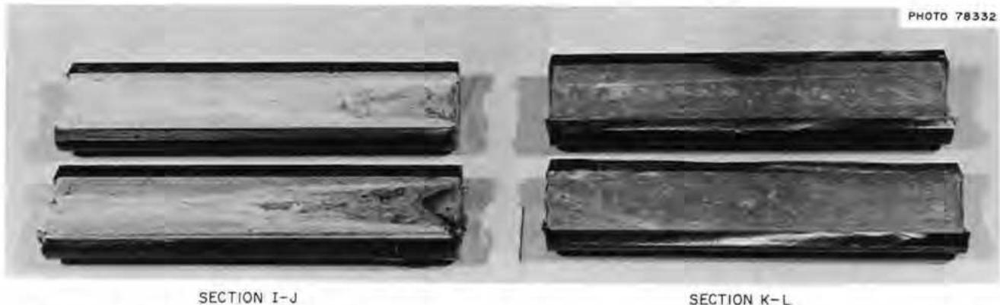  
Fig. 5.8. Plugged drain line from Mark 2 pump test stand. Section I-J shows presence of zirconium oxide crystals in the salt; section K-L shows frozen normal salt.

components, including the impeller, shaft, drive motor rotor, and all bearings and shaft seals, turned easily and smoothly to the hand, lending support to our belief that the pump would have operated satisfactorily at high temperature for many additional hours. Additional inspection of the pump will be performed while it is being prepared for use in one of the technology loops.

# 5.6.3 ALPHA Pump

Water testing of the ALPHA pump, $^{17}$ a centrifugal pump designed for capacities to 30 gpm, 250 ft head, and temperatures to $1400^{\circ}\mathrm{F}$ , was completed. Data indicate that the design hydraulic performance conditions can be met at a shaft speed of approximately 6750 rpm.

The pump is to be used initially in molten-salt forced-convection loop $^{18}$ MSR-FCL-2. The pump satisfies the MSR-FCL-2 hydraulic requirements of 4 gpm at approximately 110 ft head at a shaft speed of approximately 3900 rpm. Based on the water test results, the final design of the pump tank and internal parts was completed, and the parts were fabricated of Hastelloy N for use in the pump unit for MSR-FCL-2.

Further water testing of the ALPHA pump is not planned at this time because the only available rotary element will soon be installed in MSR-FCL-2. However, additional testing may be desirable in the future to measure the fountain flow rate and to define in more detail the shaft deflection characteristics at higher pump capacities (speeds above 6000 rpm).

# 5.7 REMOTE WELDING

P.P.Holz W.A.Bird

C.M.Smith,Jr. W.R.Miller

Most of the work previously supported under the MSRP remote welding program has been transferred into an automated welding program sponsored by the LMFBR program and will be reported under that program in the future. The new LMFBR program is directed toward developing suitable equipment, welding procedures, and programmed controls to produce butt welds with consistently high quality in pipe to meet LMFBR needs for reactor construction and loop maintenance. It is planned to extend automated welding technology to pipe sizes as large as 30 in. diameter and to field test the equipment at construction sites. The

LMFBR program makes use of the prototype machinery and controls developed in the MSR program.19-21 We are continuing to sponsor the work necessary to complete and test the weld torch positioning mechanisms and control circuitry; to define and document remote maintenance inspection, viewing, and alignment criteria; and to investigate pipe cleanliness requirements for maintenance welding in salt systems.

# 5.7.1 Automatic Controls

We are striving to develop a welding system that can, without human intervention, handle all the perturbations, misalignments, etc., that are normally encountered in welding. This effort should not be confused with programming the controls for automated welding. Programming simply provides preset values for specified variables at a prescribed time. A self-adaptive system must have the ability to correct for unexpected conditions at any time during the execution of the weld. Thus, the system mechanizes operator capabilities and reduces the level of skill required of welding personnel. Such a system is necessary for completely remote welding in radioactive areas.

An automatic horizontal torch control and an automatic torch oscillator control are two new devices that are being added to our present equipment, which already includes an operational automatic vertical torch control. The automatic vertical torch control employs a servo-drive motor mechanism to control the torch-to-work spacing. The system steps the torch vertically within a narrow range to keep the arc voltage nearly constant and thus permits the wire feed rate control to operate as a fine control vernier. This combination of controls produces uniform weld metal deposits while maintaining proper arc voltage for uniform weld penetration. The automatic horizontal control will work in conjunction with automatic vertical control to position the torch at the optimum location between the beveled edges of the joint prior to making the weld pass. A second motor has to be added to drive the torch assembly horizontally across the weld groove area. The present equipment utilizes a dc motor with an adjustable eccentric mechanism to oscillate the torch in a fixed pattern. Variations in the side wall of the groove

sometimes produce insufficient tie-in or, at the opposite extreme, contact between the electrode and the side wall. The improved system will continually sense the arc voltage and control the oscillator drive motor to keep the electrode within the proper distance from the wall of the groove.

# 5.7.2 Pipe Cleaning Tests

A series of experiments to determine cleanliness requirements for pipe joints to be welded and to check into possible contamination effects from salt plugs in the pipe near the weld zone produced promising results. We were able to make butt welds manually to meet nuclear code x-ray standards in $\frac{1}{2}$ - and $\frac{3}{4}$ -in. standard-

weight Inconel pipe that were plugged solid with $\mathrm{LiF - BeF_2 - ZrF_4 - ThF_4 - UF_4}$ (68.4-24.6-5.0-1.1-0.9 mole %) by merely clearing a distance of 1 in. on both sides of the weld joint. Special provisions were made for purging the pipe interior. Pipe cleaning consisted in drilling out the plug and then wiping interior and exterior pipe surfaces with emery cloth to remove salt films and scale and to produce a reasonable surface finish. We were careful not to polish the surfaces because this would be difficult to do under working conditions in a reactor. Weld preparation and welding were done in a glove box.[2]

22. P. P. Holz, Butt Welding Experiments with Salt Plugged Pipes, ORNL-TM report (to be issued).

# 6. MSBR Instrumentation and Controls

# 6.1 DEVELOPMENT OF A HYBRID COMPUTER SIMULATION MODEL OF THE MSBR SYSTEM

O.W.Burke

# 6.1.1 Introduction

As an extension of the work done by Sides, a hybrid computer simulation model of the MSBR has been under development for the past three months. The new model of the reactor, primary heat exchanger, etc., up to the steam generator, is essentially the same as that used by Sides. The model of the steam generator is similar to that reported in ref. 2. The bulk of the discussion here will pertain to the steam generator model.

# 6.1.2 Steam Generator Model

The steam generator is a countercurrent, single-pass U-tube exchanger approximately 77 ft long and 18 in. in diameter. At the steady-state design point condition, water enters one end of the exchanger at a temperature of $700^{\circ}\mathrm{F}$ and at a pressure of 3752 psia. Salt enters the opposite end at a temperature of $1150^{\circ}\mathrm{F}$ . The salt flows through the shell side of the exchanger and the water through the tube side.

The mathematical model of the system consists in the conservation of mass, conservation of momentum, and conservation of energy equations of the salt and water. These equations are written in one space dimension, $x$ (the direction of water flow), and time, $t$ . In this initial model the variations in the density and velocity of the salt are neglected, and hence only the conservation of energy is considered for this part of the system. If it appears that a more detailed model of the salt side of the exchanger is warranted, it will be added later. The following equations were used:

Conservation of mass (water),

$$
\frac {\partial \rho}{\partial t} + \frac {\partial}{\partial x} (\rho v) = 0; \tag {1}
$$

conservation of momentum (water),

$$
\frac {\partial (\rho \mathrm {v})}{\partial t} + \frac {\partial}{\partial x} \left(\rho \mathrm {v} ^ {2}\right) = - \frac {k \partial p}{\partial x} - c \mathrm {v} ^ {2}; \tag {2}
$$

conservation of energy (water),

$$
\frac {\partial}{\partial t} (\rho h) + \frac {\partial}{\partial x} (\rho h v) = k _ {1} H (\theta - T); \tag {3}
$$

conservation of energy (salt),

$$
\frac {\partial \theta}{\partial t} + \omega \frac {\partial \theta}{\partial x} = \frac {H k _ {2}}{\rho_ {s} c _ {p}} (T - \theta); \tag {4}
$$

the equations of state for water,

$$
T = T (p, h); \tag {5}
$$

$$
\rho = \rho (p, h). \tag {6}
$$

The definitions of the variables used in the above equations are as follows:

$T =$ water temperature,

$\rho =$ water density,

$\mathbf{v} =$ water velocity,

$p =$ water pressure,

$c =$ coefficient of friction,

$k =$ constant used to make units consistent,

$h =$ specific enthalpy of water,

$H =$ heat transfer coefficient, salt to water,

$k_{1} =$ ratio of the surface area of a tube to the water volume in the tube,

$k_{2} =$ ratio of the surface area of a tube to the salt volume adjacent to the tube,

$$
\begin{array}{l} \rho_ {s} = \text {s a l t d e n s i t y (a s s u m e d c o n s t a n t)}, \\ c _ {p} = \text {s p e c i f i c h e a t o f s a l t a t c o n s t a n t p r e s s u r e}, \\ \theta = \text {s a l t} \\ \omega = \text {s a l t v e l o c i t y}. \\ \end{array}
$$

Boundary conditions on $p$ and $h$ are applied at the water entrance to the exchanger, on $\theta$ at the salt entrance, and on $v$ at the throttle. The critical flow at the throttle is expressed by the following nonlinear relationship among the system variables at a point just before the throttle:

$$
\rho \mathrm {v} = M \left(\frac {A _ {T}}{A _ {T , 0}}\right) ^ {2} \left(\frac {p}{1 + b _ {T}}\right), \tag {7}
$$

where $A_{T}$ is the instantaneous value of the throttle opening, $A_{T,0}$ the initial steady state value, $M$ the critical flow constant, and $b$ an empirical constant. $A_{T,0}$ is taken as 1.0 and $A_{T}$ is varied as a function of time during transients.

It was determined in previous work² that a continuous-space, discrete-time model is most satisfactory for this steam generator simulation. By simplification of Eqs. (1), (2), (3), and (4), and using the backwards differencing scheme for the time derivative, the following ordinary differential equations are generated:

$$
\frac {d p}{d x} = - \frac {\rho \mathrm {v}}{k} \frac {d \mathrm {v}}{d x} - \frac {c \mathrm {v} ^ {2}}{k} - \frac {\rho (\mathrm {v} - \mathrm {v} _ {k})}{k \Delta t}, \tag {1M}
$$

$$
\frac {d h}{d x} = \frac {1}{\rho v} [ k _ {1} H (\theta - T) ] - \frac {h - h _ {k}}{v \Delta t}, \tag {2M}
$$

$$
\frac {d \mathrm {v}}{d x} = - \frac {\mathrm {v}}{\rho} \frac {d \rho}{d x} - \frac {\rho - \rho_ {k}}{\rho \Delta t}, \tag {3M}
$$

$$
\frac {d \theta}{d x} = - \frac {H k _ {2} (T - \theta)}{\rho_ {s} c _ {p} v _ {s}} + \frac {\theta - \theta_ {k}}{v _ {s} \Delta t}, \tag {4M}
$$

where $\mathbf{v}_{\mathrm{s}}$ is salt velocity.

In the above equations, the nonsubscripted variables are the ones being iterated for the values at the end of the $(k + 1)$ time increment, while the variables with the $k$ subscripts represent their values at the end of the $k$ th time increment. The time increment is represented by $\Delta t$ .

By judicious choice of the direction of integration in space, of the various dependent variables, an initial value problem can be formed. Since the water enthalpy $h$ and the water pressure $p$ are known at the water entrance end of the exchanger (left end), these variables

will be integrated from left to right. For the same reason the water velocity (it can be calculated at the throttle) and the salt temperature will be integrated from right to left.

In the hybrid program the integrations are performed by the analog computer. The digital computer calculates the terms of the derivatives of the differential equations, provides control for the calculation, and provides storage. The thermodynamic properties of water are stored in the digital computer as two-dimensional tables. An interpolation routine is used to get values from these tables. In the present model the derivative terms are updated at 1-ft intervals in the $x$ dimension.

The calculational procedure for a $\Delta t$ step is as follows: With left boundary values of water enthalpy and water pressure as initial conditions, a left to right integration of these two variables is started. As the integration proceeds in $x$ , the derivative terms of the differential equations are updated at 1-ft intervals. Values of $p$ and $h$ are stored at these 1-ft locations in $x$ . The integrations are stopped when the $x$ location corresponding to the water exit end of the steam generator is reached. In a procedure identical to that above, and with the current values of $p$ and $h$ , the salt temperature and the water velocity are integrated from right to left. The initial condition of the salt temperature is that at the point where it enters the exchanger. The initial condition of the water velocity is the calculated velocity at the throttle. When the right to left integrations have proceeded to the left boundary, they are halted. The left to right integration of $p$ and $h$ is repeated, using the current values of $p, h, v, \text{and} \theta$ . The right to left integration is repeated, etc., until the convergence is satisfactory. It appears that the $\Delta t$ can be of the order of 1 sec.

The model of the reactor, primary heat exchanger, piping, etc., is a continuous-time model similar to those traditionally used on analog computers. It was felt that the detail required in these parts of the system was not as great as that required in the steam generator.

The steam generator model will be coupled with the analog model of the remaining parts of the system in the following manner. The analog model of the system, exclusive of the steam generator, will be slowed down in time by a factor of 10 or 100, as required. At intervals of approximately 1 sec the water pressure and temperature at the left end of the steam generator and the salt temperature at the right end of the steam generator are read and stored in the digital computer. These values are used for a $\Delta t$ step calculation on the hybrid computer as described above. At the end of the

$\Delta t$ calculation, output values of $p, h, \theta, T,$ and $\mathbf{v}$ are stored and fed back to the analog simulation. This procedure is repeated at time intervals of $\Delta t$ . If the analog simulation is slowed down by a factor of 100, for instance, the 1-sec $\Delta t$ of the hybrid calculation will look like 1/100 sec to the analog model. By using a short time constant first order lag on the discrete outputs from the hybrid model, it is hoped that the outputs from the hybrid model of the steam generator to the analog model of the rest of the system will be fairly smooth in time.

The analog model of the system, exclusive of the steam generator, has been developed and is ready to be patched on the analog patch boards. The patching and debugging of this model will require a few days.

The hybrid program for the steam generator has been written, and practically all of the debugging has been accomplished. It is expected to be running within a very short time. The integration of the two models will require some time. The model should be complete before the target date of June 30, 1971.

# 7. Heat and Mass Transfer and Thermophysical Properties

H.W.Hoffman J.J.Keyes,Jr.

# 7.1 HEAT TRANSFER

J.W.Cooke

Heat transfer experiments employing a proposed MSBR fuel salt (LiF-BeF $_2$ -ThF $_4$ -UF $_4$ , 67.5-20-12-0.5 mole %) flowing in a horizontal tube have shown that the local heat transfer coefficient varies along the entire length of the tube in the Reynolds modulus range 2000 $< N_{\mathrm{Re}} < 4000$ for heat fluxes from $0.7 \times 10^5$ to $3.0 \times 10^5$ Btu hr $^{-1}$ ft $^{-2}$ . It is hypothesized that a delay in transition to turbulent flow could result in such a variation in the transitional flow range. $^{1-3}$

To investigate the effect of flow development on heat transfer, a new test section, shown in Fig. 7.1, was installed in the inert-gas-pressurized molten salt heat transfer system. This test section consists of a 48-in. length of 0.25-in.-OD by 0.035-in.-wall Hastelloy N tubing, with three electrodes welded to the test section so that the left half, the right half, or the entire length can be resistance heated. At each end are "disk-donut"-type mixing chambers.

Since the flow alternates in direction, six different modes of operation of the heat transfer system are possible. For the initial studies, the left half was heated to provide a heat flux range from $0.5 \times 10^{5}$ to $4 \times 10^{5}$ Btu hr $^{-1}$ ft $^{-2}$ , and the right half was heated just enough to make up for the radial heat loss to the surroundings ( $\sim 0.05 \times 10^{5}$ Btu hr $^{-1}$ ft $^{-2}$ ). Thus with flow to the left there is a 24-in. adiabatic-hydrodynamic entrance length, and with flow to the right there is a round-edge nozzle-type entrance.

Over 200 calibration and data runs have been conducted with this new test section at two temperature levels ( $\sim 1070$ and $\sim 1250^{\circ}\mathrm{F}$ ) and three Reynolds

Table 7.1. Thermophysical property data for molten salt mixture $\mathrm{LiF - BeF_2 - ThF_4 - UF_4}$ (67.5-20-12-0.5 mole %) used in the present calculation   

<table><tr><td></td><td>Uncertainty (%)</td></tr><tr><td>μ (lb ft-1 hr-1) = 0.187 exp [8000/T(°R)]a</td><td>±25</td></tr><tr><td>k [Btu hr-1 ft-1 (°F)-1] = 0.69b</td><td>±12</td></tr><tr><td>ρ (lb/ft3) = 230.89 - 22.54 × 10-3t (°F)a</td><td>±3</td></tr><tr><td>Cp [Btu lb-1 (°F)-1] = 0.324a</td><td>±4</td></tr></table>

$^{a}$ S. Cantor (ed.), Physical Properties of Molten-Salt Reactor Fuel, Coolants, and Flush Salts, ORNL-TM-2316 (August 1968).   
bMSR Program Semiannu. Progr. Rep. Aug. 31, 1969, ORNL-4449, p. 92.

moduli $(\sim 3500, \sim 7000,$ and $\sim 12,000)$ covering a heat flux range from $0.2 \times 10^{5}$ to $3.4 \times 10^{5} \mathrm{Btu} \mathrm{hr}^{-1} \mathrm{ft}^{-2}$ . Data from 27 of these runs at the lower temperature level have been thoroughly examined thus far.

The data have been analyzed as previously described with the exception of two fundamental differences. First, the electrical heat generated in the tube wall (corrected for heat losses), rather than the enthalpy rise of the salt, was used to obtain the heat input to the salt. Second, the local bulk salt temperatures were calculated using the measured wall temperatures along the adiabatic entrance length rather than the mixing chamber temperatures. In addition, the more recent values of the thermophysical salt properties given in Table 7.1 were used.

Preliminary results for runs 1 through 27 are given in Table 7.2. The odd-numbered runs were without (flow from left to right) and the even-numbered runs were with (flow from right to left) the 24-in. entrance length. Examining runs 1 through 12 $(5000 < N_{\mathrm{Re}} < 8000)$ , one notes little variation in the heat transfer function,

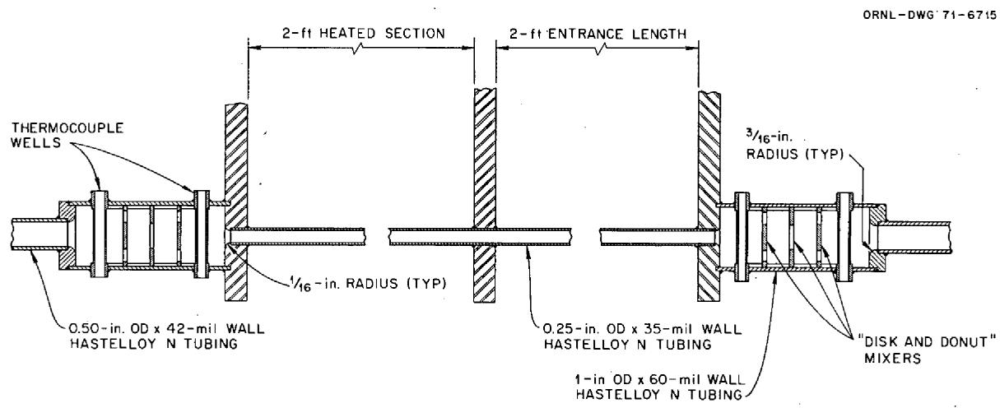  
Fig. 7.1. Details of test section, entrance length, mixing chambers, and electrodes for pressurized flow system.

Table 7.2. Experimental data for heat transfer studies using the salt mixture $\mathbf{{LiF} - {Be}{F}_{2} - {Th}{F}_{4} - U{F}_{4}}\left( {{67.5} - {20} - {12} - {0.5}\text{ mole }\% }\right)$ Even-numbered runs were with and odd-numbered runs without an entrance length   

<table><tr><td rowspan="2">Run No.</td><td rowspan="2">\( {T}_{\text{in }} \) (°F)</td><td rowspan="2">\( {T}_{\text{out }} \) (°F)</td><td rowspan="2">\( \Delta {T}_{f} \) (°F)</td><td rowspan="2">\( q/A \) (Btu \( {\mathrm{{hr}}}^{-1}{\mathrm{{ft}}}^{-2} \) \( \times  {10}^{-5} \) )</td><td rowspan="2">Heat balance</td><td colspan="3">Modulus \( {}^{a} \)</td><td rowspan="2">\( \bar{h} \) [Btu \( {\mathrm{{hr}}}^{-1}{\mathrm{{ft}}}^{-3}{\left( {}^{ \circ  }\mathrm{F}\right) }^{-1} \) ]</td><td rowspan="2">Heat transfer function, \( {}^{b} \) \( {N}_{S \cdot  T} \)</td></tr><tr><td>\( {\bar{N}}_{\mathrm{{Re}}} \)</td><td>\( {\bar{N}}_{\mathrm{{Pr}}} \)</td><td>\( {\bar{N}}_{\mathrm{{Nu}}} \)</td></tr><tr><td>1</td><td>1085.7</td><td>1089.2</td><td>10.7</td><td>0.24</td><td>0.24</td><td>5208</td><td>15.1</td><td>48.6</td><td>2234</td><td>19.72</td></tr><tr><td>2</td><td>1090.1</td><td>1093.7</td><td>10.2</td><td>0.24</td><td>1.26</td><td>5197</td><td>14.9</td><td>51.2</td><td>2356</td><td>20.89</td></tr><tr><td>3</td><td>1090.7</td><td>1102.2</td><td>44.4</td><td>0.80</td><td>0.78</td><td>5483</td><td>14.7</td><td>50.5</td><td>2322</td><td>20.50</td></tr><tr><td>4</td><td>1099.5</td><td>1111.3</td><td>34.1</td><td>0.80</td><td>1.15</td><td>5486</td><td>14.2</td><td>50.8</td><td>2338</td><td>20.83</td></tr><tr><td>5</td><td>1106.1</td><td>1129.9</td><td>74.2</td><td>1.69</td><td>1.00</td><td>6051</td><td>13.6</td><td>49.7</td><td>2285</td><td>20.32</td></tr><tr><td>6</td><td>1118.3</td><td>1142.4</td><td>74.6</td><td>1.69</td><td>1.19</td><td>6211</td><td>13.1</td><td>49.4</td><td>2273</td><td>20.49</td></tr><tr><td>7</td><td>1132.4</td><td>1156.1</td><td>70.1</td><td>1.69</td><td>1.006</td><td>6512</td><td>12.5</td><td>52.5</td><td>2416</td><td>22.15</td></tr><tr><td>8</td><td>1139.5</td><td>1186.6</td><td>120.9</td><td>3.38</td><td>1.09</td><td>7056</td><td>11.8</td><td>60.8</td><td>2798</td><td>25.70</td></tr><tr><td>9</td><td>1168.4</td><td>1215.4</td><td>150.8</td><td>3.38</td><td>1.01</td><td>7696</td><td>10.8</td><td>66.3</td><td>3049</td><td>28.96</td></tr><tr><td>10</td><td>1181.3</td><td>1228.6</td><td>111.2</td><td>3.37</td><td>1.08</td><td>7941</td><td>10.4</td><td>66.1</td><td>3039</td><td>29.24</td></tr><tr><td>11</td><td>1203.4</td><td>1226.7</td><td>59.9</td><td>1.69</td><td>1.03</td><td>8230</td><td>10.2</td><td>61.4</td><td>2823</td><td>27.89</td></tr><tr><td>12</td><td>1203.2</td><td>1227.6</td><td>62.6</td><td>1.69</td><td>1.16</td><td>7883</td><td>10.2</td><td>58.7</td><td>2698</td><td>26.64</td></tr><tr><td>13</td><td>1064.6</td><td>1077.6</td><td>67.3</td><td>0.59</td><td>1.00</td><td>3313</td><td>16.0</td><td>19.3</td><td>887</td><td>7.50</td></tr><tr><td>14</td><td>1068.8</td><td>1081.4</td><td>58.6</td><td>0.59</td><td>1.07</td><td>3152</td><td>15.8</td><td>21.9</td><td>1006</td><td>8.57</td></tr><tr><td>15</td><td>1077.2</td><td>1099.9</td><td>105.8</td><td>0.99</td><td>1.01</td><td>3370</td><td>15.0</td><td>20.4</td><td>937</td><td>7.96</td></tr><tr><td>16</td><td>1082.7</td><td>1106.6</td><td>85.8</td><td>0.99</td><td>1.08</td><td>3264</td><td>14.7</td><td>25.1</td><td>1153</td><td>9.94</td></tr><tr><td>17</td><td>1093.4</td><td>1129.5</td><td>146.8</td><td>1.5</td><td>0.98</td><td>3467</td><td>13.9</td><td>22.4</td><td>1031</td><td>8.86</td></tr><tr><td>18</td><td>1104.4</td><td>1142.2</td><td>131.0</td><td>1.5</td><td>1.09</td><td>3352</td><td>13.4</td><td>24.2</td><td>1113</td><td>9.75</td></tr><tr><td>19</td><td>1118.5</td><td>1155.7</td><td>136.1</td><td>1.5</td><td>1.02</td><td>3554</td><td>12.8</td><td>23.5</td><td>1082</td><td>9.60</td></tr><tr><td>20</td><td>1059.6</td><td>1093.0</td><td>140.9</td><td>1.5</td><td>1.05</td><td>3251</td><td>15.6</td><td>22.6</td><td>1038</td><td>8.58</td></tr><tr><td>21</td><td>1076.3</td><td>1109.3</td><td>147.4</td><td>1.4</td><td>1.00</td><td>3447</td><td>14.8</td><td>21.5</td><td>988</td><td>8.30</td></tr><tr><td>22</td><td>1089.3</td><td>1135.5</td><td>170.7</td><td>2.0</td><td>1.13</td><td>3591</td><td>13.8</td><td>25.1</td><td>1157</td><td>9.87</td></tr><tr><td>23</td><td>1114.2</td><td>1163.6</td><td>189.8</td><td>2.0</td><td>1.09</td><td>3749</td><td>12.7</td><td>23.4</td><td>1076</td><td>9.40</td></tr><tr><td>24</td><td>1125.8</td><td>1204.3</td><td>254.4</td><td>2.9</td><td>1.11</td><td>3659</td><td>11.6</td><td>24.6</td><td>1134</td><td>10.01</td></tr><tr><td>\( {25}^{c} \)</td><td></td><td></td><td></td><td></td><td></td><td></td><td></td><td></td><td></td><td></td></tr><tr><td>26</td><td>1080.3</td><td>1150.9</td><td>253.5</td><td>2.9</td><td>1.02</td><td>3524</td><td>13.6</td><td>26.0</td><td>1197</td><td>10.02</td></tr><tr><td>27</td><td>1113.8</td><td>1187.4</td><td>272.8</td><td>2.9</td><td>1.03</td><td>3787</td><td>12.2</td><td>23.5</td><td>1081</td><td>9.33</td></tr></table>

${}^{a}$ These are the Reynolds,Prandtl,and Nusselt moduli,respectively,calculated using the average of the local heat transfer coefficient from the exit to within 5 in,of the test-section entrance.   
bN.S.T= NNu/NPr 1/3 (μ/μs)0.14   
cThis run was deleted because flow was not constant.

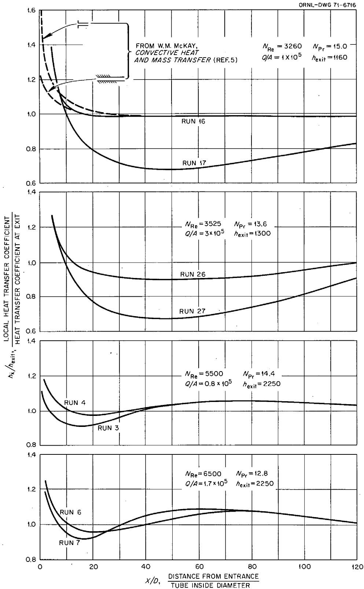  
Fig. 7.2. Variation in ratio of local to exit heat transfer coefficient with distance from the entrance for the salt mixture $\mathrm{LiF - BeF_2 - ThF_4 - UF_4}$ (67.5-20-12-0.5 mole%). Even-numbered runs with, odd-numbered runs without, an entrance length.

$\overline{N}_{S \cdot T}[\overline{N}_{S \cdot T} \equiv (\overline{N}_{\mathbf{Nu}} / \overline{N}_{\mathbf{Pr}}^{1/3})(\mu / \mu_s)^{0.14}$ , where $\overline{N}_{\mathbf{Nu}}$ and $\overline{N}_{\mathbf{Pr}}$ are the average Nusselt and Prandtl moduli (based on all but the first 5 in. of the test section) respectively; $\mu / \mu_s$ is the viscosity ratio, bulk fluid to wall], beyond that which would be expected from the variation in Reynolds modulus. However, for runs 13 through 27 ( $3150 < N_{\mathrm{Re}} < 3787$ ), the heat transfer function averages $15\%$ greater with a hydrodynamic entrance length than without.

The influence of the entrance region on the heat transfer coefficients can be more easily seen from plots of the ratio of local to exit heat transfer coefficient as a function of axial position, as shown in Fig. 7.2. (The exit value obtained with the entrance length was used for each pair of plots.) Also shown in Fig. 7.2 for comparisons are the expected curves for similar entrance and flow conditions extrapolated from published results for the simultaneous development of hydrodynamic and thermal boundary layers. Examining the lower-heat-flux, lower-Reynolds-modulus case first (upper curves), one can see that, with an entrance length (run 16) fully developed heat transfer coefficients are obtained within an $L / D$ of 30, which is in agreement with expected behavior. However, with the round-edged nozzle-type entrance (run 17) full development was not obtained within the length of the tube. With a higher heat flux, fully developed heat transfer was not attained within the expected $L / D$ of 40 even with an entrance region (run 26). At a Reynolds modulus of about 6000, there is less distinction between heat transfer development with (runs 4 and 6) or without (runs 3 and 7) the entrance region; and in both cases the length required for constant heat transfer coefficients to be attained is in good agreement with the predictions of ref. 5.

The undeveloped heat transfer behavior that has been observed in this study at low Reynolds moduli is difficult to explain in terms of commonly held theories regarding the combined development of the hydrodynamic and thermal boundary layers in a circular tube with a constant heat flux. In fact, the thermal boundary layer should develop more rapidly for higher Prandtl modulus fluids, and the local heat transfer coefficient should be larger than the exit value until fully developed conditions are reached. However, a theoretical study for incompressible flow has shown, in general, that the flow of a fluid whose viscosity has a large negative temperature dependence will be stabilized by

neating and destabilized by cooling. Specifically, computer results show that the critical Reynolds modulus (based on boundary layer thickness) for water at $60^{\circ}\mathrm{F}$ flowing over a heated flat plate can be increased by a factor of up to 22 above the expected isothermal value, depending on the heat flux. Thus the distance required for the attainment of fully developed turbulent flow in the molten-salt system $(d\mu /dt$ for the salt at $1100^{\circ}\mathrm{F}$ is five times larger than for water at $60^{\circ}\mathrm{F})$ could be greater than the length of the heated test section. Unfortunately, except for studies of gas flow over heated airfoils, no experimental results are available to quantitatively verify those theoretical studies. Our experimental system, however, with its capability of reversible flow, matched temperature measurements, uniform heat flux, and absence of pump-induced turbulence, is uniquely suited to measure precisely the effect of an adiabatic entrance region on the heat transfer of a moderately viscous fluid near its melting point. The local heat transfer coefficients and temperature profiles obtained from these measurements can then be used to check the stability theory.

# 7.2 THERMOPHYSICAL PROPERTIES

J.W.Cooke

# 7.2.1 Wetting Studies

The new technique1 for determining the wetting characteristics of liquids has been used to study the wetting behavior of the molten salt $\mathrm{LiF - BeF_2 - ZrF_4 - ThF_4 - UF_4}$ (70-23-5-1-1 mole %) on a Hastelloy N surface at $700^{\circ}\mathrm{C}$ ( $1292^{\circ}\mathrm{F}$ ). The primary objective of this study was to determine the extent to which the wetting behavior of this salt could be controlled. The wetting behavior of several molten fluoride salt mixtures has been found to be affected by addition of various metals to the melt.7 The controlling mechanism is believed to be the oxidation state of the melt, which affects the liquid-solid surface energy level.

In the present investigation, zirconium metal (in the form of a 0.25-in.-OD Zircaloy rod) was added to the melt to make it more reducing; nickel fluoride (in powder form) was added to make it more oxidizing.

Over a three-day period, 2000 observations of the contact angle were made. Since the initial intention of this study was to observe only the change from nonwetting to wetting conditions, no attempt was made to obtain precise values of the contact angle.

By comparing the actual pressure traces in Fig. 7.3 with the predicted traces, we infer that the molten salt mixture did not initially wet the Hastelloy N surface (contact angle in the range of 140 to $160^{\circ}$ ). However, a pressure trace, shown in Fig. 7.4, typical of wetting (contact angle $\sim 20^{\circ}$ ) was obtained within 20 min after the introduction of the Zircaloy rod into the melt. Two hours later, 1 wt % of nickel fluoride powder was added to the melt. Five hours after adding the powder, the melt was only partially wetting (contact angle $\sim 90^{\circ}$ ), as shown in Fig. 7.5. The melt became nonwetting again 7 hr after adding the nickel fluoride, with the pressure traces again resuming the shape shown in Fig. 7.3.

Based on these results, a new apparatus was constructed to enable a more detailed study of the electrochemical processes involved in the wetting behavior of metals in molten salts. To this end, a micromanometer has been added to this system to obtain more precise values of the contact angle. The system is currently being used to investigate the wetting behavior of the salt mixture $\mathrm{LiF - BeF_2 - ThF_4 - UF_4}$

(67.5-20-12-0.5 mole %) when beryllium metal is added to the mixture.

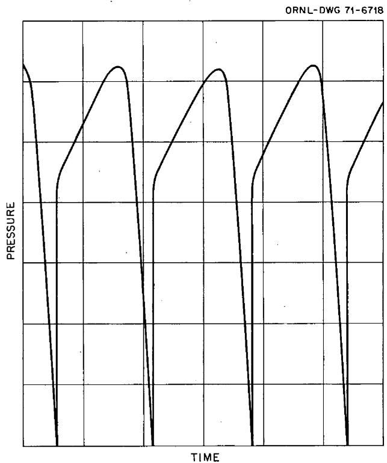  
Fig. 7.4. Pressure trace with Hastelloy N wetted by the salt mixture at $700^{\circ}\mathrm{C}$ .

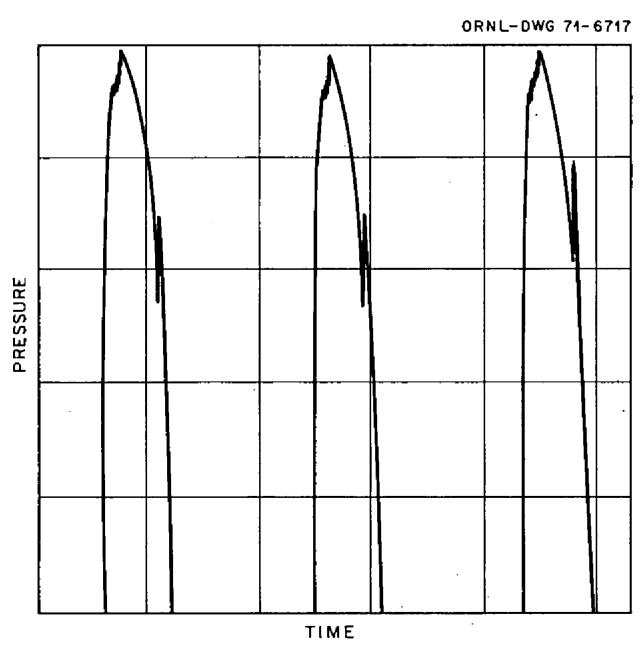  
Fig. 7.3. Pressure trace with Hastelloy N unwetted by the salt mixture at $700^{\circ}\mathrm{C}$ .

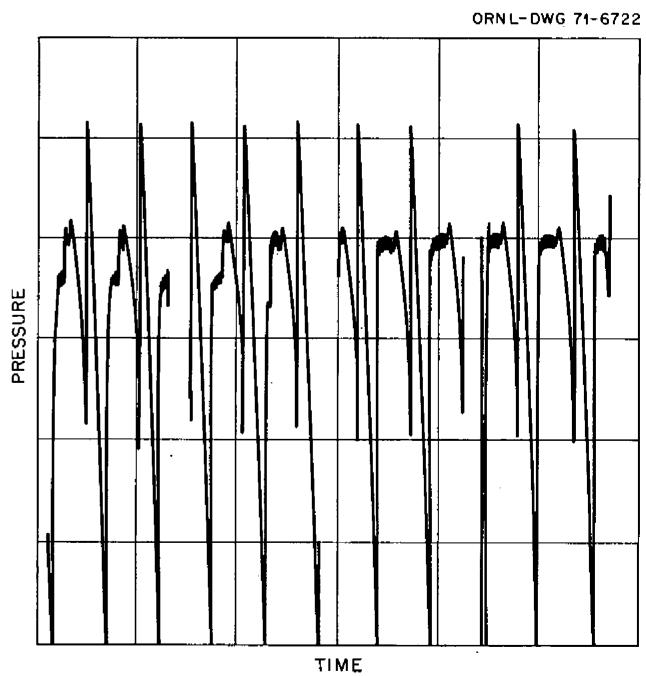  
Fig. 7.5. Pressure trace with Hastelloy N partially wetted by the salt mixture at $700^{\circ}\mathrm{C}$ .

# 7.2.2 Thermal Conductivity

Calibrations of the improved variable-gap thermal conductivity apparatus were completed using water at $12^{\circ}\mathrm{C}$ . The plot of overall thermal resistance as a function of gap thickness shown in Fig. 7.6 displays the precision of this apparatus. Our measured value of 0.00622 for water at $12^{\circ}\mathrm{C}$ agreed with published values to better than $5\%$ , a factor of 3 less error than was associated with water tests using the previous apparatus. Since the apparatus is designed for operation with corrosive fluids at temperatures up to $850^{\circ}\mathrm{C}$ , such agreement with the specialized room temperature measurements published in the literature is outstanding.

Soon after measurements were initiated with the molten salt $\mathrm{LiF - BeF_2}$ (66-34 mole %), a leak developed in a weld in the concentrically guarded heat meter. Attempts to repair this weld were unsuccessful, and a new heat meter was fabricated. The eloxing process was utilized in the fabrication of the heat meter so that the welds could be eliminated. Conductivity measurements for the salt mixture $\mathrm{LiF - BeF_2}$ (66-34 mole %) have not yet been resumed.

8. A. R. Challoner and R. W. Powell, "Thermal Conductivities of Liquids: New Determinations for Seven Liquids and Appraisal of Existing Values," Proc. Roy. Soc. A238, 90-106 (Dec. 4, 1956).

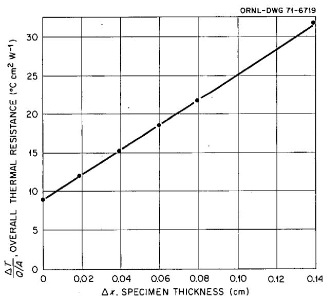  
Fig. 7.6. Data obtained in measurement of the thermal conductivity of water at $12^{\circ}\mathrm{C}$ using the improved variable-gap apparatus.

# 7.3 MASS TRANSFER TO CIRCULATING BUBBLES

T. S. Kress

# 7.3.1 Experiment

A transient technique is being employed in the MSBR-related mass transfer studies to determine mass transfer rates of a gas dissolved in a turbulently flowing liquid to cocirculating helium bubbles.9 Experiments have been performed using helium bubbles having mean diameters from 0.015 to 0.05 in. to extract oxygen from five mixtures of glycerin and water (Schmidt moduli of 419, 719, 1228, 2015, and 3446) over a Reynolds modulus range from $8.1 \times 10^{3}$ to $1.6 \times 10^{5}$ . Both horizontal and vertical flow in a 2-in.-diam conduit have been studied.

It was previously reported10 that the bubble diameter distribution is described adequately by a relation that, when integrated, gives the interfacial area per unit volume, $a_*$ , as a function of the volume fraction, $\Phi$ , and the number of bubbles per unit volume, $N_{\mathbf{v}}$ :

$$
a _ {*} = ^ {3} / 2 (3 \pi / 2) ^ {2 / 3} N _ {\mathrm {v}} ^ {1 / 3} \Phi^ {2 / 3}. \tag {1}
$$

Note that it is necessary to evaluate $a_*$ in order to extract mass transfer coefficients from the data relating concentration to time. By making a small adjustment in the coefficient to allow for the velocity due to buoyancy, the volume fraction for flow in vertical conduits is approximated by:

$$
\Phi \cong 0. 7 3 Q _ {g} / Q _ {L}, \tag {2}
$$

where $Q_{g} / Q_{L}$ is the volumetric flow ratio of gas to liquid. In horizontal flow, stratification of the bubbles affects the volume fraction to the extent that the vertical flow approximation applies only at high flows. It has been found experimentally that the horizontal-flow volume fraction can be correlated with the ratio of the mean axial velocity of the fluid to the bubble buoyant velocity in the radial direction, $V_{a} / V_{r}$ . Assuming, following Peebles and Garber,[11] that the terminal velocity, $V_{r}$ , is given by:

$$
V _ {r} = \left(4 g \bar {d} / 3 c\right) ^ {1 / 2},
$$

where

$$
c = 1 8. 7 / \left(V _ {r} \bar {d} \rho / \mu\right) ^ {0. 6 8},
$$

the desired velocity ratio becomes:

$$
V _ {a} / V _ {r} = 0. 0 1 8 8 Q _ {L} (\mu / \rho) ^ {0. 5 1 5} / \bar {d} ^ {1. 2 7 3}.
$$

The variation of measured volume fraction with this ratio is shown on Fig. 7.7 along with the corresponding least-squares curve:

$$
\Phi = 0. 0 0 1 7 9 + 0. 0 2 1 / \left(V _ {a} / V _ {r}\right). \tag {3}
$$

Using Eqs. (1), (2), and (3) to establish the interfacial area, typical experimental mass transfer data for a $25\%$ mixture of glycerin and water $(N_{\mathrm{Sc}} = 1228)$ can be compared, as is seen in the upper portion of Fig. 7.8. Those results include mass transfer which occurs downstream from the test section in the bubble separator. Certain aspects of those data are particularly revealing.

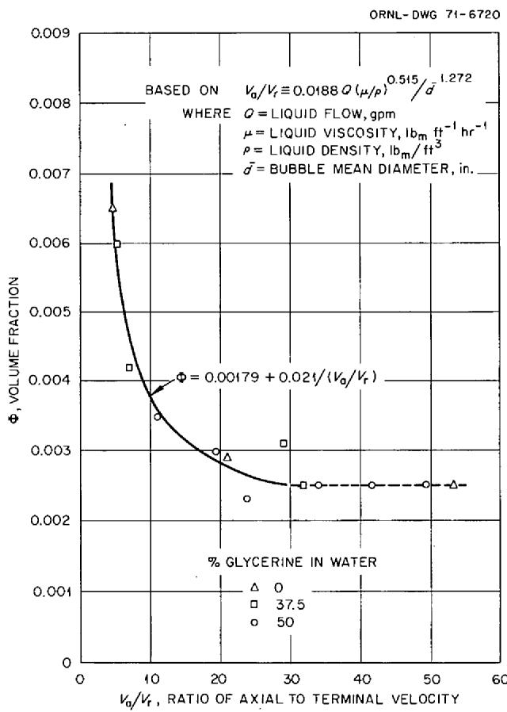  
Fig. 7.7. Horizontal flow volume fraction correlation. Volume fraction occupied by bubbles with a gas-to-liquid volumetric flow ratio of 0.003 in a 2-in. horizontal pipe.

For example, above a Reynolds modulus for which gravitational forces on a bubble become negligible compared with turbulent inertial forces, the mass transfer coefficients for vertical and horizontal flow become identical. The Reynolds modulus at which this occurs should not be affected by the amount of mass transfer occurring downstream of the test section. These data also suggest that the vertical flow coefficients may be approaching a constant value as the Reynolds modulus is decreased. This is the value that would be obtained for bubbles rising through a quiescent liquid and should also be independent of mass transfer occurring in the separator.

The corrected mass transfer coefficients in horizontal flow (after that portion of the total mass transfer which occurs downstream from the test section is subtracted) are shown on the lower portion of Fig. 7.8. For horizontal flow the quantity to be subtracted was directly measured by relocating the bubble generator immediately upstream of the separator and repeating the test under the original conditions with the bubbles feeding directly into the separator region (i.e., without passing through the test section). A correction for vertical flow can only be estimated, however, because the bubble generator had to be reworked in the course of the original vertical flow tests. The subsequent repair altered its characteristics to the extent that reproduction of the vertical flow runs with the bubble generator repositioned downstream from the test section was not possible.

# 7.3.2 Theory

A theoretical description of the problem is possible if each bubble is assumed to move at the local liquid velocity (i.e., without relative flow). A mass balance within an equivalent volume influenced by a bubble having the mean diameter results in the nondimensional equation given below:

$$
\frac {\partial \theta_ {*}}{\partial X _ {*}} = \frac {1 + \mu_ {e} / \mathbb {0}}{N _ {\mathrm {S c}} N _ {\mathrm {R e}}} \left(\frac {\partial^ {2} \theta_ {*}}{\partial r _ {*} ^ {2}} + \frac {2}{r _ {*}} \frac {\partial \theta_ {*}}{\partial r _ {*}}\right) \tag {4}
$$

with boundary conditions

1. $\theta_{*}(0,r_{*}) = 1$   
2. $\theta_{*}(X_{*} > 0,\overline{d} /2D) = 0$   
3. $\frac{\partial\theta_{*}}{\partial r_{*}} = 0$ at $r_* = \frac{\overline{d}}{2D} (1 + 1 / \Phi)^{1 / 3}$

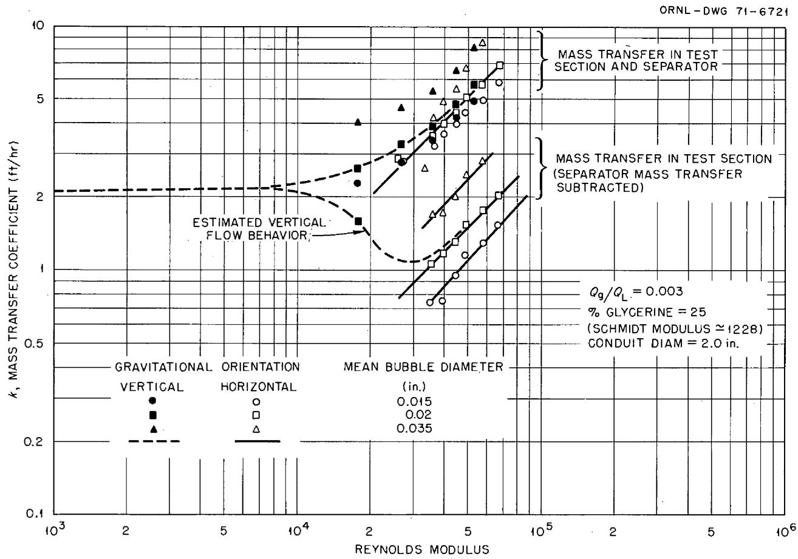  
Fig. 7.8. Measured mass transfer coefficient as a function of flow Reynolds modulus, bubble mean diameter, and gravitational orientation. Comparison of data before and after adjustments for the amount of mass transfer occurring in the separator.

Using Eq. (4) as the basic analytical description, a theory of mass transfer from a turbulent liquid to circulating bubbles involves establishing a relationship between the relative eddy transport coefficient $(\mu_c / \mathcal{Q})$ the fluid properties, and the turbulence characteristics of the field; that is, a function is desired such that

$$
\mu_ {c} / \mathbb {J} = f (r _ {*}, \bar {d}, N _ {\mathrm {R e}}, N _ {\mathrm {S c}}).
$$

Eddy diffusion coefficients for turbulent flow in pipes have been measured. The correlation of Groenhof1 for the center-line region of the pipe is assumed to apply:

$$
\mu_ {e} = 4. 0 \times 1 0 ^ {- 2} \sqrt {\tau_ {\mathrm {w}} / \rho} D,
$$

which can be converted to

$$
\mu_ {e} / \mathbb {I} = 0. 0 4 N _ {\mathrm {S c}} N _ {\mathrm {R e}} ^ {7 / 8}. \tag {5}
$$

While there have also been measurements of the variation in the coefficients with distance from a surface in shear fields with stationary no-slip interfaces, these results would not be expected to apply to a cocirculating bubble interface which may be either rigid (no slip) or mobile (a moving interface with internal circulation). Therefore an analytical expression had to be developed relating the eddy diffusivity to the concentration gradient and the individual velocity and frequency components of a Fourier analysis of the turbulence. Representing the turbulence field by superposition of sinusoidal idealized viscous "eddy cells" (a quasi turbulence), an integral expression has been obtained for the variation of eddy diffusivity with distance from an interface that may be either rigid or mobile. This variation, along with Eqs. (4) and (5), is being programmed for solution on a digital computer.

# Nomenclature

$a_{*} =$ bubble interfacial area per unit volume

$C =$ drag coefficient

$\overline{d} =$ bubble Sauter-mean diameter

$D =$ conduit diameter

$\mathfrak{L} =$ molecular diffusion coefficient

$g =$ gravitational acceleration

$N_{\mathbf{v}} =$ number of bubbles per unit volume

$Q_{g} =$ volumetric flow of gas bubbles

$Q_{L} =$ volumetric liquid flow

$r =$ spherical radial coordinate measured from center of a moving bubble

$V_{a}$ = liquid mean axial velocity

$V_{r} =$ bubble terminal velocity

$x =$ axial coordinate

# Greek letters

$\theta =$ concentration of a dissolved constituent

$\theta_0 =$ radial average concentration of a dissolved constituent at $x = 0$

$\mu =$ liquid viscosity

$\mu_{e} =$ turbulent eddy diffusivity

$\rho =$ liquid density

$\tau_{w} =$ wall shear stress

$\Phi =$ volume fraction occupied by the bubbles

# Dimensionless quantities

$\theta_{*}\equiv \theta /\theta_{0}$

$r_* \equiv r / D$

$x_{*}\equiv x / D$

$N_{\mathrm{Re}} \equiv V_a D\rho/\mu$

$N_{\mathrm{Sc}} \equiv \mu / \rho \mathcal{Q}$

# Part 3. Chemistry

W. R. Grimes

The chemical research and development activities described below are conducted to establish the basic chemical information required for the development of advanced molten-salt reactor systems.

A substantial fraction of these efforts continued to be devoted to the transport, distribution, and chemistry of fission products in the MSRE. Similar efforts seek to establish the nature and control of the interactions of tritium with molten salts, metal alloys, and graphite. Investigations of fission product behavior have been continued with specimens removed from the MSRE fuel circuit and by investigation of the chemistry of molybdenum, niobium, and ruthenium in molten fluoride mixtures.

Investigations into the chemistry of sodium fluoroborate have continued and have been extended in efforts to identify the factors which will ultimately determine the applicability of fluoroborates as coolants.

A broad program of fundamental investigations into the physical chemistry of molten-salt systems was maintained; from it are derived the basic data for reactor and chemical reprocessing design. Within the scope of these efforts are included research in solution thermodynamics and phase equilibria, crystal chemistry, electrochemistry, spectroscopy (both Raman and electronic absorption), transport processes, and theoretical aspects of molten-salt chemistry.

Studies of the chemical aspects of separations methods were continued. The results of these studies form the basis for evolving modifications of methods for reprocessing MSBR fuel salts. With adoption of a reference design for MSBR fuel reprocessing which effects transfer of rare earths from liquid bismuth to lithium chloride as an acceptor solvent, emphasis has been given to development of innovative means for separation of rubidium, cesium, and the rare earths from the fuel solvent and to the removal of solutes from the liquid metal extractant.

The principal emphasis of analytical chemical development programs has been placed on methods for use in semiautomated operational control of molten-salt breeder reactors, for example, the development of in-line analytical methods for the analysis of MSR fuels, for reprocessing streams, and for gas streams. These methods include electrochemical and spectrophotometric means for determination of the concentration of $\mathrm{U}^{3+}$ and other ionic species in fuels and coolants, and adaptation of small on-line computers to electroanalytical methods. Parallel efforts have been devoted to the development of analytical methods related to assay and control of the concentration of water, oxides, and tritium in fluoroborate coolants.

# 8. Fission Product Behavior

# 8.1 DETERMINATION OF TRITIUM AND HYDROGEN CONCENTRATIONS IN MSRE PUMP BOWL GAS

S. S. Kirslis F. F. Blankenship

The dimensions of the problems caused by tritium diffusion through metal walls of a molten-salt reactor have been estimated using a particular mathematical model. The validity of the model could be confirmed by measurements of the tritium concentration in the

MSRE pump bowl gas. Therefore several different types of sample were taken while the MSRE was operating, and apparatus was constructed and tested for analyzing those samples. Since hydrogen partial pressure strongly influences the solubility and permeation rate of tritium from a gas mixture into a metal, it was also necessary to

determine the hydrogen concentration in the pump bowl gas.

Several types of tritium sampling devices were used in the MSRE pump bowl. Advantage was taken of the unique properties of hydrogen and its isotopes in that they are highly soluble in and permeate rapidly through metals at red heat. The same properties would make it difficult to obtain a representative gas sample using an evacuated metal bulb with a resealable freeze valve.

The simplest sampling device was a solid nickel cylinder, $\frac{3}{4}$ in. in diameter and 6 in. long. The solubilities of hydrogen and tritium are such that at the expected partial pressures, the solid nickel bar at solubility equilibrium at $650^{\circ}\mathrm{C}$ would contain about ten times as much tritium per cubic centimeter as the surrounding gas. In the several samplings, exposure times in the pump bowl gas varied between 2 and 10 hr. The bar was pulled up into a cool section of the sampling line about 2 ft above the pump bowl and allowed to cool in essentially the same atmosphere. Each saturated nickel bar was taken to a hot cell, decontaminated in dilute nitric acid and $1M\mathrm{H}_2\mathrm{O}_2 - 1M$ oxalic acid, and stored in a hood in a Dewar flask under liquid nitrogen.

A variation of this sampling method was a sealed thin-walled nickel capsule filled with nickel powder which had been deoxidized with hydrogen and evacuated at red heat. The thought was that hydrogen and tritium should saturate the capsule wall and powder particles much more rapidly than in the case of the solid bar.

A third sampling device was a thin-walled nickel capsule containing degassed CuO "wire." At $650^{\circ}\mathrm{C}$

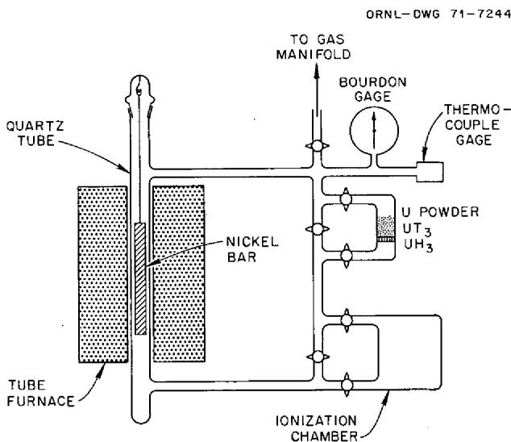  
Fig. 8.1. Calibration apparatus.

gaseous $\mathrm{H}_{2}$ or HT permeating the capsule wall would react with the CuO to produce $\mathrm{H}_{2}\mathrm{O}$ and copper metal. The $\mathrm{H}_{2}\mathrm{O}$ or HTO could not diffuse back through the capsule wall and would thus be trapped in the capsule. Exposure times in the MSRE pump bowl gas phase varied between 2 and $10\mathrm{hr}$ for this type of capsule.

A single capsule was prepared which was identical to the one just described except that one hemispherical end of the capsule was made of thin palladium sheet welded to the cylindrical nickel capsule body. Since palladium is much more permeable to hydrogen than nickel, a faster collection of $\mathrm{H}_2\mathrm{O}$ and HTO should have resulted.

All of the different capsules were decontaminated and stored under liquid nitrogen in a Dewar flask, as described for the nickel bar samples.

# 8.1.1 Calibration Apparatus

From the total amount of tritium and hydrogen found in the sample capsules or bars, it is theoretically possible to calculate how much tritium and hydrogen were in the MSRE pump bowl atmosphere, using capsule dimensions and literature values for the solubility of hydrogen in nickel and for the permeability of hydrogen through nickel at $650^{\circ}\mathrm{C}$ . However, in the case of the nickel bars, there is doubt whether the interior of each bar was fully saturated and doubt as to the fraction of dissolved gas lost during cooling. The latter doubt is of still greater concern for the nickel powder capsule. A more basic concern is whether Sieverts's law (the solubility of hydrogen in a metal is proportional to the square root of the hydrogen pressure) is valid at the low pressures we are dealing with. It has been suggested in the literature that the law fails at low pressure, since for many gases the extrapolations of plots of hydrogen solubility vs square root of pressure do not go through the origin. It is desirable to check this point since it has an important bearing on the effect of added hydrogen pressure on tritium permeation through metals. Finally, while no faults with the CuO method of sampling are obvious a priori, it is desirable to check new analytical tools and methods under conditions closely simulating those of actual use.

For those reasons, a calibration apparatus (Fig. 8.1) was built in which the sampling devices could be tested in tritium and hydrogen concentrations similar to those expected in the MSRE pump bowl gas.

The vertical quartz tube in which the sampling device was suspended was part of a thermal-convection loop constructed mainly of Pyrex tubing. Side loops through which the convective flow could be directed contained a tritium gas counter and a uranium powder-uranium

hydride-uranium tritide trap. The counter was an ionization chamber operated at $500\mathrm{V}$ with the output current read with a vibrating reed electrometer. The uranium hydride-tritide trap could be heated to supply a pure dry mixture of $98\%$ $\mathbf{H}_2$ and $2\%$ HT to the convecting gas. By cooling the trap the $\mathbf{H}_2$ and HT could be resorbed on the powdered uranium. Provision was made for sampling the gas in the loop into a removable glass bulb. A side arm from the loop contained a Bourdon gage (vacuum to 15 psig) and a thermocouple gage. All glass valves in the loop system were of the greaseless O-ring variety in order to minimize exchange of tritium with the hydrogen in stopcock grease. Finally, the loop was connected to a gas manifold by means of which the loop could be evacuated or pressurized with dry helium, dry argon, or dry hydrogen. The complete calibration apparatus was installed in a hood in case of accidental tritium release. A tritium "sniffer" was installed very close to the loop to warn of any tritium leakage.

To date, the calibration procedure has been carried out only a few times, using the solid nickel bar type of sampling device. The procedure involved first evacuating the nickel bar suspended in the heated quartz tube $(650^{\circ}\mathrm{C})$ . Then dry argon was admitted to nearly atmospheric pressure and allowed to circulate through the uranium tritide trap and the ionization chamber. The temperature of the trap was adjusted to give the desired $\mathrm{H}_{2}$ and HT concentrations and the gas allowed to circulate past the nickel bar for several hours. The counter indicated the constancy of the HT pressure. A sample of the circulating gas was taken in the glass bulb, and the quartz tube and nickel bar were cooled rapidly to room temperature. The uranium tritide trap was then cooled to room temperature to resorb the circulating tritium, and the loop was evacuated and flushed with dry argon to remove the tritium. The ground joint at the top of the quartz tube was then opened (with dry argon flow blanketing the loop) and the nickel bar removed.

The nickel bar was then placed in the quartz tube of the extraction apparatus in which the tritium was extracted from the nickel bar by heating it at red heat for several hours in a $99.9\%$ $\mathrm{He}-0.1\%$ $\mathrm{H}_{2}$ flow. The gas then passed through a CuO trap at $500^{\circ} \mathrm{C}$ to convert HT to HTO, and the HTO was finally caught in a series of distilled-water bubblers. The water was analyzed for tritium with great sensitivity by scintillation counting.

The glass bulb sample was analyzed for hydrogen by mass spectrometry and for tritium using the same extraction apparatus but omitting the quartz heating tube.

The original rather simple design of the calibration apparatus had to be modified and refined repeatedly in order to perform as desired. To achieve the required leak rate and degassing rate (mainly $\mathrm{H}_2\mathrm{O}$ which would exchange with and dilute HT), the apparatus had to be leak-tight to the limit of a helium mass spectrometer leak detector, and ordinary glass stopcocks had to be replaced with greaseless glass valves. Before a gas was admitted to the loop, it had to contain less than 10 ppm of water as measured by a Meeco electrolytic water meter. It was necessary to pass the convective flow through the uranium tritide trap and through the ionization chamber to achieve controllable and steady tritium concentrations.

The ionization chamber had an unfortunate memory effect. After once introducing a high tritium pressure $(\sim 100\mu)$ for a special test, it was not possible to get rid of a high background due to tritium dissolved in the thick stainless steel wall of the ionization chamber. Weeks of evacuation and flushing while warming the chamber did not succeed in reducing the background to a satisfactory extent. A Pyrex ionization chamber was designed and built, with silvered interior surfaces for electrodes. The silver film is so thin that degassing of tritium should be rapid. The new ionization chamber has not yet been checked with tritium gas.

The most successful calibration tests with a nickel bar sampling device achieved only a qualitative agreement with the glass bulb samples. It is thought that the failure to obtain exact agreement was due either to changing hydrogen and tritium concentrations during the exposures or to variations from Sieverts's law for hydrogen solubility at low pressures. This will be checked in future tests by taking glass bulb samples at the beginning and end of each test and by working at different tritium and hydrogen partial pressures.

# 8.1.2 Analysis for Hydrogen

Analysis of the sampling devices for tritium is much simpler than analysis for hydrogen, since the nickel contains only about $0.02\mathrm{g}$ of $\mathbf{H}_2$ per gram and it is very difficult to avoid picking up small amounts of water from the surfaces of gas handling equipment. For this reason an analytical method was devised which involves a minimum of gas handling. The standard vacuum fusion method is not sensitive enough. The nickel bar and nickel powder samples will be heated in a quartz tube containing hot CuO to convert the extracted $\mathbf{H}_2$ to $\mathbf{H}_2\mathbf{O}$ . At one end of the quartz tube there will be a simple dew-point measuring device by means of which the $\mathbf{H}_2\mathbf{O}$ concentration in the tube can be measured.

The main difficulty with this method is expected to arise in desorbing water sufficiently from the system and sample surfaces in the early stages of heating under evacuation, before the valve to the pump is closed and the sample heated further to liberate its hydrogen.

In the case of the CuO sample capsules, the hydrogen is already in the form of water, and it is only necessary to puncture the capsule with a special puncturing valve and let the inside gas into a dew-point meter.

The dew-point method does not destroy the sample, so that the analyzed sample can be flushed through water bubblers for tritium analysis. For the nickel bar and nickel powder samples, a method for analyzing the extracted gas for $\mathrm{H}_{2}$ by mass spectrometer has been devised in case the tramp water problem turns out to be too difficult.

# 8.1.3 Tritium Diffusion Studies

An alternative reason for constructing the calibration apparatus with its convective circulation, its tritium counter, and its tritium-hydrogen supply is that it is an ideal system with which to study the effect of hydrogen pressure on tritium diffusion through Hastelloy N, using realistic concentrations of tritium and hydrogen. The system will also be useful in testing the effects of various metal surface treatments on the diffusion process.

# 8.2 EXAMINATION OF DEPOSITS FROM THE MIST SHIELD IN THE MSRE FUEL PUMP BOWL

E. L. Compere

E.G.Bohlmann

In January 1971 the sampler cage and mist shield were excised from the MSRE fuel pump bowl by using a rotated cutting wheel to trepan the pump bowl top (see Sect. 1.3). The sample transfer tube was cut off just above the latch stop plug penetrating the pump bowl top; the adjacent $\sim 3$ -ft segment of tube was inadvertently dropped to the bottom of the reactor cell and could not be recovered. The final ligament attaching the mist shield spiral to the pump bowl top was severed with a chisel. The assembly, of mist shield spiral surrounding the sampler cage attached to the latch stop plug, was transported to the HRLEL for cutup and examination.

Removal of the assembly disclosed the copper bodies of two sample capsules that had been dropped in 1967 and 1968 lying on the bottom of the pump bowl. Also on the bottom of the bowl, in and around the sampler area, was a considerable amount of fairly coarse granular porous black particles (largely black flakes $\sim 2$

to $5\mathrm{mm}$ wide and up to $1\mathrm{mm}$ thick). Contact of the heated quartz light source in the pump bowl with this material resulted in smoke evolution, and apparently some softening and smoothing of the surface of the accumulation. Periscopic examination of the interior of the pump bowl is described in Sect. 1.3.

One of the sample capsule bodies was recovered and examined as described in Sect. 1.3. A few grams of the loose particles were also recovered and transferred in a jar to the hot cells; a week later the jar was darkened enough to prevent seeing the particles through the glass. An additional quantity of this material was placed loosely in the carrier can. Samples were submitted for analysis for carbon and for spectrographic and radiochemical analyses. The results are discussed below.

The sampler assembly as removed from the carrier can is shown in Fig. 8.2. All external surfaces were covered with a dark gray to black film, apparently $0.1 \mathrm{~mm}$ or more in thickness. Where the metal of the mist shield spiral at the top had been distorted by the chisel action, black eggshell-like film had scaled off, and the bright metal below it appeared unattacked. Where the metal had not been deformed, the film did not flake off. Scraping indicated a dense, fairly hard adherent blackish deposit.

On the cage ring a soft deposit was noted, and some was scraped off; the underlying metal appeared unattacked. The heat of sun lamps used for in-cell photography caused a smoke to appear from deposits on bottom surfaces of the ring and shield. This could have been material, picked up during handling, similar to that seen on the bottom of the pump bowl.

At this time samples were scraped from top, middle, and bottom regions of the exterior of the mist shield, from inside bottom, and from the ring. The mist shield spiral was then cut loose from the pump bowl segment, and cuts were made to lay it open using a cutoff wheel. A view of the two parts is shown in Fig. 8.3.

In contrast to the outside, where the changes between gas (upper half) and liquid (lower) regions, though evident, were not pronounced, on the inside the lower and upper regions differed markedly in the appearance of the deposits.

In the upper region the deposits were rather similar to those outside, though perhaps more irregular. The region of overlap appeared to have the heaviest deposit in the gas region, a dark film up to $1\mathrm{mm}$ thick, thickest at the top. The tendency of aerosols to deposit on cooler surfaces (thermophoresis) is called to mind. In the liquid region the deposits were considerably thicker and more irregular than elsewhere, as if formed from larger agglomerates.

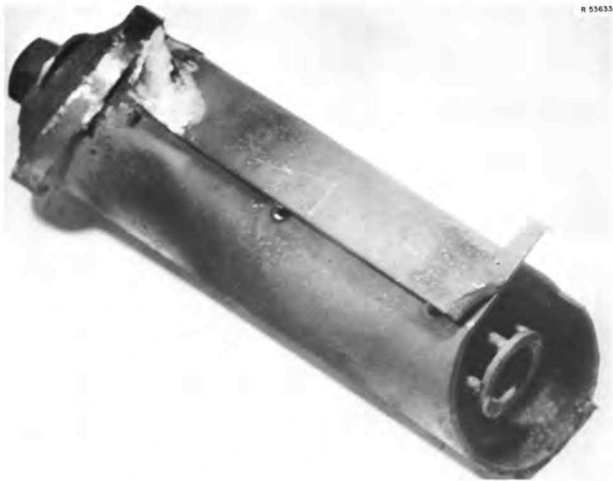  
Fig. 8.2. Mist shield containing sampler cage from MSRE pump bowl.

In the area of overlap in the liquid region this kind of deposit was not observed, the deposit resembling that on the outside. If we recall that flow into the mist shield was nominally upward and then outward through the spiral, the surfaces within the mist shield are evidently subject to smaller liquid shear forces than those outside or in the overlap, and the liquid was surely more quiescent there than elsewhere. The conditions permit the accumulation and deposition of agglomerates.

The sample cage deposits also were more even in the upper part, becoming thickest at and on the latch stop. The deposit on the latch stop was black and hard, between 1 and $2\mathrm{mm}$ thick. Deposits on the cage rods below the surface (see Figs. 8.4 and 8.5) were quite irregular and lumpy and in general had a brown-tan (copper or rust) color over darker material; some whitish material was also seen. Four of the rods were scraped to recover samples of the deposited material.

After a gamma radiation survey of the cage at this time, the unscraped cage rod was cut out for metallographic examination; another rod was also cut out for more thorough scraping, segmenting, and possible leaching of the surfaces.

The gamma radiation survey was conducted by lowering the cage in $1/2$ -in. or smaller steps past a 0.020- by 1.0-in. horizontal collimating slit in 4 in. of lead. Both total radiation and gamma spectra were obtained using an NaI scintillation crystal. The radiation levels were greatest in the latch stop region at the top of the cage and next in magnitude at the bottom ring. Levels along the rods were irregular but were higher in the liquid region than in the gas area even though considerable material had been scraped from four of the five rods in that region. In all regions the spectrum was predominantly that of 367-day $^{106}\mathrm{Ru}$ and 2.7-year $^{125}\mathrm{Sb}$ , and no striking differences in the spectral shapes were noted.

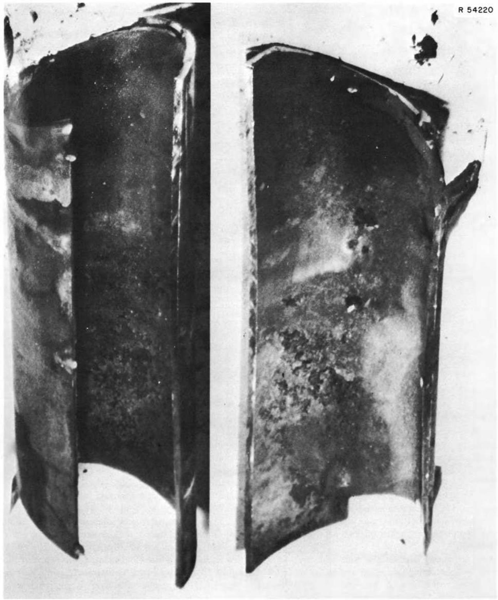  
Fig. 8.3. Interior of mist shield. Right part of right segment overlapped left part of segment on left.

R54219

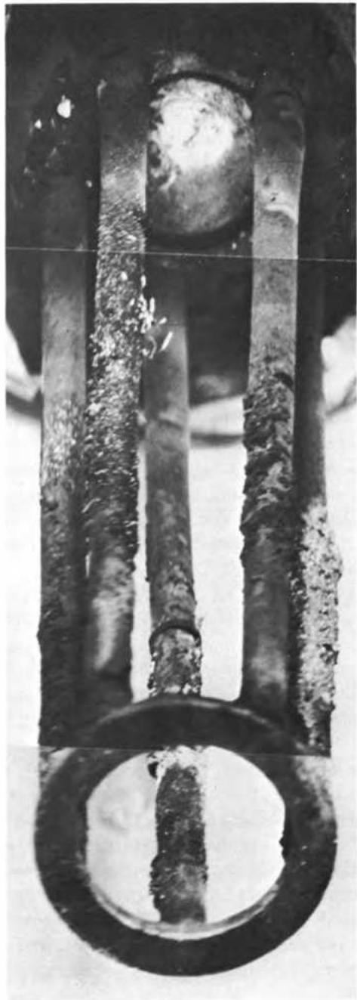

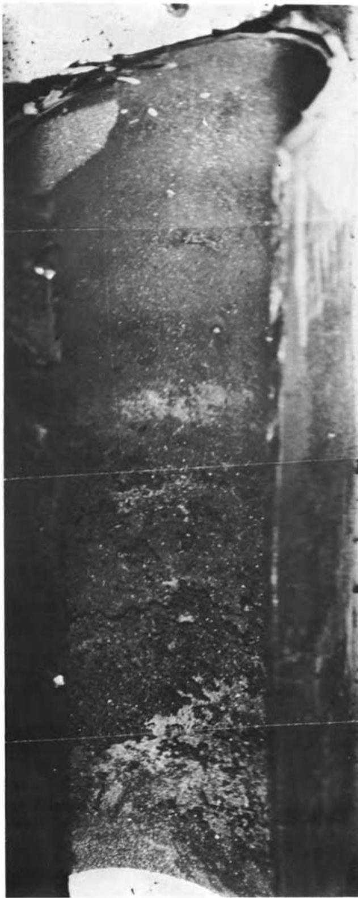  
Fig. 8.4. Sample cage and mist shield.

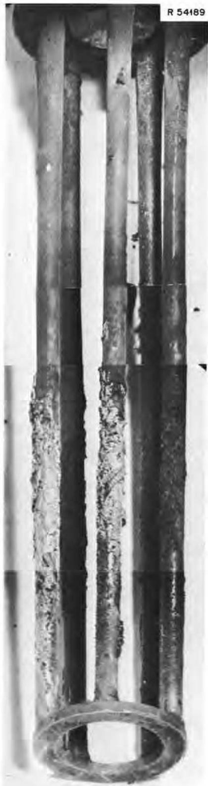  
Fig. 8.5. Deposits on sampler cage. Ring already scraped.

Analyses of samples recovered from various regions inside and outside the mist shield and sampler cage are shown in Table 8.1. The samples generally weighed between 0.1 and $0.4\mathrm{g}$ . The radiation level of the samples was measured using an in-cell G-M probe at about 1 in. distance, and at the same distance with the sample surrounded by a ${}^{1}/8$ -in. copper shield (to absorb the $3.5\mathrm{-MeV}$ beta of the $30\mathrm{-sec}^{106m}\mathrm{Rh}$ daughter of ${}^{106}\mathrm{Ru}$ ). Activities measured in this way ranged from 4 R/hr (2 R/hr shielded) to $180\mathrm{R/hr}$ (80 R/hr shielded), the latter being on a $0.4\mathrm{-g}$ sample of the deposit on the latch stop at the top of the sample cage.

Spectrographic and chemical analyses are available on three samples, (1) the black lumpy material picked up from the pump bowl bottom, (2) the deposit on the latch stop at the top of the sample cage, and (3) material scraped from the inside of the mist shield in the liquid region. The material recovered from the pump bowl bottom contained $7\%$ carbon, $31\%$ Hastelloy N metals, $3.4\%$ Be $(18\% \mathrm{BeF}_2)$ , and $6\%$ Li $(22\%$ LiF). Quite possibly this included some cutting debris. The carbon doubtless was a tar or soot resulting from thermal and radiolytic decomposition of lubricating oil leaking into the pump bowl. It is believed that this material was jarred loose from upper parts of the pump bowl or the sample transfer tube during the chisel work to detach the mist shield.

The hard deposit on the latch stop contained $28\%$ carbon, $2.0\%$ Be $(11\% \mathrm{BeF}_2)$ , $2.8\%$ Li $(10\% \mathrm{LiF})$ , and $12\%$ metals in approximate Hastelloy N proportions, again possibly to some extent cutting debris.

The sample taken from the inner liquid region of the mist shield contained $2.5\%$ Be $(13\% \mathrm{BeF}_2)$ $3.0\%$ Li $(11\% \mathrm{LiF})$ and $18\%$ metals (with somewhat more Cr and Fe than Hastelloy N); a carbon analysis was not obtained.

In each case, about 0.5 to $1\% \mathrm{Zr}$ ( $\sim 1$ to $2\% \mathrm{ZrF_4}$ ) was found, a level lower than fuel salt in proportion to the lithium and beryllium. Uranium analyses have not yet been received, so we cannot clearly say whether the salt is fuel salt or flush salt. Since fission product data suggest the deposits built up over appreciable periods, we presume fuel salt.

In all cases the dominant Hastelloy N constituent, nickel, was the major metallic ingredient of the deposit. Only in the deposit from the mist shield inside the liquid region did the proportions of Ni, Mo, Cr, and Fe depart appreciably from the metal proper. In this deposit a relative excess of Cr and Fe was found, which would not be attributable to incidental metal debris from cutting operations. It is also possible that the

Table 8.1. Chemical and spectrographic analysis of deposits from mist shield in the MSRE pump bowl   

<table><tr><td>Sample Location</td><td>Radiation level (R/hr @ 1 in.) (shielded)</td><td>Weight (mg)</td><td>Percent C</td><td>3T (dis min-1g-1)</td><td>Percent Li</td><td>Percent Be</td><td>Percent Zra</td><td>Percent Na</td><td>Percent Moa</td><td>Percent Cra</td><td>Percent Fea</td><td>Percent Mn a</td></tr><tr><td rowspan="2">Pump bowl bottom</td><td>10(5)</td><td>402</td><td></td><td>3.1 E10</td><td>6.00</td><td>3.42</td><td>0.5–1.0</td><td>20–30</td><td>2–4</td><td>1–2</td><td>0.5–1.0</td><td>0.5–1.0</td></tr><tr><td>25(12)</td><td>108</td><td>7.1</td><td></td><td></td><td></td><td></td><td></td><td></td><td></td><td></td><td></td></tr><tr><td rowspan="2">Latch stop</td><td>130(60)</td><td>291</td><td></td><td>1.85 E11</td><td>2.75</td><td>2.01</td><td>0.5–1.0</td><td>5–10</td><td>2–4</td><td>0.5–1.0</td><td>0.5–1.0</td><td>&lt;0.5</td></tr><tr><td>180(80)</td><td>365</td><td>28</td><td></td><td></td><td></td><td></td><td></td><td></td><td></td><td></td><td></td></tr><tr><td>Inside, liquid region</td><td>40(17)</td><td>179</td><td></td><td>4.7 E10</td><td>3.03</td><td>2.52</td><td>0.5–1.0</td><td>5–10</td><td>2–4</td><td>3–5</td><td>2–4</td><td>&lt;0.5</td></tr><tr><td>MSRE fuel (nominal)</td><td></td><td></td><td></td><td></td><td>11.1</td><td>6.7</td><td>11.1</td><td></td><td></td><td></td><td></td><td></td></tr><tr><td>Hastelloy N (nominal)</td><td></td><td></td><td></td><td></td><td></td><td></td><td></td><td>69</td><td>16</td><td>7</td><td>5</td><td>~1</td></tr></table>

Semiquantitative spectrographic determination.

various Hastelloy N elements were all subject to mass transport by salt during operation, and little of that found resulted from cut-up operation.

# 8.2.1 Tritium

Tritium determinations have been received on samples of material from the pump bowl bottom (14 mCi/g), latch seat (83 mCi/g), and inside liquid region of the mist shield (21 mCi/g). Tritium may well have exchanged with the hydrogen of the oil entering the pump bowl and thereby been retained with any tar deposits. The loose material recovered from the pump bowl bottom contained $8 \times 10^{-5}$ atom of T per atom of C, and the latch stop deposit contained $1.2 \times 10^{-4}$ atom of T per atom of C. The agreement of the two values is useful.

For comparison, assume oil $(-\mathrm{CH}_2 - )$ entered the pump bowl at $w\mathrm{g / day}$ ,equivalent to $4.3\times 10^{22}w$ atoms of C per day and $8.6\times 10^{22}w$ atoms of H per day. Also at full power, $40~\mathrm{Ci / day}$ of tritium was developed in the MSRE. If a fraction $p$ does not pass through walls but remains available for exchange, we have $8.3\times 10^{20}p$ atoms/day of T thus available. If a fraction $X$ in fact does exchange, then there are $0.96\times$ $10^{-2}(p / w)X$ atoms of tritium which are exchanged per atom of available hydrogen. If $n$ hydrogen atoms are attached to each atom of carbon, then

$$
\frac {\text {a t o m s} \mathrm {T}}{\text {a t o m s} \mathrm {C}} = 0. 9 6 \times 1 0 ^ {- 2} \frac {p X n}{w}.
$$

Because the observed value was $\sim 10^{-4}$ , the ratio of observed to calculated indicates that

$$
\frac {p n X}{w} \approx 1 0 ^ {- 2}.
$$

This does not seem unreasonable, since $p$ is less than 1, $w$ somewhat greater than 1, and $n$ is probably 1 or less. We conclude thereby that $X$ is of the order of at least a few percent.

Probably more of this tar was carried out of the pump bowl by off-gas than remained. In the two determinations reported above we found 0.2 and $0.3\mathrm{Ci}$ of tritium per gram of carbon. If a (low) few grams of lubricating oil passed through the pump bowl and was associated similarly with tritium by exchange reactions, then up to a curie or so of tritium per day could enter the off-gas in this way. Presumably much would deposit or condense and not emerge from the off-gas system. Tritium as HT or $\mathrm{CH}_3\mathrm{T}$ , etc., would of course pass through.

In an MSBR, utilization of exchange processes to affect tritium behavior would depend on additional factors which will not be considered here.

We now come to consideration of fission product isotope data. These data are shown in Table 8.2 for deposits scraped from a number of regions. The activity per gram of sample is shown as a fraction of MSRE inventory activity per gram of MSRE fuel salt, to eliminate the effects of yield and power history; materials concentrated in the same proportion should have similar values.

We first note that the major part of these deposits does not appear to be fuel salt, as evidenced by low values of $^{95}\mathrm{Zr}$ and $^{144}\mathrm{Ce}$ . The values 0.13 and 0.11 for $^{144}\mathrm{Ce}$ average $12\%$ , and this is to be compared with the combined $24\%$ for $\mathrm{LiF} + \mathrm{BeF}_2$ determined spectrographically as noted above. These would agree well if fuel salt had been occluded steadily as $24\%$ of a growing deposit throughout the operating history.

For $^{137}\mathrm{Cs}$ we note that samples below liquid level inside generally are below salt inventory and could be occluded fuel salt as considered above. For samples above the liquid level inside, or any external sample, values are two to nine times inventory for fuel salt. Enrichment from the gas phase is indicated. Houtzeel has noted that off-gas appears to be returned to the main loop during draining, as gas from the drain tanks is displaced into a downstream region of the off-gas system. However, our deposit must have originated from something more than the gas residual in the pump bowl or off-gas lines at shutdown. An estimate substantiating this is as follows.

With full stripping, $3.3 \times 10^{17}$ atoms $^{137}$ chain per minute enter the pump bowl gas. About half actually goes to off-gas, and most of the rest is reabsorbed into salt. If we, however, assume a fraction $f$ is deposited evenly on the boundaries (gas boundary area $\sim 16,000\mathrm{cm}^2$ ), the deposition rate would be $\sim 2 \times 10^{13}f$ atoms $^{137}$ chain per square centimeter per minute. Now if in our samples the activity is $I$ relative to inventory salt ( $1.4 \times 10^{17}$ atoms $^{137}\mathrm{Cs}$ per gram) and density is $\sim 2$ , then the time $t$ in minutes required to deposit a thickness of $X$ centimeters would be

$$
t = \frac {1 . 4 \times 1 0 ^ {1 7} \times I \times 2 \times X}{2 \times 1 0 ^ {1 3} f} = 1. 4 \times 1 0 ^ {4} \frac {I}{f} X, \min .
$$

In obtaining our samples we generally scraped at least $0.1\mathrm{g}$ from perhaps $5\mathrm{cm}^2$ , indicating a thickness of at

Table 8.2. Gamma spectrographic (Ge-diode) analysis of deposits from mist shield in the MSRE pump bowl   

<table><tr><td></td><td>99Tc</td><td>95Nb</td><td>103Ru</td><td>106Ru</td><td>125Sb</td><td>127mTe</td><td>137Cs</td><td>95Zra</td><td>144Cea</td></tr><tr><td>Half-life</td><td>2.1 × 105years</td><td>35 days(after 95Zr)</td><td>39.6 days</td><td>367 days</td><td>2.7 years</td><td>105 days</td><td>30 years</td><td>65 days</td><td>284 days</td></tr><tr><td>Inventory, dis min-1g-1</td><td>24 μg/g</td><td>8.3 E10</td><td>3.3 E10</td><td>3.3 E9</td><td>3.7 E8</td><td>2.0 E9</td><td>6.2 E9</td><td>9.9 E10</td><td>5.9 E10</td></tr><tr><td colspan="10">Sample activity per gram expressed as fraction of MSRE inventory activity/grams fuel saltb</td></tr><tr><td>Pump bowl bottom, loose particles</td><td></td><td>0.23</td><td>36</td><td>52</td><td>20</td><td>17</td><td>2.1</td><td>0.13 ± 0.03</td><td>0.10</td></tr><tr><td>Latch stop</td><td></td><td>265</td><td>364</td><td>1000</td><td>5.7</td><td>69</td><td>3.1</td><td>0</td><td>0</td></tr><tr><td>Top Outside</td><td></td><td>122</td><td>167</td><td>328</td><td>104</td><td>98</td><td>9.5</td><td>0</td><td>0</td></tr><tr><td>Inside</td><td></td><td>42 ± 14</td><td>237 ± 163</td><td>273</td><td>1000</td><td>69</td><td>4.3</td><td>0</td><td>0</td></tr><tr><td>Middle outside</td><td></td><td>277</td><td>531</td><td>646</td><td>563</td><td>54</td><td>8.0</td><td>0</td><td>0</td></tr><tr><td>Below liquid surface Inside No. 1</td><td></td><td>354</td><td>164</td><td>224</td><td>271</td><td>143</td><td>0.6</td><td>0</td><td>0.13 ± 0.02</td></tr><tr><td>Inside No. 2</td><td>463</td><td>148</td><td>292</td><td>310</td><td>72</td><td>98</td><td>1.1</td><td>0</td><td>0</td></tr><tr><td>Cage rod</td><td></td><td>305</td><td>221</td><td>692</td><td>198</td><td>187</td><td>0.2</td><td>0</td><td>0</td></tr><tr><td>Bottom Outside</td><td></td><td>(0, &lt;60)</td><td>(0, &lt;60)</td><td>1210</td><td>167</td><td>232</td><td>3.2</td><td>0</td><td>0</td></tr><tr><td>Inside</td><td></td><td>16 ± 9</td><td>15 ± 9</td><td>189</td><td>51</td><td>27</td><td>0.32</td><td>0</td><td>0.11</td></tr></table>

${}^{a}$ Background values (limit of detection) were as follows: ${}^{95}\mathrm{{Zr}},2 - 9\mathrm{E}{10};{}^{144}\mathrm{{Ce}},1 - 2\mathrm{E}{10};{}^{134}\mathrm{{Cs}},2 - 9\mathrm{E}{8};{}^{110}\mathrm{{Ag}},1 - 3\mathrm{E}9;{}^{154}\mathrm{{Eu}},1\mathrm{E}8 - 2\mathrm{E}9$ .   
${}^{b}$ Uncertainty stated (as $\pm$ value) only when an appreciable fraction (>10%) of observed.

least $\sim 0.01$ cm, and $I$ values were $\sim 4$ , whence $t \approx 600 / f$ .

Thus, even if all $(f\sim 1)$ the $^{137}$ chain entering the pump bowl entered our deposits, $600\mathrm{min}$ flow would be required to develop their $^{137}\mathrm{Cs}$ content - too much for the 7-min holdup of the pump bowl, or even the rest of the off-gas system excluding the charcoal beds.

It appears more likely that $^{137}\mathrm{Cs}$ atoms, from $^{137}\mathrm{Xe}$ atoms decaying in the pump bowl, were steadily incorporated to a slight extent in a slowly growing deposit.

The noble metal fission products, 35-day $^{95}\mathrm{Nb}$ , 39.6-day $^{103}\mathrm{Ru}$ , 367-day $^{106}\mathrm{Ru}$ , 2.7-year $^{125}\mathrm{Sb}$ , and 105-day $^{127m}\mathrm{Te}$ , were strongly present in essentially all samples. In all cases 35-day $^{95}\mathrm{Nb}$ was present in quantities appreciably more than could have resulted from decay of $^{95}\mathrm{Zr}$ in the sample.

Antimony-125 appears to be strongly deposited in all regions, possibly more strongly in the upper (gas) region deposits. Clearly $^{125}\mathrm{Sb}$ must be considered a noble metal fission product. $^{127m}\mathrm{Te}$ was also found, in strong concentration, frequently in similar proportion to the $^{125}\mathrm{Sb}$ of the sample. The precursor of $^{127m}\mathrm{Te}$ is 3.9-day $^{127}\mathrm{Sb}$ . It may be that earlier observations about fission product tellurium are in fact observations of precursor antimony isotope behavior, with tellurium remaining relatively fixed.

The ruthenium isotopes were present in quantities comparable to those of $^{95}\mathrm{Nb}$ , $^{125}\mathrm{Sb}$ ; and $^{127m}\mathrm{Te}$ . If the two ruthenium isotopes had been incorporated in the deposit soon after formation in the salt, then they should be found in the same proportion to inventory. But if a delay or holdup occurred, then the shorter-lived $^{103}\mathrm{Ru}$ would be relatively richer in the holdup phase: the activity ratio $^{103}\mathrm{Ru}/^{106}\mathrm{Ru}$ would exceed the inventory ratio, and material deposited after an appreciable holdup would have an activity ratio $^{103}\mathrm{Ru}/^{106}\mathrm{Ru}$ which would be less than the inventory value. Examination of Table 8.2 shows that in all samples, relatively less $^{103}\mathrm{Ru}$ was present, which indicates the deposits were accumulated after a holdup period. This appears to be equally true for regions above and below the liquid surface. Thus we conclude that the deposits do not anywhere represent residues of the material held up at the time of shutdown, but rather were deposited over an extended period on the various surfaces from a common holdup source. Specifically this appears true for the lumpy deposits on mist shield interior and cage rods below the liquid surface.

Data for $2.1 \times 10^{5}$ -year $^{99}\mathrm{Tc}$ are available for one sample taken from the inner mist shield surface below the liquid level. The value $1.11 \times 10^{4} \mu \mathrm{g/g}$ , vs inventory $24 \mu \mathrm{g/g}$ , shows enhanced concentration ratio similar to our other noble metal isotopes and clearly substantiates the view that this element is to be regarded as a noble metal fission product. The consistency of the ratios to inventory suggests that the noble metals represent $\sim 5\%$ of the deposits.

The quantity of noble metal fission products held up in this pump bowl film may not be negligible. If we take a median value of $\sim 300$ times inventory per gram for the deposited material, take pump bowl area in the gas region as $10,000\mathrm{cm}^2$ (minimum), and assume deposits $0.1\mathrm{mm}$ thick ( $\sim 0.02\mathrm{g/cm}^2$ ; higher values were noted), the deposit thus would have the equivalent of the content of $>60\mathrm{kg}$ of inventory salt. There was $\sim 4300\mathrm{kg}$ of fuel salt, so on this basis deposits containing about $\sim 1.4\%$ or more of the noble metals were in the gas space. At least a similar amount is estimated to be on walls, etc., below liquid level; and no account was taken for internal structure surfaces (shed roof, deflector plates, etc., or overflow pipe and tank).

Since pump bowl surfaces appear to have more ( $\sim 10$ times) noble metal fission products deposited on them per unit area than the surfaces of the heat exchanger, graphite, piping, surveillance specimens, etc., we believe that some peculiarities of the pump bowl environment must have led to the enhanced deposition there.

We first note that the pump bowl was the site of leakage and cracking of a few grams of lubricating oil each day. Purge gas flow also entered here, and hydrodynamic conditions were different from the main loop.

The pump bowl had a relatively high gas-liquid surface with higher agitation relative to such surface than was the case for gas retained as bubbles in the main loop. The liquid shear against walls was rather less, and deposition appeared thickest where the system was quietest (cage rods). The same material appears to have deposited in both gas and liquid regions, suggesting a common source. Such a source would appear to be the gas-liquid interfaces: bubbles in the liquid phase and droplets in the gas phase. It is known that surface-seeking species tend to be concentrated on droplet surfaces.

The fact that gas and liquid samples obtained in capsules during operation had $^{103}\mathrm{Ru} / ^{106}\mathrm{Ru}$ activity ratios higher than inventory and deposits discussed here had $^{103}\mathrm{Ru} / ^{106}\mathrm{Ru}$ activity ratios below inventory suggests that the activity in the capsule samples was from a held-up phase that in time was deposited on the surfaces which we examined here.

The tendency to agglomerate and deposit in the less-agitated regions suggests that the overflow tank may have been a site of heavier deposition. The pump bowl liquid which entered the overflow pipe doubtless was associated with a high proportion of surface, due to rising bubbles; this would likely serve to enhance transport to the overflow tank.

The binder material for the deposits has not been established. Possibilities include tar material and perhaps structural or noble metal colloids. Unlikely, though not entirely excludable, contributors are oxides formed by moisture or oxygen introduced with purge gases or in maintenance operations. The fact that the mist shield and cage were wetted by salt nevertheless suggests such a possibility.

# 8.3 SYNTHESIS OF NIOBIUM FLUORIDES

C.F.Weaver J.S.Gill

Various methods for synthesis of $\mathrm{NbF_5}$ and $\mathrm{NbF_4}$ have been reported previously. In attempts to synthesize the fluorides of lower oxidation numbers, we have utilized the disproportionation of $\mathrm{NbF_4}$ . Experiments conducted by heating $\mathrm{NbF_4}$ in closed evacuated quartz tubes with one end at room temperature have suggested that the $\mathrm{NbF_4}$ disproportionates in the temperature range 250 to $350^{\circ}\mathrm{C}$ under conditions which maintain an $\mathrm{NbF_5}$ pressure of a few hundred microns. The disproportionation of $\mathrm{NbF_4}$ at $350^{\circ}\mathrm{C}$ was found to produce a compound identified by x-ray diffraction as $\mathrm{NbF_3}$ (ASTM-9-168). This material is extremely sensitive to air, reacting to form a vapor and $\mathrm{NbO_2F}$ , as identified by x-ray diffraction. The $\mathrm{NbO_2F}$ decomposed above $300^{\circ}\mathrm{C}$ in a vacuum to form $\mathrm{NbOF_3}$ vapor, identified with a mass spectrometer, and a residue of niobium oxides. In this regard the disproportionation of the niobium compounds is similar to that of the molybdenum fluorides.

# 8.4 REACTION KINETICS OF MOLYBDENUM AND NIOBIUM FLUORIDE IN MOLTEN $\mathsf{Li}_2\mathsf{BeF}_4$ SOLUTIONS

C.F.Weaver J.S.Gill

The behavior of dilute solutions of trivalent molybdenum fluoride in molten $\mathrm{Li}_2\mathrm{BeF}_4$ at $500^{\circ}\mathrm{C}$ was summarized in ref. 8. The molybdenum left the system by a half-order process which was unaffected by helium flow rate, surface area of the copper container, presence of $\mathrm{UF_4}$ , presence of graphite, or quantity of molybdenum metal produced.

The behavior of similar solutions at higher temperature $^{4,9-12}$ suggests that the mechanism of removal of $\mathrm{Mo}^{3+}$ from molten $\mathrm{Li}_2\mathrm{BeF}_4$ is different in the range 600 to $700^{\circ}\mathrm{C}$ than near $500^{\circ}\mathrm{C}$ . A pair of experiments conducted at $600^{\circ}\mathrm{C}$ emphasize this behavior. Both solutions were prepared at $500^{\circ}\mathrm{C}$ . On increasing the temperature to $600^{\circ}\mathrm{C}$ , molybdenum vanished from the solution. These experiments were performed with identical procedures except that in one the solution was held at $500^{\circ}\mathrm{C}$ for only one day (Fig. 8.6), while in the second the solution was held for $1000\mathrm{hr}$ (Fig. 8.7) in a copper container with ten times the surface area present in the first case. Clearly, either the age of the solution or the surface area of the container had a pronounced effect on the rate of loss of molybdenum, although no such effects were observed at $500^{\circ}\mathrm{C}$ .

Previous descriptions of the behavior of niobium fluoride solutions have indicated the existence of an intermediate oxidation state, probably (IV), stable in molten $\mathrm{Li}_2\mathrm{BeF}_4$ at $500^{\circ}$ for periods as long as a month; this species was found to be reaciple by hydrogen only with difficulty. A value of $P_{\mathrm{HF}} / P_{\mathrm{H_2}}^{1 / 2} \approx 10^{-4} \mathrm{atm}^{1 / 2}$ was observed for the reaction

$$
\mathrm {N b F} _ {4} (d) + 2 \mathrm {H} _ {2} \rightleftharpoons 4 \mathrm {H F} + \mathrm {N b} ^ {0}
$$

with a concentration of 1000 to 1600 ppm of niobium in solution.

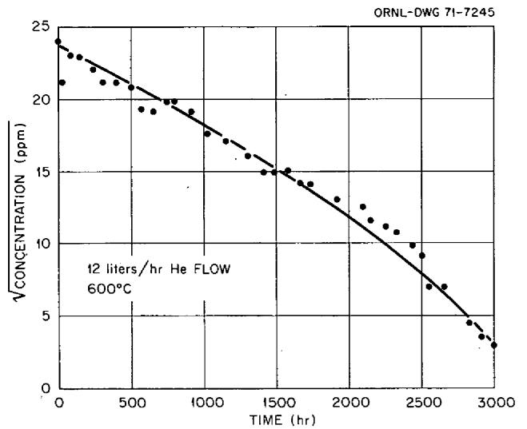  
Fig. 8.6. Removal of $\mathbf{Mo}^{3+}$ from molten $\mathbf{Li}_2\mathbf{BeF}_4$ .

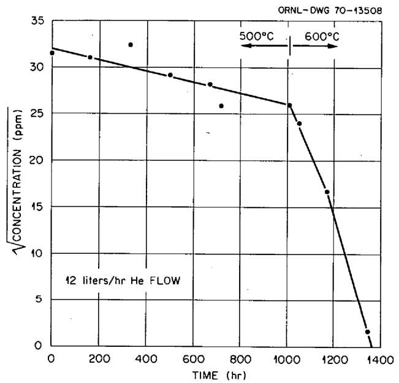  
Fig. 8.7. Removal of $\mathbf{Mo}^{3+}$ from molten $\mathbf{Li}_2\mathbf{BeF}_4$ .

We have now exposed these solutions at higher temperatures and noted instability. The niobium concentration in molten $\mathrm{Li}_2\mathrm{BeF}_4$ decreased at $700^{\circ}\mathrm{C}$ from 1200 to 950 ppm in 1190 hr (50 days) and at $900^{\circ}\mathrm{C}$ from 950 to 55 ppm in 847 hr (35 days) (Fig. 8.8). Since there was no evidence of corrosion of the copper container, it is assumed that the loss was a result of disproportionation of the niobium compound. The expected increase in nobility of the niobium with temperature was manifested by a value of $\approx 10^{-2}$ atm $^{1/2}$ for $P_{\mathrm{HF}} / P_{\mathrm{H_2}}^{1/2}$ at $900^{\circ}\mathrm{C}$ and 3000 ppm of

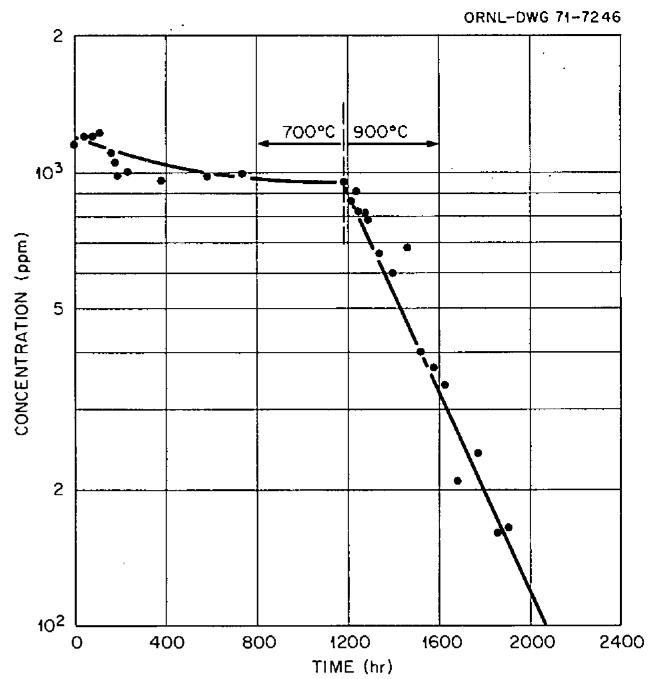  
Fig. 8.8. Removal of $\mathbf{Nb}^{4+}$ from molten $\mathbf{Li}_2\mathbf{BeF}_4$ .

niobium in solution. The stability of these solutions contrasts sharply with the ease of decomposition of pure $\mathrm{NbF_4}$ , as described in Sects. 8.3 and 8.5. The observation that $\mathrm{NbF_4}$ , when dissolved in molten $\mathrm{Li}_2\mathrm{BeF}_4$ , seems to disproportionate in the operating temperature range for molten-salt reactors indicates that whenever oxidized niobium exists in the reactor fuel some $\mathrm{NbF_5}$ must exist in the gas phase even though the species in solution has a lower valence.

# 8.5 MASS SPECTROSCOPY OF NIOBIUM FLUORIDES

C.F.Weaver J.D.Redman

Earlier work $^{8,12-14}$ on the mass spectroscopy of niobium fluorides consisted in observing the pentafluoride polymers, the associated oxyfluorides, the fluorination of niobium metal, and the disproportionation of the lower fluorides. Both the disproportionation of $\mathrm{NbF_4}$ and the decomposition of $\mathrm{NbO}_2\mathrm{F}$ mentioned in Sect. 8.3 were followed by mass spectroscopy. The

cracking pattern. for $\mathrm{NbOF_3}$ was somewhat different from that previously observed at $800^{\circ}\mathrm{C}$ , with the principal change being in the relative intensity of the $\mathrm{NbOF_3}$ ion. These small changes, shown in Table 8.3, are probably temperature effects.

The tentative cracking patterns previously reported for $\mathbf{Nb}_2\mathbf{F}_{10}$ and $\mathbf{NbF}_5$ have been confirmed with minor refinement. The cracking pattern for $\mathbf{NbF}_5$ , including the intensities for the doubly charged ions, is shown in Table 8.4.

Table 8.3. Cracking pattern for ${\mathrm{{NbOF}}}_{3}$   

<table><tr><td rowspan="2">Ion</td><td colspan="2">Relative intensity</td></tr><tr><td>800°C</td><td>450–650°C</td></tr><tr><td>NbOF3+</td><td>50</td><td>68</td></tr><tr><td>NbOF2+</td><td>100</td><td>100</td></tr><tr><td>NbOF+</td><td>13</td><td>8</td></tr><tr><td>NbO+</td><td>8</td><td>7</td></tr><tr><td>Nb+</td><td>14</td><td>11</td></tr><tr><td>NbF3+</td><td>1</td><td>5</td></tr><tr><td>NbF2+</td><td>13</td><td>12</td></tr><tr><td>NbF+</td><td>8</td><td>10</td></tr></table>

Table 8.4. Cracking Pattern for $\mathbf{NbF}_5$ Monomer   

<table><tr><td>Ion</td><td>Relative intensity</td></tr><tr><td>NbF4+</td><td>100 .</td></tr><tr><td>NbF3+</td><td>8</td></tr><tr><td>NbF2+</td><td>13</td></tr><tr><td>NbF+</td><td>8</td></tr><tr><td>Nb+</td><td>5</td></tr><tr><td>NbF42+</td><td>0.1</td></tr><tr><td>NbF32+</td><td>10</td></tr><tr><td>NbF22+</td><td>5</td></tr><tr><td>NbF2+</td><td>3.5</td></tr><tr><td>Nb2+</td><td>3</td></tr></table>

# 9. Coolant Salt Chemistry and Tritium Control

The eutectic mixture formed from $\mathrm{NaBF_4}$ and NaF (92-8 mole %), melting point $383^{\circ}\mathrm{C}$ , is the proposed MSBR coolant salt. In projected pump-loop experiments (see this report, Sect. 5), engineering experience with this salt will be gained over a period of several years.

Although its cost and most of its chemical and physical properties are favorable for its adoption as the coolant, the fluoroborate salt suffers potential disadvantages, as compared with the $^7\mathrm{LiF - BeF}_2$ coolant used in the MSRE; the chief disadvantage is that the fluoroborate coolant exhibits a significant vapor pressure at operating temperatures and would exert an even higher vapor pressure if there was accidental mixing of the coolant and fuel salts.

The strong possibility that the coolant salt will have to be the sink for the tritium produced in an MSBR places an additional criterion on this or any other coolant to be used in an MSBR; the coolant should be able to contain a sufficient concentration of hydrogenous species to exchange isotopically with the tritium passing into the coolant circuit. At the same time the coolant with the hydrogenous additive should be compatible with its alloy containment system.

Success in meeting the performance criteria requires very carefully conducted research efforts. The investigations described below are motivated by the desire to meet these criteria. At the current stage of development, none of these efforts has advanced to the point where it provides a clear solution to the problems associated with the application of fluoroborates as coolants, although some results seem encouraging. (R.E.Thoma)

# 9.1 STUDIES OF HYDROGEN EVOLUTION AND TRITIUM EXCHANGE IN FLUOROBORATE COOLANT

S. Cantor R. M. Waller

We seek to determine how much chemically bound hydrogen can be retained in molten fluoroborate coolant. To the extent that this hydrogen does not corrode metals in contact with the coolant, it is available for isotopic exchange with any tritium entering the coolant circuit of an MSBR.

In these experiments evacuated nickel capsules containing $\mathrm{NaBF_4}$ -NaF (92-8 mole $\%$ ) and metal coupons are heated within a silica vessel which is connected to gas-handling and pressure-measuring apparatus. Hydrogen (or tritium) gas diffusing through the nickel capsule can be readily determined since vessels of fused silica are virtually impermeable to hydrogen.

In a previously reported $^{1}$ experiment, hydrogen (in concentrations equivalent to 60 ppm $\mathrm{H}_2\mathrm{O}$ ) in the salt reacted with chromium coupons at $500^{\circ}\mathrm{C}$ and was completely converted to $\mathrm{H}_2(\mathrm{g})$ . The evolved hydrogen was initially established by gas-chromatographic analyses; the loss of hydrogen from the salt sample was confirmed by a subsequent tritium tracer analysis.

Two experimental runs (see Table 9.1) performed with nickel as the only metal in contact with the salt indicated that low, but encouraging, levels of chemically bound hydrogen can be retained in the salt. In both runs the salt contained hydrogenous impurities incorporated during the recrystallization of $\mathrm{NaBF_4}$ from aqueous media. Although the postexperimental examination of the salt after both runs confirmed isotopic exchange, it should be noted that the salt samples could not be stirred in these experiments and perhaps had not achieved equilibrium. Further tests will be necessary to verify isotopic exchange. Should isotopic exchange be confirmed, experiments in a circulating salt system will be required to establish isotopic exchange in the coolant as a practical method for tritium control.

Five experiments were carried out with nickel coupons in which NaOH and $\mathrm{H}_3\mathrm{BO}_3$ were encapsulated with the coolant salt. The amounts of hydrogen added with the NaOH and $\mathrm{H}_3\mathrm{BO}_3$ were many times greater than the hydrogen believed to be bound in the fluoroborate itself. Two capsules containing 0.4 mole $\%$ NaOH were maintained at $600^{\circ}\mathrm{C}$ , one for 192 hr and the other for 387 hr. In both cases the evolved hydrogen gas, determined chromatographically, was equivalent to the chemically bound hydrogen loaded into the capsules.

Table 9.1. Details of two experiments involving isotopic exchange in $\mathrm{NaBF}_4$ -NaF   

<table><tr><td>Run No.</td><td>Hydrogenous impurity at beginning (μeq H/g salt)</td><td>Conditions and procedure</td><td>H2(g) accounting (μeq H/g salt)</td><td>Analytical examination of salt sample after opening capsule</td></tr><tr><td>6, nickel capsule and coupons</td><td>6.7 ± 0.7a</td><td>80 hr at 520°C; cool down over weekend; 10 hr at 600°C; during and between heating, gas samples were collected and analyzed chromatographically. Capsule and silica vessel then evacuated for 22 hr at 600°C; T2(g), 0.1 Ci, introduced into system, which was maintained at 600°C for 140 hr.</td><td>5.0 ± 0.5, all collected prior to the 22-hr evacuation.</td><td>By counting tritium in the salt and by prior mass-spectrographic analysis of H2(g) and HT(g); it was deduced that 0.5 ± 0.1 μeq of H per gram of salt had been retained in the salt.</td></tr><tr><td>16, nickel capsule and coupons</td><td>14 ± 1.4a</td><td>102 hr at 600°C; during most of this time the silica vessel was evacuated by means of a Toepler pump from which exiting gas was analyzed for H2(g); then D2(g) at about 22 torrs was introduced and maintained at 600°C for 90 hr.</td><td>14 ± 1.4, collected prior to introduction of D2(g).</td><td>Infrared absorption spectrum of 15-mg pellet of salt showed an -OD peak whose absorbance was 31/2 times greater than the -OH peak; however, neither peak provides a quantitative analysis for hydrogen in the salt.</td></tr></table>

${}^{a}$ Assuming a ${10}\%$ relative standard error in the gas-chromatographic analysis.

Two capsules containing 0.5 mole % boric acid were heated at $600^{\circ}\mathrm{C}$ , one for 435 hr and the other for 644 hr. In these time intervals the evolved hydrogen gas, when analyzed, corresponded to about $60\%$ of the hydrogen introduced into the capsule. However, in a third capsule, with an initial concentration of 0.66 mole $\% \mathrm{H}_3\mathrm{BO}_3$ and heated at $600^{\circ}\mathrm{C}$ for 300 hr, virtually all the chemically bound hydrogen in the capsule escaped as $\mathrm{H}_{2}(\mathrm{g})$ . The disparity between the first two $\mathrm{H}_3\mathrm{BO}_3$ experiments and the third can probably be attributed to inadvertent pumping away of $\mathrm{H}_{2}$ in the first two experiments.

Post experimental infrared spectral examination (by John Bates) of the salts in these five latter experiments revealed low OH concentrations, hardly different from that found in fluoroborates, without added NaOH or $\mathrm{H}_3\mathrm{BO}_3$ , that had been subjected to similar treatment. These infrared results, together with the quantities of $\mathrm{H}_{2}(\mathrm{g})$ collected during the experimental runs, suggest that the NaOH and $\mathrm{H}_3\mathrm{BO}_3$ did not augment the capacity of the coolant salt to retain hydrogen. Furthermore, the higher level of protons increased the corrosion of nickel. After the experiments the salt and capsule walls were examined and found to contain an easily observable yellowish skin, identified as $\mathrm{NaNiF}_3$ . With the fluoroborate salt alone, such corrosion products, though possibly formed, have not been detected.

# 9.2 REACTION OF SODIUM FLUORIDE-SODIUM TETRAFLUOROBORATE WITH WATER

H.W.Kohn

Attempts to refine our previous measurements of the equilibrium constants for the reactions

$$
\mathrm {N a B F} _ {4} + \mathrm {H} _ {2} \mathrm {O} \rightleftharpoons \mathrm {N a B F} _ {3} \mathrm {O H} + \mathrm {H F} \tag {1}
$$

and

$$
\mathrm {N a B F} _ {3} \mathrm {O H} \rightarrow \mathrm {N a B F} _ {2} \mathrm {O} + \mathrm {H F} \tag {2}
$$

by improving analytical techniques for the transpiration method have so far met with failure. These have included installation of thermal conductivity apparatus to measure gas composition, sodium fluoride traps for absorption of HF and $\mathrm{BF}_3$ from the gas stream, and azeotropic distillation from pyridine solutions of samples of the effluent gas collected from the transpiration experiment. During the course of these experiments, we have observed some HF present at all times (nickel containers and copper lines and samplers are used). Consequently, our approach has been to determine

more accurately the role of HF in stabilizing $\mathrm{OH}^{-}$ and in producing $\mathrm{H}_{2}\mathrm{O}$ .

We have improved on some earlier experimental results by using more refined analytical techniques to measure the extent of reactions (1) and (2). By collecting the off-gas containing $\mathrm{BF}_3$ and HF in aqueous sodium fluoride followed by $\mathrm{CaCl}_2$ precipitation:

$$
\mathrm {B F} _ {3} (\mathrm {g}) + \mathrm {N a F} (\mathrm {a q}) \rightarrow \mathrm {N a B F} _ {4}, \tag {3}
$$

$$
\mathrm {N a B F} _ {4} + 2 \mathrm {C a C l} _ {2} + 3 \mathrm {H} _ {2} \mathrm {O} \rightarrow \mathrm {H} _ {3} \mathrm {B O} _ {3}
$$

$$
+ \underline {{2 C a F _ {2} \downarrow}} + N a C l + 3 H C l, \tag {4}
$$

$$
2 \mathrm {H F} + \mathrm {C a C l} _ {2} \rightarrow \mathrm {C a F} _ {2} \downarrow + 2 \mathrm {H C l}, \tag {5}
$$

followed by a double-end-point titration of the resultant HCl and $\mathrm{H}_3\mathrm{BO}_3$ -mannitol complex, we ascertained that in fluoroborate to which $\mathrm{H}_2\mathrm{O}$ was added slowly as vapor over a period of several hours, there was always a small pressure of HF which would persist for two or three days. The HF pressure measurements so obtained are still erratic since, for example, any error in $\mathrm{H}_3\mathrm{BO}_3$ determination is reflected threefold in the determination of HF, but the implication is that under our experimental conditions (nickel containers, copper lines, $400^{\circ}\mathrm{C}$ ) the equilibrium content of HF in the argon sweep gas is approximately 0.1 meq/liter. Part of the difficulty stems from the apparent high solubility of HF in fluoroborate at $400^{\circ}\mathrm{C}$ .

We believe that the HF is due to reaction (2) above. Using the following numbers, oxide $= 400$ ppm obtained by inventory of the $\mathrm{H}_2\mathrm{O}$ , and HF $= 0.1$ meq/liter, we can calculate an equilibrium quotient $= [\mathrm{HF}][\mathrm{O}^{2-}] / [\mathrm{OH}^{-}] = 10^{-4}$ at $400^{\circ}\mathrm{C}$ (when HF is expressed in atmospheres and the other quantities are expressed in moles per liter). The OH is calculated from the vapor pressure of water and the flow rate of argon through a side stream. We assume all the water reacts, since virtually none is found, under these conditions, by Karl Fischer titration of the effluent gas. Using the temperature variation of the equilibrium determined previously, this means that (at the same oxide and hydroxide levels) the equilibrium pressure of HF required to stabilize hydroxide at $650^{\circ}\mathrm{C}$ would be about $50\mathrm{mm}$ .

We have obtained preliminary values for the solubility of HF in the NaF-NaBF $_4$ eutectic mixture with HF at

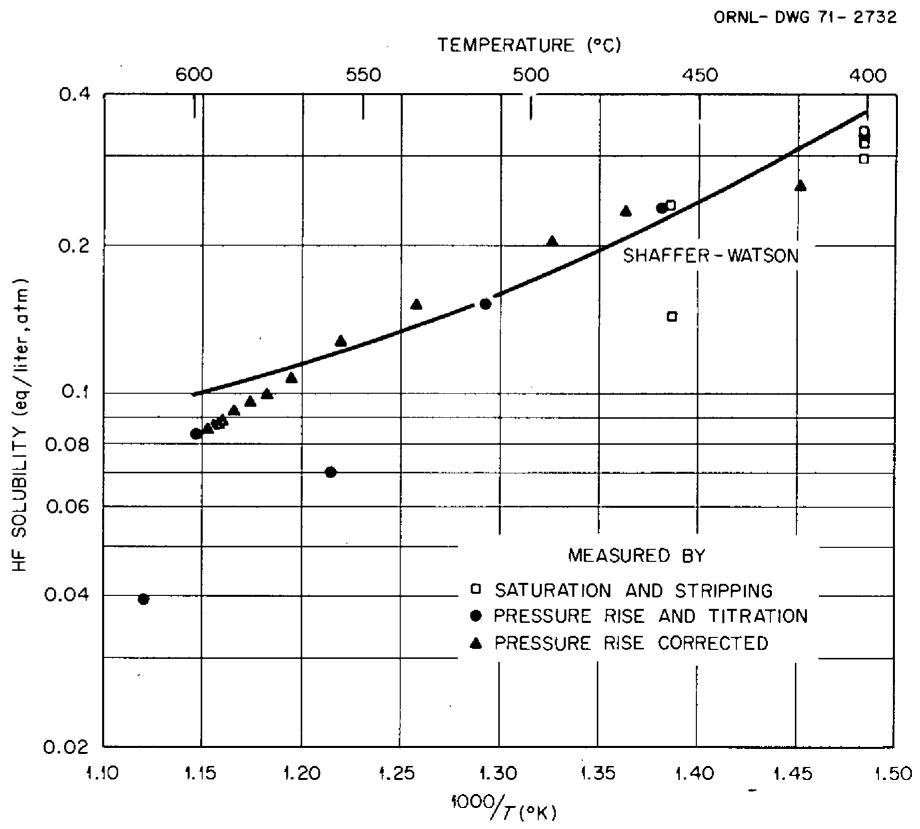  
Fig. 9.1. Henry's law solubility of HF in $\mathrm{NaBF}_4 - 9\%$ NaF eutectic.

0.29 atm in a nickel vessel. The HF was supplied in a gas mixture composed of Ar, $\mathrm{BF}_3$ , $\mathrm{H}_2$ , and HF. Solubility was determined by sparging the HF from the saturated melt; the amounts of HF removed were measured by alkalimetric titration. The removal of HF was first order as expected, but the curve of concentration in the gas vs sparging time showed a long tail; that is, the last traces of HF were difficult to remove. The value of the Henry's law constant at $400^{\circ}\mathrm{C}$ is $0.33 \pm 0.03$ equiv liter $^{-1}$ atm $^{-1}$ . During the three measurements the oxide concentration ranged from 500 to 300 ppm, determined by $\mathrm{KBrF}_4$ , but the change in oxide content did not seem to affect the solubility markedly in this range.

Solubilities at other temperatures were measured in three different ways: (1) by saturation and stripping, (2) by saturation at $400^{\circ}\mathrm{C}$ followed by raising the temperature and titrating the HF in the cover gas, and (3) by saturation at $400^{\circ}\mathrm{C}$ , followed by raising the temperature and measuring the corresponding pressure rise and subsequently correcting it for expansion of the cover gas and for the contribution from $\mathrm{BF}_3$ overpressure. In Fig. 9.1 the results of these three methods are presented, along with a correlation developed by

Shaffer and Watson3 which related HF solubility in NaF-BeF2 and in NaF-ZrF4 with the free fluoride content of the melt. The Shaffer-Watson formula is given below.

$$
K = \exp \left(\frac {A + B R C}{R T} - \frac {D + E R C}{R}\right)
$$

where

$A, B, D,$ and $E$ are empirical constants,

$C$ is the fraction of free fluoride in the melt,

$R$ is the gas constant,

$T$ is the absolute temperature,

$K$ is the Henry's law constant.

One may extend this correlation to the $\mathrm{NaF - BF_3}$ system by using the vapor pressure of $\mathbf{BF}_3$ over the eutectic from Cantor's data4 to calculate the free

fluoride in the mixture as a function of temperature and use these numbers in the Shaffer-Watson formula to calculate HF solubility. The results of this calculation are shown on the graph.

A more refined apparatus for measuring HF solubility has been constructed and is presently being tested.

We have also used infrared spectroscopy to determine the stability constant referred to before. This is reported separately.

# 9.3 IDENTIFICATION OF CORROSION PRODUCTS IN THE BUBBLER TUBE OF THE FLUOROBORATE TEST LOOP

S. Cantor

For approximately 1.3 years, an Inconel pump loop (operated by the Reactor Division under the supervision of A. N. Smith) circulated molten $\mathrm{NaBF}_4$ -NaF (92-8 mole%). Welded into the pump bowl was a $1/2$ -in.-ID Inconel tube through which helium and $\mathrm{BF}_3$ entered the circulating salt. After shutdown of the loop, the lower part of this tube was cut off, sectioned, and split axially. One half of the axially split portion was submitted to the Reactor Chemistry Division for chemical examination of the corrosion and mass transfer products deposited on the inner surfaces of the tube.

A full description of the appearance of the bubbler tube is given elsewhere in this report. Five corrosion and mass transfer products were identified by x-ray diffraction and electron microprobe analyses:

1. a green salt, $\mathrm{Na}_3\mathrm{CrF}_6$   
2. a yellow salt, $\mathrm{NaNiF_3}$   
3. a black powdery magnetic material with the stoichiometry $\mathrm{Ni}_3\mathrm{Fe}$ ;   
4. a porous, gray metallic mass, which plugged the mouth of the tube, composed of nickel metal and $\mathrm{NaBF}_4$ in approximately equal parts;   
5. a millimeter-thick layer, running through most of the length of the tube, composed of nickel and nickel oxide.

A plausible inference which may account in part for the morphology of the deposit assumes that $\mathrm{Na}_3\mathrm{CrF}_6$ , $\mathrm{NaNiF}_3$ , and $\mathrm{Ni}_3\mathrm{Fe}$ were present in a surface scum on the fluoroborate melt prior to migrating up the bubbler

tube; the migration possibly occurred when liquid droplets were formed by bubbles breaking at the mouth of the bubbler. A second transfer mechanism might have been backflow up the tube; however, such events were infrequent and of short duration.

The presence of the salts $\mathrm{Na}_3\mathrm{CrF}_6$ and $\mathrm{NaNiF}_3$ has been noted previously as corrosion products from molten $\mathrm{NaBF}_4$ . Both are only slightly soluble in the melt. They arise initially through oxidation of the metal. In the case of $\mathrm{Na}_3\mathrm{CrF}_6$ , the oxidation of chromium in the loop probably arose from three sources:

1. $\mathrm{H}_2\mathrm{O}$ entered as an impurity in the helium and possibly in the fluoroborate salt charge (and also on one occasion deliberately introduced); the reactions may be written:

$$
\mathrm {H} _ {2} \mathrm {O} (\mathrm {g}) + 2 \mathrm {F} ^ {-} (\text {i n t h e s a l t}) \rightarrow 2 \mathrm {H F} (\mathrm {g}) + \mathrm {O} ^ {2 -} (\text {i n t h e s a l t}),
$$

$$
\mathrm {C r} + 3 \mathrm {H F} (\mathrm {g}) + 3 \mathrm {N a F} (\mathrm {l}) \rightarrow \mathrm {N a} _ {3} \mathrm {C r F} _ {6} + \frac {3}{2} \mathrm {H} _ {2} (\mathrm {g}).
$$

2. Air trapped in lines when tanks of gas were changed; besides the moisture thereby introduced, $\mathrm{O}_2(\mathrm{g})$ would also lead to oxidation:

$$
\begin{array}{l} \mathrm {C r} + 3 / _ {4} \mathrm {O} _ {2} (\mathrm {g}) + 3 \mathrm {N a F (I)} \\ + \mathrm {B F} _ {3} (\mathrm {g}) \rightarrow \mathrm {N a} _ {3} \mathrm {C r F} _ {6} + \frac {1}{2} \mathrm {B} _ {2} \mathrm {O} _ {3} (\mathrm {l}). \\ \end{array}
$$

3. Metallic ions already present in the melt oxidize chromium; for instance, the fluoroborate charged into the loop contained about 200 ppm iron; the reaction with chromium may be written:

$$
\mathrm {C r} + ^ {3 / 2} \mathrm {F e} ^ {2 +} (\mathrm {l}) \rightarrow \mathrm {C r} ^ {3 +} (\mathrm {l}) + ^ {3 / 2} \mathrm {F e}.
$$

The trivalent chromium subsequently precipitated as $\mathrm{Na}_3\mathrm{CrF}_6$

In accounting for the formation of $\mathrm{NaNiF}_3$ , reactions similar to those given under 1 and 2 above seem likely:

$$
\mathrm {N i} + 2 \mathrm {H F} (\mathrm {g}) + \mathrm {N a F} (\mathrm {l}) \rightarrow \mathrm {N a N i F} _ {3} + \mathrm {H} _ {2},
$$

$$
\begin{array}{l} \mathrm {N i} + \frac {1}{2} \mathrm {O} _ {2} (\mathrm {g}) + \mathrm {N a F (l)} \\ + \frac {2}{3} \mathrm {B F} _ {3} (\mathrm {g}) \rightarrow \mathrm {N a N i F} _ {3} + \frac {1}{3} \mathrm {B} _ {2} \mathrm {O} _ {3} (\mathrm {l}). \\ \end{array}
$$

The reasons for the formation of $\mathrm{Ni}_3\mathrm{Fe}$ are not easily ascertained. One can speculate that ionic iron and nickel in the salt oxidize metallic chromium and

coprecipitate as an alloy:

$$
\frac {8 \%}{3} \mathrm {C r} + 3 \mathrm {N i} ^ {2 +} (1) + \mathrm {F e} ^ {2 +} (1) \rightarrow \frac {8 \%}{3} \mathrm {C r} ^ {3 +} (1) + \left| \mathrm {N i} _ {3} \mathrm {F e} \right..
$$

Most of the $\mathrm{Cr}^{3+}$ would subsequently precipitate as $\mathrm{Na}_3\mathrm{CrF}_6$ . The dissolved ionic nickel and iron could have originated by means of the oxidation by $\mathrm{H}_2\mathrm{O(g)}$ and $\mathrm{O}_2(\mathrm{g})$ .

The origin of the "extra" nickel in the tube (noted above under products 4 and 5) is uncertain. The nickel plug formed in a position where the salt was exposed to lower temperatures; perhaps the reaction

$$
\mathrm {N i F} _ {2} (\text {d i s s o l v e d i n m e l t}) + \mathrm {H} _ {2} (\mathrm {g}) \rightleftharpoons 2 \mathrm {H F} (\mathrm {g}) + \mathrm {N i}
$$

permitted the deposition of nickel at the mouth of the tube.

In summary, the corrosion products identified in the bubbler tube originated with the introduction of oxidants, the most important being water vapor. The water vapor led to the formation of HF, which corroded the Inconel. This corrosion, which implies the dissolution of chromium, iron, and nickel ions, eventually led to the precipitation of $\mathrm{Na}_3\mathrm{CrF}_6$ and $\mathrm{NaNiF}_3$ , some of which were carried on the surface of the molten fluoroborate. Dissolved iron and nickel also reacted further with metallic chromium and were apparently precipitated out as the alloy $\mathrm{Ni}_3\mathrm{Fe}$ . Some of this alloy was also present on the surface of the molten salt.

# 9.4 MASS SPECTROSCOPY OF FLUOROBORATE MSR COOLANTS

C.F.Weaver J.D.Redman

With respect to tritium control in a molten-salt reactor, F. F. Blankenship has recently suggested that hydrogenous material might be added to and maintained in the proposed coolant salt, $\mathrm{NaBF}_4$ -NaF (92-8 mole $\%$ ), by incorporating 1 or $2\%$ NaOH into the liquid if the behavior of this system as such or its corrosive attack on structural materials is acceptable. Consequently, we have initiated studies of the vapors over such materials using a time-of-flight mass spectrometer to detect the species effusing from a Knudsen cell.

The first experiments were made with the separate components $\mathrm{BF}_3$ , $\mathrm{NaBF}_4$ , and $\mathrm{NaOH}$ in nickel cells to determine cracking patterns and to confirm that the boron compounds behaved as commonly described.

The $\mathrm{BF}_3$ yielded a cracking pattern essentially like that in the literature, and no polymers of $\mathrm{BF}_3$ were observed. The $\mathrm{NaBF}_4$ decomposed, yielding $\mathrm{BF}_3$ monomer as the only vapor species. However, the NaOH

behaved in a more complex way. In addition to the previously reported monomer and dimer, both the trimer and tetramer of $\mathrm{NaOH}$ were observed. Water was also evolved from material which had been dried and outgassed at $200^{\circ}\mathrm{C}$ . This was attributed to the decomposition $2\mathrm{NaOH} \rightarrow \mathrm{Na}_{2}\mathrm{O} + \mathrm{H}_{2}\mathrm{O}\uparrow$ . In addition a small amount of $\mathrm{H}_{2}$ was evolved, probably by $\mathrm{Ni} + 2\mathrm{NaOH} \rightarrow \mathrm{Na}_{2}\mathrm{O} + \mathrm{NiO} + \mathrm{H}_{2}$ , although the condensed products of this reaction are not well established. By far the most intense of the reduced species was sodium vapor, attributed to the reaction $\mathrm{Na}_{2}\mathrm{O} + \mathrm{Ni} \rightarrow \mathrm{NiO}\downarrow + 2\mathrm{Na}\uparrow$ . The Na vapor was detected by mass spectrometry and the NiO precipitate by x-ray diffraction. Severe attack of the nickel cell was also evident by direct observation. The standard free energy change for the reaction as written at $1000^{\circ}\mathrm{K}$ is $+29\mathrm{kcal}$ , which implies that $P_{\mathrm{Na}} = 7 \times 10^{-2}$ torr, well within the range of detection of the mass spectrometer.

The possibility of adding hydrogenous material to the fluoroborate coolant as water either intentionally or accidentally as a steam leak suggested that the reaction of moisture with $\mathrm{NaBF_4}$ should also be investigated.

Two approaches were used to obtain reaction products of the $\mathrm{NaBF}_4\mathrm{-H}_2\mathrm{O}$ system. One was to add $\mathrm{H}_2\mathrm{O}$ $(0.1\mathrm{g})$ to $\mathrm{NaBF}_4$ $(0.2\mathrm{g})$ and to reflux at $300^{\circ}\mathrm{C}$ under an atmosphere of helium for an hour. After refluxing, the cell was cooled, evacuated, and studied in the normal manner. Vapor over the temperature range of 25 to $750^{\circ}\mathrm{C}$ was quite similar to that over pure $\mathrm{NaBF}_4$ , even to the amount of water vapor evolved. No reaction products had been formed, at least to the $300^{\circ}$ refluxing temperature limit; moreover, the $\mathrm{NaBF}_4$ displayed a very impressive, nondeliquescent character.

In the second approach to obtain reaction products from the $\mathrm{NaBF}_4$ - $\mathrm{H}_2\mathrm{O}$ system, steam was admitted over the temperature range 25 to $750^{\circ}$ at an approximate leak rate of $10^{-7}$ torr liter $\mathrm{sec}^{-1}$ . The complexity of the reaction was apparent. For convenience, an attempt was made to assign fragments to possible molecular precursors, almost arbitrarily (Table 9.2). The only

Table 9.2. Partial pressure of assumed molecules in vapor at $300^{\circ}$ from the $\mathrm{NaBF}_4\cdot \mathrm{H}_2\mathrm{O}$ reaction   

<table><tr><td>Molecules</td><td>Pressure (torrs)</td></tr><tr><td></td><td>× 10-2</td></tr><tr><td>H2O</td><td>1.0</td></tr><tr><td>BF3</td><td>2.5</td></tr><tr><td>HF</td><td>1.0</td></tr><tr><td>NaBOF2</td><td>0.008</td></tr><tr><td>BF3·H2O</td><td>0.2</td></tr><tr><td>NaBF2</td><td>0.003</td></tr><tr><td>? (mass 19)</td><td>0.01</td></tr></table>

criterion was to group fragments displaying the same coefficient of temperature dependence with the same precursor. Some fragments certainly had more than one precursor. Nevertheless, at $300^{\circ}$ , reaction products of $\mathrm{NaBF}_4$ and steam accounted for at least $30\%$ of the total vapor pressure, most of which was HF.

# 9.5 SPECTROSCOPIC INVESTIGATIONS OF HYDROGEN- AND DEUTERIUM-CONTAINING IMPURITIES IN $\mathrm{NaBF}_4$ AND NaF-NaBF $_4$ EUTECTICS

John B. Bates

Harold W. Kohn

Jack P. Young

Marvin M. Murray

George E. Boyd

Evidence for the existence of hydrogen-containing impurities in $\mathrm{NaBF_4}$ was first obtained from near-infrared spectra of the molten salt and in mid-infrared spectra of pressed pellets of the "pure" crystalline material. Bands observed in the region between 1.35 and $2.55\mu$ (Fig.9.2) are believed to correspond to overtones and combinations of fundamental vibrations of an OH species (either free $\mathrm{OH}^{-}$ or $\mathrm{BF}_3\mathrm{OH}^-$ ) in the melt. Although the vibrational spectrum of crystalline $\mathrm{NaBF_4}$ has been thoroughly investigated,[7-9] no infrared measurements have been reported in the region above $3000~\mathrm{cm}^{-1}$ with thick samples for transmission measurements.

We have recently repeated infrared transmission measurements on a single crystal of $\mathrm{NaBF}_4$ supplied by L. O. Gilpatrick. This crystal was polished to a thickness of about $1/4$ to $1/2$ mm before examination with a Perkin-Elmer model 621 spectrophotometer. A single sharp band at $3641\mathrm{cm}^{-1}$ was observed which exhibited about a 2:1 dichroic ratio as the infrared polarizer was rotated through an angle of $90^{\circ}$ . This band was assigned tentatively to an OH-containing molecular species (most likely $\mathrm{BF}_3\mathrm{OH}^-$ ) which is effectively isolated in an $\mathrm{NaBF}_4$ matrix. Subsequent spectroscopic studies[10] on relatively pure samples of crystalline $\mathrm{NaBF}_3\mathrm{OH}$ appear to confirm this assignment.

Spectroscopic observation of isotopic exchange of hydrogen with deuterium was investigated in solid-state and in molten-salt exchange reactions. In the first experiments, $\mathrm{D}_2\mathrm{O}$ vapor was bubbled slowly into a

ORNL-DWG.71-3460

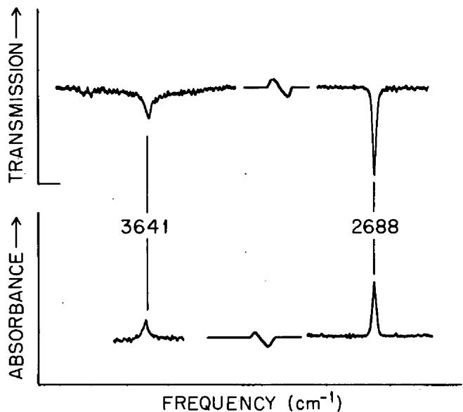  
Fig. 9.2. Transmittance and absorbance of a $0.15\mathrm{-mg}$ pellet of a $\mathbf{D}_2$ -treated sample of $\mathrm{NaBF_4}$

molten $\mathrm{NaF - NaBF_4}$ eutectic at $400^{\circ}\mathrm{C}$ . The amount of deuterium introduced into the melt corresponded to about 200 ppm $\mathrm{D}_2\mathrm{O}$ . Two sharp bands were observed at 3641 and $2688~\mathrm{cm}^{-1}$ , respectively, in the infrared spectra of pellets pressed from a quenched sample of this melt. The band at $2688~\mathrm{cm}^{-1}$ corresponds to the OD stretching frequency of an impurity assumed to be $\mathrm{NaBF}_3\mathrm{OD}$ . A quantitative determination of the amount of OH impurity in the starting $\mathrm{NaF - NaBF_4}$ eutectic and of the percent of isotopic exchange could not be made; but, judging from relative peak intensities of the 3641- and $2688\text{-cm}^{-1}$ bands, the OD concentration was estimated to be about $30\%$ of the OH concentration. Much larger amounts of the OD-containing impurity were incorporated when $\mathrm{D}_2\mathrm{O}$ vapor was passed over solid $\mathrm{NaBF}_4$ at $377^{\circ}\mathrm{C}$ . The OD concentration in these samples was estimated to be 3600 ppm by titrating DF liberated in the reaction

$$
\mathrm {N a B F} _ {4} + \mathrm {D} _ {2} \mathrm {O} \rightarrow \mathrm {N a B F} _ {3} \mathrm {O D} + \mathrm {D F}.
$$

The extent of reaction and exchange of DF with $\mathrm{NaBF_4}$ was studied by equilibrating molten $\mathrm{NaBF_4}$ at $450^{\circ}\mathrm{C}$ with DF and argon. Subsequent infrared measurements on pressed pellets of the solid material obtained from quenching this melt also revealed two sharp bands at 3641 and $2688~\mathrm{cm}^{-1}$ . The infrared spectrum of a $\sim 0.25$ -mm-thick pellet of the DF-treated $\mathrm{NaBF_4}$ in the region above $2000~\mathrm{cm}^{-1}$ is shown in Fig. 9.3. This spectrum is typical of others obtained with

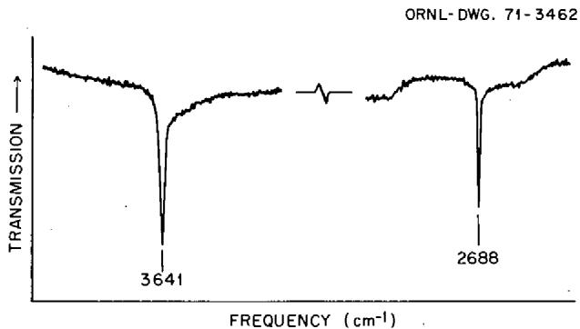  
Fig. 9.3. Infrared spectrum of a $100\mathrm{-mg}$ pellet of DF-treated $\mathbf{NaBF}_4$

samples of $\mathrm{NaBF}_4$ which had been treated with $\mathrm{D}_2\mathrm{O}$ . The production of the OD-containing material in this case could occur by reaction of DF with oxides (e.g., $\mathrm{DF} + \mathrm{BF}_2\mathrm{O}^- \rightarrow \mathrm{BF}_3\mathrm{OD}^-$ ) and by isotopic exchange with the OH-containing impurity.

Solid samples of KF, KBr, and $\mathrm{NaBF_4}$ were treated with DF at $350^{\circ}C$ to check on the possibility that the bands at 3641 and $2688~\mathrm{cm}^{-1}$ may be caused by HF and DF, respectively, dissolved in $\mathrm{NaBF_4}$ . Alkalimetry showed that the solids after treatment contained 5.46, 0.25, and 0.097 meq/g of acid respectively. No band at $2688~\mathrm{cm}^{-1}$ was detectable, although a weak band at $3641~\mathrm{cm}^{-1}$ appeared in the spectrum of the $\mathrm{NaBF_4}$ sample. The results from this experiment appeared to confirm our earlier contention that the bands at 3641 and $2688~\mathrm{cm}^{-1}$ were not caused by dissolved HF and DF respectively.

The results of the above experiments demonstrated that $\mathrm{NaBF_4}$ contained an "OH impurity" (probably $\mathrm{NaBF}_3\mathrm{OH}$ ) and that the deuterium-substituted form of this material could be produced in molten $\mathrm{NaBF_4}$ by reaction with the $\mathrm{BF_4}^-$ ( $\mathrm{D}_2\mathrm{O}$ ) or with oxide impurities (DF) and possibly by isotopic exchange. The extent of isotopic exchange alone was investigated with a sample of $\mathrm{NaBF_4}$ prepared by S. Cantor which was sealed in a nickel capsule and heated for about three days at $600^{\circ}\mathrm{C}$ in an atmosphere of $\mathrm{D}_2$ gas ( $\sim 25~\mathrm{mm}$ ). The infrared spectrum of a pressed pellet of this sample is shown in Fig. 9.4. The ratio of the absorbance of OD to that of OH is about 3:1. The results of this experiment appear to indicate an exchange of atomic deuterium for the H in OH, although it is also possible to interpret these results in terms of the reaction

$$
\mathrm {D} _ {2} (\mathrm {g}) + \mathrm {N i} + 2 \mathrm {O} ^ {2 -} (\text {i n t h e m e l t}) \rightleftharpoons
$$

$$
2 \mathrm {O D} ^ {-} (\text {i n t h e m e l t}) + \mathrm {N i}.
$$

ORNL-DWG. 71-3461

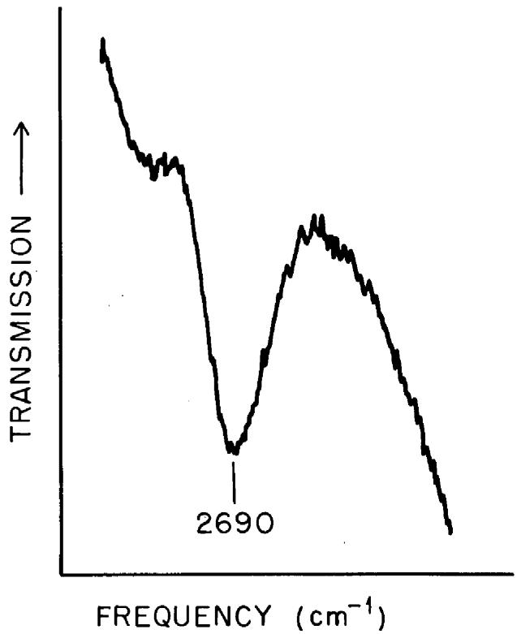  
Fig. 9.4. Band due to absorption by OD-containing species in the infrared spectrum of molten $\mathrm{NaBF}_4$ at $425^{\circ}\mathrm{C}$ .

The above experimental results demonstrated that samples of presumed high-purity $\mathrm{NaBF_4}$ contained OH impurities and that exchange with deuterium atoms occurs in the molten state. We thus desired to obtain a direct measurement of the OH absorption in molten $\mathrm{NaBF_4}$ as a function of time. It was observed that the bands due to overtones of OH disappear from the near-infrared spectrum of the melt in a matter of hours. However, pellets pressed from the frozen salt always showed the sharp absorption at $3641~\mathrm{cm}^{-1}$ . These two observations can be reconciled if it is assumed that a small, but unknown, concentration of OH or $\mathrm{BF}_3\mathrm{OH}^-$ is in equilibrium with $\mathrm{NaBF_4}$ . Indeed, the rate of decrease of the near-infrared OH peak does not appear to follow simple first-order kinetics. Therefore, competing, consecutive, or higher-order processes must be involved. It is interesting also to note that the same near-infrared spectrum is observed if either NaOH or $\mathrm{H}_3\mathrm{BO}_3$ is added to molten $\mathrm{NaBF_4}$ .

Near-infrared spectra of molten $\mathrm{NaBF_4}$ were measured with $\mathrm{SiO}_2$ cells and a high-temperature furnace described previously. For measurements in the mid

infrared region, samples of $\mathrm{NaBF_4}$ were spiked with $\mathrm{D}_3\mathrm{BO}_3$ because it was possible to study only the absorption by OD rather than that by OH with the available equipment. The infrared spectrum of a molten $\mathrm{NaBF_4 - D_3BO_3}$ solution in the $2700\text{-cm}^{-1}$ region at about $425^{\circ}\mathrm{C}$ is shown in Fig. 9.4. The broad OD band is centered at about $2690\mathrm{cm}^{-1}$ , in excellent agreement with the frequency of the sharp band observed at 2688 $\mathrm{cm}^{-1}$ in the pellet spectra (Fig. 9.3).

A slight decrease in the absorption of the $2690\mathrm{-cm}^{-1}$ band with time was observed. However, the band was still observable after 48 hr in a 2-mm-path-length $\mathrm{SiO}_2$ cell. Under our experimental conditions, the OD absorption in the melt was stable in the presence of added INOR-8 but unstable in the presence of pure chromium metal. It is not known how much OH or OD was actually observed in either the melt or pellet spectra. Since it was demonstrated that OD species can be seen spectrally in the melt, an apparatus which does not use $\mathrm{SiO}_2$ as a window material is being designed and fabricated for use in further studies on molten $\mathrm{NaBF}_4$ .

The results of these spectroscopic studies indicate that an OH-containing impurity occurs in "pure" samples of $\mathrm{NaBF}_4$ , that exchange with deuterium atoms takes place in the molten state, and that the OH species persists at melt temperatures of $425^{\circ}\mathrm{C}$ over a period of days. Additional experiments are under way to determine quantitatively the amount of OH-containing impurity in $\mathrm{NaBF}_4$ and the extent of isotopic exchange of H for D or T in the molten state at temperatures of about $600^{\circ}\mathrm{C}$ .

# 9.6 RAMAN SPECTRA OF THE HIGH-TEMPERATURE PHASE OF POLYCRYSTALLINE $\mathrm{NaBF}_4$

Arvin S. Quist John B. Bates  
George E. Boyd

Raman spectra were measured with polycrystalline $\mathrm{NaBF_4}$ at temperatures just above and below the dimorphic crystal transition $(245^{\circ}\mathrm{C})$ . The results of this study rationalize anomalies in x-ray diffraction data for $\mathrm{NaBF_4}$ and related structures. The spectrum of the high-temperature solid phase indicates the presence of a highly symmetric effective field about the $\mathrm{BF_4}^-$ ion similar to that previously observed in melt spectra. A complete disordering of the fluoride ion positions must be assumed for the spectral results to be consistent with recent x-ray data on crystalline $\mathrm{NaBF_4}$ powders at $265^{\circ}\mathrm{C}$ , which have been indexed in the hexagonal system.

The room-temperature crystalline form of $\mathrm{NaBF_4}$ is orthorhombic, space group Cmcm, and is isostructural only with the room-temperature forms of $\mathrm{CaSO_4}$ and $\mathrm{NaClO_4}$ . All three compounds undergo phase transitions at elevated temperatures. Sodium perchlorate has a cubic structure above $308^{\circ}\mathrm{C}$ which is said to be isostructural with the high-temperature phases of many perchlorates, tetrafluoroborates, and sulfates. The high-temperature phase of $\mathrm{CaSO_4}$ (above $1210^{\circ}\mathrm{C}$ ) was reported to be hexagonal. At $245\pm 1^{\circ}\mathrm{C}$ , $\mathrm{NaBF_4}$ undergoes a change in crystal structure to a form first reported as monoclinic. Dworkin and Bredig, however, have expressed the view that a lowering of the symmetry of the high-temperature form without a lowering of the number of molecules per unit cell is quite unlikely. They have indexed the powder pattern reported by Pistorius, Boeyens, and Clark on the basis that a mixture of the orthorhombic low-temperature phase with a high-temperature hexagonal phase was measured. Recently, Bredig obtained x-ray powder patterns of $\mathrm{NaBF_4}$ at $265^{\circ}\mathrm{C}$ with a Buerger precession camera. The powder photographs were indexed in the hexagonal system with parameters $a_0 = 5.00\pm 0.02$ and $c_{0} = 7.75\pm 0.03\AA$ . Acceptable agreement between observed and calculated diffraction intensities, however, could not be obtained for ordered hexagonal space groups.

In view of the uncertainties in the structure of the high-temperature phase of crystalline $\mathrm{NaBF}_4$ , we have measured the Raman spectrum of this material in an effort to provide additional information regarding the lattice symmetry. Static and dynamic field effects on the vibrational modes of $\mathrm{BF}_4^-$ in the orthorhombic (room temperature) $\mathrm{NaBF}_4$ structure have been established by previous studies. $^{15,16}$ The two $\mathrm{BF}_4^-$ ions in the primitive unit cell of this crystal occupy $C_{2\nu}$ sites, so that all the components of the doubly degenerate $\nu_{2}(e)$ mode and of the triply degenerate $\nu_{3}(f_{2})$ and $\nu_{4}(f_{2})$ modes are observed in the Raman spectrum. An increase in the site symmetry of the $\mathrm{BF}_4^-$ ion in the high-temperature form may cause a collapse of the

splitting, and hence only one frequency for each of the vibrational modes would be observed. The presence or absence of such effects in the spectra of the high-temperature phase would establish the symmetry of the effective field about the $\mathrm{BF}_4^-$ ion in the high-temperature lattice and perhaps also resolve the existing conflict in the x-ray data.

In the current Raman studies of the high-temperature phase of $\mathrm{NaBF}_4$ only the $\nu_{1}(a_{1}),\nu_{2}(e)$ ,and $\nu_{4}(f_{2})$ modes were examined in detail;17 the intensities of the $\nu_{3}(f_{2})$ modes are quite weak under these conditions. A detailed comparison of the $\nu_{2}$ and $\nu_{4}$ bands at 240 and $254^{\circ}\mathrm{C}$ is given in Fig. 9.5, which clearly shows the abrupt change in the Raman spectrum of crystalline $\mathrm{NaBF}_4$ as it undergoes the phase transition.

The experimental observations indicate that the effective environment about the $\mathrm{BF}_4^-$ ion in the high-temperature crystalline phase of $\mathrm{NaBF}_4$ has tetrahedral (or higher) symmetry and that there is no measurable (or allowed) dynamic coupling between neighboring $\mathrm{BF}_4^-$ ions. This observation is consistent with the recent x-ray results, $^{14}$ which led to a hexagonal structure only if a complete disordering of the fluoride positions is assumed. With this complete disordering, the effective field experienced by a $\mathrm{BF}_4^-$ ion would be highly symmetric, and the lack of splitting of the $\nu_{2}$ and $\nu_{4}$ bands in the Raman spectra could be explained. This structure also would be consistent with recent infrared spectra obtained to $270^{\circ}\mathrm{C}$ in which the $\nu_{1}$ mode disappeared in the high-temperature phase and the three components of $\nu_{4}$ observed at room temperature were reported to merge into a single component above the transition point. $^{18}$ Furthermore, the assumption of a disordered lattice structure explains the similarity between the Raman spectrum of the high-temperature crystalline phase and that of the melt. $^{19}$ In the high-temperature crystalline phase the $\mathrm{BF}_4^-$ ions are undergoing large-amplitude random reorientations (librations), which gives rise to the disorder, and a given $\mathrm{BF}_4^-$ ion "sees" an average symmetric field similar to that experienced in the melt. Because the neighboring $\mathrm{BF}_4^-$ ions are closer together in the high-temperature solid than they are in the melt, $^{20}$ the F-F nonbonded repulsion is larger in the solid and a higher $\nu_{1}$ frequency is observed.

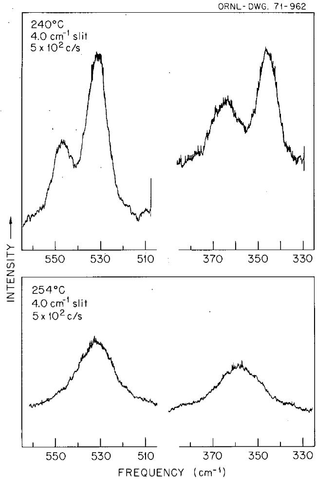  
Fig. 9.5. Raman spectra of the $\nu_{2}$ and $\nu_{4}$ regions of polycrystalline $\mathrm{NaBF}_4$ at 240 and $254^{\circ}\mathrm{C}$ . A phase transition occurs at $245^{\circ}\mathrm{C}$ .

A disordered hexagonal structure also can explain the observation of optical isotropy of $\mathrm{NaBF_4}$ in the high-temperature phase.21 The fluorine atoms make the largest contribution to the polarizability of the crystal, and their orientation will determine the symmetry of the crystal indicatrix. Complete disordering of the F atoms would give a nearly spherical indicatrix, and the crystal would appear to be optically isotropic.

# 9.7 A NEW METHOD FOR SYNTHESIS OF $\mathrm{NaBF}_3\mathrm{OH}$

L. O. Gilpatrick C. J. Barton

Laboratory studies are continuing in attempts to synthesize hydrogen-containing species for the retention of tritium in the MSR coolant salt. One of these species is the first hydrolysis product of $\mathrm{NaBF}_4$ in aqueous solution, which has been reported to be $\mathrm{NaBF}_3\mathrm{OH}$ . [22,23] Ryss and Slutskaya [24] have reported a successful synthesis of this compound in which boric acid is reacted at $0^{\circ}\mathrm{C}$ with a saturated solution of $\mathrm{NaHF}_2$ as follows:

$$
2 \mathrm {N a H F} _ {2} + \mathrm {H} _ {3} \mathrm {B O} _ {3} \xrightarrow [ \mathrm {H} _ {2} \mathrm {O} ]{0 ^ {\circ} \mathrm {C}} \mathrm {N a B F} _ {3} \mathrm {O H} + \mathrm {N a F}.
$$

This synthesis has the disadvantage that it produces a mixture of $\mathrm{NaBF}_3\mathrm{OH}$ and NaF and in addition also becomes contaminated with some $\mathrm{NaBF}_4$ produced by a side reaction when attempts are made to recrystallize it from water solutions.

A new synthesis has been devised for $\mathrm{NaBF}_3\mathrm{OH}$ which employs the following reactions in a saturated solution of $\mathrm{NaHCO}_3$ :

$$
\begin{array}{l} \mathrm {B F} _ {3} + \mathrm {H} _ {2} \mathrm {O} \xrightarrow [ \mathrm {H} _ {2} \mathrm {O} ]{\sim 0 ^ {\circ} \mathrm {C}} \mathrm {H} (\mathrm {B F} _ {3} \mathrm {O H}), \\ \mathrm {H} \left(\mathrm {B F} _ {3} \mathrm {O H}\right) + \mathrm {N a H C O} _ {3} \xrightarrow [ \mathrm {H} _ {2} \mathrm {O} ]{0 ^ {\circ} \mathrm {C}} \mathrm {N a B F} _ {3} \mathrm {O H} + \mathrm {C O} _ {2} + \mathrm {H} _ {2} \mathrm {O}. \\ \end{array}
$$

One mole of solid $\mathrm{NaHCO}_3$ and $\mathrm{BF}_3$ gas are added progressively to 5 moles of water at $0^{\circ}\mathrm{C}$ , which produces a clear solution. Four volumes of cold $95\%$ ethanol are then added. Storage at $0^{\circ}\mathrm{C}$ gives a good yield of product which has a better purity than that produced by the method of Ryss.

The identification of this material is relatively certain and direct based on its properties. Sodium hydroxytrifluoroborate is very water soluble and shows rapid hydrolysis to NaF, $\mathrm{H}_3\mathrm{BO}_3$ ,and $\mathrm{NaBF_4}$ when stored as an aqueous solution. It is birefringent to polarized light and exhibits refractive indexes from a maximum of 1.350 to a minimum of about 1.343 at $25^{\circ}C.$ The crystals belong to the hexagonal system and are polar,

as has been shown by a recent x-ray structure study $^{25}$ which makes positive identification convenient.

# 9.8 SOLUBILITY OF $\mathbf{BF}_3$ GAS IN FLUORIDE MELTS

S. Cantor W. T. Ward

The purposes of these measurements are to relate $\mathrm{BF}_3$ solubility to changes in the thermodynamic properties of molten fluorides and to provide data relevant to the use of $\mathrm{BF}_3$ as a burnable neutron poison for purposes of reactor control. The single-vessel apparatus and the procedures of measurement have been described previously.[26]

Solubilities of $\mathbf{BF}_3$ have been determined in five molten-salt solvents composed of LiF and $\mathbf{BeF}_2$ . The chief results obtained thus far are:

1. In each solvent, the higher the temperature, the lower the $\mathbf{BF}_3$ solubility; that is, the enthalpy of solution is exothermic.   
2. At constant temperature and pressure, the higher the concentration of LiF, the higher the solubility of $\mathrm{BF}_3$ ; indeed, the Henry's law constant appears to be linear with the thermodynamic activity of LiF.   
3. Henry's law is obeyed in almost all cases; however, where the concentration of $\mathrm{BF}_3$ in the melt approaches 1 mole % or greater, there are discernible positive deviations from Henry's law.

The data and derived thermodynamic information are summarized in Table 9.3. The magnitude and negative sign of the enthalpy of solution suggest a strong interaction of $\mathrm{BF}_3(\mathrm{g})$ with the melt. There does not appear to be a correlation of enthalpy of solution (of $\mathrm{BF}_3$ ) with melt composition. The approximate constancy of $\Delta H$ in Table 9.3 signifies that plots of $\log K$ (Henry's law constant) vs reciprocal temperature (in $^\circ \mathrm{K}$ ) are approximately parallel.

As may be noted in column 3 in the Table, the higher the mole fraction of LiF, the higher the Henry's law constant. In Fig. 9.6, the Henry's law constant at $600^{\circ}\mathrm{C}$ is plotted vs activity of LiF reported for these melts; the excellent linearity of these two properties also holds at other temperatures. An interpretation of this linear

Table 9.3. Solubility $^a$ of $\mathbf{BF}_3$ in molten LiF-BeF $_2$ solvents; enthalpy and entropy of solution   

<table><tr><td>Solvent composition (mole % LiF)</td><td>Temperature range measured (°C)</td><td>Henry&#x27;s law K (mole fraction BF3/atm) at 600°C</td><td>ΔHb(kcal/mole)</td><td>ΔSb(cal mole-1deg-1)</td></tr><tr><td>63c,d</td><td>470–653</td><td>0.00207</td><td>-15.1</td><td>-29.6</td></tr><tr><td>66</td><td>520–725</td><td>0.00242</td><td>-15.6</td><td>-29.9</td></tr><tr><td>70</td><td>548–732</td><td>0.00354</td><td>-15.5</td><td>-29.0</td></tr><tr><td>75</td><td>641–857</td><td>0.00500</td><td>-15.9</td><td>-28.7</td></tr><tr><td>80c</td><td>714–866</td><td>0.00613</td><td>-15.6</td><td>-28.0</td></tr></table>

$a$ Pressure range, 1.3-3.0 atm.   
${}^{b}$ Calculated from the equation $\ln K = \frac{\Delta S}{R} -\frac{\Delta H}{RT}$ .   
${}^{c}$ Measurements in this solvent composition not completed.   
$d$ In the pressure range 1.3-3.0 atm, at temperatures below $520^{\circ}\mathrm{C}$ , there are positive deviations from Henry's law.

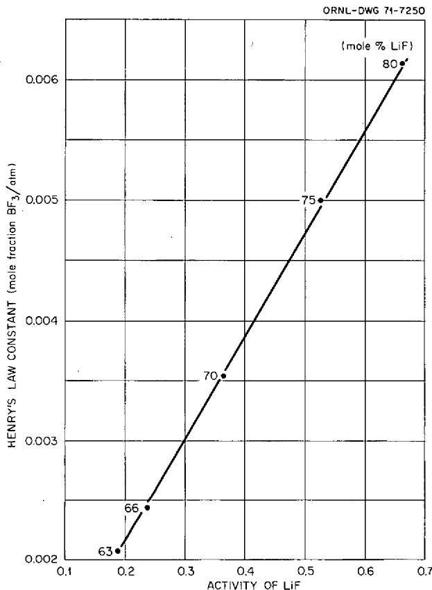  
Fig. 9.6. Henry's law solubility of $\mathrm{BF}_3$ vs activity of LiF in molten LiF-BeF $_2$ at $600^{\circ}\mathrm{C}$ .

behavior is that the ionic reaction equilibrium

$$
F ^ {-} (1) + B F _ {3} (g) \rightleftharpoons B F _ {4} ^ {-} (1)
$$

occurs, from which it follows that

$$
a _ {\mathrm {B F} _ {4}} = K _ {i} P _ {\mathrm {B F} _ {3}} a _ {\mathrm {F}} -, \tag {1}
$$

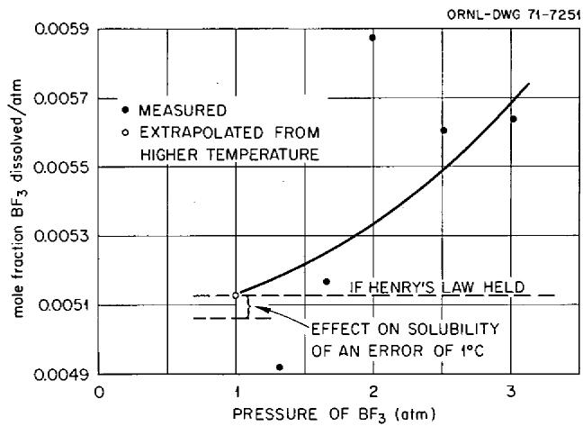  
Fig. 9.7. Solubility of $\mathbf{BF}_3$ in 63-37 mole $\%$ LiF-BeF $_2$ at $517.6 \pm 0.5^{\circ}\mathrm{C}$ .

where $a_{\mathrm{BF}_4^-}$ and $a_{\mathrm{F}}$ are, respectively, the activities of fluoroborate and fluoride ions; $K_{i}$ is the equilibrium constant of the reaction (like any equilibrium constant, $K_{i}$ varies with temperature); and $P_{\mathrm{BF}_3}$ is the equilibrium pressure of $\mathrm{BF}_3$ . At constant temperature and pressure, Eq. (1) explicitly states that $a_{\mathrm{BF}_4^-}$ varies linearly with $a_{\mathrm{F}}$ . In this interpretation of the phenomena depicted in Fig. 9.6, the concentration of dissolved $\mathrm{BF}_3$ is identified with the activity of $\mathrm{BF}_4^-$ in the melt, while the activity of LiF is, of course, identified with the activity of fluoride ion in the melt.

In the pressure range under study (1.3-3 atm) the solubility of $\mathrm{BF}_3$ is sufficiently low that the dissolved molecules do not interact with one another. This noninteraction between solute molecules is the basis of Henry's law. In this investigation virtually all the solubilities of $\mathrm{BF}_3$ obey Henry's law. However, Henry's law does not seem to hold at relatively low temperatures in the melt of composition LiF-BeF $_2$ (63-37 mole

$\%$ ). At temperatures below $520^{\circ}\mathrm{C}$ the solubilities of $\mathrm{BF}_3$ become 1 mole $\%$ or greater. Figure 9.7 shows data which do not obey Henry's law; although the data exhibit some scatter, the solubility of $\mathrm{BF}_3$ per unit pressure almost certainly increases with pressure; that is, the deviations from Henry's law are positive. Further measurement will be made to confirm these deviations.

# 9.9 EQUILIBRIUM PHASE RELATIONSHIPS IN THE SYSTEM RbF-RbBF4

L. O. Gilpatrick C. J. Barton

An investigation of the equilibrium phase diagram for the $\mathrm{RbF - RbBF_4}$ system was completed. Final revisions to the system diagram, as reported previously,[28] resulted from measurements with purer rubidium fluoride than was previously employed.

New RbF has been obtained and purified by treatment with dry $\mathbf{H}_2$ and HF at temperatures up to and above the melting point to remove water and hydroxide. Rubidium fluoride was produced which has a melting point of $793^{\circ}\mathrm{C}$ , which is in good agreement with the literature value of $795^{\circ}\mathrm{C}$ . Binary mixtures of RbF and $\mathrm{RbBF_4}$ were prepared at 5 mole $\%$ intervals ranging up to 20 mole $\%$ $\mathrm{RbBF_4}$ .

28. L. O. Gilpatrick and C. J. Barton, MSR Program Semiannu. Progr. Rep. Feb. 28, 1970, ORNL-4548, p. 133.

Differential thermal analysis (DTA) was used to examine these compositions, which gave the expected higher temperatures in each case, lending support to the belief that the irregularities in the original part of the study were due to RbF of insufficient quality.

The phase diagram in its final form is shown in Fig. 9.8.

# 9.10 ACTIVITIES IN ALKALI FLUORIDE - FLUOROBORATE MIXTURES

D.M.Moulton J.Braunstein

Thermodynamics of mixing in alkali fluoride - alkali fluoroborate mixtures are of interest in connection with proposed coolants for the MSBR. Deviations from ideality, although small, are less well understood in such common cation binary mixtures (and have been less thoroughly studied) than in common anion binary mixtures. Endothermic mixing is frequently observed rather than the exothermic effect expected from electrostatic considerations, and may be associated with changes in packing of large anions of differing size as well as with the dispersion energy of the mixed anions.[29] Here we report some activity coefficient

29. J. L. Holm and O. J. Kleppa, J. Chem. Phys. 49, 2425 (1968); O. J. Kleppa, Annu. Rev. Phys. Chem. 16, 187 (1965); J. Braunstein in Ionic Interactions, S. Petrucci, ed., p. 179, Academic, New York, 1971.

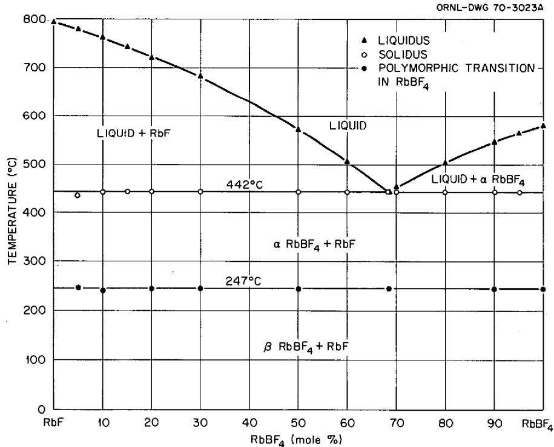  
Fig. 9.8. The system $\mathbf{RbBF}_4\cdot \mathbf{RbF}$

calculations from available data in fluoride-fluoroborate mixtures.

We have used the phase diagrams of the alkali fluoride-fluoroborate systems (Na, K, Rb) to calculate the component activities along the liquidus lines. The method was the usual one of integrating the Schröder-van Laar equation,

$$
\ln \gamma x = \int_ {T _ {0}} ^ {T} \frac {\Delta H _ {f}}{R T ^ {2}} d T,
$$

to give the ideal liquidus and then comparing actual and ideal mole fractions. A power series was used for the heat capacity difference. Each activity refers to the hypothetical pure liquid at the same temperature. The sources of the data are Barton et al., $^{30}$ Kubaschewski et al., $^{31}$ and Dworkin and Bredig. $^{32}$

In all three cases the behavior of the activity coefficients is qualitatively the same (see Table 9.4). The fluoride shows positive deviation at first but then becomes negative before it reaches the eutectic. The fluoroborates always show negative deviation (with sodium it is only very slight). In both cases the sodium salt shows the smallest and rubidium the largest tendency toward negative deviation.

A comparison with the activity coefficients of Cantor,33 which were derived from decomposition pressure measurements, shows that for NaF we agree fairly well up to about 50 mole $\%$ but then deviate increasingly. For KF the agreement is worse, and for

Table 9.4. Activity coefficients in alkali fluoride-fluoroborate mixtures at $1000^{\circ}\mathbf{K}$ for Na and $1100^{\circ}\mathbf{K}$ for K and Rb   

<table><tr><td>\( X_{BF4} \)</td><td>0.2</td><td>0.4</td><td>0.6</td><td>0.7</td><td>0.8</td><td>0.9</td><td>0.95</td></tr><tr><td>\( γ_{Na} \)</td><td>1.10</td><td>1.20</td><td>1.23</td><td>1.19</td><td>1.12</td><td>0.89</td><td>1.00(-)</td></tr><tr><td>\( γ_{Na}^a \)</td><td>1.15</td><td>1.26</td><td>1.31</td><td>1.32</td><td>1.33</td><td>1.33</td><td>1.00(+)</td></tr><tr><td>\( γ_K \)</td><td>1.05</td><td>1.08</td><td>1.02</td><td>0.97</td><td>0.98</td><td>0.99</td><td>1.00(-)</td></tr><tr><td>\( γ_K^a \)</td><td>1.14</td><td>1.24</td><td>1.32</td><td>1.35</td><td>1.01</td><td>1.00</td><td>1.00</td></tr><tr><td>\( γ_{Rb} \)</td><td>1.02</td><td>1.00</td><td>0.93</td><td>0.94</td><td>0.97</td><td>0.99</td><td>0.99</td></tr></table>

$a$ Cantor.

Eutectic: fluoride to left, fluoroborate to right.

the fluoroborates the direction of deviation is the opposite. The activity coefficients are shown; they have been put on the same standard temperature $T_{0}$ as Cantor's by saying that $\gamma_{T_0} = \gamma_T^{(T / T_0)}$ (i.e., ideal entropy of mixing), which does not change them much and in particular does not affect the shape of the curve or the direction of deviation.

The differences in the calculated activity coefficients may indicate a significant temperature dependence of the activity coefficients since the eutectic temperatures lie some 500 to $700^{\circ}$ below the temperatures of the fluoroborate decomposition pressure measurements. Deviations from ideality calculated from the NaF $\mathrm{NaBF}_4$ and $\mathrm{KF - KBF_4}$ phase diagrams $^{30}$ are compared with those calculated from the NaF-NaI and KF-KI phase diagrams $^{34}$ and are shown as the interaction parameters for excess free energy at the eutectic in Table 9.5.

In both the $\mathrm{BF}_4\text{-F}^-$ and $\mathbf{I}^{-}\mathbf{F}^{-}$ systems, deviations from ideality become less negative with decreasing size of the common cation, as would be expected if changes in anion packing contribute positive deviations.

# 9.11 HIGH-TEMPERATURE CRYSTAL STRUCTURE AND VOLUME OF SODIUM TETRAFLUOROBORATE AND RELATED COMPOUNDS

M. A. Bredig

High-temperature x-ray diffraction patterns of $\mathrm{NaBF}_4$ and $\mathrm{CaSO}_4$ (isostructural) reported by several authors

Table 9.5. Interaction parameters for excess free energy at the eutectic   

<table><tr><td>Binary system</td><td>NaF-NaBF4</td><td>KF-KBF4</td><td>NaF-NaI</td><td>KF-KI</td></tr><tr><td>GE/x1x2(kcal/mole)</td><td>-0.53</td><td>-0.73</td><td>+0.62</td><td>-0.70</td></tr></table>

Table 9.6. Powder x-ray diffraction pattern of high-temperature form of $\mathrm{NaBF}_4$ at $265^{\circ}\mathrm{C}$   

<table><tr><td>hkl</td><td>Intensity</td><td>d, obs. (Å)</td><td>d, calc. (Å)a</td></tr><tr><td>100</td><td>vvw</td><td>4.34</td><td>4.33</td></tr><tr><td>002</td><td rowspan="2">vs</td><td rowspan="2">3.90 to 3.77</td><td rowspan="2">3.88 3.78</td></tr><tr><td>101</td></tr><tr><td>102</td><td>m</td><td>2.89</td><td>2.89</td></tr><tr><td>110</td><td>w</td><td>2.50</td><td>2.50</td></tr><tr><td>200</td><td></td><td></td><td>2.165</td></tr><tr><td>112</td><td>m</td><td>2.097</td><td>2.100</td></tr><tr><td>202</td><td>w</td><td>1.884</td><td>1.890</td></tr><tr><td>104</td><td>w</td><td>1.770</td><td>1.770</td></tr><tr><td>203</td><td rowspan="2">w</td><td rowspan="2">1.645</td><td>1.659</td></tr><tr><td>210</td><td>1.637</td></tr><tr><td>114</td><td rowspan="2">vs</td><td rowspan="2">1.525</td><td>1.531</td></tr><tr><td>212</td><td>1.508</td></tr><tr><td>302</td><td></td><td></td><td>1.353</td></tr></table>

$a$ Hexagonal: $a = 5.00 \pm 0.02\text{A}; c = 7.75 \pm 0.03\text{A}$ .

were critically reviewed and reinterpreted in earlier reports.35 A hexagonal crystal structure was found to take the place of a monoclinic one suggested by Pistorius et al.36 for $\mathrm{NaBF_4}$ and of a cubic one given by Floerke37 for $\mathrm{CaSO_4}$ . The hexagonal structure seems to be a novel one among compounds of the stoichiometry $\mathbf{M}(\mathbf{Z}\mathbf{X}_4)$ . Somewhat like $(\mathrm{NH}_4)\mathrm{F}$ , it appears to be related to the hexagonal structure of ZnS, wurtzite, or, much less likely, that of nickel arsenide (NiAs), in a manner similar to the relationship between the cubic high-temperature form of the other alkali fluoroborates and the structure of rock salt.38

After constructing a simple heating device, auxiliary to the Buerger x-ray diffraction precession camera, the hexagonal, bimolecular unit cell with $a = 5.00 \pm 0.02$ and $c = 7.75 \pm 0.03\AA$ has now been directly confirmed on powder samples of $\mathrm{NaBF}_4$ at $265^{\circ}\mathrm{C}$ , that is, about $20^{\circ}$ above the transition point (Table 9.6). From this, one calculates the molar volume as $50.6 \pm 0.6~\mathrm{cm}^3/$ mole and the specific gravity as $2.13 \pm 0.02~\mathrm{g/cm}^3$ .

When, on considering atomic positions, by analogy with $(\mathrm{NH}_4)\mathrm{F}$ the space group $C_{6\mathbf{v}}^4 (C6_3mc)$ was used,

distances in the unit cell were too short to accommodate an F (or an O) as a bridge between B and Na (or S and Ca), corresponding to the hydrogen bridging in $(\mathrm{NH}_4)\mathrm{F}$ . For ordered orientation of the $\mathrm{BF}_4^-$ (or $\mathrm{SO}_4^{2-}$ ) ions within the cation tetrahedra, no agreement between diffraction intensities observed and calculated (with the help of G. D. Brunton) was obtained thus far. Attempts to reconcile the discrepancies by a highly disordered model, or an even more modified structure, are being continued. A high degree of (rotational) disorder of the tetrafluoroborate ions would be in agreement not only with the relatively large entropy of transition,[39] but might also reconcile the optical isotropy, observed by G. D. Brunton, and apparent degeneracies in the Raman spectrum, measured by Quist, Bates, and Boyd (Sect. 9.6), with the hexagonal symmetry based on the powder x-ray pattern.

The volume change, $\Delta V / V_{0}$ , from room temperature $(V_{0})$ to slightly above the transition point of $\mathrm{NaBF}_4$ is $15.5\%$ , which is slightly smaller than a previous, rough estimate of $18\%$ .40 If for comparison one takes the more accurate high-temperature data for $\mathrm{NaClO}_4$ of Braekken and Harang41 instead of those given by Wyckoff38 based on the results of Herrmann and Ilge,42 $\Delta V / V_{0}$ for $\mathrm{NaBF}_4$ is not similar to but is almost twice as large as that for $\mathrm{NaClO}_4$ .

Figure 9.9 shows the corresponding volume changes for alkali tetrafluoroborates (partly based on Brunton's work $^{43}$ and on my own recent high-temperature measurements), for alkali perchlorates, $^{38,41}$ and the sulfates of Ca, Sr, and Ba. $^{38}$ The value of $\Delta V / V_0$ for the tetrafluoroborates is consistently larger ( $\sim 30\%$ ) than that for the corresponding perchlorates and alkaline-earth sulfates. The earlier speculative estimate of similarity in $\Delta V / V_0$ (ref. 40) was based on a value for the volume of the high-temperature form of $\mathrm{KBF}_4$ given by Finbak and Hassel, $^{44}$ which I found to be too small by $6\%$ .

Figure 9.9 demonstrates the large departure of the two sodium salts from the trends found with the other

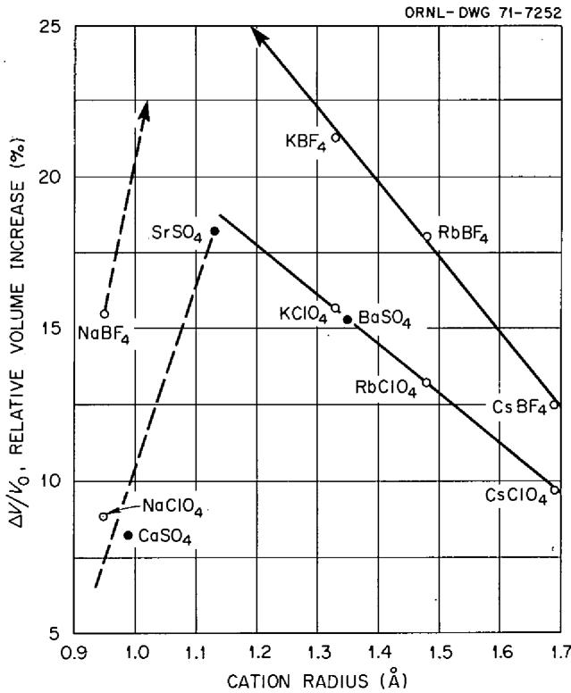  
Fig. 9.9. Relative volume increase $(\%)$ from room temperature through transition in alkali metal tetrafluoroborates, perchlorates, and alkaline-earth sulfates as a function of cation size.

six alkali and alkaline-earth metals. Recently, preliminary comparisons were made between the volume changes shown in Fig. 9.9 and isothermal volume changes $\Delta V_{\mathrm{tr}}$ , at the transition temperatures, calculated from the measured transition entropies, $\Delta S_{\mathrm{tr}}$ , and pressure dependencies of the transition temperatures, $dT_{\mathrm{tr}} / dp$ , by means of the Clausius-Clapeyron relationship. These calculations indicate that actually the relative volume change on transition, $\Delta V_{\mathrm{tr}} / V$ , for $\mathrm{NaBF}_4$ is quite similar to that for $\mathrm{KBF}_4$ and $\mathrm{RbBF}_4$ , namely, $10\%$ . Thus the apparent deviation for $\mathrm{NaBF}_4$ in Fig. 9.9 must be caused by the thermal expansion coefficient in the low-temperature orthorhombic phase being considerably smaller than in those of $\mathrm{KBF}_4$ and $\mathrm{RbBF}_4$ of a different structure. This is reminiscent of the difference in the thermal expansion of $\mathrm{NaNO}_3$ and $\mathrm{KNO}_3$ . Additional x-ray diffraction measurements are planned to confirm these observations.

# 9.12 HYDROGEN PERMEATION THROUGH OXIDE-COATED METALS

R.A.Strehlow

The control of tritium flow in a molten-salt reactor system involves both knowledge of permeation rates through steam generator heat exchanger material and the extent to which permeation is decreased due to the oxide coating which is expected to exist in contact with the steam. It has been long recognized that oxide coatings on metals impede hydrogen permeation.[47,48] Occasionally large impedance to flow of hydrogen has been observed and attributed or related to an oxide film.[48,49] The impedance to hydrogen flow is often, however, observed as an artifact of an experimental determination of hydrogen permeability. It is reflected as an aging or conditioning time often of subsidiary interest.

An experimental program was begun to study hydrogen permeation under conditions closely analogous to those which might be expected in a molten-salt reactor steam generator heat exchanger. The apparatus is shown schematically in Fig. 9.10. Since several modes of operation are possible, note need be made only that the diffusion membrane (a piece of tubing of normal wall thickness) separates two regions, A and B. Region A is analogous to the steam side of a heat exchange tubing section in that the gas which can be admitted and analyzed may be admitted wet or dry. Region B is analogous to the inside of a heat exchange tubing section only to the extent that a gas may be flowed through the tube and analyzed. (A suitable mode of operation would be with this side evacuated.) Salt has not been used in permeation studies conducted so far.

A quadrupole mass analyzer was used variously to assess leak-tightness of the apparatus, gas purity, and approximate analysis, as well as to follow the changes in gas composition in both regions A and B for different experiments. The mass analyzer was equipped with a source which permitted fairly high pressures to be used (in the range of 0.1 to 0.3 torr). Under these conditions an enhanced sensitivity for several species is observed due to the occurrence of ion-molecule reactions.

Two stainless steel samples were selected for two initial experiments in order to correlate this work with earlier work on hydrogen permeation. Estimates of flow

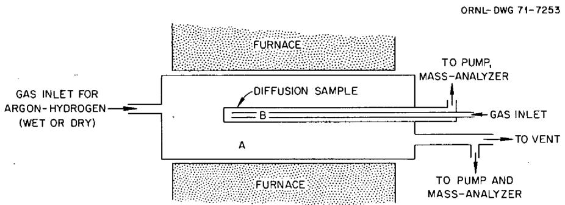  
Fig. 9.10. Schematic diagram of permeation measurement apparatus.

were made using ordinary techniques of pumping speed and volume measurement. Thermocouple gages were used for measurement of pressures. The two experiments studied (1) permeation of protium from a wet or dry argon-hydrogen mixture in region A through a stainless steel (304) tube into a deuterium atmosphere in region B and (2) a similar measurement of the permeation of protium through a stainless steel type 347 tube into evacuated region B, with monitoring of hydrogen concentration in region A.

The first experiment was performed as an attempt to follow the development of an oxide layer by watching the fall of protium partial pressure in region B after adding steam to the gas in region A. It was observed that the protium partial pressure increased when water vapor was added to the argon-hydrogen mixture. The second experiment was conducted to clarify the question of the hydrogen partial pressure in region A when the gas was saturated with water vapor. Analysis of the data indicated that the increase was less than 2 or $3\%$ .

The first experiment was conducted at a temperature of $579 \pm 2^{\circ}\mathrm{C}$ . The results are shown in Fig. 9.11. Deuterium flowed through a $1/16$ -in. tube 32 in. long with a wall thickness of 0.010 in. Evacuation of region A yielded a log $P$ vs time plot with a slope corresponding to $0.018~\mathrm{cm}^3/\mathrm{sec}$ , a value of 1 atm for the deuterium pressure, and $45\mu$ for the steady-state (corrected) pressure of deuterium in region A measured by a thermocouple gage; a value of

$$
0. 0 9 \frac {\mathrm {c m} ^ {3} \mathrm {m m} \quad \mathrm {a t m} ^ {1 / 2}}{\mathrm {h r} \mathrm {c m} ^ {2}}
$$

was obtained for the 304 stainless steel tube used here. This compares quite well with the value obtained by Webb, $^{50}$ although it was not intended to be a precise

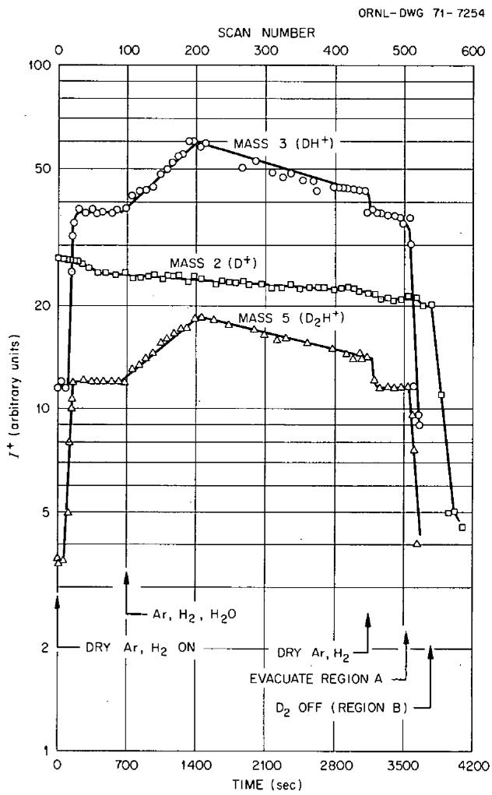  
Fig. 9.11. Protium permeation into deuterium from steam-hydrogen-argon.

measurement of the permeability. Since mass analysis was conducted at high pressure (150 $\mu$ in the ion source) numerous ion-molecule reactions occurred. From deuterium, masses 2, 4, and 6 are obtained with

mass $4(\mathrm{D}_2^+)$ dominant, mass $6(\mathrm{D}_3^+)$ to the extent of about $10\%$ of mass 4, and mass $2(\mathrm{D}^{+})$ to the extent of about $1.5\%$ of mass 4. The amount of protium measured was about $0.6\%$ of the deuterium peaks and was therefore reflected almost entirely in changes of the mass 3 and 5 peaks. These changes with alteration of the experimental conditions are shown in Fig. 9.11. On starting a flow of dry argon $-4\%$ hydrogen, a rapid parallel increase in the protium-containing peaks (3 and 5) occurred with no significant change in the mass 2 peak. After a steady state was reached (at about 700 sec) the gas mixture was valved through a water bubbler, which should have produced about a $2\%$ water content. However, instead of a decrease in protium in region B, a slow increase was observed, which is attributed to oxidation of the metal by the water. This increase lasted about $12\mathrm{min}$ , after which a low decrease was observed with a slope reflected both in the mass 3 and 5 curves of

$$
\frac {d \log P _ {H}}{d t} = 0. 3 \mathrm {h r} ^ {- 1}.
$$

Since a slight decrease in mass 2 also occurred (with a slope of $0.1_{2}\mathrm{hr}^{-1}$ ), the decrease of hydrogen permeation into the steel tube (presumed due to the oxide buildup) was probably about 0.2 for the value of the slope. After 2000 sec the argon-hydrogen mixture was valved so that the water bubbler was bypassed. A level for protium was reached which was about the same as the initial rate with dry gas. (The scatter of points for mass 3 between scans 210 and 400 was due to a recorder scale change.) The chamber was evacuated to permit measurement of the permeability of the sample as described above.

The question of whether there was an alteration of gas composition in region A during this study was explored in a second experiment. A sample of stainless steel (type 347, $1/4$ in. in diameter, 11 in. long, 0.030 in. wall thickness) was evacuated inside (region B) and exposed to the same perturbations of the outside as before (region A). The permeability measured (at $620^{\circ}\mathrm{C}$ ) was

$$
4. 3 \times 1 0 ^ {- 2} \frac {\mathrm {c m} ^ {3} \mathrm {m m} \quad \mathrm {a t m} ^ {1 / 2}}{\mathrm {h r} \mathrm {c m} ^ {2}}.
$$

To determine whether there was an appreciable change in the $\mathrm{H}_2 / \mathrm{Ar}$ ratio when the gas was admitted wet, use was made of the fact that although the reactions

$$
\mathrm {H} _ {2} + \mathrm {H} _ {2} \mathrm {O} ^ {+} \rightarrow \mathrm {H} _ {3} \mathrm {O} ^ {+} + \mathrm {H} - 4 4 \Delta H \mathrm {k c a l / m o l e}
$$

and

$$
\mathrm {H} _ {2} ^ {+} + \mathrm {H} _ {2} \mathrm {O} \rightarrow \mathrm {H} _ {3} \mathrm {O} ^ {+} + \mathrm {H} - 2 0 2 \Delta H \mathrm {k c a l / m o l e}
$$

are exothermic and will occur, the ion-molecule reactions involving the production of $\mathrm{ArH^{+}}$ from $\mathrm{Ar^{+}}$ do not involve water or water ions. Hence the ratio of mass 41 $(\mathrm{ArH^{+}})$ to mass 40 $(\mathrm{Ar^{+}})$ should reflect the hydrogen gas concentration.[51]

The results summarized in Fig. 9.12 show an initial condition with an $\mathrm{ArH}^{+}/\mathrm{Ar}^{+}$ ratio of $2.20 \pm 0.05$ initially and a precipitous drop on diverting the flow through the bubbler due to the presence of air in the bubbler volume. ( $\mathbf{N}_2$ has a proton affinity of 131 kcal/mole. Thus the $\mathrm{ArH}^{+}/\mathrm{Ar}^{+}$ ratio dropped to 0.4 for 2 min.) The level of the ratio was reestablished after 3 min and maintained at $2.20 \pm 0.02$ . Some erratic behavior was observed during reestablishment of dry conditions. The pressure level in region B showed a $25\%$ increase of pressure as compared with $45\%$ observed in the first experiment.

Aside from the point of no appreciable hydrogen being made by the admission of water is the sensitivity for water shown in Fig. 9.12. Both by charge exchange from the dominant gas, argon, and proton transfer (principally from $\mathrm{H}_2^+$ ), the water produces the dominant ions in the spectra. While this is expected, it is interesting to tabulate the spectra to show the enhancement of sensitivity which is obtained by using ion-molecule reactions. Table 9.7 shows the ionization produced by these chemical ionization reactions and compares them with the data from electron impact ionization performed by increasing the mass spectrometry repeller potential and decreasing the ion source pressure to a few microns.

In summary, after establishment of steady permeation of protium from an argon- $4\%$ hydrogen atmosphere through types 304 and 347 stainless steel, switching to wet conditions (about $2\% \mathrm{H}_2\mathrm{O}$ ) yielded an increase in protium permeation which is attributable to a corrosion reaction. As the oxide coating increased in thickness, the permeation rate slowly decreased. The protium

Table 9.7. Comparison of chemical and electron impact ionization for Ar-4% H2-2% H2O as percent of total   

<table><tr><td></td><td>Argon (40 + 20 amu peaks)</td><td>H2(2 amu)</td><td>H2O (17 + 18 amu)</td></tr><tr><td>Electron impact ionization</td><td>92 (40 amu)</td><td>5 (41 amu)</td><td>3 (18 + 19 amu)</td></tr><tr><td>Chemical (ion-molecule) ionization</td><td>9</td><td>21</td><td>70</td></tr></table>

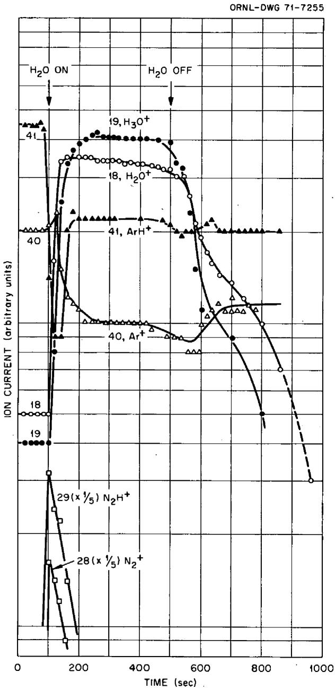  
Fig. 9.12. Hydrogen-argon ratios as monitored by masses 40, 41, 19 amu.

increase is not due to an increase in hydrogen partial pressure but to a direct charging of the hot metal with hydrogen during the oxidation process. No diminution of deuterium permeation was observed.

The questions on permeation processes still to be resolved are:

1. the extent to which the slow oxide growth in the presence of steam at any pressure up to normal steam generator conditions will ultimately impede permeation,   
2. the extent to which independently applied coatings can be used to decrease permeation rate under steady-state conditions,   
3. the functional relationship between permeation and partial pressure at very low partial pressure of hydrogen,   
4. whether the assumption of general equivalence of protium permeation and deuterium permeation is valid, that is, whether at any protium pressure competition for desorption sites might impede outflow of deuterium under conditions like the first experiment reported here,   
5. the relations between alloy composition, structure of the stable oxide coating, and effectiveness in reducing hydrogen permeation,   
6. the possible role of molten salts in the permeation process.

# 10. Physical Chemistry of Molten Salts

# 10.1 THERMODYNAMICS OF LiF-BeF $_2$ MIXTURES FROM EMF MEASUREMENTS OF CONCENTRATION CELLS

D. D. Sood1 K. A. Romberger2 J. Braunstein

Electromotive force measurements of the molten-salt concentration cell with transference

$$
\begin{array}{c c} \text {B e} & \left| \begin{array}{c c} \mathrm {L i F} & \mathrm {L i F} \\ \mathrm {B e F} _ {2} & \mathrm {B e F} _ {2} \end{array} \right| \mathrm {B e} \\ \mathrm {I} & \mathrm {I I} \end{array} \tag {A}
$$

have been reported previously along with their application to refinement of the liquidus of the $\mathrm{LiF - BeF_2}$ phase diagram $^{3,4}$ and determination of the ionic transference numbers, $^{5}$ when combined with previously reported emf measurements of concentration cells without transference. $^{6}$ (The transference number of an ionic constituent is the fraction of the electric current carried by that constituent relative to a reference constituent.) Here we report some excess chemical potentials and partial molar enthalpies of mixing derived from such measurements as part of a study of the thermodynamics of mixing in molten salts of reactor interest.

The electromotive force $E$ of the cell (A) may be written5

$$
\begin{array}{l} 2 F E = \int_ {1} ^ {1 1} t _ {\mathrm {L i}} \frac {1 + x}{1 - x} d \mu_ {\mathrm {B e F} _ {2}} \\ = - \int_ {1} ^ {1 1} t _ {\mathrm {L i}} \frac {1 + x}{x} d \mu_ {\mathrm {L i F}}, \tag {1} \\ \end{array}
$$

where $F$ is the faraday, $t_{\mathrm{Li}}$ is the transference number of lithium ion relative to fluoride, $x$ is the mole fraction of $\mathrm{BeF}_2$ in a $\mathrm{BeF}_2$ -LiF mixture, and $\mu_{\mathrm{BeF}_2}$ and $\mu_{\mathrm{LiF}}$ are the chemical potentials of $\mathrm{BeF}_2$ and LiF. In order to derive chemical potentials from isothermal measurements of a cell with transference, it is necessary to know the concentration dependence of the transference numbers. In this system, it has been shown that $t_{\mathrm{Li}} = 1$ at temperatures between 500 and $700^{\circ}\mathrm{C}$ and compositions between 0.3 and 0.7 mole fraction $\mathrm{BeF}_2$ . (The transference number probably is also equal to unity in the concentration range between 0 and 0.3 mole fraction $\mathrm{BeF}_2$ since the transference number of a constituent in a molten salt generally approaches unity as its mole fraction approaches unity.)

The isothermal composition dependence of the excess chemical potential may be obtained from emf measurements of the cell (A) at closely spaced compositions in the half-cell (II) (compartment I is a reference half-cell). From Eq. (1) and the definition of the chemical potential, the composition dependence of the excess chemical potential is

$$
\left(\frac {\partial \mu_ {\mathrm {L i F}} ^ {E}}{\partial x}\right) _ {T} = \frac {R T}{1 - x} - 2 F \frac {x}{1 + x} \left(\frac {\partial E}{\partial x}\right) _ {T}. \tag {2}
$$

Measured values of $\Delta E / \Delta x$ at $500^{\circ}\mathrm{C}$ are shown in Fig. 10.1; the smooth curve is $(\partial E / \partial x)_T$ . Calculated values of $(\partial \mu_{\mathbf{LiF}}^{E} / \partial x)_{T}$ are plotted against composition in Fig. 10.2.

The excess chemical potential of LiF along the liquidus curve, calculated from the liquidus data, can be represented by the equation, fitted by least squares,

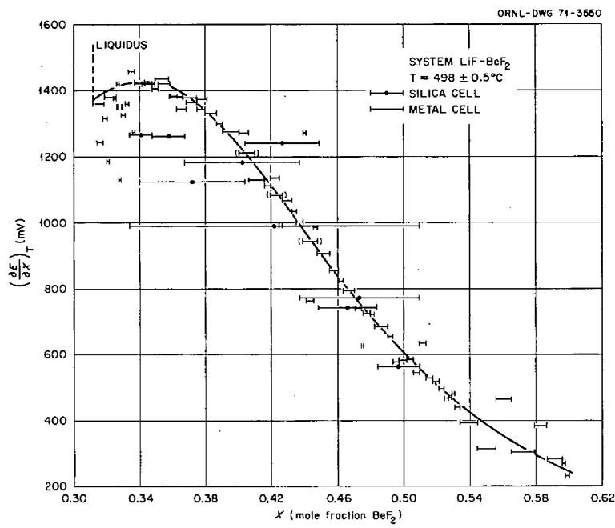  
Fig. 10.1. Isothermal composition dependence of $(\Delta E / \Delta x)_T$ for the concentration cell (A) with transference employing beryllium electrodes.

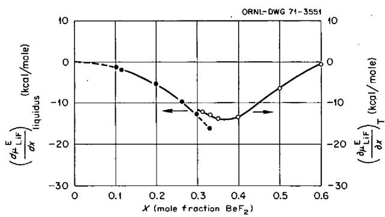  
Fig. 10.2. Composition dependence of the excess chemical potential of LiF in $\mathrm{BeF}_2$ -LiF mixtures at constant temperature and along the LiF liquidus.

$$
\begin{array}{l} \left[ \frac {\mu_ {\mathrm {L i F}} ^ {E}}{x ^ {2}} \right] _ {\text {l i q u i d u s}} ^ {\text {k c a l / m o l e}} = - 4. 7 1 4 1 \\ - 1 0. 5 9 1 6 x - 6 1. 2 8 2 x ^ {2}. \tag {3} \\ \end{array}
$$

The derivative $\left[d\mu_{\mathrm{LiF}}^{E} / dx\right]_{\mathrm{liquidus}}$ also is shown in Fig. 10.2; it may be written

$$
\begin{array}{l} \left[ \frac {d \mu_ {\mathrm {L i F}} ^ {E}}{d x} \right] _ {\text {l i q u i d u s}} = \left(\frac {\partial \mu_ {\mathrm {L i F}} ^ {E}}{\partial x}\right) _ {T} \\ + \left(\frac {\partial \mu_ {\mathrm {L i F}} ^ {E}}{\partial T}\right) _ {x} \left[ \frac {d T}{d x} \right] _ {\text {l i q u i d u s}}. \tag {4} \\ \end{array}
$$

Since $(\partial \mu_{\mathbf{L}\mathbf{i}\mathbf{F}}^{E} / \partial T) = -\bar{S}_{\mathbf{L}\mathbf{i}\mathbf{F}}^{E}$ , the partial molal excess entropy and enthalpy may be calculated as

$$
\bar {S} _ {\mathrm {L i F}} ^ {E} = \frac {\left(\partial \mu_ {\mathrm {L i F}} ^ {E} / \partial x\right) _ {T} - \left[ d \mu_ {\mathrm {L i F}} ^ {E} / d T \right] _ {\text {l i q u i d u s}}}{\left[ d T / d x \right] _ {\text {l i q u i d u s}}}, \tag {5}
$$

$$
\bar {H} _ {\mathrm {L i F}} ^ {E} = \mu_ {\mathrm {L i F}} ^ {E} + T \bar {S} _ {\mathrm {L i F}} ^ {E}. \tag {6}
$$

These equations, based on isothermal emf measurements and accurate liquidus data, lead to the estimates:

$$
\begin{array}{l} x = 0. 3, T = 5 3 0 ^ {\circ} \mathrm {C} \quad \bar {S} _ {\mathrm {L i F}} ^ {E} = + 0. 2 5 \mathrm {e u} \\ \bar {H} _ {\mathrm {L i F}} ^ {E} = - 1 0 1 3 \mathrm {c a l / m o l e} \\ \left(\mu_ {\mathrm {L i F}} ^ {E} = - 1 2 1 5 \mathrm {c a l / m o l e}\right) \\ \end{array}
$$

$$
x = 0. 3 3, T = 4 5 0 ^ {\circ} \mathrm {C} \quad \bar {S} _ {\mathrm {L i F}} ^ {E} = 0. 8 6 \mathrm {e u}
$$

$$
\bar {H} _ {\mathrm {L i F}} ^ {E} = - 1 0 5 1 \mathrm {c a l / m o l e}
$$

$$
\left(\mu_ {\mathrm {L i F}} ^ {E} = - 1 6 7 0 \mathrm {c a l / m o l e}\right)
$$

Data at other temperatures and compositions are being analyzed, and experimental work is in progress on the development of an Li-Bi alloy electrode to obtain additional thermodynamic data in this and other systems.

# 10.2 EQUILIBRIUM PHASE RELATIONSHIPS IN THE SYSTEM LiF-BeF $_2$ -CeF $_3$

L. O. Gilpatrick C. J. Barton

A tentative phase diagram was presented earlier for the system $\mathrm{LiF - BeF_2 - CeF_3}$ . Additional data have been obtained using the differential thermal analysis (DTA) technique. No major changes in the proposed diagram have resulted from this new information. Liquidus temperatures were measured for six compositions ranging from 5 to 20 mole $\%$ $\mathrm{CeF}_3$ , which as a group indicate that the liquidus contours within this composition region are some $50^{\circ}\mathrm{C}$ higher than those proposed earlier on an a priori basis. Further revision of the equilibrium phase diagram will be delayed until additional data become available.

# 10.3 ELECTRICAL CONDUCTIVITY OF MOLTEN AND SUPERCOOLED NaF-BeF $_2$ (40-60 MOLE %)

G. D. Robbins J. Braunstein

Preliminary electrical conductance measurements of supercooled molten $\mathrm{NaF - BeF_2}$ (40-60 mole $\%$ ) have been obtained with an all-metal conductance cell, described previously. These extend from $418^{\circ}$ to $310^{\circ}\mathrm{C}$ , $95^{\circ}$ below the liquidus. The purpose of these measurements is to relate the temperature dependence of conductance in glass-forming beryllium fluoride systems to their glass transition temperatures.

After loading the component starting materials (222 g), always handled in a protective atmosphere, resistance was monitored as a function of temperature and measuring frequency for more than two weeks, during which period the frequency dependence gradually decreased until the change of resistance at constant temperature and constant frequency remained $\sim 0.01$ $\Omega /$ day for several days.Data obtained 17 days after

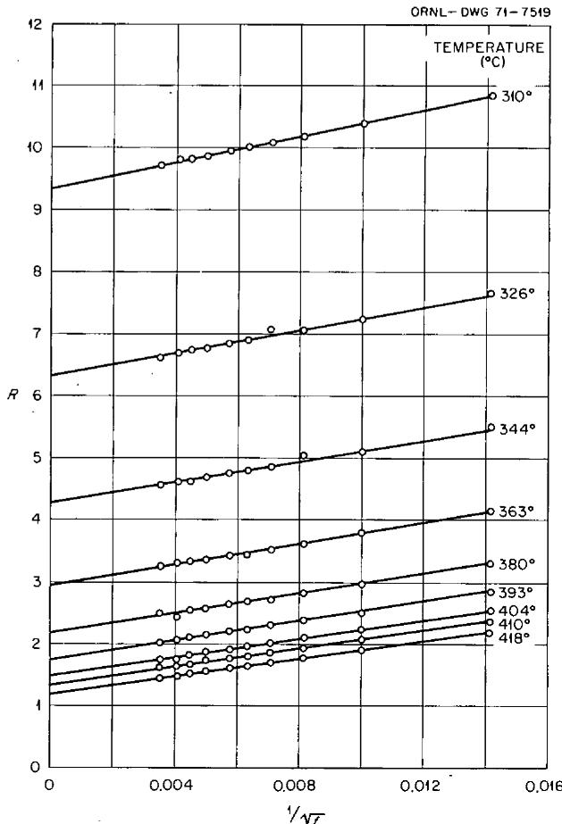  
Fig. 10.3. Measured resistance of $\mathrm{NaF - BeF_2}$ (40-60 mole %) as a function of the square root of the reciprocal frequency $(1 / \sqrt{f})$ .

initiation of the experiment are shown in Fig. 10.3, where the measured resistance is plotted against the reciprocal square root of frequency and extrapolated to infinite frequency. These data were taken over a two-day period in the order indicated on the Arrheniustype plot (Fig. 10.4) of the logarithm of the extrapolated resistance $(R_{\infty})$ vs reciprocal temperature.

Calibrations of the all-metal conductance cell have been carried out at $25^{\circ}\mathrm{C}$ in 0.01 and $0.001N$ aqueous KC1 solutions and $0.001N$ dioxane $(79\mathrm{wt}\%)\mathrm{-H}_2\mathrm{O}$ solutions (each corrected for solvent conductance) to determine the variations of cell constant with electrode depth (the major variable), solution volume, dielectric constant, and measured resistance. From the calibration data, computer-fitted interpolation functions will be used for final calculation of the specific conductance.

Based on a glass transition temperature of $117^{\circ}\mathrm{C}$ (see following section), the data presented here encompass the interval $T(^{\circ}\mathrm{K}) / T_{g} = 1.77 - 1.49$ . From these preliminary results, apparent activation energies for specific

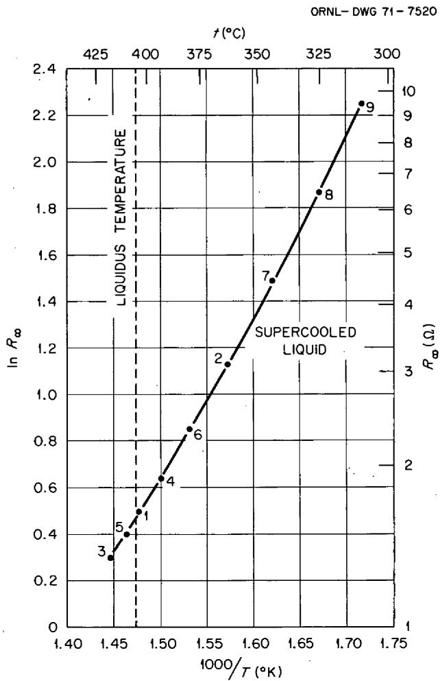  
Fig. 10.4. Logarithm of extrapolated resistance vs reciprocal temperature $(^{\circ}\mathbf{K})$ .

conductance vary from 13 to $17\mathrm{kcal / mole}$ over this $108^{\circ}$ interval. For the glass-forming pyridinium chloride-zinc chloride system at 58.4 mole $\% \mathrm{ZnCl}_2$ ( $T_{g} = 1^{\circ}\mathrm{C}$ ), activation energies vary from 6.5 to 10.2 kcal/mole at $T(^{\circ}\mathrm{K}) / T_{g} = 1.77 - 1.49$ , increasing to 20.9 kcal/mole at 1.26.

The molten fluoride data presented here contain a large (relative) frequency extrapolation at the lower resistances and should be viewed with appropriate uncertainty (perhaps $\pm 20\%$ ). Studies are in progress at higher $\mathrm{BeF}_2$ contents, where considerably larger measured resistances are expected. However, in order to obtain satisfactory data in the composition region of the larger glass transition thermal effects, it will be necessary to modify the cell design (electrode size) so that a higher resistance is measured, as the low measured resistance amplifies apparent frequency (electrode surface) effects. $^{12,13}$

# 10.4 GLASS TRANSITION TEMPERATURES IN THE NaF-BeF $_2$ SYSTEM

G. D. Robbins J. Braunstein

The relation of glass transition temperatures to models of transport in molten salts has been discussed in an earlier report. Experimental techniques and results were reported for glass transition temperatures, $T_{g}$ , obtained by differential thermal analysis (DTA), for NaF-BeF $_2$ mixtures of composition 50, 55, and 60 mole % BeF $_2$ . These studies have been expanded to encompass what appear to be the limits of the glass-forming region in this system. Evaluation of these glass transition temperatures will permit comparison with "theoretical glass transition temperatures" (believed to be near, but slightly below $T_{g}^{14}$ ), as indicated by the temperature dependence of activation energies of electrical conductance, currently being obtained.

Glass transition temperatures were measured in DTA heating curve experiments with 3-g samples of NaF-BeF $_2$ mixtures which had previously been heated for $\sim 20$ hr at $850^{\circ}\mathrm{C}$ in evacuated, sealed nickel tubes $^{16}$ and quenched in ice water. The samples were heated slowly ( $2^{\circ}/\mathrm{min}$ ); the transition temperatures observed in the glasses are listed in Table 10.1, together with data for the three previously reported mixtures. Column 2 of Table 10.1 lists the temperatures at which a transition occurs in the plots of temperature difference between an $\mathrm{Al}_2\mathrm{O}_3$ reference and a fluoride glass sample vs the temperature of the fluoride sample. These thermal effects are interpreted as resulting from glass transitions - the relaxation on heating of the frozen glass into a supercooled liquid.

The new transition temperatures reported here were measured with a calibrated Pt vs Pt-10% Rh thermocouple. Two thermal transitions which occur in this

Table 10.1. Glass transitions of NaF-BeF $_2$ mixtures   

<table><tr><td>Mole % BeF2</td><td>Tg(°C)</td><td>ΔT(°C)</td></tr><tr><td>30</td><td></td><td></td></tr><tr><td>38</td><td>130, 127.5</td><td>0.5, 0.5</td></tr><tr><td>43</td><td>123.5, 124</td><td>1.1, 1.2</td></tr><tr><td>46</td><td>120.5, 120.5, 120.5, 120.5, 118.5</td><td>0.7, 1.1, 1.1, 1.1, 0.5</td></tr><tr><td>501</td><td>117.5, 117</td><td>0.8, 0.8</td></tr><tr><td>551</td><td>116.5, 118, 115, 115</td><td>0.5, 0.7, 0.7, 0.5</td></tr><tr><td>60</td><td>117.5, 118, 117, 116.5, 117</td><td>0.8, 0.4, 0.7, 0.9, 0.8</td></tr><tr><td>80</td><td>118, 119.5</td><td>0.3, 0.3</td></tr><tr><td>90</td><td>114.5, 111, 113, 113</td><td>≤0.1</td></tr><tr><td>1.00</td><td>No effect</td><td>No effect</td></tr></table>

temperature range and which have been found useful for DTA temperature calibration $^{17}$ (the crystalline inversions of potassium nitrate at $128^{\circ}\mathrm{C}$ and ammonium nitrate at $125^{\circ}\mathrm{C}$ ) appeared $1.5^{\circ}$ too low when measured with this thermocouple. Hence a $1.5^{\circ}$ correction was applied to all data obtained with the thermocouple. Redetermination of the previously measured value of $T_{g}$ for $X_{\mathrm{BeF}_2} = 0.60$ (and adding $1.5^{\circ}$ ) resulted in the last three values listed for that composition in column 2. These values agree well with the previously reported values obtained with calibrated Chromel-Alumel thermocouples. Although temperatures in column 2 are reported to the nearest $0.5^{\circ}\mathrm{C}$ to avoid round-off error in computation, resolution of the transition temperatures more closely than $1^{\circ}\mathrm{C}$ is considered uncertain.

Column 3 contains an indication of the relative magnitudes of the glass transitions, reported as the maximum temperature shift at the transition from the base-line DTA trace. On increasing the beryllium fluoride content from the eutectic at 43 mole $\%$ $\mathrm{BeF}_2$ ,[18,19] the thermal effect decreases until at 90 mole $\%$ $\mathrm{BeF}_2$ the break is at the limit of detection. No such thermal effect could be found on samples of pure beryllium fluoride. However, since pure $\mathrm{BeF}_2$ is known to form a glass easily,[20] it appears that the glass-forming region extends to this end member. A quenched sample containing 30 mole $\%$ $\mathrm{BeF}_2$ did not

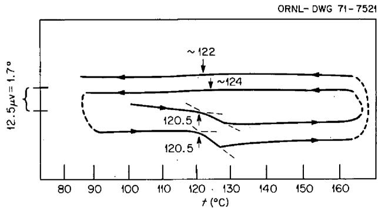

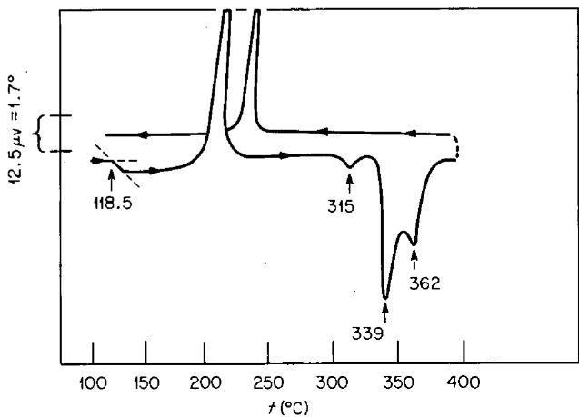  
Fig. 10.5. Differential thermal analysis traces of an NaF-BeF $_2$ (54-46 mole %) mixture.

exhibit a glass transition; instead only the expected solid-state transitions $^{18,19}$ were observed. It thus appears that the region of glass formation, under the conditions described above, extends from the mid-30% beryllium fluoride region to pure $\mathrm{BeF}_2$ . This may be compared with the variously reported glass-forming regions in this system $^{20}$ of 60–100, $^{21}$ 40–72, $^{22}$ , and 45–70 $^{23}$ mole % $\mathrm{BeF}_2$ .

In one case we were able to observe the reverse glass transition on cooling. Several of these DTA traces are shown in the upper portion of Fig. 10.5 for $X_{\mathrm{BeF}_2} = 0.46$ . Observation of $T_g$ while cooling is especially difficult due to the slow rate of heat loss from the furnace smearing out the transition. The data shown in Fig. 10.5 were all obtained in experiments where the heating rate was $2^{\circ} / \mathrm{min}$ , but with an average cooling rate of $0.3^{\circ} / \mathrm{min}$ .

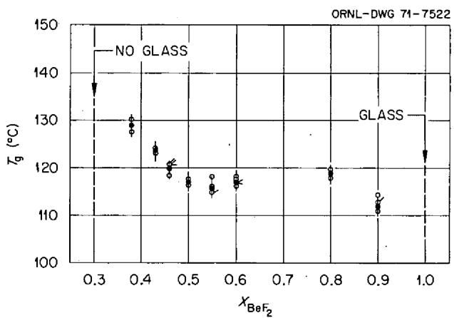  
Fig. 10.6. Glass transition temperatures of NaF-BeF $_2$ mixtures vs mole fraction BeF $_2$ .

The lower portion of Fig 10.5 demonstrates the effect of heating a quenched sample beyond $T_{g}$ until the supercooled liquid crystallizes, followed by the expected crystalline inversion in $2\mathrm{NaF}\cdot \mathrm{BeF}_2(320^\circ)$ , then by the solidus $(340^{\circ})$ and liquidus $(\sim 365^{\circ})$ transitions.[18,19] Marked undercooling is observed on the cooling cycle. Such extended heatings were used to confirm the interpretation of the glass transitions.

Figure 10.6 shows a plot of the observed values of $T_{g}$ as a function of mole fraction beryllium fluoride. The open circles indicate experimental data, with duplicate values represented as ears on the circles. The average value of $T_{g}$ at a given composition is shown as a solid circle. The vertical bars represent $\pm 2^{\circ}$ of the average $T_{g}$ value, the estimated accuracy of these results being no greater than this.

It appears from the data presented here and the reported behavior of pure $\mathrm{BeF}_2^{20}$ that glasses can be formed from NaF- $\mathrm{BeF}_2$ mixtures of composition 38 to 100 mole $\%$ beryllium fluoride. This region includes the primary phase fields of $\mathrm{BeF}_2$ , NaF- $\mathrm{BeF}_2$ , and $2\mathrm{NaF} \cdot \mathrm{BeF}_2$ .[18,19] For compositions less than 31 mole $\%$ $\mathrm{BeF}_2$ the precipitating phase is NaF,[18,19] and no glass formation could be detected in the sample of 30 mole $\%$ $\mathrm{BeF}_2$ . The central portion of the glass-forming region exhibits glass transitions at $117 \pm 2^{\circ}\mathrm{C}$ from 50 to 80 mole $\%$ $\mathrm{BeF}_2$ , rising with higher NaF content and, perhaps, decreasing near pure $\mathrm{BeF}_2$ .

# 10.5 RAMAN SPECTRA OF $\mathrm{BeF}_4^{2-}$ IN MOLTEN LiF AND NaF TO $686^{\circ}\mathrm{C}$

A. S. Quist

J. B. Bates

G. E. Boyd

Raman spectral studies are particularly well suited for investigations on $\mathbf{BeF}_4^{2-}$ , because all of the four normal

modes of vibration of the tetrahedral anion are Raman active, whereas only two modes are infrared active.

Molten $\mathrm{Li}_2\mathrm{BeF}_4$ and $\mathrm{Na}_2\mathrm{BeF}_4$ were studied to obtain information on the effect of the nature of the cation on the vibrational spectrum of $\mathrm{BeF}_4^{2-}$ . In molten $\mathrm{Na}_2\mathrm{BeF}_4$ and $\mathrm{Li}_2\mathrm{BeF}_4$ only the minimum fluoride ion concentration necessary for complete 4-coordination of beryllium is present; hence, it was of interest to measure the spectrum of $\mathrm{BeF}_4^{2-}$ in an excess of $\mathbf{F}^{-}$ . Accordingly, a solution of $17\mathrm{~mol}\% \mathrm{BeF}_2$ in NaF-LiF also was studied. Additional measurements were made on aqueous $\mathrm{BeF}_4^{2-}$ solutions at $25^{\circ}\mathrm{C}$ to obtain spectra under conditions of reduced interionic interactions.

Raman spectra of molten $\mathrm{Li}_2\mathrm{BeF}_4$ were obtained from 487 to $640^{\circ}\mathrm{C}$ . A typical spectrum taken at $533^{\circ}\mathrm{C}$ is shown in Fig. 10.7. Three of the four bands are clearly visible at frequencies near 390, 550, and 800 $\mathrm{cm}^{-1}$ . The expected fourth band is located near 260 $\mathrm{cm}^{-1}$ but is somewhat obscured in Fig. 10.7 by the steeply rising background; this band is more apparent in other spectra, such as in Fig. 10.8 for molten $\mathrm{Na}_2\mathrm{BeF}_4$ at $616^{\circ}\mathrm{C}$ . The vibrational frequencies observed with molten $\mathrm{Li}_2\mathrm{BeF}_4$ at several temperatures, with $\mathrm{Na}_2\mathrm{BeF}_4$ at $616^{\circ}\mathrm{C}$ , with the NaF-LiF-BeF $_2$ mixture at 645 and $686^{\circ}\mathrm{C}$ (no difference), with aqueous $\mathrm{BeF}_4^{2-}$ containing excess $\mathbf{F}^{-}$ ion, and with solid $\mathrm{Li}_2\mathrm{BeF}_4$ at $25^{\circ}\mathrm{C}$ are listed in Table 10.2.

The frequencies of the $\mathrm{BeF}_4^{2-}$ vibrations observed from Raman spectral measurements on the molten salts and in aqueous solution (Table 10.2) are relatively insensitive (within the experimental uncertainty) to the cation, the temperature, or the composition. The polarization (Fig. 10.8) and intensity of the band at $550 \pm 3 \mathrm{~cm}^{-1}$ in the Raman spectra make it logical to assign it to the totally symmetric stretching mode, $\nu_{1}(a_{1})$ , of the tetrahedrally coordinated $\mathrm{BeF}_4^{2-}$ anion. This frequency is essentially the same in aqueous solution as in the melts; only in solid $\mathrm{Li}_2\mathrm{BeF}_4$ does it occur at a different (higher) frequency. The observed frequency and assignment are consistent with previously reported values for the Raman spectra of solid alkali metal tetrafluoroberyllates $^{25}$ and for aqueous solutions. $^{26}$ Although the position of the $\nu_{1}$ band in the melt does not vary greatly with temperature or cation, its half-bandwidth decreases considerably when

Table 10.2. Vibrational frequencies observed in the Raman spectra of $\mathrm{BeF}_4^{2-}$ in melts in solid $\mathrm{Li}_2\mathrm{BeF}_4$ , and in aqueous solutions (frequencies in $\mathrm{cm}^{-1}$ )   

<table><tr><td colspan="3">Li2BeF4melts</td><td rowspan="2">Molten Na2BeF4, 616°C</td><td rowspan="2">NaF-LiF-BeF2(53-30-17 mole %), 645, 686°C</td><td rowspan="2">2.5 M (NH4)2BeF4in 2 M NH4F, 25°C</td><td colspan="2">Li2BeF4(s), 25°C</td><td rowspan="2">Assignment</td></tr><tr><td>487°C</td><td>533°C</td><td>640°C</td><td>Raman</td><td>Infrared</td></tr><tr><td rowspan="2">255</td><td rowspan="2">240</td><td rowspan="2">260</td><td rowspan="2">265</td><td rowspan="2">255</td><td></td><td>257</td><td></td><td rowspan="2">ν2(e)</td></tr><tr><td></td><td>295</td><td></td></tr><tr><td rowspan="6">385</td><td rowspan="6">390</td><td rowspan="6">390</td><td rowspan="6">385</td><td rowspan="6">380</td><td rowspan="6">380</td><td>348</td><td>360</td><td rowspan="3">ν4(f2)</td></tr><tr><td>377</td><td>372</td></tr><tr><td>402</td><td>405</td></tr><tr><td>440</td><td>435</td><td rowspan="3">a</td></tr><tr><td>475</td><td>463</td></tr><tr><td></td><td>500</td></tr><tr><td>547</td><td>550</td><td>545</td><td>550</td><td>552</td><td>548</td><td>563</td><td></td><td>ν1(a1)</td></tr><tr><td rowspan="3">800</td><td rowspan="3">800</td><td rowspan="3">800</td><td rowspan="3">800</td><td rowspan="3">800</td><td rowspan="3">795</td><td>775</td><td>775</td><td rowspan="3">ν3(f2)</td></tr><tr><td>795</td><td>805</td></tr><tr><td>850</td><td>860</td></tr></table>

${}^{a}$ Vibrations assigned to the ${\mathrm{{Li}}}^{ + }$ sublattice moving against the ${\mathrm{F}}^{ - }$ sublattice.

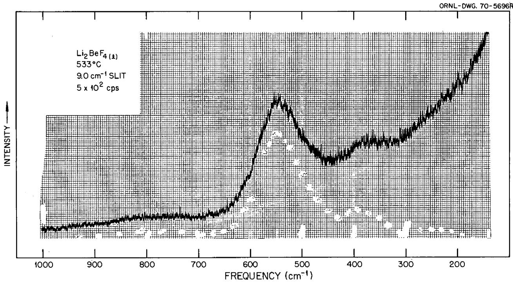  
Fig. 10.7. Raman spectrum of molten $\mathbf{Li}_2\mathbf{BeF}_4$ at $533^{\circ}\mathbf{C}$

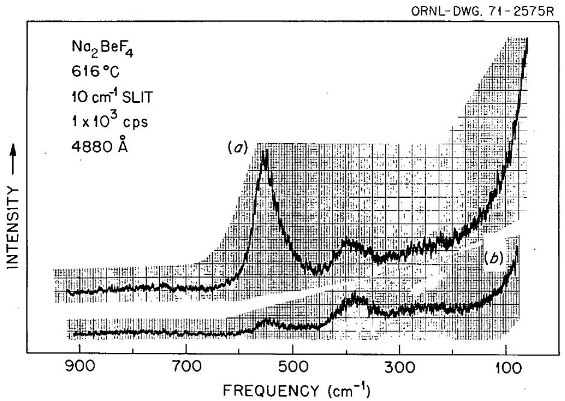  
Fig. 10.8. Raman spectrum of molten $\mathbf{Na}_2\mathbf{BeF}_4$ at $616^{\circ}\mathbf{C}$ . Incident light polarized (a) perpendicular, (b) parallel to plane containing the slit and laser beam.

lithium is replaced by sodium. Thus, in molten $\mathrm{Li}_2\mathrm{BeF}_4$ at $582^{\circ}\mathrm{C}$ the $\nu_{1}$ half-bandwidth is about $100~\mathrm{cm}^{-1}$ , whereas in molten $\mathrm{Na}_2\mathrm{BeF}_4$ at $616^{\circ}\mathrm{C}$ this value is near $50~\mathrm{cm}^{-1}$ . The origin of this effect appears to be cation dependent since any significant change in anion-anion interaction would probably have been reflected in a frequency shift of $\nu_{1}$ .

The triply degenerate $\nu_{3}(f_{2})$ and $\nu_{4}(f_{2})$ vibrational modes of tetrahedral ions are both Raman and infrared active. Infrared studies of solid alkali metal fluoroberyllates have led to the assignment of bands near 800 cm $^{-1}$ to the $\nu_{3}^{25,27-29}$ and of the bands near 380 cm $^{-1}$ to $\nu_{4}^{25,28,29}$ vibrations. The Raman spectrum of solid $\mathrm{Li}_{2}\mathrm{BeF}_{4}$ exhibits three bands in each of these regions, consistent with a lowering of the $T_{d}$ symmetry of the $\mathrm{BeF}_{4}^{2-}$ ion when it is in a hexagonal unit cell lattice. $^{30}$ In molten and aqueous tetrafluoroberyllates, only single peaks at $800 \pm 10$ and $385 \pm 5\mathrm{cm}^{-1}$ are observed for the $\nu_{3}$ and $\nu_{4}$ vibrations, respectively, indicating a symmetric environment for $\mathrm{BeF}_{4}^{2-}$ (no complexing) in these solutions. Half-bandwidths for $\nu_{3}$

and $\nu_{4}$ in $\mathrm{Na}_{2}\mathrm{BeF}_{4}$ melts are approximately 110 and 75 cm $^{-1}$ respectively.

The double degenerate $\nu_{2}(e)$ vibration has not been reported previously. In solid $\mathrm{Li}_2\mathrm{BeF}_4$ peaks at 257 and $295~\mathrm{cm}^{-1}$ are assigned to this vibrational mode. In melts this band occurs at $255\pm 10~\mathrm{cm}^{-1}$ ; it was not detected in aqueous $\mathrm{BeF_4}^{2 - }$ because of the high background in the spectra. The half-bandwidth was approximately $90~\mathrm{cm}^{-1}$ in molten $\mathrm{Na}_2\mathrm{BeF}_4$

No other bands were observed in the Raman spectra of the melts. However, the spectrum of solid $\mathrm{Li}_2\mathrm{BeF}_4$ contains additional bands near 440 and $475~\mathrm{cm}^{-1}$ and possibly other very weak bands near 125, 165, and 210 $\mathrm{cm}^{-1}$ . The latter may be caused by external lattice modes. The strong infrared bands at 500, 463, and 435 $\mathrm{cm}^{-1}$ correspond to the weak bands observed in the Raman spectrum at 475 and $440~\mathrm{cm}^{-1}$ . We have assigned these bands to vibrations of the $\mathrm{Li^{+}}$ sublattice against the sublattice of F atoms. Similar bands observed at 400 to $550~\mathrm{cm}^{-1}$ in solid $\mathrm{Li}_2\mathrm{CO}_3^{31}$ were found to shift to higher frequencies when ${}^6\mathrm{Li}$ was substituted for ${}^7\mathrm{Li}$ . These bands were assigned to stretching vibrations of $\mathrm{LiO_4}$ tetrahedra. The $\mathrm{Li^{+}}$ ions in $\mathrm{Li}_2\mathrm{BeF}_4$ also are tetrahedrally coordinated; hence, the assignment of the bands between 430 and 500 $\mathrm{cm}^{-1}$ (Table 10.2) to motions of “ $\mathrm{LiF_4}$ tetrahedra” seems reasonable.

The results of the study reported here indicate that the $\mathrm{BeF_4}^{2 - }$ anion retains tetrahedral symmetry in its aqueous solution and in $\mathrm{Li}_2\mathrm{BeF}_4$ and $\mathrm{Na}_2\mathrm{BeF}_4$ melts. Both the frequencies and force constants of "free" $\mathrm{BeF_4}^{2 - }$ were well characterized from these studies. A comparison of the frequencies and half-bandwidths for $\nu_{1}$ in molten $\mathrm{Li}_2\mathrm{BeF}_4$ and $\mathrm{Na}_2\mathrm{BeF}_4$ showed that cation-anion interactions are important, while effects of anion-anion interactions were not apparent.

# 10.6 BUBBLE FORMATION BY IMPINGEMENT OF A JET STREAM ON A FLUID SURFACE

H.W.Kohn J.R.Tallackson

During the operation of the MSRE, the void fraction was observed to be somewhat dependent on flow rate of the primary salt and on the salt level in the pump bowl. A qualitative investigation of this phenomenon was made using two spray jets of water and flash photography. Two mechanisms were postulated for bubble formation, depending on whether the stream was continuous or had broken into drops. An air sheath which surrounds the liquid jet is apparently dragged beneath the surface of the water, where it breaks up into bubbles. When individual droplets hit the surface, holes may be punched which are then closed over, forming bubbles, a mechanism established by Worthington $^{32}$ over 70 years ago. A proportionality of total void fraction to stream velocity was noted.

A more quantitative study of the phenomenon was made by an MIT Practice School team33 and will be issued as a Practice School report. A preliminary abstract follows.

Bubble formation by impingement of a liquid jet on a fluid surface was studied. During the Molten-Salt Reactor Experiment helium bubbles were formed in the pump bowl in this fashion. However, variations in the void fraction were observed with changes in salt flow rate and salt level in the pump bowl. The purpose of this study was to determine the dependence of bubble surface area, mean diameter, and average residence time on surface tension, viscosity, angle of impingement, flow rate, tube diameter, and stream length.

A two-level half-factorial experimental design was performed using an air-aqueous-solution system to determine the effect of each of the six independent variables on the three responses. Additional data were obtained using an air-water system and varying only flow rate, tube diameter, and angle of impingement.

The instantaneous bubble surface area was found to be proportional to a Weber number based on stream velocity and tube diameter to the 1.2 power. Bubble mean diameter was

found to be proportional to a Reynolds number based on stream velocity and tube diameter to the 0.6 power. The average residence time was found to be proportional to the product of the stream velocity, tube diameter squared, and the square of the sine of the angle of impingement to the 1:3 power.

Bubbles were observed forming via the sheath mechanism proposed by Tallackson. A sheath of air was dragged by the liquid jet stream beneath the fluid surface and entrained as bubbles when the flow patterns covered the air with fluid from the tank. Examination of high-speed photographs taken at 1000 frames per second shows that entrainment of an extended air sheath and its subsequent breakup into bubbles is a comparatively rare occurrence.

# 10.7 THE SOLUBILITY OF HYDROGEN IN MOLTEN SALT

J. E. Savolainen A. P. Malinauskas

In order to determine, and then to control, the transport of tritium which is formed in the operation of a molten-salt reactor, it is desirable to ascertain the extent to which this species interacts with the molten salts in the various loops of the reactor. To achieve this end, we have initiated a program of study of the solubility of hydrogen and its isotopes in molten salt.

Because no adequate theoretical treatment of gas solubility in salt mixtures exists, our experimental program was formulated on the assumption that the hydrogen-molten-salt interaction was similar to that between neon and salt, within a factor of 10 or so. This assumption necessitated that we obviate or minimize the effects of two properties of the system to be investigated. The first of these, as is apparent from a consideration of Table 10.3, is the significantly higher solubility of hydrogen in candidate apparatus materials compared with the expected solubility in molten salt.

Table 10.3. Hydrogen solubility values at $700^{\circ}\mathrm{C}$ and 1 atm saturation pressure   

<table><tr><td>Solvent</td><td>108× solubility (moles H2/cm3solvent)</td><td>Reference</td></tr><tr><td>Fe</td><td>651</td><td>1a</td></tr><tr><td>Ni</td><td>2579</td><td>1b</td></tr><tr><td>Cu</td><td>196</td><td>1c</td></tr><tr><td>Mo</td><td>98</td><td>1d</td></tr><tr><td>Pt</td><td>87</td><td>1e</td></tr><tr><td>Au</td><td>39</td><td>2</td></tr><tr><td>Li2BeF4</td><td>(10)</td><td>3</td></tr></table>

The second complicating feature, which is illustrated by the data of Table 10.4, concerns the transparency of most metals to hydrogen at elevated temperatures. (Note in particular the rate of transport through gold as opposed to the rate of transport through quartz. Until recently, gold was thought to be impermeable to hydrogen.)

Because it appeared unlikely for us to employ a technique and construction material which would completely eliminate solubility and transport effects, we decided to consider what at first seemed to be a totally illogical approach, viz., to employ Hastelloy N, which, though compatible with the molten salts of interest in this work, is both quite soluble and transparent to hydrogen. This approach, however, led to the apparatus design which is sketched in Fig. 10.9.

The apparatus itself is essentially that first employed by Grimes, Smith, and Watson,[34] but appropriately modified for use with hydrogen. In brief, the technique involves saturating a molten-salt supply in one chamber of the apparatus and then transferring part of the saturated liquid to another chamber where the gas is stripped from the salt and collected for measurement. Hydrogen losses from the salt in the saturator are eliminated by doubly containing the salt in this region

34. W. R. Grimes, N. V. Smith, and G. M. Watson, J. Phys. Chem. 62, 862 (1958).

and by filling the annulus between the containers with hydrogen. Thus, in the saturation procedure, the hydrogen is bubbled through the salt in the saturator and then made to flow around the salt container before being vented.

Once saturation has been achieved, a freeze valve, located at $F$ in Fig. 10.9, is opened, and part of the salt is transferred into the stripper chamber. The stripper, like the saturator section, is doubly contained also, but in this case the annulus between the containers is

Table 10.4. Rates of transport of hydrogen at ${700}^{ \circ  }\mathrm{C}$ and 1 atm pressure through a 1-mm-thick plate of $1{\mathrm{\;{cm}}}^{2}$ cross section   

<table><tr><td>Material</td><td>\( {10}^{8} \times \) rate (moles \( {\mathrm{H}}_{2}/\mathrm{{min}} \) )</td><td>Reference</td></tr><tr><td>Fe</td><td>83</td><td>1a</td></tr><tr><td>Ni</td><td>112</td><td>1a</td></tr><tr><td>Cu</td><td>3.16</td><td>1a</td></tr><tr><td>Mo</td><td>1.98</td><td>1a</td></tr><tr><td>Pt</td><td>7.85</td><td>1a</td></tr><tr><td>Au</td><td>0.71</td><td>2</td></tr><tr><td>Quartz \( {}^{3} \)</td><td>0.04</td><td>1b</td></tr></table>

1. S. Dushman, Scientific Foundations of Vacuum Technique, Wiley, New York, 1962, 2d ed. a, p. 573; b, p. 497.   
2. W. Eichenauer and D. Liebscher, Z. Naturforsch. 17a, 355 (1962).   
3. Probably similar to $\mathbf{L}\mathbf{i}_2\mathbf{B}\mathbf{e}\mathbf{F}_4$ relative to hydrogen transport.

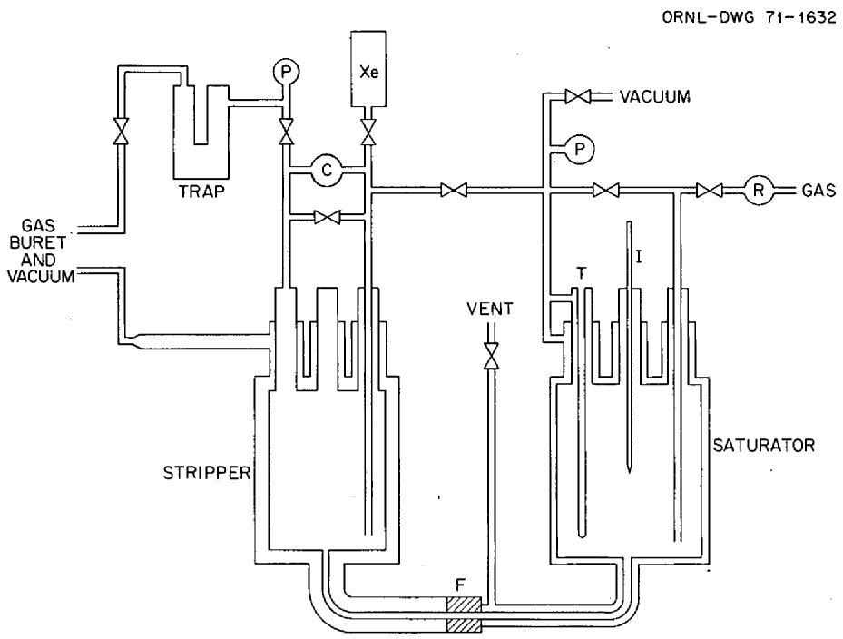  
Fig. 10.9. Sketch of the hydrogen solubility apparatus.

continuously pumped and the gas collected for measurement. The hydrogen which does not permeate the Hastelloy N container during the transfer and subsequent strip operations is stripped directly from the salt through the use of a xenon purge. Separation of the hydrogen and xenon is readily accomplished in a trap cooled with liquid nitrogen.

Several experiments had been conducted to demonstrate our ability to recover virtually all of the hydrogen which is delivered to the stripper compartment. The data from one of these experiments are presented in Table 10.5. The sample of hydrogen which was collected at the conclusion was found to contain $29.2\%$ impurity as determined by mass spectrometric analysis. Moreover, xenon appeared to be virtually the only significant impurity $(27.4\%)$ . On the basis of this analysis, the experiment yields an effective recovery of about $95\%$ after 98 min of operation. Since the amounts recovered from the annulus are entirely free of xenon, we estimate that $3.57~\mathrm{cm}^3$ (STP), or about $65\%$ of the original amount of hydrogen admitted, was actually recovered through the Hastelloy N!

Several preliminary experiments have been performed to determine the solubilities of both helium and hydrogen in $\mathrm{Li}_2\mathrm{BeF}_4$ . To date, the reproducibility of the data is poor (within a factor of 2). Faulty temperature control and measurement have been discovered as a possible cause, and this condition is

Table 10.5. Hydrogen recovery experiment   
Hydrogen admitted into strip section at $500^{\circ}\mathrm{C}$ and at $t = 0\mathrm{min}$ .. $5.42~\mathrm{cm}^3$ (STP)   

<table><tr><td>Time (min)</td><td>Region</td><td>Amount recovered [cm3(STP)]</td><td>Rate [cm3(STP)/min]</td></tr><tr><td>28</td><td>Annulus</td><td>1.41</td><td>0.050</td></tr><tr><td>41</td><td>Stripper</td><td>3.27</td><td></td></tr><tr><td>78</td><td>Annulus</td><td>1.64</td><td>0.033</td></tr><tr><td>83</td><td>Stripper</td><td>0.41</td><td></td></tr><tr><td>98</td><td>Annulus</td><td>0.52</td><td>0.026</td></tr><tr><td colspan="2">Total</td><td>7.25 × 0.708 = 5.13</td><td></td></tr></table>

Table 10.6. Solubility of helium and hydrogen in ${\mathrm{{Li}}}_{2}{\mathrm{{BeF}}}_{4}$   

<table><tr><td>Gas</td><td>Temperaturea(°C)</td><td>Solubility(moles gas/cm3salt·atm)</td></tr><tr><td></td><td></td><td>×10-7</td></tr><tr><td>He</td><td>630</td><td>1.89</td></tr><tr><td>H2</td><td>620</td><td>2.48</td></tr><tr><td>H2</td><td>617</td><td>3.29</td></tr></table>

${}^{a}$ These values may be too large by about ${30}^{ \circ  }\mathrm{C}$ .

currently being corrected. Typical results of the preliminary experimentation are listed in Table 10.6. It must be noted that these results may be in significant error (also within the factor indicated above).

# 10.8 ENTHALPY OF $\mathbf{U}\mathbf{F}_4$ FROM 298 TO $1400^{\circ}\mathbf{K}$

# A. S. Dworkin

The unusually low literature values for the enthalpy and entropy of fusion of $\mathrm{UF_4}$ (10.2 kcal and 7.7 e u respectively) are suspect because the calorimetric measurements35 from which they are derived were prematurely terminated when leaks developed in the container. A recent paper36 reports a polymorphic solid transition in $\mathrm{UF_4}$ involving a large amount of heat to explain the low fusion value. However, neither the calorimetric study35 nor the many investigations of $\mathrm{UF_4}$ at this laboratory, including a recent DTA study by Gilpatrick,37 have shown any indication of such a transition. We have, therefore, remeasured the enthalpy of $\mathrm{UF_4}$ from room temperature up into the liquid phase in an attempt to clarify this matter.

Our results give no indication of a transition. What was taken to be a transition was possibly caused by an impurity present in the material used in ref. 36. The following equations represent our measured enthalpy data for $\mathrm{UF_4}$ in cal/mole:

$$
\begin{array}{l} H _ {T} - H _ {2 9 8} = - 9 6 5 0 + 2 9. 5 3 T + 1. 1 5 \times 1 0 ^ {- 3} T ^ {2} \\ + 2. 2 1 \times 1 0 ^ {5} T ^ {- 1} (2 9 8 - 1 3 0 9 ^ {\circ} \mathrm {K}), \\ \end{array}
$$

$$
\begin{array}{l} \Delta H _ {\text {f u s i o n}} = 1 1, 2 3 0 \mathrm {c a l / m o l e}, \\ \Delta S _ {\text {f u s i o n}} = 8. 6 \mathrm {e u} (1 3 0 9 ^ {\circ} \mathrm {K}), \\ H _ {T} - H _ {2 9 8} = - 9 4 2 0 + 3 9. 5 7 T \left(1 3 0 9 - 1 4 0 0 ^ {\circ} \mathrm {K}\right). \\ \end{array}
$$

Our entropy of fusion is somewhat but not significantly larger than that in the previous measurement.35 It is still quite low for a compound with five atoms. Table 10.7 shows a comparison of the entropies for the isostructural (monoclinic) compounds $\mathrm{ZrF_4}$ , $\mathrm{UF_4}$ , and $\mathrm{ThF_4}$ . The entropy of melting for $\mathrm{ZrF_4}$ of 12.7 eu is

Table 10.7. Comparison of entropies of $\mathbf{ZrF_4}$ , $\mathbf{U}\mathbf{F}_4$ , and $\mathbf{ThF_4}$   

<table><tr><td></td><td>TM(°K)</td><td>ΔSM(eu/mole)</td><td>S°298(eu/mole)</td><td>S°1400-S°298(eu/mole)</td><td>S°1400(eu/mole)</td></tr><tr><td>ZrF4</td><td>1205</td><td>12.7a</td><td>25.0b</td><td>59.7c</td><td>84.7</td></tr><tr><td>UF4</td><td>1309</td><td>8.6</td><td>36.3d</td><td>56.0</td><td>92.3</td></tr><tr><td>ThF4</td><td>1383</td><td>?</td><td>34.0e</td><td>?</td><td>?</td></tr></table>

$a$ See ref. 37.   
$b$ See ref. 38.   
Seeref.39.   
$d_{\mathrm{See~ref.~40}}$   
$\pmb{e}$ Sec ref. 41.

considerably larger than the unusually low value of 8.6 eu for $\mathrm{UF_4}$ . However, the absolute entropy of $\mathrm{UF_4}$ at $1400^{\circ}\mathrm{K}$ is larger than that for $\mathrm{ZrF_4}$ by about 7 eu. This is approximately what would be expected considering the differences in size, mass, and magnetic characteristics of the cations.

An attempt was also made to measure the enthalpy of fusion of $\mathrm{ThF_4}$ . However, experimental difficulties were encountered due to the high temperatures involved, and the measurements were terminated to prevent irreparable damage to the calorimetric equipment. Enough qualitative data were collected to indicate that, as expected, the fusion behavior of $\mathrm{ThF_4}$ approximated that of $\mathrm{UF_4}$ rather than that of $\mathrm{ZrF_4}$ .

# 10.9 ABSORPTION SPECTROSCOPY OF MOLTEN FLUORIDES: THE DISPROPORTIONATION EQUILIBRIUM OF $\mathbf{U}\mathbf{F}_3$ SOLUTIONS

L.M.Toth

An investigation of chemical factors which affect the stability of uranium trifluoride as a dilute species in molten fluoride mixtures was initiated sometime ago utilizing absorption spectroscopic techniques. In this research, molten fluoride solutions of dilute $\mathrm{UF}_3$ , contained in graphite, are examined to determine the effects caused by changes in the concentration of fluoride ions in the solvent. That such changes affect the coordination number of fluoride ions around U(IV) was demonstrated previously38 by results which showed that the fluorine coordination number decreases from 8 to 7 as the fluoride ion concentration in the solvent decreases. Such results allow measurements of the spectrum of U(IV) in a molten solution to be used to estimate the $\mathbf{F}^{-}$ concentration of that solution

relative to others and to facilitate studies of equilibria which are affected by these concentrations.

Although the stability of $\mathrm{UF}_3$ in molten fluorides has been the subject of previous investigations,[39] none of the experiments employed graphite as a container material. From thermodynamic data it was inferred that solutions in which up to $60\%$ of an initial 1 mole $\%$ of $\mathrm{UF}_4$ is converted to $\mathrm{UF}_3$ should be stable in the presence of graphite. It was not the purpose of the current work to reinvestigate the stability of $\mathrm{UF}_3$ , but rather to develop laboratory procedures for spectrophotometric studies of $\mathrm{UF}_3$ molten fluoride solutions which employ graphite spectrophotometric cells. Anomalous behavior of $\mathrm{UF}_3$ was observed, however, when it became apparent that the stability of $\mathrm{UF}_3$ in the molten fluoride solvent mixtures was less than predicted originally and, in addition, when results showed that the stability of $\mathrm{UF}_3$ was more sensitive to the acid-base properties of the solvents than was anticipated. These observations motivated the investigation described below, which is still in progress.

The equilibrium

$$
2 C (\text {g r a p h i t e}) + 4 \mathrm {U F} _ {3} \rightleftharpoons 3 \mathrm {U F} _ {4} + \mathrm {U C} _ {2} \tag {1}
$$

has been identified as the disproportionation reaction of dilute $\mathrm{UF}_3$ solutions in graphite by two approaches: (1) the forward reaction in which $\mathrm{UF}_3$ is allowed to disproportionate and reach equilibrium and (2) the back reaction in which $\mathrm{UF}_4$ and $\mathrm{UC}_2$ are equilibrated, forming the same approximate (see discussion following) $\mathrm{U(III) / U(IV)}$ ratio achieved by the forward reaction. These measurements were performed in the diamond-windowed spectrophotometric cell $^{40}$ at temperatures up to $750^{\circ}\mathrm{C}$ in a helium atmosphere with samples of $< 1$ cc volume. The $\mathrm{LiF - BeF_2}$ solvent system has been used to effect changes in $\mathbf{F}^{-}$ activity by varying the concentrations of solvent components from 48-52 mole $\%$ LiF-BeF $_2$ to 66-34 mole $\%$ . The temperature effect on the equilibrium has also been studied. Uranium(III) and uranium(IV) concentrations were measured spectrophotometrically, taking account of absorption coefficient changes due to both solvent composition and temperature. Uranium dicarbide, as a product of reaction (1), was identified by Debye

Scherrer patterns of scrapings $^{41}$ taken from the walls of the graphite cells.

To study the back reaction, pyrolytic-graphite-coated $\mathrm{UC}_2$ microspheres $^{42}$ were crushed and used as the reductant for $\mathrm{UF}_4$ in solution. A Debye-Scherrer analysis of the microspheres revealed the presence of graphite, $\mathrm{UC}_2$ , and approximately $10\%$ UC. The effect of this UC phase is estimated to produce $\mathrm{UF}_3$ at a concentration which represents an upper limit for the disproportionation equilibrium. $^{43}$ The $\mathrm{UF}_3$ concentration produced by this mixed reductant was found to be somewhat greater than that achieved by the forward reaction.

Although reaction (1) is identified as a disproportionation reaction, the overall reaction rate which is measured experimentally need not necessarily be second order as is found for elementary homogeneous disproportionation mechanisms. The rate for reaction (1) is expected to be typically first order, being controlled by diffusion to the surface of the graphite. This reaction is expected also to be surface-to-volume dependent so that caution should be exercised in making comparison of rates between systems of different sizes. The only meaningful data in support of the disproportionation mechanism are then the results of the tests of equilibrium performed in the two experimental approaches, together with the overall material balance, which showed that in solution 4 moles of $\mathrm{UF}_3$ produce 3 moles of $\mathrm{UF}_4$ . It is impossible to account quantitatively for the insoluble components of the equilibrium under the conditions of these experiments.

The immediate results of this work show that not $60\%$ (approximately) of the total 1 mole $\%$ uranium is stable in solution but instead approximately $6\%$ . This number is, however, very dependent upon temperature and fluoride ion concentration, approximately doubling for $\mathbf{F}^{-}$ -deficient solutions at high temperatures (700 to $750^{\circ}\mathrm{C}$ ) and decreasing to much less than $6\%$ for $\mathbf{F}^{-}$ -rich solutions at lower temperatures.

Data which will more clearly describe this stability are currently being evaluated and will be given later in detail. It is interesting to note that the MSRE solution composition, $\mathrm{LiF - BeF_2 - ZrF_4}$ (64-29-5 mole %), behaves

as an $\mathbf{F}^{-}$ -deficient solution, $^{4,4}$ whereas the proposed MSBR composition, $\mathrm{LiF - BeF_2 - ThF_4}$ (72-16-12 mole $\%$ ), appears to be quite rich in $\mathbf{F}^{-}$ as determined by $\mathrm{UF_4}$ coordination number determination - much more than would be expected for a solution with 12 mole $\%$ $\mathrm{ThF_4}$ .

# 10.10 THE OXIDE CHEMISTRY OF $\mathbf{Pa}^{4+}$ IN MSBR FUEL SOLVENT SALT

C.E.Bamberger R.G.Ross C.F.Baes,Jr.

While we have demonstrated that the addition of $\mathrm{O}^{2-}$ to a fluoride melt containing $\mathrm{Pa}^{5+}$ at $563^{\circ}\mathrm{C}$ precipitates $\mathrm{Pa}_2\mathrm{O}_5$ quantitatively, it was also of interest to study the behavior of $\mathrm{Pa}^{4+}$ in the presence of variable amounts of $\mathrm{O}^{2-}$ .

The experimental procedure consisted in stepwise additions of $\mathrm{ThO_2}$ microspheres to $200\mathrm{g}$ of $\mathrm{LiF - BeF_2 - }$ $\mathrm{ThF_4}$ (72-16-12 mole $\%$ ) containing 1800 ppm protactinium, maintained in the tetravalent state by a hydrogen atmosphere. The protactinium solution was prepared by extensively hydrofluorinating, at $700^{\circ}\mathrm{C}$ , a mixture of the salt with $\mathrm{Pa}_2\mathrm{O}_5$ and $\mathrm{ThO_2}$ . This treatment was followed by a lowering of the temperature to $560^{\circ}\mathrm{C}$ , and since this produced no detectable precipitation of $\mathrm{Pa}_2\mathrm{O}_5$ , it was concluded that the oxide removal was essentially complete. The protactinium-containing melt was then extensively reduced by sparging with hydrogen at two temperatures; because of the negative temperature coefficients for the reduction by hydrogen of metallic oxidizing impurities[46] (i.e., $\mathrm{Ni}^{2+}$ , $\mathrm{Fe}^{2+}$ , $\mathrm{Cr}^{2+}$ ), they were removed by the hydrogen treatment at the higher temperature, $720^{\circ}\mathrm{C}$ . The subsequent hydrogen reduction was carried out at a lower temperature, $560^{\circ}\mathrm{C}$ , where the protactinium was presumed to be more easily reduced to $\mathrm{Pa}^{4+}$ (see Fig. 10.12).

The equilibration with oxide was conducted by stirring both phases under a flowing hydrogen atmosphere, while monitoring the content of HF in the effluent gas. This kept the system sufficiently reducing, while the rate of HF evolved provided an indication of whether the system was accidentally contaminated with oxidizing impurities (i.e., air, moisture).

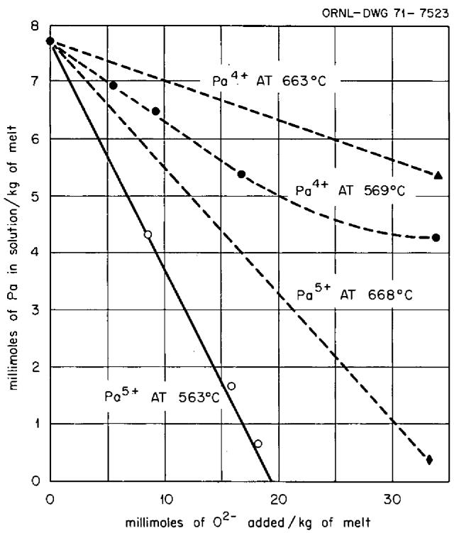  
Fig. 10.10. Precipitation of $\mathbf{P}\mathbf{a}^{4 + }$ and $\mathbf{P}\mathbf{a}^{5 + }$ oxides from LiF-BeF $_2$ -ThF $_4$ (72-16-12 mole %) by addition of $\mathbf{ThO}_2$ . The data for $\mathbf{P}\mathbf{a}^{5 + }$ are from ref. 45; the solid line corresponds to the quantitative precipitation of $\mathbf{P}\mathbf{a}_2\mathbf{O}_5$ .

This experiment is still in progress. The data presently available are shown in Fig. 10.10 as millimoles of $\mathrm{Pa}^{4+}$ in solution per kilogram of melt vs millimoles of $\mathrm{O}^{2-}$ added per kilogram of melt. For comparison we have also plotted the behavior of $\mathrm{Pa}^{5+}$ reported earlier $^{4-5}$ at nearly the same temperature. It can be seen that the behavior of the two oxidation states of protactinium is quite different; the $\mathrm{Pa}^{4+}$ -containing phase appears considerably more soluble than $\mathrm{Pa}_2\mathrm{O}_5$ . Although we have not yet isolated and analyzed the solid $\mathrm{Pa}^{4+}$ -containing phase, preliminary material balance calculations would indicate that it is a $(\mathrm{Pa}-\mathrm{Th})\mathrm{O}_2$ solid solution. A less likely possibility is that it is an oxyfluoride, $\mathrm{PaOF}_2$ . Work continues in order to characterize the solid phase and to study the effect of temperature and of the composition of the solid phase on the distribution of $\mathrm{Pa}^{4+}$ between the fluoride melt and the oxide phase.

# 10.11 THE REDOX POTENTIAL OF PROTACTINIUM IN MSBR FUEL SOLVENT SALT

R.G.Ross C.E.Bamberger C.F.Baes,Jr.

It has been previously reported that the precipitation of protactinium oxide from MSBR fuel salt holds

promise for a very efficient and simple way of removing protactinium from the fuel stream of an MSBR. Our previous work indicated that under oxidizing conditions pure or nearly pure $\mathrm{Pa}_2\mathrm{O}_5$ precipitates by addition of $\mathrm{O}^{2-}$ to the molten fluoride mixture and that $\mathrm{Pa}_2\mathrm{O}_5$ has a considerably lower solubility than $\mathrm{UO}_2$ .

In order to select the best conditions for removing protactinium from MSBR fuel salt by the oxidative precipitation of protactinium as $\mathrm{Pa}_2\mathrm{O}_5$ , values for the redox potential of the couple $\mathrm{Pa}^{4+}/\mathrm{Pa}^{5+}$ are required. We have previously reported limits estimated from direct measurements of the equilibrium

$$
\mathrm {P a F} _ {5} (\mathrm {d}) + 1 / 2 \mathrm {H} _ {2} (\mathrm {g}) \rightleftharpoons \mathrm {P a F} _ {4} (\mathrm {d}) + \mathrm {H F} (\mathrm {g}),
$$

(1)

$$
Q _ {1} = X _ {\mathrm {P a}} ^ {4 + \cdot} P _ {\mathrm {H F}} / (X _ {\mathrm {P a}} ^ {5 + \cdot} P _ {\mathrm {H} _ {2}} ^ {1 / 2}) ,
$$

where $\mathrm{d}$ , $\mathrm{g}$ , and $X_{i}$ denote, respectively, dissolved and gaseous species and mole fractions. In these measurements the amounts of $\mathrm{Pa}^{4+}$ and $\mathrm{Pa}^{5+}$ present during the hydrogen reduction were estimated by a material balance based on the amount of HF evolved. The reduction of impurities such as $\mathrm{Ni}^{2+}$ and $\mathrm{Fe}^{2+}$ (which also produced HF) occurred simultaneously, however, necessitating corrections which could be estimated only roughly. Hence only limits for the values of $Q_{1}$ could be obtained.

In order to overcome the above-mentioned difficulties we chose to measure the equilibrium quotient of

$$
\begin{array}{l} 1 / 2 \mathrm {P a} _ {2} \mathrm {O} _ {5} (\mathrm {c}) + 5 / 4 \mathrm {T h F} _ {4} (\mathrm {d}) + 1 / 2 \mathrm {H} _ {2} (\mathrm {g}) \\ \rightleftharpoons \mathrm {P a F} _ {4} (\mathrm {d}) + 5 / 4 \mathrm {T h O} _ {2} (\mathrm {c}) + \mathrm {H F} (\mathrm {g}), \tag {2} \\ \end{array}
$$

$$
Q _ {2} = X _ {\mathrm {P a F} _ {4}} \cdot P _ {\mathrm {H F}} / X _ {\mathrm {T h F} _ {4}} ^ {5 / 4} \cdot P _ {\mathrm {H} _ {2}} ^ {1 / 2},
$$

and to combine $Q_{2}$ with $Q_{3}$ , measured previously,

$$
\begin{array}{l} 1 / 2 \mathrm {P a} _ {2} \mathrm {O} _ {5} (\mathrm {c}) + 5 / 4 \mathrm {T h F} _ {4} (\mathrm {d}) \\ \rightleftharpoons \mathrm {P a F} _ {5} (\mathrm {d}) + 5 / 4 \mathrm {T h O} _ {2} (\mathrm {c}), \tag {3} \\ \end{array}
$$

$$
Q _ {3} = X _ {\mathrm {P a F} _ {5}} / X _ {\mathrm {T h F} _ {4}} ^ {5 / 4}.
$$

Reaction (2) has the following advantages:

1. the concentration of $\mathbf{PaF}_5$ is held constant by the presence of the saturating phases $\mathrm{Pa}_2\mathrm{O}_5$ and $\mathrm{ThO}_2$ , or more likely, by $\mathrm{Pa}_2\mathrm{O}_5$ and a dilute solid solution of $\mathrm{Pa}^{4+}$ in $\mathrm{ThO}_2$ ;

2. the concentration of $\mathrm{PaF}_5$ is known from $Q_{3}$   
3. the concentration of $\mathrm{PaF_4}$ can be easily estimated by measuring the concentration of total protactinium dissolved in the melt and subtracting the small concentration of $\mathrm{PaF_5}$ calculated from $Q_{3}$ ;   
4. as long as the partial pressure of HF is measured under equilibrium conditions, it is irrelevant whether the HF is generated by the reduction of $\mathrm{PaF}_5$ , by reducible metallic ions, or by both.

The experimental procedure consisted in equilibrating under a hydrogen atmosphere the solid phases, $\mathrm{Pa}_2\mathrm{O}_5$ and $\mathrm{ThO_2}$ , with the melt, $\mathrm{LiF - BeF_2 - ThF_4}$ (72-16-12 mole $\%$ ), in a stirred vessel assembled inside a glove box suited for work with alpha-active elements. Since the reaction studied (2) seemed to involve slow kinetics, the hydrogen was not flowed through the system, as in a transpiration experiment; rather its pressure was held constant, and only the hydrogen lost by diffusion through the walls of the container was replenished.

At various intervals, approximately one-fourth of the gas was withdrawn into an evacuated copper vessel and then flushed from it into a small titration vessel with argon. Since the HF pressures measured were in the order of $10^{-3}$ to $10^{-4}$ atm, the titrations were carried out with care in order to avoid $\mathrm{CO}_{2}$ contamination and to obtain sharp end points. The melt was also sampled at the time of the gas sampling. Since hydrogen was present, we used a special shroud to surround the Teflon seal of the salt sample tube with a flowing atmosphere of argon. This prevented either air from leaking into the equilibration container or pure $\mathbf{H}_2$ from leaking out into the glove box.

All the results obtained are presented in Fig. 10.11. On the left side of this figure the $\mathrm{PaF_4}$ concentration of the melt is shown as a function of time in each of two runs at each temperature. The amount of $\mathrm{PaF_4}$ was increased between runs by prolonged hydrogen reduction. At the two higher temperatures the product $X_{\mathrm{PaF_4}}\cdot P_{\mathrm{HF}}$ plotted on the right, remained constant within the scatter of the data in spite of the changes in the $\mathrm{PaF_4}$ concentration; that is, the partial pressure of HF was found to be inversely proportional to the $\mathrm{PaF_4}$ concentration in accord with equilibrium (2).

At the lowest temperature $(584^{\circ}\mathrm{C})$ , however, an obvious change in behavior had occurred in that the $\mathrm{PaF_4}$ concentrations in the two runs tend to approach a single value while giving an $X_{\mathrm{PaF_4}}\cdot P_{\mathrm{HF}}$ product much lower than would be expected by extrapolation of the other results in Fig. 10.11. It is presently believed that at $584^{\circ}\mathrm{C}$ a major fraction of the $\mathrm{Pa^{4 + }}$ was in the form of a $(\mathrm{Pa - Th})\mathrm{O}_2$ solid solution, which should have been

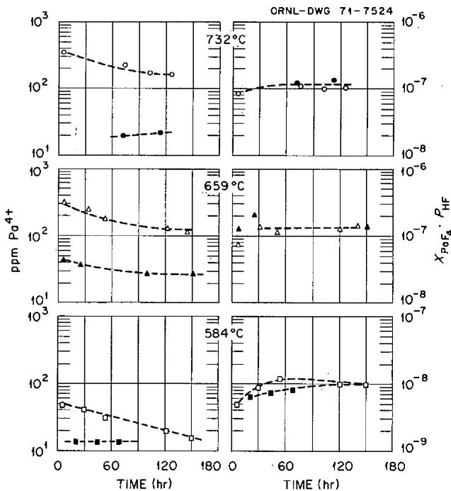  
Fig. 10.11. Variation of $\mathrm{Pa}^{4+}$ concentration and of $X_{\mathrm{Pa}^{4+}} P_{\mathrm{HF}}$ as a function of equilibration time for two different initial concentrations of $\mathrm{Pa}^{4+}$ at each temperature.

appreciably richer in $\mathbf{Pa}^{4 + }$ than the solid solutions formed at the higher temperatures. With most of the $\mathrm{Pa}^{4 + }$ present in a $(\mathrm{Pa - Th})\mathrm{O}_2$ solid solution, even a dilute one, the composition of this phase would have remained relatively fixed during the last two runs at the lowest temperature. This, in turn, would tend to fix the value of $X_{\mathrm{PaF_4}}$ by the equilibrium

$$
\mathrm {P a F} _ {4} (\mathrm {d}) + \mathrm {T h O} _ {2} (\mathrm {s s}) \rightleftharpoons \mathrm {P a O} _ {2} (\mathrm {s s}) + \mathrm {T h F} _ {4} (\mathrm {d}),
$$

$$
X _ {\mathrm {P a F} _ {4}} = \frac {X _ {\mathrm {P a O} _ {2}} X _ {\mathrm {T h F} _ {4}}}{X _ {\mathrm {T h O} _ {2}} Q _ {4}}. \tag {4}
$$

The relatively constant level of $X_{\mathbf{PaF}_4}$ thus produced apparently was lower than that required by equilibrium (2), and hence it appears that $\mathrm{Pa}_2\mathrm{O}_5$ was dissolving, but at too slow a rate, owing to its low solubility, to permit equilibrium with respect to reaction (2).

At 659 and $732^{\circ}\mathrm{C}$ , however, it appears that equilibrium with respect to reaction (2) was maintained, presumably because the $\mathbf{Pa}^{4+}$ present in $\mathrm{ThO}_2$ solid solution was but a small fraction of the amount of $\mathbf{PaF}_4$ in the fluoride phase. The composition of the solid-solution phase therefore could be controlled by the $\mathbf{Pa}^{4+}$ in the melt and, hence, by reaction (2).

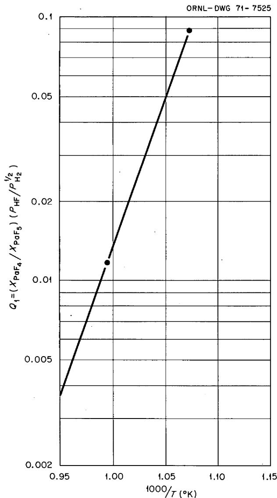  
Fig. 10.12. Variation of $Q_{1} = (X_{\mathrm{PaF}_{4}} / X_{\mathrm{PaF}_{5}})(P_{\mathrm{HF}} / P_{\mathrm{H}_{2}}^{1 / 2})$ as a function of $1 / T(^{\circ}\mathbf{K})$ .

Figure 10.12 shows a plot of $\log Q_{1}$ as a function of $1 / T(^{\circ}\mathrm{K})$ estimated for the two higher temperatures only. This plot indicates that molten fluoride solutions of $\mathrm{PaF_4}$ are oxidized more easily by HF at the higher temperatures and hence that solutions of $\mathrm{PaF_5}$ are reduced more easily by hydrogen at the lower temperatures. Due to the importance that the redox potential of $\mathrm{Pa^{4 + } / Pa^{5 + }}$ has in an efficient protactinium-removal process as well as in the control of MSBR fuel chemistry, the magnitude of $Q_{1}$ and its temperature dependence will be investigated by means of other reactions.

# 10.12 THE CRYSTAL STRUCTURES OF COMPLEX FLUORIDES

# G. D. Brunton

The development of automated techniques for rapid collection of diffraction data from single crystals has greatly improved the precision of crystallographic measurements. As a result, studies of the crystal structures of the complex compounds encountered in molten salt reactor technology have advanced to the point that the stoichiometry of such crystal phases can often be determined independently and unequivocally by single crystal diffraction methods. Application of this capability to MSR R&D programs provides a powerful means to advance understanding of chemical phenomena which involve liquid-solid interactions.

A brief review of the results obtained in recent studies of the structures of complex fluorides is included here to illustrate some details of the coordination chemistry which typifies many of the complex compounds which are formed by the heavy metal fluorides.

# 10.12.1 The Crystal Structure of $\mathbf{CsU}_6\mathbf{F}_{25}$ 48

The complex fluoride $\mathrm{CsU_6F_{25}}$ crystallizes with space group $P6_{3} / mmc$ ; $a_0 = 8.2424(4)$ Å, $c_0 = 16.412(2)$ Å, $Z = 2$ , and the calculated density $= 7.0013$ g/cc. The $\mathbf{U}^{4 + }$ ion is coordinated by $9\mathrm{F}^{-}$ ions at distances of 2.267(8) to 2.54(4) Å and the $\mathrm{Cs}^{+}$ ion by $12\mathrm{F}^{-}$ at distances of 3.12(2) and 3.45(4) Å.

# 10.12.2 The Crystal Structure of $\alpha$ -KTh $_6$ F $_{25}$

Crystals of $\alpha$ -KTh $_6$ F $_{25}$ are hexagonal-rhombohedral $R\overline{3}m$ with hexagonal axes $a_0 = 8.313(2)$ and $c_0 = 25.262\mathring{\mathrm{A}}$ , $Z = 3$ , and the calculated density $= 6.281\mathrm{g / cc}$ . The structural units of $\alpha$ -KTh $_6$ F $_{25}$ (Fig. 10.13) are identical to those of $\mathrm{CsU}_6\mathrm{F}_{25}$ ; two rings of Th-F polyhedra surrounding a central K ion. The structural units are stacked ABCABC along $c_0$ in $\alpha$ -KTh $_6$ F $_{25}$ and ABAB in $\mathrm{CsU}_6\mathrm{F}_{25}$ (Figs. 10.14 and 10.15).

# 10.12.3 The Crystal Structure of $\mathbf{L}\mathbf{i}_2\mathbf{M}\mathbf{o}\mathbf{F}_6^{49}$

Crystals of $\mathrm{Li}_2\mathrm{MoF}_6$ are tetragonal $P4_2212$ with $a_0 = 4.6863(7)$ and $c_{0} = 9.191(2)$ Å, $Z = 2$ , and the calculated density $= 3.687~\mathrm{g / cc}$ . The $\mathrm{Li^{+}}$ and $\mathrm{Mo}^{4 + }$ ions are octahedrally coordinated. The Li-F distances range from 2.017(2) to 2.102(7) Å and the Mo-F distances range from 1.927(2) to 1.945(2) Å. The $\mathrm{MoF}_6^{2 - }$ ion is coordinated by ten $\mathrm{Li^{+}}$ (Fig. 10.16).

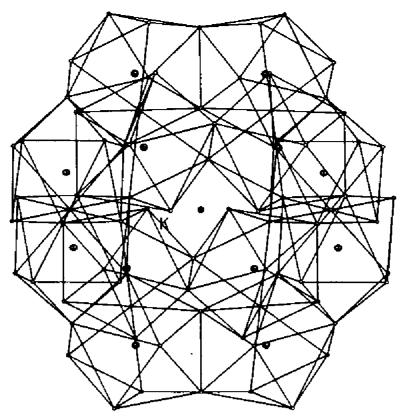

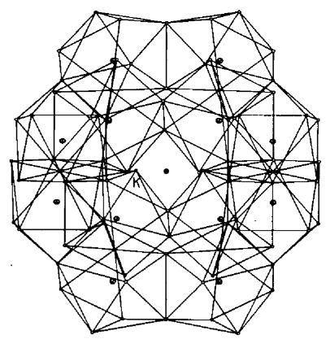  
Fig. 10.13. $\mathbf{KTh}_6\mathbf{F}_{25}$ structural unit.

ORNL-DWG 71-2330

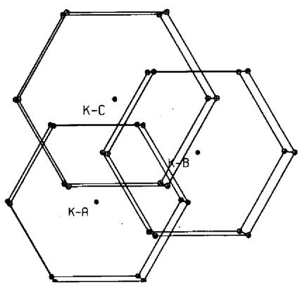

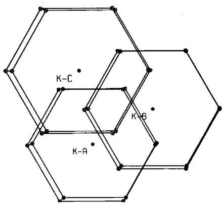  
Fig. 10.14. $\mathbf{K}\mathbf{Th}_6\mathbf{F}_{25}$ structural stacking.

ORNL-DWG 71-2331

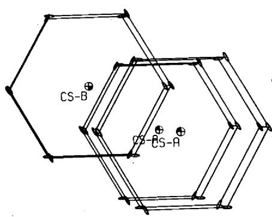

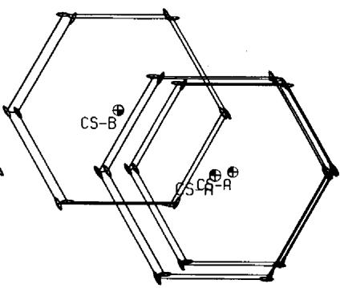  
Fig. 10.15. $\mathrm{CsU_6F_{25}}$ structural stacking.

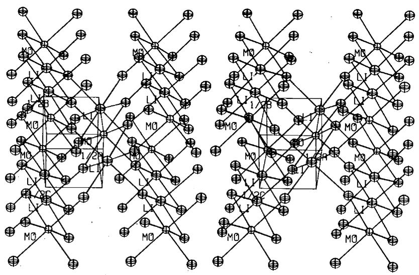  
Fig. 10.16. $\mathrm{Li}_2\mathrm{MoF}_6$

ORNL-DWG 70-13164

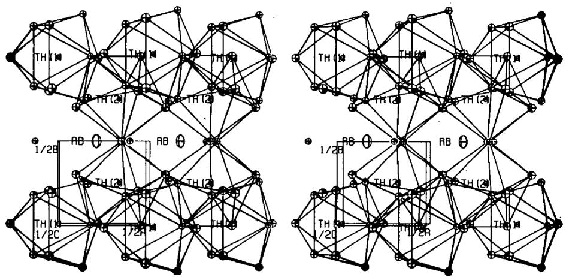  
Fig. 10.17. $\mathbf{RbTh}_3\mathbf{F}_{13}$

# 10.12.4 The crystal Structure of $\mathbf{RbTh}_3\mathbf{F}_{13}$ 48

The complex fluoride $\mathrm{RbTh}_3\mathrm{F}_{13}$ crystallizes with space group $P2_{1}ma; a_{0} = 8.6490(5), b_{0} = 8.176(2)$ , and $c_{0} = 7.4453(4)$ Å. There are two formula weights per unit cell, and the calculated density is $6.488~\mathrm{g / cc}$ . There are two thorium ions in the asymmetrical unit, and each

of these ions has 9 nearest-neighbor fluorine ions at the corners of capped trigonal prisms. The Th-F distances range from 2.32(3) to 2.48(2) Å. The rubidium ion has 11 nearest-neighbor fluorine ions in the range 2.79(3) to 3.37(2) Å (Fig. 10.17). The final discrepancy index is 0.0710 for 2134 Ag K $\alpha$ reflections $> \sigma$ .

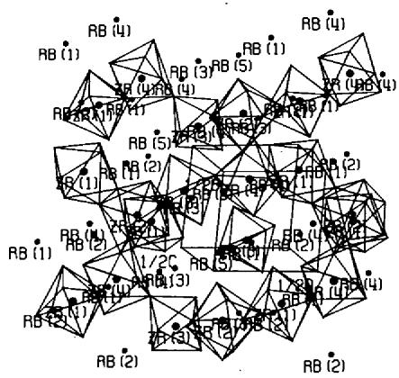

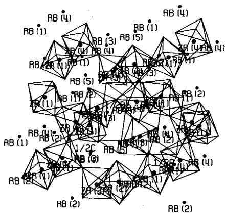  
Fig. 10.18. $\mathbf{Rb}_5\mathbf{Zr}_4\mathbf{F}_{21}$

# 10.12.5 The Crystal Structure of $\mathbf{Rb}_5\mathbf{Zr}_4\mathbf{F}_{21}$ 48

The complex fluoride $\mathrm{Rb}_{5}\mathrm{Zr}_{4}\mathrm{F}_{21}$ crystallizes with space group $P2_{1}$ ; $a_0 = 11.520(5)$ , $b_0 = 11.222(5)$ , and $c_0 = 7.868(2)$ Å; $\cos \beta = -0.1445(3)$ . The calculated density $= 3.930\mathrm{g / cc}$ , and $Z = 2$ . The structure was solved by a tangent formula procedure and refined by Fourier and least-squares methods to a final discrepancy index $(R)$ of 0.0508 for 1376 observed Cu $K\alpha_{1}$ reflections. The $\mathbf{F}^{-}$ coordination polyhedra are different for each of the four crystallographically independent Zr ions. Seven $\mathbf{F}^{-}$ ions are nearest neighbors to $\mathrm{Zr}(1)$ at the corners of a pentagonal bipyramid, and the interatomic distances are 1.99(2) to 2.20(2) Å. The second Zr ion has eight nearest-neighbor $\mathbf{F}^{-}$ [1.98(2) to 2.24(2) Å] at the corners of an irregular antiprism. The third Zr ion is octahedrally coordinated by six $\mathbf{F}^{-}$ at distances of 1.90(2) to 2.10(2) Å. The fourth Zr ion has seven $\mathbf{F}^{-}$ nearest neighbors at the corners of an irregular antiprism with one corner missing. The interatomic distances $\mathrm{Zr}(4)$ -F are 1.95(2) to 2.19(2) Å. The Rb-F distances range from 2.68(2) to 3.21(3) Å. The structure is composed of cross-linked chains of $\mathrm{Zr}-\mathrm{F}$ polyhedra. The chains are connected by $\mathrm{Zr}(2)-\mathrm{Zr}(4)$ edge-sharing polyhedra, and the space between the polyhedra is filled with Rb ions (Fig. 10.18).

# 10.12.6 Discussion

With the elucidation of these structures it becomes increasingly evident that the complex fluorides have a number of common features from which some generalizations can be made. A few examples are noted, as

follows. The heavy-metal-to-fluorine bond distances are generally found to range from 1.9 to $2.5\AA$ dependent approximately on the charge/size values for the cation; the fluorine coordination numbers for the heavy metals are consistently large, one almost never found to be less than 6, and may be as large as 9. Coordination numbers are not infrequently variable within a single structure. Although such a phenomenon does not necessarily imply the existence of variable quasi-anionic character among structurally distinguishable cation-anion clusters, it does suggest that success in the development of theoretical models of liquid-state behavior may be dependent upon cognizance of some of the characteristic details of such structures as are cited here.

# 10.13 NONCRYSTALLINE $\mathbf{BeF}_2$ AT $25^{\circ}\mathrm{C}$ : STRUCTURE AND VIBRATIONAL MOTION

A.H.Narten J.B.Bates

A program of investigation of molten salts by x-ray and neutron diffraction was resumed in support of spectrographic researches with these materials. Preliminary to the study of complex systems, initial studies were devoted to glasses of $\mathrm{BeF}_2$ and $\mathrm{SiO}_2$ . These compounds form highly viscous melts near the fusion point, and the structure of the melts, though of considerable interest, is poorly understood. Upon quenching, the melts solidify into glasses, and the structure of these is thought to be similar to that of the liquid phases. A study of noncrystalline $\mathrm{BeF}_2$ and $\mathrm{SiO}_2$ at room temperature by x-ray diffraction has yielded new insight into the average configuration and motion of atoms in these phases.

The polymorphism of crystalline $\mathrm{SiO}_2$ and, to a lesser extent, of crystalline $\mathrm{BeF}_2$ is well known. All crystalline modifications of these compounds contain $\mathrm{SiO}_4$ and $\mathrm{BeF}_4$ tetrahedra joined at the vertices so that an oxygen or fluorine atom is common to two tetrahedra. The crystalline modifications differ in the packing of these tetrahedra.

The diffraction pattern of noncrystalline $\mathrm{SiO}_2$ and $\mathrm{BeF}_2$ is characterized by the absence of Bragg peaks, and hence no long-range order is present in these glasses. Atom pair correlation functions derived from the diffraction data show very sharp peaks characteristic of near-neighbor interactions, but all positional correlation is lost about 8 Å away from any starting point. The average distances between near-neighbor atoms in vitreous $\mathrm{SiO}_2$ and $\mathrm{BeF}_2$ are equal to those found in the high-temperature crystalline modifications of both compounds ( $\beta$ -quartz). As in the crystalline forms, deviations from ideal tetrahedral geometry are very small in the noncrystalline phases at room temperature. In contrast, the average coordination numbers are slightly lower in the glasses. Intensity and correlation functions calculated for a model based on the $\beta$ -quartz structure are in quantitative agreement with those derived from the diffraction data. The slightly lower density and coordination number found for the noncrystalline phases are described by the model in terms of random vacancies in the tetrahedral networks (12% for $\mathrm{SiO}_2$ and 6% for $\mathrm{BeF}_2$ ), and these defects result in the progressive loss of all positional correlation with separation.

With a structural model thus available, it was possible to calculate the vibrational modes to be expected. Based on the $\beta$ -quartz structure, the $\mathbf{k} = \mathbf{o}$ (optical) crystal vibrations of $\mathrm{SiO}_2$ and $\mathrm{BeF}_2$ were calculated using an eight-parameter modified valence force field. Both the optical selection rules and calculated frequencies were in good agreement with the vibrational spectra of $\mathrm{SiO}_2$ and $\mathrm{BeF}_2$ measured in this laboratory and with spectra reported in the open literature. In particular, the theory predicts that the only totally symmetric vibration of the $\beta$ -quartz structure is a bending mode of the O-Si-O (in $\mathrm{SiO}_2$ ) or F-Be-F (in $\mathrm{BeF}_2$ ) valence angles. The strongest bands observed in the Raman spectra of $\mathrm{SiO}_2$ and $\mathrm{BeF}_2$ were observed at 437 and about 280 cm $^{-1}$ , respectively, and were therefore assigned as due to the totally symmetric bending modes in each case. The vibrational spectra measured on the glasses agreed with the calculations both in frequency and in the selection rules. This agreement strengthens the confidence which can be placed in the structure deduced from diffraction. Neither method can give an unambiguous

uous structure, and it is therefore useful to employ them together.

# 10.14 RELATIONSHIP BETWEEN ENTROPY AND SONIC VELOCITY IN MOLTEN SALTS

# S. Cantor

A correlation of the entropies of crystalline and liquid ionic compounds with molar weight and with molar volume was reported previously.50 The correlating equation is essentially a method for estimating a quantity $\theta$ which is related to the distribution of acoustical vibrations in a crystal. For crystals, $\theta$ is usually determined from calorimetric data, but it can also be obtained from elastic-constant data; $\theta$ is related to the elastic constants through the mean velocity of sound:

$$
C = \frac {k}{h} \left(\frac {4 \pi V}{3 n N}\right) ^ {1 / 3} \theta , \tag {1}
$$

where $C$ is the velocity of sound; $V$ is the molar volume; $n$ is the number of atoms in the chemical formula of the compound; and $k$ , $h$ , and $N$ are, respectively, Boltzmann's, Planck's, and Avogadro's constants.

For a molten salt, we may use entropy, either predicted or measured, to provide values of $\theta$ by means of an equation derived from the Debye theory of lattice vibrations:

$$
S _ {T} (\mathrm {l i q}) \cong 3 n R \left(\frac {4}{3} - 1 \ln \frac {\theta}{T}\right), \tag {2}
$$

where $S_{T}(\mathrm{liq})$ is the entropy of the molten salt at absolute temperature $T$ and $R$ is the gas constant [1.987 cal mole $^{-1}$ ( ${}^{\circ}\mathrm{K}^{-1}$ )]. The $\theta$ calculated from Eq. (2), when substituted into Eq. (1), permits the calculation of the sonic velocity of the molten salt. The sonic velocity, thus calculated, is compared with experimental values of several binary salts in Table 10.8.

The agreement between calculated and experimental sonic velocity is quite good. Thus it would seem that a "liquid" $\theta$ derived from entropy is an effective method for predicting sonic velocities of binary molten salts. The deeper significance of the good agreement in Table 10.7 may be that "solid-like" models of molten salts lead to useful relationships between physical properties; when these models succeed they ought to be refined and applied to other physical properties.

Table 10.8. Velocities of sound in molten salts (km/sec)   

<table><tr><td></td><td colspan="2">1000°K</td><td colspan="2">1200°K</td></tr><tr><td></td><td>Calculated</td><td>Experimentala</td><td>Calculated</td><td>Experimentala</td></tr><tr><td>LiF</td><td>2.57</td><td>(2.72)</td><td>2.48</td><td>2.45</td></tr><tr><td>LiCl</td><td>1.88</td><td>1.93</td><td>1.83</td><td>1.77</td></tr><tr><td>NaF</td><td></td><td></td><td>1.78b</td><td>2.05b</td></tr><tr><td>NaCl</td><td>1.45</td><td>(1.81)</td><td>1.38</td><td>1.63</td></tr><tr><td>NaBr</td><td>1.15</td><td>(1.34)</td><td>1.12</td><td>1.21</td></tr><tr><td>KF</td><td>1.59</td><td>(1.94)</td><td>1.53</td><td>1.76</td></tr><tr><td>KI</td><td>0.802</td><td>1.09</td><td>0.787</td><td>1.02</td></tr><tr><td>CsCl</td><td>0.908</td><td>1.10</td><td>0.844</td><td>0.970</td></tr><tr><td>CsBr</td><td>0.731</td><td>0.955</td><td>0.680</td><td>0.826</td></tr><tr><td>CaCl2</td><td>1.71</td><td>(2.10)</td><td></td><td></td></tr><tr><td>SrBr2</td><td>1.19</td><td>1.54</td><td></td><td></td></tr><tr><td>BaCl2</td><td></td><td></td><td>1.44c</td><td>1.72c</td></tr></table>

$^\text{a}$ The experimental data were reported by J. O'M. Bockris et al. and M. Blanc et al. and are summarized in G. J. Janz, Molten Salts Handbook, p. 251, Academic, New York, 1967. Parentheses indicate experimental data extrapolated into supercooled-liquid region.   
$^{b}$ At $1300^{\circ}\mathrm{K}$ .   
cAt $1235^{\circ}\mathrm{K}$

What value of $\theta$ predicts the sonic velocity of more complex molten compounds such as nitrates? When molar entropies are substituted into eq. (2), the calculated sonic velocities are too low by about a factor of 10. However, in these compounds the total molar entropy includes contributions from internal degrees of freedom - interatomic vibrations and internal rotational modes of the complex ion. When we subtract these entropy contributions, representing them as "gaslike" behavior (i.e., unhindered rotational and internal vibrational entropies of $\mathrm{NO}_3^-$ calculated from the standard partition functions of an ideal gas), we obtain a residual entropy associated only with "lattice" contributions. Correspondingly, the complex ion is counted as one particle; for instance in the case of $\mathrm{KNO}_3$ , $n = 2$ in Eqs. (1) and (2). This "lattice" entropy, when substituted into Eq. (1), yields sonic velocities in excellent agreement with experimental values:

Velocity of sound at $700^{\circ}\mathrm{K}$ (km/sec)   

<table><tr><td></td><td>Calculated</td><td>Experimental</td></tr><tr><td>NaNO3(liq)</td><td>1.76</td><td>1.67</td></tr><tr><td>KNO3(liq)</td><td>1.62</td><td>1.76</td></tr><tr><td>AgNO3(liq)</td><td>1.37</td><td>1.42</td></tr></table>

These results do not prove that nitrate ions execute unhindered rotation in the melt. What has been shown is that the propagation velocity of sound waves in molten salts containing nitrate ions appears to depend

only on "lattice" vibrations. The entropy associated with the "lattice" vibrations is approximated by subtracting entropy contributions assumed to be caused by free rotation and internal vibrations of the complex ions.

# 10.15 A REFERENCE ELECTRODE SYSTEM FOR USE IN FLUORIDE MELTS

H. R. Bronstein

Further study of the galvanic cell comprised of the half-cell $\mathrm{Be / LiF}$ , $\mathrm{BeF}_2$ (67-33 mole %) and the $\mathrm{Ni - NiF_2}$ reference electrode assembly, as illustrated in Fig. 10.19, $^{51-53}$ led to findings believed to be of considerable interest and significance.

Deterioration of the initial cell voltage with time was found to be caused by the depletion of the small $\mathrm{NiF}_2$ content of the reference half-cell, as evidenced by its conversion into an equivalent amount of finely dispersed nickel metal. Since a static atmosphere of highly purified argon or helium gas was maintained in the quite limited volume of the apparatus, an impurity in this small amount of cover gas could not be held responsible for the reduction of the $\mathrm{NiF}_2$ . This conclusion was verified by subsequent experiments which established the actual mechanism involved.

This phenomenon continued to occur with all external measuring circuits disconnected, as demonstrated by measuring the potential at periodic intervals. Also, beryllium metal has no measurable vapor pressure at $600^{\circ}\mathrm{C}$ , the temperature of the experiments. The conclusion had to be drawn that an internal "short" in the cell supplied the electrons for $\mathrm{NiF}_2 + 2e^- \rightarrow \mathrm{Ni}^0 + 2\mathrm{F}^-$ . Obviously, the beryllium metal, the only material present capable of causing the reduction, must have reached the $\mathrm{NiF}_2$ in some manner. Therefore, one must not only invoke the transport of beryllium metal to the reference electrode cell through the salt melt, either by dissolution or by the so-called "chunking effect,"[54,55] but also an electronic component in the conductance of the single-crystal $\mathrm{LaF}_3$ . The beryllium arriving at or in

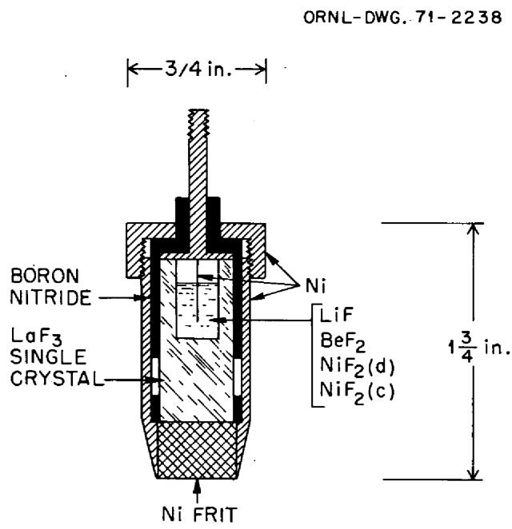  
Fig. 10.19. Reference electrode assembly.

the nickel frit would act as a beryllium atom, if the "chunking effect" were valid, or perhaps as a subvalent $\mathrm{Be}^{+}$ or $\mathrm{Be}_{2}^{2+}$ ion, if the solution assumption is valid. Nevertheless, the mechanism would be as follows:

$$
\mathrm {B e} ^ {0} \rightarrow \mathrm {B e} ^ {2 +} + 2 e ^ {-},
$$

if as a "chunk of beryllium," and

$$
\mathrm {B e} ^ {+} \rightarrow \mathrm {B e} ^ {2 +} + e ^ {-},
$$

$$
\mathrm {B e} _ {2} ^ {2 +} \rightarrow 2 \mathrm {B e} ^ {2 +} + 2 e ^ {-},
$$

if as a subvalent species dissolved in the melt, with transport of the electrons through the $\mathrm{LaF}_3$ crystal and reaction with the $\mathrm{Ni}^{2+}$ ions to form nickel metal. The excess fluoride ions are also transported (in the opposite direction) through the $\mathrm{LaF}_3$ crystal $^{51,53}$ into the main bulk of the melt to maintain electrical neutrality. The overall reaction is then simply $\mathrm{Be} + \mathrm{NiF}_2$ (from the electrodes) to give nickel metal in the $\mathrm{LaF}_3$ cup and beryllium fluoride in the main melt.

A series of experiments was conducted to verify this mechanism. First, a beryllium electrode was mounted through an inverted BeO crucible. Since solid beryllium metal is less dense than the melt, any solid metal detached from the electrode by the so-called "chunking

effect" would rise to, and be trapped at, the melt surface within the crucible. Dissolved metal, on the other hand, would still reach the reference electrode. The observation was that under these conditions the $\mathrm{NiF}_2$ in the $\mathrm{LaF}_3$ cup was still transformed into Ni metal.

Second, with the same crucible-encapsulated beryllium electrode, the reference electrode assembly was modified by cutting the $\mathrm{LaF}_3$ crystal below the cup portion and placing a thin disk of $\mathrm{CaF}_2\frac{1}{16}$ in. thick between the two portions of the $\mathrm{LaF}_3$ . It was hoped that the $\mathrm{CaF}_2$ crystal would perhaps have little or no electronic conduction and so act as a filter of electrons. This cell maintained the theoretical voltage for a period five times longer than the single-crystal $\mathrm{LaF}_3$ before onset of deterioration. The $\mathrm{CaF}_2$ apparently had some small electronic conductance of its own.

A third, and definitive, experiment was made. The reference electrode assembly was remade without the $\mathrm{CaF}_2$ disk. To the main melt, $\mathrm{NiF}_2$ was added as a "getter" for the dissolved Be. The beryllium electrode was now encased in a somewhat porous BeO crucible of $1/8$ in. wall thickness by $1/2$ in. ID containing the pure melt $\mathrm{LiF - BeF}_2$ (67-33 mole $\%$ ). The crucible prevents the mixing of the two solutions, its porosity allowing ion migration. Any $\mathrm{Ni}^{2+}$ ions entering the crucible are immediately reduced to Ni metal by the saturated beryllium solution. The same result occurs if any dissolved beryllium diffuses into the main melt saturated with $\mathrm{NiF}_2$ . By this means the theoretical cell potential was maintained for a period of three days. Termination of the experiment apparently was caused by the loss of ion migration through the BeO crucible walls plugged up by the deposition of nickel metal.

The voltage recorded in all these cells before onset of deterioration was $2.045 \pm 0.003\mathrm{V}$ . According to the compilation of Baes for the free energy of formation of $\mathrm{NiF}_2$ and of $\mathrm{BeF}_2$ in $\mathrm{BeF}_2$ -LiF (33-67 mole \%), this cell should yield $2.041 \pm 0.025\mathrm{V}$ at $600^{\circ}\mathrm{C}$ .

These experiments have established that beryllium does dissolve in the $\mathrm{LiF - BeF_2}$ (67-33 mole $\%$ ) melt to some small extent, yet to be determined, and that, somewhat surprisingly, the conductance in the $\mathrm{LaF_3}$ crystal has a small electronic component.

With this knowledge, the technique described can and will be used to obtain reliable thermodynamic data on a variety of systems of interest.

# 11. Chemistry of Molten-Salt Reactor Fuel Technology

# 11.1 EXTRACTION OF RUBIDIUM AND CESIUM FROM MSBR FUEL SOLVENT INTO BISMUTH BY REDUCTION WITH LITHIUM AT $650^{\circ}\mathrm{C}$

D.M.Richardson J.H.Shaffer

The experimental determination of the distributions of the alkali metals in the metal transfer process was initiated over a year ago to assure that the behavior of these metals as fission products, contaminants, or intentional diluents could be predicted. The distributions of sodium and potassium were previously reported for the complete metal transfer process.1 Distributions in the chloride/bismuth extraction were reported for cesium,2 and the distributions of rubidium and cesium in the fluoride/bismuth extraction at $650^{\circ}\mathbf{C}$ are reported here.

The reductive extractions were performed individually in 4-in. IPS 304L stainless steel vessels with mild steel liners. Two $3/4$ -in. steel pipes extended to within $1/2$ in. of the bottom of the vessels and provided separately for adding lithium directly to the metal phase and for withdrawing bismuth samples in graphite ladles. Additional ports were provided for material additions, inserting beryllium electrodes, salt sampling with hydrogen-fired copper filter sticks, gas exhaust, and thermocouples. The vessels were each charged with approximately $3000\mathrm{g}$ of bismuth and were hydrogen sparged at $600^{\circ}\mathrm{C}$ for $8\mathrm{hr}$ .

The fluoride salts consisted of $\mathrm{LiF - BeF_2 - ThF_4}$ (72-16-12 mole %) in batches of approximately $3000\mathrm{g}$ that were individually treated with carrier salt and radiotracer: $1.48\times 10^{-2}$ mole $\%$ RbF (with $^{86}\mathrm{Rb}$ ) and $0.95\times 10^{-2}$ mole $\%$ CsF (with $^{137}\mathrm{CsF}$ ). These salts were treated in nickel preparation vessels at $650^{\circ}\mathrm{C}$ according to standard hydrofluorination procedures, followed by hydrogen sparging. Approximately $3000\mathrm{g}$ of each salt was transferred at $650^{\circ}\mathrm{C}$ under flowing argon to the extraction vessels.

Reductions were performed by successive additions of 0.25 or $0.5\mathrm{g}$ of clean lithium metal, and samples of salt and metal phases were taken after a minimum of $5\mathrm{hr}$ of argon sparging at 1 liter/min.

Analyses of lithium, thorium, and the corrosion metals were performed by the Spectrochemical Laboratory and by the General Analysis Laboratory. Analyses of rubidium and cesium were made by gamma-spectrometric counting of the 1.077-MeV gamma of $^{86}\mathrm{Rb}$ and the 0.661-MeV gamma of $^{137}\mathrm{Cs}$ . Over a week was allowed for decay of thorium daughter activities in the bismuth samples. Thorium activities in the salts were corrected by means of a salt blank without radiotracer.

The equilibrium quotient obtained for rubidium was $K_{Q} = (D_{\mathrm{Rb}} / D_{\mathrm{Li}}) = 8.62 \pm 1.26$ , the mean of three samples at the 0.95 confidence level. The corresponding distribution equation for this composition of salt was

$$
\log D _ {\mathrm {R b}} = \log X _ {\mathrm {L i}} + 1. 0 7 7,
$$

where $X_{\mathrm{Li}}$ is the mole fraction of lithium in bismuth.

The cesium salt preparation was used twice for a reductive extraction into bismuth. In the first instance there was large scatter of the sample data obtained, and the spare samples were expended in the course of measurements of phase segregation of solute in frozen bismuth pellets.3 Subsequently, this salt was transferred to a second extraction vessel containing freshly prepared bismuth, and the reductions were repeated. The equilibrium quotient obtained in this experiment was

$$
K _ {Q} = \left(D _ {\mathrm {C s}} / D _ {\mathrm {L i}}\right) = 1 5. 0 5 \pm 0. 8 1,
$$

the mean of 15 samples at the 0.95 confidence level. The corresponding distribution equation for this composition of salt was $\log D_{\mathrm{Cs}} = \log X_{\mathrm{Li}} + 1.320$

The relative extractabilities of the alkali metals from fluoride salt into bismuth containing lithium at $650^{\circ}\mathrm{C}$ are $\mathbf{Cs}:\mathbf{Na}:\mathbf{Rb}:\mathbf{K}::1:0.80:0.57:0.53.$

# 11.2 DISTRIBUTION OF THORIUM BETWEEN MSBR FUEL SOLVENT AND BISMUTH SATURATED WITH NICKEL AND THORIUM AT $650^{\circ}\mathrm{C}$

D.M.Richardson J.H.Shaffer

Occasionally, in reductive-extraction experiments where various metals were reduced from $\mathsf{LiF}$ $\mathsf{BeF}_2$ -ThF $_4$ (72-16-12 mole %) into bismuth at $650^{\circ}\mathsf{C}$ , there were instances where the solubility product constant of ThNiBi $_2$ in bismuth was reached during the later stages of reduction. It was of interest to examine the experimental data obtained under these conditions to determine whether or not the normal distribution of thorium prevailed.

The other metals whose distributions were individually measured in each of these experiments were cesium, potassium, rubidium, and sodium. The thorium and nickel solubility data of concern here are plotted in Fig. 11.1, together with the derived line (with theoretical slope): $X_{\mathrm{Th}} \times X_{\mathrm{Ni}} = 2.36 \times 10^{-6}$ , where $X$ is the mole fraction in bismuth. The experimental data shown in Fig. 11.1 were obtained from spectrographic analyses and provide confirmation of the reported solubility product constant at $650^{\circ}$ of $1.5 \times 10^{-6}$ .

The thorium and lithium data for the same samples are plotted in Fig. 11.2, together with the derived line (with theoretical slope):

$$
X _ {\mathrm {T h}} / (X _ {\mathrm {L i}}) ^ {4} = 4. 7 \times 1 0 ^ {- 7},
$$

where $X$ is the mole fraction in bismuth. The corresponding $\log_{10}$ distribution equation for this composition of fluoride salt is

$$
\log D _ {\mathrm {T h}} = 4 \log D _ {\mathrm {L i}} + 8. 0 2 2.
$$

The distributions of thorium and lithium for this fluoride salt at $600^{\circ}\mathrm{C}$ and $700^{\circ}\mathrm{C}$ have been reported7 and are described by the derived equation

$$
\log \left[ D _ {\mathrm {T h}} / \left(D _ {\mathrm {L i}}\right) ^ {4} \right] = 8 9 8 7 (1 / T ^ {\circ} \mathrm {K}) - 1. 4 8 4 4.
$$

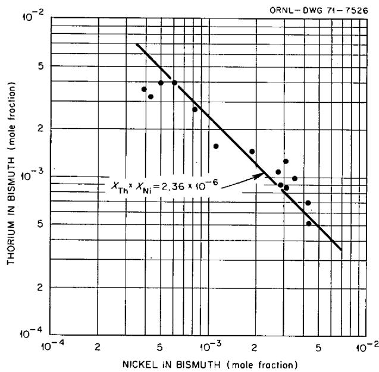  
Fig. 11.1. LiF-BeF $_2$ -ThF $_4$ (72-16-12 mole %) and bismuth at $650^{\circ}\mathrm{C}$ . Five experiments at nickel and thorium saturation.

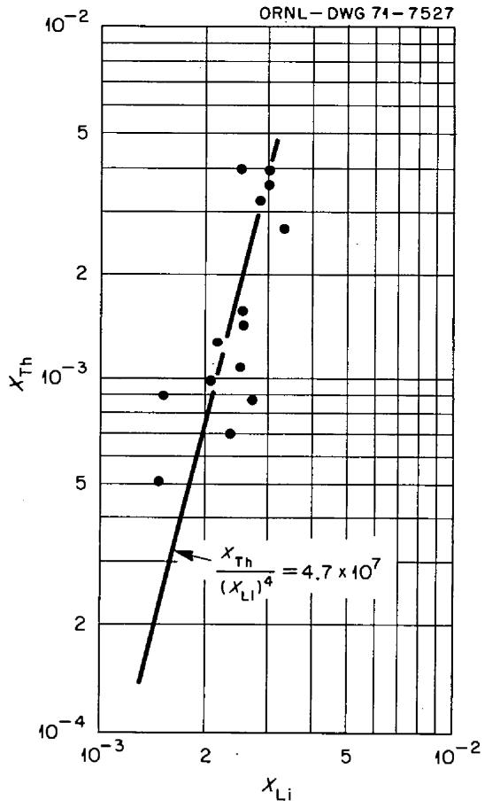  
Fig. 11.2. LiF-BeF $_2$ -ThF $_4$ (72-16-12 mole %) and bismuth at $650^{\circ}\mathrm{C}$ . Five experiments at nickel and thorium saturation.

The resulting estimated distribution equation for $650^{\circ}\mathrm{C}$ is

$$
\log D _ {\mathrm {T h}} = 4 \log D _ {\mathrm {L i}} + 8. 2 5 1.
$$

Considering the scatter of the present data and the inaccuracy of simple interpolation of $\log K$ , there is close agreement of these distributions at $650^{\circ}\mathrm{C}$ . Within the limitations mentioned, the present data show that the distribution of soluble thorium is unaffected by the presence of $\mathrm{ThNiBi}_2$ in the bismuth phase.

# 11.3 BISMUTH-MANGANESE ALLOYS AS EXTRACTANTS FOR RARE EARTHNS FROM MSBR FUEL SOLVENT

D.M.Moulton J.H.Shaffer

Bismuth-manganese alloys have been used to extract cerium from $\mathrm{LiF - BeF_2 - ThF_4}$ (72-16-12 mole%). Manganese forms reasonably low-melting eutectics and no strong compounds with thorium and rare earths, and it seemed that adding it to the bismuth might raise the thorium solubility without any undesirable effects. An extraction was carried out at $600^{\circ}$ with 24 mole $\%$ Mn in the Bi, using Th metal as the reductant. Then more Mn was added - enough to increase the concentration to 36.5 mole $\%$ , but the solubility is reported to be only $32\%$ - and the extraction was continued. Finally the temperature was raised to $700^{\circ}$ , where all the Mn should have dissolved, and more additions were made. Analysis of the samples was by gamma counting and spectrographic techniques.

Thorium solubility increased substantially over that in bismuth alone, to 1.36 and 2.38 wt % at 600 and $700^{\circ}$ , and it is not certain that saturation was reached even then. The maximum distributions (0.075 and 0.13) were not correspondingly high because of the lower average atomic weight of the metal. Although thorium distribution continued to rise, that of cerium did not; it leveled off as if saturated, but its concentration was so low (0.1 wt % in the salt) that it does not seem likely that it formed a primary solid phase.

The distributions are shown in Fig. 11.3, and the equilibrium constants are given in Table 11.1; these latter values are not very different from the figures in pure bismuth. The two manganese concentrations gave the same results and are not distinguished. If the tailing off of the cerium, so far unexplained, turns out not to be real, then it should be possible with this solvent to reduce the amount of liquid metal circulating in the reductive-extraction process without much penalty in the separation.

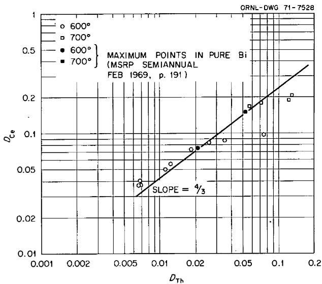  
Fig. 11.3. $D_{\mathrm{Ce}}$ vs $D_{\mathrm{Th}}$ into Bi-Mn solutions from LiF-BeF $_2$ -ThF $_4$ (72-16-12 mole%).

Table 11.1. Logs of equilibrium constants in Bi-Mn solutions   

<table><tr><td>T(℃)</td><td>DLi3/DCe</td><td>DLi4/DTh</td><td>DCe4/DTh3</td></tr><tr><td>600</td><td>-7.77 ± 0.18</td><td>-10.17 ± 0.19</td><td>+0.81 ± 0.09</td></tr><tr><td>700</td><td>-6.74 ± 0.15</td><td>-8.90 ± 0.29</td><td>+0.26 ± 0.39</td></tr></table>

# 11.4 REMOVAL OF SOLUTES FROM BISMUTH BY FRACTIONAL CRYSTALLIZATION

D.M.Richardson J.H.Shaffer

The occurrence of sometimes large variations in solute concentrations was noted in reductive-extraction experiments where metal samples were taken in graphite ladles directly from the bismuth phase. Efforts to determine the causes for this have resulted in finding evidence that solutes are strongly expelled to the surface of small bismuth pellets during the process of freezing. This effect could be utilized in a process for concentrating solutes and, conversely, for the purification of bismuth.

The graphite "ladle" is a $7 / 16$ -in.-diam, $2^{1 / 2}$ -in.-long rod that is screwed to a $1 / 4$ -in. metal rod at its top end. Near the bottom end and near the middle there are drilled holes at a $45^{\circ}$ angle that are $7 / 32$ in. in diameter and $1 / 4$ in. deep. When pushed down into the molten bismuth and then withdrawn, the ladle removes two specimens of the bismuth phase that are usually between 1 and $1^{1 / 2}$ g each. Before reduction by lithium

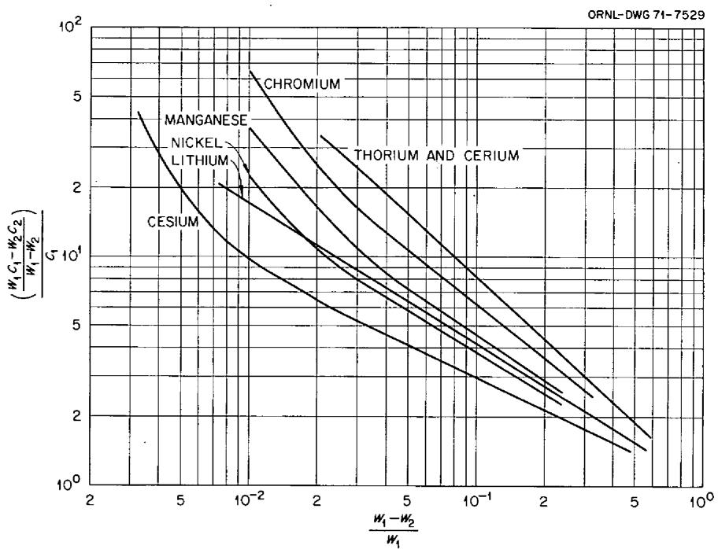  
Fig. 11.4. Distribution of solutes in bismuth.

metal additions is started, the pellets are of bright metallic appearance and are easily dropped from their holes. As the reduction proceeds, however, the pellets become black, and gentle tapping of the ladle may be required to dislodge them.

Initially, the differences in specific radioactivities within pairs of bismuth pellets were speculated to be the result of small and variable contamination with the salt phase. However, it was found that gentle rinsing with salt solvents (acetone, methanol, or verbocit solution) was not effective in equalizing the specific activities.

The possibility that the black surface was a reaction product with graphite and was responsible for a variable loss of solute from the pellet surface to the ladle was investigated by using a 28- $\mathrm{kc}$ sonic scrubbing bath to physically remove varying amounts of the material from the surface. For this case uniform solute concentrations should be found inside the pellets. The most vigorous scrubbing was obtained in verbocit solution, and after 1 hr a black pellet would become brightly etched and have the appearance of a single crystal.

The samples examined in this manner were from the first fluoride/bismuth extraction involving $^{137}\mathrm{Cs}^8$ and the chloride/bismuth extraction that involved potassium and $^{144}\mathrm{Ce}$ . For the radioisotope solutes the specific activity of single bismuth pellets was measured before and after each of several scrubbings to

remove material from the surface. The change in weight of the pellet was then used to compute the average specific activity of the material removed, which was then normalized as a ratio by dividing by the average specific activity of the original unscrubbed pellet. These ratios are plotted as the ordinate in Fig. 11.4 against the fraction of original weight removed by scrubbing as the abscissa. In the case of thorium, chromium, manganese, nickel, and lithium, the ratios were deduced by comparison of the two pellets within a sample pair and consequently are less precise.

For all of the metals studied there was a significant segregation of solute in the outer layers of the pellets. For cerium, chromium, and thorium the average concentration in the outer $1\%$ by weight was 60 or 70 times greater than the average concentration of the original pellet. Expressed differently, this means that two-thirds of all of these solutes was located in this outer shell. Although it has not been proved that high-concentration pellets were not the result of inhomogeneities in the liquid bismuth phase, it is apparent that solutes were strongly expelled to the surface

8. D. M. Richardson and J. H. Shaffer, sect. 11.1, this report.   
9. D. M. Richardson and J. H. Shaffer, MSR-70-62, p. 11 (Sept. 2, 1970) (internal memorandum).   
10. D. M. Richardson and J. H. Shaffer, MSR Program Semiannu. Progr. Rep. Aug. 31, 1970, ORNL-4622, p. 107.

and, as a consequence, that low-concentration pellets might be expected.

In the second fluoride/bismuth experiment involving $^{137}\mathrm{Cs},$ it was found that the top position pellets were consistently lower in thorium and cesium concentration than the corresponding twins from the bottom position. The median difference was $20\%$ for thorium and $5\%$ for cesium. This result can be rationalized by the argument that the pellet in the bottom position is usually the first

to freeze since it is farther from the hot mass of the metal sampling rod and since it is upstream in the convected cover gas that sweeps up the hot sampler when it is raised into the standpipe. In this case the slower cooling of the top position pellet would allow more complete expulsion of solute and a greater likelihood that solute would be lost to the graphite ladle.

# 12. Development and Evaluation of Analytical Methods for Molten-Salt Reactors

A. S. Meyer

# 12.1 ELECTROANALYTICAL STUDIES OF TITANIUM(IV) IN MOLTEN LiF-NaF-KF (46.5-11.5-42.0 MOLE %)

F. R. Clayton1 D. L. Manning G. Mamantov2

We are investigating the electroanalytical behavior of titanium(IV) in molten LiF-NaF-KF, $\mathrm{NaBF_4}$ , and LiF $\mathrm{BeF}_2$ - $\mathrm{ZrF_4}$ . Titanium is present in the structural metal (Hastelloy N) of the molten-salt reactor and, from free energy considerations, should be somewhat more reactive than chromium.

Voltammetric studies of the reduction of Ti(IV) in molten LiF-NaF-KF (46.5-11.5-42.0 mole $\%$ ) at $\sim 500^{\circ}\mathrm{C}$ were carried out using a graphite cell enclosed in a Pyrex jacket under a helium atmosphere. Platinum $(A = 0.1\mathrm{cm}^2)$ and pyrolytic graphite (PG) working electrodes, a large Pt wire counterelectrode, and an Ni wire quasi-reference electrode (QRE) were employed in the experiments. Titanium(IV) was added as $\mathrm{K}_2\mathrm{TiF}_6$ (obtained from Harshaw Chemical Company or D. E. LaValle, ORNL). The cyclic voltammograms (scan rate $= 0.1\mathrm{V / sec}$ ) obtained prior to the addition of $\mathrm{K}_2\mathrm{TiF}_6$ showed two small reduction waves at $-0.20$ and $-0.48\mathrm{V}$ (vs Ni QRE) at both the Pt and PG electrodes (probably due to iron and chromium impurities in the melt). In addition, a larger impurity wave (possibly the reduction of $\mathrm{OH^{-}}$ ) was observed at the Pt electrode at $-0.95\mathrm{V}$ (PG electrode cannot be used at negative potentials in LiF-NaF-KF due to preposition of potassium). Addition of $\mathrm{K}_2\mathrm{TiF}_6$ [Ti(IV) concentrations $\approx 0.1\mathrm{M}]$ resulted in a large well-defined reduction wave $(E_{1/2} \approx +0.05\mathrm{V}$ vs QRE) at both Pt and PG electrodes. The peak current $(i_p)$ for this reduction wave reached a maximum after 1 to 2 hr and then decreased to $\sim 0.1$ of maximum $i_p$ after $\sim 24\mathrm{hr}$ . Further Ti(IV) additions restored the wave, although it decreased with time. At

the Pt electrode a second, larger and steeper, wave was observed at $-1.45\mathrm{V}$ . This wave was less reproducible than the wave at $+0.05\mathrm{V}$ . A stripping-type reoxidation peak clearly related to the wave at $-1.45\mathrm{V}$ was observed at $-0.80\mathrm{V}$ . The reduction wave at $-1.45\mathrm{V}$ was reasonably stable over a four-day period. Estimates of the number of electrons, $n$ , involved in the two waves (from logarithmic plots as well as cathodic to anodic peak potential separation) gave $n = 1$ for the $+0.05\mathrm{V}$ wave and $n = 3$ for the $-1.45\mathrm{V}$ wave respectively.

Parameter $i_p / \mathbf{v}^{1/2}$ values for the wave at $+0.05\mathrm{V}$ were independent of the scan rate (up to $50\mathrm{V/sec}$ ) and Ti(IV) concentrations $\leqslant 0.1M$ , indicating no kinetic complications.

The above experimental observations suggest that Ti(IV) is reduced reversibly to Ti(III), which in turn is reduced to the metal at a potential $\sim 1.5\mathrm{V}$ more cathodic than that of reduction of Ti(IV). The disappearance of Ti(IV), but not Ti(III), with time suggests that Ti(IV) is reduced by graphite and/or the nickel QRE. The examination of the Ni QRE at the end of the experiment showed noticeable attack. A second experiment in a graphite container using a Pt QRE gave similar results. Again, Ti(IV) could not be kept in solution for more than one to two days. In this experiment all potentials were more cathodic by $\sim 350$ mV due to the shift in the QRE. Half-wave potentials for polarograms constructed from current-time curves for the two Ti waves were $-0.30\mathrm{V}$ [Ti(IV) $\rightarrow$ Ti(III)] and $-1.75\mathrm{V}$ [Ti(III) $\rightarrow$ Ti(0)]. Additional evidence for $n = 1$ for the first wave was obtained from the peak current ratio for derivative vs normal voltammetry. The experimentally observed ratio of 0.500 is in very good agreement with the theoretically predicted value of 0.508 for $n = 1$ and $\mathbf{v} = 0.1\mathrm{V / sec}$ at $500^{\circ}\mathrm{C}$ .

In view of the difficulty encountered in maintaining a stable solution of $\mathrm{Ti}(\mathrm{IV})$ in a graphite cell, we conducted further experiments in a platinum cell using only platinum electrodes. In this cell, $\mathrm{Ti}(\mathrm{IV})$ was stable

and could be kept in solution for several weeks. The Ti(IV) to Ti(III) voltammogram was well defined and reproducible. The peak current was found to be proportional to concentration of Ti(IV) and to the square root of the scan rate (up to $\sim 10\mathrm{V / sec}$ ). The Ti(III) to Ti(0) wave was preceded by what appears to be a predeposition wave, probably due to alloying of Ti with Pt. Presence of strong alloy formation is supported by the unusually large separation between anodic and cathodic peak potentials for this wave. The determination of $n$ , from the ratios of voltammetric peak currents and limiting currents for polarograms constructed from current-time curves, gave $n_2 / n_1$ of 3. The half-wave potentials for the two waves (measured at a potential corresponding to $0.85i_p$ ) with respect to an $\mathrm{Ni / NiF}_2(\mathrm{sat})$ electrode contained in boron nitride were found to be $+0.15$ and $-1.45\mathrm{V}$ respectively.

Chronopotentiograms for the reduction of Ti(IV) to Ti(III) were reasonably well defined. The $i\tau^{1/2}$ product ( $\tau = \text{transition time}$ ) was essentially constant in the current range 1 to $10 \, \text{mA}$ . The diffusion coefficient, calculated from Sand's equation, was $5.3 \times 10^{-6} \, \text{cm}^2/\text{sec}$ (at $480^\circ \text{C}$ ). Excellent verification of $n = 1$ for the first wave was achieved from the ratio of voltametric $i_p / v^{1/2}$ to chronopotentiometric $i\tau^{1/2}$ (for this determination of $n$ , concentration, diffusion coefficient, and electrode area do not need to be known).

Placement of a titanium electrode in the melt resulted in the expected conversion of Ti(IV) to Ti(III), as evidenced by the disappearance of the first Ti reduction wave and a gross shift of the Pt QRE with respect to the Ni(II)/Ni BN electrode (the QRE potential before the immersion of the Ti electrode was $+585\mathrm{mV}$ ; after the immersion it eventually became $-515\mathrm{mV}$ ). Voltammograms run with the Ti electrode as the reference [presumably poised to Ti(III)/Ti] showed that the oxidation of Ti(III) was occurring at about $+1.5\mathrm{V}$ and the Ti(III) reduction at $0.0\mathrm{V}$ .

We are now studying the behavior of titanium in $\mathrm{Li}_2\mathrm{BeF}_4$ and $\mathrm{NaBF}_4$ .

# 12.2 REFERENCE ELECTRODE STUDIES IN MOLTEN $\mathrm{NaBF}_4$

D. L. Manning

A stable and rugged reference electrode is needed for the in-line analysis of the MSR coolant salt. Providing a fixed potential reference for voltammetric scans (replacing the quasi-reference electrode) will simplify the

measurement of corrosion products. Also for in-line measurement on the coolant salt technology loop, it can be used to obtain a "redox" potential of the coolant which can perhaps be correlated with corrosion rates or proton concentration in the coolant. Accordingly, a model of the $\mathrm{Ni / NiF_2}$ $(\mathrm{LaF}_3)$ electrode, which has been found to serve as a practical reference for electroanalytical measurements in fuel melts, was tested in molten $\mathrm{NaBF_4}$ at $\sim 400^{\circ}\mathrm{C}$ .

Upon immersing the reference electrode in the melt and monitoring the emf vs a platinum electrode (assumed to be poised at the equilibrium potential of the melt), the platinum electrode measured approximately $-150\mathrm{mV}$ vs the $\mathrm{Ni} / \mathrm{NiF}_2$ $(\mathrm{LaF}_3)$ reference. The drift and unsteadiness of the emf, however, was much more pronounced in molten $\mathrm{NaBF_4}$ than was experienced in LiF-BeF $_2$ -ZrF $_4$ melts. A nickel electrode immersed in the melt measured $\sim -175\mathrm{mV}$ vs the reference.

Nickel fluoride $(450\mathrm{mg})$ was next added to the melt $(80\mathrm{g})$ to establish the $\mathrm{Ni} / \mathrm{NiF}_2$ redox potential. Assuming the $\mathrm{Ni} / \mathrm{NiF}_2$ couple is the poised system in the melt inside the $\mathrm{LaF}_3$ crystal, the magnitude of the emf between the reference electrode and the Ni electrode in the molten $\mathrm{NaBF}_4$ should decrease as the $\mathrm{NiF}_2$ dissolves. This was not observed. Within the scatter of the measurements, the emf of the nickel electrode and the platinum electrode did not significantly change. Voltammograms recorded at a pyrolytic graphite electrode did not reveal a reduction wave that could be attributed to the $\mathrm{Ni}^{2+} + 2e \rightarrow \mathrm{Ni}^0$ electrode reaction, and only a very small stripping wave for $\mathrm{Ni}^0 \rightarrow \mathrm{Ni}^{2+} + 2e$ could be developed. This suggests that the solubility of $\mathrm{NiF}_2$ in $\mathrm{NaBF}_4$ is very limited ( $\ll 25\mathrm{ppm}$ ). The apparent limited solubility of $\mathrm{NiF}_2$ may in part explain the erratic behavior of the reference electrode. The $\mathrm{Ni} / \mathrm{NiF}_2$ couple was probably not the emf-determining system; consequently, the electrode mostly resembled a quasi-reference. At this time, an $\mathrm{Ni} / \mathrm{NiF}_2$ $(\mathrm{LaF}_3)$ reference with a saturated solution of $\mathrm{NiF}_2$ inside the $\mathrm{LaF}_3$ crystal for use in $\mathrm{NaBF}_4$ melts does not appear promising. Further tests are planned, however, with an alternate model of the electrode which makes use of a solid $\mathrm{Ni} / \mathrm{NiF}_2$ pressed pellet as the potential-determining couple. Other reference couples will also be tested in the $\mathrm{LaF}_3$ electrode.

# 12.3 ELECTROCHEMICAL-SPECTRAL STUDIES OF MOLTEN FLUORIDE SALT SOLUTIONS

J. P. Young F. L. Whiting' Gleb Mamantov2

The present phase of the electrochemical generation and spectral characterization of unusual oxidation states of solute species in molten fluoride salts has been concluded. This work has been summarized in the Ph.D. thesis of F. L. Whiting. The solvent system has been mainly, but not exclusively, LiF-NaF-KF. The study was carried out to survey the utility of this technique as a preparative and investigational tool. Our original assignment of the absorption spectrum of superoxide, $\mathrm{O}_2^-$ , in molten LiF-NaF-KF has proved to be in error. Superoxide does exist in this melt; it exhibits an ultraviolet absorption peak at $234\mathrm{nm}$ and a Raman spectral peak at $1107\mathrm{cm}^{-1}$ . The yellow solution obtained by the addition of $\mathrm{NaO}_2$ to the melt, however, is due to the oxidation of chromium impurities ( $<10\mathrm{ppm}$ ) to $\mathrm{CrO}_4^{2-}$ . It has been reported that $\mathrm{O}_2^-$ dissolved in liquid $\mathrm{NH}_3$ also forms a yellow solution with an absorption peak near $360\mathrm{nm}$ . It was not possible to confirm this; rather, the addition of $\mathrm{NaO}_2$ to liquid $\mathrm{NH}_3$ yielded a colorless solution with an absorption peak at $252\mathrm{nm}$ . Other investigations have also indicated the error of the original liquid ammonia study. In other results of this work, we found it possible to generate electrolytically $\mathrm{Mn(III)}$ , $\mathrm{Cu(II)}$ , $\mathrm{U(III)}$ , and $\mathrm{CrO}_4^{2-}$ and to obtain their spectra in the melt. Although $\mathrm{Co(II)}$ could be oxidized electrolytically in the melts studied, the product, probably $\mathrm{Co(III)}$ , was not stable under the experimental conditions of the study, and no spectrum could be obtained. A method was developed for removing dissolved chromium and other reducible metal ions to less than ppm amounts by treatment of molten LiF-NaF-KF with elemental silicon. Further, the generation and spectral measurement of $\mathrm{CrO}_4^{2-}$ , by the oxidation of $\mathrm{Cr(II)}$ or (III) in the presence of excess oxide ion, can be used for the spectral determination of chromium to less than $1\mathrm{ppm}$ in LiF-NaF-KF. Likewise, it would seem that the generation and spectral measurement of $\mathrm{CrO}_4^{2-}$ by the oxidation of excess chromium in the presence of oxide ion could be applied to a colorimetric oxide analysis in amenable fluoride melts.

# 12.4 SPECTRAL STUDIES OF MOLTEN FLUORIDE SALTS

J.P.Young

As a result of the graduate research of F. L. Whiting (reported above) it was apparent that oxygenated solute species can indeed exist in fluoride melts, and the kinds of such species are perhaps much more numerous than had previously been expected. During this period, various spectral studies of these oxygenated species in molten fluoride media were carried out. One of the end results of the study of oxyanions culminated in a cooperative spectral study of the reaction of $\mathrm{OH}^{-}$ and $\mathrm{OD}^{-}$ with molten $\mathrm{NaBF}_4$ . The results of this study are reported in another section of this report. $^8$

Because of the chromate $(\mathrm{CrO}_4^{2-})$ formation in LiF-NaF-KF, the generation and spectral studies of chromate in other melts were undertaken. It was found that $\mathrm{CrO}_4^{2-}$ dissolved in LiF- $\mathrm{BeF}_2$ melts. The spectrum is altered from that seen in LiF-NaF-KF, and it is believed that the dissolved species is dichromate $(\mathrm{Cr}_2\mathrm{O}_7^{2-})$ . Again, reduced chromium can be oxidized, with $\mathrm{MnF}_3$ , in the presence of oxide ion to $\mathrm{Cr}_2\mathrm{O}_7^{2-}$ . Chromate dissolves in molten NaF- $\mathrm{NaBF}_4$ , and the spectrum indicates $\mathrm{Cr}_2\mathrm{O}_7^{2-}$ is the resultant species. It has not been possible, however, to generate $\mathrm{Cr}_2\mathrm{O}_7^{2-}$ in $\mathrm{NaBF}_4$ by the oxidation of chromium in the presence of added oxides. The nonreactivity could result from several causes, such as insolubility of chromium fluoride or the absence of free oxide ion via the formation of $\mathrm{BF}_2\mathrm{O}^-$ .

The ultimate sensitivity of any possible spectral determination of $\mathrm{O}^{2-}$ in molten salts is limited by the molar absorptivity of the resultant oxidized oxyanion. The molar absorptivity of the most intense peak of $\mathrm{CrO}_4^{2-}$ , at $372\mathrm{nm}$ , in molten LiF-NaF-KF is approximately $4000M^{-1}$ at $500^{\circ}\mathrm{C}$ . The molar absorptivity of the isoelectronic $\mathrm{VO}_4^{3-}$ at its peak maximum, $272\mathrm{nm}$ , should be near $8000M^{-1}\mathrm{cm}^{-1}$ ; $\mathrm{VO}_4^{3-}$ is soluble in molten NaF-NaBF $_4$ or LiF-NaF-KF and exhibits the expected spectrum. The oxidation of lower-valent vanadium to $\mathrm{VO}_4^{3-}$ has yet to be studied.

The spectrum of nitrite $(\mathrm{NO}_2^-)$ has been observed in molten $\mathrm{NaBF_4}$ . Nitrite exhibits a peak at $350~\mathrm{nm}$ ; the sensitivity of this absorption is not accurately known, but the peak is sufficiently sensitive to detect $\mathrm{NO}_2^-$ at concentrations less than 1000 ppm. If further consideration is given to the use of a nitrate-nitrite secondary

coolant for the MSBR, the results of this spectral study of $\mathrm{NO}_2^-$ can be applied to a possible determination of the secondary coolant in molten NaF-NaBF $_4$ . It was also observed that $\mathrm{NaNO}_2$ dissolves in LiF-NaF-KF; the spectrum of $\mathrm{NO}_2^-$ in this melt is quite similar to that seen in molten fluoroborate melts.

It was observed in earlier studies of $\mathrm{NaBF_4}$ melts that many salts, such as some transition-metal fluorides, rare-earth fluorides, and actinide fluorides, did not possess a sufficiently high solubility to be detected spectrally. For this reason it was thought that analytically, spectral measurements might not be of much value for determinations of solute species in this proposed coolant salt. Earlier spectral data, furthermore, on what turned out to be impure $\mathrm{NaF - NaBF_4}$ indicated that the melt absorbed strongly in the ultraviolet below $300~\mathrm{nm}$ . If $\mathrm{NaBF_4}$ is purified, depending on the method of purification, the salt is quite transparent even at wavelengths of $200\mathrm{nm}$ or less. Based on chemical analyses, this increase in transparency is caused by the removal of Fe(II) and/or Fe(III) from the salt. Obviously, then, Fe(II) or Fe(III) in ppm amounts could be spectrally determined by the ultraviolet absorbance of molten $\mathrm{NaBF_4}$ .

Other solute species could interfere; in this region of the spectrum one observes allowed transitions of many ions. The extent of such interference is being investigated. Presently, the extent of melt purification can be followed by absorbance measurements in the ultraviolet region of the spectrum below $300\mathrm{nm}$ .

# 12.5 ANALYTICAL STUDIES OF THE $\mathrm{NaBF}_4$ COOLANT SALT

J.M.Dale R.F.Apple A.S.Meyer

In the previous report9 it was noted that S. Cantor had raised questions concerning the meaning of the Karl Fischer (KF) determinations of "water" in samples of $\mathrm{NaBF}_4$ coolant salt. We cited earlier analyses in which comparable results were obtained by the direct KF titration and by titration of the water separated by azeotropic distillation from coolant samples as evidence that these analyses represented some protonated species in the salt. It was found, however, that azeotropic distillations of current samples yielded titrations much lower than those obtained by direct titrations, and therefore a critical evaluation of the azeotropic method was made.

In the azeotropic procedure, about $450~\mathrm{ml}$ of pyridine (1000 ppm maximum $\mathrm{H}_2\mathrm{O}$ ) is placed in a glass still fitted with a Vigneux column. After a period of total reflux, about $50~\mathrm{ml}$ of the distillate is discarded, and successive 3-ml test portions of the distillate are titrated with coulometrically generated KF reagent until a constant titration establishes a blank for the apparatus. The sample of salt is then added to the still pot through a standard taper joint, and titration of the distillate is continued until the titration drops to the original blank value, usually three to four test portions of distillate.

It was noted that the blanks could contribute as much as several hundred micrograms to a sample titration (depending in part on the relative humidity in the laboratory), a value sometimes in excess of the net titration for smaller samples. Also, the addition technique was subject to some uncertainties. Although no apparent introduction of water was observed during simulated sample additions, the pulverized samples were briefly exposed to the atmosphere during an addition.

We have modified the technique by eliminating all unnecessary glass joints, minimizing the length of rubber connectors, substituting a molecular sieve column for the Ascarite-magnesium perchlorate drier on the still vent, using manual rather than automatic termination of the titration current, and using pyridine reagent only from selected manufacturers' lots. With these modifications the blank titrations were reduced to about 25 to $50\mu \mathrm{g}$ , at least a fivefold improvement.

Also, a solid sample injector was developed to eliminate contamination during sample additions. This injector is basically a plunger with a recess that can be charged with approximately $1\mathrm{g}$ of salt in a dry box and sealed in a Teflon sleeve. The loaded assembly after weighing is in turn sealed in a metal standard taper joint which couples to the still pot. After the system is blanked the plunger can be depressed to inject the sample without exposure to the atmosphere. With this injector, about $95\%$ of the water from a sodium tartrate dihydrate standard is recovered.

With the improved procedure, negligible titrations have been obtained on current coolant samples. Samples taken from the FCL-1 thermal-convection loop are conservatively reported as $< 50$ ppm vs $1000$ ppm by direct titration. It should be noted that the blank titrations reported cannot explain the much higher azeotropic values (up to $2500$ ppm) that were obtained on earlier samples, nor do the present low titrations completely eliminate the possible existence of protons in these samples. It will be necessary to perform azeotropic distillation on salt of known proton concen

tration (e.g., $\mathrm{NaBF}_3\mathrm{OH}$ when prepared) to evaluate the meaning of these negative results.

We are proposing to use the azeotropic technique for the determination of "water" that is present as hydrolysis products in $\mathrm{NaBF}_4$ cover-gas streams. The sensitivity of the direct KF titration of these gases is limited by the high blank resulting from the reaction of $\mathrm{BF}_3$ with the constituents of the reagent. In the proposed method the water and $\mathrm{BF}_3$ would first be stripped from the cover gas by sparging it through cold dried pyridine; subsequently, the water would be separated for titration by azeotropic distillation.

In a preliminary test of this approach, H. W. Kohn10 found that negligible blanks were obtained for gas streams that contained only $\mathrm{BF}_3$ ; but when HF (required for his reprocessing studies) was absorbed in the pyridine, an unacceptably high blank was titrated in the distillate. This is apparently caused by the reaction of pyridinium hydrofluoride with the glass apparatus. In KF titrations at room temperature, excess pyridine eliminates the interfering reactions of HF, but these reactions are obviously accelerated at the temperature of boiling pyridine. A metal azeotropic still has been designed and will be tested for this application.

# 12.6 IN-LINE CHEMICAL ANALYSIS

J.M.Dale T.R.Mueller

The project for making in-line measurements of $\mathrm{U(IV) / U(III)}$ ratios and corrosion products in MSR fuel salt is in the stage of testing of the individual components involved in the experiment. The thermal convection loop, designed by members of the Metals and Ceramics Division, has been delivered to the X-10 site, and heaters are being installed prior to a salt flushing operation to ensure that the internal surfaces of the loop are clean. Five electrode ports have been provided in a test chamber of the loop. Three of these will be used for the electrodes for the voltammetric measurement of the $\mathrm{U(IV) / U(III)}$ ratios and corrosion product concentrations in the melt, and the other two

will be used for a reference electrode system for following the redox potential of the melt. These measurements will be made during the studies to correlate the effect of melt potential on the corrosion of test specimens to be installed in the loop.

A newly constructed cyclic voltammeter, which provides several new capabilities for electrochemical studies on molten-salt systems, will be used in this work. A new plug-in module was developed to differentiate the current-potential voltammeter output used for measurement of U(IV)/U(III) ratios. The differentiator has 11 ranges for input signals of different rise time which are designed to achieve optimum signal-to-noise ratio with minimum wave-shape distortion. The new instrument also includes an integrating circuit, provisions for compensating that portion of the circuit resistance (mostly in the cell) not compensated by the potentiostat, a preselect cyclic counter, a circuit layout that minimizes cross talk existing in the prototype instrument, a chopper-stabilized sweep generator for "drift-free" operation in the "cyclic" or "hold" modes, and a potentiostat capable of delivering $500\mathrm{mA}$ of cell current $(100\mathrm{mA}$ in prototype). The voltammeter, which can be directly operated by the PDP-8 family of computers, has a terminal that permits ground isolation between the computer and the experiment if this is needed.

A PDP-8/I digital computer purchased for application to in-line analytical methods will be used in this study to allow unattended measurement of the U(IV)/U(III) ratio in the melt. A computer program11 developed by M. T. Kelley and R. W. Stelzner will be used in a modified form for this purpose. Previous work on this measurement was made in an electrically ungrounded cell. Before installation on the thermal loop, it is planned to check out the compatibility of the computer-voltammeter system on a melt in a grounded system. The experience derived from this study will be most valuable for application to computer-operated in-line measurements involving other types of chemical transducers.

# Part 4. Materials Development

# 13. Examination of MSRE Components

H. E. McCoy

Operation of the MSRE was terminated after successfully completing its mission. Further information can be gained by examining selected parts of the system. The examination of the coolant circuit was reported previously, and work on the primary circuit has been partially completed during this reporting period. The components examined include a graphite moderator element from the core, a Hastelloy N control rod thimble, the sample assembly from the pump bowl, a lost copper sample tube, the shell and several tubes from the primary heat exchanger, and a freeze valve that failed as operation was terminated. All of these parts have been examined visually, and metallographic samples of most parts have been examined. Work is still in progress to define the concentrations of fission and corrosion products on many of the graphite and metal surfaces. This work is partially completed and will be reported at a later date. Concentration gradients near the metal surfaces that are indications of corrosion behavior are being evaluated by the electron probe microanalyzer and will be reported later.

# 13.1 EXAMINATION OF A GRAPHIC MODERATOR ELEMENT

B. McNabb H. E. McCoy

One of the five removable graphite core moderator blocks was examined in HRLEL after completion of the operation of the MSRE. Visual examination revealed machining marks still plainly visible in the fuel channels and on surfaces not exposed directly to flowing fuel salt, indicating little if any change during operation. Figure 13.1 is a photograph of the fuel channel facing the center of the reactor showing the excellent condition of the core block. The small thumbnail flaw in the fuel channel about 39 in. from the top is believed to be

a small crack that was in the bar during fabrication, since tool marks are on the top of the flaw and skip over an area at the end of the flaw. The few scratches on the surface are believed to be caused by handling and are not very deep.

There was a crack in the graphite around the Hastelloy N lifting stud at the top of the bar that extended about halfway around the bar, as shown by the short arrows in Fig. 13.2. The long arrow indicates the same channel in the different views. The small punch mark visible in the top view was made to indicate the fuel channel toward the center of the reactor, with a control rod on one side and the surveillance sample basket on the other side.

The crack in the graphite would not affect the integrity of the bar, since it was on the end and several threads remained to secure the lifting stud. The crack was probably caused by the approximate factor of 2 difference in thermal expansion of graphite and Hastelloy N.

Measurements were made of length, width, and bowing. There were no significant changes since all measurements were within the original tolerance for fabrication of the core block. The measured length of the approximately rectangular portion of the bar was $64^{1/2} \pm 1/32$ in. Thus, there was no measurable change in length. Width measurements across the flat parallel surfaces were made using 1-to-2-in. micrometers and read through the Kollmorgen. The original dimensional tolerances were $1.998_{-0.005}^{+0.000}$ in. Measurements shown in Table 13.1 were made at $\sim 1$ -ft intervals from top to bottom of the side facing the center of the reactor. Measurements were made near the top, middle, and bottom at $90^{\circ}$ to this on the side that had 0.075 in. relief for flow between the channels starting 2 in. from either end, top = 1.9226 in., middle = 1.9231 in., and bottom = 1.923 in. All measurements were within tolerance. No actual measurements of the individual bars were recorded before operation, but assuming the

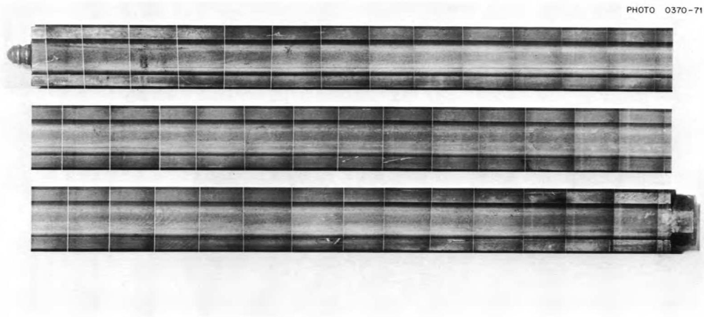  
Fig. 13.1. Photograph of one of the removable graphite moderator elements after operation in the MSRE, showing the fuel channel facing the center of the reactor. Machining marks are plainly visible in the fuel channel, showing the excellent condition of the core block.

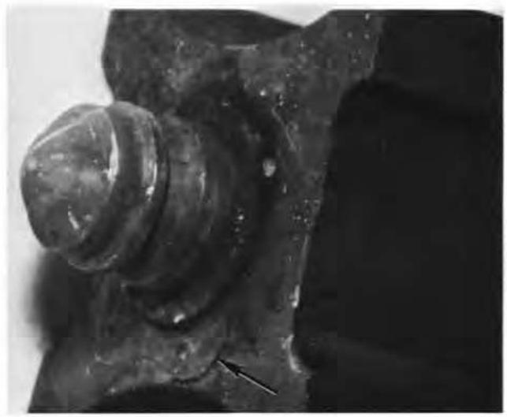

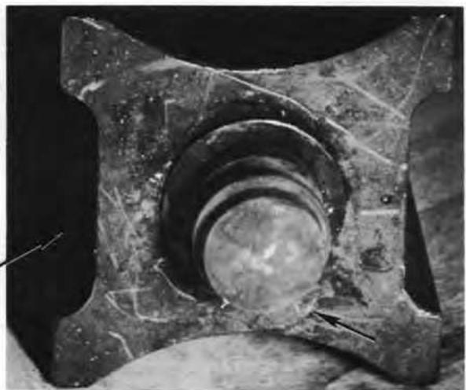

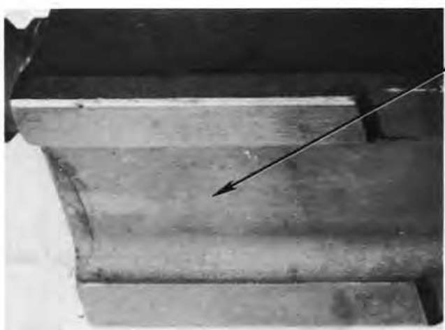  
Fig. 13.2. Photograph of the top of the graphite moderator element, showing the crack originating at the INOR-8 lifting stud and extending partway around the graphite block shown by the short arrows. The long arrow indicates the same channel in the different views. The crack was probably caused by the approximate factor of 2 difference in thermal expansion between the INOR-8 and the graphite during thermal cycling of the reactor.

maximum and minimum of the fabrication tolerances there were no significant changes or observable trends (Table 13.1).

Measurement of bowing was made by stretching a string tightly between two C-clamp-type fixtures at either end of the bar and measuring the distance between the bar and the string with a cathetometer, then rotating the bar $90^{\circ}$ and sighting on another bar surface and measuring again. The maximum observed bowing was 0.012 in. with the string being closer to the bar in the center, possibly indicating slight sagging of the string. It was concluded that there was no appreciable bowing. No tolerances for bowing were in the specifications, and the bar was not supported on a flat

Table 13.1. Dimensional measurements of graphite moderator element   

<table><tr><td rowspan="2">Location</td><td rowspan="2">Measured width (in.)</td><td colspan="2">Change from original dimensions, in inches, assuming -</td></tr><tr><td>Maximum size</td><td>Minimum size</td></tr><tr><td>Top</td><td>1.9947</td><td>-0.0033</td><td>0.0017</td></tr><tr><td>1 ft</td><td>1.9954</td><td>-0.0025</td><td>0.0024</td></tr><tr><td>2 ft</td><td>1.9944</td><td>-0.0036</td><td>0.0014</td></tr><tr><td>3 ft</td><td>1.9948</td><td>-0.0032</td><td>0.0018</td></tr><tr><td>4 ft</td><td>1.9942</td><td>-0.0038</td><td>0.0012</td></tr><tr><td>Bottom</td><td>1.9971</td><td>-0.0009</td><td>0.0041</td></tr></table>

${}^{a}$ Dimensional tolerances were ${1.998}_{-{0.005}}^{+{0.000}}$ in.

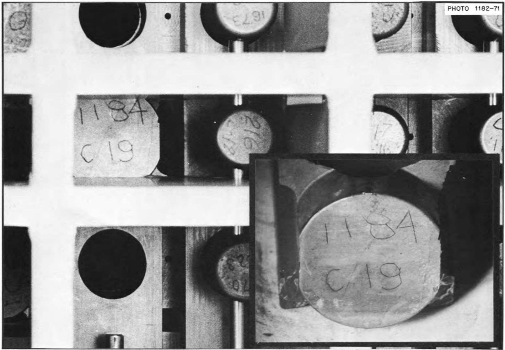  
Fig. 13.3. Comparison of the bottom positioning stud on the graphite moderator element when initially installed in the MSRE and after operation. The large picture was made before the reactor was operational, and the small picture in the lower right corner was made in the hot cells after the moderator element had been at temperature for over three years.

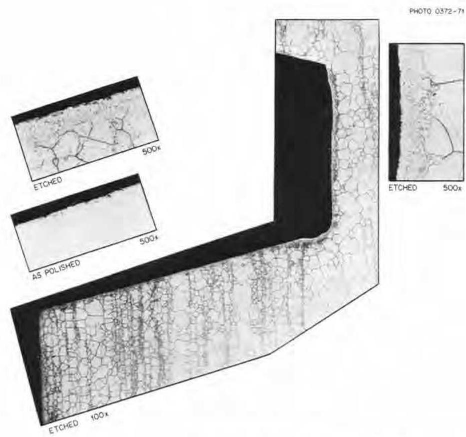  
Fig. 13.4. Hastelloy N thread that was in contact with graphite for about three years at $650^{\circ}\mathrm{C}$ . The modified layer is likely due to working effects from machining the thread. Reduced $70.5\%$ .

surface; so absolute measurements were not made or considered necessary since the bar removed easily. Photographs were taken of the assembled graphite core blocks before inserting in the reactor core. Figure 13.3 shows the bottom of core block 1184 C19 in the assembled position, and the inset shows the bottom of the same core block as it appeared in HRLEL after operation for the full life of MSRE. There is no apparent change, as the small cracks and the small chip missing from the bottom are apparent in both photographs and the numbers are just as legible as before operation.

Core-drilled samples were taken from the fuel flow channel near the midplane and used as electrodes in the mass spectrograph, but the results have not been analyzed. Core-drilled samples were taken at the top, middle, and bottom of the same fuel channel for Auger analysis of the surface layers for fission product deposition, but the results have not been received yet.

A cross section of the Hastelloy N lifting stud in contact with the graphite is shown in Fig. 13.4. There appears to be little if any reaction with the graphite. There is a surface modified layer about 1 or 2 mils deep

similar to that observed on surveillance samples and attributed to cold working of the surface and subsequent heat treatment during service. There appears to be very little difference in the side of the thread in contact with the graphite and the root of the thread, which probably was not in intimate contact.

# 13.2 AUGER ANALYSIS OF THE SURFACE LAYER ON GRAPHITE REMOVED FROM THE CORE OF THE MSRE

R. E. Clausing

The detection and quantitative analysis of thin layers of fission products deposited on the graphite and metal surfaces of the MSRE is necessary to predict the requirements for afterheat removal. Auger electron spectroscopy is a new technique which offers unique capabilities in this respect. It provides, under suitable conditions, excellent sensitivity (down to $0.1\%$ of a monolayer) and resolution down to one to three atom layers.[2,3] The technique is applicable to all elements

2. L. A. Harris, J. Appl. Phys. 39, 1419 (1968).   
3. L. A. Harris, J. Appl. Phys. 39, 1428 (1968).

except hydrogen and helium and, when combined with sputter thinning, can provide profiles of concentration as a function of depth below the original surface.

# 13.2.1 Auger Electron Spectroscopy

If a vacancy is created in an inner electron shell of an atom by electron bombardment or any other method, the excited atom will revert to the ground state by emitting characteristic $\mathbf{x}$ radiation or alternatively by emitting an electron as the result of a radiationless transition called an Auger transition. This Auger electron has an energy which is determined by the energy levels in the parent atom. Figure 13.5 shows schematically the Auger process for the creation of the $KL_{3}L_{3}$ (2144 eV) and $L_{2}VV$ ( $\sim 149$ eV) Auger electrons characteristic of sulfur. The energy of the Auger electron is obtained by subtracting the energy of the two final vacancies from the energy of the initial vacancy. The most useful Auger electrons have energies between 10 and 3000 eV, and when they originate more than a few atom layers below the surface they cannot escape from electrically conducting solids without energy losses. This effect produces the excellent depth resolution.

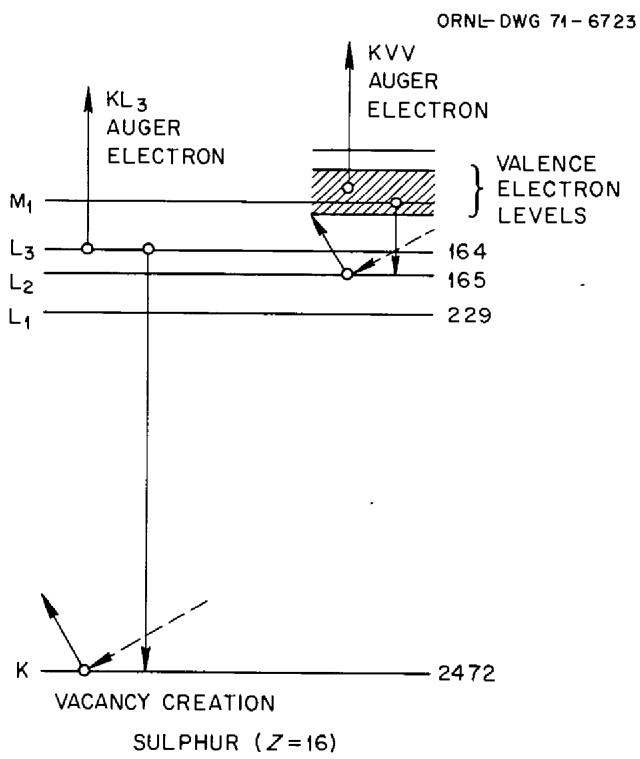  
Fig. 13.5. Energy level diagram showing schematically the emission of $KL_{3}L_{3}$ and $L_{2}VV$ Auger electrons from sulfur.

Special techniques are required to detect Auger electrons stimulated by electron bombardment of solids because the Auger electrons represent only a small signal superimposed on a large continuous background.2,3 Figure 13.6 shows how this small signal can be recovered from an energy distribution curve through differentiation. The differentiated curve is the one normally reported.

The differentiated curve is usually obtained using the instrumentation shown in Fig. 13.7. Electrons from the target are energy analyzed using a retarding potential applied to the second and third grids of a set of three grids spaced between the target and a hemispherical electron collector. The retarding potential is modulated by superimposing an ac voltage $(K\sin \omega t)$ on the retarding voltage $E_0$ . The amplitude of the ac component $(K^{\prime}\sin \omega t)$ in the collector current is proportional to the number of electrons in the energy range between $E_0 + \frac{1}{2} K$ and $E_0 - \frac{1}{2} K$ . A plot of $K^{\prime}$ as a function of $E_0$ then gives an energy distribution curve. The amplitude of the ac component $(K^{\prime \prime}\sin 2\omega t)$ is

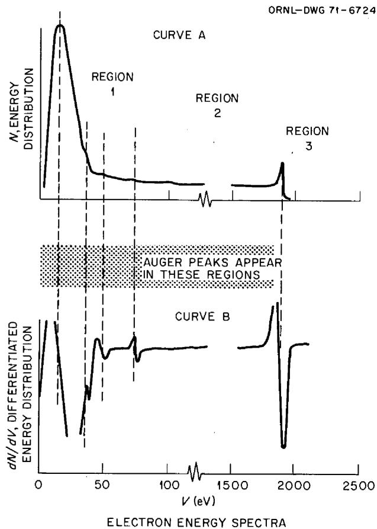  
Fig. 13.6. Method of enhancing the visibility of Auger spectra.

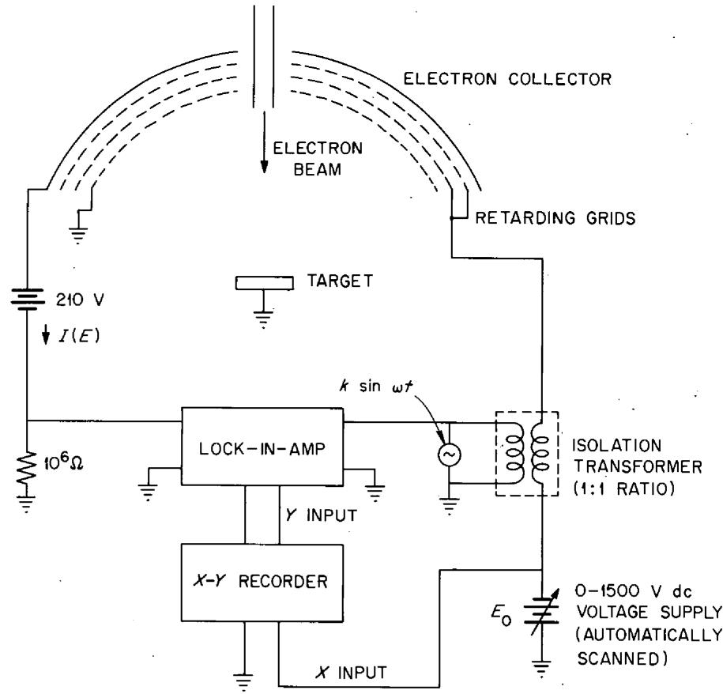  
Fig. 13.7. Instrumentation for Auger electron energy analysis using the retarding-potential technique

proportional to the derivative of the energy distribution curve.4 The lock-in amplifier output, which is proportional to these amplitudes, can thus be used together with a signal proportional to $E_0$ to plot directly either an energy distribution curve or its differential by tuning it to the fundamental of the modulation frequency or its second harmonic respectively.

# 13.2.2 Results and Discussion

An apparatus has been built specifically for the Auger analysis of radioactive samples from the MSRE, and preliminary results are reported below. Figure 13.8 shows the apparatus. In addition to the basic equipment for Auger analysis, an ion gun is provided for sputter thinning the sample, and provision is made to heat the sample by electron bombardment. A movable shield is

provided to minimize the contamination of the apparatus.

Figure 13.9 shows a curve obtained from MSRE sample 6. This sample is from a core surveillance specimen removed in April 1968, after run 14. A number of Auger peaks are present. They have been tentatively identified as indicating the presence of carbon, oxygen, sulfur, molybdenum, niobium, tellurium, technetium, uranium, lithium, and beryllium. Contributions of these elements to the spectra are indicated in the figure caption. There is some overlap of spectra which complicates the interpretation; however, the use of better resolution for intense peaks and increased sensitivity for less intense peaks will minimize this problem.

Table 13.2 shows how several of the peaks changed during sputter thinning. These peak heights are proportional to the concentration of the parent atoms at the surface of the sample. Since no suitable standards were available, no absolute concentrations can be given yet. Additional samples and standards are now available, and quantitative information will be available soon.

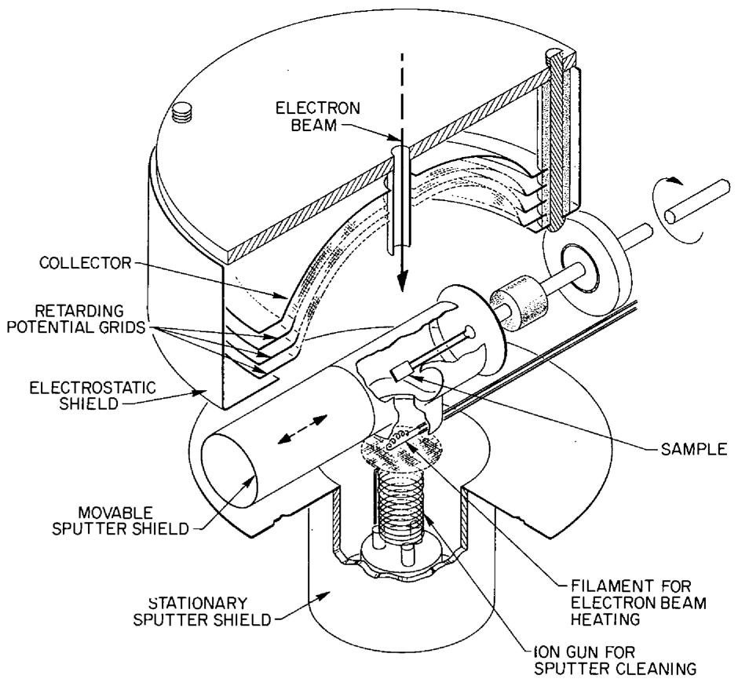  
Fig. 13.8. Apparatus for Auger analysis of low-level radioactive samples.

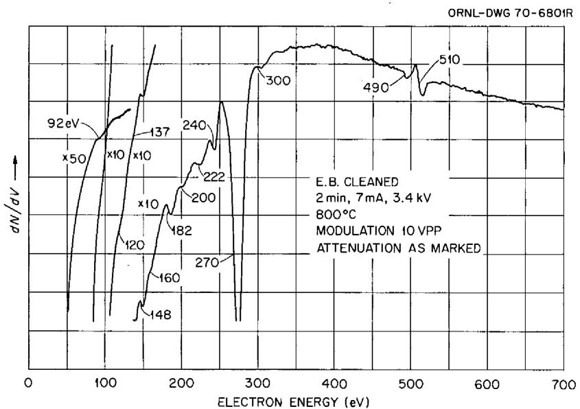  
Fig. 13.9. Auger electron spectra from MSRE graphite sample 6 after heating to $800^{\circ}\mathrm{C}$ for $5\mathrm{min}$ by electron bombardment. The following elements have been tentatively identified as making contributions to the peaks: S 148; O 510, 490; C 270, 253, 240; Mo 222, 185, 160, 149, 137, 118; Nb 200, 160, 92; Tc 250, 220, 180, 145; Te 490, 410, 278; U 92 (86), (72), (60); Li (39); Be 92. Values in parentheses are from a low-energy scan not shown.

Table 13.2. Auger electron intensity as a function of depth below the original surface of sample MSRE 6 (film side)   
Normalized to carbon (270) equal 100   

<table><tr><td>Accumulated argon ion bombardment (×1015/cm2)</td><td>Estimated depth (atom layers)</td><td>Technetium, sulfur, molybdenum (148 eV)</td><td>Technetium, molybdenum (182 eV)</td><td>Niobium (200 eV)</td></tr><tr><td>0</td><td></td><td>29</td><td>9</td><td>2</td></tr><tr><td>5</td><td>1</td><td>9</td><td>12</td><td>4</td></tr><tr><td>13</td><td>3</td><td>6</td><td>16</td><td>3</td></tr><tr><td>23</td><td>5</td><td>7</td><td>19</td><td>3</td></tr><tr><td>58</td><td>10</td><td>5</td><td>23</td><td>4</td></tr><tr><td>136</td><td>25</td><td>4</td><td>16</td><td>3</td></tr><tr><td>280</td><td>55</td><td>4</td><td>12</td><td>3</td></tr><tr><td>540</td><td>110</td><td>3</td><td>12</td><td>2</td></tr><tr><td>1240</td><td>250</td><td>2</td><td>10</td><td></td></tr><tr><td>1886</td><td>380</td><td>2</td><td>9</td><td></td></tr><tr><td>3464</td><td>700</td><td>nda</td><td>9</td><td></td></tr><tr><td>3570</td><td>710</td><td>2</td><td>14</td><td></td></tr><tr><td>3700</td><td>740</td><td>2</td><td>9</td><td></td></tr><tr><td>6764</td><td>1350</td><td></td><td>8</td><td></td></tr><tr><td>11,907</td><td>2400</td><td>nda</td><td>7</td><td></td></tr></table>

$a_{\mathrm{nd}} = \mathrm{not}$ detected.

# 13.3 EXAMINATION OF HASTELLOY N CONTROL ROD THIMBLE

B. McNabb H.E.McCoy

Control rod thimble 3 was cut off just above the midplane of the reactor core. Figure 13.10 shows the electric arc cut made at the left and enlarged views of the spacer sleeves. Some areas show the possibility of some wetting of the Hastelloy N by the fuel salt near the center of the reactor, where the temperature and flux were higher, as shown around the left and center spacer sleeves, but not at the bottom, as shown on the right sleeve. Some of the variations in light and dark areas are due to not obtaining even lighting for the pan photographs made in the hot cells. The control rod thimble was fabricated from Hastelloy N heat Y8487 with chemical composition of Ni-70.80%, Mo-16.78%, Cr-7.32%, Fe-4.1%, Mn-0.3%, C-0.05%, Si-0.17%, S-0.0075%, P-0.004%, Cu-0.03%, Co-0.1%, Al-0.16%, Ti-0.25%, B-0.007%; the melt was made and fabricated in 2-in.-OD tubing by the International Nickel Company.

Tensile tests were conducted on some $\frac{1}{4}$ -in.-wide rings cut from the 2-in. control rod thimble, using the fixture shown in Fig. 13.11. The circular ring is placed

in the fixture when it is closed, and the two halves are pulled apart in the tensile test. Most of the strain occurs in the two sides between the grips, but the gage length changes during the test and makes it impossible to define elongation as a percent. Therefore crosshead travel and the reduction in area at the fracture are reported. Table 13.3 compares the properties of the unirradiated and irradiated samples tested in the same manner. It shows that there is little change in the yield and ultimate strengths. The room-temperature reduction in area is reduced from about $45\%$ in the as-received, unirradiated condition to $28\%$ for the irradiated rings. Some of the ductility at $25^{\circ}\mathrm{C}$ can be recovered by annealing at $871^{\circ}\mathrm{C}$ for 8 hr but is not improved further by annealing 141 hr at this temperature. The elevated-temperature reduction in area was reduced more severely but still was $9.7\%$ at a fairly slow deformation rate of 0.002 in./min. Similar changes were noted in the properties of the surveillance samples reported previously.

The control rod thimbles were exposed to fuel salt and fission product deposition only on the exterior of the tube, and the irradiated rings only exhibited fissuring or cracking on the exterior of the ring, as shown in Fig. 13.12. The ID of the tube was slightly

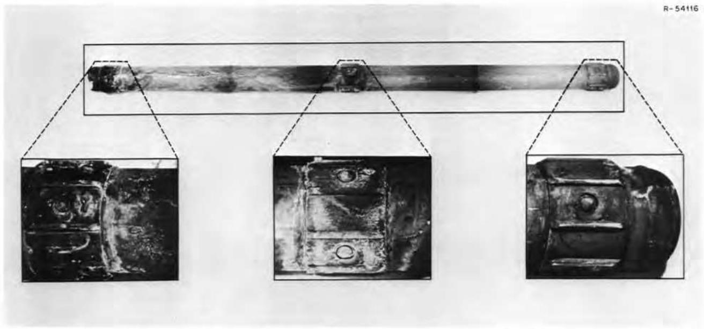  
Fig. 13.10. Portion of Hastelloy N control rod thimble removed from the MSRE. The cut end was near the axial center of the reactor. The bottom end was near the bottom of the core. The sleeves are Hastelloy N spacers and were held in place by a small weld bead.

Table 13.3. Tensile data on rings from control rod thimble 3 (heat Y-8487)   

<table><tr><td>Specimen No.</td><td>Condition</td><td>Postirradiation anneal</td><td>Test temperature (℃)</td><td>Crosshead speed (in./min)</td><td>Yield stress \( {}^{a} \) (psi)</td><td>Ultimate stress (psi)</td><td>Crosshead travel (in.)</td><td>Reduction in area (%)</td></tr><tr><td>5</td><td>Unirradiated</td><td></td><td>650</td><td>0.05</td><td>39,100</td><td>76,700</td><td>0.37</td><td>28.7</td></tr><tr><td>6</td><td>Unirradiated</td><td></td><td>25</td><td>0.05</td><td>52,000</td><td>114,400</td><td>1.20</td><td>44.5</td></tr><tr><td>7</td><td>Unirradiated</td><td></td><td>25</td><td>0.05</td><td>56,900</td><td>117,500</td><td>1.17</td><td>46.0</td></tr><tr><td>8</td><td>Unirradiated</td><td></td><td>25</td><td>0.05</td><td>58,000</td><td>124,300</td><td>1.18</td><td>43.0</td></tr><tr><td>9</td><td>Unirradiated</td><td></td><td>650</td><td>0.002</td><td>40,700</td><td>62,300</td><td>0.20</td><td>20.6</td></tr><tr><td>2</td><td>Irradiated</td><td>None</td><td>25</td><td>0.05</td><td>54,400</td><td>105,100</td><td>0.54</td><td>23.2</td></tr><tr><td>3</td><td>Irradiated</td><td>None</td><td>25</td><td>0.05</td><td>53,300</td><td>102,500</td><td>0.51</td><td>29.7</td></tr><tr><td>4</td><td>Irradiated</td><td>None</td><td>25</td><td>0.05</td><td>60,500</td><td>110,800</td><td>0.42</td><td>28.5</td></tr><tr><td>6</td><td>Irradiated</td><td>None</td><td>650</td><td>0.05</td><td>38,300</td><td>51,200</td><td>0.099</td><td>12.1</td></tr><tr><td>7</td><td>Irradiated</td><td>None</td><td>650</td><td>0.002</td><td>34,200</td><td>38,200</td><td>0.061</td><td>9.7</td></tr><tr><td>5</td><td>Irradiated</td><td>\( 8\mathrm{{hr}} \) at \( {871}^{ \circ  }\mathrm{C} \)</td><td>25</td><td>0.05</td><td>49,300</td><td>100,500</td><td>0.36</td><td>34.9</td></tr><tr><td>8</td><td>Irradiated</td><td>\( {141}\mathrm{{hr}} \) at \( {871}^{ \circ  }\mathrm{C} \)</td><td>25</td><td>0.05</td><td>48,700</td><td>104,900</td><td>0.39</td><td>34.4</td></tr></table>

${}^{a}$ Based on 0.002 in. offset of crosshead travel.

oxidized by the reactor cell atmosphere, and the oxide cracked during testing, but the cracks did not propagate into the metal wall. Figure 13.13 shows a cross section of the control rod thimble and spacer sleeve near the midplane of the core. The cross section was made through the button weld that kept the spacer sleeve from sliding up or down the thimble. The OD of the sleeve was exposed to flowing salt and the ID to salt in a 0.005-in. clearance or crevice between the sleeve and the thimble. The OD of the thimble at this point was exposed to the same conditions as the ID of the sleeve, and the ID of the thimble was exposed to the control rod thimble cooling atmosphere. The spacer sleeve was made of heat 5060, and the weld bead was made with heat 5090 weld wire, both air-melted heats of standard Hastelloy N. There appears to be very little attack on any of the materials, with only the 2- to 4-mil surface modification similar to that noted previously. Surface layers of the thimble material are presently being dissolved for fission product analysis at the midplane and bottom of the core, but results have not been received.

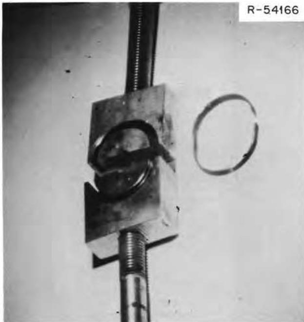  
Fig. 13.11. Fixture used for pulling Hastelloy N rings cut from the control rod thimble.

Fig. 13.12. Hastelloy N ring from control rod thimble stressed at $25^{\circ}\mathrm{C}$ . The cracked surface was exposed to the fuel salt, and the oxidized surface was exposed to the cell environment of 2 to $5\%$ $\mathrm{O}_2$ and $\mathrm{N}_2$ .   
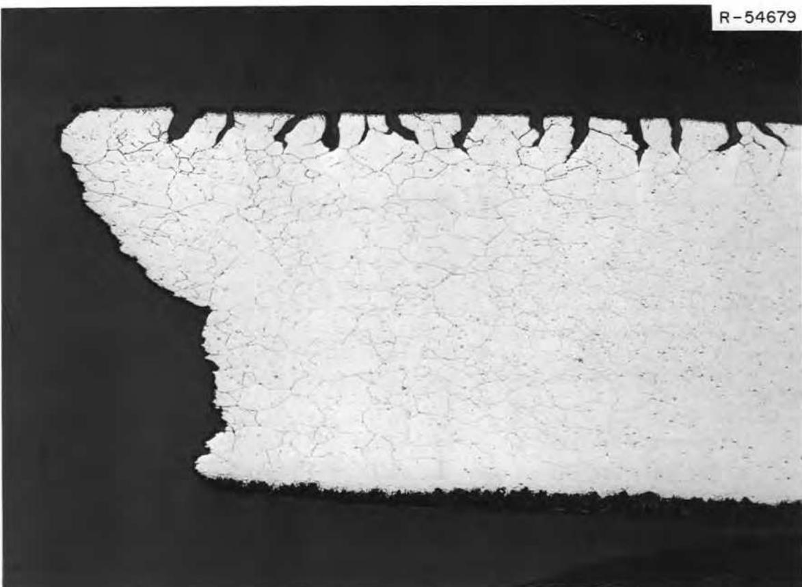  
0000 0000

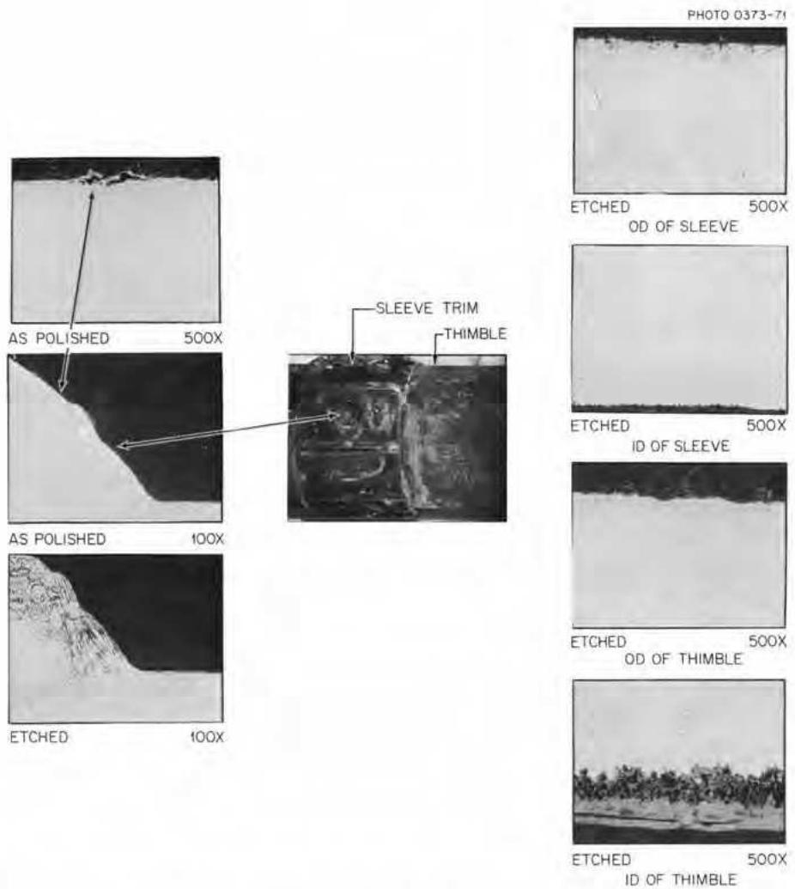  
Fig. 13.13. Cross section of Hastelloy N control rod, spacing sleeve, and weld bead. Reduced $72\%$ .

Figure 13.14 is a photomicrograph of the cross section of the tube wall, near the midplane of the core showing the OD in the as-polished condition, showing a grain boundary network by relief polishing, 4 or 5 mils deep. Figure 13.15 is the same area in the etched condition showing the modified etching characteristics of the surface layers.

# 13.4 EXAMINATION OF THE SAMPLER ASSEMBLY

B. McNabb H.E.McCoy

One of the $1/4$ -in.-diameter rods from the sampler enricher cage reported elsewhere was sectioned for metallography and fission product deposition analysis.

A piece was cut from the bottom of the rod in the liquid or fuel salt region of the pump bowl and one at the top in the vapor or gas region above the liquid level. Figure 13.16 shows a photomicrograph of the rod above the liquid level or in the vapor region of the pump bowl. There is very little if any attack in this area, either as polished or etched. Figure 13.17 is a photomicrograph of the bottom of the rod in the liquid region. There was quite a bit of deposited material on the lower end of the rod in the liquid region, but there was little attack on the rod as shown in the micrograph, unless it was even removal of all constituents of the surface. Electron microprobe examination and electrolytic dissolution of the surface layers are planned for one of the rods, and the electrolytic dissolution of the specimen from the mist shield in the liquid and vapor regions is planned for determination of fission products and the deposited material on the rods.

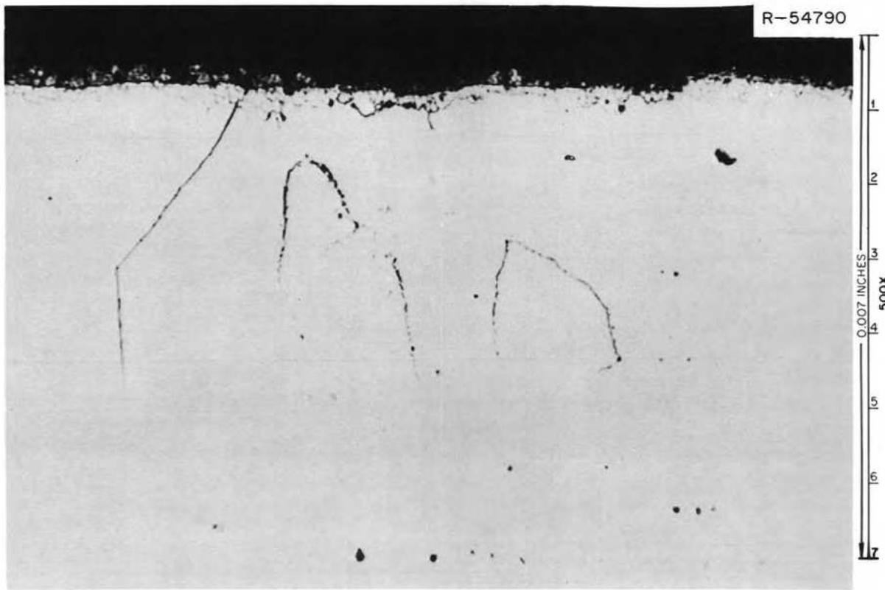

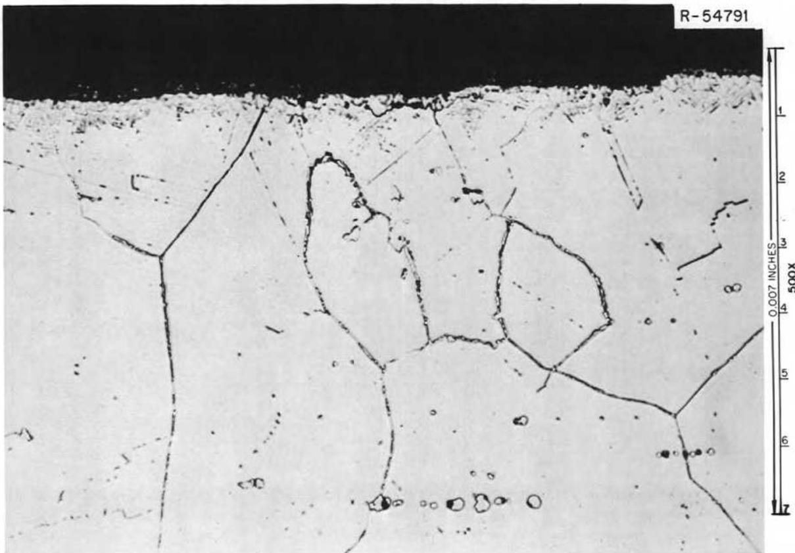  
Fig. 13.14. Photomicrograph of the cross section of the Hastelloy N control rod thimble showing the outside diameter in the as-polished condition.   
Fig. 13.15. Photomicrograph of the cross section of the Hastelloy N control rod thimble showing the outside diameter in the etched condition. Etchant: aqua regia.

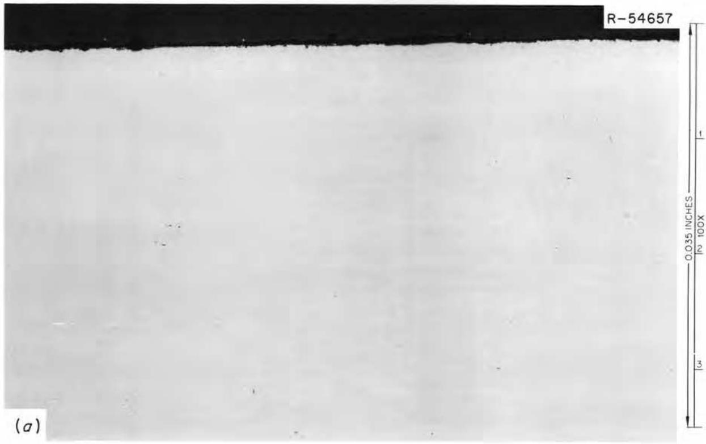

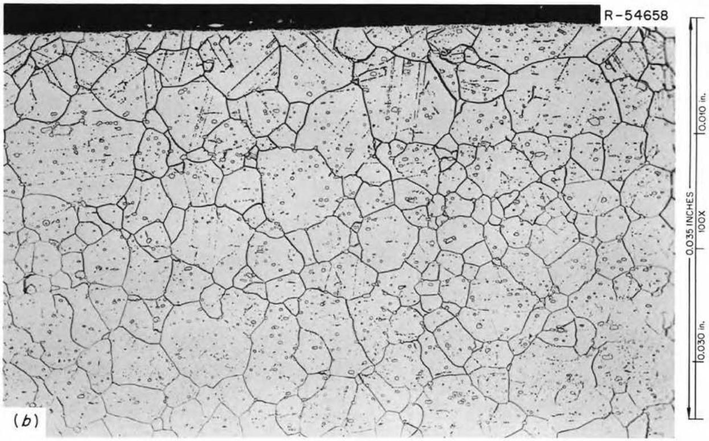  
Fig. 13.16. Photomicrographs of a Hastelloy N rod from the sampler assembly located above the normal salt level. (a) As polished; (b) etched with aqua regia.

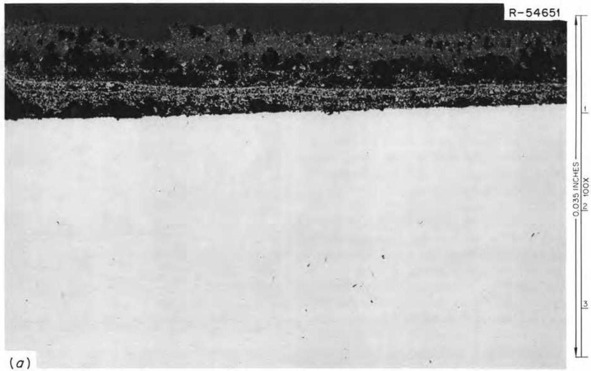

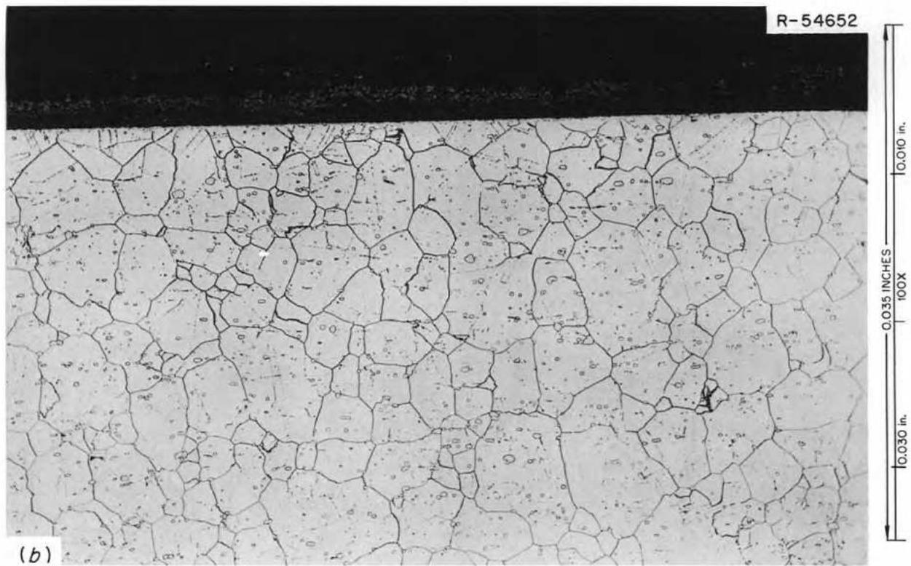  
Fig. 13.17. Photomicrographs of a Hastelloy N rod from the sampler assembly. Normally located below the salt level. (a) As polished; (b) etched with aqua regia.

# 13.5 EXAMINATION OF A COPPER SAMPLE CAPSULE

B. McNabb H.E.McCoy

A copper sample bucket that was probably in the sampler cage of the pump bowl from August 1967 to January 1971 was examined. It had been flattened, probably during retrieval attempts in April 1968, when heavy magnets were used with no cushioning effects of salt and with the pump bowl at high temperature. Figure 13.18 is a photomacrograph of a cracked area of the sample capsule showing some deposited material on the outside of the capsule. Figure 13.19 is a photomicrograph of the cracked area polished down below the surface, showing the intergranular nature of the cracks and the extent of them. The capsule was made of OFHC copper and hydrogen fired $2\mathrm{hr}$ at $1200^{\circ}\mathrm{F}$ before use. Figure 13.20 is a photomicrograph of a cross section of the copper capsule, showing the thick deposit of material on both the OD and ID of the capsule.

An electron probe microanalysis of the material in the grain boundaries and x-ray scans for the distribution of nickel, iron, chromium, and copper in the surface layer

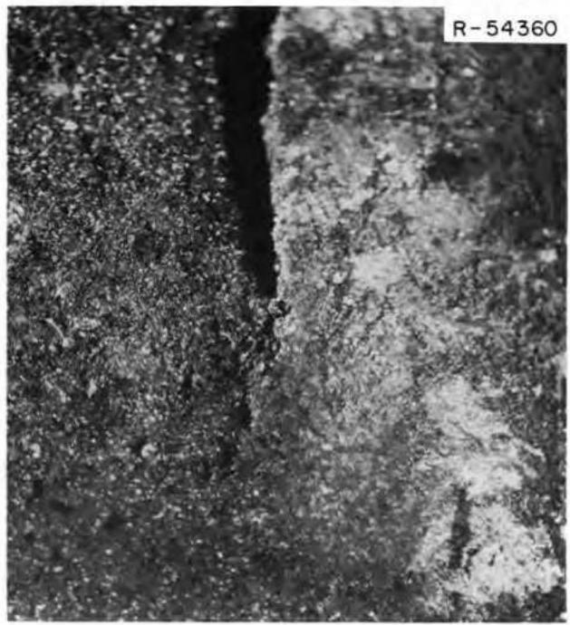  
Fig. 13.18. Photograph of the crack formed in the copper sampler that was retrieved from the pump bowl. The outer surface was coated with deposited material.

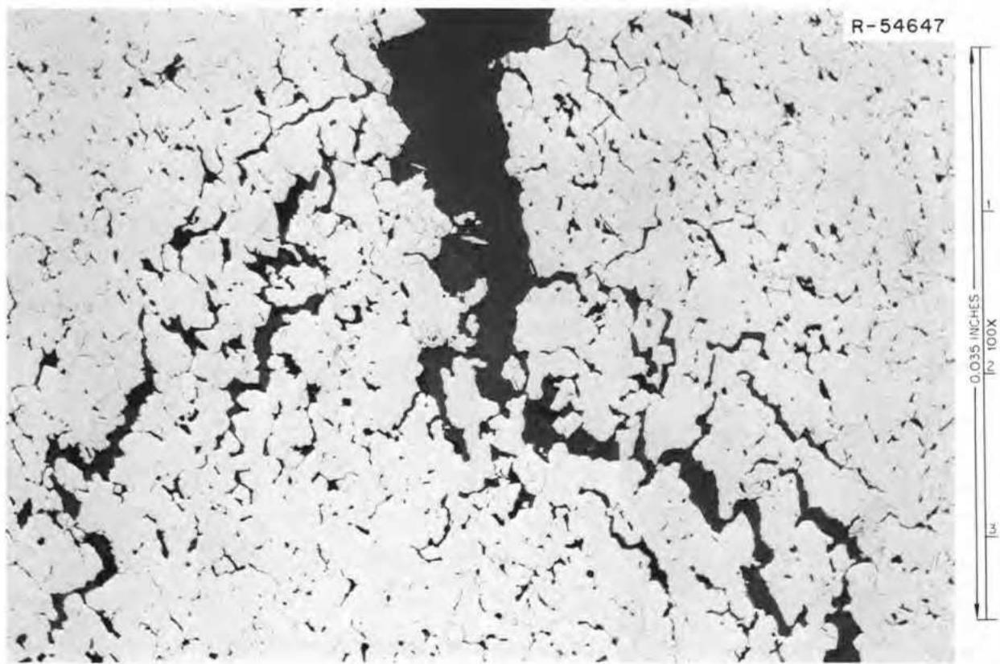  
Fig. 13.19. Section of copper capsule showing extensive intergranular cracking.

PHOTO 1183-71

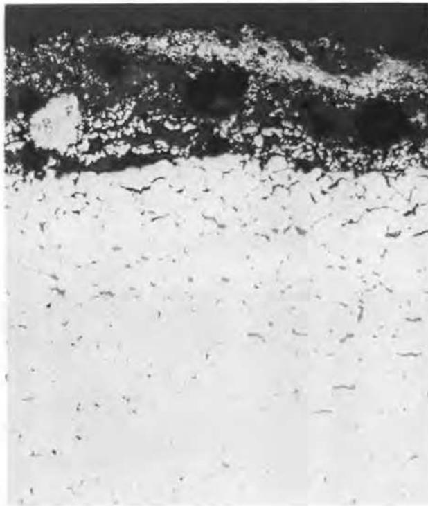

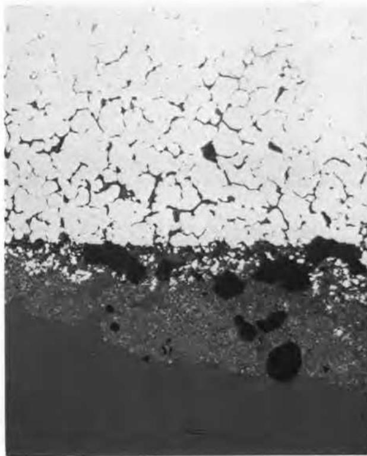  
Fig. 13.20. Photomicrographs of copper MSRE fuel sampler showing layers on OD (top) and ID (bottom).

in the area around the large metallic particle on the OD were made. Figure 13.21 shows the distribution of these elements, and it appears that the surface layers are made up mostly of copper and nickel with some areas containing high concentrations of chromium and molybdenum. The ID appears similar to the OD of the capsule. The grain boundary precipitates were only $28\%$ copper, and no other element could be detected. This observation indicates that the remainder is a light element that could not be detected by the instrument. Beryllium and lithium are possibilities for the unidentified element.

The surface deposits were mechanically ground away from two small pieces about $1/16$ in. square by $1/4$ in. long for electrodes for the mass spectrograph. We do not know the exact depth of sampling, but suspect that it was near the surface. The analysis of these is shown in Table 13.4. Several important points can be made from this analysis. The spectrograph was not adjusted to detect lithium, but the presence of uranium, zirconium, beryllium, and fluorine indicates that the fuel salt was present. More specifically, the isotopic concentrations of U correspond to those of the first fuel charge rather than the later fuel charge, where the uranium was predominantly $^{233}\mathrm{U}$ . The weight percents of various elements present in the initial fuel charge were approximately $10.9\mathrm{Zr}$ , $6.3\mathrm{Be}$ , $67\mathrm{F}$ , $5.1\mathrm{U}$ , and $10.8\mathrm{Li}$ . Using U as a base, Be should be higher by a factor of 2.1, and F higher by a factor of 13. The analytical values in Table 13.4 show the factors based on U to be 0.7 for Be, 6.6 for Zr, and 0.7 for F. Thus, using U as a base, the material in the Cu capsule is enriched in Zr and

Table 13.4. Composition of copper capsule   

<table><tr><td>Element</td><td>Concentration (ppm)</td><td>Element</td><td>Concentration (ppm)</td></tr><tr><td>As</td><td>1</td><td>Si</td><td>70</td></tr><tr><td>Be</td><td>1000</td><td>Sn</td><td>~20</td></tr><tr><td>Ca</td><td>~5</td><td>Sr</td><td>~1</td></tr><tr><td>Cr</td><td>30</td><td>Te</td><td>≤5</td></tr><tr><td>C</td><td>M</td><td>233U</td><td>5</td></tr><tr><td>Fe</td><td>300</td><td>235U</td><td>500</td></tr><tr><td>K</td><td>~5</td><td>238U</td><td>1000</td></tr><tr><td>Mg</td><td>10</td><td>V</td><td>0.3</td></tr><tr><td>Mn</td><td>1</td><td>Zn</td><td>20</td></tr><tr><td>Mo</td><td>30</td><td>Zr</td><td>10,000</td></tr><tr><td>Nb</td><td>1</td><td>F</td><td>~1000</td></tr><tr><td>Ni</td><td>1500</td><td></td><td></td></tr><tr><td>P</td><td>2</td><td></td><td></td></tr><tr><td>Pb</td><td>5</td><td></td><td></td></tr></table>

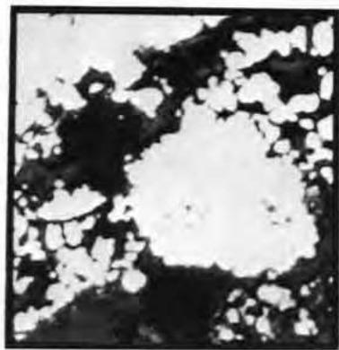  
PHOTOMICROGRAPH OF AREA SCAN

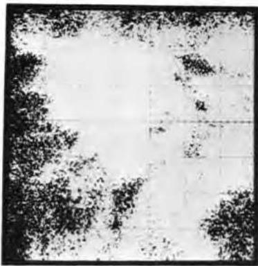  
CuKa X-RAY SCAN

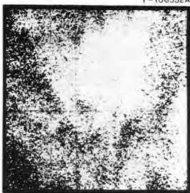  
NiKa X-RAY SCAN

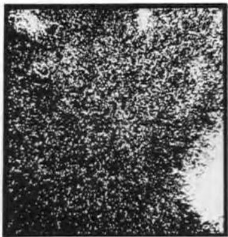  
FeKa X-RAY SCAN

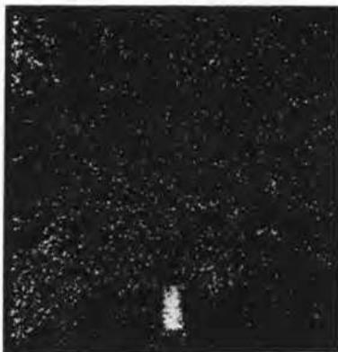  
CrKa X-RAY SCAN

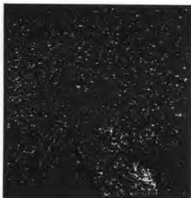  
MoLa X-RAY SCAN   
Fig. 13.21. Views of the surface of the copper sampler in the electron probe microanalyzer. The upper left picture is an optical photomicrograph showing the deposited metal crystals. The other pictures show the intensity of x-ray fluorescence for various elements. These displays are a mirror image of the first optical picture. Note that certain areas are enriched in Ni, Fe, Cr, and Mo. Some copper from the capsule is present in the deposited material.

depleted in F and Be. There are significant quantities of Fe, Ni, Mo, and Cr, the main elements in Hastelloy N. There are also detectable quantities of several other elements, many of which may have been present in the copper initially.

The copper is currently very brittle, and the present analytical results do not shed much light on what element is responsible for the embrittlement. Further samples will be analyzed deeper into the material where the salt did not penetrate in an effort to answer this question.

# 13.6. EXAMINATION OF THE PRIMARY HEAT EXCHANGER

B. McNabb H.E.McCoy

An oval piece of the heat exchanger shell approximately $10 \times 13$ in. was cut out for examination. Figure 13.22 is a photograph of the inside of this piece showing the thin bluish-gray coating probably caused

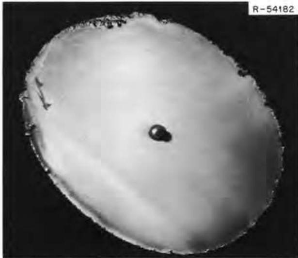  
Fig. 13.22. Section $10 \times 13$ in. cut from the primary heat exchanger shell. The piece was cut with a plasma torch, and the center stud was used for guiding the torch.

by the cutting operation. The bottom of the stud used for guiding the cutting operation shows in the center, with an area around it where the cutting fluid used in threading the hole has washed away the powdery coating. Some of this coating was brushed off and gamma scanned in HRLEL. It contained $^{106}\mathrm{Ru}$ and $^{125}\mathrm{Sb}$ , but a detailed analysis has not yet been made.

Two $1/2$ in.-diam cylinders were cut from the shell, one for metallographic examination and one for fission product deposition examination, which is presently being conducted. Figure 13.23 shows photomicrographs of the inner surface that was exposed to fuel salt. There appears to be little attack, but there is a surface modified layer with different etching characteristics approximately 1 mil deep. The shell was fabricated from heat 5068, a standard air-melted heat with chemical composition of $16.5\% \mathrm{Mo}$ , $4\% \mathrm{Fe}$ , $6.45\% \mathrm{Cr}$ , $0.45\% \mathrm{Mn}$ , $0.05\% \mathrm{C}$ , $0.58\% \mathrm{Si}$ , $0.03\% \mathrm{P}$ , $0.008\% \mathrm{S}$ , $0.02\% \mathrm{Cu}$ , $0.1\% \mathrm{Co}$ , $0.27\% \mathrm{V}$ , $0.01\% \mathrm{Al}$ , $0.01\% \mathrm{Ti}$ , Ni. Figure 13.24 is photomicrographs of the OD of the shell showing the oxidation of the surface and the area under the oxide that etched differently to a maximum depth of approximately 10 mils, likely due to depletion of chromium from the surface.

Figure 13.25 is a photograph of the six heat exchanger tubes as they appeared after removal. The longest tube was cut by the plasma torch when the shell was cut through, and the others were cut by an abrasive cutoff machine. The tubes had a light powdery coating on one side similar to the inside of the heat exchanger shell. This would be the case if the deposit was caused by the plasma torch cutting operation, since the sides of the tube away from the torch would have been shielded.

One of the tubes was cut up for metallography and fission product analysis. Figure 13.26 shows a longitudi

nal section of the tube OD (exposed to fuel salt) in the as-polished and etched conditions, and Fig. 13.27 shows the transverse section of the tube. Note that the OD in the as-polished condition appears to have a grain boundary network near the surface to a depth of 3 or 4 mils, but this was not present in the as-polished ID exposed to coolant salt.

Tensile tests were conducted at $25^{\circ}\mathrm{C}$ on some of these tubes, and Fig. 13.28 shows photomicrographs of a longitudinal section of the tube wall near the fracture. Note that fissuring or cracking occurred to a depth of 4 to 6 mils only on the OD which was exposed to fuel salt and fission products. The ID of the tube etched differently to a depth of $\sim 5$ mils, but this might be attributed to fabrication history similar to that of the radiator tubing; we have suggested that lubricants containing carbon left carbon residues that were diffused into the tubing and caused carbide precipitation during the operation of the heat exchanger. The inhibited grain growth on the ID also supports this premise.

The heat exchanger tubing was $\frac{1}{2}$ -in.-OD by 0.042-in.-wall Hastelloy N, heat N2-5101, with chemical composition of $16.4\%$ Mo, $6.9\%$ Cr, $3.9\%$ Fe, $0.45\%$ Mn, $0.06\%$ C, $0.60\%$ Si, $0.001\%$ P, $0.009\%$ S, $0.01\%$ Cu, $0.10\%$ Co, $0.33\%$ V, $0.06\%$ W, $0.01\%$ Al, $0.01\%$ Ti, $0.006\%$ B. The results of tensile tests on tubes in the as-received condition and those removed from the heat exchanger are summarized in Table 13.5. The strength parameters and the fracture strain were slightly lower for the tubing removed from the heat exchanger. The property changes are rather small and are likely due primarily to the precipitation of carbides during service.

6. H. E. McCoy and B. McNabb, MSR Program Semiannu. Progr. Rep. Aug. 31, 1970, ORNL-4622, pp. 120-26.

Table 13.5. Tensile data on heat exchanger tubes (heat N2-5101)   

<table><tr><td>Specimen No.</td><td>Condition</td><td>Crosshead speed (in./min)</td><td>Temperature (°C)</td><td>Yield stress (psi)</td><td>Ultimate tensile stress (psi)</td><td>Fracture strain</td><td>Reduction in area (%)</td></tr><tr><td>6</td><td>From heat exchanger</td><td>0.05</td><td>650</td><td>44,300</td><td>67,400</td><td>21.3</td><td>22.4</td></tr><tr><td>5</td><td>From heat exchanger</td><td>1.0</td><td>25</td><td>66,300</td><td>118,000</td><td>37.0</td><td>20.5</td></tr><tr><td>4</td><td>From heat exchanger</td><td>0.05</td><td>25</td><td>64,800</td><td>122,000</td><td>39.0</td><td>29.0</td></tr><tr><td>3</td><td>As received</td><td>0.05</td><td>650</td><td>53,900</td><td>74,600</td><td>40.0</td><td>14.5</td></tr><tr><td>1</td><td>As received</td><td>0.05</td><td>25</td><td>73,000</td><td>127,400</td><td>51.1</td><td>42.6</td></tr><tr><td>2</td><td>As received</td><td>0.05</td><td>25</td><td>70,900</td><td>126,200</td><td>50.1</td><td>40.0</td></tr></table>

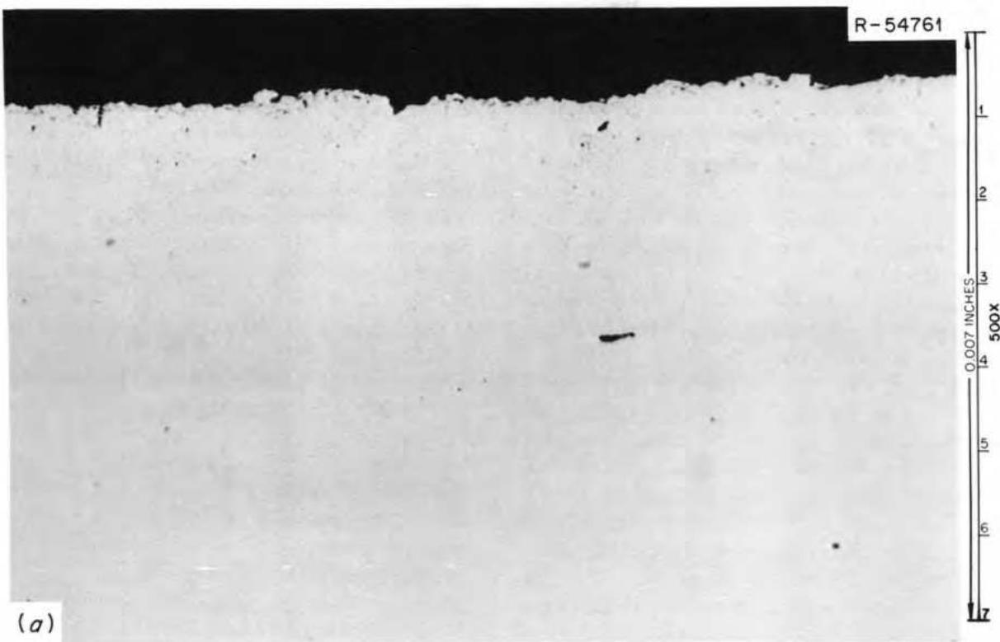

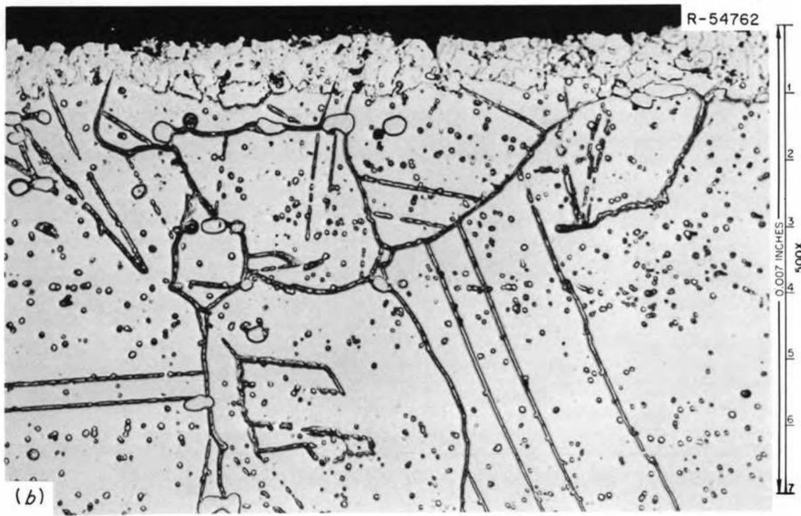  
Fig. 13.23. Photomicrographs of the inside surface of the primary heat exchanger shell. The surface was exposed to fuel salt, and the modified structure to a depth of about 1 mil is apparent. (a) As polished; (b) etched with aqua regia.

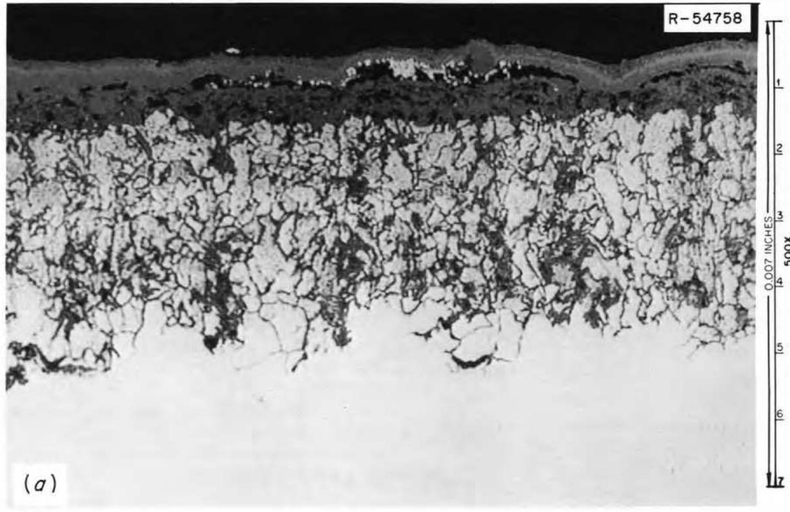

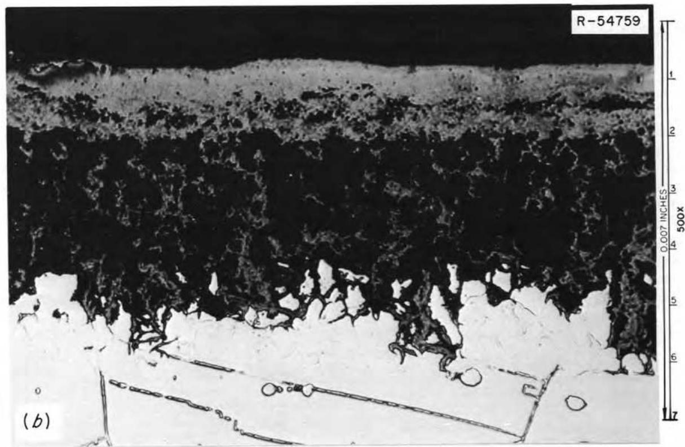  
Fig. 13.24. Photomicrographs showing the outside edge of the primary heat exchanger shell. This surface was exposed to 2 to $5\% \mathrm{O}_2$ and $\mathbf{N}_2$ . (a) As polished, showing the selective oxidation that occurred; (b) etched view showing that the metal in the oxidized layer was completely removed. Etched with aqua regia.

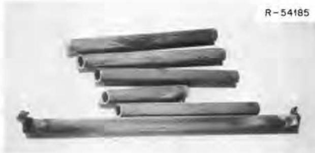  
Fig. 13.25. Photograph of the $\frac{1}{2}$ -in.-OD Hastelloy N tubes from the primary heat exchanger. The different shades arise from a dark film that is thought to have been deposited when the shell was being cut. The film was deposited on the side of the tubes facing the shell.

# 13.7 EXAMINATION OF FREEZE VALVE 105

B. McNabb H.E.McCoy

The MSRE utilizes several freeze valves where a section of tubing is air cooled to freeze a salt plug that prevents salt or gas flow through the pipe. A schematic of such a valve is shown in Fig. 13.29. The tubing is usually flattened, and a thin housing for the coolant (air) is welded around the flattened section. The portion of the housing that is parallel to the tubing is kept thin so that it will accommodate the differential expansion between the pipe and the housing when the valve is being thawed or frozen.

One of these valves (FV 105) failed when the MSRE was shut down in December 1969. This valve was in a $1\frac{1}{2}$ -in. pipe, and the failed portion is shown in Figs. 13.30 and 13.31.

The salt was partially removed to reveal the crack shown in Fig. 13.32. The crack begins at the spot on the weld and proceeds about 1 in. parallel to the weld.

A metallographic sample was taken of the cracked area. An as-polished view is shown in Fig. 13.33 and an

etched view in Fig. 13.34. The weld was on the tubing OD and supported the $1/8$ -in. end plate of the cooling shroud. The crack began near the weld outside the cooling shroud and penetrated the tube wall. A comparison of the etched and unetched views shows that some attack occurred along the crack and the tubing OD and that the metal was completely removed from the attacked region by etching. The attack was likely due to the simultaneous exposure of the Hastelloy N to salt and moist air. The attack likely involved the solution removal of Cr and Fe, leaving metal that was heavily attacked by the etchant. No such attack occurred on the ID, where only salt was present.

The failure that released salt was due to thermal fatigue. The cooling shroud was initially 0.020 in. thick, but the added cooling tubes increased the thickness to 0.083 in. on the bottom side. This made the shroud relatively rigid on the bottom side. During freezing and thawing, the outer part of the shroud changed temperature more rapidly than the wall of the salt-containing tube. Whereas the outer part of the shroud was originally thin enough to deflect to accommodate the differences in length of the two members, the repairs made the bottom portion quite rigid. The result was that differences in temperature imposed a stress on the cooling shroud that was transferred by the rigid $(1/8\text{-in.})$ end plate to the tube wall. A crack was nucleated at the surface and propagated through the pipe wall during the numerous cycles.

Parts of three tubes are visible in Figs. 13.30 and 13.31. The large tube that is in relatively good condition is the type 304 stainless steel air inlet tube, the center tube is the original Hastelloy N air outlet tube with two thermocouples visible, and the hole is the remains of the type 304 stainless steel outlet tube. The original Hastelloy N air inlet line was capped off and is hidden by the salt. The attack of the type 304 stainless steel by salt when air was present is as expected. The relative nobility of Hastelloy N in this environment is a strong argument for the use of Hastelloy N where salt may be present.

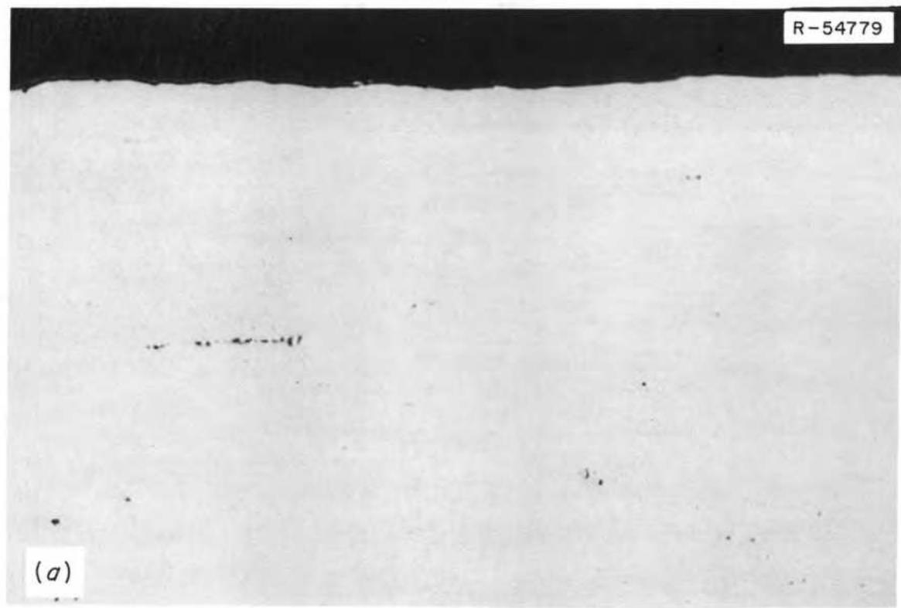  
0.007 INCHES 500x

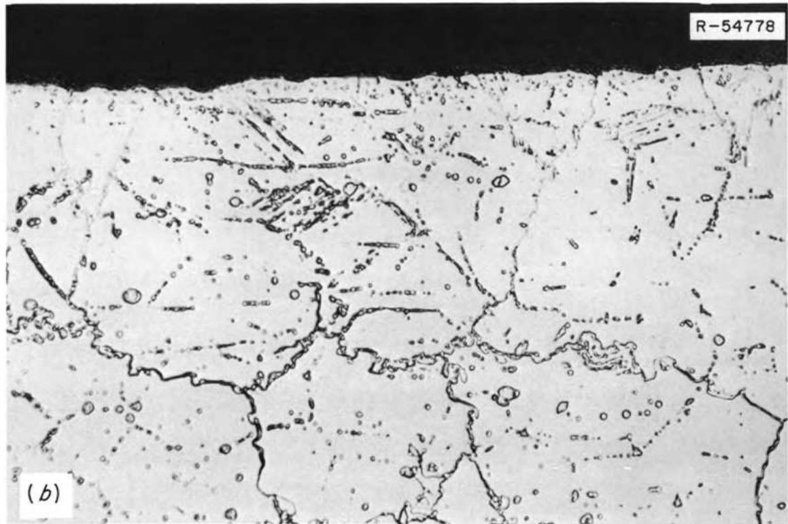  
Fig. 13.26. Photomicrographs of a typical longitudinal section of the Hastelloy N heat exchanger tubes. Outside surface, exposed to fuel salt. (a) As polished; (b) etched with aqua regia.

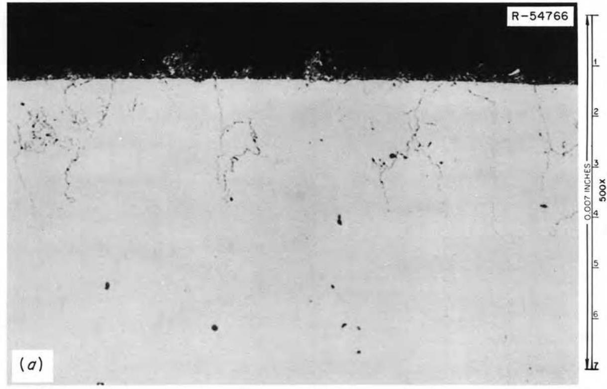

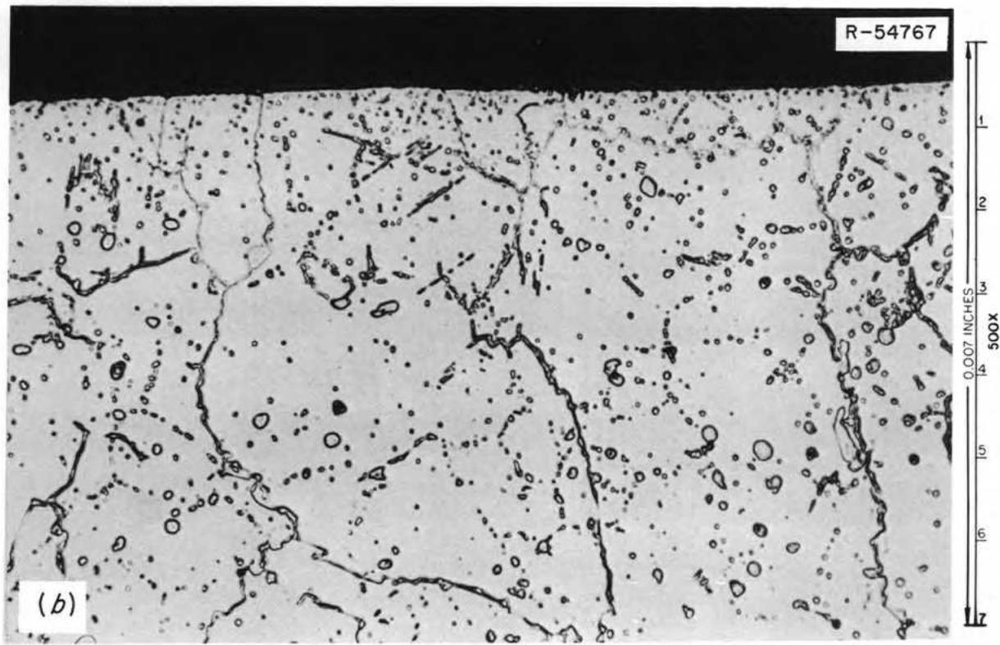  
Fig. 13.27. Photomicrographs of a typical cross section of the Hastelloy N heat exchanger tubes. Outside surface, exposed to fuel salt. (a) As polished; (b) etched with aqua regia.

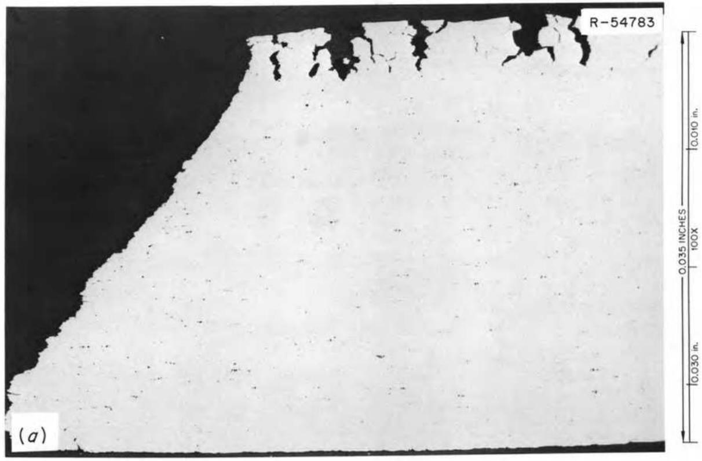

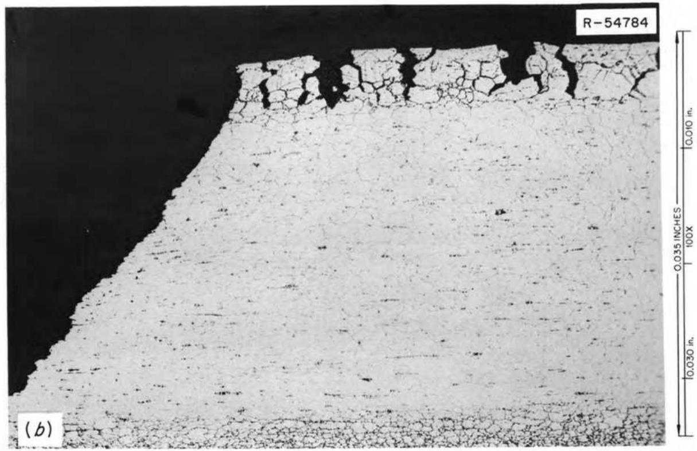  
Fig. 13.28. Longitudinal views of a heat exchanger tube pulled in tension at $25^{\circ}\mathrm{C}$ . The cracking is on the OD where the tube was exposed to fuel salt. (a) As polished; (b) etched with aqua regia.

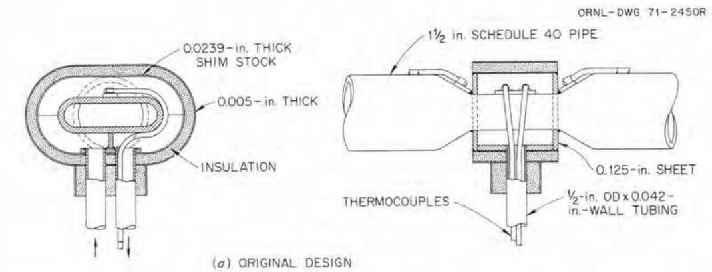

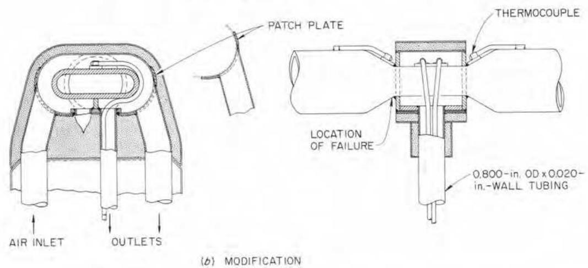  
Fig. 13.29. Diagram showing possible cause of freeze-valve failure after modification.

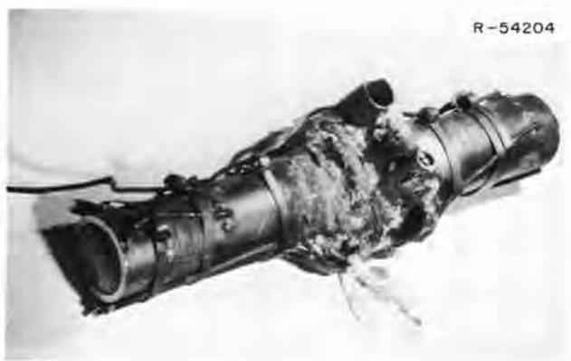  
Fig. 13.30. Photograph of the bottom portion of freeze valve 105.

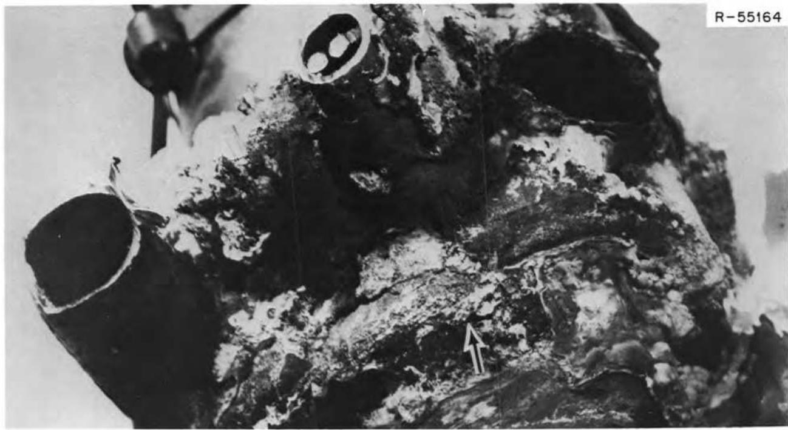  
Fig. 13.31. Closeup of the bottom of freeze valve 105 showing the two gas outlet lines and one inlet line of type 304 stainless steel that was corroded completely. The crusty substance is the salt. Note that there is no salt in the air annulus.

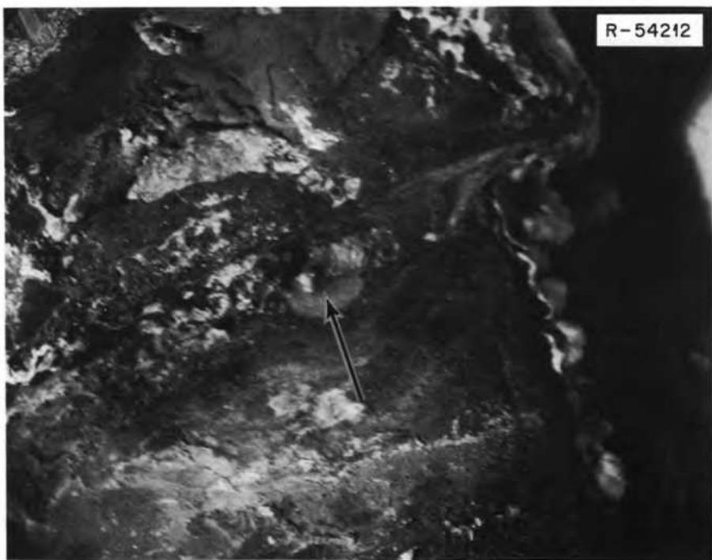  
Fig. 13.32. Photograph of the weld at one end of the cooling shroud. The crack begins at the round salt stain and proceeds for about 1 in. along the pipe. The arrow points to the salt stain with the crack at $90^{\circ}$ to the arrow.

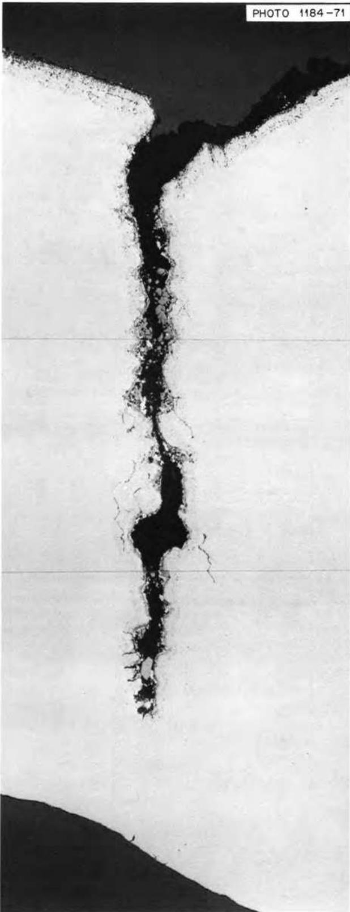  
Fig. 13.33. Photomicrographs of tube wall of freeze valve 105, where the failure occurred. As polished, $50 \times$ . Reduced $18 \%$

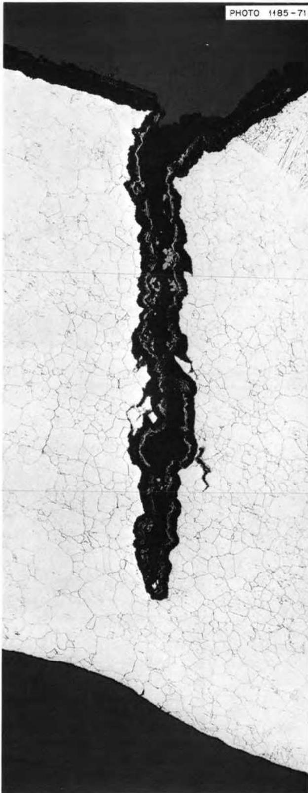  
Fig. 13.34. Photomicrographs of tube wall of freeze valve 105, where the failure occurred. The weld supports the end of the cooling shroud, and the failure occurred outside the cooling shroud. Etchant: aqua regia. $50 \times$ . Reduced $24 \%$

# 14. Graphite Studies

W. P. Eatherly

The purpose of the graphite studies is to develop improved graphite suitable for use in molten-salt reactors. The graphite in these reactors will be exposed to high neutron fluences and must maintain reasonable dimensional stability and mechanical integrity. Furthermore, the graphite must have a fine pore texture that will exclude not only the molten salt but also gaseous fission products, notably $^{135}\mathrm{Xe}$ .

The general evaluation of commercial grades of graphite has been completed. Vendor materials are still being irradiated where the material appears immediately promising for reactor application or is of technical interest because of raw material or fabrication technique.

The program on graphite fabrications within our own laboratory is accelerating. Raw isotropic cokes and pitch binders are currently the basis for the studies. Slurry techniques of mixing are being utilized. The resulting molded and graphitized bodies show excellent densities, good to excellent microstructures, and appear to approach the monolithic structure desired. From the chemical point of view, the effect of foreign atoms with covalent tendencies (S, O, N) on precursor materials and their coked structure is being evaluated.

Black-based graphites appear to have reasonably good stability under irradiation at elevated temperatures. A heat treatment series of black-based carbons and graphites is being irradiated. Data on electrical resistivity and x-ray parameters are being used to characterize the degree of crystallinity and its effect on damage.

Irradiation results on pyrolytically impregnated and sealed samples continue to be mixed. It is becoming increasingly clear that the substrate is affecting the structures, and proper conditions for the pyrolytic decomposition have not yet been defined.

Lattice distortions around an interstitial cluster have been calculated on the basis of continuum elastic theory for future application to the single-crystal damage interpretation. Also, the phonon dispersion curves for graphite have been measured by neutron scattering as a future basis for investigating the phonon-phonon scattering in thermal transport.

# 14.1 GRAPHITE IRRADIATIONS IN HFIR

# C. R. Kennedy

Irradiation of bulk graphite in HFIR is proceeding. The recent irradiation experiments were primarily to extend the fluence levels of graphite grades previously irradiated. The major emphasis has been to determine the lifetime expectancy of materials derived from blacks and several new commercial grades which have structural physical characteristics similar to the Poco materials. Also included is a series of experimental mesophase graphites.

The justification for the reexamination of lampblack grades has been discussed previously. The fluence levels on several of these grades have now been extended to values adequate to indicate life expectancy. The grades irradiated are given in Table 14.1, and the irradiation results are given in Fig. 14.1. Behavior of the lampblack grades is similar to the more conventional graphites, but with several significant differences. The first is that the initial densification is considerably more rapid. The second is that the later expansion rate is equivalent to or less than that for the best previously observed graphites. In all cases the materials are extremely isotropic, and the life expectancy appears to be greater than the more conventional grades. The rapid densification rate was anticipated due to the increased dimensional change rates observed for the less-graphitic materials. The reduced expansion rates, however, were surprising and encouraging. They corroborate the earlier results on black additions to normal filler materials.

In conventional graphites the effect of the binder was not apparent in the dimensional changes of the graphite. However, in Fig. 14.1 we observe large differences which appear to be attributable to the binder type. This is very likely a result of the fact that almost twice the amount of the binder is required in black-based graphite compared with conventional coke graphites. This also probably accounts for the large effects due to heat

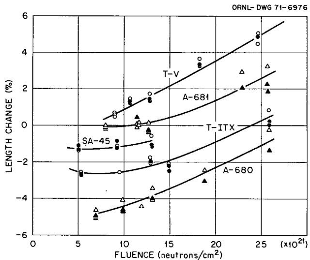  
Fig. 14.1. Results of irradiating black grades in HFIR at $715^{\circ}\mathrm{C}$ .

Table 14.1. Lampblack grades irradiated in HFIR   

<table><tr><td>Grade</td><td>Source</td><td>Filler</td><td>Binder</td><td>Maximum temperature (°C)</td></tr><tr><td>T-V</td><td>Y-12</td><td>Thermax</td><td>Vacum</td><td>2300</td></tr><tr><td>T-ITX</td><td>Y-12</td><td>Thermax</td><td>Isotruxene</td><td>2300</td></tr><tr><td>A-681</td><td>Stackpole</td><td>(Proprietary)</td><td>Pitch</td><td>2800</td></tr><tr><td>A-680</td><td>Stackpole</td><td>(Proprietary)</td><td>Pitch</td><td>1000</td></tr><tr><td>SA-45</td><td>UCC</td><td>Lampblack</td><td>Pitch</td><td>3000</td></tr></table>

treatment temperatures, since the blacks are themselves relatively unresponsive to thermal treatments. This behavior is at present being studied by the irradiation of grade A-680 heat treated to temperatures ranging from 1500 to $2800^{\circ}\mathrm{C}$ . We are also receiving samples of these materials where the density has been raised to 1.96 $\mathrm{g/cm}^3$ by impregnation. This will increase the percentage of residue carbon similar to the binder carbon and further dilute the lampblack content.

A new type of graphite made by Great Lakes Carbon Company has also been irradiated. These materials are called mesophase graphites, in that their raw materials are derived from the so-called liquid-crystal state in pitches. These first results, shown in Fig. 14.2, indicate a behavior very similar to hot-worked grades. There is very little densification, with fairly significant anisotropic linear growth of the samples. These materials might be of considerable theoretical interest if they can be fabricated with varying degrees of anisotropy.

Three commercial materials, grade HL-18 from Airco Speer Carbon Company, P-03 from Pure Carbon Company, and grade 1076 from Great Lakes Carbon

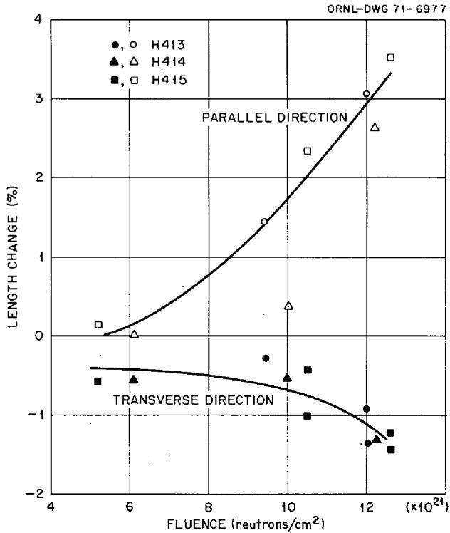  
Fig. 14.2. Results of irradiating mesophase graphites in HFIR at $715^{\circ}\mathrm{C}$ .

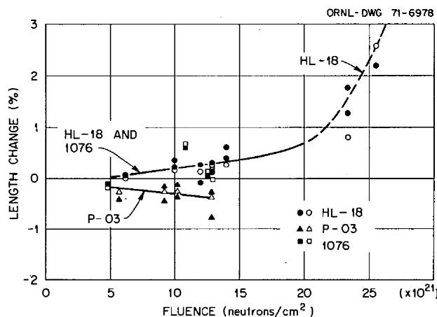  
Fig. 14.3. Results of irradiating grades P-03, HL-18, and 1076 in HFIR at $715^{\circ}\mathrm{C}$ .

Company, have been irradiated because of their monolithic structure, similar to that of the Poco grades. The results are given in Fig. 14.3, indicating a dimensional stability potentially similar to the Poco materials. None of these grades have been irradiated to a fluence level high enough to give a real indication of expected life, although grade HL-18 appears to be expanding. All of these grades are available in meaningful sizes for the MSBR.

# 14.2 GRAPHITE FABRICATION

C. R. Kennedy W. P. Eatherly

For the graphitic materials we have irradiated in HFIR, two general criteria have been correlated with good resistance to radiation-induced dimensional changes. These are isotropy and a monophase structure. The isotropy is required to avoid accelerating the apparent damage in the preferred $c$ -axis direction. The monolithic-type structure is required to avoid the weakness of the binder phase and presumably provide for plastic flow between domains in preference to crack failure. Further, one would prefer the isotropy to be on a very fine scale, so the radiation-induced stresses cannot build up over extended volumes.

These structural requirements also appear to be linked to high thermal expansion coefficients. That radiation stability and expansion coefficient should be linked is not surprising, since both are certainly related to the angular differences in orientation between neighboring crystallites.

Ordinarily graphites are fabricated from calcined or graphitized coke flour and an aromatic binder, commonly pitch. The flour is relatively stable in volume during heat treatment, whereas the binder will tend to shrink 60 to $70\%$ in volume during graphitization. This obviously leads to microcracking in the binder phase with subsequent weakening of the entire structure. An obvious partial solution is to employ uncalcined cokes, which themselves shrink about $35\%$ in volume. An additional attraction is that such cokes are chemically

active and react with the binder to produce a more monolithic structure.

The binder-filler mismatch can be further alleviated by the use of superfines (coke dust) or blacks to fill the interstices of the coarser flour. These additions to the filler have some effect on the binder demand but are more important in decreasing the web thickness of binder between the filler particles.

In view of these considerations, it was decided to concentrate our fabrication program on raw air-blown (Robinson) coke and Thermax as filler materials. The coke is derived from oxidized asphaltnes and is isotropic over a submicron size domain. The Thermax was chosen mostly for convenience, since it is relatively inert on heat treatment.

For binders we have elected to use pitch, partially because it is a well-characterized material and partially because it is highly aromatic. Slurry blending is employed both for convenience and because it permits highly uniform blending and working of the binder into the pores of the filler particles. Benzene is being used as the slurry agent and is evaporated before the blend is molded.

Early studies have concentrated on determining the proper ratios of black to coke. Typical results are shown in Fig. 14.4, where the Thermax-to-coke ratio is varied but the pitch content is held fixed at 30 parts per hundred of dry blend. The maximum in density is an indication of optimal packing between the black and coke flour components and for this binder content is $1.85\mathrm{g/cm^3}$ .

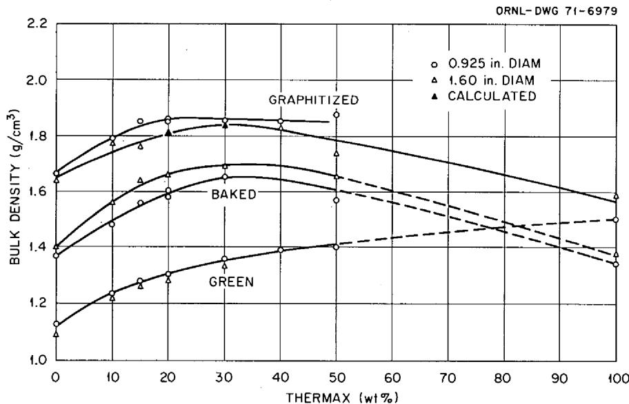  
Fig. 14.4. Bulk densities of Robinson coke-Thermax graphites.

The microstructure of the graphite is quite good, exhibiting no clearly identifiable binder phase although some segregation of the Thermax is apparent. The pore texture is small and uniform, although not as good as we have seen in some commercial grades.

Samples will be characterized more fully when the process is closer to optimum and the material more uniform. Preliminary samples are currently being irradiated in HFIR.

# 14.3 GRAPHITE DEVELOPMENT - CHEMISTRY

# R. A. Strehlow

Application of high-temperature centrifugation to pitches which was reported earlier² was found to produce two distinct types of carbon structures. The denser structure had a microscopic appearance of highly isotropic fine-grained material, while the supernatant liquid produced typical needle-like structures. This method of characterizing the orientation of product carbons is potentially of great utility in attempting to maximize the isotropicity of the carbons. It has been found by Labaton, Jenkins, and Kilner³ that the presence of hetero atoms in various carbon precursors is useful in developing isotropic graphite structures. Hetero atoms are defined as atoms other than carbon and hydrogen present in a pitch or coke. Hetero-atom concentration $(N_{\mathrm{S}}, N_{\mathrm{O}}$ , and $N_{\mathrm{N}})$ is defined as the number of hetero atoms (S, O, N typically) divided by the total number of atoms in a sample of material.

Experiments have been begun in the attempt to prepare suitable mixtures by hetero-atom additions for characterization by the centrifugation technique. The principal objective of this part of the chemical study is to determine the extent to which chemical alteration of the binder system might be used to produce the dense highly isotropic carbons needed for molten-salt reactor applications. Sulfur, oxygen, and, to an extent, compounds with five-member rings have been used by Jenkins et al.3 to increase both isotropicity and coking yield as well as to minimize the volumetric shrinkage during coking. The work reported here concerns the reaction of sulfur with a soft coal tar pitch (type 15V, Allied Chemical Company). Sulfur was chosen as a first material of study since earlier work with decacylene showed that a sulfur content of even $0.8\%$ was found to decrease the acicularity (needle-like or platy structure)

of a derived carbon relative to that formed from a sample with less sulfur impurity. A study of desulfurization by heat treatment at the low temperatures of 150 to $250^{\circ}\mathrm{C}$ was undertaken.

The phenomenology of sulfur reaction with aromatic high-molecular-weight compounds has not been extensively studied, but the reaction is reported to be similar to that with oxygen in that quinone-like materials are among the products. Polymerization occurs, yielding mono- or disulfides, along with hydrogen sulfide as the primary gaseous product. At higher temperatures further molecular condensation along with continued evolutions of hydrogen sulfide occurs. At temperatures in excess of $1000^{\circ}\mathrm{C}$ carbon disulfide is evolved.

The changes in fluidity which affect the usefulness of a modified binder as well as the ease of ultimately removing the sulfur (for nuclear reasons) are dominant questions with which this study must deal.

For this work batches of pitch and sulfur of various compositions are heat treated in an inert atmosphere for periods up to $100\mathrm{hr}$ . An ordinary 1-liter resin kettle is used with a mantle heater. Nitrogen is used as a cover gas, and mechanical stirring is employed in order to determine the best heat treatment and composition for preparation of a sample for centrifugation. A series of preparations was conducted, some of which are shown in Table 14.2.

Samples were taken periodically during the preparation and submitted for carbon, hydrogen, and sulfur analyses. The product was assessed for its benzene-insoluble content according to ASTM procedure D23-17. The results of these measurements are shown in Table 14.3. (The usual reproducibility of this measurement has been found in our laboratory to be better than $\pm 0.2\%$ .) This benzene-insoluble fraction frequently parallels the coking yield of a carbon precursor.

Results of chemical analyses are shown in Fig. 14.5 for preparation of RKB-2 and RKB-4. They show a slow decrease of rates calculated as $d \log N_{s} / dt$ . The RKB-3 preparation was terminated after 40 min because it produced very quickly a highly viscous material which prevented the stirrer from operating and, consequently, frothed extensively.

The values of the rates for the desulfurization of the preparations analyzed so far are puzzling, since it appears that the greater the concentration of sulfur the slower it reacts. A possible key is related to the heating rates up through the melting point of sulfur to the softening point of the pitch. For these two batches, the rate of heating was $1.8\mathrm{C}^{\circ} / \mathrm{min}$ for the RKB-2 (the more readily desulfurized) and $2.9\mathrm{C}^{\circ} / \mathrm{min}$ for the RKB-4

Table 14.2. Composition, heat treatment, and desulfurization rates for three pitch-sulfur preparations   

<table><tr><td>Batch No.</td><td>Percent S, initial</td><td>NS(%)</td><td>Temperature (°C)</td><td>Time (min)</td><td>Rate, d log NS/dt (hr-1)</td></tr><tr><td>RKB-2</td><td>17.58</td><td>5.00</td><td>175 ± 5°</td><td>330</td><td>8 × 10-3</td></tr><tr><td>RKB-3</td><td>17.58</td><td>5.00</td><td>225°</td><td>40</td><td></td></tr><tr><td>RKB-4</td><td>9.64</td><td>2.32</td><td>175 ± 10°</td><td>475</td><td>1.8 × 10-2</td></tr></table>

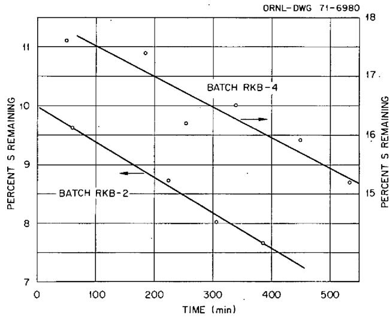  
Fig. 14.5. Sulfur remaining in pitch-sulfur composition after heat treatment at $175^{\circ}\mathrm{C}$ .

preparation. This possible added parameter will be examined.

The difference between these rates was reflected in the hydrogen-to-carbon ratios dropping from $\mathrm{C_{100}H_{62.4}}$ to $\mathrm{C_{100}H_{58.9}}$ for batch RKB-4 and to $\mathrm{C_{100}H_{56.8}}$ for batch RKB-2.

Thin-layer chromatographic analyses of the sulfur compositions have yielded no indication of additional low-molecular-weight species. One may infer that polymerization reactions rather than substitution reactions are indeed dominant in the preparation of these materials. No model compounds have been subjected to oxidation with sulfur, but the work in ref. 3 showed that the largest effects are with the complex mixtures found in pitch.

Fabricability of sulfur compositions exclusive of the desulfurization question will probably hinge on the increase of viscosity that accompanies gas evolution occurring during carbonization. Jenkins4 has said that the forming yield decreases markedly for hetero-atom concentrations greater than $4\%$ . He reported the coking

Table 14.3. Benzene-insoluble (BI) content measured for three sulfur compositions   

<table><tr><td>Batch No.</td><td>Bl (%)</td></tr><tr><td>15V (original material)</td><td>14.68</td></tr><tr><td>RKB-2</td><td>36.05</td></tr><tr><td>RKB-3</td><td>67.48</td></tr><tr><td>RKB-4</td><td>30.32</td></tr></table>

yield to reach a maximum at about that concentration.

In summary, sulfur-pitch compositions are being prepared for centrifugation at coking temperatures. The desulfurization is being studied as a function of time, temperature, and composition. In addition to sulfur, other reactants suitable for normal-pressure applications such as air blowing (an $\mathrm{O}_2$ treatment superficially analogous to sulfurization) require study. Other reactant systems can, of course, be considered for application at higher-pressure carbonizing conditions.

# 14.4 GRAPHITIZATION STUDY OF A LAMPBLACK-PITCH CARBON

O. B. Cavin W. H. Cook J. L. Griffith

Until recently no polycrystalline lampblack materials had been considered in the HFIR irradiation materials program as potential MSBR graphites because of the extremely large neutron-induced crystalline growth rates reported by Bokros. Then, it was demonstrated that propylene-derived pyrocarbons are quite stable in neutron irradiation environment even though the apparent crystallite sizes are quite small. Therefore, Kennedy began an irradiation study of lampblack-based materials. He observed that a pitch-bonded lampblack material, grade A681, exhibited relatively good dimen

sional stability when irradiated at $715^{\circ}\mathrm{C}$ to a modest fluence of $1.5 \times 10^{22}$ neutrons/cm $^2$ ( $E > 50\mathrm{keV}$ ). This encouraged us to examine these materials in more detail in an effort to correlate starting properties with the irradiation damage. As previously reported, we have three commercial grades of these materials, SA45, $^{10}$ A681, $^{7}$ and A680. $^{7}$ The vendors reported that the first two had been fired to $2800^{\circ}\mathrm{C}$ and the last to $\sim 1000^{\circ}\mathrm{C}$ . The low-fired grade, A680, offered an opportunity to study the irradiation effects as functions of its structure resulting from higher firing temperatures. For irradiation specimen stock, Kennedy fired pieces for 1 hr at 1500, 2000, 2200, 2400, 2600, and $2800^{\circ}\mathrm{C}$ in purified argon. These samples were then characterized by bulk density, electrical resistivity, and x-ray diffraction.

The effects of the different firing temperatures on the resultant internal structure are reflected to some degree by electrical resistivities and bulk densities. These data were obtained on two sets of 0.25-in.-diam rods machined parallel with the $6^{1} / 8$ - and the $1^{1} / 8$ -in. dimensions, respectively, from a $1^{1} / 8 \times 5^{3} / 4 \times 6^{1} / 8$ in. plate. The rods were measured and then fired along with the HFIR stock to the next higher temperature in sequence. Therefore, each bulk density and resistivity point plotted in Fig. 14.6 was obtained on the same rods. There were slight differences in the values determined for the mutually perpendicular rods. This suggests that there is probably a slight preferential particle and porosity alignment which may mean the material is slightly anisotropic.

The electrical resistivity values suggest that between 2000 and $2200^{\circ}\mathrm{C}$ the crystalline development begins to accelerate appreciably, and even at $2800^{\circ}\mathrm{C}$ it has not saturated.

It has been reported11 that the lampblack-pitch material, grade A681, has an average bulk density and an average electrical resistivity of $1.61 \, \mathrm{g/cm}^3$ and 2900 $\mu \Omega$ -cm, respectively, vs $1.63 \, \mathrm{g/cm}^3$ and $3050 \, \mu \Omega$ -cm for A680 fired to $2800^\circ \mathrm{C}$ . These data suggest that grade A681 has more crystalline development than grade A680 fired to $2800^\circ \mathrm{C}$ . This was verified by the x-ray analyses discussed below. It would be of interest to determine if A680 could be made to approach the

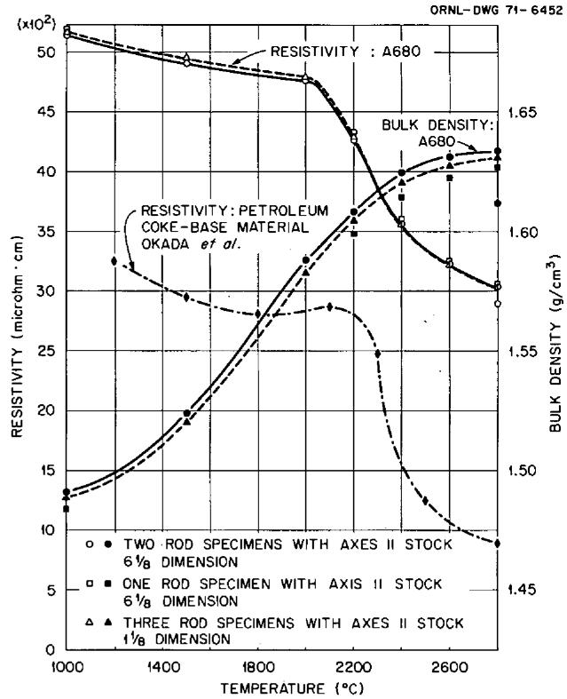  
Fig. 14.6. Effects of firing temperature on the electrical resistivity and bulk density of the lampblack body, S20.

relative crystallinity of A681 by firing it to $3000^{\circ}\mathrm{C}$ or higher.

A plot of the electrical resistivity as a function of firing temperatures for a pitch-bonded petroleum coke material reported by Okada, Sekiguchi, and Ishii $^{12}$ is shown for comparison. Both show the characteristic stepwise decrease in the vicinity of 2000 to $2400^{\circ}\mathrm{C}$ , and, of course, the petroleum-coke-pitch shows the greater propensity to graphitize. This is particularly true at temperatures above $2300^{\circ}\mathrm{C}$ .

The samples for $\mathbf{x}$ -ray diffraction, approximately 0.030 in. thick by $1/2$ in. square, were machined from the HFIR specimen stock. Each was a separate sample for the particular temperature considered.

The step-scan data were obtained by using a General Electric XRD-5 spectrogoniometer and single-wavelength copper irradiation from a doubly bent graphite crystal monochromator. The data were corrected for background scatter, sample transparency,

Lorentz polarization, structure, and temperature factors. Low-fired graphites are poorly crystalline and generally do not show more than the (002) diffraction maximum, which is very broad. Hence we could not use the more sophisticated Fourier analysis approach for determining the crystallite sizes, particularly of the low-fired material. To make all crystallite size determinations comparable, we used the peak width of the (002) and the Scherrer equation:

$$
L _ {c} = \frac {0 . 9 \lambda}{\beta \cos \theta},
$$

where

$\lambda = \mathbf{x}$ -ray wavelength, A,

$\beta =$ corrected peak width, radians, at one-half maximum intensity,

$\theta = \text{Bragg diffraction angle}$ .

The $c$ -axis determination was made primarily from the (002) peaks, but the (004) was also used when sufficiently intense. Calculations for the $a$ axes were made using the (110) peaks and were found to be relatively constant at 2.45 Å. Relationships between the $c$ spacings and crystallite sizes as a function of temperature are shown in Fig. 14.7. On the same plot are shown data obtained by Okada et al. from a petroleum coke. $^{12}$ Petroleum coke graphitizes more easily than lampblacks; therefore the $c$ parameter of the A680 never reached the minimum value obtainable for well-graphitized material. A close parallel between the two materials is noted, however. Growth rates of the crystallites $(L_{c})$ are considerably retarded until a temperature of $1500^{\circ}\mathrm{C}$ is reached, after which the rate increases up to $2000^{\circ}\mathrm{C}$ but remains constant at higher temperatures. The ultimate crystallite size obtained was determined by the heat treating temperature and did not approach a limiting value over the range tested. There is no observable discontinuity in the apparent crystallite size to correspond with that in the lattice parameters.

The values shown at $3000^{\circ}\mathrm{C}$ are from a different lamblack, grade A681, but these fit the extrapolated portion of both curves.

As soon as data are available, the irradiation behavior of these materials will be compared with these data. A check of the crystallographic anisotropy will be made to see if any change can be correlated with the maximum rates of change with temperature above $2300^{\circ}\mathrm{C}$ .

These studies will be enlarged if the results are useful toward interpreting the irradiation damage effects and

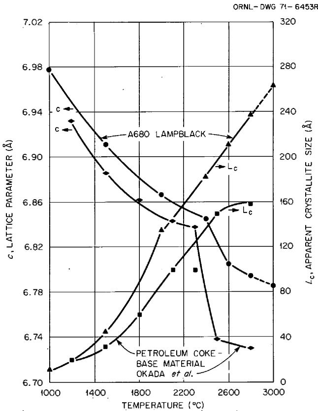  
Fig. 14.7. Lattice parameters and crystallite sizes as a function of heat treating temperature of two low-fired carbons.

the higher-fired specimens continue to show relatively good dimensional stability through fluences of at least $3.5 \times 10^{22}$ neutrons/cm $^2$ ( $E > 50 \mathrm{keV}$ ). Additional incremental measurements will be included such as pore entrance diameter spectra, gas permeability, strength plus crystallographic anisotropy, and crystallite sizes as determined with x rays.

# 14.5 REDUCTION OF GRAPHITE PERMEABILITY BY PYROLYTIC CARBON SEALING

# C. B. Pollock

Graphite to be used in the core of an MSBR must be able to exclude fluoride salts and gaseous fission products. We have been studying techniques to seal the surface of the graphite with pyrolytic carbon. Two techniques have been used: a vacuum pulse impregnation technique in which surface pores of the graphite are closed by plugging them with pyrolytic carbon and a coating procedure in which a continuous surface coating of impermeable pyrolytic carbon is deposited on the graphite. Both techniques have been successful in sealing commercially available graphite suitable for use in the core of an MSBR.

Table 14.4. Impregnated samples   

<table><tr><td>Sample No.</td><td>Permeability before (cm2/sec)</td><td>Permeability after (cm2/sec)</td><td>Fluence (neutrons/cm2×1021)</td><td>ΔL/L (%)</td></tr><tr><td>I231</td><td>2.3 × 10-9</td><td>5.1 × 10-9</td><td>12.11</td><td></td></tr><tr><td>I208</td><td>1.3 × 10-9</td><td>2.2 × 10-6</td><td>8.76</td><td></td></tr><tr><td>I236</td><td>2.2 × 10-9</td><td>1.0 × 10-6</td><td>7.82</td><td></td></tr><tr><td>I211</td><td>1.5 × 10-9</td><td>6.2 × 10-7</td><td>12.45</td><td></td></tr><tr><td>HR20</td><td>1 × 10-9</td><td>2.3 × 10-8</td><td>5.59</td><td></td></tr><tr><td>HR12</td><td>1 × 10-8</td><td>6.5 × 10-6</td><td>11.35</td><td></td></tr><tr><td>I205</td><td>4.4 × 10-10</td><td>7.2 × 10-5</td><td>17.06</td><td>0.7</td></tr><tr><td>I216</td><td>5.9 × 10-10</td><td>9.8 × 10-5</td><td>21.19</td><td>2.2</td></tr><tr><td>HL32</td><td>1.6 × 10-8</td><td>9.1 × 10-5</td><td>20.60</td><td>0.8</td></tr><tr><td>I182</td><td>1.7 × 10-8</td><td>1.5 × 10-2</td><td>31.24</td><td>6.0</td></tr><tr><td>I181</td><td>5.1 × 10-9</td><td>9.0 × 10-2</td><td>36.97</td><td>11.0</td></tr><tr><td>I163</td><td>7.0 × 10-9</td><td>2.9 × 10-4</td><td>25.67</td><td>2.0</td></tr></table>

In conjunction with the fabrication program we have also been conducting an irradiation testing program in which we subject graphite samples that have been sealed with pyrolytic carbon to MSBR conditions of neutron fluence and temperature. An HFIR irradiation experiment containing a number of coated samples and impregnated samples was recently completed. This experiment contained 10 graphite samples coated with pyrolytic carbon and 12 graphite samples that were impregnated with pyrolytic carbon.

Turning first to the coated samples, four of these have been cycled twice through HFIR and now have a total neutron dose of $2.4 \times 10^{22}$ neutrons/cm² ( $E > 50$ keV) at a temperature of $715^{\circ}\mathrm{C}$ . Three of the samples appeared to be intact except for some small cracks on their ends, but independent of this, the helium permeabilities went from less than $10^{-8} \mathrm{~cm}^2/\mathrm{sec}$ to greater than $10^{-2} \mathrm{~cm}^2/\mathrm{sec}$ . The remaining sample was extensively cracked over its entire surface. The remaining coated samples have been cycled through HFIR for the first time and received total neutron doses of up to 1.3 $\times 10^{22}$ neutrons/cm² ( $E > 50$ keV) at $715^{\circ}\mathrm{C}$ . Five of these samples cracked badly and had helium permeabilities of greater than $10^{-2} \mathrm{~cm}^2/\mathrm{sec}$ . One of the samples appeared to be unaffected by the experiment.

The only significant difference between these two sets of coated samples is the coating thickness. The first group had coating thicknesses ranging from 4 to 6 mils; the second set had coating thicknesses of 2 to 3 mils. The one sample of the second set that survived had a coating that was 3 mils thick. One has to infer that coating thickness is the significant variable, but even a 2-mil coating should not have been affected by the irradiation condition of this test.

The results on the 12 pyrolytically impregnated samples are given in Table 14.4. Six of these have been recycled in HFIR to fluences of up to $3.7 \times 10^{22}$ ; six new samples have received only their first irradiation up to $1.2 \times 10^{22}$ . The new samples appear to be somewhat better than previous samples irradiated to similar fluences in that they are opening up to about half the rate. The pore size distribution of these samples will be examined by mercury porosimetry.

It has been observed that some of the better samples contain relatively little pyrolytic material. The amount of pyrolytic carbon required for sealing can be controlled by varying process parameters other than time. Helium permeabilities of less than $10^{-8}\mathrm{cm}^2/\mathrm{sec}$ have been obtained in graphite samples whose weight increase was less than $4\%$ . Processing time at $750^{\circ}\mathrm{C}$ was only 2 hr. Graphite samples sealed in this manner should behave more like unimpregnated base-stock graphite. A number of samples containing the minimum amount of carbon needed for sealing have been prepared for the next experiment in an attempt to control the neutron-induced expansion of the graphite.

As noted in Table 14.4, one of the samples has increased its length by $11\%$ , or substantially more than would be expected from the unimpregnated base stock graphite at similar fluences.

# 14.6 FUNDAMENTAL STUDIES OF RADIATION DAMAGE MECHANISMS IN GRAPHITE

S.M.Ohr T.S.Noggle

The in situ studies of radiation damage in graphite resulting from the displacement of carbon atoms by the

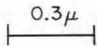

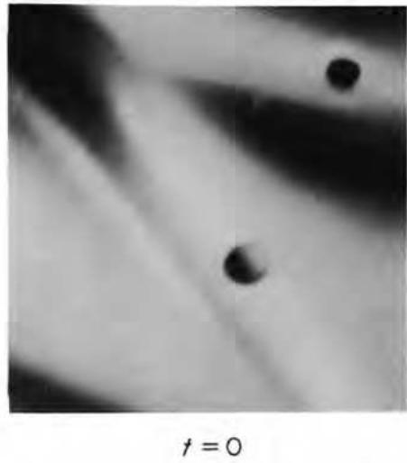

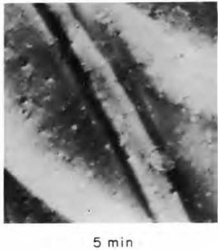

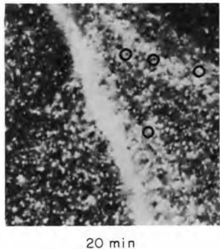

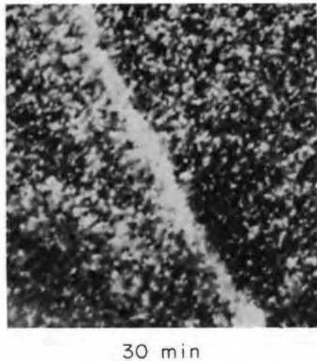  
Fig. 14.8. (1011) dark-field micrographs showing the development of damage clusters in graphite irradiated with $200\mathrm{-kv}$ electrons at $600^{\circ}\mathrm{C}$ . Examples of black and white spots are outlined by circles. Both black and white spots are found to be dislocation loops of interstitial type.

electrons in the illuminating beam of a $200\mathrm{-kv}$ microscope had established that the damage clusters produced are in the form of dislocation loops of interstitial type. Figure 14.8 shows the development of the damage structure under irradiation with $200\mathrm{-kv}$ electrons at $600^{\circ}\mathrm{C}$ . In dark-field images such as in Fig. 14.8 (images formed from diffracted electrons), the damage clusters frequently appear as roughly equal numbers of black and white spots. Stereoscopic study of these spots has shown that the black and white spots are present as several alternating layers parallel to the surface of the specimen. The behavior of this black-white structure

with variation of the diffraction condition has been found to be consistent with and hence attributable to the stacking fault present in the prismatic dislocation loop formed by the clustering of interstitial atoms. Other aspects of the contrast of these clusters, although qualitatively consistent with the behavior expected of interstitial-type dislocation loops, suggest that the strain contrast is less than would be expected on the basis of diffraction contrast theory employing the displacement field derived from isotropic elasticity theory. The stress and displacement fields for a prismatic dislocation loop have been derived using anisotropic elasticity theory,

and contrast calculations will be made for comparison with the experimental observations. Close correlation of the experimental contrast with the theoretically predicted contrast is necessary for quantitative determination of the true loop size and for estimation of the minimum loop size detectable.

The generation of experimental information on the interstitial clusters for comparison with the theoretical model which treats the kinetics of the nucleation and growth of clusters requires accurate measurement of the experimental parameters of temperature and electron dose. Since the irradiations are typically carried out on areas less than 1/1000 in. in diameter, a special technique has been developed for measuring the current density in the electron beam. This technique takes advantage of the magnification of the electron microscope to form a highly magnified image of the beam incident on the specimen and to systematically translate this image over a Faraday cup so that the distribution of current in the beam can be measured.

Experimentally, the technique employs a Faraday cup mounted in the place of a viewing window of the microscope such that the cup may be inserted to coincide with the optical axis of the microscope when current measurements are made and retracted for microscope operation. The cup has an acceptance diameter of $7\mathrm{mm}$ which allows probing the electron beam over regions less than $2\times 10^{-9}\mathrm{cm}^2$ (electron beam magnified $\sim 15,000\times$ ). The beam is probed systematically by translating the magnified image over the Faraday cup using the magnetic deflection system which is used for centering the illumination during normal microscope use. The currents in the deflection coils were measured with a potentiometer, and the calibration of deflection vs current indicated reproducibility of beam position to better than $\pm 1\times 10^{-5}\mathrm{mm}$ . Measurement of the total beam current at the specimen level using an insulated specimen holder as a Faraday cup, and intercepting the full beam in the cup in the viewing chamber, has given the same total current. This indicates that in the absence of scattering and/or limiting apertures in the microscope, currents measured at the viewing chamber are an accurate estimate of the current at the specimen. A further check involves an integration over the full beam profile which gives within experimental error the total current measured at the specimen level.

Figure 14.9 shows current density profiles of the electron beam as a function of the condenser lens setting. It may be noted that the detailed profiles are sensitive to the condenser lens setting. At the center of the beam, changes in the current density by a factor as

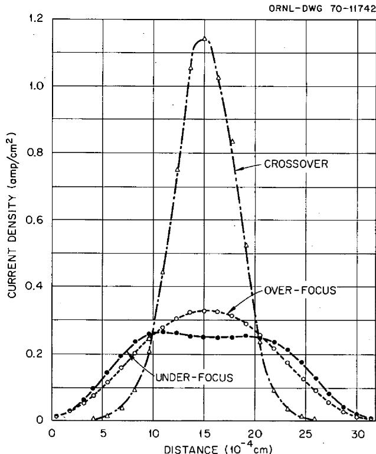  
Fig. 14.9. Electron beam profiles as a function of condenser lens setting. The profile labeled "crossover" corresponds to a condenser lens setting which gives a focused image of the electron source in the plane of the specimen. The profiles labeled "over-focus" and "under-focus" correspond to condenser lens settings which place the focused image of the source approximately $5\mathrm{mm}$ above and $5\mathrm{mm}$ below the plane of the specimen. The total current in the electron beam, as well as the current density profiles, is sensitive to the condenser lens setting due to changes in angular aperture which accompany the changes in focal length of the condenser lens.

much as 4 occur for barely noticeable changes in the brightness and apparent shape of the beam observed on the fluorescent screen. This experience emphasizes the need for careful monitoring of the current density in studies of in situ damage in high-voltage electron microscopes.

# 14.7 LATTICE DYNAMICS OF GRAPHITE

R.M.Nicklow N.Wakabayashi H.G.Smith

An investigation of the lattice dynamics of graphite is currently being carried out on very high quality (mosaic spread about $c$ axis $\approx 0.5^{\circ}$ ) pyrolytic graphite samples13 using coherent neutron inelastic scattering techniques.

The experiments are being performed on the triple-axis neutron spectrometer at the HFIR. Pyrolytic graphite consists of thin sheets of graphite crystallites randomly oriented about a common $c$ axis, and one may expect that unambiguous measurements of normal mode frequencies by neutron scattering techniques are possible only for the longitudinally polarized normal modes with wave vectors in the $c$ direction. Such measurements have been previously reported by Dolling and Brockhouse14 for a sample of rather poor quality graphite ( $5^{\circ}$ mosaic spread); however, they also found evidence of the transverse acoustic mode in the $c$ direction, although the phonon peaks were very broad. In addition to measurements of the longitudinal phonons in the $c$ direction, we observe well-defined transverse acoustic phonons in this direction when appropriate incident neutron energies are chosen. Presumably, this improvement over the earlier measurements is due to the better sample available for this study. The initial slopes observed for both of these $c$ -axis branches are consistent with the elastic constants $C_{11}$ and $C_{44}$ measured by Seldin.15

We have also observed well-defined peaks in the neutron scattering arising from the transverse acoustic and the lowest-frequency transverse optic modes having wave vectors in, and polarizations perpendicular to, the basal plane. These measurements have been carried out for wave vectors

$$
| \mathbf {q} | \lesssim \frac {0 . 5 0}{\sqrt {3}} \frac {4 \pi}{a},
$$

and they are possible because the dispersion curves for these modes are very isotropic. The frequencies of the small $|\mathbf{q}|$ longitudinal acoustic and lowest frequency longitudinal optic modes with wave vectors in the basal plane were less well determined. However, the measurements performed strongly indicate that frequencies for both of these modes increase very rapidly, reaching approximately 12 THz for $|\mathbf{q}| \sim 0.08(4\pi / a\sqrt{3})$ . These results are also consistent with the elastic constant measurements of Seldin.[15] The striking feature of these measured dispersion curves is a very rapid increase in the frequency with increasing wave vector $\mathbf{q}$ .

The analysis of the data has been carried out in terms of an axially symmetric Born-von Kármán force-constant model. In order to reproduce both the shapes

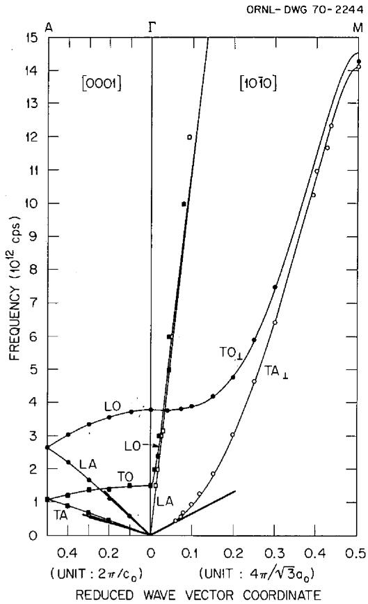  
Fig. 14.10. Calculated and observed dispersion curves for the $\Gamma -A$ and $\Gamma -M$ planes of the reduced Brillouin zone.

of the observed dispersion curves and the $C_{44}$ elastic constant, it is necessary to include interactions which extend to the third-nearest-neighbor atoms in the basal plane. Such a model, while perhaps not as physically appealing as the usual bond-bending model, $^{16}$ does provide a very satisfactory description of these neutron scattering results, elastic constant measurements, $^{15}$ and Raman $^{17}$ and infrared $^{18}$ measurements. In its present form the bond-bending model includes explicitly interactions only to second-nearest-neighbor atoms in the basal plane (in the terminology used for Born-von Kármán models) and gives $C_{44} = 0$ .

The calculated dispersion curves are shown in Figs. 14.10 and 14.11 together with the corresponding observed points. The calculated density of states as a function of frequency is shown in Fig. 14.12.

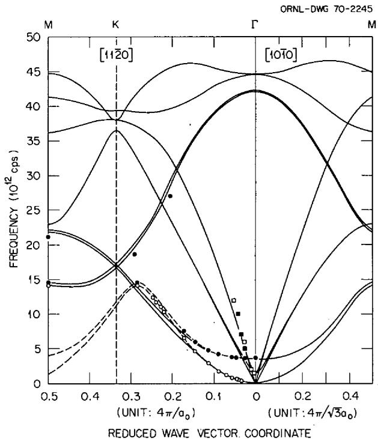  
Fig. 14.11. Calculated and observed dispersion curves for the $\Gamma$ - $K$ - $M$ planes of the reduced Brillouin zone.

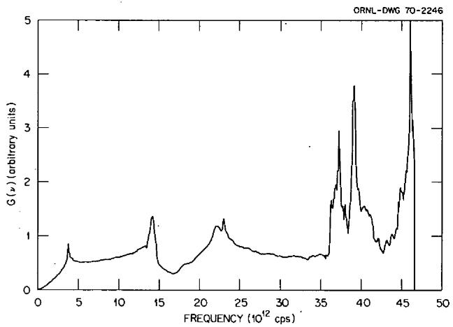  
Fig. 14.12. Graphite $G(\nu)$ calculated from four-neighbor axially symmetric model fitted to neutron data.

# 15. Hastelloy N

H. E. McCoy

The search for a chemically modified composition of Hastelloy N with improved resistance to irradiation damage continues. The elements of primary concern are Ti, Nb, Hf, Zr, Si, and C. We continue to approach the problem by initially making small laboratory melts and then procuring 50- to 100-lb commercial melts. This gives us some feel for the problems that will be encountered in scaleup of these alloys to production size (10,000 lb or greater). This work involves mechanical property studies on unirradiated and irradiated samples.

Our compatibility programs are involved with the corrosion of Hastelloy N in several fluoride salts and in steam. The salt of primary concern is the new proposed coolant salt, sodium fluoroborate. Several thermal convection and two pump loops are committed to studying corrosion in this salt. The possibility of holding tritium up in this salt is also being studied. Steam corrosion work continues at two facilities. Hastelloy N is currently being exposed in the unstressed condition, but one facility is being modified to allow dynamic stressing of the samples.

# 15.1 STATUS OF LABORATORY HEAT POSTIRRADIATION EVALUATION

C. E. Sessions

The influence of alloy composition on the postirradiation mechanical properties continues to be our primary area of study in developing advanced nickel-based alloys for MSBR applications. During 1970 our studies were directed toward evaluation of various alloying additions on small laboratory heats after irradiation at $760^{\circ}\mathrm{C}$ to $3\times 10^{20}$ neutrons $\mathrm{cm}^2$ (thermal) and testing in creep at $650^{\circ}\mathrm{C}$ . Since that time we have attempted to reproduce certain beneficial alloying effects using commercially supplied 100-lb heats. These latter results are discussed in a subsequent section of this report.

Table 15.1 gives the range of laboratory heat compositions that we studied during 1970. The postirradiation creep ductility is assessed either "poor," "good," or "excellent" depending on whether the ductility was $< 5\%$ , $5 - 10\%$ , or $>10\%$ after irradiation and testing.

For most of these alloys the creep strength was at least as good as that for standard vacuum-melted Hastelloy N under the same set of test conditions. The creep ductility has been the property of primary concern as regards possible reactor application. The results indicate that intermediate Ti levels and Hf concentration above $0.5\%$ provided good ductilities. For multiple additions of these strong carbide formers the ductilities were classed as either good or excellent. For heat 287 $(0.1\%)$ Ti, $0.6\%$ Nb, $0.14\%$ Si), the ductility was $\sim 1\%$ , and thus this composition was rated as poor. Based on the laboratory heat results the most promising alloying elements for producing excellent postirradiation ductility would be additions of either Ti-Hf, Hf-Nb, or Ti-Hf-Nb.

Table 15.1. Results of postirradiation creep tests of laboratory melts   

<table><tr><td rowspan="2">Addition</td><td rowspan="2">Alloy No.</td><td colspan="4">Concentration (%)</td><td rowspan="2">Creep ductilityb</td></tr><tr><td>Ti</td><td>Hf</td><td>Nb</td><td>Si</td></tr><tr><td rowspan="3">Ti</td><td>107</td><td>1.0</td><td></td><td></td><td></td><td>Poor</td></tr><tr><td>291</td><td>2.0</td><td></td><td></td><td></td><td>Good</td></tr><tr><td>292</td><td>2.4</td><td></td><td></td><td></td><td>Poor</td></tr><tr><td rowspan="2">Hf</td><td>299</td><td></td><td>0.5</td><td></td><td></td><td>Good</td></tr><tr><td>302</td><td></td><td>1.5</td><td></td><td></td><td>Good</td></tr><tr><td rowspan="2">Nb</td><td>285</td><td></td><td></td><td>0.5</td><td></td><td>Poor</td></tr><tr><td>298</td><td></td><td></td><td>2.0</td><td></td><td>Poor</td></tr><tr><td rowspan="2">Ti-Hf</td><td>309</td><td>0.5</td><td>0.4</td><td></td><td></td><td>Excellent</td></tr><tr><td>184</td><td>1.2</td><td>1.2</td><td></td><td></td><td>Excellent</td></tr><tr><td rowspan="3">Ti-Nb</td><td>287</td><td>0.1</td><td></td><td>0.6</td><td>0.14</td><td>Poor</td></tr><tr><td>303</td><td>0.5</td><td></td><td>0.8</td><td></td><td>Good</td></tr><tr><td>181</td><td>0.5</td><td></td><td>2.0</td><td></td><td>Good</td></tr><tr><td rowspan="2">Hf-Nb</td><td>307</td><td></td><td>0.8</td><td>0.9</td><td></td><td>Good</td></tr><tr><td>308</td><td></td><td>0.6</td><td>1.2</td><td></td><td>Excellent</td></tr><tr><td rowspan="3">Ti-Hf-Nb</td><td>310</td><td>0.1</td><td>0.5</td><td>0.6</td><td></td><td>Excellent</td></tr><tr><td>311</td><td>0.4</td><td>0.3</td><td>0.7</td><td></td><td>Good</td></tr><tr><td>314</td><td>0.8</td><td>0.7</td><td>1.3</td><td>0.3</td><td>Good</td></tr></table>

${}^{a}$ Base composition is $\mathrm{{Ni}} - {12}\% \mathrm{{Mo}} - 7\% \mathrm{{Cr}} - {0.2}\% \mathrm{{Mn}} - {0.05}\%$ C. All alloys were annealed $1\mathrm{{hr}}$ at ${1177}^{ \circ  }\mathrm{C}$ ,irradiated at ${760}^{ \circ  }\mathrm{C}$ to a thermal fluence of 2 to $3 \times  {10}^{20}$ neutrons $/{\mathrm{{cm}}}^{2}$ ,and tested at ${650}^{ \circ  }\mathrm{C}$ .   
$b$ "Poor" is less than $5\%$ strain, "good" is 5 to $10\%$ , and "excellent" is greater than $10\%$ .

# 15.2 POSTIRRADIATION CREEP TESTING OF HASTELLOY N

C. E. Sessions H. E. McCoy

Because we have developed stronger alloys by the addition of Ti, Nb, and Hf to our nominal Hastelloy N composition, we must load to higher stresses in order to obtain rupture in a reasonable time period. If these higher stresses are above the yield strength of the particular alloy, a significant amount of strain can occur instantaneously on loading. The postirradiation test loading procedure that we have used in the past is to apply the stress and then begin to record strain as a function of time. At stress levels above the yield stress this method is in error and gives strains that are too low. The complicating factor that makes it impossible to record the strain on loading is that the extensometer in the hot cells actually records as strain the relative movement between the two specimen grips of the creep machine. This movement in fact includes some immeasurable movement due to the seating of the specimen in the grips. Then ideally what we would like to do is to (1) apply enough load to seat the specimen but not enough to cause significant plastic strain, (2) begin recording strain, and (3) apply the remainder of the load. However, the machines are not constructed to allow this to be done easily.

The following example involving alloy 69-641 (1.3% Ti, 0.7% Hf) stressed at 47,000 psi at $650^{\circ}\mathrm{C}$ illustrates the severity of the problem. The three samples shown in Fig. 15.1 were irradiated in the same experiment at $760^{\circ}\mathrm{C}$ to a thermal fluence of $3 \times 10^{20}$ neutrons/ $\mathrm{cm}^2$ . In the first test (curve A, Fig. 15.1) we applied the maximum load and then began to record strain: failure occurred in 9.5 hr with 1.3% strain. In the second test (curve B) we added the 18 weights (needed to obtain 47,000 psi) one at a time in 50-sec intervals, and the strain was recorded throughout: failure occurred in 8.5 hr with 5.5% strain. In the first test the measured strain was too low and in the second test it was too high because it included the movement due to the specimen seating in the grips. In a third test (curve C) weights to give 10,000-psi stress were added before we began recording strain. The additional load was added to give 47,000 psi with the strain being recorded. After one intentional interruption to measure the strain which had occurred in 2 hr, we reloaded the test to 47,000 psi and it subsequently failed in 4 hr with 6.5% strain. This third loading technique (curve C) has been adopted as our standard test loading procedure for postirradiation creep-rupture testing. It offers a reproducible technique for establishing a "zero" strain reading under a stress of 10,000 psi, which is significantly below the yield stress of the Hastelloy N compositions that we are investi

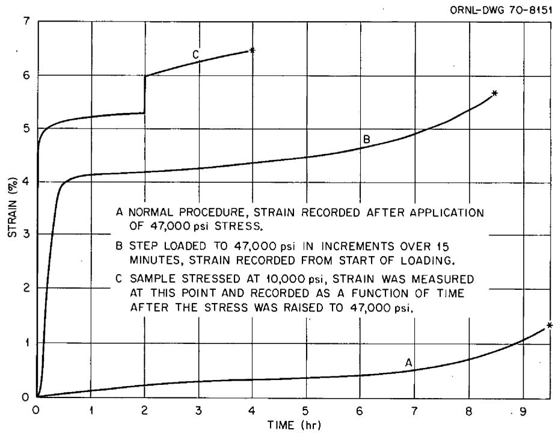  
Fig. 15.1. Effect of loading technique on the postirradiation strain-time curves for Hastelloy N heat 69-641 at $650^{\circ}\mathrm{C}$ . Samples solution annealed $1\mathrm{hr}$ at $1177^{\circ}\mathrm{C}$ and irradiated at $760^{\circ}\mathrm{C}$ to a thermal fluence of $3\times 10^{20}$ neutrons/cm².

gating in our test program. It also provides us with a measure of the strain that occurs on loading which can be significant for certain alloy compositions if the stress is above the yield stress.

Unfortunately, some of our test results on the laboratory compositions discussed in the preceding section were obtained using technique $A$ in Fig. 15.1, so that we missed recording the loading strain. This might possibly affect the conclusions and relative ductility values given in Table 15.1. This same difficulty also influences some of our preliminary results for commercial heats (100-lb size) discussed in the following sections; but, we have made an attempt to estimate for the commercial heats the magnitude of the strain on loading which we failed to record.

# 15.3 THE UNIRRADIATED MECHANICAL PROPERTIES OF SEVERAL MODIFIED COMMERCIAL ALLOYS

H.E.McCoy B.McNabb

Based on our studies of small laboratory melts, several small commercial melts of selected compositions have been procured. These melts all contain various additions of Nb, Ti, and Hf. The first 13 were double vacuum melted and were 50 lb in size. The last 4 were melted by the electroslag remelt process and were 100 lb. All were finished to $\frac{1}{2}$ -in.-thick plate; their chemical compositions are given in Table 15.2. The unirradiated mechanical properties of these alloys were discussed

previously, but testing has continued, and more information has become available.

The results of stress-rupture tests at $650^{\circ}\mathrm{C}$ for the double-vacuum-melted alloys are shown in Fig. 15.2. The rupture lives cover about two orders of magnitude in time at a given stress level. The minimum creep rates shown in Fig. 15.3 show a similar variation, with all alloys being stronger than standard Hastelloy N. The properties of the electroslag remelted (ESR) alloys are shown in Figs. 15.4 and 15.5. These alloys all contain about $0.5\%$ Si, and heats 69-688 (no addition) and 68-689 $(0.36\% \mathrm{Ti})$ have properties about equivalent to those of standard Hastelloy N. Heats 69-344 $(0.77\% \mathrm{Ti},$ $1.7\% \mathrm{Nb})$ and 69-345 $(1.05\% \mathrm{Ti},$ $0.88\% \mathrm{Hf})$ have properties superior to those of the standard alloy.

The creep strengths of the alloys at $650^{\circ}\mathrm{C}$ are compared in Fig. 15.6, where the stress to produce a creep rate of $0.01\% / \mathrm{hr}$ is shown for each alloy. This is a relatively high creep rate, but the trends will likely hold at lower creep rates. Alloy 69-648 (0.92% Ti, 1.95% Nb, 0.043% C) is the strongest. Three additional melts of this same nominal composition were made. Alloy 69-714 (0.8% Ti, 1.6% Nb, 0.013% C) is weaker and clearly illustrates the beneficial effects of carbon. Alloy 70-835 (0.71% Ti, 2.6% Nb, 0.052% C) is similar in composition to heat 69-648 and has almost equivalent strength. Heat 69-344 (0.77% Ti, 0.54% Si, 1.7% Nb, 0.11% C) was made by the ESR process and has

1. H. E. McCoy and B. McNabb, MSR Program Semiannu. Progr. Rep. Aug. 31, 1970, ORNL-4622, p. 161.

Table 15.2. Compositions $(\%)$ of experimental alloys   

<table><tr><td>Alloy No.</td><td>Mo</td><td>Cr</td><td>Fe</td><td>Mn</td><td>Si</td><td>Ti</td><td>Zr</td><td>Hf</td><td>Nb</td><td>C</td></tr><tr><td>70-785</td><td>12.3</td><td>7.0</td><td>0.16</td><td>0.30</td><td>0.09</td><td>1.1</td><td>0.012</td><td>&lt;0.003</td><td>0.097</td><td>0.057</td></tr><tr><td>70-727</td><td>13.0</td><td>7.4</td><td>0.05</td><td>0.37</td><td>&lt;0.05</td><td>2.1</td><td>0.011</td><td>&lt;0.01</td><td>&lt;0.01</td><td>0.044</td></tr><tr><td>70-796</td><td>12.5</td><td>7.5</td><td>0.054</td><td>0.64</td><td>0.02</td><td>0.04</td><td>0.024</td><td>0.79</td><td>0.04</td><td>0.04</td></tr><tr><td>69-468</td><td>12.8</td><td>6.9</td><td>0.3</td><td>0.34</td><td>0.05</td><td>0.92</td><td>0.005</td><td>&lt;0.05</td><td>1.95</td><td>0.043</td></tr><tr><td>69-714</td><td>13.0</td><td>8.5</td><td>0.10</td><td>0.35</td><td>&lt;0.05</td><td>0.80</td><td>0.028</td><td>&lt;0.01</td><td>1.6</td><td>0.013</td></tr><tr><td>70-835</td><td>12.5</td><td>7.9</td><td>0.68</td><td>0.60</td><td>0.05</td><td>0.71</td><td>&lt;0.005</td><td>0.031</td><td>2.60</td><td>0.052</td></tr><tr><td>70-786</td><td>12.2</td><td>7.6</td><td>0.41</td><td>0.43</td><td>0.08</td><td>0.82</td><td>0.024</td><td>&lt;0.003</td><td>0.62</td><td>0.044</td></tr><tr><td>69-641</td><td>13.9</td><td>6.9</td><td>0.3</td><td>0.35</td><td>0.02</td><td>1.3</td><td>0.021</td><td>0.40</td><td>&lt;0.05</td><td>0.05</td></tr><tr><td>70-787</td><td>12.3</td><td>7.0</td><td>0.18</td><td>0.43</td><td>0.09</td><td>0.90</td><td>0.038</td><td>0.77</td><td>0.12</td><td>0.041</td></tr><tr><td>70-795</td><td>13.7</td><td>8.3</td><td>0.035</td><td>0.63</td><td>0.03</td><td>1.5</td><td>0.018</td><td>0.42</td><td>0.005</td><td>0.05</td></tr><tr><td>70-788</td><td>12.1</td><td>7.3</td><td>0.43</td><td>0.41</td><td>0.1</td><td>1.4</td><td>0.020</td><td>0.30</td><td>0.67</td><td>0.027</td></tr><tr><td>70-797</td><td>12.7</td><td>7.0</td><td>0.29</td><td>0.38</td><td>0.02</td><td>0.59</td><td>0.040</td><td>0.78</td><td>0.98</td><td>0.049</td></tr><tr><td>70-798</td><td>13.5</td><td>7.9</td><td>0.26</td><td>0.53</td><td>0.02</td><td>0.71</td><td>0.012</td><td>0.28</td><td>0.94</td><td>0.036</td></tr><tr><td>68-688</td><td>14.3</td><td>7.1</td><td>4.6</td><td>0.46</td><td>0.38</td><td>0.01</td><td>&lt;0.050</td><td>&lt;0.05</td><td>&lt;0.05</td><td>0.079</td></tr><tr><td>68-689</td><td>13.7</td><td>7.4</td><td>4.6</td><td>0.46</td><td>0.53</td><td>0.36</td><td>&lt;0.05</td><td>&lt;0.05</td><td>&lt;0.05</td><td>0.081</td></tr><tr><td>69-344</td><td>13.0</td><td>7.4</td><td>4.0</td><td>0.56</td><td>0.54</td><td>0.77</td><td>0.019</td><td>&lt;0.1</td><td>1.7</td><td>0.11</td></tr><tr><td>69-345</td><td>13.0</td><td>8.0</td><td>4.0</td><td>0.52</td><td>0.52</td><td>1.05</td><td>0.038</td><td>0.88</td><td>&lt;0.01</td><td>0.078</td></tr></table>

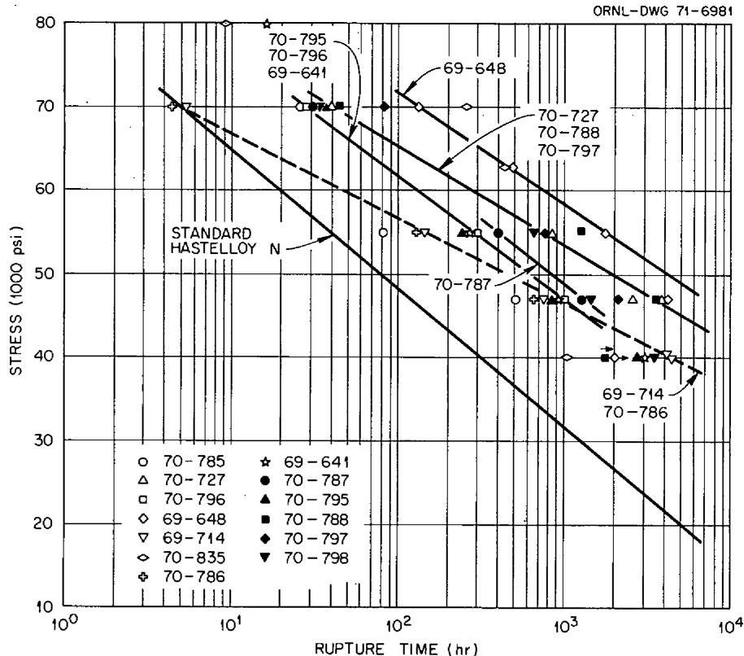  
Fig. 15.2. Stress-rupture properties at $650^{\circ}\mathrm{C}$ of several double-vacuum-melted experimental alloys (see Table 15.2 for the compositions). All alloys annealed 1 hr at $1177^{\circ}\mathrm{C}$ prior to testing.

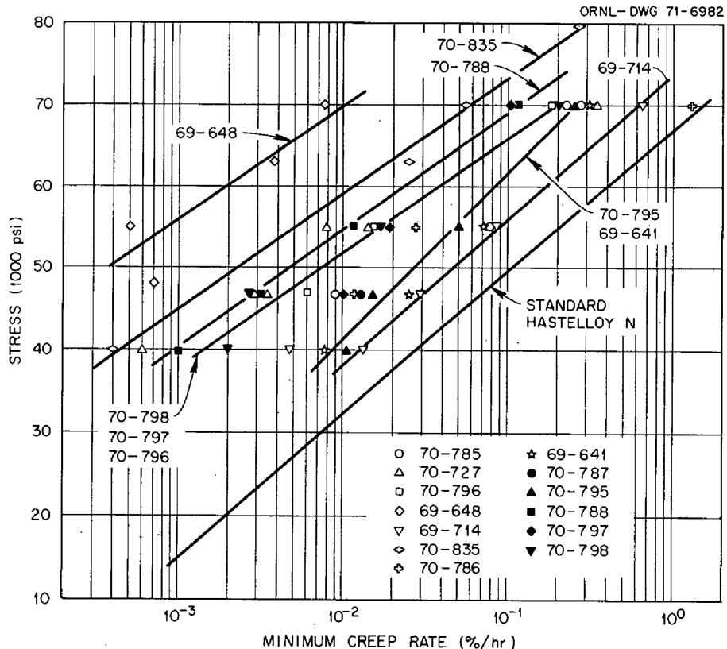  
Fig. 15.3. Creep rates of $650^{\circ}\mathrm{C}$ of several double-vacuum-melted experimental alloys (see Table 15.2 for the compositions). All alloys annealed 1 hr at $1177^{\circ}\mathrm{C}$ prior to testing.

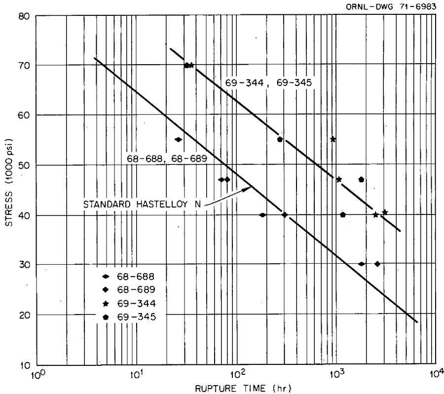  
Fig. 15.4. Stress-rupture properties at $650^{\circ}\mathrm{C}$ of several electroslag remelted experimental alloys (see Table 15.2 for the compositions). All alloys annealed 1 hr at $1177^{\circ}\mathrm{C}$ prior to testing.

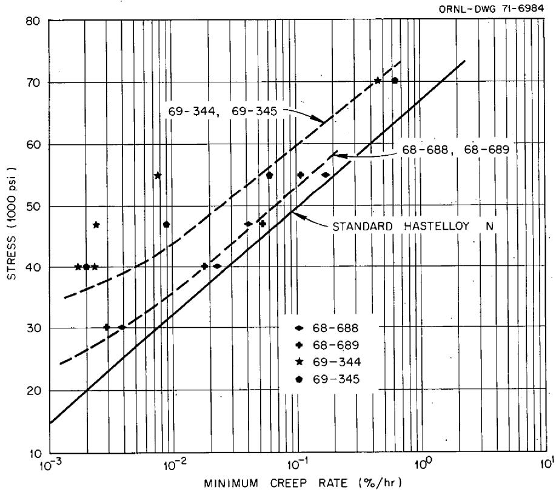  
Fig. 15.5. Creep rates at $650^{\circ}\mathrm{C}$ of several electroslag remelted experimental alloys (see Table 15.2 for the compositions). All alloys annealed 1 hr at $1177^{\circ}\mathrm{C}$ prior to testing.

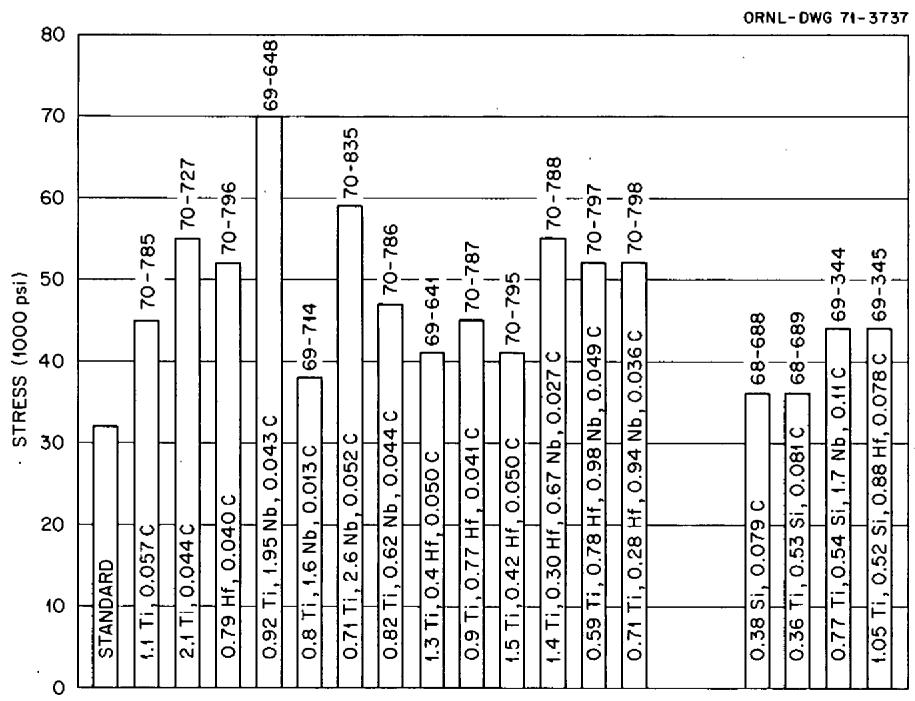  
Fig. 15.6. Stress to produce a creep rate of $0.01\%/\mathrm{hr}$ at $650^{\circ}\mathrm{C}$ for several experimental alloys (see Table 15.2 for compositions).

significantly lower strength. We attribute this lower strength to the presence of the coarser $\mathrm{M}_6\mathrm{C}$ -type carbide caused by the presence of Si. Alloys containing titanium were reasonably strong and increased progressively as the concentration of Ti was increased (alloys 70-785 and 70-727). Alloys 70-786, 69-641, 70-787, and 70-795 contained additions of Ti and Nb or of Ti and Hf and had relatively low strengths although they were stronger than the standard alloy. Alloy 70-796 (0.79 Hf, 0.040% C) and alloys 70-788, 70-797, and 70-798 with multiple additions of Ti, Hf, and Nb had quite high strengths.

As shown in Table 15.3 the same trends continued at a test temperature of $704^{\circ}\mathrm{C}$ . The differences become somewhat less with a variation of one order of magnitude in the rupture life and the minimum creep rate at a common stress level of 35,000 psi. The modified alloys are all stronger than the standard alloy. The difference in properties at $760^{\circ}\mathrm{C}$ is even less. $^{1}$

We attribute these property variations to the various carbide distributions that are obtained in these alloys by solution annealing at $1177^{\circ}\mathrm{C}$ and subsequently testing at 650 to $760^{\circ}\mathrm{C}$ . The carbide structures depend upon the composition and coarsen as the test temperature is increased. This convergence of properties at $760^{\circ}\mathrm{C}$ probably marks the temperature at which the carbide precipitate coarsens in all alloys.

Table 15.3. Properties of several modified alloys at $704^{\circ}\mathrm{C}$ and 35,000 psi See Table 15.2 for compositions   

<table><tr><td>Alloy No.</td><td>Rupture life (hr)</td><td>Minimum creep rate (%/hr)</td><td>Fracture strain (%)</td><td>Reduction in area (%)</td></tr><tr><td>Standard</td><td>70.0</td><td>0.20</td><td>16.0</td><td></td></tr><tr><td>70-785</td><td>141.4</td><td>0.111</td><td>45.40</td><td>45.0</td></tr><tr><td>70-727</td><td>217.1</td><td>0.10</td><td>75.5</td><td>59.1</td></tr><tr><td>70-796</td><td>225.4</td><td>0.045</td><td>34.3</td><td>28.0</td></tr><tr><td>69-648</td><td>732.2</td><td>0.025</td><td>21.6</td><td>18.0</td></tr><tr><td>69-714</td><td>236.6</td><td>0.098</td><td>44.8</td><td>80.0</td></tr><tr><td>70-835</td><td>898.1</td><td>0.032</td><td>62.3</td><td>51.0</td></tr><tr><td>70-786</td><td>205.9</td><td>0.049</td><td>57.60</td><td>56.2</td></tr><tr><td>69-641</td><td>171.7</td><td>0.135</td><td>45.6</td><td>64.7</td></tr><tr><td>70-787</td><td>193.4</td><td>0.090</td><td>38.5</td><td>44.9</td></tr><tr><td>70-795</td><td>162.6</td><td>0.11</td><td>53.2</td><td>70.6</td></tr><tr><td>70-788</td><td>408.8</td><td>0.072</td><td>70.8</td><td>64.7</td></tr><tr><td>70-797</td><td>550.9</td><td>0.043</td><td>60.7</td><td>57.0</td></tr><tr><td>70-798</td><td>302.3</td><td>0.061</td><td>55.2</td><td>64.8</td></tr><tr><td>68-688</td><td>40.0</td><td>0.24</td><td>19.8</td><td>19.8</td></tr><tr><td>68-689</td><td>65.2</td><td>0.267</td><td>43.4</td><td>36.7</td></tr><tr><td>69-344</td><td>181.6</td><td>0.048</td><td>41.5</td><td>39.0</td></tr><tr><td>69-345</td><td>400.3</td><td>0.053</td><td>45.7</td><td>48.0</td></tr></table>

# 15.4 THE WELDABILITY OF SEVERAL MODIFIED COMMERCIAL ALLOYS

B. McNabb H.E.McCoy

Some observations on the relative welding characteristics of commercial heats of modified Hastelloy N were reported previously. Mechanical property specimens were prepared from the welded plates, as described by McCoy and Canonico. Side-bend specimens were prepared by sawing $1/8$ -in. strips across the welds from the $1/2$ -in.-thick plates, and these were bent around a $1/2$ -in. radius. Most of the commercial heats bent at room temperature did not develop any cracks in the weld metal, but some did develop cracks, as reported previously. Figure 15.7 is typical of those heats that did not crack on bending. Figure 15.8 is a photograph of heat 70-796 and is typical of those heats that cracked severely on bending. We attribute this cracking to the combined high Hf and Zr concentrations in those alloys. Figure 15.9 is a photograph of heat 69-345 (additions of $0.88\%$ Hf and $0.038\%$ Zr) plates that cracked during welding. Welding was discontinued, and

2. B. McNabb and H. E. McCoy, MSR Program Semiannu Progr. Rep. Aug. 31, 1970, ORNL-4662, pp. 160-61.

3. H. E. McCoy and D. A. Canonico, "Preirradiation and Postirradiation Mechanical Properties of Hastelloy N Welds," Welding J. 48(5), 203-s-211-s (May 1969).

the plate was examined metallographically. The cracks were only in the weld metal and did not penetrate the base metal. Both heat 69-345 and 70-796 plates were welded successfully with a filler metal of standard air-melted heat of Hastelloy N, heat 5090, having the chemical composition Ni-16.04% Mo-7% Cr-3.7% Fe-9.5% Mn-0.56% Si-0.03% C. Figures 15.10 and 15.11 are photographs of these heats after being welded with this dissimilar filler metal and being bent without cracking. This demonstrates clearly that the welding problem is associated with the weld metal and could be circumvented by adjusting the composition of the filler metal.

Numerous mechanical property tests have been run on small transverse specimens from the weld. The tests are not complete, and we shall only generalize the trends observed to date.

1. The weld metal has a higher yield stress than the base metal at 25, 650, and $760^{\circ}\mathrm{C}$ . The ultimate tensile stress is not affected much.

2. The fractures usually occur in the weld metal, and the fracture strain is much lower than for the base metal.

3. In creep-rupture tests at 650 and $760^{\circ}\mathrm{C}$ , the weld samples compared with the base metal have a lower minimum creep rate, a shorter rupture life, and a lower fracture strain. The magnitude of these effects is less at 760 than at $650^{\circ}\mathrm{C}$ .

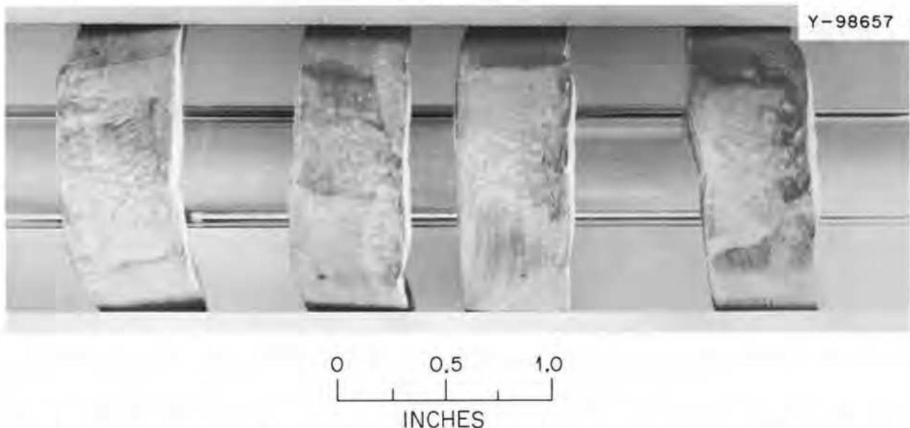  
Fig. 15.7. Side-bend specimens $(\frac{1}{8}$ in. thick bent around a $\frac{1}{2}$ -in. radius) of heat 70-727. The alloy was welded with filler metal from the same heat. Dye penetrant has been applied, and no flaws are visible.

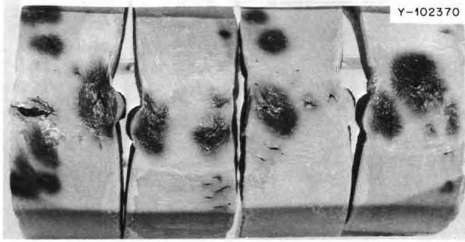

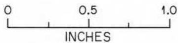  
Fig. 15.8. Side-bend specimens ( $\frac{1}{8}$ in. thick bent around a $\frac{1}{2}$ -in. radius) of heat 70-796. The alloy was welded with filler metal from the same heat. Dye penetrant has been applied, and several flaws are visible.

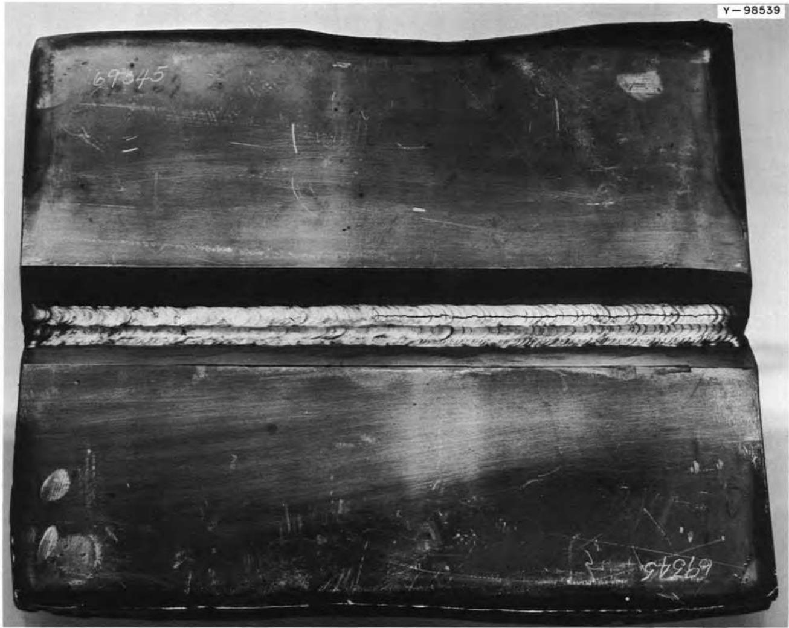

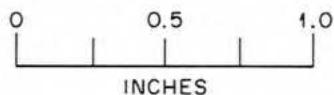  
Fig. 15.9. Plate of 69-345 that cracked during welding. The plate was $\frac{1}{2}$ in. thick and was being welded with filler metal from the same heat.

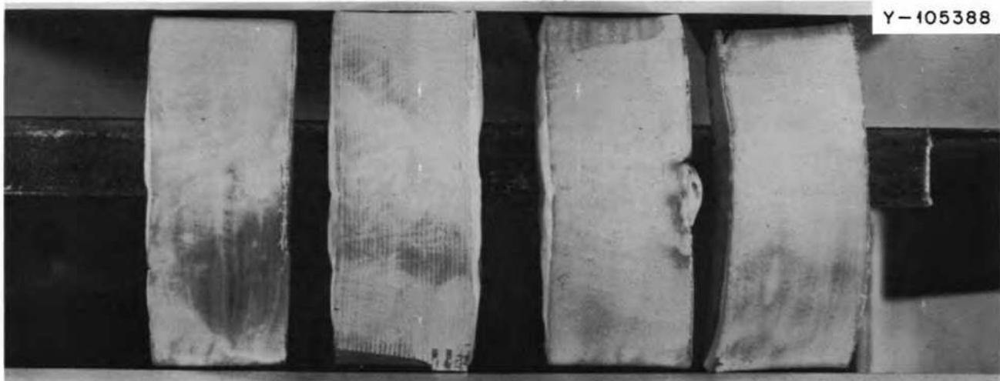

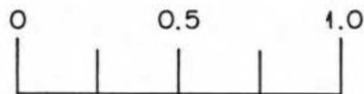  
INCHES   
Fig. 15.10. Side-bend specimens $(\frac{1}{8}$ in. thick bent around a $\frac{1}{2}$ -in. radius) of heat 69-345. The alloy was welded with a standard Hastelloy N filler metal (heat 5090). Dye penetrant has been applied, and no cracks are visible.

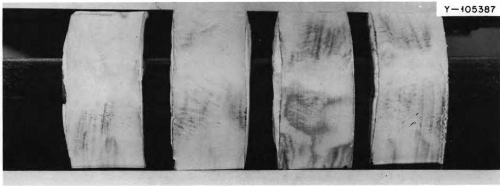

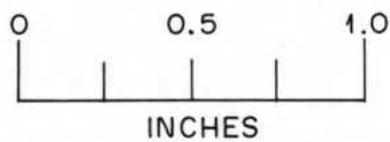  
Fig. 15.11. Side-bend specimens $(\frac{1}{8}$ in. thick bent around a $\frac{1}{2}$ -in. radius) of heat 70-796. The alloy was welded with a standard Hastelloy N filler metal (heat 5090). Dye penetrant has been applied, and no cracks are visible.

Table 15.4. Effect of postweld annealing on the tensile properties at ${25}^{ \circ  }{\mathrm{C}}^{a}$   

<table><tr><td>Alloy No.b</td><td>Anneal</td><td>Yield stress (psi)</td><td>Tensile stress (psi)</td><td>Fracture strain (%)</td></tr><tr><td rowspan="3">5065</td><td>Base metal</td><td>64,000</td><td>125,000</td><td>55.5</td></tr><tr><td>As welded</td><td>81,400</td><td>112,000</td><td>28.7</td></tr><tr><td>8 hr at 870°C</td><td>57,700</td><td>108,000</td><td>31.9</td></tr><tr><td rowspan="6">69-641</td><td>Base metal</td><td>44,900</td><td>117,000</td><td>72.6</td></tr><tr><td>As welded</td><td>73,800</td><td>114,000</td><td>29.6</td></tr><tr><td>8 hr at 870°C</td><td>65,500</td><td>116,000</td><td>36.7</td></tr><tr><td>1 hr at 982°C</td><td>60,000</td><td>104,600</td><td>27.7</td></tr><tr><td>1 hr at 1093°C</td><td>47,800</td><td>109,700</td><td>44.2</td></tr><tr><td>1 hr at 1175°C</td><td>45,700</td><td>116,800</td><td>60.9</td></tr><tr><td rowspan="6">69-648</td><td>Base metal</td><td>44,700</td><td>116,900</td><td>74.2</td></tr><tr><td>As welded</td><td>75,300</td><td>118,600</td><td>33.3</td></tr><tr><td>8 hr at 870°C</td><td>65,400</td><td>111,800</td><td>31.0</td></tr><tr><td>1 hr at 982°C</td><td>60,100</td><td>110,000</td><td>33.3</td></tr><tr><td>1 hr at 1093°C</td><td>46,900</td><td>119,900</td><td>62.9</td></tr><tr><td>1 hr at 1175°C</td><td>46,000</td><td>112,900</td><td>62.4</td></tr></table>

${}^{a}$ Strain rate of ${0.05}{\mathrm{\;{min}}}^{-1}$ .   
${}^{b}$ The chemical compositions of these alloys in weight $\%$ are:

<table><tr><td>Heat No.</td><td>Mo</td><td>Cr</td><td>Fe</td><td>Mn</td><td>Si</td><td>Ti</td><td>Nb</td><td>Hf</td><td>Zr</td><td>C</td></tr><tr><td>5065</td><td>16.5</td><td>7.2</td><td>3.9</td><td>0.55</td><td>0.60</td><td>0.01</td><td></td><td></td><td></td><td>0.065</td></tr><tr><td>69-641</td><td>13.9</td><td>6.9</td><td>0.3</td><td>0.35</td><td>0.02</td><td>1.3</td><td>&lt;0.05</td><td>0.40</td><td>0.021</td><td>0.050</td></tr><tr><td>69-648</td><td>12.8</td><td>6.9</td><td>0.3</td><td>0.34</td><td>0.05</td><td>0.92</td><td>1.95</td><td>&lt;0.05</td><td>0.005</td><td>0.043</td></tr></table>

The ability to improve the properties of the weld by annealing is also different for the modified alloys than for standard Hastelloy N. A postweld anneal of 8 hr at $870^{\circ}\mathrm{C}$ improved the tensile and the creep-rupture properties. The tensile properties at $25^{\circ}\mathrm{C}$ of two experimental heats are shown in Table 15.4. The anneal of 8 hr at $870^{\circ}\mathrm{C}$ reduces the yield stress of the weld in heat 5065 (standard alloy) to that of the base metal. The same anneal had little effect on heat 69-641, and an anneal of 1 hr at $1093^{\circ}\mathrm{C}$ was required for significant recovery. Similar behavior was noted for heat 69-648.

The property changes with welding that we have observed to date vary considerably from heat to heat. Our data are too fragmentary to date to attempt conclusions about the effects of composition on these changes, but this is the goal of our work.

# 15.5 POSTIRRADIATION PROPERTIES OF SEVERAL COMMERCIAL ALLOYS

C. E. Sessions H. E. McCoy

Based on our work with small 2-lb laboratory melts, several 50- and 100-lb commercial melts have been procured for evaluation. The compositions of these alloys are given in Table 15.2, and other properties have been discussed in previous sections. One of the items of

most importance for nuclear applications is how the mechanical properties change during irradiation. We anticipate that future systems will operate at about $700^{\circ}\mathrm{C}$ , but have made our irradiation conditions a bit more stringent. All of the specimens to be discussed in this section were irradiated at $760^{\circ}\mathrm{C}$ and tested at $650^{\circ}\mathrm{C}$ , a condition that we had found to give low fracture strains and that is not unrealistic for a transient. The thermal fluence was 2 to $3 \times 10^{20}$ neutrons/ $\mathrm{cm}^2$ , and the irradiation time was about 1100 hr.

The postirradiation stress-rupture properties of these samples are given in Fig. 15.12. Alloys 70-785 (1.1% Ti) and 70-786 (0.82% Ti, 0.62 Nb) had properties about equivalent to those of standard vacuum-melted Hastelloy N. Alloys 69-714 (0.8% Ti, 1.6% Nb), 70-796 (0.79% Hf), 68-688 (no addition), 68-689 (0.36% Ti), and 70-798 (0.71% Ti, 0.28% Hf, 0.94% Nb) have properties intermediate between those of vacuum- and air-melted Hastelloy N. All of the other alloys show some improvement in rupture life, with alloys 69-345 (1.05% Ti, 0.88% Hf), 69-344 (0.77% Ti, 1.7% Nb), and 69-641 (1.3% Ti, 0.40% Hf) being superior.

The creep properties of these same alloys are shown in Fig. 15.13. The trends that exist here are quite similar to those shown in Fig. 15.12 for the rupture life.

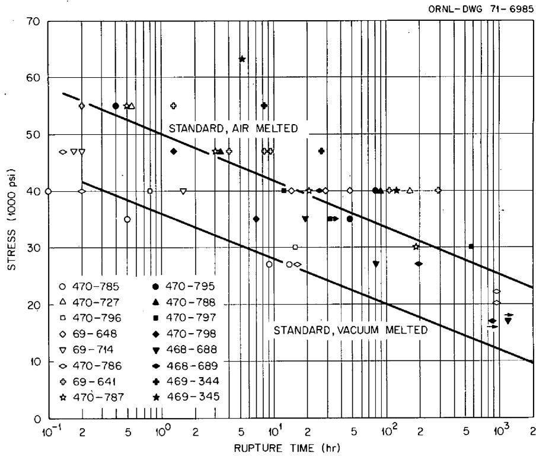  
Fig. 15.12. Stress-rupture properties at $650^{\circ}\mathrm{C}$ of several small commercial alloys (see Table 15.2 for compositions). Samples were irradiated at $760^{\circ}\mathrm{C}$ to a thermal fluence of 2 to $3 \times 10^{20}$ neutrons/cm $^2$ .

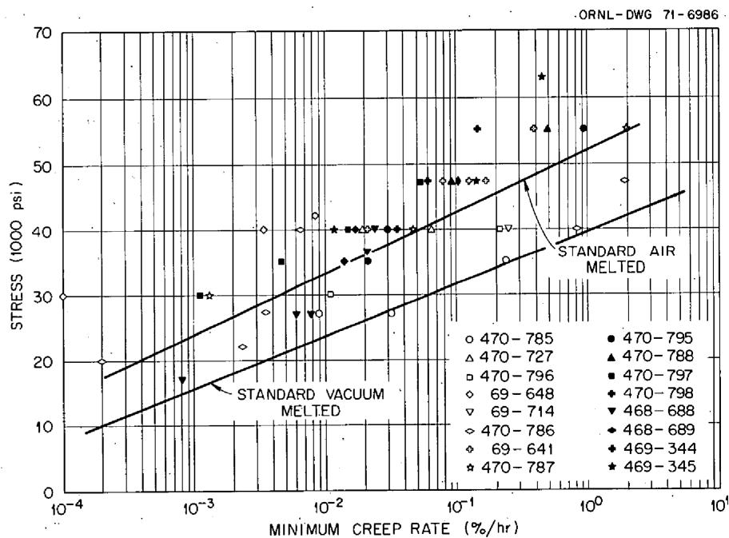  
Fig. 15.13. Creep properties at $650^{\circ}\mathrm{C}$ of several small commercial alloys (see Table 15.2 for compositions). Samples were irradiated at $760^{\circ}\mathrm{C}$ to a thermal fluence of 2 to $3 \times 10^{20}$ neutrons/cm $^2$ .

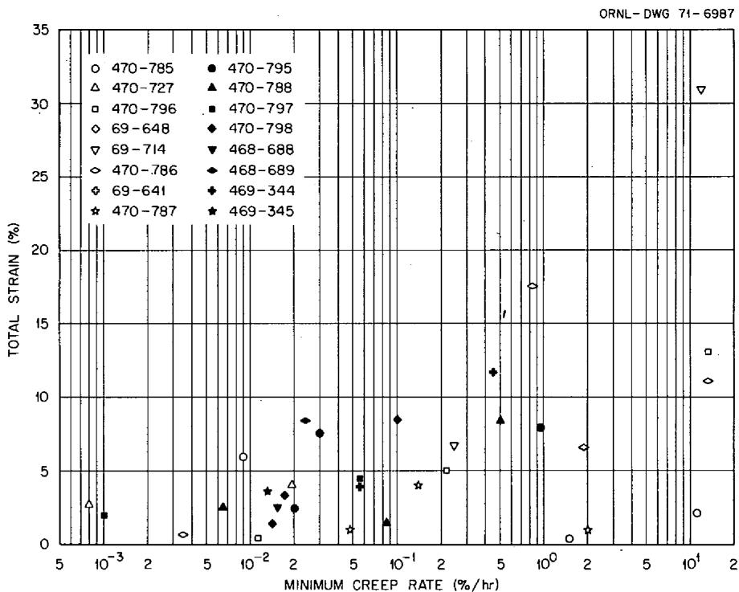  
Fig. 15.14. Fracture strains of several commercial alloys creep tested at $650^{\circ}\mathrm{C}$ (see Table 15.2 for compositions). Samples were irradiated at $760^{\circ}\mathrm{C}$ to a thermal fluence of 2 to $3 \times 10^{20}$ neutrons/cm $^2$ .

One notable exception is alloy 69-648 (0.92% Ti, 1.95% Nb), which has a very high creep strength but did not have an exceptionally long rupture life.

The fracture strains of these samples are shown in Fig. 15.14. Under these same conditions, standard vacuum-melted Hastelloy N had fracture strains of 0.2 to $0.3\%$ and air-melted Hastelloy N had fracture strains of 0.5 to $2.5\%$ . The scatter in these data is quite large and is influenced at high stresses by our inability to get a true measure of the strain on loading. The limited number of points for each heat is also a factor that makes conclusions quite questionable. However, there are several heats with fracture strains below $2\%$ (70-786 $(0.82\% \mathrm{Ti}$ , $0.62\% \mathrm{Nb}$ ); 70-796 $(0.79\% \mathrm{Hf})$ ; 70-798 $(0.71\% \mathrm{Ti}$ , $0.28\% \mathrm{Hf}$ , $0.94\% \mathrm{Nb}$ ); 70-787 $(0.90\% \mathrm{Ti}$ , $0.77\% \mathrm{Hf}$ , $0.12\% \mathrm{Nb}$ ); and 70-788 $(1.4\% \mathrm{Ti}$ , $0.30\% \mathrm{Hf}$ , $0.67 \mathrm{Nb}$ ). Few of the alloys seem to consistently exhibit exceptional fracture strains. The trend of decreasing fracture strain with decreasing creep rate is also disturbing, since these lower rates would be used in the design for steady-state operation.

The scalup experience is best conveyed by considering some specific compositions for which we have both laboratory and commercial melts. One laboratory melt, 184 (1.2% Hf, 1.2% Ti, 0.14% Si), had very good properties. Two double-vacuum-melted alloys (70-787, 69-641) and one ESR melt (69-345) of the same nominal composition were procured from commercial vendors. The comparative stress-rupture properties in Fig. 15.15 show that the laboratory and commercial melts had similar properties, all considerably above those of standard Hastelloy N. The postirradiation stress-rupture properties of these alloys are shown in Fig. 15.16. Heat 184, the laboratory melt, had good rupture lives and excellent fracture strains. Heat 69-345, the ESR melt, had good rupture lives, but the fracture strain seemed to decrease with increasing rupture life. Heat 69-641 had good rupture lives and good fracture strains. Heat 70-787 had stress-rupture properties equivalent to those of standard air-melted Hastelloy N. However, the fracture strain decreased drastically with increasing rupture life.

Heats 181, 69-648, and 69-344 had the nominal composition of $0.5\%$ Ti and $2\%$ Nb and were made by laboratory melting, double vacuum commercial melting, and ESR respectively. The stress-rupture properties in

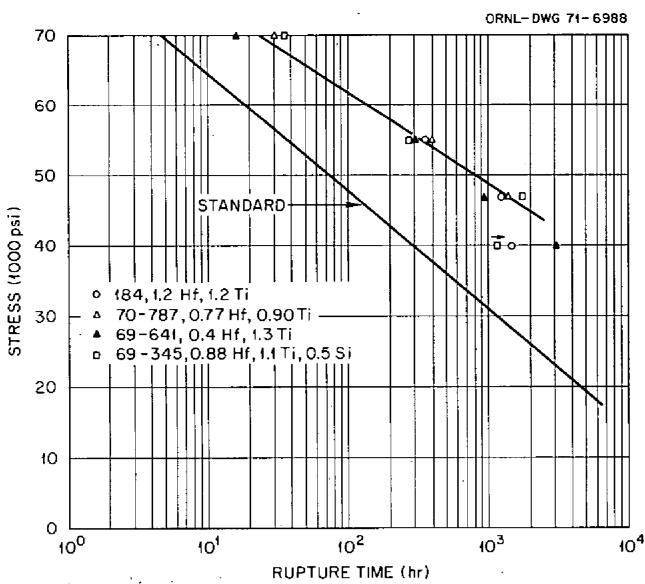  
Fig. 15.15. Stress-rupture properties at $650^{\circ}\mathrm{C}$ of several modified alloys having the nominal composition of Ni-12% Mo-7% Cr-0.2% Mn-1% Hf-1% Ti-0.05% C. All material annealed 1 hr at $1177^{\circ}\mathrm{C}$ .

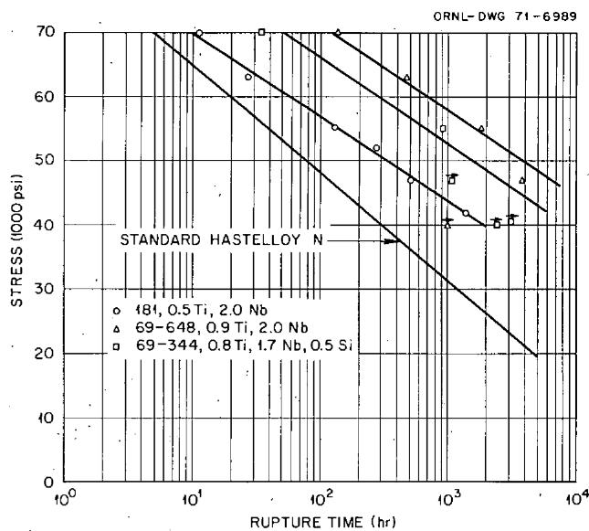  
Fig. 15.17. Stress-rupture properties at $650^{\circ}\mathrm{C}$ of several modified alloys having the nominal composition of Ni-12% Mo-7% Cr-0.2% Mn-0.5% Ti-2% Nb-0.05% C.

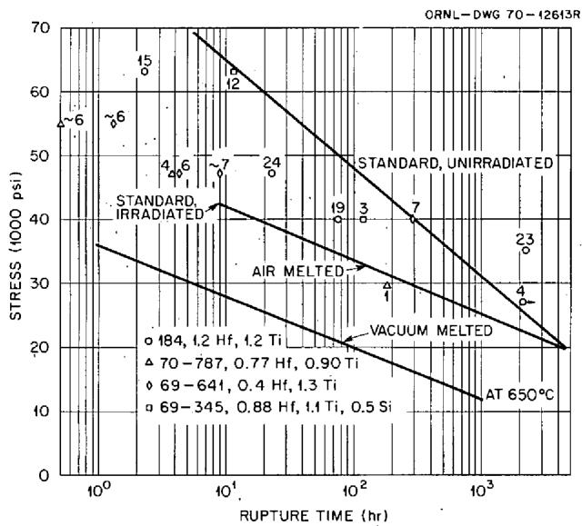  
Fig. 15.16. Comparison of stress-rupture properties at $650^{\circ}\mathrm{C}$ of modified Hastelloy N irradiated at $760^{\circ}\mathrm{C}$ to a thermal fluence of $3 \times 10^{20}$ neutrons/cm $^2$ .

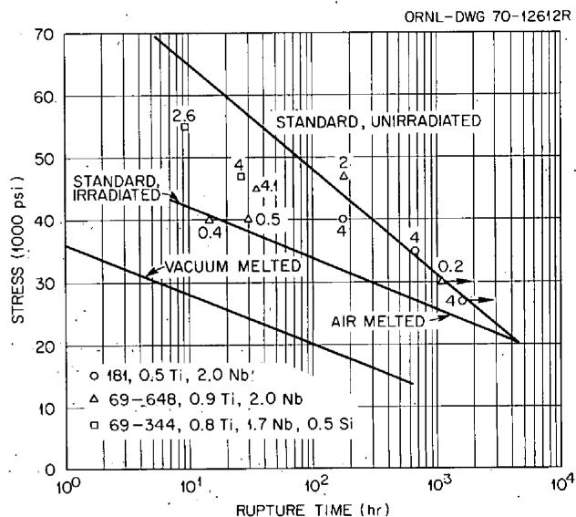  
Fig. 15.18. Comparison of stress-rupture properties at $650^{\circ}\mathrm{C}$ of modified Hastelloy N irradiated at $760^{\circ}\mathrm{C}$ to a thermal fluence of $3 \times 10^{20}$ neutrons/cm $^2$ .

the unirradiated condition were widely variant, with the rupture life at a given stress being highest for heat 69-648 and lowest for heat 181; however, all heats were superior to standard Hastelloy N (Fig. 15.17). The postirradiation properties are shown in Fig. 15.18. If one ignores the two points for heat 69-648 at 40,000

psi, all three heats fall within a rather narrow band and have fracture strains of 0.2 and $4\%$ .

Thus our experience with laboratory melts is forming a rather consistent picture, but the small commercial melts have inconsistent behaviors.

# 15.6 STATUS OF DEVELOPMENT OF A TITANIUM-MODIFIED HASTELLOY N

H. E. McCoy C. E. Sessions

Our early studies showed that alloys containing as little as $0.5\%$ Ti had excellent postirradiation properties when irradiated at $650^{\circ}\mathrm{C}$ , but deteriorated rapidly as the irradiation temperature was increased. The good properties were associated with the presence of a finely divided MC-type carbide and the poor properties with the formation of a coarse $\mathbf{M}_2\mathbf{C}$ -type carbide. Titanium has several advantages as an alloying element compared with other elements, such as Hf and Zr; titanium (1) is relatively cheap, (2) is a common alloying addition to nickel-base alloys, (3) seems to cause no welding or fabrication problem in concentrations up to at least $2.1\%$ , and (4) diffuses very slowly in Hastelloy N and should not contribute significantly to the corrosion rate. Its single known disadvantage is that it promotes the formation of a hard, brittle intermetallic compound, $\mathrm{Ni}_3\mathrm{Ti}$ . The exact level of Ti required to form this compound is unknown, since most commercial alloys contain both Ti and Al that will form this compound. However, the numerous advantages of Ti have led us to study alloys with Ti concentrations in the range of 1 to $3\%$ with a watchful eye toward the formation of the brittle intermetallic.

The chemical compositions of the various alloys that we have studied with Ti concentrations in the range of 1 to $3\%$ are shown in Table 15.5. The alloys with two- and three-digit numbers are 2-lb laboratory melts, and the last three melts are 50- to 100-lb heats from commercial vendors. All of the alloys were annealed 1 hr at $1177^{\circ}\mathrm{C}$ after final fabrication and irradiated for about 1100 hr at $760^{\circ}\mathrm{C}$ to a thermal fluence of 2 to 3 $\times 10^{20}$ neutrons/cm². They were then creep tested at $650^{\circ}\mathrm{C}$ .

The results of the postirradiation tests are shown in Fig. 15.19. Alloys 107 (1.04 Ti) and 75 (0.99 Ti) had properties intermediate between those of air- and vacuum-melted standard Hastelloy N. Alloy 76 (1.04% Ti) had a higher carbon level (0.117%) and had properties superior to those of standard Hastelloy N. Although the data scatter somewhat, there is a definite trend of increasing rupture life and fracture strain with increasing Ti concentration. However, alloys 292 (2.4% Ti) and 293 (2.9% Ti) have improved rupture lives, but the fracture strains are low. We have likely exceeded the

Table 15.5. Compositions $(\%)$ of Ti-modified alloys   

<table><tr><td>Alloy designation</td><td>Mo</td><td>Cr</td><td>Fe</td><td>Mn</td><td>Si</td><td>Ti</td><td>C</td></tr><tr><td>107</td><td>12.0</td><td>7.0</td><td>0.08</td><td>0.20</td><td>&lt;0.005</td><td>1.04</td><td>0.056</td></tr><tr><td>75</td><td>11.8</td><td>7.9</td><td>&lt;0.05</td><td>0.20</td><td>&lt;0.05</td><td>0.99</td><td>0.062</td></tr><tr><td>76</td><td>11.8</td><td>7.9</td><td>&lt;0.05</td><td>0.20</td><td>&lt;0.05</td><td>1.04</td><td>0.117</td></tr><tr><td>290</td><td></td><td></td><td></td><td></td><td>0.02</td><td>1.2</td><td></td></tr><tr><td>327</td><td></td><td></td><td></td><td></td><td></td><td>1.63</td><td>0.044</td></tr><tr><td>328</td><td></td><td></td><td></td><td></td><td></td><td>1.87</td><td>0.80</td></tr><tr><td>291</td><td>11.6</td><td>7.76</td><td>4.22</td><td>0.21</td><td>0.02</td><td>1.97</td><td>0.055</td></tr><tr><td>292</td><td>11.3</td><td>7.26</td><td>4.24</td><td>0.22</td><td>0.02</td><td>2.4</td><td>0.060</td></tr><tr><td>293</td><td>11.0</td><td>7.96</td><td>4.11</td><td>0.19</td><td>0.02</td><td>2.9</td><td>0.052</td></tr><tr><td>67-548</td><td>12.0</td><td>7.1</td><td>0.04</td><td>0.12</td><td>0.03</td><td>1.1</td><td>0.07</td></tr><tr><td>70-785</td><td>12.3</td><td>7.0</td><td>0.16</td><td>0.30</td><td>0.09</td><td>1.1</td><td>0.057</td></tr><tr><td>70-727</td><td>13.0</td><td>7.4</td><td>0.05</td><td>0.37</td><td>&lt;0.05</td><td>2.1</td><td>0.044</td></tr></table>

Ti level required to form $\mathrm{Ni}_3\mathrm{Ti}$ , although we have not specifically identified the compound. Commercial alloy 67-548 (1.1% Ti, 0.07% C) has two points at 40,000 psi with low fracture strains; otherwise, the properties are about equivalent to those of standard air-melted Hastelloy N. Alloy 70-785 (1.1% Ti, 0.05% C) has properties about equivalent to those of standard vacuum-melted Hastelloy N. The data are inconclusive on heat 70-727. The properties of this alloy should be equivalent to those of heat 291. One of the data points on heat 70-727 at 40,000 psi indicates that this is the case; however, the other point falls far short.

Thus the results from our laboratory melts indicate that an alloy containing about $2\%$ Ti would have acceptable properties. The data currently available from commercial alloys indicate that the laboratory and commercial alloys have similar properties when they contain about $1\%$ Ti and that the properties may be equivalent at the $2\%$ level. We plan to pursue further the development of an alloy containing $2\%$ Ti.

# 15.7 CORROSION STUDIES

J.W.Koger

The success of a molten-salt reactor system is strongly dependent on the compatibility of the materials of construction with the various fluids in the reactor. The experiments discussed in this section are being conducted to determine the behavior of reactor materials in a molten fluoride salt environment. Because heat is transferred to and from the salt, the most prevalent form of corrosion is temperature gradient mass transfer. This can effect the removal of selected alloy constituents, which may compromise certain favorable properties of the alloy, and the deposition of dissolved

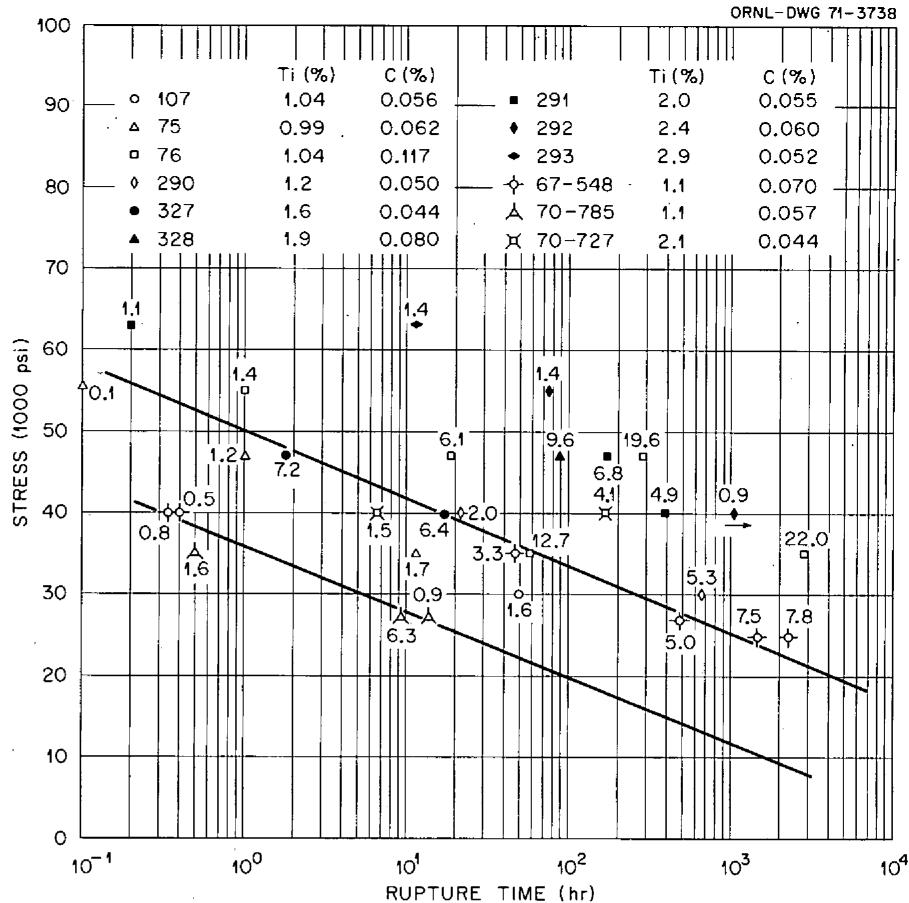  
Fig. 15.19. Postirradiation stress-rupture properties at $650^{\circ}\mathrm{C}$ of several modified alloys containing titanium. Each specimen was annealed $1\mathrm{hr}$ at $1177^{\circ}\mathrm{C}$ and irradiated for $1100\mathrm{hr}$ at $760^{\circ}\mathrm{C}$ to a thermal fluence of 2 to $3\times 10^{20}$ neutrons/cm².

corrosion products can also restrict flow in the cold part of the system. Important variables which may affect the mass transfer process are (1) impurities in the salts, (2) the nature and amounts of alloy constituents, (3) salt velocity, and (4) temperature. These effects are being studied in both isothermal and polythermal systems with conditions based on molten-salt breeder reactor design parameters.

Past work has shown that of the major constituents of Hastelloy N, chromium is much more readily oxidized by fluoride salts than Fe, Ni, or Mo. Thus attack is normally manifested by the selective removal of chromium. The rate-limiting step in chromium removal from the Hastelloy N by fluoride salt corrosion is the solid-state diffusion of chromium in the alloy. Several oxidizing reactions may occur, depending on the salt composition and impurity content, but among the most important reactants are $\mathrm{UF_4}$ , $\mathrm{FeF_2}$ , and HF.

In fluoroborate salt systems, which in some cases have been contaminated with $\mathrm{H}_2\mathrm{O}$ , we have found that elements other than chromium may be oxidized by the salt, and as a result the corrosion rate is higher and the attack is more uniform.

Experiments have continued on alloy compatibility with molten salts of interest, and extensive work is under way to determine the kinetic and thermodynamic properties of the corrosion systems. The alloys of interest (both nickel and iron based) are exposed to flowing molten salts in both thermal-convection loops and in loops containing pumps for forced circulation of the salts. The typical thermal convection loop (Fig. 15.20) is operated by heating, with clamshell heaters, the bottom and an adjacent side of the loop after which convection forces in the contained fluid establish flow rates of up to $8\mathrm{~fpm}$ , depending on the temperature difference between the heated and unheated portion of the loop. The salts of interest are LiF and $\mathrm{BeF}_2$ based with $\mathrm{UF_4}$ (fuel), $\mathrm{ThF_4}$ (blanket), and $\mathrm{UF_4}$ and $\mathrm{ThF_4}$ (fertile-fissile) and an $\mathrm{NaBF_4 - NaF}$ mixture (coolant salt).

ORNL-DWG 68-3987

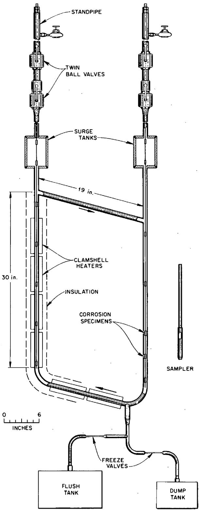  
Fig. 15.20. MSRP natural circulation loop and salt sampler.

The status of the thermal-convection loops in operation is summarized in Table 15.6.

# 15.7.1 Fuel Salts

Loop 1255, containing an MSRE-type salt with 1 mole $\%$ $\mathrm{ThF_4}$ and constructed of Hastelloy N, has operated for 8.8 years. The loop contains insert specimens (only removable by dismantling the loop) of standard Hastelloy N and a Hastelloy $\mathbf{N} + 2\% \mathbf{Nb}$ alloy. The latter Nb alloy was developed for improved weldability and mechanical properties, although similar compositions are now under consideration because of increased resistance to neutron damage.

Loop 1258, constructed of type 304L stainless steel, has operated about 7.6 years with the same salt as loop 1255. The hot leg of the loop contains tab specimens that can be removed without interrupting loop operation. This loop provides the capability for testing the compatibility of iron-base alloys with this particular salt. We recently replaced the heaters and thermocouples of both loops. Operation of these loops had become increasingly difficult as heater and thermocouple failures became more frequent. When the heaters were removed, we found many green chromium oxide crystals on the loop exterior directly under the heaters. These crystals were the result of a fairly common phenomenon in Nichrome-wound heaters where chromium, because of its high vapor pressure, is selectively vaporized from the heater wire over a long period of time. This vaporization changes the heating characteristics of the wire and certainly contributed to some of our operating problems. Both loops are again operating at design temperatures.

Loop NCL-16, constructed of Hastelloy N and containing removable specimens in each vertical leg, has operated with MSBR fuel salt (Table 15.6) for over three years. The largest weight loss of a Hastelloy N specimen is $-2.1\mathrm{mg/cm}^2$ after about $24,000\mathrm{hr}$ . The largest weight gain over the same period is $+1.6\mathrm{mg/cm}^2$ . Assuming uniform loss, the maximum weight loss is equivalent to $0.03\mathrm{mil/year}$ . The chromium content of the salt has increased $335\mathrm{ppm}$ in $24,000\mathrm{hr}$ . We continue to show in this system, and several others, that titanium-modified Hastelloy N specimens ( $12\%$ Mo, $7\%$ Cr, $0.5\%$ Ti, bal Ni) show smaller weight losses than standard Hastelloy N specimens ( $16\%$ Mo, $7\%$ Cr, $5\%$ Fe, bal Ni) under equivalent conditions. We attribute this difference to the absence of iron in the modified alloy.

Table 15.6. MSR Program natural circulation loop operation through February 28, 1971   

<table><tr><td>Loop No.</td><td>Loop material</td><td>Specimens</td><td>Salt type</td><td>Salt composition (mole %)</td><td>Maximum temperature (°C)</td><td>ΔT (°C)</td><td>Operating time (hr)</td></tr><tr><td>1255</td><td>Hastelloy N</td><td>Hastelloy N + 2% Nb a, b</td><td>Fuel</td><td>LiF-BeF2-ZrF4-ThF4 (70-23-5-1-1)</td><td>704</td><td>90</td><td>77,040</td></tr><tr><td>1258</td><td>Type 304L SS</td><td>Type 304L stainless steel b, c</td><td>Fuel</td><td>LiF-BeF2-ZrF4-UF4-ThF4 (70-23-5-1-1)</td><td>688</td><td>100</td><td>66,170</td></tr><tr><td>NCL-13A</td><td>Hastelloy N</td><td>Hastelloy N; Ti-modified Hastelloy N controls c, d</td><td>Coolant</td><td>NaBF4-NaF (92-8) plus tritium additions</td><td>607</td><td>125</td><td>20,380</td></tr><tr><td>NCL-14</td><td>Hastelloy N</td><td>Ti-modified Hastelloy N c, d</td><td>Coolant</td><td>NaBF4-NaF (92-8)</td><td>607</td><td>150</td><td>28,955</td></tr><tr><td>NCL-15A</td><td>Hastelloy N</td><td>Ti-modified Hastelloy N; Hastelloy N controls c, d</td><td>Blanket</td><td>LiF-BeF2-ThF4 (73-2-25)</td><td>677</td><td>55</td><td>22,215</td></tr><tr><td>NCL-16</td><td>Hastelloy N</td><td>Ti-modified Hastelloy N; Hastelloy N controls c, d</td><td>Fuel</td><td>LiF-BeF2-UF4 (65.5-34.0-0.5)</td><td>704</td><td>170</td><td>26,575</td></tr><tr><td>NCL-17</td><td>Hastelloy N</td><td>Hastelloy N; Ti-modified Hastelloy N controls c, d</td><td>Coolant</td><td>NaBF4-NaF (92-8) plus steam additions</td><td>607</td><td>100</td><td>14,615</td></tr><tr><td>NCL-19A</td><td>Hastelloy N</td><td>Hastelloy N; Ti-modified Hastelloy N controls c, d</td><td>Fertile-fissile</td><td>LiF-BeF2-ThF4-UF4 (68-20-11.7-0.3) plus bismuth in molybdenum hot finger</td><td>704</td><td>170</td><td>9.005</td></tr><tr><td>NCL-20</td><td>Hastelloy N</td><td>Hastelloy N; Ti-modified Hastelloy N controls c, d</td><td>Coolant</td><td>NaBF4-NaF (92-8)</td><td>687</td><td>250</td><td>10,515</td></tr></table>

aPermanent specimens.   
bHot leg only.   
$c$ Removable specimens.   
$d_{\mathrm{Hot}}$ and cold legs.

# 15.7.2 Fertile-Fissile Salt

A fertile-fissile MSBR salt has circulated for over 8800 hr in Hastelloy N loop NCL-19A, which has removable specimens in each leg. The test has two purposes: to confirm the compatibility of Hastelloy N with the salt and to determine if bismuth will be picked up by the salt and carried through the loop. The bismuth is contained in a molybdenum vessel located in an appendage beneath the hot leg of the loop. Hastelloy N specimens in the loop have shown maximum weight losses and gains of $-0.50$ and $+0.66\mathrm{mg/cm^2}$ , respectively, in 8800 hr. Assuming uniform loss, the maximum weight loss is equivalent to 0.024 mil/year. Figure 15.21 shows the weight changes of specimens in the loops as a function of time and position (temperature) and illustrates the mass transfer profile discussed previously. A modified Hastelloy N alloy ( $12\%$ Mo, $7\%$ Cr, $0.1\%$ Fe, $0.4\%$ Ti, $2.0\%$ Nb) has lost less weight than a standard alloy at the same position. The chromium content of the salt has increased 134 ppm in 7400 hr, and there is no detectable bismuth in the salt.

# 15.7.3 Blanket Salt

Loop NCL-15A, constructed of standard Hastelloy N and containing removable specimens in each leg, has operated 2.5 years with a blanket salt (LiF-BeF $_2$ with 25 mole $\%$ ThF $_4$ ) proposed for a two-fluid MSBR concept. Mass transfer, as measured by the change of chromium concentration in the salt, has been very small. Specimens exposed to this salt tend to be "glazed" with a coating (probably a high-melting Th

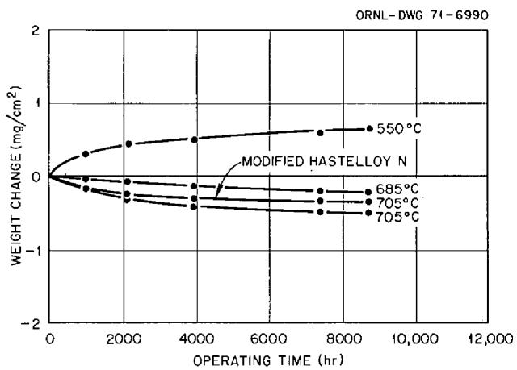  
Fig. 15.21. Weight change vs time of Hastelloy N specimens in NCL-19A exposed to $\mathbf{LiF - BeF_2 - ThF_4 - UF_4}$ (68-20-11.7-0.3 mole %) at various times. Liquid bismuth is in contact with the salt at the bottom of the hot leg.

compound) that is impossible to remove without damaging the metal. However, metallographic studies also show little, if any, mass transfer.

# 15.7.4 Coolant Salt

Loops NCL-13A and NCL-14, constructed of standard Hastelloy N and containing removable specimens in each leg, have operated for two and three years, respectively, with the fluoroborate mixture $\mathrm{NaBF_4}$ -NaF (92-8 mole $\%$ ). The maximum corrosion rate at the highest temperature, $605^{\circ}\mathrm{C}$ , has been 0.7 mil/year for both loops. Corrosion has generally been selective toward chromium, but there have been short periods when impurities have caused general attack of the Hastelloy N. The latter periods were caused by leaks in the seals of ball valves which are located above the surge tanks. Without such leaks the mass transfer rate during a given time period has been low. The areas in which the leaks are found are exposed to a mixture of He and $\mathrm{BF}_3$ gas and not to salt. We attribute the leaks both to heavy use of the ball valves and corrosiveness of the gas mixture after air inleakage. Although the overall corrosion rates in these loops were not excessive, the rates observed in the absence of ball valve leaks have been an order of magnitude lower than the average rate.

Loop NCL-17, constructed of standard Hastelloy N and containing removable specimens in each leg, is continuing to operate after an addition of steam to the coolant salt. This experiment was undertaken to determine the effect of steam on the mass transfer characteristics of the fluoroborate salt mixture. During one part of this report period the specimens were found to have undergone large weight changes. Careful examination disclosed a leak in a cover-gas line leading to the loop expansion tank. Along with the line repairs, ball valve seals were also replaced. In an attempt to remove adsorbed impurities after the repair, we evacuated the loop while heating the salt to just below the melting point. At present, some heat is required on the cold leg to maintain salt flow and the desired $\Delta T$ . Radiography has disclosed precipitated material in the bottom of the cold leg.

Immediately prior to the leak in the cover-gas system, we noted that the specimen in the hottest position $(607^{\circ}\mathrm{C})$ had corroded at an overall rate of 2.5 mils/year since steam addition (9000 hr) and at a rate of $< 1.0$ mil/year over the last 3000 hr. The overall mass transfer rate had steadily decreased since the steam addition.

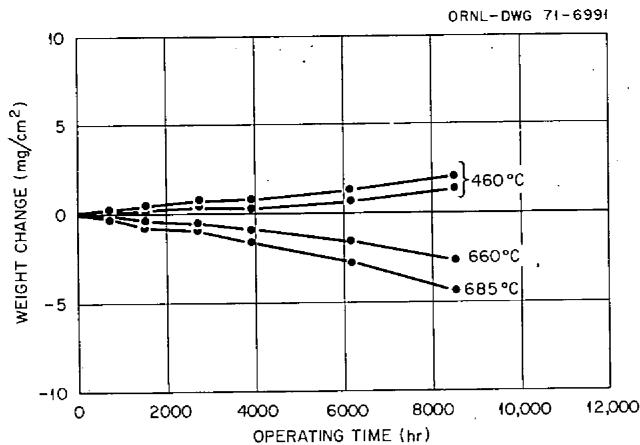  
Fig. 15.22. Weight change vs time of Hastelloy N specimens in NCL-20 exposed to $\mathrm{NaBF_4}$ -NaF (92-8 mole %) at various temperatures.

Loop NCL-20, constructed of standard Hastelloy N and containing removable specimens in each leg, has operated for over 10,000 hr with the fluoroborate coolant salt at about the most extreme temperature conditions considered (687°C max and 438°C min) for the heat exchanger of the MSBR secondary circuit. Forced air cooling of the cold leg is required to obtain this ΔT. After 8500 hr the maximum weight loss in the hot leg was measured to be -4.3 mg/cm² (0.2 mil/year assuming uniform loss) and was accompanied by a maximum gain in the cold leg of +2.1 mg/cm². Figure 15.22 shows the weight changes of specimens in the loop as a function of time and temperature. The chromium content of the salt has increased 77 ppm, and the oxygen content of the salt has increased about 300 ppm. The weight changes of the specimens and the chemistry changes of the salt indicate that the mass transfer is the lowest yet attained with the fluoroborate mixture in a temperature gradient system and also confirm the importance of salt purity on compatibility with structural material and on operation.

Figures 15.23 and 15.24 are optical and scanning electron micrographs of specimens from the hot and cold legs of NCL-13. These specimens were exposed to $\mathrm{NaBF_4}$ NaF (92-8 mole $\%$ ) for 4180 hr at 580 and $476^{\circ}\mathrm{C}$ respectively. The hot-leg specimen lost 3.3 $\mathrm{mg / cm}^2$ , and the cold leg specimen gained $3.2\mathrm{mg / cm}^2$ The scanning electron micrograph of the surface of the hot-leg specimen, as seen in Fig. 15.23b, shows that the

Hastelloy N has been attacked nonuniformly and is heavily contoured. Figure 15.24 shows that the cold-leg specimen is coated with a discontinuous deposit which is essentially analyzed as Hastelloy N with a little more nickel and molybdenum.

Figures 15.25 and 15.26 are optical and scanning electron micrographs of specimens from the hot and cold legs of NCL-17. The specimens, at temperatures of 593 and $500^{\circ}\mathrm{C}$ , respectively, were exposed to $\mathrm{NaBF}_4$ -NaF (92-8 mole %) for 1050 hr, at which time steam was injected into the loop. The specimens then remained in the loop for an additional 9000 hr. The total weight loss of the hot-leg specimen was $40.9~\mathrm{mg / cm}^2$ and the weight gain of the cold-leg specimen was 16.0 $\mathrm{mg / cm}^2$ . In Fig. 15.25a we see that the surface has receded uniformly, although a Widmanstätten precipitate was left in relief. Figure 15.26a shows a dark deposit on the cold-leg specimen, and the deposit exhibits a layered structure when viewed from above (Fig. 15.26b).

# 15.7.5 Analysis of $\mathbf{H}_2\mathbf{O}$ Impurities in Fluoroborate Salts

Over the last few years, we have been concerned over the behavior of $\mathrm{H}_2\mathrm{O}$ in molten fluoride salts. The disposition of $\mathrm{H}_2\mathrm{O}$ in these salts has implications both for corrosion studies and for tritium removal schemes. In corrosion work, we have long recognized the need for analyses which would allow us to distinguish between water and (1) compounds which contain $\mathrm{H}^+$ ions, (2) compounds which contain $\mathrm{O}^{2-}$ ions, and (3) HF (highly corrosive). In the past, a complementary indication of mass transfer (besides weight changes and metal analysis of the salt) was the analysis for $\mathrm{H}_2\mathrm{O}$ and $\mathrm{O}_2$ in the salt. On the basis of our tritium injection experiment (subsequent section on retention of tritium by sodium fluoroborate) and work in Analytical Chemistry and Reactor Chemistry Divisions, we now feel that the results of the $\mathrm{H}_2\mathrm{O}$ analyses included many other constituents of the salts, including oxides. Thus it was possible that a result indicating a large amount of $\mathrm{H}_2\mathrm{O}$ really only showed that amount of oxide. The lack of $\mathrm{H}_2\mathrm{O}$ in the salt is completely reasonable on the basis that all the hydrogen in impurity compounds that enter the salt would eventually cause oxidation of the metal wall and then would itself be reduced to $\mathrm{H}_2$ gas which would diffuse out of the loop. However, increased mass transfer (weight losses and weight gains of specimens) by virtue of $\mathrm{H}_2\mathrm{O}$ impurities is still accompanied by an increase in the oxide content of the salt. Thus the oxide content is still somewhat indicative of the corrosion of the loop system.

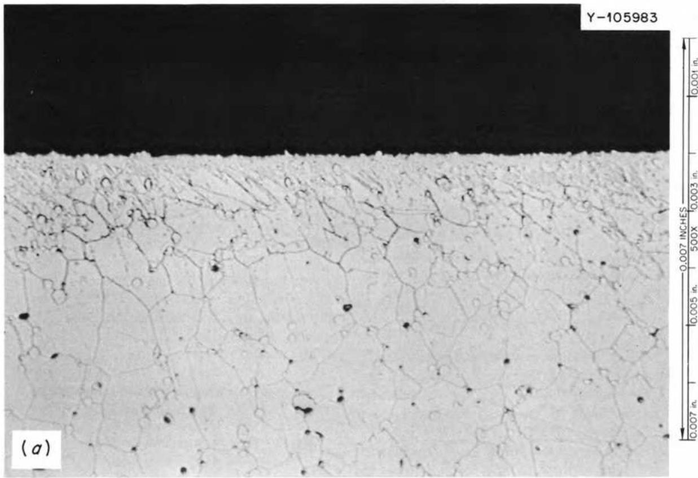

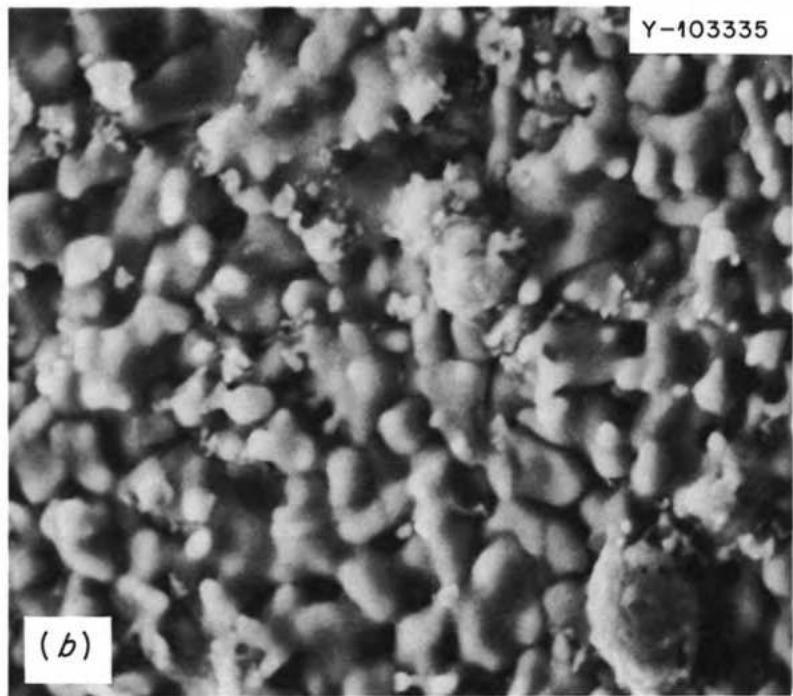  
Fig. 15.23. Hastelloy N specimen from NCL-13 exposed to $\mathrm{NaBF_4}$ NaF (92-8 mole %) at $580^{\circ}\mathrm{C}$ for 4180 hr. Weight loss, 3.3 mg/cm². (a) Optical micrograph, $500\times$ . Etchant, glyceregia. (b) Scanning electron micrograph, $1000\times$ .

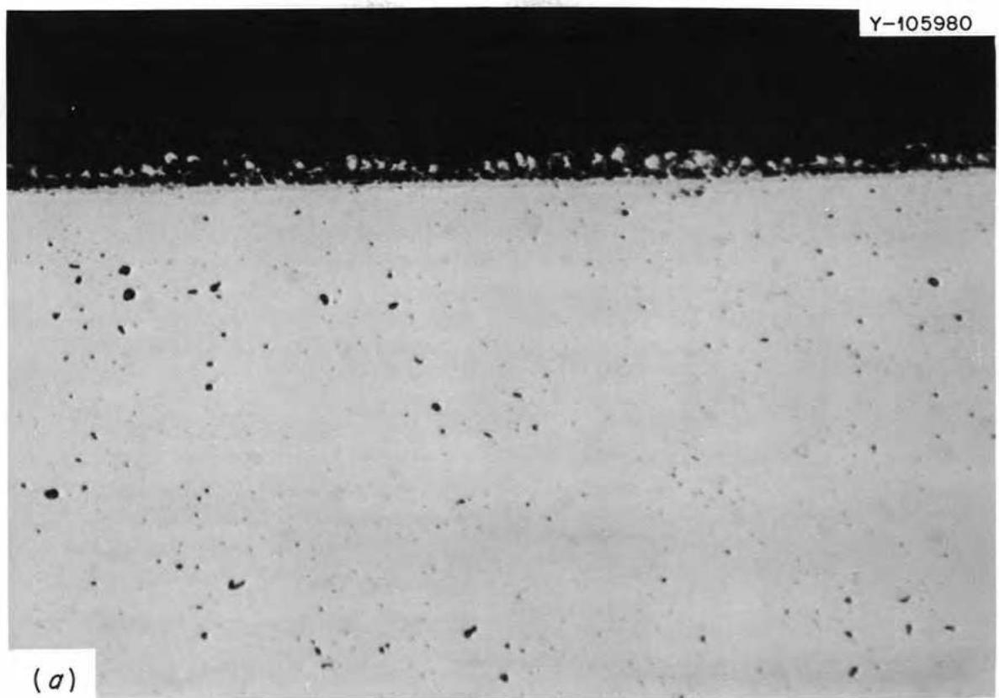  
10.007 INCHES 10.005 in. 500x 10.003 in. 10.001 in.

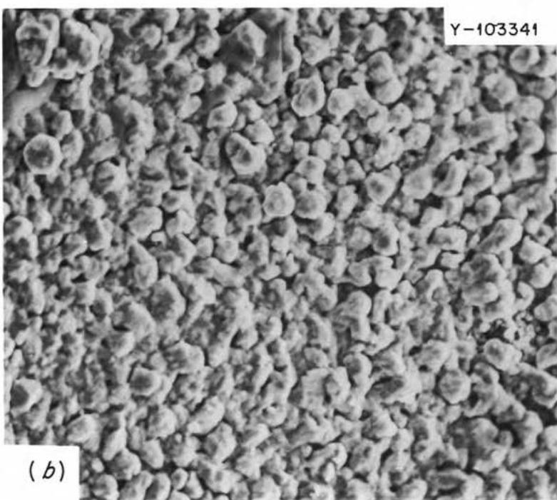  
Fig. 15.24. Hastelloy N specimen from NCL-13 exposed to $\mathrm{NaBF}_4$ -NaF (92-8 mole %) at $476^{\circ}\mathrm{C}$ for 4180 hr. Weight gain 3.2 mg/cm². (a) Optical micrograph, 500×. Etchant, glyceregia. (b) Scanning electron micrograph, 1000×.

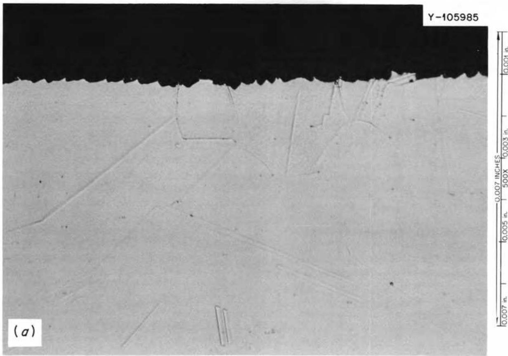

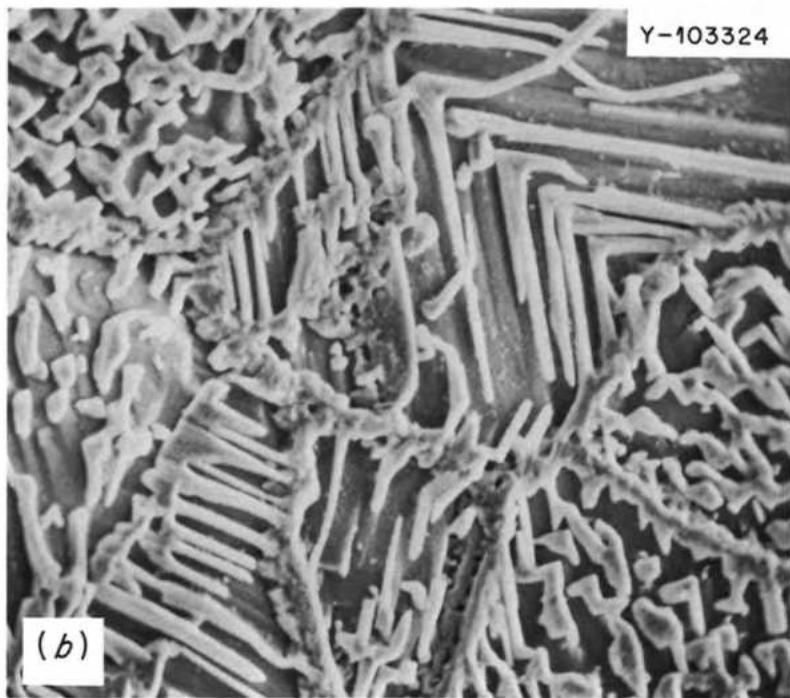  
Fig. 15.25. Hastelloy N specimen from NCL-17 exposed to $\mathrm{NaBF}_4$ -NaF (92-8 mole %) at $593^{\circ}\mathrm{C}$ for 10054 hr (1054 hr before steam addition). Weight loss, $40.9\mathrm{mg/cm}^2$ . (a) Optical micrograph, $500\times$ . (b) Scanning electron micrograph, $1000\times$ .

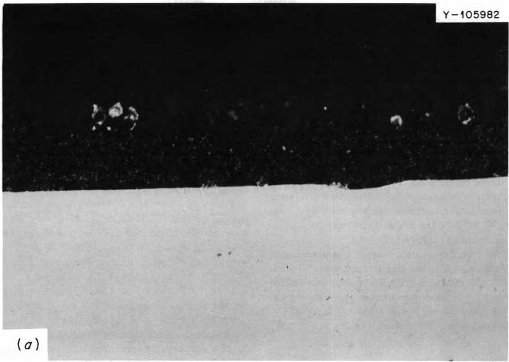  
0.007 INCHES 10.005 in. 500x 10.003 in. 10.001 in.

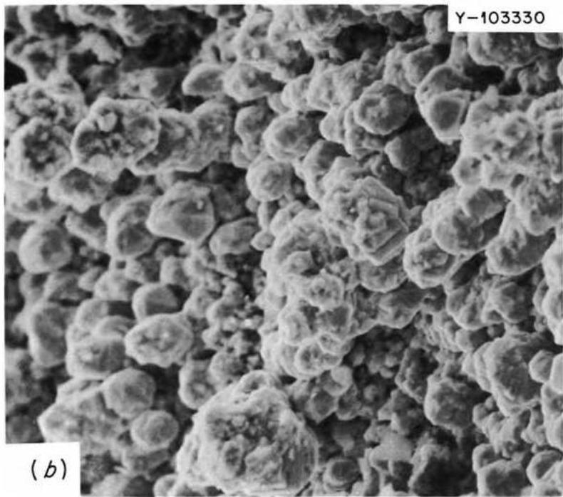  
Fig. 15.26. Hastelloy N specimen from NCL-17 exposed to $\mathrm{NaBF}_4$ -NaF (92-8 mole %) at $500^{\circ}\mathrm{C}$ for 10054 hr (1054 hr before steam addition). Weight gain, $+16.0~\mathrm{mg / cm}^2$ . (a) Optical micrograph, $500\times$ . (b) Scanning electron micrograph, $1000\times$ .

# 15.8 FORCED-CONVECTION LOOP CORROSION STUDIES

J.W.Koger H.C.Savage W.R.Huntley

The MSR-FCL-1 forced-circulation loop is being operated to evaluate the compatibility of standard Hastelloy N with $\mathrm{NaBF_4}$ -NaF (92-8 mole $\%$ ) coolant salt at temperatures and flow rates similar to those which existed in the MSRE coolant circuit. Salt velocity in the $1 / 2$ -in.-OD,0.042-in.-wall Hastelloy N loop is nominally 10 fps.The maximum and minimum salt temperatures in the loop are 588 and $510^{\circ}C$ respectively.Hastelloy N corrosion test specimens are exposed to the circulating salt at three temperatures:510,555, and $588^{\circ}C.$ MSR-FCL-1 has accumulated a total operating time of over 11,000 hr.

A second forced-circulation loop, of improved design, MSR-FCL-2, is in the final stages of assembly. This test will study the corrosion and mass transfer of standard Hastelloy N in sodium fluoroborate coolant at typical MSBR salt temperatures of $620^{\circ}\mathrm{C}$ maximum and $454^{\circ}\mathrm{C}$ minimum and at velocities up to 20 fps.

# 15.8.1 Operation of Forced-Convection Loop MSR-FCL-1

Operational problems and equipment failure limited the loop operation during the report period to 1342 hr, with a total accumulated time at design conditions of 10,335 hr as of February 28, 1971.

The sixth run was abruptly terminated on October 19, 1970, after 1241 hr duration, when oil from a broken pump cooling oil line ignited when it came in contact with the pump bowl at $510^{\circ}\mathrm{C}$ and adjacent piping. The loop was automatically transferred to standby conditions by the control system, and an alarm from the loop was received by the plant shift superintendent. In standby condition the salt circulation is stopped, the main loop heaters are turned off, and sufficient heat is supplied to the loop to maintain the temperatures around the loop circuit above the salt liquidus temperature $(385^{\circ}\mathrm{C})$ . We extinguished the fire and turned off all loop heaters, which allowed the salt to freeze in the loop piping.

The pump cooling oil line failure occurred in a $\frac{1}{4}$ -in. sched 40 brass pipe at a point near the rotary oil union mounted on top of the salt pump (model LFB). This pipe is believed to have been in service for the entire

operating life of the loop (11,371 hr at the time of failure). During this time it had been subjected to a low-amplitude high-frequency vibration from the rotary oil union, and the failure appears to be a fatigue type.

Damage to the loop as a result of the fire was confined to electrical wiring, thermocouples, service piping, and gages in the vicinity of the pump. The helium cover-gas overpressure was lost as a result of the fire, and air inleakage to the loop and drain tank probably occurred.

We replaced the electrical wiring, thermocouples, and service piping necessary to melt the salt in the loop piping and transfer it to the drain tank. This was the first time that we had attempted to melt salt in the entire loop circuit, although salt had been melted in the cooling coil without difficulty on several occasions. In attempting to melt the $\mathrm{NaBF_4}$ - $\mathrm{NaF}$ (92-8 mole %) salt in the loop, a rupture occurred in the main loop piping ( $1/2$ -in.-OD by 0.042-in.-wall Hastelloy N) at a point near the U-bend in the loop and adjacent to one of the metallurgical specimen holders, as shown in Fig. 15.27. After the rupture occurred, the salt in the loop was frozen as quickly as possible by turning off all loop heaters. However, approximately $77\mathrm{g}$ of salt was lost from the loop. Prior to the rupture, the salt in the bowl and cooling section of the main loop had been melted without difficulty, and the temperature of the main loop piping had reached temperatures varying between 371 and $482^{\circ}\mathrm{C}$ around the loop circuit, and the drain line temperatures were above $426^{\circ}\mathrm{C}$ .

In reviewing the loop melting procedure to determine the cause of the rupture, we concluded that uneven thicknesses of thermal insulation caused considerable variation in the temperatures. In particular, the temperatures under the clamshell emergency heaters (where the thermal insulation was $\sim 1$ in. thick as compared with $\sim 2$ in. thick on the remainder of the tubing) were $\sim 80^{\circ}\mathrm{C}$ below temperatures in the more heavily insulated sections of tubing. Thus the salt in the ruptured area melted but was not able to expand properly because of frozen salt plugs under the emergency heaters. Another problem was the difficulty in controlling the rate of heatup of the main loop by resistance heating. Even though the lowest setting on the loop heater was used, we still had to turn off the heater supply power for short periods to maintain temperature control.

We removed the metallurgical specimen assembly and ruptured section of tube and replaced it with new tubing. Figure 15.28 is a photograph of the ruptured section of tubing. Measurements of the outside diameter of the remaining loop tubing were made and

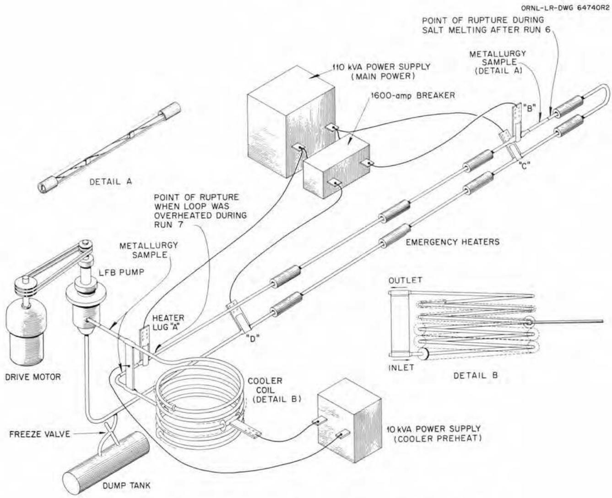  
Fig. 15.27. Molten-salt corrosion testing loop and power supplies, loop MSR-FCL-1.

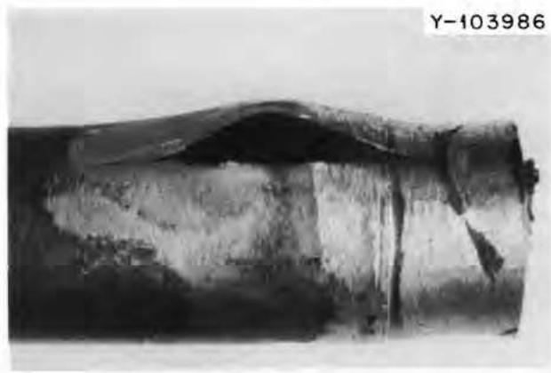

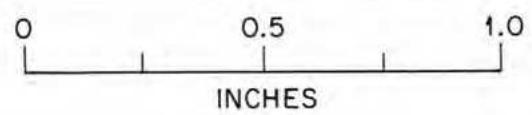  
Fig. 15.28. Photograph of tube rupture during salt melting after run 6, loop MSR-FCL-1.

compared with the original outside diameter to determine if excessive permanent strain had occurred at other locations. Generally all measurements were in the range of 0.500 to 0.505 in., as compared with the original nominal diameter of 0.500 in.

The emergency heaters (which are no longer in use) were removed, and the loop was insulated uniformly. The resistance heater power supply was modified to reduce the loop heat input, and the salt in the loop was again melted without apparent incident and drained to the sump tank. The remaining corrosion test specimen assemblies were removed for weighing and metallurgical examination.

Corrosion test specimen assemblies were reinstalled in the loop, the pump was repaired by installing new bearings and seals (these are routinely replaced every 2000 hr), and a catch basin was installed for the pump lube oil to prevent oil contacting the high-temperature loop in the event of a lube oil line rupture or leak. We returned the loop to design conditions for the start of run 7 on January 8, circulating the same $\mathrm{NaBF_4}$ -NaF (92-8 mole %) coolant salt used since the start of loop operation.

On January 12, 1971, while repairs were under way on the loop high-temperature protective instrumentation, an operating error resulted in a portion of the loop tubing being heated to temperatures above $1100^{\circ}\mathrm{C}$ . This caused one failure of the loop tubing at a point adjacent to one of the electrical power input lugs (see Fig. 15.27) and another about 12 in. downstream. Part of the salt in the loop ( $\sim$ 2 liters) was discharged into the loop secondary containment. Temperatures were immediately reduced, and the facility was shut down. The tubing obviously melted at the rupture. However, at $1100^{\circ}\mathrm{C}$ the strength of Hastelloy N is very low, and the salt vapor pressure would approach 1000 psi. Local boiling of the salt would also occur, and overheating could reduce the tube strength until rupture occurred. At the time of failure the loop had accumulated 10,335 hr of operation at design conditions (101 hr during run 7). A photograph of the tube failure is shown in Fig. 15.29.

The overheating of the loop was caused by the following sequence of events:

1. While attempting to repair a thermocouple connected to the high-temperature cutoff instrument, the thermocouple circuit was first opened and subsequently shorted. A fail-safe feature in the high-temperature cutoff responded to the open circuit and caused the loop to be transferred from design conditions to standby conditions. The subsequent shorting of the thermocouple rendered the high-temperature cutoff

inoperative. In standby condition the salt pump is stopped and loop heater power is reduced such that salt in the loop is maintained in a liquid state ( $\sim 400$ to $540^{\circ}\mathrm{C}$ ).

2. The loop temperature controller had been temporarily placed on "manual" to prevent power input variations in the event the control thermocouple (located near the high-temperature cutoff thermocouple) was disturbed while repairs were attempted.

3. As quickly as possible after the loop was transferred to the standby operating condition, the loop operator proceeded to activate circuits necessary to return the loop to design operating conditions. He did not reduce the main loop heater power control before activating these circuits, with the result that about 70 kW of heating was applied to the loop piping (2 or 3 kW is sufficient to maintain loop temperatures in the standby condition without the air-cooled radiator in service). With both the loop temperature controller and the high-temperature cutoff instrument inoperative, loop temperatures reached the failure level before the main heater power had been manually reduced (in $\sim 2^{1/2}$ min).

We removed the corrosion test specimens for weighing and metallurgical examination. All loop tubing external to the air-cooled radiator (the radiator was not overheated or damaged) was also cut out for metallurgical examination of selected sections.

Before loop operation can be continued, it will be necessary to replace the main loop tubing ( $\sim 25$ ft of $1/2$ -in.-OD by 0.042-in.-wall Hastelloy N). In addition, we plan to modify the instrumentation to prevent accidental startup of the main loop heater at high power levels.

# 15.8.2 Metallurgical Analysis of MSR-FCL-1

After the oil fire which ended run 6 and the subsequent rupture of the tubing while attempting to melt the salt from the loop, the corrosion specimens were removed, weighed, and examined. Surprisingly, weight losses were found for all specimens. The weight loss rates found for specimens exposed to the salt at 588 and $555^{\circ}\mathrm{C}$ were (assuming uniform losses) $\sim 1.9$ and $0.5\mathrm{mil / year}$ , respectively, for the $1240\mathrm{hr}$ of run 6. The corrosion rate ratio for these specimens (several times greater loss at $588^{\circ}\mathrm{C}$ than at $555^{\circ}\mathrm{C}$ ) was fairly consistent with past findings. However, in earlier runs, specimens at $510^{\circ}\mathrm{C}$ had gained weight. During run 6,

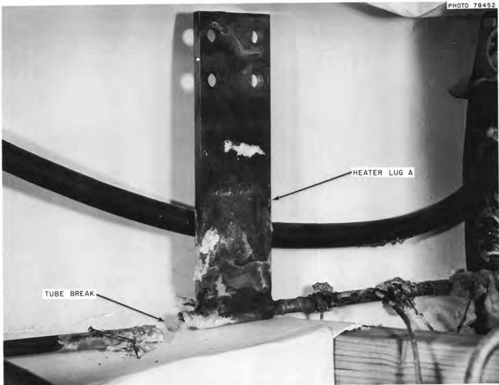  
Fig. 15.29. Photograph of tube rupture caused by overheating during run 7, loop MSR-FCL-1.

specimens at this temperature level lost material at the rate of 1.9 mils/year, a rate that was the same as the rate for specimens at $588^{\circ}\mathrm{C}$ . This weight loss anomaly and the overall higher weight losses are attributed to the problems encountered during this run and probably attest to a local high-temperature condition in the cooler section along with oxidizing impurities in the salt. A salt analysis showed small increases of chromium, iron, and nickel, all of which reflect the increased corrosion rates.

Following the rupture of the loop tubing which ended run 7, the corrosion test specimens were again removed for weighing and metallurgical examination. The specimens adjacent to the ruptured area (hottest section under normal conditions, $588^{\circ}\mathrm{C}$ ) were badly warped and partially fused to the tube wall. Thus only metallographic analysis was possible. The specimens in the intermediate zone, $555^{\circ}\mathrm{C}$ , appeared to be un

harmed with regard to physical appearance. The average weight loss for these specimens was $-1.3\mathrm{mg / cm}^2$ in the $101\mathrm{hr}$ of run 7. Expected loss for these specimens in $100\mathrm{hr}$ would be approximately $-0.1\mathrm{mg / cm}^2$ . Thus, if we attribute the balance of the corrosion only to the period of the temperature excursion $(\sim 1000^{\circ}\mathrm{C})$ , the loss rate would be $-1.2\mathrm{mg / cm}^2$ in $2.5\mathrm{min}$ or $10,000$ mils/year (10 in./year).

Weight losses were also found for the specimens downstream of the cooler. Although the specimens were adjacent, one specimen lost $0.3\mathrm{mg/cm}^2$ and the other $3.0\mathrm{mg/cm}^2$ . Again the severity of the overheating was evident. Certainly a large part of these losses may be attributed to moisture contamination of the salt and air oxidation after the loop rupture. Nonetheless, the corrosion rate was quite high.

Figure 15.30 shows micrographs of specimens from FCL-1 after run 4 (9600 total hr exposure to the

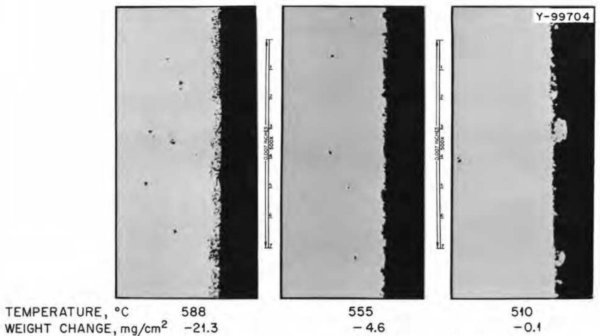  
Fig. 15.30. Micrographs of Hastelloy N specimens from FCL-1 exposed to $\mathrm{NaBF}_4$ -NaF (92-8 mole%).

fluoroborate mixture). The left micrograph shows the surface of the specimen at the hottest position $(588^{\circ}\mathrm{C})$ . Average weight losses of the specimens were $-21.3\mathrm{mg/cm}^2$ . Microprobe analysis disclosed a concentration gradient of chromium and iron for a distance of $0.6\mathrm{mil}$ . There was less than $1.0\mathrm{wt}\%$ Cr and only $1.0\mathrm{wt}\%$ Fe $0.4\mathrm{mil}$ from the surface. This depleted area is represented by the darkened area extending from the surface for approximately $0.5\mathrm{mil}$ . The center micrograph shows the surface of a specimen at $555^{\circ}\mathrm{C}$ . The average weight loss of these specimens was $-4.6\mathrm{mg/cm}^2$ . Microprobe analysis of these specimens disclosed only a small concentration gradient for a distance of $0.1\mathrm{mil}$ . The micrograph to the right shows the deposit on the surface of the specimens at $510^{\circ}\mathrm{C}$ . The average weight change of the specimens was $-0.1\mathrm{mg/cm}^2$ , but this overall loss stems from a great deal of corrosion on the leading edge and is not indicative of the whole specimen. Microprobe analysis of this surface showed a large amount of iron and a little more nickel than usual. This situation existed for a distance of $0.5\mathrm{mil}$ , after which the concentrations of both elements approached that of the matrix. The average deposit is only $0.2\mathrm{mil}$ thick, and it appears that portions of the deposit have diffused into the sample. Prior evidence in studies of deposits resulting from temperature gradient mass transfer have disclosed similar findings.[11]

The tubing which surrounded the specimens was removed after run 6 (11,371 hr) and examined both by optical metallography and scanning electron microscopy. Figure 15.31 shows the tubing exposed to salt at $588^{\circ}\mathrm{C}$ . In Fig. 15.31a (the optical micrograph) the surface roughening (some salt is still in place) can be seen, and the attack at the grain boundaries is evident. In Fig. 15.31b (the scanning electron micrograph) the delineation of the grains is visible. Figure 15.32 shows the tubing exposed to the salt at $555^{\circ}\mathrm{C}$ . Much less attack is noted. Figure 15.33 shows the tubing downstream of the cooler in the coldest position $(510^{\circ}\mathrm{C})$ of the loop. The deposit is visible in the optical micrograph and in the scanning micrograph in the form of nodules. The upper portion of Fig. 15.33c shows a side view of the nodular deposits.

# 15.8.3 Forced-Convection Loop MSR-FCL-2

Assembly of a second molten-salt forced-convection loop, MSR-FCL-2, $^{12}$ is nearing completion. This loop, constructed of Hastelloy N, will be used to study the

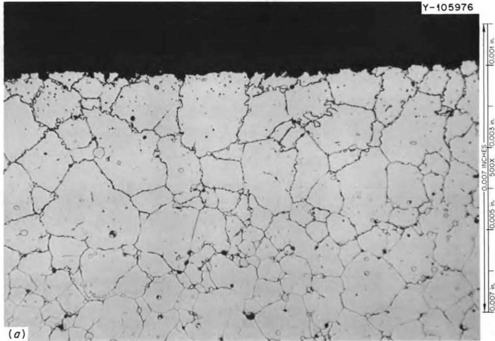

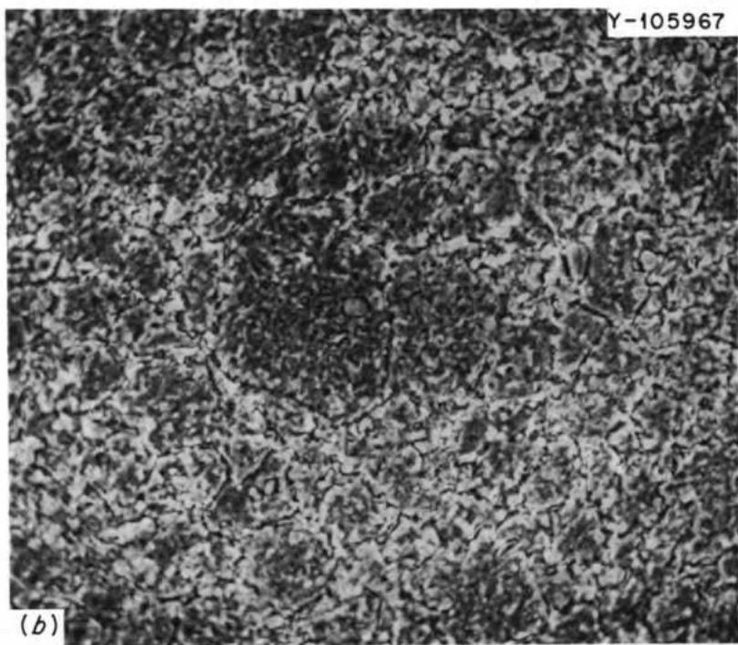  
Fig. 15.31. Hastelloy N tubing from FCL-1 exposed to $\mathrm{NaBF_4}$ NaF (92-8 mole %) at $588^{\circ}\mathrm{C}$ for 11,371 hr. (a) Optical micrograph, $500\times$ . (b) Scanning electron micrograph, $1000\times$ .

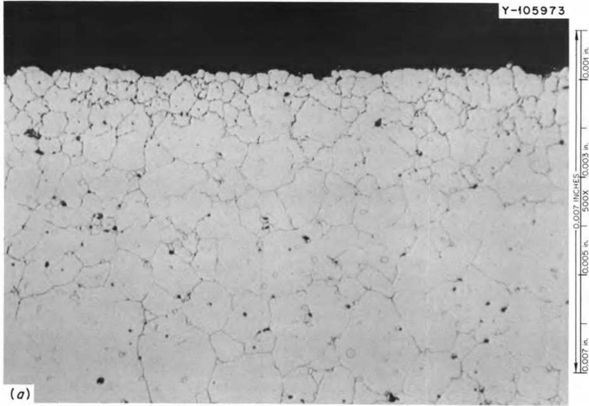

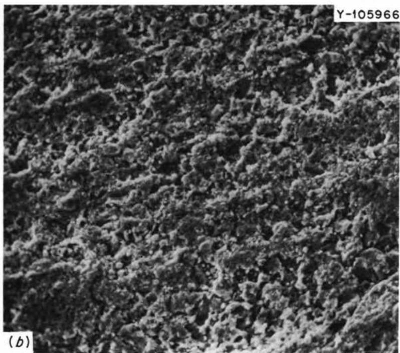  
Fig. 15.32. Hastelloy N tubing from FCL-1 exposed to $\mathrm{NaBF}_4$ -NaF (92-8 mole %) at $555^{\circ}\mathrm{C}$ for 11,371 hr. (a) Optical micrograph, $500\times$ . (b) Scanning electron micrograph, $1000\times$ .

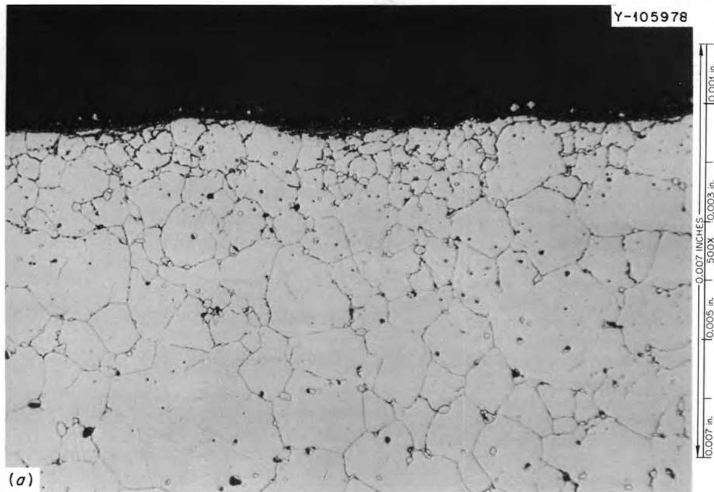

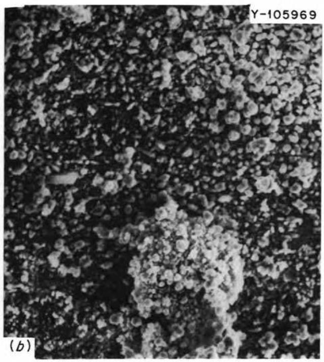

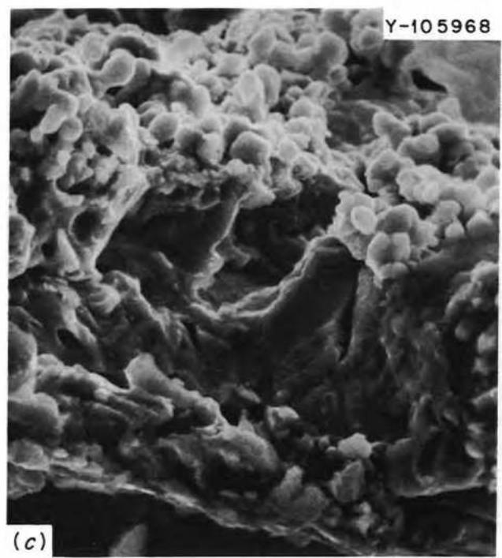  
Fig. 15.33. Hastelloy N tubing from FCL-1 exposed to $\mathrm{NaBF}_4$ -NaF (92-8 mole %) at $510^{\circ}\mathrm{C}$ for 11,371 hr. (a) Optical micrograph, $500\times$ . (b) Scanning electron micrograph, $1000\times$ . (c) Scanning electron micrograph, $3000\times$ .

mass transfer properties of Hastelloy N in fluoroboratetype coolant salt systems at conditions proposed for the MSBR.

All primary loop piping and components have been installed. The installation of auxiliary heaters, thermocouples, thermal insulation, and service lines has been completed except for those required for the pump bowl-auxiliary tank assembly. Checkout procedures for acceptance of the installation of the loop facility are in progress.

Performance tests of the ALPHA pump, $^{13}$ to be used for circulating salt in loop MSR-FCL-2, have been completed and indicate that the pump satisfies the MSR-FCL-2 hydraulic requirements of 4 gpm at approximately 110 ft head at a shaft speed of approximately 3900 rpm. Based on the results in a water test stand, the final design of the pump tank and internal parts was completed, and these parts were fabricated of Hastelloy N for use in the pump for MSR-FCL-2.

A draft of the loop operating manual has been prepared. The manual includes design criteria, a description of the loop and its components, procedures to be used for system checkout, and detailed operating procedures.

The instrument and control panels have been installed and have been functionally checked and accepted. We have incorporated safety features in the control system to prevent accidental overheating of the loop piping, which caused the failure of loop MSR-FCL-1 described above.

# 15.9 RETENTION OF TRITIUM BY SODIUM FLUOROBORATE

J.W.Koger

Because of the interest in the disposition of tritium $^{14}$ in a molten-salt breeder reactor, we conducted an experiment to determine the extent to which tritium (injected as a gas) would be retained in a fluoroborate salt mixture circulating in a standard thermal-convection loop. The loop used for this experiment was NCL-13A, which is described in Sect. 15.7. Tritium was added to the loop along with a mixture of He and $\mathrm{BF}_3$ gas. The $\mathrm{BF}_3$ addition was required to prevent a high-melting NaF plug at the end of the tube through which the tritium gas was added. The tritium was sealed in a glass ampul and was placed inside a 1-in.-diam

copper cylinder which had $\frac{1}{4}$ -in. copper lines leading from each end. One of the lines was connected to the He-BF $_3$ supply, and the other was lowered into the flowing salt stream through a standpipe. Prior to adding the tritium, a flow of He + BF $_3$ gas was established into the salt. Then the loop was depressurized, and the glass ampul containing 2 Ci of tritium was broken, and the tritium was carried into the loop. The copper tubing through which the He, BF $_3$ , and T $_2$ was flowing remained in the loop until it was felt that all the tritium had passed into the salt and until the gas pressure over the circulating salt increased to ~10 psig. The tritium addition, if it had gone totally into the salt, would have produced an average tritium concentration in the salt of 740 μCi per gram of salt.

During tritium injection the loop was completely shrouded in plastic which was connected to a hood system over the loop. A tritium detection meter was placed in the stream of air being pulled through the shroud, and no tritium was detected. No tritium was found in samples of insulation of the loop. Tritium was detected whenever we opened our standpipe connection above the surge tank and ball valve.

Salt samples were taken periodically and analyzed to determine the amount of tritium in the salt. The results are shown in Table 15.7. The tritium concentration decreased sharply in the first $40\mathrm{hr}$ and then decreased much more slowly.

We conclude from these results that little, if any, hydrogenous material, with which the tritium could exchange, existed in the salt. From various analyses it appeared that the tritium initially equilibrated between the salt and gas space above the salt in accordance with Henry's law and that some of the tritium then escaped from the vapor phase as salt samples were taken. The tritium continued to partition between the salt and cover gas, so that the concentration in the salt would

Table 15.7. Tritium concentration in salt as a function of time   

<table><tr><td colspan="2">Concentration of tritium</td><td rowspan="2">Time after tritium injection (hr)</td></tr><tr><td>Microcuries per gram of salt</td><td>Ppb</td></tr><tr><td>47.7</td><td>4.8</td><td>1</td></tr><tr><td>20.2</td><td>2.0</td><td>15</td></tr><tr><td>10.2</td><td>1.0</td><td>40</td></tr><tr><td>6.4</td><td>0.64</td><td>162</td></tr><tr><td>4.7</td><td>0.47</td><td>210</td></tr><tr><td>4.1</td><td>0.41</td><td>349</td></tr><tr><td>2.8</td><td>0.28</td><td>566</td></tr><tr><td>0.2</td><td>0.02</td><td>1340</td></tr></table>

continually decrease. It is probable that some tritium also diffused into and through the loop wall, although at a rate below that which could be measured by the monitoring system around the loop. After 40 hr the rate of loss of tritium from the salt was small, and some exchange with hydrogen in the salt could have been taking place. However, at this time the amount of tritium in the salt was in the lower parts per billion range.

We plan to conduct an additional experiment in which a stable hydrogenous compound will be added to the salt prior to the tritium addition.

# 15.10 SUPPORT FOR COMPONENTS DEVELOPMENT PROGRAM

J.W.Koger

# 15.10.1 Metallurgical Examination of Inconel Bubbler Tube from PKP-1 Pump Loop

Loop PKP-1 has been used to test a molten-salt pump with the coolant mixture $\mathrm{NaBF}_4$ -NaF (92-8 mole $\%$ ). After loop shutdown an Inconel bubbler tube which admitted $\mathrm{BF}_3$ to the salt mixture was examined to determine its behavior in the loop environment. Of particular interest was the fact that before shutdown, plugging of the tube was suspected (see Chap. 5).

The 13-in.-long tube was 0.625 in. in outside diameter and 0.500 in. in inside diameter (62.5 mils wall thickness), and the nominal composition of the Inconel 600 was $76\%$ Ni, $16\%$ Cr, and $8\%$ Fe. The inside of the tube was exposed to a mixture of He and $\mathrm{BF}_3$ (13.5 vol $\%$ $\mathrm{BF}_3$ ). This gas mixture was supplied to the salt during the experiment to avoid formation of high-melting NaF, which would result if $\mathrm{BF}_3$ were lost from the $\mathrm{NaBF}_4$ -NaF mixture and not replaced. The outside of the tube was exposed to the fluoroborate salt mixture at $\sim 550^{\circ}\mathrm{C}$ ( $1025^{\circ}\mathrm{F}$ ). The time of gas and salt exposure was $\sim 11,500$ hr (1.3 years).

Fluoride salt attack generally manifests itself as selective removal of the alloy constituent which forms the most stable fluoride. Thus the order of removal in Ni-Cr-Fe alloys is chromium, iron, and nickel. These elements form corrosion products which are soluble to some extent in the melt. In highly impure salt, all of the elements can be oxidized simultaneously, while in a purer salt, only chromium is oxidized. In the presence

of a temperature gradient, oxidation of the alloy constituents occurs in the hot section with concomitant reduction of the fluoride in the cold leg. This leads to weight losses and gains in the respective loop sections. If the solubility of any of the corrosion products is exceeded, then the fluorides will deposit, usually in the cooler portion. Nickel fluoride apparently has little solubility or stability in $\mathrm{NaBF_4}$ - $\mathrm{NaF}$ (92-8 mole %) since conditions leading to the oxidation of nickel consistently lead to deposition of nickel-rich fluoride compounds. Under the same conditions large concentrations of chromium and iron fluorides are observed in samples of the salt.

Figures 15.34 and 15.35 show the appearance of the outside and inside of the Inconel 600 bubbler tube after removal from the PKP-1 loop. We observed that the bottom 4 in. of the outside of the tube had a silver appearance, while the upper 3.5 in. was much darker. The interface between these areas is probably indicative of the average liquid level. On the inside of the tube, the lower 0.5 in. of the tube was almost completely plugged with a black material, the next 1 in. appeared to be relatively clean, and the rest of the tube contained green material (probably $\mathrm{Na}_3\mathrm{CrF}_6$ ) with smaller amounts of black material.

From the above, we concluded that the material found below the liquid level inside the tube was very probably a nickel-rich corrosion product resulting from salt attack (not necessarily at that point). On the other hand, the material above the liquid level undoubtedly formed in place as the result of attack by $\mathrm{H}_2\mathrm{O}$ impurities in the $\mathrm{BF}_3$ and was comprised of chromium, iron, and nickel fluorides.

There is a zone approximately 4 mils deep in the etched photomicrograph of Fig. 15.36 where the metallographic etchant has heavily attacked the surface. The behavior of this zone suggests that it is almost pure nickel and that the iron and chromium have been preferentially removed by the salt. These results were confirmed by x-ray fluorescent analysis.

Figure 15.37 shows a cross section of the tubing wall near the liquid-gas interface. This section had an average measured thickness of 57.5 mils, compared with a nominal thickness of 62.5 mils before test. A zone of metallic crystals is visible on the ID to a thickness of approx 20 mils. In view of the apparent loss of wall thickness in this area, these crystals may represent vestiges of the original metal surface. Figure 15.38 shows a higher magnification of the ID surface, both as polished and etched, and tends to corroborate that the crystals are a result of material leaving the surface rather than material deposition.

In conclusion, our investigation disclosed that about 5 mils of material was removed from the Inconel 600 tube. Attack by both salt and $\mathrm{BF}_3$ vapor was evident. Corrosion products were produced on the inside of the

tube as a consequence both of $\mathrm{BF}_3$ attack and of deposition of nickel-rich deposits at the lower opening. The latter deposit caused a restriction in flow.

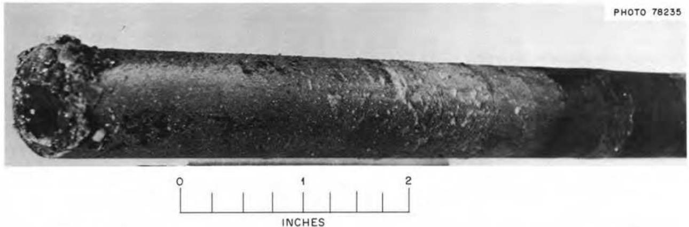  
Fig. 15.34. Photograph of the outside of Inconel 600 bubbler tube from PKP-1 pump loop exposed to $\mathrm{NaBF}_4$ -NaF (92-8 mole %) for 11,500 hr at $550^{\circ}\mathrm{C}$ .

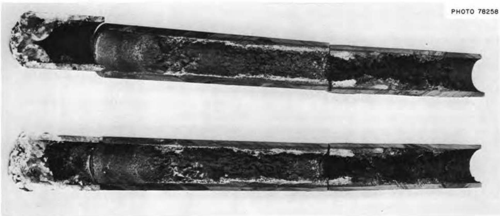

  
Fig. 15.35. Photograph of the inside of Inconel 600 bubbler tube from PKP-1 pump loop exposed to $13.5\mathrm{vol}\% \mathrm{BF}_3$ -bal He for $11,500\mathrm{hr}$

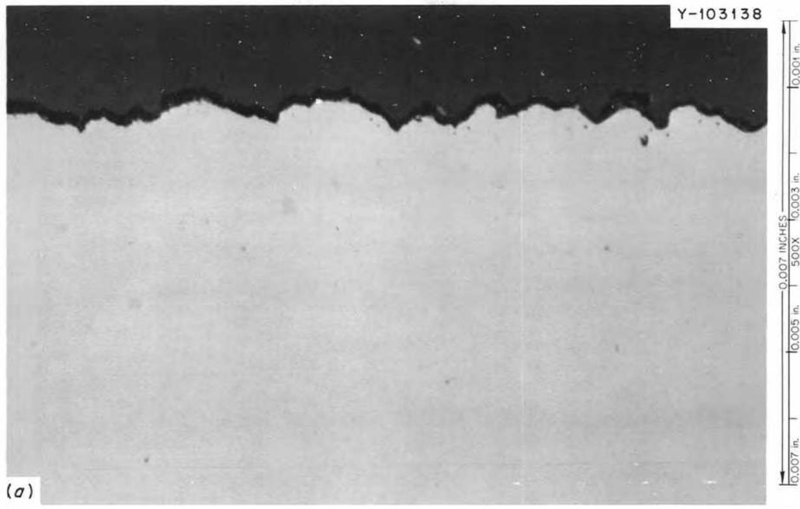

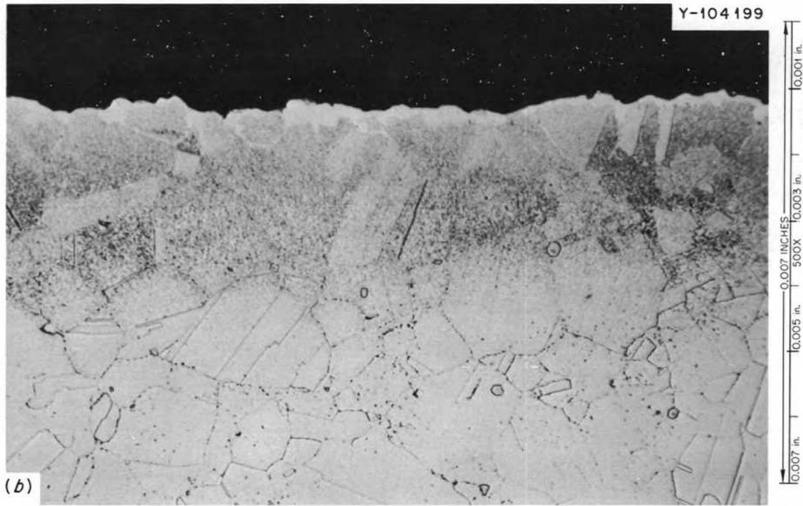  
Fig. 15.36. OD surface of Inconel 600 bubbler tube from PKP-1 pump loop exposed to $\mathrm{NaBF_4}$ NaF (92-8 mole %) for 11,500 hr at $550^{\circ}\mathrm{C}$ . (a) As polished, $500\times$ . (b) Etched with aqua regia, $500\times$ .

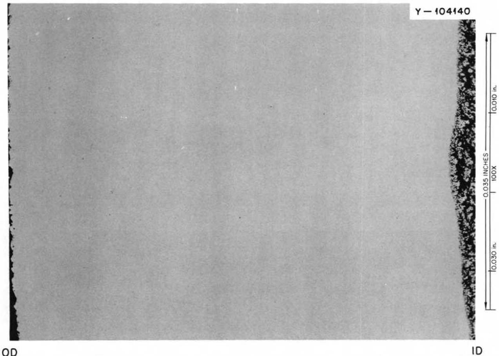  
Fig. 15.37. As-polished cross section from near liquid-gas interface of Inconel 600 bubbler tube from PKP-1 pump loop, $100\times$

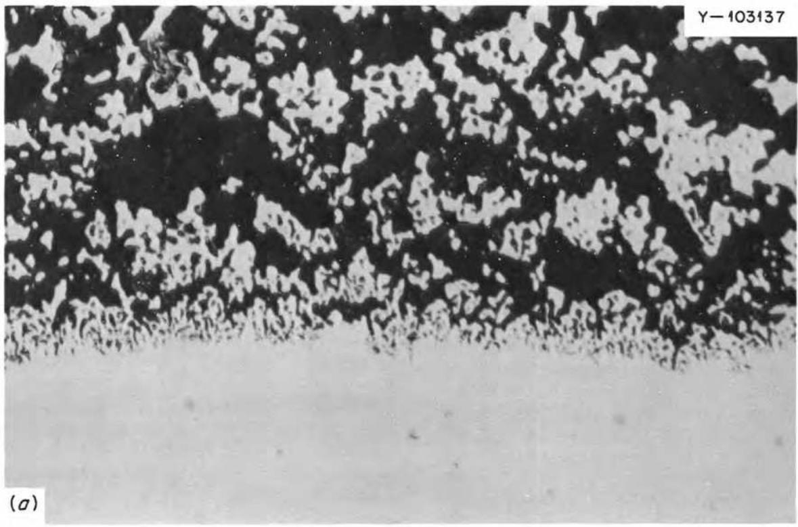  
0.007 INCHES 10.005 in. 500x 10.003 in. 1 10.001 in.

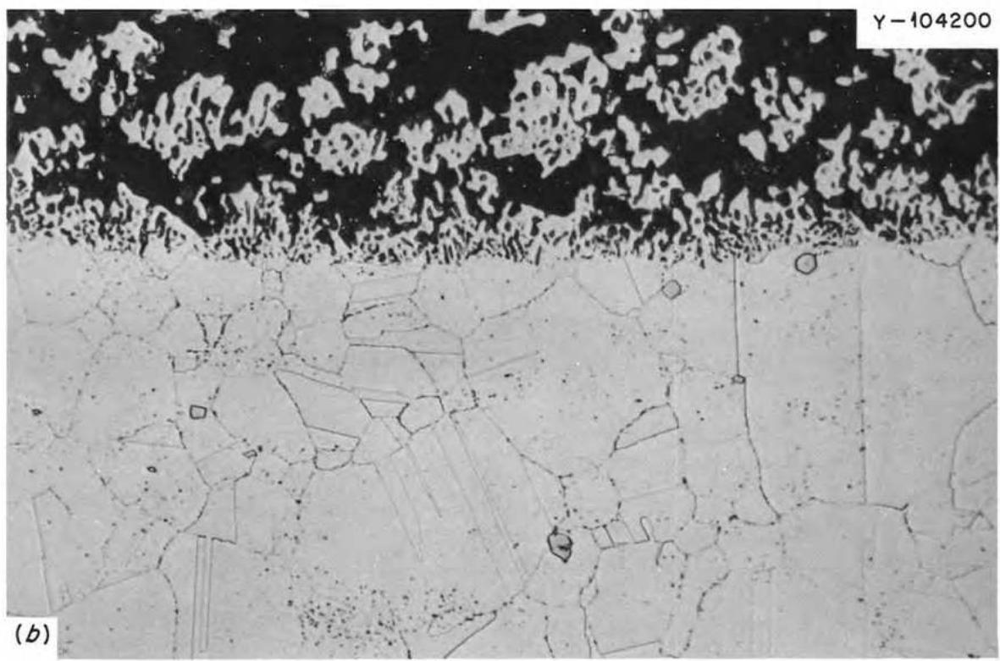  
0.007 INCHES 10.005 in. 1 500X 10.003 in. 1 10.001 in.   
Fig. 15.38. ID surface of Inconel 600 bubbler tube from PKP-1 pump loop exposed to $13.5\mathrm{vol}\% \mathrm{BF}_3$ -bal He for 11,500 hr. (a) As polished, $500\times$ . (b) Etched with aqua regia, $500\times$

# 15.11 CORROSION OF HASTELLOY N IN STEAM

B. McNabb H. E. McCoy

The sample chamber was removed from the Bull Run facility for modification after 6000 hr of operation at $538^{\circ}\mathrm{C}$ in 3500-psi steam. Figure 15.39 is a schematic of the specimen chamber modifications being made to facilitate stressing of specimens in the steam environment. The facility as originally installed was described previously.[16] The specimens will be double-walled tube-burst specimens with an annulus between the walls into which the inner tube will burst during the test. The annulus is connected to the steam condenser by a capillary tube. A thermocouple is connected to this capillary to sense failure by an increase in temperature when steam is introduced into the annulus by failure of the specimen. Pressure measurements will be made in the specimen chamber by a Leeds and Northrup pressure transmitter with a stainless steel Bourdon tube

16. B. McNabb and H. E. McCoy, MSR Program Semiannu. Progr. Rep. Aug. 31, 1969, ORNL-4449, pp. 205-9.

sensing element, having a 0-to-5000-psi pressure span. The specimen wall thickness will be machined to obtain the desired stress. The outer thick wall of the double-walled specimen is designed so that it will not collapse into the annulus during operation in the 3500-psi steam. By being able to continuously stress specimens in this way, we can assess the compatibility of Hastelloy N with steam and determine if a stress corrosion problem exists.

There appears to be no problem with the corrosion of unstressed Hastelloy N. Specimens exposed at 538 and $593^{\circ}\mathrm{C}$ are still following the trends noted previously (Fig. 15.40). The rates of air-melted and vacuum-melted Hastelloy N are converging at 13,200 hr at $593^{\circ}\mathrm{C}$ , whereas air-melted Hastelloy N previously had a slightly higher rate. The present unstressed specimens will continue to be used for weight gain measurements and metallographic examination of the penetration of the oxide on selected specimens, but the ability to stress specimens and retain the stress will be a valuable addition to the facility. The modification should be complete in about two weeks and ready for reinstallation.

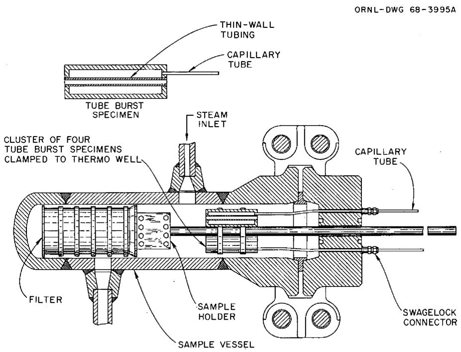  
Fig. 15.39. Schematic of steam corrosion facility at Bull Run Steam Plant showing modifications for dynamically stressed tubes.

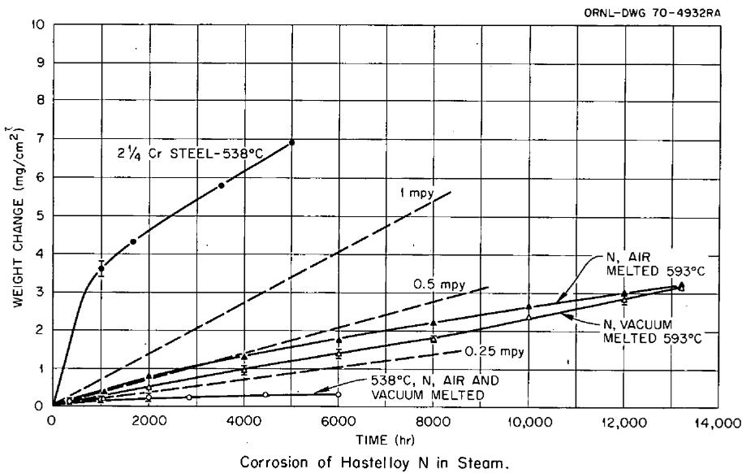  
Fig. 15.40. Corrosion of Hastelloy N in steam.

# 16. Support for Chemical Processing

J.R. DiStefano H.E.McCoy

This portion of our materials program is in support of the program to develop techniques for processing the molten-salt fuel to isolate protactinium and remove fission products. We have continued to concentrate our efforts on the materials which appear most promising for containment of liquid bismuth at 500 to $700^{\circ}\mathrm{C}$ , since it is an essential element in the reductive-extraction process now being developed. Our program is divided into two parts. One is the fabrication of a molybdenum loop for the Chemical Technology Division to obtain hydrodynamic data relating to the reductive-extraction process. During the reporting period considerable progress was made in fabricating and joining molybdenum components.

The second part of our program is research to study the compatibility of molybdenum, TZM, graphite, tantalum, T-111, and iron-base brazing alloys with liquid bismuth and bismuth-lithium solutions and to investigate possible techniques for coating iron- and nickel-base conventional alloys with corrosion-resistant metals such as tungsten or molybdenum.

# 16.1 CONSTRUCTION OF A MOLYBDENUM REDUCTIVE-EXTRACTION TEST STAND

J. R. DiStefano

We are fabricating a molybdenum loop for the Chemical Technology Division to obtain engineering data on a reductive-extraction method of MSBR fuel processing. Details of the design of this loop have been reported previously.

The loop consists of a 5-ft-long, $1^{1/8}$ -in. packed column through which bismuth and salt will circulate countercurrently. Two $3^{7/8}$ -in.-diam head pots will feed bismuth and salt to the column, and two $3^{7/8}$ -in.-diam containers will serve as the end sections of the column where bismuth and salt will be separated. The loop will

be interconnected by $\frac{1}{4}$ -in.-OD by 0.020-in.-wall, $\frac{3}{8}$ -in.-OD by 0.025-in. wall, $\frac{1}{2}$ -in.-OD by 0.030-in.-wall, and $\frac{7}{8}$ -in.-OD by 0.080-in.-wall tubing.

Welding and brazing techniques are being used to fabricate and assemble the loop. However, mechanical couplings are also desirable since they would allow us to easily replace certain internal components in case of a failure, and would also allow a convenient access port for removable corrosion specimens. Experimental molybdenum metal seal couplings were obtained from Stanley Corporation and Aeroquip Corporation. Both of these couplings use molybdenum seal rings, but a threaded nut applies the force that seals the Stanley joint, while an external compressive force must be applied to seal the Aeroquip joint and then a gate or pin is used to maintain the compressive force on the metal seal ring. This latter design was aimed at remote application and is attractive because molybdenum components easily gall, and the threaded nut design is particularly susceptible to this problem. However, experimental problems in sealing the Aeroquip joint caused cracking of one of the molybdenum components, and we have not yet obtained replacements.

Helium leak tests were performed on the Stanley coupling as well as the coupling shown in Fig. 16.1.

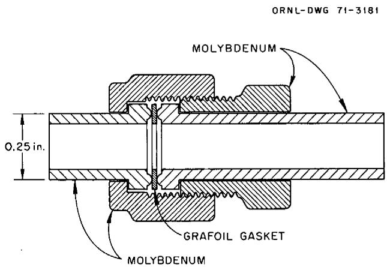  
Fig. 16.1. Molybdenum mechanical coupling.

This latter coupling also has molybdenum components as indicated, but the seal gasket is made of Grafoil. Each joint was helium leak-tight $(< 5 \times 10^{-8}$ std cc/sec). They were then thermally cycled ten times by heating to $650^{\circ}\mathrm{C}$ and cooling to room temperature. At this point the helium leak rate of the Stanley joint was $5 \times 10^{-6}$ std cc/sec at both room temperature and at $650^{\circ}\mathrm{C}$ . However, the joint shown in Fig. 16.1 remained helium leak-tight $(< 5 \times 10^{-8}$ std cc/sec). We disassembled the Stanley joint and returned it to the company for further evaluation. The joint in Fig. 16.1 was disassembled, resealed, and then thermally cycled several more times. It was helium leak-tight as before and therefore was again disassembled. This coupling was more easily disassembled than previous joints using molybdenum nuts because of its modified, rounded thread design.

In addition to joints which can be disassembled, mechanical tube-to-header connections are being developed to afford a method of attaching certain of the loop dip lines. We feel that welding is not satisfactory because of the weld joint design, and brazing is uncertain because of the requirement that the braze alloy be resistant to HF at $650^{\circ}\mathrm{C}$ as well as to bismuth and salt. Two techniques, magnforming and roll bonding, have been investigated. In magnforming, magnetic pressures of up to 50,000 psi resulting from a current discharged through a coil from a capacitor bank are applied in pulses of 10 to $20 \times 10^{-6}$ sec duration. No direct mechanical contact between the machining that applies the force and the work is involved. Four tube-to-tube joints were fabricated, and the best joint produced showed a helium leak rate of $2 \times 10^{-5}$ std cc/sec at room temperature. In roll bonding, a tool containing expandable tubes mechanically forces the two surfaces together. The operation can be done at temperatures up to about $500^{\circ}\mathrm{C}$ . Three helium-leak-tight joints ( $<5 \times 10^{-8}$ std cc/sec) have been made. If a joint of this type is further strengthened by back brazing with one of the iron-base filler metals discussed below, we feel that it will be satisfactory for our application.

We will continue to evaluate mechanical joints that can be disassembled as well as methods of mechanical sealing as discussed above. We feel that development of alternative techniques for joining molybdenum will be essential to the use of this material for future chemical processing applications.

More detailed information on this loop is presented in Part 5 of this report. Progress on welding, brazing, and

fabrication of molybdenum components is reported in this section.

# 16.2 FABRICATION DEVELOPMENT OF MOLYBDENUM COMPONENTS

R.E.McDonald A.C.Schaffhauser

We are supplying molybdenum components for a chemical processing test stand. This work involves development of fabrication processes for some components, procurement of materials that are commercially available, and coordinating the machining of test components.

We have previously described our development of a back-extrusion process for fabrication of $3\%$ in.-diam closed-end vessels for the bismuth and salt head pots and the upper and lower disengaging sections of the extraction column. For welding studies, we have back extruded and machined eight vessels of both hemispherical and flat-end geometries with bosses for supporting inlet tubes. These vessels were back extruded at 1350 to $1450^{\circ}\mathrm{C}$ with a 750-ton force on the plunger. The as-extruded parts, shown in Fig. 16.2, demonstrate the excellent internal surface produced by back extruding over a $\mathrm{ZrO_2}$ -coated plunger, whereas the external surface is very rough due to interaction with the tool-steel container during extrusion. The cross section shown in Fig. 16.2 also shows the deformation pattern produced by back extrusion of a square grid network in the original blank. A finished machined vessel is shown in Fig. 16.3.

The cracks resulting from interaction of the outside of the back extrusion with the extrusion press container have limited the length of vessel we can back extrude to about 4 in. To overcome this problem we have designed and procured a $\mathbf{ZrO}_2$ -coated liner for our 5.6-in.-ID extrusion press container. This tooling should allow us to back extrude vessels 8 in. deep.

The extraction column of the test stand requires a $5\frac{1}{2}$ -ft-long Mo pipe 1.16 in. in outside diameter and 1 in. in inside diameter. We have fabricated three pieces of this pipe by floating mandrel extrusion of two 4-in.-diam billets with 1-in. holes at $1600^{\circ}\mathrm{C}$ at a reduction ratio of 29:1. The second extrusion produced a pipe $11\frac{1}{2}$ ft long that was concentric within 0.007 in. with excellent outside and inside diameter surfaces.

All of the tubing required for the test stand ranging in size from $7/8$ in. OD and 0.080 in. wall thickness to $1/4$

in. OD and 0.020 in. wall thickness has been procured and inspected. A prototype of a tee, which is one of the many fittings required, was designed and fabricated from $\frac{1}{2}$ -in.-thick Mo plate.

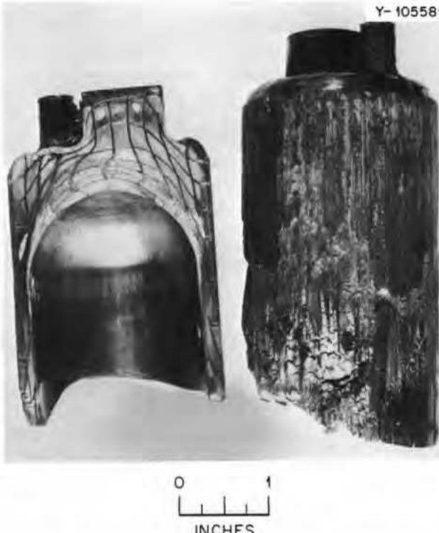  
Fig. 16.2. Back-extruded molybdenum vessels. The cross section shows the deformation pattern produced by back extrusion of a square grid network in the original blank.

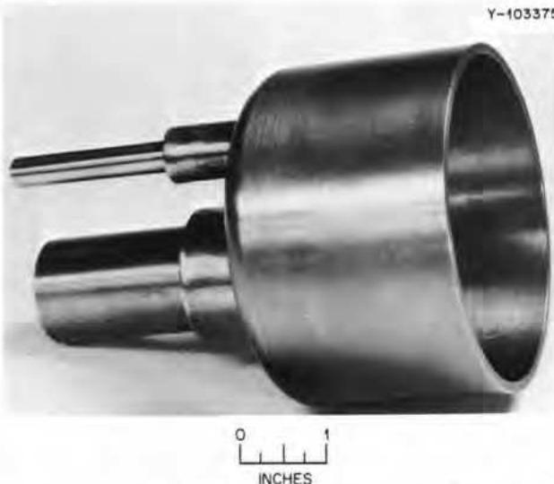  
Fig. 16.3. View of back-extruded molybdenum vessel after machining.

# 16.3 WELDING MOLYBDENUM

# A.J.Moorhead T.R.Housley

In order to develop welding procedures for fabrication of the molybdenum loop for chemical processing, we have been working on three major types of joint: tube to header, tube to tube, and header to header. A discussion of our initial work on the first two of these joints and our basic fabrication philosophy was described in an earlier report. Since that time, we have greatly improved our capabilities for joining molybdenum, which is inherently very difficult to weld. Most significantly we have found that stress relieving the components at $925^{\circ}\mathrm{C}$ prior to welding and preheating the larger weld joints minimizes weldment cracking.

Five different sizes of tubing must be welded to the various pots in order to fabricate this system. These are $1/4$ , $3/8$ , $1/2$ , $7/8$ , and $1/4$ in.-OD tubes. All of these welds are made by the electron-beam process using a trepan on the inside of the header. Essentially, the weld is made on an edge joint between two components of equal thickness. Figure 16.4 shows this type of weld on a mockup of the $1/4$ in.-diam packed column. This weld had a helium leak rate of less than $1 \times 10^{-9}$ atm $\mathrm{cm}^2 \sec^{-1}$ . We have also welded three tubes of this size into back-extruded molybdenum headers. The first weld did not pass helium leak inspection, and dye penetrant revealed that there was extensive fusion-zone cracking. We were unable to eliminate these cracks by rewelding. Part of this failure may be due to contamination from dye (left in the initial cracks), which is very

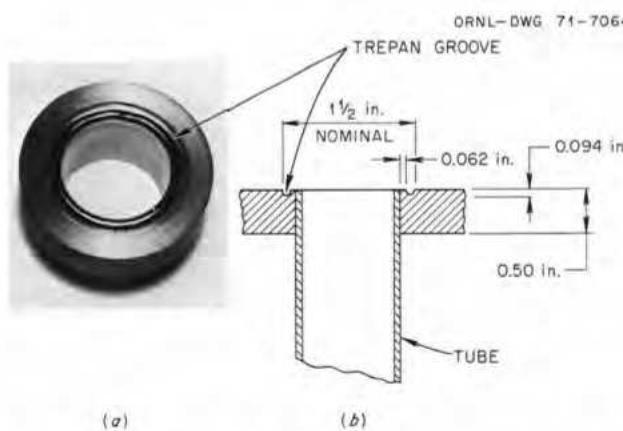  
Fig. 16.4. (a) Electron-beam-welded tube-to-header joint $(1^{1} / 4\cdot$ in.-diam,0.062-in.-wall tube);(b) joint design.

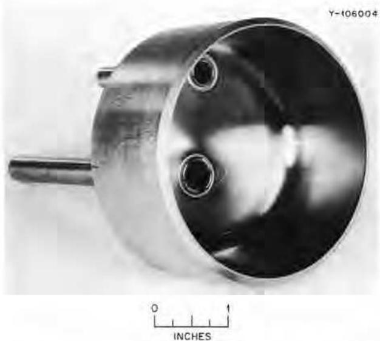  
Fig. 16.5. Tubes (0.375 in. diam, 0.025 in. wall; 0.500 in. diam, 0.030 in. wall) electron-beam welded into a back-extruded molybdenum header.

difficult to remove. A defocused electron beam was used to preheat the part prior to making the next two $1\frac{1}{4}$ -in.-diam tube-to-header welds, and both of these welds passed an inspection with fluorescent dye penetrant. Three other sizes of tubes $(\frac{1}{4} - \frac{3}{8} - \frac{1}{2}$ in.-diam) have also been successfully electron-beam welded into back-extruded headers. Figure 16.5 is one of these headers with a $\frac{3}{8}$ -and a $\frac{1}{2}$ -in.-diam tube.

Procedures have been developed for making tube-to-tube welds outside the customary glove box by using the orbiting-arc weld head. This commercially available device has been modified by adding small rubber boots which surround the tube on either side of the head to provide a better atmosphere for welding. Helium-leak-tight welds have been made joining $\frac{1}{4} -$ , $\frac{3}{8}$ , and $\frac{1}{2}$ -in. tubes. The modified welding head and some typical tube-to-tube "field" welds are shown in Fig. 16.6. Note that some of these welds were made without a weld insert. However, in order to control the amount of weld bead protruding inside the tubes, we plan to use these inserts in all tube-to-tube joints in the loop itself.

Electron-beam girth welds were made between two back-extruded headers and short rings which represented other headers. The ring joined in the first assembly had been machined from the same extrusion as the header. The assembly was preheated with the defocused electron beam, but the preheat temperature was not measured. This weld bead looked good visually, but penetrant inspection revealed fusion-zone cracking. The second assembly, which had a ring machined from bar stock, was similarly welded except that more

preheating was done. This weld was defect free when inspected by fluorescent penetrant. This part is shown in Fig. 16.7, together with a sketch of the weld-joint design.

# 16.4 DEVELOPMENT OF BISMUTH-RESISTANT FILLER METALS FOR BRAZING MOLYBDENUM

N.C.Cole

Commercial brazing alloys for molybdenum are generally not compatible with bismuth. To develop filler metals that have satisfactory resistance to both bismuth and molten salts in the range 500 to $700^{\circ}\mathrm{C}$ , we have formulated several Fe-Mo (Fe base) alloys containing such elements as C, B, and Ge to depress the melting temperature. These iron-base alloys have shown excellent wettability and flowability on molybdenum below $1200^{\circ}\mathrm{C}$ .

It is also desirable to braze at or below the recrystallization temperature of molybdenum to retain as much of its ductility as possible; therefore we have determined the ductile-to-brittle transition temperature of arc-cast molybdenum sheet after relatively short times at temperature. We heat treated sheet specimens at time-and-temperature combinations similar to the brazing cycles for the iron-base alloys. The heat-treated sheets were then bend tested, and those that bent $90^{\circ}$ without cracking were called ductile. Specimens heat treated at temperatures up to $1180^{\circ}\mathrm{C}$ and for times as long as 40 min were ductile. Specimens heat treated 3 min at $1200^{\circ}\mathrm{C}$ bent $90^{\circ}$ , but those heat treated at $1200^{\circ}\mathrm{C}$ for 10 min achieved only a $50^{\circ}$ bend. Since the iron-base alloys all braze below $1180^{\circ}\mathrm{C}$ and the Fe-Mo-Ge-C-B alloy brazes below $1100^{\circ}\mathrm{C}$ , we should have enough of a safety factor in case the working history of other shapes or sizes, such as tubing, pots, etc., causes the base-metal recrystallization temperature to be slightly lower.

To evaluate the mechanical properties of the brazed joints, we have shear tested two of the most promising iron-base alloys. Shear-test specimens made of molybdenum were brazed with 42M [Fe-15 Mo-5 Ge-4 C-1 B (wt %)] and 35M [Fe-15 Mo-4 C-1 B (wt %)]. They were pulled at a strain rate of 0.002 in./min at both room temperature and $650^{\circ}\mathrm{C}$ . Average values of the test results are shown in Table 16.1. The shear strengths are excellent for both brazes at room temperature and very good for 42M at $650^{\circ}\mathrm{C}$ . The shear strength for 35M at $650^{\circ}\mathrm{C}$ is acceptable. The elongation for both brazes is acceptable at room temperature and excellent at $650^{\circ}\mathrm{C}$ .

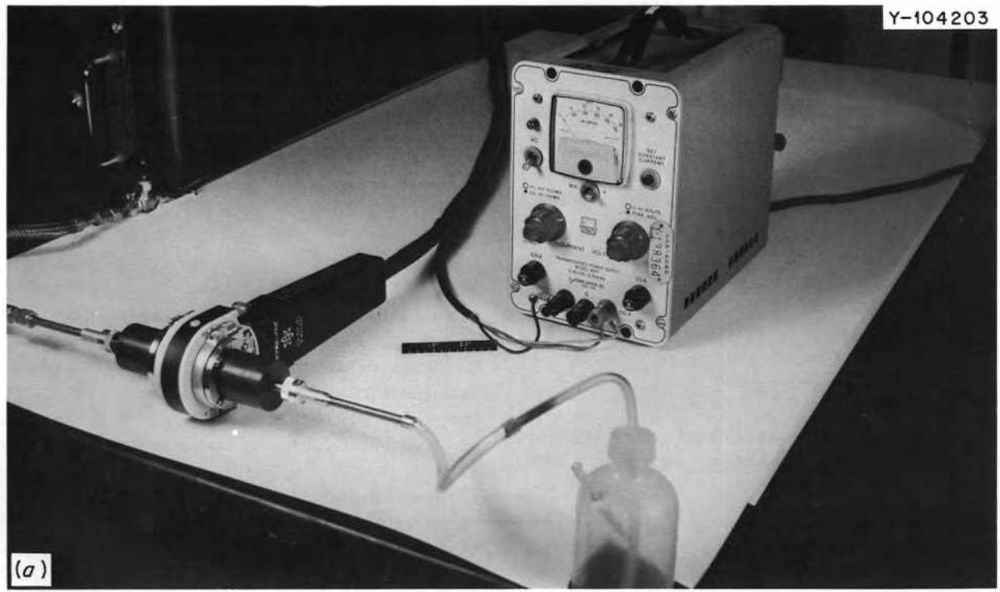

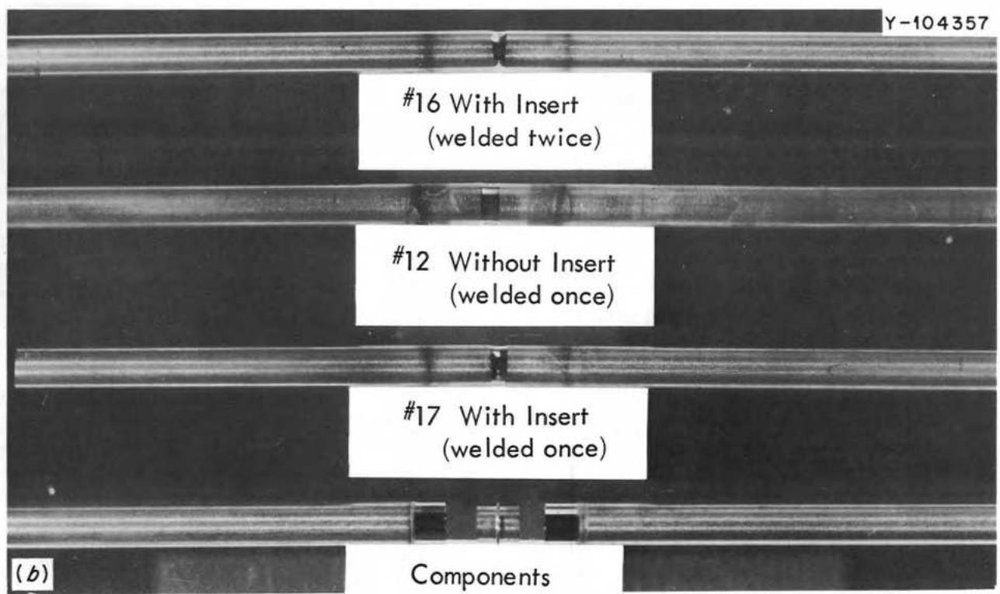  
Fig. 16.6. (a) Modified orbiting-arc head for tube-to-tube welds; (b) typical $\frac{1}{4}$ -in.-diam welds made using this device.

Table 16.1. Mechanical properties of brazed molybdenum joints   

<table><tr><td rowspan="2">Brazing alloy (wt %)</td><td colspan="2">Shear strength (psi)</td><td colspan="2">Elongation (%)</td></tr><tr><td>Room temperature</td><td>650°C</td><td>Room temperature</td><td>650°C</td></tr><tr><td>42M (Fe-15 Mo-5 Ge-4 C-1B)</td><td>30,000</td><td>29,000</td><td>10</td><td>50</td></tr><tr><td>35M (Fe-15 Mo-4 C-1B)</td><td>31,000</td><td>18,000</td><td>11</td><td>42</td></tr></table>

ORNL-DWG 71-7065

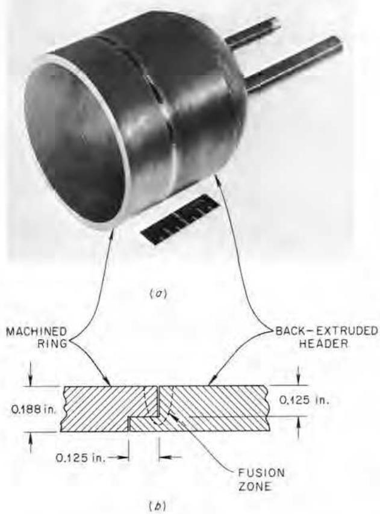  
Fig. 16.7. (a) Electron-beam girth weld on back-extruded molybdenum header; (b) joint design.

Molybdenum joints brazed with the experimental iron-base filler metals have been tested numerous times in static bismuth and have been reported previously. They now have also been tested in a thermal-convection loop which operated 2100 hr with a maximum temperature of $700^{\circ}\mathrm{C}$ and a $\Delta T$ of $90^{\circ}\mathrm{C}$ . Visually, the filler metals survived extremely well with little, if any, removal of the braze. Details of this test are given in the following section.

In addition, molybdenum joints brazed with three of the experimental iron-base alloys, 35M, 42M, and 16M [Fe-4 C-1 B (wt %)], were corrosion tested in a molten-salt environment. They were exposed to LiF $\mathrm{BeF}_2$ - $\mathrm{ZrF}_4$ - $\mathrm{UF}_4$ - $\mathrm{ThF}_4$ (70-23-5-1-1, mole %) for 1032 hr at approximately $670^{\circ}\mathrm{C}$ in a type 304L stainless steel thermal-convection loop which operated at a maximum temperature of $690^{\circ}\mathrm{C}$ and a $\Delta T$ of $100^{\circ}\mathrm{C}$ . Each of the samples showed a slight weight gain of approximately $1\mathrm{mg/cm}^2$ . Metallographically, we did not see any evidence of attack. Figure 16.8 shows a typical as-brazed sample compared with the same braze after test.

In building a complex structure such as the chemical processing testing loop, repairs of cracked components may have to be made. To determine whether an iron-base brazing alloy could be used for repairs, a tube which was not helium leak-tight because of cracks in and along the weld was selected for repair. The brazing filler metal, 42M, was attached (by wire) near the cracks and heated to its flow temperature. It flowed over and along the surface of the tubing, completely covering the weld and cracked area, and after brazing, the tube assembly was helium leak-tight $(<1 \times 10^{-9}$ atm cm $^2$ sec $^{-1}$ ). Figure 16.9 is a photomicrograph of a section through the tube. The bottom portion is an insert used to enhance welding. To the left and out of the picture is the weld. The top portion is the tube wall. Note how the braze alloy flowed along the surface of the insert into the 0.060-in. gap between the insert and the tube and into the small crack (0.002 in. wide) in the insert.

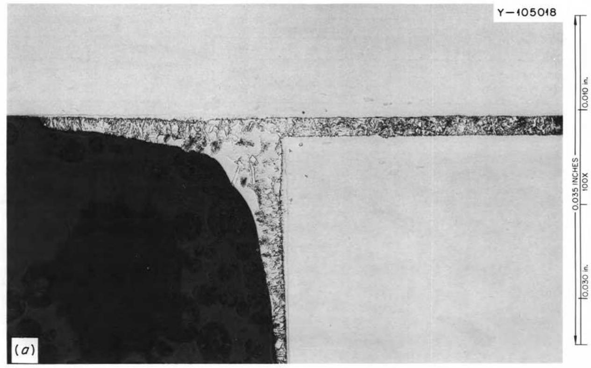

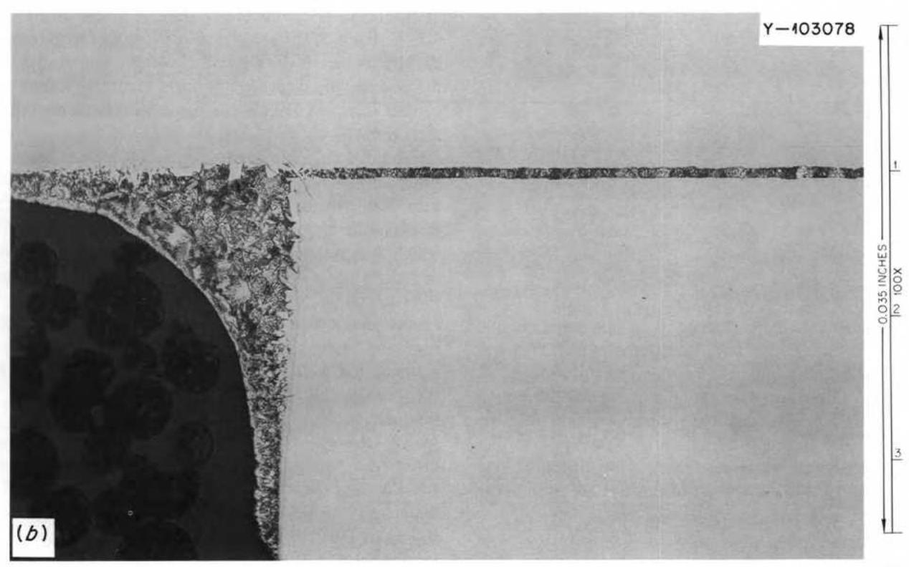  
Fig. 16.8. Molybdenum lap joint brazed with 35M [Fe-15 Mo-4 C-1 B (wt %)]. (a) As brazed. (b) After testing in fluoride salts at $67^{\circ}\mathrm{C}$ for 1032 hr.

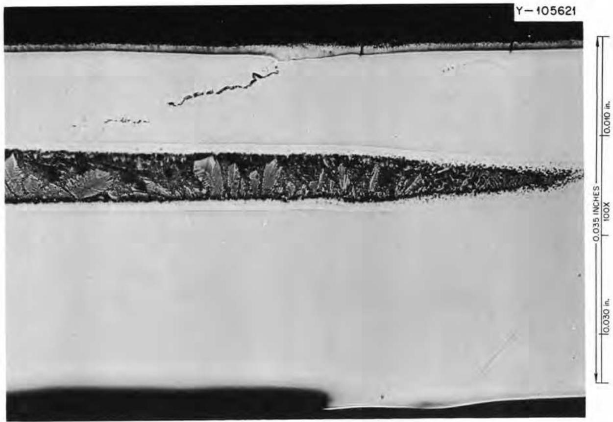  
Fig. 16.9. Portion of a cracked molybdenum tube that was braze repaired.

# 16.5 COMPATIBILITY OF MATERIALS WITH BISMUTH

O.B.Cavin L.R.Trotter

We are evaluating the compatibility of potential structural materials and braze alloys with bismuth and bismuth containing up to 2 wt $\%$ lithium. The tests are conducted in thermal-convection loops that operate at a maximum temperature of $700^{\circ}\mathrm{C}$ and a $\Delta T$ of $95\pm 5^{\circ}\mathrm{C}$ and in static capsules at $700\pm 5^{\circ}\mathrm{C}$ .

Static capsule tests of iron-base braze alloys (see Sect. 16.4) developed for joining molybdenum indicated that some of these alloys were quite resistant to dissolution by bismuth. Hence we subsequently tested the same alloy compositions in a quartz thermal-convection loop (No. 10) for $2100\mathrm{hr}$ to determine their mass transfer characteristics. The loop specimens consisted of molyb

denum tabs brazed with four different iron-base alloys. In addition to iron, the braze alloys contained 4 wt $\%$ C, 1 wt $\%$ B, varying amounts of molybdenum (0, 15 and 25 wt $\%$ ), and in one alloy (42M) 5 wt $\%$ Ge. We found little evidence of attack of the braze alloys from either chemical analysis or visual examination. However, each of the braze alloys was covered by a surface layer. Photomicrographs of alloy 35M (Fe-15% Mo-4% C-1% B) in the before- and after-test conditions are shown in Fig. 16.10. An electron probe analysis was made to determine the distribution of iron, molybdenum, and bismuth in the braze. The areas examined are outlined by the black rectangles in Fig. 16.10 and are shown in Figs. 16.11 and 16.12. Certain areas of the braze are seen to contain small quantities of bismuth, and it is interesting to note that they are associated primarily with regions of higher molybdenum concentration. As seen in Fig. 16.12, bismuth has penetrated completely through the braze fillet, but none was found in the base metal. This association of bismuth with molybdenum cannot be explained on the basis of known solubility data but could be related to the

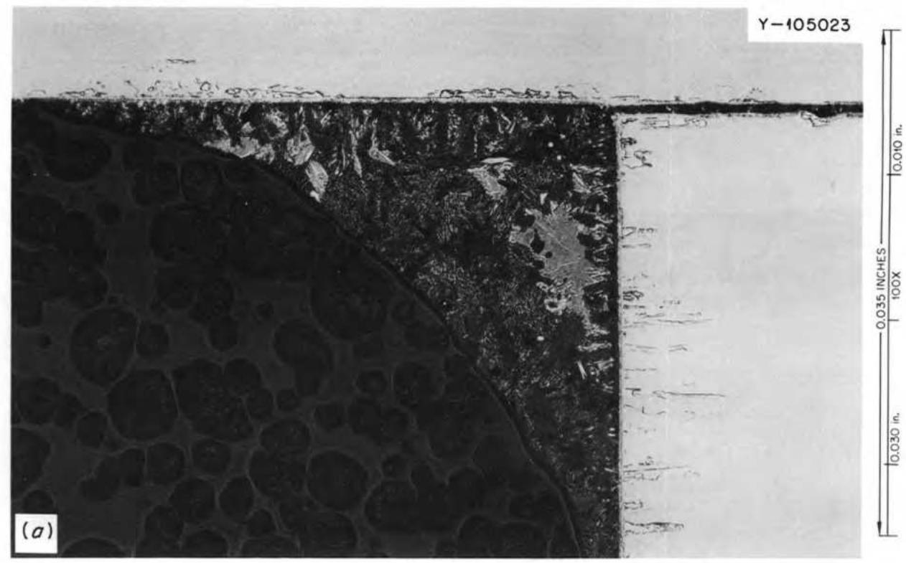

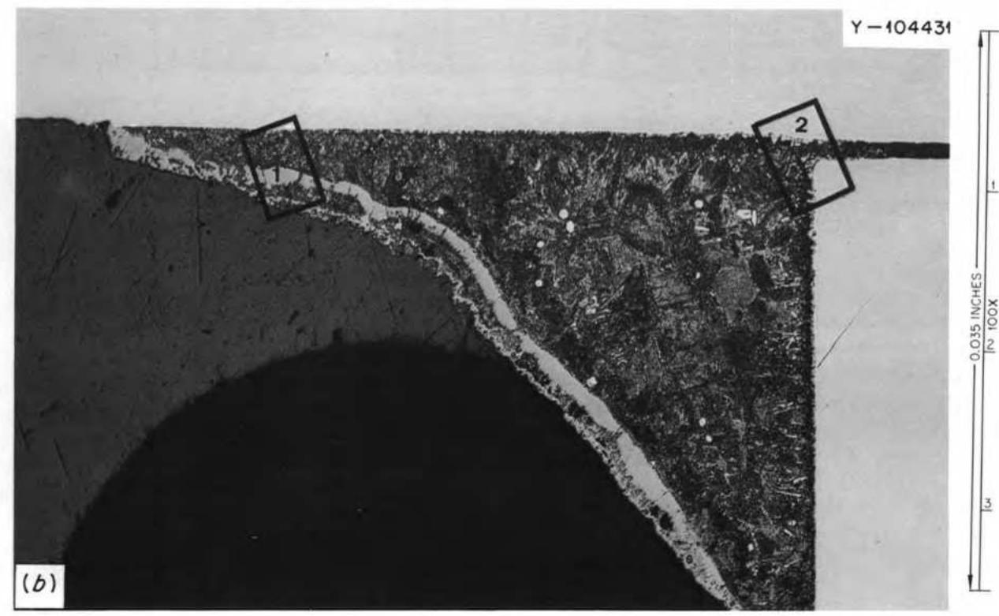  
Fig. 16.10. Photomicrographs of braze alloy 35M (Fe-15% Mo-4% C-1% B). (a) Before test; (b) after 2100 hr in flowing bismuth at $670^{\circ}\mathrm{C}$ . Enclosed rectangles 1 and 2 are shown in Figs. 16.11 and 16.12 respectively.

Y-105042

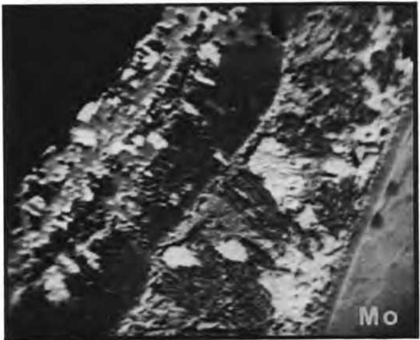  
BACKSCATTERED ELECTRONS

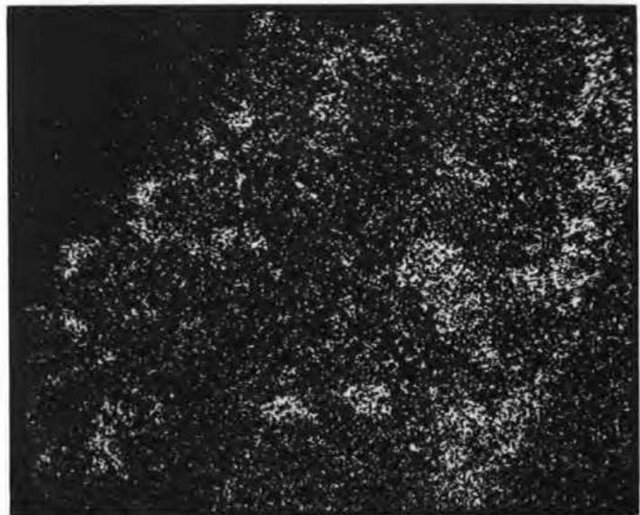  
BiLa

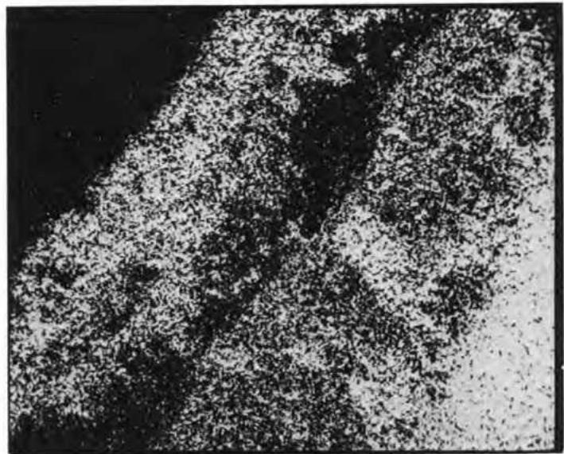  
MoLa

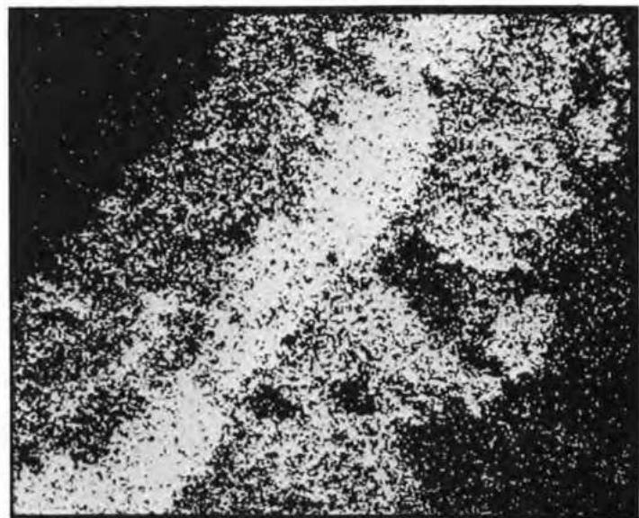  
FeKa   
Fig. 16.11. Electron beam scanning images of an Fe-Mo braze (35M) of region 1 in Fig. 16.10b. Lighter regions indicate greater concentrations of metals shown.

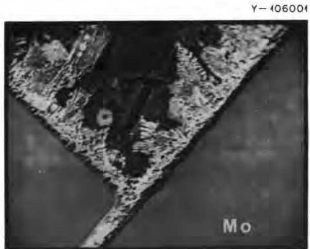  
BACKSCATTERED ELECTRONS

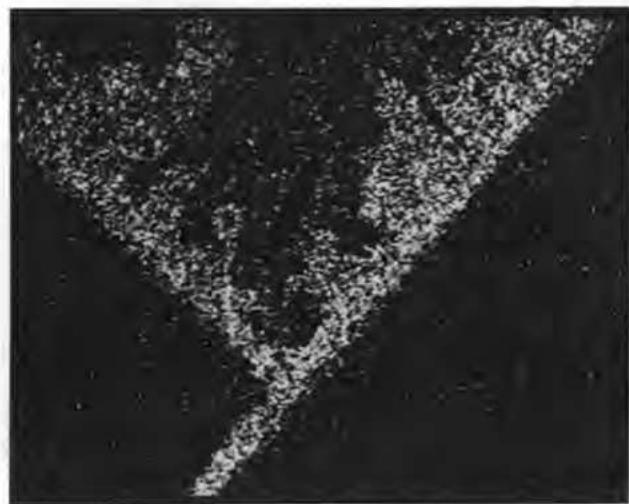  
BISMUTH La X-RAYS   
Fig. 16.12. Electron beam scanning images of an Fe-Mo braze (35M). This is region 2 of Fig. 16.10b. Lighter regions indicate greater concentration of Bi.

formation of a complex intermetallic compound that is high in molybdenum and bismuth. The continuous surface layer on the braze is high in iron, and no significant differences between samples from the high- and low-temperature regions of the loop were observed.

Figure 16.13 shows photomicrographs of an Fe-4% C-1% B (16M) braze before and after test. Electron beam microprobe results of the area enclosed by the rectangle in Fig. 16.13b are shown in Fig. 16.14, and we can see that the surface layer is again rich in iron. After test this braze was found to contain a relatively high concentration of bismuth. The area denoted as "I" in Fig. 16.14 contained approximately 88% Bi, 5% Mo,

Table 16.2 Results of graphite test after $3000\mathrm{hr}$ in flowing bismuth   

<table><tr><td>Gradea</td><td>Test temperature (°C)</td><td>Weight change (g × 10-3)</td><td>Spectrographic analysis (ppm Bi)</td></tr><tr><td rowspan="4">AXF-5QBG</td><td>615</td><td>0</td><td>5</td></tr><tr><td>620</td><td>-1.3</td><td>50</td></tr><tr><td>685</td><td>0</td><td>20</td></tr><tr><td>700</td><td>-5.8</td><td>20</td></tr><tr><td rowspan="2">AXF-5Q</td><td>620</td><td>+6.3</td><td>500</td></tr><tr><td>630</td><td>+7.5</td><td>200</td></tr><tr><td rowspan="2">ATJS</td><td>650</td><td>-4.8</td><td>&lt;2</td></tr><tr><td>675</td><td>-1.8</td><td>200</td></tr></table>

${}^{a}$ Order of increasing pore volume.

and $< 1/2\%$ Fe, with the balance unknown. The area denoted as "II" in Fig. 16.14 contained approximately $41\%$ Bi, $23\%$ Mo, $4\%$ Fe, and balance unknown. Although the braze has been generally depleted of iron, one small area, designated as "III" in Fig. 16.14, was predominantly iron (approximately $70\%$ ).

Semiquantitative spectrographic analyses of samples taken from the bismuth drained from the loop indicated concentrations of iron and molybdenum to be less than the detectable limit of $3\mathrm{ppm}$ . These levels are considerably lower than those found in static capsule tests of most of the alloys. We plan further tests to determine why the apparent solubilities were lower in the thermal convection loop test and also to determine the source of the iron-rich layers found in the loop test.

Quartz thermal-convection loop 8, which contained specimens of three grades of graphite in both the hot and cold legs, completed a scheduled 3000-hr test, and test data are given in Table 16.2. The samples from this loop were relatively free of retained bismuth except for a very few surface particles that were mechanically dislodged. Poco grade AXF-5QBG has the smallest amount of open porosity of the three grades tested, and we did not metallographically observe a significant amount of bismuth intrusion into this sample. The small amount detected by semiquantitative spectrographic analysis was probably due to some of the small particles lodged on the surface that were not removed. The more open grades, AXF-5Q and ATJS, both contained bismuth in the pores as evidenced by metallographic examination and chemical analysis. A part of the observed weight loss is probably due to the loss of machining dust, which is difficult to remove from sample surfaces. The maximum loss is equivalent to about $2\mathrm{mg/cm}^2$ per 3000 hr or, assuming a uniform

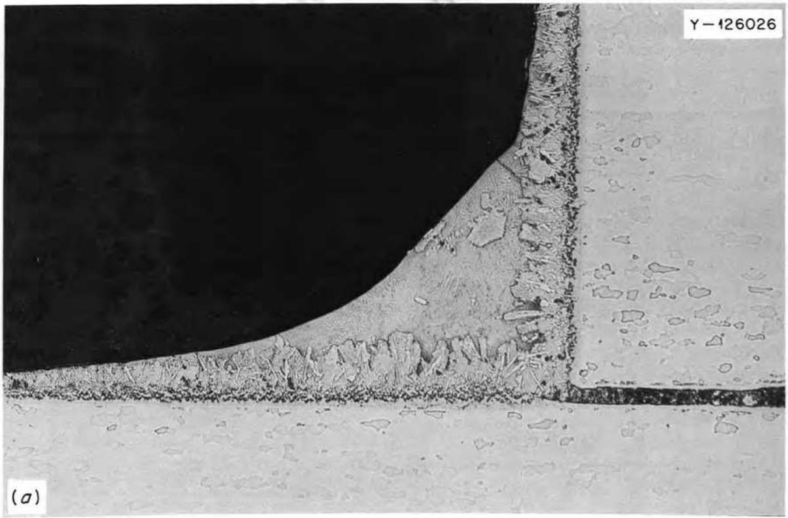

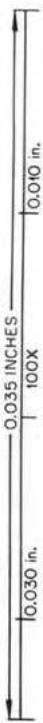

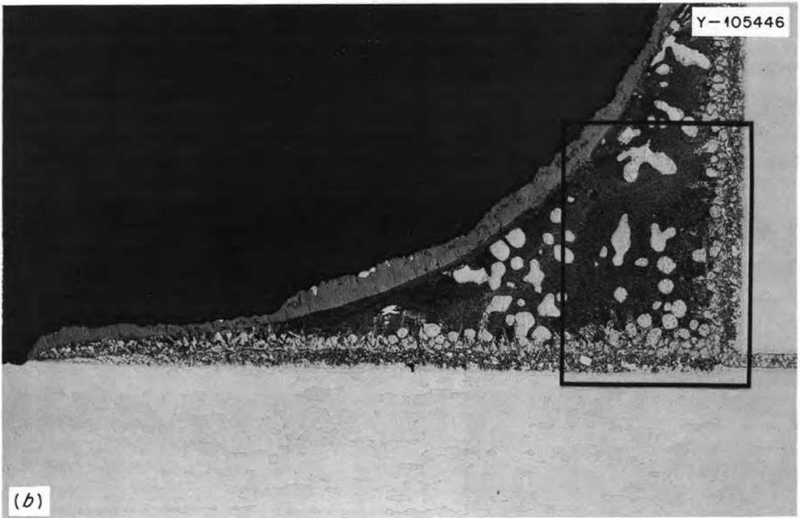

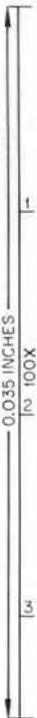  
Fig. 16.13. Photomicrographs of 16M braze (Fe-4% C-1% B). (a) Before test; (b) after testing in flowing bismuth for 2100 hr at $685^{\circ}\mathrm{C}$ . Microprobe analysis of area enclosed in black rectangle is shown in Fig. 16.14.

Y-106000

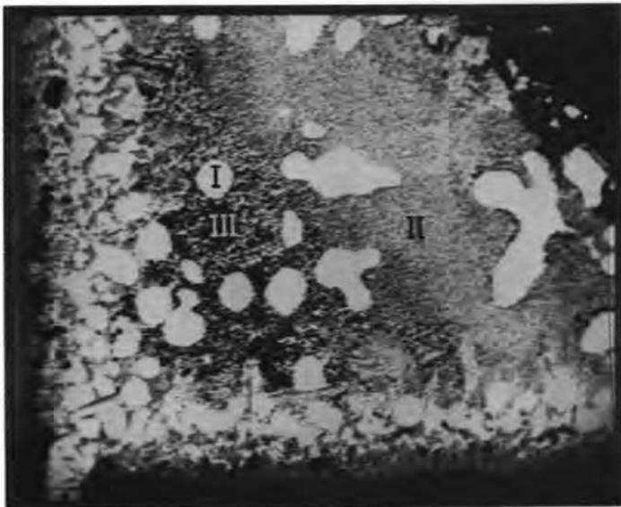  
BACKSCATTERED ELECTRONS

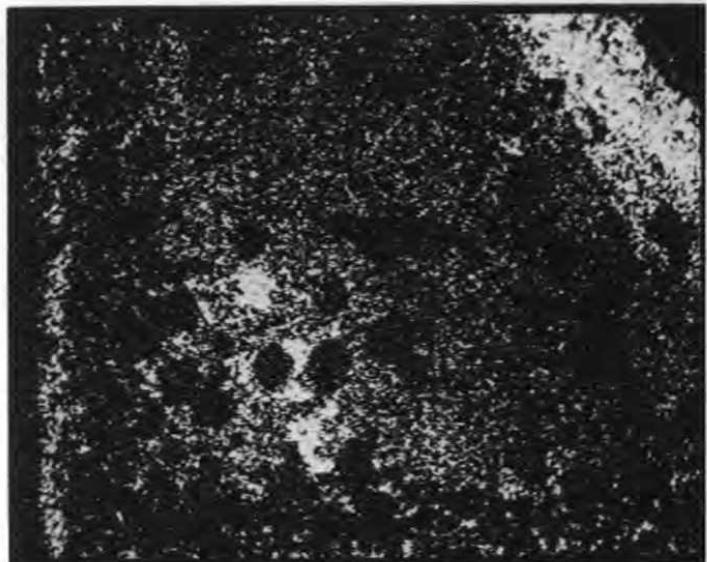  
FeKa

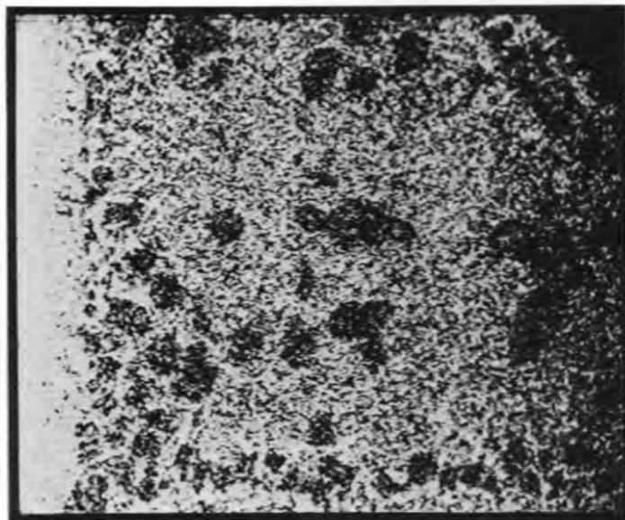  
MoLa

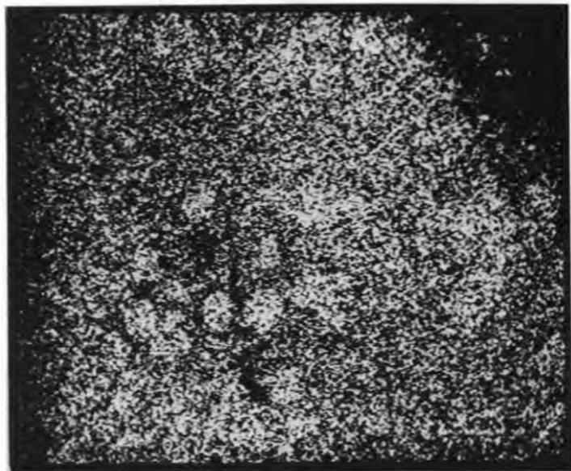  
BiLa   
Fig. 16.14. Electron beam scanning images of 16M braze (Fe-4% C-1% B). Compositions of regions I, II, and III are given in text. Lighter regions indicate greater concentration of the metal indicated.

surface removal, 1.2 mils/year. Chemical analysis of four different samples taken from the bismuth drained from the loop did not indicate any increase in the carbon concentration. These results indicate that graphite to be used in chemical processing applications should have small pore entrance diameters $(< 1\mu)$ and should not have interconnecting porosity.

Since removal of rare earths from MSBR fuels involves bismuth that contains up to 50 mole $\%$ lithium, we are testing the various potential containers in bismuth-lithium solutions. Static capsules containing two grades of graphite have completed a 500-hr test in bismuth containing 0.5 and 3.5 wt $\%$ lithium but have not been examined yet.

Two all-metal thermal-convection loops will soon be placed in operation. The first of these was fabricated from gun-drilled low-carbon, low-oxygen molybdenum bar stock and contains molybdenum tensile samples in both the high- and low-temperature regions. The second was fabricated from T-111 (Ta-8% W-2% Hf) alloy tubing and contains T-111 tensile samples. The bismuth in each of these loops will contain 2.5 wt % Li and will operate at a maximum temperature of $700^{\circ}\mathrm{C}$ . A graphite loop is currently being designed and will be operated under conditions similar to those discussed above.

We are planning to continue testing these three potential structural materials (Mo, T-111, graphite) in various concentrations of lithium in bismuth to determine their physical and mechanical property changes. One point of interest is the possible formation of lithium carbide or intercalation compounds with graphite. Future tests will also include the compatibility of braze alloys with bismuth containing lithium.

# 16.6 CHEMically VAPOR DEPOSITED COATINGS

# J. I. Federer

Although fabricable into equipment for reprocessing MSBR fuel, most iron- and nickel-base alloys are attacked by liquid bismuth. Tungsten and molybdenum are resistant to liquid bismuth, but they are much more difficult to fabricate. Therefore, we are investigating the use of tungsten and molybdenum coatings on iron- and nickel-base alloys as a possible solution to this difficult containment problem. The coatings are being applied by chemical vapor deposition techniques using hydrogen reduction of $\mathrm{WF}_6$ and $\mathrm{MoF_6}$ at about 600 and $900^{\circ}\mathrm{C}$ respectively. We have continued to characterize coatings on small sheet-type specimens, and we are attempting to demonstrate the applicability of the coating process by coating a variety of test vessels and more complicated shapes.

Tungsten coatings do not adhere to stainless steels unless the steels are first plated with a thin layer of nickel. Nickel is readily applied to simple shapes by electrodeposition, but complicated shapes are difficult to plate by this method. As an alternate method, we are investigating electroless nickel plating from an acidified phosphate bath. In our first experiment, bend specimens of types 304 and 430 stainless steels measuring $10 \times 3/4 \times 1/16$ in. were electroless plated with nickel, which was then bonded to the base materials by heating to $800^{\circ}\mathrm{C}$ for $30\mathrm{min}$ . Duplicate specimens of each steel were coated with about 0.005-in.-thick tungsten, and another pair was coated with about 0.005-in.-thick molybdenum. The tungsten coated smoothly, but the molybdenum coating had numerous blisters. Moreover, when subjected to a bend test, all of the coatings were less adherent than had been previously observed when an electrodeposited nickel layer was first applied. The electroless nickel plate contained about $8\%$ P, which may have affected coating adherence. We are continuing this investigation by testing nickel plates of lower phosphorus content.

The largest object that we have coated was a $4^{1/2}$ -in.-OD by 36-in.-long Monel vessel closed on both ends except for $3/4$ -in.-OD tube extensions. The entire inner surface was coated with 0.006- to 0.010-in.-thick tungsten except for the ends, where the coating was thinner. A 4-in.-long section of the coated vessel was thermal cycled 25 times between 25 and $600^{\circ}\mathrm{C}$ . Examination after the 25 cycles revealed the coating was intact and there was no evidence of spalling. A dye penetrant revealed only a few edge cracks, probably caused by cutting the section from the original vessel. The entire section was slightly out of round after thermal cycling, possibly as a result of the stress produced from the difference in thermal expansion between tungsten and Monel. Similar results would be expected for tungsten coatings on other materials such as Inconel 600, Hastelloy N, nickel, and nickel-plated steels.

We have deposited molybdenum on the inside surface of a nickel capsule and tested it in bismuth for $700\mathrm{hr}$ at $600^{\circ}\mathrm{C}$ . No attack of the coating nor the nickel substrate below was found.

Figure 16.15 is a schematic representation of a Hastelloy N corrosion loop that is to be coated with tungsten so that it can be tested in flowing bismuth. Since the nickel-base alloy substrate would be readily attacked by bismuth, a severe test of the integrity of the coating will be obtained. The loop was modified as shown in Fig. 16.15 for coating. A cross member was removed to form a U-shape, thus providing both a gas inlet and outlet. The U-shape will be coated first and

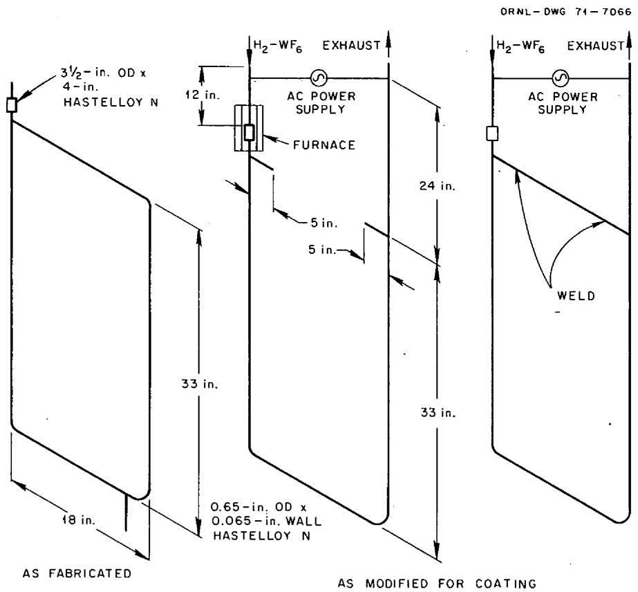  
Fig. 16.15. Arrangement for coating bismuth corrosion loop with tungsten.

then the cross member will be welded in place and coated.

Prior to coating the actual loop, a U-shaped piece of $3/4$ -in.-OD by 0.072-in.-wall Hastelloy N tubing was coated. The long sides of the U-shape were 46 in. long and the short side was 18 in., giving a total length of 110 in., of which 90 in. was heated and coated. The tubing was heated to $400^{\circ}\mathrm{C}$ by self-resistance. Hydrogen and $\mathrm{WF}_6$ flowed through the tubing for 6 hr in one direction, followed by 6 hr in the opposite direction. By using a temperature of $400^{\circ}\mathrm{C}$ (rather than the usual 550 to $600^{\circ}\mathrm{C}$ ) for a long time, depletion of $\mathrm{WF}_6$ was minimized, and most of the heated length of tubing was uniformly coated. The coating thickness ranged from about 0.005 to 0.006 in. except for about 2 in. in each end, where the thickness was only 0.001 to 0.002 in. We expect to use similar conditions to coat the actual loop.

A metal transport demonstration vessel has also been coated with tungsten for protection against bismuth corrosion. The low-carbon steel vessel is about 3 in. in inside diameter by 21 in. long and is closed on one end except for a $\frac{1}{4}$ -in.-ID by 6-in.-long pipe extension.

Approximately 10 in. of the vessel and the 6-in.-long pipe were coated. First, the vessel was nickel plated by electrodeposition, and the nickel was bonded by heating to $800^{\circ}\mathrm{C}$ in vacuum. Calrod heating elements were then fitted to the vessel to provide heat for coating. However, the elements were not properly spaced to heat the vessel uniformly. A temperature gradient from about 400 to $650^{\circ}\mathrm{C}$ occurred in the section to be plated. Consequently, the coating thickness ranged from 0.004 to 0.020 in., with the thickest coating being in the vicinity of the $\frac{1}{4}$ -in.-ID pipe opening. Otherwise, the coating appeared to be satisfactory and should provide the intended protection.

# 16.7 MOLYBDENUM DEPOSITION FROM $\mathsf{MoF}_6$

# J.W.Koger

Studies have continued on developing a technique for depositing molybdenum on iron-base substrates from $\mathrm{MoF}_6$ in a molten fluoride salt mixture. Experimental problems have occurred as a result of too much $\mathrm{MoF}_6$ in the salt prior to deposition. This has caused attack of

the container vessel and precipitation of metal fluoride corrosion products along with molybdenum. An analysis of the coating formed in the previous experiment is given in Table 16.3. Stoichiometric calculations show that all the Li, Be, Cr, Fe, and most of the Ni could exist as fluorides. This is in agreement with our interpretation of the microprobe analysis, where we found nickel, molybdenum, and various fluorides. We have completed an additional experiment with results similar to those reported above. In subsequent tests we will limit the amount of $\mathrm{MoF}_6$ to slow down the

reaction. At this time the experimental system is being modified to accomplish these objectives, and tests will begin again shortly.

Table 16.3. Chemical analysis of deposit   

<table><tr><td>Element</td><td>Weight percent</td></tr><tr><td>Mo</td><td>71.3</td></tr><tr><td>F</td><td>16.6</td></tr><tr><td>Ni</td><td>6.4</td></tr><tr><td>Li</td><td>2.7</td></tr><tr><td>Fe</td><td>2.0</td></tr><tr><td>Be</td><td>1.2</td></tr><tr><td>Cr</td><td>0.6</td></tr></table>

9. J. W. Koger, MSR Program Semiannu. Progr. Rep. Aug. 31, 1970, ORNL-4622, p. 197.

# Part 5. Molten-Salt Processing and Preparation

L. E. McNeese

Part 5 deals with the development of processes for the isolation of protactinium and the removal of fission products from molten-salt reactors. During this period we have continued to evaluate and develop a flowsheet based on fluorination-reductive-extraction for protactinium isolation and the metal transfer process for rare-earth removal. The portion of the flowsheet dealing with protactinium isolation was simplified considerably by retaining the isolated protactinium in a secondary salt rather than in bismuth at a point intermediate in the protactinium extraction column. This change results in a process that will be much easier to operate and will effect a significant reduction in plant cost. Calculations on the flowsheet continue to be promising.

We have begun considering oxide precipitation as an alternative to the fluorination—reductive-extraction method for isolating protactinium and for subsequently removing uranium from MSBR fuel salt. Two possible flowsheets are presented. The utility of these flowsheets is largely dependent on the development of methods for separating oxide precipitate from molten-salt streams.

Additional data were obtained on the effect of the LiF concentration on the distribution of solutes, including La, Nd, and U, between LiCl-LiF solutions and liquid bismuth. This information confirmed earlier indications that LiF in concentrations below about 4 mole % has little effect on the behavior of di- and trivalent solutes but that the thorium-rare-earth separation factor decreases with increasing LiF concentration. The mutual solubilities of thorium and neodymium in lithium-bismuth solutions at $640^{\circ}\mathrm{C}$ appear to be much higher than those required in the extraction of rare earths from LiCl by contact with lithium-bismuth solutions.

Our second engineering experiment for the study of the metal transfer process for removing rare earths from MSBR fuel carrier salt was successfully completed during this reporting period. The experiment, which demonstrated all of the important aspects of the

process, was operated for about three months before it was shut down for inspection. During that period more than $85\%$ of the lanthanum and $50\%$ of the neodymium originally in the fuel carrier salt were removed and deposited in a lithium-bismuth solution. There was no measurable accumulation of thorium $(< 10~\mathrm{ppm})$ in the lithium-bismuth solution, thus demonstrating that the rare earths can be removed without significant removal of thorium. The thorium-lanthanum decontamination factor was about $10^{5}$ . The distribution coefficients between the salt and metal phases in the system were in reasonable agreement with expected values. A third engineering experiment, which will use flow rates that are about $1\%$ of those required for a 1000-MW(e) MSBR, is being designed and fabricated.

Our work on contactor development was continued successfully during the reporting period. Flooding data obtained during the countercurrent flow of bismuth and molten salt in a 24-in.-long, 0.82-in.-ID column packed with $\frac{1}{4}$ -in. molybdenum Raschig rings continue to be in good agreement with flooding rates predicted from studies with mercury and water. Data on the extraction of uranium from salt by countercurrent contact with bismuth containing reductant were effectively correlated by an HTU model that assumed the major resistance to uranium transfer to be in the salt phase. Preparations were begun for additional mass transfer studies in packed columns; these studies will involve measuring the rate of exchange of zirconium isotopes between salt and metal streams otherwise at equilibrium.

We have continued our efforts to develop a frozen-wall continuous fluorinator. Studies of heat generation and heat transfer in a simulated fluorinator system have shown that radio-frequency heating can be used to provide the internal heat source required for studies with nonradioactive systems. A relatively large continuous fluorination experiment is planned.

# 17. Flowsheet Analysis

A flowsheet in which fluorination is used for removing uranium and reductive extraction is used for isolating protactinium from MSBR fuel salt has been described. However, it has been found that a considerable simplification in the flowsheet and a significant reduction in partial fuel cycle cost can be achieved by holding the isolated protactinium in a secondary salt phase rather than in bismuth as previously considered. A flowsheet for this improved mode of operation has been developed, and the partial fuel cycle costs corresponding to several sets of operating conditions have been calculated. We have also observed that the waste streams from the protactinium isolation and the rare-earth removal portions of the new flowsheet can be conveniently combined for uranium recovery prior to disposal, thus decreasing the probability of loss of fissile material and eliminating the need for adding $^{7}\mathrm{Li}$ to the protactinium decay tank in order to obtain an acceptably low liquidus temperature. A method for combining the waste streams is described.

Oxide precipitation is being considered as an alternative method for selectively removing protactinium from MSBR fuel salt and for subsequently removing uranium from the fuel salt prior to the removal of rare earths. Two conceptual flowsheets based on oxide precipitation are presented, and the importance of several system parameters is shown.

# 17.1 PROTACTINIUM ISOLATION USING FLUORINATION AND REDUCTIVE EXTRACTION

M.J.Bell E.L.Nicholson

W. L. Carter L. E. McNeese

Analysis of the fluorination-reductive-extraction flowsheet for isolating protactinium from MSBR fuel salt has revealed several undesirable features and has suggested an improved method for removing fission product zirconium and for retaining $^{233}\mathrm{Pa}$ during its decay to $^{233}\mathrm{U}$ . In the flowsheet described previously, zirconium was extracted into the bismuth stream exiting from the lower column of the protactinium isolation system and was removed from this stream by hydrofluorinating a small fraction of the bismuth in the

presence of salt that was withdrawn from the system. Since the bismuth stream also contained protactinium and uranium, the portion of the stream that was hydrofluorinated represented a compromise between (1) maintaining an acceptably low zirconium concentration in the bismuth in the lower part of the column and (2) transferring acceptably small amounts of protactinium and uranium to the waste salt, from which these materials must be recovered. The remaining bismuth was hydrofluorinated in the presence of salt that was recycled to a point ahead of the fluorinator in order to remove the uranium as $\mathrm{UF}_6$ . This operation also resulted in the recycle of zirconium, which, under operating conditions of interest, was oxidized and reduced several times before its removal. Such recycling resulted in a significant increase in the quantity of reductant required for isolating the protactinium.

We have observed that the flowsheet can be simplified by hydrofluorinating the entire bismuth stream in the presence of a secondary salt stream, as shown in Fig. 17.1. Salt is withdrawn from the reactor on a ten-day cycle and is fed to a fluorinator, where about $99\%$ of the uranium is recovered. The salt is then fed to an extraction column where protactinium, zirconium, and the remaining uranium are extracted into a bismuth stream containing reductant. The bismuth stream is then hydrofluorinated in the presence of a second salt stream, which results in transfer of the extracted materials to the salt. Reductant is added to the recovered bismuth, and the resulting metal stream is recycled to the extraction column as in the previous flowsheet. The secondary salt stream is circulated through a hydrofluorinator, a fluorinator, and a protactinium decay tank. The fluorinator is used to maintain an acceptably low uranium concentration in the protactinium decay tank. Salt is withdrawn from the decay tank periodically to remove zirconium and other fission products that accumulate in the tank. The salt is held for a sufficient period before final discard to allow $^{233}\mathrm{Pa}$ to decay to $^{233}\mathrm{U}$ , which is recovered from the salt by batch fluorination.

These flowsheet modifications offer the following advantages over the earlier flowsheet:

1. The bismuth inventory in the system is greatly reduced, thus avoiding a significant inventory charge.   
2. The protactinium decay tank can be fabricated from a nickel-base alloy rather than molybdenum, which

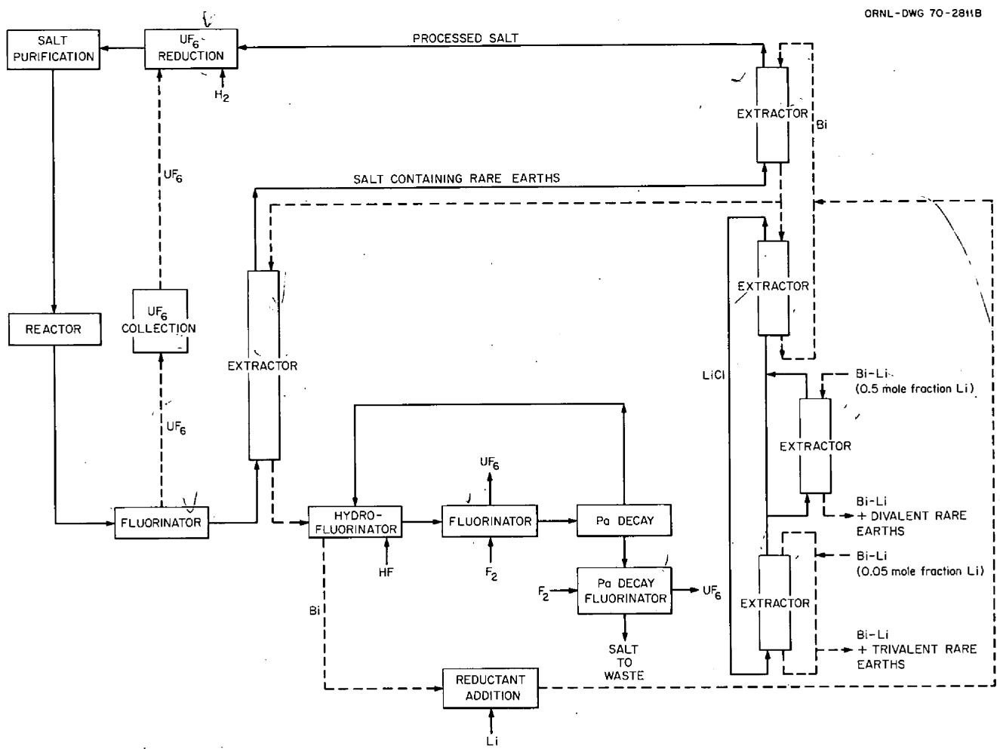  
Fig. 17.1. Improved flowsheet for processing a single-fluid MSBR by fluorination—reductive extraction and the metal transfer process. The isolated protactinium is held for decay in a secondary salt stream.

will result in a considerable saving in the installed equipment cost.

3. Control of the protactinium isolation system is greatly simplified.   
4. Zirconium will not be recycled in the lower part of the protactinium isolation system, thus reducing the consumption of reductant.   
5. The isolated protactinium is retained in such a manner that maloperation of the extraction column cannot return large quantities of protactinium to the reactor.   
6. The flowsheet is simplified; recycle of fuel salt containing uranium, zirconium, and protactinium to the primary fluorinator is avoided. Operation of the secondary salt circuit is restricted only by heat removal and inventory considerations.

7. Very efficient hydrofluorination of the bismuth stream would permit the initial salt inventory in the protactinium decay tank to contain natural lithium rather than $^7$ Li.

Representative operating conditions and partial fuel cycle costs have been determined for the revised protactinium isolation system. Both the quantity of reductant required and the rate at which fuel carrier salt must be removed from the reactor to compensate for the LiF added by the protactinium isolation system depend on the fraction of the uranium that is removed from the fuel salt by the primary fluorinator. For a uranium removal efficiency of $95\%$ , the lithium reductant requirement is 370 moles/day and fuel carrier salt must be withdrawn at the rate of $0.3\mathrm{ft}^3/\mathrm{day}$ . For a uranium removal efficiency of $99\%$ , the reductant requirement is 200 moles/day and salt must be dis

carded at the rate of 0.16 ft³/day. In the former instance, the chemical and inventory charges for the fluorination-reductive-extraction system amount to 0.047 mill/kWhr. These charges are reduced to 0.034 mill/kWhr for the higher fluorinator efficiency. In each case, the salt inventory in the protactinium decay tank is 150 ft³. The uranium inventory in the tank is about 0.1% of the reactor inventory.

# 17.2 COMBINATION OF DISCARD STREAMS FROM THE PROTACTINIUM ISOLATION SYSTEM AND THE METAL TRANSFER SYSTEM

M.J.Bell L.E.McNeese

The flowsheet shown in Fig. 17.1 requires that about 40 moles of LiF be added daily to the protactinium decay tank in order to obtain a suitable liquidus temperature. Lithium fluoride purchased for this addition would increase the power cost by 0.0014 mill/kWhr; however, we have observed that an acceptable liquidus temperature can also be obtained by hydrofluorinating the lithium-bismuth stream from the divalent rare-earth stripper in the presence of the salt from the decay tank. This operation adds 50 moles of LiF and about 1.1 moles of rare-earth fluorides to the decay tank per day. With this addition, the composition of the salt in the decay tank is 72-24-3 mole % LiF-ThF $_4$ -ZrF $_4$ , 1 mole % divalent rare-earth fluorides, and 360 ppm trivalent rare-earth fluorides. The salt has a liquidus temperature of $570^{\circ}\mathrm{C}$ ; at this temperature, the rare-earth fluoride concentration is well within the rare-earth solubility.

We have also observed that it is possible to combine all waste streams from the metal transfer system and the protactinium isolation system for uranium recovery prior to disposal as shown in Fig. 17.2. In this operation, waste salt from the protactinium decay tank would be combined with the fuel carrier salt discard stream. The lithium-bismuth stream from the trivalent rare-earth stripper would be hydrofluorinated in the presence of the resulting salt, and the combined stream would be held for protactinium decay. The protactinium concentration in the combined streams would be only $500~\mathrm{ppm}$ initially, and the specific heat generation rate would be acceptably low. The salt in the waste holdup tank would be fluorinated before discard to recover uranium. The composition of the discarded salt would be 74.7-13.5-9.5-0.8 mole $\%$ LiF-ThF $_4$ -BeF $_2$ -ZrF $_4$ , 1.2 mole $\%$ trivalent rare-earth fluorides, and 0.3 mole $\%$ divalent rare-earth fluorides. Although the liquidus temperature of the salt is near $500^{\circ}\mathrm{C}$ , the salt temperature would have to be maintained at about

$600^{\circ}\mathrm{C}$ so that the trivalent rare-earth fluorides would not precipitate. This processing scheme would require that salt be discarded at the rate of 60 ft $^3$ every 220 days.

# 17.3 PROTACTINIUM ISOLATION USING OXIDE PRECIPITATION

M.J.Bell L.E.McNeese

Ross, Bamberger, and $\mathbf{Baes}^3$ have shown that protactinium can be precipitated selectively as $\mathrm{Pa}_2\mathrm{O}_5$ from MSBR fuel salt by the addition of oxide to salt containing $\mathrm{Pa}^{5+}$ . Bamberger and $\mathbf{Baes}^4$ have also found that uranium oxide can be precipitated from fuel salt from which protactinium has been previously removed, with the attendant precipitation of only a small fraction of the thorium. Further, Bell and McNeese have calculated that greater than $99\%$ of the uranium can be recovered from fuel salt by countercurrent multistage contact of fuel salt with $\mathrm{UO}_2$ - $\mathrm{ThO}_2$ solid solutions, using relatively few stages. The composition of the oxide product was calculated to be greater than $90\%$ $\mathrm{UO}_2$ .

Hence, oxide precipitation is being considered as an alternative method to fluorination and reductive extraction for the isolation of protactinium and removal of uranium from the fuel salt of an MSBR. A possible flowsheet and typical operating parameters are shown in Fig. 17.3. Fuel salt is withdrawn from the reactor on a three-day cycle, and protactinium is removed by precipitation as $\mathrm{Pa}_2\mathrm{O}_5$ . Part of the salt is processed on a 30-day cycle for rare-earth removal by the metal transfer process. Most of the uranium must be removed from this stream prior to removal of the rare earths. The separated uranium is then recombined with the processed salt leaving the metal transfer system and is returned to the reactor. The $\mathrm{Pa}_2\mathrm{O}_5$ precipitate is hydrofluorinated in the presence of a captive salt phase, which circulates through the protactinium decay tank and through a fluorinator in order to maintain an acceptably low uranium inventory in the decay tank. Part of the salt in the decay tank must be returned to the reactor to compensate for salt that is transferred to the tank with the $\mathrm{Pa}_2\mathrm{O}_5$ precipitate.

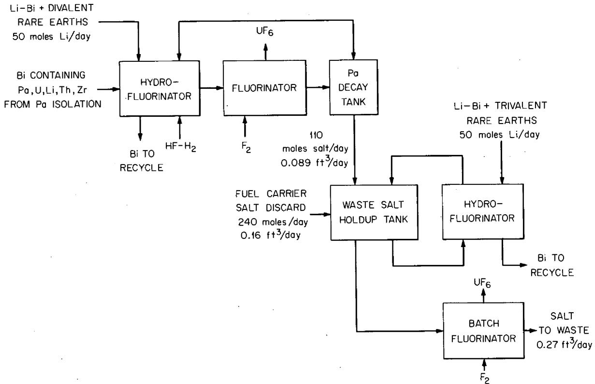  
Fig. 17.2. Method for combining waste streams from protactinium isolation and rare earth removal processes. Flow rates are shown for an assumed uranium removal efficiency in the primary fluorinator of $99\%$ .

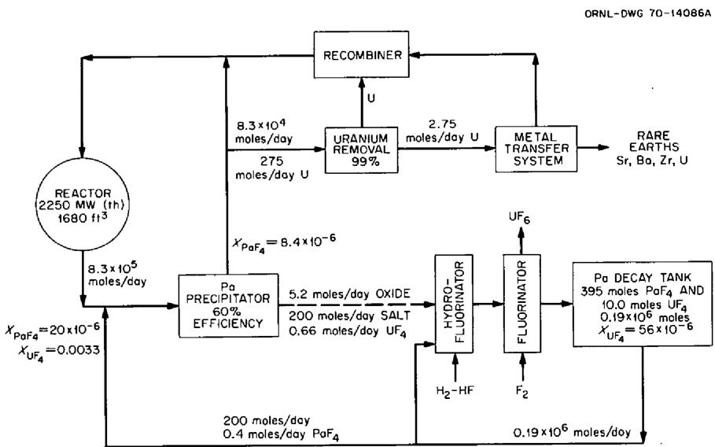  
Fig. 17.3. Flowsheet for protactinium isolation using fluorination and oxide precipitation. Fuel salt is withdrawn from the reactor at a rate corresponding to a three-day cycle.

As shown in Fig. 17.4, the protactinium removal time for this system depends on the precipitator efficiency and the rate at which fuel salt is transferred to the protactinium decay tank along with the $\mathrm{Pa}_2\mathrm{O}_5$ . A removal time of about five days can be obtained if $60\%$ of the protactinium is removed from the salt in the precipitator, provided the salt transfer rate to the protactinium decay tank is as low as 10 to 20 moles/day (a salt-to-oxide flow rate ratio of 2 to 4). For the same removal time, a precipitator efficiency of about $80\%$ would be required if the salt-to-oxide flow rate ratio were as high as 600. The uranium inventory in the decay tank depends on the efficiency of the

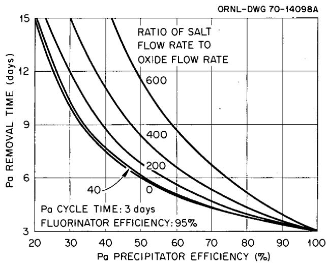  
Fig. 17.4. Effects of precipitator efficiency and fuel salt transfer rate on protactinium removal time for the fluorination-oxide precipitation flowsheet.

fluorinator in the protactinium isolation loop and on the amount of fuel salt transferred to the protactinium system with the precipitate, as shown in Fig. 17.5. This uranium inventory will be only a small fraction of the uranium inventory in the reactor, and the associated inventory charge will be less than 0.001 mill/kWhr for a wide range of operating conditions.

Isolation of protactinium by oxide precipitation can also be achieved without the use of a fluorinator, as shown in Fig. 17.6. In this flowsheet, the $\mathrm{Pa}_2\mathrm{O}_5$ precipitate is hydrofluorinated in the presence of uranium-free salt leaving the metal transfer system. The resulting salt stream then passes through a decay tank,

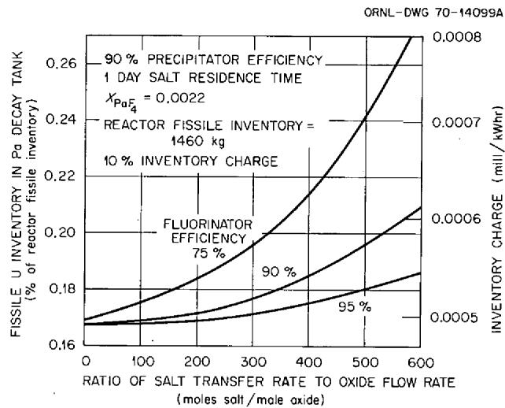  
Fig. 17.5. Effects of secondary fluorinator efficiency and fuel salt transfer rate on uranium inventory for the fluorination-oxide precipitation flowsheet.

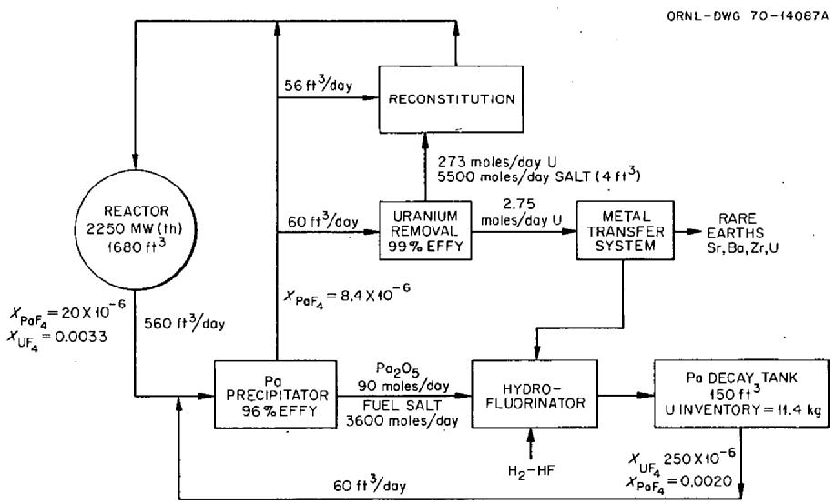  
Fig. 17.6. Flowsheet for protactinium isolation using oxide precipitation.

where it is held up two to four days before being recycled to a point ahead of the precipitator in order to return $^{233}\mathrm{U}$ to the reactor. Since the salt flow rate through the protactinium decay tank must be relatively large in order to limit the uranium inventory in the decay tank, high precipitator efficiencies are required; a precipitator efficiency of about $96\%$ would be required to obtain a protactinium removal time of five days. Uranium inventories in the protactinium isolation system using this flowsheet will be 0.5 to $1.0\%$ of the reactor fissile inventory; corresponding inventory charges will be 0.002 to 0.004 mill/kWhr.

# 17.4 STRIPPING OF RARE-EARTH FISSION PRODUCTS FROM LiCI IN THE METAL TRANSFER SYSTEM

M. J. Bell

The flowsheet described previously $^{1,2}$ for removing rare-earth fission products from MSBR fuel salt using the metal transfer process employs contact of the LiCl with lithium-bismuth solutions for removal of the rare earths and other fission products. In the reference flowsheet, the trivalent rare earths are removed by contacting the LiCl, at the rate of 33.4 gpm, with an 8.1-gpm recirculating bismuth stream having a lithium concentration of 5 at. $\%$ in a single equilibrium stage. Bismuth containing extracted rare earths is withdrawn at the rate of 5.7 gal/day, and an equal amount of lithium-bismuth solution is added.

Early data indicated that mutual solubility problems might be encountered between thorium and trivalent rare earths in bismuth having a lithium concentration as high as 5 at. $\%$ . Although this has been found not to be the case, we have obtained data on the effect that varying the lithium concentration in the lithiumbismuth alloy has on the thorium concentration in the metal and on reactor performance. These results are presented in Fig. 17.7, which shows the effect of increasing the flow rate of the lithium-bismuth withdrawal stream while holding constant the amount of reductant fed to the system. The thorium concentration in the metal is reduced from $420~\mathrm{ppm}$ at the reference withdrawal rate of 1000 moles/day to $140~\mathrm{ppm}$ at the discard rate of 3000 moles/day. The effect on reactor performance is slight; the breeding ratio decreases from 1.063 to 1.060. It would be possible to compensate, in part, for this loss in breeding ratio by operating the trivalent-rare-earth stripper as a once-through batch

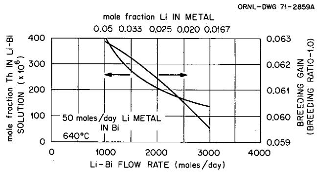  
Fig. 17.7. Effect of lithium-bismuth discard rate on thorium concentration in discard stream and on MSBR performance.

contactor and increasing the number of stages. This mode of operation has also been considered as a means for accommodating the high-specific heat generation rates of the trivalent rare-earth fission products.

In the reference flowsheet, the divalent rare-earth fission products are removed from the LiCl by contacting $2\%$ of the LiCl leaving the trivalent stripper with 0.56 gal of 50 at. $\%$ Li-Bi per day. In order to deal with the high heat generation rates expected in the resulting lithium-bismuth stream, we have considered operating this contactor as a continuous column with a high recycle rate of the metal stream. A decay tank could then be placed in the recycle stream to dissipate a large fraction of the fission product decay heat.

# 17.5 IMPORTANCE OF URANIUM INVENTORY IN AN MSBR PROCESSING PLANT

M.J.Bell L.E.McNeese

The MSBR processing flowsheets considered thus far have uniformly resulted in very low uranium inventories in the processing plant, that is, inventories that are usually below $1\%$ of the fissile inventory in the reactor. Since several potential processing systems might result in uranium inventories as large as 5 to $10\%$ of the reactor inventory, we have investigated the importance of uranium inventory in an MSBR processing plant. The major effects of an increased uranium inventory are: (1) an increase in inventory charges on fissile material and (2) an increase in the reactor doubling time. The system fissile inventory (which includes the ${}^{233}\mathrm{Pa}$ in the processing plant) was assumed to be $1504\mathrm{kg}$ , the value of ${}^{233}\mathrm{U}$ was taken to be $\$14$ per gram, and the capital charge rate was assumed to be $10\%/$ year. The calculated system doubling time for the limiting case of a zero uranium inventory in the processing plant was 22 years.

A processing plant uranium inventory of $5\%$ of the system fissile inventory would increase the fuel cycle cost by 0.015 mill/kWhr and would increase the system doubling time from 22 to 23.1 years. A uranium inventory of $10\%$ of the system fissile inventory would result in a fuel cycle cost increase of 0.03 mill/kWhr

and an increase in doubling time from 22 to 24.2 years. Thus, while there is incentive for maintaining a low uranium inventory in the processing plant, it does not appear that a uranium inventory as high as 5 to $10\%$ of the system fissile inventory would rule out an otherwise attractive processing system.

# 18. Processing Chemistry

L. M. Ferris

Studies of the chemistry relating to the metal transfer process $^{1,2}$ for the removal of rare earths from MSBR fuel salt were continued during this reporting period. The equilibrium distribution of several actinide elements between molten LiCl and liquid bismuth solutions was determined, and additional data were obtained on the effect of LiF concentration on the distribution of several elements between LiCl-LiF solutions and liquid bismuth. The mutual solubility of rare earths and thorium in lithium-bismuth solutions was also investigated further. In addition to the metal transfer process studies, work was continued on a method for selectively precipitating protactinium, as $\mathrm{Pa}_2\mathrm{O}_5$ , from MSBR fuel salt.

# 18.1 MEASUREMENT OF DISTRIBUTION COEFFICIENTS IN MOLTEN-SALT-METAL SYSTEMS

F.J.Smith

J.C.Mailen

C. T. Thompson

J. F. Land

Distribution coefficients,

$$
D _ {\mathbf {M}} = \frac {\text {m o l e f r a c t i o n o f} \mathbf {M} \text {i n b i s m u t h p h a s e}}{\text {m o l e f r a c t i o n o f} \mathbf {M} \text {i n s a l t p h a s e}}, \tag {1}
$$

were measured, using molten LiCl as the salt phase, for several transuranium elements at 640 and $700^{\circ}\mathrm{C}$ and for uranium at $675^{\circ}\mathrm{C}$ . In addition, data were obtained for uranium, neodymium, and lanthanum at $640^{\circ}\mathrm{C}$ , using LiCl-LiF salt solutions, to further elucidate the effect of fluoride concentration on distribution behavior. These latter measurements should be useful in predicting how the metal transfer process would operate if the LiCl acceptor salt were contaminated with

fluoride fuel salt. As we showed earlier, $^{3-5}$ the distribution coefficients at a given temperature can be expressed as

$$
\log D _ {\mathrm {M}} = n \log N _ {\mathrm {L i}} + \log K _ {\mathrm {M}} ^ {*}, \tag {2}
$$

in which $N_{\mathrm{Li}}$ is the mole fraction of lithium in the bismuth phase, $n$ is the valence of $\mathbf{M}^{n + }$ in the salt phase, and $\log K_{\mathbb{M}}^{*}$ is a constant.

Values of $n$ and $\log K_{\mathbf{M}}^{*}$ obtained for the respective solutes using the various salt phases are given in Table 18.1. The values for uranium at $675^{\circ}\mathrm{C}$ and for the transuranium elements at 640 and $700^{\circ}\mathrm{C}$ were obtained from isotherms, represented by Eq. (2), using the general technique described previously. $^{3,4}$ Data for uranium, lanthanum, and neodymium, using LiCl-LiF solutions as the salt phase, were obtained in a separate experiment. Initially, the chlorides of uranium and lanthanum, along with $^{147}\mathrm{Nd}$ tracer, were dissolved in pure LiCl in the presence of a pure bismuth phase at $640^{\circ}\mathrm{C}$ . Lithium-bismuth alloy was then added to the bismuth phase until the lithium concentration in this phase was high enough to give readily measurable distribution coefficients for each of the three solutes. Several samples of each phase were taken, and values of $\log K_{\mathbf{M}}^{*}$ were calculated, using Eq. (2), from the analyses of these samples. Weighed amounts of LiF were then added incrementally to the system to gradually increase the LiF concentration in the salt phase. After each addition, at least 24 hr was allowed for equilibration before several samples of each phase were taken; analyses of these samples not only confirmed the LiF concentration but also were used in the calculation of $\log K_{\mathbf{M}}^{*}$ . In these calculations, it was assumed that $n$ had a value of 3 for each of the solutes.

The effect of LiF concentration on $\log K_{\mathbf{M}}^{*}$ for several elements is shown graphically in Fig. 18.1. The

Table 18.1. Values of $n$ and $\log {K}_{\mathrm{M}} *$ obtained in measurements of the equilibrium distribution of several solutes between bismuth solutions and molten lithium halide salts   

<table><tr><td rowspan="2">Element</td><td colspan="2">Composition of salt phase (mole %)</td><td rowspan="2">Temperature (°C)</td><td rowspan="2">n</td><td rowspan="2">log KM*</td></tr><tr><td>LiCl</td><td>LiF</td></tr><tr><td>La</td><td>100</td><td>0</td><td>640</td><td>3</td><td>7.796 ± 0.4</td></tr><tr><td>Nd</td><td>100</td><td>0</td><td>640</td><td>3</td><td>8.374 ± 0.4</td></tr><tr><td>U</td><td>100</td><td>0</td><td>640</td><td>3</td><td>11.197 ± 0.4</td></tr><tr><td>Np</td><td>100</td><td>0</td><td>640</td><td>3</td><td>10.33 ± 0.1</td></tr><tr><td>Pu</td><td>100</td><td>0</td><td>640</td><td>3</td><td>10.126 ± 0.1</td></tr><tr><td>Am</td><td>100</td><td>0</td><td>640</td><td>~3</td><td>~10.16 ± 0.2</td></tr><tr><td>Cm</td><td>100</td><td>0</td><td>640</td><td>3</td><td>9.406 ± 0.1</td></tr><tr><td>Cf</td><td>100</td><td>0</td><td>640</td><td>~2</td><td>~5.38 ± 0.2</td></tr><tr><td>La</td><td>99.5</td><td>0.5</td><td>640</td><td>3</td><td>7.607 ± 0.4</td></tr><tr><td>Nd</td><td>99.5</td><td>0.5</td><td>640</td><td>3</td><td>8.568 ± 0.4</td></tr><tr><td>U</td><td>99.5</td><td>0.5</td><td>640</td><td>3</td><td>10.954 ± 0.4</td></tr><tr><td>La</td><td>98.0</td><td>1.99</td><td>640</td><td>3</td><td>7.878 ± 0.4</td></tr><tr><td>Nd</td><td>98.0</td><td>1.99</td><td>640</td><td>3</td><td>8.064 ± 0.4</td></tr><tr><td>U</td><td>98.0</td><td>1.99</td><td>640</td><td>3</td><td>11.329 ± 0.4</td></tr><tr><td>La</td><td>97.4</td><td>2.65</td><td>640</td><td>3</td><td>7.789 ± 0.4</td></tr><tr><td>Nd</td><td>97.4</td><td>2.65</td><td>640</td><td>3</td><td>8.310 ± 0.4</td></tr><tr><td>U</td><td>97.4</td><td>2.65</td><td>640</td><td>3</td><td>11.624 ± 0.4</td></tr><tr><td>La</td><td>95.7</td><td>4.33</td><td>640</td><td>3</td><td>7.372 ± 0.4</td></tr><tr><td>Nd</td><td>95.7</td><td>4.33</td><td>640</td><td>3</td><td>7.805 ± 0.4</td></tr><tr><td>U</td><td>95.7</td><td>4.33</td><td>640</td><td>3</td><td>11.480 ± 0.4</td></tr><tr><td>La</td><td>91.2</td><td>8.82</td><td>640</td><td>3</td><td>7.182 ± 0.4</td></tr><tr><td>Nd</td><td>91.2</td><td>8.82</td><td>640</td><td>3</td><td>7.521 ± 0.4</td></tr><tr><td>U</td><td>91.2</td><td>8.82</td><td>640</td><td>3</td><td>10.340 ± 0.4</td></tr><tr><td>La</td><td>82.6</td><td>17.41</td><td>640</td><td>3</td><td>6.458 ± 0.4</td></tr><tr><td>Nd</td><td>82.6</td><td>17.41</td><td>640</td><td>3</td><td>6.739 ± 0.4</td></tr><tr><td>U</td><td>82.6</td><td>17.41</td><td>640</td><td>3</td><td>8.604 ± 0.4</td></tr><tr><td>La</td><td>73.9</td><td>26.07</td><td>640</td><td>3</td><td>5.494 ± 0.4</td></tr><tr><td>Nd</td><td>73.9</td><td>26.07</td><td>640</td><td>3</td><td>6.354 ± 0.4</td></tr><tr><td>U</td><td>73.9</td><td>26.07</td><td>640</td><td>3</td><td>8.758 ± 0.4</td></tr><tr><td>U</td><td>100</td><td>0</td><td>675</td><td>3</td><td>10.11 ± 0.3</td></tr><tr><td>Np</td><td>100</td><td>0</td><td>700</td><td>3</td><td>10.369 ± 0.1</td></tr><tr><td>Pu</td><td>100</td><td>0</td><td>700</td><td>3</td><td>10.223 ± 0.1</td></tr><tr><td>Cm</td><td>100</td><td>0</td><td>700</td><td>3</td><td>9.589 ± 0.1</td></tr><tr><td>Cf</td><td>100</td><td>0</td><td>700</td><td>2</td><td>5.43 ± 0.2</td></tr></table>

values of $\log K_{\mathrm{M}}^{*}$ for lanthanum, neodymium, and uranium are those given in Table 18.1; the data for thorium and europium were reported previously. As seen in Fig. 18.1, the values of $\log K_{\mathrm{M}}^{*}$ for the di- and trivalent species did not vary markedly when the LiF concentration was in the range of 0 to about 4 mole%. However, the value of $K_{\mathrm{Th}}^{*}$ decreased by about two orders of magnitude as the LiF concentration was increased from 0 to 4 mole%. These data indicate that contamination of the LiCl acceptor salt with fluoride fuel salt in amounts that are equivalent to 4 mole% LiF

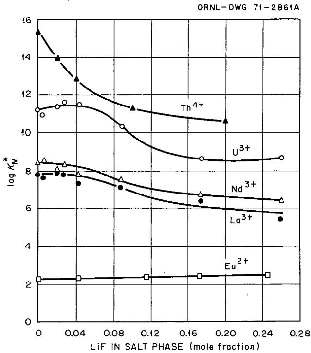  
Fig. 18.1. Variation of $\log K_{M}^{*}$ with salt composition. Salt phase was an LiCl-LiF solution; data obtained at $640^{\circ}\mathrm{C}$ except that for europium, which was obtained at $650^{\circ}\mathrm{C}$ .

or less will not affect the extent to which the rare earths are removed in the metal transfer process. The presence of fluoride in the acceptor salt would, however, cause a decrease in the thorium-rare-earth decontamination factor.

Some $^{103}\mathrm{Ru}$ was present as an impurity in the neodymium tracer in the experiment involving uranium, lanthanum, and $^{147}\mathrm{Nd}$ . Distribution coefficients for ruthenium could not be obtained, however, because the ruthenium was completely extracted from the LiCl into the bismuth phase before the lithium concentration in the bismuth reached 5 wt ppm. At this lithium concentration, the ruthenium distribution coefficient was greater than 1000.

In the last semiannual report, we presented values of $\log K_{\mathrm{Pm}}^*$ that were obtained in an experiment involving several LiCl-LiF solutions as the salt phase, and also estimated the neodymium-promethium separation factor $(D_{\mathrm{Nd}} / D_{\mathrm{Pm}})$ to be $3 \pm 2$ . Inspection of the gamma spectra of samples taken in this experiment has revealed that a significant amount of ${}^{147}\mathrm{Nd}$ was present along with the promethium. Analysis of these spectra yielded the neodymium-promethium separation factors at $640^{\circ}\mathrm{C}$ given in Table 18.2. Assuming that the average of these values $(8.3 \pm 1.8)$ is also valid when LiCl is the salt phase, we estimate $\log K_{\mathrm{Pm}}^* = 7.45 \pm$

Table 18.2. Neodymium-promethium separation factors obtained at $640^{\circ}\mathrm{C}$ with LiCl-LiF solutions as the salt phase   

<table><tr><td>Sample</td><td>LiF concentration in salt (mole %)</td><td>Nd-Pm separation factor</td></tr><tr><td></td><td>0</td><td>8.32 ± 1.8a</td></tr><tr><td></td><td>2.45</td><td>6.27b</td></tr><tr><td>1</td><td>3.22</td><td>10.1</td></tr><tr><td>2</td><td>3.22</td><td>8.4</td></tr><tr><td>3</td><td>3.22</td><td>8.5</td></tr><tr><td>4</td><td>6.59</td><td>6.1</td></tr><tr><td>5</td><td>6.59</td><td>12.4</td></tr><tr><td>6</td><td>6.59</td><td>10.9</td></tr><tr><td>7</td><td>10.22</td><td>7.1</td></tr><tr><td>8</td><td>10.22</td><td>6.8</td></tr><tr><td>9</td><td>10.22</td><td>6.8</td></tr><tr><td>10</td><td>17.56</td><td>7.4</td></tr><tr><td>11</td><td>17.56</td><td>8.5</td></tr><tr><td>12</td><td>17.56</td><td>8.9</td></tr></table>

$a$ Estimated; see text.   
${}^{b}$ Calculated from values of ${\log }_{{\mathrm{N}}_{\mathrm{d}}} *$ and ${\log }_{{\mathrm{K}}_{\mathrm{{Pm}}} * }$ derived from the respective isotherms.

0.4. This estimate indicates that promethium would behave much like lanthanum in the metal transfer process.

# 18.2 SOLUBILITIES OF THORIUM AND NEODYMIUM IN LITHIUM-BISMUTH SOLUTIONS

F.J.Smith C.T.Thompson J.F.Land

In the metal transfer process $^{1,2}$ being developed for the removal of rare earths from MSBR fuel salt, lithium-bismuth solutions having high lithium concentrations (5 to 50 at.%) would be used to strip the rare earths (along with any thorium present) from the LiCl acceptor salt. Therefore, we are determining the solubilities, both individual and mutual, of rare earths and thorium in lithium-bismuth solutions.

Solubilities of thorium and neodymium in several lithium-bismuth solutions were measured using the procedure and apparatus described elsewhere. The results are summarized in Tables 18.3 and 18.4 and are shown graphically in Figs. 18.2 and 18.3. At each temperature below $750^{\circ}\mathrm{C}$ , the solubility of thorium in lithium-bismuth solutions increased by about a factor of 3 as the lithium concentration in the solution increased from 0 to about 40 at. $\%$ . Similarly, the

Table 18.3. Solubility of thorium in liquid lithium-bismuth solutions   

<table><tr><td rowspan="2">Li concentration in solution (at. %)</td><td rowspan="2">Temperature range (°C)</td><td colspan="2">Thorium solubility, log STh(wt ppm) = A + B/T (°K)</td></tr><tr><td>A</td><td>B</td></tr><tr><td>0a</td><td>350–800</td><td>7.708</td><td>-3852</td></tr><tr><td>5.4</td><td>350–800</td><td>7.073</td><td>-3205</td></tr><tr><td>8.0</td><td>350–800</td><td>7.073</td><td>-3205</td></tr><tr><td>19.3</td><td>400–750</td><td>7.133</td><td>-3164</td></tr><tr><td>40.4</td><td>450–750</td><td>7.473</td><td>-3333</td></tr></table>

$a$ Reference 6.

Table 18.4. Solubility of neodymium in liquid lithium-bismuth solutions   

<table><tr><td rowspan="2">Li concentration in solution (at. %)</td><td rowspan="2">Temperature range (°C)</td><td colspan="2">Neodymium solubility, log SNd(wt ppm) = A + B/T (°K)</td></tr><tr><td>A</td><td>B</td></tr><tr><td>0a</td><td>500–700</td><td>6.68</td><td>-2200</td></tr><tr><td>8.32</td><td>400–700</td><td>7.19</td><td>-2531</td></tr><tr><td>17.4</td><td>450–700</td><td>7.11</td><td>-2435</td></tr><tr><td>25.0</td><td>450–700</td><td>7.07</td><td>-2379</td></tr><tr><td>38b</td><td>475–700</td><td>6.26</td><td>-1809</td></tr></table>

$a$ Preliminary data. $^b$ Reference 5.

solubility of neodymium increased regularly as the lithium concentration was increased from 0 to 25 at %. However, when the lithium concentration was increased from 25 to 38 at. $\%$ at $640^{\circ}\mathrm{C}$ , the solubility of neodymium decreased to about the same value that was obtained when pure bismuth was used as the solvent (Fig. 18.3). We are redetermining the neodymium solubilities in lithium-bismuth (40-60 at. $\%$ ) to confirm this behavior.

In a series of experiments, we measured the mutual solubilities of thorium and neodymium at $640^{\circ}\mathrm{C}$ in lithium-bismuth solutions having lithium concentrations ranging from 0 to 20 at. $\%$ . The mutual solubility limit was approached by making incremental additions of neodymium to the thorium-saturated liquid lithiumbismuth solution. At the end of some experiments when the system had been saturated with neodymium, several small additions of thorium were made. The data obtained in this series of experiments were somewhat scattered, due primarily to the difficulty in analyzing

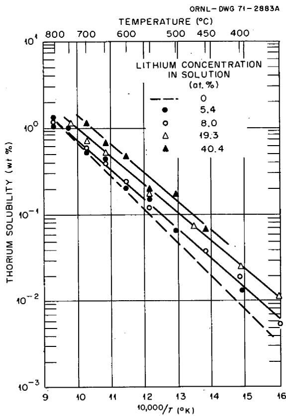  
Fig. 18.2. Thorium solubility in lithium-bismuth solutions. Data for 0 at. $\%$ lithium taken from ref. 6.

for thorium at a relatively low concentration (less than 0.35 wt $\%$ ) in the presence of neodymium at a high concentration (up to about 2 wt $\%$ ). However, the following general conclusions can be drawn from the data:

1. Neodymium, in concentrations below about 1 wt $\%$ appears to have no effect on the thorium solubility (about 0.35 wt $\%$ ) in lithium-bismuth solutions at $640^{\circ}\mathrm{C}$ ; as the neodymium concentration was increased from 1 to about 2 wt $\%$ (saturation), the thorium concentration decreased almost linearly from about 0.35 to about 0.1 wt $\%$ .   
2. The effect appeared to be reversible. Additions of thorium to lithium-bismuth solutions saturated with neodymium caused a decrease in the neodymium concentration to about 1 wt % as the thorium concentration increased to about 0.35 wt %.

The above results indicate that the mutual solubility of thorium and rare earths in the solution, lithiumbismuth (5-95 at. $\%$ ),proposed1,2 for stripping of the trivalent rare earths (La,Pm,Nd) from the LiCl acceptor salt is much higher than required. Measure

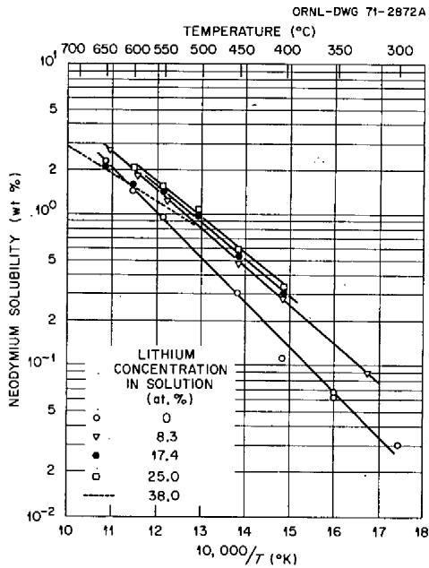  
Fig. 18.3. Solubility of neodymium in lithium-bismuth solutions. The solubility of neodymium in lithium-bismuth (38-62 at. $\%$ was taken from ref. 5. The solubility of neodymium in bismuth (lithium $= 0$ at. $\%$ should be considered preliminary.

ments of the mutual solubility of thorium and a divalent rare earth (eupropium) in liquid lithium-bismuth (40-60 at. $\%$ ) are in progress.

# 18.3 OXIDE PRECIPITATION STUDIES

# J.C.Mailen

We are investigating oxide precipitation methods (instead of fluorination and reductive extraction) for the isolation of both uranium and protactinium from MSBR fuel salt. It has been shown that $\mathrm{Pa}^{4+}$ dissolved in a molten LiF-BeF $_2$ -ThF $_4$ solution can be oxidized to the $5+$ state either by hydrofluorination or by reaction with NiO. Furthermore, the addition of oxide to a salt solution containing $\mathrm{Pa}^{5+}$ results in the precipitation of pure, or nearly pure, $\mathrm{Pa}_2\mathrm{O}_5$ . The solubility product for $\mathrm{Pa}_2\mathrm{O}_5$ appears to be much lower than that for $\mathrm{UO}_2$ ; hence $\mathrm{Pa}_2\mathrm{O}_5$ can be precipitated in preference to $\mathrm{UO}_2$ . Measurements of the solubility of $\mathrm{Pa}_2\mathrm{O}_5$ in MSBR fuel salt that is saturated with $\mathrm{UO}_2$ are being made at various temperatures. Accurate measurements are extremely important in that the $\mathrm{Pa}_2\mathrm{O}_5$ solubility

Table 18.5. Precipitation of $\mathbf{Pa}_2\mathbf{O}_5$ from LiF-BeF $_2$ -ThF $_4$ UF $_4$ (71.8-16-12-0.2 mole %) Initial weight of salt: $100\mathrm{g}$   

<table><tr><td>Sample</td><td>Temperature (°C)</td><td>Pa concentration in salt (wt ppm)</td><td>106NPaF5</td><td>103NFU4</td><td>Total UO2added to system (mg)</td><td>log Q1 (footnote a)</td></tr><tr><td>1</td><td>600</td><td>111</td><td>30.4</td><td>2.68</td><td>0</td><td></td></tr><tr><td>2</td><td>600</td><td>110</td><td>30.1</td><td></td><td>10.8</td><td></td></tr><tr><td>3</td><td>600</td><td>100</td><td>27.5</td><td></td><td>10.8</td><td></td></tr><tr><td>4</td><td>600</td><td>66.9</td><td>18.3</td><td>2.37</td><td>22.8</td><td></td></tr><tr><td>5</td><td>600</td><td>14.2</td><td>3.87</td><td></td><td>31.6</td><td></td></tr><tr><td>6</td><td>600</td><td>2.5</td><td>0.69</td><td>2.39</td><td>41.6</td><td>-2.91</td></tr><tr><td>7</td><td>600</td><td>2.7</td><td>0.73</td><td></td><td>51.0</td><td></td></tr><tr><td>8</td><td>655</td><td>11.4</td><td>3.12</td><td>2.33</td><td>51.0</td><td>-2.24</td></tr><tr><td>9b</td><td>600</td><td>118</td><td>32.3</td><td>2.49</td><td>0</td><td></td></tr><tr><td>10</td><td>551</td><td>4.8</td><td>1.32</td><td>2.21</td><td>113</td><td>-2.59</td></tr><tr><td>11</td><td>577</td><td>9.7</td><td>2.65</td><td>2.10</td><td>113</td><td>-2.26</td></tr><tr><td>12</td><td>605</td><td>3.1</td><td>0.86</td><td>2.08</td><td>113</td><td>-2.74</td></tr><tr><td>13</td><td>632</td><td>7.4</td><td>2.03</td><td>2.13</td><td>113</td><td>-2.38</td></tr><tr><td>14</td><td>659</td><td>7.8</td><td>2.12</td><td>2.05</td><td>113</td><td>-2.34</td></tr></table>

$$
a Q _ {1} = \frac {N _ {\mathrm {P a F} _ {5}} N _ {\mathrm {U O} _ {2}} ^ {5 / 4}}{N _ {\mathrm {U F} _ {4}} ^ {5 / 4}}; N _ {\mathrm {U O} _ {2}} \text {w a s a b o u t 0 . 9 5 i n e a c h c a s e}.
$$

$b$ System was extensively hydrofluorinated after sample 8 was withdrawn.

defines the lowest protactinium concentration attainable at a given temperature without changing the uranium and thorium concentrations in the salt. Solubilities of $\mathrm{Pa}_2\mathrm{O}_5$ at $\mathrm{UO}_2$ saturation of the salt can be obtained in two ways. One method consists in the direct measurement of the equilibrium quotient $(Q)$ for the reaction

$$
\frac {5}{4} \mathrm {U F} _ {4} (\mathrm {d}) + \frac {1}{2} \mathrm {P a} _ {2} \mathrm {O} _ {5} (\mathrm {c}) = \mathrm {P a F} _ {5} (\mathrm {d}) + \frac {5}{4} \mathrm {U O} _ {2} (\mathrm {s s}), \tag {1}
$$

for which

$$
Q _ {1} = \frac {N _ {\mathrm {P a F} _ {5} (\mathrm {d})} N _ {\mathrm {U O} _ {2} (\mathrm {s s})} ^ {5 / 4}}{N _ {\mathrm {U F} _ {4} (\mathrm {d})} ^ {5 / 4}}
$$

if $\mathrm{Pa}_2\mathrm{O}_5$ is present as a pure solid phase. In these expressions, $N, d, c,$ and $ss$ denote mole fraction, dissolved species, pure crystalline solid, and $\mathrm{ThO}_2\mathrm{-UO}_2$ solid solution respectively. The other method involves combining the equilibrium quotients for the following two equilibria:

$$
\frac {5}{4} \mathrm {T h F} _ {4} (\mathrm {d}) + \frac {1}{2} \mathrm {P a} _ {2} \mathrm {O} _ {5} (\mathrm {c}) = \mathrm {P a F} _ {5} (\mathrm {d}) + \frac {5}{4} \mathrm {T h O} _ {2} (\mathrm {c}), \tag {2}
$$

$$
\mathrm {U F} _ {4} (\mathrm {d}) + \mathrm {T h O} _ {2} (\mathrm {s s}) = \mathrm {U O} _ {2} (\mathrm {s s}) + \mathrm {T h F} _ {4} (\mathrm {d}), \tag {3}
$$

for which

$$
Q _ {2} = \frac {N _ {\mathrm {P a F} 5 (\mathrm {d})}}{N _ {\mathrm {T h F} 4 (\mathrm {d})} ^ {5 / 4}}
$$

and

$$
Q _ {3} = \frac {N _ {\mathrm {T h F} _ {4} (\mathrm {d})} N _ {\mathrm {U O} _ {2} (\mathrm {s s})}}{N _ {\mathrm {U F} _ {4} (\mathrm {d})} N _ {\mathrm {T h O} _ {2} (\mathrm {s s})}}.
$$

Previously, we reported preliminary data from an experiment in which $\mathrm{Pa}_2\mathrm{O}_5$ was precipitated from LiF-BeF $_2$ -ThF $_4$ - ${}^{23}3\mathrm{UF}_4$ (71.8-16-12-0.22 mole %) that initially contained about 110 wt ppm of $^{23}1\mathrm{Pa}$ tracer. Complete data from this experiment, along with the derived values of $\log Q_1$ , are given in Table 18.5. In the first part of this experiment, small amounts of $\mathrm{UO}_2$ were added incrementally at $600^{\circ}\mathrm{C}$ to about $100\mathrm{g}$ of salt that had been extensively hydrofluorinated to ensure that the protactinium was in the $5+$ oxidation state. The concentration of protactinium in the salt decreased regularly with each addition of $\mathrm{UO}_2$ until it reached a steady value of about 2.5 wt ppm (Table 18.5, samples 1-7). (The protactinium concentration in the salt should become practically constant when the

Table 18.6. Values of log ${Q}_{1}$ calculated at ${N}_{{\mathrm{{UF}}}_{4}} = {0.0022}$ from measured values of $\log {Q}_{2}$ and $\log {Q}_{3}$   

<table><tr><td rowspan="2">Temperature (°C)</td><td colspan="2">Pa5+concentration at ThO2saturation of salt</td><td rowspan="2">106Q2</td><td rowspan="2">log Q2</td><td rowspan="2">log Q3(footnote a)</td><td rowspan="2">log Q1(footnote b)</td></tr><tr><td>wt ppm</td><td>106NPaF5</td></tr><tr><td>654</td><td>1.6</td><td>0.4376</td><td>6.20</td><td>-5.207</td><td>2.812</td><td>-1.692</td></tr><tr><td>678</td><td>14</td><td>3.829</td><td>54.2</td><td>-4.265</td><td>2.730</td><td>-0.852</td></tr><tr><td>738</td><td>62</td><td>16.96</td><td>240</td><td>-3.619</td><td>2.536</td><td>-0.449</td></tr></table>

${}^{a}{Q}_{3}$ evaluated at ${N}_{\mathrm{{UF}}4} = {0.0022}$ .   
$b\log Q_1 = 5 / 4\log Q_3 + \log Q_2.$

oxide concentration in the salt becomes high enough to cause precipitation of a $\mathrm{UO_2}$ -containing solid.) The temperature of the system was then increased to $655^{\circ}\mathrm{C},$ and sample 8 was withdrawn. After this, the system was again extensively hydrofluorinated, and about $113\mathrm{mg}$ of $\mathrm{UO_2}$ was added. The temperature of the system was varied between 550 and $660^{\circ}\mathrm{C},$ and filtered samples of the salt were taken at each temperature (Table 18.5, samples 10-14). A period of at least $24\mathrm{hr}$ was allowed for the attainment of equilibrium at each temperature. The $^{233}\mathrm{U}$ concentrations in the salt samples were determined by the alpha-pulse-height method; the protactinium concentrations were determined by counting of the gamma rays emitted by the $^{233}\mathrm{Pa}$ and by the alpha-pulse-height method for $^{231}\mathrm{Pa}$ . The latter two analyses generally were in good agreement. In calculating values of $\log Q_{1}$ from these analyses, it was assumed that: (1) the system was at equilibrium in each case; (2) the protactinium in the salt was in the $5+$ oxidation state; and (3) the solid phase was a mixture of pure $\mathrm{Pa}_2\mathrm{O}_5$ and a $\mathrm{UO_2 - ThO_2}$ solid solution whose composition could be calculated from the uranium concentration in the salt and the expression

$$
\begin{array}{l} \log Q _ {3} = \log \left[ \frac {N _ {\mathrm {U O} _ {2} (\mathrm {s s})} N _ {\mathrm {T h F} _ {4} (\mathrm {d})}}{N _ {\mathrm {U F} _ {4} (\mathrm {d})} N _ {\mathrm {T h O} _ {2} (\mathrm {s s})}} \right] \\ = \frac {2 1 0 1 + 5 5 0 N _ {\mathrm {U O} _ {2} (\mathrm {s s})}}{T} \tag {4} \\ \end{array}
$$

reported by Bamberger and Baes. This calculation showed that $N_{\mathrm{UO}_2(\mathrm{ss})}$ varied only from 0.93 to 0.97; the average value was 0.95. The average $\mathrm{UF_4}$ concentration in the salt was 0.22 mole%. We strongly suspect, but cannot prove, that equilibrium was not achieved at

551 and $577^{\circ}\mathrm{C}$ and, therefore, that our values of $\log Q_{1}$ at these temperatures (Table 18.5) are much too high.

We also measured the solubility of $\mathrm{Pa}_2\mathrm{O}_5$ in LiF $\mathrm{BeF}_2$ -ThF $_4$ (72-16-12 mole %) in the presence of excess $\mathrm{ThO}_2$ and NiO using the general technique just described. These solubilities and the values of $\log Q_2$ derived from them are summarized in Table 18.6. Our values for the solubility of $\mathrm{Pa}_2\mathrm{O}_5$ are higher than those of Ross, Bamberger, and Baes at temperatures above about $675^{\circ}\mathrm{C}$ ; however, since our values appear to be more dependent on temperature, they indicate lower solubilities at the lower temperatures.

Table 18.6 also gives values of $\log Q_1$ that were obtained from the measured values of $\log Q_2$ and values of $\log Q_3$ that were calculated from Eq. (4) using

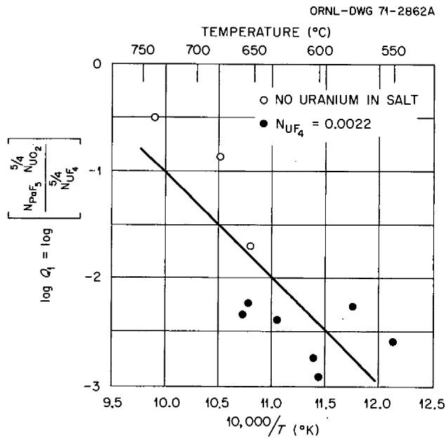  
Fig. 18.4. Values of the equilibrium quotient for the reaction $\frac{1}{2}\mathrm{Pa}_2\mathrm{O}_5(\mathrm{c}) + \frac{5}{4}\mathrm{UF}_4(\mathrm{d}) = \mathrm{PaF}_5(\mathrm{d}) + \frac{5}{4}\mathrm{UO}_2(\mathrm{ss})$ when the $\mathrm{UF}_4$ concentration in LiF-BeF $_2$ -ThF $_4$ (72-16-12 mole %) is 0.22 mole %.

$N_{\mathrm{UF_4(d)}} = 0.0022$ This value of $N_{\mathrm{UF_4}}$ was the average $\mathrm{UF_4}$ concentration in the experiment discussed above in which we obtained direct measurements of $\log Q_{1}$ .

A plot of all our values of $\log Q_{1}$ vs $1 / T(^{\circ}\mathbf{K})$ is shown in Fig. 18.4. A least-squares fit yielded $\log Q_{1} = 8.849 - 9859 / T(^{\circ}\mathbf{K})$ , with a standard deviation of $\pm 0.47$ . This expression gives values of $\log Q_{1}$ that are signifi

cantly different than those estimated by Ross et al.,7 particularly at temperatures below about $650^{\circ}\mathrm{C}$ .In addition, the uncertainty in the values of this important equilibrium quotient is much larger than that required for a detailed analysis of the oxide precipitation process for the isolation of protactinium from MSBR fuel salt. Work on this problem is continuing.

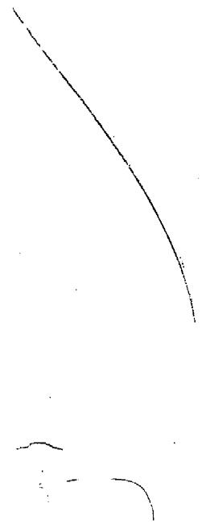

# 19. Engineering Development of Processing Operations

L. E. McNeese

# 19.1 ENGINEERING STUDIES OF THE METAL TRANSFER PROCESS FOR RARE-EARTH REMOVAL

E. L. Youngblood L. E. McNeese

The second engineering experiment (MTE-2) for the study of the metal transfer process for removing rare earths from single-fluid MSBR fuel salt has been completed. The main objectives of the experiment were: (1) demonstration of the selective removal of rare earths from fluoride salt containing thorium fluoride, (2) collection of the rare earths in a lithium-bismuth solution, and (3) verification of previous distribution coefficient data. All of these objectives were accomplished. The experiment was performed in the 6-in.-diam carbon-steel vessel shown schematically in Fig. 19.1. The vessel had two compartments that were interconnected at the bottom by a pool of bismuth saturated with thorium. One compartment contained fluoride salt (72-16-12 mole % LiF-BeF $_2$ -ThF $_4$ ) to which 7 mCi of $^{147}\mathrm{Nd}$ and sufficient LaF $_3$ to produce a concentration of 0.3 mole % had been added. The other compartment contained LiCl, as well as a cup

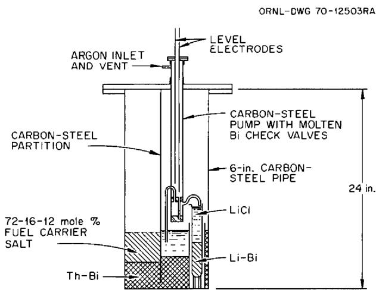  
Fig. 19.1. Carbon-steel vessel for use in the metal transfer experiment.

Table 19.1. Material used in metal transfer experiment MTE-2   

<table><tr><td></td><td>Volume (cm3)</td><td>Gram-moles</td></tr><tr><td>Fluoride salt</td><td>789</td><td>40.7</td></tr><tr><td>(LiF-BeF2-ThF4-LaF3, 72-15.7-12-0.3 mole %, 7 mCi 147NdF3)</td><td></td><td></td></tr><tr><td>Bismuth saturated with thorium</td><td>799</td><td>36.9</td></tr><tr><td>LiCl</td><td>1042</td><td>36.6</td></tr><tr><td>Li-Bi (35 at. % lithium)</td><td>164</td><td>9.5</td></tr></table>

containing a lithium-bismuth solution. During operation, LiCl was circulated through the lithium-bismuth cup at the rate of about $25~\mathrm{cm}^3/\mathrm{min}$ . The concentration of reductant (35 at. $\%$ lithium) in the lithium-bismuth was sufficiently high that at equilibrium essentially all of the neodymium and lanthanum would have been extracted from the LiCl that was circulated through the lithium-bismuth cup.

The quantities of materials used in the experiment are given in Table 19.1. The LiCl was purified prior to use by contact with bismuth saturated with thorium at $650^{\circ}\mathrm{C}$ . Both the carbon-steel vessel and the bismuth were treated with hydrogen at $650^{\circ}\mathrm{C}$ to remove oxides. The argon used as cover gas for the experiment was purified by passage through a bed of uranium turnings at $600^{\circ}\mathrm{C}$ and a bed of molecular sieves. The equipment and operating conditions used for run MTE-2 were similar to those used in the first experiment (MTE-1),1 with the following exceptions: (1) a carbon-steel pump with molten-bismuth check valves, instead of a quartz pump used previously, was used for circulating the LiCl; (2) gas-lift sparge tubes were used in the fluoride, LiCl, and lithium-bismuth compartments to increase the contact between the salt and bismuth phases; and (3) about four times as much 147Nd was used in the

second experiment to facilitate determination of the neodymium concentration in the various phases.

The experiment was operated for about three months before it was shut down for disassembly and inspection. During this time, the pump was operated 441 hr, and 702 liters of LiCl was circulated through the lithium-bismuth container. The sequence of operations carried out consisted in pumping the LiCl through the lithium-bismuth container for 3 hr at a flow rate of 25 $\mathrm{cm}^3/\mathrm{min}$ , then stopping the pumping, and allowing a period of 4 hr for the system to approach equilibrium before filtered samples of the salt and metal phases were taken. This sequence was repeated three shifts per day during the first week and two shifts per day during the second week of operation. For the remainder of the three-month period, the pump was operated during the entire day shift and the system was allowed to approach equilibrium at night and on weekends. During the pumping periods, the bismuth-thorium phase was forced back and forth between the fluoride and chloride compartments at the rate of $10\%$ of the metal volume every 7 min to promote mixing in the bismuth-thorium phase. Eight days before the end of the experiment, 1 vol $\%$ fluoride salt was added to the LiCl compartment to simulate entrainment of fluoride salt in the bismuth. The temperature of the system was maintained at about $650^{\circ}\mathrm{C}$ throughout the entire run. The pump and other components of the system operated satisfactorily.

During the experiment, the lanthanum and the neodymium that had been originally added to the fluoride salt transferred to the lithium-bismuth solution as expected. The rate of accumulation of rare earths in this solution is shown in Fig. 19.2. There was essentially no accumulation of lanthanum or neodymium in the

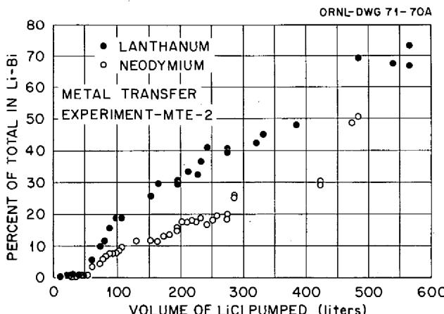  
Fig. 19.2. Rate of accumulation of lanthanum and neodymium in the lithium-bismuth solution.

solution until operation of a gas-lift sparge tube in the cup was initiated (after about 50 liters of LiCl had been circulated through the lithium-bismuth compartment). After 400 liters of LiCl had been circulated (about two-thirds through the run), about $50\%$ of the lanthanum and $30\%$ of the neodymium originally in the fluoride salt were found to be in the lithium-bismuth solution. During this time, 70 to $100\%$ of the lanthanum and neodymium initially charged to the system could be accounted for by filtered samples taken of each phase, indicating that most of the rare earths remained in solution. During the last third of the run, the rare earths continued to accumulate in the lithium-bismuth solution, but the rate of accumulation could not be determined accurately because a leak developed in the lithium-bismuth cup, allowing about $30\%$ of the solution to flow into the area between the cup and holder. The extent of removal of lanthanum and neodymium from the fluoride salt is shown in Figs. 19.3 and 19.4, which show that more than $85\%$ of the lanthanum and more than $50\%$ of the neodymium had been removed at the end of the experiment. Approximately 10 to $20\%$ of the rare earths present were removed from the LiCl in its passage through the lithium-bismuth compartment. There was no measurable accumulation of thorium $(< 10~\mathrm{ppm})$ in the lithium-bismuth solution during the experiment, thus demonstrating that the rare earths can be deposited in this solution without significant amounts of thorium also being deposited. The thorium-lanthanum decontamination factor was about $10^{5}$ . The distribution coeffi

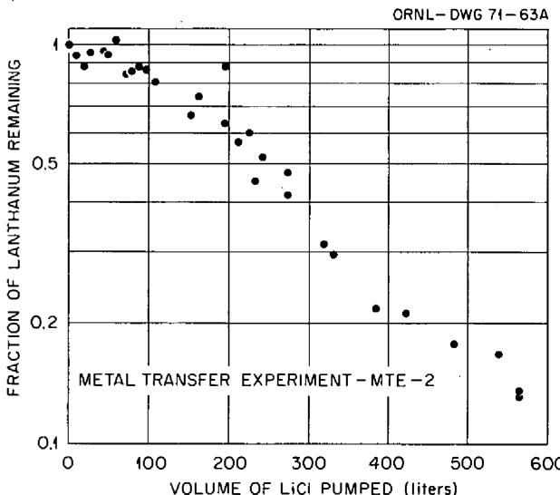  
Fig. 19.3. Rate of removal of lanthanum from the fluoride salt.

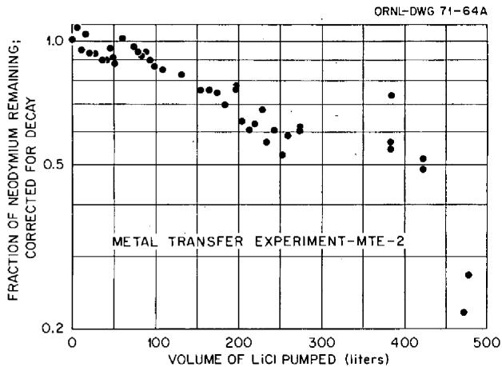  
Fig. 19.4. Rate of removal of neodymium from the fluoride salt.

cients for lanthanum and neodymium remained relatively constant during the experiment. The average values of the distribution coefficients for lanthanum (0.05) and neodymium (0.06) between the fluoride salt and the bismuth-thorium solutions are in good agreement with expected values. The average value of the distribution coefficients between the LiCl and the bismuth-thorium solution was somewhat higher than expected for lanthanum (3.1) but was near the expected value for neodymium (4.8). During the run, the lithium concentration in the lithium-bismuth solution decreased from 35 to 13 at. $\%$ Only a small fraction of this decrease was due to the reaction of lithium with rare-earth chlorides; the principal reason for the decrease has not yet been determined. The bismuth-thorium phase remained saturated with thorium throughout the run, indicating that there was no excessive loss of thorium from the bismuth phase during the experiment.

The concentrations of beryllium, thorium, and fluoride in the LiCl were determined periodically after the addition of fuel carrier salt to the LiCl near the end of the experiment, as shown in Table 19.2. During the 93-hr period in which the LiCl was not circulated through the lithium-bismuth container, the beryllium concentration remained constant at the initial value of 490 ppm, and the thorium concentration decreased, as expected, from the initial value of 9480 ppm to a value of 644 ppm because of transfer of thorium into the thorium-bismuth solution. When circulation of the LiCl was resumed, the beryllium concentration in the LiCl began to decrease, probably because of reduction of the $\mathrm{Be}^{2+}$ by the lithium-bismuth solution. After 27 hr of operation, a beryllium concentration of 135 ppm was

observed. The thorium concentration in the LiCl at this time was 171 ppm.

After the experiment was completed, the carbon-steel vessel was cut apart for inspection. The general condition of the inside surfaces was good. The salt and bismuth phases were sharply defined, and there was no evidence of accumulated impurities at the salt-bismuth interface as had been observed in the first experiment (MTE-1). The salt and bismuth phases from the fluoride compartment after the experiment was completed are shown in Fig. 19.5; Fig. 19.6 shows the LiCl compartment after most of the LiCl had been removed. The upper surfaces in the fluoride compartment were covered with a black powder having the composition shown in Table 19.3. The upper surfaces of the LiCl compartment were covered with a white powder consisting of LiCl containing $0.6 \mathrm{wt} \%$ Bi. These materials are believed to have resulted from vaporization or

Table 19.2. Variation of beryllium, thorium, and fluoride concentrations in the LiCl after addition of 1 vol % fuel carrier salt   

<table><tr><td>Time after addition (hr)</td><td>Pumping time (hr)</td><td>Fluoride (wt %)</td><td>Beryllium (ppm)</td><td>Thorium (ppm)</td></tr><tr><td>0</td><td>0</td><td>0.98a</td><td>490a</td><td>9480a</td></tr><tr><td>19.8</td><td>0</td><td>1.49</td><td>490</td><td>7200</td></tr><tr><td>45.4</td><td>0</td><td>1.08</td><td>500</td><td>1100</td></tr><tr><td>69.7</td><td>0</td><td>1.81</td><td>320</td><td></td></tr><tr><td>93</td><td>0</td><td>2.03</td><td>490</td><td>644</td></tr><tr><td>115.9</td><td>5.9</td><td>2.34</td><td>470</td><td></td></tr><tr><td>163.9</td><td>20.3</td><td>1.07</td><td>120</td><td>1400</td></tr><tr><td>188.8</td><td>27.4</td><td>0.91</td><td></td><td>350</td></tr><tr><td>188.8</td><td>27.4</td><td>1.7b</td><td>135b</td><td>171b</td></tr></table>

${}^{a}$ Calculated values based on the amount of fluoride salt added.   
$b$ Salt taken from vessel after experiment was concluded.

Table 19.3. Composition of black powder on upper surfaces of fluoride salt compartment   

<table><tr><td>Element</td><td>Weight percent</td></tr><tr><td>Li</td><td>2.4</td></tr><tr><td>Be</td><td>2.2</td></tr><tr><td>Bi</td><td>70.2</td></tr><tr><td>Th</td><td>1.1</td></tr><tr><td>Fe</td><td>0.02</td></tr><tr><td>F</td><td>19.9</td></tr><tr><td>Total</td><td>95.82</td></tr></table>

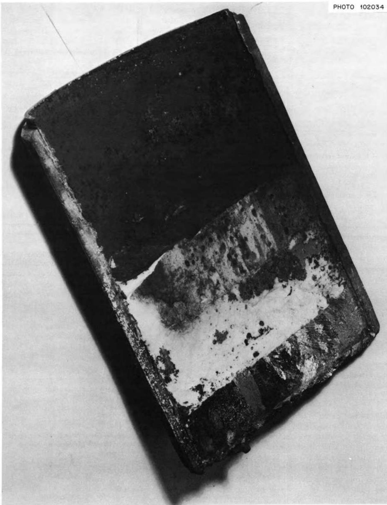  
Fig. 19.5. Salt and bismuth phases from fluoride salt compartment on completion of metal transfer experiment MTE-2.

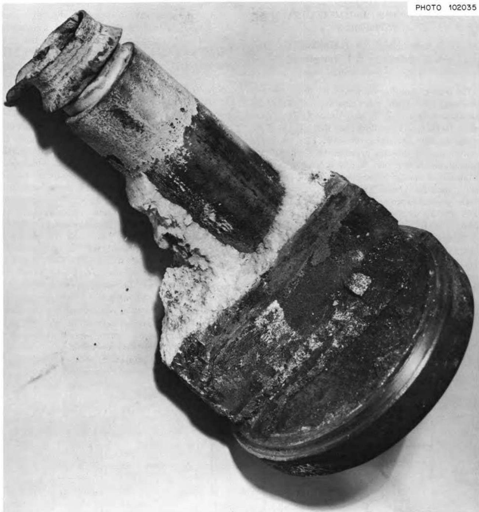  
Fig. 19.6. View of LiCl compartment after removal of most of the LiCl following metal transfer experiment MTE-2.

entrainment of salt and bismuth in the gas streams passing through the compartments. A $1/8$ -in.-thick layer of gray material had deposited on the lip and overflow spout of the lithium-bismuth container. The material had the composition (in wt $\%$ ) of $23\%$ LiCl, $59\%$ Bi,

$10\%$ La, and $2\%$ Th. The mechanism by which this material was deposited has not been determined; however, it may have resulted from wetting of the container wall by the lithium-bismuth solution and subsequent flow of the solution up the wall.

# 19.2 DESIGN OF THE THIRD METAL TRANSFER EXPERIMENT

E. L. Nicholson

W. F. Schaffer

L. E. McNeese

E. L. Youngblood

H. O. Weeren

The third engineering experiment for development of the metal transfer process for removing rare earths from MSBR fuel carrier salt is being designed. The experiment (MTE-3) will use flow rates that are $1\%$ of the estimated flow rates for a 1000-MW(e) reactor. In the two previous engineering experiments, the salt and bismuth phases were only slightly agitated, resulting in a low rate of transfer of rare earths from the fuel carrier salt to the lithium-bismuth solution.

The planned experiment, shown schematically in Fig. 19.7, will use mechanical agitators to promote efficient contact of the salt and metal phases. Fuel carrier salt containing rare-earth fluorides will be circulated between one side of the salt-metal contactor and a fluoride salt reservoir. Lithium chloride containing rare-earth chlorides will be circulated between the other side of the salt-metal contactor and a rare-earth stripper, where the rare earths will be extracted into a lithium-bismuth solution.

2. E. L. Youngblood et al., MSR Program Semiannu. Progr. Rep. Aug. 31, 1970, ORNL-4622, p. 217.

3. See sect 19.1 of this report.

The experiment will use approximately 35 liters of fluoride salt, 6 liters of thorium-bismuth solution, 6 liters of LiCl, and 5 liters of Li-Bi solution having a lithium content of about 40 at. $\%$ . The system will require three process vessels, each of which will be made of carbon steel. The largest vessel will be the fluoride salt reservoir, which will contain approximately 32 liters of salt. The remaining 3 liters of fluoride salt will be contained in the salt-metal contactor. The fluoride salt will be recirculated continuously from the reservoir to the contactor at the rate of about $33~\mathrm{cm}^3 /\mathrm{min}$ by a pump similar to the one used in the second metal transfer experiment. The salt-metal contactor will be a 10-in.-diam, two-compartment vessel having a mechanical agitator in each compartment. The agitator will consist of two flat-bladed paddles mounted on a common shaft, with a paddle operating in each of the salt and metal phases in a manner such that the salt and metal phases are not dispersed. The thorium-bismuth solution will be captive in the salt-metal contactor and will form a seal to isolate the fluoride salt from the LiCl. The thorium-bismuth solution will be recirculated between the two compartments of the salt-metal contactor by utilizing the pumping capability of the agitators. The third vessel, which will be similar in design to one compartment of the salt-metal contactor, will contain the lithium-bismuth solution. The LiCl will be circulated between the salt-metal contactor and the rare-earth stripper at the rate of about 1.25

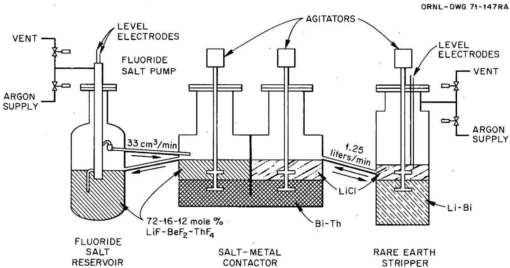  
Fig. 19.7. Flow diagram for metal transfer experiment MTE-3.

liters/min by varying the gas pressure above the LiCl in the rare-earth stripper. All of the vessels will be operated at $650^{\circ}\mathrm{C}$ . The carbon steel will be protected from external air oxidation by a nickel aluminide coating.

Development work is under way on the salt-metal contactor, using a water-mercury mockup to determine optimum geometry and agitator speeds. Dispersion of the salt or bismuth will be avoided in order to prevent entrainment of bismuth in either of the salt phases or transfer of fluoride salt into the chloride salt via the metal phase. This work is described in detail in Sect. 19.3.

The fluoride salt reservoir has been fabricated. The design and fabrication of an agitator drive unit and a small test vessel have also been completed. The test vessel duplicates the geometry of the agitator shaft assembly and will permit a test of the agitator drive unit and shaft seal at $650^{\circ}\mathrm{C}$ using bismuth and salt. The shaft is sealed with an inert-gas-buffered, water-cooled nonlubricated shaft seal using Teflon Bal-Seal rings. The agitator paddle and shaft parts that are exposed to salt and bismuth are made of molybdenum. The interior of the carbon-steel test vessel has been plated with a vapor-deposited coating of tungsten over an electroplated nickel bonding layer in order to evaluate the performance of this type of coating in an agitated salt-bismuth system. Provisions have been made for sampling the salt and metal phases. One-half of the vessel exterior was spray coated with stainless steel prior to application of the nickel aluminide in order to evaluate this alternate coating technique. We have also started purifying LiCl and preparing rare-earth fluorides to be used in the experiment.

# 19.3 DEVELOPMENT OF MECHANICALLY AGITATED SALT-METAL CONTACTORS

H. O. Weeren L. E. McNeese J. S. Watson

A program has been initiated for the development of mechanically agitated salt-metal contactors as an alternative to packed columns presently considered for MSBR processing systems. This type of contactor is of particular interest for use in the metal transfer process since designs can be envisioned in which the bismuth phase would be a near-isothermal, internally recirculated captive phase. It is believed that such designs will require less molybdenum fabrication technology than would a counterpart system based on packed columns.

Studies to date have been concerned primarily with selection of a contactor design for the third metal

transfer experiment (MTE-3), discussed in Sect. 19.2, which will have bismuth and salt flow rates that are about $1\%$ of the estimated rates for a 1000-MW(e) MSBR. Several scouting tests were carried out with water and mercury in vessels having diameters of 4 to 7 in., and a mockup of the contactor proposed for experiment MTE-3 was built for additional study with mercury and water. The mockup consists of an 8-in-diam vessel having a central partition that extends to within $\frac{1}{2}$ in. of the bottom of the vessel. The first tests with the mockup were made with a flat four-bladed paddle located in the mercury-water interface. The paddle, 1.5 in. in diameter, was located inside a 3-in.-diam, 3-in.-high shroud containing four 0.3-in.-wide, 3-in.-long baffles. The design was chosen to maximize the extent of dispersion of the mercury in the water, thereby maximizing the interfacial area between the two phases. The system was tested with agitator shaft speeds up to 1600 rpm. It was found that, under these operating conditions, a stable dispersion of very small mercury droplets was frequently formed. Also, at all but the lowest mixer speeds, a dispersion of water droplets in the mercury was formed, and these droplets were pumped from one chamber of the mockup to the other. Such pumping cannot be tolerated in the metal transfer process since it would result in the mixing of chloride and fluoride salts. The tendency of the salt-bismuth system to form emulsions may be quite different from that of the water-mercury system; however, it was concluded that the contactor should operate under conditions that minimize the likelihood of formation of emulsions.

The contactor design that has the greatest potential for achieving good mass transfer with minimum dispersion appears to be the Lewis cell4 - a contactor with a paddle in each phase, located well away from the interface as shown in Fig. 19.8. With such a contactor the phases would be agitated as vigorously as possible without actually causing dispersion of one phase in the other. The contactor mockup has been modified in order to study the hydrodynamics of this contactor.

The mass transfer performance of this type of contactor is known for a number of agitated, nondispersed two-phase systems, and the results can be correlated in terms of the Reynolds numbers and viscosities of the two phases. Overall mass transfer coefficients for the salt-bismuth system predicted by this correlation appear to be adequate for MSBR processing operations.

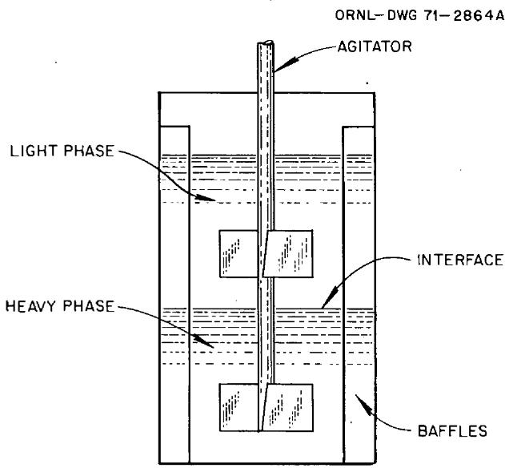  
Fig. 19.8. Proposed salt-metal contactor.

# 19.4 REDUCTIVE EXTRACTION ENGINEERING STUDIES

B. A. Hannaford C. W. Kee L. E. McNeese

We have continued to study the extraction of uranium from molten salt (72-16-12 mole $\%$ LiF-BeF $_2$ -ThF $_4$ ) by countercurrent contact with bismuth containing reductant in a packed column. Two successful runs (UTR-3 and -4), which included six periods of steady-state operation covering metal-to-salt flow ratios ranging from 0.75 to 2.05, have been made.

Prior to run UTR-3, $122.5\mathrm{g}$ of thorium metal was added to the treatment vessel, which contained about $10\%$ of the salt (1.5 liters) and most of the bismuth $(\sim 17$ liters) present in the system. The thorium dissolved in the bismuth at a very low rate $(\sim 0.3\%/\mathrm{hr})$ , which was nearly equivalent to the rate observed previously in the bismuth feed tank prior to run UTR-2. In order to improve the contact between thorium and the bismuth, an additional $119\mathrm{g}$ of thorium (contained in a 1-in.-diam perforated steel basket) was suspended in the bismuth. The resulting dissolution rate was about ten times the earlier rate; about $85\%$ of the thorium dissolved in a 22-hr period. Samples of the bismuth phase showed a range of thorium concentrations and suggested the existence of a

concentration gradient in the bismuth pool. The final thorium concentration in the bismuth is believed to have been 1200 ppm. The thorium-saturated bismuth and the salt were then transferred to the feed tanks; the final uranium concentration in the salt feed tank was 2100 ppm.

During run UTR-3, bismuth was fed to an 0.82-in.-ID, 24-in.-high extraction column at the rate of about 200 $\mathrm{cm}^3/\mathrm{min}$ , and salt was fed to the column at the rates of 100, 160, and $220\mathrm{cm}^3/\mathrm{min}$ . Under the first combination of operating conditions, five sets of samples were taken of the salt and bismuth streams leaving the column; however, only one set of samples was taken under each of the other combinations of conditions, after a salt volume equivalent to three column volumes had passed through the column. As shown in Table 19.4, the fraction of the uranium extracted from the salt decreased from 0.92 to 0.73 as the salt flow rate was increased.

The thorium dissolution rate in the treatment vessel prior to run UTR-4 was about the same as that observed prior to run UTR-3. Some nonuniformity in thorium concentration was observed in the bismuth. The final thorium concentration in the bismuth feed tank was about $1100~\mathrm{ppm}$ , and the uranium concentration in the salt feed tank was $1680~\mathrm{ppm}$ . During run UTR-4, the system was operated at three sets of salt and bismuth flow rates. Eleven pairs of samples were taken from the salt and bismuth streams leaving the column. The fraction of extracted uranium ranged from 63 to $74\%$ , as shown in Table 19.4.

Watson has noted that the uranium extraction data from runs UTR-3 and -4 can be correlated in terms of the height of an overall transfer unit based on the salt phase (HTU) if several assumptions are made. The chief assumption is that the rate at which uranium transfers to the bismuth phase will be controlled by the diffusive resistance in the salt film when the extraction factor is high and when the salt film is composed largely of nontransferring ions. In runs UTR-3 and -4, a small amount of uranium was added to the salt after it had been equilibrated with the bismuth phase; no significant transfer of lithium and thorium occurred in the column. In this case, the overall transfer coefficient based on the salt phase is equal to the individual salt film transfer coefficient. By definition, the HTU and the number of overall transfer units based on the salt phase (NTU) developed in the column are related as

$$
H = \mathrm {H T U} \cdot \mathrm {N T U}, \tag {1}
$$

Table 19.4. Data obtained from uranium mass transfer experiments in an 0.82-in.-ID, 24-in.-high column at $600^{\circ}\mathrm{C}$   

<table><tr><td rowspan="2"></td><td colspan="3">Uranium concentration in salt (ppm)</td><td rowspan="2">Salt flow rate (cm3/min)</td><td rowspan="2">Bismuth flow rate (cm3/min)</td><td rowspan="2">Metal-to-salt flow rate ratio</td><td rowspan="2">Fraction of flooding</td><td rowspan="2">Fraction of U extracted from salt</td><td rowspan="2">Fraction of U remaining in salt</td></tr><tr><td>Salt feed, Xi</td><td>Salt effluent, Xo</td><td>Maximum equilibrium value,aX*</td></tr><tr><td rowspan="3">UTR-3</td><td rowspan="3">2100</td><td>159</td><td>3.6</td><td>100</td><td>205</td><td>2.05</td><td>0.87</td><td>0.92</td><td>0.076</td></tr><tr><td>445</td><td>9.4</td><td>160</td><td>195</td><td>1.22</td><td>1.04</td><td>0.79</td><td>0.212</td></tr><tr><td>561</td><td>10.3</td><td>220</td><td>200</td><td>0.91</td><td>1.23</td><td>0.73</td><td>0.267</td></tr><tr><td rowspan="3">UTR-4</td><td rowspan="3">1680</td><td>524</td><td>9.7</td><td>149</td><td>140</td><td>0.94</td><td>0.85</td><td>0.69</td><td>0.312</td></tr><tr><td>439</td><td>7.2</td><td>118</td><td>117</td><td>1.0</td><td>0.69</td><td>0.74</td><td>0.261</td></tr><tr><td>626</td><td>9.7</td><td>210</td><td>157</td><td>0.75</td><td>1.07</td><td>0.63</td><td>0.373</td></tr></table>

${}^{a}$ Calculated as the concentration that would be in equilibrium with the observed concentrations of reductant (lithium) and uranium in the bismuth effluent.

where $H =$ column length. If it is assumed that uranium is the major component transferring from the salt and that the controlling resistance to transfer is in the salt phase, HTU can be written as

$$
\mathrm {H T U} = \frac {V _ {s}}{k a}, \tag {2}
$$

where $V_{s}$ is the superficial velocity of the salt in the column and $ka$ is the product of the overall mass transfer coefficient based on the salt phase and the interfacial area between the salt and bismuth phases per unit column volume. It has been previously observed that the dispersed-phase holdup is approximately proportional to the flow rate of the dispersed phase except at conditions near flooding. We would, therefore, expect the interfacial area between the salt and the bismuth phases to be proportional to the bismuth flow rate, so that

$$
k a = k ^ {\prime} V _ {\mathrm {B i}}, \tag {3}
$$

where $k'$ is a constant and $V_{\mathrm{Bi}}$ is the superficial velocity of the bismuth in the column. The number of overall transfer units, based on the salt phase, developed in the column is defined as

$$
\mathrm {N T U} = \int_ {X _ {i}} ^ {X _ {o}} \frac {d X}{X ^ {*} - X}, \tag {4}
$$

where

$X =$ uranium concentration in the bulk salt,

$X^{*} =$ uranium concentration in the salt in equilibrium with the bulk bismuth phase,

$X_{i} =$ uranium concentration in the salt fed to the column,

$X_{o} =$ uranium concentration in the salt leaving the column.

As shown in Table 19.4, the value of $X^{*}$ at the bottom of the column is much smaller than the value of $X_{o}$ ; thus one would expect that $X^{*} \ll X$ throughout the column. In this case, Eq. (4) would become

$$
\mathrm {N T U} = - \ln \frac {X _ {o}}{X _ {i}}. \tag {5}
$$

Combining Eqs. (1), (2), (3), and (5) and rearranging yields the relation

$$
\ln \frac {X _ {o}}{X _ {i}} = - k ^ {\prime} H \frac {V _ {\mathrm {B i}}}{V _ {s}}, \tag {6}
$$

which states that a semilogarithmic plot of the fraction of the uranium remaining in the salt vs the bismuth-to-salt flow rate ratio should yield a straight line having a slope of $-k^{\prime}H$ . This line would pass through an ordinal value of 1.0 at a bismuth-to-salt flow rate ratio of zero.

As shown in Fig. 19.9, the data from runs UTR-3 and 4 are well represented by Eq. (6). For these data, the constant $k'$ has the value of 0.0529 in. The product

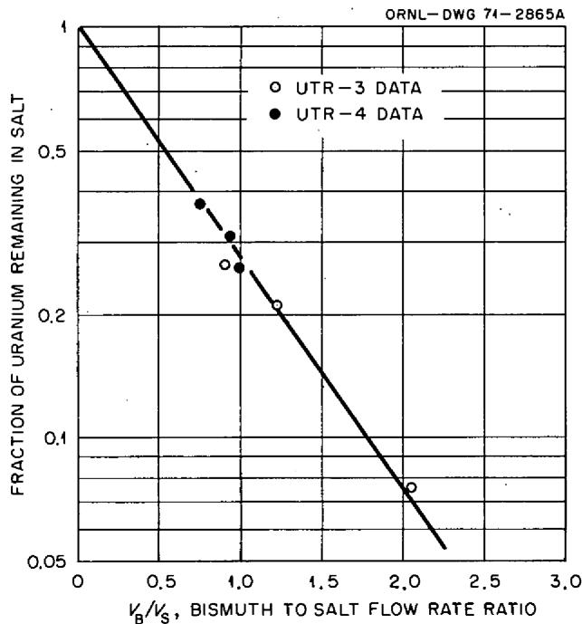  
Fig. 19.9. Mass transfer of uranium from $\mathrm{LiF - BeF_2 - ThF_4}$ (72-16-12 mole %) to bismuth containing reductant at $600^{\circ}\mathrm{C}$ in an 0.82-in.-diam, 24-in.-long packed column.

of the overall transfer coefficient, based on the salt phase, and the interfacial area is given by the relation

$$
k a = 0. 0 5 2 9 V _ {\mathrm {B i}}, \tag {7}
$$

where $ka$ is the overall rate constant based on the salt phase, $\sec^{-1}$ , and $V_{\mathrm{Bi}}$ is the superficial velocity of the bismuth in the column, in./sec. Values for the overall rate constant for the present data range from 0.012 to 0.021 $\sec^{-1}$ and compare favorably with a preliminary value of 0.0076 $\sec^{-1}$ measured for the transfer of uranium from a 96.2-3.6-0.2 wt % Cd-Mg-U solution to a molten salt (50-30-20 mole % MgCl₂-NaCl-KCl) at temperatures ranging from 560 to $610^{\circ}\mathrm{C}$ .

The HTU for the data from runs UTR-3 and -4 is given by the expression

$$
\mathrm {H T U} = \frac {1 8 . 9}{V _ {\mathrm {B i}} / V _ {s}}, \tag {8}
$$

where HTU is the height of the overall transfer unit based on the salt phase, in., and $V_{\mathrm{Bi}} / V_{s}$ is the bismuth-to-salt flow rate ratio. The HTU values range

Table 19.5. Predicted performance and required height for the protactinium isolation column   

<table><tr><td>NTU</td><td>Fraction of Pa not extracted</td><td>Required column height (ft)</td></tr><tr><td>1</td><td>0.368</td><td>10.5</td></tr><tr><td>2</td><td>0.135</td><td>21.0</td></tr><tr><td>3</td><td>0.0498</td><td>31.5</td></tr><tr><td>4</td><td>0.0183</td><td>42.0</td></tr></table>

from 0.77 ft at a flow rate ratio of 2.05 to 2.1 ft at a flow rate ratio of 0.75. It is of interest to note that the flow rate ratio presently considered for the protactinium isolation column in the reference MSBR flowsheet $^9$ is 0.15; the predicted HTU at this flow ratio is 10.5 ft. The predicted column performance and the required column height for NTU values ranging from 1 to 4 are shown in Table 19.5. It is apparent that column heights considerably greater than the presently assumed height of 10 ft would be required for removing $95\%$ of the protactinium. However, it should be kept in mind that these predictions were obtained by extrapolating preliminary data to a point well outside the range covered by the data. If these predictions are valid, the processing rate could be increased by about $10\%$ in order to compensate for the lower extraction efficiency expected with a column height of about 20 ft. A second possibility would be the use of an alternate type of contactor that would produce high extraction efficiencies at low bismuth-to-salt flow rate ratios.

In order to measure mass transfer rates in the column under more closely controlled conditions and under conditions where the controlling resistance is not necessarily in the salt phase, preparations were begun for experiments in which the rate of exchange of zirconium isotopes will be measured between salt and bismuth phases otherwise at equilibrium. Residual reductant was removed from the treatment vessel by hydrofluorinating the salt and bismuth for $20\mathrm{hr}$ with 70-30 mole $\%$ $\mathbf{H}_2$ -HF. Following the usual $\mathbf{H}_2$ sparge for reduction of iron fluoride, the two phases were transferred to the feed tanks. A hydrodynamic experiment (UTR-5) was then carried out (1) to remove from the system any bismuth having a high thorium concentration and (2) to test the sampling and analysis techniques under conditions where no mass transfer should occur. Surprisingly, the reported uranium concentrations of salt samples removed from the column

Table 19.6. Flooding data obtained during countercurrent flow of molten salt and bismuth in a packed column during runs UTR-5 and -6   

<table><tr><td rowspan="2">Run No.</td><td colspan="2">Bismuth</td><td colspan="2">Salt</td><td rowspan="2"></td></tr><tr><td>Flow rate (cm3/min)</td><td>Superficial velocity (ft/hr)</td><td>Flow rate (cm3/min)</td><td>Superficial velocity (ft/hr)</td></tr><tr><td rowspan="4">UTR-5</td><td>115</td><td>65.8</td><td>123</td><td>70.2</td><td>Nonflooded</td></tr><tr><td>219</td><td>125.2</td><td>50</td><td>28.6</td><td>Nonflooded</td></tr><tr><td>146</td><td>83.4</td><td>161</td><td>92.0</td><td>Flooded</td></tr><tr><td>276</td><td>157.7</td><td>90</td><td>51.4</td><td>Flooded</td></tr><tr><td rowspan="2">UTR-6</td><td>117</td><td>66.9</td><td>125</td><td>71.4</td><td>Nonflooded</td></tr><tr><td>209</td><td>119.5</td><td>150</td><td>85.7</td><td>Flooded</td></tr></table>

effluent varied by $\pm 35\%$ from the average value, which was in excellent agreement with the indicated uranium concentrations of the salt feed and catch tanks.

An additional run (UTR-6) was made in order to further test the sampling and analysis techniques and to obtain hydrodynamic data. In this run, salt and bismuth were fed to the column at flow rates of 125 and 117 $\mathrm{cm}^3/\mathrm{min}$ , respectively, for a 38-min period. During this period, seven pairs of samples were taken of the salt and bismuth streams leaving the column. Analysis of these samples showed a scatter in uranium concentration similar to that observed in run UTR-5. The flows of salt and bismuth were stopped following the initial operating period in order to freeze the drain line leaving the specific gravity pot. Operation was then resumed with a bismuth flow rate of $209\mathrm{cm}^3/\mathrm{min}$ and a salt flow rate of $149\mathrm{cm}^3/\mathrm{min}$ . Salt samples were taken periodically for bismuth analysis. The apparent dispersed-phase holdup, as indicated by the pressure drop across the column, stabilized at $30\%$ . A bismuth concentration in the salt of about 5 ppm was observed during this period. When the salt flow rate was increased to 151 $\mathrm{cm}^3/\mathrm{min}$ , the apparent bismuth holdup increased to about $60\%$ before the specific-gravity pot began to fill with bismuth, a clear indication that the column was flooded. A bismuth concentration in the salt of about 10 ppm was observed during the latter period. The flooding data obtained during runs UTR-5 and -6 are shown in Table 19.6. Figure 19.10 shows these data, along with flooding data from previous runs. The data are well represented by the predicted flooding relation (denoted by the line in Fig. 19.10) resulting from work with mercury and aqueous solutions (see Sect. 19.5).

Both phases were returned to the treatment vessel after run UTR-6, and sufficient thorium was added to extract about $50\%$ of the uranium and zirconium from the salt phase. The thorium dissolution rate was about

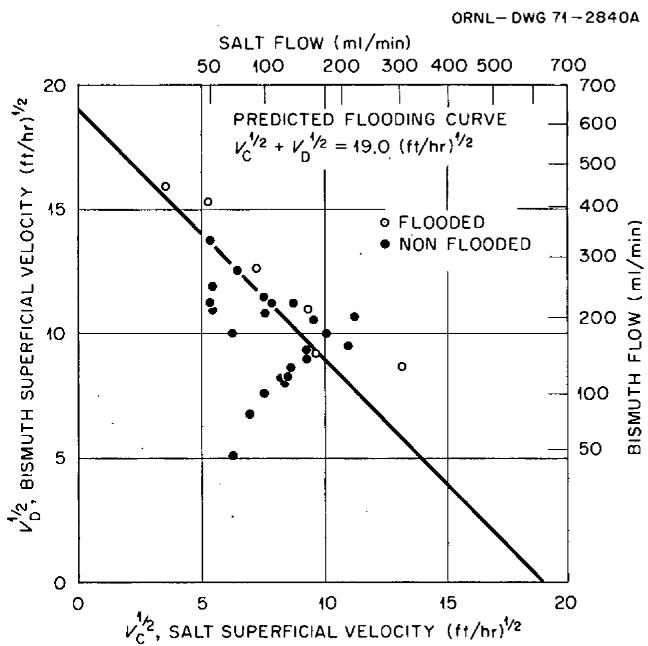  
Fig. 19.10. Summary of flooding data with salt and bismuth in an 0.82-in.-diam, 24-in.-long column packed with $\frac{1}{4}$ -in. Raschig rings.

one-half that observed prior to runs UTR-3 and -4. A draft tube was installed in the treatment vessel in order to improve mixing of the phases. The basket containing the thorium was removed after about $156\mathrm{g}$ of thorium had dissolved. The treated salt and bismuth were then transferred through the system in order to bring the salt and bismuth in the entire system to equilibrium before the start of the $^{97}\mathrm{Zr}$ tracer experiments. After both phases had been returned to their respective feed tanks, we withdrew samples that showed an average zirconium concentration of $165~\mathrm{ppm}$ in the salt and a zirconium distribution ratio of 1.0, which are satisfactory conditions for the tracer experiments.

The initial attempt at producing $17\text{-hr}^{97}\text{Zr}$ by irradiation of $^{96}\text{ZrO}_2$ resulted in an activity about four times that expected for $^{97}\text{Zr}$ . The discrepancy was traced to an outdated value for the thermal-neutron cross section for $^{96}\text{Zr}$ , that is, 0.05 barn as compared with a more recent value of 0.2 barn. After a suitable interval, the original $20\text{-mg}$ charge of $^{96}\text{ZrO}_2$ was reirradiated for $2\text{hr}$ to produce a calculated $^{97}\text{Zr}-^{97}\text{Nb}$ activity of $13.7\text{mCi}$ . Counting rates for $^{97}\text{Zr}$ were measured for samples taken from the salt feed tank at intervals following the addition of tracer to the tanks. Mixing of the tracer in the 15-liter salt volume was about $75\%$ complete within $2\text{hr}$ . The irradiation yield of $^{97}\text{Zr}-^{97}\text{Nb}$ was about $30\%$ higher than expected. The $^{97}\text{Zr}$ counting rate, which was greater than 200,000 counts/min per sample, indicates that counting precision in future experiments should be good.

At the time the first $^{97}\mathrm{Zr}$ tracer experiment was begun, a leak appeared in the salt feed line at a location near the salt feed tank. An attempt to transfer the salt from the tank by an alternate line disclosed a second leak. The resulting salt spills caused the Calrod heaters on the tank to fail and extensively damaged the nickel aluminide coating on the exterior of the tank.

The tank was removed from the system for examination and disposal since the damage from the salt made salvage impractical. Examination, by the Metals and Ceramics Division, of a metal specimen cut from the outer shell of the tank revealed that, although two years of operation at about $600^{\circ}\mathrm{C}$ had produced considerable graphitization of the steel, ductility and, apparently, tensile strength were not significantly impaired. A new salt tank was fabricated and installed in the system. A 2-in.-long, 0.5-in.-diam sleeve was attached to each of the sections of the $3/8$ -in.-diam transfer lines on which the mechanical fitting ferrules seat in order to prevent occurrence of the earlier type of failure which resulted from thinning of the transfer lines by distortion under the ferrules. Insulation was removed from all transfer lines to allow inspection, and all lines that were more than moderately oxidized were replaced.

# 19.5 CONTACTOR DEVELOPMENT: PRESSURE DROP, HOLDUP, AND FLOODING IN PACKED COLUMN

J. S. Watson L. E. McNeese

Studies of the hydrodynamics in packed columns during the countercurrent flow of high-density liquids are being made in order to evaluate and design contactors for processing systems based on reductive

extraction. We have previously $^{10,11}$ reported studies in which mercury and water were used to simulate bismuth and molten salt in columns packed with $\frac{3}{16}-$ , $\frac{1}{4}-$ , $\frac{3}{8}-$ , and $\frac{1}{2}$ -in. Raschig rings and with $\frac{1}{8}$ -and $\frac{1}{4}$ -in. solid right circular cylinders. These studies have shown that the dispersed-phase holdup and the column throughputs at flooding can be correlated $^{11}$ on the basis of a constant slip velocity in the following manner:

$$
\frac {V _ {c}}{1 - X} + \frac {V _ {d}}{X} = V _ {s}, \tag {1}
$$

$$
V _ {c, f} ^ {1 / 2} + V _ {d, f} ^ {1 / 2} = V _ {s} ^ {1 / 2}, \tag {2}
$$

where

$V_{c} =$ superficial velocity of the continuous phase,

$V_{d} =$ superficial velocity of the dispersed phase,

$V_{s} =$ slip velocity,

$X =$ dispersed-phase holdup,

$f =$ subscript denoting superficial velocities at flooding.

These relations were previously $^{11}$ extended to cover dispersed-phase holdup and throughput at flooding with salt-bismuth systems by assuming that for a given packing size the slip velocity was (1) independent of the viscosity of the continuous phase, (2) proportional to the difference in the densities of the phases, and (3) proportional to the packing void fraction. Although the resulting relations predicted flooding rates that were in excellent agreement with flooding rates measured with bismuth and molten salt, it was realized that the agreement did not constitute verification of the assumed effects of the continuous-phase viscosity and the difference in the densities of the phases.

During this reporting period, data showing the dependence of slip velocity on continuous-phase viscosity were obtained by an MIT Practice School group. A 2-in.-diam, 24-in.-long column packed with $\frac{3}{8}$ -in. Teflon Raschig rings, which were not wetted by either phase, was used in the study. The experimental system was modified so that water or water-glycerin solutions could be recirculated through the column at constant temperature by installation of a heat exchanger and an

Table 19.7. Variation of slip velocity with continuous-phase viscosity and wetting of packing   

<table><tr><td>System</td><td>Slip velocity, VS(ft/hr)</td><td>Standard deviation, σ</td><td>Percent deviation, σ/Vs</td></tr><tr><td>1 cP, nonwetted packing</td><td>1129.3</td><td>±105.2</td><td>±9.3</td></tr><tr><td>7.5 cP, nonwetted packing</td><td>847.6</td><td>±88.2</td><td>±10.4</td></tr><tr><td>15 cP, nonwetted packing</td><td>673.5</td><td>±49.0</td><td>±7.3</td></tr><tr><td>1 cP, wetted packing</td><td>1582.7</td><td>±267.6</td><td>±16.9</td></tr></table>

aqueous-phase surge tank. Data were obtained with glycerin solutions having viscosities of 7.5 and $15\mathrm{cP}$ and earlier experiments with water (which has a viscosity of 1 cP) were repeated since repacking a column can alter the slip velocity by as much as $10\%$ .

The results obtained were similar to those observed previously for mercury and water. The dispersed-phase holdup could be correlated in terms of a constant slip velocity, as shown in Table 19.7, for the three cases involving nonwetted packing. The relative standard deviations for the slip velocities were about $\pm 10\%$ ; no dependence on the flow rate of either phase was noted. The variation of slip velocity with continuous-phase viscosity is shown in Fig. 19.11, which indicates that the slip velocity is proportional to the -0.167 power of the continuous-phase viscosity. As expected, the dependence is not large. However, neglect of this effect was significant in the earlier extrapolation from a water-mercury system to a salt-bismuth system since the continuous-phase viscosity changed by a factor of 12.

After the dependence of slip velocity on the continuous-phase viscosity was known, it was possible to reevaluate the dependence of slip velocity on the

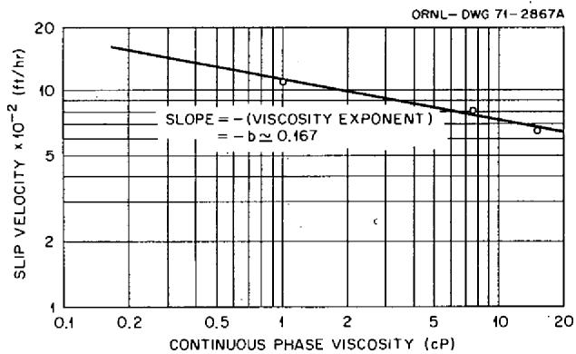  
Fig. 19.11. Variation of slip velocity with continuous phase viscosity in a 2-in.-diam column packed with $\frac{3}{8}$ -in. Raschig rings.

difference in the densities of the two phases by using the two data points afforded by the mercury-water data and the salt-bismuth data. If it is assumed that the dependence of slip velocity on the difference in densities is a power-type dependence, a power of 0.5 is calculated. This result is interesting in that it is the same as the dependence of drop terminal velocity on the difference in densities in the inertial region, where the drag coefficient is essentially constant. The final relation for predicting the variation of slip velocity with packing void fraction, the difference in the densities of the phases, and the continuous-phase viscosity is, then:

$$
\begin{array}{l} V _ {s} = V _ {s, \mathrm {H g - H} _ {2} \mathrm {O}} \left(\frac {\epsilon}{\epsilon_ {\mathrm {r e f}}}\right) \left(\frac {\mu}{\mu_ {\mathrm {H} _ {2} \mathrm {O}}}\right) ^ {- 0. 1 6 7} \\ \times \left(\frac {\Delta \rho}{\Delta \rho_ {\mathrm {H g} , \mathrm {H} _ {2} \mathrm {O}}}\right) ^ {0. 5}, \tag {3} \\ \end{array}
$$

where

$$
V _ {s} = \text {s l i p v e l o c i t y},
$$

$$
\begin{array}{l} V _ {s, \mathrm {H g} \cdot \mathrm {H} _ {2} \mathrm {O}} = \text {s l i p v e l o c i t y f o r m e r c u r y - w a t e r f o r t h e} \\ e = \text {p a c k i n g} \\ \epsilon_ {\text {r e f}} = \text {v o i d} \quad \text {f r a c t i o n} \quad \text {p a c k i n g} \quad \text {f o r} \quad \text {p a c k i n g} \quad \text {f o r} \quad \text {w h i c h} \\ V _ {s, H g - H _ {2} O} \text {w a s d e t e r m i n e d}, \\ \mu = \text {v i s c o s i t y} \\ \end{array}
$$

$$
\mu_ {\mathrm {H} _ {2} \mathrm {O}} = \text {v i s c o s i t y o f w a t e r a t} 2 0 ^ {\circ} \mathrm {C},
$$

$$
\Delta \rho = \text {d i f f e r e n c e}
$$

$$
\Delta \rho_ {\mathrm {H g} - \mathrm {H} _ {2} \mathrm {O}} = \text {d i f f e r e n c e i n t h e d e n s i t i e s o f m e r c u r y}
$$

Slip velocity values calculated from Eq. (3) can then be used with Eqs. (1) and (2) for determining the throughputs at flooding and the dispersed-phase hold-up.

The effect of wetting of the packing by the nominally dispersed phase was also evaluated by packing the column with $3/8$ -in. copper Raschig rings that had been etched with nitric acid to cause the packing to be wetted by the mercury. Complete wetting of the packing was obtained by the mercury, which was saturated with copper. (The solubility of copper in mercury is quite low, and no important changes in other physical properties should occur.) After a few hours of operation, solids could be seen at the water-mercury interface below the column; these solids were believed to be copper oxide formed as the result of the reaction of dissolved copper with oxygen in the system. Periodic additions of nitric acid to the system quickly removed the solids.

The interfacial area was decreased substantially when the packing was wetted by the mercury. No dispersion of the mercury was observed; the interfacial area was essentially the packing surface area. The slip velocity (and hence the flooding rates) was considerably greater than with nonwetted packing, as shown in Table 19.7. It was not clear whether the data on metal-phase holdup with wetted packing could be correlated on the basis of a constant superficial slip velocity. Only nine metal holdup measurements were made, and a quantitative analysis of the relation between metal holdup and the water and mercury superficial velocities was not possible.

# 19.6 DEVELOPMENT OF A FROZEN-WALL FLUORINATOR

J.R.Hightower,Jr. C.P.Tung

An experiment to demonstrate operation of a continuous fluorinator having a layer of frozen salt deposited on its walls for protection against corrosion will use high-frequency induction heating to provide an internal heat source in the molten salt. Estimates of the performance $^{1,2}$ of a frozen-wall fluorinator having an induction coil embedded in the frozen salt near the fluorinator wall indicate that this may be an acceptable heating method. Because of uncertainties in the effect of bubbles in the molten salt and in the amount of heat that will be generated in the metal walls of the fluorinator, heat generation rates are being measured in a simulated fluorinator. In this simulation a 31 wt $\%$ $\mathrm{HNO}_3$ solution, which has electrical properties similar to molten salts, is used to simulate molten salt in the fluorinator vessel. Three induction coil designs have

been tested, and the effect of bubbles in the nitric acid has been determined with the best coil design tested thus far.

Description of equipment for induction heating studies. The induction-heated simulated fluorinator consists of a 5-in.-OD, 5-ft-long glass tube inserted in an induction coil and placed inside a 5-ft-long section of 8-in.-diam 304 stainless steel pipe. The nitric acid inside the glass tube represents the molten salt zone of the fluorinator, the space between the glass tube and the pipe wall (which contains the induction coil) represents the frozen salt layer, and the pipe represents the fluorinator vessel wall. As shown in Fig. 19.12, the acid is circulated through the glass column, where it is heated by the induction coil, and through a heat exchanger, where the heat is removed. The heat generation rate in the acid is determined from a heat balance on the acid as it passes through the column. The pipe representing the fluorinator wall is equipped with a jacket through which cooling water passes. The heat generated in the pipe is calculated from the change in temperature of the water as it passes through the jacket.

The three induction coils that were tested consisted of a number of smaller coils, each of which was 5.6 in. in inside diameter, 3 in. long, and connected in parallel to headers carrying water and rf current to each small section. The characteristics of these coils are given in Table 19.8. Coils I and III had adjacent smaller sections wound in the opposite directions; coil II had all smaller sections wound in the same direction.

Experimental results. Twenty-seven runs have been made with the simulated continuous fluorinator to determine the heat generation rates in the column of acid, in the pipe surrounding the acid, and in the induction coils. The results were expressed in terms of effective resistances of each component (acid, pipe, and coil). The effective resistance is defined as the ratio of the heat generation rate (in watts) to the square of the

Table 19.8. Characteristics of induction coils that were tested   

<table><tr><td>Coil</td><td>Material</td><td>Number of small coils</td><td>Number of turns in each small coil</td><td>Diameter of conductor (in.)</td><td>Diameter of header (in.)</td></tr><tr><td>I</td><td>Monel</td><td>17</td><td>~61/4</td><td>1/4</td><td>5/8</td></tr><tr><td>II</td><td>304-L SS</td><td>18</td><td>6</td><td>3/8</td><td>1/2</td></tr><tr><td>III</td><td>304-L SS</td><td>18</td><td>6</td><td>3/8</td><td>1/2</td></tr></table>

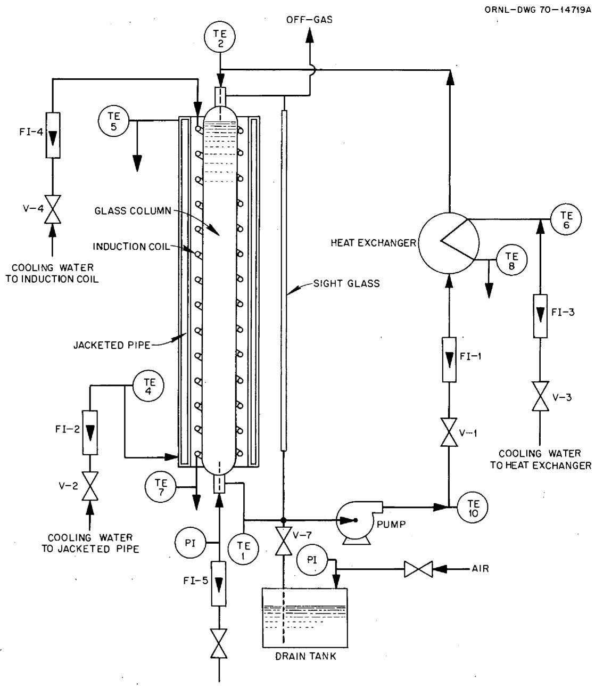  
Fig. 19.12. Flow diagram for induction heating experiments.

coil current in amperes (rms). The efficiency of heating the acid is found by dividing the resistance of the acid by the sum of the resistances of the acid, pipe, and coil. The results obtained in the runs are summarized in Table 19.9, which shows: (1) the average effective resistances at $20^{\circ}\mathrm{C}$ of the acid, of the coil, and of the pipe; (2) the efficiency of heating the nitric acid; and (3) the predicted efficiency of heating molten salt in a nickel fluorinator after correcting for differences in conductivities between the simulated and the actual systems. In some of the runs with coil III, air was

bubbled through the nitric acid at rates up to 2.16 scfm, resulting in bubble volume fractions as high as $18\%$ . Typical fluorinators will operate with a bubble volume fraction of about $15\%$ . Also shown in Table 19.9 is the effect of bubble volume fraction on the efficiency of heating the nitric acid and on the predicted efficiency of heating molten salt in a nickel fluorinator.

The predicted efficiencies for heating molten salt shown in Table 19.9 are for a 5-ft-long fluorinator having a 4.5-in.-diam molten salt zone, a 1.5-in.-thick

Table 19.9. Summary of results from induction heating tests in simulated fluorinator   

<table><tr><td>Coil</td><td>Bubble volume fraction</td><td>Effective resistance of acid (Ω)</td><td>Effective resistance of coil (Ω)</td><td>Effective resistance of pipe (Ω)</td><td>Efficiency of heating acid (%)</td><td>Predicted efficiency of heating molten salt (%)</td></tr><tr><td>I</td><td>0</td><td>0.0143</td><td>0.0617</td><td>0.0121</td><td>16.2</td><td>28.8</td></tr><tr><td>II</td><td>0</td><td>0.00845</td><td>0.0514</td><td>0.0076</td><td>12.5</td><td>24.7</td></tr><tr><td>III</td><td>0</td><td>0.0168</td><td>0.0559</td><td>0.0106</td><td>20.2</td><td>37.0</td></tr><tr><td>III</td><td>0.1</td><td>0.0150</td><td>0.0559</td><td>0.0106</td><td>18.4</td><td>34.3</td></tr><tr><td>III</td><td>0.15</td><td>0.0141</td><td>0.0559</td><td>0.0106</td><td>17.5</td><td>32.9</td></tr></table>

frozen salt layer, and a $50^{\circ}\mathrm{C}$ temperature difference across the salt layer. In such a fluorinator, about 1265 W must be generated in the molten salt; this requires a total coil current of 243 A and a generator capable of generating at least 3900 W. Such requirements are quite reasonable and could be fulfilled by the present generator.

We are planning to test another coil design before proceeding to the next phase of experimental work, in which we will attempt to form and maintain frozen salt films in equipment containing a static salt volume.

# 19.7 ESTIMATED CORROSION RATES IN CONTINUOUS FLUORINATORS

J. R. Hightower, Jr.

Nickel is the preferred material of construction for fluorinators in the MSBR fuel processing plant since it exhibits greater resistance to attack from gaseous fluorine than any other material considered. The resistance to attack by fluorine results from a tightly adhering film of the $\mathrm{NiF}_2$ corrosion product through which fluorine must diffuse to react with the metallic substrate. The rate of reaction with nickel is greatly reduced, although not to zero, once a protective $\mathrm{NiF}_2$ film is formed on a nickel surface exposed to gaseous fluorine. The purpose of the frozen salt film in a continuous fluorinator is to prevent the protective $\mathrm{NiF}_2$ film from being washed away by the molten salt. (No benefit is assumed for any added resistance to fluorine diffusion which may be offered by the frozen salt film.) However, it is likely that the protective $\mathrm{NiF}_2$ film will be destroyed unintentionally several times during the operating life of a fluorinator, resulting in relatively high corrosion rates during the period required for the formation of a new $\mathrm{NiF}_2$ film. Therefore, we have estimated the expected corrosion rates which result

from periodic destruction of the $\mathrm{NiF}_2$ film during operation of a continuous fluorinator.

Data for the corrosion of Ni-200 and Ni-201 in gaseous fluorine at 1 atm were collected from the literature $^{13-18}$ and were used to calculate rate constants for the reaction between nickel and fluorine at 1-atm pressure in the temperature range of 360 to $700^{\circ}\mathrm{C}$ ; the reaction was assumed to follow a parabolic rate law. It has been shown $^{13}$ that the reaction of high-purity nickel with fluorine initially follows a parabolic rate law from 300 to $600^{\circ}\mathrm{C}$ but that after a certain exposure time, the reaction rate decreases and follows a third- or higher-order rate law. Thus the assumption of a parabolic relation takes into account the time dependence of the reaction rate but should yield conservatively high estimates of the extent of corrosion.

The extent of corrosion of nickel in fluorine was assumed to be described by the equation

$$
d = k \sqrt {t}, \tag {1}
$$

where

$d =$ depth of nickel attacked by $\mathbf{F}_2$ , mils;

$t =$ time of exposure of nickel metal to gaseous fluorine, measured from the time when no $\mathrm{NiF}_2$ film exists;

$k =$ parabolic rate constant, mils hr-1/2.

Rate constants were calculated for 41 measurements for which the exposure times ranged from $5\mathrm{hr}$ to 960 hr. Most of the exposure times were in the range of 30 to $150\mathrm{hr}$ . Fourteen measurements had been made to determine the rate of corrosion of Ni-201 in the temperature range 380 to $700^{\circ}\mathrm{C}$ ; exposure times varied from 5 to $132\mathrm{hr}$ . The calculated rate constants are given elsewhere.[19] The best least-squares representations of the data, which showed considerable scatter, are given below for Ni-200 and Ni-201 respectively:

$$
\ln k = 0. 3 7 7 3 - \frac {3 6 9 1}{T}, \tag {2}
$$

$$
\ln k = 4. 3 0 8 3 - \frac {7 8 3 6}{T}, \tag {3}
$$

where $k$ has units of mils $\mathrm{hr}^{-1/2}$ and $T$ has units of $^\circ \mathbf{K}$ . The largest deviations of individual data points from these two equations were about an order of magnitude higher and an order of magnitude lower.

If $n$ is the number of times per year that the $\mathrm{NiF}_2$ film is destroyed, the extent of corrosion experienced each year (8760 hr) is given in mils by

$$
D = n k \sqrt {\frac {8 7 6 0}{n}} \tag {4}
$$

and is the average corrosion rate per year. The average corrosion rates for film lives of one month, one week, and one day are shown in Table 19.10. If the $\mathrm{NiF}_2$ film were destroyed 52 times per year, the average corrosion rates at $450^{\circ}\mathrm{C}$ (the approximate wall temperature that will be used in a frozen-wall fluorinator) would be 2.9 mils/year for Ni-200 and 0.97 mils/year for Ni-201. If the film were destroyed 12 times annually, the average corrosion rates would be 1.4 mils/year and 0.47 mils/year for Ni-200 and Ni-201 respectively. According to these results, Ni-201 seems to be more resistant to corrosion than Ni-200; however, either material shows

Table 19.10. Estimated average corrosion rates in a frozen-wall fluorinator having a wall temperature of $450^{\circ}\mathrm{C}$   

<table><tr><td rowspan="2">n</td><td rowspan="2">Average life of film</td><td colspan="2">Corrosion rate (mils/year)</td></tr><tr><td>Ni-200</td><td>Ni-201</td></tr><tr><td>12</td><td>1 month</td><td>1.4</td><td>0.47</td></tr><tr><td>52</td><td>1 week</td><td>2.9</td><td>0.97</td></tr><tr><td>365</td><td>1 day</td><td>7.66</td><td>2.58</td></tr></table>

satisfactory corrosion resistance if the $\mathrm{NiF}_2$ film is kept intact for periods having an average length as great as one week. It appears that the anticipated corrosion rate would be influenced much more strongly by the length of time that a protective $\mathrm{NiF}_2$ film is absent in the presence of fluorine and molten salt than by the frequency of destruction of the $\mathrm{NiF}_2$ film in the absence of fluorine.

# 19.8 AXIAL DISPERSION IN SIMULATED CONTINUOUS FLUORINATORS

J. S. Watson L. E. McNeese

Axial dispersion is important in the design of continuous fluorinators, which are envisioned as open columns through which fluorine is bubbled countercurrent to a flow of molten salt. We have previously reported data $^{20-22}$ showing the variation of dispersion coefficient with changes in gas and liquid flow rates, physical properties of the liquid, column diameter, and gas inlet diameter. During this reporting period, studies of the effect of column diameter were extended to a 6-in.-diam column, and additional data were obtained on the effect of the viscosity of the liquid. Most of the experimental data were obtained by students of the MIT Practice School.

Dispersion coefficient data measured in a 6-in.-diam, 72-in.-long column are shown in Fig. 19.13. The dispersion coefficient values were about three times the values measured at the same superficial gas velocity in a 3-in.-diam column. The data show little dependence on superficial gas velocity. Although superficial gas velocities up to $10\mathrm{cm / sec}$ were used, the 6-in.-diam column was never operated in the "slugging" region. There was,

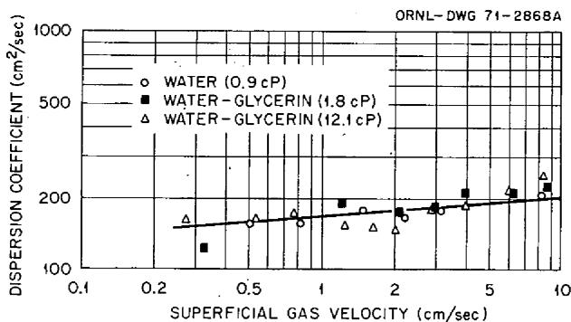  
Fig. 19.13. Variation of dispersion coefficient with superficial gas velocity and liquid viscosity in a 6-in.-diam bubble column.

however, considerable coalescence of gas bubbles in the column. Data on the effect of liquid viscosity were obtained with water (0.9 cP) and water-glycerin mixtures having viscosities of 1.8 and 12.1 cP. No effect of viscosity was observed.

Dispersion coefficient values measured in a 2-in.-diam column for a range of liquid viscosity values are shown in Fig. 19.14. The dispersion coefficient was decreased by about $20\%$ when the viscosity was increased from 0.9 to 12.1 cP. Dispersion coefficient data measured in a 1.5-in.-diam column are shown in Fig. 19.15 for viscosity values of 0.9 and 1.8 cP. Although this effect is small, there is a definite decrease in the dispersion coefficient values as the viscosity of the liquid is increased.

A continuous fluorinator will not use a small-diameter central gas inlet, as was used in the present studies, because of the need for protecting the gas inlet from corrosion by maintaining a layer of frozen salt on the inlet surface. The gas inlet envisioned for a fluorinator consists of one or more large-diameter tubes that are inclined upward at a $45^{\circ}$ angle to the vertical. The diameter of the tube(s) will be of sufficient size that a frozen layer of salt can be maintained on the tube surface without blocking the tube, and a gas-liquid interface will be present in the tube. This type of inlet was shown to perform satisfactorily previously in a system in which molten salt and an inert gas were in countercurrent flow.[23] Dispersion coefficient values were recently measured with this type of gas inlet in a 3-in.-diam column using air and water. The coefficients were lower by as much as $10\%$ than values measured with a single central gas inlet.

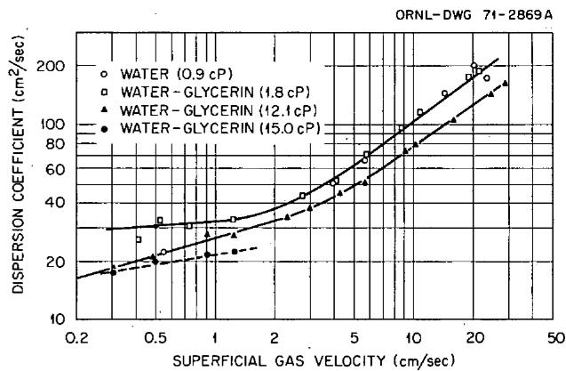  
Fig. 19.14. Variation of dispersion coefficient with superficial gas velocity and liquid viscosity in a 2-in.-diam bubble column.

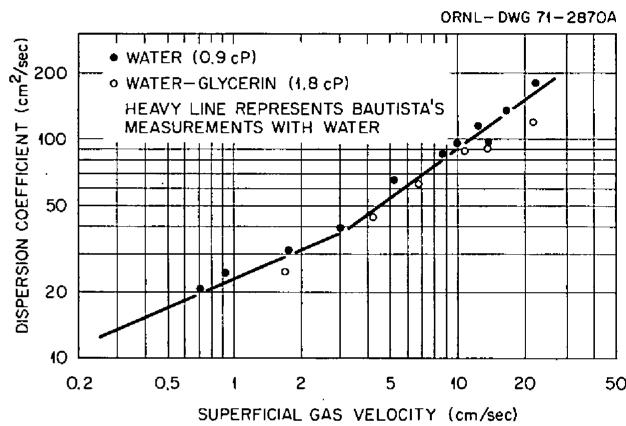  
Fig. 19.15. Variation of dispersion coefficient with superficial gas velocity and liquid viscosity in a 1.5-in.-diam column.

In summary, recent studies have demonstrated that the dispersion coefficient is a strong function of column diameter in the bubbly and the transition regions. The dependence of dispersion coefficient on liquid viscosity increases with decreasing column diameter. The dispersion coefficient in a 6-in.-diam column is not noticeably affected by changing the viscosity from 0.9 to $12.1\mathrm{cP}$ . The same change in viscosity in a 2-in.-diam column results in a $20\%$ decrease in the dispersion coefficient. Since the diameter of continuous fluorinators will be 6 in. or larger, the liquid viscosity will not affect the dispersion coefficient. However, the effect of viscosity on dispersion in small columns is of interest because our only data on uranium removal efficiency in a continuous fluorinator were obtained in a 1-in.-diam column.

# 19.9 ENGINEERING STUDIES OF URANIUM REMOVAL BY OXIDE PRECIPITATION

M.J.Bell L.E.McNeese

Oxide precipitation is being considered as an alternative to the fluorination-reductive-extraction method for isolating protactinium and removing uranium from MSBR fuel salt prior to rare earth removal.24 An engineering-scale oxide precipitation experiment is being designed to study uranium removal from fuel salt from which the protactinium has been previously removed. In this experiment, 0.3 mole of uranium will be precipitated from 2 liters (100 moles) of salt in a single-stage batch system. The source of oxide will be a steam-argon mixture that will be introduced through a draft tube to promote contact of the solid phase with the liquid phase. We will obtain information on (1) the rate of precipitation of $\mathrm{UO_2}$ from fuel salt, (2) the chemical composition and hydrodynamic behavior of the precipitate, (3) steam utilization, and (4) the general characteristics of precipitator operation. We have planned a subsequent experiment in which multi-stage countercurrent operation of a $\mathrm{UO_2 - ThO_2}$ precipitator will be studied.

Operation of a precipitator was simulated in a 4-in.-diam glass column (using air, a 50 wt % glycerol-water solution, and iron powder as the gas, liquid, and solid phases) to assist in the design of the draft tube for the vessel. Experiments with this system indicated that the sides of the precipitator vessel should be tapered near the bottom to bring the solids under the draft tube and that the tube should extend to within a few millimeters of the bottom of the vessel. An all-nickel precipitator vessel incorporating these features (see Fig. 19.16) has been designed. Precipitation will take place in the lower part of the vessel, which consists of a section of 4-in. low-carbon sched 40 nickel pipe. The upper part of the vessel is designed to permit deentrainment of salt from the gas stream and is fabricated from a 6-in.-long section of 6-in. sched 40 L nickel pipe. Gas is introduced into the system through a section of $\frac{1}{2}$ -in.-diam nickel tubing that extends to within $\frac{5}{8}$ in. of the bottom of the vessel and then flows upward through a draft tube made of 1-in. sched 40 pipe.

A baffle is mounted on the gas inlet tube to prevent gross quantities of entrained salt from reaching the upper part of the vessel. Heat shields are also mounted on the gas inlet tube to prevent excessive heat loss to the head of the vessel. The gas inlet tube is fitted with a $1/2$ -in. nickel-plated ball valve through which samples of

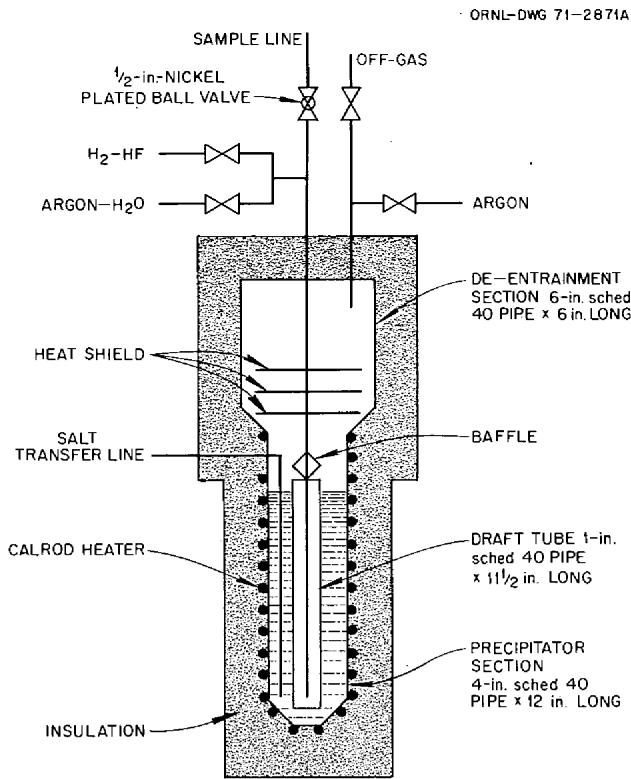  
Fig. 19.16. Schematic diagram of precipitator vessel for the first uranium oxide precipitation experiment (OP-1).

salt and oxide may be taken. Several methods for obtaining samples of the solid phase were tested with the glycerol-water-iron system, and results indicate that samples of the precipitate can be obtained satisfactorily.

The remainder of the system will consist of a salt feed-and-catch tank; the argon, hydrogen, and HF supply systems; the argon saturation system; the off-gas disposal system; and scrubbers for measuring the HF concentration of various gas streams. The equipment, now being fabricated, will be installed in Building 3541.

# 19.10 DESIGN OF A PROCESSING MATERIALS TEST STAND AND THE MOLYBDENUM REDUCTIVE EXTRACTION EQUIPMENT

E. L. Nicholson W. F. Schaffer, Jr.

J. Roth

Very little additional design work has been done during this report period pending development of molybdenum fabrication techniques by the Metals and Ceramics Division (see Sect. 16 of this report for fabrication development details). No changes have been

made in the conceptual design described in the preceding progress reports.25,26

Conceptual design sketches were prepared for the containment vessel nozzles that require transition joints between the molybdenum tubing inside the vessel and the external carbon steel or stainless steel process and instrument lines. Fabrication of these transition joints is being investigated by the Metals and Ceramics Division.

The full-scale transparent plastic model of the bismuth head pot and the top portion of the extraction

column was tested with mercury and water to simulate molten bismuth and salt. Gas-lift performance was satisfactory over the desired mercury flow rate range of about 0.05 to 1.1 liters/min. Performance of the head pot was generally satisfactory in that liquid flow rate fluctuations in the gas-lift discharge were smoothed out and a quiet pool of liquid was maintained above the metering orifice. However, entrainment of liquid in the exit gas occurred, the liquid flow capacities of the weirs in the sieve trays were low, and gas venting between trays was insufficient. The sieve trays and deentrainment baffles have been modified. The revised design uses one less sieve tray and will be simpler to fabricate from molybdenum. The mockup of the head pot and the column is ready for final testing.

25. M. W. Rosenthal et al., MSR Program Semiannu. Progr. Rep. Feb. 28, 1970, ORNL-4548, pp. 289-300.   
26. M. W. Rosenthal et al., MSR Program Semiannu. Progr. Rep. Aug. 31, 1970, ORNL-4622, pp. 212-13.

# 20. Continuous Salt Purification System

R.B.Lindauer

Following the previously reported1 flooding tests with molten $\mathrm{LiF - BeF_2}$ (66-34 mole %) and hydrogen or argon, sufficient iron fluoride was added to the salt to increase the iron concentration to about 440 ppm. The first two iron fluoride reduction runs (runs 1 and 2) were then made with the packed column operating at $700^{\circ}\mathrm{C}$ . Reasonable values for the mass transfer coefficients were obtained, as shown in Table 20.1. The values are about twice those obtained by MIT Practice School students in 1968 with a 3.38-in.-ID column.

1. M. W. Rosenthal et al., MSR Program Semiannu. Progr. Rep. Aug. 31, 1970, ORNL-4622, p. 224.

Column operation during these two runs was erratic, and the pressure drop across the column doubled during the runs. The increased restriction was believed to have resulted from precipitation of BeO on the column packing as the result of oxide accumulation in the system.

Sufficient LiF and $\mathrm{ThF_4}$ were added to the system to produce a salt composition of 72.0-14.4-13.6 mole $\%$ LiF-BeF $_2$ -ThF $_4$ , which is approximately the MSBR fuel carrier salt composition. The newly prepared LiF-BeF $_2$ -ThF $_4$ salt was then countercurrently contacted with a hydrogen- $10\%$ HF mixture in the column at $600^{\circ}\mathrm{C}$ . The salt and gas flow rates were $103~\mathrm{cm}^3/\mathrm{min}$ and 5.6 liters/min respectively. Analysis of the column off-gas

Table 20.1. Data from iron fluoride reduction runs   
Column temperature, $700^{\circ}\mathrm{C}$   

<table><tr><td rowspan="2">Run No.</td><td rowspan="2">Date</td><td colspan="2">Gas flow rate (std. liters/min)</td><td rowspan="2">Salt flow ratea(cm3/min)</td><td colspan="2">Analysis of filtered samples (ppm of iron)</td><td rowspan="2">Percent of batch contacted</td><td rowspan="2">Mass transfer coefficient, bkl(ft/hr)</td></tr><tr><td>H2</td><td>Ar</td><td>Feed</td><td>Product</td></tr><tr><td>1</td><td>7/27</td><td>20</td><td></td><td>100</td><td>425</td><td>307</td><td>71.4</td><td>0.018</td></tr><tr><td>2</td><td>7/28</td><td>13.5</td><td></td><td>100</td><td>307</td><td>228</td><td>72.9</td><td>0.016</td></tr><tr><td>3</td><td>10/22</td><td>16.6</td><td></td><td>100</td><td>220</td><td>158</td><td>75.3</td><td>0.015</td></tr><tr><td>4</td><td>11/3</td><td>14.6</td><td></td><td>210</td><td>158</td><td>373</td><td>84.7</td><td></td></tr><tr><td>5</td><td>11/4</td><td>18.2</td><td></td><td>161</td><td>373</td><td>137</td><td>68.8</td><td></td></tr><tr><td>6</td><td>11/5</td><td>4.5</td><td>4.5</td><td>106</td><td>137</td><td>110</td><td>81.8</td><td>0.011</td></tr><tr><td>7</td><td>11/6</td><td>3.9</td><td>3.9</td><td>142</td><td>110</td><td>70</td><td>81.8</td><td>0.030</td></tr><tr><td>8</td><td>11/9</td><td>24.0</td><td></td><td>103</td><td>70</td><td>75</td><td>86.5</td><td></td></tr><tr><td>9A</td><td>11/13</td><td>4.5</td><td>4.5</td><td>93</td><td>75</td><td>55c</td><td>79.4d</td><td>0.012</td></tr><tr><td>9B</td><td>11/13</td><td>3.5</td><td>3.5</td><td>136</td><td></td><td></td><td></td><td></td></tr><tr><td>10</td><td>11/17</td><td>14.1</td><td></td><td>105</td><td>69e</td><td>77c</td><td>81.8</td><td></td></tr><tr><td>11</td><td>11/19</td><td>3.1</td><td>4.5</td><td>117</td><td>207</td><td>339</td><td>81.2</td><td></td></tr><tr><td></td><td></td><td></td><td></td><td></td><td></td><td>104c</td><td></td><td></td></tr></table>

${}^{a}$ The first two runs used LiF-BeF ${}_{2}$ ; the remaining runs used LiF-BeF ${}_{2}$ -ThF ${}_{4}$ .   
$b$ Based on outside surface of Raschig rings only, since salt is considered to be nonwetting; $k_{l}$ is $78\%$ of these values if entire area of the Raschig rings is used as the basis.   
$c_{\text{Average of flowing-stream samples; no batch samples were taken after the run.}}$   
$d_{\mathrm{A}}$ value of $100\%$ is used in calculating $k_{I}$ since samples are of flowing-stream type.   
$e$ Calculated from flowing-stream samples from previous runs.

indicated that $100~\mathrm{ppm}$ of oxide was removed from the salt with an HF utilization of $15\%$ . Salt samples taken before and after the oxide removal operation contained 119 and $121~\mathrm{ppm}$ of iron, respectively, indicating that little (if any) of the reduced iron had been present in the packed column. The hydrofluorination operation reduced the pressure drop across the column, with a 5-liter/min argon flow, from 12.0 to 10.3 in. $\mathbf{H}_2\mathbf{O}$ .

The extent of iron reduction was reasonable in the third run; however, column pressure drop became excessive (37 in. $\mathrm{H}_2\mathrm{O}$ ). To provide an opportunity for oxide in the column to be removed as it was dissolved and to allow dissolution of the $\mathrm{BeF}_2$ thus produced, the column was filled with molten salt and an 88-12 mole $\%$ $\mathrm{H}_2$ -HF mixture was bubbled through the salt for $18\mathrm{hr}$ at the rate of 6 liters/min. Column temperatures of 600, 650, and $700^{\circ}\mathrm{C}$ were used, and oxide was removed from the salt at a rate equivalent to about $15~\mathrm{ppm / hr}$ . The maximum HF utilization was about $5\%$ . This operation was effective in reducing the column pressure drop to the initially observed value. The column

pressure drop has remained reasonably low during the subsequent runs.

Our analyses of salt leaving the column in the remaining reduction runs have been erratic, and the mass transfer coefficient values are questionable. Iron analyses of salt leaving the column in four of the succeeding runs showed an increase in the iron content of salt, and the iron concentration in two of the samples exceeded the total iron concentration believed to exist in the system (218 ppm). The most reasonable explanation for the erratic iron analyses is that the iron particles are small enough to pass through both the $50 - \mu$ main-stream salt filter and the $25 - \mu$ sample filter. Since the first three runs showed the expected extent of iron reduction, it is possible that the reduced iron from these runs saturated the available nickel surface in the system and that the iron from subsequent runs appeared in varying amounts, along with iron fluoride, in the salt samples. Studies are under way to resolve these discrepancies, and further studies of iron fluoride reduction will be carried out.

# OAK RIDGE NATIONAL LABORATORY

# MOLTEN-SALT REACTOR PROGRAM

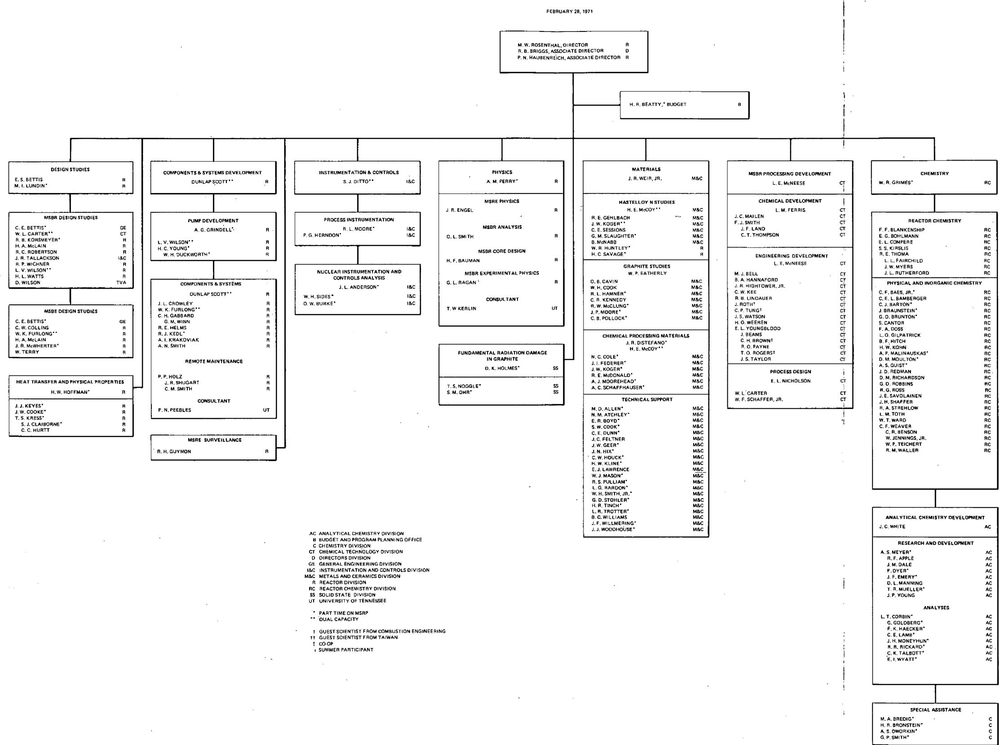

# INTERNAL DISTRIBUTION

1. G.M. Adamson   
2. R.G. Affel   
3. J. L. Anderson   
4. R. F. Apple   
5. W. E. Atkinson   
6. C. F. Baes   
7. C. E. Bamberger   
8. C. J. Barton   
9. J. B. Bates   
10. H. F. Bauman   
11. S.E.Beall   
12. H. R: Beatty   
13. M. J. Bell   
14. M. Bender   
15. C. E. Bettis   
16. E. S. Bettis   
17. D. S. Billington   
18. R. E. Blanco   
19. F. F. Blankenship   
20. J. O. Blomeke   
21. R. Blumberg   
22. A. L. Boch   
23. E. G. Bohlmann   
24. C. J. Borkowski   
25. H. I. Bowers   
26. G.E. Boyd   
27. J. Braunstein   
28. M.A. Bredig   
29. E. J. Breeding

30-40. R. B. Briggs

41. H. R. Bronstein   
42. F. R. Bruce   
43. G. D. Brunton   
44. O.W. Burke   
45. D. A. Canonico   
46. S. Cantor   
47. D.W.Cardwell   
48. R. S. Carlsmith   
49. W. L. Carter   
50. O. B. Cavin   
51. R. H. Chapman   
52. C. J. Claffey   
53. F. H. Clark   
54. Nancy Cole   
55. C. W. Collins   
56. E. L. Compere

57. W.H.Cook   
58. J. W. Cooke   
59. L. T. Corbin   
60. W. B. Cottrell   
61. S. J. Cromer (K-25)   
62. J. L. Crowley   
63. F. L. Culler   
64. J.M.Dale   
65. R. J. DeBakker   
66. J. H. DeVan   
67. J. R. Distefano   
68. S. J. Ditto   
69. R. G. Donnelly   
70. F. A. Doss   
71. A.S. Dworkin

72-73. W.P.Eatherly   
74. J. R. Engel   
75. J. I. Federer   
76. D. E. Ferguson   
77. L.M. Ferris   
78. A. P. Fraas   
79. J. K. Franzreb   
80. J. H. Frye, Jr.   
81. L.C. Fuller   
82. W. K. Furlong   
83. C. H. Gabbard   
84. W. R. Gall   
85. R. B. Gallaher   
86. R.E. Gehlbach   
87. R.G. Gilliland   
88. L. O. Gilpatrick   
89. W. R. Grimes   
90. A. G. Grindell   
91. R.W.Gunkel   
92. R. H. Guymon   
93. R.P. Hammond   
94. R. L. Hamner   
95. B. A. Hannaford   
96. P. H. Harley   
97. W.O.Harms   
98. C. S. Harrill   
99. P. N. Haubenreich   
100. R. E. Helms   
101. P. G. Herndon   
102. D.M. Hewett   
103. R.F. Hibbs

104. J. R. Hightower   
105. M. R. Hill   
106. E.C. Hise   
107. B.F.Hitch   
108. H. W. Hoffman   
109. D. K. Holmes   
110. P.P. Holz   
111. W.R. Huntley   
112. H. Inouye   
113. W. H. Jordan   
114. P. R. Kasten   
115. R.J.Kedl   
116. C.W. Kee   
117. M. T. Kelley   
118. M. J. Kelly   
119. C. R. Kennedy   
120. T. W. Kerlin   
121. H.T. Kerr   
122. J. J. Keyes   
123. S. S. Kirslis   
124. L. R. Koffman   
125. J.W. Koger   
126. H. W. Kohn   
127. R. B. Korsmeyer   
128. A. I. Krakoviak   
129. T. S. Kress   
130. J. W. Krewson   
131. C.E. Lamb   
132. J.A. Lane   
133. K. H. Lin   
134. R. B. Lindauer   
135. J. L. Liverman   
136. R. S. Livingston   
137. G. H. Llewellyn   
138. E. L. Long   
139. M. I. Lundin   
140. R. N. Lyon   
141. R. L. Macklin   
142. H. G. MacPherson   
143. R.E. MacPherson   
144. F. C. Maienschein   
145. A. P. Malinauskas   
146. D. L. Manning   
147. C.D. Martin   
148. W. R. Martin   
149. H. V. Mateer

150. C. E. Mathews   
151. T. H. Mauney   
152. H. E. McCoy   
153. D. L. McElroy   
154. C. K. McGlothlan   
155. C. J. McHargue   
156. H. A. McLain   
157. B. McNabb   
158. L. E. McNeese   
159. J. R. McWherter   
160. H. J. Metz   
161. A. S. Meyer   
162. C. A. Mills   
163. R. L. Moore   
164. A. J. Moorhead   
165. K. Z. Morgan   
166. C. A. Mossman   
167. D.M. Moulton   
168. M. L. Myers   
169. H. H. Nichol   
170. J. P. Nichols   
171. E. L. Nicholson   
172. T. S. Noggle   
173. L.C. Oakes   
174. S.M. Ohr   
175. W.R.Osborn   
177. R. B. Parker   
178. P. Patriarca   
179. A. M. Perry   
180. T. W. Pickel   
181. H. B. Piper   
182. C. B. Pollock   
183. H.M. Poly   
184. B. E. Prince   
185. A. S. Quist   
186. H.P. Raaen   
187. G. L. Ragan   
188. J. L. Redford   
189. J. D. Redman   
190. D. M. Richardson   
191. M. Richardson   
192. G. D. Robbins   
193. R. C. Robertson   
194. D. J. Rose

195-221. M. W. Rosenthal

222. R.G. Ross

223. J. Roth   
224. J. P. Sanders   
225. H. C. Savage   
226. W. F. Schaffer   
227. Dunlap Scott   
228. J. L. Scott   
229. H. E. Seagren   
230. C. E. Sessions   
231. J.H.Shaffer   
232. E. D. Shipley   
233. W. H. Sides   
234. M. J. Skinner   
235. G.M. Slaughter   
236. A. N. Smith   
237. F. J. Smith   
238. G.P. Smith   
239. O. L. Smith   
240. A. H. Snell   
241. Din Sood   
242. I. Spiewak

243. C. E. Stevenson   
244. R. A. Strehlow   
245. R. D. Stulting   
246. D. A. Sundberg   
247. J. R. Tallackson   
248. O.K. Tallent   
249. E.H. Taylor   
250. W. Terry   
251-252. R.E.Thoma   
253. L.M. Toth   
254. D. B. Trauger   
255. W.C. Ulrich   
256. W.E. Unger   
257. D.C.Watkin   
258. G.M. Watson   
259. J. S. Watson   
260. H. L. Watts   
261. C. F. Weaver   
262. H. O. Weeren   
263. A.M. Weinberg

264. J. R. Weir   
265. W. J. Werner   
266. H. L. Whaley

267-271. M.E. Whatley

272. J.C. White   
273. R. P. Wichner   
274. D. Wilson   
275. L.V. Wilson   
276. G. J. Young   
277. H.C. Young   
278. J.P. Young   
279. E. L. Youngblood   
280. F. C. Zapp   
281. Biology Library   
282. ORNL - Y-12 Technical Library Document Reference Section

283-285. Central Research Library   
286-335. Laboratory Records Department   
336. Laboratory Records, ORNL R.C.

# EXTERNAL DISTRIBUTION

337. J. A. Acciarri, Continental Oil Co., Ponca City, OK 74601   
338. D. T. Ahner, General Electric, Bldg. 53, 1 River Rd., Schenectady, NY 12029   
339. P. R. Allison, Public Service Co. of Oklahoma, P. O. Box 1, Washita, OK 73094   
340. J. S. V. Andrews, Atomic Energy Attache, UKAEA, British Embassy, Washington, D.C. 20008   
341. R. C. Armstrong, Combustion Engineering, Inc., P.O. Box 500, Windsor, CT 06095   
342. D. M. Axelrod, Public Serv. Elec. & Gas Co., 80 Park Place, Newark, NJ 07101   
343. B. L. Bailey, Great Lakes Carbon Corp., Pine Ave. & 58th, Niagara Falls, NY 14302   
344. W. K. Barney, Argonne National Laboratory, 9700 S. Cass Ave., Argonne, IL 60439   
345. N. W. Bass, Brush Beryllium Co., 17876 St. Clair Ave., Cleveland, OH 44110   
346. R. G. Bernier, Gulf General Atomic, P. O. Box 608, San Diego, CA 92112   
347. Gottfried Besenbruch, Gulf General Atomic, P. O. Box 608, San Diego, CA 92112   
348. J.M. Black, Northeast Utilities Service Co., P.O. Box 270, Hartford, Conn. 06101   
349. B. E. Blackman, Huntington Alloys, The International Nickel Co., Huntington, WV 25720   
350. J. C. Bowman, Union Carbide Technical Center, P.O. Box 6116, Cleveland, OH 44101   
351. R. M. Bushong, UCC, Carbon Products Div., 12900 Snow Rd., Parma, OH 44130   
352. R. H. Chastain, Southern Services, Inc., Birmingham, AL 35202   
353. C. G. Chezem, Gas & Electric, Wichita, Kansas 67200   
354. Gary C. Clasby, Byron Jackson Pump, P.O. Box 2017, Los Angeles, CA 90054   
355. Paul Cohen, Westinghouse Electric Corp., P. O. Box 158, Madison, PA 15663   
356. D. F. Cope, Atomic Energy Commission, RDT Site Office, ORNL, Oak Ridge, TN 37830   
357. L. G. Cook, Esso Research and Engineering Co., P. O. Box 45, Linden, NJ 07036   
358. Raymond L. Copeland, Tennessee Valley. Authority, Chattanooga, TN 37401   
359. J. D. Corbett, Iowa State University, Ames, IA 50010   
360. J. J. Costantino, Great Lakes Carbon Corp., 299 Park Ave., New York, NY 10017   
361. J. F. Cox, Foster Wheeler Co., 110 S. Orange Ave., Livingston, NJ 07039   
362. P. V. Crooks, Atomic Energy Attache, Embassy of Australia, Washington, D.C. 20036

363. C. B. Deering, Black & Veatch, P.O. Box 8405, Kansas City, MO 64114   
364. D. R. deBoisblanc, Ebasco Services, Inc., 2 Rector St., New York, NY 10006   
365. A. R. DeGrazia, USAEC, DRDT, Washington, D.C. 20545   
366. Edward Dempsey, Mobil Research & Development Corp., Box 1025, Princeton, NJ 08540   
367. D. E. Erb, Battelle Memorial Institute, 505 King Ave., Columbus, OH 43201   
368. F. V. Fair, Airco Speer Research, 4861 Packard Rd., Niagara Falls, NY 14302   
369. Martin Fate, Jr., Public Service Co. of Oklahoma, P.O. Box 201, Tulsa, OK 74102   
370. J. J. Ferritto, Poco Graphite, P.O. Box 2121, Decatur, TX 76234   
371-375. T. A. Flynn, Jr., Ebasco Services, Inc., 2 Rector St., New York, NY 10006   
376. J.E. Fox, USAEC, DRDT, Washington, D.C. 20545   
377. W. A. Franks, S. M. Stoller Corp., 1250 Broadway, New York, NY 10001   
378. L. W. Fromm, Argonne National Lab., 9700 S. Cass Ave., Argonne, IL 60439   
379. A. E. Goldman, UCC, 270 Park Ave., New York, NY 10017.   
380. B. J. Goulding, Babcock and Wilcox, P.O. Box 1260, Lynchburg, VA 24505   
381. W. J. Gray, Battelle-Northwest, P.O. Box 999, Richland, WA 99352   
382. Norton Habermann, RDT, USAEC, Washington, D.C. 20545   
383. Hans-Jürgen Hantke, Brown Boveri-Krupp Reaktorbau GmbH, Otto Beck Str. 27, Mannheim, West Germany   
384. J.E. Hard, ACRS, USAEC, Washington, D.C. 20545   
385. R. J. Herbst, W. R. Grace & Co., Clarksville, MD 21029   
386. Irving Hoffman, USAEC, DRDT, Washington, D.C. 20545   
387. A. Houtzeel, TNO, 176 Second Ave., Waltham, MA 02154   
388. J. S. Iyer, Pioneer Service & Engr. Co., 2 No. Riverside Plaza, Chicago, IL 60606   
389. Ralph Jamieson, Brush Beryllium Co., Cleveland, OH 44110   
390. S. J. Jaye, Gulf General Atomic, P.O. Box 608, San Diego, CA 92100   
391. T. R. Johnson, Argonne National Lab., Argonne, IL 60439   
392. W. R. Kannie, General Electric Co., P.O. Box 8, Schenectady, NY 12301   
393. H. H. Kellogg, Henry Krumb School of Mines, Columbia Univ., New York, NY 10027   
394. L. R. Kelman, Argonne National Laboratory, 9700 S. Cass Ave., Argonne, IL 60439   
395. E.E. Kintner, USAEC, Washington, D.C. 20545   
396. B. W. Kinyon, Combustion Engineering, 911 W. Main St., Chattanooga, TN 37402   
397. J. C. Kosco, Stackpole Carbon Co., St. Marys, PA 15758   
398. H. N. LaCroix, Foster Wheeler Corp., Livingston, NJ 07039   
399. Kermit Laughon, AEC, RDT Site Office, ORNL, Oak Ridge, TN 37830   
400. R. C. Lindberg, Continental Oil Co., 30 Rockefeller Plaza, New York, NY 10020   
401. J. R. Lindgren, Gulf General Atomic, San Diego, CA 92112   
402. J. M. Longo, Esso Research & Engineering Co., P.O. Box 45, Linden, NJ 07036   
403. D. E. Lyons, Combustion Engineering, 14 Office Park Circle, Birmingham, AL 35223   
404. W. B. McDonald, Battelle-Pacific Northwest Laboratory, Hanford, WA 99352   
405. T. W. McIntosh, AEC, Washington, D.C. 20545   
406. P. McMurray, *Jersey Nuclear Co.*, 777 106th Ave., NE, Bellevue, WA 98004   
407. M. S. Malkin, NUS Corp., 2351 Research Blvd., Rockville, MD 20850   
408. A. J. Marie, Philadelphia Elec. Co., Pittsburgh, PA 19105   
409. H. E. Marsh, *Stellite Div.-Cabot Corp.*, P.O. Box 746, Kokomo, IN 46901   
410. C. L. Matthews, AEC, RDT Site Office, ORNL, Oak Ridge, TN 37830   
411. D. N. Merrill, Public Service Co. of New Hampshire, 1087 Elm St., Manchester, NH 03105   
412. R. H. Meyer, Northeast Utilities, P.O. Box 270, Hartford, CT 06101   
413. A. J. Morse, Continental Oil Co., 30 Rockefeller Plaza, New York, NY 10020   
414. G. A. Muccini, Ashland Oil Inc., R&D Bldg., Ashland, KY 41101   
415. C. P. Murphree, Poco Graphite, Inc., P.O. Box 2121, Decatur, TX 76234   
416. W. Newbury, Combustion Engineering, Chattanooga, TN 3740I   
417. W. A. Nystrom, Stackpole Carbon Co., St. Marys, PA 15857   
418. E. H. Okrent, *Jersey Nuclear Co.*, 777-106 Ave., N.E., Bellevue, WA 98004

419. J. F. Opeka, Northeast Utilities Serv. Co., P.O. Box 270, Hartford, CT 06101   
420. R. S. Palmer, General Electric, 310 Deguigne Drive, Sunnyvale, CA 94086   
421. F. J. Patti, Burns & Roe., Inc., 320 Fulton Ave., Hempstead, NY 11550   
422. F. N. Peebles, Dean of Engineering, University of Tennessee, Knoxville, TN 37976   
423. David R. Perkins, United Nuclear Corp., Grasslands Rd., Elmsford, NY 10523   
424. A. J. Pressesky, USAEC, Washington, D.C. 20545   
425. R. A. Proebstle, General Electric Co., Knolls Atomic Power Lab., P.O. Box 1072, Schenectady, NY 12301   
426. Karl H. Puechl, NUMEC, Apollo, PA 15613   
427. D. W. Rahoi, International Nickel Co., Inc., Guyan River Rd., Huntington, WV 25720   
428. M. V. Ramaniah, Bhabha Atomic Research Centre, Radiological Laboratories, Trombay, Bombay-85 AS, India   
429. David Richman, Research Division, USAEC, Washington, D.C. 20545   
430. R. K. Roche, *Stellite Division*, Cabot Corp., 1020 Park Ave., Kokomo, IN 46901   
431. A. P. Roeh, Idaho Nuclear Corp., Box 1845, Idaho Falls, ID 83401   
432. W. E. Rosengarten, Philadelphia Elec. Co., Pittsburgh, PA 19105   
433. H. M. Roth, AEC-ORO, Oak Ridge, TN 37830   
434. Allen S. Russell, Alcoa, Research Lab., P. O. Box 772, New Kensington, PA 15068   
435. G. A. Rutledge, Combustion Engr. Inc., 911 W. Main St., Chattanooga, TN 37402   
436. R. O. Sandbert, Bechtel, 220 Bush Street, San Francisco, CA 94119   
437. J. C. Scarborough, NUS Corp., 4 Research Place, Rockville, MD 20850   
438. W. Schröck-Vietor, Kernforschungsanlage Julich, 517 Julich, Germany   
439. Fred Schuellerman, Brush Beryllium Co., 17876 St. Clair Ave., Cleveland, OH 44110   
440. Hans-Georg Schwiers, Brown Boveri-Krupp Reaktorbau GmbH, Otto-Beck Str. 27, Mannheim, West Germany   
441. R. N. Scroggins, USAEC, Washington, D.C. 20545   
442. M. Shaw, USAEC, Washington, D.C. 20545   
443. W. M. Sides, Northeast Utilities Service Co., P.O. Box 270, Hartford, CT 06101   
444. Sidney Siegel, Atomics International, P.O. Box 309, Canoga Park, CA 91304   
445. R. H. Simon, Gulf General Atomic, P.O. Box 608, San Diego, CA 92112   
446. E. E. Sinclair, USAEC, Washington, D.C. 20545   
447. W. L. Smalley, AEC, ORO, Oak Ridge, TN 37830   
448. A. D. Smart, Detroit Edison Co., Detroit, MI 48200   
449. E. O. Smith, Black & Veatch, P.O. Box 8405, 1500 Meadowlake, Kansas City, MO 64114   
450. T. M. Snyder, General Elec. Co., 175 Curtner Ave., San Jose, CA 95125   
451. N. Srinivasan, Bhabha Atomic Research Centre, Trombay, Bombay 74, India   
452. A. Stathoplos, Combustion Engineering, Inc., Prospect Hill Rd., Windsor, CT 06095   
453. R. C. Steffy, Jr., Tennessee Valley Authority, 540 Market St., Chattanooga, TN 37401   
454. C. L. Storrs, Combustion Engineering, Inc., Prospect Hill Rd., Windsor, CT 06095   
455. J. J. Sullivan, Charles T. Main, 441 Stuart St., Boston, MA 02100   
456. E. J. Sundstron, Dow Chemical Co., Freeport, TX 77541   
457. A. E. Swanson, Black & Veatch, P.O. Box 8405, 1500 Meadowlake, Kansas City, MO 64114   
458. J. A. Swartout, UCC, New York, NY 10000   
459. M. J. Szulinski, Atlantic Richfield Hanford Co., P.O. Box 250, Richland, WA 99352   
460. B. L. Tarmy, Esso Research & Engr. Co., P.O. Box 101, Florham Park, NJ 07932   
461. R. W. Taylor, Dow Chemical Company, Freeport, TX 77541   
462. D. R. Thomas, Commonwealth Associates, Inc., 209 E. Washington Ave., Jackson, MI 49201   
463. R. A. Thomas, Southern Services Inc., Birmingham, AL 35202   
464. W. N. Thomas, Virginia Electric and Power Co., Richmond, VA 23209   
465. Ulrich Tillesson, NUKEM, 6451 Wolfgang, Postfach 860, West Germany   
466. R. E. Tomlinson, Atlantic Richfield-Hanford, P.O. Box 769, Richland WA 99352   
467. S. N. Tower, Westinghouse Elec. Corp., P.O. Box 158, Madison, PA 15663   
468. J. R. Trinko, Ebasco Services, Inc., 2 Rector St., New York, NY 10006   
469. V. A. Walker, Detroit Edison Co., Detroit, MI 48200

470. E. C. Ward, Northern States Power Co., Minneapolis, MN 55400   
471. C. H. Waugaman, Tennessee Valley Authority, 303 Power Bldg., Chattanooga, TN 37401   
472. R. F. Wehrmann, 10062 Betty Jane Lane, Dallas, TX 75229   
473. M. J. Whitman, USAEC, Washington, D.C. 20545   
474. M. P. Whittaker, Great Lakes Research Corp., P.O. Box 1031, Elizabethton, TN 37643   
475. J. H. Williams, Tennessee Valley Authority, 503 Power Building, Chattanooga, TN 37401   
476. L. A. Wilson, Middle South Services, Inc., P.O. Box 61000, New Orleans, LA 70160   
477. C. E. Winters, UCC, 777 14th St., NW, Washington, D.C. 20005   
478. R. J. Zoschak, Foster Wheeler Corp., 110 S. Orange Ave., Livingston, NJ 07039   
479. L. R. Zumwalt, North Carolina State Univ., P.O. Box 5635, Raleigh, NC 27607   
480. Laboratory and University Division, AEC, ORO   
481. Patent Office, AEC, ORO   
482-705. Given distribution as shown in TID-4500 under Reactor Technology category (25 copies - NTIS)