# MOLTEN-SALT REACTOR PROGRAM

Semiannual Progress Report

Period Ending August 31, 1971

OAK RIDGE NATIONAL LABORATORY CENTRAL RESEARCH LIBRARY DOCUMENT COLLECTION LIBRARY LOAN COPY DO NOT TRANSFER TO ANOTHER PERSON If you wish someone else to see this document, send in name with document and the library will arrange a loan.

OAK RIDGE NATIONAL LABORATORY

OPERATED BY UNION CARBIDE CORPORATION • FOR THE U.S. ATOMIC ENERGY COMMISSION

Printed in the United States of America. Available from

National Technical Information Service

U.S. Department of Commerce

5285 Port Royal Road, Springfield, Virginia 22151

Price: Printed Copy $3.00; Microfiche$ 0.95

This report was prepared as an account of work sponsored by the United States Government. Neither the United States nor the United States Atomic Energy Commission, nor any of their employees, nor any of their contractors, subcontractors, or their employees, makes any warranty, express or implied, or assumes any legal liability or responsibility for the accuracy, completeness or usefulness of any information, apparatus, product or process disclosed, or represents that its use would not infringe privately owned rights.

Contract No. W-7405-eng-26

# MOLTEN-SALT REACTOR PROGRAM

# SEMIANNUAL PROGRESS REPORT

# For Period Ending August 31, 1971

M. W. Rosenthal, Program Director

R. B. Briggs, Associate Director

P. N. Haubenreich, Associate Director

FEBRUARY 1972

OAK RIDGE NATIONAL LABORATORY

Oak Ridge, Tennessee 37830

operated by

UNION CARBIDE CORPORATION

for the

U.S. ATOMIC ENERGY COMMISSION

This report is one of a series of periodic reports in which we describe the progress of the program. Other reports issued in this series are listed below.

ORNL-2474 Period Ending January 31, 1958

ORNL-2626 Period Ending October 31, 1958

ORNL-2684 Period Ending January 31, 1959

ORNL-2723 Period Ending April 30, 1959

ORNL-2799 Period Ending July 31, 1959

ORNL-2890 Period Ending October 31, 1959

ORNL-2973 Periods Ending January 31 and April 30, 1960

ORNL-3014 Period Ending July 31, 1960

ORNL-3122 Period Ending February 28, 1961

ORNL-3215 Period Ending August 31, 1961

ORNL-3282 Period Ending February 28, 1962

ORNL-3369 Period Ending August 31, 1962

ORNL-3419 Period Ending January 31, 1963

ORNL-3529 Period Ending July 31, 1963

ORNL-3626 Period Ending January 31, 1964

ORNL-3708 Period Ending July 31, 1964

ORNL-3812 Period Ending February 28, 1965

ORNL-3872 Period Ending August 31, 1965

ORNL-3936 Period Ending February 28, 1966

ORNL-4037 Period Ending August 31, 1966

ORNL-4119 Period Ending February 28, 1967

ORNL-4191 Period Ending August 31, 1967

ORNL-4254 Period Ending February 29, 1968

ORNL-4344 Period Ending August 31, 1968

ORNL-4396 Period Ending February 28, 1969

ORNL-4449 Period Ending August 31, 1969

ORNL-4548 Period Ending February 28, 1970

ORNL-4622 Period Ending August 31, 1970

ORNL-4676 Period Ending February 28, 1971

# Contents

# PART 1. MSBR DESIGN AND DEVELOPMENT

# 1. DESIGN 2

1.1 Molten-Salt Demonstration Reactor Design Study 2

1.1.1 General 2   
1.1.2 Reactor Core 3   
1.1.3 MSDR Off-Gas and Salt Pump-Back System 4   
1.1.4 Drain Tank Cooling System 7   
1.1.5 Drain Valve Cell 9   
1.1.6 Drain Cell Catch Pan 9

1.2 Some Consequences of Tubing Failure in the MSBR Heat Exchanger 9   
1.3 Side-Stream Processing of the MSBR Primary Flow for Xenon and/or Iodine Removal 10   
1.4 MSBE Design 11

1.4.1 Reactor Core'Power and Neutron Flux Distribution 11   
1.4.2 Reactor Core Heat Removal 11   
1.4.3 Maintenance Studies 14

1.5 MSBR Industrial Design Study 15

# 2. REACTOR PHYSICS 16

2.1 MSR EXPERIMENTAL PHYSICS 16   
2.1.1 HTLTR Lattice Experiments 16

2.2 PHYSICS ANALYSIS OF MSBR 18

2.2.1 Neutron Irradiation Effects Outside the MSBR Core 18   
2.2.2 MSBE Nuclear Characteristics 20   
2.2.3 Fixed-Moderator Molten-Salt Reactor 21

# 3. SYSTEMS AND COMPONENTS DEVELOPMENT 26

3.1 Gaseous Fission Product Removal 26

3.1.1 Gas Separator and Bubble Generator 26   
3.1.2 Bubble Formation and Coalescence Test 27

3.2 Gas System Test Facility 27

3.3 Off-Gas Systems 28

3.3.1 Off-Gas System for Molten-Salt Reactors 28   
3.3.2 Computer Design of Charcoal Beds for MSR Off-Gas Systems 29

3.4 Molten-Salt Steam Generator 29

3.4.1 Steam Generator Industrial Program 29   
3.4.2 Molten-Salt Steam Generator Technology Facility 29   
3.4.3 Molten-Salt Steam Generator Test Proposals 30

3.5 Sodium Fluoroborate Test Loop 31   
3.5.1 Inspection of PKP Pump Rotary Element 31   
3.6 Coolant-Salt Technology Facility 34   
3.7 MSBR Pumps 35   
3.7.1 SaltPumps for MSRP Technology Facilities 35   
3.7.2 ALPHA Pump 35   
3.7.3 Drain Tank Jet Pump System for MSDR 36

# 4. INSTRUMENTATION AND CONTROLS 38

4.1 Transient and Control Studies of the MSBR System Using a Hybrid Computer 38   
4.2 MSRE Design and Operations Report, Part IIB, Nuclear and Process Instrumentation 38   
4.3 Further Discussion of Instrumentation and Controls Development Needed for the Molten-Salt Breeder Reactor 38

# 5. HEAT AND MASS TRANSFER AND THERMOPHYSICAL PROPERTIES 39

5.1 Heat Transfer 39   
5.2 Thermophysical Properties 41   
5.3 Mass Transfer to Circulating Bubbles 41

# PART 2. CHEMISTRY

# 6. POSTOPERATIONAL EXAMINATION OF MSRE 46

6.1 Examination of Moderator Graphite from MSRE 46

6.1.1 Results of Visual Examination 46   
6.1.2 Segmenting of Graphite Stringer 46   
6.1.3 Examination of Surface Samples by X-ray Diffraction 47   
6.1.4 Examination with a Gamma Spectrometer 47   
6.1.5 Milling of Surface Graphite Samples 49   
6.1.6 Radiochemical and Chemical Analyses of MSRE Graphite 49

6.2 Cesium Isotope Migration in MSRE Graphite 51   
6.3 Fission Product Concentrations on MSRE Surfaces 54   
6.4 Metal Transfer in MSRE Salt Circuits 55

# 7. HYDROGEN AND TRITIUM BEHAVIOR IN MOLTEN SALT 56

7.1 The Solubility of Hydrogen in Molten ${}^{2}\mathrm{LiF}\cdot\mathrm{BeF}_{2}$ 56   
7.2 Permeation of Metals by Hydrogen 57   
7.3Tritium Control in an MSBR 59

7.3.1 Mass Spectrometric Examination of Stability of $\mathrm{NaBF}_3\mathrm{OH}$ 59   
7.3.2 The Thermal Stability of Nitrate-Nitrite Mixtures 59

7.4 Dissociating-Gas Heat Transfer Scheme and Tritium Control in Molten-Salt Power Systems 60

# 8. PROCESSING CHEMISTRY 62

8.1 The Oxide Chemistry of $\mathbf{Pa}^{4 + }$ in Molten LiF-BeF2-ThF4 62   
8.2 The Oxide Chemistry of $\mathrm{Pa^{5 + }}$ in Uranium-Containing Molten LiF-BeF $_2$ -ThF $_4$ 64   
8.3 Reductive Extraction Distributions of Barium and Thorium Between Bismuth-Lead Eutectic and Breeder Fuel Solvent 67   
8.4 Removal of Cerium from Lithium Chloride by Zeolite 67

9. DEVELOPMENT AND EVALUATION OF ANALYTICAL METHODS FOR MOLTEN SALT REACTORS 69

9.1 In-Line Chemical Analysis of Molten Fluoride Salt Streams 69   
9.2 Slotted Probe for In-Line Spectral Measurements 70   
9.3 In-Line Determination of Hydrolysis Products in $\mathrm{NaBF_4}$ Cover Gas 71   
9.4 Determination of Hydrogen in Fluoroborate Salts 73   
9.5 Voltammetric and Electrolysis Studies of Hydroxide Ion in Molten $\mathrm{NaBF}_4$ 74   
9.6 Electroanalytical Studies in the $\mathrm{NaBF}_4$ Coolant Salt 75   
9.7 Electroanalytical Studies of Ni(II) in Molten Fluoride Fuel Solvent 75

10. OTHER FLUORIDE RESEARCHES 77

10.1 Absorption Spectroscopy of Molten Fluorides 77

10.1.1 The Disproportionation Equilibrium of $\mathrm{UF}_3$ Solutions 77   
10.1.2 Estimation of the Available $\mathbf{F}^{-}$ Concentrations in Melts by Measurement of $\mathrm{UF_4}$ Coordination Equilibria 77

10.2 Solubility of $\mathbf{BF}_3$ in Fluoride Melts 78

10.3 Fluorides and Oxyfluorides of Molybdenum and Niobium 80

10.3.1 Mass Spectroscopy of Molybdenum Fluorides 80   
10.3.2 Mass Spectroscopy of Niobium Fluorides and Oxyfluorides 80

10.4 Electrical Conductivity of Molten and Supercooled Mixtures of NaF-BeF2 81   
10.5 Glass Transition Temperatures in the NaF-BeF $_2$ System 82   
10.6 Enthalpy of Lithium Fluoroborate from 298-700°K: Enthalpy and Entropy of Fusion 85   
10.7 Nonideality of Mixing in $\mathbf{Li}_2\mathbf{BeF}_4$ -LiI 86

11. EXAMINATION OF MSRE COMPONENTS 89

11.1 Examination of Hastelloy N Components Exposed to Fuel Salt in the MSRE 89   
11.2 Examination of Components from In-Pile Loop 2 94   
11.3 Observations of Grain Boundary Cracking in the MSRE 96   
11.4 Examination of a Graphite Moderator Element 106   
11.5 Auger Analysis of the Surface Layer on Graphite Removed from the Core of the MSRE 107

# PART 3. MATERIALS DEVELOPMENT

11. EXAMINATION OF MSRE COMPONENTS 89

11.1 Examination of Hastelloy N Components Exposed to Fuel Salt in the MSRE 89   
11.2 Examination of Components from In-Pile Loop 2 94   
11.3 Observations of Grain Boundary Cracking in the MSRE 96   
11.4 Examination of a Graphite Moderator Element 106   
11.5 Auger Analysis of the Surface Layer on Graphite Removed from the Core of the MSRE 107

12. GRAPHITE STUDIES 111

12.1 The Irradiation Behavior of Graphite at $715^{\circ}\mathrm{C}$ 112   
12.2 Procurement of Various Grades of Carbon and Graphite 114   
12.3 X-Ray Studies 116   
12.4 Thermal Property Testing 117

13. HASTELLOY N 125

13.1 Electron Microscopy Studies 125

13.1.1 Microstructures of Hf-Modified Hastelloy N Laboratory Melts 125   
13.1.2 $\mathrm{Ni}_3\mathrm{Ti}$ Precipitation in Ti-Modified Hastelloy N 129   
13.1.3 Strain-Induced Precipitation in Modified Hastelloy N 130

13.2 Mechanical Properties of Unirradiated Modified Hastelloy N 132   
13.3 Weldability of Several Modified Commercial Alloys 132

13.4 Creep-Rupture Properties of Hastelloy N Modified with Niobium, Hafnium, and Titanium 137   
13.5 Corrosion Studies 138

13.5.1 Fuel Salts 139   
13.5.2 Fertile-Fissile Salt 145   
13.5.3 Blanket Salt 145   
13.5.4 Coolant Salt 145

13.6 Analysis of High-Level Probe from Sump Tank of PKP-1 150   
13.7 Forced-Convection Loop Corrosion Studies 150

13.7.1 Operation of Forced-Convection Loop MSR-FCL-1A 150   
13.7.2 Metallurgical Analysis of Forced-Convection Loop MSR-FCL-1A 151   
13.7.3 Operation of Forced-Convection Loop MSR-FCL-2 151   
13.7.4 Metallurgical Analysis of Forced-Convection Loop MSR-FCL-2 153

13.8 Corrosion of Hastelloy N in Steam 153   
13.9 Evaluation of Duplex Tubing for Use in Steam Generators 156

14. SUPPORT FOR CHEMICAL PROCESSING 163

14.1 Construction of a Molybdenum Reductive-Extraction Test Stand 163   
14.2 Fabrication Development of Molybdenum Components 166   
14.3 Welding Molybdenum 169   
14.4 Development of Brazing Techniques for Fabricating the Molybdenum Test Loop 172

14.4.1 Resistance Furnace Brazing 172   
14.4.2 Induction Vacuum Brazing 172   
14.4.3 Induction Field Brazing 173

14.5 Compatibility of Materials with Bismuth 173   
14.6 Chemical Vapor Deposited Coatings 176   
14.7 Molybdenum Deposition from $\mathbf{MoF}_6$ 177

# PART 4. MOLTEN-SALT PROCESSING AND PREPARATION

15. FLOWSHEET ANALYSIS 179

15.1 Cost Estimate for an MSBR Processing Plant 179   
15.2 Comparison of Costs for Alternate Off-Gas Treatment Methods for an MSBR Processing Plant 183   
15.3 Effect of Noble-Metal and Halogen Removal Times on the Heat Generation Rate in an MSBR Processing Plant 186   
15.4 Long-Term Disposal of MSBR Wastes 186   
15.5 Availability of Natural Resources Required for Molten Salt Breeder Reactors 189

# 16. PROCESSING CHEMISTRY 191

16.1 Distribution of Lithium and Bismuth Between Liquid Lithium-Thorium-Bismuth Alloys and Molten LiCl 191   
16.2 Mutual Solubilities of Thorium and Rare Earths in Liquid Bismuth 193   
16.3 Oxide Precipitation Studies 196   
16.4 Chemistry of Fuel Reconstitution 199

# 17. ENGINEERING DEVELOPMENT OF PROCESSING OPERATIONS 202

17.1 Lithium Transfer During Metal Transfer Experiment MTE-2 202   
17.2 Operation of Metal Transfer Experiment MTE-2B 204   
17.3 Development of Mechanically Agitated Salt-Metal Contactors 207   
17.4 Design of the Third Metal Transfer Experiment 209   
17.5 Reductive Extraction Engineering Studies 212   
17.6 Development of a Frozen-Wall Fluorinator: Induction Heating Experiments 214   
17.7 Predicted Performance of Continuous Fluorinators 217   
17.8 Engineering Studies of Uranium Oxide Precipitation 220   
17.9 Design of a Processing Materials Test Stand and the Molybdenum Reductive Extraction Equipment 222   
17.10 Development of a Bismuth-Salt Interface Detector 222

# 18. CONTINUOUS SALT PURIFICATION 226

# Introduction

The objective of the Molten-Salt Reactor Program is the development of nuclear reactors which use fluid fuels that are solutions of fissile and fertile materials in suitable carrier salts. The program is an outgrowth of the effort begun over 20 years ago in the Aircraft Nuclear Propulsion program to make a molten-salt reactor power plant for aircraft. A molten-salt reactor - the Aircraft Reactor Experiment - was operated at ORNL in 1954 as part of the ANP program.

Our major goal now is to achieve a thermal breeder reactor that will produce power at low cost while simultaneously conserving and extending the nation's fuel resources. Fuel for this type of reactor would be $^{233}\mathrm{UF}_4$ dissolved in a salt that is a mixture of LiF and $\mathrm{BeF}_2$ , but $^{235}\mathrm{U}$ or plutonium could be used for startup. The fertile material would be $\mathrm{ThF}_4$ dissolved in the same salt or in a separate blanket salt of similar composition. The technology being developed for the breeder is also applicable to high-performance converter reactors.

A major program activity through 1969 was the operation of the Molten-Salt Reactor Experiment. This reactor was built to test the types of fuels and materials that would be used in thermal breeder and converter reactors and to provide experience with operation and maintenance. The MSRE operated at $1200^{\circ}\mathrm{F}$ and produced $7.3\mathrm{MW}$ of heat. The initial fuel contained 0.9 mole $\%$ $\mathrm{UF_4}$ , $5\%$ $\mathrm{ZrF_4}$ , $29\%$ $\mathrm{BeF_2}$ , and $65\%$ ${}^{7}\mathrm{LiF}$ ; the uranium was about $33\%$ ${}^{235}\mathrm{U}$ . The fuel circulated through a reactor vessel and an external pump and heat exchange system. Heat produced in the reactor was transferred to a coolant salt, and the coolant salt was pumped through a radiator to dissipate the heat to the atmosphere. All this equipment was constructed of Hastelloy N, a nickel-molybdenum-iron-chromium alloy. The reactor core contained an assembly of graphite moderator bars that were in direct contact with the fuel.

Design of the MSRE started in 1960, fabrication of equipment began in 1962, and the reactor was taken critical on June 1, 1965. Operation at low power began in January 1966, and sustained power operation was begun in December. One run continued for six months, until terminated on schedule in March 1968.

Completion of this six-month run brought to a close the first phase of MSRE operation, in which the objective was to demonstrate on a small scale the attractive features and technical feasibility of these systems for civilian power reactors. We concluded that this objective had been achieved and that the MSRE had shown that molten-fluoride reactors can be operated at $1200^{\circ}\mathrm{F}$ without corrosive attack on either the metal or graphite parts of the system, the fuel is stable, reactor equipment can operate satisfactorily at these conditions, xenon can be removed rapidly from molten salts, and, when necessary, the radioactive equipment can be repaired or replaced.

The second phase of MSRE operation began in August 1968, when a small facility in the MSRE building was used to remove the original uranium charge from the fuel salt by treatment with gaseous $\mathbf{F}_2$ . In six days of fluorination, $221\mathrm{kg}$ of uranium was removed from the molten salt and loaded onto absorbers filled with sodium fluoride pellets. The decontamination and recovery of the uranium were very good.

After the fuel was processed, a charge of $^{233}\mathrm{U}$ was added to the original carrier salt, and in October 1968 the MSRE became the world's first reactor to operate on $^{233}\mathrm{U}$ . The nuclear characteristics of the MSRE with the $^{233}\mathrm{U}$ were close to the predictions, and the reactor was quite stable.

In September 1969, small amounts of $\mathrm{PuF_3}$ were added to the fuel to obtain some experience with plutonium in a molten-salt reactor. The MSRE was shut down permanently December 12, 1969, so that the

funds supporting its operation could be used elsewhere in the research and development program.

Most of the Molten-Salt Reactor Program is now devoted to the technology needed for future molten-salt reactors. The program includes conceptual design studies and work on materials, the chemistry of fuel and coolant salts, fission product behavior, processing methods, and the development of components and systems.

Because of limitations on the chemical processing methods available at the time, until three years ago most of our work on breeder reactors was aimed at two-fluid systems in which graphite tubes would be used to separate uranium-bearing fuel salts from

thorium-bearing fertile salts. In late 1967, however, a one-fluid breeder became feasible because of the development of processes that use liquid bismuth to isolate protactinium and remove rare earths from a salt that also contains thorium. Our studies showed that a one-fluid breeder based on these processes can have fuel utilization characteristics approaching those of our two-fluid designs. Since the graphite serves only as moderator, the one-fluid reactor is more nearly a scaleup of the MSRE. These advantages caused us to change the emphasis of our program from the two-fluid to the one-fluid breeder; most of our design and development effort is now directed to the one-fluid system.

# Summary

# PART 1. MSBR DESIGN AND DEVELOPMENT

# 1. Design

Design studies were continued on the 300-MW(e) MSDR. The core graphite was changed to slab shapes, about $17/8$ in. $\times 9^{3/4}$ in. $\times 21$ ft long. The slabs are held in place by graphite posts which maintain the core configuration yet permit movement to accommodate temperature and radiation effects. Salt which reaches the drain tank by entrainment in the gas effluent from the gas separator is now returned to the primary circulation system by two jet pumps located in a cluster in the drain tank. The jets are actuated by salt flows from the primary pumps and are arranged to prevent pumpback of gas into the primary loops. The manifolds that connect the NaK cooling circuit thimbles in the drain tank have been rearranged to facilitate maintenance, and three water tanks for heat rejection are now provided instead of one. Seismic effects on the drain tank and its cooling system have received preliminary study. A basin has been provided in the drain tank cell to catch accidental salt spills from the salt lines or valves and to drain it into the fuel-salt drain tank.

A study was made of the consequences of the mixing of fuel and coolant salts as a result of various modes of failure of tubing in the primary heat exchangers in the MSBR reference design. Four specific cases were examined: (1) doubled-ended failure near the fuel-salt outlet; (2) double-ended failure near the fuel salt inlet; (3) small coolant-salt leak into the primary system; (4) small fuel-salt leak into the secondary system. The study is, in many places, speculative both because of the preliminary status of the design and the lack of adequate physicochemical data on mixing of fuel and coolant salts. However unpleasant some of the consequences of tubing failure may be, no way of generating either a nuclear excursion or a rupture in the primary or secondary loop piping is foreseen.

The incentives for side-stream processing of the MSBR fuel salt for iodine and/or xenon removal as an alternative means for dealing with the $^{135}\mathrm{Xe}$ poison level are being examined. Iodine stripping would require only small bypass flow rates, approximately 225 gpm sufficing to reduce $^{135}\mathrm{Xe}$ poison level to $\sim 1\%$ in a $100\%$ efficient stripper. Analysis of laboratory sparging experiments indicates only negligible movement of iodine as HI into the graphite. Combined xenon and iodine strippers appear to be a reasonable development goal and a highly attractive means for achieving $0.5\%$ poison level with uncoated graphite.

Design studies on the MSBE were continued with emphasis on the core heat removal and core maintenance. Both prismatic and slab-type graphite elements were considered. Maintenance studies were also conducted on repair of a leak in the primary heat exchanger.

A subcontract between ORNL and the Ebasco Services Group, consisting of Ebasco, Babcock and Wilcox, Byron Jackson, Cabot, Conoco, and Union Carbide companies, was negotiated and signed. This industrial group will conduct a design study of a 1000-MW(e) MSBR plant. They have essentially completed the selection of a reference conceptual design for further study and evaluation.

# 2. Reactor Physics

During the report period we completed and issued a report describing the Reactor Optimum Design Code (ROD), with instructions for its use. The code package has been furnished to the Argonne Code Center, where it is available upon request.

Since the Hastelloy N in the fuel system of an MSBR should last for the life of the plant, we have calculated the radiation damage caused by delayed neutrons emitted outside the core and by leakage neutrons from the core. Results indicate that helium production,

primarily from $^{10}\mathrm{B}(n,\alpha)$ reactions, would be the most important source of damage (assuming an initial $^{10}\mathrm{B}$ concentration of 2 ppm). The lifetime helium production in the heat exchanger due to delayed neutrons would be less than 2 ppb with $\mathrm{NaBF}_4$ -NaF coolant salt, or close to 50 ppb with $\mathrm{Li}_2\mathrm{BeF}_4$ enriched to 99.995% in the $^7\mathrm{Li}$ isotope. In the reactor outlet line, the terminal helium concentration would be less than 10 ppb from the delayed neutron source. Rather larger amounts of helium could be produced by core-leakage neutrons in parts of the heat exchangers or piping directly facing the reactor vessel. For our present reference design, the maximum amount of helium could approach 1 ppm, primarily from $^{58}\mathrm{Ni}(n,\alpha)$ reactions.

We calculated various reactivity coefficients for the MSBE and compared them with values for our reference MSBR. The most noteworthy differences are a positive fuel-salt density coefficient for the MSBE (negative for the MSBR) and the negative graphite temperature coefficient for the MSBE (positive for the MSBR). Both of these differences are associated with a greater neutron leakage from the smaller MSBE, and result in a much more negative overall temperature coefficient, that is, $-8 \times 10^{-5} / ^{\circ}\mathrm{C}$ vs $-0.9 \times 10^{-5} / ^{\circ}\mathrm{C}$ for the MSBR.

Investigation of batch fuel cycles for fixed-moderator molten-salt reactors has been continued. We have found that reactor lifetime-averaged reaction-rate coefficients are adequate for calculating the time-dependent fuel composition throughout the lifetime for enricheduranium-fueled reactors, but only for the asymptotic portion of the lifetime for recycled-plutonium-fueled reactors. Reaction coefficients calculated specifically for the beginning of the lifetime are required for plutonium calculations, because the amounts of plutonium in the system at startup are sufficient to cause significant hardening of the neutron spectrum. Calculations with plutonium feed are continuing.

Results are presented for a reactor designed as a breeder (with continuous processing) but operated as a converter, with enriched-uranium feed and batch processing in four cycles over the lifetime of the reactor. An average conversion ratio greater than $90\%$ and a fuel cost, excluding processing, of about 0.76 mill/kWhr were found for this reactor.

# 3. Systems and Components Development

Tests on the MSBE-scale bubble separator were continued in the water loop to study the formation of the very fine bubbles encountered with the water-glycerol test fluid and to evaluate the separator per

formance with these small bubbles. These tests showed that the production of the small bubbles is influenced mostly by the pump head and speed. Dilution tests run with $\mathrm{CaCl}_2$ solution showed a very sharp increase in separator efficiency as the concentration approached 2.7 wt $\%$ probably the point at which significant bubble coalescence began. Such a threshold at a lower concentration has been discussed in the recent literature. Attempts to increase the vortex to the length needed to separate gas from the higher viscosity fluids led to an instability when the gas flowed at the rates needed. However, removal of the core from the annular recovery hub resulted in satisfactory vortex stability over the full gas flow range. A test is being planned to compare the bubble formation and coalescence properties of molten salt with those of demineralized water and other solutions.

The conceptual system design description and the quality assurance plan for the molten-salt loop for testing gas systems (GSTF) were completed, and the design is proceeding.

A report is being written on the design bases for molten-salt reactor off-gas systems.

The development of a computer program for the design of charcoal beds for MSR off-gas systems was started. The plan is to develop a new program by revising and expanding existing programs. The existing programs provide necessary information, but they are not arranged to be of maximum usefulness to the designer.

Foster Wheeler Corporation was chosen as the company to perform the conceptual design study of the steam generator for use with molten-salt reactors. The scope of work finally included in the request for proposal package differed from that reported previously. The changes basically limit the industrial firm to work on the steam generator and exclude the systems design work originally requested.

Work continued on the preparation of a conceptual system design description for the steam generator technology facility (SGTF). This facility would be a side loop of the coolant-salt technology facility (CSTF) and would be used to study transients and steady-state operation of some full- and part-length tube test sections of a molten-salt steam generator. A study was made of the configurations which could be used in the SGTF and the larger (3 MW) steam generator tube test stand (STTS). It was found that only the $\frac{1}{4}$ - and $\frac{3}{8}$ -in.-diam steam tubes could be tested in the 150-kW SGTF at full length and that larger tubes could be tested only under limited inlet and outlet conditions.

However, multiple tubes and tubes up to about 1 in. in diameter could be tested in the STTS.

The PKP pump rotary element was disassembled, and the component parts were visually examined. Except for the inner heat baffle plates, the appearance of the Inconel metal surfaces indicated insignificant corrosive attack. The inner heat baffle plates were severely attacked, and this effect was attributed to the formation of corrosive products by reaction of moisture in the incoming purge gas with puddles of $\mathrm{NaBF_4}$ salt which were present on the heat baffle plates as a result of ingassing transients.

The mechanical design of the CSTF is nearing completion. The design now includes the corrosion product trap for studying the deposition of corrosion products and the on-line monitoring station for studying the electrochemical and surface properties of the salt. The parts of the MSRE to be used in the construction have been removed and cleaned in preparation for assembly. Fabrication of the drain tank and the specimen surveillance station was completed. Fabrication of the corrosion product trap and the on-line monitoring station was started.

The pump requirements for the CSTF and the GSTF were reviewed, and a plan for adapting the pumps from the MSRE program was developed. It was found desirable to alter the MSRE Mark II pump by use of available equipment to provide additional head.

After making temporary repairs to the ALPHA pump, it was installed in the MSR-FCL-2 test facility and is being operated at test program design conditions.

A study of a particular jet pump system (two pumps in series) for returning fuel salt from the drain tank to the fuel-salt system in a Molten-Salt Demonstration Reactor indicated that the system was hydraulically suitable for the application.

# 4. Instrumentation and Controls

The hybrid computer model for use in the control studies of the MSBR is now operational.

Part 2 of the report on MSRE nuclear and process instrumentation and an updated report on instrumentation and controls development for molten-salt breeder reactors were completed and prepared for publication.

# 5. Heat and Mass Transfer and Physical Properties

Heat transfer. The influence of the magnitude of the temperature coefficient of viscosity on the variation of the heat transfer coefficient along a tube has been determined with and without a hydrodynamic (un

heated) entrance, using a proposed MSBR fuel salt as the working fluid. Experiments were performed at two temperatures, 1450 and $\sim 1100^{\circ}\mathrm{F}$ , for which the temperature coefficients of viscosity differ by a factor of 4, the higher coefficient corresponding to the lower temperature. Results indicate that, in the transitional flow regime of these experiments (Reynolds modulus 3000 to 4000), increasing the negative temperature coefficient by decreasing the average temperature results in a reduction in the heat transfer coefficient near the exit of the heated length $(120L / D)$ for operation without a hydrodynamic entrance region. The influence of temperature for operation with an entrance region was found not to be significant beyond $L / D$ of about 40. The observed influence of temperature on heat-transfer development is attributed to the stabilizing effect of heating for the case of a fluid whose negative temperature coefficient of viscosity is relatively large.

Thermophysical properties. New measurements have been made of thermal conductivity of the mixture $\mathrm{LiF - BeF_2}$ (66-34 mole %) over the range 300 to $870^{\circ}\mathrm{C}$ using an improved variable-gap apparatus capable of $\pm 10\%$ or better accuracy. These new results suggest that the temperature dependency of thermal conductivity for this mixture is smaller than previous measurements had indicated. The ratio of the thermal conductivity of the liquid to that of the solid was determined to be $\sim 0.75$ .

Mass transfer to circulating bubbles. Mass transfer coefficients have been measured and correlated for helium bubbles (mean diameter from 0.015 to 0.05 in.) extracting dissolved oxygen from glycerol-water mixtures (Schmidt modulus range from 419 to 3446) over a Reynolds modulus range from $8.1 \times 10^{3}$ to $1.6 \times 10^{5}$ for both horizontal and vertical flow. At sufficiently high flow, the horizontal and vertical results are equivalent and are correlated in terms of the dimensionless Sherwood, Reynolds, and Schmidt moduli and the ratio of bubble to pipe diameter.

A criterion for predicting the condition for equivalence is presented, and use is made of the criterion as a scaling factor to correlate the mass transfer coefficients in vertical flow in the transitional region between turbulence-dominated and quiescent bubble rise situations.

# PART 2. CHEMISTRY

# 6. Postoperational Examination of MSRE

A graphite stringer removed from the core of the MSRE after being exposed to fissioning molten salt for the total duration of MSRE operation appeared to be in

generally good condition, with sharp corners, clean surfaces, and no visible evidence of attack by corrosion or radiation. X-ray diffraction analysis of material from the surface suggested that $\mathsf{Mo}_2\mathsf{C}$ , Ru metal, $\mathsf{Cr}_7\mathsf{C}_3$ , and $\mathsf{NiTe}_2$ may have been present but that Mo metal, Te metal, Cr metal, CrTe, and $\mathsf{MoTe}_2$ were probably absent. Gamma scanning of cross sections of the stringer by a pinhole technique showed the deposition of $^{125}\mathsf{Sb}$ and $^{106}\mathsf{Ru}$ to be limited to the surface and to be very spotty and erratic.

Samples milled from the surface to the middle of the graphite stringer were dissolved and analyzed radiochemically for many long-lived fission product species. The samples were also analyzed chemically and by delayed neutron counting for U, Li, Be, Zr, Fe, Ni, Mo, and Cr by spectrographic methods. The observed concentration profiles for these species were generally in agreement with behavior previously observed for the surveillance specimens. The uranium analyses indicated that there was a total of about $10\mathrm{g}$ of $^{233}\mathrm{U}$ on and in all of the graphite in the MSRE. The spectrographic analyses indicated traces of nickel in a few of the outermost surface samples. The radiochemical analyses showed that the "noble metals" $(^{106}\mathrm{Ru},^{125}\mathrm{Sb},^{110}\mathrm{Ag},^{95}\mathrm{Nb},$ and $^{127}\mathrm{Te})$ were concentrated at the surface, that the $^{90}\mathrm{Sr}$ (33-sec $^{90}\mathrm{Kr}$ precursor) had a much steeper concentration profile than $^{89}\mathrm{Sr}$ (3.2-min $^{89}\mathrm{Kr}$ precursor), and that the profiles for $^{134}\mathrm{Cs}$ and $^{137}\mathrm{Cs}$ indicated appreciable diffusion of cesium toward the fuel salt. The $^{60}\mathrm{Co}$ analyses indicated that some nickel had deposited on the graphite surfaces.

Careful analyses for tritium in the MSRE graphite yielded the surprising result that nearly $15\%$ of the tritium produced in the MSRE was retained by the graphite. About one-half of this tritium was trapped in the outer $0.15\mathrm{cm}$ of the graphite stringer.

Concentration profiles for two cesium isotopes, $^{137}\mathrm{Cs}$ and $^{134}\mathrm{Cs}$ , were obtained on the graphite bar from the MSRE core center, removed in early 1971. These profiles demonstrate diffusion of cesium atoms, probably on internal graphite surfaces, after adsorption at rates consistent with estimates based on data from gas-cooled reactor studies.

The recovery of segments of surfaces from the MSRE fuel circulating system in January 1971 has permitted the determination of intensity of deposition of fission product isotopes in the core, heat exchanger, and pump bowl. Antimony, tellurium, technetium, ruthenium, and niobium were found deposited strongly on both metal and graphite surfaces, with intensities somewhat greater than previously observed on surveillance specimens.

Cobalt-60, found on segments of MSRE heat exchanger tubing and core graphite bar, must have come from neutron irradiation of Hastelloy N, with subsequent transport and deposition. Higher values on core graphite indicates further activation after deposition. General metal loss and deposition are indicated. The reactor vessel walls are suggested as a source, the transported metal possibly being sputtered by fission fragments from adjacent fuel.

# 7. Hydrogen and Tritium Behavior in Molten Salts

Modifications were made to the experimental apparatus in an effort to improve the reproducibility of the data. Results for helium solubility in $\mathrm{Li}_2\mathrm{BeF}_4$ indicate that these efforts have been successful; although the hydrogen solubility data still show an uncomfortable degree of scatter, we believe this to be due to air inleakage over prolonged periods. The effects of such inleakage can be corrected by a straightforward but tedious procedure.

Tests of the efficiency of hydrogen recovery in the stripper chamber of the apparatus indicate at least $90\%$ of the gas can be recovered within a 2-hr period of operation. Moreover, in contrast with our previous (probably erroneous) result, only $5\%$ of the hydrogen recovered resulted from the stripper annulus collections.

Measurements of the transport of hydrogen through Kovar metal at $495^{\circ}\mathrm{C}$ indicate that the pressure dependence for the rate of transport can be described by $P^n$ , where $n = 0.560 \pm 0.011$ over the pressure range 1.4 torrs $\leqslant P \leqslant 800$ torrs. The product of the diffusion coefficient and solubility constant characteristic of this system under the conditions cited was found to be $DK = (5.18 \pm 0.24) \times 10^{-11}$ moles/cm-min-torr.

In studies with a time-of-flight mass spectrometer, pure $\mathrm{NaBF}_3\mathrm{OH}$ was shown to decompose completely under continual pumping at $100^{\circ}\mathrm{C}$ . The volatile product was pure water, and the yield was precisely 0.5 mole $\mathrm{H}_2\mathrm{O}$ per mole of $\mathrm{NaBF}_3\mathrm{OH}$ . Continued heating to $800^{\circ}\mathrm{C}$ yielded only $\mathrm{BF}_3$ , whose evolution began at about $245^{\circ}\mathrm{C}$ , and NaF, whose vapor appeared at $725^{\circ}\mathrm{C}$ .

In preliminary experiments with the TOF mass spectrometer, pure anhydrous sodium nitrate was shown to evolve only NO and $\mathrm{O}_2$ over the temperature range 380 to $400^{\circ}\mathrm{C}$ .

The use of a dissociating-gas heat transfer system using nitrogen dioxide $(\mathrm{N}_2\mathrm{O}_4 \rightleftharpoons \mathrm{NO}_2 \rightleftharpoons \mathrm{NO} + \mathrm{O}_2) (\text {? } \rightarrow \mathrm{N}_2 + \mathrm{O}_2)$ under development in the U.S.S.R. appears to offer possibilities to the Molten-Salt Breeder of mini

gation of tritium losses from the power system. Under dissociating conditions the effective heat capacity and effective thermal conductivity of the gas are increased severalfold, resulting in increased efficiency of heat transport, higher cycle efficiency, and the possibility of lower equipment costs.

# 8. Processing Chemistry

As expected, it has been found that the precipitation of $\mathrm{Pa}^{4+}$ from a molten mixture of $\mathrm{LiF - BeF_2 - ThF_4}$ produces a $\mathrm{ThO_2 - PaO_2}$ solid solution. From measurements of the distribution of $\mathrm{Pa}^{4+}$ to this phase it can be predicted that in the event of an accidental contamination with oxide of an MSBR fuel, the precipitated phase would consist mainly of a $\mathrm{UO_2 - ThO_2}$ solid solution with little $\mathrm{PaO_2}$ dissolved in it.

In further studies of the precipitation of the much less soluble $\mathrm{Pa(V)}$ oxide, its solubility in the presence of $\mathrm{UF_4}$ and a $\mathrm{UO_2}$ -rich oxide phase has been found close to the predicted value, based on measurements in the absence of uranium. These results thus confirm that $\mathrm{Pa^{5+}}$ can be precipitated by oxide from an MSBR fuel salt while precipitating no other oxide.

A comparative evaluation of bismuth-lead eutectic with pure bismuth for application in the reductive extraction process was made. Distributions of barium and thorium between the eutectic melt and $\mathrm{LiF - BeF_2}$ $\mathrm{ThF_4}$ (72-16-12 mole $\%$ were determined at $650^{\circ}\mathrm{C}$ after successive additions of lithium metal were made. The equilibrium quotient for barium, $D_{\mathrm{Ba}} / (D_{\mathrm{Li}})^2 = 9.81\times 10^2$ , from this experiment was 2.4 times less than that reported for pure bismuth. The equilibrium quotient for thorium, $D_{\mathrm{Th}} / (D_{\mathrm{Li}})^4 = 6.64\times$ $10^{8}$ , was 3.7 times greater than reported for this salt and pure bismuth. The indicated solubility of thorium in the eutectic at $650^{\circ}\mathrm{C}$ was approximately $1500~\mathrm{ppm}$ by weight or about one-half that of thorium in pure bismuth.

The removal of cerium from molten LiCl onto Linde 4A, sodium form, No.8 mesh zeolite was demonstrated at $650^{\circ}\mathrm{C}$ . For a I-kg batch of $\mathrm{LiCl - CeCl_3}$ (99.5-0.5 mole %) and successive exposures to $14\text{-g}$ aliquots of dried zeolite, loading capacities of about $0.13\text{g}$ of cerium per gram of zeolite were found. Within the precision of the data the distribution of cerium between the molten chloride and solid zeolite phases could be expressed empirically as $\ln (\text{ppm Ce in LiCl}) = 12.163 + 1.35\ln (\text{g Ce/g zeolite})$ for cerium concentrations down to $4600\text{ppm}$ . Analyses of the salt phase showed essentially complete exchange of lithium for sodium in the zeolite.

# 9. Development and Evaluation of Analytical Methods for Molten-Salt Reactors

The first successful in-line analyses of a flowing salt stream are now being performed. Trivalent uranium is being determined in an MSRE-type salt in a thermal convection loop using the voltammetric technique. Concentrations of U(III) from 0.02 to $0.15\%$ of the total uranium have been measured. For these determinations we are using a special voltammeter that has been modified for operation with the counter electrode at ground potential and can be operated by a PDP-8I computer. This system is operated automatically and performs analyses at hourly intervals. During one 72-hr period of constant U(III) concentration the precision of the determinations was about $2\%$ . This operation has uncovered two problems not encountered in quiescent laboratory melts: interference from particulate matter on the melt's surface and an unexpectedly high effect of surface vibrations on the electrode response. These problems have largely been resolved by shielding the working electrode in a nickel tube which opens below the surface of the melt and is purged of salt by a stream of helium until immediately before the analyses are made. This feature should also extend electrode life and will be incorporated in future in-line systems.

We are developing a simple slotted optical probe that will prove useful for the analysis of fluid streams. Its application to MSRP streams will depend on the discovery of an optical material that is impervious to molten fluorides. At present, $\mathbf{LaF}_3$ appears to be the best candidate for $\mathrm{NaBF_4}$ streams.

A large part of our development effort was directed toward the analysis of $\mathrm{NaBF}_4$ , particularly for protonated species which may be of significance in the tritium containment problem. A "dewpoint" technique appears feasible for the in-line measurement of hydrolysis products in coolant cover gas. Both electrical and optical methods are being tested. For calibration of this system and other water determinations a special Karl Fischer method is being developed. An improved coulometric titrator for this analysis has been fabricated and is almost ready for use.

We are now routinely determining $\mathrm{OH}^{-}$ in $\mathrm{NaBF}_4$ samples to low ppm levels by measuring the absorbance of pressed pellets at $3641~\mathrm{cm}^{-1}$ . To confirm tentative calibration factors for this infrared method we are using an isotopic dilution technique for the measurement of total hydrogen in $\mathrm{NaBF}_4$ . Initial results are in excellent agreement with those of the infrared method; however, the blanks resulting from the extraction of hydrogen from the Pyrex equilibration ampule are so high that

results are subject to question. Additional measurements will be done in quartz ampules.

A novel electroanalytical method is based on the diffusion of hydrogen into a hollow palladium electrode when $\mathrm{NaBF_4}$ melts are electrolyzed at a controlled potential. The measurement of the pressure generated in the electrode is a sensitive measure of protons at ppm concentrations. The technique offers advantages of specificity, applicability to in-line analysis, and the possibility of a measurement of $\mathrm{H}^3 /\mathrm{H}$ ratios in the coolant.

A general voltammetric study in progress on molten $\mathrm{NaBF}_4$ has shown a working voltage span (vs a quasi reference electrode) from $-1.2\mathrm{V}$ , limited by the deposition of boron, to $+1.8\mathrm{V}$ where dissolution of the platinum electrode occurs. Waves for $\mathrm{Fe}^{3 + }\rightarrow \mathrm{Fe}^{2 + }$ and $\mathrm{Fe}^{2 + }$ to $\mathrm{Fe^0}$ are observed at approximately $-0.2$ and $-0.4\mathrm{V}$ respectively. The $\mathrm{Ti}^{4 + }\rightarrow \mathrm{Ti}^{3 + }$ wave occurs at $-0.5\mathrm{V}$ while the $\mathrm{Ti}^{3 + }\rightarrow \mathrm{Ti}^{0}$ reduction is beyond the cathodic limit of the melts.

To complete the fundamental study of the electroanalytical chemistry of nickel in $\mathrm{LiF - BeF_2 - ZrF_4}$ , diffusion coefficients $(D)$ of Ni(II) were measured at platinum and pyrolytic graphite electrodes. At $500^{\circ}\mathrm{C}$ values of $D$ of $1.05\times 10^{-6}$ and $1.07\times 10^{-6}\mathrm{cm}^2/\mathrm{sec}$ were found by voltammetry and chronopotentiometry respectively. There was no evidence of alloy formation when nickel was deposited on and stripped from a platinum electrode.

# 10. Other Fluoride Researches

Spectrophotometric techniques using the diamond window cell have been used to determine the ratio of $\mathrm{UF}_3$ to total dissolved uranium in molten mixtures of LiF and $\mathrm{BeF}_2$ in contact with graphite. The data obtained for these mixtures agree well with values calculated using activity coefficients obtained by other workers. However, data obtained in LiF- $\mathrm{BeF}_2$ -ThF4 mixtures by the spectrophotometric method agree much less well with the calculated values. Attempts in this study to unambiguously identify the stoichiometry of the uranium carbide phase in equilibrium with the $\mathrm{UF}_3$ - $\mathrm{UF}_4$ solute have not been successful.

Similar spectrophotometric techniques have been used to define the equilibrium.

$$
\mathrm {U F} _ {8} ^ {4 -} \rightleftharpoons \mathrm {U F} _ {7} ^ {3 -} + \mathrm {F} ^ {-}
$$

in mixtures of LiF and $\mathrm{BeF}_2$ as a function of compositions. It appears that a quantitative ranking of fluoride solvents as to their activity of free $\mathbf{F}^{-}$ may be possible by use of this method.

A systematic study of the solubility of $\mathbf{BF}_3$ in LiF-BeF $_2$ mixtures of varying composition is continuing. These measurements, which are also capable of defining free $\mathbf{F}^{-}$ activity in solvent melts, continue to show that over the composition range 63 to 85 mole % LiF the $\mathbf{BF}_3$ solubility varies nearly linearly with the thermodynamic activity of LiF. Enthalpies of solution and mole entropies of transfer of $\mathbf{BF}_3$ from the gas to solution at the same concentrations have been evaluated.

Study of the reactions

$$
2 \mathrm {M o F} _ {3} (\mathrm {s}) \rightleftharpoons \mathrm {M o} (\mathrm {s}) + \mathrm {M o F} _ {6} (\mathrm {g})
$$

and

$$
\frac {4}{3} \operatorname {M o F} _ {3} (s) \rightleftharpoons \frac {1}{3} \operatorname {M o} (s) + \operatorname {M o F} _ {4} (g),
$$

in which accurate measurements of equilibrium pressure of the product gases were made, has permitted assessment of the standard free energy changes for these reactions and evaluation of the free energy of formation of $\mathrm{MoF}_3$ and $\mathrm{MoF}_4$ . The free energy of formation (per fluoride bond) at $700^{\circ}\mathrm{C}$ appears to be $-50.5\mathrm{kcal}$ for $\mathrm{MoF}_6(\mathbf{g}), - 55.0\pm 0.3\mathrm{kcal}$ for $\mathrm{MoF}_3(\mathbf{s})$ , and $-49\pm 1$ kcal for $\mathrm{MoF_4(g)}$ .

An improved procedure for synthesis of pure $\mathrm{NbF_4}$ was developed and employed during this reporting period. The vapor products from reaction of $\mathrm{Nb}_2\mathrm{O}_5$ and $\mathbf{F}_2$ have been determined over the temperature range 375 to $550^{\circ}\mathrm{C}$ , and the gaseous products of reaction of $\mathrm{NbF_5}$ with $\mathrm{Nb}_2\mathrm{O}_5$ have been studied over the temperature range 350 to $750^{\circ}\mathrm{C}$ .

Continuing the investigation of electrical conductance and its relation to glass transition temperatures, measurements were made of the temperature dependence of conductance in molten and supercooled $\mathrm{NaF - BeF_2}$ mixtures containing 65 and 70 mole $\%$ beryllium fluoride. Temperatures ranged from 540 to $329^{\circ}\mathrm{C}$ , $105^{\circ}$ into the supercooled region, while activation energies varied from 10.2 to 15.2 kcal/mole. Measurement of glass transition temperatures $Tg$ in this system indicated that the region of bulk-quenched glass formation extends from 37 $(\pm 1)$ to 100 mole $\%$ $\mathrm{BeF_2}$ , $Tg$ values falling from $129(\pm 2)^{\circ}\mathrm{C}$ at $X_{\mathrm{BeF_2}} = 0.38$ to $117^{\circ}$ at $X_{\mathrm{BeF_2}} = 0.50$ and remaining relatively constant $(\pm 2^{\circ})$ to $X_{\mathrm{BeF_2}} = 0.90$ , beyond which the thermal effect could not be discerned.

The enthalpy of $\mathrm{LiBF_4}$ was measured from room temperature to temperatures above the melting point. No evidence for a solid transition was found. The

results are compared with those for the other alkali metal fluoroborates.

The phase diagram of $\mathbf{L}\mathbf{i}_2\mathbf{B}\mathbf{e}\mathbf{F}_4$ -LiI was determined. The interesting deviations from ideality of both the $\mathbf{L}\mathbf{i}_2\mathbf{B}\mathbf{e}\mathbf{F}_4$ liquidus and the LiI liquidus are discussed.

# PART 3. MATERIALS DEVELOPMENT

# 11. Examination of MSRE Components

Examination of specimens from the mist shield of the MSRE pump bowl, a rod from the sampler cage in the pump bowl, and rings from the control rod thimble that had restricted salt flow showed that all components had intergranular cracks when strained. Two samples from in-pile loop 2 were strained, and some shallow cracks were formed in both samples. Thus, all metal surfaces exposed to the fuel salt have intergranular cracks.

Fission products on graphite specimens were measured by two techniques. Significant quantities of elements from the Hastelloy N and fission products were observed by both techniques.

# 12. Graphite Studies

The large range of graphitic materials which have now been irradiated in HFIR has permitted certain generalizations as to irradiation behavior. Two classes, so-called conventional materials and hot-worked materials, appear to have quite limited resistance to radiation damage. The other two, apparently binderless graphites and black-based graphites, appear to offer room for substantial improvement. Both types of material are being studied in our own fabrication program. Specimens of the binderless type that we have made have already been irradiated to $1 \times 10^{22}$ neutrons/cm² in the HFIR, and to that level appear to be stable.

Increased efforts are being directed at sealing the graphite against fission product gases. We continue to have somewhat mixed results with irradiated sealed samples, and in no case is there an unqualified successful sample. A major effort is now proceeding on microstructural examination of the coated and surface-impregnated samples to determine the modes of failure.

The thermal conductivities of potentially useful graphites are now being measured as a function of fluence. An apparatus to similarly follow radiation-induced changes in thermal expansion is almost complete.

The calculation of strain fields about an interstitial aggregate has been completed, and electron diffraction calculations are well under way.

# 13. Hastelloy N

The effects of Hf, Nb, Ti, Si, and C on the microstructures of several small melts have been evaluated. The fine MC-type carbide was characteristic of the alloys low in Si and containing low to intermediate amounts of C. Higher C resulted in relatively coarse $\mathbf{M}_2\mathbf{C}$ , and Si caused the formation of coarse $\mathbf{M}_6\mathbf{C}$ . Commercial alloys have these same microstructures except for the ones containing Hf, where the precipitate is not generally dispersed. Many of these new alloys have exceptional unirradiated strengths. The postirradiation properties generally agree with the microstructural observations with good properties being associated with the fine generally dispersed MC carbides.

Corrosion studies have continued to show excellent compatibility of Hastelloy N with salts composed of LiF, $\mathrm{BeF}_2$ , $\mathrm{UF}_4$ , and $\mathrm{ThF}_4$ . The corrosion of Hastelloy N in sodium fluoroborate seems to be dominated by impurities. Four thermal convection and two pump loops are being used to evaluate fluoroborate corrosion. Heat transfer measurements have been made in the second pumped system, and they show that sodium fluoroborate obeys the Sieder-Tate correlation over a wide variety of conditions.

Unstressed Hastelloy N continues to show good compatibility with steam, but two tube burst specimens have failed prematurely when exposed to steam under stress. The duplex nickel 280-Incoloy 800 being evaluated for steam service shows poor creep ductility on the nickel 280 side. This can likely be improved by changes in the fabrication procedure.

# 14. Support for Chemical Processing

We have continued fabrication of components for the molybdenum test stand. All of the $3\%$ -in.-diam closed-end half sections for the feed pots and column disengagement containers, including sections up to 12 in. long, have been fabricated by back extrusion and machined. A roll-bonding joining technique was developed for attaching $\frac{1}{4} -\frac{3}{8}$ ,and $\frac{1}{2}$ -in.-OD lines to the $3 \%$ -in.-OD containers where electron-beam welding could not be used. Leak-tight roll-bonded joints have been made using commercial tube expanders at $250^{\circ}\mathrm{C}$ in an inert gas environment.

Joining studies were continued on tube-to-header, header-to-header, and the tube-to-tube types of joints required for the loop. A procedure was developed for electron-beam welding the $7 / 8$ -in.-diam tube-to-header type of joint. Three sets of back-extruded half sections

were successfully joined by either electron-beam or GTA girth welds. Development of tube-to-tube field welding techniques using the orbiting arc welding head was continued by joining longer lengths of tubing in a vertical alignment.

The iron-base alloy Fe-15% Mo-5% Ge-4% C-1% B has been selected as the filler metal for back-brazing joints in the molybdenum loop. Several methods of brazing using resistance and high-frequency induction as heating sources have been investigated. Techniques for induction brazing in a dry box and induction field brazing have been developed.

Compatibility studies of molybdenum, tantalum, T-111, and several grades of graphite were continued in quartz thermal convection loops operated for 3000 hr at $700^{\circ}\mathrm{C}$ maximum temperature and $100^{\circ}\mathrm{C} \Delta T$ . Of the materials tested, molybdenum and pyrolytic graphite have been least affected by Bi-100 ppm Li solutions. T-111 shows good resistance to mass transfer but becomes embrittled during test. Unalloyed tantalum has exhibited much higher mass transfer rates than the above-mentioned materials. Grades of graphite having available open pores tend to allow bismuth to penetrate, although no other evidence of interaction has been noted.

Chemical vapor deposition studies on molybdenum and tungsten coatings have indicated that the coatings are less adherent to electroless nickel-coated specimens compared with electrodeposited nickel-coated specimens. Tungsten CVD coatings were successfully applied to several roll-bonded joints, but attempts to coat a Hastelloy N thermal convection loop resulted in cracks at the corners of two joints where the tubing was welded together.

# PART 4. MOLTEN-SALT PROCESSING AND PREPARATION

# 15. Flowsheet Analysis

A study was completed in which the capital and operating costs were determined for a plant that processes the fuel salt from a 1000-MW(e) MSBR on a ten-day cycle. The processing plant is based on the reference flowsheet that uses fluorination for uranium removal, reductive extraction for protactinium removal, and metal transfer for rare-earth removal. The latest version of the flowsheet incorporates an improved method for recovering $\mathrm{UF}_6$ from the fluorinator off-gas and a method for recycling fluorine, hydrogen, and HF in the plant in order to minimize the quantity of radioactive waste produced.

In preparing the cost estimate, preliminary designs were made for all major process equipment items, and the costs of piping, instrumentation, and certain auxiliary items were determined by using appropriate percentages of the costs of the fabricated equipment items. The total direct and indirect costs for the plant are $20.6 and$ 15 million respectively. Thus, a total plant investment of $35.6 million is required. The resulting net fuel cycle cost (1.12 mills/kWhr) is composed largely of fixed charges on the processing plant (0.7 mill/kWhr), inventory charges on salt and fissile materials in the reactor and $^{233}\mathrm{Pa}$ in the processing plant (0.42 mill/kWhr), and processing plant operating charges (0.083 mill/kWhr); credit is taken for excess fissile material produced (0.089 mill/kWhr). A 0.28 power dependence of processing plant cost on processing rate was estimated; this indicates that a considerable saving in processing cost could be achieved by using a processing plant with a larger power generation capacity than 1000 MW(e).

Capital and operating costs were calculated for two methods for obtaining and disposing of hydrogen, HF, and fluorine in a processing plant. The first method, purchase and disposal of the gases after one cycle through the process, requires large amounts of $\mathbf{F}_2$ , $\mathbf{H}_2$ , and HF to be purchased and a large amount of radioactive waste to be generated. The second method, collection of the HF and $\mathbf{H}_2$ and production of additional $\mathbf{H}_2$ and $\mathbf{F}_2$ for recycle by electrolysis of the HF, requires the purchase of only small amounts of HF and $\mathbf{H}_2$ and produces only a small quantity of radioactive waste. Contributions to the fuel cycle cost for the once-through case and the recycle case are 0.11 and 0.024 mill/kWhr respectively. The recycle case was adopted for use in the processing plant.

Calculations were made of the thermal power that will be produced in an MSBR processing plant by the decay of noble-metal fission products as a function of the residence time of these materials in the primary reactor system and of the fraction of the materials accompanying the fuel salt to the processing plant. A heat generation rate of $200\mathrm{kW}$ will result if $1\%$ of the noble metals reach the processing plant in the case of a 1-min holdup time, or if $20\%$ reach the processing plant in the case of a ten-day holdup time. Calculations were also made of the heat generation rate resulting from decay of the halogen fission products in the processing plant as a function of the halogen and the noble-metal removal times. The heat generation rate will be $210\mathrm{kW}$ for a halogen removal time of ten days if the noble-metal holdup time in the reactor is 0.1 day.

Calculations were made of the long-term hazard of high-level radioactive wastes produced in the three nuclear fission fuel cycles under development. Several aspects of the MSBR fuel cycle related to waste disposal problems are considered.

A survey was made of published data on the availability of and future demand for natural resources required for an MSBR power economy. Consideration is given to the possible impact on the MSBR concept of the depletion of world reserves of natural resources required by molten-salt breeder reactors.

# 16. Processing Chemistry

Measurements were made of the equilibrium distribution of lithium and bismuth between liquid lithium-bismuth alloys and molten LiCl, and of the mutual solubilities of thorium and selected rare earths in liquid bismuth. These studies relate to the development of the metal transfer process for removing rare earths from MSBR fuel salt.

Protactinium pentoxide was selectively precipitated from $\mathrm{LiF - BeF_2 - ThF_4}$ (72-16-12 mole %) that contained up to 0.25 mole $\%$ UF $_4$ by sparging the salt with HF- $\mathrm{H}_2\mathrm{O}$ -Ar gas mixtures at $600^{\circ}\mathrm{C}$ . The equilibrium quotient for the reaction $\mathrm{PaF_5(d)} + \frac{5}{2}\mathrm{H_2O(g)} = \frac{1}{2}\mathrm{Pa_2O_5(s)} + 5\mathrm{HF(g)}$ was determined to be about 3 at $600^{\circ}\mathrm{C}$ . The results of this work are consistent with earlier indications that $\mathrm{Pa_2O_5}$ can be precipitated from MSBR fuel salt as a pure, or nearly pure, solid phase.

Studies relating to the chemistry of fuel reconstitution were initiated. Gaseous $\mathrm{UF}_6$ reacted quantitatively with $\mathrm{UF}_4$ dissolved in LiF-BeF $_2$ -ThF $_4$ (72-16-12 mole %) at $600^{\circ}\mathrm{C}$ according to the equation $\mathrm{UF}_6(\mathrm{g}) + \mathrm{UF}_4(\mathrm{d}) = 2\mathrm{UF}_5(\mathrm{d})$ . The dissolved $\mathrm{UF}_5$ appeared to be stable in both gold and graphite equipment.

# 17. Engineering Development of Processing Operations

Additional information on the behavior of lithium was obtained during metal transfer experiment MTE-2. During this experiment, the lithium concentration in the Li-Bi solution used to extract rare earths from the lithium chloride decreased from an initial value of 0.35 to 0.18 mole fraction after about 570 liters of LiCl had been contacted with the Li-Bi solution. The decrease in lithium concentration was shown to be consistent with recently obtained data on the concentration of lithium in LiCl that is in equilibrium with Li-Bi solutions.

A new experiment (MTE-2B) is presently under way to study further the transfer of lithium from a Li-Bi solution containing lithium at the concentration proposed for extracting trivalent rare earths from LiCl (i.e., 5 at. $\%$ ). This experiment is designed in a manner such that data on lithium transfer can be obtained by several independent methods. The data obtained thus far show a decrease in the lithium concentration in the Li-Bi solution that represents an equilibrium lithium concentration in the LiCl of less than 0.3 wt ppm. Since the corresponding quantity of reductant did not transfer to the Th-Bi solution in the experiment, it is believed that part of the decrease is due to a slight loss of reductant from both the Li-Bi and the Th-Bi solutions as the result of the reaction of reductant with impurities in the system. It is believed that further operation of the experiment will show lower equilibrium lithium concentrations in the LiCl.

The design of the third engineering experiment for development of the metal transfer process has been completed, and most of the equipment has been fabricated. The main process vessels are now being installed. This experiment will use flow rates that are $1\%$ of the estimated rates required for processing a 1000-MW(e) reactor. Mechanical agitators will be used to promote efficient contacting of the salt and bismuth phases. Tests are under way to evaluate an agitator drive unit and nonlubricated shaft seal assembly that is water-cooled and buffered with inert gas. Although some leakage of gas around the seal has been observed, it appears that the seal will be satisfactory for use with experiment MTE-3. No evidence of stable emulsions of bismuth in salt that had been mechanically agitated was found. The hydrodynamic performance of mechanically agitated salt-metal contactors was investigated using mercury and water to simulate bismuth and molten salt in order to determine favorable operating conditions. Tests of several sizes of contactors with differing agitator arrangements established that the common factor that limits the agitator speed is entrainment of water in the mercury circulating between the two halves of the contactor. Consideration of the data on limiting agitator speed, along with data from the literature on mass transfer in this type of contactor, suggests that optimum mass transfer performance will be obtained by the use of the largest possible agitator diameter. This will also result in the lowest possible agitator speed, which should facilitate maintaining a gastight seal on the agitator shaft.

We have begun mass transfer experiments in which the rate of transfer of zirconium from molten salt to bismuth is measured by adding $^{97}\mathrm{ZrO}_2$ tracer to the

salt phase prior to contacting the salt with bismuth containing reductant in a 0.82-in.-diam, 24-in.-long packed column. Three of the experiments resulted in the transfer of 15 to $30\%$ of the $^{97}\mathrm{Zr}$ present in the salt and gave measured HTU values that ranged from 1 to 4 ft; the lower values were obtained from data in which we have the most confidence. These data indicate that packed column contactors will be satisfactory for use in MSBR processing systems. We believe that much of the scatter observed in the mass transfer data obtained thus far is caused by small amounts of air entering the flowing stream samplers in which samples of salt and bismuth are obtained. An improved sampling technique will be used in future experiments.

We have been investigating high-frequency induction heating for possible use as a corrosion-resistant heat source (in the molten salt) in an experiment to demonstrate protection against corrosion in a continuous fluorinator by use of a frozen wall. Heat generation rates were measured with four induction coil designs in a system that used 31 wt $\%$ $\mathrm{HNO}_3$ as a substitute for molten salt. The measured heat generation rates were used to compute correction factors for use in equations for calculating heat induced in similar, but idealized, geometries. These equations were then used to design equipment for a molten-salt induction heating experiment for verifying the design equations, and for testing the operation of the proposed heating method and the means for introducing the power leads into the fluorinator. The test vessel, which is 5 ft tall and has a diameter of about 6.5 in., is a short version of the proposed frozen-wall fluorinator.

A mathematical analysis for predicting continuous fluorinator performance was completed, and calculations were made for operating conditions of interest for MSBR processing. The model assumed that the removal of uranium from the salt is first-order with respect to the uranium concentration in the salt, and took into account the effects of axial dispersion resulting from the rising gas bubbles. Values for the dispersion coefficient were obtained from recently developed correlations on axial dispersion in open columns during the countercurrent flow of air and aqueous solutions, and the fluorination reaction rate constant was evaluated using previously obtained data on the performance of a 1-in.-diam continuous fluorinator. The predicted fluorinator heights required for removal of 95 and $99\%$ of the uranium from MSBR fuel salt on a ten-day cycle are 10.2 ft (for a 6-in. diameter) and 17.8 ft (for an 8-in. diameter) respectively. The calculated results are encouraging since they indicate that the desired uranium removal efficiencies can be obtained with single open columns of moderate height.

Fabrication and installation of equipment for a single-stage experiment to study the precipitation of $\mathrm{UO}_2\text{-}\mathrm{ThO}_2$ solid solutions from molten fluoride salts have been completed. The major equipment items performed satisfactorily in the two experiments carried out to date. In the first experiment, a gas stream containing $15\%$ water- $85\%$ argon was fed to the precipitator vessel at the rate of 0.5 scfh for a period of 4 hr with the salt at $600^{\circ}\mathrm{C}$ . Analyses of samples indicate that $17\%$ of the uranium initially present in the salt was precipitated during the run and that a water utilization of about $25\%$ was obtained. In the second experiment, the temperature of the salt and the composition of the inlet gas were the same as in the first experiment. The salt was contacted with the gas at the rate of 0.5 scfh for 9 hr, after which the gas flow rate was increased to 1.5 scfh for an additional 5 hr. The total precipitation time (14 hr) extended over a period of about ten days. During this time the run was interrupted on several occasions for minor equipment modifications. Analyses of samples and measurements of HF evolution throughout the second experiment indicate that more than $50\%$ of the uranium was precipitated.

The detailed designs of the extraction column and the salt and bismuth head pots were completed for the molybdenum reductive extraction facility, and fabrication of these items was started. Conceptual design sketches for the equipment supports in the containment vessel and preliminary drawings for the molybdenum piping arrangement inside the containment vessel were completed. Further work on these drawings will be deferred until the piping can be analyzed for thermal expansion stresses and the full-scale mockup can be completed to investigate fabrication and field assembly problems.

An eddy-current type of detector is being developed to allow detection and control of the bismuth-salt interface in salt-metal extraction columns or mechanically agitated salt-metal contactors. The probe consists of a ceramic form on which bifilar primary and secondary coils are wound. A high-frequency alternating current is passed through the primary coil, and a current that is dependent on the conductivities of materials adjacent to the primary and secondary coils is induced in the secondary coil. Initial tests showed that the probe was quite sensitive to drift in the electronic circuit, to minor variations in line voltage, and to changes in temperature of the electronic components. To circumvent this problem, an improved electronic circuit that is relatively insensitive to these effects was devised. Calculations for predicting the performance of interface detectors were made based on measurements

of either the magnitude of the current induced in the secondary coil or the shift in phase between the primary and secondary voltages. Optimum operating conditions were defined, and a prototype probe for use in the molybdenum reductive extraction column was fabricated. Tests carried out at room temperature confirmed the predicted performance of the probe. Equipment has been installed for final testing of the probe at $600^{\circ}\mathrm{C}$ with molten bismuth.

# 18. Continuous Salt Purification

Contamination was found to be the reason for the occasional high iron concentrations reported for salt

samples from previous experiments. This contamination apparently occurred during removal of salt from the nickel samplers. To eliminate this problem, the sampler design was modified, and copper was used as the material of construction. Five iron fluoride reduction runs were made with iron concentrations of about 700 to $900~\mathrm{ppm}$ . The gas flow rates used in these runs were only about $20\%$ of previous values since the packed column had become partially restricted. After the runs had been completed, the column was removed and cut into sections for examination. A heavy deposit of nickel and a near-uniform deposit of iron were noted on the packing. A column of slightly modified design has been fabricated and installed.

# Part 1. MSBR Design and Development

R.B.Briggs P.N.Haubenreich

The design and development program has the purpose of describing the characteristics and estimating the performance of future molten-salt reactors, defining the major problems that must be solved in order to build them, and designing and developing solutions to problems of the reactor plant. To this end we have published a conceptual design for a 1000-MW(e) plant and have contracted with an industrial group organized by Ebasco Services Incorporated to do a conceptual design of a 1000-MW(e) MSBR plant. This design study is to use the ORNL design for background and to incorporate the experience and the viewpoint of industry. One could not, however, propose to build a 1000-MW(e) plant in the near future, so we are doing studies of plants that could be built as the next step in the development of large MSBRs. One such plant is the Molten-Salt Breeder Experiment (MSBE). The MSBE is intended to provide a test of the major features, the most severe operating conditions, and the fuel reprocessing of an advanced MSBR in a small reactor with a power of about 150 MW(t). An alternative is the Molten-Salt Demonstration Reactor (MSDR), which would be a 150- to 300-MW(e) plant based largely on the technology demonstrated in the Molten-Salt Reactor Experiment, would incorporate a minimum of fuel reprocessing, and would have the purpose of demonstrating the practicality of a molten-salt reactor for use by a utility to produce electricity. In addition to these general studies of plant designs, the design activity includes studies of the use of various fuel cycles in

molten-salt reactors and assessment of the safety of molten-salt reactor plants. The fuel cycle studies have indicated that plutonium from light-water reactors has an economic advantage over highly enriched $^{235}\mathrm{U}$ in fueling molten-salt reactors. Some studies related to safety are in progress preliminary to a comprehensive review of safety based on the design of the 1000-MW(e) MSBR.

The design studies serve to define the needs for new or improved equipment, systems, and data for use in the design of future molten-salt reactors. The purpose of the reactor development program is to satisfy some of those needs. Presently the effort is concerned largely with providing solutions to the major problems of the secondary system and of removing xenon and handling the radioactive off-gases from the primary system. Work is well along on the design of the one loop facility for testing the features and models of equipment for the gaseous fission product removal and off-gas systems and for making special studies of the chemistry of the fuel salt. Design is nearing completion and construction is in progress on a second loop facility for studies of equipment and processes and of the chemistry of sodium fluoroborate for the secondary system of a molten-salt reactor. The steam generator is a major item of equipment for which the basic design data are few and the potential problems are many. A program involving industrial participation is being undertaken to provide the technology for designing and building reliable steam generators for molten-salt reactors.

# 1. Design

E. S. Bettis

# 1.1 MOLTEN-SALT DEMONSTRATION REACTOR DESIGN STUDY

E. S. Bettis

L.G.Alexander

H. A. McLain

C.W.Collins

J.R.McWherter

W. K. Furlong

R.C.Robertson

H. L. Watts

# 1.1.1 General

Design and evaluation studies of a 300-MW(e) molten-salt demonstration reactor (MSDR) were continued. This reactor would be a first-of-a-kind prototype to demonstrate the feasibility and to delineate the problems of construction and operation of a large-scale molten-salt reactor power station. Insofar as possible, all aspects of the MSDR design study have been made conservatively and in such a manner as to require development of little new technology. The 26-ft-diam reactor has a sufficiently low power density ( $\sim 10$ W/cm³) for the radiation damage to the core moderator to be low enough for the graphite to last the 30-year design life of the plant. The MSDR reactor outlet temperature was taken as $1250^{\circ}\mathrm{F}$ to increase the margin of safety with regard to radiation damage to Hastelloy N, although it has not been established that this is required. This reduction in temperature, together with use of $900^{\circ}\mathrm{F}$ steam rather than the $1000^{\circ}\mathrm{F}$ steam proposed for the MSBR, will allow the nitrate-nitrite salt in the tertiary system to operate at a lower temperature, although, here again, these are not neces

sarily requirements for an MSBR. It was also decided to operate the steam system at 2400 psia (with reheat to $900^{\circ}\mathrm{F}$ ), again in line with using conservative design conditions for the MSDR. The fuel-salt chemical treatment need not consist of more than fluorination, which is an already well-developed process. Periodic discard of the $\mathrm{LiF - BeF_2}$ carrier salt will be used to limit accumulation of fission products. The built-in safety features of the MSDR give it a "walk-away" capability – that is, the decay heat removal system will operate even with complete loss of station power.

The reactor vessel, the reactor containment and plant building layouts, the fuel-salt storage tanks, and preliminary primary and secondary heat exchanger design concepts have all been described previously. The design properties of the fuel salt and the secondary and tertiary heat transport salts have been reported. During the past report period, however, the configuration of the core graphite was changed, and the method of handling the off-gas and continuously pumping salt back from the drain tank was revised. The drain tank cooling system, along with the drain tank valve and salt catch pan arrangement, was also studied and probably received the major portion of the MSDR design effort during the past period.

# 1.1.2 Reactor Core

As described previously, the MSDR reactor vessel is made of Hastelloy N and is about 26 ft in diameter by 35 ft high, including the fuel-salt inlet and outlet plenum at top and bottom. The reactor is graphite moderated and reflected, with the fuel salt circulating upward through the core at a velocity of about 1.5 fps. At this low velocity it will not be necessary to seal the graphite against penetration of xenon in order to maintain the $^{135}\mathrm{Xe}$ poison fraction below 0.003. Use of the unsealed graphite will greatly simplify the production of graphite and will lower the fabrication costs.

The configuration of the core graphite has been changed from that previously reported. Slabs of graphite $1^{49}\%$ in $\times 93\%$ about 21 ft long are now spaced

vertically in the core as indicated in the plan view, Fig. 1.1, and in more detail in Fig. 1.2. This configuration is similar to one proposed by the Evasco Services group in the current industrial study of an MSBR. The methods of assembling the core at bottom and top are shown in elevation in Fig. 1.3. If the slabs are not available in 21-ft lengths, they can be made up of shorter lengths joined together. Because of the relatively low power density in the MSDR, fuel salt trapped in small cracks at the joints would not cause excessive temperatures.

Graphite vertical posts about $27_{16} \times 27_{16}$ in. in cross section and formed as shown in Fig. 1.2 are used to maintain the configuration of the graphite slabs within the core, while at the same time accommodating thermal and radiation-induced dimensional changes. The lower 6-in. length of each post is turned to $1\frac{1}{2}$ in. in diameter to fit into a hole in the bottom graphite

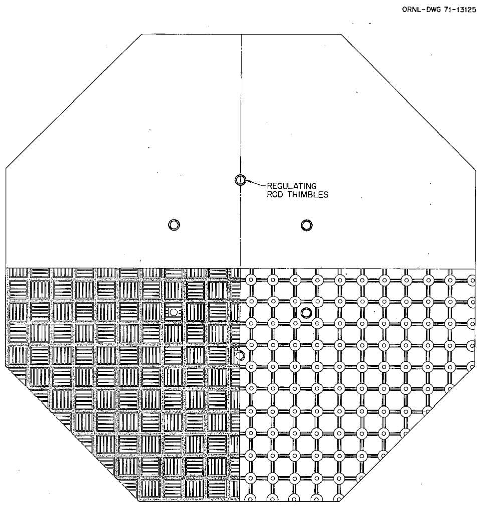  
Fig. 1.1. Plan view of 300-MW(e) MSDR reactor core.

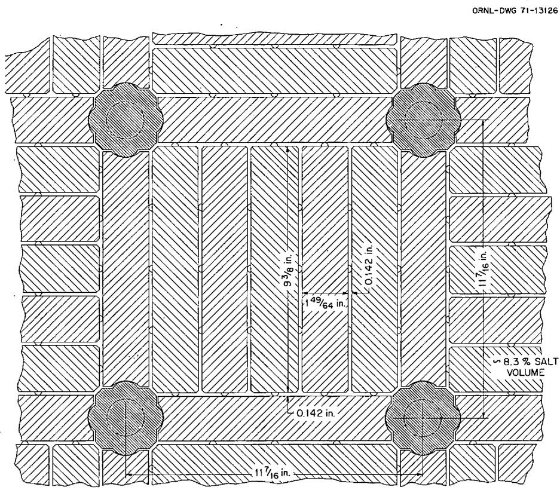  
Fig. 1.2. Reactor core cell assembly plan for 300-MW(e) MSDR.

grid plate, and an upper 1-in. length has a diameter of about $\frac{7}{8}$ in. to fit into a corresponding hole in the upper orifice plate, as shown in Fig. 1.3. The posts and slabs thus form a cell about $11^{\frac{1}{2}} \times 11^{\frac{1}{2}}$ in. Dowels provide interstitial spaces for maintaining the upward flow of salt at the design velocity and establish the salt-to-graphite ratio necessary for nuclear performance. Retainer plates at the top of the posts tie the entire core together, as indicated in Fig. 1.3. Individual orifice plates are placed over each cell under the retainer plates to hold down the slabs as well as to provide the necessary orificing of the flow.

The slabs adopted for the MSDR core graphite are easier to fabricate than the prisms used in the MSBR and earlier MSDR designs. The slab shape will also allow the graphite to operate at lower temperatures and at lower stress levels. The graphite temperature at the center of the core has been estimated to be $1190^{\circ}\mathrm{F}$ .

# 1.1.3 MSDR Off-Gas and Salt Pump-Back System

The primary function of the fuel-salt drain tank is to store the salt safely when it is drained from the reactor primary system, but the tank serves some secondary purposes as well. The revised MSDR system no longer

depends upon the drain tank as an expansion volume for the salt since the salt-circulation pump bowls are large enough for this purpose. The drain tank continues to serve as a holdup and decay volume for the gases stripped from the circulating fuel salt in normal operation. The drain tank is well suited for this purpose because its heat removal system can handle the approximately 6 MW(t) of heat generated in the gas.

In the MSDR fuel-salt circulation system about $10\%$ of the pump outlet flow is bypassed through a gas separation loop. The salt first passes through a gas separator in this loop, where about 2 cfm (STP) of gas, with 1 to $2\mathrm{ft}^3$ of salt entrained in it, is removed. Several schemes were studied for separating the entrained salt from the gas, such as spray towers, cyclone separators, etc. The very high heat release from the radioactive gas requires large heat removal systems, however, and the indeterminate manner in which the solid daughters of the gaseous fission products could coat metal surfaces makes it necessary to provide ample surface for accumulation of the particles. After some study it was decided to use the drain tank itself to separate the salt from the gas, the large volume of the tank permitting simple separation by gravity. The large surface of the cooling thimbles in the drain tank would

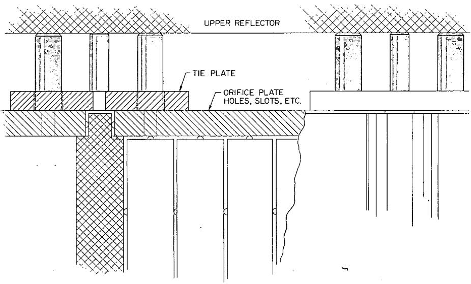

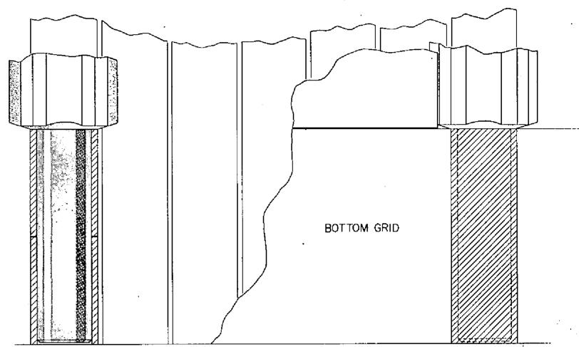  
Fig. 1.3. Reactor core cell assembly elevation for 300-MW(e) MSDR.

provide sufficient area for the solid daughters of the noble gases to coalesce.

Each of the gas separators in the three salt-circulation loops in the MSDR discharges the gas-salt mixture into the drain tank through a $1\frac{1}{2}$ -in. line. The temperature of the pipe is limited to about $1325^{\circ}\mathrm{F}$ by the cooling action of the salt entrained in the gas. The line is provided with a syphon break to prevent drainage of the main salt-circulation loops in the event of a pump failure. The syphon break is in the form of a loop of piping that rises above the level of the liquid in the pump bowl and is equipped with a venturi, the throat of which communicates via a $\frac{1}{2}$ -in. pipe to the gas space above the liquid in the pump bowl. During

normal operation, gas from the bowl is drawn into the venturi and discharged along with the gas-salt mixture from the gas separator into the drain tank. The total flow of salt into the drain tank via the gas separators is estimated to be about 40 gpm. Two small jet pumps in the 'tank return the salt to the primary loops. The operation of the system is described below, and the design of the jet pumps is described in Sect. 3.7.3.

An elevation of the jet pumps mounted in the center of the drain tank is shown in Fig. 1.4. The assembly is installed so that it can be withdrawn from the tank if repair or replacement becomes necessary. One of the jet pumps takes its suction from the bottom of a vertical 6-in. pipe at the center line of the vessel. The suction

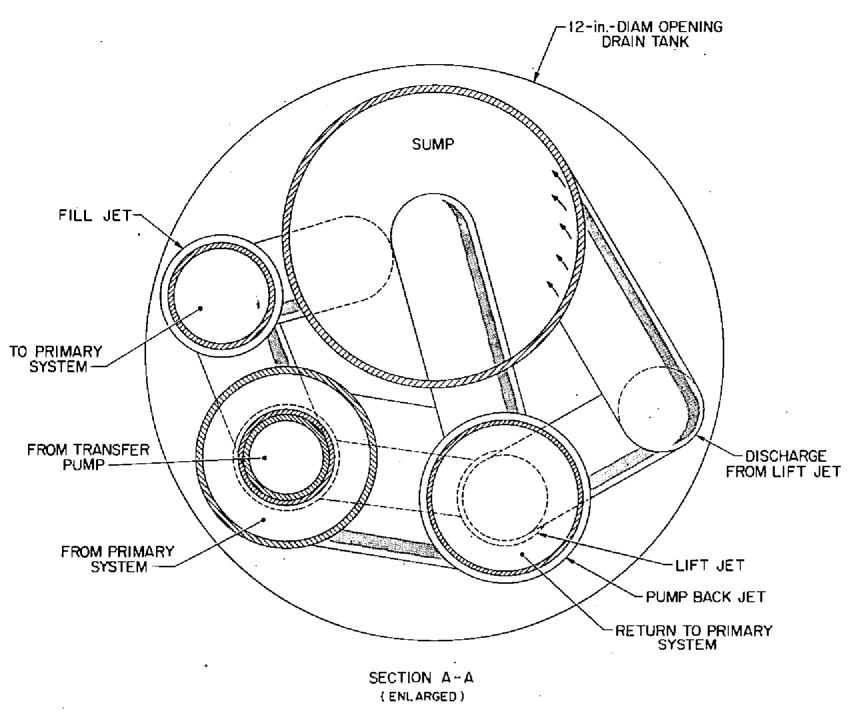

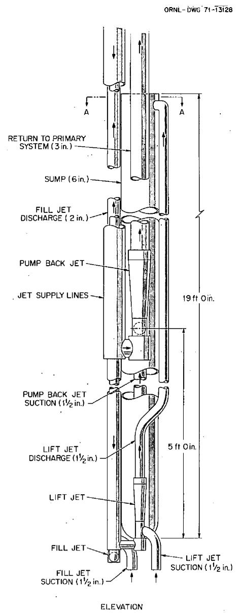  
Fig. 1.4: Elevation of jet pump assembly in drain tank.

head on the pump varies from about $+15$ to $-5$ ft as the level of salt in the pipe changes from full to empty. Since the discharge from the jet is proportional to the suction head, varying from zero at the lowest level to about 50 ppm when the sump is full, the jet cannot pump gas from the tank when it is empty of salt. The jet pump uses salt as its working fluid, the salt being taken from a manifold connecting the three salt-circulation pumps. Each manifold connection has a ball check valve to prevent backflow in the event of a pump shutdown.

As is also shown in Fig. 1.4, a second jet pump is provided in the assembly to keep the 6-in. central pipe supplied with salt from a small sump in the bottom of the drain tank. This jet has a capacity of about $50~\mathrm{gpm}$ , keeps the liquid pumped out of the drain tank, and, when the tank is empty, may recirculate gas within the tank. As described above, however, the system is designed to prevent pumping of gas from the tank back to the pump bowls. It provides automatic flow control regardless of the number of primary pumps that are running.

A third jet pump is provided in the assembly to fill the primary system with salt from the drain tank and to transfer salt from the drain tank into the fuel-salt storage tank. The working fluid for this third jet pump is provided by a separate small pump located in the chemical processing cell.

# 1.1.4 Drain Tank Cooling System

The drain tank cooling system described in a previous report has not been changed in principle, but the thimbles have been rearranged. The change was made to facilitate the manifolding of the pipes which carry the cooling NaK into and out of the thimbles. As shown in the plan view of the top of the drain tank, Fig. 1.5, there are now 60 sets of thimbles, each containing 6 thimbles arranged symmetrically in a circular pattern. Figure 1.6 is an elevation of the drain tank. One of the manifolds is shown in cross section in Fig. 1.6 to indicate that it would be possible to remove and replace manifolds if maintenance were required. By manifolding only six thimbles in a circular pattern, the measures

required to accommodate thermal expansion are made much less stringent. Use of 60 different circuits limits the amount of NaK that could leak from one circuit to about $16\mathrm{ft}^3$

In another change in the drain tank system from that described previously, the one large water tank, to which the NaK circuits reject their heat by radiation, has been replaced by three smaller tanks. The NaK circuits are manifolded in such a manner as to divide the heat removal capability between the three water pools, and with any two water tanks in operation the temperature in the drain tank could be limited to about $1400^{\circ}\mathrm{F}$ . This arrangement is considered to be more reliable than the previous one in which a single leak could result in total loss of water.

Studies have been initiated on the effects of seismic disturbances on the drain tank and its cooling system. Preliminary calculations indicate that the individual thimbles in the drain tank would have a natural frequency of about 1.5 cps when each thimble is considered to be a 20-ft-long cantilevered member. Since earthquakes produce excitation in the range of 3

ORNL-DWG 71-13129

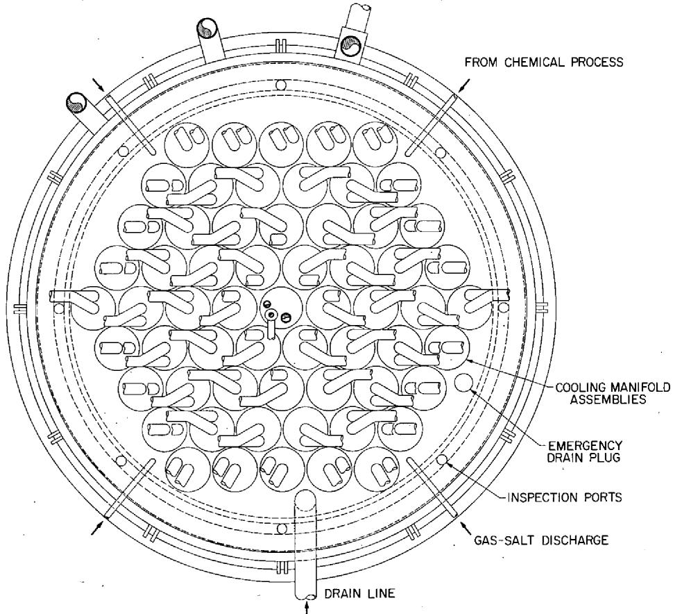  
Fig. 1.5. Plan view of top of drain tank showing new thimble arrangement.

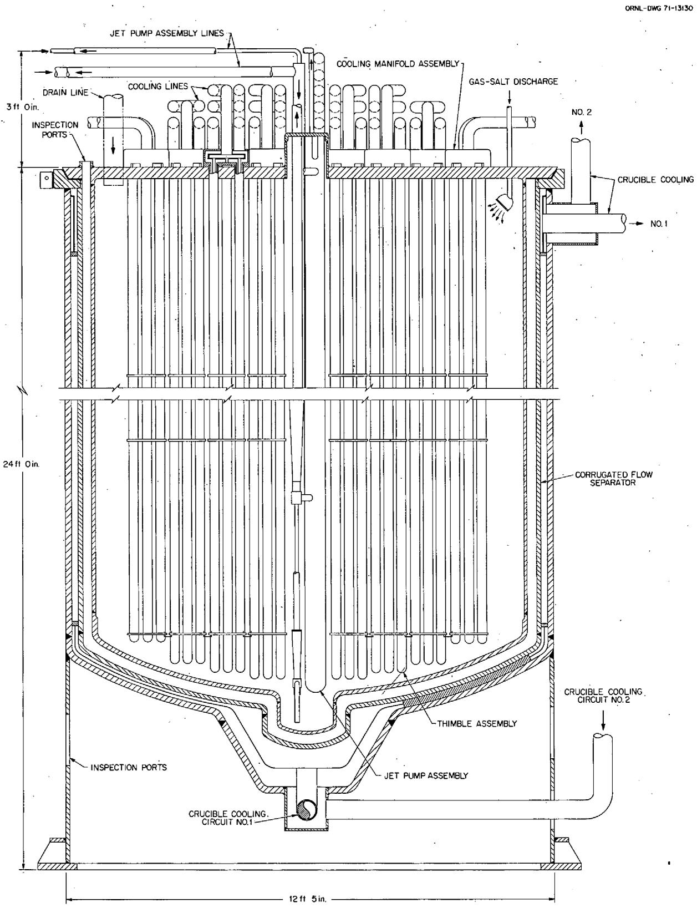  
Fig. 1.6. Primary salt drain tank sectional elevation.

to 4 cps, means for changing the natural frequency of the thimbles have been given preliminary study. All thimbles in each group of six would be tied or banded together at 3-ft intervals along the length. In addition, all 60 groups of thimbles would be tied together at the bottom by "U"-bolt-type clevises. These ties would restrict radial movement to make the entire array act as a unit if seismically disturbed, but would permit longitudinal motion resulting from differential thermal expansion. The method of joining the units together is indicated in Fig. 1.6.

# 1.1.5 Drain Valve Cell

The cell provided for the freeze valve in the fuel-salt drain line leading from the bottom of the reactor to the drain tank has been eliminated in the revised MSDR design, and the valve is now located in the drain tank cell. This arrangement facilitates replacement of drain lines and associated piping should maintenance be required. The drain lines now pass through penetrations in the side of the reactor cell, and the valves in these lines are accessible through a separate hatch in the cover of the drain tank cell.

# 1.1.6 Drain Cell Catch Pan

A catch pan is provided in the bottom of the reactor cell to collect any accidental spillage of salt and direct it into the drain tank through frangible disk valves. An additional catch basin has now been added near the top of the drain tank in the drain tank cell to catch any leakage from the primary salt lines and direct it into the drain tank. This catch basin extends from the periphery of the drain tank at the top to the walls of the drain tank cell. As presently conceived, a 6-in.-diam hole in the basin communicates with the drain tank, the opening being normally sealed by an inverted cap with its lip in a trepanned groove that is filled with NaF. Since the melting temperature of the NaF is about $1600^{\circ}\mathrm{F}$ , the opening would remain sealed unless flooded with fuel salt, which would dissolve the NaF and allow the fuel salt to run into the interior chamber to float a graphite plug and then flow into the drain tank.

With catch basins provided for the reactor cell equipment, for the salt piping in the drain tank cell, and for the drain tank vessel itself (in the form of a cooled "crucible" surrounding the tank), we believe that the likelihood of an accident in which molten salt collects in a pool in the bottom of the containment vessel without sufficient cooling is very remote indeed.

# 1.2 SOME CONSEQUENCES OF TUBING FAILURE IN THE MSBR HEAT EXCHANGER

# R. P. Wichner

A study was made of the consequences of the mixing of fuel and coolant salts as a result of various modes of failure of tubing in the primary heat exchangers in the MSBR reference design. Four specific cases were examined: (1) double-ended failure near the fuel-salt outlet; (2) double-ended failure near the fuel-salt inlet; (3) small coolant-salt leak into the primary system; (4) small fuel-salt leak into the secondary system. The study is, in many places, speculative both because of the preliminary status of the design and the lack of adequate physicochemical data on mixing of fuel and coolant salts. However unpleasant some of the consequences of tubing failure may be, no way of generating either a nuclear excursion or a rupture in the primary or secondary loop piping is foreseen.

Some additional tentative conclusions of the study are:

(1) For a case 1 failure (double-ended tubing failure near the fuel-salt outlet of the heat exchanger), 3.5 lb/sec of coolant salt initially leaks into the primary system. The boron poison in this leakage stream is sufficiently large such that a low-power-level trip, if present, is actuated essentially immediately on arrival of the contaminated fuel at the lower axial blanket in the reactor vessel. The worth of the boron poison is estimated to be $0.18\% \delta k / k$ per pound of coolant salt distributed uniformly over zones I and II of the reactor core.   
(2) Additionally, for a case 1 tubing failure, 0.96 lb/sec of fuel salt initially leaks into the secondary loop. However, the bulk of the fuel-salt leakage into the secondary system, and the coolant-salt leakage into the primary system, occurs after reactor shutdown. A total of approximately 300 lb of fuel salt leaks into the secondary system, all but 4 lb occurring in the 20-min interval in which the freeze valves are thawing and the loops are draining. If the cover-gas pressure in the secondary loop were set about 3 psi higher than the 10 psig in the present design, there would be no fuel-salt leakage in this interval, and the total loss of fuel salt to the secondary system would be approximately 4 lb for this case.   
(3) It is judged that the fuel salt which leaks into the shell of the heat exchanger after shutdown will initially be in the form of immiscible droplets that subsequently freeze and settle onto the lower tube sheet. The maximum temperature caused by this localized heat

source is estimated to be approximately equal to that reached in central portions of the heat exchanger due to noble-metal heating, or approximately $1660^{\circ}\mathrm{F}$ when coolant salt remains in the shell.

(4) If rapid evolution of $\mathbf{BF}_3$ from the coolant-salt stream leaking into the primary system is assumed, a maximum pressure rise of 74 psi in the primary loop is estimated for a case 1 type of failure. It is judged that rapid evolution of $\mathbf{BF}_3$ will not damage the primary pumps if shutdown procedures are initiated most promptly - as would be the case if a low-power-level trip is incorporated into the automatic protection system.   
(5) Since there is no provision for draining coolant salt from the shell of the heat exchanger, ultimately, following a case 1 failure, the entire contents of the shell - 444 ft³ (52,000 lb) - leaks into the primary drain tank through the failed tube. The main consequence of this large addition of coolant salt to the fuel salt is judged to be the evolution of large volumes of $\mathrm{BF}_3$ in the primary system with possible deleterious effects to the charcoal beds. No means for seriously elevating the fuel liquidus temperature is envisioned even by the addition of two heat exchanger shells worth of coolant.   
(6) A case 2 failure (double-ended tubing failure near the fuel-salt inlet) initially allows $7.4\mathrm{lb} / \mathrm{sec}$ of fuel salt to leak into the secondary system. If a delayed neutron detector on the secondary system is an integral part of the reactor protection system and a signal from it stops the pumps, then a total of approximately $60\mathrm{lb}$ of fuel salt is lost. It is judged that this fuel salt will form immiscible droplets that freeze and settle to the lower tube sheet.   
(7) For case 3 it was assumed that a pinhole in the tubing allows $3 \times 10^{-4} \mathrm{lb/sec}$ of coolant salt into the primary system, at which rate approximately $2.6 \mathrm{hr}$ are required to add $-0.3\% \delta k / k$ -- the total worth of the control rods. A control rod location alarm is set off at some point during the gradual inward drift of the control rods. If no operator action is taken, the low-temperature trip on the core outlet initiates shutdown approximately $26 \mathrm{~min}$ after full insertion. Thus, the duration of this incident is 2 to $3 \mathrm{hr}$ ; however, even a fairly insensitive $\mathrm{BF}_3$ detector on the off-gas flow, if one were available, would detect the presence of the leak within minutes.   
(8) In case 4 a $3 \times 10^{-4}$ lb/sec leakage rate of fuel salt into the secondary system is assumed to occur through a 2-mil-diam pinhole in the tubing near the fuel inlet. A leak rate of this magnitude would cause a flux of delayed neutrons of approximately 70 neutrons

$\mathrm{cm}^{-2}\sec^{-1}$ at a detector positioned near the outlet of the heat exchanger. This is seven times the lower detection limit of ion chambers, and hence an automatic shutdown would be initiated a few seconds after the inception of the leak, if a delayed neutron detector were so deployed.

# 1.3 SIDE-STREAM PROCESSING OF THE MSBR PRIMARY FLOW FOR XENON AND/OR IODINE REMOVAL

R.P.Wichner

A state-of-the-art report, presently in preparation, on means for dealing with the $^{135}\mathrm{Xe}$ poison in molten-salt reactors will contain an evaluation of the side-stream processing approaches to the problem. These processes differ basically from the present reference design method in that a single bypass flow of fuel salt is processed in a gas-stripping device for removal of xenon and/or iodine. Thus, the four gas-separator loops are eliminated as are the circulating bubbles; however, use of the latter is not precluded in side-stream processing concepts.

There are a number of strong incentives for sidestream removal methods, especially for iodine or combined xenon and iodine removal schemes. Present evidence indicates that the "effective solubility" of iodine in fuel salt is quite high,[4] so that some difficulty may be expected in efficiently removing it in a stripping device. This inconvenience is more than compensated for by the corollary that diffusion rates of HI into the graphite will be low. Hence, the sole significant competitive removal rate is the slow decay to xenon, and consequently only very small bypass flow rates are required. If an efficient iodine stripper is available, bypass flows as low as 225 gpm will capture almost all the iodine before it decays to xenon, and if no other control method is applied, the xenon poison fraction will be the 0.001 resulting from the direct fission yield of $^{135}\mathrm{Xe}$ .

A particularly attractive situation is attained by a combined iodine plus xenon stripper. If one assumes a bypass flow through such a device of $10\%$ of the primary flow - equal to the bypass flow rate in the

reference design through the four gas separators - and that such a device, designed primarily for xenon removal, does so with high efficiency, then if additionally only $10\%$ of the iodine throughput were simultaneously removed, a $^{135}\mathrm{Xe}$ poison fraction of $\sim 0.003$ would be attained without employing impervious coatings on the graphite. Present understanding of the mechanism of iodine stripping indicates that some HI (and TI) will be removed in a xenon stripper employing inert helium stripping gas due to the presence of protons and tritons in the fuel. The degree of HI removal may be enhanced by adding some HF to the stripping gas.

# 1.4 MSBE DESIGN

M. I. Lundin J. R. McWherter

# 1.4.1 Reactor Core Power and Neutron Flux Distribution

J.R.McWherter J.P.Sanders

The design studies reported previously $^{5}$ were continued with the reactor core concept remaining essentially unchanged. The core is a cylinder 45 in. in diameter and 57 in. high formed of graphite bars and contains $15 \, \text{vol}\%$ fuel salt. The core is in a 90-in.-ID spherical reactor vessel. The space between the vessel wall and the core is filled with fuel salt. The reactor thermal power is $150 \, \text{MW}$ .

A computer subroutine, entitled HOLES, was used to produce contour plots of the power distribution and neutron fluxes in the MSBE core; the calculated power and neutron flux distributions were produced by a finite-element, multigroup reactor physics code called CITATION. Data from CITATION case 41 (the 45-in.-diam, 57-in.-high cylindrical core with a 0.15 salt fraction located in a 90-in.-diam spherical vessel) was scaled to a reactor power of $150\mathrm{MW}$ as input for HOLES.

Two of the plots produced are shown in Figs. 1.7 and 1.8. Several characteristics of the plots are dependent upon the features of the CITATION code. The CITATION code indicates the value of the power density and neutron flux for a limited number of points in the axial and radial directions, and the code approximates a spherical geometry by using a series of stacked cylindrical disks of decreasing radius. Values of the power density and neutron flux for coordinate points at the center line and midplane are not given since the

analytical and numerical solutions are indeterminate at these points. The subroutine HOLES plots the contour lines by making a linear interpolation along the grid lines between the given values.

Because of the relatively gross spacing of lattice points, the power density and the neutron flux are not represented accurately in the region near the boundary between the core and the blanket. The neutron flux is assumed to vary linearly between the lattice points in the core and in the blanket nearest the boundary, and the power density varies across the boundary with the change in flux and fuel-salt fraction. The approximation of spherical geometry by stacked cylindrical disks, which is used in CITATION, becomes evident in the perturbations in the contour lines for power densities near the vessel wall. Because of the symmetry of the core, all the contour lines should have slopes which are perpendicular to the axes. Again, the large difference in the values of the coordinates of the lattice points obscured this characteristic at the higher power levels where the change in values for adjacent lattice points was the greatest.

The values shown for power density in Fig. 1.7 are per unit volume of the core and moderator. Discontinuities occur at a radial position of $57~\mathrm{cm}$ $(22^{1/2}$ in.) and at an axial position of $72~\mathrm{cm}$ $(28^{1/2}$ in.) above the midplane; at these points, the salt fraction changes from 0.15 to 1.00 in the radial direction and to 0.70 in the axial direction.

This same subroutine was used to draw contour plots of several combinations of the nine energy groups of neutrons in the MSBE. To get the graphite damage flux, data from the first (highest) group were combined with $85\%$ of the data for the second energy group. This gives the estimated flux above $50 \mathrm{keV}$ and was used as input for the plot given in Fig. 1.8.

# 1.4.2 Reactor Core Heat Removal

H. A. McLain D. W. Wilson

Calculations indicate that the graphite moderator temperature at the center of the reference three-pass MSBE core is 100 to $150^{\circ}\mathrm{F}$ higher than it is at the center of the reference MSBR core. The maximum temperature at the center of the MSBE core is about

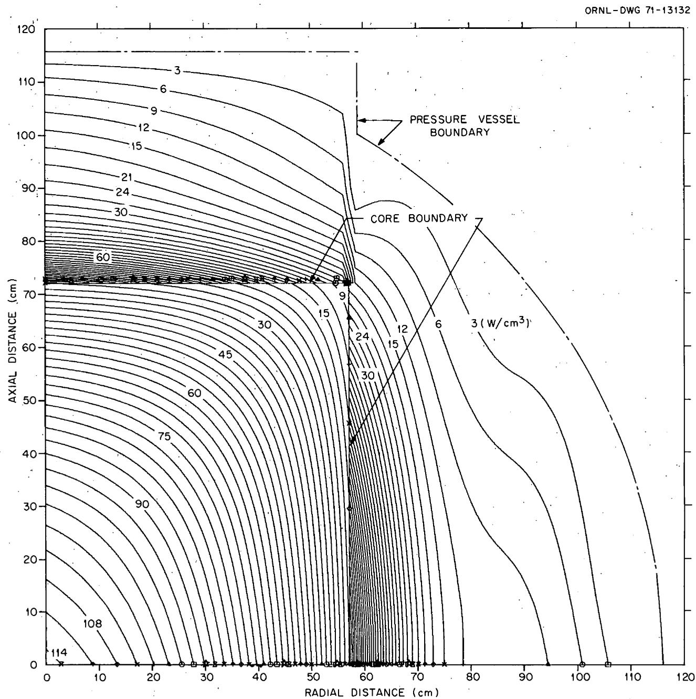  
Fig. 1.7. Power distribution in the MSBE core.

$1450^{\circ}\mathrm{F}$ , and the average temperature is $1390^{\circ}\mathrm{F}$ . For a single-pass core, these temperatures are about $10^{\circ}\mathrm{F}$ lower. A disadvantage of the single-pass core is that the velocity required to achieve the $250^{\circ}\mathrm{F} \Delta T$ across the core is only one-third of that in the 15-ft-high MSBR reference concept.

The high temperatures at the center of the MSBE core are due to the high power density and graphite heating

rate, $^{9}$ 114 W per cubic centimeter of core and 11 W per cubic centimeter of graphite, respectively. These temperatures also imply that the graphite at the center of the reactor core would have to be replaced after about

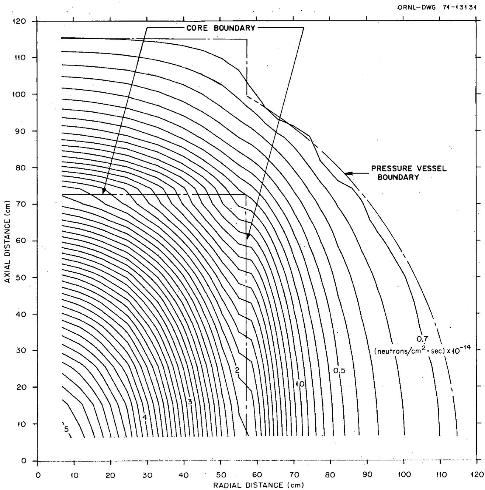  
Fig. 1.8. MSBE graphite damage flux $(E > 50\mathrm{keV})$

1.7 years of full-power operation using the relation recommended by Eatherly. $^{10}$ Calculations were also made for prismatic moderator elements in a single-pass

core in which the 3.64-in. distance between the flat surfaces was reduced to 3.0, 2.75, and 2.5 in., but the central hole diameter was held at 0.6 in. These changes resulted in average graphite temperatures at the center of the core of 1310, 1290, and $1260^{\circ}\mathrm{F}$ , respectively, with corresponding graphite lifetimes of 1.9, 2.0, and 2.1 years. Average graphite temperatures and lifetimes along the reactor center line for the 3-in. prismatic

element are shown in Fig. 1.9. The minimum graphite lifetime is at the center of the core.

Slab-type moderator elements also were considered. At the center of the core, slabs of thicknesses of 1.0, 1.25, and 1.5 in. have average graphite temperatures of 1270, 1290, and $1320^{\circ}\mathrm{F}$ , respectively, and lifetimes of 2.0, 2.0, and 1.9 years, respectively.

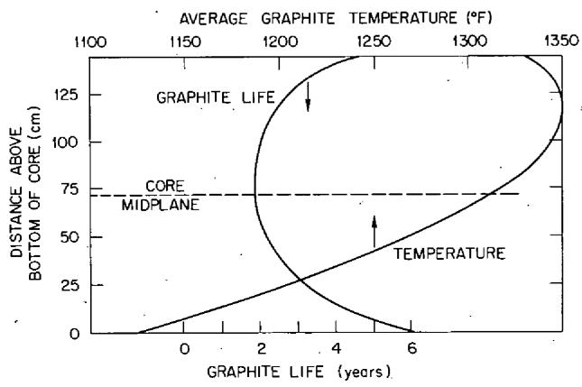  
ORNL-DWG71-13133   
Fig. 1.9. Average graphite temperature and life along MSBE core center line for 3-in. prismatic element.

# 1.4.3 Maintenance Studies

J.R.McWherter

W. K. Furlong

H. A. McLain

J. T. Meador

W. Terry

Studies were made of procedures for replacing the core moderator elements individually instead of replacing the entire core assembly at one time as proposed in

the reference design.7 The main difficulty in removing elements individually is holding the elements remaining in the core in their normal upright positions when some have been removed. A permanent fixture or a removable jig will have to be designed to accomplish this.

Layout studies of the MSBE primary heat exchanger were made with the major consideration being given to maintenance. In one approach proposed, a tube can be plugged in place or the entire heat exchanger can be removed from the reactor cell for repair or replacement. The heat exchanger is assumed to be a U-shaped unit mounted horizontally. Horizontal mounting of a U-shaped unit is desirable to permit draining of the fuel and coolant salts and to minimize the possibility of accumulating crud in the heat exchanger tubes.

In the proposal, the unit is mounted on trunnions to facilitate removal from the cell for repair or replacement, in the unlikely event this is required. A remote pipe-cutting device is lowered into the cell through an opening in the shielding above the equipment to cut the pipes connecting the exchanger to the salt systems. The exchanger is then rotated on the trunnions to a vertical position and lifted out of the reactor cell through an opening at the top of the cell. This procedure is reversed when installing a heat exchanger with the welding of this unit to the connecting pipes being done remotely. Pipe springback and alignment are major considerations in the last step. Present remote welding technology11 indicates that the two ends of a pipe to be welded must be aligned within $\frac{1}{16}$ in.

# 1.5 MSBR INDUSTRIAL DESIGN STUDY

M. I. Lundin J. R. McWherter

The subcontract12 negotiated between ORNL and the Evasco Services group, consisting of Evasco, Babcock and Wilcox, Byron Jackson, Cabot, Conoco, and Union Carbide Companies, was signed. This subcontract covers the conduct of an industrial design study of a 1000-MW(e) MSBR plant.

12. MSR Program Semiannu. Progr. Rep. Feb. 28, 1971, ORNL-4676, p. 36.

Task I, the selection of a reference conceptual design, is essentially complete. Two progress reports were submitted.

The overall core size is the same as that in the ORNL reference concept, but a slab-type graphite element is proposed. Several of these slabs are held at the top and bottom in a hexagonal array as shown in Figs. 1.10 and 1.11. This assembly is sufficiently small to be handled and replaced as a unit. One hundred fifty-seven such arrays are required for the core. A 2-ft-thick radial graphite reflector surrounds the core. A boron-containing thermal shield separates the reflector from the pressure vessel to reduce the radiation damage resulting from transmutation of boron in the Hastelloy N.

ORNL-DWG71-13134

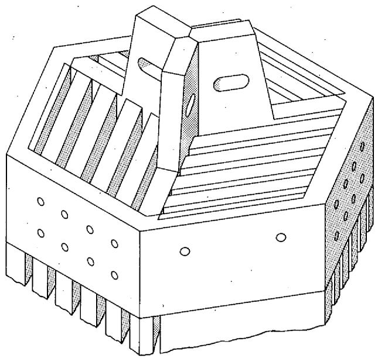  
Fig. 1.10. MSBR industrial study proposed graphite array.

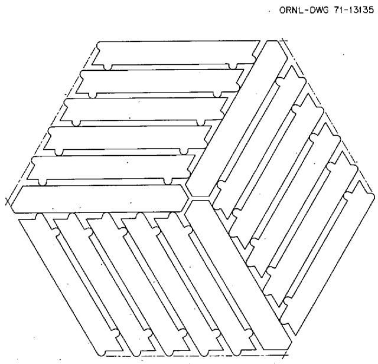  
Fig. 1.11. MSBR industrial study proposed graphite array - zone I - section at midplane.

# 2. Reactor Physics

A.M.Perry

# 2.1 MSR EXPERIMENTAL PHYSICS

# 2.1.1 HTLTR Lattice Experiments

G. L. Ragan

O. L. Smith

The experimental program, described in considerable detail in the preceding semiannual report, $^{1}$ has now been completed at the Battelle Northwest Laboratories. $^{2}$ Measurements were made at four operating temperatures: 20, 300, 627, and $1000^{\circ}\mathrm{C}$ . At each temperature BNWL measured the basic lattice multiplication factor $k_{\infty}$ and the reactivity worths of some 24 perturbations at the center of a lattice that was neutronically similar to a typical MSBR design proposal. These perturbations were chosen to reveal certain reactor physics characteristics of such a lattice and to provide experimental results against which we can test our calculational techniques.

The measured multiplication factor $k_{\infty}$ varied from 1.029 at $20^{\circ}\mathrm{C}$ to 1.004 at $1000^{\circ}\mathrm{C}$ . Our only precalculated value (1.020 at $627^{\circ}\mathrm{C}$ ) was considerably higher than the measured value (1.007 at $627^{\circ}\mathrm{C}$ ), but the significance of the discrepancy cannot be assessed until

we are able to include the self-shielding effects of the particles in the fuel mixture - which had to be neglected in the precalculations. The perturbation worths at $627^{\circ}\mathrm{C}$ that we calculated showed similar divergences from those measured, but particle self-shielding effects were neglected in these precalculations also.

In our precalculations, the XSDRN code was used to obtain group cross sections for each region and also to perform multigroup one-dimensional neutronics calculations with the $S_{n}$ transport method. The standard version of XSDRN used in the precalculations is limited to one degree of heterogeneity per region, for example, homogeneous fuel rods disposed in a lattice arrangement. We have now modified the GAM-II part of the XSDRN code so that it obtains group cross sections in the resonance energy range for doubly heterogeneous regions; for example, the self-shielding effects of $\mathrm{ThO_2}$ particles within the above-mentioned fuel rods may be included.

In its original form,4 GAM-II yields the lump (region 0) collision density per unit energy $F_{0}(E)$ . From this, one readily obtains the lump flux per unit lethargy,

$$
\phi_ {0} (u) = \frac {F _ {0} (u)}{\Sigma_ {t , 0} (u)} = \frac {E F _ {0} (E)}{\Sigma_ {t , 0} (E)},
$$

where $\Sigma_{t,0}(E)$ is the total cross section in the lump. These results are made possible by eliminating explicit reference to the external (region 1) moderator by (1) assuming that region 1 sources are well approximated by using the asymptotic flux and the narrow resonance (NR) approximation for them, (2) using the flat-source overall escape probabilities $P_0^* (u)$ and $P_{1}^{*}(u)$ , and (3) invoking the reciprocity theorem. With the same assumptions, it can be shown that the region 1 flux is given by

$$
\phi_ {1} (u) = 1 - \frac {P _ {0} ^ {*} (u)}{1 - P _ {0} ^ {*} (u)} \frac {V _ {0} \Sigma_ {t , 0} (u)}{V _ {1} \Sigma_ {t , 1}} [ 1 - \phi_ {0} (u) ],
$$

where $V_{0}$ and $V_{1}$ are the fractional volumes of the two regions. It should be noted that we do not assume $\phi_1(u)$ to be simply the asymptotic flux, nor is the equation given limited to small fractional lump volumes. As illustrated by examples given below, the equation has been tested rather extensively, with good results.

The revised GAM-II treatment in the XSDRN code treats a doubly heterogeneous problem by assuming that the two degrees of heterogeneity are separable - an assumption that will be examined below. Although the code is more general, it will be explained on the basis of the $\mathrm{ThO_2}$ grains in the fuel of an HTLTR loading. The fuel is first considered as an infinite medium, and the GAM-II solutions for $\phi_0(u)$ in the grains and $\phi_{1}(u)$ in the matrix around them are obtained over the usual lethargy band encompassing a given thorium resonance. The associated volume-averaged fluxes and the regional disadvantage factors $d_0(u)$ and $d_{1}(u)$ are then obtained, and the appropriate disadvantage factor is applied to the cross sections of each nuclide at each lethargy point. These disadvantaged cross sections are then taken to characterize a smeared (homogenized) fuel within the fuel rods (say, region 2) in a lattice having graphite (say, region 3) between the rods. The GAM-II treatment is again applied, over the same lethargy band encompassing the given thorium resonance, to obtain $\phi_2(u)$ and $\phi_3(u)$ . Now one performs for the given thorium resonance the appropriate integration to obtain cell-averaged cross

sections that include grain self-shielding effects. The same procedure is repeated for each thorium resonance, as is customary with GAM-II.

Instead of using the modified GAM-II treatment to obtain grain shielding factors as was done above, several alternative procedures may be used. Perhaps the simplest of these is the NR approximation, as applied to the grain. One assumes that the sources in the grain are well approximated by using the asymptotic flux and the grain potential scattering cross sections to calculate them - just as one assumes for the moderator in the usual GAM-II treatment. This leads to

$$
\phi_ {0} (u) = P _ {0} ^ {*} (u) + \left[ 1 - P _ {0} ^ {*} (u) \right] \frac {\Sigma_ {p , 0}}{\Sigma_ {t , 0} (u)},
$$

$$
\phi_ {1} (u) = 1 - P _ {0} ^ {*} (u) \frac {V _ {0}}{V _ {1}} \frac {\Sigma_ {t , 0} (u) - \Sigma_ {p , 0}}{\Sigma_ {p , 1}},
$$

for the NR approximation. Here $\Sigma_{p,0}$ and $\Sigma_{t,0}$ are the potential and total cross sections for the grain, all grain nuclides being included.

Alternatively, one may assume that the NR approximation may be used for all sources due to moderators, but that no downscattering is contributed by collisions with resonance-absorber atoms, the so-called narrow resonance infinite-mass (NRIM) approximation. The resulting fluxes are

$$
\phi_ {0} (u) = \frac {P _ {0} ^ {*} (u) + [ 1 - P _ {0} ^ {*} (u) ] [ \Sigma_ {p , 0} ^ {m} / \Sigma_ {t , 0} (u) ]}{1 - [ 1 - P _ {0} ^ {*} (u) ] [ \Sigma_ {s , 0} ^ {r} (u) / \Sigma_ {t , 0} (u) ]},
$$

$$
\phi_ {1} (u) = 1 - P _ {0} ^ {*} (u) \frac {V _ {0}}{V _ {1}} \frac {\Sigma_ {t , 0} ^ {r} (u) - \phi_ {0} (u) \Sigma_ {s , 0} ^ {r} (u)}{\Sigma_ {p , 1}},
$$

where superscripts $r$ and $m$ denote resonance absorber and admixed moderator, respectively.

An accurate solution of the two-region problem may be obtained with the computer code GAROL, which solves explicitly for the neutron-collision densities in the two regions, avoiding most of the approximations present in the earlier GAM-II code. While not integrated into our cross-section averaging procedures, this code permits checks to be made, with test problems, on the

approximations to be used in the analysis of the HTLTR experiments.

Numerous other approximate methods have been proposed. In a recent paper, P. Wälti discusses several of these and proposes one of his own that is somewhat related to the NRIM approach. Wälti gives an example involving a carbon matrix containing thorium carbide grains of $400 - \mu$ diameter that occupy $10\%$ of the volume. We have used his problem to compare several methods of obtaining grain shielding factors, with results given in Table 2.1. Our results differ slightly from Wälti's because we used slightly different resonance parameters. Fluxes and flux ratios are given at the peaks of the two lowest thorium resonances. Programming of the Wälti method and adaptation of GAROL to the IBM-360 were done by W. E. Thomas.

Table 2.1. Fluxes at two thorium resonance peaksa calculated for a test problem by several methods   

<table><tr><td rowspan="2">Method1</td><td colspan="3">21.7-eV peak</td><td colspan="3">23.4-eV peak</td></tr><tr><td>φ0(u)</td><td>φ1(u)</td><td>φ0/φ1</td><td>φ0(u)</td><td>φ1(u)</td><td>φ0/φ1</td></tr><tr><td>GAM-II</td><td>0.1155</td><td>0.1562</td><td>0.7398</td><td>0.0754</td><td>0.1209</td><td>0.6236</td></tr><tr><td>NR</td><td>0.1137</td><td>0.1544</td><td>0.7363</td><td>0.0720</td><td>0.1176</td><td>0.6121</td></tr><tr><td>NRIM</td><td>0.1116</td><td>0.1524</td><td>0.7323</td><td>0.0732</td><td>0.1188</td><td>0.6164</td></tr><tr><td>Walti</td><td></td><td></td><td>0.7323</td><td></td><td></td><td>0.6158</td></tr><tr><td>GAROL</td><td>0.1118</td><td>0.1513</td><td>0.7392</td><td>0.0725</td><td>0.1165</td><td>0.6219</td></tr></table>

$a_{\text{Each resonance treated separately and based on unit asymptotic flux.}}$

One may have confidence, on the basis of Table 2.1 and other more extensive studies of the same sort that we have carried out, that the use of GAM-II to evaluate the grain shielding factor in a heterogeneous fuel - as we have done in our revised XSDRN code - is valid. The results are very close to those given by GAROL, which is an almost exact solution. Not quite so good, but probably adequate for most practical cases, are the other three methods tabulated.

On the other hand, the assumed separability of the two degrees of heterogeneity certainly introduces some error, perhaps enough to be significant. In principle, one could consider the three distinct regions (called 0, 1, and 3 above) simultaneously and either (1) generalize

the GAM-II treatment or (2) use a multiregion code such as EGGNIT.8 Procedure (1) was tried, but it was soon realized that a major obstacle in these approaches is that expressions for the collision probabilities $P_{0,0}$ , $P_{0,1}$ , and $P_{0,3}$ are not available. (It was encouraging, however, that approximate expressions gave results that were close to those obtained on the basis of the assumed separability.) Efforts therefore turned to checking the validity of the results obtained by assuming separability by comparison with results obtained using a transport method of solution for a selected problem involving a double heterogeneity. This work is still in progress.

# 2.2 PHYSICS ANALYSIS OF MSBR

# 2.2.1 Neutron Irradiation Effects Outside the MSBR Core

J. R. Engel

One of the basic characteristics of the current MSR concepts is the emission of a substantial fraction of the delayed fission neutrons in regions other than the core of the reactor. Besides the effect on the dynamics of the chain reaction in the core, the emission of neutrons from the circulating fuel allows a number of potentially significant neutronic processes to occur in noncore components. Computations were performed to estimate the magnitude and effects in the reference design MSBR of two out-of-core neutron processes: irradiation damage to the Hastelloy N structural material and neutron activation of the secondary salt. In general, two areas were examined: the reactor outlet lines where the neutron sources are most intense and the primary heat exchangers where there is interaction with the coolant salt.

Neutron sources. Delayed neutrons are emitted by at least 25 nuclides that have fission product precursors with half-lives ranging from a small fraction of a second to 55.6 sec. These precursors are normally combined into six groups, and the net yield of delayed neutrons in each group is expressed as a fraction of the total neutron yield from fission. Data on the half-lives and yields of delayed neutrons are readily available for the various fissile materials. However, considerably less material has been published regarding the energy spectra of the delayed neutrons, particularly for neutron energies above 1 to $2\mathrm{MeV}$ . Although relatively few

Table 2.2. Neutron activation processes in MSBR components due to delayed neutrons   

<table><tr><td rowspan="2">Component</td><td colspan="2">Helium production in Hastelloy N in 30 EFPY (ppb)</td><td rowspan="2">24Na inventory in coolant salt (Ci)</td><td rowspan="2">Tritium production rate (Ci/day)c</td></tr><tr><td>10B(n, α)a</td><td>58Ni(n, α)b</td></tr><tr><td>Heat exchanger</td><td></td><td></td><td></td><td></td></tr><tr><td>NaBF4-NaF</td><td>1.3</td><td>1-9</td><td>5000</td><td>0.03</td></tr><tr><td>Li2BeF4(0.999957Li)</td><td>46</td><td>3-11</td><td></td><td>0.7</td></tr><tr><td>Li2BeF4(natural Li)</td><td>3.3</td><td>1-9</td><td></td><td>124</td></tr><tr><td>Reactor outlet line</td><td>7</td><td>8-40</td><td></td><td></td></tr></table>

${}^{a}$ Based on initial ${}^{10}\mathrm{\;B}$ concentration of 2 atom ppm.   
${}^{b}$ Range indicates effect of different assumptions for delayed-neutron source spectrum.   
$c$ In the coolant salt.

high-energy delayed neutrons are to be expected, some neutron capture processes are quite sensitive to the high-energy neutron flux. Consequently, calculations were performed for two assumed shapes of the delayed-neutron energy spectrum above $2\mathrm{MeV}$ . In one series the spectrum was assumed to be flat out to 10 MeV, and in the second series the data below $2\mathrm{MeV}$ were extrapolated to zero at about 5 MeV. The first assumption almost certainly overestimates the high-energy processes, and the second may also be conservatively high.

The intensities of the delayed-neutron sources were computed from a hydraulic model in which the reactor was divided into 16 regions with fission-energy production in 10 of them. Each region was treated as a homogeneous vessel to compute the concentration of delayed-neutron precursors at its outlet, and the various streams were mixed according to the flow distribution through the vessel. This led to a precursor concentration for each delayed-neutron group at the reactor outlet. From that point slug flow was assumed in calculating the concentrations in other parts of the external loop.

Processes. An important process for potential neutron-irradiation damage in Hastelloy N outside the core of an MSBR is the production of helium from $(n, \alpha)$ reactions. Very low helium concentrations (as low as 35

ppb) have been found to significantly reduce the ductility of the standard (unmodified) alloy. $^{10}$ Although the modified alloys are much less sensitive to helium, the production rate remains of interest. For low-energy neutrons the principal source of helium is the $^{10}\mathrm{B}(n,\alpha)^{7}\mathrm{Li}$ reaction in boron that occurs as an impurity in the alloy. At higher neutron energies, the reaction $^{58}\mathrm{Ni}(n,\alpha)^{55}\mathrm{Fe}$ may also be important because of the high nickel concentration in Hastelloy N. There is evidence from high-flux irradiations of other helium-producing reactions (probably involving sequential neutron absorptions), but these are not likely to be significant at the low fluxes that will exist outside the core of an MSR. Aside from helium effects, Hastelloy N is also subject to damage due to atom displacements caused by neutron scattering events.

The activation processes of interest in the secondary salt depend on the choice of coolant. With sodium fluoroborate, the principal activity is $15\text{-hr}^{24}\text{Na}$ from the reaction

$$
{ } ^ { 2 3 } \mathrm { N a } ( n , \gamma ) ^ { 2 4 } \mathrm { N a } .
$$

With lithium-beryllium fluoride, the several reactions that lead to tritium production are of greatest interest. (Other activities are very short-lived.) Tritium production was evaluated both for a coolant salt containing natural lithium and for one in which the lithium is $0.99995^{7}\mathrm{Li}$ .

Computations and results. All the processes described above were evaluated from one-dimensional neutron transport calculations made with the computer program XSDRN, using 123 neutron energy groups. The results of the various neutron absorption processes are summarized in Table 2.2.

The values listed for helium buildup in Hastelloy N are based on an initial $^{10}\mathrm{B}$ concentration of 2 atom ppm (about 2 wt ppm of natural boron). Since the boron reaction is essentially a thermal-neutron reaction, the helium from this process was unaffected by the assumed shape of the delayed-neutron energy spectrum. On the other hand, the $^{58}\mathrm{Ni}(n,\alpha)$ reaction has a high energy threshold, so two values are listed. The first or lower value corresponds to the neutron emission spectrum that went to zero at about 5 MeV, while the higher value was obtained with the spectrum that extended to 10 MeV. Since all of the helium values from $^{58}\mathrm{Ni}$ are quite low, the only potentially significant difference produced by the shape of the delayed-neutron spectrum is in the reactor outlet line. The results in Table 2.2 consider only the internal neutron sources - delayed fission neutrons plus those produced by fissions within the components. One calculation was performed to estimate the effect of core-leakage neutrons on the rate of helium production. The maximum amount of helium produced in the outer shell of the heat exchanger in 30 equivalent full-power years (EFPY) was about 500 ppb, 80% from $^{58}\mathrm{Ni}(n,\alpha)$ reactions. Thus helium production from core-leakage neutrons may completely overshadow, at least locally, the production from delayed neutrons, unless appropriate shielding is provided to reduce the fast-neutron flux from this source.

The activation processes in the coolant salt were found to be essentially independent of both the high-energy end of the delayed-neutron source spectrum and the incidence of core-leakage neutrons. The $^{24}\mathrm{Na}$ calculation is applicable only to the $\mathrm{NaBF}_4$ coolant, and the value listed is the total steady-state inventory for the 1000-MW(e) MSBR reference design. The production rates of tritium in the various coolant salts are all much smaller than the rate of production in the fuel salt (2400 Ci/day). In the case of coolant containing natural lithium, however, the production in the coolant is not negligible.

The damage rate in Hastelloy N by atom displacement was calculated for the highest flux regions in both the reactor outlet line and the heat exchanger with $\mathrm{NaBF_4}$ coolant. Since the neutron flux spectrum outside the core is quite different from any fission-reactor spectrum, the rate of accumulation of such damage was expected to be different also. Consequently, atom displacement rates were computed using effective "damage cross sections" evaluated by Jenkins. These cross sections were obtained by explicit evaluation of the energy transferred to primary recoil atoms and the Kinchin-Pease model for secondary atom displacements.

In the calculations, the effect of the assumed delayed-neutron spectrum was examined for the heat exchanger; however, none of the calculations included the effects of core-leakage neutrons. The effect of the delayed-neutron source spectrum was appreciable in terms of the $5^{8}\mathrm{Ni}(n,\alpha)$ reaction rate, but not significant in terms of overall helium production. However, all of the flux spectra in the out-of-core components were substantially "softer" than a typical test-reactor flux spectrum (e.g., that of HFIR). Consequently, the rates of atom displacement per unit flux $(E > 100\mathrm{keV})$ were lower by factors of 1.2 to 1.3 than those that would be encountered in a reactor spectrum with the same total flux above $100\mathrm{keV}$ . Thus, the total number of metal-atom displacements produced in these components by operation of an MSBR for 30 EFPY could be produced by irradiations to 2 to $4\times 10^{19}$ nvt $(E > 100\mathrm{keV})$ in a test reactor like HFIR. Although the total number of atom displacements is not an entirely accurate measure of metal damage (since it completely ignores annealing effects), the low equivalent HFIR fluences suggest that damage by this process is probably not of major concern for MSR components.

# 2.2.2 MSBE Nuclear Characteristics

# J. R. Engel

Perturbation calculations were added to a two-dimensional, nine-group diffusion calculation for the core of the reference concept $\mathbf{MSBE}^{12}$ to provide estimates of some of the reactivity coefficients of this reactor. Although these calculations are subject to refinement when a detailed core design is evolved, they serve to illustrate the kinds of values that may be expected. The results are summarized in Table 2.3, along with previously published results for the single-fluid MSBR. $^{13}$ A prominent difference between the MSBE values and the comparable quantities for the larger MSBR is in the reactivity effect of fuel-salt density. In the MSBE the density coefficient is positive, so that voids decrease reactivity $(-0.1\% \delta k / k$ for $1\%$ voids in the salt). This effect appears to be a consequence of the higher neutron leakage from the physically smaller MSBE core. Also significant is the

Table 2.3. MSR reactivity coefficients   

<table><tr><td rowspan="2">Variable</td><td colspan="2">Coefficient</td></tr><tr><td>MSBE</td><td>MSBR</td></tr><tr><td>Uranium concentration (δk/k)/(δ U/U)</td><td>+0.33</td><td>+0.47</td></tr><tr><td>Thorium concentration (δk/k)/(δ Th/Th)</td><td>-0.38</td><td></td></tr><tr><td>Fuel-salt density (δk/k)/(δρ/ρ)</td><td>+0.10</td><td>-0.04</td></tr><tr><td>Temperature (δk/k)/δT, °C-1</td><td></td><td></td></tr><tr><td>Fuel salt</td><td>-7.3 × 10-5</td><td>-3.2 × 10-5</td></tr><tr><td>Graphite</td><td>-0.7 × 10-5</td><td>+2.3 × 10-5</td></tr><tr><td>Total</td><td>-8.0 × 10-5</td><td>-0.9 × 10-5</td></tr></table>

negative temperature coefficient for the graphite in the MSBE. This quantity combines with the salt density effect to produce a larger negative overall temperature coefficient in the MSBE as compared with the reference MSBR.

The neutron fluxes and power densities from the above calculations were used to estimate the neutron and gamma heating in the core graphite by comparison with comparable quantities for the MSBR.14 Figures

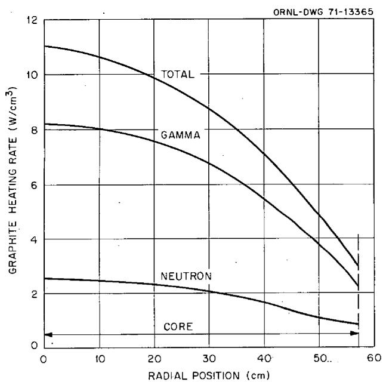  
Fig. 2.1. Radiation heating in MSBE graphite near midplane, $150\mathrm{MW(t)}$

2.1 and 2.2 show the resultant heat generation rates in the graphite radially near the core midplane and axially near the core center line.

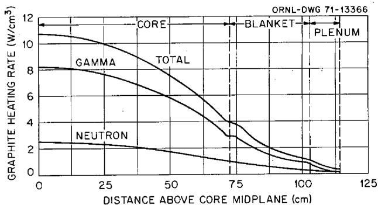  
Fig. 2.2. Radiation heating in MSBE graphite near core axis, 150 MW(t).

# 2.2.3 Fixed-Moderator Molten-Salt Reactor

# H. F. Bauman

We have extended the capability of the ROD code for the calculation of the lifetime average performance of molten-salt converter reactors with batch processing. At the end of a batch cycle, usually more uranium can be recovered than is required to make the reactor critical with clean salt at the start of the next cycle. Therefore, we have added an option in the HISTRY part of ROD to permit the required portion of the uranium (as the mixture of nuclides present in the core at the end of the cycle) to be used for startup and the remainder to be fed in as required before extraneous feed (e.g., plutonium) is resumed. We have also added a provision for changing from one extraneous fuel feed to another (e.g., from plutonium to enriched uranium) at a specified time in each cycle. Further, we have reprogrammed the cost section of HISTRY to permit the calculation of the present worth of all purchases of fissile, fertile, and carrier salt materials over any number of cycles at a specified discount rate. This method is more accurate for calculating costs which change with time (e.g., the inventory cost, when the fissile inventory increases during the cycle) than the calculation of costs from data averaged over the reactor lifetime. (A description of the ROD code, including the foregoing improvements, was published during this report period.) The studies reported below used these new calculational methods.

In previous reports we described the calculated performance of fixed-moderator $^{16}$ continuously processed molten-salt breeder reactors, $^{17}$ and how a reactor with core proportions optimized for breeding could operate as a converter using only batch processing. $^{18}$ Based on these results we chose the reactor described in Table 2.4 for further studies on the effects of various fissile feed schemes. Throughout these studies we held the processing interval fixed at six full-power years (four cycles covering a 30-year life at 0.8 plant factor).

The first calculations were intended to compare the use of plutonium and enriched uranium as the fissile material for the initial startup and as feed to supplement the bred material. The plutonium feed composition was taken to be equivalent to that produced in water reactors (at. $\%$ $^{239}\mathrm{Pu} / ^{240}\mathrm{Pu} / ^{241}\mathrm{Pu} / ^{242}\mathrm{Pu}$ .. $60 / 24 / 12 / 4)$ ; the uranium feed was assumed to be $93\%$ $^{235}\mathrm{U}$ . In either case, we assumed that at the end of each cycle the uranium is recovered and the salt containing the fission products and plutonium is discarded. (Uranium recovery by the fluoride volatility

16. The term "fixed-moderator" is used to indicate that the core is designed so that the limiting fluence for fast-neutron damage to graphite will not be exceeded in a 30-year nominal reactor life (24 equivalent full-power years).   
17. MSR, Program Semiannu. Progr. Rep. Aug. 31, 1970, ORNL-4622, pp. 26-30.   
18. MSR Program Semiannu. Progr. Rep. Feb. 28, 1971, ORNL-4676, pp. 43-45.

Table 2.4. Characteristics of the 1000-MW(e) fixed-moderator molten-salt reactor ${}^{a}$ considered in fueling studies   

<table><tr><td>Core diameter overall, ft</td><td>28.5</td></tr><tr><td>Thickness of core zones, ft</td><td></td></tr><tr><td>Zone 1</td><td>8.46</td></tr><tr><td>Zone 2</td><td>3.64</td></tr><tr><td>Zone 3</td><td>1.97</td></tr><tr><td>Annulus</td><td>0.14</td></tr><tr><td>Salt volume fractions</td><td></td></tr><tr><td>Zone 1</td><td>0.137</td></tr><tr><td>Zone 2</td><td>0.111</td></tr><tr><td>Zone 3</td><td>0.127</td></tr><tr><td>Total salt volume in fuel system, ft3</td><td>2500</td></tr><tr><td>Fuel salt, mole % LiF-BeF2-ThF4</td><td>69-17-14</td></tr><tr><td>Core inlet-outlet temperature, °F</td><td>1050-1300</td></tr><tr><td>Thermal power, MW(t)</td><td>2250</td></tr></table>

$^{a}$ A reactor with three-zone core optimized for maximum conservation coefficient consistent with 30-year life for the graphite, assuming continuous processing (case SCC-201).

process is inexpensive and efficient, but there is at present no economically feasible process for recovering plutonium from the fuel salt.) None of the recovered uranium is sold except that from the last cycle. Instead it is used for startup in the next cycle, with any excess fed in as required as long as it lasts. We found that in either case the calculated conversion ratio is high (over 0.90) so that $^{233}\mathrm{U}$ soon builds up to become the dominant fissile material. Consequently, over most of the lifetime of the reactor the concentrations of the extraneous fissile nuclides are low compared with their concentrations for a short time after the initial startup. Recognition of this situation caused us to reexamine one of the approximations in the calculations, namely, that neutron energy spectra and effective cross sections do not change drastically over the time interval being considered.

The ROD-HISTORY computation takes an input set of nine-group cross sections and generates a set of reaction-rate coefficients (equivalent one-group cross sections) averaged over the reactor volume and over a neutron energy spectrum corresponding to a particular fuel composition. The program then uses these coefficients to compute nuclide concentrations as a function of time and a new fuel composition that is the average over the time interval specified for the HISTRY calculation. This routine is iterated until the time-averaged composition agrees satisfactorily with the composition used in evaluating the reaction-rate coefficients. (The same set of nine-group cross sections is used throughout the iterations.) Of course, the changing fuel composition would actually affect the neutron energy spectrum so that the effective cross sections are not always exactly the same as they are when the fuel composition is at the average for the time interval; the error involved in the calculation depends on how much the spectrum changes during the interval.

We suspected that for the reactors started on plutonium a considerable spectrum change might be induced by the effects of the low-lying plutonium resonances. A typical set of nine-group absorption cross sections prepared for our study is given in Table 2.5. The energy boundaries are shown in the table; groups 1 to 5 are slowing-down (fast) groups while 6 to 9 are thermal groups. The cross sections of $^{233}\mathrm{U}$ and $^{235}\mathrm{U}$ are fairly similar; starting up on $^{235}\mathrm{U}$ and shifting to $^{233}\mathrm{U}$ , therefore, would not be expected to greatly change the reactor neutron spectrum or the fuel-nuclide reaction rates from those calculated for the lifetime average. The $^{239}\mathrm{Pu}$ cross sections, on the other hand, are very much higher in thermal groups 7, 8, and 9. This high cross section makes plutonium a very reactive fuel, with low

Table 2.5. Typical nine-group absorption cross sections appropriate for the lifetime-averaged fuel composition of the fixed-moderator molten-salt reactor   
Volume fraction fuel salt $= 0.12$ Carbon-to-thorium ratio $= 167$   

<table><tr><td>Group</td><td>1</td><td>2</td><td>3</td><td>4</td><td>5</td><td>6</td><td>7</td><td>8</td><td>9</td></tr><tr><td>Lower boundary, eV</td><td>821,000</td><td>31,800</td><td>1230</td><td>47.9</td><td>1.86</td><td>0.768</td><td>0.180</td><td>0.060</td><td>0.0047</td></tr><tr><td>Absorption cross section, barns</td><td></td><td></td><td></td><td></td><td></td><td></td><td></td><td></td><td></td></tr><tr><td>232Th</td><td>0.2</td><td>0.3</td><td>1.0</td><td>3.9</td><td>2.3</td><td>0.6</td><td>1.8</td><td>3.4</td><td>6.3</td></tr><tr><td>233U</td><td>2.1</td><td>2.6</td><td>7.1</td><td>25.0</td><td>134.0</td><td>318.0</td><td>177.0</td><td>266.0</td><td>491.0</td></tr><tr><td>235U</td><td>1.4</td><td>1.9</td><td>6.1</td><td>31.0</td><td>66.0</td><td>49.0</td><td>175.0</td><td>270.0</td><td>560.0</td></tr><tr><td>239Pu</td><td>2.1</td><td>1.9</td><td>4.1</td><td>35.0</td><td>74.0</td><td>41.0</td><td>2110.0</td><td>767.0</td><td>883.0</td></tr><tr><td>240Pu</td><td>1.9</td><td>0.7</td><td>2.2</td><td>27.0</td><td>21.0</td><td>7114.0</td><td>189.0</td><td>159.0</td><td>242.0</td></tr><tr><td>241Pu</td><td>2.0</td><td>3.0</td><td>6.1</td><td>31.0</td><td>162.0</td><td>20.0</td><td>1149.0</td><td>850.0</td><td>1155.0</td></tr></table>

critical loadings in reactors in which the flux is well thermalized. However, when recycled plutonium containing much $^{240}\mathrm{Pu}$ is the principal fuel, the high $^{240}\mathrm{Pu}$ cross section (group 6) tends to depress the thermal flux, hardening the spectrum and increasing the critical loading of fissile material. Over the lifetime of a molten-salt converter reactor that is started on recycled plutonium but soon has much $^{233}\mathrm{U}$ and little plutonium in it, the effect of plutonium on the neutron energy spectrum might be expected to range from quite important to rather slight. Reaction-rate constants appropriate for the low lifetime average concentration of plutonium are therefore likely to be seriously in error at the start of life when the plutonium concentration may be over ten times as high.

Our calculations had used a set of nine-group cross sections appropriate for a fuel composition close to the lifetime average and had computed reaction-rate coefficients for the lifetime-averaged composition. Our first test was to recalculate the first full-power year of operation for both the uranium-fed and the plutonium-fed converters, using the same nine-group cross sections as before but having HISTRY evaluate reaction-rate coefficients for the average composition for the first year rather than for the average over the reactor lifetime. Some results of the two computations are listed in the first two columns of Table 2.6. The most salient point is that the calculated fissile loadings for the plutonium-fed reactor differ by a factor of 4 between two computations in which the only difference is the interval used in evaluating the reaction-rate constants. This is because the plutonium concentrations during the first year, being much higher than the lifetime average, cause more flux hardening and depression of the reaction-rate coefficients. Obviously the

use of a lifetime-averaged fuel composition in determining the reaction-rate coefficient entails unacceptable error when applied to the plutonium startup cases we had been considering.

However, the reaction-rate coefficients for the enriched-uranium startup case changed hardly at all, and lifetime-averaged coefficients appear to be entirely adequate for these calculations.

The changes in self-shielding of the plutonium of a plutonium-fed molten-salt converter reactor are great enough to affect the calculation of the nine-group cross sections also. To evaluate the significance of this, we calculated a set of nine-group cross sections for a reactor containing about $1000\mathrm{kg}$ of fissile plutonium. (The asymptotic fuel composition used previously in calculating nine-group cross sections included less than $100\mathrm{kg}$ of fissile plutonium.) This set was then used in HISTRY to calculate the first year of operation, evaluating reaction-rate constants for the average composition during the year. Results are shown in column 3 of Table 2.6. The effective thermal cross sections for the plutonium nuclides in the resonance groups were considerably lower in this set. The spectrum-hardening effect was therefore not as great, and the reaction-rate coefficients were not as greatly depressed as they were in case A32. Compared to case A24-2, however, the coefficients are low, and the critical loadings are much higher.

From the above considerations we conclude that previously reported calculations for converters started on plutonium, $^{18}$ while well representing the asymptotic portion of the feed cycle, do not adequately represent the startup condition in which plutonium is the principal fissile material. The error involved in these calculations will be minimized in future calculations in

Table 2.6.: Calculated reaction-rate coefficients and fissile inventories in batch-processed molten-salt reactors   

<table><tr><td>Fuel composition assumed in determining nine-group cross sections</td><td>Asymptotica</td><td>Asymptotica</td><td>High Pu b</td></tr><tr><td>Interval for averaging composition for reaction coefficient calculation</td><td>Lifec</td><td>·First yeard</td><td>First yeard</td></tr><tr><td>Plutonium-feed cases</td><td></td><td></td><td></td></tr><tr><td>Identification</td><td>A24-2</td><td>A32</td><td>A33</td></tr><tr><td>Reaction coefficientse</td><td></td><td></td><td></td></tr><tr><td>232Th</td><td>1.0</td><td>1.0</td><td>1.0</td></tr><tr><td>233U</td><td>5.9</td><td>3.5</td><td>3.9</td></tr><tr><td>239Pu</td><td>24.3</td><td>9.3</td><td>10.2</td></tr><tr><td>240Pu</td><td>14.8</td><td>9.8</td><td>12.5</td></tr><tr><td>241Pu</td><td>18.8</td><td>8.2</td><td>8.6</td></tr><tr><td>242Pu</td><td>1.9</td><td>2.6</td><td>2.9</td></tr><tr><td>Inventories at end of first year,d kg</td><td></td><td></td><td></td></tr><tr><td>233U</td><td>451</td><td>235</td><td>303</td></tr><tr><td>239Pu</td><td>559</td><td>4190</td><td>2621</td></tr><tr><td>241Pu</td><td>366</td><td>1263</td><td>996</td></tr><tr><td>Total</td><td>1376</td><td>5688</td><td>3920</td></tr><tr><td>Uranium-feed cases</td><td></td><td></td><td></td></tr><tr><td>Identification</td><td>A21-1</td><td>A34</td><td></td></tr><tr><td>Reaction coefficientse</td><td></td><td></td><td></td></tr><tr><td>232Th</td><td>1.0</td><td>1.0</td><td></td></tr><tr><td>233U</td><td>6.06</td><td>6.15</td><td></td></tr><tr><td>235U</td><td>5.51</td><td>5.58</td><td></td></tr><tr><td>239Pu</td><td>25.5</td><td>26.0</td><td></td></tr><tr><td>Inventories at end of first year,d kg</td><td></td><td></td><td></td></tr><tr><td>233U</td><td>649</td><td>644</td><td></td></tr><tr><td>235U</td><td>1683</td><td>1664</td><td></td></tr><tr><td>239Pu</td><td>3</td><td>3</td><td></td></tr><tr><td>Total</td><td>2335</td><td>2311</td><td></td></tr></table>

${}^{a}$ Composition corresponding approximately to end of life in case A24-2 (for plutonium-feed cases) or in case A21-1 (for uranium-feed cases).   
bComposition corresponding to highest fissile plutonium concentrations in case A24-2: 762 kg 239Pu, 228 kg 241Pu.   
24 equivalent full-power years, with processing at 6, 12, and 18 EFPY.   
First equivalent full-power year of first cycle.   
$e$ Specific neutron absorption, normalized to $^{232}\mathrm{Th}$

which ROD-HISTORY averages fuel compositions over much shorter intervals. It is evident, however, that measures to maintain a well-thermalized flux spectrum will probably be required to use recycled plutonium effectively for the startup of high-performance thorium $^{233}$ U converter reactors.

We are continuing to study plutonium startup, with the object of reducing the initial fissile loading. One method would be to increase the moderator ratio by simply lowering the thorium concentration in the reactor that we have been studying. In addition, we plan to study reactors designed specifically as plutonium-fed converters (in contrast to the reactor studied thus far, whose core characteristics were optimized for breeding with continuous processing). We would expect

Table 2.7. Performance of a 1000-MW(e) fixed-moderator molten-salt reactor operated as a convertera with enriched uranium as feed material   

<table><tr><td>Case identification</td><td>A21-1</td></tr><tr><td>Feed material purchased</td><td>235Ub</td></tr><tr><td>Initial loading, kg fissile</td><td>2430</td></tr><tr><td>Lifetime purchases, kg fissile</td><td>3599</td></tr><tr><td>Recovery at end of life, kg</td><td></td></tr><tr><td>233U</td><td>1950</td></tr><tr><td>235U</td><td>381</td></tr><tr><td>Net lifetime requirements, c kg fissile</td><td>1268</td></tr><tr><td>Lifetime averaged conversion ratiod</td><td>0.946</td></tr><tr><td>Fuel costs, e mills/kWhr</td><td></td></tr><tr><td>Inventory</td><td></td></tr><tr><td>Fissile</td><td>0.566</td></tr><tr><td>Salt</td><td>0.051</td></tr><tr><td>Salt replacement</td><td>0.092</td></tr><tr><td>Fissile burnup</td><td>0.054</td></tr><tr><td>Total</td><td>0.763</td></tr></table>

${}^{a}$ Reactor described in Table 2.4. Salt and plutonium discarded and uranium recovered at end of four six-EFPY cycles. Recovered uranium used for startup and feed in next cycle. ${b93}\%$ enrichment.   
cLifetime purchases less fissile uranium recovered at end of last cycle.   
$d_{\text{Net}}$ , taking into account discard of plutonium and neglecting any loss of uranium in each processing cycle.   
Excluding processing costs. Obtained from present-worth calculation of fissile, fertile, and carrier salt purchases and fissile sales over life of reactor, with discount rate = 0.07 year $^{-1}$ , compounded quarterly, and inventory charge rate = 0.132 year $^{-1}$ . Values of 11.9 $\mathbb{S} / \mathbb{g}^{235}$ U, 13.8 $\mathbb{S} / \mathbb{g}^{233}$ U, and 9.9 $\mathbb{S} / \mathbb{g}$ fissile plutonium were assumed.

the optimum converter reactor designs to have a well-thermalized core flux spectrum.

The results of the enriched-uranium feed case shown in Table 2.7 indicate that very good performance can be obtained from the breeder reactor operated as a converter with batch processing. The changing fuel composition over the reactor lifetime is shown in Fig. 2.3. The conversion ratio of over $90\%$ is good for a reactor processed only every six years. The fuel cost of about 0.76 mill/kWhr excluding processing is attractive. The cost of processing and disposal of the spent fuel has been roughly estimated to add about 0.1 mill/kWhr to this cost. The high fissile inventory cost relative to the burnup cost suggests that a lower thorium concentration would give a lower overall fuel cost for a reactor designed specifically as a converter. This would result in a lower fissile inventory at some sacrifice in conversion ratio.

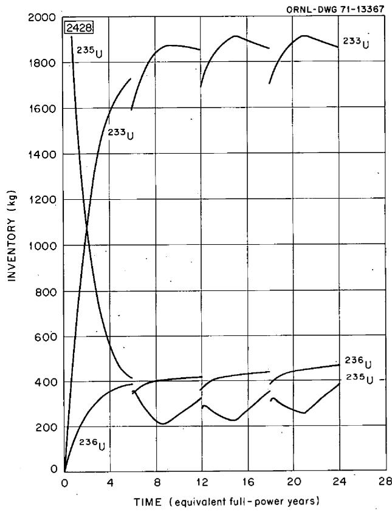  
Fig. 2.3. Fuel nuclide inventories for enriched uranium feed case A21-1.

# 3. Systems and Components Development

Dunlap Scott

# 3.1 GASEOUS FISSION PRODUCT REMOVAL

C. H. Gabbard

# 3.1.1 Gas Separator and Bubble Generator

The testing of the bubble separator continued in the water test loop.1 Tests were conducted to learn more about the formation of the very fine bubbles that were encountered with the water-glycerol test fluid and to evaluate the separator performance with these small bubbles. Although much of the available evidence indicates that the bubbles will be larger in molten salts, the large changes observed in the circulating gas content of the MSRE fuel salt suggest that the bubble size might vary over a considerable range. The development of the bubble separator is therefore proceeding on the basis of removing the small bubbles with the best possible efficiency.

A series of tests with glycerol was completed which shows that the liquid circulation pump was the source of the very small bubbles and that the bubble size was related to the pump head or speed. It is probable that small bubbles formed in the pump during the operation with demineralized water coalesced to a larger size before reaching the separator, while the bubbles formed in the glycerol solution were inhibited from coalescing

and were representative of the size generated. The test fluid was changed from the water-glycerol mixture to a $31\% \mathrm{CaCl}_2$ solution in hopes of avoiding the very small bubbles while maintaining hydraulic similitude, but little or no difference was observed.

A gamma radiation densitometer was installed on the water test loop to measure the separation efficiency under several conditions of operation. We measured the performance of the separator with the large bubbles in demineralized water and with the small bubbles in the $31\% \mathrm{CaCl}_2$ solution, and the results are shown in Fig. 3.1. The effect of bubble size on the performance of the bubble separator was also demonstrated by a dilution experiment starting with the $31\% \mathrm{CaCl}_2$ solution. Figure 3.2 shows the results of this experiment. As the concentration was reduced, a sharp increase in separation efficiency indicated the point where the bubble size increased as a result of coalescence. The coalescence transition occurred at a concentration of about $2.7\mathrm{wt}\%$ , which is considerably greater than the $0.61\mathrm{wt}\%$ reported in recent literature, but this difference could be caused by other additives in our test solution or by the grossly different hydrodynamic conditions. These tests suggest that the size of bubbles circulating in a reactor system will be determined by the hydraulic design of the pump and circulating system and by the coalescence properties of the fuel salt.

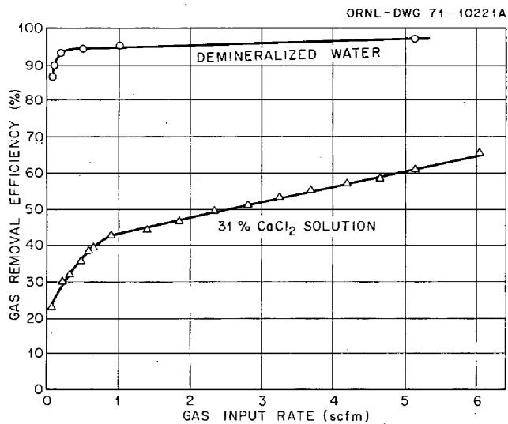  
Fig. 3.1. Performance of 4-in.-ID standard length bubble separator at $500\mathrm{gpm}$

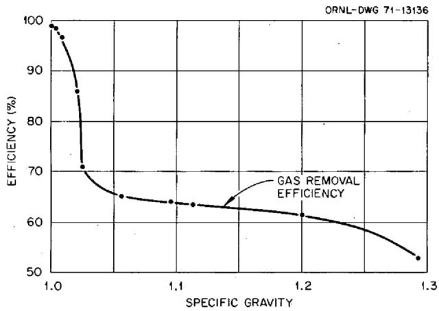  
Fig. 3.2. Results of bubble coalescence test with $\mathrm{CaCl}_2$ solution at liquid flow rate $= 500\mathrm{gpm}$ and gas flow rate $= 5.15$ scfm.

The distance between the swirl vane hub and recovery hub of the test separator was increased from 27 to 44 in. to achieve the greater vortex length required to separate bubbles from higher viscosity fluids. The separation efficiency was improved substantially at low gas flow rates by lengthening the separator, but a vortex instability limited the gas removal capacity to below 1 scfm. Similar results were obtained with a long separator having a tapered outer casing. However, the removal

of the central core from the annular recovery3 hub resulted in satisfactory vortex stability over the full gas flow range of 0 to 6 scfm. When operating in this manner the gas void diameter is between $\frac{1}{8}$ and $\frac{1}{2}$ in depending on the gas flow rate. Efficiency tests are currently in progress for this mode of operation.

# 3.1.2 Bubble Formation and Coalescence Test

A test has been planned to compare the bubble formation and coalescence properties of molten salts with those of demineralized water and other fluids. The test will consist of mechanically agitating a sealed quartz capsule of the test fluid in a special furnace and photographing the capsule to show the size and behavior of bubbles of gas in the liquid during and after the agitation. The design of the test rig is nearing completion.

# 3.2 GAS SYSTEM TEST FACILITY

# R. H. Guymon

The gas system test facility (GSTF) is a loop for circulating a fuel salt typical of the MSBR for use in developing the technology of components to be used in the primary system of a molten-salt reactor. The performance of bubble generators and bubble separators, being developed initially in a water loop (see Sect. 3.1.1), will be tested, along with components for purification and recycle of off-gas. Other tests include determining the effect of the $\mathrm{UF}_3 / \mathrm{UF}_4$ ratio on the surface tension of the salt, studying noble gas and possibly tritium distribution, and measuring heat and mass transfer coefficients. The conceptual system design description (CSDD) $^4$ and the quality assurance $^5$ for the facility were published during the period.

The facility, shown schematically in Fig. 3.3, will be located in the enclosure previously occupied by the molten-salt pump test stand in Building 9201-3 of the Y-12 plant. The loop is of 5-in. sched 40 Hastelloy N pipe, much of which was removed from the MSRE coolant system. Molten salt at 1050 to $1300^{\circ}\mathrm{F}$ is pumped at 1000 gpm and 100-ft head by the MSRE

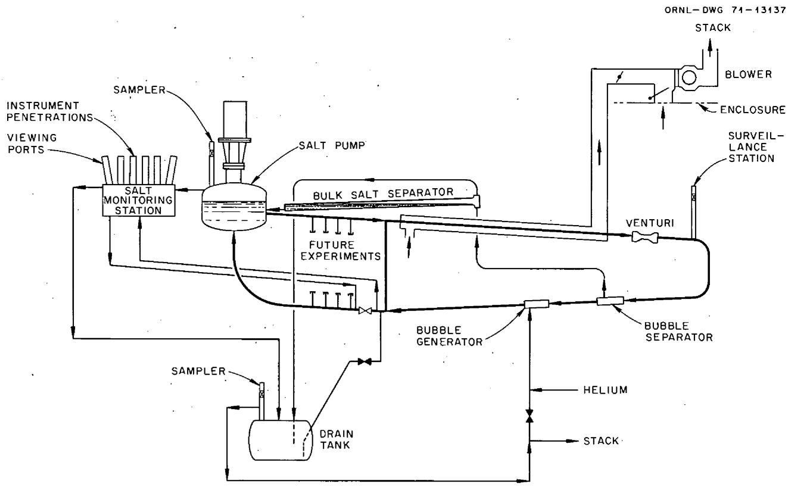  
Fig. 3.3. Gas system technology facility.

Mark 2 pump modified as described in Sect. 3.7.1. A line downstream of the pump allows part (approximately one-half) of the flow to bypass the main loop. The main loop flow goes through a flow-measuring venturi (from the MSRE), a bubble separator, and a bubble generator before rejoining the bypass flow and returning to the salt pump.

Helium is injected at the bubble generator and flows around the loop and through the pump prior to being stripped at the bubble separator. The separated gas (0 to 37 slm) and entrained salt (12.5 to 6 gpm) go to the bulk salt separator which is an 8-ft-long section of 5-in. Hastelloy N pipe inclined slightly from horizontal. The salt from the bulk salt separator is returned to the loop via the salt pump bowl, and the gas is recycled to the bubble generator.

Pipe nozzles are shown in the high- and low-pressure parts of the loop to facilitate installation of future experiments. A salt-monitoring station is included for testing various on-line instruments for determining chemical and physical properties of the salt.

The main loop configuration was established, the preliminary instrument application drawings were completed, and the drain tank design was nearly complete

at the end of the period. Initial operation is scheduled to start in the fall of 1972, using coolant salt from the MSRE to establish a base line for later operations. After preliminary experiments and shakedown tests are complete, this salt will be replaced with a salt similar to the fuel salt projected for the MSBE.

# 3.3 OFF-GAS SYSTEMS

A. N. Smith

# 3.3.1 Off-Gas System for Molten-Salt Reactors

A design basis report is being written for off-gas systems for use with molten-salt reactors. This report reviews the present technology of off-gas systems, discusses the advantages and disadvantages of several approaches for the design of the off-gas systems, describes the design of the system chosen for a reference, and discusses the additional information which must be developed to establish the design. The primary purpose of this report is to document the basis for the reference design and to define the development effort needed for the design of reliable off-gas systems.

# 3.3.2 Computer Design of Charcoal Beds for MSR Off-Gas Systems

The design of charcoal beds for the delay of fission product gases in MSR off-gas systems involves an iterative calculation best handled by a digital computer. Existing computer programs, which were used for the Homogeneous Reactor Test and the Molten-Salt Reactor Experiment, are arranged to calculate charcoal temperatures and isotope exit concentrations and, as such, are insufficient to be of maximum usefulness to the charcoal bed designer. A computer program is needed which includes cost and other selected parameters and which furnishes data necessary for mechanical design. A study is being made to determine how the existing programs might be revised and enlarged to achieve such a program.

# 3.4 MOLTEN-SALT STEAM GENERATOR

J. L. Crowley R. E. Helms

# 3.4.1 Steam Generator Industrial Program

Proposals were received from four of the eight industrial manufacturers of steam generators that received the request-for-proposal package. An evaluation team studied the proposals and selected the Foster Wheeler Corporation. A subcontract is being negotiated with them.

The scope of work requested of the industrial firm was revised from that reported previously.6 The changes basically involved limiting the industrial firm to work on the steam generator and excluding the systems design work originally requested. Although Task II was most affected by this change, a brief description of all four tasks follows.

Task I - conceptual design of a steam generator for the ORNL 1000-MW(e) MSBR reference steam cycle. The firm will produce a conceptual design of a steam generator to operate with the salt and steam conditions of the MSBR reference design. The industrial firm will consider all aspects of a conceptual design, including unit size, control of steam temperature, and unique support systems such as a startup system and a salt circuit pressure relief system.

Task II - feasibility study and conceptual design of steam generators using lower feedwater temperature. This task is divided into two parts, with the execution

of the second dependent on the results of the first. First, the selected firm will assess the feasibility of molten-salt steam generators using feedwater temperatures between 500 and $600^{\circ}\mathrm{F}$ . He will investigate both subcritical and supercritical pressures. If the feasibility assessment is affirmative for one or both of the above pressures and if ORNL agrees, then the industrial firm will prepare conceptual designs for steam generators using these conditions and the salt system conditions of Task I.

Task III - conceptual design of a steam generator for a molten-salt reactor of about $150\mathrm{MW}(t)$ . ORNL will select a steam generator conceptual design from the results of Tasks I and II. Then the industrial firm will adapt this concept to a molten-salt reactor system of about $150\mathrm{MW}(t)$ .

Task IV - description of a research and development program for Task III steam generator. For Task IV the industrial firm will describe the research and development program necessary to assure that the design of the Task III steam generator is adequate. As part of this task the industrial firm will review ORNL's proposed steam generator tube test facility and the associated program and will also review the program of testing Hastelloy N and other materials in steam.

We hope to have Task I conceptual design completed during FY 1972. Tasks II, III, and IV would be completed during FY 1973 or early in FY 1974.

# 3.4.2 Molten-Salt Steam Generator Technology Facility

Work continued on the preparation of a conceptual system design description (CSDD) for the steam generator technology facility (SGTF). This facility would be a side loop of the coolant-salt technology facility (CSTF) and would be used to study transient and steady-state operation of some full-length tube test sections and portions of a tube test section of a molten-salt steam generator. The tests performed in this facility would better define some of the technological uncertainties to be investigated later with a larger multibyte test facility (STTS). The SGTF would be used to:

1. investigate some of the problems of generating steam using sodium fluoroborate and feedwater at various temperatures up to $700^{\circ}\mathrm{F}$ ;

2. perform heat and mass transfer tests in various steam generator tube configurations;   
3. investigate the use of thermocouples, strain gages, and flow elements in a molten-salt environment typical of larger test facilities such as the STTS;   
4. study flow stability in a single tube and the ability of orifices to eliminate any instabilities for load changes in the range of 20 to $100\%$ ;   
5. explore some of the problems associated with the detection of a steam-to-salt leak and the venting of resulting pressure;   
6. obtain operating data on a scaled-down version of a startup system.

# 3.4.3 Molten-Salt Steam Generator Test Proposals

Molten-salt steam generator test configurations are being considered for test in the SGTF and the STTS.

To date studies have been made on several tube-intube configurations in which supercritical water flows vertically in the inner tube countercurrent to an unbaffled salt stream in the annulus between the inner and outer tube. To select an inner tube wall thickness, a computer stress analysis program was written to calculate the internal working pressure that would produce a total primary plus secondary stress intensity of 13,000 psi at $1100^{\circ}\mathrm{F}$ . The allowable stress intensity of 13,000 psi at $1100^{\circ}\mathrm{F}$ meets the requirements of Section III of the ASME Code and Code Case 1315-3 for Hastelloy N material. The results of these calculations are shown in Table 3.1.

Seven tube sizes ranging from $\frac{1}{4}$ to 1 in. in diameter in steps of $\frac{1}{8}$ in. and having an allowable working

pressure equal to or greater than 3600 psig at $1100^{\circ}\mathrm{F}$ were selected from Table 3.1. These tubes were subjected to further study.

A heat transfer program was written to calculate the salt and supercritical water/steam temperature profile for the tube-in-tube molten-salt steam generator test section. The program calculates the steady-state heat transfer, steam pressure drop, water/steam temperature, salt temperature, and temperature difference across the inner tube for a finite element length of test section. The salt temperature (TFI), the inside wall temperature of the inner tube (TWI), the water/steam temperature (TSO), and the temperature drop across the inner tube wall (DTW) as a function of test section tube length (ft) are then displayed by the Calcomp plotter as shown in Fig. 3.4. The inner tube inside diameter (DI), the inner tube outside diameter (DO), the outer tube inside diameter (D1I), the outer tube diameter (D1O), the total heat transferred (kW), the salt flow rate (WF), the steam flow rate (WS), the inlet pressure (psia), pressure drop (psi), the finite element length (ft), and the date are printed by the Calcomp plotter above the curves.

Using a feedwater flow rate that would produce 20 fps and a salt flow rate of six times the feedwater flow rate, the outer tube was sized to give salt velocities of about 20 fps. Preliminary results of calculations for seven tube-in-tube steam generator configurations are shown in Table 3.2. For full-length tubes that receive $700^{\circ}\mathrm{F}$ feedwater and produce $1000^{\circ}\mathrm{F}$ steam, only the $\frac{1}{4}$ - and the $\frac{3}{8}$ -in.-diam tubes could be tested in the 150-kW SGTF, while larger tubes would be tested in the 3.0-MW STTS. Sections of larger tubes could be tested in the SGTF but not for full inlet and outlet steam generator conditions.

Table 3.1. Maximum working pressure for Hastelloy N tubing in steam generators at ${1100}^{ \circ  }\mathrm{F}$   

<table><tr><td rowspan="2">Tube OD (in.)</td><td colspan="11">Maximum pressure (psig) for tube wall thickness (in.) of -</td></tr><tr><td>0.0350</td><td>0.0490</td><td>0.0650</td><td>0.0830</td><td>0.0950</td><td>0.1090</td><td>0.1200</td><td>0.1340</td><td>0.1480</td><td>0.165</td><td>0.180</td></tr><tr><td>0.2500</td><td>3180.4</td><td>4097.2</td><td>5002.4</td><td>5766.2</td><td>6125.6</td><td>6393.5</td><td></td><td></td><td></td><td></td><td></td></tr><tr><td>0.3125</td><td>2585.9</td><td>3437.6</td><td>4283.1</td><td>5071.5</td><td>5501.2</td><td>5905.6</td><td>6240.0</td><td>6368.2</td><td>6481.9</td><td></td><td></td></tr><tr><td>0.3750</td><td>2200.2</td><td>2953.4</td><td>3725.5</td><td>4481.0</td><td>4918.0</td><td>5360.7</td><td>5777.8</td><td>5978.8</td><td>6211.5</td><td>6406.4</td><td>6498.8</td></tr><tr><td>0.4375</td><td>1915.6</td><td>2588.4</td><td>3292.1</td><td>4000.3</td><td>4423.4</td><td>4867.6</td><td>5309.8</td><td>5527.9</td><td>5823.3</td><td>6116.3</td><td>6347.2</td></tr><tr><td>0.5000</td><td>1692.6</td><td>2298.3</td><td>2945.6</td><td>3599.5</td><td>4001.4</td><td>4432.4</td><td>4875.0</td><td>5100.6</td><td>5418.0</td><td>5748.6</td><td>6068.6</td></tr><tr><td>0.5125</td><td>1654.3</td><td>2248.2</td><td>2379.3</td><td>3588.8</td><td>3926.1</td><td>4358.7</td><td>4794.8</td><td>5020.6</td><td>5349.0</td><td>5675.8</td><td>5997.5</td></tr><tr><td>0.6250</td><td>1374.5</td><td>1878.6</td><td>2422.8</td><td>2994.3</td><td>3351.3</td><td>3743.6</td><td>4160.0</td><td>4379.2</td><td>4698.9</td><td>5051.9</td><td>5418.0</td></tr><tr><td>0.6875</td><td>1256.3</td><td>1721.0</td><td>2225.8</td><td>2765.0</td><td>3096.3</td><td>3468.6</td><td>3807.8</td><td>4079.9</td><td>4392.2</td><td>4742.4</td><td>5113.7</td></tr><tr><td>0.7500</td><td>1156.7</td><td>1587.7</td><td>2058.0</td><td>2558.9</td><td>2876.2</td><td>3229.5</td><td>3611.1</td><td>3815.4</td><td>4118.2</td><td>4461.6</td><td>4831.4</td></tr><tr><td>0.8750</td><td>998.4</td><td>1374.5</td><td>1788.0</td><td>2232.3</td><td>2516.4</td><td>2835.4</td><td>3183.7</td><td>3371.9</td><td>3653.9</td><td>3978.3</td><td>4334.9</td></tr><tr><td>1.0000</td><td>878.1</td><td>1211.6</td><td>1580.1</td><td>1978.9</td><td>2235.3</td><td>2525.1</td><td>2843.7</td><td>3017.1</td><td>3278.5</td><td>3582.1</td><td>3920.1</td></tr></table>

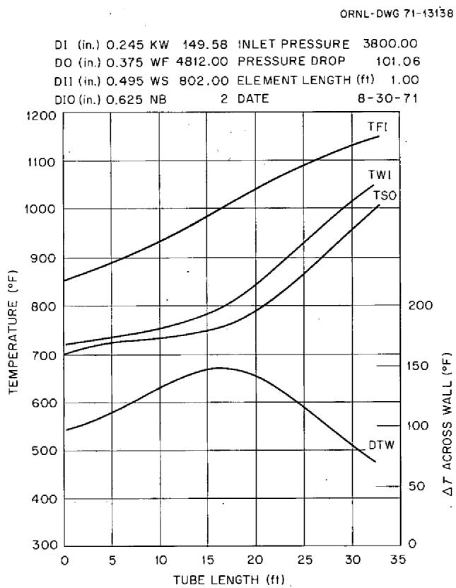  
Fig. 3.4. Tube-in-tube molten-salt steam generator test section.

# 3.5 SODIUM FLUOROBORATE TEST LOOP

# A. N. Smith

The as-removed appearance of the PKP pump rotary element and the appearance of certain other test loop components were described in the previous report. During this period, the pump rotary element was dismantled, and the component parts were examined visually after washing with hot water. Except for the inner heat baffle plates, the appearance of the Inconel metal surfaces was such as to imply insignificant attack during the fluoroborate service. The inner heat baffle plates were badly corroded, and their condition was attributed to corrosive material produced by the reaction of moisture in the incoming purge gas with puddles of salt which were left on the baffle plates during the ingassing transients in May and June 1968. More detailed information on observations and conclusions resulting from examination of the rotary element parts is presented below. No further work is planned on this test program. A report9 is being prepared summarizing the work on the sodium fluoroborate test loop.

# 3.5.1 Inspection of PKP Pump Rotary Element

The impeller and upper impeller housing (see Fig. 3.5) were removed from the PKP pump rotary element, and the upper labyrinth seal ring and the heat baffles were removed from the impeller housing. All parts were then examined visually after washing with hot water to remove residual deposits of $\mathrm{NaBF_4}$ salt. The following is a summary of our findings.

1. The vanes on the back side of the impeller and the grooves inside the upper labyrinth seal ring showed little sign of wear, based on the appearance of sharp edges and corners.   
2. The diameter of the slinger ring appeared to match the curvature of the high-nickel, gray-black lumps previously described.[10]   
3. The appearance of the inner heat baffle plates was markedly different from that of the outer heat baffle plates. Except for a slight blackening of the surfaces, the outer plates suffered very little attack. On the other hand, the inner baffle plates (see Fig. 3.6) had been severely attacked as evidenced by holes completely through in some places and by severe pitting in other places. The attack was not homogeneous on any one plate or from one plate to another. The top surface of the top plate was severely pitted, but the other surfaces which combined to form the chamber above the top plate (shaft, inner surface of impeller housing support cylinder, and lower surface of the cooling oil chamber) were relatively free of attack. All baffle plates except the one below the top plate had holes corroded completely through. The inner heat baffles fitted very tightly against the inner surface of the upper impeller housing support cylinder, so that probably most of the gas flow was past the inner annulus between the baffle plates and the pump shaft.   
4. A groove was found in the surface of the pump shaft at a point adjacent to the inner heat baffles. The groove was about $\frac{1}{4}$ in. wide and about $\frac{1}{8}$ in. in maximum depth. It was smooth in contour and was not pitted.   
5. Metal surfaces had a coarse, grainy appearance but were not severely pitted except on the inner heat baffle plates.   
6. Contrary to pump assembly drawing F-2882-K, there were no holes in the impeller housing support cylinder just above the inner heat baffles. The absence

Table 3.2. Results of calculations for test sections operating with salt and feedwater velocities at 20 fps   

<table><tr><td>Test section number</td><td>1.20.1</td><td>2.20.1</td><td>3.20.1</td><td>4.20.1</td><td>5.20.1</td><td>6.20.1</td><td>7.20.1</td></tr><tr><td>OD of inner tube, in.</td><td>0.250</td><td>0.375</td><td>0.500</td><td>0.625</td><td>0.750</td><td>0.875</td><td>1.000</td></tr><tr><td>ID of inner tube, in.</td><td>0.152</td><td>0.245</td><td>0.334</td><td>0.407</td><td>0.510</td><td>0.579</td><td>0.640</td></tr><tr><td>Wall thickness of inner tube, in.</td><td>0.049</td><td>0.065</td><td>0.083</td><td>0.109</td><td>0.120</td><td>0.148</td><td>0.180</td></tr><tr><td>OD of outer tube, in.</td><td>0.375</td><td>0.625</td><td>0.750</td><td>1.000</td><td>1.125</td><td>1.250</td><td>1.500</td></tr><tr><td>ID of outer tube, in.</td><td>0.319</td><td>0.495</td><td>0.666</td><td>0.810</td><td>0.995</td><td>1.152</td><td>1.310</td></tr><tr><td>Wall thickness of outer tube, in.</td><td>0.028</td><td>0.065</td><td>0.049</td><td>0.095</td><td>0.065</td><td>0.049</td><td>0.095</td></tr><tr><td>Inlet feedwater temperature, °F</td><td>700</td><td>700</td><td>700</td><td>700</td><td>700</td><td>700</td><td>700</td></tr><tr><td>Outlet steam temperature, °F</td><td>1001.6</td><td>1008.9</td><td>1001.4</td><td>1002.1</td><td>1002.1</td><td>1002.2</td><td>1002.2</td></tr><tr><td>Salt outlet temperature, °F</td><td>850</td><td>850</td><td>850</td><td>850</td><td>850</td><td>850</td><td>850</td></tr><tr><td>Salt inlet temperature, °F</td><td>1144.1</td><td>1145.8</td><td>1143.1</td><td>1142.4</td><td>1141.6</td><td>1140.6</td><td>1139.4</td></tr><tr><td>Maximum temp drop across inner tube wall, °F</td><td>132.9</td><td>146.3</td><td>158.4</td><td>174.4</td><td>176.6</td><td>185.3</td><td>191.9</td></tr><tr><td>Inner tube wall temp at maximum ΔTW</td><td>798.0</td><td>796.0</td><td>790.4</td><td>787.9</td><td>787.4</td><td>787.4</td><td>787.8</td></tr><tr><td>Feedwater flow rate, lb/hr</td><td>309.0</td><td>802.0</td><td>1491.2</td><td>2214.8</td><td>3483.0</td><td>4488.6</td><td>5469.8</td></tr><tr><td>Salt flow rate, lb/hr</td><td>1854.0</td><td>4812.0</td><td>8944.2</td><td>13,288.8</td><td>20,898.0</td><td>26,931.6</td><td>32,818.8</td></tr><tr><td>Maximum allowable working pressure for inner tube at 1100°F</td><td>4097</td><td>3725</td><td>3600</td><td>3743</td><td>3611</td><td>3654</td><td>3920</td></tr><tr><td>Water/steam pressure drop, psi</td><td>73.0</td><td>95.6</td><td>109.9</td><td>128.6</td><td>144.9</td><td>164.2</td><td>187.4</td></tr><tr><td>Tube or test section length, ft</td><td>16</td><td>33</td><td>53</td><td>76</td><td>106</td><td>139</td><td>176</td></tr><tr><td>Total heat transferred, kW</td><td>56.1</td><td>146.5</td><td>270.0</td><td>400.2</td><td>627.9</td><td>806.7</td><td>980.5</td></tr><tr><td>Heat transferred to point of max temp drop across inner tube wall, kW</td><td>28.5</td><td>81.5</td><td>141.0</td><td>212.0</td><td>336.7</td><td>442.6</td><td>572.4</td></tr><tr><td>Distance from inlet to position of maximum tube wall ΔT, ft</td><td>8</td><td>17</td><td>28</td><td>41</td><td>58</td><td>78</td><td>101</td></tr></table>

of these holes means that all of the pump shaft purge gas had to flow past the five inner heat baffle plates in order to get to the main part of the pump bowl.

We have drawn the following conclusions from these observations:

1. Except for the inner heat baffles, corrosive and erosive attack was slight, which is consistent with observations made of pump bowl surfaces.[10]   
2. The high-nickel, gray-black lumps were formed by deposition on the surface of the slinger ring, probably by precipitation of corrosion products on the cooler shaft surface as was discussed earlier.[10]   
3. The severe heterogeneous attack suffered by the inner heat baffles came about in the following manner. $\mathrm{NaBF}_4$ salt was forced into the baffle region during the ingassing transients in May and June 1968.[11] Scattered puddles of salt were retained on the baffle surfaces because the latter were not perfectly flat. The incoming

purge gas was in intimate contact with the puddles of salt, and the moisture in the purge gas, estimated to have been somewhere between 1 and 20 ppm by volume, combined with the puddles of salt to form reaction products which corroded the adjacent metal surfaces.

4. The degree of attack on the upper baffle plates was at least as severe as that on the lower baffle plates. If we assume a significant temperature gradient between the bottom and top plates, the implication would be that the water-salt reaction products are highly corrosive even at relatively low temperatures. Direct measurements of the baffle plate temperatures were not made, but it is estimated that the temperature of the top baffle plate was $500^{\circ}\mathrm{F}$ or less. Additional tests are needed to determine the variation of corrosiveness with temperature, since there are important general implications for reactor systems using $\mathrm{NaBF_4}$ . For example, efficient cleaning procedures will be needed to ensure that $\mathrm{NaBF_4}$ salt residues are not left on the outside surfaces of pipes and equipment where exposure to moist atmospheres is probable, and where the metal

temperature is high enough so that corrosion would be significant.

5. The groove in the pump shaft was apparently

caused by material, presumably a mixture of salt, metal, and corrosion products, which became wedged between the shaft and one of the inner heat baffles.

ORNL-DWG 71-13139

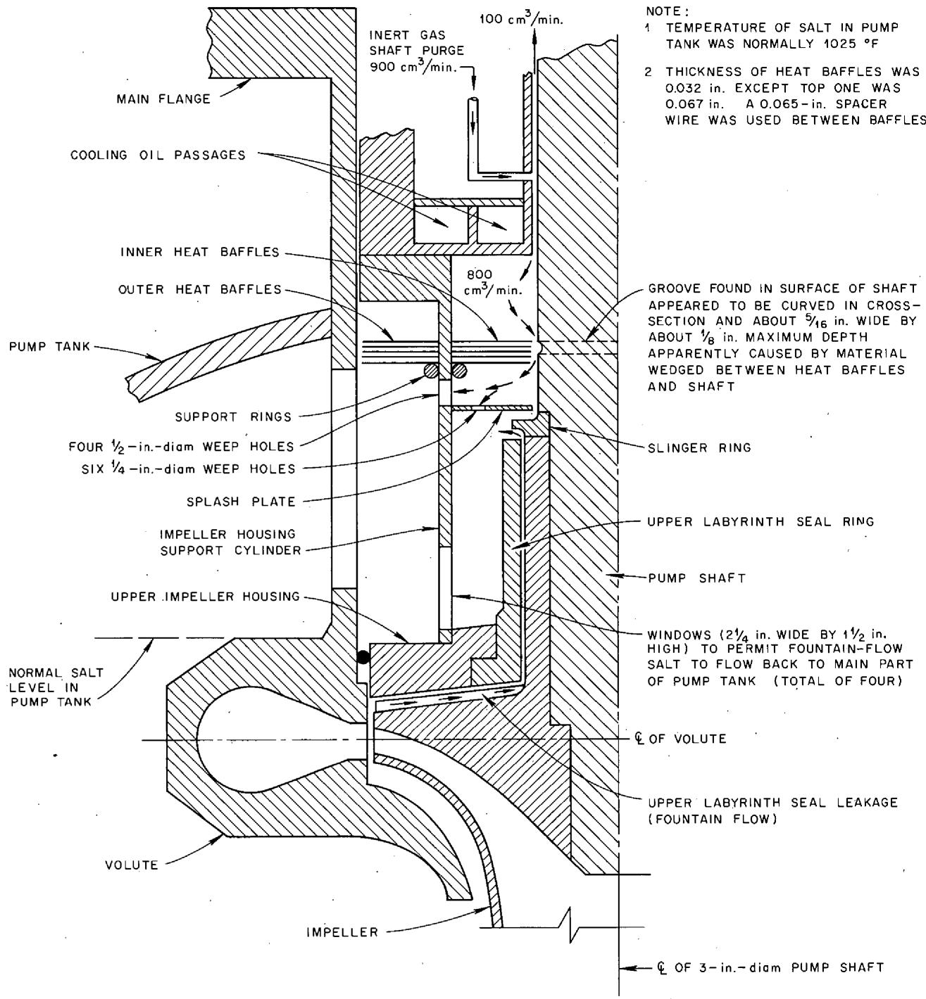  
Fig. 3.5. Cross section of PKP pump. $\mathrm{NaBF_4}$ circulation test, PKP loop, 9201-3.

NOTE: SEMI-CIRCULAR NOTCHES IN PERIPHERIES WERE MADE DURING REMOVAL OF BAFFLES FROM PUMP

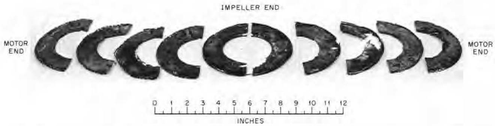  
Fig. 3.6. Inner heat baffles from PKP pump showing posttest appearance of upper surfaces. $\mathrm{NaBF}_4$ circulation test, PKP loop, 9201-3.

# 3.6 COOLANT-SALT TECHNOLOGY FACILITY

# A. I. Krakoviak

The mechanical design of the coolant-salt technology facility is nearing completion. The design now includes two side-stream loops and a specimen surveillance station. One of the side-stream loops supplies salt to a corrosion product trap to investigate on-line removal of $\mathrm{Na}_3\mathrm{CrF}_6$ from sodium fluoroborate by cold zone deposition as outlined in the "Conceptual System Design Description." The trap was designed to operate from 750 to $1150^{\circ}\mathrm{F}$ at a salt flow rate of $0.2\mathrm{gpm}$ for a salt system cycle time of approximately 8 hr. The cold trap was also designed to investigate the recombination of $\mathrm{BF}_3$ vapor (12 to $25\%$ $\mathrm{BF}_3$ in the off-gas stream from the pump bowl) with the relatively cool salt melt $(\sim 850^{\circ}\mathrm{F})$ in the cold trap. This system is expected to reduce the $\mathrm{BF}_3$ content in the off-gas stream to $< 0.5\%$ $\mathrm{BF}_3$ . Provisions have been made in the cold trap to condense and collect the acid liquid from the off-gas stream.

The second side-stream loop was designed for on-line monitoring of the salt by electrochemical means (developed by the Analytical Chemistry Division). The loop consists of a 3-gal-capacity vessel with associated piping which will operate at a flow rate of $\sim 2$ gpm while maintaining a constant salt volume of 1.2 gal in the vessel. The salt-monitoring vessel was designed to

provide: (1) a quiescent liquid surface of sodium fluoroborate representative of the main loop, (2) operation at constant temperature and salt level in the vessel, (3) salt residence time of approximately 30 sec, (4) on-line removal, insertion, and adjustment of depth of immersion of the electrode, and (5) visual access to the gas-liquid-electrode interface.

Fabrication of the drain tank and the material specimen surveillance station for the CSTF is complete, and fabrication of components for the two side-stream loops has started.

The MSRE coolant system piping, pump bowl, and level indicator, which were removed for reuse in the CSTF, were cleaned with oxalic acid to remove the residual $\mathrm{LiF - BeF_2}$ salt. However, removal of the residual tritium contamination from the inside surfaces of the pump bowl was not complete. The greatest contamination was associated with oily and carbon-like coatings on surfaces,13 and a standard smear test of a coated area in the pump bowl cylinder opposite the shield plug showed $\sim 800,000$ dis/min of transferable tritium. After cleaning this surface with abrasive cloth and dilute nitric acid, transferable tritium was reduced to 12,000 dis/min. Using this procedure, the piping and pump bowl nozzles within approximately 6 in. of proposed welds were cleaned to tritium levels below 2000 dis/min (MPC for uncontrolled area) and are ready for assembly.

# 3.7 MSBR PUMPS

A. G. Grindell

W. R. Huntley

L. V. Wilson

H. C. Savage

H. C. Young

# 3.7.1 Salt Pumps for MSRP Technology Facilities

The coolant pump tank and volute that were removed recently from the MSRE and the spare rotary element from storage will be used in the coolant-salt technology facility. When used with a 10.33-in.-diam impeller, this combination will provide the required 90-ft head and 800-gpm flow at 1765 rpm by operating slightly toward the shutoff side of its approximate MSRE operating point of 85-ft head and 900-gpm flow rate. This operation is not expected to impose excessive radial hydraulic forces on the pump shaft. The available 75-hp motor will be loaded to approximately 45 hp for this service.

The rotary element will be reconditioned with new bearings, and the shaft seals will be relapped. It will then be operated in a cold shakedown stand to check shaft seal leakage rates prior to installation in the coolant-salt technology facility.

The head and flow requirements for the gas system test facility will be provided by installing an available $11^{1/4}$ -in.-diam impeller of MSRE coolant-salt pump design in the MSRE Mark 2 fuel-salt pump. This impeller will provide 1000 gpm and approximately 100-ft head with 100-bhp input at near 1800-rpm pump speed. Since the inlet and discharge openings in the coolant-salt pump impeller are smaller than those in the fuel-salt pump impeller, a stationary filler piece will be installed in the volute inlet. A spare MSRE coolant pump drive motor, nominally rated for 75 hp at 1200 rpm, but wound for 1800-rpm operation, will be used. This oversize motor can sustain continuous operation to 113 hp at 1800 rpm. The oversize frame was selected early during MSRE design to standardize the motor-to-bearing housing mounting dimensions for both the 1200-rpm fuel pump and 1800-rpm coolant pump.

The rotary element from the Mark 2 pump will be reconditioned. New bearings will be installed, the shaft seals will be relapped, and the rotary assembly will be balanced dynamically. The element then will be operated in the cold shakedown stand to check shaft seal leakage rates prior to installation in the gas system technology facility. During the assembly, measurements will be made of radial load vs shaft deflection and shaft critical frequency of the Mark 2 pump shaft with the $11^{1/4}$ -in.-diam impeller.

Spare parts for the two pump assemblies have been inventoried, and spare hollow metal O-rings made from Hastelloy N tubing have been ordered. The $1/4$ -in.-OD by 0.035-in.-wall tubing for the O-rings will be formed by drawing $3/4$ -in.-OD by 0.072-in.-wall Hastelloy N tubing that is on hand.

# 3.7.2 ALPHA Pump

Initial operation of the ALPHA pump14 with high-temperature salt in the MSR-FCL-2 test facility demonstrated the need for several modifications to improve reliability; the design of these modifications is in progress. In the meantime, the pump is being operated in the MSR-FCL-2 at the specified design conditions.

Prior to installation in the salt facility, the pump was subjected to a cold shakedown test to ensure that bearings and rotating and static seals function properly. The results of several tests indicate steady-state oil leakage rates past the rotating shaft seals ranging from 0.3 to $3.5\mathrm{cc/day}$ for a pump speed of approximately 4000 rpm and a seal differential pressure of 7 psi.

Considerable difficulty was experienced with the hollow metal O-ring gaskets which seal the removable pump rotary element to the pump bowl. In the present design the space between two concentric gaskets is buffered with helium. The gaskets are of hollow stainless steel tube construction, have a toroidal diameter of $\frac{1}{8}$ in., an overall diameter of 6 in., and are plated with silver or gold. In an initial test with silver-plated gaskets, after carefully hand polishing the sealing surfaces in the matching flanges, a total leak rate of approximately 6 cc/hr past both rings was attained with the buffer zone pressurized to 6.5 psig. The plating flaked from gold-plated gaskets during installation, and so gold plating is not receiving current attention. The total leak rate was reduced in a later installation by carefully hand polishing the silver-plated gaskets: the total leak rate of approximately 1 cc/hr was attained with the buffer zone pressurized to 8 psig. This leak rate was considered satisfactory because it is unlikely that either air or moisture can enter the pump in a significant quantity past the buffer gas barrier. However, because of the difficulty in attaining and maintaining the polished surfaces needed to achieve a satisfactory seal with the hollow metal O-rings, we plan to replace them with a buffered ring joint seal utilizing a solid metal gasket.

The ALPHA pump developed a gas leak across the lower shaft seal after 56 hr of intermittent operation and a total of 510 hr at elevated temperature in the MSR-FCL-2. Disassembly and inspection of the pump revealed that an O-ring made of Buna-N had failed. The O-ring is part of the shaft seal which was purchased from the Sealol Corporation. The lower shaft seal operates with oil lubricant contacting its top side and gas contacting its lower side. The gas is principally helium containing approximately $0.1\% \mathrm{BF}_3$ whose source is the sodium fluoroborate in the pump tank. The dilute $\mathrm{BF}_3$ attacked the Buna-N material and produced the gas leak. The split purge flow of helium in the shaft annulus was not operated in this application because it had not been found necessary to the successful operation of a similar seal on the LFB pump in the MSR-FCL-1. Impurity control and facility operation are also simplified when the split purge is not used.

The mechanical design of the lower shaft seal is being changed to (1) replace the present elastomeric static seal with a metallic bellows and (2) to eliminate the press fit of the seal cartridge in the inner bearing housing. The press fit has caused galling of the static sealing surface in the inner bearing housing. In addition, the cross section of the pump shaft will be strengthened in the vicinity of the lower shaft seal and bearing. These improvements in the pump will be accomplished during a future scheduled shutdown.

In order to proceed with the test program for the MSR-FCL-2, temporary repairs were made to the pump. An O-ring made of Viton, which is more resistant to $\mathrm{BF}_3$ than Buna-N, was installed in the present lower shaft seal. The inner bearing housing was machined and plated with copper to provide a good sealing surface for the seal cartridge. After a cold shakedown test the pump was reinstalled in the MSR-FCL-2 facility and is presently supplying $850^{\circ}\mathrm{F}$ salt at the design flow rate of 4 gpm at 4800-rpm shaft speed.

# 3.7.3 Drain Tank Jet Pump System for MSDR

A study was made of a jet pump system to return fuel salt from the drain tank to the fuel-salt system of the Molten-Salt Demonstration Reactor (MSDR). The salt going to the drain tank is part of the effluent from the gas separator used to remove the gaseous fission products from the fuel salt. It is estimated that the flow of fuel salt into the drain tank will be between 27 and 36 gpm when all three fuel-salt pumps and their gas injector-separator systems are operating normally.

The jet pump system is shown schematically in Fig. 3.7. During normal operation, jet pump $A$ , having a pumping capability of a little greater than $36 \, \text{gpm}$ , will take salt and gas from the bottom of the drain tank and discharge it along with its driving salt, $Q_{nA}$ , into the inner vessel. It will probably be necessary to install a gas separator in the discharge line of jet pump $A$ .

Jet pump $B$ is the primary salt return pump and is designed to have a suction flow that is strongly dependent upon the salt level in the inner vessel. The characteristics of jet pump $B$ are shown in Fig. 3.8, where $Q_{sB}$ is the flow return from the drain tank and includes the driving flow, $Q_{nA}$ , for jet pump $A$ . During normal operation the salt level, $H_0$ , in the inner vessel will be between 6 and 10 ft above the center line of jet pump $B$ . If the salt level in the inner vessel should drop to about 5 ft below the jet pump center line, the suction flow will go to zero and the pump will be operating very near cavitation. The purpose of having this pump characteristic is to prevent the unwanted and uncontrolled reintroduction of gas from the drain tank into the fuel-salt system should the salt flow from the separator be drastically reduced. The jet pumps have some overcapacity should the flow from the gas

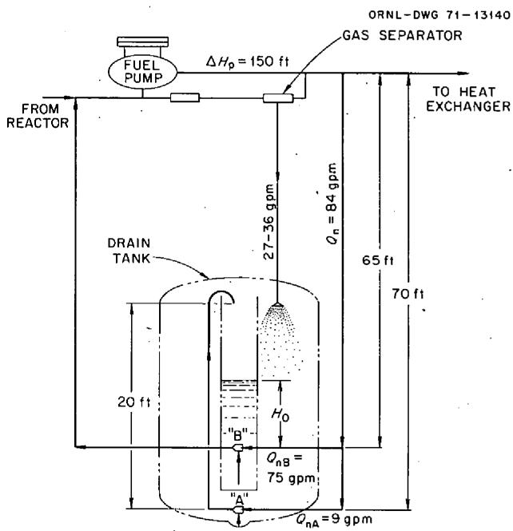  
Fig. 3.7. Jet pump system for returning salt from drain tank to fuel-salt system in a molten-salt demonstration reactor (MSDR). Schematic of the jet pump drain tank fuel-salt system showing installation of jet pumps $A$ and $B$ and giving elevations and driving flows.

separators go above the design flow. The jet pump characteristics are based on dimensionless experimental data from pumps tested by NASA. $^{15}$

The study was continued to obtain an indication of the effects of plating or erosion and corrosion on the

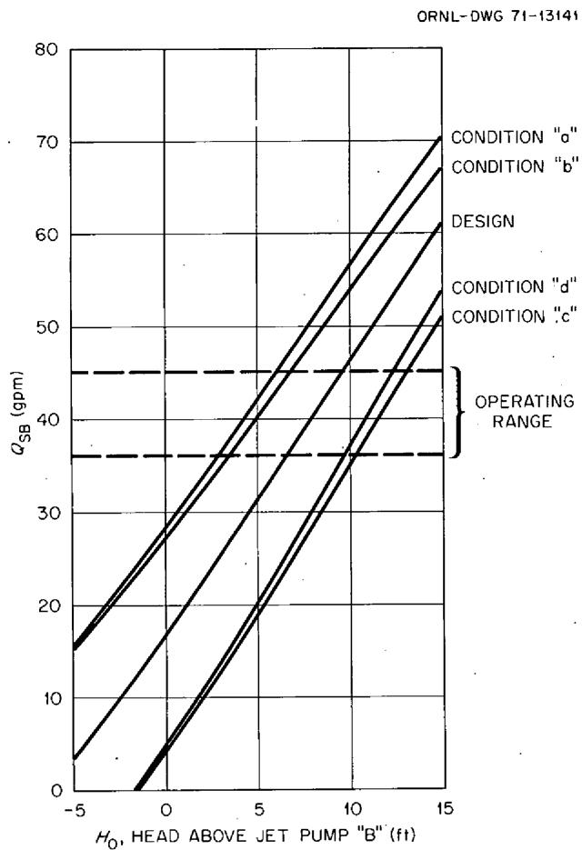  
Fig. 3.8. Jet pump for returning salt from drain tank to fuel-salt system in a molten-salt demonstration reactor (MSDR). Graph of delivery capacity of jet pump $B$ at its initial design area ratio of 0.197 and at four different off-design conditions.

operational characteristics of jet pump $B$ . The (unused) jet pump would have a nominal design area ratio (driving nozzle area/mixing throat area) of 0.197. Four conditions were investigated:

a. an area ratio of 0.207 caused by an increase in the nozzle diameter by erosion and corrosion,   
$b$ . an area ratio of 0.207 caused by a decrease in the mixing throat diameter by plating,   
c. an area ratio of 0.187 caused by a decrease in the nozzle diameter by plating,   
$d$ . an area ratio of 0.187 caused by an increase in the mixing throat diameter by erosion-corrosion.

The driving nozzle diameter for the 0.197 area ratio was about 0.500 in., and the corresponding mixing throat diameter was 1.126 in. The four conditions listed above represent corresponding diametral changes as follows:

a. nozzle diameter increase of 0.012 in.,   
$b$ . mixing throat diameter decrease of 0.027 in.,   
c. nozzle diameter decrease of 0.013 in.,   
$d$ . mixing throat diameter increase of 0.030 in.

The results are shown in Fig. 3.8 from which it can be seen that (1) an increase in the nozzle diameter increases jet pump delivery just as does a decrease in the mixing throat diameter, and (2) a decrease in the nozzle diameter decreases jet pump delivery as does an increase in the mixing throat diameter. It can also be seen in Fig. 3.8 that conditions $a$ and $b$ would result in an uncontrolled delivery of radioactive gas to the fuel-salt system if the inflow of salt to the drain tank from the gas separator were reduced to about $6\mathrm{gpm}$ , which corresponds to a $Q_{sB}$ of approximately $15\mathrm{gpm}$ . Conditions $c$ and $d$ limit the pumping capability of the two jet pumps to about 40 to $45\mathrm{gpm}$ .

There are alternative configurations and characteristics for jet pumps that may furnish adequate operational margins when the long-term erosion, corrosion, and plating characteristics of container material in fuel salt are understood well enough to warrant additional study.

# 4. Instrumentation and Controls

S.J.Ditto

# 4.1 TRANSIENT AND CONTROL STUDIES OF THE MSBR SYSTEM USING A HYBRID COMPUTER

O.W.Burke

The hybrid computer model of the MSBR system as described in the February, 1971, semiannual progress report is operational. In order to accommodate the calculational stability and time requirements of the digital portion of the hybrid computer, the model operates in a time domain that is 20 times real system time.

The model has been checked out, and a number of transients have been run in order to test its validity. At this point the model includes no controllers. The next order of business is to incorporate system controllers into the model and to check the performance of these controllers.

The model will be used in the development of an overall control scheme for the MSBR plant. Of particular interest is the effect of variable flow rate in the secondary salt loop and the use of bypass valves in the secondary loop. The model will also be used to aid in the determination of the range of thermal transients which could be expected in the salt systems under anticipated transient conditions. This information is needed as input for the design studies of the steam generator.

# 4.2 MSRE DESIGN AND OPERATIONS REPORT, PART IIB, NUCLEAR AND PROCESS INSTRUMENTATION

R. L. Moore P. G. Herndon

This report is the second of two parts describing MSRE nuclear and process instrumentation. In the first

part,² Chaps. 1 and 2 provide broad and quite general descriptions which are intended to convey the criteria and philosophy used as the basis for the design of the MSRE instrumentation and controls systems. Chapter 2 also contains detailed descriptions of the nuclear instrumentation, the health physics, process, and stack radiation monitoring systems, the data logger computer, and the beryllium monitoring system. Chapters 3 through 7, which are contained in this volume, provide detailed descriptions of the MSRE process instrumentation and of the electrical control and alarm circuitry.³

The draft of the report has been completed, reviewed, and submitted for minor editing and publication.

# 4.3 FURTHER DISCUSSION OF INSTRUMENTATION AND CONTROLS DEVELOPMENT NEEDED FOR THE MOLTEN-SALT BREEDER REACTOR

R. L. Moore

Previously published information4 concerning the development and evaluation of process instrumentation applicable to molten-salt breeder reactors was updated. Areas where instrumentation techniques and components tested during operation of the Molten-Salt Reactor Experiment may be applicable to the MSBR are described, and recommendations for further development are stated. In this study to date, no problems are foreseen that are beyond the present state of the art.5

This report is now in publication.

# 5. Heat and Mass Transfer and Thermophysical Properties

H.W.Hoffman J.J.Keyes,Jr.

# 5.1 HEAT TRANSFER

# J.W.Cooke

In studies of heat transfer to a proposed MSBR fuel salt $(\mathrm{LiF - BeF_2 - ThF_4 - UF_4};67.5 - 20 - 12 - 0.5\mathrm{mole}\%)$ we observed that, for the Reynolds modulus range from 2000 to 4000, the heat transfer coefficient varies along the test section in a manner which appears to be related to a delay in transition to turbulent flow. It has been suggested that this delay in transition is abetted by the stabilizing influence of heating for the case of a fluid having a large negative temperature coefficient. Additional experimental results using the proposed MSBR salt have been obtained which tend to confirm this theory.

In Fig. 5.1, the viscosity $\mu$ and its first derivative $d\mu /dt$ are plotted as a function of temperature for the subject molten-salt mixture. Note that the temperature coefficient $|d\mu /dt|$ decreases by a factor of 10 from 900 to $1450^{\circ}\mathrm{F}$ . If indeed, the flow is stabilized by a large negative value of $d\mu /dt$ , the stabilization should become less pronounced as the fluid temperature increases; the variation in the local heat transfer coefficient with length should be less. To verify this hypothesis, additional heat transfer measurements were taken at an average fluid temperature of $1450^{\circ}\mathrm{F}$ and compared with existing data at $1100^{\circ}\mathrm{F}$ . These data are tabulated in Table 5.1.

It was not practical to operate the gas-pressurized heat transfer system in such a manner that exactly the same mass flow rate and average fluid temperature were maintained for consecutive runs with and without an unheated entrance length. This was particularly true at the higher temperature where both the mass flow rate and frictional pressure losses were so small that monitoring the flow rate to hold the Reynolds modulus constant was not possible. In addition, the fluid temperature (and thus the fluid viscosity) varied from inlet to outlet of the test section, particularly during the higher heat flux runs.

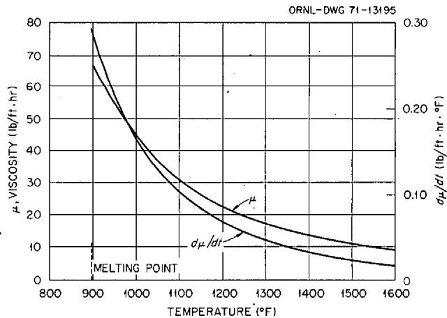  
Fig. 5.1. The viscosity and its temperature derivative as a function of temperature for the molten-salt mixture $\mathrm{LiF - BeF_2 - ThF_4 - UF_4}$ (67.5-20-12-0.5 mole%).

Table 5.1. Data for heat transfer experiments using the salt mixture ${\mathrm{{LiF} - {BeF}}}_{2} - {\mathrm{{ThF}}}_{4} - {\mathrm{{UF}}}_{4}$ (67.5-20-12-0.5 mole %)   

<table><tr><td>Run No.a</td><td>Tin(°F)</td><td>Tout(°F)</td><td>ΔTf(°F)</td><td>q/A(Btu hr-1ft-2× 10-5)</td><td>Heat balance</td><td>NRe</td><td>NPr</td><td>NNu</td><td>h[Btu hr-1ft-2(°F)-1]</td><td>Ns-Tb</td></tr><tr><td>15</td><td>1077.2</td><td>1099.9</td><td>105.8</td><td>0.99</td><td>1.01</td><td>3370</td><td>15.0</td><td>20.4</td><td>937</td><td>7.96</td></tr><tr><td>16</td><td>1082.7</td><td>1106.6</td><td>85.8</td><td>0.99</td><td>1.08</td><td>3264</td><td>14.7</td><td>25.1</td><td>1153</td><td>9.94</td></tr><tr><td>22</td><td>1089.3</td><td>1135.5</td><td>170.7</td><td>2.0</td><td>1.13</td><td>3591</td><td>13.8</td><td>25.1</td><td>1157</td><td>9.87</td></tr><tr><td>23</td><td>1114.2</td><td>1163.6</td><td>189.8</td><td>2.0</td><td>1.09</td><td>3749</td><td>12.7</td><td>23.4</td><td>1076</td><td>9.40</td></tr><tr><td>104</td><td>1399.5</td><td>1445.7</td><td>78.9</td><td>0.82</td><td>1.02</td><td>3260</td><td>6.00</td><td>20.22</td><td>930</td><td>10.93</td></tr><tr><td>105</td><td>1410.0</td><td>1459.0</td><td>99.3</td><td>0.82</td><td>1.04</td><td>3152</td><td>5.84</td><td>16.21</td><td>750</td><td>8.80</td></tr><tr><td>106</td><td>1390.6</td><td>1510.3</td><td>246.9</td><td>1.96</td><td>1.12</td><td>3409</td><td>5.56</td><td>17.28</td><td>795</td><td>9.17</td></tr><tr><td>107</td><td>1385.4</td><td>1506.3</td><td>272.8</td><td>2.02</td><td>1.10</td><td>3457</td><td>5.62</td><td>16.31</td><td>750</td><td>8.57</td></tr></table>

${}^{a}$ Even runs with unheated entrance length; odd runs without.   
$b\overline{\mathcal{N}}_{S - T} = \overline{\mathcal{N}}_{\mathrm{Nu}} / \overline{\mathcal{N}}_{\mathrm{Pr}}^{1 / 3}(\mu /\mu_S)^{0.14}.$

To compare the local heat transfer coefficients at the two temperatures with or without an entrance region, a method was developed to normalize the data using Hausen's equation to include the dependence of local heat transfer coefficient on Reynolds modulus and fluid properties:

$$
N _ {\mathrm {N u}} = 0. 1 1 6 \left(N _ {\mathrm {R e}} ^ {2 / 3} - 1 2 5\right) N _ {\mathrm {P r}} ^ {1 / 3} \left(\frac {\mu}{\mu_ {s}}\right) ^ {0. 1 4}. \tag {5.1}
$$

This equation correlates molten salt as well as oil and water heat transfer data in the transitional flow regime. The normalizing procedure followed three steps: (1) Each local heat transfer coefficient for the individual runs was adjusted to the same Reynolds and Prandtl moduli based on the average fluid temperature in the test section; (2) each local coefficient for a pair of consecutive runs (with and without an entrance region) was then adjusted to an average of the two Reynolds and Prandtl moduli for the pair of runs; and (3) finally, the coefficients for two pairs of runs at two temperature levels were adjusted to the average Reynolds modulus for the two pairs of runs. In most cases, these adjustments amounted to only a few percent in the $h_{x}$ value.

Variations in the ratio of the normalized local heat transfer coefficient $h_{x}$ to the heat transfer coefficient at the exit, $h_{\mathrm{exit}}$ (entrance length case), with distance from the inlet to the heated test section are shown in Fig. 5.2. Included are results for two values of heat flux and Reynolds modulus.

A small but significant improvement can be seen in the heat transfer development with length at the higher fluid temperature, as evidenced by the more rapid

approach to constant $h_x$ for the case without an entrance length. The influence of heat flux on the heat transfer development cannot be conclusively deduced from Fig. 5.1, however, because of the simultaneous variation of Reynolds modulus in this transitional range for which relatively small changes in the Reynolds modulus are significant.

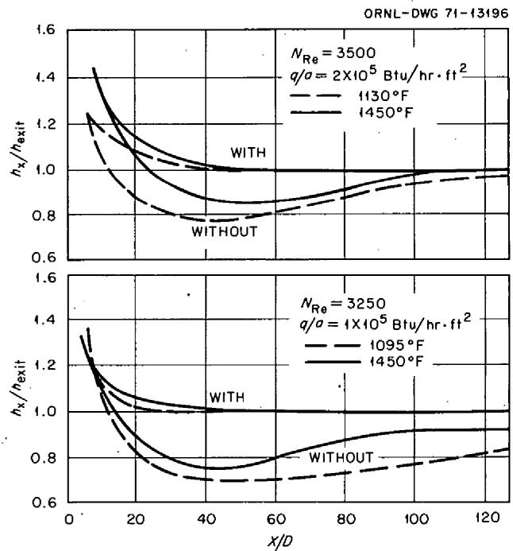  
Fig. 5.2. Variation in the ratio of local to exit heat transfer coefficients with distance from the inlet to the heater section with and without an entrance length. The exit coefficient with an entrance region was used to obtain this ratio.

Experiments aimed at a study of the effect of wetting on molten-salt heat transfer using the proposed MSBR fuel salt have been delayed due to inability, at the present, to understand the wetting behavior of this salt in static capsule experiments. The salt was observed to be wetting on Hastelloy N initially, whereas our previous experience with the salt mixture $\mathrm{LiF - BeF_2 - }$ $\mathrm{ZrF_4 - ThF_4 - UF_4}$ (70-23-5-1-1 mole %) suggested that nonwetting should be observed initially, and that a reducing agent (e.g., Zr or Be) would be required to produce wetting. Since the MSBR salt exhibited wetting under all conditions, we believe that it is necessary to explain the behavior and to investigate techniques for inducing nonwetting which can be applied in the heat transfer system.

# 5.2 THERMOPHYSICAL PROPERTIES

# J. W. Cooke

Measurements of the thermal conductivity of the salt mixture $\mathrm{LiF - BeF_2}$ (66-34 mole %) have been made over the temperature range from 300 to $870^{\circ}\mathrm{C}$ (458°C mp) using the improved version of the variable-gap technique. The preliminary results (omitting two data sets in the solidus region which are being analyzed) are shown in Fig. 5.3. These new results fall midway between previous uncorrected and corrected results, but the temperature dependency in the liquidus region is less than our previous measurements had indicated. The ratio of the liquid to solid conductivity is around 0.75 compared with the average value of $0.86 \pm 0.13$ published for a group of salts. The estimated maximum uncertainty in the present results is expected to be less than $\pm 10\%$ .

# 5.3 MASS TRANSFER TO CIRCULATING BUBBLES

# T. S. Kress

The first phase of an experimental program designed to measure mass transfer rates between small bubbles circulating with a turbulent liquid has been completed.

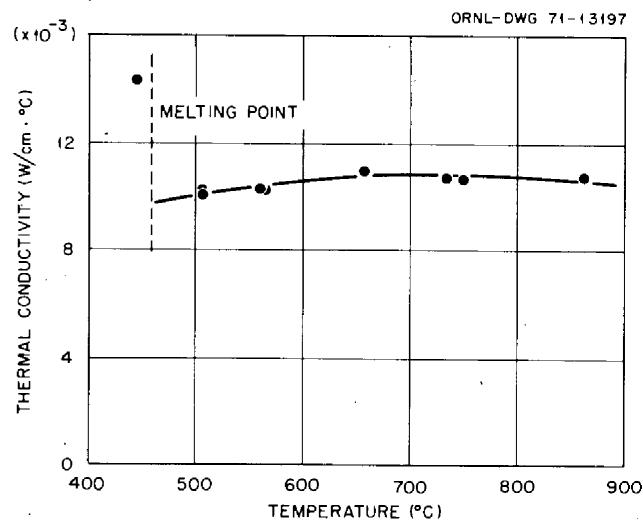  
Fig. 5.3. The thermal conductivity of the molten-salt mixture $\mathrm{LiF - BeF_2}$ (66-34 mole %) using an improved variable-gap conductivity apparatus.

Mass transfer coefficients have been measured for helium bubbles of mean diameters from 0.015 to 0.05 in. extracting dissolved oxygen from five different mixtures of glycerol and water (Schmidt modulus range from 419 to 3446) over a pipe Reynolds modulus range from $3.1 \times 10^{3}$ to $1.6 \times 10^{5}$ for both horizontal and vertical flow in a 2-in.-diam conduit. Extensions of this program are projected for different pipe diameters and different interfacial conditions. Additional experiments are anticipated that will establish mass transfer rates applicable to such flow "discontinuities" as elbows, tees, valves, venturis, etc.

One of the first conclusions of these experiments is that the only effect on mass transfer rates of bubble volume fractions up to $1\%$ is in the highly predictable change in surface area. No significant influence of bubble volume fraction on the mass transfer coefficients (which are based on unit area) was detected.

An examination of all the experimental data has revealed that the mass transfer coefficients depend on the flow orientation (horizontal or vertical). At sufficiently high flows, however, the horizontal and vertical results are observed to be indistinguishable within limits of the experimental error. To establish a criterion for the Reynolds modulus that marks this equivalence of horizontal and vertical flow, use was made of an expression developed previously for the relative im

portance of turbulent inertial forces compared with gravitational forces,

$$
F _ {i} / F _ {g} = \left(\frac {0 . 3 1 6 \mu^ {3} \mathrm {R e} ^ {1 1 / 4}}{2 \rho^ {3} D ^ {4}}\right) ^ {2 / 3} d _ {\mathrm {v s}} ^ {1 / 3} g.
$$

A conservative value, $F_{i} / F_{g} = 1.5$ , has been established above which it is valid to assume that horizontal and vertical flow mass transfer coefficients are the same. Equation (5.2) is a correlation of the horizontal flow data and the vertical flow data for which $F_{i} / F_{g} > 1.5$ :

$$
\mathrm {S h} / \mathrm {S c} ^ {1 / 2} = 0. 3 4 \mathrm {R e} ^ {0. 9 4} \left(d _ {\mathrm {v s}} / D\right) ^ {1. 0}, \tag {5.2}
$$

which has a standard deviation in $\ln (\mathrm{Sh} / \mathrm{Sc}^{1 / 2})$ of 0.19 and an index of determination of 0.86. Figure 5.4 shows a comparison of the horizontal flow data with Eq.(5.2).

As flow was decreased to a value for which the ratio of liquid axial velocity to bubble terminal velocity (in the gravity field) was about 3, severe stratification of the bubbles made operation in horizontal flow impractical. The vertical flow coefficients underwent a transition from the behavior represented by Eq. (5.2) to approach asymptotes characteristic of bubbles rising

through a quiescent liquid. These asymptotic values, $k_{a}$ are well described by the correlation recommended by Resnick and Gal-Or, $^{8}$

$$
k _ {a} = 0. 1 5 4 (\not \rho g / \mu) ^ {1 / 2} \sqrt {d _ {\mathrm {v s}} / 2}. \tag {5.3}
$$

In addition, the variable ratio $F_{i} / F_{g}$ proved to be a good linear scaling factor for calculating the vertical flow coefficients in the transition region. A recommended correlation for the vertical flow coefficients in the transition region is

$$
k _ {\mathrm {v}} = k _ {a} \left[ \frac {1}{1 + (1 0 F _ {i} / F _ {g}) / 1 . 5} \right] + k _ {h} \left[ \frac {(1 0 F _ {i} / F _ {g}) / 1 . 5}{1 + (1 0 F _ {i} / F _ {g}) / 1 . 5} \right],
$$

where $k_{h}$ and $k_{a}$ are to be determined from Eqs. (5.2) and (5.3), respectively. The curves calculated from this equation are shown in Fig. 5.5, together with horizontal and vertical flow data for a $25\%$ glycerin mixture. The horizontal flow regression equation plotted in Fig. 5.5 includes data for glycerin compositions of 12.5, 25, and $37.5\%$ .

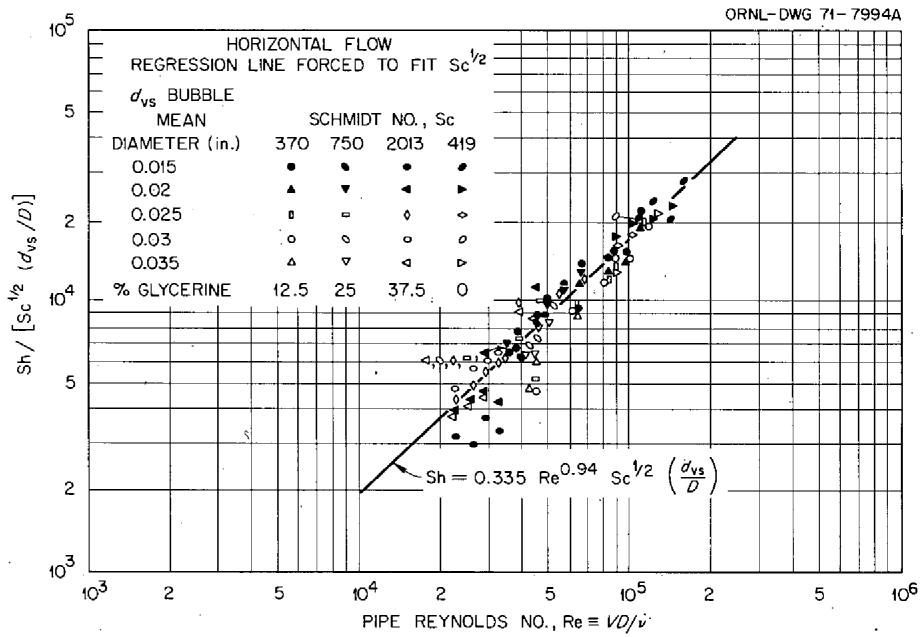  
Fig. 5.4. Typical experimental mass transfer coefficients for horizontal and vertical flow in a 2-in.-diam conduit.

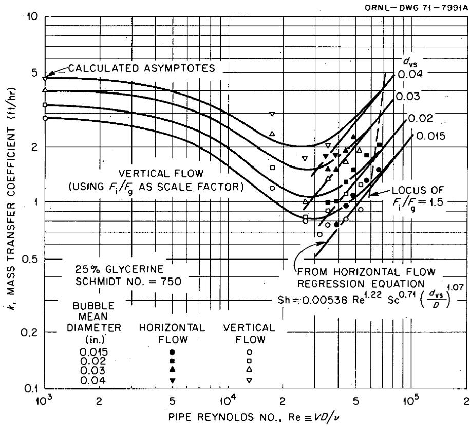  
Fig. 5.5. Comparison of experimental horizontal flow mass transfer data with the recommended regression correlation.

The preceding correlations apparently apply only for mobile interfacial conditions as evidenced by the high exponent for the Schmidt modulus. For rigid interfaces, this exponent is expected to be $\frac{1}{3}$ and the coefficient multiplying the equation should be different. In the absence of experimental results, a tentative correlation for rigid interfacial conditions might be inferred from Eq. (5.2) to be:

$$
\mathrm {S h} = 0. 2 5 \mathrm {R e} ^ {0. 9 4} \mathrm {S c} ^ {1 / 3} \left(d _ {\mathrm {v s}} / D\right) ^ {1. 0}, \tag {5.4}
$$

in which the coefficient 0.25 was obtained from the coefficient of Eq. (5.2), 0.34, by multiplying it by the ratio of rigid to mobile coefficients of equations applicable to bubbles moving steadily through a liquid. Equation (5.4) should be used with caution because it has not been justified experimentally or theoretically. A similar transformation of Eq. (5.3) would be required to obtain the rigid-interface values of the vertical flow asymptotes.

9. A. C. Lochiel and P. H. Calderbank, "Mass Transfer in the Continuous Phase around Axisymmetric Bodies of Revolution," Chem. Eng. Sci. 19, 471-87 (1964).

# Nomenclature

$$
\mathcal {D} = \text {m o l e c u l a r d i f f u s i o n c o e f f i c i e n t}
$$

$$
D = \text {c o n d u i t}
$$

$$
d _ {\mathbf {v} s} = \text {b u b b l e S a u t e r - m e a n d i a m e t e r}
$$

$$
F _ {g} = \text {g r a v i t a t i o n a l f o r c e o n a b u b b l e (b u o y a n c y)}
$$

$$
F _ {i} = \text {m e a n i n e r t i a l f o r c e o n a b u b b l e d u e t o t u r b u l e n t}
$$

$$
g = \text {g r a v i t a t i o n a l}
$$

$$
k _ {a} = \text {l o w f l o w a s y m p t o t i c v a l u e o f} k _ {\mathrm {v}}
$$

$$
k _ {h} = \text {h o r i z o n t a l f l o w a x i a l l y a v e r a g e d m a s s t a n s f e r}
$$

$$
k _ {\mathbf {v}} = \text {v e r t i c a l f l o w a x i a l l y a v e r a g e d m a s s t r a n s f e r c o e f f i c i e n t s}
$$

$$
\mathrm {R e} = \text {p i p e R e y n o l d s m o d u l u s} (V D \rho / \mu , \text {i n w h i c h} V \text {i s t h e}
$$

$$
\mathrm {S c} = \text {S c h m i d t} (\mu / \rho)
$$

$$
\mathrm {S h} = \text {S h e r w o o d m o d u l u s} (k D / \mathbb {Q})
$$

$$
\mu = \text {l i q u i d v i s c o s i t y}
$$

$$
\rho = \text {l i q u i d}
$$

$$
\nu = \text {l i q u i d k i n e m a t i c v i s c o s i t y} (\mu / \rho)
$$

# Part 2. Chemistry

W. R. Grimes

The chemical development activities described below are, in the main, conducted to provide chemical information required in the development of molten-salt reactor systems.

An appreciable, though diminishing, fraction of the effort is still devoted to postoperational examination of specimens and materials from MSRE. Such examinations, several of which are detailed in this document, should be largely concluded during the next reporting period.

The behavior of hydrogen and tritium in molten salt, metals, and graphite constitutes a substantial fraction of the research and development effect. Solubility of hydrogen and its isotopes in molten fluorides is under study, as are rates of diffusion of hydrogen through pertinent metals and possible chemical exchange schemes capable of holding up the tritium to allow time for its controlled recovery.

Studies of chemical separation of protactinium during this period have been confined to those based upon selective precipitation of oxides. It now appears that such a separation process is chemically feasible; we anticipate that, insofar as small-scale studies are concerned, these researches will be concluded during the

coming few weeks. Small efforts continue on improvements to the reductive extraction process for rare earths and, more significantly, upon methods for removal of rare-earth species from lithium chloride.

Study of possible mechanisms of the intergranular attack upon the metallic components in MSRE now constitutes an appreciable fraction of the chemical research program. These studies, all initiated in recent months, have not yet produced information to report.

The principal emphasis of analytical chemical development programs has been placed on methods for use in semiautomated operational control of molten-salt breeder reactors, for example, the development of in-line analytical methods for the analysis of MSR fuels, for reprocessing streams, and for gas streams. These methods include electrochemical and spectrophotometric means for determination of the concentration of $\mathrm{U}^{3+}$ and other ionic species in fuels and coolants, and adaptation of small on-line computers to electroanalytical methods. Parallel efforts have been devoted to the development of analytical methods related to assay and control of the concentration of water, oxides, and tritium in fluoroborate coolants.

# 6. Postoperational Examination of MSRE

# 6.1 EXAMINATION OF MODERATOR GRAPHITE FROM MSRE

S.S.Kirslis F.F.Blankenship

A complete stringer of graphite (located in an axial position between the surveillance specimen assembly and the control rod thimble) was removed intact from the MSRE. This 64.5-in.-long specimen was transferred to the hot cells in building 3525 for examination, segmenting, and sampling. Most of the examinations and analyses were similar to those given to the graphite surveillance specimens previously removed from MSRE during its scheduled shutdowns. In addition to these "standard" methods, surface samples from the stringer were examined by Auger spectroscopy and by a special x-ray diffraction technique, cross sections of the stringer were gamma scanned with a special pin-hole collimating device, and samples milled from the stringer were carefully analyzed for tritium.

# 6.1.1 Results of Visual Examination

Careful examination of all surfaces of the stringer with a Kollmorgen periscope showed the graphite to be generally in very good condition, as were the many surveillance specimens previously examined. The corners were clean and sharp, the faint circles left upon milling the fuel channel surfaces were visible and appeared unchanged, and the surfaces, with minor exceptions described below, were clean. The stringer bottom, with identifying letters and numbers scratched on it, appeared identical to the photograph taken before its installation in MSRE.

Examination revealed a few solidified droplets of flush salt adhering to the graphite, and one small (0.5 cm²) area where a grayish-white material appeared to have wetted the smooth graphite surface. One small crack was observed near the middle of a fuel channel. At the top surface of the stringer a heavy dark deposit was visible. This deposit seemed to consist in part of salt and in part of a carbonaceous material; it was sampled for both chemical and radiochemical analysis. Near the metal knob at the top of the stringer a crack in the graphite had permitted a chip (about 1 mm thick and 2 cm² in area) to be cleaved from the flat top surface. This crack may have resulted from mechanical stresses due to threading the metal knob into the stringer (or from thermal stresses in this metal-graphite system during operation), rather than from radiation or chemical effects.

# 6.1.2 Segmenting of Graphite Stringer

Upon completion of the visual observation and photography and after removal of small samples from several locations on the surface, the stringer was sectioned with a thin carborundum cutting wheel (Canosaw) to provide five sections of 4 in. length, three thin (10 to 20 mil) sections for x radiography, and three thicker (30 to 60 mil) sections for pin-hole scanning with the gamma spectrometer. Each set of samples contained specimens from near the top, middle, and bottom of the stringer. The large specimens, from which surface samples were subsequently milled, included (in addition) two samples from intermediate positions.

# 6.1.3 Examination of Surface Samples by X-Ray Diffraction

Previous attempts to determine the chemical form of fission products deposited on graphite surveillance specimens by x-ray reflection from flat surfaces failed to detect any element except graphitic carbon. A sampling method which concentrated surface impurities was tried at the suggestion of Harris Dunn of the Analytical Chemistry Division. This method involved lightly brushing the surface of the graphite stringer with a fine Swiss pattern file which had a curved surface. The grooves in the file picked up a small amount of surface material which was transferred into a glass bottle by tapping the file on the lip of the bottle. In this way samples were taken at the top, middle, and bottom of the graphite stringer from the fuel channel surface, from the surface in contact with graphite, and from the curved surface adjacent to the control rod thimble. Samples were also taken of the "dirty" graphite and salt on the top end surface of the stringer.

Although each sample contained only about a dozen tiny particles and weighed less than $0.1\mathrm{mg}$ , the various samples read 1 to $4\mathrm{R/hr}$ at a distance of 6 in. with a soft-shelled "Cutie Pie" outside the glass bottle wall. This radiation field made transfer of the particles into glass capillaries for powder x-ray diffraction examination a difficult operation. However, three $(0.2\mathrm{m})$ capillaries were packed and mounted in holders which fitted into the x-ray camera.

Short-exposure x-ray photographs were taken with precautions to minimize blackening of the film by the radioactivity. In spite of the precautions, samples from the fuel channel surfaces yielded very dark films which were difficult to read. Many weak lines were observed in the x-ray patterns. Since other analyses had shown Mo, Te, Ru, Tc, Ni, Fe, and Cr to be present in significant concentrations on the graphite surface, these elements and their carbides and tellurides were searched for by careful comparison with the observed patterns.

In all three of the graphite surface samples so far analyzed, most of the lines for $\mathsf{Mo}_2\mathbb{C}$ and Ru metal were certainly present. For one sample, most of the lines for $\mathrm{Cr_7C_3}$ were seen. (The expected chromium carbide in equilibrium with excess graphite is $\mathrm{Cr}_3\mathrm{C}_2$ but nearly half the diffraction lines for this compound were missing, including the two strongest lines.) Five of the six strongest lines for $\mathrm{NiTe_2}$ were observed. Mo metal, Te metal, Tc metal, Cr metal, CrTe, and $\mathrm{MoTe_2}$ were excluded by comparison of their known pattern with the observed spectrum. These observations (except for that of $\mathrm{Cr_7C_3}$ ) are in gratifying accord with

expected chemical behavior and are significant in that they represent the first experimental identification of the chemical form of fission products known to be deposited on the graphite surface.

Several hot cell techniques were tried for mounting the x-ray diffraction samples in glass capillaries or on quartz fibers, but they proved unsuccessful. To avoid undue radiation exposure to analytical chemistry personnel, the remaining samples were not analyzed.

# 6.1.4 Examination with a Gamma Spectrometer

In order to provide an inexpensive guide for later radiochemical work with milled stringer samples, a simple technique was developed (with the help of E. I. Wyatt and H. A. Parker of the Analytical Chemistry Division) for taking gamma scans of a number of locations on the cross-section samples of the graphite stringer. The sample, approximately $2 \times 2 \times 0.050$ in., was placed over a $1/6$ -in.-diam hole through the center of a large face of a $4 \times 4 \times 8$ in. lead brick. The hole was positioned over the center of the NaI crystal of a gamma spectrometer. The sample was shielded above by a $3/4$ -in.-thick sheet of plate glass with a scratched cross on the bottom surface positioned above the hole in the lead brick. By means of a 12-in. plastic ruler taped to the specimen, any desired region of the graphite cross section could be positioned over the hole in the lead brick for gamma scanning. With this relatively rapid technique, 18 to 20 positions were gamma scanned on each of the cross-section samples from the top, middle, and bottom of the graphite stringer.

The distribution of the four main activities observed $(^{106}\mathrm{Ru},^{125}\mathrm{Sb},^{134}\mathrm{Cs},$ and $^{137}\mathrm{Cs})$ in the three samples is shown graphically in Fig. 6.1. The numbers on each map are counts per minute above background and are proportional to the radioactivity at each position for a given isotope. (For comparison between isotopes, counts per minute are not proportional to disintegrations per minute because of different counting efficiencies.) In broad outline, the results were as expected. Heavy surface depositions of $^{106}\mathrm{Ru}$ and $^{125}\mathrm{Sb}$ were observed with little penetration to the interior. The Cs isotopes were found at deeper locations since they possessed gaseous precursors (5.27-day $^{133}\mathrm{Xe}$ and 4.2-min $^{137}\mathrm{Xe}$ ).

The volume of graphite scanned by this technique was quite small $(1/16$ in. diam $\times 0.050$ in.); this permitted a more fine-grained look at fission product distribution than was possible by the milling techniques previously used for sampling graphite surveillance specimens. Correspondingly, the surface concentrations of all

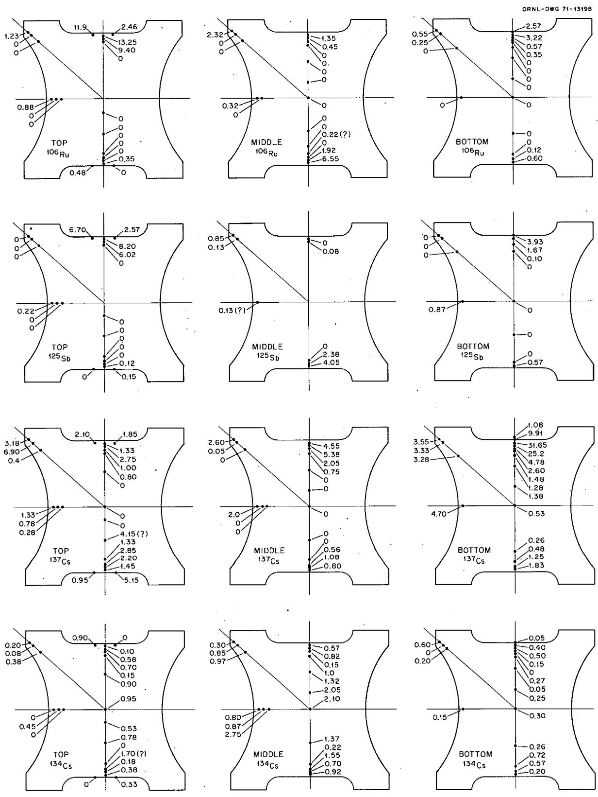  
Fig. 6.1. Gamma scans of MSRE graphite stringer cross sections.

isotopes varied considerably between the two fuel channel surfaces examined. Usually, but not always, there was less of each isotope deposited near the surfaces in contact with adjacent graphite stringers or with the control rod thimble. Individual (reproducible) $^{134}\mathrm{Cs}$ points were often considerably higher or lower than adjacent points on a line between one fuel channel surface and the other. The variations at the graphite surface are believed to indicate spotty rather than uniform deposition of fission products on the specimen surface. The interior variations are believed to indicate variations in porosity of the interior graphite. These observations and hypotheses are in accord with autoradiographs of graphite surveillance specimens previously examined which indicated spotty distribution of total activity.

# 6.1.5 Milling of Surface Graphite Samples

As was done for the five previous sets of graphite surveillance specimens removed from the MSRE, surface samples for chemical and radiochemical analyses were milled from the five 4-in.-long segments from the top, middle, bottom, and two intermediate locations on the graphite stringer. The milling techniques developed for previous surveillance specimens could not be used because of the peculiar geometry of the graphite stringer. A new technique was developed using the large milling machine in building 3525 hot cells and a rotating milling cutter 0.619 in. in diameter. The specimen was clamped flat on the bed of the machine, and cuts were made from the flat fuel channel surface and from one of the narrower flat edge surfaces on both sides of the fuel channel. The latter surfaces contacted the similar surfaces of an adjacent stringer in the MSRE core. After the sample was clamped in position, the milling machine was operated remotely to take successive cuts 1, 2, 3, 10, 20, 30, 245, 245, and 245 mils deep to the center of the graphite stringer. The powdered graphite was collected during and after each cut in a tared filter bottle attached to a vacuum cleaner hose. The filter bottle was a plastic cylindrical bottle with a circular filter paper converging a number of drilled holes in the bottom. This technique collected most of the thinner samples, but only about one-half of the larger 245-mil samples. After each sampling the uncollected powder was carefully removed with the empty vacuum cleaner hose.

Before samples were cut from the narrow flats, the corners of the stringer bars were milled off to a width and depth of 66 mils to avoid contamination from the adjacent stringer surfaces. Then successive cuts 1, 2, 3,

10, 20, and 30 mils deep were taken. Finally, a single cut 62 mils deep was taken on the opposite flat fuel channel surface. Only the latter cut was taken on the two stringer samples from positions halfway between the bottom and middle and halfway between the middle and top of the stringer.

Four blank samples were milled by identical procedures in the hot cells from an unirradiated spare stringer of CGB graphite to indicate the amount of contamination received by the samples in the process of being milled in the highly contaminated hot cell.

The sample bottles were reweighed and delivered for radiochemical analysis.

# 6.1.6 Radiochemical and Chemical Analyses of MSRE Graphite

The milled graphite samples were dissolved in a boiling mixture of concentrated $\mathrm{H}_2\mathrm{SO}_4$ and $\mathrm{HNO}_3$ with provision for trapping any volatilized activities. The following analyses were run on the dissolved samples:

1. Gamma spectrometer scans for $^{106}\mathrm{Ru}$ , $^{125}\mathrm{Sb}$ , $^{134}\mathrm{Cs}$ , $^{137}\mathrm{Cs}$ , $^{110}\mathrm{Ag}$ , $^{144}\mathrm{Ce}$ , $^{95}\mathrm{Zr}$ , $^{95}\mathrm{Nb}$ , and $^{60}\mathrm{Co}$ .   
2. Separate radiochemical separations and analyses for $^{89}\mathrm{Sr}$ , $^{90}\mathrm{Sr}$ , $^{127}\mathrm{Te}$ , and $^{3}\mathrm{H}$ . A few samples were analyzed for $^{99}\mathrm{Tc}$ .   
3. Uranium analyses by both the fluorometric and the delayed neutron counting methods.   
4. Spectrographic analyses for Li, Be, Zr, Fe, Ni, Mo, and Cr. (High-yield fission products were also looked for but not found.)

Uranium and spectrographic analyses. In Table 6.1 are given the uranium analyses (calculated as $^{233}\mathrm{U}$ ) by both the fluorometric method and the delayed neutron counting method. The type of surfaces sampled, the number of the cut, and the depth of the cut for each sample are also shown in the table. Samples between 19 and 29 were inadvertently tapered from one end of the specimen block to the other so that larger-than-planned ranges of cut depth were obtained. Samples from 3 to 18 were taken from the topmost graphite stringer specimen, those from 19 to 31 and sample 36 were from the middle specimen, and those from 32 to 48 were taken from the bottom specimen.

In view of the fact that the uranium concentrations were at the extreme low end of the applicable range for the fluorometric method, the agreement with the delayed neutron counting method was quite satis

Table 6.1 Chemical analyses of milled samples   

<table><tr><td>Sample</td><td>Cut and typeb</td><td>Depth, mils</td><td>Total U, ppm, fluorometric</td><td>233U, ppm, delayed neutron</td><td>Li, ppm</td><td>Be; ppm</td><td>Zr, ppm</td><td>Metal,cpppm</td></tr><tr><td>1</td><td>1 Blank</td><td>0-6</td><td></td><td></td><td>&lt;10</td><td>&lt;2</td><td>-</td><td>-</td></tr><tr><td>2</td><td>2 Blank</td><td>6-30</td><td>1</td><td>0.1 ± 0.05</td><td>&lt;2</td><td>&lt;1</td><td>-</td><td>-</td></tr><tr><td>3</td><td>1 FC</td><td>0-2</td><td>28</td><td>35.5 ± 1.5</td><td>360</td><td>320</td><td>1600</td><td>-</td></tr><tr><td>4</td><td>2 FC</td><td>1-3</td><td>21</td><td>26.9 ± 1.2</td><td>340</td><td>170</td><td>-</td><td>-</td></tr><tr><td>5</td><td>3 FC</td><td>3-6</td><td>8</td><td>11.5 ± 0.8</td><td>-</td><td>-</td><td>-</td><td>-</td></tr><tr><td>7</td><td>5 FC</td><td>16-36</td><td>2</td><td>2.6 ± 0.2</td><td>-</td><td>-</td><td>-</td><td>-</td></tr><tr><td>11</td><td>9 FC</td><td>556-801</td><td>3</td><td>2.6 ± 0.3</td><td>310</td><td>200</td><td>-</td><td>820 Fe</td></tr><tr><td>12</td><td>1 E</td><td>0-2</td><td>&lt;1 (?)</td><td>22.7 ± 3.5</td><td>250</td><td>180</td><td>-</td><td>High Fe</td></tr><tr><td>13</td><td>2 E</td><td>2-3</td><td>&lt;30</td><td>8.6 ± 2.3</td><td>110</td><td>50</td><td>-</td><td>-</td></tr><tr><td>14</td><td>3 E</td><td>3-6</td><td>9</td><td>5.5 ± 0.7</td><td></td><td></td><td></td><td></td></tr><tr><td>17</td><td>6 E</td><td>36-66</td><td>3</td><td>5.0 ± 0.3</td><td></td><td></td><td></td><td></td></tr><tr><td>18</td><td>1 Deep</td><td>0-62</td><td>2</td><td>2.4 ± 0.1</td><td>40</td><td>20</td><td>-</td><td>-</td></tr><tr><td>19</td><td>1 FC</td><td>0-5</td><td>21</td><td>21.5 ± 0.6</td><td>220</td><td>150</td><td></td><td>970 Mo,1100 Ni</td></tr><tr><td>20</td><td>2 FC</td><td>1-7</td><td>9</td><td>10.1 ± 0.8</td><td>190</td><td>100</td><td>-</td><td>-</td></tr><tr><td>21</td><td>3 FC</td><td>3-10</td><td>4</td><td>7.1 ± 0.4</td><td></td><td></td><td></td><td></td></tr><tr><td>23</td><td>5 FC</td><td>16-40</td><td>&lt;1</td><td>1.0 ± 0.7</td><td></td><td></td><td></td><td></td></tr><tr><td>26</td><td>8 FC</td><td>311-556</td><td>&lt;2</td><td>0.8 ± 0.6</td><td>10</td><td>610</td><td></td><td></td></tr><tr><td>27</td><td>1 E</td><td>0-3</td><td>3</td><td>3.8 ± 0.2</td><td>150</td><td>90</td><td>1400</td><td>High Fe</td></tr><tr><td>28</td><td>2 E</td><td>1-5</td><td>&lt;8</td><td>5.9 ± 0.1</td><td>230</td><td>110</td><td></td><td></td></tr><tr><td>29</td><td>3 E</td><td>3-8</td><td>3</td><td>5.7 ± 0.4</td><td></td><td></td><td></td><td></td></tr><tr><td>31</td><td>1 Deep</td><td>0-62</td><td>4</td><td>3.3 ± 0.1</td><td>80</td><td>50</td><td>70</td><td>150 Ni</td></tr><tr><td>32</td><td>1 Deep</td><td>0-62</td><td>14</td><td>13.0 ± 0.2</td><td>120</td><td>90</td><td>80</td><td>180 Ni</td></tr><tr><td>33</td><td>1 FC</td><td>0-0.2</td><td>12</td><td>18.1 ± 1.3</td><td>1400</td><td>290</td><td>High</td><td>High Fe + Mo</td></tr><tr><td>34</td><td>2 FC</td><td>0-3</td><td>36</td><td>29.2 ± 1.3</td><td>410</td><td>240</td><td>500</td><td>2900 Ni</td></tr><tr><td>35</td><td>3 FC</td><td>3-6</td><td>18</td><td>20.0 ± 0.9</td><td></td><td></td><td></td><td></td></tr><tr><td>36</td><td>5 E</td><td>16-36</td><td>1</td><td>2.5 ± 0.1</td><td></td><td></td><td></td><td></td></tr><tr><td>39</td><td>6 FC</td><td>36-66</td><td>3</td><td>3.5 ± 0.1</td><td></td><td></td><td></td><td></td></tr><tr><td>43</td><td>1 E</td><td>0-1</td><td>51</td><td>118 ± 6</td><td>1000</td><td>400</td><td>8000</td><td>High Fe</td></tr><tr><td>44</td><td>2 E</td><td>1-3</td><td>46</td><td>36.6 ± 1.6</td><td>40</td><td>270</td><td>550</td><td>220 Ni</td></tr><tr><td>45</td><td>3 E</td><td>3-6</td><td>8</td><td>7.8 ± 0.7</td><td></td><td></td><td></td><td></td></tr><tr><td>48</td><td>6 E</td><td>36-66</td><td>2</td><td>3.6 ± 0.2</td><td></td><td></td><td></td><td></td></tr><tr><td>49</td><td>1 Blank</td><td>0-2</td><td></td><td></td><td>&lt;10</td><td>&lt;2</td><td>-</td><td>-</td></tr><tr><td>50</td><td>2 Blank</td><td>2-30</td><td>&lt;1</td><td>0.1 ± 0.04</td><td>&lt;7</td><td>&lt;0.3</td><td>&lt;40</td><td>&lt;70 Ni</td></tr></table>

${}^{a}$ Dashes in the body of the table represent analyses showing none present. Blanks indicate the analyses were not done.   
The number is the number of cut toward the interior starting at the graphite surface. "FC" stands for a fuel channel surface, "E" for a narrow edge surface, and "Deep" for a first cut about 62 mils deep from a fuel channel surface.   
$c_{\text{High}}$ indicates an unbelievably high concentration (several percent).

factory. The data suggest that the sizable variations between different surfaces (e.g., the three deep cut samples 18, 31, and 32) were real. Sizable variations also exist in uranium concentrations in the deep interior of different regions of the stringer. These values range from $2.6~\mathrm{ppm}$ at the top to $0.8~\mathrm{ppm}$ at the middle to 3 ppm at the bottom.

The concentration profiles indicated by the data in Table 6.1 were generally similar to those previously observed both on the surface and in the interior. Concentrations dropped a factor of 10 in the first 16 mils. A rough calculation of the total $^{233}\mathrm{U}$ in the MSRE core graphite indicates about $2\mathrm{g}$ on the surface and about $9\mathrm{g}$ in the interior of the graphite. These low

values indicate that uranium penetration into moderator graphite should not be a serious problem in large-scale molten-salt reactors.

The fact that fluorometric values for total uranium and the delayed neutron counting values for $^{233}\mathrm{U}$ agreed (with the $^{233}\mathrm{U}$ value usually larger than the total U value) indicates that little uranium remained in the graphite from the operation of the MSRE with $^{235}\mathrm{U}$ fuel. Apparently, the $^{238}\mathrm{U}$ and $^{235}\mathrm{U}$ previously in the graphite underwent rather complete isotopic exchange with $^{233}\mathrm{U}$ after the fuel was changed.

The spectrographic results also given in Table 6.1 were disappointing in several respects. The sensitivities for all species were lower than hoped. Thus only the

strongest spectra (Be and Li) could be measured with any reliability, and results for Zr, Fe, Ni, and Mo were highly susceptible to sample contamination. While the U-to-Li-to-Be ratios were approximately the same as for fuel salt (1 to 14.5 to 8.7) for about half the samples analyzed, the Zr results were more erratic. It had been hoped that high yield stable or long-lived noble-metal fission products (Mo, Tc, Ru, and Te) might be detected in these samples, but they were not. The finding of 150 to $2900\mathrm{ppm}$ Ni in a few of the surface samples is probably real. The main conclusions from the spectrographic analyses are that adherent or permeated fuel salt accounted for the U, Li, and Be in half the samples and that a thin layer of Ni was probably deposited on some of the graphite surface.

Radiochemical analyses. Since the graphite stringer samples were taken more than a year after reactor shutdown, it was possible to analyze only for the relatively long-lived fission products. However, the absence of interfering short-lived activities made the analyses for long-lived nuclides more sensitive and precise. The radiochemical analyses are given in Table 6.2, together with the type and location of surface sampled, the number of the milling cut, and the depth of the cut for each sample.

The species $^{125}\mathrm{Sc},$ $^{106}\mathrm{Ru},$ $^{110}\mathrm{Ag},$ $^{95}\mathrm{Nb}$ , and $^{127}\mathrm{Te}$ showed concentration profiles similar to those observed for noble-metal fission products ( $^{99}\mathrm{Mo},$ $^{129}\mathrm{Te},$ $^{132}\mathrm{Te},$ $^{103}\mathrm{Ru},$ $^{106}\mathrm{Ru}$ , and $^{95}\mathrm{Nb}$ ) in previous graphite surveillance specimens, that is, high surface concentrations falling rapidly several orders of magnitude to low interior concentrations. The $^{95}\mathrm{Zr}$ profiles were of similar shape, but the interior concentrations were two or three orders of magnitude smaller than for its daughter $^{95}\mathrm{Nb}$ . It is thought that $^{95}\mathrm{Zr}$ is either injected into the graphite by a fission recoil mechanism or is carried with fuel salt into cracks in the graphite; the much larger concentrations of $^{95}\mathrm{Nb}$ (and the other noble metals) are thought to result from the deposition or plating of solid metallic or carbide particles on the graphite surface. The $^{90}\mathrm{Sr}$ (33-sec $^{90}\mathrm{Kr}$ precursor) profiles were much steeper than those previously observed in surveillance specimens for $^{89}\mathrm{Sr}$ (3.2-min $^{89}\mathrm{Kr}$ precursor), as expected. An attempt to analyze the stringer samples for $^{89}\mathrm{Sr}$ also was unsuccessful. It is difficult to analyze for one of these pure beta emitters in the presence of large activities of the other.

The hot cell facility in which the graphite samples were milled was heavily contaminated with $^{152}$ Eu and $^{154}$ Eu. Correspondingly, the blank samples (Nos. 1, 2, 49, and 50) did not contain significantly less of these activities than the stringer samples. Although the blank

samples were also contaminated with $^{60}\mathrm{Co}$ , the concentrations in the outermost stringer samples were significantly higher. It probably was formed by an $n,p$ reaction from stable $^{60}\mathrm{Ni}$ . Its presence confirms the spectrographic analyses indicating that nickel was present on the stringer surfaces.

Surprisingly high concentrations of tritium were found in the moderator graphite samples (Table 6.2). The tritium concentration decreased rapidly from about $10^{11}$ $\mathrm{dpm / g}$ at the surface to about $10^{9}$ $\mathrm{dpm / g}$ at a depth of $1/16$ in. and then decreased slowly to about half this value at the center of the stringer. If all of the graphite in the MSRE contained this much tritium, then about $15\%$ of the tritium produced during the entire power operation had been trapped in the graphite. About half the total trapped tritium was in the outer $1/16$ -in. layer.

Similarly high concentrations of tritium were found in specimens of Poco graphite (a graphite characterized by large uniform pores) exposed to fissioning salt in the core during the final 1786 hr of operation. Surface concentrations as high as $4.5 \times 10^{10} \, \mathrm{dpm/g}$ were found, but interior concentrations were below $10^{8} \, \mathrm{dpm/g}$ , much lower than for the moderator graphite. This suggests that the graphite surface is saturated relatively quickly but that diffusion to the interior is slow.

If it is assumed that the surface area of the graphite (about $0.5\mathrm{m}^2 /\mathrm{g}$ ) is not changed by irradiation (there was no dependence of tritium sorption on flux), there was one tritium per 100 surface carbon atoms. Since the MSRE cover gas probably contained about 100 times as much hydrogen (from pump oil decomposition) as tritium, a remarkably complete coverage by chemisorbed hydrogen is indicated.

# 6.2 CESIUM ISOTOPE MIGRATION IN MSRE GRAPHITE

E. L. Compere S. S. Kirslis

Fission product concentration profiles have been obtained on the graphite bar from the center of the MSRE core which was removed early in 1971. The bar had been in the core since the beginning of operation; it thus was possible to obtain profiles for 2.1-year $^{134}\mathrm{Cs}$ (a neutron capture product of the stable $^{133}\mathrm{Cs}$ daughter of 5.27-day $^{133}\mathrm{Xe}$ ) as well as the 30-year $^{137}\mathrm{Cs}$ daughter of 3.9-min $^{137}\mathrm{Xe}$ . These profiles, extending to the center of the bar, are shown in Fig. 6.2.

Graphite surveillance specimens exposed for shorter periods, and of thinner dimensions, have revealed

Table 6.2. Radiochemical analyses of graphite stringer samples   

<table><tr><td rowspan="2">Sample No.</td><td rowspan="2">Cut and typea</td><td rowspan="2">Depth, mils</td><td colspan="14">Disintegrations per minute per gram of graphite on 12-12-69</td><td></td></tr><tr><td>125Sb</td><td>106Ru</td><td>127Te</td><td>95Nb</td><td>110Ag</td><td>99Tc</td><td>134Cs</td><td>137Cs</td><td>90Sr</td><td>144Ce</td><td>95Zr</td><td>152Eu</td><td>154Eu</td><td>60Co</td><td>3H</td></tr><tr><td>1</td><td>Thin blank</td><td>0-6</td><td>≤8E5</td><td>≤4E6</td><td></td><td>≤7E9</td><td>≤9E5</td><td></td><td>≤3E5</td><td>≤8E8</td><td>5.79E5</td><td>6.22E6</td><td>≤2E8</td><td>2.93E7</td><td>3.12E7</td><td>1.06E7</td><td>9.15E5</td></tr><tr><td>2</td><td>Thick blank</td><td>6-30</td><td>≤8E9</td><td>8.53E5</td><td></td><td>≤7E8</td><td>≤9E4</td><td></td><td>≤3E4</td><td>≤7E4</td><td></td><td>1.56E6</td><td>≤2E7</td><td>1.85E6</td><td>1.83E6</td><td>6.81E5</td><td>2.38E6</td></tr><tr><td>3</td><td>1 FC,T</td><td>0-2</td><td>3.1E10</td><td>7.31E10</td><td>8.95E10</td><td>≤4E12</td><td>≤1E9</td><td>~330</td><td>≤3E8</td><td>1.0E9</td><td>8.7E9</td><td>8.49E9</td><td>≤1.8E10</td><td>≤4.8E8</td><td>≤5E8</td><td>3.63E8</td><td>5.92E10</td></tr><tr><td>4</td><td>2 FC,T</td><td>1-4</td><td>1.14E9</td><td>3.74E8</td><td>3.42E9</td><td>≤2.7E11</td><td>2.84E8</td><td>~13</td><td>1.06E7</td><td>2.39E8</td><td>1.1E10</td><td>4.26E8</td><td>≤1.1E9</td><td>1.76E7</td><td>2.37E7</td><td>4.4E7</td><td>1.21E10</td></tr><tr><td>5</td><td>3 FC,T</td><td>3-7</td><td>5.52E8</td><td>1.08E9</td><td>1.81E9</td><td>≤1E11</td><td>2.75E7</td><td></td><td>≤7E6</td><td>2.39E8</td><td>3.88E9</td><td>1.72E8</td><td>≤2E9</td><td>1.50E8</td><td>1.51E8</td><td>3.77E7</td><td>6.31E9</td></tr><tr><td>6</td><td>4 FC,T</td><td>6-17</td><td>1.76E8</td><td>3.72E8</td><td>5.23E8</td><td>≤3E10</td><td>≤6E7</td><td></td><td>4.39E6</td><td>3.49E8</td><td>3.38E9</td><td>5.27E7</td><td>≤3E8</td><td>≤1E7</td><td>≤1.3E7</td><td>1.51E7</td><td>1.75E9</td></tr><tr><td>7</td><td>5 FC,T</td><td>16-37</td><td>1.07E8</td><td>2.54E8</td><td>3.50E8</td><td>≤1E10</td><td>≤3.6E6</td><td></td><td>8.81E6</td><td>3.96E8</td><td>1.24E9</td><td>3.82E7</td><td>≤2E8</td><td>≤7E6</td><td>≤5E6</td><td>1.14E6</td><td>1.85E9</td></tr><tr><td>8</td><td>6 FC,T</td><td>36-67</td><td>5.91E7</td><td>2.02E8</td><td>1.96E8</td><td>≤9E9</td><td>≤3.3E6</td><td></td><td>2.03E6</td><td>2.69E7</td><td>2.78E8</td><td>3.79E7</td><td>≤2E8</td><td>≤9E6</td><td>≤4.8E6</td><td>1.70E6</td><td>1.03E9</td></tr><tr><td>9</td><td>7 FC,T</td><td>66-312</td><td>≤7E6</td><td>2.90E7</td><td>1.39E7</td><td>≤2.73E10</td><td>≤9E5</td><td></td><td>3.32E7</td><td>3.00E8</td><td>7.23E7</td><td>1.69E8</td><td>2.95E8</td><td>≤3E6</td><td>≤3E6</td><td>≤1.7E6</td><td>1.36E9</td></tr><tr><td>10</td><td>8 FC,T</td><td>311-557</td><td>≤8E6</td><td>≤2E7</td><td>4.89E6</td><td>≤5.4E9</td><td>≤1E6</td><td></td><td>2.47E8</td><td>1.46E8</td><td>1.12E7</td><td>≤4.1E7</td><td>≤1.2E8</td><td>≤3E6</td><td>≤2E6</td><td>≤7E5</td><td>6.32E8</td></tr><tr><td>11</td><td>9 FC,T</td><td>556-802</td><td>≤1E7</td><td>≤3.3E7</td><td>2.00E7</td><td>≤7E9</td><td>≤3E6</td><td></td><td>3.04E8</td><td>1.64E8</td><td>2.12E6</td><td>≤5E7</td><td>≤2.0E8</td><td>≤4E6</td><td>≤1.6E6</td><td>≤2E6</td><td>8.16E8</td></tr><tr><td>12</td><td>1 E,T</td><td>0-2</td><td>3.02E9</td><td>1.82E10</td><td>1.07E10</td><td>1.59E12</td><td>3.62E8</td><td></td><td>1.40E8</td><td>7.46E8</td><td>5.86E9</td><td>4.84E9</td><td>1.09E10</td><td>≤8E7</td><td>≤4.2E6</td><td>2.25E8</td><td>1.78E10</td></tr><tr><td>18</td><td>1 Deep,T</td><td>0-62</td><td>1.45E9</td><td>6.08E9</td><td>6.52E9</td><td>1.23E11</td><td>≤3E7</td><td></td><td>≤1E7</td><td>2.14E8</td><td>1.13E9</td><td>≤2E8</td><td>≤6E8</td><td>≤1E7</td><td>≤7.9E7</td><td>1.05E7</td><td>3.48E9</td></tr><tr><td>19</td><td>1 FC,M</td><td>0-5</td><td>2.49E9</td><td>9.20E9</td><td>1.21E10</td><td>1.57E12</td><td>5.22E8</td><td></td><td>3.95E8</td><td>1.10E9</td><td>1.13E10</td><td>6.68E9</td><td>1.25E10</td><td>≤6E7</td><td>≤4E7</td><td>2.73E8</td><td>5.72E9</td></tr><tr><td>20</td><td>2 FC,M</td><td>1-7</td><td></td><td></td><td>1.50E9</td><td></td><td></td><td></td><td></td><td></td><td>1.20E10</td><td></td><td></td><td></td><td></td><td>1.03E10</td><td></td></tr><tr><td>22</td><td>4 FC,M</td><td>6-20</td><td></td><td></td><td></td><td></td><td></td><td></td><td></td><td></td><td></td><td></td><td></td><td></td><td></td><td>8.33E9</td><td></td></tr><tr><td>23</td><td>5 FC,M</td><td>16-40</td><td></td><td></td><td></td><td></td><td></td><td></td><td></td><td></td><td>1.28E6</td><td></td><td></td><td></td><td></td><td>3.19E9</td><td></td></tr><tr><td>24</td><td>6 FC,M</td><td>36-70</td><td></td><td></td><td></td><td></td><td></td><td></td><td></td><td></td><td></td><td></td><td></td><td></td><td></td><td>7.95E8</td><td></td></tr><tr><td>26</td><td>8 FC,M</td><td>311-556</td><td>≤8E6</td><td>≤3.9E9</td><td>5.79E6</td><td>≤3E10</td><td>≤3E6</td><td></td><td>2.85E8</td><td>≤2E8</td><td>1.22E7</td><td>5.58E7</td><td>≤2E8</td><td></td><td>≤3E6</td><td>≤7.8E5</td><td>6.11E8</td></tr><tr><td>27</td><td>1 E,M</td><td>0-3</td><td>9.10E9</td><td>7.13E9</td><td>2.91E9</td><td>1.22E12</td><td>2.54E8</td><td></td><td>2.86E8</td><td>8.50E9</td><td>8.67E9</td><td>4.52E9</td><td>8.50E9</td><td>≤4E7</td><td>≤3E7</td><td>1.77E8</td><td>1.56E10</td></tr><tr><td>28</td><td>2 E,M</td><td>1-5</td><td>4.93E7</td><td>1.83E8</td><td>2.39E8</td><td>2.24E11</td><td>2.37E7</td><td></td><td>2.83E7</td><td>5.28E8</td><td>6.94E9</td><td>4.06E8</td><td>≤1E9</td><td></td><td>7.07E6</td><td>7.34E6</td><td>&gt;2.30E9</td></tr><tr><td>36</td><td>5 E,M</td><td>16-36</td><td>1.07E7</td><td>7.34E7</td><td>4.79E7</td><td>9.85E10</td><td>≤4E6</td><td></td><td>3.40E7</td><td>5.14E8</td><td></td><td>2.18E8</td><td>≤6E8</td><td></td><td>3.71E6</td><td>3.53E6</td><td>2.99E9</td></tr><tr><td>31</td><td>1 Deep,M</td><td>0-62</td><td>3.91E9</td><td>1.86E10</td><td>9.08E9</td><td>4.90E11</td><td>≤9E7</td><td></td><td>9.72E7</td><td>9.13E8</td><td>2.26E9</td><td>1.10E8</td><td>≤2E9</td><td>≤1E8</td><td>≤6E7</td><td>1.24E8</td><td>5.50E9</td></tr><tr><td>32</td><td>1 Deep,B</td><td>0-62</td><td>1.45E9</td><td>4.62E9</td><td>5.84E9</td><td>2.16E11</td><td>≤6.3E7</td><td></td><td>1.96E8</td><td>1.13E9</td><td>2.43E9</td><td>6.14E8</td><td>1.13E9</td><td>≤3E7</td><td>≤1.6E7</td><td>4.30E7</td><td>8.45E9</td></tr><tr><td>33</td><td>1 FC,B</td><td>0-0.2</td><td>2.96E11</td><td>4.19E11</td><td>8.22E11</td><td>2.13E13</td><td>≤2E9</td><td></td><td>1.37E9</td><td>4.69E9</td><td>1.07E10</td><td>5.09E10</td><td>≤1E11</td><td>≤3E9</td><td>≤3E9</td><td>6.82E9</td><td>1.59E11</td></tr><tr><td>34</td><td>2 FC,B</td><td>0-3</td><td>5.76E9</td><td>1.15E9</td><td>1.75E10</td><td>3.04E12</td><td>1.57E9</td><td></td><td>1.76E8</td><td>6.43E8</td><td>8.13E9</td><td>4.67E9</td><td>1.14E10</td><td></td><td>≤2.7E7</td><td>1.63E8</td><td>4.31E10</td></tr><tr><td>35</td><td>3 FC,B</td><td>3-6</td><td>1.27E9</td><td>3.29E9</td><td>3.22E9</td><td>3.78E11</td><td>2.76E8</td><td></td><td>1.17E7</td><td>2.66E8</td><td></td><td>4.51E8</td><td>≤2E9</td><td></td><td>≤1.8E7</td><td>1.94E7</td><td>1.26E10</td></tr><tr><td>38</td><td>5 FC,B</td><td>16-36</td><td>3.27E8</td><td>8.38E8</td><td>7.27E8</td><td>≤8.3E10</td><td>≤5.7E6</td><td></td><td>2.20E7</td><td>1.17E9</td><td></td><td>≤1E8</td><td>≤6E8</td><td></td><td>6.26E6</td><td>1.96E7</td><td>3.46E9</td></tr><tr><td>40</td><td>7 FC,B</td><td>66-311</td><td>3.13E8</td><td>1.04E8</td><td>5.20E7</td><td>≤1.0E10</td><td>≤2E6</td><td></td><td>1.03E8</td><td>1.33E8</td><td></td><td>≤3E7</td><td>≤2E8</td><td></td><td>≤1.6E6</td><td>3.23E6</td><td>5.69E8</td></tr><tr><td>42</td><td>9 FC,B</td><td>556-801</td><td>≤1E7</td><td>≤3.9E7</td><td>6.19E6</td><td>≤4E10</td><td>≤2E6</td><td></td><td>3.13E8</td><td>2.93E8</td><td>1.69E7</td><td>6.91E7</td><td>≤3.2E8</td><td></td><td>≤1E6</td><td>4.21E6</td><td>7.23E8</td></tr><tr><td>43</td><td>1 E,B</td><td>0-1</td><td>3.05E10</td><td>6.94E10</td><td>8.06E10</td><td>8.49E12</td><td>≤7.8E8</td><td></td><td>8.57E8</td><td>2.83E9</td><td>1.11E10</td><td>2.42E10</td><td>4.58E10</td><td>≤3.5E8</td><td>≤2E8</td><td>1.27E9</td><td>9.18E10</td></tr><tr><td>44</td><td>2 E,B</td><td>1-3</td><td>3.45E8</td><td>8.30E8</td><td>1.06E9</td><td>1.50E12</td><td>5.07E8</td><td></td><td>3.07E7</td><td>2.71E8</td><td></td><td>9.76E8</td><td>≤4E9</td><td></td><td>≤1.6E7</td><td>1.34E8</td><td>1.46E10</td></tr><tr><td>49</td><td>Thin blank</td><td>0-2</td><td>1.33E7</td><td>5.09E7</td><td></td><td>1.4E11</td><td>≤9E5</td><td></td><td>≤1.0E6</td><td>1.54E6</td><td>1.77E7</td><td>3.25E7</td><td>2.10E9</td><td>1.94E7</td><td>2.3E7</td><td>8.56E6</td><td>4.65E6</td></tr><tr><td>50</td><td>Thick blank</td><td>2-30</td><td>2.39E6</td><td>8.61E6</td><td>7.02E6</td><td>≤3.1E9</td><td>≤2E5</td><td></td><td>≤1.3E5</td><td>2.90E5</td><td></td><td>1.80E6</td><td>≤1E8</td><td>4.69E6</td><td>4.96E6</td><td>1.07E6</td><td>1.79E6</td></tr><tr><td>51</td><td>Top knob</td><td></td><td>2.24E10</td><td>1.94E10</td><td></td><td>≤1E12</td><td>≤2E8</td><td></td><td>≤8E7</td><td>1.0E8</td><td></td><td>≤7E8</td><td>≤1E10</td><td></td><td>≤3E7</td><td>2.47E9</td><td></td></tr><tr><td>KD</td><td>Top chips</td><td>0-30</td><td>2.83E10</td><td>2.19E11</td><td>8.8E10</td><td>5.82E12</td><td>≤5.7E8</td><td>3200</td><td>≤2.4E8</td><td>1.0E9</td><td>1.17E10</td><td>≤3E9</td><td>≤3.2E10</td><td></td><td>1.6E8</td><td>1.06E8</td><td>1.27E10</td></tr></table>

${}^{a}$ The number is the number of cut toward the interior starting at the graphite surface. "FC" stands for a fuel channel surface, "E" for a narrow edge surface, and "Deep" for a first cut about 62 mils deep from a fuel channel surface. T, M, and B represent samples from the top, middle, and bottom specimens of the graphite stringer, respectively.

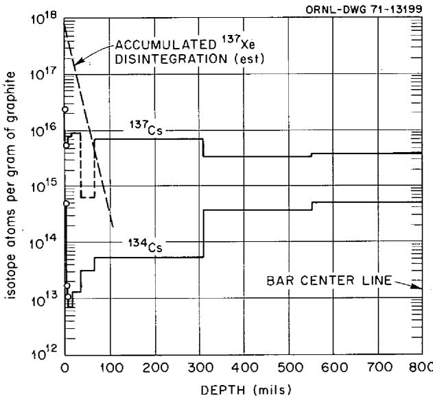  
Fig. 6.2. Concentration of cesium isotopes in MSRE core graphite at given distances from fuel channel surface.

similar profiles for $^{137}\mathrm{Cs}$ . Some of these along with profiles of other rare-gas daughters were used in an analysis by Kedl of the behavior of short-lived noble gases in graphite. Xenon diffusion and the possible formation of cesium carbide in molten-salt reactors have been considered by Baes and Evans.

An appreciable literature on the behavior of fission product cesium in nuclear graphite has been developed in studies for gas-cooled reactors by British investigators (Dragon Project), Gulf General Atomic workers, and by workers at ORNL.

The profiles shown in Figure 6.2 indicate significant diffusion of cesium atoms in the graphite after their formation. The 5.27-day half-life of $^{133}\mathrm{Xe}$ must have

resulted in a fairly even concentration of this isotope throughout the graphite and must have produced a flat deposition profile for $^{133}\mathrm{Cs}$ . This isotope and its neutron product $^{134}\mathrm{Cs}$ could diffuse to the bar surface and could be taken up by the salt. The $^{134}\mathrm{Cs}$ profile shows that this occurred. The $^{134}\mathrm{Cs}$ concentration that would accumulate in graphite if no diffusion occurred has been estimated from the power history of the MSRE to be about $2 \times 10^{14}$ atoms per gram of graphite (higher if pump bowl xenon stripping is inefficient), assuming the local neutron flux was a minimum of four times the average core flux. The observed $^{134}\mathrm{Cs}$ concentration in the bar center where diffusion effects would be least was about $5 \times 10^{14}$ atoms of $^{134}\mathrm{Cs}$ per gram of graphite. The agreement is not unreasonable.

Data for 30-year $^{137}\mathrm{Cs}$ are also shown in Figure 6.2. For comparison, the accumulated decay profile of the parent 3.9-min $^{137}\mathrm{Xe}$ is shown as a dotted line in the upper left of the figure. This was estimated assuming that perfect stripping occurred in the pump bowl with a mass transfer coefficient from salt to central core graphite of 0.3 ft/hr, and a diffusion coefficient of Xe in graphite (10% porosity) of $1 \times 10^{-5} \, \mathrm{cm}^2/\mathrm{sec}$ .

Near the surface the observed $^{137}\mathrm{Cs}$ profile is lower than the estimated deposition profile; toward the center the observed profile tapers downward but is about the estimated deposition profile. This pattern should develop if diffusion of cesium occurred. The central concentration is about one-third that near the surface. Steady diffusion into a cylinder from a constant surface source to yield a similar ratio requires that $Dt / r^2 = \sim 0.14$ . For a cylinder of 2-cm radius and a salt circulation time of 21,788 hr, a cesium diffusion coefficient of about $7 \times 10^{-9} \, \mathrm{cm}^2 / \mathrm{sec}$ is indicated.

Data developed for cesium-in-graphite relationships in gas-cooled reactor systems at temperatures of 800 to $1100^{\circ}\mathrm{C}$ may be extrapolated to $650^{\circ}\mathrm{C}$ for comparison. The diffusion coefficient thereby obtained is slightly below $10^{-10}$ ; the diffusion coefficient for a gas (Xe) is about $1 \times 10^{-5} \, \mathrm{cm}^2/\mathrm{sec}$ . Some form of surface diffusion of cesium seems indicated. This is further

substantiated by the sorption behavior reported by Milstead for the cesium-nuclear graphite system.

In particular Milstead has shown that at temperatures of 800 to $1100^{\circ}\mathrm{C}$ and concentrations of 0.04 to $1.6\mathrm{mg}$ of Cs per gram of graphite, cesium sorption on graphite follows a Freundlich isotherm (1.6 mg of Cs on $1\mathrm{m}^2$ of graphite surface corresponds to the saturation surface compound $\mathrm{CsC_8}$ ). Below this, a Langmuir isotherm is indicated. In the MSRE graphite under consideration, the $^{137}\mathrm{Cs}$ content was $\sim 10^{16}$ atoms per gram of graphite, and the 133 and 135 chains would provide similar amounts, equivalent to a total content of 0.007 mg of Cs per gram of graphite. At $650^{\circ}$ , in the absence of interference from other adsorbed species, Langmuir adsorption to this concentration should occur at a Cs partial pressure of about $2\times 10^{-18}$ atm. At this pressure, cesium transport via the gas phase should be negligible, and surface phenomena should control.

To some extent, Rb, Sr, and Ba atoms also are indicated to be similarly adsorbed and likely to diffuse in graphite.

It thus appears that for time periods of the order of a year or more the alkali and alkaline earth daughters of noble gases can be expected to exhibit appreciable migration in the moderator graphite of molten-salt reactors.

8. C. E. Milstead, "Sorption Characteristics of the Cesium-Graphite System at Elevated Temperatures and Low Cesium Pressure," Carbon 7, 199-200 (1969).

# 6.3 FISSION PRODUCT CONCENTRATIONS ON MSRE SURFACES

E. L. Compere E. G. Bohlmann

The recovery of segments of surfaces from the fuel circulating system of the Molten-Salt Reactor Experiment in January 1971 has permitted the direct comparison of the intensity of deposition of several fission product isotopes at a number of points around the circuit. Activity determinations were available on segments of a central graphite bar and a control rod thimble from the core center, on a segment of heat exchanger tube and shell, and on specimens cut from the pump bowl mist shield. Most of these determinations have been described by members of the Reactor Chemistry and the Metals and Ceramics Divisions in this and the preceding reports.

In Table 6.3 we present these data expressed as atoms per square centimeter for comparison with each other, and with a maximum mean deposition intensity given by the MSRE inventory divided by total area of graphite and metal in contact with flowing fuel salt.

Comparisons between graphite and metal for various isotopes in various core regions do not indicate any marked difference in affinity or sticking factor between the two substances, except that possibly $^{99}\mathrm{Tc}$ is more strongly deposited on metal. Deposits on graphite appear more intense at the bar center. For $^{125}\mathrm{Sb}$ , strong depositions occurred in almost all locations, particularly on metal - it appears necessary for the outer graphite regions to be lower than elsewhere to

Table 6.3. Fission product concentration on graphite and metal surfaces in MSRE (10 $^{14}$ atoms/ $\mathbf{cm}^2$ )   

<table><tr><td rowspan="2">Inventory/total flow area</td><td colspan="2">125Sb16</td><td colspan="2">127Te9</td><td colspan="2">106Ru52</td><td colspan="2">95Nb127</td><td colspan="2">99Tc3050</td></tr><tr><td>Graphite</td><td>Metal</td><td>Graphite</td><td>Metal</td><td>Graphite</td><td>Metal</td><td>Graphite</td><td>Metal</td><td>Graphite</td><td>Metal</td></tr><tr><td colspan="11">Core center</td></tr><tr><td>Top</td><td>6,9</td><td></td><td>2,4</td><td></td><td>6,13</td><td></td><td>17,26</td><td></td><td>150</td><td></td></tr><tr><td>Middle</td><td>22</td><td>15</td><td>6</td><td>3</td><td>40</td><td>15</td><td>100</td><td>90</td><td></td><td>1500</td></tr><tr><td>Bottom</td><td>9</td><td>36</td><td>4</td><td>10</td><td>11</td><td>18</td><td>50</td><td>120</td><td></td><td>2500</td></tr><tr><td colspan="11">Heat Exchanger</td></tr><tr><td>Tube</td><td></td><td>15</td><td></td><td>5</td><td></td><td>7</td><td></td><td>234</td><td></td><td>1200</td></tr><tr><td>Shell</td><td></td><td>29</td><td></td><td>8</td><td></td><td>7</td><td></td><td>29</td><td></td><td>2200</td></tr><tr><td colspan="11">Pump bowl</td></tr><tr><td>Subsurface</td><td></td><td>31</td><td></td><td>5</td><td></td><td>14</td><td></td><td>22</td><td></td><td>1500</td></tr><tr><td>Interface</td><td></td><td>86,54</td><td></td><td></td><td></td><td>385,41</td><td></td><td></td><td></td><td></td></tr></table>

stay within inventory. Tellurium, an antimony daughter, is somewhat similarly though perhaps less intensely deposited.

Ruthenium-106 was found more strongly deposited in the core than in the heat exchanger and most strongly at the gas-liquid interface in the pump bowl (as was $^{125}\mathrm{Sb}$ ).

Because over a dozen half-lives had elapsed before counting, the $95\mathrm{Nb}$ data are doubtless less precise but appear similar to the ruthenium pattern.

Generally these data show somewhat higher intensities of deposition than reported for surveillance specimens; turbulence and mass transfer rates may have been less for surveillance specimens.

The mass transfer coefficients cited by Briggs10 indicate that deposition should vary with flow conditions from region to region, and also should depend on sticking factors presumably characteristic of the surface material and substance transported. Mass transfer coefficients for xenon atoms in various regions of the MSRE were given as: core center $15\%$ , 0.3 ft/hr; core average, 0.06 ft/hr; heat exchanger, 0.7 ft/hr; piping, 1.2 ft/hr; reactor vessel, 0.6 ft/hr; and 0.02-in. bubbles in salt, 2 ft/hr. The same proportions between regions should hold for colloidal particles $(<1\mu)$ of similar size, shape, and density.

There is nothing in the data presented here to show directly whether deposition occurred by an atomic or particulate mechanism. The relative scatter of the data does not permit us to relate them to the mass transfer coefficients of the regions.

# 6.4 METAL TRANSFER IN MSRE SALT CIRCUITS

E. L. Compere E. G. Bohlmann

Cobalt-60 is formed in Hastelloy N by neutron activation of the minor amount of $^{59}\mathrm{Co}$ $(0.09\%)$ put in the alloy with nickel; the detection of $^{60}\mathrm{Co}$ activity in

bulk metal serves as a measure of its irradiation history, and the detection of $^{60}\mathrm{Co}$ activity on surfaces should serve as a measure of metal transport from irradiated regions. Cobalt-60 deposits were found on segments of coolant system radiator tube, heat exchanger tubing, and on core graphite removed from the MSRE in January 1971.

The activity found on the radiator tubing (which received a completely negligible neutron dosage) was $\sim 160\mathrm{dpm} / \mathrm{cm}^2$ . This must have been transported by coolant salt flowing through heat exchanger tubing activated by delayed neutrons in the fuel salt. The heat exchanger tubing exhibited subsurface activity of about $3.7\times 10^{8}$ dpm/cc metal, corresponding to a delayed neutron flux in the heat exchanger of about $1\times 10^{10}$ . If metal were evenly removed from the heat exchanger and evenly deposited on the radiator tubing throughout the history of the MSRE, a metal transfer rate at full power of about 0.0005 mil/year is indicated.

Cobalt-60 activity in excess of that induced in the heat exchanger tubing was found on the fuel side of the tubing $(3.1 \times 10^{6} \mathrm{dpm/cm}^{2})$ and on the samples of core graphite taken from a fuel channel surface $(5 \times 10^{6}$ to $3.5 \times 10^{7} \mathrm{dpm/cm}^{2})$ . The higher values on the core graphite and their consistency with fluence imply that additional activity was induced by core neutrons acting on $^{60}\mathrm{Co}$ after deposition on the graphite.

The reactor vessel (and annulus) walls are the major metal regions subject to substantial neutron flux. If these served as the major source of transported metal, and if this metal deposited evenly on all surfaces, a metal loss rate at full power of about 0.3 mil/year is indicated. Because deposition occurred on both the hotter graphite and cooler heat exchanger surfaces, simple thermal transport is not indicated. Thermodynamic arguments preclude oxidation by fuel.

One mechanism for the indicated metal transport might have $10\%$ of the $1.5\mathrm{w / cc}$ fission fragment energy in the annular fuel within a $30 - \mu$ range deposited in the metal, and a small fraction of the metal sputtered into the fuel. About $0.4\%$ of the fission fragment energy entering the metal resulting in such transfer would correspond to the indicated reactor vessel loss rate of $0.3\mathrm{mil / yr}$ . If this is the correct mechanism, reactors operating with higher fuel power densities adjacent to metal should exhibit proportionately higher loss rates.

# 7. Hydrogen and Tritium Behavior in Molten Salt

# 7.1 THE SOLUBILITY OF HYDROGEN IN MOLTEN 2LiF·BeF2

D.M.Richardson W.Jennings,Jr. A.P.Malinauskas

The efficiency with which a dissolved gas can be stripped from a liquid depends in part on the solubility of the gaseous species in the fluid. Therefore, the rate of removal of tritium in the MSRE circuits, both intentional (in the helium sparge) and unintentional (through the heat exchangers), is governed to some extent by the solubility of the gas in the pertinent molten salts. For this reason, hydrogen solubility studies in molten salts have been undertaken.

The experimental method and apparatus have been described earlier. In brief, the apparatus is of the two-chamber type which was first employed by Grimes, Smith, and Watson, but modified to accommodate effects which arise because of the ability of hydrogen to migrate through metals. The molten salt under investigation is saturated with hydrogen in one of the two chambers, and, after saturation has been attained, some of the fluid is transported to the second chamber. In this second chamber the hydrogen is stripped from the salt, and in auxiliary apparatus the amount dissolved in the known volume of liquid is determined.

Several modifications were made to the apparatus during this reporting period in an effort to improve the reproducibility of the data. The extent to which these alterations have aided the experimental method is indicated by the results for helium which are given in Table 7.1. These data are still of a preliminary nature. They were taken while a considerable inleakage of argon, which is used as a cover gas for the circulating pump in the strip section, was known to occur.

The hydrogen data, which are also presented in Table 7.1, again display an uncomfortable degree of scatter. We now believe this scatter to be a manifestation of air inleakage over prolonged periods of time, with resultant interactions between the oxygen and the hydrogen-metal-salt system. The lattermost hydrogen result which is tabulated was obtained after sparging the salt with hydrogen over an extended period of time. This run was also the only one of the three involving hydrogen in which complete removal of hydrogen in the stripper chamber was indicated. However, the difference in purity between this run and that immediately preceding is due almost entirely to helium of a still undetermined origin.

Shortly after the last hydrogen run listed in Table 7.1 had been completed, two hydrogen recovery tests were performed. These tests involved admitting a known amount of hydrogen to the xenon strip gas in the stripper chamber (which contained $622~\mathrm{cm}^3$ $\mathrm{Li}_2\mathrm{BeF}_4$ at $600^{\circ}\mathrm{C}$ ), circulating the mixture through the salt, then attempting to recover the hydrogen admitted. The fraction of original hydrogen recovered as a function of time is shown graphically in Fig. 7.1. The purity of the gas collected at the termination of recovery run 1 was

Table 7.1. Solubility of helium and hydrogen in ${\mathrm{{Li}}}_{2}{\mathrm{{BeF}}}_{4}$   

<table><tr><td>Gas</td><td>Temperature (°C)</td><td>Salt transferred (cm3)</td><td>Gas collected (cm3@STP)</td><td>Purity</td><td>103Kca</td></tr><tr><td>He</td><td>605</td><td>585</td><td>5.239</td><td>0.252</td><td>6.17</td></tr><tr><td>He</td><td>605</td><td>622</td><td>2.619</td><td>0.536</td><td>5.99</td></tr><tr><td>He</td><td>600</td><td>287</td><td>2.020</td><td>0.337</td><td>6.22</td></tr><tr><td>He</td><td>601</td><td>287</td><td>1.382</td><td>0.553</td><td>7.07</td></tr><tr><td>H2</td><td>604</td><td>579</td><td>3.454</td><td>0.732</td><td>11.51</td></tr><tr><td>H2</td><td>604</td><td>634</td><td>8.026</td><td>0.819</td><td>27.17</td></tr><tr><td>H2</td><td>600</td><td>622</td><td>2.506</td><td>0.525</td><td>5.46</td></tr></table>

${}^{a}$ The Ostwald coefficient ${K}_{c}$ is defined as the ratio of the concentration of the gas in the dissolved state to its concentration in the gas phase (assuming ideal gas phase behavior).

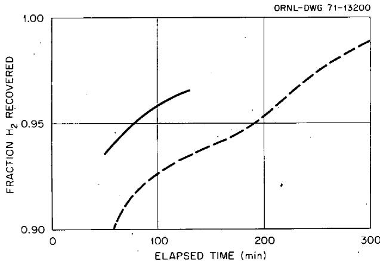  
Fig. 7.1. Fraction of original hydrogen recovered from the solubility apparatus strip section as a function of time since admission of the hydrogen into this region. Upper curve, recovery run 1; lower curve, recovery run 2. Smoothed results obtained from both the annulus and the stripper chamber collections were combined to yield the results presented here.

$97.3\% \mathrm{H}_2$ , whereas that of recovery run 2 was $95.1\%$ $\mathbf{H}_{2}$ . In both cases it was assumed that this purity obtained throughout the experiment, and was characteristic of the gas collected through the stripper annulus as well as the stripper section itself. On this basis the amount of hydrogen collected through the annulus region only amounted to about $5 \%$ of the total collected. This is in marked contrast to the result reported earlier when no salt was present in the stripper chamber; we now feel that the earlier value was grossly in error. The important point is that we can recover at least $90\%$ of the hydrogen from the stripper chamber within a 2-hr period. Further experimental work is currently in progress.

# 7.2 PERMEATION OF METALS BY HYDROGEN

J.H.Shaffer A.P.Malinauskas

W.Jennings,Jr. W.R.Grimes

Accurate evaluation of tritium migration in an MSBR will depend, in part, on estimates of its permeation rates through the metal walls of the fuel and coolant systems. These estimated transport rates are currently based on diffusion coefficients and solubility constants derived from relatively extensive data that are available in the open literature. However, the extrapolation of these transport rates to low hydrogen pressures shows significant departures from their classical dependence on the square root of the hydrogen pressure. This dependence on square root of $\mathrm{H}_{2}$ pressure at higher hydrogen pressures is due to the dissociation and association of hydrogen as the rate-controlling step. Departures from this pressure dependence at lower hydrogen pressures are presumed to be due to surface adsorption phenomena as the rate-controlling event. Thus, estimates of gas transport rates at very low tritium pressures in an MSBR (assumed to be dependent on $\sqrt{P}$ ) may be erroneous. This experimental program has been directed toward an evaluation of hydrogen permeation rates through metals at hydrogen pressures less than 10 torrs where departures from the $P^{1/2}$ dependence have been reported.

The amount of hydrogen $q$ which will pass through an area $A$ of metal per unit time is given by the relation

$$
q = - D A \frac {d c}{d x}, \tag {1}
$$

where $D$ is the diffusion constant (area/unit time) and $c$ is the concentration of hydrogen $(\mathrm{cm}^3 \text{@ STP per cm}^3$

of metal) at any point $x$ within the metal. For a round tube having length $l$ and a radius $r = x$ , the hydrogen flux can be expressed as

$$
J = q / 2 \pi r l = - D \frac {d c}{d r}. \tag {2}
$$

Upon separation of variables and integration between limits of radii $(a, b)$ and concentrations of hydrogen on the metal surfaces $(C_a, C_b)$ ,

$$
q = \left[ 2 \pi l D / \ln (b / a) \right] \left(C _ {a} - C _ {b}\right). \tag {3}
$$

The dissolved gas concentrations can be interchanged with gas pressure by the Freundlich relation to yield the equation

$$
q = \left[ 2 \pi I D K / \ln (b / a) \right] \left(P _ {a} ^ {n} - P _ {b} ^ {n}\right), \tag {4}
$$

where $K$ is the gas solubility constant.

By material balance the amount of hydrogen $q$ passing through the metal tube per unit time may also be expressed as

$$
q = - \frac {d n _ {a}}{d t} = \frac {d n _ {b}}{d t}. \tag {5}
$$

For ideal gas behavior

$$
q = - \frac {\partial P _ {a}}{\partial t} \sum_ {i} \frac {V a _ {i}}{R T a _ {i}} = \frac {\partial P _ {b}}{\partial t} \sum_ {j} \frac {V b _ {j}}{R T b _ {j}}, \tag {6}
$$

where $i$ and $j$ denote the incremental isothermal sections of each gas reservoir and $T$ is the absolute temperature. By combining Eqs. (4) and (6), changes in the hydrogen pressure associated with the diffusion process are related to the hydrogen pressure by the equation

$$
q = - \frac {\partial P _ {a}}{\partial t} \sum_ {i} \frac {V a _ {i}}{R T a _ {i}} = [ 2 \pi l D K / \ln (b / a) ] \left(P _ {a} ^ {n} - P _ {b} ^ {n}\right), \tag {7}
$$

.for the decrease in pressure $P_{a}$ by diffusion into a volume at pressure $P_{b}$ . Conversely,

$$
q = \frac {\partial P _ {b}}{\partial t} \sum_ {j} \frac {V b _ {j}}{R T b _ {j}} = [ 2 \pi l D K / \ln (b / a) ] \left(P _ {a} ^ {n} - P _ {b} ^ {n}\right), \tag {8}
$$

for the increase of pressure $P_{b}$ as hydrogen diffuses through the metal cylinder from pressure $P_{a}$ .

The diffusion cell consisted of a Pyrex glass envelope into which a short section (1.73 in. $\times 0.018$ in. wall) of $1/4$ -in.-OD Kovar metal (54% Fe, 28% Ni, and 18% Co) had been fused. Glass tubes connected to the ends of the envelope in a manner which permitted access by gas pressure to either side of the metal surfaces. The cell was mounted horizontally within a mullite tube in a 1-in.-diam $\times$ 12-in. tube furnace. Four thermocouples in wells within the glass envelope were used to establish the operating temperature of $495^{\circ}\mathrm{C}$ and to define the thermal gradient of the furnace. Gas pressures were determined from an electronic pressure meter (MKS Baratron type 77) using two differential-pressure-sensing heads having 0- to 10- and 0- to 1000-torr ranges. Hydrogen used in the system was passed through a palladium diffusion unit for purification. The vacuum system was of conventional design with mercury diffusion and oil pumps.

In the first set of experiments, $P_{b}$ was maintained at zero and the quantity $q$ evaluated from incremental changes in $P_{a}$ . An average value for $q$ at an average value for $P_{a}$ for each experiment was determined by the method of least squares. In the second set of experiments, $P_{a}$ was held constant and $q$ was evaluated from incremental changes in $P_{b}$ , where $P_{b} = 0$ at $t = 0$ . Extrapolations of the data from each experiment to $t = 0$ yielded instantaneous gas transport rates at $P_{b} = 0$ at discrete values of $P_{a}$ . Thus, under both experimental conditions the equations defining the pressure dependence of the diffusion process could be reduced to

$$
\ln q = n \ln P _ {a} + \ln (2 \pi l / \ln b / a) D K. \tag {9}
$$

The results obtained by least-squares regression analyses from some 30 experiments according to this equation yielded a value of $n = 0.560 \pm 0.011$ and a value of $DK = 5.18 \times 10^{-11}$ moles/torr $^n$ -cm-min (limits of standard error $= 4.95^{\circ}$ to $5.42 \times 10^{-11}$ ) at pressures for $P_a$ of 1.4 to 800 torrs. The direction of hydrogen flow through the test cell had no significant effect on the experimental results.

Although the results of these experiments demonstrate some deviation from the $P^{1/2}$ pressure dependence of $q$ , the experimental apparatus was not sufficiently sensitive for evaluation at much lower hydrogen pressures contemplated for an MSBR. Consequently, further work on this program has been discontinued pending results from a similar study using mass spectrometric techniques and much lower pressure ranges.

# 7.3 TRITIUM CONTROL IN AN MSBR

The tritium generated in an MSBR must be prevented from escaping into the environment. Some removal (and containment) of tritium as $\mathbf{T}_2$ , HT, or TF from the primary fuel system is expected. However, the ease of diffusion of hydrogen isotopes through metal (and especially through the large area of thin metal in the heat exchangers) ensures that a large fraction of the tritium will proceed through the heat exchangers and eventually to the outside world unless it can be held up by chemical means or by efficient diffusion barriers.

# 7.3.1 Mass Spectrometric Examination of Stability of $\mathrm{NaBF}_3\mathrm{OH}$

C.F.Weaver J.D.Redman

If hydrogenous material (i.e., $\mathrm{NaBF}_3\mathrm{OH}$ ) can be incorporated in reasonable quantity in the $\mathrm{NaF - NaBF_4}$ secondary coolant, the tritium diffusing from the fuel circuit of an MSBR could be held up by chemical exchange

$$
\mathrm {T} + \mathrm {N a B F} _ {3} \mathrm {O H} \rightleftharpoons \mathrm {N a B F} _ {3} \mathrm {O T} + \mathrm {H}
$$

for a period sufficient to permit its controlled removal from the coolant circuit. This possibility has received, and is receiving, considerable attention.

We have investigated with a TOF mass spectrometer the thermal behavior of several of the pertinent materials. A previous report has described the behavior of $\mathrm{NaBF_4}$ , $\mathrm{NaOH}$ , and the products of reaction of $\mathrm{H}_2\mathrm{O}$ with $\mathrm{NaBF_4}$ . We have studied the thermal stability of $\mathrm{NaBF_3OH}$ and the composition of gas produced during its decomposition over the temperature interval 25 to $800^{\circ}\mathrm{C}$ .

The starting material was shown by x-ray diffraction to be nearly pure $\mathrm{NaBF}_3\mathrm{OH}$ . The material began to decompose at $90^{\circ}\mathrm{C}$ , and $\mathrm{H}_2\mathrm{O}$ was the only gaseous product. The reaction, as suggested previously, $^4$ is probably:

$$
2 \mathrm {N a B F} _ {3} \mathrm {O H} (\mathrm {s}) \rightleftharpoons \mathrm {N a} _ {2} \mathrm {B} _ {2} \mathrm {F} _ {6} \mathrm {O} (\mathrm {s}) + \mathrm {H} _ {2} \mathrm {O} (\mathrm {g}).
$$

The $\mathbf{H}_2\mathbf{O}$ was shown to be free from impurities by mass spectrometric analysis.

This reaction was followed to completion at $100^{\circ}\mathrm{C}$ by constantly monitoring the effusing water vapor. Nearly $100\%$ agreement between the theoretical mass of $\mathrm{H}_2\mathrm{O}$ and that accounted for by the mass spectrometer indicated that, indeed, 1 mole of water was produced by 2 moles of decomposing $\mathrm{NaBF}_3\mathrm{OH}$ . At $373^{\circ}\mathrm{C}$ , $1.3 \times 10^{-3} \mathrm{~g}$ of $\mathrm{H}_2\mathrm{O}$ effused in $30 \mathrm{~min}$ through an orifice $3.16 \times 10^{-3} \mathrm{~cm}^2$ in area. By use of the Knudsen equation, the pressure was calculated to be $2.44 \pm 0.04 \times 10^{-5} \mathrm{atm}$ . This pressure value was used to calculate the standard free energy change for the above reaction:

$$
\begin{array}{l} \Delta F _ {3 7 3 ^ {\circ} \mathrm {K}} ^ {0} = - R T \ln p \\ = 7. 9 \mathrm {k c a l} / \mathrm {m o l e}. \\ \end{array}
$$

Further heating of the residue to $800^{\circ}\mathrm{C}$ yielded only $\mathbf{BF}_3$ and NaF vapors. The $\mathbf{BF}_3$ effused over the range $245\pm 5$ to $800^{\circ}$ ; NaF vapor appeared at $725^{\circ}\mathrm{C}$ .

# 7.3.2 The Thermal Stability of Nitrate-Nitrite Mixtures

C.F.Weaver J.D.Redman

A study of the nitrate-nitrite mixtures was initiated as part of an evaluation of their potential use as coolants in molten-salt reactors. In such salt mixtures as HITEC, $\mathrm{NaNO}_2\cdot \mathrm{NaNO}_3\cdot \mathrm{KNO}_3$ (40-7-53 wt %), the reaction

$$
\mathrm {H} _ {2} + 2 \mathrm {K N O} _ {3} \rightleftharpoons 2 \mathrm {K N O} _ {2} + \mathrm {H} _ {2} \mathrm {O}
$$

(which has a large negative standard free energy change) may afford the means to convert elemental tritium to tritiated water, and thus provide a means to control its distribution.

Since nitrates and nitrites are known to decompose thermally, it is useful to identify the vapor products of the above reaction to determine what additional species are formed. In order to establish the needed background for interpretation of such data, the separate components were first investigated.

Sodium nitrate was dehydrated in a Pyrex flask by passing dried helium gas through the molten salt for several hours at temperatures just above the melting point, $306.8^{\circ}\mathrm{C}$ . The product was colorless and did not adhere to the container. Samples of the salt were transferred to a nickel Knudsen effusion cell. The gases from the heated cell were analyzed with a TOF mass spectrometer. The only vapor products at 380 to $400^{\circ}\mathrm{C}$ were NO and $\mathrm{O}_2$ . These permanent gases do not allow accurate pressure measurements because of background interference, but approximate values were $\mathrm{NO} = 1.6 \times 10^{-2}$ torr, $\mathrm{O}_2 = 2.1 \times 10^{-2}$ torr. The presence of

oxygen leaves little doubt that tritium will be oxidized. The behavior of $\mathrm{KNO}_3$ and $\mathrm{NaNO}_2$ is being investigated by experiments now in progress. In subsequent experiments we expect to observe the vapors over HITEC salt with and without $\mathbf{H}_2$ .

# 7.4 DISSOCIATING-GAS HEAT TRANSFER SCHEME AND TRITIUM CONTROL IN MOLTEN-SALT POWER SYSTEMS

E. L. Compere

The use of a dissociating-gas heat transfer system using nitrogen dioxide $(\mathrm{N}_2\mathrm{O}_4\rightleftharpoons \mathrm{NO}_2\rightleftharpoons \mathrm{NO} + \mathrm{O}_2)$ $(? \rightarrow \mathrm{N}_2 + \mathrm{O}_2)$ , under development in the U.S.S.R., appears to offer some interesting possibilities to the Molten-Salt Breeder in terms of mitigation of tritium losses from the power system. Under dissociating conditions the effective heat capacity and effective thermal conductivity of the gas are increased several fold, resulting in increased efficiency of heat transport and the possibility of lower equipment costs.

In the Soviet fast reactor proposal,5 pressurized nitrogen dioxide is the primary fluid, removing heat from fuel elements and driving a gas turbine. Thermal and radiation decompositions are by implication not significant, and $^{14}\mathrm{C}$ production was not mentioned. Similar usage in molten-salt systems, though replacing both a secondary salt and a steam system with the dissociating gas system, would involve the possibility of leakage of nitrogen oxides and oxygen into the primary salt circuit and subsequent reaction with graphite. Although such reactions would doubtless not be extremely violent - probably the gases would behave about like pressurized air - the use of nitrogen dioxide to transfer heat directly from molten-salt fuel will not be further considered here.

For a Molten-Salt Breeder Reactor, the dissociating gas system could drive a gas turbine, replacing the steam turbine system; the primary coolant presumably would be lithium beryllium fluoride or some other such salt. Heat would be transferred to nitrogen dioxide at 100 atm or more, possibly reaching temperatures of 600 to $700^{\circ}\mathrm{C}$ . At temperatures above about $500^{\circ}\mathrm{C}$ , appreciable (and rapidly reversible) dissociation into NO and $\mathrm{O}_2$ occurs (absorbing about 14 kcal/mole). As the gases pass through the turbine and cool, exothermic recombini

nation occurs at a rapid rate until most is recombined. The reaction of NO and $\mathrm{O_2}$ is kinetically third order; the rate increases slightly as temperature is decreased. The nitrogen dioxide associates (rapidly and reversibly) to dinitrogen tetroxide at temperatures of 100 to $200^{\circ}\mathrm{C}$ , with release of an additional 6 to 7 kcal/mole $\mathrm{NO}_2$ . The dinitrogen tetroxide can be condensed with a fairly low heat of vaporization. (The heat of vaporization of $\mathrm{N}_2\mathrm{O}_4$ is 9.1 kcal/mole at the atmospheric boiling point of $21^{\circ}\mathrm{C}$ , and of course diminishes to zero at the critical temperature of $158^{\circ}\mathrm{C}$ and 99 atm.) The ease of vaporization at low temperatures and the relatively high heat of dissociation at high temperature may facilitate the recovery of thermal energy from the molten-salt system.

Though both $\mathrm{NO}_2$ and NO are thermodynamically susceptible to decomposition into the elements, rates appear acceptably slow. Any decomposition of $\mathrm{NO}_2$ appears first to produce NO, which may decompose further, so NO is the critical substance. The thermal decomposition of nitric oxide as reported by Yuan, Slaughter, Koerner, and F. Daniels6 and Fraser and Daniels7 proceeds by both a second-order homogeneous mechanism for which the rate at $600^{\circ}\mathrm{C}$ is indicated to be $\sim 4 \times 10^{-7} \times P_{\mathrm{atm}}^{2}$ , moles liter $^{-1}$ hr $^{-1}$ and a heterogeneous, zero-order reaction for which the rate of $600^{\circ}\mathrm{C}$ is indicated to be less than about $3 \times 10^{-6}$ moles/m $^{-2}$ hr $^{-1}$ . Though not trivial, such rates may well be tolerable, depending on processing and makeup requirements in particular systems. In any event the heat of decomposition of NO, $\sim 20$ kcal/mole, is of the same order as heat transferred, and there is no increase in molecules on decomposition. Consequently any decomposition into $\mathbf{N}_2$ and $\mathbf{O}_2$ would require release of these gases and makeup, but little hazard should ensue.

The materials of construction should be stainless steels, or chromium containing alloys such as Inconel (or Hastelloy N) which can be heated in pressurized air to the temperatures in question. Oxide films will build up on the surface in the usual way and inhibit corrosion processes.

Tritium entry into the power system would be inhibited by the films. It will become diluted by the entire gas phase, reducing its activity. Furthermore, any tritium entering the system should be oxidized and re

tained in the form of $\mathrm{TNO}_3$ and $\mathrm{T}_2\mathrm{O}$ vapors. These should react relatively slightly with oxidized walls, so little escape is indicated by permeation of corrosion hydrogen through the metal. The gaseous $\mathrm{T}_2\mathrm{O}$ or $\mathrm{TNO}_3$ in the system would occupy the full volume ( $\sim 10^5$ liters) of the heat transfer system, which thereby would have appreciable capacitance before processing was required. (The $\sim 2400\mathrm{Ci}/$ day of total tritium production is 0.04 moles/day, most of which should not even penetrate into this system.)

Processing to remove such tritium as enters the nitrogen dioxide system could probably be accomplished by various schemes, batchwise or on side streams: adsorption, freezing, or distillation suggest themselves. Addition and removal of $\mathrm{H}_2\mathrm{O}$ could readily provide an isotope dilution effect if desired. Thus the major modes of escape of tritium from the power system which remain are by leakage, either through turbine seals or into the condenser water. It would appear necessary to prevent leakage of $\mathrm{NO}_2$ and such burden as it has of tritium into condenser water, and to contain or recover any leakage past turbine seals. This appears required in corresponding steam systems also, but tritium is thought to enter the steam systems considerably more readily.

In either system the diversion of tritium from the power system implies a requirement that it be recovered from the primary circuits. Recovery from the primary system is not discussed here.

In summary, possible advantages of a nitrogen dioxide power system thus include:

1. The ability to block a major tritium path to the environment.   
2. The recovery of such tritium as may enter the system in a concentrated form.   
3. The lower equipment costs because of improved thermal transport properties.   
4. Improved thermodynamic efficiency.   
5. Less restriction on properties of intermediate coolant salt, since vapor generation can be accomplished with possibly greater ease.

Hazards and uncertainties include:

1. Routine handling of toxic or noxious gases under pressure.   
2. The question of the irreversible decomposition of nitrogen oxides into the elements.   
3. The relation between chemical reaction rates, heat transfer, and flow rates when all rates are high.   
4. The effectiveness of the oxide films in preventing tritium passage has not been evaluated.   
5. Recovery methods for recovery of such tritium as enters the system are undefined.   
6. Cost comparisons with other systems (steam) have not been made.

On balance the use of nitrogen dioxide as a dissociating-gas thermal fluid for a Molten-Salt Breeder Reactor appears to merit further consideration.

# 8. Processing Chemistry

# 8.1 THE OXIDE CHEMISTRY OF $\mathbf{P}\mathbf{a}^{4 + }$ IN MOLTEN LiF-BeF2-ThF4

C. E. Bamberger

C.F.Baes, Jr.

R.G.Ross

D. D. Sood

A study was initiated previously² to determine the precipitation behavior of $\mathrm{Pa(IV)}$ in $\mathrm{LiF - BeF_2 - ThF_4}$ (72-16-12 mole %) when oxide is introduced. This information is needed not only in connection with the development of possible MSBR fuel reprocessing methods based on oxide precipitation, but also because it is obviously relevant to the determination of the oxide tolerance of MSBR fuels.

The results reported previously should correspond to the equilibrium

$$
\begin{array}{l} \mathrm {P a F} _ {4} (\mathrm {d}) + \mathrm {T h O} _ {2} (\mathrm {s s}) \\ \rightleftharpoons \mathrm {P a O} _ {2} (\mathrm {s s}) + \mathrm {T h F} _ {4} (\mathrm {d}), \tag {1} \\ \end{array}
$$

where $d$ denotes a dissolved species and $ss$ a solid solution phase. Such an exchange reaction is to be expected on the basis of the similarity in size of the ions $\mathrm{Pa}^{4+}$ and $\mathrm{Th}^{4+}$ and the fact that regular solutions of $\mathrm{UO}_2$ - $\mathrm{ThO}_2$ are formed from fluoride melts upon oxide additions. In order to confirm the above presumed reaction (1) and to estimate its equilibrium quotient

$$
Q _ {\mathrm {T h}} ^ {\mathrm {P a}} = \frac {X _ {\mathrm {P a O} _ {2}} X _ {\mathrm {T h F} _ {4}}}{X _ {\mathrm {T h O} _ {2}} X _ {\mathrm {P a F} _ {4}}}, \tag {2}
$$

where $X$ denotes mole fractions, it was necessary to determine the composition of the solid phase. Accordingly, we decided to isolate and examine directly the few milligrams of oxide phase present.

The flanged top with the stirrer assembly was removed from the cooled equilibration vessel and replaced by another top provided with a 1-in.-OD nickel filter to be used for removing the molten fluorides at temperature. The system was reheated to $570^{\circ}\mathrm{C}$ under flowing $\mathbf{H}_2$ and kept at temperature for 40 hr before we attempted to remove the molten fluorides. This permitted redissolution of any solid phase that might have precipitated on cooling. Only $10\%$ of the fluoride phase was subsequently removed, probably due to plugging of the filter. The system was again cooled to room temperature and the procedure repeated with another filter. This time we successfully removed all but a small fraction of the fluoride phase. After cooling, the solid residue was loaded into a $1/2$ -in. nickel tube with a fritted bottom, and the remnant of the fluoride phase was forced out of the compartment at temperature using $\mathbf{H}_2$ pressure on the inside and vacuum on the outside of the compartment.

A portion of the oxide residue was repeatedly washed with hot "Verbocit"4 solution, followed by treatment

with $7N$ nitric acid solution at $70^{\circ}\mathrm{C}$ . It was then washed with acetone and dried. Gamma counting indicated the solids to contain 27.9 mole $\%$ as $\mathrm{PaO_2}$ . No significant amount of elements other than Pa, Th, and O were found by spectrographic analysis and analysis for fluoride. The results of these analyses were (in ppm): $\mathrm{Li} = 10$ , $\mathrm{Be} \leqslant 1$ , $\mathrm{Ni} = 30$ , $\mathrm{Cr} = 30$ , $\mathrm{Fe} = 200$ , and $\mathrm{F} = 1700$ . X-ray diffraction showed, surprisingly, that two fcc phases were present, giving:

I. Major phase (60 to 90 mole $\%$

$$
a _ {0} = 5. 5 9 2 6 \pm 0. 0 0 0 3 \mathrm {A}.
$$

II. Minor phase (10 to 30 mole $\%$

$$
a _ {0} = 5. 5 4 2 9 \pm 0. 0 0 2 4 \mathrm {A}.
$$

No Pa was dissolved during the treatment with $\mathrm{HNO}_3$ . Since the amount of fluorine found was quite low relative to the Pa present, it was concluded that no significant amount of a Pa oxyfluoride phase was present.

The purified oxide sample was examined with the Scanning Electron Microscope (SEM). The presence of two distinct phases was confirmed, the most abundant phase consisting of large well-formed octahedral crystals, 5 to $25\mu$ on a side, and the other of small, $\leqslant 1\mu$ irregularly shaped particles or aggregates. The composition of individual crystals of Phase I, the composition of the smaller particles or aggregates containing Phase II, and the average composition of a large field were measured by x-ray fluorescence with the SEM. The results obtained, normalized to the average composition measured by $\gamma$ counting, were:

Phase I (large crystals), $17.5 \pm 1.8\%$ Pa.

Phase II (small crystals), $43.9 \pm 4\%$ Pa.

Use of the above results to calculate the relative abundance of each phase gives 61 mole % of Phase I and 39 mole % of Phase II, which is in fair agreement with earlier estimates based on the intensities of lines obtained by x-ray diffraction.

Due to the marked difference in morphology of the phases it seems reasonable to assume that Phase I, the well-formed large crystals, was the phase present at equilibrium and very probably is a $\mathrm{PaO_2 - ThO_2}$ solid solution. Furthermore, the composition found for Phase I is consistent with that calculated for the equilibrium $\mathrm{PaO_2 - ThO_2}$ solid solution by material balance. (The latter estimate fell in the range $X_{\mathrm{PaO_2}} =$

0.13 to 0.33 depending on the value assumed for the solubility product of $\mathrm{ThO_2}$ and the amount of oxide present initially.) Phase II probably precipitated as an artifact of oxidation by impurities during the filtration procedure and could consist of mixed aggregates of $\mathrm{PaO}_{2 + x}$ and $\mathrm{ThO}_2$ , where $x \leqslant 0.5$ .

The composition of Phase I ( $X_{\mathrm{PaO}_2} = 0.175$ ), which is assumed to have been at equilibrium with a melt containing $X_{\mathrm{PaF}_4} = 2.7 \times 10^{-4}$ at $567^\circ$ , gives $Q_{\mathrm{Th}}^{\mathrm{Pa}} = 94.4$ .

Assuming, as was the case for the $\mathrm{UO}_2$ - $\mathrm{ThO}_2$ solid solutions, that the entropy change for the exchange reaction (1) is zero, we obtain

$$
\log Q _ {\mathrm {T h}} ^ {\mathrm {P a}} = \log \left(\frac {X _ {\mathrm {P a O} _ {2}} X _ {\mathrm {T h F} _ {4}}}{X _ {\mathrm {T h O} _ {2}} X _ {\mathrm {P a F} _ {4}}}\right) = 1. 6 6 (1 0 ^ {3} / T). \tag {3}
$$

This estimate, along with the estimated solubility product of $\mathrm{ThO}_2$ , leads to the predicted $\mathrm{Pa}^{4+}$ - $\mathrm{O}^{2-}$ precipitation behavior shown by the smooth curves in Fig. 8.1. The calculation was performed as follows: First the mole fraction of $\mathrm{PaO}_2$ in the equilibrium oxide solid solution was calculated for each point from $Q_{\mathrm{Th}}^{\mathrm{Pa}}$ [(eq.) 3] and the observed mole fraction of $\mathrm{PaF}_4$ :

$$
X _ {\mathrm {P a O} _ {2}} = \frac {Q _ {\mathrm {T h}} ^ {\mathrm {P a}} \left(X _ {\mathrm {P a F} _ {4}} / X _ {\mathrm {T h F} _ {4}}\right)}{\left[ 1 + Q _ {\mathrm {T h}} ^ {\mathrm {P a}} \left(X _ {\mathrm {P a F} _ {4}} / X _ {\mathrm {T h F} _ {4}}\right) \right]}.
$$

This, in turn, was introduced into the following material balance expression for the total oxide present:

$$
n _ {\mathrm {O} ^ {2}} ^ {T} = 2 \left(n _ {\mathrm {T h O} _ {2}} + n _ {\mathrm {P a O} _ {2}}\right) + \left(X _ {\mathrm {O} ^ {2 -}}\right) n _ {\mathrm {F}},
$$

which, in terms of $X_{\mathbf{PaO}_2}$ and $Q_{\mathrm{ThO_2}}$ , becomes

$$
\begin{array}{l} n _ {\mathrm {O} ^ {2 -}} ^ {T} = \frac {2 \left(X _ {\mathrm {P a F} _ {4}} ^ {i} - X _ {\mathrm {P a F} _ {4}}\right)}{X _ {\mathrm {P a O} _ {2}}} n _ {\mathrm {F}} \\ + \left[ \frac {Q _ {\mathrm {T h O} _ {2}} \left(1 - X _ {\mathrm {P a O} _ {2}}\right)}{X _ {\mathrm {T h F} _ {4}}} \right] ^ {1 / 2} n _ {\mathrm {F}}, \\ \end{array}
$$

where

$$
\begin{array}{l} n _ {\mathrm {O} ^ {2}} ^ {T} = \text {t o t a l m o l e s o f o x i d e}, \\ \begin{array}{c} n _ {\mathrm {T h O} _ {2}}, n _ {\mathrm {P a O} _ {2}}, n _ {\mathrm {F}} = \text {m o l e s o f T h O} _ {2}, \mathrm {P a O} _ {2}, \text {a n d o f} \\ \mathrm {L i F} + \mathrm {B e F} _ {2} + \mathrm {T h F} _ {4}, \end{array} \\ \end{array}
$$

$X_{\mathbf{PaF}_4}^i =$ initial mole fraction of $\mathrm{PaF_4}$ before oxide addition,

$$
X _ {\mathrm {O} ^ {2 -}} = \text {m o l e f r a c t i o n o f d i s s o l v e d o x i d e}.
$$

If it is assumed that 2.5 millimoles of dissolved oxide was initially present, the previously reported results (the points so corrected in Fig. 8.1) agree well with the calculated curves.

Work presently continues to obtain additional $Q_{\mathrm{Th}}^{\mathrm{Pa}}$ values with other solid solutions more dilute in Pa and to test further the assumption that the $\mathrm{PaO}_2 - \mathrm{ThO}_2$ phase is a regular solution. The data obtained thus far indicate that in the event of an accidental contamination with oxide of an MSBR or an MSCR, the precipitated phase would consist mainly of a $\mathrm{UO}_2 - \mathrm{ThO}_2$ solid solution with little $\mathrm{PaO}_2$ dissolved in it.

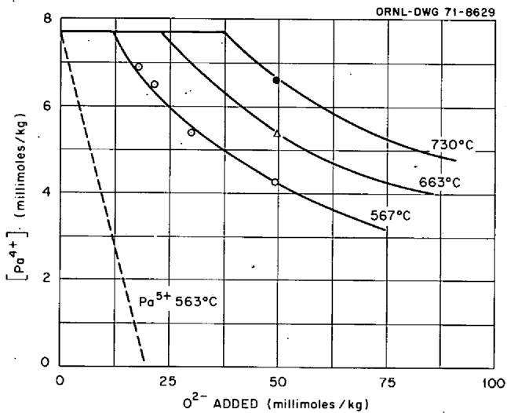  
Fig. 8.1. Concentration of $\mathrm{PaF_4}$ in LiF-BeF $_2$ -ThF $_4$ (72-16-12 mole %) in equilibrium with $\mathrm{PaO_2 - ThO_2}$ solid solutions. The abscissa shows the total oxide added to the system (as $\mathrm{ThO_2}$ ). The lines were calculated with $\log Q_{\mathrm{Th}}^{\mathrm{Pa}} = 1.66 / T(^{\circ}\mathrm{K})$ and assuming that $2.5\mathrm{mM}0^{2-}$ were initially present.

# 8.2 THE OXIDE CHEMISTRY OF $\mathbf{Pa}^{5 + }$ IN URANIUM-CONTAINING MOLTEN LiF-BeF2-ThF4

R.G.Ross.C.E.Bamberger C.F.Baes,Jr.

Previous measurements on the precipitation of $\mathrm{Pa(V)}$ by oxide in molten LiF-BeF $_2$ -ThF $_4$ (72-16-12' mole %) led us to predict that protactinium could be efficiently precipitated from an MSBR fuel without precipitating any uranium (as $\mathrm{UO}_2$ ) by the controlled addition of

oxide under midly oxidizing conditions. This prediction was based on measurements of the assumed equilibrium

$$
\begin{array}{l} \frac {1}{2} \mathrm {P a} _ {2} \mathrm {O} _ {5} (\mathrm {c}) + \frac {5}{4} \mathrm {T h F} _ {4} (\mathrm {d}) \rightleftharpoons \mathrm {P a F} _ {5} (\mathrm {d}) + \frac {5}{4} \mathrm {T h O} _ {2} (\mathrm {c}), \\ \log Q _ {1} = \log \left(X _ {\mathrm {P a F} _ {5}} / X _ {\mathrm {T h F} _ {4}} ^ {5 / 4}\right) \tag {1} \\ = 5. 9 4 - 9. 9 8 \left(1 0 ^ {3} / T\right), \\ \end{array}
$$

combined with the previously measured equilibrium6

$$
\begin{array}{l} \mathrm {U F} _ {4} (\mathrm {d}) + \mathrm {T h O} _ {2} (\mathrm {s s}) \rightleftharpoons \mathrm {U O} _ {2} (\mathrm {s s}) + \mathrm {T h F} _ {4} (\mathrm {d}), \\ \log Q _ {2} = \log \left(\dot {X} _ {\mathrm {U O} _ {2}} \cdot X _ {\mathrm {T h F} _ {4}} / X _ {\mathrm {T h O} _ {2}} X _ {\mathrm {U F} _ {4}}\right) \tag {2} \\ = (2. 3 7 6 \pm 4 8) \cdot 1 0 ^ {3} / T, \\ \end{array}
$$

where c, ss, d, and $X$ denote, respectively, crystalline and solid-solution phases, dissolved species, and mole fractions which gave

$$
\frac {1}{2} \mathrm {P a} _ {2} \mathrm {O} _ {5} (\mathrm {c}) + \frac {5}{4} \mathrm {U F} _ {4} (\mathrm {d}) \rightleftharpoons \mathrm {P a F} _ {5} (\mathrm {d}) + \frac {5}{4} \mathrm {U O} _ {2} (\mathrm {s s}),
$$

$$
\begin{array}{l} \log Q _ {3} = \log \left(X _ {\mathrm {P a F} 5} a _ {\mathrm {U O} _ {2}} / X _ {\mathrm {U F} 4} ^ {5 / 4}\right) \tag {3} \\ = 5. 9 4 - 7. 0 1 \left(1 0 ^ {3} / T\right), \\ \end{array}
$$

where $Q_{3}$ relates the concentration of $\mathrm{PaF}_{5}$ in the salt phase (in mole fraction units) to the activity of $\mathrm{UO}_{2}(a_{\mathrm{UO}_{2}})$ when $\mathrm{Pa}_{2}\mathrm{O}_{5}$ is present. The value of $Q_{3}$ estimated in this way was sufficiently small to suggest that the concentration of $\mathrm{PaF}_{5}$ could be lowered by oxide precipitation to a value as low as 10 ppm in the presence of 0.3 mole % $\mathrm{UF}_{4}$ without precipitating $\mathrm{UO}_{2}$ .

In order to confirm that $Q_{3}$ is indeed small enough to achieve such a selective precipitation of protactinium, reaction (3) was measured directly by equilibrating molten LiF-BeF $_2$ -ThF $_4$ (72-16-12 mole %) containing initially 0.3 mole % UF $_4$ and 0.06 mole % PaF $_5$ (2300 ppm) with precipitated Pa(V) oxide and $\mathrm{UO}_2$ -ThO $_2$ solid solution formed in situ by the addition of ThO $_2$ . Agitation was provided by sparging argon through the melt, which was contained in a copper liner, with a conical bottom, in a nickel vessel. A small amount of CuO was added to the system to establish a relatively oxidizing condition and thus assure that all the protactinium was in the pentavalent state. Filtered samples of the melt were obtained using copper filter sticks of

various porosities, concordant results from which indicated that no contamination of the filtered samples with oxides had occurred. The samples were analyzed for uranium (sufficient $^{235}\mathrm{U}$ was present for determination by delayed-neutron counting) and for protactinium (by gamma spectroscopy). The results obtained were used to calculate values of $Q_{3}$ at various temperatures which are shown in Fig. 8.2. In these calculations of $Q_{3}$ , the activity of $\mathrm{UO}_2$ in the oxide phase was estimated from the concentration of $\mathrm{UF}_4$ and the previously determined values of $Q_{2}$ and $\gamma_{\mathrm{UO}_2}$ . Also shown in Fig. 8.2 are values of $Q_{3}$ derived by combining the previously measured equilibria (1) and (2). A least-squares fit of all the weighted data gives

$$
\log Q _ {3} = (4. 4 9 \pm 0. 8 7) - (5. 6 9 \pm 0. 8 6) \frac {1 0 ^ {3}}{T} \tag {4}
$$

and is shown by the line in Fig. 8.2.

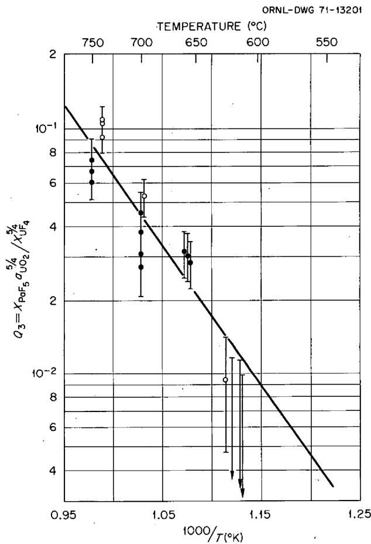  
Fig. 8.2. Values of $Q_{3} = X_{\mathrm{PaF}_{5}} a_{\mathrm{UO}_{2}}^{5/4} / X_{\mathrm{UF}_{4}}^{5/4}$ measured directly (●) and derived from measurements in the absence of uranium (○) vs $10^{3} / T(^{\circ}\mathbf{K})$ . The line represents the least-squares fit of all the data.

Combination of the present direct measurements for $Q_{3}$ with the expression for $Q_{2}$ gave the additional values for $Q_{1}$ shown in Fig. 8.3. Also shown are the previous direct measurements of $Q_{1}$ . The revised expression for $Q_{1}$ , indicated by the line in Fig. 8.3, is

$$
\log Q _ {1} = (4. 4 9 \pm 0. 8 7) - (8. 6 6 \pm 0. 8 6) \frac {1 0 ^ {3}}{T}. \tag {5}
$$

The measured values of $Q_{3}$ thus are consistent with those predicted over a year ago from measurements of $Q_{1}$ and $Q_{2}$ . It should be noted in Figs. 8.2 and 8.3 that most of the values of $Q_{3}$ and $Q_{1}$ obtained from measurements in the absence of uranium show a positive deviation from the least-squares fit. Presently, we believe that this could be caused by the presence of

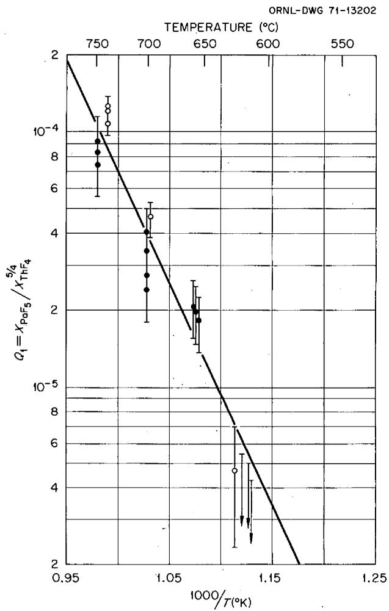  
Fig. 8.3. Values of $Q_{1} = X_{\mathrm{PaF}_{5}} / X_{\mathrm{ThF}_{4}}^{5 / 4}$ measured directly (○) and derived from measurements in the presence of uranium (●). The line represents the combination of the expression for $Q_{3}$ (Fig. 8.2) and for $Q_{2}$ .

appreciable amounts of $\mathbf{Pa}^{4 + }$ in the previous determinations of $Q_{1}$ . It was assumed in these experiments, wherein nickel oxide was added, that all the protacitinium was oxidized to the pentavalent state. In view of the uncertainty in the potential of the $\mathbf{Pa}^{5 + } / \mathbf{Pa}^{4 + }$ couple, this may not have been the case. When improved values of the redox potential become available it will allow us to correct these data for this effect, although it is expected that the correction will not be a large one.

The values of $Q_{1}$ and $Q_{3}$ have also been measured by Mailen7 but using much lower initial concentrations of protactinium (100 ppm). His results show more scatter, probably reflecting the greater difficulty of achieving equilibrium with the much smaller amount of $\mathrm{Pa(V)}$ oxide phase present. The resulting plots of $Q_{1}$ and $Q_{3}$ vs $1 / T$ cross ours at $\sim 670^{\circ}\mathrm{C}$ , but they are much steeper, indicating much more positive $\Delta S$ values and much more negative $\Delta H$ values for reactions (1) and (3). We feel that the results reported here are more accurate not only because they show less scatter, but also because the resulting $\Delta S$ values are much more consistent with what one would predict from estimates of the absolute entropies for the reactants and products.

The value of $Q_{3}$ obtained by us at $600^{\circ}\mathrm{C}$ (0.009) agrees within a factor of 3 with a value of 0.027 derived from the results of Tallent and Smith (Part IV, this report), who measured the equilibrium

$$
\frac {1}{2} \mathrm {P a} _ {2} \mathrm {O} _ {5} (\mathrm {c}) + 5 \mathrm {H F} (\mathrm {g}) \rightleftharpoons \mathrm {P a F} _ {5} (\mathrm {d}) + 2. 5 \mathrm {H} _ {2} \mathrm {O} (\mathrm {g}). \tag {6}
$$

This agreement is notably good since, in order to derive a value of $Q_{3}$ from these measurements, we have combined their measured equilibrium quotient for reaction (6) with the equilibrium quotient for the reaction

$$
5 / 4 \mathrm {U O} _ {2} (\mathrm {c}) + 5 \mathrm {H F} (\mathrm {g}) \rightleftharpoons 5 / 4 \mathrm {U F} _ {4} (\mathrm {d}) + 2. 5 \mathrm {H} _ {2} \mathrm {O} (\mathrm {g}) \tag {7}
$$

estimated from measurements in a different solvent (0.67 LiF-0.33 BeF $_2$ ).

The consistency of the present results provides confirmation that $\mathrm{Pa(V)}$ can be precipitated by oxide from uranium-containing melts while precipitating no uranium as an oxide phase. This is illustrated in Fig. 8.4, where the concentrations of $\mathrm{PaF_5}$ in an LiF-BeF $_2$ -ThF $_4$ -UF $_4$ (72-16-12-0.3 mole %) solution, at various

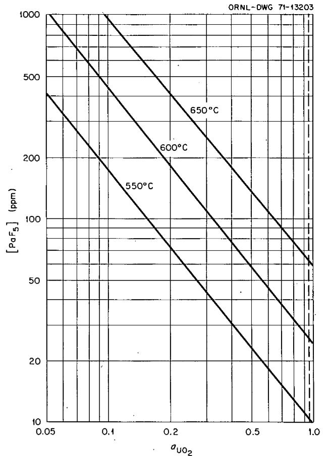  
Fig. 8.4. Concentrations of $\mathrm{PaF}_5$ calculated by means of log $(X_{\mathrm{PaF}_5}a_{\mathrm{UO}_2}^5 /X_{\mathrm{UF}_4}^5) = 4.49 - 5.69(10^3 /T)$ for the solvent LiF-BeF2-ThF4-UF4 (72-16-12-0.3 mole %) at equilibrium with $\mathrm{PaO}_{2.5}(\mathrm{c})$

temperatures, calculated by means of Eq. (4), are plotted as a function of the activity of oxide ion in the melt. In an MSBR fuel $(X_{\mathrm{UF_4}} \cong 0.003)$ we estimate that $a_{\mathrm{UO_2}}$ must exceed $\sim 0.95$ before a $\mathrm{UO_2}$ phase (actually a $\mathrm{UO_2}$ -ThO $_2$ solid solution rich in $\mathrm{UO_2}$ ) will precipitate. Thus, for example, at $550^{\circ}\mathrm{C}$ with $a_{\mathrm{UO_2}} = 0.75$ the concentration of $\mathrm{PaF_5}$ in equilibrium with $\mathrm{Pa_2O_5}$ should be $\sim 15$ ppm.

The consistency of the values of $Q_{1}$ and $Q_{3}$ with each other also confirms the assumption inherent in their definition, namely, that the $\mathrm{Pa(V)}$ oxide phase involved is $\mathrm{Pa}_{2}\mathrm{O}_{5}$ , a fact which has not yet been established directly because of the difficulty of isolating a sufficiently large and pure sample of the protactinium oxide phase.

# 8.3 REDUCTIVE EXTRACTION DISTRIBUTIONS OF BARIUM AND THORIUM BETWEEN BISMUTH-LEAD EUTECTIC AND BREEDER FUEL SOLVENT

D.M.Richardson J.H.Shaffer

The eutectic mixture of bismuth and lead (56.3-43.7 mole %) offers the advantages of a low melting point $(125^{\circ}\mathrm{C})$ and zero volume change on freezing; it should also be somewhat less aggressive than pure bismuth toward container materials. These properties were sufficiently attractive to merit further examination. Distributions of barium and thorium between the eutectic melt and $\mathrm{LiF - BeF_2 - ThF_4}$ (72-16-12 mole %) were determined at $650^{\circ}\mathrm{C}$ in a 4-in. IPS, SS 304L vessel with a mild steel liner. Barium fluoride was added to the fuel solvent salt to make $9.1\times 10^{-3}$ mole % (with $^{133}\mathrm{Ba}$ ). Reductions were performed by successive additions of 0.25 or $0.5\mathrm{g}$ of clean lithium metal; samples of salt and metal phases were taken after a minimum of 5 hr of argon sparging at 1 liter/min.

The distribution data obtained are shown in Fig. 8.5 together with the derived lines (with theoretical slopes). These lines arbitrarily pass through the log-average of the first 11 data points. This weighting of the sample results is based on the assumption that phase segregation in the frozen metal pellets caused the measured barium and thorium concentrations to be low in the later stages of reduction. The equilibrium quotient for barium was: $D_{\mathrm{Ba}} / (D_{\mathrm{Li}})^2 = 9.810 \times 10^2$ , 2.4 times less than reported for this salt and pure bismuth. The equilibrium quotient for thorium with eutectic metal was: $D_{\mathrm{Th}} / (D_{\mathrm{Li}})^4 = 6.635 \times 10^8$ , 3.7 times greater than reported for this salt and pure bismuth.

The barium activity of the metal phase was essentially constant following the last three additions of $0.5\mathrm{g}$ of lithium and would indicate that the solubility limit of thorium in the eutectic had been reached. Unfortunately the sample data scattered badly, and additional special samples were not taken. Examination of the data points suggests the thorium solubility in the eutectic may be approximately 1500 ppm at $650^{\circ}\mathrm{C}$ .

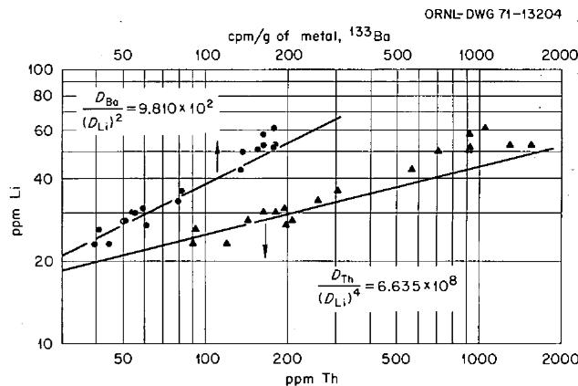  
Fig. 8.5. Reductive extraction from $\mathrm{LiF - BeF_2 - ThF_4}$ (72-16-12 mole %) into bismuth-lead eutectic (56.3-43.7 mole %) at $650^{\circ}\mathrm{C}$ .

This is about one-half the solubility of thorium in pure bismuth at $650^{\circ}\mathrm{C}$ .12

It is apparent from these data that the Pb-Bi eutectic is less valuable for this particular separation (though it is quite acceptable) than is pure Bi. It is clear that if the low freezing point, low volume change upon freezing, and probable less corrosivity of this eutectic are of real value additional separation studies should be undertaken.

# 8.4 REMOVAL OF CERIUM FROM LITHIUM CHLORIDE BY ZEOLITE

D.M.Richardson J.H.Shaffer

The observation that cerium (as $\mathrm{Ce}^{3+}$ ) is partly removed from molten LiCl solutions by finely powdered Linde Zeolite 4A was reported earlier. The same results have now been demonstrated repeatedly in an experiment where the dried zeolite was exposed, using filter tubes, in the form of commercially supplied No. 8 mesh spheres. Fission product processing feasibility is indicated, at least for cerium, by observed loadings of as much as $0.13\mathrm{g}$ of cerium per gram of dry Zeolite 4A.

The initial salt was approximately $1\mathrm{kg}$ of $\mathrm{LiCl - CeCl}_3$ (99.5-0.5 mole %) with several millicuries of $^{14}4$ Ce.

Purifications and subsequent exposures to zeolite were conducted in the same 4-in.-IPS nickel vessel.

Numerous 20-mil aliquots of Linde 4A, sodium form, No. 8 mesh zeolite were equilibrated to constant weight (five weeks) over $\mathrm{CaCl}_2\cdot 6\mathrm{H}_2\mathrm{O}$ solid and saturated aqueous solution at $24.5^{\circ}\mathrm{C}$ . Each aliquot was dried in a filter tube for 18 hr at $375^{\circ}\mathrm{C}$ with argon purge. The filter tube was then transferred under continuous argon purge to the extraction vessel and slowly lowered into the molten chlorides at $650^{\circ}\mathrm{C}$ . Salt was then pushed alternately into and out from the tube by pressure fluctuations. Inflow was damped by autopressurization of argon in the top of the tube and was terminated upon contact of salt with an electric probe. Contact times were approximately 20 sec per stroke; contacted volumes were $10\%$ of salt inventory per stroke. Although 50 strokes were usually made per aliquot, no significant increase of loading was noted from 20 to 100 strokes.

The exposed zeolite was recovered as loose spheres, unaltered in appearance except for a film of salt on the surface. It was very radioactive and could be monitored with a survey meter. Since the specific activity involved an indeterminate amount of salt, however, the amount of cerium removed per aliquot was computed from physical inventory, and the decreasing radioactivity of filtered salt samples removed after each batch exposure. The data obtained are shown in Table 8.1. Within the precision of the data the distribution of cerium between the molten chloride and the solid zeolite phases can be expressed empirically by the equation

ln (ppm Ce in salt) = 12.163 + 1.35 ln (g Ce/g zeolite)

for concentrations down to $4600~\mathrm{ppm}$ in the salt phase. Although an effective experimental procedure was

established, cumulative errors introduced in material balance calculations prevented further evaluation of the rare-earth removal process in this experiment.

Chemical analyses for sodium in the salt showed a steady increase and indicated, as shown in Table 8.1, that exchange with lithium was essentially complete. This finding is contrary to the reported equilibrium quotient $D_{\mathrm{Na}} / D_{\mathrm{Li}} = 78.4$ for this zeolite in LiCl at $650^{\circ}\mathrm{C}$ ,[14] and suggests that a processing plant for a molten-salt thermal reactor would require that Zeolite 4A be in the lithium form, with $^7\mathrm{Li}$ . Analyses for aluminum in the salt were several hundred ppm but showed no rising trend.

Zeolite 4A is initially floated by molten lithium chloride, but filling of the void space between crystallites with LiCl causes the spheres to sink to the bottom. Complete filling of the void space between crystallites would result in the consumption of approximately 0.16 g of lithium per gram of dry, lithium form, Zeolite 4A. Molecular inclusion of lithium chloride within crystallite cavities would increase this consumption by possibly $50\%$ . This consideration involving conservation of materials would need to be included in the final evaluation of a zeolite process.

Further experiments are intended to measure the removal of other fission products, both divalent and trivalent, from molten LiCl by zeolite. Wide variations may be found since the possible mechanisms include ion exchange, reaction with the zeolite structure, and formation of molecular inclusion complexes.

14. W. A. Platek and J. A. Marinsky, J. Phys. Chem. 65, 2118 (1961).   
15. R. M. Barrer and W. M. Meier, J. Chem. Soc. 299 (1958).

Table 8.1. Removal of cerium from molten LiCl by Zeolite 4A   

<table><tr><td>Number of exposures to 14 g of No. 8 mesh dry Linde Zeolite 4A</td><td>ppm Ce in salt</td><td>Grams of cerium removed per gram of zeolite</td><td>Fraction of total sodium exchanged</td></tr><tr><td>1</td><td>14,200</td><td>0.133</td><td>0.98</td></tr><tr><td>2</td><td>11,500</td><td>0.125</td><td>0.65</td></tr><tr><td>3</td><td>9,000</td><td>0.115</td><td>0.73</td></tr><tr><td>4</td><td>7,800</td><td>0.054</td><td>0.92</td></tr><tr><td>5</td><td>6,200</td><td>0.071</td><td>0.96</td></tr><tr><td>6</td><td>4,600</td><td>0.067</td><td>0.72</td></tr></table>

# 9. Development and Evaluation of Analytical Methods for Molten-Salt Reactors

A. S. Meyer

# 9.1 IN-LINE CHEMICAL ANALYSIS OF MOLTEN FLUORIDE SALT STREAMS

J.M.Dale A.S.Meyer

The first successful in-line analysis of a constituent in a flowing molten fluoride salt stream is now in operation. Automated analyses for U(III) in $\mathrm{LiF - BeF_2 - }$ $\mathrm{ZrF_4 - UF_4}$ (65.4-29.1-5.0-0.5 mole $\%$ ) in the NCL-21 thermal convection salt loop are being routinely performed by our PDP-8I computer voltammeter system. The loop was set up and is being used by the Metals and Ceramics Division to study the effect of the melt on metal specimens in Hastelloy N.

The NCL-21 loop was filled on July 20 and held under isothermal conditions at about $650^{\circ}$ until July 26, at which time the cold leg temperature was established and Hastelloy N specimens were inserted into both the hot and cold leg of the loop for corrosion studies. Analyses of the U(III) concentration of the melt were started on July 22 and were continued on a routine basis until the specimens were removed from the loop on August 23. The original measurements in the melt indicated that about $0.02\%$ of the total uranium was present as U(III). The U(III) concentration showed a gradual increase until a value of $0.05\%$ was reached at $475\mathrm{hr}$ of loop operation. At this point the rate of formation of U(III) increased, and the concentration reached a value of about $0.15\%$ when the metal specimens were removed from the loop.

No major problems have been encountered with the computer or the voltammeter in this system. Prior to installation on the loop the voltammeter was modified by T. R. Mueller of our instruments group to enable the counter electrode of the system to be used at ground potential. This was done to help suppress any electrical noise that might be contributed to the voltammetric wave by surrounding equipment. However, on occasion the response from the electrodes has been noisy and erratic, making it impossible to locate the $E^{1/2}$ of the U(IV) → U(III) reduction wave with any degree of confidence. It appears that this is caused by some material floating on the surface of the melt as it comes in contact with the electrodes. In order to eliminate this problem a new electrode assembly was designed which allows the salt to be flushed from around the electrode with helium. This assembly was installed in the loop after the metal specimens were removed. The electrode is encased in a $1/2$ -in. nickel tube, open at the bottom, which protrudes below the surface of the melt. During computer-controlled runs the salt enters the electrode compartment from below the melt surface and remains there for the time of measurement. The salt is then flushed from the compartment, and the electrode remains in a helium gas envelope when not in use. This appears to keep floating material away from the electrode and also should increase the lifetime of the electrodes or electrode area-defining insulators which may be added at a later time. It was hoped that this new assembly would also decrease the surface vibrations around the electrode. It was observed during operation of the analysis system with the original electrode that

the derivative voltammogram which is used to locate the $E^{1} / 2$ is highly susceptible to small variations in the height of the melt. If the salt loop is given a small push during a run the derivative wave oscillates with the wave created on the melt surface. The new assembly does not completely eliminate this effect, but it does dampen the surface wave in the vicinity of the electrode, and equilibrium is restored within a few seconds.

After the system is started the analyses are performed completely unattended through computer control. At initiation of the analyses a signal from a logic circuit that we added to the computer starts a timer which causes the pressure in the electrode assembly to be released and salt enters the electrode compartment. The computer then operates the voltammeter to perform five analyses for U(III), and the results plus some diagnostic information are printed out on a Teletype after each analysis. At the end of the run the average U(III) concentration and standard deviation are calculated and printed out. When the run is completed the timer shuts off causing the salt to be flushed from the electrode assembly. At the present time a set of five analyses is made every hour, although the number of analyses and the intervening period may be adjusted in the computer program for the particular needs of the experiment. The computer program which we have modified to fit our particular situation was originally developed by M. T. Kelley and R. W. Stelzner. As an example of the precision of the analysis system, a standard deviation of $2.1\%$ was obtained for the results of the hourly analyses made over a one-weekend period when the U(III) concentration appeared to be relatively stable.

One useful addition to the analysis system is now being considered which involves the measurement of the salt temperature. During the first month of operation the temperature of the melt where the analysis is made varied from about 610 to $680^{\circ}\mathrm{C}$ . Because the temperature is needed in the computer program to calculate the U(III) concentration, it is planned to monitor an amplified thermocouple output with the computer so that the true temperature at the time of analysis is used in the calculations. It is also planned to investigate the extension of the analysis system to the monitoring of the corrosion products in the melt.

# 9.2 SLOTTED PROBE FOR IN-LINESPECTRAL MEASUREMENTS

J. P. Young

A device has been recently developed by Wilks Scientific Corporation called a "Miran" infrared

probe. $^3$ This probe, somewhat similar to a $\mathsf{pH}$ electrode in shape, makes use of multiple internal reflections of a light beam of a selected infrared wavelength range within the probe to direct a beam of light, which enters the top, through the probe around the bottom and again through the probe finally exiting in a different direction at the top. A detector monitors the exiting beam. Since internally reflected light is subject to absorption by the medium which surrounds the point of these reflections, the multiple-reflected beam is attenuated if the probe is placed in an absorbing solution, and absorption measurements are possible. In considering the usefulness of such a device it seemed apparent that the utility could be greatly enhanced if one cut a slot (see Fig. 9.1) of appropriate width in some portion of the internal beam path and in a direction normal to the beam path. With a slot of perhaps 0.2 to $1.0\mathrm{cm}$ in width a probe could be made with a controlled and relatively much longer path length than that which could be realized with only internal reflection. With a slot the optical design of the probe could be simplified to require a minimum of two or three internal reflections to direct a beam of light into and out of a cylindrical probe; the base of the probe would be prismatic, conical, or perhaps hemispherical, with the slot in the apex of the prism or on the side of any of the shapes. By incorporating a suitable light source and detector with a suitable slotted optical probe, absorbance measurements could be made in any region of the electromagnetic spectrum. The device could also be used for other optical measurements such as turbidity. The design of this probe would lend itself to a sealable insertion into a pool of liquid or a flowing stream. It should be remembered that internal reflection can occur only when the index of refraction $(\eta)$ of the medium through which the light is traveling (probe) is larger than $\eta$ of the surrounding medium (the liquid sample). Over the common range of values of $\eta$ encountered, a difference of about 0.5 in the two values of $\eta$ seems adequate; however, through the use of a specially designed probe bottom a smaller difference may be satisfactory.

By the use of a probe made from Plexiglas and using solutions of a blue dye, copper phthalocyanine sulfonate, placed in the slot, absorbance data were collected and compared with similar data obtained from the

ORNL DWG 71-11827A

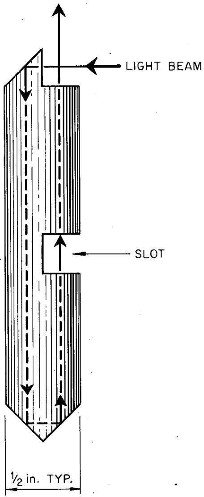  
Fig. 9.1. Slotted optical probe for spectral analysis.

solution with a Cary spectrophotometer, model 14M. The light source used with the probe was a $100\mu \mathrm{watt}$ He-Ne laser line at $633~\mathrm{nm}$ , and the detector was a "Densichron" phototube detector. The comparison is shown in Table 9.1.

In-line applications for spectral analysis by means of a slotted optical probe appear numerous. For molten-salt reactor applications, it is possible that an $\mathrm{LaF_3}$ slotted probe would be useful in monitoring protons by means of the $\mathrm{BF}_3\mathrm{OH}^-$ absorption in molten $\mathrm{NaBF_4}$ ; the existence of such an absorption was reported previ

Table 9.1. Absorbance of Cu phthalocyanine solution   

<table><tr><td rowspan="2">Sample</td><td colspan="2">Absorbance/1 cm</td></tr><tr><td>Cary spectrophotometer</td><td>Slotted probe</td></tr><tr><td>H2O</td><td>0.0</td><td>0.0</td></tr><tr><td>1</td><td>0.188</td><td>0.187</td></tr><tr><td>2</td><td>0.382</td><td>0.384</td></tr></table>

ously.4 With a diamond slotted probe, several spectral measurements could be made directly in MSBR circulating fuel. Suitable laser light sources are available for either of these applications; the refractive index of either material is quite adequate for proper internal reflections within the probe.

# 9.3 IN-LINE DETERMINATION OF HYDROLYSIS PRODUCTS IN $\mathrm{NaBF_4}$ COVER GAS

R.F.Apple A.S.Meyer

Earlier analytical studies on the off-gas of the $\mathrm{NaBF}_4$ circulating test loop have shown that water can be present in significant quantities as hydrolysis products of $\mathrm{BF}_3$ in the cover gas of the proposed MSBR coolant salt. An in-line method for the measurement of this "water" would be useful for the detection of leaks in steam generators, the investigation of the role of the cover gas in the containment of tritium, the development of methods for the removal of the corrosive hydrolysis products before they can reach sensitive components of the flow control system, and studies of coolant reprocessing systems.

Conventional methods for the determination of water in inert gases are subject to interference from $\mathrm{BF}_3$ and possibly HF in the cover gas. At the suggestion of Dunlap Scott we are investigating "dewpoint techniques" for the determination of these hydrolysis products. We anticipate that this empirical technique may require extensive calibrations because the condensation temperature of a given concentration of "water" may well be influenced by the partial pressures of both $\mathrm{BF}_3$ and HF.

In feasibility studies we are using a simulated cover gas prepared by bubbling mixtures of $\mathrm{BF}_3$ and helium through a saturator that originally contains water. When a steady state is reached the saturator contains liquid hydrates of $\mathrm{BF}_3$ , and the exit gas contains hydrolysis products in relatively low concentrations. By direct Karl Fischer titration (subject to significant interference from $\mathrm{BF}_3$ ) we have estimated "water" concentrations of about 200 ppm at a saturator temperature of $45^{\circ}\mathrm{C}$ and 3000 ppm at $75^{\circ}\mathrm{C}$ . In our experiments the dewpoint detector is either contained in the same oven that maintains the saturator temperature or is connected to the oven through a short nickel tube that is heated above the saturator temperature. Under these conditions the observed dewpoint should coincide with the temperature of the saturator.

Our initial approach was to attempt to detect the formation of a conductive film of $\mathrm{BF}_3$ hydrates by measuring the resistance between closely spaced platinum electrodes inserted in the gas stream. The electrodes are mounted through an insulator (temperature controlled by an air stream) which provides a surface for the condensation of the hydrolysis products. At present we have used Teflon, Teflon with its surface modified by treatment with a sodium solution, and high-fired alumina as insulating materials. Measurements on alumina appear more consistent; however, this may be the result of improved electrical instrumentation used in the later tests. This technique gives definite indication of the condensation of a film of hydrates. When the probe (electrode assembly) is about $10^{\circ}\mathrm{C}$ above the saturated cover gas temperature its resistance is about $500\mathrm{k}\Omega$ for 20-mil electrodes spaced about $\frac{1}{6}$ in. apart. The resistance falls to about $300\Omega$ when the temperature is reduced to $10^{\circ}\mathrm{C}$ below that of the cover gas. In its present state the electrical probe does not appear to be practical because of its extremely slow response. Several hours are required to approach these equilibrium resistance values.

We are now testing an optical method for dewpoint detection. The design of our optical cell is based on a suggestion of S. S. Kirslis. The cell utilizes a cylindrical copper block with one face polished and gold-plated. This polished face is sealed into an observation chamber through which the cover gas sample flows. The external end of the copper block is penetrated to near the polished surface by holes for cooling air and a thermocouple. The inlet stream is directed against the polished

surface, and films of condensate are observed through a sapphire window. With this cell condensation is observed within about $15\mathrm{min}$ after the block is cooled to the dewpoint. Over the range of 45 to $75^{\circ}\mathrm{C}$ dewpoints are observed at about $1^{\circ}\mathrm{C}$ below the temperature of the cover gas. It is likely that this difference reflects the difficulty in detecting the initial formation of a film of condensate visually. With commercial instruments (not necessarily applicable to our corrosive gases) dewpoints can be measured to a few tenths of a degree. A complete evaluation of the precision and accuracy of the method must await calibration using gas streams whose absolute water content is determined by some alternate method. The Karl Fischer titration applied after the water is separated from $\mathrm{BF}_3$ and HF by azeotropic distillation with pyridine appears to be the most promising method. For the quantities of water involved it will be necessary to perform the titrations with coulometrically generated reagents.[9] D. J. Fisher and T. R. Mueller[10] have designed an improved coulometric titrator for this application. The instrument has been fabricated and is now being tested. Initial measurements on standards have shown about $1\%$ reproducibility for the titration of milligram quantities of water. With minor modifications in the electronics and in the design of the titration cell we expect to achieve similar precision in the titration of $100 - \mu \mathrm{g}$ quantities. This apparatus together with its metal azeotropic still will be sufficiently portable to permit on-site analysis of water in engineering streams.

A preliminary estimate of the potential sensitivity of the optical dewpoint method has been made by a dilution technique. When the concentration of hydrolysis products in a stream saturated at $59^{\circ}\mathrm{C}$ (estimated "water" concentration, 1000 ppm) was diluted fivefold with a gas stream that contained the same concentration of $\mathrm{BF}_3$ , the observed dewpoint decreased by $24^{\circ}\mathrm{C}$ . This response is roughly equivalent to that of uncomplexed water at room temperature. From these results we estimate the precision of the method to be about $10\%$ for visual detection with perhaps a fivefold improvement with automatic photometric instruments. Commercial photometric instruments would require the replacement of their conventional glass optics.

We believe that the optical cell will prove useful for various development studies and may provide informa

tion on the gas phase equilibria between $\mathrm{H}_2\mathrm{O}$ and $\mathrm{BF}_3$ . In application to pumped systems, however, it will probably be subject to interference from oil which enters the system through the shaft seals. We will therefore continue development on the resistance method of dewpoint detection, which should be unresponsive to organic films, and we will test other insulating materials and electrode configurations.

# 9.4 DETERMINATION OF HYDROGEN IN FLUOROBORATE SALTS

J.P.Young J.B.Bates

M.M.Murray A.S.Meyer

From the results which were reported earlier for the interaction of $\mathrm{OH}^{-}$ with $\mathrm{NaBF}_4$ , it was obvious that protons (as $\mathrm{BF}_3\mathrm{OH}^{-}$ ) could be detected in fluoroborate salts. The detection limits and the quantitative nature of such a determination, however, were unknown. Work this period has been directed toward these latter ends.

It was found that pellets pressed from mixtures of $\mathrm{NaBF}_3\mathrm{OH}$ and $\mathrm{NaBF}_4$ which were ground in a micro ball mill yielded infrared spectra in which the absorbance of the $\mathrm{NaBF}_3\mathrm{OH}$ peak at $3641~\mathrm{cm}^{-1}$ varied linearly with the added concentration of this species. In a 45-mg pressed pellet the resultant factor is 63 ppm H per absorbance unit. The method is very sensitive; much less than 1 ppm H could be detected. It is assumed that the method will be equally sensitive, on a molar basis, to deuterium.

Although a good calibration curve was obtained, the method of preparing the samples did not guarantee that these "standards" were of known hydrogen concentration. If some of the added $\mathrm{BF}_3\mathrm{OH}^-$ were lost in the grinding and pressing, or, rather, if it were converted to some species which did not exhibit the sharp peak at $3641~\mathrm{cm}^{-1}$ , the experimentally observed factor would be higher than the actual factor. Indeed, one such effect was observed in high concentrations of $\mathrm{NaBF}_3\mathrm{OH}$ or if the mixtures were ground for too short a time. Under such conditions, rather than one sharp peak, two sharp peaks are observed in the spectrum of the pellets at 3641 and at $3621~\mathrm{cm}^{-1}$ . The former peak is as seen for $\mathrm{BF}_3\mathrm{OH}^-$ in solid solution in $\mathrm{NaBF}_4$ . The latter peak is at the same position as the $\mathrm{BF}_3\mathrm{OH}^-$ peak in pure $\mathrm{NaBF}_3\mathrm{OH}$ . On mild heating of the pellets, $70^{\circ}\mathrm{C}$ for 18 hr, the peak at $3621~\mathrm{cm}^{-1}$ disappears with little if any enhancement of the $3641~\mathrm{cm}^{-1}$ peak. Apparently when these two peaks are observed, two kinds of $\mathrm{BF}_3\mathrm{OH}^-$ are present in the $\mathrm{NaBF}_4$ matrix: a bound or dissolved species and an undissolved and probably segregated

species. On heating the latter species it decomposes to form water and some form of oxyfluoroborate.

From the above it is seen that one particular kind of nondissolved OH species can be identified. It is reasonable to assume that all OH species could be observed by their absorbance in this region of the infrared spectrum so that their presence would be detected. Rather than rely on this assumption, however, an independent method involving isotopic dilution of H with D was devised so that the spectrally observed $\mathrm{BF}_3\mathrm{OH}$ , or H, concentrations could be compared with H concentrations found by mass spectrometry. If one allows a quantity of hydrogen in a particular species to react with an approximately equal amount of deuterium, as a volume of $\mathrm{D}_2$ gas, in a sealed system at equilibrium, one should find a large and proportionate amount of H in the $\mathrm{D}_2$ gas. Such an equilibration was studied by allowing several molten samples of H-containing $\mathrm{NaBF}_4$ or NaF-NaBF $_4$ to react with a known amount of $\mathrm{D}_2$ gas in sealed Pyrex ampules for various periods of time at $440^{\circ}\mathrm{C}$ . The proton concentration of the original salts was determined by the infrared pellet technique using the factor derived from the ground $\mathrm{NaBF}_3\mathrm{OH}-\mathrm{NaBF}_4$ mixtures. The results of the comparison are shown in Table 9.2.

Table 9.2. Determination of hydrogen in $\mathrm{NaBF_4}$ samples by infrared and mass spectral methods   

<table><tr><td rowspan="2">Sample</td><td colspan="2">H found, ppm</td></tr><tr><td>Mass spectral</td><td>Infrared</td></tr><tr><td rowspan="3">Eutectic</td><td>9.9a</td><td>20</td></tr><tr><td>21.6b</td><td>24</td></tr><tr><td>21.7b</td><td>18</td></tr><tr><td rowspan="2">NaBF4</td><td>7.7b</td><td>6.4</td></tr><tr><td></td><td>7.8</td></tr></table>

$a_{16\text{-hr}}D_2$ equilibration.   
$b_{48}$ -hr $\mathrm{D}_2$ equilibration.

The correlation of the results is quite gratifying, but there is an attendant high blank correction in the mass spectrometric results that is worrisome. We have found that the blank correction, equivalent to 10 to $12\mu \mathrm{g}$ of H, is due to Pyrex; the mechanism of the exchange is as yet unknown. The blank is reduced by at least an order of magnitude if $\mathrm{SiO}_2$ ampules are used. Further isotopic exchange studies of fluoroborate melts contained in $\mathrm{SiO}_2$ ampules will be made.

Various parameters of the infrared method of H determination in fluoroborates have been evaluated. Too short a time of mixing with the ball mill, less than approximately 4 min, or hard grinding yields absorption peaks which give low results. Variation in the relative humidity to which samples were exposed did not affect the intensity, and therefore concentration, of the $\mathrm{BF}_3\mathrm{OH}^-$ absorbance. Even though samples were stored at $100\%$ relative humidity for 48 hr and showed obvious signs of caking from moisture pickup, this adsorbed water was removed in the pelletizing process at least down to the equivalent of 4 ppm H. Since a sample of less than 4 ppm H has not yet been observed, it cannot be said as yet whether the 4 ppm is a real concentration in $\mathrm{NaBF}_4$ or whether it represents the extent of some hydrolysis reaction occurring during pelletization. It would appear, however, that the former view is more likely.

Most of the fluoroborate samples that have been previously melted yield proton concentrations between 20 to $30~\mathrm{ppm}$ . The sample shown in Table 9.2 which has $7~\mathrm{ppm}$ has never been melted. When this sample is melted under what is thought to be inert conditions the hydrogen content increases two- to threefold. This apparent affinity for $\mathbf{H}$ , or more correctly OH since the species being observed is $\mathrm{BF}_3\mathrm{OH}^-$ , coupled with the partial immiscibility of fluoroborates with $\mathrm{BeF}_2$ -containing melts suggests the possibility of extracting $\mathrm{OH}^-$ from molten fluoroberyllates into fluoroborates for the subsequent spectral determinations. Preliminary studies using molten LiF- $\mathrm{BeF}_2$ equilibrated with $\mathrm{D}_2\mathrm{O}$ have shown a very small but definite transfer of deuterium into the fluoroborate-rich phase, as $\mathrm{BF}_3\mathrm{OD}^-$ , which must have occurred by extraction of a species from the molten fluoroberyllate phase. Further studies of this will be made.

# 9.5 VOLTAMMETRIC AND ELECTROLYSIS STUDIES OF HYDROXIDE ION IN MOLTEN NaBF $_4$

D. L. Manning A. S. Meyer

Experiments were conducted to observe the voltammetric behavior of hydroxide ion in molten $\mathrm{NaBF_4}$ at approximately $400^{\circ}\mathrm{C}$ . Hydroxide added as $\mathrm{NaOH}$ or $\mathrm{NaBF}_3\mathrm{OH}$ (200 to $800\mathrm{mg}$ per $80\mathrm{g}$ of melt) produced an increase in current over background on the voltammograms over the potential range $\sim -0.5$ to $-1.0\mathrm{V}$ vs a Pt quasi-reference electrode. Considerable noise was encountered which is characteristic of bubble formation at the electrode surface. This is not surprising since hydrogen is evolved when $\mathrm{OH}^{-}$ is reduced at the indicator electrode $(\mathrm{OH}^{-} + \mathrm{le} \rightarrow \mathrm{O}^{2-} + \frac{1}{2}\mathrm{H}_{2})$ . After a

few hours, however, the current essentially returned to background level. This is evidence that appreciable concentrations of hydroxide ion are not stable in $\mathrm{NaBF_4}$ melts at least under our experimental conditions in which the melt is contained in a graphite crucible that is sealed in a quartz and Pyrex envelope. Voltammetry at platinum or pyrolytic graphite electrodes does not appear applicable to low levels of hydroxide ion, since background voltammograms do not reveal any wave that can be related specifically to OH reduction. By purposely increasing the OH concentration, however, one can observe the potential range at which this substance is reduced.

We are now testing a palladium tube electrode so that the hydrogen formed at the electrode surface could diffuse through the palladium into an evacuated volume and be observed as a pressure change of the system. This would appear to have two distinct advantages; it would be specific for hydrogen and would allow for increased sensitivity through controlled potential electrolysis. Also the separated hydrogen could be transferred to an internal proportional counter for the measurement of its tritium content. The technique could thus be adapted to an in-line method for ${}^{3}\mathrm{H} / \mathrm{H}$ ratios in the reactor coolant.

To test the feasibility of this technique, a melt was prepared of commercial nonrecrystallized $\mathrm{NaBF}_4$ (estimated proton level 20 to $40~\mathrm{ppm}$ ). A palladium tube electrode ${}^{1}/_{16}$ in. diam, 0.004 in. wall, 2 in. long was closed at one end and fastened to a ${}^{1}/_{8}$ -in. nickel tube riser. The electrode was immersed to a depth of $\sim 1~\mathrm{cm}$ . The evacuated volume associated with the electrode assembly is of the order of $10~\mathrm{cc}$ . Upon applying a negative voltage step to the electrode, a pressure increase was observed as the hydrogen which is formed at the surface of the electrode diffused through the palladium into the evacuated volume. Initially the pressure increased from background $(< 2\mu)$ to $\sim 100\mu$ upon applying a 1-V step for $1\mathrm{min}$ . This is an indication that we were definitely observing the reduction of protonic species present in the melt. After about $48\mathrm{hr}$ , however, the pressure measurements had decreased to $\sim 30\mu$ for the same potential step and time of electrolysis. This agrees with previous voltammetric observations which seemed to indicate that appreciable concentrations of OH are not stable in $\mathrm{NaBF}_4$ melts under our experimental conditions. An addition of $\sim 500\mathrm{mg}$ of $\mathrm{NaBF}_3\mathrm{OH}$ to the molten $\mathrm{NaBF}_4$ resulted in an increase in the pressure measurements to about $160\mu$ .

The results are encouraging. It is believed that the electrolysis technique at palladium will result in a

specific method for detecting protonic species in fluoroborate melts. We plan to continue these experiments. However, to eliminate any effect of silica and also to achieve higher temperatures, further experiments will be conducted in a nickel cell enclosure. Initial measurements indicate that useful voltammetric waves for the reduction of OH can be obtained on the palladium electrode.

# 9.6 ELECTROANALYTICAL STUDIES IN THE $\mathrm{NaBF}_4$ COOLANT SALT

D. L. Manning F. R. Clayton1

G. Mamantov1

Voltammetric studies are in progress in molten $\mathrm{NaBF}_4$ at $\sim 420^{\circ}\mathrm{C}$ . Platinum and graphite cells are used to contain the melt which is enclosed in a Pyrex jacket to maintain an inert atmosphere. A cover gas of helium was maintained under static conditions at a pressure of approximately 4 psig. Voltammograms were recorded at platinum and pyrolytic indicator electrodes ( $\sim 0.1\mathrm{cm}^2$ area) vs a platinum quasi-reference electrode. The platinum quasi-reference is supposedly poised at the equilibrium potential of the melt. Background voltammograms recorded on Harshaw $\mathrm{NaBF}_4$ as received showed an iron impurity wave at $\sim -0.4\mathrm{V}$ vs the platinum quasi-reference. The concentration of iron calculated from the voltammogram agreed well with the chemical analysis of $\sim 200\mathrm{ppm}$ . Reduction waves were not observed that could be attributed to the reduction of nickel or chromium. Chemical analyses gave 16 and 6 ppm of Ni and Cr, respectively, which are below practical limits for well-defined voltammograms. We have not yet investigated stripping techniques for these ions. A small amount of iron(III) was added to the melt to gain some idea of the potential of the $\mathrm{Fe}^{3+} \rightarrow \mathrm{Fe}^{2+}$ reduction. This wave was observed at a half-wave potential of $\sim -0.2\mathrm{V}$ . It appears that the iron impurity in the $\mathrm{NaBF}_4$ is predominantly Fe(II). On platinum, the melt exhibits a cathodic current limit at $\sim -1.2\mathrm{V}$ which appears to be due to the reduction of boron, while the anodic limit appears at $\sim +1.8\mathrm{V}$ due to the dissolution of the platinum.

The magnitude of the iron impurity was significantly decreased by recrystallizing the $\mathrm{NaBF_4}$ from $0.1M\mathrm{HF}$ as suggested by L. O. Gilpatrick (Reactor Chemistry Division). The iron was decreased from $\sim 200$ ppm to

20 ppm with one recrystallization, and a reasonably well-defined reduction wave at this level was observed.

A voltammetric study is in progress on titanium(IV) added as $\mathbf{K}_2\mathrm{TiF}_6$ to molten $\mathrm{NaBF_4}$ . Melts of Ti(IV) in $\mathrm{NaBF_4}$ appear to be stable in graphite. The $\mathrm{Ti(IV)}\rightarrow$ Ti(III) reduction wave is observed at $\sim -0.5\mathrm{V}$ . It may prove difficult to separate the reduction waves of Ti(IV) and Fe(II). A $\mathrm{Ti}^{3 + }\rightarrow \mathrm{Ti}^0$ reduction wave is not observed in $\mathrm{NaBF_4}$ because the cathodic limit of the melt occurs first.

# 9.7 ELECTROANALYTICAL STUDIES OF Ni(II) IN MOLTEN FLUORIDE FUEL SOLVENT

D. L. Manning

Further voltammetric and chronopotentiometric studies were made at fast scan rates and short transition times on Ni(II) in molten $\mathrm{LiF - BeF_2 - ZrF_4}$ at $500^{\circ}\mathrm{C}$ . The diffusion coefficient for Ni(II) was evaluated by the two methods. For linear sweep voltammetry, the equation for the reversible deposition of an insoluble substance is

$$
i _ {p} = 2. 2 8 \times 1 0 ^ {5} n ^ {3 / 2} A D ^ {1 / 2} C v ^ {1 / 2},
$$

where $i_p =$ peak current $(\mu \mathbf{A})$ , $n =$ electron change, $C =$ concentration $(\mathrm{mM})$ , $A =$ electrode area $(\mathrm{cm}^2)$ , $D =$ diffusion coefficient $(\mathrm{cm}^2/\mathrm{sec})$ , and $v =$ scan rate $(\mathrm{V/sec})$ . The voltammograms were recorded at a pyrolytic graphite electrode (PGE) with an area of $0.1\mathrm{cm}^2$ and at a concentration of nickel of $6.7\mathrm{mM}$ . Plots of $i_p$ vs $v^{1/2}$ were linear to $50\mathrm{V/sec}$ . From the slope of the line, the value of $D$ is $1.07\times 10^{-6}\mathrm{cm}^2/\mathrm{sec}$ . Although an unsheathed pyrolytic graphite electrode was used $(r_0 = 0.05\mathrm{cm})$ , the equation for linear diffusion can be utilized as pointed out by Delahay, $^{13}$ since the quantity $(1 / r_0)(D / nv)^{1 / 2}$ is less than about 0.2 at the scan rates employed.

Chronopotentiograms were recorded at the PGE at current densities ranging from 5 to $30\mathrm{mA} / \mathrm{cm}^2$ . Corresponding transition times varied from 0.76 to 0.028 sec. Within experimental error, the $i_0\tau^{1 / 2}$ product was constant at $4.69\pm 0.25\times 10^{-4}\mathrm{Acm}^{-2}$ $\sec^{-1 / 2}$ . From the Sand equation

$$
i _ {0} \tau^ {1 / 2} = \frac {\pi^ {1 / 2} \mathrm {F}}{2} n D ^ {1 / 2} C,
$$

where $i_0 =$ current density, $\tau =$ transition time, $F =$ Faraday, and at a Ni(II) concentration of $2.6 \times 10^{-5}$ moles/cm $^3$ , an average $D$ value of $1.05 \times 10^{-6}$ cm $^2$ /sec was obtained. This is in excellent agreement with the value obtained from voltammetry. Within the precision of the measurements, the same results were obtained using a platinum indicator electrode.

Nickel(II) when reduced at platinum did not appear to form an Ni-Pt surface alloy under the experimental conditions employed. $\operatorname{Log}(i_p - i)$ vs $E$ plots were linear over the range $\sim 0.5$ to $0.9i_{p}$ with the theoretical slope

for a two-electron change. $^{14}$ Also from the chronopotentiograms, the ratio of forward to reverse transition times was approximately unity, in agreement with the predicted value for the reversible deposition of an insoluble substance. $^{15}$

14. Gleb Mamantov, D. L. Manning, and J. M. Dale, J. Electroanal. Chem. 9, 253 (1965).   
15. W. H. Reinmuth, Anal. Chem. 32, 1514 (1960).

# 10. Other Fluoride Researches

# 10.1 ABSORPTION SPECTROSCOPY OF MOLTEN FLUORIDES

L.M.Toth L.O.Gilpatrick

# 10.1.1 The Disproportionation Equilibrium of $\mathbf{U}\mathbf{F}_3$ Solutions

Investigation of the disproportionation equilibrium reported earlier for dilute U(III)-U(IV) mixtures in molten fluoride solution

$$
4 \mathrm {U F} _ {3} + 2 \mathrm {C} (\text {g r a p h i t e}) \rightleftharpoons 3 \mathrm {U F} _ {4} + \mathrm {U C} _ {2} \tag {1}
$$

has continued. Using $\mathrm{LiF - BeF_2}$ mixtures as reference solutions the following $\mathrm{UF}_3 / \mathrm{U}_{\mathrm{total}}$ concentration ratios were measured where $\mathrm{U}_{\mathrm{total}} = 0.07$ mole $\%$ (Table 10.1). These data have been used to calculate equilibrium quotients for the above equilibrium in both 66-34 and 48-52 mole $\%$ LiF-BeF $_2$ mixtures. It has been found that at $650^{\circ}\mathrm{C}$ the equilibrium quotient at the 66-34 mole $\%$ composition (designated $Q_{66-34}$ ) is 6.25 times that of the 48-52 mole $\%$ composition, or $Q_{66-34} = 6.25 Q_{48-52}$ . Activity coefficient data reported earlier $^2$ yields $Q_{66-34} = 7 Q_{48-52}$ in good agreement with the data reported here.

However, when ternary solvent systems are compared with the reference system of $\mathrm{LiF - BeF_2}$ , less satisfactory agreement has been found. For example, $Q_{66-34} \simeq 0.5$

$Q_{\mathrm{MSBR}}$ where $Q_{\mathrm{MSBR}}$ is the equilibrium quotient measured for the disproportionation equilibrium in $\mathrm{LiF - BeF_2 - ThF_4}$ (72-16-12 mole%). Currently accepted activity coefficients yield $Q_{66 - 34} = 2Q_{\mathrm{MSBR}}$ .

The reverse of reaction (1) has been studied in an effort to unambiguously identify the carbide phase in the equilibrium. As indicated in the previous report1 exact reproducibility of the $\mathbf{U}\mathbf{F}_3$ equilibrium concentration was not achieved because pure carbide reactants were not available. Efforts have been directed at obtaining UC, $\mathrm{U}_2\mathrm{C}_3$ , and $\mathrm{UC}_2$ of greater purity with which to further test the back reaction. Some of these results indicate that the carbide phase may be $\mathrm{U}_2\mathrm{C}_3$ , but the question remains unsettled.

The work on the disproportionation equilibrium will continue in order that these questions may be settled.

# 10.1.2 Estimation of the Available $\mathbf{F}^{-}$ Concentrations in Melts by Measurement of $\mathbf{U}\mathbf{F}_4$ Coordination Equilibria

Due to insufficient experimental data, activity coefficients in ternary fluoride systems are less accurately known than in binary systems such as $\mathrm{LiF - BeF_2}$ . It has been noted earlier that the equilibrium involving the

Table 10.1. Equilibrium $\mathbf{UF}_3 / \mathbf{U}$ total ratios for LiF-BeF $_2$ mixtures in graphite   

<table><tr><td rowspan="2">Solution (mole %)
(LiF-BeF2)</td><td colspan="2">Temperature (°C)</td></tr><tr><td>650</td><td>550</td></tr><tr><td>66-34</td><td>0.025</td><td>0.004</td></tr><tr><td>48-52</td><td>0.13</td><td>0.03</td></tr></table>

two identified species of U(IV) in molten fluorides at $550^{\circ}\mathrm{C}$ ,

$$
\mathrm {U F} _ {8} ^ {4 -} \rightleftharpoons \mathrm {U F} _ {7} ^ {3 -} + \mathrm {F} ^ {-}, \tag {2}
$$

provides a practical means of measuring fluoride ion concentrations by measurement of the relative amounts of $\mathrm{UF_8}^{4-}$ and $\mathrm{UF_7}^{3-}$ with absorption spectroscopy. In this procedure the concentration of seven and eight coordinated U(IV) are measured directly by using $\epsilon_{1050\mu} = 14$ and 20.8 liters mole $^{-1}$ cm $^{-1}$ for seven and eight coordinated U(IV) at $550^{\circ}\mathrm{C}$ respectively. For LiF- $\mathrm{BeF_2}$ (66-34 mole%) the $(\mathrm{UF_8}^{4-}) / (\mathrm{UF_7}^{3-})$ ratio is 0.667 and for LiF- $\mathrm{BeF_2}$ (48-52 mole%) it is 0.177. $^3$ With these two reference points, other solvents, for example, LiF- $\mathrm{BeF_2}$ -ThF $_4$ (72-16-12 mole%) can be scaled. It is interesting to note that $\mathrm{UF_8}^{4-} / \mathrm{UF_7}^{3-} > 0.667$ for LiF- $\mathrm{BeF_2}$ -ThF $_4$ (72-16-12 mole%) indicating that this proposed MSBR solvent is more F $^-$ rich (or basic) than the reference composition of LiF- $\mathrm{BeF_2}$ (66-34 mole%). These results are in good agreement with the equilibrium quotient Q measured for reaction (1) in the MSBR solvent, where Q is expected to decrease as the F $^-$ concentration increases.

# 10.2 SOLUBILITY OF $\mathbf{BF}_3$ IN FLUORIDE MELTS

S.Cantor R.M.Waller

The general objective of this investigation is to relate the thermodynamic behavior of a solute gas, $\mathrm{BF}_3$ , to the thermodynamic properties of molten fluoride solvents. The guiding hypothesis for this investigation is that $\mathrm{BF}_3$ , with its unsaturated valence (i.e., its Lewis acidity), will readily interact with the more loosely bound fluoride ions (often referred to as "free" fluoride) in the melt. In this part of the investigation, we are measuring $\mathrm{BF}_3$ solubility in the system LiF-BeF $_2$ ; depending on melt composition, this system would be expected to exhibit a large variation in "free" fluoride concentration because LiF is a fluoride donor and BeF $_2$ is a strong fluoride acceptor.

This work is also relevant to molten-salt reactors. First, boron, with its high absorption for thermal neutrons, can be introduced into the fuel salt as $\mathrm{BF}_3$ for purposes of reactor control. $^4$ (The $\mathrm{BF}_3$ could be readily removed from the fuel salt by inert-gas sparg-

ing.) Second, if there were a leak in the primary heat exchanger, $\mathrm{NaBF}_4$ in the coolant would decompose to NaF and $\mathrm{BF}_3$ . The degree of decomposition depends on concentration (of $\mathrm{NaBF}_4$ in the fuel salt), on temperature, and on the vapor space available for the escape of $\mathrm{BF}_3$ . $\mathrm{BF}_3$ solubility measurements in a few melts composed of NaF-LiF-BeF $_2$ -ThF $_4$ -UF $_4$ could provide the information required to determine how these factors affect the decomposition of the coolant.

The apparatus and procedures of measurement have been previously described. Since the last report, measurements in four compositions have been carried out: measurements have been completed in mixtures with 63 and with 80 mole $\%$ LiF, nearly completed in mixtures with 85 mole $\%$ LiF, and begun in mixtures with 48 mole $\%$ LiF. A summary of the solubility data in six melt compositions is given in Table 10.2.

In the last report6 we noted that, in the composition range 63 to 80 mole % LiF, the Henry's law constant for $\mathrm{BF}_3$ solubility varied linearly with the thermodynamic activity of LiF. As Fig. 10.1 shows, the results at 85 mole % LiF are in reasonable accord with this linear relationship at $700^{\circ}\mathrm{C}$ ; at $600^{\circ}$ the deviation of this point from the line may be an artifact of the long extrapolation $(180^{\circ}\mathrm{C})$ of the data. The lines in Fig. 10.1 do not go through the origin, probably because the solubility of $\mathrm{BF}_3$ is also dependent on the activity of $\mathrm{BeF}_2$ ; this dependence is much weaker than for LiF, but is certain to be of greater importance in compositions where the activity ratio of $\mathrm{BeF}_2$ to LiF is considerably greater than one.

For the six melts given in Table 10.2, the temperature coefficient of solubility is negative and is not very dependent on composition. The solubility per unit pressure decreases by about one-half for every $60^{\circ}\mathrm{C}(\sim 100^{\circ}\mathrm{F})$ rise in temperature. The enthalpy of solution is calculated from the temperature coefficient of Henry's law:

$$
\Delta H = - R \frac {d \ln K _ {H}}{d (1 / T)},
$$

where $R$ is the gas constant, 1.987 cal mole $^{-1}$ K $^{-1}$ , and $T$ is temperature in degrees Kelvin. Values of $\Delta H$ are listed in Table 10.2; with the possible exception of one solvent (85 mole % LiF), the enthalpies of solution are nearly identical.

Table 10.2. Solubility ${}^{a}$ of ${\mathrm{{BF}}}_{3}$ in molten LiF-Be ${\mathrm{F}}_{2}$ solvents; enthalpy and entropy ${}^{\prime }$ of solution   

<table><tr><td>Solvent composition (mole % LiF)</td><td>Temperature range measured (°C)</td><td>Henry&#x27;s law constant - temperature equation,bKHc in mole fraction BF3/atm; Temperature in °K</td><td>ΔH (kcal/mole)</td><td>ΔSC (at 1000°K) (cal mole-1°K-1)</td></tr><tr><td>63</td><td>469–654</td><td>ln KH=-15.458 + 8120/T</td><td>-16.1</td><td>-13.9</td></tr><tr><td>66</td><td>520–725</td><td>= -15.076 + 7903/T</td><td>-15.7</td><td>-13.1</td></tr><tr><td>70</td><td>543–733</td><td>= -14.940 + 8145/T</td><td>-16.2</td><td>-12.8</td></tr><tr><td>75</td><td>641–859</td><td>= -14.518 + 8071/T</td><td>-16.0</td><td>-11.9</td></tr><tr><td>80</td><td>713–866</td><td>= -14.018 + 7793/T</td><td>-15.5</td><td>-10.9</td></tr><tr><td>85d</td><td>780–940</td><td>= -13.283 + 7179/T</td><td>-14.3</td><td>-9.3</td></tr></table>

${}^{a}$ Pressure range,1.3 to 3.0 atm.   
$b_{\text{Least-squares fit of the data}}$ .   
${}^{c}$ The experimental error in ${K}_{H}$ is approximately $\pm  5\%$ .   
$^d$ Measurements in this solvent composition not completed.

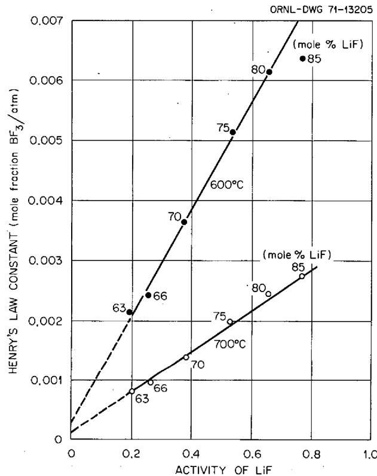  
Fig. 10.1. Henry's law solubility of $\mathbf{BF}_3$ vs. activity of LiF in Molten LiF-BeF $_2$ at 600 and $700^{\circ}\mathrm{C}$ [B. F. Hitch and C. F. Baes, Jr., Inorg. Chem. 8, 201(1969)].

vapor phase to the melt at equal concentrations; this quantity, usually symbolized $\Delta S_{C}$ , is a measure of the change in entropy of the gas caused solely by the interaction of the melt with the gas. For noble gases dissolved in fluorides, $^{7,8}$ $\Delta S_{C}$ is zero or slightly negative. Such values may be interpreted to mean that the vibrational entropy associated with the dissolved state of the noble gases is about the same or slightly less than the translational entropy of the noble gases in the gaseous state. In the case of $\mathrm{BF}_3$ , $\Delta S_{C}$ would not be expected to be near zero; $\mathrm{BF}_3$ , upon dissolution, should lose some of its internal degrees of freedom (rotation and vibration); hence, $\Delta S_{C}$ should be negative. The data thus far (see last column of Table 10.2) give substance to the expectation; $\Delta S_{C}$ averages about $-12$ cal mole $^{-1}$ ${}^{\circ}\mathrm{K}^{-1}$ . There appears to be a trend in $\Delta S_{C}$ with mole fraction; the lower the LiF concentration, the more negative is $\Delta S_{C}$ . A tempting but highly speculative explanation for this trend is: the higher the local coulombic field (i.e., the higher the concentration of $\mathrm{Be}^{2+}$ ions) in the melt, the greater the hindrance to rotation of the dissolved boron species (which is almost certainly $\mathrm{BF}_4^{-}$ ). We shall have to obtain data at different mole ratios of LiF to $\mathrm{BeF}_2$ to determine whether or not the trend of $\Delta S_{C}$ with composition holds.

A second and more interesting thermodynamic quantity derived from the solubility data is the molar entropy associated with the transfer of gas from the

# 10.3 FLUORIDES AND OXYFLUORIDES OF MOLYBDENUM AND NIOBIUM

C.F.Weaver J.D.Redman

Study of the fluorides and oxyfluorides of molybdenum and niobium has continued at an appreciably reduced level during the past six months; major emphasis has been placed on mass spectrometric investigation of these materials. Though several unanswered questions remain in each case, no studies of molybdenum fluorides or of niobium fluorides in molten salt $(2\mathrm{LiF}\cdot \mathrm{BeF}_2)$ solutions were performed during this period.

# 10.3.1 Mass Spectroscopy of Molybdenum Fluorides

The thermal decomposition of solid $\mathsf{MoF}_3$ and the reaction of Mo with gaseous $\mathsf{MoF}_6$ have been described previously. One of the reactions observed

$$
2 \mathrm {M o F} _ {3} (\mathrm {s}) \rightleftharpoons \mathrm {M o} (\mathrm {s}) + \mathrm {M o F} _ {6} (\mathrm {g})
$$

is of interest because the pressure of gaseous $\mathrm{MoF}_6$ will yield the standard free energy change for this reaction, and, when combined with the standard free energy of formation of gaseous $\mathrm{MoF}_6$ ,10 will give the standard free energy of formation of solid $\mathrm{MoF}_3$ . The pressure of $\mathrm{MoF}_6$ at $700^{\circ}\mathrm{C}$ ( $973^{\circ}\mathrm{K}$ ) was $0.79 \times 10^{-6}$ atm, yielding 27 kcal for the standard free energy of the reaction written above. From this information, the standard formation free energy per bond for solid $\mathrm{MoF}_3$ is $-55 \pm 0.3$ kcal compared with $-50.5$ kcal per bond10 for $\mathrm{MoF}_6(\mathbf{g})$ at the same temperature. In addition the reaction

$$
^ {4} _ {3} \mathrm {M o F} _ {3} (s) \rightleftharpoons {} ^ {1} _ {3} \mathrm {M o} (s) + \mathrm {M o F} _ {4} (g)
$$

at $700^{\circ}\mathrm{C}$ yielded a pressure of $4.6 \times 10^{-6}$ atm and hence a $\Delta \mathbf{F}^{0}$ of 24 kcal. This number combined with the $\Delta \mathbf{F}_f^0$ of $\mathrm{MoF_3(s)}$ yields $\Delta \mathbf{F}_f^0$ of $\mathrm{MoF_4(g)}$ of $-49 \pm 1$ kcal per bond. The errors were estimated from pressure calibration measurements.

# 10.3.2 Mass Spectroscopy of Niobium Fluorides and Oxyfluorides

Mass spectrometric studies of $\mathbf{NbF}_4$ previously reported have clarified the procedure for producing this material in high purity. The literature suggests11 and we have confirmed12 that the reaction

$$
4 N b F _ {5} + N b \rightleftharpoons 5 N b F _ {4}
$$

at $200^{\circ}\mathrm{C}$ with excess $\mathrm{NbF}_5$ provides a useful synthesis of $\mathrm{NbF}_4$ . Mass spectroscopic studies indicated that the tetrafluoride was unstable with respect to disproportionation at $200^{\circ}\mathrm{C}$ by the reaction

$$
\mathrm {N b F} _ {4} (\mathrm {s}) \rightleftharpoons \mathrm {N b F} _ {3} (\mathrm {s}) + \mathrm {N b F} _ {5}
$$

unless an overpressure of $\mathrm{NbF}_5$ was maintained. This instability of $\mathrm{NbF}_4$ was not noted below $100^{\circ}\mathrm{C}$ . The best procedure for this synthesis, therefore, is to react the niobium metal at $200^{\circ}\mathrm{C}$ with an excess of liquid $\mathrm{NbF}_5$ in an isothermal container until the reaction is complete. At that time liquid $\mathrm{NbF}_5$ is present with $\mathrm{NbF}_5$ vapor at nearly 1 atm. After the reaction is complete, the temperature is lowered to less than $100^{\circ}\mathrm{C}$ . Then the top of the capsule is cooled with dry ice while the bottom remains near $100^{\circ}\mathrm{C}$ ; the excess $\mathrm{NbF}_5$ is evaporated from the $\mathrm{NbF}_4$ and is frozen in the upper cold end of the capsule. The pure $\mathrm{NbF}_4$ remains in the lower end of the capsule.

The following additional experiments were performed to improve our understanding of the production and reactions of niobium and oxyfluorides.

A study of the vapor products from the reaction of $\mathrm{Nb}_{2}\mathrm{O}_{5}$ and $\mathbf{F}_2$ was made over the temperature range 375 to $550^{\circ}C$ . Fluorine was introduced into a nickel reaction-effusion cell containing pure, outgassed $\mathrm{Nb}_{2}\mathrm{O}_{5}$ . The residue remaining after several hours of fluorination was a mixture of $\mathrm{Nb}_{3}\mathrm{O}_{7}\mathrm{F}$ and $\mathrm{Nb}_{31}\mathrm{O}_{77}\mathrm{F}$ , as identified by x-ray diffraction analysis. The vapor species consisted of $\mathrm{NbF}_5$ , $\mathrm{NbOF}_3$ , and $\mathrm{O}_2$ . The current results, together with those from earlier studies of the thermal decomposition of $\mathrm{NbO}_2\mathrm{F}$ , indicate that the dominant reactions were:

$$
2 \mathrm {N b} _ {2} \mathrm {O} _ {5} (\mathrm {s}) + 4 \mathrm {F} _ {2} (\mathrm {g}) \rightleftharpoons 3 \mathrm {N b O} _ {2} \mathrm {F} (\mathrm {s}) + \mathrm {N b F} _ {5} (\mathrm {g}) + 2 \mathrm {O} _ {2} (\mathrm {g})
$$

and

$$
4 \mathrm {N b O} _ {2} \mathrm {F} (\mathrm {s}) \rightleftharpoons \mathrm {N b} _ {3} \mathrm {O} _ {7} \mathrm {F} (\mathrm {s}) + \mathrm {N b O F} _ {3} (\mathrm {g}).
$$

The pressures of $\mathrm{NbOF_3}$ from pure $\mathrm{NbO}_2\mathrm{F}$ and from $\mathrm{Nb}_2\mathrm{O}_5 + \mathrm{F}_2$ are shown below. Since the pressure

glass-forming beryllium fluoride systems to their glass transition temperatures. The relationship of increasing activation energies with decreasing temperature to the concept of a vanishing free volume13 or configurational entropy14,15 at temperatures above $0^{\circ}\mathrm{K}$ has been discussed before16 and results reported for one super-

<table><tr><td rowspan="2">Source</td><td colspan="6">Pressure (torr) at temperature (°K)</td></tr><tr><td>623°</td><td>648°</td><td>673°</td><td>723°</td><td>773°</td><td>823°</td></tr><tr><td>NbO2F</td><td>1.8 × 10-4</td><td></td><td>6.2 × 10-4</td><td>4.1 × 10-3</td><td>1.1 × 10-2</td><td></td></tr><tr><td>Nb2O5+F2</td><td></td><td>6.8 × 10-5</td><td>1.8 × 10-4</td><td>1.4 × 10-3</td><td></td><td>1.4 × 10-2</td></tr></table>

calibrations have a usual reliability factor of 2 these pressures are essentially equal, as the above equations require. At $550^{\circ}\mathrm{C}$ $(823^{\circ}\mathrm{K})$ the partial pressures of $\mathrm{NbF}_5$ and $\mathbf{F}_2$ were $1.7\times 10^{-4}$ and $4.5\times 10^{-2}$ torr, respectively. The partial pressure of $\mathrm{O_2}$ , obscured by background interference, was definitely greater than the $\mathbf{F}_2$ pressure. The standard enthalpy, $\Delta H^0$ , of the second reaction above was calculated from the mass spectrometric data of both experiments to be $30\pm 1.5$ kcal/mole of $\mathrm{NbOF_3}$ .

In addition, a study of the vapor products of the reaction of $\mathrm{Nb}_2\mathrm{O}_5(\mathrm{s})$ and $\mathrm{NbF}_5(\mathrm{g})$ was made over the temperature range 350 to $750^{\circ}\mathrm{C}$ . Below $550^{\circ}\mathrm{C}$ the vapor was a complex mixture of $\mathrm{NbF}_5$ (monomer and dimer), $\mathrm{NbF}_3$ , niobium oxyfluorides, and an oxy-fluoride polymer. The oxyfluoride polymer fragment $\mathrm{Nb}_2\mathrm{OF}_3^+$ has not been observed before, and we do not know the precursor formula. Analogy with other fluoride polymers suggests that the precursor lost one fluorine atom during ionization and that its formula was $\mathrm{Nb}_2\mathrm{OF}_4$ . Above $550^{\circ}\mathrm{C}$ the vapor was simpler as shown below.

<table><tr><td rowspan="2">Species</td><td colspan="5">Pressure (torr x 103)</td></tr><tr><td>600°</td><td>625°</td><td>650°</td><td>700°</td><td>750°</td></tr><tr><td>NbF5</td><td>2.4</td><td>3.6</td><td>1.8</td><td>2.6</td><td>4.3</td></tr><tr><td>NbOF3</td><td>20</td><td></td><td>130</td><td>130</td><td>66</td></tr><tr><td>Nb2OF3+precursor</td><td>0.72</td><td>0.6</td><td>0.36</td><td>0.24</td><td>1.4</td></tr></table>

# 10.4 ELECTRICAL CONDUCTIVITY OF MOLTEN AND SUPERCOOLED MIXTURES OF NaF-BeF $_2$

G.D.Robbins J.Braunstein

Measurement of electrical conductances in the molten NaF-BeF $_2$ system has continued with a view toward relating the temperature dependence of conductance in

cooled NaF-BeF $_2$ mixture (60 mole $\%$ BeF $_2$ ). These measurements have been extended to mixtures containing 65 and 70 mole $\%$ beryllium fluoride where conductance has been determined as a function of temperature. Temperatures ranged from 540 to $329^{\circ}\mathrm{C}$ , 105 degrees into the supercooled region.

The results are presented in Table 10.3. For the 65 mole $\%$ $\mathrm{BeF}_2$ mixture the measured resistance varied approximately as a linear function of the reciprocal square root of the measuring frequency from 10 to 80 kHz. The data were obtained with an R-C series-component balancing-arm bridge and an all-metal conductance cell, previously described.[16] Due to the very low resistance of the melts, the bridge (containing the leads used in the measurements) was calibrated as a function of frequency with calibrated resistances (2 to $10\Omega$ ) in series with a $20 - \mu \mathrm{F}$ capacitor. The corrections applied to the data ranged from $+0.10\Omega$ at $10\mathrm{kHz}$ to $+0.19\Omega$ at $80\mathrm{kHz}$ . The values of resistance, extrapolated to infinite frequency $R_{\infty}$ , are given in the table, together with the magnitude $(\Delta R_{10 - \infty})$ and relative resistance change $(\Delta R / R_{\infty})$ between $10\mathrm{kHz}$ and $R_{\infty}$ . Also listed in Table 10.3 are data for resistances of the 70 mole $\%$ $\mathrm{BeF}_2$ mixture. Here the measured resistances (corrected for the bridge calibration) appeared independent of frequency from 10 to $80\mathrm{kHz}$ within the limits shown.

Arrhenius-type plots of the logarithm of measured resistance vs the reciprocal absolute temperature are

13. M. H. Cohen and D. Turnbull, J. Chem. Phys. 31, 1164 (1959).   
14. J. H. Gibbs and E. A. DiMarzio, J. Chem. Phys. 28, 373 (1958).   
15. G. Adam and J. H. Gibbs, J. Chem. Phys. 43, 139 (1965).   
16. G. D. Robbins and J. Braunstein, MSR Program Semiannu. Progr. Rep. Aug. 31, 1970, ORNL-4622, pp. 98-100.   
17. G. D. Robbins and J. Braunstein, MSR Program Semiannu. Progr. Rep. Feb. 28, 1971, ORNL-4676, pp. 109-110.

Table 10.3. Resistances of molten and supercooled NaF-BeF $_2$ mixtures   

<table><tr><td colspan="4">NaF (35 mole %)-BeF2(65 mole %)</td></tr><tr><td>T(°C)</td><td>R∞(Ω)</td><td>ΔR10-∞(Ω)</td><td>ΔR/R∞(%)</td></tr><tr><td>454.7</td><td>1.67</td><td>0.13</td><td>7.8</td></tr><tr><td>454.6</td><td>1.69</td><td>0.13</td><td>7.7</td></tr><tr><td>444.5</td><td>1.85</td><td>0.20</td><td>10.8</td></tr><tr><td>444.0</td><td>1.90</td><td>0.15</td><td>7.9</td></tr><tr><td>436.7</td><td>2.03</td><td>0.20</td><td>9.9</td></tr><tr><td>431.3</td><td>2.22</td><td>0.15</td><td>6.8</td></tr><tr><td>432.8</td><td>2.15</td><td>0.17</td><td>7.9</td></tr><tr><td>419.5</td><td>2.59</td><td>0.17</td><td>6.6</td></tr><tr><td>398.2</td><td>3.51</td><td>0.18</td><td>5.1</td></tr><tr><td>381.0</td><td>4.60</td><td>0.22</td><td>4.8</td></tr><tr><td>371.4</td><td>5.40</td><td>0.21</td><td>3.9</td></tr><tr><td>358.9</td><td>6.90</td><td>0.19</td><td>2.8</td></tr><tr><td>349.2</td><td>8.22</td><td>0.23</td><td>2.8</td></tr><tr><td>339.7</td><td>9.80</td><td>0.37</td><td>3.8</td></tr><tr><td>329.4</td><td>11.74</td><td>0.50</td><td>4.3</td></tr></table>

NaF (30 mole %)-BeF $_2$ (70 mole %)   

<table><tr><td>T(°C)</td><td>R(Ω)</td><td>T(°C)</td><td>R(Ω)</td></tr><tr><td>560.3</td><td>1.22 (±0.03)</td><td>483.8</td><td>2.46 (±0.02)</td></tr><tr><td>540.5</td><td>1.43 (±0.03)</td><td>479.3</td><td>2.49 (±0.02)</td></tr><tr><td>528.4</td><td>1.59 (±0.02)</td><td>479.2</td><td>2.55 (±0.02)</td></tr><tr><td>521.9</td><td>1.67 (±0.03)</td><td>479.2</td><td>2.50 (±0.03)</td></tr><tr><td>519.6</td><td>1.67 (±0.03)</td><td>474.5</td><td>2.55 (±0.02)</td></tr><tr><td>512.4</td><td>1.84 (±0.03)</td><td>470.4</td><td>2.73 (±0.02)</td></tr><tr><td>505.0</td><td>1.94 (±0.03)</td><td>461.7</td><td>3.02 (±0.02)</td></tr><tr><td>504.8</td><td>1.92 (±0.03)</td><td>460.5</td><td>3.09 (±0.02)</td></tr><tr><td>504.0</td><td>2.00 (±0.03)</td><td>444.1</td><td>3.51 (±0.04)</td></tr><tr><td>495.5</td><td>2.13 (±0.03)</td><td>434.6</td><td>4.25 (±0.03)</td></tr><tr><td>494.0</td><td>2.21 (±0.03)</td><td></td><td></td></tr></table>

shown in Fig. 10.2. The data were taken in the order indicated by the numbered points, for NaF (35 mole $\%$ -BeF $_2$ (65 mole $\%$ ) over a four-day period, and the NaF (30 mole $\%$ -BeF $_2$ (70 mole $\%$ ) data over a span of 16 days. Attempts to supercool these mixtures to lower temperatures were unsuccessful.

On termination of these experiments, cell constants were determined as a function of depth of electrode immersion (the major variable) and melt volume in aqueous 1.000 demal KCl solution. These will be used to calculate the composition dependence of specific conductance from the data given here and that previously reported.[17]

Preliminary Arrhenius coefficients (activation energies),

$$
E _ {K} = 4. 5 7 5 \frac {d \log R}{d (1 / T)},
$$

taken graphically from Fig. 10.2 range from $11_{\cdot 2}$ to $15_{\cdot 2}$ kcal/mole for $\mathrm{NaF - BeF_2}$ (65 mole $\%$ ) and from $10_{\cdot 2}$ to $12_{\cdot 5}$ kcal/mole for $\mathrm{NaF - BeF_2}$ (70 mole $\%$ ) over the temperature intervals indicated. Based on a glass transition temperature of $117^{\circ}C$ (see next section), $T / Tg$ ( $^\circ \mathrm{K}$ ) for $\mathrm{NaF - BeF_2}$ (65 mole $\%$ )= 1.87 to 1.54; $T / Tg$ for $\mathrm{NaF - BeF_2}$ (70 mole $\%$ ) = 2.14 to 1.81. Over the same $T / Tg$ range in the pyridinium chloride-zinc chloride system, $^{18}$ activation energies were $6_{\cdot 5}$ to $10_{\cdot 5}$ kcal/mole for $\mathrm{PyCl - ZnCl_2}$ (65 mole $\%$ , interpolated) and $5_{\cdot 6}$ (extrapolated in $T$ ) to $7_{\cdot 6}$ kcal/mole for $\mathrm{PyCl - ZnCl_2}$ (70 mole $\%$ , interpolated). This roughly parallels the increase of activation energy with decreasing temperature observed here. At $450^{\circ}C$ the activation energies for these $\mathrm{NaF - BeF_2}$ mixtures are approximately 1 to 2 kcal/mole higher than for the corresponding LiF-BeF $_2$ mixtures.

# 10.5 GLASS TRANSITION TEMPERATURES IN THE NaF-BeF $_2$ SYSTEM

G. D. Robbins J. Braunstein

The investigation of glass transition temperatures in the NaF-BeF $_2$ system has continued, their relation to electrical transport in molten alkali fluoride-beryllium fluoride systems having been discussed before. $^{19}$ Previously $^{20}$ we presented results of measurements of glass transition temperatures $Tg$ at a number of compositions; $Tg$ 's for additional compositions have been obtained and some of the previous experiments repeated.

The lower portion of Fig. 10.3 shows a composite of previously reported experimental glass transition temperatures plus new data for compositions of 35, 70, 85, and 90 mole % beryllium fluoride. These were determined by differential thermal analysis employing techniques already described.[2] The open symbols represent the temperatures at which a transition was observed in plots of temperature difference between an $\mathrm{Al}_{2}\mathrm{O}_{3}$ reference and the fluoride glass sample vs the temperature of the fluoride sample. Duplicate values are indicated by ticks on the symbols. The average value of $T_{\mathbf{g}}$ at a given composition is represented as a solid

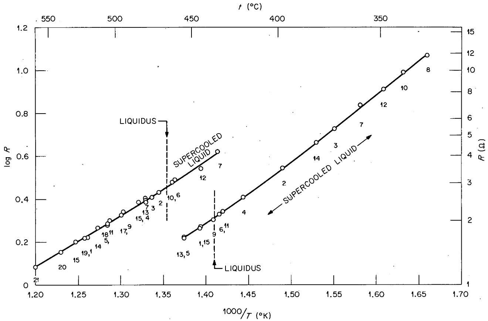  
Fig. 10.2. Logarithm of resistance vs reciprocal temperature for NaF (35 mole %)-BeF $_2$ (65 mole %) and NaF (30 mole %)-BeF $_2$ (70 mole %).

symbol with an error bar of $\pm 2^{\circ}\mathrm{C}$ attached, and straight line segments connect these solid symbols.

Investigation of a sample of 35 mole $\%$ $\mathrm{BeF}_2$ quenched from 850 to $0^{\circ}\mathrm{C}$ produced the transition temperatures shown (the numbers indicate the order in which they were observed), the temperatures shifting to lower values on successive cycling between 50 and $150^{\circ}$ . Heating to higher temperatures produced very little thermal effect on crystallization of the supercooled liquid, yet the crystalline solid transitions were sizable. This indicates the formation of very little glass and mostly crystalline phase on the initial quench, with precipitation of more crystalline material on each of the 50 to $150^{\circ}$ cycles. Previously, under these experimental conditions, we have failed to observe a glass transition temperature following quenching of a 30 mole $\%$ $\mathrm{BeF}_2$ mixture, while a reproducible $Tg$ was measured at 38 mole $\%$ $\mathrm{BeF}_2$ . Hence, it would appear that, at least under the bulk quenching conditions employed here,

the lower composition limit for forming reproducible glasses is between 36 and 38 mole $\% \mathrm{BeF}_2$

Glass transition temperature drops with increasing beryllium fluoride content until the liquid composition from which the glass was quenched approaches the primary phase field of $\mathrm{BeF}_2$ (the approximate phase diagram $^{2,2,3}$ is shown in the upper portion of the figure). Little variation of $Tg$ with composition is observed between 50 and 85 mole $\%$ $\mathrm{BeF}_2$ . The size of the thermal effect associated with the glass transition in this region, however, decreases with increasing $\mathrm{BeF}_2$ content. While the $0.3^{\circ}$ temperature change at 85 mole $\%$ is measurable, the temperature change at 90 mole $\%$

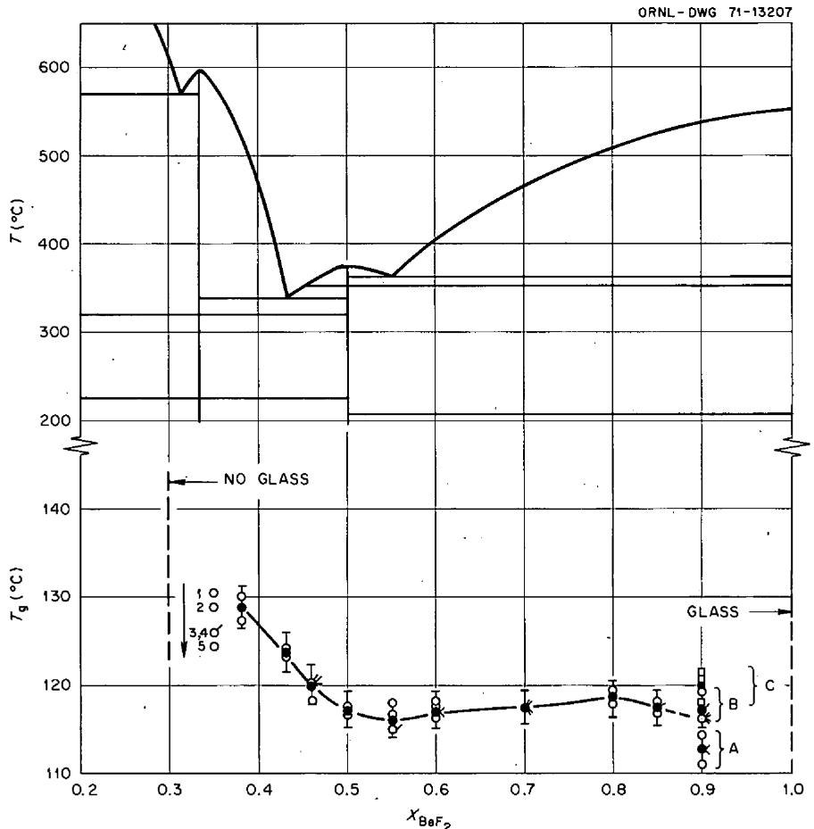  
Fig. 10.3. Phase diagram and glass transition temperatures for the system NaF-BeF $_2$ .

$\mathrm{BeF}_2$ is less than $0.1^{\circ}\mathrm{C}$ . Accordingly, the 90 mole $\%$ values are less certain than the other data, and several different experiments at this composition have been performed. These are labeled A, B, and C in Fig. 10.3 and represent three different equilibration times and two different batches of homogenized starting material. The average $Tg$ of $116^{\circ}$ at $X_{\mathrm{BeF}_2} = 0.90$ is probably uncertain by $\pm 6^{\circ}\mathrm{C}$ . Glass transitions in pure beryllium fluoride could not be observed, presumably due to the similarity in heat capacity of liquid and glass. However, since $\mathrm{BeF}_2$ is a known glass former, it appears that the region over which bulk-quenched glasses are formed extends from 37 ( $\pm 1$ ) to 100 mole $\%$ $\mathrm{BeF}_2$ , that is, including the primary phase fields of $\mathrm{BeF}_2$ , $\mathrm{NaBeF}_2$ , and $\mathrm{Na}_2\mathrm{BeF}_4$ , but not NaF.

In relating the temperature dependence of activation energy for electrical conductance to glass transition temperatures, one desires a $Tg$ corresponding to the glass-to-liquid transition where the liquid phase is that

in which conductance has been measured at a higher temperature. However, the apparently small (or negligible) variation of glass transition temperatures from 0.50 to 0.90 mole fraction beryllium fluoride raises the possibility of metastable phase separation of the under-cooled liquid into two liquid phases. Among the three previous investigations of phase relations in the NaF-BeF $_2$ system, $^{24-27}$ there is considerable discrepancy. Roy et al. $^{25}$ prepared 10-g quenches of glasses from 60 to 100 mole $\%$ BeF $_2$ ; Vogel and Gerth, $^{26}$ who formed their glasses by pressing them between SiO $_2$ pellets,

Table 10.4. Appearance of NaF-BeF $_2$ glasses   

<table><tr><td>Mole % BeF2</td><td>Visual appearance</td><td>Microscopic appearancea</td></tr><tr><td>43</td><td>Clear glass</td><td>Clear glass</td></tr><tr><td>50</td><td>Clear glass</td><td>Clear glass</td></tr><tr><td>55</td><td>Clear glass</td><td>Clear glass</td></tr><tr><td>70</td><td>White, bright translucent, lightly opalescent</td><td>Clear glass</td></tr><tr><td>85</td><td>White, opalescent</td><td>Some clear-brown pieces, some with clear matrix and sparse brown (oxide) incipient crystallization</td></tr><tr><td>90 (A)</td><td>White, opaque</td><td>Clear matrix with brown (oxide) incipient crystallization</td></tr><tr><td>90 (B,C)</td><td>White, opalescent</td><td>Same as 90 (A)</td></tr><tr><td>100</td><td>Dull-to-dirty</td><td>Clear matrix with many gas bubbles, no evidence of oxide or precipitation</td></tr></table>

$^{a}$ G. D. Brunton, Reactor Chemistry Division, private communication.

were only able to produce clear glasses over the range 40 to 72 mole $\%$ $\mathrm{BeF}_2$ , glasses of higher $\mathrm{BeF}_2$ content being opalescent or opaque; Imaoka and Mizusawa $^{24,27}$ formed molded glasses from 45 to 75 mole $\%$ $\mathrm{BeF}_2$ . Furthermore, Vogel and Gerth $^{25}$ reported microphase separation, as determined by electron microscopy, down to 49 mole $\%$ $\mathrm{BeF}_2$ of region 0.5 to $1\mu$ .

We have attempted to determine if the bulk-quenched glasses produced under our experimental conditions exhibited phase separation. Table 10.4 gives a summary of the visual and microscopic $^{28}$ appearance of glasses examined in this investigation. At compositions 55 mole $\%$ $\mathrm{BeF}_2$ and less the glasses appeared clear on both a macroscopic and microscopic scale. From 70 to 90 mole $\%$ $\mathrm{BeF}_2$ the glasses appeared opalescent-to-opaque to the eye, with the material causing this opalescence of region size below the resolving power of the polarized light microscope (approximately $0.1\mu$ ). Microscopic examination of samples at 85 and 90 mole $\%$ $\mathrm{BeF}_2$ revealed incipient crystals of brown material dispersed in the clear glass matrix, the number density of the brown particles being greater at the higher beryllium fluoride content and its appearance resembling beryllium oxide. $^{28}$ The sample of pure beryllium fluoride

appeared dull due to dissolved gas bubbles and did not show the incipient (oxide) crystallization. Electron micrographs of small gold-plated specimens from these samples have been obtained.[29] A preliminary interpretation of the micrographs indicates little or no surface structure on the cleavage surfaces of most of the glasses (resolution $\approx 0.5\mu$ ), with some interesting (and different) patterns from the two 90 mole% samples. Thus, the cause of the visually observed opalescence has not been provable by either polarized light or electron microscopy.

# 10.6 ENTHALPY OF LITHIUM FLUOROBORATE FROM 298 to $700^{\circ}\mathrm{K}$ : ENTHALPY AND ENTROPY OF FUSION

A. S. Dworkin

We have examined the effect of the differences in structure and cation size on the enthalpy and entropy of fusion and transition in the alkali fluoroborates sodium through cesium. Lithium fluoroborate with its much smaller cation differs from the other fluoroborates in that it has at room temperature a hexagonal structure type, probably that of $\mathrm{SiO}_2$ . One recent

Table 10.5. Heats and entropies of melting and transition of alkali metal fluoroborates   

<table><tr><td></td><td>Tm(°K)</td><td>ΔHm(kcal/mole)</td><td>ΔSm(eu/mole)</td><td>Ttr(°K)</td><td>ΔHtr(kcal/mole)</td><td>ΔSstr(eu/mole)</td><td>ΔSm+ΔSstr(eu/mole)</td></tr><tr><td>LiBF4</td><td>583</td><td>3.46</td><td>5.94</td><td></td><td></td><td></td><td>5.9</td></tr><tr><td>NaBF4</td><td>679</td><td>3.25</td><td>4.78</td><td>516</td><td>1.61</td><td>3.1</td><td>7.9</td></tr><tr><td>KBF4</td><td>843</td><td>4.30</td><td>5.10</td><td>556</td><td>3.30</td><td>5.9</td><td>11.0</td></tr><tr><td>RbBF4</td><td>855</td><td>4.68</td><td>5.5</td><td>518</td><td>2.86</td><td>5.5</td><td>11.0</td></tr><tr><td>CsBF4</td><td>828</td><td>4.58</td><td>5.5</td><td>443</td><td>1.94</td><td>4.4</td><td>9.9</td></tr></table>

paper32 reports that there is no transition in $\mathrm{LiBF}_4$ between room temperature and the melting point, while another33 reports a transition at about $115^{\circ}\mathrm{C}$ . We therefore have measured the enthalpy of $\mathrm{LiBF}_4$ from room temperature up to about $40^{\circ}$ above its melting temperature to complete our thermochemical studies of the alkali metal fluoroborates.

We found no evidence for a transition either in the enthalpy measurements or in a separate thermal analysis experiment. $\mathrm{LiBF_4}$ is hygroscopic and must be handled in a dry, inert atmosphere as it was in our work and in that of ref. 32. However, this was not the case in the work reported in ref. 33 where in fact the $\mathrm{LiBF_4}$ was ground to a fine powder in the open and even heated in an open system for the differential thermal analysis experiments.

A chemical analysis performed in the Analytical Chemistry Division showed that our sample contained 3 mole $\%$ LiF. Our measured data were therefore corrected for this impurity. The following equations represent the corrected enthalpy data for $\mathrm{LiBF_4}$ in cal/mole:

$$
\begin{array}{l} H _ {T} - H _ {2 9 8} = - 1 1, 4 4 0 + 3 1. 8 9 T + 1. 0 \\ \times 1 0 ^ {- 3} T ^ {2} + 5. 5 0 \times 1 0 ^ {5} T ^ {- 1} (2 9 8 \text {t o} 5 8 3 ^ {\circ} \mathrm {K}), \\ \end{array}
$$

$$
\begin{array}{l} \Delta H _ {\text {f u s i o n}} = 3 4 6 0 \mathrm {c a l} / \mathrm {m o l e}; \Delta S _ {\text {f u s i o n}} \\ = 5. 9 4 \mathrm {c a l} \deg^ {- 1} \mathrm {m o l e} ^ {- 1} \left(5 8 3 ^ {\circ} \mathrm {K}\right), \\ \end{array}
$$

$$
H _ {T} - H _ {2 9 8} = - 1 1, 4 9 0 + 4 0. 1 T (5 8 3 \mathrm {t o} 7 0 0 ^ {\circ} \mathrm {K}).
$$

Our thermal analysis experiment showed two breaks at 304 and $300^{\circ}\mathrm{C}$ . The breaks most probably indicate the

$\mathrm{LiBF}_4$ liquidus and the eutectic in the $\mathrm{LiBF}_4$ -LiF system. From the liquidus temperature, the mole $\%$ LiF, and the heat of fusion of $\mathrm{LiBF}_4$ , the true temperature of fusion is calculated to be $310^{\circ}\mathrm{C}$ . The eutectic concentration can also be estimated to be $\sim 5$ mole $\%$ LiF.

Table 10.5 compares the enthalpies and entropies of fusion and transition for the alkali metal fluoroborates. The high-temperature forms of the fluoroborates of sodium through cesium acquire considerable entropy at the transition temperature, probably due to anionic rotational or librational disorder.[30] Their entropy of melting, therefore, is lower than that for $\mathrm{LiBF}_4$ , although the sum of the entropy of transition and melting $(\Delta S_m + \Delta S_{tr})$ is higher than that for $\mathrm{LiBF}_4$ . $\mathrm{NaBF}_4$ differs in both high- and low-temperature structure from the other fluoroborates as well as from $\mathrm{LiBF}_4$ . This is reflected in its intermediate value for $\Delta S_m + \Delta S_{tr}$ .

# 10.7 NONIDEALITY OF MIXING IN $\mathbf{L}\mathbf{i}_2\mathbf{B}\mathbf{e}\mathbf{F}_4$ -LiI

A. S. Dworkin M. A. Bredig

The small deviations from ideality of mixing large $\mathrm{BeF}_4^{2-}$ ions with small $\mathbf{F}^{-}$ ions and the larger deviations of mixing similarly large but much more polarizable $\mathbf{I}^{-}$ ions with $\mathbf{F}^{-}$ ions have been discussed elsewhere.34 It was of further interest to examine mixtures of $\mathbf{I}^{-}$ with $\mathrm{BeF}_4^{2-}$ ions of similar size but different polarizability. An estimate of the degree of dissociation of the $\mathrm{BeF}_4^{2-}$ ion in dilute molten iodide solutions can also be made from a study of this system. Indeed, the phase diagram of $\mathrm{Li}_2\mathrm{BeF}_4$ -Lil determined by thermal analysis showed interesting deviations from ideality. The system would be truly binary only if the fluoroberyllate ion remained

undissociated. This does not appear to be the case in its dilute solutions in LiI (Fig. 10.4). The dashed lines represent initial slopes of an ideal LiI liquidus for one particle per $\mathrm{Li}_2\mathrm{BeF}_4$ , $n = 1$ (undissociated $\mathrm{BeF}_4^{2-}$ ), and for $n = 5$ (complete dissociation to $1\mathrm{Be}^{2+}$ and $4\mathrm{F}^{-}$ ions). The experimental liquidus appears to start with a slope approaching the $n = 5$ line but then strongly curves to and apparently beyond the $n = 1$ line. Thus, the $\mathrm{Li}_2\mathrm{BeF}_4$ seems to show a high degree of dissociation only in very dilute solution. At the lowest concentration measured, about 3 mole $\%$ $\mathrm{Li}_2\mathrm{BeF}_4$ , only about 10 to $15\%$ dissociation is indicated. The rate at which the degree of dissociation decreases with increasing $\mathrm{Li}_2\mathrm{BeF}_4$ concentration is difficult to estimate because of the nonideality of mixtures of $\mathrm{I}^{-}$ and $\mathrm{BeF}_4^{2-}$ ions. This nonideality is apparent from the phase diagram at and near the eutectic composition.

The much greater dissociation reported earlier in an MSR monthly report was most likely due to the presence of oxide in the LiI ( $\sim 1$ mole $\%$ ) which may have reacted with the $\mathrm{Li_2BeF_4}$ according to $\mathrm{BeF_4}^{2-} + \mathrm{O}^{2-} \rightarrow \mathrm{BeO} + 4\mathrm{F}^-$ to give an effect similar to dissociation. The experiment was repeated with single-crystal LiI which, when analyzed after the melting point determination, was shown to contain only $0.1$ mole $\%$ oxide. The small halts reported at 380 to $385^{\circ}\mathrm{C}$ in the original experiments were much weaker but still present in the later experiments. Whether these halts may be attributed to a ternary eutectic with the remaining oxide impurity or to the stabilization of another form of LiI, perhaps tetrahedrally coordinated, $^{35}$ which undergoes a phase transition to the common octahedral one at about $385^{\circ}\mathrm{C}$ is still under investigation.

The $\mathrm{Li}_2\mathrm{BeF}_4$ liquidus is ideal initially, that is, for $n = 1$ particle $(\mathbf{I}^{-})$ per LiI. Positive deviation, excess partial

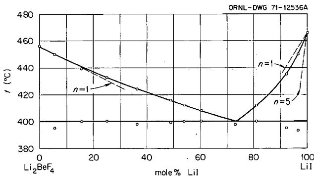  
Fig. 10.4. The system $\mathbf{Li}_2\mathbf{BeF}_4$ -LiI.

free energy of mixing, $\mu_{\mathrm{Li}_2\mathrm{BeF}_4}^E >0$ , begins at about 15 to 20 mole $\%$ Lil. This behavior may be compared with that previously discussed34 for fluoride-iodide mixtures, especially those with a common bivalent cation, $\mathrm{Ca^{2 + }}$ . There, positive $\mu_{\mathrm{CaF_2}}^E$ initially was much smaller than $\mu_{\mathrm{LiF}}^E$ in LiF-Lil mixtures. An explanation was based on the negative contribution to $\mu_{\mathrm{CaF_2}}^E$ from the increase in polarization (in configurations $\mathrm{Ca^{2 + }I^{-}F^{-}}$ ) of the $\mathbf{I}^{-}$ by $\mathrm{Ca^{2 + }}$ in the relatively strong field of the $\mathbf{F}^{-}$ ions, which are more numerous in $\mathrm{CaF}_2$ than in LiF.34 Applied to $\mathrm{Li}_2\mathrm{BeF}_4$ -LiI mixtures, $\mathbf{F}^{-}$ ions even though bound to $\mathrm{Be}^{2 + }$ in $\mathrm{BeF}_4^{2 - }$ are more numerous for configurations $\mathrm{Li^{+}I^{-}F^{-}}$ by a factor of 4 than in LiF-LiI. This may give the strong negative balance to positive excess free energy in $\mathrm{Li}_2\mathrm{BeF}_4$ -rich mixtures.

# Part 3. Materials Development

J.R.Weir, Jr.

The areas of materials research and development discussed in Part 3 include the postoperation examination of components from the MSRE, the development of radiation-resistant impermeable graphite, investigation of radiation damage and compatibility of Hastelloy N in various environments, and materials work in support of the chemical processing equipment development.

One of the most important problems discovered by examining components from the MSRE is a shallow intergranular penetration into the Hastelloy N that produces intergranular cracking to a depth of several mils. This phenomenon only occurs in metal exposed to the fuel salt, and it is of concern whether it is associated with a corrosion mechanism or the penetration of certain embrittling fission products. Work is also continuing on the fission product and corrosion product deposition on graphite removed from the reactor.

The graphite program involves an assessment of the resistance of commercial graphites to the dimensional and structural instabilities produced by radiation damage. Recent irradiation results indicate that graphites can be fabricated at ORNL with behavior similar to the best commercial graphites. This result is encouraging in that it increases our confidence that we understand enough about the radiation damage processes to further improve the important properties of the moderator. Maintaining low permeability (during irradiation) to gaseous fission product intrusion by sealing the

surfaces of graphite with pyrolytic carbon is proving difficult. We are increasing our effort in this area by examination of the microstructural mechanisms of failure of the sealant and are investigating other sealants such as barren salt.

The resistance of small heats of Hastelloy N modified with Ti, Nb, Zr, Si, and C to irradiation-induced embrittlement continues to be studied. We are utilizing the microstructures to evaluate the type of carbide precipitate developed in the various compositions, since there is a reasonably good correlation between the existence of MC-type carbides and good radiation resistance. Our compatibility programs involve determining the corrosion resistance of Hastelloy N in fuel salt, the coolant salt $(\mathrm{NaBF}_4\text{-NaF})$ , and steam. The possibility of using a duplex tube of nickel on the coolant-salt side and Incoloy 800 on the steam side of a steam generator is being investigated. This combination should produce the optimum corrosion resistance for both fluids.

The major effort in our work in support of chemical processing equipment involves the development of fabrication procedures to build a complicated reductive extraction processing unit of molybdenum. Procedures have been worked out for most of the components of the system. Other possible materials that appear to be candidates for this application are tantalum and graphite. We are evaluating these materials and a few brazing alloys for their resistance to bismuth corrosion.

# 11. Examination of MSRE Components

H.E.McCoy

As described in the last semiannual report, Hastelloy N components of the MSRE appeared superficially to have suffered very little corrosion, but when specimens of a control rod thimble and heat exchanger tubes were tested in tension at room temperature, shallow cracks appeared at surfaces that had been exposed to the fuel salt. These cracks were intergranular, extending to a depth of roughly one to two grains, and did not occur on the other sides of the specimens, which had been exposed to air or coolant salt. It thus appeared that the Hastelloy N exposed to the circulating fuel had been attacked or embrittled along the grain boundaries by some unknown mechanism.

As part of our efforts to resolve the effects of the fuel salt on Hastelloy N, we have proceeded to test pieces from the fuel sampler and part of the control rod thimble that were exposed to fuel salt under different conditions. We have also tested pieces of Hastelloy N that were exposed to fuel salt in in-pile loop 2 in 1967 and have reexamined surveillance specimens removed from the MSRE core at various times during its operation.

Examination of a graphite moderator element was extended to obtain more information on the elements at or near the surface.

# 11.1 EXAMINATION OF HASTELLOY N COMPONENTS EXPOSED TO FUEL SALT IN THE MSRE

B. McNabb H.E.McCoy

The control rod thimble and heat exchanger tubes that showed cracks under tensile strain at room

temperature1 had been exposed to fuel salt in the main circulating stream. Other pieces available to us that had been exposed to fuel salt under somewhat different conditions were rods and mist shield from the fuel sampler in the pump bowl and a section of the control rod thimble that had been under a loose sleeve.

The mist shield was located in the pump bowl, and its purpose was to keep salt spray from the region where salt samples were being taken. The sampler cage is located in the center of the spiral mist shield. The mist shield is a spiral fabricated of $\frac{1}{8}$ -in. sheet that has an inside diameter of about 2 in. and an outside diameter of about 3 in. The spiral was about $1^{\frac{1}{4}}$ turns, and the outside was exposed to agitated salt and the inside to salt flowing at a much slower rate. The outside was exposed to salt up to the normal liquid level and to salt spray about this level. The inside was exposed to salt up to the normal salt level and primarily to gas above this level. The general appearance of the mist shield was described previously.

Four specimens approximately 1 in. (vertical) $\times 1/2$ in. (circumferential) $\times 1/8$ in. thick were cut from the mist shield. Their locations were (1) outside of spiral immersed in salt, (2) outside of spiral exposed to salt spray, (3) inside of spiral immersed in salt, and (4) inside of spiral exposed primarily to gas. Bend tests were performed on these specimens at $25^{\circ}\mathrm{C}$ using a three-point bend fixture. They were bent about a line

parallel to the $\frac{1}{2}$ in. dimension and so that the outer surface was in tension. The information obtained from such a test is a load-deflection curve. The equations normally used to convert this to a stress-strain curve do not take into account the plastic deformation of the part. The stresses obtained by this method become progressively in error (too high) as the deformation progresses.

The mist shield was made from $\frac{1}{8}$ -in.-thick sheet of Hastelloy N heat 5075 with $16.2\%$ Mo, $6.7\%$ Cr, $4\%$ Fe, $0.44\%$ Mn, $0.06\%$ C, $0.58\%$ Si, $0.27\%$ V, $0.08\%$ W, $0.02\%$ Al, $0.02\%$ Ti, $0.07\%$ Co, $0.01\%$ Cu, $0.003\%$ P, $0.006\%$ S, and $0.001\%$ B. The yield stress at room temperature was certified as 53,000 psi, ultimate tensile strength 116,000 psi, and elongation $49\%$ for the original material. Table 11.1 shows the results of bend tests on the specimens from the mist shield after removal from the pump bowl. Note that the yield and ultimate stresses are about twice as high as those normally reported. These values can be used only for comparison of the relative effect of the environment on the properties. The unirradiated control test of $\frac{1}{8}$ in. sheet of a similar material (heat N3-5106) did not fail when subjected to the same bend test as the mist shield specimens, indicating that the mist shield specimens were embritpled somewhat even though all of them did strain greater than $10\%$ in the outer fibers before failure.

Figure 11.1a is a macrophotograph of bend specimen S-52 from the inside top of the mist shield. The black scale has popped off most of the bend area, exposing shiny surface. A weld bead used to hold the spiral in a fixed position is visible on the lower right of the picture. The specimen failed during the bend test, but was the most ductile of the mist shield specimens. Figure 11.1b is a polished cross section of specimen S-52. The fracture and the small cracks on the tension side are evident. Higher magnification photomicrographs of sample S-52 are shown in Fig. 11.2 for the tension and compression sides. The cracks are about 1 mil deep on the tension side, and no cracks formed on the compression side. Figure 11.3 is a macrophotograph of the tension side of specimen S-62 from the outside top portion of the mist shield that was exposed to salt spray. Several cracks are evident.

Photographs of specimen S-60 from the inside liquid region of the mist shield are shown in Fig. 11.4. Extensive cracking is evident in the macrophotograph (Fig. 11.4a). The polished cross section in Fig. 11.4b shows numerous cracks to a depth of 5 to 7 mils. A macrophotograph of specimen S-68 from the outside liquid region of the pump bowl is shown in Fig. 11.5. Numerous cracks are visible near the fracture.

One of the $\frac{1}{4}$ -in.-diam sampler cage rods was tensile tested at room temperature to determine the change in mechanical properties. The rod was made from Hastel-

Table 11.1. Bend tests at ${25}^{ \circ  }\mathrm{C}$ on various MSRE components   

<table><tr><td>Specimen number</td><td></td><td>Yield stress (psia)</td><td>Maximumb tensile stress (psi)</td><td>Strain (%)</td><td>Environment</td></tr><tr><td></td><td></td><td>× 103</td><td>× 103</td><td></td><td></td></tr><tr><td>S-52</td><td>Mist shield top inside</td><td>97</td><td>269</td><td>46.9c</td><td>Vapor region shielded</td></tr><tr><td>S-62</td><td>Mist shield top outside</td><td>155</td><td>224</td><td>10.7c</td><td>Vapor region salt spray</td></tr><tr><td>S-60</td><td>Mist shield bottom inside</td><td>161</td><td>292</td><td>31.6c</td><td>Liquid region shielded salt flow</td></tr><tr><td>S-68</td><td>Mist shield bottom outside</td><td>60</td><td>187</td><td>17.7c</td><td>Liquid region flow rapid salt</td></tr><tr><td>N3-5106</td><td>Unirradiated control test, 1/8 in. thick</td><td>128</td><td>238</td><td>40.5</td><td></td></tr><tr><td>HTY8487</td><td>Unirradiated control test, 0.065 in. thick</td><td>110</td><td>147</td><td>33.8</td><td></td></tr><tr><td>HTY8487</td><td>Control rod thimble under spacer</td><td>88</td><td>134</td><td>33.6</td><td>Restricted salt flow OD</td></tr><tr><td>HT5060</td><td>Control rod thimble spacer sleeve</td><td>79</td><td>105</td><td>33.8</td><td>Restricted salt flow ID
Fast salt flow OD</td></tr></table>

${}^{a}$ Based on 0.002% in. offset of crosshead travel.   
$b$ Maximum tensile stress was controlled by fracture of sample or by strain limitation of test fixture.   
cSpecimen broke.

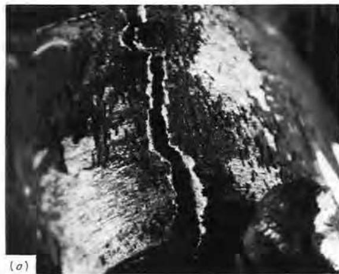

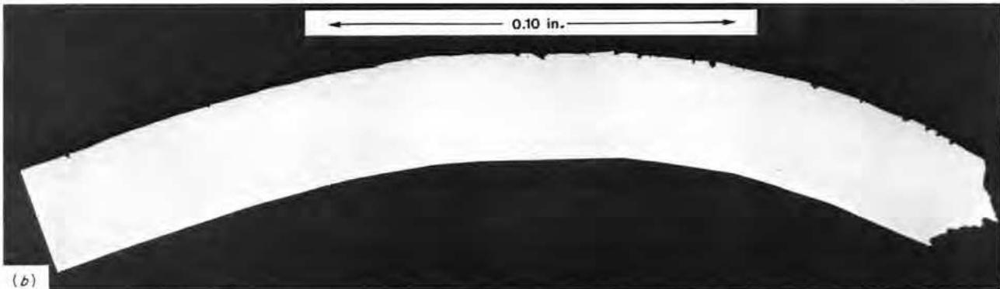  
Fig. 11.1. Bend specimen S-52 from the vapor region inside of the mist shield. (a) Photograph showing fracture and tension side of specimen. Black scale has popped off exposing shiny surface in some areas. $\sim 5.5\times$ (b) Photomicrograph of half of bend specimens showing shallow cracks in tension side of bend. The lower edge of the picture does not extend to the compression side of the specimen.

loy N heat 5059 with $16.9\%$ Mo, $6.62\%$ Cr, $3.92\%$ Fe, $0.35\%$ Mn, $0.07\%$ C, $0.59\%$ Si, $0.21\%$ V, $0.07\%$ Co, $0.01\%$ Al, $0.01\%$ Ti, $0.04\%$ W, $0.001\%$ P, and $0.003\%$ S. The room-temperature yield stress was certified as 51,200 psi, the ultimate tensile stress as 115,300 psi, and the elongation as $51\%$ for the original material. The yield stress of the sampler cage rod from the pump bowl was 42,450 psi, the ultimate tensile stress 93,241 psi, and the elongation $35.7\%$ . As seen in Fig. 11.6a, the rod ruptured below the center, probably near the average liquid-gas interface where the deposits on the rod appeared thickest. Numerous cracks can be seen near the rupture in Fig. 11.6b, a greater enlargement, and individual grains appear to have dropped out. The cracking occurred almost to the bottom of the rod, even extending into the area covered by the grips where the stress would be much lower. The cracking diminished toward the upper part of the rod above the liquid

level, and cracks were not apparent at $5.5\times$ magnification at the top specimen grips. Figure 11.7 is a photomicrograph of the edge near the fracture area, which was in the liquid zone, showing the extensive cracking. Figure 11.8 is a photomicrograph of a section from the vapor region about 1 in. above the rupture, and the cracks are seen to be less deep than in the section below the liquid level.

The control rod thimble was a tube having dimensions of 2 in. $\mathrm{OD} \times 0.065$ in. wall thickness. To keep the thimble centered in the graphite moderator, spacer sleeves were used periodically. They were joined to the thimble by weld beads on the thimble that were deposited through a clearance hole in the sleeve. Thus the sleeve was restrained in the vertical direction, but was free to move some in the radial direction. The maximum and minimum clearances (according to shop drawings) between the sleeve and the thimble were

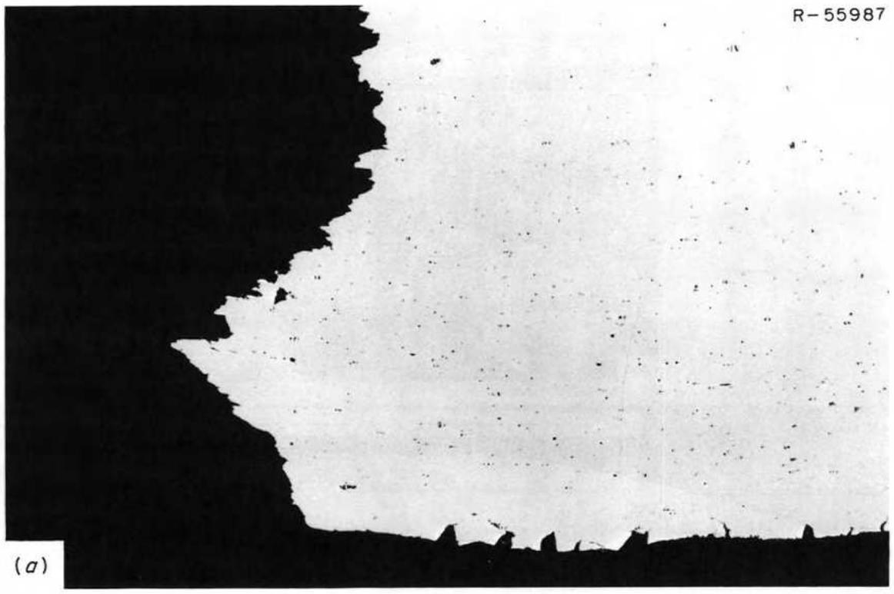

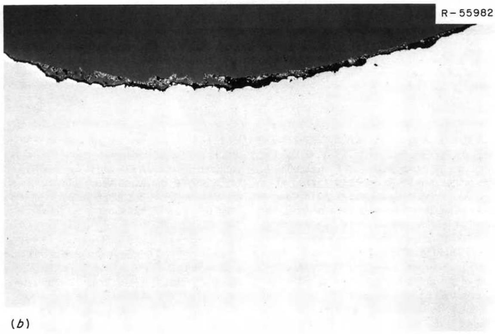  
Fig. 11.2. (a) Photomicrograph of tension side and rupture of specimen S-52 from inside vapor region of mist shield. Crack depth $\sim 1$ mil. $100\times$ . (b) Photomicrograph of compression side of bend near rupture. As polished. $100\times$ .

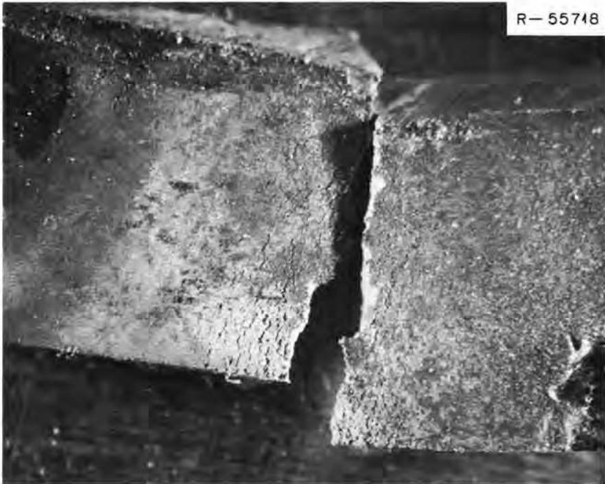  
Fig. 11.3. Macrophotograph of the tension side of specimen S-62 that was taken from the outside top portion of the mist shield. This area was exposed to fuel salt mist. $5.5 \times$

0.015 and 0.000 in., respectively. The annular region would likely be exposed to almost stagnant salt.

Previous microprobe examination of the control thimble under the sleeve failed to reveal any chromium gradients such as were noted in other parts of the core.4 We decided to test a ring from under the spacer sleeve to see if cracking occurred there as it did in the thimble exposed to flowing salt. Figure 11.9 is a macrophotograph of the rupture of the control rod thimble under the spacer sleeve. Numerous cracks can be seen over the entire gage length, so it appears that rapid flow of fuel salt is not required to cause cracking under these conditions. Figure 11.10 is a photomicrograph of the same area as shown in the above figure, showing the cracking on the side exposed to fuel salt and fission products. A ring from the spacer sleeve was cut at the same time as the thimble and tested in the same manner. Figure 11.11 is a macrophotograph of the

rupture area of the spacer sleeve OD, which was exposed to flowing fuel salt. Only a few cracks are visible near the rupture, but the spacer sleeve failed at much lower ductility than the thimble. Figure 11.12 is a photomicrograph showing the ID that was exposed to the same stagnant fuel salt as the OD of the control rod thimble and the OD that was exposed to flowing fuel salt. There does not appear to be much difference in the cracking pattern on the OD and the ID. The spacer sleeve was made of Hastelloy N heat 5060. Table 11.2 is a tabulation of the tensile data on the control rod thimble rings and the spacer sleeve. The spacer sleeve (heat 5060) had higher strength and lower ductility than the control rod thimble, either under the sleeve or exposed to rapidly flowing salt.

The observations are consistent with our general conclusions that all Hastelloy N surfaces exposed to fuel salt crack. The samples from the mist shield show that the severity of the cracking is less where the service environment is vapor or mist than where $100\%$ liquid is the environment. The specimens from the control rod thimble and the spacer showed that the degree of cracking was not dependent upon the salt flow rate.

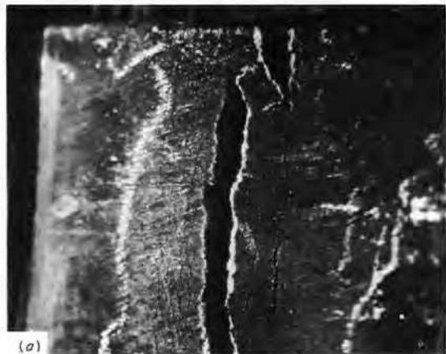

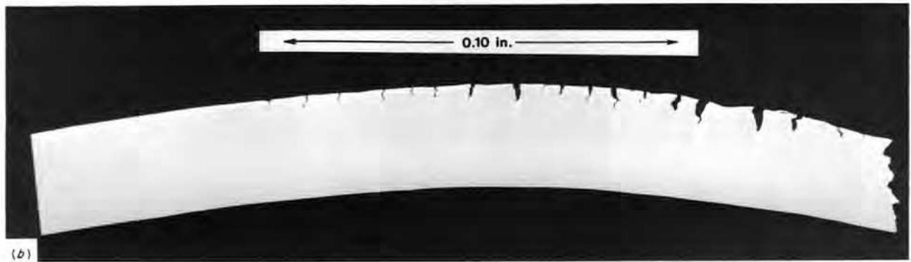  
Fig. 11.4. (a) Macrophotograph of the tension side of bend specimen S-60 from inside liquid region of mist shield exposed to liquid fuel salt. $\sim 5.5\times$ . (b) Photomicrograph of bend and rupture area of S-60 showing extensive cracking on tension side of bend. The lower edge of the picture does not extend to the compression side of the specimen.

# 11.2 EXAMINATION OF COMPONENTS FROM IN-PILE LOOP 2

B. McNabb H.E.McCoy

Loop 2 was an in-reactor thermal convection loop constructed of Hastelloy N and containing fuel salt of composition ${}^{7}{\mathrm{{LiF} - {BeF}}}_{2} - {\mathrm{{ZrF}}}_{4} - {\mathrm{{UF}}}_{4}\left( {{65.4} - {27.8} - {4.8} - {2.0}}\right.$ mole %). ${}^{5}$ It had a peak operating temperature of ${720}^{ \circ  }\mathrm{C}$ and a minimum temperature of ${545}^{ \circ  }\mathrm{C}$ ,and it operated 1102 hr with fuel salt at these conditions. Average power densities of ${150}\mathrm{\;w}/{\mathrm{{cm}}}^{3}$ of salt were attained,and ${8.2} \times  {10}^{18}$ fissions/cm ${}^{3}$ were produced before operation was terminated by a leak.

Some of the components were made available for testing to determine if cracking would occur under stress as had been observed for some MSRE components exposed to fuel salt and fission products. A rectangular strip approximately $1 \times 1/2 \times 1/8$ in. thick was cut from the top of the core vessel and bend tested in the same way as the specimens from the mist shield. The apparent yield stress was 104,000 psi, the ultimate tensile stress was 225,000, and the outer fiber strain was $41.5\%$ . Figure 11.13 is a macrophotograph of the bend specimen, showing that it did not fail. This contrasts with the failure in a similar test of the mist shield, which had been exposed for a much longer time to flowing salt and fission products. The peak operating temperature for the loop was approximately $720^{\circ}\mathrm{C}$ , and this bend specimen came from near the hottest region. Figure 11.14 is a photomicrograph of the top bend-tested specimen, showing the tension side of the

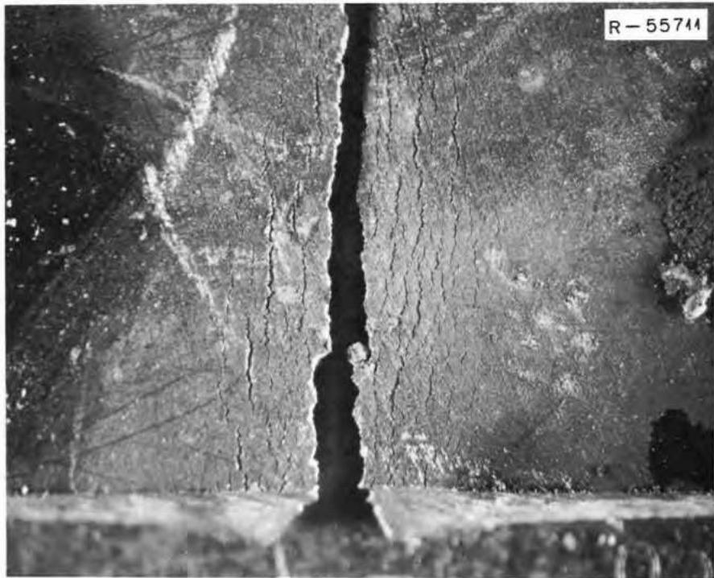  
Fig. 11.5. Macrophotograph of the tension side bend specimen S-68 from the outside liquid region of mist shield. Exposed to agitated fuel salt. Extensive cracking is confined to the rupture area. $\sim 5.5\times$

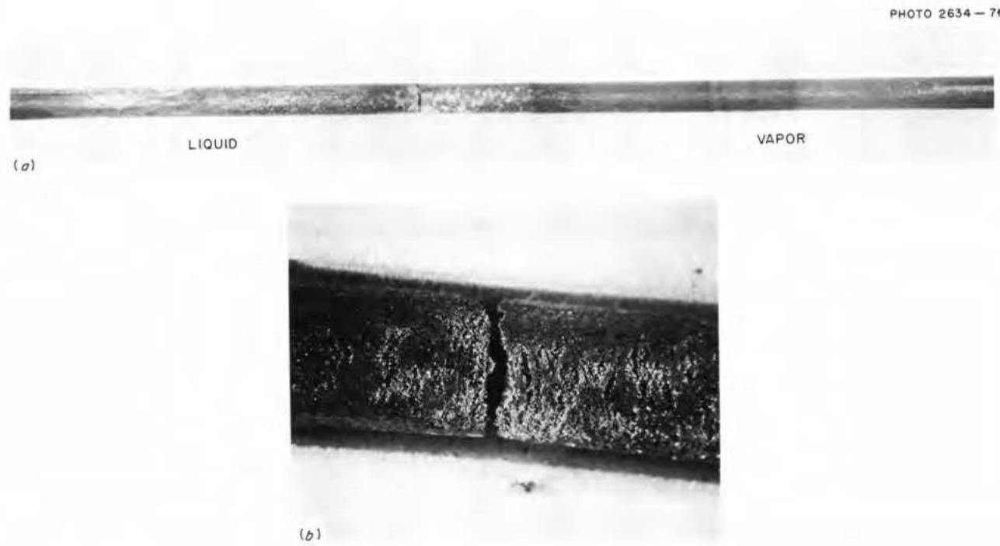  
Fig. 11.6. (a) Tensile-tested sampler cage rod from pump bowl. Rupture occurred near the average liquid-gas interface. $\sim 1\times$ . (b) Macrophotograph of rupture area showing extensive surface cracking in the liquid region. $\sim 5.5\times$ Reduced $37\%$

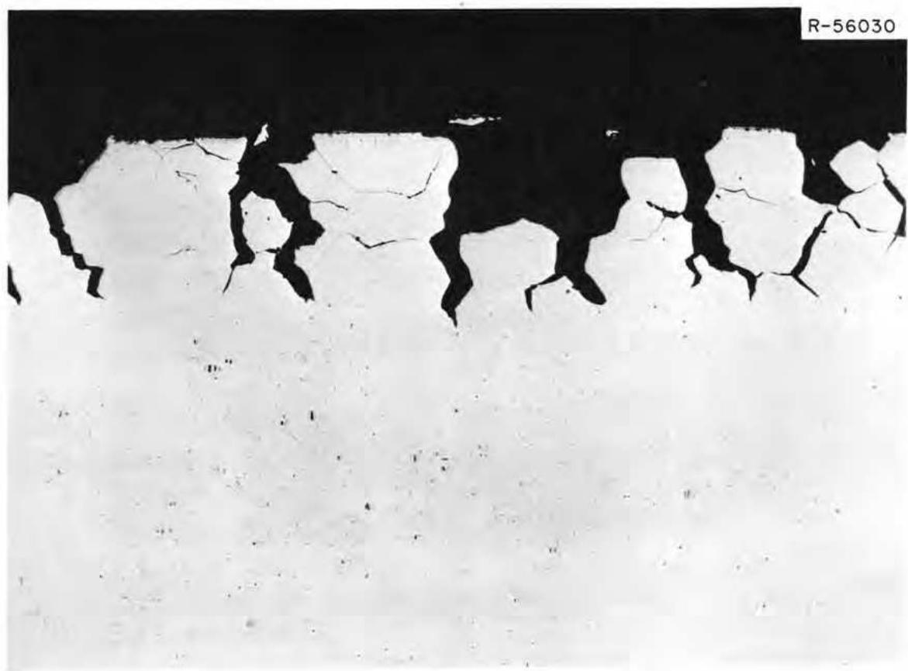  
Fig. 11.7. Photomicrograph of edge near the fracture area of MSRE sampler cage rod. Note extensive cracking and grain pullout at surface. The fracture occurred in a section of the rod that was near the average liquid level. $100\times$ . As polished.

bend with small cracks extending to a depth of about 0.5 mil.

A ring was cut from the cold leg return line, $1/8$ -in. pipe (corresponding to the coldest part of the loop, $545^{\circ}\mathrm{C}$ ), and crushed in the bend rig. It appeared to have good strength and did not crack externally, as shown in Fig. 11.15. No analysis of the bending data was attempted. Figure 11.16 shows microphotographs of the cross section of the ring. The small cracks extending to a depth of about 1 mil covered the entire interior surface. It appears that cracking did occur on the fuel-salt side of the Hastelloy N loop material when it was stressed after exposure, even with its short exposure time and low temperatures $(545^{\circ}\mathrm{C})$ . However, the mechanical properties were not greatly affected.

# 11.3 OBSERVATIONS OF GRAIN BOUNDARY CRACKING IN THE MSRE

H. E. McCoy

The first indication that grain boundary cracking was occurring in the Hastelloy N in the MSRE was obtained from surveillance specimens exposed in the core. When the third set was removed and examined in April 1968, we first noticed intergranular cracking on specimens stressed in tension. Since that time we have examined more components and find that the cracking is quite

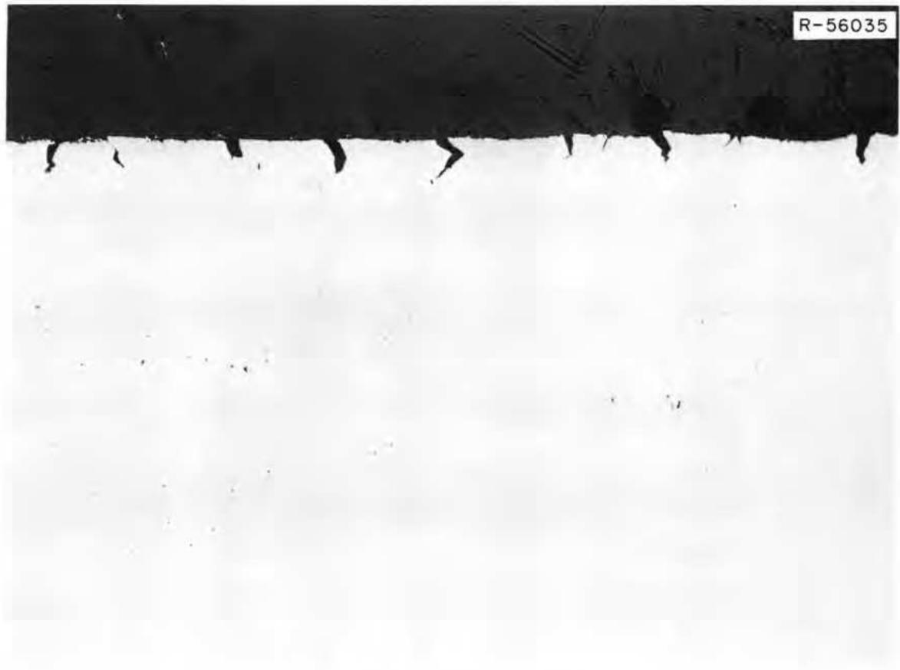  
Fig. 11.8. Photomicrograph of edge in the vapor region of tensile-tested sampler cage rod. Cracking was not as severe in this area as in the liquid region. Gly regia. $100\times$

general in the fuel circuit.7 Photographs of samples that were strained at room temperature will be used to demonstrate the cracking, since grain boundary cracking is a normal process at elevated temperatures. Thus cracks are also present in the samples tested at elevated temperatures, but it is impossible to separate those caused from exposure to the fuel salt and those due to deformation. An even more careful analysis has shown that the cracks were visible in many of the samples when they were removed from the MSRE, and straining only opened the cracks to make them more visible.

Several photographs of tested surveillance specimens have been shown previously, but several of the specimens were rep polished and photographed more extensively after we realized the generalness of the problem. Figure 11.17 shows polished sections of Hastelloy N specimens tested at $25^{\circ}\mathrm{C}$ after heating at $650^{\circ}\mathrm{C}$ for $4800\mathrm{hr}$ . (The samples were exposed to fuel salt most of this time. The time at temperature is used

because it is likely the parameter that controls the diffusion of fission products inward and also is important in moving chromium to the surface to resupply any areas depleted by corrosion.) The unirradiated specimen was exposed to static fuel salt containing depleted uranium in a control facility, and the irradiated specimen is from the core of the MSRE. There are more

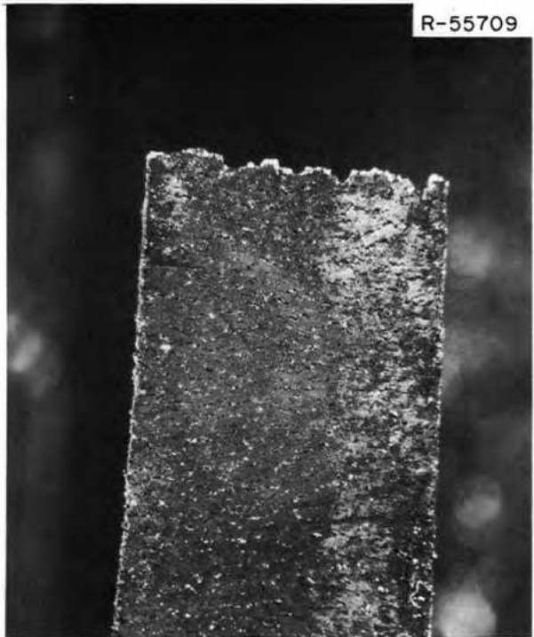  
Fig. 11.9. Macrophotograph of MSRE control rod thimble from under spacer sleeve exposed to stagnant fuel salt on OD. Tensile tested at $25^{\circ}\mathrm{C}$ . $5.5\times$ .

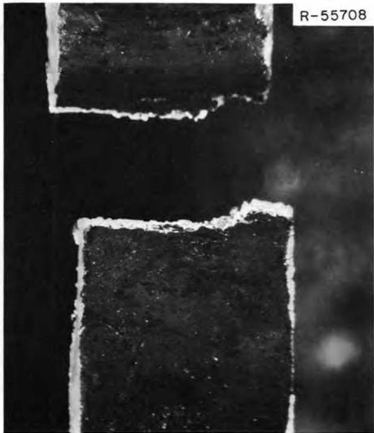  
Fig. 11.11. Macrophotograph of tensile-tested ring from spacer sleeve on control rod thimble. Exposed to rapidly flowing fuel salt on OD shown and stagnant fuel salt on the ID.

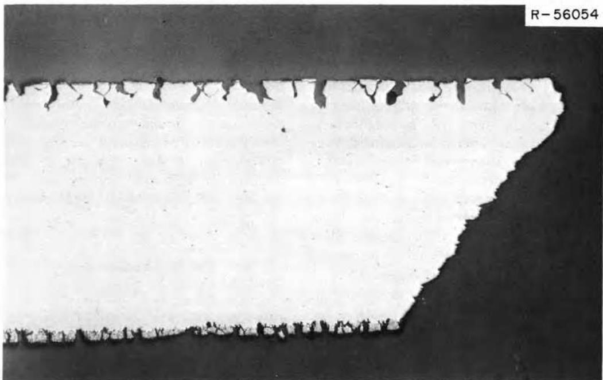  
Fig. 11.10. Photomicrograph of control rod thimble from under spacer sleeve. Exposed to stagnant fuel salt on OD (top) and to cell air on the ID (bottom). As polished. $40\times$

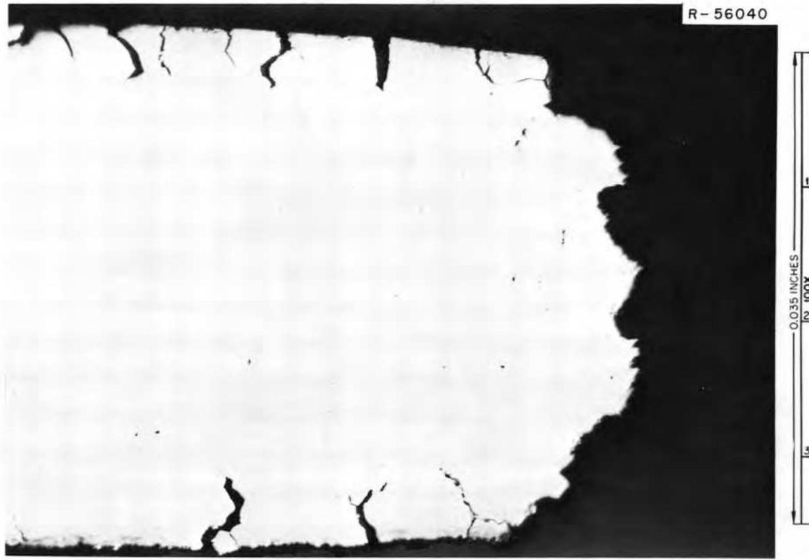  
Fig. 11.12. Photomicrograph of tensile-tested ring from spacer sleeve on control rod thimble. Exposed to rapidly flowing fuel salt on the OD (bottom) and to stagnant fuel salt on the ID (top). As polished.

Table 11.2. Tensile data on control rod thimble rings at ${25}^{ \circ  }\mathrm{C}$ at a crosshead speed of 0.05 in./min.   

<table><tr><td>Specimen number</td><td>Material</td><td>Condition</td><td>Yield stress (psi \( {}^{a} \) )</td><td>Ultimate stress (psi)</td><td>Reduction in area (%)</td><td>Crosshead travel (in.)</td></tr><tr><td>2</td><td>Y-8487</td><td>Irradiated</td><td>54,400</td><td>105,100</td><td>23.2</td><td>0.54</td></tr><tr><td>3</td><td>Y-8487</td><td>Irradiated</td><td>53,300</td><td>102,500</td><td>29.7</td><td>0.51</td></tr><tr><td>4</td><td>Y-8487</td><td>Irradiated</td><td>60,500</td><td>110,800</td><td>28.5</td><td>0.42</td></tr><tr><td>6</td><td>Y-8487</td><td>Unirradiated</td><td>52,000</td><td>114,400</td><td>44.5</td><td>1.20</td></tr><tr><td>7</td><td>Y-8487</td><td>Unirradiated</td><td>56,900</td><td>117,500</td><td>46.0</td><td>1.17</td></tr><tr><td>8</td><td>Y-8487</td><td>Unirradiated</td><td>58,100</td><td>151,100</td><td>43.0</td><td>1.18</td></tr><tr><td>Under spacer</td><td>Y-8487</td><td>Irradiated</td><td>60,800</td><td>116,000</td><td>32.9</td><td>0.45</td></tr><tr><td>Spacer sleeve</td><td>Y-5060</td><td>Irradiated</td><td>80,900</td><td>155,200</td><td>18.0</td><td>0.20</td></tr></table>

${}^{a}$ Based on an offset of 0.002 in.

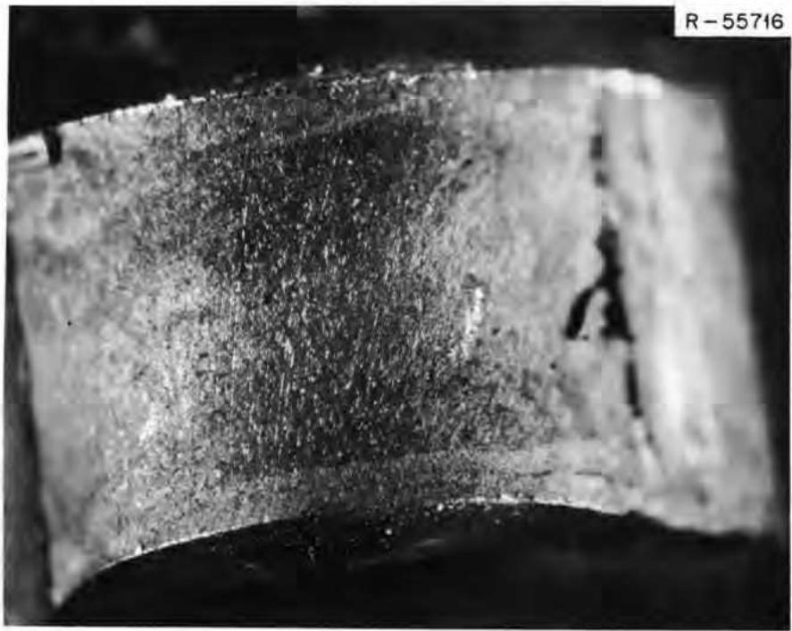  
Fig. 11.13. Macrophotograph of tension side of bend specimen from top of core vessel of in-pile loop 2, exposed to flowing fuel salt. Specimen did not fail. $5.5 \times$

cracks in the irradiated specimen, but there are so few that it is not surprising that we did not feel that they were significant when first observed.

Similar photographs of samples removed after 22,533 hr at $650^{\circ}\mathrm{C}$ are shown in Fig. 11.18. By now the frequency of cracking in the samples from the MSRE was quite high. These samples have an enlarged section at each end for pulling. Note that the cracks extend along the radius even though the strain is decreasing rapidly as the cross section increases.

A ring was cut from the control rod thimble after it had been at temperature for $26,000\mathrm{hr}$ and had received a thermal fluence of about $2\times 10^{21}$ neutrons $\mathrm{cm}^2$ . A portion of the stressed tube is shown in Fig. 11.19. The outside that was exposed to the fuel salt is heavily cracked, but the crack tips are generally quite blunt, indicating that they did not propagate as the tube was strained. The other side of the tube was oxidized by exposure to the cell environment of $\mathbf{N}_2$ containing 2 to $5\% \mathrm{O}_2$ .The oxide cracked, but the cracks do not penetrate the tube wall. Thus this component was heavily irradiated, but only the side exposed to fuel salt cracked.

Several pieces of tubing were cut from the primary heat exchanger and examined. One piece was strained

and numerous cracks formed on the fuel-salt side (shell side), but not on the coolant-salt side (tube side) (Fig. 11.20). A close examination of the unstressed tubing showed that the cracks were visible. This is shown more clearly in Fig. 11.21, a photomicrograph at higher magnification. This component revealed that neither irradiation nor straining were requirements for the cracking, but that exposure to the fuel salt was necessary.

We have collected the information that we presently have on the depth and number of cracks formed in various samples (Table 11.3). Several points seem important:

1. The maximum depth of cracking did not seem to increase systematically with exposure time over the range 4800 to $26,000\mathrm{hr}$ . The depth seems to have been limited to one grain diameter.   
2. The frequency of cracks increased dramatically with increasing exposure time and reached different values in different components because the grain size was different.   
3. The cracks were present when the material was removed from the MSRE, and they were made more

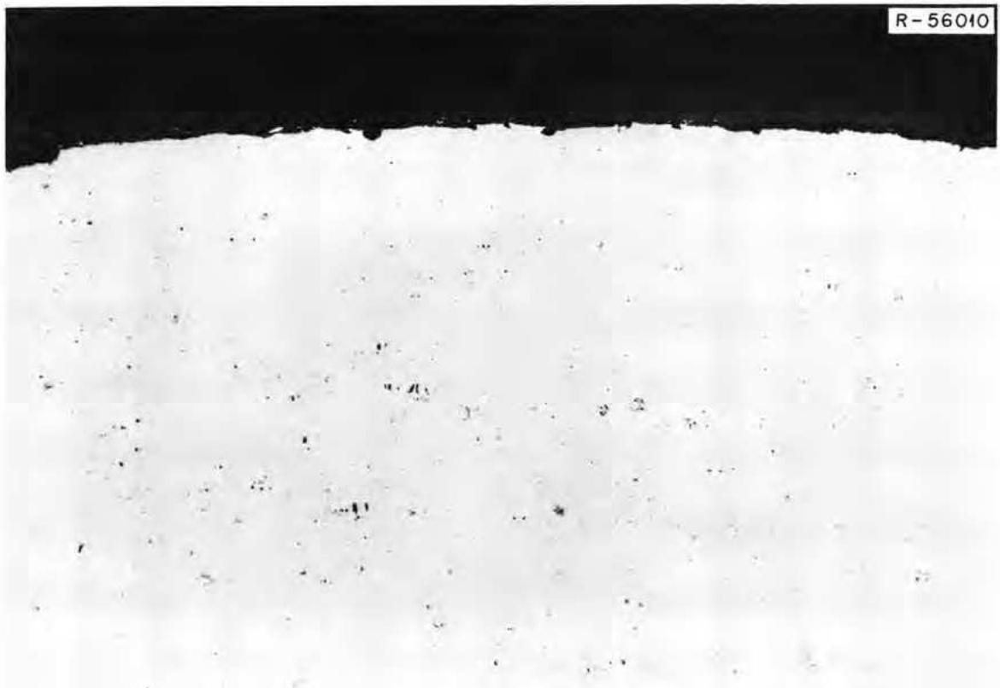  
Fig. 11.14. Photomicrograph of tension side of bend specimen from top of core vessel of in-pile loop 2, exposed to flowing fuel salt. Maximum crack depth about $0.5\mathrm{mil}$ . As polished. $100\times$

visible by straining the sample. They have blunt tips, indicating that they do not penetrate much as the sample is strained.

Layers were removed from several samples using methanol- $10\%$ HCl as an electrolyte. These solutions were analyzed by several methods and did indicate that fission products had penetrated the metal. A typical set of results for a heat exchanger tube is shown in Fig. 11.22. However, it is difficult to attach much significance to these results since the cracks extended to depths greater than our calculated sample depth (based on the amount of Ni). We were able to find all fission products with sufficient half-lives to still be present in detectable amounts. Thus, these concentration profiles may not represent solid-state diffusion, but rather the deposition of materials in existing grain boundary cracks.

Compere compared the concentrations of several fission products found on the Hastelloy N surfaces with the total inventory. The inventory values were computed taking account of the power history, and the

concentration per unit area was computed by assuming that the fission products were distributed uniformly over the entire metal area of $7.9 \times 10^{5} \mathrm{~cm}^{2}$ . The measured concentrations were obtained by summing the amounts found in successively removed layers. Some samples inherently yielded better data because the surface being dissolved was better defined. The surveillance specimen and the heat exchanger tube were good specimens, but the other samples had various problems. For example, the samples from the control rod thimble were small strips cut from a thin-walled tube. The edges contributed appreciably to the nickel content, but did not contribute to the fission product concentration. The depth of penetration was based on the nickel content of the solutions, so the measured fission product concentrations are actually lower than those present on the single surface that was exposed to fuel salt. The fission products for which $10\%$ or more of the inventory was found on the metal surface are shown in Table 11.4. There is much scatter in the data, and there does not seem to be any systematic variation of a

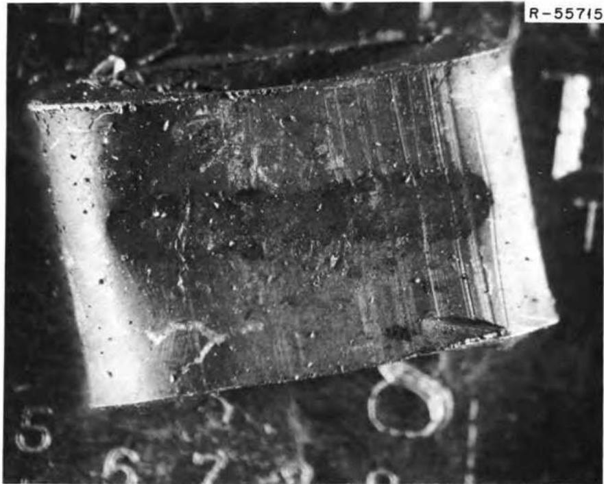  
Fig. 11.15. Macrophotograph of cold leg return line of in-pile loop 2 exposed to flowing fuel salt on ID. The ring was crushed in a bend test at $25^{\circ}\mathrm{C}$ . Specimen did not fail. $\sim 5.5\times$

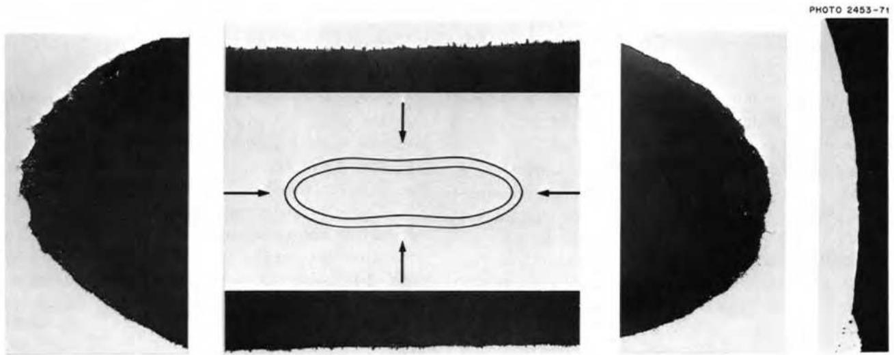  
Fig. 11.16. Photomicrographs of cross section of crushed ring from cold leg of in-pile loop 2, exposed to flowing fuel salt at $545^{\circ}\mathrm{C}$ . On ID maximum crack depth $\sim 1$ mil. As polished. $100\times$ . Reduced $56.5\%$ .

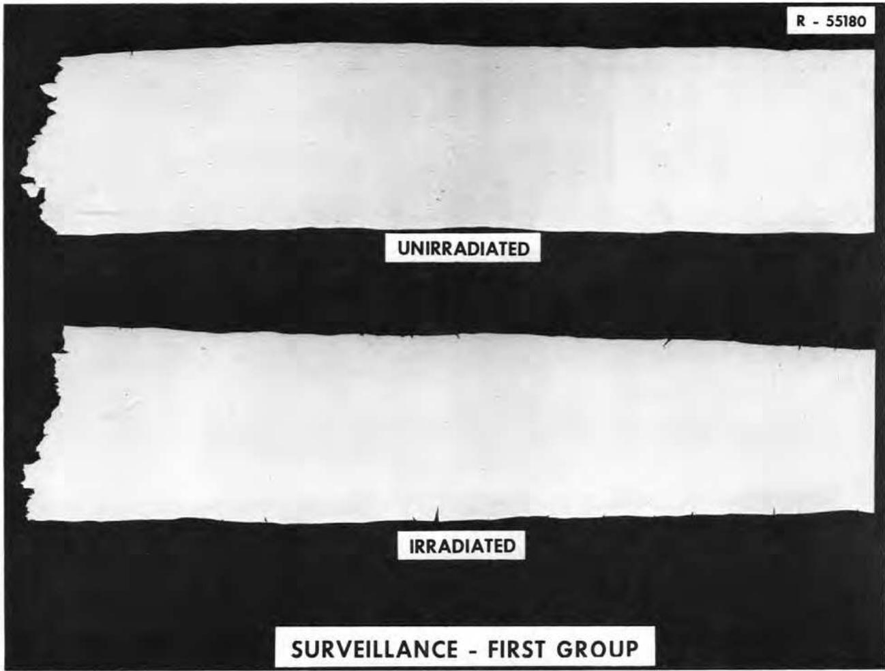  
Fig. 11.17. Photomicrographs of Hastelloy N tested at $25^{\circ}\mathrm{C}$ after 4800 hr at $650^{\circ}\mathrm{C}$ . The top specimen was in static fuel salt containing depleted U, and the lower specimen was in the core of the MSRE. The true specimen diameters are 0.070 to 0.090 in.

particular fission product as one progresses around the primary circuit. However, significant fractions of the elements shown in Table 4.4 were found on the metal surfaces.

We noted that oxide films interfered with the dissolution process. To concentrate the materials that were present along the grain boundaries, we preoxidized a surveillance sample in air at $650^{\circ}\mathrm{C}$ , strained it about half way to fracture, and dissolved successive layers. We found that Te, Ce, Sb, Cs, Sr, and S were higher than noted previously for samples not oxidized.

Two general mechanisms seem possible based on these observations. First, the fission products (or S from the salt and the pump oil) could be diffusing along the grain boundaries. All of the elements mentioned above that were concentrated along the grain boundaries have low

melting points and would reduce the melting point of the Hastelloy N. Several of these elements (namely, Te, Sb, and S) are also known to embrittle pure nickel,[11] and Te has been shown to embrittle a Ni-Cr-Co-Mo alloy.[12] Thus penetration of these elements along the boundaries could produce a localized region with a lower melting point and low ductility. To open the boundary up as a crack during service would require that this region become completely molten or that a

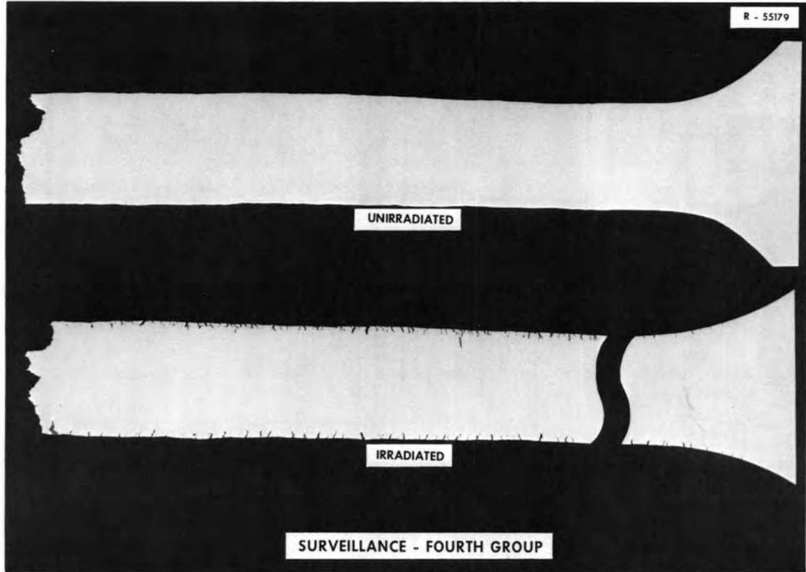  
Fig. 11.18. Photomicrographs of Hastelloy N tested at $25^{\circ}\mathrm{C}$ after 22,533 hr at $650^{\circ}\mathrm{C}$ . The top specimen was in static fuel salt containing depleted U, and the lower specimen was in the core of the MSRE. The true specimen diameters are 0.070 to 0.090 in.

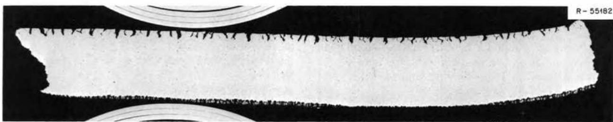  
Fig. 11.19. Photomicrograph of ring from control rod thimble that was tested to failure at $25^{\circ}\mathrm{C}$ . The top surface was exposed to fuel salt, and the bottom surface was exposed to the cell atmosphere of $\mathbf{N}_2$ containing 2 to $5\% \mathrm{O}_2$ . Part was at $650^{\circ}\mathrm{C}$ for 26,000 hr in a high radiation field. The wall thickness is about 0.065 in.

  
UNSTRESSED

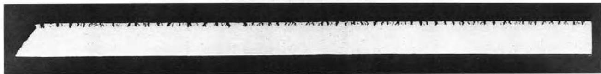  
STRESSED   
Fig. 11.20. Photomicrographs of tubing from the primary heat exchanger. It was at $650^{\circ}\mathrm{C}$ for 26,000 hr. The lower specimen was strained to failure at $25^{\circ}\mathrm{C}$ . The original wall thickness was 0.042 in. Fuel salt was on the upper side of each tube, and coolant salt was on the lower side.

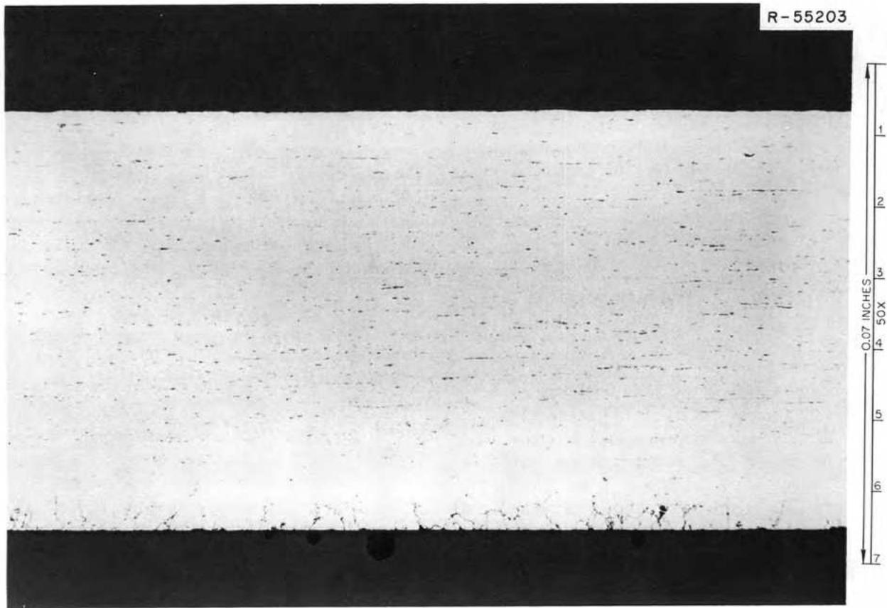  
Fig. 11.21. Photomicrograph of a tube from the MSRE primary heat exchanger. The upper surface was exposed to coolant salt and the lower surface to fuel salt.

Table 11.3. Crack formation in Hastelloy strained to failure at ${25}^{ \circ  }\mathrm{C}$   

<table><tr><td rowspan="2">Sample description</td><td rowspan="2">Time of exposure (hr)</td><td colspan="2">Cracks</td><td colspan="2">Depth. (mils)</td></tr><tr><td>Counted</td><td>Per inch</td><td>Average</td><td>Maximum</td></tr><tr><td>Surveillance, heat 5085</td><td>4,800</td><td>24</td><td>19</td><td>2.5</td><td>8.8</td></tr><tr><td>Control</td><td></td><td>1</td><td>1</td><td>5.7</td><td>5.7</td></tr><tr><td>Surveillance, heat 5085</td><td>15,300</td><td>178</td><td>134</td><td>1.9</td><td>6.3</td></tr><tr><td>Control</td><td></td><td>0</td><td></td><td></td><td></td></tr><tr><td>Surveillance, heat 5085</td><td>22,500</td><td>213</td><td>176</td><td>5.0</td><td>\( 7.0^a \)</td></tr><tr><td>Surveillance, heat 5085</td><td></td><td>140</td><td>146</td><td>3.8</td><td>8.8</td></tr><tr><td>Surveillance, heat 5065</td><td></td><td>240</td><td>229</td><td>5.0</td><td>7.5</td></tr><tr><td>Control, heat 5085</td><td></td><td>4</td><td>3</td><td>1.5</td><td>2.8</td></tr><tr><td>Thimble</td><td>26,000</td><td>91</td><td>192</td><td>5.0</td><td>8.0</td></tr><tr><td>Heat exchanger (stressed)</td><td>26,000</td><td>219</td><td>262</td><td>5.0</td><td>6.3</td></tr><tr><td>(unstressed)</td><td></td><td>100</td><td>228</td><td>2.5</td><td>3.8</td></tr><tr><td>(unstressed)</td><td></td><td>135</td><td>308</td><td></td><td></td></tr></table>

${}^{a}$ One crack was 15 mils deep; the next largest was 7 mils.

stress be imposed. The first possibility seems unlikely, and the design conditions of the items that we examined required that they either be unstressed (surveillance specimens) or under compression (thimble, heat exchanger tube). Another mechanism is one of selective corrosion. The accepted corrosion mechanism for the fuel salt and Hastelloy N is the selective removal of Cr by the reaction

$$
\mathrm {U F} _ {4} + \mathrm {C r} (\text {i n a l l o y}) \neq \mathrm {U F} _ {3} + \mathrm {C r F} _ {2} (\text {i n s a l t}).
$$

Much of our experimental corrosion work was done at higher temperatures, and all of it was done in systems where the concentrations of $\mathrm{UF_3}$ and $\mathrm{UF_4}$ were uncontrolled and not known accurately. Thus, although we did not observe selective grain boundary attack in our tests, the possibility of its occurring cannot be ruled out. In fact, the grain boundaries are generally more reactive in metals, and selective attack would be expected under some conditions. When the concentration of $\mathrm{UF_3}$ was high no corrosion would occur, and when it was low all elements would be removed. At some intermediate concentration selective removal along the grain boundaries could occur.

An example of selective grain boundary attack of type 316 stainless steel in $\mathbf{LiF - BeF}_2$ is shown in Fig. 11.23. This experiment was run to determine whether a Mo coating could be produced on stainless steel to

make it usable in Bi systems. The specimen was suspended in salt at $650^{\circ}\mathrm{C}$ , some $\mathrm{MoF}_6$ was injected as a gas, the melt held at temperature for 48 hr, and the salt discharged. The top layer is quite high in Mo, the intermediate layer contains salt and some metallic elements, and the substrate is type 316 stainless steel. The grain boundary attack is quite evident.

We cannot presently distinguish between the various mechanisms that have been proposed. However, numerous experiments are in progress to define and learn how to control the process.

# 11.4 EXAMINATION OF A GRAPHIC MODERATOR ELEMENT

B. McNabb H. E. McCoy

The graphite moderator element removed from the MSRE after shutdown appeared unchanged by the irradiation or fuel-salt flow, as reported earlier.13 Core-drilled samples were taken from the fuel channel of this element for Auger and spectrographic analyses; the Auger analysis of the surface layer is reported in the next section. Small samples $(\frac{1}{8}$ in.diam) from about the midplane of the core were used as electrodes for the

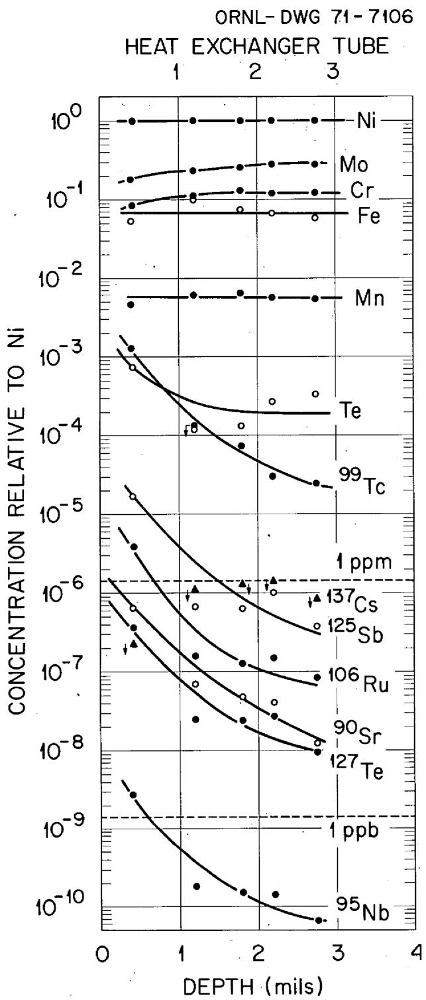  
Fig. 11.22. Concentration profiles from the fuel side of an MSRE heat exchanger tube measured about 1.5 yr after reactor shutdown.

mass spectrograph analysis of fission products. Table 11.5 shows the results of successive analyses, using increasing amounts of current. These data are quite useful, but several factors limit their accuracy. The penetration of the spark into the graphite was likely a hemisphere, so some new surface continued to be included as the penetration depth increased. The calculated depths are estimates of the maximum depths sampled. The sensitivity of the analysis increases with increasing current. The size of the area sampled is also of concern, particularly at the lower penetration depths. This graphite has pores about $0.1\mu (1000\mathring{\mathrm{A}})$ in diameter, and the compositions of the first samples (taken from areas a few angstroms in diameter) could be quite dependent upon the location. These factors make it impossible to obtain a quantitative concentration profile, but it appears that the fission products are concentrated at the surface and decrease rapidly with depth.

# 11.5 AUGER ANALYSIS OF THE SURFACE LAYER ON GRAPHITE REMOVED FROM THE CORE OF THE MSRE

R. E. Clausing

Quantitative analysis of thin layers of fission products deposited on the graphite and metal surfaces of the MSRE would provide information valuable for predictions of the requirements for afterheat removal in future molten-salt reactors. Auger electron spectroscopy offers unique capabilities for such analyses. The construction of equipment for this purpose was described previously.[14] The equipment has been modified to permit ten samples and standards to be loaded for examination at the same time, thus facilitating the comparison of samples with other samples or standards. The measurements and analysis of data have been delayed partially because of unexpected problems with the multiple sample system and partially because of the complexity of the spectra.

The measurements on four samples from the graphite moderator element 1184-C-19 removed from the MSRE after shutdown are partially complete. They give spectra qualitatively similar to that reported previously

Table 11.4. Concentrations of several fission products on the surfaces of Hatalloy N compared with the total inventory   

<table><tr><td rowspan="2">Sample location</td><td rowspan="2">Depth of penetration (mils)</td><td colspan="7">Concentration of nuclide compared with inventory</td></tr><tr><td>127Te</td><td>134Cs</td><td>125Sb</td><td>103Ru</td><td>106Ru</td><td>95Nb</td><td>99Tc</td></tr><tr><td>Control rod thimble (bottom)</td><td>2.4</td><td>0.43</td><td>0.84</td><td>0.85</td><td>0.40</td><td>0.13</td><td>0.37</td><td>0.32</td></tr><tr><td>Control rod thimble (middle)</td><td>0.1</td><td>0.14</td><td>0.24</td><td>0.35</td><td>0.15</td><td>0.11</td><td>0.26</td><td>0.19</td></tr><tr><td>Surveillance specimen</td><td>3.5</td><td>0.001</td><td>0.35</td><td>1.04</td><td>0.006</td><td>0.087</td><td>0.006</td><td>0.30</td></tr><tr><td>Mist shield outside, liquid</td><td>6.0</td><td>0.23</td><td>0.035</td><td>0.74</td><td>0.069</td><td>0.10</td><td>0.067</td><td>0.19</td></tr><tr><td>Heat exchanger shell</td><td>4.2</td><td>0.35</td><td>0.017</td><td>0.68</td><td>0.027</td><td>0.05</td><td>0.085</td><td>0.27</td></tr><tr><td>Heat exchanger tube</td><td>4.3</td><td>0.67</td><td>0.006</td><td>1.13</td><td>0.028</td><td>0.14</td><td>0.070</td><td>0.31</td></tr></table>

Table 11.5. Concentration in weight percent of the elements on the surface of MSRE graphite stringer at the reactor midplane   

<table><tr><td rowspan="2">Mass</td><td rowspan="2">Element</td><td colspan="7">Maximum penetration depth (Å)</td></tr><tr><td>~2.5</td><td>~25</td><td>800</td><td>900</td><td>2000</td><td>3000</td><td>4000</td></tr><tr><td colspan="9">Fission products detected</td></tr><tr><td>87</td><td>Rb</td><td></td><td></td><td>0.0018</td><td></td><td></td><td></td><td></td></tr><tr><td>89</td><td>Y</td><td></td><td></td><td>0.0044</td><td></td><td></td><td></td><td></td></tr><tr><td>90</td><td>Sr</td><td></td><td></td><td>0.0067</td><td></td><td></td><td></td><td></td></tr><tr><td>Natural</td><td>Mo</td><td>0.87</td><td>0.58</td><td>0.20</td><td>0.03</td><td>0.02</td><td>0.11</td><td>0.07</td></tr><tr><td>Fission</td><td>Mo</td><td>3.6</td><td>2.4</td><td>0.59</td><td>0.09</td><td>0.26</td><td>0.30</td><td>0.24</td></tr><tr><td>93</td><td>Nb</td><td></td><td></td><td>0.003</td><td></td><td></td><td>0.002</td><td>0.001</td></tr><tr><td>99</td><td>Tc</td><td>0.57</td><td>0.39</td><td>0.09</td><td>0.02</td><td>0.05</td><td>0.05</td><td>0.04</td></tr><tr><td>101,102,106</td><td>Ru</td><td>1.4</td><td>0.95</td><td>0.19</td><td>0.04</td><td>0.11</td><td>0.09</td><td>0.09</td></tr><tr><td>103</td><td>Rh</td><td>0.34</td><td>0.22</td><td>0.055</td><td>0.01</td><td>0.03</td><td>0.02</td><td>0.02</td></tr><tr><td>110</td><td>Pd</td><td></td><td>0.11</td><td>0.053</td><td>0.01</td><td>0.02</td><td>0.015</td><td>0.01</td></tr><tr><td>109</td><td>Ag</td><td></td><td></td><td>0.0073</td><td></td><td></td><td></td><td>0.003</td></tr><tr><td>114</td><td>Cd</td><td></td><td></td><td>0.0046</td><td></td><td>0.015</td><td></td><td>0.007</td></tr><tr><td>125</td><td>Sb</td><td></td><td>0.01</td><td>0.0057</td><td></td><td>0.005</td><td></td><td>0.004</td></tr><tr><td>130</td><td>Te</td><td>0.41</td><td>0.30</td><td>0.046</td><td>0.009</td><td>0.02</td><td>0.02</td><td>0.01</td></tr><tr><td>133</td><td>La</td><td></td><td></td><td>0.004</td><td></td><td>0.006</td><td>0.003</td><td>0.002</td></tr><tr><td>138</td><td>Ba</td><td></td><td></td><td>0.005</td><td></td><td></td><td></td><td></td></tr><tr><td>140</td><td>Ce</td><td></td><td></td><td>0.007</td><td></td><td>0.01</td><td>0.006</td><td>0.005</td></tr><tr><td>141</td><td>Pr</td><td></td><td></td><td>0.003</td><td></td><td>0.003</td><td></td><td>0.003</td></tr><tr><td>144</td><td>Nd</td><td></td><td></td><td>0.01</td><td></td><td>0.01</td><td></td><td>0.006</td></tr><tr><td>147</td><td>Pm</td><td></td><td></td><td>0.0008</td><td></td><td></td><td></td><td></td></tr><tr><td colspan="9">Nonfission elements detected</td></tr><tr><td></td><td>Ni</td><td></td><td>0.9</td><td></td><td></td><td></td><td></td><td></td></tr><tr><td></td><td>Fe</td><td></td><td>0.3</td><td></td><td></td><td></td><td></td><td></td></tr><tr><td></td><td>Cr</td><td>0.05</td><td></td><td></td><td></td><td></td><td></td><td></td></tr><tr><td></td><td>Mn</td><td>0.005</td><td></td><td></td><td></td><td></td><td></td><td></td></tr></table>

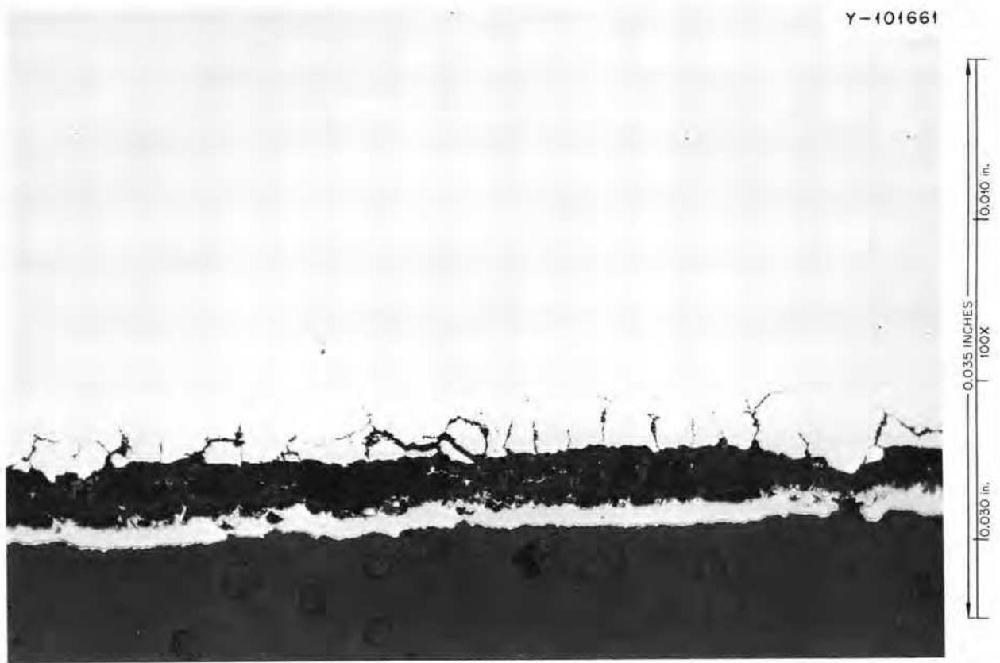  
Fig. 11.23. Type 316 stainless steel exposed to LiF-BeF $_2$ containing MoF $_6$ for 48 hr at $650^{\circ}\mathrm{C}$ .

for MSRE sample 6 (ref. 15) but differing considerably in detail. For example, on one sample, MSRE 7, the amounts of rhodium and technetium are at least twice that on MSRE 6. (Rhodium was found to be present on MSRE 6 but had not been identified in the previous report.)

Table 11.6 shows some sputter profile data from MSRE 7. This sample came from the center of the flow channel near the reactor midplane. The concentration of fission products is only given in units relative to the carbon. The determination of the actual concentrations of various elements present must await comparison with standards. It appears, however, that technetium, rho

dium, and molybdenum are all present in large percentages $(>5\%)$ and niobium in a smaller but detectable amount. The analysis of ruthenium is difficult because of interference from the carbon peaks and other fission products, but there is reason to suspect that it may also be present in relatively large amounts in that the carbon peak shapes are somewhat distorted. A similar situation exists for tellurium, whose primary peaks fall at the same energies as the secondary oxygen peaks. Although not included in the table for this reason, it appears that significant amounts of tellurium are also present. The large oxygen and nitrogen peaks may indicate that a large portion of the fission products is present as oxides and nitrides. Small amounts of iron and nickel have been detected on MSRE sample 13, which is from another part of the same moderator element.

Table 11.6. Auger electron intensity as a function of depth below the original surface of sample MSRE 7 from a MSRE moderator element   

<table><tr><td>Accumulated argon ion bombardment (×1015/cm2)</td><td>Estimated depth (atom layers)</td><td>Technetium, sulfur, molybdenum (148 eV)</td><td>Technetium, molybdenum (182 eV)</td><td>Niobium (200 eV)</td><td>Rhodium (300 eV)</td><td>Nitrogen (383 eV)</td><td>Oxygen (510 eV)</td></tr><tr><td>75</td><td>15</td><td>19</td><td>40</td><td>nda</td><td>9</td><td>12</td><td>25</td></tr><tr><td>75</td><td>15</td><td>nb</td><td>35</td><td>nd</td><td>8</td><td>14</td><td>na</td></tr><tr><td>116</td><td>23</td><td>16</td><td>55</td><td>2</td><td>7</td><td>12</td><td>23</td></tr><tr><td>150</td><td>30</td><td>26</td><td>50</td><td>nd</td><td>11</td><td>17</td><td>26</td></tr><tr><td>225</td><td>45</td><td>33</td><td>55</td><td>2</td><td>7</td><td>8</td><td>18</td></tr><tr><td>525</td><td>105</td><td>15</td><td>5</td><td>nd</td><td>nd</td><td>2</td><td>9</td></tr><tr><td>1160</td><td>230</td><td>13</td><td>2</td><td>1</td><td>nd</td><td>4</td><td>9</td></tr><tr><td>2325</td><td>485</td><td>5</td><td>7</td><td>2</td><td>nd</td><td>nd</td><td>3</td></tr><tr><td>4725</td><td>945</td><td>3</td><td>8</td><td>2</td><td>nd</td><td>1</td><td>3</td></tr></table>

$a$ nd $\equiv$ not detected.   
$b_{\mathrm{na}} = \mathrm{not}$ analyzed.

# 12. Graphite Studies

W.P.Eatherly

The purpose of the graphite studies is to develop improved graphites suitable for use in molten-salt reactors. The graphite in these reactors will be exposed to high neutron fluences and must maintain reasonable dimensional stability and mechanical integrity. Further, the graphite must have a fine pore texture that will exclude not only the molten salt but also gaseous fission products, notably $^{135}\mathrm{Xe}$ .

The general irradiation of commercial graphites and experimental samples obtained from the Y-12 Development Division has spanned a broad range of raw materials and fabrication techniques. It has been found that these materials could be divided on the basis of their geometric behavior under irradiation damage into four classes: conventional, apparently binderless, hot-worked, and black-based graphites. At the present time it appears that only the binderless and black-based materials offer the opportunity of significant improvement. Our own fabrication studies have therefore been based on these two approaches. The first ORNL-fabricated "binderless" graphites have now been irradiated to $1 \times 10^{22}$ neutrons/cm $^2$ ( $E > 50 \mathrm{keV}$ ) in the HFIR and are stable to this level. These results are most encouraging in supporting our general concepts as to the microscopic physical phenomena controlling damage.

In view of the initial successes of the graphite fabrication studies, we have recently decided to reduce effort in this area pending further irradiation results. This permits an increased effort on various techniques

for sealing graphite against fission product gases. A considerable portion of the present progress report centers accordingly on improved or alternative processing techniques and evaluation of the microstructure on previously irradiated specimens. The previous materials were fabricated in fluid bed furnaces, a technique involving complex gas reaction kinetics and limiting in the size specimens that could be coated or impregnated with pyrolytic carbon. For these reasons a new furnace was constructed utilizing a fixed substrate, and initial coating and impregnation runs are now under way.

Additionally, a second look is being taken at impregnation with frozen salt as a means of pore blockage. Although there is reason to question whether the desired diffusion rates and irradiation stability can be obtained, the technique is so simple in application to justify at least a cursory exploration.

During this reporting period the apparatus to measure thermal conductivities of HFIR-irradiated samples was completed and the first irradiation performed. A thermal expansion apparatus which will permit accurate determination of the linear expansion coefficient as a function of temperature is almost completely constructed. This information is desired not only for engineering purposes but also because of its close alliance to damage.

Progress continues on the theoretical interpretation of damage clusters as seen in the electron microscope. The strain field calculation has been completed for interstitial aggregates, and diffraction effects for crystal di

rections have been completed. At least qualitatively the calculations are in excellent agreement with observed effects.

# 12.1 THE IRRADIATION BEHAVIOR OF GRAPHITE AT $715^{\circ}\mathrm{C}$

C. R. Kennedy W. P. Eatherly

We have extensively studied the neutron irradiation behavior of graphite at $715^{\circ}\mathrm{C}$ , primarily to determine the incremental or decremental changes in life expectancy resulting from a wide variety of starting materials and fabrication methods. Over 40 experimental and commercial grades of graphite were irradiated in the HFIR to fluence levels up to $4 \times 10^{22}$ neutrons/cm $^2$ ( $>50$ keV), invariably producing significant volume expansions. The changes in linear dimensions and bulk density were the prime measures in evaluating the materials.

The irradiation behavior of the graphites demonstrated that all of the various grades could be separated into four basic types of materials:

1. Conventional graphites. These graphites all consist of materials made from calcined coke or graphite flour as filler bonded with either thermoplastic or thermosetting hydrocarbons. The general irradiation behavior is characterized by an immediate densification followed by a parabolic expansion, as shown in Fig. 12.1. The isotropic materials have a lower tendency for densification than the anisotropic graphites made with acicular cokes, and both demonstrate that the maximum densification varies inversely with the original density. A considerable degree of anisotropy in the densification process appears to depend on both the method of fabrication and the crystalline structure of the filler particles, which usually is reflected in their morphology. The more isotropic graphites always densified more in the extrusion direction for extruded grades and normal to the forming force for the molded grades.

The linear dimensional changes depended upon the anisotropy of the graphite, the crystallite size, and the density changes. The growth rates at fluences where the density change was constant agreed with the Reuss one-dimensional constant stress model. The effect of crystallite size on the growth rate was in excellent agreement with that found by Bokros.

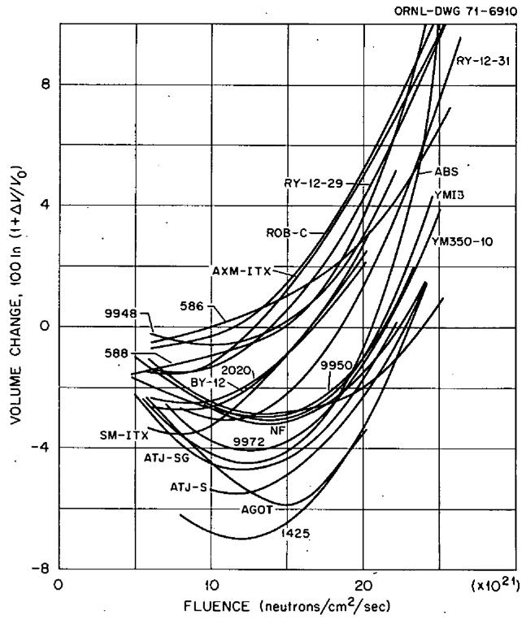  
Fig. 12.1. Volume changes of conventional graphites, $715^{\circ}\mathrm{C}$

Conventional graphites all have virtually the same lifetime expectancy with no apparent effect of molding, extrusion, type of filler, Thermax additions, type of binder, or the type of impregnant. The choice of graphites within this category would depend upon the necessity of isotropy and other properties, such as thermal conductivity, mechanical properties, and coefficient of thermal expansion.

2. Apparently binderless graphites. The raw materials and the fabrication procedures for most of these graphites are proprietary. They are characterized by an apparently binderless single-phase microstructure with a fairly fine optical domain size. These graphites are all very isotropic, have a high coefficient of thermal expansion, and generally have a lower crystallite size than the conventional materials.

Their irradiation behavior shown in Fig. 12.2 is characterized by a delay or an elimination of the densification process, yielding a more dimensionally stable graphite with about twice the lifetime of the conventional graphites. The linear dimensional changes are isotropic, reflecting only the bulk density changes. Thus, the individual crystallite growth rates cannot be calculated directly from extrapolated orientation dependence.

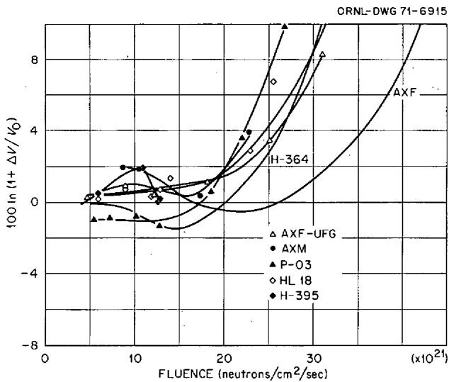  
Fig. 12.2. The volume changes of apparently binderless graphites.

3. Hot-worked and mesophase graphites. These graphites by virtue of hot working are highly anisotropic. Although the original densities may not be very high, the void structure for densification has apparently been eliminated by the hot working. None of these materials densified under irradiation, as shown in Fig. 12.3. The volume remained constant for a short period and then began to expand parabolically with fluence. The life expectancy of these grades is similar to that of the conventional grades; however, the linear dimensional changes are quite large due to the anisotropy and would not be acceptable for most designs. The linear dimensional behavior, excluding density changes, can be represented by the Reuss model.

4. Carbon-black grades. These are grades in which all the filler is a carbon black. They are characterized by a structure of randomly oriented, ultrafine optical domains with no anisotropy and a fairly small crystallite size. The coefficient of thermal expansion is generally large, the thermal conductivity is low, and the mechanical properties are fairly good for the generally low bulk density. The densification due to irradiation is quite rapid, as shown in Fig. 12.4, possibly reflecting high negative crystalline growth rates. The expansion after densification, unlike that for all other materials, is linear with fluence and seems to be independent of grade and heat treatment. The initial increase in density, however, depends upon final heat treatment temperature, as shown in Fig. 12.5, and there is some

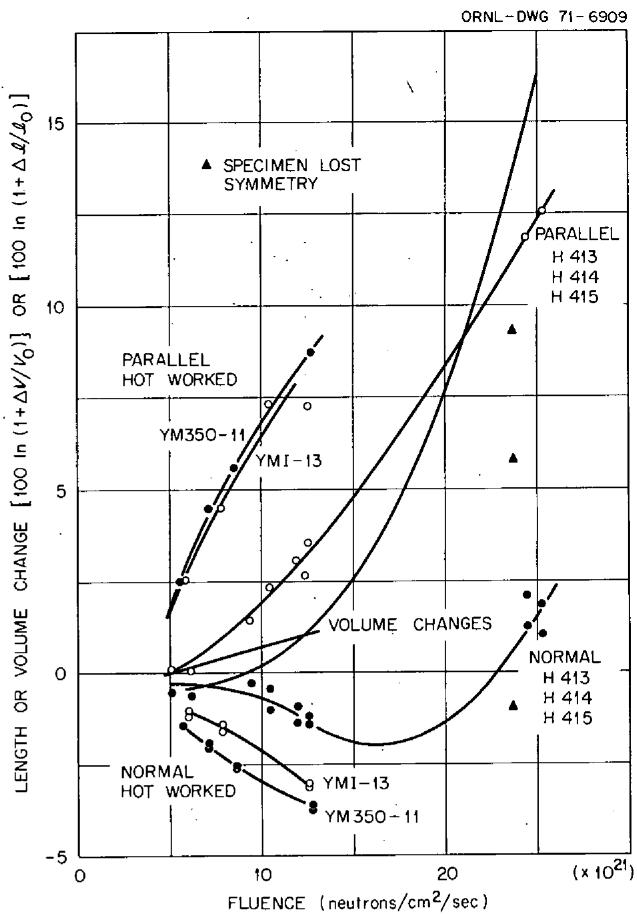  
Fig. 12.3. Dimensional behavior of hot-worked and mesophase graphites, $715^{\circ}\mathrm{C}$ .

evidence that the densification is binder-dependent as well. These materials are all isotropic, and the linear dimensional changes are again a result only of bulk density changes. The lifetime expectancy of these materials is equal to or greater than that of the apparently binderless grades, such as represented by Poco-AXF in Fig. 12.4.

It appears, therefore, that graphite with improved lifetimes may be developed from either the apparently binderless graphites, carbon-black grades, or from combinations of the two. The disadvantage of the low thermal conductivity of the carbon-black grades can be moderated by combinations of green coke and carbon-black filler materials. Also, as discussed in an earlier report,3 the addition of carbon blacks to green filler

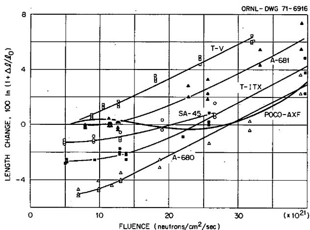  
Fig. 12.4. The effect of irradiation on various carbon-black grades and on Poco-AXF at $715^{\circ}\mathrm{C}$ .

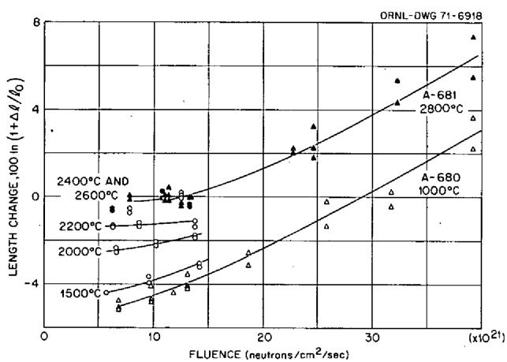  
Fig. 12.5. The effect of final heat treatment on the dimensional stability of a carbon-black grade irradiated at $715^{\circ}\mathrm{C}$ .

produces a graphite with a more contiguous structure. We are presently investigating these types of raw material systems and are now irradiating grades with representative structures for evaluation.

Three ORNL materials have received their first irradiation. These were all made using green Robinson coke as the filler with and without Thermax additions, and with coal-tar pitches 15V and 350 as binders. The densities were reasonable; however, the structures contained a fine network of lamellar voids normal to the molding direction. This structural fault has been eliminated in newer moldings. The results to maximum

fluences of $1 \times 10^{22}$ neutrons $\mathrm{cm}^{-2} \sec^{-1}$ , as seen in Fig. 12.6, indicated that the behavior is quite similar to the apparently binderless grades exhibiting very small isotropic expansion. There appears to be no immediate influence of the binder or the addition of up to $40\%$ Thermax to the filler material.

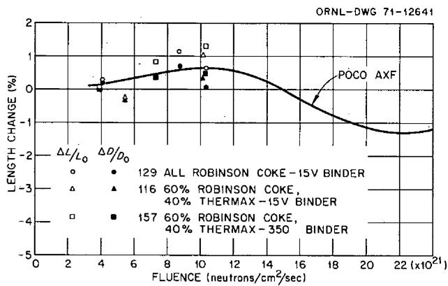  
Fig. 12.6. The results of the first irradiation of ORNL graphites, $715^{\circ}\mathrm{C}$ .

# 12.2 PROCEDURE OF VARIOUS GRADES OF CARBON AND GRAPHITE

W.H.Cook W.P.Eatherly

The various grades of carbon and graphite that we have received since January 1, 1971, are summarized in Table 12.1. One grade, A676, has an apparent density of $1.87\mathrm{g/cm^3}$ , but the remainder have apparent densities from 1.79 to $1.47\mathrm{g/cm^3}$ . On this basis, they are not outstanding; however, they generally represent some special parameter(s).

The first four grades listed in Table 12.1 represent studies primarily on isotropic fillers bonded with synthesized, experimental binders of acenaphthylene and isotruxene.

The graphite-fiber-reinforced-grade PTE is not expected to have any potential as a moderator material, but it may be useful as a high-temperature structural material in regions of low flux.

Grade A680 is the low-fired lampblack-base material that we had requested to replenish our supply of this material to continue our studies previously reported.4

Table 12.1. A summary of the various types of carbon and graphite samples received since January 1, 1971   

<table><tr><td>Grade</td><td>No. of pieces</td><td>Total weight (g)</td><td>Manufacturer</td><td>Fabrication method</td><td>Filler</td><td>Binder</td><td>Impregnant</td><td>Max. firing temp. (°C)</td><td>Apparent density (g/cm3)</td><td>Dimensions (in.)</td><td>Remarks</td></tr><tr><td>675-11-4</td><td>4</td><td></td><td rowspan="4">MEDDa</td><td>Extruded</td><td>Low-fired Santa Maria</td><td>ACN-ITXb</td><td>Butadiene gas method</td><td></td><td></td><td></td><td>Had radial cracks</td></tr><tr><td>676-01-4</td><td>4</td><td></td><td>Extruded</td><td>Low-fired Poco, PCD-OQ</td><td>ACN-ITX</td><td>Butadiene gas method</td><td>2800</td><td>{0.128 ID × 0.400 OD × 0.500}</td><td></td><td>Had radial cracks</td></tr><tr><td>118</td><td>6</td><td></td><td>Moldedc</td><td>Low-fired Poco, PCD-OQ</td><td>ITXB</td><td></td><td></td><td></td><td></td><td>Lot No. 1 of filler</td></tr><tr><td>132</td><td>6</td><td></td><td>Moldedc</td><td>Low-fired Poco, PCS-OQ</td><td>ITX</td><td></td><td></td><td></td><td></td><td>Lot No. 3 of filler</td></tr><tr><td>PTE</td><td>1</td><td>588</td><td>CPDd</td><td>e</td><td>e</td><td>Pitche</td><td></td><td>e</td><td>1.62</td><td>5.9 diam × 0.76 thick</td><td>Graphite fiber reinforced</td></tr><tr><td>A680</td><td>1</td><td>1,358</td><td></td><td></td><td></td><td></td><td></td><td></td><td></td><td></td><td></td></tr><tr><td>Q322</td><td>1</td><td>1,394</td><td>Stackpolef</td><td>e</td><td>Carbon black</td><td>Pitche</td><td></td><td>e</td><td>{1.47</td><td>0.86 × 5.66 × 11.58</td><td></td></tr><tr><td>A676</td><td>1</td><td>1,188</td><td></td><td></td><td></td><td></td><td></td><td></td><td>{1.62</td><td>7.4 diam × 1.4 thick</td><td></td></tr><tr><td></td><td></td><td></td><td></td><td></td><td></td><td></td><td></td><td></td><td>{1.87</td><td>1.0 × 4.8 × 7.9</td><td></td></tr><tr><td>JA-5</td><td>1</td><td>584</td><td>Airco Speerg</td><td>e</td><td>Grade JM-15</td><td>e</td><td></td><td>e</td><td>{1.58</td><td>17/16 × 33/8 × 41/2</td><td>Preliminary</td></tr><tr><td></td><td>1</td><td>996</td><td></td><td></td><td></td><td></td><td></td><td></td><td>{1.67</td><td>11/16 × 33/4 × 85/8</td><td>Cracked</td></tr><tr><td>R18</td><td>3</td><td>11,477</td><td></td><td></td><td></td><td></td><td></td><td></td><td>{1.73j</td><td>55/8 diam × ~51/4 long</td><td></td></tr><tr><td>R20</td><td>1</td><td>3,824</td><td>GLRCh</td><td>Molded</td><td>Calcined Robinson Cokei</td><td>Pitche</td><td>Pitche</td><td>2700</td><td>{e</td><td>55/8 diam × ~51/4 long</td><td></td></tr><tr><td>R22</td><td>1</td><td>3,614</td><td></td><td></td><td></td><td></td><td></td><td></td><td>{1.68j</td><td>55/8 diam × ~51/4 long</td><td></td></tr><tr><td>R24</td><td>3</td><td>10,769</td><td></td><td></td><td></td><td></td><td></td><td></td><td>{1.67j</td><td>55/8 diam × ~51/4 long</td><td></td></tr></table>

$^{a}$ Materials Engineering Development Department of the Y-12 Plant, Oak Ridge, Tennessee.   
$b_{\mathrm{ACN}} =$ Acenaphthylene and $\mathrm{ITX} =$ isotruxene.   
${}^{c}$ Molded at ${1400}^{ \circ  }\mathrm{C}$ and ${1600}\mathrm{{psi}}$ .   
$^{d}$ Parma Technical Center, Carbon Products Division of the Union Carbide Corporation, Parma, Ohio.   
$e$ Not available or additional details not available.   
$f_{\text{Stackpole}}$ Carbon Company, St. Marys, Pennsylvania.   
$^{g}$ Airco Speer Carbon Products, St. Marys, Pennsylvania.   
$h$ Great Lakes Research Corporation, Elizabethton, Tennessee.   
iMade from the Robinson Raw Coke manufactured by the Carbon Products Division of Union Carbide Corporation, Lawrenceburg, Tennessee, under AEC Contract AT(29-2)-1955.   
$j$ Data supplied by the manufacturer.

Grade Q322 is similar to the previously described graphitized lampblack grade A671. Grade Q322 is a short section from a $7^{1/2}$ -in.-diam cylinder and was offered as physical evidence that base stock sizes as required by the MSBE can be fabricated using a lampblack filler.

Grade A676 is grade A681, the graphitized lampblack-base body we have been studying, that has been impregnated to change the nominal apparent densities from 1.60 to $1.87\mathrm{g / cm}^3$

The grade JA-5 is in the early stages of development and uses an isotropic to near-isotropic filler designated as grade JM-15.

The series of grades R18, R20, and R24 represents the start of a study with varying amounts of pitch binder with an isotropic filler made from calcined Robinson (air-blown) raw coke. The latter is a product from a sizable production (24 tons) from a pilot-scale coker.

Arrangements have been essentially completed to obtain specimens of carbon materials from Poco Graphite, Inc., spanning the temperature range 1400 to $2500^{\circ}\mathrm{C}$ . The low-fired materials would be grade AXF precursor fired to 1400, 1800, 2000, 2200, and $2500^{\circ}\mathrm{C}$ . We plan to extend the temperature range to $3000^{\circ}\mathrm{C}$ by refiring a Poco-supplied stock piece (fired to $2500^{\circ}\mathrm{C}$ ) to $3000^{\circ}\mathrm{C}$ and machining specimens from it. Since these specimens represent material at intermediate stages of a production process, certain agreements are being arranged to protect their proprietary position.

The purpose of the experiment is to take the most stable graphite known to us and examine the effect of heat treatment on its behavior. Both the plasticity and crystalline size are sharp functions of heat treatment temperatures, and both are believed to be important in determining the lifetime of graphite under irradiation. The resulting data, aside from their intrinsic interest, will also afford a qualitative check of our proposed radiation damage model.

We have received a graphite flour, grade 1074 ( $\sim$ 23.0 kg), from the Great Lakes Carbon Corporation. This material is slightly anisotropic. It is being evaluated for use in both the Molten-Salt Reactor and High-Temperature Gas-Cooled Reactor Programs.

# 12.3 X-RAY STUDIES

# O. B. Cavin

Isotropic polycrystalline graphites continue to be the most irradiation stable; therefore, the x-ray-determined isotropy parameters on new materials continue to be of

interest. We continue to determine these parameters on newly fabricated bodies made at both ORNL and the Y-12 installations, as well as potential new grades that are received from the manufacturers.

Three samples of mesophase graphite were received for evaluation. The x-ray-determined crystalline preferred orientation parameters are shown in Table 12.2. It was thought that the mesophase bodies should be nearly isotropic; however, this is not the case.

The ACF-4Q is a low-fired Poco grade that has not been above $1400^{\circ}\mathrm{C}$ and is the starting material for the AXF grade. Three sphere samples were cut with their axes mutually perpendicular, and the results are shown in Table 12.2. The sum of the three independently determined $R_{\parallel}$ values is 1.997, which is very near the theoretical value of 2.0. This material is very isotropic.

A block of grade JA-5 graphite was received from Airco Speer Carbon Products for property evaluation. Three sphere-type samples for anistropy determinations were cut from this block with their axes mutually perpendicular. From these three samples we then

Table 12.2. X-ray anisotropy parameters   

<table><tr><td>Sample number</td><td>R1a</td><td>R1b</td><td>BAF</td></tr><tr><td>H-413</td><td>0.640</td><td>0.680</td><td>1.126</td></tr><tr><td>H-414</td><td>0.643</td><td>0.678</td><td>1.109</td></tr><tr><td>H-415</td><td>0.636</td><td>0.682</td><td>1.145</td></tr><tr><td>ACF-4Q No. 22</td><td>0.665</td><td>0.667</td><td>1.014</td></tr><tr><td>ACF-4Q No. 42</td><td>0.667</td><td>0.666</td><td>1.014</td></tr><tr><td>ACF-4Q No. 72</td><td>0.665</td><td>0.668</td><td>1.014</td></tr><tr><td>JA-5, S-1</td><td>0.663</td><td>0.668</td><td>1.016</td></tr><tr><td>JA-5, S-2</td><td>0.668</td><td>0.666</td><td>1.012</td></tr><tr><td>JA-5, S-3</td><td>0.670</td><td>0.665</td><td>1.031</td></tr><tr><td>JA-5, Y-12</td><td>0.659</td><td>0.670</td><td>1.034</td></tr><tr><td>2020A</td><td>0.681</td><td>0.659</td><td>1.135</td></tr><tr><td>2020B</td><td>0.634</td><td>0.683</td><td>1.155</td></tr><tr><td>2020C</td><td>0.674</td><td>0.663</td><td>1.067</td></tr><tr><td>HS-82 No. 26</td><td>0.668</td><td>0.666</td><td>1.012</td></tr><tr><td>HS-82 No. 66</td><td>0.663</td><td>0.669</td><td>1.017</td></tr><tr><td>HS-82 No. 76</td><td>0.678</td><td>0.661</td><td>1.106</td></tr><tr><td>226A</td><td>0.662</td><td>0.669</td><td>1.021</td></tr><tr><td>1226B</td><td>0.666</td><td>0.667</td><td>1.006</td></tr><tr><td>1226C</td><td>0.655</td><td>0.673</td><td>1.084</td></tr><tr><td>2044A</td><td>0.658</td><td>0.671</td><td>1.082</td></tr><tr><td>2044B</td><td>0.643</td><td>0.679</td><td>1.248</td></tr><tr><td>2044C</td><td>0.681</td><td>0.660</td><td>1.067</td></tr><tr><td>HS-17A1</td><td>0.656</td><td>0.672</td><td>1.049</td></tr><tr><td>HS-17A2</td><td>0.676</td><td>0.662</td><td>1.086</td></tr><tr><td>HS-17B</td><td>0.696</td><td>0.652</td><td>1.289</td></tr><tr><td>HS-17C</td><td>0.684</td><td>0.658</td><td>1.165</td></tr></table>

${}^{a}{R}_{\parallel }$ refers to the sphere stem axis.   
$^b$ R⊥=1-R/2.

determined independently the anisotropy value in each of the three directions. A sample of the same grade but a different block was submitted by L. G. Overholser of Y-12. The results obtained from these samples are listed in Table 12.2. The anisotropy values indicate that the material was fabricated by molding and that the axis of sample S-1 is parallel with the fabrication axis. The axis of Overholser's sample was also parallel with the fabrication axis but had a greater degree of anisotropy. This indicates either a nonuniformity in the graphite or it came from a position in the block near the end where die effects, if any, would be greatest. There was some question as to the maximum temperature to which JA-5 had been; therefore, all four samples were fired at $2800^{\circ}\mathrm{C}$ for 1 hr. The anisotropy values obtained from the fired samples are within experimental error of those in Table 12.2.

Each of the other grades of graphite reported in Table 12.2 has been around for some time, but anisotropy values had not been determined.. These samples with axes mutually perpendicular were used to determine the anisotropy values independently in the three directions. One of the samples of HS-17A had a high density, and so a sphere was machined on each end of a 1-in.-long sample. The sample marked A2 was the sphere having the higher density and has a much different anisotropy value than the A1 sample. This apparently came from near the surface where impregnation effects would be most pronounced.

The sum of the three independently determined $R_{\parallel}$ values for each grade is very near the theoretical value of 2.0, but there is some variation due to the inhomogeneities of the graphite.

We are also studying the effects of firing different graphites and filler particles to successively higher temperatures. These will be reported in the near future.

# 12.4 THERMAL PROPERTY TESTING

J.P.Moore D.L.McElroy T.G.Kollie

A guarded longitudinal heat-flow technique for measuring thermal conductivity $\lambda$ , electrical resistivity $\rho$ , and thermopower $S$ on small $(1 \times 7 \, \text{cm})$ rods from 300 to $1000^{\circ}\text{K}$ was tested with an Armco iron standard. An error analysis indicates a most probable determinate uncertainty in $\lambda$ of $\pm 1.6\%$ . The $\lambda$ results on the standard agree with the assumed values to this uncertainty, except at $970^{\circ}\text{K}$ where a 1 or $3\%$ difference is noted depending on the method of calculation. The $\lambda$ of the standard was verified from 80 to $400^{\circ}\text{K}$ in a low-temperature guarded longitudinal

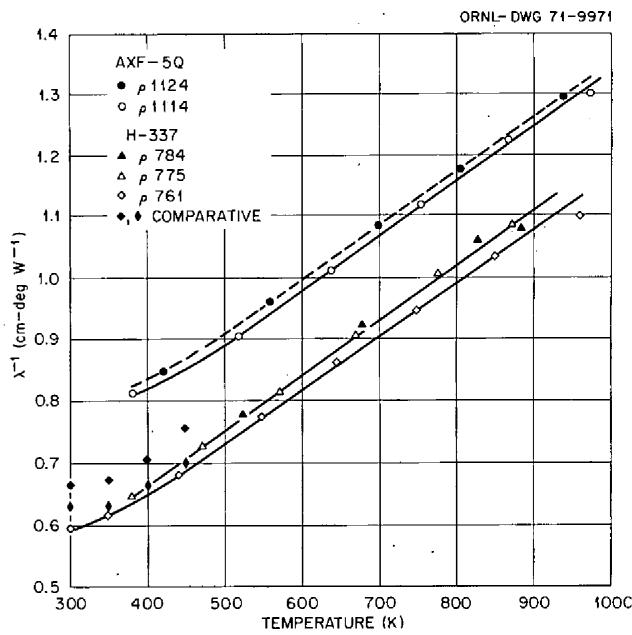  
Fig. 12.7. The thermal resistivity $(\lambda^{-1})$ of unirradiated AXF-5Q and H-337 graphites as determined in a guarded longitudinal heat-flow apparatus. Comparative heat-flow measurements on other H-337 samples are shown.

apparatus, $^{5}$ and the two approaches agree to $\pm 0.2\%$ in the temperature range of overlap. $^{6}$

Measurements of $\lambda$ and $\rho$ were performed on unirradiated AXF-5Q and H-337 graphite to $1000^{\circ}\mathrm{K}$ in this apparatus. The $\rho$ and $\lambda$ values decrease with increasing temperature. Figure 12.7 indicates a linear dependence of $\lambda^{-1}$ on temperature above $500^{\circ}\mathrm{K}$ for these graphites.

Three samples of each of these graphites were irradiated in HFIR for two cycles at 550, 650, and $750^{\circ}\mathrm{C}$ . These samples are ready for remeasurement of $\lambda$ and $\rho$ from room temperature to just below the relevant irradiation temperatures.

Assembly is $75\%$ complete on a $1200^{\circ}\mathrm{K}$ quartz dilatometer to measure the temperature dependence of the temperature coefficient of thermal expansion of these graphites and the influence of irradiation on this property. The apparatus is being interfaced with a computer-operated data-acquisition system to control the experiment and to obtain the length, temperature, and electrical resistivity of the specimen.

# 12.5 HELIUM PERMEABILITY MEASUREMENTS ON VARIOUS GRADES OF GRAPHITE

W.H.Cook J.L.Griffith

Table 12.3 is a summary of the permeability coefficients for helium determined for a few of the grades of graphites involved in the irradiation studies. Bulk

density values have been included for comparison purposes. These grades of graphite are being studied for their unique starting materials and/or fabrication techniques used. The permeability determinations are part of the characterizing data that are measured on materials in the irradiation studies. Since none of these is optimized for the Molten-Salt Breeder Reactor (MSBR)

Table 12.3. Helium permeability parameters of various grades of graphite ${}^{a}$   

<table><tr><td>Grade</td><td>Sourceb</td><td>Spec. No.</td><td>Orientationc</td><td>Bulk density (g/cm3)</td><td>B0d(cm2) × 10-12</td><td>K0d(cm) × 10-7</td><td>KHHe at 1 atm d(cm2/sec) × 10-2</td></tr><tr><td>SA-45e</td><td>CPD</td><td>102</td><td>AG</td><td>1.54</td><td>354</td><td>3.75</td><td>154</td></tr><tr><td>A-680f</td><td>SCC</td><td>111</td><td>WG</td><td>1.49</td><td>332</td><td>2.24</td><td>123</td></tr><tr><td>A-681e</td><td>SCC</td><td>111</td><td>WG</td><td>1.61</td><td>291</td><td>1.58</td><td>101</td></tr><tr><td>H-395</td><td>GLCC</td><td>51, 62</td><td></td><td>1.78(2)</td><td>10.3(2)</td><td>3.96(2)</td><td>9.32(2)</td></tr><tr><td>HL-18</td><td>ACSP</td><td>82</td><td>AG</td><td>1.87</td><td>9.94</td><td>3.67</td><td>9.22</td></tr><tr><td></td><td></td><td></td><td>WG</td><td>1.86(2)</td><td>8.66(2)</td><td>4.43(2)</td><td>10.0(2)</td></tr><tr><td>ATJS-G</td><td>CPD</td><td>41, 46</td><td>AG</td><td>1.86(20)</td><td>14.8(2)</td><td>2.57(7)</td><td>8.10(7)</td></tr><tr><td></td><td></td><td></td><td>WG</td><td>1.81(2)</td><td>25.7(3)</td><td>4.28(3)</td><td>17.7(3)</td></tr><tr><td>P-03</td><td>PCC</td><td>51, 61</td><td></td><td>1.83(2)</td><td>8.34(2)</td><td>3.04(2)</td><td>7.25(2)</td></tr><tr><td>9948</td><td>ASCP</td><td>101, 102</td><td>WG</td><td>1.91(2)</td><td>7.99(6)</td><td>3.75(6)</td><td>5.20(6)</td></tr><tr><td>HS-82</td><td>SCC</td><td>101</td><td>AG</td><td>1.71</td><td>1.09</td><td>0.586</td><td>2.27</td></tr><tr><td></td><td></td><td>82</td><td>WG</td><td>1.71</td><td>2.41</td><td>1.25</td><td>2.72</td></tr><tr><td>ATJS</td><td>CPD</td><td>43, 45</td><td>AG</td><td>1.85(2)</td><td>0.256(7)</td><td>0.098(7)</td><td>2.30(7)</td></tr><tr><td></td><td></td><td></td><td>WG</td><td>1.83(2)</td><td>4.33(9)</td><td>0.411(9)</td><td>2.36(9)</td></tr><tr><td></td><td></td><td></td><td>WG</td><td>1.85</td><td>0.508(3)</td><td>0.171(3)</td><td>0.42(3)</td></tr><tr><td>AXZ-5Q</td><td>Poco</td><td>101, 111</td><td></td><td>1.55(2)</td><td>9.86(2)</td><td>9.55(2)</td><td>18.5(2)</td></tr><tr><td>AXM-5Q</td><td>Poco</td><td>101, 111</td><td></td><td>1.75(2)</td><td>3.01(2)</td><td>2.78(2)</td><td>4.96(2)</td></tr><tr><td>AXF-5Q</td><td>Poco</td><td>82, 112</td><td></td><td>1.83(2)</td><td>1.21(2)</td><td>1.10(2)</td><td>2.17(2)</td></tr><tr><td>AXF-5QBG</td><td>Poco</td><td>832</td><td></td><td>1.83</td><td>0.472</td><td>0.499</td><td>0.962</td></tr><tr><td></td><td></td><td>831</td><td></td><td>1.90</td><td>0.0511</td><td>0.0885</td><td>0.162</td></tr><tr><td></td><td></td><td>2</td><td></td><td>1.90</td><td>0.0438</td><td>0.0685</td><td>0.123</td></tr><tr><td></td><td></td><td>1</td><td></td><td>1.90</td><td>0.0378</td><td>0.0655</td><td>0.120</td></tr><tr><td></td><td></td><td>5 cylg</td><td></td><td>1.94(5)</td><td>0.0315(5)</td><td>0.0331(5)</td><td>0.064(5)</td></tr><tr><td></td><td></td><td>81</td><td></td><td>1.92</td><td>0.0066</td><td>0.0096</td><td>0.018</td></tr></table>

${}^{a}$ The numbers enclosed in parentheses indicate the number of values averaged.   
$^{b}$ ASCP: Airco Speer Carbon Products, a subsidiary of Air Reduction Company, Inc.   
CPD: Carbon Products Division of the Union Carbide Corporation.   
GLCC: Great Lakes Carbon Corporation.   
PCC: Pure Carbon Company.   
Poco: Poco Graphite Inc.   
SCC: Stackpole Carbon Company.   
cAG: Across grain, perpendicular to the general $a$ axis orientation.   
WG: With grain, parallel with the general $a$ axis orientation.   
${}^{d}{K}_{\mathrm{{He}}} = \left( {{B}_{0}/\eta }\right) \langle p\rangle  + {4}^{3}/{k}_{0}\bar{V},$   
where $K_{\mathrm{He}} =$ permeability coefficient for helium at room temperature, $28^{\circ}\mathrm{C}$ $(\mathrm{cm}^2 /\mathrm{sec})$   
$B_{0} =$ viscous permeability $(\mathrm{cm}^2)$   
$\eta =$ viscosity of gas, He (poise),   
$\langle p\rangle =$ average pressure across specimen $(\mathrm{dynes} / \mathrm{cm}^2)$   
$K_{0} =$ slip coefficient (cm),   
$\overline{V} =$ average molecular velocity of gas, He $(\mathrm{cm}^2 /\mathrm{sec})$   
$e_{\mathrm{A}}$ lampblack-based material fired to $2800^{\circ}\mathrm{C}$ or higher.   
$f_{\mathrm{A}}$ lampblack-based material fired to $\sim 1000^{\circ}\mathrm{C}$   
$g_{\text{Average of five hollow cylinders (nominally 0.40 in. OD} \times 0.125$ in. ID $\times 1.5$ in. long) from the same block:

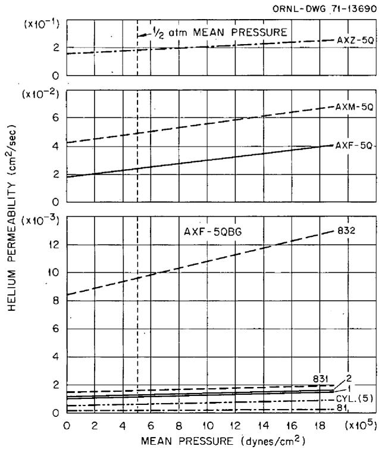  
Fig. 12.8. Helium permeability vs mean pressure for Poco graphite grades AXZ-5Q, AXF-5Q, and AXF-5QBG.

applications, it is not surprising that their permeabilities $K_{\mathrm{He}}$ are relatively high. These were determined on 1-in.-diam disks from 0.1 to 0.5 in. thick that were machined with specific orientations from their starting stock. Grades HL-18, ATJS-G, HS-82, ATJS, and AXF-5QBG illustrate how the permeability value varies with orientation and specimen location.

The isotropic Poco grades have been given more attention because the AXF series have shown the most resistance to fast neutron damage at $715^{\circ}\mathrm{C}$ . To more clearly show the permeability variations from grade to grade and within a grade, the helium permeabilities $K_{\mathrm{He}}$ are plotted vs mean pressures in Fig. 12.8 for grades AXZ-5Q, AXM-5Q, AXF-5Q, and AXF-5QBG. The first three grades are standard materials that represent different ranges of bulk densities, and AXF-5QBG is an impregnated, graphitized version of AXF-5Q. All were fabricated from fillers having a maximum particle size of 0.001 in. (ref. 7). In Fig. 12.8 and from Table 12.3 it is interesting to note that grade AXZ-5Q is more than

an order of magnitude more permeable to helium than grades AXM-5Q and AXF-5Q. The latter two are not much different from each other based on these few measurements.

Data for grade AXF-5QBG for several specimens were plotted to show the effect of the impregnation, and that even though the material is relatively uniform, like all grades of graphite, it can vary appreciably in localized zones. The latter is illustrated in Fig. 12.8 by the results obtained on specimens 831 and 832 that were machined from the same block. The impregnation appears to reduce the permeability of grade AXF-5Q by one to two orders of magnitude.

# 12.6 REDUCTION OF GRAPHITE PERMEABILITY BY PYROLYTIC CARBON SEALING

C. B. Pollock W. P. Eatherly

Graphite to be used in the core of an MSBR must be able to exclude fluoride salts and gaseous fission products. We have been studying techniques to seal the surface of the graphite with pyrolytic carbon. Two techniques have been used: a vacuum-pulse impregnation technique in which surface pores of the graphite are closed by plugging them with pyrolytic carbon and a coating procedure in which a continuous surface coating of impermeable pyrolytic carbon is deposited on the graphite. Both techniques have been successful in sealing commercially available graphite suitable for use in the core of an MSBR.

In conjunction with the fabrication program a concomitant irradiation testing program is being conducted in which graphite samples sealed with pyrolytic carbon are subjected to MSBR conditions of neutron fluence and temperature. A HFIR irradiation experiment containing a number of coated samples and impregnated samples was recently completed. This experiment contained 10 graphite samples coated with pyrolytic carbon and 12 graphite samples that were impregnated with pyrolytic carbon.

Turning first to the coated samples, four of these have been cycled twice through HFIR and now have a total neutron dose of $2.4 \times 10^{22}$ neutrons/cm² ( $E > 50$ MeV) at a temperature of $700^{\circ}\mathrm{C}$ . Three of the samples appeared to be intact except for some small cracks on their ends, but independent of this, the helium permeabilities went from less than $10^{-8}$ to greater than $10^{-2}$ cm²/sec. The remaining sample was extensively cracked over its entire surface. A second set of coated samples has been cycled through HFIR for the first time and received total neutron doses of up to $1.3 \times 10^{22}$ neutrons/cm² ( $E > 50$ MeV) at $700^{\circ}\mathrm{C}$ . Five of these

samples cracked badly and had helium permeabilities of greater than $10^{-2}\mathrm{cm}^2/\mathrm{sec}$ . However, one of the samples appeared to be unaffected by the experiment.

The only significant difference between these two sets of coated samples is the coating thickness. The first group had coating thicknesses ranging from 4 to 6 mils; the second set had coating thicknesses of 2 to 3 mils. The one sample of the second set that survived had a coating that was 3 mils thick. Coating thickness and microstructure are the significant variables, but further work will be required to determine if satisfactory coatings can be devised.

The results on the 12 pyrolytically impregnated samples are given in Table 12.4. Six of these have been recycled in HFIR to fluences of up to $3.7 \times 10^{22}$ ; six new samples have received only their first irradiation up to $1.2 \times 10^{22}$ . The new samples appear to be significantly better than previous samples irradiated to similar fluences. The pore size distribution of these samples will be examined by mercury porosimetry. The amount of pyrolytic carbon required for sealing can be controlled by varying process parameters. Helium permeabilities of less than $10^{-8} \, \text{cm}^2/\text{sec}$ have been obtained in graphite samples whose weight increase was less than $4\%$ with a processing time of only $2 \, \text{hr}$ at $750^{\circ}\text{C}$ . Graphite samples sealed in this manner should behave more like unimpregnated base stock graphite. A number of samples containing the minimum amount of carbon needed for sealing has been prepared for the next experiment in an attempt to control the neutron-induced expansion of the graphite.

As noted in Table 12.4, one of the samples has increased its length by $11\%$ , or substantially more than

Table 12.4. Impregnated samples   

<table><tr><td>Sample No.</td><td>Permeability before (cm2/sec)</td><td>Permeability after (cm2/sec)</td><td>Fluence (neutrons/cm2) (×1021)</td><td>ΔL/L (%)</td></tr><tr><td>I231</td><td>2.3 × 10-9</td><td>5.1 × 10-9</td><td>12.11</td><td></td></tr><tr><td>I208</td><td>1.3 × 10-9</td><td>2.2 × 10-6</td><td>8.76</td><td></td></tr><tr><td>I236</td><td>2.2 × 10-9</td><td>1.0 × 10-6</td><td>7.82</td><td></td></tr><tr><td>I211</td><td>1.5 × 10-9</td><td>6.2 × 10-7</td><td>12.45</td><td></td></tr><tr><td>HR20</td><td>1 × 10-9</td><td>2.3 × 10-8</td><td>5.59</td><td></td></tr><tr><td>HR12</td><td>1 × 10-8</td><td>6.5 × 10-6</td><td>11.35</td><td></td></tr><tr><td>I205</td><td>4.4 × 10-10</td><td>7.2 × 10-5</td><td>17.06</td><td>0.7</td></tr><tr><td>I216</td><td>5.9 × 10-10</td><td>9.8 × 10-5</td><td>21.19</td><td>2.2</td></tr><tr><td>HL32</td><td>1.6 × 10-8</td><td>9.1 × 10-5</td><td>20.60</td><td>0.8</td></tr><tr><td>I182</td><td>1.7 × 10-8</td><td>1.5 × 10-2</td><td>31.24</td><td>6.0</td></tr><tr><td>I181</td><td>5.1 × 10-9</td><td>9.0 × 10-2</td><td>36.97</td><td>11.0</td></tr><tr><td>I163</td><td>7.0 × 10-9</td><td>2.9 × 10-4</td><td>25.67</td><td>2.0</td></tr></table>

would be expected from the unimpregnated base stock graphite at similar fluences.

Preliminary experiments have demonstrated the feasibility of coating graphite with pyrolytic carbon. Samples have been prepared in fluid bed furnaces designed for coating spherical fuel particles. The small graphite samples were suspended in a bed of inert particles that were levitated by a flow of helium. Then the gaseous hydrocarbon was infected and cracked at various temperatures, and the graphite sample was coated in the same manner as the spherical particles. Dense isotropic coatings of pyrolytic carbon tightly bonded to the samples were obtained in this fashion; however, this would clearly be a difficult technique to use on large graphite tubes or cylinders.

A carbon resistance furnace has been built for coating experiments with larger graphite samples. This furnace is similar to conventional fluid bed coating furnaces but will permit the investigation of depositing dense isotropic pyrolytic carbon on a fixed substrate by altering such variables as gas flow, gas mixture, and bed condition. The furnace is complete, and samples are being prepared for coating.

# 12.7 THE MAGNIFIED TOPOGRAPHY OF GRAPHITE SEATED WITH PYROLYTIC CARBON

W. H. Cook

We have begun a detailed characterization of the graphite grades sealed with pyrocarbon. The objectives are to learn more about the pyrocarbon-sealing techniques and to determine what produces a pyrocarbon seal that has the maximum resistance to damage by fast neutrons.

Parts of the early phases of this work are evaluations of the various techniques available for characterization of the pyrocarbon sealants. The scanning electron microscope (SEM) is one of the potential tools for this work. A preliminary examination of the surfaces of unirradiated grade AXF specimens of graphite machined in the shape of HFIR specimens, 0.128 in. ID by 0.400 in. OD by 0.500 in. long, has been made with an SEM. One specimen was as-machined, and the other had been impregnated with pyrocarbon from butadiene at $750^{\circ}\mathrm{C}$ and heat treated at $1650^{\circ}\mathrm{C}$ .

The examination of the as-machined specimen shown in Fig. 12.9a suggests a tearing of the filler particles more than a cutting operation. At this magnification of $2000\times$ , the surfaces appear to be mosaic of irregular-shaped, equiaxed particles. In Fig. 12.9b, at the same magnification, the surfaces of the pyrocarbon-sealed

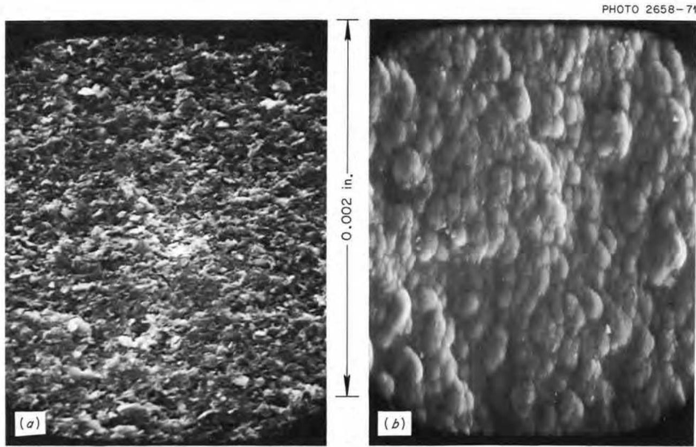  
Fig. 12.9. Scanning electron microscope photomicrographs of the surfaces of grade AXF graphite. (a) As machined as a HFIR irradiation specimen. (b) A like specimen that was impregnated with pyrocarbon from butadiene at $750^{\circ}\mathrm{C}$ and heat treated at $1650^{\circ}\mathrm{C}$ . 2000×. Note: The surfaces of the specimens were not coated with a film of metal to reduce charging-up effects.

specimen showed that pyrocarbon covered the exposed filler particles so that they now had sphere-like shapes and appeared to be a surface composed of closely stacked, rough spherules. Since the sealing with the pyrocarbon was designed to be an impregnation rather than a surface coating, the latter surface appearance is not illogical.

There are some charging-up effects observable in Fig. 12.9 that might have been eliminated or reduced by coating the specimens with a thin film of metal prior to their examination with the SEM. We did not do this because such an operation would be impractical in our future work with irradiated specimens that we periodically examine and recycle for additional radiation.

This SEM work indicates promise; however, additional work with it remains to be done in order to evaluate it and apply it to our objectives.

# 12.8 REDUCTION OF PERMEABILITY BY FLUID IMPREGNATION

W.H.Cook

It has been proposed that unfueled salt impregnated into the accessible pores of graphite may be a practical way of reducing its gas permeability. Preliminary tests with an analog impregnation with bismuth and unfueled salt impregnation indicate that helium permeability of a permeable graphite can be reduced to the range of $10^{-6}$ $\mathrm{cm}^2/\mathrm{sec}$ . Additional studies are required to determine the practical limits for reducing permeabilities by this technique and to evaluate the effectiveness of such fluid

impregnations for reducing fission gas penetration into the graphite.

In an analog test using impregnation by bismuth (which expands on freezing) instead of molten salt, the helium permeability was decreased two to five orders of magnitude, depending on the grade of graphite used. The lowest permeability values were in the $10^{-6}$ $\mathrm{cm}^2/\mathrm{sec}$ range. Apparently, there were enough $< 0.25\mu \mathrm{m}$ pore entrance diameters that were not impregnated to prevent the permeability from attaining the desired range of $< 10^{-8}\mathrm{cm}^2/\mathrm{sec}$ .

Prior to the early shutdown of the MSRE, we had planned to determine the actual effect of an unfueled salt impregnant on graphite from the standpoints of the reduction of gas permeabilities and gaseous fission products penetration into the graphite in the MSRE environment. To do this, we impregnated evacuated specimens of grade AXF-5Q graphite with $\mathrm{NaF - BeF_2}$ (66-34 mole %) under a pressure of 200 psi at $705^{\circ}\mathrm{C}$ . This should have caused pore entrances down to approximately $0.5\mu \mathrm{m}$ in diameter to be filled. Equipment limitations for the required salt temperature prevented our using enough pressure to penetrate pore entrance diameters down to approximately $0.25\mu \mathrm{m}$ as was done in the analog test with the bismuth. The permeability values for the bismuth- and the salt-impregnated specimens are compared with their controls in Table 12.5. The higher permeability of the

salt-impregnated specimen over the bismuth-impregnated specimen is probably due to the shrinkage that occurs in the salt when it freezes. This is supported by the facts that the pore entrance diameters of the unimpregnated grades AXF and AXF-5Q are concentrated at $1\mu$ ,and there is a larger viscous component of gas flow for the specimen impregnated with the frozen salt vs the one impregnated with frozen bismuth. The freezing of the salt apparently makes available porosity that has relatively large effective pore diameters compared with those remaining in the bismuth-impregnated specimen. The salt in the molten state should seal against helium flow as well as the frozen bismuth.

Additional studies are required to determine (1) the practical limits for reducing gas permeabilities by this technique and (2) the diffusion rates of fuel salt components into the impregnant(s). The final gas permeability values attained will determine the effectiveness of such impregnations for reducing fission gas penetration into the graphite. Xenon-135, which has a high cross section for thermal neutrons, is the fission gas of primary concern. Uranium (or plutonium) and salt-soluble fission product migration into the impregnants will be the primary concerns in the diffusion rate studies.

# 12.9 FUNDAMENTAL STUDIES OF RADIATION DAMAGE MECHANISMS IN GRAPHITE

S.M.Ohr T.S.Noggle

Irradiation of graphite single crystals at temperatures of 300 to $600^{\circ}\mathbf{C}$ in a $200\mathrm{-kv}$ electron microscope leads

Table 12.5. Permeability effects on a graphite impregnated with solidified bismuth or NaF-BeF $_2$   

<table><tr><td rowspan="2">Graphite grade</td><td colspan="2">Specimen</td><td rowspan="2">Impregnation</td><td colspan="3">Permeability parametersa</td></tr><tr><td>Number</td><td>Type</td><td>B0(cm2)</td><td>K0(cm)</td><td>KHHe at 1 atm (cm2/sec)</td></tr><tr><td rowspan="2">AXF</td><td>1</td><td>Hollow cylinder</td><td>None</td><td>3.30 × 10-12</td><td>1.94 × 10-7</td><td>4.10 × 10-2</td></tr><tr><td>1</td><td>Cylinder</td><td>Bismuth</td><td>5.49 × 10-17</td><td>2.15 × 10-11</td><td>3.76 × 10-6</td></tr><tr><td>AXF-5Q</td><td>5</td><td>Disk</td><td>None</td><td>1.29 × 10-12</td><td>1.22 × 10-7</td><td>2.39 × 10-2</td></tr><tr><td>AXF-5Q</td><td>4</td><td>Disk</td><td>NaF-BeF2b</td><td>1.45 × 10-15</td><td>2.47 × 10-10</td><td>4.52 × 10-5</td></tr></table>

$$
{ } ^ { a } K _ { \mathrm { H e } } = ( B _ { 0 } / \eta ) \left\langle p \right\rangle + { } ^ { a } / _ { 3 } K _ { 0 } \bar { V } ,
$$

where $K_{\mathrm{He}} =$ permeability coefficient for helium at room temperature, $28^{\circ}\mathrm{C}$ $(\mathrm{cm}^2/\mathrm{sec})$

$\widetilde{B}_0 =$ viscous permeability $(\mathrm{cm}^2)$

$\eta =$ viscosity of gas, He (poise),

$\langle p\rangle =$ average pressure across specimen $(\mathrm{dynes} / \mathrm{cm}^2)$

$K_{0} =$ slip coefficient (cm),

$\overline{V} =$ average molecular velocity of gas, He (cm/sec).

The nominal composition is NaF-BeF $_2$ (66-34 mole%).

to the formation of visible spot-type damage structure in relatively short times. Studies of the contrast of the defect clusters for various diffraction conditions have shown that the defects are dislocation loops of interstitial type. In dark-field micrographs as in Fig. 12.10, the damage clusters frequently appear as both black and white spots in roughly equal numbers. This black and white contrast is found to be quite sensitive to the diffraction condition, that is, the deviation from the Bragg condition. Stereoscopic study of this structure has shown that the black and white spots are present as several alternating layers parallel to the surface of the specimen. The behavior of this black-white structure

10. S. M. Ohr and T. S. Nuggle, MSR Program Semiannu. Progr. Rep. Feb. 28, 1971, ORNL-4676, pp. 174-76.

with variation of the diffraction condition has been found to be consistent with and hence attributable to the stacking fault present in the prismatic dislocation loop formed by the clustering of interstitial atoms. Figure 12.11a shows the intensity of the diffracted beam as a function of the position of a stacking fault in a 2300-Å-thick graphite crystal. The oscillation of the intensity with depth about the perfect crystal value (dashed line) predicts three layers of dark (black) spots and two layers of light (white) spots as has been observed experimentally.

Other aspects of the contrast of these defect clusters, although qualitatively consistent with the behavior expected of interstitial-type dislocation loops, suggest that the strain contrast is less than would be expected on the basis of diffraction contrast theory employing the displacement field derived from isotropic elasticity

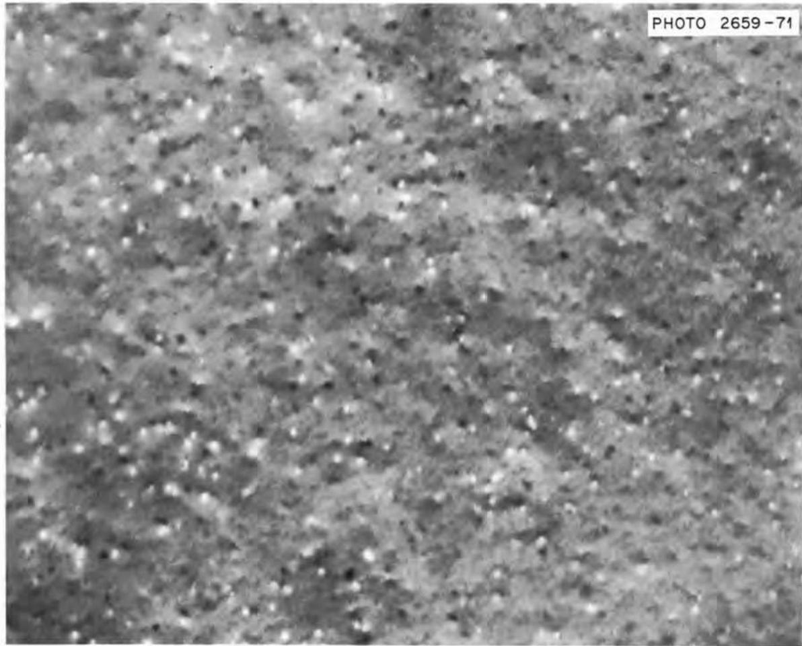  
Fig. 12.10. (1011) Dark-field micrograph of graphite irradiated at $400^{\circ}\mathrm{C}$ with $175\mathrm{-kv}$ electrons. Interstitial-type prismatic dislocation loops show black and white contrast as predicted by calculations shown in Fig. 12.11. 60,000x.

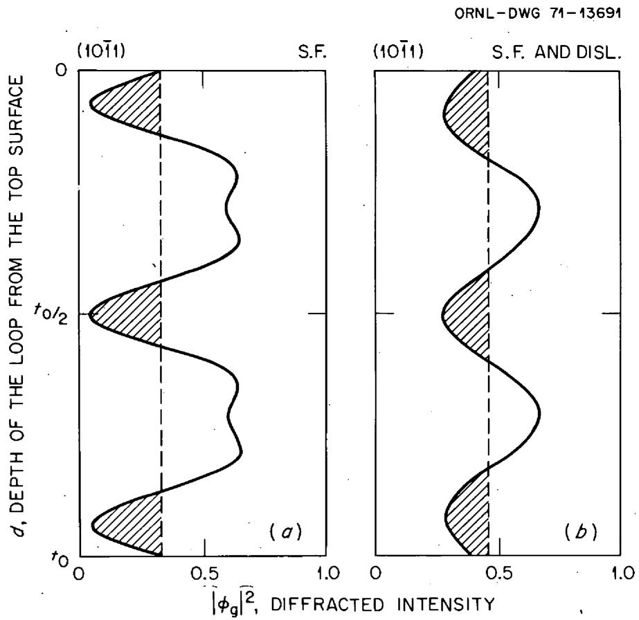  
Fig. 12.11. Computed depth dependence of the diffracted intensity for interstitial-type prismatic dislocation loops in a 2300-A-thick graphite specimen. Diffraction conditions and specimen thickness correspond to Fig. 12.10. (a) Stacking fault contrast. (b) Stacking fault and dislocation contrast. Dashed lines indicate perfect crystal diffracted intensity, shaded areas indicate depth regions of dark (black) loops, and unshaded areas indicate regions of light (white) loops.

theory. In order to clarify this matter, the stress and displacement fields for a circular prismatic dislocation loop have been derived using anisotropic elasticity theory. The results indicate that the overall effect of crystal anisotropy is to reduce the stress and displacement fields around the loop by about an order of magnitude, except for the component of displacement normal to the loop plane which is increased by about a factor of 2. These results appear reasonable when one considers the nature of chemical bonds in graphite, which calls for a strong covalent bonding in the basal plane compared with a weak van der Waals-type bonding across the basal plane. When a dislocation loop is created between basal planes, the crystal expands more readily along the $c$ axis giving rise to large atomic displacements in this direction. In the basal plane, graphite is elastically too rigid to accommodate appreciable displacement.

On the basis of the anisotropic elasticity theory of atomic displacements around a dislocation loop, calculations of image contrast in the electron microscope have been carried out in the IBM-360 computer. It is found that the crystal anisotropy does influence the intensity and apparent size of the image of a dislocation loop. Figure 12.11b shows the calculated diffracted intensity at the exit surface of the specimen for the central region of a loop as a function of the position of the loop in a specimen for diffraction conditions similar to those present in Fig. 12.10. The variation of the intensity relative to the perfect crystal value is similar to that for the stacking fault alone (Fig. 12.11a), indicating that the stacking fault is dominant in determining the contrast for the conditions considered here. Experiments and calculations are currently being made to examine more closely the agreement between observed and calculated contrast.

# 13. Hastelloy N

H. E. McCoy

The search for a chemically modified composition of Hastelloy N with improved resistance to irradiation damage continues. The elements of primary concern are Ti, Nb, Hf, Zr, Si, and C. We continue to approach the problem by initially making small laboratory melts and then procuring 50- to 100-lb commercial melts. This gives us some feel for the problems that will be encountered in scaleup of these alloys to production size (10,000 lb or greater). This work involves mechanical property studies on unirradiated and irradiated samples.

Our compatibility programs are involved with the corrosion of Hastelloy N in several fluoride salts and in steam. The salt of primary concern is the new proposed coolant salt, sodium fluoroborate. Several thermal convection and two pump loops are committed to studying corrosion in this salt. Steam corrosion work continues at two facilities. Hastelloy N is currently being exposed in the unstressed and stressed conditions.

# 13.1 ELECTRON MICROSCOPY STUDIES

R.E.Gehlbach S.W.Cook

Our studies of the effects of alloying additions on the microstructures in modified Hastelloy N at elevated temperatures have concentrated in three primary areas. The first area consists of the effects of Hf, as a sole addition or in combination with Ti and Nb, on carbide precipitation. These studies have included variable concentrations of C and Si and both laboratory and small commercial melts. We have achieved a reasonable understanding of precipitation processes in laboratory heats containing Hf; however, its effect in commercial alloys is not clear.

The second area of interest deals with the precipitation of $\mathrm{Ni}_{3}\mathrm{Ti}$ in titanium-modified Hastelloy N. Recent observations indicate that a Ti concentration of about $2\%$ may provide good resistance to irradiation embrittlement at $700^{\circ}\mathrm{C}$ and higher. We are concerned whether this amount of Ti will promote the formation of $\mathrm{Ni}_{3}\mathrm{Ti}$ at various temperatures. Precipitation of this intermetallic dramatically increases the strength, but causes embrittlement.

The last area of study reported deals with preliminary observations of strain-induced precipitation in modified alloys. Carbides which precipitate during a creep-rupture test are different in morphology and distribution from those generated during short-term tensile tests or elevated temperature exposure in the absence of strain.

# 13.1.1 Microstructures of Hf-Modified Hastelloy N Laboratory Melts

The laboratory heats discussed in this report have a base composition of $\mathrm{Ni - 12\% Mo - 7\% Cr - 4\% Fe - 0.2\%}$ Mn and are modified with $0.5\%$ Hf, $0.5\%$ Ti, and $0.6\%$ Nb unless otherwise noted. The standard carbon and silicon concentrations are 0.05 and $\leqslant 0.01\%$ .

The microstructure characteristic of hafnium-modified laboratory melts has been discussed previously $^{1-3}$ and is shown in Fig. 13.1 for an alloy

containing $0.7\%$ Hf after aging 200 hr at $760^{\circ}\mathrm{C}$ . Small particles and platelets of MC carbide, about 0.1 to 0.3 $\mu \mathrm{m}$ in diameter, precipitate throughout the matrix with the exception of a region along grain boundaries approximately $2\mu \mathrm{m}$ wide that is denuded of precipitate. Grain boundaries contain many small MC carbides

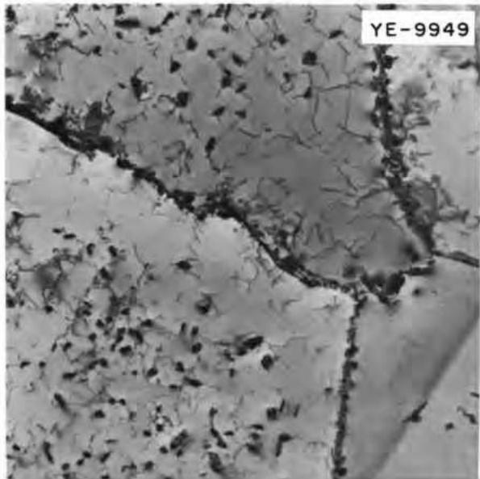  
Fig. 13.1. Typical MC carbide distribution in hafnium-modified hastelloy N. The alloy contains $0.7\%$ Hf and $0.06\%$ C and was aged 200 hr at $760^{\circ}\mathrm{C}$ . $5000\times$ .

the same size or slightly smaller than the matrix precipitates. These grain boundary carbides are closely spaced, and there does not appear to be any significant coarsening of the matrix carbides between 10 and 1000 hr of aging. However, a high dislocation density is present around those precipitated during aging $10\mathrm{hr}$ at $760^{\circ}\mathrm{C}$ . No matrix precipitate is observed in annealed material prior to aging.

Effect of aging temperature. The microstructure of the reference alloy (alloy 329) in the Hf-Ti-Nb series is shown in Fig. 13.2a after aging $1000\mathrm{hr}$ at $760^{\circ}\mathrm{C}$ . The precipitation process is similar to the hafnium-modified laboratory heat discussed above. The matrix MC carbides are somewhat coarser $(0.3$ to $0.5\mu \mathrm{m})$ in the more highly modified series. In addition, a very small amount of MC carbide precipitates in the stacking fault morphology previously observed in the titanium-modified alloys. This stacking fault precipitate (SFP) is much finer in the alloys modified with Hf-Ti-Nb than in those modified with Ti alone. In general, the SFP only occurs in the interior of grains.

Aging at the lower temperature of $650^{\circ}\mathrm{C}$ results in finer matrix precipitates than at $760^{\circ}\mathrm{C}$ . Thin platelets are generally formed at $760^{\circ}\mathrm{C}$ (Fig. 13.2a), and particles and thick platelets are formed at $650^{\circ}\mathrm{C}$ (Fig. 13.2b). The amount of precipitate is considerably higher at $650^{\circ}\mathrm{C}$ than at $760^{\circ}\mathrm{C}$ , and formation of SFP is much more prevalent at $650^{\circ}\mathrm{C}$ . In addition, a dispersion of very fine carbides $(\leqslant 200\AA)$ is observed

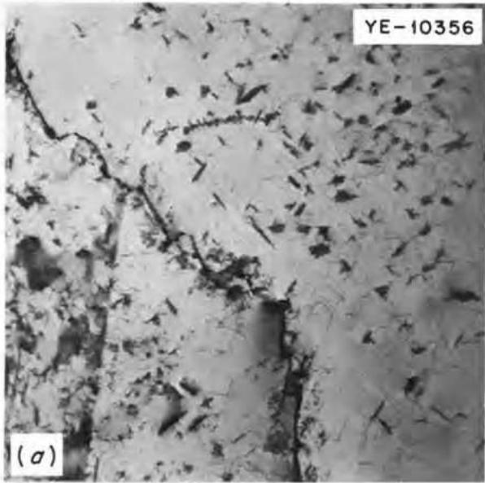

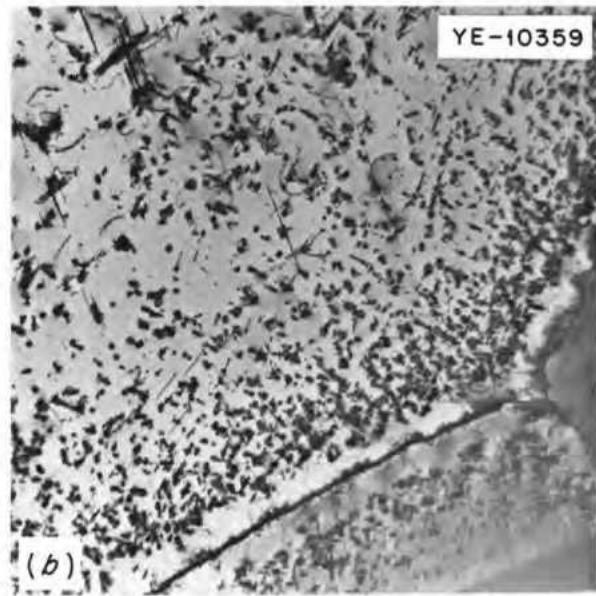  
Fig. 13.2. MC carbides in microstructure of Hastelloy N containing $0.5\%$ Hf, $0.5\%$ Ti, $0.6\%$ Nb, and $0.05\%$ C. Annealed 1 hr at $1180^{\circ}\mathrm{C}$ and aged 1000 hr at (a) $760^{\circ}\mathrm{C}$ and (b) $650^{\circ}\mathrm{C}$ . $5000\times$

throughout the matrix after aging at $650^{\circ}\mathrm{C}$ (not resolvable in Fig. 13.2a). These extremely fine precipitates are also present in alloys modified only with hafnium after exposure at $650^{\circ}\mathrm{C}$ .

Effect of carbon concentration. The effect of carbon concentration on precipitation in the Hf-Ti-Nb series is shown in Figs. 13.2 to 13.4. The microstructures of an alloy with $0.008\%$ C (alloy 331) after aging $1000\mathrm{hr}$ at 760 and $650^{\circ}\mathrm{C}$ are shown in Fig. 13.3. The matrix carbides are slightly smaller at $760^{\circ}\mathrm{C}$ (Fig. 13.3a) than those in the alloy with the nominal $0.05\%$ C (Fig. 13.2a), but are present in a much lower concentration. Grain boundary carbides are very numerous, however. A high density of very fine carbides is present after exposure at $650^{\circ}\mathrm{C}$ (Fig. 13.3b). With $0.014\%$ C (alloy 332) the microstructure after aging at $760^{\circ}\mathrm{C}$ is similar to that of the very low carbon alloy, but with more carbides present.

Increasing the carbon concentration above the standard $(0.05\%)$ level generally results in fewer but coarser carbides. The microstructures of an alloy containing $0.14\%$ carbon (alloy 335) after aging at 760 and $650^{\circ}\mathrm{C}$ are shown in Fig. 13.4. Large primary carbides of the $\mathbf{M}_2\mathbf{C}$ type are present at both temperatures. The characteristic matrix MC carbide is virtually absent at $760^{\circ}\mathrm{C}$ but is present in relatively high concentrations at $650^{\circ}\mathrm{C}$ . Its occurrence is generally limited to large-grained areas which do not contain large quantities of $\mathbf{M}_2\mathbf{C}$ . The MC carbide is coarser than that

formed at $650^{\circ}\mathrm{C}$ in heats containing lower carbon levels. A carbon concentration of $0.087\%$ results in considerably more fine matrix precipitate at each temperature, but much primary $\mathbf{M}_2\mathbf{C}$ is also present.

Effect of silicon additions. Additions of silicon to Hf-Ti-Nb-modified alloys containing the standard $0.05\%$ carbon results in massive silicon-rich primary $\mathrm{M}_6\mathrm{C}$ carbides primarily located in grain boundaries and as stringers. The microstructures resulting from the addition of $0.44\%$ silicon are shown in Fig. 13.5 after aging at 760 and $650^{\circ}\mathrm{C}$ . Large $\mathrm{M}_6\mathrm{C}$ precipitates are in the grain boundaries in Fig. 13.5a after exposure at $760^{\circ}\mathrm{C}$ . No matrix precipitation of MC-type carbides occurs at this temperature (compare with Fig. 13.2a where the Si content was $< 0.1\%$ ). At the lower aging temperature, precipitation of all morphologies of MC discussed previously are present in addition to the large $\mathrm{M}_6\mathrm{C}$ particles in the grain boundary (Fig. 13.5b). Some fine MC is also present in the grain boundaries after aging at $650^{\circ}\mathrm{C}$ .

Silicon additions of about $0.15\%$ result in a smaller quantity of $\mathrm{M}_6\mathrm{C}$ and corresponding increases in the amount of MC precipitating in the matrix during aging at both 650 and $760^{\circ}\mathrm{C}$ . Thus, silicon removes much of the carbon from solution that would otherwise be available for MC precipitation during aging.

In summary, MC carbides which precipitate in the matrix of Hf-Ti-Nb-modified Hastelloy N are present in various sizes, morphologies, and concentrations de

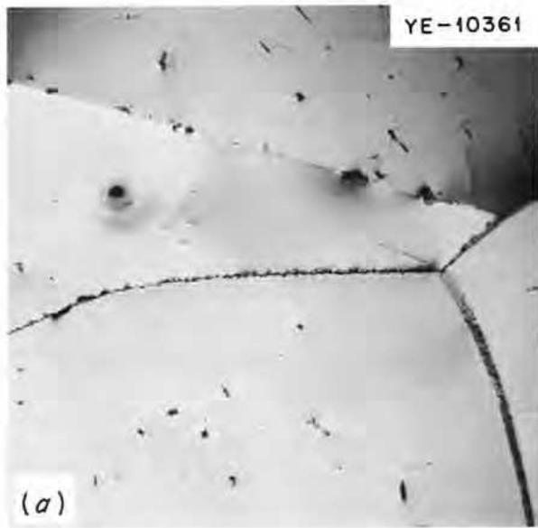

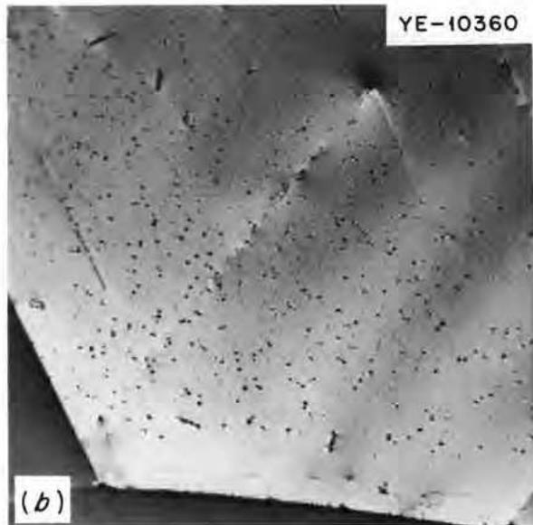  
Fig. 13.3. MC carbide distribution in Hf-Ti-Nb modified Hastelloy N containing $0.008\%$ C. Annealed 1 hr at $1180^{\circ}\mathrm{C}$ and aged 1000 hr at (a) $760^{\circ}\mathrm{C}$ and (b) $650^{\circ}\mathrm{C}$ . 5000x.

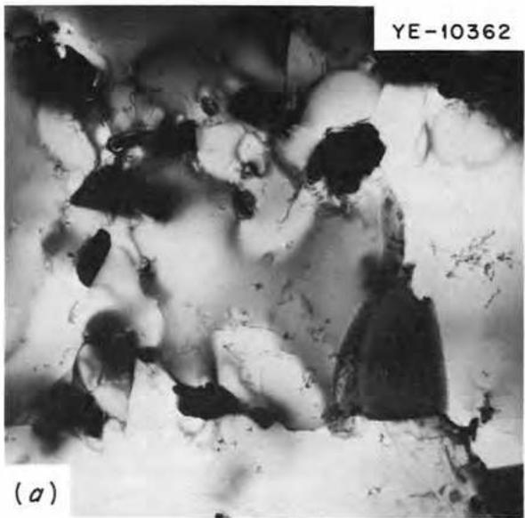

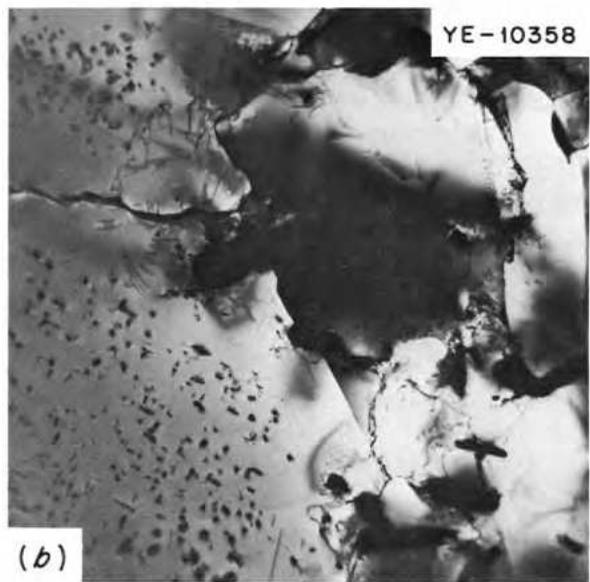  
Fig. 13.4. Carbide distribution in high carbon (0.14%) heat of Hf-Ti-Nb modified Hastelloy N. Large carbides are $\mathbf{M}_2\mathbf{C}$ ; small particles are MC. Annealed 1 hr at $1180^{\circ}\mathrm{C}$ and aged 1000 hr at (a) $760^{\circ}\mathrm{C}$ and (b) $650^{\circ}\mathrm{C}$ . $5000\times$

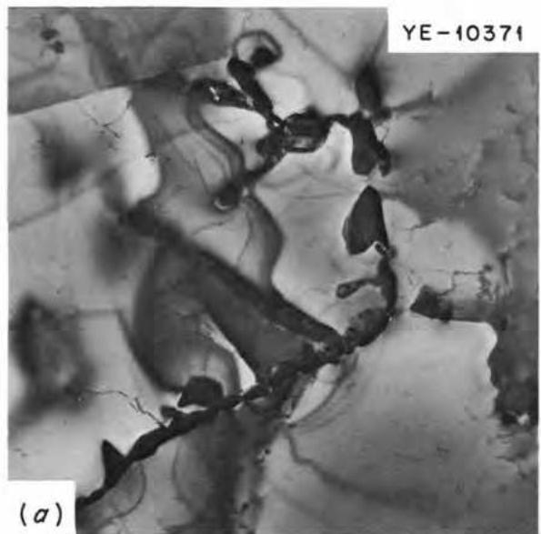

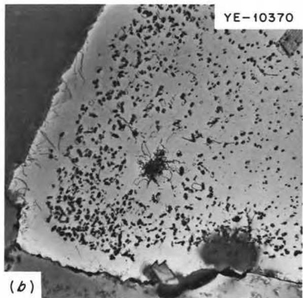  
Fig. 13.5. Effect of $0.44\%$ silicon on microstructures of Hf-Ti-Nb modified Hastelloy N $(0.05\%)$ C). Large carbides are $\mathbf{M}_6\mathbf{C}$ ; others are MC. Annealed 1 hr at $1180^{\circ}\mathrm{C}$ and aged 1000 hr at (a) $760^{\circ}\mathrm{C}$ and (b) $650^{\circ}\mathrm{C}$ . $5000\times$

pending on the aging temperature at the standard $0.05\%$ carbon level. Decreasing the carbon content decreases the size and amount of matrix MC precipitated. Increasing the carbon level above $0.05\%$ results in large primary $\mathbf{M}_2\mathbf{C}$ carbides at the expense of fine MC.

The addition of silicon results in precipitation of large primary silicon-rich $\mathbf{M}_6\mathbf{C}$ carbides with subsequent precipitation of MC dependent on the amount of carbon remaining in solid solution.

Commercial alloys. We have examined the microstructures of nearly all of the commercial heats of modified Hastelloy N listed in Table 13.1 after aging at 650, 760, and in several cases $700^{\circ}\mathrm{C}$ . Our general observations have been reported previously.[2,3] A particular concern is that the microstructures of the heats containing hafnium do not resemble those of laboratory melts with similar compositions. Instead of platelets and fine particles of MC carbides in the matrix and grain boundaries, the microstructure consists of large amounts of MC in jagged grain boundaries and extending into the matrix 1 to $3\mu \mathrm{m}$ . The grain interiors are generally quite free of precipitates. The alloy modified only with $0.8\%$ Hf (heat 70-796) does exhibit some matrix MC, although it is very heterogeneously distributed and much larger in size than that observed in the laboratory heats. The grain boundaries are rather typical of the other commercial heats, although less carbide is present adjacent to the boundaries. Similar observations were made on a commercial alloy (67-504) containing $0.5\%$ Hf that was produced by a different vendor.

Material from both of these commercial heats was remelted and fabricated at ORNL with the same procedures used for the laboratory heats. The microstructures of the lab remelts after aging at $760^{\circ}\mathrm{C}$ are similar to each other. The remelts differ from the straight commercial material in that grain boundary precipitation of the reprocessed alloys strongly resembles that of conventional laboratory melts: fine particles with no precipitate adjacent to the grain boundaries. Figure 13.6a shows typical grain boundary precipitate and a patch of heterogeneous matrix carbide in the commercial alloys containing $0.8\%$ Hf. The laboratory remelts (Fig. 13.6b) do not have carbides adjacent to the grain boundary. A very small amount of matrix carbide is present in the remelts after aging although heterogeneously distributed.

The microstructures of the remelted alloys aged for 200 hr at $650^{\circ}\mathrm{C}$ are both free of precipitate. This microstructure is different from that of the commercial and the laboratory melts, and we currently have no explanation for this anomalous observation.

# 13.1.2 $\mathbf{N}\mathbf{i}_{3}\mathbf{T}\mathbf{i}$ Precipitation in Ti-Modified Hastelloy N

Observations that Ti concentrations above $1\%$ result in improved postirradiation ductility after irradiation at temperatures above $700^{\circ}\mathrm{C}$ have generated renewed interest in using Ti as the sole modifying element in Hastelloy N. Precipitation of $\mathrm{Ni}_3\mathrm{Ti}$ would be undesirable, as its effect is one of dramatic strengthening at

Table 13.1. Compositions of experimental alloys   

<table><tr><td rowspan="2">Alloy No.</td><td colspan="10">Concentration (%)</td></tr><tr><td>Mo</td><td>Cr</td><td>Fe</td><td>Mn</td><td>Si</td><td>Ti</td><td>Zr</td><td>Hf</td><td>Nb</td><td>C</td></tr><tr><td>70-785</td><td>12.3</td><td>7.0</td><td>0.16</td><td>0.30</td><td>0.09</td><td>1.1</td><td>0.012</td><td>&lt;0.003</td><td>0.097</td><td>0.057</td></tr><tr><td>70-727</td><td>13.0</td><td>7.4</td><td>0.05</td><td>0.37</td><td>&lt;0.05</td><td>2.1</td><td>0.011</td><td>&lt;0.01</td><td>&lt;0.01</td><td>0.044</td></tr><tr><td>70-796</td><td>12.5</td><td>7.5</td><td>0.054</td><td>0.64</td><td>0.02</td><td>0.04</td><td>0.024</td><td>0.79</td><td>0.04</td><td>0.04</td></tr><tr><td>69-648</td><td>12.8</td><td>6.9</td><td>0.3</td><td>0.34</td><td>0.05</td><td>0.92</td><td>0.005</td><td>&lt;0.05</td><td>1.95</td><td>0.043</td></tr><tr><td>69-714</td><td>13.0</td><td>8.5</td><td>0.10</td><td>0.35</td><td>&lt;0.05</td><td>0.80</td><td>0.028</td><td>&lt;0.01</td><td>1.6</td><td>0.013</td></tr><tr><td>70-835</td><td>12.5</td><td>7.9</td><td>0.68</td><td>0.60</td><td>0.05</td><td>0.71</td><td>&lt;0.005</td><td>0.031</td><td>2.60</td><td>0.052</td></tr><tr><td>70-786</td><td>12.2</td><td>7.6</td><td>0.41</td><td>0.43</td><td>0.08</td><td>0.82</td><td>0.024</td><td>&lt;0.003</td><td>0.62</td><td>0.044</td></tr><tr><td>69-641</td><td>13.9</td><td>6.9</td><td>0.3</td><td>0.35</td><td>0.02</td><td>1.3</td><td>0.021</td><td>0.40</td><td>&lt;0.05</td><td>0.05</td></tr><tr><td>70-787</td><td>12.3</td><td>7.0</td><td>0.18</td><td>0.43</td><td>0.09</td><td>0.90</td><td>0.038</td><td>0.77</td><td>0.12</td><td>0.041</td></tr><tr><td>70-795</td><td>13.7</td><td>8.3</td><td>0.035</td><td>0.63</td><td>0.03</td><td>1.5</td><td>0.018</td><td>0.42</td><td>0.005</td><td>0.05</td></tr><tr><td>70-788</td><td>12.1</td><td>7.3</td><td>0.43</td><td>0.41</td><td>0.1</td><td>1.4</td><td>0.020</td><td>0.30</td><td>0.67</td><td>0.027</td></tr><tr><td>70-797</td><td>12.7</td><td>7.0</td><td>0.29</td><td>0.38</td><td>0.02</td><td>0.59</td><td>0.040</td><td>0.78</td><td>0.98</td><td>0.049</td></tr><tr><td>70-798</td><td>13.5</td><td>7.9</td><td>0.26</td><td>0.53</td><td>0.02</td><td>0.71</td><td>0.012</td><td>0.28</td><td>0.94</td><td>0.036</td></tr><tr><td>68-688</td><td>14.3</td><td>7.1</td><td>4.6</td><td>0.46</td><td>0.38</td><td>0.01</td><td>&lt;0.050</td><td>&lt;0.05</td><td>&lt;0.05</td><td>0.079</td></tr><tr><td>68-689</td><td>13.7</td><td>7.4</td><td>4.6</td><td>0.46</td><td>0.53</td><td>0.36</td><td>&lt;0.05</td><td>&lt;0.05</td><td>&lt;0.05</td><td>0.081</td></tr><tr><td>69-344</td><td>13.0</td><td>7.4</td><td>4.0</td><td>0.56</td><td>0.54</td><td>0.77</td><td>0.019</td><td>&lt;0.1</td><td>1.7</td><td>0.11</td></tr><tr><td>69-345</td><td>13.0</td><td>8.0</td><td>4.0</td><td>0.52</td><td>0.52</td><td>1.05</td><td>0.038</td><td>0.88</td><td>&lt;0.01</td><td>0.078</td></tr></table>

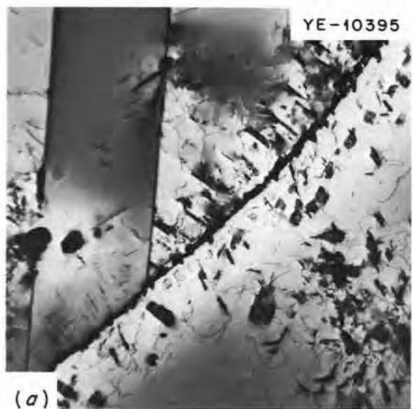

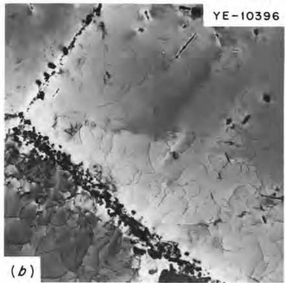  
Fig. 13.6. Microstructures of Hastelloy N containing $0.8\%$ Hf after aging 200 hr at $760^{\circ}\mathrm{C}$ . (a) Commercial alloy 70-796 and (b) laboratory remelt of 70-796. Carbides are of the MC type. $5000\times$

the expense of ductility. Therefore, we are investigating the concentration of Ti required to promote the formation of $\mathrm{Ni}_3\mathrm{Ti}$ at various temperatures and times, using a series of laboratory melts containing 1.0, 2.0,

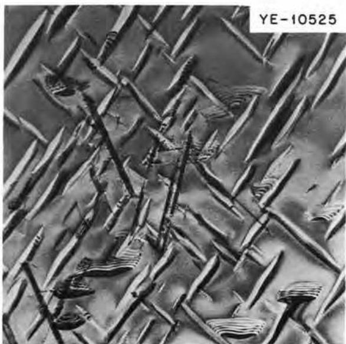  
Fig. 13.7. $\mathrm{Ni}_3\mathrm{Ti}$ precipitation in Hastelloy N containing $2.9\%$ Ti. The $\mathrm{Ni}_3\mathrm{Ti}$ , formed by aging $10,000\mathrm{hr}$ at $700^{\circ}\mathrm{C}$ , is lenticular and exhibits fringe contrast. MC carbides in the stacking fault morphology are also present. Dark field micrograph, (111) reflection. $10,000\times$

2.4, and $2.9\%$ Ti. The specimens examined to date were aged 10,000 hr at $700^{\circ}\mathrm{C}$ . Large quantities of intermetallic $\mathrm{Ni}_3\mathrm{Ti}$ are present in the $2.9\%$ Ti alloy, very homogeneously distributed throughout the matrix as shown in Fig. 13.7. The intermetallic is lenticular, appears to be shaped somewhat like a clam shell, and is oriented parallel to the cube planes. Although present in the $2.4\%$ Ti alloy, the $\mathrm{Ni}_3\mathrm{Ti}$ is heterogeneously distributed and present in much smaller quantities. Isolated particles were observed in the $2.0\%$ Ti, but they are much smaller than in the more highly alloyed heats.

The unstressed buttonhead from a creep specimen of the $2\%$ alloy was examined. The specimen had been annealed and aged for 1000 hr at $760^{\circ}\mathrm{C}$ before a 47,000-psi creep rupture test at $650^{\circ}\mathrm{C}$ that lasted about 5200 hr. A considerable amount of $\mathrm{Ni}_3\mathrm{Ti}$ is present, although poorly developed, and was probably nucleated during the $760^{\circ}\mathrm{C}$ age prior to the $650^{\circ}\mathrm{C}$ exposure. We will look at these alloys exposed at 650 and $760^{\circ}\mathrm{C}$ for various times to define more closely the maximum Ti concentration allowable for service in this temperature range. The effect of irradiation on $\mathrm{Ni}_3\mathrm{Ti}$ will also be investigated.

# 13.1.3 Strain-Induced Precipitation in Modified Hastelloy N

Examination of the gage sections of several creep-rupture specimens reveals that precipitation during

elevated temperature tests is different from that which forms in the unstressed buttonhead or in aged material. The typical MC carbide distribution in a $1.2\%$ Timodified Hastelloy N (alloy 467-548) after a 40,000-psicrep test lasting $450\mathrm{hr}$ at $650^{\circ}\mathrm{C}$ is shown in Fig. 13.8. Precipitation occurs as very fine carbides (200 to 1000 Å) in high dislocation density slip bands. These dislocations are out of contrast in Fig. 13.8a. The carbides are clearly imaged in Fig. 13.8b, a dark-field micrograph using a carbide (220) diffraction spot. Precipitation in the absence of the creep strain consists of carbides in the stacking fault morphology, nucleated around residual primary carbides.

The strain-induced precipitate is not observed in short-term tensile samples tested over a wide range of strain rates. The dislocation structure generated in tensile tests is characterized by relatively long, straight, oriented dislocations with little or no tangling. The dislocation structure of creep test specimens is markedly different from that generated in tensile tests. Although annealed specimens are used for both types of tests, the load required for a creep test is well above the yield point of the alloys. The application of this load to the specimen results in very rapid plastic deformation up to approximately $5\%$ . The dislocation structure after this strain-on-loading consists of bands of tangled dislocations in [110] directions. This configuration

provides the sites for precipitation during the remainder of the test.

A different type of strain-induced precipitation occurs in alloys containing Nb as a major addition. This precipitate is present as very thin sheets as shown in the bright field and precipitate dark field micrographs (Fig. 13.9). The specimen is from a heat containing $1.95\%$ Nb and $0.9\%$ Ti (alloy 69-648). The 63,000-psi creep test lasted $470\mathrm{hr}$ at $650^{\circ}\mathrm{C}$ . As before, the initial structure after loading consisted of bands of tangled dislocations. Although the resulting precipitate has not been identified, it does not appear to be the MC-type carbide usually found in these alloys.

In reality, then, the microstructures of specimens creep tested above the yield stress are not the same as those which would be found in a reactor constructed of annealed material and operating below the yield stress. The property changes resulting from the necessity of performing creep tests at stresses above the yield point would be an apparent increase in yield strength and possibly lower ductility. The extremely low creep rates found in the Nb-Ti alloys are indicative of the higher strength. The Nb-Ti-modified alloys having this strain-induced precipitate are extremely strong with very respectable ductilities, generally above $20\%$ .

We will be investigating the extent of this strain-induced precipitate in several of the modified alloys and

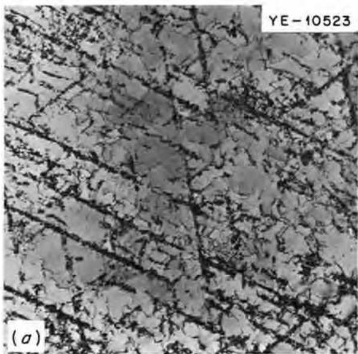

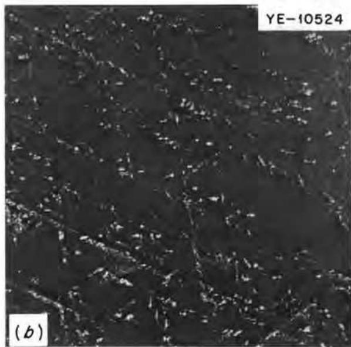  
Fig. 13.8. Strain-induced MC carbide precipitation in $1.2\%$ Ti-modified Hastelloy N stressed at 40,000 psi at $650^{\circ}\mathrm{C}$ for 450 hr. (a) Bright field; (b) Dark field using (220) carbide diffraction spot. 12,000×.

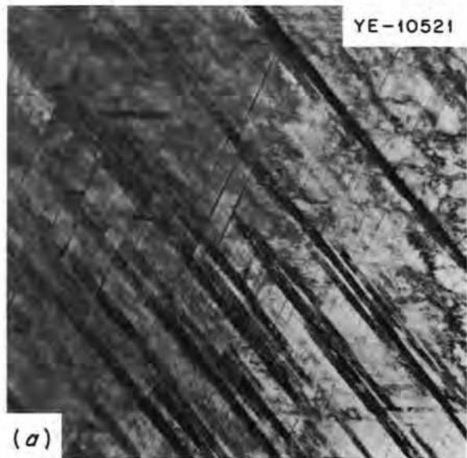

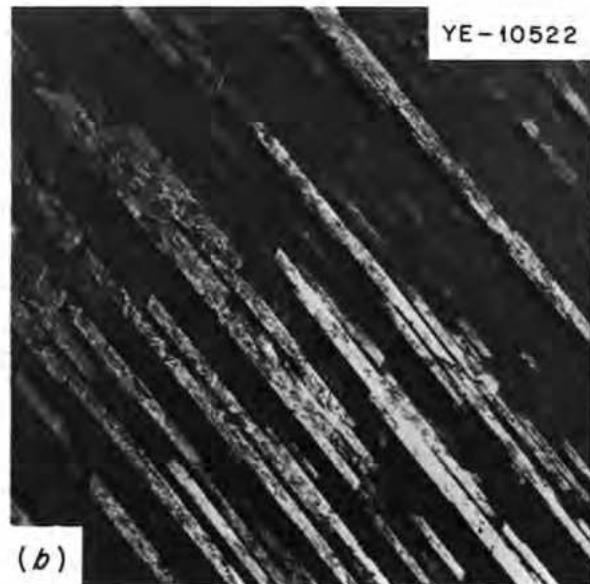  
Fig. 13.9. Strain-induced precipitation in $1.9\%$ Nb-0.95% Ti-modified Hastelloy N (heat 69-648) stressed at $650^{\circ}\mathrm{C}$ for 475 hr. (a) Bright field; (b) Dark field using precipitate diffraction spot.

also the effects of this starting microstructure on mechanical properties.

# 13.2 MECHANICAL PROPERTIES OF UNIRRADIATED MODIFIED HASTELLOY N

B. McNabb H.E.McCoy

One of the prime requirements for nuclear reactor materials is long-term metallurgical stability. We are aging materials at anticipated service temperatures and measuring the mechanical properties to determine whether the material is stable. Some modified Hastelloy N specimens were solution annealed (1 hr at $1177^{\circ}\mathrm{C}$ ) and then aged at 650 and $760^{\circ}\mathrm{C}$ for 1000, 3000, and 10,000 hr. These will be subsequently creep tested at $650^{\circ}\mathrm{C}$ and 55,000 psi or at $760^{\circ}\mathrm{C}$ and 20,000 psi.

The testing is partially complete, and the rupture lives are compared in Table 13.2.

The results to date indicate that the alloys are quite stable with only small changes in properties. The fracture strains of all the alloys were $20\%$ or greater, indicating no serious reductions in ductility during aging.

# 13.3 WELDABILITY OF SEVERAL MODIFIED COMMERCIAL ALLOYS

B. McNabb H.E.McCoy

The double-vacuum-melted and electroslag-remelted commercial melts of modified Hastelloy N have been further evaluated by mechanical property tests. Some unirradiated mechanical properties and relative welding characteristics were previously reported. Mechanical property tests on transverse specimens (0.125 in. diam × 1.125 gage length) from welds of these alloys have been conducted.

Table 13.3 is a tabulation of the tensile properties of these alloys at $25^{\circ}\mathrm{C}$ and a strain rate of $0.05\mathrm{min}^{-1}$ and compares the properties of the base metal with the welded material in the as-welded and stress-relieved conditions (annealed 8 hr at $870^{\circ}\mathrm{C}$ ). The base-metal yield stresses are from 40,000 to 55,000 psi, the ultimate tensile strengths range from 100,000 to 130,000 psi, and the fracture strains vary from 55 to

Table 13.2. The effect of aging on rupture life of various alloys at 650 and $760^{\circ}\mathrm{C}$   

<table><tr><td>Heat Numbera</td><td>Temperature (°C)</td><td>Stress (psi)</td><td>Solution anneal</td><td>1000 hr at 650°C</td><td>1000 hr at 760°C</td><td>3000 hr at 650°C</td><td>3000 hr at 760°C</td></tr><tr><td rowspan="2">69641</td><td>650</td><td>55,000</td><td>295.9</td><td>219.0</td><td>212.6</td><td>162.6</td><td>193.3</td></tr><tr><td>760</td><td>20,000</td><td>671.3</td><td>488.0</td><td>376.8</td><td>399.9</td><td>497.2</td></tr><tr><td rowspan="2">69648</td><td>650</td><td>55,000</td><td>1759.5</td><td>703.4</td><td>956.5</td><td>1294.7</td><td>1251.7</td></tr><tr><td>760</td><td>20,000</td><td>769.5</td><td></td><td>380.4</td><td>1558.4</td><td>430.4</td></tr><tr><td rowspan="2">469344</td><td>650</td><td>55,000</td><td>912.7</td><td>142.8</td><td>183.6</td><td>403.6</td><td>152.9</td></tr><tr><td>760</td><td>20,000</td><td>231.1</td><td>128.2</td><td>111.7</td><td>226.7</td><td>354.7</td></tr><tr><td rowspan="2">469345</td><td>650</td><td>55,000</td><td>285.6</td><td>1563.3</td><td>210.2</td><td>339.4</td><td>120.7</td></tr><tr><td>760</td><td>20,000</td><td>259.8</td><td>209.9</td><td>160.1</td><td>178.3</td><td>150.2</td></tr><tr><td rowspan="2">469714</td><td>650</td><td>55,000</td><td>146.3</td><td>379.4</td><td>301.5</td><td>269.3</td><td>393.2</td></tr><tr><td>760</td><td>20,000</td><td>497.4</td><td>361.3</td><td>413.2</td><td>403.0</td><td>362.0</td></tr><tr><td rowspan="2">470727</td><td>650</td><td>55,000</td><td>845.2</td><td>1088.4</td><td>378.1</td><td>919.4</td><td>591.2</td></tr><tr><td>760</td><td>20,000</td><td>333.8</td><td>407.9</td><td>378.1</td><td>344.9</td><td>353.0</td></tr><tr><td rowspan="2">470785</td><td>650</td><td>55,000</td><td>81.7</td><td>85.0</td><td>87.2</td><td>84.2</td><td>89.8</td></tr><tr><td>760</td><td>20,000</td><td>338.1</td><td>329.9</td><td>234.9</td><td>257.8</td><td>254.0</td></tr><tr><td rowspan="2">470786</td><td>650</td><td>55,000</td><td>132.2</td><td>477.7</td><td>109.5</td><td>107.6</td><td>110.7</td></tr><tr><td>760</td><td>20,000</td><td>343.1</td><td>412.0</td><td>354.5</td><td>346.4</td><td>295.7</td></tr><tr><td rowspan="2">470787</td><td>650</td><td>55,000</td><td>400.8</td><td>229.5</td><td>254.8</td><td>309.7</td><td>155.1</td></tr><tr><td>760</td><td>20,000</td><td>450.3</td><td>445.8</td><td>435.1</td><td>465.4</td><td>487.5</td></tr><tr><td rowspan="2">470788</td><td>650</td><td>55,000</td><td>1251.0</td><td>1336.2</td><td>1069.7</td><td>1164.8</td><td>792.2</td></tr><tr><td>760</td><td>20,000</td><td>660.0</td><td>686.2</td><td>758.1</td><td>478.0</td><td>481.2</td></tr><tr><td rowspan="2">470795</td><td>650</td><td>55,000</td><td>246.0</td><td>283.0</td><td>151.2</td><td>230.9</td><td>196.7</td></tr><tr><td>760</td><td>20,000</td><td>469.7</td><td>730.2b</td><td>483.7</td><td>418.8</td><td>398.3</td></tr><tr><td rowspan="2">470796</td><td>650</td><td>55,000</td><td>292.4</td><td>146.7</td><td>70.4</td><td>112.8</td><td>85.3</td></tr><tr><td>760</td><td>20,000</td><td>418.8</td><td>263.2</td><td>205.4</td><td>435.3</td><td>293.8</td></tr><tr><td rowspan="2">470797</td><td>650</td><td>55,000</td><td>817.7</td><td>546.2</td><td>400.9</td><td>485.4</td><td>484.2</td></tr><tr><td>760</td><td>20,000</td><td>796.6</td><td>677.8</td><td>615.0</td><td>670.9</td><td>706.3</td></tr><tr><td rowspan="2">470798</td><td>650</td><td>55,000</td><td>665.6</td><td>333.0</td><td>239.8</td><td>258.7</td><td>214.55</td></tr><tr><td>760</td><td>20,000</td><td>524.8</td><td>580.0</td><td>608.2</td><td>524.4</td><td>563.8</td></tr><tr><td rowspan="2">470835</td><td>650</td><td>55,000</td><td>3911.5</td><td></td><td>1989.35</td><td></td><td></td></tr><tr><td>760</td><td>20,000</td><td>748.1</td><td>716.7</td><td>602.4</td><td>566.1</td><td>645.4</td></tr></table>

${}^{a}$ See Table 13.1 for chemical compositions.   
$b_{42,540}$ psi.

$80\%$ . The weld metal has a higher yield stress than the base metal and a lower fracture strain, but the ultimate tensile stresses are equivalent. The stress relief anneal of 8 hr at $870^{\circ}\mathrm{C}$ lowers the yield stress only slightly and recovers only a small fraction of the base-metal ductility of the modified alloys, whereas it was sufficient to recover most of the base-metal properties in the standard alloy. As reported previously, a higher temperature anneal (1 hr at $1175^{\circ}\mathrm{C}$ ) or possibly longer times at $870^{\circ}\mathrm{C}$ would be required to recover the base-metal properties of the modified alloys. Failure generally occurred in the weld metal of the transverse weld specimens.

Table 13.4 shows the tensile properties of these same alloys at $650^{\circ}\mathrm{C}$ . The same trends shown at $25^{\circ}\mathrm{C}$ are apparent at this temperature, but the fracture strains of the weldment specimens are lower at $650^{\circ}\mathrm{C}$ . A ductility minimum in this temperature range appears to be a

characteristic of these nickel-base alloys. The base-metal yield strengths of these alloys at $650^{\circ}$ are in the 25,000- to 35,000-psi range, the ultimate tensile strength range from 70,000 to 100,000 psi, and fracture strains from 40 to $65\%$ .

The yield strengths of the weldment specimens are approximately double those of the base metal and are reduced only about 10,000 psi by the 8 hr at $870^{\circ}\mathrm{C}$ anneal. The fracture strains are increased a few percent by the anneal. Failure generally occurred in the weld metal in transverse weld specimens.

Table 13.5 compares the creep-rupture properties of these alloys at 55,000 psi and $650^{\circ}\mathrm{C}$ in air. There are large variations in the rupture lives of these alloys in creep at $650^{\circ}\mathrm{C}$ , even though there are only small differences in the yield strength of the base metal at 25 and $650^{\circ}\mathrm{C}$ (Tables 13.3 and 13.4). In general, the rupture lives of the weldment specimens were much

Table 13.3. Tensile properties at ${25}^{ \circ  }\mathrm{C}$ of several alloys ${}^{a}$   

<table><tr><td>Heat number</td><td>Historyb</td><td>Yield stress (psi)</td><td>Ultimate stress (psi)</td><td>Fracture strain (%)</td><td>Reduction in area (%)</td></tr><tr><td rowspan="3">70-785</td><td>A</td><td>40,400</td><td>114,300</td><td>69.8</td><td>57.7</td></tr><tr><td>B</td><td>86,100</td><td>117,500</td><td>21.2</td><td>62.3</td></tr><tr><td>C</td><td>74,100</td><td>113,400</td><td>21.3</td><td>58.8</td></tr><tr><td rowspan="3">70-727</td><td>A</td><td>48,600</td><td>133,000</td><td>62.6</td><td>46.9</td></tr><tr><td>B</td><td>83,600</td><td>116,600</td><td>20.6</td><td>54.1</td></tr><tr><td>C</td><td>60,700</td><td>127,500</td><td>31.1</td><td>55.9</td></tr><tr><td rowspan="3">67-504</td><td>A</td><td>37,400</td><td>104,800</td><td>73.2</td><td>73.7</td></tr><tr><td>B</td><td>58,000</td><td>101,400</td><td>40.2</td><td>55.0</td></tr><tr><td>C</td><td>50,000</td><td>104,900</td><td>37.3</td><td>45.3</td></tr><tr><td rowspan="3">70-796</td><td>A</td><td>39,800</td><td>116,000</td><td>64.0</td><td>54.3</td></tr><tr><td>B</td><td>71,400</td><td>91,000</td><td>12.6</td><td>27.9</td></tr><tr><td>C</td><td>59,700</td><td>98,200</td><td>18.4</td><td>30.6</td></tr><tr><td rowspan="3">69-648</td><td>A</td><td>44,700</td><td>116,900</td><td>74.2</td><td>42.6</td></tr><tr><td>B</td><td>75,300</td><td>118,600</td><td>33.3</td><td>38.0</td></tr><tr><td>C</td><td>65,400</td><td>111,800</td><td>31.0</td><td>39.4</td></tr><tr><td rowspan="3">69-714</td><td>A</td><td>41,800</td><td>109,300</td><td>81.1</td><td>51.6</td></tr><tr><td>B</td><td>80,600</td><td>103,700</td><td>28.1</td><td>46.9</td></tr><tr><td>C</td><td>62,100</td><td>107,600</td><td>35.0</td><td>54.9</td></tr><tr><td rowspan="3">70-835</td><td>A</td><td>54,500</td><td>144,700</td><td>59.0</td><td>55.2</td></tr><tr><td>B</td><td>87,100</td><td>117,200</td><td>19.7</td><td>61.7</td></tr><tr><td>C</td><td>82,300</td><td>116,700</td><td>27.7</td><td>59.7</td></tr><tr><td rowspan="3">70-786</td><td>A</td><td>37,400</td><td>106,300</td><td>73.1</td><td>63.7</td></tr><tr><td>B</td><td>78,400</td><td>98,300</td><td>12.5</td><td>46.4</td></tr><tr><td>C</td><td>75,500</td><td>114,300</td><td>19.9</td><td>45.7</td></tr><tr><td rowspan="3">69-641</td><td>A</td><td>44,900</td><td>117,100</td><td>72.6</td><td>54.7</td></tr><tr><td>B</td><td>73,800</td><td>113,700</td><td>29.6</td><td>52.5</td></tr><tr><td>C</td><td>65,500</td><td>116,000</td><td>36.7</td><td>42.0</td></tr><tr><td rowspan="3">70-787</td><td>A</td><td>40,800</td><td>113,200</td><td>69.5</td><td>62.4</td></tr><tr><td>B</td><td>85,800</td><td>118,00</td><td>20.4</td><td>49.9</td></tr><tr><td>C</td><td>66,400</td><td>93,800</td><td>13.0</td><td>24.7</td></tr><tr><td rowspan="3">70-795</td><td>A</td><td>49,700</td><td>130,800</td><td>64.3</td><td>39.7</td></tr><tr><td>B</td><td>87,800</td><td>121,600</td><td>20.3</td><td>39.7</td></tr><tr><td>C</td><td>72,200</td><td>116,500</td><td>24.9</td><td>33.9</td></tr><tr><td rowspan="3">70-788</td><td>A</td><td>42,200</td><td>114,700</td><td>66.4</td><td>63.8</td></tr><tr><td>B</td><td>78,500</td><td>110,900</td><td>21.2</td><td>63.0</td></tr><tr><td>C</td><td>69,800</td><td>113,300</td><td>29.5</td><td>59.8</td></tr><tr><td rowspan="3">70-797</td><td>A</td><td>44,000</td><td>123,400</td><td>65.4</td><td>52.4</td></tr><tr><td>B</td><td>88,300</td><td>127,500</td><td>24.9</td><td>54.0</td></tr><tr><td>C</td><td>65,200</td><td>111,800</td><td>24.9</td><td>50.8</td></tr><tr><td rowspan="3">70-798</td><td>A</td><td>42,300</td><td>121,600</td><td>66.3</td><td>49.0</td></tr><tr><td>B</td><td>86,000</td><td>119,800</td><td>21.6</td><td>30.2</td></tr><tr><td>C</td><td>75,200</td><td>115,100</td><td>19.8</td><td>59.7</td></tr><tr><td rowspan="3">68-688</td><td>A</td><td>46,100</td><td>118,700</td><td>59.8</td><td>45.6</td></tr><tr><td>B</td><td>88,400</td><td>126,500</td><td>21.4</td><td>45.9</td></tr><tr><td>C</td><td>61,700</td><td>113,900</td><td>26.9</td><td>40.5</td></tr><tr><td rowspan="3">68-689</td><td>A</td><td>52,100</td><td>117,400</td><td>55.7</td><td>50.4</td></tr><tr><td>B</td><td>84,500</td><td>121,600</td><td>18.6</td><td>34.1</td></tr><tr><td>C</td><td>54,800</td><td>114,300</td><td>31.5</td><td>35.3</td></tr><tr><td rowspan="3">69-344</td><td>A</td><td>56,500</td><td>130,400</td><td>56.9</td><td>47.2</td></tr><tr><td>B</td><td>80,700</td><td>125,700</td><td>34.3</td><td>42.3</td></tr><tr><td>C</td><td>67,900</td><td>117,200</td><td>28.5</td><td>66.4</td></tr><tr><td>69-345</td><td>A</td><td>48,800</td><td>126,500</td><td>61.3</td><td>50.6</td></tr></table>

${}^{a}$ Strain rate of ${0.05}{\mathrm{\;{min}}}^{-1}$ .   
$^{b}$ A: base metal, annealed 1 hr at $1180^{\circ}\mathrm{C}$ ; B: weldment, as welded; C: weldment, annealed 8 hr at $870^{\circ}\mathrm{C}$ .

Table 13.4. Tensile properties at ${650}^{ \circ  }\mathrm{C}$ of several alloys ${}^{a}$   

<table><tr><td>Heat number</td><td>Historyb</td><td>Yield stress (psi)</td><td>Ultimate stress (psi)</td><td>Fracture strain (%)</td><td>Reduction in area (%)</td></tr><tr><td rowspan="3">70-785</td><td>A</td><td>26,300</td><td>83,300</td><td>65.3</td><td>42.4</td></tr><tr><td>B</td><td>59,200</td><td>78,000</td><td>13.7</td><td>56.7</td></tr><tr><td>C</td><td>49,000</td><td>73,900</td><td>13.0</td><td>53.7</td></tr><tr><td rowspan="3">70-727</td><td>A</td><td>33,800</td><td>94,100</td><td>64.7</td><td>41.5</td></tr><tr><td>B</td><td>64,900</td><td>82,900</td><td>13.9</td><td>35.7</td></tr><tr><td>C</td><td>43,700</td><td>72,300</td><td>18.0</td><td>35.2</td></tr><tr><td rowspan="3">67-504</td><td>A</td><td>25,600</td><td>83,000</td><td>66.9</td><td>45.1</td></tr><tr><td>B</td><td>21,100</td><td>21,400</td><td>2.2</td><td>4.2</td></tr><tr><td>C</td><td>35,800</td><td>60,100</td><td>13.8</td><td>23.2</td></tr><tr><td rowspan="3">70-796</td><td>A</td><td>27,900</td><td>88,300</td><td>63.6</td><td>45.7</td></tr><tr><td>B</td><td>29,200</td><td>34,700</td><td>10.5</td><td>14.4</td></tr><tr><td>C</td><td>38,000</td><td>61,300</td><td>11.6</td><td>47.0</td></tr><tr><td rowspan="3">69-648</td><td>A</td><td>29,400</td><td>78,300</td><td>46.6</td><td>33.9</td></tr><tr><td>B</td><td>55,100</td><td>71,200</td><td>10.9</td><td>34.3</td></tr><tr><td>C</td><td>46,500</td><td>76,900</td><td>19.3</td><td>44.1</td></tr><tr><td rowspan="3">69-714</td><td>A</td><td>27,700</td><td>78,500</td><td>56.1</td><td>42.6</td></tr><tr><td>B</td><td>53,600</td><td>71,500</td><td>12.3</td><td>34.7</td></tr><tr><td>C</td><td>43,700</td><td>69,000</td><td>20.1</td><td>28.6</td></tr><tr><td rowspan="3">70-835</td><td>A</td><td>33,600</td><td>99,500</td><td>51.1</td><td>43.4</td></tr><tr><td>B</td><td>66,200</td><td>83,400</td><td>12.3</td><td>28.5</td></tr><tr><td>C</td><td>54,300</td><td>83,500</td><td>18.3</td><td>29.1</td></tr><tr><td rowspan="3">70-786</td><td>A</td><td>23,900</td><td>65,400</td><td>45.1</td><td>31.0</td></tr><tr><td>B</td><td>64,100</td><td>77,400</td><td>10.6</td><td>32.9</td></tr><tr><td>C</td><td>54,000</td><td>80,100</td><td>13.5</td><td>30.3</td></tr><tr><td rowspan="3">69-641</td><td>A</td><td>29,000</td><td>92,700</td><td>53.3</td><td>37.6</td></tr><tr><td>B</td><td>56,500</td><td>72,500</td><td>12.1</td><td>30.4</td></tr><tr><td>C</td><td>46,000</td><td>76,000</td><td>17.5</td><td>41.1</td></tr><tr><td rowspan="3">70-787</td><td>A</td><td>26,800</td><td>82,500</td><td>61.3</td><td>39.9</td></tr><tr><td>B</td><td>60,700</td><td>75,000</td><td>10.9</td><td>38.7</td></tr><tr><td>C</td><td>47,300</td><td>71,000</td><td>14.8</td><td>35.7</td></tr><tr><td rowspan="3">70-795</td><td>A</td><td>33,800</td><td>99,500</td><td>61.2</td><td>41.6</td></tr><tr><td>B</td><td>63,400</td><td>85,300</td><td>13.1</td><td>24.6</td></tr><tr><td>C</td><td>55,700</td><td>86,800</td><td>21.0</td><td>37.7</td></tr><tr><td rowspan="3">70-788</td><td>A</td><td>29,000</td><td>71,500</td><td>45.8</td><td>36.2</td></tr><tr><td>B</td><td>62,100</td><td>76,900</td><td>11.0</td><td>40.5</td></tr><tr><td>C</td><td>51,000</td><td>75,900</td><td>16.2</td><td>41.8</td></tr><tr><td rowspan="3">70-797</td><td>A</td><td>33,400</td><td>104,200</td><td>59.3</td><td>38.4</td></tr><tr><td>B</td><td>57,300</td><td>80,200</td><td>17.6</td><td>36.5</td></tr><tr><td>C</td><td>51,800</td><td>85,400</td><td>20.6</td><td>53.9</td></tr><tr><td rowspan="3">70-798</td><td>A</td><td>27,000</td><td>91,600</td><td>62.0</td><td>44.6</td></tr><tr><td>B</td><td>63,900</td><td>78,500</td><td>10.4</td><td>36.6</td></tr><tr><td>C</td><td>53,300</td><td>81,600</td><td>17.5</td><td>53.6</td></tr><tr><td rowspan="3">68-688</td><td>A</td><td>30,600</td><td>85,700</td><td>41.4</td><td>31.9</td></tr><tr><td>B</td><td>67,000</td><td>89,600</td><td>13.5</td><td>28.8</td></tr><tr><td>C</td><td>45,500</td><td>85,400</td><td>23.3</td><td>29.1</td></tr><tr><td rowspan="3">68-689</td><td>A</td><td>31,200</td><td>79,200</td><td>31.4</td><td>21.9</td></tr><tr><td>B</td><td>66,000</td><td>87,300</td><td>12.5</td><td>23.1</td></tr><tr><td>C</td><td>44,300</td><td>83,600</td><td>20.4</td><td>29.7</td></tr><tr><td rowspan="3">69-344</td><td>A</td><td>33,900</td><td>93,600</td><td>40.6</td><td>29.5</td></tr><tr><td>B</td><td>67,000</td><td>86,000</td><td>11.5</td><td>25.2</td></tr><tr><td>C</td><td>52,200</td><td>88,500</td><td>23.0</td><td>33.0</td></tr><tr><td>69-345</td><td>A</td><td>37,200</td><td>91,600</td><td>40.4</td><td>31.8</td></tr></table>

${}^{a}$ Strain rate of ${0.05}{\mathrm{\;{min}}}^{-1}$ .   
$^{b}$ A: base metal, annealed 1 hr at $1180^{\circ}\mathrm{C}$ ; B: weldment, as welded; C: weldment, annealed 8 hr at $870^{\circ}\mathrm{C}$ .

Table 13.5. Creep rupture properties of several alloys at ${650}^{ \circ  }\mathrm{C}$ and 55,000 psi   

<table><tr><td>Heat number</td><td>Historya</td><td>Rupture life (hr)</td><td>Minimum creep rate (%/hr)</td><td>Fracture strain (%)</td><td>Reduction in area (%)</td></tr><tr><td rowspan="3">70-785</td><td>A</td><td>81.7</td><td>0.0730</td><td>53.5</td><td>43.3</td></tr><tr><td>B</td><td>48.0</td><td>0.028</td><td>6.1</td><td>21.9</td></tr><tr><td>C</td><td>52.0</td><td>0.175</td><td>19.2</td><td>60.4</td></tr><tr><td rowspan="3">70-727</td><td>A</td><td>845.2</td><td>0.0152</td><td>39.5</td><td>36.4</td></tr><tr><td>B</td><td>463.7</td><td>0.0046</td><td>5.1</td><td>16.3</td></tr><tr><td>C</td><td>189.8</td><td>0.0606</td><td>17.9</td><td>17.2</td></tr><tr><td rowspan="3">70-796</td><td>A</td><td>292.4</td><td>0.0165</td><td>37.2</td><td>31.5</td></tr><tr><td>B</td><td>40.9</td><td>0.0635</td><td>7.2</td><td>20.5</td></tr><tr><td>C</td><td>6.3</td><td>1.188</td><td>18.0</td><td>45.7</td></tr><tr><td rowspan="3">21-543</td><td>A</td><td>69.0</td><td>0.038</td><td>24.9</td><td>26.3</td></tr><tr><td>B</td><td>31.7</td><td>0.094</td><td>5.7</td><td>5.9</td></tr><tr><td>C</td><td>16.8</td><td>0.53</td><td>12.5</td><td>16.2</td></tr><tr><td rowspan="3">69-648</td><td>A</td><td>1759.8</td><td>0.0005</td><td>20.5</td><td>18.9</td></tr><tr><td>B</td><td>9.8</td><td>0.046</td><td>5.3</td><td>17.9</td></tr><tr><td>C</td><td>88.8</td><td>0.052</td><td>11.6</td><td>52.8</td></tr><tr><td rowspan="3">69-714</td><td>A</td><td>146.3</td><td>0.0835</td><td>47.3</td><td>51.0</td></tr><tr><td>B</td><td>455.7</td><td>0.0127</td><td>15.6</td><td>16.2</td></tr><tr><td>C</td><td>19.4</td><td>0.112</td><td>11.8</td><td>26.1</td></tr><tr><td rowspan="3">70-835</td><td>A</td><td>3911.9</td><td>0.0041</td><td>32.0</td><td>26.0</td></tr><tr><td>B</td><td>814.0</td><td>0.0029</td><td>8.02</td><td>16.8</td></tr><tr><td>C</td><td>557.1</td><td>0.0117</td><td>13.7</td><td>17.8</td></tr><tr><td rowspan="3">70-786</td><td>A</td><td>132.2</td><td>0.0270</td><td>34.9</td><td>44.2</td></tr><tr><td>B</td><td>35.3</td><td>0.0275</td><td>4.4</td><td>27.5</td></tr><tr><td>C</td><td>75.0</td><td>0.0848</td><td>14.4</td><td>24.3</td></tr><tr><td rowspan="3">69-641</td><td>A</td><td>295.9</td><td>0.0740</td><td>49.9</td><td>43.9</td></tr><tr><td>B</td><td>346.3</td><td>0.0238</td><td>13.6</td><td>19.7</td></tr><tr><td>C</td><td>241.4</td><td>0.0386</td><td>17.1</td><td>23.1</td></tr><tr><td rowspan="3">70-787</td><td>A</td><td>400.8</td><td>0.0320</td><td>49.1</td><td>47.3</td></tr><tr><td>B</td><td>93.9</td><td>0.036</td><td>9.6</td><td>35.2</td></tr><tr><td>C</td><td>51.5</td><td>0.125</td><td>12.3</td><td>52.0</td></tr><tr><td rowspan="3">70-795</td><td>A</td><td>246.0</td><td>0.050</td><td>64.7</td><td>61.4</td></tr><tr><td>B</td><td>144.6</td><td>0.035</td><td>11.9</td><td>34.4</td></tr><tr><td>C</td><td>56.8</td><td>0.14</td><td>16.9</td><td>57.6</td></tr><tr><td rowspan="3">70-788</td><td>A</td><td>1251.0</td><td>0.0113</td><td>42.0</td><td>35.4</td></tr><tr><td>B</td><td>344.3</td><td>0.014</td><td>9.2</td><td>23.4</td></tr><tr><td>C</td><td>312.0</td><td>0.031</td><td>26.3</td><td>68.6</td></tr><tr><td rowspan="3">70-797</td><td>A</td><td>817.7</td><td>0.0185</td><td>48.8</td><td>45.6</td></tr><tr><td>B</td><td>423.4</td><td>0.0193</td><td>21.8</td><td>41.1</td></tr><tr><td>C</td><td>158.3</td><td>0.0830</td><td>24.6</td><td>45.0</td></tr><tr><td rowspan="3">70-798</td><td>A</td><td>665.6</td><td>0.0165</td><td>55.5</td><td>46.7</td></tr><tr><td>B</td><td>62.7</td><td>0.0360</td><td>10.3</td><td>28.8</td></tr><tr><td>C</td><td>164.7</td><td>0.0660</td><td>22.7</td><td>36.3</td></tr><tr><td rowspan="3">68-688b</td><td>A</td><td>78.0</td><td>0.0400</td><td>19.6</td><td>19.0</td></tr><tr><td>B</td><td>41.1</td><td>0.14</td><td>10.3</td><td>20.6</td></tr><tr><td>C</td><td>52.0</td><td>0.22</td><td>16.9</td><td>25.2</td></tr><tr><td rowspan="3">68-689b</td><td>A</td><td>71.9</td><td>0.0525</td><td>15.8</td><td>19.5</td></tr><tr><td>B</td><td>35.2</td><td>0.164</td><td>10.6</td><td>18.2</td></tr><tr><td>C</td><td>83.4</td><td>0.145</td><td>17.5</td><td>20.0</td></tr><tr><td rowspan="3">69-344</td><td>A</td><td>912.7</td><td>0.0075</td><td>24.2</td><td>26.7</td></tr><tr><td>B</td><td>631.1</td><td>0.0090</td><td>14.5</td><td>23.3</td></tr><tr><td>C</td><td>155.6</td><td>0.044</td><td>13.0</td><td>21.3</td></tr></table>

$a_{\mathrm{A}}$ : base metal, annealed 1 hr at $1180^{\circ}\mathrm{C}$ ; B: weldment, as welded; C: weldment, annealed 8 hr at $870^{\circ}\mathrm{C}$ .   
b47,000 psi.

shorter than those of the base metal. The minimum creep rate of the "as welded" specimen was lower than that of the base metal, but the lower fracture strain of the weld caused the rupture life to be reduced considerably. After annealing 8 hr at $870^{\circ}\mathrm{C}$ , the weldment specimens generally had a higher minimum creep rate than the base metal, a shorter rupture life, and a lower strain at fracture. Failure generally occurred in the weld metal on the weldment specimens. Rupture lives for the base metal varied from 72 to 3912 hr for tests at 55,000 psi and $650^{\circ}\mathrm{C}$ in air.

# 13.4 CREEP-RUPTURE PROPERTIES OF HASTELLOY N MODIFIED WITH NILOBIUM, HAFNIUM, AND TITANIUM

H. E. McCoy

Laboratory melts having nominal compositions of Ni-12% Cr-4% Fe-0.2% Mn-0.5% Hf-0.5% Nb-0.5% Ti and various concentrations of C and Si were prepared. The detailed analyses of these alloys are given in Table 13.6. The alloys were 2-lb castings and were fabricated to $\frac{1}{4}$ -in.-diam rods. They were annealed 1 hr at $1180^{\circ}\mathrm{C}$ before testing. Several of the samples were irradiated in the ORR at $760^{\circ}\mathrm{C}$ to a peak thermal fluence of $3 \times 10^{20}$ neutrons/cm $^2$ . All of the results reported in this section were obtained at a test temperature of $650^{\circ}\mathrm{C}$ .

The first series of alloys had carbon concentrations that ranged from 0.006 to $0.137\%$ . The results of creep tests on these alloys at $650^{\circ}\mathrm{C}$ are shown in Figs. 13.10

and 13.11. The rupture lives show some scatter, but they generally show the expected trend of increasing rupture life with increasing carbon content. Alloys 330 and 331 have similar carbon contents, but the rupture lives are different at high stresses. This may be due to the higher oxygen content of heat 330 and its influence on the carbide structure. Alloys 334 and 335 with 0.087 and $0.137\%$ C, respectively, have the longest rupture lives of the series, and there is no detectable difference in the two alloys. The minimum creep rates of these same alloys in Fig. 13.11 show a systematic progression of strength with carbon level up to $0.05\%$ . The data for alloys 329 (0.052% C), 334 (0.087% C), and 335 (0.137% C) are described by a single line. Heat 333 (0.049% C) seems weaker than heat 329 (0.052%). All of the alloys are as strong or stronger than standard Hastelloy N.

The stress-rupture properties of these same alloys after irradiation at $760^{\circ}\mathrm{C}$ for 1100 hr are shown in Fig. 13.12. Alloys 330 (0.006% C), 331 (0.008% C), and 332 (0.014% C) have about equivalent rupture lives, which slightly exceed those of standard air-melted Hastelloy N. The other four alloys with carbon levels of 0.049 to 0.137% seem to have rupture lives that are better than those of the lower carbon alloys. The creep strengths (Fig. 13.13) show a similar behavior. All alloys have creep strengths above those noted for standard vacuum-melted material.

The fracture strains of these alloys after irradiation (Fig. 13.14) are very good. Standard vacuum-melted material has been observed to have fracture strains of only a few tenths of a percent under these irradiation

Table 13.6. Compositions of experimental alloys   

<table><tr><td rowspan="2">Alloy No.</td><td colspan="12">Concentration (%)</td></tr><tr><td>Mo</td><td>Cr</td><td>Fe</td><td>Mn</td><td>Nb</td><td>Ti</td><td>Hf</td><td>Zr</td><td>C</td><td>Si</td><td>N</td><td>O</td></tr><tr><td>330</td><td>11.7</td><td>7.7</td><td>3.2</td><td>0.19</td><td>0.62</td><td>0.47</td><td>0.50</td><td>&lt;0.01</td><td>0.006</td><td>0.011</td><td>0.0022</td><td>0.031</td></tr><tr><td></td><td></td><td></td><td></td><td></td><td></td><td></td><td></td><td></td><td></td><td></td><td></td><td>0.048</td></tr><tr><td>331</td><td>11.7</td><td>7.3</td><td>3.6</td><td>0.15</td><td>0.56</td><td>0.50</td><td>0.46</td><td>&lt;0.01</td><td>0.008</td><td>&lt;0.01</td><td>0.0016</td><td>0.0034</td></tr><tr><td>332</td><td>11.8</td><td>7.4</td><td>3.0</td><td>0.15</td><td>0.61</td><td>0.48</td><td>0.44</td><td>&lt;0.01</td><td>0.014</td><td>&lt;0.01</td><td>0.0012</td><td>0.0060</td></tr><tr><td>329</td><td>11.6</td><td>7.3</td><td>4.1</td><td>0.16</td><td>0.59</td><td>0.48</td><td>0.44</td><td>&lt;0.01</td><td>0.052</td><td>&lt;0.01</td><td>0.0012</td><td>0.0018</td></tr><tr><td>333</td><td>11.8</td><td>7.2</td><td>3.4</td><td>0.15</td><td>0.62</td><td>0.47</td><td>0.48</td><td>&lt;0.01</td><td>0.049</td><td>&lt;0.01</td><td>0.0014</td><td>0.0160</td></tr><tr><td></td><td></td><td></td><td></td><td></td><td></td><td></td><td></td><td></td><td></td><td></td><td></td><td>0.0024</td></tr><tr><td>334</td><td>11.6</td><td>7.2</td><td>4.0</td><td>0.11</td><td>0.56</td><td>0.50</td><td>0.41</td><td>&lt;0.01</td><td>0.087</td><td>&lt;0.01</td><td>0.0012</td><td>0.0036</td></tr><tr><td>335</td><td>11.7</td><td>7.4</td><td>3.3</td><td>0.15</td><td>0.56</td><td>0.49</td><td>0.46</td><td>&lt;0.01</td><td>0.137</td><td>&lt;0.01</td><td>0.0011</td><td>0.0047</td></tr><tr><td>336</td><td>11.7</td><td>7.4</td><td>3.1</td><td>0.15</td><td>0.56</td><td>0.48</td><td>0.38</td><td>&lt;0.01</td><td>0.053</td><td>0.14</td><td>0.0030</td><td>0.045</td></tr><tr><td></td><td></td><td></td><td></td><td></td><td></td><td></td><td></td><td></td><td></td><td></td><td></td><td>0.130</td></tr><tr><td>337</td><td>11.6</td><td>7.3</td><td>4.0</td><td>0.13</td><td>0.63</td><td>0.44</td><td>0.47</td><td>&lt;0.01</td><td>0.049</td><td>0.12</td><td>0.0035</td><td>0.0093</td></tr><tr><td>338</td><td>11.7</td><td>7.4</td><td>3.6</td><td>0.15</td><td>0.45</td><td>0.48</td><td>0.52</td><td>&lt;0.01</td><td>0.057</td><td>0.44</td><td>0.0013</td><td>0.0024</td></tr></table>

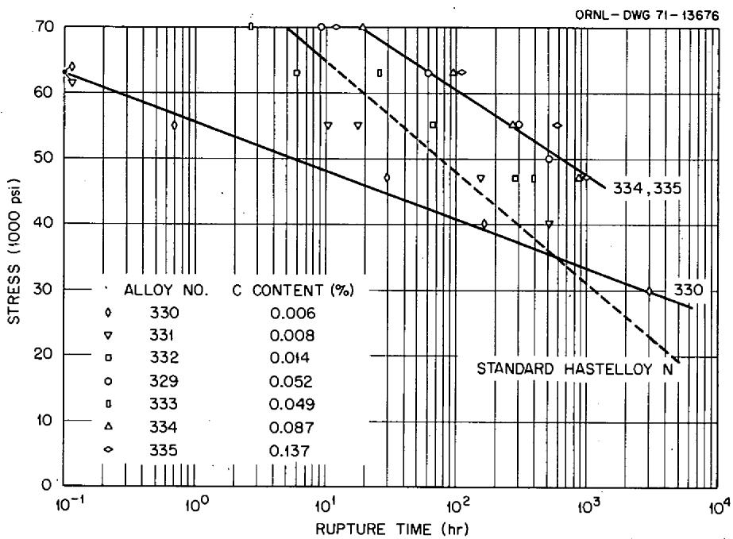  
Fig. 13.10. Stress-rupture properties at $650^{\circ}\mathrm{C}$ of alloys modified with $0.5\%$ Hf, $0.5\%$ Ti, $0.5\%$ Nb, and various amounts of C.

and test conditions, but the minimum fracture strain noted for these alloys was $5\%$ . There is a marked effect of carbon content at lower creep rates. For alloys with carbon contents of $0.049\%$ or greater, the lowest fracture strain is $13\%$ . There is no systematic effect of carbon content above $0.049\%$ .

Three of the alloys contained Si additions. The variation of the rupture lives of these alloys in the unirradiated and irradiated conditions is shown in Fig. 13.15. Silicon does not seem to have any systematic effect on the rupture life in the irradiated or unirradiated conditions. The fracture strains are quite good for all specimens, and there is no detectable effect of Si.

The mechanical behavior of these alloys is generally what would be expected from the microstructural observations made by Gehlbach. However, some apparent conflicts exist. For example, aging at $760^{\circ}\mathrm{C}$ produced a relatively coarse carbide structure in the higher carbon alloys, whereas the mechanical properties do not show a deterioration at the higher levels. Also, the alloy with $0.44\%$ Si (338) formed coarse $\mathbf{M}_6\mathbf{C}$ -type

carbides and very little matrix precipitation during aging. This should result in poor postirradiation properties, but the data (Fig. 13.15) do not bear this out. Two factors likely account for these discrepancies. First, the precipitates that form during aging without a stress may be different from those that form in a stressed specimen during testing. Second, irradiation may influence the type and distribution of precipitate that forms. Both of these factors must be investigated further since nuclear applications will both stress and irradiate the material.

# 13.5 CORROSION STUDIES

J.W.Koger

The success of a molten-salt reactor system is strongly dependent on the compatibility of the materials of construction with the salts comprising the primary and secondary circuits of the reactor.

A number of factors contribute to molten-salt corrosion. The tendency for a reaction to occur is measured in terms of the chemical potentials of the reactants and the products. The reaction kinetics will be influenced by factors such as the temperature, pressure, concentration, and nobility of the salt constituents, solubility effects, and viscosity of the melts.

The experiments discussed in this section are intended to assess the mass transfer characteristics of candidate salt-alloy systems under design parameters based on the Molten-Salt Breeder Reactor. The majority of studies are conducted in thermal convection and pumped loops constructed of Hastelloy N. The salts of interest are LiF and $\mathrm{BeF}_2$ based with $\mathrm{UF_4}$ (fuel), $\mathrm{ThF_4}$ (blanket), and $\mathrm{UF_4}$ and $\mathrm{ThF_4}$ (fertile-fissile) and a $\mathrm{NaBF_4 - NaF}$ mixture: (coolant salt).

Of the major constituents of Hastelloy N, chromium is much more readily oxidized in fluoride salts than Fe, Ni, or Mo. Accordingly, attack in our systems is normally manifested by the selective removal of chromium from the Hastelloy N. Several oxidizing reactions may occur depending on the salt composition and impurity content, but among the most important reactants causing oxidation are $\mathrm{UF_4}$ , $\mathrm{FeF_2}$ , and HF. Because our experimental systems are not isothermal, temperature gradient mass transfer effects are quite important. Conventionally, we observe weight losses in the hotter regions of our loops and weight gains in the colder sections.

The status of the thermal convection loops in operation is summarized in Table 13.7.

# 13.5.1 Fuel Salts

Loop 1255, containing an MSRE-type fuel salt with 1 mole $\%$ $\mathrm{ThF_4}$ and constructed of Hastelloy N, has been terminated after 80,439 hr (9.2 years). The loop contains insert specimens of standard Hastelloy N and a Hastelloy N plus $2\%$ Nb alloy. The latter alloy was developed for improved weldability and mechanical properties, although similar compositions are now under consideration because of increased resistance to neutron damage.

This loop was operated as a "life-test" to provide long-term data on mass transfer in a fluoride salt, air oxidation of Hastelloy N, and corrosion properties of various weld junctions. We elected to terminate the experiment after a salt leak was detected under one of the main loop heaters. Prior to the discovery of the failure, the amperage to the loop heaters dropped by a factor of 2. Investigation revealed that half the main heaters were open and grounded, which suggested the presence of salt. After removing the insulation and heaters, a small salt leak was found under one of the Lavite6 bushings used to position the loop heaters around the hot leg.

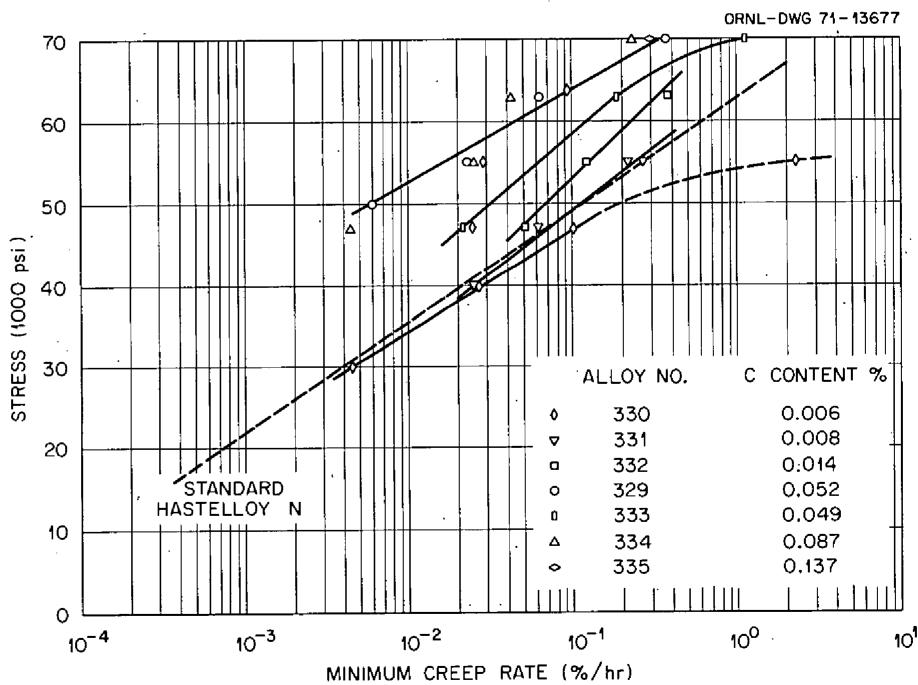  
Fig. 13.11. Creep-rupture properties at $650^{\circ}\mathrm{C}$ of alloys modified with $0.5\%$ Hf, $0.5\%$ Ti, and $0.5\%$ Nb and various amounts of C.

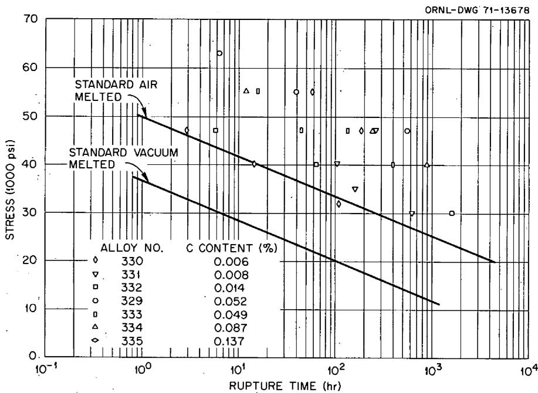  
Fig. 13.12. Stress-rupture properties at $650^{\circ}\mathrm{C}$ of alloys irradiated to a thermal fluence of $3 \times 10^{20}$ neutrons/cm $^2$ at $760^{\circ}\mathrm{C}$ . All alloys contain $0.5\%$ Hf, $0.5\%$ Ti, and $0.5\%$ Nb and various amounts of C.

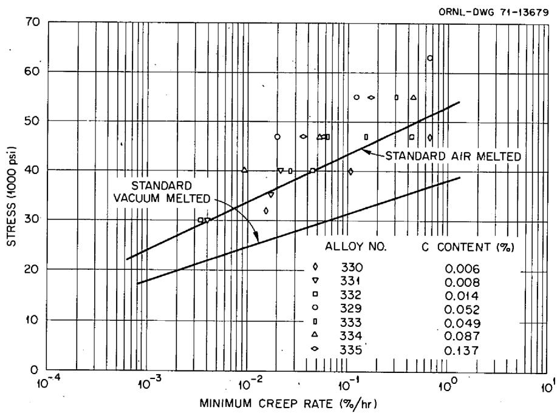  
Fig. 13.13. Creep-rupture properties at $650^{\circ}\mathrm{C}$ of alloys irradiated to a thermal fluence of $3 \times 10^{20}$ neutrons/cm² at $760^{\circ}\mathrm{C}$ . All alloys contain $0.4\%$ Hf, $0.5\%$ Ti, and $0.5\%$ Nb and various amounts of C.

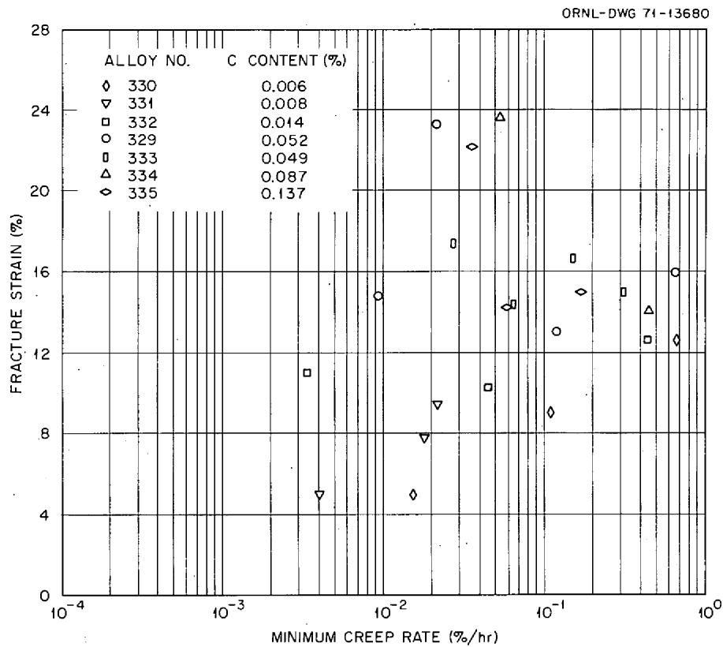  
Fig. 13.14. Postirradiation fracture strains at $650^{\circ}\mathrm{C}$ of alloys irradiated to a thermal fluence of $3 \times 10^{20}$ neutrons/cm $^2$ at $760^{\circ}\mathrm{C}$ .

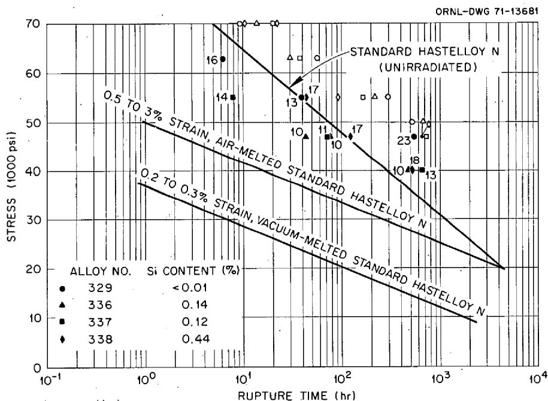  
Fig. 13.15. Influence of various amounts of Si on the stress-rupture properties at $650^{\circ}\mathrm{C}$ of alloys unirradiated (open) and irradiated (solid) at $760^{\circ}\mathrm{C}$ to a thermal fluence of $3 \times 10^{20}$ neutrons/cm $^2$ . Numbers by the points are the fracture strains.

The appearance of the wall near the failure is shown in Fig. 13.16. The failure site was at the center of a $\frac{1}{2}$ -in.-diam crater whose depth was comparable to the thickness of the wall. The crater formed from the outside in, and its location suggests that it was caused by catastrophic oxidation of the tube wall associated with the Lavite bushing which surrounded the failure area. We have examined metallographic samples from various sections of the loop, including the leak site, and, except for the $\frac{1}{2}$ -in.-diam crater, these samples showed only superficial corrosion ( $\leqslant 1$ mil) on either the outside or inside surfaces of the loop. Even surfaces covered by the leaking salt showed limited oxidation. New heaters and insulation had been placed on the loop after 8.8 years of operation. Based on our inspection of the loop at that time, we believe that the failure was induced following the heater replacement and that it was not progressive over the life of the loop.

7. J. W. Koger, MSR Program Semiannu. Progr. Rep. Feb. 28, 1971, ORNL-4676, p. 194.

Loop 1258, constructed of type 304L stainless steel, has operated about eight years with the same salt as Loop 1255. The heaters and insulation on this loop were replaced at the same time as for loop 1255, and it continues to operate normally.

Loop NCL-16, constructed of Hastelloy N and containing removable specimens in each vertical leg, has operated with MSBR fuel salt (Table 13.7) for over 3.5 years. The heaviest weight loss after this period is $-2.9\mathrm{mg/cm^2}$ , and the largest weight gain is $+1.7\mathrm{mg/cm^2}$ . Assuming uniform loss, the maximum weight loss is equivalent to $0.04\mathrm{mil/year}$ . The chromium content of the salt has increased $550\mathrm{ppm}$ , and the iron has decreased about $100\mathrm{ppm}$ in $30,000\mathrm{hr}$ . Titanium-modified Hastelloy N specimens ( $12\% \mathrm{Mo}-7\% \mathrm{Cr}-0.5\%$ ) Ti, bal Ni) in this loop show smaller weight losses than standard Hastelloy N specimens ( $16\% \mathrm{Mo}-7\% \mathrm{Cr}-5\%$ ) Fe, bal Ni) under equivalent conditions. We attribute this difference to the absence of iron in the modified alloy. Principal corrosion reactions acting in this loop appear to be

Table 13.7. Status of MSR program thermal convection loops through August 31, 1971   

<table><tr><td>Loop number</td><td>Loop material</td><td>Specimens</td><td>Salt type</td><td>Salt composition (mole %)</td><td>Max. temp. (°C)</td><td>ΔT (°C)</td><td>Operating time (hr)</td></tr><tr><td>1258</td><td>Type 304L stainless steel</td><td>Type 304L stainless steela,b</td><td>Fuel</td><td>LiF-BeF2-ZrF4-UF4-ThF4 (70-23-5-1-1)</td><td>688</td><td>100</td><td>70,583</td></tr><tr><td>NCL-13A</td><td>Hastelloy N</td><td>Hastelloy N; Ti-modified Hastelloy N controlsb,c</td><td>Coolant</td><td>NaBF4-NaF (92-8) plus tritium additions</td><td>607</td><td>125</td><td>24,795</td></tr><tr><td>NCL-14</td><td>Hastelloy N</td><td>Ti-modified Hastelloy Nb,c</td><td>Coolant</td><td>NaBF4-NaF (92-8)</td><td>607</td><td>150</td><td>33,370</td></tr><tr><td>NCL-15A</td><td>Hastelloy N</td><td>Ti-modified Hastelloy N; Hastelloy N controlsb,c</td><td>Blanket</td><td>LiF-BeF2-ThF4 (73-2-25)</td><td>677</td><td>55</td><td>26,632</td></tr><tr><td>NCL-16</td><td>Hastelloy N</td><td>Ti-modified Hastelloy N; Hastelloy N controlsb,c</td><td>Fuel</td><td>LiF-BeF2-UF4 (65.5-34.0-0.5)</td><td>704</td><td>170</td><td>30,990</td></tr><tr><td>NCL-17</td><td>Hastelloy N</td><td>Hastelloy N; Ti-modified Hastelloy N controlsb,c</td><td>Coolant</td><td>NaBF4-NaF (92-8); plus steam additions</td><td>607</td><td>100</td><td>19,033</td></tr><tr><td>NCL-19A</td><td>Hastelloy N</td><td>Hastelloy N; Ti-modified Hastelloy N controlsb,c</td><td>Fertile-fissile</td><td>LiF-BeF2-ThF4-UF4 (68-20-11.7-0.3) plus bismuth in molybdenum hot finger</td><td>704</td><td>170</td><td>13,419</td></tr><tr><td>NCL-20</td><td>Hastelloy N</td><td>Hastelloy N; Ti-modified Hastelloy N controlsb,c</td><td>Coolant</td><td>NaBF4-NaF (92-8)</td><td>687</td><td>250</td><td>14,913</td></tr><tr><td>NCL-21</td><td>Hastelloy N</td><td>Hastelloy Nb,c</td><td>MSRE fuel</td><td>LiF-BeF2-ZrF4-UF4 (65.4-29.1-5.0-0.5)</td><td>650</td><td>110</td><td>1,009</td></tr></table>

aHot leg only.   
$b_{\text{Removable specimens}}$   
Hot and cold legs.

$$
2 \mathrm {U F} _ {4} (\mathrm {d}) + \mathrm {C r} (\mathrm {s}) \rightleftharpoons 2 \mathrm {U F} _ {3} (\mathrm {d}) + \mathrm {C r F} _ {2} (\mathrm {d}),
$$

$$
F e F _ {2} (d) + C r (s) \rightleftharpoons F e (s) + C r F _ {2} (d),
$$

where s and d refer to crystalline solid and dissolved state respectively.

We are now using loop NCL-16 to assist in the study of the intergranular cracking of Hastelloy N found in the MSRE. Specifically, we are evaluating the extent to which the attack is related to the localization of normal corrosion processes to grain boundaries. In any solid solution alloy where there is a difference in nobility of the constituents, electrochemical corrosion (oxidation-reduction reactions) will cause the removal of the least noble constituent, attack being preferential to the grain boundaries. In time, given a continuing electrochemical process, this will lead to crevices in the grain boundaries and at defect sites in the grain surfaces. Diffusional processes within this crevice will normally lead to its broadening and ultimately to the formation of pits. However, if the root of the crack is anodically polarized and the walls cathodically polarized, the knifeline attack will continue. Such a condition may arise if the walls of the crevice become covered with a very noble material (nickel or molybdenum). This covering by a noble constituent can occur either by the noble

material remaining on the wall when the least noble constituent is removed or by dissolution of all the alloy constituents with subsequent precipitation of the more noble constituents.

In order to test this thesis we added approximately 400 to $500~\mathrm{ppm}$ $\mathrm{FeF_2}$ to NCL-16. Chemical analysis showed an immediate increase of $300~\mathrm{ppm}$ Fe in the salt which has significantly increased the oxidation potential of the salt compared with past operation of the loop.

The specimens from NCL-16 were removed after 448-hr exposure to the $\mathrm{FeF_2}$ -doped salt and showed weight changes typical of all our temperature gradient mass transfer systems, that is, weight losses in the hot section with corresponding weight gains in the cold section. However, the weight changes obtained in the last 448 hr were equal to those previously generated in 10,000 hr. No metallographic information is available at this time.

NCL-21, a Hastelloy N thermal convection loop of a somewhat different design (Fig. 13.17) with removable specimens in each leg and containing the MSRE fuel salt, was started and has operated for over $1000\mathrm{hr}$ . This loop is equipped with electrochemical probes which will measure the $\mathrm{U}^{3+}/\mathrm{U}^{4+}$ ratio, and, hence, provide an instantaneous measure of the oxidation potential of the

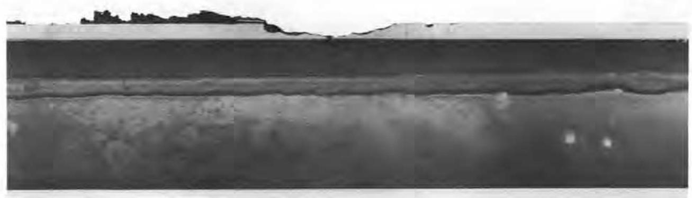

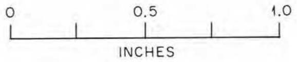  
Fig. 13.16. Cross section of hot leg of loop 1255 showing region where leak occurred after 9.2 years.

salt. Previous use of these probes had been limited to small static systems, and this experiment is intended to evaluate their possible use for on-stream analysis in a

large system. This loop differs from our other thermal convection loops in that the flow up the hot leg goes directly into a large surge tank. In our other loops the

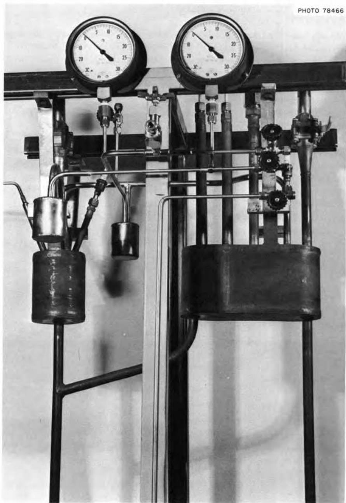  
Fig. 13.17. Upper portion of Hastelloy N thermal convection loop (NCL-21) showing hot-leg surge tank (right side) into which the electrochemical probes are placed.

salt is circulated only through tubing which is in a harp-shaped configuration. The flow then goes out the bottom of this tank into a crossover leg and into the cold leg. The different design of the upper portion of the loop was dictated by the fact that we wanted the electrochemical probes to see a fairly large and calm salt surface. The electrochemical probes pass through mechanical fittings (separated from the metal by Teflon), which are on risers 10 in. from the surge tank (to protect the Teflon from the heat of the salt) and then enter the salt in the large hot-leg surge tank. There are five access ports for the probes.

The specimens from the loop were removed, weighed, and examined after 665-hr exposure. Weight losses and gains, as expected in a temperature gradient mass transfer system, were seen in the hot and cold leg respectively. The maximum weight loss in the hot leg was $0.1\mathrm{mg/cm}^2$ and the maximum weight gain in the cold leg was $0.05\mathrm{mg/cm}^2$ . As expected, the $\mathrm{U}^{3+}/\mathrm{U}^{4+}$ ratio increased with time, and we are correlating these values with our weight-change data. After these initial measurements, further steps will involve additions of oxidants and reductants to study their influence on our measurements.

Details on the $\mathrm{U}^{3+}/\mathrm{U}^{4+}$ ratio as monitored by the probes are discussed in the Analytical Chemistry section of this report.

# 13.5.2 Fertile-Fissile Salt

A fertile-fissile MSBR salt has circulated for over 13,400 hr in Hastelloy N loop NCL-19A, which has removable specimens in each leg. The test has two purposes: (1) to confirm the compatibility of Hastelloy N with the salt and (2) to determine if bismuth will be picked up by the salt and carried through the loop. The bismuth is contained in a molybdenum vessel located in an appendage beneath the hot leg of the loop. Assuming uniform loss, the maximum weight loss is equivalent to 0.024 mil/year. A modified Hastelloy N alloy $(\mathrm{Ni}-12\% \mathrm{Mo}-7\% \mathrm{Cr}-0.1\% \mathrm{Fe}-0.4\% \mathrm{Ti}-2.0\% \mathrm{Nb})$ has lost less weight than a standard alloy at the same position. The chromium content of the salt has increased 134 ppm in 7400 hr, and there is no detectable bismuth in the salt. The corrosion reactions were discussed in the NCL-16 section.

# 13.5.3 Blanket Salt

Loop NCL-15A, constructed of standard Hastelloy N and containing removable specimens in each leg, has operated three years with a blanket salt (LiF-BeF $_2$ with

25 mole $\%$ $\mathrm{ThF_4}$ ) proposed for a two-fluid MSBR concept. Mass transfer, as measured by the change of chromium concentration in the salt, has been very small. Specimens exposed to this salt have a "glaze" or coating (probably a high-melting thorium compound) that is impossible to remove without damaging the metal. However, metallographic studies show little, if any, mass transfer of metallic components.

# 13.5.4 Coolant Salt

Loops NCL-13A and NCL-14, constructed of standard Hastelloy N and containing removable specimens in each leg, have operated for 2.8 and 3.8 years, respectively, with the fluoroborate mixture $\mathrm{NaBF}_4$ -NaF (92-8 mole $\%$ ). The maximum corrosion rate (assuming uniform removal) at the highest temperature, $605^{\circ}\mathrm{C}$ , has averaged 0.7 mil/year for both loops. Corrosion has generally been selective toward chromium

$$
\mathrm {F e F} _ {2} (\mathrm {d}) + \mathrm {C r} (\mathrm {s}) \rightleftharpoons \mathrm {C r F} _ {2} (\mathrm {d}) + \mathrm {F e} (\mathrm {s}),
$$

but there have been short periods when gaseous impurities entered the salt to cause general attack of the Hastelloy N, for example, by the reaction

$$
2 \mathrm {H F} (\mathrm {d}) + \mathrm {M} (\mathrm {s}) \rightleftharpoons \mathrm {H} _ {2} (\mathrm {g}) + \mathrm {M F} _ {2} (\mathrm {d}),
$$

where $\mathrm{d}$ , $\mathrm{s}$ , and $\mathrm{g}$ refer to dissolved state, crystalline solid, and gas, respectively, and $\mathbf{M} = \mathbf{Cr}$ , $\mathbf{Fe}$ , $\mathbf{Ni}$ , and $\mathbf{Mo}$ . The latter periods were caused by leaks in the seals of ball valves which are located above the surge tanks. These valves are exposed to a mixture of He and $\mathbf{BF}_3$ gas and not to salt. We attribute the leaks both to heavy use of the ball valves and to corrosion induced by any air inleakage into the gas mixture. Although the overall corrosion rate in these loops is not excessive, the rates observed in the absence of ball valve leaks have been an order of magnitude lower than the average rate. In NCL-14, over the last 4450 hr, the maximum corrosion rate has been 0.3 mil/year. Figure 13.18 shows weight changes from specimens in NCL-13A as function of position in the loop (temperature) and time. Note the areas of weight gain and weight loss and the balance points where no mass transfer occurs.

Loop NCL-17, constructed of standard Hastelloy N and containing removable specimens in each leg, is being used to determine the effect of steam on the mass transfer characteristics of the fluoroborate salt mixture. After 1000 hr of normal operation, steam was injected

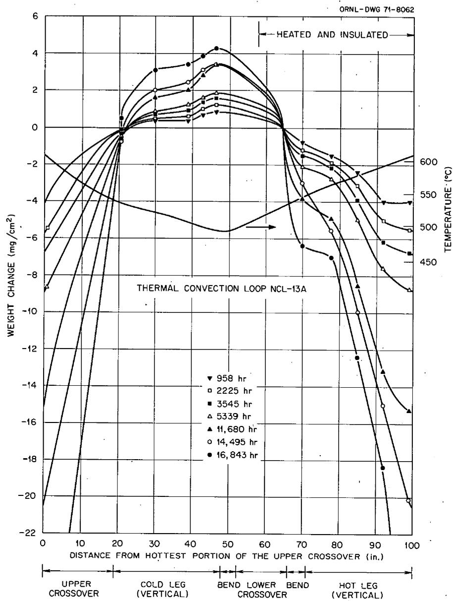  
Fig. 13.18. Hastelloy N specimen weight changes exposed to $\mathrm{NaBF}_4$ -NaF (92-8 mole %) from NCL-13A as a function of position and time.

into the salt, $^{8}$ and the loop has now operated 18,000 hr following that injection. Figure 13.19 shows specimen weight change as a function of position in the loop (temperature) and time. Note the large increase in weight change during the first 239 hr after steam injection. Another abrupt weight change occurred at

10,178 hr because of a leak in the cover gas system; however, the overall mass transfer rate decreased steadily between these two events.

Loop NCL-20, constructed of standard Hastelloy N and containing removable specimens in each leg, has operated for over 14,900 hr with the fluoroborate coolant salt at the most extreme temperature conditions considered (687°C max and 438°C min) for the MSBR secondary circuit. Forced air cooling of the cold leg is required to obtain this ΔT. After 11,900 hr, the

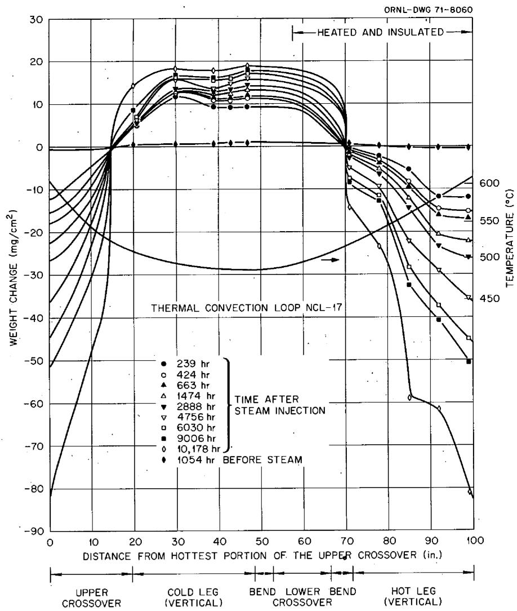  
Fig. 13.19. Weight changes from Hastelloy N specimens of NCL-17 $\left[\mathrm{NaBF}_4\text{-NaF}\right.$ (92-8 mole %) salt with steam addition] as a function of position and time.

maximum weight loss in the hot leg was measured to be $6.2\mathrm{mg/cm}^2$ (0.2 mil/year assuming uniform loss) and was accompanied by a maximum gain in the cold leg of $+2.8\mathrm{mg/cm}^2$ . Figure 13.20 shows the weight changes of specimens in the loop as a function of time and temperature, and Fig. 13.21 shows the overall picture of the mass transfer in the system. The chromium content of the salt increased by 150 ppm. Up to 11,900 hr the weight changes of the specimens and the chemistry changes of the salt indicated that the mass transfer was the lowest yet attained with the fluoroborate mixture in a temperature gradient system and also confirmed the importance of salt purity on compatibility with structural material and on operation.

Figure 13.22 shows micrographs of specimens in the hottest and coldest positions of the loops after 11,900-hr exposure. Microprobe analysis of these specimens showed no detectable concentration gradients. The deposit on the surface of the cold specimens was rich in Fe $(>25\mathrm{wt}\%)$ and Ni $(>64\mathrm{wt}\%)$ , but showed very little Cr or Mo.

Following 12,400 hr of operation, the normal 20-psia loop overpressure dropped to atmospheric pressure. Investigation disclosed that the safety valve on the

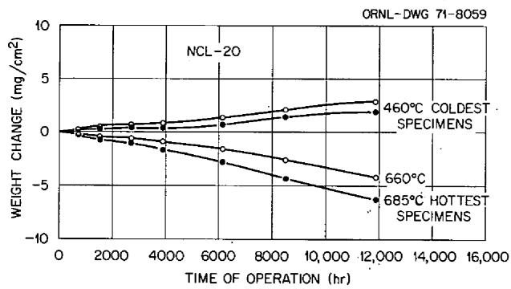  
Fig. 13.20. Weight changes of Hastelloy N specimens from NCL-20 exposed to $\mathrm{NaBF}_4$ -NaF (92-8 mole %) as a function of time and temperature.

helium regulator had failed and had released helium from the loop. The distance from the regulator to the loop was approximately 20 ft, and the gas line was $\frac{1}{4}$ -in. tubing. The specimens were immediately removed from the loop and weight changes measured. The maximum metal loss for this time period (525 hr) was 0.34 mil/year with a correspondingly low weight gain. Thus, the mass transfer rate was not greatly accelerated.

A salt analysis did not disclose any gross changes. The valve was replaced, and loop operation continued.

During the next 1850 hr, the maximum corrosion rate (assuming uniform loss) was 0.7 mil/year. Part of this increased mass transfer was probably associated with the regulator problem, but further inspection disclosed a leaking mechanical pressure fitting. This was repaired, and the loop is continuing operation.

An experiment was started to evaluate the corrosion properties of eight brazed Hastelloy N specimens in $\mathrm{NaBF_4}$ -NaF (92-8 mole $\%$ ). The specimens are contained in a nickel capsule at $607^{\circ}\mathrm{C}$ $(1125^{\circ}\mathrm{F})$ . The reason for this test is that little, if any, work has been done to determine brazes suitable for use in the sodium fluoroborate coolant salt. The test was intended as an initial screening study of brazes composed of Au-Ni, Ag-Cu, Cu, and several types of Ni-Cr-Fe alloys. Specimens will be removed periodically for visual observation and to determine weight changes.

The test has operated for over $3000\mathrm{hr}$ with all specimens showing a net weight gain from $+3$ to $5\mathrm{mg/cm^2}$ . Between 1200 and $1500\mathrm{hr}$ of operation a pressure gage between the He cylinder and the capsule became defective. During this time some of the specimens lost weight as a consequence of the more highly

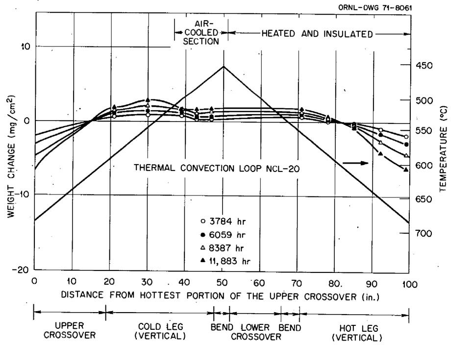  
Fig. 13.21. Weight changes from Hastelloy N specimens in NCL-20 exposed to $\mathrm{NaBF}_4$ -NaF (92-8 mole %) as a function of position and time.

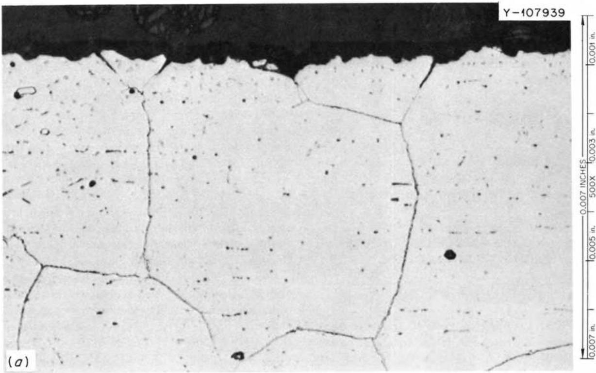

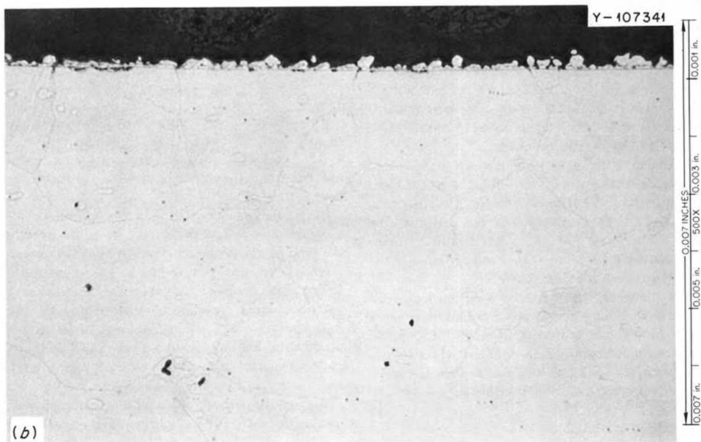  
Fig. 13.22. Optical micrographs of Hastelloy N specimens from NCL-20 exposed to $\mathrm{NaBF}_4\mathrm{-NaF}$ (92-8 mole %) for 11,900 hr. (a) $685^{\circ}\mathrm{C}$ , weight loss $6.2\mathrm{mg/cm}^2$ , etched with glyceria regia; (b) $460^{\circ}\mathrm{C}$ , weight gain $2.8\mathrm{mg/cm}^2$ , as polished.

oxidizing conditions produced by the air inleakage. Over the 3000-hr run the iron content of the salt has decreased 100 ppm while the chromium, nickel, and molybdenum content has remained unchanged.

The above observations suggest that the corrosion reaction taking place is of the type

$$
\mathrm {F e F} _ {2} (\mathrm {d}) + 2 \mathrm {C r F} _ {2} (\mathrm {d}) \rightarrow 2 \mathrm {C r F} _ {3} (\mathrm {d}) + \mathrm {F e} (\mathrm {s}),
$$

which would produce no measurable changes in the chromium concentration of the salt, but would account for a decrease in the iron concentration.

# 13.6 ANALYSIS OF HIGH-LEVEL PROBE FROM SUMPT TANK OF PKP-1

J.W.Koger

Loop PKP-1 was operated by A. N. Smith for over a year to test a molten-salt pump with the coolant mixture $\mathrm{NaBF}_4$ -NaF (92-8 mole $\%$ ). We had previously examined the $\mathrm{BF}_3$ feed and salt level bubbler tube10 and were asked to examine the spark plug probe because of its unexpected discoloration.

The spark plug probe consisted of a $1/8$ -in.-diam electrode which was installed April 8, 1968 and was assumed to be Hastelloy N. However, metallographic examination of the rod disclosed cracks extending 5 mils into the metal. Spectrographic analysis revealed that the material was Haynes alloy No. 25 (50% Co-20% Cr-10% W-10% Ni-3% Fe).

This parallels a finding in 1968 in which the specimen support rods of thermal convection loops NCL-13 and -14 were found to be Haynes alloy No. 25 rather than Hastelloy N. $^{11}$ That investigation revealed that the source of the $\frac{1}{8}$ -in. rod was a misidentified storage carton, and we are assuming that the rod found in the PKP loop was from the same source.

It was shown in the thermal convection loop tests that the Haynes alloy No. 25 was attacked much more than the Hastelloy N. In the case of the PKP-1 loop, the spark plug probe comprised an infinitesimal fraction of the loop surface, a fact that would explain the much heavier attack compared with Hastelloy N.

# 13.7 FORCED-CONVECTION LOOP CORROSION STUDIES

W.R.Huntley J.W.Koger H.C.Savage

Forced-convection loop MSR-FCL-1 was rebuilt following overheating, $^{12}$ and the loop is being used to evaluate the compatibility of standard Hastelloy N with $\mathrm{NaBF}_4$ -NaF (92-8 mole %) coolant salt at temperatures similar to those expected in the MSBR secondary circuit. The loop designation has been changed from MSR-FCL-1 to MSR-FCL-1A because of changes in the equipment and in the operating parameters. The new velocity in the $1/2$ -in.-OD, 0.042-in.-wall tubing is nominally $5\frac{3}{4}$ fps. The maximum and minimum salt temperatures in the loop are 620 and $454^{\circ}\mathrm{C}$ respectively. Hastelloy N corrosion test specimens are exposed to circulating salt at 620, 548, and $454^{\circ}\mathrm{C}$ .

A second forced-circulation loop of improved design, MSR-FCL-2, has completed shakedown tests and is in operation. This loop will be used to study the corrosion and mass transfer of standard Hastelloy N in sodium fluoroborate coolant at typical MSBR salt temperatures. A new pump design for MSR-FCL-2 provides salt velocities up to 20 fps. The loop contains three sets of removable corrosion specimens which are exposed to salt at 620, 537, $454^{\circ}\mathrm{C}$ and salt velocities of 10 and 20 fps.

# 13.7.1 Operation of Forced-Convection Loop MSR-FCL-1A

We completed loop repairs and placed the loop in operation at simulated MSBR conditions on Aug. 16, 1971. The test has operated smoothly since that time and has accumulated $380\mathrm{hr}$ at design conditions as of Aug. 31, 1971.

During the repair period, modifications were made to the control system to prevent accidental overheating of the loop piping. About 25 ft of Hastelloy N loop tubing was replaced, and new corrosion specimens were installed. The specimen assembly was modified so that specimens could be clipped rather than tack welded into the assembly. The 27-ft-long cooler coil was undamaged and was reused. The $\mathrm{NaBF}_4$ -NaF (92-8 mole %) coolant salt was removed from the dump tank and cooler coil by water flushing. This salt had been in the system for the entire period of operation preceding overheating (10,335 hr at design conditions). In view of

the changes in corrosion specimens and operating conditions, the loop designation was changed to MSR-FCL-1A.

The LFB pump was disassembled and repaired prior to reinstallation in MSR-CFL-1A, and new bearings and mechanical face seals were installed as is customary. The pump was operated at 3000 rpm in a cold shakedown for about 24 hr to ensure that the bearings and seals were operating properly. An oil leakage rate of about 4 cc/day was observed from the internal mechanical seal and was considered acceptable. The LFB pump operates at 3000 rpm in MSR-FCL-1A, which is slower than the 5000 rpm previously used in MSR-FCL-1. It is hoped that this reduced speed will appreciably increase the reliability and service life of the bearings and rotating seals.

The piping system was filled with $510^{\circ}\mathrm{C}$ salt from the dump tank on Aug. 12, 1971. The salt was circulated isothermally at $540^{\circ}\mathrm{C}$ for 90 hr at a flow rate of about 0.8 gpm during final system checkout. The flow rate was then increased to the design value of 2.4 gpm (pump speed 3000 rpm) for an additional 4 hr at intermediate temperatures prior to reaching design conditions on Aug. 16, 1971. The power input to the loop at design conditions is $63\mathrm{kW}$ . This power level represents a practical upper limit for long-term operation of the power input system because of heating limitations of the saturable reactor.

# 13.7.2 Metallurgical Analysis of Forced-Convection Loop MSR-FCL-1A

A salt sample was taken from the pump bowl on Aug. 16, 1971, after circulating the salt isothermally for 90 hr at $540^{\circ}\mathrm{C}$ . This initial salt analysis disclosed relatively large amounts of chromium, iron, molybdenum, and hydrogen. However, a later sample taken from the pump bowl at $454^{\circ}\mathrm{C}$ , after the loop had operated 138 hr at design conditions, showed smaller amounts of impurities. If any of the impurities were at saturation, the difference in temperature at which the samples were taken could explain the apparent discrepancy.

# 13.7.3 Operation of Forced-Convection Loop MSR-FCL-2

Assembly and preoperational checkout of the second molten-salt forced-convection loop MSR-FCL-2 (ref. 13) were completed during this report period. The loop

was filled with a specially processed sodium fluoroborate salt charge, placed in operation, and heat transfer performance of the salt was measured. After a short period of hot operation an O-ring seal failure in the ALPHA pump required a loop shutdown. The seal failure was repaired and the test returned to design conditions. This loop, constructed of Hastelloy N, will be used to study the corrosion and mass transfer properties of Hastelloy N in fluoroborate-type coolant-salt systems at conditions proposed for the MSBR.

Preoperational checkout was completed in accordance with the operating manual, and all documentation was reviewed for compliance with the Quality Assurance Plan (Engineering Document Q-10566-RB-001-5-0). All recorders and indicators of temperature, pressure, and power input were calibrated. Heat loss measurements were made on heater No. 2 in preparation for determining the heat transfer performance of the salt.

The salt charge for MSR-FCL-2 was processed to improve its purity prior to transfer into the loop. The first routine processing was done after $25\mathrm{kg}$ of the salt components was mixed and sealed in a vessel. The mixed powders were heated to $149^{\circ}\mathrm{C}$ and evacuated with a mechanical vacuum pump for 45 hr to remove moisture. The salt was then heated to $500^{\circ}\mathrm{C}$ and 16.7 kg was transferred to a small filling pot. The salt in the filling pot was heated under sealed-off vacuum to check for further impurity outgassing. The pressure rose from 28.7 in. Hg vacuum at $149^{\circ}\mathrm{C}$ to 26.4 in. Hg at $470^{\circ}\mathrm{C}$ which indicated little outgassing above the expected $\mathrm{BF}_3$ vapor pressure of the salt. An equilibrium mixture of He-BF3 was bubbled through the salt at $480^{\circ}\mathrm{C}$ at about 100 cc/min for 60 hr, and the effluent gas was passed through a cold trap at $0^{\circ}\mathrm{C}$ . This test was run to check for impurity collections such as were noted during operation of a liquid level bubbler in the PKP loop.14 The inlet gas mixture was prepared for the experiment by mixing dried helium (<1 ppm H2O) with $\mathrm{BF}_3$ in the proper ratio to balance the vapor pressure of the hot salt.

Impurities were found in the gas mixture after it had bubbled through the salt. A gas rotameter downstream of the cold trap initially became fouled with a clear liquid. A white film also deposited on the walls of the glass cold trap. A total of 0.15 cc of brown liquid was collected in the trap after 60 hr, and the materials collected appeared similar to those noted by A. N. Smith14 during operation of the PKP loop. Analysis

was inconclusive as it only disclosed major quantities of Na, B, and F with ppm values for many other elements. These instances of impurity collection show that presently available sodium fluoroborate systems can be expected to give acid collection and fouling problems when devices such as liquid level bubblers are used. From the small amount of material collected, we concluded that our method was not practical for removing large amounts of impurities. However, we feel that improvements could be made on the basic process which could provide more efficient removal.

The heat transfer performance of $\mathrm{NaBF_4}$ -NaF (92-8 mole $\%$ ) coolant salt was measured in heater section No. 2 of MSR-FCL-2 during hot shakedown operations. Heat transfer data were obtained at Reynolds moduli from 4200 to 48,000, salt velocities from 1.25 to 10.6 fps, heat fluxes from 43,000 to 157,000 Btu hr $^{-1}$ ft $^{-2}$ , film coefficients from 230 to 2100 Btu hr $^{-1}$ ft $^{-2}$ F $^{-1}$ , and at salt temperatures from 454 to $616^{\circ}\mathrm{C}$ . The test section is ${}^{1/2}$ -in.-OD tubing with a measured ID of 0.416 in. Resistance heating is supplied by a three-lug system with voltage potential applied to the center lug and the two exterior lugs at ground potential. Therefore, there is a section at the center lug of the heated length which has an interrupted heat flux. The actively heated length is 11.5 ft which gives an L/D ratio of 331. Guard heaters are located on the heater lugs and along the resistance-heated tube to reduce heat losses during the heat transfer tests.

Temperature of the bulk fluid is measured by three thermocouples located in wells at both the inlet and exit. Wall temperatures along the heated section are measured by thermocouples that are wrapped $180^{\circ}$ circumferentially around the tubing and clamped against the wall at about 1-ft intervals. The above-mentioned thermocouples are all sheathed; insulated junction, 0.040-in.-OD, Chromel/Alumel and have been precalibrated. Four bare wire thermocouples (0.010-in.-OD, Chromel/Alumel) are also placed on the heated wall and read out on a potentiometer for comparison with the sheathed thermocouples recorded by the DEXTIR data logger. The readings of the two types of thermocouples were in good agreement.

The heat transfer data obtained with sodium fluoroborate salt in MSR-FCL-2 have been put in dimensionless form as shown in Fig. 13.23. The data are in good agreement with the empirical correlation of Sieder and Tate15 which is shown by the solid line. The plotted data points were obtained with more precise thermocouple techniques than those used in earlier work16 by the writer; therefore, the data of Fig. 13.23 are considered the best available evidence that sodium

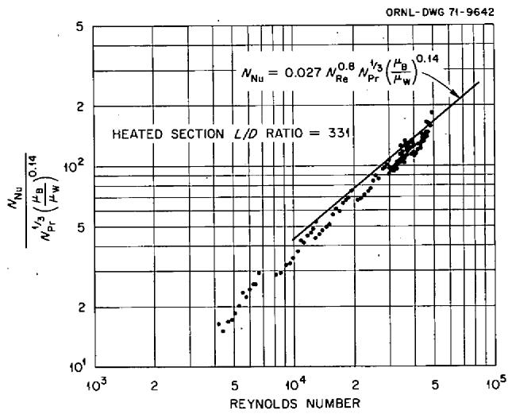  
Fig. 13.23. Heat transfer characteristics of $\mathrm{NaBF_4}$ -NaF (92-8 mole $\%$ )flowing in 0.416-in.-ID tube.

fluoroborate does indeed perform as a typical heat transfer fluid.

A gas leak occurred at an O-ring seal within the ALPHA pump on July 7, 1971, as the test was being brought to design operating conditions. At that time the salt had been in the loop for $510\mathrm{hr}$ and had been circulated by the pump for $56\mathrm{hr}$ . The salt inventory was sampled to check for impurity additions resulting from the gas leak, and none were found. The system was then drained to repair the pump. The gas leak resulted from $\mathbf{BF}_3$ attack of a BUNA-N O-ring in the mechanical seal cartridge. The manufacturer of the mechanical seal indicated during early engineering discussions that Viton (a DuPont fluoroelastomer which is more resistant to $\mathbf{BF}_3$ than BUNA N) would be used in this application, but this was changed during actual assembly of the seals. The pump has been reassembled with new seal cartridges containing Viton O-rings, and MSR-FCL-2 has just been placed in operation at design conditions. Details of the ALPHA pump O-ring seal replacement and other pump engineering problems are discussed elsewhere in this report, Sect. 3.7, MSBR Pumps.

# 13.7.4 Metallurgical Analysis of Forced-Convection Loop MSR-FCL-2

Corrosion test specimens were in the loop while the heat transfer measurements were made. These specimens were examined after salt exposure of $510\mathrm{hr}$ and salt circulation with the ALPHA pump for 56 of those hours. During the heat transfer measurements the pump operated at speeds between 1400 and $5400~\mathrm{rpm}$ , and the specimens were exposed to temperatures between 440 and $620^{\circ}\mathrm{C}$ .

The weight changes were higher than expected (maximum weight loss of $1.5\mathrm{mg} / \mathrm{cm}^2$ ) and showed a definite velocity effect. The specimens exhibited expected temperature-gradient mass transfer behavior with weight losses in the high-temperature region, very little change in the medium-temperature region, and weight gains in the cold region.

During the time of the heat transfer measurements, the chromium in the salt increased from 64 to $82~\mathrm{ppm}$ and the iron changed from 359 to $347~\mathrm{ppm}$ . The oxide content varied from 500 to $800~\mathrm{ppm}$ , and the $\mathbf{H}^+$ content increased from 27 to $31~\mathrm{ppm}$ . Mass transfer was not considered excessive, and the decision was made to go to design conditions.

# 13.8 CORROSION OF HASTELLOY N IN STEAM

# B. McNabb H. E. McCoy

The modifications to the sample chamber at Bull Run to accommodate tube burst tests has been completed and the test facility placed back in operation. Some of the unstressed weight gain specimens have accumulated 8000-hr exposure and are still following the same trends reported previously.[17] The Hastelloy N specimens, both air and vacuum melted, have total weight gains of about $0.4\mathrm{mg/cm}^2$ at $538^{\circ}\mathrm{C}$ . The same heats of Hastelloy N exposed to steam at $593^{\circ}\mathrm{C}$ in the Florida steam plant for approximately 15,000 hr have weight gains of about $3.5\mathrm{mg/cm}^2$ .

Two of the Hastelloy N tube burst specimens installed in the Bull Run facility failed prematurely. The highest stressed (77,000 psi, 0.010 in. wall thickness) specimen failed in 1 hr, and the next-highest stressed (52,500 psi, 0.015 in. wall thickness) failed in 3.7 hr. These specimens were stressed considerably above the yield stress at $538^{\circ}\mathrm{C}$ (40,000 psi), and yielding might continue in a thin-walled tube to produce rupture quickly. It was first

believed that these failures were caused by either flaws in the specimens, poor machining of the gage section, or inaccuracies in measuring the wall thickness of the specimens. Later evidence indicates this was not the case. Figure 13.24 is a photograph of these double-walled tube burst specimens, with the outer tube removed.

The 77,000-psi specimen failed catastrophically, but the 52,500-psi specimen developed a small crack starting at the tip of the arrow shown at the right of the photograph. Even though the specimens failed in a short time, they were not removed from the facility until $1000\mathrm{hr}$ , so the outside of the inner tube was exposed to steam for about the same time as the outside of the outer tubes shown at the top of the photograph.

These two failed specimens were replaced by specimens stressed at 56,000 psi (0.014 in. wall) and 50,000 psi (0.016 in. wall). These stresses bracket the lower stress of the failed specimens (52,500), and these replacement specimens have been in test over 1000 hr without failure, indicating the other specimens had failed prematurely. These latter specimens were machined carefully and had a superior surface finish and appear to have uniform wall thicknesses.

Figure 13.25 is a photomicrograph of the area of failure of the 52,500-psi tube burst. It appears that stress corrosion cracking has occurred with the cracks starting on the ID (steam side) of the tube. Since the other tubes stressed in the same range as this one have not failed, it raises the possibility that something could have happened to this individual specimen. Either some contaminant was left in the tube following fabrication due to poor cleaning practice or some contaminant was introduced by the steam during operation. An investigation is under way to check water quality records during the run to determine if any unusual conditions existed during the run. The plant had been in a period of sustained operation for over one month before the first specimens were inserted.

Preliminary results from studies by Hammond at Dunedin, Fla. showed that Hastelloy N may be susceptible to stress corrosion cracking in steam containing sodium chloride and oxygen. Some of the test conditions actually deposited NaCl on the material. H. W. Pickering, F. H. Beck, and M. G. Fontana18 proposed a

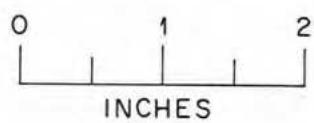

Y-108427

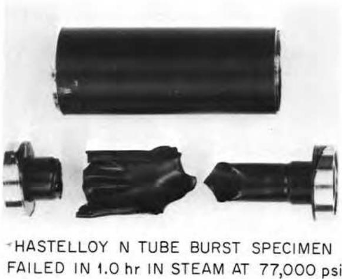

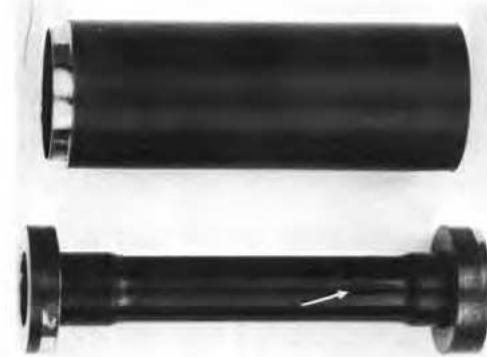  
HASTELLOY N TUBE BURST SPECIMEN  
FAILED IN 3.7 hr IN STEAM AT 52,500 psi

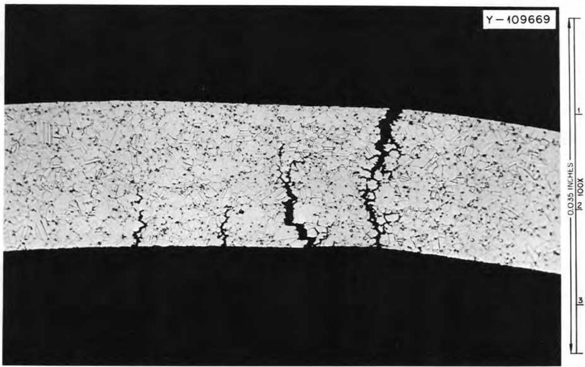  
Fig. 13.24. Hastelloy N tube burst specimens removed from the Bull Run Steam Plant after failure. The small tube in the test section was exposed to steam at $538^{\circ}\mathrm{C}$ and $3500\mathrm{psi}$ .   
Fig. 13.25. Photomicrograph of Hastelloy N tube burst specimen. Failure occurred after exposure to steam for $3.7\mathrm{hr}$ at 52,500 psi at $538^{\circ}\mathrm{C}$ . Steam was on the inside of the tube.

mechanism for rapid intergranular deterioration of austenitic stainless steels by oxygen and dry NaCl that may be pertinent to these observations. This mechanism was based on the formation of a nonprotective scale containing $\mathrm{NaCrO_4}$ from the reaction of NaCl and $\mathrm{O}_2$ with $\mathrm{Cr_2O_3}$ and $\mathrm{Cr_{23}C_6}$ , with reaction rates increasing in the order listed. Since Hastelloy N contains $7\%$ chromium, it was decided to test it in contact with NaCl at $593^{\circ}\mathrm{C}$ . An air-melted heat (5065) with $16.5\%$ Mo, $7.2\%$ Cr, $3.9\%$ Fe, $0.55\%$ Mn, $0.6\%$ Si, and $0.065\%$ C and a vacuum-melted heat (2477) with $16.3\%$ Mo, $7\%$ Cr, $4.1\%$ Fe, $0.05\%$ Mn, $0.05\%$ Si, and $0.06\%$ C were tested in air at 60,000 psi and $593^{\circ}\mathrm{C}$ in the uncoated and coated conditions. Rod specimens having gage sections 1.125 in. long $\times 0.125$ in. diam were used for these creep tests. The specimens were annealed 1 hr at $1177^{\circ}\mathrm{C}$ in argon prior to testing. The NaCl was applied to the specimens by painting a saturated NaCl solution on a $1/2$ -in. length of the gage section and allowing it to dry before installing in the furnace. The coatings were typically about 5 mils thick before testing.

Figure 13.26 shows a plot of the percent elongation vs time for heat 5065 at $593^{\circ}\mathrm{C}$ and 60,000 psi in air for the uncoated and coated specimens. The uncoated

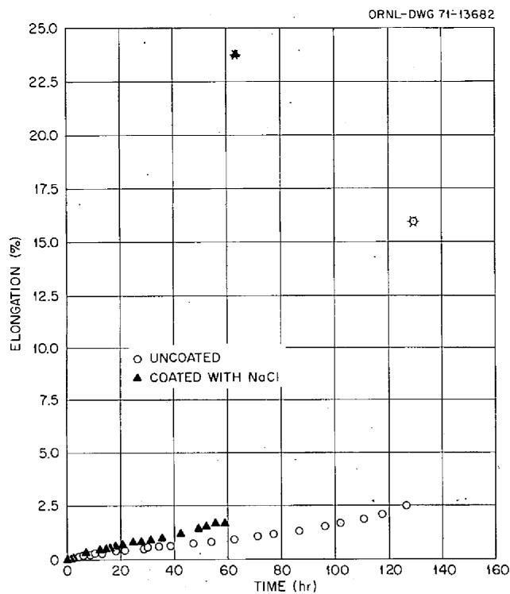  
Fig. 13.26. Comparative creep curves of Hastelloy N (heat 5065) with and without NaCl coating stressed at 60,000 psi and $593^{\circ}\mathrm{C}$ in air.

specimen had about two times the rupture life of the coated specimen and a slightly lower creep rate. Figure 13.27 is a plot of the percent elongation vs time for heat 2477 in the uncoated and coated conditions at $593^{\circ}\mathrm{C}$ and 60,000 psi in air. The first two specimens designated anneal 000 had a mill anneal of 1 hr at $1177^{\circ}\mathrm{C}$ prior to machining, and the third specimen had an additional anneal of 1 hr at $1177^{\circ}\mathrm{C}$ after machining but prior to testing.

It appears that there is little effect of the NaCl on the creep strength of Hastelloy N at these conditions, but further testing will be required to determine the magnitude of the effect at various stresses. The reason for the difference in creep strengths of heats 5065 and 2477 is not presently understood, since at higher temperatures, such as 650 and $760^{\circ}\mathrm{C}$ , the strengths are quite close.

Figure 13.28 is a photomicrograph of the rupture of uncoated heat 5065 after testing at $593^{\circ}\mathrm{C}$ and 60,000 psi in air. Figure 13.29 is a photomicrograph of the rupture of heat 5065 coated with NaCl and tested at $593^{\circ}\mathrm{C}$ and 60,000 psi in air. A comparison of these photomicrographs reveals very little if any difference due to the presence of the NaCl.

Figure 13.30 is a photomicrograph of the rupture of uncoated heat 2477 after testing at $593^{\circ}\mathrm{C}$ and 60,000 psi in air. Figure 13.31 is a photomicrograph of the rupture of heat 2477 coated with NaCl and tested under the same conditions. A comparison of these photomicrographs and the rupture lives of these tests (468.3 hr without and 475.9 hr with salt) shows NaCl has little if any effect on vacuum-melted Hastelloy N at these conditions.

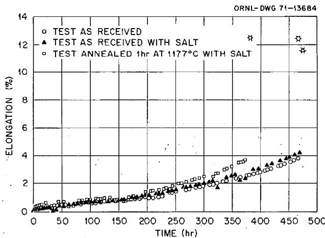  
Fig. 13.27. Comparative creep curves of Hastelloy N (heat 2477) with and without NaCl coating stressed at 60,000 psi and $593^{\circ}\mathrm{C}$ in air.

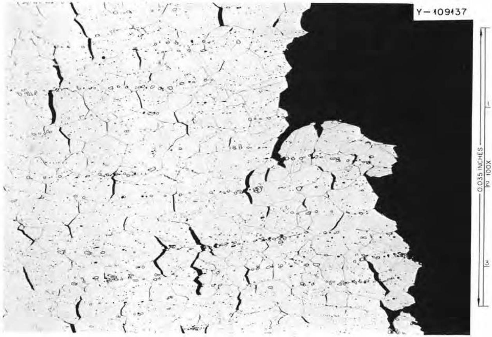  
Fig. 13.28. Photomicrograph of the fracture of Hastelloy N (heat 5065) stressed at 60,000 psi at $593^{\circ}\mathrm{C}$ without NaCl coating. Etchant: Gly Regia.

# 13.9 EVALUATION OF DUPLEX TUBING FOR USE IN STEAM GENERATORS

B. McNabb H.E.McCoy

Duplex tubing has been proposed for steam generator service with Incoloy 800 on the inside (steam side) and nickel 280 (pure nickel with $0.05\% \mathrm{Al}_2\mathrm{O}_3$ for grain size control) on the outside or salt side. A piece of the Inco duplex tubing reported previously[19] was further evaluated by mechanical property tests. A 12-in. piece of the 0.750-in.-diam tubing was tensile tested in a Baldwin Tensile Machine at $25^{\circ}\mathrm{C}$ and a displacement rate of 0.05 in./min. The $0.2\%$ offset yield stress was 37,600 psi, the ultimate tensile stress was 70,780 psi, and the elongation $50.5\%$ in 2 in. It appears that at room

temperature the Ni 280 and the Incoloy 800 contribute equally to the strength in the tensile test.

A tube burst specimen was tested at $538^{\circ}\mathrm{C}$ in an argon atmosphere with argon internal pressure and ruptured in 3263 hr. Calculating the stress on the entire duplex wall thickness assuming 0.065 in. each for the Incoloy 800 and Ni 280 would give a hoop stress of 28,720 psi. The hoop stress in the Incoloy 800, assuming the Ni 280 did not add any strength, would be 46,000 psi. The rupture life of 3263 hr for a stress of 46,000 psi at $538^{\circ}\mathrm{C}$ is in good agreement with the data in Bulletin T-40 (Inco) for Incoloy 800. Therefore, it appears that the nickel contributed very little to the strength at this temperature.

Figure 13.32 is a photograph of the tube burst specimen with Incoloy 800 end plugs and nickel rings welded to the tube to reinforce the end closures. Inco 82T weld wire and GTA welding were used to make the dissimilar metal welds. Dye penetrant was applied to

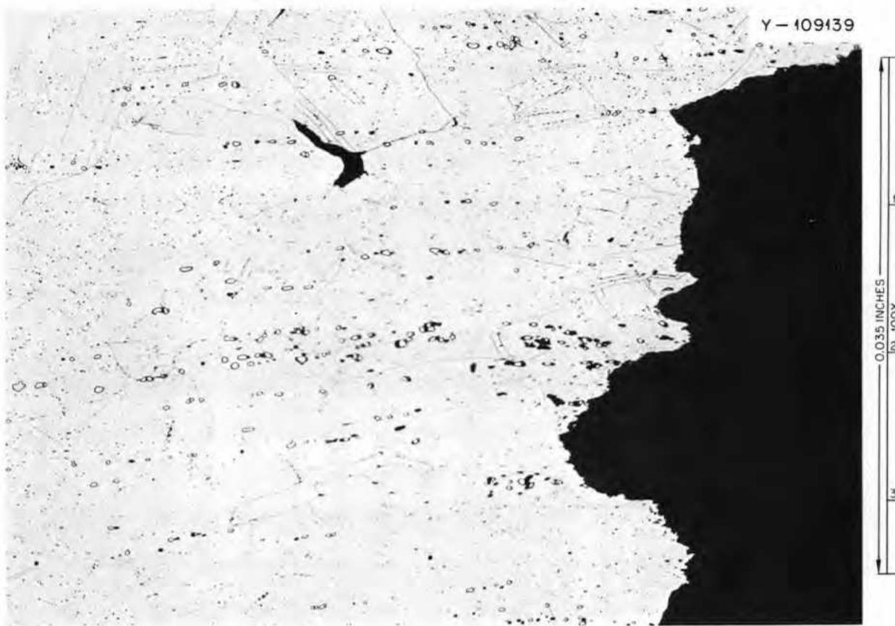  
Fig. 13.29. Photomicrograph of the fracture of Hastelloy N (heat 5065) stressed at 60,000 psi at $593^{\circ}\mathrm{C}$ with NaCl coating. Etchant: Gly Regia.

the gage section of the tube, and the many longitudinal cracks in the nickel 280 can be seen clearly in the figure. Figure 13.33 is a photomicrograph of the Ni 280 tubing showing the extent and depth of the cracking in the outer portion of the duplex tube. Figure 13.34 is a photomicrograph of the rupture area with the crack in the inner Incoloy 800 tube and extending on through the Ni 280 outer tube. The Incoloy 800 was not cracked around the circumference as was the Ni 280, and the interface between the two materials was metallurgically sound.

The tubing was made by coextruding the two materials into a tube shell and then drawing into tubing. Since the tube burst specimen was profusely cracked longitudinally, it was thought that prior working direction might have influenced the cracking behavior. Specimens from some Ni 280 sheet already on hand were cut longitudinal and transverse to the rolling direction and creep tested at $538^{\circ}\mathrm{C}$ and 20,000 psi in argon. Figure 13.35 is a plot of the percent elongation

vs time for a pair of these tested in the as-received condition. It appears that the longitudinal specimen is slightly stronger, with a longer rupture life and lower minimum creep rate. However, the fracture strains are quite high for both specimens.

The proposed use for the tubing would have steam on the inside (Incoloy 800 side), but it would be desirable to know if Ni 280 would be compatible with steam in the event of a leak. Some specimens of Ni 280 sheet were exposed to 3500 psi steam at $538^{\circ}\mathrm{C}$ in the Bull Run facility for 2000 hr. The specimens gained about $75\mathrm{mg/cm}^2$ in this period and appear to be almost completely oxidized as shown in Fig. 13.36. The green flaky oxide was easily removed, and the remaining black oxide was easily broken in handling the specimens with tweezers. The thickness of the specimens had doubled because of the low density of the oxide. It appears that Ni 280 is not compatible with steam under these conditions.

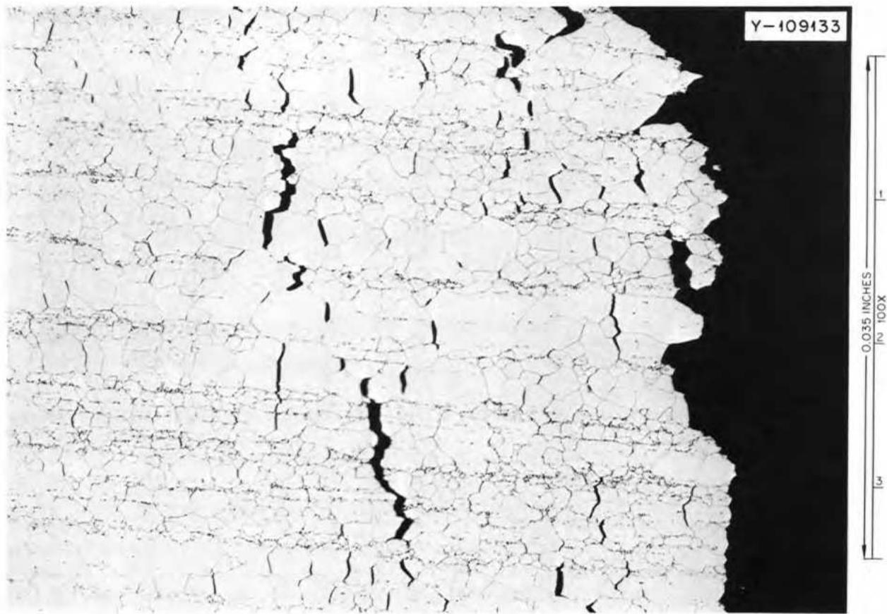  
Fig. 13.30. Photomicrograph of the fracture of Hastelloy N (heat 2477) stressed at 60,000 psi at $593^{\circ}\mathrm{C}$ without NaCl coating. Etchant: Gly Regia.

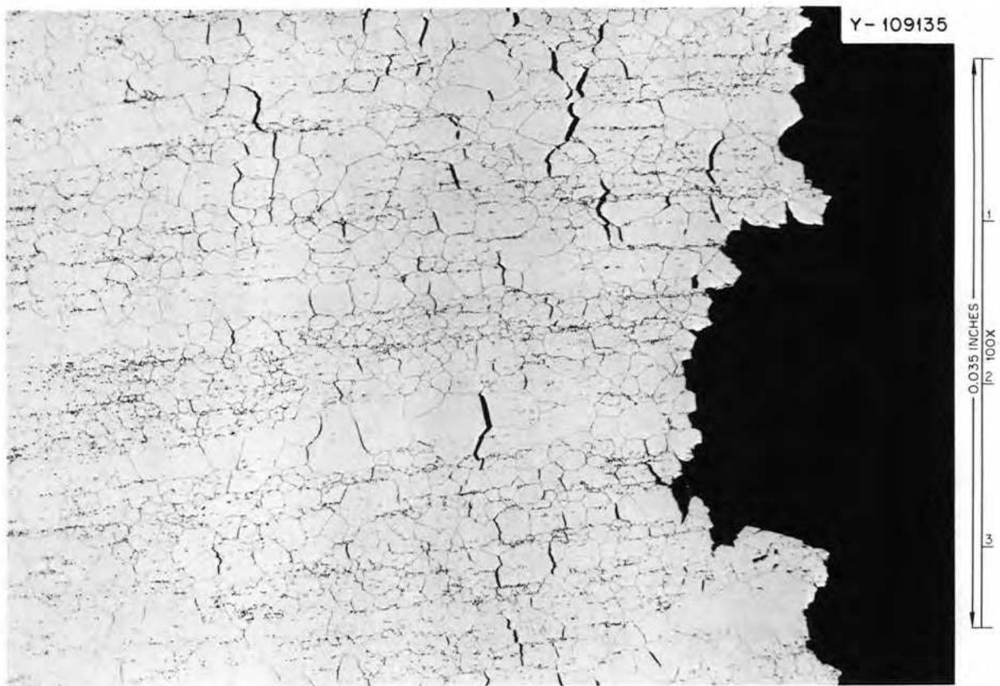  
Fig. 13.31. Photomicrograph of the fracture of Hastelloy N (heat 2477) stressed at 60,000 psi at $593^{\circ}\mathrm{C}$ with NaCl coating. Etchant: Gly Regia.

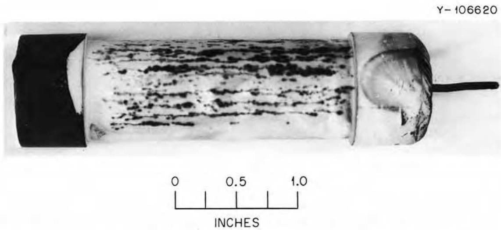  
Fig. 13.32. Specimen of duplex Incoloy 800-Ni 280 tubing tested at $538^{\circ}\mathrm{C}$ and 46,000 psi hoop stress in the Incoloy 800. The specimen failed in 3263 hr with $2.3\%$ diametral strain. The longitudinal markings are due to dye penetrant that was absorbed by the cracks.

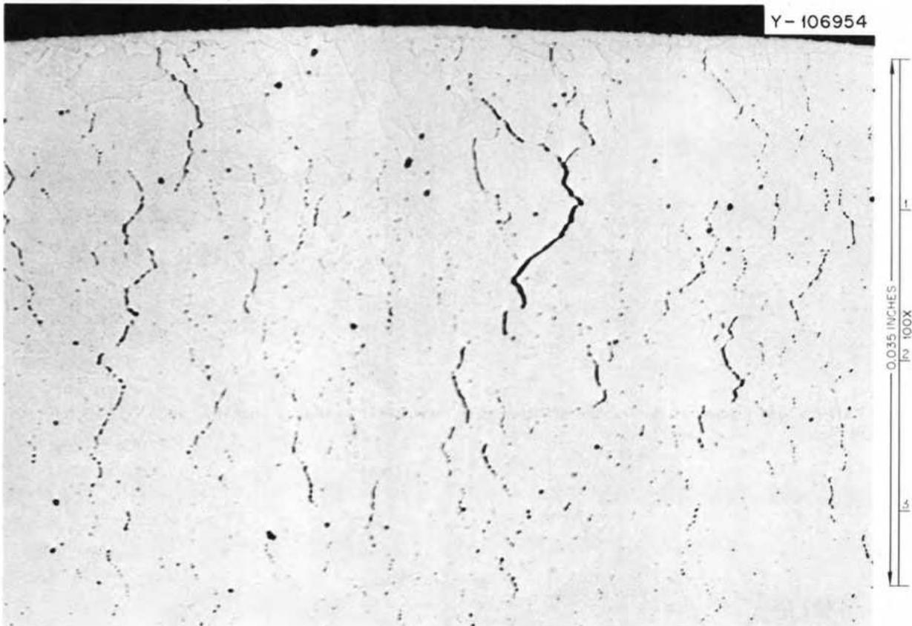  
Fig. 13.33. Photomicrograph of the Ni 280 from the specimen in the previous figure. As polished.

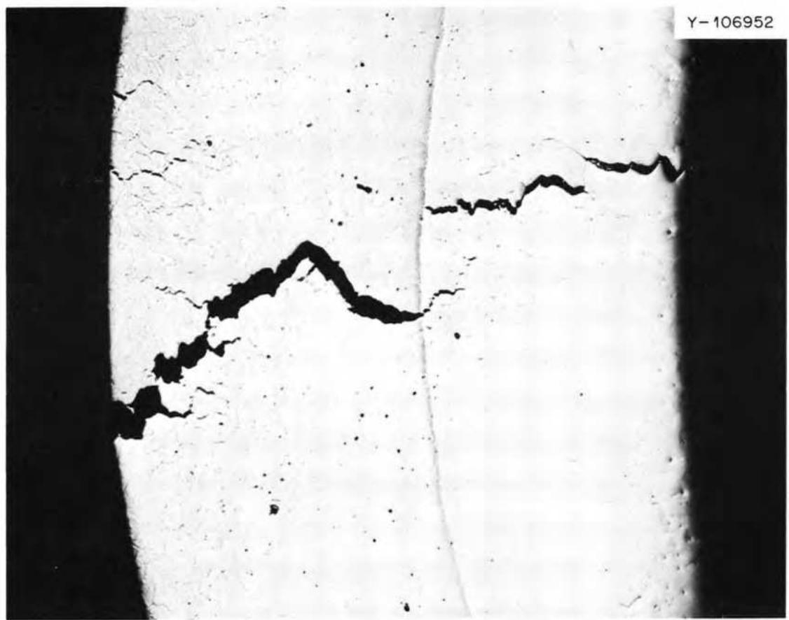  
Fig. 13.34. Photomicrograph of the primary failure region in the tube in Fig. 13.32. Incoloy 800 is on the inside and the Ni 280 on the outside. As polished, Magnification $35\times$ .

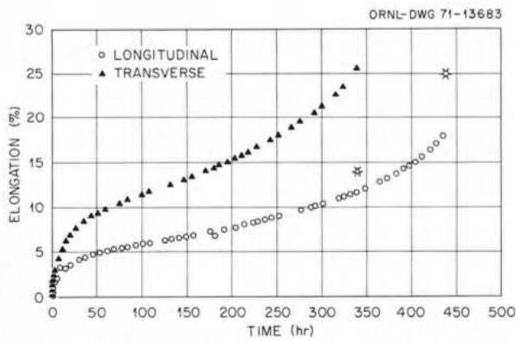  
Fig. 13.35. Comparative creep curves of Ni 280 sheet at $538^{\circ}\mathrm{C}$ and 20,000 psi in an argon atmosphere. Samples taken from longitudinal and transverse orientation.

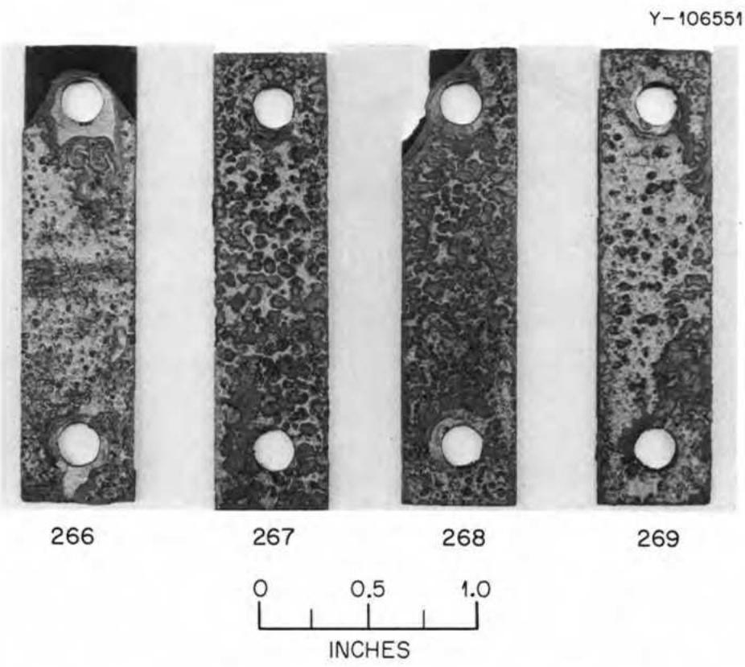  
Fig. 13.36. Samples of Ni 280 exposed to steam for 2000 hr at $538^{\circ}\mathrm{C}$ and 3500 psi.

# 14. Support for Chemical Processing

J.R.DiStefano H.E.McCoy

Reductive-extraction reprocessing has been proposed as a method of removing protactinium and fission products from an MSBR fuel. The process involves extracting uranium, protactinium, and rare earths from the fuel salt into molten bismuth containing dissolved thorium and lithium as reductants. Our materials program is aimed at selecting the most promising material for containing these Bi-Li-Th solutions at 500 to $700^{\circ}\mathrm{C}$ .

At present our efforts are concentrated in two areas. One is the fabrication of an experimental reductive-extraction unit from molybdenum. This unit, which involves a packed column, will allow us to obtain metallurgical data on the test equipment as well as chemical engineering process data under a variety of conditions. The second part of our program is to evaluate the compatibility of molybdenum, TZM, tantalum, T-111, brazing alloys, and various grades of graphite with several Bi-Li solutions under reprocessing conditions.

# 14.1 CONSTRUCTION OF A MOLYBDENUM REDUCTIVE-EXTRACTION TEST STAND

J. R. DiStefano

We are constructing a molybdenum system that will be used for metallurgical and chemical engineering evaluation. Details of the design of this test stand have been reported elsewhere. $^{1,2}$ Basically, it consists of a 5-ft-long $1^{1/8}$ -in.-OD packed column with enlarged $(3^{7/8}$ in. OD) top and bottom sections; feed pots $(3^{7/8}$ in.

OD); gas lift pumps; freeze valve; and $\frac{1}{4}$ -in.-OD × 0.020-in.-wall, $\frac{3}{8}$ -in.-OD × 0.025-in.-wall, $\frac{1}{2}$ -in.-OD × 0.030-in.-wall, and $\frac{7}{8}$ -in.-OD × 0.080-in.-wall interconnecting lines. Molten salt and bismuth will be countercurrently circulated through the column, separated in the disengagement sections, and returned to the elevated head pots for gas separation, sampling, flow measurement, and gravity flow back through the column. The system is designed to operate isothermally in the range 550 to $650^{\circ}\mathrm{C}$ .

Back-extrusion, welding, brazing, and mechanical joining techniques have been developed to fabricate and assemble the loop. The following is a general outline of the fabrication schedule:

1. fabrication of containers and column,   
2. machining of loop components,   
3. fabrication of head pot and column subassemblies,   
4. mounting of subassemblies on test stand supports,   
5. joining of subassemblies and other loop components.

We have completed primary fabrication of the head pots, enlarged end sections of the column, and the

column itself. Loop components for subassembly fabrication are presently being machined.

Evaluation of three sizes of commercially obtained molybdenum tubing $(1/4$ in. OD $\times 0.020$ in. wall, $3/8$ in. OD $\times 0.025$ in. wall, and $1/2$ in. OD $\times 0.030$ in. wall) has revealed differences in hardness, recrystallization behavior, and ductility. Table 14.1 shows the variation in hardness and microstructure that occurred as a function of heat treatment. The data for the $3/8$ -in.-OD tubing indicated it was partially recrystallized in the as-received condition, and heating to $925^{\circ}\mathrm{C}$ resulted in complete recrystallization. Contrarily, both the $1/4$ - and $1/2$ -in.-OD samples were received in a cold-worked condition. Heat treating to $925^{\circ}\mathrm{C}$ did not alter the hardness or microstructure of the $1/4$ -in.-OD tubing, but the $1/2$ -in.-OD sample softened and was almost completely recrystallized.

To evaluate the ductility of the tubing as a function of temperature, we devised a somewhat qualitative test in which a ring sample was impact squashed a predetermined amount. In these tests the ring becomes elliptical, and we have defined the amount of deformation in terms of a displacement (original ring diam - minor axis diam of ellipse) divided by the original diameter of the ring. The data obtained have been summarized in Table 14.2. Note that the $\frac{1}{2}$ -in.-OD tubing was "ductile" (no cracks) at room temperature while, under the conditions of these tests, we were required to heat the $\frac{3}{8}$ -in.-OD tubing to 150 to $250^{\circ}\mathrm{C}$

and the $\frac{1}{4}$ -in.-OD tubing to $300^{\circ}\mathrm{C}$ before they became ductile. We traced the behavior of the $\frac{1}{4}$ -in.-OD tubing to a brittle layer on the ID as indicated in Table 14.3. Removal of 0.004 in. from the ID (0.002 in. from the wall thickness) resulted in lowering the temperature at which ductility was observed from 300 to $125^{\circ}\mathrm{C}$ ; when 0.006 in. was removed from the ID the material was ductile at room temperature. Chemical analysis indicated that material from near the ID of this tubing contained higher oxygen and carbon concentrations compared with bulk sample analyses. We suspect that contamination of the tubing occurred during fabrication; inadequate cleaning procedures, perhaps due to the difficulty of getting a pickling solution into the relatively small diameter opening, resulted in a brittle zone near the ID. To determine if ID contamination might also be responsible for the brittle behavior of the $\frac{3}{8}$ -in.-OD tubing, we removed (by etching) 0.001 to 0.002 in. from the inside. Subsequent tests then showed good ductility at room temperature for this material also.

The fabrication schedule used in making the $3/8$ -in.-OD tubing could also have contributed to its lack of ductility. We noted that the $3/8$ -in.-OD tubing completely recrystallized when it was heated for 1 hr at $925^{\circ}\mathrm{C}$ . Since recrystallization temperature is a function of the prior history of the material, we felt the fabrication schedule merited investigation. Additional $3/8$ -in.-OD tubing made by a different schedule was

Table 14.1. Hardness and microstructure of molybdenum tubing as a function of heat treatment   

<table><tr><td>Size of tubing (OD in.)</td><td>Condition</td><td>Hardness DPH.(1000 g)</td><td>Microstructure</td></tr><tr><td>1/4</td><td>As receiveda</td><td>237</td><td>Cold worked</td></tr><tr><td>1/4</td><td>1 hr at 800°C</td><td>258</td><td>Cold worked</td></tr><tr><td>1/4</td><td>1 hr at 925°C</td><td>250</td><td>Cold worked</td></tr><tr><td>3/8</td><td>As receiveda</td><td>200</td><td>Partially recrystallized (10–15%)</td></tr><tr><td>3/8</td><td>1 hr at 800°C</td><td>243</td><td>Partially recrystallized</td></tr><tr><td>3/8</td><td>1 hr at 925°C</td><td>168</td><td>Completely recrystallized</td></tr><tr><td>1/2</td><td>As receiveda</td><td>242</td><td>Cold worked</td></tr><tr><td>1/2</td><td>1 hr at 700°C</td><td>255</td><td>Cold worked</td></tr><tr><td>1/2</td><td>1 hr at 800°C</td><td>243</td><td>Cold worked</td></tr><tr><td>1/2</td><td>1 hr at 900°C</td><td>236</td><td>Very slightly recrystallized</td></tr><tr><td>1/2</td><td>1 hr at 925°C</td><td>206</td><td>Almost completely recrystallized (90%)</td></tr></table>

${}^{a}$ The tubing was stress relieved for $1\mathrm{{hr}}$ at ${870}^{ \circ  }\mathrm{C}$ before delivery to us.

Table 14.2. Ductility of molybdenum tubing as a function of deformation temperature   

<table><tr><td>Size of tubing (OD in.)</td><td>Deformation displacement/tube diameter (%)</td><td>Temperature (°C)</td><td>Observation</td></tr><tr><td>1/4</td><td>8</td><td>25</td><td>Cracked where ID in tension</td></tr><tr><td>1/4</td><td>8</td><td>100</td><td>Cracked where ID in tension</td></tr><tr><td>1/4</td><td>8</td><td>200</td><td>Cracked where ID in tension</td></tr><tr><td>1/4</td><td>4</td><td>25</td><td>Cracked where ID in tension</td></tr><tr><td>1/4</td><td>4</td><td>100</td><td>Cracked where ID in tension</td></tr><tr><td>1/4</td><td>4</td><td>150</td><td>Cracked where ID in tension</td></tr><tr><td>1/4</td><td>4</td><td>175</td><td>Cracked where ID in tension</td></tr><tr><td>1/4</td><td>4</td><td>200</td><td>Cracked where ID in tension</td></tr><tr><td>1/4</td><td>4</td><td>250</td><td>Cracked where ID in tension</td></tr><tr><td>1/4</td><td>4</td><td>300</td><td>No cracks</td></tr><tr><td>3/8</td><td>6.5</td><td>25</td><td>Fractured into four pieces</td></tr><tr><td>3/8</td><td>6.5</td><td>100</td><td>Cracked in three places</td></tr><tr><td>3/8</td><td>6.5</td><td>150</td><td>Cracked in three places</td></tr><tr><td>3/8</td><td>6.5</td><td>250</td><td>No cracks</td></tr><tr><td>3/8</td><td>3.25</td><td>25</td><td>Fractured into four pieces</td></tr><tr><td>3/8</td><td>3.25</td><td>100</td><td>Cracked in four places</td></tr><tr><td>3/8</td><td>3.25</td><td>150</td><td>No cracks</td></tr><tr><td>3/8</td><td>3.25</td><td>175</td><td>No cracks</td></tr><tr><td>3/8</td><td>3.25</td><td>200</td><td>No cracks</td></tr><tr><td>1/2</td><td>10</td><td>25</td><td>No cracks</td></tr></table>

acquired, and some improvement in as-received ductility was found. However, removal of 0.001 to 0.002 in. from the ID greatly improved its room-temperature ductility, indicating that ID contamination is definitely the most significant problem.

Table 14.3. Mechanical behavior of $\frac{1}{4}$ -in.-OD tubing as a function of removing incremental layers from the ID surface   

<table><tr><td>Material removed from ID (in.)</td><td>Deformation displacement/tube diameter (%)</td><td>Temperature (°C)</td><td>·Observation</td></tr><tr><td>0.002</td><td>4</td><td>25</td><td>Hairline crack</td></tr><tr><td>0.002</td><td>4</td><td>125</td><td>Hairline crack</td></tr><tr><td>0.004</td><td>4</td><td>25</td><td>Hairline cracks</td></tr><tr><td>0.004</td><td>4</td><td>125</td><td>No cracks</td></tr><tr><td>0.006</td><td>4</td><td>25</td><td>No cracks</td></tr><tr><td>0.006</td><td>4</td><td>125</td><td>No cracks</td></tr><tr><td>0.008</td><td>4</td><td>25</td><td>No cracks</td></tr><tr><td>0.008</td><td>4</td><td>125</td><td>No cracks</td></tr><tr><td>0.010</td><td>4</td><td>25</td><td>No cracks</td></tr><tr><td>0.010</td><td>4</td><td>125</td><td>No cracks</td></tr></table>

A roll-bonding technique has been developed to join the $\frac{1}{4} -$ , $\frac{3}{8}$ -, and $\frac{1}{2}$ -in.-OD tubes to the closed-end feed pots and upper and lower column disengagement sections. Some of the commercially obtained tube expanders that we are using to make these joints are shown in Fig. 14.1. The tool fits inside the tube to be joined such as the one shown extending into the boss of the typical back-extruded half section in Fig. 14.1. Expandable tube rollers then mechanically force the tube against the surface of the boss to which it is to be joined. Because of its room-temperature brittleness, molybdenum joints are more easily made at $250^{\circ}\mathrm{C}$ ; in order to prevent contamination of areas that must be subsequently joined by welding, an inert atmosphere is required (Fig. 14.2). Leak-tight joints $(<1 \times 10^{-7}$ atm cc/sec) have been made under the following conditions:

<table><tr><td>Tube size
(OD in.)</td><td>Torque
(in.-lb)</td></tr><tr><td>1/4</td><td>10-12</td></tr><tr><td>3/8</td><td>30-35</td></tr><tr><td>1/2</td><td>55-60</td></tr></table>

PHOTO 1990-74

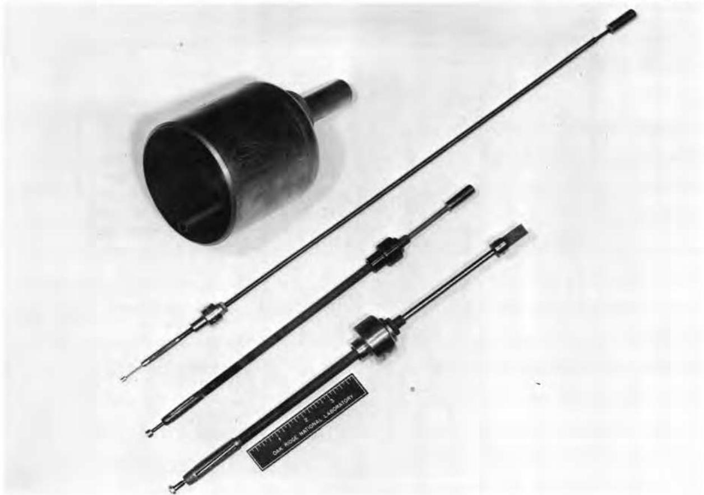  
Fig. 14.1. Tube expanders used in roll-bonding molybdenum.

These joints were also leak-tight after they were thermally cycled ten times from room temperature to $650^{\circ}\mathrm{C}$ .

To further strengthen roll-bonded joints, each joint will be sealed by a chemically vapor deposited tungsten layer on the bismuth or salt side and will be back brazed with the alloy Fe-15% Mo-5% Ge-4% C-1% B on the inert gas atmosphere side. A macrophotograph of a cross section through a typical joint and blowups of the three types of seals are shown in Fig. 14.3.

More detailed information on the design and purpose of the molybdenum test stand is presented in Part 4 of this report. Progress on welding, brazing, and fabrication of molybdenum components is reported in this section.

# 14.2 FABRICATION DEVELOPMENT OF MOLYBDENUM COMPONENTS

A.C.Schaffhauser R.E.McDonald

We have completed development of a back-extrusion process for fabricating $37 / 8$ in.-diam closed-end molybdenum vessels for head pots and disengaging sections of the molybdenum test stand. The process has been described previously. A starting blank, tooling, and a completed back extrusion are shown in Fig. 14.4. The

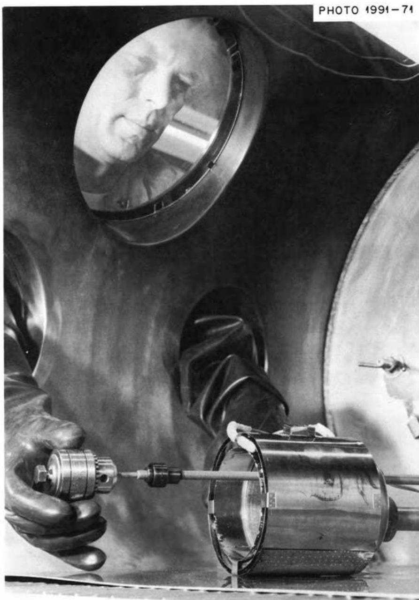  
Fig. 14.2. Roll-bonding molybdenum under inert atmosphere at $250^{\circ}\mathrm{C}$ .

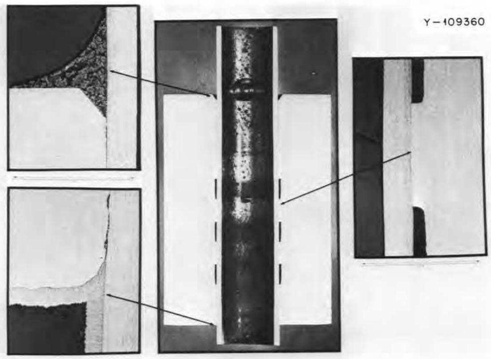  
Fig. 14.3. Section through molybdenum roll-bonded joint sealed by chemical vapor deposition and back-brazing.

tooling consists of a $3^{1/2}$ -in.-diam plunger and a split die with an oblong hole in the closed end to produce a boss needed for support of inlet and exit tubes. All surfaces of the tooling in contact with molybdenum are coated with plasma-sprayed $\mathrm{ZrO}_2$ to prevent chemical interaction.

We have fabricated all of the required eleven $37/8$ -in.-diam back extrusions for the molybdenum test stand. Four of five 5-in.-long back extrusions have been machined for the salt and bismuth head-pot assemblies, leaving one spare. Two of three 8-in.-long back extrusions are being machined for the lower disengaging section of the packed column, also leaving one spare. All of these back extrusions were accomplished at $1600^{\circ}\mathrm{C}$ with a stem load of 800 to 900 tons.

In order to make the lower disengaging section of the column from two back extrusions of approximately equal length, $9^{1} / 16$ -in.-long half sections are required. A 12-in.-long die was procured, and three half sections between 9 and 10 in. long have been back extruded at $1700^{\circ}\mathrm{C}$ . One of the half sections was made in two steps. Under similar conditions, it did not back extrude

the required length as did the others. It was reheated to $1700^{\circ}\mathrm{C}$ , and by carefully aligning it with respect to the die it was again back extruded to increase its length without altering the preformed boss.

Our studies have shown that back extrusion of molybdenum depends upon the quality of the starting blank, back-extrusion temperature, and reactivity between the tooling and molybdenum. Some of the early starting blanks had small surface cracks, and we found it difficult to avoid cracks in the finished product. Initially we used a $\mathrm{ZrO_2}$ -coated plunger and die, but the die length was short and allowed the molybdenum to contact the tool steel container of the press along its OD as it was being back extruded. Interaction of the molybdenum with the steel caused some tearing of the OD surface. This was eliminated by use of a $\mathrm{ZrO_2}$ coated long-length die as shown in Fig. 14.4. We also found that recoating both plunger and die before each back extrusion ensured high-quality finished products. Since coating and tooling life is dependent upon temperature, we tried temperatures from 1350 to $1700^{\circ}\mathrm{C}$ during our development period. Unfortunately,

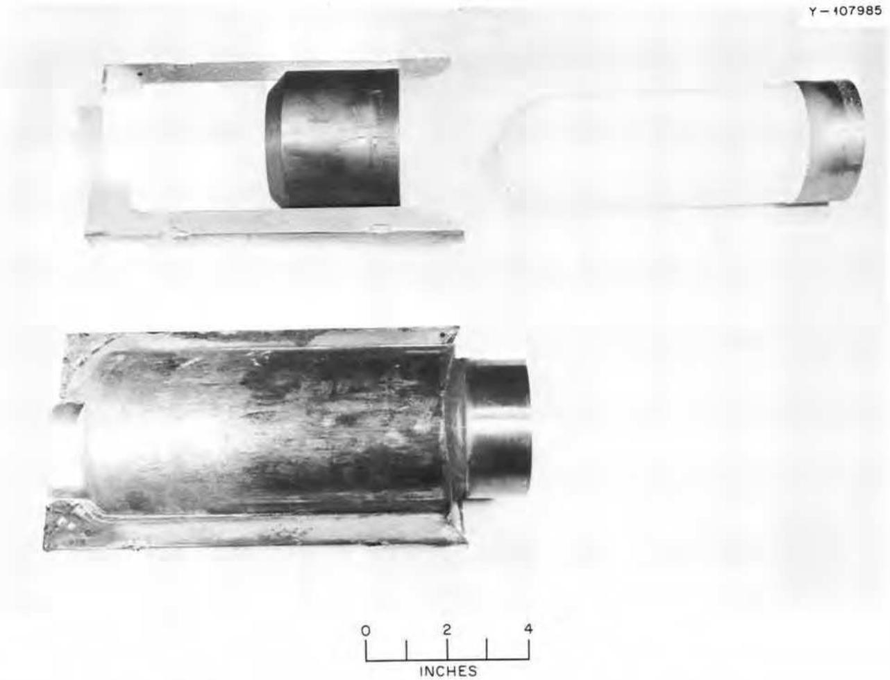  
Fig. 14.4. Molybdenum back-extrusion tooling with starting blank and as-extruded product.

we often had more than temperature as a variable and were unable to conclude what might be the optimum temperature. However, we did find we were able to consistently produce good quality back extrusions at temperatures from 1600 to $1700^{\circ}\mathrm{C}$ . Tensile and bend-test specimens have been machined from back extrusions made at several temperatures for mechanical properties evaluation.

# 14.3 WELDING MOLYBDENUM

# A.J.Moorhead

Three major types of welded joint (tube-to-header, header-to-header, and tube-to-tube) are required for fabrication of the molybdenum test stand for chemical processing. Our initial work on these three joints was

described in an earlier report.4 During this period we have fabricated more complex structures which simulate actual loop components. We are also optimizing our welding procedures and are designing and building weld fixtures.

As an aid to fabrication, we have begun constructing a full-scale mockup of the molybdenum test stand. Wooden models of the four pots were made, and short stubs of Monel tubing were inserted in the appropriate holes in the bosses. The tubes were previously bent to the shapes required of the molybdenum tubes. These

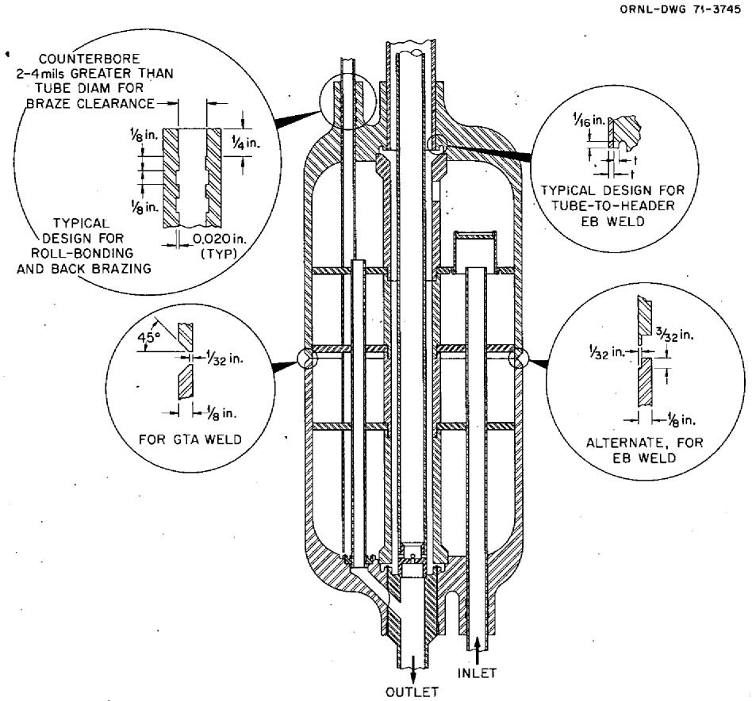  
Fig. 14.5. Feed pot for molybdenum chemical processing loop.

subassemblies are presently being used to check out the rotary fixture for girth welding to ensure that the fixture and pots are compatible. Subsequently, the pots will be interconnected with full lengths of tubing to evaluate the procedures and fixturing for tube-to-tube welding and brazing in the glove box and in the field.

We have developed a procedure for electron-beam welding the $7 / 8$ -in.-diam tube-to-header type of joint. The standard 80-mil wall thickness of the molybdenum tubing will be machined down to 50 mils for this weld. Therefore, $7 / 8$ -in.-OD $\times 0.050$ -in.-wall tubes were welded to $15 / 8$ -in.-OD cylinders representing the boss on the back-extruded header. The weld joint was preheated to about $700^{\circ}\mathrm{C}$ with the defocused electron beam. Welding parameters were $140\mathrm{-kV}$ accelerating potential, $10\mathrm{-mA}$ beam current, $11\mathrm{-in./min}$ travel speed, with the beam defocused $15\mathrm{mA}$ . This is the final size of tubing to be welded in developing procedures for welding the tube-to-header type of joint.

Two $\frac{1}{2}$ -in.-diam tubular weirs were electron-beam welded into one of the $\frac{1}{8}$ -in.-thick molybdenum baffle

plates for the head pots. These welds, which were of the tube-to-header type, were made by rotating the electron beam around the joint rather than by rotating the workpiece under the beam. The speed of beam rotation was manually controlled. This technique is very useful in welding parts in which the weld joint is off-centered (as in this case) or otherwise difficult to rotate. Visually, both welds looked good, and no defects were detected by fluorescent penetrant inspection.

Three sets of back-extruded headers were successfully joined by girth welds to form three nearly full-size feed pots. The first set was welded using the electron-beam process and the step joint (shown as the "alternate" joint) in Fig. 14.5. Both headers were preheated to above $700^{\circ}\mathrm{C}$ with the defocused electron beam prior to welding; earlier work had revealed that preheating was necessary to prevent weldment cracking, although the minimum preheat temperature has not been determined. The welding parameters were: $140\mathrm{-kv}$ accelerating potential, $20\mathrm{-mA}$ beam current, $41.5\mathrm{-in./min}$ work travel speed, and the beam defocused $10\mathrm{-mA}$ from

sharp focus. No weld defects were revealed by fluorescent-penetrant inspection. However, metallographic examination revealed that weld penetration was about 45 mils rather than the desired 100 mils. We will try to overcome this shortcoming on the next practice weld by using a more sharply focused beam and a higher beam current.

The other two sets of headers were joined using the manual gas tungsten-arc process in an argon-filled chamber. Two weld passes were required to fill the $90^{\circ}$

vee-groove weld joint (Fig. 14.5), using low-carbon, low-oxygen molybdenum filler wire. No weld preheat was required. One of these welded pots is shown in Fig. 14.6 together with the two back-extruded headers. No defects were detected on either arc-welded feed pot when they were fluorescent-penetrant inspected.

To more closely simulate conditions required in fabrication of the test stand, additional tube-to-tube welds have been made with the orbiting arc weld head. Longer lengths of tubing were joined with the axis of

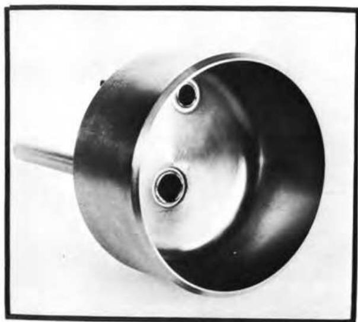

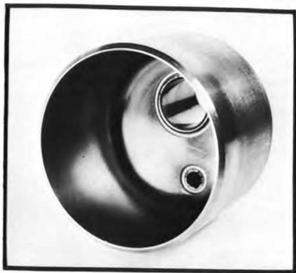

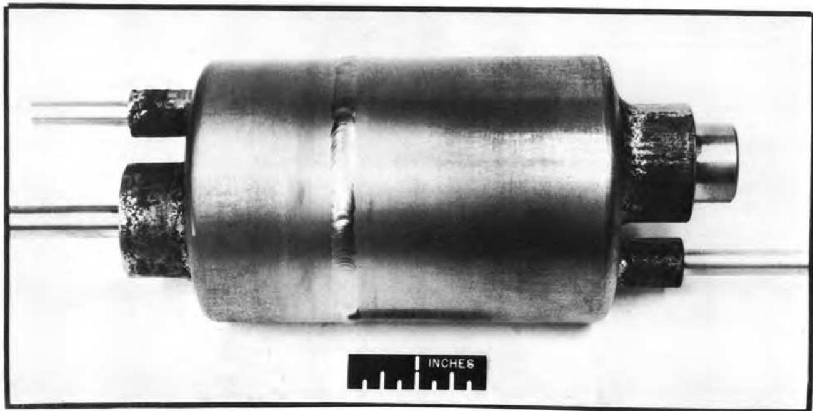  
Fig. 14.6. Molybdenum back-extruded half sections joined by GTA welding.

Y-106804

the tube vertical. As we expected, problems of axial tube misalignment after welding and weld cracking due to excessive restraint of the joint occurred. In order to overcome these difficulties, we have procured longer weld inserts to provide better internal support and a yoke type of fixture for external support. The latter will be left in place around the joint until after the sleeve surrounding the weld has been attached.

We are also in the process of optimizing our welding procedures for each size of tubing to increase the reproducibility of these welds. Helium-leak-tight tube-to-tube welds have been made in all the required sizes of tubing, but the penetration achieved on the $7/8$ in.-OD tubing has been only about one-third of the 50-mil wall thickness. The welding current required to make these latter welds is relatively high (110 amp), and the welding speed slow (11 in./min), resulting in overheating of the orbiting-arc weld head. Therefore, we are investigating the use of a weld cycle in which the current is pulsed between a high current (to get deeper penetration) and a lower current to permit some cooling of the head.

# 14.4 DEVELOPMENT OF BRAZING TECHNIQUES FOR FABRICATING THE MOLYBDENUM TEST LOOP

N.C.Cole

The iron-base alloy, Fe-15% Mo-5% Ge-4% C-1% B, has been selected as the filler metal for back-brazing joints in sections of the chemical processing test loop that will contain bismuth. Back brazing will serve two purposes. It will provide reinforcement to the weld zone which is brittle at room temperature, and it will provide a seal should a leak develop through a roll bond or a cracked weld. The alloy selected satisfies the requirements of having a moderately low brazing temperature $(< 1200^{\circ}\mathrm{C})$ and adequate resistance to bismuth at $650^{\circ}\mathrm{C}$ . Since specific brazing techniques for the variety of joints encountered have never been developed previously, much of our work has been devoted to basic process development and improvement. We have developed several methods of brazing using resistance and high-frequency induction as the heating sources.

# 14.4.1 Resistance Furnace Brazing

Small thin-walled tubes have been brazed to large pots $3\frac{7}{8}$ in. $\mathrm{OD} \times 9\frac{1}{2}$ in. long $\times \frac{1}{8}$ in. wall) in vacuum in a resistance furnace. Into each end of the container shown in Fig. 14.5, two or more short lengths of tubing

must be roll bonded or welded and then back brazed. At the same time, a split ring covering the girth welds of the pots or chambers will also be brazed. Mockups of these subassemblies were brazed in a resistance furnace with a 7-in. $\times$ 7-in. $\times$ 30-in.-long chamber at relatively isothermal conditions at a pressure of $10^{-5}$ torr:

To ensure proper flow of the brazing filler metal into the joint, a joint gap of at least 0.001 in. is necessary. However, the joint preparation for roll bonding and welding requires a closer tolerance to produce sound welds and proper alignment. Therefore, the portion of the joint to be back brazed will be counter bored an extra 0.0015 to 0.0025 in. on the diameter to a depth of $\frac{3}{8}$ in. We have also provided filler-metal feeder holes by drilling into the bosses of the large components; these serve as reservoirs for the brazing alloy powder and provide insurance that the filler metal does not prematurely flow away from the joint. Otherwise, the thin-walled tubing may reach the brazing temperature faster than the heavy pot, and the brazing filler metal might flow along the hotter tube (and away from the joint) rather than into the joint.

# 14.4.2 Induction Vacuum Brazing

We plan to manually weld the $1\frac{1}{8}$ -in.-OD $\times$ 5-ft-long $\times$ 0.080-in.-wall packed column of the chemical processing system in a dry box filled with argon. In addition, the $7\frac{1}{8}$ -in. tubing that connects the bismuth head pot to the upper disengaging section of the column will also be welded in the dry box. Because of the size and fragility of these large welded sub-assemblies, we plan to induction braze the reinforcing sleeves over the weld before the 10-ft assembly is removed from the dry box. The controlled atmosphere of the dry box will also be utilized to prevent oxidation of all portions of the assembly which will be heated during the welding operation.

In preliminary experiments, we learned that brazing must be accomplished in vacuum $(10^{-5}$ torr) since we experienced difficulty with arcing in helium or argon atmospheres. To add further complication, the organic binder, which is used to preplace the powdered filler metal, caused arcing when it began to vaporize. As a result, it is necessary to vaporize the binder by other heating techniques before the induction unit is activated or else preplace the filler metal without using the binder. To eliminate the need for the binder, we have machined grooves on the inside diameter of samples of split sleeves to hold the powdered filler metal. These grooves also allow space for the reinforced (raised) weld bead.

We have induction sleeves over tube-to-tube welds in the atmosphere chamber. However, actual mockup assemblies have not been brazed but are currently being prepared.

# 14.4.3 Induction Field Brazing

Many interconnecting lines of the loop will have to be joined in the field. Tubing of the sizes $\frac{1}{4}, \frac{3}{8}, \frac{1}{2}$ , and possibly $\frac{7}{8}$ in. OD will probably be welded and the split sleeves back brazed on site. In this regard, we have induction field brazed sleeves on all of these sizes of tubing (Fig. 14.7). We surrounded the part to be brazed with a quartz tube placed inside the induction coil. Helium gas flows over the heated area to protect the braze from air. However, the induction coil is still operated in air. When the induction unit is activated, the 2-in.-long section of tubing with the split sleeve is quickly brought to brazing temperature. Because of the small amount of material being heated, adjacent areas

remain relatively cool, and the entire brazing cycle takes less than 5 min.

We are currently refining our apparatus for maintaining a protective atmosphere and are preparing to braze more mockups of actual joint designs.

# 14.5 COMPATIBILITY OF MATERIALS WITH BISMUTH

O.B.Cavin L.R.Trotter

Successful operation of a processing plant for the extraction of fission products from the fuel salt of an MSBR is dependent upon the compatibility of the container material with molten Bi-Li solutions. Therefore, we are continuing to evaluate the dissolution and mass transport of potential structural materials in static capsules and thermal convection loops containing bismuth and Bi-Li solutions with up to 2.5 wt $\%$ lithium concentrations. The tests are being conducted at a

Y-106657

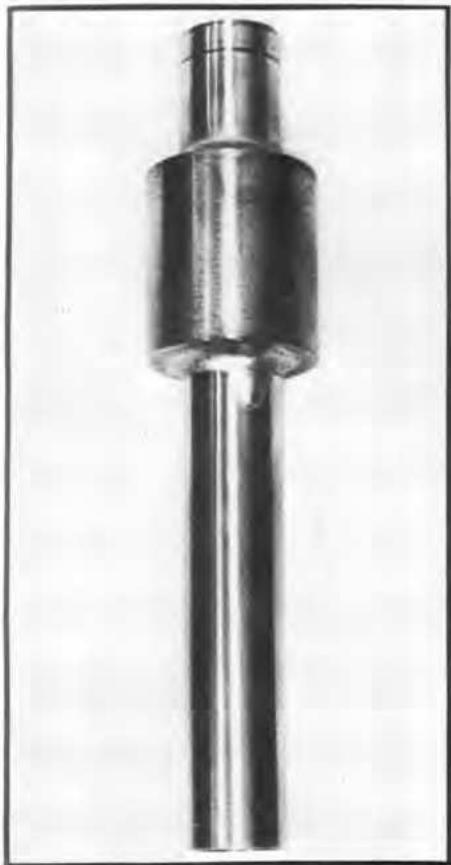

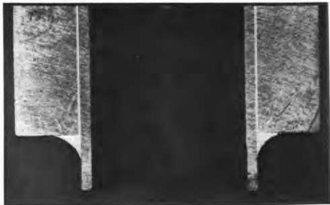  
Fig. 14.7. Sleeve brazed to molybdenum tube.

maximum temperature of $700^{\circ}\mathrm{C}$ , and the loops have a $\Delta T$ of $95 \pm 5^{\circ}\mathrm{C}$ . For lithium concentrations up to 100 ppm, we have used quartz loops, but for higher concentrations of lithium ( $\leqslant 2.5\mathrm{wt}\%$ ) the loop is made from the material to be tested.

Previously we reported grain boundary cracking of small surface grains on recrystallized molybdenum samples. Since cracking was limited to these grains we hope to circumvent this problem by removing these grains prior to testing. This was done by electropolishing samples after vacuum annealing for 1 hr at $1500^{\circ}\mathrm{C}$ . These samples were included in loop 11, and the results are summarized in Table 14.4.

The samples lost weight above a temperature of $650^{\circ}\mathrm{C}$ and gained weight at or below this temperature. Because of difficulties in removing residual bismuth from the specimens, we cannot be certain of the absolute magnitude of the weight changes, although they are relatively small. The effect of electropolishing will be evaluated by metallographic examination of the specimens. A maximum weight loss of $3.18\mathrm{mg/cm}^2$ was observed on one of the tensile samples and corresponds with a uniform surface removal of 0.36

mil/year. The room-temperature mechanical properties of the molybdenum were unaffected by exposure to Bi-100 ppm Li, as indicated in Table 14.5.

Tantalum specimens exposed to $\mathrm{Bi} + 100\mathrm{ppm}$ Li in loop 13 lost weight at all temperatures (Table 14.4). The maximum loss $(45.2\mathrm{mg/cm^2})$ corresponds to a corrosion rate of 3.13 mils/year. This does not agree with results obtained by Shimotake et al. in short-term tests (100 hr) at $1000^{\circ}\mathrm{C}$ in which they reported no observable corrosion. The room-temperature mechanical properties of these samples were unaltered (Table 14.5) even though there was a detectable decrease in their dimensions. The maximum measurable change in dimensions corresponds to a uniform surface removal of 2.6 mils/year, which is in close agreement with that calculated from weight-change data.

Conversely, the T-111 alloy (Ta-8% W-2% Hf) tested in loop 12 showed excellent resistance to dissolution and mass transport. Tensile samples all showed slight weight losses of up to $4.45\mathrm{mg/cm^2}$ (0.31 mil/year), but all the tab samples had weight increases of up to $0.37\mathrm{mg/cm^2}$ (Table 14.4). These weight losses

5. O. B. Cavin and L. R. Trotter, MSR Program Semiannu. Progr. Rep. Aug. 31, 1970, ORNL-4622, p. 189.

6. H. Shimotake, N. R. Stalica, and J. C. Hesson, "Corrosion of Refractory Metals by Liquid Bismuth, Tin and Lead at $1000^{\circ}\mathrm{C}$ ," Trans. Am. Nucl. Soc. 10, 141-42 (June 1967).

Table 14.4. Weight change of materials tested in flowing bismuth for 3000 hr   

<table><tr><td rowspan="2">Material</td><td colspan="3">Recrystallized tabs</td><td colspan="3">Tensile samples</td></tr><tr><td>Temperature (°C)</td><td>Weight change (mg/cm2)</td><td>Surface removalb (mil/year)</td><td>Temperature (°C)</td><td>Weight change (mg/cm2)</td><td>Surface removalb (mil/year)</td></tr><tr><td rowspan="4">Mo (loop 11)</td><td>650c</td><td>+0.09</td><td></td><td>660</td><td>None</td><td></td></tr><tr><td>670</td><td>-1.30</td><td>-0.15</td><td>690</td><td>-3.18</td><td>-0.36</td></tr><tr><td>620</td><td>+0.46</td><td></td><td>640</td><td>+0.14</td><td></td></tr><tr><td>650c</td><td>+1.09</td><td></td><td>660</td><td>-0.38</td><td>-0.04</td></tr><tr><td rowspan="4">Ta (loop 13)</td><td>650</td><td>-16.29</td><td>-1.13</td><td>660</td><td>-22.55</td><td>-1.56</td></tr><tr><td>670</td><td>-2.24</td><td>-0.16</td><td>690</td><td>-45.17</td><td>-3.13</td></tr><tr><td>620</td><td>-38.32</td><td>-2.66</td><td>640</td><td>-15.11</td><td>-1.05</td></tr><tr><td>650</td><td>-5.63</td><td>-0.39</td><td>660</td><td>-13.66</td><td>-0.95</td></tr><tr><td rowspan="4">T-111 (loop 12)</td><td>650</td><td>+0.24</td><td></td><td>660</td><td>-0.28</td><td>-0.02</td></tr><tr><td>670</td><td>+0.37</td><td></td><td>690</td><td>-4.45</td><td>-0.31</td></tr><tr><td>620</td><td>+0.15</td><td></td><td>640</td><td>-0.48</td><td>-0.03</td></tr><tr><td>650</td><td>+0.28</td><td></td><td>660</td><td>-0.75</td><td>-0.05</td></tr></table>

${}^{a}$ Bismuth contained 100 ppm Li.   
Assuming uniform surface removal.   
Samples were electropolished prior to test.

Table 14.5. Room-temperature mechanical properties of materials tested in flowing bismutha for 3000 hr   

<table><tr><td>Sample</td><td>Test temperature (°C)</td><td>Fracture strain (% in 1.5 in.)</td><td>Tensile strength (psi)</td><td>Yield strengthb (psi)</td></tr><tr><td></td><td></td><td></td><td>× 103</td><td>× 103</td></tr><tr><td>Mo-1</td><td>660</td><td>8.0</td><td>111</td><td>101</td></tr><tr><td>Mo-2</td><td>690</td><td>11.3</td><td>111</td><td>104</td></tr><tr><td>Mo-3</td><td>640</td><td>11.3</td><td>112</td><td>104</td></tr><tr><td>Mo-4</td><td>660</td><td>11.3</td><td>112</td><td>105</td></tr><tr><td>Mo</td><td>As received</td><td>8.7</td><td>110</td><td>100</td></tr><tr><td>Ta-1</td><td>660</td><td>26.0</td><td>46.6</td><td>33.7</td></tr><tr><td>Ta-2</td><td>690</td><td>23.3</td><td>47.2</td><td>35.4</td></tr><tr><td>Ta-3</td><td>640</td><td>24.7</td><td>46.7</td><td>32.6</td></tr><tr><td>Ta-4</td><td>660</td><td>26.0</td><td>50.0</td><td>36.7</td></tr><tr><td>Ta</td><td>As received</td><td>24.0</td><td>44.2</td><td>35.7</td></tr><tr><td>T111-1c</td><td>660</td><td>0</td><td>61.4</td><td>d</td></tr><tr><td>T111-2</td><td>690</td><td>0</td><td>51.7</td><td>d</td></tr><tr><td>T111-3</td><td>640</td><td>0</td><td>46.7</td><td>d</td></tr><tr><td>T111-4</td><td>660</td><td>0.7</td><td>88.0</td><td>87.3</td></tr><tr><td>T111-5e</td><td>700</td><td>15.3</td><td>91.7</td><td>79.2</td></tr><tr><td>T111-6</td><td>As received</td><td>10.0</td><td>93.9</td><td>81.0</td></tr></table>

$^a$ Bi contained 100 ppm Li.   
$b_{0.2\%}$ offset.   
$c_{\mathrm{Ta}} - 8\%$ W-2% Hf alloy.   
$d_{\mathrm{Brittle}}$ fracture.   
$e$ Aged 3000 hr in argon atmosphere.

are of the same magnitude as those observed for molybdenum. However, the room-temperature ductility of the T-111 was drastically reduced, as shown in Table 14.5. This is no different from the data previously reported for T-111 in pure bismuth.7 To determine the effects of aging T-111 at $700^{\circ}\mathrm{C}$ , samples were held at this temperature for 3000 hr in an argon-filled capsule. No significant changes in the room-temperature mechanical properties were observed, and, if anything, the ductility was slightly higher. The microstructure of the as-received material shows a grain boundary precipitate. Similar precipitates have been identified by Inouye8 as HfC and by Sheffler and co-workers9 as a hafnium oxide. We are presently evaluating the extent to which such hafnium-rich phases may interact with bismuth or impurities dissolved in bismuth.

Four grades of graphite were tested in loop 14, and the weight-change data are shown in Table 14.6. All the samples increased in weight except the high-density pyrolytic sample. The available open porosity of grades AXF-5Q and ATJS are 15 and $13\%$ , respectively, but the majority of the pores in AXF-5Q have an entrance diameter of 0.8 to $1\mu$ , and those in ATJS have a diameter of 3 to $5\mu$ .

Grafoil is a trade name for a laminated low-density graphite foil used for gaskets. It has many large open pores and in the uncompressed state was infiltrated by bismuth. A graphite bolt was used to hold a second sample of Grafoil under compression during test, but weight-change information was not meaningful because the bismuth had penetrated along the threads under the nut. Other means will be used to compare the bismuth intrusion into the compressed and uncompressed Grafoil.

The total amount of bismuth intrusion into graphite appears to depend upon the pore entrance diameter and

Table 14.6. Results obtained on graphite tested in flowing Bi-100 ppm Li for 3000 hr   

<table><tr><td>Sample</td><td>Density (g/cm3)</td><td>Test temperature (°C)</td><td>Weight change (mg)</td><td>Normalized weight change (mg/cm3)</td></tr><tr><td>AXF-5Q-1a</td><td>1.81</td><td>666</td><td>+8.4</td><td>+2.7</td></tr><tr><td>AXF-5Q-2a</td><td>1.80</td><td>680</td><td>+2.6</td><td>+0.8</td></tr><tr><td>ATJS-1b</td><td>1.84</td><td>678</td><td>+36.4</td><td>+11.1</td></tr><tr><td>ATJS-2b</td><td>1.82</td><td>665</td><td>+20.0</td><td>+6.1</td></tr><tr><td>Pyrolytic-1</td><td>2.14</td><td>655</td><td>-0.6</td><td>-0.5</td></tr><tr><td>Pyrolytic-2</td><td>2.12</td><td>650</td><td>-1.4</td><td>-1.3</td></tr><tr><td>Grafoil-1c</td><td>1.08</td><td>632</td><td>+529.4</td><td>817.7</td></tr><tr><td>Grafoil-2c</td><td>1.12</td><td>620</td><td>+671.6</td><td>1095.8</td></tr></table>

${}^{a}$ Manufactured by Poco Graphite Inc.,Decatur, Texas.   
$b$ Manufactured by Union Carbide Corp., Carbon Products Division, New York, N.Y.   
$c_{\mathbf{A}}$ trade name for laminated graphite foil used for gaskets and manufactured by Carbon Products Division of UCC.

not primarily upon the total available porosity. Since graphite generally is an inhomogeneous material as to density and porosity, samples taken from the same billet may vary considerably. This, as well as the uncertainty in complete bismuth removal, could account for some of the weight-change variations observed in Table 14.6.

An all-metal T-111 alloy loop containing T-111 tensile samples has been successfully filled with Bi-2.5 wt $\%$ Li (nominal composition) and is operating at a maximum temperature of $700^{\circ}\mathrm{C}$ with a $\Delta T$ of $100^{\circ}\mathrm{C}$ .

Many of our analyses of tests recently completed are still in progress; however, the results are encouraging. Of the materials tested, molybdenum continues to be the least affected by exposure to bismuth and Bi-100 ppm Li up to temperatures of $700^{\circ}\mathrm{C}$ . Equal dissolution and mass transport data were obtained on T-111 alloy, but it became embrittled by exposure to bismuth, probably by an intergranular Hf-Bi reaction. If this reaction resulting in loss of ductility can be eliminated by some pretreatment of the T-111 or by alloying additions, a tantalum-base alloy may also be attractive as container material. Graphite appears suitable if the available open porosity can be eliminated, at least at the surface. Tests will be done to determine the extent to which bismuth will penetrate commercially available graphites and to evaluate the resistance of pyrolytically sealed graphite to bismuth and bismuth-lithium intrusion. A molybdenum thermal convection loop is being readied for operation and will contain Bi-2.5% Li at 600 to $700^{\circ}\mathrm{C}$ .

# 14.6 CHEMICAL VAPOR DEPOSITED COATINGS

# J. I. Federer

Roll bonding of molybdenum tubes to integral bosses attached to molybdenum vessels is being used to make mechanical joints. Although these joints can be made leak-tight, brazing from the outside of the vessel will reinforce the mechanical bond. A chemical vapor deposited coating around the joint on the inside of the vessel is also contemplated as an added precaution. The coating provides an additional seal that minimizes any compatibility problems between the braze alloy and bismuth. Several joints have been coated for evaluation. These were made by roll bonding 0.5-in.-OD molybdenum tubes into 0.5-in.-ID molybdenum cylinders. The tubes extended about $\frac{1}{2}$ in. or more out of the cylinders. Four joints were coated at $500^{\circ}\mathrm{C}$ with 0.002-, 0.007-, 0.015-, and 0.018-in.-thick layers of tungsten. Three other joints were coated at $900^{\circ}\mathrm{C}$ with 0.005- to 0.009-in.-thick layers of molybdenum. The joints had very small but measurable helium leak rates prior to coating $(\sim 10^{-8}$ std cc/sec). After coating all the joints were leak-tight as determined with a helium leak detector having a sensitivity of $8 \times 10^{-10}$ std cc/sec.

An attempt was made to coat a Hastelloy N loop with tungsten so that the coating could be tested in flowing bismuth. The loop dimensions, preliminary coating experiments, and the method for coating the loop were

described previously. Portions of the coated loop that were accessible to a borescope were visually examined. The entire loop was radiographed. We determined that all surfaces of the loop were coated, but that several small cracks occurred in the coating at the corners of two joints where tubing was welded together at approximately a $90^{\circ}$ angle. Also, the coating was thinner in one cross member than elsewhere, and a $\frac{1}{4}$ -in.-diam blister occurred in the cross member near one of the joints mentioned above. Subsequently, we coated the two joints and the cross member again. Radiography revealed that the cracks on the joints were filled, the blister was covered, and the coating thickness in the cross member was comparable to other parts of the loop; however, a new crack was found in the cross member. This crack was probably caused by the large difference in thermal expansion between tungsten and Hastelloy N. The cross member was coated again, but the crack persisted, and further attempts to coat the loop have not been made.

Several specimens of types 304 and 430 stainless steel were nickel plated by the electroless method so that the adherence of tungsten and molybdenum coatings to the specimens could be evaluated. The plating method used for these specimens yielded a phosphorus content of about $2\%$ in the nickel plate compared with about $8\%$ phosphorus in specimens plated previously. One specimen of each type steel was coated with about 0.004-in.-thick tungsten. The coating was smooth in both cases but spalled from the type 430 specimen during bend testing. Another pair of specimens was coated with about 0.001- to 0.004-in.-thick mo

lybdenum. The coating on the type 304 specimen was too rough for accurate thickness measurements. The coating on the type 430 specimen was much smoother but spalled during bend testing. Since previous experiments showed that molybdenum coats smoothly on specimens electroplated with nickel, we believe that the electroless nickel was responsible for the poor coating characteristics. These results and the previous observation11 that both tungsten and molybdenum coatings are less adherent to electroless nickel containing about $8\%$ phosphorus indicate that electroless nickel is inferior to electroplated nickel for promoting adherence.

# 14.7 MOLYBDENUM DEPOSITION FROM $\mathsf{MoF}_6$

# J.W.Koger

We have continued to conduct experiments to optimize the conditions for coating stainless steel with molybdenum by contacting the stainless steel with a molten fluoride salt containing $\mathrm{MoF}_6$ . Holding temperature and time constant, we have determined the concentration of $\mathrm{MoF}_6$ which must be added to our salt mixture to get a coating. Future plans involve an evaluation of time and temperature effects on coating rates and coating integrity.

In one of our more successful runs, microprobe analysis12 of the type 316 stainless steel capsule on which molybdenum was deposited showed that molybdenum was deposited at the sample surface and that grain boundaries at least $350\mu$ into the metal were enriched in molybdenum:

# Part 4. Molten-Salt Processing and Preparation

L. E. McNeese

Part 4 deals with the development of processes for the isolation of protactinium and the removal of fission products from molten-salt breeder reactors. During this period we continued to evaluate and develop a flowsheet based on fluorination-reductive extraction for protactinium isolation and the metal transfer process for rare-earth removal. The portion of the flowsheet dealing with recovery and recycle of the $\mathrm{UF}_6$ from the fluorinators was modified so that the $\mathrm{UF}_6\text{-F}_2$ gas stream would be directly absorbed in molten salt containing $\mathrm{UF}_4$ and the resulting uranium fluoride would be reduced to $\mathrm{UF}_4$ by contact of the salt with hydrogen. A method was devised for recycling fluorine, hydrogen, and HF in the plant in order to minimize the quantity of radioactive waste produced. A study was completed for determining the capital and operating costs for a plant that processes the fuel salt from a 1000-MW(e) MSBR on a ten-day cycle. The total direct and indirect costs for the plant were found to be $20.6$ and $\$15$ million, respectively; thus the total plant investment required would be $\$35.6$ million. The resulting fuel cycle cost was 1.12 mills/kWhr. A 0.28-power dependence of processing plant cost on processing rate was derived; this indicates that a considerable saving in processing cost could be achieved by associating a processing plant with a larger power generation capacity than 1000 MW(e).

Studies relating to the chemistry of fuel reconstitution were initiated. It was found that gaseous $\mathrm{UF}_6$ reacts quantitatively with $\mathrm{UF}_4$ dissolved in LiF-BeF $_2$ -ThF $_4$ (72-16-12 mole %) at $600^{\circ}\mathrm{C}$ to produce soluble

$\mathbf{U}\mathbf{F}_{5}$ . The molten salt containing $\mathbf{U}\mathbf{F}_{5}$ appeared to be stable in both gold and graphite equipment. These results are in agreement with those from scouting experiments carried out several years ago on fuel reconstitution.

During this report period we found that the lithium and bismuth concentrations in LiCl in equilibrium with lithium-bismuth solutions are higher than initially expected and increase markedly as the lithium concentration in the lithium-bismuth solution is increased. We realized that this could have a significant effect on the performance of the metal transfer process since lithium-bismuth solutions having lithium concentrations of 5 and about 50 at. $\%$ are proposed for extracting rare earths from lithium chloride in the process. Therefore, a study of the equilibrium distribution of lithium and bismuth between molten LiCl and liquid lithiumbismuth solutions was initiated. Data obtained thus far with lithium concentrations of 20 to 50 at. $\%$ are consistent with the observed behavior of lithium in the second metal transfer experiment (MTE-2) completed previously. An engineering experiment involving the metal transfer process (MTE-2B) is in operation in order to study further the behavior of lithium in the process. The experiment, in which a 5 at. $\%$ lithium-bismuth solution is being used to extract rare earths from lithium chloride, has been in operation for about nine weeks. To date, the results indicate that the equilibrium concentration of lithium in lithium chloride above a 5 at. $\%$ lithium-bismuth solution is less than 0.3 wt ppm. It is not believed that the metal transfer process will be affected significantly by the unexpected behavior of

lithium and bismuth in the process. The design of the third engineering experiment (MTE-3) for development of the process was completed. Most of the equipment was fabricated, and the main process vessels are now being installed. The experiment will use salt flow rates that are $1\%$ of the estimated flow rates required for processing a 1000-MW(e) reactor.

Our work on contactor development was continued successfully during this report period. Mass transfer experiments were carried out in which the rate of transfer of zirconium from molten salt to bismuth was measured in a 24-in.-long, 0.82-in.-ID column packed with $\frac{1}{4}$ -in. molybdenum Raschig rings. The results indicate HTU values of 1 to 4 ft, with the lowest values being given by data in which we have the most confidence. These results indicate that packed column contactors can be used successfully in MSBR processing systems. We have initiated studies on mechanically agitated salt-metal contactors as an alternative to packed columns. This type of contactor is of particular interest for use in the metal transfer process since designs can be envisioned in which the bismuth would be a near-isothermal internally circulated captive phase. The hydrodynamic performance of a mechanically agitated contactor was investigated using mercury and water to simulate bismuth and molten salt. These data,

along with data from the literature, indicate that satisfactory mass transfer performance may be achievable in this contactor without dispersing either the salt or the metal phase. Contactors of this design may be easier to 'fabricate than packed columns, and the problem of entrainment of bismuth in salt to be returned to the reactor should be eliminated if the phases are not dispersed.

We have continued studies of oxide precipitation as an alternative to the fluorination-reductive-extraction method for isolating protactinium and for subsequently removing uranium from MSBR fuel salt. Protactinium pentoxide was selectively precipitated from $\mathrm{LiF - BeF_2}$ $\mathrm{ThF_4}$ (72-16-12 mole $\%$ ) that contained up to 0.25 mole $\%$ $\mathrm{UF_4}$ by sparging the salt with $\mathrm{HF - H_2O - Ar}$ gas mixtures at $600^{\circ}C$ . Recent results on the equilibrium quotient for the precipitation reaction are in agreement with earlier results and are consistent with earlier indications that $\mathrm{Pa}_2\mathrm{O}_5$ can be precipitated from MSBR fuel salt as a pure or nearly pure solid phase. Installation of equipment was completed in preparation for engineering studies of the precipitation of $\mathrm{UO_2 - ThO_2}$ solid solutions from molten fluoride salts. Two experiments in which as much as $40\%$ of the uranium initially in the salt was precipitated were carried out successfully. Results of these experiments are encouraging.

# 15. Flowsheet Analysis

A study was completed in which the capital and operating costs were determined for a plant that processes the fuel salt from a 1000-MW(e) MSBR on a ten-day cycle. The plant is based on the reference flowsheet that uses fluorination, reductive extraction, and metal transfer. Capital and operating costs were calculated for two methods for obtaining and disposing of hydrogen, HF, and fluorine in a processing plant. Calculations were made of the thermal power that will be produced in an MSBR processing plant by the decay of noble-metal fission products as a function of the residence time of these materials in the primary reactor system and of the fraction of these materials accompanying the fuel salt to the processing plant. The long-term hazard of high-level radioactive wastes produced by MSBRs was considered. A survey was made of published data on the availability of and future demand for natural resources required for an MSBR power economy.

# 15.1 COST ESTIMATE FOR AN MSBR PROCESSING PLANT

W. L. Carter E. L. Nicholson  
L. E. McNeese

We have completed a study to determine the capital and operating costs for a plant that processes the fuel salt from a 1000-MW(e) MSBR on a ten-day cycle. The processing plant is based on the previously described reference flowsheet1,2 that uses fluorination for uranium removal, reductive extraction for protactinium removal, and the metal transfer process for rare-earth removal. The most recent version of the flowsheet,

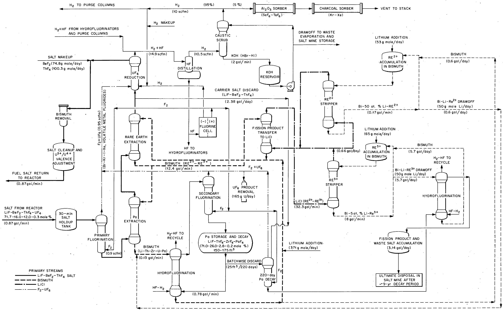  
Fig. 15.1. Fluorination-reductive extraction-metal transfer process flowsheet for processing MSBR fuel salt. Flow rates are shown for processing a 1000-MW(e) reactor on a ten-day cycle with an assumed uranium removal efficiency in the primary fluorinator of $95\%$ .

shown in Fig. 15.1, includes two significant improvements over the previous version of the flowsheet: (1) an improved method for recovering $\mathrm{UF_6}$ from the fluorinator off-gas and (2) a method for recycling fluorine, hydrogen, and HF in the processing plant in order to minimize the quantity of radioactive waste generated.

The behavior of fission products and other components of the fuel salt in the processing plant is summarized in Table 15.1, which shows only the dominant removal method for each of several groups of fuel salt constituents. The removal times for the noble gases (50 sec) and noble and seminoble metals (2.4 hr) are short as compared with the ten-day processing cycle, and only small amounts of these materials are removed by the processing plant. In the previous flowsheet, the fluorinator off-gas (primarily a mixture of fluorine and $\mathrm{UF}_6$ ) passed through NaF sorption beds and cold traps operated at $-40^{\circ}\mathrm{C}$ for $\mathrm{UF}_6$ recovery. The $\mathrm{UF}_6$ was then combined with the processed fuel

carrier salt for return to the reactor. Several difficulties were encountered with this approach, for example: (1) the uranium inventory in the $\mathrm{UF}_6$ collection system would be appreciable (3 to $10\%$ of the uranium inventory in the reactor); (2) beds of granular heat-emitting solids (NaF) would have to be filled and discharged remotely; (3) the discharged NaF would require subsequent treatment in order to ensure acceptably low uranium losses; and (4) collection of $\mathrm{UF}_6$ in the cold traps might be complicated by heat produced by the decay of fission products that are desorbed from the NaF beds with the $\mathrm{UF}_6$ . Initially in the present study, consideration was given to recycling the unused fluorine after $\mathrm{UF}_6$ collection; however, several problems were encountered with this mode of operation. The two major problems were: (1) fission product iodine accumulated to appreciable concentrations in the fluorine recirculation system and represented a significant heat source ( $210\mathrm{kW}$ as shown in

Table 15.1. Methods for removing fission products and fuel salt constituents in an MSBR processing plant   

<table><tr><td>Group</td><td>Components</td><td>Removal time</td><td>Primary removal operation</td></tr><tr><td>Noble gases</td><td>Kr, Xe</td><td>50 sec</td><td>Sparging with inert gas in reactor fuel circuit</td></tr><tr><td>Sominable metals</td><td>Zn, Ga, Ge, As, Se</td><td>2.4 hr</td><td>Plating out on surfaces in reactor vessel and heat exchangers</td></tr><tr><td>Noble metals</td><td>Nb, Mo, Tc, Ru, Rh, Ag, Cd, In, Sn, Sb, Te</td><td>2.4 hr</td><td>Plating out on surfaces in reactor vessel and heat exchangers</td></tr><tr><td>Trivalent rare earths</td><td>Y, La, Ce, Pr, Nd, Pm, Gd, Tb, Dy, Ho, Er (note: Yttrium is not a rare earth but behaves similarly.)</td><td>Varies for different nuclides; effective removal time = 25 days</td><td>Reductive extraction into Bi-Li alloy followed by metal transfer via LiCl into Bi-5 at. % Li solution</td></tr><tr><td>Divalent rare earths and alkaline earths</td><td>Sm, Eu, Sr, Ba</td><td>Varies for different nuclides; effective removal time = 25 days</td><td>Reductive extraction into Bi-Li alloy followed by metal transfer via LiCl into Bi-5 at. % Li solution</td></tr><tr><td>Alkali metals</td><td>Rb, Cs</td><td>10 days</td><td>Reductive extraction into Bi-Li alloy followed by accumulation in LiCl</td></tr><tr><td>Halogens</td><td>Br, I</td><td>10 days</td><td>Volatilization in primary fluorinator followed by accumulation in KOH solution in gas recycle system</td></tr><tr><td>Uranium</td><td>233U, 234U, 235U, 236U, 237U</td><td>10 days</td><td>Volatilization in primary fluorinator; returned to carrier salt and recycled to reactor</td></tr><tr><td>Zirconium and protactinium</td><td>Zr, 233Pa</td><td>10 days</td><td>Reductive extraction into Bi-Li alloy followed by hydrofluorination into Pa decay salt</td></tr><tr><td>Corrosion products</td><td>Ni, Fe, Cr</td><td>10 days</td><td>Reductive extraction with Bi-Li alloy followed by hydrofluorination into Pa decay salt</td></tr><tr><td>Carrier salt</td><td>Li, Be, Th</td><td>~15 years</td><td>Salt discard</td></tr></table>

Sect. 15.3); and (2) maintenance on the sealed diaphragm-type fluorine compressors is known to be higher than desired. The alternative of disposing of the unused fluorine by absorption in aqueous KOH solutions was unattractive because of the large volume of radioactive waste (mostly KF) that was generated.

In the current flowsheet, difficulties associated with $\mathrm{UF_6}$ collection and recycle or disposal of unused fluorine were avoided by sending the $\mathbf{F}_2\text{-}\mathbf{U}\mathbf{F}_6$ gas mixture directly to the $\mathrm{UF_6}$ reduction step, where both the $\mathbf{F}_2$ and $\mathrm{UF_6}$ are absorbed in a sufficient quantity of molten salt containing $\mathrm{UF_4}$ to produce an average uranium valence between $4+$ and $5+$ . The resulting uranium fluoride is reduced to $\mathrm{UF_4}$ by contact of the salt mixture with hydrogen. The reconstituted fuel salt is then returned to the reactor after a final cleanup operation. The HF produced in the $\mathrm{UF_6}$ reduction operation is sent to a remotely operated fluorine plant, where $\mathbf{F}_2$ and $\mathbf{H}_2$ are generated for recycle to the processing plant. As discussed in Sect. 15.2, the cost for recycling the fluorine and hydrogen via a fluorine generation plant is only 0.024 mill/kWhr as compared with a total cost of 0.11 mill/kWhr associated with absorbing the HF in an aqueous KOH solution and disposing of the resulting radioactive wastes.

Cost estimate. In preparing the cost estimate, preliminary designs for all major process equipment items were completed, and the equipment cost was estimated using unit costs for fabricating the various structural shapes. The general design criteria assumed that a material having a cost equal to that of Hastelloy N would be used for vessels containing only molten salt and that molybdenum would be used for vessels that contained bismuth. The cost of fabricated molybdenum equipment was assumed to be $200/lb; a value of this magnitude was used because of the difficulty of fabricating molybdenum. The costs of piping, instrumentation, and certain auxiliary equipment items were estimated as appropriate fractions of the costs of fabricated equipment items.

A summary of the capital costs for the processing plant is shown in Table 15.2. The total direct and indirect costs are $20.6 and $15 million, respectively; thus the total plant investment is $35.6 million.

Fuel cycle cost. A breakdown of the fuel cycle cost is given in Table 15.3 for a 1000-MW(e) MSBR that is processed on a ten-day cycle (a processing rate of 0.88 gpm) by fluorination-reductive extraction-metal transfer. The inventory charges on fissile materials and salt in the reactor are those given for the reference MSBR design. The net fuel cycle cost (1.12 mills/ kWhr) is composed largely of fixed charges on the

Table 15.2. Capital costs for a processing plant for a 1000-MW(e) MSBR based on the fluorination-reductive extraction-metal transfer flowsheet Reactor fuel volume $= 1683\mathrm{ft}^3$ Processing cycle time $=$ ten days   

<table><tr><td></td><td>Thousands of dollars</td></tr><tr><td>Installed molybdenum process equipment</td><td>4,579</td></tr><tr><td>Installed molybdenum pumps</td><td>245</td></tr><tr><td>Installed molybdenum heat exchangers</td><td>90</td></tr><tr><td>Installed molybdenum piping</td><td>1,474</td></tr><tr><td>Installed Hastelloy N, stainless steel, and nickel equipment</td><td>3,129</td></tr><tr><td>Installed auxiliary equipment</td><td>2,486</td></tr><tr><td>Process piping (other than molybdenum piping)</td><td>2,342</td></tr><tr><td>Process instrumentation</td><td>2,711</td></tr><tr><td>Cell electrical connections</td><td>494</td></tr><tr><td>Thermal insulation</td><td>588</td></tr><tr><td>Radiation monitoring</td><td>150</td></tr><tr><td>Sampling stations</td><td>1,275</td></tr><tr><td>Fluorine plant</td><td>1,005</td></tr><tr><td>Total direct cost</td><td>20,568</td></tr><tr><td>Construction overheada</td><td>4,114</td></tr><tr><td>Engineering and inspectionb</td><td>3,790</td></tr><tr><td>Taxes and insurancec</td><td>864</td></tr><tr><td>Contingencyd</td><td>2,836</td></tr><tr><td>Subtotal</td><td>32,172</td></tr><tr><td>Interest during constructione</td><td>3,442</td></tr><tr><td>Total plant investment</td><td>35,614</td></tr></table>

$a_{20\%}$ of total direct cost.   
\(b_{5.3\%}\) of total direct cost, plus a \\(2.7 million "novel" design premium.   
$c4.2\%$ of total direct cost.   
$d_{20\%}$ of total direct cost, exclusive of the cost of molybdenum components.   
eMoney borrowed at $8 \%$ /year for a three-yr period.

processing plant (0.7 mill/kWhr), inventory charges on salt and fissile materials in the reactor and $^{233}\mathrm{Pa}$ in the processing plant (0.42 mill/kWhr), and processing plant operating charges (0.083 mill/kWhr); credit is taken for the excess fissile material produced (0.089 mill/kWhr).

Variation of the capital cost of the processing plant with plant throughput. The variation of the capital cost of the processing plant with plant throughput was estimated by determining the capital cost for a plant

Table 15.3. Fuel cycle cost for a 1000-MW(e) MSBR   
Processing cycle time $=$ ten days Plant factor $= 80\%$   

<table><tr><td></td><td>Mills/kWhr</td></tr><tr><td>Fixed charges on processing plant at 13.7%/year</td><td>0.6962</td></tr><tr><td>Inventory charges at 13.2%/year</td><td></td></tr><tr><td>LiF-BeF2-ThF4in reactor</td><td>0.0608</td></tr><tr><td>233U + 235U + 233Pa in reactor</td><td>0.3281</td></tr><tr><td>LiF-BeF2-ThF4in processing plant</td><td>0.0073</td></tr><tr><td>233U + 235U + 233Pa in processing plant</td><td>0.0286</td></tr><tr><td>LiCl in processing plant</td><td>0.0006</td></tr><tr><td>Bi in processing plant</td><td>0.0040</td></tr><tr><td></td><td>0.4294</td></tr><tr><td>Operating charges</td><td></td></tr><tr><td>Li metal makeup</td><td>0.0171</td></tr><tr><td>BeF2-ThF4makeup</td><td>0.0209</td></tr><tr><td>HF makeup</td><td>0.0001</td></tr><tr><td>H2 makeup</td><td>0.0002</td></tr><tr><td>KOH makeup</td><td>0.00003</td></tr><tr><td>Waste disposal</td><td>0.0164</td></tr><tr><td>Payroll</td><td>0.0285</td></tr><tr><td></td><td>0.0832</td></tr><tr><td>Gross fuel cycle cost</td><td>1.2088</td></tr><tr><td>Production credit (3.27%/year fuel yield)</td><td>-0.0894</td></tr><tr><td>Net fuel cycle cost</td><td>1.1194</td></tr></table>

based on a 3.3-day processing cycle (a processing rate of 2.9 gpm). The total plant investment for this case was $48.5 million. The resulting cost data are shown in Fig. 15.2, where a power-type dependence of plant cost on throughput is assumed. The resulting cost-vs-throughput relationship is:

$$
C = C _ {0} \left(\frac {R}{R _ {0}}\right) ^ {0. 2 8},
$$

where

$C =$ cost of processing plant,

$R =$ processing rate,

$C_0 = \text{cost of plant for a ten-day processing cycle}$ ,

$R_0 =$ processing rate for a ten-day processing cycle.

We believe that this relationship can be used for processing cycle times of about 3 to 37 days. However, for process cycle times longer than 37 days (a proc

essing rate of 0.24 gpm), it is believed that a plant cost of $25 million should be used (see Fig. 15.2).

The cost information shown in Fig. 15.2 indicates that a significant saving in processing cost can be achieved by using a processing plant with a larger power generation capacity than $1000\mathrm{MW(e)}$ . Although this is undoubtedly true, the processing costs associated with a higher plant throughput cannot be obtained directly from Fig. 15.2 since a larger amount of radioactivity would be present in the processing plant.

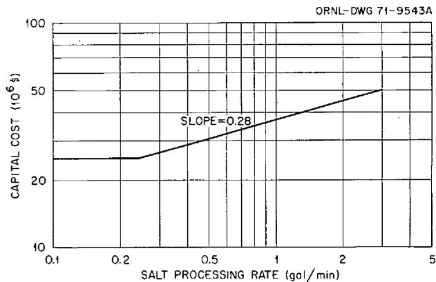  
Fig. 15.2. Variation of capital cost for a fluorination-reductive extraction-metal transfer processing plant with salt throughput for a 1000-MW(e) MSBR.

# 15.2 COMPARISON OF COSTS FOR ALTERNATE OFF-GAS TREATMENT METHODS FOR AN MSBR PROCESSING PLANT

W. L. Carter

Capital and operating costs associated with two methods (see Fig. 15.3) for obtaining and disposing of HF, $\mathbf{H}_2$ , and $\mathbf{F}_2$ in a plant were determined. In the first method, HF, $\mathbf{H}_2$ , and $\mathbf{F}_2$ are purchased, and the $\mathbf{H}_2$ and HF that appear in the plant off-gas are subsequently disposed of; in the second, the HF and $\mathbf{H}_2$ from the plant off-gas are collected, and the HF is electrolyzed to produce $\mathbf{H}_2$ and $\mathbf{F}_2$ , which are recycled to the processing plant. The once-through gas cycle results in the purchase of a large amount of $\mathbf{F}_2$ , $\mathbf{H}_2$ , and HF and in the generation of a significant volume of radioactive wastes. The second method, however, results in the purchase of only minor amounts of HF and $\mathbf{H}_2$ and produces only a small quantity of radioactive waste. The principal fission product activity in the process off-gas is iodine, although small amounts of bromine,

krypton, xenon, and volatile noble and seminoble metal fluorides are also present.

Once-through gas cycle. As shown in Fig. 15.3, hydrogen and HF are collected from the plant off-gas streams resulting from $\mathrm{UF}_6$ reduction, hydrofluorination of bismuth, and hydrogen sparging. The combined $\mathrm{HF - H_2}$ stream enters a caustic scrubber, where it is contacted with an aqueous KOH solution for removal of HF, HI, and HBr. It was assumed that $135\mathrm{ft}^3$ of $10M$ KOH solution would be recirculated through the scrubber for $100\mathrm{hr}$ and that the KOH concentration would be reduced to $0.5M$ during this period. The heat generation rate in the scrubber solution after $100\mathrm{hr}$ would be about $153\mathrm{kW}$ , and the solution would be held for an additional $400\mathrm{hr}$ for fission product decay

before the solution is evaporated to produce a solid waste residue. Evaporation is carried out in the waste container, which has a diameter of 2 ft and a length of 10 ft. This is the largest waste container presently considered for interment in a salt mine. The aqueous condensate produced by evaporation of the waste is recycled to produce additional $10M$ KOH solution.

The hydrogen stream leaving the scrubber is assumed to contain low concentrations of $\mathrm{SeF}_6$ and $\mathrm{TeF}_6$ . The gas is passed through a dryer, an $\mathrm{Al}_{2}\mathrm{O}_{3}$ bed for sorption of $\mathrm{SeF}_6$ and $\mathrm{TeF}_6$ , and a charcoal bed for retention of noble gases. About 10.5 scfm of hydrogen is discharged to the stack.

This off-gas treatment method results in the production of $489\mathrm{kg}$ of solid waste per day and requires that

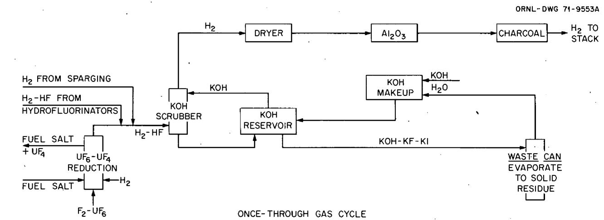

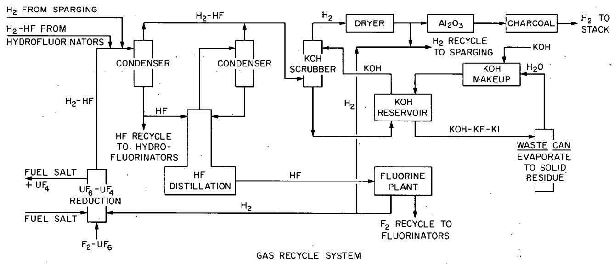  
Fig. 15.3. Alternate methods for treating off-gases in an MSBR processing plant.

105 waste cans be stored annually in a salt mine. Approximately $66\mathrm{kg}$ of fluorine, $102\mathrm{kg}$ of HF, and 41 kg of hydrogen would be required daily.

Recycle of $\mathbf{H}_2$ and $\mathbf{F}_2$ via electrolysis. In this off-gas treatment method, hydrogen and HF are collected from the various off-gas streams in the process. The mixture is compressed to a pressure of about 2 atm and chilled to a temperature of $-40^{\circ}\mathrm{C}$ to condense the bulk of the HF. The liquid HF is distilled at essentially total reflux to separate volatile fission product fluorides (principally HI, HBr, $\mathrm{SeF_6}$ , and $\mathrm{TeF_6}$ ). About $70~\mathrm{kg}$ of HF is electrolyzed per day in a remotely operated fluorine plant in order to produce the hydrogen and fluorine that are required for plant operation. The remaining HF is recycled to the plant, where it is used principally for hydrofluorination of bismuth streams containing dissolved metals.

The hydrogen stream leaving the HF condensation and distillation operations will contain most of the fission product activity in the initial $\mathbf{H}_2$ -HF stream and a small amount of HF. This gas stream is contacted with an aqueous KOH solution to remove HF, HI, and HBr. It is assumed that $20\mathrm{ft}^3$ of $10M$ KOH solution will be recirculated through the scrubber for 34 days. At the

end of this period, the KOH concentration will have been reduced to $0.5M$ , and the steady-state heat generation rate in the solution will be $210~\mathrm{kW}$ . The solution would be held for 45 days for fission product decay before it is evaporated to produce a solid waste. The solid waste production rate is only $9.7~\mathrm{kg/day}$ , and only 2.1 containers having a diameter of 2 ft and a length of 10 ft would be filled annually.

The hydrogen stream leaving the caustic scrubber is dried and recycled to the processing plant. About $5\%$ (0.5 scfm) of the hydrogen is discarded through an $\mathrm{Al_2O_3}$ bed (for removal of $\mathrm{SeF_6}$ and $\mathrm{TeF_6}$ ) and a charcoal bed (for retention of noble gases). This off-gas treatment system requires the purchase of only $1.4\mathrm{kg}$ of hydrogen and $13.4\mathrm{kg}$ of HF per day.

Comparison of costs for off-gas treatment. Costs associated with the operation of the two off-gas treatment methods were determined by calculating the capital equipment and operating charges for each. Results of these calculations are summarized in Table 15.4 for a 1000-MW(e) MSBR that is processed on a ten-day cycle. The contribution to the fuel cycle cost for the once-through gas cycle is about 0.11 mill/kWhr, while the cost for the treatment system resulting in

Table 15.4. Fuel cycle cost contribution for two methods of treating process gases in an MSBR processing plant   
Reactor power $= 1000\mathrm{MW(e)}$ Plant factor $= 80\%$   

<table><tr><td></td><td colspan="2">Fuel cycle cost (mills/kWhr)</td></tr><tr><td></td><td>Once-through gas cycle</td><td>Gas recycle</td></tr><tr><td>Waste disposal charges</td><td></td><td></td></tr><tr><td>Waste containers</td><td>0.0485</td><td>0.0009</td></tr><tr><td>Carriers</td><td>0.0022</td><td>0.0004</td></tr><tr><td>Shipping</td><td>0.0050</td><td>0.0001</td></tr><tr><td>Salt mine storage</td><td>0.0045</td><td>0.0001</td></tr><tr><td></td><td>0.0602</td><td>0.0015</td></tr><tr><td>Chemicals and interest on capital equipment</td><td></td><td></td></tr><tr><td>KOH tanks</td><td>0.0124</td><td>0.0013</td></tr><tr><td>Fluorine plant</td><td></td><td>0.0196</td></tr><tr><td>Fluorine</td><td>0.0304</td><td></td></tr><tr><td>Hydrogen</td><td>0.0055</td><td>0.0002</td></tr><tr><td>Hydrogen fluoride</td><td>0.0026</td><td>0.0005</td></tr><tr><td>Potassium hydroxide</td><td>0.0038</td><td>0.0001</td></tr><tr><td>HF distillation equipment</td><td></td><td>0.0007</td></tr><tr><td></td><td>0.0547</td><td>0.0224</td></tr><tr><td>Total</td><td>0.11</td><td>0.024</td></tr></table>

almost complete recycle is only 0.024 mill/kWhr. The higher cost for the once-through gas cycle is due primarily to the cost of disposing of a relatively large quantity of solid waste and to the purchase of fluorine. The most significant cost for the gas recycle method is amortization of the remote fluorine plant, which has a direct cost of $1.005 million. In making the cost estimate, capital costs were amortized at 13.7%/year. Salt mine storage charges4 were assumed to be $300 per waste container, which is the minimum interment charge. Based on this comparison, the gas recycle method was selected for use in the MSBR fuel reprocessing plant.

# 15.3 EFFECT OF NOBLE-METAL AND HALOGEN REMOVAL TIMES ON THE HEAT GENERATION RATE IN AN MSBR PROCESSING PLANT

M.J.Bell L.E.McNeese

The thermal power that will be generated in an MSBR processing plant by decay of the noble-metal fission products will depend on the residence time of these elements in the primary reactor system and the fractions of these elements accompanying the fuel salt to the processing plant. We have performed a series of calculations in which the noble metals were assumed to be transferred from the fuel salt, on a 50-sec cycle, into a holdup volume having a residence time ranging from 1 sec to 1 year. The holdup volume was assumed to be in contact with fuel salt so that materials produced by the decay of noble metals could return to the fuel salt if these materials were not noble metals. The model is sufficiently general that the holdup volume could represent noble metals associated with circulating gas bubbles, a stagnant film of noble metals in a pump tank, or noble metals deposited on graphite and metal surfaces. The residual thermal power of the noble metals leaving the holdup volume is shown in Fig. 15.4 as a function of residence time in the holdup volume. The residual thermal power is defined as the integral, over all time, of the instantaneous heat generation rate for all isotopes leaving the holdup volume. The noble metals were divided into two groups: those that form stable volatile fluorides (As, Se, Nb, Mo, Tc, Ru, Sb, and Te) and those that do not (Rh, Pd, and Ag). Elements in the first group are assumed to be completely removed from the salt in the primary fluorina

tor. The elements in the second group will remain in the salt and will be extracted into bismuth in the protactinium isolation system. If the removal of $1\%$ of the noble metals from the holdup volume occurs with a residence time of 1 min, the heat generation in the processing plant will be increased by $200\mathrm{kW}$ , with the bulk of the heat being generated in the $\mathrm{UF}_6$ recovery system. About the same heat generation rate would result if $10\%$ of the noble metals reached the processing plant after a one-day holdup or if $20\%$ reached the plant after a ten-day holdup.

The heat generated by the halogens (Br and I) in the processing plant will depend upon both the halogen removal time and the noble-metal removal time since halogens are produced by the decay of some noble metals. If the noble metals are removed from the fuel salt on a very short cycle, their daughters are prevented from entering the fuel salt and thus will not reach the processing plant. The heat generation rate resulting from the decay of halogen fission products is shown in Fig. 15.5. An effective noble-metal removal time of 0.1 day is believed to be reasonable for the present flowsheet. This would result in a heat generation rate of $210\mathrm{kW}$ for the halogens for a halogen removal time of ten days or $520\mathrm{kW}$ for a removal time of three days. For a noble-metal residence time in the holdup volume as long as one year, the halogen thermal power would be increased by only $60\%$ over that for a 0.1-day residence time.

# 15.4 LONG-TERM DISPOSAL OF MSBR WASTES

M. J. Bell

A recent study has been made of the long-term hazard associated with high-level radioactive wastes produced by nuclear reactors operating on the enriched $^{235}\mathrm{U}$ , uranium- $^{239}\mathrm{Pu}$ , and thorium- $^{233}\mathrm{U}$ fuel cycles. In this investigation, the reference MSBR was assumed to be typical of the thorium- $^{233}\mathrm{U}$ fuel cycle. It was found that the ingestion hazards represented by the high-level wastes produced by the three fuel cycles are quite similar after comparable periods of decay. These high-level wastes were assumed to include all fission products produced by the fuel cycle and, in the case of the $^{235}\mathrm{U}$ and uranium- $^{239}\mathrm{Pu}$ fuel cycles, to include

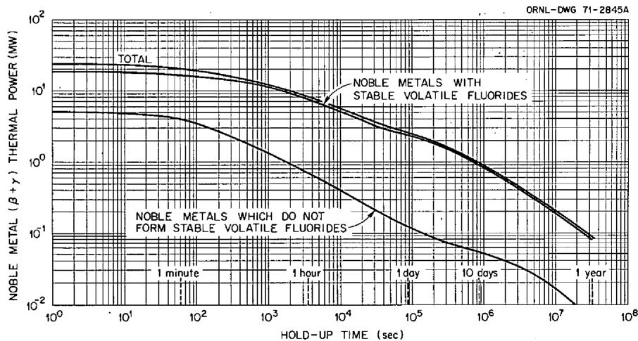  
Fig. 15.4. Residual thermal power of noble metals leaving the holdup volume as a function of holdup time in the primary reactor system.

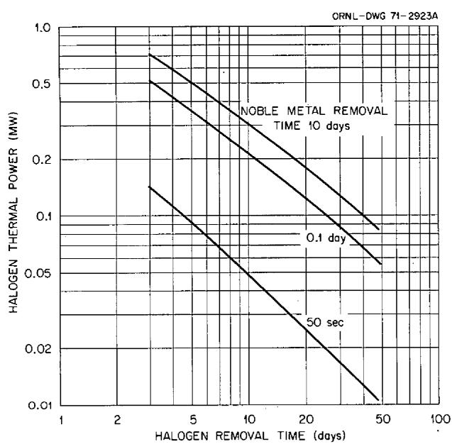  
Fig. 15.5. Effect of halogen and noble-metal removal times on the thermal power of the halogen fission products.

$0.5\%$ of the uranium and plutonium and $100\%$ of other transuranium isotopes and their daughters present in the spent fuel at the time of chemical processing (150 days after discharge for the $^{235}\mathrm{U}$ fuel and 90 days after discharge for the $^{239}\mathrm{Pu}$ fuel). In the case of the MSBR it was assumed that the thorium in the waste salt would not be recovered, that $0.5\%$ of the reactor uranium inventory would be discarded over the 30-year life of

the plant, and that all of the transuranium isotopes and their daughters would be present in the waste. The removal times for the transuranium elements were assumed to be ten days except in the case of neptunium, which was assumed to have a removal time of 16 years.

The volume of water required to dilute the three types of high-level wastes to the radioactivity concentration guide values for continuous ingestion in unrestricted areas is shown in Table 15.5 for wastes of various ages. Also shown for comparison are the volumes of water required to dilute comparable quantities of (1) uranium ore tailings and (2) material containing uranium and thorium at concentrations equal to their respective average concentrations in the earth's crust. The quantities of these materials used in the comparison were assumed to be those that would occupy the same volume as the high-level waste and associated salt and shale in the proposed Federal salt mine repository. Wastes aged 300 years would present an ingestion hazard similar to that from uranium ore tailings, and wastes aged 10,000 years would present a hazard about one order of magnitude greater than that associated with naturally occurring uranium and thorium at their average concentrations in the earth's crust.

The study identified two potential problems relating to the MSBR fuel cycle, as envisioned at the present time. As a result of the inefficient use of relatively inexpensive thorium in the present MSBR concept, the mass of wastes produced per $\mathbf{MW}(\mathbf{e})$ by an MSBR is substantially greater than the masses of waste produced by the other reactor types. Also, MSBR wastes aged one

$2.0 \times 10^{8} \mathrm{~m}^{3} =$ volume of water required to reduce ingestion hazard of the corresponding amount of uranium ore (0.17% U).   
$1.1 \times 10^{7} \mathrm{~m}^{3} =$ volume of water that results from dissolving the salt required to store waste equivalent to 33,000 MWd exposure to a terminal concentration of 500 ppm.   
$1.07 \times 10^{6} \mathrm{~m}^{3} =$ approximate volume of water required to reduce ingestion hazard potential of the corresponding amount of earth containing naturally occurring uranium plus thorium in equilibrium with their daughters at the average concentration in the earth's crust.

Table 15.5. Volume of water (in $\mathfrak{m}^3$ ) potentially contaminated to radioactivity concentration guide values for ingestion in unrestricted areas (10CFR20, Table II, column 2) by solidified high-level waste resulting from 33,000 MWd of exposure of enriched $^{235}\mathrm{U}$ , $^{239}\mathrm{Pa}$ , and $^{233}\mathrm{U}$ fuels   

<table><tr><td>Age of waste (years)</td><td>235Ua</td><td>239Pu b</td><td>233Uc</td></tr><tr><td>30</td><td>1.26 × 1011(90Sr)</td><td>7.22 × 1010(90Sr)</td><td>2.11 × 1011(90Sr)</td></tr><tr><td>100</td><td>2.24 × 1010(90Sr)</td><td>1.32 × 1010(90Sr)</td><td>3.75 × 1010(90Sr)</td></tr><tr><td>300</td><td>2.00 × 108(90Sr)</td><td>3.93 × 108(241Am)</td><td>3.76 × 108(90Sr)</td></tr><tr><td>1,000</td><td>1.55 × 107(241Am)</td><td>1.09 × 108(241Am)</td><td>4.72 × 106(223Ra and 228Ra)</td></tr><tr><td>3,000</td><td>6.53 × 106(243Am)</td><td>2.24 × 107(243Am)</td><td>5.06 × 106(223Ra and 228Ra)</td></tr><tr><td>10,000</td><td>4.26 × 106(239Pu)</td><td>1.26 × 107(243Am)</td><td>9.34 × 106(226Ra)</td></tr><tr><td>30,000</td><td>2.44 × 106(239Pu)</td><td>6.88 × 106(239Pu)</td><td>2.2 × 107(226Ra)</td></tr><tr><td>100,000</td><td>2.14 × 106(226Ra)</td><td>5.74 × 106(226Ra)</td><td>4.45 × 107(226Ra)</td></tr><tr><td>300,000</td><td>2.38 × 106(226Ra)</td><td>5.81 × 106(226Ra)</td><td>4.68 × 107(226Ra)</td></tr><tr><td>1,000,000</td><td>1.58 × 106(129I)</td><td>2.03 × 106(129I)</td><td>9.42 × 106(226Ra)</td></tr><tr><td>3,000,000</td><td>9.93 × 105(129I)</td><td>9.53 × 105(129I)</td><td>1.80 × 106(228Ra)</td></tr><tr><td>10,000,000</td><td>5.28 × 105(129I)</td><td>4.88 × 105(129I)</td><td>1.56 × 106(228Ra)</td></tr><tr><td>30,000,000</td><td>2.57 × 105(129I)</td><td>2.38 × 105(129I)</td><td>1.20 × 106(228Ra)</td></tr></table>

${}^{a}$ Reference PWR fueled with 3.3% enriched uranium,operated at a specific power of ${30}\mathrm{{MW}}$ per metric ton of heavy metal charged to reactor. Processing losses of $1/2\%$ of uranium and plutonium to waste are assumed.   
$^{b}$ AI reference oxide LMFBR mixed core and blankets fueled with LWR discharge plutonium and diffusion plant tails. Average specific power of blend is 58.2 MW per metric ton of heavy metal charged to reactor. Processing losses of $1/2\%$ of uranium and plutonium to waste are assumed.   
${}^{c}$ Reference MSBR with continuous protactinium isolation on a ten-day cycle and rare-earth removal by the metal transfer process. Thorium is discarded on a 4200-day cycle, and $1/2\%$ of the uranium inventory in the reactor is assumed to be lost to waste over a 30-year plant life.

million years or more have a greater ingestion hazard associated with them than other waste types, principally as the result of radioactivity from $^{232}$ Th daughters. Both of these problems can be alleviated by making more efficient use of thorium in the fuel cycle, which is, at present, utilized with an efficiency of only $13.7\%$ . We are investigating processing schemes that can increase the thorium utilization to greater than $90\%$ and thus eliminate these problems.

The study also revealed that a greater ingestion hazard is associated with MSBR wastes during the period 30,000 to 1 million years as the result of the presence

of $^{226}\mathrm{Ra}$ , a daughter of $^{238}\mathrm{Pu}$ . The isotope $^{238}\mathrm{Pu}$ exists in MSBR wastes in substantial concentrations as a result of the long removal time for neptunium and the short removal time for plutonium in the present processing scheme. The amount of $^{238}\mathrm{Pu}$ in the MSBR wastes could be reduced by removing neptunium more efficiently or by use of a processing scheme that would allow plutonium to remain in the fuel salt and be consumed by neutron capture. Both of these possibilities are being considered as improvements to the present processing flowsheet.

# 15.5 AVAILABILITY OF NATURAL RESOURCES REQUIRED FOR MOLTEN-SALT BREEDER REACTORS

M. J. Bell

A study has been made of published data on the availability of and future demand for natural resources of special importance to the MSBR program.6 Materials considered in the survey included the constituents of coolant and fuel salts, Hastelloy N, and materials required for construction and operation of a chemical processing plant. Table 15.6 presents the cumulative demand for a number of materials through the year 2000, compares the requirements of the assumed MSBR economy with those of the rest of the world, and compares the world demand with world reserves and estimated world resources of these materials. The

6. M. J. Bell, The Availability of Natural Resources for Molten-Salt Breeder Reactors, ORNL-TM-3563 (in press).

known world reserves of beryllium, fluorine, and bismuth are being rapidly depleted by non-MSBR uses and are expected to be exhausted before the end of the century. Ample beryllium resources (in the form of bertrandite) and fluorine (in the form of phosphate rock) exist; however, an improved mining technology will be required to make recovery of these materials economical. Bismuth resources are limited by the demand for lead, copper, and zinc ores from which bismuth is recovered as a by-product. In order to satisfy the cumulative world demand through the year 2000, it is necessary that new base metal ores be developed and that the technology for recovering bismuth during the refining of copper and zinc ores be improved.

Ores from which thoria can be recovered for $10/lb will be available well into the next century. Large reserves of higher-priced thoria are also available. MSR demands for all materials, with the exception of thorium and hafnium, comprise only a small fraction of the world demand for these materials and will not require the development of new industries for the sole purpose of sustaining an MSBR economy.

Table 15.6. Estimated world primary demand for MSBR materials over the period 1968-2000   

<table><tr><td></td><td>Element</td><td>MSBR cumulative demand for the period 1985–2000 (tons)</td><td>World cumulative demand for the period 1968–2000a (tons)</td><td>MSBR demand as percentage of world demand</td><td>Cumulative world demand as percentage of world reservesb</td><td>Cumulative world demand as percentage of world resourcesc plus world reserves</td></tr><tr><td rowspan="4">Fuel salt</td><td>Li</td><td>7.3 × 103</td><td>2.7–3.3 × 105</td><td>2–3</td><td>36–44</td><td>d</td></tr><tr><td>Bee</td><td>2.1 × 103</td><td>3.0–4.3 × 104</td><td>5–7</td><td>250–360</td><td>1.9–2.7</td></tr><tr><td>Thf</td><td>4.0 × 104</td><td>2.3–8.4 × 104</td><td>49g</td><td>4.5–16</td><td>1.7–6.3</td></tr><tr><td>Fh</td><td>4.2 × 104</td><td>1.2–1.4 × 108</td><td>0.03–0.04</td><td>500–600</td><td>180–210</td></tr><tr><td rowspan="8">Hastelloy N</td><td>Ni</td><td>2.5 × 105</td><td>2.4–2.9 × 107</td><td>0.8–1.0</td><td>32–39</td><td>d</td></tr><tr><td>Mo</td><td>3.9 × 104</td><td>4.2–5.0 × 106</td><td>0.8–0.9</td><td>78–93</td><td>d</td></tr><tr><td>Cr</td><td>2.3 × 104</td><td>0.9–1.1 × 108</td><td>0.02</td><td>11–14</td><td>d</td></tr><tr><td>Fe</td><td>6.5 × 103</td><td>1.7–2.1 × 1010</td><td>&lt;10-4</td><td>17–21</td><td>3–4</td></tr><tr><td>Mn</td><td>6.5 × 102</td><td>3.9–4.6 × 108</td><td>&lt;10-5</td><td>53–63</td><td>2–3</td></tr><tr><td>Ti</td><td>1.6 × 103</td><td>1.9–4.4 × 106</td><td>0.04–0.08</td><td>1.2–2.9</td><td>d</td></tr><tr><td>Nb</td><td>3.2 × 102</td><td>2.7–4.0 × 105</td><td>0.08–0.12</td><td>2.7–4.0</td><td>d</td></tr><tr><td>Hf</td><td>3.2 × 102</td><td>1.9–2.9 × 103</td><td>11–17</td><td>0.6–0.9</td><td>d</td></tr><tr><td rowspan="2">Other</td><td>Bi</td><td>5.2 × 103</td><td>1.4–1.8 × 105</td><td>2.9–3.7</td><td>140–180</td><td>78–100</td></tr><tr><td>B</td><td>1.5 × 104</td><td>1.4–1.8 × 107</td><td>0.08–0.1</td><td>20–25</td><td>d</td></tr></table>

$^{a}$ U.S. Bureau of Mines, Mineral Facts and Problems, Bulletin 650, 1970 ed., U.S. Govt. Printing Office.   
${}^{b}$ Reserves are known materials that may or may not be completely explored but may be quantitatively estimated; considered to be economically exploitable at the time of the estimate.   
Resources are materials other than reserves that may be ultimately exploitable; these include undiscovered but geologically predicted deposits similar to present reserves as well as known deposits whose exploitation awaits more favorable economic or technologic conditions.   
$d_{\mathrm{Quantitative}}$ estimates of world resources of these elements are not available.   
${}^{e}$ Beryllium resources include deposits containing at least 1% equivalent beryl (0.1% BeO).   
$J$ Thorium reserves and potential resources recoverable at $10 per pound of $\mathrm{ThO}_2$ .   
$g$ Ratio based on high range of forecast world cumulative demand.   
${}^{h}$ Fluorine reserves and resources containing at least ${35}\% {\mathrm{{CaF}}}_{2}$ or equivalent value in fluorspar and metallic sulfides.

# 16. Processing Chemistry

L. M. Ferris

Studies relating to the metal transfer process $^{1,2}$ for the removal of rare-earth and other fission products from MSBR fuel salt were continued. Included in this work were measurements of the equilibrium distribution of lithium and bismuth between liquid Li-Bi alloys and molten LiCl, and of the mutual solubilities of thorium and selected rare earths in liquid bismuth. The equilibrium precipitation of $\mathrm{Pa}_2\mathrm{O}_5$ from MSBR fuel salt by sparging with $\mathrm{HF - H_2O - H_2 - Ar}$ gas mixtures was also studied. The effect of temperature on the solubility of $\mathrm{Pa}_2\mathrm{O}_5$ in fuel salt that was also saturated with $\mathrm{ThO}_2$ was determined. Studies relating to the chemistry of fuel reconstitution were begun. The initial phase of this work involves a study of the reaction of gaseous $\mathrm{UF}_6$ with $\mathrm{UF}_4$ dissolved in MSBR fuel salt.

# 16.1 DISTRIBUTION OF LITHIUM AND BISMUTH BETWEEN LIQUID LITHIUM-THORIUM-BISMUTH ALLOYS AND MOLTEN LiCl

L.M.Ferris J.F.Land

In the metal transfer process, $^{1,2}$ rare earths and the attendant small amount of thorium would be stripped from the LiCl acceptor salt into lithium-bismuth solutions having lithium concentrations of 5 to 50 at. $\%$

Work done at Argonne National Laboratory3 with LiCl-LiF solutions indicated that high lithium and bismuth concentrations (up to 0.1 mole %) might be expected in LiCl that is in equilibrium with lithium-bismuth solutions in which the lithium concentration is 5 to 50 at. % Concentrations of this magnitude could have a significant effect on the performance of the metal transfer process. Consequently, we have initiated a study of the equilibrium distribution of lithium and bismuth between molten LiCl and liquid lithium-bismuth solutions. The results of this study should aid in optimizing operating conditions for the metal transfer process.

In this study, LiCl containing less than 0.05 mole % LiOH was equilibrated with various lithium-bismuth solutions at $650^{\circ}\mathrm{C}$ . Thorium was added to the system in some cases to minimize the oxide and hydroxide concentrations in the salt. The apparatus and general procedure have been described elsewhere. The equilibrium lithium concentration in the salt phase was generally determined by removing a salt sample with a stainless steel sampler, hydrolyzing the sample in water, and measuring the amount of hydrogen evolved by a gas-chromatographic procedure. Samples for bismuth analysis were taken with quartz samplers. When the

bismuth concentration in the salt was greater than about 100 wt ppm, a colorimetric analytical method was used. An inverse-polarographic method was used for the determination of bismuth at lower concentrations.

Data obtained thus far at $650^{\circ}\mathrm{C}$ are summarized in Table 16.1. As can be seen in the table, both the equilibrium lithium and bismuth concentrations in the salt phase increased markedly as the lithium concentration in the metal phase was increased. This is also shown quite clearly in Fig. 16.1, which is a log-log plot of lithium concentration in the salt phase vs lithium concentration in the metal phase. In those cases where both lithium and bismuth analyses of the salt were made, the $\mathrm{Li} / \mathrm{Bi}$ atom ratio in the dissolved species was about 3. Thus, the dramatic increase in the equilibrium concentrations of lithium and bismuth in the salt with increasing lithium concentration in the metal phase appears to be related to the simultaneous increase in concentration in the metal phase of a saltlike species, such as $\mathrm{Li}_3\mathrm{Bi}$ , which has a high solubility in LiCl. The data given in Table 16.1 indicate that the presence of thorium in the metal phase had no measurable effect on the distribution of lithium and bismuth between the two phases. Measurements have also been made of the solubilities of pure bismuth and of $\mathrm{Li}_3\mathrm{Bi}$ in molten LiCl. The preliminary results indicate that the solubility of bismuth is about 0.1 wt ppm at $650^{\circ}\mathrm{C}$ , whereas the solubility of $\mathrm{Li}_3\mathrm{Bi}$ is about 0.3 mole%.

The magnitude of the equilibrium lithium and bismuth concentrations in LiCl determined in this investigation is consistent with the limited amount of

previous work done at Argonne National Laboratory $^{3,5}$ with LiCl-LiF (75-25 mole %) as the salt phase and solid $\mathrm{Li}_3\mathrm{Bi}$ or liquid Li-Bi (50-50 at. %) as the metal phase. We do not agree, however, that the Li/Bi atom ratio in the species dissolved in the salt is markedly lower than 3 when the metal phase is a lithium-bismuth solution rather than solid $\mathrm{Li}_3\mathrm{Bi}$ . The present study also yielded values for the solubility of pure bismuth in LiCl that were substantially lower than those obtained by the ANL workers $^{5}$ with the molten LiCl-LiF salt phase.

Extrapolation of the results of this study indicates that the equilibrium concentrations of both lithium and bismuth will be less than 1 wt ppm in LiCl that is in equilibrium with Li-Bi (5-95 at. %), which is the composition of the alloy proposed for stripping the trivalent rare earths and thorium from the LiCl in the metal transfer process. $^{1,2}$ Lithium and bismuth dissolved in the LiCl at these low concentrations should not produce a deleterious effect on the performance of this part of the metal transfer process. However, the present results indicate that the lithium and bismuth concentrations in the LiCl in contact with the divalent rare-earth strip solution, Li-Bi (50-50 at. %), would be about 0.3 and 0.1 mole % respectively. These concentrations are sufficiently high that a significant amount of lithium and bismuth (as much as 370 and 1110 moles/day, respectively) will transfer from the lithium-bismuth solution used to remove divalent rare earths

5. M. S. Foster, C. E. Crouthamel, D. M. Gruen, and R. L. McBeth, J. Phys. Chem. 68(4), 980 (1964).

Table 16.1. Equilibrium distribution of lithium and bismuth between molten LiCl and liquid Li-Th-Bi solutions at ${650}^{ \circ  }\mathrm{C}$   

<table><tr><td rowspan="3">Expt.</td><td colspan="3">Concentration in metal phase</td><td colspan="2">Lithium concentration in salt phase</td><td colspan="2">Bismuth concentration in salt phase</td><td rowspan="3">Li/Bi mole ratio in salt</td></tr><tr><td colspan="2">Lithium</td><td rowspan="2">Thorium (ppm)</td><td rowspan="2">wt ppm</td><td rowspan="2">mole ppm</td><td rowspan="2">wt ppm</td><td rowspan="2">mole ppm</td></tr><tr><td>wt %</td><td>at. %</td></tr><tr><td>81 a</td><td>1.09</td><td>24.9</td><td>0</td><td>21 ± 8</td><td>126 ± 50</td><td>186 ± 20</td><td>38 ± 4</td><td>3.4 ± 1.4</td></tr><tr><td>79</td><td>1.20</td><td>26.8</td><td>0</td><td>30 ± 7</td><td>184 ± 42</td><td>225 ± 75</td><td>46 ± 15</td><td>4.0 ± 1.6</td></tr><tr><td>76 a</td><td>1.85</td><td>36.2</td><td>750</td><td>110 ± 50</td><td>673 ± 300</td><td></td><td></td><td></td></tr><tr><td>74 a</td><td>1.90</td><td>36.8</td><td>0</td><td>176 ± 15</td><td>1080 ± 90</td><td></td><td></td><td></td></tr><tr><td>78</td><td>2.00</td><td>38.1</td><td>0</td><td>108 ± 16</td><td>662 ± 96</td><td>1016 ± 20</td><td>206 ± 3</td><td>3.2 ± 0.5</td></tr><tr><td>74 b</td><td>2.09</td><td>39.1</td><td>0</td><td>210 ± 40</td><td>1280 ± 225</td><td></td><td></td><td></td></tr><tr><td>75</td><td>2.16</td><td>39.9</td><td>7500</td><td>220 ± 40</td><td>1340 ± 225</td><td></td><td></td><td></td></tr><tr><td>76 b</td><td>2.26</td><td>41.0</td><td>1300</td><td>298 ± 50</td><td>1820 ± 325</td><td></td><td></td><td></td></tr><tr><td>76 c&#x27;</td><td>2.52</td><td>43.8</td><td>1800</td><td>430 ± 75</td><td>2620 ± 460</td><td></td><td></td><td></td></tr><tr><td>76 d</td><td>2.90</td><td>47.4</td><td>2500</td><td>525 ± 60</td><td>3210 ± 340</td><td></td><td></td><td></td></tr><tr><td>82</td><td>3.00</td><td>48.2</td><td>0</td><td></td><td></td><td>4260 ± 460</td><td>864 ± 93</td><td></td></tr></table>

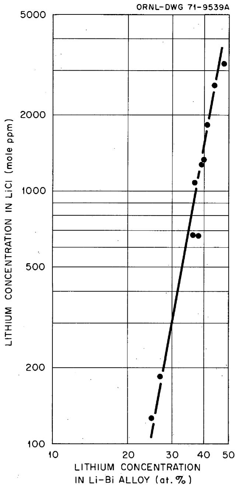  
Fig. 16.1. Equilibrium distribution of lithium between molten LiCl and lithium-bismuth solutions at $650^{\circ}\mathrm{C}$ .

from LiCl. It is not believed that transfer of these amounts of lithium and bismuth will cause difficulties with the present flowsheet, however, since the lithium will be available for the extraction of uranium and protactinium.

# 16.2 MUTUAL SOLUBILITIES OF THORIUM AND RARE EARTHIS IN LIQUID BISMUTH

F.J.Smith C.T.Thompson

J. F. Land

Lithium-bismuth solutions having lithium concentrations of 5 to 50 at. $\%$ will be used to strip thorium and rare earths from the LiCl acceptor salt in the metal transfer process.1,2 We have been determining the solubilities, both individual and mutual, of thorium and selected rare earths in lithium-bismuth solutions to help define optimum process conditions. Previously,6 we studied the precipitation of thorium bismuthide from solutions containing rare-earth metals and observed partitioning of lanthanum (initial concentration, $\sim 1000$ ppm) between the liquid and solid phase(s) at temperatures below about $500^{\circ}\mathrm{C}$ . The available data were interpreted in terms of coprecipitation of lanthanum and thorium bismuthides. Results obtained in our current investigations of the mutual interactions of thorium and rare earths in lithium-bismuth solutions have led us to reevaluate our original work. Data obtained recently have confirmed the earlier observations but cannot be explained in terms of a coprecipitation model. The general behavior observed is consistent with the formation of a compound containing a rare earth and thorium (possibly a bismuthide). The general reaction for the formation of such a compound would be:

$$
\operatorname {T h} _ {(\mathrm {B i})} + x \operatorname {L n} _ {(\mathrm {B i})} + y \operatorname {B i} _ {(\mathrm {l i q})} = \operatorname {T h L n} _ {x} \operatorname {B i} _ {y (\text {s o l i d})},
$$

in which Ln denotes a lanthanide metal. A mole fraction solubility product can be written as

$$
K _ {\mathfrak {s p}} = N _ {\mathrm {T h}} N _ {\mathrm {L n}} ^ {x} N _ {\mathrm {B i}} ^ {y}. \tag {1}
$$

Under the experimental conditions employed, the Ln and Th concentrations were low; therefore, the mole fraction of bismuth was close to unity and the mole fraction solubility product can be closely approximated by $K_{\mathrm{sp}} = N_{\mathrm{Th}}N_{\mathrm{Ln}}x$ . The variation of $K_{\mathrm{sp}}$ with temperature would be expected to follow the usual relationship

$$
\log K _ {\mathfrak {s p}} = \log \left(N _ {\mathrm {T h}} N _ {\mathrm {L n}} ^ {x}\right) = A + B / T. \tag {2}
$$

In each of a set of experiments, $300\mathrm{g}$ of bismuth containing the equivalent of about 2000 ppm of rare earth (either La or Nd) and about 4000 ppm of thorium was equilibrated for at least 8 hr at several temperatures between 750 and $300^{\circ}\mathrm{C}$ . At the end of each equilibration period, a filtered sample of the liquid phase was removed for analysis. The experiments were initiated by heating the system to about $750^{\circ}\mathrm{C}$ , where both the thorium and the rare-earth metal were soluble. The temperature of the system was then progressively lowered to about $300^{\circ}\mathrm{C}$ ; finally, the temperature was returned, in steps, to $750^{\circ}\mathrm{C}$ . The results from one of our recent experiments (LA-3), along with those from a previous experiment (LA-2), are shown in Fig. 16.2. Agreement among the results of these two experiments is obvious. As the temperature of the system was lowered, the thorium concentration in the liquid remained at its original value until about $650^{\circ}\mathrm{C}$ was reached. Below $650^{\circ}\mathrm{C}$ , the thorium concentration in the liquid decreased regularly with decreasing temperature (Fig. 16.2). The equilibrium thorium concen

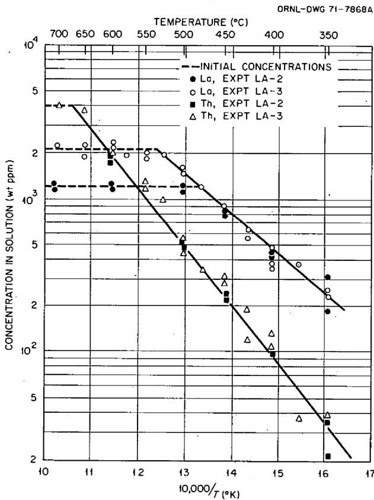  
Fig. 16.2. Mutual solubilities of lanthanum and thorium in liquid bismuth solutions. Excess solid thorium bismuthide was present, fixing the thorium concentration in solution.

trations in each experiment are in excellent agreement with the published' values for the solubility of thorium in liquid bismuth. Similarly, as the temperature was lowered, the lanthanum concentration in the liquid remained at its original value until some temperature below $550^{\circ}\mathrm{C}$ was reached; then it decreased regularly with decreasing temperature (Fig. 16.2). The lanthanum behavior in each experiment was identical. The equilibrium lanthanum concentrations in the liquid were much lower than the reported solubility values.8,9 On the basis of the lanthanum results, we postulate the formation of a La- and Th-containing solid phase that has a very low solubility in liquid bismuth. The results obtained for thorium indicate that there was sufficient thorium present in the system to satisfy the solubility product of the compound containing the rare earth and thorium and to saturate the system with thorium bismuthide. In this case, the maximum thorium concentration in solution at a given temperature is determined by the solubility of thorium in bismuth. The variation of thorium solubility in bismuth with temperature has been shown7 to follow the usual relationship

$$
\log N _ {\mathrm {T h}} = A ^ {\prime} + B ^ {\prime} / T. \tag {3}
$$

Substitution of Eq. (3) into Eq. (2) yields

$$
x \log N _ {\mathrm {L a}} = A ^ {\prime \prime} + B ^ {\prime \prime} / T,
$$

indicating that a plot of the logarithm of the lanthanum concentration in the bismuth solution vs $1 / T$ should be linear. As seen in Fig. 16.2, lanthanum behaved as predicted. It should be noted that a value of $x$ cannot be determined from data obtained in the manner outlined above if thorium bismuthide is present as a second solid phase.

An experiment (Nd-6) with neodymium as the rare earth was conducted in the same manner as experiments LA-2 and LA-3, and the results obtained were similar to those obtained with lanthanum. In addition, an approximate value of $x = 1$ was obtained in an experiment (E-70) conducted entirely at $640^{\circ}\mathrm{C}$ . In this experiment, neodymium was added to a thorium-bismuth solution, and the equilibrium concentrations in solution were determined after each addition. From Eq. (1), a plot of

$\log N_{\mathrm{Th}}$ vs $\log N_{\mathrm{Nd}}$ was expected to be linear with a slope of $-x$ . Our data covered only a limited range of concentrations, but the slope of the plot indicated $x$ to be about 1. A third experiment (Nd-7) was conducted in an attempt to measure the solubility of the Nd- and Th-containing solid in the absence of excess thorium bismuthide. The solution initially contained about 1 wt $\%$ Nd and about $3500~\mathrm{ppm}$ of Th. The temperature of the system was varied between 500 and $700^{\circ}\mathrm{C}$ , and samples of the liquid phase were removed at selected temperatures. Analyses of these samples showed that both the thorium and neodymium concentrations in the liquid were much lower than the solubilities of the respective bismuthides. From these results, we assumed that only one solid phase, a Nd- and Th-containing compound, was present. Assuming $x = 1$ , we calculated the mole fraction solubility product $K_{\mathrm{sp}} = N_{\mathrm{Nd}}N_{\mathrm{Th}}$ , using data from the three experiments involving neodymium. The resulting log $K_{\mathrm{sp}}$ vs $1 / T$ plot is shown in

Fig. 16.3. As seen, the data yield the expected linear plot. It should be noted that agreement among all the data cannot be obtained if values of $x$ other than 1 are

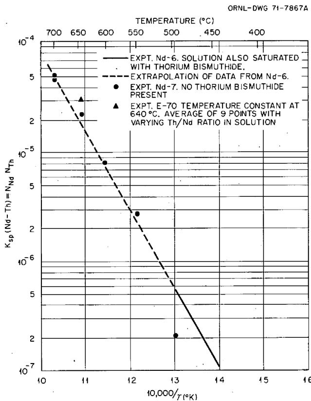  
Fig. 16.3. Temperature dependence of the solubility product for the compound $\mathrm{ThNdBi}_y$ in liquid bismuth.

used. The equation for the line in Fig. 16.3 is log $K_{\mathrm{sp}(\mathrm{Nd - Th})} = 3.233 \div 7285 / T(^{\circ}\mathrm{K})$ . Assuming that $x$ is also 1 for the La- and Th-containing solid phase, we obtain, from Fig. 16.2, log $K_{\mathrm{sp(La - Th)}} = 2.410 - 6480 / T(^{\circ}\mathrm{K})$ .

In reference to the metal transfer process, $^{1,2}$ the $K_{\mathrm{sp}}$ values for both lanthanum and neodymium indicate that the desired thorium and rare-earth concentrations should be attainable in the lithium-bismuth strip solutions without precipitation of a rare-earth- and thorium-containing compound if the temperature of the trivalent rare-earth strip solution Li-Bi (5-95 at. $\%$ ) is kept at $600^{\circ}\mathrm{C}$ or higher.

Using the data and interpretation given above, we considered a scheme for removing rare earths from MSBR fuel salt that involved reductive extraction followed by selective precipitation of thorium bismuthide. Rare-earth fission products would be extracted from fuel salt that is free of uranium and protactinium into bismuth that contains lithium and thorium as reductants. If the extraction were conducted at $600^{\circ}\mathrm{C}$ , the thorium concentration in the bismuth leaving the extraction unit would be about 1800 wt ppm for the reference case of a 1000-MW(e) MSBR and a 25-day rare-earth removal cycle. The corresponding rare-earth concentration would be less than $10^{-6}$ mole fraction. Equilibrium cooling of the bismuth to $350^{\circ}\mathrm{C}$ would precipitate thorium bismuthide and decrease the thorium concentration in solution to about 35 wt ppm. No rare earths would precipitate because their concentrations in solution would be too low to satisfy the $K_{\mathrm{sp}}$ for the compound containing the rare earth and thorium. For example, the $K_{\mathrm{sp}}$ for the La-containing solid at $350^{\circ}\mathrm{C}$ is about $10^{-8}$ . With a thorium concentration of 35 wt ppm ( $N_{\mathrm{Th}} = 2.9 \times 10^{-5}$ ), the lanthanum concentration in solution could be as high as $3 \times 10^{-4}$ mole fraction (about 240 wt ppm) without precipitation of a La-containing solid. The supernatant solution resulting from the precipitation of thorium bismuthide would be removed, and the dissolved species (Li, Th, and rare earths) would be stripped, either by hydrofluorination or hydrochlorination, into a suitable salt phase for disposal. The clean bismuth would then be used to dissolve the thorium bismuthide, more thorium and lithium would be added, and the resulting solution would be recycled to the reductive extraction unit. The thorium decontamination factor for the conditions cited above would be about 100 but could be increased to about 1000 if the extraction were conducted at $750^{\circ}\mathrm{C}$ and the resulting bismuth solution were cooled to $300^{\circ}\mathrm{C}$ . The decontamination factor is not affected markedly by increasing the rare-earth

removal cycle to at least 100 days. The chief disadvantage of the above scheme is the economic penalty involved in the large lithium and thorium losses, about 30 and $15\mathrm{kg/day}$ , respectively, for the reference case.

# 16.3 OXIDE PRECIPITATION STUDIES

O.K.Tallent F.J.Smith

Studies in support of the development of oxide precipitation processes for isolating protactinium and uranium from MSBR fuel salt have been continued. Previous work $^{10}$ has shown that addition of oxide to a salt solution containing $\mathrm{Pa}^{5+}$ results in precipitation of pure, or nearly pure, $\mathrm{Pa}_2\mathrm{O}_5$ and that $\mathrm{Pa}_2\mathrm{O}_5$ can be precipitated in preference to $\mathrm{UO}_2$ . $^{11,12}$ We are investigating a process in which salt from the reactor would be treated with the appropriate HF- $\mathrm{H}_2\mathrm{O}-\mathrm{H}_2$ gas mixture to convert practically all of the protactinium to $\mathrm{Pa}^{5+}$ and to precipitate a large fraction of the protactinium as $\mathrm{Pa}_2\mathrm{O}_5$ without precipitating uranium oxide. We have also determined the effect of temperature on the solubility of $\mathrm{Pa}_2\mathrm{O}_5$ in MSBR fuel salt that was saturated with both $\mathrm{ThO}_2$ and NiO. These measurements aid in defining the lowest protactinium concentrations attainable at a given temperature without changing the uranium or thorium concentrations in the salt.

Protactinium has been systematically precipitated from molten $\mathrm{LiF - BeF_2 - ThF_4 - UF_4}$ solutions at about $600^{\circ}C$ by equilibrating the salt with various HF- $\mathbf{H}_2\mathbf{O}$ Ar and $\mathrm{HF - H_2O - H_2 - Ar}$ gas mixtures. The data obtained with $\mathrm{HF - H_2O - Ar}$ gas mixtures were considered in terms of the equilibrium

$$
\mathrm {P a F} _ {5} (\mathrm {d}) + \frac {5}{2} \mathrm {H} _ {2} \mathrm {O} (\mathrm {g}) = \frac {1}{2} \mathrm {P a} _ {2} \mathrm {O} _ {5} (\mathrm {s}) + 5 \mathrm {H F} (\mathrm {g}), \tag {4}
$$

for which the equilibrium quotient at a given temperature can be written as

$$
Q _ {1} = \frac {p _ {\mathrm {H F}} {} ^ {5}}{p _ {\mathrm {H} _ {2} \mathrm {O}} {} ^ {5 / 2} N _ {\mathrm {P a F} _ {5}}} \tag {5}
$$

In the above expressions, (d), (g), (s), $N$ , and $p$ denote dissolved species, gas, solid, mole fraction, and partial

pressure respectively. If the ratio $p_{\mathrm{H_2O}} / p_{\mathrm{HF}}$ is fixed at some value $A$ , Eq. (5) can be written, in logarithmic form, as

$$
\log N _ {\mathrm {P a F} 5} = 2. 5 \log p _ {\mathrm {H F}} - \log Q _ {1} - 2. 5 \log A. \tag {6}
$$

For a given value of $A$ , a log-log plot of protactinium concentration in the salt vs HF partial pressure should be linear with a slope of 2.5. If the gas present at equilibrium contains hydrogen in addition to HF and $\mathrm{H}_2\mathrm{O}$ , tetrapositive protactinium is produced according to the reaction

$$
\mathrm {P a F} _ {5} (\mathrm {d}) + \frac {1}{2} \mathrm {H} _ {2} (\mathrm {g}) = \mathrm {P a F} _ {4} (\mathrm {d}) + \mathrm {H F} (\mathrm {g}), \tag {7}
$$

for which the equilibrium quotient is:

$$
Q _ {2} = \frac {N _ {\mathrm {P a F} _ {4}} p _ {\mathrm {H F}}}{N _ {\mathrm {P a F} _ {5}} p _ {\mathrm {H} _ {2}} ^ {1 / 2}}. \tag {8}
$$

The total protactinium concentration in the salt is

$$
N _ {\mathrm {P a}} = N _ {\mathrm {P a F} _ {4}} + N _ {\mathrm {P a F} _ {5}}. \tag {9}
$$

When $\mathrm{Pa}_2\mathrm{O}_5$ is the solid phase at equilibrium, $N_{\mathrm{PaF}_5}$ is defined by Eq. (5). Substitution of Eqs. (5) and (9) into Eq. (8) thus yields:

$$
\begin{array}{l} Q _ {2} = N _ {\mathrm {P a}} Q _ {1} A ^ {5 / 2} p _ {\mathrm {H F}} ^ {- 3 / 2} p _ {\dot {\mathrm {H}} _ {2}} ^ {- 1 / 2} \\ - p _ {\mathrm {H F}} p _ {\mathrm {H} _ {2}} ^ {- 1 / 2}. \tag {10} \\ \end{array}
$$

Two experiments designed to yield values of $Q_{1}$ at $600^{\circ}\mathrm{C}$ have been completed. Each experiment was initiated by loading $200\mathrm{g}$ of LiF-BeF $_2$ -ThF $_4$ (72-16-12 mole %), a weighed amount of $^{233}\mathrm{U}$ oxide, the equivalent of about 100 wt ppm of $^{231}\mathrm{Pa}$ , and 1 mCi of $^{233}\mathrm{Pa}$ tracer into a nickel vessel. After the system had been heated to $600^{\circ}\mathrm{C}$ , the salt was sparged for two days with HF-H $_2$ (50-50 mole %) to dissolve the uranium and protactinium in the salt. After residual HF and H $_2$ had been removed by sparging with argon, filtered samples of the salt were taken for analysis. By analysis, the initial uranium concentration in the salt was $0.288 \pm 0.028$ wt % (about 0.08 mole %) in experiment I and was $0.93 \pm 0.03$ wt % (about 0.25 mole %) in experiment II. The salt was then sparged with either an HF-H $_2$ O-Ar or an HF-H $_2$ O-H $_2$ -Ar gas mixture. A standardized aqueous HF-H $_2$ O solution (H $_2$ O/HF mole ratio = 3) was fed at a controlled rate to a heated vaporizer, using a Sage syringe pump with a

Teflon syringe and piston. The vaporizer was a heated cylindrically shaped 500-ml Monel vessel that had a gold-plated cup in the bottom. The $\mathrm{HF - H_2O}$ solution was fed into the cup, where it was vaporized and then was carried into the nickel reaction vessel by a stream of argon or an $\mathrm{Ar - H_2}$ mixture. The argon and hydrogen flow rates were controlled using calibrated DP cells. In all cases, the salt was sampled without measurably changing the composition of the gas phase. In preliminary experiments, in which samples of the salt were removed periodically, it was shown that equilibrium was attained in less than $16\mathrm{hr}$ . All data reported below were obtained by allowing at least $16\mathrm{hr}$ for equilibration. Each sample was first analyzed for protactinium by gamma spectrometry and then was submitted to the Analytical Chemistry Division for dissolution and analyses for $^{231}\mathrm{Pa}$ and $^{233}\mathrm{U}$ by the alpha-pulse-height method.

Data obtained at $600^{\circ}\mathrm{C}$ in the two experiments outlined above are summarized in Table 16.2. As seen, when $\mathrm{HF - H_2O - Ar}$ gas mixtures were used, the equilibrium protactinium concentration in the salt varied

regularly with the partial pressure of HF in the gas mixture. A log-log plot of the protactinium concentration vs $p_{\mathrm{HF}}$ is shown in Fig. 16.4. The protactinium concentrations used in this plot were those obtained by gamma spectrometry, since this analytical method gave what appeared to be the most accurate and self-consistent results. Increasing the $\mathrm{UF_4}$ concentration from 0.08 to 0.25 mole % had no measurable effect on the equilibrium protactinium concentrations. The slope of the line in Fig. 16.4 is 2.5; we interpret this as confirmation that the equilibrium involved was that given by Eq. (4). The equation of the line is log (wt ppm Pa) = 2.5 log $p_{\mathrm{HF}} + 4.870$ , from which we derive $\log N_{\mathrm{PaF}_5} = 2.5 \log p_{\mathrm{HF}} - 1.6925$ . Since $A = 3$ , we obtain $Q_{1} = 3.2$ at $600^{\circ}\mathrm{C}$ .

The uranium analyses of the salt, despite their considerable variation, support the contention that protactinium oxide was precipitated as a pure solid phase. However, we do not yet have sufficient data to define accurately the lowest protactinium concentrations attainable under given conditions without precipitating uranium and thorium oxides. Our data

Table 16.2. Equilibrium protactinium concentrations obtained by sparging $\mathbf{LiF - BeF}_2\cdot \mathbf{ThF}_4$ (72-16-12 mole %) containing $\mathbf{UF_4}$ with $\mathbf{HF - H_2O - Ar}$ or $\mathbf{HF - H_2O - H_2 - Ar}$ gas mixtures at $600^{\circ}\mathrm{C}$   

<table><tr><td rowspan="2">Experiment</td><td rowspan="2">PHF(atm)</td><td rowspan="2">PH2(atm)</td><td colspan="2">Pa concentration in salt (wt ppm)</td><td rowspan="2">Uranium concentration in salt (wt %)</td><td rowspan="2">Q2</td></tr><tr><td>By gamma spectrometry</td><td>By alpha-pulse-height analysis</td></tr><tr><td>I</td><td>0.019</td><td>0</td><td>5.5</td><td>9.8</td><td></td><td></td></tr><tr><td>I</td><td>0.024</td><td>0</td><td>7.2</td><td></td><td></td><td></td></tr><tr><td>I</td><td>0.030</td><td>0</td><td>13.0</td><td></td><td></td><td></td></tr><tr><td>I</td><td>0.031</td><td>0</td><td>13.4</td><td>10.7</td><td>0.241</td><td></td></tr><tr><td>I</td><td>0.040</td><td>0</td><td>19.4</td><td>15.9</td><td>0.292</td><td></td></tr><tr><td>I</td><td>0.042</td><td>0</td><td>33.6</td><td>25.7</td><td>0.259</td><td></td></tr><tr><td>I</td><td>0.043</td><td>0</td><td>36.0</td><td>31.2</td><td>0.174</td><td></td></tr><tr><td>I</td><td>0.043</td><td>0</td><td>26.4</td><td>20.2</td><td>0.199</td><td></td></tr><tr><td>II</td><td>0.047</td><td>0</td><td>37.5</td><td>36.0</td><td>0.907</td><td></td></tr><tr><td>I</td><td>0.050</td><td>0</td><td>44.3</td><td></td><td></td><td></td></tr><tr><td>I</td><td>0.052</td><td>0</td><td>36.2</td><td>59.6</td><td>0.263</td><td></td></tr><tr><td>I</td><td>0.052</td><td>0</td><td>41.6</td><td>43.9</td><td>0.262</td><td></td></tr><tr><td>II</td><td>0.055</td><td>0</td><td>66.1</td><td>71.0</td><td>0.920</td><td></td></tr><tr><td>II</td><td>0.058</td><td>0</td><td>84.0</td><td>88.0</td><td>0.937</td><td></td></tr><tr><td>I</td><td>0.063</td><td>0</td><td>73.0</td><td>71.5</td><td>0.334</td><td></td></tr><tr><td>I</td><td>0.065</td><td>0</td><td>72.0</td><td>58.5</td><td>0.332</td><td></td></tr><tr><td>II</td><td>0.065</td><td>0</td><td>64.9</td><td>86.0</td><td>0.977</td><td></td></tr><tr><td>I</td><td>0.070</td><td>0</td><td>69.0</td><td>58.5</td><td>0.282</td><td></td></tr><tr><td>I</td><td>0.0212</td><td>0.101</td><td>10.4</td><td></td><td></td><td>0.08</td></tr><tr><td>I</td><td>0.0227</td><td>0.0843</td><td>26.4</td><td></td><td></td><td>0.28</td></tr><tr><td>I</td><td>0.0340</td><td>0.140</td><td>49.5</td><td></td><td></td><td>0.19</td></tr><tr><td>I</td><td>0.0375</td><td>0.154</td><td>62.0</td><td></td><td></td><td>0.20</td></tr></table>

indicate that at $600^{\circ}\mathrm{C}$ the protactinium concentration can probably be reduced to about 5 wt ppm without the attendant precipitation of uranium oxide.

When hydrogen was present in the gas mixture, the equilibrium protactinium concentration at a given value of $p_{\mathrm{HF}}$ was higher than that obtained in the absence of hydrogen (Table 16.2). We attribute this behavior to the formation of $\mathrm{Pa}^{4+}$ , according to Eq. (7). The values of $Q_{2}$ given in Table 16.2 were calculated, using Eq. (10), from the data obtained with hydrogen present in the gas mixture. Our average value of $Q_{2} = 0.2$ at $600^{\circ}\mathrm{C}$ is in good agreement with the value of about 0.5 obtained by extrapolation of values given by Bamberger, Ross, and Baes.[13,14]

The solubility of $\mathrm{Pa}_2\mathrm{O}_5$ in LiF-BeF $_2$ -ThF $_4$ (72-16-12 mole %) that was also saturated with $\mathrm{ThO}_2$ and NiO was determined over the temperature range 560 to $690^{\circ}\mathrm{C}$ . The equilibrium involved was assumed to be

$$
5 / 4 \mathrm {T h F} _ {4} (\mathrm {d}) + 1 / 2 \mathrm {P a} _ {2} \mathrm {O} _ {5} (\mathrm {s}) = \mathrm {P a F} _ {5} (\mathrm {d}) + 5 / 4 \mathrm {T h O} _ {2} (\mathrm {s}), \tag {11}
$$

for which

$$
Q _ {3} = \frac {N _ {\mathrm {P a F} _ {5}}}{N _ {\mathrm {T h F} _ {4}} ^ {5 / 4}}. \tag {12}
$$

The apparatus and general technique have been described elsewhere. Initially, $100\mathrm{g}$ of salt containing about 10.5 wt ppm of ${}^{231}\mathrm{Pa}$ and about $1\mathrm{mCi}$ of ${}^{233}\mathrm{Pa}$ tracer was hydrofluorinated at $650^{\circ}\mathrm{C}$ in a molybdenum crucible to dissolve the protactinium in the salt. After stripping residual HF and $\mathbf{H}_2$ from the system with pure argon, sufficient $\mathrm{ThO_2}$ $(\sim 1.2\mathrm{g})$ was added to saturate the melt with $\mathrm{ThO_2}$ . About $0.4\mathrm{g}$ of NiO (an oxidant) was also added to ensure that the protactinium was in the $5+$ oxidation state. After an initial period of six days, duplicate filtered samples of the salt were taken at each of several temperatures. At least $20\mathrm{hr}$ was allowed for the attainment of equilibrium at each temperature. The samples were analyzed for protactinium by counting the gamma rays emitted by the ${}^{233}\mathrm{Pa}$ . Where possible, the samples were also analyzed for ${}^{231}\mathrm{Pa}$ by

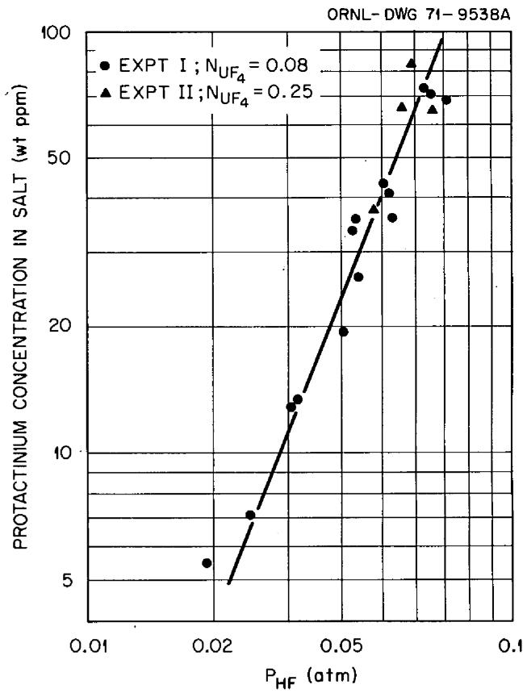  
Fig. 16.4. Equilibrium protactinium concentrations obtained by sparging $\mathrm{LiF - BeF_2 - ThF_4}$ (72-16-12 mole %) containing $\mathrm{UF_4}$ with various HF- $\mathbf{H}_2\mathbf{O}$ -Ar gas mixtures at $600^{\circ}\mathrm{C}$ . The $\mathrm{H}_2\mathrm{O} / \mathrm{HF}$ mole ratio was 3. The equation for the line is: log (wt ppm Pa) = 2.5 log $p_{\mathrm{HF}} + 4.870$ .

the alpha-pulse-height method. The agreement among the analyses was generally good.

The data obtained are summarized in Table 16.3 and are shown graphically in Fig. 16.5 as a plot of the logarithm of the protactinium concentration vs $1 / T$ . The plot includes our previously reported12 values. The least-squares equation for the line is log (wt ppm $\mathrm{Pa}^{5 + }$ ) = 19.471 - 17890/T(°K), which is equivalent to log $Q_{3}$ = 14.06 - 17890/T(°K); the standard deviation of log $Q_{3}$ is 0.3. At temperatures above $650^{\circ}\mathrm{C}$ , our values of $Q_{3}$ are in reasonable agreement with those determined by Ross, Bamberger, and Baes;10 however, our values are much lower than theirs at temperatures below $650^{\circ}\mathrm{C}$ .

Values of $Q_{3}$ can also be estimated by combining the quotients for the following two equilibria:

$$
\frac {5}{4} \mathrm {U F} _ {4} (\mathrm {d}) + \frac {1}{2} \mathrm {P a} _ {2} \mathrm {O} _ {5} (\mathrm {s}) = \mathrm {P a F} _ {5} (\mathrm {d}) + \frac {5}{4} \mathrm {U O} _ {2} (\mathrm {s s}), \tag {13}
$$

$$
\mathrm {U F} _ {4} (\mathrm {d}) + \mathrm {T h O} _ {2} (\mathrm {s s}) = \mathrm {U O} _ {2} (\mathrm {s s}) + \mathrm {T h F} _ {4} (\mathrm {d}). \tag {14}
$$

In these expressions, (ss) denotes $\mathrm{ThO}_2\mathrm{-UO}_2$ solid solution. It is easily seen that $\log Q_3 = \log Q_{13} - \frac{5}{4}\log Q_{14}$ . Utilizing the values of $Q_{13}$ determined by Mailen and Ferris12 at temperatures above $600^{\circ}\mathrm{C}$ and the values of $Q_{14}$ reported by Bamberger and Baes,15 we calculate values of $Q_{3}$ in the temperature range 600 to $750^{\circ}\mathrm{C}$ that are within a factor of 3 of the values obtained by our direct measurements. Both $Q_{13}$ and $Q_{14}$ were evaluated at $N_{\mathrm{UF}_4}(\mathrm{d}) = 0.0022$ for the comparison.

Table 16.3. Solubility of $\mathrm{Pa}_2\mathrm{O}_5$ in LiF-BeF $_2$ -ThF $_4$ (72-16-12 mole %) at $\mathrm{ThO}_2$ saturation of the salt   

<table><tr><td>Temperature (°C)</td><td>Protactinium concentration in salt (wt ppm)</td><td>106Q3</td></tr><tr><td>562</td><td>0.014</td><td>0.06</td></tr><tr><td>610</td><td>0.17</td><td>0.66</td></tr><tr><td>632</td><td>0.32</td><td>1.2</td></tr><tr><td>642</td><td>0.48</td><td>1.9</td></tr><tr><td>655</td><td>3.75</td><td>15</td></tr><tr><td>660</td><td>0.63</td><td>2.5</td></tr><tr><td>675</td><td>4.95</td><td>19</td></tr><tr><td>690</td><td>4.60</td><td>18</td></tr></table>

# 16.4 CHEMISTRY OF FUEL RECONSTITUTION

# M. R. Bennett

The current flowsheet² for the processing of MSBR fuel involves removal of the uranium from the salt as $\mathrm{UF}_6$ by fluorination prior to isolation of protactinium by reductive extraction and removal of rare earths by the metal transfer process. The proposed fuel reconstitution method consists in contacting, in the presence of hydrogen, the purified $\mathrm{UF}_6$ with carrier salt that contains some dissolved $\mathrm{UF}_4$ . The expected sequence of reactions, which could occur almost simultaneously, is

$$
\mathrm {U F} _ {6} (\mathrm {g}) + \mathrm {U F} _ {4} (\mathrm {d}) = 2 \mathrm {U F} _ {5} (\mathrm {d}), \tag {15}
$$

$$
2 \mathrm {U F} _ {5} (\mathrm {d}) + \mathrm {H} _ {2} (\mathrm {g}) = 2 \mathrm {U F} _ {4} (\mathrm {d}) + 2 \mathrm {H F} (\mathrm {g}). \tag {16}
$$

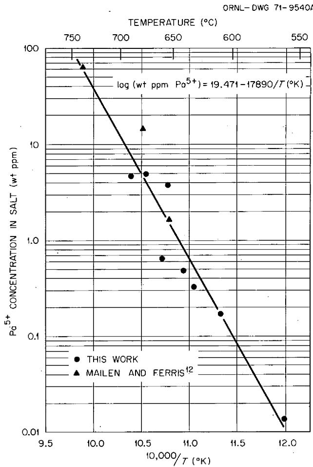  
Fig. 16.5. Solubility of $\mathrm{Pa}_2\mathrm{O}_5$ in molten LiF-BeF $_2$ -ThF $_4$ (72-16-12 mole %) that is also saturated with ThO $_2$ and NiO.

Some time ago $^{16,17}$ this concept was tested by adding gaseous $\mathrm{UF}_6$ at $600^{\circ}\mathrm{C}$ to $\mathrm{LiF - ZrF_4}$ (51-49 mole %) that initially contained about 1 wt $\%$ UF $_4$ . The salt, which was held in a nickel vessel, was sparged with hydrogen after the addition of UF $_6$ . All of the UF $_6$ added to the system was absorbed by the salt; however, the uranium was found to be almost entirely in the $4+$ oxidation state even before hydrogen was admitted to the system. It was postulated that UF $_5$ was initially formed according to reaction (15) and that the UF $_5$ was very

rapidly reduced by the nickel container according to the reaction

$$
2 \mathrm {U F} _ {5} (\mathrm {d}) + \mathrm {N i} (\mathrm {s}) = 2 \mathrm {U F} _ {4} (\mathrm {d}) + \mathrm {N i F} _ {2} (\mathrm {d}). \tag {17}
$$

We have begun a more comprehensive study of the chemistry involved in the fuel reconstitution step. Our initial goals were to establish the validity of the stoichiometry of reaction (15) and to find a suitable material for containing molten-salt solutions in which uranium is present in oxidation states higher than $4+$ .

The experimental equipment is shown schematically in Fig. 16.6. The $\mathrm{UF}_6$ generation system consisted of a 1-lb $\mathrm{UF}_6$ cylinder fitted with the appropriate control valves and gages and a calibrated DP cell for the accurate control of $\mathrm{UF}_6$ flow rates. The entire generation system was wrapped with resistance heaters and thermal insulation so that it could be maintained at 65 to $70^{\circ}\mathrm{C}$ . The nickel reaction vessel, which was similar to the vessels used in our related studies, was equipped with $1/4$ -in.-diam ports for a thermowell and sparge tube and a $1/2$ -in.-diam ball-valve sample port.

The general experimental procedure used was as follows: First, the $\mathrm{UF}_6$ generation system was repeatedly pressurized and purged with $\mathrm{UF}_6$ at about 15 psig in order to remove argon from the lines and valves. Excess $\mathrm{UF}_6$ was vented to NaF trap No. 1 (Fig. 16.6).

A predetermined amount of $\mathrm{UF}_6$ was then metered into purified molten salt contained in a crucible inside the nickel reaction vessel. The $\mathrm{UF}_6$ flow rates generally ranged from 0.1 to $0.25\mathrm{g / min}$ . Argon was admitted at a low flow rate at point $B$ (Fig. 16.6) at the same time that $\mathrm{UF}_6$ was flowing into the reaction vessel. This argon flow was maintained after the $\mathrm{UF}_6$ introduction period until the thermocouple and sparge tube had been retracted to positions above the salt level. The system was then left under argon for the desired period of time before the salt was sampled. Samples were taken by inserting a cold graphite rod through the ball valve into the salt and withdrawing it rapidly. The sample was hydrolyzed in phosphoric acid, and the resultant solution was analyzed for total uranium and $\mathrm{U^{6 + }}$ . We assumed that uranium present in the salt in an oxidation state other than $4+$ was present as $\mathrm{UF}_5$ , and thus on hydrolysis the following reaction occurred:

$$
2 \mathrm {U} ^ {5 +} = \mathrm {U} ^ {4 +} + \mathrm {U} ^ {6 +}. \tag {18}
$$

Obviously, when all the uranium in the salt is present in the $5+$ state, the $\mathrm{U}^{6+}$ concentration is one-half the total uranium concentration.

Our first series of experiments was initiated by loading $2.9\mathrm{g}$ of $\mathrm{UF_4}$ and $197.1\mathrm{g}$ of $\mathrm{LiF - BeF_2 - ThF_4}$ (72-16-12 mole $\%$ ) into a high-density, high-purity

ORNL-DWG 71-9542A

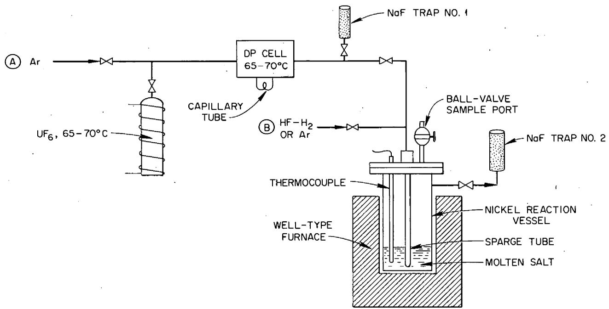  
Fig. 16.6. Schematic diagram of apparatus used in the study of the reaction of gaseous $\mathrm{UF_6}$ with $\mathrm{UF_4}$ dissolved in a molten fluoride salt.

graphite crucible, which was then sealed in the nickel reaction vessel under argon and heated to $600^{\circ}\mathrm{C}$ . When molten, the salt produced a pool about 2 in. deep. The salt was then sparged with $\mathrm{HF - H_2}$ (50-50 mole $\%$ ) for about two days to ensure dissolution of the $\mathrm{UF_4}$ and to remove oxide from the system. The sparge tube used for the hydrofluorination was fabricated of a relatively low-density spectrographic-grade graphite. Analysis of the salt after hydrofluorination gave the expected 1.1 wt $\%$ uranium. With the system at $600^{\circ}\mathrm{C}$ , we attempted to introduce $\mathrm{UF_6}$ gas into the system through the graphite sparge tube, which extended to within $1/4$ in. of the bottom of the reaction vessel. However, the $\mathrm{UF_6}$ was quantitatively reduced to $\mathrm{UF_4}$ at the inlet of the tube, even though the temperature was $200^{\circ}\mathrm{C}$ or lower at this point. Analysis of the salt after this attempt showed that the uranium concentration in the salt was still 1.1 wt $\%$ .

Prior to a second test, the graphite sparge tube was replaced by one made of high-fired $\mathrm{Al}_{2}\mathrm{O}_{3}$ . Then, five times the amount of $\mathrm{UF}_6$ necessary to convert the uranium to $\mathrm{UF}_5$ was fed to the system. Following the addition, the $\mathrm{Al}_{2}\mathrm{O}_{3}$ sparge tube was retracted to a position above the liquid salt, and the system was maintained under an argon atmosphere for several hours before the salt was sampled. Analyses showed that all of the uranium added to the system was present in the salt (the uranium concentration had increased from 1.1 to 5.1 wt $\%$ ), but little, if any, $\mathrm{UF}_5$ was produced. The $\mathrm{Al}_{2}\mathrm{O}_{3}$ sparge tube had been severely corroded.

The $\mathrm{Al}_{2}\mathrm{O}_{3}$ sparge tube was replaced by one made of copper, and the amount of $\mathrm{UF}_6$ required to convert all of the $\mathrm{UF}_4$ in the salt to $\mathrm{UF}_5$ was introduced. The copper sparge tube was then retracted so that it was not in contact with the molten salt, and the system was again maintained under argon for several hours before the salt was sampled. Analyses of the samples showed that all of the uranium introduced as $\mathrm{UF}_6$ had been absorbed in the salt; the total uranium concentration was now 9.63 wt %. About $60\%$ of the uranium was present as $\mathrm{UF}_5$ , and the $\mathrm{Cu} / \mathrm{UF}_4$ ratio was about 1. The copper sparge tube was badly corroded. Either the copper had reacted with $\mathrm{UF}_6$ according to the reaction

$$
\mathrm {U F} _ {6} (\mathrm {g}) + \mathrm {C u} (\mathrm {s}) = \mathrm {U F} _ {4} (\mathrm {d}) + \mathrm {C u F} _ {2} (\mathrm {d}) \tag {19}
$$

during the 0.5-hr period in which $\mathbf{U}\mathbf{F}_6$ was being added to the system, or it was corroded according to the following sequence of reactions:

$$
\mathrm {U F} _ {6} (\mathrm {g}) + \mathrm {U F} _ {4} (\mathrm {d}) = 2 \mathrm {U F} _ {5} (\mathrm {d}), \tag {15}
$$

$$
2 \mathrm {U F} _ {5} (\mathrm {d}) + \mathrm {C u} (\mathrm {s}) = \mathrm {C u F} _ {2} (\mathrm {d}) + 2 \mathrm {U F} _ {4} (\mathrm {d}). \tag {20}
$$

Despite the corrosion of the copper sparge tube, the results of this test strongly indicated that the graphite crucible was inert, at least for a short time, to $\mathrm{UF}_5$ dissolved in a molten salt.

Even more convincing evidence for the stability of graphite to dissolved $\mathrm{UF}_5$ was obtained in the final test in this series. The salt from the prior test involving the copper sparge tube was left at $600^{\circ}\mathrm{C}$ under argon for about two days while we awaited analyses of the samples. Once these analyses were available, the amount of $\mathrm{UF}_6$ necessary to convert the $40\%$ of the uranium calculated to be present as $\mathrm{UF}_4$ to $\mathrm{UF}_5$ was admitted to the system through a gold sparge tube. The gold was unaffected during the 0.5-hr period required for the addition of the $\mathrm{UF}_6$ . After the gold sparge tube had been retracted, the salt was left under argon for about 6 hr before it was sampled. Analyses confirmed not only that all of the uranium added as $\mathrm{UF}_6$ had been absorbed (the total uranium concentration was 12.8 wt $\%$ compared with the expected $12.5\%$ ) but also that the uranium was present in the salt, within analytical uncertainty, as $\mathrm{UF}_5$ (the $\mathrm{U}^{6+}$ concentration in the acid was equivalent to $6.57\% \mathrm{U}^{5+}$ in the salt). These results strongly indicate that the $\mathrm{UF}_5$ concentration in the salt had not been reduced in the two-day period between the tests with the copper and gold sparge tubes, providing additional confirmation that graphite is stable to $\mathrm{UF}_5$ dissolved in molten LiF-BeF $_2$ -ThF $_4$ (72-16-12 mole $\%$ ). These results also support the stoichiometry of reaction (15) and suggest that gold would be a suitable material for the containment of dissolved $\mathrm{UF}_5$ . Consequently, we are planning an experiment in gold apparatus not only to evaluate the long-term stability of gold to dissolved $\mathrm{UF}_5$ but also to obtain further confirmation of the stoichiometry of reaction (15).

# 17. Engineering Development of Processing Operations

L. E. McNeese

Studies related to the development of a number of processing operations were continued during this report period. Additional information on the behavior of lithium during metal transfer experiment MTE-2 was developed. The data are consistent with recently obtained data on the concentration of lithium in LiCl that is in equilibrium with lithium-bismuth solutions. A new experiment (MTE-2B) is under way to study further the transfer of lithium from a Li-Bi solution containing lithium at the concentration proposed for extracting trivalent rare earths from lithium chloride (5 at. %). Studies on mechanically agitated salt-metal contactors, which are being developed as an alternative to packed columns, were also continued during this period. The design of the third engineering experiment for development of the metal transfer process (MTE-3) has been completed, and most of the equipment has been fabricated. Installation of the completed equipment items is in progress. Mass transfer experiments were begun in which the rate of transfer of zirconium from molten salt to bismuth was measured during the countercurrent contact of salt and bismuth in a packed column. Equations were developed for predicting the rate of heat generation in a frozen-wall fluorinator that uses radio-frequency induction heating. Calculations were carried out for predicting the performance of continuous fluorinators. The installation of equipment for engineering studies on uranium oxide precipitation was completed, and two experiments were carried out. Work on the design of a processing materials test stand and the molybdenum reductive extraction equipment

was continued. Studies of a salt-bismuth interface detector for use in salt-metal contactors were also continued.

# 17.1 LITHIUM TRANSFER DURING METAL TRANSFER EXPERIMENT MTE-2

E. L. Youngblood L. E. McNeese

Additional analytical results were obtained for the concentration of lithium in the Li-Bi solution used for extracting rare earths from lithium chloride in metal transfer experiment MTE-2, which was completed previously. During the experiment, $^{1}$ the lithium concentration decreased from an initial value of 0.35 to 0.18 mole fraction after about 570 liters of lithium chloride had been contacted with the Li-Bi solution (see Fig. 17.1). Only a small fraction of this decrease can be accounted for by the reaction of rare earths with lithium. The major portion of the decrease is believed to be associated with the circulation of the lithium chloride since little or no decrease occurred during periods in which LiCl was not circulated. Recently, it has been determined that the equilibrium concentrations of lithium and bismuth in lithium chloride in contact with lithium-bismuth solutions are appreciable

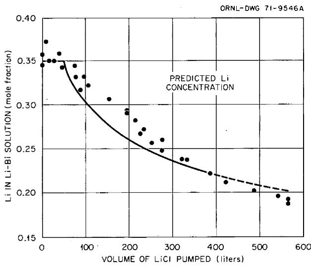  
Fig. 17.1. Variation of lithium concentration in the Li-Bi solution used for removing rare earths from LiCl during metal transfer experiment MTE-2.

and that they increase markedly as the lithium concentration in the metal phase is increased (see Sect. 15).

A mathematical analysis has been carried out using the recently obtained data on the equilibrium lithium concentration in lithium chloride in contact with Li-Bi solutions. These data can be represented by the relation:

$$
x _ {\mathrm {L i} (\mathrm {L i C l})} = 0. 2 2 7 8 x _ {\mathrm {L i} (\mathrm {B i})} ^ {5. 5 1}, \tag {1}
$$

where

$x_{\mathrm{Li(LiCl)}} =$ concentration of lithium in lithium chloride, mole fraction,

$x_{\mathrm{Li(Bi)}} =$ concentration of lithium in lithium-bismuth solution, mole fraction.

In experiment MTE-2, lithium would have been removed from the lithium-bismuth solution as a result of (1) circulation of the LiCl and (2) extraction of materials into the lithium-bismuth solution. During the period of interest (which constitutes most of the experiment), only lanthanum was present in sufficiently high concentrations to react with an appreciable amount of lithium. Thus a material balance on lithium in the Li-Bi solution can be written as follows:

$$
- V _ {\mathrm {B i} - \mathrm {L i}} \frac {d}{d t} x _ {\mathrm {L i} (\mathrm {B i})} = f F x _ {\mathrm {L i} (\mathrm {L i C l})} + R _ {\mathrm {L a}}, \tag {2}
$$

where

$$
\begin{array}{l} V _ {\mathrm {B i - L i}} = \text {v o l u m e o f t h e b i s m u t h - l i t h i u m s o l u t i o n}, \\ \text {m o l e s ,} \end{array}
$$

$$
\begin{array}{l} x _ {\text {L i (B i)}} = \text {c o n c e n t r a t i o n o f l i t h i u m i n l i t h i u m -} \\ \text {b i s m u t h s o l u t i o n , m o l e f r a c t i o n ,} \end{array}
$$

$$
t = \text {t i m e}, \min ,
$$

$$
f = \text {f r a c t i o n a l} \quad \text {a p p r o c h} \quad \text {t o} \quad \text {e q u i l i b r i u m} \quad \text {o b t a i n e d} \quad \text {a t} \quad \text {t h e} \quad \text {L i C l - L i - B i}
$$

$$
\begin{array}{l} F = \text {l i t h i u m c h l o r i d e c i r c u l a t i o n r a t e , m o l e s /} \\ \min , \end{array}
$$

$$
\begin{array}{l} x _ {\mathrm {L i (L i C l)}} = \text {c o n c e n t r a t i o n o f l i t h i u m i n l i t h i u m c h l o r d e i n e q u i l i b r i u m w i t h L i - B i s o l u t i o n ,} \\ \text {m o l e f r a c t i o n ,} \end{array}
$$

$$
R _ {\mathrm {L a}} = \text {r a t e} \text {a t} \text {w h i c h} \quad \text {l i - B i} \quad \text {s o l u t i o n} \quad \text {b y} \quad \text {r e a c t i o n} \quad \text {w i t h} \quad \mathrm {L a C l} _ {3}, \quad \text {m o l e s / m i n}.
$$

In the above relation, it has been assumed that essentially all of the lithium was removed from the lithium chloride by extraction into the main bismuth pool in the experiment. Equation (1) was substituted into Eq. (2), and the resulting equation was solved numerically for various values of $f$ in order to determine the value that best represented the data. The curve shown in Fig. 17.1, which resulted from an $f$ value of 0.37, is in good agreement with the measured lithium concentration in the Li-Bi solution during the experiment, and the value of $f$ is in reasonable agreement with the value of 0.2 reported earlier, based on the rate of accumulation of lanthanum and neodymium in the Li-Bi solution. It should be observed that essentially no transfer of lithium occurred until after about 50 liters of lithium chloride had been circulated; at this time, operation of a gas sparge tube in the Li-Bi container was initiated. Similar behavior was observed in determining the rate of accumulation of lanthanum and neodymium in the Li-Bi solution during this period in that essentially no accumulation was observed until the sparge tube was activated. The agreement of the measured lithium concentration with the predicted values was less satisfactory after a total of 400 liters of lithium chloride had been circulated because, by this time, a hole had developed in the Li-Bi container. This hole caused poor contact of part of the solution with the lithium chloride during the remainder of the experiment. Thus the measured lithium concentrations would be expected to be lower than the predicted values, as is observed in Fig. 17.1.

The agreement between the predicted and observed behavior of lithium in experiment MTE-2 provides good confirmation of the recently measured data on the equilibrium concentration of lithium in lithium chloride in contact with a lithium-bismuth solution having a high lithium concentration.

# 17.2 OPERATION OF METAL TRANSFER EXPERIMENT MTE-2B

# E. L. Youngblood L. E. McNeese

As discussed in the previous section, a much larger decrease than expected was observed in the lithium concentration in the bismuth into which rare earths were extracted from the lithium chloride in metal transfer experiment MTE-2. A new experiment, designated MTE-2B, is now under way to study further the transfer of lithium from a lithium-bismuth solution containing lithium at the concentration proposed for extracting trivalent rare earths from lithium chloride (i.e., 5 at. $\%$

The experimental equipment is shown schematically in Fig. 17.2. All components that contact salt and

bismuth are fabricated of carbon steel. The main vessel is constructed of 6-in.-diam sched 40 pipe and is divided into two compartments by a partition that extends to within $5/8$ in. of the bottom of the vessel. The two compartments are interconnected by a pool of bismuth containing reductant. One compartment contains fluoride salt (67-33 mole $\%$ LiF-BeF $_2$ ) to which were added 11 mCi of $^{147}\mathrm{NdF}_3$ and sufficient $\mathrm{ThF_4}$ to produce a concentration of 0.19 mole $\%$ . The other compartment contains lithium chloride. A separate, electrically insulated vessel containing a 5 at. $\%$ Li-Bi solution is connected to the lithium chloride compartment with a $1/4$ -in.-diam sched 80 pipe. During operation, molten lithium chloride is circulated between the Li-Bi vessel and the compartmented vessel by pressurizing the Li-Bi container with argon. Gas-lift sparge tubes are used to improve the contact of the salt and metal phases. The experiment is being operated at $645^{\circ}\mathrm{C}$ .

The quantities of materials used in the experiment are shown in Table 17.1. These materials were purified for removal of oxides prior to being used in the experiment. The two bismuth phases were sparged with $\mathbf{H}_2$ at $650^{\circ}\mathbf{C}$ for $12\mathrm{hr}$ and were charged to the carbon-steel

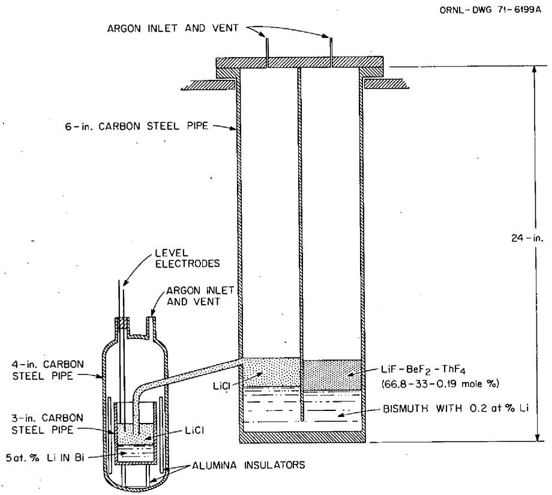  
Fig. 17.2. Schematic diagram of equipment used for metal transfer experiment MTE-2B.

Table 17.1. Materials used in metal transfer experiment MTE-2B   

<table><tr><td></td><td>Volume (cm3)</td><td>Moles (g)</td></tr><tr><td>Fluoride salt (LiF-BeF2-ThF4, 66.8-33-0.19 mole % plus 11 mCi of 147Nd as tracer)</td><td>794</td><td>47</td></tr><tr><td>Bismuth (containing about 50 ppm of Li and 200 ppm of Th)</td><td>1130</td><td>52</td></tr><tr><td>LiCl</td><td>1338</td><td>47</td></tr><tr><td>Li-Bi (5 at. % Li)</td><td>187</td><td>9</td></tr></table>

vessel, which had also been contacted with hydrogen at $650^{\circ}\mathrm{C}$ for $12\mathrm{hr}$ . The lithium chloride was contacted with bismuth that had been saturated with thorium at $650^{\circ}\mathrm{C}$ , and the fluoride salt was obtained in purified form from the Reactor Chemistry Division.

The experiment is designed in a manner such that data on lithium transfer can be obtained by the following independent methods:

1. Direct determination of lithium in the Li-Bi solution used for extraction of rare earths from the lithium chloride.   
2. Direct determination of the lithium and thorium concentrations in LiCl in equilibrium with the Li-Bi solution.   
3. Determination of the rate at which lithium is transferred from the Li-Bi solution to the main bismuth pool, as indicated by changes in the distribution ratios for thorium and $^{147}\mathrm{Nd}$ . The composition of the fluoride salt and the relative volumes of fluoride salt and bismuth were chosen such that the maximum thorium concentration that can be attained in the bismuth is only one-half the solubility of thorium in bismuth. This will prevent the bismuth phase from becoming saturated with thorium. If saturation occurs, the thorium and neodymium distribution ratios will not be sensitive to transfer of lithium into the main bismuth pool.   
4. Measurement of the voltage that is developed when the two bismuth phases containing lithium are connected by the lithium chloride. It was anticipated that the developed voltage could be interpreted in terms of a concentration cell involving bismuth phases that contain lithium at different concentrations.

Data obtained thus far are summarized in Table 17.2. During the first two weeks of the experiment, decreases were observed in the concentrations of lithium in the Li-Bi solution and in the main bismuth pool. Simultaneous decreases were noted in the distribution coefficients for thorium and neodymium, whereas an increase was noted in the emf measured between the two bismuth phases. We believe the decreases in the lithium concentrations resulted from reaction of lithium with impurities in the system. Two weeks after the beginning of the experiment, $8.5\mathrm{g}$ of thorium was added to the Th-Bi solution in order to increase the concentration of reductant to the desired value. At this time, the measured emf between the two bismuth phases decreased to near the expected value of about $250\mathrm{mV}$ , and the distribution values for thorium and neodymium increased to about the expected values. During the subsequent operating period, the lithium concentration in the Li-Bi solution decreased slightly (from 4.40 to 4.0 mole $\%$ ), as shown in Fig. 17.3. During this period, the emf measured between the two bismuth phases increased steadily from about 250 to about $276\mathrm{mV}$ . Calculated values for the lithium concentration in the Th-Bi solution, based on the measured emf values and the concentration of lithium in the Li-Bi solution, are observed to be in reasonable agreement with lithium concentrations determined by analysis. Data on the variations of the thorium and neodymium distribution ratios during the experiment are shown in Fig. 17.4. Calculated results based on emf measurements and on lithium analyses of the Th-Bi solution are shown for comparison with experimentally determined values. Although the scatter in the experimental data is appreciable, the values appear to lie closer to the results that are based on emf measurements than to those based on lithium analyses.

Several conclusions can be drawn from these data. The observed decrease in the lithium concentration in the Li-Bi solution represents an equilibrium lithium concentration in the LiCl of less than 0.3 wt ppm; however, transfer of this amount of lithium from the Li-Bi solution to the Th-Bi solution would have increased the concentration of reductant in the Th-Bi solution by about $10\%$ and would have also increased the neodymium and thorium distribution ratios by about 33 and $46\%$ respectively. In addition, a decrease in measured emf of about $5\%$ would have been observed. The data appear to be consistent with a slight loss of reductant from both the Li-Bi and the Th-Bi solutions by reaction with impurities in the system. It is believed that further operation of the experiment will

Table 17.2. Summary of data from metal transfer experiment MTE-2B   

<table><tr><td rowspan="2">Time (days)</td><td rowspan="2">Pumping Time (hr)</td><td rowspan="2">Volume of LiCl pumped (liters)</td><td rowspan="2">Measured emf (mV)</td><td colspan="2">Li concentration in:</td><td colspan="3">Measured distribution ratios</td><td colspan="2">Inventories (%)</td><td rowspan="2">Comments</td></tr><tr><td>Li-Bi solution (mole %)</td><td>Main Bi pool (mole %)</td><td>Thorium between Bi and fluoride</td><td>Neodymium between Bi and fluoride</td><td>Neodymium between Bi and LiCl</td><td>Thorium</td><td>Neodymium</td></tr><tr><td>0</td><td>0</td><td>0</td><td>254a</td><td>4.93a</td><td>0.196a</td><td>0.15</td><td></td><td></td><td>41</td><td>100</td><td></td></tr><tr><td>7</td><td>0</td><td>0</td><td>332</td><td>4.88</td><td></td><td></td><td>0.00003</td><td>0.006</td><td></td><td>106</td><td></td></tr><tr><td>12</td><td>0</td><td>0</td><td>345</td><td>4.33</td><td>0.02</td><td>0.003</td><td>&lt;0.00004</td><td>&lt;0.0003</td><td>150</td><td>69</td><td></td></tr><tr><td>14</td><td>0</td><td>0</td><td></td><td></td><td></td><td></td><td></td><td></td><td></td><td></td><td>Added 8.5 g of thorium to Th-Bi solution</td></tr><tr><td>15</td><td>0</td><td>0</td><td>250</td><td></td><td></td><td></td><td>0.07</td><td>2.6</td><td></td><td>50</td><td></td></tr><tr><td>18</td><td>0</td><td>0</td><td>253</td><td>4.33</td><td>0.169</td><td>0.10</td><td>0.16</td><td>2.5</td><td>86</td><td>20</td><td></td></tr><tr><td>20</td><td>7.3</td><td>11.6</td><td>255</td><td>4.60</td><td>0.157</td><td>0.10</td><td>0.15</td><td>1.4</td><td>87</td><td>11</td><td></td></tr><tr><td>22</td><td>21.0</td><td>36.6</td><td>255</td><td>4.05</td><td></td><td></td><td>0.18</td><td>1.7</td><td></td><td>10</td><td></td></tr><tr><td>25</td><td>27.7</td><td>46.9</td><td>253</td><td>4.60</td><td>0.30</td><td>0.08</td><td>0.16</td><td>1.2</td><td>96</td><td>6</td><td></td></tr><tr><td>27</td><td>41.8</td><td>69.9</td><td>253</td><td>4.60</td><td>0.151</td><td>0.11</td><td>0.18</td><td>1.8</td><td>84</td><td>8</td><td></td></tr><tr><td>32</td><td>62.4</td><td>103.7</td><td>260</td><td>4.05</td><td>0.157</td><td>0.06</td><td>0.15</td><td>3.5</td><td>91</td><td>10</td><td></td></tr><tr><td>34</td><td>81.6</td><td>131.9</td><td>259</td><td>4.60</td><td>0.139</td><td>0.07</td><td>0.15</td><td>1.7</td><td>76</td><td>10</td><td></td></tr><tr><td>39</td><td>160.2</td><td>244.6</td><td>267</td><td>4.33</td><td>0.151</td><td>0.06</td><td>0.12</td><td>1.5</td><td>78</td><td>5</td><td></td></tr><tr><td>41</td><td>173.4</td><td>265.0</td><td>262</td><td>4.60</td><td>0.160</td><td>0.05</td><td>0.06</td><td>0.6</td><td>75</td><td>5</td><td></td></tr><tr><td>46</td><td>194.3</td><td>293.3</td><td>264</td><td>4.05</td><td>0.111</td><td>0.04</td><td>0.20</td><td>0.4</td><td>85</td><td>4</td><td></td></tr><tr><td>53</td><td>280.7</td><td>428.0</td><td>273</td><td>4.05</td><td>0.142</td><td>0.03</td><td>0.09</td><td>1.2</td><td>76</td><td>11</td><td></td></tr><tr><td>60</td><td>384.7</td><td>591.1</td><td>276</td><td>4.05</td><td>0.0994</td><td></td><td>0.06</td><td>0.4</td><td></td><td>13</td><td></td></tr></table>

$a_{\mathrm{Calculated}}$ value.

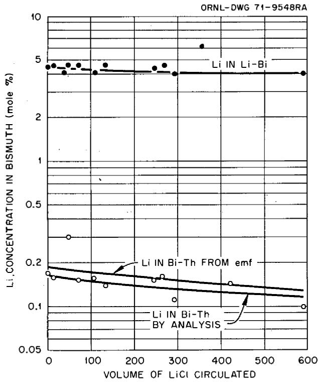  
Fig. 17.3. Variation of lithium concentration in Li-Bi and Th-Bi solutions during experiment MTE-2B.

show lower equilibrium lithium concentrations in the LiCl in contact with the 5 at. $\%$ Li-Bi solution than the present limit of about 0.3 wt ppm of lithium.

# 17.3 DEVELOPMENT OF MECHANICALLY AGITATED SALT-METAL CONTACTORS

H. O. Weeren L. E. McNeese

Mechanically agitated salt-metal contactors are being developed as an alternative to packed columns for MSBR processing systems. This type of contactor is of particular interest for use in the metal transfer process since designs can be envisioned in which the bismuth in the contactor would be a near-isothermal, internally circulated captive phase. It is believed that contactors of this design may be easier to fabricate than packed column contactors. The proposed contactor, shown schematically in Fig. 17.5, consists of a vessel that is divided into two compartments by a central partition that does not extend to the bottom of the vessel. A seal between the two compartments is provided by a pool of bismuth that will contain reductant. In operation, fuel carrier salt containing rare earths will flow through one

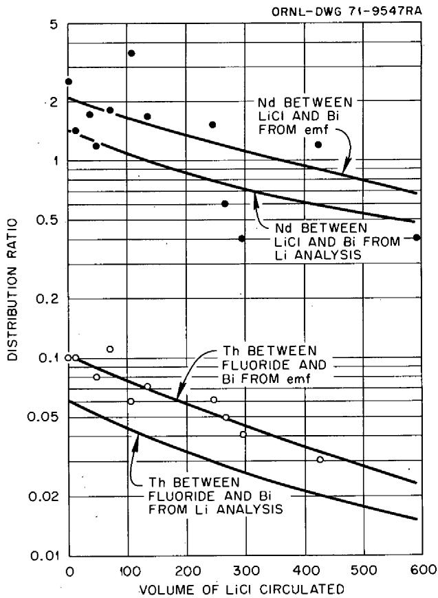  
Fig. 17.4. Variation of Nd and Th distribution ratios during experiment MTE-2B.

compartment, and lithium chloride will be circulated through the other compartment. An agitator having a paddle in each phase will be placed in each of the compartments. The paddles will be located at a considerable distance away from the interface, and the phases will be agitated as vigorously as possible without actually causing dispersion of one phase in the other.

The hydrodynamic performance of this type of contactor has been investigated using water and mercury to simulate molten salt and bismuth in order to determine favorable operating conditions. Test of several sizes of contactors with different agitator arrangements established that the common factor that limits the agitator speed is entrainment of water in the mercury circulating between the two halves of the contactor. Entrainment of water was found to begin at a definite agitator speed; below the limiting speed, no entrainment was observed. The limiting agitator speed was found to be relatively independent of the size and

ORNL-DWG 71-9544A

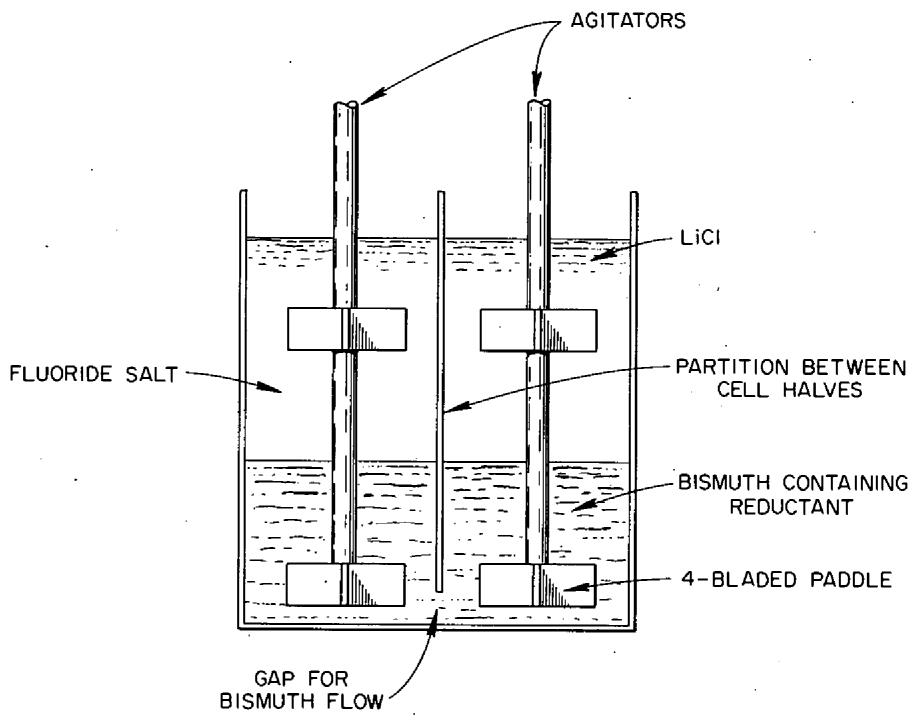  
Fig. 17.5. Mechanically agitated salt-metal contactor for metal transfer process experiments.

shape of the contactor vessel but was strongly dependent on agitator diameter, as shown in Fig. 17.6. Consideration of these data, along with data from the literature,2 on mass transfer coefficients in this type of contactor suggest that optimum mass transfer performance will be obtained by use of the largest possible agitator diameter. This will also result in the lowest possible agitator speed, which should facilitate maintaining a gas-tight seal on the agitator shaft.

It was found that the distance between the lower edge of the partition and the bottom of the contactor vessel could be increased from $\frac{1}{4}$ to $\frac{3}{4}$ in. without appreciably affecting the limiting agitator speed. However, the limiting agitator speed was reduced as the separation distance was increased above $\frac{3}{4}$ in. Considerably higher limiting agitator speeds could be obtained when the agitator blades were canted at a $45^{\circ}$ angle instead of being vertical and the direction of rotation was such that the agitator lifted the mercury phase toward the

mercury-water interface. It is believed that the entrainment of water in the mercury phase results from flow of water down the agitator shaft to a point below the water-mercury interface, where it is then dispersed into the mercury phase. The limiting agitator speed with canted blades was decreased significantly when the contactor contained baffles or other items such as thermowells or sampling tubes. In all cases, however, a higher limiting agitator speed was obtained with canted blades than with vertical ones.

A test was also carried out to observe the effect on contactor performance of the difference in densities of the two phases. The test was made in a heated contactor with Cerrolow-105 (42.9-21.7-18.3-8.0-5.0-4.0 wt $\%$ Bi-Pb-In-Sn-Cd-Hg) and water. The metal phase has a density of $8.1\mathrm{g/cm^3}$ and a liquidus temperature of about $38^{\circ}\mathrm{C}$ . At the operating temperature of $60^{\circ}\mathrm{C}$ , the limiting agitator speed was nearly identical to that obtained with mercury and water in the same contactor. Thus, it appears that the performance of the contactor will not depend significantly upon the difference in the densities of molten salt and bismuth.

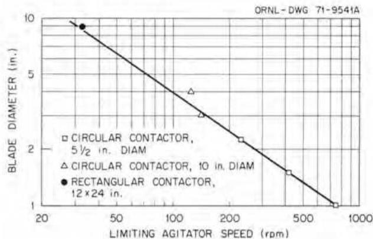  
Fig. 17.6. Correlation of limiting agitator speed with agitator diameter in several contactors.

The rate at which mercury circulated between the two halves of a 10-in.-diam contactor having a 3-in.-diam agitator was determined by measuring the rate of return of the liquids to a common temperature on resumption of mercury flow after one side of the cell had been chilled and the other side of the cell had been heated. The mercury flow rate was found to be about 15 liters/min and depended, to some extent, on propeller configuration. A bismuth circulation rate of 0.5 liter/min or greater is desired in the contactor for metal transfer experiment MTE-3, which uses a 10-in.-diam contactor. Thus, it appears that circulation of the bismuth phase will be more than adequate.

# 17.4 DESIGN OF THE THIRD METAL TRANSFER EXPERIMENT

E. L. Nicholson W. F. Schaffer, Jr.

L.E.McNeese E.L.Youngblood

H. O. Weeren

The design of the third engineering experiment MTE-3 for development of the metal transfer process for removing rare earths from MSBR fuel carrier salt has been completed. Most of the equipment has been fabricated, and the main process vessels are now being installed. This experiment will use salt flow rates that are $1\%$ of the estimated flow rates required for processing a 1000-MW(e) reactor. The planned experiment and equipment have been described previously.[3]

The three carbon steel vessels required for the experiment are shown in Fig. 17.7. The fluoride salt reservoir is on the left, the compartmented salt-metal contactor is in the center, and the rare-earth stripper vessel is on the right. The fluoride salt pump, which has been fabricated, will be inserted in the large flange on the fluoride salt reservoir. Both the pump discharge line to the salt-metal contactor and the return stream from the contactor pass through the upper horizontal 3-in.-diam pipe between the two vessels. The lower pipe is a structural member. The agitators for promoting contact of the salt and bismuth will be mounted on the two flanged nozzles on the salt-metal contactor vessel (only one nozzle can be seen in this view) and on the vertical flanged nozzle on the rare-earth stripper. The lithium chloride will be pumped back and forth between the salt-metal contactor and the rare-earth stripper vessel by varying the gas pressure in the stripper vessel. Figure 17.8 shows a detailed view of the top of the rare-earth stripper vessel with the agitator shaft seal housing and shaft cooler installed in the agitator nozzle. The vessel is

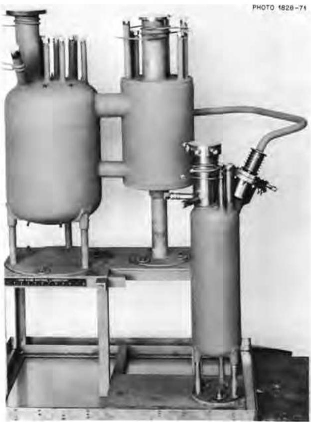  
Fig. 17.7. Equipment for metal transfer experiment MTE-3.

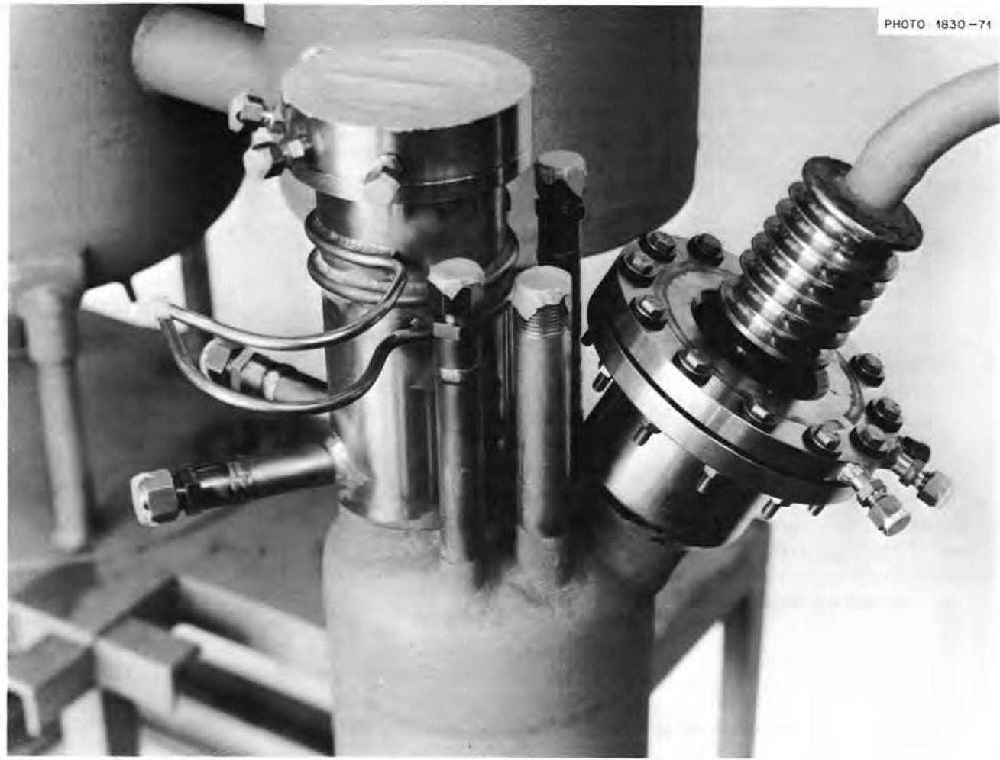  
Fig. 17.8. Top of rare-earth stripper vessel showing the nozzles.

electrically insulated from the other equipment to minimize the rate of transfer of lithium between the two bismuth pools (which have different lithium concentrations) in the experiment. The LiCl transfer line is constructed of $3/4$ -in. sched 80 pipe and is insulated from the rare-earth stripper vessel by the water-cooled, Teflon-gasketed flange assembly shown on the right side of the figure. The portion of the carbon-steel pipe located adjacent to the cooled flanges is heated by a nickel-jacketed copper sleeve on which a Calrod heater will be mounted. The method used for mounting the heater will facilitate replacement of the heater in the event that this becomes necessary. The heater will be wound in the grooves in the enlarged threaded part of the nickel-clad copper sleeve. This figure also shows the flame-sprayed, oxidation-resistant

nickel aluminide coating that was applied to the carbon-steel parts of the vessel.

We are still testing the agitator drive unit and the nonlubricated shaft seal assembly, which is water-cooled and buffered with inert gas. The assembly contains two standard graphite-impregnated Teflon Bal-Seals (product of Bal-Seal Engineering Co.). Figure 17.9 shows the test equipment prior to completion of the piping and installation of the electrical heaters and thermal insulation. Two seals were tested initially for $820\mathrm{hr}$ at shaft speeds of 150 to $750~\mathrm{rpm}$ while salt and bismuth were agitated at $650^{\circ}\mathrm{C}$ in the 3-in.-diam test vessel. The seals were buffered with argon at 16 psig. After an initial run-in period, the seal leak rate was about $8.6~\mathrm{cm}^3$ of gas per hour. After $700\mathrm{hr}$ of operation, the leak rate increased rapidly up to the time

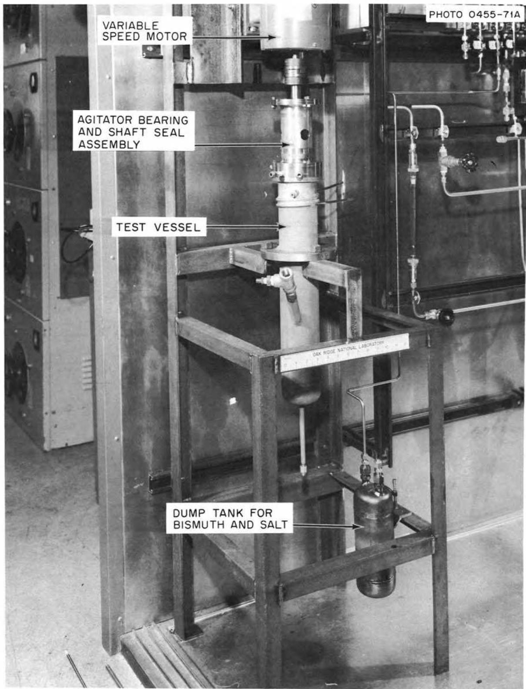  
Fig. 17.9. Equipment for testing the agitator drive and the shaft seal assembly.

the test was terminated. Gas leakage was principally to the outside rather than into the vessel. On completion of the test, examination of the upper seal ring showed signs of excessive wear. Therefore, both seals were replaced with a new flange-mounting type of seal that had light-duty seal expander springs and a thicker cross section. The seal holder was also modified to facilitate self-centering of the seals on the shaft. Subsequent tests were made at room temperature, since the previous tests showed that the shaft and seal cooling system maintained the critical parts at room temperature with salt and bismuth in the vessel at $650^{\circ}\mathrm{C}$ . After preliminary testing, the seals were replaced with ones having medium-duty expander springs. These seals have been operated for 200 hr at 125 rpm to date; the seal leak rate is only $0.13~\mathrm{cm}^3/\mathrm{hr}$ , which is quite satisfactory. The vapor-deposited tungsten coating on the interior of the test vessel and the sprayed stainless steel undercoat beneath the nickel aluminide protective coat on the outside will be evaluated after tests of the seal are completed. No evidence of stable emulsions of bismuth in salt was found in the first test.

# 17.5 REDUCTIVE EXTRACTION ENGINEERING STUDIES

B. A. Hannaford

W.M.Woods

D. D. Sood

L.E.McNeese

We have begun mass transfer experiments in which the rate of transfer of zirconium from molten salt to bismuth is measured by adding $^{97}\mathrm{ZrO}_2$ tracer to the salt phase prior to contacting the salt with bismuth containing reductant in a packed column. Three of the experiments (ZTR-2, -3, and -5) resulted in the transfer of 15 to $30\%$ of the $^{97}\mathrm{Zr}$ present in the salt and gave measured HTU values that ranged from 4 to 1 ft. Other experiments (ZTR-1, -4, and -6) were carried out under conditions where no transfer of tracer between phases was expected to occur.

Preparation for mass transfer experiments using $^{97}\mathbf{Zr}$ tracer. The new salt feed tank and newly installed lines were treated with hydrogen for 13 hr at $600^{\circ}\mathrm{C}$ to reduce surface oxides in preparation for the $^{97}\mathbf{Zr}$ tracer experiments. Thorium reductant was added to the bismuth in the treatment vessel, and about 18 liters of salt (72-16-12 mole % LiF-BeF $_2$ -ThF $_4$ ) was charged to the treatment vessel to replace salt that was removed when the original salt tank was replaced. The salt and bismuth were equilibrated for 20 hr and were then fed through the system to complete the removal of surface oxides not reduced by the earlier hydrogen treatment.

The measured pressure drop across the column when only salt was flowing $(\sim 70~\mathrm{ml / min})$ was about 2 in. $\mathrm{H}_2\mathrm{O}$ , which is the same value that was measured soon after the column was installed. Thus the column characteristics apparently have not changed as a result of runs made to date.

A small amount of Zircaloy-2 $(5.3\mathrm{g})$ was dissolved in the bismuth to bring the zirconium inventory in the system to about $10\mathrm{g}$ . The steel draft tube in the treatment vessel was replaced with a molybdenum tube of similar dimensions in preparation for $\mathrm{H}_2$ -HF treatment of the bismuth and salt. Following a 20-hr treatment with $30\%$ HF in $\mathrm{H}_2$ , the bismuth and salt were sparged with argon for $20\mathrm{hr}$ . A 48-g charge of thorium metal was suspended in a perforated steel basket in the bismuth phase in the treatment vessel in order to add reductant to the bismuth. After $25\mathrm{g}$ of thorium had dissolved, a 240-g batch of 1.75 wt % lithium-bismuth was added to the vessel in order to make a rapid, final adjustment of the reductant inventory to an expected value of about 1 g-equiv. Following a 22-hr equilibration period, the salt and about one-half of the bismuth were transferred to the feed tanks. Transfer of all of the bismuth was prevented by a leak in the transfer line at the weld joining the molybdenum tube to the mild-steel tube inside the treatment vessel.

A 6.7-mg quantity of $^{96}\mathrm{ZrO}_2$ that had been irradiated for 12 hr (to produce about 8 mCi of $^{97}\mathrm{Zr}$ ) was transferred to a steel capsule to facilitate its addition to the salt phase. Analyses of samples taken periodically from the salt feed tank after the capsule had been immersed in the salt indicated that the tracer was completely distributed throughout the salt after 2 hr.

Mass transfer runs using $^{97}\mathbf{Zr}$ tracer. When the $^{97}\mathbf{Zr}$ activity in the seven sets of samples taken during experiment ZTR-1 was counted, it became obvious that no measurable transfer of $^{97}\mathbf{Zr}$ tracer had occurred. The lack of transfer was due to an unexpectedly low distribution coefficient for zirconium; postrun samples from the treatment vessel showed that $D_{\mathbf{Zr}}$ was only 0.023 instead of the expected value of 1.0.

An additional 1 g-equiv of lithium, in the form of lithium-bismuth alloy, was added to the treatment vessel in preparation for experiment ZTR-2. Following a 105-hr equilibration period, a new charge of $^{97}\mathrm{Zr}$ tracer (about 10 mCi) was added to the treatment vessel. Bismuth and salt samples taken at various times showed that, when the tracer addition capsule was removed (after being immersed for 80 min in the salt), the concentration of tracer in each phase was within about 90% of the equilibrium tracer concentration that

was observed after a 32-hr period. The equilibrium distribution coefficient for zirconium, determined by $^{97}\mathrm{Zr}$ counting, was 0.32. Since the addition of reductant should have produced a $D_{\mathrm{Zr}}$ of about 5, it is believed that reductant was consumed by side reactions with materials such as HF, $\mathrm{FeF}_2$ , or air (a contaminant in the argon cover gas). The same explanation would account for very low $D_{\mathrm{Zr}}$ observed in ZTR-1. Subsequent samples demonstrated that some loss of reductant continued to occur as the mass transfer experiments were performed.

The results of the three experiments that yielded mass transfer data are summarized in Table 17.3. The calculated HTU value is quite dependent on the zirconium distribution ratio $(D_{\mathrm{Zr}})$ and the $^{97}\mathrm{Zr}$ concentration in the bismuth leaving the column. Since the quality of the data improved from run to run, the calculated HTU values are not directly comparable.

Samples of bismuth exiting from the column during the second $^{97}\mathrm{Zr}$ tracer experiment, ZTR-2, indicated that about $30\%$ of the tracer had transferred to the salt; however, analyses of salt samples indicated that only $15\%$ of the tracer had transferred. The postrun zirconium distribution ratio (determined from the $^{97}\mathrm{Zr}$ activity) was found to be 0.034. This is in excellent agreement with the value of $0.038 \pm 0.020$ , which was calculated from postrun uranium distribution data. Since the observed $^{97}\mathrm{Zr}$ transfer could not have occurred with such a low zirconium distribution coefficient, it is apparent that some loss of reductant must have occurred between the packed column and the bismuth and salt receivers.

In order to increase $D_{\mathbf{Zr}}$ before the next experiment, Li-Bi alloy containing 0.38 g-equiv of lithium was added to the treatment vessel; the addition of $9^{7}\mathrm{Zr}$ tracer indicated a $D_{\mathbf{Zr}}$ of 0.25. An additional 0.75 g-equiv of

lithium was then added to the treatment vessel, thereby increasing the $D_{\mathbf{Zr}}$ to 1.90. Since each of the additions of reductant produced an effect corresponding to only about two-thirds the amount of Li-Bi alloy added, it is possible that the lithium in the alloy was partially oxidized before it was added to the treatment vessel.

After the $^{97}\mathrm{Zr}$ tracer that was used to monitor the adjustment of $D_{\mathrm{Zr}}$ had decayed, additional $^{97}\mathrm{Zr}$ tracer was added to the salt feed tank in preparation for experiment ZTR-3. About midway of the experiment, the presence of a frozen-salt plug in the flowing salt sampler caused a brief interruption since it halted the sampling operation (Fig. 17.10). With the exception of samples that reflected the effect of this interruption, the scatter in $^{97}\mathrm{Zr}$ counting results was satisfactorily low. The fraction of tracer transferred from the salt was 0.30 and the calculated HTU was 2 ft, based on a $D_{\mathrm{Zr}}$ of 1.9. The postrun zirconium distribution coefficient, measured after a 2-hr equilibration of the salt and bismuth in the treatment vessel, was 0.77.

In order to remove suspected oxidants from the system, the bismuth and the salt were countercurrently contacted in the column about $20\mathrm{hr}$ prior to experiment ZTR-5. Tracer was then added to the salt feed tank, and run ZTR-5 was carried out with each phase having a nominal flow rate of $150~\mathrm{ml / min}$ . Counting results for five of seven bismuth samples (Fig. 17.11) were within $\pm 7\%$ of their average. However, the counting rates for the two remaining samples were 2 and 170 times the average of the other samples. Following a 3-hr equilibration period in the treatment vessel, both phases were returned to the feed tanks, and run ZTR-6 was carried out. Counting results for salt samples were comparable with results obtained during run ZTR-5. However, the tracer concentrations in bismuth samples were generally a factor of 2 to 3 times

Table 17.3. Summary of mass transfer results from experiments with ${}^{97}\mathrm{{Zr}}$ tracer   
Salt (72-16-12 mole % $\mathsf{LiF - BeF}_2\mathsf{-ThF}_4$ ) and bismuth contacted at $600^{\circ}\mathrm{C}$ in an 0.82-in.-ID by 24-in.-long packed column   

<table><tr><td>Run</td><td>Bismuth flow rate, VB(ml/min)</td><td>Salt flow rate, VS(ml/min)</td><td>Flow rate ratio, VB/VS</td><td>Zirconium distribution coefficient, DZr</td><td>Fraction of 97Zr transferred</td><td>HTU (ft)</td></tr><tr><td>ZTR-2</td><td>232</td><td>70</td><td>3.3</td><td>0.32</td><td>0.15a</td><td>~4</td></tr><tr><td>ZTR-3</td><td>93</td><td>168</td><td>0.55</td><td>1.90</td><td>0.30</td><td>2</td></tr><tr><td>ZTR-5</td><td>147</td><td>158</td><td>0.93</td><td>0.24</td><td>0.14</td><td>1</td></tr></table>

$a_{\mathrm{Value}}$ based on material balance of the salt.

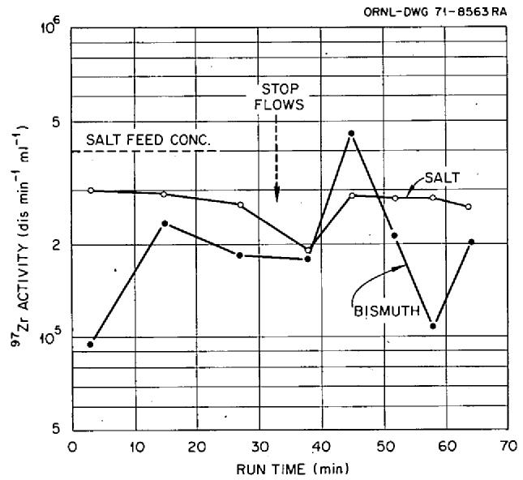  
Fig. 17.10. Zirconium-97 activity in flowing salt and flowing bismuth samples obtained in run ZTR-3. Salt flow rate, 168 ml/min; bismuth flow rate, 93 ml/min. $D_{\mathrm{Zr}} = 1.9$ :

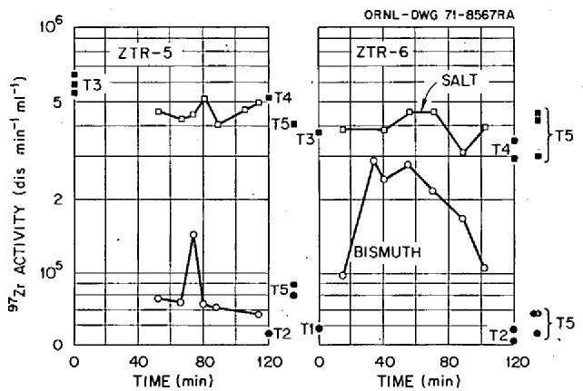  
Fig. 17.11. Results from consecutive $^{97}\mathbf{Zr}$ tracer experiments ZTR-5 and ZTR-6. $^{97}\mathrm{ZrO}_2$ tracer was added to the salt feed tank preceding ZTR-5; tracer was equilibrated in T5 preceding ZTR-6. Feed tank designations: T1 (bismuth), T3 (salt). Receiver tank designations: T2 (bismuth), T4 (salt). Treatment vessel, T5.

higher than in the previous experiment. Suspected contamination of the bismuth samples with salt was ruled out by visual inspection of several of the samples. A review of the sampling procedure indicated that small amounts of air might possibly be entering the flowing

stream samplers. Such a contaminant could have resulted in the accumulation of $^{97}\mathrm{Zr}$ , as $^{97}\mathrm{ZrO}_2$ , at the bismuth surface in the sampler; subsequently, some of this material might have been drawn into the sample capsule since the samples were taken from near the bismuth surface.

We are presently replacing several bismuth and salt transfer lines in which leaks have occurred. We are preparing for additional $97\mathrm{Zr}$ tracer mass transfer experiments that will use an improved technique for obtaining bismuth and salt samples.

# 17.6 DEVELOPMENT OF A FROZEN-WALL FLUORINATOR: INDUCTION HEATING EXPERIMENTS

J. R. Hightower, Jr.

An experiment to demonstrate protection against corrosion in a continuous fluorinator by use of a frozen wall will use high-frequency induction heating to serve as a heat source in the molten salt. Heat generation rates were measured with four induction coil designs in a system that used 31 wt $\%$ HNO $_3$ as a substitute for molten salt. With these measured heat generation rates, correction factors could be computed for use in equations for calculating the amount of heat that is induced in similar, but idealized, geometries. The equations were then used to design equipment for a molten-salt induction heating experiment for testing (1) the operation of the proposed heating system and (2) the means by which power leads are introduced into the fluorinator. The results of measurements with the nitric acid system and the design of equipment for the molten-salt induction heating test are summarized in the remainder of this section.

Results of experiments with a simulated fluorinator. The equipment for measuring heat generation rates in a system that uses $31\mathrm{wt}\% \mathrm{HNO}_3$ as a substitute for molten salt has been described previously. Twenty-nine runs were made to determine heat generation rates in the acid, in the pipe surrounding the acid, and in each of four induction coils. The length of each induction coil assembly was 5 ft, and each coil assembly was made of a number of smaller coil sections connected electrically in parallel. Each small section had an inside diameter of 5.6 in. The characteristics for each of the coil assemblies are given in Table 17.4.

Table 17.4. Characteristics of coils tested in continuous fluorinator simulation   

<table><tr><td>Coil</td><td>Material</td><td>No. of small sections</td><td>Diameter of conductor (in.)</td><td>Length of small section (in.)</td><td>No. of small sections</td><td>Winding of adjacent sections</td></tr><tr><td>I</td><td>Monel</td><td>17</td><td>1/4</td><td>3</td><td>61/4</td><td>Opposing</td></tr><tr><td>II</td><td>Stainless steel</td><td>18</td><td>3/8</td><td>3</td><td>6</td><td>Assisting</td></tr><tr><td>III</td><td>Stainless steel</td><td>18</td><td>3/8</td><td>3</td><td>6</td><td>Opposing</td></tr><tr><td>IV</td><td>Copper</td><td>10</td><td>1/4</td><td>4</td><td>113/4</td><td>Opposing</td></tr></table>

The measured heat generation rates were used to calculate correction factors for idealized design equations that had been derived previously. The design equations (which define the correction factors) are given below. The equation for heat generation within the fluid zone inside the coil is:

$$
P _ {l} = k \left[ 0. 3 8 1 8 \left(\frac {n I _ {\mathrm {t o t}}}{N _ {s}}\right) ^ {2} \left(\frac {a}{p _ {l}}\right) ^ {4} \frac {L}{g _ {l}} \right], \tag {1}
$$

where

$P_{l} =$ heat generation rate, W,

$n =$ average turns per meter over length of coil assembly,

$N_{s} =$ number of small coil sections,

$a =$ radius of fluid zone, m,

$L =$ length of coil assembly, m,

$$
p _ {l} = (2 \pi f g _ {l} \mu_ {l}) ^ {- 1 / 2},
$$

$g_{l} =$ specific conductivity of fluid, $\Omega^{-1}\mathfrak{m}^{-1}$

$\mu_{l} =$ magnetic permeability of fluid, $\mathrm{NA}^{-2}$

$f =$ frequency, $\mathrm{Hz}$

$I_{\mathrm{tot}} =$ total rms coil current, A,

$k =$ correction factor, dimensionless.

Equation (1) is an approximate equation and is valid for $(a / p_l)\leq 1.4$ . The equation for the heat generation in the pipe surrounding the coil is:

$$
P _ {p} = k _ {p} \left[ \sqrt {2 \pi} \left(\frac {n I _ {\mathrm {t o t}}}{N _ {s}}\right) ^ {2} \left(\frac {a _ {p}}{p _ {p}}\right) \frac {L}{g _ {p}} \right], \tag {2}
$$

where

$P_{p} =$ heat generated in pipe, W,

$I_{\mathrm{tot}},n,N_s,$ and $L$ are as defined for Eq. (1),

$g_{p} =$ specific conductivity of pipe material, $\Omega^{-1}\mathfrak{m}^{-1}$

$a_{p} =$ inside radius of pipe, m,

$p_{p} = (2\pi fg_{p}\mu_{p})^{-1 / 2},$

$k_{p} =$ correction factor, dimensionless,

$\mu_{p} =$ magnetic permeability of pipe material, $\mathrm{NA}^{-2}$

This equation is valid for $(a_{p} / p_{p}) > 10$ . The equation for the heat generated in the induction coil is:

$$
P _ {c} = K _ {1} \frac {b N _ {T} ^ {2}}{N _ {s}} \cdot \left(\frac {f _ {1} \sigma_ {c}}{d _ {c} l _ {c}}\right) ^ {1 / 2} I _ {\text {t o t}} ^ {2} L, \tag {3}
$$

where

$I_{\mathrm{tot}},L,$ and $N_{s}$ are as defined in Eqs. (1) and (2),

$P_{c} =$ heat generation rate in coil, W,

$b =$ inside diameter of coil, in.,

$d_{c} =$ conductor diameter, in.,

$l_{c} =$ length of a small section of coil, in.,

$N_{T} =$ number of turns in a small coil section,

$\sigma_{c} =$ specific resistivity of coil material, $\mu \Omega \cdot \mathrm{cm}$

$f_{1} =$ frequency, $\mathrm{kHz}$

$K_{1} =$ proportionality constant having dimensions defined by Eq. (3).

The effect of bubbles in the nitric acid on heat generation rate was investigated with coils III and IV. Seven runs with coil III and two runs with coil IV were

made with air flow rates up to 2.16 scfm, which produced bubble volume fractions in the acid as high as $18\%$ . In the range of bubble volume fractions examined, the value of $k$ , defined by Eq. (1), varied approximately linearly with bubble volume fraction. The effect can be expressed by the following relation:

$$
k = k _ {o} (1 - 1. 0 7 9 \epsilon), \tag {4}
$$

where

$k_{o} =$ the value of $k$ with no bubbles present,

$\epsilon =$ bubble volume fraction.

Values for $k_{o}, k_{p}$ [see Eq. (2)], and $K_{1}$ [see Eq. (3)] for the four work coils tested are given in Table 17.5.

Table 17.5. Correction factors for heat generation rate equations   

<table><tr><td>Coil</td><td>ko(no bubbles)</td><td>kp</td><td>K1a</td></tr><tr><td></td><td></td><td></td><td>× 10-5</td></tr><tr><td>I</td><td>0.130</td><td>0.624</td><td>1.915</td></tr><tr><td>II</td><td>0.089</td><td>0.447</td><td>1.755</td></tr><tr><td>III</td><td>0.178</td><td>0.623</td><td>1.885</td></tr><tr><td>IV</td><td>0.216</td><td>0.586</td><td>2.15</td></tr></table>

${}^{a}$ The dimensions of ${K}_{1}$ are defined by Eq. (3).

The values for all constants for coil II are smaller than the corresponding constants for the other coils. This is apparently the result of winding all of the small coil sections in the same direction, since other characteristics are similar to those of coils I, III, and IV. Coil II requires the largest current to produce the required heat generation rate in the molten salt but might have a high efficiency for heating the salt if the molten diameter is sufficiently large.

The value for $k_{o}$ was largest for coil IV. This is probably due to the difference in spacing between the small coil sections. Coil IV had 4-in.-long small coil sections with $11^{3/4}$ turns per section, and the coil sections were separated by a space of 2 in. The smaller sections in the other coils were placed close together so that the coil turns were spaced evenly over the length of the acid column; the total number of turns was about the same for each coil. In the case of coils I and II, this closer spacing compressed the magnetic field between each of the small coil sections, thereby effecting a

decrease in the axial component of the field. It is the axial component that provides the proper eddy currents for heat generation.

Although any one of the four coils could be used to generate heat in the proposed fluorinator, coil IV would require the lowest coil current to perform the required heating and, for this reason, would be the most desirable. Calculations have shown that, for a 5-in.-diam molten-salt zone, a 5.56-in.-ID coil made from $\frac{1}{4}$ -in. nickel tubing (using a coil IV design in which each small section has $9 \frac{1}{2}$ turns over a $3 \frac{3}{4}$ -in. length, with a $2 \frac{1}{4}$ -in. space between small sections), and a $6 \frac{9}{16}$ -in.-ID nickel fluorinator vessel, an efficiency of heating the salt (with no bubbles) of about $49 \%$ would be achieved with a total current of less than 140 A. With coil III, the efficiency of heating the salt would be about $58 \%$ but a coil current of 267 A would be required.

Molten-salt induction heating test. The experimental results obtained with the simulated fluorinator indicate that sufficient heat can be produced in the molten salt by induction heating. However, before a fluorinator experiment is designed, a number of factors require further study. These include: (1) verifying the predicted coil performance, (2) demonstrating a means for introducing the rf power leads into the fluorinator vessel, and (3) checking the general operability of a system that contains molten salt. Equipment has been designed and installed for inductively heating molten salt in a vessel similar in design to that expected for the fluorinator experiment.

The test vessel, essentially a short version of the proposed frozen-wall fluorinator, is a 5-ft-long by $6\%^{9}{}_{16}$ in.-ID nickel column having two conduits for the induction coil electrical leads that extend along the vessel wall from the top to within 1 ft of the bottom of the vessel. The conduits are made from 1-in. sched 40 nickel pipe. The gas inlet nozzle near the bottom of the column is made from $2^{1/2}$ in. sched 40 nickel pipe and enters at a $45^{\circ}$ angle to the axis of the test vessel. The test section in which the frozen-salt layer will be formed is 3 ft long and begins 1 ft from the bottom of the vessel. Figure 17.12 shows the installed vessel with Calrod heaters and thermocouples in place. The induction coil to be used for this test is of a design similar to coil IV. The coil, shown in Fig. 17.13, consists of six small coil sections connected electrically in parallel to leads that are made of $5/8$ in. nickel tubing. Each small section is $3^{3/4}$ in. long and $5^{3/8}$ in. ID and consists of $9^{1/2}$ turns of $1/4$ in. nickel tubing. Adjacent coil sections are wound in opposite directions and are separated by a distance of $2^{1/4}$ in. The leads to the small coil sections fit into the conduits on the vessel wall and allow the

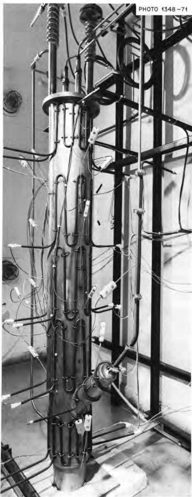  
Fig. 17.12. Test vessel for molten-salt induction heating test.

coil to be located very close to the wall. Quartz insulators on the $5/8$ -in. leads and on the inside walls of the vessel prevent the coil from making electrical contact with the vessel when frozen salt is not present.

# 17.7 PREDICTED PERFORMANCE OF CONTINUOUS FLUORINATORS

J.S.Watson L.E.McNeese

Thus far, most of the flowsheets considered for use in processing molten-salt reactor fuel salt require fluorination of molten salt for removal of uranium at one or more points in the flowsheet. These include: (1) removal of trace quantities of uranium from relatively small salt streams prior to discard, (2) removal of uranium from a captive salt volume in which $^{233}\mathrm{Pa}$ is accumulated and held for decay to $^{233}\mathrm{U}$ , (3) removal of most of the uranium from relatively large fuel salt streams prior to isolation of protactinium and removal of rare earths, and (4) nearly quantitative removal of uranium from a salt stream containing $^{233}\mathrm{Pa}$ in order to produce isotopically pure $^{233}\mathrm{U}$ . Not all of these operations would require continuous fluorinators. In fact, the use of batch fluorinators has definite advantages in certain cases. However, as the quantities of salt and uranium to be handled increase, the use of continuous fluorinators becomes mandatory in order to avoid undesirably large inventory charges on uranium and molten salt, as well as the detrimental increase in reactor doubling time that is associated with an increased fissile inventory.

Although the literature contains many references to the removal of uranium from molten salt by batch fluorination, information on continuous fluorinators, particularly on fluorinators capable of handling salt flow rates on the order of $100\mathrm{ft}^3/\mathrm{day}$ , is rather meager. A mathematical analysis for predicting continuous fluorinator performance was completed, and calculations were made for fluorinator operating conditions of interest for MSBR processing.

Mathematical analysis of open-column continuous fluorinators. Consider a differential height of a continuous fluorinator in which fluorine and molten salt containing uranium are in countercurrent flow. If the rate of removal of uranium from the salt is assumed to be first order with respect to the uranium concentration in the salt, a material balance on the differential salt volume yields the relation:

$$
D \frac {d ^ {2} C}{d X ^ {2}} - V \frac {d C}{d X} - k C = 0, \tag {1}
$$

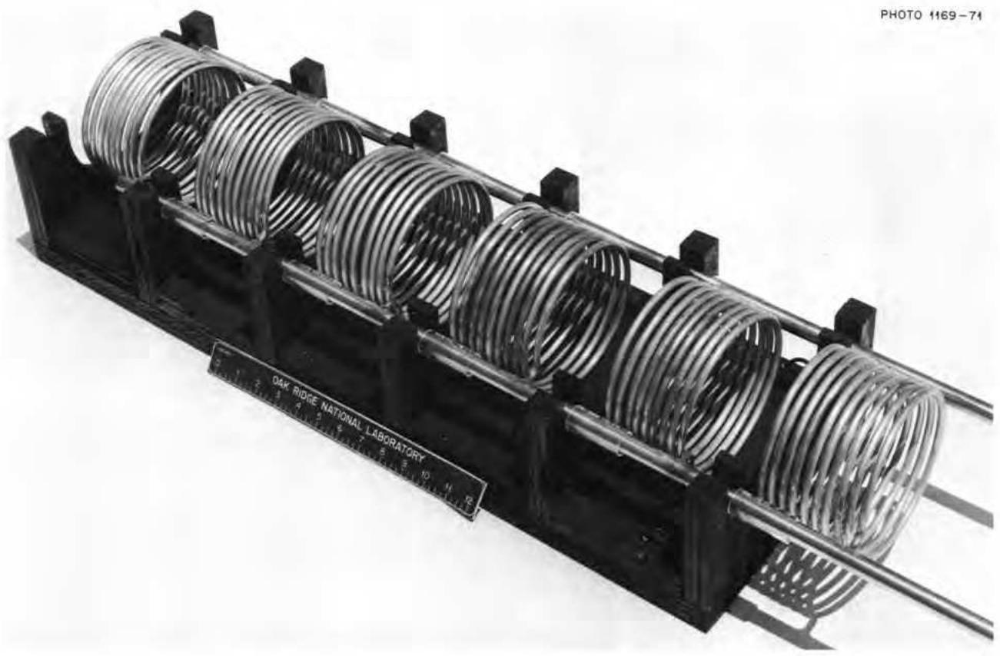  
Fig. 17.13. Induction coil for molten-salt induction heating test.

where

$D =$ axial dispersion coefficient, $\mathrm{cm}^2 /\mathrm{sec}$

$C =$ concentration of uranium in salt, moles/cm³,

$X =$ position in column measured from top of column, cm,

$V =$ superficial salt velocity, cm/sec,

$k =$ reaction rate constant, $\sec^{-1}$

The terms in Eq. (1) represent the transfer of uranium in the salt by axial diffusion, the transfer of uranium in the salt by convection, and the removal of uranium from the salt by reaction with fluorine respectively. The assumption of a first-order reaction does not imply a particular rate-limiting reaction mechanism; however, it is consistent with the assumption that the rate-limiting step is diffusion of uranium in the salt to the gas-liquid interface. In this case, the first-order expression would imply that the concentration in the salt at the interface is negligible in comparison with the uranium concentration in the salt at points a short distance from the interface.

The boundary conditions chosen for use with Eq. (1) assume that the diffusive flux across the fluorinator boundaries is negligible: at $X = 0$ (top of fluorinator),

$$
\left. \frac {d C}{d X} \right| _ {X = 0 +} = - \frac {V}{D} \left(C _ {\text {f e e d}} - C _ {0 +}\right), \tag {2}
$$

and at $X = l$ (bottom of fluorinator),

$$
\left. \frac {d C}{d X} \right| _ {X = l} = 0, \tag {3}
$$

where

$C_{\text{feed}} = \frac{\text{concentration of uranium in salt fed to the fluorinator,}}{}$

$C_{0+} =$ concentration of uranium in salt at the top of the fluorinator.

Note that $C_{0+}$ is not equal to $C_{\mathrm{feed}}$ since there is a discontinuity in uranium concentration in the salt at the top of the column where the salt enters.

The solution of Eq. (1) with the stated boundary conditions yields the following expression for the ratio of the uranium concentration in salt leaving the column (at $X = l$ ) to the concentration in the feed salt:

$$
\begin{array}{l} \frac {C (l)}{C _ {\text {f e e d}}} = \left[ \left(\frac {1 / 2 + \eta}{\sqrt {1 + 4 \eta}} + \frac {1}{2}\right) e ^ {\xi (\sqrt {1 / 4 + \eta} - 1 / 2)} \right. \\ \left. - \left(\frac {1 / 2 + \eta}{\sqrt {1 + 4 \eta}} - \frac {1}{2}\right) e ^ {- \xi (1 / 2 + \sqrt {1 / 4 + \eta})} \right] ^ {- 1}, \tag {4} \\ \end{array}
$$

where

$$
\eta = \frac {k D}{V ^ {2}},
$$

$$
\xi = \frac {V L}{D}.
$$

Application of Eq. (4) to the design and evaluation of continuous fluorinators requires information on the rate constant $k$ and the axial dispersion coefficient $D$ . Values of the dispersion coefficient were obtained from correlations resulting from studies in which air and aqueous solutions were contacted countercurrently in open bubble columns, as indicated below. A value for the rate constant was calculated using data obtained previously during a study of the performance of a 1-in.-diam continuous fluorinator.

Dispersion coefficient values. Studies in which air and aqueous solutions were contacted countercurrently in open bubble columns having diameters of 1, 1.5, 2, 3, and 6 in. were carried out previously. The viscosity of the aqueous solutions was varied between 1 and $15\mathrm{cP}$ by the use of water-glycerol mixtures. The viscosity of molten salt under conditions of interest is about $15\mathrm{cP}$ . The effect of the surface tension of the aqueous phase was determined by varying the surface tension from 68 to 27 dynes/cm, using water-isopropanol mixtures. The surface tension of molten salt is much higher than these values; however, the data allow estimates of the effect of surface tension on the dispersion coefficient. Data from these studies were correlated by use of dimensionless groups in the following manner: for low gas flow rates (bubbly flow),

$$
N _ {\mathrm {P e}} = 1 8. 0 N _ {\mathrm {R e}} ^ {0. 8 8} N _ {\mathrm {A r}} ^ {- 0. 4 3 5} N _ {\mathrm {S u}} ^ {- 0. 0 7 5} n ^ {- 0. 0 4 7 5},
$$

and at high gas flow rates (slug flow),

$$
N _ {\mathrm {P e}} = 0. 4 6 N _ {\mathrm {R e}} ^ {0. 4} N _ {\mathrm {A r}} ^ {0. 1 1} N _ {\mathrm {S u}} ^ {- 0. 3 8},
$$

where

$$
N _ {\mathrm {P e}} = \frac {d _ {c} V _ {g}}{D} = \text {P e c l e t n u m b e r},
$$

$$
N _ {\mathrm {R e}} = \frac {\rho_ {l} d _ {c} V _ {g}}{\mu_ {l}} = \text {R e y n o l d s n u m b e r},
$$

$$
N _ {\mathrm {S u}} = \frac {d _ {c} \rho_ {l} \sigma}{\mu_ {l} ^ {2}} = \text {S u r a t m a n n u m b e r},
$$

$$
N _ {\mathbf {A r}} = \frac {d _ {c} ^ {3} \rho_ {l} ^ {2} g}{\mu_ {l} ^ {2}} = \text {A r c h i m e d e s} ^ {\prime} \text {n u m b e r},
$$

$$
d _ {c} = \text {c o l u m n d i a m e t e r},
$$

$$
V _ {g} = \text {s u p e r f i c i a l g a s v e l o c i t y},
$$

$$
D = \text {d i s p e r s i o n}
$$

$$
\rho_ {l} = \text {d e n s i t y o f t h e l i q u i d},
$$

$$
\mu_ {l} = \text {v i s c o s i t y}
$$

$$
\sigma = \text {s u r f a c e}
$$

$$
\boldsymbol {g} = \text {a c c e l e r a t i o n}
$$

$$
n = \text {n u m b e r o f g a s i n l e t s i n d i s p e r s e r}.
$$

These relations are believed to allow accurate and reliable estimates of axial dispersion in continuous fluorinators for the range of diameters and physical properties of interest.

Evaluation of fluorination reaction rate constant. The fluorination reaction rate constant was evaluated from Eq. (4) using previously obtained data on the performance of a 1-in.-diam open-column continuous fluorinator and the axial dispersion coefficient data discussed above. The fluorinator performance data were obtained in studies with two different uranium concentrations in the salt feed (0.35 and 0.13 mole %) at $600^{\circ}\mathrm{C}$ and one uranium concentration (0.35 mole %) at $525^{\circ}\mathrm{C}$ . Three data points corresponding to different salt flow rates were obtained for each set of temperatures and inlet compositions. The fluorine flow rate was different for each data point; however, according to Eq.

(1), which defines the present model, the fluorine flow rate only affects the results by changing the axial dispersion coefficient. The data obtained at $525^{\circ}\mathrm{C}$ were used to evaluate the rate constant $k$ , since the operating temperature of the proposed frozen-wall fluorinators will be 10 to $15^{\circ}\mathrm{C}$ above the salt liquidus temperature of $505^{\circ}\mathrm{C}$ . Application of Eq. (4) to the three data points obtained at $525^{\circ}\mathrm{C}$ produced the results shown in Table 17.6. The scatter in the calculated values for $k$ is acceptably small, and no trend with salt or fluorine flow rates is observed. Although these data do not confirm the validity of the model, they do not contradict it.

Predicted performance of open-column continuous fluorinators. The performance of large, open-column continuous fluorinators was estimated from Eq. (4) using the previously discussed estimates of the reaction rate constant $k$ and the axial dispersion coefficient $D$ . The required fluorinator height is shown in Figs. 17.14 and 17.15 for a range of salt flow rates for two fractional uranium removal values (0.95 and 0.99). The uranium concentration in the inlet salt was assumed to be 0.0033 mole fraction in all cases, and the fluorine flow rate was assumed to be equal to 1.5 times the stoichiometric requirement. These results are encouraging since they suggest that single fluorination vessels of moderate size will suffice for removing uranium from MSBR fuel salt prior to the isolation of protactinium by reductive extraction. The reference flowsheet for isolating protactinium by fluorination—reductive extraction requires fluorination of fuel salt at the rate of $170\mathrm{ft}^3/\mathrm{day}$ , which is equivalent to a ten-day processing cycle. A 6-in.-diam fluorinator having a height of 10.2 ft will be required for a uranium removal efficiency of $95\%$ , and an 8-in.-diam fluorinator having a height of 17.8 ft will be required for a uranium removal efficiency of $99\%$ .

# 17.8 ENGINEERING STUDIES OF URANIUM OXIDE PRECIPITATION

M.J.Bell D.D.Sood

L. E. McNeese

The fabrication and installation of equipment for a single-stage experiment to study the precipitation of $\mathrm{UO}_2$ - $\mathrm{ThO}_2$ solid solutions from molten fluoride salts have been completed. In the two experiments carried out thus far, the major equipment items operated satisfactorily. Several minor difficulties that were encountered, including the freezing of salt and the condensation of water in several lines in the system, have been alleviated. A third experiment is in progress.

In the first experiment (OP-1), a gas stream containing $15\%$ water $-85\%$ argon was fed to the precipitator vessel at the rate of 0.5 scfh for a period of 4 hr with the salt at $600^{\circ}\mathrm{C}$ . The gas flow was interrupted periodically during the run, and filtered salt samples were obtained. The precipitate and the salt were allowed to equilibrate for 64 hr, after which a sample of the oxide phase was obtained for analysis by x-ray diffraction. The salt was then slowly transferred from the precipitator vessel to the treatment vessel in order to leave most of the precipitate in the precipitator. Subsequently, the salt was hydrofluorinated in the treatment vessel and sampled again in order to determine the amount of precipitated uranium that had transferred to the treatment vessel. Finally, the salt was returned to the precipitator vessel, where it was hydrofluorinated for 12 hr using a $20\%$ HF $-80\%$ $\mathrm{H}_{2}$ gas mixture at the rate of 3 scfh in order to redissolve

7. M. J. Bell and L. E. McNeese, MSR Program Semiannu. Progr. Rep. Feb. 28, 1971, ORNL-4676, p. 267.

Table 17.6. Evaluation of fluorination reaction rate constant   

<table><tr><td>Salt superficial velocity (cm/sec)</td><td>C(I)/Cfeed</td><td>F2flow rate (cm3/sec)</td><td>Dispersion coefficient, D (cm2/sec)</td><td>Rate constant, k (sec-1)</td></tr><tr><td>0.0625</td><td>0.0257</td><td>6.8</td><td>17.6</td><td>0.00805</td></tr><tr><td>0.0445</td><td>0.0096</td><td>5.0</td><td>14.6</td><td>0.01033</td></tr><tr><td>0.0225</td><td>0.00457</td><td>3.82</td><td>10.6</td><td>0.00886</td></tr><tr><td></td><td></td><td></td><td></td><td>Average: 0.00908&#x27;</td></tr></table>

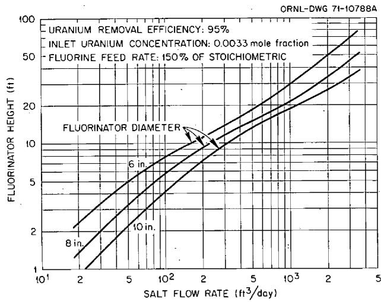  
Fig. 17.14. Variation of calculated fluorinator height with salt flow rate and fluorinator diameter for a uranium removal efficiency of $95\%$ .

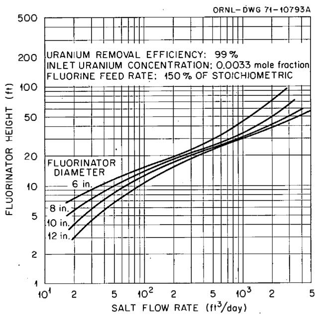  
Fig. 17.15. Variation of calculated fluorinator height with salt flow rate and fluorinator diameter for a uranium removal efficiency of $99\%$ .

the uranium and thorium oxides. Salt samples were withdrawn at intervals during this hydrofluorination period.

Analysis of samples taken during the precipitation phase of the experiment indicated that $17\%$ of the

uranium initially present in the salt was precipitated during the run. However, the analyses show considerable scatter, and the uranium concentration in the salt does not decrease monotonically with time. The analyses indicate a water utilization of about $25\%$ , although there is some uncertainty in this value because of problems encountered with the condensation of water in gas lines during the experiment. Analysis of the oxide phase collected at the end of the precipitation period revealed that a $\mathrm{UO}_2$ - $\mathrm{ThO}_2$ solid solution having a $\mathrm{UO}_2$ concentration of 0.94 mole fraction was formed, and that 5 to $15\%$ of the precipitate was $\mathrm{ThO}_2$ . The concentration of BeO in the precipitate was below the limit of detection ( $< 1\mathrm{wt}\%$ ). The presence of $\mathrm{ThO}_2$ and the fact that the uranium content of the solid solution was slightly lower than the value expected at equilibrium (0.96 mole fraction $\mathrm{UO}_2$ ) indicate that equilibrium between the salt and the precipitate was not obtained. The uranium concentration in the decanted salt after hydrofluorination was found to be the same as that obtained for the filtered salt sample taken after the precipitate had been allowed to settle for 64 hr. This indicates that it may be possible to separate the precipitate from the salt with relatively simple equipment.

In the second experiment (OP-2), the salt temperature was again held at $600^{\circ}\mathrm{C}$ , and the composition of the inlet gas mixture was $15\%$ water- $85\%$ argon, as before. In this experiment, the salt was first contacted with the gas mixture at a rate of 0.5 scfh for $9\mathrm{hr}$ ; then the gas flow rate was increased to 1.5 scfh for an additional 5-hr period. The total precipitation time (14 hr) extended over a period of about ten days, during which the run was interrupted several times in order to modify gas lines and add heaters and thermal insulation to a number of lines where condensation of water was suspected. The uranium concentration observed in filtered salt samples obtained during the run and the expected uranium concentration based on the amount of HF evolved during the run are shown in Fig. 17.16. The discontinuity in the curve based on HF evolution at 6.7 hr resulted from the fact that condensate was observed in an off-gas line between periods of precipitation. The condensate was collected and titrated; then the resulting correction was made. Additional heaters were placed on this line, as well as other lines, before the precipitation phase of the experiment was continued. The greater rate of HF evolution observed after these changes had been made suggests that the condensation problem has been eliminated.

Salt samples taken early in the experiment (shortly after the precipitation had been discontinued, as well as

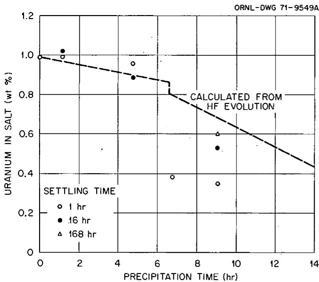  
Fig. 17.16. History of uranium concentration in salt samples during second uranium oxide precipitation run (OP-2). Salt temperature was $600^{\circ}\mathrm{C}$

after an extended equilibration period) were found to have essentially the same uranium concentration (i.e., within the range of analytical error). However, analyses of samples taken later in the experiment showed large variations between samples taken shortly after precipitation had been discontinued and those taken after a long equilibration time. This behavior is not currently understood. Several samples of the oxide phase obtained during the run may be helpful in interpreting the results.

# 17.9 DESIGN OF A PROCESSING MATERIALS TEST STAND AND THE MOLYBDENUM REDUCTIVE EXTRACTION EQUIPMENT

E. L. Nicholson W. F. Schaffer, Jr. J. Roth

A report describing the conceptual design and fabrication development program for the molybdenum reductive extraction equipment test stand was completed. The conceptual design for the system has been described previously;[8-10] fabrication development details are reported in Sects. 14.1-14.4.

The detailed designs of the extraction column and the salt and bismuth head pots have been completed, and fabrication has begun. Conceptual design sketches for the equipment supports in the containment vessel, machined tees, and the freeze valve have been com

pleted. Preliminary drawings for the molybdenum piping arrangement inside the containment vessel have also been completed; however, further work on these drawings will be deferred until the piping can be analyzed for thermal expansion stresses and a full-size mockup of the system can be completed to investigate fabrication and field assembly problems. The overall height of the molybdenum components of the loop (from the underside of the containment vessel flange to the lowest point) is about 17 ft. Both the salt and the bismuth gas-lift pumps are designed to operate with a minimum submergence of $50\%$ , which should provide the maximum flow rate desired for either phase (1.1 liters/min).

Final tests were completed with the revised design of the full-scale transparent plastic mockup of the bismuth head pot and the top portion of the extraction column. Mercury and water were used to simulate molten bismuth and salt. Problems with internal flow restrictions and gas venting noted previously were solved by the revised design. Entrainment of liquid in the exit gas was reduced to very low levels by routing the gas through a settling chamber and Raschig-ring packing in the top of the head pot.

The design of the probe for determining the position of the salt-bismuth interface in the disengagement section below the extraction column was completed, and a prototype probe has been built for testing. Work associated with the development of liquid-level probes is discussed in the following section.

# 17.10 DEVELOPMENT OF A BISMUTH-SALT INTERFACE DETECTOR

H. O. Weeren E. L. Nicholson

C.V.Dodd C.C.Lu

J. Roth

An eddy current type of detector11 is being developed to allow detection and control of the bismuth-salt interface in salt-metal extraction columns or mechanically agitated salt-metal contactors. The probe consists of a ceramic form on which bifilar primary and

secondary coils are wound. Contact of the coils with molten salt or bismuth is prevented by enclosing the coils in a molybdenum tube. In operation, a high-frequency alternating current is passed through the primary coil and it induces a current in the secondary coil. The induced current is dependent on the conductivities of the materials located adjacent to the primary and secondary coils; since the conductivities of salt and bismuth are quite different, the induced current reflects the presence or absence of bismuth. The principal problem associated with this type of detector stems from the low permeability of molybdenum, the fabrication material of the protective sheath. Two approaches for obtaining an output from the detector are being pursued. The first is based on measuring changes in the magnitude of the induced current; the second is based on measuring the phase shift that occurs between the voltage imposed on the primary coil and that which is induced in the secondary coil.

Initial tests in which measurements were made of variations in the induced current caused by changes in the bismuth interface position showed that the probe was quite sensitive to drift in the electronic circuit, to minor variations in line voltage, and to changes in the temperature of the electronic components. To circumvent this problem, an improved electronic circuit, which is relatively insensitive to amplifier drift and to changes in the temperature of the electronic components, was devised. Difficulties caused by line voltage variations were avoided by use of a constant-voltage power supply. A full-scale response of about $1.5\mathrm{mV}$ was obtained at the optimum frequency for the primary coil $(35\mathrm{kHz})$ for a 9-in. change in the bismuth interface position at $600^{\circ}\mathrm{C}$ .

During this reporting period, calculations were made for predicting the performance of interface detectors. These calculations were based on either measurements of the magnitude of the induced current or the shift in phase between the primary and the secondary voltages. Optimum operating conditions were defined, and a prototype probe for use in the molybdenum reductive extraction column was fabricated. Tests for confirming the predicted performance of the probe were carried out at room temperature. Equipment for final testing of the probe at $600^{\circ}\mathrm{C}$ with molten bismuth has been installed. Details of this work are discussed in the remainder of this section.

Calculations for determining probe performance and optimum operating conditions. Preliminary calculations were performed using a two-conductor model consisting of a bifilar coil inside a molybdenum tube that was surrounded with either liquid bismuth or air. Results of

these calculations revealed the manner in which the magnitude of the signal in the secondary coil and the difference in phase between the signals in the primary and secondary coils varied as tube size, tube wall thickness, and frequency of the signal impressed on the primary coil were changed. The results indicated that an adequate phase shift (a change of approximately $11^{\circ}$ from the condition in which no bismuth was present to the condition in which the tube was submerged in bismuth) should be obtained with a molybdenum tube having an outside diameter of 0.785 in. and a wall thickness of 0.030 in. Additional calculations were then carried out with a three-conductor model, which allowed consideration of the effect of the container in which the bismuth and the probe are located. It was determined that the phase shift technique would have about the same sensitivity at any frequency in the range of 20 to $34\mathrm{kHz}$ . The maximum change in magnitude of the voltage induced in the secondary coil was about $30\%$ as the submergence in bismuth increased from 0 to $100\%$ ; the optimum operating frequency was 8 to $12\mathrm{kHz}$ .

After we had determined the conditions under which maximum sensitivity could be achieved for the two measurement techniques, additional calculations were made to find the conditions that would minimize the change in probe output resulting from a variation in probe temperature from 600 to $700^{\circ}\mathrm{C}$ . The following effects were considered:

1. The calculated thermal expansion of the molybdenum tube is approximately $0.05\%$ ; the phase shift due to this effect was calculated to be less than $0.01^{\circ}$ , which is considered negligible.   
2. The resistivity of the bismuth increases from 145.7 $\Omega$ -cm to 151.3 $\Omega$ -cm, and the resistivity of the molybdenum increases from 17.7 $\Omega$ -cm to 21 $\Omega$ -cm. While these changes produced a significant phase shift over most of the frequency range, it was found that a minimum change of about $0.1^{\circ}$ occurred at 25.2 kHz when no bismuth was present and at 30.2 kHz when the probe was completely submerged in bismuth. On this basis, it was decided that the probe would be least sensitive to these effects at a frequency of 27.7 kHz with the salt-bismuth interface at the midpoint of the detector.   
3. The dc resistance of the primary and secondary coils increases from 69.4 to $79.2\Omega$ in the temperature interval considered; however, by matching the impedance of the primary and secondary circuit with

the cable capacitance, it was possible to essentially eliminate this effect (a phase shift of less than $0.001^{\circ}$ ).

4. Phase shift changes of less than $0.01^{\circ}$ were calculated for changes of $1\%$ in the operating frequency, the amplitude of the signal impressed on the primary coil, the output impedance of the primary signal, the input impedance of the secondary signal, or the cable capacitance.

Design of prototype interface detector for the molybdenum reductive extraction system. The results obtained from the calculations discussed above were used to design a prototype bismuth-salt interface detector

for use in the molybdenum reductive extraction system. The probe, shown in Fig. 17.17, consists of a high-density $99.8\%$ pure alumina core tube (0.720 in. OD) on which bifilar 0.010-in.-diam platinum wire coils are wound in 0.022-in.-wide grooves having a depth of 0.020 in. The active length of the probe is 13.5 in.; the primary and secondary coils contain about 189 turns each. The probe was designed for insertion in a 0.785-in.-OD, 0.725-in.-ID molybdenum tube on which a molybdenum end cap was welded by an electron beam technique (see Fig. 17.17). The lower end of the probe is fitted with an adapter that fastens the probe to the probe mounting boss and holds the high-temperature electrical connector plug for the instru

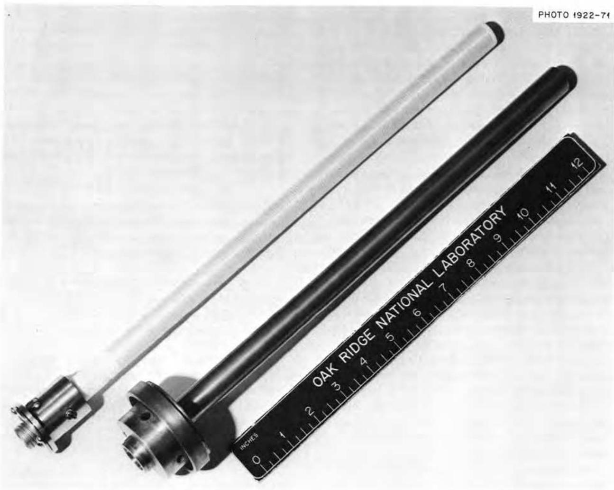  
Fig. 17.17. Prototype interface detector probe before assembly. The molybdenum sheath tube and bifilar-wound primary and secondary coils are shown.

ment cable. The lower end of the probe tube was brazed into a carbon-steel adapter to allow insertion of the probe in a carbon-steel test vessel. When the probe tube is installed in the molybdenum reductive extraction system, it will be welded, via an electron beam technique, into the disengaging section below the column without using an adapter.

Room-temperature measurements for confirming predicted probe performance. Experimental measurements have been made at room temperature to verify the predicted performance of the probe. These measurements were made using the coil and molybdenum tube described above. Inconel disks 1 in. thick with a diameter of 4 in. were stacked on the probe to simulate increases in the bismuth level. Difficulties were encountered initially with use of the cable proposed for the molybdenum reductive extraction facility because of shorting that occurred when the cable was flexed slightly. Therefore, a cable consisting of two single-conductor shielded wires was used as a substitute, and phase shift measurements were carried out at frequencies of 10 and $20\mathrm{kHz}$ . The measured results at 10 kHz were linear and reproducible to within $0.01^{\circ}$ . The sensitivity was $0.6^{\circ}$ in. of Inconel level, which is in satisfactory agreement with the calculated value of $0.53^{\circ}$ in. The sensitivity at $20\mathrm{kHz}$ was considerably less $(0.3^{\circ}$ in.) than at $10\mathrm{kHz}$ due to the high conductivity of molybdenum at room temperature. The results obtained with a frequency of $20\mathrm{kHz}$ were as reproducible as those at $10\mathrm{kHz}$ but were not quite as linear. Surrounding the probe with a 2.5-in. sched 40 ferromagnetic steel pipe caused a decrease in sensitivity of $0.02^{\circ}$ in. at $10\mathrm{kHz}$ and room temperature, although a somewhat greater loss in sensitivity would be observed at $650^{\circ}\mathrm{C}$ . The random noise in the measurements at both 10 and $20\mathrm{kHz}$ was $\pm 0.015^{\circ}$ due to the wide frequency response of both the driving and the receiving amplifiers. This noise can be easily eliminated by limiting the bandpass of either amplifier.

Carbon-steel probe test vessel. A carbon-steel vessel (Fig. 17.18) has been fabricated for use in tests of the prototype probe described above. The enlarged upper part of the vessel, which is the bismuth reservoir, is arranged in such a way that known amounts of molten bismuth can be added to, or removed from, the probe test chamber that is located below the reservoir. The probe extends upward from the bottom of the test chamber and will be secured in the test vessel by welding the carbon-steel adapter to the bottom of the

test chamber. The enlarged lower section, which simulates the interior of the high-temperature containment vessel for the molybdenum reductive extraction equipment, will be filled with an inert gas. Space is provided for the 13-ft length of high-temperature electrical cable (maximum rated service temperature, $2000^{\circ}\mathrm{F}$ ) and for the nozzle that duplicates the electrical and service penetration on the containment vessel flange. The probe will be installed in the test vessel as soon as difficulties with shorting in the high-temperature electrical cable and connector plug assembly have been corrected.

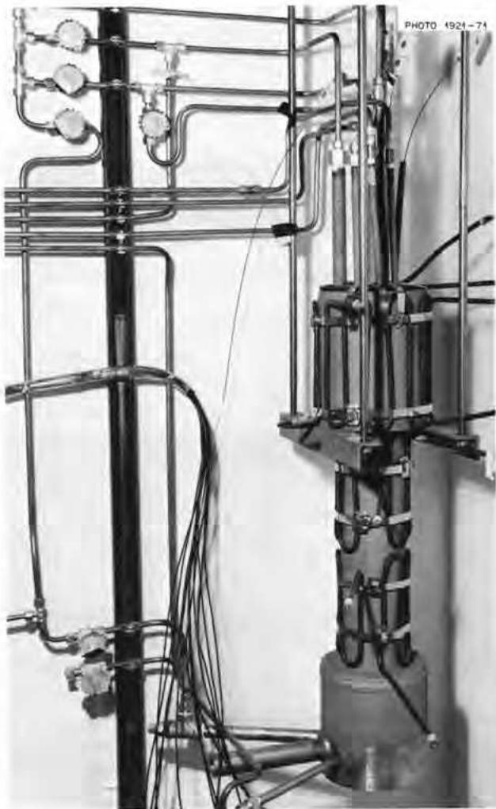  
Fig. 17.18. Carbon-steel vessel for testing prototype bismuth-salt interface detector.

# 18. Continuous Salt Purification

R. B. Lindauer

Studies were carried out to determine the cause of the occasional high iron concentrations reported for samples obtained during the previously reported experiments on the reduction of iron fluoride in molten salt by countercurrent contact with hydrogen in a packed column. Possible causes for the high iron concentration are: (1) bypassing of suspended iron particles around the poorly sealed sampler filter and (2) contamination of salt samples with iron from tools used during removal of salt from the nickel sampler. The presence of suspended iron particles in the filtered salt appears to be ruled out by low iron concentrations (average, 68 ppm) reported for four large (4-g), unfiltered samples taken from the system. Also, leaching of nickel specimens that had been exposed to the salt in the system with aqueous HCl showed only a negligible amount of iron deposited on the specimens. Therefore, it is believed that the samples are being contaminated during the removal of salt from the nickel samplers. In order to minimize such contamination, the samplers were redesigned to obtain a larger (4-g) sample and were constructed of copper, which will facilitate removal of the salt. The larger salt sample should also provide improved sensitivity in the analysis for iron at low concentrations.

Experiments for measuring the rate at which iron fluoride is reduced during the countercurrent contact of

molten salt with hydrogen were continued after the iron fluoride concentration in the salt (72-14.4-13.6 mole $\%$ LiF-BeF $_2$ -ThF $_4$ ) was increased to about 1000 ppm (which should be sufficiently high to allow accurate iron analysis). The pressure drop across the column increased significantly due to a partial restriction and limited the gas flow rate to about $20\%$ of that used previously with a comparable salt flow rate. Five iron fluoride reduction runs were carried out at the reduced gas flow rate; however, the extent of iron fluoride reduction averaged only $6\%$ per run (see Table 18.1) rather than $27\%$ , as had been observed with higher gas flow rates. With the lower gas flow rates, the HF concentration in the exit gas stream was about $60\%$ of the equilibrium value, based on the concentration of iron in the exit salt stream, instead of about $27\%$ , which has been noted with higher gas flow rates. During run 15, a hydrogen flow rate of only $300~\mathrm{cm}^3/\mathrm{min}$ was used, and the extent of iron fluoride reduction was about $100\%$ of that which would have been obtained if the salt and gas streams had been brought to equilibrium at the operating temperature of $700^{\circ}\mathrm{C}$ . The average mass transfer coefficient measured in this run was only 0.002 ft/hr as compared with about 0.018 ft/hr measured in previous runs.

Following these runs, the column was removed and cut into sections in order to determine the cause of the restriction. Most of the Raschig-ring packing in the column contained salt that had not drained from the packing. In addition, a considerable amount of salt could be seen between rings in the upper part of the

Table 18.1.Data from iron fluoride reduction runs   

<table><tr><td rowspan="2">Reduction run No.</td><td rowspan="2">\( {\mathrm{H}}_{2} \) flow rate (liters/min)</td><td rowspan="2">Salt flow rate (cm \( {}^{3} \) /min)</td><td colspan="2">Iron concentration in salt (ppm)</td><td rowspan="2">Mass transfer coefficient (ft/hr)</td></tr><tr><td>Feed</td><td>Product</td></tr><tr><td>12</td><td>2.6</td><td>50</td><td>911</td><td>885</td><td>0.0007</td></tr><tr><td>13</td><td>3.5</td><td>80</td><td>885</td><td>762</td><td>0.0056</td></tr><tr><td>14</td><td>3.8</td><td>78</td><td>762</td><td>740</td><td>0.0011</td></tr><tr><td>15</td><td>\( {0.3}^{a} \)</td><td>87</td><td>740</td><td>705</td><td>0.0020</td></tr><tr><td>16</td><td>4.7</td><td>77</td><td>705</td><td>661</td><td>0.0028</td></tr></table>

${}^{a}{10}\%$ hydrogen in helium.

column, and a black deposit was noted on the rings in this area (see Fig. 18.1). In contrast, very little material appeared to be deposited on the packing in the lower part of the column; also, less salt was noted in the

packing (Fig. 18.2). Several of the salt globules from the upper part of the column remained white after exposure to moist air; however, some of the globules became rust-colored after exposure. Subsequent analy

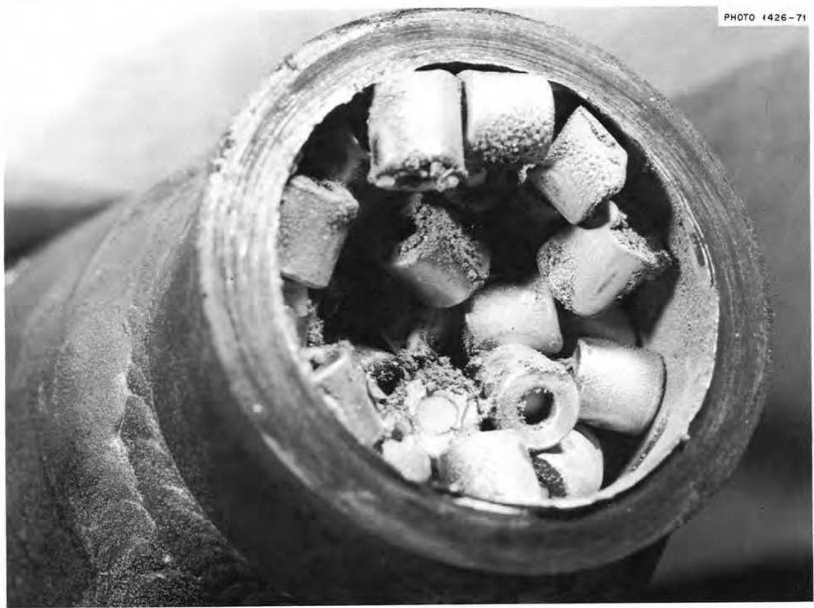  
Fig. 18.1. View of Raschig-ring packing near top of packed column, showing metallic deposits and salt that did not drain from the packing.

s of the salt for iron indicated the expected concentration of iron $(640~\mathrm{ppm})$ for the material that did not change color, while two samples that became rust-colored in appearance contained 890 and $2055~\mathrm{ppm}$ of iron. It appears that some of the salt globules contained dispersed iron particles which oxidized on exposure to air. Analysis of the black deposit in the upper part of the column (after the material had been exposed to air) indicated a nickel content of $49.2\mathrm{wt}\%$ and an iron content of $3\mathrm{wt}\%$ . Analyses of packing removed at 12-in. intervals along the column showed little difference in the amount of deposited iron; the deposition on the packing had an average thickness of $0.05\mathrm{mil}$ . The observed differences in the manner in which nickel and iron deposited on the packing are quite reasonable since $\mathrm{NiF}_2$ is much more easily reduced by hydrogen than $\mathrm{FeF}_2$ . Hence one would expect the nickel to deposit in the upper part of the column and the iron to deposit

almost uniformly throughout the column. The total amount of iron contained on the packing, based on the average iron deposition, is about $17\mathrm{g}$ . The amount of iron believed to have been reduced in the system thus far is about $24\mathrm{g}$ . Therefore, it appears that most of the iron is deposited on the column packing as the $\mathrm{FeF}_2$ is reduced.

A column of slightly modified design was fabricated and installed. The cross-sectional area of the liquid deentrainment section at the top of the column was increased by $75\%$ and was packed with a 5-in. depth of Raschig rings. The wall thickness of the $\frac{1}{4}$ -in. Raschig-ring packing in the column was decreased from $\frac{1}{16}$ to $\frac{1}{32}$ in., which should increase the throughput and lengthen the operating time before flow restriction due to reduced metals necessitates removal of iron from the packing.

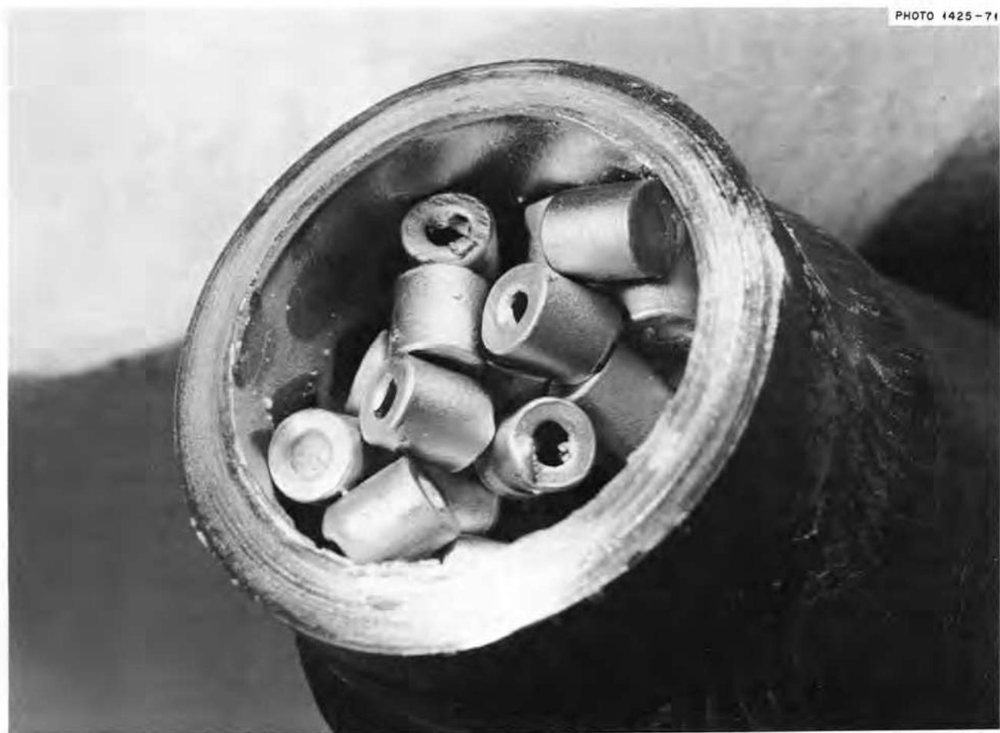  
Fig. 18.2. View of Raschig-ring packing near bottom of packed column.

# OAK RIDGE NATIONAL LABORATORY

# MOLTEN-SALT REACTOR PROGRAM

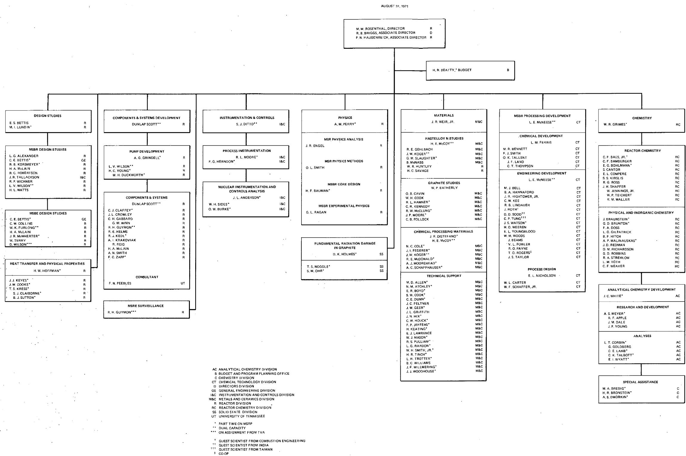