3445600231826

${Cv} \cdot  3$

ORNL-4762

UC-70-Waste Disposal and Processing

CONSIDERATIONS IN THE LONG-TERM

MANAGEMENT OF HIGH-LEVEL

RADIOACTIVE WASTES

Ferruccio Gera

D. G. Jacobs

aannnnnne aannnnnne annnnnne

P PPPPPPPPPPPPPPPPPPPPPPPPPPPPPPPPPPPPPPPPPPPPPPPPPPPPPPPPPPPPPPPPPPPPPPPPPPPPPPPPPPPPPPPPPPPPPPPPPPPPPPPPPPPPPPPPPPPPPPPPPPPPPPPPPPPPPPPPPPPPPPPPPPPPPPPPPPPPP

PONNNNNE PNNNNE PNNNNE PNNNNE PNNNNE PNNNNE PNNNNE PNNNNE PNNNNE PNNNNE PNNNNE PNNNNE PNNNNE PNNNNE PNNNNE PNNNNE PNNNNE PNNNNE PNNNNE PNNNNE PNNNNE PNNNNE PNNNNE PNNNNE PNNNNE PNNNNE   
aannnnnne aannnnnne aannnnnne

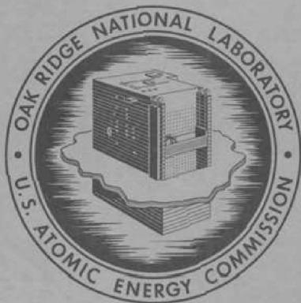

OAK RIDGE NATIONAL LABORATORY

operated by

UNION CARBIDE CORPORATION

for the

U.S. ATOMIC ENERGY COMMISSION

Contract No. W-7405-eng-26

HEALTH PHYSICS DIVISION

CONSIDERATIONS IN THE LONG-TERM MANAGEMENT OF HIGH-LEVEL RADIOACTIVE WASTES

Ferruccio Gera and D. G. Jacobs

FEBRUARY 1972

OAK RIDGE NATIONAL LABORATORY

Oak Ridge, Tennessee 37830

operated by

UNION CARBIDE CORPORATION

for the

U.S. ATOMIC ENERGY COMMISSION


3445600231826

# CONTENTS

# Page

Abstract 1

1. Introduction 2   
2. Projected Waste Problem 4

2.1 Potential Hazard Index 7   
2.2 Potential Hazard from Plutonium Isotopes 10   
2.3 Comparison of Inhalation and Ingestion Hazards 12   
2.4 Steps in High-Level Waste Management 14   
2.5 Evaluation of Risks Associated with Waste Management 15   
2.6 Advantages of Disposal in Salt Formations 16   
2.7 Retrievability of Stored Wastes 17   
2.8 References 17

3. Characteristics of Solidified High-Level Wastes 20

3.1 Leachability 21   
3.2 Heat Generation Rate 23   
3.3 References 34

4. Interim Storage of Solid Waste 35

4.1 Routine Operation of Interim Storage Facility 36   
4.2 Siting Considerations 37   
4.3 Possible Mechanisms of Activity Release During Interim Storage 38   
4.4 Movement of Radionuclides Through the Ground 45   
4.5 Conclusions 51   
4.6 References 56

5. Geologic Processes Relevant to the Ultimate Disposal 58

5.l Stream Erosion 60   
5.2 Orogenic and Epeiogenic Uplift 69   
5.3 Glacial Erosion 71

5.3.1 Cause of Glaciation 74   
5.3.2 Uplift of Previously Glaciated Areas 75

5.4 Subsidence 76   
5.5 Volcanism 79   
5.6 Faulting 79   
5.7 Hydrology 80

# CONTENTS (contd)

# Page

5.8 Conclusions 81   
5.9 References 81   
5.10 Bibliography 85

# 6. Possible Release Mechanisms After Disposal in the Geologic Formation 86

6.1 Catastrophic Events 86

6.l.l Meteoritic Impact 86   
6.1.2 Volcanic Activity 89

6.2 Slow Geologic Processes 91

6.2.1 Faulting 92   
6.2.2 Erosion 92   
6.2.3 Leaching and Transport by Groundwater 97

6.3 Plastic Deformation of the Disposal Formation 100

6.3.1 Salt Diapirism 102   
6.3.2 Shale Diapirism 116

6.4 Conclusions 122   
6.5 References 123

# 7. Summary and Conclusions 128

Appendix A--Estimates of Radionuclide Movement Through the Ground 132

Appendix A--References 145

# LIST OF TABLES

# Number

2.1 Estimated Wastes from Light Water Reactors in the USA.. 5   
2.2 Estimated Wastes from Liquid Metal Fast Breeder Reactors in the USA 6   
2.3 Amounts of Some Transuranium Isotopes in Light Water Reactor Fuel 7   
2.4 Amounts of Some Transuranium Isotopes in Liquid Metal Fast Breeder Reactor Fuel 8   
2.5 Potential Hazard Index of Several Significant Radionu-clides Accumulated in High-Level Solid Waste by the Year 2020 9   
2.6 Fifty-Year Dose Commitments Resulting from the Inhalation of $1\mu \mathrm{Ci}$ of $^{239}\mathrm{PuO}_2$ 11   
3.1 Characteristics of Solidified High-Level Waste 22   
3.2 Range of Chemical Compositions of High-Level Liquid Waste 25   
3.3 Chemical Composition of Major Materials from Nuclear Fission 26   
3.4 Heat Generation Rate in the Waste from the Reprocessing of 1 Ton of LWR Spent Fuel 27   
3.5 Heat Generation Rate in the Waste from the Reprocessing of 1 Ton of LMFBR Spent Fuel 28   
3.6 Heat Generation Rates in Solid Waste 29   
3.7 Thermal Conditions of Cylinders Full of Waste with the Highest Heat Generation Rate 32   
3.8 Total Heat Generation Rate and Thermal Flux in Freshly Filled Cylinders 32   
4.1 Inventory of Volatile Radionuclides in Freshly Filled Cylinders 43   
5.1 Past and Present Rates of Denudation 62   
5.2 Rates of Regional Erosion in the United States 63   
5.3 Rates of Erosion Based on Data from Archeological Sites Near Rome 64   
5.4 Sediment and Surface Water Yields 65   
5.5 Relative Rates of Denudation in Uplands and Lowlands in Different Climates 66   
5.6 Partial List of Highlands Uplifted in Pleistocene Time. 70

# LIST OF TABLES (contd)

# Number

# Page

5.7 Some Present Rates of Uplift 71   
5.8 Greatest Known Fjord Depths 72   
5.9 Present Rates of Glacial Erosion 73

5.10 Geothermal Gradients at Selected Localities in the United States 77

6.1 Possible Types of Deep-Seated Vertical Tectonic Movements 95

A.l Listing of Program FPDSOILS 133   
A.2 Listing of Program FPTSOILS 137   
A.3 Summary of K Values Used in Calculating Radionuclide Movement 142   
A.4 Output of Program FPDSOILS 143   
A.5 Output of Program FPTSOILS 144

# LIST OF FIGURES

<table><tr><td>Number</td><td></td><td>Page</td></tr><tr><td>3.1</td><td>Variation of Heat Generation Rate in Solid Waste with Time After Discharge from Reactor</td><td>30</td></tr><tr><td>4.1</td><td>Predicted Movement of 90Sr from the Leaching of Pot Calcine Material</td><td>46</td></tr><tr><td>4.2</td><td>Predicted Movement of 137Cs from the Leaching of Spray Melt Material</td><td>47</td></tr><tr><td>4.3</td><td>Predicted Movement of 239Pu from the Leaching of Glass Having a Leach Rate Controlled by Diffusion of 10-5cm2/sec</td><td>48</td></tr><tr><td>4.4</td><td>Predicted Movement of 241Am from the Leaching of Glass Having a Leach Rate Controlled by Diffusion of 10-6cm2/sec</td><td>49</td></tr><tr><td>4.5</td><td>Cumulative Fraction of 90Sr Originally Present in Various Forms of Waste That Would Reach a Seep 60 Meters from the Source Under Conditions of Continuous Leaching</td><td>52</td></tr><tr><td>4.6</td><td>Cumulative Fraction of 137Cs Originally Present in Various Forms of Waste That Would Reach a Seep 60 Meters From the Source Under Conditions of Continuous Leaching</td><td>53</td></tr><tr><td>4.7</td><td>Cumulative Fraction of 241Am Originally Present in Various Forms of Waste That Would Reach a Seep 60 Meters From the Source Under Conditions of Continuous Leaching</td><td>54</td></tr><tr><td>4.8</td><td>Cumulative Fraction of 239Pu Originally Present in Various Forms of Waste That Would Reach a Seep 60 Meters From the Source Under Conditions of Continuous Leaching</td><td>55</td></tr><tr><td>5.1</td><td>Relation of Denudation Rates to Relief-Length Ratio and Drainage Basin Relief</td><td>68</td></tr><tr><td>6.1</td><td>Graph Showing the Dependence of the Average Velocity of the Vertical Tectonic Movement on the Duration of the Time Interval of Averaging</td><td>96</td></tr><tr><td>6.2</td><td>Average Relationships Between Shale Density and Depth.</td><td>106</td></tr><tr><td>6.3</td><td>North-South Structural Cross Section, Iowa Salt Dome..</td><td>110</td></tr><tr><td>6.4</td><td>Diagrammatic Cross Section of a German Salt Diapir and Associated Rim Syncline</td><td>112</td></tr><tr><td>6.5</td><td>Mutual Relationships of Depth, Porosity, and Fluid Pressure-Overburden Ratio in an Average Shale or Mud-stone</td><td>117</td></tr></table>

# LIST OF FIGURES (contd)

# Number

Page

6.6(a)

Diagrammatic Representation of the Development of a Mud-Lump Family

120

6.6(b)

Diagrammatic Representation of the Development of a Mud-Lump Family

121

# ABSTRACT

High-level radioactive wastes generated by the reprocessing of spent fuel elements in the projected nuclear power industry require the development of an organic waste management scheme. The presence in these wastes of long-lived transuranics requires assurance of waste containment for a time period of the order of several hundreds of thousands of years. For such long time periods only deep geologic formations offer the stability required for preserving the necessary degree of containment.

Projections are made of the amounts of radioactive wastes accumulated to the year 2020. Important radionuclides in the waste are compared on the basis of their potential hazard to mankind over their entire physical lifetime. On the basis of these considerations, it seems that the most prudent scheme of management of these wastes involves solidification with final disposal into a suitable deep geologic formation in such a manner that further handling will be minimized.

The characteristics of products from various suggested solidification processes are compared. The conditions of interim storage of high-level solid waste are reviewed, and possible mechanisms of activity release from the storage facility are considered.

In order to insure safe containment of the waste for hundreds of thousands of years, the possible rate of several geologic processes capable of affecting the disposal formation must be estimated.

Possible mechanisms of activity release from the deep geologic formation are described.

# 1. INTRODUCTION

The nuclear industry is expected to expand rapidly during the next few decades, and the processing of reactor fuels will result in accumulation of much larger volumes of highly radioactive waste than have been generated to date. It seems reasonable to assume that the overall scheme of management will include a number of steps:

l. Interim storage as liquid.   
2. Conversion to solid.   
3. Interim storage as solid.   
4. Transportation to an ultimate disposal site.   
5. Ultimate disposal in a geologic formation.

In order to provide the basis for the development of a rational policy for the management of these wastes, it is necessary to make projections concerning the quantities and characteristics of the wastes that will be produced and to make an evaluation of the radiological safety aspects of each of the steps enumerated above. Radiological safety evaluations for the first four steps do not differ appreciably from those encountered in most nuclear operations. However, because of the increasing amounts of long-lived transuranics expected to be present in future wastes and because of their potential radiological hazards, the radiological safety evaluation for ultimate disposal in geologic formations must consider extremely long time spans. Required containment times are on the order of hundreds of thousands of years, which is much longer than recorded human experience. Based on geologic evidence, global climatic conditions may undergo extensive changes during such time periods. Local geologic conditions might also be altered significantly.

No attempt is made in this report to establish criteria for the long-term management of high-level radioactive waste. Rather, the intent is to elaborate on some of the many factors that must be considered in the development of suitable criteria and to illustrate how several of the environmental factors may be considered in determining their potential impact upon a facility or upon the consequences of an activity release. If the consequences of a particular accident result in activity

releases that cannot be tolerated, then the mechanisms responsible for such a release must be evaluated to determine the likelihood of their occurrence and the type of engineered safeguards that must be employed to minimize the impact or reduce the activity release to an acceptable level.

# 2. PROJECTED WASTE PROBLEM

With the development of the nuclear industry assumed in Phase 3, Case 42, of the Systems Analysis Task Force,[2.1] the amounts of waste shown in Tables 2.1 and 2.2 will be accumulated in the United States through the year 2020. These projections are based on a nuclear power economy having both light water reactors and liquid metal fast breeder reactors. Other advanced reactor types, such as molten salt reactors, may require different waste management schemes.

The amount of transuranium isotopes, especially $^{239}\mathrm{Pu}$ , that will be present in the wastes seems to dictate containment times far exceeding the 1000-year period that would be necessary for the decay of $^{90}\mathrm{Sr}$ and $^{137}\mathrm{Cs}$ , which have often been considered the radionuclides of major hazard potential in long-term waste management. Tables 2.3 and 2.4 list estimates of the amounts of transuranium isotopes that are expected in the spent fuel of typical light water reactors (LWR's) and liquid metal fast breeder reactors (LMFBR's) of the future. In Table 2.5 are shown the total quantities of activity produced through the year 2020 for the radionuclides that apparently control the long-term management of radioactive wastes. The table shows that the amounts of transuranics cannot be neglected. With the assumptions used in compiling Tables 2.1 and 2.2, the solid waste from reprocessing of LWR fuel would contain $18\mu \mathrm{Ci/cm}^3$ of $^{239}\mathrm{Pu}$ and $55\mu \mathrm{Ci/cm}^3$ of $^{240}\mathrm{Pu}$ , assuming that $0.5\%$ of the plutonium present in the spent fuel is not recovered and finds its way into the waste stream. These concentrations of plutonium correspond to 450 and 1375 maximum permissible body burdens (MPBB) per cubic centimeter of solid waste. With the same recovery of plutonium from LMFBR fuel, the solid waste would contain $190\mu \mathrm{Ci/cm}^3$ of $^{239}\mathrm{Pu}$ (4700 MPBB/cm³) and 235 $\mu \mathrm{Ci/cm}^3$ of $^{240}\mathrm{Pu}$ (5900 MPBB/cm³).

Table 2.1. Estimated Wastes from Light Water Reactors in the USA   
(Modified from ORNL-4451, 19702.2)   

<table><tr><td rowspan="2"></td><td colspan="4">Calendar Year</td></tr><tr><td>1980</td><td>1990</td><td>2000</td><td>2020</td></tr><tr><td>Installed capacity, 103MW(e)a</td><td>153</td><td>223</td><td>209</td><td>541</td></tr><tr><td>Fuel processed, 103tons/yearb,c</td><td>2.95</td><td>6.01</td><td>4.77</td><td>14.1</td></tr><tr><td colspan="5">Volume of waste generated, as liquidd</td></tr><tr><td>Annually, 103m3</td><td>3.67</td><td>7.49</td><td>5.98</td><td>17.5</td></tr><tr><td>Accumulated, 103m3</td><td>16.5</td><td>81.0</td><td>148.4</td><td>330.8</td></tr><tr><td colspan="5">Volume of waste generated, as solide</td></tr><tr><td>Annually, m3</td><td>275</td><td>560</td><td>445</td><td>1310</td></tr><tr><td>Accumulated, m3</td><td>1245</td><td>6060</td><td>11,100</td><td>24,800</td></tr><tr><td colspan="5">Accumulated radioisotopesf</td></tr><tr><td>Total weight, tons</td><td>451</td><td>2180</td><td>4000</td><td>8960</td></tr><tr><td>Total activity, megacuries</td><td>18,900</td><td>54,500</td><td>62,550</td><td>142,700</td></tr><tr><td>Total heat-generation rate, 106cal/sec</td><td>19.5</td><td>54</td><td>58</td><td>136</td></tr><tr><td>90Sr, megacuries</td><td>962</td><td>4340</td><td>7085</td><td>13,900</td></tr><tr><td>137Cs, megacuries</td><td>1280</td><td>5800</td><td>9530</td><td>18,900</td></tr><tr><td>238Pu, megacuriesg</td><td>1.20</td><td>6.3</td><td>11.6</td><td>24.5</td></tr><tr><td>239Pu, megacuriesg</td><td>0.022</td><td>0.107</td><td>0.196</td><td>0.438</td></tr><tr><td>240Pu, megacuriesg</td><td>0.0409</td><td>0.239</td><td>0.53</td><td>1.37</td></tr><tr><td>241Pu, megacuriesg</td><td>6.63</td><td>27.7</td><td>40.3</td><td>74.1</td></tr><tr><td>241Am, megacuriesg</td><td>2.31</td><td>11.3</td><td>20.8</td><td>46.6</td></tr><tr><td>243Am, megacuriesg</td><td>0.232</td><td>1.13</td><td>2.07</td><td>4.62</td></tr><tr><td>242Cm, megacuriesg</td><td>43.2</td><td>90</td><td>72</td><td>211</td></tr><tr><td>244Cm, megacuriesg</td><td>29.9</td><td>130</td><td>200</td><td>379</td></tr></table>

${}^{a}$ Data from Phase 3,Case 42,Systems Analysis Task Force (April 11,1968) ${}^{2.1}$   
${}^{\mathrm{b}}$ Based on an average exposure of 33,000 MWd/ton and a delay of 2 years between power generation and fuel processing: aqueous processing.   
cThoroughout this report metric tons are used (1000 kg or 2205 lb).   
Assumes 1250 liters of liquid waste per ton of fuel.   
${}^{e}$ Assumes $1{\mathrm{\;m}}^{3}$ of solid waste per 10.7 tons of fuel.   
Assumes fuel continuously irradiated at 30 MW/ton to 33,000 MWd/ton and fuel processing 90 days after discharge from reactor.   
Assumes $0.5\%$ of plutonium and $100\%$ of americium and curium in waste.

Table 2.2. Estimated Wastes from Liquid Metal Fast Breeder Reactors in the USA (Modified from ORNL-4451, 1970²²)   

<table><tr><td rowspan="2"></td><td colspan="4">Calendar Year</td></tr><tr><td>1985</td><td>1990</td><td>2000</td><td>2020</td></tr><tr><td>Installed capacity, 103MW(e)a</td><td>28</td><td>145</td><td>546</td><td>1669</td></tr><tr><td>Fuel processed, 103tons/yearb</td><td>0.36</td><td>2.15</td><td>9.23</td><td>27.6</td></tr><tr><td>Volume of waste generated, as liquidc</td><td></td><td></td><td></td><td></td></tr><tr><td>Annually, 103m3</td><td>0.447</td><td>2.69</td><td>11.4</td><td>34.4</td></tr><tr><td>Accumulated, 103m3</td><td>0.939</td><td>9.1</td><td>79</td><td>570</td></tr><tr><td>Volume of waste generated, as solidd</td><td></td><td></td><td></td><td></td></tr><tr><td>Annually, m3</td><td>33</td><td>201</td><td>855</td><td>2570</td></tr><tr><td>Accumulated, m3</td><td>70</td><td>680</td><td>5920</td><td>42,590</td></tr><tr><td>Accumulated radioisotopese</td><td></td><td></td><td></td><td></td></tr><tr><td>Total weight, tons</td><td>25</td><td>260</td><td>2200</td><td>15,640</td></tr><tr><td>Total activity, megacuries</td><td>4388</td><td>30,000</td><td>146,450</td><td>523,300</td></tr><tr><td>Total heat-generation rate, 106cal/sec</td><td>4.2</td><td>28</td><td>134</td><td>466</td></tr><tr><td>90Sr, megacuries</td><td>31.8</td><td>300</td><td>2465</td><td>15,500</td></tr><tr><td>137Cs, megacuries</td><td>78.3</td><td>740</td><td>6070</td><td>38,600</td></tr><tr><td>238Pu, megacuriesf</td><td>0.18</td><td>1.98</td><td>9.1</td><td>141.5</td></tr><tr><td>239Pu, megacuriesf</td><td>0.013</td><td>0.128</td><td>1.114</td><td>8.01</td></tr><tr><td>240Pu, megacuriesf</td><td>0.0161</td><td>0.156</td><td>1.38</td><td>10.0</td></tr><tr><td>241Pu, megacuriesf</td><td>2.12</td><td>19.5</td><td>150.7</td><td>835</td></tr><tr><td>241Am, megacuriesf</td><td>1.18</td><td>11.4</td><td>100</td><td>716</td></tr><tr><td>243Am, megacuriesf</td><td>0.037</td><td>0.36</td><td>3.12</td><td>22.4</td></tr><tr><td>242Cm, megacuriesf</td><td>14.5</td><td>95</td><td>415</td><td>1279</td></tr><tr><td>244Cm, megacuriesf</td><td>0.73</td><td>7</td><td>55</td><td>321</td></tr></table>

$^{a}$ Data from Phase 3, Case 42, Systems Analysis Task Force (April 11, 1968). 2.1   
bBased on an average exposure of 33,000 MWd/ton, and a delay of 2 years between power generation and fuel processing: aqueous processing.   
Assumes 1250 liters of liquid waste per ton of fuel.   
$d_{\text{Assumes } 1 \, \text{m}^3}$ of solid waste per 10.7 tons of fuel.   
<sup>e</sup>Assumes core continuously irradiated at 148 MW/ton to 80,000 MWd/ton, axial blanket to 2500 MWd/ton at 4.6 MW/ton, radial blanket to 3100 MWd/ton at 8.4 MW/ton, and fuel processing 30 days after discharge from reactor.   
fAssumes $0.5\%$ of plutonium and $100\%$ of americium and curium in waste.

(Burnup = 33,000 MWd/ton; Specific Power = 30 MW/ton; 90 days after discharge from reactor)

Table 2.3. Amounts of Some Transuranium Isotopes in Light Water Reactor Fuel   

<table><tr><td>Isotope</td><td>Content (kg/ton)</td><td>Specific Activity (Ci/g)</td><td>Activity (Ci/ton)</td><td>Half-life (years)</td></tr><tr><td>238Pu</td><td>0.16</td><td>17.2</td><td>2,780</td><td>88</td></tr><tr><td>239Pu</td><td>5.38</td><td>0.0613</td><td>330</td><td>24,413</td></tr><tr><td>240Pu</td><td>2.11</td><td>0.227</td><td>478</td><td>6,580</td></tr><tr><td>241Pu</td><td>1.10</td><td>105</td><td>115,800</td><td>14</td></tr><tr><td>242Pu</td><td>0.36</td><td>0.00382</td><td>1.36</td><td>3.869 x 105</td></tr><tr><td>241Am</td><td>0.050</td><td>3.44</td><td>172</td><td>432</td></tr><tr><td>243Am</td><td>0.087</td><td>0.200</td><td>17.4</td><td>7,340</td></tr><tr><td>242cm</td><td>0.006</td><td>3,320</td><td>19,300</td><td>0.45</td></tr><tr><td>244cm</td><td>0.031</td><td>81.1</td><td>2,500</td><td>18</td></tr></table>

# 2.1 Potential Hazard Index

We have attempted to compare the potential hazards for mankind resulting from the presence in high-level waste of several nuclides having long half-lives.[2.3, 2.4] In order to make this comparison, we introduce the PHI (Potential Hazard Index), defined as:

$$
\mathrm {P H I} _ {i} = \mathrm {P} _ {i} \frac {\mathrm {Q} _ {i}}{\mathrm {M P I} _ {i}} \cdot \frac {\mathrm {T} _ {i}}{0 . 6 9 3}
$$

where

$$
Q _ {i} = \text {t o t a l a c t i v i t y o f n u c l i d e} \underline {{i}} (\mu C i),
$$

$$
\mathrm {M P I} _ {\underline {{i}}} = \text {M a x i m u m P e r m i s s i b l e A n n u a l I n t a k e o f n u c l i d e} \underline {{i}} (\mu \mathrm {C i}), \text {a n d}
$$

$$
\mathrm {T} _ {\mathrm {i}} = \text {p h y s i c a l h a l f - l i e f o f n u c l i d e} \underline {{\mathrm {i}}} (\text {y e a r s}).
$$

$P_{i}$ is a factor dependent on the biological availability of radionuclide $i$ once it is dispersed into the environment and on the reliability of

Table 2.4. Amounts of Some Transuranium Isotopes in Liquid Metal Fast Breeder Reactor Fuel ${}^{a}$ (Burnup ${}^{a} = {33},{000}\mathrm{{MWd}}/$ ton; Specific Power ${}^{a}$ $= {58}\mathrm{{MW}}/\mathrm{{ton}};{30}$ days after discharge from reactor)   

<table><tr><td>Isotope</td><td>Content (kg/ton)</td><td>Specific Activity (Ci/g)</td><td>Activity (Ci/ton)</td><td>Half-life (years)</td></tr><tr><td>238Pu</td><td>0.65</td><td>17.2</td><td>11,220</td><td>88</td></tr><tr><td>239Pu</td><td>57.42</td><td>0.0613</td><td>3,530</td><td>24,413</td></tr><tr><td>240Pu</td><td>18.77</td><td>0.227</td><td>4,260</td><td>6,580</td></tr><tr><td>241Pu</td><td>5.71</td><td>105</td><td>600,000</td><td>14</td></tr><tr><td>242Pu</td><td>3.33</td><td>0.00382</td><td>13</td><td>3.869 x 10^5</td></tr><tr><td>241Am</td><td>0.46</td><td>3.44</td><td>1,570</td><td>432</td></tr><tr><td>243Am</td><td>0.25</td><td>0.200</td><td>50</td><td>7,340</td></tr><tr><td>242Cm</td><td>0.02</td><td>3320</td><td>65,500</td><td>0.45</td></tr><tr><td>244Cm</td><td>0.015</td><td>81.1</td><td>1,240</td><td>18</td></tr></table>

aFuel is mixture of core + blanket; burnup and specific power are average values for the mixture.

Table 2.5. Potential Hazard Index of Several Significant Radionuclides Accumulated in High-Level Solid Waste by the Year 2020   

<table><tr><td rowspan="2">Nuclide</td><td rowspan="2">Quantity (Ci)</td><td colspan="2">MPI&#x27;s in Wastea</td><td colspan="2">Potential Hazard Index</td></tr><tr><td>Ingestion</td><td>Inhalation</td><td>Ingestion</td><td>Inhalation</td></tr><tr><td colspan="6">At Year 2020</td></tr><tr><td>90Sr</td><td>2.9 x 1010</td><td>9.0 x 1015</td><td>1.0 x 1016</td><td>3.6 x 1017</td><td>4.0 x 1017</td></tr><tr><td>137Cs</td><td>5.7 x 1010</td><td>4.7 x 1014</td><td>3.6 x 1014</td><td>2.0 x 1016</td><td>1.5 x 1016</td></tr><tr><td>238Pu b</td><td>1.7 x 108</td><td>4.2 x 1012</td><td>3.4 x 1016</td><td>5.3 x 1014</td><td>4.3 x 1018</td></tr><tr><td>239Pu</td><td>8.4 x 106</td><td>2.3 x 1011</td><td>2.1 x 1015</td><td>8.1 x 1015</td><td>7.4 x 1019</td></tr><tr><td>240Pu c</td><td>1.3 x 107</td><td>3.6 x 1011</td><td>3.2 x 1015</td><td>3.4 x 1015</td><td>3.1 x 1019</td></tr><tr><td>241Am d</td><td>7.9 x 108</td><td>2.6 x 1013</td><td>5.3 x 1016</td><td>1.6 x 1016</td><td>3.3 x 1019</td></tr><tr><td>243Am</td><td>2.7 x 107</td><td>7.7 x 1011</td><td>1.9 x 1015</td><td>8.2 x 1015</td><td>2.0 x 1019</td></tr><tr><td colspan="6">After 300 Years Decay</td></tr><tr><td>90Sr</td><td>1.6 x 107</td><td>5.0 x 1012</td><td>5.5 x 1012</td><td>2.0 x 1014</td><td>2.2 x 1014</td></tr><tr><td>137Cs</td><td>5.7 x 107</td><td>4.7 x 1011</td><td>3.6 x 1011</td><td>2.0 x 1013</td><td>1.5 x 1013</td></tr><tr><td>238Pu</td><td>1.6 x 107</td><td>4.0 x 1011</td><td>3.2 x 1015</td><td>5.1 x 1013</td><td>4.1 x 1017</td></tr><tr><td>239Pu</td><td>8.4 x 106</td><td>2.3 x 1011</td><td>2.1 x 1015</td><td>8.1 x 1015</td><td>7.4 x 1019</td></tr><tr><td>240Pu</td><td>1.3 x 107</td><td>3.6 x 1011</td><td>3.2 x 1015</td><td>3.4 x 1015</td><td>3.1 x 1019</td></tr><tr><td>241Am</td><td>5.0 x 108</td><td>1.7 x 1013</td><td>3.3 x 1016</td><td>1.1 x 1016</td><td>2.1 x 1019</td></tr><tr><td>243Am</td><td>2.7 x 107</td><td>7.7 x 1011</td><td>1.9 x 1015</td><td>8.2 x 1015</td><td>2.0 x 1019</td></tr></table>

aMPI is the Maximum Permissible Annual Intake.   
${}^{\mathrm{b}}$ Assumes all ${}^{242}\mathrm{{Cm}}$ decayed to ${}^{238}\mathrm{{Pu}}$ .   
Assumes all $^{244}$ Cm decayed to $^{240}$ Pu.   
Assumes all $^{241}\mathrm{Pu}$ decayed to $^{241}\mathrm{Am}$ .

waste containment, and represents the probability of the nuclide leaving the disposal site and reaching man. Presently, we are not able to give the probability of exposure, and therefore in Table 2.5, P is taken equal to l for all radionuclides. $\frac{Q_i}{(MPI)_i}$ is the number of Maximum Permissible Annual Intakes of nuclide i present in the waste, and the hazard is considered to be proportional to this value. The MPI was chosen instead of the Maximum Permissible Organ Burden Equivalent (a Maximum Permissible Organ Burden Equivalent is the quantity of a radionuclide that must be introduced into the body to result in the retention of a Maximum Permissible Organ Burden in the critical organ), because equivalent dose commitments are considered the most satisfactory expression of equivalent risks.

The mean life $(\mathrm{T_i} / 0.693)$ is a measure of the time span during which the radionuclide will exist and is important in determining the potential global hazard. Normally, when one is concerned with radiological hazards to individuals, the exposure period of concern is limited to 70 years. However, when exposure of mankind is considered, the potential hazard can be considered to last for the physical mean life of the radionuclide*. Two PHI values are obtained, one for ingestion and one for inhalation; these two values can differ by as much as four orders of magnitude.

# 2.2 Potential Hazard from Plutonium Isotopes

In the case of inhalation, the Potential Hazard Indexes for several transuranium isotopes are greater than those for cesium and strontium. In relation to the hazard from inhalation of plutonium, several authors have argued that the MPC and the MPI presently used are too high. Apparently, in the case of inhalation of insoluble plutonium, the highest dose is absorbed by the tracheo-bronchial lymph nodes. There is also

evidence that substantially less plutonium reaches the skeleton than is assumed in ICRP Publication 2.2.5 According to Voilleque, Shleien, and others, the dose to the tracheo-bronchial lymph nodes is orders of magnitude higher than the dose to other organs.2.6-2.8 In Table 2.6 are listed 50-year dose commitments to various organs for the intake of 1 $\mu \mathrm{Ci}$ of $^{239}\mathrm{PuO}_2$ , as calculated by Voilleque. With the assumptions and constants used, an intake equal to the present Maximum Permissible Annual Intake (occupational = 0.0043 $\mu \mathrm{Ci}$ ) would result in a 50-year dose commitment to bone of 1.1 to 2.0 rem, depending on the value assumed for the

Table 2.6 Fifty-Year Dose Commitments Resulting   
From the Inhalation of 1 $\mu$ Ci of $^{239}\mathrm{PuO}_2$ (Data from Voilleque, 19682.6)   

<table><tr><td rowspan="2">Organ</td><td colspan="3">50-Year Dose Commitment (in rem) for Activity Median Aerodynamic Diameter (AMAD) of:</td></tr><tr><td>0.05 μm</td><td>0.10 μm</td><td>0.50 μm</td></tr><tr><td>Lymph nodes</td><td>260,000</td><td>221,000</td><td>132,000</td></tr><tr><td>Lungs</td><td>1,160</td><td>980</td><td>588</td></tr><tr><td>Liver</td><td>497</td><td>424</td><td>277</td></tr><tr><td>Bone</td><td>471</td><td>402</td><td>262</td></tr><tr><td>Kidney</td><td>97.5</td><td>83.2</td><td>54.3</td></tr></table>

activity medium aerodynamic diameter (AMAD). The same intake would result in a dose commitment of 570 to 1120 rem to the lymph nodes and from 2.5 to 5 rem to the lungs. If these considerations are valid, the MPC for inhalation of plutonium should be recalculated with the lymph nodes as the critical organ. With a MPD to lymph nodes of 15 rem/year (which is the MPD for unspecified body organs), the MPC would be lowered to $10^{-14} \mu \mathrm{Ci/cm}^3$ , with an equivalent MPI of $7 \times 10^{-5} \mu \mathrm{Ci}$ (calculated for an AMAD of 0.1 $\mu$ ). With the reduced value for the MPI, the Potential Hazard Indexes in Table 2.5 for inhalation of plutonium isotopes would be increased about two orders of magnitude. The whole question of dose to

respiratory lymph nodes and of recalculation of MPC for inhalation of plutonium is rather controversial and has been reviewed recently by the ICRP.[2.9] The main points of the problem are briefly summarized as follows. The mechanism of clearance from the lungs results in accumulation of particles of insoluble plutonium in the respiratory lymph nodes. The clearance from the lymph nodes is nonexistent or extremely slow; therefore, the lymph nodes can be considered as a "sink." The total mass of the lymph nodes in question is about $10\mathrm{g}$ , and this gives rise to the very high local doses reported. If the exposure were averaged over the total mass of the complete lymphatic system (about $700\mathrm{g}$ ), the average dose to the lymph system would be almost two orders of magnitude lower. This procedure might be justified in consideration of the lymph circulation, but the noncirculating tissues of the lymph nodes will receive much higher exposure. Perhaps further long-term experimentation will indicate that respiratory lymph nodes are not so sensitive to radiation as to require limitation to an annual MPD of 15 rems. The Task Group on Spatial Distribution of Radiation Dose of Committee I, International Commission on Radiological Protection, has recently commented on this problem and expressed the opinion that a change in the dose limit for plutonium on the basis of risk to the lymphoid tissue is not warranted at the present time.[2.9]

# 2.3 Comparison of Inhalation and Ingestion Hazards

Going back to the Potential Hazard Index, we realize that two values for each radionuclide have little meaning and that they should be combined to give a total Hazard Index. Theoretically, each should be weighted by a factor representing the probability that the dose will be delivered to man through ingestion or inhalation. Unfortunately, the statistically valid data on the long-term behavior and distribution of the significant radionuclides in the environment that would be necessary for a meaningful comparison of ingestion and inhalation hazards are not available.

The only information on global behavior of radionuclides is derived from fallout data. However, the usefulness of fallout data to evaluate the possible behavior of radionuclides originally present in solid waste

is somewhat limited. The main problem is that fallout radioactivity is initially released to the atmosphere in finely divided particles; therefore, the importance of inhalation is greatly stressed. From the data available in the literature, however, it can be concluded that even in this situation only a small fraction of the total intake is from inhalation.[2.10-2.12] The amount of $^{90}\mathrm{Sr}$ taken into man through the food chain is 25 to 50 times higher than the amount inhaled. Fifty to one hundred times more $^{137}\mathrm{Cs}$ is ingested than inhaled. The intake of $^{239}\mathrm{Pu}$ and $^{240}\mathrm{Pu}$ by ingestion is only two to four times higher than the intake by inhalation. In the case of fallout, it is possible to assume that inhalation is a direct pathway with an intake proportional to the quantity of radionuclide present in the atmosphere. With this assumption, the different ratios of ingestion to inhalation can be used to indicate relative transfer coefficients of the various radionuclides along the food chains. Transfer coefficients for strontium and plutonium will be 0.5 and 0.04, respectively, of that for cesium. These relative transfer coefficients are dependent on deposition and suggest foliar interception as a primary mechanism of entry into the food chains. If the major fraction of the activity reached the ground, one would expect the transfer coefficients to be much different. Cesium, for example, is normally quite efficiently restricted in its transfer to crops because of its selective absorption onto soil minerals, but it is quite mobile in biological systems.[2.13]

At this time the problem of introducing factors to weight the contributions to total hazard related to ingestion and inhalation seems exceedingly complex. However, even considering the low mobility of plutonium and americium through food chains, it seems that their content in high-level waste is such that exclusion from the biosphere will be required for times greatly in excess of the time period necessary for decay of cesium and strontium. A decay period of a quarter of a million years will reduce the amount of $^{239}\mathrm{Pu}$ by only three orders of magnitude. If such long decay times are necessary, there is no man-made structure that can be guaranteed to provide safe containment. Because the relative seriousness of the potential hazard from plutonium due to inhalation is so much greater than that due to ingestion, we believe that the most

prudent scheme of management would be to dispose of the wastes in a suitable geologic formation in such a way that further handling will be minimized. It also seems certain that the waste to be disposed of will be in solid form and that every attention will be given to using as little space as possible in the geologic formation chosen for ultimate disposal.

# 2.4 Steps in High-Level Waste Management

The considerations discussed in the previous section imply that the management of high-level radioactive waste will include the following steps, starting at the exit of the fuel processing plant.[2.2]

l. Interim Storage as Liquid. Liquid storage before solidification will be necessary to allow the decay of very short-lived radionuclides. This storage will be on the site of the reprocessing plant in underground tanks. The alternative solution of storing irradiated fuel for a suitable period before reprocessing would result in increased fuel cost, but it should be evaluated in relation to the possible reduction in risk.   
2. Conversion of Waste to Solids. At the present time it seems that high-level wastes produced at reactor fuel reprocessing plants will have to be converted into solids. Solidification processes are being studied in many countries and should eventually become common practice. Solidification is believed to reduce appreciably the risk associated with the storage of waste and is required for safe transport of waste. The Savannah River proposal of disposing of high-level liquid waste in a vault excavated in crystalline bedrock at the depth of about $450\mathrm{m}$ may be feasible for their present high-level wastes in the particular geologic situation of the Savannah River plant.[2,14] However, such a scheme would not be acceptable for the large amounts of waste that will be produced by the nuclear industry of the future.   
3. Interim Storage as Solid. This step is not very well defined; several technologies have been proposed, such as storage in water-filled canals or basins, in air-cooled annular bins, in air-cooled concrete vaults, or in air-cooled wells. Undoubtedly, other management schemes are possible and will be proposed. Interim storage as solid is necessary to allow radioactive decay of most activity of radionuclides with short

and intermediate half-lives. After some storage period the wastes will have a reduced heat generation so that efficient utilization of space in the ultimate disposal formation will be possible.[2.15] The interim storage of solid wastes will probably be on the site of the reprocessing plant.

4. Transportation of Waste to the Site of Ultimate Disposal. Transportation of wastes through unrestricted areas could be avoided only if the processing plant were located on the site of the disposal formation. However, the number of reactor fuel reprocessing plants will likely exceed the number of ultimate disposal facilities, and it appears that in most cases transportation of solidified waste will be required.   
5. Ultimate Disposal in a Geologic Formation. At the present time the most reasonable approach to the problem of ultimate disposal is to store solidified wastes deep in the terrestrial environment to ensure that they are not reached by circulating groundwater during the time required for decay of their radioactivity to innocuous levels. Nuclear transmutation and extra-terrestrial disposal are theoretically possible, but neither seems to offer a practical solution to the waste-disposal problem at this time.

# 2.5 Evaluation of Risks Associated with Waste Management

The final decisions on the relative lengths of the interim storage periods as liquids and as solids and on the siting of reprocessing plants will be controlled by a balance between minimizing risk and minimizing cost. In comparison with risk evaluations, cost evaluations are much easier, and they provide quantitative answers. Risk evaluations, on the other hand, are often based on subjective elements.

The total risk associated with radioactive waste management will be the sum of risks encountered in each of the five steps mentioned above. It is clear that the main goal of radioactive waste management must be to reduce this cumulative risk to the lowest practicable level. The five steps contribute to the total risk differently, and the evaluations of the five contributions to risk do not present the same degree of difficulty. The risks associated with tank storage, solidification,

and transportation have been evaluated in some detail or their evaluation seems to present minor difficulties.[2,2]

Little information is available to permit an adequate evaluation of the risks associated with the interim storage as solid, since no such facility is in existence at the present time. The risks related to the ultimate disposal in a geologic formation are much more difficult to assess. Later, we will try to indicate some of the geologic questions that must be answered before a geologic formation can be considered suitable as the ultimate recipient of high-level waste. So far, most of the research work done in relation to the ultimate disposal of high-level waste has been involved with rock salt.

# 2.6 Advantages of Disposal in Salt Formations

Oak Ridge National Laboratory has completed a successful demonstration at the Lyons salt mine in Kansas of the feasibility of disposal of highly radioactive wastes.[2.16, 2.17] The advantageous characteristics of salt have been discussed in detail by many authors; however, we will repeat here some of the main points:

1. Salt is plastic and, therefore, all cavities, openings, and fractures are self-sealing.   
2. Salt has good thermal conductivity.   
3. Salt is cheap to mine and is geographically widespread. Besides, there are many abandoned salt mines that may be suitable for the disposal of high-level solid waste.[2.18]

The solubility of salt, which in itself is not an advantageous feature, does permit to demonstrate that circulating groundwater has never reached the levels where salt has been preserved for millions of years.

At the present level of technology, disposal of high-level solid waste in bedded salt formations seems to be the safest available solution. However, we feel that one of the steps in the realization of an actual disposal facility in salt should be a review of geologic parameters relevant to the problem of waste containment for a time period of several hundred thousand years. Such a review is planned for the proposed prototype facility in bedded salt.

# 2.7 Retrievability of Stored Wastes

If a salt formation has been thoroughly investigated and found suitable for the disposal of radioactive waste, it is implied that all geologic data indicate that no change capable of impairing waste containment is foreseeable in a time period of several hundred thousand years. Under these conditions, we consider it unnecessary to consider retrieval of the waste. Certainly retrievability from salt is possible, but it might be a rather complex operation. Steel containers have a very limited life in salt; stainless steel containers are expected to last about 6 months, while mild steel in that particular environment should last a few years. However, at the time of retrieval, containers would probably have lost their integrity and the waste would have to be mined out. We feel that this operation would pose additional radiological problems and would be expensive. Disposal in salt should really be considered as "ultimate." If the waste management scheme must include retrievability as a necessary condition, some alternative to salt disposal should be investigated. For example, a deep, dry mine in a geologic material different from salt in a geologically stable area might be a desirable solution if long-term integrity of waste containers needs to be assured.

# 2.8 References

2.1. Phase 3, Case 42, Systems Analysis Task Force (April 11, 1968).   
2.2. ORNL Staff, Siting of Fuel Reprocessing Plants and Waste Management Facilities, ORNL-4451 (1970).   
2.3. K. Z. Morgan, W. S. Snyder, and M. R. Ford, "Relative Hazard of the Various Radioactive Materials," Health Phys. 10, 151-168 (1964).   
2.4. R. A. Hilliar, Relative Inhalation Hazards from Nuclides Present in Fresh Irradiated Fuel, RD/B/N-1143 (1968).   
2.5. P. J. Magnus, P. E. Kauffman, and B. Shleien, "Plutonium in Environmental and Biological Media," Health Phys. 13, 1325-1330 (1967).

2.6. P. G. Voilleque, Calculation of Organ and Tissue Burdens and Doses Resulting from an Acute Exposure to a Radioactive Aerosol Using the ICRP Task Group Report on the Human Respiratory Tract, ID0-12067 (1968).   
2.7. B. V. Anderson and I. C. Nelson, "Measurement of Plutonium Aerosol Parameters for Application to Respiratory Tract Models," Symposium on the Assessment of Airborne Radioactivity in Nuclear Operations, IAEA, Vienna, 3-7 July 1967.   
2.8. B. Shleien, "An Evaluation of Internal Radiation Exposure Based on Dose Commitments from Radionuclides in Milk, Food, and Air," Health Phys. 18, 267-275 (1970).   
2.9. International Commission on Radiological Protection, Radiosensitivity and Spatial Distribution of Dose, ICRP Publication 14, Pergamon Press, London, 1969.   
2.10. U. S. Department of Health, Education, and Welfare, Radiological Health Data and Reports, Volumes 1 to 11, 1960-1970.   
2.11. Report of the United Nations Scientific Committee on the Effects of Atomic Radiation (UNSCEAR), General Assembly: 17th Session, Supplement No. 16 A/5216; 19th Session, Supplement No. 14 Z/5814; 21st Session, Supplement No. 14 A/6314.   
2.12. Cl. Stievenart and E. Van Der Stricht, L'évolution de la radioactivité ambiente au cours des années 1962 à 1966 et ses conséquences pour la contamination radioactive de la chaine alimentaire, EUR 4212 (1968).   
2.13. K. Z. Morgan et al., Health Phys. Div. Ann. Progr. Rept. July 31, 1969, ORNL-4446, pp. 76-111.   
2.14. J. F. Proctor and I. W. Marine, "Geologic, Hydrologic, and Safety Considerations in the Storage of Radioactive Wastes in a Vault Excavated in Crystalline Rock," Nuclear Science and Engineering 22, 350-365 (1965).   
2.15. F. Birch, Thermal Considerations in Deep Disposal of Radioactive Waste, NAS-NRC Publication 558 (1958).   
2.16. R. L. Bradshaw, J. J. Perona, J. O. Blomeke, and W. J. Boegly, Jr., Evaluation of Ultimate Disposal Methods for Liquid and Solid Radioactive Wastes: VI. Disposal of Solid Wastes in Salt Formation, ORNL-3358, Rev. (1969).

2.17. W. C. McClain and R. L. Bradshaw, "Status of Investigations of Salt Formations for Disposal of Highly Radioactive Power-Reactor Wastes," Nuclear Safety 11, 130-141 (1970).   
2.18. Committee on Waste Disposal of the Division of Earth Sciences, The Disposal of Radioactive Waste on Land, National Academy of Sciences-National Research Council, Publication 519 (1957).

# 3. CHARACTERISTICS OF SOLIDIFIED HIGH LEVEL WASTES

There are several laboratories where the solidification of high-level waste has been or is being investigated. Six solidification processes, and even more solid compositions, have been proposed. $^{3.1, 3.2}$ Fluidized bed calcination has been successfully demonstrated in actual operation in the Waste Calcining Facility (WCF) at NRTS, Idaho. $^{3.3}$ The Marcoule Solidification Plant began operations in 1969 and is eventually expected to convert to solids all high-level liquid waste stored at that site. At Hanford in the Waste Solidification Engineering Prototypes four different solidification processes and the solids obtained have been evaluated. $^{3.2}$ However, at the present time, not all results of the solid-waste evaluation tests are in comparable form, and not enough data are available for solids made from actual waste.

The solidified waste characteristics that can be of importance for the safety of storage are:

1. leachability (by water, air, or vapor),   
2. thermal conductivity, and   
3. chemical stability and resistance to radiation.

Leachability controls the rate with which the activity contained in the solids becomes available for transport by the leaching medium, if failure of the other containment systems should occur. Thermal conductivity determines the heat production that can be tolerated in solids when the maximum center line temperature and the dimensions of containers have been defined. Thermal conductivity controls the thermal history of the solids and, therefore, affects their leachability. Chemical stability and resistance to radiation should be such that no gas is generated during storage and that the characteristics of the solids remain fairly constant. Resistance and mechanical strength are of importance during handling, transportation, and the initial period of storage.

In normal operations the waste will be transported to the ultimate disposal site while the container is still intact, so that during interim storage no activity will be leached regardless of the leachability of the solids. It is possible to imagine accidental failure of a container due to increased corrosion rate or to lack of intervention at the right time.

In the event of container failure, waste mobilization, if it is possible, will be controlled by the leachability or by the heat production rate to such a high degree that the other waste characteristics can be neglected.

Known physical and chemical characteristics of the solids obtained by solidification processes proposed so far are shown in Table 3.1. Because of the difficulty of comparing data obtained by different laboratories with nonuniform experimental procedures and occasionally with contradictory results, the figures in the table should be considered only as indicative of relative orders of magnitude, and even more so considering that very little information is available about actual waste solids and that the experimental procedures reproduce very poorly the expected disposal conditions.

# 3.1 Leachability

The available leach rates were all determined with water, and most of them were measured at room temperature. These leach rates are intended to be representative of long-term leaching, and therefore they are the rates reached after some time, disregarding the high leach rates observed in the initial leaching period.3.4-3.6

Solids produced by calcination show very high solubility; spray melt solids are intermediate; and glasses have the lowest leach rates. However, even with glass, serious problems of water contamination could arise. For example, if a glass cylinder, 30 cm in diameter and 183 cm long, were exposed daily to leaching over its entire surface by a volume of water equal to the volume of glass and if the initial level of fission product activity contained in the cylinder were a few million curies, after 50 years of storage the activity in leach water would still be well above permissible levels for drinking water.[3.8]

The leachability of glass is affected by a number of factors. The porosity and the presence of fractures affect the total leach rate from the solid by increasing the total area exposed to leaching. The cooling rate of the solids affects their leachability; slow-cooled glasses are more soluble than fast-cooled ones. The glasses produced from actual waste probably will be cooled faster than $1^{\circ}\mathrm{C} / \mathrm{min}$ at the surface, but the interior of glass cylinders will cool very slowly because of continuing

Table 3.1. Characteristics of Solidified High-Level Waste   

<table><tr><td>Process</td><td>1 Pot Calcination</td><td>2 Fluid Bed</td><td>3 Spray Melt</td><td>4 Phosphate Glass</td><td>5 Fingal and Others</td><td>6 Marcoule</td><td>7 Chalk River</td></tr><tr><td>Product</td><td>Calcine</td><td>Granules</td><td>Ceramic or Glass</td><td>Phosphate Glass</td><td>Boro-silicate Glass</td><td>Silico-boro-phospho-molyb-dic Glass</td><td>Nepheline-syenite Glass</td></tr><tr><td>Thermal Conductivity (10-3cal/sec/cm/°C)</td><td>0.84</td><td></td><td></td><td></td><td>~ 3.0 (25°C)</td><td>~ 3.0 (25°C)</td><td></td></tr><tr><td></td><td></td><td>0.41 (100°C)</td><td>2.87 (65°C)</td><td></td><td>~ 2.4 (100°C)</td><td>3.06 (100°C)</td><td></td></tr><tr><td></td><td></td><td>0.58 (300°C)</td><td>2.39 (200°C)</td><td></td><td></td><td>3.33 (300°C)</td><td></td></tr><tr><td></td><td></td><td>0.48 (500°C)</td><td></td><td></td><td></td><td>3.66 (500°C)</td><td></td></tr><tr><td></td><td></td><td>0.97 (700°C)</td><td></td><td></td><td></td><td>4.08 (700°C)</td><td></td></tr><tr><td>(range)</td><td>0.62 to 1.03</td><td>0.41 to 1.03</td><td>1.65 to 3.31</td><td>3.0 (800°C)</td><td>~ 3.2 (800°C)</td><td></td><td></td></tr><tr><td></td><td></td><td></td><td></td><td>2.07 to 4.13</td><td></td><td></td><td></td></tr><tr><td>Maximum Heat Production (10-2cal/sec/cm3)</td><td>2.0</td><td>1.7</td><td>4.8</td><td>5.3</td><td></td><td></td><td></td></tr><tr><td>Bulk Density (g/cm3)</td><td>1.1 to 1.5</td><td>1.0 to 1.7</td><td>2.7 to 3.2</td><td>2.7 to 3</td><td></td><td></td><td></td></tr><tr><td>Leachability by Water (g/cm2/day)</td><td></td><td></td><td></td><td></td><td></td><td></td><td></td></tr><tr><td>25 to 30°C</td><td>5 x 10-1</td><td>5 x 10-1</td><td>1 to 5 x 10-4</td><td>5 x 10-6</td><td>1 x 10-6</td><td>5 x 10-6</td><td>1 x 10-7</td></tr><tr><td>90 to 100°C</td><td></td><td></td><td></td><td>{1 to 5 x 10-5a}</td><td></td><td></td><td></td></tr><tr><td></td><td></td><td></td><td></td><td>{1 to 5 x 10-4a}</td><td></td><td></td><td></td></tr></table>

aThe leachability of phosphate glass is strongly dependent on storage temperature. Samples stored at $600^{\circ}\mathrm{C}$ , and therefore devitrified, show much higher leach rates.3.7

heat generation due to radioactive decay. Therefore, the solid will grade in solubility (and possibly in composition) between the rapidly cooled glass next to the container wall and the slowly cooled glass in the center. The chemical composition of the glass also affects the solubility; the higher the alkali content, the higher the solubility.

The temperature of leaching is a major factor; the leach rate increases by a factor ranging from about 10 to more than 100 if the temperature is increased from $25^{\circ}\mathrm{C}$ to the range 95 to $100^{\circ}\mathrm{C}$ . Besides this, it seems that at high temperature the leach rate remains constant with time, while at room temperature there is an initial high leach rate that decreases for as long as a year before it reaches a steady value.[3.9] The age of the glass at the beginning of leaching and the storage conditions have some effect on the leach rate. Older glass leaches at a higher rate. Glasses stored in air at $100\%$ relative humidity show much higher leachability than glasses kept in dry air or under water.[3.10] The effect of the leaching solution composition is not clear; experiments made at Pacific Northwest Laboratory show higher leach rates in well water than in distilled water. On the other hand, leach experiments conducted at Harwell with distilled water and simulated seawater failed to show any appreciable difference between the two.[3.11, 3.12]

Different elements can be expected to be leached from the glass at different rates, at least at room temperature. There is evidence that cesium is more leachable than strontium, and both these elements are much more leachable than cerium. No data are available for plutonium leach rates. However, at high temperature all differences in leach rates among elements tend to disappear, because the leaching process becomes controlled by the increased rate of glass corrosion.

# 3.2 Heat Generation Rate

The considerations that follow assume that the waste after solidification is in the form of glass and is contained in stainless or mild steel cylinders. The dimensions of the cylinders are controlled by the heat-generation rate and by the thermal conductivity of the glass. The heat-generation rate in any amount of waste at any time is a function of the initial characteristics and of the age of the waste.

In Table 3.2 are shown some typical chemical compositions of the inert materials in high-level liquid wastes. Compositions 1 and 2 are for fairly dirty wastes (that is, they contain substantial amounts of inert materials); composition 3 is for a clean waste that can be expected to be representative of the waste produced in the near future. In Table 3.3 are shown the amounts of major materials from nuclear fission for different fuel exposures in LWR's. Let us consider now the glass formed by the solidification of these wastes. At the moment it seems that a phosphate glass of good quality cannot contain more than 20 to $25\%$ by weight of waste oxides, and we will assume that this holds for other glass types as well. With the assumptions used to assemble Table 2.1, a cubic meter of solid waste will be produced for every 10.7 tons of fuel.

In the case of LWR fuel exposed to 33,000 MWd/ton at the power level of 30 MW/ton, we obtain respectively 730 and 440 kg of waste oxides per cubic meter of glass for compositions 1 and 3 of Table 3.2. Considering the bulk density of the glass to be 2.8, we obtain a waste oxide content, in the two cases, of $26\%$ and $16\%$ by weight. Very likely when wastes become as clean as the one in column 3 of Table 3.2, a cubic meter of glass will be able to accommodate waste from more than 10.7 tons of fuel. In such case the period of interim storage as liquid will need to be proportionally longer, if a heat-generation rate of $5 \times 10^{-2} \, \text{cal/sec/cm}^3$ is not to be exceeded in the solidified waste. This heat-generation rate has been assumed for calculation of storage container dimensions for interim storage.[3.13] In Tables 3.4 and 3.5 are shown the heat-generation rates in waste from the reprocessing of 1 ton of LWR fuel and 1 ton of LMFBR fuel, respectively.[3.14]

In Table 3.6 and Fig. 3.1 are shown the heat-generation rates in solid wastes, derived from different fuels, at various times after reprocessing. Assuming a limit in heat-generation rate of $5 \times 10^{-2}$ cal/sec/cm $^3$ , for the waste of Table 3.6, column 2, solidification would be possible between 5 and 6 months after discharge from the reactor; for the wastes of columns 3 and 4 solidification would be possible about 8 months after discharge from the reactor.

If we further assume that the average thermal conductivity of the glass is $5 \times 10^{-3} \, \text{cal/sec/cm/°C}$ and the specific heat is $2 \times 10^{-1} \, \text{cal/g/°C}(\sim 5.5 \times 10^{-1} \, \text{cal/cm/°C})$ , we can estimate the thermal conditions of the

Table 3.2. Range of Chemical Compositions of High-Level Liquid Waste (Modified from Schneider, 1968<sup>3,2</sup>)   

<table><tr><td rowspan="2">Constituent</td><td colspan="3">Concentration, Molarity ⑧ 378 liters/ton</td></tr><tr><td>No. 1</td><td>No. 2</td><td>No. 3</td></tr><tr><td colspan="4">General Chemical Composition of Inert Materials</td></tr><tr><td>Na</td><td>Low</td><td>High</td><td>Low</td></tr><tr><td>Fe</td><td>High</td><td>Medium</td><td>Low</td></tr><tr><td>Al</td><td>0</td><td>0</td><td>0</td></tr><tr><td>SO4</td><td>0</td><td>0</td><td>0</td></tr><tr><td colspan="4">Actual Chemical Composition of Inert Materials</td></tr><tr><td>H</td><td>3.7</td><td>3.93</td><td>6.29</td></tr><tr><td>Fe</td><td>0.93</td><td>0.445</td><td>0.05</td></tr><tr><td>Cr</td><td>0.012</td><td>0.024</td><td>0.012</td></tr><tr><td>Ni</td><td>0.005</td><td>0.010</td><td>0.008</td></tr><tr><td>Al</td><td>0.001</td><td>0.001</td><td>0.001</td></tr><tr><td>Na</td><td>0.138</td><td>0.93</td><td>0.10</td></tr><tr><td>U</td><td>0.010</td><td>0.010</td><td>0.010</td></tr><tr><td>Hg</td><td>&lt; 0.001</td><td>&lt; 0.001</td><td>&lt; 0.001</td></tr><tr><td>NO3</td><td>7.5</td><td>5.37</td><td>6.66</td></tr><tr><td>SO4</td><td>----</td><td>0.87</td><td>----</td></tr><tr><td>PO4</td><td>0.003</td><td>0.006</td><td>0.003</td></tr><tr><td>SiO3</td><td>0.010</td><td>0.010</td><td>0.010</td></tr><tr><td>F</td><td>&lt; 0.001</td><td>&lt; 0.001</td><td>&lt; 0.001</td></tr><tr><td>ΣM+a</td><td>3.03</td><td>2.48</td><td>0.365</td></tr><tr><td>Kg oxide/ton</td><td>31.7</td><td>28.1b</td><td>4.6</td></tr></table>

${}^{a}_{M^{+}}$ is metal equivalents, or normality of metal ions (does not include acid).   
b Does not include the sulfate. If sulfate is not volatilized, approximately $27\mathrm{kg / ton}$ of additional oxides are formed.

Table 3.3. Chemical Composition of Major Materials from Nuclear Fission (Modified from Schneider, 1968<sup>3,2</sup>)   

<table><tr><td rowspan="2">Constituent</td><td colspan="3">Fuel Exposure in Thermal Reactors</td></tr><tr><td>20,000 MWd/ton15 MW/ton</td><td>33,000 MWd/ton30 MW/ton</td><td>45,000 MWd/ton30 MW/ton</td></tr><tr><td>Mo</td><td>0.065</td><td>0.095</td><td>0.130</td></tr><tr><td>Tc</td><td>0.014</td><td>0.023</td><td>0.031</td></tr><tr><td>Sr</td><td>0.0155</td><td>0.026</td><td>0.036</td></tr><tr><td>Ba</td><td>0.0195</td><td>0.030</td><td>0.041</td></tr><tr><td>Cs</td><td>0.035</td><td>0.057</td><td>0.078</td></tr><tr><td>Rb</td><td>0.007</td><td>0.010</td><td>0.014</td></tr><tr><td>Y + REa</td><td>0.12</td><td>0.201</td><td>0.274</td></tr><tr><td>Zr</td><td>0.0063</td><td>0.105</td><td>0.143</td></tr><tr><td>Ru</td><td>0.032</td><td>0.06</td><td>0.082</td></tr><tr><td>Rh</td><td>0.0074</td><td>0.009</td><td>0.013</td></tr><tr><td>Pd</td><td>0.017</td><td>0.031</td><td>0.043</td></tr><tr><td>Ag</td><td>0.0008</td><td>0.0012</td><td>0.0016</td></tr><tr><td>Cd</td><td>0.0008</td><td>0.0018</td><td>0.0005</td></tr><tr><td>Te</td><td>0.0064</td><td>0.010</td><td>0.014</td></tr><tr><td>Σ M+bp</td><td>0.91</td><td>1.27</td><td>1.73</td></tr><tr><td>kg oxide/ton</td><td>22</td><td>36</td><td>49</td></tr></table>

a RE is rare earth elements.   
${}^{\mathrm{b}}\mathbf{M}^{+}$ is metal equivalents, or normality of metal ions (does not include acid).

Table 3.4. Heat Generation Rate in the Waste from the Reprocessing of l Ton of LWR Spent Fuel (cal/sec/ton)   

<table><tr><td rowspan="3">Time After Discharge from Reactor</td><td colspan="6">Fuel Exposure</td></tr><tr><td colspan="3">33,000 MWd/ton; 30 MW/ton</td><td colspan="3">45,000 MWd/ton; 30 MW/ton</td></tr><tr><td>Fission Productsa</td><td>Actinidesb</td><td>Total</td><td>Fission Productsa</td><td>Actinidesb</td><td>Total</td></tr><tr><td>90 days</td><td>6260</td><td>193</td><td>6450</td><td>8540</td><td>263</td><td>8800</td></tr><tr><td>120 days</td><td>5310</td><td>172</td><td>5480</td><td>7240</td><td>234</td><td>7470</td></tr><tr><td>150 days</td><td>4610</td><td>154</td><td>4770</td><td>6290</td><td>210</td><td>6500</td></tr><tr><td>180 days</td><td>4060</td><td>139</td><td>4200</td><td>5540</td><td>189</td><td>5730</td></tr><tr><td>1 year</td><td>2390</td><td>75</td><td>2460</td><td>3260</td><td>102</td><td>3360</td></tr><tr><td>3 years</td><td>810</td><td>24</td><td>834</td><td>1100</td><td>33</td><td>1140</td></tr><tr><td>10 years</td><td>246</td><td>17</td><td>263</td><td>335</td><td>23</td><td>358</td></tr><tr><td>30 years</td><td>135</td><td>9</td><td>144</td><td>184</td><td>12</td><td>196</td></tr><tr><td>100 years</td><td>24.9</td><td>2.4</td><td>27.3</td><td>33.9</td><td>3.3</td><td>37.2</td></tr><tr><td>300 years</td><td>0.26</td><td>1.28</td><td>1.53</td><td>0.35</td><td>1.74</td><td>2.09</td></tr><tr><td>1000 years</td><td>&lt; 0.01</td><td>0.54</td><td>0.54</td><td>&lt; 0.01</td><td>0.74</td><td>0.74</td></tr></table>

aTotal fission product power less noble gases and iodine.   
b. Based on $0.5\%$ of plutonium and $100\%$ of other actinides in waste (fuel processed 90 days after discharge from reactor).

Table 3.5. Heat Generation Rate in the Waste from the Reprocessing of l Ton of LMFBR Spent Fuel (cal/sec/ton)   

<table><tr><td rowspan="3">Time After Discharge from Reactor</td><td colspan="3">\(Fuel^a\ Exposure\)</td></tr><tr><td colspan="3">33,000 MWd/ton; 58 MW/ton</td></tr><tr><td>Fission Productsb</td><td>Actinidesc</td><td>Total</td></tr><tr><td>30 days</td><td>19,100</td><td>77</td><td>19,200</td></tr><tr><td>60 days</td><td>13,200</td><td>65</td><td>13,200</td></tr><tr><td>90 days</td><td>10,300</td><td>60</td><td>10,400</td></tr><tr><td>150 days</td><td>7,240</td><td>50</td><td>7,290</td></tr><tr><td>1 year</td><td>3,300</td><td>30</td><td>3,330</td></tr><tr><td>3 years</td><td>860</td><td>17.5</td><td>878</td></tr><tr><td>10 years</td><td>181</td><td>16.6</td><td>198</td></tr><tr><td>30 years</td><td>105</td><td>15.8</td><td>121</td></tr><tr><td>100 years</td><td>20.5</td><td>13.4</td><td>33.9</td></tr><tr><td>300 years</td><td>0.36</td><td>9.30</td><td>9.66</td></tr><tr><td>1000 years</td><td>0.01</td><td>3.30</td><td>3.31</td></tr></table>

Fuel is mixture of core + blanket.   
bTotal fission product power less noble gases and iodine.   
Based on $0.5\%$ of plutonium and $100\%$ of other actinides in waste (fuel processed 30 days after discharge from reactor).

Table 3.6. Heat Generation Rates in Solid Waste (cal/sec/cm $^3$ )   

<table><tr><td rowspan="2">Time After Discharge from Reactor</td><td colspan="3">LWR Wastea</td><td>LMFBR Wasteb</td></tr><tr><td>33,000 MWd/ton; 30 MW/ton</td><td>45,000 MWd/ton; 30 MW/ton</td><td>33,000 MWd/ton; 58 MW/ton</td><td></td></tr><tr><td>30 days</td><td></td><td></td><td></td><td>2.1 x 10-1</td></tr><tr><td>60 days</td><td></td><td></td><td></td><td>1.4 x 10-1</td></tr><tr><td>90 days</td><td>6.9 x 10-2</td><td></td><td>9.4 x 10-2</td><td>1.1 x 10-1</td></tr><tr><td>120 days</td><td>5.9 x 10-2</td><td></td><td>8.0 x 10-2</td><td></td></tr><tr><td>150 days</td><td>5.1 x 10-2</td><td></td><td>6.9 x 10-2</td><td>7.8 x 10-2</td></tr><tr><td>180 days</td><td>4.5 x 10-2</td><td></td><td>6.1 x 10-2</td><td></td></tr><tr><td>1 year</td><td>2.6 x 10-2</td><td></td><td>3.6 x 10-2</td><td>3.6 x 10-2</td></tr><tr><td>3 years</td><td>8.9 x 10-3</td><td></td><td>1.2 x 10-2</td><td>9.4 x 10-3</td></tr><tr><td>10 years</td><td>2.8 x 10-3</td><td></td><td>3.8 x 10-3</td><td>2.1 x 10-3</td></tr><tr><td>20 years</td><td>1.9 x 10-3</td><td></td><td>2.6 x 10-3</td><td>1.5 x 10-3</td></tr><tr><td>30 years</td><td>1.5 x 10-3</td><td></td><td>2.1 x 10-3</td><td>1.3 x 10-3</td></tr><tr><td>100 years</td><td>2.9 x 10-4</td><td></td><td>4.0 x 10-4</td><td>3.6 x 10-4</td></tr><tr><td>300 years</td><td>1.6 x 10-5</td><td></td><td>2.2 x 10-5</td><td>1.0 x 10-4</td></tr><tr><td>1000 years</td><td>5.8 x 10-6</td><td></td><td>7.9 x 10-6</td><td>3.5 x 10-5</td></tr></table>

${}^{a}$ Assumes $1{\mathrm{\;m}}^{3}$ of solid waste per 10.7 tons of fuel.   
<sup>b</sup>Assumes $1\mathrm{m}^3$ of solid waste per 10.7 tons of fuel (core + blanket).

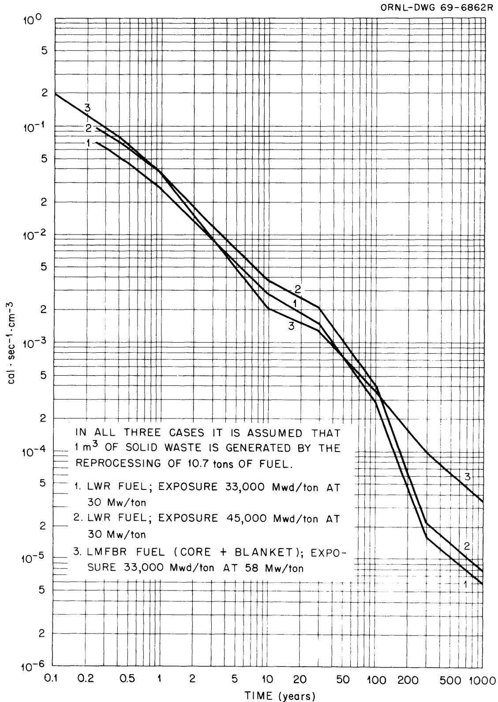  
Fig. 3.1. Variation of Heat Generation Rate in Solid Waste with Time After Discharge from Reactor.

cylinders. The cylinders are $3\mathrm{m}$ long and, even when full of waste with the highest heat-generation rate, their center line temperature must not exceed $900^{\circ}\mathrm{C}$ . With these assumptions, the cylinder diameter can be up to $28~\mathrm{cm}$ if they are cooled by water or up to $21~\mathrm{cm}$ if they are cooled by air. In both cases the cylinders would be filled with waste only for $75\%$ of their volume. Therefore, their effective capacity would be 138 and 78 liters, respectively. Tables 3.7 and 3.8 are tabulations of some of the thermal characteristics of waste cylinders.

The initial heat-generation rates in the cylinders would be 6900 cal/sec and 3900 cal/sec according to the size. This is equivalent to heat fluxes through the cylinder surfaces of 0.33 cal/sec/cm² and 0.25 cal/sec/cm², respectively. If the cylinders were standing in air in an environment at a constant temperature of $27^{\circ}\mathrm{C}$ , heat removal could be achieved by natural convection and radiation with the cylinders' surface at a temperature between 400 and $500^{\circ}\mathrm{C}$ . The heat flux by natural convection from a vertical surface at $420^{\circ}\mathrm{C}$ to air at $27^{\circ}\mathrm{C}$ is about 0.09 cal/sec/cm². For the same conditions the heat flux due to radiation from a material with a surface emissivity of 0.5 is about 0.16 cal/sec/cm². The sum of the fluxes is equal to the thermal flux through the surface of the small cylinders.3.14, 3.15 For the large cylinders a thermal flux of 0.33 cal/sec/cm² would be reached with a surface temperature close to $500^{\circ}\mathrm{C}$ . Under actual storage conditions a cooling system would be necessary for both cylinder sizes.

If a different solidification process were used, different parameters would be necessary for the calculations, but the final result would be similar. In case of granular solids produced by the fluid bed process, several advantages and disadvantages should be considered. The advantages are: (1) no glass-forming materials need be added; (2) the energy requirements for processing are lower due to the lower temperatures needed; (3) the final product is lighter; and (4) a greater volume reduction is achieved. On the other hand, the disadvantages are that: (1) the final product has a much higher leachability and (2) the product has a very low thermal conductivity, requiring the use of smaller containers or the extension of storage in liquid form. Fluid bed solidification could result in a reduced cost for the three steps: (1) solidification, (2) interim

Table 3.7. Thermal Conditions of Cylinders Full of Waste with the Highest Heat Generation Rate   

<table><tr><td>Diameter (cm)</td><td>Heat Generation Rate (cal/sec/cm3)</td><td>Cooling Medium</td><td>Wall Temperature (°C)</td><td>Center Line Temperature (°C)</td></tr><tr><td>28</td><td>5 x 10-2</td><td>Water at 50°C</td><td>50</td><td>870</td></tr><tr><td>28</td><td>5 x 10-2</td><td>Boiling water</td><td>100</td><td>920</td></tr><tr><td>21</td><td>5 x 10-2</td><td>Air</td><td>420</td><td>880</td></tr></table>

Table 3.8. Total Heat Generation Rate and Thermal Flux in Freshly Filled Cylinders ${}^{a}$   

<table><tr><td>Cylinder Diameter (cm)</td><td>Cylinder Length (cm)</td><td>Volumea of Waste in Cylinder (cm3)</td><td>Surfacea of Waste in Cylinder (cm2)</td><td>Total Heat Generation Rate (cal/sec)</td><td>Thermal Flux at the Surface of Cylinder (cal/sec/cm2)</td></tr><tr><td>28</td><td>300</td><td>138,400</td><td>21,100</td><td>6,900</td><td>3.3 x 10-1</td></tr><tr><td>21</td><td>300</td><td>77,850</td><td>15,500</td><td>3,900</td><td>2.5 x 10-1</td></tr></table>

${}^{a}$ Assumes cylinders 75% full.

storage as solid, and (3) transportation to the ultimate disposal site. This saving would be balanced by a possible increase in risk. There would also be an additional cost due to the longer storage period as liquid. Similar considerations would be possible for every other solidification process.

# 3.3 References

3.1. A. Jouan, La vitrification en pot des solutions molybdiques de produits de fission, SCCI-109 (1968).   
3.2. K. J. Schneider, Status of Technology in the United States for Solidification of Highly Radioactive Liquid Wastes, BNWL-820 (1968).   
3.3. R. E. Commander, G. E. Lohse, D. E. Black, E. D. Cooper, Operation of the Waste Calcining Facility with Highly Radioactive Aqueous Waste, ID0-14662 (1966).   
3.4. B. E. Paige, Leachability of Glass Prepared from Highly Radioactive Calcined Alumina Waste, IDO-14672 (1966).   
3.5. A. M. Platt, Editor, Quarterly Progress Report, Research and Development Activities, Fixation of Radioactive Residues, May, June, July 1968, BNWL-889 (1968).   
3.6. A. M. Platt, Editor, Quarterly Progress Report, Research and Development Activities, Fixation of Radioactive Residues, August, September, October 1968, BNWL-923 (1968).   
3.7. R. J. Thompson, J. E. Mendel, J. H. Kleinpeter, Waste Solidification Demonstration Program: Characterization of Nonradioactive Samples of Solidified High-Level Waste, BWL-1393 (1970).   
3.8. A. M. Freke, "Some Aspects of the Public Health Hazard Associated with the Storage or Disposal of Glasses Incorporating Highly Active Fission Product Wastes," Health Phys. 12, 1077-1086 (1966).   
3.9. D. W. Rhodes, Storage and Further Treatment of Product from Fluidized Bed Calcination of Radioactive Wastes, CONF-660208 (1966).   
3.10. U. L. Upson, Observed Properties of Some Solidified High-Level Wastes and Their Stability Under Simulated Storage Conditions, CONF-660208 (1966).

3.11. M. N. Elliot and D. B. Auty, "The Durability of Glass for the Disposal of Highly Radioactive Waste, Discussion of Method and Effect of Leaching Conditions," Glass Technology 9(1), 5-13 (1968).   
3.12. J. R. Grover and D. Walmsley, The Durability of Fingal Glass: Part 3. The Effect of Heat Treatment, AERE-R5583 (1968).   
3.13. ORNL Staff, Siting of Fuel Reprocessing Plants and Waste Management Facilities, ORNL-4451 (1970).   
3.14. J. O. Blomeke, Letter to W. H. McVey, U. S. Atomic Energy Commission (Feb. 26, 1969).   
3.15. W. Davis, Jr., Temperature Profiles within Cylinders Containing Internal Heat Sources and Materials of Temperature-Dependent Thermal Conductivities, Description of Fast Computer Programs as Applied to Solidified Radioactive Wastes, ORNL-4345 (1969).   
3.16. W. Davis, Jr., C. L. Fitzgerald, and H. F. Board, Maximum Temperature Rise in Cylinder Containing Intermediate-Level and High-Level Solidified Wastes, ORNL-4361 (1969).

# 4. INTERIM STORAGE OF SOLID WASTE

At this time no industrial facility for the interim storage of solid waste is in existence; therefore the design and the technology of future storage facilities are still in an undefined stage. Conceptual designs and cost estimates are available for storage of solidified wastes for periods ranging from several years to unlimited duration. Proposals exist for storage in water-filled canals, in water-filled basins, in air-cooled annular bins, in air-cooled concrete vaults, and in air-cooled concrete wells.[4.1, 4.2]

The annular-bin concept has been developed for granular solids produced by the fluidized bed process. These solids can be transported pneumatically to the bins. However, this storage method does not seem suitable for wastes that must be removed after a few years and transported to a different ultimate disposal site. Therefore, only storage facilities for waste cylinders that can be transported without additional processing will be considered in this report.

Most of air-cooled facilities considered assume that cooling is by natural convection. For example, the British proposal for storing glass prepared by the Fingal process is to use air-cooled vaults using natural convection; the warm air escapes through a chimney, and air circulation is maintained by the thermal gradient produced by decay heat. $^{4,3}$

Such a concept has been proposed for the final disposal of solidified waste. 4.3, 4.4

This system is not suitable for waste containing large amounts of transuranics, because the integrity of the concrete vaults and chimneys could not be guaranteed for the extremely long containment times required. Furthermore, cooling by natural convection implies that the heat-generation rate in the waste is low. This means that a long period of interim storage as liquid would be required. In our assumptions a waste of such low heat-generation rate would be shipped directly for ultimate disposal in a deep geologic formation without further interim storage on site. An air-cooled facility for the interim storage of high-level solid waste should be suitable for waste with rather high heat-generation rates, and therefore a forced cooling system would be necessary.

With either water or air cooling, the waste would be stored in rows of vertical cylinders. The distance between cylinders would be controlled by the heat-generation rate of the waste and by the heat-removal capacity of the cooling system. An air-cooled facility, because of the smaller diameter of the cylinders and of the lower cooling efficiency of air in comparison with water, would require more space to accommodate a unit amount of waste.

For the case of under-water storage, it is believed that much technology could be common with present-day pools for the storage of irradiated fuel elements. Water would provide both cooling and shielding, and the handling of cylinders would be much simpler than in an air-cooled facility.

# 4.1 Routine Operation of Interim Storage Facility

In order to define the reference dimensions of the facility, we assume an interim storage facility associated with a reprocessing plant having a capacity of 7.5 tons/day (2250 tons/year). We further assume that the waste is solidified by a glass-forming process and that the solid waste has the characteristics described in the preceding chapter. With these assumptions, the solid waste production is $210\mathrm{m}^3$ per year in 1520 28-cm-diam waste cylinders; for an air-cooled facility serving the same reprocessing plant, the production would be 2700 21-cm-diam cylinders per year. If the storage time as solid is about 9 years, the facility must eventually have a capacity of 13,700 cylinders. If the cylinders are arranged in parallel rows and if each cylinder is allowed a space 1.5 times its diameter in one direction and twice its diameter in the other, the area per cylinder of 28-cm diameter is $2350\mathrm{cm}^2$ . Adding to this a $25\%$ allowance for service areas, we obtain an area of 2940 $\mathrm{cm}^2$ per cylinder. The total area required for 13,700 cylinders would be $4000\mathrm{m}^2$ . With a depth of water of 12 m, the volume of water in the facility would be $48,000\mathrm{m}^3$ , plus the water present in the heat exchanger and demineralization systems.

At capacity, the storage facility can accommodate $1900\mathrm{m}^3$ of solid waste which may have a total heat-generation rate from $17 \times 10^{6}$ cal/sec

to $23 \times 10^{6}$ cal/sec. Therefore, the potential thermal impact of maximum heat rejection will be equivalent to that of a 30 to 50 MW(e) nuclear power reactor.

With the preceding assumptions, the ratio between volume of waste and volume of water is about $1/25$ , and dividing the volume of the waste by the floor area of the storage facility, we obtain $47~\mathrm{cm}^3$ of waste for every square centimeter of floor area. It seems likely that canals or basins will be covered by a building and that the ventilation system will include a condenser to recirculate the water evaporated by the decay heat. Under operating conditions, the average temperature of the cooling water in the facility is assumed to be about $50^{\circ}\mathrm{C}$ . The facility will be designed in such a way that faulty containers can be located and repaired or reencapsulated.

# 4.2 Siting Considerations

If we accept the apparently reasonable assumption that the storage facility for high-level solid waste will be located near the reprocessing plant, site selection will be mainly controlled by the requirements of the fuel reprocessing plant. The problem of the siting of a fuel reprocessing plant has been treated in detail in the ORNL Fuel Reprocessing Plant Siting Report. $^{4.5}$ The main siting criteria will be: (1) rational location in relation to fuel sources, (2) acceptable population distribution, (3) low seismicity, (4) availability of water, and (5) acceptable meteorological conditions. In relation to the meteorological requirements, it must be noted that a reprocessing plant with the capacity of 7.5 tons per day would produce daily from 80,000 to 100,000 Ci of ${}^{85}\mathrm{Kr}$ , and some system of disposal other than release to the atmosphere may be necessary. The disposal of gaseous effluents by deep well injection or the separation of ${}^{85}\mathrm{Kr}$ and its shipment to a suitable disposal site as compressed gas in gas cylinders or as dispersion in a glassy matrix would reduce the importance of the meteorological characteristics of the site.

The storage facility for high-level solid waste will add little to the site requirements. In the case of a water-cooled facility an adequate source of cooling water would be necessary.

Negligible amounts of activity would be expected to be released routinely to the environment from the storage facility. Both in a water-cooled and in an air-cooled facility the waste would be stored at some depth below the ground surface. The hydrologic characteristics of the area, including ion exchange capacity of the geologic materials, the rate and direction of groundwater movement, and regional water utilization, would need to be investigated.[4.6] For all other operations that might result in spilling and leaking of contaminated solutions, a rather deep water table and good ion exchange capacity of the geologic materials are desirable features. A low permeability and high ion exchange capacity of the surrounding geologic materials would be a desirable natural barrier to prevent widespread contamination of the environment by the nonvolatile radionuclides and to provide time for remedial measures in case of disaster.

# 4.3 Possible Mechanisms of Activity Release During Interim Storage

All industrial plants present a certain risk for man; in every complex plant many accidents are possible and, therefore, many risks must be considered. As Farmer has observed, "... there is no logical way of differentiating between credible and incredible accidents."[4·7] All accident evaluations should aim to a quantitative estimate of the probability of the accidental situation. One should bear in mind that the probability of an accident will likely increase with time due to progressive wear and deterioration of the plant. The risk associated with an accident can be equated as the product of the probability times the consequences. For the risk to be acceptable either the probability must be low or the consequences must not be serious. If the consequences of a particular accident are considered catastrophic, it will be the responsibility of the engineers to design the plant with appropriate safeguards to reduce the probability to the low level necessary to make the risk acceptable. The quantitative evaluation of the probability of accidents is very difficult, especially in the nuclear industry which meritoriously has very insufficient statistics. However, the probabilistic approach seems to be the only scientifically valid one for the plants of the future.

The only accident to the storage facility with possibility of very serious consequences is a long or permanent loss of cooling. For a design to be considered acceptable, the probability of such accident must be vanishingly small. As far as the loss of cooling accident is concerned, it seems that the critical situation would be the release to the atmosphere of cesium and ruthenium upon melting of the waste.

The evaluation of consequences of possible accidents to the solid waste storage facility requires assumptions about specific site conditions; therefore, for didactic purposes, we assume a storage facility located in the Oak Ridge Reservation in an outcrop of Conasauga shale. Since evaluations of the consequences of an accident to a high-level liquid waste tank located in a hypothetical tank farm in the same location are available, this choice will permit some useful comparisons.

For liquid waste tanks, it is considered that releases of activity could be caused by one of the following: (1) tank corrosion, (2) loss of cooling, (3) hydrogen explosion, or (4) external causes (earthquake, warfare, sabotage, flood, etc.).<sup>4.8</sup> So far tank corrosion has been the only cause of tank failures. Several tanks in the United States have developed leaks in the course of time, and occasionally high-level waste has been lost to the ground. For example, at Savannah River one of the tanks has lost to the ground about 1000 gal of high-level waste with an estimated 3000 Ci of fission products.<sup>4.9</sup> At Hanford ll tanks have developed leaks to date. In at least one of these cases several thousand curies of fission products have been lost into the ground.<sup>4.10</sup> In none of these cases have significant levels of radioactivity been observed to have migrated far from the point of release. Still this relatively high number of tank failures demonstrates that the probability of release of radionuclides when wastes are stored in liquid form is finite. It is believed that the engineers who will design a solid waste storage facility will have the opportunity of substantially increasing the intrinsic safety of the storage. Every high-level solid waste storage system will provide for double containment; every primary container for solid waste (e.g., the waste cylinder) will contain a very small fraction of the activity contained in one liquid waste tank. Waste cylinders will be easily accessible and easy to inspect. If we compare the possible causes of tank failure listed

above with possible causes of accidents to solid waste, it is evident that in the latter case, no radiolytic hydrogen formation is possible inside the containers; but container failure, loss of cooling, and external causes still must be considered.

The probability of container failure, in any kind of storage facility, is finite. A leakage of activity from the container could be caused by a defective sealing, by a release of overpressure built up inside the container, or by an abnormally high corrosion rate. Under normal conditions none of these events should cause any undue hazard. The cooling fluid monitors would reveal the leakage, and remedial action could be taken.

In case of a water-filled storage facility, the loss of cooling can take two forms: a failure of the water circulation and cooling system, or a loss of water. For the average heat-generation rate in the storage facility, we will consider the three possible waste types of Table 3.6. In all three cases the initial heat-generation rate is assumed to be $5 \times 10^{-2} \, \text{cal/sec/cm}^3$ ; about 10 years after discharge from the reactor the heat generation is reduced to $2.8 \times 10^{-3}$ , $3.8 \times 10^{-3}$ , and $2.1 \times 10^{-3} \, \text{cal/sec/cm}^3$ , respectively, for LWR waste ( $33,000 \, \text{MWd/ton}$ ), LWR waste ( $45,000 \, \text{MWd/ton}$ ), and LMFBR waste. The average heat-generation rate in the storage facility, according to the type of waste that is considered, is $9 \times 10^{-3} \, \text{cal/sec/cm}^3$ , $1.2 \times 10^{-2} \, \text{cal/sec/cm}^3$ , or $1.1 \times 10^{-2} \, \text{cal/sec/cm}^3$ respectively.

Theoretically, $1/25$ of the average heat generated per unit volume of waste is available per unit volume of water. With the assumed average water temperature of $50^{\circ}\mathrm{C}$ before the loss of cooling, the time required for the water to reach boiling is about 38 hr for the minimum heat-generation rate and 29 hr for the maximum. If no water is added, in 17 and 13 more days, respectively, all the water present in the facility would be evaporated, if the initial rate of heating is maintained. (This is a very approximate calculation; all effects of progressive reduction of depth of water on transmission of energy from waste to water are neglected. The design of the interim storage facility will include provisions for the condensation and recycling of evaporated water, and this would prolong the time required for evaporation to dryness.) Therefore,

after loss of cooling, if no remedial action can be taken, the water would be heated to $100^{\circ}\mathrm{C}$ and eventually boiled away. On the other hand, for as long as water covers the top of the waste cylinders, their wall temperature will not exceed $100^{\circ}\mathrm{C}$ and no damage of containers is likely. Therefore, with waste stored in water there would be a certain amount of time, after the occurrence of an accident, during which remedial action could be taken to prevent extensive damage.

If no remedial action is taken or if the accident had caused openings in the bottom of the canals or basins and the water were lost, the waste cylinders would start a progressive self-heating. Such a serious situation could only be caused by catastrophic circumstances that would make it impossible to take the necessary remedial action. If we assume that the water has been lost and that no remedial action is taken, the heating rate of the cylinders would be controlled by their age and by the naturally occurring heat removal mechanisms.

Several possibilities must be considered in relation to heat removal. If the cylinders were left standing on the bottom of empty canals and basins, there would be heat removal by radiation and by convection. If the cylinders were to fall and lie on the bottom, the amount of heat removed by radiation and convection would be lower. If the cylinders were covered by the rubbish of collapsed building and canal walls, even smaller amounts of heat would be removed by conduction, and both heating rates and temperatures attained would be at a maximum. In this last case some cylinders could be broken by the collapse. Because of the many uncertainties, no quantitative assessment of the above factors has been attempted at this time. For cylinders in air, it seems likely that only containers full of waste with a very high heat-generation rate could reach the melting point of stainless steel. If cylinders were buried by a collapsed building, many more would melt. For cylinders that do not melt, but are heated to substantial temperatures, it would be necessary to evaluate the consequences of the overheating, in relation to increased corrosion, and internal pressure buildup.

If a container fails, the volatile components of the waste could be released to the atmosphere from the molten waste. Because of their relatively low vapor pressures, most of the released activity would be due

to cesium and ruthenium. Cesium could be released from molten waste at a rate of 0.5 to $1\%$ per hour. $^{4.11}$ The release of ruthenium is difficult to assess; the available data indicate a rather erratic behavior. Occasionally, ruthenium release rates as high as the ones for cesium have been observed. $^{4.11}$ In Table 4.1 are shown the amounts of ${}^{106}\mathrm{Ru}$ , ${}^{134}\mathrm{Cs}$ , and ${}^{137}\mathrm{Cs}$ that could be released to the atmosphere in a time of the order of 100 to 200 hr after each cylinder melted.

If we assume that only cylinders that have been in storage less than 1 year will release activity to the atmosphere, we can calculate that in a few days as much as $10^{9}$ Ci of ${}^{106}\mathrm{Ru}$ , $5 \times 10^{7}$ Ci of ${}^{134}\mathrm{Cs}$ , and $2 \times 10^{8}$ Ci of ${}^{137}\mathrm{Cs}$ could be released in case of LMFBR waste, and $6 \times 10^{8}$ Ci of ${}^{106}\mathrm{Ru}$ , $3 \times 10^{8}$ Ci of ${}^{134}\mathrm{Cs}$ , and $2 \times 10^{8}$ Ci of ${}^{137}\mathrm{Cs}$ in case of LWR waste (exposure, 33,000 Mw/d/ton). Releases of this order of magnitude could have catastrophic consequences.

If a similar accident should occur in an air-cooled concrete vault, the accident would evolve faster because of the absence of any water to evaporate. It is likely also that, because of the smaller waste cylinders and the greater distance between them, the atmospheric release would be somewhat less. In both kinds of storage facilities, however, the non-volatile components of the waste would remain in situ and be subjected to quite different events. At the high temperatures reached in the storage facility, the concrete would decompose and eventually the waste would come into contact with the surrounding geologic materials. In this condition waste might be exposed to leaching by water and radionuclides transported through the ground. At this point two possibilities must be considered. If the waste is below the water table, groundwater would seep towards the waste continuously. If the waste is above the water table, only rainwater falling directly on it or percolating through the ground would reach it. In the case of waste above the water table, assuming that the yearly rainfall is $1350 \mathrm{~mm}$ and that rainwater falls directly on the waste, with $47 \mathrm{~cm}^{3}$ of waste for each square centimeter of rain collecting floor area, the average heat production in the waste sufficient to evaporate the rainfall completely is $5.3 \times 10^{-5} \mathrm{cal/sec/cm}^{3}$ . We can see in Fig. 3.1 that waste will exceed this heat-generation rate for a considerable length of time. Considering that the rainfall is not

Table 4.1. Inventory of Volatile Radionuclides in Freshly Filled Cylinders (curies)   

<table><tr><td></td><td colspan="2">106Ru</td><td colspan="2">134Cs</td><td colspan="2">137Cs</td></tr><tr><td></td><td>28-cmdiama</td><td>21-cmdiamb</td><td>28-cmdiama</td><td>21-cmdiamb</td><td>28-cmdiama</td><td>21-cmdiamb</td></tr><tr><td>LMFBRwastec</td><td>1.2 x 106</td><td>7.0 x 105</td><td>4.0 x 104</td><td>2.2 x 104</td><td>1.5 x 105</td><td>8.0 x 104</td></tr><tr><td>LWRwasted</td><td>6.1 x 105</td><td>3.3 x 105</td><td>2.5 x 105</td><td>1.4 x 105</td><td>1.5 x 105</td><td>8.0 x 104</td></tr><tr><td>LWRwastee</td><td>6.9 x 105</td><td>3.7 x 105</td><td>3.4 x 105</td><td>1.9 x 105</td><td>2.0 x 105</td><td>1.1 x 105</td></tr></table>

${}^{a}$ One cylinder contains waste from 1.5 ton of fuel.   
bOne cylinder contains waste from 0.8 ton of fuel.   
Fuel (core and blanket) exposure, 33,000 MW/d/ton; 58 MW/ton.   
$\mathbf{d}_{\text {Fuel exposure, } 33,000 \text { MWd/ton; } 30 \text { MW/ton. }}$   
Fuel exposure, 45,000 MW/d/ton; 30 MW/ton.

uniformly distributed throughout the year, it is more meaningful to calculate the amount of water that might fall on the waste during a very high intensity storm. Let us assume a storm with a total precipitation of $400 \mathrm{~mm}$ in $24 \mathrm{hr}$ . Although this would be an exceptional event, an average heat-production rate of $6 \times 10^{-3} \mathrm{cal/sec/cm}^3$ could furnish enough energy to evaporate this amount of water in $24 \mathrm{hr}$ . Therefore, the downward transport of activity by percolating rainwater would be prevented or substantially reduced for rather long times.

In case of waste located below the water table, the amount of groundwater that could come in contact with the waste would be controlled by the seepage rate through the shale and the area through which the seepage occurs. Assuming a seepage rate of $2\mathrm{cm}^3/\mathrm{cm}^2/\mathrm{day}$ and a seepage area of $1\mathrm{cm}^2$ for $110\mathrm{cm}^3$ of waste (based on the geometry of the storage canal), an average heat production of $1.3 \times 10^{-4}$ cal/sec/cm would be enough to completely evaporate all the groundwater seeping into the storage area. If we assume that seepage into the canal occurs from all directions and that the average thickness of seepage is $7\mathrm{m}$ (average depth of water table, $5\mathrm{m}$ ), we obtain $1\mathrm{cm}^2$ of seepage area for $50\mathrm{cm}^3$ of waste. Under these conditions, an average heat production of $3 \times 10^{-4}$ cal/sec/cm would be required to evaporate the incoming groundwater.

Even if the shale were able to produce this flow of water towards the waste, all water would be evaporated for several decades. Only after the heat-production rate has decreased enough to allow some water to seep back into the formation after having been in contact with the waste would the transport of activity by groundwater begin.

Loss of volatile radionuclides to the atmosphere in the first phases of the accident would reduce the heat-production rate. This heat-generation reduction is limited to something between 4 and $13\%$ of the total heat-generating capacity, depending on the type of waste, and would not change the above considerations significantly.

In conclusion, the loss of cooling might result in the melting of a fraction of the waste cylinders and in the atmospheric release of the volatile components if remedial action is not taken. At high temperature the concrete of the bottom of canals, basins, or vaults would be decomposed. The water reaching the waste would be evaporated for a fairly

long time but eventually would leach activity out of the waste and transport it through the ground.

# 4.4 Movement of Radionuclides Through the Ground

For the transport of radionuclides through the ground, it is assumed that the earth behaves like a large unidimensional ion exchange column. No lateral or vertical migration or dispersion is considered, but the spread of the solute is assumed to occur in the same manner as described by Glueckauf for the elution of a band of solute through a chromatographic column. $^{4,12}$ This gives rise to conservative estimates of migration and levels of soil loading, because multidimensional movement or dispersion would result in greater amounts of soil material being contacted within a given linear distance. The details of the assumptions and calculations can be found in Appendix A and are based on information obtained in published literature wherever possible.

The results of some typical calculations for the extent of movement of $90\mathrm{Sr}$ , $137\mathrm{Cs}$ , $239\mathrm{Pu}$ , and $241\mathrm{Am}$ from a variety of physical forms of stored wastes are depicted in Figs. 4.1 to 4.4. In all cases it is assumed that no remedial action is taken to deter underground movement. The rates of movement of all radionuclides are considerably lower than that of the transporting solution, due to the absorptive properties of soil material. One interesting aspect of these calculations is that they indicate that the original physical form of the waste material is of limited importance in restricting the long-term radionuclide movement. The reasons are: (1) Even for the relatively insoluble solidified wastes the times required for dissolution are shorter than those required for radioactive decay of the long-lived radionuclides. Thus, a large fraction of the total activity of long-lived radionuclides would be dissolved if the waste were exposed to the leaching action of groundwater. (2) Most anions do not interact strongly with mineral surfaces; so the increased electrolyte content of groundwater, due to liquid leaks or to dissolution of the more soluble solid material, would be dissipated more quickly than the pulse of radioactivity released. This means that for most of the time the pulse of radioactivity would be transported in groundwater of normal

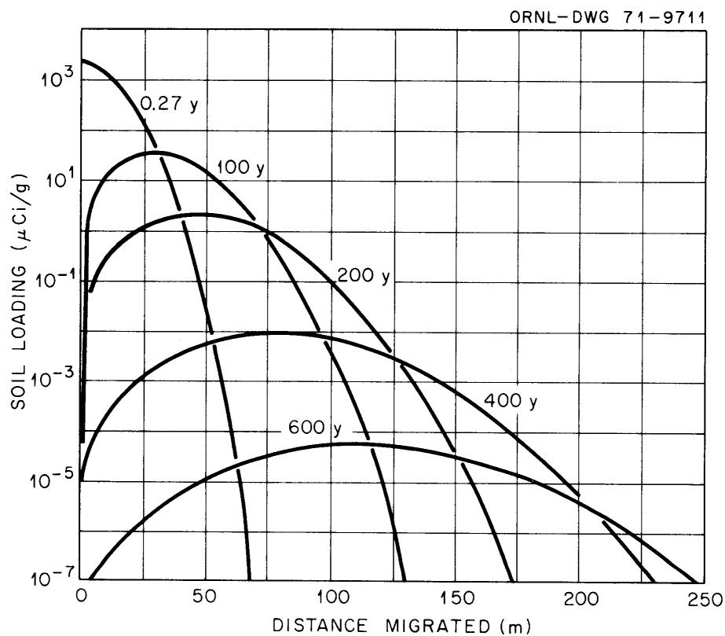  
Fig. 4.1. Predicted Movement of $^{90}\mathrm{Sr}$ from the Leaching of Pot Calcine Material.

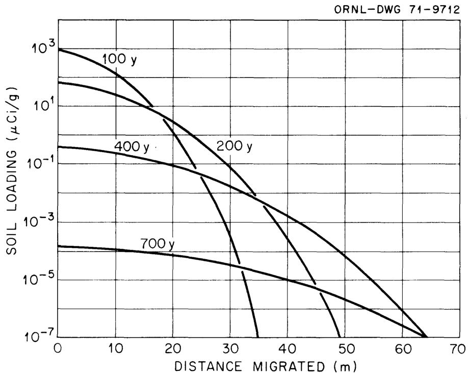  
Fig. 4.2. Predicted Movement of $^{137}\mathrm{Cs}$ from the Leaching of Spray Melt Material.

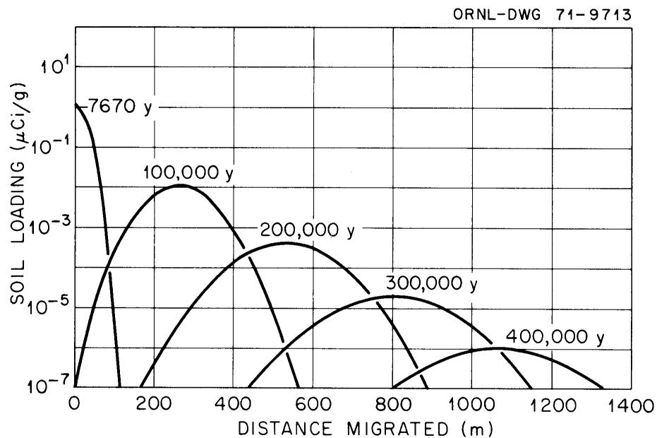  
Fig. 4.3. Predicted Movement of $^{239}\mathrm{Pu}$ from the Leaching of Glass Having a Leach Rate Controlled by Diffusion of $10^{-5} \, \text{cm}^2/\text{sec}$ .

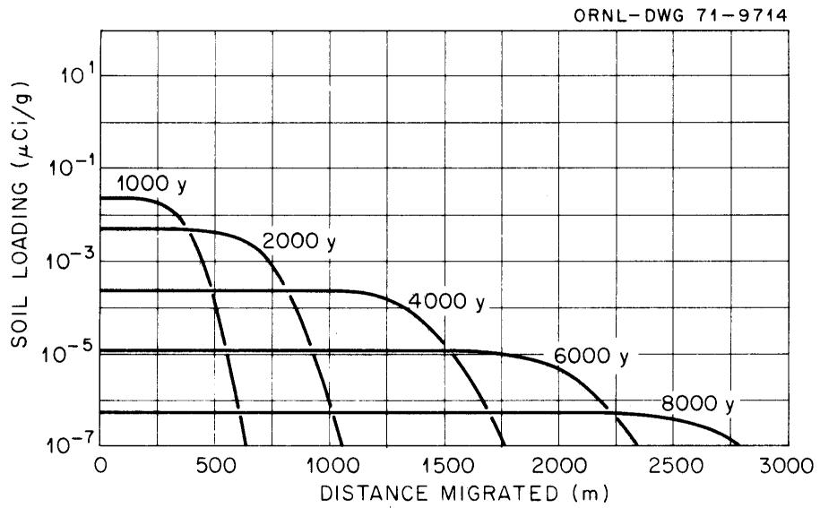  
Fig. 4.4. Predicted Movement of $^{241}\mathrm{Am}$ from the Leaching of Glass Having a Leach Rate Controlled by Diffusion of $10^{-6} \, \mathrm{cm}^2/\mathrm{sec}$ .

concentrations rather than in a highly salted solution and that the rates of radionuclide migration and extents of movement would be essentially the same regardless of the initial salt concentration. In the case of $^{137}\mathrm{Cs}$ , selective adsorption limits its movement very markedly. This is due primarily to the steric favorability of exchange sites on most clay minerals for ions the size of cesium. $^{4,13,4,14}$ Field measurements of the extent of cesium movement in Conasauga shale due to liquid releases into surface pits confirm that cesium mobility in this formation is quite low. $^{4,15}$

Strontium-90 would be expected to be somewhat more mobile than $^{137}\mathrm{Cs}$ , especially in cases where caustic is not added to favor coprecipitation with calcium carbonate. $^{4,16}$ Strontium would be expected to behave similarly to calcium, which is the predominant stable element on the exchange complex of most soils in temperate climates.

Plutonium-239, plutonium-240, americium-241, and americium-243 would be expected to migrate considerably further than either $^{137}\mathrm{Cs}$ or $^{90}\mathrm{Sr}$ , primarily because of their much longer half-lives. Even though the rates of movement of these nuclides are very low due to formation of radiocolloids, there can be appreciable translocation if leaching is continued for thousands of years. These extents of movement are based on the properties of Conasauga shale. Shales generally have very good sorptive properties for radiocations because of their high clay content and relatively slow rates of water migration due to their low permeability. Other formations may restrict the migration of radionuclides to a much lesser extent, if the waste is subjected to the leaching action of moving groundwater. If the formation is devoid of water, migration could occur only as the result of surface diffusion on earth particles; migration in systems where there is water that is not moving could occur as surface diffusion and molecular diffusion in the interstices of the formation. In these cases one would expect the rates of migration to be orders of magnitude less than in situations where convective transport by moving groundwater occurs.

Actually, under the local conditions in Conasauga shale, the transporting groundwater would intercept the surface after moving about $60\mathrm{m}$ . In this situation the initial mobility of the waste has a marked influence

on both the concentration and total quantity of radionuclides that reach surface waters (Figs. 4.5 to 4.8). This is especially true for $^{137}\mathrm{Cs}$ which has both a very restricted rate of movement in the ground and a short half-life relative to the transuranics $^{239}\mathrm{Pu}, ^{240}\mathrm{Pu}, ^{241}\mathrm{Am},$ and $^{243}\mathrm{Am}$ .

Of course it is impossible to ascertain that a given direction and rate of groundwater flow will be maintained for thousands of years, but if the assumed conditions are continuously maintained, significant migration of each of these radionuclides could occur before they had decayed to innocuous levels. During such time periods, it may also be an oversimplification to assume that the solid matrix on which absorption occurs is not moving. Hence, it should be pointed out that the calculated extents of movement of these radionuclides are subject to large degrees of error and that the results are not to be construed as real predictions but are to be used only as an indication of the relative extent of movement that could be encountered.

# 4.5 Conclusions

It is believed that a loss of cooling accident could develop into the very serious situation described if no remedial action were taken in time. The lack of remedial action could be caused only by an external major disturbance that at the same time causes the loss of cooling and prevents further operation of the storage facility. Such an external cause can be imagined as natural or caused by human action. In case of natural disasters, such as earthquakes and floods, both the probability and the consequences of an accident would be minimized by careful design and siting.

The evaluation of the probability of man-caused disruption, either because of madness, sabotage, or warfare, cannot be based on characteristics of the site and will not be discussed here. However, appropriate siting of the facility and suitable geologic conditions at the site would always minimize the gravity of the consequences.

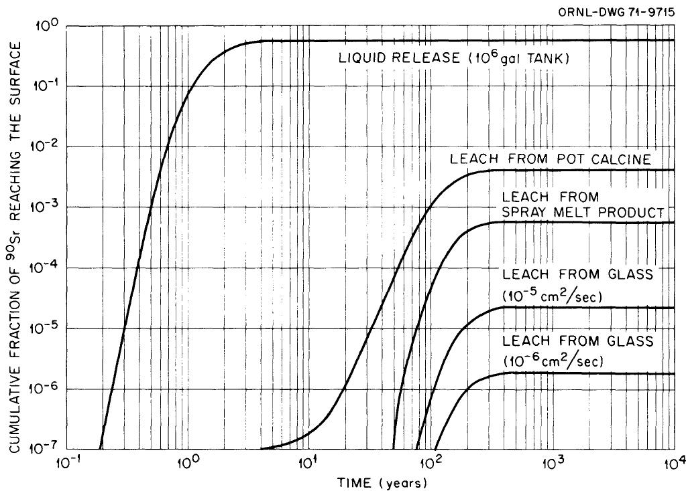  
Fig. 4.5. Cumulative Fraction of $^{90}\mathrm{Sr}$ Originally Present in Various Forms of Waste That Would Reach a Seep 60 Meters from the Source Under Conditions of Continuous Leaching.

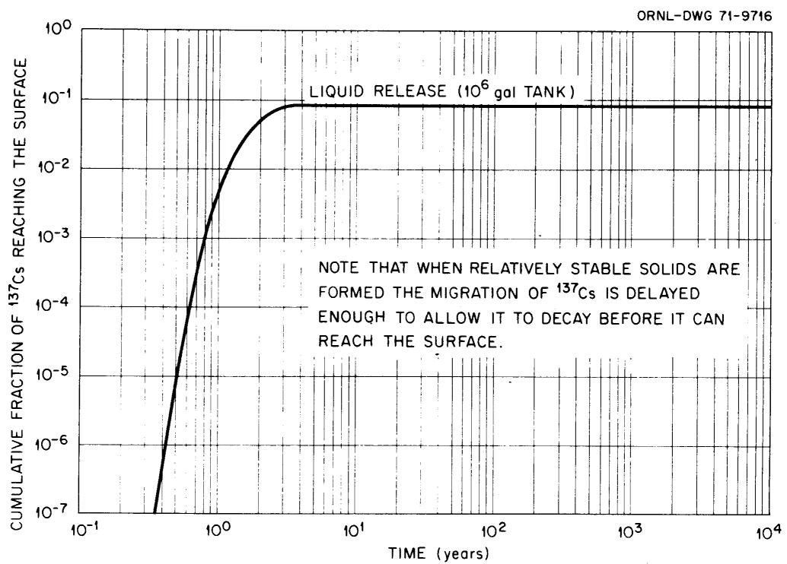  
Fig. 4.6. Cumulative Fraction of $^{137}\mathrm{Cs}$ Originally Present in Various Forms of Waste That Would Reach a Seep 60 Meters from the Source Under Conditions of Continuous Leaching.

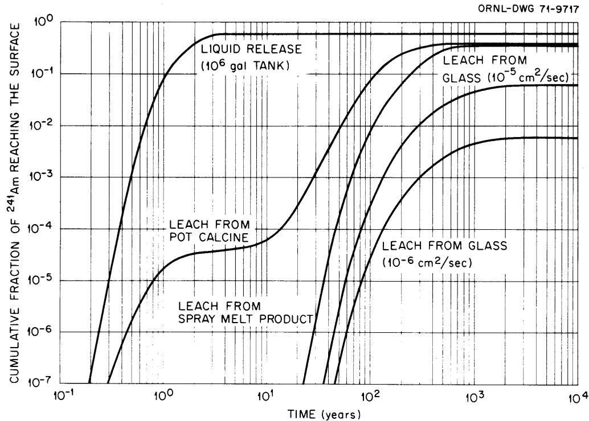  
Fig. 4.7. Cumulative Fraction of $^{241}\mathrm{Am}$ Originally Present in Various Forms of Waste That Would Reach a Seep 60 Meters from the Source Under Conditions of Continuous Leaching.

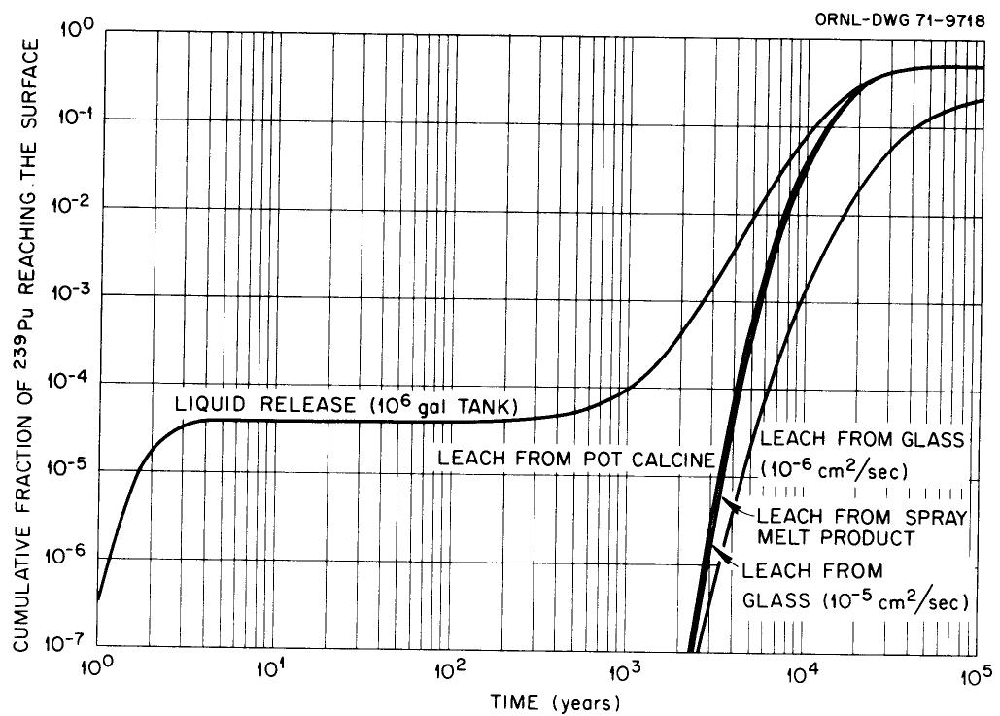  
Fig. 4.8. Cumulative Fraction of $^{239}\mathrm{Pu}$ Originally Present in Various Forms of Waste That Would Reach a Seep 60 Meters from the Source Under Conditions of Continuous Leaching.

# 4.6 References

4.1. J. J. Perona, R. L. Bradshaw, and J. O. Blomeke, Comparative Cost for Final Disposal of Radioactive Solids in Concrete Vaults, Granite, and Salt Formations, ORNL-TM-664 (1963).   
4.2. J. O. Blomeke, J. J. Perona, H. O. Weeren, and R. L. Bradshaw, Evaluation of Ultimate Disposal Methods for Liquid and Solid Radioactive Wastes: Part III. Interim Storage of Solidified Wastes, ORNL-3355 (1963).   
4.3. D. W. Clelland, A. D. W. Corbet, and R. F. Coles, "Design of a Plant for the Incorporation of Highly Active Wastes Into Glass," Chem. Engr. Progr. Symp. Ser. 65(94), 89-101 (1969).   
4.4. L. C. Watson, H. K. Roe, R. W. Durham, E. J. Evans, and D. H. Charlesworth, Methods of Storage of Solids Containing Fission Products, CRCE-736 (June 1958).   
4.5. ORNL Staff, Siting of Fuel Reprocessing Plants and Waste Management Facilities, ORNL-4451 (1970).   
4.6. F. Gera, O. Ilari, M. Mirone, C. Sennis, and F. Velona, Guida per la raccolta delle informazioni necessarie per l'analisi e la valutazione del sito di un reattore nucleare, PROT SAN/06/69, CNEN, Italy (1969).   
4.7. F. R. Farmer, "Reactor Safety and Siting: A Proposed Risk Criterion," Nuclear Safety 8(6), 539-548 (1967).   
4.8. J. O. Blomeke and L. C. Emerson, A Safety Analysis of Tank Storage, ORNL-TM-1465 (1965), pp. 35-41.   
4.9. J. Henry Horton, Jr., Savannah River Laboratory, Aiken, South Carolina, personal communication, 1969.   
4.10. D. J. Brown, Atlantic Richfield Hanford Company, Richland, Washington, personal communication, 1969.   
4.11. A. E. Albrethsen, L. C. Schwendiman, Volatilization of Fission Products from High Level Ceramic Wastes, BNWL-338 (1967).   
4.12. E. Glueckauf, "Theory of Chromatography. Part 9. The 'Theoretical Plate' Concept in Column Separations," Trans. Faraday Soc. 51, 35-44 (1955).

4.13. D. G. Jacobs, "Sorption of Cesium by Conasauga Shale," Health Phys. 4, 157-163 (1960).   
4.14. D. G. Jacobs and T. Tamura, "The Mechanism of Ion Fixation Using Radioisotope Techniques," Trans. 7th Int. Congr. Soil Sci., Madison, Wisconsin 2, 206-214 (1960).   
4.15. T. F. Lomenick, D. G. Jacobs, and E. G. Struxness, "The Behavior of Strontium-90 and Cesium-137 in Seepage Pits at ORNL, Health Phys. 13, 897-905 (1967).   
4.16. D. G. Jacobs, "Ion Exchange in the Deep Well Disposal of Radioactive Wastes," pp. 43-54 in Int. Colloq. on Retention and Migration of Radioactive Ions in Soils, Saclay, France, October 16-18, 1962 (1963).

# 5. GELOGIC PROCESSES RELEVANT TO THE ULTIMATE DISPOSAL

Early proposals for long-term management of high-level radioactive waste apparently assumed that a thousand years containment would be sufficient. However, we believe that, in view of the projections of Chapter 1, much longer containment times will be required because of the presence of transuranics. A realistic evaluation needs to be made of the long-term hazards that would result from the presence of plutonium isotopes in the environment. At present it seems prudent to assume that the hazards are high and that the waste will require containment for periods of several hundreds of thousands of years, which is very long relative to man's written history of a few thousand years. The only realistic solution to such a problem is utilization of a relatively deep geologic formation which, by its nature, is capable of permanently preventing the waste from entering the biosphere. The selection of a suitable formation will require the capability of making some kind of geologic predictions for the time period covering the next million years.

It is necessary to consider such factors as change in climate, change in hydrology, erosion (channel and hillslope erosion, glacial erosion, etc.), tectonism (orogeny, epirogeny, subsidence, etc.), and volcanism. All these need to be evaluated in addition to the short-term geological considerations of faulting, earthquakes, groundwater motion, etc., that are normally considered in the siting of nuclear facilities.

Geology, up to the present time, has been a science with limited predictive capability. So far no consistent, comprehensive theory capable of explaining the major geologic features of the earth has been available. Developments of the last few years may eventually provide earth scientists with a logical model capable of explaining the tectonic features of the earth. The recent demonstration of ocean floor spreading has caused the rebirth and affirmation of the once-dead theory of continental drift. From this recent evidence has evolved a new tectonic interpretation called plate tectonics.[5.1-5.3] The new theory is presently based mainly on oceanic data. In the future a careful reevaluation of the geologic interpretation of continental areas will be necessary. The question to be answered is if the detailed knowledge of continental geology can be

reinterpreted in agreement with the moving plates of a dynamic earth. If plate tectonics theory survives this test, geologic predictions should become feasible.

The particular kind of predictions necessary for management of radioactive waste are concerned with small areas and relatively short periods of time, geologically speaking. Therefore to have predictions of practical utility in relation to the waste management problem, fine details for local areas will need to be included in the general model. While it seems reasonable that eventually this will become possible, it is presently impossible to estimate how long it will take.

At this time, it is impossible to make exact predictions, but we can evaluate upper limits for the order of magnitude of geologic changes expected in the next few hundred thousand years. Such evaluations are based on two kinds of observations:

1. The present rate of geologic processes.   
2. The magnitude of changes that have occurred in the recent geologic past.

For the second point a study is required of selected geologic events of the Quaternary period. Unfortunately, cursory review of the literature about Quaternary geology brings to light many difficulties: like a confusing terminology and duration estimates for this period varying from 700,000 years to more than 3 million years.[5.4-5.9] Such disagreement is hard to believe for this best known of all geologic periods, but it is a fact that many correlations between geographically separated Quaternary successions are controversial. The problem is complicated by boundaries based on stratigraphic features that are generally time transgressive.[5.10-5.12] In addition most Quaternary successions do not contain rocks suitable for radioactive dating. However, we can conservatively assume that events reported as having occurred during the Pleistocene or the Quaternary* evolved in a time span of about a million years.

A million years is not a very long time from a geologic point of view. All major geological features of the earth required much longer times for their evolution. Still, it is known that during the Pleistocene the earth's crust was subjected to local changes of great magnitude. There is evidence that we are living in a geologically peculiar period. Characterized by fast changes, typical, at most, of only a few earlier time spans of comparable length.[5.13] For the past 90 million years the epicontinental seas have been retreating and the average elevation of continents has been increasing, resulting in an extreme condition of continentality. This causes severe climatic conditions and high rates of erosion and sedimentation.[5.13-5.14]

In the Pleistocene, wide areas have been uplifted while others have been covered with hundreds of meters of sediments, proof of fast subsidence. The climate has been subjected to a series of major changes that have resulted in repeated glacial episodes. Mean sea level has been rising and falling according to the amount of water bound on land as ice. Rivers have cut deep valleys and then refilled them with sediments only to cut again into the sediment. Several erosion cycles have occurred, as shown by the remains of terraces along many valleys. Glaciers have left a typical morphology in wide areas with steep glacial valleys, lakes, moraines, drumlins, and eskers. The melting of the ice caps removed a load from areas of the earth crust that had previously subsided under the weight. The isostatic uplift in these previously glaciated areas has been and is, in a geological sense, a very fast movement. The last maximum in the extent of glaciation was only 20,000 years B.P. (before present); since that time the sea level has risen more than 100 m.[5,15] Other geological phenomena that are able to change the physical condition of certain areas in times that are short even compared to historic times are faulting and volcanic activity.

# 5.1 Stream Erosion

Rates of erosion vary greatly from place to place, and in the same place from time to time. The rate of denudation (the average rate at

which material is removed from an area) is controlled by climate, relief, and the lithological nature of materials subjected to erosion; occasionally, human activity is a major factor. In Table 5.1 are listed some examples of long-term denudation rates for a few geographical regions. In Table 5.2 are estimates of present regional erosion rates for several geographical regions of the United States.

The effect of agriculture and other human activities on the rate of denudation can be quite pronounced. Judson has estimated the present rates of erosion in west-central Italy, especially north of Rome, and compared them with the denudation rates before the days of agriculture.[5.20] The present rates of erosion, determined from stream records, agree very well with archaeological records extending over more than 2000 years. In Table 5.3 are shown some rates of erosion for archaeological sites near Rome. It is interesting to observe that most of the sites mentioned in the table are located in hilly areas with an elevation of a few hundred meters above sea level. The historical rates of erosion vary between 10 and 100 cm/1000 years with most of the data in the range of 20 to 50 cm/1000 years. For the preagricultural era, erosion rates of 2 to 3 cm/1000 years are indicated, about an order of magnitude less than in historical times. It is likely that in the future, with the present trend in population increase, human pressure on the environment will increase.[5.20, 5.21]

Ursic and Dendy have studied the annual sediment yields from small upland watersheds in northern Mississippi. The production of sediments is greatest from cultivated land and is lowest for pine plantations and mature pine-hardwoods; intermediate values are observed for pasture, abandoned fields, and depleted hardwoods.[5.22] Table 5.4 shows the values; the range is striking, covering more than three orders of magnitude.

Table 5.5 illustrates the influence of relief and climate on denudation. Denudation rates for plateaus and high-elevation piedmonts, areas which are high above sea level but which have slopes similar to those of lowlands, are intermediate between those of the mountains and the lowlands. Areas of very recent orogenesis will have the steepest relief and the highest denudation rates.[5.23]

Table 5.1. Past and Present Rates of Denudation (from Menard, 1961 $^{5.16}$ )   

<table><tr><td>Region</td><td>Area Denuded (106km2)</td><td>Timea (106yr)</td><td>Volume Deposits (106km3)</td><td>Denud-ation (km)</td><td>Past Rate (cm/1000 yr)</td><td>Present Rate (cm/1000 yr)</td><td>Ratio of Past and Present Rate</td></tr><tr><td>Appalachian</td><td>1.0</td><td>125</td><td>7.8</td><td>7.8</td><td>6.2</td><td>1.1d</td><td>5.6</td></tr><tr><td>Mississippi</td><td>3.2 (1.6)b</td><td>150</td><td>11.1</td><td>6.9</td><td>4.6</td><td>4.6e</td><td>1.0</td></tr><tr><td>Himalaya</td><td>1.0</td><td>40</td><td>8.5</td><td>8.5</td><td>21</td><td>100f</td><td>0.2</td></tr><tr><td>Rocky Mountain (L. Cret.)c</td><td>0.8</td><td>25</td><td>0.6</td><td>0.7</td><td>3</td><td>---</td><td>---</td></tr><tr><td>Rocky Mountain (U. Cret.)c</td><td>&lt; 0.4</td><td>40</td><td>2.2</td><td>&gt;4.8</td><td>12 - 20</td><td>---</td><td>---</td></tr></table>

aGeological Names Committee, 1958, U. S. Geological Survey.   
bArea denuded in past.   
cGilluly (1949).5.17   
d Suspended load of rivers + 33% (33% added by Leopold et al., 1964).5.18   
${}^{e}$ Suspended load of rivers + 10% (10% added by Leopold et al., 1964). 5.18   
f Suspended load of rivers.

Table 5.2. Rates of Regional Erosion in the United States   
(Modified from Judson and Ritter, 19645.19)   

<table><tr><td rowspan="2">Drainage Region</td><td rowspan="2">\(Drainage\ Area^a\) (103km2)</td><td rowspan="2">Runoff (103m3/sec)</td><td colspan="3">Load (tons/km2/yr)</td><td rowspan="2">Denudation (cm/1000 yr)</td><td rowspan="2">% Area Sampled</td><td rowspan="2">Average Years of Record</td></tr><tr><td>Dissolved</td><td>Solid</td><td>Total</td></tr><tr><td>Colorado</td><td>629</td><td>0.6</td><td>23</td><td>417</td><td>440</td><td>17</td><td>56</td><td>32</td></tr><tr><td>Pacific Slopes, California</td><td>303</td><td>2.3</td><td>36</td><td>209</td><td>245</td><td>9</td><td>44</td><td>4</td></tr><tr><td>Western Gulf</td><td>829</td><td>1.6</td><td>41</td><td>101</td><td>142</td><td>5</td><td>9</td><td>9</td></tr><tr><td>Mississippi</td><td>3238</td><td>17.5</td><td>39</td><td>94</td><td>133</td><td>5</td><td>99</td><td>12</td></tr><tr><td>South Atlantic and Eastern Gulf</td><td>736</td><td>9.2</td><td>61</td><td>48</td><td>109</td><td>4</td><td>19</td><td>7</td></tr><tr><td>North Atlantic</td><td>383</td><td>5.9</td><td>57</td><td>69</td><td>126</td><td>5</td><td>10</td><td>5</td></tr><tr><td>Columbia</td><td>679</td><td>9.8</td><td>57</td><td>44</td><td>101</td><td>4</td><td>39</td><td>&lt; 2</td></tr><tr><td>Totals</td><td>6797</td><td>46.9</td><td>43</td><td>119</td><td>162</td><td>6</td><td></td><td></td></tr></table>

aGreat Basin, St. Lawrence, and Hudson Bay drainage not considered.

Table 5.3. Rates of Erosion Based on Data from Archeological Sites Near Rome   
(Modified from Judson, 1968<sup>5.20</sup>)   

<table><tr><td>Archeologic Site</td><td>Length of Record</td><td>Nature of Measurement</td><td>Bedrock</td><td>Slope (degrees)</td><td>Erosion Rate (cm/1000 yr)</td></tr><tr><td>Veii</td><td>800-600 B.C. to present</td><td>Erosion over graves in Villanovan Cemetery</td><td>Pleistocene tuff</td><td>3-7</td><td>30</td></tr><tr><td rowspan="2">Villa Formello</td><td rowspan="2">A.D. 0-100 to present</td><td>Exposed footings of cistern</td><td>Pliocene sand and gravel</td><td>4</td><td>30</td></tr><tr><td>Exposed footings of mausoleum</td><td>Pliocene sand and gravel</td><td>7</td><td></td></tr><tr><td>Casentile</td><td>A.D. 100-200 to present</td><td>Exposed footings of cistern</td><td>Pleistocene tuff</td><td>7</td><td>50</td></tr><tr><td>Casalacia</td><td>A.D. 0 to present</td><td>Exposed footings of cistern</td><td>Pleistocene tuff</td><td>7</td><td>30</td></tr><tr><td>Sambuco</td><td>200-100 B.C. to present</td><td>Movement of foundations</td><td>Miocene clay and lime-stone</td><td>7</td><td>40</td></tr><tr><td>Via Prenestina</td><td>300-100 B.C. to present</td><td>Exposed footings of road</td><td>Pleistocene tuff</td><td>7</td><td>30</td></tr><tr><td>Treia</td><td>1000-450 B.C.</td><td>Sediment accumulated from known area</td><td>Pliocene clay and gravel-- Pleistocene tuff</td><td>2-90</td><td>100</td></tr></table>

Depth of erosion is based on a density of 2.6 for the material eroded.

Table 5.4. Sediment and Surface Water Yields<sup>a</sup> (Modified from Ursic and Dendy, 1965<sup>5,22</sup>)   

<table><tr><td rowspan="2">Land Use or Cover Type</td><td rowspan="2">Average Annual Rainfall (mm)</td><td rowspan="2">Average Annual Runoff (mm)</td><td colspan="2">Annual Sediment Yields</td><td colspan="2">Denudation Ratesb</td></tr><tr><td>Means (tons/hectare)</td><td>Ranges (tons/hectare)</td><td>Means (cm/1000 yr)</td><td>Ranges (cm/1000 yr)</td></tr><tr><td>Open land:</td><td></td><td></td><td></td><td></td><td></td><td></td></tr><tr><td>Cultivated</td><td>1320</td><td>405</td><td>48</td><td>7.35-96.50</td><td>185</td><td>28-371</td></tr><tr><td>Pasture (one unit)</td><td>1295</td><td>380</td><td>3.61</td><td>2.67-4.55</td><td>14</td><td>10-17</td></tr><tr><td>Forest land:</td><td></td><td></td><td></td><td></td><td></td><td></td></tr><tr><td>Abandoned fields</td><td>1295</td><td>180</td><td>0.29</td><td>0.023-1.21</td><td>1.1</td><td>0.1-5</td></tr><tr><td>Depleted hardwoods</td><td>1295</td><td>130</td><td>0.23</td><td>0.045-0.72</td><td>0.9</td><td>0.2-3</td></tr><tr><td>Pine plantations</td><td>1370</td><td>25</td><td>0.045</td><td>0.00-0.18</td><td>0.2</td><td>0.0-0.7</td></tr><tr><td>Mature pine hardwoodsc</td><td>1295</td><td>230</td><td>0.045</td><td>0.023-0.09</td><td>0.2</td><td>0.1-0.3</td></tr><tr><td>Gulliesd,e</td><td>1345</td><td></td><td>408</td><td>189-895</td><td>1570</td><td>727-3442</td></tr></table>

${}^{a}$ Data are means of 9 values,3 replications of each cover for the 3 years,1959-1961,except pine hardwoods (1960-1961).   
bAssumes a density of 2.6 for material eroded.   
These watersheds are on hydrologically shallow soils.   
dAverage annual rainfall and sediment outflow from seven gullies for the 5 years, 1956-1960.   
C. R. Miller, Woodburn, Russel, and H. R. Turner, "Upland Gully Sediment Production," Symposium of Bari, Internatl. Assoc. Sci. Hydrol. Pub. 59, 1962.

Table 5.5. Relative Rates of Denudation in Uplands and Lowlands in Different Climates (Modified from Corbel, 1959<sup>5.23</sup>)   

<table><tr><td>Physiographic Environment</td><td>Estimated Rate of Denudation (cm/1000 yr)</td></tr><tr><td colspan="2">Lowlands: slope ≤ 0.001</td></tr><tr><td>Periglacial climate, permafrost</td><td>1.5</td></tr><tr><td>Climate with snow accumulation in winter</td><td>2.9</td></tr><tr><td>Temperate oceanic climate (Lower Rhine, Seine, Lower Loire)</td><td>2.7</td></tr><tr><td>Continental climate (Missouri-Mississippi)</td><td>5.8</td></tr><tr><td>Hot-dry climate (Mediterranean-New Mexico)</td><td>1.2</td></tr><tr><td>Tropical desertic climate (Central Sahara)</td><td>0.1 (?)</td></tr><tr><td>Hot-moist climate with dry season</td><td>3.2</td></tr><tr><td>Hot-moist climate, equatorial</td><td>2.2</td></tr><tr><td colspan="2">Mountains: slope ≥ 0.01</td></tr><tr><td>Periglacial climate (Glamaa, Bövra, Ht. Drac, Arve)</td><td>60</td></tr><tr><td>Extreme nival climate (Southeastern Alaska)</td><td>80</td></tr><tr><td>Oceanic climate, intermediate elevation</td><td>22</td></tr><tr><td>Mediterranean climate, high elevation (Durance, Gran Sasso)</td><td>45</td></tr><tr><td>Mediterranean climate, semi-dry (Isonzo, Brenta)</td><td>10</td></tr><tr><td>Hot-dry climate (Southwestern United States, Tunisia)</td><td>18</td></tr><tr><td>Hot-moist climate (Usumacinta)</td><td>9.2</td></tr></table>

Schumm, by plotting the denudation rates for drainage areas of about $4000\mathrm{km}^2$ versus the relative relief of the basin (relief of basin divided by basin length), obtained the curves of Fig. 5.l. Curve 1 is obtained by plotting calculated maximum values, while curve 2 represents average rates of denudation. Curve 2 has been obtained by extrapolating the rates of denudation actually observed in small basins located in the semiarid Western United States. The extrapolation to erosion rates for drainage basins of $4000\mathrm{km}^2$ is based on a relation between drainage area and rate of erosion proposed by Brune. According to this relation, rates of denudation are inversely proportional to the 0.15 power of the drainage area. Because length is constant, Fig. 5.l shows also the increase in denudation rates as the relief of the basin is increased to 9000 m.

Most of the denudation rates mentioned above are average values for entire basins or even for large-scale geographical regions. It should be kept in mind that erosion can be very much more active on a local scale. A small drainage basin in the loess hills of Iowa, with an area of 3.4 km², provides an extreme example. Here sediments are being removed at a rate which produces a denudation for the basin of 12.8 m per 1000 years.[5,29] Loess is characterized by little resistance to erosion; therefore after all the loess is removed, the rate of erosion will be expected to decrease.

The rate of valley cutting by streams can be very different from the average rate of denudation of an entire watershed. A classic example of this is the Grand Canyon. The plateau which has been carved by the Colorado River extends over much of Utah, Arizona, New Mexico, and western Colorado. The morphology of the plateau surface indicates a very advanced erosion cycle. The region formed a peneplane when it was uplifted to a height of 1800 to 2400 m above sea level; this started the present erosion cycle, during which the Canyon was carved. The Grand Canyon is a very impressive morphologic feature, 350 km long and with a maximum depth exceeding 1600 m. The time required for the formation of the Canyon is difficult to assess, but estimates of 1.5 to 2 million years are probably close to the truth. This gives an apparent cutting rate of about 80 cm/1000 years for the Canyon, almost five times as high

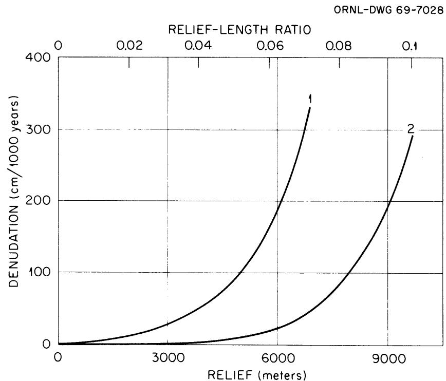  
Fig. 5.1. Relation of Denudation Rates to Relief-Length Ratio and Drainage Basin Relief. Denudation rates are adjusted to drainage areas of about $4000\mathrm{km}^2$ . Curve 1 is based on the average maximum denudation rate of 91.5 cm/1000 years when relief-length ratio is 0.05. Curve 2 is based on actual data from small drainage basins in areas underlain by sandstone and shale in semiarid regions of the western United States (Modified from Schumm, 19635-24).

as the regional denudation rate, 17 cm/1000 years, estimated by Judson and Ritter.[5.19] The real cutting rate could be even higher, because the Colorado River has cut the present depth of the Canyon plus the thickness of material removed from the surrounding highlands. Not many rivers can be expected to have deepened their valleys at such a high rate, but many valleys show evidence of changes in floor level in Quaternary times of hundreds of meters.[5.30-5.33]

# 5.2 Orogenic and Epeirogenic Uplift

The Colorado Plateau is a very good example of how a peneplane with very low erosion rates can be rejuvenated and subjected to much higher erosion rates. Consideration of possible erosion rates of the future must not overlook the possible uplift of the area.

The Table 5.6 is a partial list of areas that have been subjected to uplifting in Pleistocene times. Some of these rates of uplift are rather high. For example, the foothills of the southern Himalaya have been uplifted about $1800\mathrm{m}$ since the beginning of middle Pleistocene. In Calabria (southern Italy) early Pleistocene marine sediments have been found at an elevation of $1000\mathrm{m}$ above sea level. However, these values, if averaged, give minimum rates, because the major portion of the uplift probably occurred during a fraction of the total time. In fact, rates of uplift measured at the present time in areas of active orogeny far exceed the average values obtained from geologic evidence. In Table 5.7 are some examples of present rates of orogenic uplift. The rates of epeirogenic uplift observed by Cailleux along seacoasts are much lower. The average value is $1\mathrm{mm}/$ year, with a range between 0.1 and 4 mm/year.[5.34] Kafri reports observations about vertical movements in northern Israel.[5.35] From these data it can be concluded that velocity of movement is very time dependent. For intervals of a few years, displacement rates as high as 50 to $60\mathrm{mm}/$ year were observed. On the other hand, for time intervals of about 20 years the velocities are a few millimeters per year.[5.35, 5.36]

Table 5.6. Partial List of Highlands Uplifted in Pleistocene Time (Modified from Flint, a 19575.13)   

<table><tr><td>Highland Unit</td><td>Type of Uplift
E = epiirogeny
0 = orogeny</td><td>Amplitude
(meters)</td><td>Date</td></tr><tr><td>A. Americas</td><td></td><td></td><td></td></tr><tr><td>Rocky Mountains, Colo.</td><td>E</td><td>1800</td><td>Post-late Pliocene</td></tr><tr><td>San Juan Mountains,
Colo.</td><td>E</td><td>1000</td><td>Post-late Pliocene</td></tr><tr><td>Uinta Mountains, Utah</td><td>E</td><td>2400-3000</td><td>Pliocene and Early
Pleistocene</td></tr><tr><td>Rocky Mountains, Mont.</td><td>E</td><td>Many hun-
dreds of
meters</td><td>Late Pliocene and Early
Pleistocene</td></tr><tr><td>Basin and Range region,
Nevada, etc.</td><td>E</td><td></td><td>Early Pleistocene</td></tr><tr><td>Sierra Nevada, Calif.</td><td>E</td><td>600</td><td>Early Pleistocene</td></tr><tr><td>Coast Ranges, Calif.</td><td>O</td><td></td><td>Mid-Pleistocene or later</td></tr><tr><td>Coast Ranges, Alaska</td><td>O</td><td>1500</td><td>Pleistocene</td></tr><tr><td>East Greenland</td><td>E</td><td></td><td>Pleistocene</td></tr><tr><td>Iceland</td><td>E</td><td></td><td>Pleistocene</td></tr><tr><td>Venezuela Cordillera</td><td>E</td><td></td><td>Pleistocene</td></tr><tr><td>Andes, Peru</td><td>E</td><td>1600</td><td>Pleistocene</td></tr><tr><td>Andes, Bolivia</td><td>E</td><td>1500</td><td>Pliocene and Pleistocene</td></tr><tr><td>B. Europe</td><td></td><td></td><td></td></tr><tr><td>Scandinavian Peninsula</td><td>E</td><td></td><td>Pleistocene</td></tr><tr><td>Alps</td><td>E</td><td>2000</td><td>Pliocene to mid-
Pleistocene</td></tr><tr><td>Apennines</td><td>O,E</td><td>1000</td><td>Pleistocene</td></tr><tr><td>Dinaric Alps</td><td>E</td><td></td><td>Early Pleistocene</td></tr><tr><td>C. Asia</td><td></td><td></td><td></td></tr><tr><td>Caucasus Mountains</td><td>E</td><td>800-1200</td><td>Pleistocene</td></tr><tr><td>Pamir Mountains</td><td>E</td><td></td><td>Late Pliocene and
Pleistocene</td></tr><tr><td>Tien Shan</td><td>E</td><td></td><td>Late Pliocene and
Pleistocene</td></tr><tr><td>Himalaya Mountains</td><td>E</td><td>1800</td><td>Post mid-Pleistocene</td></tr><tr><td>Mountain ranges in
Yunnan, China</td><td>E</td><td>Many hun-
dreds of
meters</td><td>Pliocene or Pleistocene</td></tr><tr><td>Mountain ranges in
Siberia</td><td>E,O</td><td></td><td>Pleistocene</td></tr><tr><td>D. Oceania</td><td></td><td></td><td></td></tr><tr><td>New Zealand Alps</td><td>E,O</td><td>2000-3500</td><td>Culmination: late
Pliocene and Early
Pleistocene</td></tr></table>

aFlint (1957), pp. 501-502.

Table 5.7. Some Present Rates of Uplift   
(Data from Schumm, 19635.24)   

<table><tr><td>Location</td><td>Present Rate of Uplift (mm/yr)</td><td>Source</td></tr><tr><td>San Antonio Peak, Calif.</td><td>5.2</td><td>Gilluly (1949)</td></tr><tr><td>Buena Vista Hills, Calif.</td><td>12.8</td><td>Gilluly (1949)</td></tr><tr><td>Cajon Station, Calif.</td><td>6.1</td><td>Gilluly (1949)</td></tr><tr><td>Baldwin Hills, Calif.</td><td>8.8</td><td>Gilluly (1949)</td></tr><tr><td>Alamitos Plain, Calif.</td><td>4.9</td><td>Gilluly (1949)</td></tr><tr><td>Santa Monica Mountains, Calif.</td><td>4.0</td><td>Stone (1961)</td></tr><tr><td>San Jose Hills, Calif.</td><td>4.0</td><td>Stone (1961)</td></tr><tr><td>San Gabriel Mountains, Calif.</td><td>6.1</td><td>Stone (1961)</td></tr><tr><td>Japan, average</td><td>4.6</td><td>Tsuboi (1933)</td></tr><tr><td>Japan, range</td><td>7.6 - 0.8</td><td>Tsuboi (1933)</td></tr><tr><td>Persian Gulf</td><td>10</td><td>Lees (1955)</td></tr><tr><td>Persian Gulf</td><td>3</td><td>Lees (1955)</td></tr></table>

# 5.3 Glacial Erosion

The high average elevation of the continents in late Cenozoic time and the widespread highlands have been one of the causes of the large areal extent of Pleistocene glaciers.5.4, 5.13 The morphology of very wide areas of the earth has been shaped by glaciers, which are very active geomorphic agents. The amount of denudation in glaciated areas due to the action of glaciers is difficult to evaluate. The available data show, however, that the rate of denudation has been quite variable.5.13

The rate of glacial erosion is controlled by several factors: (1) rate of glacier movement, (2) thickness of ice, (3) amount and physical character of the drift which constitutes the base of the glacier, (4) erodibility of the geological materials beneath the glacier, and (5) topography. The glacial deposits left in Germany, Poland, and Russia contain very large volumes of rocks of Scandinavian origin. There is no

doubt that the Scandinavian mountains have been subjected to extreme rates of erosion. The Sogne Fjord in Norway has been eroded for a total apparent depth of $2400\mathrm{m}$ if we consider the valley depth both above and below sea level. Fjords are very likely the most impressive morphologic features produced by glacial erosion. In Table 5.8 are listed the deepest known fjords. The great depth of many fjords could be due in part to stream erosion during the interglacial periods, but it definitely appears that ice has been the main geomorphic agent.

Table 5.8. Greatest Known Fjord Depths (Modified from Flint, 1957<sup>5.13</sup>; originally in Peacock, 1935<sup>a</sup>)   

<table><tr><td>Geographical Location</td><td>Depthb (m)</td><td>Name</td></tr><tr><td>British Columbia</td><td>780</td><td>Finlayson Channel</td></tr><tr><td>Alaska</td><td>878</td><td>Chatham Strait (outer part)</td></tr><tr><td>Norway</td><td>1210</td><td>Sogne Fjord</td></tr><tr><td>Patagonia</td><td>1288</td><td>Messier Channel</td></tr></table>

aFlint (1957), p. 97; originally in M. A. Peacock, "Fjord-land of British Columbia," Geol. Soc. Am. Bull. 46, 633-696 (1935).   
bValues given are depths of water; depths to bedrock may be greater.

It is believed that the large valleys of British Columbia and southern Alaska have been deepened by glaciers by at least $600\mathrm{m}$ . At the present rate of erosion (2000 cm/1000 years) the Muir Glacier in southern Alaska would remove 600 m of rock in about 30,000 years. Very high rates of erosion have been recently observed by Washburn in eastern Greenland, where the seasonal freeze and thaw in a nearly glacial climate causes denudation rates ranging between 900 and 3700 cm per 1000 years. In Table 5.9 are some examples of present rates of glacial erosion taken from Corbel. According to Corbel glacial erosion is, on the average, four times more effective than fluvial erosion. If only the maximum erosion rates are considered, we find that the rates due to glacial erosion are 25 times the rates due to torrential erosion.

Table 5.9. Present Rates of Glacial Erosion   
(Data from Corbel 5.23)   

<table><tr><td>Name of Torrent</td><td>Name of Glacier</td><td>Geographical Location</td><td>Denudation (cm/1000 yr)</td></tr><tr><td>Dranse</td><td></td><td>Valais, France</td><td>100</td></tr><tr><td>Bossons</td><td></td><td>Chamonix, France</td><td>180</td></tr><tr><td>Nant Blanc</td><td>Etendard</td><td>French Alps</td><td>160</td></tr><tr><td>Heilstruga</td><td></td><td>Norway</td><td>140</td></tr><tr><td>Memurelven</td><td></td><td>Norway</td><td>160</td></tr><tr><td>Auserfjötur</td><td></td><td>Iceland</td><td>220</td></tr><tr><td>Jokullsa</td><td></td><td>Iceland</td><td>220</td></tr><tr><td>Hoffelsjögkull</td><td></td><td>Iceland</td><td>320</td></tr><tr><td>Hofsjögkull</td><td></td><td>Iceland</td><td>180</td></tr><tr><td>Isortok</td><td></td><td>Western Greenland</td><td>250</td></tr><tr><td>Saskatchewan</td><td></td><td>Canada</td><td>200</td></tr><tr><td></td><td>Muira</td><td>Alaska</td><td>500</td></tr><tr><td></td><td>Hiddenb</td><td>Alaska</td><td>3000</td></tr></table>

aThe rate of erosion mentioned by Flint for this glacier is four times higher.   
bThis extremely high rate of erosion is related to a period of very rapid advance at the beginning of this century. The front of Hidden glacier advanced about $3\mathrm{km}$ at the rate of 10 to $15\mathrm{m}$ per day. During this period, the glacier produced $30,000,000\mathrm{m}^3$ of sediments.

Many lakes in North America and in Europe occupy valleys and basins that have been excavated and deepened by glaciers. Many glacial basins, presently occupied by lakes, have their bottoms several hundreds of meters below sea level. The troughs of the Finger Lakes in central New York were excavated to the present depth of 450 to $600\mathrm{m}$ below the tops of adjacent highlands by a combination of stream and glacier erosion. The Hudson River Valley between Newburgh and Peekskill, New York, has a bedrock floor that is between 200 and $300\mathrm{m}$ below sea level. The eastern

part of the basin occupied by the Great Slave Lake has a floor more than 600 m below the lake surface.[5.13]

At the same time it is known that very wide areas subjected to glaciation have been denuded at a very low rate. An example of a very reduced rate of glacial erosion can be seen in the Canadian Shield, particularly in the Flin Flon district, 400 miles southwest of Hudson Bay. Here the glaciers failed to erase the preglacial morphology, and it is believed that the total denudation did not exceed a few meters. Undoubtedly, the effectiveness of glacial erosion has varied extensively with geographic location. Glacial erosion differs considerably from stream erosion, and it deserves careful consideration, not only because of the very high rates that it can possibly attain, but also for its capacity to extend the erosive action many hundreds of meters below sea level.

# 5.3.1 Cause of Glaciation

Glacial periods are exceptional events in the geologic history of the earth. Many possible causes have been proposed to explain the recurrent ice ages. The most likely explanation is that glaciations are caused by a concurrence of circumstances. Probably the main cause is related to a suitable distribution of oceans and lands. In order for glaciers to extend, the geographical position of the poles must permit growth of large ice caps, and continents at high latitude must have a high average elevation. Once these general conditions are met, the individual glacial periods are probably triggered by insolation variations, with a mechanism first proposed by Milankovitch and later supported by many other authors. The importance of insolation variations seems to be proved by the correspondence between the minimums in the insolation curve and the minimum temperatures in ocean waters estimated from the $18_{0} / 16_{0}$ ratio in the carbonate of shells of pelagic Foraminifera.[5.4-5.7] If this interpretation is correct, a new glacial period can be expected in about 10,000 years, when an insolation minimum will again occur. At that time the northern areas that have been covered by ice during the last glacial maximum will have completed their isostatic recovery and will have an average elevation higher than at present.[5.38-5.41]

# 5.3.2 Uplift of Previously Glaciated Areas

The isostatic uplift of previously glaciated areas is of such magnitude as to compensate not only for the weight of removed ice but also for the weight of material eroded. Fenno-Scandia is the best known example of such a movement. The area has been uplifted in a dome-like shape with the maximum recovery in the region of the Gulf of Bothnia, where the ice had attained the maximum thickness. Estimates as high as 1500 m have been made for the total recovery, but it is likely that the uplift has not been quite so great, probably not more than 500 to 600 m. However, such a large uplift in a time span of less than 20,000 years would drastically affect the whole erosion pattern of any region. The present rate of uplift is still nearly 1 cm/year in the north of the Gulf of Bothnia; Fairbridge has calculated that around 10,000 to 11,000 B.P. the rate of crustal uplift was at least 10 cm/year.[5.38] It has been estimated that the isostatic uplift still to be expected in the area is about 210 m.[5.13] The glaciated areas of North America are known to have been subjected to a dome-like uplift very much like Fenno-Scandia. Unfortunately, the available knowledge of the postglacial recovery of North America is not so complete as for the Baltic area. The rate of tilting seems to be about 1 mm/100 km/year, which is less than in Fenno-Scandia. It has been estimated that the center of the dome in the Hudson Bay region can be expected to rise another 260 m. In the Hudson Bay area, postglacial marine sediments have been found at altitudes of about 270 m.[5.8] It is known also that much of the northwestern coast of North America has been uplifted in postglacial time. Near Vancouver, postglacial marine sediments have been found up to 230 m above sea level. In Alaska similar sediments have been reported up to 180 m above sea level.

As might be expected, uplift has been reported also for all the other areas known to have been glaciated, such as the British Islands, Iceland, Spitsbergen, Novaya Zemlya, Siberia, Greenland, Patagonia, and the Antarctic. Among these areas, the highest uplift has been observed in Greenland, where postglacial marine sediments have been found up to $200\mathrm{m}$ above sea level. Measurements made in northeastern Greenland suggest a present rate of uplift of 1 cm/year.

During the maximum ice extension, the sea level was 130 to 150 m lower than its present level; eustatic changes in sea level, naturally, affect the rate of erosion of areas where the sea is the base level.

# 5.4 Subsidence

So far we have considered uplift and erosion as possible causes of drastic changes of the physical conditions of geologic formations. The possible effect of subsidence and the related high rate of sedimentation should be considered also. The main result of this phenomenon is a shifting to greater depth of the whole stratigraphic column, with the consequent changes in temperature and pressure.

Temperature and pressure are conditions of concern for the ultimate disposal of radioactive wastes regardless of the nature of the disposal formation. However, in case of disposal in salt formations, because the plasticity of salt increases markedly with temperature, there is concern that elevated temperatures might affect the stability of the formation. Consideration of this factor has led to a reasonable limitation that the temperature in a disposal facility in salt should not exceed $200^{\circ}\mathrm{C}$ ; higher temperature could conceivably be tolerated in rock formations less subject to plastic deformation, but the temperature would still need to be limited. In areas of normal geothermal gradient ( $1^{\circ}\mathrm{C}$ every 30 to $35\mathrm{m}$ ), a temperature of $200^{\circ}\mathrm{C}$ would be reached at a depth of about $6000\mathrm{m}$ . There are many areas where the geothermal gradient is much higher (up to $1^{\circ}\mathrm{C}$ every 10 to $15\mathrm{m}$ ) and where $200^{\circ}\mathrm{C}$ would be expected at shallower depth. In a hole drilled for oil in California, a temperature of $205^{\circ}\mathrm{C}$ was measured at the depth of about $4900\mathrm{m}$ . In a well drilled in Texas, the bottom hole temperature at the depth of $7280\mathrm{m}$ was more than $271^{\circ}\mathrm{C}$ . In Table 5.10 are examples of geothermal gradients measured in the United States.

Besides deep burial in the earth crust, high temperature of a geologic formation can be caused by the nearby intrusion of igneous masses. Rather high temperatures can be caused also by exothermic chemical reactions; for example, in oil-bearing formations, and by radioactive decay in formations rich in radioactive elements.

Table 5.10. Geothermal Gradients at Selected Localities in the United States (Modified from S. P. Clark, Jr., Editor, 1966<sup>5.44</sup>)   

<table><tr><td>Locality</td><td>Station Elevation Above Sea Level (m)</td><td>Geothermal Gradient (°C/km)</td><td>Thermal Conductivity (10-3 cal/cm.sec.C)</td><td>Heat Flow (10-6 cal/cm2.sec)</td><td>Number of Values Averaged Together</td><td>Year of Publication</td></tr><tr><td>Grass Valley, Calif.</td><td>667</td><td>9.2</td><td>6.0</td><td>0.6</td><td>1</td><td>1957</td></tr><tr><td>Bakersfield, Calif.</td><td>207</td><td>35.0</td><td>3.7</td><td>1.29</td><td>1</td><td>1947</td></tr><tr><td>Regan County, Tex.</td><td>700</td><td>8.3</td><td>13.0</td><td>1.1</td><td>12</td><td>1956</td></tr><tr><td>Eddy County, N. M.</td><td>700</td><td>8.5</td><td>12.6</td><td>1.1</td><td>5</td><td>1956</td></tr><tr><td>Lea County, N. M.</td><td>1000</td><td>9.2</td><td>13.0</td><td>1.2 (?)</td><td>1</td><td>1956</td></tr><tr><td>Colorado Springs, Colo.</td><td>1885</td><td>20</td><td>7.0</td><td>1.4 (?)</td><td>1</td><td>1947</td></tr><tr><td>Griffin, Lagrange, Ga.</td><td>300</td><td>14.3</td><td>7.0</td><td>1.0 (?)</td><td>2</td><td>1963</td></tr><tr><td>Front Range, Colo.</td><td>2500</td><td>22</td><td>7.8</td><td>1.7</td><td>1</td><td>1950</td></tr><tr><td>San Manuel, Ariz.</td><td>970</td><td>15</td><td>8.0</td><td>1.2 (?)</td><td>1</td><td>1948</td></tr><tr><td>Calumet, Mich.</td><td>360</td><td>18.6</td><td>5.0</td><td>0.93</td><td>1</td><td>1954</td></tr><tr><td>Butler, Pa.</td><td>200</td><td>29</td><td>3.8</td><td>1.2 (?)</td><td>1</td><td>1960</td></tr><tr><td>Doddridge, W. Va.</td><td>200</td><td>29</td><td>4.2</td><td>1.4 (?)</td><td>2</td><td>1960</td></tr><tr><td>Marion, W. Va.</td><td>200</td><td>34</td><td>3.5</td><td>1.20 (?)</td><td>1</td><td>1960</td></tr><tr><td>Harrison, W. Va.</td><td>200</td><td>37</td><td>3.4</td><td>1.26 (?)</td><td>1</td><td>1960</td></tr><tr><td>Oak Ridge, Tenn.</td><td>340</td><td>12</td><td>6.1</td><td>0.73</td><td>1</td><td>1963</td></tr><tr><td>Washington, D. C.</td><td>30</td><td>15.7</td><td>7.13</td><td>1.12</td><td>1</td><td>1964</td></tr><tr><td>Boss, Mo.</td><td>375</td><td>17</td><td>7.6</td><td>1.29</td><td>1</td><td>1963</td></tr><tr><td>Bourbon, Mo.</td><td>290</td><td>15</td><td>8.1</td><td>1.22</td><td>1</td><td>1963</td></tr><tr><td>Delaware, Mich.</td><td>389</td><td>16</td><td>5.3</td><td>0.95</td><td>1</td><td>1963</td></tr><tr><td>White Pine, Mich.</td><td>281</td><td>16</td><td>6.7</td><td>1.07</td><td>3</td><td>1963</td></tr><tr><td>Metaline, Wash.</td><td>686</td><td>20</td><td>11.6</td><td>2.31</td><td>4</td><td>1963</td></tr><tr><td>Gov&#x27;t Canyon, Utah</td><td>1860</td><td>40</td><td>4.7</td><td>1.9</td><td>1</td><td>1963</td></tr><tr><td>Eureka, Utah</td><td>1702</td><td>80</td><td>4.4</td><td>3.51 (?)</td><td>1</td><td>1963</td></tr><tr><td>Yerington, Nevada</td><td>1034</td><td>27</td><td>8.7</td><td>2.36</td><td>3</td><td>1963</td></tr><tr><td>Barstow, Calif.</td><td>1245</td><td>24</td><td>8.8</td><td>2.1</td><td>2</td><td>1963</td></tr><tr><td>Alberta, Va.</td><td>116</td><td>18</td><td>7.8</td><td>1.4</td><td>1</td><td>1965</td></tr><tr><td>Aiken, S. C.</td><td>100</td><td>15</td><td>6.7</td><td>1.0</td><td>6</td><td>1965</td></tr><tr><td>Salt Valley, Utah</td><td>1500</td><td>38.5</td><td>3.43</td><td>1.2</td><td>5</td><td>1964</td></tr></table>

The following examples indicate the order of magnitude of rapid Quaternary subsidence. Since early Pleistocene times the Colorado River has accumulated more than 900 m of sediments on the southwestern tip of Arizona. The Gulf of California embayment has subsided many hundreds of meters in Quaternary times. In the Gulf of Mexico, the thickness of Pleistocene sediments increases as one moves away from the coast. It has been calculated that near the outer edge of the continental shelf the Pleistocene sediments must be approximately 3000 m thick. The Snake River Plain is located in the southern part of Idaho; in this area the Quaternary features have very large dimensions (for example, the Quaternary section is about 1500 m thick). The area is characterized by very intense Quaternary volcanic activity, and basalt makes up much of the total thickness of Quaternary rocks.

The Great Valley of California is an elongated subsidence basin that has accumulated sediments since mid-Cretaceous time. In the area of maximum thickness the post mid-Cretaceous sequence is approximately 12,000 m thick. In the southern half of the Great Valley, Cenozoic sediments reach exceptional thickness; and in the south end of the San Joaquin Valley, there are 4500 m of continental sediments accumulated since late Pliocene or early Pleistocene time. Very thick Quaternary sediments can be found also in the Ventura and Los Angeles Basins of southern California. This is one of the thickest marine Quaternary sections in the world. The lower Pleistocene alone can be as thick as 1500 to 1850 m.

However, considering that the most likely depth of disposal in salt formations will be between 300 and $800\mathrm{m}$ and that a subsidence of several thousand meters would be necessary to increase the formation temperature to excessive values, it seems that such an event could not possibly occur in a time period of a few hundred thousand years. Similar considerations for disposal into other formations are not possible at this time, because little consideration has been given to the temperature and depth limitations. The heating caused by the decay heat generated in the waste would only affect a limited area of the salt formation and, from a geologic point of view, would be of such short duration that no consequences would be expected. In fact it has been calculated that in a few thousand years the temperature in the disposal formation would be back to normal.[5,45]

# 5.5 Volcanism

Another geologic phenomenon that should be investigated in relation to the selection of a geologic formation for the ultimate disposal of radioactive waste is volcanism. This phenomenon is discussed briefly in Chapter 6 (pages 89-91).

# 5.6 Faulting

It is generally believed that large earthquakes are caused by faulting or movement along fault planes. Faulting is the sudden fracture of layers of the earth's crust when the accumulated strain exceeds the competence of the rocks. This sudden disturbance can affect the surface morphology through regional warping, tilting, rift formation, cracking of the ground, triggering of landslides, modification of drainage, and so on. Besides these surface effects, faulting can drastically change the groundwater circulation pattern. Emergence of water, in the form of springs, through the crushed rock of the fault zone is common along many faults; occasionally the water is hot.[5,46] It is clear that the possibility of faulting must be carefully considered in the evaluation of a waste disposal site. At the present stage of geological knowledge there is no area of the earth for which the possibility of faulting can be absolutely excluded. Of course, faulting is especially intense along the mobile belts of the earth, but even for stable mid-continental areas without records of seismic activity the probability of faulting cannot be considered equal to zero.

Faults are known in all possible dimensions, from very small fractures with displacements measured in centimeters to huge fractures with continental dimensions. The San Andreas fault in California is one of the best known examples of large faults; it can be followed almost continuously for about 1000 km. The displacement is mainly horizontal. The best estimates indicate a total right-lateral slip of about 400 km with 270 km since early Miocene.[5.47] The present average rate of movement is about 4 cm per year.[5.48]

An even larger and more impressive fault system is found in the Rift Valleys of East Africa. This huge fault system extends for a length of many thousand kilometers. Along these faults are located the great African volcanoes. According to the theories of plate tectonics, the African Rift Valley is similar to the rift present along the axis of the Mid-Atlantic ridge; supposedly, the Rift Valley is the initial fracture of a plate and later spreading will cause the ocean to invade it.5.2, 5.3, 5.49, 5.51

# 5.7 Hydrology

The possibility of groundwater reaching the waste and transporting activity into the biosphere must be evaluated with the maximum care. Naturally, at the time of disposal of the waste, there will be no circulation of groundwater in the disposal formation. But either rapid or slow geologic processes might produce undesirable changes in the groundwater circulation. Erosion, uplift, faulting, volcanic activity, and climatic change might all cause groundwater to reach the waste.

In the case of rock salt and other highly soluble geologic materials, special care should be given to possible consequences of the interaction with groundwater. Possible dissolution rates should be evaluated. In areas with humid climate no salt is found at shallow depth because of the dissolving action of groundwater. Several German salt diapirs are topped by flat dissolution surfaces. Across the top of most shallow salt diapirs is a mantle, with a typical mineralogic composition, called cap rock. Normally, the thickness of cap rock decreases with depth, but it has been found associated with diapirs more than 3000 m deep.[5-52] The average thickness of cap rock on shallow diapirs is around 100 m, but in places more than 300 m have been penetrated by some wells. The main constituent of cap rock is granular anhydrite that normally grades upward into gypsum and calcite with such accessory minerals as sulfur and barite. It is now generally agreed that anhydrite in cap rock is an accumulation of insoluble residues previously dispersed in the mass of salt which has been dissolved and removed by groundwater. Gypsum, sulfur, and other minerals are produced by the alteration of anhydrite.

The calcium carbonate of the occasional cap rock limestone may be derived from oxidation of hydrocarbons. It is clear that cap rock is formed by the dissolution of a layer of salt far exceeding in thickness the cap rock itself.

# 5.8 Conclusions

The above considerations do not exhaust the geological aspects that must be considered in evaluating the waste-disposal problem; they only serve to point out the possibility of marked changes in a geologic formation in a time span of several hundred thousand years.[5.53] The evaluation of a geologic formation from the point of view of long-term stability can be improved with better understanding of mechanisms responsible for large-scale motions in the earth. If the hoped-for development of recent discoveries will furnish a successful explanation of world tectonics, it is reasonable to expect that the understanding of local phenomena and small-scale motions will follow the unveiling of the general picture.[5.54] The same considerations apply to the problem of future climate. No serious predictions are possible until the educated guesses of today are substituted by actual knowledge of the causes of previous glaciations.

# 5.9 References

5.1. J. Tuzo Wilson, V. V. Veloussov, "Debate About the Earth," Geotimes 13(13), 10-22 (1968).   
5.2. W. Jason Morgan, "Rises, Trenches, Great Faults, and Crustal Blocks," J. of Geophys. Res. 73, 1959-1982 (1968).   
5.3. Xavier Le Pichon, "Sea-Floor Spreading and Continental Drift," J. of Geophys. Res. 73, 3661-3697 (1968).   
5.4. C. Emiliani, "Pleistocene Temperatures," J. Geol. 63, 538-578 (1955).   
5.5. C. Emiliani, "Temperature and Age Analysis of Deep-Sea Cores," Science 125, 383-387 (1957).

5.6. C. Emiliani, "Cenozoic Climatic Changes as Indicated by the Stratigraphy and Chronology of Deep-Sea Cores of Globigerina-Ooze Facies," Annals New York Academy of Sciences 95, 521-536 (1961).   
5.7. C. Emiliani, "Paleotemperature Analysis of the Caribbean Cores A254-BR-C and CP-28," Geol. Soc. America Bull. 75, 129-144 (1964).   
5.8. D. B. Ericson, "Pleistocene Climatic Record in Some Deep-Sea Sediment Cores," Annals New York Academy of Sciences 95, 129-144 (1964).   
5.9. D. B. Ericson, M. Ewing, and G. Wollin, "The Pleistocene Epoch in Deep-Sea Sediments," Science 146, 723-732 (1964).   
5.10. R. B. Morrison, "Means of Time-Stratigraphic Division and Long-Distance Correlation of Quaternary Successions," Proceedings VII Congress International Association for Quaternary Research, Vol. 8, pp. 1-113, University of Utah Press, Salt Lake City, 1968.   
5.11. C. Emiliani, "The Plio-Pleistocene Boundary," Science 156, 410 (1967).   
5.12. C. Emiliani, "The Pleistocene Epoch and the Evolution of Man," Current Anthropology 9(1), 27-47 (1968).   
5.13. R. F. Flint, Glacial and Pleistocene Geology, John Wiley & Sons, Inc., New York, 1957.   
5.14. C. Emiliani, "The Temperature Decrease of Surface Sea-Water in High Latitudes and of Abyssal-hadal Water in Open Oceanic Basins During the Past 75 Million Years," Deep-Sea Research 8, 144-147 (1961).   
5.15. W. L. Donn, W. R. Farrand, and M. Ewing, "Pleistocene Ice Volume and Sea Level Lowering," Journal of Geology 70(2), 206-214 (1962).   
5.16. H. W. Menard, "Some Rates of Regional Erosion," Journal of Geology 69, 154-161 (1961).   
5.17. J. Gilluly, "The Distribution of Mountain Building in Geologic Time," Geol. Soc. Am. Bull. 60, 561-590 (1949).   
5.18. L. B. Leopold, M. C. Wolman, and J. P. Miller, Fluvial Processes in Geomorphology, W. H. Freman & Co., San Francisco and London, 1964.   
5.19. S. Judson and D. F. Ritter, "Rates of Regional Denudation in the United States," J. Geophys. Res. 69, 3395-3401 (1964).

5.20. S. Judson, "Erosion Rates Near Rome, Italy," Science 160, 1444-1446 (1968).   
5.21. I. Douglas, "Man, Vegetation and the Sediment Yields of Rivers," Nature 215, 925-928 (1967).   
5.22. S. J. Ursic and F. E. Dendy, "Sediment Yields from Small Watersheds Under Various Land Uses and Forest Covers," Proceedings of the Federal Inter-Agency Sedimentation Conference, 1963, U. S. Department of Agriculture, Miscellaneous Publications 970, pp. 47-52, 1965.   
5.23. J. Corbel, "Vitesse de l'Erosion," Zeitschrift für Geomorphologie 3, 1-28 (1959).   
5.24. S. A. Schumm, "The Disparity Between Present Rates of Denudation and Orogeny," USGS Professional Paper 454-H, pp. H1-H13, 1963.   
5.25. G. Brune, "Rates of Sediment Production in Midwestern United States," Soil Conservation Service, TP-65, p. 40, 1948.   
5.26. W. B. Langbein and S. A. Schumm, "Yields of Sediment in Relation to Mean Annual Precipitation," Transactions, American Geophysical Union 39(6), 1076-1084 (1958).   
5.27. A. G. Eardley, "Rates of Denudation as Measured by Bristlecone Pines, Cedar Breaks, Utah," Utah Geological and Mineralogical Survey Special Studies 21, 13 (1967).   
5.28. R. B. Dole and H. Stabler, "Denudation," USGS Water Supply Paper 234, pp. 78-93 (1909).   
5.29. S. Judson, "Erosion of the Land, or What's Happening to our Continents?", American Scientist 56(4), 356-374 (1968).   
5.30. F. Fournier, Climat et Erosion, Presses Universitaires de France, 1960.   
5.31. R. Moberly, Jr., "Rates of Denudation in Hawaii," J. Geol. 71(3), 371-375 (1963).   
5.32. E. D. Goldberg and J. J. Griffin, "Sedimentation Rates and Mineralogy in the South Atlantic," J. Geophys. Res. 69(20), 4293-4309 (1964).   
5.33. J. N. Holeman, "The Sediment Yield of Major Rivers of the World," Water Resources Res. 4(4), 737-747 (1968).

5.34. A. Cailleux, "Recentes variations du niveau des mers et des terres," Geol. Soc. France, Bull. 6(2), 135-144 (1952).   
5.35. U. Kafri, "Recent Crustal Movements in Northern Israel," J. Geophys. Res. 74, 4246-4258 (1969).   
5.36. V. A. Mattskova, "A Revised Velocity Map of Recent Vertical Crustal Movements in the Western Half of the European USSR and Some Remarks on the Period of These Movements," in *Recent Crustal Movements*, edited by I. P. Gerasimov and others, 1963. (Translated from Russian Program for Scientific Translations, Jerusalem, 1967.)   
5.37. H. L. Washburn, "Instrumental Observations of Mass Wasting in the Mesters-Vig District, Northeast Greenland," Meddelelser om Groenland 166(4), 1-296 (1967).   
5.38. R. W. Fairbridge, "Convergence of Evidence on Climatic Change and Ice Ages," Annals New York Academy of Sciences 95, 542-579 (1961).   
5.39. M. Ewing and W. L. Donn, "A Theory of Ice Ages," Science 123, 1061-1066 (1956).   
5.40. M. Ewing and W. L. Donn, "A Theory of Ice Ages, II," Science 127, 1159-1162 (1958).   
5.41. W. S. Broecker, "Absolute Dating and the Astronomical Theory of Glaciation," Science 151, 299-304 (1966).   
5.42. C. Emiliani and J. Geiss, "On Glaciations and Their Causes," Geologische Rundschau 56, 576-601 (1959).   
5.43. W. C. Gussow, "Salt Diapirism; Importance of Temperature, and Energy Source of Emplacement," in Diapirism and Diapirs, Memoir No. 8, pp. 16-52, American Association of Petroleum Geologists, 1968.   
5.44. S. P. Clark, Jr., Editor, Handbook of Physical Constants, Section 22, p. 488, published by the Geological Society of America, Inc., 1966.   
5.45. R. L. Bradshaw, ORNL-personal communication, 1970.   
5.46. P. F. Richter, Elementary Seismology, W. H. Freeman & Co., San Francisco and London, 1958.

5.47. G. A. Rusnak, R. L. Fisher, and F. P. Shepard, "Bathymetry and Faults of Gulf of California," Marine Geology of the Gulf of California, Memoir 3, pp. 59-75, American Association of Petroleum Geologists, Tulsa, Oklahoma, 1964.   
5.48. L. C. Pakiser, J. P. Eaton, J. H. Healy, and C. B. Raleigh, "Earthquake Prediction and Control," Science 166, 1467-1474 (1969).   
5.49. H. W. Menard, Marine Geology of the Pacific, McGraw-Hill, New York, 1964.   
5.50. J. C. Maxwell, "Continental Drift and a Dynamic Earth," Am. Scientist 56(1),   
5.51. J. Tuzo Wilson, "A New Class of Faults and Their Bearing on Continental Drift," Nature 207, 343-347 (1965).   
5.52. M. T. Halbouty, Salt Domes, Gulf Region, United States and Mexico, Gulf Publishing Company, 1967.   
5.53. T. F. Lomenick, Geological Considerations on the Burial of High-Level Waste in Rock Salt, memorandum to E. G. Struxness et al., Oak Ridge National Laboratory, February 4, 1969.   
5.54. L. Knopoff, "The Upper Mantle of the Earth," Science 163, 1277-1287 (1969).

# 5.10 Bibliography

G. H. Dury, Editor, Essays in Geomorphology, American Elsevier, New York, 1966.   
R. W. Fairbridge, The Encyclopedia of Geomorphology, Reinhold, New York, 1968.   
L. C. King, The Morphology of the Earth, Oliver and Boyd, Edinburgh and London, 1967.   
W. D. Thornbury, Regional Geomorphology of the United States, John Wiley & Sons, Inc., New York, 1965.   
C. Vita-Finzi, The Mediterranean Valleys, Cambridge University Press, New York, 1969.   
H. E. Wright, Jr., and D. G. Frey, Editors, The Quaternary of the United States, Princeton University Press, Princeton, New Jersey, 1965.   
F. E. Zeuner, The Pleistocene Period, Hutchinson, London, 1959.

# 6. POSSIBLE RELEASE MECHANISMS AFTER DISPOSAL IN THE GEOLOGIC FORMATION

For the analysis of possible release mechanisms affecting the long-term safety of disposal of high-level radioactive wastes, it is assumed that the disposal formation will be at a depth of about $300\mathrm{m}$ or greater and that all communications with the surface will have been sealed. With these assumptions, the number of possible events which could result in activity from the waste reaching the biosphere is very limited. They can be classified into two general groups: catastrophic events and slow processes.

# 6.1 Catastrophic Events

Two catastrophic events capable of releasing activity from the buried waste will be considered. These are (1) impact of a large meteorite at the disposal site, resulting in cratering to the depth of disposal; and (2) initiation of volcanic activity at the site of disposal.

Detonation of a nuclear weapon at the site of disposal or accidental drilling through the disposal formation are not geologic processes and are not considered here.

# 6.1.1 Meteoritic Impact

An estimate of the probability of impact of a giant meteorite at the site of disposal is possible. A necessary assumption is that the fall of meteorites is a random process and that all sites on earth have the same probability of being hit. This is not strictly true because of a latitude effect, but it is certainly acceptable as a first approximation. Only meteorites capable of cratering to a depth of at least 200-300 m are considered to be dangerous to the waste disposal facility. In this range of depth, craters have a diameter about three times the depth. The depth of the crater is measured from the height of the surrounding plain to the bottom of the "crushing zone." The crushing zone is formed by allogenic breccia; that is, by shattered rock fragments completely dissociated from their original position. Therefore the threshold crater is a little

smaller than Barringer Crater, Arizona, which has a diameter of 1250 m. According to Innes, the energy released by the impact at Barringer Crater has been between 9 and $10 \times 10^{22}$ ergs, equivalent to about 2.3 megatons of TNT.[6,2] If the impacting meteorite had a velocity of 20 km/sec, it must have had a mass of 4.7 x $10^{7}$ kg. Using the curve of the relationship between meteorite energy and crater diameter,[a] we obtain, for a crater of 1000-m diameter, a required energy equal to about 4 x $10^{22}$ ergs (= 1 megaton) and a meteorite mass of 2 x $10^{7}$ kg (assuming V = 20 km/sec).

The frequency of impact on earth of large meteorites can be evaluated from consideration of two lines of evidence: observation of meteorite falls and analysis of fossil impact craters. The analysis of available data about meteorite falls and finds suggests that the frequency of falls is inversely proportional to the meteorite mass. This doesn't hold for small meteorites that are slowed by friction in the atmosphere and do not reach the ground in recognizable form. Several empirical relations between frequency of falls and mass of meteorites have been proposed.[6,3-6,5] Of course, the resulting curves must be extrapolated considerably to reach the range of masses of the order of $10^{7}$ kg. According to Hawkins' relation, the frequency of impacts between the earth and meteorites of mass $2 \times 10^{7}$ kg or larger should be about $10^{-12} / \mathrm{km}^2 /$ year. From this value of the impact probability it follows that in the last million years about 500 impacts with meteorites exceeding $2 \times 10^{7}$ kg should have occurred. About one-fourth of the impacts should have occurred on land.

The second line of approach is the statistical analysis of impact craters, or astroblemes. However, erosion is so active on earth that only very recent craters can be recognized as definitely meteoritic. In a few geologic regions, where the basement rocks are exposed, large astroblemes of great age are recognizable. The Canadian Shield is the region where the most extensive search for astroblemes has been conducted, and, therefore, all estimates of frequency of impact with large meteorites are based on the Canadian craters.

Hartmann has studied the problem and concluded that all craters with a diameter greater than $10\mathrm{km}$ and formed in the last two billion years

should be recognizable, if no orogeny has affected the area in later time (these considerations are valid only for the Canadian Shield).6.6 To convert from the number of craters larger than 10 km to the number of craters larger than 1 km, Hartmann utilizes the relation between number of craters and diameter size observed for lunar craters. The relation is

$$
\mathrm {N} _ {\mathrm {D}} = \mathrm {K D} ^ {- 2. 4} \tag {6.1}
$$

where $\mathbf{N}_{\mathrm{D}}$ is the number of craters with diameter larger than D and K is a constant. Therefore

$$
\frac {\mathrm {N} _ {1}}{\mathrm {N} _ {1 0}} = (1 0 / 1) ^ {2. 4} \sim 2 5 0.
$$

For every crater with a diameter larger than $10\mathrm{km}$ , there are about 250 craters with diameters greater than $1\mathrm{km}$ .

In conclusion, Hartmann's estimate of the frequency of impacts resulting in craters with diameter larger than $1\mathrm{km}$ ranges between 0.8 and $17 \times 10^{-13} / \mathrm{km}^2 /$ year. On the other hand, only three or four impact craters with diameter greater than $1\mathrm{km}$ formed on land in the last million years are known.6.7,6.8 Possibly several craters of Pleistocene age have not been discovered yet or have been destroyed by erosion, but the total number can hardly have been much greater than ten. With a total accessible land surface of about $130 \times 10^{6} \mathrm{~km}^{2}$ and ten craters in a million years, the resulting frequency of impact is $0.8 \times 10^{-13} / \mathrm{km}^2 /$ year. Therefore, Hawkins' relation seems to give an overestimate of the frequency of impact with large meteorites. On the other hand, Hartmann's range of values seems quite realistic. Considering that meteorites are destroyed by the impact and that, therefore, the availability of bodies for cosmic collisions must have been decreasing throughout most of the life of the solar system, the lower of Hartmann's values should approach more the frequency of Pleistocene impacts.

If one accepts the relation expressed in Eq. (6.1) the probability of occurrence of craters with greater or smaller depth can be estimated. For example, a 200-m-deep crater on top of a 300-m-deep waste repository

could result in leaching of waste by groundwater. The probability of formation of a 200-m-deep crater is about five times higher than that of a 300-m crater. If the repository were deeper than 300 m, the critical impact would be larger and the probability of occurrence would be proportionally lower. An impact capable of cratering to the depth of disposal would have consequences much more serious than if the crater were only slightly smaller and didn't quite reach the waste. In the first case some of the radioactive nuclides could become airborne, increasing the Potential Hazard Index associated with the transuranics by several orders of magnitude.

Based on the preceding considerations, it is possible to estimate the probability of an impact for a specific waste repository. Assuming that waste is buried at the depth of $300\mathrm{m}$ and is spread over an area of $10\mathrm{km}^2$ , in a time period of 100,000 years (about four half-lives of $239\mathrm{Pu}$ ), the probability of containment failure because of a meteoritic impact would be about $10^{-7}$ . It is interesting that the impact probability of about $10^{-13}/\mathrm{km}^2/$ year represents the order of magnitude of a risk beyond human control (at least at the present time). Mankind seems to be little concerned about the hazards of such unlikely, but potentially catastrophic, events. Actually, the consequences of the impact of a large meteorite could be so terrible as to make the exhumation of radioactive waste of secondary concern. For example, an impact in a large urban area or in the sea near a densely populated area could cause the loss of millions of lives. For a fall in the sea it is believed that the main damage would be caused by the resultant tsunami.

# 6.1.2 Volcanic Activity

The quantitative evaluation of the probability of occurrence of any of the events still to be considered could be attempted only for specific sites. An accurate knowledge of the regional geology would be an essential requisite. While, on the one hand, meteoritic impact can be considered a random process, volcanism, faulting, etc., are determined by tectonic conditions. Hence, the following considerations will not result in a numeric estimate of the risk of volcanism, but they may provide a guide with respect to information that must be obtained if the risk has to be minimized.

The geographical distribution of volcanoes that have been active during historic times is very interesting. About $62\%$ of all active volcanoes are located in the "circum-Pacific girdle of fire." Some $14\%$ are in the Indonesian island arc. Only $24\%$ are found in the rest of the world; of these, $3\%$ are on the islands of the central Pacific (Hawaii, Samoa, etc.), $1\%$ on the islands of the Indian Ocean, and $13\%$ in the Atlantic Ocean (Azores, Cape Verde Islands, Canaries, Madeira, Iceland, etc.). About $4\%$ are located in the Mediterranean and northern Asia Minor. Only the remaining $3\%$ are located in mid-continental areas, and most of them are associated with the African rift system.[6,9]

Geologic records indicate that several types of volcanic activity have occurred in the past in mid-continental areas, although for some types active examples are not known. Large volcanoes can be formed in connection with a rift system. The African volcanoes mentioned above are examples of this. Rift valleys are caused by large tensional forces, as demonstrated by the normal faults and the grabens. Large tensional faults have been responsible also for the genesis of the great lava plateaus of the world.[6,10] The lava plateaus have been formed by the effusion of lava from many fissures; very little explosive activity is associated with this type of volcanism. The lava is primary basalt (that is, not differentiated), and this indicates that the source of magma is directly associated with the mantle; therefore, the faults must cut the whole Earth's crust. Examples of lava plateaus are the Columbia River Plateau and the Snake River Plateau in the United States of America, the Deccan Plateau in India, and the Parana Region in South America. Other vast areas that have been covered by basalt are located in Ethiopia, Mongolia, Siberia, Arabia, and Greenland.

Other types of continental volcanoes can exist in association with mountain chains. Foreland volcanoes can be located hundreds of kilometers away from the orogen; examples exist in France and in Germany. Ignimbrite sheets, resulting from extremely explosive volcanic activity, are known to be associated with ancient orogens in extensively peneplained continental regions.

Finally, we will mention briefly some very mysterious structures, of which the wells Creek Basin in Tennessee is one of the best-known

examples. The evidence for an explosive origin for these structures, for which the term "cryptovolcanic" has been proposed, is rather strong. However, no volcanic materials have been found associated with them. Many geologists believe that the Wells Creek Basin and similar structures were formed by meteoritic impact. On the other hand, Bucher has related several of them to structural axes and to other definitely volcanic structures aligned along the axes.6.11, 6.12 A third explanation has been proposed by Goguel.6.13 If the hydraulic pressure of water and other fluids contained in a permeable formation should locally exceed the lithostatic pressure, the overlying strata would be lifted into an arch. Upon fracturing of the strata and escape of the fluid, the arch would then collapse, producing the chaotic structure observed. Goguel's hypothesis is based on several reported observations of fluid pressures vastly exceeding the hydrostatic pressure and even approaching the total weight of the overburden.6.14

From the point of view of volcanism, a high-level radioactive waste disposal site should be located in an area distant from the mobile belts of the earth, tectonically stable, and without records of volcanic activity in the last few million years.

# 6.2 Slow Geologic Processes

The slow geologic processes potentially capable of causing a release of activity from a radioactive waste disposal formation are: (1) faulting, (2) erosion, (3) leaching and transport by groundwater, and (4) plastic deformation of the disposal formation. The various processes can be active contemporaneously and can be freely combined to give a series of release mechanisms; for example, leaching and transport by groundwater have to be preceded by some change in groundwater circulation pattern since the absence of circulating groundwater is one of the major requirements for a suitable disposal formation. The access of groundwater to the waste could be a result of either faulting, erosion, plastic deformation, or of a combination of two or more of these processes.

# 6.2.1 Faulting

The probability of faulting can be minimized by locating the disposal site in a tectonically stable area. However, the mechanical properties of the disposal formation must provide additional safety features. Faulting in hard rocks may result in a highly permeable fracture zone; therefore, hard rocks should not be considered acceptable for the ultimate disposal of high-level waste. On the contrary, plastic rocks, such as rock salt and unindurated shale, are able to flow and seal fractures if under a sufficient geostatic load. Even in plastic rocks faulting might have undesirable results if the offset of the two sides of the fault is such as to destroy the integrity of an impermeable cover or to bring the disposal zone into contact with an aquifer.

Movement along fault planes can occur in intermittent, occasionally catastrophic slippages or in a more or less continuous creep. In the great Alaska earthquake of 1899, an offset of almost $15\mathrm{m}$ was measured on the main fault. From the point of view of waste containment, the mechanism of fault slippage is irrelevant; what is important is the possible rate of this movement averaged over a fairly long period of time. The horizontal movement along the San Andreas Fault is estimated to be about $4\mathrm{cm}$ /year. No stable mid-continental area is likely to be subjected to such high rate of movement.

Possible rates of vertical movement can theoretically be comparable with the values for uplift and subsidence in the same areas as discussed below. If the geologic materials deform as rigid blocks, the displacement occurs mainly on fault planes, but in the case of relatively incompetent materials, uplift and subsidence could cause large-scale folding and arching, but very little faulting might result. However, a rate of vertical slippage of the order of a few millimeters a year seems quite possible. It follows that the safety of disposal would be increased if the disposal formation itself and the surrounding aquicludes were very thick.

# 6.2.2 Erosion

In the previous chapter some values for rates of erosion covering a rather wide range have been reported. With the average rate of erosion

in the United States (Table 5.2) of $6\mathrm{cm} / 1000$ years, 5 million years would be required to remove an overburden of $300\mathrm{m}$ . We have seen also that local rates of erosion can be many times higher than average values. With a rate of erosion of $300\mathrm{cm} / 1000$ years, a $300-\mathrm{m}$ overburden would be removed in 100,000 years, or only four half- Lives of ${ }^{239}\mathrm{Pu}$ . While $300\mathrm{cm} / 1000$ years is undoubtedly an exceptionally high rate of erosion, it is still in the range of the locally possible values. In addition, it is easy to postulate circumstances for which erosion could cause radioactivity to be released before the overburden is completely removed; for example, in case of incision of an impermeable layer which, when continuous, prevented circulating groundwater from reaching the depth of disposal. Therefore, it is necessary to select a disposal site in an area characterized by a low rate of erosion. In addition, all available geologic information must indicate that no significant increase in the rate of erosion is likely in the future. An increase in the rate of erosion might be caused by climatic changes, such as variation of the precipitation pattern or the advent of a glaciation, or by uplift of the area. Increase of erosion caused by man through poor management of the environment is not considered here, but may be of considerable importance.

At the present time, we are in no position to make accurate long-term predictions about future climate; therefore, the most prudent action is to select a disposal site in an area that has not been affected by any of the Pleistocene glaciations. The implication is that what did not happen in the past is not likely to happen in the future.

The possibility of predicting future vertical dislocations is somewhat better; indications might be obtained by present movements (if any), by the regional pattern of gravity anomalies and by the thickness of the crust. Much of the Earth's crust is in isostatic equilibrium. However, many areas exist in which the crust is not in equilibrium. Among the areas undergoing large-scale vertical movements, some tend to a restoration of equilibrium, and, therefore, the driving forces are gravitational. In many other cases the direction of movement is against isotatic equilibrium; therefore, the driving forces are created by deep-seated processes probably located at the boundary between crust and mantle.[6,15] The nature of these processes is highly controversial, and the various

hypotheses are best considered only educated opinions. Among the hypotheses proposed are chemical reactions and differentiation, phase transformations in the solid state, and rotating convection currents in the mantle. The picture is further complicated by the action of exogenous processes, continuously redistributing surface materials and, therefore, acting against isostatic equilibrium.

Table 6.1 shows possible types of vertical tectonic movements, according to Gzovskii. In relation to waste disposal the important fact is that data on present movements obtained with repeated high-precision geodetic levelings, in addition to data furnished by geologic, geomorphologic, and geophysic studies of the region, should enable one to make predictions of future vertical displacement of the area.

The rate of vertical movement is quite variable with time; occasionally, very high rates have been observed, mostly by means of frequent geodetic levelings. It has been observed that there is a relation between the maximum rate of movement and the length of time in which the movement is averaged. In Fig. 6.l is shown this relation as proposed by Gzovskii. This figure shows that in 100,000 years the vertical displacement can be 400 to $500\mathrm{m}$ in areas of high mobility and about $100\mathrm{m}$ in mid-continental areas. However, the data on uplift of previously glaciated areas show that in particular circumstances Gzovskii's figures can be greatly exceeded. In the region of the Gulf of Bothnia, a good estimate for the postglacial uplift is $600\mathrm{m}$ in about 15,000 years. With the curves of Fig. 6.l, even if we consider Fenno-Scandia a highly mobile region, the average rate of uplift in 15,000 years should not have exceeded $8\mathrm{mm}$ /year, with a total uplift of $120\mathrm{m}$ . In the case of isostatic rebound of glaciated areas, it must be considered that the melting of the ice caps has been very rapid in a geological sense and, therefore, that the driving force of the uplift has been established in a very short time. However, it seems conservative to consider the curves of Fig. 6.l as indicative of likely rates of movement and not of maximum rates. It suggests that uplift can, indeed, be fast enough to affect rates of erosion in a way relevant to the waste-disposal problem. Therefore the disposal site should be located in an area where the earth crust is in isostatic equilibrium and where no uplifting is occurring; subsidence on the other hand might be a desirable feature.

Table 6.1. Possible Types of Deep-Seated Vertical Tectonic Movements (From Gzovskii, 1963)6.15   

<table><tr><td></td><td colspan="2">Types</td><td>Direction</td><td>Sign of the Isostatic Gravity Anomaly</td><td>Cause</td><td>Probability</td></tr><tr><td>Ia</td><td rowspan="2" colspan="2">Directed against the isostatic equilibrium (anti-isostatic)</td><td>uplift (+)</td><td>+</td><td rowspan="2">Mechanical displacements on the top of the sub-crustal layer</td><td rowspan="2">Undoubted</td></tr><tr><td>Ib</td><td>subsidence (-)</td><td>-</td></tr><tr><td>IIa</td><td rowspan="4">In the direction of isostatic equilibrium disturbed by sub-crustal processes (endo-isostatic)</td><td rowspan="2">meta-isostatic</td><td>uplift (+)</td><td>-</td><td rowspan="2">Reaction to changes in thickness of the crust in its lower parts</td><td rowspan="2">Probable</td></tr><tr><td>IIb</td><td>subsidence (-)</td><td>+</td></tr><tr><td>IIIa</td><td rowspan="2">epi-isostatic</td><td>uplift (+)</td><td>-</td><td rowspan="2">Reaction to anti-isostatic displacements of the crust</td><td rowspan="2">Possible</td></tr><tr><td>IIIb</td><td>subsidence (-)</td><td>+</td></tr><tr><td>IVa</td><td rowspan="2" colspan="2">In the direction of isostatic equilibrium, disturbed by exogene processes (exoisostatic)</td><td>uplift (+)</td><td>-</td><td rowspan="2">Reaction to changes in thickness of the crust in its upper parts</td><td rowspan="2">Possible</td></tr><tr><td>IVb</td><td>subsidence (-)</td><td>+</td></tr></table>

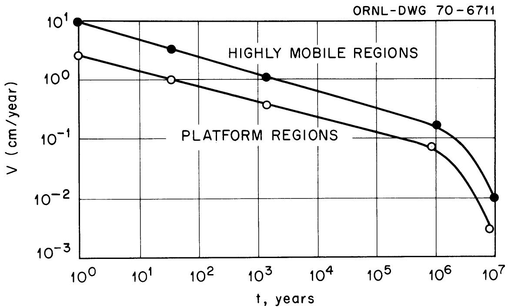  
Fig. 6.1. Graph Showing the Dependence of the Average Velocity of the Vertical Tectonic Movements (V) on the Duration of the Time Interval of Averaging (t) (from Gzovskii, 1963<sup>6,15</sup>).

The risk of excessive erosion would be greatly reduced if the repository were located in an area of low elevation and low relief, with the disposal formation possibly below sea level. Even in this case, erosion would be theoretically possible in a few instances, mainly in case of new episodes of glaciation that might combine the high-scouring power of glaciers with the eustatic lowering of sea level or in case of uplift of the area.

It is clear, however, that in case of total failure of the geologic forecast and very high erosion rates, the time required for the removal of the overburden would be so long that $^{239}\mathrm{Pu}$ would be the only radionuclide to be brought to the surface in significant amounts.

# 6.2.3 Leaching and Transport by Groundwater

All high-level waste-disposal schemes have in common the selection of a disposal environment without circulating groundwater. Many geologic materials can be considered essentially impermeable if no fractures are present. Laboratory samples of massive limestone or basalt show extremely low permeability, but these formations are often among the best aquifers, because water movement occurs through joints and fractures. All rigid rocks can become very permeable when fractured. Rock salt and plastic shale flow easily under relatively moderate pressure and would seal openings and fractures.

At the present time, disposal in natural salt formations is the most practical and favored solution to the problem of radioactive wastes. Besides the ease of deformation, salt has additional advantages such as high thermal conductivity and the ease with which it can be mined. However, when rock salt comes into contact with groundwater, dissolution occurs. The rate of dissolution varies with the volume of water coming into contact with the salt per unit time, but given a long enough time of leaching with unsaturated water, all of the salt would eventually be removed. Therefore, in all cases in which salt beds have been preserved for geologic times in their original stratigraphic position, one can conclude that the salt has not been exposed to leaching by groundwater. Since the evaporitic sedimentary cycle begins and ends with phases of argillaceous sedimentation, salt is normally protected from dissolution. Tectonic

movements or erosion may cause failure of the sealing and leaching of the salt. In fact many examples of leaching of salt are known. At times the tectonic movements are extreme, as in the case of diapirism, but in other cases leaching resulted from moderate folding and faulting. In most of the known cases, evaporites were leached from above, but in a few cases salt has been leached from below.[6.16] Borchert and Muir report the interesting case of the Middle Muschelkalk evaporites of southern Germany, which were often leached from the basal limestone upwards, and in places almost completely removed.

For a waste repository located in a salt formation, the probability of leaching must be negligible. This can be assured if the following conditions are observed at the site.

1. The shale beds, both below and above the salt, are thick and continuous over a large area.   
2. The salt formation is thick, and the waste is located far from the salt boundary.   
3. The shale bed above the salt is so deep below the surface that no erosion process can reasonably affect its integrity in a time span of several hundred thousand years.   
4. The region is tectonically stable.

These problems have been faced in considering bedded rock salt as a disposal medium, and it has been concluded that these conditions can be met.

Some shale formations with suitable physical properties might offer an alternative to salt as disposal medium. The plasticity of shales is a function of several factors: (1) the mineralogical composition of the sediment, (2) the size distribution and shapes of the particles, (3) the amount of connate fluids, and (4) the electrolytes present in solution. The amount of water is the most important factor and depends on the compaction the shales have undergone. Compaction depends on the pressure and the length of time that have been available for the elimination of connate water. 6.17, 6.18

Well-compacted shales are quite competent and deform by fracturing. Shales that are not compacted beyond a certain limit, either because they have never been subjected to the necessary pressure or because they did

not lose the connate fluids, deform by flowing. Many examples are known of the plastic behavior of these materials, such as diapiric structures with a shale core, mud lumps, mud volcanoes, and clay glaciers. Finally, countless more examples are furnished by the oil industry, which had to develop special techniques for drilling through unstable shale formations.

While the feasibility of disposal of high-level solidified wastes in salt formations has been demonstrated,[6.19] very little work has been done on other geologic materials. Therefore this discussion is highly speculative. It seems, however, that, in comparison with salt, shales might present some advantages as well as disadvantages. The advantages are the much longer expected life of the waste containers, the insolubility of the shales, and their high ion exchange capacity. The disadvantages of shales are their low thermal conductivity, the relatively large amount of water contained in the pores, and the difficulty of mining. While the poor removal of decay heat and the presence of pore fluids are not believed to cause insoluble difficulties, the problem of mining and operating a disposal facility in a plastic shale formation might well be critical.

From the point of view of the risk of leaching of the waste, disposal in shale would be quite different from disposal in salt. With the exception of small quantities of brine trapped in minute noncommunicating cavities, salt is completely free from water. Since it is very soluble, it has been preserved only where shale beds have protected it from leaching. On the other hand, plastic shales must be very porous and contain large volumes of water, since the plasticity is caused by the pore water. But the permeability of plastic shales is so low that any appreciable movement of water through them would require long times. The rate of movement of cations or particles contained in the water would be orders of magnitude lower than the velocity of the water itself. The migration of ions through the shales in the absence of water movement would be controlled by the mechanism of molecular diffusion.

The following examples are an indication of typical rates of movement by molecular diffusion through an average plastic shale. (See also Appendix A.) For $^{90}\mathrm{Sr}$ the average movement would be a few meters in 1000 years; in the same time $^{137}\mathrm{Cs}$ would have moved only a few centimeters.

For americium and plutonium the time necessary to move a few meters away would be respectively $10^{5}$ and $10^{6}$ years. More elaborate calculation would be necessary if the initial solid state of the waste and the effect of decay heat on the shale were to be considered.

In the case of disposal in salt, there would be no leaching of the waste by water. If dissolution of the salt were to occur, leaching of radionuclides would follow; this would require a large flow of groundwater.

The only correct approach to the selection of the disposal formation is to check the proposed geologic environments against the very stringent safety standards required by the magnitude of the potential hazard. Only after an alternative type of formation has been found acceptable from the point of view of safety should elements such as convenience of operation and cost play their part in the selection. Salt formations appear to meet the safety requirements, and at this moment they represent the most practical solution. However, many areas of the world exist without suitable salt formations. In this case, shale formations might well provide an acceptable alternative, but considerable efforts would need to be expended to assure that safety requirements were not being compromised.

# 6.3 Plastica Deformation of the Disposal Formation

It has been stated that a suitable disposal formation must be characterized by the absence of circulating groundwater and by plasticity. Since some plastic deformation occurs in practically all rocks, it is clearly the rate of deformation required in a disposal formation that must be defined. For example, the creep of limestone has been extensively studied, and many laboratory experiments have defined the deformation curves for this rock material. However, field observations in a large depth range prove that the creep rates are not sufficient to close fractures formed in this rock. Instead, once water circulation is established through a fracture, the dissolution of calcium carbonate will

progressively enlarge the opening. In this case, the rate of closure of the openings because of the creep of the rock is certainly less than the rate of dissolution.

Therefore, it is evident that creep rates in the disposal formation must be higher than the creep rates of limestone. It is not true, however, that the higher the plasticity the better. Beyond a certain limit of deformation rate, the problem of operating the facility would become insolvable. Since salt has fairly consistent physical properties, it can be stated that, in this material, troublesome rates of deformation would be met at depths exceeding 800 to $1000\mathrm{m}$ . Argillaceous sediments, on the other hand, present a tremendous variability in physical properties. In a general way, plasticity decreases with increasing compaction and therefore with depth of burial; however, the relation is far from straightforward. In fact, many factors contribute to determine the physical properties of argillaceous sediments, especially the mineralogical composition, the stratigraphic relationships, and the geologic history. As a consequence, no generalization is possible about the depth to which shales of appropriate plasticity could be found. The only way to learn about the physical properties of a shale formation is through actual field measurement and observation of tectonic deformations, if any.

The capability of plastic deformation of the disposal formation represents the main safeguard against a sudden loss of containment and release of radioactive nuclides to groundwater. However, this feature might have negative consequences if the disposal formation were to be subjected to excessive deformation. Therefore the possibility of the disposal formation being affected by diapiric processes must be investigated and the possible extent of deformation throughout a time period of several hundreds of thousands of years must be evaluated.

Diapirism is a process by which earth materials from deeper levels have deformed and pierced the overlying strata. For diapirism to occur, the necessary conditions are: the existence of a plastic formation and its exposure to a pressure difference sufficient to cause flowage. If the flowage must continue for a long time in order to result in the intrusion through the overburden of large volumes of diapiric material, other conditions must be realized; either the diapiric material must have

a lower specific gravity than the overburden or tectonic processes must actively squeeze the plastic materials through the overburden. Diapiric processes of evaporites and argillaceous sediments are not necessarily identical and they will be reviewed separately.

# 6.3.1 Salt Diapirism

The process of salt diapirism progresses from the undisturbed horizontal bed through many intermediate stages of deformation before reaching the state of a well-developed diapir. Linear salt structures result from the flowage and accumulation of salt in elongated zones of reduced pressure. Examples of linear structures are "salt anticlines," "salt pillows," "salt ridges," and "salt walls." Unless salt intrusion occurs along a fault plane, the linear structures arch the overlying strata but do not pierce them. Along the linear structures there are sites of minimum pressure where the accumulation of salt is concentrated. On the sites of maximum salt accumulation subcircular structures start to develop. Before piercing of the overburden, the localized accumulations are called "salt uplifts"; after piercing they are called "salt diapirs," "salt domes," "salt chimneys," "salt plugs," "salt stocks," and "salt eczemes." Where more diapirs merge at depth into a salt ridge, the whole complex is called "salt massif." It is also possible for the salt accumulation to begin directly in a subcircular area without a linear stage.

There are linear structures that have given origin to multiple di-apirs; in these cases an alignment is usually evident. The Five Islands group and the Bay Marchand-Timbalier Bay-Caillou Island group, both in Louisiana, are examples of diapir alignment because of common roots in a deep linear structure.[6.20, 6.21]

Day Dome, Texas, is an example of a salt anticline that has resulted in a single diapir.6.22 In the upper portions diapirs are typically circular or oval in horizontal section, with a diameter usually between 2 and $8\mathrm{km}$ . In depth, the shape is grossly cylindrical, with occasional overhangs, or conical.

The depth of the mother bed controls the maximum height that salt diapirs can achieve. In the diapiric province of the Gulf Coast of the United States, no well has ever reached the mother bed, which is believed

to be at least 8000 to 9000 m deep. In the east Texas and north Louisiana synclines, the Louann salt lies at depth ranging between 3000 and more than 4500 m.[6.23] In the German salt basin the mother bed depth ranges between 3000 and 5000 m.[6.24] In northeastern Algeria the total depth to the diapiric Triassic complex is of the order of 3500 to 5000 m.[6.25] In south Iran the depth to the mother bed is 6000 to 8000 m.[6.26, 6.27]

It is, therefore, clear that salt diapirs are usually large structures requiring many cubic kilometers of salt. An example of an exceptionally large structure is the Lake Washington dome, Louisiana, which, according to the estimate of Atwater and Forman, contains more than 1000 km³ of salt.[6,21] The same authors have calculated that the salt massif formed by the merging at depth of the Bay Marchand-Timbalier Bay and Caillou Island diapirs, Louisiana, contains in excess of 5500 km³ of salt. To supply the volume of salt present in this last structure, the necessary thickness of salt in the source area has been estimated to be of the order of 4 to 5 km. Undoubtedly, this is an extreme value, but the existence of a thick salt series is one of the necessary conditions of salt diapirism. The critical thickness below which salt diapirism does not occur is unknown, but it is probably true that in the instances when diapirs developed the mother bed must have been at least 300 to 400 m thick.

The existence of a thick layer of salt, although necessary, is not a sufficient condition for the formation of salt diapirs. Sannemann 6.28 refers to the region northwest of the salt-stock family north of Hamburg, where, in a large area, Zechstein salt, about $1000\mathrm{m}$ thick, covered by 3000 to $4000\mathrm{m}$ of sedimentary overburden, lies on a basement rising northward with a slope of 1 to $2^{\circ}$ . Apparently, no salt deformation, even to the initial stage of formation of salt pillows, has occurred; instead, the salt has maintained its original uniform thickness. It is also evident that burial under a sedimentary cover, 3000 to $4000\mathrm{m}$ thick, is not in itself a sufficient condition to initiate the flowage of salt. In other areas of Germany there is good geologic evidence that salt deformation started when salt was only $2000\mathrm{m}$ deep.

One can conclude that the plastic deformation of salt begins where and when the salt is exposed to a sufficient pressure difference. The

stresses acting on the salt bed and responsible for its flow are caused mainly by differential loading. Tectonic forces can also be important in increasing the possibility of differential loading or in actually squeezing the salt along fault planes. An example of the first case would be a sedimentary basin, with a thick salt series at the depth of $1000\mathrm{m}$ , which is subjected to folding. The differential accumulation between synclines and anticlines would then result in differential loading of the salt. Once the critical pressure difference has been reached, salt begins to flow from high-pressure to low-pressure zones. The overburden would tend to follow the deformation of the salt bed, sinking in the space vacated by the salt and being uplifted over the area of salt accumulation. Reduced accumulation or even erosion on the area of uplift and increased accumulation on the sinking area would maintain or even increase the pressure difference responsible for the flowage of salt. Eventually the shear strength of the overburden over the zone of uplift would be exceeded, and fracturing of the cover and salt intrusion would occur. After piercement of the overburden, the vertical movement of the salt would be concentrated at the site of piercement, and the rest of the salt uplift or salt anticline would collapse. At the surface, a syncline would form on the site of the previous salt uplift. Salt intrusion could be arrested either because the pressure difference is no longer sufficient to cause flowage or because no more salt is available in the source area. The second possibility could be caused either by depletion of salt in the source area or because the salt supply is cut off by the peripheral sink. If no more salt is available to flow into the salt structure, the upward movement of salt would terminate. If, instead, the salt intrusion were arrested because the resultant of forces were not sufficient to overcome the resistance to salt movement, a future reactivation of salt intrusion would be possible.

The forces acting on the salt and responsible for its deformation change with time as a function of several factors. In addition, the physical properties of salt change as a function of temperature, confining pressure, crystal size, impurities content, and strain hardening.

In the stage of salt deformation before the piercement of the overburden, the horizontal component of salt movement prevails, and the force

causing the movement is essentially due to differences in weight on the salt bed. After piercement, part of the salt mass moves upward. With the growth of the diapir, the difference in density between salt and sedimentary rocks gains importance in determining the forces acting on the salt body. The specific gravity of salt is about 2.2; on the other hand, terrigenous sediments are very porous at the time of deposition and undergo compaction depending on the pressure to which they are exposed. Figure 6.2 shows the relationships between the density of clayey sediments and the depth of burial observed in different geologic areas. Dickinson's curve is the one best approaching the case of geologically recent shales.[6.29]

If the salt is intruded through sediments with density higher than $2.2\mathrm{g/cm}^3$ , the load on the mother bed below the growing salt structure varies inversely with the height of overlying salt. Therefore the pressure difference driving the salt flowage into the diapir is directly proportional to the height of the diapir itself. This is only true as far as the intrusive salt replaces the heavier sediments of the overburden; if the growing salt structure compacts or uplifts the overlying sediments, the load below the growing diapir increases with the height of salt, and the pressure difference driving salt in the diapir decreases. When the overburden is uplifted above the growing diapir, intrusion can continue only as long as the necessary pressure difference is maintained by differential accumulation between uplift and surrounding area and/or erosional unloading of the uplift.

Once the top of the growing diapir reaches circulating groundwater, salt dissolution begins. The insoluble materials contained in the salt are left behind and accumulated. In the Gulf Coast area salt is usually very pure; total insolubles are a few percent of the total mass; anhydrite constitutes about $99\%$ of all insolubles.[6,30]

The leaching of the salt and the accumulation of insolubles result in the production of the cap-rock formation present on many diapirs. Occasionally, the volume of cap rock is very large, indicating that dissolution of salt has progressed for a very long time and that a very large volume of salt has been removed. For example, Bornhauser calculates that the accumulation of the cap rock present on top of Day Dome,

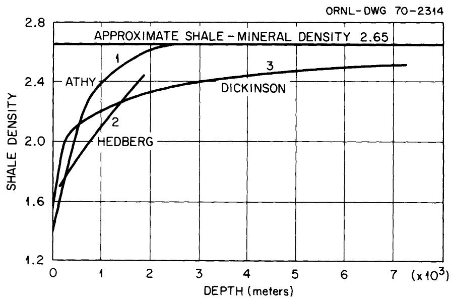  
Fig. 6.2. Average Relationships Between Shale Density and Depth. Curve 1--determined by Athy for Paleozoic shales in Oklahoma. Curve 2--determined by Hedberg for Paleozoic shales in Kansas. Curve 3--determined by Dickinson for Cenozoic shales in the Gulf Coast Area.

Texas, has required the dissolution of about $45 \mathrm{~km}^{3}$ of salt.6.22 Such volume of salt would make up a layer of salt about $6000 \mathrm{~m}$ deep. Since the top of Day Dome could never have been $6000 \mathrm{~m}$ higher than the present level, the dissolution of salt must have progressed contemporaneously with the rise of salt in the diapir. It follows also that the rates of the two processes must have been of the same order of magnitude.

If the rate of growth of the diapir exceeds both the rate of salt dissolution and the rate of sediment accumulation, salt can reach the surface. Once the diapir has reached the surface, the rise of salt can be terminated only by the depletion of salt in the source area or by the formation of a salt mountain high enough to compensate by its weight the pressure difference driving salt from the source area into the diapir. Salt diapirs reaching the surface are known only in areas characterized by a very arid climate, such as northern Algeria and south Iran. In south Iran the salt diapirs reaching the surface are numerous, and occasionally salt forms true mountains as high as $1200\mathrm{m}$ above the level of the surrounding plain. With the assumption that the 1200-m-high salt mountains are in isostatic equilibrium, the mother bed should be at a depth of 7000 to $8000\mathrm{m}$ . Probably the mother bed is even deeper, because surface processes, such as erosion and lateral spreading of salt under its own weight, should prevent attainment of isostatic equilibrium. It seems, therefore, that the final termination of diapir growth would have to be caused by the eventual depletion of salt in the source area. In some cases the growth of salt diapirs could be arrested by the accumulation of a great thickness of sediment above the rising structure. In this case, it is necessary that the rate of sedimentation exceeds the growth rate of the diapir.

One aspect of salt diapirism that is very important in relation to the safety of waste disposal is the rate of the process in its various stages. If the time necessary for an unacceptable deformation of the salt bed should largely exceed the time required for decay of $^{239}\mathrm{Pu}$ to innocuous levels of activity, the whole problem of the plastic deformation of salt would have little relevance to the disposal of radioactive waste.

In the abundant literature on salt diapirism, several estimates of the rate of diapirs' growth can be found. Most geologists believe that salt deformation is a slow process and that the actual rate of growth of salt diapirs is of the order of a few millimeters per year. The rate of salt movement is not the same in all phases of salt deformation; it is probably at a maximum in the later stage when diapirs are approaching or reaching the surface. In fact, in this phase the pressure difference due to the salt-sediment density contrast is close to its maximum and the resistance offered by the overburden to the rising salt is very reduced or even nil when salt is exposed to the surface. In the prepiercement stages of salt deformation, the pressure differences are much less and the resistance of the overburden is higher; therefore, even considering the higher temperature of the salt, because of the greater depth, the rates of movement should be markedly less than the rates of growth of a well-developed diapir approaching the surface. Of a quite different opinion is Tursheim, who reports Sannemann's conclusion that in Germany the average rate of salt movement on the geologic time scale is 0.3 mm/year.[6,24] Surprisingly, Sannemann found that the flow rate of 0.3 mm/year was roughly constant, both in the prediapiric stage of salt pillow and salt anticline formation and in the mostly vertical flow of the diapiric stage. It might be possible to reconcile these two opposing points of view, considering that the 0.3 mm/year is a flow rate averaged over geologic time periods. In the stage of salt pillow formation, the physical conditions of the salt bed and the relations between salt and overburden are essentially uniform; therefore, a continuous, uniform flow of salt is probable. In the diapiric stage the situation is quite different: salt rises through progressively colder sediments that must be forcibly broken and pushed apart. The resistance offered by the overburden to the rising plug changes markedly as a function of the faulting. Therefore, an irregular, discontinuous movement seems the most logical mode of diapir growth.

Borchert and Muir conclude their review of the problem stating that the usual rate of diapir growth is probably less than 2 mm/year.[6,16] At times the relationships between salt and overlying sediments permit the reconstruction of a long and complex history of salt emplacement. Atwater

and Forman describe several diapirs for which a history of salt emplacement extending during many millions of years can be followed.6.21 An example is furnished by the Iowa salt diapir in Louisiana, depicted in Fig. 6.3, for which several phases of uplift are known. It is interesting to note that the accumulation of oil is related to a fossil "high" caused by the Oligocene-Miocene uplift and not to the axis of the more recent uplift located about $1500\mathrm{m}$ south. The displacement along the major fault is clearly caused by the youngest phase of uplift. This fault can be traced to within $450\mathrm{m}$ of the surface.

Borchert and Muir<sup>6.16</sup> report Lotze's observation that, in Spain, rising diapirs of Keuper salt influenced the thickness of sediments accumulated throughout the upper Cretaceous. A very limited thinning can be detected in the Cenomanian sediments, but it becomes quite apparent in the Turonian and very marked in the Senonian. Above the diapirs, the whole upper Cretaceous succession is often less than a tenth as thick as in the surrounding area. The only logical explanation is continuous growth during all this time period. A similar situation is probably occurring in several present basins as will be discussed below.

Considering the complexity of salt deformation and the many parameters that can actively modify the forces acting on the salt and the physical properties of the salt itself, it is no surprise that diapir growth is not a regular, uniform process. Balk 6.13, 6.32 and Muehlberger 6.33 have studied the internal structures of several salt domes, in which mining operations have been conducted, and concluded that salt advances in spines and lobes separated by shearing planes. The salt movement is probably jerky and irregular; possibly phases of diapir growth are separated by periods of stasis.

As already mentioned above, the relationship between cap rock, underlying salt, and surrounding sediment, illustrated by many diapers, is strong evidence that the rise and the dissolution of salt have progressed at comparable rates. Additional evidence about the rate of salt deformation can be obtained with the following considerations.

1. Anomalousy high temperatures have been observed in several salt structures. These temperatures seem to be adequately explained by the high thermal conductivity of salt and by the heat generated by internal

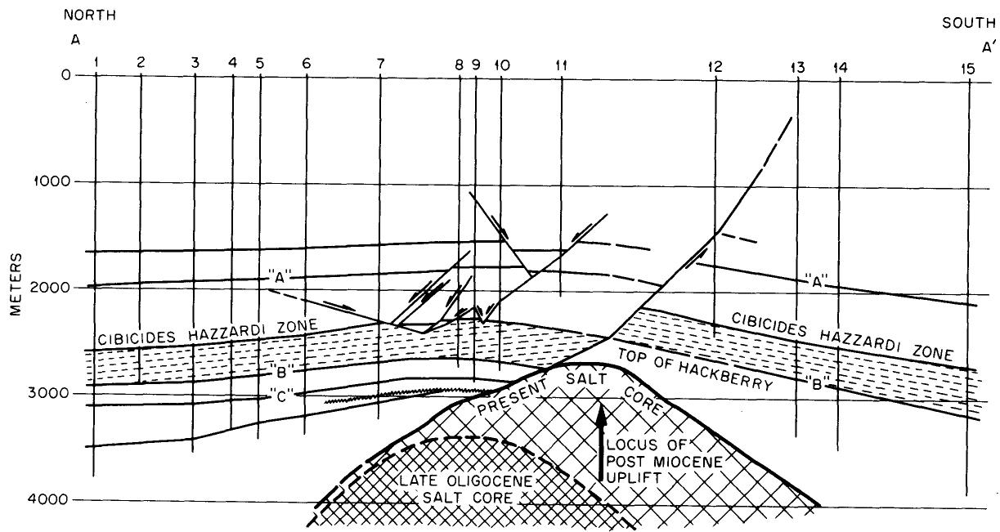

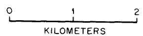

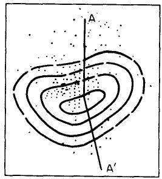  
Fig. 6.3. North-South Structural Cross Section, Iowa Salt Dome; No Vertical Exaggeration (from Atwater and Forman $^{6,21}$ ).

ORNL-DWG 70-6726

friction during salt deformation. The uniformly high temperatures with maximum values at the center line of the diapir which would be expected in young salt structures which have intruded very rapidly have never been observed.[6,34]

2. Seismic profiles through the bottom sediments of the Gulf of Mexico and other sea basins show many structures that strongly suggest growing diapirs. The drilling of one of the Sigsbee Knolls located in the very flat Sigsbee Abyssal Plain, in the deepest part of the Gulf of Mexico, under about $3600\mathrm{m}$ of water, has proved that these small hills are the sea bottom expression of salt diapirs.[6.35] While a large fraction of the abyssal plain sediments is constituted by turbidites, all sediments cored on the Challenger Knoll down to the cap rock are pelagic. Since the cap rock is overlain by sediments of upper Miocene age, it is demonstrated that this salt diapir has caused a topographic relief sufficient to prevent accumulation of turbidites for several million years. The thinning of sediments on the flanks of the Knoll, as revealed by the seismic reflection profiles, strongly suggests growth during sedimentation. Some of the thinning is caused by differential compaction between the thick turbidites and their pelagic equivalent on the Knoll. However, downbuilding cannot be the main process at work, or the Knolls would be rapidly buried under the accumulating sediments. Hence a rate of diapir growth of the same order of magnitude as the rate of sedimentation seems the most logical explanation of the existing relationships.

3. The study of rim synclines furnishes additional evidence about the evolution of salt structures. The downcarping of the sedimentary strata into the space vacated by the flowing salt is necessarily contemporaneous with the accumulation of salt in the area of uplift. Figure 6.4 shows the diagrammatic cross section of a salt diapir and associated rim syncline, based on observations of German salt structures. Clearly the development of the rim syncline has been a very long process. According to Sannemann's diagrammatic reconstruction, no salt deformation occurred until Keuper time (upper Triassic). No piercement occurred until middle Jurassic time, thus allowing about 30 million years for the accumulation of salt in the salt pillow. The intrusion of salt was terminated in upper Cretaceous time because of the depletion of salt in the

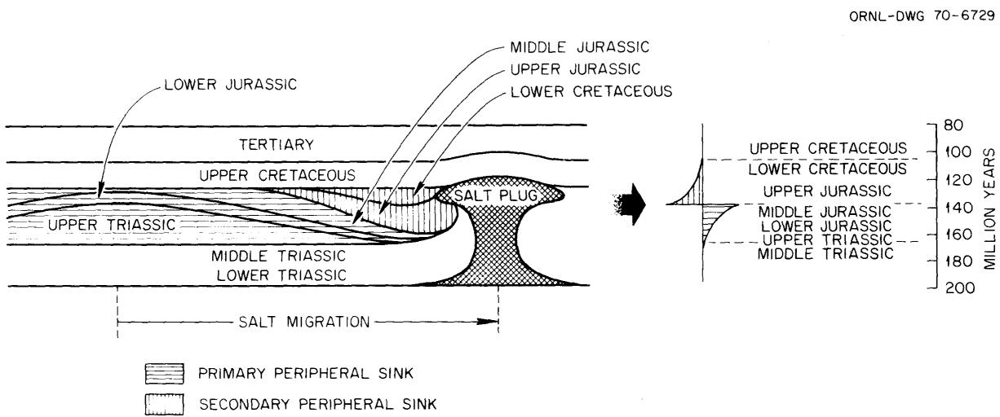  
Fig. 6.4. Diagrammatic Cross Section of a German Salt Diapir and Associated Rim Synsline. Notice migration of the axis of the rim syn-cline through geologic time and resulting pseudo-anticline with axis located on the site of the primary sink. Designed by Sanneman. (From Trusheim, 6.24.)

source area. Therefore, the stage of active diapirism must have lasted for a time period of the order of 30 to 40 million years. The resulting average rate of movement of the ascending salt is exceedingly slow. If the evolution of the rim syncline can be reconstructed and if the structural relationships between the salt and surrounding sediments are known, the geologic history of the salt structure can be deduced. Unfortunately, the data necessary for an accurate geologic reconstruction for most salt structures are not available. For example, in the Gulf Coast area rim synclines of Cenozoic age are fairly well known, but the older synclines are too deep to be reached by even the deepest wells.

4. Evidence of the rate of salt movement is offered by several observations of present movements. The reported movements have been observed either in mines located in salt diapirs or at the surface on top of shallow salt diapirs. Caution is necessary in the interpretation of deformation data obtained in salt mines, because closure of mined cavities always occurs, occasionally very rapidly.[6,24] In the instances of observed uplift, the possibility of subsidence of the surrounding area because of compaction of the sediments should be analyzed. However, a few cases of salt movement seem certain, and it is likely that many more instances could be revealed if the appropriate measurements were conducted. For deep diapirs the observation of movements would be expected to be more difficult, both because of the likely slower rate of salt uplift and because part of the movement would be absorbed by the compaction of the overlying sediments. It seems likely that micro-seismic data would furnish a valuable tool to investigate the growth of salt diapirs, especially in depth, but no observation of this nature is known to the authors.

Lotze is quoted by mentioning that a relative uplift of 1 to $2\mathrm{mm}$ /year has been measured on salt stocks of the Caspian depression. Trusheim reports Teichmuller's conclusion that the rise of the salt stock of Segeberg, in Holstein, northern Germany, has been about $2\mathrm{mm}$ /year in the last 20,000 years. From observations by Lees and Falcon, Trusheim has calculated a rate of salt movement of $2.4\mathrm{mm}$ /year in salt structures located in Iraq.

Sheets reports that active movement has been measured at Hoskins Mound, Brazoria County, Texas. An area of 100 acres located in the central part of the diapir has risen a maximum of 18 cm in a 23-year period (1922-1945). The resulting rate of uplift at the surface is about 8 mm/year. Due to the known subsidence of the surrounding area, this rate of uplift could be an overestimate. Still it could be the beginning of a salt spine, such as those present at Anse La Butte (St. Martin Parish), Jefferson Island, and Belle Isle in Louisiana.

Muehlberger and Clabaugh report that in 1937 part of the mine located in Winnfield Salt Dome, northwestern Louisiana, was accidentally flooded causing a water-etch line.[6.37] After 27 years the etch line was no longer horizontal, but showed a deformation amounting to several centimeters.

In a railroad cut on the north slope of Jefferson Island, brackish water fossils were found in loose sand, 6 to $9\mathrm{m}$ above sea level. 6.31, 6.38 The fossils were identified and found to be probably of late Pleistocene or early Holocene age. If more accurate dating should confirm the age of these fossils, the logical explanation would be that at the beginning of the Holocene, 11,000 years B.P., the sand was accumulated in a brackish water marsh located at sea level; from this it would follow that the deposit has been uplifted to the present level during this span of time. Considering that 11,000 years ago sea level was about $30\mathrm{m}$ below the present level, 6.39 the uplift could have been 30 to $40\mathrm{m}$ in a time span of 10,000 to 15,000 years, which gives a rate of growth of 2 to $4\mathrm{mm}$ /year. It is worth noting that also at Jefferson Island only part of the salt core is actively rising. The major part of the diapir terminates in a flat surface at the depth of about $250\mathrm{m}$ . On the southeastern edge of the diapir a spine rises to the average elevation of the surface in the area. However, no salt is exposed at the surface, as about $20\mathrm{m}$ of sediments, overlying the salt spine, were arched to form the hill called Jefferson Island. 6.40

Vaughan reports also that near Shaft Hill on top of the Belle Isle diapir, one of Louisiana's five islands, a conglomerate bed with strike N. $75^{\circ}$ E. and dip $23^{\circ}$ NW is exposed.6.38 The fossils in the conglomerate are all species represented on the Gulf Coast today. It is clear that, since accumulation, this conglomerate has been tilted to an angle of $23^{\circ}$ .

In this case the data are insufficient to calculate the rate of uplift, but the evidence of recent movement is inescapable.

Finally, there is the observation that of the thousands of salt structures known throughout the world, none has ever been observed to undergo rapid growth. Since all stages of development of salt structures can be observed, it seems that only two conclusions are possible. The first is that the geologic process of salt diapirism either has been eliminated or only occurs when nobody is looking. The second possibility is that salt diapirism is regularly occurring, whenever conditions are appropriate, but only accurate measurements or geologic observations can provide evidence of the slow rate of movement.

In conclusion, it seems fairly well proven that the risk of containment failure because of diapir formation is negligible if the waste repository is located in a salt formation that meets the following conditions:

1. It should be a bedded salt formation showing no evidence of plastic deformation in the recent geologic past and located in a tectonically stable area.   
2. The salt bed should be close to horizontal, and the surface relief should be minimal to insure a very limited differential loading.   
3. The thickness of the salt bed should be adequate to furnish safe containment but less than the 300 to 400 m necessary to produce sizable salt structures.   
4. The salt bed should not be located at great depth where the plasticity of salt is increased by the high ambient temperature. However, this is only a theoretical problem, because the maximum depth is limited much more drastically by the required stability of mined cavities than by the need to prevent excessive plastic deformation of the salt formation. On the other hand, a depth of at least 300 to 400 m seems desirable to remove the waste from geologic processes active at or near the surface.

While salt diapirs certainly exist for which no future salt uplift is possible because of depletion of salt in the source area, the demonstration of the safety of disposal in a salt diapir would require very extensive geologic investigations. In addition to the structural

problems, diapirs would present much more serious hydrologic problems, because of the complexity of groundwater circulation in the adjacent fracture zone and because of the possibility of temporary permeability of the salt mass in correspondence with shearing zones.

# 6.3.2 Shale Diapirism

The plastic deformation of argillaceous sediments has many aspects similar to the deformation of salt, but in many ways it can be quite different. The basic mechanism is always the flow of a plastic medium when exposed to the appropriate pressure difference. The differences in behavior between salt and shale are due to the extreme variability of the physical properties of clayey sediments. Shales with "equivalent viscosity" and density similar to those of salt would be expected to undergo deformation processes of diapiric nature. As a matter of fact, in the Gulf Coast area many masses of diapiric shales have been identified.[6.41, 6.42] The interest in these structures is due largely to the hydrocarbons that may be trapped on the flanks of the shale masses or accumulated in the structural highs overlying the diapiric bodies. In many instances shale masses are intruded along with salt to form a single diapiric core. In other cases there is only one intrusive material.

Diapiric shale is characterized by a high pore fluid pressure in addition to low resistivity, density, and sound transmission velocity. These physical properties allow the outlining of shale masses by geophysical methods. The low velocity of sound transmission within the shale mass permits differentiation from a salt mass that would be undistinguishable on the basis of gravimetric and seismic-reflection data only.

The abnormally high fluid pressures in diapiric shales are due to the relatively high rate of sedimentation and to the very low permeability of the sedimentary complex, especially across the bedding.6.43, 6.44 Under these conditions, the rate of escape of connate fluids from compacting sediments is less than the rate of sediments accumulation; therefore, the trapped fluids prevent compaction and support part of the weight of the overburden. As a limit, if no fluids could escape, essentially no compaction would occur and $\lambda$ , ratio between fluid pressure and overburden pressure, would be equal to 1. Figure 6.5 shows the relationships between

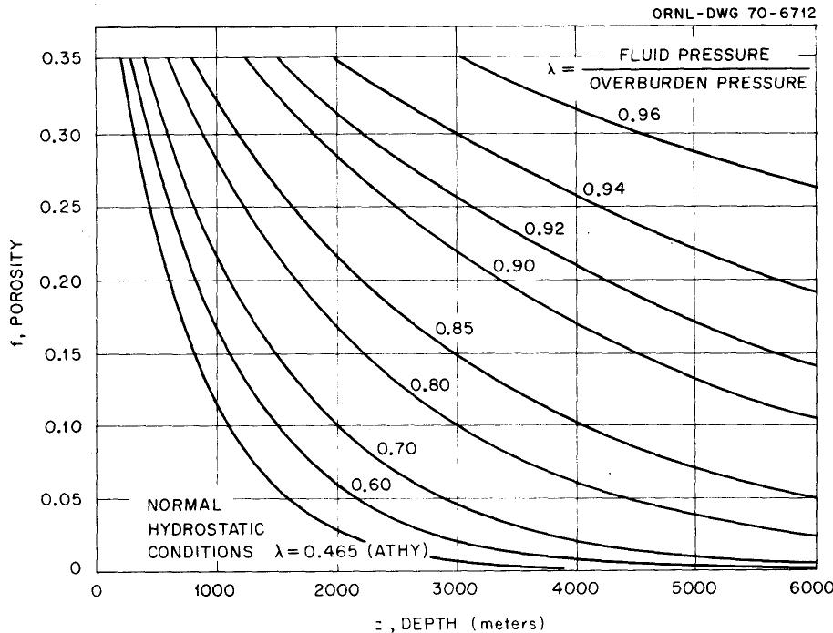  
Fig. 6.5. Mutual Relationships of Depth, Porosity, and Fluid Pressure-Overburden Ratio in an Average Shale or Mudstone. Athy's Curve Assumed to Represent Condition of "Compaction Equilibrium." (From Rubey and Hubbert.6.44)

depth and porosity for various values of $\lambda$ in an average shale. Athy's curve (see also Fig. 6.2) represents a pore pressure equal to the normal hydrostatic value. Cases of $\lambda$ as high as 0.9 have been reported by several authors. Thomeer and Bottema report examples for which fluid pressures are even higher than 0.9 times petrostatic pressures.[6,45] According to these authors the petrostatic pressure is an upper limit that fluid pressure can never exceed. While this is undoubtedly true for most cases, it is theoretically possible for the fluid pressure to exceed the petrostatic level in at least two cases: (1) If erosion, either subaerial or submarine, or slumping removes part of the overburden, fluid pressure in strata below the area of unloading can become higher than petrostatic. (2) Tectonic forces acting on a highly pressured formation might result in fluid pressure above petrostatic level. Fluid pressure above petrostatic level represents an unstable situation, and eventually the overburden would be fractured.[6,13]

Abnormal fluid pressures are usually observed in areas of very thick sections of relatively young sediments and below a thick layer of impermeable material like shale, salt, anhydrite, limestone, or dolomite. When the overlying beds represent an extremely effective seal, even very old rocks can have retained very high fluid pressure. In Germany, in shale beds of Permian age interbedded with Zechstein salt at the depth of 3150 m, a fluid pressure very close to petrostatic has been observed. In west Texas, in a porous Permian dolomite at a depth of 960 m, λ is equal to 0.89. A third example is reported from Argentina where tuffaceous material of Triassic age at 2560 m of depth shows a λ equal to 0.70.6.45

When highly pressured shales are exposed to sufficient pressure differences flow will occur and diapiric shale structures similar to diapiric salt structures can develop. If the porosity of the clayey sediments is very high, their physical properties are much closer to those of a liquid, such as molten lava, than to those of salt. In fact, examples are known of clayey sediments flowing very rapidly or even producing pseudo-volcanic phenomena.

The mudlumps of the Mississippi delta are small mud diapirs. The conditions necessary to their formation are the accumulation of relatively coarse sediments over a thick section of fine-grained materials. 6.46 In

comparison to salt diapirism the process of mudlumps formation differs only in the rate of evolution and the dimensions of the structures. Typical mudlumps are elongated in shape with a maximum length of a few hundred meters. The time necessary for their formation is rather short. As a matter of fact, there are zones of the Mississippi delta where the variations in water depth caused by the growth of mudlumps used to affect navigation. The growth of mudlumps is not a continuous process but is erratic and varied. On some mudlump islands, recurrent uplift exceeds the rapid rate of destruction by wave action. The result is wave-planet terraces and stepped islands. The highest rates of uplift coincide with times of river flood and associated rapid sedimentation rates. Peak growth rates of the order of a few meters per month seem quite possible, while more normal rates of growth are of the order of a few meters per year. Figure 6.6 shows the development of a family of Mississippi delta mudlumps.

"Sedimentaryary volcanism" is the term applied to the process by which argillaceous unconsolidated sediments are extruded to the surface to form pseudo-volcanic structures called mud-volcanoes. Mud-volcanism is confined to areas where beds of highly pressured fine sediments are present. Mud-volcanoes are found associated not only with oil and gas fields but also with areas underlain by thick beds of weakly consolidated sand and clay.[6,47, 6,48] The extrusion of the mud always occurs along faults. The energy necessary for the extrusion of the mud is furnished by the high pressure of the fluids contained in the sediment pores. Faulting is the direct cause of the process, because it furnishes the channel through which the abnormally high pressure can be released. The phenomenon is basically different from diapirism. The mud flows very rapidly and behaves in all ways like a liquid.

In 1930 on the island of Trinidad there was a 400,000 cubic meter mud flow; the extrusion lasted about 20 min.6.47 In Erin Bay, Trinidad, during November 3 and 4, 1911, the extrusion of about 250,000 cubic meters of mud resulted in the formation of Mud-Volcano Island (known also as Wilkey's Island). In these two cases the process was apparently spectacular, because the descriptions mention the occurrence of explosions, flames, and even a "mushroom cloud."6.49 In Erin Bay, in August 1964,

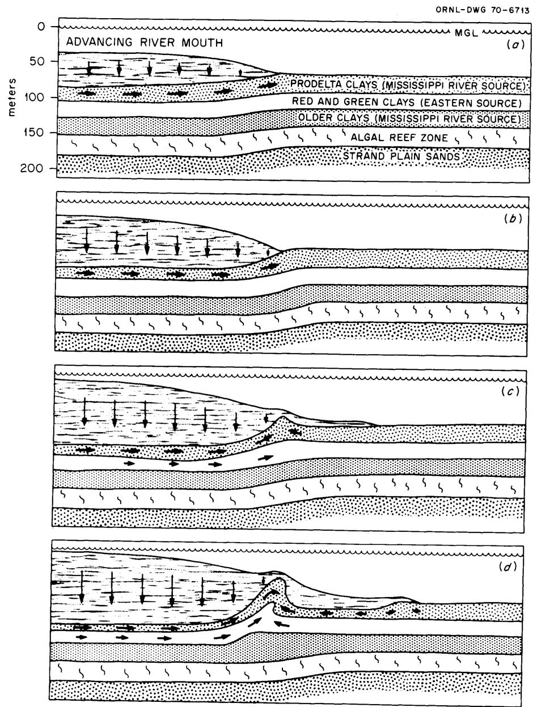  
Fig. 6.6 (a). Diagrammatic Representation of the Development of a Mud-lump Family. MGL = mean ground level. Stages a-d. (From Morgan, Coleman, and Gagliano.6.46)

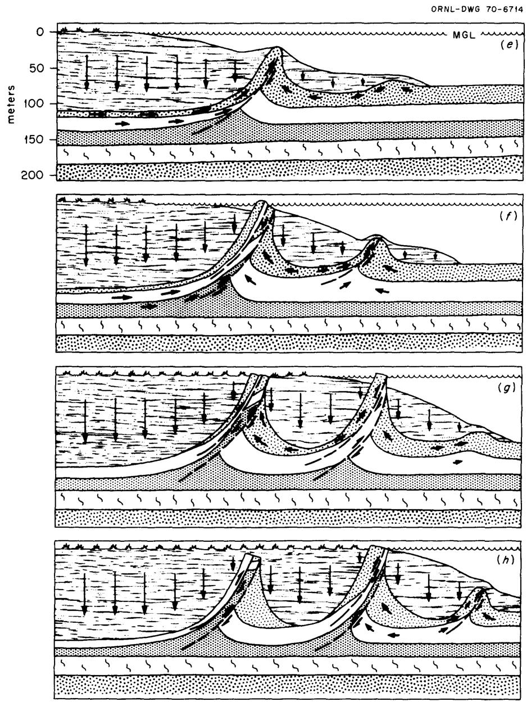  
Fig. 6.6 (b). Diagrammatic Representation of the Development of a Mud-lump Family. Stages e-h. (From Morgan, Coleman, and Gagliano.)

another mud extrusion of approximately 260,000 cubic meters resulted in the formation of Chatham Island. In this case, large volumes of gas were released also but no explosion is reported. Higgins and Saunders report that a sample of gas from Chatham Island was found to be mostly methane.[6,50] The main force that caused the extrusion of the mud in these cases was probably the gas pressure; at any rate, the extrusions occurred along lines of tectonic disturbance. The mud of Miocene age reached the surface in a very plastic state and with a very high content of water.

It is possible to conclude that argillaceous sediments can indeed undergo extensive and even catastrophic deformation. However, the high mobility is conditioned by the abnormal fluid pressure. It is therefore clear that disposal of radioactive waste in a shale formation would be acceptable only if the fluid pressure is at hydrostatic level.

# 6.4 Conclusions

Several mechanisms, which might result in the release of activity from a disposal formation, have been reviewed in this chapter, although the list is not exhaustive. We have considered several of the more likely potential mechanisms as well as several unlikely mechanisms for activity release. For the disposal formation all reasonable release mechanisms should be analyzed and their probabilities and consequences assessed; in many instances this exercise will likely require the collection of extensive geologic data. The magnitude of the potential hazard that radioactive waste presents for man and the environment is such that long-term safety considerations must be given high priority in assessing the suitability of any disposal method or formation. Although we feel that the mechanisms discussed in this chapter are not likely to cause failure of containment for a judiciously sited waste repository, we believe that no waste repository can be judiciously sited unless these mechanisms have been considered in the evaluation of long-term safety. The most extensive studies, to date, for ultimate disposal of high-level radioactive wastes into geologic formations have related to disposal into salt. Careful attention must be given to geologic considerations in siting a disposal

facility in a bedded salt formation, and we feel that this should provide assurance that subsequent inadvertent release of nongaseous radionuclides from the formation will not occur.

# 6.5 References

6.1. I. Halliday, "The Variation in the Frequency of Meteorite Impact with Geographic Latitude," *Meteoritics* 2, 271-278 (1964).   
6.2. M. J. S. Innes, "The Use of Gravity Methods to Study the Underground Structure and Impact Energy of Meteorite Craters," J. Geophys. Res. 66, 2225-2239 (1961).   
6.3. H. Brown, "The Density and Mass Distribution of Meteoritic Bodies in the Neighborhood of the Earth's Orbit," J. Geophys. Res. 65, 1679-1683 (1960).   
6.4. G. S. Hawkins, "Impacts on the Earth and Moon," Nature 197, 781 (1963).   
6.5. G. S. Hawkins, "Asteroidal Fragments," Astron. J. 65(5), 318-322 (1960).   
6.6. W. K. Hartmann, "Terrestrial and Lunar Flux of Large Meteorities in the Last Two Billion Years," Icarus 4, 157-165 (1965).   
6.7. E. C. T. Chao, "Meteorite Impact, An Astrogeologic Phenomenon," Nuclear Geophysics, NAS-NRC, Publication 1075, pp. 219-232 (1963).   
6.8. A. J. Cohen, "Fossil Meteorite Craters," *Nuclear Geophysics*, NAS-NRC, Publication 1075, pp. 233-239 (1963).   
6.9. A. Rittmann, Volcanoes and Their Activity, John Wiley & Sons, New York, London, 1962.   
6.10. F. M. Bullard, Volcanoes in History, in Theory, in Eruption, University of Texas Press, 1962.   
6.11. W. H. Bucher, "Cryptoexplosion Structures Caused from Without or from Within the Earth? ('Astrolemes' or 'Geoblemes?)," Am. J. Sci. 261, 597-649 (1963).   
6.12. R. S. Dietz, "Cryptoexplosion Structures: A Discussion," Am. J. Sci. 261, 650-664 (1963).

6.13. J. Goguel, "A Hypothesis on the Origin of the 'Cryptovolcanic Structures' of the Central Platform of North America," Am. J. Sci. 261, 665-667 (1963).   
6.14. B. A. Tkhostov, Initial Rock Pressures in Oil and Gas Deposits, The MacMillan Co., New York, 1963.   
6.15. M. V. Gzovskii, "The Geophysical Interpretation of Data on Young and Recent Deep-Seated Tectonic Movements," in *Recent Crustal Movements*, edited by I. P. Gerasimov and others, pp. 34-65, 1963. (Translated from Russian, Program for Scientific Translations, Jerusalem, 1967).   
6.16. H. Borchert and R. O. Muir, Salt Deposits. The Origin, Metamorphism and Deformation of Evaporites, D. van Nostrand Co., Ltd., London, 1964.   
6.17. J. M. Weller, "Compaction of Sediments," Bull. Am. Assoc. Petrol. Geologists 43, 273-310 (1959).   
6.18. H. D. Hedberg, "Gravitational Compaction of Clays and Shales," Am. J. Sci. 31, 241-287 (1936).   
6.19. R. L. Bradshaw and W. C. McClain (eds.), Project Salt Vault: A Demonstration of the Disposal of High Activity Solidified Wastes in Underground Salt Mines, ORNL-4555 (1971).   
6.20. F. W. Bates, R. R. Copeland, Jr., K. P. Dixon, "Geology of Avery Island Salt Dome, Iberia Parish, Louisiana," Bull. Am. Assoc. Petrol. Geologists 43, 944-957 (1959).   
6.21. G. I. Atwater and M. J. Forman, "Nature of Growth of Southern Louisiana Salt Domes and Its Effect on Petroleum Accumulation," Bull. Am. Assoc. Petrol. Geologists 43, 2592-2622 (1959).   
6.22. M. Bornhauser, "Geology of Day Dome (Madison County, Texas)--A Study of Salt Emplacement," Bull. Am. Assoc. Petrol. Geologists 53, 1411-1420 (1969).   
6.23. G. I. Atwater, "Gulf Coast Salt Dome Field Area," in Saline Deposits, Geological Society of America, Special Paper No. 88, pp. 29-40, 1968.   
6.24. F. Trusheim, "Mechanism of Salt Migration in Northern Germany," Bull. Am. Assoc. Petrol. Geologists 44, 1519-1540 (1960).

6.25. J. Bertroneu, "Les diapirs Triasiques du Bou Taleb Occidental," Geologie en Mijnbouw, Nieuwe Serie 19, 377-382 (1957).   
6.26. J. V. Harrison, "The Geology of Some Salt-Plugs in Lariistan (Southern Persia)," The Quart. J. of the Geol. Soc. of London 86, 463-522 (1930).   
6.27. P. E. Kent, "Recent Studies of South Persian Salt Plugs," Bull. Am. Assoc. Petrol. Geologists 42, 2951-2972 (1958).   
6.28. D. Sannemann, "Salt-Stock Families in Northwestern Germany," in Diaporism and Diapers, Memoir No. 8, Am. Assoc. Petrol. Geologists, pp. 261-270, 1968.   
6.29. G. Dickinson, "Geological Aspects of Abnormal Reservoir Pressures in Gulf Coast Louisiana," Bull. Am. Assoc. Petrol. Geologists 37, 410-432 (1953).   
6.30. D. H. Kupfer, "Structure of Salt in Gulf Coast Domes," in First Symposium on Salt, pp. 104-123, Northern Ohio Geological Society, 1963.   
6.31. R. Balk, "Salt Structure of Jefferson Island Salt Dome, Iberia and Vermilion Parishes, Louisiana," Bull. Am. Assoc. Petrol. Geologists 37, 2455-2474 (1953).   
6.32. R. Balk, "Structure of Grand Saline Salt Dome, Van Zandt County Texas," Bull. Am. Assoc. Petrol. Geologists 33, 1791-1829 (1949).   
6.33. W. R. Muehlberger, "Internal Structure of the Grand Saline Salt Dome, Van Zandt County, Texas," Bureau of Economic Geology, Report of Investigation No. 38, The University of Texas, 1959.   
6.34. W. C. Gussow, "Salt Diapirism: Importance of Temperature, and Energy Source of Emplacement," in Diapirism and Diapirs, Memoir No. 8, pp. 16-52, American Association of Petroleum Geologists, 1968.   
6.35. C. A. Burk, M. Ewing, J. L. Worzel, A. O. Beall, Jr., W. A. Berggren, D. Bukry, A. G. Fischer, and E. A. Pessagno, Jr., "Deep-Sea Drilling into the Challenger Knoll, Central Gulf of Mexico," Bull. Am. Assoc. Petrol. Geologists 53, 1338-1347 (1969).   
6.36. M. M. Sheets, "Diastrophism During Historic Time in Gulf Coastal Plain," Bull. Am. Assoc. Petrol. Geologists 31, 201-226 (1947).

6.37. W. R. Muehlberger and P. S. Clabaugh, "Internal Structure and Petrofabrics of Gulf Coast Salt Domes," pp. 90-98 in Diapirism and Diapirs, Memoir No. 8, American Association of Petroleum Geologists, 1968.   
6.38. F. E. Vaughan, "The Five Islands, Louisiana," Bull. Am. Assoc. Petrol. Geologists 9, 756-797 (1925).   
6.39. R. W. Fairbridge, "The Changing Level of the Sea," Sci. Am. 202(5), 70-79 (1960).   
6.40. J. B. Wharton, Jr., "Jefferson Island Salt Dome, Iberia and Vermilion Parishes, Louisiana," Bull. Am. Assoc. Petrol. Geologists 37, 433-443 (1953).   
6.41. A. W. Musgrave and W. G. Hicks, "Outlining Shale Masses by Geophysical Methods," in Diapirism and Diapirs, Memoir No. 8, pp. 122-136, American Association of Petroleum Geologists, 1968.   
6.42. J. A. Gilreath, "Electric-Log Characteristics of Diapiric Shale," in Diapirism and Diapirs, Memoir No. 8, pp. 137-144, American Association of Petroleum Geologists, 1968.   
6.43. M. K. Hubbert and W. W. Rubey, "Role of Fluid Pressure in Mechanics of Overthrust Faulting: Part I," Bull. Geol. Soc. Am. 70, 115-166 (1959).   
6.44. W. W. Rubey and M. K. Hubbert, "Role of Fluid Pressure in Mechanics of Overthrusting Faulting: Part II," Bull. Geol. Soc. Am. 70, 167-205 (1959).   
6.45. J. H. M. A. Thomeer and J. A. Bottema, "Increasing Occurrence of Abnormally High Reservoir Pressures in Boreholes, and Drilling Problems Resulting Therefrom," Bull. Am. Assoc. Petrol. Geologists 45, 1721-1730 (1961).   
6.46. J. P. Morgan, J. M. Coleman, and S. M. Gagliano, "Mudlumps: Diapiric Structures in Mississippi Delta Sediments," in Diapirism and Diapirs, Memoir No. 8, pp. 145-161, American Association of Petroleum Geologists, 1968.   
6.47. P. S. Freeman, "Exposed Middle Tertiary Mud Diapirs and Related Features in South Texas," in Diapirism and Diapirs, Memoir No. 8, pp. 162-182, American Association of Petroleum Geologists, 1968.

6.48. A. V. Zuyev and A. A. Khrapov, "Minute Mud Volcanoes of the Gobi," Acad. Sci. USSR (Doklady) 186, 74-76 (1969).   
6.49. R. Arnold and G. A. Macready, "Island-Forming Mud Volcano in Trinidad, British West Indies," Bull. Am. Assoc. Petrol. Geologists 40, 2748-2758 (1956).   
6.50. G. E. Higgins and J. B. Saunders, "Report on 1964 Chatham Mud Island, Erin Bay, Trinidad, West Indies," Bull. Am. Assoc. Petrol. Geologists 51, 55-64 (1967).

# 7. SUMMARY AND CONCLUSIONS

High-level radioactive wastes generated by the reprocessing of spent fuel elements in the projected nuclear power industry will require the development of a comprehensive waste management program. The presence in these wastes of long-lived transuranics, especially $^{239}\mathrm{Pu}$ (half-life, 24,413 years), $^{240}\mathrm{Pu}$ (half-life, 6580 years), and $^{243}\mathrm{Am}$ (half-life, 7340 years) requires assurance of waste containment for a time period of the order of several hundreds of thousands of years. For such long time periods only deep geologic formations offer the stability required for preserving the necessary degree of containment.

Projections are made of the amounts of radioactive wastes accumulated to the year 2020, assuming development of the nuclear industry in accordance with Phase 3, Case 42, of the Systems Analysis Task Force.

The Potential Hazard Index (PHI) is introduced as a means to evaluate quantitatively the hazard associated with the existence of radioactive nuclides. While the application of the PHI is somewhat limited, at the present time, by the lack of data on the biological availability of several critical nuclides once they have been dispersed into the environment and by the limited knowledge of the probability of various mechanisms of containment failure, the available information points to a few very clear conclusions.

The risk associated with the inhalation of transuranics is several orders of magnitude higher than the risk associated with their ingestion.

Permanent isolation in geologic formations is preferable to systems in which later rehandling of the waste may be necessary. On the basis of these considerations, it seems that the most prudent scheme of management of these wastes involves solidification with final disposal into a suitable deep geologic formation.

The characteristics of products from various suggested solidification processes are compared. For waste management considerations, the most important characteristics are the thermal properties, the bulk density, and the leachability of the products.

Interim storage will probably be required for some period of time to allow for decay of the heat-generating rate of the waste product.

Interim storage facilities have not yet been designed in detail, but it is reasonable that the eventual design will include provisions for cooling. Accidental release of large amounts of radioactivity during interim storage of refractory solids is less probable than if the waste is stored in liquid form. In the unlikely event of permanent loss of cooling, the contamination of groundwater would be prevented for a fairly long time period, because the decay heat in the waste would evaporate all the water coming in contact with the waste. Migration of radionuclides would also be restricted by their interaction with soil minerals.

Many geologic factors must be considered in the selection of an ultimate disposal formation, such as change in climate, change in hydrology, erosion (channel and hillslope erosion, glacial erosion, etc.), tectonism (orogeny, epeirogeny, subsidence, etc.), and volcanism. All these need to be evaluated in addition to the rapid geological processes, such as faulting, earthquakes, groundwater motion, etc., that are normally considered in the siting of nuclear facilities.

Even in a carefully selected disposal formation, the possibility of accidents affecting the long-term containment of the critical radionu-clides should be considered. Assuming (l) that the disposal formation will be at least $300\mathrm{m}$ deep; (2) that all communications with the surface will have been sealed; and (3), in the case of salt, that all cavities will have been backfilled; the number of possible events which could result in activity from the waste reaching the biosphere is very limited. They can be classified into two general groups: catastrophic events and slow geologic processes.

The catastrophic events capable of releasing activity from the buried waste include (1) explosion of a nuclear weapon of sufficient power to crater to the depth of disposal; (2) impact of a large meteorite, resulting in cratering to the depth of disposal; and (3) initiation of volcanic activity at the site of disposal.

Some slow geologic processes potentially capable of causing a release of activity from the disposal formation are: (1) faulting, (2) erosion, (3) leaching and transport by groundwater, and (4) plastic deformation of the disposal formation. The various processes can be combined to give a series of release mechanisms, for which it might be necessary to evaluate the order of probability.

The probability of the detonation of a nuclear weapon at the site of disposal or of occurrence of minor errors, such as accidental drilling through the disposal formation, is not considered.

The probability of impact of a meteorite large enough to crater to the depth of 300 m is estimated to be on the order of $10^{-13} / \mathrm{km}^2$ /year. For a waste repository covering an area of 10 km² the probability of being hit in a time period of 100,000 years is on the order of $10^{-7}$ . This value of the probability is apparently acceptable, seeing that nobody seems to worry about such potentially catastrophic events. It should be noted, however, that the impact of a giant meteorite might have direct consequences much more serious than the exhumation of radioactive waste, at least from the point of view of short-term effects.

The evaluation of the probability of the other geologic processes listed above cannot be based on the assumption of random distribution and would only be possible for specific sites. An accurate knowledge of the regional geology would be essential. Hence, the considerations discussed in this report cannot result in a numeric estimate of the probability of occurrence, but they may provide a guide with respect to information that must be obtained if the risk has to be minimized.

The preceding considerations seem to justify several conclusions. Conversion of waste to solid form results in a reduction of risk during the interim storage period and is indispensable for the transport of the waste to the site of ultimate disposal. However, the physico-chemical characteristics of the solidified waste may have only a minor influence on possible consequences of accidents during the interim storage and especially after disposal in the geologic formation. This is only true if the possible release mechanisms are: (1) atmospheric release of volatile components and (2) transport of the nonvolatile components by groundwater through geologic materials characterized by low permeability and high ion exchange capacity.

In case the geologic materials surrounding the waste do not provide an effective barrier to the movement of radionuclides, the leachability of the solidified waste might become the parameter controlling the mobility of the nuclides, but this situation should be prevented by siting storage and disposal facilities in suitable geologic environments. For

the interim storage facility the geologic requirements are essentially limited to: (1) tectonic stability of the area and (2) low permeability and high ion exchange capacity of geologic materials surrounding the waste.

For the ultimate disposal formation, in consideration of the long containment time required, much more stringent geologic specifications must be met.

In the selection of the ultimate disposal formation, the following criteria should be used. The disposal formation should be plastic enough to cause sealing of fractures in a fairly short time but not so plastic as to permit the occurrence of diapiric processes in a time period of several hundred thousand years. There must be no circulating groundwater present in the disposal formation, and the geologic barriers between the disposal formation and the closest aquifer should be adequate to withstand possible geologic processes, such as faulting. Depth of burial should not be reduced excessively by erosion of the land. Therefore areas characterized by high rates of erosion should be avoided. The possibility of future increase in erosion rates because of uplift of the area, climatic changes, or action of man should be considered. Finally, the disposal site should be located in an area distant from orogenic belts, tectonically stable, and without records of volcanic activity in the last few million years.

A geologic formation selected with these criteria would offer an extremely low risk of radionuclide release. If the unpredicted should happen and containment fail, groundwater would be the most likely medium of activity transport. With groundwater as medium acting to dissolve and transport the waste residues, the global risk for mankind would be effectively limited because: (1) movement of plutonium and americium through ion exchanging geologic materials is a slow process; (2) the most likely mode of intake of plutonium and americium from an aqueous environment is by ingestion, and their PHI's by ingestion are three to four orders of magnitude lower than their PHI's by inhalation. Finally, it must be considered that for plutonium and americium in contaminated water, the critical pathway is by direct ingestion of the water, because their mobility along food chains is very limited, and to date, no significant re concentration mechanisms have been reported for these nuclides.

# APPENDIX A

# ESTIMATES OF RADIONUCLIDE MOVEMENT THROUGH THE GROUND

Predictions of the rates and extent of movement of radionuclides through the ground can be made if the pattern and rate of groundwater movement and dispersion can be adequately described, and remains relatively constant with time, and if the nature and the degree of interaction of radionuclides with the solid matrix can be described. Fluctuations in both groundwater movement and solute interactions occur over rather short periods of time, so that it is rather presumptuous to expect that predictions of behavior extending thousands of years into the future will provide a realistic picture. It is ordinarily assumed in such calculations that the solid phase is immobile, and for short-term periods of movement this is an acceptable assumption; however, for very long periods the degree of translocation, especially of fine particles, may contribute significantly to the total movement. In spite of the obvious shortcomings of such exercises, they do provide some benefit, because they allow us to make general observations regarding the relative extents of movement that could be anticipated.

For our purposes, we have assumed that groundwater would move longitudinally and unidirectionally through the ground. No lateral or vertical dispersion was considered, but longitudinal spread of the solute is assumed to occur. We further assume that the interaction of the radio-nuclides with the earth material is principally ion exchange and that the transport of activity through the formation can be described by Glueckauf's model. A listing of computer programs, FPDSOILS and FPTSOILS, based on this mode are given in Tables A.l and A.2. Comment cards are included that describe the input.

For the transport of activity through the ground, assumptions were made that correspond to the properties of Conasauga shale. Conasauga shale has a mean ion exchange capacity of $11 \pm 1 \, \text{meq/100 g}$ . The groundwater is similar in composition to Clinch River water, which has a total cation concentration of about $0.002 \, \text{meq/ml}$ , primarily calcium and magnesium. A mean groundwater velocity of $20 \, \text{cm/day}$ and an effective plate

Table A.1 Listing of Program FPDSOILS   
\*\*FTN,L,M,E.   
C PROGRAM FPDSOILS   
C PROGRAM TO DEPCT THE DISTRIBUTION OF RADIGNUCLIDES IN THE GROUND   
C AS A FUNCTION OF DISTANCE DIMENSION TITLE(20),HL(1C),DC(10),A(10),T(500),CA(10),Y(10), 1YP(500),X(500),DK(10),D(500),B(10) IMPLICIT REAL\*8(A-H),REAL\*8(C-2) 111 READ (50,100) (TITLE(I),I = 1,20) 100 FORMAT (20A4) PRINT 6 FORMAT(1H1 30X40HTIME AND SPATIAL DISTRIBUTION OF FISSION 118H PRODUCTS IN SOILS//) PRINT 8,(TITLE(I),I = 1,20) 8 FORMAT (1H020X20A4) I READ 2,FACTOR,TLEAK,V,C,CGW,PLHT C FACTOR IS THE WEIGHT OF SOIL CONTACTED BY ONE ML OF SOLUTION IN G/ML C TLEAK IS THE DURATION OF LEAKAGE IN YEARS C V IS THE GROUNDWATER VELOCITY IN METERS PER DAY C C IS THE SALT CONCENTRATION OF THE LEAKING WASTE SOLUTION C CGW IS THE SALT CONCENTRATION OF THE GROUNDWATER IN MEQ/ML C PLHT IS THE THEORETICAL PLATE HEIGHT IN METERS 2 FORMAT(7F10.0) DN = 365.*TLEAK PRINT 4,FACTOR,DN,V,C,CGW,PLHT 4 FORMAT (IH 10x17HCONTACT FACTOR = F10.3/10x19HDURATION OF LEAK = 1F10.2,4HDAYS/10X23HGROUNDWATER VELOCITY = F10.3,10HMETERS/DAY/ 210X22HWASTE CONCENTRATION = F10.3/10X23HGROUNDWATER CONCENTRATI 3SHON = F10.5/10x27HTHEORETICAL PLATE HEIGHT = F10.3,6HMETERS//) READ INPUT TAPE 50,7,KT,(I(I),I = 1,KT) C KIT IS THE NUMBER OF TIMES CONSIDERED C T(I)IS THE TIME OF TRAVEL IN YEARS 7 FORMAT (II0/(8F10.0)) READ 3,L,(A(I),B(I),DC(I),DK(I),HL(I),CA(I),I = 1,L) C L IS THE NUMBER OF RADIGNUCLIDES CONSIDERED C A(I)IS THE IDENTITY OF THE RADIGNUCLIDES C HL(I)IS HE HALE LIFE OF THE RADIGNUCLIDE IN YEARS C DC(I)IS THE SOIL KO FOR THE RADIGNUCLIDE IN THE LEAKING SOLUTION IN ML/G C DK(I)IS THE SOIL KO FOR THE RADIGNUCLIDE IN THE GROUNDWATER IN ML/G C CA(I)IS THE ORIGINAL CONCENTRATION OF THE RADIGNUCLIDE IN THE LEAKING SOLUTIO 3 FORMAT (II/(2A4,F12.0,2F10.0,E10.2)) READ 727,DINIT,JA,DA,JB,CB,JC,DMDJDDDJEDEJFDFJG DG C DINIT IS THE INITIAL DISTANCE CONSIDERED IN METERS C DA,DB,ETC.ARE INIncrementAL INCREASES IN METERS C JA,JB,ETC.ARE THE NUMBER OF INIncrementAL DISTANCES CONSIDERED 727 FORMAT (F10.0,I3,F7.0,I3,F7.0,I3,F7.0,I3,F7.0,I3,F7.0 113,F7.0) JJ = JA + JB+ JC+JD+JE+JF+JG IF (JJ - 500) 1999,1999,1998 1998 JJ = 500 1999 DELD = DA DIST= OINIT V = 365.\*V DO 200 J = 1,L   
C THIS LOOP CALCULATES BEHAVIOR OF EACH RADIGNUCLIDE AQ = V/PLHT/(DC(J)*FACTOR) BQ = V/PLHT/(DK(J)*FACTOR) Z = -0.69315/HLTJ

```csv
PRINT 5,A(J),B(J),DC(J),DK(J),HL(J),CA(J)  
5 FORMAT (1H //5X16HACTIVITY DUE TO 2A4/5X13HDISTRIBUTION  
235HCoefficient FOR LEAKING SOLUTION = F10.4/5X12HDISTRIBUTION  
330HCoefficient FOR GROUND WATER = F10.4/5X12HHALF LIFE = F10.3,  
45YEARS/5X39HINITIAL ACTIVITY IN LEAKING SOLUTION = E20.8//)  
TT = 0.0  
DO 300 K=1,KT  
C THIS LOOP CALCULATES THE BEHAVIOR FOR EACH DESIGNATED TIME  
PRINT 41,T(K)  
41 FORMAT (1H 45X15HTIME ELAPSED = F15.4,5HYEARS//5X  
114HDISTANCE(M) 10X14HACTIVITY LEVEL7X21HLOG OF ACTIVITY LEVEL  
27X12HSOIL LOADING 9X16HLOG SOIL LOADING/)  
70 TIM = T(K)  
72 DEC = Z*TIM  
IF (DEC + 50.) 300,300,37  
37 IF (TIM - TLEAK) 9,9,10  
9 AM = TIM*AQ  
GU TO 11  
10 AMP = (TIM-TLEAK)*BQ  
AM = TLEAK*AQ + (TIM-TLEAK)*BQ  
BMP = (TIM - TLEAK)*V/PLHT  
11 DINIT = DIST  
BM = TIM*V/PLHT  
KK = 0  
DINIT = DIST  
DELD = DA  
C THIS LOOP CALCULATES THE BEHAVIOR FOR EACH DISTANCE SPECIFIED  
DO 208 I = 1,JJ  
KK = KK + 1  
D(I) = DINIT  
AN = D(I)/PLHT  
DINIT = DINIT + DELD  
XARG=(AN-AM)/(SQRT(2.0*AM))  
23 CALL NPOA (XARG,-1,ORD,AREA,ERR)  
IF (XARG) 553,554,554  
553 AREA = -AREA  
554 Y(I) = (1.0-AREA)/2.  
IF (AN - 10.) 402,402,403  
402 XARG = (AN+AM)/(SQRT(2.0*AM))  
CALL NPOA (XARG,-1,ORD,AREA,ERR)  
BAR = (1.0-AREA)*(EXP(2.0*AN)/2.)  
Y(I) = Y(I)+BAR  
403 X(I) = Y(I)  
555 IF (T(K) - TLEAK) 538,538,537  
537 XARG = (AN-AMP)/(SQRT(2.0*AMP))  
33 CALL NPOA (XARG,-1,ORD,AREA,ERR)  
IF (XARG) 590,591,591  
590 AREA = -AREA  
591 YP(I) = (1.0 - AREA)/2.  
IF (AN - 10.) 404,404,598  
404 XARG = (AN+AMP)/(SQRT(2.0*AMP))  
CALL NPOA (XARG,-1,ORD,AREA,ERR)  
BAR = (1.0-AREA)*(EXP(2.0*AN)/2.)  
YP(I) = YP(I)+BAR  
598 X(I) = ABS(Y(I)-YP(I))  
538 IF(X(I) - 1.0E-50)208,208,92 
```

```txt
CALL NPOA (XARG,-1,ORD,AREA,ERR)  
IF (XARG)800,801,801  
800 AREA = -AREA  
801 YP(I) = (1.0-AREA)/2.  
IF (AN - 10.) 405,405,406  
XARG = (AN+BM) / (SQRT(2.0*BM))  
CALL NPOA (XARG,-1,ORD,AREA,ERR)  
BAR = (1.0-AREA)*(EXP(2.0*AN)/2.)  
YP(I) = YP(I) + BAR  
406 IF (TIM-TLEAK)830,830,831  
830 Y(I) = 0.0  
GU TO 832  
831 XARG = (AN-BMP)/(SQRT(2.0*BMP))  
CALL NPOA (XARG,-1,ORD,AREA,ERR)  
IF (XARG)700,701,701  
700 AREA = -AREA  
701 Y(I) = (1.0-AREA)/2.  
IF (AN - 10.) 407,407,832  
XARG = (AN+BMP)/(SQRT(2.0*BMP))  
CALL NPOA (XARG,-1,ORD,AREA,ERR)  
BAR = (1.0-AREA)*(EXP(2.0*AN)/2.)  
Y(I) = Y(I)+BAR  
832 Y(I) = ABS(YP(I)-Y(I))  
Q=CA(J)*X(I)*DC(J)*(EXP(DEC))  
XX=X(I)*CA(J)*(Y(I)+(1.-Y(I))*DC(J)/DK(J)*(EXP(DEC))  
XLQ = 0.43429*ALOG(Q)  
XLX = 0.43429*ALOG(XX)  
PRINT 19,D(I),XX,XLX,Q,XLQ  
19 FORMAT (IH F20.3,4XE20.3,9XF10.5,11XE20.3,9XF10.5)  
IF (KK-JA)1012,1012,1000  
1012 DELD = DA  
GU TO 208  
1000 IF (KK-JA-JB)1001,1001,1002  
1001 DELD = DB  
GU TO 208  
1002 IF (KK-JA-JB-JC)1003,1003,1004  
1003 DELD = DM  
GU TO 208  
1004 IF (KK-JA-JB-JC-JD)1005,1005,1006  
1005 DELD = DD  
GU TO 208  
1006 IF (KK-JA-JB-JC-JD-JE)1007,1007,1008  
DELD = DE  
GU TO 208  
1008 IF (KK-JA-JB-JC-JD-JE-JF)1009,1009,1010  
DELD = DF  
GO TO 208  
1010 DELD = DG  
CONTINUE  
300 CONTINUE  
200 CONTINUE  
GO TO 111  
END 
```

SUBROUTINE NPOA (XARG, TYPE, ORD, AREA, ERR)  
IMPLICIT REAL*3(A-H), REAL*8(C-Z)

C C3UCSDNPDA

IF（IABS（ITYPE)-6）7，7,16

7 ERR=ABS (XARG)

AREA=0.0

IF(ITYPE)9,16,8

8 ERK=0.707106781*ERR

9 KTYPE $\equiv$ IABS (ITYPE)

IF((ERR\*2)-88.028)15,15,10

10 $\mathbf{ORD} = 0.0$

IF(IABS(ITYPE)-6)11,17,11

11 AREA=1.0

GO TO 19

15 $C R D = 1.12837917^{*}E X P$ （-（ERR\*\*2））

IF(IABS(ITYPE)-6)12,6,12

12 AREA $= 1.0 / (1.0 + 0.3275911*ERR)$

AREA=1.0-((10.94064607*AREA-1.287822453)*AREA+1.25969513)

1*AREA-0.252128668)*AREA+0.225836846)*AREA*ORD

19 GO TO (6,2,3,4,5), KTYPE

2 AREA $\equiv$ AREA/2.0

GO TO 6

3 AREA=1.0-AREA

GO TO 6

4 AREA=(1.0-AREA)/2.0

GTO6

5 AREA $=$ (1.0+AREA)/2.0

IF(ITYPE)17,16,14

14 ORD=0.3535533905*ORD

17 EK=0.0

GU TU 18

16 ERR=1.0

18 RETURN

END

Table A.2 Listing of Program FPTSOILS   
\*\*FTN.L.F.   
C PROGRAM TO DEPICT THE MOVEMENT OF RADIONUCLIDES IN THE GROUND AS A   
C FUNCTION OF TIME   
C FACTOR IS THE WEIGHT OF SOIL CONTACTED BY ONE ML OF SOLUTION IN G/ML   
C TYPICAL VALUES OF FACTOR RANGE FROM 5 TO 8   
C FACTOR $=$ (BULK DENSITY)/POPOSITY)OR (GRAIN DENSITY)(1 - POROSITY)/POPOSIT   
C TLEAK IS THE DURATION OF LEAKAGE IN YEARS   
C V IS THE GROUNDWATER VELOCITY IN METERS PER DAY   
C (REAL DISTANCE OF TRAVEL DIVIDED BY THE TRAVEL TIME)   
C C IS THE SALT CONCENTRATION OF THE LEAKING SOLUTION IN MEQ/ML   
C CGW IS THE SALT CONCENTRATION OF THE GROUNDWATER IN MEQ/ML   
C PLHT IS THE THEORETICAL PLATE HEIGHT IN METERS   
C TYPICAL VALUES OF PLHT RANGE FROM 1 TO 20 METERS. VALUES DEPEND ON   
C THE HOMOGENEITY OF THE FORMATION AND GROUNDWATER VELOCITY   
C FOR DOWNWARD PERCOLATION INTO A SOIL OR FOR A LABORATORY COLUMN   
C VALUES MAY BE ON THE ORDER OF A FEW CENTIMETERS   
C D IS THE DISTANCE OF TRAVEL IN METERS   
C A IS THE IDENTITY OF THE RADIONUCLIDE   
C HL IS THE HALF LIFE OF THE RADIONUCLIDE IN YEARS   
C DC IS THE SOIL ROD FOR THE RADIONUCLIDE IN THE LEAKING SOLUTION IN ML/G   
C DK IS THE SOIL KO FOR THE RADIONUCLIDE IN GROUNDWATER IN ML/G   
C MEASURED VALUES ARE BEST FOR THE KO BUT THEY CAN BE ESTIMATED KNOWING THE   
C CHEMISTRY OF THE SOLUTIONS AND THE MINERALOGY OF THE FORMATION   
C CA IS THE ORIGINAL CONCENTRATION OF THE RADIONUCLIDE IMPLICIT REAL\*8(A-H),REAL\*8(O-Z)   
DIMENSION TITLE(20),HL(10),DC(10),A(10),T(500),CA(10),Y(500), 1YP(500),X(500),CSALT(500),XLX(500),DK(10),B(10)   
111 READ (G,100) (TITLE(I), I = 1,20)   
100 FORMAT (20A4)   
PRINT 6   
60FORMAT(1HI 3OX 4OHTIME AND SPATIAL DISTRIBUTION OF FISSION   
1 12H PRODUCTS IN SOILS//7)   
PRINT 3, (TITLE(I), I = 1,20)   
8 FORMAT (1FC2CX2OA4)   
1 READ 2.FACTOR.TLEAK,V,C,CGW,PLHT,D   
2 FORMAT(7F1C.C)   
IF(TLEAK-1.)2000,3000,3001   
3000 DN=335.*TLEAK PRINT 3CO4.FACTOR.DN.V.C.CGW.PLHT.D   
3004 FORMAT (1H 10X17CONTACT FACTOR $=$ FIO.7/10X19HDURATION OF LEAK $=$ 1FIO.2.4HDAYS/10X23HGROUNDWATER VELOCITY $=$ FIO.2.14HMETERS PER DAY/ 21OX22HWASTE CONCENTRATION $=$ FIO.3/10X23HGROUNDWATER COCENTRATI 35HON $=$ FIO.5/10X27HTHEoretical PLATE HEIGHT $=$ FIO.3/10X 428HDISTANCE TO SURFACE WATER $=$ FIO.3,SHMETERS//1 GO TO 3603   
3001 DN $=$ TLFAK   
3002 PRINT 4.FACTOR.DN.V.C.CGW.PLHT.D   
4 FORMAT (1H 10X17CONTACT FACTOR $=$ FIO.7/10X19HDURATION OF LEAK $=$ 1FIO.2.4HYRS /10X23HGROUNDWATER VELOCITY $=$ FIO.3.14HMETERS PER DAY/ 21OX22HWASTE CONCENTRATION $=$ FIO.3/10X23HGROUNDWATER COCENTRATI 35HON $=$ FIO.5/10X27HTHEoretical PLATE HEIGHT $=$ FIO.3/10X 428HDISTANCE TO SURFACE WATER $=$ FIO.3,SHMETERS//I DN $=$ 365.*TLEAK   
3003 READ 7.TINIT.IA.DA.IB.DE.IC.DM,ID,ID,DE,IG,DF,IH,DG   
7 FORMAT (FIO.O.I3.F7.O.I3.F7.O.I3.F7.O.I3.F7.O.I3.F7.O.I3.F7.O.I3.F7.O.I3.F7.O.I3.F7.O.I3.F7.O.I3.F7.O.I3.F7.O.I3.F7.O.I3.F7.O.I3.F7.O.I3.F7.O.I3.F7.O.I3.F7.O.I3.F7.O.I3.F7.O.I3.F

DDE $=$ DA  
KT $=$ IA+IB+IC+IC+IE+IG+IH  
IF (KT-400) 2000,2000,2001  
2001 KT = 500  
2000 TT = TINIT  
READ 3,L,(A(I),B(I),DC(I),DK(I),HL(I),CA(I),I = 1,L)  
3 FORMAT(11C/(2A4,F12,C,2F10,C,E10,2))  
AN = D/PLHT  
13 V=365,V  
GO 200 J = 1,L  
DELT = DDE  
AO = V/PLHT/(1.C + DC(J)*FACTOR)  
BO = V/PLHT/(1.D + TR(J)*FACTOR)  
Z = -O.69315/HL(J)  
PRINT A(J),B(J),DC(J),DK(JT),HC(J),CA(J)  
5 FORMAT(1H //5X16HACTIVITY DUE TO 2A4./5X13HISTIPUBTION  
235HCOEFFICIENT FOR LEAKING SOLUTION = F10.4/5X12HC distribution  
230HCOEFFICIENT FGP GROUNDWATER = F10.4/5X12HHALE LIFE = F10.3,  
25HYEARS/5X  
33 H INITIAL ACTIVITY IN LEAKING SOLUTION = E20.8//13X11HTime(Years)  
48X14HACTIVITY LEVEL12X18HLOG ACTIVITY LEVEL5XAHSALT  
514H CONCENTRATIONXLBHEPACTION LOST/)  
IF (AN = 7.) 3006,3007,3007  
3007 XOO = 0.C  
GOT TO 3008  
3006 XOO = EXP(2.C*AN)/2.  
3008 XOX = 0.C  
KK = 0  
TINIT = TT  
XOX = 0.C  
CD 400 K=1,KT  
KK = KK + 1  
T(K) = TINIT + DELT  
TINIT = T(K)  
DEC = ZXT(K)  
IF (DEC + 45.) 400,400,37  
37 IF (T(K)-TLFAK)9,9,10  
9 AM = T(K)*AQ  
GOT TO 11  
10 AM = TLEAK*AO+(T(K)-TLFAK)*RO  
11 XARG = (AN - AM)/SORT(2.C*AM)  
23 CALL NPCA (XARG,-1,ORD,AREA,ERR)  
IF (XARG) 553,554,554  
553 AREA=-AREA  
554 Y(K)= (1.C-APEAI/2.  
XARG=(AN+AM)/SORT(2.C*AM)  
CALL NPCA (XARG,-1,ORD,AREA,ERR)  
BAR=(1.0-AREA)*XOO  
X(K)=Y(K)+BAR  
555 IF (T(K)-TLEAK) 538,538,537  
537 AMP=(T(K)-TLFAK)*BQ  
XARG=(AN-AMP)/SORT(2.C*AMP)  
33 CALL NPCA (XARG,-1,ORD,AREA,ERR)  
IF (XARG) 590,591,591  
590 AREA=-AREA  
591 YP(K)=(1.C-APEAI/2.  
XARG=(AN+AMP)/SORT(2.C*AMP)

```csv
CALL NPCA (XARG,-1,ORC,AREA,ERR)  
BAR = (1.0 - AREA) * XQO  
YP(K) = YP(K) + BAR  
593 X(K) = Y(K) - YP(K)  
538 CONTINUE  
IF(X(K) - 1.0E-20) 620.620.90  
90 BM = T(K) * V/PLHT  
92 XARG = (AN - BM)/SORT(2.0*BMT)  
CALL NPDA (XARG,-1,ORC,AREA,ERR)  
IF(XARG)BCO,BC1,BO1  
800 AREA = -AREA  
801 YP(K) = (1.0-AREA)/2.  
XARG = (AN + BM)/SORT(2.0*BMT)  
CALL NPDA (XARG,-1,ORD,AREA,ERR)  
BAR = (1.0 - AREA) * XQO  
YP(K) = YP(K) + BAR  
IF(T(K) - TLEAK) 830,830.831  
830 Y(K) = G.0  
GO TO 832  
831 BMP = (T(K)-TLEAK)*V/PLHT  
XARG = (AN - BMP)/SORT(2.0*BMP)  
CALL NPDA (XARG,-1,ORD,AREA,ERR)  
IF(XARG)700,701,701  
700 AREA = -AREA  
701 Y(K) = (1.0-AREA)/2.  
XARG = (AN + BMP)/SORT(2.0*BMP)  
CALL NPDA (XARG,-1,ORD,AREA,ERR)  
BAR = (1.0 - AREA) * XQO  
832 Y(K) = YP(K) - Y(K) - BAR  
208 CSALT(K) = Y(K)*(C - CGW) + CGW  
X(K) = X(K)*CA(J)*(Y(K)+(1.0-Y(K))*DC(J)/DK(J))*EXP(DEC)  
XQX = XQX + ((XBX + X(K))*DELT/2.)/CA(J)/TLEAK  
620 XBX = X(K)  
IF(X(K) - 1.0E-12) 1013,1013,401  
401 XLX(K) = C.43426*ALOG(X(K))  
PRINT 19.T(K),X(K),XLK),CSALT(K),XQX  
19 FFORMAT (IH 1F19.4,5XE19.5,5XF19.3,5XF19.5,5XE19.4)  
1013 IF(KK - IA) 1012,1012,100C  
1012 DELT = DA  
GO TO 400  
1000 IF (KK - IA - TB) 1001,1001,1002  
1001 DELT = DB  
GO TO 400  
1002 IF (KK-IA-IB-IC) 1003,1003,1004  
1003 DELT = DM  
GO TO 400  
1004 IF (KK-IA-IB-IC-ID) 1005,1005,1006  
1005 DELT = DD  
GO TO 400  
1006 IF (KK-IA-IB-IC-ID-IE) 1007,1007,1008  
1007 DELT = DE  
GO TO 400  
1008 IF (KK-IA-IB-IC-ID-TE-IG) 1009,1009,1010  
1009 DELT = DF  
GO TO 400  
1010 DELT = DG 
```

```prolog
200 CONTINUE  
GO TO 111  
END  
SUBROUTINE NPGA (XARG, TYPE, ORD, AREA, ERR)  
IMPLICIT REAL *A-H), REAL *B(O-2)  
CUCSD NPGA  
IF (IABS (TYPE)-6),7,7.16  
ERR=ABS (XARG)  
AREA=0.0  
IF (ITYPE)9,16,8  
ERR=0.707106781*ERR  
KTYPE=IA3S (ITYPE)  
IF ((ERR**2)-88.028)15,15,10  
ORD=0.0  
IF (IABS (TYPE)-6),11,17,11  
AREA=1.0  
GO TO 19  
ORD=1.12937917*EXP(-(FRF**2))  
IF (IABS (TYPE)-6),12,6,12  
AREA=1.0/(1.0+0.3275911*ERR)  
AREA=1.0-((C.94064607*AREA-1.287822453)*AREA+1.25969513)  
1*AREA=0.252128668)*AREA+C.225836846)*AREA*ORD  
GO TO (6,2,3,4,5),KTYPE  
AREA=AREA/2.0  
GO TO 6  
AREA=1.0-AREA  
GO TO 6  
AREA=(1.0-AREA)/2.0  
GO TO 6  
AREA=(1.0+AREA)/2.0  
IF (ITYPE)17,16,14  
ORD=0.3535533905*ORD  
ERR=0.0  
GO TO 18  
ERR=1.0  
RETURN  
END 
```

height of $15\mathrm{m}$ were assumed, based on field measurements at the Oak Ridge National Laboratory. The porosity of the shale effectively contacted by solution is assumed to be $25\%$ with a grain density of $2.65\mathrm{g/cm}^3$ . Waste composition No. 3 from Table 3.2 was used for estimating stable ion concentrations of the leachate. For liquid waste the total concentration was used. It was assumed that for solid product all of the acid would be volatilized, and that for spray melt and glass products other stable solids would be added. The composition of the leachate was estimated by assuming that all ions would leach from the solids at a uniform rate.

In the case of cesium exchange it was assumed that Conasauga shale has 0.01 meq/g of its exchange sites highly selective for cesium. The cesium to stable ion selectivity coefficient for these sites was estimated to be 10,000. The remaining exchange sites were assumed to be nonselective. Using a stable ion concentration of 7.92 meq/ml and a cesium concentration of 0.057, we can estimate the equilibrium cesium loading and, hence, the cesium $\mathrm{K_d}$ for the waste solution. For the exchange sites that are highly selective for cesium we solve the selectivity coefficient equation:

$$
K = \frac {q _ {C s}}{q _ {m}} \cdot \frac {C _ {m}}{C _ {C s}}
$$

Using the values assumed above:

$$
1 0, 0 0 0 = \frac {q _ {C s}}{0 . 0 1 - q _ {C s}} \cdot \frac {7 . 9 2}{0 . 0 5 7}
$$

Solving for $\mathbf{q}_{\mathrm{CS}}$ for these sites gives:

$$
q _ {C S} = 0. 0 0 9 8 6 m e q / g.
$$

For the nonselective sites:

$$
1 = \frac {q _ {C S}}{0 . 1 - q ^ {\prime} _ {C S}} \cdot \frac {7 . 9 2}{0 . 0 5 7}
$$

This yields an additional loading of 0.0007l for the nonselective sites. The total loading would then be 0.0106 meq/g, and the cesium K $_d$ would be this loading divided by the cesium concentration, or 0.19 ml/g. Similar estimates can be made for each of the leachates and for groundwater.

Estimates for strontium exchange were made by assuming that there is no selectivity for its adsorption. A.3 Those for plutonium and americium were estimated based on the work of Hajek. A.4 A summary of the $\mathbf{K}_{\mathrm{d}}$ values used is given in Table A.3.

Table A.3. Summary of $\mathbf{K_d}$ Values Used in Calculating Radionuclide Movement   

<table><tr><td rowspan="2"></td><td colspan="4">Kd(ml/g)</td></tr><tr><td>90Sr</td><td>137Cs</td><td>239Pu</td><td>241Am</td></tr><tr><td>Liquid waste</td><td>0.011</td><td>0.19</td><td>0.87</td><td>0.007</td></tr><tr><td>Leachate from pot calcination product</td><td>0.24</td><td>0.85</td><td>17</td><td>0.12</td></tr><tr><td>Leachate from spray melt product</td><td>40</td><td>430</td><td>2,500</td><td>21</td></tr><tr><td>Leachate from glass</td><td>53</td><td>3,700</td><td>3,300</td><td>27</td></tr><tr><td>Groundwater</td><td>55</td><td>10,000</td><td>3,450</td><td>28</td></tr></table>

We then assume that a can of waste $28~\mathrm{cm}$ in diameter and $300~\mathrm{cm}$ in length is ruptured and the contents come into contact with percolating groundwater. Although we mentioned earlier that the heat-generation rate would cause evaporation of all inward percolating groundwater for some time, we are tacitly assuming here that the heat-generation rate has declined sufficiently so that groundwater percolation does occur. Liquid waste would take about 6 days to percolate into Conasauga shale, and about 100 days would be required for enough groundwater flow for complete dissolution of a container of calcined waste (assuming a leach rate of 0.5 g/cm²/day). The other solid products would take much longer, on the order of 750 to 800 years for the spray melt product (at $10^{-4}~\mathrm{g/cm}^2/\mathrm{day}$ ) and proportionately longer when the leach rate is smaller.

Typical outputs of calculations are listed in Tables A.4 and A.5. Results from a number of sets of calculations were shown in Figs. 4.1 to 4.4.

Table A.4 Output of Program FPDSOILS

TIME AND SPATIAL DISTRIBUTION OF FISSION PRODUCTS IN SOILS

LIQUID RELEASE

CONTACTFACTOR 7.950

DURATION OF LEAK = 5.48DAYS

GROUNDWATER VELOCITY = 0.200METERS/DAY

WASTE CONCENTRATION = 7.925

GROUNDWATER CONCENTRATION = 0.00200

THEORETICAL PLATE HEIGHT = 15.00CMETERS

ACTIVITY DUE TO SR 90

DISTRIBUTION COEFFICIENT FOR LEAKING SOLUTION = 0.0110

DISTRIBUTIONCOEFFICIENT FOR GROUNDWATER = 55.0000

HALFLIFE $=$ 28.000YEARS

INITIAL ACTIVITY IN LEAKING SOLUTION = 0.3260000005

TIME ELAPSED = 0.0150YEARS   

<table><tr><td>DISTANCE(M)</td><td colspan="2">ACTIVITY LEVEL</td><td colspan="2">LOG OF ACTIVITY LEVEL</td><td colspan="2">SOIL LOADING</td><td>LOG SOIL LOADING</td></tr><tr><td>0.0</td><td>0.326D</td><td>05</td><td>4.51301</td><td></td><td>0.358D</td><td>03</td><td>2.55442</td></tr><tr><td>1.000</td><td>0.274D</td><td>05</td><td>4.43837</td><td></td><td>0.353D</td><td>03</td><td>2.54775</td></tr><tr><td>2.000</td><td>0.221D</td><td>05</td><td>4.34517</td><td></td><td>0.347D</td><td>03</td><td>2.54010</td></tr><tr><td>3.000</td><td>0.171D</td><td>05</td><td>4.23209</td><td></td><td>0.340D</td><td>03</td><td>2.53141</td></tr><tr><td>4.000</td><td>0.125D</td><td>05</td><td>4.09800</td><td></td><td>0.332D</td><td>03</td><td>2.52164</td></tr><tr><td>5.000</td><td>0.875D</td><td>04</td><td>3.94195</td><td></td><td>0.324D</td><td>03</td><td>2.51071</td></tr><tr><td>6.000</td><td>0.580D</td><td>04</td><td>3.76313</td><td></td><td>0.315D</td><td>03</td><td>2.49859</td></tr><tr><td>7.000</td><td>0.364D</td><td>04</td><td>3.56089</td><td></td><td>0.306D</td><td>03</td><td>2.48522</td></tr><tr><td>8.000</td><td>0.216D</td><td>04</td><td>3.33473</td><td></td><td>0.296D</td><td>03</td><td>2.47055</td></tr><tr><td>9.000</td><td>0.121D</td><td>04</td><td>3.08431</td><td></td><td>0.285D</td><td>03</td><td>2.45452</td></tr><tr><td>10.000</td><td>0.645D</td><td>03</td><td>2.80958</td><td></td><td>0.274D</td><td>03</td><td>2.43710</td></tr><tr><td>11.000</td><td>0.324D</td><td>03</td><td>2.51099</td><td></td><td>0.262D</td><td>03</td><td>2.41824</td></tr><tr><td>12.000</td><td>0.155D</td><td>03</td><td>2.19012</td><td></td><td>0.250D</td><td>03</td><td>2.39789</td></tr><tr><td>13.000</td><td>0.71CD</td><td>02</td><td>1.85108</td><td></td><td>0.238D</td><td>03</td><td>2.37602</td></tr><tr><td>14.000</td><td>0.319D</td><td>02</td><td>1.50382</td><td></td><td>0.225D</td><td>03</td><td>2.35259</td></tr><tr><td>15.000</td><td>0.148D</td><td>02</td><td>1.16972</td><td></td><td>0.213D</td><td>03</td><td>2.32756</td></tr><tr><td>16.000</td><td>0.767D</td><td>01</td><td>0.88455</td><td></td><td>0.200D</td><td>03</td><td>2.30090</td></tr><tr><td>17.000</td><td>0.48CD</td><td>01</td><td>0.68167</td><td></td><td>0.187D</td><td>03</td><td>2.27257</td></tr><tr><td>18.000</td><td>0.363C</td><td>01</td><td>0.56046</td><td></td><td>0.175D</td><td>03</td><td>2.24254</td></tr></table>

TIME AND SPATIAL DISTRIBUTION OF FISSION PRODUCTS IN SOILS

LIQUTL RELEEFRAM A FULL TANK

CONTACT FACTOR = 7.950000

DURATION OF LEAK = 1.20%PS

GPOUNCWATER VELOCITY = C.200METERS PER DAY

WASTE CONCENTRATION 7.925

GROUNDWATER CONCENTRATION C.00200

THEORETICAL PLATE HEIGHT = 15.000

DISTANCE TO SURFACE WATER = 60.000 METERS

ACTIVITY DUE TO SR 00

DISTRIBUION COEFFICIENT FOR LEAKING SOLUTION = 0.010

DISTRIBUIONCOEFFICIENT FOR GROUNDWATER = 55.000

HALF LIFE 24.0000

INITIAL ACTIVITY IN LEAKING SOLUTION = 0.32600000 05

Table A.5 Output of Program FPTSOILS   

<table><tr><td>TIME(YEARS)</td><td>ACTIVITY LEVEL</td><td>LOG ACTIVITY LEVEL</td><td>SALT CONCENTRATION</td><td>FRACTION LOST</td></tr><tr><td>0.2000</td><td>0.213730-01</td><td>-1.670</td><td>0.01054</td><td>0.54450-07</td></tr><tr><td>0.4000</td><td>0.112570 03</td><td>2.051</td><td>0.56100</td><td>0.28690-03</td></tr><tr><td>0.6000</td><td>0.178950 04</td><td>3.253</td><td>2.09118</td><td>0.51330-02</td></tr><tr><td>0.8000</td><td>0.630480 04</td><td>3.300</td><td>3.79271</td><td>0.25750-01</td></tr><tr><td>1.0000</td><td>0.122270 05</td><td>4.037</td><td>5.17404</td><td>0.72970-01</td></tr><tr><td>1.2000</td><td>0.177700 05</td><td>4.250</td><td>6.15691</td><td>0.14940 00</td></tr><tr><td>1.4000</td><td>0.196110 05</td><td>4.292</td><td>6.80415</td><td>0.24460 00</td></tr><tr><td>1.6000</td><td>0.192120 05</td><td>4.284</td><td>6.65620</td><td>0.34350 00</td></tr><tr><td>1.8000</td><td>0.155470 05</td><td>4.192</td><td>5.44376</td><td>0.43210 00</td></tr><tr><td>2.0000</td><td>0.110990 05</td><td>4.045</td><td>3.90405</td><td>0.50000 00</td></tr><tr><td>2.2000</td><td>0.740410 04</td><td>3.869</td><td>2.61652</td><td>0.54710 00</td></tr><tr><td>2.4000</td><td>0.475730 04</td><td>3.677</td><td>1.68905</td><td>0.57810 00</td></tr><tr><td>2.6000</td><td>0.299060 04</td><td>3.476</td><td>1.06679</td><td>0.59780 00</td></tr><tr><td>2.8000</td><td>0.185520 04</td><td>3.268</td><td>0.66497</td><td>0.61020 00</td></tr><tr><td>3.0000</td><td>0.114160 04</td><td>3.057</td><td>0.41122</td><td>0.61780 00</td></tr><tr><td>3.2000</td><td>0.699120 03</td><td>2.845</td><td>0.25315</td><td>0.62250 00</td></tr><tr><td>3.4000</td><td>0.427170 03</td><td>2.631</td><td>0.15555</td><td>0.62540 00</td></tr><tr><td>3.6000</td><td>0.260990 03</td><td>2.417</td><td>0.09563</td><td>0.62710 00</td></tr><tr><td>3.8000</td><td>0.159840 03</td><td>2.204</td><td>0.05899</td><td>0.62820 00</td></tr><tr><td>4.0000</td><td>0.984210 02</td><td>1.993</td><td>0.03665</td><td>0.62890 00</td></tr></table>

# Appendix A--References

A.1. E. Glueckauf, "Theory of Chromatography, Part 9--The 'Theoretical Plate' Concept in Column Separations," Trans. Faraday Soc. 51, 34-44 (1955).   
A.2. D. G. Jacobs, "Sorption of Cesium by Conasauga Shale," Health Physics 4, 157-163 (1960).   
A.3. D. G. Jacobs, "Ion Exchange in the Deep-Well Disposal of Radioactive Wastes," pp. 43-54 in Proceedings of the International Colloquium on Retention and Migration of Radioactive Ions in Soils, Saclay, France, October 16-18, 1962.   
A.4. B. F. Hajek, Plutonium and Americium Mobility in Soils, BNWL-CC-925 (Nov. 28, 1966).

INTERNAL DISTRIBUTION   
EXTERNAL DISTRIBUTION   

<table><tr><td>1.</td><td>Biology Library</td><td>86.</td><td>F. M. Empson</td></tr><tr><td>2-4.</td><td>Central Research Library</td><td>87.</td><td>E. J. Frederick</td></tr><tr><td>5.</td><td>ORNL - Y-12 Technical Library</td><td>88.</td><td>D. E. Ferguson</td></tr><tr><td></td><td>Document Reference Section</td><td>89-118.</td><td>Ferruccio Gera</td></tr><tr><td>6-56.</td><td>Laboratory Records Department</td><td>119.</td><td>J. H. Gibbons</td></tr><tr><td>57.</td><td>Laboratory Records, ORNL R.C.</td><td>120.</td><td>J. H. Gillette</td></tr><tr><td>58.</td><td>ORNL Patent Office</td><td>121.</td><td>H. W. Godbee</td></tr><tr><td>59.</td><td>E. D. Arnold</td><td>122.</td><td>R. F. Hibbs</td></tr><tr><td>60.</td><td>J. A. Auxier</td><td>123-142.</td><td>D. G. Jacobs</td></tr><tr><td>61.</td><td>S. E. Beall</td><td>143.</td><td>W. H. Jordan</td></tr><tr><td>62.</td><td>Myer Bender</td><td>144.</td><td>J. L. Liverman</td></tr><tr><td>63.</td><td>D. S. Billington</td><td>145.</td><td>T. F. Lomenick</td></tr><tr><td>64.</td><td>R. E. Blanco</td><td>146.</td><td>W. C. McClain</td></tr><tr><td>65.</td><td>J. O. Blomeke</td><td>147.</td><td>K. Z. Morgan</td></tr><tr><td>66.</td><td>A. L. Boch</td><td>148.</td><td>D. J. Nelson</td></tr><tr><td>67.</td><td>W. J. Boegly, Jr.</td><td>149.</td><td>J. P. Nichols</td></tr><tr><td>68.</td><td>C. J. Borkowski</td><td>150.</td><td>A. H. Snell</td></tr><tr><td>69.</td><td>B. F. Bottenfield</td><td>151.</td><td>W. S. Snyder</td></tr><tr><td>70.</td><td>G. E. Boyd</td><td>152-156.</td><td>E. G. Struxness</td></tr><tr><td>71.</td><td>F. N. Browder</td><td>157.</td><td>D. A. Sundberg</td></tr><tr><td>72.</td><td>K. B. Brown</td><td>158.</td><td>Tsuneo Tamura</td></tr><tr><td>73.</td><td>F. R. Bruce</td><td>159.</td><td>D. B. Trauger</td></tr><tr><td>74.</td><td>T. H. J. Burnett</td><td>160.</td><td>A. M. Weinberg</td></tr><tr><td>75-82.</td><td>K. E. Cowser</td><td>161.</td><td>George Cowper (consultant)</td></tr><tr><td>83.</td><td>F. L. Culler, Jr.</td><td>162.</td><td>J. C. Frye (consultant)</td></tr><tr><td>84.</td><td>Roger Dahlman</td><td>163.</td><td>E. Gerjuoy (consultant)</td></tr><tr><td>85.</td><td>Wallace de Laguna</td><td>164.</td><td>R. C. Thompson (consultant)</td></tr></table>

USAEC, RDT Site Office (ORNL)

165. D. F. Cope

166. H. W. Behrman

USAEC, Washington, D. C. 20545

167. C.B.Bartlett   
168. R.B.Chitwood   
169. W. G. Belter   
170. J. J. Di Nunno   
171. J. A. Erlewine   
172. W.H.McVey   
173. A. F. Perge   
174. Frank Pittman   
175. A. J. Pressesky   
176. R. M. Richardson   
177. W. H. Regan

USAEC, Washington, D. C. 20545

178. Milton Shaw   
179. J.R.Totter   
180. D. J. Donoghue   
181. O. P. Gormley

USAEC-ORO

182. Laboratory and University Division   
183. Patent Office   
184. J. A. Lenhard   
185. J.H.Hill

Battelle Pacific Northwest Laboratory, P. O. Box 999, Richland, Washington 99352

186. R.E.Brown   
187. H. M. Parker   
188. D. W. Pearce   
189. A.M. Platt   
190. K. J. Schneider   
191. A. G. Blasewitz

Atlantic Richfield Hanford Company, Attention: Document Control, P. O. Box 250, Richland, Washington 99352

192. D. J. Brown   
193. R.E. Tomlinson   
194. J. H. Warren

E. I. du Pont de Nemours & Company, Savannah River Laboratory, Aiken, South Carolina 29801

195. Henry J. Horton, Jr.   
196. C. M. Patterson

AEC-IDO, P. O. Box 2108, Idaho Falls, Idaho 83401

197. K. K. Kennedy

Idaho Nuclear Corporation, P. O. Box 1845, Idaho Falls, Idaho 83401

198. J.A.Buckham   
199. G.E.Lohse

200. Cyrus Klingsberg, NAS-NRC, 2101 Constitution Avenue, Washington, D.C. 20418   
201. J. H. Rust, Department of Pharmacology, University of Chicago, 947 E. 58th Street, Chicago, Illinois 60637   
202. F. L. Parker, Vanderbilt University, Nashville, Tennessee 37203   
203. George D. DeBuchananne, Chief, Office of Radiohydrology, Water Resources Division, USGS, Washington, D. C. 20242   
204. M. King Hubbert, USGS, Washington, D. C.

205. W. W. Hambleton, Director, the State Geological Survey, University of Kansas, Lawrence, Kansas 66044   
206. C. Fairhurst, School of Mineral and Metallurgical Engineering, University of Minnesota, Minneapolis, Minnesota 55455   
207. E. J. Tuthill, Brookhaven National Laboratory, Upton, Long Island, New York 11973   
208. J. A. Lieberman, Environmental Protection Agency, Washington, D. C.   
209. John E. Galley, P. O. Box 1346, Kerrville, Texas 78028   
210. Leonard E. Obert, Chief, Applied Physics Research Laboratory, U. S. Bureau of Mines, College Park Research Center, College Park, Maryland   
211. C. V. Theis, U. S. Geological Survey, P. O. Box 4369, Albuquerque, New Mexico 87106   
212. E. F. Gloyna, University of Texas at Austin, Department of Civil Engineering, Environmental Health Engineering, Engineering Laboratories Building 305, Austin, Texas 78712   
213. J. A. Swartout, Union Carbide Corporation, 270 Park Avenue, New York, New York 10017   
214. Don L. Warner, Cincinnati Water Research Laboratory, Federal Water Pollution Control Administration, Department of Interior, Cincinnati, Ohio 45202   
215. Thomas P. McCann, Staff Geologist, Shell Canadian Exploration Company, Houston, Texas 77025   
216. George S. Garbarini, Sun Oil Company, Denver, Colorado 80201   
217. Louis I. Briggs, Jr., The University of Michigan, Ann Arbor, Michigan 48104   
218. R. W. Edmund, Augustana College, Rock Island, Illinois 61201   
219. James A. Peterson, University of Montana, Missoula, Montana 59801   
220. A. F. Van Everdingen, Vice President, DeGolyer and MacNaughton, Dallas, Texas 75206   
221. Frederick L. Stead, Consulting Geologist, Magnolia, Arkansas 71753   
222. R. H. Burns, AERE, Harwell, Didcot, Berkshire, England   
223. H. Krause, Gesellschaft fur Kernforschung M.B.H., Karlsruhe, Germany   
224. H. Borchert, Institut fur Tieflagerung, Bornhardtstr. 22, 3392 Clausthal-Zellerfeld, Germany   
225. Klaus Kuhn, Gesellschaft fur Strahlenforschung M.B.H., Institut fur Tieflagerung, Bornhardtstr. 22, 3392 Clausthal-Zellerfeld, Germany   
226. R. Rzekiecki d'Alergron, S.E.S.R., Center d'Etudes Nucleaires de Cadarache, P. O. Box No. 1, St. Paul les Durance 13, France   
227. Bruno Accordi, Istituto di Geologia, Università di Roma, Rome, Italy   
228-237. Carlo Polvani, Divisione Protezione Sanitaria e Controlli, CNEN, Viale Regina Margherita 125 - 00198 Rome, Italy   
238. Enzo Iansiti, Divisione Sicurezza e Controlli, CNEN, Viale Regina Margherita 125 - 00198 Rome, Italy   
239. Fabio Pantanetti, CNEN, Viale Regina Margherita 125 - 00198 Rome, Italy

240. Osvaldo Ilari, Divisione Protezione Sanitaria e Controlli, CNEN, Viale Regina Margherita 125 - 00198 Rome, Italy   
241. Guido Branca, CNEN, Centro Studi Nucleari Casaccia, Casella Postale 2400, Rome, Italy   
242. Mario Mitterpergher, CNEN, Centro Studi Nucleari Casaccia, Casella Postale 2400, Rome, Italy   
243. Giorgio Magri, CNEN, Via Generale Bellomo 83, Bari, Italy   
244. Giorgio Nebbia, Istituto di Merceologia, Università di Bari, Italy   
245. Maurizio Zifferero, CNEN, Viale Regina Margherita 125 - 00198 Rome, Italy   
246. Giacomo Calleri, CNEN, Viale Regina Margherita 125 - 00198 Rome, Italy   
247. Carlo Salvetti, CNEN, Viale Regina Margherita 125 - 00198 Rome, Italy   
248. M.Y. Sousselier, Commissariat à l'Energie Atomique, Chatillon - sous - Bagneux, France   
249. E. Wallauschek, OECD-ENEA, 2 rue Andre Pascal, Paris 16e, France   
250. I.G.K. Williams, OECD-ENEA, 2 rue Andre Pascal, Paris 16e, France   
251. Vincenzo Cotecchia, Facoltá di Ingegneria, Università di Bari, Italy   
252. J. P. Olivier, OECD-ENEA, 2 rue Andre Pascal, Paris 16e, France   
253. Felice Ippolito, Istituto di Geologia, Università di Napoli, Italy   
254. Roberto Colacicchi, Istituto di Geologia, Università di Perugia, Italy   
255. Giovanni Merla, Istituto di Geologia, Universita di Firenze, Italy   
256. Raimondo Selli, Istituto di Geologia, Universita di Bologna, Italy   
257. Paolo Berbenni, FAST, P.le Rodolfo Morandi 2, Milano, Italy   
258.ISVET，Attention of Professor Adami，via Nizza 154，Rome，Italy   
259. Pietro Giuliani, Divisione di Sicurezza e Controlli, C.N.E.N., Viale Regina Margherita 125 - 00198 Rome, Italy   
260. Oscar Ravera, C.C.R. EURATOM, Ispra (Varese), Italy   
261. Argeo Benco, C.C.R. EURATOM, Ispra (Varese), Italy   
262. E. D. Goebel, Kansas State Geological Survey, Lawrence, Kansas 66044   
263. J. E. Wilson, Consolidated Gas Supply Corporation, Clarksburg, West Virginia 26302   
264. K. T. Thomas, Bhabha Atomic Energy Establishment, Apollo Pier Road, Bombay 1, India   
265. E. E. Angino, Kansas State Geological Survey, University of Kansas, Lawrence, Kansas 66044   
266. André Barbreau, C.E.A., Centre d'Etudes Nucleaires de Fontenay aux Roses, Fontenay aux Roses (Seine), France   
267. L. H. Baetsle, BELCHIM, Mol-Donk 1<sup>c</sup>, 200 Boeretang, Belgium   
268. Giuseppe Lenzi, C.N.E.N., Centro Studi Nucleari Casaccia, Casella Postale 2400, Rome, Italy   
269. Giuseppe Cassano, C.N.E.N., C.R.N. Trisaia, Policoro (Matera), Italy

270. Giuseppe Orsenigo, C.N.E.N., C.R.N. Trisaia, Policoro (Matera), Italy   
271. R. L. Nace, Water Resources Division, U. S. Geological Survey, Washington, D. C. 20242   
272. J. C. Maxwell, Department of Geological Engineering, Princeton University, Princeton, New Jersey   
273. Otto Kopp, Department of Geology, University of Tennessee, Knoxville, Tennessee 37916   
274. Geological Society of America, Attention of Executive Secretary, P. O. Box 1719, Boulder, Colorado 80302   
275. American Association of Petroleum Geologists, Attention of Executive Secretary, P. O. Box 979, Tulsa, Oklahoma 74101   
276. American Petroleum Institute, Attention of Executive Secretary, Corrigan Tower Building, 212 N Street, Dallas, Texas 75201   
277-448. Given distribution as shown in TID-4500 under Waste Disposal and Processing Category (25 copies--NTIS)