# MOLTEN-SALT REACTOR PROGRAM

Semiannual Progress Report

Period Ending February 29, 1972

OAK RIDGE NATIONAL LABORATORY

CENTRAL RESEARCH LIBRARY

DOCUMENT COLLECTION

LIBRARY LOAN COPY

DO NOT TRANSFER TO ANOTHER PERSON

If you wish someone else to see this

document, send in name with document

and the library will arrange a loan.

UCN-7969

（3） 3-67

OAK RIDGE NATIONAL LABORATORY

OPERATED BY UNION CARBIDE CORPORATION • FOR THE U.S. ATOMIC ENERGY COMMISSION

Printed in the United States of America. Available from

National Technical Information Service

U.S. Department of Commerce

5285 Port Royal Road, Springfield, Virginia 22151

Price: Printed Copy $3.00; Microfiche$ 0.95

This report was prepared as an account of work sponsored by the United States Government. Neither the United States nor the United States Atomic Energy Commission, nor any of their employees, nor any of their contractors, subcontractors, or their employees, makes any warranty, express or implied, or assumes any legal liability or responsibility for the accuracy, completeness or usefulness of any information, apparatus, product or process disclosed, or represents that its use would not infringe privately owned rights.

Contract No. W-7405-eng-26

MOLTEN-SALT REACTOR PROGRAM

SEMIANNUAL PROGRESS REPORT

For Period Ending February 29, 1972

M. W. Rosenthal, Program Director   
R. B. Briggs, Associate Director   
P. N. Haubenreich, Associate Director

OCTOBER 1972

OAK RIDGE NATIONAL LABORATORY

Oak Ridge, Tennessee 37830

operated by

UNION CARBIDE CORPORATION

for the

U.S. ATOMIC ENERGY COMMISSION

3 4456 0360108 3

This report is one of a series of periodic reports in which we describe the progress of the program. Other reports issued in this series are listed below.

<table><tr><td>ORNL-2474</td><td>Period Ending January 31, 1958</td></tr><tr><td>ORNL-2626</td><td>Period Ending October 31, 1958</td></tr><tr><td>ORNL-2684</td><td>Period Ending January 31, 1959</td></tr><tr><td>ORNL-2723</td><td>Period Ending April 30, 1959</td></tr><tr><td>ORNL-2799</td><td>Period Ending July 31, 1959</td></tr><tr><td>ORNL-2890</td><td>Period Ending October 31, 1959</td></tr><tr><td>ORNL-2973</td><td>Periods Ending January 31 and April 30, 1960</td></tr><tr><td>ORNL-3014</td><td>Period Ending July 31, 1960</td></tr><tr><td>ORNL-3122</td><td>Period Ending February 28, 1961</td></tr><tr><td>ORNL-3215</td><td>Period Ending August 31, 1961</td></tr><tr><td>ORNL-3282</td><td>Period Ending February 28, 1962</td></tr><tr><td>ORNL-3369</td><td>Period Ending August 31, 1962</td></tr><tr><td>ORNL-3419</td><td>Period Ending January 31, 1963</td></tr><tr><td>ORNL-3529</td><td>Period Ending July 31, 1963</td></tr><tr><td>ORNL-3626</td><td>Period Ending January 31, 1964</td></tr><tr><td>ORNL-3708</td><td>Period Ending July 31, 1964</td></tr><tr><td>ORNL-3812</td><td>Period Ending February 28, 1965</td></tr><tr><td>ORNL-3872</td><td>Period Ending August 31, 1965</td></tr><tr><td>ORNL-3936</td><td>Period Ending February 28, 1966</td></tr><tr><td>ORNL-4037</td><td>Period Ending August 31, 1966</td></tr><tr><td>ORNL-4119</td><td>Period Ending February 28, 1967</td></tr><tr><td>ORNL-4191</td><td>Period Ending August 31, 1967</td></tr><tr><td>ORNL-4254</td><td>Period Ending February 29, 1968</td></tr><tr><td>ORNL-4344</td><td>Period Ending August 31, 1968</td></tr><tr><td>ORNL-4396</td><td>Period Ending February 28, 1969</td></tr><tr><td>ORNL-4449</td><td>Period Ending August 31, 1969</td></tr><tr><td>ORNL-4548</td><td>Period Ending February 28, 1970</td></tr><tr><td>ORNL-4622</td><td>Period Ending August 31, 1970</td></tr><tr><td>ORNL-4676</td><td>Period Ending February 28, 1971</td></tr><tr><td>ORNL-4728</td><td>Period Ending August 31, 1971</td></tr></table>

# Contents

# PART 1. MSBR DESIGN AND DEVELOPMENT

# 1. DESIGN 2

1.1 Molten-Salt Demonstration Reactor Design Study 2

1.1.1 General 2   
1.1.2 Reactor Core 2   
1.1.3 Graphite Temperatures 6   
1.1.4 Cell Cooling 8

1.2 Side-Stream Processing of MSBR Primary Flow for Iodine Removal 8   
1.3 MSBR Industrial Design Study 9   
1.4 MSBE Design 12   
1.5 Bubble Behavior in the MSBR Primary Salt System 13

# 2. REACTOR PHYSICS 18

2.1 Experimental Physics 18   
2.1.1 HTLTR Lattice Experiments 18   
2.2 Physics Analysis of MSBR 21   
2.2.1 Radiation Heating in MSR Pumps 21   
2.2.2.MSBE Control-RodWorths 22   
2.2.3 Molten-Salt Converter Reactors Using Plutonium 23

# 3. SYSTEMS AND COMPONENTS DEVELOPMENT 28

3.1 Gaseous Fission Product Removal 28

3.1.1 Bubble Separator and Bubble Generator 28   
3.1.2 Bubble Formation and Coalescence Test 29   
3.1.3 Bubble Separator Analyses 29

3.2 Gas System Technology Facility 32

3.3 Molten-Salt Steam Generator Industrial Program 33

3.4 Coolant-Salt Technology Facility 33

3.5 SaltPumps 34

3.5.1 Salt Pumps for MSRP Technology Facilities 34   
3.5.2 ALPHA Pump 35   
3.5.3 Molten-Salt Mixer, Laboratory Scale 37

# 4. INSTRUMENTATION AND CONTROLS 38

4.1 Transient and Control Studies of the MSBR System Using a Hybrid Computer 38

5. HEAT AND MASS TRANSFER AND PHYSICAL PROPERTIES 39

5.1 Heat Transfer 39   
5.2 Wetting Studies 40   
5.3 Mass Transfer to Circulating Bubbles 41

# PART 2. CHEMISTRY

6. FISSION PRODUCT BEHAVIOR 45

6.1 Some Factors Affecting the Deposition Intensity of Noble-Metal Fission Products 45   
6.2 Effects of Selected Fission Products on Hastelloy N, Nickel, and Type 304L Stainless Steel at $650^{\circ}\mathrm{C}$ 50   
6.3 Reaction of $\mathrm{CoF}_3$ with Tellurium 51

7. BEHAVIOR OF HYDROGEN AND ITS ISOTOPES 53

7.1 Solubility of Hydrogen in Molten Salt 53   
7.2 Initial Tritium Chemistry in the Core of a Molten-Salt Reactor 53   
7.3 Permeation of Hydrogen Through Metals at Low Pressures 54   
7.4 Influence of Films or Coatings on Hydrogen Permeation Rates 56   
7.5 Experiments on Hydrogen Evolution from Fluoroborate Coolant Salt 57   
7.6 Apparatus for Infrared Spectral Studies of Molten Salts 59   
7.7 Infrared Spectral Studies of the Chemical Behavior of $\mathrm{BF}_3\mathrm{OH}^-$ and $\mathrm{BF}_3\mathrm{OD}^-$ Ions in Molten NaF-NaBF4 59   
7.8 Thermal Stability of $\mathrm{NaNO}_3$ , $\mathrm{KNO}_3$ , $\mathrm{NaNO}_2$ , and HITEC 62

8. FLUOROBORATE CHEMISTRY 63

8.1 Solubility of $\mathbf{BF}_3$ in Fluoride Melts 63  
8.1.1 Reactor Applications 63   
8.2 Free Energies of Formation of $\mathrm{NaFeF_3}$ and $\mathrm{NaNiF_3}$ ; Their Relationship to the Corrosion of Hastelloy N by Fluoroborates 65   
8.3 Preparation of Fused Sodium Fluoroborate for the Coolant Salt Technology Facility 68

9.PROTACTINIUM CHEMISTRY 70

9.1 Oxide Chemistry of Protactinium in MSBR Fuel Salt 70   
9.2 Binary Solid Solutions of $\mathrm{PaO}_2$ and Other Actinide Dioxides and Their Exchange Equilibria with Molten-Salt Reactor Fluorides 72   
9.3 Ternary Solid Solutions of $\mathrm{ThO}_2$ , $\mathrm{PaO}_2$ , and $\mathrm{UO}_2$ 74

10. DEVELOPMENT AND EVALUATION OF ANALYTICAL METHODS FOR MOLTEN-SALT REACTORS 77

10.1 In-Line Chemical Analysis of Molten Fluoride Salt Streams 77   
10.2 Theoretical Considerations of the Voltammetric In-Line Determination of Uranium(III) 80   
10.3 Electroanalytical Studies of Titanium(IV) in Molten LiF-BeF $_2$ -ZrF $_4$ (65.4-29.6-5.0 Mole %). 81

10.4 Electrochemical Studies of Bismuth(III) in Molten LiF-BeF $_2$ -ZrF $_4$ at $500^{\circ}\mathrm{C}$ 82   
10.5 Voltammetry of Chromium(III) in Molten $\mathrm{NaBF}_4$ -NaF (92-8 Mole %) 82   
10.6 Voltammetric and Hydrolysis Studies of Protonated Species in Molten $\mathrm{NaBF}_4$ 83   
10.7 Determination of Hydrogen in NaF-NaBF $_4$ Salts 83   
10.8 Spectral Studies of Molten Salts 84

# 11. OTHER MOLTEN-SALT RESEARCHES 87

11.1 The Oxide Chemistry of Niobium in Molten LiF-BeF $_2$ Mixtures 87

11.1.1 Equilibrations of $\mathrm{Nb}_2\mathrm{O}_5$ and BeO with Molten LiF-BeF2 Mixtures 87   
11.1.2 Equilibrations Involving Nickel Niobates in Molten $\mathbf{L}\mathbf{i}_2\mathbf{B}\mathbf{e}\mathbf{F}_4$ 89

11.2 The Reaction of $\mathrm{MoF}_6$ with Niobium 91   
11.3 Thermodynamics of LiF-BeF2 Mixtures 95   
11.4 Electrochemical Mass Transport in Molten Beryllium Fluoride-Alkali Fluoride Mixtures 96   
11.5 Electrical Conductance in Beryllium Fluoride Rich NaF-BeF2 Mixtures 98   
11.6 The Disproportionation Equilibrium of $\mathrm{UF}_3$ Solutions 98   
11.7 The Raman Spectra of $\mathrm{Be}_2\mathrm{F}_7^{3-}$ and Higher Polymers of Beryllium Fluorides in the Crystalline and Molten State 100   
11.8 Raman Spectra of Molten and Crystalline Potassium Dichromate 103   
11.9 Nonideality of Mixing in the Systems $\mathrm{Li}_2\mathrm{BeF}_4$ -LiI, $\mathrm{Na}_2\mathrm{BeF}_4$ -NaI, and $\mathrm{Cs}_2\mathrm{BeF}_4$ -CsI 106

# PART 3. MATERIALS DEVELOPMENT

# 12. INTERGRANULAR CRACKING OF STRUCTURAL MATERIALS EXPOSED TO FUEL SALT 109

12.1.1 Freeze Valve 105 109   
12.1.2 Control Rod Thimble 111   
12.1.3 Sampler Cage Rod 115   
12.1.4 Mist Shield 116

12.1 Examination of Hastelloy N Components from the MSRE 109   
12.2 Auger Analysis of the Surface Layers on Graphite from the Core of the MSRE 117   
12.3 Auger Analysis of the Surface of a Fractured Hastelloy N Sample 122   
12.4 Intergranular Corrosion of Hastelloy N 123   
12.5 Tube-Burst Experiments 126   
12.6 Cracking of Samples Electroplated with Tellurium 128   
12.7 Cracking of Hastelloy N Being Creep Tested in Tellurium Vapor 128   
12.8 Intergranular Cracking of Materials Exposed to Sulfur and Several Fission Product Elements 134   
12.9 Mechanical Properties of Hastelloy N Modified with Several Elements 136   
12.10 Status of Intergranular Cracking Studies 141

13. GRAPHITE STUDIES 144

Introduction 144

13.1 Graphite Development 144   
13.2 Procurement of Various Grades of Carbon and Graphite 149   
13.3 Texture Determinations 149   
13.4 Thermal Property Testing 150   
13.5 Nominal Helium Permeability Parameters for Various Grades of Graphite 151   
13.6 Reduction of Helium Permeability of Graphite by Pyrolitic Carbon Sealing 151   
13.7 Characterization of Pyrocarbon Sealants for Graphite Using Reflected Light and Scanning Electron Microscopes 155

14. HASTELLOY N 161

14.1 Development of a Titanium-Modified Hastelloy N 161   
14.2Alloys with Exceptional Strength 163   
14.3 Weldability of Commercial Alloys of Modified Hastelloy N 166

14.4 Electron Microscope Studies 171

14.4.1 Intermetallic Precipitation in Hastelloy N 172   
14.4.2 Precipitation in New Commercial Alloys 173   
14.4.3 Modification of X-Ray Diffraction Techniques 173

14.5 Salt Corrosion Studies 174

14.5.1 Fuel Salt 174   
14.5.2 Fertile-Fissile Salt 177   
14.5.3 Blanket Salt 177   
14.5.4 Coolant Salt 177

14.6 Forced-Convection Loop Corrosion Studies 179

14.6.1 Operation of Loop MSR-FCL-1A 179   
14.6.2 Results from Loop MSR-FCL-1A 179   
14.6.3 Operation of Loop MSR-FCL-2 180   
14.6.4 Results from Loop MSR-FCL-2 180

14.7 Corrosion of Hastelloy N in Steam 182   
14.8 Evaluation of Duplex Tubing for Use in Steam Generators 189

15. SUPPORT FOR CHEMICAL PROCESSING 192

15.1 Construction of a Molybdenum Reductive-Extraction Test Stand 192   
15.2 Fabrication Development of Molybdenum Components 194   
15.3 Welding of Molybdenum 195   
15.4 Development of Brazing Techniques for Fabricating the Molybdenum Test Loop 195

15.5 Compatibility of Materials with Bismuth 197   
15.5.1Tantalum and T-111 197   
15.5.2 Graphite 198   
15.5.3 Tungsten-Coated Hastelloy N 199   
15.5.4 Molybdenum 199   
15.6 Molybdenum Braze Alloy Compatibility 202

# PART 4. MOLTEN-SALT PROCESSING AND PREPARATION

16. FLOWSHEET ANALYSIS 204

16.1 Design Study and Cost Estimates of a Processing Plant for a 1000-MW(e) MSBR 204   
16.2 Multiregion Code for MSBR Processing Plant Flowsheet Calculations 205

17. PROCESSING CHEMISTRY 207

17.1 Distribution of Lithium and Bismuth between Liquid Lithium-Bismuth Alloys and Molten LiCl 207   
17.2 Solubility of Europium in Liquid Bismuth 209   
17.3 Integral Heats of Lithium-Bismuth Solutions 209   
17.4 Protactinium Oxide Precipitation Studies 210   
17.5 Chemistry of Fuel Reconstitution 212

18. ENGINEERING DEVELOPMENT OF PROCESSING OPERATIONS 216

18.1 Lithium Transfer during Metal Transfer Experiment MTE-2 216   
18.2 Operation of Metal Transfer Experiment MTE-2B 217   
18.3 Installation, Testing, and Charging of Materials to the Third Metal Transfer Experiment 221   
18.4 Design of the Metal Transfer Process Facility 224   
18.5 Development of Mechanically Agitated Salt-Metal Contactors 225   
18.6 Reductive Extraction Engineering Studies 227   
18.7 Design of the Reductive-Extraction Process Facility 230   
18.8 Frozen-Wall Fluorinator Development 230   
18.9 Engineering Studies of Uranium Oxide Precipitation 234   
18.10 Design of a Processing Materials Test Stand and the Molybdenum Reductive Extraction Equipment 238   
18.11 Development of a Bismuth-Salt Interface Detector 239

19. CONTINUOUS SALT PURIFICATION 241

# Introduction

The objective of the Molten-Salt Reactor Program is the development of nuclear reactors which use fluid fuels that are solutions of fissile and fertile materials in suitable carrier salts. The program is an outgrowth of the effort begun over 20 years ago in the Aircraft Nuclear Propulsion program to make a molten-salt reactor power plant for aircraft. A molten-salt reactor - the Aircraft Reactor Experiment - was operated at ORNL in 1954 as part of the ANP program.

Our major goal now is to achieve a thermal breeder reactor that will produce power at low cost while simultaneously conserving and extending the nation's fuel resources. Fuel for this type of reactor would be $^{233}\mathrm{UF}_4$ dissolved in a salt that is a mixture of LiF and $\mathrm{BeF}_2$ , but $^{235}\mathrm{U}$ or plutonium could be used for startup. The fertile material would be $\mathrm{ThF}_4$ dissolved in the same salt or in a separate blanket salt of similar composition. The technology being developed for the breeder is also applicable to high-performance converter reactors.

A major program activity through 1969 was the operation of the Molten-Salt Reactor Experiment. This reactor was built to test the types of fuels and materials that would be used in thermal breeder and converter reactors and to provide experience with operation and maintenance. The MSRE operated at $1200^{\circ}\mathrm{F}$ and produced $7.3\mathrm{MW}$ of heat. The initial fuel contained 0.9 mole $\%$ $\mathrm{UF_4}$ , $5\%$ $\mathrm{ZrF_4}$ , $29\%$ $\mathrm{BeF_2}$ , and $65\%$ ${}^{7}\mathrm{LiF}$ ; the uranium was about $33\%$ ${}^{235}\mathrm{U}$ . The fuel circulated through a reactor vessel and an external pump and heat exchange system. Heat produced in the reactor was transferred to a coolant salt, and the coolant salt was pumped through a radiator to dissipate the heat to the atmosphere. All this equipment was constructed of Hastelloy N, a nickel-molybdenum-iron-chromium alloy. The reactor core contained an assembly of graphite moderator bars that were in direct contact with the fuel.

Design of the MSRE started in 1960, fabrication of equipment began in 1962, and the reactor was taken critical on June 1, 1965. Operation at low power began in January 1966, and sustained power operation was begun in December. One run continued for six months, until terminated on schedule in March 1968.

Completion of this six-month run brought to a close the first phase of MSRE operation, in which the objective was to demonstrate on a small scale the attractive features and technical feasibility of these systems for civilian power reactors. We concluded that this objective had been achieved and that the MSRE had shown that molten-fluoride reactors can be operated at $1200^{\circ}\mathrm{F}$ without corrosive attack on either the metal or graphite parts of the system, the fuel is stable, reactor equipment can operate satisfactorily at these conditions, xenon can be removed rapidly from molten salts, and, when necessary, the radioactive equipment can be repaired or replaced.

The second phase of MSRE operation began in August 1968, when a small facility in the MSRE building was used to remove the original uranium charge from the fuel salt by treatment with gaseous $\mathbf{F}_2$ . In six days of fluorination, $221\mathrm{kg}$ of uranium was removed from the molten salt and loaded onto absorbers filled with sodium fluoride pellets. The decontamination and recovery of the uranium were very good.

After the fuel was processed, a charge of $^{233}\mathrm{U}$ was added to the original carrier salt, and in October 1968 the MSRE became the world's first reactor to operate on $^{233}\mathrm{U}$ . The nuclear characteristics of the MSRE with the $^{233}\mathrm{U}$ were close to the predictions, and the reactor was quite stable.

In September 1969, small amounts of $\mathrm{PuF}_3$ were added to the fuel to obtain some experience with plutonium in a molten-salt reactor. The MSRE was shut down permanently December 12, 1969, so that the

funds supporting its operation could be used elsewhere in the research and development program.

Most of the Molten-Salt Reactor Program is now devoted to the technology needed for future molten-salt reactors. The program includes conceptual design studies and work on materials, the chemistry of fuel and coolant salts, fission product behavior, processing methods, and the development of components and systems.

Because of limitations on the chemical processing methods available at the time, until three years ago most of our work on breeder reactors was aimed at two-fluid systems in which graphite tubes would be used to separate uranium-bearing fuel salts from

thorium-bearing fertile salts. In late 1967, however, a one-fluid breeder became feasible because of the development of processes that use liquid bismuth to isolate protactinium and remove rare earths from a salt that also contains thorium. Our studies showed that a one-fluid breeder based on these processes can have fuel utilization characteristics approaching those of our two-fluid designs. Since the graphite serves only as moderator, the one-fluid reactor is more nearly a scaleup of the MSRE. These advantages caused us to change the emphasis of our program from the two-fluid to the one-fluid breeder; most of our design and development effort is now directed to the one-fluid system.

# Summary

# PART 1. MSBR DESIGN AND DEVELOPMENT

# 1. Design

The design study of the 300-MW(e) demonstration reactor plant was completed. The internal structure of the reactor was developed in considerable detail. Special attention was given to methods for fabrication and assembly of the different graphite pieces. Hydraulic conditions in the reactor were analyzed and temperatures of graphite were calculated. Cooling equipment was added to the cell atmosphere circulation systems that had been provided for heating the reactor equipment cells.

A new analysis of some earlier experiments on the stripping of iodine from $\mathrm{LiF - BeF_2}$ melts has shown that, if one includes the diffusion of $\mathbf{I}^{-}$ in the melt to the gas-liquid interface as a rate limiting step, there results a mathematical model which is in accord with the experimental data. This model permits making an estimate of what it would take to continually remove iodine from the MSBR fuel by side-stream processing.

Design studies on the MSBE core were continued, with emphasis on the design of a slab-type graphite element. Layout studies of the core include provisions for four cruciform-shaped control rods.

A computer program (BUBBLE) has been written to describe in detail the behavior of gas bubbles circulating with the salt through the MSBR primary system. This program is being incorporated into an overall program to describe the detailed behavior of noble gases in an MSBR.

The MSBR Industrial Design Study Team under Evasco Services completed the design report on their selected 1000-MW(e) reference concept during this period.

# 2. Reactor Physics

MSBR lattice physics experiments, performed for us at Battelle Northwest Laboratories, have been com

pleted and reported. In the course of preparing for a careful analysis of these experiments, we have reviewed and revised our cross-section library. The revised data for most nuclides are based on ENDF/B version II. Exceptions are carbon, lithium, and fluorine, for which other data are justified. In connection with the lattice experiments, the problem of calculating neutron reaction rates in a doubly heterogeneous system (coated-particle fuels in a lumped fuel rod) was studied in detail. For resonance neutron absorption, conventional methods of analysis contain conceptual errors, at least for a laminar system. For random spherical grains, the conclusion with respect to validity of conventional methods is not clear, but we found that the grain effects could be neglected for the small grains used in our experiment. Our cross-section preparation code, XSDRN, was modified to treat the grain effects explicitly in the thermal neutron range.

In connection with the preparation of specifications for MSR pumps, we calculated the amount of energy deposited in various parts of a typical MSR pump by beta and gamma rays from fission products in the salt and in the cover gas, as well as by neutrons and gammas from other parts of the primary salt loop.

Reactivity worths of proposed control rods for the MSBE were calculated. Graphite salt-displacement rods and poison rods of Hastelloy N, boron in graphite, and europium in graphite were studied.

In further studies of MSR operation with limited fuel processing, we calculated initial critical fuel loadings and fuel compositions as functions of time for various thorium concentrations with plutonium from light-water reactors as initial fuel loading and feed. Because of the high effective absorption cross section in $^{240}\mathrm{Pu}$ , it seems desirable to use a low thorium concentration, for example, 6 mole %, during the initial batch cycle, when the plutonium concentration is highest. Subsequent cycles would use higher thorium concentrations, for example, 10 mole %, and would burn, primarily, bred $^{233}\mathrm{U}$ .

# 3. Systems and Components Development

The performance and pressure-drop testing of the GSTF (gas system technology facility) bubble separator design have been completed on the water test loop. The final design has a 44-in. separation length, a tapered casing, and gas removal from both the swirl and recovery hubs. This design has a suitably high removal efficiency of the small-diameter bubbles associated with the $31\% \mathrm{CaCl}_2$ test fluid and has a stable vortex under all normal operating conditions.

The pressure-drop measurements of the bubble generator indicated a larger than expected increase in the required gas supply pressure as the gas flow was increased to the design value. Efforts to reduce this pressure are in progress.

The bubble formation and coalescence test rig was assembled and operated. The test results show that bubbles present in $66 - 34\%$ LiF- $\mathrm{BeF}_2$ immediately after agitation are larger than in the $31\%$ CaCl2solution but are smaller than in demineralized water. A test capsule of $72 - 16 - 12\%$ LiF- $\mathrm{BeF}_2$ -ThF4 MSR fuel salt contained suspended material that made observation of bubbles impossible.

Analyses were started with the objective of idealizing the swirl-flow bubble separator to develop expressions which would be helpful in understanding the performance of this separator. The effect on removal efficiency of the bubble size distribution and the turbulent diffusion of bubbles away from the vortex cavity are included in the studies.

The design of most of the components for the GSTF is nearing completion, and the detailed design of the facility piping was started. It was determined that the loop is too closely coupled to permit accurate predictions of the pressure distributions and that variable flow restrictors would be required to properly balance the pressures. The loop will be operated initially with water to permit calibration of these flow restrictors and to obtain confirmation of the performance of the modified salt pump. The preliminary system design description for the GSTF is ready for publication.

The subcontract with Foster Wheeler Corporation for a four-task conceptual design study of molten-salt steam generators was approved near the end of the period. After the completion of a surface arrangement study, Foster Wheeler will proceed with the conceptual design analysis on the unit of their selection. Task I is scheduled for completion in October 1972.

The mechanical design of the coolant-salt technology facility is complete, and the instrument and control design is $90\%$ complete. The fabrication and installation

of the mechanical components are nearing completion, and the installation of the instruments and electrical control equipment is imminent. Heat transfer tests, run with water, on the concentric tube economizer for the corrosion product cold trap indicate that the temperature of the salt supply to the cold trap can be lowered a satisfactory $200^{\circ}\mathrm{F}$ when the cold trap is operated at a maximum $\Delta T$ of $100^{\circ}\mathrm{F}$ .

Detailed assembly procedures were prepared for the salt pumps to be used in the coolant-salt technology facility and the gas system test facility. The refurbishment of these pumps is under way. Plans were made to perform water tests with the salt pump in the gas system test facility.

The ALPHA pump, equipped with Viton elastomeric seals in its lower shaft seal, has operated satisfactorily in the MSR-FCL-2 for approximately 3900 hr. Data on pump coastdown and lubricating oil flows and temperatures were taken for use in setting operating set points. The design of several improvements was completed.

The layout and design of a small molten-salt mixer for laboratory use were completed.

# 4. Instrumentation and Controls

The hybrid computer model of the MSBR system has been used to investigate thermal transients in the salt systems for representative perturbations. A report describing the model and some typical results is being published.

# 5. Heat and Mass Transfer and Physical Properties

Heat transfer. Additional determinations of heat transfer coefficient for a proposed MSBR fuel salt have been made in the transitional range of Reynolds modulus (3000-4000) at low inlet fluid temperatures for which the temperature coefficient of viscosity is a large negative value $[-0.2\mathrm{lb}\mathrm{ft}^{-1}\mathrm{hr}^{-1}(\mathrm{\circ F})^{-1}]$ . In particular, for operation at Reynolds modulus 3161 without an adiabatic entrance length, the slowly varying axial gradient in wall temperature downstream from the heated length suggests the absence of eddy diffusion and hence that the flow is laminar. The heat transfer coefficient for this case is well below that predicted by the Hausen correlation for the transition region. We attribute the delayed transition to turbulent flow to the influence of heating a fluid having a negative temperature coefficient of viscosity.

Wetting studies. The bubble-pressure technique has been employed to determine the contact angle for the salt mixture (LiF-BeF $_2$ -ThF $_4$ -UF $_4$ ; 67.5-20-12-0.5 mole

$\%$ ) on Hastelloy N as a function of time and temperature. It was found that low-oxygen-content salt $(\sim 85$ ppm) does not wet a Hastelloy N surface upon initial exposure at $1000^{\circ}\mathrm{F}$ , but gradually becomes strongly wetting. At $1230^{\circ}\mathrm{F}$ the salt returns to the partial wetting condition. The increase in wetting with time is believed to be due to moisture in the helium purge gas which results in formation of an oxide film on the surface.

Mass transfer to circulating bubbles. The dependence of the mass transfer Sherwood modulus for bubbles and liquids in cocurrent turbulent flow on Reynolds modulus has been examined theoretically for the flow regimes distinguished by a bubble Reynolds modulus less than or greater than 2. For the former case the exponent of the Reynolds modulus is found to be 0.92, whereas for the latter case the exponent is 0.66. The experimentally observed value is 0.94. The experimentally determined dependence of the Sherwood modulus on bubble size is significantly greater than that predicted for either regime.

# PART 2. CHEMISTRY

# 6. Fission Product Behavior

The analysis of data from an experimental array exposed in the MSRE core shows that on paired metal and graphite surfaces, tellurium and molybdenum were deposited considerably more strongly on metal than on graphite. Niobium and ruthenium were less intensely deposited, favoring metal surfaces only moderately more than graphite. Such individual characteristics will have to be considered in anticipating their behavior under MSBR system conditions.

The presence of superficial grain boundary cracks on Hastelloy N samples from the MSRE fuel system has prompted a joint investigation by the Reactor Chemistry Division and the Metals and Ceramics Division of those fission products which might have contributed to the process. Preliminary tests have exposed specimens of Hastelloy N, nickel, and type 304L stainless steel to elemental vapors of tellurium, selenium, sulfur, iodine, cadmium, arsenic, and antimony at $650^{\circ}\mathrm{C}$ for 1000- to 2000-hr periods. Only those specimens of Hastelloy N that were exposed to tellurium alone showed effects similar to that found in the MSRE fuel system. Nickel specimens exposed to tellurium showed much less severe attack, and all others showed little if any deleterious effect.

Tellurium forms the volatile fluorides $\mathrm{TeF_4}$ and $\mathrm{TeF_6}$ , both of which are readily reduced to elemental

tellurium by $\mathrm{UF}_3$ (or by stronger reducing agents). Accordingly, a simple method for controlled generation of these materials would permit corrosion testing of metal specimens in molten-salt mixtures to which known and controlled additions of tellurium are being made. Experimentation has shown that the reaction of tellurium with anhydrous $\mathrm{CoF}_3$ affords such a convenient generation method. Reaction of tellurium with $\mathrm{CoF}_3$ when mixed as powders is rapid, but cannot be well controlled. When these reagents are placed in a compartmented cell, such that they can mix only upon vaporization of tellurium, $\mathrm{TeF}_6$ appears as the cell is heated to $225^{\circ}\mathrm{C}$ ; increasing pressures of $\mathrm{TeF}_6$ are observed as the temperature is raised to $275^{\circ}\mathrm{C}$ . A small quantity of $\mathrm{TeF}_4$ appears in the $\mathrm{TeF}_6$ at $300^{\circ}\mathrm{C}$ , and no other vapor species appear below $400^{\circ}\mathrm{C}$ . Apparatus for using this method to introduce tellurium into molten-salt systems is under construction.

# 7. Behavior of Hydrogen and Its Isotopes

Hydrogen and helium solubilities in $\mathrm{Li}_2\mathrm{BeF}_4$ have been determined at $600^{\circ}\mathrm{C}$ over the pressure range 1 to 2 atm. As expected, in both cases the solubility varied linearly with saturation pressure over the range of pressure investigated.

Chemical events associated with birth of tritons through neutron capture in lithium and with thermalization of the energetic triton have been considered. Path length for thermalization is such that in an MSBR core only a few percent of the tritons should reach graphite before thermalization. Production of atomic fluorine during thermalization of the triton adds an insignificant fraction to the (low) concentration of $\mathbf{F}^0$ due to thermalization of the fission fragments. Overall, it appears that previously assumed equilibria involving $\mathrm{U}^{3+}$ , $\mathrm{U}^{4+}$ , TF, and tritium should be applicable.

Deuterium permeation through Hastelloy N has been measured over the pressure range from 30 torr down to less than $10^{-2}$ torr. Although earlier workers have uniformly reported variance from a dependence as the $\frac{1}{2}$ power of pressure at pressures below 10 to 100 torr, no such departure was found in the present work. Accordingly, the extrapolations which have been used within MSRP for calculation of tritium permeation appear correct.

Initial experiments on type 304L stainless steel showed that an oxide film decreased the permeation flow and that such a film resulted in deviation from dependence on $\frac{1}{2}$ power of the pressure. Presently available (and very simple) models of film behavior are inadequate to explain the observations.

Measurements of hydrogen diffusing out of closed capsules containing fluoroborate from a convection loop confirmed analyses of substantial (26 to $40~\mathrm{ppm}$ ) concentrations of hydrogen within the salt. The measurements also provided an estimate of the equilibrium quotient of the reaction

$$
\mathrm {O H} ^ {-} + \frac {1}{3} \mathrm {C r} (\mathrm {s}) \rightleftharpoons \frac {1}{3} \mathrm {C r} ^ {3 +} + \mathrm {O} ^ {2 -} + \frac {1}{2} \mathrm {H} _ {2} (\mathrm {g})
$$

in molten fluoroborate at $535^{\circ}\mathrm{C}$

Infrared absorption techniques are valuable in quantitative study of $\mathrm{BF}_3\mathrm{OH}^-$ and $\mathrm{BF}_3\mathrm{OD}^-$ ions in molten fluoroborates. These studies have now been greatly facilitated by design and fabrication of an $\mathrm{LaF}_3$ -windowed cell and furnace assembly. Operation of the system with $\mathrm{NaF - NaBF_4}$ mixtures to $450^{\circ}\mathrm{C}$ appears quite satisfactory.

Continued study, by infrared absorption, of NaF $\mathrm{NaBF}_4$ mixtures indicates, as before, the band at 3645 $\mathrm{cm}^{-1}$ due to the stretching mode of OH in $\mathrm{BF}_3\mathrm{OH}^-$ and that at $2690~\mathrm{cm}^{-1}$ due to the OD stretch in $\mathrm{BF}_3\mathrm{OD}^-$ . These studies have, in addition, revealed that simple bubbling with $\mathbf{D}_2$ of a clean NaF $\mathrm{NaBF}_4$ melt containing $\mathrm{BF}_3\mathrm{OH}^-$ does not lead to appreciable exchange of deuterium for hydrogen in the $\mathrm{BF}_3\mathrm{OH}^-$ . Reaction of the admitted $\mathbf{D}_2$ to produce $\mathbf{D}^{+}$ prior to the exchange appears necessary, though the species responsible for the oxidation of $\mathbf{D}_2$ to $\mathbf{D}^{+}$ has not been certainly identified.

Hitec, a commercial heat transfer medium consisting of $\mathrm{NaNO}_3$ , $\mathrm{NaNO}_2$ , and $\mathrm{KNO}_3$ , has been considered as a coolant for an MSBR since it would certainly oxidize and retain tritium. Thermal stability of this mixture to $600^{\circ}\mathrm{C}$ and of the individual components to $400^{\circ}\mathrm{C}$ has been examined, using a mass spectrometer to identify the gaseous species evolved.

# 8. Fluoroborate Chemistry

Measurements of the solubility of $\mathbf{BF}_3$ in LiF-BeF $_2$ were continued, using an improved more-rapid technique. The measurements continue to show that over the composition range 50 to 85 mole % LiF, $\mathbf{BF}_3$ solubility varies almost linearly with the thermodynamic activity of LiF. A study of the solubility of $\mathbf{BF}_3$ in MSBR fuel solvent indicated that $\mathbf{BF}_3$ gas is potentially useful in a reactivity control system.

The formation free energies of $\mathrm{NaNiF}_3$ and $\mathrm{NaFeF}_3$ have been estimated from heterogeneous-equilibria measurements. This permitted estimation of the most oxidizing conditions which can exist in the presence of

molten mixtures of NaF and $\mathrm{NaBF_4}$ without significant oxidation of nickel.

Approximately 1550 lb of $\mathrm{NaBF_4}$ -NaF (92-8 mole $\%$ ) was prepared for the Coolant Salt Technology Facility. Analyses of representative salt samples show that sodium fluoroborate mixtures of sufficient purity can be prepared from commercially available materials by evaporation of water vapor during the melting process.

# 9. Protactinium Chemistry

Studies of various equilibria involving protactinium(IV) and (V), MSBR fuel solutions, and solid oxides have been completed. Protactinium(IV) and (V) concentrations have been measured as a function of temperature at oxide saturation, and the potential of the $\mathrm{Pa}^{4+}/\mathrm{Pa}^{5+}$ couple has been estimated. From these results it is evident that protactinium could be precipitated in a process side stream as $\mathrm{Pa}^{5+}$ oxide while avoiding oxide precipitation in the main fuel circuit, where the $\mathrm{Pa}^{4+}$ state is maintained by control of the redox potential $(\mathrm{U}^{3+}/\mathrm{U}^{4+})$ .

Equilibrium measurements have been performed for the distribution of $\mathrm{Pa}^{4+}$ between molten MSBR solvent salt and solid solutions of $\mathrm{PaO}_2\cdot \mathrm{ThO}_2$ . The equilibrium quotients obtained, together with similar data for other tetravalent actinide ions, yield a correlation with the lattice parameters of the pure actinide dioxides.

The activity coefficients of $\mathrm{ThO_2}$ , $\mathrm{PaO_2}$ , and $\mathrm{UO_2}$ in the ternary oxide solid solutions which can be precipitated by oxide from MSBR fuels have been estimated from a previous correlation for binary oxide solid solutions. At $600^{\circ}\mathrm{C}$ , $\gamma_{\mathrm{PaO_2}}$ is predicted to vary in the range 1.0 to 1.4, and the $\mathrm{Pa / U}$ ratio in the oxide solid solution precipitated from an MSBR fuel will be $\sim 1/7$ of the corresponding ratio in the fuel.

# 10. Development and Evaluation of Analytical Methods for Molten-Salt Reactors

Automated in-line measurement of U(III) concentrations in a thermal convection loop continued to show excellent reproducibility and to demonstrate the adventitious oxidation of the U(III) by contaminants introduced during the insertion of corrosion specimens and the recovery of the U(III) by oxidation of the chromium from the structural metal and specimens. A comparison of the experimental voltammetric waves for U(III) with those computed from theoretical considerations has shown that, while the reduction of chromium

makes a significant contribution to the early part of the wave, an excellent match between theoretical and experimental data is obtained in the region of the peak reduction current. Moreover, the presence of chromium does not introduce any significant error in the potential at which the maximum in the derivative wave occurs. The location of the derivative maximum is used to compute the U(III) concentration. Under the reducing conditions at which the loop has been operated, chromium is the only corrosion product that is present in significant concentrations. Although the voltammetric determination of chromium is complicated by its proximity to the larger uranium wave, we have found it possible to extract a measurable chromium wave from the reoxidation curves by a stripping technique. Calibrations of this method are in progress.

We have investigated the electroanalytical chemistry of titanium and bismuth in $\mathrm{LiF - BeF_2 - ZrF_4}$ . The use of Ti(IV) as a corrosion indicator for modified Hastelloy N appears to be impractical because of the sublimation of $\mathrm{TiF_4}$ from the melts. Conversely, $\mathrm{TiF_3}$ was found to be stable in this solvent and exhibited a well-defined oxidation wave, conforming to a reversible oxidation of Ti(III) to Ti(IV), which should be useful for in-line measurement of titanium in fuel. Voltammetric and chronopotentiometric measurements of $\mathrm{BiF_3}$ have shown that it can be reversibly deposited in a single-step three-electron reduction at a variety of electrodes. Evidence of alloy formation was noted at platinum and silver electrodes but not at graphite and iridium. Peak currents vary linearly with concentration, and diffusion coefficients of about $10^{-6}~\mathrm{cm^2 / sec}$ were measured.

Investigation of the voltammetric reduction of $\mathrm{Cr(III)}$ in coolant melts showed that, while the reduction wave occurs close to the cathodic limit of the NaF-NaBF $_4$ melts, the resolution is adequate for peak current measurements. The diffusion coefficient at $440^{\circ}\mathrm{C}$ was found to be about $2\times 10^{-6}\mathrm{cm}^2/\mathrm{sec}$ . Additional work is needed to validate the method for in-line analysis. Continued studies of the reduction of protons from coolant melts at an evacuated palladium electrode have indicated that the previously observed instability of the protonated species in the melt is associated with the glass envelope used to contain the system. Presently, we are attempting to resolve problems associated with lower-than-predicted voltammetric currents and with poor reproducibility of the quantity of hydrogen which diffuses into the evacuated electrode during electrolysis. We are continuing to search for a method to validate the infrared pellet technique for the determination of $\mathrm{BF}_3\mathrm{OH}^-$ in $\mathrm{NaBF_4}$ . While an isotopic-exchange method tends to confirm the infrared results, it is subject to excessive blanks and occasionally gives exorbitantly

high results. We are attempting to prepare samples of negligible proton concentration and to find other methods of standard proton addition.

We are currently using spectrophotometric techniques to investigate, with members of other divisions, a variety of problems associated with reactor fuel chemistry and reprocessing systems. These include the evaluation of the potential of the $\mathrm{Pa(IV) - Pa(V)}$ couple, the solubility of $\mathrm{CuO}$ in fluoride melts, the measurement of $\mathrm{U(V)}$ in fluoride melts, and the measurement of the spectra of LiCl melts in contact with lithium alloys. New techniques developed during this work include an improved method for the introduction of protected samples to the spectrophotometric furnace and a technique for sparging a sample contained in a windowless cell.

# 11. Other Molten-Salt Researches

The solubility of $\mathrm{Nb}_{2}\mathrm{O}_{5}$ in molten LiF-BeF $_2$ mixtures saturated with BeO is observed to be too high to be explained by the formation of the relatively unstable and volatile $\mathrm{NbF}_{5}$ . It appears that the species formed in solution is $\mathrm{NbOF}_{5}^{2-}$ or $\mathrm{NbOF}_{6}^{3-}$ . In the presence of nickel the solubility of niobium decreases by a factor of 10 or more because of the formation of nickel niobates $(\mathrm{NiNb}_{2}\mathrm{O}_{6}$ and $\mathrm{Ni}_{4}\mathrm{Nb}_{2}\mathrm{O}_{9})$ .

The products of the reaction of $\mathrm{MoF_6}$ with metallic niobium were monitored over the temperature range 25 to $750^{\circ}\mathrm{C}$ . The molybdenum fluoride vapor products appeared at nearly the same temperatures at which they were observed when $\mathrm{MoF_6}$ was reduced with molybdenum. No mixed niobium-molybdenum fluoride species appeared, but the effusing vapors did react with tantalum to yield the previously known compound $\mathrm{MoTaF_{10}}$ and a previously undiscovered similar compound $\mathrm{NbTaF_{10}}$ . Oxide impurities appeared predominantly as $\mathrm{MoOF_4}$ below $450^{\circ}\mathrm{C}$ and predominantly as $\mathrm{Nb_2OF_4}$ from 500 to $750^{\circ}\mathrm{C}$ .

Nonideality of molten alkali fluoride-beryllium fluoride mixtures is discussed in terms of (1) the application of conformal ionic solution theory to the interaction parameters and (2) the formation of fluoroberyllate ions and their noninteraction with fluoride ions.

Chronopotentiometric measurements have been initiated to investigate the formation of resistive $\mathrm{BeF}_2$ films on anodization of beryllium electrodes in molten alkali fluoride—beryllium fluoride melts.

Electrical conductance of beryllium fluoride-sodium fluoride mixtures has been obtained for compositions between 70 and 95 mole % beryllium fluoride and temperatures between 485 and $600^{\circ}\mathrm{C}$ .

Equilibration of pure UC, $\mathrm{U}_2\mathrm{C}_3$ , and $\mathrm{UC}_2$ with $\mathrm{UF_4}$ and $\mathrm{UF_3}$ dissolved in $2\mathrm{LiF}\cdot \mathrm{BeF}_2$ with analysis by spectrophotometric observations has shown that $\mathrm{UC}_2$ is the most stable of the carbides at $550^{\circ}\mathrm{C}$ . From these data and plausible assumptions regarding activity of the carbide phases, values for free energy of formation of the carbides can be calculated.

Single crystals of the congruently melting compound $\mathrm{Na}_2\mathrm{LiBeF}_7$ have been shown by x-ray diffraction to contain the $\mathrm{Be}_2\mathrm{F}_7^{3-}$ ion, consisting of two $\mathrm{BeF}_4^{2-}$ tetrahedra sharing a corner. Comparison of Raman spectra of crystalline $\mathrm{Na}_2\mathrm{LiBeF}_7$ with those for this compound in the molten state permits explicit identification of $\mathrm{BeF}_4^{2-}$ and $\mathrm{Be}_2\mathrm{F}_7^{-}$ ions in the melt. These data, along with those for molten mixtures of LiF and $\mathrm{BeF}_2$ , where the situation is more complex, afford for the first time, direct evidence for at least the simplest of the Be-F polymers postulated by C. F. Baes in his models of LiF- $\mathrm{BeF}_2$ mixtures.

A comprehensive study of the Raman spectra of $\mathrm{K}_2\mathrm{Cr}_2\mathrm{O}_7$ as crystalline solid, in saturated aqueous solution at $25^{\circ}\mathrm{C}$ , and in the molten state is under way. Since the $\mathrm{Cr}_2\mathrm{O}_7^{2-}$ ion is isomorphic with $\mathrm{Be}_2\mathrm{F}_7^{2-}$ , it is hoped that this study will aid in interpretation of the spectrum of the latter ion.

The phase diagrams of the systems $\mathbf{M}_2\mathrm{BeF}_4$ -MI $(\mathbf{M} =$ Li, Na, Cs) have been measured for a better understanding of the effects of ion size, charge, and polarizability. All systems exhibit positive deviation from ideality to a varying degree. Only in dilute solutions of $\mathbf{M}_2\mathrm{BeF}_4$ in MI is there a high degree of dissociation of the $\mathrm{BeF_4}^{2 - }$ ion.

# PART 3. MATERIALS DEVELOPMENT

# 12. Intergranular Cracking of Structural Materials Exposed to Fuel Salt

Several components from the MSRE fuel system have been examined in more detail. These studies have shown that (1) the cracking was less in a freeze valve where the fission product concentrations were lower than in the circulating loop, (2) samples from the control rod thimble and spacer showed little or no effect of salt velocity on crack severity, (3) a sampler cage rod deformed to fracture had deep cracks in the part exposed to liquid and fewer cracks where the part was exposed to gas, and (4) samples from the outer part of the mist shield had deep cracks whether they were exposed to flowing salt or to salt mist.

Intergranular corrosion has been shown to occur in very oxidizing fuel salt. However, the cracks are so

shallow that it is unlikely that corrosion accounts for the cracking observed in the MSRE. Tube burst samples of Hastelloy N tested in helium and salt environments showed no effect of environment on the rupture life, but samples plated with $0.01\mathrm{mg/cm}^2$ of tellurium failed short of the expected rupture life. Cracks 5 to 10 mils deep were present in the specimens plated with tellurium. Similar cracking has been caused in creep specimens that were stressed and exposed to tellurium vapor simultaneously. Samples exposed to tellurium vapor or electroplated with tellurium cracked when strained after being annealed at $650^{\circ}\mathrm{C}$ . Ni-200 and type 304L stainless steel were more resistant to cracking by tellurium. Several alloys containing small additions of sulfur and several fission products were tested; those containing tellurium or sulfur had poor mechanical properties at high temperatures.

# 13. Graphite Studies

Fabrication studies at ORNL are continuing, but largely directed at applications other than nuclear. Because much of the work is concerned with relating physical properties to microstructure, and such relations are obviously of direct concern to the radiation damage problem, the findings are reported here. Relationships between strength and elasticity of graphites have been observed for the ORNL materials. Those graphites which are monolithic in structure have about $50\%$ higher strengths for a given modulus than the more conventionally fabricated materials. A similar linear relationship between modulus and density has been found, implying that pore morphology is the key free variable dominating the mechanical properties.

Measurements of thermal conductivities on lightly irradiated graphites (2 to $4 \times 10^{21}$ neutrons/ $\mathrm{cm}^2$ ) have indicated much sharper reductions in conductivity than were expected at operating temperatures.

The general deterioration of permeability with damage noted in both gaseous impregnated and coated samples was revealed by use of a scanning electron microscope to be due to defective surface structures. Cracking at sharp corners, soot inclusions in the pyrolytic carbons, nonuniform coatings, and numerous surface cracks have been observed. These defects were not obvious in the optical microscope, but now that we know what to look for, they can certainly be identified at relatively low magnification.

Improved coatings have been produced, using propene as the source of pyrocarbon, in a new coating furnace using a mandrel support for the samples. The coatings are extremely uniform in both thickness and texture,

and no microcracking has been found even at the high magnifications of the scanning microscope. Permeabilities in the $10^{-9}$ to $10^{-10} \mathrm{~cm}^2/\mathrm{sec}$ range have been easily obtained.

# 14. Hastelloy N

Samples of small commercial alloys containing from 0.5 to $2.0\%$ Ti have been irradiated and creep tested. The alloy with $2.1\%$ Ti has acceptable properties after irradiation at $760^{\circ}\mathrm{C}$ . Three small commercial alloys with nominal additions of $2\%$ Nb and $0.5\%$ Ti have exceptionally good strengths at $650^{\circ}\mathrm{C}$ . The improved strength seems due to the formation of a very fine strain-induced precipitate. Two new small commercial heats with nominal additions of $2\%$ Ti were received and found to have excellent weldability. Phase analysis work has shown that alloys modified with $1\%$ Ti contain some $\mathrm{Ni}_3\mathrm{Ti}$ and that alloys with $2.9\%$ Ti contain much larger amounts. The quantity of $\mathrm{Ni}_3\mathrm{Ti}$ in alloys with $2.4\%$ Ti does not seem embrittling.

Several thermal-convection loops with salts containing LiF, $\mathrm{BeF}_2$ , $\mathrm{ThF}_4$ , $\mathrm{UF}_4$ , and $\mathrm{ZrF}_4$ have continued to operate and have very low corrosion rates. Several thermal-convection loops and two pumped systems containing sodium fluoroborate continue to operate. These systems show that corrosion in sodium fluoroborate is strongly dependent on impurities, temperature, and flow rate.

The corrosion rate of Hastelloy N in steam continues to be $< 0.25$ mil/year. However, the results from stressed specimens are inconclusive. The duplex nickel 280 and Incoloy 800 tubing has good properties. The sole flaw noted to date is that the nickel 280 forms intergranular cracks at low strains, but the ductility can be improved by reducing the oxide content of the nickel.

# 15. Support for Chemical Processing

Work continued toward the construction of a molybdenum reductive-extraction test stand. A full-size mock-up was used to establish the step-by-step fabrication sequence. Construction began on a head-pot sub-assembly prototype that involves all of the operations required to fabricate the actual component. All of the $37/8$ in.-OD closed-end back extrusions required for the head pots and disengaging sections were fabricated and machined. Tubing for the various connecting lines was obtained, inspected, and certified for use.

A decision was made to use electron-beam welding to join the back extrusions to form the head pots and

disengaging vessels. A technique was developed in which the half sections are held together during welding by molybdenum pins through a step joint, and several successful welds were made. Additional progress was made on (1) tube-tube welding of $\frac{7}{8}$ - and $1\frac{1}{8}$ -in.-OD tubing using an orbiting-arc weld head and (2) vent-tube welding which requires exceptional alignment to prevent damage of the vent tube during electron-beam welding.

Brazing experiments were continued to develop parameters for back-brazing and sleeve-brazing operations. Portable heating equipment was developed that will enable us to field braze either inside the dry box or outside the dry box with local atmosphere protection of the heated area.

Compatibility experiments of Mo, Ta, T-111, and graphite in bismuth and bismuth-lithium solutions at 600 to $700^{\circ}\mathrm{C}$ were continued. A T-111 alloy loop containing T-111 samples in Bi-2.5 wt $\%$ Li was operated for 3000 hr, and postoperation examinations were started. A molybdenum loop containing molybdenum samples in Bi-2.5 wt $\%$ Li and scheduled for 3000-hr operation was started. A Hastelloy N loop that had been internally coated with chemically vapor-deposited tungsten operated for only 24 hr at a maximum temperature of $700^{\circ}\mathrm{C}$ before bismuth completely penetrated the wall of the Hastelloy N tubing.

Capsule tests on ATJ, AXF, and Graph-i-tite “A” for 500 hr at $700^{\circ}\mathrm{C}$ indicated that high-purity bismuth did not intrude into any of the materials. Identical capsules exposed to Bi-3 wt $\%$ Li suffered varying degrees of metal intrusion, with the most porous ATJ being completely penetrated in 500 hr. In a slightly different test, however, an ATJ graphite crucible exposed to Bi-2.2 wt $\%$ Li at $650^{\circ}\mathrm{C}$ for 720 hr did not indicate any significant metal intrusion.

Molybdenum braze specimens showed small weight gains when first exposed to $\mathrm{H}_2$ -HF mixtures but larger weight losses when subsequently exposed to a molten salt at $650^{\circ}\mathrm{C}$ . Most of the weight loss was attributed to dissolution of iron from the braze alloy.

# PART 4. MOLTEN-SALT PROCESSING AND PREPARATION

# 16. Flowsheet Analysis

A design study and a cost estimate were completed for a fluorination—reductive-extraction—metal transfer processing plant that continuously processes the fuel salt from a 1000-MW(e) MSBR. The design study pointed out the need for additional development work

in three important areas: (1) finding materials of construction suitable for containing molten bismuth and bismuth-salt mixtures, (2) determining the chemical behavior of noble metals in an MSBR, and (3) preventing entrainment of bismuth in salt leaving bismuth-salt contactors.

A computer code that can be used for calculating steady-state concentrations and heat generation rates in an MSBR processing plant is being developed. The behavior of a total of 687 nuclides in 56 regions that represent the processing plant is presently treated by this code. An algorithm that has been developed for solving the set of 38,000 algebraic equations that represents the system results in solution of the equations by an iterative technique with the use of an acceptably small amount of computer time. The code has been used for calculating heat generation rates and concentrations of fission products in a processing plant whose operation is based on the fluorination-- reductive-extraction-metal transfer flowsheet. In the future, the code will be used for carrying out parametric studies of this flowsheet and for making comparative studies of flowsheets based on other processing methods such as oxide precipitation.

# 17. Processing Chemistry

Measurements were made of the equilibrium distribution of lithium and bismuth between liquid lithium-bismuth alloys and molten LiCl over the temperature range 650 to $800^{\circ}\mathrm{C}$ . Integral heats of formation of liquid lithium-bismuth alloys were calculated from data available in the literature.

Additional data were obtained to define more accurately the conditions required for the precipitation of protactinium from $\mathrm{LiF - BeF_2 - ThF_4}$ (72-16-12 mole %) solutions containing $\mathrm{UF_4}$ by sparging the salt with $\mathrm{H}_2\mathrm{O}$ -HF-Ar gas mixtures. Equilibrium quotients for the reaction $\mathrm{PaF_5(d)} + 5 / 2\mathrm{H_2O(g)} = 1 / 2\mathrm{Pa_2O_5(s)} + 5\mathrm{HF(g)}$ were found to be $3.9\pm 0.5$ and $21\pm 4$ at 600 and $650^{\circ}\mathrm{C}$ respectively.

In studies related to the chemistry of fuel reconstitution, investigation of the reaction $\mathrm{UF}_6(\mathrm{g}) + \mathrm{UF}_4(\mathrm{d}) = 2$ $\mathrm{UF}_5(\mathrm{d})$ was continued. Gold apparatus was found to be stable both to gaseous $\mathrm{UF}_6$ and to $\mathrm{UF}_5$ dissolved in LiF-BeF $_2$ -ThF $_4$ (72-16-12 mole %) at $600^{\circ}\mathrm{C}$ . Under certain conditions, $\mathrm{UF}_5$ disproportionated, with the rate of disproportionation being second order with respect to $\mathrm{UF}_5$ concentration.

# 18. Engineering Development of Processing Operations

Studies related to the development of a number of processing operations were continued during this report period. Additional information concerning the behavior of lithium during metal transfer experiment MTE-2 was obtained. The results are consistent with a recently developed correlation of data for the distribution of lithium and bismuth between LiCl and lithium-bismuth solutions. Operation of experiment MTE-2B was continued in order to further study the transfer of lithium from lithium-bismuth solutions containing lithium at concentrations of 3.7 to 16 at. $\%$ . The data obtained thus far are consistent with the expected behavior of lithium in a metal transfer process system. Installation of equipment for the third engineering experiment for development of the metal transfer process (MTE-3) has been completed. To date, the equipment has been leak tested and treated with hydrogen for the removal of oxides. Bismuth for the contactor has been treated with hydrogen and filtered before being transferred to the contactor. The fluoride salt was contacted with bismuth containing thorium before being filtered and transferred to the fluoride salt surge tank. Preparations are under way for charging the LiCl and the 5 at. $\%$ Li-Bi solution to the system; when charging of the phases is complete, we will be ready to make the first run. We are designing a facility in which we will carry out the fourth metal transfer experiment (MTE-4). The experiment will use salt flow rates that are 5 to $10\%$ of those which will be required for processing a 1000-MW(e) MSBR. The experiment will generate information on the rate of transfer of rare earths in equipment of a design suitable for a processing plant and will allow evaluation of potential materials of construction. In particular, we plan to evaluate graphite as a material for the salt-metal contactor. Valuable information will also be collected during the use of graphite and metal components in the same facility.

Overall mass transfer coefficients were obtained with a water-mercury system in a stirred-interface contactor of the type being used for development of the metal transfer process. These experimentally determined coefficients are quite close to those predicted by extrapolation of the Lewis correlation, which is based on experimental values obtained from solvent-water systems at much lower Reynolds numbers than are encountered with salt and bismuth.

Experiments were continued in which the rates of transfer of $^{97}\mathrm{Zr}$ and $^{237}\mathrm{U}$ from molten salt to bismuth were measured during the countercurrent contact of

salt and bismuth in a packed column. Design and development work were initiated for the Reductive Extraction Process Facility (REPF), which will allow testing and development of equipment of a design suitable for use in a full-scale protactinium removal process based on fluorination—reductive extraction. A preliminary examination and a conceptual design for the system have been partially completed. The facility will allow operation of all steps of the reductive extraction process for isolation of protactinium with salt flow rates as high as about $25\%$ of those required for processing a 1000-MW(e) MSBR.

In preliminary tests of equipment for studying induction heating in molten salt as a potential heat source for nonradioactive tests of a frozen-wall fluorinator, arcing between the coil and the vessel partially melted the induction coil. Although the arcing was attributed to the use of argon as the inert cover gas, it prompted reexamination of autoresistance heating for the internal heat source. In autoresistance heating tests with a fluorinator mockup, the desired mode of operation was not achieved because the frozen salt layers formed with low heat fluxes were not solid and hence were not electrically insulating. Higher heat fluxes are needed in order to obtain a lower wall temperature, and a large temperature gradient is required to suppress dendrite formation in order to produce a solid, electrically insulating frozen layer.

Operation of a small-scale engineering facility has been continued in order to investigate the precipitation of $\mathrm{UO}_2\text{-ThO}_2$ solid solutions from molten fluoride salt by contacting the salt with argon-water gas mixtures. The salt temperature, which was varied from 540 to $630^{\circ}\mathrm{C}$ , was observed to have little effect on the rate of precipitation. However, the precipitation rate has been found to be directly proportional to the rate at which water is supplied to the system, while the composition of the gas mixture has little effect on water utilization. The precipitates have been observed to settle rapidly, and the salt and precipitates have been separated by decantation accompanied by only a small amount of entrainment. Samples of the salt and oxide precipitate have shown that the two phases are not in equilibrium. A model for the precipitation process in which the solids, once formed, do not equilibrate with the salt has been found to agree quite well with experimental data. Oxide precipitation continues to appear to be an attractive alternative to fluorination for removing uranium from fuel salt that is free of protactinium.

Design of the components for the processing materials test stand and the molybdenum reductive extraction

equipment was continued, and fabrication of some of the structural parts of the test stand was started. Specific accomplishments include: design of the expansion loops in the molybdenum tubing; completion of the preliminary piping drawings and the construction of a full-scale mockup of the loop; design of the molybdenum equipment support system; design of a field assembly jig and a handling system so that the loop can be field assembled in a horizontal position and transported to the point of operation, where it will be erected to the vertical position; and design of the containment vessel, the seal-welded flange, the freeze valves, and the transition joint nozzles.

An eddy-current type of detector is being developed to allow detection and control of the bismuth-salt interface in salt-metal extraction columns or mechanically agitated salt-bismuth contactors. The probe consists of a ceramic form on which bifilar primary and secondary coils are wound. The ceramic form is placed inside a molybdenum tube in order to protect the coils from attack by salt or bismuth. A high-frequency alternating current, which is passed through the primary coil, induces a secondary coil current having an amplitude and a phase shift that are dependent on the conductivities of the materials adjacent to the coils. In tests of the probe at 550 to $700^{\circ}\mathrm{C}$ by the phase shift technique, the measurements were found to correlate quite satisfactorily with the bismuth level around the probe. The temperature dependence of the indicated level varies from $0.003\mathrm{in. / }^{\circ}\mathrm{C}$ at the upper end of the probe to $0.009\mathrm{in. / }^{\circ}\mathrm{C}$ at the lower end. It appears that the probe is a sensitive and practical indicator for determining the bismuth level or for locating the salt-bismuth interface.

# 19. Continuous Salt Purification System

Four flooding runs and 17 iron fluoride reduction runs were made with the new column, which is packed with $\frac{1}{4}$ -in. Raschig rings having a thinner wall and $32\%$ greater free volume than the $\frac{1}{4}$ -in. Raschig ring packing used previously. The maximum flow rates that can be obtained with the new column are three times those which could be obtained with the earlier packing, although the mass transfer coefficients are only $25\%$ of those observed previously. The use of $^{59}\mathrm{Fe}$ tracer during the studies decreased the error in the reported values for the iron concentration significantly over values obtained with colorimetric analyses. A batch

experiment in which the $\mathrm{FeF}_2$ concentration in salt was decreased by dilution and by hydrogen sparging also demonstrated the advantage of using $^{59}\mathrm{Fe}$ tracer counting rather than colorimetric analysis as the method for determining iron concentration. The packed

column was also used to obtain salt holdup data. Salt holdup in the column was found to increase linearly from about $5\%$ of the free column volume at a salt flow rate of $100~\mathrm{cm}^3 /\mathrm{min}$ to $11\%$ of the free volume at a flow rate of $500~\mathrm{cm}^3 /\mathrm{min}$ .

# Part 1. MSBR Design and Development

R.B.Briggs P.N.Haubenreich

The design and development program has the purpose of describing the characteristics and estimating the performance of future molten-salt reactors, defining the major problems that must be solved in order to build them, and designing and developing solutions to problems of the reactor plant. To this end we have published a conceptual design for a 1000-MW(e) plant and have contracted with an industrial group organized by Evasco Services Incorporated to do a conceptual design of a 1000-MW(e) MSBR plant. This design study uses the ORNL design for background and is to incorporate the experience and the viewpoint of industry.

One could not, however, propose to build a 1000-MW(e) plant in the near future, so we have done some studies of plants that could be built as the next step in the development of large MSBR's. One such plant is the Molten-Salt Breeder Experiment (MSBE). The MSBE is intended to provide a test of the major features, the most severe operating conditions, and the fuel reprocessing of an advanced MSBR in a small reactor with a power of about $150\mathrm{MW(t)}$ . An alternative is the Molten-Salt Demonstration Reactor (MSDR), which would be a 150- to $300\mathrm{MW(e)}$ plant based largely on the technology demonstrated in the Molten-Salt Reactor Experiment, would incorporate a minimum of fuel reprocessing, and would have the purpose of demonstrating the practicality of a molten-salt reactor for use by a utility to produce electricity. The present AEC program does not include construction of an MSBE or MSDR, so these design studies have recently been discontinued to free the effort for use on problems of more immediate concern.

In addition to these general studies of plant designs, the design activity includes studies of the use of various

fuel cycles in molten-salt reactors and assessment of the safety of molten-salt reactor plants. The fuel cycle studies have indicated that plutonium from light-water reactors has an economic advantage over highly enriched $^{235}\mathrm{U}$ for fueling molten-salt reactors. Some studies related to safety are in progress preliminary to a comprehensive review of safety based on the ORNL reference design of a 1000-MW(e) MSBR.

The design studies serve to define the needs for new or improved equipment, systems, and data for use in the design of future molten-salt reactors. The purpose of the reactor development program is to satisfy some of those needs. Presently the effort is concerned largely with providing solutions to the major problems of the secondary system and of removing xenon and handling the radioactive off-gases from the primary system. The design is nearing completion for the gas system technology facility for use in testing the features and models of equipment for the gaseous fission product removal and off-gas systems and for making special studies of the chemistry of the fuel salt. Construction is well along on the coolant system technology facility for use in studies of equipment, processes, and chemistry of sodium fluoroborate for the secondary system of a molten-salt reactor.

The steam generator is a major item of equipment for which the basic design data are few and the potential problems are many. A program involving industrial participation has been undertaken to provide the technology for designing and building reliable steam generators for molten-salt reactors. As the first step in this program a contract was negotiated with Foster Wheeler Corporation for a conceptual design of a steam generator for use with molten salt.

# 1. Design

E. S. Bettis

# 1.1 MOLTEN-SALT DEMONSTRATION REACTOR DESIGN STUDY

E. S. Bettis

L.G.Alexander W.K.Crowley

C.W.Collins J.P.Sanders

H. L. Watts

# 1.1.1 General

The design study of the 300-MW(e) demonstration plant (MSDR) using a single-fluid molten-salt reactor was completed during this period. A report on this concept was drafted and will be issued as an ORNL-CF memorandum. This summary report concludes work on the demonstration reactor plant. In completing the study, most of the effort went into examining details of the design of the reactor core. Analyses were made of graphite temperatures, hydraulic pressure drops, and flow distribution.

Results of the hydraulic analyses caused us to make some changes in the manner of distributing the flow through the core and reflector. In principle, the core is the same as has been described previously, but changes have been made which make the flow less ambiguous.

A significant effort was put into the design of the reflector which completely surrounds the core. Previously the methods of assembling the reflector and of accommodating the differential expansion between graphite and vessel had not been defined. This has now been done so that the assembly of the reflector and core is described and structural problems have been solved. Also, hot-spot graphite temperatures for the core and reflector have been calculated.

A further addition to the concept involved incorporating a cooling heat exchanger into each of the three cell atmosphere circulating systems. These coolers can, by butterfly valves, be switched into the circuits in place of the cell heaters. In this way the cell atmosphere can be cooled for removing afterheat from equipment after shutdown. Use of these coolers guarantees that nothing in the cell will overheat, even after an emergency or accidental drain of the primary salt.

Two other rather minor additions were made to the plant design. The one large tank of water to which the drain tank heat is dumped by the natural-convection NaK circuits was divided into three tanks, any two of which would provide sufficient cooling. Also, instead of

boiling water from these tanks, water flows through them to remove the heat. Boiling is employed only if water circulation is interrupted.

The temperature of one type of boron control rod was calculated to determine if such a rod would overheat. This calculation gave $1260^{\circ}\mathrm{F}$ for the hot-spot metal temperature of the rod, and this is an acceptable temperature.

# 1.1.2 Reactor Core

The design of the core region has not changed from that reported previously except in the top orificing, which will be explained later. Figures 1.1 and 1.2 are a plan and an elevation of the reactor which show the graphite internal structure. This core and reflector have axial salt flow only, and the flow is from bottom to top, with no downward flow as was previously used in the top reflector.

In the bottom and top reflectors, graphite is fixed by bolting to two identical mounting heads which form top and bottom plena to distribute and collect the salt. The bottom and top reflector pieces are laminated out of slabs of graphite about 2 in. thick by 12 in. wide, cemented together. These laminated blocks are then machined into sectors which are bolted to flat "lands" on the dished heads. The reflector sectors form 12 concentric rings on each head, with salt flow passages between the rings. Such a mounting maintains uniform passages between the graphite sectors and rings as the vessel heats up.

In order to correctly orifice the flow through the reflector, the mounting heads have 1-in.-diam holes under the circular slots between concentric rings. The number of holes increases as the radius increases. The velocity of salt flow is held essentially constant and is about 5 fps. The mounting heads are welded into the reactor vessel after the reflector graphite has been attached.

The radial reflector is made up of laminated blocks of two different shapes, plus some odd-shaped filler blocks used to wedge the reflector to the vessel wall. The outer reflector is made up of laminated wedges about 10 ft long by 3 ft high. These wedges are machined to fit the

vessel wall at the eight places where they are installed around the inside perimeter. Any out-of-roundness of the vessel is accommodated by fitting each wedge to within approximately $\frac{1}{16}$ in. of the wall. When all pieces have been put into place, retaining "T" irons are fixed to the vertical metal ribs, and wedging pieces of graphite are inserted behind the "T" irons. Thus the outer reflector is made to move out with the vessel wall as it expands.

The inner layer of reflector is made up of columns of graphite approximately 1 ft wide by 2 ft thick by 21 ft long. These columns are laminated from slabs similar to those used in the core. The columns are doweled into the bottom axial reflector, but the dowels are loose enough to permit the columns to float up from the bottom reflector while still being tied to it radially. The columns are installed with $\frac{1}{8}$ -in. gaps from the outer reflector pieces and between columns. Also, the bottom

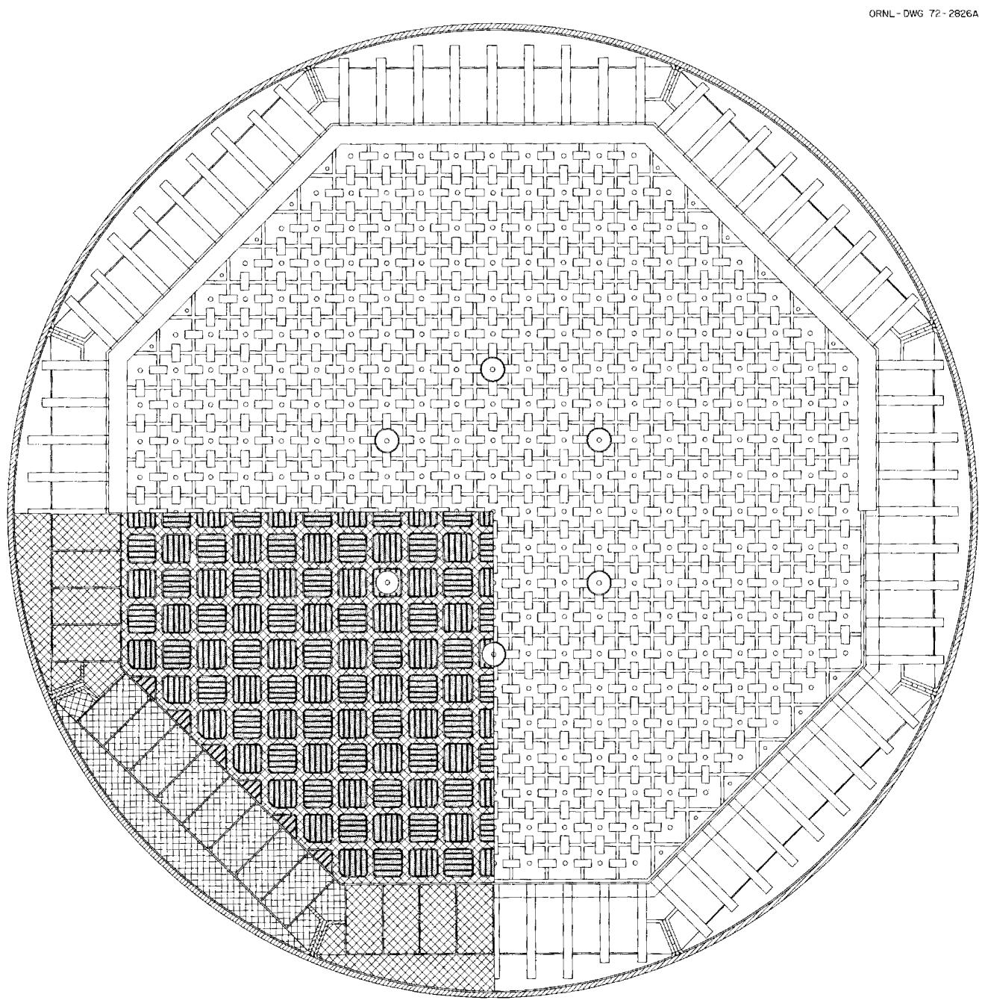  
Fig. 1.1. Plan of reactor.

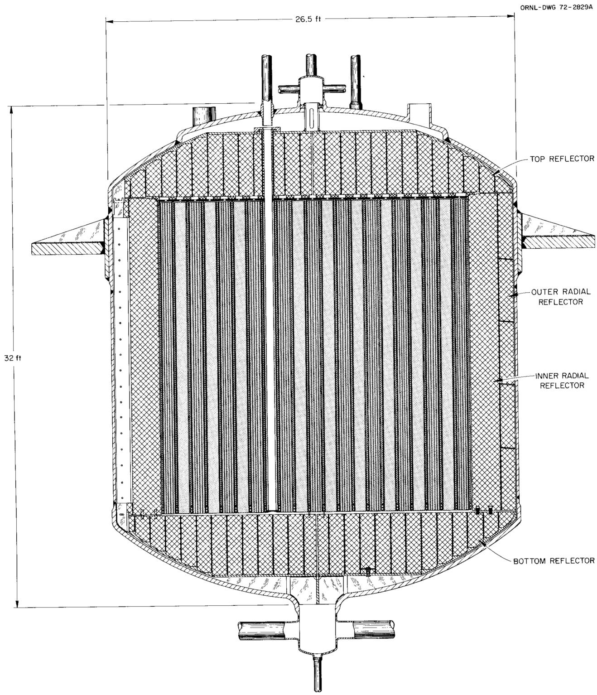  
Fig. 1.2. Elevation of reactor.

edge of each column has a $2 \times 1/4$ in. slot machined on it to provide access for flow to the vertical slot should any columns fail to float when the reactor is full of salt.

At the top of the radial reflector, horizontal bars of graphite approximately 1 in. thick by 3 in. wide by $2\frac{1}{2}$ ft long fit in milled slots in the columns and in the outer reflector. Each bar is doweled to one column and to a wedge of outer reflector graphite in a manner such as to orifice a flow channel between columns and to maintain the desired location of the column. The horizontal bars rest against the top reflector when the

reactor is filled with salt and provide a $1/4$ -in.-thick salt plenum over the radial reflector graphite.

The core is an octagonal array of graphite slabs approximately $1^{3/4}$ by $9^{3/8}$ in. in cross section. These slabs are assembled into cells approximately $11^{1/2}$ in. square. The slabs are separated by dowels which provide vertical flow passages approximately 0.142 in. wide from bottom to top of the core. The plan arrangement of a core cell is shown in Fig. 1.3. Posts define the corners of the cells. Each post has a dowel $1^{1/4}$ in. in diameter by 6 in. long on the bottom end that fits into a hole in the corner of a graphite "eggcrate" grid which

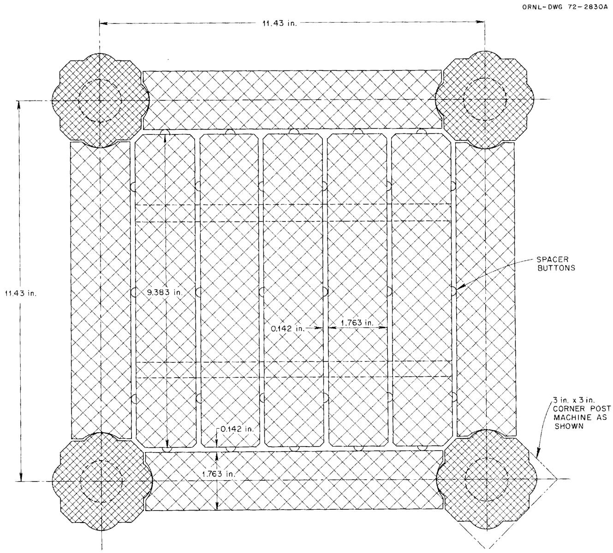  
Fig. 1.3. Plan of core cell.

rests on the bottom axial reflector. This grid positions the core cells and prevents accumulation of radial expansion spaces in any region of the core.

Around the top of the core is a graphite collar which prevents spreading of the vertical core cells into the annulus between the core and the reflector. This annulus, approximately 0.75 in. wide, results from the differential expansion between the metal vessel and the graphite. The collar also blocks the annulus at the top to prevent excessive flow in this path of low pressure drop. Flow from the annulus has to cross through the radial slots in the inner reflector and exit through the slots in the outer reflector pieces. Figure 1.4 is a detail of the collar structure.

The graphite core is assembled in the vessel and then orifice plates are put on top of the core cells to make the core flow distribution match the radial power distribution. These flat plates are approximately $11^{1/2}$ in. square by $1^{1/2}$ in. thick, with edges undercut to fit down into the cells. The plates are fitted as closely as tolerances permit. Resting on top of the cell side plates, an orifice plate leaves a $1/8$ -in. gap between its underside and the top of the five slabs that make up the internal structure of a cell. Short dowels on the underside of the orifice plate prevent the slabs from floating up and

closing this gap. In the center of each plate is an orifice. The diameter of this hole is 2.05 in. for the center cells, is 0.74 in. for peripheral cells, and varies between these extremes as a function of the radial power distribution for cells at intermediate positions.

In addition to regulating the flow through the cells, these cover plates tie the core together at the top and prevent expansion spaces from accumulating in one location. Four $\frac{3}{4}$ -in.-diam dowels extended $1^{\frac{1}{2}}$ in. above the top of each orifice plate. After the plates have been placed on top of the core, rectangular tie blocks $1^{\frac{1}{2}}$ in. thick, 3 in. wide, and 6 in. long, with two holes in each, are placed over the dowels of adjacent plates. These rectangular links tie all the cells together, but the ties are not rigid and will allow some movement of the core if needed. The links cannot float free of the dowels, even if some cells stick, and do not float to the underside of the top axial reflector. Figure 1.5 shows the arrangement of the orifice plate and links of a typical core cell.

# 1.1.3 Graphite Temperatures

The flow of fuel salt in the channels of the core and reflectors is laminar. This salt has to remove the heat

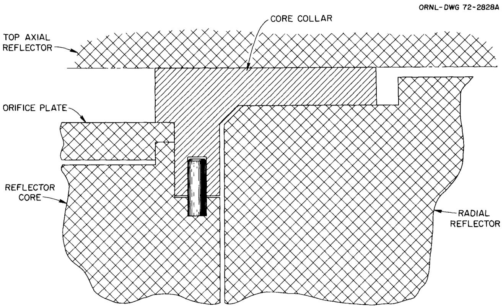  
Fig. 1.4. Collar elevation detail.

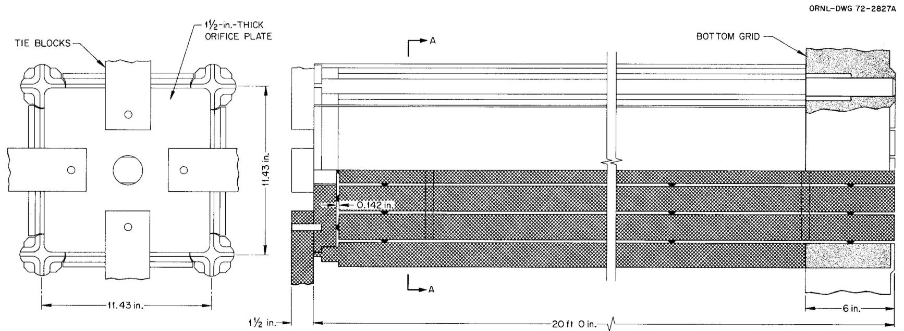  
Fig. 1.5. Plan and elevation showing top orifice plate.

produced in the salt and in the graphite. When the temperature distributions in the salt and in the graphite were calculated and then combined in the appropriate manner, the hot-spot temperature of the core graphite was found to be $1190^{\circ}\mathrm{F}$ .

The power generation in the reflector graphite is much lower than in the core graphite, but the reflector blocks are much thicker and there is less salt flow for removing the heat. Because of these factors, the hot-spot temperature in the reflector graphite was calculated to be $1341^{\circ}\mathrm{F}$ . This temperature is tolerable, because the neutron flux in the reflector is so low that adequate graphite life is attained even at this temperature.

# 1.1.4 Cell Cooling

Three systems that circulate cell atmosphere through electric furnaces are used to heat the primary system equipment cells in the MSDR design. We have added coolers, bypass ducts, and butterfly valves to these systems so that the circulating gas can be cooled or heated. Each of the coolers consists of 225 thimbles 2 in. in outside diameter, 0.035 in. in wall thickness, and 4 ft long, in square array $15 \times 15$ with a pitch of 3 in. Inside each thimble is a reentrant tube in which water boils at atmospheric pressure. Heat is transferred from the thimbles to the reentrant tubes by radiation only.

Heat is transferred from the reactor equipment to the circulating nitrogen and from the nitrogen to the cooling thimbles. When the cooling systems are put into use after shutting down the reactor and draining the salt immediately, the cooling is sufficient to keep the heat from decay of deposited fission products from raising the temperature of the reactor vessel; in fact, it begins to drop immediately and after $8\frac{1}{2}$ hr is down to about $990^{\circ}\mathrm{F}$ . Therefore, if the circulation blowers are running, there is no overheating of the reactor cell components or the cell wall, even after an emergency drain.

# 1.2 SIDE-STREAM PROCESSING OF MSBR PRIMARY FLOW FOR IODINE REMOVAL

# R. P. Wichner

Laboratory experiments on the stripping of iodide from $\mathrm{LiF - BeF_2}$ melts have been described in previous progress reports.3-5 Hydrogen was used as the carrier gas in these experiments primarily to inhibit corrosion of the apparatus, with HF oxidizer added to the extent that it formed from 1 to 20 mole % of the stripping gas. The results were analyzed according to the reaction

$$
\mathrm {H F} (\mathrm {g}) + \mathrm {I} ^ {-} = \mathrm {F} ^ {-} + \mathrm {H I} (\mathrm {g}). \tag {1}
$$

Briefly, it was found that the logarithm of the iodide concentration remaining on the melt varied linearly with the moles of HF passed. Equilibrium between phases was assumed, which allowed evaluation of the equilibrium constant for reaction (1) directly from the slope of the depletion curve. However, it was found that the equilibrium constant determined in this fashion evidently varied with the partial pressure of HF. This indicated that some incorrect assumption was made in the analysis, or some unaccounted for phenomenon occurred in the experiment. Hence it was not possible at that point to come to a knowledgeable evaluation of the potential for stripping iodine from MSBR fuel, and the question was temporarily dropped.

A new analysis of the stripping experiments, given in a forthcoming report, $^6$ has evidently resolved this difficulty. It was shown that if one postulates that diffusion of $\mathbf{I}^{-}$ in the melt to the gas/liquid interface is the rate limiting step in the desorption process, there results a mathematical model which is in accord with the experimental data in the following respects: (1) a linear decrease of $\ln [\mathrm{I}^{-}]$ with time or moles of HF passed is corroborated; (2) the apparent equilibrium constant, based on the assumption of equilibrium between the phases, is shown to indeed vary with HF partial pressure exactly as was observed; (3) the trend of the observed dependence of apparent equilibrium constant with both melt composition and temperature is qualitatively explained. In addition, it was shown that the rate of iodine stripping in the laboratory experiments was consistent with calculated values based on available bubble surface area and estimated mass transfer coefficients.

It is therefore concluded that iodine stripping from $\mathbf{LiF - BeF}_2$ mixtures is now understood. Although further experiments under conditions which come closer to a realistic situation are thought to be highly desirable, there is at this time some possibility for

making an estimate of what it would take to continually remove iodine from the MSBR fuel. Such an evaluation will be included in ref. 6.

# 1.3 MSBR INDUSTRIAL DESIGN STUDY

M. I. Lundin

The Ebasco MSBR reference concept was completed during this period.

The reactor consists of a 2-in.-thick cylindrical vessel (nominally 22 ft OD × 20 ft high) supported from the bottom. Salt enters through four inlet nozzles at the bottom at $1050^{\circ}\mathrm{F}$ and exits through four outlet nozzles at the top. The vessel contains 415 tons of graphite which defines salt flow channels in the following regions: core, axial and radial blankets, inlet and outlet salt plena, and axial and radial neutron reflectors. Each region has a specific salt fraction chosen to produce the desired nuclear characteristics of that region. Based on an evaluation of the ORNL reference concept, it was decided to retain the physics characteristic of that concept for task I. This was done by preserving the salt composition, the region salt fractions, and region dimensions specified in the ORNL reference concept (case CC-120).

The Ebasco concept does, however, have two minor variations in the graphite region dimensions:

1. The salt annulus between the radial blanket and the reflector was eliminated. This annulus, whose function was to provide clearance between permanent and replaceable graphite for unit core replacement, is no longer required. In the Ebasco concept, individual graphite assemblies will be replaced on a four-year schedule. Only those assemblies which cannot survive another four-year exposure interval are replaced.   
2. The inlet and outlet plena have been extended into the axial blanket regions for improved flow distribution.

Neither of these changes will make an appreciable effect on the nuclear performance of the reactor.

The core and blanket moderator bundles consist of ribbed graphite plates arranged into hexagonal assemblies 15.6 in. across flats.

Fuel salt flows from the reactor into four parallel circuits, each with a salt-circulation pump in the hot leg and an intermediate heat exchanger (IHX) where the heat is transferred to the secondary salt.

The IHX is a vertical sine-wave-bent tube design with a nonremovable tube bundle. Fuel salt enters the top plenum, flows downward through about 7000 tubes $(3/8$ in. OD), and exits at the bottom. The coolant salt

enters at the bottom, flows up in a mixed countercurrent flow, and exits at the top.

The secondary system also has four parallel circuits, each containing one IHX, steam generator, steam reheater, and circulation pump. The pump is in the cold leg to pressurize the IHX sufficiently to force any leakage to be directed into the primary system. The steam generator concept is a supercritical, once-through, helical-coil tube design. Supercritical fluid enters at the top, flows down through annular rows of unheated downcomer tubes, turns, and flows up through the heat transfer zone. The steam flows through 815 tube coils, countercurrent to the coolant salt. The steam reheater is identical to the steam generator except for its size.

The steam system basically consists of a supercritical steam cycle using a tandem-compound turbine generator with reheat and feedwater heaters. Except for the steam generators, reheaters, supercritical feedwater pumps, and preheater-reheater, the system utilizes conventional power plant technology and designs. The feedwater temperature is $700^{\circ}\mathrm{F}$ to prevent freezing of coolant salt in the steam generator. This high feedwater temperature causes the steam system to differ from a completely conventional supercritical steam system.

The chemical process plant permits the reactor to operate as a breeder by removing $^{233}\mathrm{Pa}$ and certain soluble parasitic neutron absorbers from the fuel salt. It also reconstitutes the salt and returns it to the primary system. The plant flowsheet was developed and supplied by ORNL.

This conceptual design reflects CONOCO's experience and judgment regarding need and location of pumps, valves, surge volumes, drain systems, safety, control system, and spatial layout.

The chemical processing cell is heated to prevent salt freezing. It is of a modular design for replacement of equipment by remote techniques. The upper level contains process equipment; the lower level contains drains and storage tanks. The cooling system uses NaK and is independent of other cooling systems in the reactor building.

The reactor off-gas system removes fission gases, particularly $^{135}\mathrm{Xe}$ and tritium, from the fuel salt. A purge gas (helium) throughput of (nominally) 10 scfm, together with efficient bubble separation from a $10\%$ salt sidewream, will keep the salt void fraction in the core to about $1\%$ (about $0.6\%$ volume-weighed loop average). Based on these conditions, it is speculated that a poison fraction of $0.5\%$ (0.005 neutron absorbed in $^{135}\mathrm{Xe}$ per absorption in fissile isotopes) can be achieved with unsealed graphite.

Reduction of the $^{135}\mathrm{Xe}$ concentration in the purge gas is accomplished primarily by decay during holdup in the drain tank, and the gas is recycled directly to the bubble injector. It is anticipated that some gas cleanup via charcoal adsorption will be required. These charcoal beds consist of coils of charcoal-filled piping submerged in cylindrical water tanks. Xenon is removed from the helium by dynamic sorption. The decay heat (about 2 MW) is removed by forced circulation of water through coolers. The off-gas system will also remove krypton, tritium, and volatile hydrocarbons from the purge gas.

The fuel tank--drain tank system is intended to provide a safe place to store the salt at any time under all conceivable circumstances. It also provides holdup and cooling for the purge gas during normal operation. This tank is located below the reactor cell to permit drainage by gravity. The salt (or purge gas) is cooled by

about 1000 bayonet tubes inside thimbles mounted into the tank head. The coolant is NaK, which circulates by natural convection through many redundant external cooling circuits. Fission gas decay heat (about 18 MW) is transferred to the main steam system when in operation. Otherwise, it is transferred to a closed-cycle, boiling-water, heat rejection system.

The reactor cell, chemical plant, off-gas system, drain tank cell, graphite handling equipment, and emergency power generators are located in the reactor building, a rectangular class 1 structure. Seismic supports are provided for the reactor and intermediate heat exchangers in a horizontal plane by a three-tier support structure of Inconel beams. Structural support is provided at the bottom of the reactor and heat exchangers. The reactor building provides containment against release of radioactivity.

Summary of principal data for MSBR power station   

<table><tr><td></td><td>Engineering units</td></tr><tr><td>General</td><td></td></tr><tr><td>Thermal capacity of reactor</td><td>2328 MW(t)</td></tr><tr><td>Gross electrical generation</td><td>1037 MW(e)</td></tr><tr><td>Net electrical output</td><td>1000 MW(e)</td></tr><tr><td>Net overall thermal efficiency</td><td>43.4%</td></tr><tr><td>Net plant heat rate</td><td>7856 Btu/kWhr</td></tr><tr><td>Structures</td><td></td></tr><tr><td>Reactor cell, diameter × height</td><td>72 × 46 ft</td></tr><tr><td>Reactor building</td><td>290 × 160 × 200 ft high</td></tr><tr><td>Reactor</td><td></td></tr><tr><td>Vessel ID</td><td>22.2 ft</td></tr><tr><td>Vessel height at center (approximate)</td><td>20 ft</td></tr><tr><td>Vessel wall thickness</td><td>2 in.</td></tr><tr><td>Vessel heat thickness</td><td>3 in.</td></tr><tr><td>Vessel design pressure (abs)</td><td>75 psi</td></tr><tr><td>Core height</td><td>13 ft</td></tr><tr><td>Number of core assemblies</td><td>157</td></tr><tr><td>Radial thickness of reflector</td><td>30 in.</td></tr><tr><td>Volume fraction of salt in central core zone</td><td>0.13</td></tr><tr><td>Volume fraction of salt in outer core zone</td><td>0.37</td></tr><tr><td>Average overall core power density</td><td>22.2 kW/liter</td></tr><tr><td>Peak power density in core</td><td>70.4 kW/liter</td></tr><tr><td>Average thermal-neutron flux</td><td>2.6 × 1014neutrons cm-2sec-1</td></tr><tr><td>Peak thermal-neutron flux</td><td>8.3 × 1014neutrons cm-2sec-1</td></tr><tr><td>Maximum graphite damage flux (&gt;50 keV)</td><td>3.5 × 1014neutrons cm-2sec-1</td></tr><tr><td>Damage flux at maximum damage region (approximate)</td><td>3.3 × 1014neutrons cm-2sec-1</td></tr><tr><td>Estimated useful life of graphite</td><td>4 years</td></tr><tr><td>Total weight of graphite in reactor</td><td>669,000 lb</td></tr><tr><td>Maximum flow velocity of salt in core</td><td>8.5 fps</td></tr><tr><td>Total fuel salt in reactor vessel</td><td>1190</td></tr><tr><td>Total fuel salt volume in primary system</td><td>2292</td></tr><tr><td>Fissile fuel inventory in reactor primary system and fuel processing plant</td><td>4440</td></tr><tr><td>Thorium inventory</td><td>200,000 lb</td></tr><tr><td>Breeding ratio</td><td>1.06</td></tr></table>

# Engineering units

Primary heat exchangers (for each of four units)

Thermal capacity, each

Tube-side conditions (fuel salt)

Tube OD

Inlet-outlet conditions

Mass flow rate

Total heat transfer surface

Shell-side conditions (coolant salt)

Inlet-outlet temperatures

Mass flow rate

Overall heat transfer coefficient (approximate)

583 MW(t)

3% in.

1300-1050°F

$23.45 \times 10^{6} \mathrm{lb/hr}$

13,000 ft²

850-1150°F

$17.6 \times 10^{6} \mathrm{lb/hr}$

850 Btu hr-1 ft-2 $(^{\circ}\mathrm{F})^{-1}$

Primary pumps (for each of four units)

Pump capacity, nominal

Rated head

Speed

Specific speed

Impeller input power

Design temperature

16,000 gpm

150 ft

890 rpm

2625 rpm (gpm)0.5/(ft)0.75

2350 hp

$1300^{\circ}\mathrm{F}$

Secondary pumps (for each of four units)

Pump capacity, nominal

Rated head

Speed, principal

Specific speed

Impeller input power

Design temperature

20,000 gpm

300 ft

1190 rpm

2330 rpm (gpm)0.5/(ft)0.75

3100 hp

$1300^{\circ}\mathrm{F}$

Fuel salt drain tank (one unit)

Outside diameter

Overall height

Storage capacity

Design pressure

Number of coolant U-tubes

Thimble OD

Number of separate coolant circuits

Coolant fluid

Maximum heat load

Maximum transient heat load

14 ft

21 ft

2500 ft3

55 psi

1000

3 in.

8

NaK

18 MW(t)

53 MW(t)

Fuel salt storage tank (one unit)

Storage capacity

Heat removal capacity

Coolant fluid

2500 ft3

1 MW(t)

Boiling water

Coolant salt storage tanks (four units)

Total volume of coolant salt in systems

Storage capacity of each tank

Heat removal capacity, first tank in series

8400 ft3

2100 ft3

400 kW

Steam generators (for each of four units)

Thermal capacity

Tube-side conditions

Inlet pressure

Inlet-outlet temperatures

Mass flow rate

Total heat transfer surface

Shell-side conditions (coolant salt)

Inlet-outlet temperatures

Mass flow rate

490 MW(t)

3950 psi

709-1006°F

$2.6\times 10^{6}\mathrm{lb / hr}$

3929 ft²

1150-850°F

$15.5\times 10^{6}\mathrm{lb / hr}$

Steam reheaters (for each of four units)

Thermal capacity

Tube-side conditions (steam at 580 psi)

86.4 MW(t)

<table><tr><td></td><td>Engineering units</td></tr><tr><td>Inlet-outlet temperatures</td><td>650–1000°F</td></tr><tr><td>Mass flow rate</td><td>1.5 × 10^6 lb/hr</td></tr><tr><td>Shell-side conditions (coolant salt)</td><td></td></tr><tr><td>Inlet pressure</td><td>228 psi</td></tr><tr><td>Inlet-outlet temperatures</td><td>1150–850°F</td></tr><tr><td>Mass flow rate</td><td>2.73 × 10^6 lb/hr</td></tr><tr><td>Turbine-generator plant (see “General” above</td><td></td></tr><tr><td>Number of turbine-generator units</td><td>1</td></tr><tr><td>Turbine throttle conditions</td><td>3500 psia, 1000°F</td></tr><tr><td>Turbine throttle mass flow rate</td><td>7.18 × 10^6 lb/hr</td></tr><tr><td>Reheat steam to IP turbine</td><td>540 psia, 1000°F</td></tr><tr><td>Condensing pressure (abs)</td><td>1.5 in. Hg</td></tr><tr><td>Boiler feed pump work (steam-turbine-driven), each of two units</td><td>19,700 hp</td></tr><tr><td>Booster feed pump work (motor-driven), each of two units</td><td>7777 hp</td></tr></table>

# 1.4 MSBE DESIGN

H. A. McLain

D. W. Wilson

Layout studies of the MSBE core reported previously have continued, but using a core constructed of slab-type graphite elements rather than those of the prismatic design. The advantage of the slab-type element is that it is easier to fabricate; particularly there is no central hole requiring pyrolytic graphite coating.

Consideration was given as to how a slab element could best be fitted into the overall cylindrical core layout. The individual slabs are incorporated into a moderator element measuring $7.27 \times 6.93$ in., with each moderator element, except those at the edge of the core, containing five graphite slabs having cross-section dimensions of about $7.27 \times 1.25$ in. (slab width does not include the ribs). The slab ribs are arranged to form 0.17-in.-thick salt flow channels giving the desired $15\%$ salt fraction in the core. Lifting and suspension support for each moderator element is supplied by its center slab. This support is transferred to the other slabs by use of two cross ribs attached to the center slab by graphite bolts. A floating head allows orificing of the channel flows and provides space for differential expansion between the center slab and the other slabs of the element. An isometric view of the moderator

element containing these features is shown in Fig. 1.6. Some of the moderator elements used at the edge of the core contain only three graphite slabs to approximate the cylindrical core geometry, as shown in Fig. 1.7.

The basic moderator elements are modified at five points in the core to form circular salt channels about $2^{1/2}$ in. in diameter. Four of these are required for the control rods, and the fifth, which is at the center of the reactor, is for the insertion of sample specimens. The locations of these channels are shown in Fig. 1.7.

The four control rods would be fabricated of Hastelloy N in a cruciform shape, with each designed to drop into one of the $2^{1/2}$ -in.-diam salt channels. A graphite extension would be placed on the end of the control rod to protect the core graphite from damage, and to provide orificing of the salt flow through the control channel. Scratching of the core graphite by the edges of the cruciform is prevented by graphite buttons or strips fastened to them. A typical layout of such a control rod is shown in Fig. 1.8.

It was decided that the control-rod drive mechanisms should be of the positive coupled design, and three types were considered for preliminary study. They were the magnetic jack, the roller nut, and the rack and pinion. All three filled the preliminary requirements of simplicity of operation, operational experience, and speed of response. The three-coil magnetic jack finally was selected for use as a future reference because of its simplicity, reliability, standardization of design, and extensive use in the present water power reactors.

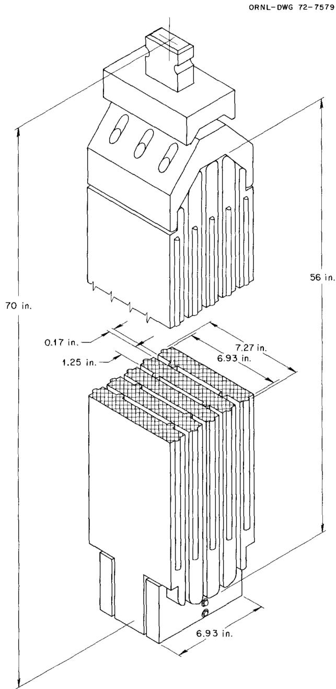  
Fig. 1.6. MSBE fuel element.

# 1.5 BUBBLE BEHAVIOR IN THE MSBR PRIMARY SALT SYSTEM

H. A. McLain L. W. Gilley8 T. C. Tucker8

A digital computer program, BUBBLE, has been written describing in detail the behavior of the gas bubbles circulating with the salt through the MSBR

primary salt system. This program is now being incorporated into a larger digital computer program describing the detailed behavior of the noble gas in the MSBR. The intent of this effort is to either confirm the results of the simplified calculations of Kedl describing the noble-gas behavior in the MSBR or to make improvements where required.

In the BUBBLE program it is assumed that the number of bubbles per unit salt volume and the sum of the gas dissolved in the salt and present in the bubbles per unit salt volume are constant throughout the salt loop (with the exception of the small volume of salt between the gas separator and the bubble generator). It is assumed also that the bubble size distribution at any location within the salt loop is described by the distribution function given by Kress:

$$
f (d) = 4 \left(\frac {\alpha^ {3}}{\pi}\right) ^ {1 / 2} d ^ {2} \exp (- \alpha d ^ {2}),
$$

in which

$$
\begin{array}{l} d = \text {b u b b l e} \\ \alpha = \left[ \frac {4 \sqrt {\pi} N _ {V}}{6 \Phi} \right] ^ {2 / 3}, \\ \end{array}
$$

$N_{V} =$ number of bubbles per unit salt volume,

$\Phi =$ void fraction.

The rate of transfer of the dissolved gas to the bubbles can be described by the relation

$$
d C / d t = - k a (C - H p),
$$

where

$C =$ concentration of gas dissolved in salt,

$k =$ mass transfer coefficient,

$a =$ surface area of bubbles per unit salt volume,

$H =$ Henry's law constant,

$p =$ pressure,

$t = \mathrm{time}$

For the bubble size distribution function given above, the surface area of the bubbles per unit volume of salt is

$$
a = \left(\frac {3}{2}\right) ^ {5 / 2} \pi^ {2 / 3} \Phi^ {2 / 3} N _ {V} ^ {1 / 3}.
$$

8. Mathematics Division.   
9. MSR Program Semiannu. Progr. Rep. Aug. 31, 1968, ORNL-4344, pp. 72-74.   
10. MSR Program Semiannu. Progr. Rep. Aug. 31, 1970, ORNL-4622, pp. 57-59.

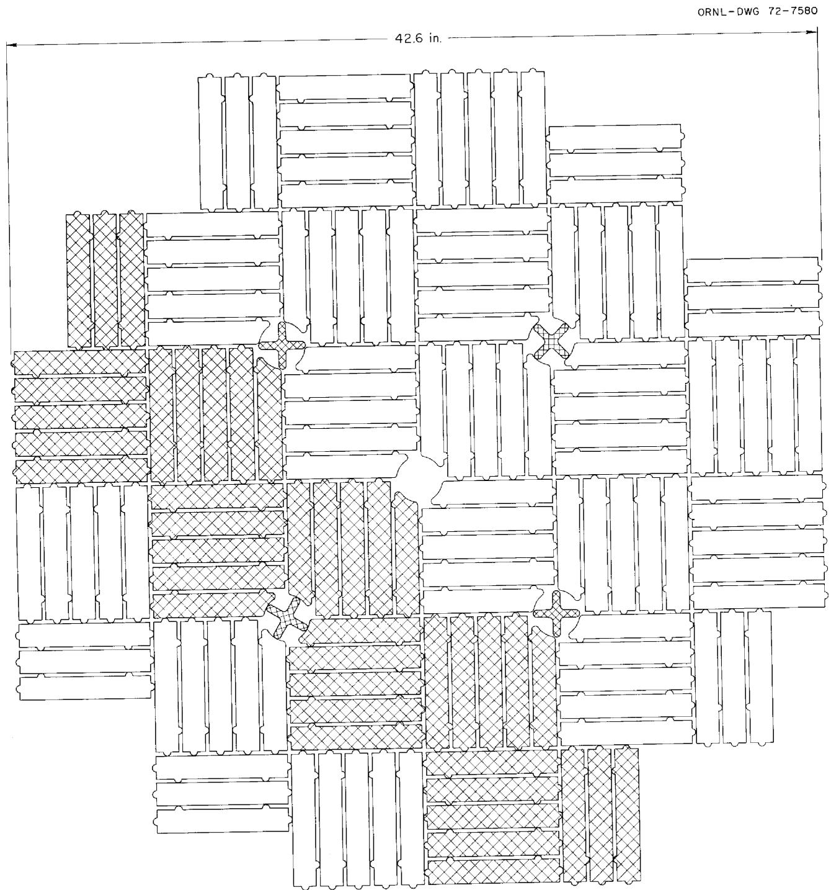  
Fig. 1.7. MSBE core plan view.

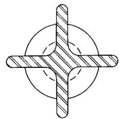  
SECTION A-A

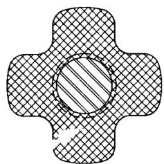  
SECTION B-B

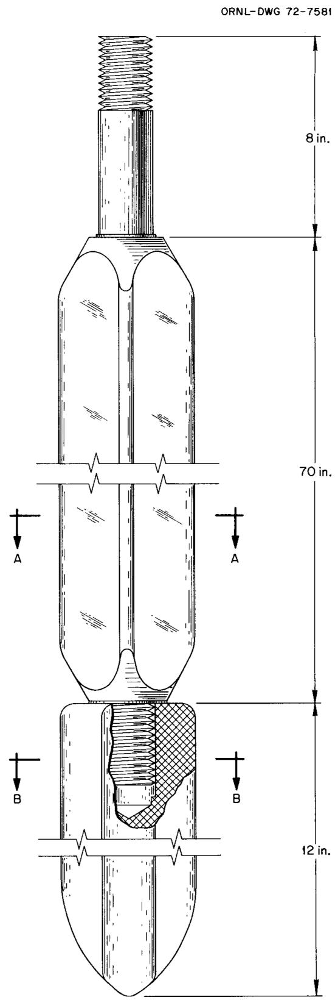  
Fig. 1.8. MSBE control rod.

Assuming perfect gas behavior and neglecting the surface tension effects, the volume fraction of the bubbles is

$$
\Phi = (N - C) R T / p,
$$

where

$N =$ total sum of gas per unit volume of salt,

$R =$ gas constant,

$T =$ temperature.

The above relations are combined to give

$$
\frac {d C}{d t} = - 4. 2 1 6 N _ {V} ^ {1 / 3} k \left(\frac {R T}{p}\right) ^ {2 / 3} (N - C) ^ {2 / 3} (C - H p).
$$

This relation is solved by numerical methods to give the dissolved gas concentrations throughout the primary salt loop. Once the dissolved gas concentrations are known, all of the other parameters relating to the bubbles can then be determined by using the appropriate relations.

In the parts of the primary salt loop defined as straight channels, fuel channels, piping, etc., the term to the left of the equal sign in the above relation can be rewritten as

$$
\frac {d C}{d t} = u \frac {d C}{d x},
$$

where

$u =$ salt velocity,

$x =$ distance.

The value of the mass transfer coefficient to the bubbles, $k$ , is assumed to be that predicted by the relations reported by Kress correlating the results of his bubble mass transfer experiments.

Similarly, in the portions of the primary salt loop defined as plenum regions, pump volute, heat exchanger plenums, etc., the term to the left of the equal sign in the above material balance can be rewritten as

$$
\frac {d C}{d t} = V \frac {d C}{d \mathbf {v}},
$$

where

$V =$ volumetric salt flow rate,

$\mathbf{v} = \mathbf{\nabla}$ volume.

In these regions the value of the mass transfer coefficient to the bubbles, $k$ , is assumed to be that predicted by the Calderbank and Moo-Young relation:

$$
k = 0. 1 3 \left[ \frac {(P / v) g _ {c} \mu}{\rho^ {2}} \right] ^ {1 / 4} \left(\frac {1}{S c}\right) ^ {2 / 3},
$$

where

$P / \mathbf{v} =$ power dissipated per unit fluid volume,

$g_{c} =$ Newton's law conversion factor,

$\mathbf{Sc} =$ Schmidt modulus,

$\mu =$ salt viscosity,

$\rho =$ salt density.

No attempt has been made so far to account for any mass transfer between the bubbles and the salt within the gas separator and the bubble separator. The gas separator is treated simply as a unit that removes a specified fraction of the bubbles but does not affect the bubble size distribution. An equal amount of bubbles is then replaced in the salt by the bubble generator. Therefore, in the piping between the gas separator and the bubble generator, the total gas per unit salt volume is reduced by the amount

$$
\boldsymbol {\xi} (N - C),
$$

where $\xi =$ gas separator efficiency. In this same piping the area for mass transfer to the bubbles is reduced by the factor $\xi$ .

Some initial cases calculated by this program indicate that the transport rate of a gas to the bubbles (product of the mass transfer coefficient and the bubble surface area) is not a significant function of the volume-to-surface mean diameter for a given void fraction of bubbles in the reactor. This is not too surprising, since the bubble mass transfer coefficient correlation of $\text{Kress}^{13}$ states that in flow regimes where the buoyancy forces are insignificant compared with the turbulent forces, the mass transfer coefficient is proportional to

the volume-to-surface mean diameter. Since the Kress correlation for this flow regime applies to most parts of the MSBR primary salt system and since by definition the bubble surface area is inversely proportional to the volume-to-surface mean diameter, the gas transport rate is essentially constant for a given bubble void fraction.

With the number of bubbles per unit salt volume held constant, increasing the void fraction increases the

mean diameter of the bubbles, the surface area, and the mass transfer coefficient. This results in large increases in the gas transport rate to the bubbles. Also, significant variations in the transport rates occur throughout the primary salt loop as a result of differences in temperature that affect the mass transfer coefficients and differences in temperature and pressure that affect the mean bubble diameter.

# 2. Reactor Physics

A. M. Perry

# 2.1 EXPERIMENTAL PHYSICS

# 2.1.1 HTLTR Lattice Experiments

G. L. Ragan O. L. Smith

The experimental program of the Battelle Northwest Laboratories which measured the neutron physics parameters of a simulated MSBR lattice at temperatures to $1000^{\circ}\mathrm{C}$ has been reported. We are ready to proceed with corresponding calculations, whose validity will be tested by comparison with the experimental results. During this report period we have updated our cross-section library and made and tested code modifications, some of which were described in our last progress report.

Basic cross-section library. In preparation for the HTLTR analysis, we have compiled a new cross-section library in our standard 123-energy-group format. This did not represent any major revision in our cross-section data, but is part of our continuing effort to keep MSR production cross sections up-to-date.

With the notable exceptions of lithium, carbon, and fluorine, the data for the new library were obtained from the ENDF/B version II files. The cross sections for $^6\mathrm{Li}$ and $^7\mathrm{Li}$ were prepared from ENDF/B version III data. For carbon, the thermal scattering data were prepared by a code using the incoherent crystalline scattering model. The capture cross section of carbon was normalized to $4.0\mathrm{mb}$ at $2200\mathrm{m / sec}$ (in contrast to the ENDF normalization of $3.4\mathrm{mb}$ ) to account for impurities in nominal MSR-grade graphite. The capture cross section in our carbon has the correct $1 / \nu$ dependence in the epithermal and fast range, in contrast

to the ENDF representation, which is arbitrarily set to zero at $4\mathrm{keV}$ . The cross sections for fluorine are not available on the ENDF/B library, so for some years we have used data of our own evaluation. In preparing our new cross sections we revised the ${}^{19}\mathbf{F}(n,\alpha)$ cross section downward by about $50\%$ to take into account recent data.

Our updated 123-group library contains cross sections for all important MSR nuclides at the following temperatures: 293.6, 573, 900, and $1273^{\circ}\mathbf{K}$ . Carbon is available also at $1000^{\circ}\mathbf{K}$ .

Resonance-groups treatment. Like many other reactor lattices, the MSBR lattice in the HTLTR was doubly heterogeneous, being composed of moderator material surrounding fuel rods that were in turn heterogeneous dispersions of grainy materials. During this report period we performed some calculations for resonance-energy neutrons to test the method we had developed for dealing with the double heterogeneity. As described below, we found that for the simple laminar geometry in the test problem the method is inaccurate and it is better simply to homogenize the fine heterogeneity in the treatment of resonance-energy neutrons. (The treatment of thermal neutrons is a different matter, discussed later.)

It is customary to define a self-shielding factor, at each energy, by the equation

$$
\frac {\bar {\sigma}}{\sigma} = \frac {\bar {\phi} (\text {g r a i n})}{\bar {\phi} (\text {l a t t i c e c e l l})} = \frac {\bar {\phi} (\text {g r a i n})}{\bar {\phi} (\text {r o d})} \cdot \frac {\bar {\phi} (\text {r o d})}{\bar {\phi} (\text {l a t t i c e c e l l})}. \tag {1}
$$

The first flux ratio is the fine heterogeneity factor; the second, the gross heterogeneity factor. Existing treatments assume separability of the two factors, that is, that they can be approximated by evaluating the fine heterogeneity factor for an infinite medium of grainy rod material, then using cross sections disadvantaged by this factor in a smeared-fine-structure representation of the rod in evaluating the gross heterogeneity factor.

Several different prescriptions $^{3-5}$ have been proposed for the fine heterogeneity factor. The gross factor is usually obtained by the Nordheim integral treatment (NIT), using codes such as GAM-II $^{6}$ and GAROL. $^{7}$

We have developed a method that is similar in principle to the others in that we assume separability, but we obtain both factors by NIT calculations. The GAM-II part of the $\mathrm{XSDRN^8}$ code was suitably revised to perform a double NIT treatment, making two successive passes (treating fine and coarse heterogeneity) through the fine energy mesh of each resonance. Also, the GAM-II equations were modified to yield, at each energy, a moderator-region flux that agrees with that obtainable by the GAROL code, which solves explicitly for the neutron collision densities and thus avoids some of the approximations in GAM-II.

We have used a set of simple laminar problems to test important features of our method by comparison of results from double NIT with those from a reliable reference calculation using the discrete ordinates code ANISN. (Laminar geometry permits use of ANISN and also the exact calculations of escape probabilities and Dancoff factors.) In the reference case (case 2 in Table 2.1), absorber grains were simulated by $\mathrm{ThO_2}$ slabs $0.0040\mathrm{cm}$ thick (comparable to the $0.0059\mathrm{cm}$ mean diameter of the particles in the HTLTR experiments). These were alternated with carbon slabs $0.022\mathrm{cm}$ thick to build up a laminated region $1.04\mathrm{cm}$ thick simulating an absorber rod. Finally, these laminated absorber regions were alternated with $6.6\mathrm{cm}$ -thick graphite moderator slabs to simulate the main lattice. Two other

cases were also considered: one with coarser structure in the absorber region (case 1 in Table 2.1) and one in which the absorber region was homogenized (case 3). The atom densities and volume fractions in the reference case were preserved in the other two cases.

The specific results that were compared are (1) the absorber-to-matrix flux ratio $(\Gamma)$ in the laminated absorber region at the peak energy $(21.7\mathrm{eV})$ of the lowest major thorium resonance and (2) the thorium absorption cross section $(\widetilde{\sigma}_a)$ averaged over the lattice cell and the energy range (17.98 to $25.42\mathrm{eV}$ ) covering the resonance. Both the ANISN and the double-NIT calculations used the 403 energy groups set up by

3. R. K. Lane, L. W. Nordheim, and J. B. Sampson, "Resonance Absorption in Materials with Grain Structure," Nucl. Sci. Eng. 14, 300-396 (1962).   
4. M. W. Dyos and G. C. Pomraning, "Effective Thermal-Neutron Cross Sections for Materials with Grain Structure," Nucl. Sci. Eng. 25, 8-11 (1966).   
5. P. Walti, “Evaluation of Grain Shielding Factors for Coated Fuel Particles,” Nucl. Sci. Eng. 45, 321-30 (1971).   
6. G. D. Joanou and J. S. Dudek, GAM-II, a $B^3$ Code for the Calculation of Fast Neutron Spectra and Associated Multigroup Constants, GA-4265 (September 1963).   
7. C. A. Stevens and C. V. Smith, GAROL: A Computer Program for Evaluating Resonance Absorption Including Resonance Overlap, GA-6637 (August 1965).   
8. N. M. Greene and C. W. Craven, Jr., XSDRN: A Discrete Ordinates Spectral Averaging Code, ORNL-TM-2500 (July 1969).   
9. W. W. Engle, Jr., A User's Manual for ANISN, a One-Dimensional Discrete Ordinates Transport Code with Anisotropic Scattering, K-1693 (March 1967).

Table 2.1. Comparison of results ${}^{a}$ from double NIT and from ANISN for the lowest major thorium resonance   

<table><tr><td colspan="2">Description of problemb</td><td colspan="2">Case 1: coarser absorber slabs (0.0200 cm thick)</td><td colspan="2">Case 2: nominal absorber slabs (0.0040 cm thick)</td><td colspan="2">Case 3: infinitesimal absorber slabs (fine structure homogenized)</td></tr><tr><td>Code</td><td>Conditions</td><td>Γ</td><td>σa</td><td>Γ</td><td>σa</td><td>Γ</td><td>σa</td></tr><tr><td>1. ANISN</td><td>Laminated absorber region alone</td><td>0.672</td><td>c</td><td>0.919</td><td>c</td><td>1.000</td><td>c</td></tr><tr><td>2. ANISN</td><td>Lattice cell</td><td>0.827</td><td>12.87</td><td>0.973</td><td>12.98</td><td>1.000</td><td>12.99</td></tr><tr><td>3. Double NIT</td><td>Lattice cell, approximate escape probabilities</td><td>0.588</td><td>11.97</td><td>0.824</td><td>12.58</td><td>1.000</td><td>12.86</td></tr><tr><td>4. Double NIT</td><td>Lattice cell, exact escape probabilities</td><td>0.669</td><td>12.35</td><td>0.909</td><td>12.76</td><td>1.000</td><td>12.88</td></tr><tr><td>5. Double NIT</td><td>Related spherical-grain cases (see text)</td><td>0.749</td><td>12.26</td><td>0.944</td><td>12.54</td><td>1.000</td><td>12.60</td></tr></table>

${}^{a}\Gamma$ is for ${21.7}\mathrm{{eV}}$ ,the peak of the lowest thorium resonance. For both ANISN and NIT, ${\bar{\sigma }}_{a}$ is averaged over the 403 energy groups (17.98 to ${25.42}\mathrm{{eV}}$ ) set up by GAM-II for that resonance $\left( {{\Delta u} = {0.00086}}\right)$ . Other resonances are ignored.   
The problem is more fully described in the text.   
This calculation did not treat the full cell, so $\sigma_{g}$ is not defined.

GAM-II for that energy range. The ANISN calculation was done at S-32 quadrature (required to get $\Gamma$ to an estimated accuracy of $\pm 0.003$ ) and scattering order P-1 (insensitive).

Four major conclusions can be drawn from the results summarized in the first four lines of Table 2.1 - line 5 will be discussed below.

1. The separability assumption leads to large errors in $\Gamma$ . Compare the true $\Gamma$ values of line 2 with those of line 1, obtained by considering the laminated absorber region alone.   
2. For conditions existing in the laminated absorber, small errors in escape probability result in much larger errors in $\Gamma$ . The line $4\Gamma$ values agree well with line 1, but a significant error is contributed by the use of approximate escape probabilities (line 3) even though the approximation used was the excellent one, due to Nordheim, that is used in GAM-II and GAROL. A similar sensitivity to errors in the Dancoff factor was noted.   
3. The grain effect (depression of $\overline{\sigma}_a$ relative to case 3) is overestimated severalfold by double NIT - taking the ANISN result in line 2 to be correct.   
4. Hence, the best procedure found in this study is to homogenize the fine structure and treat the gross heterogeneity by an NIT calculation - which is the procedure that gave the NIT results of the last column.

It must be emphasized that the above conclusions are based on a laminar model. A comparable study, based on a more realistic model, would be of interest, but it appears to be very difficult. The extent to which these conclusions are valid for other geometries is an open question, but an indication of the magnitude of the effects in the HTLTR analysis, relative to those in the above study, is afforded by the following series of calculations.

We set up three cases comparable to the slab cases of Table 2.1, but with HTLTR-type geometry: spherical absorber grains in cylindrical absorber rods arranged in a square-lattice array. The absorber grain diameters were chosen to have the same mean chord lengths as did the corresponding absorber slabs of Table 2.1; the respective grain diameters were $0.0600\mathrm{cm}$ , $0.0120\mathrm{cm}$ and infinitesimal (homogenized fine structure). The absorber rods had the same mean chord length as did the $1.04\mathrm{-cm}$ -thick laminated absorber slabs; hence, their diameter was $2.08\mathrm{cm}$ . All atom densities and volume fractions were kept the same as in the slab problems; the resulting square-lattice rod spacing was $5.00\mathrm{cm}$ .

The ANISN code cannot treat this geometry, so results comparable to lines 1 and 2 of Table 2.1 cannot be given. Nor are results comparable to line 4 given,

since exact escape probabilities are not available. The results given in line 5 are calculated by the double-NIT code, using the same Nordheim-type approximation for escape probabilities as was used for line 3. Thus lines 3 and 5 may be compared to evaluate geometrical differences in resonance self-shielding effects.

Let us define the grain effect as the fractional decrease in $\bar{\sigma}_a$ relative to that for the corresponding homogenized-fine-structure case. Then for case 1, the grain effect for line 3 (grains represented as slabs) is found to be $6.9\%$ , while that for line 5 (spherical grains) is only $2.7\%$ . For case 2, the grain effect is $2.2\%$ for slabs and $0.5\%$ for spheres. The grain effects for slabs are found to be severalfold too large, taking line 2 (ANISN) to be correct. Errors are due both to the separability assumption and to the escape probability approximation, and both errors have the same sign. The same two errors are present in the grain effects estimated from line 5, so that they, too, may be assumed to be overestimates. Hence, the true grain effect for $0.0120$ -cm-diam spheres (line 5, case 2) may be taken as less than $0.5\%$ . The mean $\mathrm{ThO}_2$ grain diameter in the HTLTR mixture was $0.0059\mathrm{cm}$ , about half that of line 5 of case 2. Since the grain effect in line 5 appears to vary linearly with grain diameter, we estimate that the true grain effect for the HTLTR grains is less than $0.25\%$ . If the double-NIT treatment overestimates the grain effect by more than a factor of 2, as it did in the slab study, neglecting the adjustment is better than making it. Hence we plan to neglect this grain effect, simply homogenizing the fine structure and doing a normal NIT calculation of the resonance-groups cross sections. The resulting cross sections should be high by less (perhaps much less) than the $0.25\%$ adjustment that a double-NIT treatment would give. Since less than $26\%$ of the neutron absorptions occur in the resonance energy range, neglecting the grain effect should underestimate the multiplication factor $k$ by less (perhaps much less) than $0.00065$ (i.e., $0.26 \times 0.0025$ ).

Thermal-groups treatment. Although grain effects were found to be negligible in the resonance energy range, that is not the case at thermal energies. The spatial variation of flux for the thermal groups is reasonably small within the graphite and $\mathrm{ThO_2}$ powders that comprise most of the fuel mixture, but thermal fluxes are significantly depressed in the kernels of the coated particles that supply the fissile material. These particles have a kernel about $0.0300\mathrm{cm}$ in diameter and consist mainly of $\mathrm{ThO_2}$ and $^{23}^{3}\mathrm{UO}_2$ in a 3:1 ratio. The kernels are surrounded by a 0.0100-cm-thick carbon coating. The average thermal flux in the kernels is about

$2\%$ below that in the rest of the fuel mixture, so that significant reactivity effects result.

We are preparing to determine the thermal-range self-shielding for the fuel nuclides from an XSDRN problem in which the main lattice (cylindrical fuel rods in a square array) is represented as an equivalent spherical problem. A typical kernel, its carbon coating, and the appropriate quantity (smared) of $\mathrm{ThO_2}$ and graphite powders that should be associated with that kernel constitute the innermost three regions. The fourth region, consisting of homogenized fuel, extends to a diameter giving a mean chord length equal to that of the actual cylindrical fuel rod. Region 5 contains the main lattice moderator and has the correct volume, relative to the fuel. The XSDRN code has been modified to give multigroup cross sections, averaged over the innermost three regions.

These cross sections take into account the spatial self-shielding effects of the grainy fuel, in the presence of the correct amounts of other materials, realistically disposed. They will be used whenever fuel is explicitly specified in further problems. In particular, they will be used in the fuel rod of a cylindrical XSDRN problem, in which the rod is correctly specified and the associated square-lattice cell is cylindricized in the usual manner. The resulting cell-averaged cross sections will be used in any further problems where the main lattice is to be represented without specifying its detailed spatial structure.

# 2.2 PHYSICS ANALYSIS OF MSBR

# 2.2.1 Radiation Heating in MSR Pumps

J. R. Engel

Some preliminary calculations were performed to estimate the amount of radiation heating in the tank of an MSBR pump. Since this problem is common to all molten-salt systems, the reference-design $\mathbf{MSBR}^{10}$ was chosen to represent the entire class because the heating there will be greater than in lower-performance systems. In anticipation of the need to provide cooling for metal surfaces, a pump tank design was proposed with cooling shrouds that direct a flow of fuel salt over those surfaces. Since such provisions would affect the heat production in the structural members, estimates were made both with and without the shrouds in place.

The radiation that heats an MSR pump tank comes from several sources. One of the more conspicuous is the source associated with the noble gases and their daughters in the gas space above the salt pool. For molten-salt pumps of the type being considered, it is estimated that a salt flow of $50~\mathrm{gpm}$ will enter the tank as leakage around the drive shaft and other seals, bringing with it noble gases at the same concentrations as those circulating in the loop. These gases were assumed to escape into the gas space and to eventually be swept out by the purge flow of gas that enters around the pump shaft. In the case where no cooling of the tank was assumed, the seal leakage was the only noble-gas source considered. Pump tank cooling could, no doubt, be accomplished in a variety of ways, but one convenient salt source is the return flow from the drain tank. This stream would amount to about $110~\mathrm{gpm}$ per pump in an MSBR, and at least part of the salt would have previously been stripped of gaseous fission products in the drain tank. To provide a basis for calculations, this stream was assumed to flow into the pump bowl with complete release of the gaseous fission products to the gas space.

The second major source of radiation in the pump tank is the salt pool in the surge volume, which was assumed to be $10\mathrm{ft}^3$ . (The salt inside the volute is a more intense source, but it is also shielded from the pump tank by the volute itself and by the salt in the pool.) The intensity of this source was estimated from the rate of throughput and the ages of the various streams entering the pump for the two situations described above.

A third, but much smaller, source of radiation heating is the gamma and neutron "shine" on the pump tank from other components - primarily the reactor vessel - in the primary loop. Previously reported11 heating rates were used to estimate the contribution from this effect.

The heating effectiveness of the sources inside the pump tank is strongly influenced by the presence or absence of the cooling-salt layer and the shroud required to direct the flow over the tank surfaces. With no cooling, we assumed that all the radiation from the gas space was directly incident on the surrounding surfaces, so that beta, as well as gamma, heat was deposited in the tank walls. In addition, we assumed that all daughters formed by noble-gas decay would deposit on the tank walls and contribute to the heat source. With salt cooling, the tank wall was presumed to be completely shielded from the beta radiation emitted

by the noble gases and their daughters. However, an additional gamma source from the cooling salt itself had to be considered. (A 1-cm-thick layer of salt was assumed.) The shielding provided by the shroud and cooling salt was neglected in estimating the heating due to gamma radiation.

Table 2.2 provides a summary of the results that were obtained. Values are given both for the energy flux (beta and/or gamma as appropriate) to the tank wall and for heat generation in the tank. An exception to this is the contribution from reactor vessel shine, because the earlier results were reported only in terms of heat generation. In estimating the energy flux from the gas space, surface deposits, and surface cooling, we assumed that all the radiation emitted would be incident on some surface (e.g., the volute support cylinder would radiate beta and gamma energy toward the tank and vice versa) with a total area of $100\mathrm{ft}^2$ . The salt pool was treated as a spherical source radiating toward surfaces $1.4\mathrm{m}$ away. Of the incident flux, all of the beta energy and all gamma energy with $E < 0.2$ MeV were assumed to be absorbed; only 0.3 of the higher-energy gamma flux was allowed to deposit in the metal. Although these estimates of pump-tank heating are clearly rough approximations, they indicate that surface heat fluxes from the pump tank will probably be in the range of 3000 to 6000 Btu $\mathrm{hr}^{-1}$ ft $^{-2}$ , depending on the internal configuration of the pump. Heat production in the pump impeller and scroll case may be somewhat higher, but these items are cooled by the rapidly circulating main salt stream.

# 2.2.2 MSBE Control-Rod Worths

# J. R. Engel

Some preliminary survey calculations were made to estimate the reactivity worth of several potential control-rod materials and configurations in the core of the 150-MW(t) molten-salt breeder experiment. The materials considered included pure graphite and Hastelloy N, for which no new compatibility questions would be raised, and the more conventional neutron poisons, boron and europium, which we presumed could be dispersed in graphite to give a usable material. Boron-impregnated graphite has been produced, so such rods, while short-lived in a high neutron flux, would presumably be inexpensive and might be acceptable if used only for shutdown purposes. Europium-graphite rods

Table 2.2. Estimated radiation heating in MSBR pump tank   

<table><tr><td rowspan="2">Radiation source</td><td colspan="2">Uncooled tank</td><td colspan="2">Cooled tank</td></tr><tr><td>Incident energy (W/cm2)</td><td>Heating rate (W/cm2)</td><td>Incident energy (W/cm2)</td><td>Heating rate (W/cm2)</td></tr><tr><td>Noble gases</td><td>0.65</td><td>0.49</td><td>0.59</td><td>0.18</td></tr><tr><td>Noble-gas daughters</td><td>0.73</td><td>0.39</td><td>1.19</td><td>0.36</td></tr><tr><td>Salt poola</td><td>0.36</td><td>0.11</td><td>0.39</td><td>0.12</td></tr><tr><td>Cooling saltb</td><td></td><td></td><td>3.77</td><td>1.17</td></tr><tr><td>Reactor vessel shine</td><td></td><td>~0.1</td><td></td><td>~0.1</td></tr><tr><td>Total</td><td></td><td>1.09</td><td></td><td>1.93</td></tr></table>

$^a$ Gamma source of $3.25 \, \text{W/cm}^3$ in uncooled tank and 3.56 $\text{W/cm}^3$ in cooled tank.   
$^b$ Gamma source of $3.77\mathrm{W / cm}^3$

would have a substantially longer life but would require development and would be more expensive.

For each poison evaluation, criticality calculations were made in one-dimensional cylindrical geometry using the 123-group neutron-transport program XSDRN. The reference reactor for each case contained a $2^{1/2}$ -in.-diam cylinder of fuel salt on the core center line. The change in $k_{\mathrm{eff}}$ produced when part of this salt was displaced by the control rod was taken as the reactivity worth of the rod. A solid 2-in.-diam rod was used for each of the materials, and an additional calculation was made for a $2^{1/4}$ -by $\frac{1}{4}$ -in. cruciform Hastelloy N rod. Appropriate neutron transport properties were computed for the central cell with each rod material in place.

Table 2.3 lists the reactivity worths that were obtained for a single control rod at the core axis. The range of values given for the boron rod illustrates the kind of worth variation that could be attained with different loadings. It appears that, except for the pure graphite rod, acceptably large reactivity effects are attainable with any of the materials. Graphite rods are considered, in any case, only as low-worth regulating rods to provide operational reactivity control, but not shutdown or long-term shimming.

Since it is quite likely that multiple control rods would be required in a reactor to provide for redundancy in safety action, some estimates were made of the total reactivity worth of four rods in a square array around the core axis. Figure 2.1 illustrates the decrease in poisoning that is realized as a rod is displaced radially from the core axis. The rapid decrease in worth at positions beyond $\sim 30$ cm suggests that greater radial displacement would be undesirable. (The boundary of the graphite-moderated region of the reactor lies at 57 cm.) In addition, the increasingly steep flux gradients

Table 2.3. Worths of various control rods placed on vertical axis of MSBE core   

<table><tr><td>Material</td><td>Wortha(‰ δk/k)</td></tr><tr><td>Pure graphite, 2-in.-diam</td><td>+0.06</td></tr><tr><td>Hastelloy N</td><td></td></tr><tr><td>2-in.-diam</td><td>-2.5</td></tr><tr><td>21/4-in. cruciform</td><td>-1.5</td></tr><tr><td>Natural boron in graphite, 2-in.-diam</td><td></td></tr><tr><td>10 at. %</td><td>-5.0</td></tr><tr><td>3 at. %</td><td>-3.9</td></tr><tr><td>1 at. %</td><td>-2.8</td></tr><tr><td>0.2 at. %</td><td>-1.3</td></tr><tr><td>Europium in graphite, 2-in.-diam</td><td></td></tr><tr><td>10 at. %</td><td>-6.1</td></tr></table>

${}^{a}$ Relative to channel filled with fuel salt.

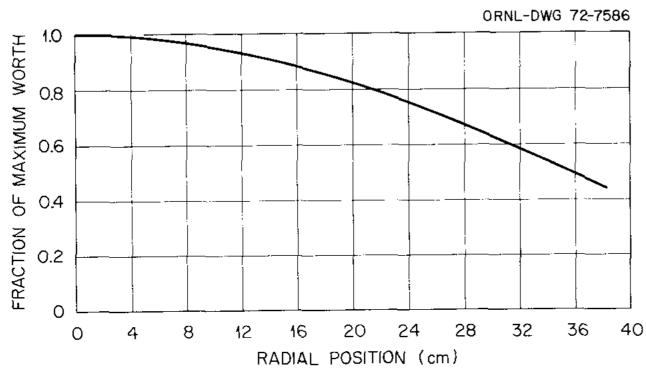  
Fig. 2.1. Relative worth of one control rod in MSBE as a function of radial position.

that cause the decrease add considerably to the uncertainty of the worth values. Since mutual shadowing effects depend, to some extent, on the worths of the control rods, no attempt was made in Fig. 2.1 to include worth reductions due to shadowing. Thus the actual worth of clusters of rods near the core axis would be somewhat lower than indicated by this figure. For the Hastelloy N rod considered here, mutual shadowing effects appear to be less than $10\%$ of the nominal worth for radial positions of $20~\mathrm{cm}$ or greater.

# 2.2.3 Molten-Salt Converter Reactors Using Plutonium

H. F. Bauman

Molten-salt reactors that will breed if processed continuously can be operated as advanced converters if the processing is done only at six- to eight-year intervals. In the last semiannual report we described some calculations for a reactor having a core designed

for breeding but operated as a converter with $^{235}\mathrm{U}$ or plutonium feed. $^{14}$ We also discussed the effects of changes in neutron energy spectrum during operation on the effective cross sections of plutonium. During this report period we modified our calculational procedures to minimize errors due to these effects and made an exploratory calculation of an MSR with initial salt composition appropriate for startup with plutonium.

ROD code modifications. We have extended the capability of the ROD code15 for the calculation of the lifetime performance of molten-salt reactors with batch processing, to cover cases, such as startup with plutonium fuel, in which the lifetime-averaged reaction-rate coefficients are not suitable for part of the lifetime, in particular, the startup period. For such cases, we have programmed ROD to recalculate the reaction-rate coefficients at specified intervals during the lifetime. Since the core composition changes most rapidly at the beginning of life, we have arranged for shorter intervals to be used for the first cycle and for the beginning of each cycle. The use of from 20 to 40 intervals has given good results for plutonium startup cases. The interval time, as well as the fuel withdrawal option, has been included in the “specified variable” options.

Another capability, important in plutonium startup, is to be able to change the salt composition during the reactor lifetime. We have programmed ROD so that, if desired, different salt compositions may be specified, by cycle, for the first four cycles. In addition, separate broad-group cross-section sets may be used, by cycle, in the first three cycles.

Some additional new capabilities in ROD are the calculation of a lifetime-averaged fast (damage) flux and a lifetime fissile material balance. The power normalization has been improved by calculating and using average values for $\nu$ (neutrons per fission) and the energy release per fission based on the fuel composition, rather than the fixed values used previously.

The running time for single cases can now be shortened by about a third by the use of a restart tape, from which the atom densities, fission densities, and fluxes from a previous case can be recalled. For the study of initial conditions, such as the plutonium initial loading cases reported following, the ERC search and/or equilibrium calculations may now be bypassed.

Initial fissile plutonium loading. The initial fissile loading for an MSR varies with thorium concentration in the fuel salt over the attainable range. We studied this effect by calculating the initial loadings of fissile plutonium in a fixed-moderator16 MSR with five different fuel salt compositions ranging from 0 to 14 mole % ThF4. For this study we used a simple reactor model consisting of a spherical core with 0.12 salt volume fraction surrounded by a 78.4-cm reflector with

16. The term "fixed-moderator" is used to indicate that the core is designed so that the limiting fluence for fast-neutron damage to graphite will not be exceeded in a 30-year nominal reactor life (24 equivalent full-power years).

0.01 salt fraction. The core diameter was adjusted in the calculations to give the same peak flux of neutrons with $E > 50 \, \text{keV}$ (damage flux) in each case, namely, that equivalent to a graphite life of 30 years in a 2250-MW(t) plant operating at 0.8 load factor. The fissile material was assumed to be typical first-cycle plutonium from light-water reactors ( $^{239}\mathrm{Pu}/^{240}\mathrm{Pu}/^{241}\mathrm{Pu}/^{242}\mathrm{Pu}:60/24/12/4$ at. %). Because of the recognized sensitivity of neutron resonance cross sections to plutonium concentration, we first estimated the initial plutonium concentrations for each case and used XSDRN to prepare nine-group cross sections appropriate for those concentrations. ROD was then used to calculate the critical loadings of plutonium. Further

Table 2.4. Initial fissile plutonium loading in a 1000-MW(e) fixed-moderator molten-salt reactor   

<table><tr><td rowspan="5"></td><td colspan="5">ROD calculations in spherical geometry</td></tr><tr><td>Salt fractions: Core</td><td colspan="4">0.12</td></tr><tr><td>Reflector</td><td colspan="4">0.01</td></tr><tr><td>Reflector thickness</td><td colspan="4">78.4 cm</td></tr><tr><td>Salt volume outside of core</td><td colspan="4">18.4 m3</td></tr><tr><td>Case identification</td><td>L05</td><td>L06</td><td>L04</td><td>L07</td><td>L08</td></tr><tr><td>Carrier salt, mole %</td><td>67/33/00</td><td>65/32/03</td><td>64/30/06</td><td>67/23/10</td><td>69/17/14</td></tr><tr><td>LiF/BeF2/ThF4</td><td></td><td></td><td></td><td></td><td></td></tr><tr><td>Core C/Th ratio</td><td>∞</td><td>698</td><td>365</td><td>226</td><td>167</td></tr><tr><td>Fissile loading, kg</td><td>119</td><td>339</td><td>596</td><td>1026</td><td>1425</td></tr><tr><td>Core radius,a cm</td><td>555</td><td>550</td><td>542</td><td>522</td><td>468</td></tr><tr><td>Core volume, m3</td><td>716</td><td>697</td><td>667</td><td>596</td><td>429</td></tr><tr><td>Core power density, W/cm3</td><td></td><td></td><td></td><td></td><td></td></tr><tr><td>Peak</td><td>7.83</td><td>7.81</td><td>7.81</td><td>7.83</td><td>7.83</td></tr><tr><td>Average</td><td>3.13</td><td>3.20</td><td>3.34</td><td>3.70</td><td>5.00</td></tr><tr><td>Ratio</td><td>2.51</td><td>2.44</td><td>2.34</td><td>2.12</td><td>1.57</td></tr><tr><td>Fast flux fraction at center of core (E &gt; 1.86 eV)</td><td>0.15</td><td>0.33</td><td>0.45</td><td>0.59</td><td>0.69</td></tr><tr><td>Fraction of fissions in reflector</td><td>0.005</td><td>0.007</td><td>0.011</td><td>0.019</td><td>0.047</td></tr><tr><td>Initial conversion ratio</td><td>0.08</td><td>0.58</td><td>0.69</td><td>0.75</td><td>0.75</td></tr><tr><td>Core C/Pu ratio (×104), calculated</td><td></td><td></td><td></td><td></td><td></td></tr><tr><td>239Pu</td><td>30</td><td>10</td><td>5.7</td><td>3.0</td><td>1.7</td></tr><tr><td>240Pu</td><td>76</td><td>26</td><td>14</td><td>7.6</td><td>4.2</td></tr><tr><td>C/Pu ratio (×104) used in preparing cross sections</td><td></td><td></td><td></td><td></td><td></td></tr><tr><td>239Pu</td><td>18</td><td>6.1</td><td>3.2</td><td>1.8</td><td>0.9</td></tr><tr><td>240Pu</td><td>50</td><td>17</td><td>8.6</td><td>4.7</td><td>2.5</td></tr><tr><td>Indicated change in resonance-group cross sectionsb</td><td></td><td></td><td></td><td></td><td></td></tr><tr><td>239Pu</td><td></td><td></td><td>1.04</td><td>1.04</td><td>1.12</td></tr><tr><td>240Pu</td><td></td><td></td><td>1.11</td><td>1.13</td><td>1.26</td></tr></table>

aCore radius adjusted to give peak damage flux ( $\phi_{D} = 4.5 \times 10^{13}$ neutrons $\mathrm{cm}^{-2} \sec^{-1} E > 50 \, \mathrm{keV}$ ) equivalent to 30-year graphite life at 0.8 plant factor.   
The factor by which the cross section used would be expected to change if it were reweighted at the calculated C/Pu ratio.

information on the calculations and key results are given in Table 2.4.

As expected, the calculated plutonium loadings increased sharply with increasing thorium concentration (decreasing moderator ratio). Concurrently, as the neutron energy spectrum became harder (as evidenced by the fast-flux fraction at the center of the core) the power distribution flattened, and the core could be made smaller at constant peak damage flux. This resulted in more neutrons entering the reflector and higher fission rates in the $1\%$ salt volume there. A large increase in reflector fissions is the first symptom of insufficient moderation in this type of reactor; the large increase in fissile loading seen between the 10 and 14 mole $\% \mathrm{ThF_4}$ cases suggests that further decreases in C/Th ratio would result in large increases in fissile loading.

As shown by the C/Pu ratios in Table 2.4 the calculated critical concentrations of $\mathbf{Pu}$ were somewhat lower in every case than the concentrations used in preparing the nine-group cross sections. Because of time limitations, we did not perform an iteration of preparing new cross sections and recalculating critical loadings. From some of our earlier cross-section preparations we were able to estimate the change in the effective resonance-group plutonium cross sections that could be expected from the observed difference in the C/Pu ratios. The expected change in the $^{240}\mathrm{Pu}$ resonance-group cross section for case L08, for example, is about $25\%$ as shown in Table 2.4. The error in the critical loading from this cause is no doubt significant (on the order of a few percent) in this case. An iteration of cross-section preparation, while it would reduce the error, would not be expected to change the major conclusion of this study, which is that, in the startup of a fixed-moderator MSR with recycle plutonium fuel, the carbon-to-thorium ratio should be not less than 200, and preferably should be between 300 and 400.

Lifetime performance with plutonium and uranium feed. In the last semiannual report we presented data showing that a fixed-moderator MSR designed as a breeder with continuous fuel processing can be operated as a converter with batch processing using enriched uranium fuel. Our studies showed further that, if LWR plutonium fuel is used under the same conditions, a considerable hardening of the neutron spectrum can be expected. In order to study this and other effects of plutonium fuel in MSRs, we have shifted our investigation to a more general core design, with a uniform salt fraction over the core, rather than the zoned core of the

breeder, which was designed to flatten the fast flux distribution for a particular $^{233}\mathrm{U}$ equilibrium fuel composition. We selected the same reactor model as described in the preceding section on plutonium loading. However, in this study the core diameter was adjusted to obtain the lifetime-averaged (rather than startup) peak damage flux required for a 30-year core life at 0.8 plant factor.

In the simple batch process assumed for this study, the uranium is removed from the fuel salt at the end of a cycle, by the fluoride volatility process. The remaining salt, containing fission products and any plutonium present, is discarded. (At present, there is no economical process for recovering plutonium.) To avoid discarding large quantities of plutonium, we propose, even in plutonium feed cases, to switch to a uranium feed near the end of a cycle, permitting most of the plutonium to burn out.

We have completed an exploratory plutonium feed case using the revised calculational methods described in the first section. We used the results of a number of earlier calculations to select conditions which we believe are near optimum. The reactor lifetime consists of four 6-efpy (effective full-power year) cycles with a switch to enriched uranium feed for the last two years of each cycle. Based on the critical loading study, we selected a salt composition containing 6 mole $\%$ thorium for the first cycle and 10 mole $\%$ for the remaining three. The reaction rate coefficients were recalculated at intervals ranging from 1.5 to 6 months in the first cycle and from 3 to 12 months in the remaining cycles. The broad-group cross-section sets used were changed after the first cycle to account for the change in carbon-to-thorium ratio and average plutonium concentrations at this point.

The fuel nuclide inventories, the feed rate, and the conversion ratio are plotted over the reactor lifetime in Fig. 2.2. The conversion ratio increases as $^{233}\mathrm{U}$ builds in and averages just under 1.0 for the last two cycles. The change in critical loading is indicated by a separate bar on the feed-rate graph at the start of each cycle. The first bar represents the initial plutonium critical loading; the next the additional plutonium required for criticality as the thorium concentration is raised to $10\%$ . The final two bars represent the excess mixed uranium (mainly $^{233}\mathrm{U}$ ) over that required for criticality at the start of the final two cycles. This uranium is fed back to the system first, as required, before normal feed is resumed. Only a few kilograms of plutonium feed were required for the last two cycles,

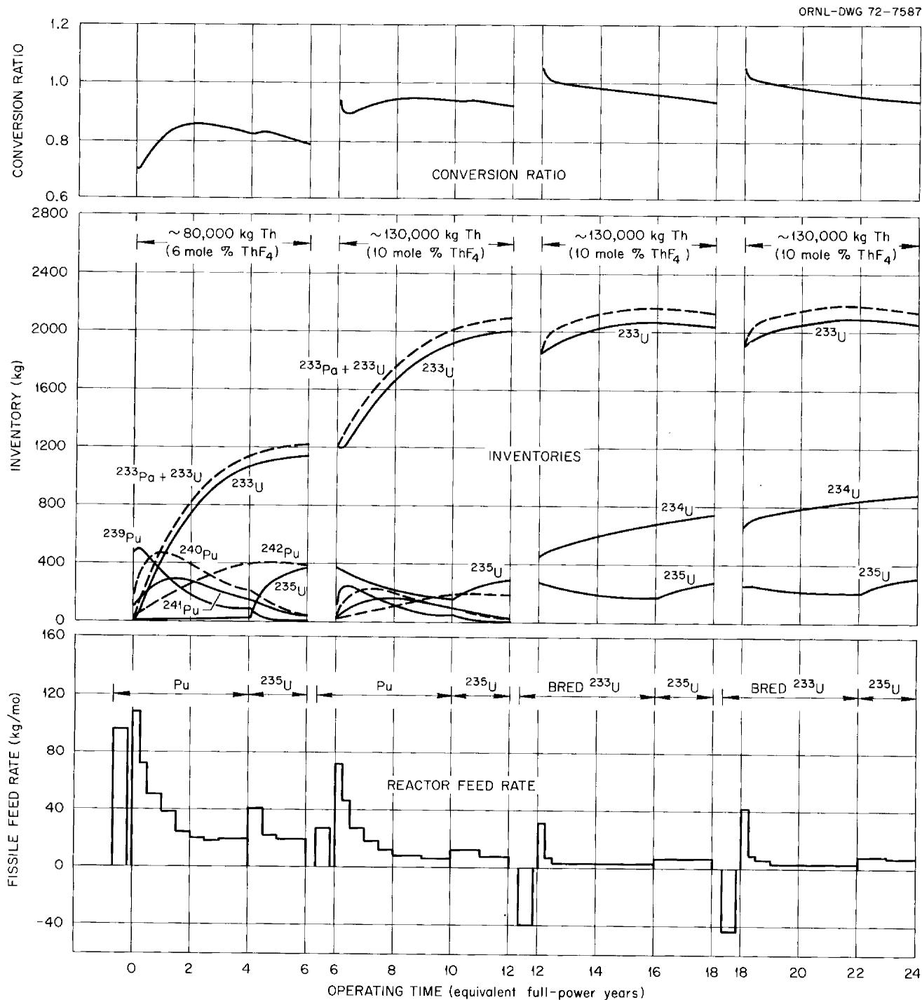  
Fig. 2.2. Conversion ratio, fuel nuclide inventories, and fissile feed rate for plutonium feed case A37.20.

Table 2.5. Lifetime-averaged performance of typical MSCR designs, comparing plutonium and enriched uranium feed   

<table><tr><td colspan="3">Lifetime: four 6-efpy cycles
Thorium concentration, mole %:
First cycle 6
Other cycles 10</td></tr><tr><td>Case identification</td><td>A37.20</td><td>A41.1</td></tr><tr><td>Feed</td><td></td><td></td></tr><tr><td>Primary</td><td>Pu(1)a</td><td>235Ub</td></tr><tr><td>Secondaryc</td><td>235U</td><td>None</td></tr><tr><td>Core diameter, cm</td><td>1060</td><td>1020</td></tr><tr><td>Initial fissile loading, kg</td><td>574</td><td>1453</td></tr><tr><td>Lifetime fissile material balance, kg</td><td></td><td></td></tr><tr><td>Purchases</td><td></td><td></td></tr><tr><td>Plutonium</td><td>3272</td><td>0</td></tr><tr><td>235U</td><td>1165</td><td>4569</td></tr><tr><td>Discard: plutonium</td><td>71</td><td>20</td></tr><tr><td>Recovery at end of life</td><td></td><td></td></tr><tr><td>233U</td><td>2145</td><td>1978</td></tr><tr><td>235U</td><td>318</td><td>386</td></tr><tr><td>Net fissile requirement</td><td>1902</td><td>2185</td></tr><tr><td>Conversion ratio, lifetime averagedd</td><td>0.927</td><td>0.907</td></tr><tr><td>Fuel costs,e mills/kWhr</td><td></td><td></td></tr><tr><td>Inventory</td><td></td><td></td></tr><tr><td>Fissile</td><td>0.475</td><td>0.518</td></tr><tr><td>Salt</td><td>0.074</td><td>0.068</td></tr><tr><td>Salt replacement</td><td>0.145</td><td>0.133</td></tr><tr><td>Fissile burnup</td><td>0.067</td><td>0.113</td></tr><tr><td>Total</td><td>0.761</td><td>0.831</td></tr></table>

${}^{a}$ Plutonium typical of first LWR cycle. Atom percent 239/240/241/242:60/24/12/4.   
$b_{93\%}$ enriched.   
${}^{c}$ Switched to secondary feed at four years,each cycle.   
$d_{\text{Nuclear conversion ratio, not considering plutonium discards}}$ or fissile processing loss.   
Excluding processing costs. Obtained from present-worth calculation of fissile, fertile, and carrier salt purchases and fissile sales over life of reactor, with discount rate = 0.07 year $^{-1}$ , compounded quarterly, and inventory charge rate = 0.132 year $^{-1}$ . Values of 11.9 $\mathbb{S} / \mathbb{g}^{235}\mathbb{U}$ , 13.8 $\mathbb{S} / \mathbb{g}^{233}\mathbb{U}$ , and 9.9 $\mathbb{S} / \mathbb{g}$ fissile plutonium were assumed.

between the return of withdrawn uranium and the start of enriched $^{235}\mathrm{U}$ feed at the fifth year. Most of the fissile plutonium is burned out by the end of a cycle, even in the first cycle, while a considerable amount of $^{242}\mathrm{Pu}$ remains to be discarded.

Some of the results of the plutonium feed case are compared with an otherwise identical enriched-uranium feed case in Table 2.5. The conditions, particularly the low first-cycle thorium concentration, are not near optimum for uranium feed. A uranium feed case given in the last semiannual report, for example, for a fuel containing 14 mole $\%$ thorium, had an average conversion ratio of about 0.95 and a fuel cost of 0.76 mill/kWhr. Nevertheless, it is interesting to compare two cases identical except for the feed material. The initial critical loading for plutonium is less than half that for uranium, because of the higher effective cross sections for plutonium in a well-thermalized spectrum. This gives a significant cost advantage for plutonium startup, holding down the fissile inventory charges at the beginning of the lifetime, when they are most important to the levelized fuel cost. Perhaps the most striking observation on these two cases is how little they differ in performance. The conversion ratios, net fissile requirements, and fuel costs are all fairly close. We speculate that, when two well-optimized cases are available for comparison, we will find even smaller differences in the performance between these two feeds.

# 3. Systems and Components Development

Dunlap Scott

During this period we narrowed the scope of the systems and components development program to strengthen the efforts in support of the experimental programs for the two salt loops now under design and construction. The coolant-salt technology facility (CSTF) will replace the Inconel PKP loop used in tests previously reported, and the gas system test facility (GSTF) will provide a means for testing the noble-gas removal system with an MSBR type of fuel salt. The industrial study of conceptual designs of steam generators for use with MSR's is under way and will continue; however, the plans for building facilities for testing steam generator models have been delayed until a more definite program for building another moltensalt reactor is established. The study of valves for use with molten salts has also been suspended indefinitely.

# 3.1 GASEOUS FISSION PRODUCT REMOVAL

# 3.1.1 Bubble Separator and Bubble Generator

C. H. Gabbard

The development of the bubble separator and the bubble generator continued in the water test loop. The

final design of the bubble separator for testing in the GSTF has a tapered casing with a 44-in. separation length between the swirl and recovery vane hubs and gas removal from both hubs. This configuration, which is shown operating in Fig. 3.1, has a gas void about $\frac{1}{8}$ to $\frac{1}{4}$ in. in diameter and has maintained a stable vortex in all normal ranges of liquid and gas flow. Figure 3.2 shows the gas removal efficiencies for operation with $31\% \mathrm{CaCl}_2$ solution with fine bubbles that have passed through the circulating pump and with coarser bubbles injected at the pump discharge.

A second dilution experiment starting with $31\%$ $\mathrm{CaCl}_2$ solution was conducted to determine if the $\mathrm{CaCl}_2$ concentration where bubble coalescence began was dependent on the type or quantity of gas. The test was conducted with helium, nitrogen, and argon at gas flow rates of 0.455, 2.8, and 5.15 scfm. The results of this experiment were consistent with the results of the previous dilution experiment, $^2$ and bubble coalescence occurred at concentrations below about 2.7 wt $\%$ $\mathrm{CaCl}_2$ . The coalescence concentration was independent of the type and quantity of gas. However, at concentrations greater than the coalescence point, the separation efficiency was higher with the less dense and less

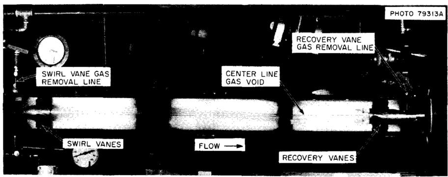  
Fig. 3.1. GSTF bubble separator operating at 500 gpm and $0.8\%$ inlet void fraction.

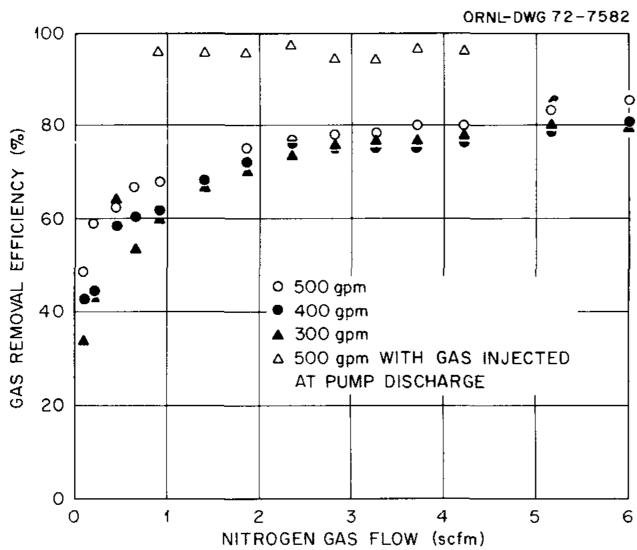  
Fig. 3.2. Separation efficiency of GSTF bubble separator on $31\% \mathrm{CaCl}_2$ solution.

soluble gases. This higher efficiency implies a larger bubble size with the less soluble gases.

Pressure-drop data were taken on the bubble separator and the bubble generator, and from this data a tentative pressure distribution was prescribed for the GSTF main piping. The data for the bubble generator indicated a larger than expected increase in the gas supply pressure required as the gas flow was increased from zero to design flow. Efforts to reduce this pressure increase to a more acceptable level are continuing.

# 3.1.2 Bubble Formation and Coalescence Test

# C. H. Gabbard

The fabrication of the bubble formation and coalescence test rig was completed and testing is in progress. A schematic drawing of the test rig is shown in Fig. 3.3. The sample capsule moves vertically with a 1-in. stroke at frequencies ranging up to about $1600~\mathrm{cpm}$ . The maximum accelerations would be about $1170\mathrm{ft} / \mathrm{sec}^2$ or $36g$ 's. The test procedure is to shake the capsule at the desired frequency for several seconds to ensure an equilibrium void fraction and bubble size distribution. Photographs were then taken during the agitation, when the capsule stopped, and at 5-sec intervals until the fluid became relatively clear.

Table 3.1 is a summary of the tests completed to date. All the capsules were sealed with about 1 atm of helium overpressure at the operating temperature. The capsule of $\mathrm{LiF - BeF_2 - ThF_4}$ (72-16-12%) MSR fuel salt contained contaminants that made the capsule opaque during and after agitation. After sitting for a few hours

the salt again became transparent, with the contamination floating on the liquid surface, deposited on the capsule wall, and suspended as particles or flocs within the salt. The contamination prevented us from taking suitable photographs of this capsule.

Figure 3.4 shows the bubbles produced in the various test fluids at $1600~\mathrm{cpm}$ and the bubbles remaining in the fluid after various times after the agitation was stopped. The relatively large bubbles in the $\mathrm{LiF - BeF_2}$ photographs are attached to the wall. The following conclusions can be drawn from the tests that have been run to date.

1. In demineralized water, small bubbles coalesce immediately, and the fluid clears of bubbles in a fraction of a second after capsule motion stops.   
2. The capsules of $41\%$ glycerin-water and $31\%$ $\mathrm{CaCl}_2$ contained a relatively high void fraction of very small bubbles. There was little or no coalescence, and a significant void fraction of small bubbles remained 20 sec after agitation was stopped.   
3. Small bubbles were produced in the $\mathrm{LiF - BeF_2}$ capsule as evidenced by the dark appearance during agitation. There was some coalescence after the agitation was stopped, but significantly less than with demineralized water. A very low void fraction of small-diameter bubbles remained after 20 sec at rest. There was no foaming at the liquid surface. The bubble separator would be expected to operate at a relatively high efficiency on a salt of this type.

# 3.1.3 Bubble Separator Analyses

# T. S. Kress

Analyses were started near the end of this reporting period with the objective of idealizing the swirl-flow bubble separator to develop analytical expressions that would be helpful in understanding the performance of the separator.

The initial idealization essentially consisted of treating the flow as inviscid. Specifically, the simplifications included:

1. energy conservation,   
2. constant axial velocity,   
3. free vortex tangential velocity.

Based on these assumptions, separate analyses were made to determine an equilibrium cavity size and a theoretical separation efficiency.

The equilibrium cavity size, $r_a$ , was determined through an integration of the expression for con

ORNL-DWG72-2178

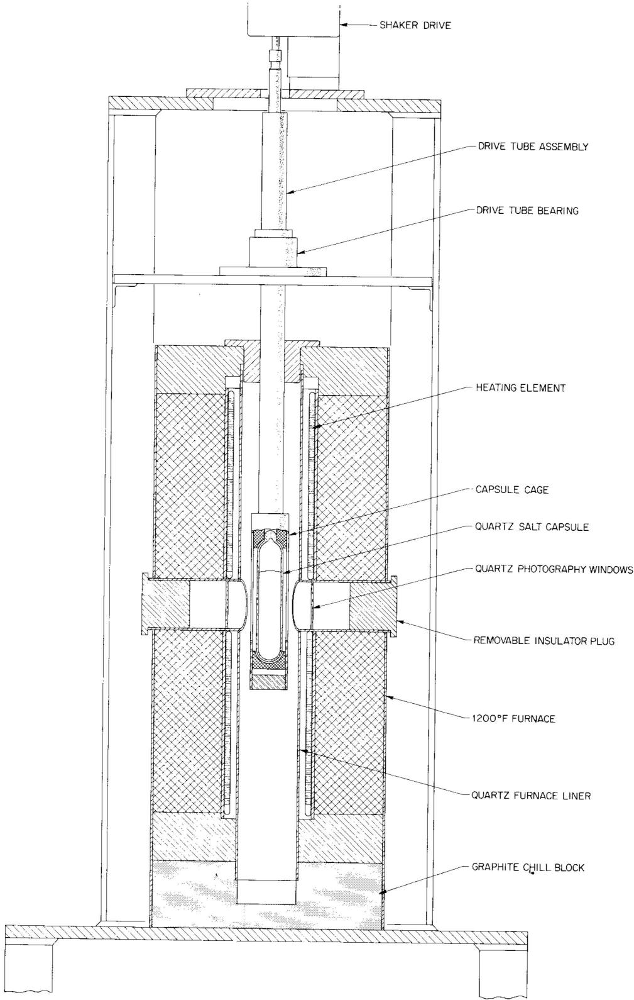  
Fig. 3.3. Schematic drawing of bubble formation and coalescence test rig.

servation of energy per unit length,

$$
\begin{array}{l} \int_ {r _ {a}} ^ {R} \left(V _ {x} ^ {2} / 2 g _ {c} + V _ {\theta} ^ {2} / 2 g _ {c} + P / \rho\right) \rho 2 \pi r d r \\ = \rho Q ^ {2} / 2 \pi R ^ {2} g _ {c} + P _ {0} \pi R ^ {2}, \\ \end{array}
$$

which resulted in

$$
r _ {a} / R = 1 / (2 \sqrt {\psi}), \tag {1}
$$

where the flow parameter, $\psi$ , was defined as

$$
\psi \equiv \frac {g _ {c} \left(P _ {0} - P _ {g}\right)}{\rho \left(Q / \pi R ^ {2}\right) ^ {2}}. \tag {2}
$$

Table 3.1. Summary of bubble formation and coalescence tests   

<table><tr><td>Test fluid</td><td>Test temp (°F)</td><td>Frequency range (cpm)</td><td>Remarks</td></tr><tr><td>Demineralized water</td><td>70</td><td>650–1900</td><td>Immediate coalescence to 1/8–1/4 in. diam</td></tr><tr><td>41% glycerin–water</td><td>70</td><td>650–1600</td><td>Very small bubbles – little or no coalescence</td></tr><tr><td>31% CaCl2solution</td><td>70</td><td>650–1600</td><td>Very small bubbles – little or no coalescence</td></tr><tr><td>LiF-BeF2(66-34)</td><td>1200</td><td>600–1600</td><td>Relatively wide size distribution – degree of coalescence unknown</td></tr><tr><td>LiF-BeF2-ThF4(72-16-12)</td><td>1200</td><td></td><td>Contaminants prevented photography</td></tr></table>

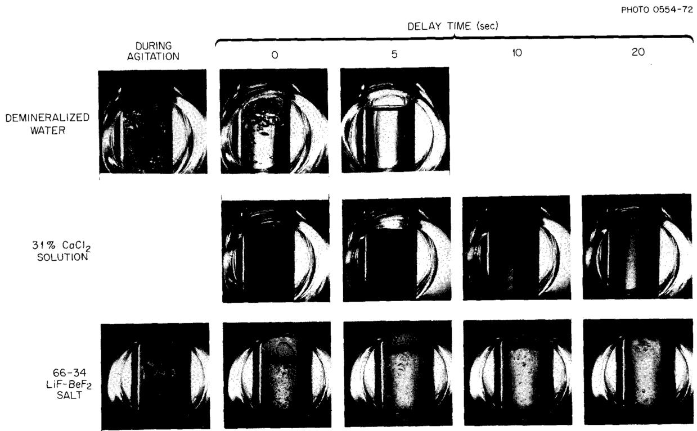  
Fig. 3.4. Comparison of bubbles produced in demineralized water, $31\%$ $\mathrm{CaCl}_2$ solution, and LiF-BeF $_2$ salt at 1600 strokes/min.

Equation (1) should be useful for estimating the sensitivity of the cavity size to changes in the quantities making up the flow parameter, which itself may perhaps serve as a guide for correlating experimental data.

The analysis for the theoretical separation efficiency made use of the additional assumption that centrifugal forces are balanced by viscous drag forces to determine the bubble radial velocity.

For bubbles of a given diameter, $\delta$ , uniformly distributed at the separator entrance, the theoretical separation efficiency for bubbles in "Stokes" regime was derived to be

$$
\epsilon_ {\delta} = \frac {1}{R ^ {2}} \left(\frac {2 \rho Q l \delta^ {2}}{9 \rho \mu}\right) ^ {1 / 2}, \tag {3}
$$

which is applicable up to a separator length, $l$ , that gives a removal efficiency of unity.

The extension of Eq. (3) to apply when there is a distribution of bubble sizes resulted in the following expression:

$$
\epsilon = \frac {\int_ {0} ^ {\infty} \left\{\epsilon_ {\delta} [ 1 - g \left(\epsilon_ {\delta}\right) ] + g \left(\epsilon_ {\delta}\right) \right\} \delta^ {3} f (\delta) d \delta}{\int_ {0} ^ {\infty} \delta^ {3} f (\delta) d \delta}, \tag {4}
$$

where $g$ is a step function defined by

$$
g (\epsilon) = \begin{array}{l} 0 \text {f o r} \epsilon \leqslant 1, \\ 1 \text {f o r} \epsilon > 1, \end{array}
$$

and $f(\delta)$ is the bubble size distribution function defined as

$f(\delta)d\delta \equiv$ fraction of total number of bubbles that have diameters lying in the range $\delta \pm 1 / 2$ $d\delta$

Equation (4) for the bubble separator efficiency, applicable when there is a distribution of bubble sizes, does not lend itself to an easy closed solution. Consequently, a computer evaluation would seem to be appropriate, in which case the step function can be easily represented, and effects of turbulent diffusion of bubbles away from the cavity, neglected in the above analysis, might also be conveniently included.

# NOMENCLATURE

$g_{c} =$ proportionality constant relating force to the product of mass and acceleration

$l =$ separator length

$P =$ static pressure in the swirl region

$P_0 =$ static pressure upstream of the separator

$P_{g} =$ gas pressure inside the cavity

$Q =$ liquid volumetric flow rate

$r =$ radial coordinate in the separator

$R =$ separator radius

$r_a =$ cavity radius

$V_{x} =$ axial component of the swirl velocity

$\mathbf{v}_{\theta} =$ tangential component of the swirl velocity

$\delta =$ bubble diameter

$\epsilon =$ separation efficiency for bubbles of all sizes

$\epsilon_{\delta} =$ separation efficiency for bubbles of size $\delta$

$\mu =$ liquid viscosity

$\rho =$ liquid density

# 3.2 GAS SYSTEM TECHNOLOGY FACILITY

# R. H. Guymon

The design of most of the components for the GSTF is nearing completion. The salt piping was analyzed in accordance with design codes specified in the QA plan, using an allowable stress of 2700 psi at $1350^{\circ}\mathrm{F}$ . No combined thermal-pressure-weight stresses exceeded the allowable stress. Detailed design of the facility piping is in progress.

Accurate calculations of the loop pressure drops are complicated by the proximity of various components. This, coupled with the desire for flexibility in the test program, led to the decision to install variable flow restrictors instead of fixed orifices to regulate the pressure distribution. The design concept of these is similar to a gate valve. A plate is welded perpendicular to the axis of the 5-in. pipe. The plate contains an opening $1^{1/4}$ in. wide by $4^{5/8}$ in. long. A 2-in. pipe, welded to the outside of the 5-in. pipe at this location, allows access for the insertion of a movable plate to

cover a portion of this opening. The movable plate is held against the permanent plate by the hydraulic force of the flowing salt. The 2-in. access pipe will be sealed by the use of clamps and gaskets during the initial operation with water, but a cap will be welded on to seal the access pipe during salt operation. Adjustment is possible only when the system is drained.

In order to calibrate these variable flow restrictors and to obtain performance curves for the modified salt pump (the MSRE Mark 2 pump will be used with an MSRE coolant pump impeller), the loop will be operated initially with water.

The final instrument application drawings are nearly complete, an instrument tabulation has been made, and the specifications for many of the instruments have been established. The first drafts of the control circuit drawings and panel layout drawings have been completed.

A preliminary system design description (PSDD) has been prepared for the GSTF and is ready for publication. The PSDD will be kept up-to-date and expanded as the design progresses and will be used as the primary control document for the facility.

# 3.3 MOLTEN-SALT STEAM GENERATOR INDUSTRIAL PROGRAM

# J. L. Crowley

Contract negotiations were completed with Foster Wheeler for a four-task conceptual design study of molten-salt steam generators as described previously. The contract was approved by the AEC's Oak Ridge Operations Office in February. The four tasks are as follows: (I) conceptual design of a steam generator for the ORNL 1000-MW(e) reference steam cycle; (II) feasibility study and conceptual design of steam generators using lower feedwater temperature; (III) conceptual design of a steam generator for a molten-salt reactor of about $150\mathrm{MW(t)}$ ; (IV) description of a research and development program for the task III steam generator.

Foster Wheeler began work in October and is proceeding on a concept arrangement study for task I. Foster Wheeler will select a steam generator arrangement and configuration with ORNL's concurrence before proceeding with the conceptual design analysis. According to the work plan, task I will be complete by October 1972, with the remaining tasks complete by April 1974.

# 3.4 COOLANT-SALT TECHNOLOGY FACILITY

# A. I. Krakoviak

The mechanical design of the CSTF is complete, and the instrument and controls design is $90\%$ complete. The control panel drawings have been approved for construction, and panel fabrication is $30\%$ complete. The electrical drawings are $95\%$ complete. The photograph in Fig. 3.5 shows the major components of the CSTF, which is being constructed in the existing enclosure of the old PKP-1 pump test stand. With the exception of the drain line, freeze valve, and drain tank, installation of the salt-wetted components into the facility is complete. The drain tank was fabricated earlier and was sent to the Reactor Chemistry Division for salt purification and loading activity while the construction of the facility was continued. The remaining construction activity includes installation of thermocouples, preheaters, the cover-gas and off-gas lines, and the electrical and gas control equipment.

A variable port to throttle salt flow was installed in the inlet line within the salt monitoring vessel. The throttle can be operated through a slip seal in the gas space at the top of the vessel. Water flow tests of this unit before installation indicated satisfactory flow control at representative pressure differentials.

The concentric tube economizer for the cold-trap supply and return lines was tested with hot tap water flowing through the inner tube and cold tap water through the annulus. Flow through the annulus was held constant at the expected salt flow rate of 0.18 gpm (Re = 775), while the flow rate through the inner tube was varied from 0.17 to 0.6 gpm (Re = 2800 to 10,000). A Wilson plot of these data indicates an annular heat transfer coefficient of 290 Btu hr $^{-1}$ ft $^{-2}$ ( $^\circ \mathrm{F}$ ) $^{-1}$ as opposed to a coefficient of 118 Btu hr $^{-1}$ ft $^{-2}$ ( $^\circ \mathrm{F}$ ), $^{-1}$ calculated for laminar flow by use of the relationship $h = 6.2K / D$ . The better-than-expected heat transfer coefficient indicated by these tests is probably due to a combination of errors in the Wilson plot technique at these low Reynolds numbers and to turbulence generated by the centering devices between the inner and outer tubes. From a comparison of the physical properties of water and sodium fluoroborate, it appears that the overall heat transfer coefficient of the economizer will be $\sim 35\%$ less with the salt. With this lower overall coefficient, the temperature of the salt supply to the cold trap can be lowered by $\sim 200^\circ \mathrm{F}$ in the economizer when the cold trap is operated at a maximum $\Delta T$ of $100^\circ \mathrm{F}$ .

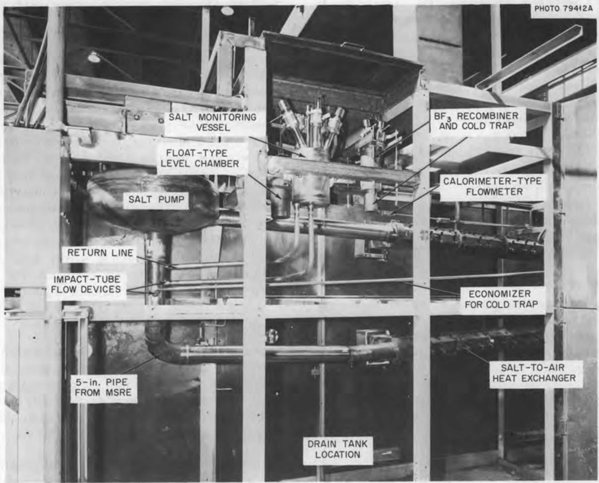  
Fig. 3.5. Coolant-salt technology facility.

# 3.5 SALT PUMPS

A. G. Grindell

W. R. Huntley

L.V.Wilson

H.C.Young

# 3.5.1 Salt Pumps for MSRP Technology Facilities

Detailed assembly procedures were prepared for the MSRE coolant pump and the Mark 2 prototype salt pump. The checklist format of the procedures ensures the documentation of quality assurance during pump assembly. Report forms were prepared for leak testing, cleaning, dynamic balancing, critical speed measurement, and force-deflection measurements for the shaft.

Pump for the coolant-salt technology facility. Reconditioning of the spare MSRE coolant pump rotary assembly is under way. This pump will be installed in

the CSTF after refurbishing and cold shakedown testing are completed. The shaft seals have been relapped, and the shaft subassembly is being dynamically balanced. The pump rotary assembly for the CSTF will be assembled with an available impeller 10.591 in. in diameter. This is slightly larger than the 10.330-in. diameter used in CSTF design calculations and will result in a head increase of approximately $5\%$ over previous estimates. The larger impeller in combination with the CSTF volute will provide a 95-ft head and 820 gpm at 1765 rpm. The available 75-hp motor will be loaded to approximately 48.5 hp.

During disassembly of the spare MSRE rotary assembly, we encountered problems with the seal weld which joins the shield plug to the bearing housing. The outer lip of the seal weld was too short and too thick to permit field removal of the weld and to provide for the necessary rewelding during assembly. It was necessary to remove the seal weld by machining in a vertical

boring mill at the Y-12 Machine Shop and to fabricate a stainless steel extension for the outer seal lip. These modifications were completed, and the design drawings were corrected to show the improved design.

Pump for the gas system test facility. The GSTF will use an impeller of the MSRE coolant-salt pump design and the modified volute and pump tank of the MSRE Mark 2 fuel salt pump. Because of the difficulty of predicting the pump characteristics5 of a mismatched impeller-volute combination, tests will be run in the facility while operating with water to obtain several characteristic data points. From these data we can determine the desired impeller diameter.

During these tests with water the shield plug will be replaced with a spacer to support two displacement transducers that will be used to measure the pump shaft deflections as a function of pump operating conditions. Prior to the water tests, static measurements of radial load vs shaft deflection will be made, from which the deflection characteristics of the impeller-volute combination when operated with salt can be deduced. This information is needed to establish the running clearances in the affected shaft and impeller labyrinths.

# 3.5.2 ALPHA Pump

The ALPHA pump5 operated satisfactorily during the past six months in corrosion test facility MSR-FCL-2 and accumulated about 3900 hr of operation at 4800 rpm pumping 4 gpm of sodium fluoroborate at $850^{\circ}\mathrm{F}$ . The oil leakage from the lower rotating shaft seal averaged about 2 cc/day throughout the operating period. The oil leakage from the upper shaft seal increased from about 3 cc/day to 37 cc/day during the first 1000 hr of operation but has remained near 30 cc/day since then. The $\Delta P$ across the rotating face of the oil seals is near zero for the lower seal and about 6 psi for the upper seal.

Lubricating- and cooling-oil flow rates and temperatures measured with the pump operating at the normal MSR-FCL-2 design conditions specified above are presented below:

<table><tr><td>Type of oil</td><td>Gulfspin-35</td></tr><tr><td>Lubricating oil flow</td><td>0.2 gpm</td></tr><tr><td>Cooling oil flow</td><td>0.5 gpm</td></tr><tr><td>Oil inlet temperature</td><td>75°F</td></tr><tr><td>Lube oil outlet temperature</td><td>92°F</td></tr><tr><td>Cooling oil outlet temperature</td><td>82°F</td></tr></table>

The pump cooldown time was observed while pumping salt in the MSR-FCL-2 by deenergizing the clutch control of the Adjusto-Spede drive motor. The pump speed decreased from $4800\mathrm{rpm}$ to $1000\mathrm{rpm}$ in $3^{1/2}$ sec

under these conditions. This information was used to establish a 3-sec delay before permitting the automatic controls to scream the loop during a dip in the electrical power supply.

As reported previously, the lower shaft seal for this pump was equipped with elastomeric O-rings made of Viton in an attempt to obtain longer reliable leak-free operation than provided by the previously used buna N rings. The original buna N rings failed due to attack from dilute $\mathrm{BF}_3$ , whose source is the sodium fluoroborate in the pump tank. To obtain additional reliability information on Viton, we installed a sample O-ring of Viton (Parker compound 77-545) and one of buna N in the dilute $\mathrm{BF}_3$ -helium effluent from the lower seal region of the pump. After 2000 hr of operation at room temperature in this dilute mixture ( $<0.1\% \mathrm{BF}_3$ ), the rings were examined visually and hardness measurements were made. There was no apparent degradation of the Viton, but the buna N had hardened and cracked noticeably. Hardness data taken for both exposed and unexposed samples are:

<table><tr><td></td><td>Shore durometer A (reading)</td></tr><tr><td>Buna N, unexposed</td><td>65-67</td></tr><tr><td>Buna N, exposed to dilute BF3-helium</td><td>85-87</td></tr><tr><td>Viton, unexposed</td><td>68-73</td></tr><tr><td>Viton, exposed to dilute BF3-helium mixture</td><td>65-70</td></tr></table>

The exposed sample rings were reinstalled to obtain further exposure to the dilute $\mathrm{BF}_3$ -helium mixture.

The difficulties experienced with hollow metal O-ring gaskets5 that seal the bearing housing to the pump bowl induced us to return to a buffered, solid-ring-joint gasket design. Calculations showed that the present flanges and bolts have adequate strength for the ring joint design. Because of the precision needed to maintain running clearance between impeller and volute, the tolerances on the gasket and the grooves have been reduced to lower values than are required by the ANSI standard. These changes will be incorporated in the pump during some future scheduled shutdown.

Replacement of the lower shaft elastomer seal with a metallic bellows seal is also planned at some future date. This has caused the mechanical redesign of several components of the pump rotary element. The shaft was also redesigned to increase its stiffness in the vicinity of the lower bearing and seal.

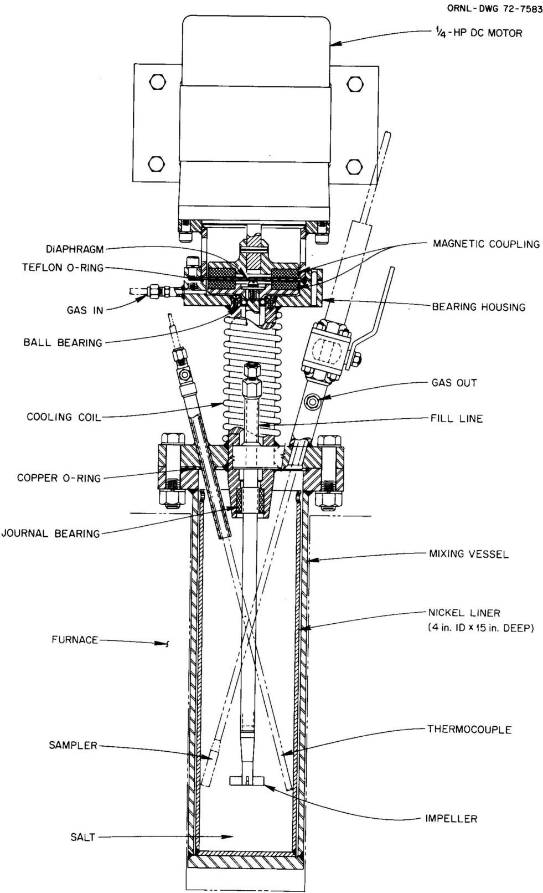  
Fig. 3.6. Cross section of molten-salt mixer, laboratory scale.

# 3.5.3 Molten-Salt Mixer, Laboratory Scale

The design has been completed for a small mixer to be used to prepare molten-salt mixtures for various chemical and physical properties tests. The purpose of the device is to provide more thorough mixing of the molten salt than can be accomplished by present methods, which involve bubbling a gas through the salt.

The mixer, shown in Fig. 3.6, is designed to operate from 900 to $1400^{\circ}\mathrm{F}$ , 0 to 2 atm absolute pressure, and 150 to 500 rpm. The mixing vessel is joined to the bearing housing with a solid copper wire O-ring, and the bearing housing is joined to the drive coupling diaphragm with a Teflon O-ring to form a single enclosed volume. The mixer shaft is confined entirely within this enclosed volume. The torque to the mixer shaft is transmitted through the drive coupling diaphragm with two 10-pole permanent magnets. The

external, or driving, magnet is mounted on the shaft of a $\frac{1}{4}$ -hp dc motor, and the internal, or driven, magnet is mounted on the mixer shaft. The mixer shaft is supported on a full-complement angular-contact ball bearing with Haynes alloy No. 25 balls and races. This bearing must carry approximately 75 lb of axial thrust imposed by the magnets and a negligible radial load. The Graphitar-Hastelloy N lower journal bearing will also have a low radial load. The impeller is overhung below these two bearings.

The mixing vessel, made of stainless steel, has a nickel liner for containing the salt. Penetrations into the vessel through the bearing housing are (1) gas inlet, (2) gas outlet, (3) thermocouple probe, (4) fill line, and (5) access line for either a sampler or a liquid-level measuring probe to be used when filling the nickel liner with salt.

# 4. Instrumentation and Controls

S. J. Ditto

# 4.1 TRANSIENT AND CONTROL STUDIES OF THE MSBR SYSTEM USING A HYBRID COMPUTER

O.W.Burke

The hybrid computer model of the MSBR system (including the proposed system controllers for controlling the secondary salt flow rate, the primary salt temperature at the reactor outlet, and the steam pressure at the throttle) has been developed, and it has been used to run a number of transients. The draft of the report covering the model development and transient runs has been completed, and the final report is being published. Some of the more interesting transients that were run and their results shall be discussed briefly. The severity of the transients that can be run on this simulation model is somewhat limited by the nature of the steam generator model (the calculational time step of the discrete time model is 0.5 sec).

The transients were run in order to determine the system response times, the rates of change of temperatures, and whether the salt temperatures approached the freezing points.

Steady-state runs were made for power levels ranging from $100\%$ design power down to $30\%$ in increments of $10\%$ . Of most interest in these runs was whether or not the primary or secondary salt approached its respective

freezing point at any of these power levels. The results showed that the minimum temperatures in both salt systems were well above the freezing points for all cases.

A number of fast changes in load demand were run in order to observe the resulting system response. The rates of change of the system temperatures were of interest. The secondary salt temperature at the steam generator outlet changed at a rate of approximately $4.5^{\circ}\mathrm{F}$ per second for the case when the load demand was ramped from full load to $40\%$ full load in $1^{2/3}$ sec. The limitations of the model precluded higher rates of change. Some cases involving changes in reactivity were run. As a rough approximation of inserting two safety rods (each worth $-1.5\%$ in $\delta K / K$ ), $-3\%$ $\delta K / K$ was ramped in 15 sec. For this case the fission power had reduced to $10\%$ of full power in approximately 3 sec.

As a rough approximation of a fuel addition accident, $+0.2\% \delta K / K$ was ramped in in 1.5 sec. For this case, in the absence of a safety system, the power peaked at approximately $2300\mathrm{MW(e)}$ and was back down to normal in approximately 10 sec. The primary salt temperature at the reactor outlet peaked at approximately $1390^{\circ}\mathrm{F}$ .

Development of a model capable of simulating faster transients and of covering a wider range of operating conditions is being considered. Some accuracy would be sacrificed in the steam generator simulation, but it is hoped that multiple loop simulation will be possible. This model should be capable of operating in real time.

# 5. Heat and Mass Transfer and Physical Properties

H.W.Hoffman J.J.Keyes,Jr.

# 5.1 HEAT TRANSFER

J.W.Cooke

Previous studies of heat transfer to a proposed MSBR fuel salt $(\mathrm{LiF - BeF_2 - ThF_4 - UF_4};67.5 - 20 - 12 - 0.5\mathrm{mole}\%)$ have led to the suggestion that, in the Reynolds modulus range 2000 to 4000, the heat transfer coefficient varies along the test section in a manner which may be related to a delay in transition to turbulent flow. Data obtained over a salt inlet temperature range 1080 to $1390^{\circ}\mathrm{F}$ have confirmed that the delay is abetted by the stabilizing influence of heating for a fluid having a large negative temperature coefficient. Additional experimental results have recently been obtained with the gas-pressurized heat transfer system at lower salt temperatures which further substantiate the effect of temperature.

The data for salt inlet temperatures ranging from 964 to $994^{\circ}\mathrm{F}$ are presented in Table 5.1. Attempts to operate at inlet temperatures nearer the salt melting temperature $(\sim 905^{\circ}\mathrm{F})$ were not successful due to freezing in colder sections of the system. In Fig. 5.1, the heat transfer function, $\overline{N}_{S - T}$ , is plotted as a

function of the Reynolds modulus $N_{\mathrm{Re}}$ . These data are up to a factor of 2 lower than the values predicted by the Hausen correlation, the greatest deviation occurring at the lowest Reynolds modulus of 3048.

A plot of the wall and bulk salt temperature distributions along the 2-ft heated length and 2-ft adiabatic length of the test section is shown in Fig. 5.2 for runs 5-A and 7-A. These distributions show clearly that the transition from laminar to turbulent flow has not been completed within the 4-ft length of the test section $(L / D = 270)$ . In particular, the slow decay of the wall temperature in the adiabatic length of the test section for run 7-A (no entrance length) suggests the absence of significant eddy diffusivity contribution to the heat transfer (i.e., laminar flow), resulting in a strong radial temperature gradient in the salt which

Table 5.1. Experimental results of heat transfer studies employing salt mixture ${\mathrm{{LiF} - {BeF}}}_{2}$ -Th ${\mathrm{F}}_{4}$ -UF ${}_{4}$ (67.5-20-12-0.5 mole %)   

<table><tr><td rowspan="2">Run No.</td><td rowspan="2">Tin(°F)</td><td rowspan="2">Tout(°F)</td><td rowspan="2">ΔTf(°F)</td><td rowspan="2">q/A(105Btu hr-1ft-2)</td><td rowspan="2">Heat balance</td><td colspan="3">Modulusa</td><td rowspan="2">h[ Btu hr-1ft-2(°F)-1]</td><td rowspan="2">Heat-transfer function,bN_S-T</td></tr><tr><td>NRe</td><td>NPr</td><td>NNu</td></tr><tr><td>1-A</td><td>974.5</td><td>988.6</td><td>78.6</td><td>0.97</td><td>1.11</td><td>3743</td><td>22.0</td><td>26.9</td><td>1239</td><td>9.33</td></tr><tr><td>2-A</td><td>964.4</td><td>977.9</td><td>84.6</td><td>0.86</td><td>0.97</td><td>3223</td><td>22.9</td><td>22.2</td><td>1021</td><td>7.56</td></tr><tr><td>3-A</td><td>987.3</td><td>1002.8</td><td>107.6</td><td>0.87</td><td>0.93</td><td>3100</td><td>20.9</td><td>17.6</td><td>809</td><td>6.12</td></tr><tr><td>4-A</td><td>994.0</td><td>1009.2</td><td>95.4</td><td>0.87</td><td>1.00</td><td>3264</td><td>20.4</td><td>19.9</td><td>915</td><td>7.02</td></tr><tr><td>5-A</td><td>992.5</td><td>1025.4</td><td>278.9</td><td>1.8</td><td>1.09</td><td>3048</td><td>19.7</td><td>13.8</td><td>633</td><td>4.56</td></tr><tr><td>6-A</td><td>993.6</td><td>1024.3</td><td>195.6</td><td>1.9</td><td>1.10</td><td>3551</td><td>19.8</td><td>20.8</td><td>956</td><td>7.10</td></tr><tr><td>7-A</td><td>986.4</td><td>1019.3</td><td>214.5</td><td>1.8</td><td>1.04</td><td>3161</td><td>20.2</td><td>18.5</td><td>850</td><td>6.22</td></tr></table>

${}^{a}$ These are the Reynolds,Prandtl,and Nusselt moduli,respectively,calculated using the average of the local coefficients from the exit to within 5 in. of the entrance to the heated length.   
$\bar{b}_{\overline{N}_S - T}\equiv \bar{N}_{\mathbf{Nu}} / \bar{N}_{\mathbf{Pr}}^{1 / 3}(\mu /\mu_S)^{0.14}.$

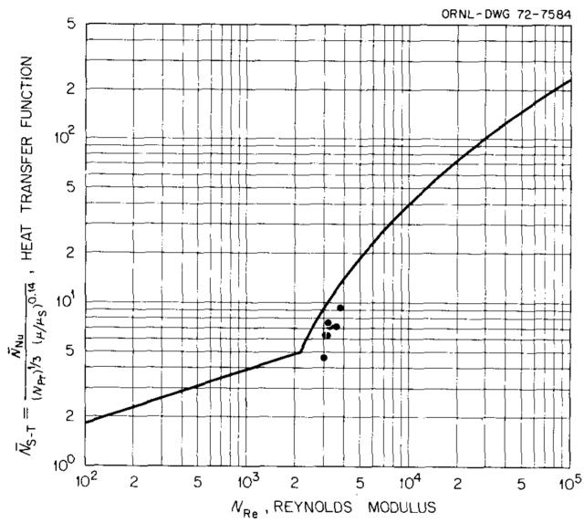  
Fig. 5.1. Summary of heat-transfer measurements employing a proposed MSPR fuel salt $\mathrm{LiF - BeF_2 - ThF_4 - UF_4}$ (67.5-20-12-0.5 mole $\%$ ). The upper and lower portions of the curve are the empirical correlations of Sieder and Tate and the center section is that of Hausen.

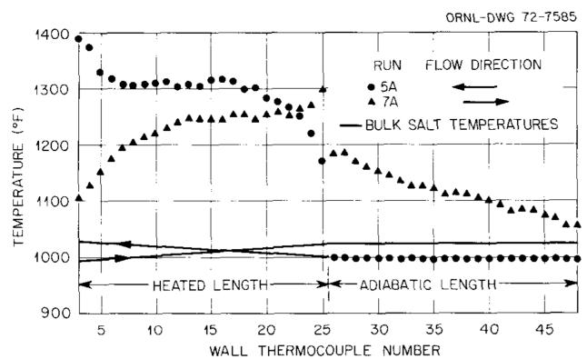  
Fig. 5.2. Wall and bulk salt temperature distributions along the heated and adiabatic lengths of the test section for Reynolds modulus of 3161.

equilibrates slowly in the exit length. The abrupt increase in the wall temperatures near the end of the heated test section has not yet been fully explained.

The only significant change in operating conditions between the present series of runs and earlier runs is the lower salt temperature, with an accompanying increase in viscosity $(\mu = 50\mathrm{lb ft}^{-1}\mathrm{hr}^{-1})$ and in its first derivative $[d\mu /dt = 0.20\mathrm{lb ft}^{-1}\mathrm{hr}^{-1}(\circ \mathrm{F})^{-1}]$ . The results (e.g., low heat transfer associated with laminar flow) demonstrate the stabilizing influence of heating a fluid with a large negative temperature coefficient of viscosity.

During these runs, the wetting characteristics of the salt were measured using the wetting detection probe described previously.4 The salt was found to wet the Hastelloy N surface (contact angle $= 20^{\circ}$ ). We plan to purify the salt so that the contact angle is greater than $100^{\circ}$ . Under nonwetting conditions, a gas film might be trapped along the heat transfer surface and severely restrict the transfer of heat into the salt.

# 5.2 WETTING STUDIES

# J.W.Cooke

A new technique involving measurement of bubble pressure, described previously, $^{4}$ is being used to study the wetting characteristics of molten salts. Two preliminary experiments with samples from the same batch of the salt mixture $(\mathrm{LiF - BeF_2 - ThF_4 - UF_4};67.5 - 20 - 12 - 0.5$ mole $\%)$ showed the salt wetting a Hastelloy N surface (contact angle $<  70^{\circ}$ ) at $1500^{\circ}\mathbf{F}$ , and at lower temperatures after addition of 1 wt $\%$ of the oxidizing agent, anhydrous nickel fluoride. Such wetting behavior was attributed to a suspected large oxygen content $(\sim 400$ ppm) in this bath of salt.

The salt mixture was reprocessed and the oxygen content reduced to $85~\mathrm{ppm}$ . The chemical composition of the salt is given in Table 5.2. Some 3800 observations of the contact angle of the salt with respect to a Hastelloy N surface were made over a 43-hr period. Results are presented in Table 5.3. Initially, the salt did not wet the surface $(\theta = 195^{\circ})$ ; however, over a period of $18.5\mathrm{hr}$ at $1000^{\circ}\mathrm{F}$ the salt gradually became partially wetting and then wetting $(\theta = 30^{\circ})$ . The salt was then heated to $1230^{\circ}\mathrm{F}$ and began to partially wet $(\theta = 100^{\circ})$ the tip surface. The salt remained partially wetting for

4. MSR Program Semiannu. Progr. Rep. Aug. 31, 1970, ORNL-4622, pp. 54-57.

Table 5.2. Chemical analysis of the salt mixture LiF-BeF $_2$ -ThF $_4$ -UF $_4$ ; 67.5-20-12-0.5 mole %   

<table><tr><td>Element</td><td>Concentration (wt %)</td></tr><tr><td>Li</td><td>6.74</td></tr><tr><td>Be</td><td>2.52</td></tr><tr><td>Th</td><td>42.20</td></tr><tr><td>U</td><td>1.78</td></tr><tr><td>F</td><td>45.10</td></tr><tr><td>Ni</td><td>0.0039</td></tr><tr><td>Cr</td><td>0.0398</td></tr><tr><td>Fe</td><td>0.0082</td></tr><tr><td>S</td><td>&lt;0.001</td></tr><tr><td>O2</td><td>0.0085</td></tr></table>

Table 5.3. Wetting of ${\mathrm{{LiF} - {BeF}}}_{2} - {\mathrm{{ThF}}}_{4} - {\mathrm{{UF}}}_{4};{67.5} - {20} - {12} - {0.5}\mathrm{\;{mole}}\%$ on Hastelloy N   

<table><tr><td>Elapsed time (hr)</td><td>Number of observations</td><td>Salt temperature (°F)</td><td>θ, contact angle (deg)</td><td>Comments</td></tr><tr><td>0</td><td></td><td>500</td><td></td><td>Degassing under high vacuum</td></tr><tr><td>17</td><td>Start</td><td>1000</td><td>145</td><td>Salt melted</td></tr><tr><td>19</td><td>240</td><td>1000</td><td>125</td><td></td></tr><tr><td>21</td><td>600</td><td>1000</td><td>145</td><td></td></tr><tr><td>23</td><td>960</td><td>1000</td><td>125</td><td></td></tr><tr><td>25</td><td>1320</td><td>1000</td><td>100</td><td></td></tr><tr><td>27</td><td>1680</td><td>1000</td><td>90</td><td></td></tr><tr><td>29</td><td>2040</td><td>1000</td><td>80</td><td></td></tr><tr><td>31</td><td>2400</td><td>1000</td><td>70</td><td></td></tr><tr><td>33</td><td>2700</td><td>1000</td><td>60</td><td></td></tr><tr><td>35</td><td>3120</td><td>1000</td><td>40</td><td></td></tr><tr><td>35.5</td><td>3200</td><td>1000</td><td>30</td><td></td></tr><tr><td>37</td><td>3380</td><td>1230</td><td>95</td><td>Salt temperature raised</td></tr><tr><td>38</td><td>3460</td><td>1230</td><td>100</td><td></td></tr><tr><td>40</td><td>3820</td><td>1230</td><td>95</td><td></td></tr><tr><td>43</td><td>3860</td><td>1240</td><td>90</td><td></td></tr></table>

about $6\mathrm{hr}$ at $1230^{\circ}\mathrm{F}$ . At this point the system was cooled down and transferred to a vacuum dry box.

The initial nonwetting of the Hastelloy N surface by the salt was indication of a salt mixture of high purity and a clean, vacuum-tight system. The gradual wetting of the surface was due, we believe, to the effect of moisture in the helium gas, probably in forming an oxide film on the surface. Prior experience by other groups using titanium scrubbers to purify helium gas has shown that some moisture may be evolved from the titanium sponge during its initial operation.

We plan to repeat the measurements with a new salt specimen after a complete chemical analysis is made of the helium gas supply.

# 5.3 MASS TRANSFER TO CIRCULATING BUBBLES

# T. S. Kress

The mass transfer coefficients between bubbles having a limited size range and liquids flowing cocurrently in a 2-in.-diam pipeline were found experimentally to follow the correlation5

$$
\mathrm {S h} / \mathrm {S c} ^ {1 / 2} = 0. 3 4 \mathrm {R e} ^ {0. 9 4} \left(d _ {\mathrm {v s}} / D\right) ^ {1. 0}. \tag {5.1}
$$

The Reynolds modulus exponent (0.94) in Eq. (5.1) was found to be larger than expected when compared, on an equivalent power dissipation basis, with mass transfer data for bubbles and liquids in agitated vessels. The agitated-vessel data are correlated by use of a Reynolds modulus exponent of 0.69. Conse

sequently, to assist in resolving the difference, an analysis was undertaken to provide a theoretical basis for the exponent.

A considerable amount of theoretical and experimental mass transfer information exists for the case of bubbles moving steadily through a fluid with some distinct relative velocity. The mass transfer equations established and generally accepted are the Frössling type, which, for large Schmidt moduli, take the forms

$$
\mathrm {S h} _ {b} \sim \mathrm {R e} _ {b} ^ {1 / 2} \mathrm {S c} ^ {1 / 2}, \tag {5.2}
$$

$$
\mathrm {S h} _ {b} \sim \mathrm {R e} _ {b} ^ {1 / 2} \mathrm {S c} ^ {1 / 3},
$$

for mobile and rigid interfaces respectively.

A small bubble suspended in a turbulent field is subjected to random inertial forces created by the turbulent fluctuations. Under the influence of a given force, if sufficiently persistent, the bubble may achieve its terminal velocity and move steadily through the liquid before being redirected by another of the random forces. If an "average" value representing the bubble relative velocity in such a turbulent field could be determined, then a convenient formulation would be the use of this velocity as a measure of an average bubble Reynolds modulus, staying within the confines

of the well-established relative-flow Frössling-type equations [Eqs. (5.2)] to determine the mass transfer behavior.

The movement of the bubbles through the liquid will be resisted primarily by viscous stresses. The drag force on a sphere moving steadily through a liquid at relative velocity, $\mathbf{v}_b$ , is often expressed in terms of a drag coefficient, $C_d$ , by the equation

$$
F _ {d} = \frac {C _ {d} A \rho v _ {b} {} ^ {2}}{2 g _ {c}} = \frac {C _ {d} \pi \mu^ {2} \operatorname {R e} _ {b} {} ^ {2}}{8 g _ {c} \rho}, \tag {5.3}
$$

in which the drag coefficient is itself a function of the bubble Reynolds modulus. In relative flows, however, the drag coefficient-Reynolds modulus correlation depends on the particular Reynolds modulus range. Frequently, two regimes of flow are identified, with the division occurring at $\mathbf{Re}_b = 2$ . Common correlations for the drag coefficients in these two regimes are given below.

For $\mathbf{Re}_b\leqslant 2$

$$
C _ {d} = 2 4 / \operatorname {R e} _ {b} \text {a n d} F _ {d} = 3 \pi \mu^ {2} \operatorname {R e} _ {b} / g _ {c} \rho . \tag {5.4}
$$

For $2 < \mathrm{Re}_b \leqslant 200$ ,

$$
C _ {d} = 1 8. 5 / \operatorname {R e} _ {b} ^ {0. 6} \text {a n d} F _ {d} = 1 8. 5 \pi \mu^ {2} \operatorname {R e} _ {b} ^ {1. 4} / 8 g _ {c} \rho . (5. 5)
$$

An expression has been developed for the inertial force experienced by a bubble in a turbulent fluid:

$$
F _ {i} \sim \frac {\mu^ {2}}{\rho g _ {c}} (d / D) ^ {8 / 3} \operatorname {R e} ^ {1 1 / 6}. \tag {5.6}
$$

It might be reasonable to determine "mean" bubble velocities from a balance between the inertial force and the drag force for later substitution into the Frössling equations. If it is postulated that the above two regimes also exist for bubbles in a turbulent field, then two different sets of equations describing the mass transfer will result. Since the inertial force depends on the bubble size, a dispersion of bubbles with a distribution of sizes may have bubbles in one regime or in both regimes simultaneously, and the mass transfer behavior may be described by one set of equations or take on characteristics of a combination of the two. The mass transfer equations resulting for the two separate regimes are given below.

# Regime 1: $\mathbf{Re}_b\leqslant 2$

If the bubble motion were predominantly governed by the regime $\mathbf{Re}_b\leqslant 2$ , the drag force would be given

by Eq. (5.4). A balance between the inertial and drag forces, $F_{i} = F_{d}$ , would then give for the bubble Reynolds modulus

$$
\operatorname {R e} _ {b} \sim (d / D) ^ {8 / 3} \operatorname {R e} ^ {1 1 / 6}. \tag {5.7}
$$

By this formulation, the bubble relative-flow Reynolds modulus depends only on the ratio $d / D$ and on the pipe Reynolds modulus which, for a given bubble size, establish the turbulence level. The Sherwood modulus for mass transfer can therefore be determined as a function of these variables by substitution of Eq. (5.7) into the Frössling-type equations. Making the conversion $\mathrm{Sh} = (D / d)\mathrm{Sh}_b$ and substituting Eq. (5.7) into Eq. (5.2) gives for the mobile- and rigid-interface pipe Sherwood moduli applicable to cocurrent turbulent flow,

$$
\mathrm {S h} \sim \mathrm {S c} ^ {1 / 2} \operatorname {R e} ^ {0. 9 2} (d / D) ^ {1 / 3}, \tag {5.8}
$$

$$
\mathrm {S h} \sim \mathrm {S c} ^ {1 / 3} \operatorname {R e} ^ {0. 9 2} (d / D) ^ {1 / 3}, \tag {5.9}
$$

respectively.

Consequently, in this regime, a theoretical pipe Reynolds modulus exponent is 0.92, in comparison with the experimentally determined value of 0.94. The theoretical bubble diameter dependence, $(d / D)^{1 / 3}$ , however, is less than the experimentally determined linear variation. Calderbank and Moo-Young point out that the linear variation they observed for bubbles in this size range probably resulted from a transition from rigid to mobile interfacial conditions, because small bubbles universally tend to behave as rigid spheres, while larger bubbles require the presence of sufficient surface active ingredients to immobilize their surface. If such a transition is the reason for the linear variation in this instance, then the bubble diameter dependence in Eq. (5.1) is applicable only over the range of the measurements, $0.01 \leqslant d_{\mathrm{vs}} < 0.05$ in.

# Regime 2: $\mathbf{Re}_b > 2$

If the bubble motion were predominantly in the regime $\mathbf{Re}_b > 2$ , the drag force would be given by Eq. (5.5). The balance, $F_{i} = F_{d}$ , would then give

$$
\operatorname {R e} _ {b} \sim (d / D) ^ {8 / 4. 2} \operatorname {R e} ^ {1 1 / 8. 4}. \tag {5.10}
$$

The relative-flow bubble Reynolds modulus in this regime still depends on the variables that establish the turbulence level, but the dependence is different from that of regime 1. When substituted into the Frössling equations for mobile and rigid interfaces, the results are

$$
\mathrm {S h} \sim \mathrm {S c} ^ {1 / 2} \mathrm {R e} ^ {0. 6 6} (d / D) ^ {- 0. 2 / 4. 2}, \tag {5.11}
$$

$$
\mathrm {S h} \sim \mathrm {S c} ^ {1 / 3} \mathrm {R e} ^ {0. 6 6} (d / D) ^ {- 0. 2 / 4. 2}, \tag {5.12}
$$

respectively.

For this regime the Reynolds modulus exponent is 0.66. The comparison of this exponent with that expected from agitated-vessel data (0.69) is interesting. However, the writer feels that the apparent difference observed between mass transfer in agitated vessels and flow in conduits is more likely due to a difference in the relative influence of gravitational forces in the two systems rather than to a difference in the controlling flow regime.

# Nomenclature

$A =$ bubble projected cross-sectional area

$C_d = \text{drag coefficient for a bubble moving through a liquid}$

$$
d = \text {b u b b l e d i a m e t e r}
$$

$d_{\mathbf{vs}} =$ Sauter mean diameter of a bubble dispersion

$D =$ conduit diameter

$\mathcal{J} =$ molecular diffusion coefficient

$F_{d} =$ drag force on a bubble moving through a fluid

$F_{i} =$ mean inertial force on a bubble due to turbulent fluctuations

$g_{c} =$ dimensional proportionality constant relating force to the product of mass and acceleration

$k =$ mass-transfer film coefficient

$\mathrm{Re} =$ pipe Reynolds modulus $(VD\rho /\mu)$

$\mathrm{Re}_b =$ bubble Reynolds modulus $(\mathrm{v}_bd\rho /\mu)$

$\mathrm{Sc} =$ Schmidt modulus $(\mu /\rho \mathbb{D})$

$\mathrm{Sh} =$ pipe Sherwood modulus $(kD / \mathcal{Q})$

$\mathrm{Sh}_{\tilde{b}} =$ bubble Sherwood modulus $(kd / 9)$

$V =$ liquid axial velocity

$\mathbf{v}_b =$ mean relative velocity between a bubble and a fluid

$\mu =$ liquid viscosity

$\rho =$ liquid density

# Part 2. Chemistry

W. R. Grimes

The chemical development activities described below continue to address themselves to chemical problems posed in design and operation of molten-salt reactor systems.

Experimental study of specimens and materials from MSRE has been completed except for a small number of verification or recheck analyses. The only effort devoted to the MSRE "postmortem" consists in preparing final reports of the complex fission product behavior in that system. This documentation will be completed in the very near future.

Study of possible mechanisms of intergranular attack upon MSRE metallic components (conducted in close cooperation with the MSRp metallurgists, and reported in more detail in Part 3 of this report) engages an increasing fraction of the chemical program. Studies completed to date have indicated tellurium as the most likely offending material. Many exposures of pertinent metals to tellurium (and to other potentially harmful fission products and contaminants) are under way for various times and at varying contaminant concentrations. In addition, tools and techniques for more sophisticated study of exposure to tellurium and for detailed study of metal tellurides are under development. It is expected that all these efforts will be further augmented in the future.

The behavior of hydrogen isotopes in molten salts and metals constitutes a substantial fraction of the chemical development effort. Solubility of $\mathbf{H}_2$ in $2\mathrm{LiF - BeF}_2$ has been established at $600^{\circ}\mathrm{C}$ ; this study should be concluded within the next reporting period. Definitive data are now being obtained on permeation of metals by hydrogen isotopes at the low pressures of interest, and useful preliminary data on reduction of such permeation by coatings and films are becoming avail

able. This study (which is valuable not only to MSRp but to the Controlled Thermonuclear program and to any system requiring management of tritium at elevated temperatures) will continue to have a high priority. Study of possible mechanisms capable of holdup of tritium (especially in fluoroborate systems) to allow time for its controlled recovery continues to show promise. A related effort - aimed at improved understanding of fluoroborate chemistry and of corrosion by fluoroborates - is still under way at a modest funding level.

Study of protactinium chemistry during this period has been confined to selective precipitation of oxides. Such processing (to remove a major fraction of protactinium from the reactor fuel without precipitation of any other species) continues to appear feasible at temperatures near $550^{\circ}\mathrm{C}$ . Small-scale studies of this process are now considered complete except for confirmatory experiments and for a more accurate definition of the potential of the $\mathbf{Pa}^{4+}-\mathbf{Pa}^{5+}$ couple in molten fluorides.

The principal emphasis of analytical chemical development programs has been placed on methods for use in semiautomated operational control of molten-salt breeder reactors, for example, the development of in-line analytical methods for the analysis of MSR fuels, for reprocessing streams, and for gas streams. These methods include electrochemical and spectrophotometric means for determination of the concentration of $\mathrm{U}^{3+}$ and other ionic species in fuels and coolants and adaptation of small on-line computers to electroanalytical methods. Parallel efforts have been devoted to the development of analytical methods related to assay and control of the concentration of water, oxides, and tritium in fluoroborate coolants.

# 6. Fission Product Behavior

# 6.1 SOME FACTORS AFFECTING THE DEPOSITION INTENSITY OF NOBLE-METAL FISSION PRODUCTS

E. L. Compere E. G. Bohlmann S. S. Kirslis

The loss of noble-metal fission products from circulating fuel salt and their deposition on reactor surfaces have been recognized since the examination of the first specimens from the MSRE. However, a considerable uncertainty has remained concerning the factors affecting their deposition intensity. Certainly a mass transfer step is involved, but - because in the standard surveillance arrays, there were differing flow conditions for metal and graphite specimens - sticking factors, flow terms, and other factors could not readily be extricated from the data. Nor is this completely achieved in the discussion to follow. However, the final surveillance specimen array $^{1,2}$ (Fig. 6.1), in addition to containing four uranium capsules for neutron capture experiments, also contained sets of paired metal and graphite specimens, with differing axial positions, surface roughness, and adjacent flow velocities. Because flow conditions were the same or essentially so for metal-graphite pairs, the hydrodynamically controlled mass transport effects if simple should cancel in comparisons, and differences can be attributed to differences in what is commonly called sticking factor. The sample pairs are listed below in order of increasing turbulence.

Flow. In the noncentral regions of the core, the flow to a fuel channel had to pass through the grid of lattice bars, and according to measurements reported on

models, the velocity in the channels was 0.7 fps with a Reynolds number of 1000. However, the flow varied with the square root of head loss, implying that nonlaminar entrance conditions extended over much of these channels.

The lattice bars did not extend across the central region, which included several otherwise standard fuel channels and circular annuli with rod thimbles and surveillance specimens. Consequently, the available flow head and resultant velocities were greater in the central region than in the noncentral region.

The flow through central fuel channels was indicated by model studies to be 3.7 gpm, equivalent to 2.66 fps, or a Reynolds number of 3700; the associated head loss due to turbulent flow can thus be calculated as 0.45 ft. In the adjacent parallel channels for rod thimbles and surveillance specimens, the same driving force across the 2.6- to 2.0-in. annulus yields a velocity of 2.6 fps and a Reynolds number of 3460. These flows are clearly turbulent.

Flow in the circular annulus around the surveillance specimen basket essentially controlled the pressure drops, driving the more restricted flows around and through various specimens within the basket.

At the bottom of the basket cage was a hollow graphite cylinder (No. 7-3, Table 6.1) $1 \frac{1}{8}$ in. OD, $5 \%$ in. ID, containing a $1 / 2$ -in.-OD Hastelloy N closed cylinder (No. 7-1, Table 6.2). The velocity in the annulus was estimated as 0.27 fps, with an associated Reynolds number of $D V \rho / \mu = 0.0104 \times 0.27 \times 141 / 0.00528 = 75$ ; this flow was, therefore, clearly laminar. This value, about $10\%$ of that originally indicated, was obtained by considering flow through three resistances in series, respectively, 20 holes in parallel, $1 / 8$ in. diam by $1 / 8$ in. long; then 6 holes in parallel, $1 / 4$ in. diam by $1 / 4$ in. long; then an annulus $1 / 16$ in. wide by 5 in. long. A flow head loss of 0.057 ft, which should develop along the outer part of the basket, was assumed. The laminar annulus flow formula

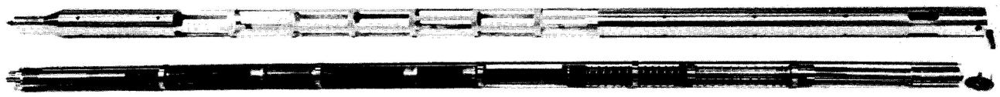  
Fig. 6.1. Final surveillance specimen array (Photo 96501, Fig. 1, ORNL-TM-2743).

Observed $\mathrm{dpm/cm^2}$ / (MSRE inventory as isotope $\mathrm{dpm/MSRE}$ total metal and graphite area, $\mathrm{cm^2}$ )

Activity and inventory data are as of reactor shutdown 12/12/69

Numbers in parentheses are (MSRE inventory/MSRE total area), $\mathrm{dpm/cm}^2$

Table 6.1. Relative deposition intensity of fission products on graphite surveillance specimens from final core specimen array   

<table><tr><td>Type</td><td>Roughness (μin.)</td><td>Centimeters from core center</td><td>Sample No.</td><td>89Sr(1.37E11a)</td><td>137Cs(8.53E9a)</td><td>140Ba(1.73E11)</td><td>141Ce(1.83E11)</td><td>144Ce(8.05E10a)</td><td>95Zr(1.35E11a)</td><td>95Nb(1.14E11)</td><td>99Mo(2.26E11)</td><td>103Ru(4.48E10a)</td><td>106Ru(4.47E9a)</td><td>125Sb(5.63E8)</td><td>132Te</td><td>129mTe(1.85E10)</td><td>131I(1.06E11)</td></tr><tr><td rowspan="3">Outside (transition flow)</td><td>5</td><td>-29</td><td>7-3-1-B outer</td><td>4.2</td><td>0.023</td><td>0.17</td><td>0.0039</td><td>0.0036</td><td>0.0021</td><td>0.21</td><td></td><td>0.083</td><td>0.069</td><td></td><td></td><td>0.011</td><td>0.0805</td></tr><tr><td>25</td><td>-27</td><td>7-3-1-M outer</td><td>1.6</td><td>0.022</td><td>0.13</td><td></td><td></td><td>0.0019</td><td>0.21</td><td></td><td>0.033</td><td>0.033</td><td></td><td></td><td>0.046</td><td>0.0059</td></tr><tr><td>125</td><td>-25</td><td>7-3-1-T outer</td><td>2.4</td><td></td><td>0.08</td><td>0.0031</td><td>0.0008</td><td>0.0018</td><td>0.18</td><td></td><td>0.035</td><td>0.035</td><td></td><td></td><td>0.029</td><td>0.0035</td></tr><tr><td rowspan="3">Outside wire (turbulent flow)</td><td>5</td><td>+8</td><td>12-1-B outer</td><td>1.9</td><td></td><td>0.17</td><td>0.0069</td><td>0.0013</td><td>0.0025</td><td>0.25</td><td></td><td>0.040</td><td>0.0001</td><td></td><td></td><td>0.012</td><td>0.0033</td></tr><tr><td>25</td><td>+10</td><td>12-1-M outer</td><td>2.0</td><td></td><td>0.17</td><td>0.0090</td><td>0.0015</td><td>0.0023</td><td>0.15</td><td></td><td>0.039</td><td>0.039</td><td></td><td></td><td>0.025</td><td>0.0047</td></tr><tr><td>125</td><td>+12</td><td>12-1-T outer</td><td>1.8</td><td></td><td>0.16</td><td>0.0037</td><td>0.0005</td><td>0.0021</td><td>0.15</td><td></td><td></td><td></td><td></td><td></td><td>0.050</td><td>0.0050</td></tr><tr><td rowspan="3">Inside annulus (laminar flow)</td><td>5</td><td>-28</td><td>7-3-1-B inner</td><td>0.31</td><td>0.0058</td><td>0.016</td><td>0.0012</td><td>0.0006</td><td>0.0014</td><td>0.04</td><td>0.003</td><td>0.022</td><td>0.019</td><td></td><td></td><td>0.065</td><td>0.0033</td></tr><tr><td>5</td><td>-26</td><td>7-3-1-M inner</td><td>0.26</td><td>0.0016</td><td>0.009</td><td>0.0012</td><td>0.0006</td><td>0.0016</td><td>0.25</td><td>0.22</td><td>0.150</td><td>0.108</td><td></td><td></td><td>0.054</td><td>0.0026</td></tr><tr><td>125</td><td>-24</td><td>7-3-1-T inner</td><td>0.18</td><td>0.0015</td><td>0.009</td><td>0.0012</td><td>0.0011</td><td>0.0016</td><td>0.24</td><td>0.19</td><td>0.064</td><td>0.049</td><td></td><td></td><td>0.579</td><td>0.0010</td></tr><tr><td rowspan="3">Inside tube (transition flow)</td><td>5</td><td>+9</td><td>12-1-B inner</td><td>0.49</td><td>0.0029</td><td>0.046</td><td>0.0031</td><td>0.0009</td><td>0.0027</td><td>0.25</td><td></td><td>0.056</td><td>0.047</td><td></td><td></td><td>0.061</td><td>0.0031</td></tr><tr><td>5</td><td>+11</td><td>12-1-M inner</td><td>0.34</td><td>0.0010</td><td>0.028</td><td>0.0018</td><td>0.0009</td><td>0.0011</td><td>0.20</td><td></td><td>0.035</td><td>0.029</td><td></td><td></td><td>0.057</td><td>0.0019</td></tr><tr><td>125</td><td>+13</td><td>12-1-T inner</td><td>0.39</td><td>0.0032</td><td>0.033</td><td>0.0010</td><td>0.0002</td><td>0.0018</td><td>0.09</td><td></td><td>0.084</td><td>0.065</td><td></td><td></td><td>0.050</td><td>0.0017</td></tr><tr><td></td><td></td><td></td><td></td><td></td><td></td><td></td><td></td><td></td><td></td><td></td><td>99Tc</td><td></td><td></td><td></td><td></td><td>127Te (Inv = 2.9E9)</td><td></td></tr><tr><td>Postmortem: MSRE core bar segment</td><td></td><td></td><td></td><td></td><td></td><td></td><td></td><td></td><td></td><td></td><td>0.049</td><td></td><td>0.23</td><td>0.56</td><td></td><td>0.44</td><td></td></tr></table>

${}^{a}$ Inventories shown accrue from all operation beginning with original startup. To correct inventories to show the material produced during current period (runs 19 and 20) only, multiply by factors given below. To obtain similarly corrected deposition intensity ratios, divide the value in the table by the factor for the isotope. Factors are: 52-day ${}^{89}\mathrm{{Sr}} = {0.90};{59} - {\text{day}}^{91}\mathrm{\;Y} = {0.86};{40} - {\text{day}}^{103}\mathrm{{Ru}} = {0.95};{65} - {\text{day}}^{95}\mathrm{{Zr}} = {0.84};{284} - {\text{day}}^{144}\mathrm{{Ce}} = {0.36};1 - {\text{year}}^{106}\mathrm{{Ru}} = {0.32};{30} - {\text{year}}^{137}\mathrm{{Cs}} =$ 0.14. For isotopes with shorter half-lives, corrections are trivial.

Observed $\mathrm{dpm} / \mathrm{cm}^2$ /(MSRE inventory as isotope $\mathrm{dpm} / \mathrm{MSRE}$ total metal and graphite area, $\mathrm{cm}^2$ )

Activity and inventory data are as of reactor shutdown 12/12/69

Numbers in parentheses are (MSRE inventory/MSRE total area), $\mathrm{dpm/cm^2}$

Table 6.2. Relative deposition intensity of fission products on Hastelloy N surveillance specimens from final core specimen array   

<table><tr><td>Type</td><td>Roughness (μin.)</td><td>Centimeters from core center</td><td>Sample No.</td><td>89Sr(1.37E11a)</td><td>137Cs(8.53E9a)</td><td>140Ba(1.73E11)</td><td>141Ce(8.05E10a)</td><td>144Ce(1.35E11a)</td><td>95Zr(1.14E11)</td><td>95Nb(2.26E11)</td><td>103Ru(4.48E10a)</td><td>106Ru(4.47E9a)</td><td>125Sb(5.63E8)</td><td>132Te(2.01E11)</td><td>129mTe</td><td>131I(1.06E11)</td><td></td></tr><tr><td rowspan="3">Outside (transition flow)</td><td>5</td><td>+24</td><td>14-3-B</td><td>0.0016</td><td>0.0015</td><td>0.0012</td><td>0.0009</td><td>0.0004</td><td>0.0004</td><td>0.13</td><td>3.4</td><td>0.094</td><td>0.127</td><td></td><td>6.4</td><td></td><td>0.060</td></tr><tr><td>25</td><td>+25</td><td>14-3-M</td><td>0.0013</td><td>0.0056</td><td>0.0009</td><td>0.0008</td><td>0.0003</td><td>0.0003</td><td>0.12</td><td>1.4</td><td>0.059</td><td>0.078</td><td></td><td>1.9</td><td></td><td>0.051</td></tr><tr><td>125</td><td>+27</td><td>14-3-T</td><td>0.0010</td><td>0.0006</td><td>0.0007</td><td>0.0006</td><td>0.0003</td><td>0.0003</td><td>0.14</td><td>1.7</td><td>0.056</td><td>0.079</td><td></td><td>2.2</td><td></td><td>0.046</td></tr><tr><td rowspan="3">Outside wire (turbulent flow)</td><td>5</td><td>+16</td><td>13-2-B</td><td>0.0013</td><td>0.0009</td><td>0.0013</td><td>0.0009</td><td>0.0004</td><td>0.0003</td><td>0.26</td><td>0.46</td><td>0.10</td><td>0.09</td><td></td><td>1.1</td><td></td><td>0.22</td></tr><tr><td>25</td><td>+18</td><td>13-2-M</td><td>0.0020</td><td>0.0253</td><td>0.0018</td><td>0.0011</td><td>0.0005</td><td>0.0007</td><td>0.34</td><td>2.2</td><td>0.20</td><td>0.17</td><td></td><td>2.3</td><td></td><td>0.37</td></tr><tr><td>125</td><td>+20</td><td>13-2-T</td><td>0.0039</td><td>0.0022</td><td>0.0030</td><td>0.0012</td><td>0.0005</td><td>0.0004</td><td>0.49</td><td>0.32</td><td>0.10</td><td>0.08</td><td></td><td>3.0</td><td></td><td>0.60</td></tr><tr><td>Wire</td><td></td><td>+18</td><td>13-3 wire</td><td>0.0019</td><td>0.0006</td><td>0.0015</td><td>0.0010</td><td>0.0001</td><td>0.0005</td><td>0.21</td><td>0.85</td><td>0.14</td><td>0.23</td><td></td><td>0.17</td><td></td><td>0.09</td></tr><tr><td>Wire</td><td></td><td>+11</td><td>12-2 wire</td><td>0.0030</td><td>0.0011</td><td>0.0027</td><td>0.0016</td><td>0.0008</td><td>0.0008</td><td>0.88</td><td>1.7</td><td>0.25</td><td>0.19</td><td></td><td>0.79</td><td></td><td>0.09</td></tr><tr><td rowspan="2">Inside annulus (laminar flow)</td><td>5</td><td>-28</td><td>7-1-B</td><td>0.0018</td><td>0.0006</td><td>0.0015</td><td>0.0011</td><td>0.0005</td><td>0.0006</td><td>0.21</td><td>1.2</td><td>0.09</td><td>0.06</td><td></td><td>0.87</td><td></td><td>0.13</td></tr><tr><td>125</td><td>-26</td><td>7-1-T</td><td>0.0020</td><td>0.0007</td><td>0.0017</td><td>0.0013</td><td>0.0006</td><td>0.0006</td><td>0.39</td><td>1.4</td><td>0.15</td><td>0.23</td><td></td><td>0.93</td><td></td><td>0.19</td></tr><tr><td rowspan="3">Inside tube [transition (?) flow]</td><td>5</td><td>+16</td><td>13-1-B</td><td>0.0021</td><td>0.0005</td><td>0.0020</td><td>0.0014</td><td>0.0006</td><td>0.0007</td><td>0.37</td><td>3.7</td><td>0.34</td><td>0.32</td><td></td><td>1.2</td><td></td><td>0.18</td></tr><tr><td>5</td><td>+16</td><td>13-1-M</td><td>0.0021</td><td>0.0012</td><td>0.0018</td><td>0.0013</td><td>0.0006</td><td></td><td>0.41</td><td>4.1</td><td>0.19</td><td>0.19</td><td></td><td>1.1</td><td></td><td>0.18</td></tr><tr><td>125</td><td>+20</td><td>13-1-T</td><td>0.0019</td><td>0.0007</td><td>0.0015</td><td>0.0011</td><td>0.0005</td><td>0.0004</td><td>0.71</td><td>3.6</td><td>0.23</td><td>0.17</td><td></td><td>3.0</td><td></td><td>0.38</td></tr><tr><td rowspan="2">Stagnant (inside liquid region)</td><td></td><td>+26</td><td>14-2-L2</td><td>0.0030</td><td>0.0020</td><td>0.0002</td><td>0.00003</td><td>0.00002</td><td>0.00001</td><td>0.0051</td><td>6.0</td><td>0.005</td><td>0.007</td><td></td><td>0.03</td><td></td><td>0.002</td></tr><tr><td></td><td>+24</td><td>14-2-L1</td><td>0.0010</td><td>0.0002</td><td>0.0002</td><td>0.00011</td><td>0.00006</td><td>0.00006</td><td>0.025</td><td>3.0</td><td>0.044</td><td>0.043</td><td></td><td>0.13</td><td></td><td>0.010</td></tr><tr><td rowspan="3">Stagnant (inside gas region)</td><td></td><td>+29</td><td>14-2-G1</td><td>0.14</td><td>0.0027</td><td>0.0057</td><td>0.00001</td><td>0.000005</td><td>0.00003</td><td>0.0010</td><td>4.5</td><td>0.0012</td><td>0.0010</td><td></td><td>0.14</td><td></td><td>0.0008</td></tr><tr><td></td><td>+28</td><td>14-2-G2</td><td>0.47</td><td>0.0022</td><td>0.0077</td><td>0.00002</td><td>0.00001</td><td>0.00002</td><td>0.0012</td><td>5.3</td><td>0.0006</td><td>0.0006</td><td></td><td>0.03</td><td></td><td>0.0028</td></tr><tr><td></td><td>+27</td><td>14-2-G3</td><td>0.41</td><td>0.0014</td><td>0.0069</td><td>0.00004</td><td>0.00001</td><td>0.00086</td><td>0.0012</td><td>6.6</td><td>0.0009</td><td>0.0009</td><td></td><td>0.03</td><td></td><td>0.0005</td></tr><tr><td></td><td></td><td></td><td></td><td></td><td></td><td></td><td></td><td></td><td></td><td></td><td>99Tc</td><td></td><td></td><td></td><td>127Te(Inv = 2.9E9)</td><td></td><td></td></tr><tr><td colspan="18">Postmortem</td></tr><tr><td colspan="11">MSRE heat exchanger segment</td><td>0.20</td><td>0.55</td><td></td><td>0.13</td><td>1.4</td><td>1.0</td><td></td></tr><tr><td colspan="11">MSRE rod thimble segment (core)</td><td>0.83</td><td>0.66</td><td></td><td>0.32</td><td>1.6</td><td>1.0</td><td></td></tr></table>

${}^{a}$ Inventories shown accrue from all operation beginning with original startup. To correct inventories to show the material produced during current period (runs 19 and 20) only, multiply by factors given below. To obtain similarly corrected deposition intensity ratios, divide the value in table by the factor for isotope. Factors are: 52-day ${}^{89}\mathrm{{Sr}} = {0.90};{59} - \mathrm{{day}}{}^{91}\mathrm{\;Y} = {0.86};{40} - \mathrm{{day}}{}^{103}\mathrm{{Ru}} = {0.95};{65} - \mathrm{{day}}{}^{95}\mathrm{{Zr}} = {0.84};{284} - \mathrm{{day}}{}^{144}\mathrm{{Ce}} = {0.36};1 - \text{year }{}^{106}\mathrm{{Ru}} = {0.32};{30} - \text{year }{}^{137}\mathrm{{Cs}} = {0.14}$ . For isotopes with shorter half-lives, corrections are trivial.

given in Perry's Chemical Engineer's Handbook, IV, Table 5-11, was used.

In the annulus between the outside of the graphite cylinder and the basket, the velocity was estimated to be about 1.5 fps; the associated Reynolds number is 2200, and the flow was either laminar or in the transition region. At the top of the cage was a Hastelloy N cylinder (No. 14, Table 6.2; No. 4 in Fig. 6.1) of similar external dimension which presumably experienced similar flow conditions on the outside. This specimen was closed at the top and had a double wall. Inside was a bar containing electron microscope screens. The liquid around the bar within the cylinder was stagnant, and gas was trapped in the upper part of the specimen.

Below this and above the midplane of the specimen cage were located respective graphite (Table 6.1, No. 12) and double-walled Hastelloy (Table 6.2, No. 13) cylinders, with connecting $\frac{1}{2}$ -in.-diam bores. Flow through this tube is believed to have been transition or possibly turbulent flow, though doubtless less turbulent than around the specimen exterior. The exterior of the 1-in.-OD cylinders was wrapped with $\frac{1}{16}$ -in. Hastelloy N wire on $\frac{1}{2}$ -in. pitch as a flow disturbance. Flow in the annulus between the specimen exterior and the basket was undoubtedly the most turbulent of any affecting the set of specimens.

The data from the various specimens are presented in Table 6.1 for graphite and in Table 6.2 for Hastelloy N. All activity and inventory data correspond to reactor shutdown (Dec. 12, 1969). In order to provide a common basis of comparison for all observations of deposited activity - of whatever isotope on whatever surface - the observed activity of an isotope per unit area has been divided by the quotient obtained by dividing total MSRE inventory activity of the isotope by the total MSRE surface area, graphite and metal (3.1 $\times 10^{6}\mathrm{cm}^{2}$ ).

The resulting relative deposition intensities should be the same for all isotopes depositing the same fraction of their inventory by whatever means on unit surface of whatever kind. Thus the deposition intensity of various isotopes on either graphite or metal can be compared freely. Complete and even deposition of an isotope on all surfaces would give a value of 1.0 everywhere. However, deposition intensities vary with mass transport and sticking factor, etc., in various regions, so that the average relative intensity (summed over all system areas) should fall between 0 and 1.0.

We saw no effect of surface roughness, which ranged from 5 to $125\mu \mathrm{in}$ . rms on both metal or graphite, so this will not be further considered here.

Fission recoil. Because the specimens were adjacent to fissioning salt in the core, some fission products should recoil into the surface. We calculate that where the fission density equals the average for the core, the relative impingement intensity of recoiling fission fragments $[(recoil\ atoms/cm^2)/(reactor\ production/surface\ area)]$ ranges from 0.0036 for light fragments to 0.0027 for heavy fragments. The ratio will be higher (around 0.005) where the fission density is highest.

Salt-seeking nuclides. Relative deposition intensities for salt-seeking nuclides $\left({}^{95}\mathrm{Zr},{}^{141}\mathrm{Ce}\right)$ are of the order of the calculated impingement intensities or less: for $^{95}\mathrm{Zr}$ , 0.001 to 0.0027 on graphite and 0.0003 to 0.0008 on metal; for $^{141}\mathrm{Ce}$ , 0.0010 to 0.0090 on graphite and 0.0006 to 0.0016 on metal. The 284-day $^{144}\mathrm{Ce}$ is consistent with this, on a current basis after adjustment for prior inventory as shown in the table footnotes.

There also appears to be some dependence on axial location, with higher values nearer the center of the core. Thus all of the salt-seeking nuclides observed on surfaces could have arrived there by fission recoil; the fact that remaining deposition intensities on metal surfaces are consistently less than impingement densities indicates that many atoms that impinge on the surface may sooner or later return to the salt.

Nuclides with noble-gas precursors. The nuclides with noble-gas precursors $\left({}^{89}\mathrm{Sr},{}^{137}\mathrm{Cs},{}^{140}\mathrm{Ba}\right.$ , and to a slight extent, ${}^{141}\mathrm{Ce})$ are, after formation, also salt seekers. They are found to be deposited on metal to about the same extent as isotopes of salt-seeking elements, doubtless by fission recoil. However, noble-gas precursors can diffuse into graphite before decay, providing an additional and major path into graphite. It may be seen that values for ${}^{89}\mathrm{Sr},{}^{137}\mathrm{Cs},$ and ${}^{140}\mathrm{Ba}$ for the graphite samples are generally an order of magnitude or more greater than for the salt-seeking elements.

It appears evident that the deposition intensity on graphite of the isotopes with noble-gas precursors was higher on the outside than on the inside, both of specimen 7 and specimen 12. Flow was also more turbulent outside than inside, and atomic mass transfer coefficients should be higher. [Flows are not well enough known to accurately compare the outside of the lower specimen (No. 7-3) with the inside of the upper graphite tube specimen (No. 12-1).]

Appreciably more 3.1-min $^{89}\mathrm{Kr}$ and 3.9-min $^{137}\mathrm{Xe}$ should enter the graphite than 16-sec $^{140}\mathrm{Xe}$ or 2-sec

${}^{141}\mathrm{Xe}$ , but the $^{137}\mathrm{Cs}$ values are considerably lower than for $^{89}\mathrm{Sr}$ . Only about $14\%$ of the $^{137}\mathrm{Cs}$ inventory was formed during runs 19 and 20. With this correction, however, $^{137}\mathrm{Cs}$ deposition intensities still are less than observed for strontium. It has been noted previously that the major part of cesium formed in graphite will diffuse back into the salt much more strongly than the less volatile strontium; this presumably accounts for the lower $^{137}\mathrm{Cs}$ intensity.   
At first glance the "fast flow" values for $^{89}\mathrm{Sr}$ on graphite appear somewhat high: similar deposition intensity on all flow channel graphite would account for the major part of the $^{89}\mathrm{Sr}$ inventory, while salt analysis for the period showed that the salt contained $\sim 82\%$ of the $^{89}\mathrm{Sr}$ . But the discrepancy is not unacceptable, since most core fuel channels had lower velocity and less turbulent, possibly laminar, flow.   
On the inside of the closed tube the deposition of salt-seeking daughters of noble gases was much higher in the gas space than in the salt-filled region. This is consistent with collection of $^{89}\mathrm{Kr}$ in the gas space and relative immobility of strontium deposits on surfaces not washed by salt.   
Noble metals: niobium and molybdenum. Turning to the noble-metal fission products we note that $^{95}\mathrm{Nb}$ deposited fairly strongly and fairly evenly on all surfaces. The data are not inconsistent with postmortem examination of reactor components. Molybdenum $(^{99}\mathrm{Mo})$ deposited considerably more strongly on metal than on graphite (limited graphite data). Because the deposition intensity of molybdenum on metal is similar to that of $^{89}\mathrm{Sr}$ on graphite, which is attributed to atomic krypton diffusion through the salt boundary layer, it may be that molybdenum could also have been transported in appreciable part by an atomic mechanism, and presumably had a high sticking factor on metal ( $\sim 1$ ). Under similar flow conditions, the decomposition intensity of molybdenum on graphite is much less; hence the sticking factor on graphite is doubtless much below unity. Postmortem component examination found that the $^{99}\mathrm{Tc}$ daughter also was more intensely deposited on metal than on graphite.   
The widely varying $^{99}\mathrm{Mo}$ values reported for salt samples taken during this period, however, imply that a

significant amount of $^{99}\mathrm{Mo}$ occurred along with other noble-metal isotopes in pump bowl salt samples as particulates. Since molybdenum was relatively high in the present surveillance samples also, it may be that an appreciable part of deposition involved material from this pool.   
Because molybdenum deposited more strongly than its precursor niobium, an appreciable part of the molybdenum found must have deposited independently of niobium deposition, and niobium behavior may only roughly indicate molybdenum behavior at best. This may well be due to the relation of niobium behavior to the Redox potential of the salt, while molybdenum may not be affected in the same way.   
Ruthenium. The ruthenium isotopes $^{103}\mathrm{Ru}$ and $^{106}\mathrm{Ru}$ appear to be quite similar in behavior and did not exhibit any marked response to flow or flux variations. The ruthenium isotopes appear to deposit several-fold more intensely on metal than on graphite. The correction of inventories to material formed only during the current period will increase the $^{106}\mathrm{Ru}$ intensity ratios about threefold, but will change the $^{103}\mathrm{Ru}$ intensity ratio very little. On a current inventory basis the $^{103}\mathrm{Ru}$ deposition will then be appreciably lower than that for $^{106}\mathrm{Ru}$ . This indicates that an appreciable net time lag may occur before deposition, and argues against a dominant direct atomic deposition mechanism for this element.   
Tellurium. The tellurium isotopes $^{132}\mathrm{Te}$ (on metals) and $^{129m}\mathrm{Te}$ (on graphite) show an appreciably stronger (almost $40\mathbf{x}$ ) deposition intensity on metal than on graphite, indicative of real differences in sticking factor. Deposition intensities of tellurium were moderately higher in faster flow than in low-flow regions ( $2\times$ or more), possibly indicative of response to mass transfer effects. Flux effects are not significant.   
There is an appreciable discrepancy in the literature concerning the fraction of $^{129}\mathrm{Sb}$ decaying to $^{129m}\mathrm{Te}$ (as pointed out to us by A. Houtzeel and by J. R. Tallackson). In calculating inventories we used $36\%$ , together with 129 chain yields of 2, 0.8, and $2\%$ for $^{233}\mathrm{U}$ , $^{235}\mathrm{U}$ , and $^{239}\mathrm{Pu}$ , respectively, from the ORIGEN code library of Bell. Other values of the branching fraction have been given elsewhere as 24 and $16\%$ . The relative deposition intensities of $^{129m}\mathrm{Te}$ are inversely proportional to this branching fraction, and

use of lower branching fraction values would increase the indicated relative deposition intensity of $^{129m}$ Te. However, the differences between metal and graphite relative deposition intensities remain quite sharp.

Postmortem examination of MSRE components showed $^{125}\mathrm{Sb}$ and $^{127}\mathrm{Te}$ deposition intensities which were consistent with this, except that the deposition intensity of tellurium on the core fuel channel surfaces was higher than we observe here on surveillance specimens.

On balance, it appears that the sticking factor of tellurium on metal is relatively high. This might result from direct atomic deposition and/or deposition on particulate material which then deposits selectively but securely. Such strong intensity of tellurium in the deposits could be the result of direct deposition of tellurium, or similar prompt deposition of precursor antimony with retention of the tellurium daughter, or both. The data do not tell.

Iodine. Iodine exhibits deposition intensities respectively averaging about an order of magnitude less than tellurium both on metal and on graphite; thus the iodine could have and probably did come from deposited tellurium, with a substantial part returning to salt either by recoil or by dissolution after formation.

Sticking factors. It appears evident that the sticking factor must be below unity for many of the noble-metal isotopes, either on metal or graphite, because the deposition intensity differs for different isotopes under the same flow conditions. The deposition intensity appears rather generally to be higher on metals than on graphite, and could approach unity. In terms of mechanism, low values of sticking factor could result if only part of the area was active, or if material was returned to the liquid, either as atoms via chemical equilibrium process, or by pickup of deposited particulate material from the surface.

If all of the relative deposition intensities were known, the fraction of a given isotope to be found on given reactor surfaces could be obtained by integration over the area under consideration, and dividing by total reactor area. Tables 6.1 and 6.2 give the relative deposition intensities under some conditions along the core axis. However, in order to extend these to other reactor areas of interest in the absence of further observation or experiment, appropriate relationships to the conditions in those areas are needed. The usual method is mass transfer analysis, but to establish the driving force coupled with such analysis, an adequate statement of all significant paths and mechanisms must be established. The present data are sufficient for only part of this, and their extension will not be attempted here.

# 6.2 EFFECTS OF SELECTED FISSION PRODUCTS ON HASTELLOY N, NICKEL, AND TYPE 304L STAINLESS STEEL AT $650^{\circ}\mathrm{C}$

J.H.Shaffer W.P.Teichert W.R.Grimes

Samples of Hastelloy N from various sections of the fuel system revealed widespread, superficial grain boundary cracking of the alloy. The absence of grain boundary cracks on surfaces exposed to the coolant salt mixture or to the cell atmosphere, together with supporting analytical data on surface layer materials, indicated that certain fission product elements may have contributed to the corrosion process. As part of a larger effort within the MSRP to investigate this phenomenon, a joint effort of the Reactor Chemistry Division and the Metals and Ceramics Division was launched to identify those fission products which are capable of producing grain boundary cracks in Hastelloy N and to develop methods for evaluating remedial measures, both chemical and metallurgical, which might be prompted by this investigation.

Fission products of general interest in this study are comprised of those elements whose fluorides are thermodynamically unstable in the molten-salt fuel environment. Of this group, those elements which have relatively low boiling points and which form low-melting alloys with metal components of the structural material are being investigated first. Preliminary experiments based on these criteria have been designed to expose metallurgical tensile specimens to various elemental solute vapors within quartz ampuls at elevated temperatures. Tests with tellurium, selenium, sulfur, iodine, cadmium, arsenic, and antimony on tensile specimens of Hastelloy N, nickel, and type 304L stainless steel have been conducted or are in progress. Experiments will follow in which metallographic tensile specimens will be contacted with molten salt during exposure to these elements.

The first experiment consisted of five quartz ampuls, each containing four Hastelloy N tensile specimens that were secured to a Hastelloy N wire rack. Sufficient solute was added to the ampuls during their preparation to yield a concentration of 100 ppm by weight in a 5-mil layer on the metal surfaces after vapor deposition. (Samples of Hastelloy N from the MSRE had tellurium concentrations of this magnitude.) The effects of tellurium, selenium, sulfur, and iodine were examined separately in four of the test ampuls. Arsenic, antimony, and cadmium were combined in the remaining

quartz ampul. The five ampuls, sealed by fusion after residual gases were evacuated, were heated at controlled rates to $650^{\circ}\mathrm{C}$ and maintained at that temperature for 1000 hr. Metallographic examinations were performed on one specimen from each group at the conclusion of this test period. The stressed specimen exposed to tellurium was visibly corroded, that exposed to iodine showed only marginal corrosion, and the specimens exposed to selenium, to sulfur, and to arsenic plus antimony plus cadmium were not detectably attacked.

The second experiment provided an additional 1000-hr exposure at $650^{\circ}\mathrm{C}$ , with the remaining test specimens arranged to examine effects with and without additional solute. A new set of specimens was also exposed to tellurium in a duplicate of the first test. Results were consistent with those of the first test, but no significant effects from additional solute or the increased exposure period were evident.

The third experiment, conducted in the same manner, examined the effects of tellurium, iodine, and mixtures of these two elements on tensile specimens of pure nickel and type 304L stainless steel, and of tellurium alone on Hastelloy N. Solute concentrations of 100 ppm by weight per element and a test period of 1000 hr at $650^{\circ}\mathrm{C}$ were again used. The results of metallurgical examinations at the conclusion of the experiment showed that only those specimens exposed to tellurium alone were attacked. Of these specimens, Hastelloy N was comparable to those of previous tests, nickel showed less attack than Hastelloy N, and the type 304L stainless steel showed no apparent corrosion.

The most salient result of these experiments is that effects on Hastelloy N not unlike that found in the MSRE fuel system have been produced with relatively low concentrations of tellurium during relatively short time periods at a temperature comparable to that experienced by the MSRE. A detailed description of the metallurgical examinations and discussions of results appear in Part 3 of this report.

Additional experiments are in progress to further examine the effects of these solute elements on Hastelloy N, nickel, and type 304L stainless steel. One set of experiments will examine the effects of tellurium at concentrations of 300, 5000, and 10,000 ppm by weight on tensile specimens of these three materials at 550, 650, and $700^{\circ}\mathrm{C}$ during a 1000-hr exposure period. A second set of experiments will examine the effects of tellurium, selenium, sulfur, iodine, cadmium, arsenic, and antimony at concentrations of 300 ppm by weight on tensile specimens of the three materials for timed exposures of 3000, 5000, and 10,000 hr at $650^{\circ}\mathrm{C}$ .

# 6.3 REACTION OF $\mathbf{CoF}_3$ WITH TELLURIUM

# J.D.Redman C.F.Weaver

The studies described in the preceding section and in Part 3 indicate that tellurium may play an important part in the surface cracking of Hastelloy N. Consequently, the reactions, stability, and volatility of tellurium fluorides and of the structural metal tellurides are being investigated. This work was initiated with a mass spectrometric study of the reaction of cobalt trifluoride with tellurium metal in a nickel cell, since this reaction might afford a convenient means of adding tellurium fluoride vapors to a molten-salt mixture to assess the thereby induced corrosion of metal specimens.

The first experiment was made with $\mathrm{CoF}_3$ and tellurium contained in a compartmented cell and unmixed except in the vapor phase. It was found that observable reaction started at $225^{\circ}\mathrm{C}$ , evolving $\mathrm{TeF}_6$ at a pressure of $5\times 10^{-5}$ torr. The pressure of this species was $3\times 10^{-3}$ and $3\times 10^{-2}$ torr at 250 and $275^{\circ}\mathrm{C}$ respectively. At $300^{\circ}C$ a mixture of $\mathrm{TeF}_6$ and $\mathrm{TeF_4}$ was evolved at pressures of $6\times 10^{-2}$ and $5\times 10^{-3}$ torr respectively. The cracking patterns for these and subsequent species are shown in Tables 6.3-6.5. No other

Table 6.3. Cracking patterns for tellurium fluorides ${}^{a}$   

<table><tr><td rowspan="2">Ion</td><td colspan="2">Relative intensity</td></tr><tr><td>TeF6</td><td>TeF4</td></tr><tr><td>TeF6+</td><td>0.03</td><td></td></tr><tr><td>TeF5+</td><td>100</td><td></td></tr><tr><td>TeF4+</td><td>5</td><td>3</td></tr><tr><td>TeF3+</td><td>9</td><td>100</td></tr><tr><td>TeF2+</td><td>5</td><td>18</td></tr><tr><td>TeF+</td><td>6</td><td>10</td></tr><tr><td>Te+</td><td>7</td><td>8</td></tr></table>

$a75$ -eV electrons.

Table 6.4. Cracking pattern for tellurium vapor ${}^{a}$   

<table><tr><td>Ion</td><td>Relative intensity</td></tr><tr><td>130Te+</td><td>39</td></tr><tr><td>256Te2+</td><td>100</td></tr><tr><td>386Te3+</td><td>4</td></tr><tr><td>514Te4+</td><td>2</td></tr><tr><td>640Te5+</td><td>0.1</td></tr></table>

$a$ 75-eV electrons.

Table 6.5. Cracking pattern for ${\mathrm{{CoF}}}_{3}{}^{a}$   

<table><tr><td>Ion</td><td>Relative intensity</td></tr><tr><td>CoF3+</td><td>20</td></tr><tr><td>CoF2+</td><td>100</td></tr><tr><td>CoF+</td><td>23</td></tr><tr><td>Co+</td><td>43</td></tr></table>

$a75$ -eV electrons.

species was produced until the temperature reached $400^{\circ}\mathrm{C}$ . Tellurium vapor was observed at $400^{\circ}\mathrm{C}$ , cobalt trifluoride at $600^{\circ}\mathrm{C}$ , and nickel fluoride at $700^{\circ}\mathrm{C}$ . In addition, a deposit of grayish-white material formed on the lid of the effusion cell. This has not yet been identified but is likely to be a lower fluoride of tellurium. A pink residue of $\mathrm{CoF}_2$ identified by x-ray diffraction remained in the cell.

A second experiment duplicated the first except that the solid $\mathrm{CoF}_3$ and tellurium were mixed. This mixture, which did not react at ambient temperature, started to evolve volatile tellurium fluorides at slightly less than

$200^{\circ}\mathrm{C}$ . The reaction was much more rapid than in the first experiment and continued even when the temperature of the cell was lowered to $100^{\circ}\mathrm{C}$ . Only $\mathrm{TeF_6}$ was observed at $100^{\circ}\mathrm{C}$ ; $\mathrm{TeF_4}$ and $\mathbf{F}_2$ were evolved at $150^{\circ}\mathrm{C}$ in addition to $\mathrm{TeF_6}$ ; tellurium metal was observed at $200^{\circ}\mathrm{C}$ . The occurrence of these species at lower temperatures than in the first experiment suggests that the sample of mixed solids may have been heated above the cell temperature by exothermic reactions. These results indicate that $\mathrm{CoF_3}$ and tellurium will provide a convenient source of tellurium fluorides, but that the reactants should be mixed in the gas phase, since the reaction of mixtures of the solids, even in small amounts, will be difficult to control.

9. D. R. Vissers and M. J. Steindler, “Laboratory Investigations in Support of Fluid-Bed Fluoride Volatility Processes. Part X. A Literature Survey on the Properties of Tellurium, Its Oxygen and Fluorine Compounds,” ANL-7142, p. 22 (February 1966).   
10. The x-ray analysis was provided by R. M. Steele in the Metals and Ceramics Division of ORNL.

# 7. Behavior of Hydrogen and Its Isotopes

# 7.1 SOLUBILITY OF HYDROGEN IN MOLTEN SALT

D.M.Richardson A.P.Malinauskas

The ease with which tritium, either as $\mathbf{T}_2$ or TH, can be removed (or lost) from the molten-salt loops depends to some extent on the solubility of the gas in the corresponding molten-salt solvents. As no data existed in this regard, and an adequate theoretical treatment, with which reliable estimates could be made, was lacking, an experimental program was developed.

Measurements of the solubilities of helium and hydrogen in $\mathrm{Li}_2\mathrm{BeF}_4$ at $600^{\circ}\mathrm{C}$ were completed during this period. The experiments, which were performed at saturation pressures between 1 and 2 atm, were conducted using the two-chamber apparatus described previously.

Although little difficulty was encountered with the helium measurements, the results initially obtained with hydrogen displayed a disturbing degree of scatter.1 Under the assumption that the cause of the scatter was due to air inleakage over prolonged periods of time, we prefaced each hydrogen experiment with a lengthy hydrogen sparge at $700^{\circ}\mathrm{C}$ . This pretreatment resulted in reproducible measurements and yielded values significantly lower than those obtained previously. As a result, all of the earlier data were discarded.

The experimental data obtained at $600^{\circ}\mathrm{C}$ are summarized graphically in Fig. 7.1, where the solubilities of the two gases in $\mathrm{Li}_2\mathrm{BeF}_4$ are plotted as a function of saturation pressure. The solid lines represent the corresponding Henry's law constants for the two solute-solvent systems at the temperature indicated; the constants derived from the data displayed in the figure are $(8.40 \pm 0.16) \times 10^{-8}$ mole of gas per atm per cm³ of salt for helium, and $(4.34 \pm 0.20) \times 10^{-8}$ mole of gas per atm per cm³ of salt for hydrogen.

The value quoted above for helium is about $40\%$ lower than that reported by Watson et al.2 Although this discrepancy is outside the limits of mutual uncertainty, and we are unable to account for the discord

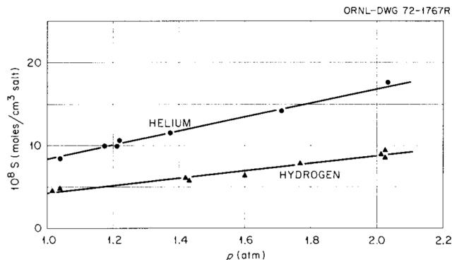  
Fig. 7.1. Pressure dependence of the solubilities of helium and hydrogen in a 66 mole % LiF-35 mole % BeF $_2$ eutectic at $600^{\circ}\mathrm{C}$ . The solid lines correspond to Henry's law constants of $8.40 \times 10^{-8}$ mole of gas per atmosphere per cubic centimeter of salt for helium and $4.34 \times 10^{-8}$ mole of gas per atmosphere per cubic centimeter of salt for hydrogen.

ance, we do not believe it to be serious enough to warrant special study.

Solubility measurements with helium and hydrogen in $\mathrm{Li}_2\mathrm{BeF}_4$ are being conducted at $700^{\circ}\mathrm{C}$ .

# 7.2 INITIAL TRITIUM CHEMISTRY IN THE CORE OF A MOLTEN-SALT REACTOR

R. A. Strehlow

In the analysis of tritium behavior it is necessary to consider what happens when a high-velocity triton is born in a fuel of oxidation potential fixed by the ratio $\mathrm{U}^{3+} / \mathrm{U}^{4+}$ . Half of the tritium in the reference-design MSBR is produced by

$$
{ } ^ { 6 } \mathrm { L i } ^ { + } + n \rightarrow \mathrm { T } ^ { + } + { } ^ { 4 } \mathrm { H e } + 4 . 8 \mathrm { M e V } ,
$$

which gives a triton with an initial energy of $2.7\mathrm{MeV}$ . The triton will lose energy at a rate which may be approximated as one-third that of protons for collision with light elements. This gives an initial value of about $30\mathrm{MeV}g^{-1}\mathrm{cm}^{-2}$ , increasing to $200\mathrm{MeV}g^{-1}\mathrm{cm}^{-2}$ at an energy of $0.05\mathrm{MeV}$ . Integration of this stopping power yields a calculated path length of about $0.05\mathrm{g/cm}^2$ or $0.025\mathrm{cm}$ in salt having a density of $2\mathrm{g/cm}^3$ . This is about a tenth of the minimum dimension of fuel passages in an MSBR, so only a few percent of the initially formed tritium would be expected to reach the graphite before thermalization. Tritons from the ${}^{7}\mathrm{Li}(n,\alpha n)$ reaction are born with generally less energy and would be thermalized in a shorter path length. Thus nearly all the tritium will appear in the salt initially as thermalized tritons.

Some equations for pertinent equilibria involving the thermalized triton are:

For tritium

$$
2 \mathrm {T} ^ {\circ} \rightleftharpoons \mathrm {T} _ {2} (\mathrm {d}), \tag {1}
$$

$$
\mathrm {T} ^ {\circ} + \mathrm {F} ^ {\circ} \rightleftharpoons \mathrm {T F}, \tag {2}
$$

$$
\mathrm {T} ^ {\circ} + \mathrm {U} ^ {4 +} \rightleftharpoons \mathrm {T} ^ {+} + \mathrm {U} ^ {3 +}, \tag {3}
$$

$$
\mathrm {T} ^ {\circ} + \mathrm {C} _ {\text {g r a p h i t e}} \rightleftharpoons \mathrm {C T} _ {\text {a d s o r b e d}}, \tag {4}
$$

$$
\mathrm {T} ^ {\circ} + \mathrm {H} ^ {\circ} \rightleftharpoons \mathrm {T H} (\text {i f h y d r o g e n i s p r e s e n t}), \tag {5}
$$

$$
\mathrm {T} ^ {\circ} + \mathrm {H} _ {2} \rightleftharpoons \mathrm {T H} + \mathrm {H} ^ {\circ} (\text {i f h y d r o g e n i s p r e s e n t}), \tag {6}
$$

$$
\mathrm {T} ^ {\circ} + \mathrm {F . P .} ^ {n +} \rightleftharpoons \mathrm {T} ^ {+} + \mathrm {F . P .} ^ {(n - 1) +}, \tag {7}
$$

where

F.P. is fission product or corrosion product,

$$
\mathrm {T} ^ {+} + e ^ {-} \rightleftharpoons \mathrm {T} ^ {\circ} \tag {8}
$$

viewing the electron as a caged chemical species).

For fluorine, additionally,

$$
\mathrm {F} ^ {-} \rightarrow \mathrm {F} ^ {\circ} + e ^ {-} (\text {d u e t o f i s s i o n r e c o i l}), \tag {9}
$$

$$
\mathbf {F} ^ {\circ} + \mathbf {U} ^ {4 +} \rightleftharpoons \mathbf {U} ^ {5 +} + \mathbf {F} ^ {-}, \tag {10}
$$

$$
\mathrm {F} ^ {\circ} + \mathrm {e} ^ {-} \rightleftharpoons \mathrm {F} ^ {-}, \tag {11}
$$

$$
2 \mathrm {F} ^ {\circ} \rightleftharpoons \mathrm {F} _ {2}, \tag {12}
$$

$$
\mathrm {U} ^ {4 +} + e ^ {-} \rightleftharpoons \mathrm {U} ^ {3 +}. \tag {13}
$$

The fluorine atom reactions have been considered by Jenks. The principal source of fluorine atoms which he considered is indicated as Eq. (9) - the formation of fluorine by the fission recoil atoms during their thermalization. He concluded that it is possible that in the bulk of the melt, $\mathbf{U}^{4+}$ ions serve as scavengers for the radiolytic products $\mathbf{F}^{\circ}$ and $e^{-}$ [in accordance with Eq. (10) and (13)]. From Jenks' calculation a possible steady-state concentration of $\mathbf{F}^{\circ}$ is calculated to equal about $1.5 \times 10^{11} / \mathrm{cm}^3$ , assuming a fission rate of $3 \times 10^{11} \sec^{-1} \mathrm{~cm}^{-3}$ (about $10 \mathrm{~W} / \mathrm{cm}^3$ ) and a uranium(IV) concentration of $5 \times 10^{19} / \mathrm{cm}^3$ . The production of $\mathbf{F}^{\circ}$ associated with tritium production (about $10^{10} \sec^{-1} \mathrm{~cm}^{-2}$ ) would not contribute significantly to the concentration following from the fission recoil process.

Because of this low expected concentration of fluorine atoms and the dominance of $\mathbf{U}^{4+}$ , tritium atoms should be expected to enter into equilibrium with $\mathbf{U}^{4+}$ in accordance with reaction (3). This has been the assumption made previously in consideration of tritium core chemistry. Detailed consideration of reaction rates will be needed to determine the extent to which these conclusions are valid.

# 7.3 PERMEATION OF HYDROGEN THROUGH METALS AT LOW PRESSURES

R.A.Strehlow H.C.Savage

Knowledge of the permeation behavior of hydrogen through iron and nickel-based alloys at low pressures is required for the prediction of tritium behavior in the molten-salt reactor.

Tritium release to the environment from a molten-salt breeder would occur because the isotopes of hydrogen flow readily through hot metals. The tritium is expected to follow the flow of heat through the reactor's heat exchangers into the steam system and thence to the outside world.

At high pressures the permeation rate is proportional to the square root of the pressure, because the hydrogen molecules dissociate into atoms when they enter the metal. A transition to a linear dependence has

generally been reported to occur as the pressure is lowered. The point at which this transition occurs, if at all, is important, since a linear dependence might predict an acceptable tritium flow at some particular pressure, while the square-root relationship would give an intolerably large discharge at the same pressure.

Many workers in the field have stressed the fact that the hydrogen flow rate through materials such as Hastelloy N, iron, and palladium varies with the square root of pressure at higher pressures, but begins to deviate from the square-root dependence below some low pressure. The departure has been reported in the cited work to be significant at pressures as high as 200 torr, although departures beginning at values near 10 torr are more commonly reported. Such departures have been attributed to a reduction in apparent area due to a restricted surface coverage by sorbed hydrogen atoms or by the formation of a film of lower permeability.

Since extrapolation of permeation data to the lower pressures required in a molten-salt reactor is essential in calculations of tritium management schemes, an experimental program was undertaken to measure the pressure dependence of hydrogen permeation through candidate structural materials from pressures of 30 torr down to about $10^{-3}$ torr.

The apparatus is schematically shown in Fig. 7.2. Deuterium, rather than hydrogen, was chosen for this study to avoid problems posed by the large $(10^{-9}$ torr) hydrogen background in the mass spectrometer. A mixture of argon- $4\%$ deuterium is maintained at a total pressure from 1 atm down to $10^{-1}$ torr; regulation of the pressure of this mixture produces the steady-state deuterium pressure of interest and allows accurate pressure measurements to be made readily.

In order to measure the pressure of the permeated deuterium accurately and to maintain a low pressure of deuterium inside the permeation tube, an argon purge is used. Use of an absolute gage to measure the total pressure and a mass spectrometer to measure deuterium concentration of the purge allows accurate determination of the back pressure and correction for back diffusion of deuterium. Flow rate of the argon purge is used in combination with the measured composition to determine the permeation rate of deuterium. Permeated

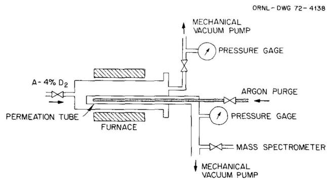  
Fig. 7.2. Low-pressure permeation rate apparatus.

deuterium pressures in the range of $10^{-6}$ torr can be determined readily with this procedure. Only steady-state permeation has been attempted in this work. Consequently, no separate determination of the diffusivity has been made.

Values of the permeation constant obtained for Hastelloy N fall within a factor of 2 of those of Webb. In contrast with the earlier data, however, the pressure dependence of the permeation flow rate was found to follow a square-root relation quite precisely over the entire pressure range studied. This is shown in Fig. 7.3, where the data are presented in the form of an arithmetic plot of hydrogen flow rates vs $\sqrt{P_1} -\sqrt{P_2}$ where $P_{1}$ is the permeation gas partial pressure, and $P_{2}$ is the "back" or "downstream" pressure which must be used as a correction.

Arbitrary permeation flow rate figures, without concern here for sample areas or thicknesses, are used to permit comparison with the earlier work on Hastelloy N. The only explanation offered here for the marked difference between the data obtained in this study and the earlier work is that, previously, pressure rise rates have been generally used at the lowest pressures studied. Since we have observed that steady state may require tens of hours to achieve at low pressures and that permeation flow rates themselves may be in the range of $7 \times 10^{-4}$ cc(STP) $\mathrm{hr}^{-1}$ cm $^{-2}$ , a steady-state method such as the one used here is perhaps better.

The conclusion from these experiments is that for Hastelloy N, a square-root pressure dependence is recommended for extrapolation to low pressures.

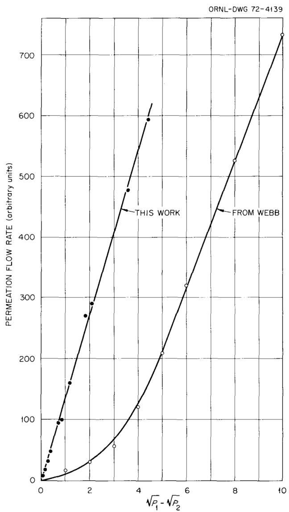  
Fig. 7.3. Permeability of Hastelloy N for hydrogen as a function of $P^{1/2}$ . Comparison of results of this work with those of Webb [Permeation of Hydrogen through Metals, NAA-SR-10462 (July 25, 1965)] at low pressure.

# 7.4 INFLUENCE OF FILMS OR COATINGS ON HYDROGEN PERMEATION RATES

R.A.Strehlow H.C.Savage

Calculations based on the results of the work reported in the preceding section show that bare metal probably does not provide adequate impedance to tritium flow at low pressures. Consequently, to determine whether options might exist to obtain the low flow rates required in a reactor becomes the question. The use of

oxide coatings to impede flow has been proposed, since the permeation rate through oxides should be proportional to the first power of pressure. (It is known that hydrogen does not dissociate upon dissolving in ceramics.) An oxide such as forms on stainless steel in an oxidizing atmosphere $(P_{\mathrm{H_2O}} / P_{\mathrm{H_2}} > 10^{-5}$ for $\mathrm{Cr_2O}$ at $700^{\circ}\mathrm{C})$ might offer, therefore, a useful resistance to permeation flow.

Initial experiments were carried out with the Hastelloy N tube which had been used in the low-pressure study. An argon- $20\%$ oxygen mixture was used to oxidize the external surface of the tube in situ at $690^{\circ}\mathrm{C}$ before determining the permeation behavior. Although a reduction in permeability was observed initially (about a factor of 2), at steady state the permeability had recovered to its value for the unoxidized tube. An experiment designed to deposit a carbon coating by thermal decomposition of methane yielded the same results. However, many hours were required to reach steady-state conditions for the permeation of the hydrogen. It should be noted that equilibrium oxidation conditions for nickel are associated with $P_{\mathrm{H_2O}} / P_{\mathrm{H_2}}$ ratios greater than about 50 at $700^{\circ}\mathrm{C}$ . Even at the lowest pressures used in this study, we believe the conditions used in these experiments were still reducing rather than oxidizing.

Type 304L stainless steel was selected as representative of a class of metals which might behave differently from the Hastelloy N. A permeation tube specimen, cleaned by etching, was installed in the apparatus. Measurements at pressures from 30 to $10^{-2}$ torr at first showed a permeability nearly equal to that of Hastelloy N, with a square-root dependence over the entire range.

Subsequently, over a period of some tens of hours, the permeability was observed to decrease by a factor of about 8. This was presumed due to the formation of the oxide by trace amounts of oxidant in the gas system used in this work.

Surprisingly, the pressure dependence of permeation rate still followed the square-root relation! A reasonable expectation had been that some departure from this should have been observed for any significant reduction or permeability. The logic for this expectation is fairly well seen in Fig. 7.4, which shows the logarithm (permeation flow rate) for various materials and thicknesses as a function of logarithmic pressure of tritium. Zero downstream pressure is assumed here for illustrative purposes. The restriction of loss of tritium from the system must be accomplished by reducing the tritium pressure to values below the intercept of the permeation flow rate with the range indicated, which here corresponds to a loss of 1 to $30\mathrm{Ci/day}$ for an $8\times 10^{7}$ $\mathrm{cm}^2$ heat exchanger.

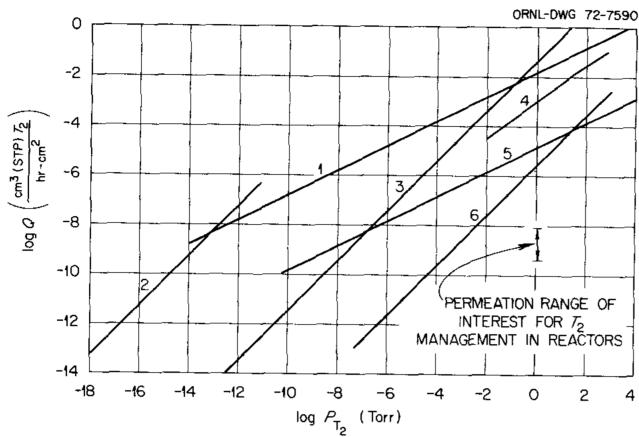  
Fig. 7.4. Tritium fluxes as function of $\mathbf{T}_2$ pressure in the absence of ${}^{1}\mathbf{H}_{2}$ at $600^{\circ}\mathbf{C}$ . Line designations are as follows: $1 =$ Hastelloy N (or stainless steel) $1\mathrm{mm}$ thick, $2 =$ the vacuum impact rate limit, $3 =$ quartz $200\textup{\AA}$ thick, $4 =$ stainless steel oxidized for many hours (this work), $5 =$ calculated value for tungsten 0.006 in. thick, $6 =$ quartz 0.006 in. thick.

For simplicity in operating the tritium removal processes in a reactor, the maximum permissible pressure of tritium determined in this way should be as large as possible. (That is, purge gas volumes needed would then be minimized, and process rates for chemical removal and chemical trapping would then require the minimum mass handling.)

Line 1 in Fig. 7.4 shows the permeability of Hastelloy or freshly etched stainless steel which intercepts the vacuum impact rate, line 2, at a very low pressure but still in the calculated range of interest. As an oxide surrogate the data for quartz were used, $^{11}$ and a thickness of $200\textup{\AA}$ was selected for display as line 3. To account for the diminution of permeation flow rate by the factor observed using this model of two impedances in series with their different pressure dependences, a very nearly first-power dependence should have been evident. The observation of a half-power dependence leads to the conclusion that a film with only partial effectiveness in covering the metal had been obtained.

The temperature was raised to $785^{\circ}\mathrm{C}$ from $700^{\circ}\mathrm{C}$ in order to permit the development of a thicker coating. The range of measurement was also extended to atmospheric pressure. For the stainless steel sample, after some hundreds of hours at temperature, a departure from half power has been obtained with the data varying in a regular and reproducible way from about the two-thirds power at higher pressures to the three

fourths power at lower pressure. This is shown in line 4.

Also shown in Figure 7.4 is the expected permeation rate for a 0.006-in. tungsten coating and a 0.006-in. ceramic coating (again using the value for quartz). These are labeled as lines 5 and 6 respectively.

The relative efficacies of these low-permeability coatings in considering the tritium management question must be viewed, however, in terms of the effect of added protium, since it probably cannot be avoided. The flow impedance offered by metal relative to that offered by oxide is decreased with addition of hydrogen to the system. Combined credit for the coating and for use of this mass action effect cannot be taken except for metal coatings. As a consequence, as shown in Fig. 7.5, the 0.006-in. tungsten coating becomes as good as or better than a ceramic one at pressures near 1 torr of ${}^{1}\mathrm{H}_{2}$ in terms of the maximum tolerable tritium partial pressure. Within the assumptions made here, the possibly achievable factor of $10^{3}$ decrease in tritium permeation rates for the thin ceramic coating and the larger factor for the thick coating simply specify the tolerable partial pressures of tritium both in the absence and presence of protium.

The questions about coating use thus become those associated with ways to overcome the unavoidable differential thermal expansion problem and to achieve minimum porosity in the coating.

# 7.5 EXPERIMENTS ON HYDROGEN EVOLUTION FROM FLUOROBORATE COOLANT SALT

S. Cantor R. M. Waller

The objectives of these experiments are to (1) confirm the relatively high analytical concentrations of

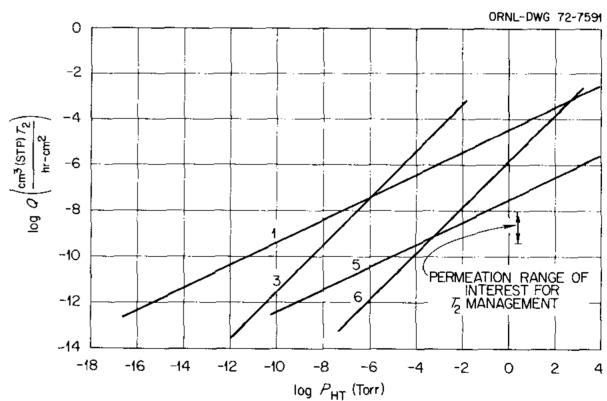  
Fig. 7.5. Tritium fluxes as function of HT pressure calculated at $600^{\circ}\mathbf{C}$ in the presence of 1 torr of ${}^{1}\mathrm{H}_{2}$ . Line designations are as follows: $1 =$ Hastelloy N (or stainless steel) $1\mathrm{mm}$ thick, $3 =$ quartz - 200 Å thick, $5 =$ tungsten - 0.006 in. thick, $6 =$ quartz - 0.006 in. thick.

hydrogen (20 to 50 ppm) reported for samples of fluoroborate coolant salt taken from thermal convection loops and (2) measure the pressure of $\mathbf{H}_2$ gas in equilibrium with hydrogen within the salt samples. The apparatus and gas handling techniques for these experiments are the same as for previous studies of hydrogen evolution and tritium exchange. $^{12}$

Two fluoroborate samples were provided for this study from natural convention loop 14. Previous analyses of salt from this loop had shown: O, 3900 ppm; Cr, 350 ppm; Ni, $< 4$ ppm. A small part of the first sample, when analyzed by the infra-absorption method, showed 26 ppm hydrogen. The remainder of the first sample $(29.6\mathrm{g})$ was loaded, in a dry box, along with Hastelloy N coupons into a nickel capsule. The capsule was subsequently evacuated and sealed off by welding a crimped section of an attached tube. The capsule was next placed in the quartz enclosure of the gas handling apparatus, in which it was heated to $535^{\circ}\mathrm{C}$ . In the apparatus the gas pressure, exerted predominantly by hydrogen diffusing out of the capsule, was measured with a McLeod gage; samples of gas were intermittently collected and analyzed for hydrogen by gas chromatograph.

The sample was maintained at $535^{\circ}\mathrm{C}$ for 61 days; in this period the equivalent of 23 ppm hydrogen escaped as gas from the nickel capsule. The experiment was terminated when the permeation rate out of the capsule had decreased to less than 0.025 std $\mathrm{cm}^3$ per day. Such small quantities of hydrogen are difficult to analyze accurately by gas chromatograph.

The reaction producing gaseous hydrogen can be represented by the equation

$$
\mathrm {O H} ^ {-} + \frac {1}{3} \mathrm {C r} \rightleftharpoons \frac {1}{3} \mathrm {C r} ^ {3 +} + \mathrm {O} ^ {2 -} + \frac {1}{2} \mathrm {H} _ {2} \uparrow . \tag {1}
$$

The equilibrium quotient is given by

$$
Q = \frac {\left(\mathrm {C r} ^ {3 +}\right) ^ {1 / 3} \left(\mathrm {O} ^ {2 -}\right) P _ {\mathrm {H} _ {2}} ^ {1 / 2}}{a _ {\mathrm {C r}} ^ {1 / 3} (\mathrm {O H} ^ {-})}, \tag {2}
$$

where the quantities in parentheses are concentrations (e.g., g-ions/g of salt), $a_{\mathbf{Cr}}$ is the activity of chromium $(\sim 0.1)$ in Hastelloy N, and $P_{\mathrm{H_2}}$ is the partial pressure of hydrogen.

Since the concentrations of $\mathrm{Cr}^{3+}$ and $\mathrm{O}^{2-}$ at the start of the experiment greatly exceeded that produced in

the experiment, the equilibrium quotient can be simplified to

$$
\begin{array}{l} Q = 3 9 0 0 \left(\frac {3 5 0}{0 . 1}\right) ^ {1 / 3} \frac {P _ {\mathrm {H} _ {2}} ^ {1 / 2}}{(\mathrm {O H} ^ {-})} \\ = 5. 9 \times 1 0 ^ {- 4} \frac {P _ {\mathrm {H} _ {2}} ^ {1 / 2}}{(\mathrm {O H} ^ {-})}. \tag {3} \\ \end{array}
$$

Thus one can obtain $Q$ by measuring equilibrium pressures of hydrogen corresponding to $\mathrm{OH}^-$ concentrations calculated by mass balance from the original 26-ppm hydrogen concentration.

During the experiment, hydrogen pressures were measured after allowing at least three days for the hydrogen passing out of the capsule to equilibrate with the hydrogen within the capsule. The data and calculated $Q$ are given in Table 7.1.

Postexperimental analysis of the salt for hydrogen showed $23~\mathrm{ppm}$ , substantially greater than the expected $3~\mathrm{ppm}$ based upon the original analysis $(26~\mathrm{ppm})$ minus the amount removed in the experiment $(23~\mathrm{ppm})$ . At present this discrepancy is difficult to understand. Using the postexperimental analysis for calculating the equilibrium quotient of reaction (1), we obtain $Q \sim 0.72$ , a factor of 5 less than that based on the original hydrogen analysis (see Table 7.1).

Another nickel capsule, containing the second sample from loop 14, has been installed in our apparatus; an experiment similar to the one detailed above is in progress. The infrared analysis of this particular sample, prior to encapsulation, showed $45~\mathrm{ppm}$ hydrogen.

In summary, our experiments thus far suggest: (a) Substantial concentrations of hydrogen were present in the samples supplied from loop 14. At least 26 ppm hydrogen could be accounted for in the first experiment; this level of hydrogen, if maintained in the

Table 7.1. Equilibrium quotients for reaction (1)   

<table><tr><td>PH2(atm × 10-4)</td><td>Hydrogen previously removed from salt (μg/g of salt)</td><td>Q [based on Eq. (3) and 26 ppm H at start]</td></tr><tr><td>1.61</td><td>13</td><td>3.4</td></tr><tr><td>0.43</td><td>18.3</td><td>3.0</td></tr><tr><td>0.31</td><td>20.2</td><td>3.3</td></tr><tr><td>0.25</td><td>21.3</td><td>3.7</td></tr><tr><td>0.20</td><td>21.8</td><td>3.7</td></tr><tr><td>0.125</td><td>22.7</td><td>3.7</td></tr><tr><td></td><td></td><td>Av 3.5</td></tr></table>

coolant loop of the MSBR, is more than adequate as a sink for tritium. (b) Relatively high oxide and chromium ion concentrations are beneficial for retaining hydroxide in fluoroborate. In reaction (1) and in the equilibrium quotient (2) the hydrogen pressure to the one-half power in inversely proportional to the oxide concentration; we may, therefore, expect that the hydrogen permeation rate (which probably follows a $\frac{1}{2}$ power law) will also be inversely proportional to oxide concentration. (c) The relatively high concentration of hydroxide in the salt in loop 14 is almost certainly a reflection of the low permeation of hydrogen through the metal walls. Since this loop has been operating for a few years, it is likely that there is a fairly thick, coherent oxide coating on the outer surfaces. Hopefully, high-pressure steam will deposit a similar coating on the tube walls of the steam-raising system in an MSBR.

# 7.6 APPARATUS FOR INFRARED SPECTRAL STUDIES OF MOLTEN SALTS

J.P.Young J.B.Bates G.E.Boyd d

Spectral studies of molten $\mathrm{NaF - NaBF_4}$ that had been contacted with $\mathbf{D}_3\mathbf{BO}_3$ exhibited an absorption band attributable to $\mathrm{BF}_3\mathrm{OD}^-$ (ref. 13); these studies were carried out in $\mathrm{SiO}_2$ cells. Since then, a small furnace assembly and an $\mathrm{LaF_3}$ -windowed nickel cell have been designed and fabricated so that melts compatible with these materials of construction can be studied by infrared spectral techniques. The apparatus can be used for several fluoride melts of interest to the MSR project, but the first studies have been of melts of $\mathrm{BF}_3\mathrm{OH}^-$ and/or $\mathrm{BF}_3\mathrm{OD}^-$ in molten $\mathrm{NaF - NaBF_4}$ . The furnace and cell are shown in Fig. 7.6.

The furnace was fabricated by LaMont Scientific Company (State College, Pennsylvania), from a conceptual design that we developed. The furnace is small enough to fit in the sample space of a Perkin-Elmer spectrophotometer or a Digilab FTS-20 spectrometer, or even within a Perkin-Elmer $4 \times$ beam condenser. It is anticipated that this apparatus can also be used in the emission attachment for the FTS spectrometer. The heated portion of the furnace consists of a boron nitride (BN) tube, $3/4$ in. ID, wound with resistance heating wire. Boron nitride wool insulation surrounds the tube, and the assembly is enclosed in a metal can

that is open at the ends, which are aligned with the BN tube ends. These ends are water cooled, equipped with Viton O-rings, and will accept infrared transmitting windows. At present we are using AgCl or AgBr windows. The furnace with windows in place is vacuum tight and can be operated under vacuum, or with an atmosphere of inert gas. A control box associated with the furnace is capable of regulating a preset temperature to less than $1^{\circ}\mathrm{C}$ . There is also a design arrangement so that a gas bubbler (or diffusion) tube can be inserted into the furnace and infrared cell so that melts in the cell can react with gases of interest.

The cell, shown assembled in Fig. 7.6, consists of a nickel body designed to accept two $\mathrm{LaF}_3$ windows. The windows are held in place by nickel retainers, and the retainers are pressed against the windows by the small screws seen at the windowed ends of the cell. The apparatus is designed so that the windows can be used without a gasket as in the diamond-windowed cells. $^{14}$ In some of our early experiments it seemed that molten $\mathrm{NaF - NaBF_4}$ leaked around the windows. Accordingly, gold gaskets (0.005 in. thick) are now being used between the window and the cell body.

The operation of the cell and furnace has been satisfactory; however, some cell windows have cracked, probably as a result of samples having been cycled through the freezing point a number of times. (Thermal expansion on melting of a previously frozen sample could put a severe strain on crystalline windows.) The thermal characteristics of the furnace have been quite satisfactory; a regulated temperature of $450^{\circ}\mathrm{C}$ can be obtained rapidly (i.e., in less than 15 min) after a sample has been loaded. To load the cell into the furnace, one of the furnace windows is removed; the cell containing the sample is placed in the center of the furnace tube, and the window is resealed so that the atmosphere in the furnace can be flushed with argon.

# 7.7 INFRARED SPECTRAL STUDIES OF THE CHEMICAL BEHAVIOR OF $\mathsf{BF}_3\mathsf{OH}^-$ AND $\mathsf{BF}_3\mathsf{OD}^-$ IONS IN MOLTEN NaF-NaBF4

J.B.Bates J.P.Young G.E.Boyd

Recent infrared measurements15 with solutions of $\mathrm{BF}_3\mathrm{OH}^-$ in molten and crystalline $\mathrm{NaF - NaBF_4}$ established that this protonic species was stable with respect to unimolecular decomposition at temperatures below

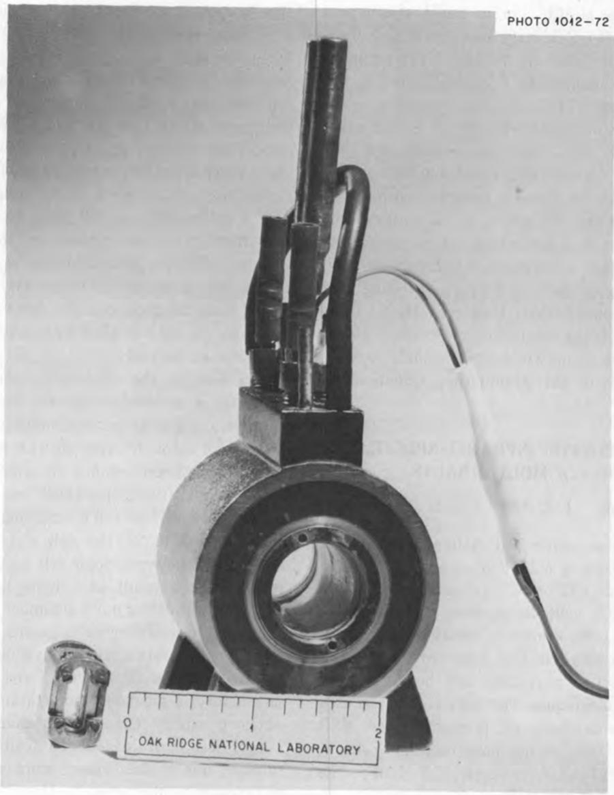  
Fig. 7.6. Photograph of LaF-windowed cell and infrared furnace.

$650^{\circ}\mathrm{C}$ . These studies also showed that reactions of $\mathbf{D}_2$ with NaF- $\mathrm{NaBF_4}$ melts containing $\mathrm{BF}_3\mathrm{OH}^-$ ions produced $\mathrm{BF}_3\mathrm{OD}^-$ ions by isotopic exchange and/or via reactions involving oxide impurities; for example,

$$
\mathrm {D} _ {2} + \mathrm {B} _ {2} \mathrm {F} _ {6} \mathrm {O} ^ {2 -} + \mathrm {M O} \rightarrow 2 \mathrm {B F} _ {3} \mathrm {O D} ^ {-}. \tag {1}
$$

Additional experiments were designed to further study the chemical behavior of $\mathrm{BF}_3\mathrm{OH}^-$ dissolved in molten NaF-NaBF4 and, in particular, to discover the mechanism by which $\mathrm{BF}_3\mathrm{OD}^-$ is formed on reaction of $\mathrm{D}_2$ with these melts.

The high-temperature microinfrared furnace employed is described in detail in Sect. 7.6. $^{16}$ The

$\mathrm{LaF}_3$ -windowed sample cell permitted infrared measurements to be made over the region from 2400 to $4000~\mathrm{cm}^{-1}$ . The silica cells and high-temperature furnace used in the earlier studies were also useful in the more-recent experiments.15

The spectrum shown in Fig. 7.7A was obtained from an NaF-NaBF $_4$ melt containing about 25 ppm hydrogen as $\mathrm{BF}_3\mathrm{OH}^-$ . The band centered at $3645~\mathrm{cm}^{-1}$ is assigned to the OH stretching mode of $\mathrm{BF}_3\mathrm{OH}^-$ based on the previous solid-solution measurements. $^{15}$ As

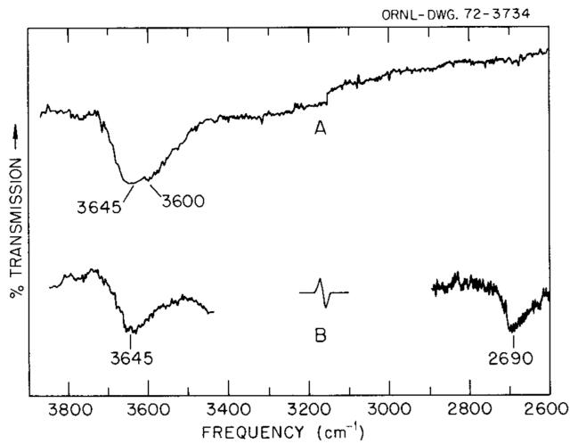  
Fig. 7.7. Infrared spectra of molten NaF-NaBF $_4$ contained in LaF-windowed cell. (A) Melt before treatment with $\mathbf{D}_2$ ; (B) melt after treatment with $\mathbf{D}_2$ .

observed in this case, some melts exhibited a second band at about $3600~\mathrm{cm}^{-1}$ , which may be due to a species such as $\mathrm{B}_3\mathrm{F}_5\mathrm{O}_3\mathrm{OH}^{3-}$ . The spectrum of Fig. 7.7B was measured from the same melt after bubbling $\mathrm{D}_2$ gas through it for about $5\mathrm{min}$ . The band at 2690 $\mathrm{cm}^{-1}$ was previously observed in an $\mathrm{NaF - NaBF_4}$ melt which had been spiked with $\mathrm{D}_3\mathrm{BO}_3$ . This band is due to the OD stretching mode of $\mathrm{BF}_3\mathrm{OD}^-$ . Because the nickel had not been previously hydrogen fired, the $\mathrm{BF}_3\mathrm{OD}^-$ could have been produced either by isotopic exchange with $\mathrm{BF}_3\mathrm{OH}^-$ or by a reaction which depends on the reduction of $\mathrm{Ni}^{2+}$ ions by $\mathrm{D}_2$ :

$$
\mathrm {N i} ^ {2 +} + \mathrm {D} _ {2} \rightarrow \mathrm {N i} ^ {0} + 2 \mathrm {D} ^ {+}. \tag {2}
$$

Following these measurements, the nickel cell and deuterium bubbler were cleaned and hydrogen fired. The initial experiment was then repeated, but the band at $2690~\mathrm{cm}^{-1}$ was not observed after bubbling $\mathbf{D}_2$ through the melt for time periods of up to $30\mathrm{min}$ . Considerable difficulty was encountered at this point with loss of sample through the top of the cell because of a vapor lock with the $\mathbf{D}_2$ gas.

The infrared spectra of $\mathrm{NaF - NaBF_4}$ melts contained in silica cells are presented in Fig. 7.8. The salt sample was the same as before (25 ppm H). Figure 7.8A shows the melt spectrum prior to $\mathbf{D}_2$ treatment. The band at about $3670~\mathrm{cm}^{-1}$ is due to the hydroxyl impurities in the silica cell. After bubbling $\mathbf{D}_2$ through the molten salt for $10\mathrm{min}$ , the band at $2690~\mathrm{cm}^{-1}$ appeared as shown. Additional $\mathbf{D}_2$ treatment was continued for 30

min, but no change in absorbancy of the $2690~\mathrm{cm}^{-1}$ band was detected. To determine if reduction by $\mathbf{D}_2$ of a metal ion is the primary step in the production of $\mathrm{BF}_3\mathrm{OD}^-$ , a crystal of $\mathrm{FeF_2}$ was added to the melt, and the treatment with $\mathbf{D}_2$ was resumed. The infrared spectrum measured after about 10 min of bubbling is shown in Fig. 7.8B. Rather than an increase in the intensity of the $2690~\mathrm{cm}^{-1}$ band, an additional band at about $2750~\mathrm{cm}^{-1}$ was observed. The above experiment was repeated with the addition of NiO to the melt in place of $\mathrm{FeF_2}$ . The spectrum after $\mathbf{D}_2$ treatment (Fig. 7.8C) exhibited bands at 2835 and $2750~\mathrm{cm}^{-1}$ in addition to the one at $2690~\mathrm{cm}^{-1}$ .

Some tentative conclusions may be drawn on the basis of the experimental results described above: (1) Direct isotopic exchange of $\mathrm{BF}_3\mathrm{OH}^-$ with $\mathbf{D}_2$ did not occur to a measurable extent. (2) The reaction responsible for the production of $\mathrm{BF}_3\mathrm{OD}^-$ on bubbling $\mathbf{D}_2$ into molten NaF-NaBF $_4$ involved reducing some chemical species present in the melt with $\mathbf{D}_2$ :

$$
\mathrm {A} ^ {n +} + \mathrm {D} _ {2} \rightarrow \mathrm {A} ^ {(n - 2) ^ {+}} + 2 \mathrm {D} ^ {+}. \tag {3}
$$

As suggested previously, $^{15}$ the $\mathbf{D}^{+}$ ions may then react with $\mathrm{BF}_3\mathrm{OH}^-$ and/or with oxides such as $\mathrm{B}_3\mathrm{F}_6\mathrm{O}_3$ to

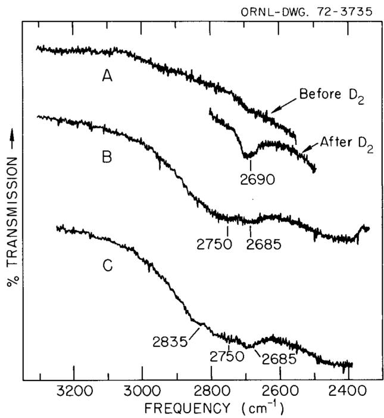  
Fig. 7.8. Infrared spectra of molten NaF-NaBF $_4$ contained in silica cells. (A) Melt before and after treatment with $\mathrm{D}_2$ ; (B) melt after addition of $\mathrm{FeF}_2$ and treatment with $\mathrm{D}_2$ ; (C) melt after addition of NiO and treatment with $\mathrm{D}_2$ .

form $\mathrm{BF}_3\mathrm{OD}^-$

$$
\mathrm {D} ^ {+} + \mathrm {B F} _ {3} \mathrm {O H} ^ {-} \rightarrow \mathrm {B F} _ {3} \mathrm {O D} ^ {-} + \mathrm {H} ^ {+}, \tag {4}
$$

$$
F ^ {-} + D ^ {+} + 1 / _ {3} B _ {3} F _ {6} O _ {3} ^ {3 -} \rightarrow B F _ {3} O D ^ {-}. \tag {5}
$$

(3) The species reduced in Eq. (3) was not necessarily a corrosion product such as $\mathrm{Fe}^{2+}$ or $\mathrm{Ni}^{2+}$ , since no evidence of increased production of $\mathrm{BF}_3\mathrm{OD}^-$ was detected on addition of solid $\mathrm{FeF}_2$ or NiO to the melt.

Clearly, further experiments must be performed to determine if $\mathrm{BF}_3\mathrm{OD}^-$ ions can be produced on diffusion of $\mathbf{D}_2$ through a metal tube immersed in molten NaF-NaBF $_4$ . Furthermore, additional studies will be directed toward understanding the mechanism by which $\mathrm{BF}_3\mathrm{OD}^-$ is produced in $\mathbf{D}_2$ -treated NaF-NaBF $_4$ melts.

# 7.8 THERMAL STABILITY OF $\mathrm{NaNO}_3$ , $\mathrm{KNO}_3$ , $\mathrm{NaNO}_2$ , AND HITEC

J.D.Redman C.F.Weaver

A mass spectrometric study of the thermal stability of $\mathrm{NaNO}_3$ , $\mathrm{KNO}_3$ , $\mathrm{NaNO}_2$ , and HITEC was made as part of an evaluation of their potential use as coolants in molten-salt reactors. In such salt mixtures as HITEC, $\mathrm{NaNO}_2$ - $\mathrm{NaNO}_3$ - $\mathrm{KNO}_3$ (40-7-53 wt%), the reaction

$$
\mathrm {H} _ {2} + 2 \mathrm {K N O} _ {3} \rightleftharpoons 2 \mathrm {K N O} _ {2} + \mathrm {H} _ {2} \mathrm {O},
$$

which has a large negative standard free energy, may afford the means to convert elemental tritium to tritiated water, and thus provide a means to control its distribution. Since nitrates and nitrites are known to decompose thermally, it was useful to determine what additional vapor species were formed.

Reagent-grade $\mathrm{NaNO}_3$ , $\mathrm{KNO}_3$ , and $\mathrm{NaNO}_2$ were dehydrated by bubbling helium gas (which had been dried by passage through activated charcoal at liquid-nitrogen temperature) through the molten salt. These dehydrations were continued for about 16 hr at temperatures of 345, 320, and $285^{\circ}\mathrm{C}$ for $\mathrm{KNO}_3$ , $\mathrm{NaNO}_3$ , and $\mathrm{NaNO}_2$ respectively. The $\mathrm{NaNO}_2$ cooled to a hard, yellow glass. The other two salts were relatively soft and nearly white. Handling and storage of the dehydrated materials were done in a dry-box atmosphere. Subsequent mass spectrometric studies showed the purification technique to be successful with respect to $\mathrm{H}_2\mathrm{O}$ removal.

Small samples of each of the salts were monitored during evaporation from a nickel Knudsen cell. Vapor species of each salt began to appear 5 to $10^{\circ}\mathrm{C}$ above the

preparation temperature. Decomposition pressures limited the upper temperature to approximately $125^{\circ}\mathrm{C}$ above the preparation temperatures and about $100^{\circ}\mathrm{C}$ below the temperature of MSR interest.

All three salts evolved NO. In addition, the nitrates produced $\mathrm{O}_2$ and the nitrite produced $\mathbf{N}_2$ . Appearance potentials and relative intensities of the fragments confirmed the identity of these molecules. These permanent gases do not allow accurate pressure measurements because of background interference, but the total pressures were certainly in the range of 0.1 to 1 torr at the upper temperature limit $(450^{\circ}\mathrm{C})$ . In addition to the NO, $\mathrm{O}_2$ , and $\mathbf{N}_2$ , Na and K were carried into the gas phase by some unidentified species. The appearance potentials of the $\mathrm{Na}^{+}$ and $\mathbf{K}^{+}$ ions make it clear that the Na and K were not present as the metal vapors. Both $\mathrm{NaNO}_3$ and $\mathrm{NaNO}_2$ attacked the nickel cell and produced NiO.

These results are in agreement with the conclusion of Kust and Burke $^{16}$ that nitrate melts decompose at lower temperatures than previously suggested, $^{17,18}$ though Kust and Burke did not determine the composition of the evolved gases. The earlier higher temperature studies $^{17}$ (600 to $780^{\circ}\mathrm{C}$ ) produced mixtures of $\mathrm{O}_2$ , $\mathrm{N}_2$ , and $\mathrm{NO}_2$ , while at the lower temperatures (up to $450^{\circ}\mathrm{C}$ ) of these experiments we saw NO and $\mathrm{N}_2$ or NO and $\mathrm{O}_2$ for nitrite and nitrate respectively.

A batch of HITEC was prepared from the previously purified components. Dry helium gas was bubbled through the molten mixture, contained in a glass flask, overnight at $180^{\circ}\mathrm{C}$ . The cooled, nearly white, very hard material was ground, handled, and stored in a dry box. A sample of the ground and well-mixed material was evaporated in a nickel Knudsen cell over the temperature range 200 to $600^{\circ}\mathrm{C}$ . Decomposition products appeared near $275^{\circ}\mathrm{C}$ . The gases $\mathrm{NO}$ , $\mathrm{O}_2$ , $\mathrm{N}_2$ , and possibly $\mathrm{N}_2\mathrm{O}$ were observed over this mixture as well as unidentified species carrying Na and K in a nonmetallic form. Total pressures were about an order of magnitude lower for the ternary mixture when compared with the components at the same temperatures. Interestingly, NiO was not detected in the residue from this experiment.

Studies of these materials at higher temperatures will require a different approach, such as transpiration and off-gas analysis, since the pressures will be above the range acceptable with the mass spectrometer.

# 8. Fluoroborate Chemistry

# 8.1 SOLUBILITY OF $\mathbf{BF}_3$ IN FLUORIDE MELTS

S. Cantor R. M. Waller

The solubility measurements of $\mathrm{BF}_3$ in fluoride melts serve to determine the activity of fluoride ion in molten mixtures of LiF-BeF $_2$ , LiF-BeF $_2$ -ThF $_4$ , and LiF-ThF $_4$ . Since the scope of this program involves measurements in a relatively large number of melts, we have changed our method of measurement from the sparge-and-strip technique $^1$ to a new method which generates data faster and, probably, with greater accuracy.

In the present method, $\mathrm{BF}_3$ pressures are measured in a cylindrical nickel vessel containing a weighed sample of salt and a known vapor volume. Once the vapor space in the vessel is determined, the inert, virtually insoluble calibrating gas (argon) is evacuated; a measured amount of $\mathrm{BF}_3$ is then introduced into the evacuated vessel. The fraction of $\mathrm{BF}_3$ that does not dissolve in the sample is calculated from the pressure, volume, and temperature profile of the vapor space. Salt charges are usually sufficiently large to dissolve at least $80\%$ of the $\mathrm{BF}_3$ introduced into the vessel. Pressures are read off a strip-chart recorder which tracks the output from a stainless steel strain-gage transducer connected to a riser on the vessel. The vessel is positioned in a furnace mounted on a motor-driven rocker.

As a test of the reliability of the new method, $\mathrm{BF}_3$ solubilities were measured in LiF-BeF $_2$ (66-34 mole %) in the temperature range 498 to $839^{\circ}\mathrm{C}$ . The solubility of $\mathrm{BF}_3$ per unit pressure, that is, Henry's law constant, agreed closely with that obtained in the sparge-and-strip method (see Table 8.1). Solubilities of $\mathrm{BF}_3$ in two other LiF-BeF $_2$ melts were also measured. These data and some derived enthalpies of solution are listed in Table 8.2.

Previously, we have reported² that Henry's law constants for $\mathbf{BF}_3$ solubility varied linearly with the thermodynamic activities³ of LiF in the system LiF-BeF₂. As Fig. 8.1 shows, the newer data obtained in three LiF-BeF₂ mixtures exhibit this linear behavior.

Table 8.1. Solubility of $\mathbf{BF}_3$ (mole $\%/\mathrm{atm}$ ) in 66-34 mole $\%$ LiF-BeF $_2$   

<table><tr><td rowspan="2">Temperature (°C)</td><td colspan="2">Solubility (mole %/atm)</td><td rowspan="2">Difference (%)</td></tr><tr><td>Present method</td><td>Sparge-and-strip method</td></tr><tr><td>500</td><td>0.757</td><td>0.779</td><td>2.9</td></tr><tr><td>650</td><td>0.147</td><td>0.148</td><td>0.7</td></tr><tr><td>800</td><td>0.0454</td><td>0.0448</td><td>1.3</td></tr></table>

Further, the newer results are consistent with previous data² obtained in compositions with greater LiF concentrations.

Solubilities of $\mathbf{BF}_3$ were also measured in MSBR fuel solvent (72-16-12 mole $\%$ LiF-BeF $_2$ -ThF $_4$ ). The data are summarized in Table 8.2. When we apply the isotherms of Fig. 8.1 to the Henry's law constants in this solvent, the calculated activities of LiF are 0.21, 0.225, and 0.255 at 500, 600, and $700^{\circ}\mathrm{C}$ respectively. The LiF activities in MSBR fuel solvent are about one-half those in 72-28 mole $\%$ LiF-BeF $_2$ . This trend is consistent with other observations (e.g., LiF liquidus curves) which show that LiF-ThF $_4$ interactions are considerably stronger than LiF-BeF $_2$ interactions.

# 8.1.1 Reactor Applications

Assuming that the $\mathrm{BF}_3$ solubility in MSBR fuel solvent is about the same with or without $0.3\mathrm{~mol}\%$ ${}^{233}\mathrm{UF}_4$ , then at $704^{\circ}\mathrm{C}$ ( $1300^{\circ}\mathrm{F}$ ) the $\mathrm{B} / {}^{233}\mathrm{U}$ ratio would be 0.31 under a $\mathrm{BF}_3$ partial pressure of 1 atm. Since the boron coefficient of reactivity is approximately 0.5 multiplied by the atomic ratio, $\mathrm{B} / \mathrm{U},^5$ then

1. S. Cantor and W. T. Ward, MSR Program Semiannu. Progr. Rep. Aug. 31, 1970, ORNL-4622, p. 78.   
2. S. Cantor and R. M. Waller, MSR Program Semiannu. Progr. Rep. Aug. 31, 1971, ORNL-4728, pp. 78-79.   
3. B. F. Hitch and C. F. Baes, Jr., Inorg. Chem. 8, 201 (1969).   
4. R. E. Thoma (ed.), Phase Diagrams of Nuclear Reactor Materials, ORNL-2548, pp. 33, 72 (November 1959).   
5. J. R. Engel, ORNL, personal communication.

Table 8.2. Solubility of $\mathbf{BF}_3$ in molten fluoride solvents and enthalpy of solution   

<table><tr><td colspan="3">Solvent (mole %)</td><td rowspan="2">Temperature range measured (°C)</td><td rowspan="2">Henry&#x27;s law constant-temperature equation; \( {}^{a}{K}_{\mathrm{H}}{}^{b} \) in mole fraction \( {\mathrm{{BF}}}_{3}/\mathrm{{atm}} \) ; temperature in \( {}^{ \circ  }\mathrm{K} \)</td><td rowspan="2">\( \Delta \mathrm{H} \) (kcal/mole)</td></tr><tr><td>LiF</td><td>\( {\mathrm{{BeF}}}_{2} \)</td><td>\( {\mathrm{{ThF}}}_{4} \)</td></tr><tr><td>66</td><td>34</td><td></td><td>498 to 839</td><td>\( \ln {K}_{\mathrm{H}} =  - {14.949} + {7782}/T \)</td><td>-15.5</td></tr><tr><td>60</td><td>40</td><td></td><td>474 to 810</td><td>\( =  - {15.232} + {7452}/T \)</td><td>-14.8</td></tr><tr><td>50.1</td><td>49.9</td><td></td><td>408 to 600</td><td>\( =  - {16.614} + {7771}/T \)</td><td>-15.4</td></tr><tr><td>72</td><td>16</td><td>12</td><td>530 to 795</td><td>\( =  - {14.950} + {7667}/T \)</td><td>-15.2</td></tr></table>

$a_{\mathrm{Least-squares}}$ fit of the data,   
$b_{\mathrm{Experimental}}$ error in $K_{\mathbf{H}}$ is approximately $\pm 5\%$

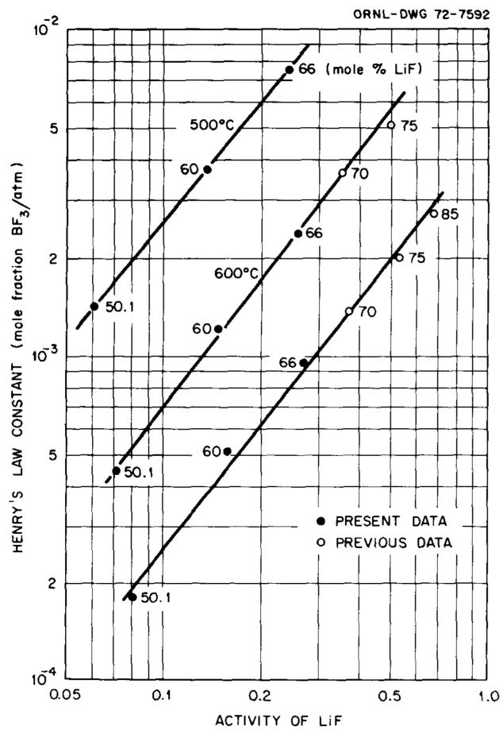  
Fig. 8.1. Henry's law solubility of $\mathrm{BF}_3$ vs activity of LiF in molten LiF-BeF $_2$ at 500, 600, and $700^{\circ}\mathrm{C}$ .

at this temperature and the $\mathrm{BF}_3$ equilibrium pressure, the reactivity loss would be $15.5\%$ ; this number is about eight times greater than a $2\%$ reactivity loss which assures subcriticality. Thus fairly low pressures of $\mathrm{BF}_3$ in equilibrium with MSBR fuel salt are sufficient for

positive shutdown of the reactor. To obtain some idea about the rate of $\mathrm{BF}_3$ dissolution in fuel salt, we permitted $\mathrm{BF}_3$ to flow into the vapor space of an evacuated vessel containing $2\mathrm{kg}$ of MSBR fuel solvent at $585^{\circ}\mathrm{C}$ . Except for possible convection currents, the salt remained quiescent during the gas inflow. Under a $\mathrm{BF}_3$ pressure of 28 psig, the initial rate of dissolution was $0.63\times 10^{-6}$ mole of $\mathrm{BF}_3$ per minute per cubic centimeter of salt. This rate of dissolution corresponds to a B/U atom ratio of 0.004 per minute, and if this rate prevailed in a reactor, subcriticality would have occurred in $10\mathrm{min}$ . However, this time interval refers to a stagnant salt melt and a relatively low driving force of 28 psig of $\mathrm{BF}_3$ . Very simple improvement in $\mathrm{BF}_3$ injection, together with circulation of the salt, would have greatly shortened the time to subcriticality. These considerations suggest that $\mathrm{BF}_3$ gas at moderate pressures can be effective in a backup scram system in the MSBR. The $\mathrm{BF}_3$ could be subsequently removed from the salt by first sparging with helium, followed by neutronically "burning" any boron residue in the salt.

The measurements of $\mathrm{BF}_3$ solubility in MSBR fuel solvent are also useful in estimating certain effects of mixing fluoroborate coolant and MSBR fuel salt. If fluoroborate coolant were to leak into the MSBR fuel circuit, the $\mathrm{NaBF}_4$ in the coolant would decompose to NaF and $\mathrm{BF}_3$ ; the former would dissolve in the salt, while the latter would distribute between the salt and the vapor space. The equilibrium distribution can be calculated from the following equations:

$$
n _ {T} = n _ {g} + n _ {s}, \tag {1}
$$

$$
\frac {n _ {s}}{n _ {g}} = \frac {R T K _ {H}}{\bar {V} _ {M}} \frac {V _ {s}}{V _ {g}}, \tag {2}
$$

where $n_T$ is the total number of moles of $\mathrm{BF}_3$ leaking in from the coolant; $n_g$ and $n_s$ are the number of moles of $\mathrm{BF}_3$ in the vapor space and in the salt respectively; $R$ is the gas constant; $\overline{V}_M$ is the molar volume of the salt in the fuel circuit; $T$ is the temperature in degrees Kelvin; $V_s$ and $V_g$ are the volumes of salt and vapor space in the fuel circuit (to a good approximation, $V_g / V_s$ is the void fraction in the salt); and $K_{\mathrm{H}}$ is Henry's law constant in moles of $\mathrm{BF}_3$ per mole of salt per atmosphere of $\mathrm{BF}_3$ , almost the same as the units of $K_{\mathrm{H}}$ in Table 8.2. Equation (2) is readily derived from the ideal gas law in conjunction with simple dimensional considerations.

A simple application of the above equations involves the case of a low inleakage such that $K_{\mathrm{H}}$ is not very different from the $K_{\mathrm{H}}$ of the fuel itself. Assume $T = 950^{\circ}\mathrm{K}$ $(1250^{\circ}\mathrm{F})$ and a void fraction of 0.01; also $R = 82.054~\mathrm{cm}^3\cdot \mathrm{atm} / (^{\circ}\mathrm{K}\cdot \mathrm{mole})$ and $\overline{V}_s = 19.5~\mathrm{cm}^3 /\mathrm{mole}$ . Solving Eq. (2),

$$
\begin{array}{l} \frac {n _ {s}}{n _ {g}} = \frac {8 2 . 0 5 4 \times 9 5 0}{1 9 . 5} \exp (- 1 4. 9 5) \\ \times \exp (7 6 6 7 / 9 5 0) \times \frac {1}{0 . 0 1} = 4 1 1. \\ \end{array}
$$

The magnitudes of $n_{s}$ and $n_{g}$ would then be calculated from Eq. (1).

# 8.2 FREE ENERGIES OF FORMATION OF $\mathrm{NaFeF}_3$ AND $\mathrm{NaNiF}_3$ ; THEIR RELATIONSHIP TO THE CORROSION OF HASTELLOY N BY FLUOROBORATES

B. F. Hitch C. E. Bamberger C. F. Baes, Jr.

The double salts $\mathrm{NaNiF}_3$ and $\mathrm{NaFeF}_3$ have been shown to be stable, relatively insoluble compounds in molten $\mathrm{NaF - NaBF_4}$ mixtures. A knowledge of their formation free energies would permit an estimate of the equilibrium position of such corrosion reactions as

$$
\begin{array}{l} 2 \mathrm {H F} (\mathrm {g}) + \mathrm {N i} (\text {H a s t l e l o y N}) \\ + \mathrm {N a F} (\mathrm {d}) \rightleftharpoons \mathrm {N a N i F} _ {3} (\mathrm {c}) + \mathrm {H} _ {2} (\mathrm {g}), \tag {1} \\ \end{array}
$$

$$
\begin{array}{l} 2 \mathrm {H F} (\mathrm {g}) + \mathrm {F e} (\text {H a s t l e l o y N}) \\ + \mathrm {N a F} (\mathrm {d}) \rightleftharpoons \mathrm {N a F e F} _ {3} (\mathrm {c}) + \mathrm {H} _ {2} (\mathrm {g}). \tag {2} \\ \end{array}
$$

The former reaction should correspond to the most oxidizing condition which Hastelloy N can tolerate.

The present work describes the experimental determination of $\Delta G^f$ of $\mathrm{NaNiF}_3$ and of $\mathrm{NaFeF}_3$ based on measurements of the equilibria

$$
\mathrm {N a N i F} _ {3} (\mathrm {c}) \rightleftharpoons \mathrm {N a F} (\mathrm {d}) + \mathrm {N i F} _ {2} (\mathrm {c}), K _ {3 a} = a _ {\mathrm {N a F}}, \tag {3a}
$$

$$
\mathrm {N a F e F} _ {3} (\mathrm {c}) \rightleftharpoons \mathrm {N a F} (\mathrm {d}) + \mathrm {F e F} _ {2} (\mathrm {c}), K _ {3 b} = a _ {\mathrm {N a F}}, \tag {3b}
$$

where $a_{\mathrm{NaF}}$ is the activity of NaF, and (c) and (d) represent, respectively, the crystalline and dissolved state. The experimental procedure consisted in equilibrating at various temperatures the solids $\mathrm{NiF}_2$ and $\mathrm{NaNiF_3}$ or $\mathrm{FeF_2}$ and $\mathrm{NaFeF_3}$ with molten $\mathrm{NaBF_4}$ while accurately measuring the $\mathrm{BF}_3$ pressures. Since the solids are not very soluble in molten $\mathrm{NaBF_4 + NaF}$ , the liquid phase may be treated as a simple binary mixture, and thus the $\mathrm{BF}_3$ pressures measured can be used to calculate the NaF content of the melt corresponding to equilibria $(3a)$ and $(3b)$ above. The $\mathrm{NaBF_4 - NaFeF_3 - FeF_2}$ mixture was contained in a $1^{1/2}$ -in. nickel vessel fitted with a copper liner; the mixture with niobium compounds did not have the liner. Each reaction vessel was equipped with a thermocouple well and connected directly to a mercury manometer and, through a Hoke 413 valve, to a vacuum pump. All tube connections were either silver soldered or welded.

Typically (where M is either niobium or iron), 0.3 mole of $\mathrm{NaBF}_4$ , 0.1 mole of $\mathrm{MF}_2$ , and 0.06 mole of $\mathrm{NaMF}_3$ were loaded into the reaction vessel. The $\mathrm{NaMF}_3$ compounds were prepared by heating stoichiometric amounts of NaF and $\mathrm{MF}_2$ with a small amount of $\mathrm{NaBF}_4$ at $800^{\circ}\mathrm{C}$ under argon. X-ray diffraction analysis of the product indicated it to be more than $95\%$ $\mathrm{NaMF}_3$ . After loading, the reaction vessel was sealed and flushed with argon several times. The system was then evacuated for several hours at room temperature; no detectable leaks were found. The reaction vessel was then heated to $500^{\circ}\mathrm{C}$ and cooled to room temperature. A residual gas pressure of 50 and $80~\mathrm{mmHg}$ remained (with iron and niobium compounds respectively), due probably to unreacted $\mathrm{BF}_3$ and traces of water which had reacted to produce HF. Subsequently, the system was evacuated once more to a low pressure (1 to $10\mu$ ) to remove any residual gas. All the data presented here (Fig. 8.2) are from measurements made during the latter runs. At the end of each equilibration the solids were analyzed by x-ray diffraction, which confirmed the presence of $\mathrm{NiF}_2$ and $\mathrm{NaNiF}_3$ and of $\mathrm{FeF}_2$ and $\mathrm{NaNFeF}_3$ .

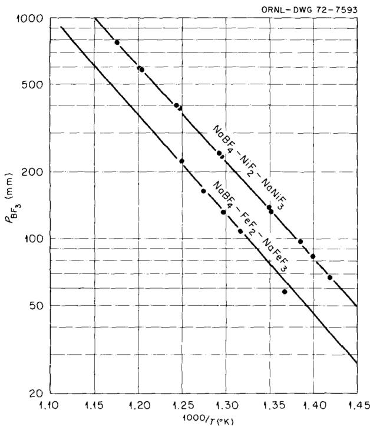  
Fig. 8.2. $\mathbf{BF}_3$ pressures generated by NaF-NaBF $_4$ melts saturated with (1) $\mathrm{NiF}_2$ -NaNiF $_3$ and (2) $\mathrm{FeF}_2$ -NaFeF $_3$ . The lines were calculated by a least-squares fit of the data according to Eqs. (6), (7), and (9) or (10).

The activities of $\mathrm{NaF}, a_{\mathrm{NaF}}$ , were calculated from the measured $\mathrm{BF}_3$ pressures by means of the equilibrium constant for the reaction

$$
\mathrm {N a B F} _ {4} (\mathrm {d}) \rightleftharpoons \mathrm {N a F} (\mathrm {d}) + \mathrm {B F} _ {3} (\mathrm {g}), \tag {4}
$$

$$
K _ {4} = P _ {\mathrm {B F} _ {3}} \frac {a _ {\mathrm {N a F}}}{a _ {\mathrm {N a B F} _ {4}}} ,
$$

which has been measured by Cantor7 as

$$
\log K _ {4} = \left[ 5. 7 7 2 - 6. 5 1 3 \left(1 0 ^ {3} / T\right) \right] \pm 0. 0 4. \tag {5}
$$

Introducing mole fractions $(X)$ and activity coefficients $(\gamma)$ into the equilibrium constant expression and solving for $a_{\mathrm{NaF}}$ , we obtain

$$
a _ {\mathrm {N a F}} = \frac {1}{P _ {\mathrm {B F} _ {3}} / K _ {4} \gamma_ {\mathrm {N a B F} _ {4}} + 1 / \gamma_ {\mathrm {N a F}}}. \tag {6}
$$

In the present measurements, wherein the melt was always $>97$ mole $\% \mathrm{NaBF}_4$ , Cantor's results indicate that $\gamma_{\mathrm{NaBF}_4}$ is very nearly 1.0 and $\gamma_{\mathrm{NaF}}$ is 1.3 at

$1000^{\circ}\mathrm{K}$ . Assuming $\mathrm{NaF - NaBF_4}$ mixtures to have an ideal entropy of mixing, we may then estimate

$$
\log \gamma_ {\mathrm {N a F}} = \left(\frac {1 1 3 . 9}{T}\right) \pm 0. 0 4. \tag {7}
$$

The mole fractions of NaF at each equilibration temperature [calculated from Eqs. (6) and (7)] are plotted in Fig. 8.3.

The smooth curves shown in Figs. 8.2 and 8.3 were generated by assuming that $\log K_{3a}$ and $\log K_{3b}$ vary linearly with $1 / T(^{\circ}\mathrm{K})$ , that is, that

$$
\log a _ {\mathrm {N a F}} = a + b \left(1 0 ^ {3} / T\right). \tag {8}
$$

First, the more numerous data from the equilibrium with $\mathrm{NiF}_2\text{-NaNiF}_3$ were fitted by least squares, and then assuming that the entropies of reactions (3a) and (3b) are the same, the $P_{\mathrm{BF}_3}$ data from the equilibrium with $\mathrm{FeF}_2\text{-NaFeF}_3$ were fitted by least squares, using the value of $a$ determined for equilibrium (3a). The resulting expressions for the equilibrium constants and free energies for reactions (3a) and (3b) are

$$
\log K _ {3 a} = \left[ 0. 5 8 - 2. 1 1 \left(1 0 ^ {3} / T\right) \right] \pm 0. 0 4, \tag {9}
$$

$$
\log K _ {3 b} = \left[ 0. 5 8 - 1. 9 3 \left(1 0 ^ {3} / T\right) \right] \pm 0. 0 4, \tag {10}
$$

$$
\Delta G [ \text {r e a c t i o n} (3 a) ] = [ 9. 6 6 - 2. 6 5 (T / 1 0 ^ {3}) ] \pm 0. 2, (9 ^ {\prime})
$$

$$
\Delta G [ \text {r e a c t i o n} (3 b) ] = [ 8. 8 1 - 2. 6 5 (T / 1 0 ^ {3}) ] \pm 0. 2. (1 0 ^ {\prime})
$$

These results were then used to calculate the free energies of formation of $\mathrm{NaNiF}_3$ and $\mathrm{NaFeF}_3$ as follows:

$$
\begin{array}{l} \Delta G ^ {f} \left[ \mathrm {N a N i F} _ {3} (\mathrm {c}) \right] = \Delta G ^ {f} \left[ \mathrm {N a F} (\mathrm {l}) \right] \\ + \Delta G ^ {f} \left[ \mathrm {N i F} _ {2} (\mathrm {c}) \right] - \Delta G (\text {r e a c t i o n} 3 a), \tag {11} \\ \end{array}
$$

$$
\begin{array}{l} \Delta G ^ {f} \left[ \mathrm {N a F e F} _ {3} (\mathrm {c}) \right] = \Delta G ^ {f} \left[ \mathrm {N a F} (\mathrm {l}) \right] \\ + \Delta G ^ {f} \left[ \mathrm {F e F} _ {2} (\mathrm {c}) \right] - \Delta G (\text {r e a c t i o n} 3 b). \tag {12} \\ \end{array}
$$

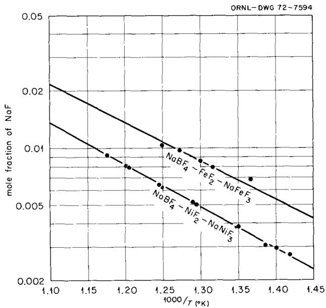  
Fig. 8.3. NaF mole fractions in equilibrium with $\mathrm{NaBF}_4$ saturated with (1) $\mathrm{NiF}_2$ - $\mathrm{NaNiF}_3$ and (2) $\mathrm{FeF}_2$ - $\mathrm{NaFeF}_3$ . The lines were calculated from Eqs. (7) and (9) or (10).

The formation free energies of $\mathrm{NiF}_2(c)$ and of $\mathrm{FeF}_2(c)$ are known from the measurements of Blood:9

$$
\begin{array}{l} \Delta G ^ {f} \left[ \mathrm {N i F} _ {2} (\mathrm {c}) \right] = [ - 1 5 6. 3 3 \\ \left. + 3 7. 6 5 \left(T / 1 0 ^ {3}\right) \right] \pm 0. 9, \tag {13} \\ \end{array}
$$

$$
\begin{array}{l} \Delta G ^ {f} \left[ \mathrm {F e F} _ {2} (\mathrm {c}) \right] = [ - 1 6 8. 6 2 \\ \left. + 3 2. 9 8 \left(T / 1 0 ^ {3}\right) \right] \pm 0. 9. \tag {14} \\ \end{array}
$$

The formation free energy of liquid NaF was obtained from the JANAF tables:10

$$
\begin{array}{l} \Delta G ^ {f} [ \mathrm {N a F} (1) ] = [ - 1 3 0. 3 9 \\ \left. + 1 9. 4 2 \left(T / 1 0 ^ {3}\right) \right] \pm 1. 0. \tag {15} \\ \end{array}
$$

Combining these gives the formation free energies of $\mathrm{NaNiF}_3$ and $\mathrm{NaFeF}_3$ :

$$
\begin{array}{l} \Delta G ^ {f} \left[ \mathrm {N a N i F} _ {3} (\mathrm {c}) \right] = \left[ - 2 9 6. 3 8 \right. \\ \left. + 5 9. 7 2 \left(T / 1 0 ^ {3}\right) \right] \pm 1. 4, \tag {16} \\ \end{array}
$$

$$
\begin{array}{l} \Delta G ^ {f} \left[ \mathrm {N a F e F} _ {3} (\mathrm {c}) \right] = [ - 3 0 7. 8 2 \\ \left. + 5 5. 0 5 \left(T / 1 0 ^ {3}\right) \right] \pm 1. 4. \tag {17} \\ \end{array}
$$

Combining Eq. (9) with the equilibrium constant for the reduction of $\mathrm{NiF}_2(\mathbf{c})$ by hydrogen, based on measurements by Blood, $^9$

$$
\mathrm {H} _ {2} (\mathrm {g}) + \mathrm {N i F} _ {2} (\mathrm {c}) \rightleftharpoons 2 \mathrm {H F} (\mathrm {g}) + \mathrm {N i} ^ {0} (\mathrm {c}), \tag {18}
$$

$$
\log K _ {1 8} = \left[ 8. 6 7 - 5. 6 7 \left(1 0 ^ {3} / T\right) \right] \pm 0. 0 4,
$$

we obtain the equilibrium constant of reaction (1):

$$
\begin{array}{l} \log \left(P _ {\mathrm {H} _ {2}} / P _ {\mathrm {H F}} ^ {2} a _ {\mathrm {N i}} 0 X _ {\mathrm {N a F}} \gamma_ {\mathrm {N a F}}\right) \\ = \left[ - 9. 2 5 + 7. 7 8 \left(1 0 ^ {3} / T\right) \right] \pm 0. 0 6. \tag {19} \\ \end{array}
$$

Similarly, combining Eq. (10) with the equilibrium constant for the reduction of $\mathbf{FeF}_2(c)$ by hydrogen, based on measurements by Blood, $^9$

$$
\log K _ {2 0} = [ 6. 6 5 - 8. 3 6 (1 0 ^ {3} / T) ] \pm 0. 0 2, \tag {20}
$$

we obtain the equilibrium constant for reaction (2):

$$
\begin{array}{l} \log \left(P _ {\mathrm {H} _ {2}} / P _ {\mathrm {H F}} ^ {2} a _ {\mathrm {F e} ^ {0}} X _ {\mathrm {N a F}} \gamma_ {\mathrm {N a F}}\right) \\ = \left[ - 8. 2 3 + 1 0. 2 8 \left(1 0 ^ {3} / T\right) \right] \pm 0. 0 5. \tag {21} \\ \end{array}
$$

Assuming that the activities of nickel and iron in Hastelloy N are, respectively, $\sim 0.70$ and $\sim 0.05$ , and that the activity of NaF in the coolant salt is $\sim 0.08$ (for the eutectic composition), the ratios of $\mathrm{PHF}_2 / \mathrm{PH}_2$ at which nickel and iron will be oxidized, respectively, to $\mathrm{NaNiF}_3$ and to $\mathrm{NaFeF}_3$ are calculated as follows:

<table><tr><td rowspan="2">Temperature (°C)</td><td colspan="2">Ni0/NaNiF3</td><td colspan="2">Fe0/NaFeF3</td></tr><tr><td>K19</td><td>PHF2/PH2</td><td>K20</td><td>PHF2/PH2</td></tr><tr><td>400</td><td>203.0</td><td>0.09</td><td>1.10 × 107</td><td>2.3 × 10-5</td></tr><tr><td>500</td><td>6.5</td><td>2.75</td><td>1.16 × 105</td><td>2.2 × 10-3</td></tr><tr><td>600</td><td>0.5</td><td>38.82</td><td>3.50 × 103</td><td>7.14 × 10-2</td></tr></table>

From these estimates it would appear that relatively large HF partial pressures may be used, if hydrogen is present, without significant amounts of nickel oxidation in $\mathrm{NaF - NaBF_4}$ mixtures. Under similar conditions the iron in Hastelloy N is more susceptible to oxidation by HF.

The availability of formation free energies and the low solubilities of $\mathrm{NaNiF}_3$ and $\mathrm{NaFeF}_3$ in molten

$\mathrm{NaF - NaBF_4}$ mixtures suggest that these compounds would be promising materials for reference electrodes to be used in molten $\mathrm{NaF - NaBF_4}$ .

# 8.3 PREPARATION OF FUSED SODIUM FLUOROBORATE FOR THE COOLANT SALT TECHNOLOGY FACILITY

F. A. Doss

W.P.Teichert

Wiley Jennings, Jr.

J. H. Shaffer

The preparation of approximately 1550 lb of the fused mixture $\mathrm{NaBF}_4$ -NaF (92-8 mole %), for use in operating the Coolant Salt Technology Facility (CSTF), was begun on January 3, 1972, and completed on March 7, 1972. This production operation was conducted in the Fluoride Production Facility in six batch operations of about 258 lb each. Since the CSTF is currently under construction, its detached drain tank was positioned within the production facility for direct loading from the batch processing unit. The loaded drain tank was then moved to the CSTF for installation.

Sodium fluoroborate used in this production effort was part of a 6000-lb lot purchased from the Harshaw Chemical Company as a custom preparation. Maximum concentrations of impurities in this material were specified at levels sufficiently restrictive to facilitate the production of the fused mixture. Sodium fluoride, which was added to make the fused fluoroborate mixture, was RACS grade and did not significantly affect the total impurity concentration of the mixture. With these starting materials the production procedure was reduced effectively to the removal of water vapor by evacuation while heating the powdered salts at controlled rates up to $300^{\circ}\mathrm{C}$ . Although materials

specifications allowed $1000~\mathrm{ppm}$ by weight of water in the starting materials, only negligible quantities were collected in the cold trap during each run. The salt mixture was then heated beyond its melting point to $500^{\circ}\mathrm{C}$ under a static atmosphere of argon and then sparged at 10 liters/min with $\mathrm{BF}_3$ for $10\mathrm{min}$ to ensure mixing of the two salts. Residual $\mathrm{BF}_3$ was purged from the system with argon, and a filtered sample of the salt was withdrawn for chemical analyses. The salt transfer line between the drain tank and the production vessel was connected, and the molten fluoroborate mixture was displaced into the drain tank by argon pressure. This procedure was repeated for each of the six batches of fluoroborate mixture.

The results of chemical analyses from the six batch preparations are shown in Table 8.3. The averages of these values should be representative of the total of materials transferred into the drain tank. Nickel, chromium, and iron contents of 16, 13, and $141~\mathrm{ppm}$ by weight, respectively, are well within limits specified for molten-salt systems. The average oxide content of the melt was $319~\mathrm{ppm}$ by weight and compares favorably with a specified limit of $250~\mathrm{ppm}$ in the starting material. Results of proton analyses on five of the six batches correspond to $15~\mathrm{ppm}$ by weight. This quantity, if present as the hydroxyl ion, would imply its association with $240~\mathrm{ppm}$ of the total oxide found. The average values reported for the major constituents (i.e., sodium, boron, and fluorine) differ from those calculated for the mixture by quantities no greater than the error limits of the analytical determinations. Arbitrary calculations of the salt composition in mole percent yield an average value of $95.2\%$ $\mathrm{NaBF_4}$ and $4.8\%$ NaF. This implied discrepancy in the salt composition is of little consequence to the operation of the CSTF, since

Table 8.3. Results of chemical analyses of $\mathrm{NaBF_4}$ -NaF (92-8 mole %) prepared for the Coolant Salt Technology Facility   

<table><tr><td rowspan="2">Batch No.</td><td colspan="3">Major constituents (wt %)</td><td colspan="5">Impurities (ppm by weight)</td></tr><tr><td>Na</td><td>B</td><td>F</td><td>Ni</td><td>Cr</td><td>Fe</td><td>O</td><td>H</td></tr><tr><td>1</td><td>21.2</td><td>9.89</td><td>69.3</td><td>21</td><td>38</td><td>223</td><td>275</td><td>NA</td></tr><tr><td>2</td><td>21.6</td><td>9.51</td><td>67.9</td><td>10</td><td>8</td><td>25</td><td>320</td><td>17</td></tr><tr><td>3</td><td>22.2</td><td>9.45</td><td>69.0</td><td>19</td><td>&lt;10</td><td>203</td><td>306</td><td>15</td></tr><tr><td>4</td><td>21.7</td><td>9.93</td><td>67.8</td><td>16</td><td>8</td><td>135</td><td>267</td><td>14</td></tr><tr><td>5</td><td>21.4</td><td>9.77</td><td>69.3</td><td>15</td><td>6</td><td>125</td><td>437</td><td>13</td></tr><tr><td>6</td><td>21.9</td><td>9.66</td><td>67.7</td><td>15</td><td>6</td><td>135</td><td>310</td><td>15</td></tr><tr><td>Average</td><td>21.67</td><td>9.70</td><td>68.5</td><td>16</td><td>13</td><td>141</td><td>319</td><td>15</td></tr><tr><td>Calculated</td><td>22.03</td><td>9.53</td><td>68.4</td><td></td><td></td><td></td><td></td><td></td></tr></table>

the actual salt composition will readily adjust to an equilibrium with the $\mathbf{BF}_3$ value of the cover gas stream.

The sodium fluoroborate mixture prepared by this production effort is considerably better, with respect to its oxide content, than previous batches produced by

generally similar procedures for loop operations. This improvement is probably the direct result of the "best effort" provided by the Harshaw Chemical Company in their preparation of the sodium fluoroborate starting material.

# 9. Protactinium Chemistry

# 9.1 OXIDE CHEMISTRY OF PROTACTINIUM IN MSBR FUEL SALT

R.G.Ross C.E.Bamberger C.F.Baes,Jr.

Studies of the precipitation of protactinium from molten $\mathrm{LiF - BeF_2 - ThF_4}$ (72-16-12 mole %), described in several previous progress reports, $^{1-3}$ have been completed, and the results are summarized here.

Under sufficiently oxidizing conditions (Fig. 9.1), a very insoluble compound of protactinium(V) is formed in which, judging from the stoichiometry of the precipitation, the O/Pa ratio is 2.5. It is thought that this compound is a fluoride addition compound, probably of LiF, because: (1) the entropy change determined for the following equilibrium is about 23 eU higher than expected for pure $\mathrm{Pa}_2\mathrm{O}_5$ :

$$
\begin{array}{l} \mathrm {P a O} _ {2. 5} \cdot n \mathrm {L i F} (\mathrm {c}) + ^ {5} / _ {4} \mathrm {T h F} _ {4} (\mathrm {d}) \\ \Leftrightarrow \mathrm {P a F} _ {5} (\mathrm {d}) + n \mathrm {L i F} (\mathrm {d}) + 5 / 4 \mathrm {T h O} _ {2} (\mathrm {c}), \tag {1} \\ \end{array}
$$

$$
\begin{array}{l} \log \left(X _ {\mathrm {P a F} _ {5}}\right) / \left(X _ {\mathrm {T h F} _ {4}}\right) ^ {5 / 4} \\ = \left[ 4. 4 9 - 8. 6 6 \left(1 0 ^ {3} / T\right) \right] \pm 0. 2. \\ \end{array}
$$

(As usual, the letters g, d, c, and ss will denote, respectively, components in the gaseous, molten fluoride, crystalline, and solid solution states.) This suggests that when the $\mathrm{Pa}_2\mathrm{O}_5$ phase reacts with the molten fluoride, it releases more species to the solution than would be the case for pure $\mathrm{Pa}_2\mathrm{O}_5$ . (2) Despite several attempts, we were unable to identify pure $\mathrm{Pa}_2\mathrm{O}_5$ in oxides separated from equilibrated mixtures. If the

$\mathrm{Pa}_2\mathrm{O}_5$ phase does contain added fluoride, it is probably LiF, since lithium ion is the most basic cation present.

With $\mathrm{UF_4}$ in the molten fluoride at concentrations typical of an MSBR fuel ( $\sim 0.3$ mole \%), the $\mathrm{ThO_2}$ phase in reaction (1) is replaced by a solid solution $\mathrm{UO_2 - ThO_2}$ ( $\sim 95$ to $\sim 5$ mole \%):

$$
\begin{array}{l} \mathrm {P a O} _ {2. 5} \cdot n \mathrm {L i F} (c) + ^ {5} / _ {4} \mathrm {U F} _ {4} (\mathrm {d}) \\ \rightleftharpoons \mathrm {P a F} _ {5} (\mathrm {d}) + n \mathrm {L i F} (\mathrm {d}) + ^ {5} / _ {4} \mathrm {U O} _ {2} (\mathrm {s s}), \tag {2} \\ \end{array}
$$

$$
\begin{array}{l} \log \left(X _ {\mathrm {P a F} _ {5}}\right) \left(X _ {\mathrm {U O} _ {2}} \gamma_ {\mathrm {U O} _ {2}}\right) ^ {5 / 4} / \left(X _ {\mathrm {U F} _ {4}}\right) ^ {5 / 4} \\ = [ 4. 4 9 - 5. 6 9 (1 0 ^ {3} / T) ] \pm 0. 2. \\ \end{array}
$$

The equilibrium quotient for this reaction was measured directly and found to agree well with values predicted from reaction (1) and the previously determined quotient for the $\mathrm{U}^{4+}$ - $\mathrm{Th}^{4+}$ exchange between fluoride and oxide phases (see the following sections). The resulting values indicate that under sufficiently oxidizing conditions and sufficiently low temperatures a large fraction of the protactinium in an MSBR fuel may be efficiently isolated as a pure phase without precipitation of the $\mathrm{UO}_2$ solid solution or any other phase.

Under reducing conditions, the $\mathrm{Pa}_2\mathrm{O}_5$ phase is solubilized as $\mathrm{PaF}_4$ :

$$
\begin{array}{l} \mathrm {P a O} _ {2. 5} \cdot n \mathrm {L i F} (\mathrm {c}) + 5 / 4 \mathrm {U F} _ {4} (\mathrm {d}) + 1 / 2 \mathrm {H} _ {2} (\mathrm {g}) \\ \rightleftharpoons \mathrm {H F} (\mathrm {g}) + \mathrm {P a F} _ {4} (\mathrm {d}) + n \mathrm {L i F} (\mathrm {d}) + 5 / 4 \mathrm {U O} _ {2} (\mathrm {s s}), \tag {3} \\ \end{array}
$$

$$
\begin{array}{l} \log \left(X _ {\mathrm {P a F} _ {4}}\right) \left(X _ {\mathrm {U O} _ {2}} \gamma_ {\mathrm {U O} _ {2}}\right) ^ {5 / 4} \left(P _ {\mathrm {H F}}\right) / \left(X _ {\mathrm {U F} _ {4}}\right) ^ {5 / 4} \\ \times \left(P _ {\mathrm {H} _ {2}}\right) ^ {1 / 2} = \left[ 8. 4 1 - 1 1. 4 4 \left(1 0 ^ {3} / T\right) \right] \pm 0. 5. \\ \end{array}
$$

Combination of reactions (2) and (3) gives the equilibrium

$$
\mathrm {H F} (\mathrm {g}) + \mathrm {P a F} _ {4} (\mathrm {d}) \rightleftharpoons \mathrm {P a F} _ {5} (\mathrm {d}) + 1 / 2 \mathrm {H} _ {2} (\mathrm {g}), \tag {4}
$$

$$
\begin{array}{l} \log \left(X _ {\mathrm {P a F} _ {5}}\right) \left(P _ {\mathrm {H} _ {2}}\right) ^ {1 / 2} / \left(X _ {\mathrm {P a F} _ {4}}\right) \left(P _ {\mathrm {H F}}\right) \\ = \left[ - 3. 9 2 + 5. 1 6 \left(1 0 ^ {3} / T\right) \right] \pm 0. 5. \\ \end{array}
$$

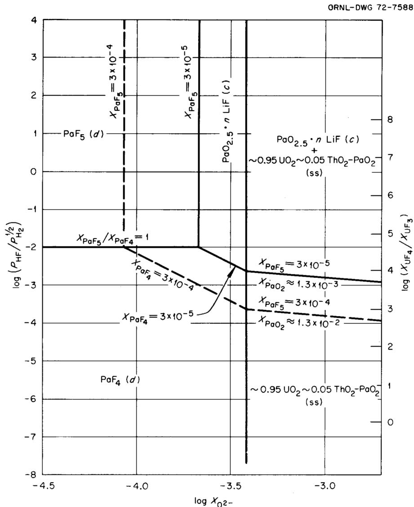  
Fig. 9.1. Pourbaix diagram for protactinium species in molten $\mathrm{LiF - BeF_2 - ThF_4 - UF_4}$ (72-16-11.7-0.3 mole %) at $600^{\circ}\mathrm{C}$ .

This reaction is of special interest, since such reactions, involving the $\mathrm{HF} / \mathrm{H}_2$ , $\mathrm{F}^-$ couple, have been used to establish a set of $E^0$ values for various couples in MSR molten fluorides. $^4$

From the equilibria measured and other thermochemical data, the following formation heats and free energies were estimated for protactinium compounds:

<table><tr><td>Compound</td><td>ΔHf298(kcal/mole)</td><td>ΔGf700-1000(kcal/mole)</td></tr><tr><td>PaO2(c)</td><td>(-270)</td><td>-268.5 + 41.3 (T/103)</td></tr><tr><td>PaF4(d)</td><td></td><td>-469.3 + 61.1 (T/103)</td></tr><tr><td>PaF5(d)</td><td></td><td>-558.1 + 78.0 (T/103)</td></tr><tr><td>“Pa2O5(c)”</td><td>-697</td><td>-693.5 + 147.6 (T/103)</td></tr></table>

The $\Delta H_{298}^{f}$ value for $\mathrm{PaO}_2$ was estimated by interpolation from the values for $\mathrm{ThO}_2$ and $\mathrm{UO}_2$ . The values for $\mathrm{Pa}_2\mathrm{O}_5$ were calculated on the assumption that the $\mathrm{Pa}_2\mathrm{O}_5$ phase in the present system contained no fluoride. If, as we suspect, it does, then these $\Delta H^{f}$ and $\Delta G^{f}$ values are more negative than those for pure $\mathrm{Pa}_2\mathrm{O}_5$ .

A Pourbaix diagram, representing the behavior of protactinium in an MSBR fuel as a function of Redox potential and the oxide concentration, is shown in Fig. 9.1. The striking features are the strong dependence of

the solubility of the protactinium on the oxidation potential (i.e., the $\mathrm{U}^{4 + } / \mathrm{U}^{3 + }$ ratio) of the fuel and the very low solubility of the $\mathrm{Pa}_2\mathrm{O}_5$ phase. The potential of the $\mathrm{Pa}^{5 + } / \mathrm{Pa}^{4 + }$ couple will determine the maximum $\mathrm{U}^{4 + } / \mathrm{U}^{3 + }$ ratio in the fuel necessary to prevent inadvertent precipitation of protactinium oxide. It will also determine the minimum $\mathrm{U}^{4 + } / \mathrm{U}^{3 + }$ ratio in the fuel necessary to provide the desired insolubility of the $\mathrm{Pa}_2\mathrm{O}_5$ phase in a separation process. Because of the importance of the $\mathrm{Pa}^{5 + } / \mathrm{Pa}^{4 + }$ couple, it is in need of more accurate determination. Plans are being made for such measurements which will employ volumetric and/or spectrophotometric methods.

# 9.2 BINARY SOLID SOLUTIONS OF $\mathrm{PaO}_2$ AND OTHER ACTINIDE DIOXIDES AND THEIR EXCHANGE EQUILIBRIA WITH MOLTEN-SALT REACTOR FLUORIDES5

C.E.Bamberger R.G.Ross C.F.Baes,Jr.

We have previously reported $^{6}$ on measurements of the equilibrium quotient of the reaction

$$
\mathrm {T h O} _ {2} (\mathrm {s s}) + \mathrm {P a F} _ {4} (\mathrm {d}) \rightleftharpoons \mathrm {T h F} _ {4} (\mathrm {d}) + \mathrm {P a O} _ {2} (\mathrm {s s}), \tag {1}
$$

$$
Q _ {\mathrm {T h}} ^ {\mathrm {P a}} = X _ {\mathrm {P a O} _ {2}} X _ {\mathrm {T h F} _ {4}} / X _ {\mathrm {T h O} _ {2}} X _ {\mathrm {P a F} _ {4}}.
$$

We found that the distribution of $\mathrm{Pa}^{4+}$ favors the oxide phase, although not as strongly as $\mathrm{U}^{4+}$ in a similar system. Additional data have been obtained from a new experiment where the amount of $\mathrm{ThO}_2$ added was significantly increased in order to decrease the ratio $\mathrm{ThO}_2$ dissolved/ $\mathrm{ThO}_2$ added. This, in turn, reduced the uncertainty in the composition of the precipitated phase when calculated by material balance. Previous and present data are shown in Table 9.1.

The values obtained for the distribution quotient $Q_{\mathrm{Th}}^{\mathrm{Pa}}$ have been correlated with the previous determinations of $Q_{\mathrm{Th}}^{\mathrm{U}}$ (ref. 3) and a value of $Q_{\mathrm{Th}}^{\mathrm{Pu}}$ derived indirectly from previous measurements on the basis of the following considerations:

1. Hietala9 has successfully accounted for the observed heats of mixing of binary alkali halide solid solutions with a common ion in terms of a simple model which calculates the displacement of the common ion in a fixed lattice of the randomly mixed counter ions. For 1 mole of solution the result is of the approximate form

$$
\Delta H _ {m} \approx C \left(\frac {d _ {2} - d _ {1}}{d _ {1}}\right) ^ {2} X _ {1} X _ {2}, \tag {2}
$$

where $d_{1}$ and $d_{2}$ are the cation-anion distances for the two pure salts. For solid solutions with the NaCl structure, $C$ is a constant. It contains no adjustable parameters, being a function only of the molar volumes and compressibilities of the pure salts.

While an analogous treatment has not yet been completed for substitutional solid solutions with the fluorite structure, such as those of the actinide dioxides, it is clear that the result will be of the same form. Hence for 1 mole of solution we may write

$$
\Delta H _ {m} \approx A \left(\frac {a _ {\mathrm {T h O} _ {2}} - a _ {\mathrm {M O} _ {2}}}{a _ {\mathrm {T h O} _ {2}}}\right) ^ {2}. X _ {\mathrm {T h O} _ {2}} X _ {\mathrm {M O} _ {2}}, \tag {3}
$$

where $a_{\mathrm{MO}_2}$ is the lattice parameter for the pure oxide. If we assume random mixing, we obtain for the activity coefficients in the binary solid solutions

$$
\ln \gamma_ {\mathrm {M O} _ {2}} = \frac {A}{R T} \left(\frac {a _ {\mathrm {T h O} _ {2}} - a _ {\mathrm {M O} _ {2}}}{a _ {\mathrm {T h O} _ {2}}}\right) ^ {2} X ^ {2} _ {\mathrm {T h O} _ {2}}, \tag {4}
$$

$$
\ln \gamma_ {\mathrm {T h O} _ {2}} = \frac {A}{R T} \left(\frac {a _ {\mathrm {T h O} _ {2}} - a _ {\mathrm {M O} _ {2}}}{a _ {\mathrm {T h O} _ {2}}}\right) ^ {2} X ^ {2} _ {\mathrm {M O} _ {2}}. \tag {5}
$$

2. Considering now the exchange reaction (1), we would expect from electrostatic considerations that the enthalpy of reaction could be approximated by

$$
\Delta H ^ {0} = - B \left(\frac {1}{a _ {\mathrm {M O} _ {2}}} - \frac {1}{a _ {\mathrm {T h O} _ {2}}}\right). \tag {6}
$$

Taking $\Delta S^0$ for this reaction to be zero, as has been found to be the case for the $\mathbf{U}^{4 + }\cdot \mathbf{Th}^{4 + }$ exchange, we obtain for the equilibrium constant

$$
\ln K _ {\mathrm {T h}} ^ {\mathrm {M}} = \frac {B}{R T} \left(\frac {1}{a _ {\mathrm {M O} _ {2}}} - \frac {1}{a _ {\mathrm {T h O} _ {2}}}\right). \tag {7}
$$

Table 9.1. Equilibrium data obtained for the reaction $\mathrm{ThO}_2(\mathrm{ss}) + \mathrm{PaF}_4(\mathrm{d})\rightleftharpoons \mathrm{PaO}_2(\mathrm{ss}) + \mathrm{ThF}_4(\mathrm{d})$   

<table><tr><td>Sample</td><td>Temperature (°C)</td><td>XΣOa</td><td>XPaF4</td><td>XPaO2b</td><td>log QThPa</td><td>a(A)</td></tr><tr><td></td><td></td><td>×10-3</td><td>×10-4</td><td></td><td></td><td></td></tr><tr><td>A</td><td>567</td><td>0.35</td><td>4.38</td><td>(0.324)</td><td>2.12 ± 0.48</td><td></td></tr><tr><td>B</td><td>567</td><td>0.58</td><td>4.10</td><td>(0.291)</td><td>2.08 ± 0.26</td><td></td></tr><tr><td>C</td><td>567</td><td>1.08</td><td>3.40</td><td>(0.292)</td><td>2.16 ± 0.15</td><td></td></tr><tr><td>D</td><td>663</td><td>2.78</td><td>3.38</td><td>(0.167)</td><td>1.85 ± 0.13</td><td></td></tr><tr><td>E</td><td>727</td><td>2.70</td><td>4.16</td><td>(0.109)</td><td>1.55 ± 0.08</td><td></td></tr><tr><td>F</td><td>567</td><td>2.83</td><td>2.71</td><td>0.175 ± 0.02c</td><td>1.97 ± 0.06</td><td>5.5926 ± 0.0003</td></tr><tr><td rowspan="2">G</td><td rowspan="2">730</td><td rowspan="2">14.88</td><td rowspan="2">1.91</td><td>0.073 ± 0.004d</td><td>1.69 ± 0.05</td><td rowspan="2">5.5910 ± 0.0002</td></tr><tr><td>(0.050)</td><td>1.52 ± 0.05</td></tr><tr><td>H</td><td>567</td><td>8.88</td><td>0.746</td><td>(0.062)</td><td>2.02 ± 0.10</td><td></td></tr><tr><td>I</td><td>567</td><td>8.88</td><td>0.686</td><td>(0.063)</td><td>2.07 ± 0.10</td><td></td></tr></table>

${}^{a}$ Total moles of oxide added per mole of solvent $\left( {\mathrm{{LiF}} + {\mathrm{{BeF}}}_{2} + {\mathrm{{ThF}}}_{4}}\right)$ .   
$b$ Numbers in parentheses were calculated by material balance.   
${}^{c}$ Determined by x-ray fluorescence.   
$d$ Determined by gamma spectrometry.

3. Since it has been found experimentally that the ratio of activity coefficients in the fluoride phase $\gamma_{\mathrm{ThF}_4} / \gamma_{\mathrm{MF}_4}$ is a constant independent of melt composition, and may be taken as unity, $Q_{\mathrm{Th}}^{\mathbf{M}}$ and $K_{\mathrm{Th}}^{\mathbf{M}}$ are related by

$$
K _ {\mathrm {T h}} ^ {\mathrm {M}} = Q _ {\mathrm {T h}} ^ {\mathrm {M}} \gamma_ {\mathrm {M O} _ {2}} / \gamma_ {\mathrm {T h O} _ {2}}. \tag {8}
$$

Combining Eqs. (4), (5), (7), and (8), the following expression for $Q_{\mathrm{Th}}^{\mathbf{M}}$ as a function of oxide composition and temperature is obtained:

$$
\begin{array}{l} \ln Q _ {\mathrm {T h}} ^ {\mathrm {M}} = \frac {B}{R T} \left(\frac {1}{a _ {\mathrm {M O} _ {2}}} - \frac {1}{a _ {\mathrm {T h O} _ {2}}}\right) \\ + \frac {A}{R T} \left(\frac {a _ {\mathrm {T h O} _ {2}} - a _ {\mathrm {M O} _ {2}}}{a _ {\mathrm {T h O} _ {2}}}\right) ^ {2} (2 X _ {\mathrm {M O} _ {2}} - 1). \tag {9} \\ \end{array}
$$

This expression is compared with the measurements (normalized to $600^{\circ}\mathrm{C}$ ) in Fig. 9.2. The values of $A$ and $B$ ,

$$
A = 2 4 4 0 \pm 3 0 0 \mathrm {k c a l / m o l e},
$$

$$
B = 2 6 2 0 \pm 5 3 \mathrm {k c a l}, \mathrm {A}, \mathrm {m o l e} ^ {- 1},
$$

have been chosen to reproduce the line previously generated by least squares to fit the $Q_{\mathrm{Th}}^{\mathrm{U}}$ values vs $X_{\mathrm{UO}_2}$ and $T$ . As can be seen, the consistency with the other $Q_{\mathrm{Th}}^{\mathrm{M}}$ values is quite satisfactory. The large uncertainty assigned to $Q_{\mathrm{Th}}^{\mathrm{Pu}}$ reflects the large uncertainty in the free energy of dissolution of $\mathrm{UF_4(c)}$ in

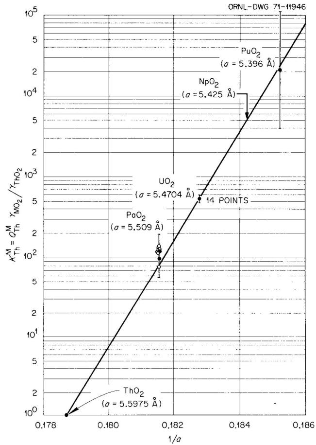  
Fig. 9.2. Exchange quotient $Q_{\mathrm{Th}}^M$ as a function of the composition of $\mathrm{MO}_2 - \mathrm{THO}_2$ solid solutions (in mole fractions $X_{\mathrm{MO}_2}$ ) at $600^\circ \mathrm{C}$ . The points are measurements in which the composition of the oxide phase was determined directly ( $\bullet$ ) or by material balance ( $\odot$ ). The lines were calculated by means of Eq. (7).

LiF-BeF $_2$ (67-33 mole %), assumed to be equal to that of $\mathrm{PuF}_4(\mathrm{c})$ , presently unknown. Values of $K_{\mathrm{Th}}^{\mathrm{M}}$ , calculated from measured values of $Q_{\mathrm{Th}}^{\mathrm{M}}$ by means of Eqs. (4), (5), and (8), are shown in Fig. 9.3, together with a line calculated with Eq. (7).

We hope in the future to obtain more data on $\mathrm{PuO_2 - ThO_2}$ solid solutions, probably by direct measurements of the equilibrium involving $\mathrm{PuF_4}$ . The large values of $K_{\mathrm{TTh}}^{\mathbf{Pu}}$ indicate that the equilibrium oxide phase precipitated from melts containing $\mathrm{ThF_4}$ , and sufficiently oxidized to contain appreciable amounts of $\mathrm{PuF_4}$ , should consist of nearly pure $\mathrm{PuO_2}$ .

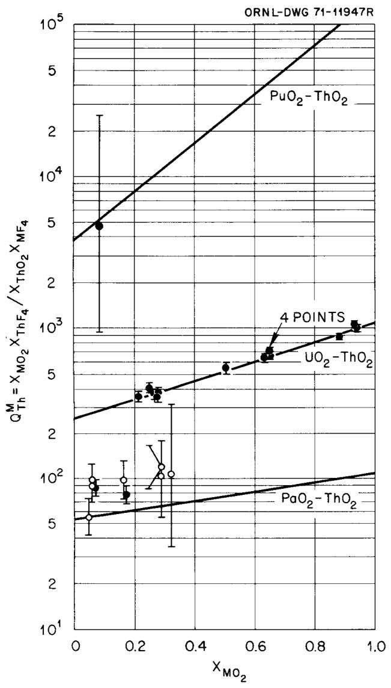  
Fig. 9.3. Equilibrium constant for exchange reactions as a function of the reciprocal of the lattice constants $(1 / a)$ of the pure actinide dioxides at $600^{\circ}\mathbf{C}$ . The points are derived from those in Fig. 2.1 using Eqs. (4), (5), and (8).

# 9.3 TERNARY SOLID SOLUTIONS OF $\mathrm{ThO}_2$ , $\mathrm{PaO}_2$ , AND $\mathrm{UO}_2$

C.F.Baes,Jr.

In the previous section, the exchange of two tetravalent actinide cations, $\mathbf{M}^{4+}$ and $\mathbf{N}^{4+}$ , between a binary $\mathrm{MO}_2\cdot \mathrm{NO}_2$ solid solution and a molten fluoride solution containing $\mathbf{MF}_4$ and $\mathbf{NF}_4$ was discussed in terms of the exchange equilibrium constant

$$
K _ {\mathrm {N}} ^ {\mathrm {M}} = \frac {X _ {\mathrm {M O} _ {2}} X _ {\mathrm {N F} _ {4}}}{X _ {\mathrm {N O} _ {2}} X _ {\mathrm {M F} _ {4}}} \cdot \frac {\gamma_ {\mathrm {M O} _ {2}}}{\gamma_ {\mathrm {N O} _ {2}}}.
$$

This constant and the activity coefficients, $\gamma_{\mathrm{MO}_2}$ and $\gamma_{\mathrm{NO}_2}$ , were (see previous section) represented by expressions [Eqs. (4), (5), and (7)] which involve the lattice parameters of the oxides, the temperature, and two empirical constants ( $A$ and $B$ ). In an MSBR fuel, three tetravalent actinide ions $-\mathrm{Th}^{4+}$ , $\mathrm{Pa}^{4+}$ , and $\mathrm{U}^{4+}$ will be present under normal conditions. The oxide phase which could be precipitated inadvertently by oxide contamination or intentionally for the purpose of fuel reprocessing will, therefore, be a ternary $\mathrm{ThO}_2$ - $\mathrm{PaO}_2$ - $\mathrm{UO}_2$ solid solution. In order to employ the equilibrium constants $K_{\mathrm{Th}}^{\mathrm{Pa}}$ and $K_{\mathrm{Th}}^{\mathrm{U}}$ (or $K_{\mathrm{Pa}}^{\mathrm{U}}$ , which is equal to $K_{\mathrm{Th}}^{\mathrm{U}} / K_{\mathrm{Th}}^{\mathrm{Pa}}$ ) to determine the composition of this oxide phase as a function of the fuel composition, it is first necessary to estimate activity coefficients in such a ternary oxide solid solution. This was done as follows:

Again it is assumed that such a solid solution has an ideal entropy of mixing. The problem of estimating activity coefficients then reduces to estimating the heat of mixing of the three components, since

$$
R T \ln \gamma_ {i} = \frac {\delta \Delta H _ {m}}{\delta n _ {i}}. \tag {1}
$$

The heat of mixing of $n_1 + n_2 + n_3$ moles of the three oxides can be approximated by imagining that first the following binary solutions are made:

$$
n _ {1} + y _ {3} \text {a n d} n _ {2} + \left(n _ {3} - y _ {3}\right),
$$

$y_{3}$ being a portion of $n_3$ , chosen such that these two solid solutions have equal lattice parameters. Assuming that the lattice parameter of each solution varies linearly with mole fraction (Vegard's law), the value of $y_{3}$ which will yield the same lattice parameter for both solutions is given by

$$
y _ {3} = n _ {1} \cdot \frac {\left(a _ {1} - a _ {2}\right) n _ {2} + \left(a _ {1} - a _ {3}\right) n _ {3}}{\left(a _ {1} - a _ {3}\right) n _ {3} + \left(a _ {2} - a _ {3}\right) n _ {2}}, \tag {2}
$$

where the $a$ 's denote the lattice parameters of the pure oxides.

From Hietala's model it is expected that the heats of mixing for each of these solutions will be, to a good approximation,

$$
\Delta H \left[ n _ {1} + y _ {3} \right] = A \left(\frac {a _ {1} - a _ {3}}{a _ {1}}\right) ^ {2} \frac {n _ {1} y _ {3}}{n _ {1} + y _ {5}}, \tag {3}
$$

$$
\begin{array}{l} \Delta H \left[ n _ {2} + \left(n _ {3} - y _ {3}\right) \right] \\ = A \left(\frac {a _ {2} - a _ {3}}{a _ {1}}\right) ^ {2} \frac {n _ {2} \left(n _ {3} - y _ {3}\right)}{\left[ n ^ {2} + \left(n _ {3} - y _ {3}\right) \right]}. \tag {4} \\ \end{array}
$$

Since the two binary solutions have the same lattice parameter, their heat of mixing to produce the final solution should be zero. Hence

$$
\Delta H _ {m} = \Delta H \left[ n _ {1} + y _ {3} \right] + \Delta H \left[ n _ {2} + \left(n _ {3} - y _ {3}\right) \right]. \tag {5}
$$

Substituting Eqs. (2), (3), and (4) into (5) gives

$$
\begin{array}{l} K _ {\mathrm {T h}} ^ {\mathrm {P a}} = \exp \left[ \frac {3 7 8 4}{T} \right], K _ {\mathrm {T h}} ^ {\mathrm {U}} \\ = \exp \left[ \frac {5 4 7 3}{T} \right], K _ {\mathrm {P a}} ^ {\mathrm {U}} = \exp \left[ \frac {1 6 8 9}{T} \right], \\ \end{array}
$$

$$
\begin{array}{l} \gamma_ {\mathrm {T h O} _ {2}} = \exp \left\{\left(X _ {\mathrm {P a O} _ {2}} + X _ {\mathrm {U O} _ {2}}\right) \right. \\ \times \left[ \frac {3 0 7}{T} X _ {\mathrm {P a O} _ {2}} + \frac {6 3 3}{T} X _ {\mathrm {U O} _ {2}} \right] - \frac {5 8}{T} X _ {\mathrm {P a O} _ {2}} X _ {\mathrm {U O} _ {2}} \Bigg \}, \\ \end{array}
$$

$$
\begin{array}{l} \gamma_ {\mathrm {P a O} _ {2}} = \exp \left\{\left(X _ {\mathrm {T h O} _ {2}} + X _ {\mathrm {U O} _ {2}}\right) \right. \\ \left. \times \left[ \frac {3 0 7}{T} X _ {\mathrm {T h O} _ {2}} + \frac {5 8}{T} X _ {\mathrm {U O} _ {2}} \right] - \frac {6 3 3}{T} X _ {\mathrm {T h O} _ {2}} X _ {\mathrm {U O} _ {2}} \right\}, \\ \end{array}
$$

$$
\begin{array}{l} \gamma_ {\mathrm {U O} _ {2}} = \exp \left\{\left(X _ {\mathrm {T h O} _ {2}} + X _ {\mathrm {P a O} _ {2}}\right) \right. \\ \times \left[ \frac {6 3 3}{T} X _ {\mathrm {T h O} _ {2}} + \frac {5 8}{T} X _ {\mathrm {P a O} _ {2}} \right] - \frac {3 0 7}{T} X _ {\mathrm {T h O} _ {2}} X _ {\mathrm {P a O} _ {2}} \Bigg \}. \\ \end{array}
$$

$$
\Delta H _ {m} = \frac {A}{a _ {1} ^ {2}} \left[ \frac {\left(a _ {1} - a _ {2}\right) ^ {2} n _ {1} n _ {2} + \left(a _ {1} - a _ {3}\right) ^ {2} n _ {1} n _ {3} + \left(a _ {2} - a _ {3}\right) ^ {2} n _ {2} n _ {3}}{n _ {1} + n _ {2} + n _ {3}} \right]. \tag {6}
$$

Differentiating with respect to $n_1$ , according to Eq. (1), gives

$$
\begin{array}{l} \gamma_ {1} = \exp \frac {A}{R T a _ {1} ^ {2}} \left[ \left(X _ {2} + X _ {3}\right) \left(a _ {1} - a _ {2}\right) ^ {2} X _ {2} \right. \\ \left. + \left(a _ {1} - a _ {3}\right) ^ {2} X _ {3} \right] - \left(a _ {2} - a _ {3}\right) ^ {2} X _ {2} X _ {3} ]; \tag {7} \\ \end{array}
$$

analogous expressions are obtained for the activity coefficients $\gamma_{2}$ and $\gamma_{3}$ .

Introducing the numerical values of $A$ and $B$ determined in the previous section and the lattice parameters for $\mathrm{ThO}_2$ , $\mathrm{PaO}_2$ , and $\mathrm{UO}_2$ ,

$$
A = 2 4 4 0 \mathrm {k c a l} / \mathrm {m o l e}; B = 2 6 2 0 \mathrm {k c a l}, \mathrm {A}, \mathrm {m o l e} ^ {- 1};
$$

$$
a _ {\mathrm {T h O} _ {2}} = 5. 5 9 7 \mathrm {A}; a _ {\mathrm {P a O} _ {2}} = 5. 5 0 9 \mathrm {A}; a _ {\mathrm {U O} _ {2}} = 5. 4 7 0 4 \mathrm {A},
$$

we may write the following expressions for the various exchange equilibrium constants and activity coefficients for ternary $\mathrm{ThO}_2\text{-PaO}_2\text{-UO}_2$ solid solutions:

Curves representing the variation of the three activity coefficients with the composition of the oxide phase are shown in Fig. 9.4.

From these expressions we may calculate that for a salt containing

$$
X _ {\mathrm {T h F} _ {4}} = 0. 1 2, X _ {\mathrm {U F} _ {4}} = 0. 0 0 3, X _ {\mathrm {P a F} _ {4}} = 0. 0 0 0 3,
$$

the oxide phase at equilibrium with it (at $600^{\circ}\mathrm{C}$ ) will have the composition

$$
X _ {\mathrm {T h O} _ {2}} = 0. 0 3 6, X _ {\mathrm {U O} _ {2}} = 0. 9 5, X _ {\mathrm {P a O} _ {2}} = 0. 0 1 3.
$$

This example serves to show that the oxide solid solution precipitated from an MSBR fuel will contain little protactinium. Specifically, the ratio of $\mathrm{Pa} / \mathrm{U}$ in the oxide phase should be approximately one-seventh of that in the salt phase. For oxide solutions so dilute in $\mathrm{PaO}_2$ the values of $\gamma_{\mathrm{UO}_2}$ and $\gamma_{\mathrm{ThO}_2}$ (Fig. 9.4) will not be significantly different from those already determined for binary $\mathrm{ThO}_2\text{-}\mathrm{UO}_2$ solutions. The estimates of $\gamma_{\mathrm{PaO}_2}$ for low concentration of $\mathrm{PaO}_2$ , varying from 1.0 to $\sim 1.4$ , ought to be accurate enough for present purposes.

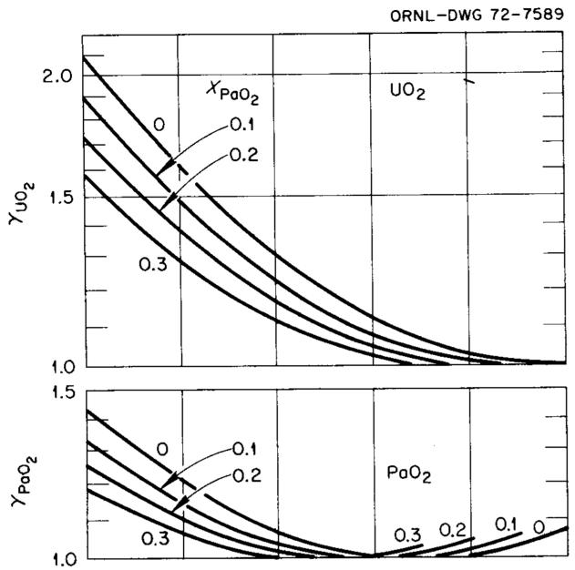

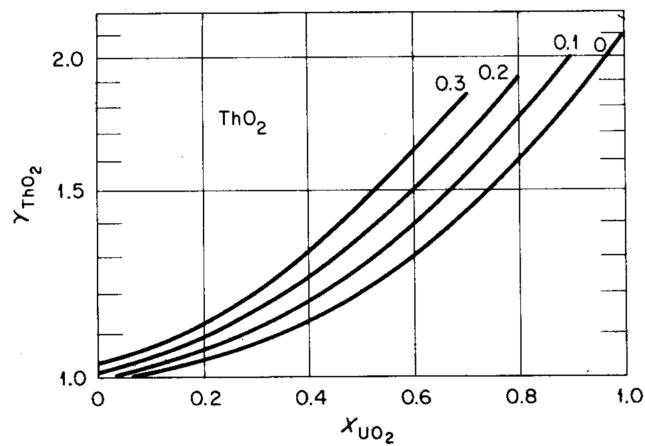  
Fig. 9.4. Estimated activity coefficients in ternary oxide solid solutions of $\mathrm{ThO}_2$ , $\mathrm{PaO}_2$ , and $\mathrm{UO}_2$ at $600^{\circ}\mathrm{C}$ .

# 10. Development and Evaluation of Analytical Methods for Molten-Salt Reactors

A. S. Meyer

# 10.1 IN-LINE CHEMICAL ANALYSIS OF MOLTEN FLUORIDE SALT STREAMS

J.M.Dale A.S.Meyer

Automated analyses for U(III) in $\mathrm{LiF - BeF_2 - ZrF_4 - UF_4}$ (65.4-29.1-5.0-0.5 mole %) in the NCL-21 thermal convection salt loop were continued. The percent of the total uranium present as U(III) for the first 3600 hr of loop operation is shown in Figs. 10.1-10.3. These analyses were largely made by unattended operation of the computer-controlled voltammetric system described in the previous report. $^1$

The first analyses, made 70 hr after the salt was loaded into the loop, showed that the concentration of

1. J. M. Dale and A. S. Meyer, MSR Program Semiannu. Progr. Rep. Aug. 31, 1971, ORNL-4728, p. 69.

U(III) was about $0.02\%$ . The U(III) concentration started increasing as the chromium from the metal loop dissolved into the salt and reduced the U(IV). The irregular appearance of the data at 600 hr was due to large temperature fluctuations in the electrode tank. The first measurements with the shielded electrode were made at 1200 hr and are plotted as squares in Figs. 10.1 and 10.2. The shielded electrode is an assembly designed to eliminate the interference of material from the surface of the melt which apparently deposits on the electrode and changes its area and electrical characteristics. The electrode is surrounded by an open-ended nickel tube which can be periodically purged with helium to provide a clean melt surface.

At about $1250\mathrm{hr}$ it was first noted that analyses with the shielded and unshielded electrodes gave different values for the U(III) concentration. This was later

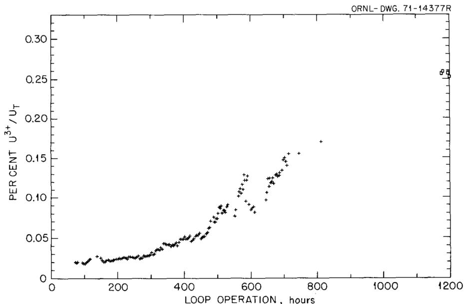  
Fig. 10.1. U(III) in MSRE fuel salt, 7/20/71 to 9/8/71.

shown to be an effect of the nickel tube around the shielded electrode and not to a difference in the platinum electrodes. At 2350 hr the nickel tube shield was raised out of the melt, and the measurements with the two electrodes were in agreement as shown in Fig. 10.2. Fortunately, the surface material has apparently been removed from the melt by continuous operation of the loop, and the unshielded electrodes are operating satisfactorily. It will probably be necessary to use shielded electrodes for other systems, however, and

further investigation is needed to determine the reason for the difference in the two electrodes. A possible explanation is that the difference results from a cooling of the melt by the shield tube.

During the first 3600 hr of loop operation the Hastelloy N corrosion specimens were inserted into the loop at three different times (140, 1316, and 3200 hr). Except for the first time, when the U(III)

2. J. W. Koger, Sect. 13.5.1, this report.

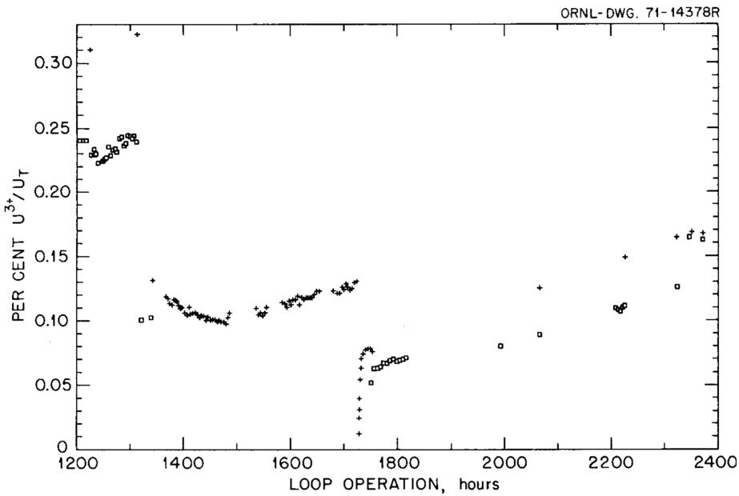  
Fig. 10.2. U(III) in MSRE fuel salt, 9/8/71 to 10/28/71.

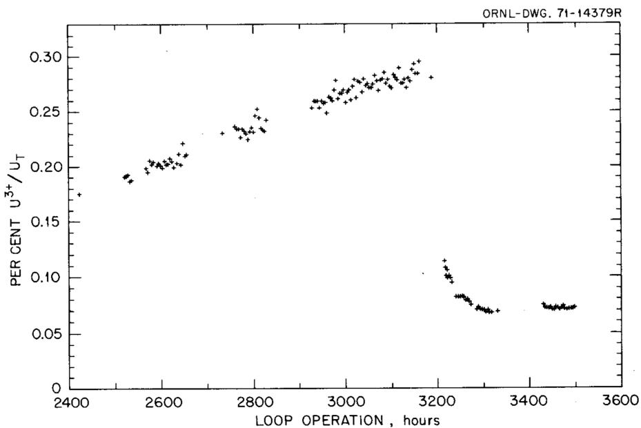  
Fig. 10.3. U(III) in MSRE fuel salt, 10/28/71 to 12/17/71.

concentration was already at a low value, the insertion of the metal specimens appeared to introduce an oxidant which caused a decrease in the U(III) concentration. Special precautions are being taken for the next specimen insertion to determine if this operation can be performed without oxidizing the U(III). At 1725 hr the shielded electrode, which had previously been removed for examination, was put back into the loop without immersing it into the salt. As shown in Fig. 10.2, the U(III) concentration decreased and then rapidly recovered, probably due to dilution effects caused by the salt flow.

The voltammetric technique will also be used to determine other melt constituents such as corrosion product ions. In the reducing melts that have been present in the loop the equilibrium concentration of $\mathrm{Fe(II)}$ and $\mathrm{Ni(II)}$ is negligible, while all of the chromium is present in the ionic form. In fuel melts, $\mathrm{Cr(II)}$ is the most difficult of the corrosion products to measure because its reduction potential is so close to that of U(IV) (see the next section of this report). One of the proposals which we have made but not demonstrated is that chromium can be determined by a stripping technique. This technique is based on the fact that metallic chromium, the reduction product of $\mathrm{Cr(II)}$ , is deposited on the electrode, whereas U(III), the reduction product of U(IV), is soluble and diffuses back into the melt. Thus if the electrode is held at a potential that is sufficiently cathodic to reduce both U(IV) and $\mathrm{Cr(II)}$ , the U(III) will rapidly approach a steady-state concentration at the electrode surface, while chromium metal is continuously deposited. When the electrode is electrolytically stripped by an anodic scan, the contribution of U(III) should be independent of reduction time, while the stripping current from the chromium metal should increase with plating time.

Figure 10.4 shows some typical stripping curves for chromium at the $100\mathrm{-ppm}$ level in the salt. Chromium was plated on the working electrodes for different lengths of time at $-360\mathrm{mV}$ vs $E_{\mathrm{EQ}}$ and then stripped from the electrode at a scan rate of $0.1\mathrm{V / sec}$ . When these stripping currents were integrated with the voltmeter and plotted vs plating time, an excellent straight-line relationship was obtained. Extrapolation to zero plating time showed that about $4.5\mathrm{mC}$ of the current, a reasonable value, was due to reoxidation of U(III) to U(IV). In theory, the slope of the curves of integrated current vs plating time should be proportional to the concentration of chromium ion in the melt. Although gradual increases in the slope of such curves which may correspond to increases in the concentration in the melt have been observed, we have

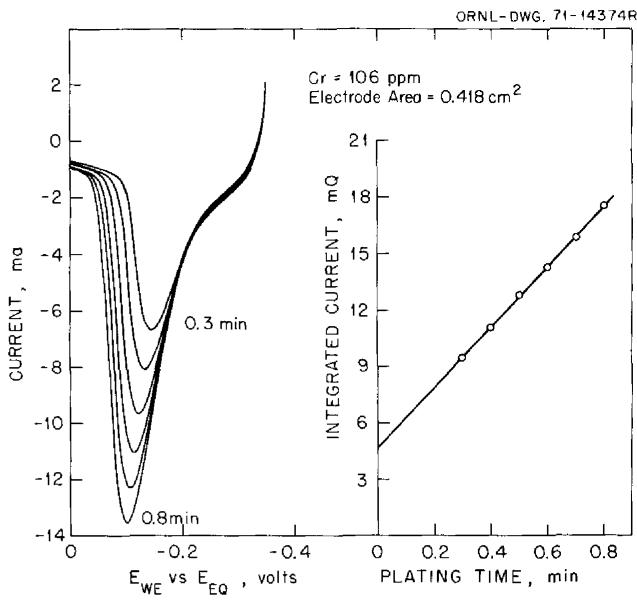  
Fig. 10.4. Stripping curves for chromium in MSRE fuel.

not accumulated sufficient analytical data to establish the analytical validity of this technique.

In summary, the results of the ratio measurements have, in general, shown excellent reproducibility and have been consistent with the known factors of loop operation. Although several problems (such as the offset in the potential of shielded electrodes, smaller offset voltages observed between the reference and working electrodes, and the establishment of accurate calibrations for the determination of corrosion products) remain to be solved, our experience gives us considerable confidence that this relatively simple transducer system can be widely applied to other test systems and ultimately to in-line reactor streams. The measurements also provide an explanation for the lower-than-expected results obtained in attempts to apply this technique to the hot-cell measurement of U(IV)/U(III) ratios in MSRE samples. Despite all our precautions, the contamination introduced during the sampling and transfer of the MSRE samples must have been at least equivalent to that observed during the introduction of corrosion specimens to the NCL-21 loop. It should be noted, however, that although these MSRE analyses provided little relevant data as to the ratio in the fuel, they indicated no evidence for interference to the method from the radioactivity of the samples.

# 10.2 THEORETICAL CONSIDERATIONS OF THE VOLTAMMETRIC IN-LINE DETERMINATION OF URANIUM(III)

J.M.Dale

The present method for determining the uranium(III) concentration in MSR fuel involves the measurement of the potential difference between the equilibrium potential of the melt and $E_{1/2}$ , the voltammetric equivalent of the standard potential of the U(IV)/U(III) couple. The equilibrium potential of the melt, $E_{\mathrm{EQ}}$ , is the potential of an inert platinum wire immersed in the melt and depends upon the U(IV)/U(III) ratio. The standard potential, $E_{1/2}$ , is the potential on the U(IV) reduction wave at which the concentrations of U(IV) and U(III) are equal. The relationship between $E_{\mathrm{EQ}}$ , $E_{1/2}$ , and U(IV)/U(III) is given by

$$
E _ {\mathrm {E Q}} = E _ {1 / 2} + \frac {R T}{n F} \ln \frac {\mathrm {U (I V)}}{\mathrm {U (I I I)}}.
$$

Because the voltammetric circuit uses $E_{\mathrm{EQ}}$ as a reference potential, we can consider it to be zero and

$$
- E _ {1 / 2} = \frac {R T}{n F} \ln \frac {\mathrm {U} (\mathrm {I V})}{\mathrm {U} (\mathrm {I I I})}.
$$

Evaluation of $E_{1/2}$ with respect to $E_{EQ}$ then permits the $\mathrm{U}(\mathrm{IV}) / \mathrm{U}(\mathrm{III})$ ratio to be calculated.

Nicholson and $\mathsf{Shain}^5$ have reported a solution to the boundary value problem that can be applied to this system. They found for a reversible couple where both species are soluble that $E_{1 / 2}$ corresponds to the potential on a theoretical reduction wave where the current is $85\%$ of the peak current. The experimental U(IV) reduction wave, however, from the NCL-21 thermal convection loop also involves the reduction of chromium, which could adversely affect the potential at which the $85\%$ point occurs. For this reason it was of interest to compare the theoretical reduction wave with the U(IV) reduction wave from the experimental system.

The potential, $E$ , of the working electrode during a voltammetric scan is represented by

$$
(E - E _ {1 / 2}) n = (R T / F) (\ln \gamma \theta - a t),
$$

where

$$
\begin{array}{l} \gamma = \sqrt {D _ {0} / D _ {r}} , \\ \theta = \exp \left[ \left(n F / R T\right) \left(E _ {i} - E _ {1 / 2}\right) \right], \\ a t = n F v t / R T. \\ \end{array}
$$

The term $\gamma \theta$ is a constant, where $D$ is the diffusion coefficient of the oxidized or reduced species and $E_{i}$ is the initial starting potential of the voltammetric scan. The term $at$ is a variable, where $\mathbf{v}$ is the voltage scan rate and $t$ is the time elapsed after the scan is started. All other terms have their usual significance. The current, $i$ , through the working electrode during a voltammetric scan is represented by

$$
i = n F A C _ {0} \sqrt {\pi D _ {0} a} \chi (a t).
$$

The term $\chi (at)$ is a function of $at$ , $A$ is the electrode area, and $C_0$ is the concentration of the U(IV) in the melt.

The expression

$$
\begin{array}{l} 2 \sqrt {\delta} \left\{\chi (1) \sqrt {k} + \sum_ {i = 1} ^ {k - 1} \sqrt {k - i} [ \chi (i + 1) - \chi (i) ] \right\} \\ = 1 / \left[ 1 + \gamma \theta \exp (- a t) \right], \\ \end{array}
$$

where $\delta = (at) / k$ , defines the relationship between the values of chi and the variable $at$ , where $k$ is the serial number of the particular value of chi being evaluated. In order to get a true theoretical current-potential curve it is necessary to solve for the values of chi at small voltage intervals, as each successive value of chi depends upon all of the previously determined values. A program was written for the PDP/81 for the numerical evaluation of the chi values over an 800-mV range at 2-mV intervals. This gave $\delta$ a value of 0.025. The initial potential, $E_{i}$ , was 500 mV anodic to $E_{1/2}$ , making $\ln \gamma \theta = 6.29$ .

Evaluation of the current expression, where $A = 0.418 \, \text{cm}^2$ , $C_0 = 0.282 \, \text{mole/liter}$ , $D_0 = 5.62 \times 10^{-6} \, \text{cm}^2 / \text{sec}$ , and $v = 0.1 \, \text{V/sec}$ , gives

$$
i = 5 3. 6 9 \chi (a t) m A
$$

for the potential defined by $at$ . The derivative current expression is

$$
d i / d t = \Delta i / \Delta t = 5 3. 6 9 \Delta \chi (a t) / \Delta t m A / \sec ,
$$

where the values of $\Delta x(at) / \Delta t$ are the incremental slopes between the $2\mathrm{-mV}$ intervals of the successive

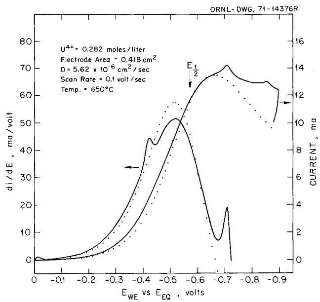  
Fig. 10.5. Reduction of $\mathbf{U}(\mathbf{IV})$ in MSRE fuel.

values of chi. By proper substitution of the values of $\chi (at)$ and $\Delta \chi (at) / \Delta t$ , these two expressions were used for the construction of the theoretical current-potential curve and its derivative.

In Fig. 10.5 the experimental waves are represented by the solid lines, and the theoretical waves are represented by the points plotted at $10\mathrm{-mV}$ intervals. There is the expected deviation in the region where $\mathrm{Cr(II)}$ is reduced $(-0.4$ to $-0.5\mathrm{V})$ both on the normal and derivative waves. The experimental derivative peak is lower because the $\mathrm{Cr(II)}$ reduction causes the normal wave to rise less sharply in this region. However, the potentials at which the two derivatives show a maximum agree to within $5\mathrm{mV}$ and there is good agreement between the experimental and theoretical values of $E_{1 / 2}$ . It is concluded that the chromium reduction does not affect the current-potential curve for the U(IV) reduction at the $E_{1 / 2}$ potential and that the method for determining $E_{1 / 2}$ is valid.

# 10.3 ELECTROANALYTICAL STUDIES OF TITANIUM(IV) IN MOLTEN $\mathrm{LiF - BeF_2 - ZrF_4}$ (65.4-29.6-5.0 MOLE %)

F. R. Clayton6

D. L. Manning

Gleb Mamantov

Since reporting on the voltammetry and chronopotentiometry of titanium(IV) in molten LiF-NaF-KF, we have continued these studies in molten $\mathrm{LiF - BeF_2 - }$ $\mathbf{ZrF_4}$ . The initial voltammetric studies were undertaken using $\mathrm{K}_2\mathrm{TiF}_6$ as the solute; however, the results of titanium(IV) reduction were greatly complicated by the

observed instability of Ti(IV) in the melt. White deposits collected in the cooler part of the electrolytic system after $\mathbf{K}_2\mathrm{TiF}_6$ was added to the melt. The volatilization of titanium tetrafluoride from the melt was confirmed in a separate experiment in a closed stainless steel vessel provided with a cold trap; the volatile product collected was identified as $\mathrm{TiF_4}$ by x-ray analysis.

Voltammetric studies of the oxidation of titanium(III) in molten $\mathrm{LiF - BeF_2 - ZrF_4}$ at $500^{\circ}$ were then initiated, since $\mathrm{TiF_3}$ was expected to be stable in the melt at this temperature. (The sublimation point of $\mathrm{TiF_3}$ is $930^{\circ}$ in vacuo.)

Well-defined linear-sweep voltammograms for molten $\mathrm{LiF - BeF_2 - ZrF_4}$ containing Ti(III) were obtained at a sheathed glassy carbon electrode. Similar but less-welldefined waves were obtained at an unsheathed platinum electrode. The wave corresponds to the anodic oxidation of Ti(III) to Ti(IV). This was the only wave observed upon addition of $\mathrm{TiF_3}$ within the potential limits of the melt, $+1.5$ to $-1.5\mathrm{V}$ measured at the platinum vs nickel(II)(saturated)/nickel reference electrode $(\mathrm{LaF}_3$ membrane type). These potential limits correspond to anodic dissolution of platinum and the reduction of $\mathrm{Zr(IV)}$ respectively. A plot of $i_p$ vs $\mathbf{v}^{1 / 2}$ resulted in a straight line which is indicative of a simple charge transfer reaction. The concentration dependence of $i_p$ was also linear.

The standard electrode potential $E^0$ for the $\mathrm{Ti(IV) / Ti(III)}$ couple may be estimated from the $E_{1 / 2}$ for the process $\mathrm{Ti(III)}\rightleftharpoons \mathrm{Ti(IV)} + e$ in molten $\mathrm{LiF - BeF_2 - ZrF_4}$ at $500^{\circ}\mathrm{C}$ . The $E_{1 / 2}$ is $+0.380\mathrm{V}$ with respect to the $\mathrm{Ni(II)(saturated) / Ni(II)}$ reference electrode. However, an extrapolation of a Nernstian plot of the nickel couple to unit mole fraction of nickel(II) gives a potential that is $183~\mathrm{mV}$ more anodic than the potential corresponding to the saturation point of nickel(II). Applying this correction of $-183~\mathrm{mV}$ to relate the potential of the reference electrode to the potential of a unit fraction $\mathrm{Ni(II) / Ni}$ couple, $E^0$ for the $\mathrm{Ti(IV) / Ti(III)}$ couple in molten $\mathrm{LiF - BeF_2 - ZrF_4}$ at $500^{\circ}\mathrm{C}$ is estimated at $+0.197\mathrm{V}$ (vs a unit mole fraction $\mathrm{Ni(II) / Ni}$ electrode).

The chronopotentiograms recorded at a sheathed glassy carbon electrode were reasonably well defined.

The product $i_0 \tau^{1/2}$ at current densities from 0.04 to 0.16 A/cm² was found to be reasonably constant at 0.060 ± 0.002 A sec¹² cm⁻². Transition times were in the range 0.1 to 2.3 sec.

Further verification of $n = 1$ for the Ti(III) oxidation was accomplished using the ratio of the voltammetric $i_{p} / \mathrm{v}^{1 / 2}$ to the chronopotentiometric $i_0\tau^{1 / 2}$ . This relationship for the determination of $n$ is given at $500^{\circ}\mathrm{C}$ as

$$
\frac {i _ {p} / \mathrm {v} ^ {1 / 2}}{i _ {0} \tau^ {1 / 2}} = 1. 9 6 n ^ {1 / 2}.
$$

An $n$ value of 0.9 was determined by this method, which is independent of other parameters such as concentration of the electroactive species, diffusion coefficient, and electrode area.

For chronopotentiometry, the half-wave potential for a reversible charge transfer corresponds to the potential at one-fourth the transition time. This value was found to be about $+0.40\mathrm{V}$ vs an $\mathrm{Ni(II)(saturated) / Ni}$ reference electrode, and agrees reasonably well with the $+0.380\mathrm{-V}$ voltammetric value. From our voltammetric and chronopotentiometric studies, we believe this electrode reaction conforms to a reversible $\mathrm{Ti(III)}\rightarrow \mathrm{Ti(IV)}$ oxidation process and that this reaction could be used to monitor any buildup of titanium(III) in a flowing salt stream.

# 10.4 ELECTROCHEMICAL STUDIES OF BISMUTH(III) IN MOLTEN LiF-BeF $_2$ -ZrF $_4$ AT $500^{\circ}\mathrm{C}$

J. S. Hammond9

D. L. Manning

Bismuth(III) being of importance in fuel stream purification systems is, therefore, a possible impurity in the reactor fuel salt. Voltammetric and chronopotentiometric studies were initiated to characterize the reduction behavior of this substance.

The linear sweep voltammograms were well defined for the reduction of bismuth at pyrolytic graphite, platinum, iridium, and silver indicator electrodes. Reverse scans indicated possibly alloy formation between bismuth and platinum and also between bismuth and silver. No evidence of alloy formation was observed at pyrolytic graphite and iridium electrodes. Of the indicator electrodes tested, the results were most reproducible at the iridium electrode. This material appears to be an excellent inert electrode for electroanalytical studies in corrosive melts.

The peak-shaped voltammogram corresponds to the reduction of $\mathrm{Bi}^{3+}$ to metallic bismuth at approximately $-0.05\mathrm{V}$ vs a platinum quasi-reference electrode. Plots of $i_p$ vs $\mathbf{v}^{1 / 2}$ were linear to about $5\mathrm{V / sec}$ , with slightly downward curvature at the faster scan rates. This suggests that the electrode reaction is becoming quasi-reversible at the faster scan rates. $^{10}$ The concentration dependence of $i_p$ was linear over the concentration range $\sim 10$ to $200~\mathrm{mM}$ Bi(III). It was also discovered that for appreciable periods of time (days), stable solutions of Bi(III) in molten LiF-BeF $_2$ -ZrF $_4$ could not be maintained in either graphite or copper cells. However, the bismuth solutions appeared to be more unstable in graphite. The mechanism for the bismuth instability is not yet resolved.

Chronopotentiograms recorded at an iridium electrode $(\sim 0.1~\mathrm{cm}^2)$ were well defined. The ratio of forward to reverse transition times was unity, indicating the reversible deposition of an insoluble substance. The values for the diffusion coefficient evaluated from voltammetry and chronopotentiometry were 1.08 and $1.03\times 10^{-6}\mathrm{cm}^2 /\mathrm{sec}$ respectively.

Verification of $n = 3$ for the bismuth reduction was carried out using the ratio of the voltammetric $i_{p} / \mathrm{v}^{1 / 2}$ to the chronopotentiometric $i_0\tau^{1 / 2}$ . This equation for the determination of $n$ at $500^{\circ}\mathrm{C}$ is given as

$$
\frac {i _ {p} / \mathrm {v} ^ {1 / 2}}{i _ {0} \tau^ {1 / 2}} = 2. 6 9 n ^ {1 / 2}.
$$

An $n$ value of about 2.9 was obtained, which is independent of other parameters such as the concentration of the electroactive species, diffusion coefficients, and electrode area.

# 10.5 VOLTAMMETRY OF CHROMIUM(III) IN MOLTEN $\mathrm{NaBF}_4$ -NaF (92-8 MOLE %)

D. L. Manning

A voltammetric study is under way on the reduction characteristics of chromium(III) added as $\mathrm{Na}_3\mathrm{CrF}_6$ to molten $\mathrm{NaBF}_4$ -NaF. The melt is contained in a graphite cell enclosed in a nickel apparatus to maintain an inert atmosphere. A cover gas of helium is maintained under static conditions at approximately 5 psi. Enough $\mathrm{Na}_3\mathrm{CrF}_6$ was added to give a chromium(III) concentration of approximately 410 ppm if all the reagent dissolved. Chemical analysis of melt samples taken at

440 and $500^{\circ}\mathrm{C}$ revealed a chromium(III) concentration of 200 and 300 ppm respectively.

The chromium reduction wave $(\mathrm{Cr}^{3+} \rightarrow \mathrm{Cr}^0)$ was observed at approximately $-1.0 \mathrm{~V}$ vs a platinum quasi-reference electrode at platinum and palladium indicator electrodes. The waves were reasonably well defined; limiting current values at platinum $(\sim 0.1 \mathrm{~cm}^2)$ were 500 and $1100 \mu \mathrm{A}$ at 440 and $500^{\circ} \mathrm{C}$ , respectively, at a scan rate of $0.1 \mathrm{~V} / \mathrm{sec}$ . Scan rate studies revealed that plots of peak current $(\mu \mathrm{A})$ vs scan rate, $(\mathrm{V} / \mathrm{sec})^{1/2}$ , were linear to about $10 \mathrm{~V} / \mathrm{sec}$ . From the slope of the line, the diffusion coefficient of the $\mathrm{Cr(III)}$ species can be evaluated, and at $440^{\circ} \mathrm{C}$ was found to be about $2 \times 10^{-6} \mathrm{~cm}^2 / \mathrm{sec}$ .

Attempts to record chronopotentiograms were not successful; apparently the potential of the chromium reduction is too close to the melt limit to record meaningful transition times.

Additional experiments will be carried out to ascertain the linearity of the peak current vs chromium concentration plots.

# 10.6 VOLTAMMETRIC AND HYDROLYSIS STUDIES OF PROTONATED SPECIES IN MOLTEN $\mathrm{NaBF}_4$

D. L. Manning A. S. Meyer

We are continuing our investigation of the electrolysis of hydrogen from $\mathrm{NaBF}_4$ melts at evacuated palladium electrodes. For the reduction of hydrogen, most electrode materials yield ill-defined and ragged voltammetric waves characteristic of gas film formation. However, at the palladium electrode the deposited hydrogen rapidly dissolves into the electrode to eliminate the film formation and gives well-defined voltammograms. Moreover, if the electrode is held at a sufficiently cathodic potential, some of the deposited hydrogen enters the evacuated portion of the electrode to yield a measurable pressure. Both of these techniques offer promise for a sensitive method for the in-line determination of protons in the coolant salt, with the pressure measurement technique offering the advantage of specificity.

During this period we have changed our experimental conditions by enclosing the melt in a nickel vessel as opposed to the quartz and Pyrex system that we usually use to protect molten fluoride salts. In both cases the actual melts are contained in a graphite liner under a static pressure of helium and make no direct contact

with the protective envelope. In contrast with the instability of the protonated species observed in the glass-enclosed systems, $^{12}$ the reduction waves in the metallic container were stable indefinitely in melts containing from 14 to $40~\mathrm{ppm}$ hydrogen, according to infrared analyses. The effect of glass containers on the stability of these melts is surprising, because the only communication to the container walls is through the gas phase. This behavior is consistent with the observations that the absorption peak of the $\mathrm{BF}_3\mathrm{OD}^-$ ion faded during measurement on melts contained in quartz cells. $^{13}$

We are now attempting to calibrate both of these types of measurements for analytical applications. This work is complicated by variations in the rate of diffusion through the electrode material and also by a low correlation of concentration between peak reduction currents, assuming a reasonable diffusion coefficient value and the analyses of the melts by the infrared pellet technique. Currently, we are investigating electrodes fabricated from silver-palladium alloys and are considering the possibility that the observed voltammetric wave results from the reduction of only one of multiple protonated species in equilibrium in the melt.

# 10.7 DETERMINATION OF HYDROGEN IN NaF-NaBF $_4$ SALTS

J.P.Young A.S.Meyer

Based on a calibration factor derived from an intimate physical mixture of $\mathrm{NaBF}_3\mathrm{OH}$ and $\mathrm{NaF - NaBF_4}$ powders, $^{14}$ infrared (IR) determinations of protons, as $\mathrm{NaBF}_3\mathrm{OH}$ , in samples of $\mathrm{NaF - NaBF_4}$ salts have been carried out by J. R. Lund (Analytical Chemistry Division). It can ordinarily be expected that standard additions of a species of interest to a sample matrix are a perfectly reliable way to generate samples for a calibration curve; however, the labile nature of $\mathrm{NaBF}_3\mathrm{OH}$ with respect to even moderate increases in temperature, $^{15}$ coupled with the expected instability of protons in any form in molten $\mathrm{NaF - NaBF_4}$ , $^{16}$ called for rather stringent tests to obtain independent proof that

the IR method gave reliable results. The first two reported attempts to verify the IR method by the mass spectral method using $\mathrm{D}_2$ as an isotopic diluent $^{14}$ were subject to an exorbitant blank which resulted from $\mathrm{D}_2$ exchange with $\mathrm{OH}^-$ in the Pyrex experimental apparatus. Some or all of the measured hydrogen attributed to the sample may have resulted from increased exchange of the $\mathrm{OH}^-$ in the Pyrex ampuls due to etching. The only eutectic salt samples available at that time contained 20 to 30 ppm protons (IR); the only significantly lower proton concentration was in a sample of recrystallized $\mathrm{NaBF}_4$ . It is conceivable that a fortuitous difference in etching rates between the two samples could have yielded the excellent agreement obtained. During this period these Pyrex blanks have been reduced from 8 micromoles in a typical sample to 4 micromoles of $\mathrm{H}_2$ (these values correspond to 10 and 5 ppm protons respectively). This reduction in blanks was accomplished by prolonged heating of the Pyrex ampuls at a temperature near their softening point in a stream of helium prior to the addition of any sample. Data collected on the correlation of mass spectral and IR determinations of protons in $\mathrm{NaF - NaBF}_4$ samples are given in Table 10.1.

Most of the results of this comparison are in acceptable agreement between the two methods. Occasional high results by the mass spectral method are not unexpected in view of the experimental difficulties of handling of samples and ampuls. Moreover, no systematic variation is observed with improvements in the blank. We therefore conclude that the results of the IR analyses do indicate that a significant concentration of hydrogen is present in the samples submitted from corrosion loops. Precise confirmation of the IR calibra

Table 10.1. Determination of hydrogen in $\mathrm{NaBF_4}$ samples by infrared and mass spectral methods   

<table><tr><td rowspan="2">Sample</td><td rowspan="2">H2blank (micromoles)</td><td colspan="2">Hydrogen found (ppm)</td></tr><tr><td>Mass spectral</td><td>Infrared</td></tr><tr><td>NaBF4</td><td>8</td><td>8a</td><td>7a</td></tr><tr><td>NaF-NaBF4</td><td>8</td><td>22a</td><td>24a</td></tr><tr><td></td><td>5</td><td>20</td><td>16</td></tr><tr><td></td><td>5</td><td>27</td><td>22</td></tr><tr><td></td><td>6</td><td>31</td><td>10</td></tr><tr><td></td><td>4</td><td>7</td><td>9</td></tr><tr><td></td><td></td><td>8</td><td></td></tr><tr><td></td><td>b</td><td>28</td><td>12</td></tr></table>

${}^{a}$ Reported previously: J. P. Young, J. B. Bates, M. M. Murray, and A. S. Meyer, MSR Program Semiannu. Progr. Rep. Aug. 31, 1971, ORNL-4728, p. 73.   
$b_{\mathrm{Blank}}$ lost.

tion curves will require additional comparisons with samples of low or no proton content and with samples in which standard additions of protons have been made. From further experimental work with $\mathrm{SiO}_2$ ampuls, we have concluded that they are unsatisfactory due to excessive diffusion of $\mathbf{H}_2$ through the walls of the ampul.

From the results given in Table 10.1 it can be noted that the proton concentration, by IR analysis, varies from 9 to $24~\mathrm{ppm}$ . Until this period, not much variation was seen in the proton concentration, particularly low concentrations, in any $\mathrm{NaF - NaBF_4}$ sample that had been melted. The 7-ppm value reported last period was for purified $\mathrm{NaBF_4}$ that had never been melted. During this period, attempts have been made both to obtain melts of very low and relatively high proton (as $\mathrm{BF}_3\mathrm{OH}^-$ ) concentrations. In this respect, by carefully controlling experimental conditions and proper pretreatment of apparatus, it has been possible to prepare melts of $\mathrm{NaF - NaBF_4}$ that had 6.5 to $7~\mathrm{ppm}$ protons, based on IR analysis. Under our experimental conditions we have not yet been able to prepare melts of lower proton content. For several reasons we desire a melt which has no detectable proton concentration, and this work is continuing. Attempts have been made to make standard additions of protons to $\mathrm{NaF - NaBF_4}$ melts for use in the analysis evaluation. Using melt containers that are in an inert atmosphere, but exposed to thermal gradients within the system, apparently only $25\%$ , in the best cases, of the protons added, as $\mathrm{HBO_2}$ , $\mathrm{NaOH}$ , $\mathrm{NaHSO_4}$ , or $\mathrm{KHSO_4}$ , remain in the melt. Containers which will be sealed and isothermal are being designed for further standard addition work.

In summary, from our work it would appear that the IR analyses given by the analytical service laboratories are reasonably accurate for the pellet as pressed for the spectral measurement. Whether this value is the same as the proton concentration when the sample was molten remains to be proven. Certainly the IR analyses show the variation in proton concentration in the direction expected for a variation of a given experimental parameter. In line with the pellet work, we are also engaged in IR spectral studies of $\mathrm{NaF - NaBF_4}$ melts in cooperation with J. B. Bates and G. E. Boyd (Director's Division). This work is reported in Chap. 7.

# 10.8 SPECTRAL STUDIES OF MOLTEN SALTS

# J. P. Young

Miscellaneous spectral studies of solute species in molten $\mathrm{LiF - BeF_2}$ -based solvents and molten LiCl have been carried out in cooperation with, and as an aid to,

personnel from other divisions who are studying melts of interest to the program. Several techniques have been devised; several apparatus modifications have been designed, and some built; and both new and previously obtained spectral data have been applied to these areas of investigation.

Based on the spectral results from $\mathrm{Pa}(\mathrm{IV})$ in molten $\mathrm{BeF}_2$ -based solvents obtained with the hot-cell spectrophotometer, $^{17}$ the spectral determination of $\mathrm{Pa}(\mathrm{IV})$ in equilibrium with $\mathrm{Pa}(\mathrm{V})$ and $\mathrm{Fe}(\mathrm{II})$ offers a method for determining the potential of the $\mathrm{Pa}(\mathrm{IV})$ - $\mathrm{Pa}(\mathrm{V})$ couple in MSR solvent. Knowledge of this couple is important in assessing a possible fuel reprocessing scheme involving the precipitation of $\mathrm{Pa}_2\mathrm{O}_5$ . In cooperation with C. F. Baes, C. E. Bamberger, and R. G. Ross (Reactor Chemistry Division), we plan to undertake such a study. The ability to use small ( $\sim 300$ -mg) samples in the spectral technique has led to the proposal and approval to perform these experiments with palladium out of the hot cell. Techniques for sample transfer and treatment are much simpler if the experiment can be performed in the laboratory. A new sample transfer apparatus has been designed and will be constructed which will ensure no contact of the palladium sample with the laboratory atmosphere when it is transferred from the palladium glove box to the spectral furnace. The same general design will likewise ensure transfer of other samples from inert-atmosphere boxes to the spectral furnace without any exposure of the sample to the atmosphere. The transfer container makes use of two Cajon O-ring fittings arranged so that one O-ring seals the bottom of a sample spectral cell, windowed or windowless. The salt sample is within the cell, and the cell is attached to a rod within a cavity that serves as the transfer container. The rod protrudes through and is sealed by the second O-ring fitting. The bottom of the transfer container can be sealed to the spectral furnace in the normal fashion. After the transfer container with a sample, loaded in a glove box or inert-atmosphere box, is sealed to the spectral furnace, the sample can be introduced into the furnace by loosening the two Cajon fittings; they will remain gas-tight during this process, however. For possible use in the palladium experiment as well as in other experiments, it is advantageous at times to bubble gases into melts used in spectral studies. It has previously been thought that gases could not be bubbled through liquid contained in a windowless cell, because the agitation would cause the liquid to run out of the cell. By using tubing of small inside diameter

(e.g., 0.006 in.) and outside diameter (<0.062 in.), it has been found that gas can be passed through liquids without spillage. At least $4\mathrm{ml}$ of helium gas per minute can be bubbled through 0.1 to $0.2\mathrm{ml}$ of liquid contained in a windowless cell. Although liquid in the cell is agitated and stirred by the gas contact, the stability of the total liquid shape is unaffected because of the small size of the bubbles and because the bubbles tend to rise in a region immediately surrounding the purge tube. This procedure has been checked with both water and molten $\mathrm{LiF - BeF_2}$ in windowless cells. In experiments to date, it is noted that the tip of the bubbler tube plugs within 1 hr if helium gas is bubbled through molten $\mathrm{LiF - BeF_2}$ ; the reason for the plugging is unknown, but several explanations are possible. Further work is planned to bubble HF-helium and/or $\mathrm{H}_2$ -helium mixtures through melts to establish a particular redox level for pretreatment of melts. The use of these gas mixtures may also prevent tip plugging.

In cooperation with C. E. Bamberger and C. F. Baes, the solubility of $\mathrm{CuO}$ in $\mathrm{LiF - BeF_2}$ was studied in a silica cell by a spectral study of the dissolved $\mathrm{Cu(II)}$ . After several days equilibration at $525^{\circ}C$ the intensity of the $\mathrm{Cu(II)}$ spectral peak at $880~\mathrm{nm}$ remained constant. Based on the molar absorptivity found by Whiting for $\mathrm{Cu(II)}$ in LiF-NaF-KF, approximately 2000 ppm $\mathrm{Cu(II)}$ dissolved in the melt. We hope to expand and combine work of this type with the thermodynamic data of Baes and Bamberger for the system $\mathrm{BeF}_2$ (d) and $\mathrm{SiO}_2(s)$ to study $\mathrm{CuF_2}$ and $\mathrm{CuF}$ in LiF-BeF $_2$ melts. The possible chemical reactions of copper containers with various fluoride melts seem to be a fruitful and partially neglected area of investigation.

Several spectral studies have been carried out with personnel in L. M. Ferris' group (Chemical Technology Division), in connection with fuel salt makeup and reductive extraction.

Several attempts were made to transfer, melt, and spectrally observe a sample of U(V) in MSR salt prepared by M. R. Bennett by reacting $\mathrm{UF_6}$ with U(IV) in the melt. Only a weak peak was seen at $1465\mathrm{nm}$ , the wavelength of a sharp U(V) absorbance peak, and this peak was only seen if the samples submitted by Bennett were loaded in gold-plated cells. No spectral indication of U(V) was observed if the samples were melted in graphite or copper cells; rather, in these cells as the sample melted, there was visual indication of gas bubbles and resultant melt agitation, with the melt immediately turning green and exhibiting the spectrum

of U(IV). In previous work with G. I. Cathers (Chemical Technology Division), spectral studies of U(V) in LiF-BeF $_2$ melts were undertaken; the solutions were prepared by adding Na $_2$ UF $_8$ to the molten solvent in a graphite windowless cell. During this period this solution preparation was repeated. Once the U(V) solution was prepared, the melt was frozen and then remelted. On remelting, no evidence of the U(V) spectrum was seen. These results suggest that something in the thermal cycling of a sample containing U(V) may cause a loss of U(V).

Spectra of solutions of $\mathrm{Li}_3\mathrm{Bi}$ in molten LiCl have been observed during this period. If a sample is melted directly in a molybdenum windowless cell under our experimental conditions, the melt immediately decolorizes. However, if the sample is melted in the presence of some lithium-bismuth alloy, there is an initial loss of absorbance for several hours; then the spectrum of the yellow melt is fairly constant. The spectrum we see for $\mathrm{Li}_3\mathrm{Bi}$ in LiCl is similar to that

reported for $\mathrm{Li}_{3}\mathrm{Bi}$ in LiCl-LiF melts and consists mainly of a strong absorbance in the ultraviolet region; we do see a shoulder at $330\mathrm{nm}$ , however, which was not previously reported.19 It is probable that we are observing the spectrum of $< 150~\mathrm{ppm}$ $\mathrm{Li}_3\mathrm{Bi}$ in the melt. Some preliminary work with related species has also been carried out. L. M. Ferris' group has provided samples of LiCl which have been in contact with lithium-lead alloys. No positive results have been obtained as yet, but it is interesting to note that, analytically, much more lithium is found in the melt than would be accounted for in the compound $\mathrm{Li_4Pb}$ . The spectrum of lithium was not observed in these melts; however, in an earlier study of lithium in pure $\mathrm{LiCl}_3$ ,20 no measurable absorbance was observed at similar concentrations.

19. M. F. Foster, C. E. Crouthamel, D. M. Gruen, and R. L. McBeth, J. Phys. Chem. 68, 980 (1964).

20. J. P. Young, J. Phys. Chem. 67, 2507 (1963).

# 11. Other Molten-Salt Researches

# 11.1 THE OXIDE CHEMISTRY OF NIOBIUM IN MOLTEN LiF-BeF $_2$ MIXTURES

Gann Ting1 C. F. Baes, Jr. G. Mamantov2

The chemistry of niobium in molten fluorides is of interest to the MSBR program for several reasons. In the MSRE it was observed that the appearance of fission product $^{95}\mathrm{Nb}$ in the fuel seemed to be a sensitive function of the state of oxidation (the $\mathrm{U}^{4+}/\mathrm{U}^{3+}$ ratio) of the fuel. This effect, which presumably involves the oxidation of the metal to a lower valence state in solution, might be a useful indicator of the state of oxidation of the fuel. Niobium pentoxide $(\mathrm{Nb}_2\mathrm{O}_5)$ , like protactinium pentoxide $(\mathrm{Pa}_2\mathrm{O}_5)$ , is expected to be sparingly soluble in molten fluorides, and it has been proposed that $\mathrm{Nb(V)}$ might be used as a stand-in for $\mathrm{Pa(V)}$ in studies of fuel reprocessing methods involving oxide precipitation. There may be some important differences, however, between the chemistry of $\mathrm{Nb(V)}$ and that of $\mathrm{Pa(V)}$ . It seems likely that $\mathrm{Nb(V)}$ , unlike $\mathrm{Pa(V)}$ , forms oxyions such as $\mathrm{NbOF}_x^{(x-3)-}$ in molten fluorides. In the system $\mathrm{NiO-Nb_2O_5}$ , at least two intermediate compounds, $\mathrm{NiNb_2O_6}$ and $\mathrm{Ni_4Nb_2O_9}$ , are known, and since NiO is also a sparingly soluble oxide, precipitation of these nickel niobates may be expected to complicate the chemistry of $\mathrm{Nb(V)}$ in the presence of $\mathrm{O}^{2-}$ and $\mathrm{Ni}^{2+}$ ions.

Weaver et al. equilibrated niobium metal and a lower-valent niobium fluoride in $\mathrm{Li}_2\mathrm{BeF}_4$ with hydrogen. Their results suggested the reaction

$$
4 \mathrm {H F} (\mathrm {g}) + \mathrm {N b} ^ {0} (\mathrm {c}) \rightleftharpoons \mathrm {N b F} _ {4} (\mathrm {d}) + 2 \mathrm {H} _ {2} (\mathrm {g}), \tag {1}
$$

$$
Q _ {1} = X _ {\mathrm {N b F} _ {4}} P _ {\mathrm {H} _ {2}} ^ {2} / P _ {\mathrm {H F}} ^ {4} \sim 1 0 ^ {1 2} (5 0 0 ^ {\circ} \mathrm {C}).
$$

Senderoff and Mellors8 report potentials, obtained chronopotentiometrically, for the formation of Nb(I), Nb(IV), and Nb(V) in molten LiF-NaF-KF (46.5-11.5-42 mole %) at $750^{\circ}\mathrm{C}$ . These indicate, in agreement with the results of Weaver and Friedman, that: Nb(IV) should be stable in the presence of nickel

or nickel-base alloys, $\mathrm{Nb(I)}$ should disproportionate to the metal and $\mathrm{Nb(IV)}$ , and $\mathrm{Nb(V)}$ should oxidize nickel to form appreciable concentrations of $\mathrm{NiF}_2$ in solution.

The purpose of the present study has been to explore further the chemistry of niobium in molten fluorides by means of equilibria involving oxide phases of niobium(V). Two series of equilibrations have been completed thus far. In the first series, performed in a nickel vessel, $\mathrm{NiNb_2O_6}$ and $\mathrm{Ni_4Nb_2O_9}$ were formed. In the second, performed in a graphite-lined vessel under circulating mixtures of CO and $\mathrm{CO}_{2}$ , the equilibrium solid phase was $\mathrm{Nb}_2\mathrm{O}_5$ . We will describe the second series of measurements first.

# 11.1.1 Equilibrations of $\mathbf{Nb}_2\mathbf{O}_5$ and BeO with Molten LiF-BeF2 Mixtures

The equilibrations were carried out in a welded cylindrical nickel vessel $(2^{1/2}$ in. in diameter, 12 in. long) with a graphite liner. Initially, $500\mathrm{g}$ of $\mathrm{LiF - BeF_2}$ (67-33 mole $\%$ ) which had been purified by the usual $\mathrm{HF - H_2}$ treatment was placed in the vessel. Beryllium oxide $(2.41\mathrm{g})$ was added along with $3.59\mathrm{g}$ of

$\beta \text{-Nb}_2\text{O}_5$ labeled with $^{95}\mathrm{Nb}$ . Agitation of the molten mixture was provided by means of a vigorous flow of $\mathrm{CO - CO_2}$ or $\mathrm{CO - CO_2}$ -Ar gas mixtures through the melt. The gas was recirculated by means of a finger pump acting on a length of flexible Tygon tubing. The gas circuit also included a copper filter, a copper cold trap for collecting any gaseous Nb(V) species which might be evolved, and an infrared (IR) cell for examination of the circulating gas. Filtered samples of the melt were taken with copper filter sticks (25 to $50~\mu$ as a function of time in order to follow the approach to equilibrium. The time required for equilibrium varied from 20 to $100\mathrm{hr}$ , decreasing with increasing temperature.

Samples of the equilibrated oxide phases were occasionally collected by suction on the tips of filter sticks. After washing with hot water to remove the solvent salts, these oxides were examined by various methods. Emission spectroscopy revealed beryllium and niobium to be the only metallic elements present in appreciable amounts. X-ray powder diffraction showed BeO to be present in all samples, $\beta\text{-Nb}_2\text{O}_5$ in two early samples, and $\gamma\text{-Nb}_2\text{O}_5$ in samples taken near the end of the series; the other samples gave an unidentified pattern, perhaps for an unreported polymorph of $\text{Nb}_2\text{O}_5$ . The scanning electron microscope (SEM) showed well-formed crystals containing major amounts of niobium. From this evidence we conclude that BeO and $\text{Nb}_2\text{O}_5$ were the equilibrium phases.

Only traces of niobium were found deposited in the cold trap or on the KBr windows of the IR cell. This is consistent with the calculated $^{10}$ equilibrium constant for the reaction

$$
\begin{array}{l} \frac {1}{2} \mathrm {N b} _ {2} \mathrm {O} _ {5} (\mathrm {c}) + \frac {5}{2} \mathrm {B e F} _ {2} (\mathrm {d}) \\ \rightleftharpoons \mathrm {N b F} _ {5} (\mathrm {g}) + 5 / 2 \mathrm {B e O} (\mathrm {c}), \tag {2} \\ \end{array}
$$

$$
\log \left(P _ {\mathrm {N b F} _ {5}}\right) = 2. 0 5 - 1 1. 7 6 \left(1 0 ^ {3} / T\right),
$$

which predicts that the partial pressures of $\mathrm{NbF}_5$ generated in these equilibrations will be in the range $10^{-13}$ to $10^{-9.4}$ atm.

From the niobium content of filtered samples (Fig. 11.1) it appears that there was no effect of the $\mathrm{CO}_{2} / \mathrm{CO}$ ratio, which was varied from 0.1 to 1.8. Since variation of this ratio should have caused changes in the $\mathrm{NbF}_{4}$

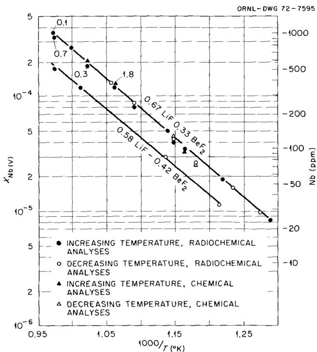  
Fig. 11.1. Concentration of niobium(V) in LiF-BeF $_2$ mixtures at equilibrium with BeO and Nb $_2$ O $_5$ under circulating CO $_2$ -CO mixtures. The numbers indicate the ratios $P_{\mathrm{CO}_2} / P_{\mathrm{CO}}$ .

content of the melt because of changes in the oxidation potential of the system (cf. reaction 3 below), the amount of $\mathrm{NbF_4}$ present evidently was small. Since, moreover, no visible or ultraviolet absorption spectrum corresponding to niobium(IV) was detected in filtered samples, $^{11}$ it is concluded that only niobium(V) was present in appreciable amounts in solution. The $\mathrm{CO}_{2} / \mathrm{CO}$ ratio was always higher than the values at which $\mathrm{Nb}_2\mathrm{O}_5$ is expected to be reduced to $\mathrm{NbO}_2$ .

The conclusion that $\mathrm{Nb(IV)}$ was not present in solution is confirmed by the following calculation. From the estimate of Weaver and Friedman7 of the equilibrium constant for the reduction of $\mathrm{NbF_4}$ in $\mathrm{Li}_2\mathrm{BeF}_4$ by hydrogen, one can calculate

$$
\Delta G ^ {f} _ {7 7 3 ^ {\circ} \mathrm {K}} [ \mathrm {N b F} _ {4} (\mathrm {d}) ] = - 3 0 6. 4 (\mathrm {k c a l / m o l e}).
$$

This, combined with $\Delta G^f$ values for $\mathrm{Nb}_2\mathrm{O}_5$ , $\mathrm{BeO}$ , $\mathrm{BeF}_2$ , $\mathrm{CO}$ , and $\mathrm{CO}_2$ , gives for the reaction

$$
\begin{array}{l} \frac {1}{2} \mathrm {N b} _ {2} \mathrm {O} _ {5} (\mathrm {c}) + \frac {1}{2} \mathrm {C O} (\mathrm {g}) + 2 \mathrm {B e F} _ {2} (\mathrm {d}) \\ \rightleftharpoons \mathrm {N b F} _ {4} (\mathrm {d}) + 2 \mathrm {B e O} (\mathrm {c}) + \frac {1}{2} \mathrm {C O} _ {2} (\mathrm {g}) \tag {3} \\ \end{array}
$$

the very small equilibrium constant

$$
X _ {\mathrm {N b F} _ {4}} \left(P _ {\mathrm {C O} _ {2}} / P _ {\mathrm {C O}}\right) ^ {1 / 2} \sim 1 \times 1 0 ^ {- 2 7}.
$$

Hence, the amount of $\mathbf{NbF_4}$ in the solutions is expected to be quite negligible.

With only $\mathrm{Nb(V)}$ present in solution in equilibrium with $\mathrm{Nb}_2\mathrm{O}_5(\mathrm{c})$ and $\mathrm{BeO}(\mathrm{c})$ , we find that its concentration (Fig. 11.1) is far greater than would have been predicted from the reported stabilities in molten fluorides of $\mathrm{NbF_4}^{7,8}$ and $\mathrm{NbF_5}^8$ and the available free-energy data for $\mathrm{Nb}_2\mathrm{O}_5(\mathrm{c})$ , $\mathrm{BeO}(\mathrm{c})$ , and $\mathrm{BeF_2(d)}$ . In particular, if $\mathrm{NbF_5}$ is the component in the present solutions we may calculate that $\mathrm{NbF_4(d)}$ should disproportionate completely to the metal and $\mathrm{NbF_5(d)}$ .

The evident stability of $\mathrm{Nb(V)}$ in the present system is most plausibly explained by the formation of one or more oxygen-containing species which, for the present, we will assume to be of the form $\mathrm{NbOF}_x^{(x - 3)}$ . The data in Fig. 11.1 then may be represented by the equilibrium

$$
\begin{array}{l} \frac {1}{2} \mathrm {N b} _ {2} \mathrm {O} _ {5} (\mathrm {c}) + \frac {3}{2} \mathrm {B e F} _ {2} (\mathrm {d}) \\ \rightleftharpoons \mathrm {N b O F} _ {3} (\mathrm {d}) + ^ {3 / 2} \mathrm {B e O} (\mathrm {c}), \tag {4} \\ \end{array}
$$

where, as usual, we represent the species in solution as neutral components. The equilibrium quotient for the reaction is defined as

$$
Q _ {4} = X _ {\mathrm {N b O F} _ {3}}.
$$

The results in $\mathrm{LiF - BeF_2}$ (67-33 mole %) give

$$
\log Q _ {4} = 1. 7 0 - 5. 2 7 \left(1 0 ^ {3} / T\right).
$$

In $\mathrm{LiF - BeF_2}$ (52-48 mole %) they give

$$
\log Q _ {4} = 0. 9 0 - 4. 8 1 \left(1 0 ^ {3} / T\right).
$$

The expression for $Q_{4}$ in LiF-BeF $_{2}$ (67-33 mole %), along with the estimate for $Q_{1}$ , and $\Delta G^{f}$ values for NbF $_{5}$ , Nb $_{2}$ O $_{5}$ , NbO $_{2}$ , BeO, and BeF $_{2}$ were used to generate the Pourbaix diagram shown in Fig. 11.2.

The variation of $X_{\mathrm{PaOF}_3}$ (i.e., of $Q_4$ ) with melt composition (Fig. 11.3) may be used to estimate the

activity coefficient $\gamma$ of the component $\mathrm{NbOF}_3$ as follows: $K_{4}$ may be written

$$
K _ {4} = X _ {\mathrm {N b O F} _ {3}} \gamma_ {\mathrm {N b O F} _ {3}} / \left(a _ {\mathrm {B e F} _ {2}}\right) ^ {3 / 2},
$$

wherein $a_{\mathbf{BeF}_2}$ is the activity of $\mathbf{BeF}_2$ in the solution. Hence

$$
\gamma_ {N b O F _ {3}} = \frac {K _ {4}}{Q _ {4}} \left(a _ {B e F _ {2}}\right) ^ {3 / 2}.
$$

As has been customary in previous studies, we define standard states such that $\gamma_{\mathbf{NbOF}_3} = 1$ and $a_{\mathrm{BeF_2}} = 1$ in $\mathrm{Li}_2\mathrm{BeF}_4$ (33 mole $\%$ $\mathrm{BeF}_2$ ); hence

$$
K _ {4} = \left(Q _ {4}\right) _ {X _ {\text {B e F} _ {2}}} = 0. 3 3.
$$

Introducing values for $a_{\mathrm{BeF}_2}$ , available from previous measurements, $^{13}$ we obtain the activity coefficients for $\mathrm{NbOF}_3$ shown in Fig. 11.4. The rapid rise of $\gamma_{\mathrm{NbOF}_3}$ with $X_{\mathrm{BeF}_2}$ in these melts suggests that $\mathrm{NbOF}_3$ competes strongly for the limited supply of fluoride ions, forming an anion with at least a $-2$ or $-3$ charge, that is, $\mathrm{NbOF}_5^{2-}$ or $\mathrm{NbOF}_6^{3-}$ .

# 11.1.2 Equilibrations Involving Nickel Niobates in Molten $\mathbf{L}\mathbf{i}_2\mathbf{B}\mathbf{e}\mathbf{F}_4$

In the first series of equilibrations, $\mathrm{Nb}_2\mathrm{O}_5$ , BeO, and NiO were equilibrated in $\mathrm{Li}_2\mathrm{BeF}_4$ in a nickel container under circulating argon. The apparatus and procedures were otherwise essentially the same as described in the previous section. Some difficulty was encountered in obtaining filtered samples free of solids. As judged by the reproducibility of the $^{95}\mathrm{Nb}$ and nickel content of successive samples, this was corrected by use of a finer porosity filter (maximum pore size $10\mu$ ). Equilibration times were from 20 to 120 hr, decreasing with increasing temperature.

At the outset of these experiments, only $\mathrm{Nb}_{2}\mathrm{O}_{5}$ and BeO were introduced; however, the nickel content of filtered samples quickly rose to values expected for NiO saturation, and, as will presently become clear, $\mathrm{Nb}_{2}\mathrm{O}_{5}$ was also being converted to $\mathrm{NiNb}_{2}\mathrm{O}_{6}$ . The required NiO presumably was supplied by inleakage of air early in the run.

In discussing the results (points numbered in chronological order in Fig. 11.5), it will be convenient to refer to the phase diagram in Fig. 11.6. Here the boundary between the BeO and $\mathrm{Nb}_2\mathrm{O}_5$ regions (re

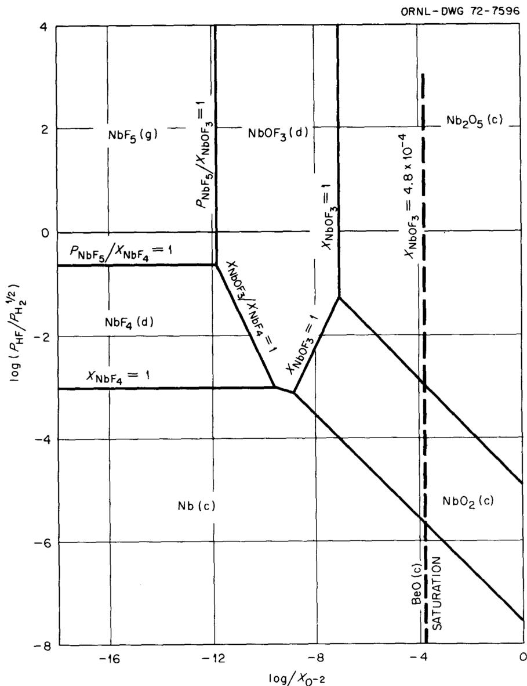  
Fig. 11.2. Pourbaix diagram for niobium in molten $\mathrm{Li}_2\mathrm{BeF}_4$ at $500^{\circ}\mathrm{C}$ .

action 1, Table 11.1) is derived from the previously described measurements of $Q_{4}$ . The boundary between BeO and NiO (reaction 4, Table 11.1) is derived from available thermodynamic data. $^{10}$ The other boundaries were generated from the data in Fig. 11.5 as follows:

Points 1 to 3. Since the nickel content in solution indicated NiO saturation in these initial samples, and the x-ray patterns of an oxide sample taken at point 5 indicated the presence of $\mathrm{NiNb_2O_6}$ and BeO as well, it was presumed that the dissolved $\mathrm{Nb(V)}$ concentration corresponds to point $A$ in Fig. 11.6, at which all three oxide phases are present and which is metastable with respect to the precipitation of $\mathrm{Ni_4Nb_2O_9}$ . With the

position of this point presumably established, the line corresponding to the boundary between $\mathrm{BeO}$ and $\mathrm{NiNb_2O_6}$ (reaction 2, Table 11.1) was drawn with the required slope of $-1 / 2$ .

After point 3, the apparatus was cooled to room temperature, and NiO was added.

Points 4 and 5. The nickel content of the melt appears somewhat lower and the niobium content somewhat higher than previously. This may reflect the conversion of small amounts of $\mathrm{NiNb_2O_6}$ to $\mathrm{Ni_4Nb_2O_9}$ according to reaction 6, Table 11.1. In the phase diagram (Fig. 11.6) this would correspond to a movement from point $A$ toward point $B$ .

Point 6. Here the nickel content of the melt has fallen well below the value corresponding to NiO saturation; however, the niobium content has not risen appreciably. Hence, even though $\mathrm{Ni}_4\mathrm{Nb}_2\mathrm{O}_9$ was detected in minor amounts with the SEM, it is thought that the system was still, in effect, near point $A$ .

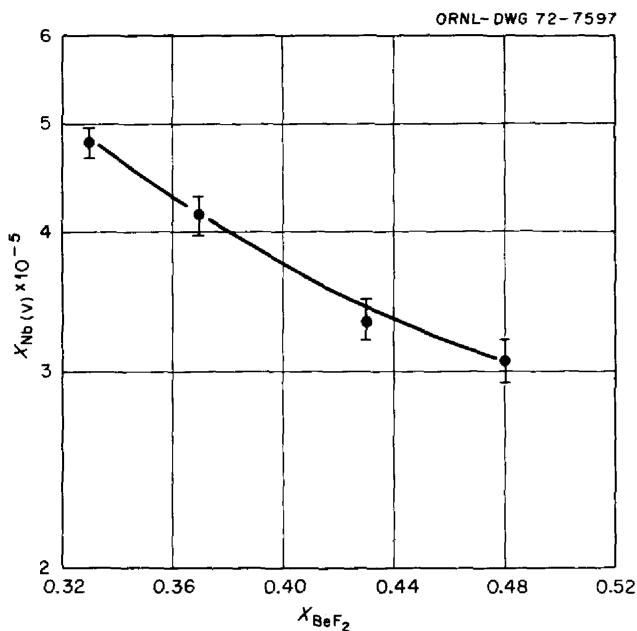  
Fig. 11.3. Effect of melt composition on the concentration of niobium(V) in LiF-BeF $_2$ mixtures at equilibrium with BeO and Nb $_2$ O $_5$ at $606^{\circ}\mathrm{C}$ .

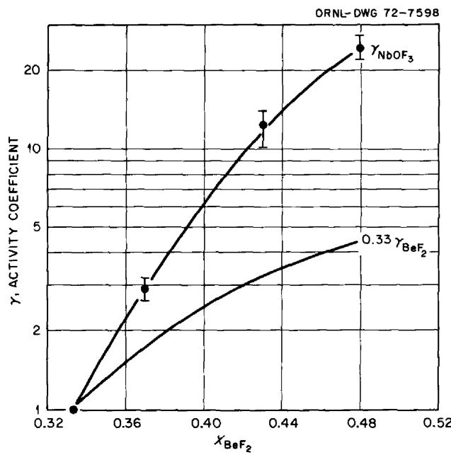  
Fig. 11.4. Activity coefficients of assumed component $\mathbf{NbOF}_3$ and $\mathbf{BeF}_2$ in LiF-BeF $_2$ mixtures at $606^{\circ}\mathbf{C}$ .

Point 7. Here the SEM suggested major amounts of $\mathrm{Ni}_4\mathrm{Nb}_2\mathrm{O}_9$ , the nickel content of the melt remained low, and the niobium content began to rise with time. However, final equilibrium with respect to $\mathrm{NiNb}_2\mathrm{O}_6$ , $\mathrm{Ni}_4\mathrm{Nb}_2\mathrm{O}_9$ , and BeO (point $B$ ) was not established. The dashed boundaries in Fig. 11.6, therefore, are located only tentatively, being based on the amount by which the nickel content of the melt was depressed at point 7.

On the basis of these results it is clear that the solubility of niobium can be quite low $(< 10~\mathrm{ppm})$ in melts containing appreciable amounts of $\mathrm{O}^{2-}$ and $\mathrm{Ni}^{2+}$ ions. We plan next to equilibrate molten $\mathrm{Li}_2\mathrm{BeF}_4$ with $\mathrm{Ni}_4\mathrm{Nb}_2\mathrm{O}_9$ and $\mathrm{NiO}$ . This should better locate one of the dashed boundaries in Fig. 11.6, and hence the other two as well. Also, there is an incentive for determining experimentally the slope of the boundaries between the $\mathrm{NiO - Nb_2O_5}$ phases, since this is related directly to the formula of the niobium component in solution. In particular, it may be shown that if the component has the general formula

$$
\mathrm {N b} _ {x} \mathrm {O} _ {y} \mathrm {F} _ {5 x - 2 y},
$$

then the slope of the boundaries between the NiO $\mathrm{Nb}_2\mathrm{O}_5$ phases will be

$$
\mathrm {s l o p e} = \frac {5 x - 2 y}{2}.
$$

Thus further measurements will not only define more precisely the solubility of niobium(V) in the presence of $O^{2-}$ and $\mathrm{Ni}^{2+}$ ions, but also test the validity of the assumption that the niobium(V) species in solution may be represented as the component $\mathrm{NbOF}_3$ .

# 11.2 THE REACTION OF $\mathsf{MoF}_6$ WITH NIOBIUM

J.D.Redman C.F.Weaver

The mass-spectrometric investigation of niobium fluorides and oxyfluorides was continued. Previous studies include the vaporization of $\mathrm{NbF}_5$ ,[14,15] the reaction of niobium with low-pressure fluorine,[16] the disproportionation of $\mathrm{NbF}_4$ ,[17] the thermal decomposition of

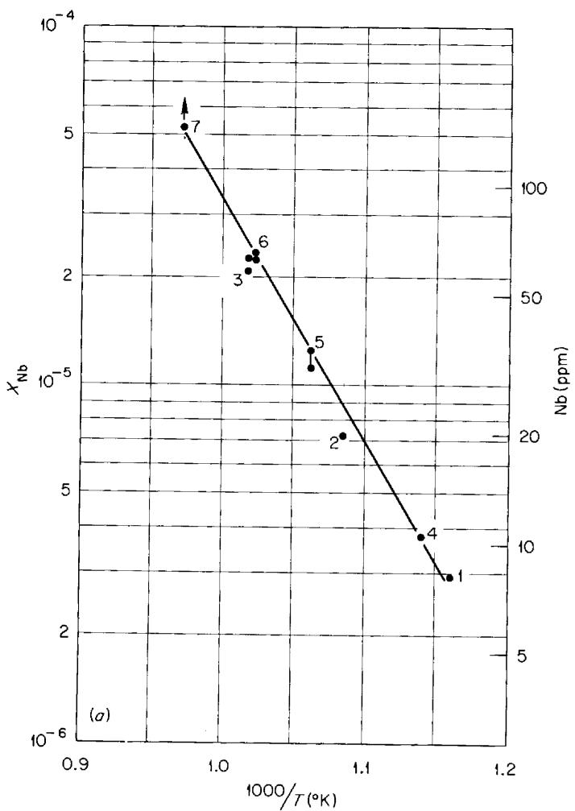

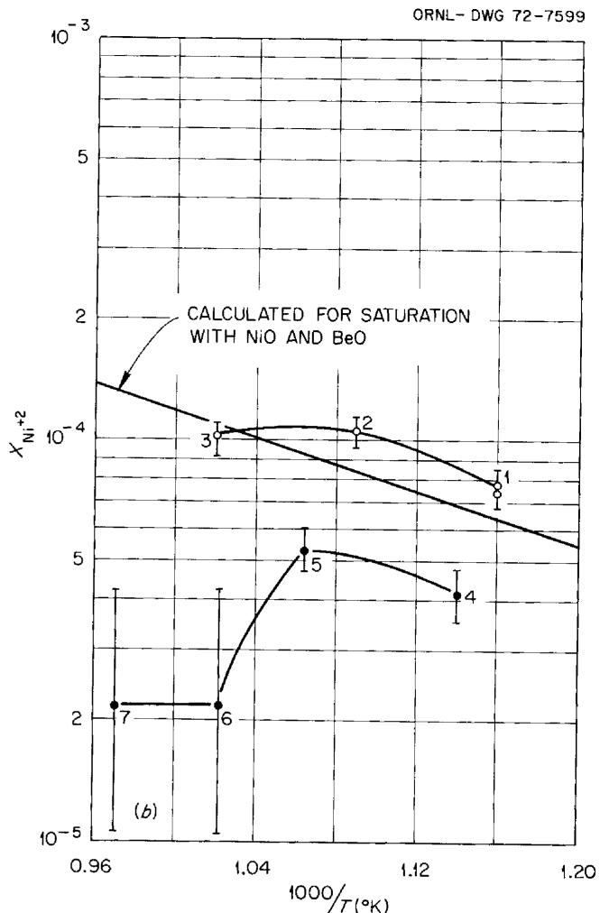  
Fig. 11.5. Concentrations of $(a)$ niobium(V) and $(b)$ nickel(II) in molten $\mathbf{Li}_2\mathbf{BeF}_4$ equilibrated with $\mathrm{NiO - Nb_2O_5}$ phases and BeO. The numbers indicate the order in which points were determined. The straight line in $b$ represents calculated values corresponding to saturation (reaction 4 in Table 11.1) with NiO and BeO.

Table 11.1. Reactions in $\mathbf{Li}_2\mathbf{BeF}_4$ represented by the boundaries in Fig. 11.6   

<table><tr><td>Saturating oxide phases</td><td>Reaction</td><td>Equilibrium constant expression</td></tr><tr><td>(1) Nb2O5+ BeO</td><td>1/2Nb2O5(c) + 3/2BeF2(d) ⇌ NbOF3(d) + 3/2BeO(c)</td><td>XNbOF3</td></tr><tr><td>(2) NiNb2O6+ BeO</td><td>1/2NiNb2O6(c) + 2BeF2(d) ⇌ NbOF3(d) + 1/2NiF2(d) + 2BeO(c)</td><td>XNbOF3 (XNiF2)1/2</td></tr><tr><td>(3) Ni4Nb2O9+ BeO</td><td>1/2Ni4Nb2O9(c) + 7/2BeF2(d) ⇌ NbOF3(d) + 2NiF2(d) + 7/2BeO(c)</td><td>XNbOF3 (XNiF2)2</td></tr><tr><td>(4) NiO+BeO</td><td>NiO(c) + BeF2(d) ⇌ NiF2(d) + BeO(c)</td><td>XNiF2</td></tr><tr><td>(5) Nb2O5+ NiNb2O6</td><td>2Nb2O5(c) + 3/2NiF2(d) ⇌ NbOF3(d) + 3/2NiNb2O6(c)</td><td>XNbOF3/(XNiF2)3/2</td></tr><tr><td>(6) NiNb2O6+ Ni4Nb2O9</td><td>7/6NiNb2O6(c) + 3/2NiF2(d) ⇌ NbOF3(d) + 7/3Ni4Nb2O9(c)</td><td>XNbOF3/(XNiF2)3/2</td></tr><tr><td>(7) Ni4Nb2O9+ NiO</td><td>1/2Ni4Nb2O9(c) + 3/2NiF2(d) ⇌ NbOF3(d) + 7/2NiO(c)</td><td>XNbOF3/(XNiF2)3/2</td></tr></table>

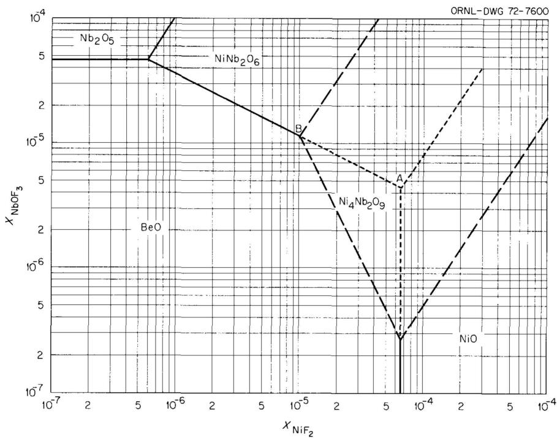  
Fig. 11.6. Phase diagram representing the $\mathrm{NbOF_3}$ and $\mathrm{NiF_2}$ concentrations in $\mathbf{Li}_2\mathbf{BeF}_4$ at $600^{\circ}$ as a function of the oxide phases present at equilibrium. The dashed lines are tentative. Point $A$ is thought to correspond to the measurements in Fig. 11.5.

$\mathrm{NbO}_2\mathrm{F},^{18,19}$ the disproportionation of $\mathrm{NbF}_3$ 19 the reaction of $\mathrm{Nb}_{2}\mathrm{O}_{5}$ with low-pressure $\mathbf{F}_2$ 20 and the reaction of $\mathrm{Nb}_{2}\mathrm{O}_{5}$ with low-pressure $\mathrm{NbF}_5$ 20

Previous mass-spectrometric studies of molybdenum fluorides and oxyfluorides include the thermal decomposition of $\mathrm{MoF}_3$ ,[21-23] the vaporization of $\mathrm{MoF}_5$ ,[21-23] the reduction of $\mathrm{MoF}_6$ with molybdenum metal,[22,23] the generation of $\mathrm{MoO}_2\mathrm{F}_2$ and $\mathrm{MoOF}_4$ ,[21-23] the generation of $\mathrm{MoTaF}_{10}$ ,[23] the thermal decomposition of $\mathrm{MoF}_3$ dissolved in molten $\mathrm{Li}_2\mathrm{BeF}_4$ ,[24-25] the thermal decomposition of $\mathrm{MoF}_4$ ,[26] and the reaction of $\mathrm{MoF}_6$ with $\mathrm{MoO}_3$ .[27]

In the earlier work the chemistry of niobium and molybdenum have been studied separately; the fact that these elements appear together during reactor operations and fuel processing makes the interactions of their fluorides of interest. The reaction of $\mathrm{MoF}_6$ vapor with niobium metal was observed for this reason.

The reaction was carried out in a copper Knudsen effusion cell and monitored over a temperature range of 25 to $750^{\circ}\mathrm{C}$ . A similar study of the reduction of $\mathrm{MoF}_6$ with molybdenum was reported earlier.[22,23] The results of both experiments may be seen in Tables 11.2 and 11.3. In general the two reactions were similar. The same molybdenum fluoride vapor products appeared at nearly the same temperature whether the reducing metal

was molybdenum or niobium. The oxygen impurity was observed as oxyfluorides. In the temperature range 200 to $450^{\circ}$ the $\mathrm{MoOF_4}$ was dominant, while $\mathrm{Nb}_2\mathrm{OF}_4$ was favored in the range 500 to $750^{\circ}\mathrm{C}$ . No mixed niobium-molybdenum species were observed, although other mixed metal species are known. The effusing

18. C. F. Weaver and J. D. Redman, MSR Program Semiannu. Progr. Rep Feb. 28, 1971, ORNL-4676, pp. 85-87.   
19. C. F. Weaver and J. D. Redman, Reactor Chem. Div. Annu. Progr. Rep. May 31, 1961, ORNL-4717, pp. 20, 22.   
20. C. F. Weaver and J. D. Redman, MSR Program Semiannu. Progr. Rep. Aug. 31, 1971, ORNL-4728, pp. 80-81.   
21. J. D. Redman and R. A. Strehlow, MSR Program Semiannu. Progr. Rep. Aug. 31, 1967, ORNL-4191, pp. 144-46.   
22. J. D. Redman and R. A. Strehlow, Reactor Chem. Div. Annu. Progr. Rep. Dec. 31, 1967, ORNL-4229, pp. 37-39.   
23. J. D. Redman and R. A. Strehlow, MSR Program Semiannu. Progr. Rep. Feb. 29, 1968, ORNL-4254, pp. 134-36.   
24. J. D. Redman and C. F. Weaver, Reactor Chem. Div. Annu. Progr. Rep. Dec. 31, 1968, ORNL-4400, pp. 36-37.   
25. J. D. Redman and C. F. Weaver, MSR Program Semiannu. Progr. Rep. Feb. 28, 1969, ORNL-4396, p. 159.   
26. J. D. Redman and C. F. Weaver, MSR Program Semiannu. Progr. Rep. Aug. 31, 1969, ORNL-4449, pp. 116-19.   
27. J. D. Redman and C. F. Weaver, MSR Program Semiannu. Progr. Rep. Feb. 28, 1970, ORNL-4548, pp. 126-31.

Table 11.2. Partial pressure of vapor species above $\mathrm{MoF_6}$ plus niobium   

<table><tr><td rowspan="2">Species</td><td colspan="8">Pressure (10-3torrs)</td></tr><tr><td>25°C</td><td>50°C</td><td>100°C</td><td>150°C</td><td>200°C</td><td>250°C</td><td>300°C</td><td>350°C</td></tr><tr><td>MoF6</td><td>5.7</td><td>39.6</td><td>26.2</td><td>13.2</td><td>52.5</td><td>15.2</td><td>41.2</td><td>15.6</td></tr><tr><td>Mo2F10</td><td>0</td><td>0</td><td>0</td><td>0</td><td>0</td><td>0</td><td>9.2</td><td>2.4</td></tr><tr><td>MoF5</td><td></td><td>0</td><td>1.4</td><td>1.8</td><td>3.8</td><td>10.5</td><td>33.6</td><td>5.2</td></tr><tr><td>MoF4</td><td></td><td>0</td><td>0</td><td>0</td><td>0</td><td>0</td><td>0</td><td>0</td></tr><tr><td>NbF5</td><td>0</td><td>0</td><td>0</td><td>0</td><td>0</td><td>16.3</td><td>45.5</td><td>64.0</td></tr><tr><td>NbF3</td><td>0</td><td>0</td><td>0</td><td>0</td><td>0</td><td>0</td><td>3.7</td><td>7.1</td></tr><tr><td>MoOF4</td><td>0</td><td>0</td><td>0</td><td>0</td><td>12.7</td><td>4.3</td><td>0</td><td>4.5</td></tr><tr><td>Nb2OF4</td><td>0</td><td>0</td><td>0</td><td>0</td><td>0</td><td>0</td><td>3.4</td><td>0</td></tr><tr><td rowspan="2">Species</td><td colspan="8">Pressure (10-3torrs)</td></tr><tr><td>400°C</td><td>450°C</td><td>500°C</td><td>550°C</td><td>600°C</td><td>650°C</td><td>700°C</td><td>750°C</td></tr><tr><td>MoF6</td><td>2.0</td><td>1.6</td><td>3.4</td><td>5.1</td><td>5.7</td><td>0.9</td><td>0.9</td><td>1.1</td></tr><tr><td>Mo2F10</td><td>2.4</td><td>0</td><td>0</td><td>0</td><td>7.4</td><td>0</td><td>0</td><td>3.4</td></tr><tr><td>MoF5</td><td>24.0</td><td>4.3</td><td>9.2</td><td>30.4</td><td>2.9</td><td>7.6</td><td>7.9</td><td>5.5</td></tr><tr><td>MoF4</td><td>0</td><td>0.9</td><td>0</td><td>6.8</td><td>13.1</td><td>11.6</td><td>14.5</td><td>17.5</td></tr><tr><td>NbF5</td><td>68.0</td><td>114.5</td><td>125.0</td><td>54.0</td><td>22.5</td><td>62.0</td><td>26.0</td><td>8.5</td></tr><tr><td>NbF3</td><td>7.3</td><td>0</td><td>38.7</td><td>31.8</td><td>3.4</td><td>15.6</td><td>7.7</td><td>19.4</td></tr><tr><td>MoOF4</td><td>8.4</td><td>1.7</td><td>0</td><td>1.1</td><td>0</td><td>0</td><td>0</td><td>0</td></tr><tr><td>Nb2OF4</td><td>0.2</td><td>1.5</td><td>5.0</td><td>4.2</td><td>6.2</td><td>2.7</td><td>4.2</td><td>15.4</td></tr></table>

Table 11.3. Partial pressure of molecules above $\mathrm{MoF_6}$ plus molybdenum   

<table><tr><td rowspan="2">Molecule</td><td colspan="7">Pressure (10-3torrs)</td></tr><tr><td>75°C</td><td>100°C</td><td>150°C</td><td>200°C</td><td>250°C</td><td>300°C</td><td>400°C</td></tr><tr><td>MoF6</td><td>14.2</td><td>8.0</td><td>6.2</td><td>8.0</td><td>5.3</td><td>5.0</td><td>5.3</td></tr><tr><td>Mo2F10</td><td>0.5</td><td>0.9</td><td>1.7</td><td>5.9</td><td>3.5</td><td>8.8</td><td>46.7</td></tr><tr><td>MoF4</td><td>0</td><td>0</td><td>0</td><td>0</td><td>0</td><td>0</td><td>0</td></tr><tr><td>MoOF4</td><td>0.6</td><td>1.0</td><td>0.6</td><td>0.3</td><td>0.09</td><td>0.18</td><td>0.9</td></tr><tr><td rowspan="2">Molecule</td><td colspan="7">Pressure (10-3torrs)</td></tr><tr><td>450°C</td><td>500°C</td><td>550°C</td><td>600°C</td><td>650°C</td><td>700°C</td><td>750°C</td></tr><tr><td>MoF6</td><td>2.9</td><td>1.5</td><td>1.4</td><td>1.6</td><td>1.2</td><td>1.1</td><td>3.9</td></tr><tr><td>Mo2F10</td><td>25.4</td><td>12.7</td><td>16.4</td><td>4.4</td><td>8.7</td><td>6.7</td><td>14.3</td></tr><tr><td>MoF4</td><td>0</td><td>0.6</td><td>0.4</td><td>1.1</td><td>1.9</td><td>3.3</td><td>6.8</td></tr><tr><td>MoOF4</td><td>0.7</td><td>0.4</td><td>3.8</td><td>3.9</td><td>3.0</td><td>0</td><td>0.8</td></tr></table>

Table 11.4. Cracking pattern for $\mathbf{MoF}_5^a$   

<table><tr><td>Ion</td><td>Relative intensity</td></tr><tr><td>MoF5+</td><td>0</td></tr><tr><td>MoF4</td><td>100</td></tr><tr><td>MoF3+</td><td>11</td></tr><tr><td>MoF2+</td><td>27</td></tr><tr><td>MoF+</td><td>22</td></tr><tr><td>Mo+</td><td>12</td></tr></table>

$a$ 75-eV electrons.

Table 11.5. Cracking pattern for ${\mathrm{{Nb}}}_{2}{\mathrm{{OF}}}_{4}{}^{a}$   

<table><tr><td>Ion</td><td>Relative intensity</td></tr><tr><td>Nb2OF2+</td><td>0</td></tr><tr><td>Nb2OF3+</td><td>100</td></tr><tr><td>Nb2OF2+</td><td>1</td></tr><tr><td>Nb2OF+</td><td>6</td></tr><tr><td>Nb2O+</td><td>2</td></tr><tr><td>Nb2+</td><td>5</td></tr></table>

$a75\mathrm{-eV}$ electrons.

fluorides reacted with structural tantalum in the apparatus, producing both the previously reported $\mathrm{MoTaF_{10}}^{23}$ and the new $\mathrm{NbTaF_{10}}$ . Previously, the determination of the cracking pattern for $\mathrm{MoF_5}$ has been impaired by simultaneous presence of much $\mathrm{Mo_2F_{10}}$ . In this study the small fraction of $\mathrm{Mo_2F_{10}}$ allowed the determination of a tentative cracking pattern for $\mathrm{MoF_5}$ , which is given in Table 11.4. The oxyfluoride $\mathrm{Nb_2OF_4}$ was seen previously only in the $\mathrm{Nb_2O_5}$ fluorination study.[20] In the present work the absence of monatomic niobium oxyfluorides allowed the cracking pattern of the $\mathrm{Nb_2OF_4}$ to be determined. It is shown in Table 11.5.

In this study the ratio of $\mathrm{MoF_4}$ to $\mathrm{MoF_5}$ was greater than found in the reduction of $\mathrm{MoF_6}$ with molybdenum, possibly a reflection of the greater reducing power of niobium compared with molybdenum. X-ray diffraction analysis identified the residue in the cell at the conclusion of the study as being $\mathrm{MoF_3}$ and molybdenum. The niobium was completely consumed.

# 11.3 THERMODYNAMICS OF LiF-BeF $_2$ MIXTURES

D. D. Sood J. Braunstein

Excess chemical potentials of LiF in molten LiF-BeF $_2$ mixtures, calculated from accurate liquidus data, $^{28,29}$

showed that the limiting chemical potential interaction parameter,

$$
\lim  _ {X \to 0} \left(\mu^ {E} _ {\mathrm {L i F}} / X ^ {2}\right),
$$

where $\mu^{E}_{\mathrm{LiF}}$ is the excess chemical potential and $X$ is the mole fraction of beryllium fluoride, was correlated satisfactorily with the analogous parameters for other alkali-alkaline-earth fluoride mixtures in terms of the conformal ionic solution theory. On the other hand, as seen in Fig. 11.7, the liquidus data are reproduced well, up to 0.25 mole fraction $\mathrm{BeF}_2$ , if the liquidus temperatures are calculated from the known heat of fusion and heat capacities of LiF under the assumption of an ideal mixture of LiF and $\mathrm{Li}_2\mathrm{BeF}_4$ . These liquidus temperatures were obtained as part of a detailed study $^{28}$ of the LiF- $\mathrm{BeF}_2$ system, and the revised phase diagram is shown in Fig. 11.8. Accurate data on mixing thermodynamics for other alkali fluoride-beryllium fluoride mixtures are needed to elucidate whether the ionic model or the complex ion model is the more useful. In

28. K. A. Romberger and J. Braunstein, MSR Program Semiannu. Progr. Rep. Feb. 28, 1970, ORNL-4548, p. 161; K. A. Romberger, J. Braunstein, and R. E. Thoma, J. Phys. Chem. 76, 1154 (1972).   
29. J. Braunstein, K. A. Romberger, and R. Ezell, J. Phys. Chem. 72, 4383 (1970).

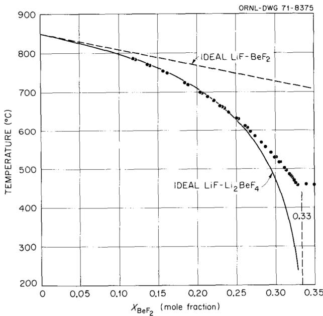  
Fig. 11.7. Calculated liquidus temperatures based on hypothetical ideal LiF-BeF $_2$ and hypothetical ideal LiF-Li $_2$ BeF $_4$ compared with the measured liquidus.

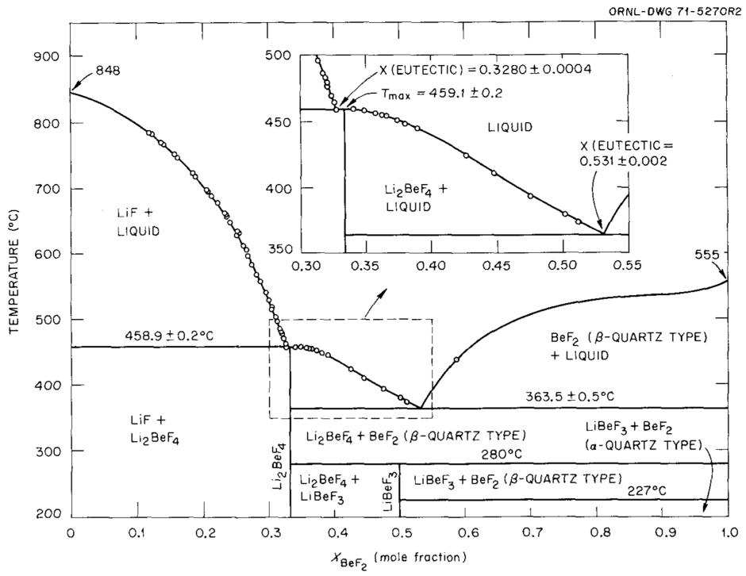  
Fig. 11.8. Revised phase diagram of the LiF-BeF $_2$ system. Data from K. A. Romberger and J. Braunstein, MSR Program Semiannu. Progr. Rep. Feb. 28, 1970, ORNL-4548, p. 161; K. A. Romberger, J. Braunstein, and R. E. Thoma, J. Phys. Chem. 76, 1154 (1972).

a mixture containing mole fraction $X$ BeF2, the calculated mole fraction of $\mathbf{M}_2\mathrm{BeF}_4$ , where $\mathbf{M}$ is an alkali metal, is $y = X / (1 + 2X)$ . The excess chemical potential of MF, based on mixing with $\mathbf{M}_2\mathrm{BeF}_4$ rather than with $\mathrm{BeF}_2$ , becomes

$$
\mu_ {\mathrm {M F}} ^ {E ^ {\prime}} = \mu_ {\mathrm {M F}} ^ {E} + R T \ln \frac {1 - X}{1 - y},
$$

and the transformed interaction parameter becomes

$$
\lim_{y\to 0}\left(\mu^{E^{\prime}}_{\text{M F}} / y^{2}\right)  ,
$$

which is zero if $\mathbf{MF}$ and $\mathbf{M}_2\mathbf{BeF}_4$ mix ideally. However, it is readily shown that if

$$
\lim  _ {y \to 0} \left(\mu^ {E ^ {\prime}} _ {\mathrm {M F}} / y ^ {2}\right) = 0,
$$

then the untransformed interaction parameter must have the value

$$
\lim  _ {X \rightarrow 0} \left(\mu^ {E} _ {M F} / X ^ {2}\right) = 2 R T
$$

$(nRT$ if the compound formed is $\mathbf{M}_n\mathrm{BeF}_{2 + n})$ . Thus if the alkali fluoride-beryllium fluoride mixtures form ideal solutions of $\mathbf{M}_2\mathbf{BeF}_4$ in MF, their limiting

interaction parameters should all be about 4 kcal/mole. For $\mathrm{LiF - BeF_2}$ , the interaction parameter is close to this, 5 kcal/mole. However, in order to be consistent with the application of conformal ionic solution theory to other alkali-alkaline-earth fluorides, the interaction parameters would be expected to exceed 10 kcal/mole for RbF and CsF. This seems to be the case,[29] as shown in Fig. 11.9, although the conclusion is based on data which had not been intended to provide accurate chemical potentials. However, the interaction parameters are not likely to be in error by 6 kcal/mole. It is striking that the ionic model leads to useful predictions, even though strong Raman bands have been reported for $\mathrm{BeF_4}^{2 - }$ ion in LiF- $\mathrm{BeF_2}$ and NaF- $\mathrm{BeF_2}$ melts.[30]

# 11.4 ELECTROCHEMICAL MASS TRANSPORT IN MOLTEN BERYLLIUM FLUORIDE-ALKALI FLUORIDE MIXTURES

H. R. Bronstein J. Truitt J. Braunstein

The uncommon unicationic conduction process in molten LiF-BeF $_2$ mixtures, $^{31}$ whereby electrical cur

30. A. S. Quist, J. B. Bates, and G. E. Boyd, J. Phys. Chem. 76, 78 (1972).   
31. K. A. Romberger and J. Braunstein, Inorg. Chem. 9, 1273 (1970).

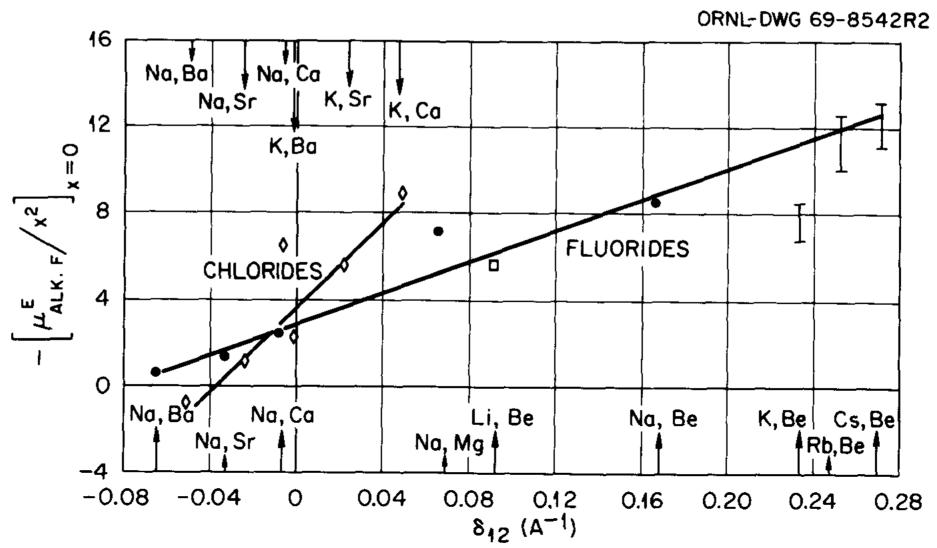  
Fig. 11.9. Application of conformal ionic solution theory to the chemical potential interaction parameters in alkali-alkaline earth fluoride mixtures. $\delta_{12}$ is the difference of reciprocal cation-anion distances,

$$
\frac {1}{d _ {M + - F ^ {-}}} - \frac {1}{d _ {B} ^ {2 + - F ^ {-}}}.
$$

rent is carried only by lithium ions (relative to fluoride as the reference constituent) over a wide range of composition, suggests a number of interesting consequences $^{32}$ of possible theoretical and practical importance. These are being tested by electrochemical scanning methods including voltammetry, chronopotentiometry, potential step methods, etc. Such methods have been useful previously in characterization and analysis of electrolytes, including molten salts, but primarily with solutions dilute in electroactive species. Here the electroactive constituent [Be(II)] predominates.

An electrochemical cell consisting of a small beryllium electrode and a large inert electrode in an alkali fluoride—beryllium fluoride melt may be expected to show appreciable difference in electrical conductivity for anodic or cathodic current at the beryllium electrode. Anodically, a film of virtually pure (highly resistive) $\mathrm{BeF}_2$ should be formed at the beryllium electrode as the current-carrying alkali cations migrate away. On reversal of polarity, $\mathrm{BeF}_2$ is reduced at the beryllium electrode, its supply then being diffusionally replenished by the large concentration gradient. The system should thus behave as a two-state device of high or low resistance. Furthermore, the relaxation time of the high-resistance film of $\mathrm{BeF}_2$ on current reversal should depend on the beryllium-alkali ratio in the melt and could conceivably provide the basis for an analytical method for this ratio.

Preliminary chronopotentiometric measurements $^{3,3}$ made at a beryllium electrode in an NaF-BeF $_2$ melt containing approximately 75 mole% BeF $_2$ appear to be qualitatively consistent with the predicted behavior. The extremely well-defined transition times encourage further study. Figure 11.10 shows a measurement of emf of the beryllium indicator electrode relative to a beryllium reference electrode in NaF-BeF $_2$ (~75 mole% BeF $_2$ at ~490°C) during passage of a constant current, first anodically and then cathodically, between the beryllium indicator electrode and a large nickel counterelectrode. On passage of constant anodic current at the beryllium electrode, the measured potential first rises rapidly to a nearly constant value as, presumably, Be(II) is formed in the melt. A rather abrupt rise in electrode potential is then required to sustain the constant current, possibly associated with the formation of a resistive BeF $_2$ film. On reversal of polarity, the potential drops very rapidly to a nearly constant value, suggesting rapid reduction of the BeF $_2$ film and indicating a much smaller concentration polarization cathodically than anodically.

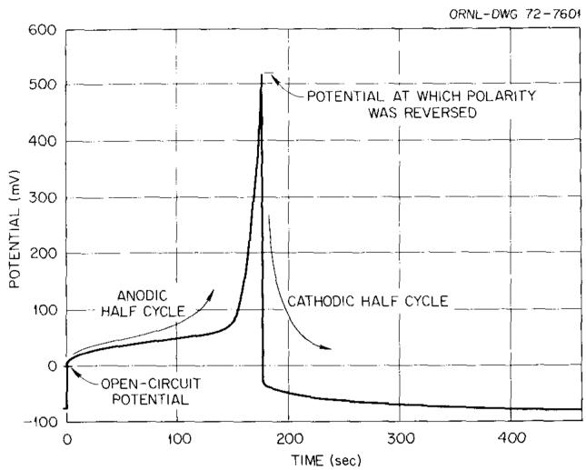  
Fig. 11.10. Typical chronopotentiogram in molten $\mathrm{NaF - BeF_2}$ ( $\sim 25$ to $75\mathrm{~mol}\%$ at $520^{\circ}\mathrm{C}$ , current density $\sim 40\mathrm{mA/cm^2}$ ). Potential of beryllium working electrode, relative to a beryllium reference electrode, vs time.

These measurements should prove useful also in testing for the formation of subvalent beryllium species.

# 11.5 ELECTRICAL CONDUCTANCE IN BERYLLIUM FLUORIDE RICH NaF-BeF $_2$ MIXTURES

# G.D.Robbins J.Braunstein

Continuing the investigation of transport properties in molten alkali fluoride-beryllium fluoride systems, $^{34-36}$ electrical conductance in the $\mathrm{NaF - BeF_2}$ system has been measured at compositions 90, 85, 80, 75, and 70 mole % beryllium fluoride and at temperatures between 485 and $600^{\circ}\mathrm{C}$ . The aim of these experiments had been to determine the manner in which melt composition affected the increase in resistivity and the change of activation energy in the region between the normal molten salt and the glass transition temperature. It was not possible, however, to avoid nucleation during extensive slow supercooling of the melts, and a cell is being designed for conductance measurement during warming of quenched glasses.

The data are shown in Fig. 11.11 as Arrhenius plots of the logarithm of resistance against the reciprocal of absolute temperature. These data were obtained with the previously described35 all-metal conductance cell and a series RC bridge. Starting materials were distilled beryllium fluoride glass and single-crystal sodium fluoride, handled under an inert atmosphere and introduced into the conductance cell in a ratio to produce a 90 mole % $\mathrm{BeF}_2$ melt. Changes of composition were made by NaF addition.

The high viscosity of the $\mathrm{BeF}_2$ -rich mixtures precluded mixing by gas bubbling, and extremely long equilibration times were required. With the 90 mole $\%$ $\mathrm{BeF}_2$ mixture, a systematic decrease of resistance with time was observed during the first half of a 60-day period, followed by slowly varying apparently random fluctuations that probably reflected bubble migration in and out of the interelectrode region. Thus the absolute values of conductance may be no more accurate than $\pm 10\%$ at this composition; however, the temperature dependence of the data taken over a short time interval should be more accurate. The frequency dispersion of the measurements showed no consistent pattern and led to corrections of 0.3 to $5\%$ in the resistance.

Preliminary values of Arrhenius energies,

$$
E _ {K} = 4. 5 7 5 \frac {d \log R}{d (1 / T)},
$$

obtained graphically at $525^{\circ}\mathrm{C}$ from the curves shown in Fig. 11.11 are 10.7, 11.5, 13.7, 15.2, and 15.4 kcal/mole at increments of 5 mole % from 70 to 90 mole % beryllium fluoride. The Arrhenius energies appear to vary less with temperature than previous results with LiF-BeF $_2$ mixtures. The apparent slight decrease of $E_{K}$ with decreasing temperature for the 90 mole % BeF $_2$ mixture, in contrast to the usual increase for most molten salts and mixtures, requires verification in view of experimental uncertainties, but had been observed also with pure BeF $_2$ .

# 11.6 THE DISPROPORTIONATION EQUILIBRIUM OF $\mathbf{U}\mathbf{F}_3$ SOLUTIONS

L.M.Toth L.O.Gilpatrick

In the previous report, $^{37}$ measured equilibrium ratios of $\mathrm{UF}_3 / (\mathrm{UF}_3 + \mathrm{UF}_4)$ were reported for the reaction of

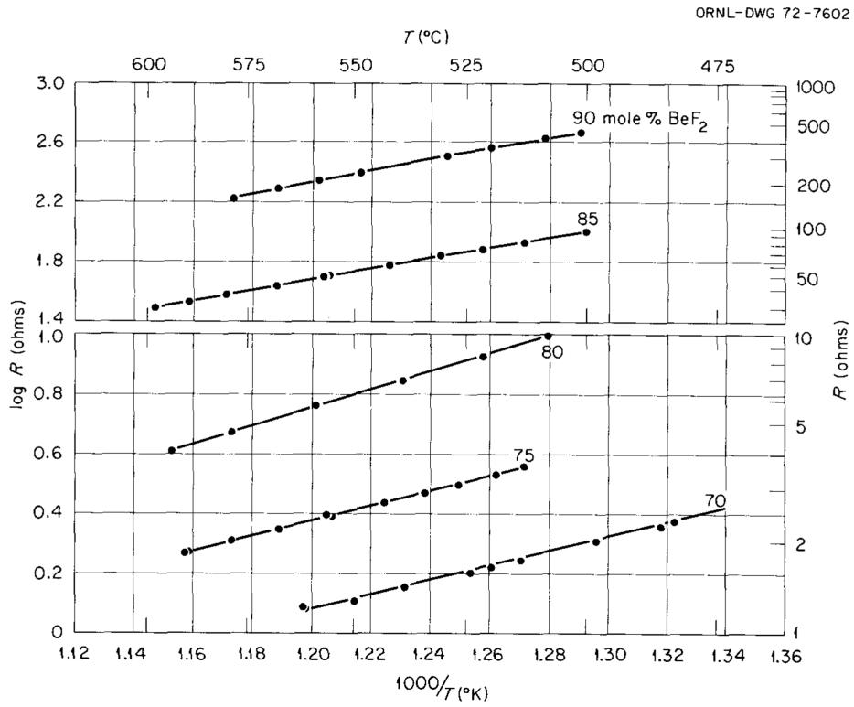  
Fig. 11.11. Resistance vs temperature for molten mixtures of $\mathbf{BeF}_2$ and NaF. The line drawn through the points at 70 mole % $\mathbf{BeF}_2$ corresponds to a previous set of measurements.

dilute $\mathrm{UF}_3$ solutions with graphite at $550^{\circ}\mathrm{C}$ as shown in Eq. (1),

$$
4 \mathrm {U F} _ {3} + 2 \mathrm {C} (\text {g r a p h i t e}) \rightleftharpoons 3 \mathrm {U F} _ {4} + \mathrm {U C} _ {2}. \tag {1}
$$

Equilibration was followed by measuring $\mathrm{UF}_3$ and $\mathrm{UF}_4$ concentrations in a diamond-windowed graphite spectrophotometric cell as a function of time using a Cary 14-H absorption spectrophotometer. X-ray powder pattern analyses were used to identify the uranium carbide formed. However, some uncertainty in the carbide identification was caused by the small amount of material which was sampled. In addition, the $\mathrm{UF}_3 / (\mathrm{UF}_3 + \mathrm{UF}_4)$ values reported at equilibrium and recalculated in Table 11.6 as equilibrium quotients, $Q = (\mathrm{UF}_3)^4 / (\mathrm{UF}_4)^3$ , were unusually low when compared to Long and Blankenship's previous data.[38]

To resolve these difficulties it was necessary to study the back reaction of Eq. (1) using pure uranium carbides to reduce $\mathrm{UF_4}$ solution in LiF-BeF $_2$ (66-34 mole %) at $550^{\circ}\mathrm{C}$ ,

Table 11.6. Equilibrium $\mathrm{UF}_3 / (\mathrm{UF}_3 + \mathrm{UF}_4)$ ratios, $R$ , for LiF-BeF $_2$ mixtures in graphite   
Taken from ref. 34 and recalculated as equilibrium quotients, $Q = (\mathrm{UF}_3)^4 /(\mathrm{UF}_4)^3$ , where concentrations are expressed in mole fractions.   

<table><tr><td rowspan="2">Solution (mole %) LiF-BeF2</td><td colspan="2">650°C</td><td colspan="2">550°C</td></tr><tr><td>R</td><td>Q</td><td>R</td><td>Q</td></tr><tr><td>66-34</td><td>0.025</td><td>2.73 × 10-10</td><td>0.004</td><td>1.815 × 10-13</td></tr><tr><td>48-52</td><td>0.13</td><td>3.03 × 10-7</td><td>0.03</td><td>6.21 × 10-10</td></tr></table>

$$
\mathrm {U C} + 3 \mathrm {U F} _ {4} \rightleftharpoons 4 \mathrm {U F} _ {3} + \mathrm {C}, \tag {2}
$$

$$
\frac {1}{2} \mathrm {U} _ {2} \mathrm {C} _ {3} + 3 \mathrm {U F} _ {4} \rightleftharpoons 4 \mathrm {U F} _ {3} + \frac {3}{2} \mathrm {C}, \tag {3}
$$

$$
\mathrm {U C} _ {2} + 3 \mathrm {U F} _ {4} \rightleftharpoons 4 \mathrm {U F} _ {3} + 2 \mathrm {C}, \tag {4}
$$

where the expected product of the reaction would be $\mathrm{UF}_3$ and graphite.

The relative magnitudes of the equilibrium quotients, $Q = (\mathrm{UF}_3)^4 /(\mathrm{UF}_4)^3$ , for reactions (2) through (4) can be predicted using previously established free energies of formation for the uranium carbides and assuming the

activity coefficients for $\mathrm{UF}_3$ and $\mathrm{UF}_4$ do not change for the three equilibria. The free energies of formation for UC, $\frac{1}{2}\mathrm{U}_2\mathrm{C}_3$ , and $\mathrm{UC}_2$ at $550^{\circ}\mathrm{C}$ are reported to be $-24.8,^{39} - 24.81,^{40}$ and $-22.36^{39}$ kcal/mole respectively. It is expected that $Q_{\mathrm{Eq.(3)}}\leqslant Q_{\mathrm{Eq.(2)}} < Q_{\mathrm{Eq.(4)}}$ ; that is, either $\mathrm{U}_2\mathrm{C}_3$ or UC should be the stable carbide phase in contact with the $\mathrm{UF}_3\text{-UF}_4$ solution at $550^{\circ}\mathrm{C}$ .

To experimentally test these predictions, very pure samples of UC, $\mathrm{U}_2\mathrm{C}_3$ , and $\mathrm{UC}_2$ were obtained from Los Alamos Scientific Laboratory sealed in glass ampuls and used to measure $Q$ values as described for Eqs. (2)-(4). Although for the more active carbides a process such as shown in Eq. (1) would be simultaneously occurring, equilibria involving these more active carbides can be measured by adding excess reagent carbide and taking advantage of the fact that the reaction rates of Eqs. (2)-(4) are fast with respect to Eq. (1).

Equilibrium quotients measured spectrophotometrically in the graphite cell for Eqs. (2)-(4) are shown in Table 11.7. These indicate that the stable carbide phase is $\mathrm{UC}_2$ and not $\mathrm{U}_2\mathrm{C}_3$ or UC. Furthermore, $\mathrm{UC}_2$ was identified as a product of reaction (2). Equation (2) was then modified to include the product $\mathrm{UC}_2$ :

$$
2 \mathrm {U C} + 3 \mathrm {U F} _ {4} \rightleftharpoons 4 \mathrm {U F} _ {3} + \mathrm {U C} _ {2}. \tag {2a}
$$

The other two reagent carbides produced no detectable carbide products and so remain with only graphite as the reaction product.

Equilibrations similar to these were performed in sealed evacuated nickel capsules in the presence of an atmosphere of $4\%$ hydrogen-argon gas. The same results were found for these experiments as those conducted in graphite cells.

Using the measured $Q$ values in Table 11.7 at $550^{\circ}\mathrm{C}$ and the previously established $\Delta G^{\circ}_{823}$ for $\mathrm{U}_2\mathrm{C}_3$ as $-49.62\mathrm{kcal / mole},^{41}\Delta G^{\circ}_{823}$ for UC and $\mathrm{UC}_2$ can be calculated assuming the activities of the pure phase carbides are unity and that the activity coefficients for $\mathrm{UF}_3$ and $\mathrm{UF}_4$ do not change from Eq. (2) to (4). These new values for UC and $\mathrm{UC}_2$ are found to be $-24.03$ and $-28.0\mathrm{kcal / mole}$ respectively.

The equilibria of Eqs. (2a), (3), and (4) lead to the conclusions: (1) the stable carbide phase in contact with $\mathrm{LiF - BeF_2}$ (66-34 mole %) solutions of $\mathrm{UF}_3\mathrm{-UF}_4$ is $\mathrm{UC}_2$ ; (2) the equilibrium quotient for Eq. (4) is much in agreement with the conclusions of Long and Blankenship, even though the value of $\Delta G^{\circ}_{823}(\mathrm{UC}_2)$ which they used from Rand and Kubachewski $^{42}$ (-20.1 kcal/mole) was different from either the currently accepted value or the one reported here; and (3) the

Table 11.7. Measured equilibrium quotients, $Q = (\mathrm{UF}_3)^4 /(\mathrm{UF}_4)^3$ , for dilute $\mathrm{UF_4 + UF_3}$ in LiF-BeF2 (66-34 mole %) at $550^{\circ}C$   
Concentrations expressed in mole fractions   

<table><tr><td></td><td>Eq. (2)</td><td>Eq. (3)</td><td>Eq. (4)</td></tr><tr><td>Reagent carbide</td><td>UC</td><td>U2C3</td><td>UC2</td></tr><tr><td>Q × 104</td><td>28.11</td><td>1.362</td><td>0.194</td></tr></table>

equilibrium quotient for Eq. (4) is considerably larger than was given in the preliminary report and reproduced in Table 11.6.

This last conclusion suggests that the previously reported $\mathrm{UF}_3 / (\mathrm{UF}_3 + \mathrm{UF}_4)$ ratios in Table 11.6 did not involve equilibria with pure carbide phases but probably involved an oxycarbide phase of fixed uranium activity. However, this "oxycarbide" phase has not been identified. The equilibrium involving the "oxycarbide" phase does point to a lower stability of $\mathrm{UF}_3$ in graphite. As long as pure carbides and/or graphite is present, the $\mathrm{UF}_3 / (\mathrm{UF}_3 + \mathrm{UF}_4)$ ratio in solution is quite large (approx 0.30 at $550^{\circ}\mathrm{C}$ ), but when the system is contaminated by oxygen the $\mathrm{UF}_3 / (\mathrm{UF}_3 + \mathrm{UF}_4)$ ratio will reach still lower values, represented by those in Table 11.6.

# 11.7 THE RAMAN SPECTRA OF $\mathrm{Be}_2\mathrm{F}_7^{3-}$ AND HIGHER POLYMERS OF BERYLLIUM FLUORIDES IN THE CRYSTALLINE AND MOLTEN STATE

L.M.Toth J.B.Bates G.E.Boyd

The tendency of $\mathrm{BeF}_2$ to form extensive three-dimensional networks of

$$
- \mathrm {B e} - \mathrm {F} - \mathrm {B e} - \mathrm {F} -
$$

chains in its crystalline and glassy state has been shown by x-ray diffraction measurements.43 Presumably, mol

ten $\mathbf{BeF}_2$ also is highly associated, as may be inferred from its Raman spectrum $^{44}$ and from its very large viscosity. According to Baes' polymer model, $^{45}$ the addition of basic fluoride such as LiF to molten $\mathbf{BeF}_2$ is believed to cause breakage of these network links by supplying extra $\mathbf{F}^{-}$ :

$$
\begin{array}{l} - \underset {1} {\mathrm {B e}} - \underset {1} {\mathrm {F}} - \underset {1} {\mathrm {B e}} - + \underset {1} {\mathrm {F}} ^ {-} \\ \rightleftharpoons \left[\begin{array}{c}|\\- \mathrm {B e} - \mathrm {F}\\|\end{array}\right] ^ {1 / 2 -} + \left[\begin{array}{c}|\\\mathrm {F} - \mathrm {B e} -\\|\end{array}\right] ^ {1 / 2 -}. \tag {1} \\ \end{array}
$$

If an excess of fluoride ion is added, a complete disruption of the network results, and free $\mathrm{BeF}_4^{2-}$ ions are formed.

Although Raman spectra for the two extremes in the $\mathrm{BeF}_2$ system have already been presented, $^{44,45}$ that is, that of pure molten $\mathrm{BeF}_2$ and that of $\mathrm{BeF}_4^{2-}$ , no evidence has been given to support the polymer model mechanism of Eq. (1) which occurs in the intermediate region. This region is the subject of the following discussion, which includes Raman spectra in support of the polymer formation mechanism.

The approach taken was to identify simple species occurring during initial polymerization stages by com

paring the Raman spectra of melts with those of known species found in solid crystalline compounds. The ion $\mathrm{Be}_2\mathrm{F}_7^{3-}$ , representing the first step in the polymerization process, was sought in a number of alkali metal fluoride-- $\mathrm{BeF}_2$ mixed-salt compounds. $^{47}$ Single crystals of the congruently melting compound $\mathrm{Na}_2\mathrm{LiBe}_2\mathrm{F}_7$ were grown, and, from an x-ray structure determination, $^{46}$ the presence of $\mathrm{Be}_2\mathrm{F}_7^{3-}$ , consisting of two Be-F tetrahedra sharing a corner and having approximate $C_{2\nu}$ symmetry, was verified.

The Raman spectrum of polycrystalline $\mathrm{Na}_2\mathrm{LiBe}_2\mathrm{F}_7^{48}$ at $77^{\circ}\mathrm{K}$ is shown in Fig. 11.12. The strong band at $525~\mathrm{cm}^{-1}$ is assigned to the symmetric stretching mode involving both the bridging Be-F and the terminal Be-F bonds. This mode is related to the symmetric stretch of $\mathrm{BeF_4}^{2-}$ at $550 - 560~\mathrm{cm}^{-1}$ but, it should be noted, is displaced to lower frequencies.

44. A. S. Quist, J. B. Bates, and G. E. Boyd, Spectrochim. Acta 28A (1972) (in press).   
45. C. F. Baes, Jr., J. Solid State Chem. 1, 159 (1970).   
46. A. S. Quist, J. B. Bates, and G. E. Boyd, J. Phys. Chem. 76, 78 (1972).   
47. The authors acknowledge valuable suggestions from Max Bredig, Chemistry Division, in this matter.   
48. G. Brunton, “The Crystal Structure of $\mathrm{Na}_2\mathrm{LiBe}_2\mathrm{F}_7$ ,” to be published (1972).

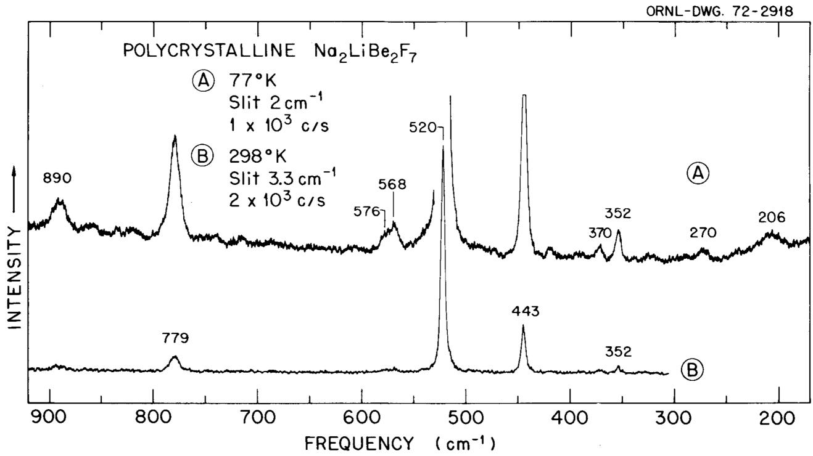  
Fig. 11.12. Raman spectrum of polycrystalline $\mathrm{Na}_2\mathrm{LiBe}_2\mathrm{F}_7$ at $77^{\circ}\mathrm{K}$ . Curve $A$ , full scan at normal scale; curve $B$ , expanded scale to show weaker modes.

Extensive usage of this frequency shift will be made in characterizing the beryllium fluoride species as the melt compositions change based on the interpretation that increasing length of the Be-F network is represented by progressively lower frequency values for the $525\mathrm{-cm}^{-1}$ band.

When $\mathrm{Na}_2\mathrm{LiBe}_2\mathrm{F}_7$ is melted, an additional feature at $550~\mathrm{cm}^{-1}$ appears as a shoulder on the side of the $525 - \mathrm{cm}^{-1}$ band in Fig. 11.13A. This band is identified as arising from the symmetric stretching mode of $\mathrm{BeF_4}^{2-}$ , which is produced by a dissociation process which occurs on melting the compound:

$$
x \operatorname {B e} _ {2} \mathrm {F} _ {7} ^ {3 -} \rightleftharpoons \operatorname {B e F} _ {4} ^ {2 +} + \operatorname {B e} _ {2 x - 1} \mathrm {F} _ {7 x - 4} ^ {(3 x - 2) ^ {-}}, \tag {2}
$$

where a similar band due to the larger component, $\mathrm{Be}_{2x - 1}\mathrm{F}_{7x - 4}^{(3x - 2) - }$ , is expected to lie under the $525\text{-cm}^{-1}$ band and is not resolved. Molten $\mathrm{Na}_2\mathrm{LiBe}_2\mathrm{F}_7$ thus represents a system of various Be-F species which combine during crystal growth to form essentially pure $\mathrm{Be}_2\mathrm{F}_7^{3 - }$ ions. The $\mathrm{BeF_4}^{2 - }$ and $\mathrm{Be}_2\mathrm{F}_7^{3 - }$ can be explicitly identified in the melt because the polarized bands at 555 and $525~\mathrm{cm}^{-1}$ for each, respectively, are resolved.

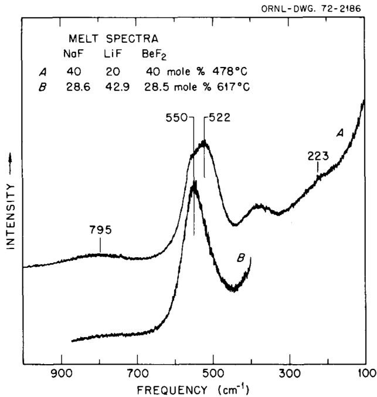  
Fig. 11.13. Raman spectrum of (A) molten $\mathrm{Na}_2\mathrm{LiBe}_2\mathrm{F}_7$ and (B) NaF-LiF-BeF $_2$ (28.5-42.7-28.6 mole %). The effect of adding excess fluoride ion, curve B, causes the $525\text{-cm}^{-1}$ band to disappear and the $550\text{-cm}^{-1}$ band, attributed to $\mathrm{BeF}_4^{2-}$ , to remain.

A more complex situation exists in melt mixtures of LiF and $\mathrm{BeF}_2$ , because bands of individual species other than $\mathrm{BeF}_4^{2-}$ and $\mathrm{Be}_2\mathrm{F}_7^{3-}$ cannot be resolved. In Fig. 11.14, only a shift in the strong polarized band envelope to lower frequencies is evident as the $\mathbf{F}^{-}$ concentration is decreased. The shift extends to 480 cm $^{-1}$ for the 48-52 mole % LiF- $\mathrm{BeF}_2$ composition and, in the limit of pure $\mathrm{BeF}_2$ , should reach $282~\mathrm{cm}^{-1}$ as observed previously. $^{44}$ At present, it is believed that the shift to lower frequency results from a change in form of the symmetric mode from a stretching $(\mathrm{BeF}_4^{2-})$ to a bending mode $(\mathrm{BeF}_2)$ as the extent of polymerization increases. Furthermore, examination of this mode for the $\mathrm{Li}_2\mathrm{BeF}_4$ composition (Fig. 11.14, curve B) indicates that it is not entirely due to $\mathrm{BeF}_4^{2-}$ but already contains contributions from modes of

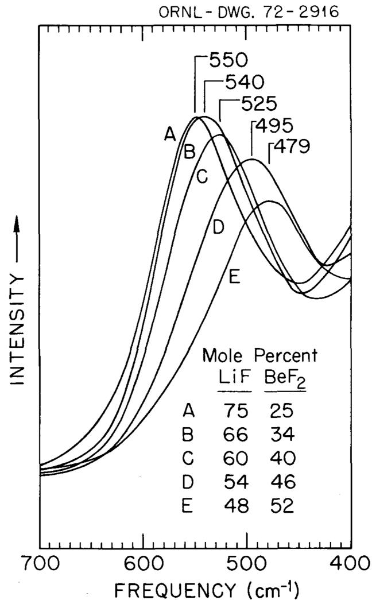  
Fig. 11.14. Effect of varying $\mathrm{LiF} / \mathrm{BeF}_2$ melt composition on the strong polarized band in the Raman spectrum of the $\mathrm{LiF - BeF_2}$ system at approximately $600^{\circ}\mathrm{C}$ .

higher analogs. The symmetric mode of $\mathrm{BeF}_4^{2-}$ is then more exactly represented by curve $A$ with a peak still at $550\mathrm{cm}^{-1}$ but with a smaller band half width.

# 11.8 RAMAN SPECTRA OF MOLTEN AND CRYSTALLINE POTASSIUM DICHROMATE4

J. B. Bates

L. M. Toth

A. S. Quist

G. E. Boyd

Raman spectra of the room-temperature phase of crystalline $\mathrm{K}_2\mathrm{Cr}_2\mathrm{O}_7$ and spectra of aqueous potassium dichromate have been reported recently.50,51 References to earlier spectroscopic studies with dichromate are cited in refs. 50 and 51. A more comprehensive investigation of the Raman spectrum of $\mathrm{K}_2\mathrm{Cr}_2\mathrm{O}_7$ was undertaken because: (1) The room-temperature (triclinic) phase is known to have a unit cell structure in which the $\mathrm{Cr}_2\mathrm{O}_7^{2 - }$ ions occupy two sets of nonequivalent sites. Multiple-site effects have been proposed as the primary cause of mode splitting in spectra of several crystalline materials (MoF $^5$ and $\mathrm{Na_2CO_3}$ ) studied in this Laboratory.52,53 It was therefore of interest to investigate a material in which a "two-site" effect could be well established. (2) The $\mathrm{Cr}_2\mathrm{O}_7^{2 - }$ ion has a $C_{2\nu}$ molecular structure in the molten and crystalline state isomorphic with that of the $\mathrm{Be}_2\mathrm{F}_7^{3 - }$ ion; it was hoped that the present study would aid in interpreting the spectrum of the latter species.

Single-crystal Raman spectra were recorded at 77 and $300^{\circ}\mathrm{K}$ using the 6328-Å line of a helium-neon laser for excitation.54 Low-temperature spectra at frequencies above $300~\mathrm{cm}^{-1}$ are well represented in Fig. 1 of ref. 50. Hence, only the spectra observed at 77 and $300^{\circ}\mathrm{K}$ in the region below $300~\mathrm{cm}^{-1}$ are shown in Fig. 11.15. At ca. $269^{\circ}\mathrm{C}$ , $\mathrm{K}_2\mathrm{Cr}_2\mathrm{O}_7$ undergoes a phase transition from the triclinic form to a structure reported to be monoclinic.55 Spectra were obtained at temperatures above and below the transition point from a single crystal placed in the high-temperature Raman furnace. Results obtained in the $\nu_{1}$ and $\nu_{3}$ regions of dichromate are presented in Fig. 11.16. Band frequencies obtained from low- and high-temperature solid-state spectra of

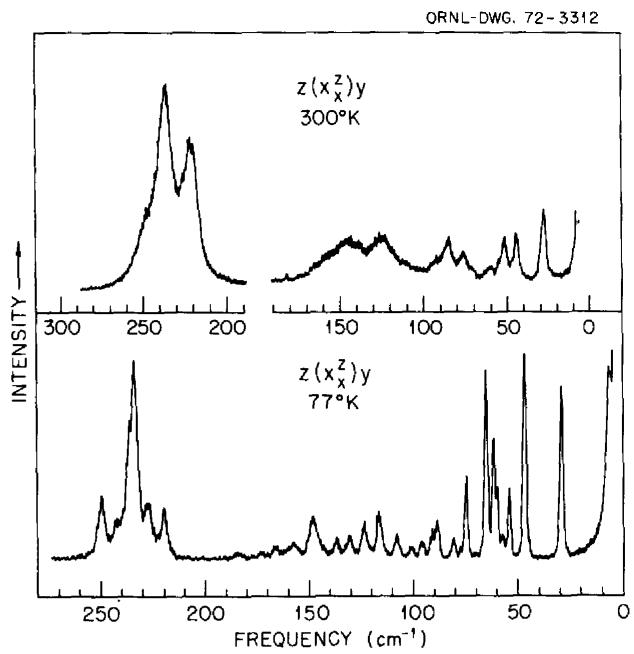  
Fig. 11.15. Low-frequency Raman spectra of crystalline $\mathbf{K}_2\mathbf{Cr}_2\mathbf{O}_7$ at 300 and $77^{\circ}\mathbf{K}$ .

$\mathrm{K}_2\mathrm{Cr}_2\mathrm{O}_7$ are collected in Table 11.8. The Raman spectrum of molten $\mathrm{K}_2\mathrm{Cr}_2\mathrm{O}_7$ $(\mathrm{mp} = 398^{\circ}\mathrm{C})$ was measured at $435^{\circ}\mathrm{C}$ from a sample contained in a Pyrex capillary tube. The spectrum of a saturated aqueous solution of dichromate at $25^{\circ}\mathrm{C}$ was also obtained. The melt and solution spectra are presented in Fig. 11.17, and the frequencies observed from these experiments are given in Table 11.8.

The low-temperature $(< 269^{\circ}\mathrm{C})$ structure of crystalline $\mathbf{K}_2\mathbf{Cr}_2\mathbf{O}_7$ is triclinic with four $\mathrm{Cr_2O_7}^{2 - }$ ions in the primitive unit cell. The lattice is centrosymmetric and belongs to the space group $C_i^1$ . The four $\mathrm{Cr_2O_7}^{2 - }$ ions occupy two sets of nonequivalent sites. The observed splitting of the vibrational modes of $\mathrm{Cr_2O_7}^{2 - }$ in the low-temperature solid phase is thus due to a two-site effect. Each anion mode gives rise to a single $A_{g}$ component (Raman active only) and a single $A_{u}$ component (infrared active only) as a result of dynamic coupling between two equivalent anions. The other equivalent pair of anions in the unit cell also gives rise to $A_{g} + A_{u}$ crystal states. Thus, for example, $\nu_{1}\rightarrow$ $A_{g}^{a} + A_{g}^{b} + A_{u}^{a} + A_{u}^{b}$ , and the $914 - 909~\mathrm{cm^{-1}}$ pair of Raman bands (Fig. 11.15) indicates a two-site splitting of $5\mathrm{cm}^{-1}$ for $\nu_{1}$ . Similar assignments can be made for the $B_{1}$ and $A_{1}$ modes observed in the 750- and $560\mathrm{-cm}^{-1}$ regions respectively (Table 11.8). In other regions of the Raman spectrum of $\mathbf{K}_2\mathbf{Cr}_2\mathbf{O}_7$ (triclinic), the over

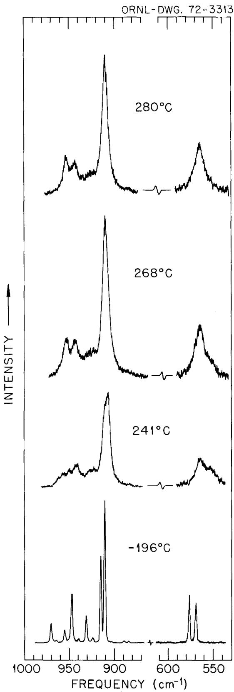  
Fig. 11.16. Raman spectra of the $\nu_{1}$ and $\nu_{3}$ regions of $\mathbf{K}_2\mathrm{Cr}_2\mathrm{O}_7$ recorded at temperatures above and below the solid-solid phase transition point of ca. $267^{\circ}\mathrm{C}$ .

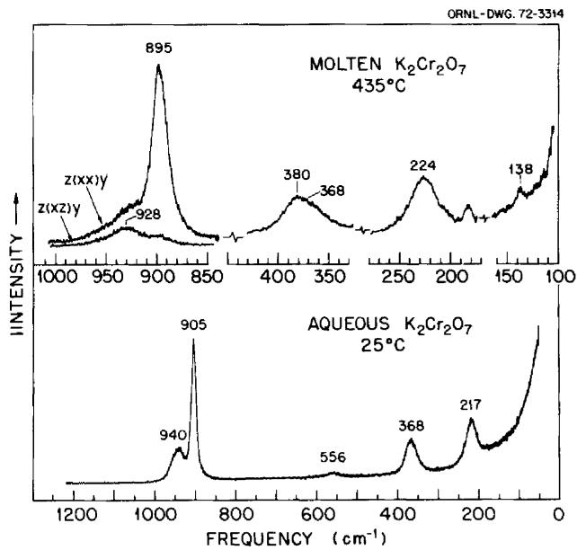  
Fig. 11.17. Raman spectra of molten and aqueous $\mathbf{K}_2\mathbf{Cr}_2\mathbf{O}_7$

lapping of mode frequencies precludes a unique assignment. It is interesting to note that measurements of polarized Raman spectra with single crystals are of small value in assigning the observed bands, since all Raman-active phonons have the same symmetry, that is, $A_{g}$ .

The spectra presented in Fig. 11.16 show that the two-site splitting of $\nu_{1}$ and $\nu_{3}$ can be detected at temperatures just below the transition point. In the high-temperature phase, single bands were observed for both these modes. The change in the crystal structure results in a change in symmetry of the factor group states, while the number of $k = 0$ states is the same in both phases. In the monoclinic phase, each molecular state gives rise to four factor group states. For example,

$$
\nu_ {1} (A _ {1}) \rightarrow A _ {g} + B _ {g} + A _ {u} + B _ {u}.
$$

The single symmetric bands observed for $\nu_{1}$ and $\nu_{3}$ were assigned to $A_{g}$ components because the intensity of the $B_{g}$ component is expected to be much less than that of the $A_{g}$ component. Furthermore, the $A_{g} - B_{g}$ splitting which arises from correlation field coupling may be much less than the $A_{g} - A_{g}$ splitting observed in the triclinic phase as a result of the two-site effect.

Particular attention was given to the measurements of the low-frequency region in the molten and crystalline phases of $\mathrm{K}_2\mathrm{Cr}_2\mathrm{O}_7$ . The molten-salt spectra (Fig. 11.17) revealed a band between 80 and $130\mathrm{cm}^{-1}$ which is tentatively assigned to an $A_{1}$ torsional mode denoted by $\nu_{\tau}$ .

Table 11.8. Frequencies $(\mathrm{cm}^{-1})$ and assignments of the bands observed in Raman spectra of aqueous, molten, and crystalline $\mathbf{K}_2\mathbf{Cr}_2\mathbf{O}_7$   

<table><tr><td rowspan="2">Aqueous solution (25°C)</td><td rowspan="2">Melta(435°C)</td><td colspan="5">Solida</td><td rowspan="2">Assignmentb</td></tr><tr><td>320°C</td><td>280°C</td><td>268°C</td><td>241°C</td><td>-196°C</td></tr><tr><td rowspan="6">940 dpc</td><td rowspan="6">928 dp</td><td>949</td><td>950</td><td>950</td><td>959</td><td>969</td><td rowspan="6">A2,B1,B2</td></tr><tr><td rowspan="5">939</td><td rowspan="5">940</td><td rowspan="5">940</td><td>947</td><td>954</td></tr><tr><td rowspan="4">938</td><td>946</td></tr><tr><td>939</td></tr><tr><td>930</td></tr><tr><td>923</td></tr><tr><td rowspan="2">905 p</td><td rowspan="2">895 p</td><td rowspan="2">907</td><td rowspan="2">907</td><td rowspan="2">906</td><td>908</td><td>914</td><td rowspan="2">A1</td></tr><tr><td>905</td><td>909</td></tr><tr><td rowspan="2">556</td><td rowspan="2">545</td><td rowspan="2">562</td><td rowspan="2">561</td><td>561</td><td>562</td><td>575</td><td rowspan="2">A1</td></tr><tr><td>546</td><td>550</td><td>568</td></tr><tr><td rowspan="5">368</td><td rowspan="2">380</td><td>385</td><td></td><td></td><td></td><td>394 380</td><td rowspan="5">A1,A2,B1,B2</td></tr><tr><td>369</td><td></td><td></td><td></td><td>390 375</td></tr><tr><td rowspan="3">368</td><td rowspan="3">365</td><td></td><td></td><td></td><td>386 370</td></tr><tr><td></td><td></td><td></td><td>384 364</td></tr><tr><td></td><td></td><td></td><td>361</td></tr><tr><td rowspan="3">217</td><td rowspan="3">224</td><td>282</td><td></td><td></td><td></td><td>248</td><td rowspan="3">A1,B2</td></tr><tr><td rowspan="2">220</td><td></td><td></td><td></td><td>237</td></tr><tr><td></td><td></td><td></td><td>222</td></tr><tr><td rowspan="6" colspan="2">138</td><td rowspan="6" colspan="2">110</td><td colspan="2">125</td><td>157</td><td rowspan="6">vT, vL</td></tr><tr><td rowspan="5" colspan="2">113</td><td>147</td></tr><tr><td>142</td></tr><tr><td>136</td></tr><tr><td>130</td></tr><tr><td>123</td></tr><tr><td rowspan="11" colspan="6">184</td><td>116</td><td rowspan="11">vL</td></tr><tr><td>107 59</td></tr><tr><td>100 57</td></tr><tr><td>95 54</td></tr><tr><td>88 56</td></tr><tr><td>80 28</td></tr><tr><td>77</td></tr><tr><td>74</td></tr><tr><td>71</td></tr><tr><td>64</td></tr><tr><td>61</td></tr></table>

$a_{\mathrm{mp}} = 398^{\circ}\mathrm{C}$ ; solid-solid phase transition at ca. $269^{\circ}\mathrm{C}$ .   
${}^{b}$ Assigned according to symmetry species of ${\mathrm{C}}_{2\mathrm{\;V}}$ point group; ${v}_{T}$ denotes torsional mode, ${v}_{\mathrm{L}}$ denotes external modes.   
$c_{\mathrm{p}} =$ polarized, $\mathrm{dp} =$ depolarized.

The frequency of this mode appears to undergo large shifts with temperature in the solid phases. At liquid-nitrogen temperatures (Fig. 11.15), $\nu_{\tau}$ also exhibits a fine structure which may be a result of interaction between this mode and the lattice phonons of dichromate. A similar interaction may also occur between $\nu_{\tau}$ and low-frequency hindered librations of dichromate ions in the molten salt. A better understanding of internal-external mode coupling of species in molten salts is important in interpreting the results obtained in melts in which polymerization can occur, such as the LiF-BeF $_2$ system (see sect. 11.7 of this report).

# 11.9 NONIDEALITY OF MIXING IN THE SYSTEMS $\mathrm{Li}_2\mathrm{BeF}_4$ -LiI, $\mathrm{Na}_2\mathrm{BeF}_4$ -NaI, AND $\mathrm{Cs}_2\mathrm{BeF}_4$ -CsI

A. S. Dworkin M. A. Bredig

Effects of ion size, charge, and polarizability in systems with a complex anion, $\mathrm{BeF}_4^{2-}$ , were studied by

measuring the phase diagrams of the systems $\mathbf{M}_2\mathrm{BeF}_4$ - MI $(\mathbf{M} = \mathbf{Li}$ , Na, Cs). These are shown in Fig. 11.18, together with ideal diagrams where the MI and $\mathbf{M}_2\mathrm{BeF}_4$ liquidus are calculated for one particle per solute molecule (undissociated $\mathrm{BeF_4}^{2 - }$ or $\mathbf{I}^{-}$ , respectively; $n =$ 1). The calculated effect of complete dissociation of $\mathrm{BeF_4}^{2 - }$ to one $\mathrm{Be}^{2 + }$ and four $\mathbf{F}^{-}$ ions $(n = 5)$ is also shown.

The experimental iodide liquidus is similar in the three systems. The $\mathrm{BeF}_4^{2-}$ seems to show a high degree of dissociation only in very dilute solution. At the lowest concentration measured, about 3 mole $\%$ $\mathbf{M}_2\mathbf{BeF}_4$ , only about 10 to $15\%$ dissociation is indicated. The rate at which the degree of dissociation decreases with increasing $\mathbf{M}_2\mathbf{BeF}_4$ concentration is difficult to estimate because of the nonideal mixing of $\mathbf{I}^{-}$ and $\mathrm{BeF}_4^{2-}$ ions evident at and near the eutectic composition. The CsI liquidus appears slightly less curved to and beyond the ideal one than the NaI or LiI

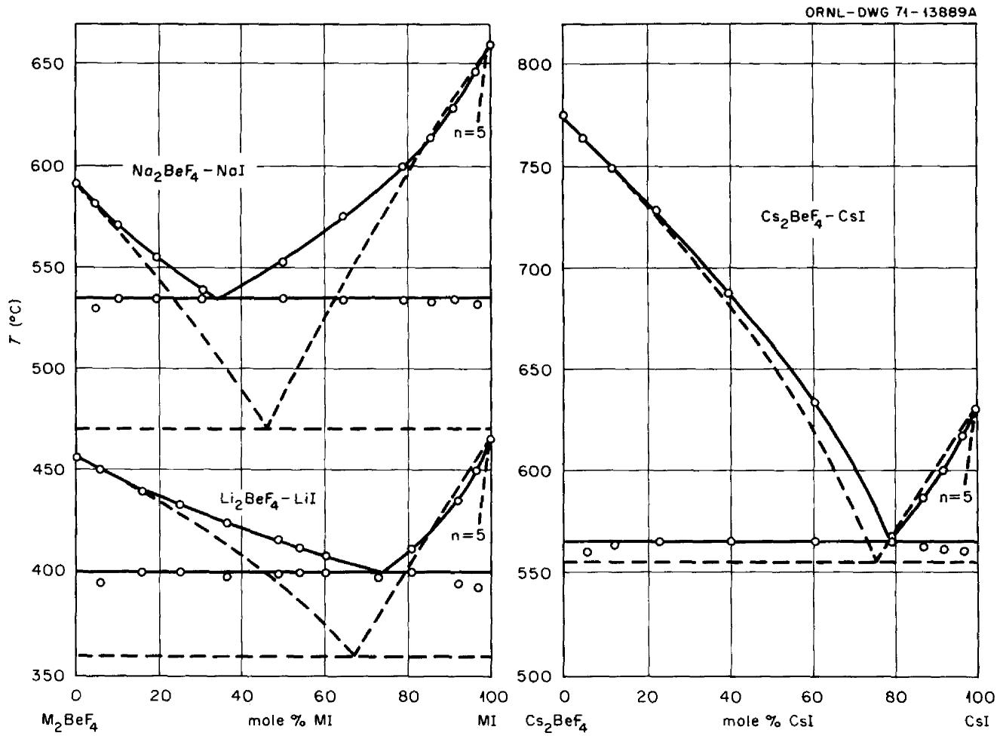  
Fig. 11.18. The systems $\mathrm{Li}_2\mathrm{BeF}_4$ -Lil, $\mathrm{Na}_2\mathrm{BeF}_4$ -NaI, and $\mathrm{Cs}_2\mathrm{BeF}_4$ -Csl.

liquidus. The positive deviation from ideality for the iodide liquidus, that is, excess partial free energy of mixing $\mu^{E}_{\mathrm{MI}} > 0$ , at concentrations greater than about 20 mole $\%$ $\mathbf{M}_2\mathbf{BeF}_4$ (and probably at even lower concentrations) may be compared with the LiF liquidus in the LiF-Li $_2$ BeF $_4$ system, which is ideal up to approximately 45 mole $\%$ $\mathbf{Li}_2\mathbf{BeF}_4$ . In mixtures with a common anion, the polarization energy usually makes the overwhelming contribution to the interaction potential. On the other hand, the much smaller interaction potentials for mixtures with a common cation result from a delicate balance between the positive contributions of the Coulomb and van der Waals energies and the negative contributions of the repulsion and polarization energies. It is tempting to offer an explanation for the more positive deviation from ideality when $\mathbf{Li}_2\mathbf{BeF}_4$ is added to LiI than to LiF by juggling the changes in magnitude of the four effects above with a change from $\mathbf{I}^{-}$ to $\mathbf{F}^{-}$ . However, we must also remember that the differences reflected in the phase diagrams are

56. M. A. Bredig, Chem. Div. Annu. Progr. Rep. May 20, 1971, ORNL-4706, pp. 115-56.

due to partial excess free energy of mixing and not necessarily to the enthalpy of mixing, which determines the interaction potential. The explanation for differences in degree of nonideality must then include differences in the entropy of mixing for which little data exists for these systems.

The $\mathbf{M}_2\mathrm{BeF}_4$ liquidus lines all show positive deviation from ideality, although to a much lesser extent than the MF liquidus in MF-MI mixtures,[56] especially in the dilute MI region. The sodium system shows the greatest nonideality, followed by the lithium system and then the cesium system, with only a very small deviation from ideality evident above 20 mole $\%$ CsI. Again, an explanation for the differences in nonideality will depend on a knowledge of the entropies of mixing.

Fusion enthalpies of $\mathrm{Na}_2\mathrm{BeF}_4$ and $\mathrm{Cs}_2\mathrm{BeF}_4$ were calculated from the initial liquidus slopes to be 6.5 and $11.0~\mathrm{kcal}$ , with a probable error of $\pm 5\%$ . Fusion entropies, 7.5 and $10.5~\mathrm{cal~deg}^{-1}$ mole $^{-1}$ , are considerably less than the $\Delta S = 14.5~\mathrm{cal~deg}^{-1}$ mole $^{-1}$ for $\mathrm{Li}_2\mathrm{BeF}_4$ . This is as expected, considering that $\mathrm{Na}_2\mathrm{BeF}_4$ and $\mathrm{Cs}_2\mathrm{BeF}_4$ are isostructural with the corresponding sulfates, while the $\mathrm{Li}_2\mathrm{BeF}_4$ is isostructural with $\mathrm{Be}_2\mathrm{SiO}_4$ .

# Part 3. Materials Development

J.R.Weir H.E.McCoy

Our materials work is currently involved with several important areas including (1) gaining a better understanding of the intergranular cracking of Hastelloy N that occurred in the MSRE and a method of controlling this cracking in future reactors, (2) developing a graphite with improved dimensional stability under radiation, (3) development of surface sealing methods for reducing the permeability of graphite to $^{135}\mathrm{Xe}$ , (4) modification of the composition of Hastelloy N to obtain an alloy that is more resistant to neutron irradiation, (5) evaluation of Hastelloy N for use in steam generators, (6) construction of a molybdenum system for use with bismuth and fluoride salts, and (7) the evaluation of other materials for use as structural materials in the chemical processing plant.

The first area has occupied a high priority; additional parts of the MSRE have been examined, and a rather extensive program of laboratory tests has been initiated. The laboratory tests are directed at determining the cause of the cracking, the rate of progression with time and temperature, and a reasonable solution to the cracking problem.

The lifetime of a breeder core will be determined by the dimensional stability of the graphite. Dimensional changes can be accommodated to some extent, but volume expansion is usually accompanied by increasing permeability to xenon, which can become intolerable. Thus the problem of dimensional stability cannot be separated from the requirement of low permeability to $^{135}\mathrm{Xe}$ . We are evaluating graphites made by commercial vendors and locally in an effort to understand what types of graphite have the best dimensional stability. This information is being fed back to commercial

vendors and into our own experimental fabrication program. Pyrolytic carbon coatings derived from propene are currently being studied as a means of reducing the permeability to $^{135}\mathrm{Xe}$ .

The program to develop a modified Hastelloy N with improved resistance to radiation indicated that alloys with additions of 1.5 to $2.0\%$ Ti were most promising, and recent efforts have concentrated on these. Material has been obtained from three vendors that has been made by two basic melting practices. The evaluation includes weldability tests, unirradiated mechanical property tests, and postirradiation mechanical property tests.

A corrosion facility in TVA's Bull Run Steam Plant is being used to evaluate the corrosion of Hastelloy N in steam. Both unstressed and stressed samples are included in the tests.

Most of the work on chemical processing materials is going into the construction of a reasonably complex test facility constructed of molybdenum. Many new techniques have been developed which overcome or circumvent the basic difficulties of molybdenum fabrication. (Welds in molybdenum are inherently brittle, and fabrication into large sizes is hampered by the need for high temperatures and large forces to fabricate large parts.) The mutual requirement of compatibility with bismuth and salt narrows the choice of materials for the processing plant, but our screening tests offer encouragement that besides molybdenum, both tantalum and graphite will be compatible. Experiments are being started to determine whether these materials can be used and under what operating conditions.

# 12. Intergranular Cracking of Structural Materials Exposed to Fuel Salt

H. E. McCoy

Examination of Hastelloy N components removed from the MSRE has shown that all surfaces that came in contact with fuel salt had intergranular cracks to a depth of 1 to 13 mils. Some of the cracks were visible when the parts were removed from service, whereas others did not appear until after the parts were deformed. Our observations and experiments indicate that this cracking is probably associated with fission products, although we have not ruled out the possibility that some yet-undetected mode of corrosion may cause the cracking.

Our work involves (1) further studies of the materials from the MSRE, (2) corrosion experiments to determine whether intergranular attack will occur under certain conditions, (3) studies of alloys containing or exposed to numerous fission products, (4) numerous experiments with tellurium to determine its effects on Hastelloy N, and (5) limited experiments with other alloys such as type 304L stainless steel and nickel-200 to determine their susceptibility to cracking. Our objectives are to determine the cause of the cracking; the dependence of the rate on temperature, time, and concentration; and a reasonable solution to the problem.

# 12.1 EXAMINATION OF HASTELLOY N COMPONENTS FROM THE MSRE

B. McNabb H. E. McCoy

Several Hastelloy N components from the MSRE have been examined. Partial presentations of our findings were made previously, $^{1,2}$ and additional results will be presented in the current progress report. Some work is still in progress, and it is likely that further observations and interpretations of prior observations will continue to be made for some time.

# 12.1.1 Freeze Valve 105

The freeze valve that failed during the final shutdown of the MSRE (FV 105) was examined further. The

failure was attributed to fatigue from a modification that had been made. The valve was made by flattening a section of $1^{1/2}$ -in. sched 40 Hastelloy N pipe and welding an air cooling shroud around the flattened section. This valve was used to isolate the drain tanks and was frozen only when the salt was in the drain tanks. The salt was static except when the reactor vessel was being filled. It was filled with salt and maintained above $500^{\circ}\mathrm{C}$ for about 21,000 hr. The valve was filled with salt from the drain tanks, so the fission product concentration that the valve was exposed to was considerably lower than that seen by components in the primary circuit. Thus the freeze valve was exposed to another set of conditions involving fuel salt and fission product concentration and may help in separating the effects of each on the behavior of Hastelloy N.

Three rings $\frac{3}{16}$ in. wide were cut from the pipe away from the flattened section and were pulled in tension in the same manner as previously described for the control rod thimble rings. One rectangular piece was cut and bend-tested with the ID of the pipe in tension. Table 12.1 is a tabulation of the observed mechanical properties. The yield stress was essentially unchanged, and the ultimate stress was reduced about $15\%$ from the vendor's certified properties. The elongation was reduced considerably but was still greater than $25\%$ . A gage section is difficult to define in a ring test, so crosshead travel and reduction in area are reported for

Table 12.1. Results of mechanical property tests on specimens from FV 105 (heat 5094) at $25^{\circ}\mathrm{C}$ and a deformation rate of 0.05 in./min   

<table><tr><td rowspan="2">Type of test</td><td colspan="2">Stress (psi)</td><td rowspan="2">Crosshead travel (in.)</td><td rowspan="2">Reduction in area (%)</td></tr><tr><td>Yield</td><td>Ultimate tensile</td></tr><tr><td>Vendor&#x27;s, tensile</td><td>45,800</td><td>106,800</td><td></td><td>52.6</td></tr><tr><td>Ring, tensile</td><td>45,800</td><td>89,700</td><td>0.72</td><td>25</td></tr><tr><td>Ring, tensile</td><td>48,900</td><td>90,100</td><td>0.59</td><td>29</td></tr><tr><td>Ring, tensile</td><td>41,900</td><td>90,300</td><td>0.73</td><td>37</td></tr><tr><td>Wall segment, bend</td><td>71,300</td><td></td><td>0.41</td><td>\( 33^a \)</td></tr></table>

$a$ Maximum strain in outer fibers.

the rings from FV 105 rather than percent elongation in 1 in. The bend test was discontinued due to strain limitations of the bend fixture after 0.41 in. crosshead travel, which corresponds to $32.7\%$ strain in the outer fibers of the specimen and to a $90^{\circ}$ bend angle. The yield stress calculated from the forces on the bend specimen is too high because elastic formulas were used in the calculation and the specimen deformed plastically, but this calculated quantity is useful for

comparison with other bend tests such as those reported previously for the mist shield.4

Figure 12.1 is a macrophotograph of the tension side of the bend specimen from FV 105. Some very fine shallow cracks are visible on the tension surface, and cracking is visible at the edges in the burrs remaining

4. B. McNabb and H. E. McCoy, MSR Program Semiannu Progr. Rep. Aug. 31, 1971, ORNL-4728, p. 90.

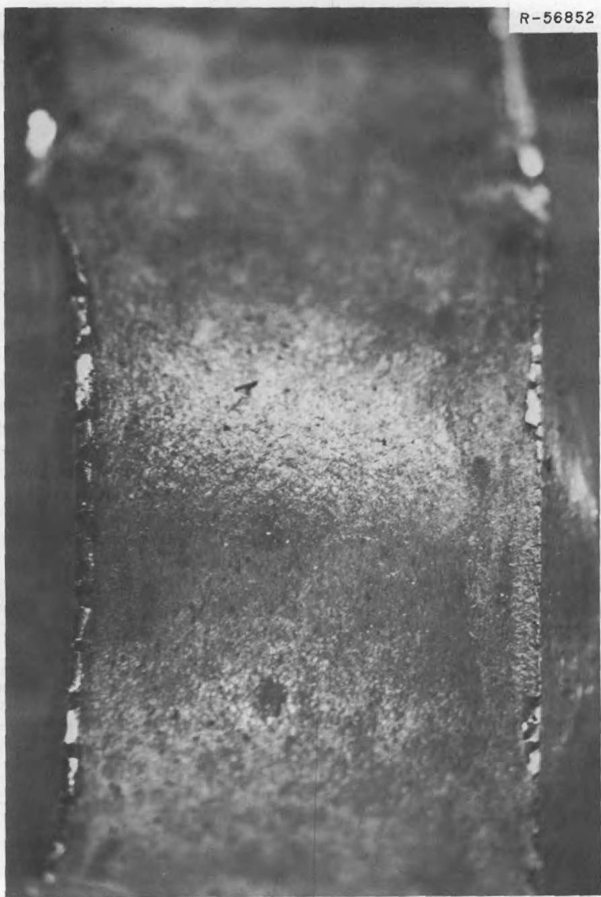  
Fig. 12.1. View of tension side of a bend sample from FV 105. The tension side was exposed to static salt.

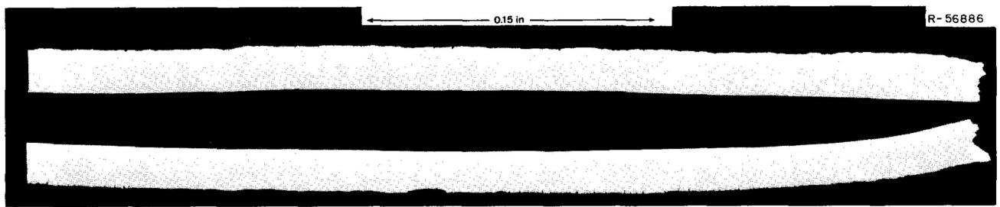  
Fig. 12.2. Composite of photomicrographs of a ring from FV 105 that was pulled in tension. The upper surface was exposed to salt and the lower surface to the cell environment of $\mathbf{N}_2$ plus 2 to $5\% \mathrm{O}_2$ . Only the surfaces were photographed.

from the remote cutting operation. One of the three tensile-tested rings was examined metallographically. Figure 12.2 is a composite of photomicrographs of a section through the specimen showing the inside surface, which was exposed to fuel salt (top), and the outside, which was exposed to the cell environment of nitrogen plus 2 to $5\% \mathrm{O}_2$ . The reason for the uneven nature of the oxide on the outside is not known. Possibly it was due to corrosion after the leak, although the rings were cut approximately 4 in. away from the nearest visible residue from the salt leak. Figure 12.3 is $500\times$ photomicrographs of the oxide in one of the worst areas. The cracks tend to blunt and do not penetrate into the metal beyond the oxidized surface. Figure 12.4 is $500\times$ photomicrographs of the inside of the pipe exposed to fuel salt. There is about 1 crack per grain, or 240 cracks per inch, but the cracks are shallow and blunt, having an average depth of 0.75 mil and a maximum depth of 1.5 mils. Figure 12.5 is a $40\times$ photomicrograph of the fracture and shows that a large amount of strain occurred before fracture.

From these tests we see that the mechanical properties of the Hastelloy N in the freeze valve were not degraded seriously by the exposure to fuel salt with some fission products for a long period of time. Numerous intergranular cracks were present in the surfaces exposed to the salt. These cracks were similar to those in the surfaces from the primary circuit but were shallower.

# 12.1.2 Control Rod Thimble

The control rod thimble was near the center line of the MSRE core for the duration of operation. Because it was exposed to the peak neutron fluence of any component and to a relatively high concentration of fission products, it has been of much interest and has been studied rather thoroughly.[5,6] The additional studies during this reporting period investigated a possible effect of salt flow rate on the severity of cracking.

The details of construction of the thimble are shown partially by Fig. 12.6. The thimble was made of 2-in.-OD, 0.065-in.-wall tubing with occasional spacers. The spacers had small ribs machined on them to ensure that salt could flow between the thimble and the adjacent graphite. The spacers were attached to the thimble by a small weld bead on the thimble that was made through a clearance hole in the spacer. Thus the spacer was restrained vertically but could move some radially. The shop drawings allowed a maximum diametral clearance of 15 mils between the spacer and the thimble. It is likely that most of the annulus was filled with salt, but the flow rate should be very slow. Thus a comparison of the cracking tendencies under the spacer, where flow was restricted, and outside the spacer should give an indication of the sensitivity of the cracking to flow rate.

A composite of photomicrographs of a deformed ring from the thimble that was exposed to flowing salt is shown in Fig. 12.7. The inside of the thimble was exposed to the cell environment of $\mathbf{N}_2$ plus 2 to $5\% \mathrm{O}_2$ and was oxidized. Cracks formed in the oxide but did not penetrate the metal. The outside of the thimble, which was exposed to fuel salt, had 192 cracks per inch, having an average depth of 5.0 mils and a maximum depth of 8.0 mils. A similar ring was cut from the thimble under the spacer. It was deformed and examined metallographically. A composite of photomicrographs is shown in Fig. 12.8. This sample had 257 cracks per inch with an average depth of 4.0 mils and a maximum depth of 8.0 mils. A ring was also cut from the spacer for testing and examination. This sample was exposed to flowing salt on one side and restricted salt flow on the other side. A composite of photomicrographs of this sample is shown in Fig. 12.9. The side

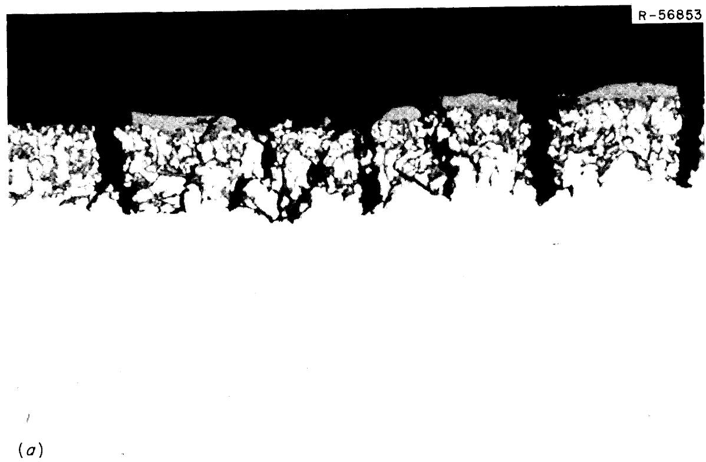  
10.007 INCHES 10.007 in. 10.005 in. 10.005 in. 10.003 in. 10.004 in.

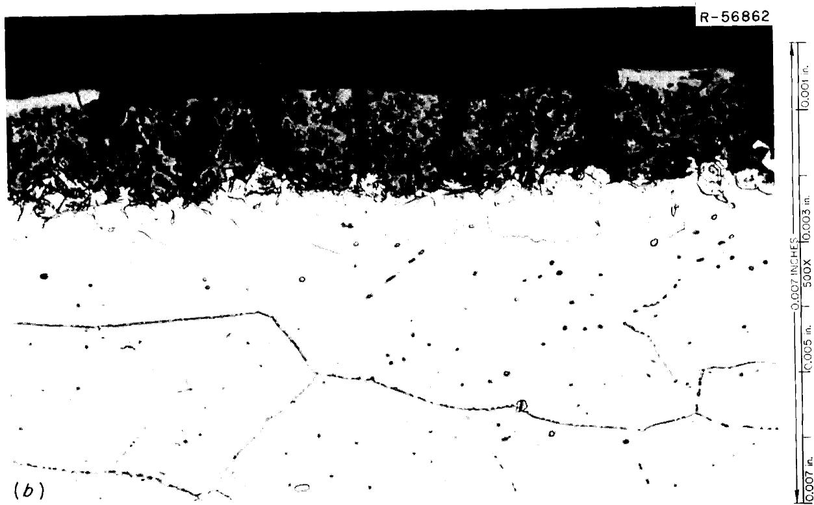  
Fig. 12.3. Photomicrographs of a tensile sample of FV 105 showing the oxide that formed on the outside of the pipe. The cracks penetrated only the depth of the oxide. (a) As polished. (b) Etched with lactic, $\mathrm{HNO}_3$ , HCl.

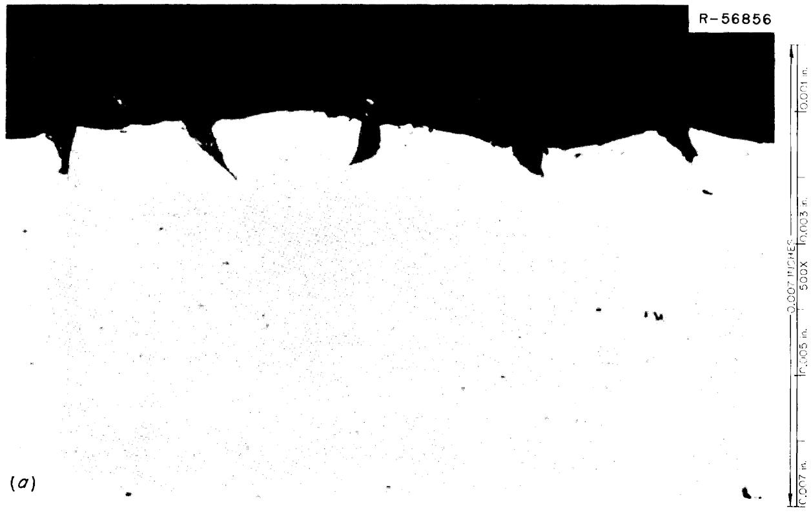

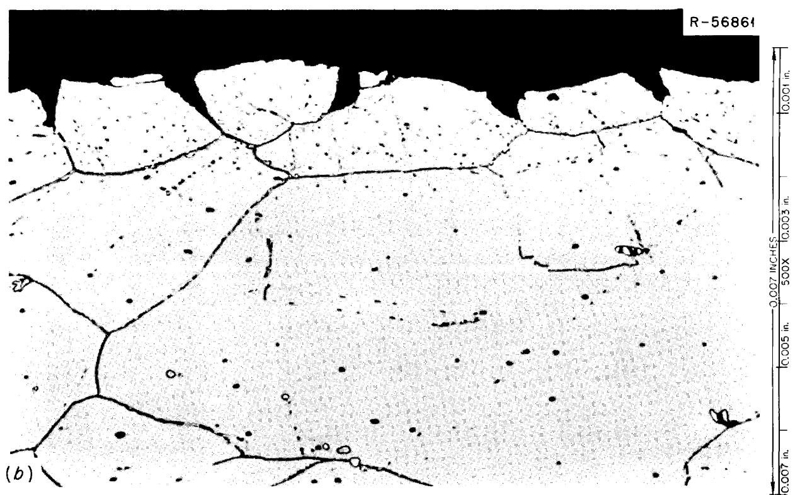  
Fig. 12.4. Photomicrographs of the salt side of a tensile specimen from FV 105. (a) As polished, (b) Etched with lactic, $\mathrm{HNO}_3$ , HCl.

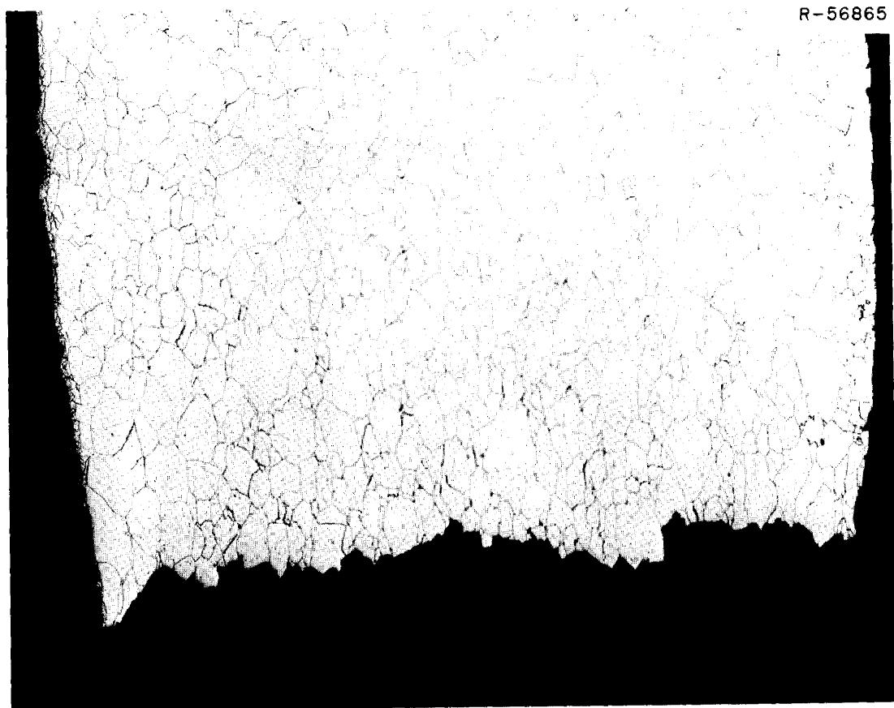  
Fig. 12.5. Photomicrograph of the fracture of a tensile specimen from FV 105. The left side was exposed to fuel salt and the right side to the cell environment. $40 \times$ . Etched with lactic, $\mathrm{HNO}_3$ , HCl.

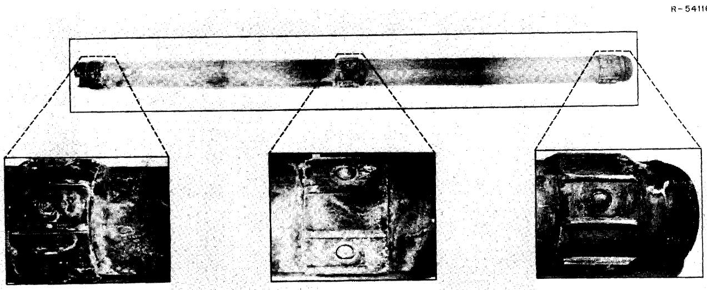  
Fig. 12.6. Portion of Hastelloy N control rod thimble removed from the MSRE. The cut end was near the axial center of the reactor. The bottom end was near the bottom of the core. The sleeves are Hastelloy N spacers and were held in place by a small weld bead.

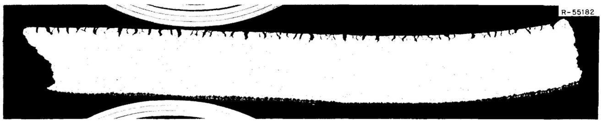  
Fig. 12.7. Deformed ring from the MSRE control rod thimble. This sample was exposed to flowing salt.

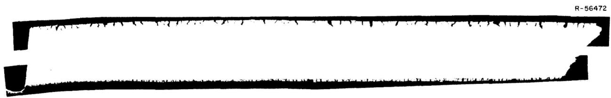  
Fig. 12.8. Deformed ring from the MSRE control rod thimble. This sample was under the spacer and was exposed to restricted salt flow, $17 \times$

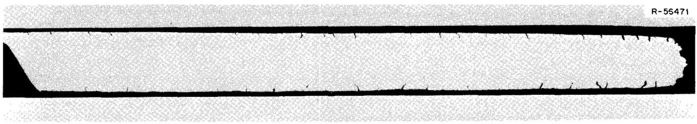  
Fig. 12.9. Control rod thimble spacer exposed to flowing salt on one side and to almost static salt on the other side. Deformed at $25^{\circ}\mathrm{C}$ .

exposed to flowing salt had 178 cracks per inch with an average depth of 3.0 mils and a maximum depth of 7.0 mils. The side exposed to restricted salt flow had 202 cracks per inch with an average depth of 3.0 mils and a maximum depth of 5.0 mils. Although there are differences in the crack numbers and depths on the various surfaces, we do not feel that they are significant.

Duplicate samples from the same locations as the mechanical property samples were dissolved and analyzed for fission products. The concentrations of tellurium in atoms/cm $^2$ × 10 $^{17}$ are given with each sample location: (1) thimble, flowing salt - 2.9, 2.9; (2) thimble, restricted flow - 0.95, 0.74; and (3) spacer - 1.6, 4.5. The tellurium concentration under the spacer, where the flow was restricted, is lower than on the bare thimble by a factor of 3 to 4. The concentration on the spacer sleeve is not detectably different from that noted on the bare thimble. The other fission

products that were analyzed showed similar trends. Thus the severity of cracking was not influenced appreciably by fission product concentrations that varied by factors of 3 to 4.

# 12.1.3 Sampler Cage Rod

The sampler cage rod from the pump bowl that was tensile tested to failure at room temperature showed marked variations in the severity of cracking at surfaces exposed to fuel salt and those in the gas space above the salt.7 Pan photomicrographs were made of the surfaces of the rod exposed to liquid fuel salt and to the gas above the salt. Figure 12.10 shows the variations of cracking along the length and on opposite sides of a $3 / 4$ -in.-long segment of the rod from the fracture (right),

extending toward the bottom of the pump bowl (left). The fracture occurred in the area of the largest deposits on the rod, which was probably the average liquid level in the pump bowl. Unfortunately, the radial orientation of the rod was not maintained during mounting. Additions of beryllium and uranium by means of the sampler were made occasionally to adjust the chemistry of the fuel salt, and local conditions in the sampler cage could have been quite different from those in the bulk salt stream. This might account for some of the variations of cracking around the circumference of the rod. Figure 12.11 is a pan photomicrograph of a $3/4$ -in. segment of the same rod starting $3/4$ in. above the fracture (left) and extending farther up into the gas region (right). The surface cracking is diminishing in severity, but the frequency is still almost one crack per grain. The sampler cage rod represents about the worst conditions of attack of any of the components examined in the MSRE, with cracks opening up to a maximum depth of 13 mils. However, the mechanical properties were not degraded seriously, and the ob

served small property changes may have been due to the long time that the rod was held at high temperature.

Examination of this component shows clearly the severe cracking that occurred in the pump bowl. It also shows that the cracking diminishes in traversing from the liquid into the sheltered gas region inside the mist shield.

# 12.1.4 Mist Shield

The mist shield was a spiral baffle of $\frac{1}{8}$ -in. Hastelloy N sheet whose purpose was to keep salt spray from the region where fuel salt samples were taken in the pump bowl. Four bend test specimens were cut from portions of the shield that were exposed to different conditions of fuel salt flow or spray. Macrophotographs and the mechanical properties of the bend specimens from these various locations appeared in the last semiannual

8. MSR Program Semiannu. Progr. Rep. Feb. 28, 1971, ORNL-4676, pp. 76-81, 150-53.

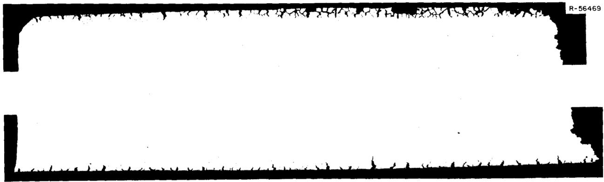  
Fig. 12.10. Photomicrographs of a sampler cage rod deformed to failure at $25^{\circ}\mathbf{C}$ . The fracture is on the right, and the sample extends farther into the salt from right to left. $16.3\times$ .

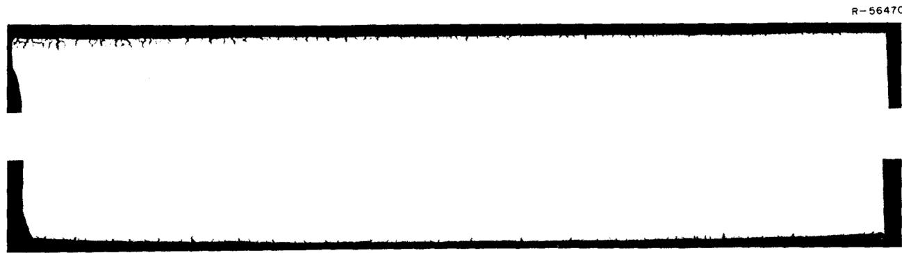  
Fig. 12.11. Photomicrographs of a portion of the sampler cage rod that was fractured at $25^{\circ}\mathrm{C}$ . The left end was in. above the fracture, and the sample extends farther into the vapor space from left to right. $14.3\times$

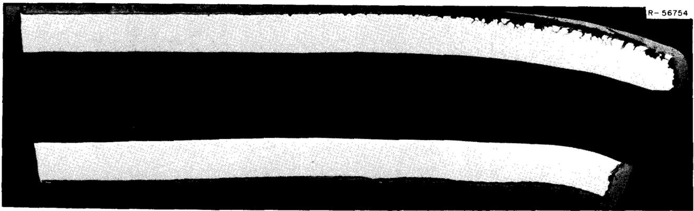  
Fig. 12.12. Bend specimen S-62 from the outer gas region of the mist shield. The top was in tension and the bottom portion in compression.

report. At that time only two of the specimens had been examined metallographically, but it was evident that there were considerable differences in the frequency and severity of the cracking in the specimens exposed to the restricted salt flow and to the gas inside the mist shield. During this report period we examined the two samples that were taken from the outer end of the spiral shield at top and bottom.

Bend specimen S-62 came from the outer top portion of the mist shield, where it had been exposed to fuel salt mist. This specimen was bent, with the surface that had been on the outside in tension, until it fractured. Figure 12.12 shows the tension (top) and compression (bottom) surfaces of the specimen. The depth of cracking was only about 5 mils (except for the fracture), but there was a tendency for grains to become dislodged near the fracture (right). Cracking was confined to a relatively small area around the fracture, probably due to the relatively low fracture strain of $11\%$ . Figure 12.13 shows photomicrographs of the tension $(a)$ and compression $(b)$ sides of this bend specimen.

Bend specimen S-68, from the bottom outer region of the mist shield, had been immersed in salt that was agitated and may have contained bubbles and materials from the surface of the salt pool that were carried under by the xenon stripper jets. A composite view of this specimen is shown in Fig. 12.14. The tension side is shown at the top and the compression side at the bottom. The cracking on the tension side is spread over a slightly larger area than in specimen S-62, and there is less tendency for grains to become dislodged. The

cracking depth is about the same except for one crack about 12 mils deep. Figure 12.15 shows photomicrographs of the tension $(a)$ and compression $(b)$ sides of bend specimen S-68. The outside of the spiral was the tension side of the bend test, but the compression side was also exposed to agitated fuel salt.

Comparison of the observations on these two specimens from the outer portions of the mist shield spiral and those reported previously from the inner end of the spiral show that the cracking severity was greatest in the outer gas sample, next most severe in the liquid samples from inside and outside the shield, and least severe in the sample from the inner gas region.

# 12.2 AUGER ANALYSIS OF THE SURFACE LAYERS ON GRAPHITE FROM THE CORE OF THE MSRE

R. E. Clausing

We continued to use Auger electron spectroscopy to analyze deposits of fission products and/or corrosion products on graphite surfaces from the core of the MSRE. This technique offers unique capabilities for analyses of the first few atomic layers of a surface. The principles of construction and operation of the equipment have been described, $^{10}$ and results of analyses of two samples from a core moderator element have been reported. $^{11}$ In these samples, relative concentrations of the deposited elements were determined as functions of depth below the original surface. Molybdenum, nio

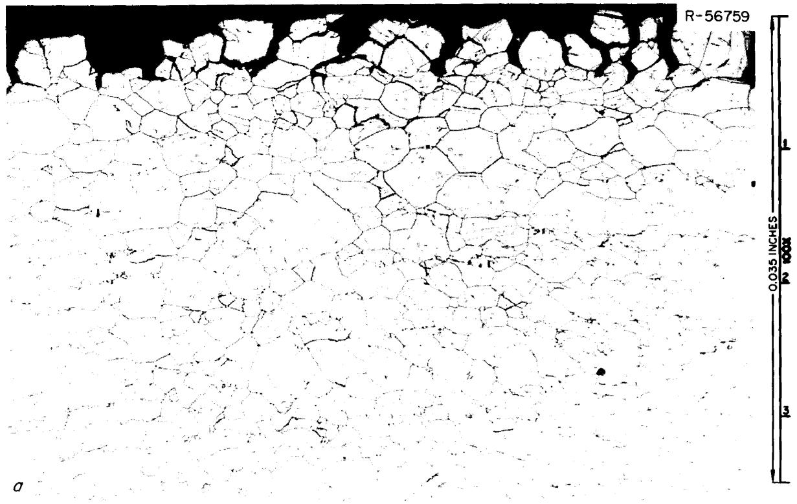

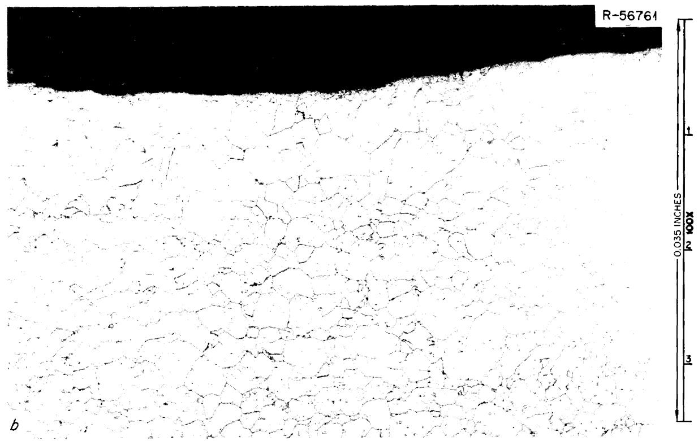  
Fig. 12.13. Photomicrographs of bend specimen S-62 from the outer gas region of the mist shield. (a) Tension side. (b) Compression side. Etched with lactic, $\mathrm{HNO}_3$ , and HCl.

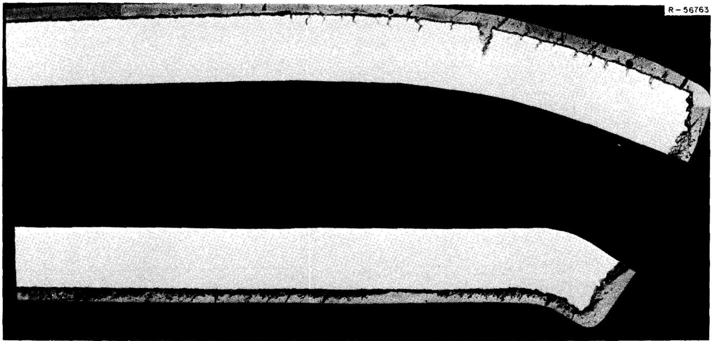  
Fig. 12.14. Photographs of bend specimen S-68 from the outer liquid region of the mist shield. Top portion was in tension, and the bottom was in compression. As polished.

bium, rhodium, and technetium were present in amounts estimated to exceed $5\%$ of the exposed surface layer. Tellurium and ruthenium analyses were difficult because of interference from other elements, but both elements appeared to be present in significant amounts. Neither iron nor nickel contents were determined for these first two samples.

Analysis of these samples and of several others has now been completed. All of the results are summarized in Table 12.2. Sample No. 6, the first analyzed, was taken from a core surveillance specimen removed from the MSRE in April 1968 at the conclusion of operation with $^{235}\mathrm{U}$ fuel. The other samples were all taken as 0.3-in.-diam plugs by core drilling various parts of the graphite moderator element 1184-C-19, which was removed from the MSRE after shutdown in December 1969. $^{11}$

The data in Table 12.2 are normalized relative to a carbon peak of 100, and peak heights are given in arbitrary units. The data are not yet quantitative due to lack of suitable standards, and it should be noted that because the sensitivity is different for different elements and for different peaks for the same element, peak height cannot be equated to concentration. (We intend to make our data quantitative by use of suitable standards that are now being prepared.)

Samples 5, 7, and 10 were taken from the flow channel: sample 5, 3 in. from the top; sample 7, in the center; and sample 10, 3 in. from the lower end of the

element. Samples M6 and 13 were taken from the edge of the graphite moderator element (outside the main flow channel) with sample 13 about 3 in. from the bottom end of the element and sample M6 about halfway along the element length.

Sample 10 was examined in the scanning electron microscope after sputtering approximately 16 atom layers from the surface, and typical photographs are shown in Fig. 12.16. Note that the sample surface is fairly smooth but has a few small particles adhering to it. These particles appear to be graphite dust, still adhering from the core drilling operation, which should not interfere with the Auger analysis. The smoothness of the surface should ensure the uniformity of removal of layers from the surface by sputtering.

All of the samples examined had substantial amounts of molybdenum, technetium, sulfur, and rhodium. Iron, nickel, and chromium were present on most of the samples, with the two samples from the bottom of the moderator element (samples 10 and 13) having the largest concentrations. Tellurium is probably present on all of the samples and is discussed briefly below. Peaks which may be associated with antimony were detectable on samples 10 and 13, although the peaks are not listed in Table 12.2. An unresolved pair of peaks tentatively identified as due to palladium were detected at $330\mathrm{eV}$ on nearly all of the samples. Tellurium, chromium, and ruthenium concentrations are difficult to determine because of interference from strong lines

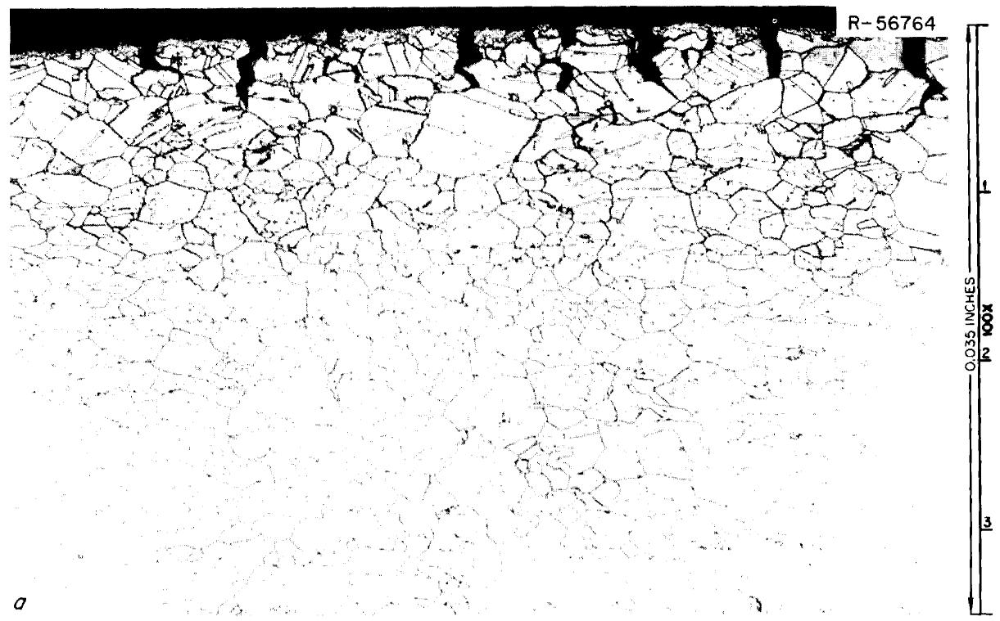

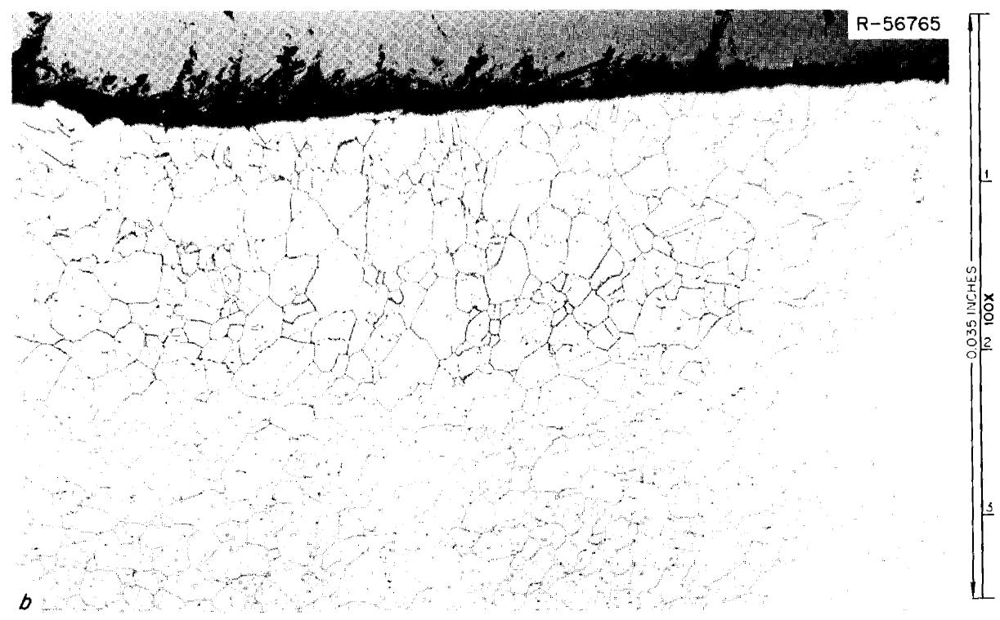  
Fig. 12.15. Photomicrographs of bend specimen S-68 from the outer liquid region of the mist shield. (a) Tension side. (b) Compression side. Etchant: lactic, $\mathrm{HNO}_3$ , and HCl.

Table 12.2. Comparison of relative Auger peak heights obtained from surfaces of graphite samples removed from the MSRE core   

<table><tr><td>Sample No.</td><td>Estimated depth (atom layers)</td><td>Tellurium (20 eV)</td><td>Technetium, molybdenum, sulfur (150 eV)</td><td>Technetium, molybdenum (182 eV)</td><td>Niobium (199) (202) (200 eV)</td><td>Rhodium (303) (308) (300 eV)</td><td>Palladium (331) (336) (330 eV)</td><td>Nitrogen (383 eV)</td><td>Oxygen (510 eV)</td><td>Iron (650 eV)</td><td>Nickel (859 eV)</td></tr><tr><td>6</td><td>0</td><td>na</td><td>29</td><td>9</td><td>2</td><td>na</td><td>na</td><td>na</td><td>na</td><td>na</td><td>na</td></tr><tr><td>Surveillance specimen</td><td>10</td><td>na</td><td>5</td><td>23</td><td>4</td><td>na</td><td>na</td><td>na</td><td>na</td><td>na</td><td>na</td></tr><tr><td></td><td>25</td><td>na</td><td>4</td><td>16</td><td>3</td><td>na</td><td>na</td><td>na</td><td>na</td><td>na</td><td>na</td></tr><tr><td>7</td><td>0</td><td>na</td><td>na</td><td>na</td><td>na</td><td>na</td><td>na</td><td>na</td><td>na</td><td>na</td><td>na</td></tr><tr><td>-flow channel, center)</td><td>15</td><td>na</td><td>19</td><td>40</td><td>nd</td><td>9</td><td>na</td><td>12</td><td>25</td><td>na</td><td>na</td></tr><tr><td></td><td>30</td><td>na</td><td>26</td><td>50</td><td>nd</td><td>11</td><td>na</td><td>17</td><td>26</td><td>na</td><td>na</td></tr><tr><td>5</td><td>0</td><td>na</td><td>13</td><td>5</td><td>w</td><td>4</td><td>w</td><td>2</td><td>14</td><td>nd</td><td>w</td></tr><tr><td>-flow channel, top)</td><td>15</td><td>1,600</td><td>35</td><td>16</td><td>w</td><td>5</td><td>1</td><td>13</td><td>37</td><td>2</td><td>1</td></tr><tr><td>10</td><td>0</td><td>na</td><td>na</td><td>na</td><td>na</td><td>na</td><td>na</td><td>na</td><td>na</td><td>na</td><td>na</td></tr><tr><td>-flow channel, bottom)</td><td>16</td><td>4,000</td><td>63</td><td>13</td><td>w</td><td>2</td><td>w</td><td>13</td><td>96</td><td>3</td><td>2</td></tr><tr><td>M6</td><td>0</td><td>na</td><td>15</td><td>21</td><td>w</td><td>1</td><td>w</td><td>8</td><td>24</td><td>nd</td><td>nd</td></tr><tr><td>(edge, center)</td><td>15</td><td>nd</td><td>24</td><td>15</td><td>w</td><td>2.5</td><td>w</td><td>5</td><td>19</td><td>nd</td><td>nd</td></tr><tr><td>13</td><td>0</td><td>4,300</td><td>13</td><td>14</td><td>2</td><td>6</td><td>2</td><td>15</td><td>64</td><td>5</td><td>1</td></tr><tr><td>(edge, bottom)</td><td>15</td><td>16,000</td><td>131</td><td>24</td><td>5</td><td>8</td><td>w</td><td>17</td><td>97</td><td>10</td><td>11</td></tr></table>

$\mathbf{w} = \mathbf{weak}$   
nd = not detected.   
na = not analyzed.

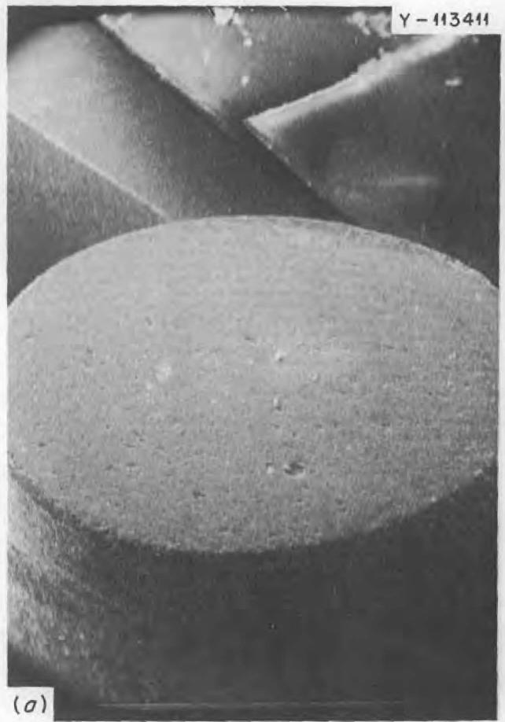

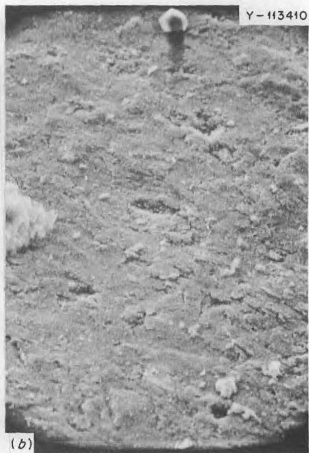  
Fig. 12.16. Scanning electron micrographs of the surface of a sample from an MSRE moderator element after sputtering approximately 16 atom layers from the surface. (a) $20 \times$ . (b) $500 \times$ .

of oxygen, carbon, and molybdenum. The largest amounts of tellurium and chromium are probably similar in quantity to the largest amounts of iron. As of now, we believe that ruthenium is probably present, but the lines are not nearly as strong as those for molybdenum.

Low-energy Auger peaks like that at $20\mathrm{eV}$ for tellurium are frequently very strong; thus, the large amplitudes listed in Table 12.2 need not be associated with high surface concentrations of tellurium. Pure tellurium would have several strong peaks between 400 and $500\mathrm{eV}$ , but our data do not disclose strong lines on any of the recorded spectra at these energies.

# 12.3 AUGER ANALYSIS OF THE SURFACE OF A FRACTURED HASTELLOYN SAMPLE

The surface of a Hastelloy N foil that was attached to a retaining strap on a group of surveillance specimens in the MSRE is being analyzed. After being exposed in the core at operating temperature for 7203 hr the foil

fractured intergranularly with little or no ductility. Part of this strap is being examined extensively by other techniques. Figure 12.17 shows scanning electron micrographs of the fractured foil. The surface has the faceted appearance of an intergranular fracture and shows some discrete particles in the boundaries. These particles probably are not responsible for the brittle behavior; a very thin layer of brittle material spread more uniformly over the grain boundaries is a more likely cause of a brittle fracture like that observed. An attempt is being made to determine if the agent responsible for the brittle behavior can be identified on the fracture surface with the use of Auger spectroscopy.

Table 12.3 shows some preliminary Auger data from the flat surface of the 0.004-in.-thick foil and from the fracture surface. The data shown were obtained on surfaces sputtered only very lightly so that only about two atomic layers were removed from the as-received surface. The major difference seems to be the substantially larger portion of molybdenum on the fractured

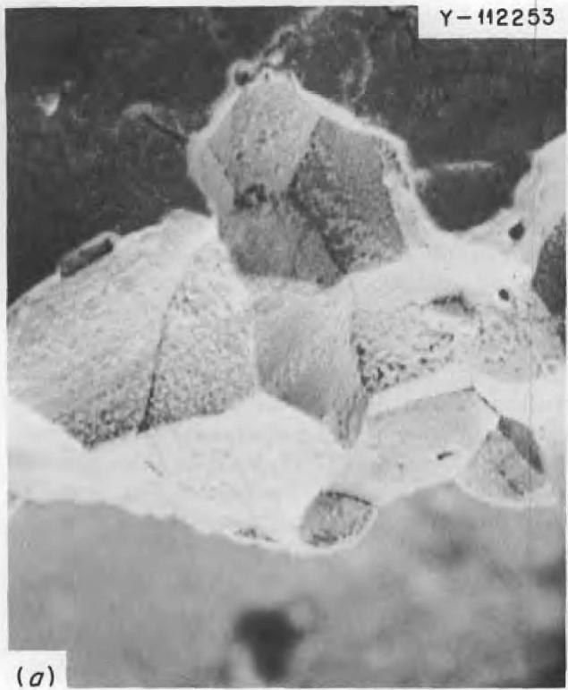

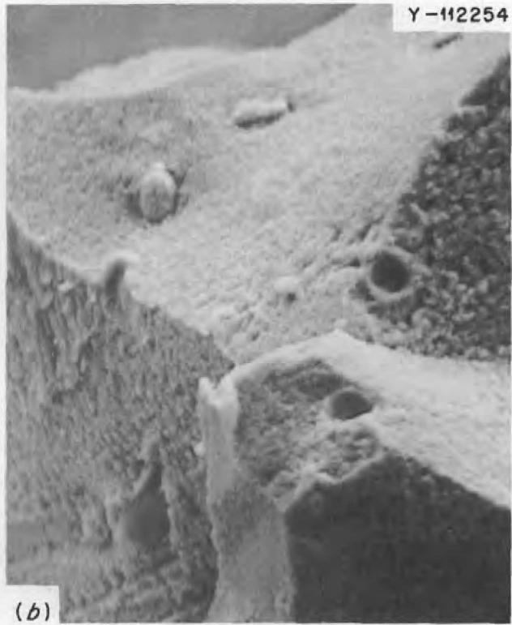  
Fig. 12.17. Fractographs of Hastelloy N foil fractured after exposure to the MSRE core for 7203 hr at operating conditions. (a) $500 \times$ . (b) $1000 \times$ .

Table 12.3. Auger electron peak intensities ${}^{a}$ from a Hastelloy N fracture surface   

<table><tr><td rowspan="2">Element</td><td rowspan="2">Electron energy (eV)</td><td colspan="2">Intensity</td></tr><tr><td>Fractured surface</td><td>Flat surface of foil</td></tr><tr><td>Tellurium</td><td>20</td><td>ndb</td><td>b</td></tr><tr><td>Nickel</td><td>60</td><td>375</td><td>850</td></tr><tr><td>Technetium, molybdenum, sulfur</td><td>150</td><td>100</td><td>160</td></tr><tr><td>Molybdenum</td><td>222</td><td>25</td><td>35</td></tr><tr><td>Technetium, molybdenum</td><td>182</td><td>43</td><td>65</td></tr><tr><td>Niobium</td><td>200</td><td>b</td><td>4</td></tr><tr><td>Carbon</td><td>275</td><td>25</td><td>25</td></tr><tr><td>Rhodium</td><td>300</td><td>b</td><td>b</td></tr><tr><td>Palladium</td><td>330</td><td>b</td><td>b</td></tr><tr><td>Nitrogen</td><td>383</td><td>3</td><td>10</td></tr><tr><td>Oxygen</td><td>510</td><td>70</td><td>54</td></tr><tr><td>Iron</td><td>650</td><td>8</td><td>6</td></tr><tr><td>Nickel</td><td>850</td><td>33</td><td>24</td></tr><tr><td>Chromium</td><td>526</td><td>wc</td><td>5</td></tr><tr><td>Chromium</td><td>569</td><td>c</td><td>c</td></tr></table>

${}^{a}$ Peak intensities are in arbitrary units.   
$b_{\mathrm{nd}} =$ not detected.   
$c_{\mathrm{W}} =$ weak.

edge, which is likely due to the molybdenum-rich carbides that form along the grain boundaries of Hastelloy N. No tellurium was detected on either surface.

The conditions under which this sample was fractured and subsequently handled, including decontamination by ultrasonic solvent cleaning and examination in the relatively poor vacuum of the oil-pumped scanning microscope, make it quite possible that material strongly concentrated within the first few atomic layers of the original fracture surface was no longer present at the time of the Auger analysis or was covered with other material so that it was no longer detectable. Therefore, we plan to fracture another piece of the same foil in the Auger system under ultrahigh vacuum conditions and analyze it immediately. This technique has been used to identify embrittling agents in the grain boundaries of tungsten and should be useful for Hastelloy N if the fracture is through the embritted region, as it appears to be.

# 12.4 INTERGRANULAR CORROSION OF HASTELLOY N

J.W.Koger

We are now using loop NCL-16 [Hastelloy N circulating $\mathrm{LiF - BeF_2 - UF_4(65.5 - 34.0 - 0.5\text{mole}\%})}$ ] in the

study of intergranular cracking of Hastelloy N in molten salts. Specifically, we are investigating the possibility that the attack is related to the localization of normal corrosion processes to grain boundaries.

In any solid solution alloy where there is a difference in nobility of the constituents, oxidation-reduction reactions may result in removal of the least noble constituent, with attack being preferential along grain boundaries. In time, given a continuing electrochemical process, this will lead to crevices in the grain boundaries. Diffusional processes within a crevice may lead to its broadening and ultimately to the formation of pits. However, if the root of the crack is anodically polarized relative to the walls, knifeline attack will continue. Such a condition may arise if the walls of the crevice become covered with a very noble material (nickel or molybdenum). This covering by a noble constituent can occur either by the noble material remaining on the wall when the least noble constituent is removed or by dissolution of all the alloy constituents with subsequent precipitation of the more noble constituents.

Prior to its use in the cracking studies, loopNCL-16 had operated for 29,500 hr with a fuel salt circulating in the system. The maximum weight loss after this period was $2.9\mathrm{mg/cm^2}$ , and the largest weight gain was $1.7\mathrm{mg/cm^2}$ . Assuming uniform loss, the maximum corrosion rate was 0.04 mil/year. The chromium content of the salt had increased 500 ppm, and the iron had decreased about 100 ppm in 29,500 hr. Titanium

modified Hastelloy N specimens (Ni-12% Mo-7% Cr-0.5% Ti) had smaller weight losses than standard Hastelloy N specimens (Ni-16% Mo-7% Cr-5% Fe) under equivalent conditions.

For our study of cracking we initially added 500 ppm $\mathrm{FeF}_2$ to the loop. Specimens were removed, weighed, and portions of specimens examined metallographically 450 and 1100 hr after the first addition. Then an additional 500 ppm $\mathrm{FeF}_2$ was added. Specimens were then analyzed 800 and 1800 hr after this second addition, with the total exposure to the highly oxidizing salt being $2900\mathrm{hr}$ .

After each removal we found weight changes typical of all our temperature-gradient mass transfer systems, with weight losses in the hot section and weight gains in the cold section. Figure 12.18 shows the weight changes of selected specimens as a function of time, and Fig. 12.19 shows the changes completely around the loop. Note that the balance point (the point at which there is no weight change) did not shift. Note, also, that the weight changes after the $\mathrm{FeF_2}$ additions were relatively large. The changes during the $450\mathrm{hr}$ after the first addition equaled those during the previous $10,000\mathrm{hr}$ . Weight changes during the next $650\mathrm{hr}$ were 2 or 3 times those for the first $450\mathrm{hr}$ and were larger than those obtained during $29,500\mathrm{hr}$ of operation before any additions.

Metallographic examination after the initial $\mathrm{FeF}_2$ additions disclosed grain boundary attack which altered

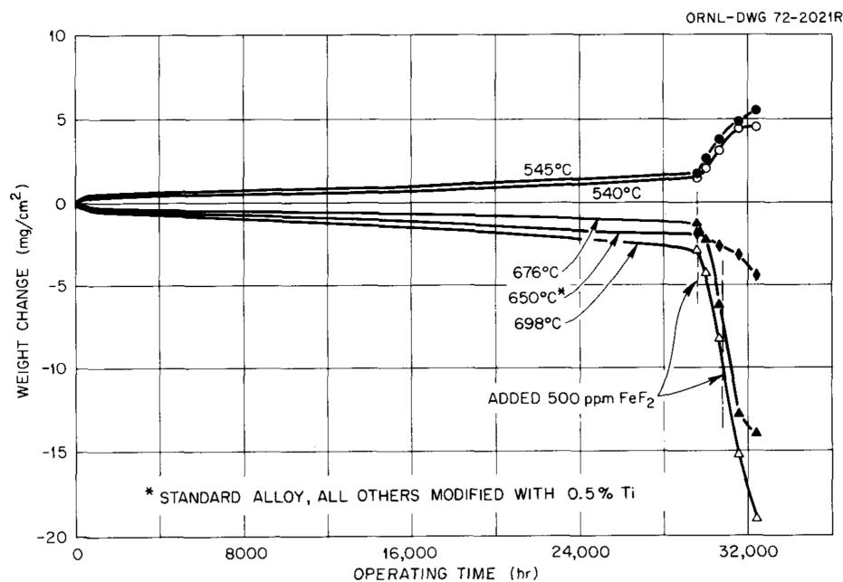  
Fig. 12.18. Weight changes of Hastelloy N specimens exposed to $\mathrm{LiF - BeF_2 - UF_4}$ (65.5-34.0-0.5 mole %), with $\mathrm{FeF_2}$ added, in NCL-16 as a function of time and temperature.

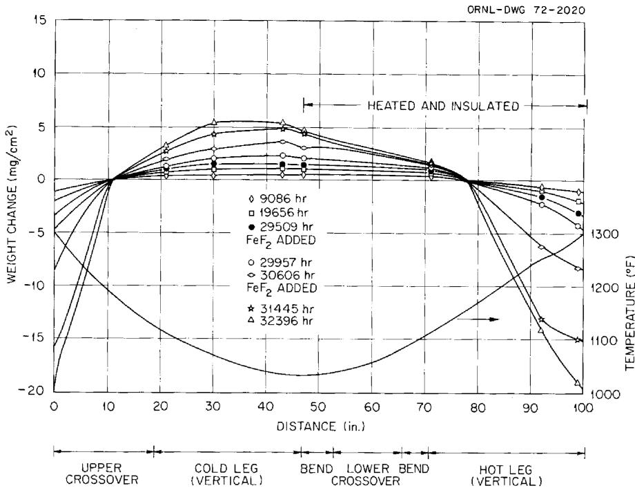  
Fig. 12.19. Weight changes of Hastelloy N specimens exposed to $\mathrm{LiF - BeF_2 - UF_4}$ (65.5-34.0-0.5 mole %), with $\mathrm{FeF_2}$ added, in NCL-16 as a function of position and time.

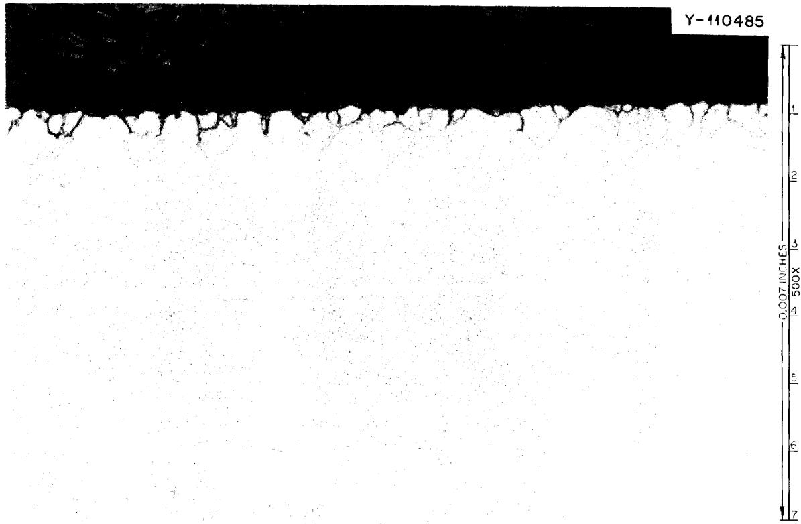  
Fig. 12.20. Hastelloy N exposed to clean $\mathrm{LiF - BeF_2 - UF_4}$ (65.5-34.0-0.5 mole %) salt at $700^{\circ}\mathrm{C}$ for 29,509 hr, to salt containing 500 ppm $\mathrm{FeF_2}$ for 1100 hr, and to salt containing another addition of 500 ppm $\mathrm{FeF_2}$ for 1700 hr. The weight loss was $19\mathrm{mg/cm}^2$ . As polished, $500\times$

the polishing characteristics of the specimen, but no cracks were visible. Examination of the hottest specimen 800 hr after the second addition revealed more grain boundary attack but still no cracks. The surface of the specimen was "lacy" due to severe corrosion by the salt and chromium removal from the alloy. This specimen was bent, and some cracking was induced in the depleted area, but no cracks penetrated the matrix. Specimen examination after the total 2900 hr exposure disclosed that the weight losses were six times greater than in the previous 29,500 hr operation of the loop, and cracks were now visible to a depth of 0.5 mil. The cracks (Fig. 12.20) seemed to be similar to those seen in the MSRE samples but were much shallower.

We have also examined pieces from loop 1249, which was operated about 12 years ago to determine the diffusion coefficient of chromium in Hastelloy N at high temperature. It operated with an $\mathrm{NaF - ZrF_4}$ salt for $792\mathrm{hr}$ , and then $3720~\mathrm{ppmFeF_2}$ was added. Operation continued for 264 additional hr. We took two pieces of the loop piping, one from the hottest position $(927^{\circ}\mathrm{C})$ wall temperature and $860^{\circ}\mathrm{C}$ bulk fluid temperature)

and one from the cold leg $(682^{\circ}\mathrm{C})$ , and bent them to determine their cracking tendencies in the chromium-depleted regions. The cold-leg specimen did not crack, but cracks formed in the hot-leg specimen. The longest extended 3 mils into the sample (Fig. 12.21), and several small cracks about the depth of a grain were also visible.

# 12.5 TUBE-BURST EXPERIMENTS

H.E.McCoy J.W.Koger

Tube-burst experiments at $650^{\circ}\mathrm{C}$ were run in three environments to determine whether stress or environment had a detectable effect on the fracture characteristics of Hastelloy N. Two sets of specimens were tested: one with clean surfaces, the other with 0.01 $\mathrm{mg/cm}^2$ of tellurium electroplated on the surfaces. The tubular specimens were made from 1-in.-OD, 0.065-in.-wall tubing with a gage section 3 in. long and 0.020-in. wall. The material was from heat Y-8488 and was similar chemically to heat Y-8487, which was used to fabricate the control rod thimble. The samples were

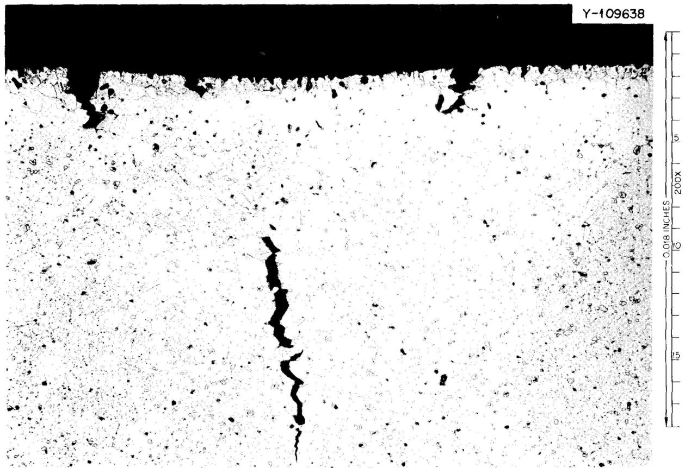  
Fig. 12.21. Hastelloy N exposed to equimolar $\mathrm{NaF - ZrF_4}$ at $860^{\circ}\mathrm{C}$ for 792 hr before and 264 hr after an addition of 3720 ppm $\mathrm{FeF_2}$ . Specimen was then bent so this surface was in tension. Etched with glyceria regia. $200\times$ .

fabricated and given a 1-hr anneal at $1180^{\circ}\mathrm{C}$ before insertion into the test chambers. The test environments were helium, a fuel salt of composition $\mathrm{LiF - BeF_2 - }$ $\mathrm{ZrF_4 - UF_4}$ (65.4-29.1-5.0-0.5 mole %), and the fuel salt with an addition of 500 ppm $\mathrm{FeF_2}$ (300 ppm Fe). Posttest analyses of the salt charges showed that the clean fuel salt contained 110 ppm Fe and 89 ppm Cr and that the fuel salt with $\mathrm{FeF_2}$ contained 284 ppm Fe and 120 ppm Cr.

The rupture lives of unplated tubes in the various environments are compared in Fig. 12.22. The rupture life is independent of environment, except perhaps at the lowest stress level. Even at this stress, the rupture lives vary by only a factor of 2, and additional observations would be necessary to establish whether the difference is reproducible. The tubes were exposed to a two-dimensional stress, and the effective-stress-effective-strain criteria would predict that for the same maximum principal stress, the time to rupture for a specimen under biaxial (2:1) stress should be about double that for a specimen under uniaxial stress. $^{12,13}$ The data in Fig. 12.22 indicate the opposite trend. There is also a large difference in slope. The uniaxial data were obtained primarily from heats from another vendor, and there were differences in chemical composition that may account for the differences in properties.

The uniform strains of the unplated tubes were divided by the rupture life to obtain effective minimum creep rates, shown in Fig. 12.23. There are no observable effects of environment outside of what is considered reasonable data scatter. The creep rate of a biaxially (2:1) stressed sample should be about 0.4 times that of a uniaxially stressed sample. The results in Fig. 12.23 show the opposite trend and indicate that the tubing is weaker than the bar and plate material used to obtain the uniaxial data.

The fracture strains of the unplated tubes are summarized in Table 12.4. The most important observation is that there is no detectable effect of environment on the fracture strain. Generally, the fracture strain decreases with increasing rupture life. This is the normal trend, but the range of 10 to $2\%$ for rupture lives of 20 to 1000 hr is larger than that noted for bar and plate stock. $^{14}$ The differences between the uniform and total

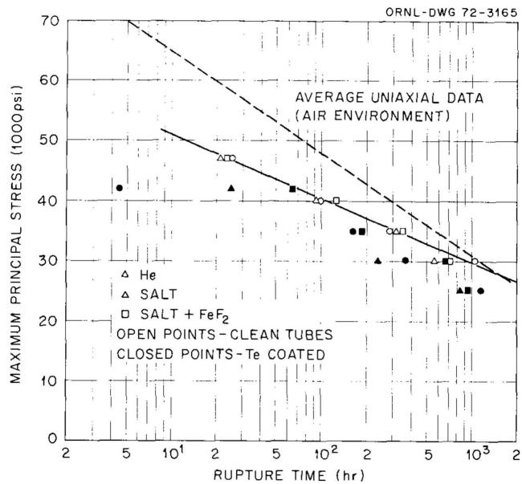

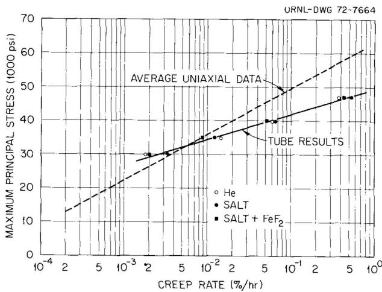  
Fig. 12.22. Stress-rupture properties at $650^{\circ}$ of INOR-8 tubes in various environments.   
Fig. 12.23. Creep rates at $650^{\circ}\mathrm{C}$ of unplated Hastelloy N tubes in various environments.

elongations are small for most samples and indicate very little third-stage creep. This was also indicated by the fact that the failures in all but one of the tubes were "pinhole" fractures that were difficult to locate and exhibited very little bulging at the fracture.

Metallographic examination of the tubes revealed that the fractures were entirely intergranular (as is normal at $650^{\circ}\mathrm{C}$ ). The metallographic features seemed inde

Table 12.4. Fracture strains of unplated tubes tested at $650^{\circ}\mathrm{C}^{a}$   

<table><tr><td>Stress (psi)</td><td>Helium</td><td>Salt</td><td>Salt plus FeF2</td></tr><tr><td>47,000</td><td>9.50 (9.92)</td><td>11.4 (11.8)</td><td>9.98 (11.0)</td></tr><tr><td>40,000</td><td>5.98 (6.12)</td><td>6.44 (7.39)</td><td>6.47 (6.56)</td></tr><tr><td>35,000</td><td>4.05 (10.2)</td><td>3.78 (3.81)</td><td>2.99 (3.24)</td></tr><tr><td>30,000</td><td>1.86 (1.90)</td><td>1.82 (4.33)</td><td>1.48 (1.61)</td></tr></table>

${}^{a}$ First number is uniform strain, and numbers in parentheses are maximum strain at the fracture. Strains are given in percent.

pendent of the test environment. Typical photomicrographs of the 30,000-psi test sample from each environment are shown in Figs. 12.24-12.26.

The stress-rupture properties of the tellurium-plated tubes are shown in Fig. 12.22. The data from these tubes exhibit more scatter, but the rupture lives are all shorter than those noted for tubes not plated with tellurium. Test environment did not have a detectable effect on the rupture life. The posttest examination of these tubes has not been completed, but two of the tubes tested in fuel salt have been examined metallographically. A typical photomicrograph is shown in Fig. 12.27. Numerous intergranular cracks extend from one-third to one-half through the tube wall. This cracking occurred consistently around the tube.

# 12.6 CRACKING OF SAMPLES ELECTROPLATED WITH TELLURIUM

B. McNabb H.E.McCoy

We have developed a method of coating surfaces with tellurium by electroplating. The tellurium is dissolved in hot concentrated nitric acid, evaporated to dryness, and ammonium hydroxide added to obtain the desired volume. Platinum gauze is used as the anode, and the sample to be plated is used as the cathode. The plating potential used is $24\mathrm{V}$ dc. Plating current is dependent on several factors, such as specimen size, anode size, and distance between the electrodes, but typically it is about $1\mathrm{mA}$ on a specimen with a surface area of 6 $\mathrm{cm}^2$ .

A specimen of vacuum-melted Hastelloy N (heat 2477) was plated with $1\mathrm{mg/cm}^2$ of tellurium under these conditions. The weight gain was linear with time at a rate of $0.01\mathrm{mgcm}^{-2}\mathrm{min}^{-1}$ . After being plated, the specimen was annealed 65 hr at $650^{\circ}\mathrm{C}$ in argon, then bend tested at room temperature. Figure 12.28 is a photomicrograph of the center of the tension side of the bend and shows numerous cracks extending to a

maximum depth of about 3 mils and an average of about 1.5 mils. This demonstrated that tellurium could cause cracking under these conditions, with a fairly high concentration of tellurium but short exposure time.

Approximately 40 sheet specimens were prepared for plating to determine which alloys were susceptible to cracking by tellurium. The materials included (1) standard and modified Hastelloy N; (2) Hastelloys B, C, X, and W; (3) Inconels 600, 601, and 718; (4) Incoloy 800; (5) stainless steel types 304, 310, 316, 406, 410, 502, and 17-7 PH; (6) nickel; (7) copper; (8) columbium and $\mathrm{Cb} + 1\mathrm{Zr}$ ; (9) Mo-0.5 Ti; and (10) Rene' 62. These specimens were plated with approximately 0.01 $\mathrm{mg/cm^2}$ of tellurium (equivalent to about 100 ppm uniformly distributed throughout a layer 5 mils deep over the entire surface area). They were then encapsulated in stainless steel and annealed 207 hr at $650^{\circ}\mathrm{C}$ in argon. After annealing, they were bend tested at room temperature to a bend angle of $90^{\circ}$ . None of the standard or modified Hastelloy N specimens showed any cracking under these conditions. Figure 12.29 is a photomicrograph of the same heat 2477 that exhibited cracking at the higher concentration of tellurium (1 $\mathrm{mg/cm^2}$ ) but did not exhibit cracking at $0.01\mathrm{mg/cm^2}$ .

Some materials did crack under these conditions. Hastelloy W, type 406 stainless steel, and Mo-0.5 Ti cracked completely through the specimen. Control specimens with no plating are being prepared for comparison with these, since it is likely that these materials may crack with no tellurium present. Specimens are being prepared with higher concentrations of tellurium and will be annealed for longer times to determine the threshold concentration that will cause cracking in Hastelloy N.

# 12.7 CRACKING OF HASTELLOY N BEING CREEP TESTED IN TELLURIUM VAPOR

H.E.McCoy B.McNabb

A sample of Hastelloy N was stressed at 30,000 psi at $650^{\circ}\mathrm{C}$ in an environment of argon containing a small partial pressure of tellurium. The tellurium vapor came from a small vial of tellurium metal at $550^{\circ}\mathrm{C}$ .

When the specimen was removed for examination after 900 hr, the quartz vial, which had initially contained $300\mathrm{mg}$ Te, had only $75\mathrm{mg}$ remaining, and the specimen was coated with fine whiskers of unidentified material. (We did not collect enough of this material for identification.) The stressed portion of the sample had cracks that were visible to the naked eye, and a metallographic section revealed numerous intergranular cracks, with some extending to a depth of 25

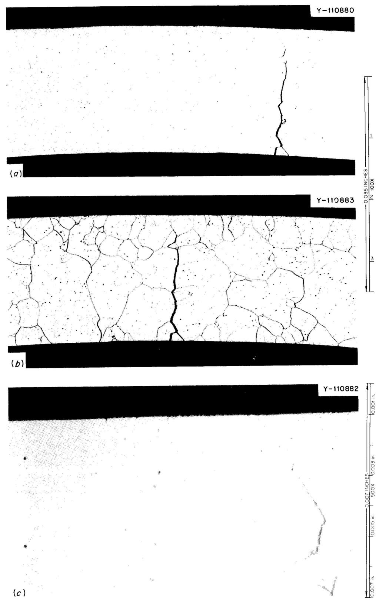  
Fig. 12.24. Photomicrographs of unplated Hastelloy N tubing stressed at 30,000 psi in a helium environment at $650^{\circ}\mathrm{C}$ . (a) Fracture, as polished. (b) Fracture, etched with glyceria regia. (c) OD near fracture, as polished.

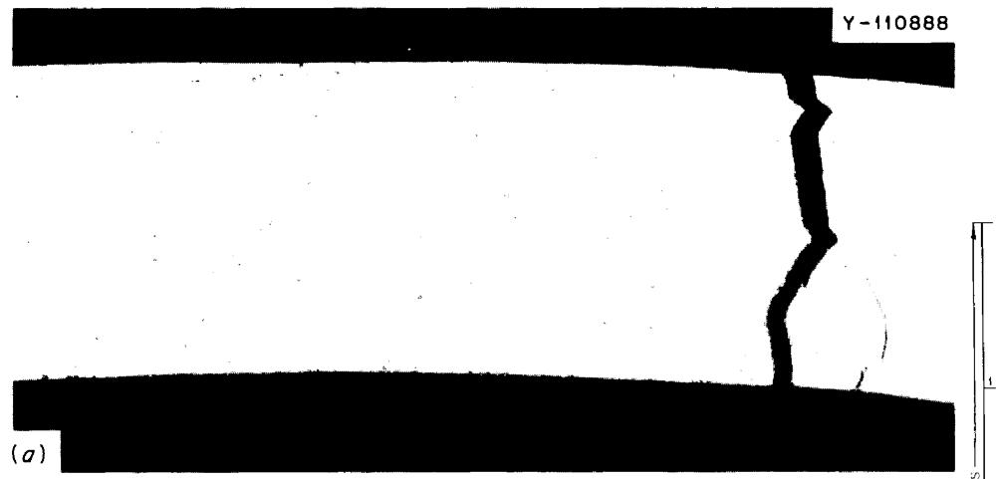

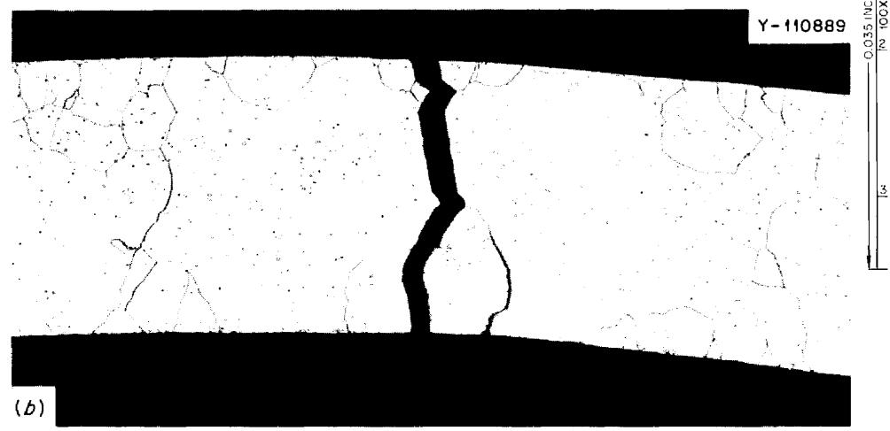

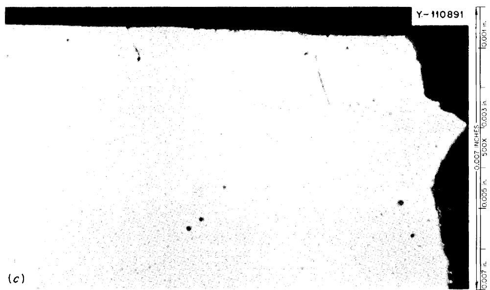  
Fig. 12.25. Photomicrographs of unplated Hastelloy N tubing stressed at 30,000 psi in clean salt at $650^{\circ}\mathrm{C}$ . (a) Fracture, as polished. (b) Fracture, etched with glyceria regia. (c) OD near fracture, as polished. The salt composition was $\mathrm{LiF - BeF_2 - ZrF_4 - UF_4}$ (65.4-29.1-5.0-0.5 mole%).

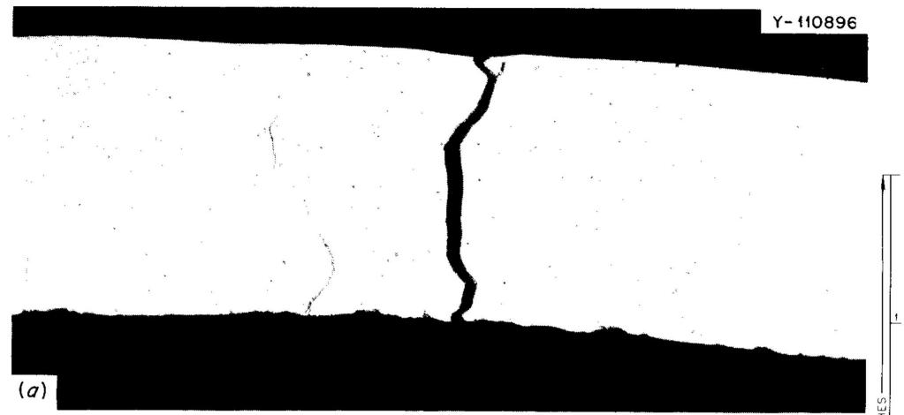

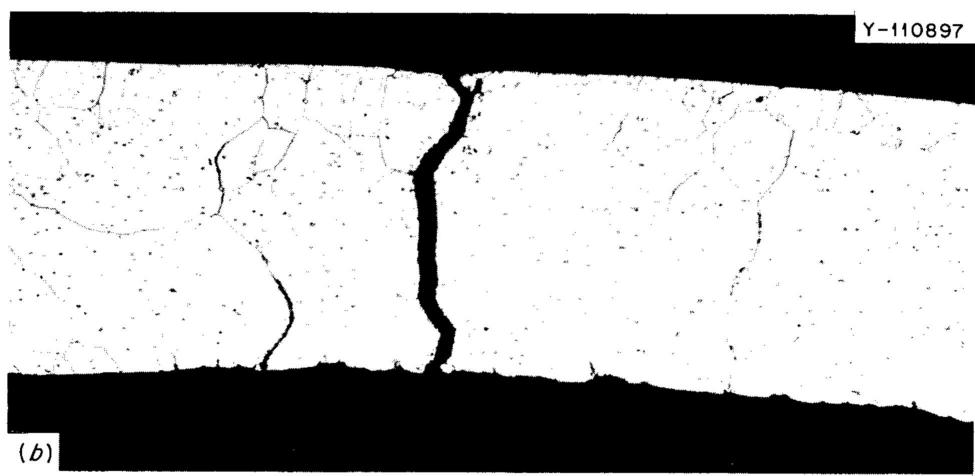

Fig. 12.26. Photomicrographs of unplated Hastelloy N tubing stressed at 30,000 psi in salt containing $\mathrm{FeF}_2$ at $650^{\circ}\mathrm{C}$ . (a) Fracture, as polished. (b) Fracture, etched with glyceria regia. (c) Outside edge at fracture, as polished. The salt composition was LiF-BeF $_2$ -ZrF $_4$ -UF $_4$ (65.4-29.1-5.0-0.5 mole %) with the addition of 500 ppm $\mathrm{FeF}_2$ .   
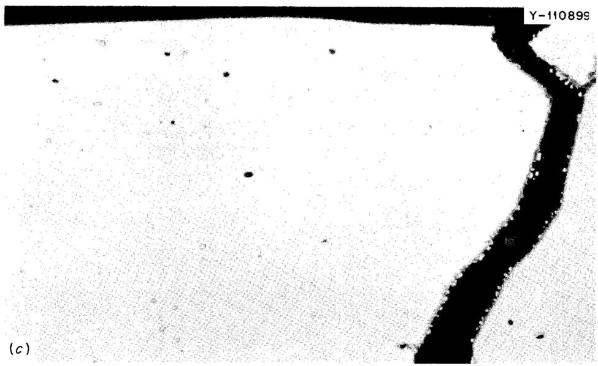  
0.007 INCHES 10,007 in. 1 10,005 in. 1 500x 10,003 in. 1 10,004 in.

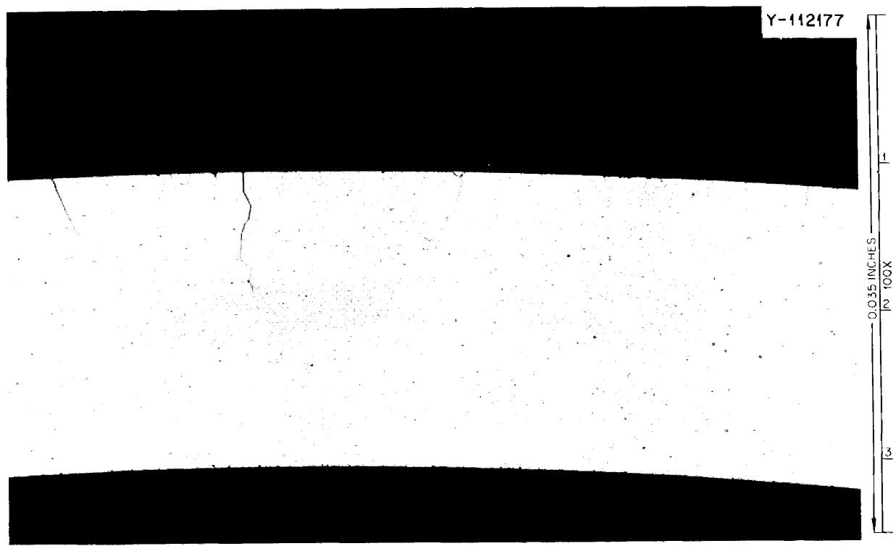

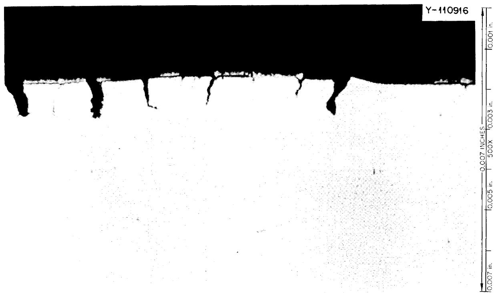  
Fig. 12.27. Photomicrograph of Hastelloy N tube plated with tellurium and stressed in fuel salt for $800\mathrm{hr}$ at $650^{\circ}\mathrm{C}$ and 25,000 psi in salt.   
Fig. 12.28. Hastelloy N (heat 2477) plated with $1.0 \, \mathrm{mg/cm}^2$ of tellurium, annealed 65 hr at $650^\circ \mathrm{C}$ in argon, and bent $90^\circ$ at $25^\circ \mathrm{C}$ . Tension side. As polished.

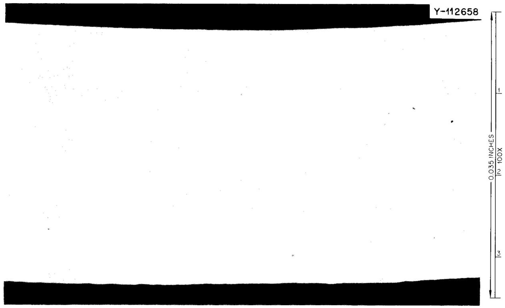

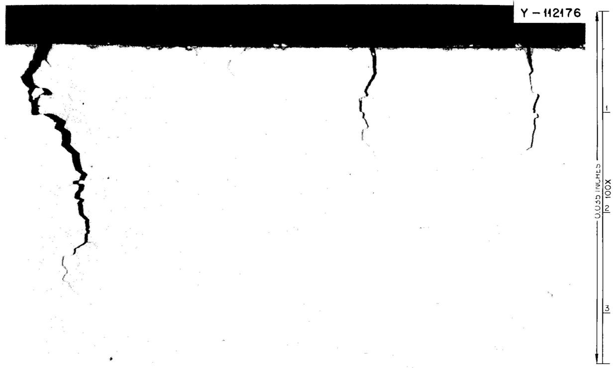  
Fig. 12.29. Hastelloy N (heat 2477) plated with $0.01\mathrm{mg/cm}^2$ of tellurium, annealed 207 hr at $650^{\circ}\mathrm{C}$ in argon, and bent $90^{\circ}$ at $25^{\circ}\mathrm{C}$ . Tension side, as polished.   
Fig. 12.30. Photomicrograph of a Hastelloy N creep specimen stressed at 30,000 psi at $650^{\circ}\mathrm{C}$ for 900 hr. The sample strained $2.5\%$ , and the test was discontinued prior to failure. The environment was argon plus a small partial pressure of tellurium. $100\times$ . As polished.

mils (Fig. 12.30). No cracks were present in the unstressed portion of the specimen. The sample had strained only $2.5\%$ , and such cracks would not be present in material tested without tellurium present. Thus this experiment showed that stress seems to aggravate intergranular cracking in Hastelloy N.

The stress of 30,000 psi used in this test is higher than would normally be encountered in service, so a test is being started at a lower stress of 21,500 psi. Tests of type 304 stainless steel and pure nickel have also been started to investigate the cracking tendencies of these materials in a tellurium-containing environment.

# 12.8 INTERGRANULAR CRACKING OF MATERIALS EXPOSED TO SULFUR AND SEVERAL FISSION PRODUCT ELEMENTS

H. E. McCoy

As described in Sect. 6.2, Shaffer et al. developed techniques for exposing small metal tensile specimens to vapors of S, Se, $\mathrm{I}_2$ , Te, and a mixture of As, Cd, and Sb. These elements have sufficient vapor pressure to transfer when the tensile samples and small amount of

these elements are sealed together in quartz and placed in a furnace for annealing at $650^{\circ}\mathrm{C}$ . The amount of each element has been small, being enough to result in a concentration of 100 ppm in the outer 5 mils of exposed metal surfaces ( $\sim 0.01\mathrm{mg/cm}^2$ ).

The first set of experiments involved only Hastelloy N samples that were annealed 1000 hr in each environment. The samples were then strained to failure at $25^{\circ}\mathrm{C}$ , and sectioned metallographically for viewing. There were no detectable effects on the mechanical properties, but numerous intergranular edge cracks were formed in the sample exposed to tellurium. The fracture and the sample edges near the fracture are shown in Fig. 12.31. However, the statistics on crack frequency and depth given in Table 12.5 for the first sample reflect the fact that the cracks were present throughout the deformed section of the specimen. Cracks were not formed in the specimens exposed to the other environments.

In a second experiment, Hastelloy N specimens that had already been exposed for 1000 hr were exposed to a new aliquot of the same element for 1000 hr at $650^{\circ}\mathrm{C}$ . The samples were strained to failure at $25^{\circ}\mathrm{C}$ .

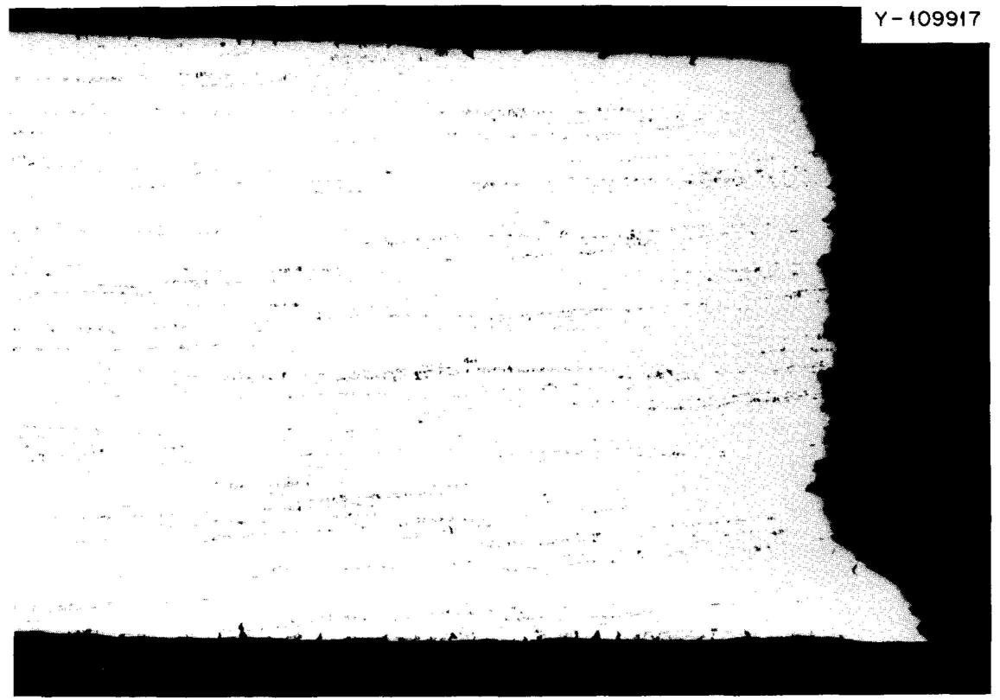  
Fig. 12.31. Hastelloy N specimen exposed to $0.01\mathrm{mg/cm}^2$ of tellurium vapor for $1000\mathrm{hr}$ at $650^{\circ}\mathrm{C}$ . Strained to failure at $25^{\circ}\mathrm{C}$ . As polished, $33\times$ .

Again, only the samples exposed to tellurium exhibited significant intergranular cracking. A photomicrograph showing a section at the fracture is shown in Fig. 12.32. The data in Table 12.5 (specimen 5) show that the additional exposure did not increase the crack frequency but did increase the depth.

Another Hastelloy N specimen from the first experiment that had been exposed to tellurium for 1000 hr at

Table 12.5. Cracking in Hastelloy N strained at ${25}^{ \circ  }\mathrm{C}$ after exposure to tellurium vapor   

<table><tr><td rowspan="2">Specimen No.</td><td rowspan="2">Exposure conditiona</td><td colspan="2">Cracks</td><td colspan="2">Depth (mils)</td></tr><tr><td>Total counted</td><td>Per inch</td><td>Average</td><td>Maximum</td></tr><tr><td>1</td><td>A</td><td>191</td><td>168</td><td>0.9</td><td>2.7</td></tr><tr><td>2</td><td>A</td><td>225</td><td>157</td><td>1.5</td><td>6.6</td></tr><tr><td>3</td><td>A</td><td>187</td><td>135</td><td>0.9</td><td>2.4</td></tr><tr><td>4</td><td>A, B</td><td>133</td><td>111</td><td>1.0</td><td>3.9</td></tr><tr><td>5</td><td>A, A</td><td>209</td><td>164</td><td>1.4</td><td>4.5</td></tr></table>

${}^a\mathbf{A} = 1000$ hr at $650^{\circ}\mathrm{C}$ in $0.01\mathrm{mg / cm}^2$ Te; $\mathbf{B} = 1000$ hr at $650^{\circ}\mathrm{C}$ in Ar.

$650^{\circ}\mathrm{C}$ was annealed for $1000\mathrm{hr}$ at $650^{\circ}\mathrm{C}$ in argon. The crack depth increased slightly by the additional annealing (specimen 4, Table 12.5).

One sample was included in the second experiment that had not been exposed previously and was exposed to $0.01\mathrm{mg / cm}^2$ of tellurium at $650^{\circ}\mathrm{C}$ for 1000 hr. It was strained to failure at $25^{\circ}\mathrm{C}$ . The crack statistics (sample 2, Table 12.5) and the metallographic section (Fig. 12.33) show clearly that the cracking was more severe than in sample 1, which was exposed to similar conditions. We have no explanation for this observation.

A third experiment was run in which samples of Ni-200 and type 304L stainless steel were exposed to $0.01\mathrm{mg/cm}^2$ each of $\mathbf{I}_2$ , tellurium, and combinations of $\mathbf{I}_2$ and tellurium for 1000 hr at $650^{\circ}\mathrm{C}$ . Hastelloy N was exposed to tellurium for 1000 hr in the same experiments. Only the Hastelloy N sample showed significant intergranular cracking (sample 3, Table 12.5). The samples of nickel and type 304L stainless steel did not crack after exposure to any of the environments. Photomicrographs of the fractures of Hastelloy N, nickel, and type 304L stainless steel are shown in Fig. 12.34.

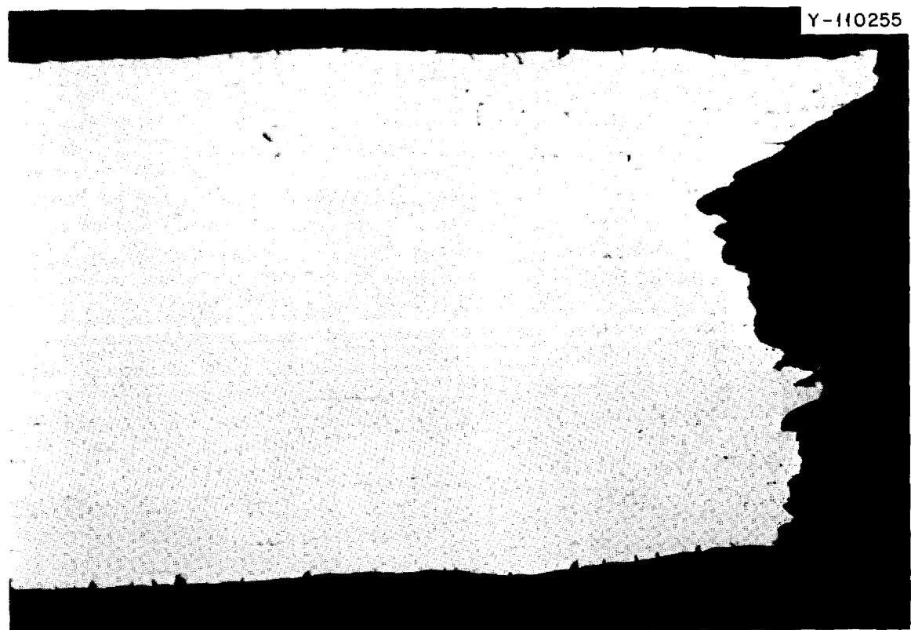  
Fig. 12.32. Hastelloy N specimen exposed to $0.01\mathrm{mg/cm}^2$ of tellurium vapor for 1000 hr at $650^{\circ}\mathrm{C}$ , exposed to another 0.01 $\mathrm{mg/cm}^2$ of tellurium vapor for 1000 hr at $650^{\circ}\mathrm{C}$ , and strained to fracture at $25^{\circ}\mathrm{C}$ . As polished, $33\times$ .

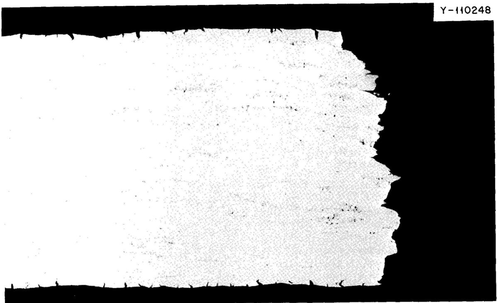  
Fig. 12.33. Hastelloy N sample exposed in the second experiment to $0.01\mathrm{mg/cm}^2$ of tellurium at $650^{\circ}\mathrm{C}$ for 1000 hr. Strained to failure at $26^{\circ}\mathrm{C}$ . As polished, $33\times$ .

These experiments demonstrate clearly that tellurium will cause intergranular cracking in Hastelloy N and that exposure to Se, S, I $_2$ , Cd, As, and Sb for up to 2000 hr does not cause cracking. Type 304L stainless steel and Ni-200 seem resistant to cracking after exposure to tellurium for 1000 hr at $650^{\circ}\mathrm{C}$ .

# 12.9 MECHANICAL PROPERTIES OF HASTELLOY N MODIFIED WITH SEVERAL ELEMENTS

H. E. McCoy

Several elements are formed as fission products that may diffuse into the structural metal and alter its mechanical properties. Sulfur is also of interest because it is a residual impurity in the salt and may have been introduced through oil that leaked into the pump bowl. Alloys have been made with nominal additions of $0.01\%$ of several of these elements, and some test results have been obtained.

The alloys prepared to date are listed in Table 12.6. All except alloys 361 and 363 have the composition of standard Hastelloy N, namely, Ni- $16\%$ Mo- $7\%$ Cr- $4\%$ Fe- $0.5\%$ Mn- $0.5\%$ Si- $0.05\%$ C. Alloys 361 and 363 did not contain chromium, to determine whether sulfur

and tellurium had different effects whether chromium was or was not present. Ru, Sn, Sb, Te, S, and As have been added successfully, but Sr, Cd, and Cs have not been retained in measurable concentrations.

The test program for these alloys is to obtain tensile data at 25 and $650^{\circ}\mathrm{C}$ in the solution-annealed condition. The alloys will then be aged for various times at $650^{\circ}\mathrm{C}$ and some of the testing sequence repeated. Limited tests have been run to date, and the data are summarized in Table 12.6. Several trends already seem obvious.

1. There were variations in the yield stresses of the solution-annealed alloys at both 25 and $650^{\circ}\mathrm{C}$ . These variations were small and were likely related to the carbon content rather than the small alloy addition. (Several of the alloys had only 0.02 to $0.03\%$ C and had lower strength.)   
2. The fracture strains at $25^{\circ}\mathrm{C}$ were quite high for all alloys. The fracture strains in tensile tests at $650^{\circ}\mathrm{C}$ were generally above $25\%$ . Alloys 352, 359, 361, and 363 had fracture strains slightly below $25\%$ .   
3. Several of the alloys had lower stress-rupture properties than the undoped alloy (351), but the reductions of only a factor of 2 or less were likely due to the lower carbon concentrations of some alloys.

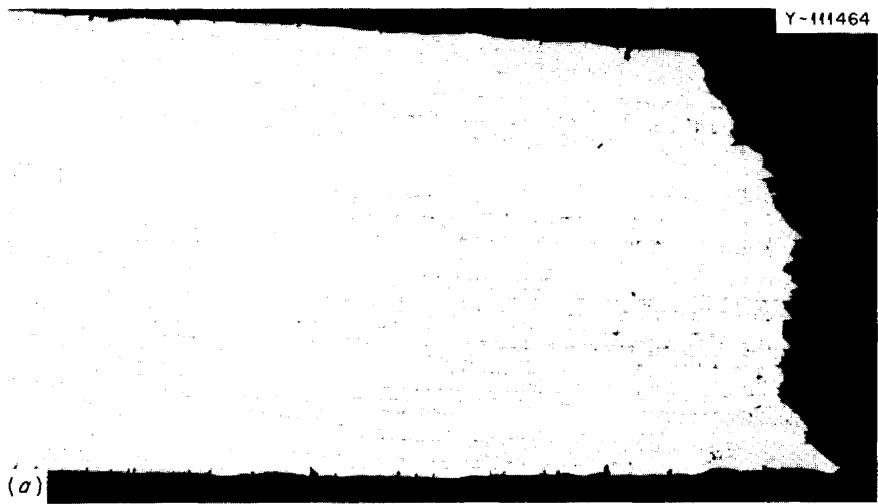

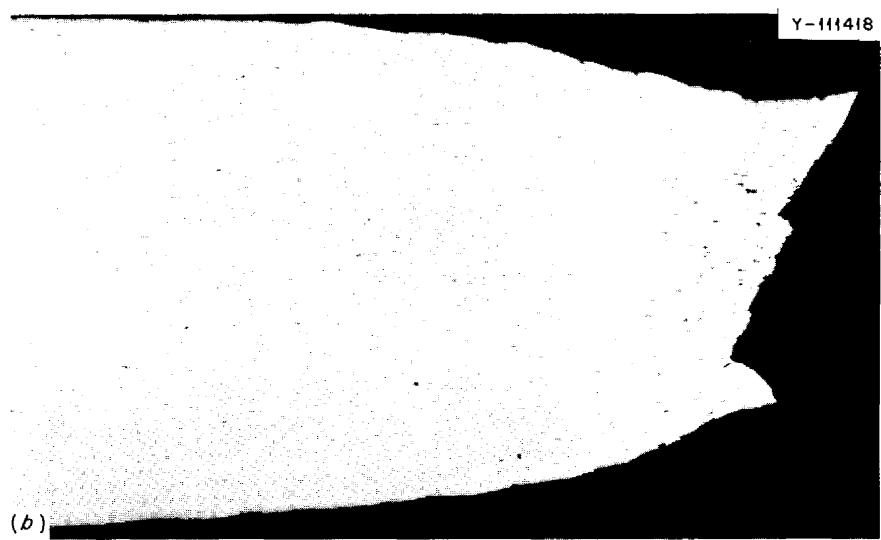

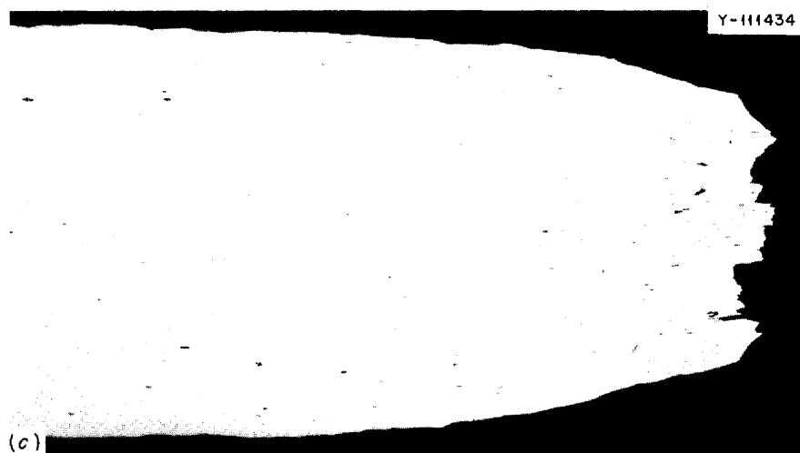  
Fig. 12.34. Photomicrographs of specimens exposed to $0.01\mathrm{mg/cm}^2$ of tellurium for 1000 hr at $650^{\circ}\mathrm{C}$ and fractured at $25^{\circ}\mathrm{C}$ . (a) Hastelloy N. (b) Nickel-200. (c) Type 304L stainless steel. As polished. $33\times$ .

Table 12.6. Influence of various alloying additions on the mechanical properties of Hastelloy N   

<table><tr><td rowspan="2">Alloy No.</td><td rowspan="2">Addition</td><td colspan="6">Solution-annealed material</td><td colspan="4">Aged 1000 hr at 650°C</td></tr><tr><td>Yield stress at 25°C (psi)</td><td>Total strain at 25°C (%)</td><td>Yield stress at 650°C (psi)</td><td>Total strain at 650°C (%)</td><td>Rupture life at 40,000 psi and 650°C (hr)</td><td>Fracture strain at 650°C (%)</td><td>Yield stress at 25°C (psi)</td><td>Total strain at 25°C (%)</td><td>Rupture life at 40,000 psi and 650°C (hr)</td><td>Fracture strain at 650°C (%)</td></tr><tr><td>351a</td><td>None</td><td>49,900</td><td>54.6</td><td>41,100</td><td>25.7</td><td>198.5</td><td>9.5</td><td>55,800</td><td>55.0</td><td>307.0</td><td>22.6</td></tr><tr><td>352</td><td>500 ppm Se</td><td>47,900</td><td>53.1</td><td>35,500</td><td>23.5</td><td>61.4</td><td>4.1</td><td>52,800</td><td>57.5</td><td>62.5</td><td>5.8</td></tr><tr><td>353</td><td>5 ppm Sr</td><td>58,900</td><td>55.3</td><td>33,300</td><td>26.2</td><td>68.8</td><td>5.9</td><td>55,600</td><td>52.5</td><td>202.0</td><td>12.8</td></tr><tr><td>354</td><td>50 ppm Tc</td><td>55,000</td><td>54.4</td><td>32,000</td><td>27.9</td><td>(100)b</td><td>(10)</td><td>52,800</td><td>9.5</td><td>228.5</td><td>14.7</td></tr><tr><td>355</td><td>200 ppm Ru</td><td>40,900</td><td>56.5</td><td>27,800</td><td>30.2</td><td>77.1</td><td>8.6</td><td>56,800</td><td>58.0</td><td>267.4</td><td>14.0</td></tr><tr><td>356</td><td>≤40 ppm Cd</td><td>53,700</td><td>50.8</td><td>33,000</td><td>25.4</td><td>89.5</td><td>5.6</td><td>54,400</td><td>52.8</td><td>185.7</td><td>10.2</td></tr><tr><td>357</td><td>200 ppm Sn</td><td>46,700</td><td>56.8</td><td>33,000</td><td>32.5</td><td>82.8</td><td>7.3</td><td>54,900</td><td>55.5</td><td>157.1</td><td>11.3</td></tr><tr><td>358</td><td>200 ppm Sb</td><td>46,800</td><td>70.0</td><td>28,600</td><td>35.5</td><td>55.7</td><td>6.6</td><td>48,500</td><td>61.5</td><td>312.8</td><td>12.8</td></tr><tr><td>359</td><td>600 ppm Te</td><td>49,600</td><td>50.8</td><td>39,400</td><td>19.9</td><td>(16)</td><td>(2)</td><td>53,000</td><td>52.0</td><td>16.8</td><td>3.8</td></tr><tr><td>360</td><td>≤0.7 ppm Cs</td><td></td><td></td><td></td><td></td><td>78.3</td><td>6.3</td><td>56,000</td><td>57.0</td><td>234.9</td><td>16.0</td></tr><tr><td>361c</td><td>400 ppm Te</td><td>41,000</td><td>60.6</td><td>30,600</td><td>22.9</td><td>(2)</td><td>(5)</td><td>46,900</td><td>52.5</td><td>20.1</td><td>6.7</td></tr><tr><td>362</td><td>90 ppm S</td><td>44,500</td><td>64.6</td><td>29,400</td><td>35.0</td><td>39.0</td><td>0.91</td><td>52,300</td><td>56.2</td><td>364.2</td><td>12.5</td></tr><tr><td>363c</td><td>970 ppm S</td><td>51,300</td><td>51.6</td><td>40,800</td><td>18.9</td><td>(10)</td><td>(2)</td><td>58,200</td><td>50.0</td><td>22.9</td><td>4.5</td></tr><tr><td>364</td><td>960 ppm S</td><td>53,700</td><td>53.5</td><td>37,000</td><td>27.3</td><td>61.7</td><td>4.9</td><td>60,100</td><td>49.4</td><td>216.7</td><td>9.7</td></tr><tr><td>365</td><td>40 ppm As</td><td>47,500</td><td>63.7</td><td></td><td></td><td>77.4</td><td>5.2</td><td>54,900</td><td>58.5</td><td>291.1</td><td>12.6</td></tr></table>

${}^{a}$ Contains 30 ppm S.   
$b$ Estimates based on interpolation of data from other stress levels.   
$c$ Does not contain Cr.

However, alloys 359, 361, 362, and 363 had reductions in stress-rupture properties and fracture strain outside the range attributable to carbon content.

4. Aging for $1000\mathrm{hr}$ at $650^{\circ}\mathrm{C}$ caused a slight increase in the yield stress at $25^{\circ}\mathrm{C}$ of most alloys but had no detectable influence on the fracture strain. The stress-rupture properties and fracture strains were generally improved by aging. The properties of alloys 352, 359, 361, and 363 were not worsened appreciably by aging.

Some of the more important property changes are shown in Fig. 12.35. Tellurium and sulfur have deleterious effects, with tellurium being more detrimental. The effects of both elements are accented by the absence of chromium.

Metallographic samples have been viewed of alloy 359 after various types of tests. All samples were annealed 1 hr at $1180^{\circ}\mathrm{C}$ before testing. The fracture of a sample tensile tested at $25^{\circ}\mathrm{C}$ is shown in Fig. 12.36. The fracture is primarily transgranular, and no intergranular cracks are visible. A specimen tensile tested at $650^{\circ}\mathrm{C}$ is shown in Fig. 12.37, and numerous intergranular cracks

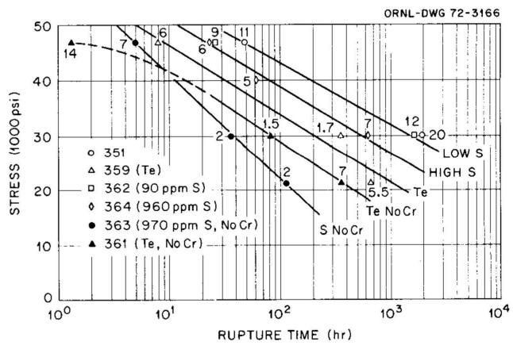  
Fig. 12.35. Stress-rupture properties at $650^{\circ}\mathbf{C}$ of Hastelloy N modified with various additions. Numbers indicate the fracture strain.

are present. Photomicrographs of a specimen tested at $650^{\circ}\mathrm{C}$ at a stress of 30,000 psi are shown in Fig. 12.38. The sample failed in 354 hr with $1.6\%$ strain. The fracture is intergranular, and there are numerous intergranular separations throughout the stressed portion of the specimen.

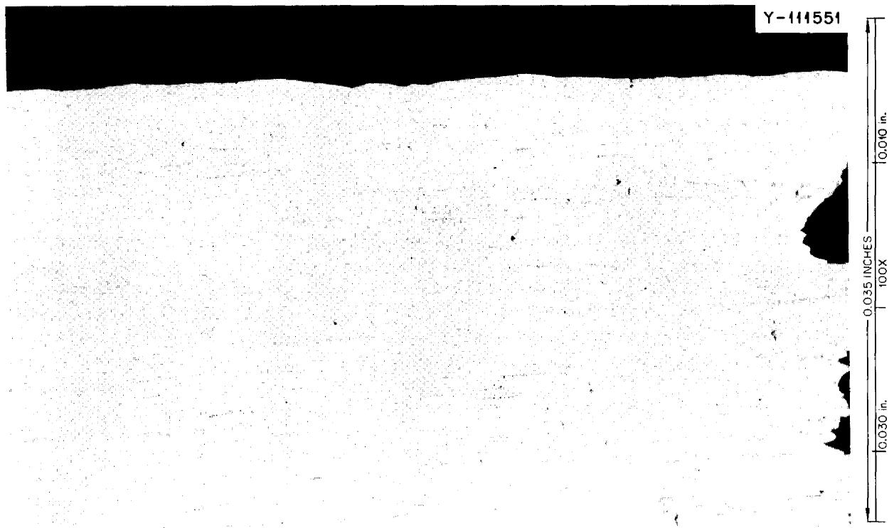  
Fig. 12.36. Photomicrograph of the fracture of alloy 359 after straining to failure at $25^{\circ}\mathrm{C}$ . As polished.

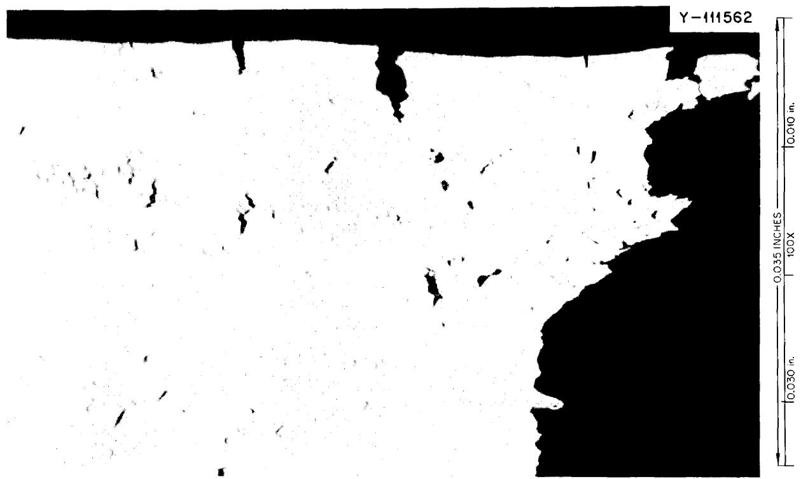  
Fig. 12.37. Photomicrograph of the fracture of alloy 359 after straining to failure at $650^{\circ}\mathrm{C}$ . As polished.

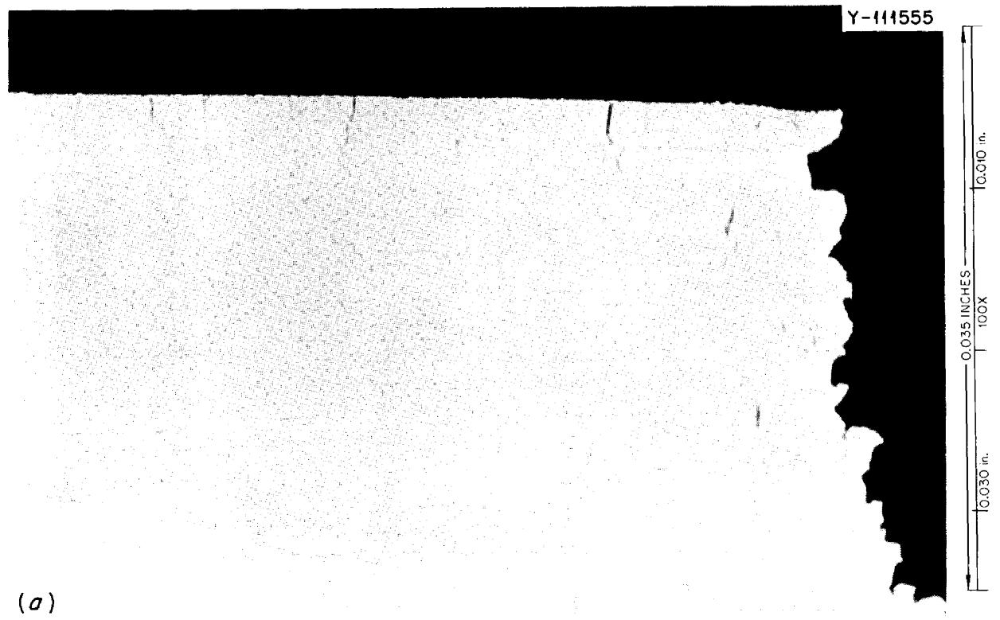

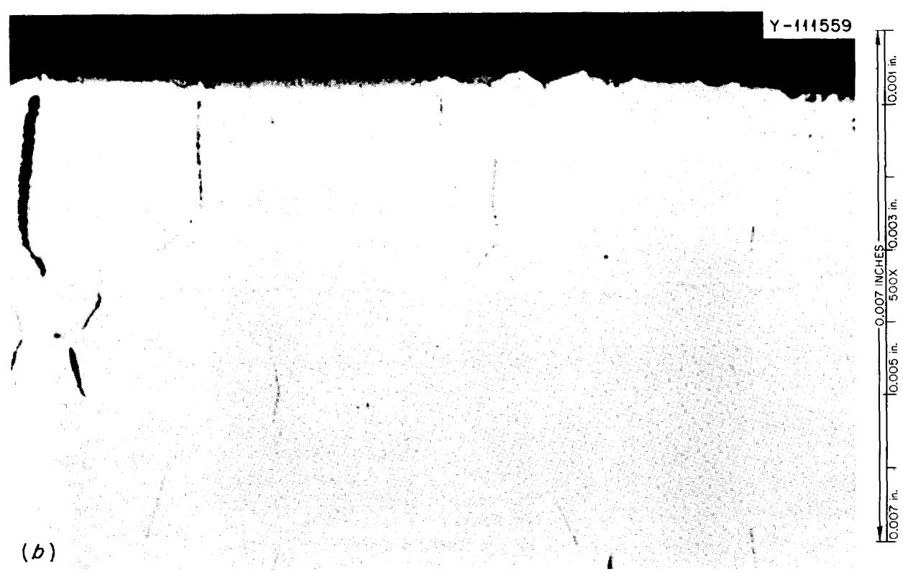  
Fig. 12.38. Photomicrographs of alloy 359 after creeping at 30,000 psi and $650^{\circ}\mathrm{C}$ . Failed after 354 hr with a strain of $1.6\%$ . (a) Fracture. $100\times$ . (b) Typical view of edge. $500\times$ . As-polished condition.

The alloying additions that show the largest influences on the mechanical properties are those of group VI-B - sulfur, selenium, and tellurium. These elements have been shown to reduce the ductility of nickel in the temperature range of 500 to $800^{\circ}\mathrm{C}$ but have no effects on the properties up to $500^{\circ}\mathrm{C}$ . This pattern is consistent with that noted with the more complex alloy, Hastelloy N.

# 12.10 STATUS OF INTERGRANULAR CRACKING STUDIES

H. E. McCoy

Several important observations have been made concerning the intergranular cracking of Hastelloy N in the MSRE. Cracks were visible in many of the samples after they were removed from the MSRE, but the number and visible depth of the cracks increased in most instances with further straining. A heat-exchanger tube was one notable exception where the number of visible cracks was about equivalent before and after straining. The cracking statistics on various components that were exposed throughout the operation are summarized in Table 12.7. The surveillance samples that were exposed for different periods of time in the MSRE core gave some indication of the time dependence of the cracking (Table 12.8). The number of cracks increased, but it is not at all apparent that the depth of cracking increased with time over the range studied.

Laboratory corrosion experiments in which Hastelloy N was exposed to fluoride salts thus far have not reproduced the cracking that was observed in the MSRE. Selective intergranular attack has been produced by making the salt very oxidizing, but the maximum depth of attack in 3000 hr was 0.5 mil, compared with several mils in the MSRE.

Experiments in which Hastelloy N specimens were exposed to low concentrations of vapor of S, Se, Te, $\mathbf{I}_2$ , As, Sb, and Cd for 1000 or 2000 hr at $650^{\circ}\mathrm{C}$ and then strained at $25^{\circ}\mathrm{C}$ resulted in intergranular cracking only in those specimens that had been exposed to tellurium vapor. The cracks in these specimens were similar in depth and appearance to those in materials from the MSRE. Type 304L stainless steel and nickel-200 did not crack when tested under these same conditions.

Hastelloy N tube-burst specimens and a creep specimen that were stressed in the presence of tellurium had extensive intergranular cracks. Special alloys of Hastelloy N that contained small additions of Se, Tc,

Ru, Sn, Sb, Te, S, and As have been prepared and tested under a variety of conditions. The alloys containing sulfur and tellurium had reduced rupture lives and fracture strains at $650^{\circ}\mathrm{C}$ .

Thus the laboratory tests to date leave no question that intergranular cracking of the type noted in the MSRE can be produced by tellurium and possibly by sulfur. However, the evidence does not seem in hand to show that the cracking in the MSRE resulted from tellurium or sulfur. Sulfur is not a fission product but was introduced by inleakage of oil from the pump bearings and possibly as a contaminant in the initial salt charge. The probable amount of sulfur introduced by oil inleakage was $27\mathrm{g}$ , and the maximum amount of sulfur in the initial fuel charge was $24\mathrm{g}$ , or a total concentration in the fuel salt of $10\mathrm{ppm}$ . A similar concentration of sulfur was present in the coolant circuit, but no cracking was observed. The coolant loop was not exposed to as intense radiation as the primary circuit, and this may have been a factor. However, our laboratory experiments do not strongly support the ability of very low concentrations of sulfur to embrittle Hastelloy N, and we currently discount the possibility that the cracking is due to sulfur. Our surface chemical studies on material removed from the MSRE showed that all fission products with sufficient half-lives to be detected were present to shallow depths in the alloy. Close metallographic examination has shown that many of the intergranular cracks are present in samples removed from the MSRE, so the apparent penetration of the metal by fission products may not represent much solid-state diffusion along the grain boundaries, but rather the coating of the surfaces of cracks. The cracks may be due to the formation of brittle or very low-melting compounds along the grain boundaries. The element responsible for the behavior has not been isolated, but a rather strong circumstantial case has developed for its being tellurium. Laboratory experiments have concentrated on tellurium, but some work on other fission products is in progress.

On the assumption that tellurium is associated with the cracking, it is important to speculate about the time and temperature dependence of the cracking. The accumulated cracking statistics on samples exposed to tellurium are summarized in Table 12.9. The various nuclear experiments vary in the time of exposure and the concentration of tellurium, so it is impossible to separate the effects of the two variables. The first three experiments were for relatively short times, had low tellurium concentrations, and did not show detectable cracking in the available photomicrographs. The surveillance samples and components from the MSRE were

Table 12.7. Crack formation in various samples from the MSRE after straining at ${25}^{ \circ  }\mathrm{C}$   
Over $500^{\circ}\mathrm{C}$ for 30,807 hr   

<table><tr><td rowspan="2">Sample description</td><td colspan="2">Cracks</td><td colspan="2">Depth (mils)</td><td rowspan="2">127Te atoms/cm2a</td><td rowspan="2">Total Te atoms/cm2b</td></tr><tr><td>Counted</td><td>Per inch</td><td>Average</td><td>Maximum</td></tr><tr><td></td><td></td><td></td><td></td><td></td><td>× 1015</td><td>× 1017</td></tr><tr><td>Exposed thimble</td><td>91</td><td>192</td><td>5.0</td><td>8.0</td><td>1.8, 1.8</td><td>2.9, 2.9</td></tr><tr><td>Thimble under spacer sleeve</td><td>148</td><td>257</td><td>4.0</td><td>8.0</td><td>0.59, 0.46</td><td>0.95, 0.74</td></tr><tr><td>Thimble spacer, OD</td><td>88</td><td>178</td><td>3.0</td><td>7.0</td><td>1.0, 2.8</td><td>1.6, 4.5</td></tr><tr><td>Thimble spacer, ID</td><td>106</td><td>202</td><td>3.0</td><td>5.0</td><td></td><td></td></tr><tr><td>Mist shield, inside vapor</td><td>47</td><td>192</td><td>1.0</td><td>2.0</td><td></td><td></td></tr><tr><td>Mist shield, inside liquid</td><td>33</td><td>150</td><td>4.0</td><td>6.5</td><td></td><td></td></tr><tr><td>Mist shield, outside vapor</td><td>80</td><td>363</td><td>4.0</td><td>5.0</td><td></td><td></td></tr><tr><td>Mist shield, outside liquid</td><td>54</td><td>300</td><td>3.0</td><td>5.0c</td><td>0.55</td><td>0.89</td></tr><tr><td>Sampler cage rod, vapor</td><td>100</td><td>143</td><td>2.5</td><td>5.0</td><td></td><td></td></tr><tr><td>Sampler cage rod, vapor</td><td>170</td><td>237</td><td>3.2</td><td>10.0</td><td></td><td></td></tr><tr><td>Sampler cage rod, liquid</td><td>102</td><td>165</td><td>3.7</td><td>10.0</td><td></td><td></td></tr><tr><td>Sampler cage rod, liquid</td><td>131</td><td>238</td><td>7.5</td><td>12.5</td><td></td><td></td></tr><tr><td>Freeze valve 105</td><td>131</td><td>240</td><td>0.75</td><td>1.5</td><td>0.04</td><td>0.06</td></tr><tr><td>Heat-exchanger tube (unstrained)</td><td>100, 135</td><td>228, 308</td><td>2.5</td><td>3.8</td><td></td><td></td></tr><tr><td>Heat-exchanger tube (strained)</td><td>219</td><td>262</td><td>5.0</td><td>6.3</td><td></td><td></td></tr></table>

$a_{\mathrm{Measured}}$   
$b_{\text{Calculated}}$   
cOne crack was 12 mils deep; next largest was 5 mils.

Table 12.8. Crack formation in Hastelloy N surveillance samples strained to failure at $25^{\circ}\mathrm{C}$   

<table><tr><td rowspan="2">Heat</td><td rowspan="2">Exposurea</td><td rowspan="2">Time of exposure (hr)</td><td colspan="2">Cracks</td><td colspan="2">Depth (mils)</td></tr><tr><td>Counted</td><td>Per inch</td><td>Average</td><td>Maximum</td></tr><tr><td>5085</td><td>Control</td><td>5,550</td><td>1</td><td>1</td><td>5.7</td><td>5.7</td></tr><tr><td>5085</td><td>Core</td><td>5,550</td><td>24</td><td>19</td><td>2.5</td><td>8.8</td></tr><tr><td>5085</td><td>Control</td><td>11,933</td><td>0</td><td></td><td></td><td></td></tr><tr><td>5085</td><td>Core</td><td>11,933</td><td>178</td><td>134</td><td>1.9</td><td>6.3</td></tr><tr><td>5065</td><td>Control</td><td>11,933</td><td>3</td><td>3</td><td>1.0</td><td>2.0</td></tr><tr><td>5065</td><td>Core</td><td>11,933</td><td>277</td><td>230</td><td>1.8</td><td>3.8</td></tr><tr><td>5085</td><td>Control</td><td>19,136</td><td>4</td><td>3</td><td>1.5</td><td>2.8</td></tr><tr><td>5085</td><td>Core</td><td>19,136</td><td>213</td><td>176</td><td>5.0</td><td>7.0b</td></tr><tr><td>5085</td><td>Core</td><td>19,136</td><td>140</td><td>146</td><td>3.8</td><td>8.8</td></tr><tr><td>5065</td><td>Control</td><td>19,136</td><td>3</td><td>3</td><td>2.5</td><td>4.0</td></tr><tr><td>5065</td><td>Core</td><td>19,136</td><td>240</td><td>229</td><td>5.0</td><td>7.5</td></tr></table>

${}^{a}$ Control specimens were exposed at ${650}^{ \circ  }\mathrm{C}$ to static unenriched fuel salt for the indicated time. Core specimens were exposed at ${650}^{ \circ  }\mathrm{C}$ to MSRE core.   
bOne crack was 15 mils deep; next largest was 7 mils.

exposed for various times to different levels of tellurium. The frequency of cracking increases with time and tellurium content, but the depth of cracking does not increase detectably. Several samples have been electroplated and vapor plated with tellurium. One sample was electroplated with $47 \times 10^{17}$ atoms/cm² and annealed for 65 hr at $650^{\circ}\mathrm{C}$ . The sample had numerous cracks after bend testing. Another sample was electroplated with less tellurium, annealed 200 hr at $650^{\circ}\mathrm{C}$ , and did not have any detectable cracks after a bend test. These two samples show a definite effect of tellurium concentration. Several samples have been vapor plated with tellurium and held at $650^{\circ}\mathrm{C}$ for 1000 and 2000 hr. These samples cracked more severely than

those from the first group of surveillance samples, which had been at temperature for 5550 hr but had only $0.1 \times 10^{17}$ atoms of tellurium per square centimeter. Again, this indicates an effect of concentration. It is impossible to determine the effects of temperature from the available data. The temperature variation in the MSRE was quite small, and other effects masked any effects of temperature. Thus the available data offer evidence that tellurium concentration is important but give no indications about the effects of time and temperature.

The superior resistance of type 304L stainless steel and Ni-200 offers encouragement that all materials are not affected adversely by tellurium.

Table 12.9. Cracks produced in various samples after straining at ${25}^{ \circ  }\mathrm{C}$   

<table><tr><td rowspan="2">Source of samples</td><td rowspan="2">Time at temperature after fission products produced (hr)</td><td rowspan="2">Tellurium produced during operation (atoms per square centimeter of metal)</td><td colspan="2">Cracks</td><td colspan="2">Depth (mils)</td></tr><tr><td>Counted</td><td>Per inch</td><td>Average</td><td>Maximum</td></tr><tr><td></td><td></td><td>×1017</td><td></td><td></td><td></td><td></td></tr><tr><td>Trauger, MTR 44-1</td><td>682</td><td>0.2</td><td></td><td></td><td></td><td></td></tr><tr><td>MTR 44-</td><td>766</td><td>0.2</td><td></td><td></td><td></td><td></td></tr><tr><td>Compere and Bohlman</td><td>1,366</td><td>0.2</td><td></td><td></td><td></td><td></td></tr><tr><td>Surveillance samples, group 1</td><td>5,550</td><td>0.1</td><td>24</td><td>19</td><td>2.5</td><td>8.8</td></tr><tr><td>Surveillance samples, group 3</td><td>11,933</td><td>0.8</td><td>178, 277</td><td>134, 230</td><td>1.9, 1.8</td><td>6.3, 3.8</td></tr><tr><td>Surveillance samples, group 4</td><td>19,136</td><td>1.2</td><td>213, 140, 240</td><td>176, 146, 229</td><td>5.0, 3.8, 5.0</td><td>7.0, 8.8, 7.5</td></tr><tr><td>MSRE, end of operation</td><td>30,807</td><td>1.4</td><td></td><td>143–363</td><td>0.75–7.5</td><td>1.5–12.5</td></tr><tr><td>Electroplated sample</td><td>65</td><td>47</td><td>196</td><td>273</td><td>0.8</td><td>1.5</td></tr><tr><td>Electroplated sample</td><td>200</td><td>0.5</td><td>0</td><td></td><td></td><td></td></tr><tr><td>Vapor-plated sample</td><td>1,000</td><td>0.5</td><td>191, 225, 187</td><td>168, 157, 135</td><td>0.9, 1.5, 0.9,</td><td>2.7, 6.6, 2.4</td></tr><tr><td>Vapor-plated sample</td><td>2,000</td><td>1</td><td>209</td><td>164</td><td>1.4</td><td>4.5</td></tr></table>

# 13. Graphite Studies

W. P. Eatherly

# INTRODUCTION

The objectives of the MSRP graphite program continue to be the development of improved radiation-resistant experimental graphites and the development of techniques to seal the graphite against $^{135}\mathrm{Xe}$ . As indicated in the previous semiannual report, the emphasis of the MSRP work has been shifted from the bulk graphite to the sealing problem. A significant amount of experimental graphite fabrication is continuing, however, but it is now largely funded from other sources and is directed at applications other than nuclear. Because much of the work is concerned with relating physical properties to microstructure and such relations contribute to our understanding of radiation damage, the results are reported here.

1. W. P. Eatherly, MSR Program Semiannu. Progr. Rep. Aug. 31, 1971, ORNL-4728, pp. 111-24.

# 13.1 GRAPHITE DEVELOPMENT

C. R. Kennedy

W. P. Eatherly

The program to fabricate advanced types of graphite for extended reactor life continued through this report period. The graphite desired is one having a monolithic structure with very strong grain boundaries to resist the shearing deformation caused by irradiation growth. We are attempting to obtain this structure by the use of green cokes to reduce or eliminate the binder shrinkage cracks during fabrication. We have been working extensively with Robinson coke (an air-blown isotropic coke), Santa Maria coke (a less isotropic coke with fairly high impurities), and recently with two acicular cokes: coke A (a very anisotropic coke) and coke SA (similar to coke A but more isotropic). The thermalgravimetric results for these cokes are shown in Fig. 13.1 for comparison. It is readily evident that the Robinson, Santa Maria, and SA are similar in this regard

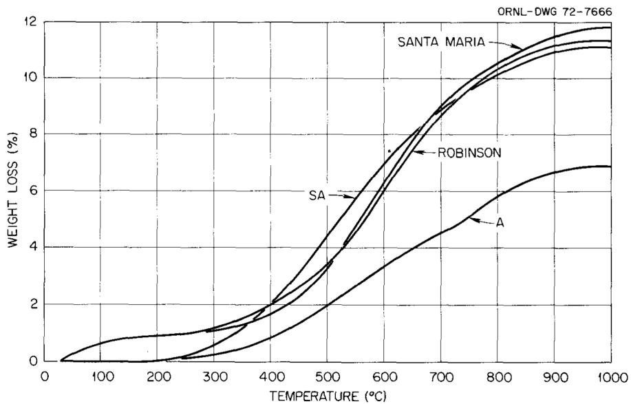  
Fig. 13.1. Thermal-gravimetric results for four green cokes. Heating rate, $3^{\circ}\mathrm{C / min}$

with about 11 to $12\%$ volatile, while the A coke has only $7\%$ volatile.

We have been using $15\mathrm{V}$ coal tar pitch, 240 petroleum pitch, furan resins, and furan-petroleum-pitch mixtures as binders to fabricate the graphites for evaluation. The filler particles have all been ground to fairly fine sizes (mean particle size $< 10~\mu \mathrm{m}$ ), and the large surface area requires large binder contents. The filler and binders have been slurry mixed with benzene, dried, and remicronized before molding. The optimum combination of molding temperature, pressure, and binder content for each of the above binder and filler combinations is different; therefore, direct comparison of component raw materials cannot be made using identical fabrication techniques. We have found, however, that for each filler, there exists a reasonable relationship between green and graphitized density which is independent of binder, binder content, and molding conditions. This relationship is given in Figs. 13.2 and 13.3 for Robinson and Santa Maria fillers. It is evident from these figures that there are coke-filler-thermal combinations which improve packing and so

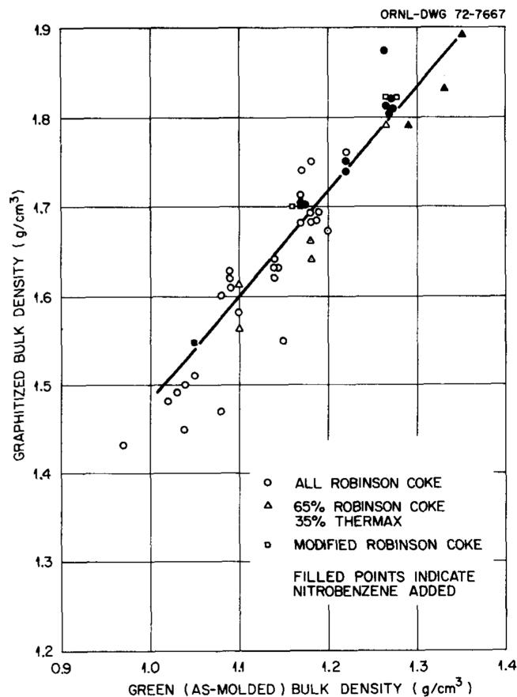  
Fig. 13.2. Green density vs graphitized density for Robinson coke graphites.

give higher green densities; however, the basic coke filler density proportionality still exists.

Comparison of the filled and open points in Figs. 13.2 and 13.3 shows that nitrobenzene is significant in increasing both the green and graphite densities. To examine whether the effect of nitrobenzene is a result of its plasticizing or of its lubricating the mix, a series of moldings with Robinson filler and water, oil, and nitrobenzene additions were made. The results of this series, shown in Fig. 13.4, revealed that additions of oil

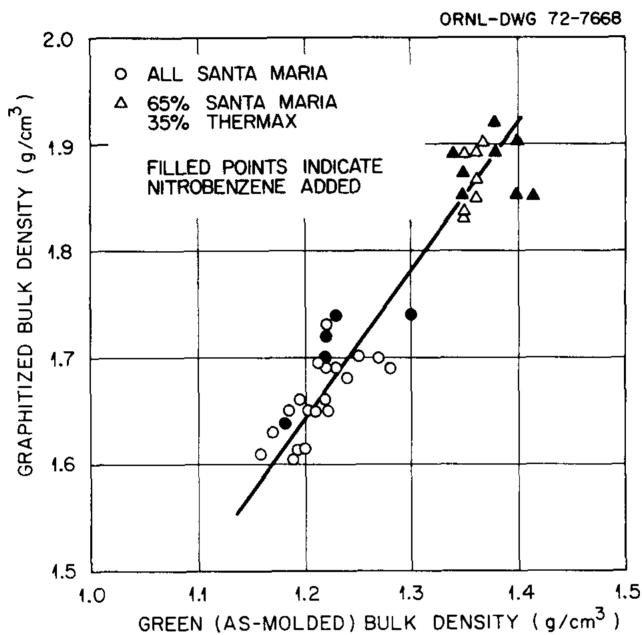  
Fig. 13.3. Green density vs graphitized density for Santa Maria coke graphites.

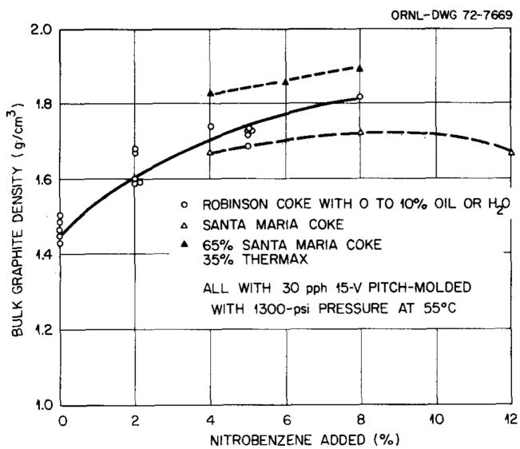  
Fig. 13.4. The effect of nitrobenzene on molded graphites.

or water up to $10\%$ have no effect on the density of moldings with nitrobenzene contents from 0 to $8\%$ . Therefore, we concluded that the densifying effect of nitrobenzene is in plasticizing the mix and not due to lubrication effects. Although the data in Fig. 13.4 indicate that about $8\%$ nitrobenzene gives the maximum density, other considerations also affect the optimum amount. For example, one difficulty in the use of nitrobenzene is a strong tendency towards agglomeration which yields a very large pore size.

During this report period we began to make $3 \frac{1}{2}$ -in.-diam blocks of the experimental graphites for evaluation. These blocks are large enough to obtain bend, electrical resistivity, sonic modulus, x-ray parameters, metallography, thermal expansion, thermal conductivity, and HFIR irradiation samples. The testing is still in progress, but some values are available and are listed in Table 13.1.

The sonic moduli are shown in Fig. 13.5 as a function of the accessible porosity. For comparison, the upper line represents the behavior of Poco graphite as determined by LASL and confirms the suggestion of Armstrong² that the modulus is independent of binder. The comparison of these results with similar data³ on uranium nitride suggests that the decrease in modulus is simply a geometric effect of increasing porosity. These

2. H. L. Whaley, W. Fulkerson, and R. A. Potter, "Elastic Moduli and Debye Temperature of Polycrystalline Uranium Nitride by Ultrasonic Velocity Measurements," J. Nucl. Mater. 31, 345-50 (1969).   
3. P.E. Armstrong, Effects of Porosity on Graphite Profiles, CMF-13, Research on Carbon and Graphite, report No. 15, LA-4631-MS.

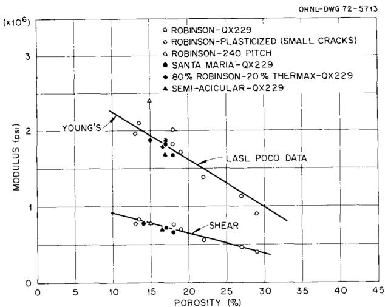  
Fig. 13.5. Dynamic modulus of ORNL graphites.

graphites tested are all very isotropic and do not reflect the large effects of orientation on the elastic constants.

Over the years we have accumulated bend test results of a large number of both commercial and experimental graphites. These results are given in Fig. 13.6 for comparison to the ORNL graphites. These results are very informative in classifying the graphites by their pore morphology. There appear to be two definite classes of graphites which have a constant strength-to-modulus ratio, indicating similar pore morphology or defect structures with like stress intensification. The highest class is the Poco and ORNL grades, with similar microstructures having a more equiaxial pore structure. The second class, with a lower strength-to-modulus ratio, is the conventional graphites made from calcined filler and several of the ORNL grades which have a more platelike pore structure. This second class includes graphites made from graphite filler particles obtained from grinding Poco grades of graphite. Also included are seven grades of graphite having strength-to-modulus ratios toward the bottom class. In every case, these very low strength-to-modulus ratios can be attributed to abnormally severe defect structures relative to density. In three of these

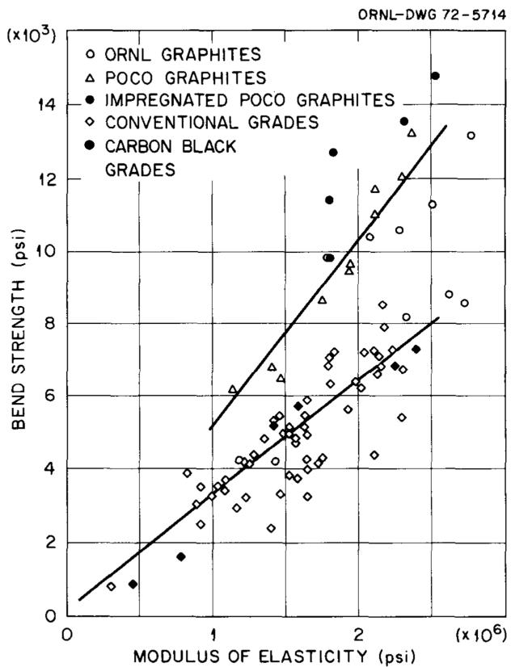  
Fig. 13.6. Bend strength as a function of Young's modulus.

Table 13.1. Physical properties obtained on ORNL graphites   

<table><tr><td rowspan="2">Block No.</td><td rowspan="2">Filler coke</td><td rowspan="2">Binder</td><td rowspan="2">Bulk density (g/cm3)</td><td colspan="2">Electrical resistivity (μΩ·cm)</td><td rowspan="2">Modulus of rupture (psi)</td><td rowspan="2">Fracture strain (%)</td><td rowspan="2">Young&#x27;s modulus (psi)</td><td rowspan="2">Sonic longitudinal Young&#x27;s modulus (psi)</td><td rowspan="2">Sonic transverse shear modulus (psi)</td><td rowspan="2">Sonic Poisson&#x27;s ratio</td><td rowspan="2">Bacon anisotropy factor</td><td rowspan="2">Remarks</td></tr><tr><td>Axial</td><td>Transverse</td></tr><tr><td></td><td></td><td></td><td></td><td></td><td></td><td></td><td></td><td>×106</td><td>×106</td><td>×106</td><td></td><td></td><td></td></tr><tr><td>10</td><td>Robinson</td><td>QX229</td><td>1.55</td><td></td><td></td><td></td><td></td><td></td><td>0.90</td><td>0.40</td><td>0.06</td><td></td><td>Small samples</td></tr><tr><td>15</td><td>Robinson</td><td>QX229</td><td>1.60</td><td></td><td></td><td></td><td></td><td></td><td>1.14</td><td>0.49</td><td>0.13</td><td></td><td>Small samples</td></tr><tr><td>20</td><td>Robinson</td><td>QX229</td><td>1.70</td><td></td><td></td><td></td><td></td><td></td><td>1.39</td><td>0.60</td><td>0.17</td><td></td><td>Small samples</td></tr><tr><td>25</td><td>Robinson</td><td>QX229</td><td>1.77</td><td></td><td></td><td></td><td></td><td></td><td>1.71</td><td>0.74</td><td>0.15</td><td></td><td>Small samples</td></tr><tr><td>T-12</td><td>Robinson</td><td>QX229</td><td>1.79</td><td></td><td>1410</td><td></td><td></td><td></td><td>2.04</td><td>0.92</td><td>0.25</td><td>1.02</td><td>Shrinkage cracks</td></tr><tr><td>T-61</td><td>Robinson</td><td>240 Pitch</td><td>1.84</td><td></td><td>1162</td><td>13,180</td><td>0.610</td><td>2.81</td><td>2.40</td><td>1.00</td><td>0.30</td><td>1.01</td><td></td></tr><tr><td>X-58</td><td>Robinson</td><td>Nitrobenzene</td><td>1.92</td><td></td><td>1405</td><td>8,610</td><td>0.383</td><td>2.72</td><td>1.97</td><td>0.85</td><td>0.20</td><td>1.02</td><td>Fine network of very small cracks</td></tr><tr><td>11-16</td><td>Robinson</td><td>QX228</td><td>1.77</td><td></td><td>1662</td><td>8,800</td><td>0.380</td><td>2.61</td><td>1.84</td><td>0.85</td><td>0.19</td><td></td><td>Molding cracks</td></tr><tr><td>11-23</td><td>Robinson</td><td>QX229</td><td>1.84</td><td></td><td>1500</td><td>11,100</td><td>0.520</td><td>2.69</td><td>2.10</td><td>1.01</td><td>0.26</td><td></td><td>Molding cracks</td></tr><tr><td>22-40K</td><td>Robinson</td><td>QX302-2</td><td>1.77</td><td></td><td>1480</td><td></td><td></td><td></td><td></td><td></td><td></td><td></td><td></td></tr><tr><td>T-32</td><td>Robinson, 20% Thermax</td><td>QX229</td><td>1.75</td><td></td><td>2340</td><td>8,100</td><td>0.411</td><td>2.32</td><td>1.79</td><td>0.84</td><td>0.21</td><td></td><td></td></tr><tr><td>11-24</td><td>Robinson, 15% nat. flake</td><td>QX234</td><td>1.73</td><td>1774</td><td></td><td></td><td></td><td></td><td></td><td></td><td></td><td>1.03</td><td>Small samples</td></tr><tr><td>11-25</td><td>Robinson, 10% nat. flake</td><td>QX234</td><td>1.78</td><td>1629</td><td></td><td></td><td></td><td></td><td></td><td></td><td></td><td>1.02</td><td>Small samples</td></tr><tr><td>11-26</td><td>Robinson, 20% nat. flake</td><td>QX234</td><td>1.78</td><td>1679</td><td></td><td></td><td></td><td></td><td></td><td></td><td></td><td>1.04</td><td>Small samples</td></tr><tr><td>10-24</td><td>Santa Maria</td><td>QX229</td><td>1.79</td><td></td><td>1583</td><td>10,620</td><td>0.669</td><td>2.07</td><td>1.68</td><td>0.71</td><td>0.18</td><td>1.03</td><td></td></tr><tr><td>10-25</td><td>Santa Maria</td><td>QX229</td><td>1.83</td><td></td><td>1473</td><td>10,620</td><td>0.613</td><td>2.26</td><td>1.86</td><td>0.81</td><td>0.21</td><td>1.02</td><td></td></tr><tr><td>X-2</td><td>Santa Maria</td><td>QX229</td><td>1.80</td><td></td><td></td><td></td><td></td><td></td><td>1.84</td><td>0.82</td><td>0.22</td><td>1.03</td><td>Shrinkage cracks</td></tr><tr><td>11-1</td><td>Santa Maria</td><td>QX229</td><td>1.85</td><td></td><td>1356</td><td>11,320</td><td>0.601</td><td>2.51</td><td>1.87</td><td>0.87</td><td>0.20</td><td></td><td></td></tr><tr><td>11-43</td><td>SA</td><td>QX229</td><td>1.78</td><td>1070</td><td>990</td><td></td><td></td><td></td><td>1.67</td><td>0.77</td><td>0.20</td><td>1.07</td><td>Shrinkage cracks</td></tr><tr><td>11-44</td><td>SA</td><td>QX229</td><td>1.82</td><td></td><td>950</td><td></td><td></td><td></td><td></td><td></td><td></td><td>1.11</td><td>Shrinkage cracks</td></tr><tr><td>11-46</td><td>A</td><td>QX229</td><td>1.71</td><td>980</td><td>872</td><td></td><td></td><td></td><td></td><td></td><td></td><td></td><td></td></tr><tr><td>22-32K</td><td>A</td><td>240 Pitch</td><td>1.62</td><td></td><td>1608</td><td>4130</td><td>0.487</td><td>1.19</td><td>0.72</td><td>0.38</td><td>~0</td><td></td><td></td></tr><tr><td>12-1</td><td>A,</td><td>QX234</td><td>1.63</td><td></td><td></td><td></td><td></td><td></td><td>0.67</td><td>0.35</td><td>~0</td><td>1.13</td><td>Shrinkage cracks</td></tr><tr><td></td><td>10% nat. flake</td><td></td><td></td><td></td><td></td><td></td><td></td><td></td><td></td><td></td><td></td><td></td><td></td></tr><tr><td>12-2</td><td>A, 10% nat. flake</td><td>QX234</td><td>1.74</td><td></td><td>2076</td><td>4130</td><td>0.365</td><td>1.43</td><td>0.98</td><td>0.47</td><td>0.04</td><td></td><td></td></tr></table>

materials where the fabrication schedule is known, the large linear defects are a result of mix agglomeration into high-density regions. In the others, the microstructure revealed evidence of a heavily impregnated graphite with abnormally large filler particles dispersed in a mixture of fine particles. Associated with each large particle was an equally large defect.

Many of the graphites made by conventional fabrication are heavily impregnated and appear to retain a constant strength-to-modulus ratio independent of the degree of impregnation. This strongly suggests that the pore morphology is not affected by the impregnant. However, in several of the Poco grades, impregnation was attended by significant increases in the strength-to-modulus ratio, implying an improvement in the reduction of stress intensity factors. This suggests that the better ORNL grades could similarly be improved by impregnation.

The binder carbon in the ORNL graphite cannot be resolved in the microscope. We do, however, see some differences in the electrical resistivity due to binder as well as filler material. The pitch-bindered Robinson graphite has a lower resistivity than the furan-pitch-bindered graphites. The Robinson and Santa Maria fillers appear to be very similar and have a lower conductivity than the A and SA fillers. It was expected that Thermax would increase the electric resistivity, as was observed. The natural flake additions, on the other hand, were expected to decrease the resistivity; instead they also resulted in increases. It appears likely that this increase by natural flake additions is a result of the poor bindering characteristics of the natural flake.

The Bacon anisotropy factors (BAF) in Table 13.1 show that both the Robinson and Santa Maria graphites are very isotropic. (The BAF is 1.00 for material having completely random crystalline orientation.) The SA filler graphite has some degree of anisotropy, and the A filler graphite is more anisotropic. Addition of natural flake intensifies the anisotropy of all of the graphites.

During this report period, samples of ORNL graphites which had completed one irradiation in the HFIR were examined and replaced in HFIR for further irradiation. The observed dimensional changes are shown in Figs. 13.7 and 13.8 for Robinson and Santa Maria graphites. The dimensional changes in the Santa Maria grades show a slight anisotropy, while the Robinson grades behave very isotropically. Additions of up to $35\%$ Thermax in either the Robinson or the Santa Maria graphites have no clearly distinguishable effect.

In summary, the significant points in our graphite development program during this report period are as follows:

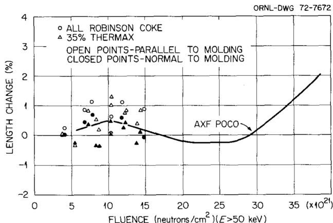  
Fig. 13.7. HFIR irradiation results for Robinson grades at $715^{\circ}\mathrm{C}$ .

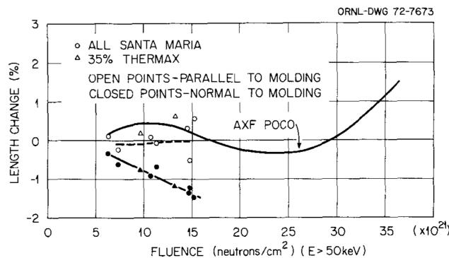  
Fig. 13.8. HFIR irradiation results for Santa Maria grades at $715^{\circ}\mathrm{C}$ .

1. We are beginning to recognize and understand the salient factors which control the quality of green-coke molded graphites.   
2. We have obtained graphites with an unusually high strength-to-modulus ratio, indicating measurable success in optimizing pore morphology.   
3. The modulus of elasticity for well-bindered isotropic graphites was found to be porosity dependent and independent of binder or filler coke.   
4. Electrical resistivity was found to be dependent on both filler and binder.   
5. Both Thermax and natural flake additions reduce the electrical conductivity.   
6. The irradiation results show that the ORNL grades are paralleling the behavior of the best commercial grade (Poco) to the highest fluence obtained to date $(1.5 \times 10^{22}$ neutrons/cm²).

# 13.2 PROCEDURE OF VARIOUS GRADES OF CARBON AND GRAPHITE

W.H.Cook W.P.Eatherly

We have received a set of rough-machined carbon materials from Poco Graphite, Inc., which are precursors of their grade AXF, annealed at various temperatures from 1400 to $2500^{\circ}\mathrm{C}$ . We have also received an unmachined block fired to $2500^{\circ}\mathrm{C}$ , which we have refired to $3000^{\circ}\mathrm{C}$ . These provide us with stock for test specimens of grade AXF precursor materials fired at 1400, 1800, 2000, 2200, 2500, and $3000^{\circ}\mathrm{C}$ . We shall make the final, finished machining of the test specimens, characterize them, and integrate them into our graphite irradiation program.

The purpose in irradiating the AXF precursors is to supplement the information obtained from irradiation of a series of carbon-black grades. For the carbon-black grades a very sharp decrease in volume occurred early in the irradiation, which then transformed into a slow linear expansion. The expansion rate was unaffected by the heat-treatment temperature, whereas the sharp contraction was strongly temperature dependent, ranging from $15\%$ after $1000^{\circ}\mathrm{C}$ treatment to less than $1\%$ at $2400^{\circ}\mathrm{C}$ and above. Further, the carbon-black materials fired at high temperatures showed very little damage effect until a fluence of $1.5 \times 10^{22}$ neutrons/cm² was obtained. The purpose of the present experiment is to determine whether similar effects occur in the more stable AXF-type materials.

We have acquired a plate, $1 \times 3^{3/4} \times 8^{5/8}$ in. (nominally), of grade JA-5 manufactured by Airco Speer Carbon Products. Although it has a bulk density of only $1.68\mathrm{~g/cm^3}$ , it is nearly isotropic and has a special type of filler material which makes it of interest to our overall irradiation studies.

# 13.3 TEXTURE DETERMINATIONS

O.B.Cavin D.M.Hewette II

The degree of anisotropy is an important parameter in the development of graphites both at the Y-12 Plant and at ORNL. We have continued to determine the x-ray anisotropy of materials made at both installations and are now extending our capabilities to include an optical technique which can be applied to an area as small as $10\mu \mathrm{m}$ in diameter. This will allow us not only to determine the anisotropy of the bulk material but

also to independently determine the anisotropy of thin coatings used for surface sealants.

During this report period a number of graphite samples were analyzed for the Y-12 Plant. These samples, all fabricated by molding, ranged from near isotropic (BAF = 1.04) to highly anisotropic (BAF = 2.01). (A Bacon anisotropy factor of 1.00 indicates completely random crystalline orientations.) The x-ray anisotropy of a number of the ORNL materials described in Sect. 13.1 has also been determined, and the values are shown in Table 13.2. Most of these graphites are close to being isotropic, with BAF values ranging from 1.003 to 1.125 for samples T-30 and 12-1 respectively. In many instances, we have determined anisotropy values in the parallel and perpendicular directions by cutting samples whose axes were parallel with these directions in the body. The values for the two directions agree to within experimental error.

Recently, we obtained a Leitz microscope photometer to be used in determining the optical anisotropy factor (OPTAF) of graphites of interest in the Gas Cooled Reactor Program, and its use is now being extended to include the thin experimental surface sealants being placed on molten-salt graphites.

The reflectivity $(r)$ of materials having a high degree of crystalline anisotropy (such as graphite) is much greater when the plane of vibration of a linearly

13.2. X-ray anisotropy values of experimental graphites   

<table><tr><td>Sample No.a</td><td>R||b</td><td>R⊥b</td><td>BAF</td></tr><tr><td>10-24</td><td>0.660</td><td>0.670</td><td>1.030</td></tr><tr><td>10-25</td><td>0.663</td><td>0.669</td><td>1.017</td></tr><tr><td>T-12</td><td>0.662</td><td>0.669</td><td>1.021</td></tr><tr><td>T-30</td><td>0.666</td><td>0.667</td><td>1.003</td></tr><tr><td>T-61</td><td>0.664</td><td>0.669</td><td>1.012</td></tr><tr><td>X-58</td><td>0.661</td><td>0.670</td><td>1.027</td></tr><tr><td>X-2</td><td>0.661</td><td>0.669</td><td>1.025</td></tr><tr><td>11-24</td><td>0.659</td><td>0.670</td><td>1.034</td></tr><tr><td>11-25</td><td>0.662</td><td>0.669</td><td>1.022</td></tr><tr><td>11-26</td><td>0.657</td><td>0.672</td><td>1.044</td></tr><tr><td>11-43</td><td>0.651</td><td>0.674</td><td>1.071</td></tr><tr><td>11-46</td><td>0.643</td><td>0.678</td><td>1.109</td></tr><tr><td>12-1</td><td>0.640</td><td>0.680</td><td>1.125</td></tr></table>

$a_{\mathrm{See~sect.13.1}}$   
$b_{R_{\parallel}}$ and $R_{\perp}$ are the anisotropy values in the parallel and perpendicular directions, respectively, of the fabricated body. Many of the $R$ values were determined independently from a second sample. $R_{\parallel} + 2R_{\perp} = 2$

polarized monochromatic light beam is parallel with the $a$ axis than when it is parallel with the $c$ axis. The values of $r_a$ and $r_c$ have been reported to be 22.5 and $5\%$ respectively. A metallographic sample whose surface is parallel with a predominantly $a$ crystallographic direction will exhibit maxima and minima in the reflected polarized beam as it is rotated through $360^\circ$ on the microscope stage. The ratio of the maximum to the minimum intensity is then a measure of the optically measured preferred orientation (OPTAF) of the material. An OPTAF of 1.0 is obtained on perfectly isotropic material.

We have on hand a series of specimens that have been shown to have a relatively large range of preferred orientations by OPTAF measurements made at another laboratory. These samples have been evaluated on our equipment, and we have obtained a reasonable correlation between our values and those obtained elsewhere on the same samples.

It is difficult if not impossible to determine anisotropy of thin coatings with conventional x-ray techniques. Relatively thick coatings are being prepared from which both x-ray and optical anisotropy values can be determined to arrive at a correlation between the techniques. We will then be able to determine not only the substrate texture but also the local texture that occurs in the pyrocarbon sealants.

# 13.4 THERMAL PROPERTY TESTING

J.P.Moore

D. L. McElroy

T. G. Kollie

Thermal conductivity $(\lambda)$ measurements on an irradiated sample of AXF-5Q graphite were completed in the range 300 to $800^{\circ}\mathrm{K}$ (20 to $500^{\circ}\mathrm{C}$ ) using a guarded longitudinal heat-flow technique. This sample had been irradiated in HFIR at a nominal temperature of $835^{\circ}\mathrm{K}$ ( $560^{\circ}\mathrm{C}$ ) to a fluence of $2.6 \times 10^{21}$ neutrons/cm² ( $E > 50~\mathrm{keV}$ ). The $\lambda$ results on this irradiated sample are compared with values for the unirradiated sample in Fig. 13.9. Neutron irradiation reduced $\lambda$ at all temperatures, with the ratio of $\lambda$ (irradiated) to $\lambda$ (unirradiated) ranging from 0.25 at $300^{\circ}\mathrm{K}$ to 0.4 at $800^{\circ}\mathrm{K}$ . Electrical resistivity $(\rho)$ and Seebeck coefficient $(s)$ values were obtained during the $\lambda$ measurements and show significant increases due to neutron irradiation. The room-temperature $\rho$ increased from 1120 to $2300\mu \Omega \cdot \mathrm{cm}$ , and the room-temperature Seebeck coefficient increased from 2 to $25\mu \mathrm{V} / \mathrm{deg}$ .

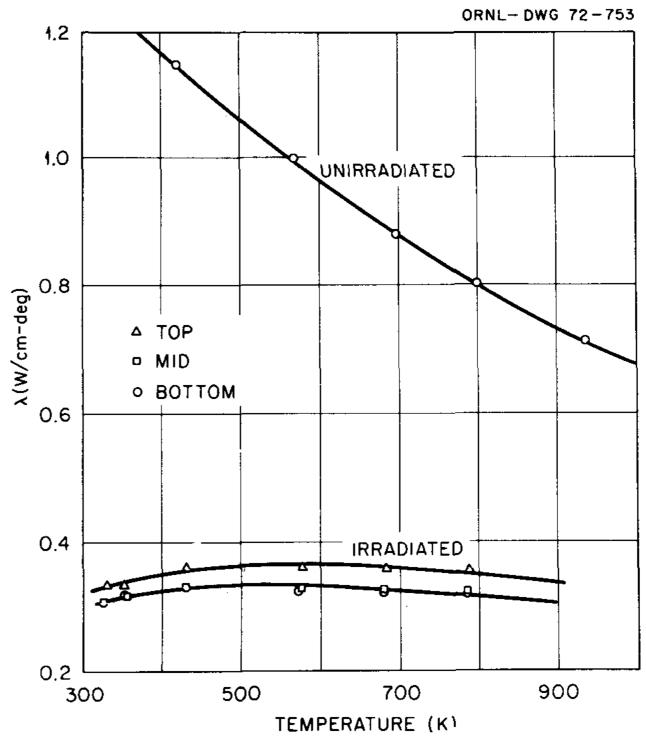  
Fig. 13.9. The thermal conductivity of unirradiated and irradiated AXF-5Q graphite. Irradiated at $825^{\circ}\mathrm{K}$ to a fluence of $2.6 \times 10^{21}$ neutrons/cm $^2$ ( $E > 50\mathrm{keV}$ ).

A second AXF-5Q graphite sample, irradiated to a somewhat higher fluence, has been installed in the apparatus for measurements from 300 to $900^{\circ}\mathrm{K}$ (20 to $600^{\circ}\mathrm{C}$ ). After irradiation in HFIR at a nominal temperature of $925^{\circ}\mathrm{K}$ ( $650^{\circ}\mathrm{C}$ ) to a fluence of $4.2 \times 10^{21}$ neutrons/ $\mathrm{cm}^2$ ( $E > 50\mathrm{keV}$ ), the specimen had a room-temperature $\rho$ value of $2265\mu \Omega$ -cm, which is a preliminary indication that the neutron irradiation produced changes similar to those cited above.

A second thermal property of considerable engineering and scientific interest is the linear thermal expansion coefficient. This property is also known to be sensitive to irradiation. A new apparatus has been constructed, employing a quartz differential dilatometer. The first series of calibration tests has been completed using a copper specimen. This dilatometer, shown schematically in Fig. 13.10, is designed to also measure the temperature dependence of the temperature coefficient of thermal expansion (CTE) to $2\%$ uncertainty of AXF-5Q and H-337 graphites. Various aspects of the dilatometer have been interfaced with a computer-operated data acquisition system (CODAS). Length changes are measured to $2.5 \times 10^{-6}$ cm by an electronic micrometer and input to CODAS via a BCD reader. Sample temperature control is provided by CODAS using a three-action control algorithm which

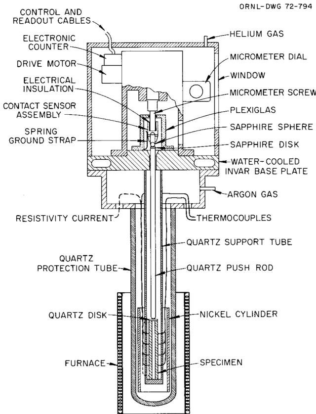  
Fig. 13.10. Schematic drawing of the $1200^{\circ}\mathbf{K}$ quartz differential dilatometer designed to measure coefficient of thermal expansion of graphites.

varies the output of the power supply for the sample furnace. Since each data point requires 4 to $8\mathrm{hr}$ for temperature stability, use of CODAS more than triples the data collection rate. Although the first CTE values must be considered preliminary until the system has been calibrated with NBS certified thermal expansion standards of quartz and copper, these initial results were smooth and encouraging close-to-literature values for the CTE of copper.

# 13.5 NOMINAL HELIUM PERMEABILITY PARAMETERS FOR VARIOUS GRADES OF GRAPHITE

W.H.Cook J.L.Griffith

We have a limited characterization program in progress for some special grades of graphite that are too anisotropic to have potential value in applications involving large fast-neutron fluences at $715^{\circ}\mathrm{C}$ but are of interest as potential structural and containment materials in the chemical processing of the MSBR fuel. Some

of these are liquid-hydrocarbon-impregnated grades of graphite that were subsequently heat treated to convert the hydrocarbon impregnants to carbon or to graphite. Table 13.3 is a summary of some of the helium permeability parameters for these grades.

Grade 2020 is a fine-grained, unimpregnated material that has an accessible porosity of $17\%$ and for which pore entrance diameters are $\leqslant 3\mu \mathrm{m}$ . Grades 2044 and 1226 are also fine-grained graphite bodies that were given special surface impregnations with liquid hydrocarbons and heat treated. This produced a graphitic impregnation in their pores from $1/4$ through $5/8$ in below their exterior surfaces. The first row of data in Table 13.3 for each of these is from specimens taken from the core (the unimpregnated zone) of the stock, and the second row of data for each is for specimens taken from the impregnated zones.

The unimpregnated core of both grades had approximately $16\%$ accessible voids. Nominally, $65\%$ of the accessible voids had pore entrance diameters of 1 to 2 $\mu \mathrm{m}$ for grade 2044 and 1 to $3\mu \mathrm{m}$ for grade 1226.7

The microstructures of the impregnated zones of grade 2044 indicated a uniform impregnation, but that for grade 1226 was nonuniform. In the grade 1226 impregnated zone there were tunnels of poorly impregnated voids. These were single, exploratory impregnations for each grade, so it is not surprising that the permeabilities are relatively high for the impregnated zones.

Grades Graph-i-tite “G” and “A” are products of a commercially established process in which the stock has been impregnated throughout the accessible void spaces. Graph-i-tite “G” has been fired to graphitizing temperatures. Graph-i-tite “A” was fired at a lower temperature and is described as an amorphous carbon-filled material.

None of the above grades approach the gastightness of $< 10^{-8}\mathrm{cm}^2/\mathrm{sec}$ for helium at STP, required for MSR core applications. Additional tests, such as compatibility and pore entrance diameter spectra, should be made to better evaluate these as structural materials for the fuel salt processing systems, which do not require the low gas permeabilities.

# 13.6 REDUCTION OF HELIUM PERMEABILITY OF GRAPHITE BY PYROLYTIC CARBON SEALING

C. B. Pollock

The breeding performance of a molten-salt reactor is significantly affected by the extent to which $^{135}\mathrm{Xe}$ can

Table 13.3. Nominal helium permeability parameters for various grades of graphite   

<table><tr><td colspan="8">KHe = B0 &lt;p&gt; / η + 4/3 K0 V, where</td></tr><tr><td colspan="8">KHe = permeability coefficient for helium at 28°C (cm2/sec), 
B0 = viscous permeability (cm2), 
&lt;p&gt; = average pressure across specimen (dynes/cm2), 
η = viscosity of gas, helium (poises), 
K0 = slip coefficient (cm), 
V = average molecular velocity of gas helium (cm/sec).</td></tr><tr><td>Grade</td><td>Sourcea</td><td>Specimen numberb</td><td>Orientationc</td><td>Bulk density (g/cm3)</td><td>B0(cm2) ×10-13</td><td>k0 (cm) ×10-8</td><td>KHHe at 1 atm (cm2/sec) ×10-3</td></tr><tr><td rowspan="2">2020</td><td rowspan="2">Stackpole</td><td>KG1-1</td><td>WG</td><td>1.71</td><td>224</td><td>64.7</td><td>166</td></tr><tr><td>KG11-1</td><td>AG</td><td>1.72</td><td>156</td><td>49.3</td><td>123</td></tr><tr><td rowspan="2">2044</td><td rowspan="2">Stackpole</td><td>A1-4M-31d</td><td>AG</td><td>1.72</td><td>123</td><td>45.6</td><td>108</td></tr><tr><td>A1-4I-12e</td><td>AG</td><td>1.79</td><td>7.14</td><td>6:04</td><td>12.0</td></tr><tr><td rowspan="2">1226</td><td rowspan="2">Stackpole</td><td>A-2M-1d</td><td>AG</td><td>1.75</td><td>33.2</td><td>20.6</td><td>43.2</td></tr><tr><td>A-2I-2e</td><td>AG</td><td>1.81</td><td>6.99</td><td>6.19</td><td>12.2</td></tr><tr><td rowspan="2">Graph-i-tite “G”</td><td rowspan="2">Carborundum</td><td>52</td><td>WG</td><td>1.88</td><td>5.62</td><td>2.42</td><td>5.53</td></tr><tr><td>62</td><td>AG</td><td>1.88</td><td>1.87</td><td>0.856</td><td>1.92</td></tr><tr><td rowspan="3">Graph-i-tite “A”</td><td rowspan="3">Carborundum</td><td>51</td><td>WG</td><td>1.90</td><td>0.152</td><td>0.177</td><td>0.337</td></tr><tr><td>61</td><td>AG</td><td>1.89</td><td>1.19</td><td>0.553</td><td>1.23</td></tr><tr><td>62</td><td>AG</td><td>1.90</td><td>0.074</td><td>0.087</td><td>0.167</td></tr></table>

${}^{a}$ Stackpole Carbon Company and Graphite Products Division of Carborundum Company.   
The specimen is a disk, nominally 1.000 in. in diameter and 0.500 in. thick, and the direction of helium flow is parallel with the axis of rotation of the disk.   
${}^{\mathrm{c}}\mathrm{{WG}} =$ with grain,parallel with the general $a$ -axis orientation;   
$\mathbf{AG} =$ across grain, perpendicular to the general $a$ -axis orientation.   
$d_{\mathrm{Specimen}}$ from unimpregnated core of the stock.   
$e$ Specimen from the liquid-hydrocarbon-impregnated zone of the stock.

be stripped from the fuel salt and prevented from entering the graphite moderator. Effective sealing of graphite surfaces is, therefore, highly desirable. Pyrolytic carbon is the desired sealing material because of its low neutron cross section and its compatibility with the fuel salts. We have developed two techniques for sealing with pyrolytic carbon. The first is designed to plug surface pores with pyrolytic carbon using a vacuum-pulse impregnation process, and the second is a macro coating process in which a continuous layer of pyrolytic carbon is deposited on the surface of the graphite. During this report period we did not do any additional work on the impregnation process other than the continued examination of previously prepared specimens with the aid of scanning electron microscopy (see Sect. 13.7).

We continued to fabricate and study the properties of surface coatings. The furnace that we are using was described in the last semiannual report. The samples are of conventional HFIR geometry (see below), but all sharp corners have been rounded. The samples were fixed in place in the furnace using an arrangement shown in Fig. 13.11. The vertical position of the samples can be adjusted in the center of the furnace, and the supports are anchored at the top and the bottom of the reaction tube. This scheme is amenable to scale-up and changes in sample geometry.

We have conducted coating experiments varying conditions of gas supply rate, gas mixtures, temperature, and time. Early experiments were shotgunned in order to determine operating ranges that are practical. In general, the sequence of operation is to heat the

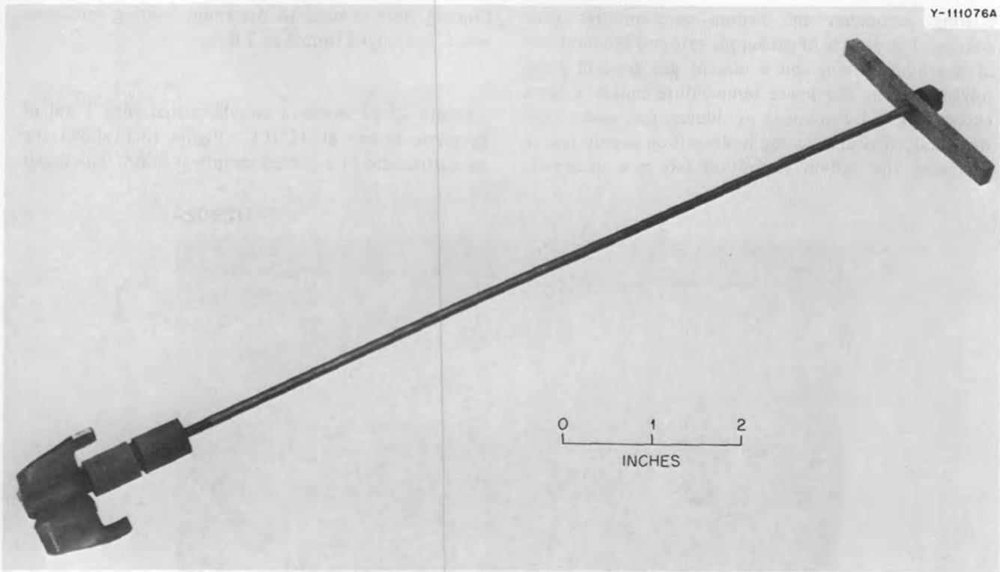  
Fig. 13.11. Sample holder and sample for pyrolytic carbon coating studies.

Table 13.4. Description of typical molten-salt graphite samples sealed by coating with pyrolytic carbon   

<table><tr><td>Sample</td><td>Coating temperature (°C)</td><td>Coating time (min)</td><td>Coating thickness (mils)</td><td>Helium permeability (cm2/sec)</td></tr><tr><td>MS-80</td><td>1100</td><td>10</td><td>1</td><td>1 × 10-11</td></tr><tr><td>MS-81</td><td>1100</td><td>10</td><td>1</td><td>1 × 10-10</td></tr><tr><td>MS-83</td><td>1100</td><td>15</td><td>2</td><td>1 × 10-10</td></tr><tr><td>MS-87</td><td>1100</td><td>20</td><td>3</td><td>1 × 10-10</td></tr><tr><td>13-1</td><td>1150</td><td>10</td><td>3</td><td>1 × 10-10</td></tr><tr><td>17-1</td><td>1200</td><td>8</td><td>4</td><td>1 × 10-9</td></tr></table>

sample to reaction temperature in the presence of a substitute gas (helium) that levitates a quantity of small carbon beads around the sample. Then a carefully controlled amount of the gaseous hydrocarbon $\left(\mathrm{C}_{3} \mathrm{H}_{6}\right)$ mixed with a diluent gas (helium) is allowed to enter the reaction chamber, and pyrolysis occurs. After the designated coating time has elapsed, the coating gas is replaced with an inert substitute gas, and the sample temperature is increased to greater than $1800^{\circ} \mathrm{C}$ in order to stress-relieve the coatings. The sample is then slowly cooled to room temperature.

We have coated specimens to temperatures in the range 1100 to $1400^{\circ}\mathrm{C}$ . Table 13.4 describes some

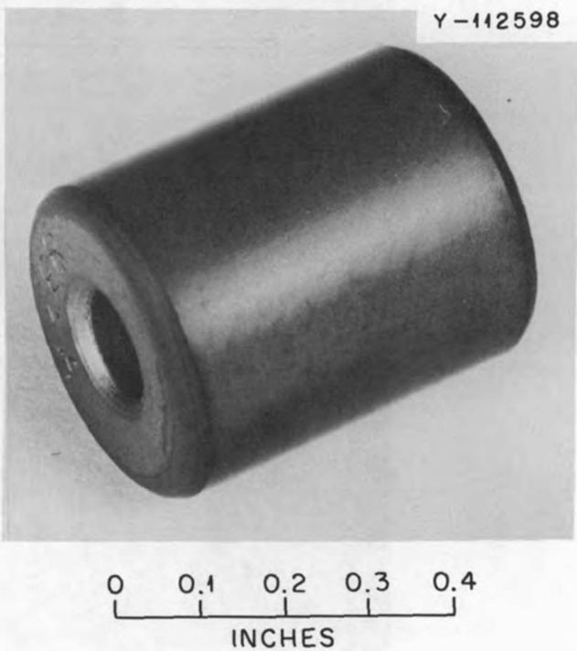  
Fig. 13.12. A view of a graphite sample coated with pyrocarbon.

coating parameters and helium permeabilities after coating. The effects of gas supply rate and the mixtures of the hydrocarbon and a diluent gas are still unresolved, but in the lower temperature ranges a large excess (200% by volume) of diluent gas works very well, and, of course, as the hydrocarbon supply rate is decreased the carbon deposition rate also decreases.

Coating time is used to determine coating thickness, which has ranged from 3 to 7 mils.

Figure 13.12 shows a sample coated with $1\mathrm{mil}$ of pyrolytic carbon at $1150^{\circ}\mathrm{C}$ . Figure 13.13 shows the microstructure of a coated sample at $500\times$ . The upper

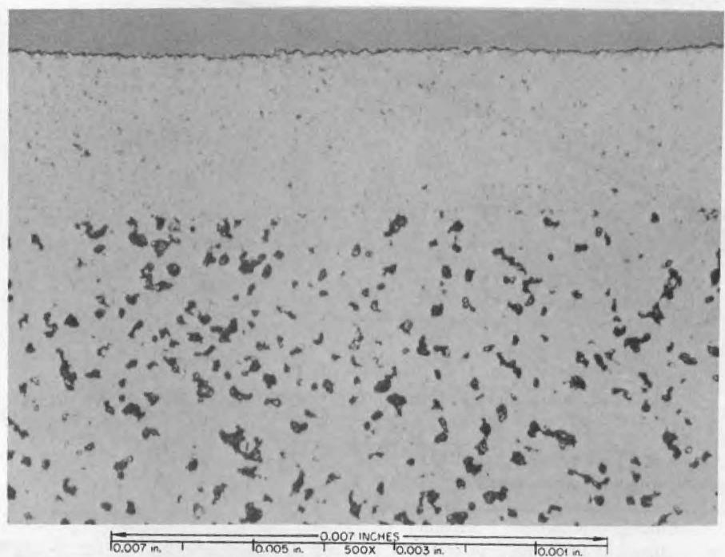

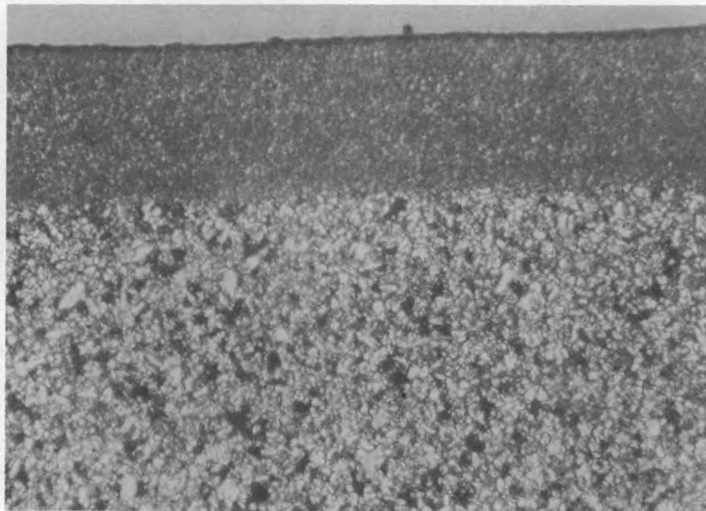  
Fig. 13.13. The microstructure of a sample coated with pyrolytic carbon at $1150^{\circ}\mathrm{C}$ . The upper photomicrograph is a bright field view of the microstructure at $500\times$ , and the lower view is a polarized light view of the same area.

photomicrograph shows a bright field view, and the lower view shows the response to polarized light.

The physical characteristics of the coating are being examined, but only partial results are available. The density of material deposited at $1150^{\circ}\mathrm{C}$ was 2.10 $\mathrm{g/cm}^3$ , while material deposited at $1200^{\circ}\mathrm{C}$ had a measured density of $2.08\mathrm{g/cm}^3$ . Visual examination of the samples indicates that the coatings are isotropic, but at least one sample did respond to polarized light in an anisotropic manner. The bond between the coating and the graphite substrate appears to be quite good, and to some degree the surface pores have been impregnated with pyrolytic carbon.

# 13.7 CHARACTERIZATION OF PYROCARBON SEALANTS FOR GRAPHITE USING REFLECTED LIGHT AND SCANNING ELECTRON MICROSCOPES

W. H. Cook

We have continued our detailed characterization of graphite sealed with pyrocarbon. Our objectives are to learn more about the pyrocarbon sealing techniques and, in particular, to determine what produces a pyrocarbon

seal that has maximum resistance to damage by fast neutrons.

The basic specimens being studied are hollow cylinders of pyrocarbon-sealed grade AXF graphite, as described in the preceding section. We have been examining both unirradiated and irradiated specimens with reflected-light and scanning electron microscopes. The scanning electron microscope (SEM) is a recently acquired one $^{10}$ that has improved resolution. Most of the specimens that we have examined have been sealed with a 1,2-butadiene source of pyrocarbon at 700 to $750^{\circ}\mathrm{C}$ in fluid-bed coaters that were originally designed to coat uranium oxide or uranium carbide fuel particles 300 to $400\mu \mathrm{m}$ in diameter. For specimens coated in this way we found that

8. The scanning electron microscope work was done by R. S. Crouse and D. R. Cuneo, and the reflected-light microscopy work was done by M. D. Allen, all of the Metals and Ceramics Division.   
9. W. H. Cook, MSR Program Semiannu. Progr. Rep. Aug. 31, 1971, ORNL-4728, pp. 120-21.   
10. Model JSM-U3 manufactured by the Japan Electron Optical Laboratory.

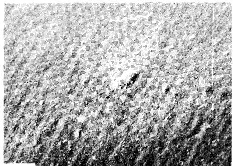  
(a)

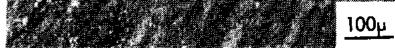

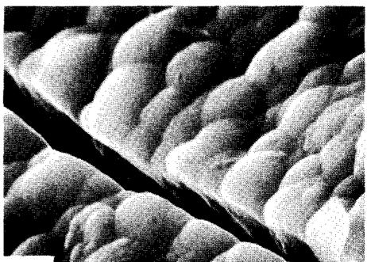

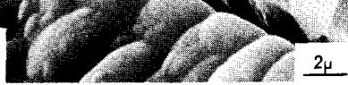  
(c)

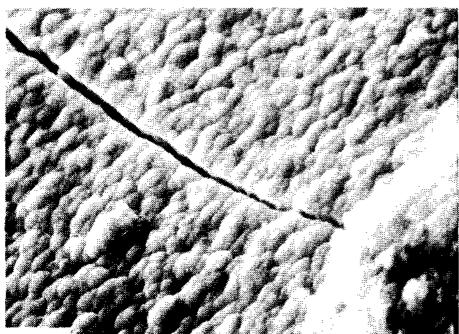  
(b)

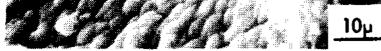

  
(d)   
Fig. 13.14. Scanning electron photomicrographs showing cracks and carbon debris in 0.001-in.-thick pyrocarbon coating deposited from 1,2-butadiene, $\mathbf{C}_4\mathbf{H}_6$ , at $700^{\circ}\mathrm{C}$ onto grade AXF graphite.

Y-110050

1. there is a lack of control and uniformity in the pyrocarbon sealants,   
2. some coatings had cracked during their deposition,   
3. sharp corners on the specimens tended to cause flaws in the pyrocarbon sealing, which acted as crack propagation centers during irradiation,   
4. there is evidence that surface cracks were created or existing surface cracks enlarged during irradiation.

The evidence for these observations is briefly described below.

Figure 13.14 is a series of SEM photomicrographs showing cracking and carbon particle debris in an unirradiated specimen. In Fig. 13.14a there is a carbon particle in the center of the photomicrograph with a family of cracks radiating out from it. Figure 13.14b, $c$ , and $d$ shows the crack and carbon debris at increasingly greater magnifications. Figure 13.15 is a transverse fractograph through this specimen. One can clearly see the base stock graphite (grade AXF) and the pyrocarbon coating. There is an indication that the

latter may be a duplex type of coating in which the final deposition was a thin layer of pyrocarbon different from the major part deposited in and on the base stock.

A transverse view through two cracks in the coating is shown in the reflected light photomicrograph in Fig. 13.16, which is a polished section of the specimen. The pyrocarbon coating in this region is approximately 0.001 in. thick, and the cracks are almost completely through the pyrocarbon coating. Barely discernible in Fig. 13.16 is a thin final pyrocarbon coating over the surfaces of the cracks and the main coating. At higher magnifications with polarized light or a rotatable sensitive tint plate, this is resolved and verifies the SEM indication on this. This thin coating and the cross section of the carbon debris particle are both weakly anisotropic, while the bulk of the pyrocarbon coating is an amorphous, isotropic material. The final thin film plus the fact that the cracks stopped short of penetrating the coating probably accounts for this unirradiated specimen having a relatively low helium permeability of $2.9 \times 10^{-9} \mathrm{~cm}^2/\mathrm{sec}$ .

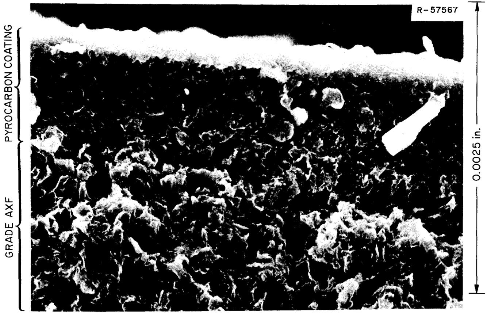  
Fig. 13.15. A scanning electron micrograph of the transverse fractured surface of a pyrocarbon coating deposited from 1,2-butadiene, $\mathbf{C}_4\mathbf{H}_6$ , at $700^{\circ}\mathrm{C}$ onto grade AXF graphite. $1000\times$

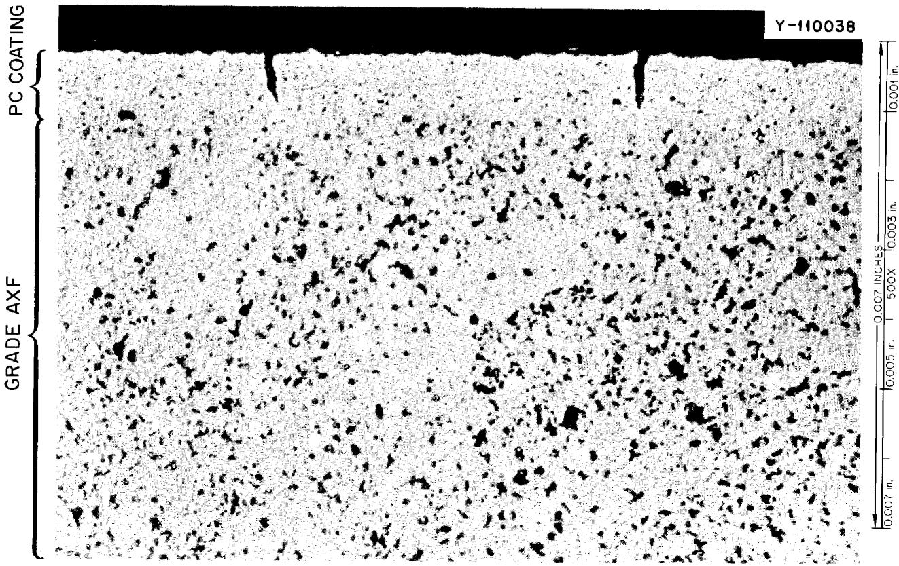  
Fig. 13.16. Reflected-light micrograph of the polished surface of a transverse section of a pyrocarbon coating deposited at $700^{\circ}\mathrm{C}$ from 1,2-butadiene, $\mathbf{C}_4\mathbf{H}_6$ , onto grade AXF graphite. As polished. $500\times$

The nature of cracks in an irradiated specimen was distinctly different, as can be seen in Fig. 13.17. The helium permeability of this specimen, which was $4.4 \times 10^{-10} \mathrm{~cm}^2/\mathrm{sec}$ in the unirradiated condition, had increased to $7.2 \times 10^{-5} \mathrm{~cm}^2/\mathrm{sec}$ after being exposed to a fluence of about $1.7 \times 10^{22}$ neutrons/ $\mathrm{cm}^2$ ( $E > 50 \mathrm{keV}$ ) at $715^{\circ} \mathrm{C}$ . Although the cracks are numerous, they do not appear to completely penetrate the pyrocarbon. Whether the cracks were created during the irradiation or are modifications of V-shaped cracks that were in the pyrocarbon coating prior to the irradiation, the square-bottom shape of the cracks probably indicates shrinkage and creep of the pyrocarbon under the fast-neutron irradiation.

Figure 13.18a illustrates a typical defect in the pyrocarbon sealant that occurs on the sharp corners of a specimen, and Fig. 13.18b shows how this type of fault can be enlarged and propagated under fast-neutron irradiation. In an attempt to eliminate these faults at sharp edges, we are now rounding the edges of specimens prior to sealing them with pyrocarbon.

The other changes that we have made in efforts to improve the coatings are to change to the furnace

described in Sect. 13.6 and to turn to propene as the source of the pyrocarbon. (There is evidence that pyrocarbon from propene has superior resistance to neutron damage. $^{11}$ )

A comparison of the pyrocarbons derived from 1,2-butadiene $(\mathrm{C_4H_6})$ and propene $(\mathrm{C_3H_6})$ is shown in Fig. 13.19. The 1,2-butadiene was deposited at $700^{\circ}\mathrm{C}$ in the fluid-bed fuel-particle coating furnace, and the propene was deposited in the new furnace at $1200^{\circ}\mathrm{C}$ . (It was found, after this specimen was prepared, that depositing pyrocarbon from propene at $1150^{\circ}\mathrm{C}$ was more effective in sealing the base stock, but we expect that the geometric structure of the pyrocarbon deposited from propene at 1150 and $1200^{\circ}\mathrm{C}$ will be essentially the same.) Note that the pyrocarbon from the 1,2-butadiene tends to be in the form of smooth spheroids and that from the propene is in smaller, irregular-shaped particles. From both sources, the larger pyrocarbon particles are usually made up of agglom

PHOTO 2170-72

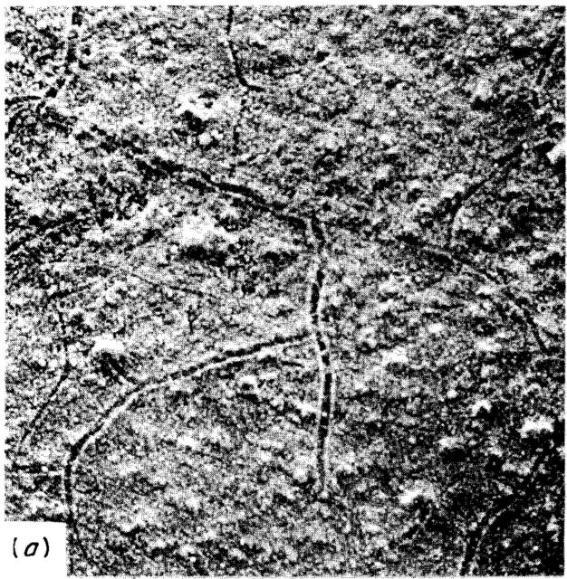

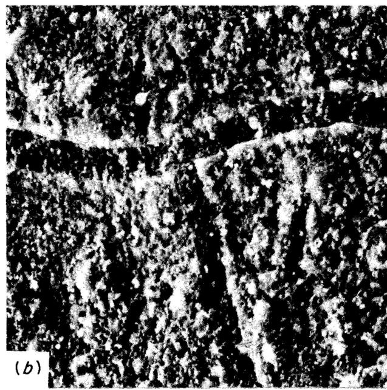

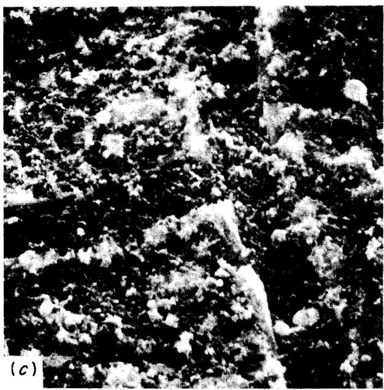

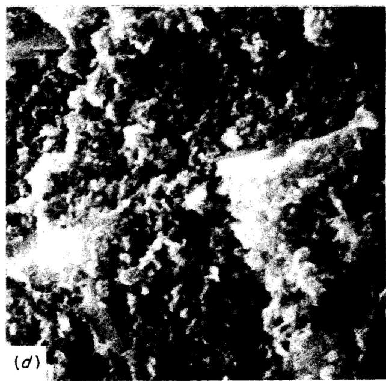  
Fig. 13.17. A scanning electron photomicrograph of a cracked pyrocarbon coating on grade AXF graphite after an exposure at $715^{\circ}\mathrm{C}$ to an accumulated fluence of $1.7 \times 10^{22}$ neutrons/cm $^2$ ( $>50$ keV). (a) $100\times$ . (b) $500\times$ . (c) $1000\times$ . (d) $3000\times$ .

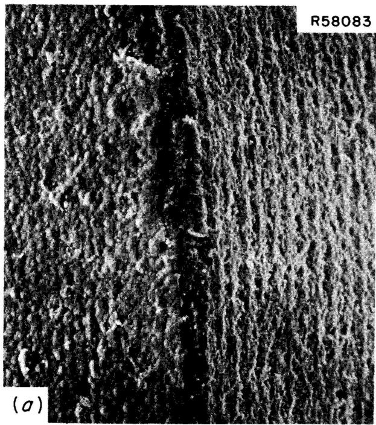

erates of smaller ones; however, this appears to be more frequently the case for that from the propene.

Because we only recently acquired the capability for making very sharp SEM pictures of graphite surfaces, we have not yet examined a specimen, irradiated it, and then reexamined the same spot. This should provide more accurate information about the pyrocarbon coatings and the neutron irradiation effects than can be obtained from the comparison of irradiated specimens with other unirradiated specimens that we have made to date.

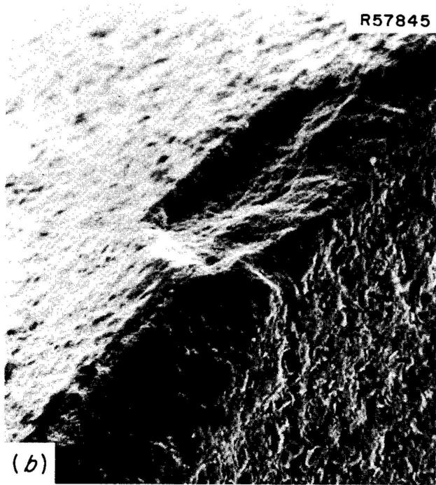  
Fig. 13.18. Scanning electron microscopy photomicrographs of the outside edges of pyrocarbon-coated grade AXF graphite specimens. (a) A typical as-coated edge with some cracking and spalling; (b) a specimen has accumulated a fluence of $2.1 \times 10^{22}$ neutrons/cm $^2$ ( $E > \mathrm{keV}$ ) at $715^{\circ}\mathrm{C}$ and has relatively more spalling and cracking. $100\times$ .

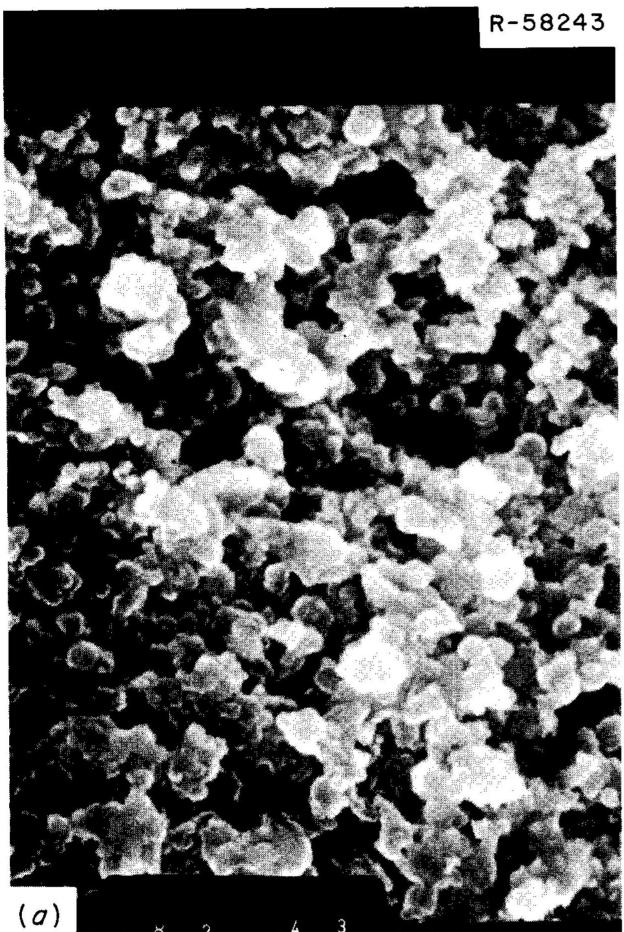

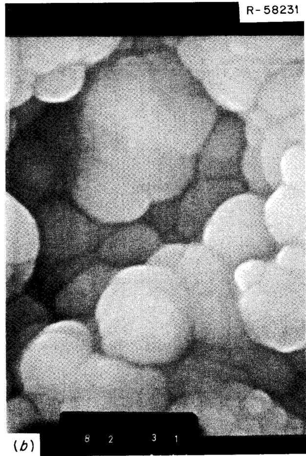  
Fig. 13.19. Scanning electron microscopy photomicrographs of pyrocarbon coatings deposited on grade AXF graphite. (a) Pyrocarbon deposited from 1,2-butadiene, $\mathrm{C_4H_6}$ , at $700^{\circ}\mathrm{C}$ and (b) pyrocarbon deposited from propene, $\mathrm{C_3H_6}$ , at $1200^{\circ}\mathrm{C}$ . $500\times$ .

# 14. Hastelloy N

H. E. McCoy

# 14.1 DEVELOPMENT OF A TITANIUM-MODIFIED HASTELLOY N

H.E.McCoy B.McNabb

Our initial work to improve the resistance of Hastelloy N to embrittlement by neutron irradiation involved alloys with titanium additions up to $0.5\%$ . These alloys had good postirradiation properties when irradiated at $650^{\circ}\mathrm{C}$ , but the properties deteriorated rapidly as the irradiation temperature was increased. The good properties were associated with the formation of fine MC-type carbides and the poor properties with the formation of coarse $\mathbf{M}_2\mathbf{C}$ -type carbides. Studies of a series of laboratory melts containing up to $3\%$ Ti showed that the titanium concentration for optimum properties was about $2\%$ . Above this level the brittle intermetallic $\mathrm{Ni}_3\mathrm{Ti}$ formed, and the ductility decreased.

During this report period, studies of small commercial melts have confirmed our work with small laboratory melts. These test results will be described in some detail.

One necessary experimental modification in our postirradiation creep program is to measure the strain that occurs on loading. Since many tests are run above the yield stress, this strain is often quite large. Experimental techniques have been established to measure this strain, but the need exists for a method to correct the strains for tests run before these new techniques were established. Figure 14.1 was prepared from some of our

latest test results. The stress has been "normalized" by dividing it by the yield stress of the particular alloy at $650^{\circ}\mathrm{C}$ . The results seem rather consistent and define a line that can be used to predict the loading strain on tests run previously. Some of the results on heat 66-548 presented in the following figures were corrected by this correlation.

The test results from the four small commercial melts described in Table 14.1 will be compared in the next several figures to show the improvement in properties as the titanium level is increased. The main element that varies is titanium, but the variations in carbon level are also likely significant.

The stress-rupture properties of the modified alloys and standard vacuum-melted Hastelloy N are compared in Fig. 14.2. The alloy containing $0.45\%$ Ti has lower stress-rupture properties than the standard alloy, primarily because of the reduction of molybdenum in the modified alloys. The two alloys with $1.1\%$ Ti have improved stress-rupture properties, and the alloy with $2.1\%$ Ti has even better properties. The stress to produce rupture in 1000 hr varies from 34,000 psi for the alloy with $0.45\%$ Ti to 53,000 psi for the alloy with $2.1\%$ Ti.

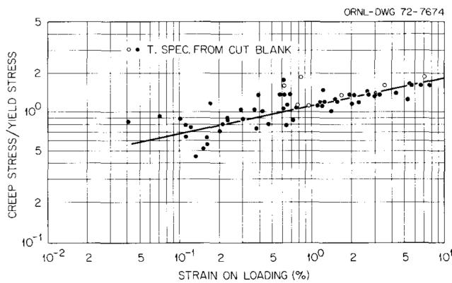  
Fig. 14.1. Relation between creep stress and strain on loading at $650^{\circ}\mathrm{C}$ .

Table 14.1. Chemical compositions of titanium-modified commercial alloys   

<table><tr><td rowspan="2">Alloy number</td><td colspan="11">Concentration (wt %)</td></tr><tr><td>Mo</td><td>Cr</td><td>Fe</td><td>Mn</td><td>Si</td><td>Ti</td><td>Zr</td><td>Hf</td><td>Nb</td><td>B</td><td>C</td></tr><tr><td>66-548</td><td>12.4</td><td>7.7</td><td>0.03</td><td>0.14</td><td>0.05</td><td>0.45</td><td>&lt;0.001</td><td>a</td><td>0.0003</td><td>0.00007</td><td>0.040</td></tr><tr><td>70-785</td><td>12.3</td><td>7.0</td><td>0.16</td><td>0.30</td><td>0.09</td><td>1.1</td><td>0.012</td><td>&lt;0.003</td><td>0.097</td><td>0.0020</td><td>0.057</td></tr><tr><td>67-548</td><td>12.0</td><td>7.1</td><td>0.04</td><td>0.12</td><td>0.03</td><td>1.1</td><td>0.002</td><td>a</td><td>0.0005</td><td>0.0007</td><td>0.082</td></tr><tr><td>70-727</td><td>13.0</td><td>7.4</td><td>0.05</td><td>0.37</td><td>&lt;0.05</td><td>2.1</td><td>0.011</td><td>&lt;0.01</td><td>&lt;0.01</td><td>0.0008</td><td>0.044</td></tr></table>

$a_{\mathrm{Not}}$ analyzed for, but should be $< 0.01\%$

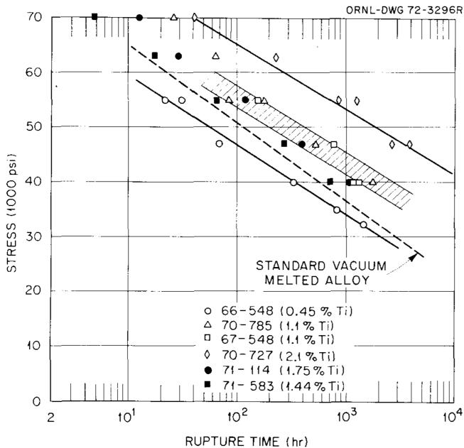  
Fig. 14.2. Stress-rupture properties of titanium-modified alloys at $650^{\circ}\mathrm{C}$ .

The creep rates of these same alloys are compared in Fig. 14.3. The creep strength is about equivalent for the standard alloy and the alloy modified with $0.45\%$ Ti. Further increases in titanium increase the creep strength. The stress to produce a creep rate of $0.001\%/\mathrm{hr}$ ranges from 37,000 psi for the alloy with $0.45\%$ Ti to 55,000 psi for the alloy with $2.1\%$ Ti.

The fracture strains of the modified alloys are compared in Fig. 14.4. For rupture lives of about 100 hr the alloys with 1.1 or $2.1\%$ Ti have higher fracture strains than those of the alloy with $0.45\%$ Ti. However, for rupture lives in excess of 1000 hr, the fracture strains appear to be approaching each other.

Samples of the four modified alloys have been irradiated at various temperatures between 650 and $760^{\circ}\mathrm{C}$ to thermal fluences of about $3 \times 10^{21}$ neutrons/cm $^2$ . The stress-rupture properties of these alloys

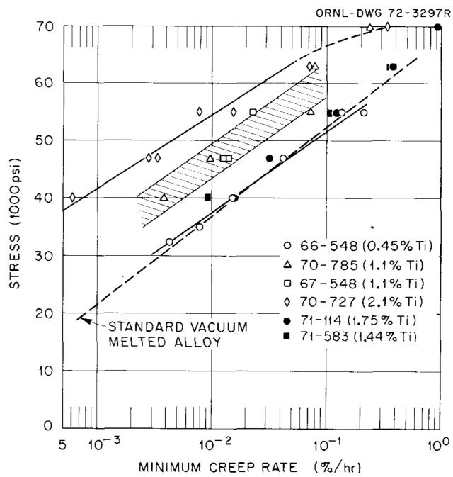  
Fig. 14.3. Creep properties of titanium-modified alloys at $650^{\circ}\mathrm{C}$ .

are shown in Fig. 14.5. The contrast between the curves for alloy 66-548 (0.45% Ti) irradiated at 650 and at $760^{\circ}\mathrm{C}$ shows the very important influence of irradiation temperature. The other alloys were not irradiated over such a large temperature span, and it is not clear that the variation of irradiation temperature from 700 to $760^{\circ}\mathrm{C}$ had much of an influence on the properties. When irradiated at $760^{\circ}\mathrm{C}$ , the postirradiation stress-rupture properties improve in the order of 66-548, 70-785, 67-548, and 70-727.

The postirradiation creep properties of these alloys are shown in Fig. 14.6. The higher irradiation temperature has a very detrimental effect on the creep strength of heat 67-548. The creep strengths after irradiation at $760^{\circ}\mathrm{C}$ improve in the order 66-548, 70-785, 67-548, and 70-727.

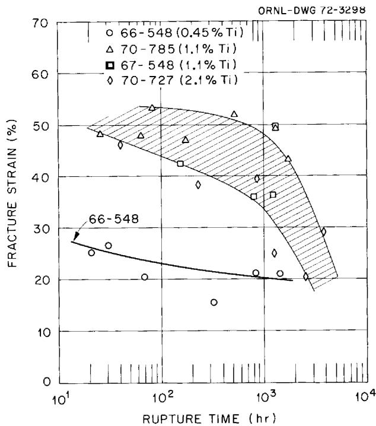  
Fig. 14.4. Fracture strains of titanium-modified alloys at $650^{\circ}\mathrm{C}$ .

The parameter of most importance is the postirradiation fracture strain, shown in Fig. 14.7. Because the number of points is so small, the lines that have been drawn are at best only indicators of relative ductility. The results for alloy 66-548 illustrate the large effect of irradiating at $650^{\circ}\mathrm{C}$ compared with $760^{\circ}\mathrm{C}$ . The maximum fracture strain observed for alloy 66-548 after irradiation at $760^{\circ}\mathrm{C}$ was $0.5\%$ . Alloy 70-785 had fracture strains in the range of 1 to $4\%$ . Alloy 67-548 had fracture strains in the range of 1 to $4\%$ out to rupture lives of $100\mathrm{hr}$ , and then the strains increased to $8\%$ in $2000\mathrm{hr}$ . The behavior of alloy 70-727 is difficult to define. The data cover a band from 3 to $9\%$ with no apparent dependence on irradiation temperature or rupture life.

Although these results are rather limited, we feel that they support the conclusion that an alloy modified with $2\%$ Ti with adequate resistance to embrittlement can be developed. Small commercial melts from several vendors are being evaluated.

# 14.2 ALLOYS WITH EXCEPTIONAL STRENGTH

H. E. McCoy

All of our modified alloys are as strong as or stronger than standard Hastelloy N. However, three alloys having

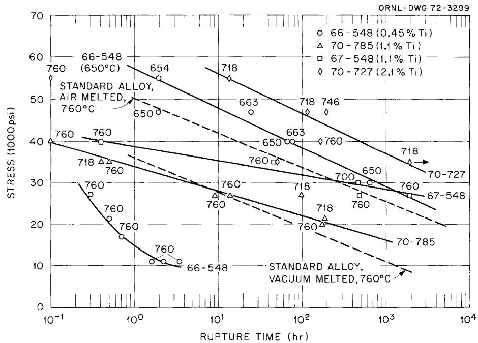  
Fig. 14.5. Postirradiation stress-rupture properties at $650^{\circ}\mathrm{C}$ of titanium-modified alloys after irradiation at the indicated temperature to a thermal-neutron fluence of $3 \times 10^{20}$ neutrons/cm $^2$ .

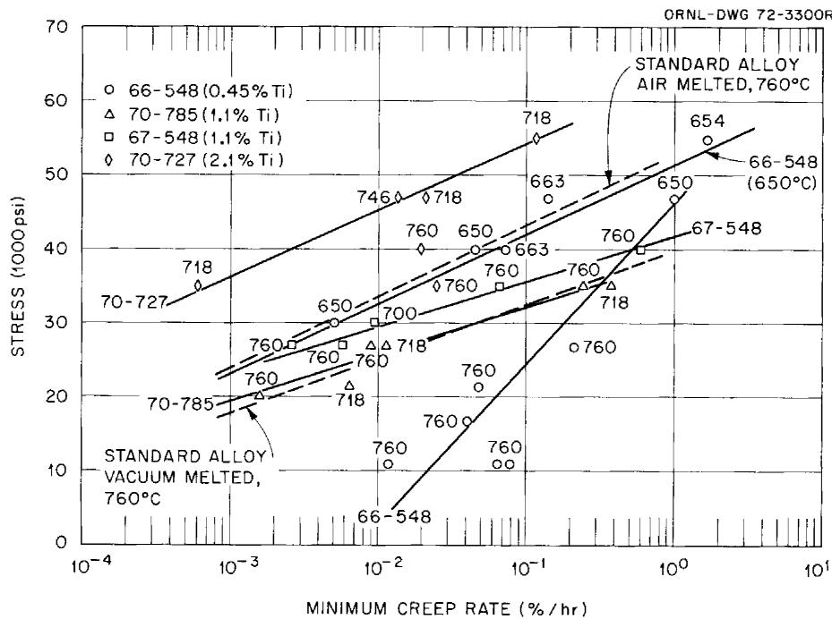  
Fig. 14.6. Postirradiation creep properties at $650^{\circ}\mathrm{C}$ of titanium-modified alloys after irradiation at the indicated temperature to a thermal-neutron fluence of $3 \times 10^{20}$ neutrons/ $\mathrm{cm}^2$ .

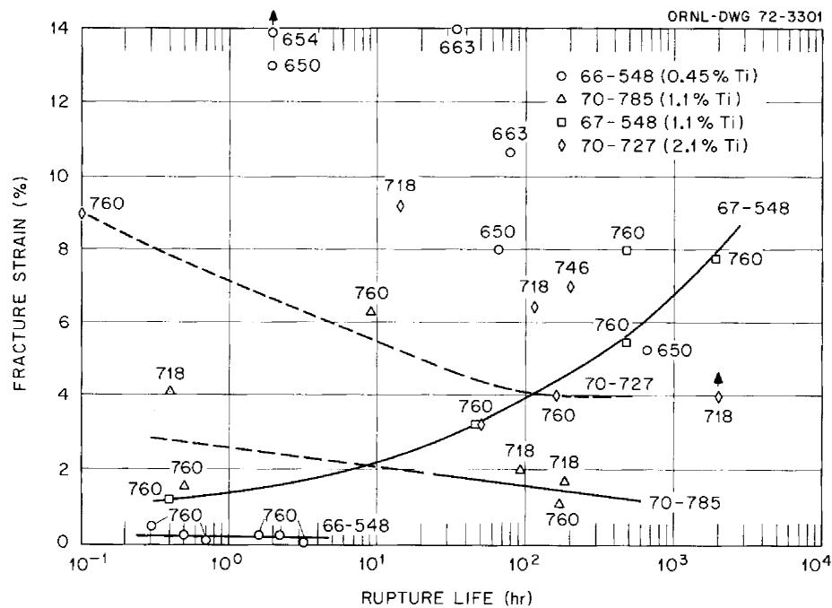  
Fig. 14.7. Postirradiation fracture strain at $650^{\circ}\mathrm{C}$ of titanium-modified alloys after irradiation to a thermal fluence of $3 \times 10^{20}$ neutrons/cm $^2$ at the indicated temperature.

nominal additions of $0.5\%$ Ti and $2\%$ Nb have exceptionally high strength at $650^{\circ}\mathrm{C}$ . These alloys were small (50 to 100 lb) commercial melts that were obtained as $\frac{1}{2}$ -in.-thick plate. The chemical compositions are given in Table 14.2. Alloys 69-648 and 70-835 were prepared by one vendor and were double vacuum melted. Alloy 69-344 was prepared by another vendor by the electro-slag remelt process. The high silicon content of this alloy resulted from the slag.

The stress-rupture properties at $650^{\circ}\mathrm{C}$ of the three alloys are compared with those of standard Hastelloy N in Fig. 14.8. The allowable stress for a rupture life of 1000 hr ranges up to twice that for standard Hastelloy N, varying concurrently with the combined concentrations of niobium and titanium in the three alloys. The minimum creep rates at $650^{\circ}\mathrm{C}$ are shown in Fig. 14.9. The allowable stress for a minimum creep rate of $0.001\%/\mathrm{hr}$ ranges to more than twice that for the standard alloy. The creep strength does not vary in the same order as the rupture strength.

Very limited creep testing has been done at $704^{\circ}\mathrm{C}$ , and the results are presented in Table 14.3. There is a marked increase in the strength of the modified alloys

over that of standard Hastelloy N at the test conditions used.

At the upper end of the temperature range that we are considering for MSBR structural materials, the superiority over standard Hastelloy N is less. Figures 14.10 and 14.11 present the results of creep tests at this temperature $(760^{\circ}\mathrm{C})$ . Alloys 69-648 and 70-835 have creep strengths about $25\%$ greater than those of standard Hastelloy N, while the strength of alloy 69-344 is not significantly above that of standard Hastelloy N.

The increased strength of these alloys seems to result from a very finely dispersed precipitate. Photomicrographs of alloys 69-648, 70-835, and 69-344 are shown in Figs. 14.12, 14.13, and 14.14 respectively. The precipitate is visible on the strained portion of the specimen and is so fine that it cannot be resolved by optical microscopy. Electron micrographs of heat 69-648 have been reported previously. Even at magni

6. R. E. Gehlbach and S. W. Cook, MSR Program Semiannu. Progr. Rep. Aug. 31, 1971, ORNL-4729, pp. 125-32.

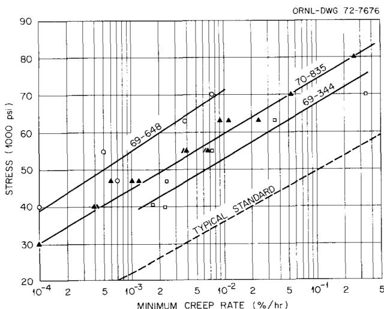  
Fig. 14.8. Stress-rupture properties at $650^{\circ}\mathbf{C}$ of three alloys with nominal modifications of $2\%$ Nb plus $0.5\%$ Ti.

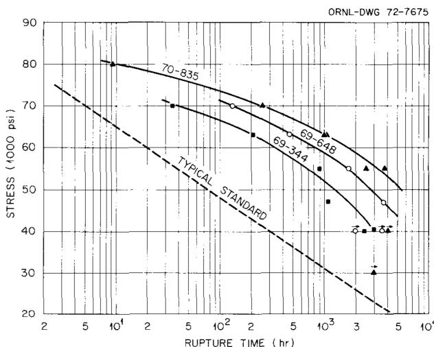  
Fig. 14.9. Creep properties at $650^{\circ}\mathrm{C}$ of three alloys with nominal modifications of $2\%$ Nb plus $0.5\%$ Ti.

Table 14.2. Compositions of experimental alloys   

<table><tr><td rowspan="2">Alloy No.</td><td colspan="10">Concentration (wt %)</td></tr><tr><td>Mo</td><td>Cr</td><td>Fe</td><td>Mn</td><td>Si</td><td>Ti</td><td>Zr</td><td>Hf</td><td>Nb</td><td>C</td></tr><tr><td>69-648</td><td>12.8</td><td>6.9</td><td>0.3</td><td>0.34</td><td>0.05</td><td>0.92</td><td>0.005</td><td>&lt;0.05</td><td>1.95</td><td>0.043</td></tr><tr><td>69-344</td><td>13.0</td><td>7.4</td><td>4.0</td><td>0.56</td><td>0.54</td><td>0.77</td><td>0.019</td><td>&lt;0.1</td><td>1.7</td><td>0.11</td></tr><tr><td>70-835</td><td>12.5</td><td>7.9</td><td>0.68</td><td>0.60</td><td>0.05</td><td>0.71</td><td>&lt;0.005</td><td>0.031</td><td>2.60</td><td>0.052</td></tr></table>

Table 14.3. Creep-rupture properties at 35,000 psi and $704^{\circ}\mathrm{C}$ of standard Hastelloy N and several alloys modified with $0.5\%$ Ti and $2\%$ Nb   

<table><tr><td>Heat No.</td><td>Rupture life (hr)</td><td>Minimum creep rate (%/hr)</td><td>Fracture strain (%)</td><td>Reduction in area (%)</td></tr><tr><td>5065 (std)</td><td>28.4</td><td>0.23</td><td>14.8</td><td>14.2</td></tr><tr><td>69-648</td><td>732.2</td><td>0.025</td><td>21.6</td><td>18.0</td></tr><tr><td>69-344</td><td>181.6</td><td>0.048</td><td>41.6</td><td>39.0</td></tr><tr><td>70-835</td><td>898.1</td><td>0.032</td><td>62.3</td><td>51.0</td></tr></table>

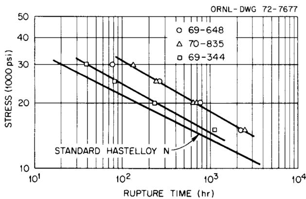  
Fig. 14.10. Stress-rupture properties at $760^{\circ}\mathrm{C}$ of three alloys with nominal modifications of $2\%$ Nb plus $0.5\%$ Ti.

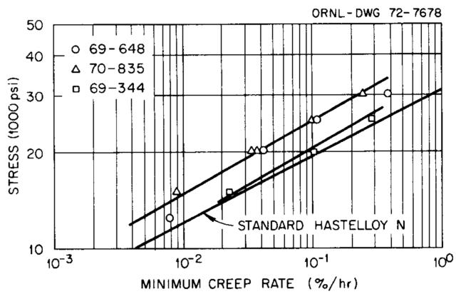  
Fig. 14.11. Creep properties at $760^{\circ}\mathrm{C}$ of three alloys with nominal modifications of $2\%$ Nb plus $0.5\%$ Ti.

fications of about 50,000, it is difficult to resolve the strain fields of individual particles. The precipitate has not been identified, but we suspect that it is basically an $\mathrm{Ni}_3(\mathrm{Nb},\mathrm{Ti})$ compound.

Future studies will involve determining (1) the mechanical-thermal conditions required to form the precipitate and (2) the postirradiation mechanical properties of the alloy with the precipitate present.

# 14.3 WELDABILITY OF COMMERCIAL ALLOYS OF MODIFIED HASTELLOYN

B. McNabb H.E.McCoy

Two small commercial heats of modified Hastelloy N were procured from the Stellar Division of Cabot Corporation. The starting materials were consolidated as a single vacuum melt of 120 lb and cast into two electrodes. One of these was consumable vacuum remelted (heat 71-114), and the other was electroslag remelted (71-583). The vendor's analysis of heat 71-114 in weight percent was $78.1\%$ Ni, $12.03\%$ Mo, $7.2\%$ Cr, $0.06\%$ Fe, $0.01\%$ Mn, $0.05\%$ C, $0.04\%$ Si, $0.12\%$ Al, $1.96\%$ Ti, $0.002\%$ B, $0.002\%$ P, and $0.0055\%$ S. The

analysis of heat 71-583 was $78.34\%$ Ni, $12.16\%$ Mo, $7.2\%$ Cr, $0.06\%$ Fe, $0.01\%$ Mn, $0.05\%$ C, $0.05\%$ Si, $0.12\%$ Al, $1.79\%$ Ti, $0.001\%$ B, $0.002\%$ P, and $0.004\%$ S. These heats were received as $\frac{1}{2}$ -in.-thick plates about 1 ft square. Strips $\frac{1}{2}$ in. square were sawed from these plates and swaged into $\frac{1}{8}$ -and $\frac{3}{32}$ -in.-diam. welding wire. The remaining plates were beveled for welding with a $100^{\circ}$ included angle V groove between the plates to be welded.

The plates were welded to a steel strongback in pairs for a fully restrained weld. These were then welded, filling the V groove with weld wire identical to the base metal in composition. Both sets of plates welded very well with no cracking during or after welding by visual, dye penetrant, and x-ray inspection. Heat 71-583 appeared to weld a little more easily, and the weld metal flowed slightly better than for heat 71-114.

Side-bend specimens $\frac{1}{8}$ in. thick were sawed transverse to the welding direction and bent $180^{\circ}$ around a $\frac{3}{8}$ -in.-radius mandrel. No cracks were evident by visual or dye-penetrant inspection, as shown in Fig. 14.15. (Some darker areas in the figure are due to differences in the thickness of the developer used and some due to

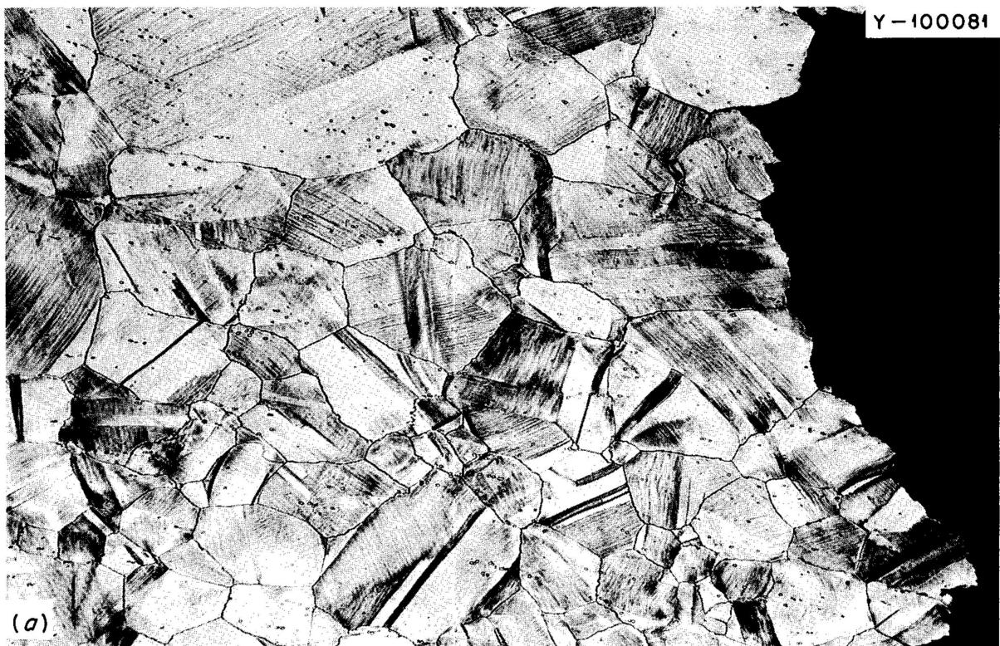

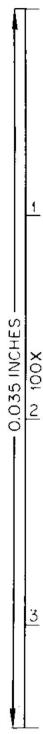

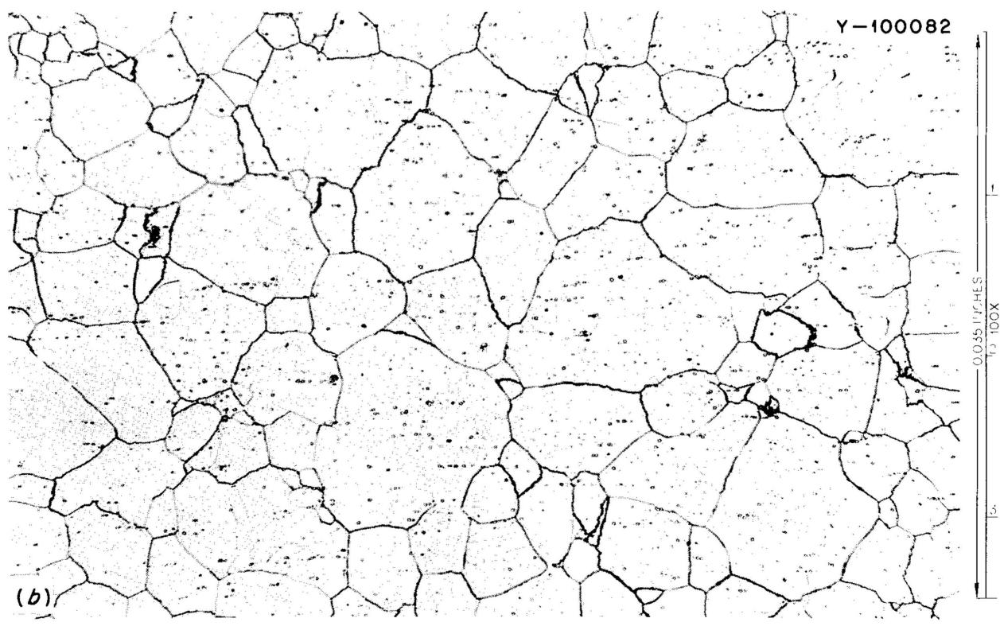  
Fig. 14.12. Photomicrographs of alloy 69-468 annealed 1 hr at $1180^{\circ}\mathrm{C}$ and tested at 55,000 psi at $650^{\circ}\mathrm{C}$ . Failed after 1759 hr with $20.5\%$ strain. (a) Fracture, (b) unstressed shoulder. Etchant: glyceria regia.

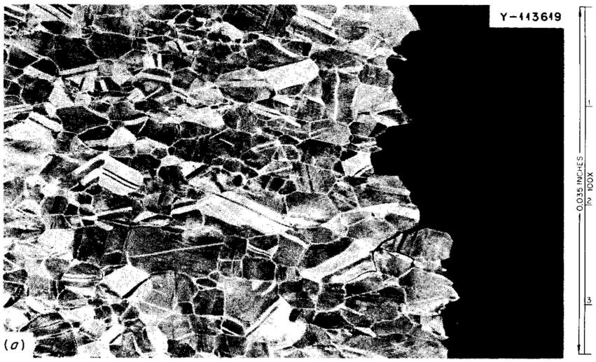

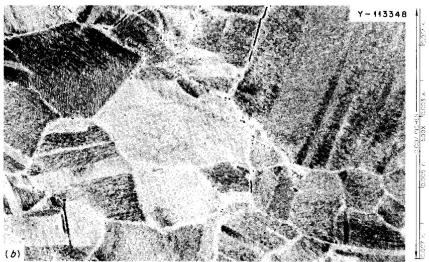

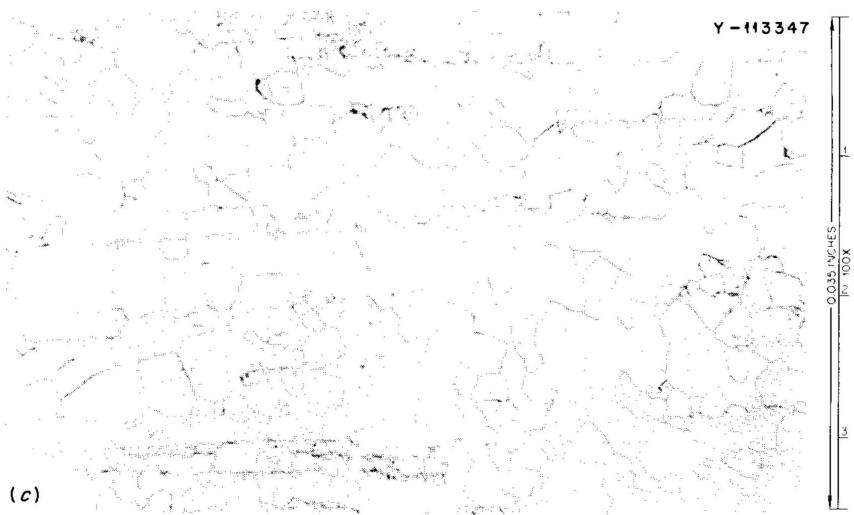  
Fig. 14.13. Photomicrographs of alloy 70-835 annealed $1\mathrm{hr}$ at $1180^{\circ}\mathbf{C}$ and tested at 55,000 psi at $650^{\circ}\mathbf{C}$ . Failed after 2592 hr with $30.6\%$ strain. (a) Fracture $-100\times$ , (b) typical of stressed section $-500\times$ , (c) typical unstressed portion $-100\times$ . Etchant: glyceria regia.

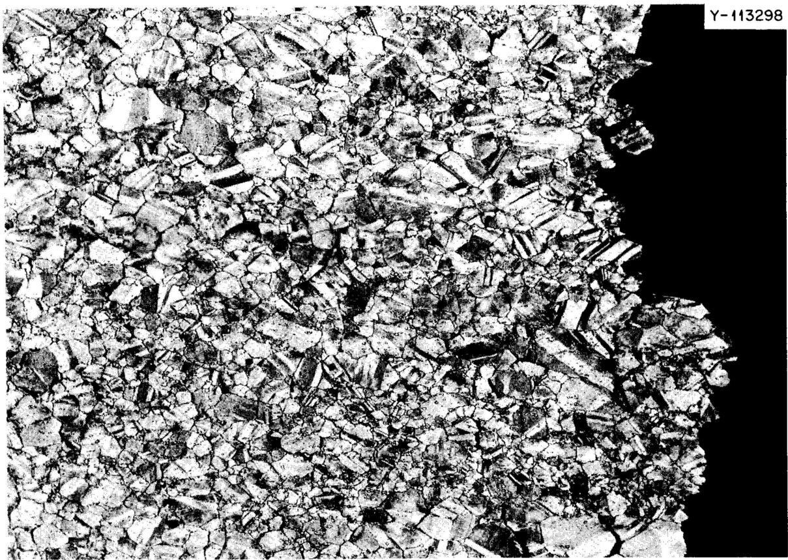  
0.035 INCHES 100X   
Fig. 14.14. Photomicrograph of the fracture of a sample of heat 69-344 that was annealed 1 hr at $1180^{\circ}\mathrm{C}$ and tested at 40,000 psi at $650^{\circ}\mathrm{C}$ . Failed after 2410 hr with $13.9\%$ strain. Etchant: glyceria regia.

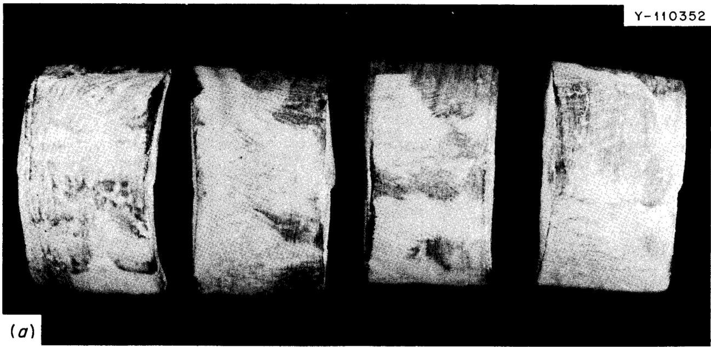

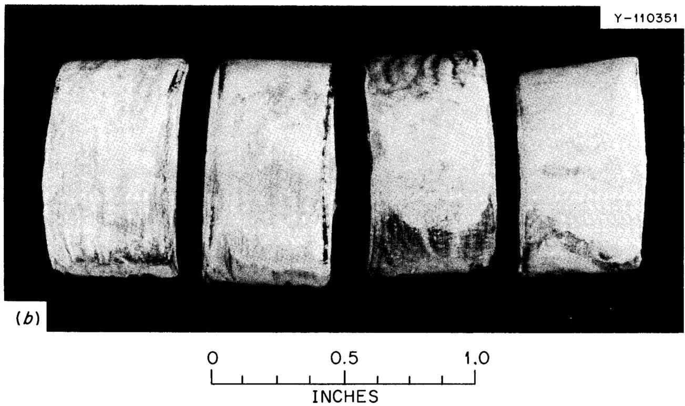  
Fig. 14.15. Side-bend specimens of Hastelloy N weld specimens of two heats modified with $2\%$ Ti. (a) Heat 71-1114, consumable vacuum remelted, (b) electroslag remelted. Dye penetrant has been applied, and no cracks are visible.

the developer being rubbed off in handling before photographing.)

Some transverse tensile specimens were machined from the weld area with a gage or reduced section $(1/8$ in. in diameter) containing about half weld and half heat-affected zone and base metal. Some of these specimens were creep tested in the as-welded condition at $650^{\circ}C$ and 55,000 psi and some at $760^{\circ}C$ and 20,000 psi. Specimens of the base metal of each heat were tested at the same conditions, and the creep rupture properties are tabulated in Table 14.4. The rupture life, minimum creep rate, and fracture strains were reduced by welding. The lower minimum creep rates for the welded specimens indicate higher strengths than the base metal specimens. Table 14.5 is a tabulation of the

tensile properties of these two heats at 25, 650, and $760^{\circ}\mathrm{C}$ . The yield strengths of the welds were considerably higher at each of these temperatures, the ultimate strengths were reduced, and the fracture strains reduced. The fracture strains probably can be increased by postweld annealing, and this is being investigated. In summary, these results confirm our previous observations that the $2\%$ Ti-modified alloy has good weldability.

# 14.4 ELECTRON MICROSCOPE STUDIES

R.E.Gehlbach S.W.Cook

Our microstructural studies to characterize precipitation in Hastelloy N alloys have primarily involved

Table 14.4. Comparative creep-rupture properties of base metal and transverse weld specimens of modified Hastelloy N (2% Ti)   

<table><tr><td>Test temperature (°C)</td><td>Stress (psi)</td><td>Specimena</td><td>Rupture life (hr)</td><td>Minimum creep rate (%/hr)</td><td>Fracture strain (%)</td><td>Reduction in area (%)</td></tr><tr><td rowspan="4">650</td><td rowspan="4">55,000</td><td>71114-BM</td><td>119.0</td><td>0.140</td><td>44.3</td><td>36.8</td></tr><tr><td>71114-TW</td><td>68.0</td><td>0.034</td><td>6.1</td><td>31.5</td></tr><tr><td>71583-BM</td><td>63.1</td><td>0.111</td><td>31.4</td><td>26.0</td></tr><tr><td>71583-TW</td><td>6.8</td><td>0.055</td><td>3.4</td><td>9.9</td></tr><tr><td rowspan="4">760</td><td rowspan="4">20,000</td><td>71114-BM</td><td>281.5</td><td>0.078</td><td>44.2</td><td>41.9</td></tr><tr><td>71114-TW</td><td>142.8</td><td>0.0037</td><td>3.9</td><td>7.1</td></tr><tr><td>71583-TW</td><td>232.1</td><td>0.109</td><td>52.9</td><td>41.5</td></tr><tr><td>71583-TW</td><td>148.8</td><td>0.0044</td><td>3.3</td><td>7.8</td></tr></table>

${}^{a}$ Number refers to the heat; letters indicate a transverse specimen from the weld area (TW) or a specimen of base metal (BM).

Table 14.5. Tensile properties at various temperatures for base metal and transverse weld specimens of $2\%$ titanium-modified Hastelloy N   

<table><tr><td>Heat No.</td><td>Type specimena</td><td>Test temperature (°C)</td><td>Yield stress (psi)</td><td>Ultimate stress (psi)</td><td>Fracture strain (%)</td><td>Reduction in area (%)</td></tr><tr><td rowspan="6">71-114</td><td>BM</td><td>25</td><td>44,800</td><td>120,700</td><td>72.6</td><td>59.0</td></tr><tr><td>TW</td><td>25</td><td>80,000</td><td>112,300</td><td>30.8</td><td>52.1</td></tr><tr><td>BM</td><td>650</td><td>29,100</td><td>87,000</td><td>56.2</td><td>39.7</td></tr><tr><td>TW</td><td>650</td><td>55,700</td><td>66,800</td><td>11.5</td><td>29.4</td></tr><tr><td>BM</td><td>760</td><td>28,700</td><td>64,300</td><td>52.8</td><td>50.4</td></tr><tr><td>TW</td><td>760</td><td>52,700</td><td>66,600</td><td>10.3</td><td>29.0</td></tr><tr><td rowspan="6">71-583</td><td>BM</td><td>25</td><td>45,900</td><td>121,900</td><td>73.3</td><td>60.2</td></tr><tr><td>TW</td><td>25</td><td>84,600</td><td>108,600</td><td>27.6</td><td>54.5</td></tr><tr><td>BM</td><td>650</td><td>30,200</td><td>86,000</td><td>49.0</td><td>38.4</td></tr><tr><td>TW</td><td>650</td><td>52,300</td><td>65,500</td><td>11.7</td><td>36.1</td></tr><tr><td>BM</td><td>760</td><td>29,500</td><td>64,400</td><td>45.0</td><td>47.2</td></tr><tr><td>TW</td><td>760</td><td>50,400</td><td>60,100</td><td>5.3</td><td>16.0</td></tr></table>

$\alpha$ BM - base metal; TW - weldment, as welded.

observations made on $\mathrm{Ni}_3\mathrm{Ti}$ and strain-induced precipitation in several laboratory and small commercial heats. Studies are under way to characterize two titanium-modified and two hafnium-modified heats recently received from Cabot Corporation. In addition, we have modified our x-ray diffraction techniques to greatly improve detectability and precision of phase analyses.

# 14.4.1 Intermetallic Precipitation in Hastelloy N

As previously reported, precipitation of the lenticular $\mathrm{Ni}_3\mathrm{Ti}$ occurs in small laboratory heats of Hastelloy N when the titanium concentration is approximately $2\%$ and above. Recently we have observed this precipitation also in a $1\%$ Ti heat. Although $\mathrm{Ni}_3\mathrm{Ti}$ precipitation is very profuse and homogeneous in the $2.9\%$ Ti alloy, it nucleates at MC carbides present in the stacking-fault morphology for lower titanium concentrations. (This carbide morphology is obtained during aging after annealing at $1260^{\circ}\mathrm{C}$ , rather than the usual $1177^{\circ}\mathrm{C}$ , and forms around primary MC particles which are partially dissolved during the anneal.) The intermetallic distribution in alloys containing 2.4 and $0.98\%$ Ti is shown in Figs. 14.16 and 14.17 respectively. Both specimens were annealed 1 hr at $1260^{\circ}\mathrm{C}$ prior to exposure at $700^{\circ}\mathrm{C}$ for 1000 and 10,000 hr respectively.

A different morphology of intermetallic precipitation, shown in Fig. 14.18, was observed in the highest $(2.9\%)$

titanium-modified heat. The specimen was aged 10,000 hr at $700^{\circ}\mathrm{C}$ following a 1-hr anneal at $1260^{\circ}\mathrm{C}$ . This morphology occurred as rather extensive sheets in the vicinity of primary carbide particles and appeared to

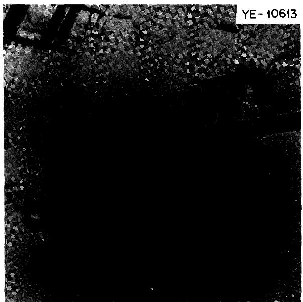  
Fig. 14.17. Transmission electron micrograph showing small amounts of $\mathrm{Ni}_3\mathrm{Ti}$ precipitating on MC carbides in Hastelloy N containing $0.98\%$ Ti. The material was aged 10,000 hr at $700^{\circ}\mathrm{C}$ after a $1260^{\circ}\mathrm{C}$ anneal. 12,000x.

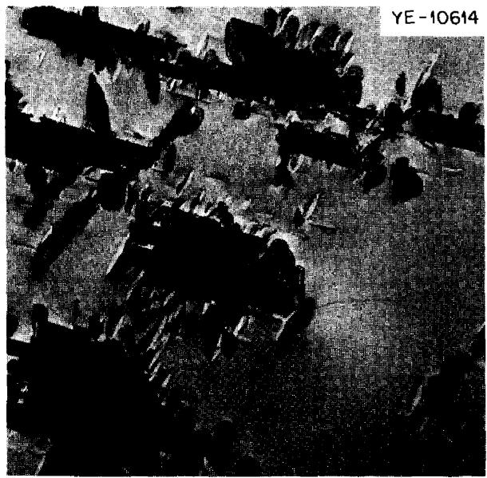  
Fig. 14.16. Transmission electron micrograph showing precipitation of $\mathrm{Ni}_3\mathrm{Ti}$ on MC carbides in Hastelloy N containing $2.4\%$ Ti. The carbides, in a stacking-fault morphology, result from annealing at $1260^{\circ}\mathrm{C}$ prior to aging $1000\mathrm{hr}$ at $700^{\circ}\mathrm{C}$ . $12,000\times$

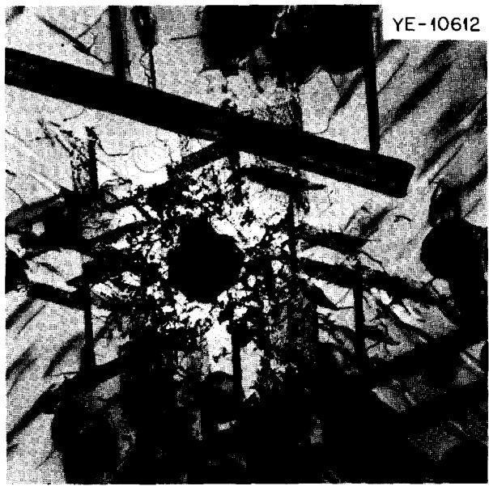  
Fig. 14.18. Precipitation of $\mathbf{N}\mathbf{i}_3\mathbf{T}\mathbf{i}$ in two morphologies around primary and thermally induced MC carbide precipitates in Hastelloy N containing $2.9\%$ Ti. The sheetlike phase may be the stable eta phase. Annealed at $1260^{\circ}\mathrm{C}$ and aged 10,000 hr at $700^{\circ}\mathrm{C}$ . 12,000×.

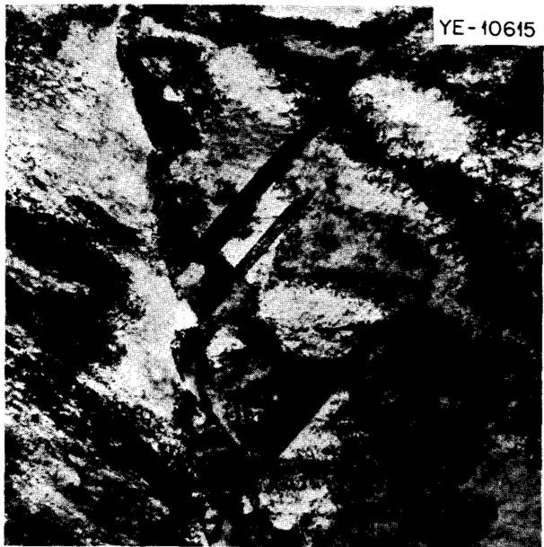  
Fig. 14.19. Strain-induced precipitation along grain boundary, in commercial $2.1\%$ Ti-modified Hastelloy N. The precipitate may be eta phase. $12,000\times$

extend in the same direction [although not necessarily on (111) planes] as the MC carbides which precipitated in the stacking-fault morphology.

We have not positively identified these intermetallic phases but have indications that the fine lenticular phase is the metastable gamma-prime $(\gamma^{\prime})$ $\mathrm{Ni}_3\mathrm{Ti}$ ,whereas the second type is the stable $\eta \text{-Ni}_3\text{Ti}$ phase.

Examination of a commercial heat of $2.1\%$ Timodified Hastelloy N (70727) revealed precipitation of a noncarbide phase in a sheetlike morphology (Fig. 14.19). This precipitate appeared to nucleate at grain boundaries in the gage section of creep samples which were stressed at elevated temperatures. It was not present in unstressed material. Electron diffraction patterns indicated that it may be eta phase $(\mathrm{Ni}_3\mathrm{Ti})$ ; its morphology is similar to that observed both in the laboratory heat containing $2.9\%$ Ti and in the stressed titanium-niobium commercial alloys discussed previously. Other studies indicate that nucleation of eta phase is enhanced by deformation. Future studies will deal with specific identification of intermetallic-phase precipitates and the relationship between strain-induced and intermetallic precipitation in the modified alloys.

# 14.4.2 Precipitation in New Commercial Alloys

We have examined material from several new titanium-modified and hafnium-modified commercial alloys. The titanium-modified heats were prepared both

by electroslag remelting and vacuum arc remelting and contained 1.5 to $2.0\%$ Ti. Primary MC carbides $(a = 4.30\AA)$ were present in the alloys after solution annealing at $1180^{\circ}\mathrm{C}$ . Grain-boundary carbide precipitation after aging 200 hr at $704^{\circ}\mathrm{C}$ was quite similar to that which occurred in the Alvac series of alloys with carbides in irregular grain boundaries and extending into the matrix 0.5 to $1.0\mu \mathrm{m}$ . Fine MC carbides precipitated around the primary particles in the matrix. Although most of the primary precipitates were MC carbides, some appeared to be $\mathrm{Ni}_3\mathrm{Ti}$ . $\mathrm{Ni}_3\mathrm{Ti}$ precipitation during aging was not observed in the 200-hr specimens. We will be examining material aged for longer times in the temperature range of 650 to $760^{\circ}\mathrm{C}$ .

The hafnium-modified heats contained large quantities of primary carbides. We expect these carbides to be extremely rich in hafnium, based on the high lattice parameter of these carbides (4.62 Å, compared with 4.64 Å for HfC). We have not examined any aged material by transmission electron microscopy.

# 14.4.3 Modification of X-Ray Diffraction Techniques

A considerable effort has been expended in the refinement and modification of x-ray diffraction techniques to improve detectability, resolution, accuracy, and ease of data interpretation for phase-analysis studies. We have installed a graphite-crystal-diffracted-beam monochromator on a Norelco diffractometer which greatly improves peak resolution and line-to-background ratios. We are also using silicon single crystals, cut so that no diffraction peaks occur, as substrates for extracted precipitates. As a result, we have decreased the background by 1.5 to 2 orders of magnitude. We are now able to detect weak diffraction peaks not observed previously and can resolve peaks with differences in interplanar spacings down to 0.005 Å in the 2.0- to 2.5-Å range. This capability is important for detection of carbides with very small differences in lattice parameters.

Data are collected on punched tape, using slow goniometer scanning speeds to provide good counting statistics, and computer processed for ease in data handling. A semiquantitative technique for using a

computer to estimate relative amounts of phases present in a sample may be modified for use with precipitates encountered in Hastelloy N.

# 14.5 SALT CORROSION STUDIES

# J.W.Koger

The success of an MSBR is strongly dependent on the compatibility of the container materials with the molten salts used in the primary and secondary circuits of the reactor. Because the products of oxidation of metals by fluoride melts are quite soluble in the corroding media, passivation is precluded, and the corrosion rate depends on other factors, including the thermodynamic driving force of the corrosion reactions.[10] Design of a practicable system utilizing molten fluoride salts, therefore, demands the selection of salt constituents that are not appreciably reduced by available structural metals and alloys whose components can be in near thermodynamic equilibrium with the salt medium.

Nickel-base alloys, more specifically Hastelloy N and its modifications, are considered the most promising for use in molten salts and have received most attention. Of the major constituents of these alloys, chromium is the least noble and forms the most stable fluoride, so that corrosive attack is normally manifested by the selective removal of chromium. Stainless steels, having more chromium than Hastelloy N, are more susceptible to corrosion by fluoride melts but can be considered for some applications.

Several different oxidizing reactions may occur, depending on the salt composition and impurity content. Among the most important reactants are $\mathrm{UF_4}$ , $\mathrm{FeF_2}$ , and HF. Reaction of chromium with the latter two tends to proceed to completion at MSR temperatures; reaction with $\mathrm{UF_4}$ to form $\mathrm{CrF_2}$ and $\mathrm{UF_3}$ soon reaches equilibrium in an isothermal system. The equilibrium constant has a small temperature dependence, however, which means that a mechanism exists for continued attack in nonisothermal systems. Corrosion by molten salt under a temperature gradient involves material removal from hot surfaces and material deposition on cold surfaces, with a steady-state amount of corrosion products remaining in the salt. This phenomenon, called temperature gradient mass transfer, proceeds in the following manner. At the beginning of operation of a temperature-gradient system, the least-noble constituent of the container alloy (chromium in our case)

will be oxidized at all surfaces and go into solution until the increasing corrosion-product concentration in the salt comes to "equilibrium" with the alloy at the lowest temperature point of the loop. Corrosion at the higher-temperature surfaces continues, however, causing the salt's corrosion-product concentration to increase. As the concentration begins to exceed the equilibrium concentration at the lower-temperature surfaces, the metal begins to deposit there. The rise in corrosion-product concentration in the circulating salt will continue until the rate at which metal is returning to the walls at low temperatures balances the rate at which it is entering the salt in the hot-leg regions. Thereafter, there is continuing removal and deposition with no overall change in corrosion-product concentration in the salt. At steady state the rate of corrosion is generally limited by the rate of diffusion of the chromium through the alloy to the hot surface where it is being removed.

Corrosion by temperature-gradient mass transfer involving selective removal of chromium occurs in all of our nonisothermal systems. Under abnormally oxidizing conditions (as in fluoroborate systems containing water) most constituents of Hastelloy N may be removed.

The experiments discussed in this section were conducted primarily to determine quantitatively the amounts of corrosion in various salt-alloy systems designed and operated to show the effects of variables such as alloy constituents, temperature, salt impurities, salt velocities, and exposure times. These experiments are operated under design parameters based on the molten salt breeder reactor, primarily in nine thermal-convection loops which provide nonisothermal, dynamic conditions. Eight of the loops are constructed of Hastelloy N, one of stainless steel. The salts of interest either are LiF-BeF $_2$ -based with UF $_4$ (fuel), ThF $_4$ (blanket), or ThF $_4$ and UF $_4$ (fertile-fissile), or are an NaBF $_4$ -NaF mixture (coolant salt). Pumped loops containing NaBF $_4$ -NaF are covered separately (Sect. 14.6).

The status of the thermal-convection loops in operation at the end of this period is summarized in Table 14.6.

# 14.5.1 Fuel Salt

The termination of loop 1255 and a discussion of the failure that occurred due to external corrosion under a ceramic bushing were previously reported. Detailed

Table 14.6. Status of MSR program thermal convection loops through February 29, 1972   

<table><tr><td>Loop number</td><td>Loop material</td><td>Specimens</td><td>Salt type</td><td>Salt composition (mole %)</td><td>Max. temp. (°C)</td><td>ΔT (°C)</td><td>Operating time (hr)</td></tr><tr><td>1258</td><td>Type 304L stainless steel</td><td>Type 304L stainless steela,b</td><td>Fuel</td><td>LiF-BeF2-ZrF4-UF4-ThF4 (70-23-5-1-1)</td><td>688</td><td>100</td><td>74,951</td></tr><tr><td>NCL-13A</td><td>Hastelloy N</td><td>Hastelloy N; Ti-modified Hastelloy N controlsb,c</td><td>Coolant</td><td>NaBF4-NaF (92-8) plus tritium additions</td><td>607</td><td>125</td><td>29,163</td></tr><tr><td>NCL-14</td><td>Hastelloy N</td><td>Ti-modified Hastelloy Nb,c</td><td>Coolant</td><td>NaBF4-NaF (92-8)</td><td>607</td><td>150</td><td>37,738</td></tr><tr><td>NCL-15A</td><td>Hastelloy N</td><td>Ti-modified Hastelloy N; Hastelloy N controlsb,c</td><td>Blanket</td><td>LiF-BeF2-ThF4 (73-2-25)</td><td>677</td><td>55</td><td>31,000</td></tr><tr><td>NCL-16</td><td>Hastelloy N</td><td>Ti-modified Hastelloy N; Hastelloy N controlsb,c</td><td>Fuel</td><td>LiF-BeF2-UF4 (65.5-34.0-0.5)</td><td>704</td><td>170</td><td>35,352</td></tr><tr><td>NCL-17</td><td>Hastelloy N</td><td>Hastelloy N; Ti-modified Hastelloy N controlsb,c</td><td>Coolant</td><td>NaBF4-NaF (92-8) plus steam additions</td><td>607</td><td>100</td><td>23,400</td></tr><tr><td>NCL-19A</td><td>Hastelloy N</td><td>Hastelloy N; Ti-modified Hastelloy N controlsb,c</td><td>Fertile-fissile</td><td>LiF-BeF2-ThF4-UF4 (68-20-11.7-0.3) plus bismuth in molybdenum hot finger</td><td>704</td><td>170</td><td>17,787</td></tr><tr><td>NCL-20</td><td>Hastelloy N</td><td>Hastelloy N; Ti-modified Hastelloy N controlsb,c</td><td>Coolant</td><td>NaBF4-NaF (92-8)</td><td>687</td><td>250</td><td>19,281</td></tr><tr><td>NCL-21</td><td>Hastelloy N</td><td>Hastelloy Nb,c</td><td>MSRE fuel</td><td>LiF-BeF2-ZrF4-UF4 (65.4-29.1-5.0-0.5)</td><td>650</td><td>110</td><td>5,377</td></tr></table>

$a_{\mathrm{Hot}}$ leg only.   
$b$ Removable specimens.   
cHot and cold legs.

analyses of the behavior of standard Hastelloy N, a $2\%$ Nb-modified Hastelloy N, and appropriate welds after 9.2 years (80,439 hr) exposure to $\mathrm{LiF - BeF_2 - ZrF_4 - UF_4 - }$ $\mathrm{ThF_4}$ (70-23-5-1-1 mole %) salt and air at temperatures from 560 to $700^{\circ}\mathrm{C}$ are under way. It is evident from the examinations that temperature gradient mass transfer did occur. Attack in the hot section was manifested by formation of voids having a maximum depth of about 4 mils. Deposits less than 1 mil thick were noted in the cold regions. The actual void formation and chromium depletion agreed favorably with those predicted from calculations based on the rate of chromium diffusion. No differences in corrosion were seen for standard Hastelloy N, modified Hastelloy N, and welded areas. Figure 14.20 shows typical attack in each of the above materials. Where exposed to air, the materials formed two-layer oxide having a maximum thickness of about 2 mils. Over all, Hastelloy N is quite suitable for long-term use as a container material for a molten salt of the type used in this test and has acceptable air oxidation resistance at the temperatures tested.

Loop 1258, constructed of type 304L stainless steel, has operated 8.5 years with the same salt as loop 1255. The maximum corrosion rate over the last $8395\mathrm{hr}$ was $1.0\mathrm{mil/year}$ . The chromium content of the salt is 580 ppm, an increase of about $500\mathrm{ppm}$ during operation. The loop continues to operate satisfactorily.

NCL-21 is a Hastelloy N thermal-convection loop, with removable Hastelloy N specimens in each leg, containing salt of the same composition as the MSRE fuel. As discussed in some detail in Sect. 10.1, this loop is equipped with electrochemical probes to measure the $\mathrm{U}^{3+}/\mathrm{U}^{4+}$ ratio. Such probes had been used successfully in small static systems, but this experiment is designed to evaluate their possible use for on-stream analysis in a large system.

The specimens from NCL-21 were removed, weighed, and examined three times. Weight losses and gains, as expected in a temperature-gradient mass transfer system, were seen in the hot and cold legs respectively. The maximum weight loss in the hot-leg specimens after 4193 hr was $0.23\mathrm{mg/cm^2}$ , which corresponds to a corrosion rate of 0.02 mil/year, assuming uniform

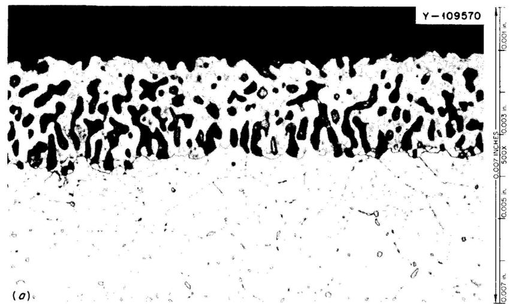

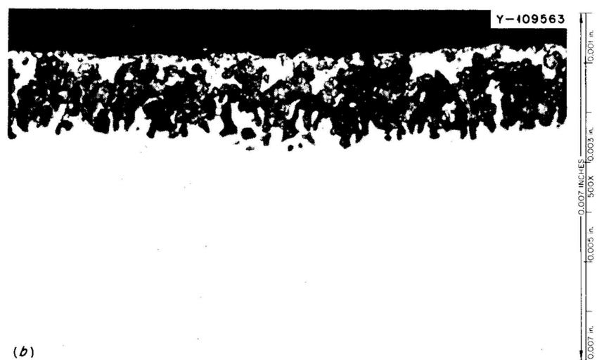

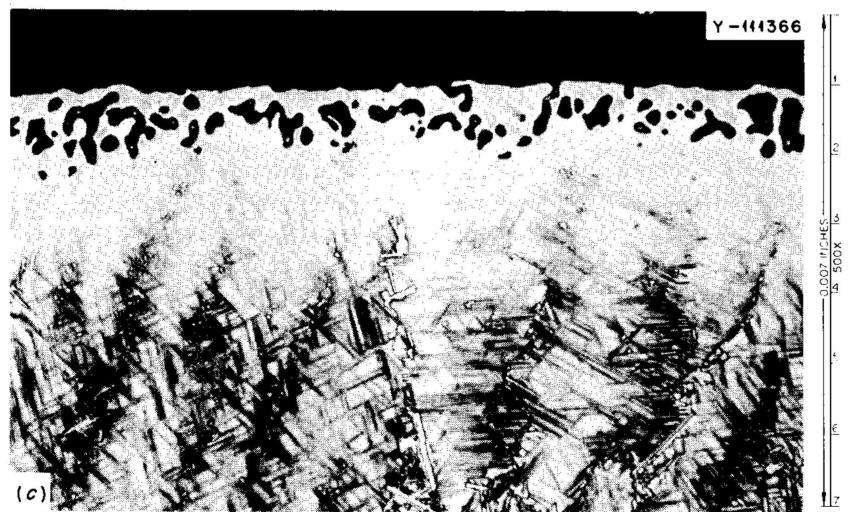  
Fig. 14.20. Portions of loop 1255 exposed to $\mathrm{LiF - BeF_2 - ZrF_4 - UF_4 - ThF_4}$ (70-23-5-1-1 mole %) for 9.2 years. (a) Hastelloy N insert specimen $-675^{\circ}\mathrm{C}$ . Etched with glyceria regia, $500\times$ . (b) Hastelloy N-2% Nb insert specimen $-695^{\circ}\mathrm{C}$ . As polished, $500\times$ . (c) Hastelloy N-Hastelloy N-2% Nb weld $-665^{\circ}\mathrm{C}$ . Etched with glyceria regia, $500\times$ .

material removal. The chromium content of the salt has increased 40 ppm. The $\mathrm{U}^{3+}/\mathrm{U}^{4+}$ ratio gradually increased with time between specimen insertions. This presumably reflects the corrosion reaction of $\mathrm{UF}_4$ with chromium, and we are correlating these ratios with our weight-change data. As indicated in Sect. 10.1, on at least two of the three occasions when specimens were inserted, some oxidant appeared to be introduced, as indicated by a decrease in the $\mathrm{U}^{3+}/\mathrm{U}^{4+}$ ratio. After these initial measurements, further steps will involve additions of oxidants and reductants to study their influence on the measurements of the $\mathrm{U}^{+3}/\mathrm{U}^{+4}$ ratio and the corrosion rate.

# 14.5.2 Fertile-Fissile Salt

A fertile-fissile MSBR salt has circulated for over 17,000 hr in Hastelloy N loop NCL-19A, which has removable specimens in each leg. The test has two purposes: (1) to confirm the compatibility of Hastelloy N with the salt and (2) to determine if bismuth will be picked up by the salt and carried through the loop. The bismuth is contained in a molybdenum vessel located in an appendage beneath the hot leg of the loop. Assuming uniform loss the maximum weight loss has been equivalent to only 0.02 mil/year. A modified Hastelloy N alloy $(\mathrm{Ni}-13.0\% \mathrm{Mo}-8.5\% \mathrm{Cr}-0.1\% \mathrm{Fe}-0.8\% \mathrm{Ti}-1.6\% \mathrm{Nb})$ has lost less weight than a standard alloy at the same position. We attribute this difference to the low iron in the modified alloy, compared with about $5\%$ in the standard alloy. Principal corrosion reactions in this loop appear to be

$$
2 \mathrm {U F} _ {4} (\mathrm {d}) + \mathrm {C r} (\mathrm {s}) \stackrel {\leftrightarrow} {\leftarrow} 2 \mathrm {U F} _ {3} (\mathrm {d}) + \mathrm {C r F} _ {2} (\mathrm {d})
$$

and

$$
\mathrm {F e F} _ {2} (\mathrm {d}) + \mathrm {C r} (\mathrm {s}) \stackrel {\leftarrow} {\rightarrow} \mathrm {F e} (\mathrm {s}) + \mathrm {C r F} _ {2} (\mathrm {d}),
$$

where s and d refer to crystalline solid and dissolved states respectively. The chromium content of the salt has increased 178 ppm in $15,000\mathrm{hr}$ , and there is no detectable bismuth in the salt. During the last exposure period, the specimens in the hot leg were inadvertently placed 4 in. lower than usual. This put the specimen at the bottom of the stringer into the molten bismuth. On removing the stringer, this bottom specimen was missing. The end of the stringer appeared to have been in contact with the bismuth but was not dissolved. Thus it is likely that the very small specimen pins dissolved during the run, and the specimen fell off the stringer. The bismuth in contact with the salt seems to have had no effect on our mass-transfer results.

# 14.5.3 Blanket Salt

Loop NCL-15-A, constructed of standard Hastelloy N and containing removable specimens in each leg, has operated over three years with the $\mathrm{LiF - BeF_2 - ThF_4}$ blanket salt proposed for a two-fluid MSBR. Mass transfer, as measured by the change of chromium concentration in the salt, has been very small. The previously reported "glaze" or coating (probably a high-melting thorium compound) on specimen surfaces has now disappeared, and significant weight changes are measurable. The maximum corrosion rate of 0.06 mil/year (assuming uniform removal) is quite acceptable for an MSBR.

# 14.5.4 Coolant Salt

Loops NCL-13A and NCL-14, constructed of standard Hastelloy N and containing removable specimens in each leg, have operated for 3.3 and 4.3 years, respectively, with the fluoroborate mixture $\mathrm{NaBF}_4$ -NaF (92-8 mole $\%$ ). The maximum corrosion rate (assuming uniform removal) at the highest temperature, $605^{\circ}\mathrm{C}$ , has averaged 0.7 mil/year for both loops. Corrosion has generally been selective toward chromium by the reaction

$$
\mathrm {F e F} _ {2} (\mathrm {d}) + \mathrm {C r} (\mathrm {s}) \stackrel {\leftarrow} {\rightleftarrows} \mathrm {C r F} _ {2} (\mathrm {d}) + \mathrm {F e} (\mathrm {s}).
$$

However, there have been short periods when gaseous impurities entered the salt to cause general attack of the Hastelloy N, for example, by the reaction

$$
2 \mathrm {H F} (\mathrm {d}) + \mathrm {M} (\mathrm {s}) \stackrel {\leftarrow} {\leftarrow} \mathrm {H} _ {2} (\mathrm {g}) + \mathrm {M F} _ {2} (\mathrm {d}),
$$

where $\mathrm{d}$ , $\mathrm{s}$ , and $\mathrm{g}$ refer to dissolved state, crystalline solid, and gas, respectively, and $\mathrm{M}$ may be $\mathrm{Cr}$ , $\mathrm{Fe}$ , $\mathrm{Ni}$ , or $\mathrm{Mo}$ . These periods resulted from leaks in the gas lines or in ball-valve seals. The valves are exposed to a mixture of helium and boron trifluoride gas and not to salt. We attribute the leaks of the ball valves to corrosion induced by air and moisture inleakage from lines into the gas mixture. Although the overall corrosion rates in these loops are not excessive, the rates observed in the absence of leaks have been an order of magnitude lower than the average rate. In NCL-13A the maximum corrosion rate has been 0.3 mil/year over the last 3170 hr.

Loop NCL-17, constructed of standard Hastelloy N and containing removable specimens in each leg, is being used to determine the effect of steam on the mass-transfer characteristics of the fluoroborate salt mixture. After 1000 hr of normal operation, steam was

injected into the salt. $^{1,2}$ The loop has now operated 22,400 hr following that injection. There was a large increase in weight change during the first 239 hr after steam injection, and another abrupt change in the rate of weight change occurred at 10,178 hr because of a leak in the cover gas system; however, the overall mass-transfer rate decreased steadily between these two events.

Specimens were recently removed after 7000 hr of continuous exposure, and the average corrosion rate at the maximum temperature, assuming uniform dissolution, was 0.7 mil/year. The rate is equal to that seen in the loop before a leak in the cover gas system that was noted after 10,178 hr exposure. Once again the corrosion rate does appear to be decreasing.

Loop NCL-20, constructed of standard Hastelloy N and containing removable specimens in each leg, has operated for over 14,900 hr with the fluoroborate coolant salt at the extreme temperature conditions considered for the MSBR secondary circuit (687°C max and 438°C min). Forced-air cooling of the cold leg is

required to obtain this $\Delta T$ . For the first 11,900 hr operation, the maximum corrosion rate was 0.2 mil/year. Then a regulator failure allowed some moisture leakage into the loop and increased the maximum corrosion rate to 0.7 mil/year. During the last 4797 hr, this rate (assuming uniform loss) was 0.4 mil/year and decreasing.

An experiment designed to evaluate the corrosion properties of eight brazes for Hastelloy N in $\mathrm{NaBF}_4$ -NaF (92-8 mole %) at $607^{\circ}\mathrm{C}$ for 4776 hr was conducted. The test was isothermal and utilized samples of the lap-joint geometry. The brazes included Au-Ni, Ag-Cu, Cu, and several types of Ni-Cr-Fe alloys. Over the whole test, all specimens gained weight. Figure 14.21 shows specimens before and after the test. The difference in appearance is attributable to deposits on the surface of the Hastelloy N. However, during two time periods, some weight losses were evidenced, indicating highly corrosive conditions in the melt. On the basis of these weight losses and metallographic observations, we tentatively ranked the brazes according to corrosion resistance, and the Cu and Ag-Cu appear to be the best. To further aid us in our evaluation, we are using the microprobe to determine

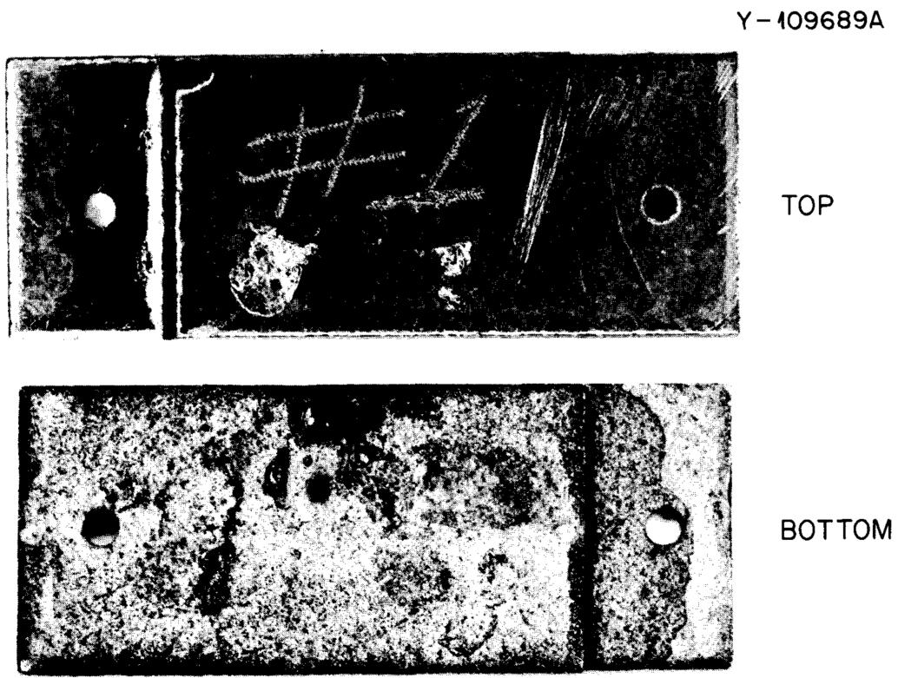  
Fig. 14.21. Hastelloy N specimens brazed with Ni-P-Cr alloy. Top not tested, bottom exposed to $\mathrm{NaBF_4}$ NaF (92-8 mole %) for 4776 hr at $607^{\circ}\mathrm{C}$ .

compositional changes in the braze caused by exposure to the salt.

# 14.6 FORCED-CONVECTION LOOP CORROSION STUDIES

W.R.Huntley J.W.Koger

Operation of forced-convection loop MSR-FCL-1A continued during the past six months, providing information on the compatibility of standard Hastelloy N with $\mathrm{NaBF}_4$ -NaF (92-8 mole %) coolant salt at temperatures similar to those expected in the MSBR secondary circuit. Maximum and minimum salt temperatures in the loop are 620 and $454^{\circ}\mathrm{C}$ (1150 and $850^{\circ}\mathrm{F}$ ). Hastelloy N corrosion test specimens are exposed to the circulating salt at 620, 548, and $454^{\circ}\mathrm{C}$ and a nominal velocity of $5\frac{3}{4}$ fps. In this loop, the tubing must be cut to remove the specimens, and welding is required for specimen replacement.

A second forced-circulation loop of improved design, MSR-FCL-2, also operated throughout this report period. This loop is also of standard Hastelloy N and circulates sodium fluoroborate at 454 to $620^{\circ}\mathrm{C}$ . Velocities are much higher, however, nominally 10 and 20 fps in the test sections. Three sets of corrosion specimens are exposed to salt at 620, 537, and $454^{\circ}\mathrm{C}$ . The FCL-2 design permits these specimens to be easily removed and inserted, with a minimum of contamination of the loop.

# 14.6.1 Operation of Loop MSR-FCL-1A

Loop MSR-FCL-1A, which started in August 1971, operated throughout this report period except for a six-week scheduled shutdown for examination of corrosion specimens after $2000\mathrm{hr}$ of loop operation. Normal loop operation was resumed and by the end of the period had reached a total of $3700\mathrm{hr}$ at design conditions.

Following established practice, during the shutdown the LFB pump bearings and oil seals were replaced. During cold shakedown, several seal failures occurred. Because of these problems the specified flatness of the seals was increased, a new pump assembly procedure was prepared incorporating additional inspection and cleaning steps, and other changes were made to improve the reliability of operation.

# 14.6.2 Results from Loop MSR-FCL-1A

When the specimens from the three points in the loop were weighed after about 2000 hr of loop operation, all

were found to have lost weight. Amounts ranged from $-2\mathrm{mg/cm}^2$ for the lowest-temperature $(454^{\circ}\mathrm{C})$ specimens to $-19\mathrm{mg/cm}^2$ for those at the highest temperature $(620^{\circ}\mathrm{C})$ . The corrosion rate at the highest temperature was approximately 4 mils/year. This contrasts with the pattern of moderate temperature-gradient mass transfer (the FCL-2 results, for example), in which weight losses occur in the hot sections accompanied by weight gains in the cooler sections and increases in corrosion products in the salt. Analyses of salt samples taken from the loop during the interval indicate little overall change in nickel and molybdenum and an increase of about $150~\mathrm{ppm}$ in chromium, with a decrease in the concentration of iron in the salt.

The salt analyses indicate that there was at least a small amount of rapid, general corrosion at the very beginning of loop operation. Results of a sample taken 90 hr after the new loop was first filled (during which time the salt circulated isothermally at $540^{\circ}\mathrm{C}$ ) indicated that chromium, iron, and molybdenum concentrations in the salt had all increased sharply. Chromium had jumped from 36 to 275 ppm; iron had gone from 350 to 472 ppm; molybdenum, which is presumed to have been around 10 ppm or less in the salt at the beginning, was now 175 ppm. Nickel in the salt had not changed appreciably.

Analyses of subsequent salt samples for corrosion products indicate that during 1984 hr of operation at design conditions prior to the removal of the specimens, chromium came down and leveled off at around 200 ppm, iron decreased (rapidly at first then more slowly) to about 25 ppm, and molybdenum quickly fell to less than 10 ppm. Oxygen analyses indicated an upward trend, from about 500 ppm to approximately 1000 ppm. The concentration of hydrogen as $\mathrm{BF}_3\mathrm{OH}^-$ was indicated by infrared analyses to be 63 ppm in the sample at the beginning of design operation and 26 to 30 ppm in the four samples taken between 222 and 1984 hr.

It appears that when the salt was first circulated in the new loop, there was rapid, general attack which removed not only chromium but also iron and molybdenum (and probably nickel) from all portions of the loop. Subsequent mass transfer removed more material from hot surfaces and deposited material on cold surfaces, producing the spread from $-2$ to $-19\mathrm{mg/cm^2}$ observed on the metal specimens.

Salt sample analyses during operation at design conditions after the specimens were removed and replaced gave no indication of abnormally corrosive conditions.

# 14.6.3 Operation of Loop MSR-FCL-2

Corrosion loop MSR-FCL-2 began routine operation on September 1, 1971, and during this report period accumulated about $3900\mathrm{hr}$ at design conditions. The salt has not been drained from the piping system since the initial fill. No serious operational problems were encountered, but six unscheduled, automatic shutdowns occurred during the six months. The automated protective circuits functioned as planned on each occasion to stop the salt pump and cooler blowers and to place the loop in an isothermal "standby" condition. This safety action was necessitated twice by a low flow alarm on the lubrication oil, once by a temporary electric power outage, once by a brush failure on the Adjustospede motor that drives the salt pump, once by a brush wire failure on the pump motor, and once by a failure of a vacuum tube in the pump speed control. After each of these incidents, normal operation was resumed following a few hours delay.

On several occasions, severe electrical noise appeared on some of the sheathed insulated-junction loop thermocouples. The cause was found to be arcing of the slip rings on the clutch of the pump motor and was eliminated by honing the slip rings.

The design of the corrosion specimen removal stations, which permits rapid removal of each of the three stringers via a salt freeze valve, proved to be very effective during the five scheduled shutdowns in which the specimens were removed. Downtime for specimen removal and examination was only two days, compared with several weeks and much more manpower in MSR-FCL-1A.

The performance of the ALPHA salt pump in MSR-FCL-2 and a description of proposed engineering improvements to the pump are described in Sect. 3.5.2 of this report.

# 14.6.4 Results from Loop MSR-FCL-2

The specimens were weighed after 450, 914, 1780, 2774, and 3846 hr of routine operation at design conditions. Cumulative weight changes subsequent to the beginning of design operation are shown in Fig. 14.22. (Changes during 500 hr of startup testing, $^{13}$ which ranged from $+0.9$ to $-1.5\mathrm{mg/cm^2}$ , are not included.) Each point is the average for more than one specimen exposed to a particular combination of temperature and velocity. These results indicate

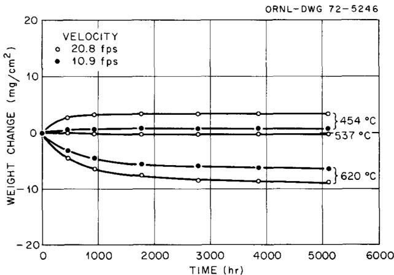  
Fig. 14.22. Weight changes of Hastelloy N specimens exposed to $\mathrm{NaBF}_4$ -NaF (92-8 mole %) in FCL-2 as a function of time, temperature, and velocity.

temperature-gradient mass transfer at a steadily decreasing rate, with a significant velocity effect. Specimens in the hottest position have remained fairly bright, with the specimens in the middle temperature position darker and the specimens in the coldest position darkest. Differences in appearance such as these have been previously observed.[14]

Corrosion-product concentrations in the salt showed no anomalous behavior, either during the startup or in subsequent operation. As shown in Fig. 14.23 the chromium concentration increased by about $60~\mathrm{ppm}$ during the startup period, rose another $70~\mathrm{ppm}$ or so during the first few hundred hours of routine operation, and thereafter changed very little. The iron concentration decreased. Molybdenum and nickel remained low.

In sets of specimens exposed at the same temperature to the same superficial salt velocity, the upstream specimen generally showed the greatest weight change, the second specimen in line showed less, and the downstream specimen showed the least. The differences (on the order of $10\%$ between the first and last specimen) were clear early in the operation, when weight changes were relatively large, but become practically indistinguishable later, when all weight changes approached the limits of precision of measurement. Changes of this nature are quite common in liquid metal systems ("downstream" effect) and are due to a concentration gradient driving-force effect between the wall and the fluid. Turbulence may also be responsible for the changes.

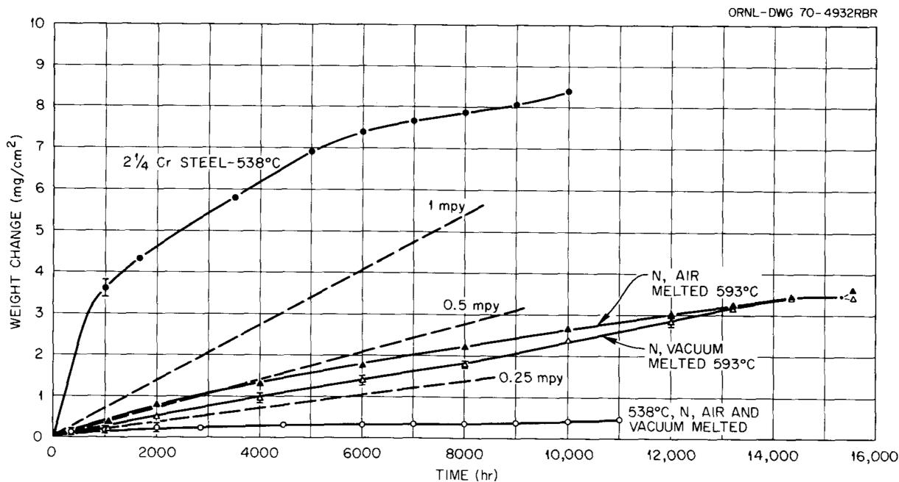  
Fig. 14.23. Results of FCL-2 salt analyses.

Table 14.7. Weight losses of high-temperature $(620^{\circ}\mathrm{C})$ samples in $\mathrm{NaBF}_4$ -NaF in loop MSR-FCL-2 and equivalent corrosion rates   

<table><tr><td colspan="2">Operating time (hr)</td><td colspan="2">Weight loss (mg/cm2)</td><td colspan="2">Equivalent corrosion ratea(mils/year)</td></tr><tr><td>Period end</td><td>Interval</td><td>At 10.9 fps</td><td>At 20.8 fps</td><td>At 10.9 fps</td><td>At 20.8 fps</td></tr><tr><td>450</td><td>450</td><td>3.13</td><td>4.40</td><td>2.7</td><td>3.8</td></tr><tr><td>914</td><td>464</td><td>1.40</td><td>1.76</td><td>1.17</td><td>1.46</td></tr><tr><td>1780</td><td>866</td><td>1.11</td><td>1.53</td><td>0.49</td><td>0.68</td></tr><tr><td>2774</td><td>994</td><td>0.28</td><td>0.58</td><td>0.11</td><td>0.23</td></tr><tr><td>3846</td><td>1072</td><td>0.29</td><td>0.38</td><td>0.10</td><td>0.14</td></tr><tr><td>3846</td><td>3846</td><td>6.21</td><td>8.65</td><td>0.62</td><td>0.87</td></tr></table>

Assuming uniform material removal of all constituents.

The dependence of the rates of weight change on time and velocity that is evident in Fig. 14.22 is revealed more sharply in Table 14.7, which shows weight losses of the high-temperature specimens from one measurement to the next. For the sake of comparison with other corrosion data, the weight losses are also expressed as an equivalent corrosion rate during the interval. For specimens having a weight loss, the effect of the velocity was to the 0.5 power. The corrosion rates of the hottest specimens are approaching the same values, which is an indication that the controlling mechanism of corrosion has now changed from a solution rate control to the velocity-independent solid-state chromium diffusion control.

Experience indicates that corrosion in fluoroborate systems is due largely to impurities, particularly water. Reactions that are believed to be involved include the following. [Although chromium is the most readily oxidized constituent of Hastelloy N, reactions similar to (3) involving other constituents can be important if the concentration of HF is high.]

$$
\mathrm {H} _ {2} \mathrm {O} + \mathrm {N a B F} _ {4} \stackrel {\rightarrow} {\leftarrow} \mathrm {N a B F} _ {3} \mathrm {O H} + \mathrm {H F}, \tag {1}
$$

$$
\mathrm {N a B F} _ {3} \mathrm {O H} \stackrel {\rightarrow} {\leftarrow} \mathrm {N a B F} _ {2} \mathrm {O} + \mathrm {H F}, \tag {2}
$$

$$
6 \mathrm {H F} + 6 \mathrm {N a F} + 2 \mathrm {C r} \stackrel {\rightarrow} {<  } 2 \mathrm {N a} _ {3} \mathrm {C r F} _ {6} + 3 \mathrm {H} _ {2}. \tag {3}
$$

These may be combined to give

$$
\begin{array}{l} 6 \mathrm {N a B F} _ {3} \mathrm {O H} + 6 \mathrm {N a F} + 2 \mathrm {C r} \\ \rightleftarrows 6 \mathrm {N a B F} _ {2} \mathrm {O} + 2 \mathrm {N a} _ {3} \mathrm {C r F} _ {6} + 3 \mathrm {H} _ {2} \tag {4} \\ \end{array}
$$

and

$$
\begin{array}{l} 3 \mathrm {H} _ {2} \mathrm {O} + 3 \mathrm {N a B F} _ {4} + 6 \mathrm {N a F} + 2 \mathrm {C r} \\ \rightleftharpoons 3 \mathrm {N a B F} _ {2} \mathrm {O} + 2 \mathrm {N a} _ {3} \mathrm {C r F} _ {6} + 3 \mathrm {H} _ {2}. \tag {5} \\ \end{array}
$$

Thus both the $\mathrm{NaBF}_3\mathrm{OH}$ initially in the salt and any $\mathbf{H}_2\mathbf{O}$ that may be admitted later result in corrosion and the appearance of hydrogen, which can diffuse through the hot metal walls and be lost from the system. Removal of hydrogen from the system by diffusion through the metal would drive reaction (4) and (5) to the right. The results15 of the tritium addition to NCL-13A supported the contention that little if any hydrogen-containing impurities existed in the molten fluoroborate. Because of the connection with corrosion

15. J. W. Koger, MSR Program Semiannu. Progr. Rep. Feb. 28, 1971, ORNL-4676, pp. 210-11.

(and, as discussed below, with tritium transport), samples of salt from FCL-2 were routinely analyzed for oxygen and for $\mathrm{BF}_3\mathrm{OH}^-$ . (The infrared-absorption technique for the latter analysis is discussed in Sect. 7.6 and 10.7 of this report.) The oxygen results shown in Fig. 14.23 do not reveal any trend with time. The measured concentrations of hydrogen as $\mathrm{BF}_3\mathrm{OH}^-$ , on the other hand, clearly indicate a downward trend for about $2800\mathrm{hr}$ , then little change over the next $1000\mathrm{hr}$ .

The hydrogen behavior in the fluoroborate salt in FCL-2 is of great interest because of its implications for tritium transport in an MSBR. The concentrations shown in Fig. 14.23 indicate a much less rapid loss of hydrogen than would be expected on the basis of the interrelations of $\mathrm{BF}_3\mathrm{OH}^-$ concentration, hydrogen pressure, and diffusion through Hastelloy N observed in other experiments (Chap. 7 of this report).

# 14.7 CORROSION OF HASTELLOYN IN STEAM

B. McNabb H. E. McCoy

The unstressed Hastelloy N specimens exposed to steam in the Bull Run facility at $538^{\circ}\mathrm{C}$ continued to

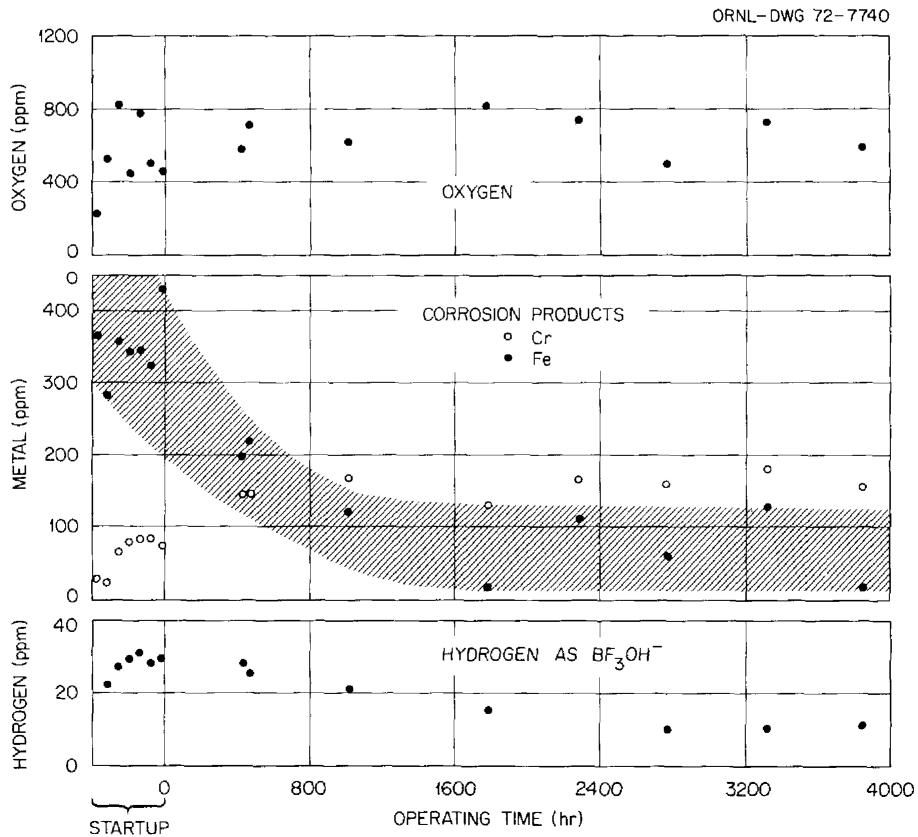  
Fig. 14.24. Weight changes of Hastelloy N and $2^{1/4}\%$ Cr steel after exposure to steam in the unstressed condition.

show very low generalized corrosion rates of less than 0.25 mil/year, assuming uniform corrosion. The actual weight gains for standard Hastelloy N, both air melted and vacuum melted, were about $0.43\mathrm{mg/cm}^2$ for 11,000 hr exposure to steam at $538^{\circ}\mathrm{C}$ and about 3.45 $\mathrm{mg/cm}^2$ for 15,312 hr exposure to steam at $593^{\circ}\mathrm{C}$ . Figure 14.24 compares the weight changes of Hastelloy N with those of the $2^{1/4}\%$ Cr steel that is commonly used in modern power plants. There was no evidence of spalling on any of the specimens.

Although the results are not shown in Fig. 14.24, several modified Hastelloy N specimens are also included in the facility at $538^{\circ}\mathrm{C}$ . The weight changes were slightly higher than those for the standard alloy, but none of the modified specimens had weight gains greater than $0.7\mathrm{mg/cm}^2$ after 11,000 hr exposure to steam at $538^{\circ}\mathrm{C}$ .

Some of the specimens were removed for detailed examination after 10,000 hr exposure. Table 14.8 shows the compositions of these alloys. Metallographic examination showed standard air-melted Hastelloy N (heat 5065) to have some small nodules of oxides. Figure 14.25 shows one of the deepest nodules, having a penetration of about 0.4 mil. The oxide is generally

very thin and adherent, with occasional patches of oxide penetration.

The vacuum-melted heat of standard Hastelloy N (heat 2477) also had a very thin, adherent oxide, but the oxide nodules were more frequent and deeper (0.8 mil) than for the air-melted heat 5065. Figure 14.26 is a photomicrograph of one of the worst areas in the vacuum-melted alloy and shows the thin, adherent oxide in some areas and the maximum penetrations in other areas. The lower manganese and silicon (~0.05 wt % each) in the vacuum-melted heat probably account for its slightly lower corrosion resistance.

One of the modified Hastelloy N heats, 21546, with low Fe, Mn, and Si (Table 14.8) had weight gains of about $0.44\mathrm{mg/cm^2}$ . However, the grain boundary penetrations were about 10 mils deep in some areas. Figure 14.27 shows one area with a thin, adherent oxide at the surface and one of the deep grain boundary penetrations. Microprobe analysis indicates the outer surface of the grain boundary penetration to be slightly enriched in iron. The grain boundary penetrations appear to be slightly enriched in chromium, slightly depleted in nickel, and little different in the molybdenum concentration.

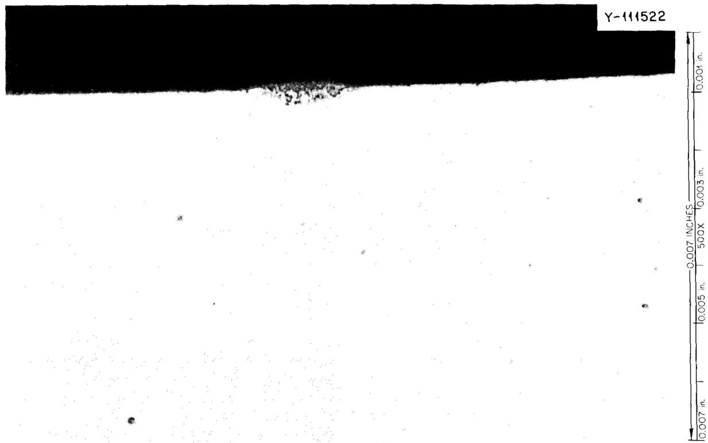  
Fig. 14.25. Photomicrograph of air-melted Hastelloy N (heat 5065) after exposure to steam for 10,000 hr at $538^{\circ}\mathrm{C}$ . As polished.

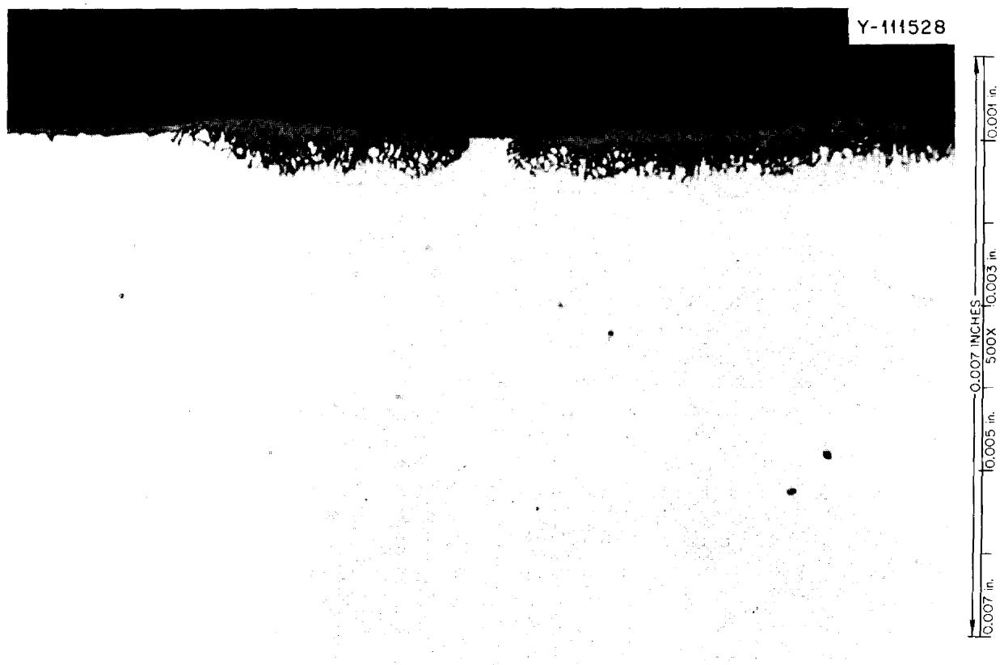  
Fi, 14.26. Photomicrograph of vacuum-melted Hastelloy N (heat 2477) after exposure to steam for 10,000 hr at $538^{\circ}\mathrm{C}$ . As polished.

A specimen of a modified alloy containing $2.1\%$ titanium (heat 70-727) was removed after 7330 hr at $538^{\circ}\mathrm{C}$ . Figure 14.28 shows the thin, adherent oxide with metallic-appearing particles above the surface. Microprobe analysis indicated that these were enriched in iron, and, as previously reported, it appears that iron oxide particles are entrained in the steam16 and stick to the surface of specimens. The $2.1\%$ titanium content of this heat appears to stabilize the grain boundaries and prevent the penetrations observed in heat 21546.

The heat 5065 specimen gained $0.33\mathrm{mg / cm^2}$ , heat 2466 gained $0.26\mathrm{mg / cm^2}$ , and heat 21546 gained 0.44 $\mathrm{mg / cm^2}$ , all in 10,000 hr at $538^{\circ}\mathrm{C}$ . In 7330 hr at $538^{\circ}\mathrm{C}$ , heat 70-727 gained $0.37\mathrm{mg / cm^2}$ . The corrosion was uniform in some specimens, and the weight changes are indicative of the depth of attack. In other specimens the corrosion was not uniform, and the weight changes do not indicate the depth of attack.

There appears to be an effect of surface preparation on the weight gain of standard Hastelloy N in steam. Figure 14.29 is a plot of weight gain time for heat 5065 specimens with several surface preparations. All material was rolled to 0.035-in. sheet, with intermediate anneals at $871^{\circ}\mathrm{C}$ and a final anneal of 1 hr at $1180^{\circ}\mathrm{C}$ . Specimens 9 and 10 were exposed in this condition, specimens 11 and 12 were surface abraded with 400-grit paper, and specimens 13 and 14 were electropolished. The surface-abraded specimens have the highest weight gains, as-received (rolled) specimens lower, and the electropolished specimens the lowest weight gains. There are several possible reasons for the observed effect. One is simply the differences in actual surface areas. The abraded specimens would have the greatest surface area, the as-rolled specimens next, and the electropolished specimens the least surface area. The surface area was calculated from micrometer measurements and would not represent the true surface areas. Greater surface roughness would also give more sites for particles of oxides entrained in the steam to stick, with

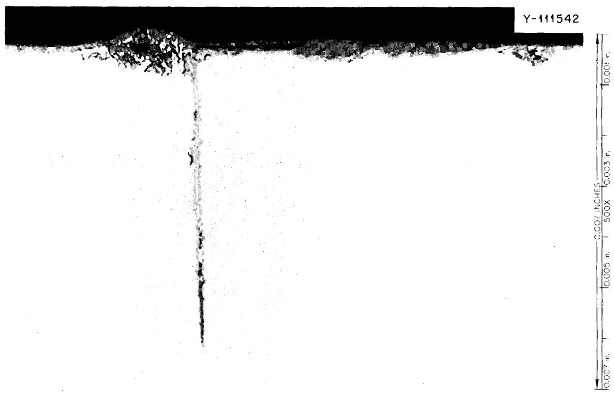

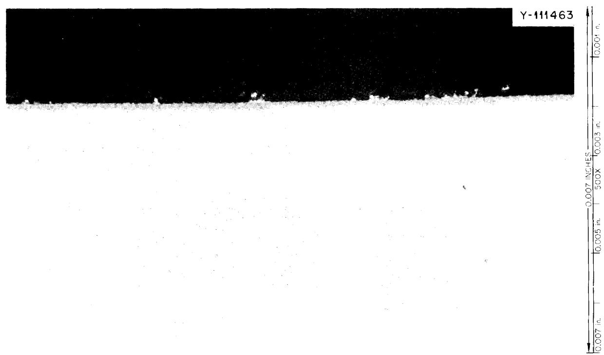  
Fig. 14.27. Photomicrograph of modified Hastelloy N (heat 21546) after exposure to steam for 10,000 hr at $538^{\circ}\mathrm{C}$ . As polished   
Fig. 14.28. Photomicrograph of modified Hastelloy N (heat 70-727) after exposure to steam for $7330\mathrm{hr}$ at $538^{\circ}\mathrm{C}$ . As polished.

Table 14.8. Compositions of several heats of standard and modified Hestelloy N   

<table><tr><td rowspan="2">Alloy No.</td><td colspan="16">Concentration (%)</td><td></td></tr><tr><td>Mo</td><td>Cr</td><td>Fe</td><td>Mn</td><td>C</td><td>Si</td><td>Cu</td><td>Co</td><td>V</td><td>W</td><td>Al</td><td>Ti</td><td>B</td><td>Cb</td><td>Hf</td><td>Zr</td><td>Mg</td></tr><tr><td>5065</td><td>16.0</td><td>7.1</td><td>4.0</td><td>0.55</td><td>0.06</td><td>0.57</td><td>0.01</td><td>0.07</td><td>0.23</td><td>0.1</td><td>&lt;0.03</td><td>&lt;0.01</td><td>0.001</td><td>&lt;0.05</td><td>&lt;0.1</td><td>&lt;0.1</td><td>0.02</td></tr><tr><td>2477</td><td>16.0</td><td>6.9</td><td>4.1</td><td>0.055</td><td>0.057</td><td>0.047</td><td>0.01</td><td>0.05</td><td>&lt;0.01</td><td>0.03</td><td>0.03</td><td>0.02</td><td>0.0002</td><td>&lt;0.0005</td><td>&lt;0.001</td><td>&lt;0.001</td><td>&lt;0.005</td></tr><tr><td>21546</td><td>12.3</td><td>7.3</td><td>0.046</td><td>0.16</td><td>0.05</td><td>0.009</td><td>0.01</td><td>&lt;0.10</td><td>&lt;0.10</td><td>&lt;0.10</td><td>0.02</td><td>0.10</td><td>0.0002</td><td></td><td></td><td>0.005</td><td></td></tr><tr><td>70727</td><td>13.0</td><td>7.4</td><td>0.05</td><td>0.37</td><td>0.044</td><td>&lt;0.05</td><td>&lt;0.01</td><td>&lt;0.01</td><td>&lt;0.01</td><td>&lt;0.01</td><td>&lt;0.03</td><td>2.1</td><td>0.00006</td><td>&lt;0.01</td><td>&lt;0.01</td><td>&lt;0.001</td><td>0.015</td></tr></table>

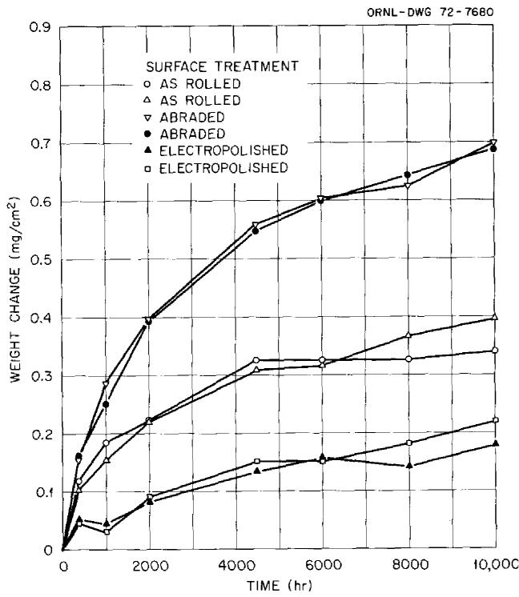  
Fig. 14.29. Comparative weight changes in steam at $538^{\circ}\mathrm{C}$ of Hastelloy N (heat 5065) having various surface treatments. All samples rolled to 0.035 in. and annealed 1 hr at $1180^{\circ}\mathrm{C}$ prior to receiving different surface treatments.

a greater sticking probability on the rougher surfaces. This increased surface area would also provide added sites for oxide nucleation on the metal. These specimens are continuing in the facility to see if these trends continue to larger weight gains.

In addition to the unstressed specimens described above, the Bull Run facility also contains stressed tubular specimens. Stresses are maintained by having plant steam inside the tubes and a low-pressure annulus around them. When first installed, this facility included four tubes with capillary connections to sense leakage into the annuli.[17] During this report period, in order to increase the rate of accumulation, four additional tube-burst specimens were installed in the facility without the capillary tubing extending outside the chamber to indicate rupture. Internal diametral strains will be measured periodically, and rupture times will be estimated by comparison with the instrumented tests. The specimen design is identical to the other double-wall tube-burst specimens, except that the annulus between the tubes is not connected to the outside of the chamber by capillary tubing for indication of failure.

17. B. McNabb and H. E. McCoy, MSR Program Semiannu Progr. Rep. Feb. 28, 1971, ORNL-4676, p. 216.

Y-111910

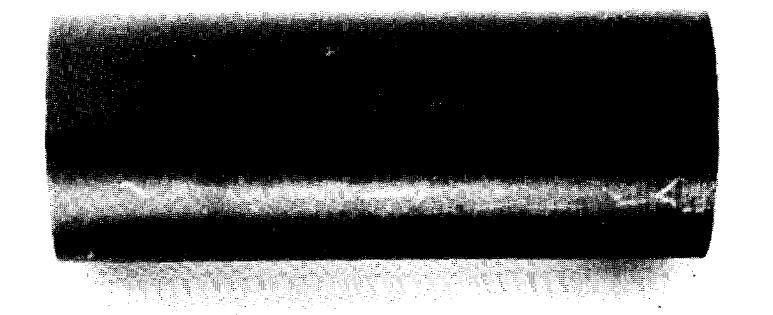

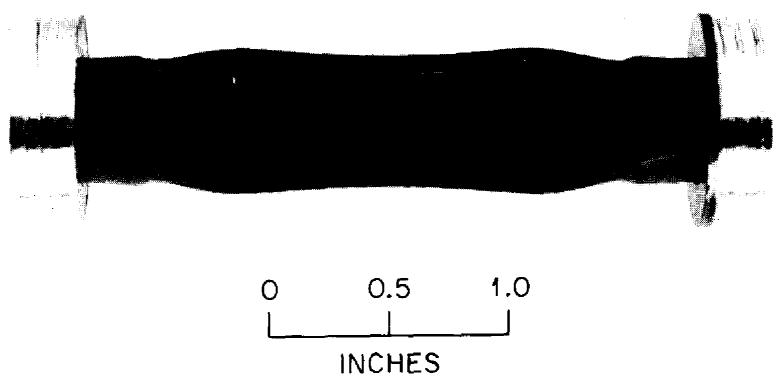  
Fig. 14.30. Photograph of tube-burst sample that was stressed at 58,000 psi in steam at $538^{\circ}\mathrm{C}$ and failed in $< 1000\mathrm{hr}$ . The smaller tube was initially pressurized, failed, and pressurized the annular region, and the smaller tube was collapsed when the plant steam pressure decreased rapidly.

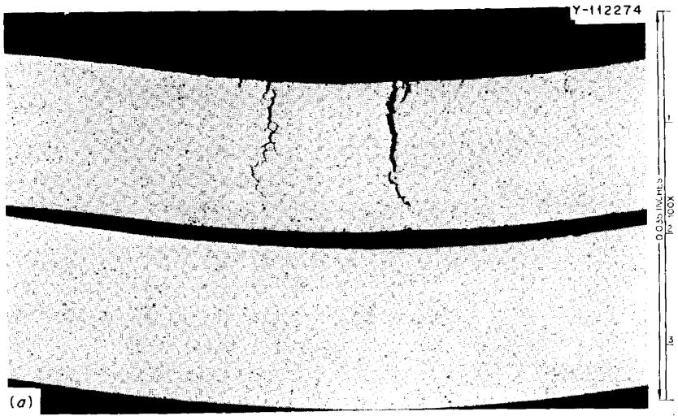

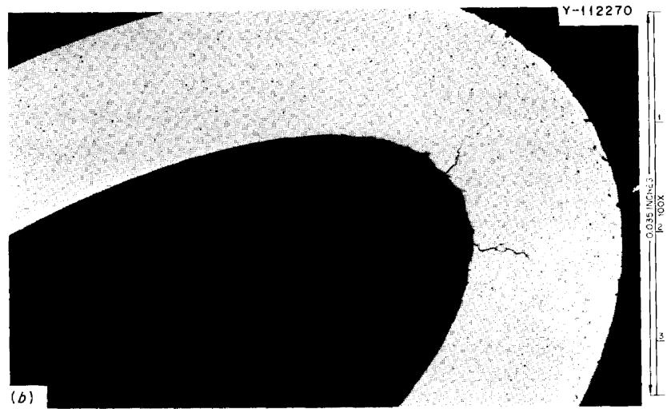

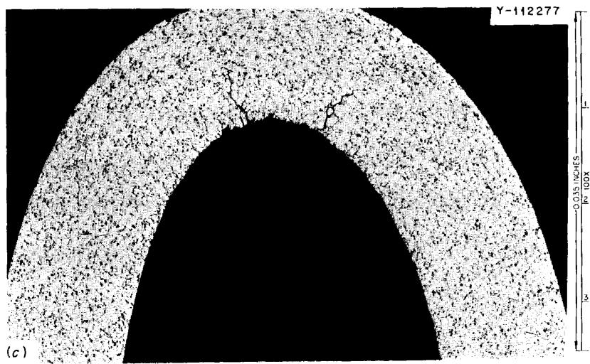  
Fig. 14.31. Photomicrographs of the inner tube shown in Fig. 14.30. Intergranular fractures occurred on both sides of the tube because of the unusual loading sequence. (a) Cracks from the OD, (b) cracks from the ID, (c) cracks from the ID. Etched with glyceria regia. Reduced $33\%$ .

Two tube-burst specimens of heat N15095 have accumulated 5000 hr exposure to steam at 40,250 psi and 28,000 psi and have diametral strains of 0.71 and $0.19\%$ respectively. Two tube-burst specimens of heat N25101 have 4000 hr exposure at 56,000 and 50,000 psi with diametral strains of 0.57 and $0.33\%$ respectively. Heat N25101 thus appears stronger than N25095 under these creep conditions, although the certified tensile properties were equivalent. The four new specimens were heat N15095. The specimens with the highest stress (58,000 psi) failed sometime during the first 1000 hr of exposure. A small crack developed in the inner tube and pressurized the annulus between the tubes. When the plant steam pressure was reduced, the pressure in the annular region collapsed the tube, as shown in Fig. 14.30. The specimen had a hairline crack extending almost the entire length of the reduced section of the tube wall. Numerous cracks formed on the OD and the ID.

Plant records at the Bull Run plant have been examined in an effort to determine the time of failure more closely. Failure could have occurred on February 20, when a pressure excursion to 3750 psig momentarily occurred and, subsequently, the pressure dropped to zero in about $30\mathrm{min}$ . This 3750 psig would have been 62,000 psi on the specimen. This would have meant that the failure occurred after $792\mathrm{hr}$ . As shown in Fig. 14.31 numerous intergranular cracks were formed in the failed sample.

The other three new specimens after 1000 hr of exposure have diametral strains of $0.25\%$ at 53,000 psi, $0.24\%$ at 42,502 psi, and $0.14\%$ at 42,400 psi.

# 14.8 EVALUATION OF DUPLEX TUBING FOR USE IN STEAM GENERATORS

B. McNabb H.E.McCoy

One type of duplex tubing proposed for steam generators is nickel 280 (Ni + 0.05% Al) on the outside for salt corrosion resistance and Incoloy 800 (Fe-34% Ni-21% Cr) on the inside for resistance to steam corrosion. Some mechanical property tests on a 10-ft length supplied by the International Nickel Company were reported previously.[18] Tube-burst tests at $538^{\circ}\mathrm{C}$ , in an argon atmosphere with argon internal pressure, continued during this report period. One specimen, with a pressure corresponding to a stress of 46,000 psi on the Incoloy 800 (or 28,720 on the entire wall), ruptured at 3263 hr with a diametral strain of 3.04%. The nickel 280 exterior was cracked profusely. A tube-burst specimen was stressed at 40,000 psi on the Incoloy 800 and was discontinued at 7075 hr with a diametral strain of 1.14%. Figure 14.32 is a photograph of this specimen with dye penetrant applied to delineate the cracks in the nickel 280 exterior. It did not crack as extensively as the higher-stressed specimen, but it was discontinued before rupture or equivalent diametral strains were reached. Figure 14.33 shows photomicrographs of a typical cross section and shows the extensive cracking in the nickel 280. It is evident that cracking does occur in this nickel 280 at relatively low strains.

18. B. McNabb and H. E. McCoy, MSR Program Semiannu. Progr. Rep. Aug. 31, 1971, ORNL-4728, pp. 156-62.

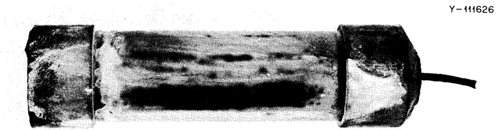

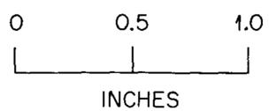  
Fig. 14.32. Photograph of duplex tube-burst specimen discontinued after being stressed for 7075 hr at 40,000 psi at $538^{\circ}\mathrm{C}$ . The tube had a diametral strain of $1.14\%$ , and the dye penetrant clearly reveals cracks in the outer nickel 280 layer.

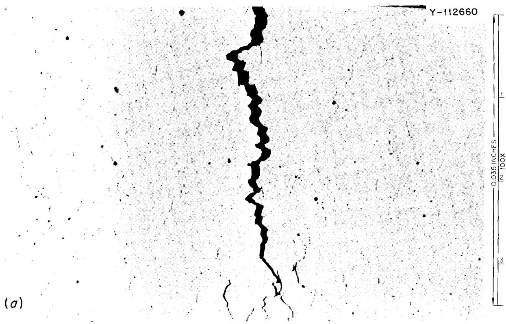

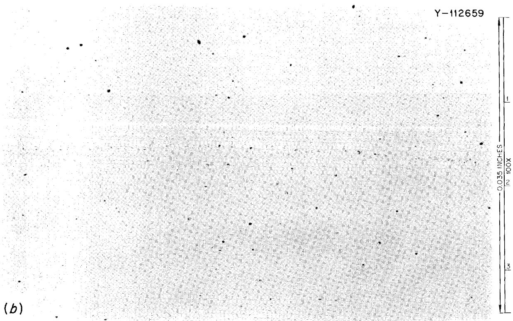  
Fig. 14.33. Photomicrograph of the cross section of the specimen shown in Fig. 14.32. The nickel 280 is on the outside, and numerous cracks are present. The Incoloy 800 is on the inside and is not cracked. As polished.

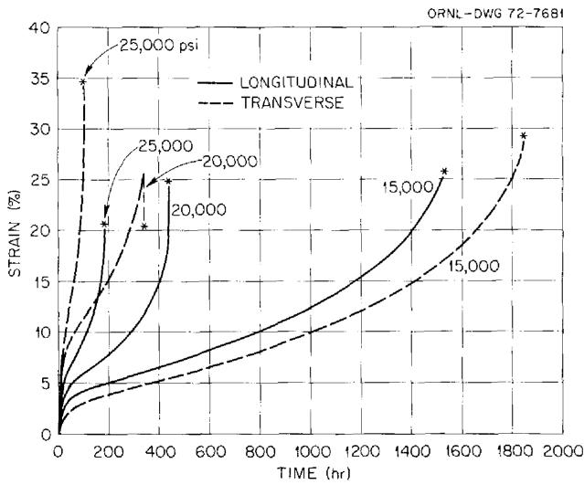  
Fig. 14.34. Creep curves of nickel 280 sheet at $538^{\circ}\mathrm{C}$ in argon.

The base properties of nickel 280 sheet look quite good. This test material was 0.06 in. thick and had been heavily worked. Figure 14.34 shows several creep curves for nickel 280 sheet at $538^{\circ}\mathrm{C}$ in argon. There appears to be no clear-cut effect of rolling direction on creep properties, as the longitudinal specimens had longer rupture times at the two higher stresses and the transverse specimen had a longer rupture life at 15,000 psi. All of the sheet specimens tested had rupture strains greater than $20\%$ , indicating much greater ductility than that shown by the nickel 280 on the duplex tubing. Thus it appears likely that the duplex tubing can be produced with a nickel layer that has good ductility. The International Nickel Company is preparing another length of Incoloy 800-nickel 280 duplex tubing for further testing and evaluation.

# 15. Support for Chemical Processing

J. R. DiStefano

A reductive-extraction process for protactinium isolation and a metal transfer process for rare-earth removal are being developed for molten-salt breeder reactors, and this chapter deals with the materials development in support of these chemical processes. A principal requirement of materials for this application is compatibility with molten Bi-Li-Th solutions at 500 to $700^{\circ}\mathrm{C}$ .

Molybdenum appears quite promising, and currently our efforts are concentrated on the fabrication of a reductive-extraction test stand of molybdenum. Although compatible with bismuth-lithium solutions and molten-salt mixtures, molybdenum is difficult to weld and, therefore, to fabricate into complex equipment. This test stand, probably the most difficult all-molybdenum system ever attempted, has involved the development of many fabrication procedures not previously used on this material, such as back extrusion, orbiting arc welding, and roll bonding. With this unit we will obtain metallurgical data on the test equipment and chemical engineering process data under a variety of conditions.

In addition, we are continuing our program to evaluate the compatibility of molybdenum, TZM, tantalum, T-111, Ta- $10\%$ W, brazing alloys, and various grades of graphite with bismuth-lithium solutions under reprocessing conditions.

# 15.1 CONSTRUCTION OF A MOLYBDENUM REDUCTIVE-EXTRACTION TEST STAND

J. R. DiStefano

A.J.Moorhead

We are constructing a molybdenum test stand for metallurgical and chemical engineering evaluation. It consists of a 5-ft-long, $1 \frac{1}{8}$ -in.-OD packed column and associated pots and piping through which molten salt and bismuth will circulate in the temperature range 550 to $650^{\circ} \mathrm{C}$ . Details of the design of this test stand have been reported previously. $^{1,2}$ Construction involves (1) fabrication of containers and column, (2) machining of

subassembly components, (3) construction of an unjoined mockup from test stand components, (4) fabrication of head pot and column subassemblies, and (5) interconnection of the subassemblies to complete the test stand.

Items 1 and 2 above have been completed. All sizes of tubing $(\frac{1}{4}, \frac{3}{8}, \frac{1}{2}$ , and $\frac{7}{8}$ in. OD) have been obtained and inspected by fluorescent-dye-penetrant and ultrasonic techniques. Using the full-size wood-aluminum-steel test-stand mockup (Fig. 15.1) as a guide, we have selected the specific tubes to be used in fabrication.

Previously, we reported brittle behavior of the $\frac{1}{4}$ - and $\frac{3}{8}$ -in.-OD tubing at room temperature. We traced this behavior to the presence of a brittle layer on the inner surface and found that the tubing could be made ductile by removal of 0.001 to 0.002 in. from the wall. To accomplish this, the bore of the $\frac{1}{4}$ -in.-OD tubing was etched at ORNL. However, more $\frac{3}{8}$ -in.-diam tubing was needed than was on hand. Therefore, we returned 50 ft of three different heats of $\frac{3}{8}$ -in.-diam tubing to the vendor and purchased 100 ft of a single heat produced according to specifications that ensured the removal of any brittle inner surface layers. To evaluate this new material, ring-shaped samples were squashed at room temperature at a constant displacement rate of 0.005 in./min. Total displacement (original ring diameter minus minor axis of elliptical shaped specimen after testing) was approximately 0.11 in., and under these conditions no cracks developed in any of the samples. Similar tests were then conducted on samples from the $\frac{1}{4}$ , $\frac{1}{2}$ , and $\frac{7}{8}$ -in.-OD tubes, and no cracking occurred.

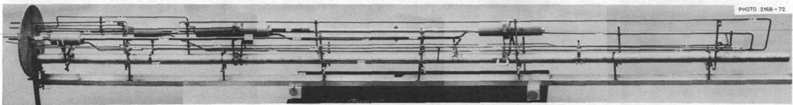  
Fig. 15.1. Mockup of molybdenum reductive-extraction test stand.

To gain practice in subassembly fabrication, we are making a prototype of a head pot using molybdenum components similar to those that will be used in construction of the test stand. This prototype involves all of the operations required to fabricate an actual component: (1) electron-beam tube-to-header welds, (2) roll bonding $\frac{1}{4} -$ , $\frac{3}{8}$ , and $\frac{1}{2}$ -in.-OD tubes, (3) tungsten coating the inside of each roll-bonded joint by chemical vapor deposition, (4) electron-beam welding two half sections together, (5) back brazing the outside of the tube-to-header electron-beam-welded joints and the roll-bonded joint, and (6) brazing a ring around the $3\%$ -in.-OD girth weld joining the two half sections.

More detailed information on the design and purpose of the molybdenum test stand is presented in Part 4 of this report. Progress on welding, brazing, and fabrication of molybdenum components is reported in this chapter.

# 15.2 FABRICATION DEVELOPMENT OF MOLYBDENUM COMPONENTS

R. E. McDonald

A.C.Schaffhauser

We have completed fabrication of the $378$ -in.-OD closed-end molybdenum back extrusions required for the head pots and disengaging sections of the molybdenum test stand. The back extrusion process and tooling we developed to fabricate components having an internal length up to 11 in. have been described previously. The feed pots, lower disengaging vessel,

3. A. C. Schaffhauser and R. E. McDonald, MSR Program Semiannu. Progr. Rep. Aug. 31, 1971, ORNL-4728, pp. 166-69.

and upper disengaging vessel each require two back extrusions with internal lengths of 3.5, 7.75, and 9 in., respectively, which are joined by girth welding (see Fig. 15.2).

The results of the back extrusions are given in Table 15.1. All of the required back extrusions have been fabricated and machined to final dimensions. However, the spare back extrusions for the disengaging vessels contained cracks in the wall that make them unusable unless they can be repaired by welding. We are presently back extruding additional spare parts for these vessels.

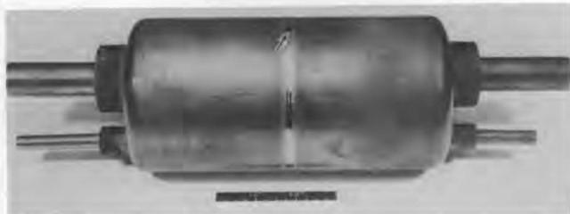  
ORNL-DWG72-7665

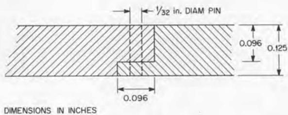  
Fig. 15.2. Molybdenum half sections joined by electron-beam girth weld. Pins through the step joint (arrow) held the halves in contact for welding.

Table 15.1. Molybdenum back extrusions fabricated for molybdenum test stand   

<table><tr><td>Part</td><td>Extrusion number</td><td>Extrusion temperature (°C)</td><td>Internal length (in.)</td><td>Results</td></tr><tr><td>Feed Pot</td><td>1197</td><td>1600</td><td>4</td><td>No cracks</td></tr><tr><td>Feed pot</td><td>1250</td><td>1600</td><td>4</td><td>End cracks, 3.5 in. usable</td></tr><tr><td>Feed pot</td><td>1257</td><td>1600</td><td>4.5</td><td>End cracks, 3.5 in. usable</td></tr><tr><td>Feed pot</td><td>1259</td><td>1600</td><td>4.5</td><td>End cracks, 4 in. usable</td></tr><tr><td>Spare</td><td>1251</td><td>1600</td><td>4</td><td>End cracks, 3.5 in. usable, surface cracks on top</td></tr><tr><td>Spare</td><td>1256</td><td>1600</td><td>4</td><td>Surface cracks on top</td></tr><tr><td>Lower disengaging</td><td>1258</td><td>1600</td><td>8</td><td>No cracks</td></tr><tr><td>Lower disengaging</td><td>1260</td><td>1600</td><td>8</td><td>No cracks</td></tr><tr><td>Spare</td><td>1261</td><td>1600</td><td>8.5</td><td>Cracks in wall</td></tr><tr><td>Upper disengaging</td><td>1286</td><td>1700</td><td>9</td><td>No cracks</td></tr><tr><td>Upper disengaging</td><td>1290</td><td>1700</td><td>11</td><td>End cracks, 9.5 in. usable</td></tr><tr><td>Spare</td><td>1288</td><td>1700</td><td>9</td><td>Reextruded, crack in wall</td></tr></table>

# 15.3 WELDING OF MOLYBDENUM

A.J.Moorhead

During this report period we have continued our efforts to develop reliable procedures for joining components of the molybdenum test stand. The full-scale mockup shown in Fig. 15.1 was constructed of aluminum, stainless steel, and wood to aid in design of the loop. (Proposed changes were incorporated in the mockup as they were suggested in order to ensure that they were compatible with the rest of the system.) After the design of the test stand was finalized, we began using the mockup to make certain that our welding and brazing fixtures will fit in the allotted spaces. This type of check is necessary since the distances between lines and other components have been held to a minimum. Additionally, the mockup has been invaluable in determining the step-by-step sequence that will be used in construction of the test stand.

Major progress was made during this period in three areas that are crucial for fabrication of the loop: (1) girth joint welding, (2) tube-tube welding, and (3) vent-tube welding. A decision was made to use electron beam welding to join the half sections to form the four pots required for the test stand. This process has the advantage of allowing a self-aligning step type of joint to be used and minimizes distortion and abnormal grain growth. One disadvantage of this process is that the joint fit-up must be very tight. In some of our earlier developmental welds, the two half sections were held together by a spring-loaded rod passing axially through the center. This approach is not possible in some of the test-stand vessels because of their internal configuration. Therefore, we made a prototype part with the halves held together by three $\frac{1}{3}$ -in.-diam molybdenum pins passing radially through the step joint. This technique proved successful for making the girth weld. Fluorescent dye-penetrant inspection revealed no defects in this weld, which is shown in Fig. 15.2. The technique was repeated using poheads more nearly similar to actual loop components, and it again proved successful.

A commercially obtained (Rytek Corporation) orbiting-arc weld head is being used to develop procedures for joining the $7/8$ - and $1^{1}/8$ -in.-diam tubes for the test stand. Although this head is heavier than the Astroarc head and is water cooled, the 125 A required to fuse this relatively heavy wall molybdenum tubing is at the upper limits of its capability. Because of this limitation, we have reduced the wall thickness of both the $7/8$ - and $1^{1}/8$ -in.-OD tubing to 0.050 in. We feel there

is considerable advantage in using this tool compared with manual welding, because it eliminates having to rotate large sections of the loop inside the dry box. To date, we have encouraging results when welding the $7/8$ -in.-diam tubing using a weld insert, but equipment problems have hindered our effort on the $11/8$ -in. sizes.

Two electron-beam welds are required to attach the vent tube to the bottom half of each feed pot. The first attaches a nominal $\frac{1}{2}$ -in.-diam "washer" to the end of the tube. Subsequently, this subassembly is welded to a trepanned joint inside the half section. On an earlier attempt to weld this latter joint, the protruding tube was impinged on and melted by the electron beam. The joint was redesigned with an increase in the diameter of the washer (to 0.585 in.) and a tighter fit between the washer and the pothead. Both changes were made to ensure that the tube would not be hit by the beam. These changes resulted in a successful weld on our second attempt. This weld, which is shown in Fig. 15.3, was not only leak-tight when bubble tested under alcohol with an argon pressure of 7 in. Hg, but also helium leak-tight as well. The two feed pot bottoms are presently being remachined to incorporate this design change.

# 15.4 DEVELOPMENT OF BRAZING TECHNIQUES FOR FABRICATING THE MOLYBDENUM TEST LOOP

N.C.Cole

As was previously reported, we have brazed mockups of the feed pots and disengaging sections of the chemical processing test loop. We used an iron-based filler metal (Fe-15% Mo-5% Ge-4% C-1% B), which was developed to meet the requirement of this loop. Brazing was accomplished in a vacuum furnace (<10 $^{-5}$ torr) by heating at a rate of 5°C/min until flow of the brazing alloy occurred. The parts were positioned in the furnace so the braze alloy fillet could be observed visually. Figure 15.4 shows an example of a 3 $^{7}$ /in.-diam molybdenum part in which short lengths of roll-bonded tubing were back brazed and a split ring was brazed around the girth weld.

Sections of the 17-ft-long test loop will not fit into our vacuum furnace, and considerable effort has been expended to design and build portable furnaces that will fit around the part to be brazed and will heat only

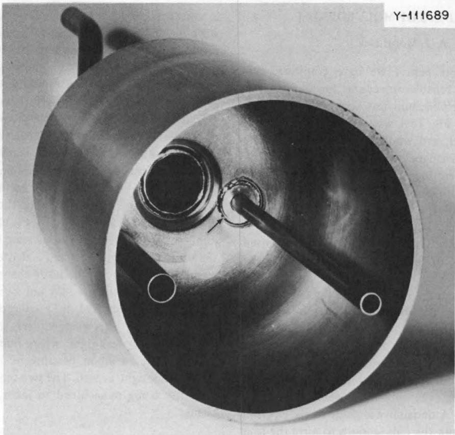

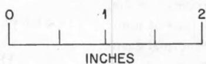

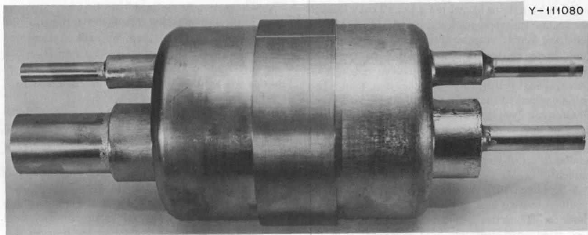  
Fig. 15.3. Molybdenum half section with vent tube welded into place. The weld joint is indicated by an arrow.

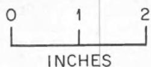  
Fig. 15.4. Mockup of a molybdenum feed pot, showing molybdenum tubing back brazed to the bosses of the feed pot and a split sleeve brazed over its girth weld.

the immediate braze area. We have developed two types of portable heating sources, one heating by resistance and the other by induction. Each has advantages and disadvantages depending on the size and location of the particular joint to be brazed.

The resistance furnaces have tantalum heating elements. Two types of furnaces have been built. One consists of a continuous helical coil that will fit around the joint to be brazed. The other is a split tantalum sheet heater which can be opened and placed over the welded joint in situ and then removed the same way after brazing. This feature is extremely valuable for sections where the furnace cannot be slipped over a large or complex section to reach the braze region. Using these heaters, we have been able to reach brazing temperature on a mockup that consisted of a sleeve around a $7/8$ in. tube with heat sinks similar to that on the actual test loop. We are in the process of determining power output, time to brazing temperature, and other parameters needed for brazing sleeves on tubes of the sizes $7/8$ , $1/2$ , $3/8$ , and $1/4$ in. diameter.

We have also developed induction heating techniques for use either inside or outside an atmospheric chamber. In the past we have experienced problems with arcing in a dry box under argon or helium atmospheres as well as in vacuum when the brazing alloy binder (used for preplacing the filler metal) volatilized.4 We have overcome this difficulty by installing an auxiliary transformer that changes the high voltage from the induction machine to low voltage-high amperage at the coil. With this attachment we have been able to braze inside the dry box in argon or helium without arcing problems. In addition, by changing the size and shape of the copper leads (from thin-walled tubing to thick bus bars), for the first time we have been able to achieve brazing temperature using split coils. Using a 1-in. split coil either inside or outside the dry box, we have reached brazing temperature on a $\frac{1}{2}$ -in. tube and matching split-sleeve assembly. Split coils have an advantage in removability, as discussed above for the split-resistance heater. Unfortunately, the 1-in. split coil does not couple well enough with the other sizes of tubing. As a result, we have ordered additional split coils for the other sizes, both smaller and larger.

Both types of heating techniques can be used inside an atmospheric chamber, but some joints will have to be made with portable atmosphere-protection devices. With induction heating we will be able to braze by protecting the molybdenum part from oxidation. If we use the refractory-metal resistance furnace, we will have to devise a technique to protect the heater as well.

# 15.5 COMPATIBILITY OF MATERIALS WITH BISMUTH

O. B. Cavin B. W. McCollum

J. L. Griffith L. R. Trotter

We are studying the compatibility of potential structural materials with bismuth and bismuth-lithium solutions at $700^{\circ}\mathrm{C}$ . Three different experimental techniques are being used: (1) static capsule tests, (2) quartz thermal convection loops for dynamic tests on samples in up to 0.01 wt $\%$ (0.3 at. $\%$ ) lithium in bismuth, and (3) all-metal thermal convection loops for dynamic testing in up to 3 wt $\%$ (48 at. $\%$ ) lithium in bismuth.

# 15.5.1 Tantalum and T-111

We previously reported5 that T-111 alloy (Ta-8% W-2% Hf) showed excellent resistance to mass transfer but lost its room-temperature ductility while being tested in either bismuth or Bi-0.01 wt % Li at 600 to $700^{\circ}\mathrm{C}$ for 3000 hr. Tantalum, under similar conditions, showed greater weight changes but no change in ductility. We postulated that the loss of ductility in T-111 could have been caused by an intergranular hafnium-bismuth reaction. Recently, however, Inouye and Liu,6 in studying the brittle behavior of T-111, have found that relatively small additions of oxygen in T-111 can cause room-temperature embrittlement when oxygen is added below $1000^{\circ}\mathrm{C}$ . For example, the addition of 800 wt ppm oxygen to T-111 at $1000^{\circ}\mathrm{C}$ will cause embrittlement, but at $815^{\circ}\mathrm{C}$ it takes only 400 wt ppm. Extrapolation of these data suggests that oxygen concentrations as low as 100 to 200 ppm might induce room-temperature embrittlement if the oxygen is added at 600 to $700^{\circ}\mathrm{C}$ , which is in the range of our loop operating temperatures. There is evidence that oxygen reacts with hafnium to form hafnium oxide and that the morphology and concentration of this oxide at grain boundaries control the degree of embrittlement. Our samples did pick up oxygen during exposure in the quartz loop, reaching approximately 150 wt ppm oxygen, an increase of about 120 ppm during loop operation. Because the oxygen pickup in T-111 appeared to have been associated with the use of quartz as the loop material, we built and operated an all-metal T-111 alloy loop. This loop, which contained Bi-2.5 wt

$\%$ (44 at. $\%$ ) Li, is presently being examined after operating 3000 hr.

If, as seems to be indicated, the embrittlement of T-111 is associated primarily with oxygen and hafnium, it appears that we can circumvent this problem by eliminating the hafnium as an alloying addition. To further check this reasoning, we are testing a Ta-10 wt $\%$ W alloy in a quartz thermal-convection loop containing high-purity bismuth.

# 15.5.2 Graphite

One of the concerns in the consideration of graphite for processing equipment is the extent to which bismuth-lithium alloys intrude into the graphite pores. Tests with graphite specimens in a loop circulating Bi-100 ppm Li, reported previously, showed varying amounts of intrusion. During this report period we conducted tests with pure bismuth and with high-lithium alloy (3 wt%, 48 at.%, Li) in crucibles made of three grades of graphite. One similar test, under only slightly different conditions, was conducted in the Chemical Technology Division. As described below, significant differences in intrusion were observed between pure bismuth and the high-lithium alloy, among different grades of graphite, and between the Chemical Technology Division test and our test with the same grade of graphite.

Our tests used crucibles 4 in. long and 0.75 in. OD with a wall thickness of 0.19 in., machined from ATJ, AXF, and Graph-i-tite "A". These three grades, obtained from Carbon Products Division of Union Carbide Corporation, from Poco Graphite, Inc., and from Graphite Products Division of Carborundum Company, respectively, differed in pore size and bulk density, which was 1.79, 1.81, and $1.86\mathrm{g/cm^3}$ respectively. One set of nine crucibles (three of each grade) was filled with high-purity bismuth and another set with Bi-3 wt $\%$ Li alloy. Prior to filling, the graphite crucibles were ultrasonically cleaned in absolute alcohol for 30 sec, then dried for 16 hr at $190^{\circ}\mathrm{C}$ . High-purity bismuth was added to the crucibles in the form of solid cast sticks. In preparation for the alloy tests, sufficient bismuth-lithium alloy to fill nine crucibles was first made in a molybdenum-lined type 304L stainless steel pot by adding small pieces of purified lithium to molten purified bismuth. After each lithium addition, the melt was agitated with a molybdenum rod to ensure complete mixing and alloying. The melt was then cast into a

thin sheet, and pieces of this alloy were used to fill the graphite crucibles, which were being held above the melting temperature of the alloy. Each crucible was then placed inside a stainless steel capsule and the end cap welded on inside an argon-filled atmosphere chamber. Each combination of graphite and metal was tested at $700 \pm 5^{\circ}\mathrm{C}$ for 500, 1000, and 3000 hr. As of this writing, only the 500-hr specimens had been examined.

Metallography of the crucible cross sections after the 500-hr tests indicated that the high-purity bismuth did not penetrate the open porosity of any of the grades of graphite tested. Conversely, in the Bi-3 wt % Li tests, the melt did intrude into crucible walls. Radiographs of the three graphite grades after 500-hr exposures to the bismuth-lithium alloy are shown in Fig. 15.5. One can see that the greatest amount of penetration occurred in the ATJ graphite, the lowest-density grade tested. This penetration was confirmed by metallography, and in some regions of extremely low density the melt had completely penetrated the wall. Figure 15.6 shows a radiograph of a longitudinal half section of ATJ which

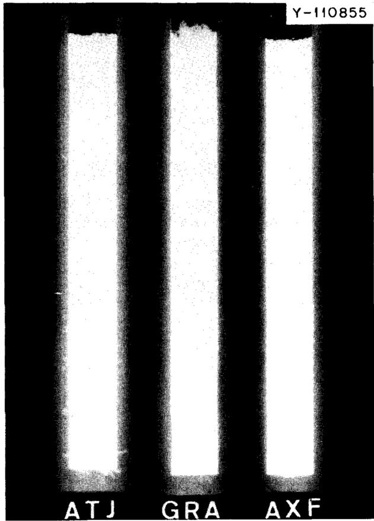  
Fig. 15.5. X-ray radiographs of three grades of graphite crucibles containing Bi-3 wt % (48.2 at. %) Li and tested at $700 \pm 5^{\circ} \mathrm{C}$ for 500 hr.

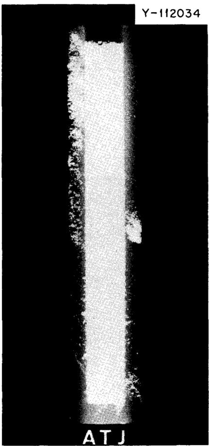  
Fig. 15.6. X-ray radiograph of a half section of the ATJ graphite crucible shown in Fig. 15.5. The crucible was probably rotated from the previous radiograph.

illustrates the variable degree of intrusion. This kind of variation is not unusual considering the inherent variations in porosity of the graphite bodies from which the crucibles were made.

The Chemical Technology Division used an ATJ graphite crucible $(1\frac{3}{4}$ in. OD, $1\frac{1}{2}$ in. ID, and 6 in. long) to test the stability of lithium-bismuth solutions in contact with graphite. The crucible was first degassed by heat treating for seven days at $1000^{\circ}\mathrm{C}$ in a flowing argon atmosphere. It was then cooled to room temperature, and sufficient amounts of solid lithium and bismuth were added to produce $300\mathrm{g}$ $(1\frac{1}{4}$ in. deep) of a Bi-2.2 wt $\%$ (40 at. $\%$ ) Li alloy. The temperature of the crucible was raised to $650^{\circ}\mathrm{C}$ in a flowing argon atmosphere and held for 30 days, during which time the melt was periodically sampled to determine the lithium concentration in the melt.

Chemical analyses of filtered samples showed that the lithium concentration was $2.05 \pm 0.03$ wt % and remained constant with time. Metallographic examination of the cross section of this crucible did not indicate any significant metal intrusion, as shown in Fig. 15.7. There is, however, a thin layer of as yet unidentified nonmetallic material along the surface. It is difficult to reconcile the absence of intrusion with the large open porosity near the surface unless some surface layer existed to seal off the pore entrance.

At present, discrepancies observed in the two different static crucible tests can only be ascribed to variations in experimental technique, such as crucible degassing and alloy preparation. A program has been initiated to investigate the effect of these and other possible variables and also to determine how lithium additions to bismuth increase the penetrating characteristics of the melt.

# 15.5.3 Tungsten-Coated Hastelloy N

Both refractory metals and graphite require that external surfaces of equipment be protected from oxidation at temperatures of interest for MSBR fuel reprocessing. One possibility for overcoming this restriction would be to coat the inner surfaces of equipment made of a conventional material with a thin layer of a material that is compatible with the bismuth-lithium alloys. To determine the feasibility of a protective coating on such a material, the inner wall of a Hastelloy N thermal convection loop was tungsten coated by chemical vapor deposition. Despite repeated attempts to recoat, the tungsten had at least one small crack when we decided to proceed with loop testing. The loop operated for only about 24 hr at approximately $700^{\circ}\mathrm{C}$ when the bismuth started coming through the wall in many spots, as shown in Fig. 15.8. Analysis of the failure is in progress.

# 15.5.4 Molybdenum

A molybdenum all-metal loop scheduled for a 3000-hr run is now operating at a maximum temperature of $696^{\circ}\mathrm{C}$ and a $\Delta T$ of $116 \pm 5^{\circ}\mathrm{C}$ . It contains molybdenum tensile samples in Bi-2.5 wt $\%$ (44 at. $\%$ ) Li.

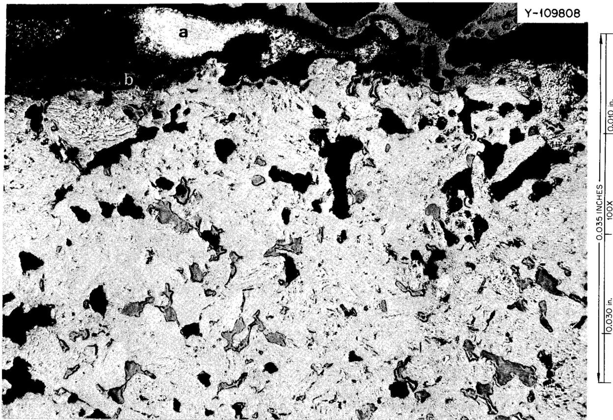  
Fig. 15.7. Photomicrograph of cross section of ATJ graphite crucible tested by the Chemical Technology Division. (a) Small piece of metal adhering to the inner wall of the crucible. (b) Thin surface layer on graphite.

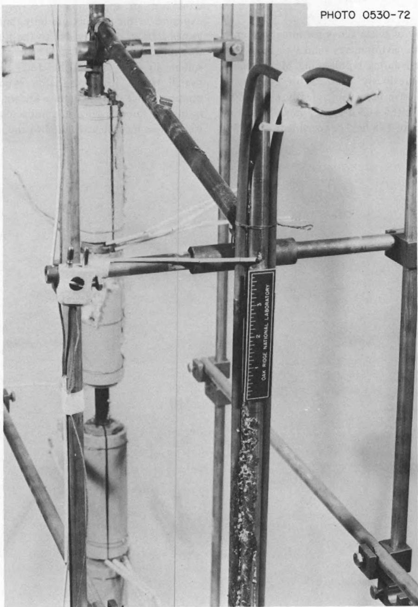  
Fig. 15.8. Tungsten-coated Hastelloy N loop tested for approximately 24 hr at $700^{\circ}\mathrm{C}$ and a $\Delta T$ of $100 \pm 5^{\circ}\mathrm{C}$ . Note the small particles of bismuth on the top horizontal portion and the metal that has flowed down each vertical leg. Clamshell heaters are around the high-temperature portion.

# 15.6 MOLYBDENUM BRAZE ALLOY COMPATIBILITY

J.W.Koger

The compatibility of braze alloys for molybdenum is being determined in environments similar to those that will be encountered during reprocessing. Molybdenum braze specimens previously exposed for 109 hr to $\mathrm{H}_2 - 20$ vol $\%$ HF have been subsequently exposed to LiF-BeF $_2$ -ZrF $_4$ -UF $_4$ (65.4-29.1-5.0-0.5 mole $\%$ ) salt in a capsule at $650^{\circ}\mathrm{C}$ for 115 hr. The specimens with 35M

braze alloy (Fe-15% Mo-4% C-1% B) lost 0.1118 g, or approximately 0.2%, while a specimen with 42M braze alloy (Fe-15% Mo-4% C-1% B-5% Ge) lost 0.0462 g, or approximately 0.1%. After the initial exposure to the gas mixture only, both specimens had gained 0.01 g, probably due to the formation of metal fluoride reaction products. These products are likely soluble in the salt and, therefore, contributed to the overall weight loss noted after exposure to the salt mixture. Since molybdenum is known to be rather inert in molten fluoride salts, it is suspected that most of the weight loss may be attributed to the iron in the braze.

# Part 4. Molten-Salt Processing and Preparation

L. E. McNeese

Part 4 deals with the development of processes for the isolation of protactinium and the removal of fission products from molten-salt breeder reactors. During this period we continued to evaluate and develop a flow-sheet based on fluorination—reductive extraction for protactinium isolation and the metal transfer process for rare-earth removal. Work was initiated on a computer program that can be used for calculating steady-state concentrations and heat generation rates in an MSBR processing plant. The behavior of 687 nuclides in 56 regions that represent the processing plant is considered. The program will be used for carrying out parametric studies involving the fluorination—reductive-extraction—metal transfer flowsheet and for making comparative studies of flowsheets based on other processing methods such as oxide precipitation.

Studies related to the chemistry of fuel reconstitution were continued. It is believed that absorption of gaseous $\mathrm{UF_6}$ into molten salt containing $\mathrm{UF_4}$ results in the formation of $\mathrm{UF_5}$ , and gold apparatus was found to exhibit to exhibit satisfactory resistance to gaseous $\mathrm{UF_6}$ and to $\mathrm{UF_5}$ dissolved in MSBR fuel carrier salt (72-16-12 mole % LiF-BeF $_2$ -ThF $_4$ ) at $600^{\circ}\mathrm{C}$ . Under certain conditions, $\mathrm{UF_5}$ disproportionated slowly, with the rate of disproportionation being second order with respect to $\mathrm{UF_5}$ concentration.

Studies were continued on the equilibrium distribution of lithium and bismuth between liquid lithium-bismuth alloys and molten LiCl over the temperature range 650 to $800^{\circ}\mathrm{C}$ . Data from these studies are consistent with the observed behavior of lithium in the second metal transfer experiment (MTE-2) completed previously. The data are also consistent with the observed behavior of lithium in an engineering experiment involving the metal transfer process (MTE-2B). In this experiment the rate of transfer of lithium to LiCl from lithium-bismuth solutions containing 3.5 to 15 at. $\%$ lithium has been measured. The results indicate that the concentration of lithium in LiCl that is in equilibrium with a 5 at. $\%$ lithium-bismuth solution, which will

be used for removal of trivalent rare earths from LiCl, will have a negligible effect on the metal transfer process. The concentration of lithium in LiCl that is in equilibrium with 50 at. $\%$ lithium-bismuth alloys, which are proposed for removal of divalent rare earths from the LiCl, is about 500 wt ppm; however, only about $2\%$ of the LiCl is fed to the divalent rare-earth removal step, and the transfer of lithium will occur at an acceptably low rate. Installation of the third experiment (MTE-3) for development of the metal transfer process was completed. The system has been leak checked and treated with hydrogen for oxide removal, and the salt and bismuth phases are being purified and transferred to the system. The experiment will use salt flow rates that are $1\%$ of the estimated flow rates required for processing a 1000-MW(e) MSBR. Design was initiated for a facility in which we will carry out the fourth metal transfer experiment (MTE-4). This experiment will use salt flow rates that are 5 to $10\%$ of those which will be required for processing a 1000-MW(e) MSBR and will yield information on the rate of transfer of rare earths in equipment of a design suitable for a processing plant.

Our work on contactor development was continued successfully during this report period. Mass transfer experiments were carried out in which the rates of transfer of zirconium and uranium from molten salt to bismuth were measured in a 24-in.-long, 0.82-in.-ID column packed with $\frac{1}{4}$ -in. molybdenum Raschig rings. The measured HTU (height of a transfer unit) values range from 2.3 to 4.4 ft, which indicates that packed column contactors can be used successfully in MSBR processing systems. Studies were continued on mechanically agitated salt-metal contactors that are of particular interest in the metal transfer process.

We have continued studies of oxide precipitation as an alternative to the fluorination-reductive extraction method for isolating protactinium and to fluorination for subsequently removing uranium from MSBR fuel salt. Additional data were obtained to define more

accurately the conditions required for the precipitation of protactinium from an $\mathrm{LiF - BeF_2 - ThF_4}$ (72-16-12 mole $\%$ ) solution containing $\mathrm{UF_4}$ by sparging the salt with $\mathrm{H}_2\mathrm{O}$ -HF-Ar gas mixtures. Operation of a small-scale engineering facility was continued for investigation of the precipitation of $\mathrm{UO_2 - ThO_2}$ solid solutions from molten fluoride salt by contacting the salt with $\mathrm{Ar - H_2O}$ mixtures. The precipitates have been observed to settle rapidly, and the salt has been separated from the oxide by decantation; minimal entrainment of oxide has been observed. Samples of the salt and oxide

precipitate have shown that the two phases are not in equilibrium. A precipitation process model in which the solids, once formed, do not equilibrate with the salt has been found to agree quite well with experimental data. It appears that this effect can be exploited in order to remove most of the uranium from MSBR fuel salt, without the attendant removal of significant quantities of $\mathrm{ThO}_2$ , in a single-stage system rather than in a batch countercurrent system containing three or more stages (as we had thought would be required previously). Results of these experiments are encouraging.

# 16. Flowsheet Analysis

The final report was written for a design study and a cost estimate for a fluorination-reductive-extraction-metal transfer processing plant that continuously processes the fuel salt from a 1000-MW(e) MSBR. The design study pointed out the need for additional information in three important areas: (1) finding materials of construction suitable for containing molten bismuth and bismuth-salt mixtures, (2) determining the chemical behavior of noble metals in an MSBR, and (3) preventing entrainment of bismuth in salt leaving bismuth-salt contactors.

A computer program that can be used for calculating steady-state concentrations and heat generation rates in an MSBR processing plant is being developed. The behavior of a total of 687 nuclides in 56 regions that represent the processing plant is presently treated by the code.

# 16.1 DESIGN STUDY AND COST ESTIMATES OF A PROCESSING PLANT FOR A 1000-MW(e) MSBR

W. L. Carter E. L. Nicholson

A design study and a cost estimate of the fluorination-reductive-extraction-metal transfer processing plant for a 1000-MW(e) MSBR were concluded with the writing of a final report. Most of the results from the study were summarized previously. The estimated direct cost of the plant for a ten-day processing cycle is $20.6 million, and the indirect cost is $15 million; the

total investment required is $35.6 million. Lowering the processing rate reduces the capital cost, and the total investment was estimated to fall to$ 25 million at a 37-day cycle time.

The study, which consisted of a critical design analysis of the flowsheet for the processing plant, not only gave capital and operating costs but also identified several areas where additional information is required. Laboratory and engineering data show that the chemical basis of the fluorination-reductive-extraction-metal transfer process is fundamentally sound; however, further development work is required in the areas discussed below.

The most basic problem is to find a suitable material of construction for containing molten bismuth or bismuth-salt mixtures. Molybdenum and graphite have exhibited excellent corrosion resistance to the process fluids. However, molybdenum is expensive and extremely difficult to fabricate, and the technology for fabricating the shapes and sizes required for a processing plant has not yet been developed. The use of graphite components in an otherwise all-metallic system introduces design problems, and additional data are needed on the compatibility of graphite with bismuth containing reductant. Each of these materials needs further evaluation and development.

In the design study, we assumed that noble-metal fission products, that is, fission products whose free energies of formation as fluorides are more positive than the free energy of formation of $\mathrm{CrF}_2$ , would be in a reduced state in the reactor and would be removed rather quickly after formation by adhering to reactor and heat exchanger surfaces. This assumption considerably diminished the heat load in the processing plant caused by the decay of fission products, particularly in the gas recycle system. Although experience in MSRE

operation indicates that noble-metal fission products were removed from the salt, the behavior of these fission products is not adequately understood; thus additional data on their behavior in an MSBR are required.

Since nickel-base alloys (of which the reactor would be fabricated) are rapidly corroded by molten bismuth, it is important that bismuth be contained in the areas of the processing plant where it is used. Consequently, if bismuth is entrained in salt leaving a salt-bismuth contactor, adequate measures for its removal to acceptable levels must be taken. The problem not only consists in removing bismuth to low concentrations but also in detecting and measuring extremely small amounts of bismuth entrained in salt. Current development work on salt-bismuth contactors should provide a better understanding of the extent of entrainment and will allow testing of bismuth removal devices.

# 16.2 MULTIREGION CODE FOR MSBR PROCESSING PLANT FLOWSHEET CALCULATIONS

C.W.Kee M.J.Bell L.E.McNeese

We are developing a computer code that can be used for calculating steady-state concentrations and heat generation rates in an MSBR processing plant. The behavior of a total of 687 nuclides in 56 regions is treated by the code. Consideration of this number of nuclides is necessary, because many important heat sources result from the decay of nuclides having short half-lives, while nuclides that are present in significant concentrations are normally long-lived or stable. The program can be easily expanded to include as many as 250 regions if needed. Each region can consist of two phases that are in equilibrium, and a given region can communicate with any other region by specifying a flow of either of the phases that are present or by rate-limited transfer of material from one of the phases. The performance of a molten-salt breeder reactor is represented by the computer code MATADOR, which has been described previously.

Since there is no net accumulation of any nuclides in a given region at steady state, a material balance on nuclide $i$ provides one equation for each of the regions considered. The concentrations of nuclides in the second phase of a region that represents an equilibrium contact are related to those in the first phase by a set of distribution coefficients. For region $n$ , a material balance on nuclide $i$ yields the following relation:

$$
\begin{array}{l} 0 = \sum_{\substack{i\\ j\neq i}}\lambda_{j}f_{j,i}X_{j,n}(V_{S,n} + K_{j,n}V_{B,n}) \\ + \sum_{\substack{m\\ m\neq n}}F_{Sm,n}X_{i,m} + \sum_{\substack{m\\ m\neq n}}F_{Bm,n}K_{i,m}X_{i,m} \\ + \sum_{\substack{m\\ m\neq n}}(k_{i}a)_{m,n}X_{i,m} - \lambda_{i}(V_{S,n} + K_{i,n}V_{B,n})X_{i,n} \\ - X _ {i, n} \left(\sum_ {\substack {m \\ m \neq n}} F _ {S n, m} + K _ {i, n} \sum_ {\substack {m \\ m \neq n}} F _ {B n, m}\right), \tag{1} \\ \end{array}
$$

where

$$
\begin{array}{l} f _ {j, i} = \text {f r a c t i o n o f d e c a y s o f n u c l i d e j w h i c h g i v e} \\ \hskip 1 4. 2 2 6 3 7 8 p t \text {n u c l i d e} i; \end{array}
$$

$$
\begin{array}{l} F _ {B m, n} = \text {f l o w r a t e o f s e c o n d p h a s e f r o m r e g i o n} m \\ \text {t o r e g i o n} n, \mathrm {c m} ^ {3} / \mathrm {s e c}; \end{array}
$$

$$
\begin{array}{l} F _ {S m, n} = \text {f l o w r a t e o f f i r s t p h a s e f r o m r e g i o n} m \text {t o} \\ \text {r e g i o n} n, \mathrm {c m} ^ {3} / \sec ; \end{array}
$$

$$
\begin{array}{l} K _ {i, n} = \text {e q u i l i b r i u m c o n s t a n t f o r n u c l e i i n r e g i o n} \\ n, (\text {m o l e s / c m} ^ {3} \text {s e c o n d p h a s e / (m o l e s / c m} ^ {3} \\ \text {f i r s t p h a s e}); \end{array}
$$

$$
(k _ {i} a) _ {m, n} = \text {f i r s t - o r d e r r a t e c o n s t a n t (u s u a l l y t h e p r o d u c t o f a m a s s t r a n s f e r c o e f f i c i e n t a n d a n}
$$

$$
V _ {B, n} = \text {v o l u m e} n, \mathrm {c m} ^ {3};
$$

$$
V _ {S, n} = \text {v o l u m e} n, \mathrm {c m} ^ {3};
$$

$$
\begin{array}{l} X _ {i, n} = \text {m o l a r c o n c e n t r a t i o n o f n u c l i d e} i \text {i n r e g i o n} \\ n, \text {m o l e s / c m} ^ {3}. \end{array}
$$

Approximately 38,000 simultaneous algebraic equations result from consideration of 687 nuclides in 56 regions of the processing plant. The simultaneous solution of this number of equations, plus those required for representing the behavior of nuclides in the reactor, would normally be a formidable task. However, if the processing plant is considered separately from the reactor, and if the concentrations of each nuclide in the processing plant are calculated before the concentrations of daughters of the nuclide are calculated, the set of 38,000 equations can be divided into 687 subsets, each of which consists of 56 equations. Direct solutions can then be obtained for each of the subsets, and, in this manner, the concentrations of all nuclides in all

regions of the processing plant can be calculated directly for a specified set of concentrations in the reactor. The results of this calculation are then used with MATADOR for obtaining an improved estimate for the concentrations of nuclides in the reactor. Subsequently, the concentrations of nuclides in the processing plant are recalculated. This sequence of calculations provides for rapid convergence to the steady-state concentrations in both the reactor and the processing plant; these concentrations are then used to calculate heat generation rates in each of the regions. Convergence can be obtained with 18 iterations or less, requiring 7 min or less of CPU time on an IBM 360/91 computer.

The code has been used for calculating heat generation rates and concentrations of all materials in a

processing plant whose operation is based on the fluorination-reductive-extraction-metal transfer flowsheet, and a copy of the results has been sent to the group of Continental Oil Company employees currently engaged in a design study for an MSBR processing plant as a part of the Evasco Services subcontract. The present work on the code is aimed at improving the representation of process steps and minimizing the effort necessary for specifying a flowsheet for which calculations are desired. In the immediate future, attention will be given to parametric studies of the fluorination-reductive-extraction-metal transfer flowsheet, to a more complete representation of the flowsheet, and to comparative studies of flowsheets based on other processing methods such as oxide precipitation.

# 17. Processing Chemistry

L.M.Ferris

Several chemical aspects of the metal transfer process $^{1,2}$ for the removal of rare earths and other fission products from MSBR fuel salt received further study. This work included measurements of the equilibrium distribution of lithium and bismuth between liquid lithium-bismuth alloys and molten LiCl, measurement of the solubility of europium in liquid bismuth, and calculation of the integral heats of lithium-bismuth solutions. Studies of the precipitation of $\mathrm{Pa}_2\mathrm{O}_5$ from MSBR fuel salt by sparging with $\mathrm{H}_2\mathrm{O}-\mathrm{HF}-\mathrm{Ar}$ gas mixtures were also continued. Equilibrium quotients for the reaction

$$
\mathrm {P a F} _ {5} (\mathrm {d}) + \frac {5}{2} \mathrm {H} _ {2} \mathrm {O} (\mathrm {g}) = \frac {1}{2} \mathrm {P a} _ {2} \mathrm {O} _ {5} (\mathrm {s}) + 5 \mathrm {H F} (\mathrm {g})
$$

were determined at 600 and $650^{\circ}\mathrm{C}$ . Studies related to the chemistry of fuel reconstitution were continued. This work involves investigation of the reaction of gaseous $\mathrm{UF_6}$ with $\mathrm{UF_4}$ dissolved in MSBR fuel salt.

# 17.1 DISTRIBUTION OF LITHIUM AND BISMUTH BETWEEN LIQUID LITHIUM-BISMUTH ALLOYS AND MOLTEN LiCl

L.M.Ferris J.F.Land

In the metal transfer process, $^{1,2}$ rare earths and the attendant small amount of thorium would be stripped from the LiCl acceptor salt into lithium-bismuth solutions having lithium concentrations of 5 to 50 at. $\%$ . In preliminary work,3 we showed that at $650^{\circ}C$ both lithium and bismuth distributed between liquid lithiumbismuth alloys and molten LiCl and that the extent of the distribution to the LiCl increased with increasing lithium concentration in the liquid alloy. Furthermore, since the ratio of the "free" lithium to bismuth present in the salt phase was 3, it was suggested that the data could be interpreted in terms of the distribution of the saltlike species $\mathrm{Li}_3\mathrm{Bi}$ between the two phases.

M. A. Bredig4 has proposed a model to describe the distribution of $\mathrm{Li}_3\mathrm{Bi}$ between a liquid lithium-bismuth

alloy and molten LiCl. In this model, the activity of $\mathrm{Li}_3\mathrm{Bi}$ dissolved in LiCl is defined as

$$
a _ {\mathrm {L i} _ {3} \mathrm {B i} (\mathrm {d})} = N _ {\mathrm {L i} _ {3} \mathrm {B i} (\mathrm {d})} \gamma_ {\mathrm {L i} _ {3} \mathrm {B i} (\mathrm {d})}, \tag {1}
$$

in which $d$ denotes dissolved species in the salt phase, $N$ is mole fraction, and $\gamma$ is an activity coefficient. Equation (1) can also be written as

$$
\begin{array}{l} a _ {\mathrm {L i} _ {3} \mathrm {B i} (\mathsf {d})} = N _ {\mathrm {B i} (\mathsf {d})} \gamma_ {\mathrm {L i} _ {3} \mathrm {B i} (\mathsf {d})} \\ = \left[ N _ {\mathrm {L i} (\mathrm {d})} / 3 \right] \gamma_ {\mathrm {L i} _ {3} \mathrm {B i} (\mathrm {d})}, \tag {2} \\ \end{array}
$$

in which $N_{\mathbf{Bi}(\mathbf{d})}$ and $N_{\mathbf{Li}(\mathbf{d})}$ are the measured mole fractions of bismuth and "free" lithium in the LiCl. Concentrations in the alloy phase are defined by assuming that the following reaction occurs when lithium is added to bismuth:

$$
3 \mathrm {L i} ^ {0} + \mathrm {B i} ^ {0} \rightarrow 3 \mathrm {L i} ^ {+} + \mathrm {B i} ^ {3 -}. \tag {3}
$$

The ion fractions of $\mathbf{L}\mathbf{i}^{+}$ and $\mathbf{B}\mathbf{i}^{3 - }$ are defined as

$$
X _ {\mathrm {L i} ^ {+}} = \frac {n _ {\mathrm {L i} ^ {+}}}{n _ {\mathrm {L i} ^ {+}} + n _ {\mathrm {B i} ^ {0}}} \tag {4}
$$

and

$$
X _ {\mathrm {B i} ^ {3 -}} = \frac {n _ {\mathrm {B i} ^ {3 -}}}{n _ {\mathrm {B i} ^ {3 -}} + n _ {\mathrm {B i} ^ {0}}} \tag {5}
$$

in which $n$ denotes the number of moles. It should be noted that $n_{\mathrm{Bi}^0}$ is the number of moles of $\mathrm{Bi}^0$ present in the alloy after reaction (3) has occurred. The activity of $\mathrm{Li}_3\mathrm{Bi}$ in the alloy phase is defined as

$$
a _ {\mathrm {L i} _ {3} \mathrm {B i} (\mathfrak {m})} = X _ {\mathrm {L i} ^ {+}} ^ {3} X _ {\mathrm {B i} ^ {3 -}} \gamma_ {\mathrm {L i} _ {3} \mathrm {B i} (\mathfrak {m})}, \tag {6}
$$

in which $\mathfrak{m}$ denotes dissolved species in the lithium-bismuth alloy. Since the activity of $\mathbf{L}\mathbf{i}_3\mathbf{B}\mathbf{i}$ is the same in both phases, at equilibrium and at a given temperature, Eqs. (2) and (6) can be equated. After appropriate substitutions and rearrangements, we obtain, in logarithmic form,

$$
\begin{array}{l} \log N _ {\mathbf {B i} (\mathbf {d})} = \log \left[ N _ {\mathbf {L i} (\mathbf {d})} / 3 \right] \\ = \log \left[ \frac {N _ {\mathrm {L i}} ^ {4}}{(3 - N _ {\mathrm {L i}}) ^ {3} (3 - 3 N _ {\mathrm {L i}})} \right] + \log \Gamma , \tag {7} \\ \end{array}
$$

in which $N_{\mathbf{L}\mathbf{i}}$ is the mole fraction of lithium in the alloy. If the ratio of the activity coefficients, $\gamma_{\mathrm{Li_3Bi(d)}}/$ $\gamma_{\mathrm{Li_3Bi(m)}}$ , were constant at a given temperature, $\Gamma$ would be a constant; in this case, a plot of $\log N_{\mathrm{Bi(d)}}$ or $\log [N_{\mathrm{Li(d)}} / 3]$ vs the logarithm of the bracketed term on the right-hand side of Eq. (7) would give a straight line of unit slope.

During this report period, we made additional measurements of the equilibrium distribution of $\mathrm{Li}_3\mathrm{Bi}$ between liquid lithium-bismuth alloys and molten LiCl in the temperature range 650 to $800^{\circ}\mathrm{C}$ . The apparatus and general procedure have been described elsewhere. After each equilibration period, samples of the salt phase were removed by means of molybdenum pipets. Each salt sample was hydrolyzed in water, and the hydrogen that was evolved was collected; then the quantity was determined by gas chromatography. The quantity of hydrogen evolved was assumed to be equivalent to the amount of "free" lithium dissolved in the salt. The hydrolysis residue was acidified to dissolve any precipitated bismuth, and an aliquot of the resulting solution was used for bismuth analysis. When the bismuth concentration in the salt was greater than about 100 wt ppm, a colorimetric analytical method was used. An inverse-polarographic method was used to determine bismuth at lower concentrations. The lithium concentrations in the liquid alloys were determined by flame-photometric analysis.

Equilibrium data obtained at selected temperatures in the range of 650 to $800^{\circ}\mathrm{C}$ obeyed the relationship represented by Eq. (7) over a wide range of alloy compositions, justifying the assumption made regarding the activity coefficient ratio. This is illustrated in Fig. 17.1, using data obtained at $650^{\circ}\mathrm{C}$ . The placement of the line (which has a slope of unity) was established primarily by the bismuth concentrations because these could be determined analytically with greater accuracy than the lithium concentrations in the salt. As seen, the lithium concentration in the alloy was varied from about 10 to 50 at. $\%$ and the equilibrium lithium and bismuth concentrations in the LiCl changed by about three orders of magnitude. Similar isotherms were obtained at 700, 750, and $800^{\circ}\mathrm{C}$ . Values of $\Gamma$ obtained from the respective isotherms were as follows:

<table><tr><td>Temperature (°C)</td><td>Γ</td></tr><tr><td>650</td><td>0.32</td></tr><tr><td>700</td><td>0.37</td></tr><tr><td>750</td><td>0.49</td></tr><tr><td>800</td><td>0.55</td></tr></table>

The estimated uncertainty in each value of $\Gamma$ is $\pm 0.03$ . These values can be represented by $\log \Gamma (\pm 0.03) = 0.7256 - 1086 / T(^{\circ}\mathbf{K})$ . Combining this expression with

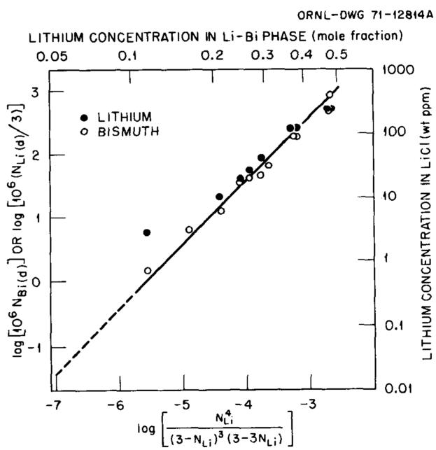  
Fig. 17.1. Equilibrium distribution of lithium and bismuth between liquid lithium-bismuth alloys and molten LiCl at $650^{\circ}\mathrm{C}$ .

Eq. (7) yields:

$$
\begin{array}{l} \log N _ {\mathrm {B i} (\mathbf {d})} = \log \left[ N _ {\mathrm {L i} (\mathbf {d})} / 3 \right] \\ = \log \left[ \frac {N _ {\mathrm {L i}} ^ {4}}{(3 - N _ {\mathrm {L i}}) ^ {3} (3 - 3 N _ {\mathrm {L i}})} \right] \\ + 0. 7 2 5 6 - 1 0 8 6 / T \left(^ {\circ} K\right). \tag {8} \\ \end{array}
$$

The estimated uncertainty in $\log N_{\mathrm{Bi(d)}}$ is $\pm 0.05$ . Equation (8) correlates the data obtained for the equilibrium distribution of lithium and bismuth between liquid lithium-bismuth alloys and molten LiCl in the temperature range 650 to $800^{\circ}\mathrm{C}$ .

# 17.2 SOLUBILITY OF EUROPIUM IN LIQUID BISMUTH

# F.J.Smith C.T.Thompson

No measurements of the solubility of europium in liquid bismuth have been reported in the literature. We made measurements of this type over the temperature range 325 to $550^{\circ}\mathrm{C}$ and obtained results that can be expressed as $\log S_{\mathbf{Eu}}(\mathrm{wt}\%) = 4.4823 - 2973 / T(^{\circ}\mathrm{K})$ . These solubilities are considerably higher than those reported for the other lanthanides over the same temperature range. Interestingly, the heats of solution of all the lanthanides in liquid bismuth appear to be about the same.

In our previous studies, we found evidence for the mutual interaction, in liquid bismuth solution, of thorium with the trivalent lanthanides neodymium and lanthanum. Under appropriate conditions, compounds of the apparent composition ThLnBi $_y$ were formed. In recent work, we found that thorium and europium also interact in bismuth solution to form a thorium- and europium-containing solid. However, the mutual solubilities of thorium and europium in liquid bismuth are more than adequate to satisfy metal transfer process conditions.

# 17.3 INTEGRAL HEATS OF LITHIUM-BISMUTH SOLUTIONS

L.M.Ferris

At various points in the fluorination--reductive-extraction-metal transfer flowsheet1,2 for processing MSBR fuel salt, either lithium is added to a bismuth stream or lithium-bismuth solutions having different lithium concentrations are mixed. Also, in an actual plant, mixing of lithium-bismuth solutions will occur in dump tanks that will be provided for collecting various

lithium-bismuth solutions in the event of an emergency or scheduled shutdown. Knowledge of the integral heats of solution allows estimation of the heats of the various reactions involved.

We used the emf data of Foster, Wood, and Crouthamel to calculate partial molar enthalpies for lithium in lithium-bismuth solutions. Their data for solutions containing up to about 55 at.% lithium are presented as:

$$
\begin{array}{l} R T \ln \gamma_ {\mathrm {L i}} = [ 9 3 9 7 + 1 8. 1 6 T - 0. 0 1 0 9 T ^ {2} ] \\ - \left[ 7 1 0 3 - 1 9. 4 4 T + 0. 0 0 6 8 T ^ {2} \right] N _ {\mathrm {L i}} \tag {9} \\ \end{array}
$$

over the temperature range of about 600 to $800^{\circ}\mathrm{C}$ . This equation, when used in conjunction with

$$
\ln a _ {\mathrm {L} \mathrm {i}} = \ln N _ {\mathrm {L} \mathrm {i}} + \ln \gamma_ {\mathrm {L} \mathrm {i}} \tag {10}
$$

and

$$
\Delta \bar {H} _ {\mathrm {L i}} = - R T ^ {2} \left(\frac {\partial \ln a _ {\mathrm {L i}}}{\partial T}\right) _ {N _ {\mathrm {L i}}}, \tag {11}
$$

yields the following expression for the partial molar enthalpies of lithium in lithium-bismuth solutions at $650^{\circ}\mathrm{C}$ :

$$
\Delta \bar {H} (\text {c a l / m o l e}) = - 1 8, 6 8 3 - 1 3 1 0 N _ {\mathrm {L i}}. \tag {12}
$$

Here, $N_{\mathrm{Li}}$ is the mole fraction of lithium in the lithium-bismuth solution. Integral heats of solution were obtained using the following form of the Gibbs-Duhem equation:

$$
\Delta H ^ {f} _ {\text {s o l n}} = N _ {\mathrm {B i}} \int_ {0} ^ {N _ {\mathrm {L i}}} \left(\Delta \bar {H} _ {\mathrm {L i}} / N _ {\mathrm {B i}} ^ {2}\right) d N _ {\mathrm {L i}}. \tag {13}
$$

Substitution of Eq. (12) into Eq. (13) yields an equation of the form

$$
\Delta H _ {\text {s o l n}} ^ {f} = (1 - x) \int_ {x = 0} ^ {x = N _ {\mathrm {L i}}} \frac {(a + b x) d x}{(1 - x) ^ {2}}, \tag {14}
$$

which, on integration, gives:

$$
\Delta H ^ {f} _ {\text {s o l n}} = (a + b) N _ {L i} + b \left(1 - N _ {L i}\right) \ln \left(1 - N _ {L i}\right). \tag {15}
$$

Using the values of $a$ and $b$ from Eq. (12), we obtain the following expression for the integral heats of formation of lithium-bismuth solutions at $650^{\circ}\mathrm{C}$ :

$$
\begin{array}{l} \Delta H _ {\mathrm {s o l n}} ^ {f} (\mathrm {k c a l / g - a t o m s o l n}) = - 1 9. 9 9 3 N _ {\mathrm {L i}} \\ - \left[ 3. 0 1 7 \left(1 - N _ {\mathrm {L} \mathrm {i}}\right) \log \left(1 - N _ {\mathrm {L} \mathrm {i}}\right) \right]. \tag {16} \\ \end{array}
$$

To a first approximation, the integral heats of solution can be expressed as

$$
\Delta H ^ {f} _ {\text {s o l n}} (\mathrm {k c a l / g - a t o m s o l n}) = - 1 9. 1 N _ {\mathrm {L i}}. \tag {17}
$$

It is readily deduced from Eq. (16) or Eq. (17) that the formation of a lithium-bismuth solution of high lithium concentration is a strongly exothermic reaction. For example, the formation of 1 g-atom (about $100\mathrm{g}$ ) of lithium-bismuth (50-50 at. $\%$ ) from the elements results in a heat release of about 10 kcal. The calculated heats of mixing or dilution of lithium-bismuth solutions based on Eq. (16) are quite small and are endothermic.

# 17.4 PROTACTINIUM OXIDE PRECIPITATION STUDIES

# O.K.Tallent L.M.Ferris

Studies in support of the development of oxide precipitation processes for isolating protactinium and uranium from MSBR fuel salt have been continued. We are investigating a process in which salt from the reactor would be treated with the appropriate HF- $\mathrm{H}_2\mathrm{O - Ar}$ gas mixture to convert practically all of the protactinium to $\mathbf{Pa}^{5 + }$ and to precipitate a large fraction of the protactinium as $\mathrm{Pa}_{2}\mathrm{O}_{5}$ without precipitating uranium oxide.

Protactinium has been systematically precipitated from molten $\mathrm{LiF - BeF_2 - ThF_4 - UF_4}$ solutions at 600 and at $650^{\circ}C$ by equilibrating the salt with various HF- $\mathbf{H}_2\mathbf{O}$ Ar gas mixtures; previously described equipment and experimental procedures were used. The data obtained were considered in terms of the equilibrium

$$
\mathrm {P a F} _ {5} (\mathrm {d}) + \frac {5}{2} \mathrm {H} _ {2} \mathrm {O} (\mathrm {g}) = \frac {1}{2} \mathrm {P a} _ {2} \mathrm {O} _ {5} (\mathrm {s}) + 5 \mathrm {H F} (\mathrm {g}), \tag {18}
$$

for which the equilibrium quotient at a given temperature can be written as

$$
Q _ {1} = \frac {p _ {\mathrm {H F}} {} ^ {5}}{p _ {\mathrm {H} _ {2} \mathrm {O}} {} ^ {5 / 2} N _ {\mathrm {P a F} _ {5}}} \tag {19}
$$

In the above expressions, d, g, s, $N$ , and $\pmb{p}$ denote dissolved species, gas, solid, mole fraction, and partial pressure respectively. If the ratio $p_{\mathrm{H_2O}} / p_{\mathrm{HF}}$ is fixed at some value $A$ , Eq. (19) can be written, in logarithmic form, as

$$
\log N _ {\mathrm {P a F} \xi} = 2. 5 \log \left(p _ {\mathrm {H F}} / A\right) - \log Q _ {1}. \tag {20}
$$

At each temperature, log-log plots of protactinium concentration in the salt vs $p_{\mathrm{HF}} / A$ should be linear with a slope of 2.5.

In a previous report we presented data (from experiments I and II) obtained at $600^{\circ}\mathrm{C}$ with salt containing 0.08 and 0.25 mole $\%$ $\mathrm{UF_4}$ respectively. These data obeyed the relationship represented by Eq. (20). However, the protactinium concentrations as determined by gamma spectrometry were usually higher than the protactinium concentrations determined by the alpha-pulse-height method. In examining the gamma-spectrometric method, we found that $^{212}\mathrm{Pb}$ was contributing to the apparent $^{233}\mathrm{Pa}$ count rate. After correcting for the contribution of the $^{212}\mathrm{Pb}$ , we obtained excellent agreement between the gamma-spectrometric and the alpha-pulse-height analyses.

Recently, we completed two more experiments (experiments III and IV) using salt in which the uranium concentration was $2 \pm 0.2 \mathrm{mg/g}$ (about $0.05 \mathrm{~mol} \%$ ). Data from these experiments, which were conducted at 600 and $650^{\circ} \mathrm{C}$ , respectively, are incorporated in Table 17.1 with corrected data from our earlier experiments. The protactinium concentrations listed were determined by gamma spectrometry. Log-log plots of the equilibrium protactinium concentrations in the salt vs $p_{\mathbf{H F}} / A$ gave lines of slope 2.5 at each temperature (Fig. 17.2). This behavior supports the assumption that essentially pure $\mathrm{Pa}_{2} \mathrm{O}_{5}$ is the solid phase at equilibrium. From these plots we get $Q_{1}$ values of $3.9 \pm 0.5$ at $600^{\circ} \mathrm{C}$ and $21 \pm 4$ at $650^{\circ} \mathrm{C}$ .

In each experiment, the salt samples were also analyzed for uranium. The general behavior of uranium at $600^{\circ}\mathrm{C}$ is illustrated in the upper part of Fig. 17.3. As seen, the uranium concentration in the salt remained constant, within analytical error, at its initial value while the protactinium concentration decreased with decreasing $p_{\mathrm{HF}} / A$ as the result of the precipitation of

Table 17.1. Equilibrium protactinium concentrations obtained by sparging LiF-BeF $_2$ -ThF $_4$ -UF $_4$ solutions with HF- $\mathsf{H}_2\mathsf{O}$ -Ar gas mixtures under various conditions Composition of carrier salt: LiF-BeF $_2$ -ThF $_4$ (72-16-12 mole %)   

<table><tr><td rowspan="2">Sample</td><td rowspan="2">Experiment</td><td rowspan="2">Temperature (°C)</td><td rowspan="2">A</td><td rowspan="2">pHF/A (atm)</td><td colspan="2">Concentration in salt</td></tr><tr><td>U (mg/g)</td><td>Pa (wt ppm)</td></tr><tr><td>1</td><td>I</td><td>600</td><td>3</td><td>0.0103</td><td>2.41</td><td>9.4</td></tr><tr><td>2</td><td>III</td><td>600</td><td>3</td><td>0.0104</td><td>a</td><td>8.1</td></tr><tr><td>3</td><td>III</td><td>600</td><td>3</td><td>0.0111</td><td>1.92</td><td>20.2</td></tr><tr><td>4</td><td>I</td><td>600</td><td>3</td><td>0.0133</td><td>2.92</td><td>13.2</td></tr><tr><td>5</td><td>I</td><td>600</td><td>3</td><td>0.0140</td><td>2.59</td><td>28.1</td></tr><tr><td>6</td><td>I</td><td>600</td><td>3</td><td>0.0143</td><td>a</td><td>18.3</td></tr><tr><td>7</td><td>I</td><td>600</td><td>3</td><td>0.0143</td><td>a</td><td>28.1</td></tr><tr><td>8</td><td>I</td><td>600</td><td>3</td><td>0.0167</td><td>a</td><td>37.4</td></tr><tr><td>9</td><td>I</td><td>600</td><td>3</td><td>0.0173</td><td>2.62</td><td>32.0</td></tr><tr><td>10</td><td>I</td><td>600</td><td>3</td><td>0.0173</td><td>2.63</td><td>28.0</td></tr><tr><td>11</td><td>II</td><td>600</td><td>3</td><td>0.0196</td><td>9.07</td><td>37.5</td></tr><tr><td>12</td><td>III</td><td>600</td><td>3</td><td>0.0206</td><td>1.83</td><td>54.9</td></tr><tr><td>13</td><td>III</td><td>600</td><td>3</td><td>0.0206</td><td>2.08</td><td>47.5</td></tr><tr><td>14</td><td>III</td><td>600</td><td>3</td><td>0.0206</td><td>1.74</td><td>45.1</td></tr><tr><td>15</td><td>I</td><td>600</td><td>3</td><td>0.0210</td><td>3.34</td><td>63.0</td></tr><tr><td>16</td><td>III</td><td>600</td><td>3</td><td>0.0211</td><td>2.06</td><td>47.7</td></tr><tr><td>17</td><td>I</td><td>600</td><td>3</td><td>0.0217</td><td>3.32</td><td>55.6</td></tr><tr><td>18</td><td>II</td><td>600</td><td>3</td><td>0.0220</td><td>9.22</td><td>66.1</td></tr><tr><td>19</td><td>III</td><td>600</td><td>3</td><td>0.0221</td><td>2.16</td><td>54.5</td></tr><tr><td>20</td><td>I</td><td>600</td><td>3</td><td>0.0233</td><td>2.82</td><td>58.0</td></tr><tr><td>21</td><td>III</td><td>600</td><td>3</td><td>0.0237</td><td>2.06</td><td>76.5</td></tr><tr><td>22</td><td>II</td><td>600</td><td>3</td><td>0.0240</td><td>9.31</td><td>84.0</td></tr><tr><td>23</td><td>IV</td><td>650</td><td>1.1</td><td>0.0200</td><td>a</td><td>13.0</td></tr><tr><td>24</td><td>IV</td><td>650</td><td>1.1</td><td>0.0262</td><td>a</td><td>16.7</td></tr><tr><td>25</td><td>IV</td><td>650</td><td>1.1</td><td>0.0342</td><td>2.29</td><td>29.6</td></tr><tr><td>26</td><td>IV</td><td>650</td><td>1.1</td><td>0.0355</td><td>1.80</td><td>38.4</td></tr><tr><td>27</td><td>IV</td><td>650</td><td>1.1</td><td>0.0427</td><td>2.19</td><td>66.8</td></tr><tr><td>28</td><td>IV</td><td>650</td><td>1.1</td><td>0.0444</td><td>2.48</td><td>78.9</td></tr></table>

${}^{a}$ Sample not analyzed for uranium.

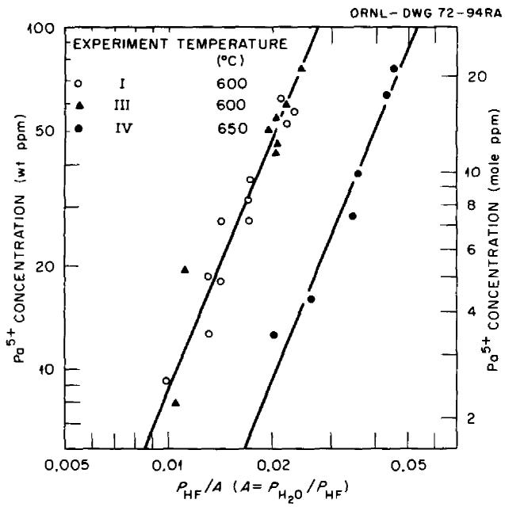  
Fig. 17.2. Precipitation of protactinium from $\mathrm{LiF - BeF_2}$ ThF4-UF4 (71.9-16-12-0.05 mole %) according to the reaction $\mathrm{PaF}_5(\mathbf{d}) + \frac{5}{2}\mathrm{H}_2\mathrm{O}(\mathbf{g}) = \frac{1}{2}\mathrm{Pa}_2\mathrm{O}_5(\mathbf{s}) + 5\mathrm{HF}(\mathbf{g}).$

$\mathrm{Pa}_2\mathrm{O}_5$ . The protactinium concentrations shown in the lower part of Fig. 17.3 were calculated using $Q_{1} = 3.9$ at $600^{\circ}\mathrm{C}$ . As the value of $p_{\mathbf{H}\mathbf{F}} / A$ was decreased, a point was finally reached where the uranium concentration in the salt also began to decrease. This point was dependent on the uranium concentration in the salt. We interpret this behavior to mean that, at this point, the salt became saturated with both $\mathrm{Pa}_2\mathrm{O}_5$ and a $\mathrm{UO}_2$ - $\mathrm{ThO}_2$ solid solution. Thus, we were able to estimate values for the equilibrium quotient for the reaction

$$
\frac {1}{2} \mathrm {P a} _ {2} \mathrm {O} _ {5} (\mathrm {s}) + \frac {5}{4} \mathrm {U F} _ {4} (\mathrm {d}) = \mathrm {P a F} _ {5} (\mathrm {d}) + \frac {5}{4} \mathrm {U O} _ {2} (\mathrm {s s}), \tag {21}
$$

for which

$$
Q _ {2} = \frac {N _ {\mathrm {P a F} _ {5}} N _ {\mathrm {U O} _ {2}} ^ {5 / 4}}{N _ {\mathrm {U F} _ {4}} ^ {5 / 4}}. \tag {22}
$$

The mole fraction of $\mathrm{UO}_2$ in the $\mathrm{UO}_2$ - $\mathrm{ThO}_2$ solid solution, $N_{\mathrm{UO}_2}(\mathrm{ss})$ , was calculated from the reported

uranium concentration in the salt and the equilibrium quotient for the reaction

$$
\mathrm {T h F} _ {4} (\mathrm {d}) + \mathrm {U O} _ {2} (\mathrm {s s}) = \mathrm {U F} _ {4} (\mathrm {d}) + \mathrm {T h O} _ {2} (\mathrm {s s}) \tag {23}
$$

reported by Bamberger and Baes. Our estimated values of $Q_{2}$ are given in Fig. 17.4, where they are compared with the values reported by Ross, Bamberger, and Baes. The agreement is quite good, considering the uncertainties involved in the methods utilized. If anything, we would expect our values of $Q_{2}$ to be high, since we used the highest values of $N_{\mathbf{PaF}_5}$ and $N_{\mathbf{UF_4}}$ indicated by our data.

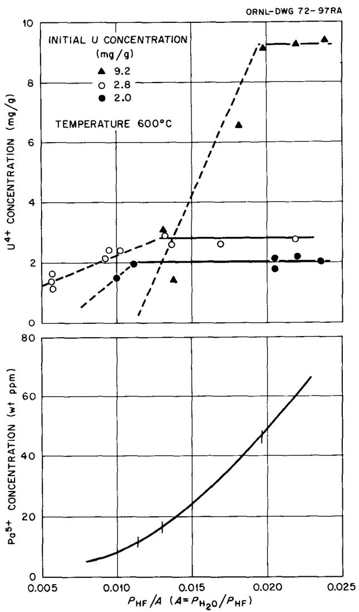  
Fig. 17.3. Estimation of points at which both $\mathrm{Pa}_2\mathrm{O}_5$ and $\mathrm{UO}_2\text{-ThO}_2(\mathrm{ss})$ precipitate from LiF-BeF $_2$ -ThF $_4$ (72-16-12 mole %) at $600^{\circ}\mathrm{C}$ .

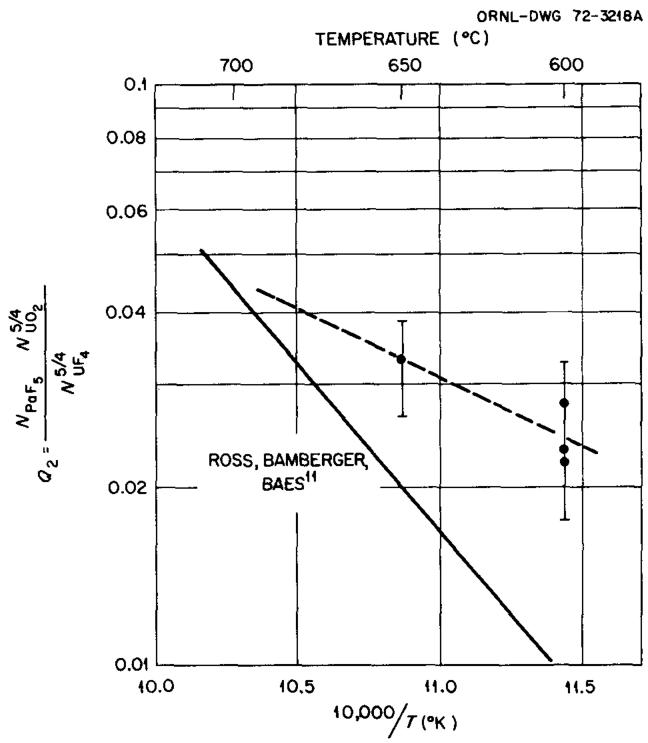  
Fig. 17.4. Estimated equilibrium quotients for the reaction $\frac{1}{2}\mathrm{Pa}_{2}\mathrm{O}_{5}(\mathrm{s}) + \frac{5}{4}\mathrm{UF}_{4}(\mathrm{d}) = \mathrm{PaF}_{5}(\mathrm{d}) + \frac{5}{4}\mathrm{UO}_{2}(\mathrm{ss})$ .

The above data strongly indicate that it will be impossible to precipitate a large fraction of the protactinium without precipitating some $\mathrm{UO}_2$ if the initial protactinium concentration is 100 wt ppm (the protactinium concentration in an MSBR from which protactinium is removed on a five-day cycle). As a consequence, flowsheet variations involving coprecipitation of protactinium and uranium will receive further evaluation.

# 17.5 CHEMISTRY OF FUEL RECONSTITUTION

M.R.Bennett L.M.Ferris

In the current flowsheet $^{1,2}$ for the processing of MSBR fuel, the fuel reconstitution method involves, first, absorbing the $\mathrm{UF_6}$ evolved in the fluorination step in salt containing dissolved $\mathrm{UF_4}$ and, then, reducing the resultant higher-valent uranium species to $\mathrm{UF_4}$ with

gaseous hydrogen. The expected sequence of reaction is:

$$
\mathrm {U F} _ {6} (\mathrm {g}) + \mathrm {U F} _ {4} (\mathrm {d}) = 2 \mathrm {U F} _ {5} (\mathrm {d}), \tag {24}
$$

$$
2 \mathrm {U F} _ {5} (\mathrm {d}) + \mathrm {H} _ {2} (\mathrm {g}) = 2 \mathrm {U F} _ {4} (\mathrm {d}) + 2 \mathrm {H F} (\mathrm {g}). \tag {25}
$$

Studies of the chemistry involving the fuel reconstitution step, initiated prior to the last reporting period, $^{1,2}$ have continued.

Originally, $^{12}$ scouting experiments were conducted primarily to find a container that was inert to $\mathrm{UF}_5$ dissolved in molten fluoride salts. In these experiments, it appeared that both gold and type ATJ graphite were stable at $600^{\circ}\mathrm{C}$ to $\mathrm{LiF - BeF_2 - ThF_4}$ (72-16-12 mole %) that contained 6 to 12 wt % uranium as $\mathrm{UF}_5$ . The results of more recent experiments show that, under most conditions, graphite is not suitable for the containment of salts containing dissolved $\mathrm{UF}_5$ . In two of these experiments, sufficient $\mathrm{UF}_6$ was added to $\mathrm{LiF - BeF_2 - ThF_4}$ (72-16-12 mole %) containing dissolved $\mathrm{UF}_4$ to produce solutions in which the $\mathrm{UF}_5$ concentrations were about 2 and 4 wt % respectively. Analyses of salt samples taken at various times after the addition of $\mathrm{UF}_6$ to the system showed that the total uranium concentration in the salt remained constant but that the $\mathrm{UF}_5$ concentration decreased with time according to second-order kinetics. As the $\mathrm{UF}_5$ concentration decreased, a corresponding increase in the pressure of the system occurred. Mass-spectrographic analyses of samples of the gas showed that they contained significant amounts of $\mathrm{CF_4}$ and $\mathbf{C}_2\mathbf{F}_6$ , in the ratio of about 6:1. These results indicated that $\mathrm{UF}_5$ was disproportionating to $\mathrm{UF}_4$ and $\mathrm{UF}_6$ . Since the total uranium concentration in the salt remained constant, we postulate that the $\mathrm{UF}_6$ produced by disproportionation of $\mathrm{UF}_5$ reacted with graphite to yield dissolved $\mathrm{UF}_4$ and gaseous fluorocarbons. The apparent stability of graphite to salt containing $\mathrm{UF}_5$ noted in our earlier tests $^{12}$ may be related to the very high $\mathrm{UF}_5$ concentrations in the salt in those tests, as discussed later.

Our most recent series of experiments was conducted using the same type of apparatus and procedure as described previously; however, most portions of the system that were exposed to salt or gaseous $\mathrm{UF_6}$ (the crucible, sparge tube, thermowell, and sampler) were fabricated of gold. In the first experiment in this series (experiment 15-UR), $200\mathrm{g}$ of $\mathrm{LiF - BeF_2 - ThF_4}$ (72-16-12 mole %) containing 1.13 wt % uranium as $\mathrm{UF_4}$ was

first sparged for $48\mathrm{hr}$ at $600^{\circ}\mathrm{C}$ with $\mathrm{HF - H_2}$ (50-50 mole $\%$ ). Then, sufficient $\mathrm{UF}_6$ was bubbled into the salt at $600^{\circ}\mathrm{C}$ to convert 75 to $80\%$ of the uranium to $\mathrm{UF}_5$ . The system was subsequently left under a slight argon pressure, and samples of the salt were removed periodically. Analyses of these samples showed that both the $\mathrm{U}^{5 + }$ and the total uranium concentrations in the salt decreased with time (see Table 17.2), presumably due to the disproportionation of dissolved $\mathrm{UF}_5$ [the reverse

Table 17.2. Data obtained in studies of the reaction of gaseous $\mathbf{U}\mathbf{F}_6$ with $\mathbf{U}\mathbf{F}_4$ dissolved in LiF-BeF $_2$ -ThF $_4$ (72-16-12 mole %) at $600^{\circ}\mathrm{C}$   

<table><tr><td rowspan="2">Experiment</td><td rowspan="2">Sample</td><td rowspan="2">Time (hr)</td><td colspan="2">Concentration in salt</td><td rowspan="2">Percent of uranium as U5+</td></tr><tr><td>Total U (wt %)</td><td>U5+ (wt %)</td></tr><tr><td rowspan="10">15-UR</td><td>0a</td><td>0</td><td>1.13</td><td>0</td><td>0</td></tr><tr><td>1b</td><td>0</td><td>2.01</td><td>1.54</td><td>76.6</td></tr><tr><td>2</td><td>1</td><td>2.03</td><td>1.60</td><td>78.8</td></tr><tr><td>3</td><td>3</td><td>1.99</td><td>1.58</td><td>79.4</td></tr><tr><td>4</td><td>6</td><td>1.90</td><td>1.46</td><td>76.8</td></tr><tr><td>5</td><td>24</td><td>1.88</td><td>1.08</td><td>57.4</td></tr><tr><td>6</td><td>72</td><td>1.75</td><td>0.90</td><td>51.4</td></tr><tr><td>7</td><td>120</td><td>1.67</td><td>0.78</td><td>46.7</td></tr><tr><td>8</td><td>168</td><td>1.59</td><td>0.64</td><td>40.2</td></tr><tr><td>9</td><td>192</td><td>1.48</td><td>0.58</td><td>39.2</td></tr><tr><td rowspan="6">16-UR</td><td>0a</td><td>0</td><td>1.69</td><td>0</td><td>0</td></tr><tr><td>1b</td><td>0</td><td>3.12</td><td>2.68</td><td>85.9</td></tr><tr><td>2</td><td>24</td><td>3.11</td><td>2.68</td><td>86.2</td></tr><tr><td>4</td><td>96</td><td>3.17</td><td>2.24</td><td>70.7</td></tr><tr><td>5</td><td>120</td><td>2.56</td><td>2.04</td><td>79.7</td></tr><tr><td>6</td><td>168</td><td>2.48</td><td>1.94</td><td>78.2</td></tr><tr><td rowspan="17">17-UR</td><td>0a</td><td>0</td><td>2.57</td><td>0</td><td>0</td></tr><tr><td>1b</td><td>0</td><td>5.11</td><td>4.52</td><td>88.4</td></tr><tr><td>3b</td><td>0</td><td>5.08</td><td>4.56</td><td>89.8</td></tr><tr><td>4b</td><td>0</td><td>4.93</td><td>4.46</td><td>90.5</td></tr><tr><td>5b</td><td>0</td><td>5.00</td><td>4.46</td><td>89.2</td></tr><tr><td>6b</td><td>0</td><td>4.89</td><td>4.68</td><td>95.7</td></tr><tr><td>7c</td><td>0</td><td>5.12</td><td>4.70</td><td>91.8</td></tr><tr><td>8c</td><td>0</td><td>5.04</td><td>4.72</td><td>93.6</td></tr><tr><td>9c</td><td>0</td><td>5.30</td><td>4.92</td><td>92.8</td></tr><tr><td>10c</td><td>0</td><td>4.98</td><td>4.72</td><td>94.8</td></tr><tr><td>11c</td><td>0</td><td>5.36</td><td>4.88</td><td>91.0</td></tr><tr><td>12c</td><td>0</td><td>5.07</td><td>4.60</td><td>90.7</td></tr><tr><td>13</td><td>24</td><td>4.75</td><td>4.20</td><td>88.4</td></tr><tr><td>14</td><td>96</td><td>4.31</td><td>3.76</td><td>87.2</td></tr><tr><td>15</td><td>120</td><td>4.28</td><td>3.74</td><td>87.4</td></tr><tr><td>16</td><td>144</td><td>4.07</td><td>3.54</td><td>87.0</td></tr><tr><td>17</td><td>168</td><td>3.97</td><td>3.34</td><td>84.1</td></tr></table>

of reaction (24)]. The disproportionation appeared to be second order with respect to $\mathrm{UF}_5$ concentration, as evidenced by the linearity of a plot of the reciprocal of the $\mathrm{UF}_5$ concentration vs time (Fig. 17.5) and the fact that the net decrease in $\mathrm{UF}_5$ concentration was about twice that of the total uranium concentration (Table 17.2).

Salt samples from experiment 15-UR were also analyzed for gold. Each analysis showed that the gold concentration in the salt was less than 200 wt ppm and that corrosion, if it occurred, essentially all took place during the 48-hr hydrofluorination period. No further increase in gold concentration was detected either after the $\mathrm{UF}_6$ was introduced into the melt or during the subsequent eight-day period in which $\mathrm{UF}_5$ was present in the salt. These results confirm our earlier indications12 that gold is suitable as a container for molten fluoride salts containing dissolved $\mathrm{UF}_5$ .

In experiment 16-UR, $\mathrm{UF}_6$ was added to salt containing $1.69\mathrm{wt}\%$ uranium as $\mathrm{UF}_4$ to produce a salt in which the total uranium concentration was $3.1\mathrm{wt}\%$ ; analyses (Table 17.2) showed that $86\%$ of the uranium was present as $\mathrm{U}^{5+}$ after addition of the $\mathrm{UF}_6$ . As in other experiments, the $\mathrm{UF}_6$ was absorbed very rapidly by the salt. The color of a quenched sample of the original salt that contained uranium only as $\mathrm{UF}_4$ was light green, but the color of a similar sample taken immediately after addition of $\mathrm{UF}_6$ was almost white. As seen in Table 17.2 and Fig. 17.5, both the total uranium and the $\mathrm{U}^{5+}$ concentrations decreased very slowly with time and did not follow second-order kinetics. These results suggest that some $\mathrm{UF}_6$ was present in the vapor phase and, therefore, that the system was close to steady-state conditions.

Results obtained in experiment 17-UR were similar to those of experiment 16-UR. In the first part of this experiment, we attempted to add to $\mathrm{LiF - BeF_2 - ThF_4}$ (72-16-12 mole $\%$ ) containing 2.57 wt $\%$ uranium as $\mathrm{UF_4}$ the amount of $\mathrm{UF_6}$ required to convert all the uranium to $\mathrm{UF_5}$ . The average of the analyses of six samples taken immediately after addition of the $\mathrm{UF_6}$ showed that about $91\%$ of the uranium was present as $\mathrm{UF_5}$ (Table 17.2). As before, the color of the salt after the addition of $\mathrm{UF_6}$ was nearly white. After these samples had been removed, $\mathrm{UF_6}$ was bubbled through the salt until its sorption on an NaF trap in the exit line was detected. Six samples of the salt were removed immediately after this treatment. Analyses of these samples showed that both the total uranium and the $\mathrm{UF_5}$ concentrations in the salt had not changed significantly. Quenched samples of the salt after this treatment were practically snow-white. The system was

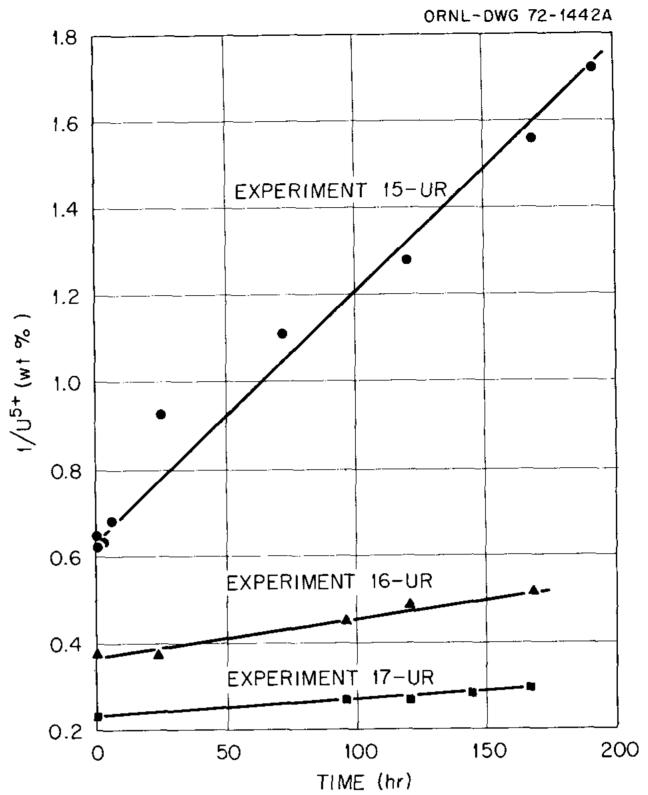  
Fig. 17.5. Variation of the $\mathbf{U}^{5+}$ concentration in $\mathrm{LiF}_2\mathrm{BeF}_2$ -ThF4 (72-16-12 mole %) with time at $600^{\circ}\mathrm{C}$ , starting with different UF5 concentrations. Data from experiment 15-UR obey a second-order rate expression.

left at $600^{\circ}\mathrm{C}$ , and the samples of the salt were withdrawn periodically. As found in experiment 16-UR, both the total uranium and the $\mathbf{U}^{5+}$ concentrations decreased only very slowly (Table 17.2, Fig. 17.5), suggesting that the system was nearly at steady state.

We conclude from the above series of experiments that gold is inert at $600^{\circ}\mathrm{C}$ both to gaseous $\mathrm{UF_6}$ and to $\mathrm{UF_5}$ (in concentrations up to at least 5 wt $\%$ ) dissolved in LiF-BeF $_2$ -ThF $_4$ (72-16-12 mole $\%$ ). The results obtained also show that $\mathrm{UF_6}$ , when added to salt containing dissolved $\mathrm{UF_4}$ , reacts very rapidly with the $\mathrm{UF_4}$ to form $\mathrm{UF_5}$ according to reaction (24). When excess $\mathrm{UF_6}$ was bubbled through the salt in experiment 17-UR, the oxidation state of the uranium that was dissolved in the resultant salt did not exceed $5+$ , suggesting that the solubility of $\mathrm{UF_6}$ in the salt is low at $600^{\circ}\mathrm{C}$ . In experiment 15-UR, in which the $\mathrm{U}^{5+}$ concentration in the salt was 1.6 wt $\%$ or lower, $\mathrm{UF_5}$ disproportionated by a second-order process. However, the results obtained in experiments 16-UR and 17-UR, in which the $\mathrm{U}^{5+}$ concentrations were initially greater than 2.5 wt $\%$ , suggest that sufficient $\mathrm{UF_6}$ was present in the vapor phase to retard the disproportionation of

$\mathrm{UF}_{5}$ . It is probable that no detectable disproportionation would have occurred in these experiments if the entire system had been constructed of gold. We speculate that near-equilibrium conditions were established initially but that gaseous $\mathrm{UF}_{6}$ was slowly consumed by reaction with the nickel containment vessel. This effect would be less apparent with high concentrations of $\mathrm{UF}_{5}$ and, undoubtedly, was responsi

ble for our earlier indications $^{12}$ that graphite was stable in salts containing 6 to 12 wt $\%$ UF $_5$ .

Preliminary experiments relative to the reduction of dissolved $\mathrm{UF}_5$ with gaseous hydrogen have been conducted. No quantitative results are available. It appears, however, that $\mathrm{UF}_5$ is easily reduced by hydrogen but the hydrogen utilization (in our apparatus, at least) is quite low.

# 18. Engineering Development of Processing Operations

L. E. McNeese

Studies related to the development of a number of processing operations were continued during this report period. Additional information on the behavior of lithium during metal transfer experiment MTE-2 was obtained. The results are consistent with a recently developed correlation of data concerning the distribution of lithium and bismuth between LiCl and lithium-bismuth solutions. Operation of experiment MTE-2B was continued in order to further study the transfer of lithium from lithium-bismuth solutions containing lithium at concentrations of 3.7 to 16 at. $\%$ Installation of equipment for the third engineering experiment for development of the metal transfer process (MTE-3) has been completed. The equipment has been leak tested and treated with hydrogen for the removal of oxides, and the salt and bismuth phases for the experiment are now being purified and transferred to the system. Design for a facility that will be used for the fourth engineering experiment on the metal transfer process (MTE-4) has been initiated. The experiment will use salt flow rates that are 5 to $10\%$ of those that will be required for processing a 1000-MW(e) MSBR. Overall mass transfer coefficients were obtained with a water-mercury system in a stirred interface contactor of the type being used for developing the metal transfer process. The experimentally determined mass transfer coefficients are quite close to those predicted by extrapolation of a literature correlation that is based on data from organic-solvent-water systems. Experiments were continued in which the rates of transfer of $^{97}\mathrm{Zr}$ and $^{237}\mathrm{U}$ from molten salt to bismuth were measured during the countercurrent contact of salt with bismuth in a packed column. Design and development work were initiated for the reductive-extraction process facility which will allow testing and development of all steps of the reductive-extraction process for isolation of protactinium with salt flow rates as high as $25\%$ of those required for processing a 1000-MW(e) MSBR. Studies of methods for generating heat in molten salt

were continued in order that nonradioactive tests of a frozen-wall fluorinator could be carried out. Tests were made using both induction and autoresistance heating. We have continued to operate a small-scale engineering facility in order to investigate the precipitation of $\mathrm{UO}_2\text{-}\mathrm{ThO}_2$ solid solutions from molten fluoride mixtures by contacting the salt with mixtures of argon and water. Designs of the components for the processing materials test stand and of the molybdenum reductive extraction equipment were continued, and fabrication of some of the structural parts of the test stand was started. An eddy-current-type bismuth-salt interface detector was tested at temperatures in the range of 550 to $700^{\circ}\mathrm{C}$ , and the probe appears to be a sensitive and practical indicator for determining the bismuth level or for locating the salt-bismuth interface.

# 18.1 LITHIUM TRANSFER DURING METAL TRANSFER EXPERIMENT MTE-2

E. L. Youngblood L. E. McNeese

During metal transfer experiment MTE-2, the lithium concentration in the lithium-bismuth phase that was used to extract rare earths from the LiCl decreased from an initial value of 0.35 mole fraction to 0.18 mole fraction after 570 liters of LiCl had been contacted with the lithium-bismuth solution. Only a small fraction of this decrease can be accounted for by the reaction of rare earths with lithium. The major portion of the decrease is believed to be associated with the circulation of LiCl, since little or no decrease occurred during periods of noncirculation. Previously, the rate of decrease of the lithium concentration in the lithium-bismuth solution in experiment MTE-2 was compared with information that was calculated using equilibrium

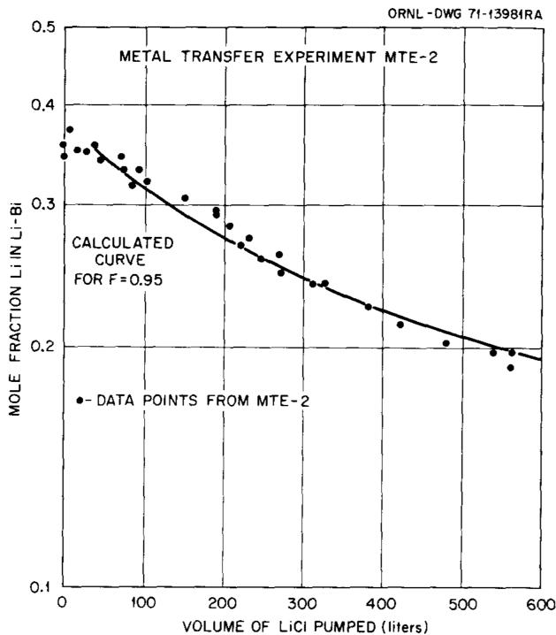  
Fig. 18.1. Lithium concentration in the lithium-bismuth solution.

data available at that time. The experimental and calculated values were in good agreement. Since that time, additional data have been obtained, and a theoretical correlation has been developed (see Sec+ 17.1) for the concentration of metallic lithium and bismuth in LiCl that is in equilibrium with lithium-bismuth solutions. The variation of the lithium concentration in the lithium-bismuth solution during experiment MTE-2 has been recalculated using the latter correlation for determining the concentration of lithium in the LiCl after contact with the lithium-bismuth solution. A comparison of the experimental values with calculated values is shown in Fig. 18.1. The best agreement between the calculated and measured values was obtained by assuming that the concentration of lithium in the LiCl after contact with the lithium-bismuth solution was $95\%$ of the equilibrium value. The calculated values based on the new correlation are in better agreement with the data from experiment MTE-2 than are the calculated values based on the earlier equilibrium data.

# 18.2 OPERATION OF METAL TRANSFER EXPERIMENT MTE-2B

E. L. Youngblood L. E. McNeese

We are continuing to operate metal transfer experiment MTE-2B (which was described previously) to measure the rate at which metallic lithium is transferred by circulation of LiCl between alithium-bismuth solution (containing from 3.7 to 16 at. $\%$ lithium) and a thorium-bismuth solution (initially containing about 0.02 mole $\%$ thorium and 0.2 mole $\%$ lithium). Lithium-bismuth solutions containing 5 to 50 at. $\%$ lithium are used for removing rare earths from LiCl in the metal transfer process. The concentrations of metallic lithium and bismuth in LiCl that is in equilibrium with lithium-bismuth solutions containing from about 10 to 50 at. $\%$ lithium have been determined in laboratory studies. However, because of the low concentration $(< 1\mathrm{ppm})$ of metallic lithium in LiCl that is in equilibrium with lithium-bismuth solutions containing less than 10 at. $\%$ lithium, it is very difficult to determine the lithium concentration by direct analysis of the LiCl. The rate of transfer of metallic lithium by circulation of LiCl in experiment MTE-2B can be determined by several methods that do not require direct analysis of the LiCl; this allows study of the transfer of lithium from lithium-bismuth solutions containing lithium concentrations of less than 10 at. $\%$

The equipment used in experiment MTE-2B has been described previously1 and is shown schematically in Fig. 18.2. All components that contact salt and bismuth are fabricated of carbon steel. The main vessel is constructed of 6-in.-diam sched 40 pipe and is divided into two compartments by a partition that extends to within $5/8$ in. of the bottom of the vessel. The two compartments are interconnected by a pool of bismuth containing reductant. One compartment contains fluoride salt (67-33 mole $\%$ LiF-BeF $_2$ ) to which 11 mCi of $^{14}7\mathrm{NdF}_3$ and sufficient ThF $_4$ to produce a concentration of 0.19 mole $\%$ had been added. The other compartment contains LiCl. A separate electrically insulated vessel containing a lithium-bismuth solution is connected to the LiCl compartment with a $1/4$ -in.-diam sched 80 pipe. During operation, molten LiCl is circulated between the lithium-bismuth vessel and the compartmented vessel at the rate of about $25\mathrm{cm}^3/\mathrm{min}$ ; by pressurizing the lithium-bismuth container with argon, the LiCl is forced to flow back and forth between the main vessel and the vessel containing the lithium-bismuth solution. Gas-lift sparge tubes are used to improve the contact of the salt and metal phases. The experiment is being operated at $645^{\circ}\mathrm{C}$ .

The experiment is designed in a manner such that data on lithium transfer can be obtained by the following independent methods:

1. Direct determination of lithium in the lithium-bismuth solution used for extraction of rare earths from the LiCl.   
2. Direct determination of the lithium and thorium concentrations in LiCl in equilibrium with the lithium-bismuth solution.   
3. Determination of the rate at which lithium is transferred from the lithium-bismuth solution to the main bismuth pool, as indicated by changes in the distribution coefficients for thorium and $^{147}\mathrm{Nd}$ . The composition of the fluoride salt and the relative volumes of the fluoride salt and bismuth were chosen so that the maximum thorium concentration that can be obtained in the bismuth is only one-half the solubility of thorium in bismuth. This prevents

the bismuth phase from becoming saturated with thorium. If saturation occurs, the thorium and neodymium distribution coefficients will not be sensitive to the transfer of lithium into the main bismuth pool.   
4. Measurement of the voltage that is developed when the two bismuth phases containing lithium are connected by the LiCl. It has been found that the developed voltage can be interpreted in terms of a concentration cell involving bismuth phases that contain lithium at different concentrations.

Data from the initial operation of the experiment have been reported previously. These data, as well as data obtained during this report period, are summarized in Figs. 18.3, 18.4, and 18.5. The concentration of lithium in the thorium-bismuth phase as determined by direct analysis is compared in Fig. 18.3 with values for the lithium concentration that were calculated from

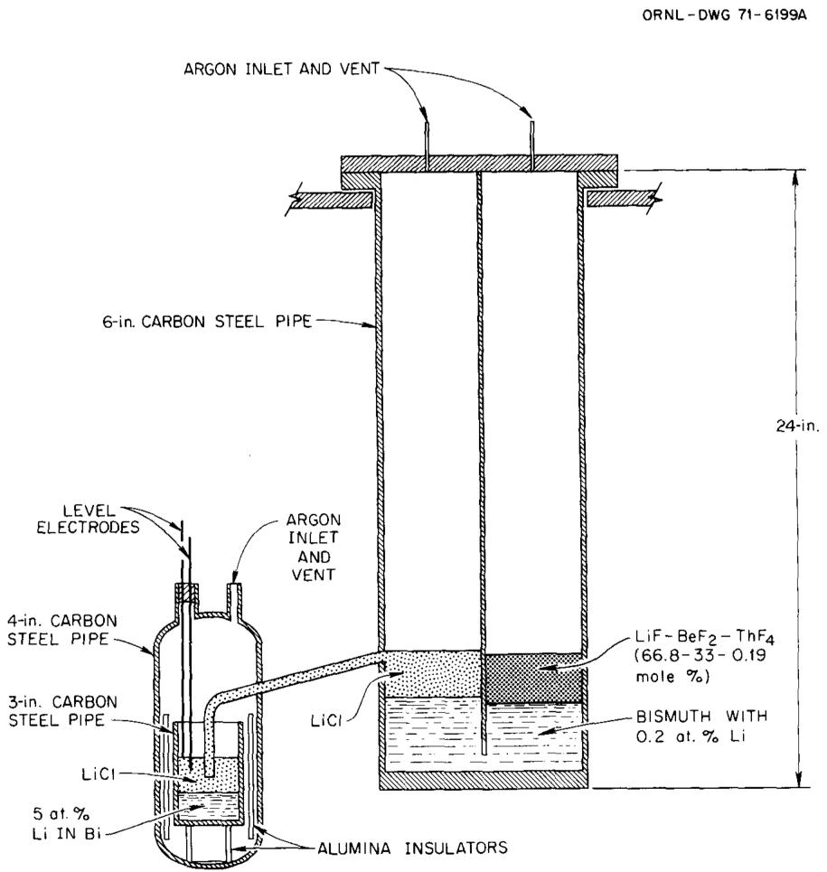  
Fig. 18.2. Schematic diagram of equipment used for metal transfer experiment MTE-2B.

emf measurements. The lithium concentration in the thorium-bismuth phase as determined from the distribution of thorium between the fluoride salt and the thorium-bismuth solution is compared in Fig. 18.4 with lithium concentration values that were calculated from emf measurements. Values for the lithium concentration in the thorium-bismuth solution as indicated from neodymium distribution data are compared in Fig. 18.5 with values for the lithium concentration that were calculated from emf measurements. The values for the lithium concentration in the thorium-bismuth solution as determined by direct analysis, from thorium distribution data, and from emf measurements are in

good agreement. The values based on the distribution of neodymium are somewhat lower and show more scatter than those obtained with the other methods.

During the first four months of LiCl circulation (in which 2307 liters of LiCl was circulated), the lithium concentration in the lithium-bismuth solution was maintained at values in the range of 3.7 to 6.0 at.%. The lithium concentration in the lithium-bismuth solution was initially 4.5 at.%; however, it decreased to a value of 3.7 at. % after 1589 liters of LiCl had been circulated. Sufficient lithium was then added to the lithium-bismuth solution to produce a lithium concentration of 6 at.%. During the first four months of

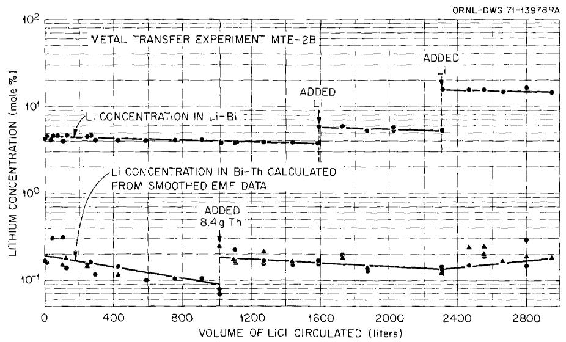  
Fig. 18.3. Lithium concentrations determined by direct analysis and by voltage measurements.

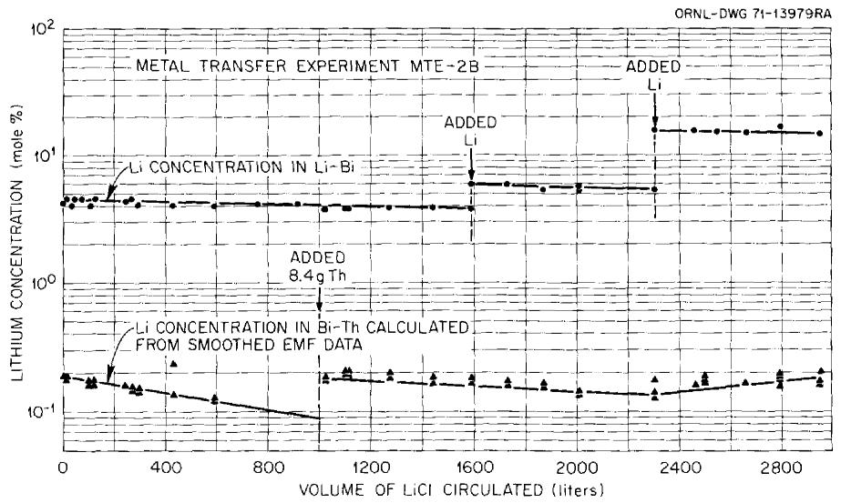  
Fig. 18.4. Lithium concentrations calculated from thorium distribution data.

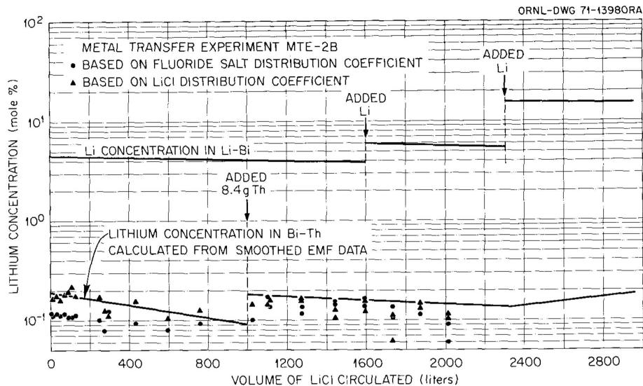  
Fig. 18.5. Lithium concentrations calculated from neodymium distribution data.

operation, the lithium concentration in the lithium-bismuth solution decreased steadily, at a rate equivalent to a lithium concentration of $0.2\mathrm{ppm}$ in the LiCl after its contact with the lithium-bismuth solution. It would be expected that this lithium would be transferred to the thorium-bismuth solution and that the concentration of reductant in the thorium-bismuth phase would increase steadily. However, during this period, the concentrations of both the lithium and the thorium in the thorium-bismuth solution decreased; the rate at which reductant was lost from the thorium-bismuth solution was twice the loss rate from the lithium-bismuth solution. After 1021 liters of LiCl had been circulated through the system, $8.4\mathrm{g}$ of thorium was added to the thorium-bismuth phase in order to increase the reductant concentration to near its original value. Additional ${}^{147}\mathrm{Nd}$ tracer and LiCl were also added to the system at that time. The decrease in the reductant concentration in the thorium-bismuth solution probably resulted from the reaction of reductant with impurities introduced into the system by the argon purges or by the removal of samples of salt and bismuth. If the loss of reductant was due entirely to reaction with oxygen in the purge gas, an oxygen concentration of about $10\mathrm{ppm}$ would be required. Extrapolation of laboratory data on the concentration of lithium in LiCl that is in equilibrium with a 5 at. $\%$ Li-Bi solution indicates a lithium concentration of about $0.02\mathrm{ppm}$ . Thus the mechanism for the removal of most of the lithium from the lithium-bismuth solution must have been the reaction of lithium with impurities in the LiCl.

After 2307 liters of LiCl had been circulated through the system, the lithium concentration in the lithium-bismuth solution was increased to 15.6 at. $\%$ .At this lithium concentration, the rate of transfer of lithium by the LiCl was sufficient to cause the concentrations of lithium and thorium in the thorium-bismuth solution to increase at a rate equivalent to a lithium concentration of $0.2\mathrm{ppm}$ in the LiCl after contact with the lithium-bismuth solution. If it is assumed that loss of reductant by its reaction with impurities in the system continued at a rate equivalent to a lithium concentration of $0.6~\mathrm{ppm}$ , the resulting lithium transfer rate $(0.8~\mathrm{ppm})$ is in reasonable agreement with the concentration of lithium (1.2 ppm) that would be present in LiCl in equilibrium with a 15 at. $\%$ lithium-bismuth solution.

The inventory of $^{147}\mathrm{Nd}$ tracer in the system decreased more rapidly than expected during operation of the experiment, presumably because of reaction of the neodymium with impurities in the system. The neodymium transferred to the lithium-bismuth phase as expected during the experiment; however, because of the decrease in neodymium inventory, the rate of transfer could not be accurately determined. Only a negligible amount of thorium (< 10 ppm) has been transferred to the lithium-bismuth solution thus far. A lithium concentration of about 15 at. % in the lithium-bismuth solution is being used in the continued operation of the experiment. The information obtained to date is consistent with the experimentally determined results for the distribution of lithium between LiCl and lithium-bismuth solutions and indicates that

the rate of transfer of lithium from a 5 at. $\%$ lithium-bismuth solution in the metal transfer process will be negligible. The rate of transfer of lithium from a 50 at. $\%$ lithium-bismuth solution will be appreciable; however, such transfer will not necessitate changes in the present processing flowsheet or increases in the rate at which reductant is added to the processing system.

# 18.3 INSTALLATION, TESTING, AND CHARGING OF MATERIALS TO THE THIRD METAL TRANSFER EXPERIMENT

E. L. Youngblood H. O. Weeren L. E. McNeese

Equipment for the third metal transfer experiment (MTE-3) has been installed, and the system is currently being prepared for operation. Details of the main process vessels, which are constructed of carbon steel, have been presented previously. The experiment is shown schematically in Fig. 18.6 and after installation in Fig. 18.7. The basic equipment consists of a 14-in.-diam surge tank that contains fluoride salt (72-16-12 mole % LiF-BeF $_2$ -ThF $_4$ ), a 10-in.-diam salt-metal contactor, and a 6-in.-diam vessel that contains a 5 at. % lithium-bismuth solution and LiCl. The contactor is divided into two compartments by a partition

3. E. L. Youngblood and L. E. McNeese, MSR Program Semiannu. Progr. Rep. Aug. 31, 1971, ORNL-4728, pp. 204-7.

that extends to within $\frac{1}{2}$ in. of the bottom of the vessel. The two compartments are interconnected by a pool of bismuth containing thorium and lithium. The bismuth solution in the contactor also provides a seal between the two compartments. During operation, the fluoride salt will be circulated at the rate of about 33 $\mathrm{cm}^3/\mathrm{min}$ from the surge tank through one side of the contactor by a carbon-steel pump that uses molten bismuth as check valves. Lithium chloride will be forced to flow back and forth between the vessel containing the lithium-bismuth solution and the salt-bismuth contactor at the rate of about 1.25 liters/min. The salt flow rates to be used in the experiment are about $1\%$ of those that will be required for processing a 1000-MW(e) MSBR. The system will be operated at about $650^{\circ}\mathrm{C}$ . Mechanical agitators are used in both compartments of the contactor and in the vessel containing the lithium-bismuth solution in order to improve the contact between the salt and the bismuth phases.

The main objectives of the experiment are to determine the rate at which rare earths and alkaline-earth elements will be transferred from the fluoride salt to the lithium-bismuth solution and to determine the dependence of the mass transfer coefficients at the salt-bismuth interfaces on agitator speed. The agitators (see Fig. 18.8) are constructed of molybdenum and use blades having a pitch of $45^{\circ}$ in both the salt and the bismuth phases. The agitators are designed to vigorously

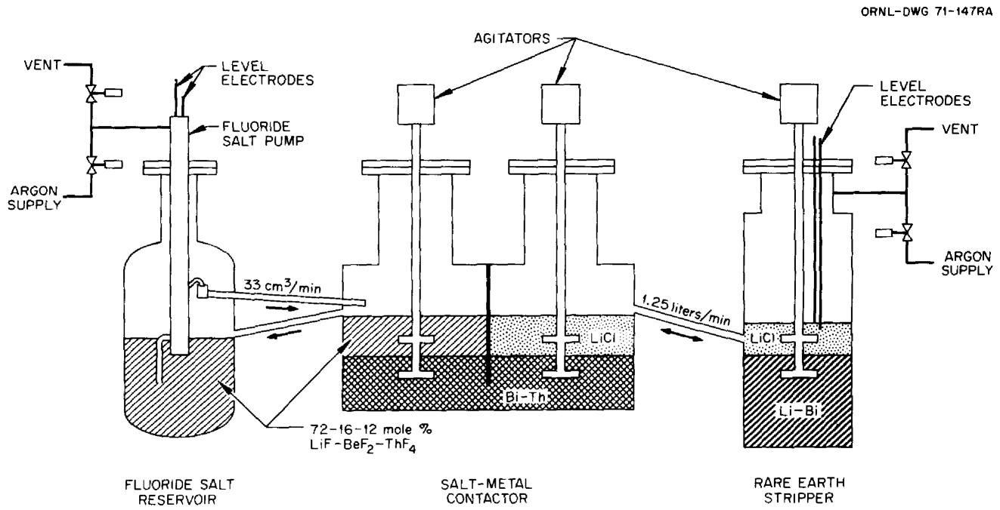  
Fig. 18.6. Flow diagram for metal transfer experiment MTE-3.

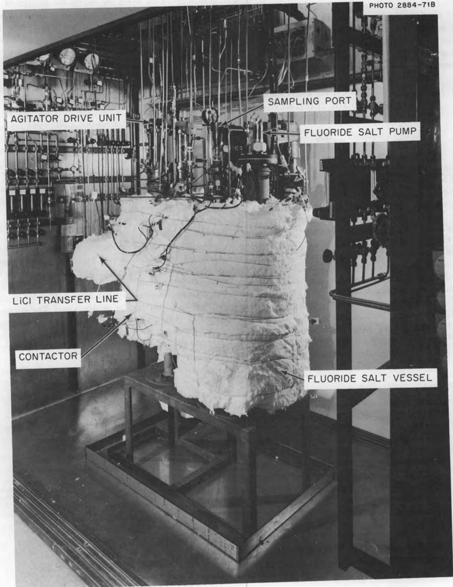  
Fig. 18.7. Equipment for metal transfer experiment MTE-3 after installation.

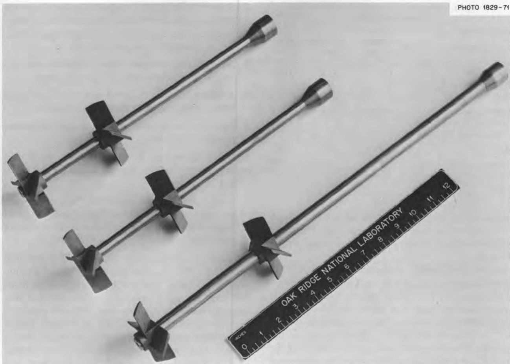  
Fig. 18.8. Agitators used for promoting mass transfer between salt and bismuth phases in metal transfer experiment MTE-3.

contact the salt and bismuth phases without dispersing either phase. If adequate contact of the salt and bismuth can be achieved without dispersion, this will be a more desirable operating mode, since entrainment of bismuth in the fluoride salt will be much less likely to occur than in systems where the bismuth is dispersed in the salt phase. The agitators are driven by variable-speed motors, which will permit determination of the effect of agitator speed on the mass transfer coefficients at the three salt-metal interfaces. Data on mass transfer coefficients obtained in the experiment will be compared with values predicted from correlations that were developed for liquids having physical properties appreciably different from those of molten salt and bismuth.

Preoperational testing of the equipment, purification of the salt and bismuth, and charging of the salt and bismuth to the system have begun. Initially, the system was determined to be leak-tight at room temperature by use of a helium leak detector. The main process vessels were then heated to $650^{\circ}\mathrm{C}$ , and a pneumatic pressure test was carried out at 12.5 psig (1.25 times the

maximum operating pressure). The leak testing was followed by treatment of the system with hydrogen for $12\mathrm{hr}$ at $650^{\circ}\mathrm{C}$ in order to reduce iron oxide that was present on the internal surfaces of the equipment. The fluoride salt, bismuth, and LiCl are also being treated for removal of oxides and other impurities before being charged to the equipment. The quantities of salt and bismuth that will be used in the experiment are shown in Table 18.1. Bismuth for the contactor was treated with hydrogen at 600 to $650^{\circ}\mathrm{C}$ for $6.5\mathrm{hr}$ in a carbon-steel treatment vessel and was filtered before being transferred to the contactor. The fluoride salt for the experiment was previously purified by the Reactor Chemistry Division; however, in small-scale metal transfer experiments, we have observed that, when salt is contacted with bismuth containing reductant, there is an initial decrease in the quantity of reductant in the bismuth phase. The reason for the decrease has not been determined. In order to minimize this effect in experiment MTE-3, the fluoride salt was contacted (in two batches) with bismuth initially containing $1.9\mathrm{wt}\%$

Table 18.1. Materials to be used in metal transfer experiment MTE-3   

<table><tr><td>Material</td><td>Quantity (g-moles)</td><td>Volume (liters)</td><td>Weight (kg)</td></tr><tr><td>Fluoride salt (72-16-12 mole % LiF-BeF2-ThF4)</td><td>1733.7</td><td>33.6</td><td>111.6</td></tr><tr><td>Bismuth (containing about 60 ppm of Li and 1700 ppm of Th)</td><td>304.8</td><td>6.6</td><td>63.4</td></tr><tr><td>LiCl</td><td>237.1</td><td>6.7</td><td>10.1</td></tr><tr><td>Li-Bi (5 at. % Li)</td><td>222.0</td><td>4.6</td><td>44.2</td></tr></table>

thorium for 48 or $72\mathrm{hr}$ before the salt was filtered and transferred to the fluoride salt surge tank. The filter, which was made of porous iron, had a mean pore size of about $30\mu$

We are now making preparations for charging the lithium-bismuth solution and the LiCl to the system. The bismuth for the lithium-bismuth solution will be treated with hydrogen in a second treatment vessel at 600 to $650^{\circ}\mathrm{C}$ , and the 5 at. $\%$ lithium-bismuth solution will be prepared by adding lithium metal to the bismuth. The lithium-bismuth solution will then be filtered and transferred to the system. Thorium metal will be added to the lithium-bismuth solution heel that is left in the treatment vessel, and the resulting solution will be contacted with the LiCl before the latter is filtered and charged to the system.

After the salt and metal phases have been charged to the system, the first run will be carried out by observing the rate at which radium, present in the system as a decay product of thorium, transfers from the fluoride salt to the lithium-bismuth solution. Europium-154 (half-life, 16 years) fluoride, in tracer quantities, and lanthanum fluoride will be added to the fluoride salt for subsequent runs.

# 18.4 DESIGN OF THE METAL TRANSFER PROCESS FACILITY

W. L. Carter

E. L. Nicholson

E. L. Youngblood

L. E. McNeese

We have begun the design of the metal transfer process facility (MTPF) in which the fourth metal transfer experiment (MTE-4) will be carried out. This experiment, which will use salt flow rates that are 5 to $10\%$ of those required for processing a 1000-MW(e) MSBR, has several primary purposes:

1. demonstration of the removal of rare-earth fission products from MSBR fuel carrier salt and accumulation of these materials in a lithium-bismuth solution in equipment of a significant size;   
2. determination of mass transfer coefficients between mechanically agitated salt and bismuth phases;   
3. determination of the rate of removal of rare earths from the fluoride salt in multistage equipment;   
4. evaluation of potential materials of construction, graphite in particular;   
5. testing of mechanical devices, such as pumps and agitators, that will be required in a processing plant; and   
6. development of instrumentation for measurement and control of process variables such as salt-metal interface location, salt flow rate, and salt or bismuth liquid level.

A schematic flow diagram for the MTPF is shown in Fig. 18.9. The principal equipment items are the fluoride salt surge tank, which has a volume of about 300 liters and will consist of a carbon-steel liner in a stainless steel vessel; a three-stage salt-metal contactor made of graphite and enclosed in a stainless steel containment vessel that may have a carbon-steel liner; a stainless steel vessel having a graphite or carbon-steel liner in which rare earths will be accumulated in a lithium-bismuth solution having a volume of about 100 liters; and a hydrofluorinator that has a volume of about 150 liters and consists of a graphite crucible enclosed in a stainless steel vessel.

The conceptual designs of the three-stage salt-metal contactor and its containment vessel (see Figs. 18.10 and 18.11) have been completed. Fuel carrier salt (72-16-12 mole $\%$ LiF-BeF $_2$ -ThF $_4$ ) that contains rare-earth fluorides will be circulated between the fluoride salt surge tank and three compartments that are on one side of the central partition in the salt-metal contactor. The fluoride salt will be fed to one of the compartments and will flow through the remaining compartments in sequence. At the same time, LiCl will be circulated between the vessel containing the lithium-bismuth solution in which the rare earths will be accumulated and the remaining three compartments of the salt-metal contactor. The LiCl will be fed to one of the compartments and will flow countercurrent to the fluoride salt in the three adjacent compartments. The two salt streams are prevented from mixing by a captive pool of bismuth in the bottom of each pair of compartments which constitutes a physical mass transfer stage.

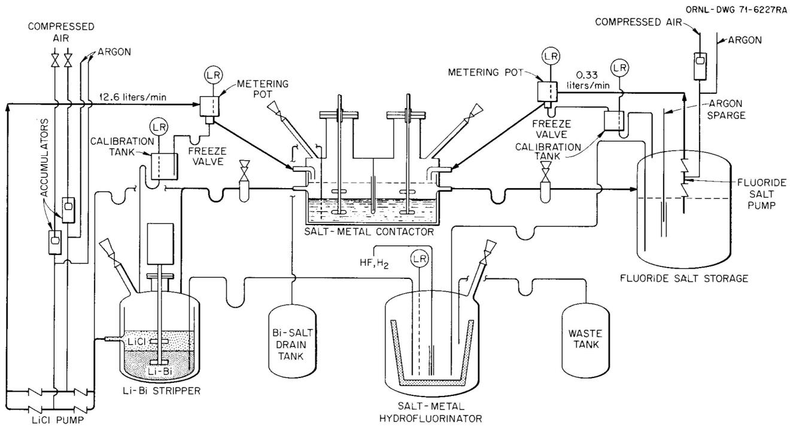  
Fig. 18.9. Flow diagram for metal transfer process development facility.

In each of these stages, the bismuth, which will contain reductant, will be circulated from one side of the central partition to the other. However, no mixing of bismuth between any of the physical stages will occur. At operating temperature $(640^{\circ}\mathrm{C})$ , the vapor pressure of LiCl is appreciable (about $0.5\mathrm{mmHg}$ ), and a means for preventing transfer of LiCl to the fluoride salt by vapor transfer is required. It is also necessary to prevent the mixing of the two salt streams by entrainment of salt mist in the gas space above the salt-metal contactor. Both of these requirements are met by the use of a 4-in.-deep slot around the LiCl compartments that will contain molten bismuth. A metal skirt will be attached to the upper part of the containment vessel and will extend into the bismuth pool in order to provide a seal between the gas space above the fluoride and chloride salts.

The hydrofluorinator will be used periodically to purify the fluoride salt and to return rare earths that have accumulated in the lithium-bismuth solution to the fluoride salt. This will allow periodic adjustment of the lithium concentration in the lithium-bismuth solution and will increase the range of process conditions that can be covered.

We are presently discussing the conceptual design with a graphite manufacturer in order to ensure the optimum design from the standpoints of ease of fabrication and accepted design technology for graphite

vessels. Additional information is required concerning the compatibility of various grades of graphite and bismuth solutions containing reductant. After these questions have been satisfactorily answered, we will continue work on the design of the MTPF. Operation of the facility is expected to begin in FY 1974 and to continue for one to two years.

# 18.5 DEVELOPMENT OF MECHANICALLY AGITATED SALT-METAL CONTACTORS

H. O. Weeren L. E. McNeese

Experimentally determined mass transfer coefficients for the stirred-interface type of contactor cell such as that used in metal transfer experiment MTE-3 have been reported in the literature and correlated in various ways. Most of this experimental work has been done with partially miscible solvent-water systems that have been operated at Reynolds numbers almost an order of magnitude lower than those expected in the MTE-3 system. Under such circumstances, the extrapolation of available correlations becomes a somewhat doubtful exercise.

A review of the suggested correlations indicated that the variables of greatest significance in correlating mass transfer between different fluids were probably the surface tension and the kinematic viscosity $(\mu /\rho)$ . These properties of the water-mercury system are generally

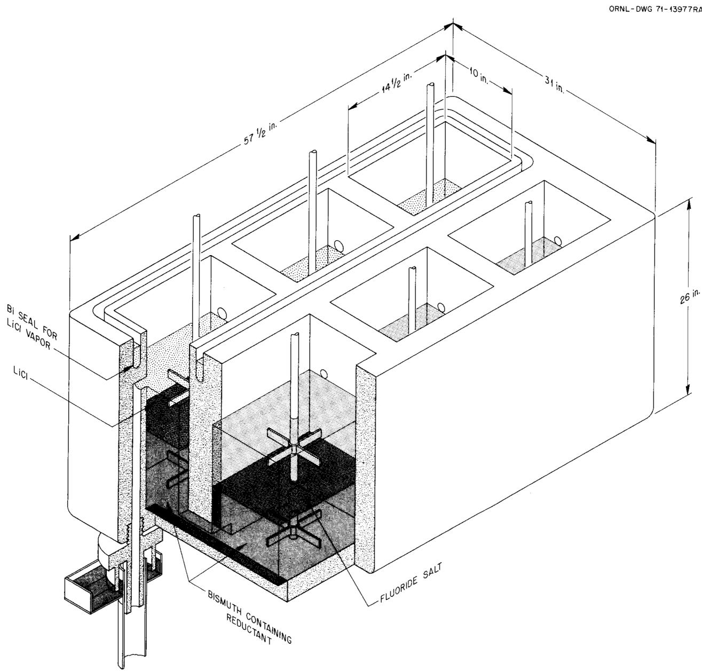  
Fig. 18.10. Three-stage graphite salt-metal contactor for use with metal transfer experiment MTE-4.

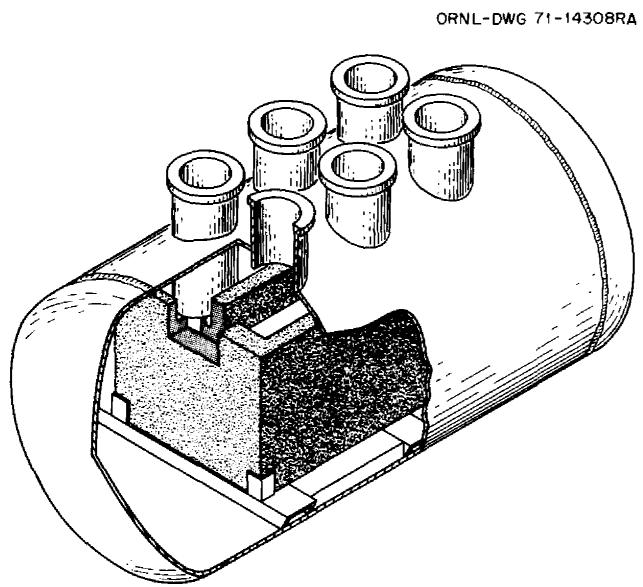  
Fig. 18.11. Containment vessel for three-stage graphite contactor for metal transfer experiment MTE-4.

close to the same properties of the molten salt-bismuth system; thus the water-mercury system was chosen for experimental mass transfer determinations in the belief that extrapolation of the values obtained would be more believable than with any other system.

The overall mass transfer coefficient was determined for the transfer of silver from a dilute $\mathrm{AgNO}_3$ solution into the mercury phase. A simplified form of the stirred-interface contactor was used in the first experiments. The equipment used consisted of a 6-in.-diam circular cell in which sufficient water and mercury to produce a 2.2-in.-deep layer of each of the phases were present. The agitator consisted of two 3-in.-diam paddles (each having four straight blades) that were located on a common shaft about 0.75 in. from the water-mercury interface. The $\mathrm{AgNO}_3$ concentration was determined at intervals by titration of samples against an NaCl solution. The rate of change of the $\mathrm{AgNO}_3$ concentration was then used to calculate the overall mass transfer coefficient. The individual mass transfer coefficients were calculated from the overall coefficient.

The experimental results are plotted in Fig. 18.12 in the form suggested by Lewis. The general range of experimental values reported by several investigators using various solvent-water systems is indicated, and the experimental values obtained from the water-mercury system are shown at the upper right. This plot indicates that extrapolation of the Lewis correlation is a valid

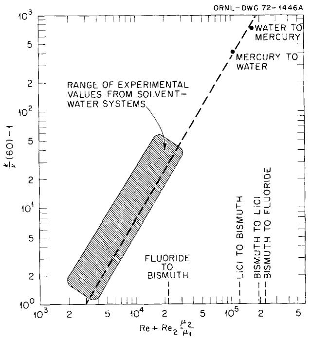  
Fig. 18.12. Correlation of mass transfer data from solvent-water and mercury-water systems.

procedure, even over such a wide range of Reynolds numbers.

The figure also shows the Reynolds numbers that will probably be obtained at the various salt-bismuth interfaces in experiment MTE-3. These values are not appreciably different from the Reynolds numbers of the water-mercury system. This suggests that the mass transfer coefficients that will be experimentally determined in the MTE-3 system will be reasonably close to the previously used coefficients that were obtained by extrapolation of the Lewis correlation. We believe that the mass transfer performance will be strongly dependent on cell geometry, and we plan to carry out additional studies in order to optimize the cell design for future salt-metal contactors.

# 18.6 REDUCTIVE EXTRACTION ENGINEERING STUDIES

B. A. Hannaford W. M. Woods D. D. Sood

We have continued mass transfer experiments in which the rate of transfer of $^{97}\mathrm{Zr}$ and $^{237}\mathrm{U}$ from molten salt to bismuth is measured by adding these materials to the salt phase prior to contacting the salt with bismuth containing reductant in a packed column. Three experiments were carried out in which only $^{97}\mathrm{Zr}$

was used. A total of 19 to $46\%$ of the $^{97}\mathrm{Zr}$ was observed to transfer to the bismuth, and the resulting HTU values ranged from 4.3 to 4.7 ft. In the final experiment, both $^{97}\mathrm{Zr}$ and $^{237}\mathrm{U}$ were used. The fractions of these materials that transferred to the bismuth were 14 and $15\%$ for $^{97}\mathrm{Zr}$ and $^{237}\mathrm{U}$ , respectively, and the resulting HTU values were 3.6 and 4.6 ft respectively.

# System Modifications and Maintenance

During the preparations for additional $^{97}\mathrm{Zr}$ tracer experiments, a series of minor leaks led to the replacement of several transfer lines and the removal of the filters from the bismuth and salt transfer lines exiting from the treatment vessel. A leak that occurred downstream of the salt filter appeared to be due to external air oxidation. All of the vessel-connecting lines that were part of the original installation were replaced. The dip tube attached to the bismuth transfer line was found to be plugged with an iron deposit and was replaced. Makeup salt was added to the treatment vessel, and most of the salt was transferred to the salt feed tank. The remaining salt and bismuth were treated with $30\%$ HF- $\mathrm{H}_2$ in order to oxidize the iron present in the bismuth into the salt heel overlying the bismuth. The salt heel was sampled and discarded. Both the bismuth and the salt filters were permanently removed from the system when cracks were observed in the weld joints attaching them to transfer lines. A small salt leak occurred in the line connecting the salt head tank to the column, and a similar failure appeared below the flowing bismuth sampler. All of the lines connecting the salt head tank, the column, the specific gravity pot, and the flowing bismuth sampler were replaced with steel tubing coated with nickel aluminide in order to evaluate the performance of the coating for protecting the steel from air oxidation.

Concurrently with the maintenance work, several attempts were made to determine the concentrations of reductant in the bismuth phase in the treatment vessel through the use of a beryllium or uranium electrode. The results were only marginally successful; the beryllium had a tendency to reduce uranium from the salt, and a uranium electrode using a uranium-bismuth solution and a salt bridge exhibited excessive scatter in the variation of emf with changes in reductant concentration, as determined by reductant addition and chemical analyses of the salt and bismuth.

# Mass Transfer Runs Using $^{9}7$ Zr Tracer

Several changes were made to reduce the scatter in $9^{7}\mathbf{Zr}$ counting data reported previously. These in

clude: (1) the use of a deeper submergence (about 1 in.) of the sample capsules within the flowing bismuth sampler and (2) a modification of the sampler housing to maintain a leak-tight seal on the sampler capillary tubing at all times as a means of prohibiting the entry of air to the housing. In order to buffer the system with respect to the presence of trace oxidants in the argon cover gas and possible release of HF from the graphite crucible, the uranium inventory of the system was increased from 0.135 to $0.315\mathrm{g}$ -mole. After bismuth and salt had been circulated through the system to remove oxide from the new transfer lines, the bismuth and salt were treated with a $25\mathrm{mole}\% \mathrm{HF - H_2}$ mixture for $15\mathrm{hr}$ . This treatment was followed by hydrogen sparging at 12 scfh for $8\mathrm{hr}$ and argon sparging for 60 hr. Lithium-bismuth alloy containing 1 g-equivalent of lithium was then added to the treatment vessel. Uranium analyses of bismuth and salt showed a uranium distribution coefficient of 0.30, which indicated that about two-thirds of the lithium in the lithium-bismuth alloy was oxidized before being added to the treatment vessel and/or was consumed by a side reaction in the treatment vessel. Additional lithium-bismuth alloy was added to the treatment vessel, and a nontracer run was made in order to bring bismuth and salt in all parts of the system to near-equilibrium conditions. About $15\mathrm{mCi}$ of $^{97}\mathrm{ZrO}_2$ was added to the salt feed tank, and mass transfer run ZTR-7 was carried out. Flowing bismuth samples showed remarkably little scatter in $^{97}\mathrm{Zr}$ activity, with six of seven samples varying less than $5\%$ from the average of all samples. This indicates that earlier difficulties with sampling the flowing bismuth stream have been alleviated. The material balance on $^{97}\mathrm{Zr}$ tracer was excellent: $95\%$ on flowing stream samples and $99\%$ on the total inventory of $^{97}\mathrm{Zr}$ from the beginning of run ZTR-7 to the end of the subsequent run (ZTR-8), which was carried out with feed streams that were essentially in equilibrium. The calculated HTU for zirconium in ZTR-7 was 4.3 ft, as shown in Table 18.2.

In order to increase the zirconium distribution coefficient $(D_{\mathbf{Zr}})$ to a suitable value for run ZTR-9, a total of $500\mathrm{g}$ of lithium-bismuth alloy ( $\sim 1.25$ g-equivalent of lithium) was added to the treatment vessel. Operation of the equipment was smooth during the run, although an increased pressure drop in the salt overflow line required that the top of the column be operated at an argon overpressure equal to 12 in. $\mathrm{H}_2\mathrm{O}$ . In order to obtain precise values for the net sample weights, the samples were cut open and the contents were drilled

out on a small lathe. Salt was quantitatively removed from the samples by this technique; complete removal of the bismuth required a brief exposure to $6N\mathrm{HNO}_3$ after most of the bismuth had been drilled from the sampler. The $97\mathrm{Zr}$ tracer balance in ZTR-9 was $127\%$ based on flowing stream samples and $104\%$ based on tank samples. The $97\mathrm{Zr}$ activities in the flowing stream samples were constant to within $8\%$ of their average for salt and within $2\%$ for bismuth. The calculated HTU value was 4.6 ft.

Preparatory to the next tracer experiment, a 1.05-g bar of beryllium was dissolved in the treatment vessel in order to increase $D_{\mathbf{Zr}}$ . Following a routine operation in which the bismuth and salt were circulated through the equipment in order to bring the salt and bismuth in the entire system to the same concentrations, $^{97}\mathbf{Zr}$ was added to the salt phase and tracer experiment ZTR-10 was carried out. The flowing stream samples were constant to within $8\%$ of their average for salt and to within $7\%$ for the bismuth. The calculated HTU was 4.7 ft, as shown in Table 18.2.

# Temperature Dependence of $D_{\mathbf{Zr}}, D_{\mathbf{U}}$

Uranium analyses for the flowing stream samples taken during experiments ZTR-9 and ZTR-10 showed that about $25\%$ of the uranium transferred from the bismuth to the salt during the experiments. Since pre-equilibrated (at $600^{\circ}\mathrm{C}$ ) phases were contacted in the column, such transfer was not expected. Examination of the temperature data from the run showed that column temperatures were generally about 50 to $75^{\circ}\mathrm{C}$ higher than the treatment vessel temperature. Calculations of $D_{\mathrm{U}}$ and $D_{\mathrm{Zr}}$ made for various reductant concentrations and temperatures ranging from 550 to $700^{\circ}\mathrm{C}$ indicate that, at reductant concentrations used for ZTR-9 and ZTR-10, the uranium distribution coefficient decreases significantly at the higher tempera

tures but that the change in $D_{Z\mathrm{r}}$ is less than $10\%$ for a $50^{\circ}\mathrm{C}$ change in temperature.

An experiment was performed in order to verify the calculated effect of temperature variations on the distribution coefficients for uranium and zirconium. Prior to the experiment, the salt and bismuth were hydrofluorinated to remove oxide impurities and were then sparged for $24\mathrm{hr}$ with hydrogen and for $60\mathrm{hr}$ with argon. Reductant was subsequently added to the bismuth electrolytically by using a consumable beryllium anode and a 1.5-V potential that was applied across the anode and the bismuth pool. After dissolution of 1 g-equivalent of beryllium and following a 20-hr equilibration period, analyses of the phases indicated that no uranium had transferred to the bismuth and that the added reductant had been consumed by impurities (probably $\mathrm{FeF}_2$ ). A second addition of beryllium was made, followed by the addition of about $10\mathrm{mCi}$ of $^{97}\mathbf{Z}_{\mathrm{r}}$ to the treatment vessel in order to determine the zirconium distribution coefficient and to permit the measurement of $D_{\mathbf{Zr}}$ as a function of temperature. Zirconium distribution coefficient values obtained at 600, 620, 640, and $680^{\circ}\mathrm{C}$ were 0.88, 0.89, 1.05, and 1.06 respectively. The weak dependence of $D_{\mathbf{Zr}}$ upon temperature indicated that the nonisothermal condition that existed in the column during runs ZTR-9 and -10 introduced a negligible error in the calculated mass transfer performance.

# Mass Transfer Experiments with $^{237}\mathbf{U}$ and $^{97}\mathbf{Zr}$ Tracers

Preparatory to carrying out mass transfer experiment UZTR-1, $97\mathrm{Zr}$ tracer was added to the treatment vessel in order to permit determination of the zirconium distribution coefficient. The resulting salt and bismuth samples indicated a $D_{\mathbf{Zr}}$ of about 0.45, which was satisfactory. Following the usual equilibration run,

Table 18.2. Summary of mass transfer results from experiments with $^{97}\mathrm{Zr}$ tracer   
Salt (72-16-12 mole % LiF-BeF $_2$ -ThF $_4$ ) and bismuth contacted at 650 to $670^{\circ}\mathrm{C}$ in an 0.82-in.-ID by 24-in.-long packed column   

<table><tr><td>Run</td><td>Bismuth flow rate, VB(ml/min)</td><td>Salt flow rate, VS(ml/min)</td><td>Flow rate ratio, VB/VS</td><td>Zirconium distribution coefficient, DZr</td><td>Fraction of 97Zr transferred</td><td>HTU (ft)</td></tr><tr><td>ZTR-7</td><td>181</td><td>105</td><td>1.72</td><td>0.98</td><td>0.46</td><td>4.3</td></tr><tr><td>ZTR-9</td><td>45</td><td>277</td><td>0.162</td><td>3.9</td><td>0.19</td><td>4.6</td></tr><tr><td>ZTR-10</td><td>46</td><td>283</td><td>0.163</td><td>4.4</td><td>0.22</td><td>4.7</td></tr></table>

Table 18.3. $^{237}\mathrm{U}$ and $^{97}\mathrm{Zr}$ mass transfer results from experiment UZTR-I   
Column temperature, 605 to $617^{\circ}\mathrm{C}$ ; bismuth flow rate, 143 ml/min; salt flow rate, 161 ml/min   

<table><tr><td>Tracer</td><td>Distribution coefficient</td><td>Fraction of tracer transferred to bismuth</td><td>HTU (ft)</td></tr><tr><td>Uranium (237U)</td><td>0.44</td><td>0.15</td><td>4.6</td></tr><tr><td>Zirconium (97Zr)</td><td>0.46</td><td>0.14</td><td>3.6</td></tr></table>

about $5\mathrm{mCi}$ of ${}^{237}\mathrm{U}$ and $10\mathrm{mCi}$ of ${}^{97}\mathrm{Zr}$ were added to the salt feed tank, and the experiment was carried out. Data from the run are summarized in Table 18.3. A post-run measurement of $D_{\mathbf{Zr}}$ indicated that no change in the zirconium distribution coefficient had occurred during the run. The reported HTU values were calculated from tank samples, for which the tracer balances ranged from 100 to $106\%$ . The HTU value for zirconium was significantly higher than the value of 1 ft reported earlier for a ${}^{97}\mathrm{Zr}$ tracer experiment made under similar conditions. The recent results are probably more reliable, since the distribution coefficient was measured both before and after the experiment.

Following the post-run equilibration of bismuth and salt in the treatment vessel and sampling to obtain $^{97}\mathrm{Zr}$ and $^{237}\mathrm{U}$ distribution data, a 1.93-g beryllium rod was electrolytically dissolved in the salt to increase $D_{\mathrm{U}}$ to near 1.0. Periodic sampling of the equilibrated phases was begun in order to monitor the uranium distribution coefficient over an extended period of time. The samples were analyzed by counting the 0.208-MeV gamma emission from $^{237}\mathrm{U}$ ( $t_{1/2}$ for $^{237}\mathrm{U} = 6.75$ days). This allowed more information to be obtained on the rate at which reductant is lost from the bismuth in the treatment vessel.

# 18.7 DESIGN OF THE REDUCTIVE-EXTRACTION PROCESS FACILITY

W.M.Woods W.F.Schaffer,Jr. L.E.McNeese

We have initiated design and development work for the reductive-extraction process facility (REPF), which will allow testing and development of equipment suitable for use in a full-scale protactinium removal process based on fluorination-reductive extraction. A preliminary examination and conceptual design for the

system have been partially completed. The facility will allow operation of all steps of the reductive-extraction process with salt flow rates as high as about $25\%$ of those required for processing a 1000-MW(e) MSBR. A flow diagram for the facility is shown in Fig. 18.13. MSBR fuel carrier salt (72-16-12 mole $\%$ LiF-BeF $_2$ -ThF $_4$ ) containing $^{97}\mathrm{Zr}$ tracer and 0.003 to 0.01 mole $\%$ UF $_4$ (the uranium concentration expected after fluorination of MSBR fuel salt) will be withdrawn from the salt surge tank and will be fed countercurrent to a bismuth stream containing 0.002 mole fraction of lithium in a 2-in.-ID, 6-ft-long packed column, where part of the uranium and zirconium will be extracted into the bismuth phase. The salt and bismuth streams leaving the column will then be fed to a continuous hydrofluorinator, where the uranium, zirconium, thorium, and lithium in the bismuth will be converted to fluorides, which will subsequently transfer to the salt phase. Thus the salt stream leaving the hydrofluorinator will have the same composition as the salt entering the extraction column. The bismuth stream leaving the hydrofluorinator will be combined with the desired amount of reductant and returned to the extraction column. Provision will be made for sampling the salt and bismuth streams throughout the facility. The REPF will operate continuously, in contrast to the semicontinuous mode of operation for the present reductive extraction test facility (see Sect. 18.6). The facility will have the capability for reaching the flooding capacity of the packed column throughout a range of salt-bismuth flow rate ratios from 0.1 to 15; this includes salt and bismuth flow rates ranging from 0.5 to 3.25 liters/min and 0.2 to 2.5 liters/min respectively. The facility will be used to develop multistage salt-bismuth contactors, salt-bismuth hydrofluorinators, and other equipment items required for the removal of protactinium from MSBR fuel salt by reductive extraction. Data will be obtained on materials of construction, corrosion, and the rate of mass transfer of uranium, zirconium, thorium, and lithium between salt and bismuth phases; other information required for the evaluation and design of protactinium removal systems will also be obtained. The materials of construction for the facility will consist largely of graphite and molybdenum and will be enclosed in steel for protection from oxidation.

# 18.8 FROZEN-WALL FLUORINATOR DEVELOPMENT

J.R.Hightower, Jr.

A nonradioactive demonstration of the use of a frozen wall to protect against corrosion in a continuous

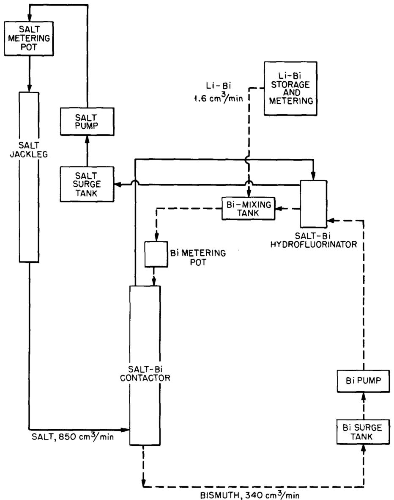  
Fig. 18.13. Flow diagram for the reductive extraction process facility.

fluorinator requires a heat source in the molten salt which is not subject to attack by gaseous fluorine. We have previously[7] simulated high-frequency induction heating of molten salt in a frozen-wall fluorinator by making measurements of heat generation in aqueous electrolytes contained in equipment similar to a fluorinator. The measurements indicated that sufficient heat could probably be generated in molten salts if a suitable means could be found for introducing an induction coil

into the vessel and supporting it during operation. An experiment was designed to test one means for introducing the coil. Operational difficulties (which are described later) and the narrow range of acceptable operating conditions have prompted reexamination of autoresistance heating using $60\mathrm{-Hz}$ power. Two series of experiments for study of autoresistance heating were performed and are also described.

# Molten-Salt Induction Heating Experiment

The equipment for the molten-salt induction heating experiment was described previously.7 Before the test

vessel was heated and filled with salt, preliminary experiments were necessary to determine if 85 A (the current required for operation under the design conditions) could be driven through the coil.

The induction coil was connected directly to the coaxial transmission cable, which was connected to the generator through a transformer that reduced the terminal voltage of the generator ( $\sim 19,000\mathrm{V}$ , peak) to an estimated peak voltage of 3000. In the first attempt to operate the system, a current of 50 A was driven through the coil; however, arcing occurred between the $5/8$ -in. coil lead and a $3/4$ -in. compression fitting, at the point where the high-voltage coil lead penetrated the vessel. Although Teflon insulators had been used to prevent actual contact of the tubing with this fitting, a gas-filled gap existed between the tubing and the fitting. Since the arcing destroyed the lower Teflon insulator, the insulators were replaced by longer ones which completely filled the space between the tubing and the grounded vessel with Teflon (a dielectric); this measure served to prevent arcing at this point.

After the Teflon insulators had been replaced, a second attempt to drive the required current through the coil was made. In this test, a current of 90 A was attained; however, arcing occurred between the first turn of the top coil and the high-voltage lead at the point of closest approach, partially melting the coil. No arcing occurred at points protected by the new Teflon insulators. The arcing in both preliminary runs can be attributed to the use of argon as the inert gas in the vessel. Argon has a dielectric strength only about $28\%$ of that of nitrogen. The spacing at the points of arcing was such that, if $3000\mathrm{V}$ were impressed on the coil leads, electric field strengths high enough to cause dielectric breakdown of argon would indeed be present. If nitrogen had been used as the cover gas in the vessel, no arcing would have occurred. Fluorine should have a high dielectric strength, since highly electronegative gaseous materials quench the electron avalanche that precedes dielectric breakdown.

Although the difficulties experienced thus far show nothing fundamentally wrong with induction heating as a method for generating heat in the molten salt of a frozen-wall fluorinator, the complexity of the required electrical equipment and the narrow range of acceptable operating conditions are distinct disadvantages. Therefore, we are reconsidering autoresistance heating and have performed several experiments to study this method of heating.

# Autoresistance Heating

The advantages of autoresistance heating over induction heating include a less complicated power supply,

an easier means of controlling heat generation rates, a wider range of acceptable operating conditions, and a simpler method for introducing the flowing salt stream into the fluorinator. The disadvantages stem from the introduction of electrodes into the salt, since these electrodes are subject to corrosion from electrical processes. However, the problems associated with corrosion are not believed to be severe.

Two series of autoresistance heating experiments have been performed. A photograph of the test vessel used in the first series is shown in Fig. 18.14. This vessel was made from $2^{1} / 2$ -in. sched 40 nickel pipe and had a 3-ft-long vertical test section. The high-voltage electrode (50 to $100\mathrm{V}$ ) was located in a side arm that branched from the top of the test section. The grounded electrode was the portion of the vessel wall below the test section. In an actual fluorinator, molten salt would be fed into the side arm containing the high-voltage electrode. A 6-in.-diam gas-liquid disengagement section was provided above the test section.

The equipment was designed to operate with a current of about 15 A through the salt. The current was held constant by manual adjustment of an autotransformer. Under design conditions, about 860 W would have been generated in the molten salt (corresponding to a specific heat generation rate of $9.8\mathrm{kW}$ per cubic foot of molten salt). Cooling of the test section was accomplished by conduction through the thermal insulation and natural convection to the cell air. These conditions should have allowed a $\frac{1}{4}$ -in.-thick salt film to be maintained in the test section with the vessel wall temperature about $20^{\circ}\mathrm{C}$ below the liquidus temperature of the salt ( $458^{\circ}\mathrm{C}$ for 66-34 mole $\%$ LiF-BeF $_2$ ).

Three types of operation were studied with the equipment described above. In the first type, the equipment was operated as designed. In the second and third types, an electrode was inserted through a nozzle at the top of the gas-liquid disengaging section. In the second type of operation, the salt level was in the vertical test section below the upper side arm junction; in the third type of operation, the salt level was raised into the gas-liquid disengaging section.

The same procedure was followed during each run. The temperature of the test section was adjusted to a temperature just above the liquidus temperature $(458^{\circ}\mathrm{C})$ ; the external heaters on the test section were turned off, and the salt was allowed to freeze on the vessel wall in the test section. Current was then passed through the salt to heat the salt internally.

In each run the measured resistance of the current path was of the order of 0.1 to $0.3\Omega$ during periods of high heat generation. The calculated resistance for the proper current path is greater than $1\Omega$ . During

formation of a frozen film, the resistance (as measured during short periods with low current and voltage) rose as high as $0.8\Omega$ but would drop to the lower values under prolonged periods with high current. In runs with

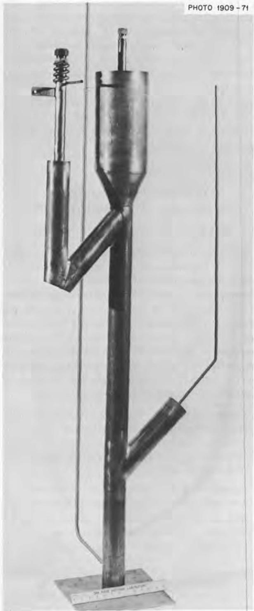  
Fig. 18.14. Test vessel for autoresistance heating test No. 1.

the salt level raised into the gas-liquid disengaging section, heat generation rates up to $600\mathrm{W}$ were achieved; all of the heat was apparently generated in the vicinity of the upper electrode.

In order to determine the reason why the current was not traveling the desired path, a new vessel that would allow easier observation of the electrode and the frozen salt was designed and built. This test vessel (see Fig. 18.15) was made from 6-in. sched 40 nickel pipe and had a 4-ft vertical test section. No upper side arm was provided for the high-voltage electrode; instead, the electrodes passed directly into the test section through a nozzle in the top flange. A lower side arm made from 4-in. sched 40 nickel pipe was placed near the bottom of the test vessel to aid in adjusting the liquid level at the top of the test section. Cooling was accomplished by conduction through $\frac{1}{2}$ in. of insulation and natural convection to the cell air. A flange with two sight glasses was installed in order to permit observation of the interior of the vessel during operation.

Two experiments have been carried out in the second test vessel. In the first experiment, the vessel was cooled (by natural convection to the ambient air) for $1\mathrm{hr}$ in order to freeze salt on the vessel wall in the test section. Resistance measurements made during the cooldown period indicated resistances of $0.05\Omega$ with no frozen material on the walls and $0.1\Omega$ after $1\mathrm{hr}$ of cooling. The minimum calculated resistance, assuming complete coverage of the vessel wall by frozen salt in the 4-ft test section, is $3.7\Omega$ . In the second test, the vessel was cooled for $1\mathrm{hr}$ , drained, and allowed to cool to room temperature. The resistance measured just prior to draining was $0.2\Omega$ . The top flange was removed in order to visually examine the frozen salt layer.

The frozen salt layer had a mean thickness of approximately $3/16$ in.; however, its crystalline texture was unlike the frozen layers observed in earlier frozen-wall studies with a gas-salt contactor or with electrolytic cells. Rather than the smooth solid-liquid interface seen in these studies,[8,9] the frozen salt had dendrites up to $3/4$ in. long over the surface of the test section; no portion had a smooth appearance.

With low heat fluxes, it is believed that the frozen material forms slowly at relatively few nucleation sites and large crystals grow from these sites. The liquid left behind in the vicinity of the crystals would have a slightly lower liquidus temperature than material ini

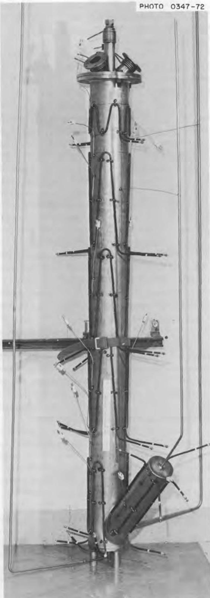  
Fig. 18.15. Test vessel for autoresistance heating test No. 2.

tially present. This would allow electrically conducting liquid to be interspersed between the crystals. The resulting salt layer would thus not be electrically insulating. The appearance of the frozen salt left on the vessel walls is in agreement with this hypothesis.

With higher heat fluxes, the wall temperature would be low enough to freeze the lower-melting liquid remaining after initial precipitation of some solid. Also, the higher temperature gradient associated with the higher heat fluxes should prevent formation of a dendritic structure. Both effects should lead to a completely solid (and therefore electrically insulating) frozen layer.

After a few additional tests, we will modify the system to allow forced cooling and will install a larger autoresistance power supply in order to operate the test equipment with higher heat fluxes.

# 18.9 ENGINEERING STUDIES OF URANIUM OXIDE PRECIPITATION

M.J.Bell D.D.Sood L.E.McNeese

Operation of a facility for performing engineering studies of uranium oxide precipitation was continued during this report period.10 Eleven experiments have been performed in the facility, and the oxide precipitation process continues to appear to be an attractive alternative to fluorination for removing uranium from fuel salt that is free of protactinium. In these experiments, we observed the effects of the salt temperature, the gas feed rate, and the water concentration in the gas on the oxide precipitation rate. The sequence of operations during an experiment was as follows:

1. Contact of the salt containing $\mathrm{UF_4}$ with an argon-water gas mixture in the precipitator in order to precipitate oxides of uranium and thorium. Samples of the oxide and salt phases were obtained during and after this step.   
2. Separation of the oxide from the salt by allowing the oxide to settle to the bottom of the precipitator.   
3. Transfer of about $90\%$ of the salt slowly from the precipitator to the salt feed tank in order to minimize the quantity of oxide transferred.

Table 18.4. Summary of data from oxide precipitation runs OP-1 through OP-8   

<table><tr><td rowspan="3">Run No.</td><td rowspan="3">Temperature (°C)</td><td rowspan="3">Argon-water composition (percent H2O)</td><td rowspan="3">Water utilization (%)</td><td rowspan="3">HF evolved (moles)</td><td colspan="3">Final uranium concentration (wt %)</td><td rowspan="3">Composition of solid solution (percent UO2)</td></tr><tr><td rowspan="2">Calculateda</td><td colspan="2">Measured</td></tr><tr><td>Vessel</td><td>Feed tank</td></tr><tr><td>OP-1</td><td>600</td><td>10–15</td><td></td><td></td><td></td><td>0.95</td><td>0.95</td><td>96</td></tr><tr><td>OP-2</td><td>600</td><td>10–15</td><td></td><td>0.60</td><td>0.44</td><td></td><td>0.53</td><td>91</td></tr><tr><td>OP-3</td><td>600</td><td>10</td><td></td><td>0.84</td><td>0.36</td><td></td><td>0.43</td><td>91</td></tr><tr><td>OP-4</td><td>600</td><td>25</td><td>14</td><td>0.85</td><td>0.33</td><td>0.38</td><td>0.44</td><td>89</td></tr><tr><td>OP-5</td><td>600</td><td>35</td><td>12</td><td>1.0</td><td>0.21</td><td>0.25</td><td>0.29</td><td>89</td></tr><tr><td>OP-6</td><td>540</td><td>10–15</td><td>10</td><td>0.76</td><td>0.41</td><td>0.41</td><td>0.46</td><td>92</td></tr><tr><td>OP-7</td><td>600</td><td>35</td><td>9</td><td>1.4</td><td>0.16</td><td>0.10</td><td>0.13</td><td>91</td></tr><tr><td>OP-8</td><td>630</td><td>35</td><td>11</td><td>1.7</td><td>0.16</td><td>0.033</td><td>0.065</td><td>89</td></tr></table>

${}^{a}$ Assuming equilibrium between salt and oxide.

4. Hydrofluorination of the salt and any oxide present in the salt feed tank. The salt was sampled after this step.   
5. Transfer of the salt back to the precipitator and hydrofluorination of the salt and oxide in preparation for the next experiment. The salt was sampled during this step in order to ensure complete hydrofluorination of the oxide.

Results of the first eight experiments are summarized in Table 18.4.

Experiments were conducted at temperatures from 540 to $630^{\circ}\mathrm{C}$ , and the composition of the argon-water mixture was varied from 10 to $35\%$ water. Only a slight increase in reaction rate with an increase in temperature was observed; however, the rate of precipitation appears to vary in direct proportion to the rate at which water is supplied to the system. The values for the water utilization observed to date have been uniformly low (about 10 to $15\%$ ) and do not vary with the composition of the gas stream. The utilization appears to be simply a function of the residence time of the gas in the salt; thus higher utilization values should be obtained by increasing the contact time of the gas with the salt. The initial uranium concentration in the salt was about $1\mathrm{wt}\%$ in the first seven experiments, and 50 to $90\%$ of the uranium was precipitated as oxide in most of the experiments. Table 18.4 shows the quantity of HF gas collected in each experiment, which is directly related by the stoichiometry of the reaction to the quantity of oxide formed. From the quantity of oxide formed, the equilibrium data of Bamberger and Baes11 were em

ployed to compute the composition of the oxide and the uranium concentration in the salt, assuming equilibrium between the salt and oxide. The equilibrium relationship places a lower limit of about 1600 wt ppm on the concentration of uranium in the salt that can be achieved in a single equilibrium stage without the precipitation of large quantities of $\mathrm{ThO}_2$ . When this concentration is reached, further addition of oxide results mainly in the solid becoming richer in thoria, and in minimal precipitation of uranium. In several experiments, the measured uranium concentrations in the salt samples agree fairly closely with the values calculated by assuming that the salt and oxide phases are in equilibrium. There is a trend in some of the early experiments for the uranium analyses to show slightly higher uranium concentrations than are calculated by assuming equilibrium; and, in the last two experiments, the measured uranium concentrations are below those calculated by assuming equilibrium.

The salt samples obtained from the feed tank showed uranium concentrations that are only slightly higher than those measured in the precipitator vessel. Sufficient data are not available at this time to determine whether the higher concentrations in the receiver tank were the result of entrainment of a small amount of oxide or due to the salt heel in the receiver vessel (which contains some $\mathrm{UF_4}$ ), but information will be obtained in the next few runs to resolve this uncertainty. Also shown in Table 18.4 are the compositions of the $\mathrm{UO_2 - ThO_2}$ solid solutions that were observed at the conclusion of each experiment. All of the samples contain about $90\%$ $\mathrm{UO_2}$ even though, at the lower uranium concentrations in the salt, the solid in equilibrium with the salt would contain $50\%$ $\mathrm{UO_2}$ or less.

Typical results of analyses of oxide samples obtained through experiment OP-8 are shown in Table 18.5. In

Table 18.5. Composition of oxide samples obtained in experiments OP-2 to OP-8   

<table><tr><td rowspan="2">Sample identification</td><td rowspan="2">Temperature (°C)</td><td rowspan="2">Salt composition (mole % UF4)</td><td colspan="2">Principal phase</td><td rowspan="2">Other phases (percent of total)</td><td colspan="2">Percent UO2</td></tr><tr><td>Percent of total</td><td>Percent UO2</td><td>Experimental</td><td>Equilibrium oxide</td></tr><tr><td>2-8D</td><td>600</td><td>0.16</td><td>&gt;90</td><td>93.1</td><td>1–5</td><td>88–92</td><td>92</td></tr><tr><td>3-3A</td><td>600</td><td>0.073</td><td>80–95</td><td>91.4</td><td>5–15</td><td>73–87</td><td>84</td></tr><tr><td>4-2A</td><td>600</td><td>0.088</td><td>80–95</td><td>89.8</td><td>5–15</td><td>72–85</td><td>86</td></tr><tr><td>4-3A</td><td>600</td><td>0.067</td><td>60–90</td><td>89.6</td><td>10–40</td><td>54–81</td><td>82</td></tr><tr><td>5-1</td><td>600</td><td>0.048</td><td>&gt;90</td><td>89.2</td><td>2–10</td><td>80–87</td><td>75</td></tr><tr><td>6-1</td><td>540</td><td>0.12</td><td>&gt;90</td><td>92.0</td><td>2–10</td><td>83–90</td><td>93</td></tr><tr><td>6-2</td><td>540</td><td>0.11</td><td>&gt;90</td><td>92.3</td><td>1–5</td><td>88–91</td><td>93</td></tr><tr><td>7-2</td><td>600</td><td>0.027</td><td>75–95</td><td>90.6</td><td>5–15</td><td>68–86</td><td>54</td></tr><tr><td>8-3</td><td>630</td><td>0.012</td><td>70–90</td><td>89.1</td><td>10–30</td><td>62–80</td><td>25</td></tr></table>

general, the oxide samples contain more than one face-centered cubic phase - a principal phase that is rich in $\mathrm{UO}_2$ and one or more additional phases that are rich in $\mathrm{ThO}_2$ . In many cases, more than $90\%$ of the solid consists of a phase that is about $90\% \mathrm{UO}_2$ , and less than $10\%$ of the solid consists of a thorium-rich phase. Apparently, a minimum of 5 to $10\%$ of the precipitate will consist of a phase that is rich in $\mathrm{ThO}_2$ , which is believed to be the result of inadequate mixing of the salt in the present equipment. The experimentally observed oxide compositions are compared with the composition of the solid solutions calculated to be in equilibrium with the $\mathrm{UF}_4$ concentration in the salt in each experiment. The average $\mathrm{UO}_2$ content of the precipitates is $80 \pm 10\%$ , even in those samples where the oxide in equilibrium with the salt is much lower (experiments OP-7 and OP-8).

These results are plotted in Fig. 18.16, which shows the $\mathrm{ThO_2 / UO_2}$ ratio in oxide samples taken during the first eight experiments as a function of the uranium concentration in the salt. The data are plotted along with the values given by the equilibrium relation of Bamberger and Baes, which predicts that, at low $\mathrm{UF_4}$ concentrations in the salt, the ratio of $\mathrm{ThO_2}$ to $\mathrm{UO_2}$ in the solid becomes quite large. The data of Table 18.5 (the points shown with error bars) agree fairly closely with the equilibrium calculation at high concentrations of $\mathrm{UF_4}$ in the salt but fall well below the equilibrium curve at low uranium mole fractions. The results for a number of other samples, in which only one face-centered cubic solid could be identified, are also shown in Fig. 18.16. These samples are of interest because, in most cases, the principal solid phase contains a much higher fraction of $\mathrm{UO_2}$ than is calculated from the equilibrium expression. These results have led to a nonequilibrium precipitation model in which $\mathrm{UO_2}$ -

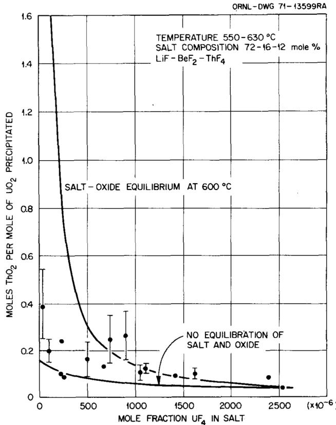  
Fig. 18.16. Compositions of salt and oxide samples obtained during precipitation experiments OP-1 through OP-8.

$\mathrm{ThO_2}$ solid solutions are precipitated that are in equilibrium with the salt at the moment of formation, but in which the solid solutions, once formed, do not rapidly reequilibrate. Thus, solid solutions that are formed early in the precipitation process, and that contain 90 to $95\%$ $\mathrm{UO_2}$ , are still present during the final stages of precipitation when the solid solutions

being formed contain much less $\mathrm{UO}_2$ . A curve representing this model of the precipitation process is also shown in Fig. 18.16. Based on this model, $99\%$ of the uranium could be precipitated from the salt in one stage as a solid containing $85\% \mathrm{UO}_2$ (which is acceptable). The experimental data indicate that the oxides actually observed have a slightly lower $\mathrm{UO}_2$ content, which is believed to be the result of precipitation of a thorium-rich phase due to inadequate mixing of the salt phase. However, the compositions of the solid solutions which have been observed are still well within the range of those required for operation of a flowsheet using a single-stage $\mathrm{UO}_2$ precipitator.

Table 18.6 shows the uranium material balances that were made for experiments OP-2 through OP-7. The inventory of uranium remaining in the salt is calculated using analyses of salt samples and the known inventory of salt in the system. The uranium concentration in the solid is obtained from x-ray analysis of oxide samples, and the total amount of oxide in the system is calculated from the amount of HF evolved. The uranium inventory calculated by the material balances for these experiments was found to agree quite well with the known uranium inventory in the system, which was 0.290 mole. This agreement is considered to be a reasonable check on the consistency of the experimental procedures and the analytical techniques.

Two experiments (OP-10 and OP-11) were performed in which a large fraction of the uranium in the system was precipitated and in which the precipitate was allowed to remain in contact with the salt for a period of about one week in order to observe the rate of equilibration of the two phases. Experiment OP-10 was performed with the salt temperature at $550^{\circ}\mathrm{C}$ , and experiment OP-11 was carried out with the salt temperature at $620^{\circ}\mathrm{C}$ . In each experiment, gas was circulated through the draft tube in order to promote contact of the salt and oxide. Samples of salt and oxide were

obtained at intervals during the experiments. No detectable increase was noted in the uranium concentration in the salt in either case, and little or no equilibration of the two phases occurred.

Samples of oxide obtained during experiment OP-11 have been washed free of salt and examined petrographically. Thus far, the samples examined reveal that particles with a high $\mathrm{UO}_2$ content average $40 \pm 10\mu$ in size and that these particles are consistently larger than particles with a high $\mathrm{ThO}_2$ content. More detailed information concerning the size distribution of the precipitate will be obtained from future samples. The slow rate of reequilibration and the particle sizes observed in experiments OP-10 and OP-11 continue to make the oxide precipitation process appear attractive. Future experiments dealing with uranium oxide precipitation will be designed to obtain further information concerning the size distribution of the solids, to determine the quantity of oxide that is entrained during decantation, and to study the behavior of the system using hydrogen-water gas mixtures as the source of oxide.

The present facility also lends itself to the initial investigation of the behavior of protactinium and rare earths in systems of engineering interest. An experiment is planned in which niobium will be used as a substitute for protactinium and in which $^{23} \mathrm{~Pa}$ tracer will also be present. It is expected that such an experiment will provide information on the suitability of niobium as a stand-in for protactinium and that it will be possible to demonstrate the selective precipitation of niobium and protactinium oxides in systems where uranium is present at MSBR concentrations. Experiments are being considered in which rare earths will be added to the system; in these experiments, we will attempt to demonstrate that $\mathrm{UO}_2$ can be precipitated from fuel salt without the attendant precipitation of rare earth oxides.

Table 18.6. Material balances for experiments OP-2 through OP-7   

<table><tr><td>Experiment</td><td>UF4in salt (moles)</td><td>UO2in solid (moles)</td><td>Total uranium accounted for (moles)</td><td>Percent of inventory</td></tr><tr><td>OP-2</td><td>0.154</td><td>0.136</td><td>0.290</td><td>100</td></tr><tr><td>OP-3</td><td>0.124 ± 0.010</td><td>0.142 ± 0.038</td><td>0.266 ± 0.048</td><td>92 ± 16</td></tr><tr><td>OP-4</td><td>0.110 ± 0.015</td><td>0.143 ± 0.029</td><td>0.299 ± 0.044</td><td>103 ± 15</td></tr><tr><td>OP-5</td><td>0.073 ± 0.014</td><td>0.204 ± 0.012</td><td>0.277 ± 0.026</td><td>96 ± 9</td></tr><tr><td>OP-6</td><td>0.124 ± 0.009</td><td>0.170 ± 0.009</td><td>0.294 ± 0.018</td><td>101 ± 6</td></tr><tr><td>OP-7</td><td>0.029 ± 0.010</td><td>0.267 ± 0.031</td><td>0.296 ± 0.041</td><td>102 ± 14</td></tr></table>

# 18.10 DESIGN OF A PROCESSING MATERIALS TEST STAND AND THE MOLYBDENUM REDUCTIVE EXTRACTION EQUIPMENT

E. L. Nicholson W. F. Schaffer, Jr.

Design of the loop components continued, and fabrication of some of the structural parts of the test stand was started. Specific accomplishments include: design of the expansion loops in the molybdenum tubing; completion of preliminary piping drawings and the construction of a full-size mockup of the loop; design of the molybdenum equipment support system; design of a field assembly jig and a handling system so that the loop can be field assembled in Building 4508 and transported to Building 4505 for operation; design of the containment vessel, the seal-welded flange, the freeze valve, and the transition joint nozzles.

Calculations were completed and the design was prepared for the loops to accommodate thermal expansion in molybdenum tubes for the instrument purgege, gas-lift supply, and transfer lines. Tests, by the Metals and Ceramics Division, of $\frac{1}{4}$ -in. molybdenum tubes brazed into a stainless steel socket and loaded as small cantilever beams showed that the molybdenum exhibited brittle failure at a stress of 67,500 psi. An allowable design tensile stress of one-tenth of this value (6750 psi) was used for calculating the size of the expansion loops and for all other stress calculations involving molybdenum. The following conditions must be met to ensure satisfactory performance of the expansion loops:

1. The gas entering the molybdenum tube must be preheated to at least $300^{\circ}\mathrm{F}$ . This preheating also ensures that all the molybdenum tubing will be heated above the brittle-to-ductile transition temperature.   
2. The molybdenum lines inside the containment vessel must be coated with a high thermal emissivity coating to a point beyond the expansion loop to promote rapid heating of the inlet gas in the molybdenum tube to the loop operating temperature, thus minimizing the amount of thermal expansion accommodation required for each line.   
3. The gas flow to each line must be limited to about 1.5 times the normal maximum flow.

Alternative designs were attempted in which none of the preceding three restrictions were imposed (i.e., the maximum accidental misoperation case). However, the required expansion loops were too large to be accommodated in the available space in the containment vessel.

Preliminary piping drawings were prepared, and the Metals and Ceramics Division constructed a full-scale mockup of the molybdenum equipment and piping. The mockup has been quite useful for improving the piping arrangement and for ensuring that sufficient space for the fabrication operations is provided around each shop- or field-welded and -brazed tubing joint. We are now preparing detailed piping drawings from the mockup arrangement. The overall height of the molybdenum system from the underside of the containment vessel flange to the lowest point on the molybdenum tubing is slightly greater than 16.7 ft.

An equipment alignment column, attached to the underside of the containment vessel flange and extending down the full height of the loop, is required to brace the equipment and to position guide rings for insertion of the loop in the containment vessel. A molybdenum rod was considered for this alignment column to eliminate any differential thermal expansion and, consequently, any binding of the equipment supports. However, a rod of sufficient rigidity to prevent excessive bending of the molybdenum components during insertion of the loop in the containment vessel would have been very expensive. A bar having a diameter greater than or equal to 2.1 in. and a length of 17 ft would have been required; a single piece of molybdenum tubing of sufficient rigidity was considered to be completely out of the question. Stainless steel pipe $(2^{1/2}$ in. sched 80) was selected for the alignment column. The molybdenum equipment will be hung on small-diameter molybdenum rods that will extend to the containment vessel flange and will be braced to the alignment column by horizontal molybdenum sheet braces that will be anchored to clamps on the column. During fabrication and the subsequent erection of the loop to the vertical position, these clamps will be locked on the alignment column. The clamps will then be loosened before final installation of the loop by removing cylindrical shims so that the stainless steel column can expand freely in the axial direction without binding on the clamps and thereby stressing the molybdenum components. Drawings have been prepared for the equipment support system.

The original plan was to fabricate the molybdenum vessels and piping subassemblies in electron-beam vacuum chambers and inert-gas welding glove boxes in Building 4508 and to carry the fabricated items to Building 4505, where the field assembly work would be done. An existing 16-ft-tall multilevel platform was to be converted to a vertical assembly area in Building 4505. The problems associated with this method for field assembly were numerous, and a more satisfactory

assembly concept has evolved and has been adopted. A rigid transportable field assembly jig, which will allow the field assembly work to be done in Building 4508, has been designed; the jig will be used in the horizontal position, and all of the molybdenum components will be at essentially tabletop level. Temporary tubing and equipment supports and protective covers will be installed; and the jig, after assembly of the molybdenum equipment, will be transported to Building 4505 and erected to the vertical position over cell 4A. The molybdenum equipment will then be released from the jig and lowered into the containment vessel. Rigging procedures have been reviewed to ensure that several handling problems can be solved. Fabrication of the jig, lifting frame, trunnion bars and sockets, and the special hatch cover for the cell has been initiated. When these parts are available, a run of the transport and erection procedure will be conducted, probably using the piping mockup as a stand-in for the molybdenum system.

The seal-welded flange and containment vessel designs have been reviewed by the Pressure Vessel Committee and approved on a preliminary basis. Detailed design of these components is under way, and procurement of the necessary materials is in progress. Design of the molybdenum-to-stainless-steel transition joint nozzles for the containment vessel is complete, as are the designs of the freeze valve, the containment vessel support, and the auxiliary platform required inside cell 4A. We expect that most of the design work for the system will be completed in the next six-month period.

# 18.11 DEVELOPMENT OF A BISMUTH-SALT INTERFACE DETECTOR

H. O. Weeren E. L. Nicholson C. V. Dodd

An eddy-current type of detector is being developed12 to allow detection and control of the bismuth-salt interface in salt-metal extraction columns or mechanically agitated salt-metal contactors. The probe consists of a ceramic form on which bifilar primary and secondary coils are wound. Contact of the coils with molten salt or bismuth is prevented by enclosing the coils in a molybdenum tube. In operation, a high-frequency alternating current is passed through the primary coil, and it induces a current in the secondary coil. The induced current is dependent on the conductivities of the materials located adjacent to the primary and secondary coils; since the conductivities of salt and

bismuth are quite different, the induced current reflects the presence or absence of bismuth. The principal problem associated with this type of detector stems from the high conductivity of molybdenum, the fabrication material of the protective sheath. Two approaches for obtaining an output from the detector are being pursued. The first is based on measuring changes in the magnitude of the induced current; the second is based on measuring the phase shift that occurs between the voltage imposed on the primary coil and that which is induced in the secondary coil.

The completed probe has been installed in a carbonsteel test vessel; both the probe design and the test vessel design were described previously. The test vessel has three chambers; the upper chamber is a reservoir for molten bismuth, the middle chamber contains the sheathed probe, and the lower chamber, which simulates the interior of the high-temperature containment vessel for the molybdenum reductive extraction equipment, contains 13 ft of high-temperature electrical cable in an inert atmosphere. Bismuth can be transferred via pressure between the upper and middle chambers to vary the level around the probe; this level can be measured with a bubbler system and compared with probe readings. The test assembly is shown schematically in Fig. 18.17.

During this report period, the test vessel was installed and leak tested. The two upper compartments were filled with argon, and a vacuum was maintained in the lower compartment by means of a vacuum pump. The vessel was heated to $625^{\circ}\mathrm{C}$ and treated with hydrogen for 16 hr to reduce oxides. Bismuth $(21.65\mathrm{kg})$ was added and treated with hydrogen for 16 hr at $625^{\circ}\mathrm{C}$ .

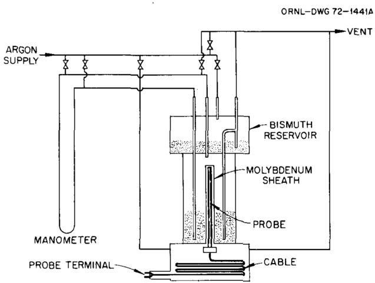  
Fig. 18.17. Flow diagram of probe test system.

The lower compartment was then pressurized with argon to 14.7 psia.

The level of bismuth around the probe (measured with a mercury manometer) was varied at approximately 1-in. intervals and was compared with the output from the level detector. This procedure was repeated at operating temperatures ranging from 550 to $700^{\circ}\mathrm{C}$ in increments of $25^{\circ}\mathrm{C}$ . A straight-line plot was made at each temperature, and the standard deviation of the readings was 0.05 in. The average measured sensitivity of all the readings was $0.866^{\circ}$ /in., as compared with the calculated value of $0.827^{\circ}$ /in. The average temperature coefficient over the entire temperature range varied from $-0.0075^{\circ}$ /°C (+0.009 in./°C) at a level of 1 in. to $-0.0024^{\circ}$ /°C (+.003 in./°C) at a level of 12 in. A plot of the results obtained at 550 and $700^{\circ}\mathrm{C}$ is shown in Fig. 18.18. Assistance with the measurements and data analysis was obtained from the Nondestructive Testing Group of the Metals and Ceramics Division, who also assisted in the design of the level detector.

We plan to make measurements of the change in magnitude of the induced current that is caused by a change in the liquid level in the near future, and will repeat some of the measurements with the phase-shift technique in order to check for long-term drift in the readings.

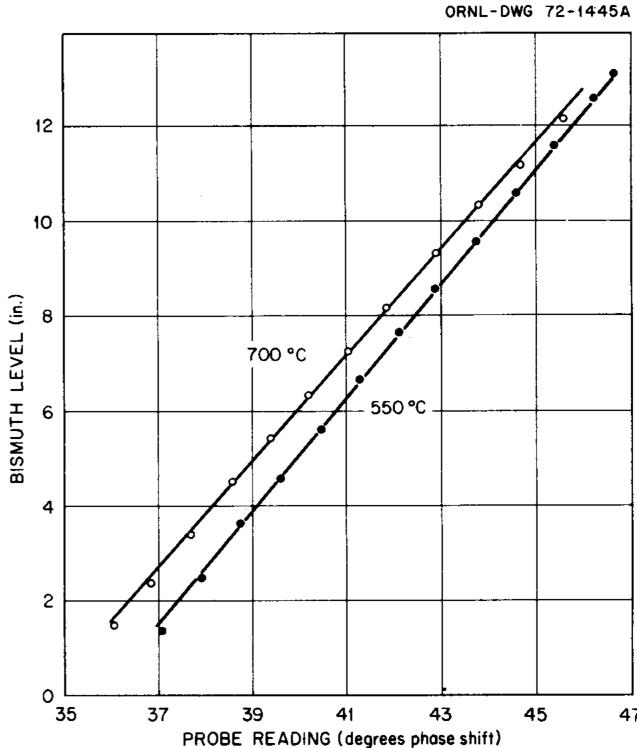  
Fig. 18.18. Comparison of phase-shift readings and bismuth level.

# 19. Continuous Salt Purification

R. B. Lindauer

Studies of the reduction of $\mathrm{FeF_2}$ in molten salt by contact of the salt with hydrogen in a packed column were continued after the packed column was replaced. The new column is packed with $1 / 4\times 1 / 4\times 1 / 32$ in.wall Raschig ring packing, which has a $32\%$ greater void volume than the original $1 / 16$ -in.-wall packing. Other changes, as described in the previous report, were an enlarged, packed liquid-deentrainment section and modifications to the piping to improve salt flow and to reduce the possibility of salt plugs in the vent lines. Before the iron fluoride reduction runs were resumed, four argon-salt tests were made to determine the column throughput. Although the installed rotameters had insufficient capacity to actually flood the column, we were able to attain flow rates that were three times the maximum values possible with the initial column. The pressure drop across the column was somewhat lower than that observed during some runs with the earlier column, indicating that still higher flow rates are possible.

In order to evaluate the use of $^{59}\mathrm{Fe}$ tracer rather than colorimetric iron analyses, about $1\mathrm{mCi}$ of tracer was added to $600~\mathrm{ml}$ of molten salt to which sufficient $\mathrm{FeF}_2$ had been added to produce an iron concentration of $209~\mathrm{ppm}$ . The salt was then diluted, first to $1000~\mathrm{ml}$ and then to $1750~\mathrm{ml}$ . After the first dilution, the calculated iron concentration in the salt was $132~\mathrm{ppm}$ . Data obtained by counting the $^{59}\mathrm{Fe}$ tracer showed $137~\mathrm{ppm}$ , while colorimetric analysis indicated an iron concentration of $176~\mathrm{ppm}$ . The second dilution should have reduced the iron concentration to $82~\mathrm{ppm}$ . Tracer counting data showed a concentration of $78~\mathrm{ppm}$ , and a colorimetric analysis showed $122~\mathrm{ppm}$ . Part of the iron fluoride was then reduced by sparging the salt with hydrogen. Tracer counting data indicated that less than $5~\mathrm{ppm}$ of iron remained in solution, while colorimetric analysis indicated iron concentrations greater than 20

ppm. This test demonstrated that the data obtained from colorimetric analyses are less accurate than those obtained by $^{59}\mathrm{Fe}$ tracer counting, especially at very low iron concentrations.

Following these tests, a larger amount $(\sim 15\mathrm{mCi})$ of $^{59}\mathrm{Fe}$ tracer was added to the salt in the feed tank of the continuous salt purification system after three iron fluoride reduction runs had been carried out using the new column. In 14 succeeding experiments on iron fluoride reduction, the variation between duplicate samples of salt containing iron fluoride was $\pm 1.8\%$ by $^{59}\mathrm{Fe}$ tracer counting and $\pm 4.2\%$ by colorimetric analysis. Since the average reduction per run was only $4.8\%$ , it is apparent that the tracer method is more suitable for obtaining meaningful data from the new column. Data from the runs are summarized in Table 19.1. The average mass transfer coefficient, $k_{l}a$ , for the new column was $7.8\times 10^{-6}$ mole $\mathrm{sec}^{-1}\mathrm{cm}^{-3}$ , which is lower than the value of $3.2\times 10^{-5}$ mole $\mathrm{sec}^{-1}\mathrm{cm}^{-3}$ for the first three runs with the old column having the thicker-wall packing. The average mass transfer coefficient, $k_{l}a$ , is defined by the following expression:

$$
k _ {l} a = \frac {L}{A H} \ln \frac {x _ {i}}{x _ {o}},
$$

where

$k_{l}a =$ product of the mass transfer coefficient and the interfacial area per unit column volume, moles $\sec^{-1}\mathrm{cm}^{-3}$

$L =$ salt flow rate, g-moles/sec,

$A =$ cross-sectional area of column, $\mathrm{cm}^2$

$H =$ height of column, cm,

$x_{i} =$ iron concentration in the inlet salt,

$x_{o} =$ iron concentration in the exit salt.

The mass transfer coefficient, $k_{l}a$ , is reported instead of $k_{l}$ since the interfacial area between the salt and gas is

Table 19.1. Summary of iron fluoride reduction runs at ${700}^{ \circ  }\mathrm{C}$   

<table><tr><td rowspan="2">Run No.</td><td colspan="2">Hydrogen</td><td rowspan="2">Salt flow rate (cm3/min)</td><td colspan="2">Iron analysisa</td><td rowspan="2">H2utilizationb(%)</td><td rowspan="2">Percent of equilibrium HF conc in off-gas</td><td rowspan="2">Mass transfer coefficient, kja(moles sec-1cm-3×106)</td></tr><tr><td>Concentration (atm)</td><td>Flow (liters/min)</td><td>Colorimetric (ppm Fe)</td><td>59Fe tracer (dis min-1g-1×10-5)</td></tr><tr><td>17</td><td>1.0</td><td>40.6</td><td>420</td><td>649c</td><td></td><td>0.028</td><td>2.8</td><td>5.6</td></tr><tr><td>18</td><td>0.20</td><td>6.3</td><td>393</td><td>625</td><td></td><td>0.24</td><td>10.2</td><td>7.6</td></tr><tr><td>19</td><td>1.0</td><td>43.4</td><td>387</td><td>618</td><td></td><td>0.01</td><td>1.0</td><td>2.3</td></tr><tr><td></td><td></td><td></td><td></td><td>500d</td><td>6.06</td><td></td><td></td><td></td></tr><tr><td>20</td><td>1.0</td><td>45.0</td><td>439</td><td>499</td><td>5.66</td><td>0.06</td><td>6.3</td><td>15.4</td></tr><tr><td>21</td><td>0.19</td><td>6.2</td><td>390</td><td>488</td><td>5.42</td><td>0.24</td><td>10.7</td><td>8.7</td></tr><tr><td>22</td><td>1.0</td><td>52.5</td><td>220</td><td>489</td><td>5.45</td><td></td><td></td><td>3.3</td></tr><tr><td>23</td><td>0.15</td><td>5.7</td><td>211</td><td>444</td><td>5.11</td><td></td><td></td><td>(av of 22, 23)</td></tr><tr><td>24</td><td>1.0</td><td>46.5</td><td>373</td><td>454</td><td>4.92</td><td>0.024</td><td>2.7</td><td>7.3</td></tr><tr><td>25</td><td>0.16</td><td>5.6</td><td>291</td><td>478</td><td>4.53</td><td>0.32</td><td>14.4</td><td>12.4</td></tr><tr><td>26</td><td>1.0</td><td>54.7</td><td>322</td><td>436</td><td>4.30</td><td>0.022</td><td>2.5</td><td>8.6</td></tr><tr><td>27</td><td>0.16</td><td>5.2</td><td>459</td><td>394</td><td>4.12</td><td>0.25</td><td>12.1</td><td>10.1</td></tr><tr><td>28</td><td>1.0</td><td>22.0</td><td>160</td><td>429</td><td>3.95</td><td>0.02</td><td>2.4</td><td>3.5</td></tr><tr><td></td><td></td><td></td><td></td><td>388d</td><td>3.94</td><td></td><td></td><td></td></tr><tr><td>29</td><td>1.0</td><td>41.1</td><td>390</td><td>384</td><td>3.91</td><td>0.005</td><td>0.56</td><td>1.5</td></tr><tr><td>30</td><td>0.16</td><td>4.9</td><td>325</td><td>370</td><td>3.79</td><td>0.13</td><td>6.4</td><td>5.2</td></tr><tr><td>31</td><td>0.13</td><td>2.4</td><td>177</td><td>337</td><td>3.34</td><td>0.53</td><td>24</td><td>11.5</td></tr><tr><td>32</td><td>1.0</td><td>16.1</td><td>155</td><td>325</td><td>3.31</td><td>0.001</td><td>0.15</td><td>0.7</td></tr><tr><td>33</td><td>1.0</td><td>21.7</td><td>592</td><td>302</td><td>3.04</td><td>0.12</td><td>15.9</td><td>26.0</td></tr></table>

${}^{a}$ Samples taken after the run - usually the average of two samples.   
$b_{\text{Based on}}$ $^{59}$ Fe activity.   
Samples (9) before run 17 average 66 ppm.   
${}^{d}$ When elapsed time between runs was large,the salt was resampled before the run.

not known. Since the salt does not wet the packing, it did not seem reasonable to assume the interfacial area to be equal to the surface area of the packing as is normally done in systems where the packing is wetted by the dispersed phase. About half of the reduction runs were made with dilute hydrogen (13 to 19 vol%). Changes in the hydrogen partial pressure caused no decrease in the rate of reduction; this validates our previous assumption, that the rate of reaction is controlled by the rate at which iron fluoride is transferred from the bulk of the salt to the salt-gas interface rather than being controlled by the rate of reaction at the interface.

A total of 18 runs were made to obtain salt holdup data during the countercurrent flow of argon and salt in the column. The data were obtained by observing the

amount of salt that drained from the column after salt flow was stopped at the end of a run. Additional data points were obtained by changing the salt or gas flow rate during a run and observing the change in salt inventory in the feed and receiver tanks. Most of the runs were made with a range of salt flow rates and a constant (2-liter/min) argon flow rate. Data from the best runs showed a linear increase in salt holdup from about $5\%$ of the column void volume at $100~\mathrm{cm}^3/\mathrm{min}$ to about $11\%$ at $500~\mathrm{cm}^3/\mathrm{min}$ . Several runs were also made with a range of argon flow rates and a constant $(250-\mathrm{cm}^3/\mathrm{min})$ salt flow rate. In these runs, the salt holdup appeared to decrease about $25\%$ at the maximum gas flow rate from the maximum salt holdup, which was observed at an argon flow rate of about 7 liters/min.

！  
#   
#

# OAK RIDGE NATIONAL LABORATORY

# MOLTEN-SALT REACTOR PROGRAM

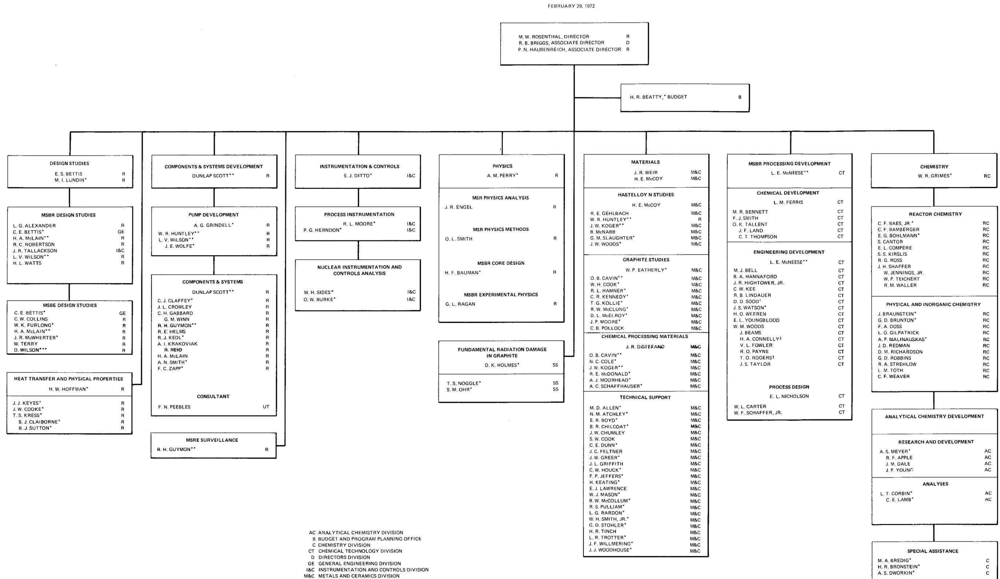