# The Development Status of

# MOLTEN-SALT BREEDER REACTORS

August 1972

OAK RIDGE NATIONAL LABORATORY

OPERATED BY UNION CARBIDE CORPORATION • FOR THE U.S. ATOMIC ENERGY COMMISSION

Printed in the United States of America. Available from National Technical Information Service U.S. Department of Commerce

5285 Port Royal Road, Springfield, Virginia 22151

Price: Printed Copy $3.00; Microfiche $0.95

This report was prepared as an account of work sponsored by the United States Government. Neither the United States nor the United States Atomic Energy Commission, nor any of their employees, nor any of their contractors, subcontractors, or their employees, makes any warranty, express or implied, or assumes any legal liability or responsibility for the accuracy, completeness or usefulness of any information, apparatus, product or process disclosed, or represents that its use would not infringe privately owned rights.

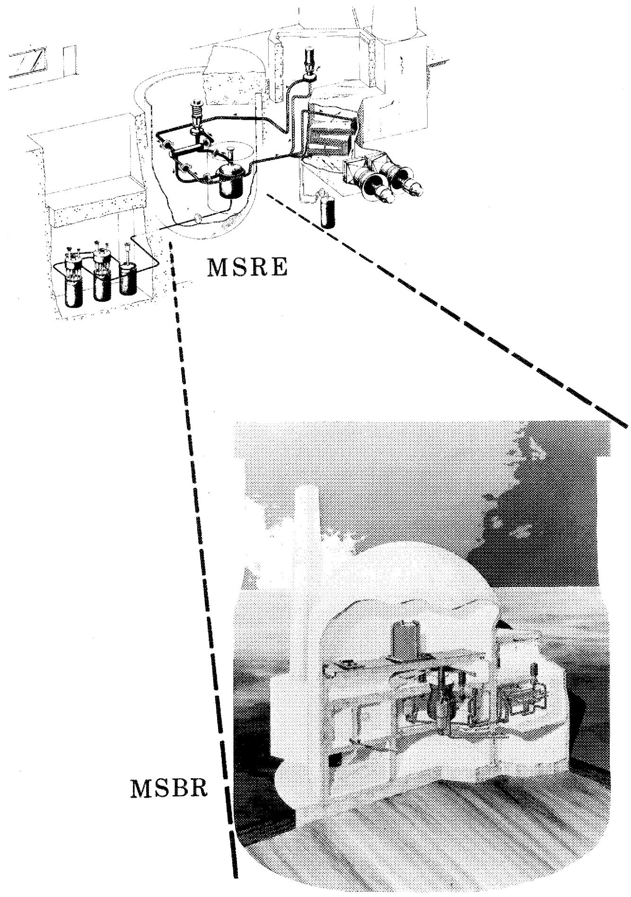

ORNL-4812

UC-80 - Reactor Technology

Contract No. W-7405-eng-26

MOLTEN-SALT REACTOR PROGRAM

THE DEVELOPMENT STATUS OF MOLTEN-SALT BREEDER REACTORS

M. W. Rosenthal, Program Director

P. N. Haubenreich, Associate Director

R. B. Briggs, Associate Director

August 1972

OAK RIDGE NATIONAL LABORATORY

Oak Ridge, Tennessee 37830

operated by

UNION CARBIDE CORPORATION

for the

U.S. ATOMIC ENERGY COMMISSION

# ABSTRACT

Molten-salt reactor technology, under development since 1947, has led to a concept of a high-temperature, thermal-neutron breeder reactor that operates on the thorium- $^{233}\mathrm{U}$ fuel cycle. A connected processing plant that continuously removes protactinium and fission products from the fuel salt is a basic feature of the system. The success of the Molten-Salt Reactor Experiment that was operated between 1965 and 1969, the development of a new processing method that allowed simplification of the breeder design, and the potential breeding performance, economics, and safety of the concept, are cited in this report as arguments for the continued development of MSBR's. The report reviews the status of the technology, identifies further development needs for an MSBR, and gives the program staff's assessments of the uncertainties and the likelihood of success. Separate chapters are devoted to reactor physics, chemistry, graphite, reactor metals, reactor components and systems, cells and building, control and instrumentation, fuel processing, maintenance, design studies, and environmental effects and safety.

Keywords: review, molten salts, reactors, breeding, development, design, maintenance, safety, chemistry, processing, alloys, graphite.

# CONTENTS

# Chapter

1. INTRODUCTION, SUMMARY, AND CONCLUSIONS 1

Background 2

Features of the Single-Fluid Breeder Reactor 4

The Processing Plant for the Single-Fluid Breeder 6

Nuclear and Economic Performance of the Breeder 6

The Status of Development, the Major Uncertainties,

and the Alternatives 8

Reactor Physics and Fuel Cycles 8

Fuel and Coolant Chemistry 8

Graphite 9

Materials for Salt-Containing Vessels and Piping 10

Reactor Components and Systems 12

Cells, Buildings, and Containment 14

Instrumentation and Controls 14

Fuel Processing 15

Maintenance 17

Design Studies and Capital Cost Estimates 17

Environmental Effects and Safety 18

Future Development Program 19

The Incentives for MSBR Development 21

Fuel Utilization 22

Power Cost 22

Safety 25

The Likelihood of Success 26

Fuel Utilization 27

Power Cost 27

Safety 28

Overall Conclusions 30

References for Chapter 1 31

2. EVOLUTION AND DEVELOPMENT OF MOLTEN-SALT REACTORS 33

Origins 33

Relation to Other Fluid-Fuel Programs 34

Early MSBR Concepts 35

The MSRE 35

Purpose 35

Description 36

Development and Construction 36

Operation 40

Results 41

Recent Molten-Salt Reactor Concepts 42

Current Programs 45

USAEC Molten-Salt Reactor Programs 45

Industrial Studies 46

Foreign Programs 46

References for Chapter 3 48

# Chapter

# Page

3. DESIGN CONCEPT OF THE SINGLE-FLUID MSBR 51

ORNL Reference Design 51

Objectives 51

Ore Conservation 52

Power Cost 52

Safety and Environmental Considerations 52

Technical Feasibility 53

General Concept of the Single-Fluid Breeder 53

Features of the Reference Design 55

Alternatives to the Reference Design 61

Ebasco Variations from ORNL Design 61

Low-Power-Density Core 62

References for Chapter 3 63

4. REACTOR PHYSICS AND FUEL CYCLES 65

Introduction 65

Breeding in Molten-Salt Reactors 66

Uncertainties 69

Reactor Statics 77

Multiplication Factor 77

Power-Density Distributions 79

Reactivity Control 81

Reactivity Coefficients 81

Radiation Calculations 83

Reactor Dynamics 83

Effects of Fuel Circulation 85

Frequency Response and Reactor Stability 85

Fuel-Cycle Economics 86

7Li 88

Thorium 88

Beryllium 90

Uranium 90

Graphite 90

Evaluation 92

References for Chapter 4 94

5. FUEL AND COOLANT CHEMISTRY 95

Introduction 95

Fuel Salts 95

Basis for Choice of Composition 95

Experience with Molten Salt Fuels 97

Present Status of Fuel Chemistry 100

Phase Behavior Among Fluorides 100

Effect of Oxide 104

Physical Properties 107

Chemical Compatibility of MSBR Materials 109

Interaction of MSBR Fuel with Extraneous Materials . 112

Purity Requirements 113

Radiation Stability 114

Evaluation and Summary of Needed Work 115

# 5. (cont.)

Fission Product Behavior 116

General 116

Major Groups and Yields 117

Stable Salt-Soluble Fluorides 122

Salt Samples 122

Deposition 122

Gas Samples 125

Noble Metals 125

Salt-Borne 125

Niobium 129

Gas-Borne 129

Deposition on Graphite and Hastelloy N 130

Iodine 133

Evaluation 133

Future Work 135

Coolant Salts 135

Basis for Choice of Composition 135

Present Status of Fluoroborate Chemistry 137

Phase Behavior 137

Behavior with Hydroxide Ion 139

Physical Properties 139

Compatibility with Hastelloy N 141

Interactions with Steam 142

Interactions with Fuel Salt 142

Purification of Fluoroborate Mixtures 144

Radiation and Stability 145

Evaluation and Summary of Needed Work 145

Analytical Chemistry 146

Requirements 146

Experience 147

Sampling 148

Oxide 148

Uranium 149

U3+ 149

Spectrophotometry of Radioactive Samples 149

Gas Analysis 152

Gamma Spectrometry at the MSRE 152

Bismuth 152

Current Research and Development 152

Electrochemical Research 153

Spectrophotometric Research 157

Transpiration and Gas Analysis 161

In-Line Applications 163

Future Work 165

Evaluation 166

References for Chapter 5. 167

# Chapter

# Page

6. GRAPHITE 175

Relationship Between Graphite and Core Design 175

Nuclear Requirements 175

Design Requirements 176

General Background 176

Current Status 181

Irradiation Damage Studies 181

Fabrication Studies 182

Xenon Control 186

Thermal Conductivity 187

Stresses and Creep 187

Manufacturing Capability and Costs 190

Uncertainties and Further Work 190

Irradiation Damage and Graphite Fabrication 191

Xenon Control 191

Thermal Conductivity 192

Stresses and Creep 192

Evaluation 192

References for Chapter 6 193

7. MATERIALS FOR SALT-CONTAINING VESSELS AND PILING 195

Material Requirements 196

Background 196

Initial Objectives and Screening Tests 196

The Metallurgy of Hasteley N 196

Corrosion Resistance of Hastelloy N. 198

Physical and Mechanical Properties of Hastelloy N . 200

Experience with Hastelloy N in the MSRE 200

Fabrication 200

Operation 200

Corrosion 200

Radiation Embrittlement 201

Grain-boundary Cracks 201

Current State of Materials Development 202

Corrosion 202

Irradiation Embrittlement 204

Intergranular Cracking 206

Influence of Material Uncertainties 212

Further Work 214

Evaluation 216

References for Chapter 7 218

8. REACTOR COMPONENTS AND SYSTEMS 221

SaltPumps. 222

Requirements and Criteria 222

Salt Pump Concepts 222

Short-Shaft Pump 226

Long-Shaft Pump 226

# 8. (cont.)

Pump Experience 229

Short-Shaft Pump 229   
Long-Shaft Pump 231   
Industrial Experience and Interest 231

Status of Pump Technology 231

Scaling up Pump Capacity 232   
Design 232   
Fabrication 233   
Long-Shaft Pump 233   
Potential Improvements 233   
Industrial Involvement 233   
Effects of Uncertainties 234

Salt Pump Development Requirements 234

eluation 235

Coolant System 236

cription 236   
Experience with Coolant Salts 237   
Status of Fluoroborate Coolant Technology 239   
certainties in Use of Fluoroborate 242   
ther Development Work 243

Cover Gas Addition to and Removal from the Pump Bowl 243

Corrosion Product Deposition 243   
Mist Control 244   
On-Line Analysis 244   
Coolant Leaks 244

Evaluation 245

Heat Exchangers 245

Requirements and Criteria for the Primary Heat

Exchangers and Steam Generator 245

Current Concepts 247

Heat Transfer Experience 250

Materials Experience 250

Status of Heat Exchanger Technology 251

Uncertainties and Their Sensitivity to

Nonachievement of Objectives 252

Feedwater Temperature List 252   
Tube Sheet Protection 253   
Flow Instabilities in the Steam Generator 253

Configuration 253

Pressure Pulse from Rupture of a Steam Tube 253   
Correlations and Physical Properties 254   
Thermal Transients 254

Steam Wastage and Leak Detection (Steam Generator) 254

Fission Product Deposition 254   
Materials Compatibility 254   
Fabrication Techniques 255

# 8. (cont.)

Development Program for Heat Exchangers 255

Primary Heat Exchanger 255

Steam Generator Materials 255

Steam Generator 256

Evaluation 257

Steam System 257

Present Proposals for Supercritical Steam Cycle 257

Uncertainties Resulting from the Feedwater

Temperature Requirements 259

Evaluation 260

Steam Generator Auxiliary Systems 260

Steam Generator Startup System 261

Valves 262

General Description of Valves and Valve Requirements 262

Experience with Molten-Salt Valves 262

Aircraft Reactor Program Development Work on

Mechanical Valves 263

ORNL 4-in. Throttling Valve 263

Valve Experience in Sodium Systems 264

Status of Valve Technology 264

Effect of Uncertainties of the Mechanical Valves 264

Development Program Remaining for Valves 265

Evaluation 265

Central Rods and Drives 265

General Description and Design Requirements 265

Experience 266

Status of Control Rod Technology 267

Effect of Uncertainties 268

Further Work 268

Evaluation 268

Fuel Storage and Afterheat Removal 269

Draining the Reactor 269

Leakage of Fuel Salt 269

AfterheatRemoval. 270

Off-Gas Separation and Cooling 270

Drain Tank Design 271

Status of Technology 271

Uncertainties 273

Evaluation 273

Fuel Salt Gas-Handling System 273

Purposes 273

MSBR Gas System 274

Description 274

Noble Gas Stripping 276

Analysis of Noble Gas Stripping 276

Iodine Removal 282

Off-Gas Handling 282

Noble Gas Absorption on Charcoal 284

Purge Gas Cleanup 286

# 8. (cont.)

MSRE Gas Systems 286

Description 286

Analysis of Noble Gas Stripping 287

Off-Gas System Performance 288

Development Studies 290

Effects of Unknowns and Uncertainties 294

Future Work 296

Overall Evaluation 297

Summary 297

References for Chapter 8 300

9. CELLS, BUILDINGS, AND CONTAINMENT 309

Requirements 309

Description 309

MSRE 309

MSBR Building 310

MSBR Cells 311

Status and Uncertainties 312

Evaluation 313

10. PLANT CONTROL AND INSTRUMENTATION 315

Requirements and Current Concepts 315

Systems for Normal Operation 315

Emergency Systems 316

Instrumentation 316

FeaturesPeculiartoMSBR. 317

Experience with the MSRE and Other Facilities 318

Control Analyses 320

Computer Models 321

Analysis of Steady-State Conditions 321

Analysis of Transient Behavior 322

Accident Analyses 323

Reactivity Control 323

Instrumentation 324

High-Temperature Flux Sensors 324

Process Instrumentation 324

Rod Drives 325

Salt Throttling Valves 325

Digital Computer Application for Control and

Data Handling 326

Chemical Plant Instrumentation and Control 326

Uncertainties and Alternatives 326

Evaluation 328

References for Chapter 10 329

# Chapter

# Page

11. FUEL PROCESSING 331

Reference Processing Plant 331

Distribution of Metals Between Molten Salts

and Bismuth 333

Protactinium Removal System 335

Rare-Earth Removal Process 339

Conceptual Processing Flowsheet 339

Waste Streams Produced by Processing Plant 343

Alternate Processing Methods 346

Status of Process Development 347

Metal Transfer Process Development 347

Reductive Extraction Studies 349

Continuous Fluorinator Development 350

Fuel Reconstitution 351

Uranium Oxide Precipitation Studies 351

Removal of Bismuth from Fuel Salt 352

Materials of Construction for Processing Plants 353

Molybdenum 354

Tungsten and Tantalum Alloys 356

Graphite 356

Nickel-Base Alloys 357

Effect of Uncertainties on Processing 358

Failure to Develop Continuous Fluorinators 358

3. Compatibility of Materials with Process Fluids 359

Entrainment of Bismuth in Fuel Salt 359

359

Further Work Required to Demonstrate Processing

Technology 360

Overall Evaluation of Processing Capability 361

References for Chapter 11 362

12．MAINTENANCE 365

Concept 365

37

MSRE Preparations 367

Extent of MSRE Experience 368

Conclusions from MSRE 370

Reference Design MSBR 371

Containment 372

Afterheat 373

Graphite Replacement 374

Status 371

Further Work 376

Evaluation 37

References for Chapter 12 378

# Chapter

13. DESIGN STUDIES AND CAPITAL COST ESTIMATES 379

Introduction 379

Primary Systems Layout and Structural Design 379

Background and Status 379

Sensitivity to Uncertainties 380

Future Work 381

Evaluation 381

Design Methods - Codes and Standards 381

Background 381

Status 381

Sensitivity to Uncertainties 382

Future Work 383

Evaluation 384

Capital Costs 384

Background and Status 384

Sensitivity to Uncertainties 385

Evaluation 386

Conclusions 386

References for Chapter 13 387

14. ENVIRONMENTAL EFFECTS AND SAFETY 389

General Considerations 389

Characteristics of Reference-Design MSBR 390

Environmental Effects of Normal Operation 390

Nuclear Safety 391

Radionuclide Decay Heating 395

Interaction of Materials 399

Corrosion 399

Coolant Salt Interactions 400

Engineered Safety Features 402

Siting Considerations 403

Transportation During Construction 404

Transportation During Operation 404

Effluents 406

Radionuclide Inventory 406

Design-Basis Accident 406

Decommissioning 406

Summary 408

Experience and Knowledge 408

Containment 408

Instrumentation and Control 409

Salt Handling 409

Uranium Behavior 409

Fission-Product Behavior 410

Kinetic Behavior 411

Further Work 411

Evaluation 415

References for Chapter 14 416

# 1. INTRODUCTION, SUMMARY, AND CONCLUSIONS

In the authorization report [1] on the Atomic Energy Commission's programs for FY-1973, the Joint Committee on Atomic Energy expressed "a word of caution" with regard to the Molten-Salt Reactor Program. It said:

"For the fourth successive year, the Commission has requested authorization of about $5 million for development of the molten salt reactor. The committee recommends authorization of the$ 5 million requested for fiscal year 1973, although in so doing it wishes to voice a word of caution with respect to this program.

This concept, born under the Aircraft Nuclear Propulsion Program, has been under development for about twenty years. Over $130 million has been expended on it to date. In light of this long period of research and development and in recognition of progress realized on alternate concepts during this period, the committee recommends that the AEC make a thorough reevaluation of the technical characteristics and potential of the molten salt reactor with a view to deciding whether this work should be continued and, if so, the appropriate level of funding required to achieve a definite program objective. Sufficient information should now be available to make a consummate judgment on whether additional effort is justified on this program. The interest in and potential support for this program by the utility-industrial group which has been assessing this technology should be considered by the Commission as a part of its evaluation.

It is clear that if the molten salt reactor is to achieve fruition in a time frame during which it could make a significant contribution to the civilian nuclear power program, significantly more financial investment will be required for detailed design and construction of important component test facilities and an engineering prototype reactor to demonstrate commercial application. In addition, the use of homogeneous molten salt fuel, with the attendant requirement of on-line processing, requires an entire technology unto itself in terms of materials, fuel cycle and equipment. Therefore, the committee views a thorough appraisal at this time as imperative for the Commission and the industry to determine appropriate priorities for optimum allocation of available financial and technical resources."

Anticipating that the JCAE statement will lead to a thorough review of the molten-salt reactor concept, we have put together this report to provide up-to-date information for the review. The report briefly describes the features of the molten-salt breeder reactor as we visualize it today, gives our estimate of its performance potential, and attempts to state the present status of the technology that is required for the concept and the likelihood that any developments needed can be accomplished successfully.

Although in writing the report we have attempted to discuss all matters that are of significance to the feasibility of the concept, we have not by any means attempted to summarize all of the information that exists on molten-salt reactors. However, the report does contain references to a number of pertinent topical and progress reports, including many of the 75 topical reports that have been written to record what was learned from construction and operation of the Molten-Salt Reactor Experiment. These and other reports and papers are also listed, along with abstracts, in reference 2, and the reader is referred to it for additional information.

# Background

As noted in the authorization report, the origin of molten-salt reactors was in the Aircraft Nuclear Propulsion Program. In 1947, some participants in that program concluded that molten-fluoride salts had useful attributes for the fuel of an aircraft propulsion reactor - high uranium solubility, excellent chemical stability, and good physical properties - and work was started on a molten-salt aircraft power plant. Early in the aircraft development program came the recognition that the molten-salt technology offered additional advantages for civilian power use: avoidance of fuel element fabrication, rapid and inexpensive reprocessing, on-line refueling, good neutron economy, and high temperature operation at low pressure. Consequently, in 1956 a program was begun at ORNL to investigate molten-salt reactors for central station generation of electricity. Three years later, enough progress had been made in defining the concept that an AEC task force on fluid-fuel reactors could say that, while limited in breeding ratio, the molten-salt approach had the greatest chance of technical success of any fluid-fuel system [3].

A result of this opinion was that in 1960 construction of the Molten-Salt Reactor Experiment was authorized. The 7.4 MW(t) MSRE became critical at Oak Ridge in 1965 and, after a very successful operating history, was shut down in late 1969 so that its budget could be used for developments aimed at molten-salt breeder reactors.

The MSRE experience was of major importance to the molten-salt concept. Up until the MSRE began to operate well, in spite of the Task Force conclusion, few people besides those actively involved in the development program considered molten-salt reactors to be really practical. The major reason was that operation and maintenance of a system containing a highly radioactive fluid fuel that melted at over $800^{\circ}\mathrm{F}$ seemed extremely

difficult. In 1966, however, the MSRE began to provide evidence to offset that view. When power operation began, the usual start-up problems were encountered; but sustained power operation provided a remarkable demonstration of operability. Starting in late 1966, an uninterrupted one-month run was made, then a three-month run, and finally a six-month run. Next, using a small fluoride volatility plant connected to the reactor, the original partially enriched $^{235}\mathrm{U}$ fuel was removed from the salt and was replaced by $^{233}\mathrm{U}$ that had been made in a production reactor. The MSRE then operated a final year on the $^{233}\mathrm{U}$ , which made it the only reactor to ever have been operated on this fuel, and for a period plutonium was used as the makeup fuel. When shut down, the MSRE had circulated fuel salt at around $1200^{\circ}\mathrm{F}$ for a total of 2-1/2 years.

During the years in which the MSRE was being built and brought into operation, most of the development work on molten-salt reactors was in support of it. As a result of the MSRE's success, however, the budget was increased to permit work aimed at molten-salt breeder reactors, and the shutdown of the MSRE freed additional funds for this purpose. The most significant product of this effort has been a new chemical processing method. Brought forth in 1968, this development permitted an important change in our concept of an MSBR. (Like many features of molten-salt reactors, this processing concept grew out of basic work on the chemistry of fluoride salts that has been carried out for a number of years as part of the AEC's Physical Research Program.)

When molten-salt reactors were first considered for central-station use, it was not clear whether they would serve best as converters or as thermal breeders. A good converter could be obtained by putting uranium and thorium in a single salt, but it appeared that they would have to be in separate salts to obtain a good breeder. This was because the chemical processing methods then available were only suitable for separate uranium and thorium salts, a fertile thorium blanket was required, and most of the fertile material would have to be kept out of the core to limit neutron captures in protactinium. The conclusion at that time was that either the converter or the breeder could lead to low-cost power, and the MSRE ended up having a single salt so that its engineering features resembled a converter, but the salt did not contain thorium, which made it similar to the fuel salt of a two-fluid breeder.

As emphasis in the USAEC reactor development program shifted more and more to breeders, the design and development effort at ORNL was concentrated increasingly on the two-fluid system in spite of the greater technical difficulty of the reactor core. This difficulty arose chiefly because graphite tubes were required to separate the two salts in the core, and building a reliable graphite piping system that would withstand the radiation damage of the high neutron flux appeared very difficult.

The processing advance of 1968 eliminated this problem. This advance was the demonstration of the chemical feasibility of using liquid bismuth to extract protactinium and rare earths from fuel salt that contains both uranium and thorium. Protactinium, the intermediate in the breeding chain between thorium and $^{233}\mathrm{U}$ , has a significant neutron capture cross section and must be kept out of the core of a thermal breeder to obtain a good breeding ratio. The rare earths are important neutron poisons and must also be removed rapidly for good breeding. The new process

made both of these possible; and when coupled with an advance in core design that creates a fertile blanket out of a salt that contains uranium and thorium, it made feasible a single-fluid breeder that obviated the major problem of the two-fluid reactor. The single-fluid concept also had another important advantage: the MSRE experience became more directly applicable to the breeder.

Studies showed that the breeding ratio of a single-fluid breeder can be nearly as good as that of the two-fluid reactor, and the power generation cost might be even lower. Consequently, in 1968 the Molten-Salt Reactor Program was directed to the development of the single-fluid breeder reactor.

# Features of the Single-Fluid Breeder Reactor

A conceptual design of a 1000 MW(e) MSBR was prepared at ORNL and in 1971 a report [4] was issued describing the concept. Ebasco Services, Inc., and a number of industrial firms and utilities associated with them in the privately-funded Molten-Salt Group, have reviewed the molten-salt technology [5] and the ORNL design [6], and Ebasco and its industrial partners have also begun a separate conceptual design study of MSBR's under an ORNL subcontract [7]. These efforts have produced useful suggestions, and some have been incorporated into our concept of an MSBR.

We visualize the basic concept as shown in Fig. 1.l. The core is formed from an array of bare graphite bars, so designed that they can be replaced from above, and having open channels that provide for the passage of salt. The volume fraction left for salt is different in different regions of the core, and in an annular space it has been made high enough that this volume is undermoderated and acts like a blanket where most of the escaping neutrons are absorbed in the thorium.

The fuel salt is a mixture of lithium-7, beryllium, thorium, and uranium fluorides that melts at $930^{\circ}\mathrm{F}$ . At reactor operating temperature, it has a viscosity about like that of kerosene and a remarkably low vapor pressure. As shown in the figure, this salt flows upward through the core where it is heated to $1300^{\circ}\mathrm{F}$ , and it then is pumped through a heat exchanger where the heat is transferred to a sodium fluoroborate intermediate coolant. The coolant transports the heat to a steam system where supercritical steam at $1000^{\circ}\mathrm{F}$ is generated, leading to an overall thermal efficiency of $44\%$ . All of the salt-containing equipment is made out of Hastelloy N, a nickel-base alloy developed especially for use with molten fluoride salts in the aircraft propulsion program.

All of the salt-containing equipment is located in steel-lined concrete cells that can be heated to raise the equipment above the melting point of the salt. A drain tank located below the reactor has a natural-convection cooling system that is always in use and that serves as an extremely reliable heat-rejection system for fission-product decay heat. Fuel is drained into this tank during shutdowns, and the cells are designed so that in the event of a salt spill, it would also reach this tank and be cooled.

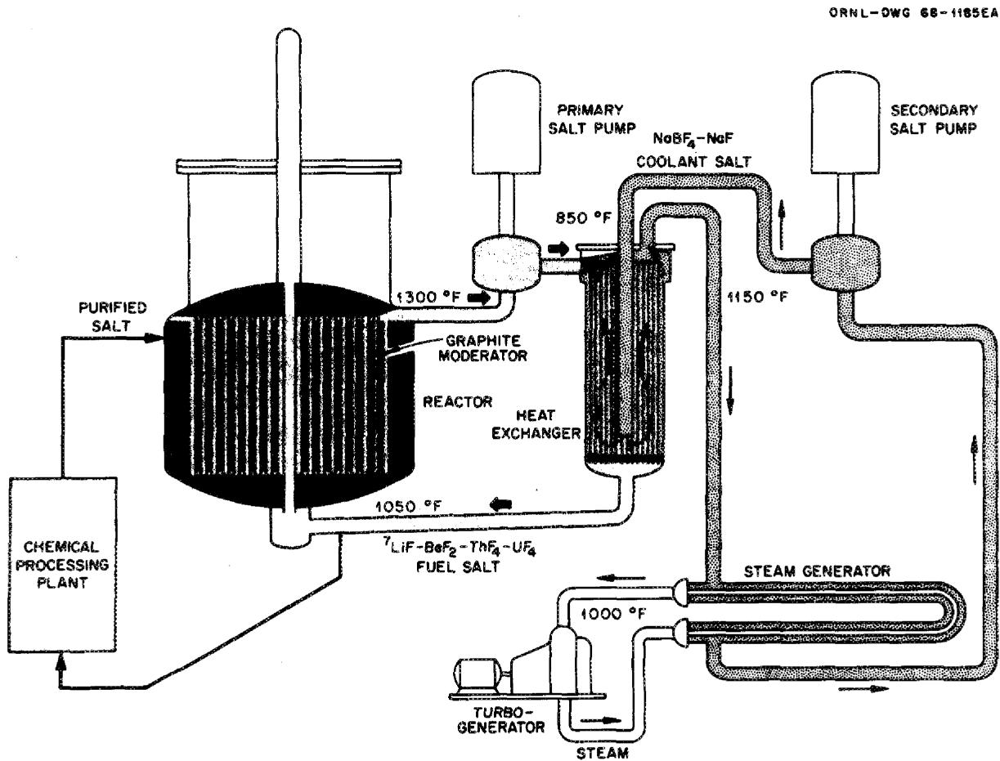  
Fig. 1.1. Single-fluid, two-region molten salt breeder reactor. For $1000\mathrm{MW(e)}$ , the fuel salt flow rate through the core is $55,000\mathrm{gpm}$ but less than $1\mathrm{gpm}$ passes through the processing plant. Electricity is produced from supercritical steam with an overall efficiency of $44\%$ .

Bubbles of helium are injected into a bypass stream of fuel salt and swept back out in a cyclone separator to purge xenon-135, the major neutron poison, and other noble gases out of the reactor. Another and much smaller side stream of fuel salt is passed through the chemical processing plant to remove the protactinium and the salt-soluble fission products.

Enclosing the reactor and the chemical plant cells is a conventional lined-concrete containment building, which backs up the cells themselves to provide an additional barrier to the escape of radioactivity. The arrangement of the cells and the building layout provide access from above through removable shielding to all the radioactive parts of the plant that might require maintenance.

# The Processing Plant for the Single-Fluid Breeder

The fuel salt enters the processing plant at 0.9 gpm, a rate which passes the entire contents of the reactor system through the plant every ten days. It goes first to a fluorination column where the uranium is removed as volatile $\mathrm{UF_6}$ . Next it flows to an extractor where it is contacted with liquid bismuth containing some dissolved lithium, and here in a reductive-extraction process, the lithium enters the fuel salt in exchange for protactinium which enters the bismuth. An additional step transfers the protactinium into a separate salt where it is held until it decays to uranium and is returned to the reactor.

The fuel salt, now free of uranium and protactinium, goes to the "metal-transfer process" where it is contacted with a captive volume of bismuth into which the rare earths and some other fission products pass. From this bismuth the fission products are in turn transferred into lithium chloride. In the metal-transfer process, the bismuth acts somewhat as a selective membrane which permits the passage of the fission products between the fuel salt and the lithium chloride without the passage of thorium.

Finally, the $\mathrm{UF_6}$ removed in the initial step is contacted with the purified fuel salt and reduced back to $\mathrm{UF_4}$ for return to the reactor. Waste products in the plant are accumulated, given a final fluorination treatment to recover any uranium that might have passed that far, and put in storage in the reactor building where they are held as long as desired before transfer to a central waste-disposal facility.

Special materials will be required in the processing plant. The wall of the fluorinator will be protected from corrosion by a frozen layer of salt. The transfer lines will probably be made out of molybdenum tubing, and some of the large vessels may be built out of graphite.

# Nuclear and Economic Performance of the Breeder

We have performed physics analyses of the reactor described in the ORNL conceptual design report [4] and have found its major characteristics to be the following:

Average core power density 22 kw/1

Fissile uranium inventory of reactor

and processing plant 1500 kg

Breeding ratio 1.07

Fuel doubling time (exponential)

at $80\%$ plant factor 19 years

Using these values, we have estimated that the fuel-cycle cost for the 1000 MW(e) MSBR will be about 1.0 mill/kwh, as shown in the following breakdown:

mills/kwh

Fixed charges on fissile inventory at 13.2%/yr 0.36

Fixed charges on thorium and carrier salt at 13.2%/yr 0.08

Thorium and carrier salt makeup 0.04

Fixed charges on processing plant at 13.7%/yr 0.49-0.69

Processing plant operating costs 0.05

Fuel production credit -0.09

Net fuel cycle cost 0.93-1.13

The cost of the processing plant has been treated as part of the fuel-cycle cost to make it comparable with fuel-cycle costs of solid-fuel reactors. As a result, the largest single item is the fixed charges on the processing plant. (This cost would be lower if the processing plant served more than 1000 MW(e) of reactor capacity.)

If graphite having no better irradiation resistance than that available today is used in the core, some of it will have to be replaced every four years. The cost of replacement, including the cost of special labor, appears to lie between 0.1 and 0.2 mili/kwh.

The capital cost of the reactor itself has been estimated using, where appropriate, detailed cost information on a light-water reactor of about the same size. A basic assumption is that the molten-salt industry has advanced to the point where development costs have been largely absorbed and the manufacture of components and the construction and licensing of plants have become routine. Under these conditions, we find that the capital costs of molten-salt and light-water reactors should be about the same. While the molten-salt reactor has some features which add costs, particularly the provisions for remote maintenance of radioactive systems, it also has high thermal efficiency and a low-pressure primary system that reduce costs.

In sum, the single-fluid MSBR will have a relatively low breeding gain but a compensatingly small fissile inventory. The total of the fuel-cycle cost and the cost of graphite replacement should be below the fuel-cycle cost of light-water reactors, and the capital cost of the reactor and power plant should be about the same as that of a light-water reactor.

# The Status of Development, the Major Uncertainties, and the Alternatives

The major objectives of this report are to assess the status of MSBR technology, to identify any needed developments whose successful accomplishment is uncertain, and in those cases, to see what alternatives are available if the proposed approach does not succeed. Our conclusions about these subjects, broken down in the same way they are treated in the report, are as follows:

# Reactor Physics and Fuel Cycles

In a fluid-fuel reactor many reactor physics problems, such as power-density distribution, localized burnup, and reactivity lifetime, are either not very demanding or are nonexistent. The most important matter in the MSBR is the accurate prediction of breeding ratio. Adequate data and methods of calculation exist (similar to those for other graphite-moderated reactors) and have been proved in the MSRE and in experiments at temperatures up to $1000^{\circ}\mathrm{C}$ in the HTLTR. For the reference MSBR, with a calculated breeding ratio of 1.071, the total uncertainty due to all sources of error in reactor physics is only $\pm 0.016$ . (Uncertainties about the behavior of fission products add to this.) Capabilities for calculation of critical concentration, rod worth, and reactivity coefficients are also quite adequate.

The dynamics of MSBR's are influenced by the circulation of the fuel, but these effects are well understood and predictable. As shown by operation of the MSRE, the small delayed neutron fraction with circulating $^{233}\mathrm{U}$ fuel causes no problem. A prompt negative temperature coefficient of reactivity and a long neutron lifetime contribute to the stability enjoyed by molten-salt reactors.

The core design of the MSBR was optimized on the basis of an index of breeding performance consisting of the breeding gain divided by the square of the specific inventory of fissile material. Fuel cycle costs at this optimum turn out to be low and not very sensitive to rather wide variations in many of the design and operational parameters.

Thus it appears that an extensive reactor physics program to develop data and methods for the MSBR is not needed.

# Fuel and Coolant Chemistry

There is no doubt about the choice of the fuel salt - the $\mathrm{LiF - BeF_2 - ThF_4 - UF_4}$ system meets MSBR requirements far better than any other mixture. Its most serious shortcoming is the low solubility of oxide (30 ppm $0^{2-}$ ), which will require that the ingress of air or moisture be carefully controlled. Here the MSRE experience provides confidence, since its oxide content changed little during plant life.

Fission-product chemistry in fluoride salts is well understood, with substantial input from the MSRE experience. The physical behavior of the noble-metal fission products, which exist in elemental form,

cannot be predicted with as much confidence as we would like, however. The reactor designer, therefore, must use conservative assumptions as to their deposition on metal and graphite and transfer into the offgas until data from operation of another reactor have reduced these uncertainties.

A fluoroborate mixture (the 92-8 mole % NaBF₄-NaF eutectic) appears to be the best choice for the loop that is needed between the fuel and steam systems. Effects of steam inleakage on corrosion and consequences of mixing fluoroborate and fuel must be explored further. Perhaps the most important need is a better understanding of the behavior of hydroxide ion and of mechanisms by which tritium, diffusing from the fuel system, can be trapped in the fluoroborate.

Fuel and coolant salts in the MSRE were analysed by removing samples from the reactor and taking them to an analytical laboratory. However, considerable progress has been made in the last few years towards developing on-line methods of analysis for salt. Most involve electroanalytical techniques, but visible-light and infra-red spectroscopy also offer promise. One corrosion loop is now operating with a controlled voltammetry instrument that reports the $\mathrm{U}^{3+}/\mathrm{U}^{4+}$ ratio in the salt, which is extremely important in reactor operation. Methods suitable for hydrogen, chromium and other corrosion products, salt impurities, and certain fission products are beginning to emerge from the development effort and, with continued progress, may become usable on a reactor.

# Graphite

Graphite in molten-salt breeder reactors must meet three particular requirements: it must stand up to neutron irradiation; it must have pores small enough that capillary forces exclude fuel salt, which does not wet graphite; and it must have a low enough permeability to gases to keep down the absorption of xenon. The graphite manufactured for the MSRE had to exclude salt, and a special small-pore material was developed by the manufacturers, but the total radiation dose was too low to make radiation damage a problem, and exclusion of xenon was not a specification. Thus, although a graphite stringer removed from the MSRE showed no effect of two and one-half years in contact with fuel salt, it would not have met the radiation damage and gas permeability requirements of an MSBR.

Radiation damage in graphite is caused by high energy neutrons and in most graphites results in shrinkage followed by expansion. These changes in conventional graphites result in the volume starting to increase rapidly at neutron fluences that are too low to be of interest for MSBR's. However, in the last several years, special grades of graphite that appear to be made by an uncalcined-coke process show little contraction and a longer period before rapid expansion begins. One that is said by the manufacturer to be commercially available has been tested in the HFIR at MSBR temperatures and found to be able to meet the 4-yr life assumption of the reference design. Consequently, a material that has adequate radiation resistance seems to be available, but longer graphite life is desirable, and there is hope that our growing understanding of radiation behavior will lead to longer irradiation life.

Progress with sealing graphite to exclude xenon has not gone as far. Two techniques that involve use of pyrolytic carbon - one that deposits it in the surface pores and the other that puts on a thin coating - can seal the material adequately, but the permeability of most of the small samples tested has increased excessively under neutron irradiation.

Some understanding of why the permeability of the coated samples increases has been gained recently from remarkably sharp photographs obtained using a new technique with the scanning electron microscope. The failures are now thought to result from defects seen in the unirradiated material, and a new procedure for depositing the coating has produced flaw-free samples that are now being irradiated. However, the sealing method has not yet been proven to work, and scale-up of the process to where it can be used for large pieces is still in front of us even if the method turns out to be a success.

Sealing graphite by impregnating the surface pores with fuel-free salt is a possibility if pyrocarbons cannot be used, but if no method will work, the breeding ratio of the MSBR will decrease somewhat because of increased neutron capture in $^{135}\mathrm{Xe}$ . The additional loss in breeding ratio will depend on the rate of stripping by the noble-gas sparging system but will probably lie between 0.005 and 0.01.

# Materials for Salt-Containing Vessels and Piping

Hastelloy N was developed for use with molten salts at the high temperatures needed in aircraft power plants, and since it has good strength and good compatibility with fluoride salts, it was used for the construction of the MSRE. While the MSRE was being built, experiments revealed that the creep ductility of Hastelloy N is reduced by neutron irradiation. This embrittlement is caused by helium produced by thermal-neutron captures in the alloy, in contrast with the embrittlement due to void formation by fast neutrons that has been of concern for fast reactors. Analyses showed that stresses in the MSRE would be low enough for the reactor to be operated safely in spite of decreased ductility, but this would not be true of future reactors, and a development program was begun to find a cure for the problem.

The approach followed was that of adding carbide-forming elements, which have been used to ameliorate the embrittlement of stainless steel by fast neutrons, and $0.5\%$ titanium was found to sustain the ductility of Hastelloy N at the MSRE temperature of $1200^{\circ}\mathrm{F}$ . However, at $1300^{\circ}\mathrm{F}$ , the outlet temperature in the ORNL-design MSBR, changes in the structure of the carbides in the alloy caused the remedy to be lost, but this was overcome by raising the titanium content to about $2\%$ . Some further gain was made by adding niobium with titanium, and hafnium in conjunction with niobium was found to be very effective, but problems with weldability and cost have caused us to limit our effort on hafnium-containing alloys. Transmission electron micrographs that disclose the carbide structure have been of great value in revealing the factors involved and permit the properties of a sample to be judged rather reliably before it is irradiated.

Small commercial heats of 100 lb each of Hastelloy N modified by $2\%$ titanium addition have been obtained from three vendors and found to have a minimum creep ductility of greater than $4\%$ at $1400^{\circ}\mathrm{F}$ after irradiation, which appears to be adequate. The material was fabricable into small tubes and weldable under high restraint, so a solution to the embrittlement problem of Hastelloy N seems to have been found. The remaining steps are to show that acceptable material can be obtained in large commercial heats, determine the time-at-temperature limits at higher temperatures, and collect mechanical properties data for code approval.

Extensive natural-circulation and forced-circulation loop tests revealed that the corrosion rate of Hastelloy N by clean fuel salt is low, and it was no surprise when salt analyses and surveillance specimens from the MSRE showed that the generalized corrosion rates were very low in the fuel salt and not detectable in the coolant salt. Near the end of MSRE operation and during the post-operation examination, however, there was a surprise when all Hastelloy N that had been in contact with fuel salt was found to form shallow, intergranular surface cracks when it was strained at room temperature.

The cracks were generally less than 0.01 in. deep, and the maximum depth did not seem to have increased with exposure time. Since material from the core and from the heat exchanger showed similar effects, irradiation did not seem to be involved, but a striking contrast between the fuel-salt and coolant-salt sides of the heat exchanger tubes indicated it probably had to do with fission products in the fuel salt. Samples were carefully leached and a variety of fission products were found in the material to a depth of about 0.003 in. At the highest concentration was tellurium, and tellurium and all other elements on which suspicion might fall were deposited on Hastelloy N samples and held at MSRE temperature for 1000 hours. Tellurium caused cracks to form when the material was strained, but no other fission product did.

As a consequence of these and many other tests of stressed and unstressed samples at various temperatures, times, and methods of fission-product deposition, the evidence seems strong that tellurium is indeed the culprit. There is reason to suspect tellurium (and also selenium, although it has shown no evidence of misbehavior) because of its similarity to sulfur, which can be troublesome with nickel-base materials.

In attempting to find a remedy for the problem, a variety of nickel-base and iron-base alloys have been tested alongside of Hastelloy N. Our exploratory experiments indicate that austenitic stainless steels are not affected, nor are Monel and copper. Members of the Hastelloy family containing about $20\%$ chromium (versus $7\%$ in Hastelloy N) have not been affected, nor have samples of modified Hastelloy N containing about $7\%$ niobium. Inconel 600, of which the Aircraft Reactor Experiment was built, was unaffected in two tests but showed shallow cracks in one.

An important result is that the materials that contain over $16\%$ chromium are unaffected. This behavior is consistent with that found with sulfur in studies made for jet aircraft engine alloys, where chromium concentrations of greater than 15 to $16\%$ are needed to prevent damage by sulfur.

Based on these observations, there appear to be alloys that are not affected by tellurium, and among them are modifications of Hastelloy N. If an increase in the chromium content of Hastelloy N is required, or an Inconel or a stainless steel must be used, the corrosion rate will be higher than that with standard Hastelloy N, but the increase will probably be tolerable. Corrosion experiments will be needed to find out. Except for the stainless steels, where the work has already been done, a change to one of these materials is likely to mean that modifications to confer radiation resistance will have to be found. If through good fortune an addition of niobium to Hastelloy N should suffice, acceptable corrosion behavior is fairly well assured, and the effect of niobium on irradiation resistance has already been investigated to some extent. In any case, in-pile capsule tests will be needed to show that the same effects are seen in-pile as with tellurium additions out-of-pile, and preparations for them are underway. A clear demonstration that a satisfactory material has been found will be necessary before another molten-salt reactor can be built.

# Reactor Components and Systems

Although many of the components and systems on an MSBR power plant are similar to those needed for solid-fuel reactors, the design requirements on others are different, and a number are unique to the molten-salt system. Many of the different or unique aspects were investigated in the development programs for the aircraft reactor and the MSRE, but not all have been used or tested, and increases in size or performance are required in most cases.

Starting first with pumps, vertical-shaft centrifugal pumps with overhung impellers were developed for molten-salt service and used satisfactorily on the Aircraft Reactor Experiment and the MSRE, as well as used and tested in a number of salt loops. (A small oil-leak from the MSRE primary pump caused problems with the off-gas system, but the pump itself was used without trouble for the reactor life, and the leak was easily corrected in a spare pump.) Although steps that add up to a 10- to 15-fold increase in capacity will be needed in a progression from the MSRE to full-size MSBR's, the same basic design as that used on the MSRE is specified in the reference MSBR design, and the scale-up should be relatively straightforward. We believe, consequently, that although several years will be required to develop and test larger pumps, the problems are well understood and satisfactory pumps can be obtained. Byron-Jackson, an associate of Ebasco in the Molten-Salt Group, has expressed similar confidence.

The MSRE intermediate heat exchanger and air-cooled radiator operated without difficulty, and analyses showed no decrease in performance throughout the plant life. Heat-transfer experiments, as well as the operation of the MSRE units, indicate that salts act as ordinary fluids and their heat-transfer behavior can be predicted reliably as long as accurate physical property data are available. The aspects of the MSBR that differ from the MSRE, aside from size, have to do with the need for high performance on the MSBR to limit the fuel-salt inventory, and the requirement that either failed tubes can be located and plugged in place, or that the tube

bundle or entire unit can be replaced. Both of these create design problems. To obtain compactness, either smaller-than-usual tubes or tubes deformed to enhance heat transfer have been shown in our heat-exchanger concepts, and use of either will require a testing program. Some increase in fuel-salt inventory will result if the compactness shown in our concept is not achieved, but since only $17\%$ of the fuel salt is in the heat exchangers, a moderate increase in their volume will have a limited overall effect. Providing for heat-exchanger repair is a part of the overall MSR maintenance problem, but new techniques for plugging tubes being developed for other uses should be helpful.

There were no steam generators on the ARE and MSRE, and as far as we know, there has been no experience with generation of steam with high-melting salts. The major problem is that in conventional steam cycles the feed-water enters the steam generator at a temperature below the melting point of the MSBR coolant salt. As a result, unless other measures are taken, some salt would freeze on the tubes. Allowing a layer of salt to form might be acceptable, but to get around the question in our reference concept, we altered the steam cycle to increase the temperature of the steam entering the steam generator. A supercritical steam cycle was adopted but modified to mix some exit steam with feedwater to raise its temperature to close to the salt melting temperature. The penalty is some additional equipment and a small loss in efficiency, but the net effect does not appear to be very great. Other ways of overcoming the salt freezing problem also appear feasible, such as the reentrant tube approach that appears in some sodium-heated steam-generator concepts. The Foster Wheeler Company is now exploring molten-salt steam generator concepts under an ORNL contract, and they will consider our concept and others before recommending a design. Whether Hastelloy N has adequate corrosion resistance for use in a high-temperature steam system is being investigated at present.

The sodium fluoride-sodium fluoroborate coolant proposed for the MSBR melts at $725^{\circ}\mathrm{F}$ . This gives it a $125^{\circ}\mathrm{F}$ melting point advantage over the $\mathrm{LiF - BeF_2}$ used in the MSRE and it is much cheaper, but until a few years ago we had had no experience at all with fluoroborates. During the past several years, however, an isothermal MSRE-scale loop has been operated with fluoroborate, as well as two small forced-convection loops with heaters and coolers, and a number of natural-circulation loops. A fairly extensive chemistry and analytical chemistry program has also been carried out. The major difficulty with fluoroborate is that it has a greater tendency to pick up moisture than the other salts we have used, which makes it more corrosive, but the corrosion rate with clean salt is modest. The $\mathrm{BF}_3$ vapor pressure over the salt requires some special provisions in the cover-gas system, but these have been worked out satisfactorily in the loops that have been operated.

The likelihood of steam generator leaks that introduce moisture into the coolant will require that a cleanup system be provided. One of the ways to prevent tritium getting into the steam may be to trap it in the coolant and extract it from there, and the processing system to accomplish this probably can serve both purposes.

The noble gases are insoluble in fuel salt, and, consequently, the fission-product poisoning in an MSBR can be greatly reduced by sparging the xenon from the salt. This was demonstrated to be very effective in the MSRE, where over $80\%$ of the $^{135}\mathrm{Xe}$ was removed. A more effective and better controlled system is proposed for the MSBR, however, that involves injecting helium into a bypass stream of salt and removing it and the noble gases with a centrifugal separator. Experiments using water have provided designs for the equipment and indications of the performance to be expected, but testing with salt is needed and is planned for an MSREScale loop now being built.

# Cells, Buildings, and Containment

The containment philosophy and the containment building design for the MSBR differ little from those for solid-fuel reactors, although the probability of greater contamination by radioactivity during maintenance will require more extensive filtration and cleanup provisions. The proposal to use the reactor and coolant cells as ovens in which to heat the salt systems, however, is not only unique to the MSBR but also is different from the MSRE, where components and pipes were enclosed in insulation and individually heated. The uncertainties that exist mainly have to do with the best way of insulating the cell and how the equipment will be supported and restrained to resist an earthquake. We foresee no limiting problems here, but if some arose, an alternative would be to return to the concept used successfully in the MSRE.

The method of providing access for maintenance by removing sections of shielding from the top of the cell was used without difficulty on the MSRE, and the major difference on the full-scale MSBR is the larger size of components to which access will be required.

# Instrumentation and Controls

MSBR's have some features that are favorable with regard to control of the reactor and a few features that add difficulties. Chief among the latter are the high freezing temperatures of the salts, which require that special provisions be made in the control and protection systems to avoid freezing during transient conditions and part-load operation. In addition, rates of temperature change probably have to be controlled during load changes to prevent excessive transient stresses in the system. While control methods have not been worked out in detail, several alternative schemes appear to be possible, and at least one should be satisfactory.

The small amount of excess reactivity required in an MSBR and the dynamic characteristics of the reactor greatly simplify the reactivity control requirements. Maintaining a long-term reactivity balance will be difficult on an MSBR because of the continuous fuel processing, and new techniques may have to be developed.

Significant experience with instrumentation systems has been obtained, with high temperature facilities of various kinds, and in particular with the MSRE where the reliability of the thermocouples was particularly

satisfactory. The pressure and flow rate of the fuel salt were not measured directly in the MSRE, however, and having the entire MSBR reactor cell heated adds the complication that all of the instruments in the cell must be able to operate at high temperature. Hence some new instruments and measurement techniques will be needed for the MSBR.

# Fuel Processing

Achievement of a significant breeding gain in a thermal spectrum reactor is dependent on rapid removal of the fission products, and in the case of the single-fluid MSBR, is also dependent on separation of the protactinium from the fuel salt. The chemical steps involved in the processes presently proposed for accomplishing these separations have been thoroughly investigated and appear to be well established. However, engineering development and the demonstration of satisfactory container materials have not progressed nearly so far.

Fluorination to recover uranium from radioactive fuel has been used several times, most recently in the fuel reprocessing at the MSRE. However, the scheme proposed for the MSBR involves continuous fluorination, which has only been demonstrated in small equipment and which requires better corrosion protection for the fluorination vessel than has been achieved before. Although many aspects of continuous fluorinators have been investigated, including the formation of frozen salt layers that are expected to protect the fluorination vessel, a significant development effort on the fluorinator lies before us. Some of the necessary experiments are underway and are progressing satisfactorily.

Direct reduction of $\mathrm{UF_6}$ for return to the reactor by its absorption into fuel salt has been demonstrated in small laboratory experiments and the behavior found to be satisfactory. However, no engineering experiments have yet been operated, although they are planned for the near future. One favorable result of the recombination experiments was the discovery that gold is not attacked by the process fluids, and gold plating may provide adequate corrosion protection for the recombiner.

Reductive extraction of realistic concentrations of uranium and zirconium, whose behavior is similar to that of protactinium, has been demonstrated with fuel salt and molten bismuth in a packed-column contactor. Flooding velocities and mass-transfer rates were measured and found to be as predicted from data on mercury-water and aqueous-organic systems. A demonstration of reductive extraction using representative concentrations of protactinium is needed, and 30 to 50 grams of $^{231}\mathrm{Pa}$ is being obtained to make that possible.

All of the steps in the metal transfer process have been demonstrated in a small single-stage integrated experiment, and preliminary operation of a larger, but still single-stage, experiment has begun. A three-stage experiment that will be 5 to $10\%$ of MSBR scale is being designed.

Losses of fissile material from the processing plant must be kept low. Although the process fluids circulate repeatedly through the plant, actual losses can occur only in the wastes. These are therefore collected together, held to await protactinium decay, and then batch fluorinated to

recover any traces of uranium before discard. Experience with fluorination shows that the uranium content can be reduced to a very low level by this technique.

Fuel salt and lithium chloride are compatible with some common construction materials, but nickel dissolves in bismuth, and the solubility of iron is great enough for mass transfer to occur rapidly in a system having significant temperature differences. Consequently, materials such as molybdenum, graphite, and tantalum will be required for the processing plant. Fabrication of molybdenum has always appeared very difficult, but we have developed a variety of forming and joining techniques during the past two years, and a fairly complicated processing facility is presently being built completely from molybdenum. Graphite should be less expensive to use than molybdenum, and the processing vessel for the three-stage metal transfer experiment will be built out of graphite. However, we presently have insufficient data on the compatibility of graphite with bismuth containing large concentrations of lithium or trace quantities of other materials. A small natural-circulation loop has been built out of a tantalum alloy and operated with bismuth; the corrosion rates of tantalum and of the alloy seem acceptably small, but there is some inconsistent evidence of embrittlement of the alloy.

Carry-over of significant quantities of bismuth to the reactor where it could attack Hastelloy N must be avoided. One Hastelloy N natural-circulation loop containing fuel salt has been run with an open capsule of molten bismuth in contact with the salt. No effect of the bismuth has been seen, but more needs to be learned about how tolerant the reactor would be of small quantities of bismuth in the salt. Little is yet known about the tendency of bismuth to be entrained in salt, and its solubility in salt has not been measured accurately, although basic thermodynamic considerations indicate that the solubility must be very low. Our approach to preventing bismuth carry-over is to attempt to develop salt-bismuth contactors with stirred interfaces in which the bismuth and salt are not dispersed, and a preliminary demonstration of this technique has been made in a metal transfer process experiment. Even if such techniques are used, however, careful analysis for bismuth, plus a final cleanup step, such as passing the salt through a bed of nickel wool, will likely be used.

Failure to develop systems for rapidly removing protactinium and the rare earths would prevent the attainment of a significant breeding gain in a single-fluid MSBR. Fortunately, alternative approaches appear to exist for most, but not all, parts of the process. Graphite may be usable for the plant material if molybdenum will not serve, and tantalum and its alloys represent another possible alternative for parts of the plant. If some parts of the presently proposed fluorination-reductive extraction process cannot be made to work, an oxide precipitation process that has been investigated in a limited way appears to offer an attractive alternative; protactinium can be selectively precipitated as $\mathrm{Pa_2O_5}$ by treating fuel salt with a mixture of steam and hydrogen fluoride, and uranium can subsequently be removed by a similar process. Indeed, further work may show that the oxide process has advantages over the fluorination-reductive extraction method.

We know of no attractive substitute for the metal-transfer process, but because its development has progressed further than that of the remainder of the processing systems, it seems most likely to be successful. In addition, it is the step least coupled to the reactor, and reducing the rare-earth removal efficiency several-fold would not have a prohibitive effect on the breeding ratio. (A three-fold reduction would lower the breeding ratio by about 0.01.)

One more observation should be made about the processing system. No plant has ever processed material that is as short-cooled as that which will enter the MSBR processing system. Although the salt and process fluids are not damaged by radiation or increases in temperature, demonstration that the accompanying heat release can be accommodated will be possible only in a plant attached to an operating reactor.

# Maintenance

Because fission products are circulated in the primary system of a molten-salt reactor and also transported to the drain tank, the off-gas system, and the chemical processing system, special procedures and equipment are needed for the repair or replacement of equipment. Four fluid-fuel reactors have been operated at ORNL, and the maintenance philosophy developed for them will be useful in planning the maintenance of MSBR's. The MSRE experience was particularly encouraging in that the radioactivity remaining in equipment from which fuel had been drained was not readily dispersed during maintenance. Nevertheless, MSBR's will involve larger components, higher radiation levels, and probably more extensive contamination than we have dealt with before.

Much can be done in the design and layout to facilitate maintenance, and the MSBR design must incorporate such measures to the fullest. Versatile manipulators, automatic welding equipment, and remote inspection techniques are being developed for other systems, and these will be useful for MSBR's. However, most will need some tailoring for the particular reactor. Consequently, although some general development of maintenance tools and techniques can be done, most of the maintenance development effort must be directed to perfecting the tools and procedures needed for the particular application.

# Design Studies and Capital Cost Estimates

ORNL completed a conceptual design study of a molten-salt breeder reactor in 1970. A comparative cost estimate of that plant and a light-water reactor was made afterwards by taking the basic cost data for a recent PWR and using it to the extent possible to estimate the cost of the MSBR.

The depth of the examination in the conceptual design study varied widely throughout the plant, with particular emphasis being given to those parts that are the most unconventional or are unique to maltensalt reactors. Evasco Services and its partners, as mentioned earlier, have begun a conceptual design study of their own, and in it they are

looking at some features of the reactor in greater depth than has been done by ORNL. The major aspects of the design that they have identified as requiring further study have to do with the transient thermal stresses in the primary system following rapid changes in reactor operating conditions, and the methods of supporting the reactor components and providing restraint to resist shaking by earthquakes. Evasco favors replacing graphite an element at a time rather than replacing the entire core as a unit, as we had proposed.

In the studies we have made to size components and evaluate alternatives, only simplified elastic-stress analyses have been made. Before actual components can be built for reactor use, however, additional mechanical properties measurements will have to be made (the extent depending on what material is used), and extensive stress analyses will have to be performed. Design rules, analysis methods, and stress limits that reflect the time-dependence of material properties and structural behavior will have to be used because the strength of likely materials at reactor temperatures will be limited by creep effects. Design methods to cover these requirements are currently being developed in the LMFBR program and will be available for use in MSBR design.

Our capital cost comparison between a fully developed MSBR and a present-day PWR indicates that the costs are roughly the same. Although the accuracy of an estimate such as this is not dependable, mainly because of the limited depth of the design, we believe that the technique of using actual PWR cost breakdowns for the basic cost data helps to limit the uncertainty. When its design study is completed, Evasco will make a cost estimate for the MSBR that should provide additional insight because of their experience as architect-engineer on many light-water-reactor power plants.

# Environmental Effects and Safety

The major uncertainty with regard to environmental effects is how to deal with tritium. Tritium is a special problem because of its high rate of production in the fuel salt and because it readily diffuses through metals at MSBR temperatures. The distribution of tritium in the MSRE was determined and found to agree reasonably well with an analytical model developed for predicting its behavior. When this model is used to estimate how tritium would behave in the MSBR with no special measures taken to block its passage, an excessive amount (790 Ci/day) is found to reach the steam system. Several modifications in design and operation offer ways for drastically reducing escape by this route. The objective of limiting tritium release to within present AEC guidelines for light-water-cooled reactors appears attainable, but the best measures are yet to be chosen and demonstrated.

The situation with regard to kinetics and nuclear safety is unique because of the circulating fuel. The kinetic behavior of molten-salt reactors is well understood, however, and predictable by methods proved in the MSRE. The small delayed neutron fraction causes no difficult problem, as demonstrated by operation of the MSRE on $^{233}\mathrm{U}$ fuel with an effective delayed neutron fraction of only 0.0019. Thus there is ample

basis for being confident that damaging nuclear excursions are highly improbable. Of the potential sources of reactivity increases, the one that will require the most study is the hideout of fissile material. Conditions that could lead to such hideout are known (oxide precipitation), but it appears that these conditions can be safely avoided.

The afterheat situation is also unique. The major source is much less intense than in solid-fuel cores because in an MSBR the bulk of the fission products are incorporated in a large mass of fuel salt. Furthermore, this heat source can be gotten into a reliably cooled situation (the drain tank) under any accident condition. A somewhat separate problem is the smaller radionuclide heat sources in the processing plant, in the reactor off-gas system, and deposited on surfaces in the fuel system, which will also require cooling. The MSRE provided useful information on fission product behavior, but uncertainties in noble-metal behavior dictate conservatism in design for cooling the fuel loop and off-gas system. On the whole, however, afterheat promises to be less of a problem in MSBR's than in other reactors. In particular, the dilute heat source makes the "China syndrome" less of a concern.

The design-basis accident in an MSBR is a rupture in the fuel system that quickly spills the entire fuel inventory, and the containment of the radioactivity in this event is the chief safety consideration for an MSBR. The containment must be tight, but the behavior of the spilled salt and its fission products is predictable and there appears to be no need for innovative development of containment technology to take care of this event.

It appears from basic considerations that site requirements for an MSBR plant should eventually be no different from those for other reactors of like power and its safety provisions should be no more expensive. Because of the unusual nature of an MSBR, however, it will be necessary to begin with fundamental principles and develop criteria appropriate to this kind of reactor, then to perform a safety analysis comparable in depth to those for reactors now going into operation.

# Future Development Program

As in any reactor development program, achievement of economic molten-salt breeder reactors will require that the basic technology be well established in research and development programs and be demonstrated and expanded by the construction and operation of several increasingly larger reactors and their integral processing plants. The technology program is in progress now, and we favor the construction of a 150- to 200-MW(t) Molten-Salt Breeder Experiment (MSBE) as the next reactor in the sequence to an MSBR. The MSBE would have the power density and all the features and systems of a full-scale breeder reactor. Other steps are possible, and one favored by the Molten-Salt Breeder Reactor Associates, an organization consisting of Black & Veatch Consulting Engineers and a group of utilities [8], is the construction of a larger but lower performance converter reactor that would evolve into a breeder. We believe, however, that the more direct route of the breeder experiment is preferable.

In the technology program several advances must be made before we can be confident that the next reactor can be built and operated successfully. The most important problem to which this applies is the surface cracking of Hastelloy N. Some other developments, such as the testing of some of the components or the latter stages of the processing plant development, could actually be completed while a reactor is being designed and built. The major developments that we believe should be pursued during the next several years are the following:

1. A modified Hastelloy N, or an alternative material that is immune to attack by tellurium, must be selected and its compatibility with fuel salt demonstrated with out-of-pile forced convection loops and in-pile capsule experiments; means for giving it adequate resistance to radiation damage must be found, if needed, and commercial production of the alloy may have to be demonstrated; the mechanical properties data needed for code qualification must be acquired if they do not already exist.   
2. A method of intercepting and isolating tritium to prevent its passage into the steam system must be demonstrated at realistic conditions and on a large enough scale to show that it is feasible for a reactor.   
3. The various steps in the processing system must first be demonstrated in separate experiments; these steps must then be combined in an integrated demonstration of the complete process, including the materials of construction; and finally, after the MSBE plant is conceptually designed, a mock-up containing components that are as close as possible in design to those which will be used in the actual process must be built and its operation and maintenance procedures demonstrated.   
4. The various components and systems to go on the reactor must be developed and demonstrated under conditions and at sizes that allow confident extrapolation to the MSBE itself. These include the xenon stripping system for the fuel salt, off-gas and cleanup systems for the coolant salt (facilities in which these could be done are already under construction), tests of steam generator modules and startup systems, and tests of prototypes of pumps that would actually go in the reactor. The construction of an engineering mock-up of the major components and systems of the reactor would be desirable, but whether or not that is done would depend on how far the development program had proceeded in testing various components and systems individually.   
5. Graphite elements that are suitable for the MSBE should be purchased in sizes and quantities that assure that a commercial production capability does exist, and the radiation behavior of samples of the commercially-produced material should be confirmed. Methods for sealing graphite to exclude xenon should continue to be explored.   
6. On-line chemical analysis devices and the various instruments that will be needed for the reactor and processing plant should be purchased or developed and should be demonstrated on loops, processing experiments, and mock-ups.

Other research and development will be required in a number of areas, but those listed are the major and most costly undertakings. They represent a desirable program for advancing and testing molten-salt breeder technology in the absence of a commitment to build a reactor, and most become necessary if a reactor is to be built.

# The Incentives for MSBR Development

The foregoing discussion indicates that considerable progress has been made towards the development of molten-salt breeder reactors but also reveals that a substantial development program will be required before commercial MSBRs become an actuality. We turn now to the question of whether there are incentives for pursuing such a program.

A full statement of the rationale for the development of moltensalt breeder reactors could logically make three points. First, breeders are needed. Second, in addition to the LMFBR, which has already been established as a national goal, one or more different concepts that are also capable of meeting breeding needs should be pursued at appropriate levels of effort. Finally, the MSBR has a unique and significant role as an alternate breeder.

The argument for the first point has been adequately made in a number of places - most notably in the 1962 report to the President [11] - and does not need to be repeated. The second point involves considerations that go beyond the scope of this report and thus the arguments to support it will also be omitted, although we are convinced of its validity. We are thus brought directly to the third point and must consider how well the MSBR meets the requirements for an alternate breeder.

For the development of any breeder to be worth pursuing, the system, including the reactors and the associated fuel industry, must potentially be able to meet three basic requirements.

1. Its fuel utilization characteristics, by which we mean some combination of breeding ratio and fissile-fuel inventory, must be good enough that if it were built in quantity, the cumulative amount of uranium that must be mined to satisfy the growing U.S. nuclear power economy would stay within acceptable bounds. (Defining the latter is, of course, the difficulty. References 9 and 10 include analyses pertinent to this.)   
2. Its power cost at the time that it is introduced as a commercial product must be low enough that in a free economy it would be chosen by utilities on economic grounds in preference to the converter reactors then available. Inherent in this is the requirement that the reactor's reliability and maintainability be good enough to yield high plant availability.   
3. It must be safe enough that the risk of injury to the public in an accident and the amounts of radioactivity released during normal operation are both acceptable.

As discussed in the following paragraphs, MSBR's appear potentially capable of satisfying all three criteria.

Fuel Utilization. - The rapid removal of fission products and protactinium from a molten-salt breeder reactor, coupled with the absence of strongly neutron absorbing materials in the core structure, makes it feasible to achieve a significant breeding gain in a thermal reactor. When combined with its low specific inventory, this results in good utilization of uranium ore resources. This point is illustrated by Fig. 1.2, which shows that neither the breeding gain nor the doubling time in themselves are adequate measures of the ability of a breeder reactor to limit the amount of uranium ore that must be mined to fuel a growing nuclear power economy. The fissile inventory is also important, and it is their low specific inventory that makes it possible for molten-salt breeder reactors to serve as well as fast breeders in limiting the resource requirements. To demonstrate further the importance of this point, the peak uranium ore requirements obtained from curves like those shown in Fig. 1.2 have been cross-plotted as a function of the specific inventory and doubling time in Fig. 1.3.

Consequently, our conclusion is that molten-salt breeder reactors, in spite of their small breeding gain, can serve as well as fast reactors in conserving uranium. In addition, molten-salt converter reactors fed with plutonium can have high conversion ratios and very favorable fuel-cycle costs. Thus, even if molten-salt breeders are not successful or not needed, the molten-salt technology can be used in a converter that serves as a companion to a fast breeder to provide low power cost and a balanced fuel economy [9, p. 6-52].

Throughout this section we have discussed the conservation of uranium ore but have not mentioned thorium, even though the MSBR is a thorium-cycle reactor. The reason is that it is fissile fuel that is in short supply and not fertile material. The U.S. reserves of both $^{236}\mathrm{U}$ and thorium are adequate to supply the need for fertile materials for hundreds of years, and the cost of power is relatively insensitive to their cost. As already noted, doubling the cost of thorium from $\$5/\mathrm{lb}$ to $\$10/\mathrm{lb}$ would add only 0.05 mill/kwh to the fuel-cycle cost if no changes were made to economize on thorium use.

Power Cost. - Avoidance of fuel fabrication, rapid removal of fission product poisons and protactinium, and a low fissile inventory result in low fuel-cycle costs for MSBR's in spite of inclusion of a substantial capital cost for the on-site processing plant. Capital costs for the reactor are less certain than fuel-cycle costs, but a detailed comparison indicates that when fully developed, the construction costs of MSBR's should be about the same as those of light-water reactors. The high thermal efficiency of the MSBR, the low primary-system pressure, and the large temperature differences available for heat transfer are the key factors which hold MSBR capital costs down, whereas remote maintenance requirements on parts of the plant entail added costs.

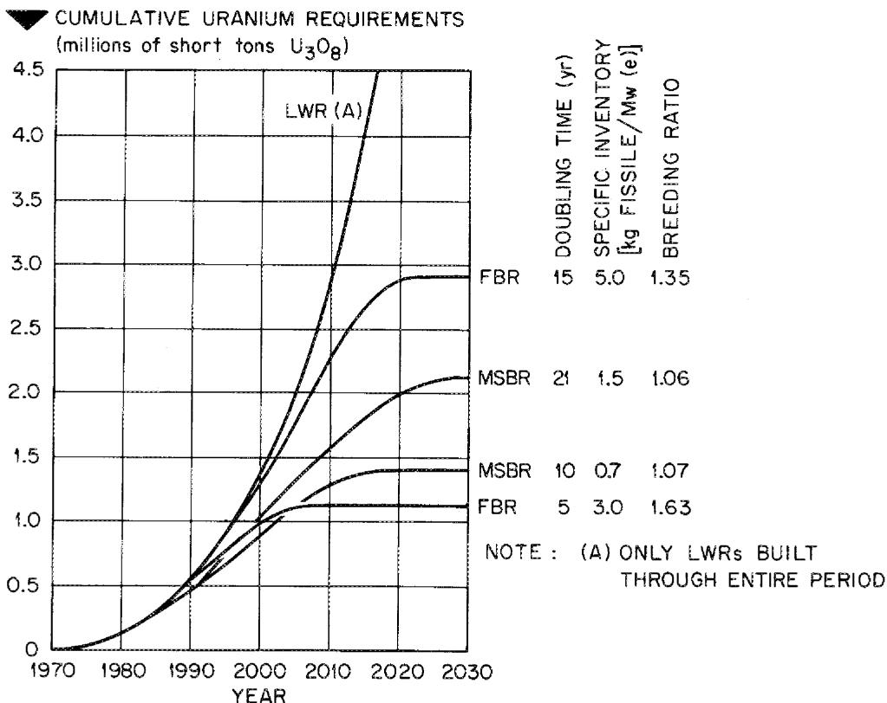  
Fig. 1.2. Effect of breeders on the ore requirements of the U.S. nuclear power economy if breeders are introduced in the mid-1980's and only breeders are built after 1998.

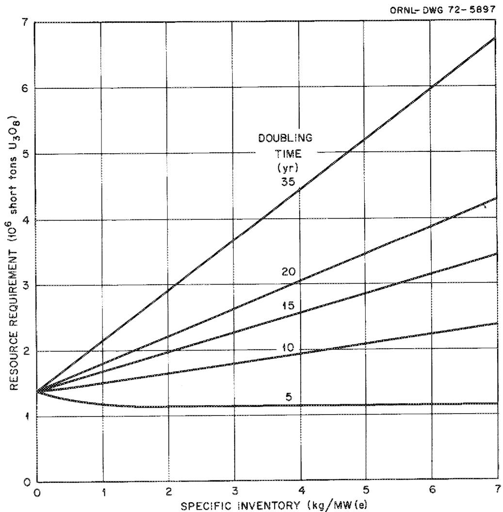  
Fig. 1.3. The effect of the fuel utilization characteristics of breeders on the cumulative uranium ore requirements for a growing U.S. nuclear power economy.

Some penalty must be paid for the cost of replacing graphite, but if this must be done as frequently as every four years, our estimate is that the cost will fall in the range of 0.1 to 0.2 mill/kwh. The need to perform remote maintenance on parts of the plant may add additional downtime requirements, but this should be offset by the high availability resulting from on-stream refueling, which obviates the need for annual refueling shutdowns.

In sum, we believe that power costs of MSBR's should be competitive with those of light-water reactors, and the attainment of low power cost does not await development of a large fuel-cycle industry.

Safety. - Molten-salt reactors have certain inherent features that assist the designer in providing a safe plant. The salt systems operate at low pressure with little stored energy; the salts do not react rapidly with air or water; some fission products are removed from the primary system continuously; and iodine and strontium form stable compounds in the salt. Continuous fuel processing eliminates the need for excess reactivity, and a prompt negative temperature coefficient is associated with the heating of the salt.

A safety disadvantage is the accumulation of fission products in the primary system, the off-gas system, the fuel storage tanks, and the processing plant, which requires provisions to insure that the fission products will be contained and their decay heat will be removed under all conceivable circumstances. Partially offsetting this is the ability to drain the fuel into a tank that has an always-ready, redundant cooling system. In the MSBR reference design, this tank is used also as a hold-up tank for the strongly heat generating off-gas, which means that its cooling system is always in use and need not come into operation just in an emergency. An added advantage of the design is the use of a natural circulation cooling system that does not need power to operate and can pick up increased load without action by the control system or the operator.

Two other factors may provide some safety margins over solid-fuel reactors. One is the comparatively low power density of fission products in the fuel salt, which should permit catch basins or crucibles at the bottom of the containment building to be cooled well enough that "China syndrome" penetration of the containment still would not occur if all else failed. The other is the on-site processing, which eliminates the need to transport fission products at a time when their heat generation rate is still significant.

In addition to being able to satisfy these general criteria for a breeder, the MSBR is particularly suitable for development as an alternative to the Liquid-Metal Fast Breeder Reactor. The reason is that it is completely different from the LMFBR, and if the LMFBR were to encounter difficult technical, safety, or economic problems, there is a good chance that those problems would not be shared by the MSBR. These differences include: fluid fuel versus solid fuel, slow-neutron spectrum versus fast

spectrum, $^{233}\mathrm{U}$ -Th fuel cycle versus $\mathrm{Pu}-^{238}\mathrm{U}$ cycle, molten-salt coolant versus sodium coolant, processing fuel on-site versus shipping to a central facility, graphite core structure versus stainless-steel cladding and structure, and slow reactor kinetics versus fast kinetics. A further advantage arises from the dissimilarity: if both reactors are developed successfully, the differences will provide an opportunity for full economic competition in the supply of breeders to utilities, extending back to the mining of thorium and uranium ore.

Thus we conclude that the MSBR can satisfactorily meet the requirements for a breeder if its potential is realized, and the differences between it and an LMFBR provide advantages to it as an alternative to the LMFBR. In the next section we examine the prospects for success in achieving the potential of the concept.

# The Likelihood of Success

The development program for a power reactor might be considered a success if it brings all of the technology needed for the reactor to the point that manufacturers can use it to produce power plants that can be sold to utilities. After having completed this review, we conclude that there is a reasonable expectation that an MSBR development program can accomplish this objective. To do so, it must find solutions for the technical problems we have identified and must develop all of the materials, components, and systems that are needed. Our conclusions about the major problems are as follows:

1. Recent experiments indicate that there probably are solutions to the intergranular cracking problem that has hung menacingly over the program during the past year. An important question at the moment is whether the remedy can be a small change in the composition of Hastelloy N, or instead we must substitute an alloy of significantly different composition that will require an extensive program to qualify it for reactor use. This matter is being intensively investigated at present, and a preliminary answer should be available within a few months.   
2. Our research program gives hope that means will be forthcoming for reducing the escape of tritium to the steam system without a significant change in our concept of the reactor. We should be able to select the most promising method and demonstrate it in a system of reasonable size within one or two years.   
3. Much work remains to be done in the development and demonstration of the processing system for the single-fluid breeder reactor, but progress so far has been very satisfactory, and this remains one of the bright spots in the MSBR development program. The prospects for successfully developing the fluorination-reductive extraction-metal transfer system are good, and there are some alternative approaches in case parts of the presently preferred system encounter insurmountable difficulties. We should note that a complete demonstration of the processing plant can only be made on a reactor, where representative concentrations of protactinium and short-cooled fission products are available.

4. After these major technical questions have been favorably resolved, a host of tasks remain to be accomplished in taking the engineering from MSRE scale to MSBR scale. Those that we recognize are described in this report; some are difficult, but all seem achievable. There may be others; if so, they can best be identified by doing the detailed design of reactor plants and can be brought into the sharpest focus by development of equipment and systems for those plants.

Solving the technical problems and developing an operable reactor, however, are not alone a guarantee of success for a breeder. The breeder must not only be operable, it must meet the performance criteria we listed earlier. Therefore we turn to the question of how likely it is that the characteristics claimed for the MSBR reference design will be achieved.

Fuel Utilization. - Our experience with the MSRE and with the High Temperature Lattice Test Reactor at Hanford shows that there is little uncertainty in our ability to calculate the breeding ratio and fuel concentration of a molten-salt reactor that has a specified core composition. More uncertain is the behavior of fission products in the MSBR; here the MSRE data do not provide a complete basis for prediction, but the uncertainty does not appear to be great enough for there to be a major error in the estimated breeding ratio.

The fissile inventory depends on the volume of the reactor primary system and the amount of uranium hold up in the processing plant, as well as on the concentration in the fuel salt; and these could be somewhat higher than estimated in the reference design. The uncertainties are whether the heat exchanger can be as compact as postulated in the design, whether the plena in the reactor vessel are large enough for adequate flow distribution, and whether the hold-up time in the processing plant can be as short as postulated. While we could have been overly optimistic about some of these, none appears likely to change enough to have a major effect on the fuel utilization.

Power Cost. - The probability of achieving our power cost criterion is more difficult to evaluate because it not only involves uncertainties in MSBR costs but also uncertainties about what the cost of the competing systems will be. The major cost item in the fuel cycle is the capital cost of the processing plant, and this is probably the most uncertain of the estimates. We can only say that we think we have made a reasonably conservative estimate, including, for example, an allowance of $200 a pound for the cost of fabricating molybdenum; and there is additional conservatism in the processing costs being based on using the processing plant for only 1000 MW(e) of reactor capacity, whereas the unit costs of processing plants come down very rapidly if the throughput is increased.

Because the fissile inventory is fairly low and the credit for sale of bred fuel is modest, the fuel cycle economics of MSBR's are not very sensitive to these factors nor to the cost of enriched uranium. Increasing uranium ore cost from $8 to$ 16 a pound without reoptimization of the reactor would only increase the fuel cycle costs by about 0.1 mill/kwh.

Other factors have a small effect on the fuel cycle cost; doubling the cost of $^{7}\mathrm{Li}$ , for example, would add 0.06 mills/kwh, and doubling the cost of thorium would add 0.05 mill/kwh. A relatively high fixed-charge rate on the fuel inventory has been used in the estimate.

The graphite replacement cost was estimated assuming that the graphite lifetime will be only as great as that of graphite that has already been tested, and expected improvements in lifetime will reduce the frequency and thus the cost of replacement. The cost of the graphite has been estimated to be about \(10/lb\), which is much higher than the cost of most "specialty" graphites but could be low for a sealed graphite meeting the unique requirements of the MSBR. However, allowing an additional \)5/lb to cover a possible underestimate of the sealing cost would add only about 0.1 mill/kwh to the power cost.

We must acknowledge that estimation of capital costs of plants to be built far in the future with some yet undeveloped technology is full of uncertainties. Because of the way LWR cost data were used, these uncertainties, as we judge it, have more to do with the design of the plant than with our ability to make cost comparisons for a given design. Nevertheless, there is limited room for error in the comparison with an LWR because the cost of "reactor equipment" (which includes, among others, the reactor itself, the salt pumps, the heat exchangers and steam generators, the salt storage tanks, and the off-gas system) is only one-third of the total cost of the power plant.

One other factor that can affect the power cost is plant availability. Since molten-salt reactors do not have to be shut down for refueling, and the frequency of graphite replacement is low and can be scheduled to coincide with major turbine maintenance, MSBR's start off with an availability advantage over LWR's. The MSBR plant must, however, be made reliable and must be specially designed so that the initial advantage is not offset by the increased difficulty of maintenance.

Our estimate has the cost of power from an MSBR being about 0.5 mill/kwh less than that of a light-water reactor at present uranium ore prices. If uranium ore costs increase by $8/1b$ by the time breeders are introduced, the cost advantage of an MSBR would increase by 0.3 mill/kwh. Thus there is a fair margin for error in our comparison with present day LWR's. However, LWR costs are certain to change some in two or so decades, and HTGR's rather than LWR's could be the converter with which to compete at the time. Thus strong conclusions about the MSBR meeting our cost criterion are not possible, but the chances seem reasonably good with low uranium prices, and of course, increase as the cost of uranium ore goes up.

Safety. - We believe that MSBR's have a particularly small probability of a major accident with a large release of radioactivity, but this conviction is based more on the general features of the concept, such as those discussed in the preceding section, than they are on a detailed analysis. A fully satisfying development of this argument will only be made in reviews equivalent to those associated with the licensing procedure for construction of an actual reactor.

In contrast to the probability of a big accident, the wider distribution of radioactivity in a molten-salt reactor and its processing plant increases the chances of small releases. The ability to restrict the release of radioactivity during normal operation or maintenance periods to a desired level appears to be a matter of cost, and the provision of adequate containment and clean-up systems should reduce the release rate to as low as desired.

These considerations convince us that the likelihood of being able to develop an MSBR that can meet the requirements for a successful breeder is good. We must note, however, that skeptics will sometimes acknowledge the arguments that we have cited but then raise questions about other factors that they think might be important. One question has to do with the practicality of operating and maintaining a reactor in which fission products spread throughout several parts of the plant. We believe that this is a serious matter to be treated thoroughly in the design, but we are convinced that it can be handled economically. Our views are based on experience with the operation and maintenance of four fluid-fuel reactors, and most importantly, by our favorable experience with the MSRE. Larger plants will have larger components to be handled and higher levels of radioactivity, but we believe that the MSRE maintenance approach, used with careful design of the plant so that maintenance requirements are anticipated, will permit repair or replacement to be done in reasonable times.

A second question is whether the chemical nature of a molten-salt reactor and the requirements for operation of a processing plant in conjunction with it will make utilities unwilling to purchase such systems. Our response is that utilities have been willing to take on other advanced technologies, such as nuclear energy and the use of supercritical steam, and they seem willing to undertake operation of systems containing molten sodium. None of the utilities that have evinced an interest in molten-salt reactors has indicated to us that the requirement for chemical reprocessing would cause them to be unwilling to operate an MSBR.

The final question is sometimes stated this way: "If molten-salt reactors are as good as you in Oak Ridge say, why aren't industrial firms presently working on them?" The answer to this has several facets. First of all, the commitments of the present utility suppliers to other systems were all made before the MSRE had operated and provided a demonstration that the technology was more practical than some had expected. Second, the manufacturer of an MSBR cannot expect the significant fuel supply and reprocessing business - the "razor blade" business - that can accompany the sale of a solid-fuel reactor, and thus the potential for future profits seems less with molten-salt reactors. Finally, the budget of the Atomic Energy Commission for molten-salt reactor development has been relatively small, and the AEC has made no commitment that it will assist in the development of molten-salt breeder reactors. Hence a manufacturer who considered undertaking molten-salt reactor development could not be sure of receiving the kind of development support that has been forthcoming for other reactor concepts.

The foregoing examination of various aspects of molten-salt breeder reactors leads us to the following general conclusions.

# Overall Conclusions

The objective of developing breeder reactors is to obtain a source of low-cost energy for ourselves and for future generations. Molten-salt breeder reactors have attributes of fuel utilization, economics, and safety that make them well suited to serve that purpose. The highly successful operating experience of the Molten-Salt Reactor Experiment and the developments in chemical processes that have allowed an important simplification in the breeder concept provide support for the contention that reactors having these characteristics can be successfully developed. Because they differ in many respects from Liquid-Metal Fast Breeder Reactors, MSBRs serve particularly well as insurance for the nation's energy supply in case the LMFBR encounters insurmountable obstacles. Moreover, if both systems are successfully developed, the ability of the molten-salt reactor to be started up as a breeder or operated economically as a converter on plutonium, $^{235}$ U, or $^{233}$ U makes it a suitable companion for an LMFBR to provide a balanced fuel economy. In this case, the differences between the two concepts, starting back at the mining of ore, also provide increased opportunity for a competitive breeder industry.

Thus far the work on molten-salt reactor technology has established what we believe to be a firm foundation for success. There are still some basic problems, notably surface cracking of Hastelloy N and tritium containment, whose solutions have not been fully demonstrated. We also recognize some major engineering tasks, such as demonstration of the complete fuel-processing system, development of the capability for dependable, economical maintenance of an MSBR, and scale-up of reactor equipment to MSBR size. Nevertheless, the potential of molten-salt reactors is promising enough to justify a continued effort.

Favorable resolution of the basic problems must come first, then more extensive development of components and systems. If these proceed satisfactorily, the construction of a reactor should come next, but the scale-up need not be large since a 150 - 200 MW(t) reactor could demonstrate all of the technology that is essential for a molten-salt breeder. This reactor should provide sufficient information for concluding whether full-scale MSBR's will be technically and economically attractive enough to justify completing their development. We believe that a strongly motivated and adequately funded program that follows this route will lead to molten-salt breeder reactors that can play a major role in providing the nation's future energy supply.

# References for Chapter 1

1. "Authorizing Appropriations for the Atomic Energy Commission for Fiscal Year 1973," House of Representatives, 92d Congress, Report No. 92-1066.   
2. D. W. Cardwell and P. N. Haubenreich, Indexed Abstracts of Selected References on Molten-Salt Reactor Technology, ORNL-TM-3595, December 1971.   
3. USAEC Task Force, Report on the Fluid Fuel Reactors Task Force, TID-8507, February 1959.   
4. Conceptual Design Study of a Single-Fluid Molten-Salt Breeder Reactor, ORNL-4541, June 1971.   
5. Molten Salt Reactor Technology, Technical Report of the Molten-Salt Group, Part I, Evasco Services, Inc., December 1971.   
6. Evaluation of a 1000-MW(e) Molten-Salt Breeder Reactor, Technical Report of the Molten-Salt Group, Part II, Evasco Services, Inc., October 1971.   
7. 1000 MW(e) Molten-Salt Breeder Reactor Conceptual Design Study, Final Report - Task 1, Evasco Services, Inc., February 1972.   
8. Molten-Salt Breeder Reactor Associates, Final Report, Phase I Study - Project for Investigation of Molten-Salt Breeder Reactor, Black and Veatch Consulting Engineers, Kansas City, Mo. (1970).   
9. Potential Nuclear Power Growth Patterns, prepared by the Systems Analyses Task Force under the direction of the Division of Reactor Development and Technology of the USAEC, WASH 1098, December 1970.   
10. Cost-Benefit Analysis of the U.S. Breeder Program, Division of Reactor Development and Technology, USAEC, WASH 1126, April 1969.   
11. *Civilian Nuclear Power - A Report to the President - 1962*, U.S. Atomic Energy Commission, U.S. Government Printing Office, Washington, D.C.

# 2. EVOLUTION AND DEVELOPMENT OF MOLTEN-SALT REACTORS

P. N. Haubenreich

Origins

When the idea of the breeder was first suggested in 1943, the rapid and efficient recycle of the partially spent core was regarded as the main problem [1]. This problem, which is still crucial in breeder economics, was attacked in two ways - by striving for very long burnup and by seeking to simplify the entire recycle operation. The latter pursuit inevitably led to consideration of fluid-fueled reactors as the ultimate in fuel cycle simplification.

Neutron-multiplying systems consisting of aqueous solutions and slurries were investigated soon after the discovery of nuclear fission, and the first effort toward a fluid-fueled breeder was based on these systems, in which the fluid is both the fuel and the moderator [2, pp. 1-9]. The Homogeneous Reactor Program, organized at ORNL in 1949, had as its objective a reactor with a uranyl sulfate- $\mathsf{D}_2\mathsf{O}$ solution core and a thorium oxide- $\mathsf{D}_2\mathsf{O}$ slurry blanket, separated by a Zircaloy core tank. This concept, with its superior neutron economy, offered good $^{233}\mathrm{U}$ breeding performance.

About 1950 the idea of a very different fluid-fuel reactor for power generation emerged at Brookhaven National Laboratory from studies on low-melting alloys and slurries of uranium and thorium in liquid metal. This was the liquid-metal-fuel reactor concept [2, pp. 699-929]. A version of the LMFR using graphite moderator, U-Bi solution core, and $\mathrm{ThO_2 - Bi}$ slurry blanket appeared capable of breeding.

Meanwhile yet another fluid-fueled reactor had been conceived for an altogether different purpose -- aircraft propulsion. Several different concepts of compact reactors were being considered for generating heat to be used in a jet engine. The Oak Ridge idea was to use a high-temperature liquid fuel that could be circulated to remove heat from the core and be drained for refueling. Experiments to investigate molten-salt fuels were begun in 1947, and 3 years later molten fluorides were chosen for the main effort of the Aircraft Nuclear Propulsion (ANP) program at ORNL [3]. The fluorides were particularly well suited because they offer low vapor pressure at jet-engine temperatures, reasonably good heat transfer properties, and immunity to radiation damage, and they do not react violently with air or water. (See Chapter 5.) A small reactor, the Aircraft Reactor Experiment, was built that used a fuel mixture of NaF, $\mathrm{ZrF_4}$ , and $\mathrm{UF_4}$ circulating in Inconel tubing through a moderator assembly of BeO blocks [2, pp. 673-80]. In 1954 the ARE was operated successfully for 9 days at outlet temperatures ranging to above $1600^{\circ}\mathrm{F}$ and powers to 2.5 MW(t) in investigations of the nuclear dynamics of the circulating fuel system.

It was recognized from the outset that molten-salt reactors might be attractive for civilian power applications, and in 1956 a group was formed at ORNL to study the characteristics, performance, and economics of molten-salt reactors for central station power generation [4]. A wide variety of

configurations was considered, and some were found that promised low power costs while breeding in the thorium-233U cycle. Thus when the effort to develop a molten-salt aircraft reactor was stopped in 1957, the molten-salt reactor concept survived as a potential civilian power reactor.

# Relation to Other Fluid-Fuel Programs

Early in 1959 a task force assembled by the AEC made a comparative evaluation of the three fluid-fuel reactor concepts then being pursued. The conclusion was that the molten-salt reactor, although limited in potential breeding gain, had "the highest probability of achieving technical feasibility" [5]. Soon thereafter work on the aqueous homogeneous and liquid-metal-fuel reactors was discontinued, leaving the molten-salt reactor as the lone fluid-fuel breeder concept still being supported by the USAEC.*

Although the Molten-Salt Reactor Program, as such, was relatively young, there was an extensive technological base from the ANP program, where $60 million had been invested in molten-salt reactor technology. Some of this had gone for developments specific to the compact aircraft configuration, but a large fraction of the technology was equally applicable to the civilian power reactors that were being envisioned. The physical chemistry of interesting fluoride salt mixtures had been explored, and a container alloy had been developed that was especially compatible with fluoride salt mixtures and which had significantly higher strength than Inconel at the 1500-1600°F temperatures required in an aircraft reactor. Originally called INOR-8, this alloy is now generally known as Hastelloy N. Techniques for producing, purifying, and analyzing fluoride mixtures had been worked out, and considerable experience was gained in handling the ARE fuel. The fluoride volatility process was developed and was successfully used to recover the uranium from the ARE fuel in 1957-58.

In addition to the generally applicable ANP work, there was some spinoff to the molten-salt technology from the aqueous homogeneous reactor and liquid-metal-fuel reactor programs. The Homogeneous Reactor Program had built and operated two reactors using circulating aqueous fuel solutions at $250 - 300^{\circ}\mathrm{C}$ . Considerable maintenance was required on radioactive parts of these reactors, and one significant contribution to reactor technology was this experience with maintenance of highly radioactive systems [7]. A chemical processing scheme explored for the liquid metal fuel reactor involved molten salts and molten bismuth. The experience of this effort, and the general background of experience with molten bismuth, proved valuable when extraction systems involving molten bismuth became the heart of the processing concept for MSBR's.

# Early MSBR Concepts

In the early days of the Molten-Salt Reactor Program, serious consideration was given to homogeneous reactors in which the core contained nothing but salt. These ideas were abandoned after calculations showed that the limited moderation by likely fluoride salt constituents alone would result in a thermal reactor with inferior breeding performance. Breeding appeared possible in intermediate-spectrum reactors, but their gains were not high enough to compensate for their higher fissile inventories. Studies of fast-spectrum molten-salt reactors (using chloride salts) indicated good breeding ratios, but fissile inventories were excessive unless unconventional heat transfer systems were used to minimize holdup outside of the core.

After experiments showed that bare graphite could probably be used in the core of a molten-salt reactor, MSRP efforts concentrated on graphite-moderated reactors having well-thermalized neutron spectra and low fissile inventories. Two general types were considered - single-fluid reactors in which thorium and uranium were combined in one salt, and two-fluid reactors in which $\mathrm{UF_4}$ -bearing fuel salt was separated from fertile salt containing $\mathrm{ThF_4}$ . In any case the diluent fluoride mixture would be $^7\mathrm{LiF - BeF_2}$ instead of the $\mathrm{NaF - ZrF_4}$ mixture used in the aircraft reactors; the $^7\mathrm{LiF - BeF_2}$ absorbed fewer neutrons and dissolved more $\mathrm{ThF_4}$ without excessive liquidus temperatures. The single-fluid reactor was relatively simple and promised low power costs, but breeding appeared to be impractical because of neutron leakage and losses to protactinium and fission products [8]. (At that time it was not clear that Pa and fission products could be separated economically on a very short cycle.) The two-fluid reactor could be designed with a fertile blanket to reduce leakage, and Pa losses would be reduced because the fertile salt would be at a lower average flux. The only processing required for the fertile salt was fluorination to recover the bred uranium. The fuel salt could be processed by a combination of fluorination and an aqueous process. The two-fluid reactor was more complex in that it used two salts that had to be kept separate, but it did offer attractive breeding performance.

# The MSRE

# Purpose

By 1960 a fairly clear picture of a family of molten-salt reactors had emerged. The technical feasibility appeared to be on a sound footing - a compatible combination of salt, graphite, and container material - but a reactor was needed to really prove the technology. That was the purpose of the Molten-Salt Reactor Experiment: to demonstrate that some of the key features of the proposed molten-salt power reactors could be embodied in a practical reactor that could be operated safely and reliably and be maintained without excessive difficulty. For simplicity it was to be a fairly small, one-fluid reactor operating at $10\mathrm{MW(t)}$ or less, with heat rejection to the air via a secondary salt.

# Description

The MSRE flowsheet is shown as Fig. 2.1. Figure 2.2 shows some detail of the 5-ft-diameter reactor vessel. The fuel was $\mathrm{LiF - BeF_2 - ZrF_4 - UF_4}$ (64-30-5-1 mole %), the secondary salt was $\mathrm{LiF - BeF_2}$ (66-34 mole %), the moderator was grade CGB graphite, and all other parts contacting salt were of Hastelloy N. The bowl of the fuel pump was the surge space for the circulating loop, and here about 50 gpm of fuel was sprayed into the gas space to allow xenon and krypton to escape from the salt. Also in the pump bowl was a port through which salt samples could be taken or capsules of concentrated fuel enriching salt ( $\mathrm{UF_4 - LiF}$ or $\mathrm{PuF_3}$ ) could be introduced. The fuel system was located in sealed cells, laid out for maintenance with long-handled tools through openings in the top shielding. A tank of $\mathrm{LiF - BeF_2}$ salt was used to flush the fuel circulating system before and after maintenance. In a cell adjacent to the reactor was a simple facility for bubbling gas through the fuel or flush salt: $\cdot \mathrm{H}_2$ -HF to remove oxide, $\mathrm{F_2}$ to remove uranium as $\mathrm{UF_6}$ . References 9, 10, and 11 provide more detailed descriptions of the reactor and processing plant.

# Development and Construction

Most of the MSRP effort from 1960 through 1964 was devoted to design, development, and construction of the MSRE. Production and further testing of graphite and Hastelloy N, both in-pile and out, were major development activities. Others included work on reactor chemistry, development of fabrication techniques for Hastelloy N, development of reactor components, and remote-maintenance planning and preparations. (A convenient summary of developments through the end of major construction is given in reference 12.)

Before the MSRE development began, tests had shown that salt would not permeate graphite in which the pores were very small. Graphite with the desired pore structure was available only in small, experimentally prepared pieces, however, and when a manufacturer set out to produce a new grade (CGB) to meet the MSRE requirements, difficulties were encountered [12, pp. 373-389]. A series of pitch impregnations and heat treatments produced the desired high density and small pore structure, but in the final steps occasional cracks appeared in many of the 2-1/4-in. square bars. Apparently the cracks resulted because the structure was so tight that gases from the pyrolysis of the impregnant could not escape rapidly enough. Tests showed, however, that the cracks did not propagate, even when filled with salt and subjected to repeated freeze-thaw cycles. After analysis showed that heating in salt-filled cracks would not be excessive, the graphite was accepted and used in the MSRE.

The choice of Hastelloy N for the MSRE was on the bases of the promising results of tests at ANP conditions and the availability of much of the required metallurgical data.* Development for the MSRE generated the

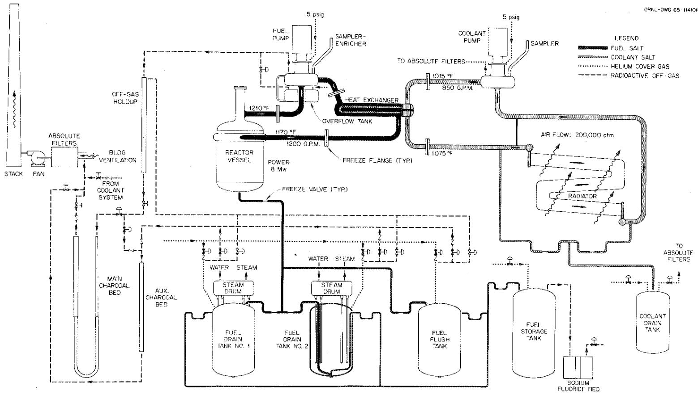  
Fig. 2.1. Design flowsheet of the MSRE.

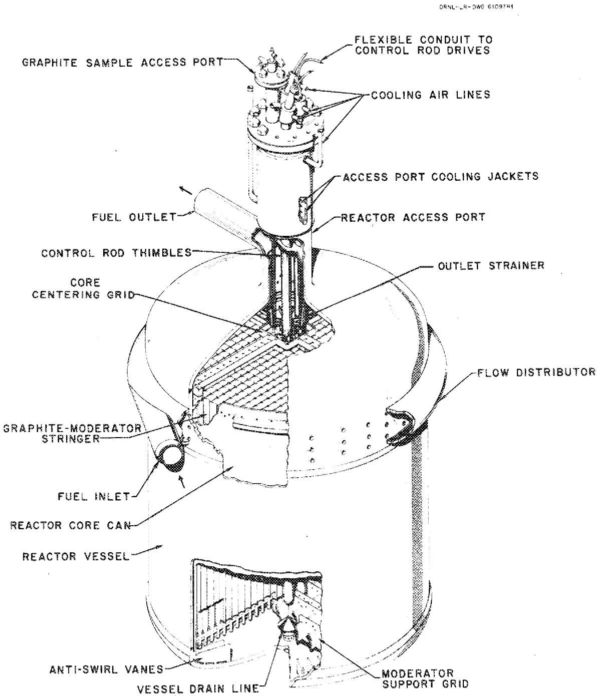  
Fig. 2.2. Details of the MSRE core and reactor vessel.

further data required for ASME code approval. It also included preparation of standards for Hastelloy N procurement and for component fabrication. Material for the MSRE, amounting to almost 200,000 lb in a variety of shapes, was produced commercially. After weld-cracking in experimental heats was overcome by minor composition changes, there was no difficulty in obtaining acceptable material. Requests for bids on component fabrication went to several companies in the nuclear fabrication industry, but all declined to submit lump-sum bids because of lack of experience with the new alloy. Consequently all major components were fabricated in AEC-owned shops at Oak Ridge and Paducah [12, pp. 63-82]. After appropriate procedures were worked out, Hastelloy N fabrication presented no unusual problems.

At the time that design stresses were set for the MSRE, the few data that were available indicated that the strength and creep rate of Hastelloy N were hardly affected by irradiation. An arbitrary allowance was made for possible effects, however, by establishing design stresses $20\%$ below Code values for unirradiated Hastelloy N. After the construction was well along, the stress-rupture life and fracture strain were found to be drastically reduced by thermal-neutron irradiation. The MSRE stresses were reanalyzed, and it was concluded that the reactor would have adequate life to reach its goals. At the same time a program was launched to improve the resistance of Hastelloy N to the embrittlement. (See Chapter 7 and reference 13.)

An extensive out-of-pile corrosion test program was carried out for Hastelloy N [12, pp. 334-343] which indicated extremely low corrosion rates at MSRE conditions. Capsules exposed in the Materials Testing Reactor showed that salt fission power densities of more than $200\mathrm{W/cm}^3$ had no adverse effects on compatibility of fuel salt, Hastelloy N, and graphite. Fluorine gas was found to be produced by radiolysis of frozen salts, but only at temperatures below about $100^{\circ}\mathrm{C}$ [12, pp. 252-287]. The results of this program are described in some detail in Chapter 5.

Components that were developed especially for the MSRE included flanges for 5-inch lines carrying molten salt, freeze valves (an air-cooled section where salt could be frozen and thawed), flexible control rods to operate in thimbles at $1200^{\circ}\mathrm{F}$ , and the fuel sampler-enricher [12, pp. 167-190]. Centrifugal pumps were developed similar to those used successfully in the aircraft reactor program, but with provisions for remote maintenance, and including a spray system for xenon removal. Remote maintenance considerations pervaded the MSRE design, and developments included devices for remotely cutting and brazing together 1-1/2-inch pipe, removable heater-insulation units, and equipment for removing specimens of metal and graphite from the core.

The MSRE development program did not include reactor physics experiments or heat transfer measurements. There was enough latitude in the MSRE that deviations from predictions would not compromise safety or accomplishment of the objectives of the MSRE.

Construction of the primary system components and alterations of the old ARE building (which had been partly remodeled for a proposed 60-MW(t) aircraft reactor) were started in 1962. Installation of the salt systems was completed in mid-1964. ORNL was responsible for quality assurance,

planning, and management of construction [14]. The primary systems were installed by ORNL forces; subcontractors modified the building and installed ancillary systems.

# Operation

Operation of the MSRE spanned 5 years, from the loading of salt in 1964 through the end of nuclear operation in December, 1969. As described in references 9 and 15, all of the objectives of the experiment were achieved during this period.

Checkout and prenuclear tests included 1000 hr of circulation of flush salt and fuel carrier salt. Nuclear testing of the MSRE began in June 1965, with the addition of enriched $^{235}\mathrm{U}$ as $\mathrm{UF_4}$ -LiF eutectic to the carrier salt to make the reactor critical. After zero-power experiments to measure rod worth and reactivity coefficients [16], the reactor was shut down and final preparations made for power operation. Power ascension was delayed when vapors from oil that had leaked into the fuel pump were polymerized by the radioactive offgas and plugged gas filters and valves. Maximum power, which was limited to 7.4 MW(t) by the capability of the heat-rejection system, was reached in May 1966.

After two months of high-power operation, the reactor was down for 3 months because of the failure of one of the main cooling blowers. Some further delays were encountered because of offgas line plugging, but by the end of 1966 most of the startup problems were behind. During the next 15 months, the reactor was critical $80\%$ of the time, with runs of 1, 3, and 6 months that were uninterrupted by a fuel drain. By March, 1968, the original objectives of the MSRE had been accomplished, and nuclear operation with $^{235}\mathrm{U}$ was concluded.

By this time, ample $^{233}\mathrm{U}$ had become available, so the MSRE program was extended to include substitution of $^{233}\mathrm{U}$ for the uranium in the fuel salt and operation to observe the new nuclear characteristics. Using the on-site processing equipment, the flush salt and fuel salt were fluorinated to recover the uranium in them as $\mathrm{UF}_6$ [11]. $^{233}\mathrm{UF}_4$ -LiF eutectic was then added to the carrier salt, and in October 1968, the MSRE became the world's first reactor to operate on $^{233}\mathrm{U}$ .

The $^{233}\mathrm{U}$ zero-power experiments and dynamics tests confirmed the predicted neutronic characteristics.* An unexpected consequence of processing the salt was that its physical properties were altered slightly so that more than the usual amount of gas was entrained from the fuel pump into the circulating loop. The circulating gas and the power fluctuations that accompanied it were eliminated by operating the fuel pump at slightly lower speed. Operation at high power for several months permitted very accurate measurement of the capture-to-fission ratio, for $^{233}\mathrm{U}$ in this reactor, completing the objectives of the $^{233}\mathrm{U}$ operation.

In the concluding months of operation, xenon stripping, deposition of fission products, and tritium behavior were investigated. The feasibility of using plutonium in molten-salt reactors was emphasized by adding $\mathsf{PuF}_3$ as makeup fuel during this period.

After the final shutdown in December 1969, the reactor was left in standby for almost a year. Then a limited examination program was carried out, including a moderator bar from the core, a control rod thimble, heat exchanger tubes, parts from the fuel pump bowl, and a freeze valve that had developed a leak during the final shutdown. The radioactive systems were then closed to await ultimate disposal.

# Results

The broadest and perhaps most important conclusion from the MSRE experience is that this was a quite practical reactor. It ran for long periods of time, yielding valuable information, and when maintenance was required it was accomplished safely and without excessive delay.* The remarkable performance of the MSRE clearly shows that with proper design and careful construction and operation, the unusual features of an MSR in no way compromise its safety and dependability.

In many regards, the MSRE served to confirm expectations and predictions [15]. For example, we had confidently expected the observed immunity of the fuel salt to radiation damage, the complete absence of attack on the graphite, and the very minor general corrosion of the Hastelloy N. Noble gases were stripped from the fuel salt by the simple spray system even better than anticipated, reducing the $^{135}\mathrm{Xe}$ poisoning by a factor of about 6. The bulk of the fission product elements remained stable in the salt. Additions of uranium and plutonium to the salt during operation were quick and uneventful, and the recovery of uranium by fluorination was quite efficient. The neutronics, including critical loading, reactivity coefficients, dynamics, and long-term reactivity changes, agreed very closely with prior calculations.

In other areas, the operation resulted in improved data or helped to reduce uncertainties. The $^{233}\mathrm{U}$ capture-to-fission ratio in a typical MSR neutron spectrum is an example of basic data that were improved. The effect of fissioning on the redox potential of the fuel salt was resolved. The deposition of some elements ("noble metals") was expected, but the MSRE provided quantitative data on relative deposition on graphite, metal, and liquid-gas interfaces. Heat transfer coefficients measured in the MSRE agreed very closely with conventional design calculations (using correct values for salt properties) and did not change over the life of

the reactor. Limitation of oxygen access to the salt proved quite effective, and the tendency of fission products to be dispersed from contaminated equipment during maintenance was less than we had anticipated.

Operation of the MSRE provided some insights into the unusual problem of tritium in a molten-salt reactor. It was observed that about $6 - 10\%$ of the calculated 54 Ci/day production diffused out of the fuel system into the containment cell atmosphere and another $6 - 10\%$ reached the air through the heat removal system [17]. The fact that these fractions were not higher indicated that something (probably oxide coatings) partially negated the easy transfer of tritium through hot metals.

The one quite unexpected finding of great importance was the shallow intergranular cracking observed in all metal surfaces exposed to the fuel salt. This was first noted in the specimens that were removed from the core at intervals during the reactor operation. Post-operation examination of pieces of a control-rod thimble, heat-exchanger tubes, and pump bowl parts revealed the ubiquity of the cracking and emphasized its importance to the MSR concept. Further investigations and possible consequences are discussed in Chapters 7 and 14 of this report.

# Recent Molten-Salt Reactor Concepts

Since the MSRE, the Molten-Salt Reactor Program has been a technology program, not focused on building a particular reactor, but seeking to identify and accomplish the developments that are needed before molten-salt breeder reactors can become a reality [18]. In the furtherance of this program, efforts on conceptual design have been essential in defining the needs for development, while experimental findings, in turn, shape the concept. This section describes the reactor concepts that have been considered in the course of this intertwined process.

As described previously, at the time that the MSRE was conceived, the two-fluid reactor, despite its relative complexity, seemed to hold the most promise as a breeder. During the early years of the MSRE, relatively little effort was devoted to refinement of conceptual designs. Basic chemistry studies continued, however, and led in 1964 to an important development that simplified the processing in the two-fluid breeder plant [12, p. 309]. This was the separation of rare-earth fluorides from LiF and $\mathrm{BeF}_2$ by distillation at $1000^{\circ}\mathrm{C}$ . (The practicality was later demonstrated with a portion of the MSRE fuel [19].) Thus it was, when the MSRE settled into operation, that design efforts focused on the two-fluid concept.

Studies at first indicated outstanding resource utilization, mainly because of an extremely low specific inventory of about $0.8\mathrm{kg}$ fissile/MW(e) [20]. Then in 1967, when irradiation of graphite to very high neutron fluences revealed more rapid dimensional changes than had been projected, the two-fluid concept was dealt a severe blow. Accommodation of the differential growth of the graphite made the core design and assembly so complex that it seemed necessary to replace the entire reactor vessel and its contents whenever the graphite core tubing became unserviceable. The reference design for a 1000-MW(e) plant included four 556-MW(t)

reactors that could be replaced at staggered intervals to improve plant availability [21]. The two-fluid reactor could be scaled down without seriously affecting breeding gain, but performance was hurt, because in order to extend graphite life to 8 full-power years, the power density in the reference design was reduced from $80\mathrm{W/cm^3}$ to $20\mathrm{W/cm^3}$ , at the expense of raising the specific inventory to $1.3\mathrm{kg}$ fissile/MW(e).

At about this time a chemical processing development occurred that greatly improved the prospect for economical breeding in a simpler, single-fluid reactor. This was the laboratory demonstration of the basic chemical steps in a continuous process for removing protactinium and uranium from molten fluoride mixtures that contain thorium fluoride. When $\mathrm{LiF - BeF_2 - ThF_4 - UF_4 - PaF_4}$ salt was contacted with molten bismuth containing dissolved thorium and lithium, first the U and then the Pa were reduced and passed from the salt into the liquid metal. The Pa could be sequestered until it decayed, while the uranium was returned to the fuel salt by electrolysis. This reductive-extraction process, which could draw upon technology developed at Argonne and Brookhaven for processing fast reactor fuels and the U-Bi fuel of an LMFR, appeared practicable for continuous separation of protactinium. It also appeared that it might be adaptable to removal of rare-earth fission products, thus permitting a relatively simple processing plant that would keep breeding losses due to Pa and fission products to acceptably low levels.

After the recognition of the Pa-removal possibility, one-fluid breeder core designs were explored more thoroughly than in earlier surveys. As a result, it was found that breeding performance could be significantly improved by a scheme proposed several years before. By decreasing the graphite fraction in the outer part of the core, the neutron spectrum there can be hardened, increasing the fraction of captures in thorium, while the fission neutron production is more concentrated in the inner, well-moderated part of the core. The effect is to reduce neutron leakage, which had always been a significant factor in one-fluid breeders.

The combined effect of the new Pa-removal system and the improved core design was to increase the breeding ratio that could be achieved economically in a one-fluid breeder to about 1.05-1.07. Consequently, the resource utilization characteristics became acceptable, and in 1968 the major emphasis of the MSRP was shifted to the development of the simpler single-fluid breeder reactor. Later, substantial improvements were made in the processing system, including elimination of the electrolysis cells, storage of Pa in salt instead of in bismuth, and development of a more efficient process for removal of rare earths. (See Chapter 11.)

Throughout this evolution, the primary long-range objective of the MSRP remained the same - efficient breeding in the thorium-233U cycle. This pursuit led by 1970 to the reference conceptual design of a 1000-MW(e) MSBR plant [22] described in Chapter 3, which is the focus of the MSRP development effort. In addition, ORNL has recently investigated several other versions of one-fluid molten-salt reactors that also meet the essential criteria of safety, reliability, and low power costs, while offering one advantage or another relative to the reference MSBR.

One alternate offers a way around the necessity of replacing the core at 4-year intervals. This difficult job is avoided by simply making the core of the breeder large enough and the damage flux low enough that the core graphite will last the 30-year life of the plant. Such a "permanent-core" reactor can have a breeding ratio as high as in the reference design, but the large core means a greater inventory and longer doubling time [23].

Another possible simplification is the elimination of most of the chemical processing. If it should happen in a breeder plant that protactinium and fission-product removal were stopped, the reactor could continue to operate for months, or even years, as a near-breeder with only the addition of enriched uranium. Alternatively, the reactor could be built as a converter with no processing (other than perhaps oxide removal). Some studies indicate that an economical mode of operation would be to run for 6 equivalent full-power years, recover the uranium by batch fluorination (as demonstrated in the MSRE), discard the salt with the fission products, and resume with fresh carrier salt. Either $^{235}\mathrm{U}$ or plutonium could be used for startup and feed of such a molten-salt converter reactor.

A limited amount of conceptual design was done on a 350-MW(e) converter that positively overcomes the problems of graphite replacement and tritium containment with a minimum of additional development. The core is large enough so that presently available graphite would last 30 years, and tritium containment is ensured by using an intermediate salt loop containing Hitec [24]. The Hitec, a $\mathrm{KNO}_3$ - $\mathrm{NaNO}_3$ - $\mathrm{NaNO}_2$ mixture, reacts with tritium to form water, which could be stripped continuously from the salt. Because the nitrate-nitrite mixture would precipitate uranium and might react violently with graphite if it leaked into the fuel system, a compact loop containing LiF- $\mathrm{BeF}_2$ (which is quite compatible with the fuel) is interposed between the fuel and Hitec systems. The disadvantages of the extra loop and temperature limitations on Hitec are weighed against simplification of the steam system because of the relatively low melting point of Hitec ( $288^{\circ}\mathrm{F}$ ). In any event this study is an offshoot from the main line of ORNL effort, which is directed at the high-performance breeder.

In considering the most expeditious route to the ultimate molten-salt breeder, we have devoted some attention to the conceptual design of what we call the Molten-Salt Breeder Experiment (MSBE). This reactor would be designed to operate under conditions at least as severe as those in a large plant. Design studies show that a graphite damage flux twice that in the reference MSBR and power density, salt composition, and protactinium and fission-product concentrations like those in the reference design could be attained in a 150-MW(t) reactor with a 4-ft core in a 7.5-ft vessel [25]. The MSBE would produce steam and would include a complete processing facility. Although its small dimensions limit its breeding ratio to about 0.96, the MSBE would provide a definitive test of all the basic equipment and processes required for a breeder.

# Current Programs

Most of the work on molten-salt reactors is now, as in the past, concentrated in the Molten-Salt Reactor Program at ORNL, but some significant activities are going on elsewhere. This section outlines the MSRP activities (which are fully described in other chapters) and briefly describes the other programs.

# USAEC Molten-Salt Reactor Program

The Molten-Salt Reactor Program is included with the LMFBR and the gas-cooled fast breeder in the AEC's "high-gain breeder" development program. A total of $64 million has been spent by the MSRP from its inception in 1957 through fiscal year 1972, including the$ 10 million cost of designing and building the MSRE. The MSRP also has benefited from basic work carried out under the AEC's physical research programs. The MSRP budget for FY-1973 is $5 million, now allocated approximately as follows:

<table><tr><td>Reactor design and analysis</td><td>12%</td></tr><tr><td>Reactor engineering technology</td><td>18%</td></tr><tr><td>Reactor metals</td><td>20%</td></tr><tr><td>Graphite</td><td>8%</td></tr><tr><td>Chemistry and analytical chemistry</td><td>16%</td></tr><tr><td>Fuel processing</td><td>22%</td></tr><tr><td>Processing materials</td><td>4%</td></tr></table>

The MSRp design and analysis effort includes evaluation of the potential of molten-salt reactors and preparation of reference designs and alternatives that define the research and development needs. This has been cut back in recent years, and nearly half of the current effort is a study being done under subcontract by an industrial group headed by Evasco Services.

The bulk of the engineering development effort is presently devoted to two MSRE-scale loops: the Coolant Salt Technology Facility and the Gas Systems Test Facility, described in Chapter 8. Also under this heading is a study of molten-salt steam generators being carried out by Foster Wheeler under subcontract to ORNL.

Reactor chemistry is mainly concerned at present with the behavior of tritium and certain fission products. Analytical development is aimed at the techniques needed for the operation of a breeder and its processing plant.

Reactor metals development is focused on improving Hastelloy N (or finding an alternative) to overcome the problems of neutron embrittlement and surface cracking by fission products. Sealing to exclude xenon and better structure for longer life are being investigated in the graphite program. Processing materials work is now centered on molybdenum fabrication, with some effort on graphite.

The emphasis in fuel processing is on reductive extraction - the chemistry of fluoride-bismuth and chloride-bismuth systems and engineering equipment to exploit this chemistry. Fluorination and fuel reconstitution are being developed, and alternate processes such as oxide precipitation are being studied.

# Industrial Studies

There have been two privately funded conceptual design studies and evaluations of MSR's. The first was by the Molten-Salt Breeder Reactor Associates (MSBRA), headed by the engineering firm of Black & Veatch and including five midwestern utilities. The MSBRA study identified problem areas but concluded that the economics of molten-salt reactors were attractive relative to light-water reactors, and favored a program leading to early commercial application of a molten-salt converter [26]. Since the conclusion of their study in 1970 the MSBRA has been relatively inactive.

The second privately funded organization is the Molten-Salt Group (MSG), whose formation was announced in 1969 [27, p. 1-1]. The MSG is headed by Evasco Services and includes 5 other industrial firms* and 15 utility companies [28]. In the fall of 1971 the MSG completed an evaluation of the state of MSR technology [28] and a critique of the ORNL 1000-MW(e) breeder design [29]. They concluded in the first report that the existing technology was sufficient to justify construction of a demonstration plant that would breed, provided the processing works as intended, but that its maintainability, reliability, costs, and plant life could not be predicted reliably from the existing technology [28, p. 6]. In the second report, they concluded that the ORNL reference design embraced some technological difficulties, but was a suitable departure point for exploring MSBR technology [29, p. 4]. The MSG members have agreed to support studies of a demonstration plant and alternate molten-salt reactor concepts and an updating of their MSBR technology evaluation. These studies are proceeding concurrently with the AEC-funded MSBR design study that is being done by part of the Group's working force.

There have been other indications of interest in molten-salt reactors by industry and utilities. Many have sent representatives to MSRP annual information meetings, and several have made private studies of their possible role in MSR development. A few have assigned staff members to work in the MSRP (for up to 2 years), and materials producers have contributed by providing experimental graphite and alloys for evaluation.

# Foreign Programs

The Indian Department of Atomic Energy is interested in molten-salt reactors in connection with their vast thorium resources and the anticipated availability of plutonium in India for MSR startup. A small program

of research on the MSBR concept has been underway at the Bhabha Atomic Research Centre since 1969. The program is mostly concerned with investigations of the chemistry of melts containing $\mathrm{PuF_3}$ . The USAEC and the DAE have been exchanging molten-salt information, and an agreement providing for somewhat broader cooperation is being considered.

Euratom has supported research on various topics pertinent to molten-salt reactor technology. From 1964 to 1966 there was an exchange of molten-salt information through a formal agreement with the USAEC, but the exchange is now relatively inactive. Development work involving construction and operation of a molten-salt steam generator that was begun with Euratom support is continuing at Delft University, however. Other European molten-salt reactor work was conducted at Kernforschungsanlage Jülich in 1963 to 1967, mostly in connection with the epithermal reactor concept, MOSEL [30]. This has been discontinued.

The UKAEA has supported a small effort on molten-salt reactors for several years. Studies and a limited amount of experimental work are continuing, with emphasis on chloride-fueled, lead-cooled fast reactors.

# References for Chapter 2

1. A. M. Weinberg, "Molten-Salt Reactors," Nucl. Appl. Tech. 8, 105 (1970).   
2. J. A. Lane, H. G. MacPherson, and F. Maslan, Fluid Fuel Reactors, Addison-Wesley, Reading, Mass., 1958.   
3. H. G. MacPherson, "Molten-Salt Reactors," Proc. Intern. Conf. Constructive Uses At. Energy, Washington, Nov. 1968, American Nucl. Soc., 1969, p. 111.   
4. M. W. Rosenthal, P. R. Kasten, and R. B. Briggs, "Molten-Salt Reactors - History, Status and Potential," Nucl. Appl. Tech. 8, 107 (1970).   
5. Report of the Fluid Fuel Reactors Task Force, TID-8507 (February 1949).   
6. J. J. Went and M. E. A. Hermans, "The KEMA Suspension Test Reactor," Fourth U.N. Intern. Conf. Peaceful Uses At. Energy, Geneva, A/CONF 49/P/020 (1971).   
7. P. N. Haubenreich, "Two Years of HRE-2 Operation," Nucl. Sci. Eng. 8, 467 (1960).   
8. L. G. Alexander, W. L. Carter, C. W. Craven, D. B. Janney, T. W. Kerlin, and R. Van Winkle, Molten-Salt Converter Reactor, ORNL-TM-1060 (September 1965).   
9. P. N. Haubenreich and J. R. Engel, "Experience with the MSRE," Nucl. Appl. Tech. 8, 118 (1970).   
10. R. C. Robertson, MSRE Design and Operations Report, Part I, Description of Reactor Design, ORNL-TM-728 (January 1965).   
11. R. B. Lindauer, Processing of the MSRE Flush and Fuel Salts, ORNL-TM-2578 (August 1969).   
12. MSR Program Semiannu. Progr. Rep. July 31, 1964, ORNL-3708.   
13. H. E. McCoy et al., "New Developments in Materials for Molten-Salt Reactors," Nucl. Appl. Tech. 8, 156 (1970).   
14. B. H. Webster, Quality-Assurance Practices in Construction and Maintenance of the MSRE, ORNL-TM-2999 (April 1970).   
15. M. W. Rosenthal, P. N. Haubenreich, H. E. McCoy, and L. E. McNeese, "Current Progress in Molten-Salt Reactor Development," Atomic Energy Review IX, 601-50 (1971).

16. B. E. Prince, S. J. Ball, J. R. Engel, P. N. Haubenreich, and T. W. Kerlin, Zero-Power Physics Experiments on the MSRE, ORNL-4233 (February 1968).   
17. R. B. Briggs, "Tritium in Molten-Salt Reactors," Reactor Technology, 14, 335-42 (Winter 1971-72).   
18. H. G. MacPherson, "Development of Materials and Systems for the Molten-Salt Reactor Concept," Reactor Technol. 15, 136-155 (Summer 1972).   
19. J. R. Hightower, L. E. McNeese, B. A. Hannaford, and H. D. Cochran, Low-Pressure Distillation of a Portion of the Fuel Carrier Salt from the MSRE, ORNL-4577 (August 1971).   
20. P. R. Kasten, E. S. Bettis, and R. C. Robertson, Design Studies of 1000-MW(e) Molten-Salt Breeder Reactors, ORNL-3996 (1966).   
21. R. C. Robertson, R. B. Briggs, O. L. Smith, and E. S. Bettis, Two-fluid Molten-Salt Breeder Reactor Design Study (Status as of Jan. 1, 1968), ORNL-4528 (1970).   
22. Conceptual Design Study of a Single-Fluid Molten-Salt Breeder Reactor, ORNL-4541 (1971).   
23. MSR Program Semiannu. Progr. Rep. Aug. 31, 1970, ORNL-4622.   
24. E. S. Bettis, L. G. Alexander, and H. L. Watts, Design Studies of a Molten-Salt Reactor Demonstration Plant, ORNL-TM-3832 (June 1972).   
25. J. R. McWherter, Molten-Salt Breeder Experiment Design Bases, ORNL-TM-3177 (November 1970).   
26. Molten-Salt Breeder Reactor Associates Staff, Final Report, Phase I Study - Project for Investigation of Molten-Salt Breeder Reactor, Black & Veatch Consulting Engineers, Kansas City, Mo. (1970).   
27. 1000-MW(e) Molten-Salt Breeder Reactor Conceptual Design Study, Final Report - Task I, Evasco Services, Inc., New York, February 1972.   
28. Molten-Salt Reactor Technology, Technical Report of the Molten-Salt Group, Part I, Evasco Services, Inc., December 1971.   
29. Evaluation of a 1000-MWe Molten-Salt Breeder Reactor, Technical Report of the Molten-Salt Group, Part II, Evasco Services, Inc., October 1971.   
30. P. R. Kasten, "The MOSEL Reactor Concept," Third U.N. Intern. Conf. Peaceful Uses of At. Energy, Geneva, A/CONF 28/P/538 (1964).

# 3. DESIGN CONCEPT OF THE SINGLE-FLUID MSBR

M. W. Rosenthal

The preceding chapter discussed the development of molten-salt reactor technology and the evolution of design concepts over the years. In this chapter is described the single-fluid thermal breeder reactor that was selected in 1968 as the focus of ORNL's development program. At that time we began the conceptual design of a 1000-MW(e) MSBR that exploited the new developments in chemical processing and the new approach to core design that were mentioned earlier, and in 1971 we issued ORNL-4541 [1], which describes the concept as we visualized it in 1970. In its general features, that concept continues to be the basis for the ORNL program, although our ideas about specific features of some of the systems and components have changed. The ORNL-4541 concept with some modifications is generally referred to as the reference design. Most of the remaining chapters of this report treat specific features of the plant, and sometimes newer ideas are presented than those given in ORNL-4541. When this is done, however, the changes from the earlier design and the reasons for them are generally discussed.

In addition to ORNL's approach sometimes having changed in the last two years, the views of Evasco Services and its associates on specific features of MSBRs sometimes differ from those of ORNL. The major points of difference are listed later in this chapter, and more information about them appears in the later chapters.

Finally, at the end of this chapter we call attention to ways in which the design of single-fluid MSBRs might differ if the criteria were changed from those that we followed in selecting the reference concept.

ORNL Reference Design

# Objectives

In selecting the reference design, we generally attempted to attain objectives in four areas: ore conservation, power costs, safety and environmental considerations, and technical feasibility. The goals were not stated quantitatively, however, and our approach has been more to see how well the concept can be made to do and to decide whether that is acceptable, than to meet specific criteria. Compromises among the factors were a necessary and continuous part of the design effort, and our views of the requirements have shifted some as attitudes in the nation and in the atomic energy programs have shifted. Nevertheless, we have held to the following guiding principles.

Ore Conservation. -- We have recognized that MSRs could play either of two roles in the U.S. nuclear power economy: (1) a "high performance" breeder that by itself can satisfy both the near-term and long-term needs for a breeder reactor or (2) a reactor having lower performance or different characteristics that, as a companion to another type of breeder, could improve the overall nuclear economy. Our goal was a concept that could satisfy the first requirement, although we recognized that the technology needed for the second would in most aspects be less demanding than that of the high-performance reactor and, thus, would generally become available also from the work on the other concept.

This general objective was translated into more specific requirements by computing the cumulative uranium ore requirements for the U.S. using the AEC's projection of nuclear power growth between now and 2000 and postulating dates of introduction of breeders having various fuel utilization characteristics. These studies showed that, since the breeding ratio of a thermal breeder cannot greatly exceed 1.0, the fuel inventory must be kept low to achieve satisfactory performance. Further studies then identified the MSBR design conditions that gave what appeared to be acceptable uranium ore requirements. Consideration of the availability and anticipated demands for other materials needed to support a large MSBR industry indicated that MSBR development would not be hindered by shortages and rising costs [2].

Power Cost. - The second objective was that the power costs of the breeders at the time of their introduction be less than those of the non-breeders so that normal economic considerations would make it desirable for the utility owners to build the breeders in preference to other reactors. Again we did not attempt to set specific cost goals but instead performed cost estimates for the MSBR in parallel to estimates for light-water reactors made using the same cost data and economic assumptions. We considered that the MSBR concept was acceptable as long as its estimated power costs fell below those of the light-water reactors, and particularly if this were true at near-term uranium ore costs. This comparison is, of course, highly inexact, since it not only involves uncertainties in MSBR costs but also uncertainties in what light-water reactor costs will be at the time breeders are introduced. However, it provided an indication of whether the MSBR would give low enough power cost to displace the converters.

Safety and Environmental Considerations. - As with other types of reactors, the major safety consideration has been the protection of the public from exposure to radioactivity, both as the consequence of an accident and from lower level release during normal operations or maintenance. MSBRs differ from solid-fuel reactors, not only in that the fuel is in liquid form, but also in that the processing plant is at the reactor site and an integral part of the plant. Consequently, a different set of safety matters requires consideration from those of solid-fuel systems. Our approach to the safety question has been to examine the basic considerations that relate to safety and to attempt in the design to provide

means for treating each of these adequately. In considering how these factors affect the concept, we have tried to make the design such that it could be located on any site acceptable for other kinds of reactors.

The guidelines on permissible release of fission products have changed in recent times. This has required that we re-examine some of the approaches towards low-level releases that appeared acceptable earlier, and, in particular, we have had to devote more attention to means for keeping the tritium release low. Safety and environmental considerations are treated together in Chapter 14.

Technical Feasibility. - The various molten-salt reactor concepts identified in the preceding chapter involve technology that ranges from that which is well in hand to features that require inventions to accomplish. In the reference design, we have attempted to restrict the requirements to technology that either has already been demonstrated or can reasonably be expected to emerge from an intensive development program in time to be used on a reactor experiment whose construction would start in a few years. Generally this meant that increases in scale were accepted, as were foreseeable improvements in materials and processes, but features that required inventions or extremely large improvements in performance were excluded. As examples, pumps having many times the capacity of the MSRE pumps were specified, and a gas sparging system that removes xenon more effectively than the MSRE system was used in the design. However, a seven-fold improvement in the radiation resistance of graphite that would make it last thirty years was considered an excessive extrapolation; and, in fact, the graphite lifetime was specified as $3 \times 10^{22}$ nvt ( $>50\mathrm{keV}$ ), which is the maximum dose small samples have been shown to withstand without excessive volume increases. Thus means for replacing graphite were included in the plant design.

One specific requirement set down at the beginning had a strong influence on the design and performance of the concept: replacement or repair of all components whose failure is credible or whose lifetime is expected to be less than thirty years must be made feasible and accomplish in a reasonable time.

# General Concept of the Single-Fluid Breeder

A single-fluid breeder reactor is illustrated in simple form in Fig. 3.1. The key feature of the concept, as mentioned in the preceding chapter, is the use of a single salt that contains both uranium and thorium. To make this acceptable, ways had to be found for reducing neutron leakage from the core without using a separate fertile blanket, and means had to be developed for excluding most of the $^{233}\mathrm{Pa}$ from the high neutron flux region of the reactor. The former is accomplished by making the salt volume fraction in the outer region of the reactor several times as great as it is in the main part of the core. By varying the salt volume fraction and hence the moderator-to-fuel ratio, the core is made to be well moderated but the outer region is undermoderated, and here thorium captures predominate to form a low-power-density fertile blanket.

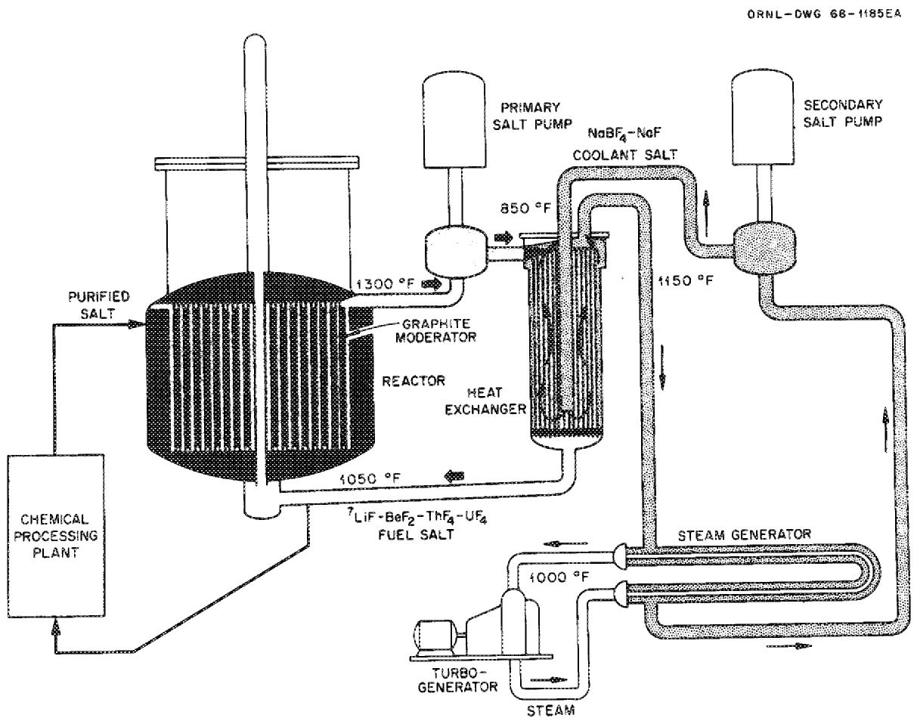  
Fig. 3.1. Single-fluid, two-region molten salt breeder reactor. For $1000\mathrm{MW(e)}$ , the fuel salt flow rate through the core is $55,000\mathrm{gpm}$ but less than $1\mathrm{gpm}$ passes through the processing plant. Electricity is produced from supercritical steam with an overall efficiency of $44\%$ .

The protactinium is removed by extraction from the fuel salt in a continuous processing plant described later, which holds it up outside of the core until it has decayed into $^{233}\mathrm{U}$ .

The basic features of the concept are described in the paragraphs that follow, and particular systems and components are described in greater details in later chapters. Further information can be found in ORNL-4541 [1].

Features of the Reference Design. - The fuel salt is a mixture of the fluorides of beryllium, lithium-7, thorium, and uranium having the following composition and melting point:

<table><tr><td></td><td colspan="2">Fuel Salt</td><td colspan="2">Coolant Salt</td></tr><tr><td rowspan="4">Composition, mole %</td><td>7LiF</td><td>71.7</td><td>NaBF4</td><td>92</td></tr><tr><td>BeF2</td><td>16</td><td>NaF</td><td>8</td></tr><tr><td>ThF4</td><td>12</td><td></td><td></td></tr><tr><td>UF4</td><td>0.3</td><td></td><td></td></tr><tr><td>Liquidus temperature, °F</td><td>930</td><td></td><td>725</td><td></td></tr></table>

Other properties are listed in Chapter 5.

Lithium-7 and beryllium fluorides, which have low neutron absorption cross sections, are used to obtain a composition that has a liquidus temperature and other physical properties that are acceptable for reactor use. Fuel salt is pumped through a core formed from bare graphite stringers and blocks; the salt does not wet graphite and will not penetrate into it if material having small pore sizes is used. To exclude xenon from the graphite, its surface is sealed to a low permeability by deposition of pyrolytic carbon. A cross section of the core used in the ORNL-4541 design is shown in Fig. 3.2. The reactor vessel and the top head are seen to have been extended above the core far enough for a mechanical closure to be used and for the closure to be directly accessible when the head must be removed.

Heat is transferred from the fuel salt to a coolant salt in an intermediate heat exchanger. A eutectic mixture of sodium fluoroborate and sodium fluoride is used as the coolant; its composition and properties have been listed above. The coolant salt passes through a steam generator where supercritical steam at $1000^{\circ}\mathrm{F}$ and 3600 psi is generated, yielding an overall thermal efficiency of $44\%$ .

Drain tanks connected to the fuel and coolant salt systems can contain the salt when necessary. The fuel salt drain tank has a reliable natural circulation cooling system for disposing of fission-product decay heat. This system uses NaK to transfer heat from the drain tank to tanks of water, where it is either disposed of by forced cooling or, in an emergency, by boiling away of the water. The drain tank is also used as the initial holdup volume for the off-gas system, so that its heat removal system is always in use and is not just called on to come into operation during an emergency.

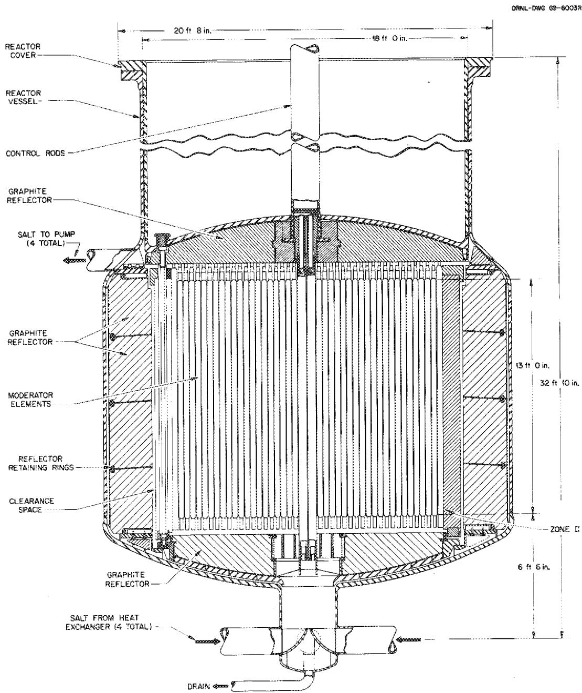  
Fig. 3.2. Sectional elevation of MSBR vessel.

All metal surfaces that contact salt are made from Hastelloy N. (As described in a later chapter, some other material may be substituted.)

The primary system and the steam generator systems are located in separate cells, as shown in Fig. 3.3. These cells serve as shielding and containment barriers for radioactive materials and have controlled atmosphere which can be heated above the liquidus temperature of the salt or cooled to prevent overheating of the reactor equipment from decay energy when the salt is drained. Access for maintenance can be achieved by removal of shield blocks at the top of the cell. Since the graphite must be replaced at intervals, a special shielded carrier is shown above the reactor for transporting it from the core to another cell for disposal.

Noble gases have very low solubility in the fuel salt, which makes it possible to strip them from the salt and reduce the poisoning effect of $^{135}\mathrm{Xe}$ . This stripping is accomplished by injecting bubbles of helium into a side stream and subsequently removing them with centrifugal separators. The off-gas containing the xenon and krypton is then passed through charcoal traps in a cleanup system.

To achieve good breeding in an MSBR, some of the salt-soluble fission products, and particularly the rare earths, must be removed rapidly. A processing concept for doing this in conjunction with the removal of protactinium has been developed. The process, illustrated in greatly simplified form in Fig. 3.4, consists of fluorination to remove uranium followed by reductive extraction of protactinium, and finally removal of rare earths and some of the other fission products by the "metal-transfer process." The processing system is described in greater detail in Chapter 11.

In the fluorinator, uranium is volatilized from the salt as $\mathrm{UF_6}$ by contacting it with fluorine. The reductive extraction process uses liquid bismuth containing dissolved lithium to extract the protactinium from the fuel salt and to transfer it to another salt; here it remains in solution until it decays to uranium and then is volatilized with fluorine for return to the reactor.

Liquid bismuth is used in the metal-transfer process to extract rare-earth fission products from the uranium- and protactinium-free salt and transfer them to lithium chloride, hence the name of the process. The fission products are ultimately extracted from the lithium chloride for storage and disposal. As shown in Fig. 3.4, the $\mathrm{UF_6}$ finally is injected into the purified fuel salt, which returns it to solution and prepares the salt for return to the reactor. In the reference plant, the fuel salt inventory of the reactor is processed on a ten-day cycle, which means that the flow rate of the salt through the processing plant is about 0.9 gpm.

The design and performance characteristics of the MSBR are summarized in Table 3.1, and more details are presented in other chapters.

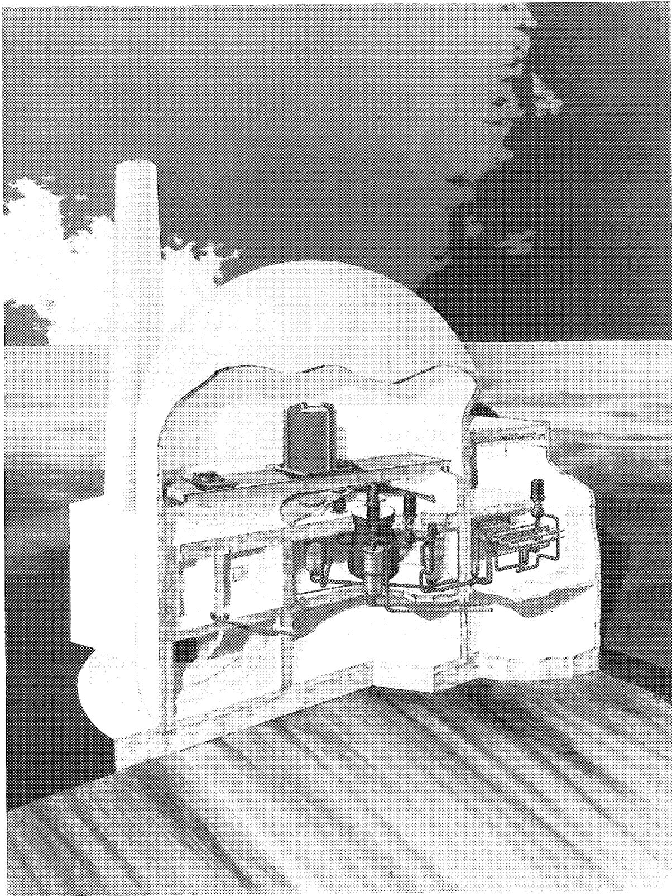  
Fig. 3.3. 1000-MW(e) molten-salt breeder reactor, showing reactor cell and one of four steam-generator cells.

ORNL-DWG 71-9004

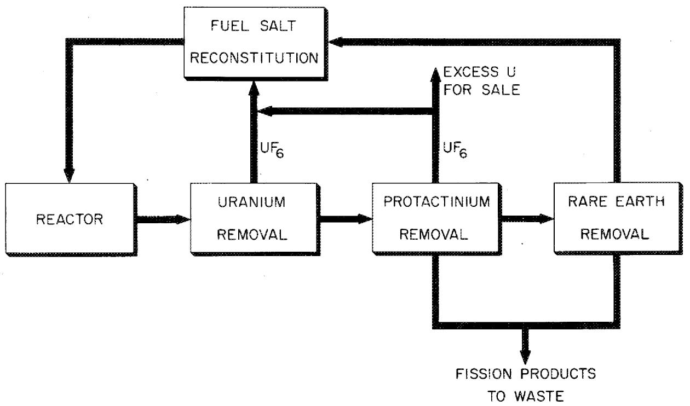  
Fig. 3.4. Simplified flowsheet for processing a molten-salt breeder reactor.

Table 3.1. Characteristics of a 1000-MW(e) Molten-Salt Breeder Reactor   

<table><tr><td>Useful heat generation, MW(th)</td><td>2250</td></tr><tr><td>Net electrical output of plant, MW(e)</td><td>1000</td></tr><tr><td>Overall plant thermal efficiency, %</td><td>44</td></tr><tr><td>Fuel salt inlet and outlet temperatures, °F</td><td>1050, 1300</td></tr><tr><td>Coolant salt inlet and outlet temperatures, °F</td><td>850, 1150</td></tr><tr><td>Throttle steam conditions</td><td>3500 psia, 1000°F</td></tr><tr><td>Reactor vessel inside diameter and height, ft</td><td>22, 20</td></tr><tr><td>Core height, ft</td><td>13</td></tr><tr><td>Core diameter, ft</td><td>14</td></tr><tr><td>Radial blanket thickness, ft</td><td>1.5</td></tr><tr><td>Graphite reflector thickness, ft</td><td>2.5</td></tr><tr><td>Number of core elements</td><td>1412</td></tr><tr><td>Size of core elements, ft</td><td>0.33 × 0.33 × 14.8</td></tr><tr><td>Salt volume fraction in core, %</td><td>13 and 37</td></tr><tr><td>Salt volume fraction in reflector, %</td><td>&lt;1</td></tr><tr><td>Total weight of graphite in reactor, kg</td><td>669,000</td></tr><tr><td>Maximum salt velocity in core, fps</td><td>8.5</td></tr><tr><td>Pressure drop through reactor due to flow, psi</td><td>18</td></tr><tr><td>Average core power density, W/cm3</td><td>22</td></tr><tr><td>Maximum thermal neutron flux, neutrons cm-2sec-1</td><td>8.3 × 1014</td></tr><tr><td>Graphite damage flux (&gt;50 keV) at point of maximum damage, neutrons cm-2sec-1</td><td>3.3 × 1014</td></tr><tr><td>Estimated graphite life at maximum damage point, yearsa</td><td>4</td></tr><tr><td>Total salt volume in primary system, ft3</td><td>1720</td></tr><tr><td>Thorium inventory, kg</td><td>68,000</td></tr><tr><td>Fissile fuel inventory of reactor system and processing plant, kg</td><td>1504</td></tr><tr><td>Breeding ratio</td><td>1.07</td></tr><tr><td>Fissile fuel yield, %/yearb</td><td>3.6</td></tr><tr><td>Fuel doubling time (exponential), yearsb</td><td>19</td></tr></table>

${}^{a}$ Based on 80% plant factor and a fluence of $3 \times  {10}^{22}$ neutrons/cm ${}^{2}$ (>50 keV).   
At $80\%$ plant factor.

# Alternatives to the Reference Design

# Evasco Variations from ORNL Design

Ebasco Services and their associates in Reference 3 present their conceptual design of a single-fluid molten-salt breeder reactor that is expected to satisfy the same general criteria that were the basis for the ORNL design. This study represents only the first phase of a series of tasks that Ebasco is to undertake for ORNL. Its objective was to identify the general features of the concept, which is being examined in more detail in subsequent studies.

For this initial examination, Evasco was restricted in some aspects to using conditions specified by ORNL; for example, the composition of the salt and the salt volume fraction in the core were specified, and the performance characteristics of the processing plant were defined for Evasco and were not to be studied. However, in their examination of other aspects of the plant, Evasco in some cases selected different ways of designing features or components of the reactor from those in the ORNL reference design. Notable were the following:

1. In order to avoid the difficulties of sealing the interior surfaces, Ebasco uses a slab geometry for the graphite core elements rather than the square element with a central hole used by ORNL.   
2. They propose to replace individual graphite assemblies rather than replacing the core as a unit, as proposed by ORNL. This allows some elements to be left in the core longer than others, and it reduces the difficulties of handling the large, radioactive core.   
3. Equipment and piping in the reactor cell are supported from the bottom rather than from the top, and three tiers of horizontal seismic restraints are provided.   
4. The piping is lined to mitigate the effect of shock by thermal transients.   
5. The coolant pump is put in the cold leg to insure inleakage to the primary system in case a heat-exchanger tube leaks.   
6. The fuel-salt storage tank is pressurized to improve the performance of the jet pumps that return salt to the reactor and to permit enough additional dilution of the off-gas for it to be returned directly to the reactor without passage through the 47-hour charcoal beds shown in the ORNL design.

Some of these and other changes proposed by Ebasco and the companies associated with it appear to us to be useful improvements over the ORNL-4541 design and will be incorporated in future designs and factored into the development program.

In the earlier discussion of the principles followed in selecting the ORNL reference design, we noted that if a thermal breeder alone is to satisfy the requirements of a growing nuclear economy, the fuel inventory must be kept reasonably low. If this requirement is altered because the molten-salt breeder is not the only breeder in use or because of either a lower rate of nuclear power growth or a greater availability of uranium ore, then the requirements for low inventory will be eased. This change could lead to a design with a lower power density core, which would have some advantages over the reference design. For example, if the power density, and hence the neutron flux, were reduced enough for the graphite to last thirty years, some important simplifications could be made: the equipment for replacing the core and for disposing of the spent graphite would not be needed, the design of the core itself could be simplified, and an all-welded reactor vessel without a removable top could be used. In addition, reducing the power density lowers the velocity of the fuel salt in the core, which can lower the mass transfer rate of xenon enough to obviate the need for sealing the graphite.

The major disadvantage of the lower power density is the increased fissile inventory, which some studies [4, p. 27] have shown to be 40 to $50\%$ higher than that of the reference design. (Interestingly, the average power density can be significantly greater than 4/30 times that of the 4-year-life design because of improved power flattening and reduced graphite temperature peaking in the large core.) Whether the power cost would be higher or lower than the reference design is uncertain. The larger core and drain tank should require larger cell and building volumes, which add to the cost; however, elimination of the cost of sealing the graphite and of providing means to replace it, and avoiding the out-of-pocket replacement costs, provide offsetting savings.

In spite of the advantages offered by reduced power density, the lower fuel inventory of the reference design remains a desirable goal, and the reference design continues to be the focus of ORNL's program. Nevertheless, low power density may be appropriate for early power plants, with later evolution to higher power density. This would be particularly appropriate if more radiation-resistant graphites are developed that permit 30-year core life to be attained with less penalty in fuel inventory.

# References for Chapter 3

1. Conceptual Design Study of a Single-Fluid Molten-Salt Breeder Reactor, ORNL-4541 (1971).   
2. M. J. Bell, Availability of Natural Resources for Molten-Salt Breeder Reactors, ORNL-TM-3563 (November 1971).   
3. 1000-Mw(e) Molten-Salt Breeder Reactor Conceptual Design Study, Final Report - Task I, Evasco Services, Inc., February 1972.   
4. MSR Program Semiannu. Progr. Rep. Aug. 31, 1970, ORNL-4622.

A. M. Perry

# Introduction

Reactor physics considerations in the design of molten-salt reactors are, for the most part, similar to those for other thermal reactors. In particular, the graphite-moderated MSR has much in common with the High-Temperature Gas-Cooled Reactor (HTGR): graphite moderator at an average temperature of $600 - 700^{\circ}\mathrm{C}$ , $\mathrm{Th}^{-233}\mathrm{U}$ fuel cycle, and similar fuel-moderator ratios. Thus, much of the design technology of thermal reactors in general and of HTGR's in particular is directly applicable to the MSR. This includes nuclear data and methods for calculating neutron fluxes, power distributions, effects of heterogeneities in core structure, control rod worths, temperature coefficients of reactivity, and so forth.

There are, however, a few important differences. The need to establish accurately the reactivity lifetime of the fuel, so important to the economics of solid-fuel reactors, has no analog in the MSR, since fuel can readily be added or removed, as required, in order to maintain criticality. The problem of accurate calculation of the reactivity life of the fuel is thus replaced by the problem of designing, building, and operating devices to maintain the desired composition of the fluid fuel. This is not the same as adjusting the feed rate for solid-fuel reactors with continuous on-stream refueling, since in the latter case the discharge exposure of the fuel remains a crucial economic parameter.

Similarly, the problem of calculating power-density distributions in MSR cores takes a somewhat different form than in solid-fuel reactors. In particular, since the fuel is constantly mixed and its composition remains essentially uniform throughout the reactor, the problem of time-dependent power distributions is much less important in fluid-fuel than in solid-fuel reactors.

With respect to their dynamic behavior (i.e., the short-term time-dependence of operating variables such as power and neutron flux levels, fuel temperatures, etc.) the circulating fuel reactors -- and especially those operating with $^{233}\mathrm{U}$ fuel -- have unique characteristics requiring special study, and these will be discussed in a subsequent section of this chapter. We simply note for the moment that an MSBR typically has a much smaller delayed neutron fraction than do other types of reactors and the transport of the delayed neutron emitters in the moving fuel alters the response of the reactor to changes in reactivity. On the other hand, most of the power generation is in the circulating fuel itself, which is also the primary reactor coolant; thus, no heat transfer lags between fuel and coolant are present. As we shall see, these two factors together produce safe, stable operating characteristics over a wide range of core design parameters.

The central question in the physics of the Molten-Salt Breeder Reactor would thus appear to be the breeding ratio itself. This is so because of the very small breeding gain (breeding ratio minus one) that is

characteristic of thermal breeder reactors. Whereas fast breeders typically achieve their desirable breeding performance with large breeding gains, in combination with relatively large fuel inventories, the thermal breeder, with a much smaller breeding gain, must succeed by maintaining a relatively low fuel inventory.* Because the breeding gain is low, the expected performance of a thermal breeder reactor is especially sensitive to uncertainties in the calculated breeding ratio, and it becomes necessary to establish the neutron balance in the reactor, on which the breeding ratio depends, with greater precision than would be required for a fast breeder reactor.

# Breeding in Molten-Salt Reactors

The quality of performance of a breeder reactor, in a nuclear power economy postulated to follow a particular pattern of growth, is often evaluated in terms of the cumulative amount of uranium ore that would have to be mined up to the time when the breeders themselves could satisfy all requirements for fissile materials. It is generally recognized that this quantity depends both on the breeding ratio of the reactor and on its specific fuel inventory.

In Fig. 4.1 (also shown as Fig. 1.2), we show the anticipated ore requirements for a U.S. nuclear power industry based on various postulated combinations of present-day converters and possible future breeders, having different breeding ratios and specific fuel inventories (kg fissile/MW(e)). The total installed nuclear-electric capacity is assumed to reach 140 GW(e) in 1980 and 930 GW(e) in 2000, and to increase thereafter at a rate of 100 GW(e) per year. It is further assumed that only light-water reactors are built prior to 1982, that the first breeders come on line in 1982 and that only breeders are added to the system after 1998. Also shown on Fig. 4.1 are the price ranges within which the USAEC currently estimates that incremental amounts of uranium may be available from domestic U.S. ores, including estimated probable resources as well as reasonably-assured reserves.

A cross-plot of data taken from curves like those of Fig. 4.1 produces a plot of resource requirements vs specific fuel inventory, for different values of the doubling time, as shown in Fig. 4.2 (also shown as Fig. 1.3). It may be noted from these curves that a breeder reactor with a (compound) doubling time of 20 years, and a specific inventory of $1.5\mathrm{kg} / \mathrm{MW}(\mathrm{e})$ , would be expected to require very little more ore than a breeder with a doubling time of 10 years and a specific inventory of $4\mathrm{kg} / \mathrm{MW}(\mathrm{e})$ . (These might be, respectively, a thermal breeder with a breeding ratio of 1.07 and a fast breeder with a breeding ratio of 1.35.)

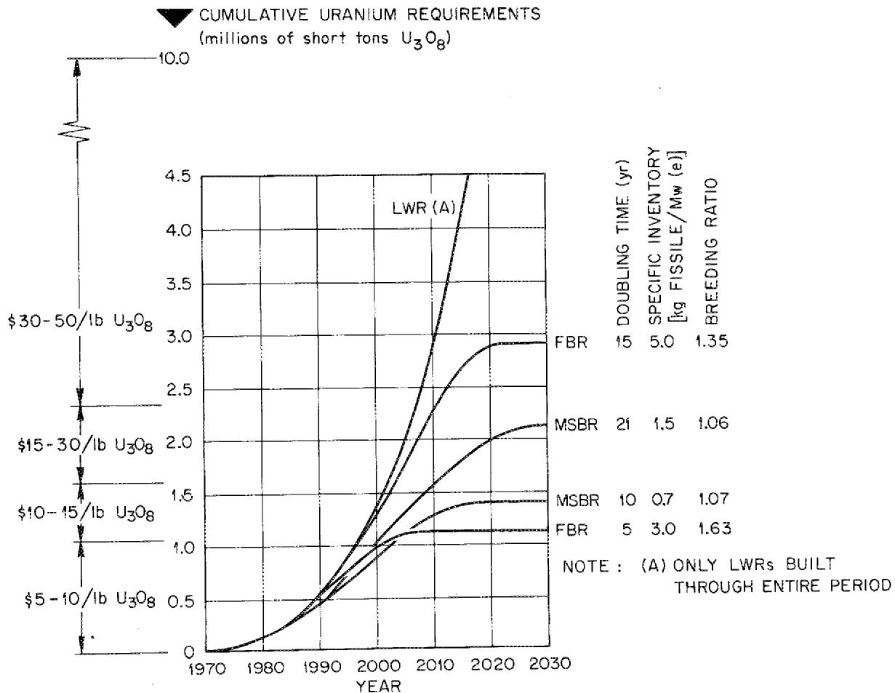  
Fig. 4.1. Effect of breeders on the ore requirements of the U.S. nuclear power economy if breeders are introduced in the mid-1980's and only breeders are built after 1998.

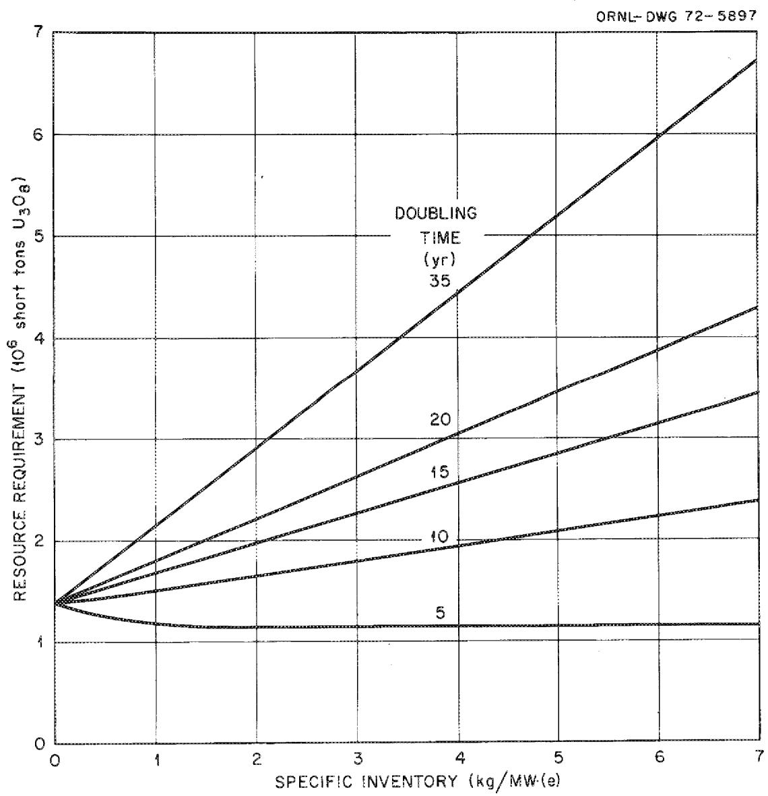  
Fig. 4.2. Maximum uranium ore requirements. Basis: U.S. nuclear power capability reaches 140 GW(e) in 1980, 930 GW(e) in 2000, thereafter increases 100 GW(e) per year; first breeders on line in 1982, only breeders built after 1998.

Thus, a thermal breeder reactor with a low specific fuel inventory may have breeding performance comparable to a fast breeder with a larger fuel inventory, even if the doubling time of the fast breeder is much shorter than that of the thermal breeder. However, it is clear that the low breeding gain of the thermal breeder makes its performance more sensitive to uncertainties in breeding ratio, and it becomes necessary to examine carefully the sources and probable magnitudes of such uncertainties.

# Uncertainties

The calculated neutron balance for the reference single-fluid MSBR is shown in Table 4.1. This neutron balance is based on the current metal-transfer chemical-processing flowsheet, with a 10-day processing cycle, and the normalization is such that a total of one neutron is absorbed in the fissile nuclides, $^{233}\mathrm{U} + ^{235}\mathrm{U}$ . The breeding ratio, with this normalization, is equal to the number of captures in $^{232}\mathrm{Th}$ and $^{234}\mathrm{U}$ (absorptions less fissions) minus absorptions in $^{233}\mathrm{Pa}$ , i.e., $\mathrm{BR} = 0.9938 + 0.0815 - 0.0045 = 1.0708$ . The number of neutrons available for capture in the fertile materials depends on the neutron production $\eta \varepsilon$ , per neutron absorbed in fissile fuel, and on the losses to moderator, coolant, fission products, and leakage. Thus, the greatest single source of uncertainty in breeding ratio is in the neutron production term, $\eta \varepsilon$ , which depends mainly on the spectrum-averaged value of $\eta$ for $^{233}\mathrm{U}$ .

Perry [1] has made a detailed analysis of the effect on breeding ratio (and on fuel cycle cost) of uncertainties in the cross sections of all core constituents and his results are summarized in Tables 4.2 and 4.3.

Since these uncertainties are all independent, they may be combined by taking the square root of the sum of the squares as the overall uncertainty in breeding ratio or in fuel-cycle cost attributable to cross-section uncertainties. The resulting values,

$$
\left[ \sum_ {i} (\delta B) _ {i} ^ {2} \right] ^ {1 / 2} = 0. 0 1 6
$$

and

$$
\left[ \sum_ {i} (\delta F C C) _ {i} ^ {2} \right] ^ {1 / 2} = 0. 0 2 6 m i l l / k W h r (e)
$$

reflect primarily the uncertainty in the average thermal $\eta$ of $^{233}\mathrm{U}$ (e.g., $\delta \mathrm{B} \sim 0.012$ ). (If all the assessed cross-section uncertainties are added up in the same direction, the result is $\Sigma (\delta \mathrm{B})_{i} = 0.05$ and $\Sigma (\delta \mathrm{FCC})_{i} = 0.08$ . We regard this, however, as an extremely improbable combination of circumstances, a view that is strengthened by the satisfactory results of criticality calculations described below.)

Table 4.1. Neutron balance in a single-fluid molten-salt breeder reactor with ten-day processing cycle   

<table><tr><td></td><td>Absorptions</td><td>Fissions</td></tr><tr><td>232Th</td><td>0.9968</td><td>0.0030</td></tr><tr><td>233Pa</td><td>0.0045</td><td></td></tr><tr><td>233U</td><td>0.9242</td><td>0.8245</td></tr><tr><td>234U</td><td>0.0819</td><td>0.0004</td></tr><tr><td>235U</td><td>0.0758</td><td>0.0618</td></tr><tr><td>236U</td><td>0.0074</td><td></td></tr><tr><td>237Np</td><td>0.0064</td><td></td></tr><tr><td>6Li</td><td>0.0032</td><td></td></tr><tr><td>7Li</td><td>0.0161</td><td></td></tr><tr><td>9Be</td><td>0.0070</td><td>0.0044b</td></tr><tr><td>19F</td><td>0.0203</td><td></td></tr><tr><td>Graphite</td><td>0.0510</td><td></td></tr><tr><td>Fission products</td><td>0.0150</td><td></td></tr><tr><td>Leakage</td><td></td><td>0.0221c</td></tr><tr><td>ηe</td><td></td><td>2.2317</td></tr><tr><td>Breeding ratio</td><td></td><td>1.0708</td></tr></table>

"Sec Ref. 2.   
$b_{n,2n}$ reaction in beryllium.   
c Including delayed neutron losses.

Table 4.2. Effect of heavy-element cross-section uncertainties on MSBR performance   

<table><tr><td>Nuclide</td><td>Quantity</td><td>Assigned value</td><td>Assigned uncertainty</td><td>δBa</td><td>δ FCCb[mills/kWhr(e)]</td></tr><tr><td rowspan="4">233U</td><td>η0</td><td>2.293</td><td>±0.010</td><td>0.008</td><td>0.013</td></tr><tr><td>πT/η0</td><td>~1</td><td>±0.5%</td><td>0.009</td><td>0.015</td></tr><tr><td>ν</td><td>2.50</td><td>±0.01</td><td>0.003</td><td>0.005</td></tr><tr><td>αF</td><td>0.18</td><td>±0.01</td><td>0.006</td><td>0.010</td></tr><tr><td rowspan="4">235U</td><td>η0</td><td></td><td>±0.010</td><td>0.001</td><td>0.001</td></tr><tr><td>πT/η0</td><td>~1</td><td>±0.5%</td><td>0.001</td><td>0.001</td></tr><tr><td>ν</td><td>2.43</td><td>±0.01</td><td></td><td></td></tr><tr><td>αF</td><td>0.50</td><td>±0.02</td><td>&lt;0.001</td><td>0.001</td></tr><tr><td>234U</td><td>σa</td><td></td><td>±10%</td><td>&lt;0.001</td><td>0.001</td></tr><tr><td>236U</td><td>σa</td><td></td><td>±15%</td><td>&lt;0.001</td><td>0.001</td></tr></table>

Uncertainty in breeding ratio.   
$b$ Uncertainty in fuel cycle cost.

Table 4.3. Effect of light-element cross-section uncertainties on MSBR performance   

<table><tr><td>Cross section</td><td>Assigned cross-section uncertainty (%)</td><td>δB</td><td>δFCC [mills/kWhr(e)]</td></tr><tr><td>F(n,α)</td><td>±30</td><td>0.003</td><td>0.005</td></tr><tr><td>F(n,γ)(resonance)</td><td>±30</td><td>0.002</td><td>0.003</td></tr><tr><td>F(n,γ)(thermal)</td><td>±7</td><td>0.001</td><td>0.002</td></tr><tr><td>Be(n,α)</td><td>±10</td><td>0.001</td><td>0.002</td></tr><tr><td>Be(n,γ)</td><td>±10</td><td></td><td></td></tr><tr><td>Be(n,2n)</td><td>±15</td><td>0.002</td><td>0.003</td></tr><tr><td>7Li</td><td>±10</td><td>0.003</td><td>0.004</td></tr><tr><td>C</td><td>±10</td><td>0.004</td><td>0.006</td></tr><tr><td>FP (thermal)</td><td>±10</td><td></td><td></td></tr><tr><td>FP (resonance)</td><td>±30</td><td>0.003</td><td>0.005</td></tr></table>

The absence of thorium from this list is not an oversight;* in a real sense thorium absorbs all neutrons that other materials do not, and in principle the thorium concentration would be adjusted so that this will be the case. In practice, it is easier to adjust the uranium concentration, so that over short periods (if the effective absorption cross-section of thorium were much different than expected) the critical concentration of uranium might prove to be slightly different than expected. However, over longer periods the uranium concentration may be placed at almost any desired level, and the thorium adjusted for criticality. In any event, on the basis of critical-experiment results, we would not anticipate appreciable deviations of these concentrations from calculated values.

Further support for the calculated values of $\mathfrak{n}$ has been derived from a measurement in the MSRE of the capture/fission cross section ratios for both $^{233}\mathrm{U}$ and $^{235}\mathrm{U}$ . Measured and calculated values in the MSRE spectrum, which was similar to the reference MSBR spectrum, are compared in Table 4.4. The agreement is well within the experimental errors, which correspond to less than $\pm 0.01$ in average $\mathfrak{n}$ . Further details of the experiments and calculations may be found in References 3 and 4.

The fission-product poison fraction shown in Table 4.1 (0.015) includes a nominal allowance of 0.005 to cover $^{135}\mathrm{Xe}$ , other noble-gas fission products, and any of their daughter products that may be produced by decay of noble gases within the graphite moderator. This is done to avoid the necessity of combining the complex gas-stripping and diffusion model with the neutronic and fuel-cycle calculation, in which the explicit treatment of the noble gases assumes their removal from the reactor on a 50-sec cycle. While a poison fraction no greater than 0.005 is probably attainable for $^{135}\mathrm{Xe}$ alone, it presently seems much less likely that the combined effect of all the noble gases (and their daughters born in the graphite) can be kept as low as 0.005. The additional poisoning effect of the other nuclides in question has been calculated to be about $20\%$ of that of $^{135}\mathrm{Xe}$ itself, at the end of a 4-yr graphite life. Thus, an additional poison fraction of 0.001-0.002 may occur.

As was pointed out above, the other principal factor in breeding performance – the fuel inventory – is insensitive to reactor physics uncertainties, because of the inherent flexibility of the molten-salt reactor with respect to adjustments in fissile and fertile material concentrations. Over a very considerable range of fuel concentrations, essentially any desired value can be achieved and maintained. The question is only that of the breeding ratio that corresponds to a particular fuel concentration, as already discussed. It may be noted in this connection that the reference MSBR has not been chosen on the basis of highest possible breeding ratio. A modest increase in breeding ratio [5] could be achieved by increasing the fuel inventory (and thus decreasing losses in competitive neutron absorbers such as the moderator and the

Table 4.4. Measured and calculated values of $\alpha$ , the capture/fission cross-section ratio, for $^{233}\mathrm{U}$ and $^{235}\mathrm{U}$   

<table><tr><td></td><td>233U</td><td>235U</td></tr><tr><td>α (measured)</td><td>0.123 ± 0.0039</td><td>0.2509 ± 0.0038</td></tr><tr><td>α (calculated)</td><td>0.1226</td><td>0.2500</td></tr><tr><td>αm/αc</td><td>1.006 ± 0.032</td><td>1.004 ± 0.015</td></tr><tr><td rowspan="2">nm = ν(1 + α) -1</td><td>2.226 ± 0.008a</td><td>1.943 ± 0.006b</td></tr><tr><td>2.226 ± 0.012c</td><td>1.943 ± 0.010d</td></tr><tr><td>nc</td><td>2.227</td><td>1.944</td></tr></table>

Assuming $\nu$ is exactly 2.50.   
Assuming $\nu$ is exactly 2.43.   
Assuming $\nu = 2.50\pm 0.01$   
$d_{\mathrm{Assuming}}\nu = 2.43\pm 0.01$

carrier salt). Instead, the design has been optimized on the basis of the ratio of the breeding gain to the square of the (specific) fuel inventory, which is an approximate measure of the cumulative uranium ore requirement for establishing a self-sufficient power economy based on breeders.

The inventory is nonetheless subject to some uncertainty, to the extent that the volume of fuel salt in the system depends on details of the mechanical and thermal-hydraulic design of the system, including heat exchangers, piping, plena, etc. It may be noted that an increase of 200 ft³ in fuel-salt volume, without any reoptimization, would produce a fractional change in the ratio G/I² of about the same size as the (fractional) uncertainty in G(= BR - l) that arises from nuclear data and reactor physics uncertainties.

There are additional potential sources of error in the breeding ratio that lie outside the area of reactor physics. These include the chemical behavior of certain fission products, notably the "noble" metals, Nb, Mo, Ru, Te; a part of these fission products is known to be deposited and held on primary-circuit surfaces, including core graphite. The estimated breeding ratio for our reference MSBR design includes an allowance [6] for deposition of these nuclides on graphite to an extent (i.e., 10% of the amounts produced) that appears reasonable in view of data obtained from samples from the MSRE and from an in-pile loop.* The effect of these nuclides on the breeding ratio is shown in Fig. 4.3 as a function of the in-core life of the graphite. For a 4-year graphite life, the average poisoning effect is about 0.004. Since the behavior of these fission products is not fully understood (see Chap. 5), we cannot exclude the possibility that a larger fraction of these fission-product poisons might be retained by the core graphite.

Other factors that could have an adverse effect on breeding performance would be failure to achieve adequate sealing of graphite surfaces against adsorption of $^{135}\mathrm{Xe}$ or adequate stripping of xenon from the circulating salt, failure of the chemical plant to remove fission products from the salt, or non-recoverable losses of fissile material due to upsets in reactor or chemical plant operation. The first of these would at most reduce the breeding ratio by 0.015, while the last two would cause temporary reductions in breeding ratio pending restoration of normal plant operations.

According to the curves of Fig. 4.2, the cumulative resource requirements are less sensitive to errors or uncertainties in doubling time for low-specific-inventory breeders than for high-specific-inventory breeders. This is partly due to the irreducible ore requirements for converter reactors, assumed to be built during the early years of the postulated

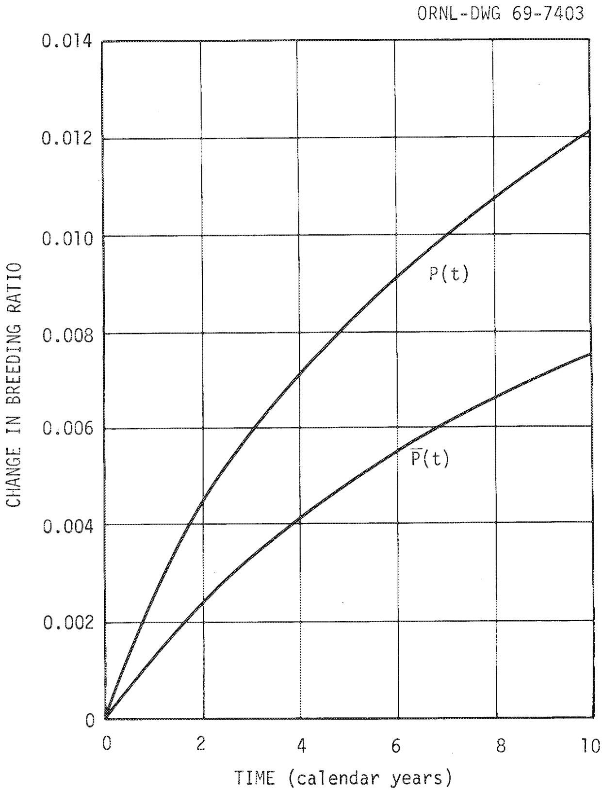  
Fig. 4.3. Change in breeding ratio due to noble-metal fission products in MSBR.

growth pattern, as well as to the smaller absolute amounts of inventory required for the low-inventory breeders. For example, a system predicated on molten-salt reactors with a specific inventory of $1.5\mathrm{kg} / \mathrm{MW(e)}$ and a doubling time of 35 years would require perhaps $2.5\times 10^{6}$ short tons of $\mathrm{U}_{3}\mathrm{O}_{8}$ , while a system using breeders with the same inventory but a 20-year doubling time would require about $2\times 10^{6}$ short tons of $\mathrm{U}_{3}\mathrm{O}_{8}$ .* Thus, a reduction of breeding ratio from 1.07 to 1.04, should it occur for any of the reasons outlined above, would not markedly impair the ability of the molten-salt reactor to limit the amount of ore necessary to achieve a self-sufficient nuclear power economy.

# Reactor Statics

# Multiplication Factor

The multiplication factor of a reactor, like the breeding ratio, is a direct reflection of the neutron balance. While criticality calculations, because of the adjustability of fuel concentration, are not of crucial importance per se, they serve to establish reactor conditions for which other quantities such as control rod costs and reactivity coefficients must be determined, and they may provide additional confidence in the calculated neutron balance on which estimates of breeding performance also depend.

The agreement between predicted and observed critical fuel concentrations in the MSRE was gratifying (see Table 4.5), but subsequent studies [7] have shown that the calculated concentrations are rather sensitive to permissible changes in nuclear data, to methods of calculating neutron transport cross sections, and to details of the reactor representation used in the computational model. However, it has also been shown that practically all of this sensitivity (up to $3\%$ in $\delta k$ ) is associated with neutron leakage, which in the MSRE was unusually high: $31\%$ of all neutrons leaked from the fueled regions of the reactor with $^{235}\mathrm{U}$ fuel and $35\%$ with the $^{233}\mathrm{U}$ fuel. In a large molten-salt power reactor, the neutron leakage would be lower by a factor of 20-30, and the sensitivity to neutron transport effects proportionately less.

A series of criticality and reactivity measurements [8] has recently been performed on behalf of the MSR Program in the High Temperature Lat-tice Test Reactor (HTLTR) at the Battelle Northwest Laboratory. In these experiments, the molten-salt fuel was simulated by coated-particle fuels $\left(\mathrm{ThO}_{2}\right.$ and $\left.\mathrm{UO}_{2}-\mathrm{ThO}_{2}\right.$ grains in a graphite matrix) in concentrations and geometrical arrangements representative of the reference MSBR core. Re-activity effects of fuel salt constituents such as Li, Be, and F were

Table 4.5. Predicted and observed critical fuel concentrations in the MSRE   

<table><tr><td></td><td colspan="2">Concentration (g/liter)b</td></tr><tr><td></td><td>235U loadingc</td><td>235U loadingd</td></tr><tr><td>Predicted concentration</td><td>32.8</td><td>15.1 ± 0.1e</td></tr><tr><td>Observed concentrationf</td><td>32.8 ± 0.3</td><td>15.4 ± 0.1</td></tr><tr><td>Observed/predictedg</td><td>1.00 ± 0.01</td><td>1.02 ± 0.01</td></tr></table>

${}^{a}$ Reactor isothermal at $\sim  {1200}^{ \circ  }\mathrm{F}$ ,fuel not circulating.   
$b$ Fissile uranium, grams per liter of salt.   
$c$ See Ref. 9.   
$^d$ Sec Ref. 10.

Uncertainties in adjustments for residual plutonium and fission products from $^{235}\mathrm{U}$ run and for dimensional changes in graphite core structure due to fast-neutron irradiation.

$f_{\text{Uncertainty}}$ due mainly to uncertainties in salt density and salt volume.

$g(M / k)(\partial k / \partial M) = 0.36;1\% \delta M\sim 0.4\% \delta k.$

individually measured in a centrally located sample position, as were those of simulated control rods and of variations in lattice cell geometry. Measurements were made over a range of temperatures from $20^{\circ}$ to $1000^{\circ}\mathrm{C}$ .

Although analysis and interpretation of these measurements is not yet complete, results so far available show good agreement between measured and calculated quantities. A comparison of $k_{\infty}$ values is shown in Table 4.6. (While the calculated and measured values compare very favorably, it must be acknowledged that we do not really claim such high accuracy for our calculations, since changes larger than the differences noted in Table 4.6 would be produced by variations in cross sections well within our present range of uncertainty.)

It thus appears that presently available data and methods can yield predictions of $k_{\infty}$ that are reliable to within less than 1%.

# Power-Density Distributions

Calculations of power-density distributions in a large MSR have much in common with those for other power reactor cores with low leakage and $k_{\infty}$ close to 1.0. In particular, we would expect a high sensitivity of power distribution to small variations in $k_{\infty}$ within the reactor core. While no direct experimental data for molten-salt reactors are available, much relevant experience has been acquired with large gas-cooled graphite reactors and with heavy-water reactors. It is usual with such reactors to provide instrumentation to measure power distributions with some degree of accuracy, and to provide small amounts of reactivity control, distributed over the core, to regulate the power distribution. We would expect to require some means for making routine measurements of the power distribution, at least in early molten-salt power reactors, as well as some means of controlling it. (Such measurements would not necessarily require in-core flux sensors. Other possibilities would include salt-outlet-temperature measurements or neutron-flux measurements at several points outside the reactor vessel.)

However, the tolerance for uncertainty in the power distribution may be somewhat greater in molten-salt reactors than in most other types of power reactor. The principal limitation appears to be radiation damage to the graphite, which depends primarily on the integrated power density over long periods of operation. Both the neutron fluence and the graphite temperature have an important influence on changes in graphite properties, and both would be affected by deviations of power density from expected values. However it can be shown for the reference MSBR that temperature effects are much smaller than the direct effect of fast neutron flux, which is approximately proportional to the power density.

If a $10\%$ deviation of power density from its nominal value should persist over the life of the core, the graphite, instead of returning just to its original volume, would expand about $2\%$ (i.e., $0.02 \delta \ell / \ell$ , 0.06 $\delta \mathrm{V} / \mathrm{V}$ ), which is probably about the limit of what could be tolerated. Considerably larger short-term deviations in power density should be acceptable, particularly if adequate steps are taken in the detailed design of the reactor to ensure good mixing of the salt in the core outlet plenum.

Table 4.6. Comparison of measured and calculated $k_{\infty}$ for HTLTR-MSBR lattice   

<table><tr><td rowspan="2"></td><td colspan="4">k∞</td><td rowspan="2">Δk∞(300° → 1000°C)</td></tr><tr><td>20°C</td><td>300°C</td><td>627°C</td><td>1000°C</td></tr><tr><td>k∞ (measured)</td><td>1.0291 ± 0.0012</td><td>1.0127 ± 0.0010</td><td>1.0065 ± 0.0010</td><td>1.0037 ± 0.0012</td><td>-0.0090 ± 0.0016</td></tr><tr><td>k∞ (calculated)</td><td>1.0300</td><td>1.0138</td><td>1.0057</td><td>1.0030</td><td>-0.0108</td></tr><tr><td>k∞ (measured/bcalculated)</td><td>0.9991 ± 0.0012</td><td>0.9989 ± 0.0010</td><td>1.0008 ± 0.0010</td><td>1.0007 ± 0.0012</td><td>0.83 ± 0.15</td></tr></table>

${}^{a}{k}_{\infty }$ for bare critical core of given composition.   
bQuoted errors,include only experimental errors; uncertainties in calculated quantities are undoubtedly greater than these (see text).

# Reactivity Control

Requirements for reactivity control in molten-salt reactors are somewhat different than in most solid-fuel reactors. Long-term reactivity changes are to be compensated by adjustments in fuel salt composition. Shutdown rods worth a few percent in $\delta k$ are likely to be required, but these would normally be fully withdrawn for the reactor. Small amounts of reactivity adjustment for normal operational maneuvering should be available, and if possible these control devices should not have an adverse effect on the breeding ratio. We therefore visualize an adequate complement of neutron-absorbing safety rods which would be fully withdrawn during normal operations. Maneuvering, as now planned, will be accomplished by graphite rods which displace fuel salt from special passages in the core.

Techniques for calculating the effectiveness of the absorber rods are well established, and generally reliable to within less than $10\%$ of the rod worth, which is quite sufficient. Predicted and measured rod worths in the MSRE agreed to within $5\%$ of the rod worth, as may be seen from Table 4.7.

The graphite displacement rods, to be used for maneuvering, are unconventional. Their reactivity worth is expected to be small (e.g., $\delta k / k \sim 0.001$ per rod) and they depend on somewhat different physical effects than do normal "black" absorber rods. Calculations show that displacement of fuel salt by the graphite rods increases reactivity, rather than decreasing it as one might expect, and it appears that changes in resonance neutron capture in neighboring fuel passages are at least partly responsible.* Some of the reactivity specimens in the HTLTR experiments [6] gave qualitative confirmation of the positive reactivity associated with displacing fuel by graphite, but calculations precisely corresponding to the experimental situations have not yet been made.

The reactivity requirement for maneuvering is not a rigid one, but it will be necessary to establish more firmly the effectiveness of the graphite rods before they could be adopted finally as the basis for MSBR design.

# Reactivity Coefficients

A large single-fluid MSBR has temperature coefficients of reactivity (see Chap. 14, Table 14.1) which are not especially large for a fluid-fuel reactor. Both the overall, isothermal temperature coefficient, and the coefficient of the salt alone represent small (algebraic) sums of much larger individual effects, e.g., thorium Doppler coefficient (negative) and moderator coefficient (positive). Direct experimental confirmation

Table 4.7. Comparison of observed and predicted control rod worths in MSRE   

<table><tr><td rowspan="2">Uranium concentration</td><td rowspan="2">Configuration</td><td colspan="2">Reactivity (% δk/k)</td></tr><tr><td>Observeda</td><td>Predicted</td></tr><tr><td>235Ub</td><td></td><td></td><td></td></tr><tr><td rowspan="2">Initial critical concentration</td><td>1 rod</td><td>2.26</td><td>2.28</td></tr><tr><td>3 rods</td><td>5.59</td><td>5.89</td></tr><tr><td>1.1 × initial concentration</td><td>1 rod</td><td>2.08</td><td>2.09</td></tr><tr><td rowspan="2">233Uc</td><td>1 rod</td><td>2.58</td><td>2.75</td></tr><tr><td>3 rods</td><td>6.9</td><td>7.01</td></tr></table>

${}^{a}$ Combined errors of measurements and of inferring reactivities do not exceed $\pm  5\%$ .   
$b_{\mathrm{SeeRef.9}}$   
See Ref. 10.

of the calculated magnitudes of all these effects has not been obtained for a molten-salt reactor, though all the important effects will be inferred from the HTLTR-MSBR lattice experiments. The criticality calculations cited in Table 4.6 show satisfactory agreement between measured and calculated changes in $\mathbf{k}_{\infty}$ over the temperature range between $20^{\circ}$ and $1000^{\circ}\mathrm{C}$ . Although effects of salt expansion are not directly reproduced in these experiments, the major components of the overall temperature coefficient (Doppler and thermal-base coefficients) are included. Fuel density effects were tested in one of the reactivity samples, but analysis of these measurements is not yet complete.

Calculated and measured temperature coefficients for the MSRE [9] showed agreement to within about $10\%$ , but these depended mainly on neutron leakage effects; although the agreement is encouraging, the results are not directly applicable to a large MSR.

The reactivity effects of fuel additions were measured in MSRE for both $^{235}\mathrm{U}$ and $^{233}\mathrm{U}$ fuel loadings, with results shown in Table 4.8.

# Radiation Calculations

Design problems related to radiation transport, such as shielding, radiation damage, and gamma or neutron heating, present a somewhat different aspect in molten-salt reactors than in many other reactor types, but this is because of the mobility of the fuel and other radiation sources (e.g., fission product gases), and not because of any essential differences in the transport problem per se.

In gas-cooled reactors such as the natural-uranium, graphite reactors, radiation streaming from fuel channels was peculiarly important. In LMFBR's, neutron penetration through thick composite regions of iron and sodium has proved to be an important problem requiring new experimental data and improved methods of analysis. In the case of the molten salt reactor, while it may be premature to conclude that no unique problems of radiation transport will appear, none are now evident. Instead, it seems apparent that the principal problems will relate to determining the distributions of the sources of radiation, and especially of fission products, throughout the reactor plant. These aspects of the problem are treated elsewhere in this report.

# Reactor Dynamics

Questions of control and safety of molten-salt reactors are discussed elsewhere in this report (Chapters 10 and 14). It is our purpose here only to clarify the status of our understanding of the relevant neutronic characteristics of the reactor.

Circulating-fuel reactors, especially if operated on the Th-233U fuel cycle, have unusually small delayed-neutron fractions. Calculated values for molten-salt breeder reactors fall in the range 0.0010-0.0015, depending on details of reactor design. At the same time, the graphite-moderated MSR, in common with most other graphite-moderated reactors, has a very long prompt-neutron generation time, e.g., 0.4 msec.

Table 4.8. Measured and calculated reactivity coefficients of fuel concentration for MSRE   

<table><tr><td rowspan="2">Fuel</td><td colspan="2">(δk/k)/(δM/M)</td></tr><tr><td>Observed</td><td>Predicted</td></tr><tr><td>235Ua</td><td>0.223</td><td>0.234</td></tr><tr><td>233Ub</td><td>0.369</td><td>0.389</td></tr></table>

${}^{a}$ Averages over fuel loading from initial critical to operating condition [9].   
For initial critical loading [10].

With respect to temperature coefficients of reactivity the situation is qualitatively similar to that of the natural-uranium, graphite-moderated, gas-cooled reactors, i.e., a prompt negative temperature coefficient for the fuel is accompanied by a delayed positive coefficient for the moderator. In the case of the reference MSBR, these coefficients nearly offset each other in magnitude. This gives rise to a small slow overall coefficient, in contrast to the much larger negative prompt co-efficient.

We have not found it very useful to try to formulate simple generalized statements about the dynamic behavior of MSR's in terms of these underlying characteristics. Instead, we have tried to develop reliable computational models for predicting their behavior, and have gained confidence in the use of these models by comparison with observed behavior in the case of the MSRE.

# Effects of Fuel Circulation

Models for the reactivity effect of fuel circulation must take into account the transport of delayed neutron precursors in the moving fuel and the weighted contributions of delayed neutrons emitted outside the core, as well as the skewed distribution of delayed neutrons emitted within the core. The usual reactor kinetics equations must be modified to take these effects explicitly into account, since their importance is not independent of reactor period. Confirmation of the models developed for the MSRE was obtained during the control rod calibration experiments. The reactivity effect of fuel circulation (with $^{235}\mathrm{U}$ fuel) was measured to be $0.212 \pm 0.004\% \delta \mathrm{k / k}$ , and the calculated value was $0.222\%$ [9]. (Neglect of delayed neutrons emitted in the upper and lower plena yields a calculated value of $0.30\% \delta \mathrm{k / k}$ .) In addition, good agreement was obtained between rod calibration curves inferred from period measurements using the conventional inhour equation with the fuel stationary, and the modified equations with the fuel circulating. The reactivity effect of fuel circulation is thus believed to be well understood.

# Frequency Response and Reactor Stability

The dynamic behavior of a multiple loop system, such as the MSRE or the reference MSBR, depends on course on the properties of all parts of the system and on the way the parts are linked to form the system. Neutronic characteristics are important, but so are power densities and heat capacities, heat transfer coefficients, salt circulation rates, etc. The short-term time-dependence of reactor parameters such as neutron flux or core-outlet salt temperature will depend at short times (or high frequencies) primarily on the characteristics of the reactor itself, while at longer times (and at lower frequencies) the influence of other parts of the system will be felt.

A study of the inherent dynamic behavior of a system in the absence of any supervisory controls can reveal the extent to which the system tends to be self-controlling, can help to identify behavioral characteristics of the system that might require the intervention of the control system, and can help to establish requirements for the control system such as the necessary response times.

In studies of the dynamic characteristics of the MSRE and of prospective molten-salt power reactors, several complementary techniques have been used [11], including analysis of frequency response and of transient response to various perturbations. Stability has been studied by several standard techniques and sensitivity studies have explored the effects on stability of variations in important properties of the systems.

All of these studies have shown the MSRE and MSBR designs to be stable, tractable systems, with stability typically increasing (induced oscillations more strongly damped) with increasing power level over the ranges studied (generally 0-100% of design power).

In order to test the validity of these models, an extensive series of dynamic tests was carried out at the MSRE, with both $^{235}\mathrm{U}$ and $^{233}\mathrm{U}$ fuel [12]. The tests, like the theoretical studies, included transient response and frequency response characteristics. Comparisons of test results with theoretical predictions have been very satisfactory. As an example, we show in Fig. 4.4 the measured and predicted frequency response of the MSRE at 7 MW(th) with $^{233}\mathrm{U}$ fuel. As is typical of all the frequency response curves obtained for the MSRE and for MSBR's, this one is rather smooth and featureless, with a broad hump in the gain curve between the high-frequency roll-off due to delayed neutrons and the falling gain at low frequencies due to the negative temperature coefficients. The small feature in the neighborhood of 0.25 rads/sec is associated with the circulation time of the fuel salt in the primary loop (25 sec). In the experiments, this feature has in all cases been somewhat less pronounced than in the calculations, indicating more mixing in the outlet plenum, piping, and heat exchanger than is included in the theoretical models tested.

Except at very low power levels, the gain curves form a monotonic sequence, falling below the zero power (open loop) curve with diminishing gain as power level increases. This, together with the absence of any structure in the curves other than the circulation effect noted above, is indicative of stable behavior and the absence of any significant resonances in the system response. The good agreement between measured and theoretical curves is evidence of the reliability of the computational models employed.

# Fuel-Cycle Economics

Typical fuel cycle costs, as estimated for the reference MSBR with our present chemical-processing flow sheet, are shown in Table 4.9.

These costs are 0.3 to 0.5 mills/kWh(e) higher than our earlier estimates [13], a difference due primarily to revised estimates of the capital

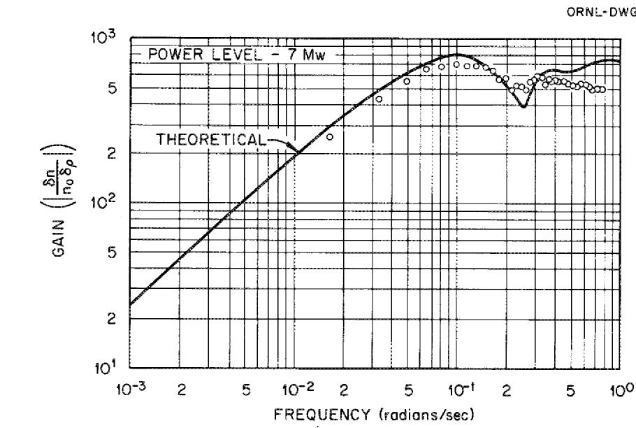

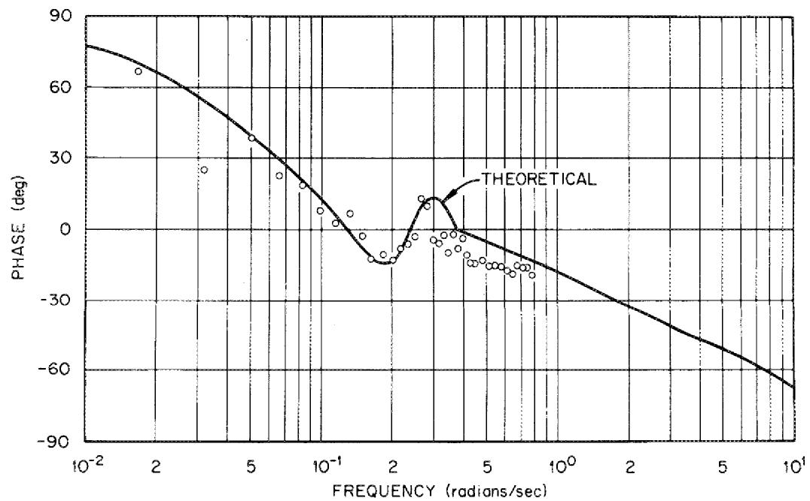  
Fig. 4.4. MSRE frequency response-PRBS signal.

Table 4.9. MSBR fuel cycle cost   

<table><tr><td></td><td>Mills/kWhr(e)</td></tr><tr><td colspan="2">Fixed charges on carrier salt at 13.2%/year</td></tr><tr><td>7LiF</td><td>0.038</td></tr><tr><td>BeF2</td><td>0.008</td></tr><tr><td>ThF4</td><td>0.033</td></tr><tr><td></td><td>0.079</td></tr><tr><td colspan="2">Salt makeup (15 calendar year cycle)</td></tr><tr><td>7LiF</td><td>0.019</td></tr><tr><td>BeF2</td><td>0.004</td></tr><tr><td>ThF4</td><td>0.016</td></tr><tr><td></td><td>0.039</td></tr><tr><td>Fixed charges on fissile inventory at 13.2%/year</td><td>0.36a</td></tr><tr><td>Fixed charges on processing plant at 13.7%/year</td><td>0.49-0.69</td></tr><tr><td>Processing plant operating costs</td><td>0.05</td></tr><tr><td>Gross fuel cycle cost</td><td>1.02-1.22</td></tr><tr><td>Fuel productions credit</td><td>-0.09a</td></tr><tr><td>Net fuel cycle cost</td><td>0.93-1.13</td></tr></table>

$^a$ Based on $^{235}\mathrm{U}$ at $11.9$ per gram (93.5% enrichment); $^{233}\mathrm{U}$ and $^{233}\mathrm{Pa}$ at $13.8$ per gram.

cost of the chemical processing plant [14]. While other components of the fuel cost have remained relatively stable, they are undoubtedly subject to change, either as a result of changes in assumed unit costs of materials or as a result of changes in reactor design. The possible magnitudes of such changes are estimated here.

It should be noted that the fuel cycle costs shown in Table 4.9 are not the lowest attainable, and do not necessarily correspond with the lowest power cost. The reference MSBR was optimized on the basis of breeding performance, using a "figure of merit" proportional to the breeding gain divided by the square of the specific fuel inventory $(\mathrm{G} / \mathrm{I}^2)$ . Since the resulting fuel cycle costs were favorable as compared with those projected for other reactors, no serious attempt has thus far been made to reoptimize the reactor design and fuel cycle parameters solely on the basis of power cost. It should be understood, therefore, that changes in fuel cycle cost associated with changes in material costs or reactor performance are likely to be compensated by adjustments in fuel cycle parameters.

# 7Li

The cost of separated $^7\mathrm{Li}$ has been assumed to be $\$ 120/$ kg for lithium containing 50 ppm $^6\mathrm{Li}$ , when produced in substantial quantities. Based on this price, the $^7\mathrm{Li}$ contributes 0.057 mills/kWh(e) to the fuel cycle cost. Thus, doubling the cost of $^7\mathrm{Li}$ (without any compensating adjustments) would add 0.057 mills/kWh(e) to the fuel cost. Doubling the nominal feed rate (i.e., $6.7\%$ of the Li inventory per year) would add about 0.02 mills/kWh(e) (but it should be noted that the nominal feed rate on which the above makeup cost is based is already $50 - 100\%$ higher than we think the actual feed rate is likely to be).

It should also be noted that the assumed lithium feed purity of $99.995\%$ $^{7}\mathrm{Li}$ may be unnecessarily high. The associated neutron capture rate in $^{6}\mathrm{Li}$ , taking into account burnout and replacement of $^{6}\mathrm{Li}$ , is 0.0018 neutrons per $\mathfrak{n}$ source neutrons, compared with a capture rate of 0.0161 in $^{7}\mathrm{Li}$ . (There is an additional capture rate of 0.0014 neutron in the $^{6}\mathrm{Li}$ that is formed by $(n,\alpha)$ reactions in Be.) Doubling the $^{6}\mathrm{Li}$ content in the lithium feed would thus decrease the breeding ratio, at equilibrium, by about 0.002, which might be an acceptable alternative to accepting changes in the price of lithium.

# Thorium

At $6.50/lb$ of $\mathrm{ThF}_4$ , thorium contributes 0.05 mills/kWh(e) to the fuel cycle cost (of which slightly more than 0.002 mills/kWh(e) is actually for burnup). Any significant increase in the price of thorium would be partly compensated by a reduction in thorium concentrations in the reactor. (In Ref. 5, it is shown that the breeding performance in the reactor is quite insensitive to variations in thorium concentrations around the value selected for the MSBR - i.e., 12 mole percent.)

# Beryllium

The estimated cost of $\mathsf{BeF}_2$ (\$7.50/lb) contributes only about 0.01 mills/kWh(e) to the fuel cycle cost. Power costs are thus very insensitive to the price of $\mathsf{BeF}_2$ .

# Uranium

Fuel cycle costs for the reference MSBR are influenced by the price of fissile uranium primarily through the inventory charges, which are 0.36 mills/kWh(e), as compared with a fuel production credit of 0.09 mills/kWh(e) (for a breeding ratio of 1.07). Doubling the price of fissile uranium, without compensating changes in the fuel cycle, would thus add 0.27 mills/kWh(e). (Doubling the ore cost from $8 to $16/1b U₃O₈ would add 0.09 mills/kWh(e).) Some adjustments in fuel salt composition, as well as in details of core design, would of course be possible. It is not to be expected, however, that appreciable reductions in fissile inventory would be possible without a major reduction in breeding gain. While the trade-offs between specific inventory and breeding gain depend on many details of reactor design, a rough approximation is that a 10% reduction in inventory (without altering the design of the primary circuit external to the reactor core) would cost about 0.015 in breeding ratio. Applied to the reference MSBR, this indicates that a saving of 0.036 in inventory charges would be partly offset by a reduction of 0.021 in the fuel production credit. Actually, the relation between breeding ratio and specific inventory is highly non-linear: a major decrease in inventory (e.g. 90% reduction) would be possible, at the expense of reducing the conversion ratio nearly to zero; on the other hand, a large percentage increase in inventory could gain at most a very few percentage points in breeding ratio. Thus, the possible range for adjustments is rather limited, whether breeding performance or fuel cost alone is the guide.

# Graphite

Replacement of the graphite core structure, as a consequence of radiation damage, is estimated to contribute 0.17 mills/kWh(e) to the power cost for the reference MSBR. A partial breakdown of this cost is shown in Table 4.10. (Inclusion of this cost component with the fuel cycle cost is of course arbitrary, but conventional, in keeping with the inclusion of He or $\mathsf{D}_2\mathsf{O}$ makeup costs for gas-cooled and heavy-water-moderated reactors.)

Graphite alone contributes about 0.12 mils/kWh(e) to the cost of core replacement (at four-year intervals). Much of the uncertainty in graphite cost is associated with coating or impregnating the graphite to reduce its permeability to xenon. In our cost estimates, this represents about $5/lb of an average $11/lb cost of the graphite that is replaced. The uncertainty in graphite coating costs is substantial - probably a

Table 4.10. MSBR core replacement cost   
4 calendar year replacement schedule; replacement assumed to take place during planned shutdown for maintenance of turbines and other equipment [15]   

<table><tr><td></td><td>Millions of dollars</td><td>Mills/kWhr(e)</td></tr><tr><td>Hastelloy N</td><td>1.09</td><td>0.035</td></tr><tr><td>Graphite</td><td>3.75</td><td>0.119</td></tr><tr><td>Special labor cost</td><td>0.50</td><td>0.016</td></tr><tr><td></td><td>5.34</td><td>0.17</td></tr></table>

factor of 2. Adding $8/1b to the cost of the sealed graphite would increase the cost of power by about 0.09 mills/kWh(e) (including capitalized first-core costs) for an average core-replacement interval of 4 years, or 0.07 mills/kWh(e) for an average core life of 6 years.

On the other hand, even without development of improved graphites, the core replacement interval can probably be lengthened by selective replacement of individual graphite pieces, as proposed by Ebasco. The dependence of graphite replacement cost on graphite price and on graphite life is shown in Figure 4.5.

# Evaluation

The reactor-physics technology required for the design of a molten-salt breeder reactor appears to be pretty much in hand. We do not claim, of course, that all substantial reactor physics questions have been answered. A good deal of physics analysis would be required as part of the engineering design of a particular reactor. Many interesting, important questions concerning the optimization of molten salt reactors, in response to a particular set of requirements, have not yet been studied. There remains much room for improvement in specific computer codes and methods. But we do not believe that there remain any significant questions of technical or economic feasibility that rest on reactor physics considerations.

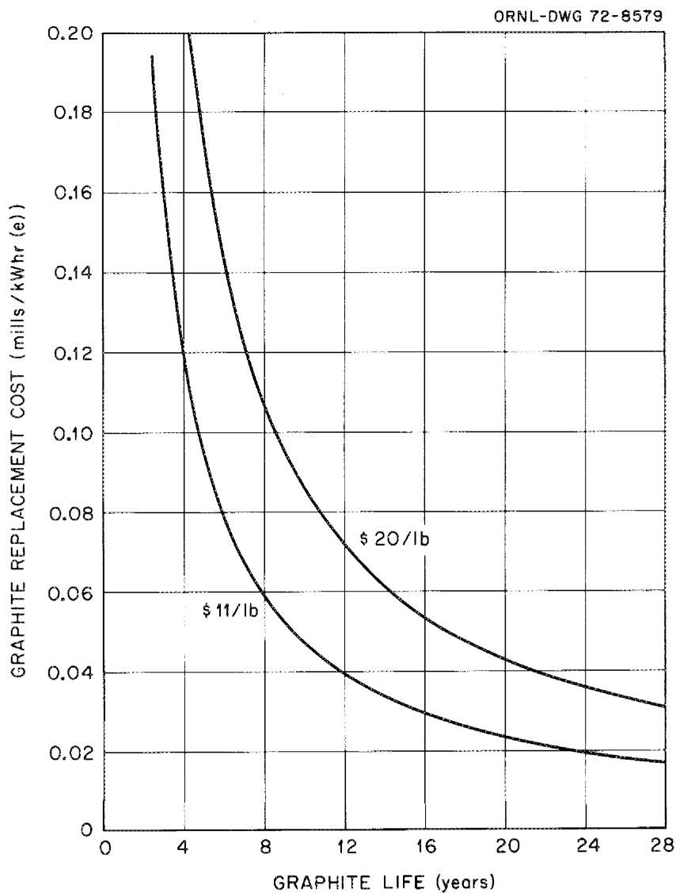  
Fig. 4.5. Graphite replacement cost as a function of graphite price and replacement life.

# References for Chapter 4

1. A. M. Perry, Proceedings of the Conference on Neutron Cross Sections and Technology, Washington, D.C., March 4-7, 1969, p. 345 in National Bureau of Standards Special Publications No. 299.   
2. MSR Program Semiann. Progr. Rept. Feb. 28, 1971, ORNL-4676, p. 44.   
3. MSR Program Semiann. Progr. Rept. Aug. 31, 1969, ORNL-4449, p. 70.   
4. MSR Program Semiann. Progr. Rept. Aug. 31, 1970, ORNL-4622, p. 31.   
5. A. M. Perry, H. F. Bauman, Nucl. Appl. Tech. 8, 214 (1970).   
6. A. M. Perry, H. F. Bauman, Nucl. Appl. Tech. 8, 215 (1970).   
7. MSR Program Semiann. Progr. Rept. Feb. 28, 1970, ORNL-4548, p. 26.   
8. E. P. Lippincott, Measurement of Physics Parameters for a MSBR Lat-tice in the HTLTR, BNWL-1633, January 1972.   
9. B. E. Prince, S. J. Ball, J. R. Engel, P. N. Haubenreich, T. W. Kerlin, Zero-Power Physics Experiments on the MSRE, ORNL-4233, February 1968.   
10. J. R. Engel, B. E. Prince, Zero-Power Experiments with $233\mathrm{U}$ in the MSRE, ORNL Report (in preparation).   
11. T. W. Kerlin, S. J. Ball, R. C. Steffy, "Theoretical Dynamics Analysis of the MSRE," Nucl. Tech. 10, 118 (1971).   
12. T. W. Kerlin, S. J. Ball, R. C. Steffy, M. R. Buckner, "Experiences with Dynamic Testing Methods at the MSRE," Nucl. Tech. 10, 103 (1971).   
13. A. M. Perry, H. F. Bauman, Nucl. Appl. Tech. 8, 212 (1970).   
14. MSR Program Semiann. Progr. Rept. Aug. 31, 1971, ORNL-4728, p. 179.   
15. Conceptual Design Study of a Single-Fluid Molten-Salt Breeder Reactor, ORNL-4541, p. 188 (1971).

# 5. FUEL AND COOLANT CHEMISTRY

W. R. Grimes, E. G. Bohlmann, A. S. Meyer, and J. M. Dale

# Introduction

Studies of molten salt systems suitable for use in high-temperature nuclear reactors, and examinations of the chemical problems inherent in such use, have been under way for more than 20 years (see Chapter 2). Many individual molten salt mixtures have been studied, but only two classes of salts, chlorides and fluorides, have been given serious consideration.

Molten chlorides were considered, especially for fast reactor fuels, at a relatively early date [1, 2], but little experimental work with such systems appears to have been done until much later. A small experimental effort at UKAEA, Harwell, devoted to molten chloride mixtures as fuels for advanced fast reactors has been in progress since 1965 [3]. (The neutron cross section of chlorine rules out its use in thermal reactors.)

Fluoride mixtures have been the subject of a chemical research program at ORNL since 1949 [4]. These studies first developed $\mathrm{NaF - ZrF_4 - UF_4}$ mixtures, which fueled the Aircraft Reactor Experiment in 1954. Since 1958 this program has been directed to molten fluoride mixtures suitable for use in thermal breeder reactors. Several reviews of this chemical effort have been published [5, 6, 7, 8]. In addition, our experience with the chemical aspects of the MSRE, which was fueled with a mixture of LiF, $\mathrm{BeF_2}$ , $\mathrm{ZrF_4}$ , and $\mathrm{UF_4}$ , has been reported in detail [9].

We attempt in this chapter to assess the strengths and weaknesses of pertinent molten salts and of our knowledge of these materials for use in a molten-salt breeder reactor. The choice of optimum salt mixtures, the present status of their technology, and our evaluation of their suitability and of remaining problem areas are briefly presented in separate sections for the fuel and the coolant mixtures. Behavior of fission products in the fuel circuit, an important and complex matter which is less well documented, is treated in some detail in a separate section of the chapter. Finally, we describe the methods for detailed chemical analysis of fuel and coolant streams and their ancillary systems and the problems remaining before an MSBR could be operated with confidence.

# Fuel Salts

# Basis for Choice of Composition

A single-fluid MSBR [10] makes stringent demands upon its fluid fuel. This fuel must have a low capture cross section for neutrons, and it must dissolve more than the critical concentration of uranium or plutonium and

high concentrations of thorium at temperatures comfortably below the temperature of the primary heat exchanger. The mixture must be thermally stable, and its vapor pressure needs to be low over a temperature range $(600 - 750^{\circ}\mathrm{C})$ sufficiently high to permit generation of high-quality steam. The fuel mixture must possess heat transfer and hydrodynamic properties adequate for its service as a heat-exchange fluid. It must be nonaggressive toward some material of construction and toward some suitable moderator material. The fuel must be stable toward reactor radiation, must be able to survive fission of the uranium (or plutonium), and must tolerate fission product accumulation without serious deterioration of its useful properties. An additional demand is that the fuel be amenable to effective recovery of bred fissile material and to removal of fission product poisons, as discussed in Chapter ll.

The requirement that the MSBR fuel consist, except for its fissile and fertile material, entirely of nuclides of very low neutron capture cross section restricts the choice of materials to compounds of beryllium, bismuth, boron-ll, carbon, deuterium, fluorine, lithium-7, nitrogen-15, oxygen, and the fissile and fertile materials. Other nuclides can be tolerated only as minor constituents. Most of the compounds of the potential "major constituents" are eliminated by the other fuel requirements. No deuterium-bearing compounds are practical in such melts. Carbon, nitrogen, boron, and oxygen form high-melting, and quite unsuitable, binary compounds with the fissile and fertile metals. The oxygenated anions either lack the required thermal stability (e.g., $\mathrm{NO}_3^-$ or $\mathrm{NO}_2^-$ ) or fail as solvents for high concentrations of thorium compounds (e.g., $\mathrm{CO}_3^{2-}$ ). It quickly develops, therefore, that fluorides are the only suitable salts.

Uranium tetrafluoride $(\mathrm{UF}_4)$ is the only fluoride of uranium that appears useful as a constituent of molten fluoride fuels; $\mathrm{UF}_4$ is relatively stable, nonvolatile, and nearly nonhygroscopic. In the pure state uranium trifluoride $(\mathrm{UF}_3)$ disproportionates at temperatures above about $1000^{\circ}\mathrm{C}$ by the reaction

$$
4 \mathrm {U F} _ {3} \rightleftharpoons 3 \mathrm {U F} _ {4} + \mathrm {U} ^ {0}.
$$

In molten fluoride solution, disproportionation occurs at considerably lower temperatures. Uranium trifluoride is, as is discussed in more detail below, tolerable in reactor fuels only in the presence of a large excess of $\mathrm{UF_4}$ . Thorium tetrafluoride ( $\mathrm{ThF_4}$ ) is the only known fluoride of thorium. Diluent fluorides are clearly necessary because of the very high melting points of $\mathrm{UF_4}$ and $\mathrm{ThF_4}$ ( $1035^{\circ}\mathrm{C}$ and $1111^{\circ}\mathrm{C}$ respectively). Nuclear properties alone favor as diluents the fluorides of Be, Bi, and Li in that order. The stability of these fluorides [ll] eliminates bismuth from consideration and leaves the fluorides of beryllium and lithium-7 as the preferred diluents. Fortunately the phase behavior (described in detail below) of $\mathrm{LiF - BeF_2 - UF_4}$ and $\mathrm{LiF - BeF_2 - ThF_4}$ makes these materials useful as fuels.

The breeder fuel salt requires a high concentration of $\mathrm{ThF_4}$ (10 to 14 mole %) and somewhat less than 0.3 mole $\%$ $^{233}\mathrm{UF}_4$ . Beryllium fluoride is very viscous, but the viscosity of LiF-BeF $_2$ mixtures decreases rapidly as the LiF/BeF $_2$ ratio increases above about 2. The LiF/BeF $_2$ ratio is

therefore chosen to optimize the conflicting demands for low viscosity and a low melting point. If the liquidus temperature is to be kept at or below $500^{\circ}\mathrm{C}$ for a melt with 12 mole $\%$ of $\mathrm{ThF_4}$ , the beryllium concentration limits range (as described below) from 16 to 25 mole $\%$ . The most likely choice for the MSBR fuel -- and the present design composition -- is, accordingly, ${}^{7}\mathrm{LiF - BeF_2 - ThF_4 - UF_4}$ at 71.7-16-12-0.3 mole $\%$ , respectively.

It should be noted that the objectives of the MSRE did not require the fuel to contain $\mathsf{ThF}_4$ . Accordingly, the fuel chosen for MSRE was a mixture of $^7\mathrm{LiF}$ , $\mathsf{BeF}_2$ , $\mathsf{ZrF}_4$ , and $\mathsf{UF}_4$ (65, 29.1, 5, and 0.9 mole %). The $\mathsf{ZrF}_4$ was added, as discussed below, to preclude inadvertent precipitation of $\mathsf{UO}_2$ .

Fuel selection is no great problem for the MSBR since, as will be detailed below, the phase behavior of LiF and $\mathrm{BeF}_2$ with $\mathrm{UF}_4$ and $\mathrm{ThF}_4$ is entirely satisfactory. The requirement of very low cross section requires, in principle, that the fuel mixture be free from extraneous high-cross-section ions. Purity requirements dictated by oxide-fluoride equilibria and of compatibility - both of which are described in some detail below - are rather more stringent than those posed by cross-section considerations.

# Experience with Molten Salt Fuels

Industrial processes based on molten salts (e.g., production of aluminum by electrolysis of $\mathrm{Al}_{2}\mathrm{O}_{3}$ in molten $\mathrm{K}_{3}\mathrm{AlF}_{6}$ ) have been used for many years. However, when the ORNL program began in 1949, although the classic papers of Temkin [12] and Flood and Forland [13] had been published, relatively little was known about molten salt chemistry, and virtually nothing was known about molten fluoride behavior. The situation has improved markedly since that time, partly, though by no means entirely, because of stimulation of the field by the Molten Salt Reactor Program.

The ARE program [5, 14], which was concerned with a different fuel system $(\mathrm{NaF - ZrF_4 - UF_4})$ and a different metal (Inconel rather than Hastelloy N), produced little chemical information directly applicable to the MSBR but yielded a great deal of valuable background experience and information. Preparation and handling techniques for molten fluorides [6, 15], for example, were useful with only minor modifications for the LiF-BeF2-based compositions. Techniques for rapid and effective study of phase behavior and for determination of physical properties of molten fluorides [16] were developed in these early days and subsequently applied to MSBR-related materials. Corrosion of metals, and especially of nickel-based alloys, by fluorides was shown to be tolerable, the general mechanisms by which corrosion occurred were recognized, and the importance of extraneous impurities in the corrosion process was demonstrated [5]. Compatibility of many molten fluorides with graphite was demonstrated, values for solubility of He, Kr, and Xe in molten fluorides [17] were established, and the general stability of molten fluorides to radiation and fission was demonstrated [5, 18].

The many chemical studies which immediately preceded operation of MSRE were directed at LiF-BeF $_2$ -based fuels, and much was learned that appears directly relevant to the MSBR system and that is described in some detail in subsequent sections of this chapter.

Operation of the MSRE, with its fuel mixture of $\mathrm{LiF - BeF_2 - ZrF_2 - UF_4}$ , provided much chemical information that was reassuring [9]. Salt samples removed routinely from the fuel and coolant circuits (one to three per week from the fuel system) were analyzed for uranium, major fuel constituents, possible corrosion products, and (less frequently) for oxide ion contamination.

Analyses for uranium by coulometric titration [19] showed good reproducibility and high precision (0.5%), but on-line reactivity balance calculations were about 10-fold more sensitive than this in establishing changes in uranium concentrations within the circuit. All the data suggest strongly that the fuel was completely stable and that losses of uranium, if any, were extremely small. Determination of uranium on or in a graphite moderator bar led to the conclusion that the entire stack contained less than 10 grams of uranium, a quite negligible amount [20].

Oxide concentration in the radioactive MSRE salt was determined by careful evaluation of $\mathrm{H}_2\mathrm{O}$ produced upon treatment of the salt samples with anhydrous HF. All samples examined showed less than 100 ppm of $0^{2-}$ ; no perceptible increase with time was apparent [21]. This is moderately reassuring insofar as the practicality of maintaining oxide contamination at very low levels in future reactor systems is concerned, though better methods of analysis for oxides are clearly needed.

MSRE maintenance operations involved flushing the interior of the fuel circuit with a $^{7}\mathrm{LiF - BeF_2}$ (66.0-34.0 mole %) mixture. Analysis of this salt before and after each use showed that an amount of uranium was added to the flush salt in each flushing operation equivalent to 23 kg of fuel-salt residue (about 0.5% of the charge) from the reactor circuit. The magnitude and the reproducibility of this figure seem to confirm the nonwetting characteristics of the clean fuel salt toward graphite and metal.

The fission process is mildly oxidizing toward dissolved $\mathbf{U}^{3+}$ in the fuel. In the MSRE a convenient means for restoring the $\mathbf{U}^{3+}$ concentration was to suspend beryllium rods in a perforated capsule of nickel in the salt in the pump bowl. This active metal reacted with $\mathbf{UF}_4$

$$
\mathrm {B e} ^ {0} (\mathrm {c}) + 2 \mathrm {U F} _ {4} (\mathrm {d}) \rightarrow \mathrm {B e F} _ {2} (\mathrm {d}) + 2 \mathrm {U F} _ {3} (\mathrm {d})
$$

and converted some 500 grams of $\mathbf{U}^{4 + }$ to $\mathbf{U}^{3 + }$ during an 8-hour treatment. The salt near the Be appeared to be slightly overreduced, but the overreduced salt mixture clearly reacted and achieved equilibrium with the large excess of unreduced salt in the pump bowl and reactor circuit. (In an MSBR, the on-line processing system would be used to maintain the $\mathrm{UF_4 / UF_3}$ ratio at the desired level.)

Many fuel salt samples were analyzed at regular intervals for Fe, Ni, and Cr due to corrosion processes [8, 9, 22, 21, 23]. All samples showed relatively high values for iron (120 ppm) and nickel (50 ppm), with considerable scatter and no perceptible trend. These values seem far too

high for "blanks" in the analytical procedures; it is apparent, for reasons described below, that in many cases they do not represent dissolved $\mathrm{Fe}^{2+}$ and $\mathrm{Ni}^{2+}$ . Molybdenum concentrations were shown, in the few attempts made, to be below the detectible limit (ca. 25 ppm) for chemical analysis.

MSRE was operated for nearly three years with $^{235}\mathrm{UF}_4$ as its fuel and for a shorter period while fueled with $^{233}\mathrm{UF}_4$ . Corrosion behavior of the system during these two periods was generally similar, but some quantitative differences seem to be real.

During 13,500 hours of $^{235}\mathrm{UF}_4$ fuel circulation (including a number of shutdowns) the chromium concentration in the fuel salt rose from an initial value near 40 ppm to a final value of about 85 ppm. A considerable scatter in the numbers was apparent, but the increase with time and with reactor operation was clearly real. All evidence suggests that the analytically determined chromium was largely, if not entirely, present as dissolved $\mathrm{Cr}^{2+}$ . This observed increase in chromium concentration corresponded to removal of less than 250 grams of this element from the MSRE circuit. If this were removed uniformly it would deplete the chromium in the alloy to a depth of less than 0.2 mil.* Such an estimate of corrosion seems consistent with observations of metal specimens (see Chapter 7) showing very slight attack by the fuel during MSRE operation. Insertion of the metallic Be rods in nickel cages (described above) into the circulating fuel mixture should have resulted in reduction of $\mathrm{Fe}^{2+}$ or $\mathrm{Ni}^{2+}$ and plating of these materials on the reducing assembly if they had been present. Neither of these was ever observed during the operation with $^{235}\mathrm{U}$ , although in one case a deposit of pure $\mathrm{Cr}^0$ was observed [9].

During operation of MSRE with the $^{233}\mathrm{UF}_4$ fuel, the rate of attack, though still quite acceptable, was more rapid. During the 6590 hours of operation with this fuel, the chromium content of the fuel rose from an initial value near 35 ppm to a final value of about 100 ppm. Initial rates of increase in $\mathrm{Cr}^{2+}$ content were more rapid than was the case for the $^{235}\mathrm{UF}_4$ operation, and the salt clearly appeared to be more aggressive. As described in reference 23a, the changeover from $^{235}\mathrm{U}$ to $^{233}\mathrm{U}$ involved fluorination of the original fuel mixture to remove the uranium as $\mathrm{UF}_6$ , attempted reduction of the $\mathrm{FeF}_2$ , $\mathrm{NiF}_2$ , and $\mathrm{CrF}_2$ introduced during this operation, and addition of the $^{233}\mathrm{UF}_4$ . Insertion of Be rods during early stages of the $^{233}\mathrm{UF}_4$ operation produced appreciable deposits of crystalline iron and nickel on the assemblies, clearly indicating that the $^{233}\mathrm{UF}_4$ fuel was less pure than was the original $^{235}\mathrm{UF}_4$ preparation. Whether this difference was due to ingress of air into the reactor system during the long shutdown for preparation of the $^{233}\mathrm{UF}_4$ fuel or to incomplete reduction of impurities introduced during the fluorination is not known. In any event, total corrosion during operation with both fuel mixtures was equivalent to uniform removal of chromium from 0.5 mil of the reactor metal.

Although operation of MSRE generally verified the behavior predicted for the fuel salt, not all the news was good. Fission product behavior (to be described subsequently) was even more complex than anticipated. Our methods for sampling the MSRE salt were restrictive, and some of our methods for analysis needed marked improvement. Behavior of tritium (see Chapter 14) portended a problem in large molten-salt reactors. Finally, in spite of the excellent picture on generalized corrosion, the grain boundary attack resulting in superficial cracking of the Has-telloy N exposed to the fuel was a major and disappointing observation (see Chapter 7).

# Present Status of Fuel Chemistry

Phase Behavior among Fluorides. - Phase equilibria among the pertinent MSBR fluorides have been studied in detail, and the equilibrium diagrams, though relatively complex, are well understood.

The binary system $\mathsf{LiF - BeF_2}$ has melting points below $500^{\circ}C$ over the concentration range from 31 to 68 mole $\%$ $\mathsf{BeF}_2$ [24, 25, 26]. The phase diagram, presented in Fig. 5.1, is characterized by a single congruently melting compound, 2LiF $\cdot$ BeF $_2$ , and a single eutectic between $\mathsf{BeF}_2$ and 2LiF $\cdot$ BeF $_2$ .

The $\mathrm{BeF}_2\text{-UF}_4$ [24,25] and $\mathrm{BeF}_2\text{-ThF}_4$ [27] systems are very similar in phase behavior. Both systems show simple single eutectics containing very small concentrations of the heavy metal fluoride. $\mathrm{ThF}_4$ and $\mathrm{UF}_4$ are isostructural; their binary phase diagram shows a continuous series of solid solutions with neither maximum nor minimum.

The binary diagrams for $\mathrm{LiF - UF_4}$ [28] and $\mathrm{LiF - ThF_4}$ [29] are relatively similar. The $\mathrm{LiF - UF_4}$ system shows three compounds (none are congruently melting) and a single eutectic, at 27 mole $\%$ UF $_4$ , melting at $490^{\circ}\mathrm{C}$ . The $\mathrm{LiF - ThF_4}$ system contains four binary compounds, one of which ( $3\mathrm{LiF} \cdot \mathrm{ThF}_4$ ) melts congruently, with two eutectics, at $570^{\circ}\mathrm{C}$ and 22 mole $\%$ THF $_4$ and at $560^{\circ}\mathrm{C}$ and 29 mole $\%$ THF $_4$ .

The ternary system LiF-ThF $_4$ -UF $_4$ [30], shown in Fig. 5.2, shows no ternary compounds and a single eutectic freezing at $488^{\circ}\mathrm{C}$ with 1.5 mole $\%$ ThF $_4$ and 26.5 mole $\%$ UF $_4$ . Liquidus temperatures decrease generally to the LiF-UF $_4$ edge of the diagram.

Because the MSBR fuel needs a concentration of $\mathrm{ThF_4}$ much higher than that of $\mathrm{UF_4}$ , its phase behavior is dictated by that of the LiF-BeF $_2$ -ThF $_4$ system. Figure 5.3 gives the ternary system LiF-BeF $_2$ -ThF $_4$ ; this system shows a single ternary eutectic at 47 mole % LiF and 1.5 mole % ThF $_4$ , melting at $360^{\circ}\mathrm{C}$ [24, 27]. The system is complicated by the fact that the compound 3LiF·ThF $_4$ can incorporate $\mathrm{Be}^{2+}$ ions in both interstitial and substitutional sites to form solid solutions whose compositional extremes are represented by the shaded triangular region near that compound. Inspection of the diagram reveals that a considerable range of compositions with more than 10 mole % ThF $_4$ will be completely molten at or below $500^{\circ}\mathrm{C}$ . The maximum $\mathrm{ThF_4}$ concentration available at this liquidus temperature is just above 14 mole %. As expected from the general similarity of $\mathrm{ThF_4}$ and $\mathrm{UF_4}$ -- and especially from the substitutional behavior shown by the

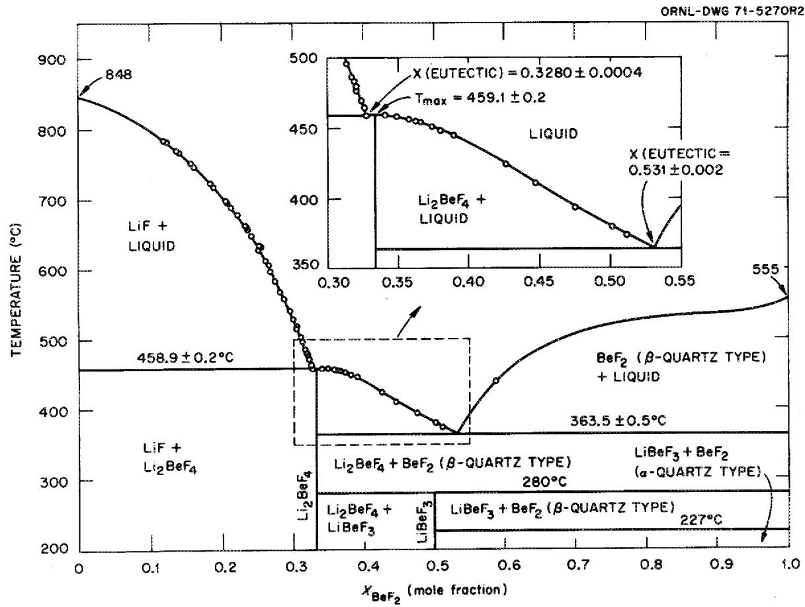  
Fig. 5.1. Phase diagram of the system LiF-BeF $_2$ .

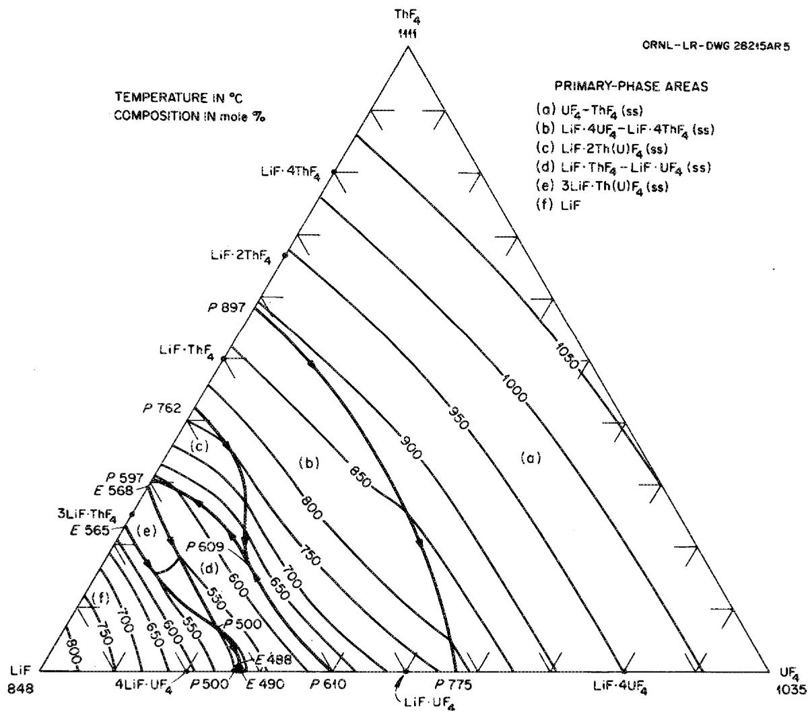  
Fig. 5.2. The system $\mathrm{LiF - ThF_4 - UF_4}$ .

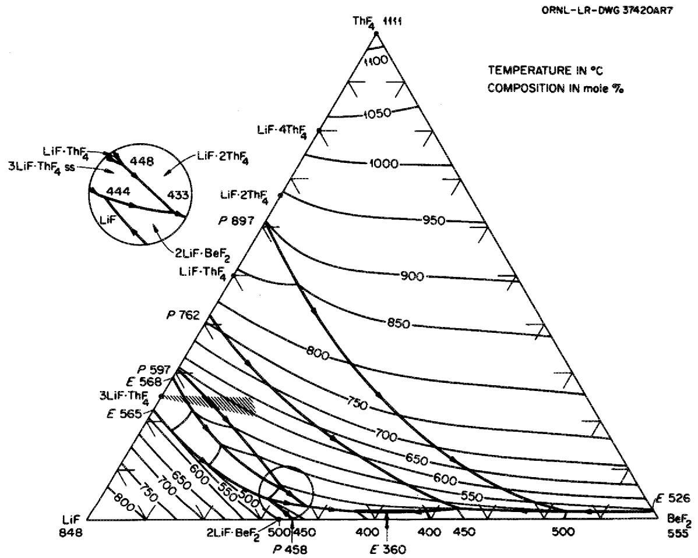  
Fig. 5.3. The system $\mathrm{LiF - BeF_2 - ThF_4}$

LiF- $\mathbf{U}\mathbf{F}_{4}$ -ThF $^4$ system (Fig. 5.2) - substitution of a small quantity of $\mathbf{U}\mathbf{F}_{4}$ for $\mathrm{ThF_4}$ scarcely changes the phase behavior. Accordingly, and to a very good approximation, Fig. 5.3 represents the behavior of LiF-BeF2-ThF4-UF4 mixtures in which the mole fraction of $\mathrm{ThF_4}$ is much greater than that of $\mathbf{U}\mathbf{F}_{4}$ .

Effect of Oxide. - Phase behavior of the pure fluoride system LiF-BeF $_2$ -ThF $_4$ -UF $_4$ , as indicated above, is such that a wide choice of adequate fuel mixtures seems assured. The behavior of systems such as this, however, is markedly affected by appreciable concentrations of oxide ion, which might be produced by inadvertent contamination of the fuel system.

When a melt containing only LiF, $\mathrm{BeF}_2$ , and $\mathrm{UF_4}$ is treated with a reactive oxide (such as $\mathrm{H}_2\mathrm{O}$ ), precipitation of $\mathrm{UO}_{2.90}$ results [8, 31]. If the melt contains, in addition, considerably more $\mathrm{ZrF_4}$ than $\mathrm{UF_4}$ , inadvertent oxide contamination yields monoclinic $\mathrm{ZrO_2}$ containing about 250 ppm of $\mathrm{UO_2}$ [32]. Precipitation of cubic $\mathrm{UO_2}$ (containing a small concentration of $\mathrm{ZrO_2}$ ) begins only after precipitation of $\mathrm{ZrO_2}$ has dropped the $\mathrm{ZrF_4}$ concentration to near that of the $\mathrm{UF_4}$ .

The effect of added oxide on the MSBR fuel mixture, with its contained $\mathrm{ThF_4}$ , $\mathrm{UF_4}$ , $\mathrm{PaF_4}$ , and perhaps $\mathrm{PuF_3}$ , in addition to LiF and $\mathrm{BeF_2}$ , has been carefully examined in a series of recent studies [33,34,35,36, 37,38,39,40]. The findings of these studies are summarized in the following:

The solubilities of the actinide dioxides in MSBR fuel salt are low, and they decrease in the order $\mathrm{ThO_2}$ , $\mathrm{PaO_2}$ , $\mathrm{UO_2}$ , $\mathrm{PuO_2}$ . The solubility products

$$
Q _ {\mathrm {M O} _ {2}} = X _ {\mathrm {M} ^ {4 +}} X _ {\mathrm {O} ^ {2 -}} ^ {2}
$$

are presently estimated as follows:

$$
\begin{array}{l} \log Q _ {\mathrm {T n O} _ {2}} = - 2. 8 6 - 3, 2 8 0 / T \quad (\pm 0. 3) \\ \log Q _ {\mathrm {P a O} _ {2}} = - 2. 8 6 - 4, 9 2 0 / T \quad (\pm 0. 5) \\ \log Q _ {U O _ {2}} = - 2. 8 6 - 5, 6 6 0 / T. (\pm 0. 5) \\ \log Q _ {\mathrm {P u O} _ {2}} = - 2. 8 6 - 7, 1 0 0 / T \quad (\pm 0. 8) \\ \end{array}
$$

Since all these oxides have the same fluorite structure and nearly the same lattice parameters, they can form solid solutions with one another.

As a result, if precipitation of such oxides occurs in an MSBR fuel, exchange equilibria of the type

$$
\mathrm {M} ^ {4 +} + \mathrm {T h O} _ {2} (\mathrm {s s}) \rightleftharpoons \mathrm {M O} _ {2} (\mathrm {s s}) + \mathrm {T h} ^ {4 +}
$$

involving an oxide solid solution phase are established. The corresponding equilibrium quotients

$$
\varphi_ {\mathrm {T h}} ^ {\mathrm {M}} = \frac {X _ {\mathrm {M O} _ {2}} X _ {\mathrm {T h F} _ {4}} \gamma_ {\mathrm {M O} _ {2}}}{X _ {\mathrm {T h O} _ {2}} X _ {\mathrm {M F} _ {4}} \gamma_ {\mathrm {T h O} _ {2}}}
$$

are equal to the ratio of the solubility products $Q_{\mathrm{MO}_2} / Q_{\mathrm{ThO}_2}$ . Hence

$$
\log Q _ {\mathrm {T h}} ^ {\mathrm {P a}} = 1 6 4 0 / T \quad (\pm 0. 2)
$$

$$
\log Q _ {\mathrm {T h}} ^ {\mathrm {U}} = 2 3 8 0 / T \quad (\pm 0. 0 4)
$$

$$
\log Q _ {\mathrm {T h}} ^ {\mathrm {P u}} = 3 8 2 0 / T \quad (\pm 0. 7)
$$

In addition, $\mathrm{Pa}_2\mathrm{O}_5$ (or an addition compound of it) is very insoluble in MSBR fuel:

$$
\log \left(X _ {\mathrm {P a} 5 +} X _ {0} ^ {5 / 2}\right) = 0. 9 1 - 1 2, 7 6 0 / T \quad (\pm 0. 3)
$$

Because of the low solubility of $\mathrm{ThO_2}$ and $\mathrm{UO_2}$ , a binary solid solution rich in $\mathrm{UO_2}$ (typically $95\%$ ) could be precipitated from an MSBR fuel if sufficiently high oxide concentrations are reached. The oxide level required (the oxide tolerance) is indicated in Fig. 5.4. The amount of $\mathrm{PaO_2}$ in the solid solution should be negligible; i.e., the Pa/U ratio in the oxide should be $\sim 1/7$ the Pa/U ratio in the fuel.

The oxide concentration at which $\mathrm{Pa}_2\mathrm{O}_5$ can be precipitated depends on both the protactinium concentration and the oxidation state of the fuel - as reflected by the $\mathrm{U}^{4+}/\mathrm{U}^{3+}$ ratio. The situation is indicated by the equilibrium

$$
\frac {1}{2} \mathrm {P a} _ {2} 0 _ {5} (\mathrm {c}) + \mathrm {U} ^ {3 +} \Rightarrow \mathrm {U} ^ {4 +} + \frac {5}{2} 0 ^ {2 -} + \mathrm {P a} ^ {4 +},
$$

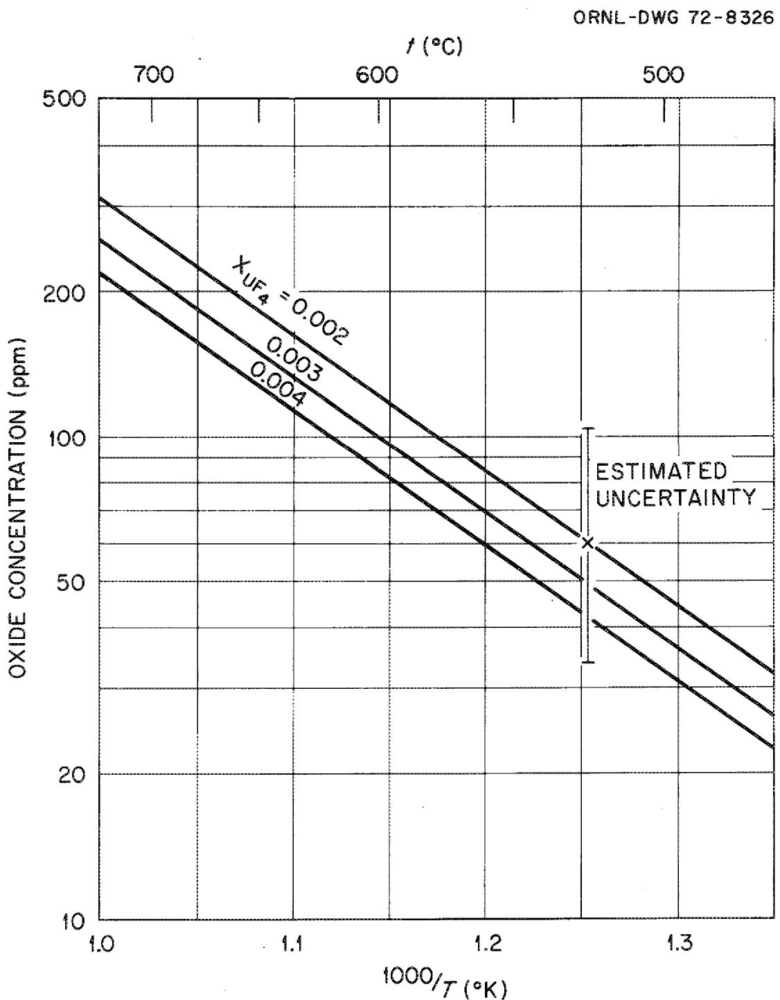  
Fig. 5.4. Oxide tolerance of MSBR fuel.

for which we estimate the equilibrium quotient

$$
\log \left[ X _ {0 ^ {2}} ^ {5 / 2} X _ {\mathrm {P a} ^ {4 +}} \left(X _ {\mathrm {U} ^ {4 +}} / X _ {\mathrm {U} ^ {3 +}}\right) \right] = 0. 7 6 - 8 5 9 0 / T \quad (\pm 0. 8)
$$

The result is that with 100 ppm Pa and 30 ppm oxide present, the $\mathrm{U}^{4+}/\mathrm{U}^{3+}$ ratio must be kept below about $10^5$ if inadvertent precipitation of $\mathrm{Pa}_2\mathrm{O}_5$ is to be avoided. Such oxidizing conditions should be easy to avoid in practice. There is also a dependence on the $\mathrm{U}^{4+}/\mathrm{U}^{3+}$ ratio of the oxide concentration at which $\mathrm{PuO}_2$ precipitation occurs. However, even stronger oxidizing conditions $(\mathrm{U}^{4+}/\mathrm{U}^{3+} > 10^8)$ are required to precipitate $\mathrm{PuO}_2$ from an MSBR fuel.

Selective precipitation of Pa as $\mathrm{Pa}_{2}\mathrm{O}_{5}$ , of U as $\mathrm{UO}_2$ and possibly of Pu as $\mathrm{PuO}_2$ may be of value (see Chapter 11) in fuel reprocessing cycles.

It is clear that the MSBR fuel must be protected from oxide contamination to avoid inadvertent precipitation. Because of the low oxide tolerance (Fig. 5.4), this will require some care, but the successful operation of the MSRE over a three-year period lends confidence that oxide contamination of the fuel system can be kept to adequately low levels. This confidence, when added to the prospect that the breeder fuel will be reprocessed (and its oxide level reduced) on a continuous basis, suggests very strongly that successful operation can be achieved.

Physical Properties. - Some pertinent physical properties of the MSRE and MSBR fuel salts are listed in Table 5.1 [8,41]. Liquidus temperatures are known with accuracy. Vapor pressures of the fuels have been extrapolated from measurements on similar mixtures; values are considerably less than 0.1 torr at $600^{\circ}\mathrm{C}$ .

Densities were calculated from the molar volumes of the pure components by assuming the volumes to be additive. Heat capacities were estimated by assuming that each gram atom in the mixture contributes 8 cal/°C (the approximate average from a set of similar fluoride melts). The viscosity of the MSBR fuel was estimated from measurements on other LiF-BeF $_2$ and NaF-BeF $_2$ mixtures. Methods for such estimation are, in most cases, quite reliable; densities and heat capacities are probably good to ±3%, but viscosity and thermal conductivity are probably no better than ±15%.

Surface tensions of the molten fuels are known to be high, but this moderately important property is not well established. Measurements with several systems (but not with MSBR or MSRE fuels) by three different methods suggest [41] that the equation

$$
\gamma = 2 6 0 - 0. 1 2 T ^ {\circ} \mathrm {C}
$$

approximates the surface tension of both fuels over the range 550 to $700^{\circ}\mathrm{C}$ . These values are, however, unlikely to be better than about $\pm 30\%$ . This property, which is of importance in assessing wetting behavior and in establishing (for nonwetting cases) a degree of penetration of the salt into porous bodies and the size of orifice or annulus into which the salt will flow under prescribed pressures, clearly needs to be better known.

Table 5.1. Composition and properties of MSRE and MSBR fuels   

<table><tr><td></td><td>MSRE fuel</td><td>MSBR fuel</td></tr><tr><td rowspan="4">Composition, mole %</td><td>LiF 65</td><td>LiF 71.7</td></tr><tr><td>BeF229.1</td><td>BeF216</td></tr><tr><td>ZrF45</td><td>ThF412</td></tr><tr><td>UF40.9</td><td>UF40.3</td></tr><tr><td>Liquidus</td><td></td><td></td></tr><tr><td>°C</td><td>434</td><td>500</td></tr><tr><td>°F</td><td>813</td><td>932</td></tr><tr><td>Properties at 600°C (1112°F)</td><td></td><td></td></tr><tr><td>Density, g/cm3</td><td>2.27</td><td>3.35</td></tr><tr><td>Heat capacity, cal/(g-°C) or Btu/(lb-°F)</td><td>0.47</td><td>0.324</td></tr><tr><td>Viscosity, centipoises</td><td>9</td><td>12</td></tr><tr><td>Vapor pressure, torrs</td><td>&lt;0.1</td><td>&lt;0.1</td></tr><tr><td>Thermal conductivity, watts/(°C-cm)</td><td>0.014</td><td>0.012</td></tr></table>

Chemical Compatibility of MSBR Materials. - The excellent compatibility of Hastelloy N with fluoride salts containing LiF, $\mathsf{BeF}_2$ , $\mathsf{ThF}_4$ , and $\mathsf{UF}_4$ , shown in corrosion tests [42, 43, 44, 45] and in the MSRE, is a result of the fact that these fluorides are thermodynamically stable toward the Hastelloy N.* That is, the major fuel components (LiF, $\mathsf{BeF}_2$ , $\mathsf{UF}_4$ , and $\mathsf{ThF}_4$ ) are much more stable than the structural metal fluorides ( $\mathsf{NiF}_2$ , $\mathsf{FeF}_2$ , and $\mathsf{CrF}_2$ ), and graphite does not react chemically with such fluoride mixtures. This basic situation, combined with proper purification procedures, provides liquids whose overall corrosivity is within tolerable limits.

Experimentation over many years has defined the thermodynamic properties of many species in molten LiF-BeF $_2$ solutions [46]. Table 5.2 lists pertinent data for the major components of MSRE and MSBR fuels and for corrosion products in molten 2LiF·BeF $_2$ .

The chemistry of the $\mathrm{UF_4 - UF_3}$ conversion [47] is significant since it affords redox buffering to the fuel mixture. Operation with a small fraction (perhaps $1\%$ ) of the uranium as $\mathrm{UF_3}$ is advantageous insofar as corrosion reactions and the oxidizing effect of the fission process are concerned. If we accept the data of Table 5.2 as applicable (as is approximately true) to the MSBR fuel and consider the reaction

$$
4 \mathrm {U F} _ {3} (\mathrm {d}) \rightleftharpoons 3 \mathrm {U F} _ {4} (\mathrm {d}) + \mathrm {U}
$$

when $\mathbf{U}\mathbf{F}_4$ and $\mathbf{U}\mathbf{F}_3$ are dissolved in the MSBR fuel, we observe that at $900^{\circ}\mathrm{K}$ $(1160^{\circ}\mathrm{F})$ the equilibrium constant $(K)$ for this reaction has the value

$$
K = \frac {N _ {\mathrm {U F} _ {4}} ^ {3} \alpha_ {\mathrm {U}}}{N _ {\mathrm {U F} _ {3}} ^ {4}} = 6. 3 \times 1 0 ^ {- 7}.
$$

$N$ indicates the mole fraction of the designated species, and $\alpha$ indicates the thermodynamic activity. For the MSBR fuel, where $N_{\mathrm{UF_4}} = 3 \times 10^{-3}$ , where $N_{\mathrm{UF_3}}$ is held at $3 \times 10^{-5}$ , then the equilibrium uranium activity is near $2 \times 10^{-17}$ . Even if $5\%$ of the dissolved uranium is $\mathrm{UF_3}$ , the equilibrium activity of uranium is below $10^{-14}$ . Such operation with a small fraction of the uranium as $\mathrm{UF_3}$ should result in an extremely dilute (and physically undetectable) alloy of uranium with the surface of the container alloy. All evidence to date suggests that operation with relatively little $\mathrm{UF_3}$ is completely satisfactory. For the MSBR, where the fuel returned to the reactor from the processing plant can have a controlled concentration of $\mathrm{UF_3}$ , this equilibrium can be of real service.

Table 5.2. Standard free energies of formation for species in molten $2\mathrm{LiF}\cdot \mathrm{BeF}_2$   

<table><tr><td colspan="3">773-1000°K</td></tr><tr><td>Materiald</td><td>-ΔGf(kcal/mole)</td><td>-ΔGf(1000°K)(kcal/mole)</td></tr><tr><td>LiF(g)</td><td>141.8 - 16.6 × 10-3T°K</td><td>125.2</td></tr><tr><td>BeF2(g)</td><td>243.9 - 30.0 × 10-3T°K</td><td>106.9</td></tr><tr><td>UF3(d)</td><td>338.0 - 40.3 × 10-3T°K</td><td>99.3</td></tr><tr><td>UF4(d)</td><td>445.9 - 57.9 × 10-3T°K</td><td>97.0</td></tr><tr><td>ThF4(d)</td><td>491.2 - 62.4 × 10-3T°K</td><td>107.2</td></tr><tr><td>ZrF4(d)</td><td>453.0 - 65.1 × 10-3T°K</td><td>97.0</td></tr><tr><td>NiF2(d)</td><td>146.9 - 36.3 × 10-3T°K</td><td>55.3</td></tr><tr><td>FeF2(d)</td><td>154.7 - 21.8 × 10-3T°K</td><td>66.5</td></tr><tr><td>CrF2(d)</td><td>171.8 - 21.4 × 10-3T°K</td><td>75.2</td></tr><tr><td>MoF6(g)</td><td>370.9 - 69.6 × 10-3T°K</td><td>50.2</td></tr></table>

${}^{a}$ The standard state for LiF and ${\mathrm{{BeF}}}_{2}$ is the molten $2\mathrm{{LiF}} \cdot  {\mathrm{{BeF}}}_{2}$ liquid. That for ${\mathrm{{MoF}}}_{6}\left( \mathrm{\;g}\right)$ is the gas at one atmosphere. That for all species labeled (d) is that hypothetical solution with the solute at unit mole fraction and with the activity coefficient it would have at infinite dilution.

It is also clear from Table 5.2 that, of the structural metal fluorides shown, $\mathrm{CrF_2}$ is the most stable. Accordingly, Cr should be selectively attacked in alloys such as Hastelloy N by any extraneous oxidants in the system. Impurities in the melt should react

$$
\mathrm {C r} ^ {0} (\mathrm {c}) + \mathrm {N i F} _ {2} (\mathrm {d}) \rightarrow \mathrm {C r F} _ {2} (\mathrm {d}) + \mathrm {N i} ^ {0} (\mathrm {c})
$$

$$
\mathrm {C r} ^ {0} (\mathrm {c}) + 2 \mathrm {H F} (\mathrm {g}) \rightarrow \mathrm {C r F} _ {2} (\mathrm {d}) + \mathrm {H} _ {2} (\mathrm {g})
$$

as sho:ld oxidized films on the metal

$$
2 \mathrm {N i} 0 (\mathrm {c}) + \mathrm {U F} _ {4} (\mathrm {d}) \rightarrow \mathrm {U O} _ {2} (\mathrm {c}) + 2 \mathrm {N i F} _ {2} (\mathrm {d})
$$

followed by reaction of the $\mathrm{NiF}_2$ with Cr. Reactions such as these will proceed essentially to completion at reactor temperatures; they can lead to rapid initial corrosion but not to a sustained attack.

If the fuel is pure and the metal clean, $\mathrm{UF}_4$ is the strongest oxidant in the MSBR fuel system. The reaction

$$
\mathrm {U F} _ {4} (\mathrm {d}) + \frac {1}{2} \operatorname {C r} (\mathrm {s s}) \rightleftharpoons \mathrm {U F} _ {3} (\mathrm {d}) + \frac {1}{2} \operatorname {C r F} _ {2} (\mathrm {d})
$$

has, from the data of Table 5.2, at $900^{\circ}\mathrm{K}$ an equilibrium constant

$$
K = \frac {N _ {\mathrm {U F} _ {3}} N _ {\mathrm {C r F} _ {2}} ^ {1 / 2}}{N _ {\mathrm {U F} _ {4}} \alpha_ {\mathrm {C r}} ^ {1 / 2}} = 1. 3 8 \times 1 0 ^ {- 4}.
$$

If the MSBR fuel with $N_{\mathrm{UF_4}} = 3 \times 10^{-3}$ and with no $\mathrm{Cr^{2+}}$ or $\mathrm{UF_3}$ present initially were permitted to equilibrate at $900^{\circ}\mathrm{K}$ with a Hastelloy N surface with $\alpha_{\mathrm{Cr}} = 0.05$ , the equilibrium solution would contain slightly more than $10~\mathrm{ppm}$ of $\mathrm{Cr^{+2}}$ and $N_{\mathrm{UF_3}} =$ about $2.5 \times 10^{-5}$ . In principle, therefore, a mixture in which the $\mathrm{UF_3}$ mole fraction could be maintained at about $3 \times 10^{-5}$ should corrode the metal very little. Indeed, it seems likely that corrosion could be kept to quite tolerable limits in this way even if alloys (such as Inconel) with considerably higher chromium concentrations (and correspondingly higher values for $\alpha_{\mathrm{Cr}}$ ) were used.

The corrosion by $\mathrm{UF_4}$ cannot, in principle, be completely eliminated, since the $\mathrm{UF_4 - Cr}$ reaction has a small temperature coefficient. Consequently, circulation of the salt through a temperature gradient tends to remove Cr from the hottest surface and to enrich the coldest alloy in this element. The rate of such a reaction is controlled by the rate at which Cr can diffuse from the bulk alloy to the surface or (more likely) the rate at which the Cr can diffuse from the surface into the alloy in the colder region. Experience indicates that no real difficulty is to be expected from this reaction.

Modified Hastelloy N will contain titanium, while that in MSRE did not. Estimates [ll] of their free energies of formation suggest that the fluorides of titanium are slightly more stable than $\mathrm{CrF_2}$ . Titanium should, therefore, be expected to react appreciably with the $\mathrm{UF_4}$ . Since Ti diffuses less readily than does Cr, however, it would not appear that such corrosion would be particularly deleterious.

Graphite does not react with, and is not wetted by, molten fluoride mixtures of the type to be used in the MSBR. Available thermodynamic data [11] suggest that the most likely reaction:

$$
4 \mathrm {U F} _ {4} (\mathrm {d}) + \mathrm {C} (\mathrm {c}) \rightleftharpoons \mathrm {C F} _ {4} (\mathrm {g}) + 4 \mathrm {U F} _ {3} (\mathrm {d})
$$

should come to equilibrium at $\mathrm{CF_4}$ pressures below $10^{-8}$ atm. This consideration, taken with the wealth of favorable experience, suggests that no problems are likely from this source.

It should be noted that at least one source [48] lists chromium carbide $(\mathrm{Cr}_3\mathrm{C}_2)$ as stable at MSBR temperatures. If so, it should be possible to transfer chromium, at the rate it could diffuse from the bulk alloy to react with the salt, to the graphite. No evidence of such behavior has been observed with Hastelloy N in MSRE or other experimental assemblies. Although it may be possible with alloys of higher chromium content, it should not prove greatly deleterious, since its rate would be controlled by the rates at which chromium could diffuse to the alloy surface and should be limited by a film of $\mathrm{Cr}_3\mathrm{C}_2$ formed on the graphite.

It must be emphasized that none of the above throws any light upon the special grain boundary attack upon Hastelloy N in the MSRE fuel circuit. It is conceivable that some heretofore untested combination of oxidizing regime, radiation, and fuel interaction was responsible, but it seems much more probable that some fission product (likely tellurium) was responsible. This matter is discussed in detail in Chapter 7.

Interaction of MSBR Fuel with Extraneous Materials. - The complex mixture comprising the MSBR fuel reacts readily, though not violently or even energetically, with water vapor to produce oxides of the actinide elements and HF vapor. (In fact, water vapor is a possible reagent in a selective precipitation scheme for fuel processing described in Chap. 11.) Rapid addition would certainly produce a mixture of oxide products whose equilibration would be relatively slow. This admixture of water and fuel salt would lead to appreciable corrosion due to the HF so produced, but would hardly prove catastrophic.

None of the MSBR fuel constituents can release $\mathbf{F}_2$ upon reaction with oxygen (or nitrogen). Reactions such as

$$
2 \mathrm {U F} _ {4} + \mathrm {O} _ {2} \rightarrow \mathrm {U O} _ {2} \mathrm {F} _ {2} + \mathrm {U F} _ {6}
$$

have been postulated [49], but such reactions seem most unlikely in dilute solution in MSBR fuel. No reaction of LiF, $\mathrm{BeF}_2$ , or $\mathrm{ThF}_4$ with $O_2$ is possible. An inleakage of air into the MSBR fuel circuit cannot, therefore, cause energetic or violent reactions. However, since the MSBR metal surfaces will be oxide-free (because of the fluxing action of the fluorides), rapid reaction of the air with the metal circuit will occur. Such reactions as

$$
2 \mathrm {N i} (\mathrm {c}) + \mathrm {O} _ {2} (\mathrm {g}) \rightarrow 2 \mathrm {N i} 0 (\mathrm {s}),
$$

for example, will immediately result in

$$
2 \mathrm {N i} 0 (\mathrm {c}) + \mathrm {U F} _ {4} (\mathrm {d}) \rightarrow \mathrm {U O} _ {2} (\mathrm {c}) + 2 \mathrm {N i F} _ {2} (\mathrm {d})
$$

and rapid corrosion. It will, accordingly, be necessary to minimize in-gress of air both during operation and during maintenance. This is of especial importance because, as indicated earlier, the oxide tolerance of the MSBR fuel is low (not much above 30 ppm of $0^{2 - }$ ).

The consequences of mixing MSBR fuel with the secondary coolant, as would occur as a result of a leak in the primary heat exchanger, are discussed under Coolant Chemistry in a subsequent section of this chapter.

Purity Requirements. - The initial purification procedures for the salt charge for a molten-salt reactor do not present formidable problems. Nuclear poisons such as boron, cadmium, rare earths, etc., are not common contaminants of the constituent materials. Enriched uranium tetrafluoride commonly contains small quantities of $\mathrm{UO_2}$ , $\mathrm{UF_5}$ , and $\mathrm{UO_2F_2}$ . $\mathrm{ThF_4}$ and $\mathrm{BeF_2}$ contain appreciable quantities of oxides and oxyfluorides, up to $0.1\%$ $\mathrm{Cl^-}$ , and $\mathrm{Fe}^{3+}$ to the extent of perhaps 100 ppm. All these compounds contain some water, and all are readily hydrolyzed to oxides and oxyfluorides at elevated temperatures. LiF and $\mathrm{BeF_2}$ generally contain a small quantity of sulfur (primarily as sulfate).

Purification processes [15, 6, 50] which were used to prepare material for the ARE, the MSRE, and for many laboratory and engineering tests have treated the mixed materials at high temperature in equipment of Ni (usually $800^{\circ}\mathrm{C}$ ) with gaseous $\mathrm{HF - H_2}$ mixtures and then with pure $\mathrm{H_2}$ . The $\mathrm{HF - H_2}$ treatment serves to reduce the $\mathrm{U}^{5+}$ and $\mathrm{U}^{6+}$ to $\mathrm{U}^{4+}$ , to reduce sulfate to sulfide and remove it as $\mathrm{H_2S}$ , to remove $\mathrm{Cl^-}$ as $\mathrm{HCl}$ , and to convert the oxides and oxyfluorides to fluorides. Final treatment with $\mathrm{H_2}$ serves to reduce $\mathrm{FeF_3}$ and $\mathrm{FeF_2}$ to insoluble Fe and to remove $\mathrm{NiF_2}$ which may have been produced during hydrofluorination. All preparations to date have been performed in batch equipment, but continuous equipment is under development [51,52]. For MSRE [50] the fuel solvent was prepared

in large (ca. 300 lb) batches, while the enriched uranium fluoride was purified separately (as the $\mathrm{LiF - UF_4}$ eutectic). It seems likely that a generally similar procedure would be desirable for MSBR.

The most difficult specification for MSBR will probably be that for very low oxide concentration. Experience with the process for high $\mathrm{ThF_4}$ concentrations is limited. However, all the preparations to date and many laboratory-scale researches have successfully dropped the $0^{2-}$ concentration below that required to precipitate $\mathrm{UO_2 - ThO_2}$ . Should this prove very difficult on a large scale, it would be possible to process the $\mathrm{LiF - BeF_2 - ThF_4}$ melt with fluorine; it seems possible that the reprocessing fluorination (see Chap. 11) might be used if necessary as the final polishing step in this treatment.

Radiation Stability. - An early concern was the possibility that radiation (including recoiling fission fragments) from the fission process might lead to radiolytic instability of the molten fluoride. Recombination in molten salt of "dissociated" species (i.e., a fluorine atom and an electron) should be very rapid. Nevertheless, it seemed (and still seems) likely that there exists a power level sufficient to damage a molten fluoride by dissociation into metal and fluorine.

Many irradiation tests were conducted prior to 1959 with NaF-ZrF $_4$ -UF $_4$ mixtures in Inconel at temperatures at or above $1500^{\circ}\mathrm{F}$ [6,7] and quite high fission power densities, from 80 to 1000 watts/cm $^3$ of fuel. No instability of the fuel system was apparent, and the corrosion did not exceed the considerable amount expected from laboratory-scale tests.

The ARE tests had not included graphite, and several irradiation tests were performed in the early days of the MSBR program [53,54,55, 56] primarily to test wetting of graphite under irradiation. These tests used mixtures of LiF, $\mathrm{BeF}_2$ , and $\mathrm{ZrF}_4$ with 1 mole % $\mathrm{ThF}_4$ and 1.5 mole % $\mathrm{UF_4}$ in sealed Hastelloy N capsules, irradiated at power levels above 200 watts/cm³ fuel to burnups as high as 8% of the $^{235}\mathrm{U}$ . Examination of these capsules after storage at ambient temperatures for many weeks revealed appreciable quantities of $\mathrm{CF_4}$ and, in most cases, considerable quantities of fluorine in the cover gas [57,58]. Careful examination strongly suggested that the $\mathbf{F}_2$ generation had not occurred at the high temperature, but by radiolysis of the mixture in the solid state.

This suggestion was confirmed by irradiation in MTR of two arrays of Hastelloy N capsules, all containing graphite and LiF-BeF $_2$ -ZrF $_4$ -UF $_4$ mixtures. Two of the capsules in each array had gas inlet and exit lines to permit sampling of the cover gas as desired. Gas samples drawn from the test capsules at operating temperatures and at various power levels up to 80 watts/cm $^3$ showed no F $_2$ (though an occasional sample from the first array showed detectable traces of CF $_4$ ). During reactor shutdowns, however, with the capsules at about $35^{\circ}$ C, pressure rises were observed (usually after an induction period of a few hours), and F $_2$ was evolved. In the second array the capsules were kept hot during reactor shutdown as well as during operation; no evidence of F $_2$ or CF $_4$ was observed. Such F $_2$ generation at ambient temperatures was subsequently followed for several months in ORNL hot cells. The generation diminished with time in a manner

corresponding closely with decay of fission product activity; $\mathbf{F}_2$ evolution at $35^{\circ}\mathrm{C}$ corresponded to about 0.02 molecule per 100 ev absorbed, could be completely stopped by heating to $100^{\circ}\mathrm{C}$ or above, and could be markedly reduced by chilling to $-70^{\circ}\mathrm{C}$ . The $\mathbf{F}_2$ evolution resumed, usually after a few hours, when temperature was returned to $35 - 50^{\circ}\mathrm{C}$ .

These and subsequent experiences, including operation of MSRE, strongly indicate that radiolysis of the molten fuel at reasonable power densities is not a problem. Radiolytic fluorine must be dealt with, however, if irradiated fuel mixture is chilled below about $100^{\circ}\mathrm{C}$ .

# Evaluation and Summary of Needed Work

In general, most of the chemical behavior of the MSBR fuel rests on a solid background of data and information. Some areas described in this chapter require additional effort, but it appears unlikely that these areas of uncertainty threaten feasibility of the MSBR concept.

The phase behavior of MSBR materials has been studied in detail, and little remains to be done if LiF-BeF $_2$ -ThF $_4$ -UF $_4$ mixtures are used. Should the fuel composition be changed appreciably from the 71.7-16-12-0.3 mole % now adopted, it would be necessary to do some confirmatory testing in the immediate vicinity of the new design compositions. Should PuF $_3$ be adopted as the fissionable component, a program of phase equilibrium study would be required.*

Oxide limitations of the fuel are clearly important. The oxide-fluoride behavior seems to be reasonably straightforward and well understood. It is, however, very difficult experimentally, and some of the data have been obtained in systems containing only one or two of the actinide elements. It seems certain that additional, and confirmatory, experiments with the total system should be conducted.

As indicated above, several of the physical and heat transfer properties have been estimated from measurements on molten salts of other compositions. Although the estimates are adequate for the present, an ongoing reactor program should provide for measurement of these properties.

Thermodynamic data have been defined with accuracy for many solute species in molten $2\mathrm{LiF} \cdot \mathrm{BeF}_2$ , and considerable experimental study suggests that the data in $\mathrm{LiF - BeF_2 - ThF_4}$ mixtures will be similar. They will not, however, be identical, and methods for estimating them from the existing system are uncertain. It seems necessary, therefore, to do experimental determinations of the free energies of formation of important and typical materials in the more complex MSBR fuel mixture.

Compatibility of the MSBR fuel (in absence of fission products) with Hastelloy N and with graphite seems well assured. However, the thermodynamic data do not quantitatively predict the magnitude of attack in m.y

cases. A plausible mechanism has existed for years to explain the minor corrosion observed, but it is still possible that extraneous oxidants are partly responsible for the observations. Some especially careful tests of these points would be welcome -- and newer on-line analytical methods seem to make these tests possible. Such testing will become especially valuable if alloys other than Hastelloy N must be considered for MSBR.

While the equilibrium behavior of MSBR fuel with contaminants such as steam, air, HF, and $\mathbf{H}_2$ is well understood, little is known about the rates of some of these reactions. Studies of the really pertinent ones should be initiated.

It is still necessary to demonstrate that large-scale initial purification of the MSBR fuel solvent can drop the $0^{2-}$ concentration to the desired value, well below 30 ppm. While other facets of the purification scheme also lack demonstration, no other specification would appear to be troublesome.

Radiation stability of the MSBR fuel at elevated temperatures would not appear to pose problems. The 72-16-12 mole % composition of LiF, BeF₂, and ThF₄ has solid compounds quite different from the mixes tested, and there is reason to suspect that F₂ generation may be less of a problem (perhaps negligible) at ambient temperature. This point, to which a favorable answer might simplify some storage and handling problems, should be checked.

It should be emphasized that not all MSBR chemistry is well understood. Special problem areas that are chemical in nature, though covered elsewhere in this document, are concerned with (1) retention and control of tritium, (2) with the special grain boundary corrosion and cracking in Hastelloy N, and (3) with behavior of fission products. Considerable chemical development will probably be required to define and to solve these problems.

# Fission Product Behavior

# General

Circulating liquid fuel simplifies fuel recycle by making possible in situ processing, as required to increase breeding gain. However, this characteristic also means that fission products are spread through all parts of the fuel circulating system and peripheral systems such as off-gas, drain tanks, etc. This substantially affects the reactor operation and performance as regards breeding, materials behavior, afterheat, and maintenance. Thus a thorough understanding of the fates of the fission products in MSBR's is important to their development.

As operation of the MSRE and concurrent investigations emphasized the importance of the fission products, investigations of their fates in the MSRE were pursued in a variety of ways. Arrays of graphite and metal specimens were examined after exposure in the core for periods of several thousand hours. Samples of fuel salt were dipped from the agitated pool in the pump bowl or were pulled from beneath the surface of the same pool into evacuated capsules with fusible seals. The gas above the salt in

the pump bowl was also sampled with evacuated capsules. Metal and graphite were exposed to the gas or salt in the pump bowl for periods of up to a few hours to measure deposition of fission products. The cover gas flowing out of the fuel-pump bowl was sampled (some distance downstream) and fission-product concentrations and isotopic ratios measured. Effects of neutron absorption by the fission products (notably xenon-135 but also others) could be discerned in precise measurements of reactivity. A remote gamma-ray spectrometer aimed at the various components determined the fission products there both during operation and with the fuel drained. Finally, some data were obtained from samples from the mist shield and sampler cage from the fuel pump bowl, from shell and tube specimens from the heat exchanger, from a graphite core stringer, and from a control rod thimble, obtained during the post-operation examination one year after shutdown.

# Major Groups and Yields

The fission products fall into several groups according to their chemical behavior in molten fluorides. These groups, in order of their importance as neutron poisons, are: noble gases, rare-earth stable salt-seeking fluorides, noble metals,\* and other stable salt-seeking fluorides. Table 5.3 shows some of the significant fission product poisons which will reduce breeding gain if they build up in an MSBR. The investigations usually involved other isotopes of the same or chemically similar elements which had appropriate yields and half-lives

Free energies of formation $(\Delta G_{\mathrm{f}}^{\circ}, \mathrm{kcal})$ for various fluorides of interest are given in Table 5.4. Since the $\mathrm{UF_4 / UF_3}$ ratio is generally held at $\sim 100$ to inhibit corrosion - i.e., leaching of chromium from the Hastelloy N [59] - one would expect the fluorides which appear above $\mathrm{CrF_2}$ in the table to be stable in the fuel salt, whereas those below would be reduced. Thus, the rare and alkaline earths, cesium, and zirconium should appear as stable fluorides in the salt melt; and the noble metals (Nb, Mo, Ru, Sb, Te, Tc) should appear in a reduced - probably metal - form. The noble gases do not form any chemical compounds under molten salt reactor conditions. The effect of $\mathrm{UF_4 / UF_3}$ ratio on several species of particular interest is shown in Figs. 5.5 and 5.6. Note that iodine would be expected to be present as iodide under the redox conditions projected.

As indicated above, operation of the MSRE provided an opportunity for studying the behavior of fission products in an operating molten salt reactor, and every effort was made to maximize utilization of the facilities provided, even though they were not originally designed for some of the investigations which became of interest. Significant difficulties stemmed from:

1. The salt spray system in the pump bowl could not be turned off. Thus the generation of bubbles and salt mist was ever-present; moreover, the effects were not constant, since they were affected by salt level, which varied continuously.

Table 5.3. Fission yields of nuclides significant to breeding   

<table><tr><td rowspan="2">Fission product</td><td colspan="3">Percent yield</td></tr><tr><td>\( ^{233}\mathrm {U} \)</td><td>\( ^{235}\mathrm {U} \)</td><td>\( ^{239}\mathrm {Pu} \)</td></tr><tr><td>\( ^{135}\mathrm {Xe} \)</td><td>6.16</td><td>6.41</td><td>7.17</td></tr><tr><td>\( ^{149}\mathrm {Sm} \)</td><td>0.76</td><td>1.13</td><td>1.32</td></tr><tr><td>\( ^{151}\mathrm {Sm} \)</td><td>0.34</td><td>0.44</td><td>0.80</td></tr><tr><td>\( ^{147}\mathrm {Pm} \)</td><td>1.98</td><td>2.36</td><td>2.07</td></tr><tr><td>\( ^{143}\mathrm {Nd} \)</td><td>6.00</td><td>5.73</td><td>4.56</td></tr><tr><td>\( ^{152}\mathrm {Sm} \)</td><td>0.22</td><td>0.28</td><td>0.62</td></tr><tr><td>\( ^{145}\mathrm {Nd} \)</td><td>3.47</td><td>3.98</td><td>3.13</td></tr><tr><td>\( ^{143}\mathrm {Pr} \)</td><td>6.00</td><td>5.73</td><td>4.56</td></tr><tr><td>\( ^{155}\mathrm {Eu} \)</td><td>0.02</td><td>0.03</td><td>0.23</td></tr><tr><td>\( ^{153}\mathrm {Eu} \)</td><td>0.13</td><td>0.17</td><td>0.42</td></tr><tr><td>\( ^{148}\mathrm {Pm} \)</td><td>1.34</td><td>1.71</td><td>1.73</td></tr><tr><td>\( ^{149}\mathrm {Pm} \)</td><td>0.76</td><td>1.13</td><td>1.32</td></tr><tr><td>\( ^{150}\mathrm {Sm} \)</td><td>0.56</td><td>0.67</td><td>1.01</td></tr><tr><td>\( ^{141}\mathrm {Ce} \)</td><td>6.49</td><td>6.40</td><td>5.09</td></tr><tr><td>\( ^{95}\mathrm {Mo} \)</td><td>6.11</td><td>6.27</td><td>5.03</td></tr><tr><td>\( ^{97}\mathrm {Mo} \)</td><td>5.37</td><td>6.09</td><td>5.65</td></tr><tr><td>\( ^{96}\mathrm {Mo} \)</td><td>5.15</td><td>5.78</td><td>5.89</td></tr><tr><td>\( ^{100}\mathrm {Mo} \)</td><td>4.41</td><td>6.30</td><td>7.10</td></tr><tr><td>\( ^{99}\mathrm {Tc} \)</td><td>4.80</td><td>6.06</td><td>6.10</td></tr><tr><td>\( ^{101}\mathrm {Ru} \)</td><td>2.91</td><td>5.00</td><td>5.91</td></tr><tr><td>\( ^{103}\mathrm {Rh} \)</td><td>1.80</td><td>3.00</td><td>5.67</td></tr><tr><td>\( ^{130}\mathrm {Te} \)</td><td>2.60</td><td>2.00</td><td>2.60</td></tr></table>

$\mathbf{L}\mathbf{i}^{+}, \mathbf{B}\mathbf{e}^{2 + }$ , and $\mathbf{F}^{-}$ are at unity activity; all others, activities in mole fraction units

Table 5.4. Free energy of formation at ${650}^{ \circ  }\mathrm{C}\left( {\Delta {G}_{\mathrm{f}}^{ \circ  },\mathrm{{kcal}}}\right)$   

<table><tr><td></td><td>Solid</td><td>Dissolved in 2LiF·BeF2</td><td>Gas</td></tr><tr><td>LiF</td><td></td><td>-126.49</td><td></td></tr><tr><td>LaF3</td><td>-363.36</td><td>-354.49</td><td></td></tr><tr><td>CeF3</td><td>-364.67</td><td>-356.19</td><td></td></tr><tr><td>NdF3</td><td>-341.80</td><td>-332.14</td><td></td></tr><tr><td>BeF2</td><td></td><td>-216.16</td><td></td></tr><tr><td>UF3</td><td>-310.92</td><td>-300.88</td><td></td></tr><tr><td>UF4</td><td>-389.79</td><td>-392.52</td><td></td></tr><tr><td>UF6</td><td></td><td></td><td>-449.89</td></tr><tr><td>PuF3</td><td>-316.93</td><td>-308.10</td><td></td></tr><tr><td>ZrF4</td><td></td><td>-392.92</td><td></td></tr><tr><td>NbF4</td><td></td><td>(-296.35)</td><td></td></tr><tr><td>NbF5</td><td></td><td></td><td>-366.49</td></tr><tr><td>CrF2</td><td>(-150.7)</td><td>-152.06</td><td></td></tr><tr><td>FeF2</td><td>-138.18</td><td>-134.59</td><td></td></tr><tr><td>NiF2</td><td>-121.58</td><td>-113.40</td><td></td></tr><tr><td>MoF3</td><td></td><td>(-186.3)</td><td>-62</td></tr><tr><td>MoF6</td><td></td><td></td><td>-306.65</td></tr><tr><td>TeF6</td><td></td><td></td><td>-259.13</td></tr><tr><td>TeF5</td><td></td><td></td><td>-232.26</td></tr><tr><td>TeF4</td><td></td><td></td><td>-200.59</td></tr><tr><td>TeF2</td><td></td><td></td><td>-98.36</td></tr><tr><td>TeF</td><td></td><td></td><td>-42.15</td></tr><tr><td>AgF</td><td>-39</td><td></td><td></td></tr><tr><td>CF4</td><td></td><td></td><td>-189.57</td></tr><tr><td>HF</td><td></td><td>-50.29</td><td>-66.12</td></tr><tr><td>RuF5</td><td></td><td></td><td>-173.72</td></tr><tr><td>BeI2</td><td></td><td>-74.58</td><td></td></tr></table>

Source: C. F. Baes, Jr., "The Chemistry and Thermodynamics of Molten Salt Reactor Fuels," Symposium on Reprocessing of Nuclear Fuels, ed. by P. Chiotti, *Nuclear Metallurgy*, vol. 15, p. 617, USAEC-CONF-690801 (1969).

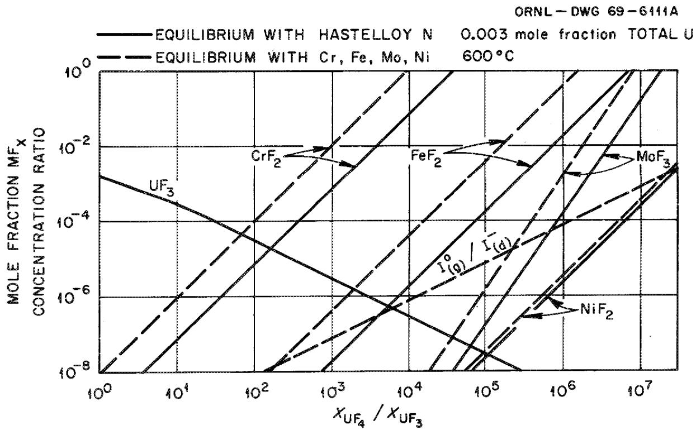  
Fig. 5.5. Variation of equilibrium concentration of structural metal fluorides and the distribution of iodine as a function of the $\mathrm{UF_4 / UF_3}$ ratio in an MSR fuel [35].

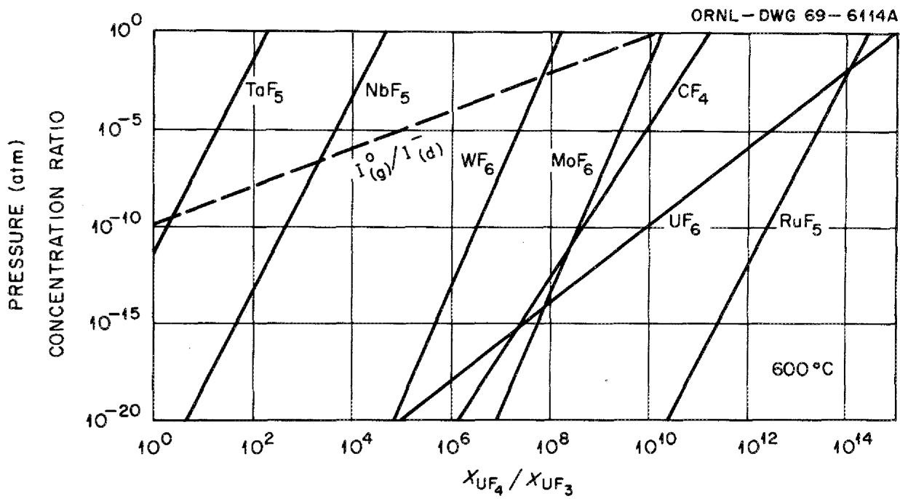  
Fig. 5.6. Variation of partial pressure of volatile fluorides as a function of $\mathrm{UF_4 / UF_3}$ ratio in an MSR fuel [35].

2. The design of the sampler system severely limited the geometry of the sampling devices.   
3. A mist shield enclosing the sampling point provided a special environment.   
4. Lubricating oil from the pump bearings entered the pump bowl at a rate of 1 to 3 cc/day.   
5. There was continuously varying flow and blowback of fuel salt between the pump bowl and an overflow tank.

In spite of these problems, useful information concerning fission product fates in MSRE was gained.

# Stable Salt-Soluble Fluorides

Salt Samples. - The fission products Rb, Cs, Sr, Ba, the lanthanides and Y, and Zr all form stable fluorides which are soluble in fuel salt. These fluorides would thereby be expected to be found completely in the fuel salt except in those cases where there is a noble gas precursor of sufficiently long half-life to be appreciably stripped to off-gas. Table 5.5 summarizes data from salt samples obtained during the $^{233}\mathrm{U}$ operation of the MSRE for fission products with and without significant noble gas precursors. As expected, the isotopes with significant noble gas precursors ( $^{89}\mathrm{Sr}$ and $^{137}\mathrm{Cs}$ ) show ratios to calculated inventory appreciably lower than those without, which generally scatter around or somewhat above 1.0.

Deposition. - Stable fluorides showed little tendency to deposit on Hastelloy N or graphite [60]. Examinations of surveillance specimens exposed in the core of the MSRE showed only 0.1 to $0.2\%$ of the isotopes without noble gas precursors on graphite and Hastelloy N. The bulk of the amount present stemmed from fission recoils, based on an estimate by Compere [61] and general consistency with the flux pattern [60].

The penetration of several fission products into the relatively porous MSRE graphite is shown in Fig. 5.7. Note the flat profile for $^{137}\mathrm{Cs}$ (precursor: $^{137}\mathrm{Xe}$ , $T_{1/2} = 3.9 \, \mathrm{min}$ ) in contrast to the $^{95}\mathrm{Zr}$ and $^{144}\mathrm{Ce}$ , which do not have noble gas precursors. Similar data were obtained for $^{89}\mathrm{Sr}$ (precursor: $^{89}\mathrm{Kr}$ , $T_{1/2} = 3.2 \, \mathrm{min}$ ) and $^{140}\mathrm{Ba}$ [60] (precursor: $^{140}\mathrm{Xe}$ , $T_{1/2} = 16 \, \mathrm{sec}$ ), although in those cases the concentration falls off more with depth in the graphite. The dip in $^{137}\mathrm{Cs}$ concentration at the free-flowing salt surface (left side of Fig. 5.7) was established as real in this and other examinations [62], and similar dips were noted in examining the graphite core stringer removed from the MSRE. Compere and Kirslis [63] attributed these dips to significant diffusion of cesium atoms in the graphite; such diffusion would also explain the very flat $^{137}\mathrm{Cs}$ profile shown in the figure. The mobility of $^{141}\mathrm{Cs}$

Table 5.5. Stable fluoride fission product activity as fraction of calculated inventory in salt samples from $^{233}\mathrm{U}$ operation   

<table><tr><td rowspan="2">Nuclide</td><td colspan="4">Without significant noble-gas precursor</td><td colspan="4">With noble-gas precursor</td></tr><tr><td>95Zr</td><td>141Ce</td><td>144Ce</td><td>147Nd</td><td>89Sr</td><td>137Cs</td><td>91Y</td><td>140Ba</td></tr><tr><td>Weighted yield, %a</td><td>6.01</td><td>6.43</td><td>4.60</td><td>1.99</td><td>5.65</td><td>6.57</td><td>5.43</td><td>5.43</td></tr><tr><td>Half-life, days</td><td>65</td><td>33</td><td>284</td><td>11.1</td><td>52</td><td>30 yr.</td><td>58.8</td><td>12.8</td></tr><tr><td>Noble-gas precursor</td><td></td><td></td><td></td><td></td><td>89Kr</td><td>137Xe</td><td>91Kr</td><td>140Xe</td></tr><tr><td>Precursor half-life</td><td></td><td></td><td></td><td></td><td>3.2 min</td><td>3.9 min</td><td>9.8 sec</td><td>16 sec</td></tr><tr><td>Activity in saltb</td><td></td><td></td><td></td><td></td><td></td><td></td><td></td><td></td></tr><tr><td>Runs 15–17</td><td>0.88–1.09</td><td>0.87–1.04</td><td>1.14–1.25</td><td>0.99–1.23</td><td>0.67–0.97</td><td>0.82–0.93</td><td>0.83–1.46</td><td>0.82–1.23</td></tr><tr><td>Run 18</td><td>1.05–1.09</td><td>0.95–0.99</td><td>1.16–1.36</td><td>0.82–1.30</td><td>0.84–0.89</td><td>0.86–0.99</td><td>1.16–1.55</td><td>1.10–1.20</td></tr><tr><td>Runs 19–20</td><td>0.95–1.02</td><td>0.89–1.04</td><td>1.17–1.28</td><td>1.10–1.34</td><td>0.70–0.95</td><td>0.81–0.98</td><td>1.13–1.42</td><td>1.02–1.20</td></tr></table>

${}^{a}$ Allocated fission yields: ${93.2}{\% }^{233}\mathrm{U},{2.3}{\% }^{235}\mathrm{U},4.5{\% }^{239}\mathrm{{Pu}}$ .   
$b$ As fraction of calculated inventory. Range shown is 25-75 percentile of sample; thus half the sample values fall within this range.

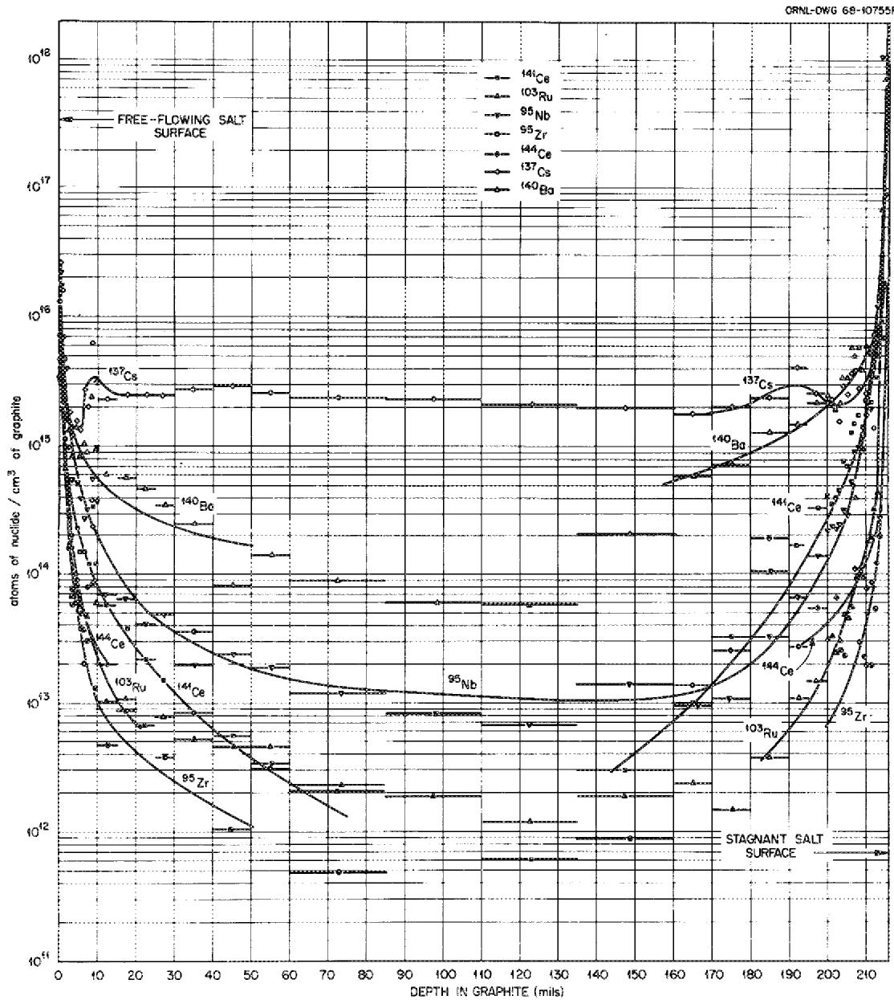  
Fig. 5.7. Fission product distribution in CGB (855) graphite specimen exposed in MSRE core during 32,000 MWhr of power operation [65].

$(T_{1/2} = 25 \text{ sec}; \text{precursor: } ^{141}\text{Xe}, T_{1/2} = 2 \text{ sec})$ may account for the deeper graphite penetration by $^{141}\text{Ce}$ than $^{144}\text{Ce}$ shown in Fig. 5.7. Some observations indicate similar mobility for $^{89}\text{Sr}$ [62].

Gas Samples. - Gas samples obtained from the gas space in the pump bowl mist shield were consistent with the above results for the salt-seeking isotopes with and without noble gas precursors. Table 5.6 [64] shows the percentages of these isotopes which were estimated to be in the pump bowl stripping gas, based on the amounts found in gas samples. Agreement with expected amounts where there were strippable noble gas precursors is satisfactory in consideration of the mist shield, contamination problems, and other experimental difficulties. Gamma spectrometer examination of the off-gas line showed little activity due to salt-seeking isotopes without noble gas precursors [68]. Examinations of sections of the off-gas line also showed only small amounts of these isotopes present [69].

# Noble Metals

The so-called noble metals showed a tantalizingly ubiquitous behavior in the MSRE, appearing as salt-borne, gas-borne, and metal- and graphite-penetrating species. Studies of these species included isotopes of Nb, Mo, Tc, Ru, Ag, Sb, and Te.

Salt-Borne. - As shown in Fig. 5.8, the concentrations of five of the noble metal nuclides found in salt samples ranged from fractions to tens of percent of inventory, with only one $^{99}\mathrm{Mo}$ value appreciably above $100\%$ . Also, the proportionate composition of these isotopes remains relatively constant from sample to sample in spite of the widely varying amounts found. $^{111}\mathrm{Ag}$ , which clearly would be a metal in the MSRE salt and has no volatile fluorides, followed the Fig. 5.8 pattern quite well and also was consistent in the gas samples - see Table 5.7 below. This strongly supports the contention that we were dealing with metal species.

These results suggest the following about the noble metals in the MSRE.

1. The bulk of the noble metals remain accessible in the circulating loop, but with widely varying amounts in circulation at any particular time.   
2. In spite of this wide variation in the total amount found in a particular sample, the proportional composition is relatively constant, indicating that the entire inventory is in substantial equilibrium with the new material being produced.   
3. The mobility of the pool of noble metal material suggests that deposits occur as an accumulation of finely divided, well-mixed material rather than as a "plate."

Table 5.6. Fission products in pump bowl gas samples, percent ${}^{a}$ of MSRE production rate   

<table><tr><td rowspan="2">Isotope</td><td colspan="3">Precursor</td><td colspan="2">Percent found in gas samplesb</td></tr><tr><td>Isotope</td><td>T1/2</td><td>Calculated percent strippeda into gas</td><td>Gross</td><td>Correctedc</td></tr><tr><td colspan="6">Isotopes with gaseous precursors</td></tr><tr><td>89Sr</td><td>89Kr</td><td>3.2 min</td><td>14</td><td>6.5 ± 1</td><td>5.7 ± 1.2</td></tr><tr><td>137Cs</td><td>137Xe</td><td>3.9 min</td><td>18</td><td>33 ± 6</td><td>25 ± 6</td></tr><tr><td>91Y</td><td>91Kr</td><td>9.8 sec</td><td>0.07</td><td>0.4 ± 0.2</td><td>0.006 ± 0.01</td></tr><tr><td>140Ba</td><td>140Xe</td><td>16 sec</td><td>0.16</td><td>0.1 ± 0.02</td><td>0.06 ± 0.01</td></tr><tr><td colspan="6">Salt-seeking isotopes</td></tr><tr><td>95Zr</td><td></td><td></td><td></td><td>0.06 ± 0.01</td><td>0.01 ± 0.004</td></tr><tr><td>141Ce</td><td></td><td></td><td></td><td>0.03 ± 0.01</td><td>-0.003 ± 0.003</td></tr><tr><td>144Ce</td><td></td><td></td><td></td><td>0.3 ± 0.09</td><td>0.05 ± 0.03</td></tr><tr><td>147Nd</td><td></td><td></td><td></td><td>0.02 ± 0.007</td><td>0.002 ± 0.002</td></tr></table>

$a_{\mathrm{As}}$ noble gas precursor.   
Mean value.   
${}^{c}$ Corrected for estimated mist content [66, 67].

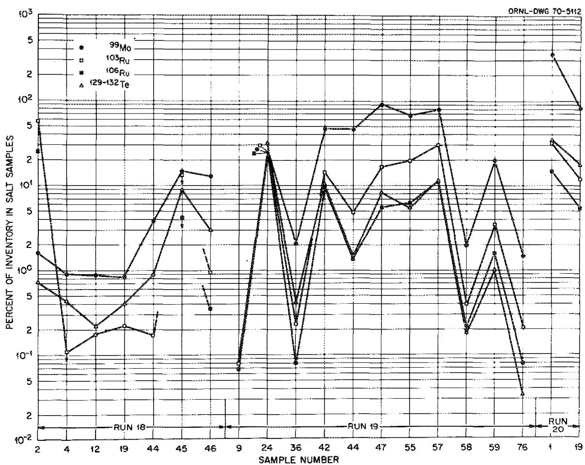  
Fig. 5.8. Noble metal isotopes in salt samples (as percentage of calculated inventory) [63].

Table 5.7. Percent MSRE noble metals in pump He purge to off-gas   

<table><tr><td>Isotope</td><td>235U operation</td><td>233U operation</td></tr><tr><td>95Nb</td><td>11</td><td>0.9 ± 0.2</td></tr><tr><td>99Mo</td><td>50</td><td>1.5 ± 0.5</td></tr><tr><td>111Ag</td><td></td><td>0.7 ± 0.3</td></tr><tr><td>103Ru</td><td>49</td><td>2.3 ± 0.7</td></tr><tr><td>106Ru</td><td>130</td><td>11 ± 3</td></tr><tr><td>129Te</td><td>31</td><td>-1 ± 0.8</td></tr><tr><td>132Te</td><td>74</td><td>-1 ± 0.8</td></tr></table>

No satisfactory correlation of noble metal concentration in the salt samples and any operating parameter could be found.

In order to obtain further understanding of this particulate pool, the transport paths and lags of noble metal fission products in the MSRE were examined using all available data on the activity ratio of two isotopes of the same element, 39.6-day $^{103}\mathrm{Ru}$ and 367-day $^{106}\mathrm{Ru}$ . Data from graphite and metal surveillance specimens exposed for various periods and removed at various times, for material taken from the off-gas system, and for salt and gas samples and other materials exposed to pump bowl salt were compared with appropriate inventory ratios and with values calculated for indicated lags in a simple compartment model. This model assumed that salt rapidly lost ruthenium fission product formed in it, some to surfaces and most to a separate mobile "pool" of noble metal fission product, presumably particulate or colloidal and located to an appreciable extent in pump bowl regions. Some of this "pool" material deposited on surfaces and also appears to be the source of the off-gas deposits. All materials sampled from or exposed in the pump bowl appear to receive their ruthenium activity from the pool of retained material. Adequate agreement of observed data with indications of the model resulted when holdup periods of 45-90 days were assumed [70].

Niobium. - As shown in Fig. 5.6, Nb is the most susceptible of the noble metals to oxidation should the $\mathrm{U}^{4+}/\mathrm{U}^{3+}$ ratio be allowed to get too high. Apparently this happened at the start of the $^{233}\mathrm{U}$ operation, as was indicated by a relatively sharp rise in $\mathrm{Cr}^{+2}$ concentration; it was also noted that 60 to $\sim 100\%$ of the calculated $^{95}\mathrm{Nb}$ inventory was present in the salt samples. Additions of reducing agent $(\mathrm{Be}^{0})$ which inhibited the $\mathrm{Cr}^{+2}$ buildup also resulted in the disappearance of the $^{95}\mathrm{Nb}$ from the salt [71]. Subsequently the $^{95}\mathrm{Nb}$ reappeared in the salt several times for not always ascertainable reasons and was caused to leave the salt by further reducing additions. As the $^{233}\mathrm{U}$ operations continued, the percentage of $^{95}\mathrm{Nb}$ which reappeared decreased, suggesting both reversible and irreversible sinks. The $^{95}\mathrm{Nb}$ data did not correlate with the Mo-Ru-Te data shown in Fig. 5.8, nor was there any observable correlation of its behavior with amounts found in gas samples.

Gas-Borne. - Gas samples taken from the pump bowl during the $^{235}\mathrm{U}$ operation [8] indicated concentrations of noble metals that implied that substantial percentages (30-100) of the noble metals being produced in the MSRE fuel system were being carried out in the 4 liters (STP)/min Hepurge gas. The data obtained in the $^{233}\mathrm{U}$ operation with substantially improved sampling techniques [72] indicated much lower transfers to off-gas, as shown in Table 5.7. In both cases it is assumed that the noble-metal concentration in a gas sample obtained inside the mist shield was the same as that in the gas leaving the pump bowl proper. (The pump bowl was designed to minimize the amount of mist in the sampling area and also at the gas exit port.) It is our belief that the $^{233}\mathrm{U}$ period data are representative and that the concentrations indicated by the gas samples taken during $^{235}\mathrm{U}$ operation are anomalously high because

of contamination. This is supported by direct examination of a section of the off-gas line after completion of the $^{235}\mathrm{U}$ operation [73]. The large amounts of noble metals that would be expected on the basis of the gas sample indications were not present. Appreciable (10-17%) amorphous carbon was found in dust samples recovered from the line, and the amounts of noble metals roughly correlated with the amounts of carbon. This suggests the possibility of noble metal absorption during cracking of the oil.

Deposition on Graphite and Hastelloy N. - In considering the results from the core surveillance specimens it was assumed, for lack of other information, that the amounts of the various fission products per unit area found on the specimens were representative of all the graphite and Hastelloy N surfaces. It was, of course, recognized that this assumption was tenuous at best, and the examination of post-operation specimens from the MSRE showed that it was not a very close approximation. Table 5.8 shows fission product distributions calculated in this way for several sets of surveillance specimens and for parts of the components removed in the post-operation examination. The calculated distributions vary widely for different areas both in the circulating system and on the same component.

The final surveillance specimen array, exposed for the last four months of MSRE operation, had graphite and metal specimens matched as to configuration in varied flow conditions [76]. The relative deposition intensities (1.0 if the entire inventory was spread evenly over all surfaces) were as shown in Table 5.9.

The examination of some segments excised from particular reactor components, including core metal and graphite, pump bowl, and heat exchanger surfaces, one year after shutdown also revealed appreciable accumulation of these substances. The relative deposition intensities at these locations are also shown in Table 5.9.

It is evident that net deposition generally was more intense on metal than on graphite, and for metal, was more intense under more turbulent flow. Surface roughness had no apparent effect.

Extension to all the metal and graphite areas of the system would require knowledge of the effects of flow conditions in each region, and the fraction of total area represented by the region. (Overall, metal area was $26\%$ of the total, and graphite $74\%$ .)

A theoretical approach [76a] treating the noble metal transport as an ordinary convective turbulent diffusion process including gas interfaces as imperfect sinks shows some qualitative agreement with the observed deposition behavior.

Flow effects have not been studied experimentally; theoretical approaches based on atom mass transfer through salt boundary layers, though a useful frame of reference, do not in their usual form take into account the deposition and release of fine particulate material such as was indicated to have been present in the fuel system. Thus, much more must be learned about the fates of noble metals in molten salt reactors before their effects on various operations can be estimated reliably.

Table 5.8. Percent noble metal distribution in MSRE based on examination of various specimens removed   
Percentages assume amount found on a specimen is representative of all graphite or Hastelloy N surfaces.   

<table><tr><td rowspan="2"></td><td colspan="10">Graphite</td><td colspan="9">Hastelloy N</td></tr><tr><td>95Nb</td><td>99Mo</td><td>99Tc</td><td>103Ru</td><td>106Ru</td><td>111Ag</td><td>125Sb</td><td>129mTe</td><td>132Te</td><td>95Nb</td><td>99Mo</td><td>99Tc</td><td>103Ru</td><td>106Ru</td><td>111Ag</td><td>125Sb</td><td>129mTe</td><td>132Te</td><td></td></tr><tr><td colspan="20">Core surveillance specimens</td></tr><tr><td>Group 2 (32,700 MWh) [16]</td><td>36</td><td>11</td><td></td><td>7</td><td></td><td></td><td></td><td></td><td>10</td><td>34</td><td>41</td><td></td><td>15</td><td></td><td></td><td></td><td></td><td>70</td><td></td></tr><tr><td>Group 3 (65,600 MWh) [8]</td><td>41</td><td>9</td><td></td><td>4</td><td>4</td><td></td><td></td><td>6</td><td>5</td><td>12</td><td>19</td><td></td><td>3</td><td>3</td><td></td><td></td><td>12</td><td>10</td><td></td></tr><tr><td>Group 4 (18,500 MWh) [60]</td><td>7</td><td>4</td><td></td><td>2</td><td>3</td><td>5</td><td>3</td><td>3</td><td>5</td><td>3</td><td>26</td><td></td><td>4</td><td>8</td><td>16</td><td>12</td><td>18</td><td>16</td><td></td></tr><tr><td>Group 5 (11,800 MWh) [62]</td><td>15</td><td>16</td><td></td><td>5</td><td>4</td><td></td><td></td><td>3</td><td></td><td>10</td><td>53</td><td></td><td>4</td><td>4</td><td></td><td></td><td></td><td>56</td><td></td></tr><tr><td colspan="19">Post-operation specimens [75]</td><td></td></tr><tr><td>Core stringer, top</td><td>17</td><td></td><td>5</td><td></td><td>12</td><td></td><td>47</td><td>33a</td><td></td><td></td><td></td><td></td><td></td><td></td><td></td><td></td><td></td><td></td><td></td></tr><tr><td>Core stringer, middle</td><td>79</td><td></td><td></td><td></td><td>77</td><td></td><td>138</td><td>67a</td><td></td><td></td><td></td><td></td><td></td><td></td><td></td><td></td><td></td><td></td><td></td></tr><tr><td>Core stringer, bottom</td><td>39</td><td></td><td></td><td></td><td>11</td><td></td><td>56</td><td>44a</td><td></td><td></td><td></td><td></td><td></td><td></td><td></td><td></td><td></td><td></td><td></td></tr><tr><td>Control rod thimble, bottom</td><td></td><td></td><td></td><td></td><td></td><td></td><td></td><td></td><td></td><td>36</td><td></td><td>32</td><td>40</td><td>13</td><td></td><td>85</td><td>43a</td><td></td><td></td></tr><tr><td>Control rod thimble, middle</td><td></td><td></td><td></td><td></td><td></td><td></td><td></td><td></td><td></td><td>27</td><td></td><td>19</td><td>15</td><td>11</td><td></td><td>35</td><td>14a</td><td></td><td></td></tr><tr><td>Mist shield, outside in salt</td><td></td><td></td><td></td><td></td><td></td><td></td><td></td><td></td><td></td><td>7</td><td></td><td>19</td><td>7</td><td>10</td><td></td><td>74</td><td>23a</td><td></td><td></td></tr><tr><td>Heat exchanger, shell</td><td></td><td></td><td></td><td></td><td></td><td></td><td></td><td></td><td></td><td>9</td><td></td><td>27</td><td>27</td><td>5</td><td></td><td>68</td><td>35a</td><td></td><td></td></tr><tr><td>Heat exchanger, tube</td><td></td><td></td><td></td><td></td><td></td><td></td><td></td><td></td><td></td><td>7</td><td></td><td>31</td><td>28</td><td>14</td><td></td><td>113</td><td>67a</td><td></td><td></td></tr></table>

Table 5.9. Relative deposition intensities for noble metals   

<table><tr><td rowspan="2">Surface</td><td rowspan="2">Flow regime</td><td colspan="8">Deposition intensity</td></tr><tr><td>95Nb</td><td>99Mo</td><td>99Tc</td><td>103Ru</td><td>106Ru</td><td>125Sb</td><td>129mTe</td><td>132Te</td></tr><tr><td colspan="10">Surveillance specimens</td></tr><tr><td rowspan="2">Graphite</td><td>Laminar</td><td>0.2</td><td>0.2</td><td></td><td>0.06</td><td>0.16</td><td></td><td>0.15</td><td></td></tr><tr><td>Turbulent</td><td>0.2</td><td></td><td></td><td>0.04</td><td>0.10</td><td></td><td>0.07</td><td></td></tr><tr><td rowspan="2">Metal</td><td>Laminar</td><td>0.3</td><td>0.5</td><td></td><td>0.1</td><td>0.3</td><td></td><td></td><td>0.9</td></tr><tr><td>Turbulent</td><td>0.3</td><td>1.3</td><td></td><td>0.1</td><td>0.3</td><td></td><td></td><td>2.0</td></tr><tr><td colspan="10">Reactor components</td></tr><tr><td>Graphite</td><td></td><td></td><td></td><td></td><td></td><td></td><td></td><td></td><td></td></tr><tr><td>Core bar channel</td><td>Turbulent</td><td></td><td></td><td></td><td></td><td></td><td></td><td></td><td></td></tr><tr><td>Bottom</td><td></td><td>0.54</td><td></td><td>0.07</td><td></td><td>0.25</td><td>0.65</td><td>0.46a</td><td></td></tr><tr><td>Middle</td><td></td><td>1.09</td><td></td><td></td><td></td><td>1.06</td><td>1.90</td><td>0.92a</td><td></td></tr><tr><td>Top</td><td></td><td>0.23</td><td></td><td></td><td></td><td>0.29</td><td>0.78</td><td>0.62a</td><td></td></tr><tr><td>Metal</td><td></td><td></td><td></td><td></td><td></td><td></td><td></td><td></td><td></td></tr><tr><td>Pump bowl</td><td>Turbulent</td><td>0.26</td><td></td><td>0.73</td><td>0.27</td><td>0.38</td><td>2.85</td><td>0.89a</td><td></td></tr><tr><td>Heat exchanger shell</td><td>Turbulent</td><td>0.33</td><td></td><td>1.0</td><td>0.10</td><td>0.19</td><td>2.62</td><td>1.35a</td><td></td></tr><tr><td>Heat exchanger tube</td><td>Turbulent</td><td>0.27</td><td></td><td>1.2</td><td>0.11</td><td>0.54</td><td>4.35</td><td>2.57a</td><td></td></tr><tr><td>Core</td><td></td><td></td><td></td><td></td><td></td><td></td><td></td><td></td><td></td></tr><tr><td>Rod thimble</td><td></td><td></td><td></td><td></td><td></td><td></td><td></td><td></td><td></td></tr><tr><td>Bottom</td><td>Turbulent</td><td>1.42</td><td></td><td>1.23</td><td>1.54</td><td>0.50</td><td>3.27</td><td>1.65a</td><td></td></tr><tr><td>Middle</td><td>Turbulent</td><td>1.00</td><td></td><td>0.73</td><td>0.58</td><td>0.42</td><td>1.35</td><td>0.54a</td><td></td></tr></table>

a127 Te.

Although the noble metals are appreciably deposited on graphite, they do not penetrate any more than the salt-seeking fluorides without noble gas precursors, as shown by the $^{103}\mathrm{Ru}$ data in Fig. 5.7. Delete-rious penetration of Hastelloy N grain boundaries is discussed in Chapter 7.

# Iodine

The salt samples indicated considerable $^{131}\mathrm{I}$ was not present in the fuel, the middle quartiles of results ranging from 45 to $71\%$ of inventory with a median of $62\%$ . The surveillance specimens and gas samples accounted for less than $1\%$ of the rest. The low Te material balances suggest the remaining $^{131}\mathrm{I}$ was permanently removed from the fuel as $^{131}\mathrm{Te}(T_{1/2} = 25 \min)$ . Gamma spectrometer studies indicated the $^{131}\mathrm{I}$ formed in contact with the fuel returned to it; thus the losses must have been to a region or regions not in contact with fuel. This strongly suggests off-gas, but the iodine and tellurium data from gas samples and examinations of off-gas components do not support such a loss path. Such loss would not appear to interfere with the use of iodine side-stream stripping utilizing the reaction

$$
\mathrm {H F} (\mathrm {g} \text {i n} \mathrm {H e}) + ^ {1 3 5} \mathrm {I} ^ {-} \rightarrow \mathrm {F} ^ {-} + \mathrm {H} ^ {1 3 5} \mathrm {I} (\mathrm {g}).
$$

This has been considered [77] as an alternate for removal of the important $^{135}\mathrm{Xe}$ (daughter) poison from the fuel.

# Evaluation

The experience with the MSRE showed that the noble gases and stable fluorides behaved as expected based on their chemistry. The noble metal behaviors and fates, however, are still a matter of conjecture. Except for Nb under unusually oxidizing conditions, it seems clear these elements are present as metals and that their ubiquitous properties stem from that fact since metals are not wetted by, and have extremely low solubilities in, MSR fuels. Unfortunately the MSRE observations probably were substantially affected by the spray system, oil cracking products, and flow to and from the overflow, all of which were continuously changing, uncontrolled variables. The low material balance on $^{131}\mathrm{I}$ indicates appreciable undetermined loss from the MSRE, probably as a noble metal precursor (Te, Sb).

Table 5.10 shows the estimated distribution of the various fission products in a molten salt reactor based on the MSRE studies. Unfortunately the wide variance and poor material balances for the noble metal data make it unrealistic to specify their fates more than qualitatively. As a consequence, future reactor designs must allow for encountering appreciable fractions of the noble metals in all regions contacted by circulating fuel. As indicated in the table, continuous chemical processing and the processes finally chosen will substantially affect the fates of many of the fission products.

Table 5.10. Indicated distribution of fission products in molten salt reactors   

<table><tr><td rowspan="2">Fission product group</td><td rowspan="2">Example isotopes</td><td colspan="5">Distribution (%)</td></tr><tr><td>In salt</td><td>To metal</td><td>To graphite</td><td>To off-gas</td><td>Other</td></tr><tr><td>Stable salt seekers</td><td>95Zr, 144Ce, 147Nd</td><td>~99</td><td>Negligible</td><td>&lt;1 (fission recoils)</td><td>Negligible</td><td>Processinga</td></tr><tr><td>Stable salt seekers(noble gas precursors)</td><td>89Sr, 137Cs, 140Ba, 91Y</td><td>Variable/T1/2of gas</td><td>Negligible</td><td>Low</td><td>Variable/T1/2of gas</td><td></td></tr><tr><td>Noble gases</td><td>89Kr, 91Kr, 135Xe, 137Xe</td><td>Low/T1/2of gas</td><td>Negligible</td><td>Low</td><td>High/T1/2of gas</td><td></td></tr><tr><td>Noble metals</td><td>95Nb, 99Mo, 106Ru, 111Ag, 129Te</td><td>1–20</td><td>5–30</td><td>5–30</td><td>Negligible</td><td>Processingb</td></tr><tr><td>Iodine</td><td>131I, 135I</td><td>50–75</td><td>&lt;1</td><td>&lt;1</td><td>Negligible</td><td>Processingc</td></tr></table>

For example, $\mathrm{Zr}$ tends to accumulate with Pa holdup in reductive extraction processing.   
Particulate observations suggest appreciable percentages will appear in processing streams.   
Substantial iodine could be removed if side-stream stripping is used to remove $^{135}\mathrm{I}$ [77].

# Future Work

Substantial difficult work will be needed to bring our understanding of the behavior of noble metal fission products (including iodine) to the level of the other fission products. This work will require simultaneous control of chemical and hydrodynamic conditions and will consequently require experiments of sufficient scale and some complexity to achieve this. The major objective will be to determine the controlling mechanisms as well as the associated rates, in order that extrapolation to larger and more complex systems can follow.

Among factors doubtless important in MSRE and in future reactors are the redox potential of the system (characterized by the $\mathrm{U}^{4+} / \mathrm{U}^{3+}$ ratio), the presence of oxide and its affinity for various fission product (e.g. Nb) and constituent elements, the possible agglomeration of metals onto gas and bubble interfaces in the absence of colloidal (metallic, graphite, oxide, etc.) particles, the deposition of noble metals onto colloidal particles of various types, and the deposition and resuspension of particles bearing noble metals.

The exploitation of suitable mechanisms to remove noble metal fission products or to control their deposition could be an attractive result of such studies.

Laboratory work in dynamic systems could use tracers for some work. A next phase of the work is expected to generate such tracers under dynamic conditions in fuel or other salt using high-intensity neutron pulses, possibly from the Oak Ridge Health Physics Research Reactor. Broad variation of relevant chemical and hydrodynamic factors appears possible.

Of necessity, tracer concentrations will be relatively low. However, experiments involving particulate participation in noble metal behavior appear to be practical except where high concentrations are required. In order to achieve these concentrations along with radiation conditions approaching those of proposed reactors, while maintaining chemical and hydrodynamic control, sophisticated in-pile loop experimentation is required, a major objective being to specify definitive studies to be carried out in the demonstration reactor.

# Coolant Salts

# Basis for Choice of Composition

It has never appeared feasible to raise steam directly from the fuel (primary) heat exchanger; accordingly, a secondary coolant must be provided to link the fuel circuit to the steam generator. The demands imposed upon this coolant fluid differ in obvious ways from those imposed upon the fuel system. Radiation intensities will be markedly less in the coolant system, and the consequences of uranium fission will be absent. The coolant salt must, however, be compatible with metals of construction which will handle the fuel and the steam; it must not undergo violent reactions with fuel or steam should leaks develop in either circuit.

The coolant should be inexpensive, it must possess good heat transfer properties, and it must melt at temperatures suitable for steam cycle startup. An ideal coolant would consist of compounds which are tolerable in the fuel or which are easy to separate from the valuable fuel mixture should the fluids mix as a consequence of a leak.

MSRE rejected its heat to an air-cooled radiator at a minimum temperature of about $1015^{\circ}\mathrm{F}$ [78]. The coolant mixture chosen [8,78] for that application was $\mathrm{BeF}_2$ with 66 mole % of $^{7}\mathrm{LiF}$ (see Fig. 5.1). This material, which melts at $851^{\circ}\mathrm{F}$ , was shown to be completely satisfactory for that use [8,9]. An MSBR coolant, however, must transport heat to supercritical steam at minimum temperatures only modestly above $700^{\circ}\mathrm{F}$ [10]. Use of the high-melting MSRE coolant in MSBR would pose real problems in steam generator design. The eutectic mixture of LiF and $\mathrm{BeF}_2$ (Fig. 5.1) melts at near $700^{\circ}\mathrm{F}$ , but its viscosity is high. Moreover, both these LiF- $\mathrm{BeF}_2$ mixtures are quite expensive if $^{7}\mathrm{LiF}$ is used. If normal LiF is used the cost is much less, though it is not trivial, but a leak in the primary heat exchanger greatly damages the expensive fuel. Such mixtures have, accordingly, been discounted as MSBR coolants.

The alkali metals, excellent coolants with real promise in other systems, are quite undesirable here since they react vigorously with both the MSBR fuel and with steam. More noble metals such as Bi or Pb undergo no violent reactions with either of the other working fluids, but they are only fair coolants, and they are not compatible with the nickel-based alloys intended for use in MSBRs.

Molten mixtures of $\mathrm{NaNO}_3$ , $\mathrm{KNO}_3$ , and $\mathrm{KNO}_2$ have been used industrially (Hitec is a common example) as heat transfer agents, but not at temperatures quite so high as are desirable in the MSBR. These materials may be stable toward irradiation in the primary heat exchanger, but extensive investigation of this point would be required [79]. They are clearly not stable toward the fuel, from which they would precipitate actinide oxides rapidly but not violently, and they would react dangerously with the moderator graphite if a leak occurred in the primary heat exchanger. Thus they are not being considered for use in the MSBR secondary system. It should be noted, however, that these nitrate-nitrite mixtures have excellent melting points, are quite compatible with water and steam, and should certainly oxidize to $\mathrm{T}_2\mathrm{O}$ any tritium diffusing from the reactor fuel system. They may, if the tritium problem (see Chapter 14) cannot otherwise be satisfactorily managed, prove valuable in a third coolant loop, as mentioned in Chapter 2.

Several binary chloride systems are known to have eutectics melting well below $700^{\circ}\mathrm{F}$ [80]. Many of these systems are unattractive since they contain high concentrations of chlorides which are easily reduced and, therefore, corrosive or which are very volatile. The only low-melting binary systems of stable, non-volatile chlorides are those containing LiCl; LiCl-CsCl (330°C at 45 mole % CsCl), LiCl-KCl (355°C at 42 mole % KCl), LiCl-RbCl (312°C at 45 mole % RbCl). Such systems would be relatively expensive if made from $^7\mathrm{LiCl}$ , and they could lead to serious contamination of the fuel if normal LiCl were used.

Very few fluorides or mixtures of fluorides are known to melt at temperatures below $700^{\circ}\mathrm{F}$ ( $370^{\circ}\mathrm{C}$ ). Stannous fluoride ( $\mathrm{SnF}_2$ ) melts at $212^{\circ}\mathrm{C}$ . This material is certainly not stable during long-term service

in Hastelloy N; moreover, its phase diagrams with stable fluorides (such as NaF or LiF) show high melting points at relatively low alkali fluoride concentrations. Coolant compositions which will meet the low liquidus temperature specifications may be chosen from the NaF-BeF $_2$ or NaF-LiF-BeF $_2$ system. These materials are compatible with Hastelloy N, and they possess adequate specific heats and low vapor pressures. They (especially those including LiF) are expensive, and their viscosities at low temperatures are certainly higher than desirable.

On balance, the best material for use as the MSBR secondary coolant appears to be a mixture of sodium fluoride and sodium fluoroborate. These compounds are readily available, inexpensive, and appear to be sufficiently stable to the radiation field within the primary heat exchanger. The mixture of NaF-NaBF₄ with 8 mole % of NaF melts at the acceptably low temperature of 725°F, and its physical properties seem adequate for its service as a heat transfer agent. These compounds are not ideally compatible with either steam or the MSBR fuel, but, as described in more detail below, the reactions are neither violent nor particularly energetic.

The fact that fluoroborates show an appreciable equilibrium pressure of gaseous $\mathrm{BF}_3$ at elevated temperatures presents minor difficulties. The $\mathrm{BF}_3$ pressures are moderate [41]; they may be calculated from

$$
\log P _ {\text {t o r r}} = 9. 0 2 4 - \frac {5 . 9 2 0}{T ^ {\circ} K}
$$

(yielding 200 torr at $850^{\circ}\mathrm{K}$ ) and clearly present no dangerous situations. It is necessary, however, to maintain the appropriate partial pressures of $\mathrm{BF}_3$ in any flowing cover gas stream to avoid composition changes in the melt.

# Present Status of Fluoroborate Chemistry

Phase Behavior. - The binary system $\mathrm{NaF - NaBF_4}$ has been described [80,81] as showing a eutectic at 60 mole $\%$ $\mathrm{NaBF}_4$ with a melting point of $304^{\circ}\mathrm{C}$ ( $580^{\circ}\mathrm{F}$ ). Our studies [82] have shown that these previously published diagrams are seriously in error.* Our recent studies, made with quite pure NaF and $\mathrm{NaBF}_4$ , show that the system contains a single eutectic at 8 mole $\%$ NaF and a melting point of $384^{\circ}\mathrm{C}$ ( $723^{\circ}\mathrm{C}$ ). The phase diagram [82] for this simple system is shown in Fig. 5.9.

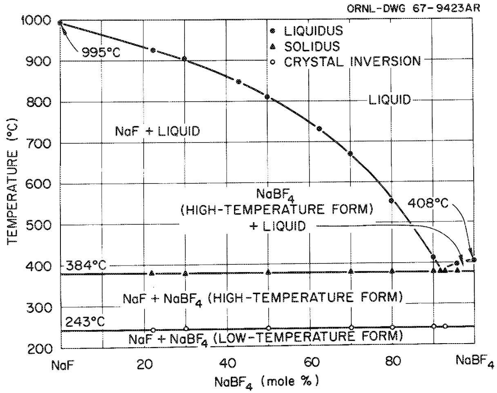  
Fig. 5.9. The system NaF-NaBF $_4$ .

Behavior with Hydroxide Ion. - Sodium hydroxyfluoroborate $(\mathrm{NaBF}_3\mathrm{OH})$ is a common minor contaminant in commercial $\mathrm{NaBF}_4$ that is prepared by aqueous processes. Pure $\mathrm{NaBF}_3\mathrm{OH}$ can be decomposed completely at temperatures near $100^{\circ}\mathrm{C}$ [83] through the bimolecular reaction:

$$
2 \mathrm {N a B F} _ {3} \mathrm {O H} \rightarrow \mathrm {N a} _ {2} \mathrm {B} _ {2} \mathrm {F} _ {6} \mathrm {O} + \mathrm {H} _ {2} \mathrm {O}.
$$

This material cannot, accordingly, be used as a major constituent for high-temperature coolant. However, when the $\mathrm{NaBF}_3\mathrm{OH}$ is present in very dilute solution in $\mathrm{NaBF}_4$ it is "matrix isolated," the bimolecular decomposition reaction is inhibited, and the material is considerably more stable [84]. Such hydroxyfluoroborates are appreciably more reactive than fluoroborate to structural metals, as is discussed in more detail in a subsequent section; however, there is considerable evidence that as much as 30 ppm of H can be present as $\mathrm{OH}^-$ in the fluoroborate melt without undue corrosive effects upon Hastelloy N [85].

Relative stability of such quantities of $\mathrm{OH}^-$ (and, by analogy of OT) may be an important aid to control of tritium (see chapter 14). If, for example, the coolant can be made to contain several ppm of H (10 ppm is more than $4\mathrm{kg}$ of H in the nearly $10^{6}$ lbs of coolant) and if the exchange reaction

$$
\mathrm {O H} ^ {-} + \mathrm {T} \rightarrow \mathrm {O T} ^ {- -} + \mathrm {H}
$$

could be made to proceed, the coolant mixture would afford a means for holdup of the tritium diffusing from the primary heat exchanger.

Some initial studies have been performed in which $\mathbf{D}_2$ has been bubbled into, or alternatively allowed to diffuse through nickel tubing into, $\mathrm{NaF - NaBF_4}$ melts [86]. These melts contained hydroxide ion equivalent to some 25 ppm of H and a considerable quantity (perhaps 3000 ppm) of oxide. Direct observation by infra-red spectroscopy showed that OD $^-$ grew into the melts. No corresponding decrease of OH $^-$ occurred. These studies strongly suggest that the exchange reaction indicated above is not occurring but that the added deuterium is reacting with oxide impurities, perhaps by

$$
\mathrm {D} _ {2} + \mathrm {B} _ {2} \mathrm {F} _ {6} \mathrm {O} ^ {2 -} + \mathrm {N i O} \rightleftharpoons 2 \mathrm {B F} _ {3} \mathrm {O D} ^ {-} + \mathrm {N i}.
$$

Further study of such reactions is clearly necessary to determine the precise mechanism and to establish whether the reaction can be made sufficiently rapid and quantitative to fix the diffusing tritium.

Physical Properties. - Pertinent physical properties for the eutectic $\mathrm{NaF - NaBF_4}$ coolant mixture are presented in Table 5.11. Partial pressures of $\mathrm{BF}_3$ above the mixture have been measured with some care, as have liquidus temperatures [41]. However, other properties of the salt, as were the properties of the MSBR fuel mixture, have been estimated. The values given are quite unlikely to be in serious error, but an experimental program to firm up these estimated values is clearly necessary.

Table 5.11. Physical properties of MSBR coolant salt   

<table><tr><td>Composition</td><td colspan="2">NaBF4-NaF (92-8 mole %)</td></tr><tr><td>Liquidus temperature</td><td colspan="2">384°C</td></tr><tr><td rowspan="2">Properties at Density, g/cm3</td><td>454°Ca</td><td>621°Cb</td></tr><tr><td>1.93</td><td>1.82</td></tr><tr><td>Heat capacity, cal/(g-°C)</td><td>0.36</td><td>0.36</td></tr><tr><td>Viscosity, centipoises</td><td>1.9</td><td>1.1</td></tr><tr><td>Thermal conductivity, W/(°C-cm)</td><td>0.0045</td><td>0.0040</td></tr><tr><td>Vapor pressure, torrs</td><td>8</td><td>252</td></tr></table>

${}^{a}$ Mean temperature of coolant entering primary heat exchanger.   
$b$ Highest normal operating temperature of coolant.   
$c_{\text{Pressure of BF}_3}$ in equilibrium with melt of this composition.

Compatibility with Hastelloy N. - Acceptable compatibility of the NaF- $\mathsf{BF}_4$ coolant with Hastelloy N under realistic conditions seems assured by numerous corrosion tests [42,87,88], though the number of such tests is much smaller than that for LiF-BeF $_2$ mixtures.

Thermodynamic data for possible reactions of the $\mathrm{NaF - NaBF_4}$ mixture is in a somewhat less satisfactory state than is that for the fuel mixtures. The free energy change for the chemical reaction

$$
\mathrm {B F} _ {3} (\mathrm {g}) + \frac {3}{2} \mathrm {C r} (\mathrm {c}) \rightleftharpoons \frac {3}{2} \mathrm {C r F} _ {2} (\mathrm {d}) + \mathrm {B} (\mathrm {c})
$$

appears to be about $+30$ kcal at $800^{\circ}\mathrm{K}$ [89]. The reactions of $\mathrm{BF}_3$ with Fe and Ni are even less likely to occur. In addition, these reactions become somewhat less likely (perhaps by 5 kcal or so) when one considers energetics of formation of $\mathrm{NaBF}_4$ and its dilution by NaF.

Reactions which produce metal borides and fluorides are somewhat more difficult to assess. Titanium, a minor constituent of Hastelloy N, has a moderately stable boride [90]. The reaction

$$
2 \mathrm {B F} _ {3} (\mathrm {g}) + \frac {3}{2} \mathrm {T i} (\mathrm {c}) \rightleftharpoons \mathrm {T i B} _ {2} (\mathrm {c}) + \frac {3}{2} \mathrm {T i F} _ {4} (\mathrm {d})
$$

probably must be expected to proceed, but the very low rate of diffusion of Ti in Hastelloy N would be expected to limit the extent of reaction markedly. Thermochemical data for the borides of Fe, Cr, Ni, and Mo do not seem to have been established. Unless they have free energies of formation more negative than 25 kcal/B atom the Hastelloy N should prove resistant to pure NaF-NaBF₄ coolant. The several corrosion tests seem to have produced no evidence for formation of borides of these metals.

Oxidizing impurities in the fluoroborate mixture selectively attack the chromium in Hastelloy N, as they do in the fuel mixture, but the product of corrosion is $\mathrm{CrF}_3$ rather than $\mathrm{CrF}_2$ [42]. The reaction of $\mathrm{FeF}_2$ in fluoroborate melts, for example, appears to be

$$
F e F _ {2} (d) + \frac {2}{3} C r \rightarrow F e (c) + \frac {2}{3} C r F _ {3}.
$$

If the fluoroborate is sufficiently impure the corrosion product $\mathrm{CrF}_3$ exceeds its solubility limit and precipitates as $\mathrm{Na}_3\mathrm{CrF}_6$ .* While some of the initial corrosion tests with quite impure fluoroborate mixtures produced such precipitation (and severe corrosion) [42], none of the more recent studies have encountered this difficulty.

Long periods of stable operation of natural and forced convection loops with moderately pure NaF-NaBF $_4$ mixtures have shown that corrosion rates below 0.5 mil per year and approaching 0.1 mil per year can be obtained [42,92,87].

Interactions with Steam. - Fluoroborates react readily with steam. The reaction, which is not violent or particularly energetic, is

$$
\mathrm {H} _ {2} \mathrm {O} + \mathrm {N a B F} _ {4} \rightleftharpoons \mathrm {H F} + \mathrm {N a B F} _ {3} \mathrm {O H}.
$$

It is well known that the HF so produced is quite corrosive; it is capable of reaction with Ni and Fe as well as with Cr and can cause generalized attack. The $\mathrm{FeF_2}$ and $\mathrm{NiF_2}$ so generated are then capable of reaction with Cr in the alloy [87]. Cantor and Waller [85] have recently shown that the reaction of OH $^-$ in dilute solution (25 ppm and below) with Hastelloy $N^*$ occurs slowly; this reaction can apparently be represented as

$$
\mathrm {O H} ^ {-} + \frac {1}{3} \mathrm {C r} \rightleftharpoons \frac {1}{3} \mathrm {C r} ^ {3 +} + \frac {1}{2} \mathrm {H} _ {2} + 0 ^ {2 -}.
$$

Ingress of steam, as from a leak in the MSBR steam generators, to the fluoroborate coolant circuit must, accordingly, be expected to result in increased corrosion. Such an increase has, indeed, been observed in deliberate additions of steam to an operating test loop containing removable specimens in hot and cold regions [87,93]. Relatively rapid corrosion followed the steam addition; chromium concentration in the circulating salt rose from 82 ppm to about 320 ppm in about 1700 hours and remained essentially constant [93]. Examination of specimens removed at intervals from the loop also indicated that the attack decreased with time after the initial exposure to steam [87,93]. These data strongly suggest that the Hastelloy N system can tolerate inleakage of steam and, once the leak is repaired, could continue to operate without extensive damage even if the salt were not repurified [93]. It is clear, however, that continuous inleakage of steam in appreciable quantity would require a purification system for the fluoroborate salt.

Interactions with Fuel Salt. - The MSBR design [10] will assure that the pressure on the coolant is slightly higher than that on the fuel salt, so that a minor leak in the primary heat exchanger will result in coolant salt entering the fuel. Such a leak, even though small, will be recognized at once because of the marked reactivity loss resulting from admiss- sion of boron into the fuel.

Mixing a small quantity of NaF-NaBF $_4$ salt with the fuel effectively dissociates the NaBF $_4$ into NaF and BF $_3$ . The NaF will dissolve in the LiF-BeF $_2$ -ThF $_4$ -UF $_4$ salt mixture; the BF $_3$ will distribute between the fuel salt and the available vapor space and, if operation of the reactor were continued, would be swept into the off-gas system. Additions of large quantities of coolant, as might occur in the unlikely event of a gross failure in the primary heat exchanger, produce more complex effects and can result in appreciable pressures of BF $_3$ .

The solubility of $\mathbf{BF}_3$ in the MSBR fuel solvent has been carefully measured [94]. The solubility decreases with increasing temperature and increases linearly with $\mathbf{BF}_3$ pressure. From these data one can calculate the equilibrium pressure of $\mathbf{BF}_3$ from small leaks of NaF- $\mathbf{NaBF}_4$ into MSBR fuel in a closed system. This equilibrium pressure clearly depends upon the amount of NaF- $\mathbf{NaBF}_4$ admitted and the available vapor space. If we assume that the only vapor space available is the small bubble fraction (assumed to be $1\%$ ) in the fuel, then one can show that inleakage at $1250^{\circ}\mathrm{F}$ of 1 cubic foot (110 lbs) of NaF- $\mathbf{NaBF}_4$ coolant results in a $\mathbf{BF}_3$ pressure of 0.17 atmosphere. It seems clear that leaks of this order do not result in a dangerous situation.

Addition of substantial quantities of $\mathrm{NaBF_4}$ to several fluoride mixtures generally similar to the MSBR fuel resulted in liquid-liquid immiscibility [95]. Mixing equal weights, for example, of 2LiF·BeF $_2$ and $\mathrm{NaBF_4}$ at $600^{\circ}\mathrm{C}$ produced two liquid phases. The less dense phase was rich in $\mathrm{BF}_3$ and contained little $\mathrm{BeF_2}$ ; the dense phase was rich in $\mathrm{BeF_2}$ with little $\mathrm{BF_3}$ . LiF and NaF partitioned between these phases, with the light phase rich in NaF and the heavy phase rich in LiF. Other experiments [95] showed that $\mathrm{UF_4}$ (presumably $\mathrm{ThF_4}$ would behave similarly) was almost completely retained in the heavy phase. No such equilibrations to define the miscibility limits or the equilibrium distributions of the several ions in the two phases have been performed with the MSBR fuel composition. Consequently, the extent to which this liquid-liquid immiscibility limits the $\mathrm{BF_3}$ pressure upon mixing large quantities of NaF-NaBF $_4$ with MSBR fuel cannot be accurately assessed. However, the fact that considerable pressures of $\mathrm{BF_3}$ (in reasonable accord with estimates based on the measured solubility [94] of $\mathrm{BF_3}$ ) are developed upon mixing MSBR fuel with one-third its volume of NaF-NaBF $_3$ coolant has been demonstrated experimentally [96].

It appears certain that small leaks of coolant into the fuel system pose no real problems. It is clear, however, that additional study of mixing of these fluids in realistic geometries and in flowing systems is needed before one can be certain that no potentially damaging situation can arise as a consequence of a sudden major failure of the heat exchanger.

Purification of Fluoroborate Mixtures. - Initial purification of NaF-NaBF $_4$ mixtures for use in corrosion and other engineering tests has not posed serious problems, since the purity specifications are less severe in several ways than are those for the fuels, and quite pure NaBF $_4$ preparations are available commercially at reasonable costs. Recent preparation [97] methods have consisted simply in (1) mixing the NaBF $_4$ with the required quantity of NaF, (2) heating the mixed powder at a controlled rate to $300^{\circ}\mathrm{C}$ under reduced pressure, (3) heating the material to $500^{\circ}\mathrm{C}$ under a static atmosphere of inert gas, (4) mixing the molten mixture by brief sparging with BF $_3$ , (5) purging the BF $_3$ by a brief treatment with flowing argon, and (6) transferring the salt mixture to its storage container. Chemical analyses of material prepared in this simple way show oxide concentrations of about 325 ppm and hydrogen (proton) concentrations of about 15 ppm. Analyses for Fe $^{2+}$ show values near 150 ppm; this could almost certainly be decreased by a more stringent purification procedure.

Simple procedures such as that described above may suffice for the original coolant loading of an MSBR, but it seems certain that additional, on-line treatment will be required during reactor operation. The inevitability of small inleakages of steam, for example, will require some repurification reprocessing. Moreover, if the fluoroborate mixture is to help with the tritium problem (by tritium exchange with $\mathrm{NaBF}_3\mathrm{OH}$ or other reactions yielding $\mathrm{NaBF}_3\mathrm{OT}$ ), some processing method for removing the contained T on a reasonably short time cycle will be necessary.

The reaction of fluoroborate with steam,

$$
\mathrm {H} _ {2} \mathrm {O} + \mathrm {N a B F} _ {4} \rightleftharpoons \mathrm {H F} + \mathrm {N a B F} _ {3} \mathrm {O H},
$$

is a reversible one, and treatment with HF (appropriate pressures of $\mathbf{BF}_3$ must be added to maintain the melt composition) can return the melt to its original condition. It appears, however, that this reaction may be too inefficient for use in a practical system. Such purification could certainly be accomplished by use of fluorine; this reagent (mixed with $\mathbf{BF}_3$ ) should certainly remove the OH (OT) as well as the contained oxides.

$$
F _ {2} + N a B F _ {3} O H \rightarrow H F + \frac {1}{2} O _ {2} + N a B F _ {4}
$$

and

$$
\mathrm {F} _ {2} + \mathrm {N a} _ {2} \mathrm {B} _ {2} \mathrm {F} _ {6} \mathrm {O} \rightarrow 2 \mathrm {N a B F} _ {4} + \frac {1}{2} \mathrm {O} _ {2}.
$$

It is possible that direct fluorination (presumably using a frozen-wall fluorinator) may be necessary, but studies are needed to determine whether less active reagents can serve the purpose.

Radiation Stability. - The fluoroborate coolant salt will be exposed to intense gamma radiation and an appreciable delayed neutron flux in the primary heat exchanger. Consequently investigations of such radiation effects were undertaken [98].

The gamma irradiation was carried out in spent High Flux Isotope Reactor (HFIR) fuel elements. A 2.0 cm ID × 9 cm Hastelloy N capsule containing 32 g $\mathrm{NaBF}_4$ -NaF (92-8 mole %) was irradiated for 1460 hr at $600^{\circ}\mathrm{C}$ in three successive elements discharged from the HFIR. The total dose was 7.7 × $10^{10}$ R (0.15 W/g average, 0.5 W/g maximum); for comparison, the anticipated gamma dose in a 1000-MW(e) MSBR is $\sim 0.25$ W/g. The pressure in the capsule was monitored during the irradiation and showed only results consistent with the expected $\mathrm{BF}_3$ equilibrium pressure. Analysis of the gas at the conclusion of the experiment (ambient °C) showed no HF, $\mathrm{BF}_3$ , or fluorine.

Examination of the salt on opening the capsule showed no observable effects of the irradiation. A $29\text{-cm}^2$ Hastelloy N corrosion specimen exposed in the capsule showed negligible weight loss $(0.0007\mathrm{g})$ . The results in the irradiated capsule were in all respects comparable to those observed in an unirradiated control experiment.

A literature search and analysis indicated the direct $n, \alpha$ reaction

$$
{ } ^ { 1 0 } \mathbf { B F } _ { 3 } + \mathbf { n } \rightarrow { } ^ { 7 } \mathbf { L i F } + \alpha + \mathbf { F } _ { 2 }
$$

would be the major source of fluorine due to the delayed neutron flux. The $\gamma$ radiation and other considerations indicate that secondary effects from the Li and $\alpha$ recoils are of little consequence, apparently because of rapid recombination of fragments from collisions with $\mathrm{BF}_4$ . Thus, if $\mathrm{NaBF}_4$ -NaF (92-8 mole %) is exposed to an estimated $15 \times 10^{16}$ delayed n/sec in an MSBR primary heat exchanger, the fluorine produced would amount to only 8 moles of fluorine per year.

# Evaluation and Summary of Needed Work

A considerable study of many aspects of fluoroborate chemistry has been conducted during the past few years. Nevertheless, our understanding of the chemistry of the NaF-NaBF $_4$ system is less complete, and our knowledge of its behavior rests on a less secure foundation, than that for the MSBR fuel system. There are several areas, accordingly, where further or additional work is needed, though it seems unlikely that the findings will threaten feasibility of NaF-NaBF $_4$ in the MSBR concept.

Phase behavior of the simple NaF-NaBF $_4$ system and the equilibrium pressure of BF $_3$ over the pertinent temperature interval are well understood. If the NaF-NaBF $_4$ eutectic or some near variant of it is the final coolant choice, little effort need be spent in these areas.

Additional information is needed, however, on the behavior of oxide and hydroxide ion in the fluoroborate melts. Solubility of $\mathrm{Na_2B_2F_6O}$ in the mixture is not well known, equilibria (in inert containers) among $\mathrm{H}_2\mathrm{O}$ , HF, $\mathrm{NaBF}_3\mathrm{OH}$ , and $\mathrm{Na_2B_2F_6O}$ are still needed, and rates of reaction

of dilute $\mathrm{NaBF}_3\mathrm{OH}$ solutions with metals need definition. In addition, the mechanism by which tritium, diffusing from the fuel system, can be trapped as $\mathrm{BF}_3\mathrm{OT}^-$ needs additional study before its value can really be assessed.

As indicated above, several of the physical property values have been estimated. These estimates are almost certainly adequate for the present, but the program needs to provide for measurement of these quantities.

Compatibility of the NaF-NaBF₄ with Hastelloy N under normal operating conditions seems assured. Additional study, in realistic flowing systems, of the corrosive effects of steam inleakage is necessary. This study, closely allied with the equilibria and kinetics among the hydroxides and oxides described above, needs ultimately to culminate in a demonstration loop capable of simulating steam inleakage and coolant repurification.

Mixing of coolant and fuel clearly requires additional study. The situation which results from equilibration of these fluids is reasonably well understood, and, even where large leakages of coolant into the fuel are assumed, the ultimate "equilibrium" seems to pose no real danger. However, the real situation may well not approximate an equilibrium condition. Studies of such mixing under realistic conditions in flowing systems are lacking and necessary.

Purification procedures for the coolant mixture are adequate for the present and can be used to provide material for the many necessary tests. These are not adequate for ultimate on-line processing of the coolant mixture during operation. Fluorination of the coolant, on a reasonable cycle time, would almost certainly suffice though it has not been demonstrated. A process using a less aggressive reagent is clearly desirable.

The fluoroborate mixture has shown completely adequate radiation stability in the single (though realistically severe) test run. Additional radiation testing of this material in a flowing system would seem desirable and should ultimately be done, but this study would not at present have a high priority.

Of the several alternative secondary salts mentioned in the text the best candidates all contain lithium. There seems little doubt that several of these materials (LiCl-KCl mixtures, for example) could be shown to be suitable coolants, although a considerable program of chemical development and corrosion testing would be necessary. The same would be true for the nitrate-nitrite mixtures before they could be used at high temperature in an MSR tertiary loop.

# Analytical Chemistry

# Requirements

In order to exploit fully the unique features of the MSR concept and ensure safe and efficient reactor operation, it will be necessary to maintain adequate surveillance of the composition of various reactor streams. Ideally, all such analyses would be performed automatically with transducers located in the salt streams, since analysis of discrete samples in hot cells is subject to unavoidable delays and is expensive.

At present, it appears that it may not be practical to measure major fuel constituents such as Li, Be, Th, fluoride, and perhaps U by in-line methods in an MSBR. Fortunately, a continuous monitoring of these constituents will not be critical to the operation of a reactor. The more critical determinations, on the other hand, are generally amenable to in-line measurement. Determinations which appear of most significance to the program include the redox condition of the fuel,\* corrosion products (particularly $\mathrm{Cr}^{2+}$ and possibly $\mathrm{Ti}^{3+}$ ), oxide, bismuth, hydrogen and tritium, certain fission products, and protactinium in fluoride streams. Similar determinations may be required in chloride streams of the reprocessing system. In-line analyses for permanent gas contaminants, moisture, tritium, hydrocarbons, and fission product gases will be needed in the fuel cover gas. To this list must be added $\mathrm{BF}_3$ , HF, hydrogen, and hydrolysis products in the coolant cover gas and perhaps HF, $\mathbf{F}_2$ , and $\mathrm{UF}_6$ in gaseous streams from the reprocessing system.

It should be noted that in addition to economics of time and expense, the in-line techniques will provide information not attainable by discrete sampling methods. A notable example is the $\mathrm{U}^{3+} / \mathrm{U}^{4+}$ ratio in the fuel. This ratio is prohibitively sensitive to atmospheric contamination during sampling and sample transfer in hot cells, and is rather meaningless on frozen samples because the ratio undergoes changes during cooling as a result of equilibrium shifts. Another example is the determination of trace constituents in gases, which is notoriously difficult if not impossible to do by withdrawing samples.

It is evident that the ultimate need is an analytical system for an MSBR that includes the most complete in-line analytical measurements possible, backed up by adequate hot cell and analytical laboratories. In the interim period it is necessary to develop capabilities and to provide analytical support for the technology programs.

# Experience

The major development of analytical methods for discrete samples was associated with the operation of the MSRE. The analytical methods for this reactor were developed to support the objectives of the chemical surveillance program [9, p. 1]. With the exception of in-line analyses of the off-gas and remote gamma spectrometry (described later in this section), all analyses were performed on batch samples either in hot cells or by bench top methods.

Prior to the MSRE program, we had substantial experience in the handling and analysis of nonradioactive fluoride salts in the ANP program. Ionic or instrumental methods had been developed for most metallic constituents, and methods were available for $\mathbf{F}^{-}$ (pyrohydrolysis) [99] and

sulfur [100]. For MSRE application it was necessary to adapt these methods to hot-cell operations. A technique involving the evolution of elemental oxygen by reaction with $\mathrm{BF}_3$ has since resulted in the versatile $\mathrm{KBrF}_4$ method [101] for oxide in inorganic samples. A nonselective measurement of "reducing power" of adequate sensitivity had been developed (hydrogen evolution method) [102]. A general expertise [103] in the radiochemical separation and measurement of fission products was available from earlier reactor programs at ORNL, and useful experience with in-line gas analysis, particularly process chromatography [104], was available from other programs.

During the operation of the MSRE and in the subsequent technology program, development of methods for discrete samples was continued, and the Laboratory has acquired instrumentation for newer analytical techniques. Instrumental methods which have or are expected to contribute to the program include: x-ray absorption, diffraction, and fluorescence techniques, NMR, spark source mass spectrometry, ESCA and Auger spectrometry, electron microprobe measurements, scanning electron microscopy, Raman spectrometry, Fourier transform spectrometry, neutron activation analysis, delayed neutron methods, photon activation analysis, and scanning with high-energy particles, e.g. protons. The detailed description of all analytical methods available to the program is beyond the scope of this report. A tabulation of our analytical capabilities is given elsewhere [105]. Certain developments merit additional mention and are described below.

Sampling. - The preparation of homogenized samples of MSRE fuel for elemental analyses presented problems because of the radioactivity and the hygroscopic nature of the salt [9, p. 27]. Salt samples were taken in small copper ladles which were sealed under helium in a transport container in the sampler-enricher [106] for delivery to the hot cell. There the ladle was unloaded and sectioned. The salt was removed from the truncated ladle and homogenized by a vigorous shaking in a pulverizer vessel. Salt transfer was then made with minimal atmospheric exposure to a polyethylene vial threaded into the bottom of the pulverizing vessel. This procedure provides a free-flowing powdered sample within two hours of receipt of the ladle. Atmospheric exposure was sufficient to compromise the determination of oxide and $\mathbf{U}^{3+}$ but did not affect other measurements.

Oxide. - Because of the sensitivity of the pulverized salt to unavoidable atmospheric contamination, we adopted transpiration techniques in which the entire samples could be analyzed. For the more critical determinations, the most successful application of transpiration techniques was the determination of oxide by hydrofluorination [107]. The method is based on the evolution of water which occurs when melts are sparged with mixtures of anhydrous HF in hydrogen. By removing surface moisture with a premelting hydrofluorination step and by measuring the water evolved from 50-g samples as an integrated signal from an electrolytic moisture monitor, we measured oxide concentrations of about 50 ppm with precision better than $\pm 10$ ppm.

Uranium. - Analyses for uranium by coulometric titration [19] showed good reproducibility and high precision (0.5%), but on-line reactivity balance calculations were about 10-fold more sensitive than this in establishing changes in uranium concentrations within the circuit. We have demonstrated that it is possible quantitatively to collect the decontaminated $\mathrm{UF_6}$ from the fluorination of 50-g samples of molten fuel [108]. The technique was used primarily to separate uranium for precise isotopic analysis, but sufficient work was done to establish its potential for a more accurate uranium determination by measurement of the separated uranium outside the hot cell.

$\underline{\mathbf{U}^{3+}}$ . - We tested a hydrogenation transpiration method for the determination of $\mathbf{U}^{3+}$ in fuel [109]. The rate of production of HF from the sparging of fuel with hydrogen is a function of the instantaneous ratio of $\mathbf{U}^{3+}/\mathbf{U}^{4+}$ . Because corrosion products also contribute HF, the integrated yield from a batch hydrofluorination is related to fuel composition by an equation [109] that cannot be explicitly solved for uranium ratios. By use of computer techniques we devised a 4-step, 2-temperature reduction procedure to produce HF yields sensitive to ratio change. During $^{235}\mathrm{U}$ operation (with 0.9 mole $\%$ $\mathbf{UF}_{4}$ ) we obtained $\mathbf{U}^{3+}/\mathbf{U}^{4+}$ ratios in reasonable agreement with "book values" obtained from reactor charging and operating data (Fig. 5.10). However, the method proved inadequate for the lower concentrations of uranium in the $^{233}\mathrm{U}$ fuel.

We also applied a voltammetric method to the measurement of $\mathrm{U}^{3+}/\mathrm{U}^{4+}$ ratios in remelted fuel samples [110] (see section on Electrochemical Research for a description of voltammetry). We performed these measurements with electrodes inserted in samples remelted in their ladles. More atmospheric exposure was incurred than in the oxide determinations, because it was necessary to cut off the top of the ladles to accommodate the electrodes. Accordingly, we obtained ratios below those expected. We were, however, able to observe normally shaped voltammograms for $\mathrm{Cr}^{2+}$ and $\mathrm{U}^{4+}$ reduction waves and to follow the reduction of the fuel by hydrogen sparging. We also observed changes in ratios with temperature that were consistent with thermodynamic predictions of equilibrium shifts between the uranium couple and corrosion product ions. This indicated that the radiation level of the samples had negligible effect on the method and supports the potential of voltammetry for application to reactor salt streams.

Spectrophotometry of Radioactive Samples. - We constructed a facility [110, pp. 202-204] which permitted the measurement of highly radioactive samples within a hot cell by using the components of a spectrophotometer located outside the cell (Fig. 5.11). A system of extended optics directed the chopped reference and sample beams through the cell walls, focused the sample beam at the center of an optical furnace, and returned the two beams through the wall to the monochromator-detector section of the instrument. The system design included devices for remelting large salt samples under inert atmosphere and dispensing portions to spectrophotometric cells, but because of the imminent shutdown of the MSRE we

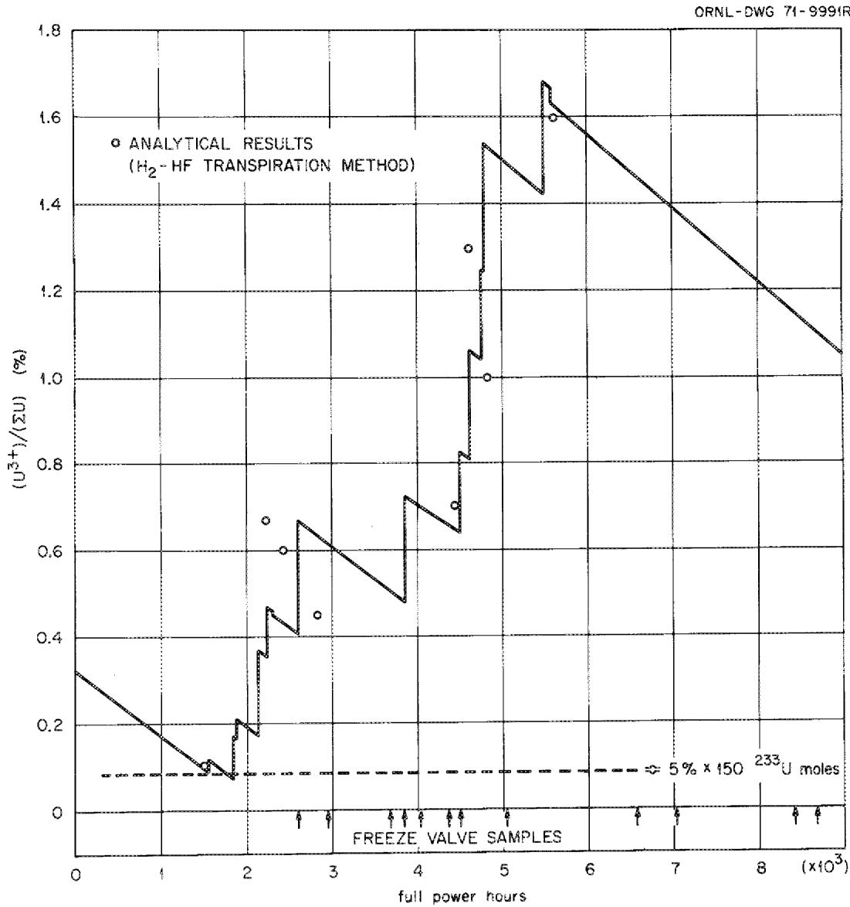  
Fig. 5.10. $\mathrm{U}^{3+} / \mathrm{U}^{4+}$ in the MSRE fuel salt runs 5-14.

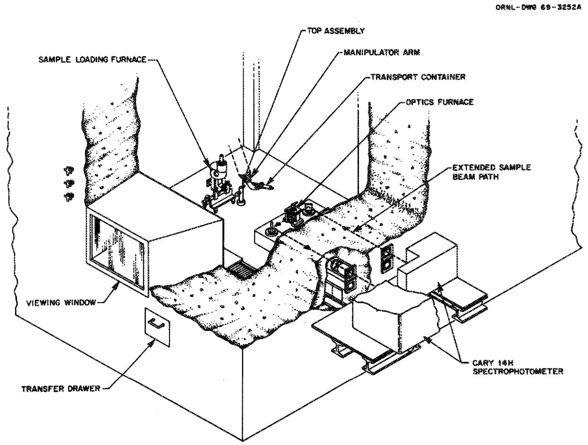  
Fig. 5.11. Spectrophotometer installation.

devised a sample system to fill windowless cells by direct immersion in the fuel. Despite precautions to prevent atmospheric exposure, the $\mathrm{U}^{3+}$ in these samples was completely oxidized before measurements could be made. We were able, however, to observe the spectrum of $\mathrm{U}^{4+}$ and (following a reduction with uranium metal) that of $\mathrm{U}^{3+}$ . Comparison of the spectra of these samples with those of nonradioactive preparations indicated no adverse effects from the activity of the fuel and demonstrated the feasibility of the technique. The facility has since been used to measure the spectra of transuranium elements and protactinium in molten salts.

Gas Analysis. - Equipment was installed at the MSRE to perform limited in-line analyses of the reactor off-gases, using a thermal conductivity cell as a transducer. By means of an oxidation and absorption train [108, p. 196] we were able to measure both total impurities and hydrocarbons in the off-gas. The sampling station also included a system for the cryogenic collection of xenon and krypton on molecular sieves to provide concentrated samples for the precise determination of the isotopic ratios of krypton and xenon by mass spectrometry. During the last two runs of MSRE, we set up equipment [111, p. 183] at the reactor to convert the tritium in various gas streams to water for measurement by scintillation counting.

Gamma Spectrometry at the MSRE. - By means of a precise collimation system mounted on a maintenance shield, radiation from deposited fission products on components was directed to a high-resolution lithium-drifted germanium diode [108, p. 36]. From the gamma spectra obtained we were able to identify specific isotopes such as noble metal fission products and to map their distribution by moving the collimating system [112]. During the latter runs of the reactor such measurements were made during power operations [112].

Bismuth. -- The investigation of the metal transfer reprocessing system described in Chap. 11 required the development of more sensitive methods for the determination of bismuth in fuels. We found the inverse polaro-graphic technique to be most useful, with detection limits of about 50 ppb [110, p. 208]. The bismuth is deposited in a pendent mercury drop electrode from HCl solutions in which copper is masked with thiocyanate, and measured during an anodic scan. We also developed a spectrographic method of at least equivalent sensitivity; however, it incorporates a preconcentration by extraction with dithizone and requires large salt samples.

# Current Research and Development

The research program is directed toward the development of methods and equipment that can be used for the in-line analyses of the reactor streams. We are increasing our competence in the areas of electrochemistry, spectrophotometry, transpiration methods, and gas analysis with regard to reactor salt and gas streams. Priority is given to ideas and areas of research which appear to offer the most promise of leading to in-line analysis methods.

Electrochemical Research. - For the analysis of molten-salt streams, electroanalytical techniques such as voltammetry and potentiometry appear to offer the most convenient transducers for remote in-line measurements. Voltammetry is based on the principle that when an inert electrode is inserted into a molten salt and subjected to a changing potential versus the salt potential, negligible current will flow until a critical potential is reached at which one of the ions undergoes an electrochemical reduction or oxidation. The potential at which this reaction takes place is characteristic of the particular ion. If the potential is varied linearly with time, the current-voltage curve follows a predictable pattern which allows the concentration of the dissolved ion to be determined (Fig. 5.12).

We have studied the voltammetry of the corrosion products which will be present in the reactor salt streams in the ppm range. Relatively high concentrations of these corrosion products may be measured by observing the current passing through the electrode system as the respective ions are reduced. Lower concentrations can be measured with the technique of stripping voltammetry through observation of the current produced when a corrosion product is oxidized from an electrode on which it has previously been plated (Fig. 5.13). We have studied the electrochemical behavior of these elements in the MSRE fuel solvent, LiF-BeF $_2$ -ZrF $_4$ [113,114,108, p. 192, 115], and in the proposed MSBR coolant salt, NaF-NaBF $_4$ [114,116, 115]. Most of this work was concerned with the determination of the oxidation states of the elements, the most suitable electrode materials for their analysis, and the basic electrochemical characteristics of each element. Work is continuing to study the effect of the presence of one element upon the determination of another and the effects that a flowing salt stream may have with regard to the determination.

We have developed a voltammetric method for the determination of the $\mathrm{U}^{3+}/\mathrm{U}^{4+}$ ratio in the MSRE fuel [110]. This method involves the measurement of the potential difference between the equilibrium potential of the melt, measured by an inert platinum electrode, and the voltammetric equivalent of the standard potential of the $\mathrm{U}^{3+}/\mathrm{U}^{4+}$ couple. The reliability of the method was verified by comparison with values that were obtained spectrophotometrically (Table 5.12). We have completely automated this determination with a PDP-8 computer [117] which operates the voltammeter, analyzes the data, and computes the $\mathrm{U}^{3+}/\mathrm{U}^{4+}$ ratio.

Because processing (Chapter 11) presents the possibility for having bismuth as an impurity in the fuel, a method for its determination is required. We have characterized the reductive behavior of $\mathrm{Bi}^{3+}$ in LiF-BeF $_2$ -ZrF $_4$ [115] and have found that it is rather easily reduced to the metal. As an impurity in the fuel salt, bismuth will probably be present in the metallic state, so that some oxidative pretreatment of the melt will be necessary before a voltammetric determination of bismuth can be performed.

The measurement of the concentrations of protonated species in the proposed MSBR coolant salt is of interest because of the potential use of the coolant for the containment of tritium. The measurement could also be used to evaluate the effect of proton concentrations on corrosion rates and as a possible detection technique for heat exchanger leaks. We are presently investigating a rather unique electroanalytical technique that is specific for hydrogen [114, p. 74, 115]. The method is

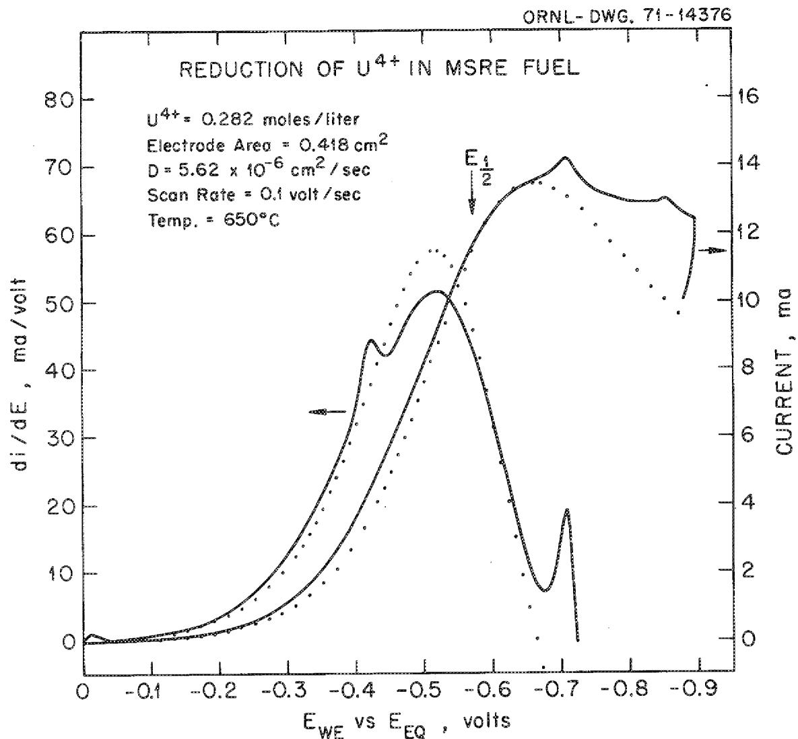  
Fig. 5.12. Current-voltage wave and derivative for reduction of $\mathbf{U}^{4+}$ to $\mathbf{U}^{3+}$ theoretical points (.) experimental curve (-).

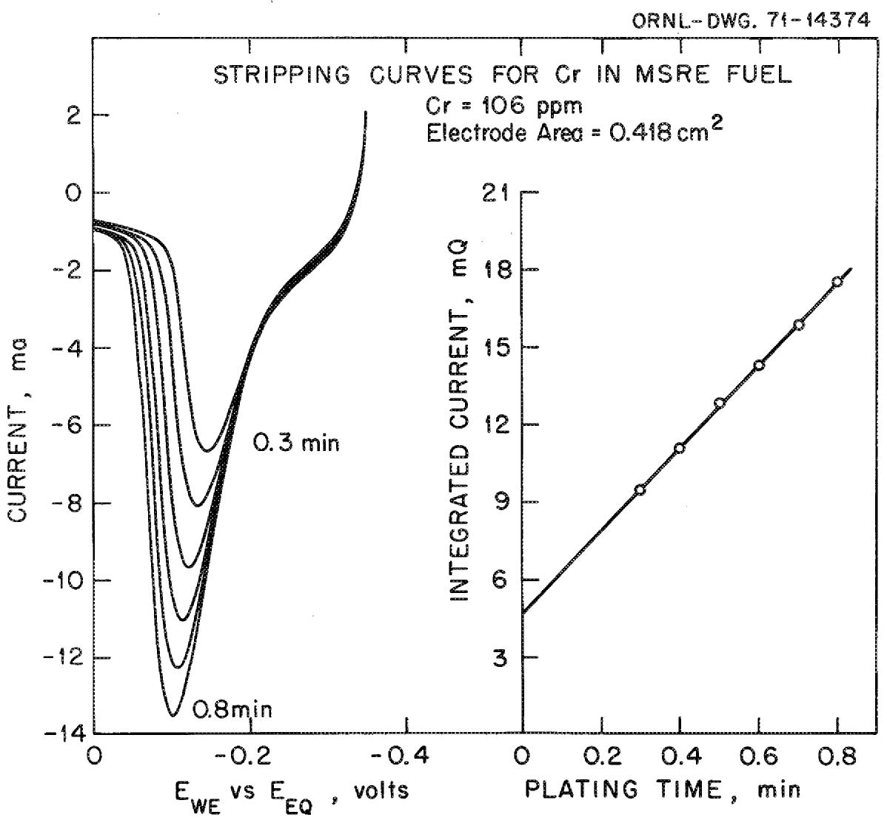  
Fig. 5.13. Chromium stripping peaks for various plating times.

Table 5.12. Determination of $\mathbf{U}^{3 + } / \mathbf{U}^{4 + }$ ratios   

<table><tr><td rowspan="2">\( {\mathrm{U}}^{3 + }/{\mathrm{U}}^{4 + } \) ratio \( {}^{a} \)</td><td rowspan="2">Moie % U</td><td colspan="2">\( {E}_{1/2} \) vs equilibrium potential (V)</td></tr><tr><td>Calculated</td><td>Measured</td></tr><tr><td>0.007</td><td>~0.3</td><td>-0.329</td><td>-0.345</td></tr><tr><td>0.030</td><td>~0.3</td><td>-0.225</td><td>-0.225</td></tr><tr><td>0.144</td><td>~0.3</td><td>-0.127</td><td>-0.130</td></tr><tr><td>0.1</td><td>~0.15</td><td>-0.153</td><td>-0.175</td></tr></table>

${}^{a}$ Determined from spectral measurements.

based on the diffusion of hydrogen into an evacuated palladium tube electrode when $\mathrm{NaBF}_4$ melts are electrolyzed at a controlled potential. The pressure generated in the electrode is a sensitive measure of protons at ppm concentrations. The technique offers the advantages of specificity, applicability to in-line analysis, and the possibility of a measurement of tritium to hydrogen ratios in the coolant by counting a sample collected from the evacuated tube.

In all electroanalytical measurements it is a distinct advantage to have an invariant reference potential to which other electrochemical reactions may be referred on a relative potential scale. A practical reference must be fairly rugged and of unit construction. We were also confronted with finding structural materials which would be compatible with the fluoride melts. Success was finally realized with a Ni/NiF $_2$ reference electrode, shown in Fig. 5.14, where the reference solution (LiF-BeF $_2$ saturated with NiF $_2$ ) is contained in a single-crystal LaF $_3$ cup [111, p. 184, 118]. We have determined standard electrode potentials (Table 5.13) for several metal/metal-ion couples which will be present in the reactor salt streams [110, p. 201]. These electrode potentials provide a direct measure of the relative thermodynamic stability of electroactive species in the melts. This information is used in equilibrium calculations to determine which ions can be expected to be present at different melt potentials.

Spectrophotometric Research. - The effort in our spectrophotometric research program for molten salts is directed toward the development of methods that can be used for the in-line determination of dissolved species in the salt streams of the MSBR and the salt reprocessing system. Analyses of molten salts are also performed for research studies related to the MSR program, and where applicable, spectrophotometric methods are used to characterize the various species of interest in these salts.

Materials problems are encountered in the design of compartments to hold the molten samples for spectrophotometric examination. Because the molten fluorides react with the usually employed light-transmitting glasses, other cell designs had to be developed. The pendent-drop technique [119] that we developed first was later replaced with the captive-liquid cell [120] in which molten salts are contained by virtue of their surface tension, so that no window material is required. A concept has been proposed for the use of this cell in an in-line system [121]. Although the light path length through a salt in a captive-liquid cell is determinable, it is not fixed. The need for a fixed path length promoted the design and fabrication of a graphite cell with small diamond plate windows (Fig. 5.15) [108, p. 168], which has been successfully used in a number of research applications. Another fixed-path-length cell which is still in the development stage makes use of "porous metal" [117, p. 161]. Porous metal is a foil that contains a number of small irregular pits formed by an electrochemical process; many of these pits are etched completely through the foil, so that light can be transmitted through the metal. We have some porous metal made from Hastelloy N and plan to test its use for cell construction.

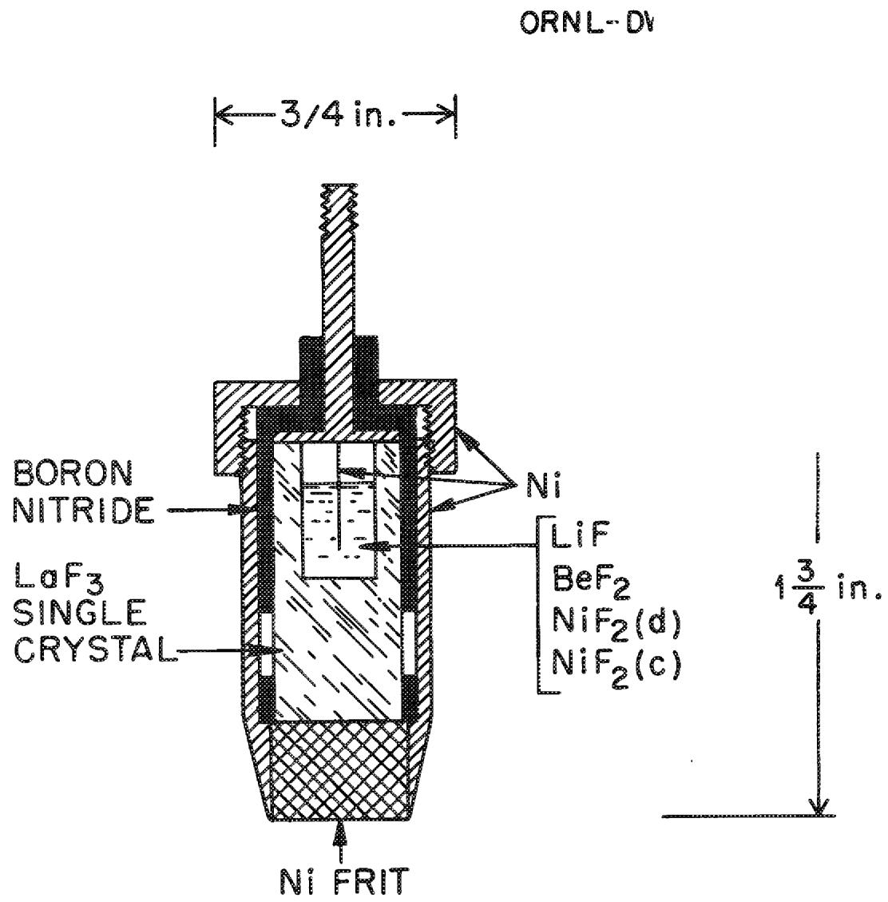  
Fig. 5.14. Construction of the lanthanum trifluoride membrane reference electrode.

Table 5.13. Standard electrode potentials in molten fluorides   

<table><tr><td rowspan="2">Electrode couple</td><td colspan="2">Measured electrode potentiala(V)</td><td rowspan="2">Calculated, 500°Cb</td></tr><tr><td>In LiF-BeF2-ZrF4at 500°</td><td>In LiF-NaF-KF at 500°</td></tr><tr><td>Be(II)/Be</td><td>-2.120</td><td></td><td>-2.211</td></tr><tr><td>Zr(IV)/Zr</td><td>-1.742</td><td></td><td>-1.772</td></tr><tr><td>U(IV)/U(II)</td><td>-1.480</td><td></td><td>-1.517</td></tr><tr><td>Cr(II)/Cr</td><td>-0.701</td><td></td><td></td></tr><tr><td>Cr(III)/Cr(II)</td><td>-0.514</td><td></td><td></td></tr><tr><td>Fe(II)/Fe</td><td>-0.410</td><td>-0.390</td><td>-0.413</td></tr><tr><td>Ni(II)/Ni</td><td>0.000</td><td>0.000</td><td>0.0</td></tr><tr><td>Fe(III)/Fe(II)</td><td>0.166</td><td>-0.200</td><td></td></tr></table>

${}^{a}$ Standard state for all solutes except beryllium(II) is the hypothetical unit mole fraction solution. The beryllium(II) standard state is the solvent composition ${\mathrm{{LiF}}}_{ - }{\mathrm{{BeF}}}_{2}$ (66-34 mole %).   
$^{b}$ C.F. Baes, Jr., Thermodynamics, vol. 1, IAEA, Vienna, 1966 (values in LiF-BeF $_2$ , converted to $500^{\circ}\mathrm{C}$ ).

ORNL-DWG 68-9074

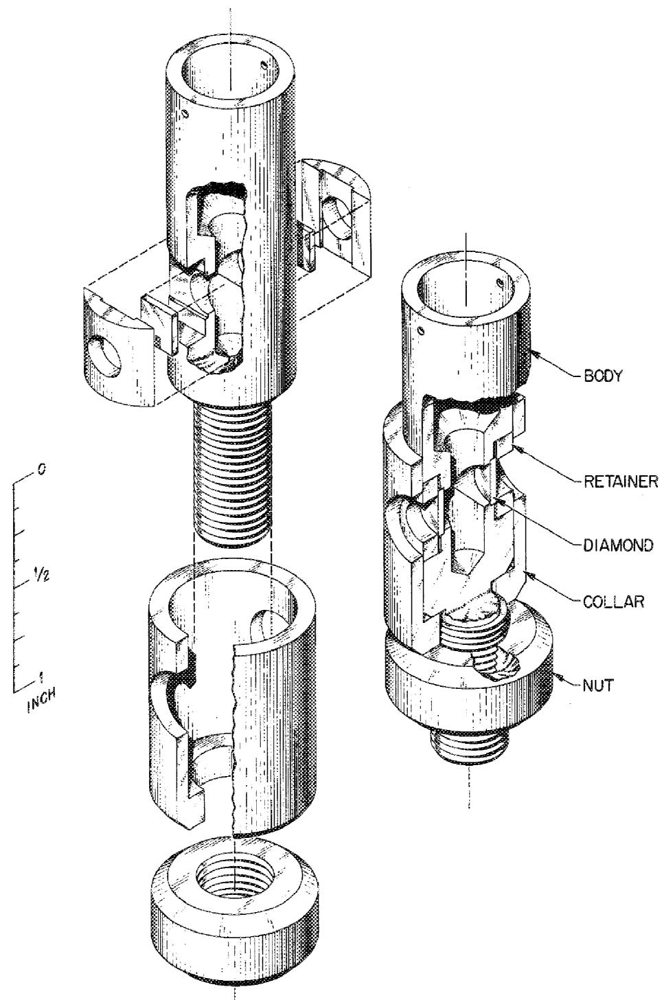  
Fig. 5.15. Diamond windowed cell for molten fluoride salts.

The latest innovation in cell design is an optical probe which lends itself to a sealable insertion into a molten salt stream [114, p. 71]. The probe makes use of multiple internal reflections with a slot of appropriate width cut through some portion of the internally reflected light beam (Fig. 5.16). During measurements the slot would be below the surface of the molten salt and would provide a known path length for absorbance measurements. It is proposed that the probe could be made of $\mathrm{LaF}_3$ .

Spectrophotometric studies of uranium in the $+3$ oxidation state have shown that it is a likely candidate for in-line determination in the reactor fuel [122, 109, p. 163]. An extremely sensitive absorption peak for $\mathsf{U}^{4 + }$ suggests its use for monitoring possible leakage of uranium-bearing fuel into the coolant salt [109, p. 164]. Quantitative characterizations, including absorption peak positions, peak intensities, and the assignment of spectra, have been made for $\mathsf{Ni}^{2 + },\mathsf{Fe}^{2 + },\mathsf{Cr}^{2 + },\mathsf{Cr}^{3 + },\mathsf{U}^{5 + },$ $\mathsf{UO}_2^{2 + },\mathsf{Cu}^{2 + },\mathsf{Mn}^{2 + },\mathsf{Mn}^{3 + },\mathsf{Co}^{2 + },\mathsf{Mo}^{3 + },\mathsf{CrO}_4^{2 - },\mathsf{Pa}^{4 + },\mathsf{Pu}^{3 + },\mathsf{Pr}^{3 + },\mathsf{Nd}^{3 + },\mathsf{Sm}^{3 + },$ $\mathsf{Er}^{3 + }$ , and $\mathsf{Ho}^{3 + }$ . Semiquantitative characterizations, including absorption peak positions, approximate peak intensities, and possible assignment of spectra, have also been made for $\mathsf{T_i}^{3 + },\mathsf{V}^{2 + },\mathsf{V}^{3 + },\mathsf{Eu}^{2 + },\mathsf{Sm}^{2 + },\mathsf{Cm}^{3 + }$ , and $\mathsf{O_2^-}$ .

We are also investigating protonated species in the proposed coolant salt by spectrophotometric methods. Evidence for the existence of hydrogen-containing impurities in $\mathrm{NaBF}_4$ was first obtained from near-infrared spectra of the molten salt and in mid-infrared spectra of pressed pellets of the crystalline material [116, pp. 94-96]. Deuterium exchange studies are being performed to characterize the protonated species in the molten fluoroborate melts [114, pp. 73]. Two very sensitive absorption peaks have been identified and are attributed to species that contain -OH and -OD. The absorption spectra of several other species have been observed in fluoroborate melts [116, p. 136]. Our spectrophotometric program is also providing data for the identification and determination of solute species in the various melts of interest for the fuel salt reprocessing system [115].

Transpiration and Gas Analysis. - Although the transpiration approach offers the advantage of locating transducers for effluent gas analysis outside of the highest radiation zones, these devices will still receive exposure from fission-product gases and their daughters and possibly from particulate radioactive materials, and thus they will require remote operation. The only research performed on such transducers has been on methods for batch samples of the MSRE fuel. The electrolytic moisture monitor was demonstrated to provide more than adequate sensitivity for the measurement of water from the hydrofluorination method for oxide and to have adequate tolerance for operation at the anticipated radiation levels [108, p. 188]. We have developed a method for the remote measurement of micromolar quantities of HF generated by hydrogenation of fuel samples using a trapping-thermal-conductivity method [108, p. 189].

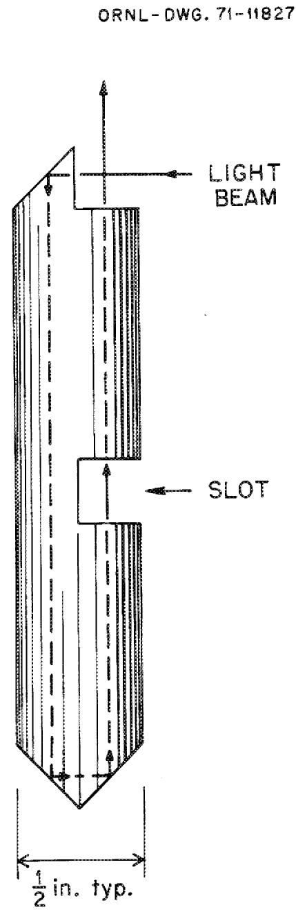  
Fig. 5.16. Slotted optical probe for spectral analysis.

Commercial gas chromatographic components for the high-sensitivity measurement of permanent gas contaminants are not expected to be acceptable at the radiation levels of the MSBR off-gas. Valves contain elastomers which are subject to radiation damage and whose radiolysis products would contaminate the carrier gas. The more sensitive detectors generally depend on ionization by weak radiation sources and would obviously be affected by sample activity. A prototype of an all-metal sampling valve [123] has been constructed to effect 6-way, double-throw switching of gas streams with closure effected by a pressure-actuated metal diaphragm. We developed a helium breakdown detector capable of measuring sub-ppm concentrations of permanent gas impurities in helium. Use of this detector in a simple chromatograph on the purge gas of an in-pile capsule test (MTR-47-6) demonstrated that it was not affected by radioactivity [124]. Ironically, subsequent tests with a more highly purified carrier gas revealed sporadically noisy operation caused by unstable discharges [123]. Tests to circumvent this by controlled impurity additions were suspended because of more exigent problems.

The analysis of the coolant cover gas involves less radioactivity but more complex chemical problems. Currently we are investigating methods for the determination of condensable material tentatively identified as $\mathrm{BF}_3$ hydrates and hydrolysis products [110, p. 207] and for other forms of protons and tritium. We believe that "dew-point" and diffusion methods offer promise for such measurements [114, p. 72]. We have developed an improved Karl Fischer coulometric titrator to provide calibration measurements of "H $_2$ O" in both simulated and actual cover gas samples.

In-Line Applications. - We recently demonstrated the first successful chemical analysis for a flowing molten fluoride salt stream [114, pp. 69-70] by measuring $\mathrm{U}^{3+}/\mathrm{U}^{4+}$ ratios in a loop being operated to determine the effect of salt on Hastelloy N under both oxidizing and reducing conditions. The test facility is a Hastelloy N thermal-convection loop (NCL-21) in which LiF-BeF $_2$ -ZrF $_4$ -UF $_4$ circulates at about five linear feet per minute. The analytical transducers are platinum and iridium electrodes that are installed in a surge tank where the temperature is controlled at $650^{\circ}\mathrm{C}$ . We have monitored the $\mathrm{U}^{3+}/\mathrm{U}^{4+}$ ratio over a period of several months on a completely automated basis. We designed a new cyclic voltammeter, which provides several new capabilities for electrochemical studies on molten-salt systems, for use with this system. The voltameter can be directly operated by the PDP-8 family of computers [116, p. 138]. A PDP-8/I computer is used to control the analysis system, analyze the experimental output, make the necessary calculations, and print out the results. As equilibrium conditions were being established, increases in the $\mathrm{U}^{3+}$ concentration were followed as chromium slowly dissolved from the Hastelloy N, causing $\mathrm{U}^{4+}$ to be reduced. Precipitous drops in the $\mathrm{U}^{3+}$ concentrations were also observed due to the introduction of oxidizing contaminants when metal specimens were inserted into the melt (Fig. 5.17). Work is continuing toward the application of our electroanalytical research experience with the corrosion product ions for their determination in this system.

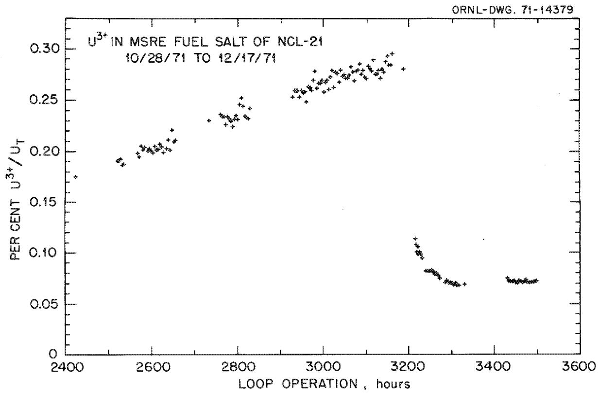  
Fig. 5.17. In-line $\mathbf{U}^{3+}$ determination in simulated MSRE fuel.

Provisions have been made in the design of the two MSRP engineering loops, the Coolant Salt Technology Facility (CSTF) and the Gas System Technology Facility (GSTF), for the installation of our analytical transducers. This will provide us with experience on systems where the operating conditions will more nearly represent those which will be encountered with an operating reactor.

# Future Work

A variety of tasks must be performed to achieve a completely viable in-line system for an operating reactor. The electrochemical technique appears to be the prime candidate for practical in-line fuel analysis because of the simplicity of its transducers; however, the advent of tunable lasers [125] and the development of extended path cells may make the spectrophotometric methods competitive.

On the basis of present projections, a significant fraction of the development effort should be expended in the adaptation of electrochemical methods to the in-line analysis of the salt in engineering test facilities such as the CSTF and GSTF. The initial in-line application of electroanalytical methods (in NCL-21) uncovered practical problems, and, while these problems have been resolved, we expect that others will be encountered in the higher flow systems. In the immediate future we will concentrate our electroanalytical research on the fluoroborate system to determine the nature of the protonated species and equilibria involved so that in-line voltammograms can be interpreted. In future research the fundamental chemistry of the more noble metals, e.g., Mo, Nb, Tc, and Ru should be studied. Most of our electrochemical research has been performed in MSRE salt composition at around $500^{\circ}\mathrm{C}$ with some studies of the effects of temperature on diffusion coefficients [126,127,128], and much of the future research should be performed under these same conditions to permit a direct intercomparison of results. Before application of voltammetry to reactors, diffusion coefficients in $\mathrm{LiF - BeF_2 - ThF_4 - UF_4}$ type melts must be measured at operating temperature; this awaits selection of the exact composition of the breeder fuel.

To fully exploit in-line measurements it will be necessary to devise methods for the oxidation of dispersed metals in salt streams. Such techniques are desirable for corrosion products and are essential for the measurement of bismuth which is predicted to be transported primarily as electro-inactive dispersed metal. Gaseous oxidants such as HF and fluorinated hydrocarbons should be investigated for this application.

The spectral research program should be continued with increased emphasis on the in situ measurement of protonated species in $\mathrm{NaBF}_4$ . These techniques are needed to investigate exchange rates of hydrogen isotopes in order to evaluate the use of the coolant for tritium containment. The Fourier transform spectrometer should also be used to investigate infrared emission techniques for measurement of contaminants, such as hydrolysis products, in the coolant and its cover gas. Emphasis should then be shifted to spectral studies of reprocessing streams.

In-line methods for reprocessing streams must ultimately be developed, but the analytical requirements are not yet established. Methods for the in-line analysis of the fuel will be readily adaptable to fluoride reprocessing streams, and measurements in the less corrosive chloride streams should be much simpler. Moreover, this less formidable solvent has encouraged others to work in the medium and the literature can be exploited when requirements are established.

The low tolerance of the MSBR fuel to oxide contamination necessitates the development of in-line techniques for oxide measurement. Presently, we feel that a counter-current hydrofluorination technique (transpiration) offers the most promising approach to the in-line measurement of oxide, with electrochemical measurement of $\mathrm{OH}^-$ after HF equilibration, or the spectrophotometry of oxyanions [116, p. 136], as alternatives. The in-line application of transpiration methods will require the development of precise metering systems for low salt flows.

We have an immediate need for transducers (under development) for measurement of hydrolysis product in the cover gas of the GSTF. Later, methods of improved sensitivity will be required to analyze the helium cover gas of the GSTF. We have acquired an ultrasonic detector [129] which we will couple with an existing chromatograph to provide an instrument for the sensitive determination of contaminants in GSTF cover gas.

Direct $\gamma$ -spectrometry (of demonstrated value in the MSRE) must be incorporated in the MSBR. Some experimental work, e.g., measurement of Pa, will be needed but does not appear to merit high priority. The design of systems for the safe installation of transducers in radioactive streams is basically an engineering problem and has been delayed, as has investigation of the effects of radiation on the in-line methods; these need to be pursued after the basic methods are developed.

# Evaluation

The analytical research and development program has clearly demonstrated the feasibility of performing certain critical determinations in-line and has provided strong indications that we can ultimately achieve an optimum program for the analytical requirements of MSBRs. We believe that with the possible exception of the in-line oxide determination, properly funded analytical development can keep pace with the rest of the MSR technology program.

# References for Chapter 5

1. Clark Goodman et al., Nuclear Problems of Non-Aqueous Fluid Fueled Reactors, Massachusetts Institute of Technology, USAEC Report MIT-5000 (Oct. 15, 1952).   
2. George Scatchard et al., Chemical Problems of Non-Aqueous Fluid Fueled Reactors, Massachusetts Institute of Technology, USAEC Report MIT-5001 (Oct. 15, 1952).   
3. G. Long et al., Chemistry Division and Applied Chemistry Division Progress Report, Nov. 1968--April 1969, AERE--PR. Chem 16, 41 (1969).   
4. W. R. Grimes and D. G. Hill, High Temperature Fuel Systems. A Literature Survey, Y-657 (July 20, 1950).   
5. W. R. Grimes et al., "Chemical Aspects of Molten Salt Reactor Fuels," in Fluid Fuel Reactors, J. A. Lane, H. G. MacPherson, and Frank Maslan, eds., Addison-Wesley Publishing Co., Inc., Cambridge, Mass. (1958).   
6. W. R. Grimes, "Materials Problems in Molten Salt Reactors," in Materials and Fuels for High Temperature Nuclear Energy Applications, ed. by M. T. Simnad and L. R. Zumwalt, the M.I.T. Press, Mass., (1964).   
7. W. R. Grimes, Chemical Research and Development for Molten Salt Breeder Reactors, ORNL-TM-1853 (June 6, 1967).   
8. W. R. Grimes, Nucl. Appl. Tech. 8, 137 (1970).   
9. R. E. Thoma, Chemical Aspects of MSRE Operation, ORNL-4658 (December 1971).   
10. Conceptual Design Study of a Single-Fluid Molten-Salt Breeder Reactor, ORNL-4541 (1971).   
11. L. Brewer et al., MDDC-1553 (1945) and L. Brewer, The Chemistry and Metallurgy of Miscellaneous Materials; Thermodynamics, L. L. Quill, ed., McGraw-Hill, New York, pp. 76-192 (1950).   
12. M. Temkin, Acta Physiochim USSR 20, 411 (1945).   
13. H. Flood and T. Forland, Acta Chim. Scand. 1, 592 (1947), and H. Flood, T. Forland, and K. Grjothim, Z. Anorg. Allgem. Chem. 276, 289 (1954).   
14. R. C. Briant, A. M. Weinberg, E. S. Bettis, and W. K. Ergen, et al., Nuc. Sci. Eng. 2, 797 (1957).

15. G. J. Nessle and W. R. Grimes, "Production and Handling of Molten Fluorides for Use as Reactor Fuels," Chemical Engineering Progress Symposium Series, Vol. 56, No. 28 (1960).   
16. W. D. Powers, S. I. Cohen, and N. D. Gruen, *Nuclear Science and Engineering* 17, 200-211 (1963).   
17. W. R. Grimes, N. V. Smith, and G. M. Watson, J. Phys. Chem. 62, 862 (1958).   
18. W. R. Grimes et al., "Chemical Aspects of Molten Fluoride Reactors," in Progress in Nuclear Energy Series IV, Vol. 2, Technology, Engineering and Safety, Pergamon Press, Inc., London (1960).   
19. R. F. Apple, Method No. 9021206 (March 16, 1965), ORNL Master Analytical Manual, TID-7015 (Suppl. 8).   
20. MSR Program Semiann. Progr. Rept. Aug. 31, 1968, ORNL-4344, p. 115.   
21. MSR Program Semiann. Progr. Rept. Feb. 28, 1968, ORNL-4254, p. 88.   
22. MSR Program Semiann. Progr. Rept. Aug. 31, 1967, ORNL-4191, p. 102.   
23. MSR Program Semiann. Progr. Rept. Aug. 31, 1968, ORNL-4344, p. 110.   
23a. R. B. Lindauer, Processing of the MSRE Flush and Fuel Salts, ORNL-TM-2578 (August 1969).   
24. R. E. Thoma, ed., Phase Diagrams of Nuclear Materials, ORNL-2548 (Nov. 6, 1959).   
25. L. V. Jones et al., "Phase Equilibria in the Ternary Fused-Salt System LiF-BeF $_2$ -UF $_4$ ," J. Am. Ceram. Soc. 45, 79-83 (1962).   
26. K. A. Romberger, J. Braunstein, and R. E. Thoma, J. Phys. Chem. 76, 1154 (1972).   
27. R. E. Thoma et al., "Phase Equilibria in the Systems $\mathsf{BeF}_2$ - $\mathsf{ThF}_4$ and $\mathsf{LiF}$ - $\mathsf{BeF}_2$ - $\mathsf{ThF}_4$ ," J. Phys. Chem. 64, 865 (1960).   
28. C. J. Barton et al., "Phase Equilibria in the Alkali Fluoride-Uranium Tetrafluoride Fused Salt Systems: 1. The Systems LiF- $\mathbf{U}\mathbf{F}_{4}$ and NaF- $\mathbf{U}\mathbf{F}_{4}$ ," J. Am. Ceram. Soc. 41, 63-69 (1958).   
29. R. E. Thoma et al., "Phase Equilibria in the Fused Salt Systems LiF-ThF₄ and NaF-ThF₄," J. Phys. Chem. 63, 1266 (1959).   
30. C. F. Weaver et al., "Phase Equilibria in the Systems $\mathbf{U}\mathbf{F}_4$ -ThF4 and LiF-UF4-ThF4," J. Am. Ceram. Soc. 43, 213 (1960).   
31. MSR Program Semiann. Progr. Rept. July 31, 1964, ORNL-3708, p. 214.

32. K. A. Romberger et al., "Phase Equilibrium Studies in the Uranium(IV) Oxide-Zirconium Oxide System," presented at 151st National Meeting of American Chemical Society, Pittsburgh, Pa., March 21-31, 1966.   
33. C. E. Bamberger and C. F. Baes, Jr., J. Nucl. Mat. 35, 117 (1970).   
34. C. E. Bamberger, R. G. Ross, and C. F. Baes, Jr., J. Inorg. Nucl. Chem. 33, 767 (1971).   
35. C. F. Baes, Jr., Nuclear Metallurgy, Vol. 15, Symposium on Reprocessing of Nuclear Fuels, ed. by P. Chiotti, USAEC-CONF 690801, 617 (1969).   
36. MSR Program Semiann. Progr. Rept. Feb. 29, 1972, ORNL-4782, p.   
37. MSR Program Semiann. Progr. Rept. Feb. 28, 1971, ORNL-4728, p. 62.   
38. MSR Program Semiann. Progr. Rept. Feb. 28, 1971, ORNL-4676, p. 119.   
39. MSR Program Semiann. Progr. Rept. Aug. 31, 1971, ORNL-4622, p. 92.   
40. MSR Program Semiann. Progr. Rept. Feb. 28, 1970, ORNL-4548, p. 152.   
41. S. Cantor et al., Physical Properties of Molten Salt Reactor Fuel, ORNL-TM-2316 (August 1968).   
42. H. E. McCoy et al., Nucl. Appl. Tech. 8, 156 (1970).   
43. W. D. Manly et al., Progress in Nuclear Energy Series IV, Vol. 2, p. 164, Pergamon Press, Inc., London (1960).   
44. W. D. Manly et al., Fluid Fuel Reactors, p. 595, ed. by J. A. Lane, H. G. MacPherson, and Frank Maslan, Addison-Wesley Publishing Co., Cambridge, Mass. (1958).   
45. J. H. DeVan and R. B. Evans III, p. 557 in Conference on Corrosion of Reactor Materials, June 1962, Proceedings, Vol. II, International Atomic Energy Agency, Vienna (1962).   
46. C. F. Baes, Jr., "The Chemistry and Thermodynamics of Molten Salt Reactor Fluoride Solutions," in Proceedings of IAEA Symposium on Thermodynamics with Emphasis on Nuclear Materials and Atomic Transport in Solids, Vienna, Austria (July 1965).   
47. G. Long, Reactor Chem. Div. Ann. Progr. Rept. Dec. 31, 1965, ORNL-3789, p. 65.   
48. J. F. Elliott and Molly Glieser, Thermochemistry for Steelmaking, Vol. 1, Addison-Wesley Publishing Co., Inc., Reading, Mass. (1960).   
49. J. J. Katz and E. Rabinovitch, The Chemistry of Uranium, Part 1, p. 401, McGraw-Hill Book Company, Inc., New York (1951).

50. J. H. Shaffer, Preparation and Handling of Salt Mixtures for the Molten Salt Reactor Experiment, ORNL-4616 (January 1971).   
51. MSR Program Semiann. Progr. Rept. Aug. 31, 1971, ORNL-4728, p. 226.   
52. MSR Program Semiann. Progr. Rept. Feb. 28, 1971, ORNL-4676, p. 269.   
53. MSR Program Semiann. Progr. Rept. Aug. 31, 1961, ORNL-3122, p. 100.   
54. MSR Program Semiann. Progr. Rept. Aug. 31, 1962, ORNL-3215, p. 117.   
55. MSR Program Semiann. Progr. Rept. Aug. 31, 1962, ORNL-3369, p. 100.   
56. MSR Program Semiann. Progr. Rept. Jan. 31, 1963, ORNL-3419, p. 80.   
57. W. R. Grimes, Radiation Chemistry of MSR System, ORNL-TM-500 (March 31, 1963).   
58. Reactor Chem. Div. Ann. Progr. Rept. Jan. 31, 1962, ORNL-3262, p. 20.   
59. C. F. Baes, Jr., "The Chemistry and Thermodynamics of Molten Salt Reactor Fuels," *Nuclear Metallurgy* 15, 617-44, USAEC Conf. 690801 (August 1969).   
60. MSR Program Semiann. Progr. Rept. Feb. 28, 1970, ORNL-4548, pp. 105-111.   
61. MSR Program Semiann. Progr. Rept. Feb. 28, 1972, ORNL-4782, in press.   
62. MSR Program Semiann. Progr. Rept. Aug. 31, 1970, ORNL-4622, pp. 68-70.   
63. MSR Program Semiann. Progr. Rept. Aug. 31, 1971, ORNL-4728, p. 51.   
64. MSR Program Semiann. Progr. Rept. Feb. 28, 1970, ORNL-4548, pp. 111-118.   
65. MSR Program Semiann. Progr. Rept. Aug. 31, 1968, ORNL-4344, pp. 141-46.   
66. P. N. Haubenreich and J. R. Engel, "Experience with MSRE," *Nuclear Applications and Technology* 8, No. 2 (February 1970), p. 133.   
67. MSR Program Semiann. Progr. Rept. Aug. 31, 1970, ORNL-4622, pp. 111-118.   
68. MSR Program Semiann. Progr. Rept. Aug. 31, 1970, ORNL-4622, p. 2.   
69. MSR Program Semiann. Progr. Rept. Aug. 31, 1968, ORNL-4344, p. 206.   
70. MSR Program Semiann. Progr. Rept. Aug. 31, 1970, ORNL-4622, pp. 60-66.

71. MSR Program Semiann. Progr. Rept. Feb. 28, 1969, ORNL-4396, p. 139.   
72. MSR Program Semiann. Progr. Rept. Feb. 28, 1970, ORNL-4548, p. 111.   
73. MSR Program Semiann. Progr. Rept. Aug. 31, 1968, ORNL-4344, pp. 206-10.   
74. F. F. Blankenship and S. S. Kirslis, Reactor Chemistry Div. Ann. Progr. Rept. Dec. 31, 1967, ORNL-4229, p. 15.   
75. MSR Program Semiann. Progr. Rept. Aug. 31, 1971, ORNL-4728, pp. 54-5.   
76. MSR Program Semiann. Progr. Rept. Feb. 29, 1972, ORNL-4782, in press.   
76a. R. J. Kedl, The Migration of a Class of Fission Products (Noble Metals) in the Molten-Salt Reactor Experiment, ORNL-TM-3884 (in press).   
77. R. P. Wichner, Side Stream Processing for Iodine and Xenon Removal from the MSBR, ORNL-CF-72-6-12, in press.   
78. P. N. Haubenreich, J. R. Engel, Nucl. Appl. Tech. 8, 118 (1970).   
79. E. G. Bohlmann, Heat Transfer Salt for High Temperature Steam Generation, ORNL-TM-3777 (in press).   
80. E. M. Levin, C. R. Robbins, and H. F. McMurdie, Phase Diagrams for Ceramists, The American Ceramic Society, Inc., Ohio (1964).   
81. V. G. Selivanov and V. V. Stender, Zhur. Neorg. Khim. 3(2), 448 (1958).   
82. MSR Program Semiann. Progr. Rept. Feb. 29, 1968, ORNL-4254, p. 21.   
83. MSR Program Semiann. Progr. Rept. Aug. 31, 1971, ORNL-4728, p. 59.   
84. J. B. Bates, J. P. Young, M. M. Murray, H. W. Kohn, and G. E. Boyd, J. Inorg. Nucl. Chem. to be published (1972).   
85. MSR Program Semiann. Progr. Rept. Feb. 29, 1972, ORNL-4782, in press.   
86. MSR Program Semiann. Progr. Rept. Feb. 29, 1972, ORNL-4782, in press.   
87. MSR Program Semiann. Progr. Rept. Aug. 31, 1971, ORNL-4728, p. 145.   
88. MSR Program Semiann. Progr. Rept. Feb. 28, 1972, ORNL-4782, in press.   
89. C. E. Wicks and F. E. Block, "Thermodynamic Properties of 65 Elements, Their Oxides, Halides, Carbides, and Nitrides," Bureau of Mines Bulletin 605 (1963).

90. JANAF (Joint Army-Navy-Air Force) Interim Thermochemical Tables, Thermal Research Laboratory, Dow Chemical Company, Midland, Michigan.   
91. Aircraft Nuclear Propulsion Project Quar. Prog. Rept. Dec. 10, 1954, ORNL-1816, p. 63.   
92. MSR Program Semiann. Progr. Rept. Aug. 31, 1970, ORNL-4622, p. 171.   
93. MSR Program Semiann. Progr. Rept. Feb. 28, 1970, ORNL-4622, p. 170.   
94. MSR Program Semiann. Progr. Rept. Feb. 28, 1970, ORNL-4548, p. 136.   
95. S. Cantor and R. M. Waller, MSR Program Semiann. Progr. Rept. Feb. 29, 1972, ORNL-4782, p.   
96. F. A. Doss et al., MSR Program Semiann. Progr. Rept. Feb. 29, 1972, ORNL-4782, p.   
97. MSR Program Semiann. Progr. Rept. Feb. 29, 1968, ORNL-4254, p. 180.   
98. E. L. Compere, H. C. Savage, and J. M. Baker, J. Nucl. Mater. 34, 97 (1970).   
99. R. H. Powell and O. Menis, "Separation of Fluoride from Refractory Materials by Pyrohydrolysis," *Anal. Chem.* 30, 1546 (1958).   
100. A. D. Horton and P. F. Thomason "Polarographic Determination of Sulfate," Anal. Chem. 23, 1859 (1951).   
101. G. Goldberg, A. S. Meyer, Jr., and J. C. White, "Determination of Oxides in Fluoride Salts by High-Temperature Fluorination with Potassium Bromotetrafluoride," Anal. Chem. 32, 314 (1960).   
102. D. L. Manning, W. K. Miller, and R. Rowan, Methods of Determination of Uranium Trifluoride, ORNL-1279 (May 25, 1952).   
103. ORNL Master Analytical Manual Section 2, Radiochemical Methods, TID-7015 (1957).   
104. "Automatic Continuous Analysis of Helium," GCR Quar. Progr. Rept. Dec. 31, 1959, ORNL-2888, pp. 178-184.   
105. A. S. Meyer, Methods for Analysis of MSRP Samples and Process Streams, ORNL-CF-72-7-16 (July 12, 1972).   
106. R. B. Gallaher, Operation of the Sampler-Enricher in the Molten-Salt Reactor Experiment, ORNL-TM-3524 (Oct. 1971).   
107. MSR Program Semiann. Progr. Rept. Feb. 28, 1966, ORNL-3936, p. 154.

108. MSR Program Semiann. Progr. Rept. Aug. 31, 1968, ORNL-4344, p. 198.   
109. MSR Program Semiann. Progr. Rept. Feb. 28, 1967, ORNL-4119, p. 158.   
110. MSR Program Semiann. Progr. Rept. Feb. 28, 1969, ORNL-4396, p. 200.   
111. MSR Program Semiann. Progr. Rept. Feb. 28, 1970, ORNL-4548, p. 183.   
112. A. Houtzeel and F. F. Dyer, Gamma Spectrometric Studies of Fission Products in the MSRE, ORNL-3151 (August 1972).   
113. D. L. Manning, G. Mamantov, "Rapid Scan Voltammetry and Chronopotentiometric Studies of Iron in Molten Fluorides," J. Electroanal. Chem. 7, 102-108 (1964).   
114. MSR Program Semiann. Progr. Rept. Aug. 31, 1971, ORNL-4728, p. 75.   
115. MSR Program Semiann. Progr. Rept. Feb. 29, 1972, ORNL-4782, p   
116. MSR Program Semiann. Progr. Rept. Feb. 28, 1971, ORNL-4676, p. 135.   
117. MSR Program Semiann. Progr. Rept. Aug. 31, 1969, ORNL-4449, p. 157.   
118. MSR Program Semiann. Progr. Rept. Aug. 1, 1970, ORNL-4622, p. 115.   
119. J. P. Young and J. C. White, "A High-Temperature Cell Assembly for Spectrophotometric Studies in Molten Fluorides," Anal. Chem. 31, 1892 (1959).   
120. J. P. Young, "Windowless Spectrophotometric Cell for Use with Corrosive Liquids," Anal. Chem. 36, 390 (1964).   
121. MSR Program Semiann. Progr. Rept. Aug. 31, 1965, ORNL-3872, p. 145.   
122. MSR Program Semiann. Progr. Rept. Aug. 31, 1966, ORNL-4037, p. 193.   
123. MSR Program Semiann. Progr. Rept. Aug. 31, 1967, ORNL-4191, p. 173.   
124. MSR Program Semiann. Progr. Rept. July 31, 1964, ORNL-3708, p. 328.   
125. Bulletin No. 7012, Avco Everett Research Laboratory, Everett, Mass. (1971).   
126. D. L. Manning, "Voltammetry of Iron in Molten Lithium Fluoride-Potassium Fluoride-Sodium Fluoride," J. Electroanal. Chem. 6, 302 (1964).   
127. D. L. Manning, "Voltammetry of Iron in Molten Lithium Fluoride-Sodium Fluoride-Potassium Fluoride," J. Electroanal. Chem. 7, 302 (1964).   
128. G. Mamantov and D. L. Manning, "Voltammetry and Related Studies of Uranium in Molten Lithium Fluoride-Beryllium Fluoride-Zirconium Fluoride," Anal. Chem. 38, 1494 (1966).

# 6. GRAPHITE

# W. P. Eatherly

# Relationship Between Graphite and Core Design

The graphite in a single fluid molten-salt reactor serves no structural purpose other than to define the flow patterns of the salt and, of course, to support its own weight. The requirements on the material are dictated most strongly by nuclear considerations, namely stability of the material against radiation-induced distortion, nonpenetrability by the fuel-bearing molten salt, and nonabsorption of xenon into the graphite. The practical limitations of meeting these requirements in turn impose conditions on the core design, specifically the necessity to provide for periodic graphite replacement and to limit the cross-sectional area of the graphite prisms. We shall first consider the nuclear requirements imposed on the material.

# Nuclear Requirements

Radiation damage in graphite has been extensively studied since 1945 relative to the Hanford production reactors, and more recently under the various European and American gas-cooled reactor programs [1]. In the mid 1960's it became increasingly apparent that graphite has a finite lifetime in a fast neutron environment, and the anisotropically-induced crystallite growth due to damage ultimately works to destroy the polycrystalline bulk material. The fluence that is defined as the useful lifetime of the graphite depends somewhat on the failure criterion employed. The gradual deterioration of the material would first reflect in increased xenon adsorption, followed by salt penetration and eventually loss of mechanical integrity. The definition presently assumed is that the material undergoes no significant radiation-induced bulk expansion, certainly a conservative assumption. If the graphite were to survive the life of the plant in a high-power density molten-salt reactor (a peak power density of 100 watts/cm³), it would have to endure a damage fluence of the order of $3 \times 10^{23}$ neutrons·cm⁻², which is about ten times what the best existing material will withstand.

Salt penetration into the graphite is restricted by surface tension if the entrance pore diameters to the internal void structure of the graphite are of the order of $1\mu \mathrm{m}$ or less. Seepage of salt into the graphite would lead to local hot spots which could easily attain temperatures of $1100 - 1200^{\circ}\mathrm{C}$ at which the graphite damage rate is increased by a factor of two over that at $700^{\circ}\mathrm{C}$ [2]. Fortunately the pore size requirement is easily met by any high-quality fine-grained graphite, and this requirement leads to no design or material restriction.

The exclusion of xenon-135 from the pores in the graphite with its attendant improvement in breeding ratio is discussed in detail elsewhere (see Chapters 4 and 8 above). Translated to a materials requirement,

xenon exclusion implies effective gas permeabilities of $10^{-8}$ cm $^2$ /sec helium STP or less, roughly a pore entrance diameter requirement of 0.01 μm or less. Such pore textures are not attainable in the ordinary fabrication of bulk graphite. The requirement can be easily met by pyrolytic deposition of carbon onto a bulk graphite, although questions of radiation stability again arise.

# Design Requirements

The existence of a finite graphite lifetime forces the reactor design to low power densities or to periodic graphite removal, as discussed in Chapter 4. We shall concern ourselves here with the problem of graphite fabrication and its effect on design. The requirement for salt exclusion, and thereby a fine-grained graphite, also determines that the geometric cross-section of the graphite prisms be kept small. This is necessitated by the inability to control microstructure to the desired degree in forming and heat-treating large cross sections. Small sections also have the advantage of minimizing thermal gradients in the graphite during reactor operation and thus reducing the rate of radiation damage. In the several design studies for MSR's, the problems of graphite removal and prism geometry have been solved in several different ways.

In the reference design [3] the core consists entirely of square prisms approximately four inches on a side. In the central core zone (Zone I) the requirement of 13.2 volume percent salt leads to sections with small holes or interprism slots (see Fig. 6.1). Salt volume is traded between central hole and slots to simplify orificing of the salt flow. For the outer core region (Zone II) the required salt volume of $37\%$ is obtained by opening up the central axial hole (Fig. 6.2). The entire core is supported by Hastelloy tie rods and grid plate and is periodically removed as a unit. Although the square cross-section permits easy fabrication of the base stock graphite, the possible need to pyrolytically treat the interior surface of the hole presents a formidable fabrication problem.

This problem was circumvented in the Evasco study [4], which substituted a slab design for the square prisms (see Figs. 6.3 and 6.4). The slabs are assembled into hexagonal elements, each of which can be removed as a unit to permit partial core replacement.

A similar slab design was utilized in the study of a demonstration reactor [5], except that no provision was made for graphite replacement due to the low power density in the core.

Mechanical analysis [6] has indicated there are no significant thermal or radiation-induced stresses in any of the designs.

# General Background

Graphite has been employed as a nuclear material as long as there have been reactors. It formed the moderator in the Stagg Field experiment and the prototype Oak Ridge Graphite Reactor. The first extensive ex

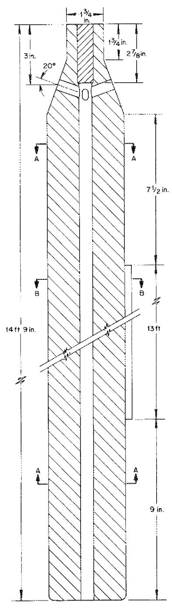

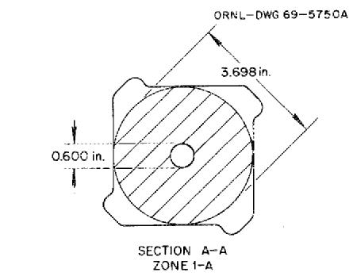

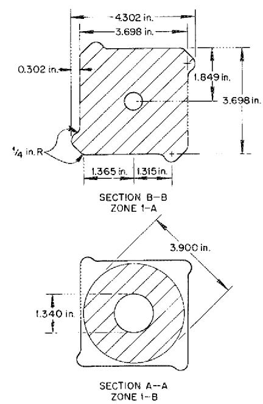

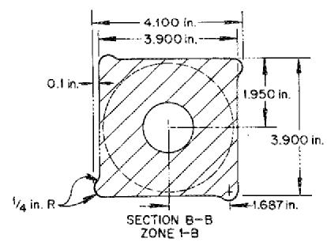  
Fig. 6.1. Graphite moderator element for Zone 1 of the MSBR reference design.

ORNL-DWG 70-11912

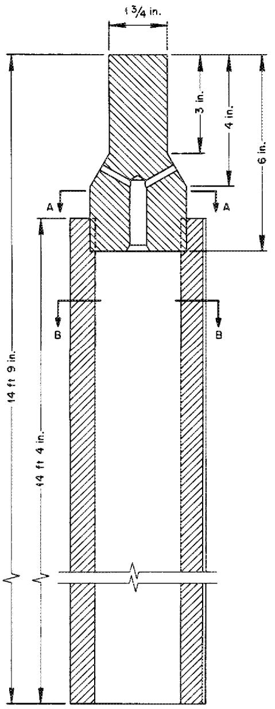

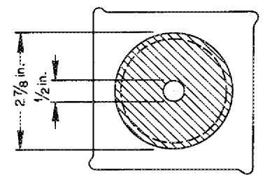  
SECTION A-A

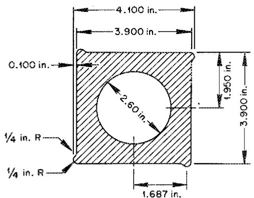  
SECTION B-B   
Fig. 6.2. Graphite moderator element for Zone 2 of the MSBR reference design.

ORNL-DWG71-13134

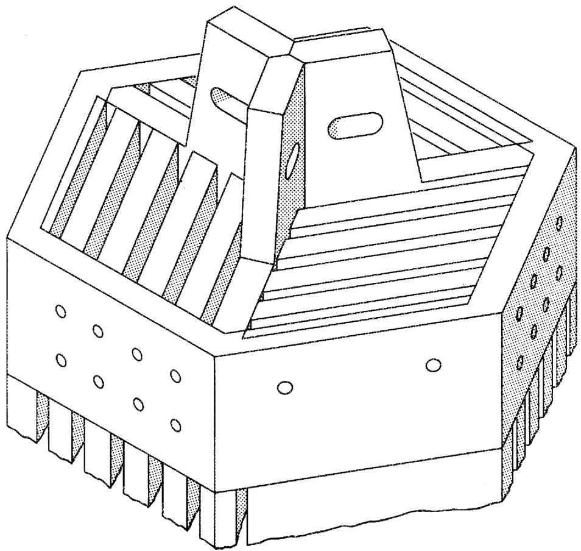  
Fig. 6.3. Top detail of the graphite moderator element as proposed in the Evasco Design Study.

ORNL-DWG 71-13135

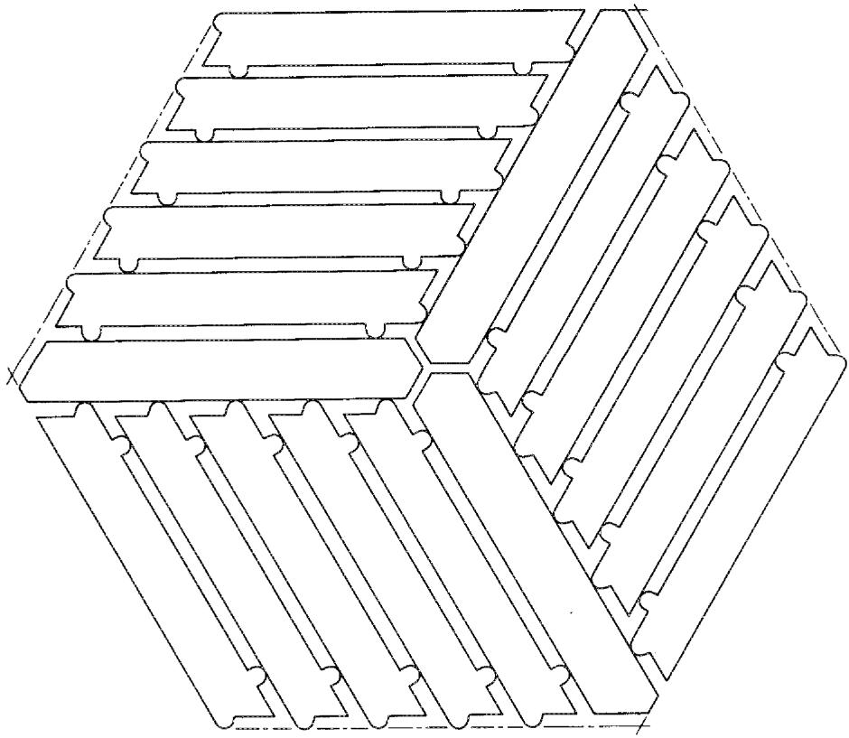  
Fig. 6.4. Cross-section of the Zone 1 moderator element as proposed in the Evasco Design Study.

experience with graphite was acquired in the Hanford production reactors and somewhat later in the British gas-cooled reactors, albeit at lower temperatures and fluences than apply to the MSR's.

More recently the Dragon Reactor initiated the use of graphite at temperatures in the $1000^{\circ}\mathrm{C}$ range, followed shortly by the Peach Bottom Reactor in the U.S. and the AVR Reactor in Germany. Currently, the gas-cooled reactors are being designed or operated to take graphite temperatures in the $1200 - 1300^{\circ}\mathrm{C}$ temperature range.

Much of the experience and data obtained in the gas-cooled reactor program is directly applicable to MSR's. In particular, data taken at Hanford in the mid-1960's spanning the temperature range $300 - 1100^{\circ}\mathrm{C}$ first indicated the finite lifetime of graphite subject to neutron-induced damage, i.e., its eventual dimensional expansion and loss of mechanical integrity.

In late 1968 a program was initiated at ORNL to evaluate graphites for molten-salt reactor application, and more specifically, to determine what limitations graphite might impose on reactor design. A program plan was proposed [7] to demonstrate feasibility of improving graphite by 1975, and to bring such improvements to commercial application by 1980. The proposal was ambitious and has not been fully implemented due to funding limitations. Considerable progress has, nevertheless, been achieved toward demonstrating the capability of existing materials to meet MSR requirements and to delineate areas for future development.

# Current Status

The MSR graphite program has evolved into a four-pronged attack -- to survey existing commercially available graphites for their applicability to an MSBR; to gain sufficient insight into the damage mechanism to be able to estimate the degree of improvement to be expected in future graphites; to develop an in-house capability to fabricate graphites in order to relate damage behavior to structure and fabrication technique; and to develop methods of sealing the graphite against xenon-135 diffusion. Included in these areas are the necessity to develop design data and cost estimates.

# Irradiation Damage Studies

The basic irradiation damage phenomena in graphite are determined by the extreme anisotropy of the crystal. The carbon atoms are arrayed in tightly-bound hexagons in planar array. The planes are well-separated and weakly coupled. Interstitials produced by neutron bombardment wander freely between planes and reintegrate as new planes. Vacancies left behind are collapsed. We are thus left with the picture of a single crystal expanding indefinitely in one direction and contracting in the other two with little change in net volume. In a polycrystalline material, each crystallite is thus expanding and contracting in varying directions, and it is hardly surprising the material eventually deteriorates. What is

remarkable is its ability to withstand these changes. Partially oriented pyrolytics irradiated in HFIR to fluences of $3 \times 10^{22}$ neutrons/cm² at MSR temperatures expanded 500% in the preferred c-axis direction without losing mechanical integrity!

During the period 1963-1971, over eighty different experimental and commercially available graphites were irradiated in HFIR to establish their dimensional behavior [8]. A picture of the microstructural properties significant to radiation damage has gradually emerged. Our conclusions are as follows.

In the $600 - 800^{\circ}\mathrm{C}$ temperature range of interest to molten-salt reactors, bulk graphites can be classified into three behavior modes depending on their fabrication history, namely conventional materials, black-based materials, and monolithic materials [8]. By conventional materials we include all normal commercial graphites formed from calcined coke or graphite fillers bindered with thermosetting or thermoplastic materials and subsequently heat treated. These materials may be isotropic or anisotropic, but show an immediate volume contraction under damage followed by rapid and catastrophic expansion. Their lifetimes are in the range from 1 to $2.5 \times 10^{22}$ neutrons/cm $^2$ (E > 50 keV) (see Fig. 6.5). The expansion is characteristically parabolic with fluence.

The second class, black-based graphites, employs carbon blacks as fillers, the individual blacks having a roughly spherical crystallite orientation capable of withstanding high tangential strain. Depending on heat treatment temperature, they may contract rapidly at first and expand linearly with further irradiation (see Fig. 6.6). The differing expansion behavior from the more conventional graphites is tentatively explained by the ability of the black particles to withstand strain.

The third class, and the one of interest to us, is the monolithic materials which appear to be binderless, or for which the filler material is chemically active and reacts with the binder. The result is an extremely homogeneous structure usually unmarked by microstructures. Under irradiation these materials undergo a prolonged stable induction period before breaking into parabolic expansion (see Fig. 6.7). The lifetimes of those tested to date lie in the 2 to $3 \times 10^{22}$ neutrons/cm² range ( $E > 50$ keV). The best materials of this type are invariably isotropic, and their induction period is attributed to their microstrength and ability to flow plastically to relieve strain. The parabolic expansion of both these materials and the conventional graphites can be related to void generation as the structure finally fractures at the crystallite level [9].

In summary, we feel the general nature of damage in polycrystalline graphite is understood, and its relationship to microstructure at least qualitatively demonstrated.

# Fabrication Studies

Based on the HFIR irradiation data, a program was initiated in 1970 to explore the fabrication of monolithic graphites specifically aimed at radiation damage resistance. The program is rather modest in both objective and scope. Small samples up to three inches in diameter only are

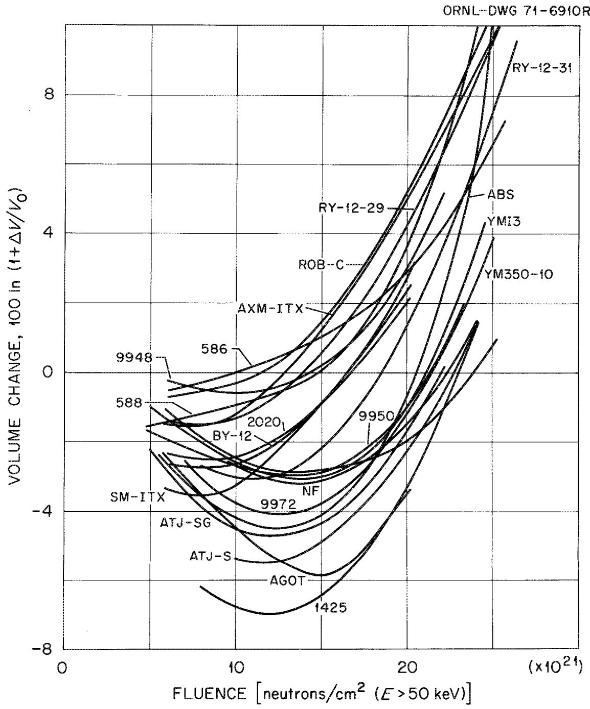  
Fig. 6.5. Volume changes for conventional graphites irradiated at $715^{\circ}\mathrm{C}$ .

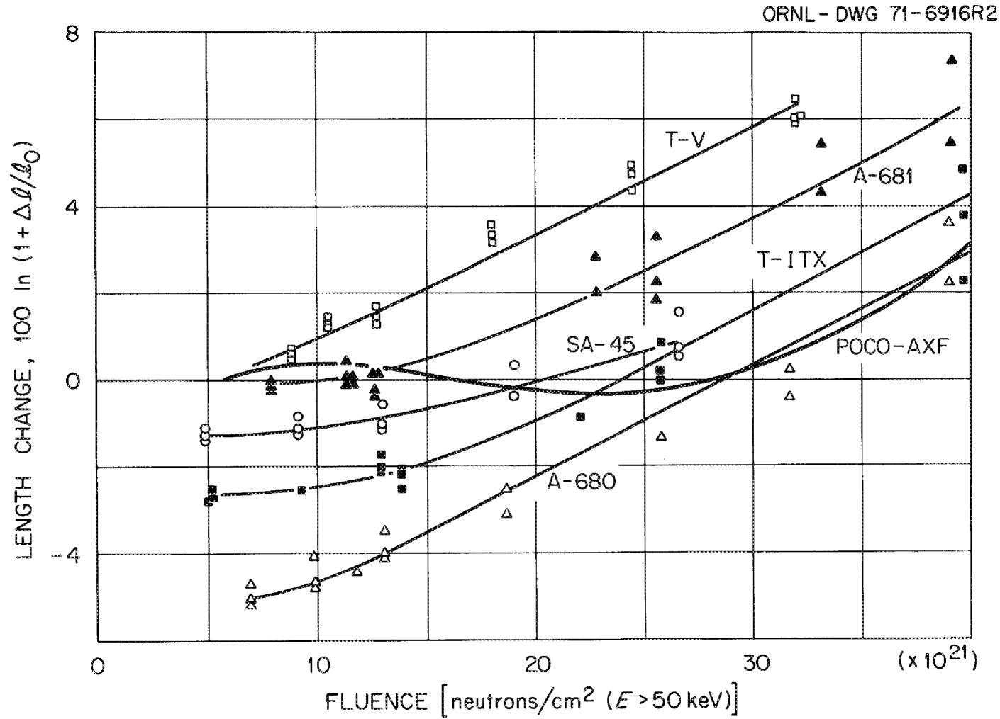  
Fig. 6.6. Length changes for various black-based graphites and POCO-AXF irradiated at $715^{\circ}\mathrm{C}$ .

ORNL-DWG 71-6915R2

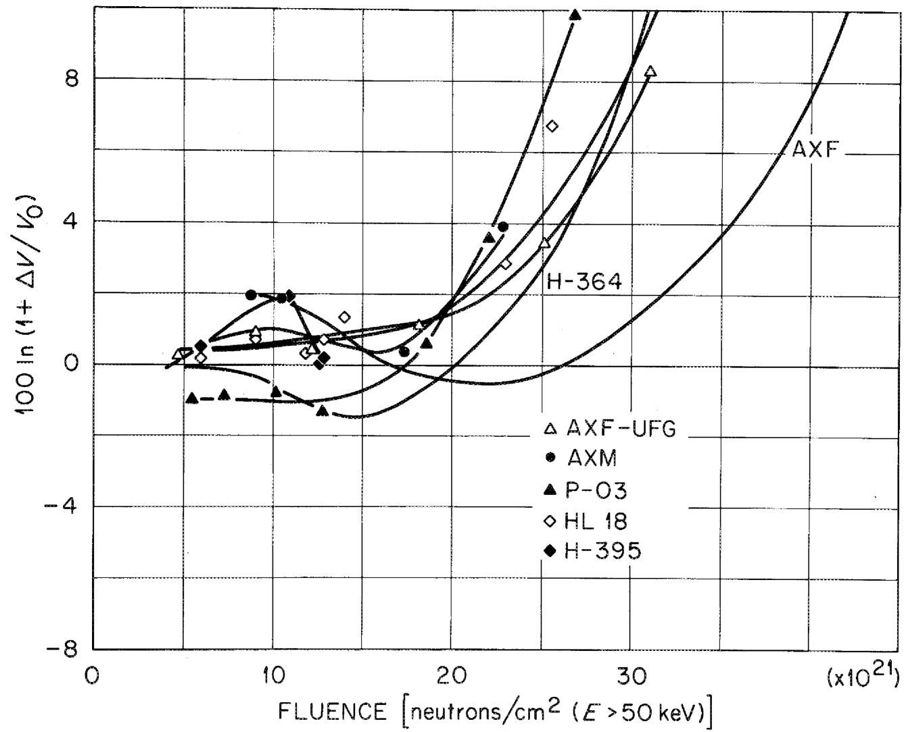  
Fig. 6.7. Volume changes for monolithic graphites irradiated at $715^{\circ}\mathrm{C}$ .

being attempted, and the raw materials have been limited to three cokes and several thermosetting or thermoplastic binders. The essence of the process is in the use of cokes in their uncalcined condition in which they are still chemically active. The chemical activity between coke and binder and the more similar shrinkage rates of the two during carbonization result in the desired monolithic structure [10].

During the past year these materials have been undergoing irradiation testing. Currently results are available only up to $1.5 \times 10^{22}$ neutrons/cm $^2$ . To this level they have been stable, and thus confirm our conclusions from the hypotheses on damage models.

# Xenon Control

The problem of effectively sealing the graphite against xenon can take three forms: direct impregnation by hydrocarbons followed by heat treatment to leave a carbon relic in the pore; impregnation with a liquid or solid salt to fill the pores; or surface treatment to seal off the pores at or near the surface.

Sufficient experience has been generated in the graphite industry to indicate the limitations of direct carbonaceous impregnation. The decomposing hydrocarbon generates gaseous products which must escape to the surface or rupture the bulk piece. A practical limitation in permeability is of the order of $10^{-6}$ cm²/sec, a factor 100 larger than required for excluding xenon. This approach has therefore not been explored in our program.

The use of salts to fill the pores has been looked at cursorily [8] and is still being investigated. The limitation anticipated is the diffusion of uranium into the salt. Nevertheless, it has been demonstrated that such a technique can reduce gas permeabilities to the desired range.

The use of pyrolytic decomposition of hydrocarbons has been extensively studied for reactor applications, primarily under the gas-cooled reactor programs. The background developed there on process parameters, properties, and irradiation behavior formed the basis for our program. The first approach [11] was to utilize a gas impregnation process to fill the pores near the surface, this being preferred over a coating process because of its greater resistance to handling damage. The process consists of alternately pulsing hydrocarbon gas and vacuum, thus effecting a decomposition of the gas deep within the pores of the graphite, and has proven to be easily controllable and effective. Apparent permeabilities* in the $10^{-8}$ cm²/sec range and below are readily attained. Monolithic-type substrates were impregnated and irradiated in HFIR, but the

low permeability was quickly lost [12]. Dimensional data readily showed why. In filling the pores we had also locked the crystallites in the surface region of the base graphite together and prevented the plastic flow necessary to relieve the intercrystalline strains produced during damage.

Coating was next investigated, utilizing base graphites and coating structures known to be dimensionally stable under irradiation. First irradiation results [8] were mixed; a few samples retained their initial low permeabilities to the maximum fluence employed, about $2 \times 10^{22}$ neutrons/cm², but the majority were no better than the gaseous-impregnated materials. It is now known that the coatings were flawed before irradiation, and a revised process has been developed [13]. Samples with unflawed coatings are currently being assembled for irradiation testing.

One of the major recent diagnostic advances had been development of scanning electron microscopes capable of examining graphite surfaces. The flawed samples alluded to above appeared perfectly sound even under the light microscope. Under the scanning electron microscope, various types of flaws are readily apparent as well as changes in microstructure (see Fig. 6.8). The defects have been found to be due to faulty gas circulation, soot inclusions, and too sharp corners on the graphite cylinders being coated. These have all been eliminated in the current coating process.

# Thermal Conductivity

It was originally anticipated that changes in thermal conductivity due to radiation damage under MSR conditions would be slight. Recent data, however, have implied this may not be the case [7], and experiments have been initiated in HFIR to determine the seriousness of the degradation in conductivity [8]. Preliminary results imply the decrease may be by a factor of three.

The importance of thermal conductivity is in controlling the internal graphite temperatures, and thereby the rate of damage accumulation. The average dimensional change of a graphite prism under radiation damage is as though the prism were at its mean temperature throughout [6]. Since damage rate increases with temperature, the desire to minimize internal temperature gradients is obvious.

Stresses and Creep. - The graphite core prisms, as mentioned above, are required for no structural purpose except to delineate the salt flow and to support their own weight when the reactor is drained. However, the question still exists as to the magnitude of thermal or radiation induced stresses. These have been calculated for the reference design with conventional graphite at the worst position in the core, i.e., on the center line just above the midplane [6]. The calculated stresses are shown in Fig. 6.9 and are obviously trivial. We conclude that thermal and radiation-induced stresses are no problem even for the relatively poorly behaved conventional type graphites.

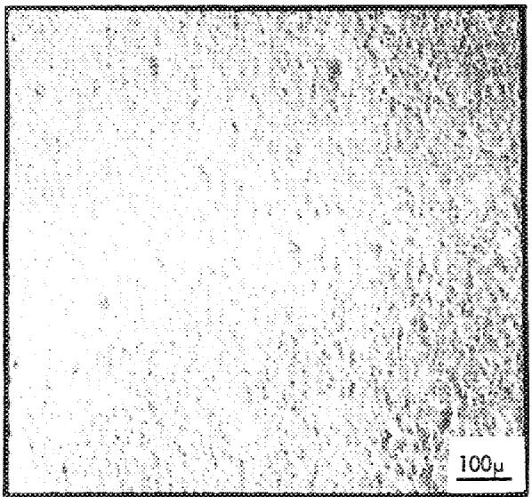

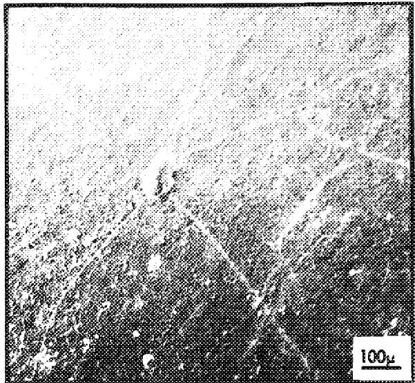  
Fig. 6.8. Scanning electron microscope pictures of coated graphite. Left: Thin coating insufficient to cover surface. Right: Soot inclusion with radiating crack structure.

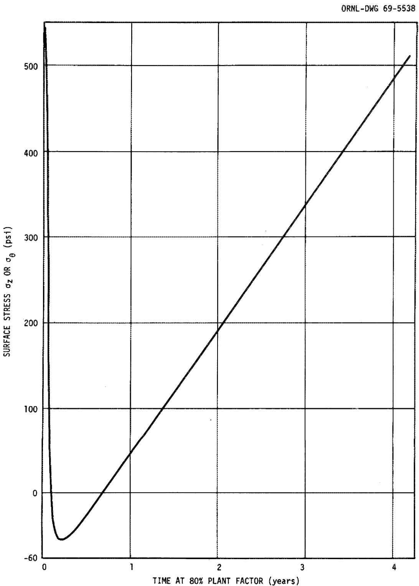  
Fig. 6.9. Maximum axial or tangential stresses developed in the reference MSBR design for a conventional-type graphite.

# Manufacturing Capability and Costs

The extensive survey program of various commercial graphites described above netted one graphite that is acceptable to the MSBR reference design, a second acceptable but limited in available sizes, and two other grades which are potentially acceptable. These span, happily, four independent vendors.

Great Lakes Carbon Corporation grade H-364 is available in the proper geometries and possesses a lifetime before significant expansion occurs of the order of $2.5 \times 10^{22}$ neutrons/cm $^2$ (E > 50 keV) at $715^{\circ}\mathrm{C}$ . This is $17\%$ less than specified in the reference design but is close enough to be compensatable by allowing more expansion, reducing the maximum power density, or replacing the graphite somewhat sooner. Poco grade AXF is the best commercial material we have encountered with a lifetime of the order of 3 to $3.5 \times 10^{22}$ , but is currently available only in short lengths. Material submitted by Airco Speer and Pure Carbon Companies also may fall into the class of these materials but to date have only been irradiated to $1.5 \times 10^{22}$ . Their behavior appears to be similar to the best of the monolithic grades.

We have been unable to obtain firm price estimates on these grades for our application, but they appear to fall into the range of $5-10.00 per pound of finished graphite, even on a first-order basis. Prices of $5.00 per pound or lower certainly appear to be probable if the market becomes sufficiently large to permit the graphite to be handled as a stock item.

With regard to pyrolytic coating or sealing, there is an existing industry already producing such coatings primarily for aerospace applications. However, the most irradiation-resistant type of coating (LTI, or low temperature isotropic) employs process parameters quite different from the industrial-developed processes. Cost-estimating is difficult since a process has not been developed, but we guess that $25 - 30 per lb of finished graphite in the slab geometry should certainly cover any reasonable process during its early development. Eventually costs should drop to$ 5 - 7.00 per lb for reasonable production quantities.

# Uncertainties and Further Work

A number of uncertainties remain, none of which particularly affect the viability of the molten-salt breeder concept. These uncertainties may effect further compromises in design and perhaps economics, but in no case are they vital to the technical or economic use of graphite in the reactor. Since these uncertainties are readily resolvable by further work on graphite, we discuss the two topics together.

# Irradiation Damage and Graphite Fabrication

The potential for improved graphites that can be employed in MSBR's beyond a fluence of $3.5 \times 10^{22}$ is, we believe, good. The question remains speculative as to the degree of improvement to be anticipated. Our confidence in anticipating at least incremental improvements has increased significantly in the past year as our understanding of the relationships between microstructure and radiation damage has improved. The availability of HFIR (or fast reactors in the future) to obtain full fluences in less than a year enables a graphite development program to proceed at a reasonable rate.

The fabrication process which is currently being studied at ORNL has only yet been briefly explored. Areas awaiting examination where further progress can be anticipated are the use of blacks in processes analogous to the green-coke route, and the use of high-pressure processing for both raw materials and carbonization. To date very little effort has been expended by industry and other government laboratories to increase the life or stability of graphite, and the development of new processes and diagnostic techniques suggest much more rapid progress can be made. We believe these alternate fabrication techniques and their relevance to damage resistance can be at least indicated within two to three years. The fact that pyrolytic materials have survived to fluences greater than $1.5 \times 10^{22}$ neutrons/cm² at $1250^{\circ}\mathrm{C}$ implies lifetimes of the order of $5 \times 10^{22}$ neutrons/cm² at $700^{\circ}\mathrm{C}$ should be attainable.

# Xenon Control

The ability to exclude xenon from the graphite by means of pyrolytic impregnation or coating has not been demonstrated. Alternative techniques exist but currently remain unexplored.

Both coatings and substrates have separately been shown to survive to $>3 \times 10^{22}$ . Hence, this is strong reason to believe a monolayer coating can be made to work in the MSBR. However, in the gas-cooled program where coatings have been shown to survive equivalent fluences, it has been found necessary to decouple the substrate and coating. Both low density pyrolytic and silicon carbide intercoatings have been employed, and analogous techniques can be utilized here albeit at an economic penalty. If such techniques are required, some two to three years' effort will be needed to develop them. In any event further work to upscale and prepare for transition to commercial suppliers will be required.

Two further techniques are the filling of porosity in the graphite with either liquid or solid salt. Solid salt, and bismuth as a stand-in, have been shown to at least yield the right order of gaseous diffusion rates. The uncertainty remains as to whether the liquid or solid diffusion rates are sufficiently low. The potential of this approach can be determined in about one year.

Underlying all of this are questions as to the efficacy of the helium bubbles and the impedance of xenon diffusion across the graphite-salt interface to limit diffusion into graphite quite independently of the permeability, a subject which is discussed in detail in Chapter 8.

# Thermal Conductivity

The thermal conductivity degradation with damage remains to be established. This leaves uncertain the maximum cross-sectional area of the graphite prisms permitted. Although representing only a question of design, it must be answered. We estimate two to three years will be required to obtain the necessary irradiation history and data.

# Stresses and Creep

Present knowledge on creep in graphite leads to an analysis indicating only trivial stresses are developed in the graphite. Recent unpublished results obtained at Hanford may indicate the ability of graphite to creep deteriorates at high fluences. If so, the problem can again be avoided by design, but the situation is uncertain. We estimate a minimum of three to five years to obtain the necessary information.

# Evaluation

In general, graphite presents no serious problem to the molten-salt reactor. At least one vendor has available a satisfactory material in the required sizes, and there is every reason to believe the lifetime of future graphites can be incrementally extended to perhaps twice that of the best existing materials. Cost estimates utilizing present material capabilities yield 0.17 mill/kWhr, for replacement of the entire core on a four-year cycle in the reference design, or a somewhat lower cost if only the most highly irradiated material is replaced each time. Increasing the lifetime to eight years reduces the fuel cycle cost by about 0.1 mill/kWhr, but beyond this the cost savings are small. We can thus state that existing base graphites are acceptable, and future graphites can probably be developed to reduce replacement costs.

The present methods of pyrolytically coating the graphite appear to be satisfactory, although radiation testing will require at least another year to demonstrate this. Alternative routes exist, but the question is eventually one of economics - the value of marginal increases in breeding gain versus the cost of the coated material.

We have not yet acquired sufficient data on the thermal and mechanical properties of graphites of the type used in the MSBR. Enough is known to be certain these do not affect the exact shapes of graphite permitted and the means by which the graphite is supported, but additional data must yet be secured for design purposes.

In sum, there are no reasons to expect graphite to limit the overall feasibility of molten-salt breeder reactors, and acceptable materials are available today.

# References for Chapter 6

1. J. M. W. Simmons, Radiation Damage in Graphite, Pergamon Press (1965).   
2. G. B. Engle and W. P. Eatherly, "A Review of High-Temperature Graphite Irradiation Behavior" in High Temperature-High Pressures (to be published).   
3. Conceptual Design Study of a Single Fluid Molten-Salt Reactor, ORNL-4528 (1970).   
4. "1000 MW(e) Molten-Salt Breeder Reactor Conceptual Design Study," Final Report - Task I, Evasco Services, Inc. (1971).   
5. E. S. Bettis, L. G. Alexander, and H. L. Watts, Design Studies of a Molten-Salt Reactor Demonstration Plant, ORNL-TM-3832 (1972).   
6. D. Scott and W. P. Eatherly, Nucl. Appl. Tech. 8, 179 (1970).   
7. W. P. Eatherly et al., Technical Analysis and Program Proposal: Graphite for Molten-Salt Reactors, ORNL-CF-68-11-18 (1968).   
8. MSR Program Semiannu. Progr. Rept. Aug. 31, 1971, ORNL-4728.   
9. MSR Program Semiannu. Progr. Rept. Aug. 31, 1969, ORNL-4449.   
10. MSR Program Semiannu. Progr. Rept. Feb. 28, 1971, ORNL-4676.   
11. MSR Program Semiannu. Progr. Rept. Feb. 28, 1969, ORNL-4396.   
12. MSR Program Semiannu. Progr. Rept. Aug. 31, 1970, ORNL-4622.   
13. MSR Program Semiannu. Progr. Rept. Feb. 29, 1972, ORNL-4782.

# 7. MATERIALS FOR SALT-CONTAINING VESSELS AND PIPING

H. E. McCoy

# Material Requirements

The metal used in fabricating a molten salt reactor will be exposed to several environments. The inside of the primary circuit will be exposed to $\mathrm{LiF - BeF_2 - ThF_4 - UF_4}$ , the coolant circuit to $\mathrm{NaF - NaBF_4}$ , and the steam circuit to supercritical steam. Thus, the tubes in the intermediate heat exchanger will be exposed to both salts and those in the steam generator to both coolant salt and steam. The bulk fuel salt temperature will range from $1050^{\circ}$ to $1300^{\circ}\mathrm{F}$ and the coolant from 850 to $1150^{\circ}\mathrm{F}$ . The steam in the salt-heated steam generator enters at $700^{\circ}\mathrm{F}$ in the reference loops and is heated to $1000^{\circ}\mathrm{F}$ . The outsides of the metal components will be exposed to containment cell environments composed primarily of nitrogen, with enough in-leakage of air to make it oxidizing.

The most basic requirement of the structural materials is that they be chemically compatible with these various environments. The chemical properties of the salts were discussed in Chapter 5, where it was pointed out that the selective leaching of chromium would be the primary mechanism for corrosion of iron- and nickel-base alloys by molten fluorides. Thus the concentration of chromium is an important consideration in selecting an alloy to be used in molten-salt circuits. Iron is more easily oxidized by the salts than nickel, so the preference (although not necessarily a requirement) of a nickel-base alloy over an iron-base alloy is immediately obvious. Good resistance to oxidation in $\mathbf{N}_2\text{-O}_2$ environments is favored by high chromium concentrations.

The material requirements for steam generators are discussed in Chapter 8. Satisfying the need for compatibility with the coolant salt and resistance to stress-corrosion cracking in the steam may be difficult with a single alloy suggesting the use of duplex tubes.

The subject of design stresses will be discussed more fully in Chapter 13, but it is obvious that the material must be capable of withstanding without failure the stresses that will be imposed during service. The relatively high temperatures involved will require that suitable elastic-plastic analyses be made of all structures. An MSBR will operate at relatively low pressures, so a high-strength material does not seem necessary. However, thermal stresses will likely control the design and it is quite likely that a material with moderate strength will be used.

The primary circuit, particularly the reactor vessel, will be exposed to neutron irradiation, but no metallic structural members will be in the highest neutron flux regions. At the vessel wall, the peak thermal and fast $(>0.8\mathrm{MeV})$ fluxes will be $6.5\times 10^{12}$ and $1.2\times 10^{11}$ neutrons·cm-2·sec-1, and over a 30-year lifetime with an $80\%$ load factor, the peak thermal and fast fluences will be $5\times 10^{21}$ .and $1\times 10^{20}$ neutrons/cm², respectively. These relatively low fluence levels are due to the effects of the graphite

reflector and could be reduced even further if necessary. The fast fluence is not high enough for void formation to be a problem, and the irradiation damage is primarily the high-temperature embrittlement due to helium generation [1].

An obvious requirement of the structural material is that it must be fabricable into the forms needed to build an engineering system. Basic shapes required include plate, piping, tubing, and forgings. For assembly, the material must be weldable both under well-controlled shop conditions and in the field. Many iron- and nickel-base alloys satisfy these requirements, although the technology is more advanced for some alloys than for others. The basic ability to work with a material is more important, however, than having a currently viable technology in several fabrication shops. The latter factor would simply make the first unit cheaper.

In summary, one must keep sight of the basic requirements that the material be compatible with its environments, have acceptable mechanical properties, both unirradiated and after exposure to the maximum expected neutron fluence, and be capable of being fabricated with reasonable ease.

# Background

# Initial Objectives and Screening Tests

The nuclear-powered aircraft application for which molten-salt reactors were originally developed required that the fuel salt operate at around $1500^{\circ}\mathrm{F}$ . Inconel 600, out of which the Aircraft Reactor Experiment was built, was not strong enough and corroded too rapidly at the design temperature for long-term use. The existing alloys were screened for corrosion resistance at this temperature and only two were found to be satisfactory - Hastelloy B (Ni-28% Mo-5% Fe) and Hastelloy W (Ni-25% Mo-5% Cr-5.5% Fe) [2,3]. However, both aged at the service temperature and became quite brittle due to the formation of Ni-Mo intermetallic compounds. These observations led to an alloy development program in which INOR-8, or Hastelloy N, was developed [4,5].

# The Metallurgy of Hastelloy N

The commercial chemical specifications for "standard" Hastelloy N out of which the MSRE was built, and for an alloy modified to give it improved properties, are shown in Table 7.1. The molybdenum is present for strengthening, but is not in sufficient concentration to cause the formation of brittle compounds. Chromium is added in the minimum concentration required to form a spinel-type oxide [6]. Iron is allowed in sufficient quantities to permit chromium to be added as ferrochrome; however, it is not a critical element in the alloy. Manganese has some effect on the alloy by reacting with sulfur, but sulfur is usually dealt with during melting by additions of elements such as magnesium. Carbon

Table 7.1. Chemical composition of Hastelloy N   

<table><tr><td rowspan="2">Element</td><td colspan="2">Content (% by weight)a</td></tr><tr><td>Standard alloy</td><td>Favored modified alloy</td></tr><tr><td>Nickel</td><td>Base</td><td>Base</td></tr><tr><td>Molybdenum</td><td>15-18</td><td>11-13</td></tr><tr><td>Chromium</td><td>6-8</td><td>6-8</td></tr><tr><td>Iron</td><td>5</td><td>0.1b</td></tr><tr><td>Manganese</td><td>1</td><td>0.15-0.25b</td></tr><tr><td>Silicon</td><td>1</td><td>0.1</td></tr><tr><td>Phosphorus</td><td>0.015</td><td>0.01</td></tr><tr><td>Sulfur</td><td>0.020</td><td>0.01</td></tr><tr><td>Boron</td><td>0.01</td><td>0.001</td></tr><tr><td>Titanium and hafnium</td><td></td><td>2</td></tr><tr><td>Niobium</td><td></td><td>0-2</td></tr></table>

${}^{a}$ Single values are maximum amounts allowed. The actual concentrations of these elements in an alloy can be much lower. ${}^{b}$ These elements are not felt to be very important. Alloys are now being purchased with the small concentration specified, but the specification may be changed in the future to allow a higher concentration.

is important because it forms carbides that restrict grain growth during high-temperature treatments and improve the strength. Elements such as sulfur, phosphorus, and boron, and many others not included in Table 7.1, are tramp or impurity elements that serve no known useful purpose in the alloy. These elements generally have little effect on the alloy behavior as long as they are kept at reasonable concentrations.

Silicon is introduced by the refractories used in the air melting practice and is an important element. Hastelloy N containing 0.5 to $1\%$ silicon contains stringers of coarse carbides and will form some fine carbides during annealing at 1200 to $1600^{\circ}\mathrm{F}$ [7]. These carbides are of the $\mathbf{M}_6\mathbf{C}$ type, with M having the composition of $27.9\%$ Ni, $3.3\%$ Si, $0.6\%$ Fe, $56.1\%$ Mo, and $40\%$ Cr. They are not easily dissolved during annealing, so the alloy has stable properties over a broad range of operating temperatures. Several melting practices are currently in use that result in low silicon concentrations. The carbides in these alloys are of the $\mathbf{M}_2\mathbf{C}$ type, where M is 80 to $90\%$ molybdenum with the remainder chromium. They are more easily dissolved than the $\mathbf{M}_6\mathbf{C}$ type that contain silicon.

Thus, Hastelloy N is basically an alloy strengthened with molybdenum and containing enough chromium for moderate oxidation resistance. The carbide type is controlled by the silicon concentration.

# Corrosion Resistance of Hastelloy N

Several hundred thousand hours of corrosion experience with Hastelloy N and fluoride salts have been obtained in thermal convection [2,3] and pumped systems [8]. As discussed in Chapter 5, these experiments showed that the predominant corrosion mechanism in clean fluoride salts containing uranium was the selective leaching of chromium. Only $7\%$ of the alloy is chromium and this must diffuse to the surface before it can be removed by the salt. DeVan measured the rate of chromium diffusion in Hastelloy N [9], and the measured diffusion coefficients were used to estimate the chromium profile after 30-year service at 650 and $700^{\circ}\mathrm{C}$ in salt oxidizing enough to completely deplete the surface of Cr. As shown in Fig. 7.1, even in this extreme situation, the depth of removal is still moderate.

The early work with Hastelloy N and other alloys revealed the importance of controlling impurities in the salt. Impurity fluorides such as $\mathrm{FeF_2}$ , $\mathrm{MoF_2}$ , and $\mathrm{NiF_2}$ will react with Cr to form $\mathrm{CrF_2}$ , a more stable fluoride. Water will react with the fluoride mixtures to form HF that will form fluorides with all the structural metals. Such impurities led to relatively high corrosion rates of even Hastelloy N in the early experiments. However, we learned how to prepare pure salt mixtures, and very low corrosion rates were obtained. The ultimate proof of this ability was the operation of the MSRE where the overall corrosion was held low for almost four years at temperature.

The preceding discussion applied to the removal of material, but deposition is also of concern. As the salt circulates from hotter to cooler regions, the solubilities of the corrosion products in the salt decrease, and if concentrations are high enough, material may be deposited. This process is complex, depending upon chemical driving forces and factors

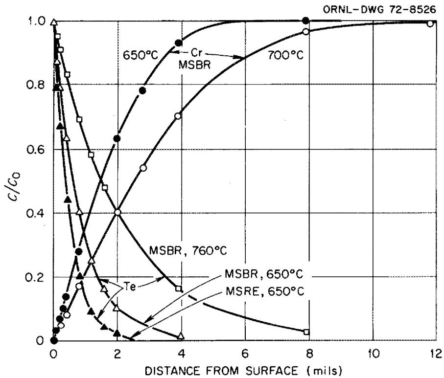  
Fig. 7.1. Calculated concentration profiles for Cr removal and Te enrichment based on measured diffusion coefficients. The times used in the calculations were 3 yrs for the MSRE and 30 yrs for the MSBR.

such as geometry and flow conditions. Fortunately, the salts being considered for an MSBR tend strongly to deposit material rather uniformly throughout the cold region and have a minimal tendency to plug heat-exchanger tubes and salt passages in cooler parts of the system.

# Physical and Mechanical Properties of Hastelloy N

The physical and mechanical properties of Hastelloy N were evaluated rather extensively before the MSRE was constructed. These properties have been summarized previously [10]. The strength of this alloy is quite good because of the $16\%$ molybdenum. The property changes with time are small since the alloy does not form intermetallic compounds but only small amounts of fine carbides.

# Experience with Hastelloy N in the MSRE

Fabrication. - Although the power level of the MSRE was small, the system was complex and required the ability to carry out all of the basic fabrication steps [11]. Many thousands of pounds of basic product forms were procured from three vendors. Some of the components were built by commercial vendors, but most of the fabrication was done in the AEC-Union Carbide shops at Oak Ridge and Paducah. Welding, brazing, and inspection procedures needed for constructing the reactor were developed. One of the final steps was to make use of the heaters on the vessel to postweld anneal the final vessel closure weld.

Operation. - As discussed in Chapter 2, the reactor operated very satisfactorily. The primary system was above $500^{\circ}\mathrm{C}$ for 30,807 hours and filled with fuel salt for 21,040 hours. The only failure involving Hastelloy N was through-wall cracking of a freeze valve coincident with final shutdown of the system [12]. This failure was due to fatigue from differential thermal expansion in a part that was constructed too rigidly.

Corrosion. - Corrosion during the operation of the MSRE was followed both by analyzing the salts and examining surveillance specimens removed from the core. The primary corrosion product, $\mathrm{CrF_2}$ , remained below its solubility limits in the salt; so its concentration could be used as a measure of the amount of chromium being removed from the metal. The results of such analyses have been described in detail, (reference 13 and Chap. 5). A simple summary is that the chromium removal was very small: the total amount accumulated in the fuel salt was equivalent to that which would be removed from all metal surfaces to a depth of 0.4 mil; the amount appearing in the coolant salt was practically nil.

Surveillance samples located in the core of the MSRE were peripopically removed for examination and testing. Samples of both standard and modified Hastelloy N were always in excellent physical condition with only a slight amount of discoloration [1,14,15,16], and visual

metallographic examination failed to reveal any changes that were attributable to corrosion. (As discussed in detail later, a serious problem was revealed after examination of tensile specimens that were stressed to failure. So that the reader will not later think that we have been inconsistent, we note here that the cause of the problem was not, in our terminology, "corrosion".)

The chromium gradients in some of these samples were measured by the electronic microprobe analyzer, and the worst case was a gradient that extended about 0.8 mil into the material [17]. Standard metallographic [17] (~100 magnification) examination of several tubes from the coldest part of the heat exchanger revealed only deposits of a few iron crystals.

The MSRE coolant circuit contained $\mathrm{LiF - BeF_2}$ (66-34 mole %) at 550- $650^{\circ}C$ for about 26,000 hours. The chromium content of the coolant salt did not change measurably during this time, and no chromium depletion could be detected by metallographic methods.

Thus, the MSRE confirmed in service the basic compatibility of fuel salt, Hastelloy N, and graphite that had been indicated by many tests.

Radiation Embrittlement. - Many of the surveillance samples from the MSRE were subjected to mechanical property tests that confirmed our previous knowledge that Hastelloy N is embrittled by neutron irradiation [1, 14,15,16]. As discussed further in later sections, this embrittlement occurs only at elevated temperatures and is due to helium formed in the metal; it is quite universal among iron and nickel base alloys [18-30]. The degree of embrittlement in the MSRE was equivalent to that noted in samples irradiated in the ETR and ORR. Thus, the mechanical properties were not degraded differently when exposed to salt than when exposed only to inert gas.

Fracture strain was the property of most concern with respect to the MSRE. The fracture strains of some samples from the core were only $0.5\%$ in creep tests at $1200^{\circ}\mathrm{F}$ , in contrast to strains of $\geq 10\%$ for unirradiated samples. Surveillance specimens exposed alongside of the reactor vessel at lower flux had strains of only $2\%$ [1,16]. The control rod thimbles were the only metal in the core, and they were subjected to small compressive forces. The vessel was subjected to very small stresses. Consequently, the rather low strain limits were not exceeded and the system operated without failure from radiation damage.

The entire area of the design of components for high temperature service is getting considerable attention. Although the strain limits have not been firmly established, it seems likely that local strains above those allowed by standard Hastelloy N must be accommodated.

Grain-boundary Cracks. - A second problem noted with Hastelloy N removed from the MSRE was that shallow intergranular cracks formed in surveillance samples and all other surfaces in contact with the fuel [1,14,15,16,17]. These cracks generally extended to depths of only about 5 mils, but some were as deep as 13 mils in parts removed from the pump bowl. Although recognizable (if you were looking for them) in metallographic sections of some material just as they were when removed from the MSRE, more were visible and they were opened much wider in specimens such

as that shown in Fig. 7.2 that had been strained in the hot cell. Cracks found after straining material that had been exposed in the core were no more pervasive or deeper than those in the heat-exchanger tubes, which had been exposed to insignificant neutron flux. By controlled dissolution of several samples, a number of fission products were found within the material to a depth of several mils. This suggested that the cracking was caused by diffusion of fission products down the grain boundaries - particularly tellurium, which was found at the highest concentration - and set off the investigation which is described later.

# Current State of Materials Development

# Corrosion

Hastelloy N (both standard and modified compositions) has been shown in the MSRE, other in-pile tests, and large number of out-of-pile loops to have excellent corrosion resistance in salts containing LiF, $\mathrm{BeF}_4$ , $\mathrm{ThF}_4$ , and $\mathrm{UF}_4$ [2,3,8,31]. This extensive experience confirms the behavior that would be predicted from calculations such as those plotted in Fig. 7.1.

Corrosion studies with the proposed coolant salt, sodium fluoroborate, have been more limited [32,33,45]. However, we have operated four thermal convection loops and two pumped systems in the materials program for a total test time of about 140,000 hr (see Chap. 8). This experience reveals that the fluoroborate salt absorbs moisture quite readily, with attendant generalized corrosion. On occasions when leaks developed, the corrosion rate has increased and then decreased as the impurities were exhausted. During these periods of high corrosion, all components of the alloy were removed uniformly from the hot leg and deposited in the cold leg. Crystals of $\mathrm{Na}_3\mathrm{CrF}_6$ and $\mathrm{Na}_3\mathrm{FeF}_6$ deposited in the cold regions as their solubilities were exceeded. Nevertheless, pumped loops in which the salt is heated and cooled between 1270 and $795^{\circ}\mathrm{F}$ have been operated for several thousands of hours with corrosion rates of $< 0.1\mathrm{mpy}$ , so we believe that satisfactory procedures for using the salt can be developed.

The corrosion behavior of several other nickel-base alloys was investigated in screening tests in the aircraft propulsion program [2,3]. The proposed service temperature was $1500^{\circ}\mathrm{F}$ and most of these alloys were not considered further because in tests at that temperature large amounts of chromium were removed, with formation of voids in the hot regions of test loops and deposition of chromium crystals in the cold regions. Inconel 600 received the most study of any alloy besides Hastelloy N, and the evaluation program on it involved several thermal convection loops and 9 forced convection loops that operated for a total of 79,300 hr [8]. Although the corrosion resistance of Inconel 600 was not as good as that of Hastelloy N, at temperatures in the range of MSBR's the rates were sometimes low enough to be of interest. For example, one Inconel 600 loop operated at a peak temperature of $1250^{\circ}\mathrm{F}$ for 8801 hr with intergranular penetrations of 1.5 mils. This penetration is high by our current standards, but was only slightly higher than that observed for Hastelloy N

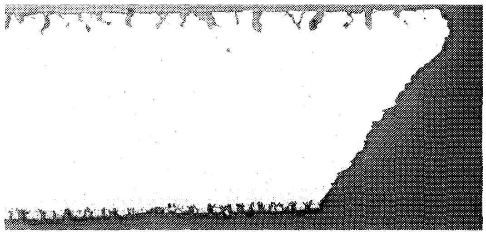

  
Fig. 7.2. Hastelloy N samples strained to failure at room temperature. The MSRE rod thimble was at high temperature for 31,000 hr, with the lower surface exposed to $\mathbf{N}_2 - \mathbf{O}_2$ gas. This surface was oxidized, and the cracks only penetrate the oxide. The upper surface of the thimble sample was exposed to fuel salt for 21,000 hr, during which time the Te concentration built up. The lower sample was vapor plated with enough tellurium to produce a concentration of $0.1\%$ in the outer 5 mils and annealed 1000 hr at $650^{\circ}\mathrm{C}$ .

tested in salt of comparable purity. Thus, it is likely that an alloy containing $15\%$ chromium (e.g., Inconel 600) would have acceptable corrosion resistance at $1200^{\circ}\mathrm{F}$ or less.

The compatibility of iron-base alloys with fluoride salts has received relatively little attention because the thermodynamic data indicate that nickel-base alloys with a minimum chromium content will be more corrosion resistant than iron-base alloys. The initial screening tests on types 300 and 400 stainless steels indicated that these alloys were unsatisfactory [2,3]. However, one type 304L stainless steel thermal convection loop containing a fuel salt has been in operation for over 9 years without plugging [35]; the corrosion rate at the peak temperature of $1270^{\circ}\mathrm{F}$ is about 1.5 my. It is quite likely that the corrosion rate could be reduced to an acceptable value by decreasing the temperature to $1200^{\circ}\mathrm{F}$ , but tests at higher velocities would be required to provide more conclusive information.

A most important consideration in the suitability of iron-base alloys is the possibility that, through some misoperation, the salt could become oxidizing enough to corrode the iron. This process would not be diffusion controlled, and thus large amounts of material could be transferred quickly from the hotter regions to the cooler regions of the system. While this is also true for nickel, it can occur with iron at less severe conditions. However, we believe that the oxidation state can be controlled closely enough for the salt to never become this oxidizing to either material.

The compatibility of sodium fluoroborate with iron-base alloys is unknown. Corrosion in this salt is controlled primarily by impurities, but iron seems to be attacked as readily as chromium. If the salt could be maintained very pure, iron-base alloys might be acceptable.

# Irradiation Embrittlement

The peak fast fluence at the inside surface of the reactor vessel will be of the order of $10^{20}$ neutrons/cm², which is too low to cause detectable swelling and void formation in the metal [36]. However, the peak thermal fluence of $5 \times 10^{21}$ neutrons/cm² is great enough to produce significant amounts of helium, about 5 ppm from residual $^{10}\mathrm{B}$ and possibly another 100 to 200 ppm by transmutations involving nickel that have only recently been recognized to occur [37]. In standard Hastelloy N the helium would reduce the grain boundary cohesion and increase the tendency for grain boundary fracture, with the result that the fracture stains at elevated temperatures become quite low.

Our approach to combating this embrittlement problem is to add elements such as titanium, hafnium, zirconium, and niobium that promote the formation of finely dispersed MC type carbides [38]. These carbides produce numerous interfaces that trap the helium rather than allowing it to be swept into the grain boundaries. Typical compositions of modified alloys are given in Table 7.1.

All of the carbide-forming elements are beneficial in improving the fracture strain, but there are several practical reasons why titanium and niobium are more desirable. Zirconium has been found to cause weld metal cracking in concentrations as small as $0.05\%$ [39] and for this reason, would be a very undesirable alloying addition. Hafnium causes weld metal cracking at concentrations of about $0.7\%$ , but the greatest problem with

using this element is its very high chemical reactivity. In small laboratory melts in which the metal only comes in contact with a water-cooled copper mold, the hafnium is present as desirable finely dispersed carbides. In commercial melting practices where the melt is contacted with a refractory crucible, the hafnium present is primarily a coarse compound. This likely occurs because hafnium is chemically reactive enough to reduce the oxides and other compounds in the refractory crucible. These coarse compounds do not result in good mechanical properties after irradiation. We have found that niobium additions alone do not result in improved resistance to irradiation embrittlement, but they are beneficial when titanium is present [38]. However, both niobium and titanium form brittle $\mathrm{Ni}_{3}$ (Ti,Nb) compounds and their total concentration must be limited. Since titanium seems to be the most effective single additive in improving the resistance to irradiation, we have concentrated on alloys with about $2\%$ titanium.

The amount of titanium required for good resistance to neutron irradiation depends strongly upon the service temperature [38]. At $1200^{\circ}\mathrm{F}$ alloys with $0.5\%$ titanium have fracture strains of above $4\%$ , but at an irradiation temperature of $1400^{\circ}\mathrm{F}$ , $2\%$ titanium is required to obtain the same properties. Direct transmission electron microscope observations have shown that this is due to the fine carbide becoming less stable and more titanium being necessary for stabilization as the service temperature is increased.

Several 100-lb commercial melts containing 1.5 to $2.1\%$ titanium were procured from three vendors and evaluated. The unirradiated mechanical properties and weldability of the melts are superior to those of standard Hastelloy N. The compatibility of titanium-containing alloys with fuel salt has been investigated using specimens of modified alloys in natural circulation loops, and some specimens were exposed in the MSRE core. Although the titanium is reactive with the salt, it diffuses less rapidly than the chromium and does not contribute detectably to the corrosion rate [40]. Hastelloy N modified by the addition of about $2\%$ titanium has thus been found to be adequately resistant to radiation at $1400^{\circ}\mathrm{F}$ , to be weldable without unusual difficulty, and to be free of added corrosion problems. This alloy must be scaled-up, but the chemical composition does not appear to be one that will present problems.

Exploratory irradiation studies have shown that Inconel 600 and all other nickel-base alloys are embrittled at elevated temperatures by thermal neutron irradiation [18, 19, 21, 22, 28-30]. The fracture strains vary for different alloys, irradiation, and test conditions. However, the fracture strains will likely be too low for alloys such as Inconel 600 without closer controls on chemistry, grain size, and other factors.

The stainless steels are also embrittled by irradiation, but it is possible that the fracture strains under MSBR service conditions will be adequate [41]. If not, significant improvements have been made in types 304 and 316 stainless steel by controlling the grain size or altering the composition (such as adding small amounts of Ti) [42].

# Intergranular Cracking

As already noted, 'intergranular cracking was observed in the surveillance samples and several components from the MSRE [17]. The most significant characteristics of the cracks are:

1. Cracks were formed on all surfaces exposed to fuel salt.   
2. Irradiation of the metal did not seem to be a factor, since the cracks were equally severe in components that were irradiated and unirradiated.   
3. Some cracks were visible in polished sections from some components (particularly the heat exchanger) when they were removed from service, but deformation at ambient temperature was required to make most show up.   
4. The material removed from the MSRE had been heated and exposed to fission products for times ranging from 2500 to 25,000 hr. Although the frequency of cracks increased with time, the maximum depth did not increase detectably.

We have not been able to produce similar intergranular cracks by corrosion. To determine if corrosion could be the cause, the salt in one fuel-salt loop was made quite oxidizing by adding $\mathrm{FeF_2}$ . Selective intergranular attack occurred, but the attack was very shallow and the corroded grain boundaries did not open further during straining. The second, and most convincing evidence that corrosion (chromium depletion) did not cause the cracks came directly from examination of MSRE samples. Although chromium depletion could not be detected in samples from the heat exchanger and in a section of the control rod thimble that was under a spacer sleeve, these samples were cracked as severely as those (e.g., the bare control rod thimble) in which chromium depletion was detectable. Thus, it seems unlikely that chromium depletion alone can account for the observed cracking.

The next possible mechanism to be considered is that one or several elements diffused into the material preferentially along the grain boundaries and degraded them in some way. The process responsible for the cracking could be (1) the formation of a compound that is very brittle, (2) formation of low-melting phases along the grain boundaries that become liquid at operating temperature, or (3) a change in composition along the grain boundaries so that they are still solid but very weak. The first and third mechanisms would require some deformation to form the cracks, but the second mechanism would not require strain, and samples could have cracks present before postoperation deformation.

Clearly, it is extremely important that the elements responsible for the cracking be identified and that the mechanism be determined. Analytical data from materials from the MSRE show that all of the fission products with sufficient half-lives to be detectable after two years were

present in the metal at depths up to a few mils and some nuclides with half-lives too short to detect could have also been present.

One sample was oxidized to passivate the outer surface to the reagent and then strained so that only the cracks were leached. Several fission products plus sulfur and phosphorus were present in high concentrations. Thus, it seemed profitable to look at all of the elements in the fission spectrum with sufficient half-lives to diffuse into the metal.

Our first attempt at this is shown in Table 7.2, which contains the information that we feel to be most relevant. Some of the data are from our current research, and others were obtained from the literature [43, 44].

As shown in Table 7.2, sulfur and selenium had detrimental effects under some test conditions, but tellurium had a more pronounced effect in all types of tests run to date. These three elements form relatively unstable fluorides and would likely be deposited on the metal and graphite surfaces. Arsenic, antimony, and tin also would be deposited, but no deleterious effects of these elements on the mechanical properties of nickel alloys have been noted. Zinc and cadmium may either be deposited or present in the salt, depending on the oxidation state of the salt. Both of these elements are reported to be insoluble in nickel, and we have not observed any deleterious effects in our tests. Ruthenium, technetium, molybdenum, and rhodium should deposit on surfaces, but we have seen no deleterious effects from them in our tests. Zirconium, strontium, cesium, and cerium form very stable fluorides and should remain in the salt. We have no evidence, positive or negative, on the effects of strontium and cesium on the mechanical behavior, but presently believe that these elements will stay in the salt and not enter the metal; zirconium and cerium do not have adverse effects when added to Hastelloy N. Niobium can be either in the salt or deposited, depending on the oxidation state, but as mentioned in discussing irradiation behavior, it has favorable effects on the mechanical properties.

Thus, although some exploratory work remains, it appears that the cracking could be caused by the inward diffusion of elements of the sulfur, selenium, tellurium family with tellurium having the most adverse effect. Our studies consequently have concentrated on tellurium. Since these elements all behave similarly, an understanding of how tellurium causes cracking should lead to an understanding of the behavior of the other elements.

Numerous laboratory experiments have been run that demonstrate very clearly that small amounts of tellurium will cause intergranular cracking in Hastelloy N. These experiments include: (1) the measurement of grain boundary and bulk diffusion coefficients of tellurium in Hastelloy N, type 304 stainless steel, and nickel; (2) exposure of numerous materials to electro- or vapor-plated tellurium with subsequent straining and metallographic examination; (3) tube burst specimens of Hastelloy N and type 304 stainless steel electroplated with tellurium and stressed in salt; (4) creep tests of Hastelloy N, type 304 stainless steel, nickel, and Inconel 600 in inert gas-tellurium vapor environments; (5) strain cycle experiments of Hastelloy N electroplated with tellurium to determine crack propagation rates; and (6) mechanical property tests on alloys containing small amounts of fission product.

Table 7.2. Possible effects of several elements on the cracking of Hastelloy $\mathbf{N}^a$   

<table><tr><td>Element</td><td>Melting point (°C)</td><td>Concentrated in cracks in MSRE samples</td><td>Cracking of vapor and electroplated specimensb</td><td>Effect on tensile properties of nickelc</td><td>Effect on creep properties of nickel alloyd</td><td>Effect on tensile properties of Hastelloy Nb</td><td>Effect on creep properties of Hastelloy Nb</td><td>Free energy of formation of fluoride at 1000oK (kcal mole-1F-1)e</td><td>Expected location of element</td><td>Overall rating</td></tr><tr><td>Sulfur</td><td>119</td><td>--</td><td>+</td><td>--</td><td></td><td>+</td><td>-</td><td>-34</td><td>Depositedf</td><td>-</td></tr><tr><td>Selenium</td><td>217</td><td></td><td>+</td><td>--</td><td>+</td><td>+</td><td>-</td><td>-27</td><td>Deposited</td><td>-</td></tr><tr><td>Tellurium</td><td>450</td><td>--</td><td>--</td><td>-</td><td>-</td><td>-</td><td>-</td><td>-39</td><td>Deposited</td><td>--</td></tr><tr><td>Arsenic</td><td>817</td><td></td><td>+</td><td>--</td><td>+</td><td>+</td><td>+</td><td>-62</td><td>Deposited</td><td>+</td></tr><tr><td>Antimony</td><td>630</td><td>-</td><td>+</td><td>--</td><td>+</td><td>+</td><td>+</td><td>-55</td><td>Deposited</td><td>+</td></tr><tr><td>Tin</td><td>232</td><td></td><td></td><td>--</td><td>+</td><td>+</td><td>+</td><td>-60</td><td>Deposited</td><td>+</td></tr><tr><td>Zinc</td><td>420</td><td></td><td></td><td>Insoluble</td><td>+</td><td></td><td></td><td>-68</td><td>g</td><td></td></tr><tr><td>Cadmium</td><td>321</td><td></td><td>+</td><td>Insoluble</td><td>+</td><td></td><td></td><td>-64</td><td>g</td><td>+</td></tr><tr><td>Ruthenium</td><td>2500</td><td></td><td></td><td>+</td><td></td><td>+</td><td>+</td><td>-51</td><td>Deposited</td><td>++</td></tr><tr><td>Technetium</td><td>2130</td><td></td><td></td><td>+</td><td></td><td>+</td><td>+</td><td>-46</td><td>Deposited</td><td>++</td></tr><tr><td>Niobium</td><td>2468</td><td></td><td></td><td>+</td><td>+</td><td>+</td><td>+</td><td>-70</td><td>g</td><td>++</td></tr><tr><td>Zirconium</td><td>1852</td><td></td><td></td><td>-</td><td>-</td><td>+</td><td>+</td><td>-99</td><td>Salt</td><td>+</td></tr><tr><td>Molybdenum</td><td>2610</td><td></td><td></td><td>+</td><td>+</td><td>+</td><td>+</td><td>-57</td><td>Deposited</td><td>++</td></tr><tr><td>Strontium</td><td>768</td><td>-</td><td></td><td>-</td><td></td><td></td><td></td><td>-125</td><td>Salt</td><td></td></tr><tr><td>Cesium</td><td>29</td><td>-</td><td></td><td>Insoluble</td><td></td><td></td><td></td><td>-106</td><td>Salt</td><td></td></tr><tr><td>Cerium</td><td>804</td><td>-</td><td></td><td></td><td></td><td>+</td><td>+</td><td>-120</td><td>Salt</td><td>+</td></tr><tr><td>Rhodium</td><td>1966</td><td></td><td></td><td></td><td></td><td>+</td><td>+</td><td>-42</td><td>Deposited</td><td>+</td></tr></table>

${}^{a}$ The symbols used in this table should be interpreted in the following way: A plus refers to nondetrimental behavior, and a minus indicates detrimental effects. Two minuses indicate particularly bad effects.   
Results of current 1vaaich.   
C. G. Bieber and R. F. Decker, "The Melting of Malleable Nickel and Nickel Alloys," Trans. AIME 221, 629 (1961).   
$d_{\mathbf{D}}$ R. Wood and R. M. Cook, "Effects of Trace Contents of Impurity Elements on the Creep-Rupture Properties of Nickel-Base Elements," Metallurgia 000, 109 (1963).   
ePrivate communication, W. R. Grimes, ORNL.   
$f$ May appear as $\mathrm{H}_2\mathrm{S}$ if HF concentration of melt is appreciable.   
${}^{5}$ May appear in salt if salt mixture is sufficiently oxidizing.

The diffusion rate of tellurium into Hastelloy N was measured. Samples with $^{127}\mathrm{Te}$ deposited on the surface were annealed for 3000 hr at 650 and $760^{\circ}\mathrm{C}$ . At $650^{\circ}\mathrm{C}$ the penetration was so shallow that the lapping technique used did not give very reliable values, but accurate results were obtained at $760^{\circ}\mathrm{C}$ and the diffusion coefficient in the bulk material was $1.01 \times 10^{-14} \mathrm{~cm}^2/\mathrm{sec}$ , about equivalent to that of chromium at $650^{\circ}\mathrm{C}$ . The penetration profiles also were used to obtain the product of the grain boundary width and the grain boundary diffusion coefficient, and the measured quantities were then used with the Fisher model [45] to compute the grain boundary penetration. As shown in Fig. 7.l, the maximum penetration of tellurium in an MSBR at $760^{\circ}\mathrm{C}$ would be 8 mils in 30 years. The less accurate experimental values obtained at $650^{\circ}\mathrm{C}$ were used to estimate that tellurium should have penetrated the grain boundaries in the MSRE to a depth of 2 to 3 mils, and the penetration of an MSBR operating at $650^{\circ}\mathrm{C}$ for 30 yr should be about 4 mils. The relatively low sensitivity of the penetration depth to the time is due to the variation with time to the one-fourth power for grain boundary diffusion compared with the one-half power for bulk diffusion.

These computed depths of penetration are quite acceptable, but several factors can move the curves. One factor that could reduce the penetration is that the supply of tellurium to the Hastelloy N would control the rate of penetration rather than diffusion through the metal. This is quite possible, since the concentration of tellurium in the salt would be very low, and other fission products such as molybdenum would deposit and possibly interfere with tellurium actually reaching the Hastelloy N. At least one factor could increase the penetration. Cracks could form and the diffusion front move inward, such as probably occurred in the specimen that was exposed to tellurium while being stressed in a creep machine. Another factor could move the profiles either way; compounds such as nickel-tellurides may form along the grain boundaries, and the tellurium may diffuse at higher or lower rates through these compounds than through Hastelloy N. Thus, although the diffusion measurements provide an explanation of the limited penetration in the MSRE and offer some encouragement that the depth of penetration of tellurium would not be very great in an MSBR, they cannot be taken quantitatively.

Little is known about the chemistry of tellurium, but most likely it is similar to that of sulfur. The basic problem with nickel alloys containing sulfur is due to a low melting nickel-sulfur eutectic that forms when sulfur segregates in the grain boundaries and causes these regions to be weak compared with the matrix. Alloying additions such as chromium raise the melting point of the eutectic and reduce the magnitude of the problem. Some proprietary work on superalloys shows that about $16\%$ chromium is required to make a superalloy resist embrittlement by sulfur. Assuming parallel behavior of tellurium, its deleterious effects on Hastelloy N might be offset by the addition of chromium.

Additions of tellurium, selenium, and sulfur are often made to steels to obtain improved machinability but they cause embrittlement at high temperatures. Small cerium additions have been effective in reducing the embrittlement. Thus cerium additions to Hastelloy N may also be effective in making the tellurium innocuous.

Fortunately, tellurium probably behaves in non-fissioning melts much as it does in a fissioning salt, so that laboratory experiments can be used to answer many questions. Assuming this is so, over sixty alloys were electroplated with tellurium and annealed for long periods of time to investigate the effects of composition, including higher chromium concentration, on the cracking phenomenon. Included were several nickel-base alloys, representative alloys of types 200, 300, 400, and 500 stainless steel, nickel, copper, iron, Monel, two cobalt-base alloys, and several heats of modified and standard Hastelloy N. After being annealed, the samples were strained at room temperature and sectioned for metallographic examination.

No cracks formed in iron, copper, Monel, the stainless steels, or in the nickel-base alloys containing more than $15\%$ chromium. However, cracks did form in Hastelloy B (1% chromium maximum), Hastelloy W (5% chromium), and in most heats of Hastelloy N (7% chromium). Some of the heats of modified Hastelloy N had better resistance to cracking than standard Hastelloy N. These alloys contained several additions, but the only addition common to the improved heats was $2\%$ niobium, and the two alloys that contained $2\%$ niobium were completely free of cracks. Typical photomicrographs of several alloys after exposure to tellurium and deformation at room temperature are shown in Fig. 7.3.

A similar type of experiment was run in which test samples were exposed to small amounts of tellurium vapor. These experiments were run in quartz, which is nonreactive with the materials, and included vacuum outgassing and bakeout. Thus, the oxygen levels were low and the conditions should represent those that would be expected in a reducing salt. Several materials have been exposed under these conditions and strained to failure. The results obtained thus far generally agree with those obtained in the experiments where the tellurium was electroplated on the test sample. Hastelloy N formed intergranular cracks, but the intensity of cracking varied with composition. Nickel formed some intergranular cracks. Type 304 stainless steel did not crack. Inconel 600 had not cracked in the plating experiments but did form shallow intergranular cracks in the vapor experiments. Assuming that $16\%$ chromium is required for protection against tellurium embrittlement as it is against sulfur, the $15\%$ chromium in Inconel 600 should be marginal in preventing embrittlement. Thus, the different behavior in the two types of experiments may be a result of the experimental techniques or something more nebulous such as small chemical variations in the two heats of material involved.

These limited observations indicate that many materials are more resistant than Hastelloy N to intergranular cracking by tellurium, with most showing no deleterious effects. Among those unaffected in the tests, as noted, were nickel-base alloys containing $20\%$ or more chromium, stainless steels, copper, and Monel. The results on Inconel 600 (15% chromium) were inconclusive. The tests of the modified heats of Hastelloy N offered some encouragement that this alloy can be made resistant by compositional changes. These results suggest that there may be several materials whose use would avoid the cracking problem.

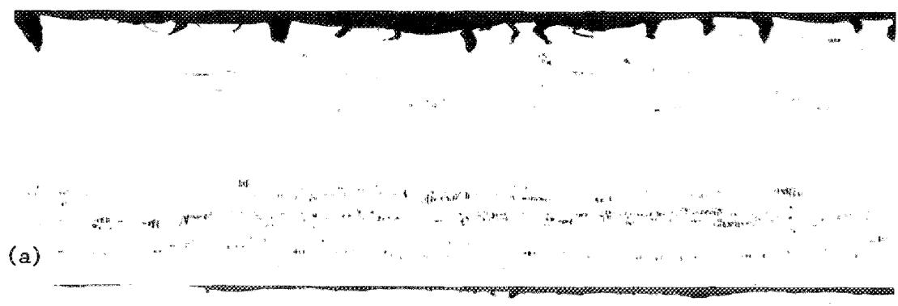

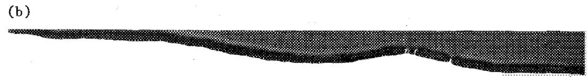

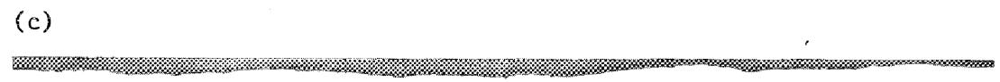

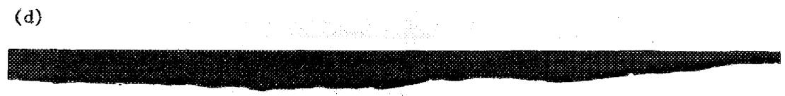  
(e)   
Fig. 7.3. Typical photomicrographs of several metals after being electroplated with $0.05\mathrm{mg/cm}^2$ of Te, annealed for 1000 hr at $650^{\circ}\mathrm{C}$ in Ar, and strained at $75^{\circ}\mathrm{F}$ . (a) Hastelloy N, (b) Ni, (c) Cu, (d) Type 304 stainless steel, and (e) Inconel 600. (Another specimen of Inconel 600 on which the tellurium was deposited as a vapor did exhibit very shallow intergranular cracking.)

# Influence of Material Uncertainties

The preceding discussion indicates that the metal to be used for fabrication of an MSBR must satisfy three main requirements: (1) compatibility with the working fluids (fuel salt, coolant salt, steam), (2) adequate plasticity after neutron irradiation, and (3) resistance to intergranular cracking by fission products. A single material need not satisfy all of these, since all parts of the system do not have the same requirements. However, the use of dissimilar materials introduces complexity of design, so the possibilities for making the system of one material need to be considered.

Several of the materials that we presently view as being reasonable choices are listed in Table 7.3. The first shown, a modified Hastelloy N, is highly preferred but its use, of course, depends upon being able to alter the composition to stop the intergranular cracking. Whether Hastelloy N can be used in the steam generator will depend upon its compatibility with steam, which, as discussed more fully in Chapter 8, is still subject to question. The peak temperature with the materials used in selection l would likely be $1300^{\circ}\mathrm{F}$ .

Our second choice would be to use type 304 stainless steel in the primary circuit because it appears to have excellent resistance to damage by tellurium. The addition of about $0.2\%$ Ti to this material has already been shown to be an adequate solution to the problem of irradiation embrittlement. The main question regarding type 304 stainless steel concerns its corrosion in fuel salt, and the outlet fuel temperature in the reactor might have to be reduced to lower the corrosion rate. Stainless steel will likely not have adequate corrosion resistance in the coolant salt, and a transition to Hastelloy N would be made in the intermediate heat exchanger. This would require a duplex tube of type 304 stainless steel on the inside and Hastelloy N on the outside.

Our third choice at this time would be a system made entirely of a nickel-high chromium alloy. The available corrosion data on Inconel 600 (15% chromium) suggest that such a system would have an acceptable corrosion rate with fuel salt at about $1200^{\circ}\mathrm{F}$ . However, these data were obtained a number of years ago on relatively impure salts, and additional corrosion testing will be required. Inconel 600 has not been tested under controlled additions in sodium fluoroborate, but our present understanding of the chemical behavior of this salt gives reasonable hope of acceptable compatibility. This alloy has been used in many steam generators and the experience has been favorable. The main problem with Inconel 600 is embrittlement by neutron irradiation. We have been able to improve the resistance of Hastelloy N and types 304 and 316 stainless steel by controlling variables such as grain size, heat treatment, and composition, but this ability must be demonstrated for a nickel-high chromium alloy.

The fourth materials selection would involve the use of the partially developed $2\%$ Ti-modified Hastelloy N in the entire system with the surfaces exposed to fuel salt being covered (weld overlay, duplex tubing, cladding) by stainless steel or Monel. This would require that the details of the cladding processes be developed to include joining and to insure integrity during service.

Table 7.3. Possible materials for construction of MSBRs   

<table><tr><td>Selection</td><td>Primary circuit</td><td>Coolant circuit</td><td>Steam generatora</td><td>Uncertainties</td></tr><tr><td>1</td><td>Modified Hastelloy N</td><td>Modified Hastelloy N</td><td>Modified Hastelloy N</td><td>Addition to stop cracking, compatibility with steam</td></tr><tr><td>2</td><td>Type 304 stainless steel</td><td>Inconel 600</td><td>Inconel 600</td><td>Corrosion of type 304 stainless steel</td></tr><tr><td>3</td><td>Inconel 600 Ni-high Cr alloy</td><td>Inconel 600 Ni-high Cr alloy</td><td>Inconel 600 Ni-high Cr alloy</td><td>Improvement of radiation resistance by microstructure and chemistry, control of corrosion rate</td></tr><tr><td>4</td><td>Modified Hastelloy N, stainless steel or Monei coating</td><td>Modified Hastelloy N</td><td>Modified Hastelloy N</td><td>Development of duplex Hastelloy N-stainless steel tubing</td></tr></table>

${}^{a}$ Any of these selections could utilize a duplex tube with nickel on the coolant-salt side and Incoloy 800 on the steam side.

Several of these selections involve duplex tubing and clad structures. Methods for making duplex tubing and techniques for weld overlaying generally exist for the materials involved. The greatest complication comes about in joining, where, although the basic ability to make such joints is available, joint designs and welding procedures must be developed for each material.

One further method that has been considered for handling the cracking problem is to getter the fission product tellurium from the salt with some reactive material. The amount of tellurium produced is quite small, and a very efficient filter would be required. To be effective, this filter would have to be placed near the reactor outlet, and the pressure drop, heat generation rate, and salt holdup associated with it would likely be very high. Thus, we have devoted only limited attention to this approach.

Our preferences in Table 7.3 clearly favor staying with Hastelloy N as a structural material. Its resistance to corrosion by fluoride salts has been well demonstrated, and irradiation embrittlement appears to be taken care of adequately by the addition of titanium. Consequently, a change to another material should be made only if it becomes clear that Hastelloy N cannot be further modified to improve its resistance to intergranular cracking. In the event that a change of materials is necessary, nickel-base alloys appear preferable to iron-base alloys because the salt can be allowed to be more oxidizing with nickel. However, the studies thus far indicate that the iron-base alloys offer more resistance to intergranular cracking. Thus, these two factors must be balanced against each other in choosing a material, and this will be possible only when more data are available on the resistance of different alloys to cracking and their corrosion resistance in salt.

# Further Work

The most pressing problem with Hastelloy N is its susceptibility to grain boundary cracking when exposed to fission products in fuel salts. Work in the immediate future will concentrate on determining whether acceptable chemical modifications to Hastelloy N will adequately improve its resistance to cracking. Experiments already run indicate that the addition of $2\%$ niobium may be effective, and Hastelloys containing more than $16\%$ chromium are not attacked. Modifications of Hastelloy N containing various concentrations of chromium, iron, manganese, silicon, titanium, and cerium will be annealed in the presence of tellurium, and evaluated for crack susceptibility. If an alloy near the Hastelloy N composition can be shown to be immune to tellurium, it must then be irradiated to determine whether it has adequate ductility in the irradiated condition, and tests in salt must be run to determine the operating temperature limitations imposed by corrosion. Further work to develop the irradiation resistant microstructure in the modified alloy will be required if the modification has altered its resistance to radiation.

In addition to working on Hastelloy N, we will evaluate a nickel-high chromium alloy. Inconel 600 (with $15\%$ chromium) seems to be borderline in its tendency to form intergranular cracks, and an alloy with about

20% chromium will likely be required to resist cracking. If experiments show that this is the case, the main uncertainties will become the ductility of the material in the irradiated condition and the maximum operating temperature at which the corrosion rate is tolerable. Sample materials of several high-chromium commercial alloys such as Hastelloy X, Hastelloy C, and Incoloy 800 will be included in our experiments to determine whether they resist cracking under very stringent test conditions. The alloys that are resistant to cracking will be irradiated and their postirradiation creep properties determined to evaluate the magnitude of the irradiation embrittlement problem.

The carbides in Incoloy 800 are basically $\mathrm{Cr}_{23}\mathrm{C}_6$ (such as occurs in stainless steels) and it is quite likely that close control of the titanium, nitrogen, and carbon concentrations will result in adequate resistance to irradiation embrittlement [42]. The carbides in Hastelloy's X and C are molybdenum-base just as those in Hastelloy N. Thus, we have experience with both types of carbides in these alloys and can likely modify the microstructure to obtain improved resistance to irradiation embrittlement if necessary.

The initial corrosion experiments will involve thermal convection loops made of two representative alloys to determine whether such high chromium levels can be tolerated at a reasonable operating temperature. If these results are favorable, a pumped loop will be put in operation to investigate corrosion at higher fluid velocities.

Although all stainless steels examined resist intergranular cracking by tellurium, type 304 stainless steel would likely be our choice among them because of its metallurgical simplicity and extensive industrial production and use. This alloy seems to have adequate resistance to embrittlement by thermal neutron fluences of the magnitude that we will encounter. The key factor, therefore, is whether it possesses adequate corrosion resistance at a reasonable operating temperature. Two stainless steel thermal convection loops are currently in operation and the next step will be to start a forced convection loop.

Because of the importance of the intergranular cracking problem, simultaneous programs should be carried out on all three types of materials that have been discussed. Materials will be dropped and others added as experimental findings warrant.

The materials that appear acceptable from the standpoints of corrosion, irradiation embrittlement, and resistance to tellurium must be subjected to some in-reactor testing. We are reasonably confident that tellurium is the element causing the cracking and that its chemical behavior will be equivalent in in-reactor and out-of-reactor tests. However, some verification of this will be required. The first step will be static capsule tests and a capsule experiment is being designed for the ORR in which standard Hastelloy N and alloys that are expected to be resistant to tellurium will be exposed to fissioning salt under identical conditions. Later tests should involve stressed samples. We presently feel that more sophisticated in-reactor tests that simultaneously demonstrate all of the conditions to be encountered in a reactor, including heat transfer and forced-convection flow, are not necessary, but this will have to be re-evaluated as the program progresses.

Following the path that has been outlined, we should be able to make a conclusive choice of materials within about two years. However, many of the confirmation tests will have to operate beyond this time. Additional effort will be needed if a duplex system is required, since methods must be developed for making dissimilar joints, duplex tubing, and weld overlays.

# Evaluation

The basic requirements of a structural material are that it be compatible with its environments, have acceptable mechanical properties both unirradiated and after exposure to the maximum expected neutron fluence, and be capable of being fabricated with reasonable ease. Two compatibility problems exist, one being the selective removal of chromium and the other being intergranular cracking due to the infusion of fission products (likely tellurium).

Our experience with Hastelloy N has been very favorable so far as corrosion is concerned. Chemical modifications have made the irradiation embrittlement tolerable, and there is reasonable evidence that further chemical modifications can be made to control the intergranular cracking. The development of a suitable modification of Hastelloy N that can be safely used with fissioning fuel salt should be the central thrust of the materials development program.

Nickel-high chromium alloys appear to resist intergranular cracking by tellurium, but the extent of their irradiation embrittlement must be evaluated by experiments, and their corrosion behavior must be studied in more detail. Previous tests with relatively impure salts and consideration of chromium diffusion rates in the metal indicate that the peak operating temperature for Inconel 600 (15% chromium) would be about $1200^{\circ}\mathrm{F}$ . It will be necessary first to determine the minimum chromium concentration required to prevent intergranular cracking, and then the question of irradiation embrittlement and corrosion must be evaluated.

Type 304 stainless steel offers excellent resistance to intergranular cracking by tellurium and has acceptable resistance to embrittlement by neutron irradiation, but its corrosion resistance must be evaluated more completely and very likely it will not be usable above $1200^{\circ}\mathrm{F}$ .

Other materials such as Monel and copper resist cracking by tellurium and can possibly be used as coatings in the primary circuit. However, considerable development work would be required to follow this route.

Our work thus shows that there may be several materials that will satisfy the basic requirements for MSBR piping and vessels. However, some further investigation will be necessary before choosing the most desirable option.

Tellurium does not form a very stable fluoride in MSBR fuel salt, so it deposits on metal surfaces in the reactor leading to the intergranular cracking that we have observed. Since this process involves the interaction of the two metals, it should not differ in a nuclear environment and a laboratory experiment. This means that most of the experimental

work can be conducted in the laboratory, with only limited in-reactor work being required for confirmation. Consequently, we envision that this testing program can continue to move ahead rapidly, and expect that an acceptable remedy can be demonstrated convincingly in about two years, although more extensive tests of a confirmative nature will require a longer time.

# References for Chapter 7

1. H. E. McCoy, Jr., An Evaluation of the Molten-Salt Reactor Experiment Hastelloy N Surveillance Specimens - Fourth Group, ORNL-TM-3063 (1971).   
2. G. M. Adamson, R. S. Crouse, and W. D. Manly, Interim Report on Corrosion by Alkali-Metal Fluroides: Work to May 1, 1953, ORNL-2337 (1959).   
3. G. M. Adamson, R. S. Crouse, and W. D. Manly, Interim Report on Corrosion by Zirconium-Base Fluorides, ORNL-2338 (1961).   
4. W. D. Manly et al., "Metalurgical Problems in Molten Fluoride Systems," Progr. Nucl. Energy Ser. IV 2, p. 164 (1960).   
5. H. E. McCoy, Jr., "The INOR-8 Story," ORNL Review 3, p. 35 (1969).   
6. H. E. McCoy, Jr., and J. R. Weir, Jr., Materials Development for Molten-Salt Breeder Reactors, ORNL-TM-1854, pp. 31-33 (1967).   
7. H. E. McCoy, Jr., and R. E. Gehlbach, "Influence of Irradiation Temperature on the Creep-Rupture Properties of Hastelloy N," J. Nucl. Technol. 11, p. 45 (1971).   
8. R. B. Briggs, MSR Program Semiann. Progr. Rept. August 31, 1961, pp. 93-94, ORNL-3215 (1962).   
9. J. H. DeVan, MS Thesis (University of Tennessee, 1960).   
10. H. E. McCoy, Jr., and J. R. Weir, Jr., Materials Development for Molten Salt Breeder Reactors, ORNL-TM-1854, pp. 5-14, (1967).   
11. P. N. Haubenreich and J. R. Engel, "Experience with the MSRE," Nucl. Appl. Technol. 8, 118 (1970).   
12. M. W. Rosenthal, P. R. Kasten and R. B. Briggs, "Molten-Salt Reactors - History, Status, and Potential," Nucl. Appl. Technol. 8, 107 (1970).   
13. R. E. Thoma, Chemical Aspects of MSRE Operation, ORNL-4658, p. 53 (December 1971).   
14. H. E. McCoy, Jr., An Evaluation of the Molten-Salt Reactor Experiment Hastelloy N Surveillance Specimens - Second Group, ORNL-TM-1997 (1967).   
15. H. E. McCoy, Jr., An Evaluation of the Molten-Salt Reactor Experiment Hastelloy N Surveillance Specimens - Second Group, ORNL-TM-2359 (1969).

16. H. E. McCoy, Jr., An Evaluation of the Molten-Salt Reactor Experiment Hastelloy N Surveillance Specimens - Third Group, ORNL-TM-2647 (1970).   
17. H. E. McCoy, Jr., The MSRE and Its Operation, report to be published.   
18. D. R. Harries, "Neutron Irradiation Embrittlement of Austenitic Stainless Steels and Nickel Base Alloys," J. Brit. Nucl. Energy Soc. 5, p. 74 (1966).   
19. G. H. Broomfield, D. R. Harries, and A. C. Roberts, "Neutron Irradiation Effects in Austenitic Stainless Steels and a Nimonic Alloy," J. Iron Steel Inst. (London) 203, p. 502 (1965).   
20. N. A. Hughes and J. Caley, "The Effect of Neutron Irradiation at Elevated Temperatures on the Tensile Porperties of Some Austenitic Stainless Steels," J. Nucl. Mater. 10, p. 60 (1963).   
21. F. C. Robertshaw et al., "Neutron Irradiation Effects in A-286 Hastelloy Y and Rene' 41 Alloys," ASTM STP 341, American Society for Testing and Materials, p. 372 (1963).   
22. N. E. Hinkle, "Effect of Neutron Bombardment on Stress-Rupture Properties of Some Structural Alloys," ASTM STP 341, American Society for Testing and Materials, p. 344 (1963).   
23. P. C. L. Pfeil and D. R. Harries, "Effects of Irradiation in Austenitic Steels and Other High-Temperature Alloys," ASTM STP 380, American Society for Testing and Materials, p. 202 (1965).   
24. W. R. Martin and J. R. Weir, Jr., "The Effect of Irradiation Temperature on the Post-Irradiation Stress-Strain Behavior of Stainless Steel," ASTM STP 380, American Society for Testing and Materials, p. 251 (1965).   
25. J. T. Venard and J. R. Weir, Jr., "In-Reactor Stress-Rupture Properties of a 20 Cr-25 Ni Columbium-Stabilized Stainless Steel," ASTM STP 380, American Society for Testing and Materials, p. 269 (1965).   
26. P. C. L. Pfeil, P. J. Barton, and D. R. Arkell, "Effects of Irradiation on the Elevated Temperature Mechanical Properties of Austenitic Steels," Trans. of American Nucl. Soc. 8, p. 120 (1965).   
27. P. R. B. Higgins and A. C. Roberts, "Reduction in Ductility of Austenitic Stainless Steel After Irradiation," Nature 206, p. 1249 (1965).   
28. W. R. Martin and J. R. Weir, Jr., "Effect of Elevated Temperature Irradiation on the Strength and Ductility of the Nickel-Base Alloy, Hastelloy N," Nucl. Appl. 1(2): 160-167 (1965).

29. W. R. Martin and J. R. Weir, Jr., "Postirradiation Creep and Stress Rupture of Hastelloy N," Nucl. Appl. 3, p. 167 (1967).   
30. H. E. McCoy, Jr., and J. R. Weir, Jr., "Stress-Rupture Properties of Irradiated and Unirradiated Hastelloy N Tubes," Nucl. Appl. 4, p. 96 (1968).   
31. R. E. Thoma, Chemical Aspects of MSRE Operation, ORNL-4658 (No. 31), p. 71 (December 1971).   
32. MSR Program Semiann. Progr. Rept. Feb 29, 1972, ORNL-4782.   
33. MSR Program Semiann. Progr. Rept. Aug. 31, 1971, ORNL-4728, p. 145.   
34. MSR Program Semiann. Progr. Rept. Feb. 28, 1971, ORNL-4676, p. 196.   
35. MSR Program Semiann. Progr. Rept. Aug. 31, 1971, ORNL-4728, p. 142.   
36. E. E. Bloom, "Nucleation and Growth of Voids in Stainless Steel During Fast-Neutron Irradiation," Radiation-Induced Voids in Metals, U.S. AEC Office of Information Services, p. 1 (1972).   
37. A. A. Bauer and M. Kanglilaski, "Helium Generation in Stainless Steel and Nickel," J. Nucl. Mater. 42, 91 (1972).   
38. M. W. Rosenthal et al., "Recent Progress in Molten-Salt Reactor Development," Atomic Energy Rev., IX, 601 (1971).   
39. H. E. McCoy, Jr., and R. E. Gehlbach, "Influence of Zirconium Additions on the Mechanical Properties of a Ni-Mo-Cr Alloy in the Irradiated and Unirradiated Conditions," J. Nucl. Mater. 40(2), 151-165 (1971).   
40. C. E. Sessions and T. S. Lundy, "Diffusion of Titanium in Modified Hastelloy N," J. Nucl. Mater. 31, 316 (1969).   
41. E. E. Bloom, In-Reactor and Postirradiation Creep-Rupture Properties of Type 304 Stainless Steel at $650^{\circ}C$ , ORNL-TM-2130 (1968).   
42. E. E. Bloom and J. R. Weir, Jr., "Development of Austenitic Stainless Steels with Improved Resistance to Elevated-Temperature Irradiation Embrittlement," *Irradiation Effects in Structural Alloys for Thermal and Fast Reactors*, American Society for Testing Materials, 261 (1969).   
43. C. G. Bieber and R. F. Decker, "The Melting of Malleable Nickel and Nickel Alloys," Trans. AIME 221, 629 (1961).   
44. D. R. Wood and R. M. Cook, "Effects of Trace Contents of Impurity Elements on the Creep-Rupture Properties of Nickel-Base Alloys," Metallurgia 109 (1963).   
45. J. C. Fisher, J. Appl. Phys. 22: 74-77 (1951).

# 8. REACTOR COMPONENTS AND SYSTEMS

Dunlap Scott W.R.Huntley

A. G. Grindell H. A. McLain

A. I. Krakoviak E. S. Bettis

J.L.Crowley C.E.Bettis

The purpose of this chapter is to describe the present status of the technology of components and systems for molten-salt reactors, to indicate the importance of the uncertainties remaining, to identify the additional work needed, and to evaluate the probability of success in obtaining reliable components and systems. Except for the control and safety rods, the reactor vessel and internals are not covered in this chapter; these are discussed in Chapters 3 and 6. The problems related to the chemistry of the salts and the materials of construction are discussed briefly only where the mechanical design or operation of the plant is affected. Otherwise the reader should refer to the respective chapters (5, 6, and 7) for more details.

In preparing this status report, we used the reference design for the MSBR [1] to determine the requirements for the components and systems, examined the various conceptual designs of the components proposed in the reference design and in the studies prepared by Evasco Services [2-4], Foster Wheeler [5], McWherter [6], and Bettis et al. [7] to determine the possible difficulties. We then reexamined the prior experience to establish the status of the various technologies and to determine the work needed to resolve the uncertainties. As outlined in Chapter 2, this prior experience began during the Aircraft Nuclear Propulsion (ANP) Program, and progressed through the development work associated with design, construction, and successful operation of the Aircraft Reactor Experiment, and subsequent development for a larger aircraft reactor. This experience served as a basis for and carried over into the development studies conducted in support of the design, construction, and successful operation of the MSRE and subsequently in support of the conceptual design studies of the MSBR. Operation of the MSRE for more than 13,000 equivalent full-power hours provided most of the experience related to nuclear operation. Although not all the uncertainties related to fission product distribution uncovered during the MSRE operation have been resolved, the components and systems operated about as expected and provide confidence in these areas of molten-salt technology.

Presently we are constructing two MSRE-scale facilities for the study of the problems associated with the handling and circulation of molten salts and the operation of auxiliary components in large loops. The Coolant Salt Technology Facility (CSTF) is nearing completion and should begin operation circulating $\mathrm{NaBF}_4$ -NaF (92-8 mole %) in late summer 1972. The Gas System Technology Facility (GSTF) should begin operation in the summer of 1973. The GSTF will circulate molten LiF-BeF $_2$ -ThF $_4$ -UF $_4$ (71.7-16-12-0.3 mole %) and will provide a means for testing the operation of the gas handling system and other components with a typical MSBR fuel salt. We expect that the operation of these facilities over the next two years should resolve many of the remaining uncertainties in the gas handling and the coolant salt technology.

The discussions which follow provide an evaluation of the technology without much detail, but the references cited contain the material needed to substantiate the existence and status of the technology.

# Salt Pumps

# Requirements and Criteria

The pumps for molten-salt breeder reactors must circulate fluoride salts in primary (fuel) and secondary (coolant) salt systems reliably at temperatures approaching $1300^{\circ}\mathrm{F}$ and meet the general hydraulic requirements presented in Table 8.1. The table presents the design temperature and the hydraulic characteristics of the salt pumps for the primary and secondary salt systems for a 1000-MW(e) MSBR, a 200-MW(t) Molten-Salt Breeder Experiment (MSBE), and the MSRE. Other criteria for MSBR salt pumps are presented in condensed form in Table 8.2. Inert gas has been circulated by salt pumps to aid in preheating and cooling down MSRE and test facility salt systems, and the need for this pump capability may persist for MSBR's also.

# Salt Pump Concepts

Electromagnetic and centrifugal pumps have been considered for application to salt systems. The low electrical conductivity of molten fluoride salts hinders the application of electromagnetic pumps, and, consequently, they are not used in fluoride salt systems. In contrast, centrifugal pumps have been applied very satisfactorily to fluoride salt systems. A study [8] of the problems of applying the canned-rotor motor and the short-shaft and long-shaft configurations of the centrifugal pump to molten-salt service was made in 1967. The canned-rotor pump was concluded to be a very desirable configuration, since there are no orientation or elevation limitations on its application. However, it would require difficult and expensive development to provide pumps for an MSBR application including the development of a high-temperature electric motor with an electrical insulation system that also has a very high resistance to nuclear radiation damage. Thus our efforts are centered on sump pumps, and all pumps built or proposed for MSBR's are centrifugal sump pumps. This pump can be considered to have two basic configurations that are differentiated by shaft length and type of shaft support bearings. All the salt pumps built for test facility and reactor operation at ORNL have been of the short-shaft configuration described immediately below. The Byron Jackson Pump Division of Borg-Warner, one of the participants in an industrial group studying molten-salt reactors, prefers the long shaft configuration for MSBR salt systems; this configuration is described very briefly below also.

Table 8.1. General pump requirements for MSBR salt systems   

<table><tr><td rowspan="2"></td><td colspan="2">MSBE, &lt;200 MW(t)</td><td colspan="2">MSBR, 1000 MW(e)</td><td colspan="2">MSRE, 8 MW(t)</td></tr><tr><td>Primary</td><td>Secondary</td><td>Primary</td><td>Secondary</td><td>Primary</td><td>Secondary</td></tr><tr><td>Number of salt loops</td><td>1</td><td>1</td><td>3-4</td><td>3-4</td><td>1</td><td>1</td></tr><tr><td>Design temperature, °F</td><td>1300</td><td>1300</td><td>1300</td><td>1300</td><td>1300</td><td>1300</td></tr><tr><td>Pump capacity, gpm</td><td>5700</td><td>7200</td><td>21,000-16,000</td><td>27,000-20,000</td><td>1200</td><td>850</td></tr><tr><td>Head, ft</td><td>150</td><td>300</td><td>150</td><td>300</td><td>50</td><td>100</td></tr><tr><td>Speed, rpm</td><td>890</td><td>1190</td><td>890</td><td>1190</td><td>1150</td><td>1750</td></tr><tr><td>Specific speed, Ns</td><td>1570</td><td>1400</td><td>3000-2625</td><td>2710-2330</td><td>2130</td><td>1560</td></tr><tr><td>Net positive suction head required, ft</td><td>9</td><td>15</td><td>21-18</td><td>37-30</td><td>10</td><td>10</td></tr><tr><td>Impeller input power, hp</td><td>890</td><td>1220</td><td>2900-2200</td><td>4100-3100</td><td>48</td><td>45</td></tr></table>

Table 8.2. Condensed list of criteria for an MSBR primary salt pump   

<table><tr><td>Item</td><td>Criteria</td></tr><tr><td>Pump hydraulic requirements</td><td>See Table 8.1. Pump manufacturer to study relationship between pump speed, efficiency, NPSH required, salt volume within the pump tank to recommend a hydraulic design suitable to both purchaser and manufacturer.</td></tr><tr><td>Pump design pressure and temperature</td><td>See Table 8.1.</td></tr><tr><td>Operating life requirements</td><td></td></tr><tr><td>Pump structure</td><td>30 years.</td></tr><tr><td>Pump driver</td><td>30 years, conveniently replaceable.</td></tr><tr><td>Bearings</td><td>100,000 hr, conveniently replaceable.</td></tr><tr><td>Shaft seals</td><td>50,000 hr, conveniently replaceable.</td></tr><tr><td>Codes and standards</td><td>Pump to be designed, fabricated, inspected, and tested as though subject to the requirements of ASME BPV Code, Section III.</td></tr><tr><td>Materials of construction</td><td>To meet the requirements of ASME BPV Code, Section III, as supplemented for Hastelloy N.</td></tr><tr><td>Vibration</td><td>Avoid resonances that are harmful to the pump and other salt system components.</td></tr><tr><td>Shaft forces</td><td>Reduce to level consistent with pump bearing life of 100,000 hr.</td></tr><tr><td>Ambient temperature</td><td>As specified, which will reflect choice between oven heating of salt system and heating individual system components.</td></tr><tr><td>Normal operating conditions</td><td></td></tr><tr><td>Startup</td><td>Pump should safely withstand across-the-line motor startups that produce maximum acceleration.</td></tr><tr><td>Heatup and cooldown cycles (to and from room temperature)</td><td>50 cycles specified in pump specification.</td></tr><tr><td>Zero to full power cycles</td><td>360 cycles specified in pump specification.</td></tr><tr><td>Full to zero power cycles</td><td>240 cycles specified in pump specification.</td></tr><tr><td>Nuclear heat deposition</td><td>Provide cooling as required to protect pump components from overheating. Heat deposition rate to be supplied in pump specification.</td></tr><tr><td>Pump tank volume</td><td>Provide for maximum anticipated thermal expansion of the primary (fuel) salt.</td></tr><tr><td>Variable frequency supply for drive motor</td><td>To meet requirements of pump specification.</td></tr><tr><td>Lubricant-coolant package</td><td>Furnish lubricant-coolant system to meet lubrication and cooling requirements of pump rotary element.</td></tr><tr><td>Shaft seal and purge gas</td><td>Shaft seals shall be used to prevent leakage of lubricant-coolant into primary salt or ambient atmosphere. Provide split flows of purge gas (helium) in shaft annulus. Upward flow to prevent diffusion of vapors of seal oil leakage into primary salt. Downward flow to prevent diffusion of salt vapors into shaft seal region.</td></tr><tr><td>Pump instrumentation</td><td></td></tr><tr><td>Pump speed</td><td>Provide three independent pump shaft speed sensing systems consisting of electromagnetic pulse generator, sensor, and readout. Provide capability of sensing direction of shaft rotation.</td></tr><tr><td>Temperature</td><td>Provide ungrounded sheathed thermocouples to measure pump temperatures as described in pump specification.</td></tr><tr><td>Liquid level</td><td>Fabricate and install liquid level sensor in pump tank to the design provided by the Company.</td></tr><tr><td>Maintenance</td><td></td></tr><tr><td>Direct maintenance</td><td>Provide static shutdown shaft seal and purge gas provision to accommodate removal and replacement of shaft bearings and seals subassembly.</td></tr><tr><td>Remote maintenance</td><td>Provide all features of alignment, quick disconnects, bolting, and devices needed to accomplish the remote removal and replacement of the drive motor and pump rotary element.</td></tr><tr><td>Incipient failure diagnosis</td><td>Make provisions to detect malfunction of principal pump components to anticipate their failure.</td></tr><tr><td>Upset conditions</td><td></td></tr><tr><td>Sudden shutdowns</td><td>120 of the nature described in pump specification.</td></tr><tr><td>Seismic loading</td><td>Pump should remain operational or be able to regain operational status after seismic loadings of 0.1 g horizontal and 0.06 g vertical. (These values may be very sensitive to geography.)</td></tr><tr><td>Thermal displacement of pump</td><td>Provide for pump displacements caused by temperature changes as given in the pump specification.</td></tr><tr><td>Pump nozzle loadings</td><td>Nozzles must withstand moments and forces described in the pump specification.</td></tr><tr><td>Structural requirements, accessibility, remote alignment, jacking bolts, and lifting devices</td><td>Provide these features and devices as required in pump specification.</td></tr><tr><td>Nuclear radiation protection</td><td>Apply nuclear shielding and cooling, as required, to protect lubricant-coolant and other radiation-sensitive materials. Company to furnish nuclear radiation dose rates and materials.</td></tr><tr><td>Rotor dynamics</td><td>Provide analysis to ensure that pump design speed is safely below the first critical frequency of the shaft-impeller-support system. Rule of thumb is pump design speed should not exceed 75 to 80% of first critical frequency.</td></tr><tr><td>Drive motor</td><td>Squirrel cage induction motor should be used.</td></tr><tr><td>Electrical insulation system</td><td>Halogen-free “H” insulation with polyimide or silicon binder approved by Company. Temperature rise at design conditions should be in accord with NEMA MG1-1967. Ungrounded Chromel-Alumel thermocouples should be used to measure temperatures of stator coils and rotor bearings.</td></tr><tr><td>Bearings</td><td>Life expectancy of 100,000 hr.</td></tr></table>

Short-Shaft Pump. - A conceptual drawing of a short shaft centrifugal pump is shown in Fig. 8.1. It is the pump for the primary salt system in the reference design for a single fluid MSBR [9]. Except for its large capacity, this pump is very similar to those used in 1954 in the ARE, those proposed for the Aircraft Reactor Test (ART) in the late 1950's [10], and those operated for over 20,000 hours in the MSRE in the 1960's [11]. It consists of three principal parts: the rotary element, the pump tank and the driver. The rotary element contains the conventional, oil-lubricated bearings that support the short shaft from which the impeller is overhung and also the shaft seals that hold the pump bearing and seal lubricant-coolant in the bearing housing. The pump tank incorporates the pump casing (volute), the necessary nozzles for the inlet and discharge of pumped salt and inert cover gas, and the mounting brackets; the tank would be welded permanently into the salt system in an MSBR. The pump driver is presently considered to be a three-phase induction (squirrel cage) electric motor installed in a water-cooled vessel. The rotary element, pump tank, and drive motor are assembled with gasketed joints to form a gas-tight unit; the gasketed joints are connected to a leak-detector system for nuclear reactor application.

Long-Shaft Pump. - A conceptual drawing of a long-shaft centrifugal pump is shown in Fig. 8.2. It was considered for the reference two-fluid MSBR [12] and is similar in overall features to that preferred by Byron Jackson [13, 14]. The principal configurational feature that distinguishes this concept from a short-shaft pump is the long shaft supported at its lower end by a molten-salt lubricated bearing. Because this pump configuration was considerably outside our experience, we had the rotor dynamics of the shaft-bearing-housing system and the characteristics of molten-salt lubricated bearings examined in some detail by Mechanical Technology Incorporated. The results of the study were reported in [15] and summarized in [16]. The pump shaft length and design speed for the pump should be selected to operate safely below the first shaft critical speed if at all practicable. If this cannot be done, then a practical means of performing precise dynamic balancing of long pump shafts must be developed. Consideration should also be given to constructing a rotor-dynamic simulation facility of the shaft-bearing system to evaluate the effectiveness of the dynamic balancing procedures, the bearing performance, and the rotor-bearing system stability.

The long-shaft pump is suitable for reactor salt systems that require locating the impeller at relatively low elevations in the system layout. It is suitable for circulating gas only at temperatures above the salt melting point, and then only if special provisions are made to supply molten-salt lubricant to the lower bearing when the salt system is dry. At about the time of the completion of the MTI study, the focus of MSBR attention shifted from the two-fluid to the single-fluid systems, and no more work was performed on the long-shaft pump.

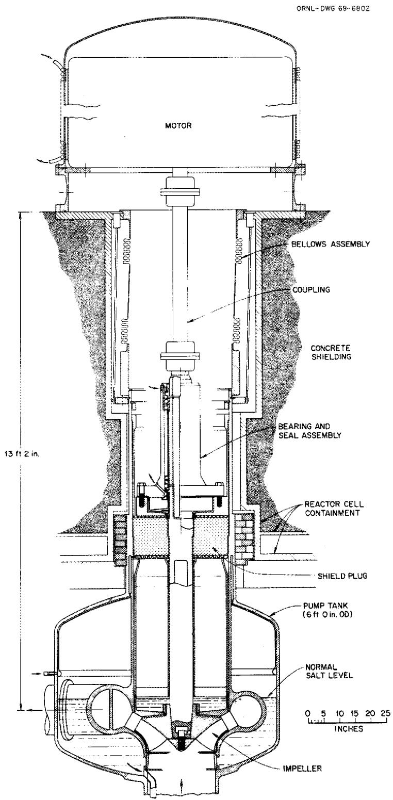  
Fig. 8.1. A conceptual salt pump for Molten-Salt Breeder Reactor. An example of the short shaft pump configuration.

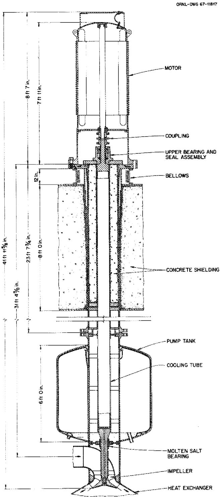  
Fig. 8.2. A conceptual salt pump for a Molten-Salt Breeder Reactor. An example of the long shaft pump configuration.

# Pump Experience

Short-Shaft Pump. -- Numerous short-shaft centrifugal pumps for moltensalt and liquid-metal applications have been designed, constructed, and tested at ORNL. Table 8.3 is a résumé of these pumps giving design values of pump head, capacity (flow) and speed, the number of units built for each model, and the total operating time accumulated with each model of pump. A very wide range is represented: capacities have ranged from 1 gpm to 1500 gpm; heads, from 50 to 400 ft; and design temperatures, between 1200 and $1500^{\circ}\mathrm{F}$ . Many pumps have been operated at $1500^{\circ}\mathrm{F}$ . Single units that were operated continuously and satisfactorily include several LFB pumps for periods of 15,000 to 20,000 hr and one MF pump for more than 25,000 hr. More than 58,000 hr satisfactory operation was accumulated with the MSRE salt pumps in the fuel- and coolant-salt systems in the reactor. An MSRE prototype pump was operated for approximately 8000 hr with molten-salt. This was followed by 14,000 hr of operation of the Mark-2 fuel salt pump which had a deeper pump tank and a slightly longer shaft overhang for the impeller than the reactor pump. Thus a total of more than 80,000-hr operation was accumulated with four MSRE salt pumps.

The models LFB through PKA pumps were designed to the requirements of the 1950 versions of the ASME Boiler and Pressure Vessel Code (ASME BPV Code), Section VIII, supplemented with metallurgical data taken during the ANP Program. The MSRE and ALPHA models of molten-salt pumps were designed to the requirements of the 1960 versions of the ASME BPV Code, Section VIII, as supplemented with low cycle fatigue data obtained during the early portion of the MSRp and with thermal strain-fatigue analyses of the pump tanks [17].

Several conclusions important to pump design were made and reaffirmed as pump operating experience was accumulated. The short-shaft pump configuration can be designed and built to operate satisfactorily in molten-salt reactors and satisfactorily scaled up in size from 5 to 1500 gpm. Pump performance characteristics obtained during water tests [18, pp. 11 and 13] of a centrifugal pump can be related reliably to the molten-salt operation of that pump. Experience has pointed out the importance of quality assurance in all the prime functions of design, materials procurement, fabrication, assembly, test and inspection, installation, and operation to the production of satisfactory salt pumps. Occasionally during the scaling up of pumps to larger capacities, a principle previously applied may be overlooked with annoying consequence, such as the location of the parting plane in the catch basin in the MSRE fuel- and coolant-salt pumps. The catch basin is provided to catch the lubricating oil that leaks past the lower shaft seal and thus prevents it from running down into the molten salt in the pump tank. There are various design approaches to providing the basin cavity, and prior to designing the MSRE salt pumps, all cavities had a parting line which required a static seal at an elevation considerably above the floor of the basin. In the MSRE salt pumps this parting line was placed at the floor of the basin, and during pump operation the two components joined at this line underwent some relative displacement that opened the joint and permitted seal oil leakage to run at a slow rate down into the molten salt in the pump tank.

Table 8.3. Characteristics and operation time for ORNL salt and liquid metal pumps   

<table><tr><td>Model</td><td>Fluid</td><td>Heada(ft)</td><td>Flowa(gpm)</td><td>Speeda(rpm)</td><td>Temperature (°F)</td><td>Number built</td><td>Total hours</td></tr><tr><td>LFB</td><td>Na, NaK, and molten salt</td><td>92</td><td>5</td><td>6000</td><td>1100-1400</td><td>46</td><td>466,000b</td></tr><tr><td>DANA</td><td>Na, NaK, and molten salt</td><td>300</td><td>150</td><td>3750</td><td>1000-1500</td><td>10</td><td>57,000</td></tr><tr><td>DAC</td><td>Molten salt</td><td>50</td><td>60</td><td>1450</td><td>1000-1400</td><td>3</td><td>4,000</td></tr><tr><td>In-Pile Loop</td><td>Molten salt</td><td>10</td><td>1</td><td>3000</td><td></td><td>8</td><td>14,000c</td></tr><tr><td>MF</td><td>NaK and molten salt</td><td>50</td><td>700</td><td>3000</td><td>1100-1500</td><td>3</td><td>41,000d</td></tr><tr><td>PKA</td><td>NaK and molten salt</td><td>400</td><td>375</td><td>3550</td><td>700-1500</td><td>2</td><td>21,500</td></tr><tr><td>PKP</td><td>NaK and molten salt</td><td>380</td><td>1500</td><td>3500</td><td>700-1500</td><td>4</td><td>45,000</td></tr><tr><td rowspan="2">MSRE fuel salt pump</td><td>Molten salt</td><td>50</td><td>1200</td><td>1175</td><td>1000-1225</td><td>2e</td><td>31,600</td></tr><tr><td>Helium</td><td></td><td></td><td></td><td>100-1200</td><td></td><td>6,000</td></tr><tr><td rowspan="2">MSRE coolant salt pump</td><td>Molten salt</td><td>78</td><td>800</td><td>1775</td><td>1000-1225</td><td>2</td><td>24,600</td></tr><tr><td>Helium</td><td></td><td></td><td></td><td>100-1200</td><td></td><td>4 000</td></tr><tr><td>MSRE Mark-2 fuel salt pump</td><td>Molten salt</td><td>50</td><td>1200</td><td>1175</td><td>1000-1300</td><td>1</td><td>14,000</td></tr><tr><td>ALPHA</td><td>Molten salt</td><td>300</td><td>30</td><td>6500</td><td>850-1400</td><td>1</td><td>6,000</td></tr><tr><td></td><td></td><td></td><td></td><td></td><td>Total</td><td>83</td><td>734,700</td></tr></table>

$^a$ At design point.   
Some pumps were operated for periods of 15,000-20,000 hr.   
c Includes 3000 hr in-pile operation.   
aInclude continuous operation of 25,500 hr for a single pump, circulating molten salt.   
eIncludes a prototype salt pump.

The permanent fix, which required seal welding the edges of the joint, was adopted only after nuclear operation of the MSRE and did not forestall the concern and activity needed to handle the consequences of the oil that leaked into the MSRE fuel-salt system.

Long-Shaft Pump. - The principal results of the study of the rotordynamic characteristics and molten-salt lubricated bearings for the long shaft pump are presented above in the section entitled Salt Pump Concepts. We had some experience with operating test bearings in molten salt in the early 1960's, which is reported in [19]. Hydrodynamic lubrication with molten salt in journal bearings was demonstrated over the temperature range $1200 - 1500^{\circ}\mathrm{F}$ . A PKA model pump was modified [20, pp. 56-57] to support the lower end of the shaft with a molten-salt lubricated bearing and was operated for approximately 12,500 hr at $1225^{\circ}\mathrm{F}$ . Although all the journals and sleeves in these test bearings were constructed of Hastelloy N and were operated with some degree of satisfaction, it was decided on metallurgical grounds that long term reliability required the application of hard materials such as refractory metals and cemented carbides. A few material specimens, hard faced by the plasma spray method, were purchased. Subsequent concentration on the pump requirements for the MSRE led to a deemphasis of this effort, and the test program for the specimens was not completed.

Industrial Experience and Interest. - Efforts were made to elicit industrial interest in the production of salt pumps for the ARE, ART, MSRE, and associated molten-salt test facilities. However, the quantity of pumps to be produced at any one time in the two decades during which these projects were viable was apparently too small to obtain and maintain serious industrial interest. In 1969 a specification [21] was written for a short-shaft centrifugal pump to provide the requirements of the primary and secondary salt systems in a 100- to 200-MW(t) MSBE, (see Table 8.1). Westinghouse Electro Mechanical Division, Bingham Pump Company, and Byron Jackson Pump Company expressed interest in commenting on the specification and receiving a request for proposal to produce the pumps. Westinghouse produced a very good response to the request, the only one received, but the deemphasis of the MSBE in 1970 obliged us to drop their proposal. We have had no contact with the pump industry to produce salt pumps of the long-shaft configuration.

# Status of Pump Technology

The preceding picture of the status of the technology of salt pumps supports the belief that satisfactory salt pumps of the short-shaft configuration can be produced for MSBR's. What follows in this section tends to emphasize problem areas, none of which should be insuperable for either the short shaft or the long shaft pumps.

Scaling up Pump Capacity. - The principal considerations attendant to scaling up pump capacity for both short and long shaft pumps are suction specific speed (S) and rotor dynamic characteristics and their effect on pump design speed and impeller diameter.

Suction specific speed (S) affects the net positive suction head (NPSH) required to suppress the inception of cavitation and subsequent damage to the pump impeller and casing, and to avoid cavitation-induced noise, reduced efficiency, and other deleterious effects. Lower, conservative values of S approaching 8500 require higher values of NPSH, which in turn require a larger impeller diameter and stronger pump components to contain the increased pressure of the working fluid. In some salt systems this might also entail an increase in the wall thickness of all the system components. Conversely, larger values of S approaching 14,000 reduce NPSH requirements and thus tend to permit the use of a smaller impeller diameter and lighter and thinner pressure vessels. To achieve the higher values of S, it is necessary to take advantage of newly developed computer programs for pump design and tape controlled machinery for fabrication. The computer programs calculate with much precision the boundary surfaces needed in impeller and casing flow passages to achieve the required pump hydraulic performance. Tape controlled machinery can then produce these precise boundary surfaces in the flow passage of pump impellers and casings in satisfactory fashion.

The rotor dynamic characteristics of pumps are determined primarily by the designs of the shaft, the bearings and their support members, and the mass of the impeller and the length of its overhang beyond the nearest support bearing. In conjunction these items determine the principal rotor dynamic criterion, the first flexural resonance frequency (critical frequency) of the shaft-bearings-impeller system. The rotor dynamic designs of the short shaft salt pumps that have been operated at ORNL permit operation of the pump at speeds safely below the critical frequency. Studies of layouts for MSBE salt pumps indicate that subcritical operation can be achieved with short shaft pumps for capacities at least up to 10,000 gpm. Larger capacities than this for both short and long shaft pumps may require larger impeller diameters than consideration of suction specific speed alone would yield. The principal recommendation of the rotor dynamic design study for long shaft pumps indicated the need for their operation at subcritical speeds also.

Design. - A major design requirement is to recall to use those principles proven during experience with previous salt pumps. Another major design requirement is the removal of nuclear heat from surfaces of a primary salt pump that are not cooled naturally by flowing salt or lubricant. During pump operation it should be practical to direct a small side stream of salt to these surfaces to remove the heat. However, if the salt deposits fission products on these surfaces, then removing the fission product decay heat when the salt pump is stopped becomes a problem. A multi-pump system can be designed so that the flow of cooling salt is maintained by the remaining pumps when one pump stops, but when all pumps in the primary salt system stop, it may be necessary to provide auxiliary cooling independent of the salt flow.

Fabrication. - A continuing effort has been expended in developing in-house fabrication expertise with and introducing segments of industry to newer construction materials such as Inconel in the early 1950's and Hastelloy N in the early 1960's. In the production of satisfactory Hastelloy N castings for impellers and casings for the MSRE salt pumps it was necessary to take the best sand castings produced by the casting industry and upgrade them at ORNL by identifying flaws with radiography and then repairing the castings by grinding out the flaws and depositing weld metal in the cavities until a satisfactory metal structure was achieved. However, for MSBR salt pumps, the prospect of making pump impellers and casings by weld joining machined pieces appears to be an attractive alternative to castings.

Long-Shaft Pump. - The principal problems for the long shaft pump, we believe, are the design of molten-salt lubricated bearings and the fabrication of long shafts to precise concentricity, straightness and dynamic balancing requirements.

The MTI study [14] indicated a preference for the self-acting pivoted pad bearing for this pump configuration and also recommended a rather extensive bearing design and materials program. Mechanical devices must be provided to accommodate the relatively large differential thermal expansion that occurs between the shaft and bearing support constructed of Hastelloy N and the journals and sleeves constructed of refractory metals or cemented carbides having much smaller coefficients of thermal expansion. MTI recommended an extensive series of bench and evaluation tests to select the most promising bearing materials compatible with a particular molten salt followed by proof tests in molten salt of full-size bearings constructed of these materials.

Precision shafts of lengths approaching 30 ft and diameters of 7 to 10 in. must be fabricated to provide a good starting point for the precision dynamic balancing of the machined shaft. The principal idea is to produce a shaft having dynamic characteristics that are compatible with the film strength and stability characteristics of its molten-salt lubricated support bearing.

Potential Improvements. - Improvement in variable speed control of pumps appears to be a good area for advancing the technology of salt pumps. In our experience, the squirrel-cage electric motor and a variable frequency supply system are very satisfactory choices for a salt pump drive system. Of the many variable frequency supply systems the completely static "cycloconverter" (or "diverter-inverter") system shows most promise for improvement. It couples a wide range of speed control, as much as ten to one, with the high reliability that one expects from a completely static system, particularly after that system has received adequate development.

Industrial Involvement. - An intensive and widely based involvement of the pump industry is necessary to the production of reliable and economic high-temperature pumps for the nuclear industry and should be very

beneficial to salt pump technology also. An iterative approach with selected vendors should lead to simpler and, hopefully, less expensive pump designs. It should also lead to lower pump construction costs as expertise in identifying and resolving the design problems peculiar to nuclear pumps is obtained and fabrication and assembly talents are sharpened. Much of the industrial experience derived from the development of pumps for LMFBR's can be expected to apply to pumps for MSBRs.

Effects of Uncertainties. - MSBR salt pumps have the usual turbo-machinery elements upon which are superimposed the requirements for operation at temperatures in the range 1000 to $1300^{\circ}\mathrm{F}$ and in a nuclear radiation environment. These latter requirements generate some problems of heat removal and radiation damage that will require directed effort. The larger diameter shafts for MSBR salt pumps will require larger shaft seals having greater rubbing velocities than our experience has covered. However, neither of these problems presents a genuine uncertainty that will bar the design and production of satisfactory short shaft pumps for reference MSBR salt systems.

The MSBR designs call for short shaft pumps, but if long shaft pumps should be needed, the problems previously mentioned should yield to adequate development effort. Confidence in their long term reliability will require endurance test operation in molten salt.

If satisfactory operation of the long shaft pump at supercritical speeds is proven to be difficult to achieve, the design of the pump shaft may be modified to increase its stiffness and raise the first flexural resonance frequency of the shaft safely above the pump design speed. Alternatively, the hydraulic design may be modified to decrease pump design speed satisfactorily below the critical frequency of the shaft.

# Salt Pump Development Requirements

The principal features of the development requirements for 'a short-shaft salt pump include proof and endurance testing of the shaft seal, a water performance test of the pump hydraulic design, and endurance testing of a prototype pump with molten salt. In addition to these items, the long-shaft salt pump will require a bearing materials development program, a bearing and journal mounting method program, a rotordynamic simulation test program, and probably verification of the capability to fabricate long pump shafts to precise concentricity, straightness, and dynamic balancing requirements. Each production pump, whether short or long shaft, should be subjected to a shakedown and molten-salt proof test prior to installation into an MSBR salt system.

The diameter and rubbing velocity of the shaft seal for an MSBR salt pump are larger than any we have experienced. The manufacturer should select the shaft seal design from among the bellows mount, fluid bearing, Visco seal, etc., and provide performance and endurance tests until a satisfactory design is evolved. The proof test of shaft seals installed in prototype and production salt pumps is performed as part of the shakedown and molten-salt proof testing.

A test stand should be designed and constructed to perform a series of tests with molten salt on the prototype pump that will verify its performance and give confidence in its long term endurability. The preliminary design of such a test stand suitable for MSBE salt pumps was completed [22, 23] in December 1969; it was estimated to cost $860,000 at that time. A partial listing of important tests planned for the facility, which are presented in references 22 and 24, includes:

1. Obtain the pump hydraulic performance and cavitation inception characteristics over a wide range of pump speeds and capacities and temperatures.   
2. Determine the start and cooldown characteristics of the pump and drive motor under load conditions.   
3. Determine the characteristics of the purge gas flow in the shaft annulus.   
4. Determine the distribution of salt aerosols produced by pump operation and obtain the performance characteristics of aerosol removal devices, if necessary.   
5. Demonstrate the operability of the incipient failure detection (IFD) devices.   
6. Obtain long term endurance operation with a prototypical pump.   
7. Make molten-salt proof tests of advanced instrumentation for molten-salt systems as it becomes available.

# Evaluation

We know how to make reliable short-shaft centrifugal pumps for molten-salt reactors, having built and operated many with capacities to 1500 gpm. Although it may take several years to produce the larger pumps for demonstration of full-scale MSBR's, the problems are well understood, and there is little question that satisfactory pumps can be obtained on a schedule compatible with obtaining the other principal reactor components.

We have had very little experience with the long-shaft pump configuration for molten-salt systems. However, it has been used in sodium systems, and plans are being processed for its use in the liquid-metal fast-breeder reactor program (LMFBR). The incentive to use long-shaft salt pumps is to reduce the total development requirements for MSBR's and LMFBR's. Indeed, the MSBR short-shaft pumps can benefit from the LMFBR sodium pump technology programs because the two pump configurations share many common requirements. The advanced analytical design methods that are being developed for the sodium pumps should have much direct application to the design of molten-salt pumps. We expect that the results of the shaft seal development program for sodium pumps will also have direct application to salt pumps. The fabrication technology developed for large sodium

pumps should have application to the fabrication of components for MSBR pumps after making some allowances for a probable difference in construction materials. The thermal shock capability of the Sodium Pump Test Facility (SPTF) could be utilized to shock a prototype MSBR salt pump.

However, the requirements for sodium and salt pumps are also sufficiently different that in other important respects they are unique. The density of salt and sodium are quite far apart and for a given pump capacity and head, the power required to drive a salt pump and the pressure developed would be several times the power and pressure for a sodium pump. However, because of the higher volumetric heat capacities of the salt, the total pump power requirements are less for salt than sodium. The design temperatures for the MSR's are $100^{\circ}\mathrm{F}$ or more above those for the sodium reactor systems and therefore the salt pumps will have to be designed for slightly lower allowable stresses.

Obtaining materials for molten-salt lubricated bearings that would be satisfactory for steady running conditions is not likely to be difficult. However, starting and stopping conditions become more severe as the temperature is raised above $1200^{\circ}\mathrm{F}$ . Also, as pointed out above, suitable devices would have to be developed (1) to attach salt-bearing materials to retainer pieces having a greatly differing coefficient of thermal expansion and (2) to maintain alignment between journal and bearing surfaces with other shaft support bearing at $1300^{\circ}\mathrm{F}$ .

Economy in design, production, operation, and maintenance favors the attempt to make the hydraulic and mechanical designs of pumps for both the primary- and secondary-salt systems very similar, if not identical.

# Coolant System

# Description

Molten-salt breeder reactor systems require the circulation of an intermediate coolant (1) to provide a barrier for protecting the steam system from fission products and for protecting the fuel system from steam system pressures, (2) to transfer the nuclear heat from the fuel salt to the water-steam system, and (3) to bridge the temperature gap between the fuel salt melting point and the steam system feed water temperature.

A mixture of LiF-BeF\(_2\) (66-34 mole %) was used successfully in the secondary system of the MSRE, but its high liquidus temperature \((857^{\circ}\mathrm{F})\) and high cost (\(600 to \)1400/ft\)^3) prompted a search for other possible coolants. In this search, special consideration was given to inhibiting the migration of tritium from the primary salt through the secondary coolant to the steam system. At the same time the performance characteristics of the coolants, the associated inventory costs, their compatibility with the fuel salt, steam, and the cell environment, and the materials required to contain the coolants were summarized for future reference [25]. Three groups of coolants were considered: molten salts, liquid metals, and gases at high or moderate pressure. Of the coolants which were considered, there appeared to be no real incentive for a choice

other than the eutectic $\mathrm{NaBF}_4$ -NaF (92-8 mole %) which has a melting point of $725^{\circ}\mathrm{F}$ and costs approximately $\$60/ft^{3}$ ( $\$0.5/1b$ ). It appeared that it might be possible to contain a small concentration of hydroxyl ion in complex in this coolant which could be continuously removed and replaced to function as a trap for the tritium. Among its disadvantages are (1) the need for $\mathrm{BF}_3$ in the cover gas because of the evolution of $\mathrm{BF}_3$ from $\mathrm{NaBF}_4$ at MSBR operating temperatures and (2) an affinity for water, which causes increased corrosiveness in both the salt and cover gas systems. As will be described below, these problems are not so severe as to affect our choice of the fluoroborate mixture as the coolant in future MSR's. A lower-melting-point fluoride mixture of LiF, NaF, and $\mathrm{BeF}_2$ with a liquidus temperature of $640^{\circ}\mathrm{F}$ , a mixture of LiCl and KCl with a liquidus temperature of $680^{\circ}\mathrm{F}$ , and a mixture of KF and $\mathrm{ZrF}_4$ with a liquidus temperature of $752^{\circ}\mathrm{F}$ appear to be alternatives. As mentioned in Chapter 2, some consideration also has been given to a special design using both LiF- $\mathrm{BeF}_2$ and a nitrate-nitrite mixture between the fuel and the steam. Additional information on coolant salts is given in Chapter 5.

The simplified schematic diagram in Fig. 8.3 shows one of four secondary salt circuits required to cool the reference design 1000 MW(e) molten-salt breeder reactor. In each circuit sodium fluoroborate salt flows from the outlet of a primary heat exchanger at $1150^{\circ}\mathrm{F}$ to the suction of a sump-type centrifugal pump. Salt discharged by the pump flows in parallel through several steam generator-superheater and steam-reheater units and returns to the primary heat exchanger at $850^{\circ}\mathrm{F}$ . The flow through each secondary circuit is 20,000 gpm and each circuit contains 2000 ft $^3$ of sodium fluoroborate. The total amount required is $\sim 450$ tons. Valves are provided in the salt lines to control the distribution of flow to the steam-raising units and to bypass coolant flow around the heat-exchanger under partial load conditions. (These valves need only to throttle, not to shut off flow.) A pressure-relief system is provided for each secondary salt circuit whereby high pressure produced by rupture of one or more tubes in the steam-raising units is relieved by the bursting of rupture disks and rapid blowdown of salt, noncondensable gases, and steam. A common cover-gas system is provided for the four circuits which supplies a mixture of $\mathrm{BF}_3$ and helium and possibly other gases to the tank of each salt circulation pump to provide a protective atmosphere over the free surface of the sodium fluoroborate. A purification system is provided to maintain the purity of the salt in the secondary circuits. As a minimum the purification system is expected to remove some corrosion products by cold trapping and to convert oxides and hydroxides to fluoro-rides. The processing system may also remove HF from the salt by contacting it with gas or by other means.

# Experience with Coolant Salts

A LiF-BeF $_2$ mixture was circulated at 860 gpm in the secondary system of the MSRE for approximately 26,000 hr over a temperature range of 1000 to $1200^{\circ}\mathrm{F}$ . During the lifetime of the MSRE ( $\sim 4 - 1/2$ yr) the chromium content of the salt remained constant at about 32 ppm, indicating remarkably little corrosion. Metallographic examination of the piping after shutdown

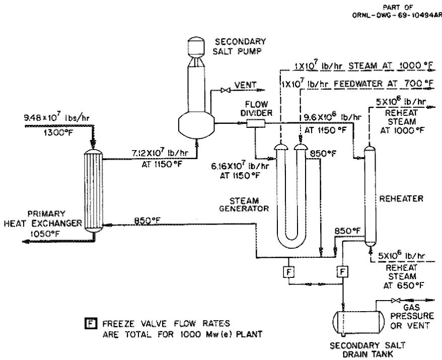  
Fig. 8.3. Secondary salt and steam system molten salt breeder reactor flow diagram-1000 MW(e) Unit-Mark II.

substantiated this conclusion [26]. In the MSRE radiator, air at $< 100^{\circ}\mathrm{F}$ was blown across tubes containing $\mathrm{LiF - BeF_2}$ with an $857^{\circ}\mathrm{F}$ freezing point for about 15,000 hours with only one significant freezeup. (This occurred early in power operation when the radiator doors failed to seal tightly after the coolant pump power was interrupted and salt froze in most of the tubes.) With the $\mathrm{LiF - BeF_2}$ mixture there is little density change in freezing, and the tube bundle was quickly thawed (using installed heaters) without damage. Aside from the radiator, the only problem encountered with the secondary system of the MSRE was occasional trouble with partial restrictions in the off-gas lines due to oil vapor and salt mist carry-over.

Sodium fluoroborate eutectic salt has been circulated for tens of thousands of hours in natural- and forced-convection loops constructed of Hastelloy N to obtain data on corrosion, mass transfer, and materials compatibility problems. A tabulation of the operating parameters of these six loops is presented in Table 8.4.

In addition, an MSRE-scale pumped loop (PKP-1) constructed of 4-inch Inconel pipe was operated at 750 gpm of sodium fluoroborate at 800 to $1000^{\circ}\mathrm{F}$ for over 11,000 hr to obtain experience with both the salt and the $\mathrm{BF}_3$ -helium cover gas required for salt composition control [27]. Much useful information on the performance of sodium fluoroborate was obtained with this loop, but its configuration was not suitable for conducting the additional experiments needed and the material of construction was atypical of current and proposed molten-salt reactors. Therefore, an all Hastelloy N loop (Coolant-Salt Technology Facility) was designed and constructed by using the pump and piping salvaged from the secondary system of the MSRE.

There has been considerable industrial use of Hitec, a nitrate-nitrite mixture, but compared to LiF-BeF $_2$ and sodium fluoroborate, there is relatively little basic quantitative information on its high-temperature stability and corrosion.

# Status of Fluoroborate Coolant Technology

The compatibility of sodium fluoroborate with the proposed MSBR container material (Hastelloy N) is satisfactory (corrosion rate of 0.1 to 0.2 mils per year) provided that moisture is excluded from the system. Data from corrosion experiments show that addition of a small amount of water to sodium fluoroborate salt in a Hastelloy N container at about $1100^{\circ}\mathrm{F}$ results in the metal corroding at a rate that is initially many mils per month and that decreases gradually until it becomes less than 0.3 mil/yr [28]. Until recently chemical analyses indicated that corrosion rates this low were obtained with salt containing more than 1000 ppm of water and of oxide. This led to the suggestion that sodium fluoroborate could contain water in two forms: one that is highly corrosive and one that is only slightly corrosive to Hastelloy N. More recent intensive study has revealed that the analytical results were in error. Salts that were reported to contain more than 1000 ppm of water are now found to contain small amounts of a hydroxyl compound (presumably sodium hydroxyfluoroborate) and to contain more than 1000 ppm of oxide.

Table 8.4. Sodium fluoroborate-circulating loops   

<table><tr><td>Loop No.</td><td>Type</td><td>Maximum temperature (°F)</td><td>ΔT (°F)</td><td>Operating timea (hr)</td></tr><tr><td>NCL-13A</td><td>Thermal convection</td><td>1125</td><td>225</td><td>30,627</td></tr><tr><td>NCL-14</td><td>Thermal convection</td><td>1125</td><td>270</td><td>39,202</td></tr><tr><td>NCL-17</td><td>Thermal convection</td><td>1125</td><td>180</td><td>24,865</td></tr><tr><td>NCL-20</td><td>Thermal convection</td><td>1270</td><td>450</td><td>19,928</td></tr><tr><td>FCL-1</td><td>Forced convection</td><td>1150</td><td>300</td><td>17,000</td></tr><tr><td>FCL-2</td><td>Forced convection</td><td>1150</td><td>300</td><td>5,300</td></tr></table>

$^{a}$ As of April 30, 1972.

Heat transfer data obtained with the forced-convection loop FCL-2 are in good agreement with the empirical correlation of Sieder and Tate. These data indicate that sodium fluoroborate does perform as a typical heat transfer fluid [29].

Since sodium fluoroborate exhibits an appreciable dissociation pressure, $\mathrm{BF}_3$ is carried off in the off-gas stream from the pump bowl and if not replaced will result in a salt composition shift toward a higher NaF content. In this event, the time required to produce a change of 1 mole percent in the salt composition in the reference 1000 MW MSBR is calculated to be 30 days.

During operation of the PKP-1 loop, the $\mathrm{BF}_3$ content of the pump off-gas stream (as measured by a thermal conductivity cell) was found to be in equilibrium with the salt composition in the pump bowl over a wide range of $\mathrm{BF}_3$ and/or helium flow rates into the pump bowl vapor space, and the $\mathrm{NaBF}_4$ to NaF ratio in the salt was indeed controlled by the rate at which $\mathrm{BF}_3$ was admitted to the pump bowl. Also this ratio can be determined by relating the $\mathrm{BF}_3$ content in the off-gas stream to the total pressure and salt temperature in the pump. An analysis of the systematic errors resulting from inferring the $\mathrm{NaBF}_4$ to NaF ratio from the $\mathrm{BF}_3$ content of the off-gas stream indicates that this method of detecting changes in salt composition is accurate to $\pm 0.5$ mole percent. Earlier experience had shown the error to be an order of magnitude greater when the mole fraction was inferred from stoichiometric ratios of the basic constituents as determined from a number of chemical analyses of the salt.

Near equilibrium concentrations of $\mathrm{BF}_3$ in helium are required when the mixed gas is used in a bubbler-type level indicator. The eutectic salt mixture is depleted of its $\mathrm{BF}_3$ content in the vicinity of the bubbler tube when pure helium is injected below the salt surface. Eventual plugging of the tube by the higher-melting NaF-rich salt mixture results; conversely, this type of plug can be cleared by a $\mathrm{BF}_3$ -rich gas mixture.

Higher than calculated overpressure was required to suppress pump cavitation during circulation of the flush salt in the PKP-1 loop (the first salt charge was used to clean the system of residual salt from previous operations). Cavitation data for the second batch of fluoroborate salt correlated with that for other fluids.

A fine salt mist generated in the vapor space of the PKP pump agglomerated, solidified, and eventually plugged the off-gas line from this pump. The line was cleared by the application of heat to the affected areas with subsequent salt drainage to the pump. Fluoroborate salt mist is a potential problem with the large pumps contemplated for use in future molten-salt reactors, but the mist problem with fluoroborate does not appear to differ from that with other salts.

A bubbler-type level indicator was operated in the PKP pump for over two years. Near the end of the test the tube showed signs of plugging. Examination of the bubbler tube revealed that the end of the tube was plugged with a silver-gray magnetic deposit rich in nickel content. It is not clear as to the cause of the plug; some speculations are: (1) moisture in the argon supply, (2) moisture in the $\mathrm{BF}_3$ supply, (3) impurities in the salt, and (4) high-corrosion rate of Inconel in sodium fluoroborate. The CSTF will use the float-type level indicator.

Although sodium fluoroborate undergoes a solid phase transition at $\sim 470^{\circ}\mathrm{F}$ , no unusual problems associated with this phenomenon were encountered with the operation of the freeze valves used in the forced convection or PKP loops. During the operation of the PKP loop, the freeze valve was maintained between 200 and $400^{\circ}\mathrm{F}$ and was subjected to a total of 16 fill-drain cycles.

Evidence of the corrosion product, $\mathrm{Na}_{3}\mathrm{CrF}_{6}$ , has been found in virtually all loops circulating sodium fluoroborate. The deposit is found in the coldest part of the circuit and is expected to deposit on the tubes of the steam-raising equipment if not removed by some means. Therefore, the solubility of $\mathrm{Na}_{3}\mathrm{CrF}_{6}$ in sodium fluoroborate was determined and cold trapping techniques were used with limited success to isolate this material in natural- and forced-circulation loops. Excessive drain times were encountered that were attributed to the accumulation of the corrosion product, $\mathrm{Na}_{3}\mathrm{CrF}_{6}$ , in drain lines. As a result of this experience, the drain line temperatures of sodium fluoroborate loops should be maintained at, or slightly higher than, the main loop temperature. Also, the freeze valves should be located near the drain tank rather than near the main loop. This configuration will lengthen the diffusion path between the main loop and the cold spot in the drain line. In MSR's the concentration of $\mathrm{Na}_{3}\mathrm{CrF}_{6}$ will be kept low to protect the steam generators heat transfer surfaces from fouling.

The purge gas which enters the PKP pump shaft annulus splits into two streams, the large fraction (0.9) flows down the shaft and into the pump bowl vapor space; the remainder flows up the shaft, past the rotating shaft seal, and through the oil catch tank. The shaft purge inhibits back diffusion of noxious gases from the pump bowl to the seal region and oil catch tank. The $\mathbf{BF}_3$ content of the lower seal purge stream was maintained below 1000 ppm, and no deleterious operating experience was encountered.

# Uncertainties in Use of Fluoroborate

The major uncertainties in the use of sodium fluoroborate in an MSBR are the following.

a. Will $\mathrm{Na}_{3}\mathrm{CrF}_{6}$ deposition on steam-generator tubes be difficult to control? A cold trap is a poor competitor in comparison to the steam generator because (1) the steam tubes at the feedwater entrance will be as cold as, if not colder than, the trap, (2) they will see full flow as compared to fractional flow through the trap, and (3) the surface area of the steam tubes will be much larger than that in the trap. For effective corrosion product clean up, therefore, it appears that periodically the steam tubes will have to be allowed to heat up so that the trapped corrosion product can be dissolved from the tubes into the circulating salt and subsequently redeposited in the cold trap.

b. How serious will the consequences of a small steam leak into the secondary salt be? A leak of $0.2 \, \text{ml/min}$ ( $7.3 \times 10^{-6} \, \text{lb/sec}$ ) of steam should be detectable by monitoring for HF in the cover gas. Although a leak of this size would not be expected to grow rapidly, the concomitant corrosion rate of $1 \, \text{mil/yr}$ is higher than desirable for such a small leak.

A system of injecting hydrogen into the salt circulating system, removing the bubbles by means of a centrifugal separator, and extracting the HF from the off-gas could result in the accommodation of a water leak of 1 to $35\mathrm{ml / min}$ without serious corrosion [30].

c. How effectively can tritium be prevented from passing through the coolant system into the steam? Possible chemical methods of blocking the transport of tritium are discussed in Chapter 14. Removal from the coolant salt is one possibility but it has not as yet been demonstrated.

# Further Development Work

The Coolant-Salt Technology Facility (CSTF) will provide a supply of flowing salt at temperatures and pressures typical of MSR operating conditions to a number of experimental side loops, which will be used to resolve the important points described below.

Cover Gas Addition to and Removal from the Pump Bowl. - Certain impurities, variously identified as water, hydroxy fluoroboric acid, $\mathrm{BF}_3\text{-H}_2\mathrm{O}$ reaction products, etc., have caused high corrosion rates in circulating systems and flow restriction in the off-gas systems of sodium fluoroborate loops. The identity, source, method of removal, and the maximum impurity concentrations that can be tolerated in the cover gas and salt need to be established. The CSTF will utilize the helium purification unit from the MSRE to purify the incoming helium and thus eliminate one possible source of moisture and oxygen.

The coolant pump for the reference design MSBR will operate at $1150^{\circ}\mathrm{F}$ with a shaft purge rate of not less than 5 liters/min (STP) and a pump pressure not less than 10 psig. If no recovery provisions are made, the four pumps would release one cylinder of $\mathrm{BF}_3$ (200 ft³ STP) into the atmosphere per day. The CSTF is equipped with a recovery unit that is expected to reduce the $\mathrm{BF}_3$ release rate by a factor of 100. Disposal of the residual $\mathrm{BF}_3$ in the off-gas stream from the $\mathrm{BF}_3$ recovery unit (<2000 ppm) will still be a problem. Past experience indicates that acid-liquid formation and plugging near the exit (where $\mathrm{BF}_3$ meets the ventilation air stream) will take place and remain a nuisance unless handled differently. Bubbling through mineral oil at the release point may be satisfactory.

Other possible alternatives are (1) bubble the effluent through a scrubber containing mercury and water or carbon tetrachloride and water and (2) reacting the residual $\mathrm{BF}_3$ with alkali metal oxides or fluorides at elevated temperatures.

Corrosion Product Deposition. - To remove the corrosion product, $\mathrm{Na}_{3}\mathrm{CrF}_{6}$ , produced by moisture in-leakage into the salt system, an efficient cold trap must be developed. The design of the cold traps must include considerations of (1) simplicity of operation, i.e., easy temperature control, logical flow pattern to take advantage of differing salt densities due to temperatures, (2) tenacity of the deposit (powder or cake), (3) replaceability when loaded with $\mathrm{Na}_{3}\mathrm{CrF}_{6}$ , and (4) ability to

detect and cope with the effects of small steam leaks (a steam leak of 0.115 lb/hr would result in the stoichiometric production of 1 lb of $\mathrm{Na}_3\mathrm{CrF}_6$ per hour). Additional information is needed, such as deposition rate as a function of concentration, temperature, and character of the deposit -- that is, whether the deposit is a mixture of $\mathrm{NaBF}_4$ and $\mathrm{Na}_3\mathrm{CrF}_6$ . The CSTF is equipped with a cold trap which will provide the answers to some of these questions. Because of the steep rise in liquidus temperature (Fig. 5.9) with decreasing ratio of $\mathrm{NaBF}_4$ to NaF and its implications on cold trap operation near the liquidus temperature, a more precise method of determining the mole fraction of these constituents is needed.

Mist Control. - Mist generation is associated with pump design; the smaller pumps, LFB-type on FCL-1 loop and the Alpha pump on the FCL-2 loop, have not exhibited any mist problems. The pump off-gas from the CSTF pump is routed through a tortuous heated path, a large hot settling chamber, and a large cold settling chamber before it is discharged through 1/4-in.-OD tubing. This may be sufficient to handle the mist generated in the pump bowl. If not, then the tests of a mist trap slated for the Gas System Technology Facility (GSTF) will provide useful information for designing an alternative means for controlling the mist in the coolant.

On-Line Analysis. - The on-line voltammetic salt monitoring device developed by the Analytical Chemistry Division needs to be tested on large-scale pumped loops. This new tool may provide chromium impurity data for use in the cold trapping operation of the CSTF. Also the analyzer has the potential of almost instantaneously detecting a steam leak into a fluoroborate system.

Coolant Leaks. - As explained in Chapter 5, no violent exothermic reactions occur when fluoroborates are mixed with steam or with fluoride fuel salts. In fact, fluoroborates are immiscible with molten mixtures of lithium and beryllium fluorides over a significant range of conditions. Uranium and other tri- and tetravalent elements are not extracted into fluoroborates, and the only high-melting compound that might be formed is sodium fluoride. There is some migration of LiF to the fluoroborate phase, and replacement of NaF by LiF in the $\mathrm{NaBF_4}$ complex results in an almost immediate release of some $\mathrm{BF}_3$ gas. The detailed consequences of mixing of the fuel salt with the sodium fluoroborate depend on (a) the rate of mixing of the two streams, (b) the solubility of the $\mathrm{BF}_3$ gas in the resultant phase, (c) the relative temperatures of the two fluids, (d) the kinetics of reactions between the distributed components, and (e) which fluid constitutes the continuous phase. Present evaluation of all of these factors indicates that there is no mechanism for the concentration of uranium to produce a critical configuration and no compounds will be formed which cannot be redissolved through the addition of appropriate chemical agents [32]. For MSBR use, moreover, the accidental introduction of fluoroborates into the circulating fuel would cause a large reactivity decrease because of the boron, and thus even a small leak

would be quickly detected. The boron could be removed from the fuel salt by treatment with HF. Some studies of mixing in a loop system are needed in order to better evaluate the effects.

# Evaluation

Although sodium fluoroborate is somewhat of a nuisance salt compared with $\mathrm{LiF - BeF_2}$ , its operational problems are not insurmountable, and its lower liquidus temperature and cost make it our choice for the MSBR. The major requirement is sensitive and early detection of moisture inleakage to minimize corrosion of the container material and corrosion-product deposition in the steam-raising equipment. Detection of the resultant HF in the off-gas line and detection of chromium by the on-line salt analyzer are two promising methods for detecting moisture inleakage. Processing of the coolant salt to make it serve as a tritium sink is discussed in Chapters 5 and 14.

# Heat Exchangers

Primary heat exchangers (salt-to-salt) and steam generators (salt-to-water) comprise the coupling between the circulating fuel reactor system, the coolant system, and the steam system. Other heat exchangers less important from the standpoint of development required, are the steam reheaters (salt-to-steam) and the reheat-steam-preheaters (steam-to-steam). Some of the important temperatures and pressures within which these heat exchangers must operate are given in Table 8.5. More specific information will be found in the references shown.

The steam reheater and the reheat steam preheater are regarded as conventional heat exchangers and no fundamental problems of heat transfer or development are foreseen. Even though the $650^{\circ}\mathrm{F}$ reheat steam enters the reheater below the $725^{\circ}\mathrm{F}$ liquidus temperature of the coolant salt, the low steam-side heat-transfer coefficient leads us to conclude that there will be no significant problem with freezing of the salt. The remaining discussion is therefore directed toward the primary heat exchanger and the steam generator.

# Requirements and Criteria for the Primary Heat Exchanger and Steam Generator

The general requirements and criteria common to the primary heat exchanger and the steam generator in our reference design are as follows. Both are shell and tube heat exchangers fabricated of Hastelloy N and both must maintain their structural integrity during a 30-yr design life that includes thermal transients caused by normal operations, various plant upsets, and emergencies. Differential expansion between tubes and shell must be accommodated without the use of bellows, and thermal stresses at critical locations, such as tube sheets and nozzles, should be minimized without the use of a gas space if possible.

Table 8.5. Temperatures and pressures for MSBR heat exchangers   

<table><tr><td rowspan="2">Heat exchanger</td><td rowspan="2">Fluid</td><td colspan="2">Temperature (°F)</td><td rowspan="2">Inlet pressure (psia)</td><td rowspan="2">References</td></tr><tr><td>Inlet</td><td>Outlet</td></tr><tr><td rowspan="2">Primary</td><td>Coolant salt (shell)</td><td>850</td><td>1150</td><td>150</td><td rowspan="2">33</td></tr><tr><td>Fuel salt (tube)</td><td>1300</td><td>1050</td><td>180</td></tr><tr><td rowspan="2">Steam generator</td><td>Coolant salt (shell)</td><td>1150</td><td>850</td><td>233</td><td rowspan="2">34</td></tr><tr><td>Supercritical steam (tube)</td><td>700</td><td>1000</td><td>3750</td></tr><tr><td rowspan="2">Steam reheater</td><td>Coolant salt (shell)</td><td>1150</td><td>850</td><td>228</td><td rowspan="2">35</td></tr><tr><td>Steam (tube)</td><td>650</td><td>1000</td><td>580</td></tr><tr><td rowspan="2">Reheat steam preheater</td><td>Steam (shell)</td><td>550</td><td>650</td><td>595</td><td rowspan="2">36</td></tr><tr><td>Supercritical steam (tube)</td><td>1000</td><td>869</td><td>3600</td></tr></table>

The steam generator tubes will have supercritical steam on one side and sodium fluoroborate on the other. The peak temperature of the steam side will be about $1000^{\circ}\mathrm{F}$ and that on the salt side will be $1150^{\circ}\mathrm{F}$ . Both of these fluids are corrosive under certain conditions. As discussed in Chapters 5 and 7, sodium fluoroborate is aggressive when water is present in the salt. Steam is oxidizing to metals and can produce stress corrosion cracking when it contains small concentrations of chlorides. Thus, the material used for steam generator tubes in a molten-salt system must resist corrosion by both sodium fluoroborate and steam, or duplex tubes must be used.

With the use of thermal baffles for the protection of the tube sheet, the $700^{\circ}\mathrm{F}$ feedwater entering the steam generator will cool some of the static salt below its $725^{\circ}\mathrm{F}$ liquidus and freeze it on the colder surfaces. The design must accommodate the freezing and thawing of this small amount of salt without structural damage to the steam generator.

We believe that direct maintenance of the steam generator will be possible even though there is some induced sodium activity in the sodium fluoroborate. Estimates place the $^{24}\mathrm{Na}$ activity low enough (about $11\mu$ curies per gram of salt) for direct maintenance if drained of salt [37]. Although the extent of the problem is uncertain at this time it is possible that the maintenance plan must be able to accommodate two other sources of radioactive contamination. Trace elements (such as cobalt) in the Hastelloy N will be activated and could be subsequently dispersed by the corrosion process. Failure of a primary heat exchanger tube could allow fission products to enter and be dispersed throughout the secondary circuit. The design of the steam generator must accommodate the necessary maintenance and inspection to meet the requirements for in-service inspection, for minimizing down time, and for detection, location, and plugging of leaking or damaged steam tubes.

Two special requirements - minimum fuel salt inventory and maintainability by remote means - are imposed on the primary heat exchanger. The low fuel salt inventory is desirable to minimize the doubling time and inventory costs. The use of enhanced heat transfer surfaces on the heat exchanger tubes will serve to reduce the total surface area, and the use of small tubes will further reduce the fuel salt volume. The rapid replacement of the tube bundle (or the entire unit) by remote means is necessary to minimize down time in the event repair is necessary in the highly radioactive primary system.

# Current Concepts

Conceptual designs of molten salt primary heat exchangers and steam generators have been or are being prepared by ORNL, Evasco Services Incorporated, Foster Wheeler Corporation, and by Black and Veatch. These are briefly described and referenced in Tables 8.6 and 8.7.

One steam generator configuration which will receive attention in future design studies and has promise of alleviating the feedwater temperature requirement is the bayonet or re-entrant tube. Although investigations thus far indicate the bayonet tube configuration is not practical at supercritical pressures because of the thick tube wall required, it

Table 8.6. Molten salt steam generator concepts   

<table><tr><td>Concept</td><td>Configuration</td><td>Thermal rating (MW)</td><td>Tube Number</td><td>Tube size, OD (in.)</td><td>Tube sheet to tube sheet length (ft)</td><td>Reference</td></tr><tr><td>ORNL Reference</td><td>Horizontal U-shell and tube</td><td>121</td><td>393</td><td>1/2</td><td>76</td><td>[40]</td></tr><tr><td>Ebasco (B &amp; W)</td><td>Vertical helical coil U</td><td>483</td><td>815</td><td>1</td><td></td><td>[41]</td></tr><tr><td>Foster Wheeler</td><td>Vertical L</td><td>483</td><td>1025</td><td>3/4</td><td>112</td><td>[42]</td></tr><tr><td>Molten Salt Breeder Reactor Associates (B &amp; V)</td><td>Vertical hockey stick</td><td>483</td><td>3450</td><td>1/2</td><td></td><td>[43]</td></tr></table>

Table 8.7. Molten salt primary heat exchanger concepts   

<table><tr><td>Concept</td><td>Basic configuration</td><td>Thermal rating (MW)</td><td>Tube number</td><td>Tube size, OD (in.)</td><td>Reference</td></tr><tr><td>ORNL MSBR Reference</td><td>Vertical shell with disk and doughnut baffles; L-shaped tubes have helical indentation for enhancement</td><td>556</td><td>5800</td><td>3/8</td><td>[44]</td></tr><tr><td>ORNL MSBE Reference</td><td>Same as above</td><td>150</td><td>1450</td><td>3/8</td><td>[45]</td></tr><tr><td>ORNL MSDR Reference</td><td>Horizontal U-shell and U-tube</td><td>125</td><td>1368</td><td>3/8</td><td>[46]</td></tr><tr><td>Ebasco (B &amp; W)</td><td>Vertical straight shell and sine-wave tube</td><td>556</td><td>7000</td><td>3/8</td><td>[47]</td></tr></table>

has definite possibilities for a subcritical pressure system. Evasco has looked at this configuration [38] and the Dutch propose this concept for a molten-salt-heated steam generator [39].

# Heat Transfer Experience

The operation of the MSRE represents the most recent large scale experience with salt-to-salt heat exchangers [48]. This operation provided a considerable amount of confidence in the design techniques.

The heat transfer correlations used for the MSRE primary heat exchanger were based on the previous development tests which showed that fluoride salts behave as normal fluids. When the MSRE operation revealed the overall heat transfer coefficient to be less than predicted, a re-evaluation of the physical properties disclosed that the actual thermal conductivities of the fuel and coolant salts were below those used in the design calculations and accounted for the difference [49]. The overall heat transfer coefficient of the MSRE heat exchanger did not change during some 22,000 hr of salt circulation and 13,000 equivalent full-power hours of operation thus indicating no buildup of scale and no evidence of gas filming.

The salt compositions used in the MSRE are not the same as presently proposed for the MSBR. However, some preliminary heat transfer information from the operation of a small corrosion loop with sodium fluoroborate indicates general agreement with the Sieder-Tate correlation [50]. Thus the conclusion is that the use of accurate physical property data with correlations for normal fluids is adequate for heat transfer design with fluoride salts. There is, however, no molten-salt heat transfer experience with the knurled tubes proposed for the primary heat exchanger in the ORNL reference design.

Correlations for heat transfer and pressure drop were chosen from open literature and adapted for use in designing the MSBR reference primary heat exchanger and steam generator. Discussions of the use of these correlations, certain correction factors applied because of baffle spacing, bypass flow factors, etc., are found in Ref. 51 for the primary heat exchanger and 52 for the steam generator.

Although the operating experience with salts is quite extensive, the available experience in the generation of steam in high-temperature moltensalt-heated steam generators is nil. There is a considerable amount of experience, both in the USA and Europe, with the use of low-melting salt called Hitec for the generation of low-pressure steam and for a heat transfer medium [53]. This salt would be an effective barrier for tritium, as described in Chapter 2, and has therefore been considered for use in a molten-salt reactor designed to be built with a minimum of further development [54].

# Materials Experience

As discussed in Chapter 5 and in the discussion of the coolant salt earlier in this chapter the operation of the loops has shown that sodium fluoroborate is compatible with Hastelloy N in the absence of impurities,

mainly moisture. In the absence of moisture, metal removal rates of $< 0.1$ mil/yr have been obtained, which is low enough for use in a plant designed for a 30-yr life. However, since the corrosion rate accelerates when moisture is introduced and since the plant must have the capability of recovering from a steam leak, a small purification system must be provided for removing water and corrosion products from the salt. A method for removing water has been demonstrated on a small scale and the use of cold trapping to remove corrosion products has also been demonstrated.

The compatibility of Hastelloy N with steam is being investigated in a test facility in TVA's Bull Run Steam Plant. Unstressed tabs exposed at $1000^{\circ}\mathrm{F}$ have very acceptable metal loss rates of $< 0.25\mathrm{mil / yr}$ . The Bull Run facility has been modified to accommodate stressed specimens and a few have failed to date. The failure times do not seem outside the scatterband for failure times obtained in inert gas. This work is being conducted to evaluate the possibilities of stress corrosion of Hastelloy N in the presence of steam as reported by Spalaris et al. [55] based on their rather limited work.

Some tests are in progress on duplex tubing manufactured by the International Nickel Company with Incoloy 800 on the steam side (inside) and nickel on the salt side (outside). This combination contacts fluids with the alloys that have excellent compatibility.

# Status of Heat Exchanger Technology

With the background of MSRE experience and the subsequent development operation, we are confident of being able to predict salt-side heat transfer coefficients with accurate physical properties available. Much more testing and operating experience is needed to verify present information and the revised salt compositions concerning physical properties, heat transfer, and pressure drop correlations, and the avoidance of flow instability and stratification problems.

The experience with Hastelloy N in steam is mostly good, but some questions must be resolved before a firm conclusion can be reached. The duplex tubing of nickel--Incoloy 800 looks promising: the compatibility is excellent, and production methods for the tubing have been developed so that a high quality product can be obtained at less cost than Hastelloy N tubing. On the other hand, steam generator fabrication would be complicated by use of the duplex tubes.

A considerable amount of information is available on the use of supercritical steam: over 140 supercritical pressure steam generator units are now operating, under construction, or on order in the U.S., Europe, and Japan [56]. Design of molten-salt steam generators can draw on this experience.

Some work has been done with analog simulations on the control of the MSBR system. The results indicated that in order to maintain both the primary salt and the coolant salt cold leg temperatures above their respective freezing temperatures, either of two control schemes would be satisfactory; both require a variable coolant salt flow. One control scheme would require attemperation of outlet steam temperature before reaching the turbine and the second would require a controlled bypass

flow of coolant salt around the primary heat exchanger [57]. The attemperation of outlet steam between the steam generator and the turbine introduces some uncertainty in turbine protection, while the controlled bypass flow would require the development of a salt throttling valve. The problems of attemperation will be explored as part of the steam generator industrial pogram. The salt valve requirements are discussed later in this chapter. There is also some work being done at ORNL with a hybrid computer to identify and define various control and emergency transients which will be imposed on heat exchangers so that the designer can effectively deal with them by either control system design or structural design [58]. (See further discussion in Chapter 10.)

Some information was obtained from the MSRE on the deposition of fission products in the primary heat exchanger [59]. However, more information is needed for larger systems in which the deposition of fission products is expected to be much higher. (See Chapter 14, Table 14.2.)

The MSRE provided a background of information on remote and semi-direct maintenance problems of radioactive systems (see Chapter 12). However, more information is needed on maintenance and inspection needs and methods which may have a direct bearing on the configuration and performance characteristics of heat exchangers.

Since many of the problems of molten-salt and liquid-metal systems are similar, the experience being gained in the LMFBR program will be helpful in providing information which is either directly applicable or at least sufficiently similar to provide guidance in planning the development program. A few examples of LMFBR development areas in which problems are similar are as follows. Work done in the development of high-temperature design criteria and thermal stress analysis of complex geometries will be applicable although the materials are not the same. The problems of stability and flow reversal at low load on the tube and shell sides respectively are similar to those of a molten-salt steam generator. The problems of overpressure protection and pressure pulse analysis of the secondary system are similar and portions of the LMFBR experience will be helpful in planning the molten-salt tests. The LMFBR experience in the development of techniques for the fabrication of thick tube sheets and joining of tubes to tube sheets will be of benefit to the molten-salt program.

# Uncertainties and Their Sensitivity to Nonachievement of Objectives

Feedwater Temperature Limit. - The lower limit of feedwater temperature that is workable in a steam generator heated by salt which freezes at $725^{\circ}\mathrm{F}$ is uncertain. We believe the presently proposed $700^{\circ}\mathrm{F}$ temperature and supercritical pressure to be conservative and anticipate development testing to resolve this uncertainty will result in simplification of the steam generator design, the steam system, and the startup system from that of the ORNL reference design. As described later in this chapter under the discussion of the steam system, if lower feedwater temperatures are found to be feasible, it is possible that a subcritical pressure steam system can be used. A feasibility study of the use of a lower feedwater temperature will be performed by Foster Wheeler as part of the industrial program [60].

Tube Sheet Protection. - The tube sheet will have to be protected from rapid temperature changes which could be imposed by thermal transients in the salt. This can be done by providing a buffer between the tube sheet and the flowing salt such as a gas space or a layer of static salt. In the molten salt steam generator it is proposed to provide this protection by static salt behind a thermal baffle. The use of a gas space will be avoided if at all possible. Since the salt pump requires a gas space which operates near the pump suction pressure any additional free liquid surfaces in the steam generators will require individual controls which vary the gas pressure according to the circuit flow resistance at that location. Changes of level will occur in a few seconds when the salt pump stops suddenly. Level control is thus complex requiring salt level measurement and sensitive gas pressure controls with problems of undetermined seriousness arising from a control failure. If this liquid level tends to oscillate there could be some undesirable temperature fluctuations in the tube walls at the liquid gas interface.

As mentioned earlier, the use of a thermal baffle to maintain a static salt buffer between the tube sheet and the flowing salt may result in some salt freezing. The sodium fluoroborate coolant salt undergoes a volume reduction of about $4 - 1 / 2\%$ on freezing [61], and there is some uncertainty as to the best means of accommodating this volume change. We regard this problem as an important development objective but do not view it as a serious uncertainty at this time.

Flow Instabilities in the Steam Generator. - The sensitivity to static and dynamic flow instabilities during full and part load operation is an important uncertainty. Although the molten-salt reactor is intended to be a base load power plant, the steam generator must be able to traverse low loads during steam-system startup and shutdown. Also the steam generator could be used to remove fission product heat after the reactor is shut down if it can be shown that this can be done without damage. The designer can predict and avoid static instability with a reasonably high degree of confidence. Dynamic instability is much more difficult to analyze and quantified solutions are not available.

Configuration. - The uncertainty in the selection of heat exchanger configurations lies in the assignment of weighting factors to the various trade-off design features such as stability at low load (steam generator), down-time costs associated with maintenance and inspection, fabricability, reliability, system piping layout, cell volume, and fuel salt inventory (primary heat exchanger). Analysis and engineering judgment can go far in the assignment of conservative weighting factors to these trade-offs. However, feedback from development testing is necessary to indicate how realistic these assignments are.

Pressure Pulse from Rupture of a Steam Tube. - The magnitude and duration of a pressure pulse resulting from a credible steam tube rupture must be determined and be factored into the design of the shell and pressure-relief system.

Correlations and Physical Properties. - The uncertainties in heat transfer and pressure-drop correlations are probably less than those of the salt physical properties since it has been established that salts behave as normal fluids [62]. Although there was no evidence of gas films or fouling in the MSRE heat exchanger [63], uncertainties remain concerning the possible fouling of the steam generator surfaces and in the use of the knurled (enhanced) tubes of the primary heat exchanger. Verification of present information on correlations and physical properties and resolution of the remaining uncertainties are needed to provide increased confidence in their use.

Thermal Transients. - Transients in operating conditions cause thermal stresses in the piping and heat exchangers by causing the metal surface temperature to change more rapidly than the interior. Although basic heat exchanger design may not be very sensitive to the accurate definition of thermal transients it is a problem which must be more fully explored so that necessary accommodations can be made in the design of both the heat exchangers and the control system. Some work has been done in the modeling of the MSBR reference system on a hybrid computer system [64].

Steam Wastage and Leak Detection (Steam Generator). - The wastage rate of a small steam leak against Hastelloy N in the presence of sodium fluoroborate is an uncertainty. Another is the best method of leak detection. Although the basic steam generator design is not very sensitive to these uncertainties, development is needed to provide basic information on leak detection, wastage parameters, and plant shut-down criteria in the event of a steam leak.

Fission Product Deposition. - The existing uncertainties in the quantity and location of fission product deposition on components and piping (see Chapters 5 and 14) affect not only the heating problem but also the maintenance planning. In particular, the distribution of fission products and the heat loads imposed must be evaluated in order to provide for emergency cooling of the empty primary heat exchanger in the event the salts could not remain in the system.

Materials Compatibility. - The compatibility of Hastelloy N with the fluoride salts is discussed in Chapter 7. The compatibility of Hastelloy N with supercritical pressure steam is an uncertainty at this time with tests in progress [65]. The possible use of other materials in the steam generator is mentioned in Chapter 7. Failure to meet the requirement could cause the change of container material or the use of duplex tubing for the steam generator [66].

Fabrication Techniques. - Specific joint designs, fabrication procedures, and inspection procedures have not been chosen at this time. However, these present no unusual problems and can be expected to evolve with the heat exchanger design. Specific problems will be resolved as they arise with the participation of industrial firms. The tubing with enhanced heat transfer characteristics proposed for the primary heat exchanger represents an uncertainty which must be explored. Using unenhanced tubing would increase the heat exchanger fuel salt volume about 40 to $50\%$ which means a 6 to $7\%$ increase in total fuel salt inventory.

# Development Program for Heat Exchangers

Primary Heat Exchanger. - The most important uncertainty concerning the primary heat exchanger to be resolved by development is that of materials. The materials problems are discussed in Chapter 7.

The next most important uncertainty for the primary heat exchanger is whether the enhanced tubing will have the assumed structural and heat transfer characteristics necessary for a low salt inventory. Heat transfer tests with salt would be necessary to verify the structural and heat transfer characteristics. The testing should also include the provisions for remote maintenance that are incorporated in the heat exchanger design.

# Steam Generator Materials

We plan to continue operation of the steam corrosion facility at TVA's Bull Run Steam Plant. This facility will accommodate 100 unstressed coupons and 13 stressed specimens. The evaluation of Hastelloy N, particularly in the stressed state, will continue until a conclusion can be made about its compatibility with steam under stress. Enough information already exists on Incoloy 800 and Inconel 600 in steam that evaluation programs on these materials will not be necessary.

In order to evaluate the use of Inconel 600 in contact with coolant salt and steam, tests would be needed to determine the compatibility of Inconel 600 with sodium fluoroborate. The initial tests should be thermal convection loops, with tests in pumped systems initiated if the results from the thermal convection loops look favorable.

The work most needed on the duplex Incoloy 800-nickel tubing is an evaluation of the mechanical integrity of the product. Each side of the tube is compatible with its respective environment, namely Incoloy 800 with steam and nickel with fluoroborate. The tests of mechanical integrity will be primarily long-term tube burst tests in inert gas environment. The main questions to be answered concern the integrity of the bimetal interface and the resistance of the nickel to intergranular separation. If these tests are favorable, the question of joining techniques must be evaluated. Welding heads currently exist that permit welds with filler metal to be made inside $3/4$ in. diameter tubes. The evaluation of joint designs that utilize this equipment will be a part of our future program.

Although crevice corrosion is not thought to be a problem in the nickel-base alloys we do need work to prove it. The main questions to be answered concern the effect fluoroborate would have on the corrosion characteristics resulting from water which is not removal from crevices such as in the tube headers of the heat exchanger and the steam generator. Unfavorable results would mean that the coolant system would have to be designed free of crevices.

Steam Generator. - The development plan for molten-salt heated steam generators is divided into three phases described in [67].

The major effort of phase one, presently in progress, consists of a conceptual design study by Foster Wheeler Corporation [68]. The study consists of four tasks as follows:

Task 1. Prepare a conceptual design of a steam generator for the 1000-MW(e) MSBR reference plant. This steam generator is to produce steam at $1000^{\circ}\mathrm{F}$ and 3500 psia from feedwater at $700^{\circ}\mathrm{F}$ .   
Task 2. Investigate the feasibility of steam generators that produce steam at $1000^{\circ}\mathrm{F}$ and 3500 psia and $1000^{\circ}\mathrm{F}$ and 2400 psia from feedwater at 500 and $600^{\circ}\mathrm{F}$ . If the results of the investigation are favorable, prepare conceptual designs of steam generators for one or both conditions.   
Task 3. Prepare a conceptual design of a steam generator of a size appropriate for the 150-MW(t) MSBE based on a design selected from 1 and 2 above.   
Task 4. Describe the research and development program required to establish the feasibility of the steam generator of MSBE size.

In addition to the design study some small-scale tests will be performed and a steam generator development report will be prepared if funding is adequate.

In the second phase, the plan is to proceed with the preliminary design of the MSBE size steam generator, to conduct tests and evaluations necessary to guide the design, and to demonstrate in small tests of prototypes that the design will perform about as expected. Performance tests of models that contain a few full size tubes would be conducted under full heat flux conditions in a 3-MW facility as described in [69].

The third phase will consist of engineering tests on prototype steam generators. The tests would be performed as part of the operation of the units in the steam system of a reactor experiment or demonstration plant. One or more industrial companies will prepare the detailed design and manufacture the steam generator prototypes. With the experience gained during this phase, the manufacturer would have demonstrated the capabilities needed for supplying reliable steam generators for any future needs of the MSBR Program. Scaleup requirements will depend on whether the MSBR design at the time of phase three specifies a modular steam generator (as presently shown for the ORNL reference design) or a unit steam generator (such as proposed by Foster Wheeler and Ebasco).

# Evaluation

With the exception of the materials problem of the primary heat exchanger (see Chapter 7), none of the uncertainties associated with heat exchangers and steam generators is seen as fundamental. All uncertainties are considered to be resolvable with the application of an adequately funded program of analysis and development. The reviews made by the Molten Salt Group and Molten Salt Breeder Reactor Associates (Black and Veatch) reached this same conclusion [70, 43 p. 59].

There is little question that primary heat exchangers and steam generators can be developed for the MSBE and the larger MSBRs. Performance characteristics that are not quite as good as desired may have to be accepted in exchange for greater reliability and ease of maintenance. Much of the technology being developed for the heat exchangers and steam generators for LMFBRs appears to be applicable to the equipment for molten salt reactors. Its use is expected to substantially reduce the work that will be required to develop the units for molten salt reactors, but a substantial development and test program will, nevertheless, be required.

We would prefer to use Hastelloy N for all parts that contact salt. However, our current test results are not sufficient to allow us to conclude whether Hastelloy N is compatible with steam. A program is in progress that will answer this question. A second materials choice would be the use of Inconel 600 throughout the system. This material is compatible with steam, but its compatibility with sodium fluoroborate must be evaluated. A duplex tube with Incoloy 800 on the steam side and nickel on the sodium fluoroborate side should have excellent compatibility with the fluids. The mechanical integrity of this product and the ability to make sound joints remain to be demonstrated.

Steam System

# Present Proposals for Supercritical Steam Cycle

The steam-power system proposed for the MSBR reference design [71] consists of supercritical cycle and equipment which is conventional except for the feedwater and reheat steam preheating facilities. The cycle used in the Bull Run steam station of the TVA was adapted for the MSBR study to make the cost and performance estimates realistic.

The MSBR cycle uses steam at turbine throttle conditions of 3500 psia and $1000^{\circ}\mathrm{F}$ . Steam generator outlet steam attemperation is provided for the control of turbine inlet conditions at part-load operation. Some steam is extracted from the high pressure turbine for driving the main boiler feedwater turbine and for the final stage of regenerative feedwater heating. Another extraction is made at about 600 psia for the preheater and reheater circuits. The reheated steam is supplied to the double-flow intermediate-pressure turbines at about 540 psia and $1000^{\circ}\mathrm{F}$ (see Fig. 8.4). The intermediate-pressure turbine exhausts to two double-flow low-pressure turbines from which extractions are made for the feedwater heater chain. The exhaust from the low-pressure turbine is exhausted into four surface

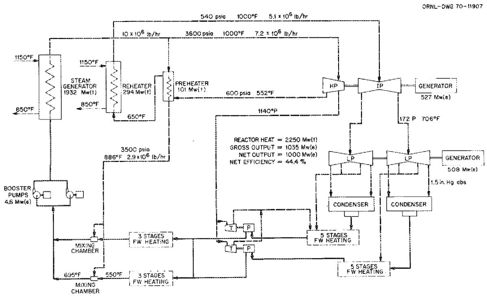  
Fig. 8.4. Simplified MSBR Steam System Flowsheet

condensers operating at about 1-1/2 in. Hg abs. Full-flow demineralizers are used to obtain the high purity necessary for once-through steam generator operation after which the feedwater is raised in temperature and pressure to the final $700^{\circ}\mathrm{F}$ and 3800 psia steam generator inlet condition.

One of the two unconventional features in ORNL's adaptation of the TVA steam cycle is the reheat of extraction steam in two stages by use of a prime-steam-heated preheater and a salt-heated reheater. The other unconventional feature is the heating of feedwater to $700^{\circ}\mathrm{F}$ by direct mixing of the $866^{\circ}\mathrm{F}$ steam exiting the above preheater with the high pressure $550^{\circ}\mathrm{F}$ feedwater leaving the top extraction heater. Two large motor-driven canned-rotor centrifugal pumps in parallel then each boost about 19,000 gpm of feedwater from about 3500 psia to 33800 psia. Eight steps of feedwater heating are used in addition to the direct mixing to obtain the $700^{\circ}\mathrm{F}$ feedwater temperature. The use of the supercritical pressure allows the direct mixing without serious problems.

Ebasco examined alternatives but selected essentially the same steam system as that of the ORNL reference system [72]. They concluded that the use of the direct mixing for feedwater heating and the special booster pumps are feasible and within foreseeable technological development. Ebasco proposes a means of improving the cycle thermal efficiency by re-claiming reactor decay heat and chemical processing heat. This heat is introduced into the cycle as an additional source of low pressure feedwater heating steam [73].

# Uncertainties Resulting from the Feedwater Temperature Requirements

Based on the present conservative assumption that $700^{\circ}\mathrm{F}$ feedwater temperature is necessary, a supercritical-pressure steam system is the only reasonable choice. Heating the feedwater to $700^{\circ}\mathrm{F}$ in a subcritical-pressure cycle would require a very large amount of heat transfer surface or, more likely, use of the Loeffler cycle. The steam generator would become a superheater requiring a steam compressor and a much larger mass flow rate.

If use of feedwater at $580^{\circ}\mathrm{F}$ is determined to be feasible the mixing chamber, pressure booster pumps, and reheat steam preheaters could be eliminated from the supercritical cycle [74]. The increase in efficiency plus the simplification of the steam system would represent a substantial savings. Alternatively, a subcritical pressure steam cycle becomes feasible and can be included in the options for a MSBR power system. The feasibility of using lower feedwater temperature will be investigated by Foster Wheeler for subcritical and supercritical pressure steam cycles [75]. Also, the use of the nitrate-nitrite salt in a tertiary system between the secondary system and the steam, as proposed for the MSBR, allows the use of $480^{\circ}\mathrm{F}$ feedwater temperature and the choice between a supercritical or a subcritical pressure steam cycle [76].

As previously mentioned, the unconventional feedwater heating needs of the MSBR reference steam cycle require the use of booster pumps and mixing chambers. Although both of these components are currently in use at near the desired conditions, the sizes needed for a 1000-MW(e) MSBR are not presently available. According to Evasco's investigation, the

canned-rotor booster pumps needed for the MSBR steam cycle are about $50\%$ larger than the largest known pump built to date [77]. Consequently, development of larger capacity, multistage pumps would be needed. The mixing chambers needed are also larger than those in use, but this does not appear to impose a major development problem since a chamber similar to one specified for the MSBR system and about four-fifths as large is in use at the TVA Bull Run Steam Plant [78]. As an alternative, a high-pressure heat exchanger could be used to obtain the $700^{\circ}\mathrm{F}$ feedwater. The exit heating steam could be then heated to $1000^{\circ}\mathrm{F}$ in a salt-heated exchanger and reintroduced into the cycle thereby eliminating the pressure booster pumps.

# Evaluation

High efficiency can be obtained with the supercritical pressure steam system (44.5% per Ref. 79) even though the molten-salt steam generator may require $700^{\circ}\mathrm{F}$ feedwater. The improvement in the efficiency and reduction of capital costs which can be realized by lowering the feedwater temperature requirement provides a strong incentive for the development effort in this direction. The lowering of the steam pressure and of feed-water temperature could actually be mutually compatible. For example, as discussed in the section on heat exchangers, the bayonet tube configuration which was unsatisfactory at high pressure may be satisfactory with subcritical pressure steam and lower feedwater temperature. Although the overall plant efficiency would be less with the subcritical pressure cycle, the simplification and reduced capital costs may be offsetting. The molten-salt reactor concept is not strongly dependent on the details of the steam system. However, since the steam-electric equipment represents more than half of the cost of the plant, the optimization of this system merits much development and analysis effort.

There are several options available for the steam system of a molten-salt reactor plant, none of which involve fundamental uncertainties. All uncertainties are considered to be resolvable with the application of an adequately funded program of analysis and development. Since the details of the steam system are so dependent on the requirements of the steam generator, it is imperative that these requirements be definitely established and verified.

# Steam Generator Auxiliary Systems

Two auxiliary systems are necessary for the use of liquid-heated steam generators (either liquid metal or molten salt) which are quite different from those normally required for fossil fired plants: a startup system and a pressure relief system. The startup system is needed because the high melting temperature of the coolant salt imposes special requirements on the startup of a molten-salt-heated steam generator. Because of the possibility of a steam-generator-tube failure, a pressure relief system must be provided to prevent high pressures from being transmitted through the secondary system to the very radioactive primary system.

Steam Generator Startup System. - The startup system must provide for the initial coupling of the salt-heated steam generator to the steam system without freezing of salt and with a minimum of thermal shock. Since the steam generator operation may be unstable at very low loads and flows, another of the functions of the startup system will be to traverse the transition region as quickly and as smoothly as possible.

The startup system consists of an auxiliary boiler which can deliver supercritical pressure steam at $1000^{\circ}\mathrm{F}$ , along with its flash tank, boiler feed pump, and other associated auxiliaries. The reference system and startup procedure are described in Ref. 80. Studies being made by Evasco [81] and Foster Wheeler [82] in the industrial program will provide input on startup system requirements. Evasco proposes a startup boiler and system which would be capable of supplying enough steam for about $10\%$ of rated plant load.

As with conventional supercritical boilers, the detailed requirements of the startup system for the molten-salt steam generator depend a great deal on the design and operating characteristics of the steam generator itself. Any uncertainties lie in the application of more-or-less conventional steam system equipment to the detailed startup needs of the molten-salt steam generator. Although basic portions of the system or certain startup techniques may be demonstrated in steam-generator model tests, the interrelationship between the startup and turbine steam systems is so complex that only a large facility, such as the MSBE, will be able to adequately test a complete startup system. Whatever difficulties arise should be resolvable with the assistance and experience of qualified industrial firms.

Pressure Relief System. - To maintain the secondary salt system as a buffer between the steam and primary systems, a pressure relief device must be provided on the salt side of the steam generator. A retention system of conduits and holdup tanks must also be provided to contain the effluent mixture of steam and salt in the event a steam tube does rupture and actuate a relief device.

The relief device must operate at temperatures above the liquidus of the salt. It must operate either in direct contact with molten salt (or in close proximity via a gas space buffer) for long periods of time without loss of reliability. It must be capable of having its reliability checked during normal shutdown periods. It must contain salt without any leakage and yet rapidly relieve a mixture of salt and steam in the event of a tube rupture.

The ORNL reference concept proposes a nickel rupture disk in a commercially available snapover-type or reverse-buckling type actuator [84] positioned on the salt outlet of the steam generator. The Evasco study concept provides a gas-filled rupture disk housing at the high point of the steam generator loop [85]. Foster Wheeler will propose a conceptual design of a rupture disk assembly and location as part of their study [86]. Although the other two concepts incorporate a gas space buffer between the disk and salt, Foster Wheeler has been requested to consider a "hard" system with no gas pocket. The hard system approach being requested of Foster Wheeler is more desirable in that the location of the rupture disk

is not restricted and the uncertainty of maintaining multiple gas pockets is also avoided.

As far as we know, no rupture disks have been operated with molten salt. Although rupture disks have been used with liquid-metal systems in the IMFBR program, in most cases the disks have been located in a gas space. The major uncertainty is one of development of a combination of materials and an actuation device that will operate reliably after long periods in contact with molten salt. Although the development of a salt system rupture disk appears feasible, failure to achieve this goal would require reversion to the use of a gas pocket for the protection of the disk assembly.

Little uncertainty is associated with the retention system necessary to handle the effluent from the relief device. However, a development program must be established for the components and operating procedures necessary to provide for separation, handling, and disposal of the gaseous, liquid, and solid effluents resulting from a rupture. The development information needed also includes the procedures and equipment necessary for the cleanup of the remainder of the secondary salt system to allow resumption of operation in a minimum of time.

# Valves

# General Description of Valves and Valve Requirements

Valves will be needed in future molten-salt reactors for the same reasons they are needed in other reactor systems, i.e., to isolate portions of the reactor while the remainder operates, to direct flow to alternate paths, and to provide flow variations to meet start-up and off-design conditions. Two major categories of valves will be required, i.e., shutoff valves and throttling valves. For 1000 MW(e) MSBR's, shutoff valves will be required in sizes up to 6 inches and for temperatures to $1150^{\circ}\mathrm{F}$ . Throttling valves, up to 24-in. size, will be needed for service in the secondary system at temperatures up to $1150^{\circ}\mathrm{F}$ to control bypass flow of coolant salt around the primary heat exchanger and to provide flow diversion at the reheater.

The differences in the requirements of these two types of valves could lead to greatly differing valve design. To be considered for shut-off service are (1) conventional mechanical designs, (2) freeze valves, and (3) "combination" valves which close to restrict most of the flow mechanically with the final close-off being made by a freeze seal within the valve. Throttling valves, which do not have tight close-off requirements, are expected to be of more conventional design.

# Experience with Molten-Salt Valves

Freeze valves have been used successfully in molten-salt service over the past 20 years. These valves have continued to be used because of excellent service and because no mechanical valve has been developed to solve the reliability requirements of molten-salt service. A freeze

valve consists simply of a section of salt-filled piping which can be cooled when desired to establish a short section of frozen salt which effectively blocks flow. Both the freeze valve and mechanical valve have specific advantages. The mechanical valve can provide faster opening and closing and can be used for flow throttling. The freeze valve provides high reliability and zero salt leakage across the valve and thus is particularly well suited to applications when tight shutoff is needed for long periods of time.

Freeze valves have operated successfully in the MSRE and in many out-of-pile tests at ORNL in sizes up to 1-1/2-in. IPS pipe. More than 125 have been used, and they have accumulated more than 650,000 hr of operating time. These valves operated with salts as diverse as the eutectic mixture of $\mathrm{NaBF}_4$ -NaF (92-8 mole %), which has a $725^{\circ}\mathrm{F}$ melting point, and LiF, which has a $1560^{\circ}\mathrm{F}$ melting point.

The operation of the 12 freeze valves in the MSRE demonstrated reliability in an actual reactor system [87]. These valves were of two sizes, 1/2 in. and 1-1/2 in. IPS, and accumulated 200,000 hr of operation during the reactor's lifetime. One of 1-1/2 in. valves failed and leaked a few grams of salt during the final shutdown of the reactor. The failure was due to thermal stresses caused by a field modification of a shroud on the valve to aid attachment of a larger cooling line. Suitable design modifications should eliminate this problem in future valves.

Aircraft Reactor Program Development Work on Mechanical Valves. - Tests of bellows-sealed mechanical valves were conducted around 1957 in the Aircraft Nuclear Propulsion Program in an attempt to develop a 1-1/2-in. IPS shut-off valve for temperatures of 1200 to $1500^{\circ}\mathrm{F}$ with molten salt. The valve seat material was considered to be the major problem, and although a successful valve was not developed prior to cancellation of the work, some promising seat and plug material combinations were investigated. Five valves were tested with a variety of seat-plug material combinations and accumulated over 7,000 hr of testing experience. Leak rates in the more successful tests ranged from 0 to 5 cc/hr with a 50-psi pressure differential across the closed valve seat. The cermet materials were the most promising seat-plug combinations. This experience will be of value in future programs to develop shut-off valves for molten-salt service.

ORNL 4-in. Throttling Valve. - Five throttling valves were designed and fabricated at ORNL around 1955 for flow control in five pump loops that operated with molten salts and liquid metals. The valves were designed for throttling service only and were fabricated completely of Inconel. They operated a total time of 114,000 hr at temperatures from 1000 to $1500^{\circ}\mathrm{F}$ , and no bellows failure or significant mechanical problems occurred during that time. The valves were manually operated and were adjusted during operation of the loop to measure pump performance characteristics. These ORNL sleeve valves are the only known bellows-sealed mechanical valves which have operated routinely and successfully in high-temperature molten-salt service. This experience leads us to believe that larger throttling valves can be successfully developed when needed.

# Valve Experience in Sodium Systems

Bellows-sealed valves have been used successfully in many sodium applications. For up to a few inches in pipe size, it appears that similar valves would be satisfactory for use in molten salt if fabricated of Hastelloy N and proper seat and plug materials. However, there is very limited experience with larger size bellows-sealed valves even in sodium and no experience with bellows valves larger than six inches.

The problems in design and development of larger liquid-metal shutoff and check valves have been discussed by Seim [88], and many of the problems are common to molten-salt valves. Most sodium valves of larger size, however, have had sodium freeze seals on the valve stems, and this option is not available for molten-salt valves. Although larger hermetically sealed valves for molten-salt reactors consequently have very little sodium operating experience to draw from, valve design, fabrication, and operation presently planned in the LMFBR program should in the future provide much useful information to aid molten-salt valve development.

# Status of Valve Technology

The freeze valve technology in sizes up to 1-1/2-in. IPS pipe size is well developed, but no freeze valves larger than 1-1/2 in. have been operated. Such valves will require special design to provide cross sections of salt that are small enough for freezing to be accomplished in reasonable time periods. Analytical stress analysis of a freeze valve is difficult because of the irregular shape and unpredictable temperature distribution during freezing and thawing. It seems likely that prototypes of each new freeze valve design for future reactors will have to be extensively tested over the expected number of freeze-thaw cycles.

Mechanical shutoff valves, with their attendant seat-plug material problems, will provide the most difficult development problems. No satisfactory mechanical shutoff valve has been developed, even in small sizes, primarily because freeze valves were available for use where needed. The experience of the LMFBR program in developing mechanical valves, particularly the operators, will be directly applicable to the design of valves for molten salts.

No commercial technology exists for fabrication of Hastelloy N valves and bellows at the present time. However, there are no known metallurgical problems which should prevent fabrication of large valves when required.

# Effect of Uncertainties of the Mechanical Valves

The two major uncertainties involve selection of the plug and seat materials for shut-off valves and design and development of the operators. The seat-seal of the mechanical shut-off valve requires that a high unit seal force be applied at the seal surfaces and be maintained while the valve is closed. The valve must also open on demand without damaging the seal surface. If such a valve proves to be unusually difficult to develop, it would be reasonable for most applications to use a freeze valve in

series as a backup to this mechanical valve. In this case the mechanical valve would be closed to choke-off the salt flow while the freeze plug is established and then reopened to prevent self welding of the seat and plug. This combination has been used in the drain line of some test loops.

The valve plug can be mechanically guided into the valve seat or the throttling sleeve either in the salt or on the gas side of the penetration seal. The latter scheme requires stronger members but can be done if the valves are to be located in an area outside of the cell furnace or if the operator-guide can be in a small separate cell where it could be cooled such that the bearing materials for the guide are not operated at high temperature.

The mechanical throttle valves will require operators to control the valve trim positions. Although there are some differences in the requirements for these operators when used with a shut-off valve and with a throttle valve, these differences are small. If a reliable throttling valve cannot be developed for use in the coolant salt systems then the optimum control scheme for the reactor and the steam power plant will be affected. A description of the use of the throttle valve is given in Chapter 10.

# Development Program Remaining for Valves

Testing programs must be carried out to select suitable materials for bearings, valve plugs, and seats for mechanical valves. The fabrication of reliable bellows must be demonstrated, or some other hermetic stem seal, such as the torque-tube seal must be developed [Ref. 89]. A commercial capability for fabricating large Hastelloy mechanical valves will have to be developed. Finally, complete valves must be tested extensively at operating conditions to verify performance. The reliability of large valve operators must be demonstrated at conditions similar to those in a reactor system.

# Evaluation

Little has been done on valve development for molten-salt reactors since the work on throttling valves for loops in the ANP program and the development of freeze valves for the MSRE. An active program, spanning several years, would be required to provide the required valve technology for molten-salt breeder reactors, with much of the time to be used in testing prototype valves. We believe, however, that such a program can produce freeze and mechanical valves that will be adequate for use in the fuel and coolant salt systems.

# Control Rods and Drives

# General Description and Design Requirements

The reactivity control rods for the MSBR [90] reference design are of two types, control rods which have both regulating and shimming functions, and safety rods used primarily for reactor shutdown.

The control rods are movable graphite cylinders about 3-3/4 in. diameter with axial passages through them for a cooling flow of fuel salt. These cylinders move axially within 4 in. diameter holes in 6- by 6-in. graphite elements near the center of the core. Withdrawal leaves an undermoderated region at the center of the reactor causing a reduction in reactivity without a sacrifice in neutrons for breeding. Since the graphite is considerably less dense than the fuel salt, it will tend to float out of the core and reduce reactivity if a rod should break. These rods are connected to drives which move them in and out of the core on the demand of the control system [91]. Although the reference design provides for only two of these graphite rods, it is probable that because of their small effect on reactivity at least 4 such rods would be needed and that they would move in unison at speeds up to 0.4 fps for normal control of the reactor and perhaps 5 to 10 times that for certain unusual conditions.

The safety rods consist of boron carbide clad in Hastelloy N and are used to provide an independent shutdown capability. These rods move within 4 in. diameter holes like those occupied by the control rods. To satisfy their safety function, it is intended that they would normally be positioned outside of the reactor during operation; however, it might be that partial insertion for short periods would be required and therefore the safety rod drive should have a positioning capability in addition to a fast-insertion action.

The reference design does not include studies of the rod drives; however, in a system proposed by Bettis [92] the combined control safety rod is suspended on a Hastelloy N cable which is taken up on a 12-in.-diam drum driven by an electro-mechanical drive. The option for a magnetic clutch between the drum and the motor is suggested to provide for fast insertion if such is needed. The combined control safety rod is of boron carbide and Hastelloy N and would fall into the core if released. The drive is isolated from the cable drum in a manner similar to that of the fuel pump shaft gas purge and seal and is maintained in a clean environment with adequate shielding to protect the motors. The drive for the graphite control rod for the MSBR reference design would be somewhat different because of the buoyant effect of the graphite. These rods would require positive engagement with the drive to hold it in the salt in its fully inserted position. Drive mechanisms developed for the LMFBR program possibly could be adapted for use in the MSBR control drive system. The "roller nut" concept as depicted by the Marvel Schebler drive by Borg Warner and the "magnetic jack" drive by Westinghouse [93] are possibilities which should be considered because of the design and development already accomplished in support of the LMFBR program.

The graphite control rods and the $\mathbf{B}_4\mathbf{C}$ safety rods discussed above are cooled by the flow of cool fuel salt taken from the bottom entrance region of the reactor.

# Experience

The reactivity control rods for the two previous molten-salt reactors were of the poison type. The regulating rod and the safety rods of the ARE [94] and the control rods of the MSRE [95] were operated in metal thimbles

that separated them from the salt and therefore required auxiliary gas cooling. Because the rods and drives were separated from the salt, there was no problem of gas seals for fission product control. The safety rods for the ARE were suspended from magnets which were moved with lead-screw type drives. This drive was also used for the regulating rod. The MSRE control rods were suspended from a continuous chain drive which was connected to a motor through magnetic clutches to permit fast insertion. These rods and drives operated without significant difficulty during the lives of the reactor experiments.

The poison material for the ARE safety rod was $\mathbf{B}_{4}\mathbf{C}$ and stainless steel served as poison for the control rod [96]. The poison element for the MSRE control rod [97] was a mixture of gadolinium and aluminum oxides, formed and sintered into a number of short cylindrical tubes which were in turn canned in Inconel. Visual observation of some of the canned elements at the end of the reactor operation revealed no significant changes in dimensions or external appearance.

There has been no experience with control rods operating directly in the salt; however, the physical arrangement and provisions for cooling might be similar to that in the liquid-metal-cooled reactors. In one proposal for a control rod for use with a liquid-metal-cooled reactor, the poison section is guided within a duct which is positioned within the core. The MSBR reference design uses graphite ducts for guiding the safety rods and the graphite control rods.

# Status of Control Rod Technology

The materials proposed for the poison elements for the MSBR are similar to those used in the ARE. We have had experience with forming rare earth oxides and $\mathbf{B}_{4}\mathbf{C}$ into usable shapes and then canning the elements to protect them from the environment. However, we have not had experience with such elements in a high neutron flux field. The major problem with the canning of the $\mathbf{B}_{4}\mathbf{C}$ for use in the shim rod or for a control rod is dealing with the helium produced by neutron absorption in the $^{10}\mathrm{B}$ . One method is to provide ample space to contain the helium for the life of the rod. If this does not appear feasible for the MSBR, one of the rare earth oxides could be used. Another alternative is the use of a rod constructed entirely of Hastelloy N, the size depending on the reactivity change needed for that particular rod.

The control and safety rods are to fit loosely in and be guided by the stationary graphite duct. Information is needed on the bearing properties of friction and wear in salt for graphite on graphite and Hastelloy N on graphite, and for other materials on graphite if these combinations prove to be unsatisfactory.

As described above, the reactivity value of a single graphite control rod is small and would require ganging several to obtain the necessary sensitivity for control. More proof is needed that the use of such a rod is feasible.

The control and safety rod and rod drive development work for the LMFBR should in part be applicable to the MSBR if suitable in-core guides and contamination control seals can be developed. In particular the drives

should be adaptable to MSR use although some of them require more head room than we would like to provide above the reactor. In any event many of the techniques will be useful in designing a drive system for MSBR's.

# Effect of Uncertainties

The use of a graphite rod to provide the reactivity control and shimming necessary is uncertain both because of its very low reactivity worth and the problem of guiding it within the core. If the graphite rod is determined to be unacceptable, then a poison rod of somewhat greater worth could be used with an acceptable loss in breeding ratio of 0.005 for $0.2\% \Delta k / k$ [98].

The use of $\mathbf{B}_{4}\mathbf{C}$ as the poison, with the required heat removal and the venting or storage of the helium produced, might make such an absorber unacceptable. If so, the $\mathbf{B}_{4}\mathbf{C}$ could be replaced with rare earths such as europium or gadolinium oxide which release energy as gamma rays instead of alpha particles. No helium is generated and the gamma rays should not deposit as much energy locally as would the alpha particle. The MSBR reference design uses the $\mathbf{B}_{4}\mathbf{C}$ poison in the safety or shutdown rods and expects no trouble because they can be held out of the reactor core until needed and therefore do not have a helium generation or heating problem. If further study of the shutdown requirements determines that rapid shutdown is needed, then the rods might have to be inserted near enough to the core to again require consideration of the use of other poisons.

# Further Work

Any further work done in the development of control and safety rods and rod drives should be directed toward the exact needs of a specific molten-salt reactor. Requirements such as the exact amount of reactivity to be controlled, the change rates of reactivity, and the response times for the control and safety system should be established before the mechanical design of the system is started. Prototypes of the parts of the design related to the salt-gas interface, the gas seals, the guides or bearings for the rods within the core, and the transmission of motion to the rods would be fabricated and operated first in water and air to assist in optimizing the design, and then in salt and inert gas to proof test for life expectancy and overall performance. The seals or activity control, the bearing materials and arrangement, and the method of cooling the control element over its entire range of travel would receive the earliest attention. After the initial component testing full scale rods and drives would be tested under simulated reactor conditions.

# Evaluation

No fundamental difficulties are foreseen in designing control and safety rods and drives for use in MSR's, but a thorough development and prototype testing program will be required to assure adequate performance in a high-temperature environment before installation in a reactor. There

are reasonable alternatives for most of the uncertainties. Perhaps a problem requiring much attention is the bearing of the moving rod on the graphite duct and obtaining an acceptable lifetime from such an arrangement. However, because the fit can be loose and the contact pressure low, we believe that satisfactory guides can be developed.

# Fuel Storage and Afterheat Removal

Repositories are needed for both kinds of salts used in the MSBR to provide safe and convenient storage any time they are drained. The fuel drain tank, because of the intense radioactivity of the salt, must provide reliably for the removal of afterheat as well as the sure containment of volatile radioactive products. In some ways, as discussed in Chapter 14, it is the major safety feature of the reactor.

The fuel drain tank must have sufficient capacity to hold all the primary salt plus the amount of coolant salt that is in the heat-exchanger shell; in a double-ended heat-exchanger tube failure, this much coolant could drain into the primary system. Fuel salt cannot enter the secondary system rapidly because of the pressure differential between the two systems, and monitoring for fission products in the secondary coolant will give immediate evidence of outleakage, so that the primary system can be drained before much fuel salt is transferred. Consequently the coolant-salt drain tanks are simple tanks, with no special cooling provisions, located in heated cells.

In addition to the primary drain tank, there is a fuel storage tank into which the fuel can be pumped in case a repair of some part of the primary drain tank system is required. This tank has a heat removal capability of only 1 MW since the salt can be held in the drain tank until the radioactive decay has reduced the heat load to this level.

# Draining the Reactor

In normal circumstances, the primary system can be drained into the drain tank through either of two plug valves in parallel. This arrangement with two valves is, we think, sufficient assurance of an ability to drain the system. The valve plug does not depend on a valve seat for sealing, but is provided with a heating and cooling system for the seat so that the final seal can be made by freezing the salt under the seat. The valves, described in detail on page 51 of reference 99, are located in the drain line leading from the low point of the primary system to the top of the drain tank. For maintenance purposes, they are located in the drain tank cell with an access plug in the shielding directly over them.

# Leakage of Fuel Salt

If there is a leak in any part of the fuel system, the leaked salt must be conveyed to the drain tank and its afterheat removal system. The leaked salt is collected in a catch pan under the reactor which in turn

drains into the drain tank pit. Here the salt enters a funnel-like drain pan on top of the drain tank which directs the salt to a frangible-disk valve which can be punctured on demand to drain the spilled salt into the drain tank. No pipe comes below the catch pan so that unless the drain tank leaks, all primary salt will positively end up in the drain tank. To provide for the contingency of a leak in the drain tank, it is enclosed in a secondary tank. Any crack or break in the drain tank would only leak salt into the annular space between the drain tank wall and the surrounding tank.

# Afterheat Removal

The drain tank afterheat cooling load reaches a peak of about 40 MW if the fuel is drained after the reactor is shut down from full power. This load decreases with time, and therefore it is desirable to have the cooling system operate over a very wide range of temperatures. We decided to use NaK as the cooling fluid since it is liquid at the lowest temperature expected in the heat sink and has an acceptably low vapor pressure at the highest expected temperature. The NaK is heated by radiant transfer from thimbles in the drain tank to the NaK piping and is cooled by radiant transfer from the NaK piping to thimbles in a water-cooled heat-sink tank, thus providing isolating gas spaces between the fuel salt and the NaK and between the NaK and the cooling water.

The NaK cooling system is circulated by thermal convection and, therefore, is independent of mechanical pumps and power supply. Enough water is provided in the heat sink tanks to provide cooling for the first three days after a drain if the water is allowed to boil. Thus, if the circulation of water to the cooling tanks is interrupted, there is a three-day period in which to restore circulation. There are sufficient NaK circuits to permit adequate cooling if $20\%$ of the circuits are inoperative.

Because NaK is a liquid at room temperature, the NaK circuits can be filled at room temperature and will come up in temperature as the drain tank is heated. This avoids any thermal shock that would result from filling a hot system with cold NaK.

As mentioned above, the coolant NaK is doubly contained at the drain tank end and at the water tank end. This feature is necessary since we want to assure that NaK cannot contact either fuel salt or water. The NaK can leak only into a controlled gas atmosphere.

# Off-Gas Separation and Cooling

In addition to providing safe storage and cooling, the fuel drain tank also serves as a decay tank and entrainment separator for the gas coming from the bubble separators in the primary system. Lines from the bubble separators spray a mixture of salt and gas into the drain tank. The liquid settles to the bottom by gravity and the gas passes on to the off-gas system after about one hour residence in the drain tank. The cooling system for the drain tank serves double duty by removing the heat from the off-gas as well as cooling the drained primary salt. A further

feature of the use of the drain tank for off-gas cooling is that the cooling system is always in operation and so its performance is constantly monitored.

# Drain Tank Design

The drain tank conceptual design is shown in elevation in Fig. 8.5. The tank, as shown, is dimensioned for a 300-MW(e) reactor; however, the system for the 1000-MW(e) breeder is exactly the same except it is larger in diameter and has more coolant thimbles. The further details of the design and the performance of these drain tanks, showing flow rates, temperatures, dimensions, etc., are given in Ref. 113 and Ref. 99, pp. 45-47. Also described there are the layout of the re-entrant NaK cooling lines and the arrangement of the jet pumps for automatically returning to the primary circulating system the salt that is carried in the gas from the bubble separators.

A drain tank of the same principle was used successfully in the MSRE. In this case, water was used in bayonet tubes mounted in the reentrant tubes and the steam was condensed in a water cooled heat exchanger. This system was used only for removing afterheat from the salt and was not for off-gas cooling. Introducing water into the bayonet tubes during startup of the system produced a thermal shock to the water tubes which was not hazardous but would shorten the life of the tubes. For this reason we chose NaK cooling in the MSBR drain tank design.

The NaK circuits are thermal convection loops, the hot leg being heated by radiative transfer (with some gas conduction) between the thimbles in the drain tank and the bayonet NaK tubes. The cold leg loses heat by radiative transfer (plus some gas conduction) in pipes which run through the water tank. The NaK circuits are completely independent, each with its own expansion tank and control valves which can be used to regulate the heat removal and to isolate an NaK system in case of a leak.

Each NaK circuit penetrates the building containment and the drain tank cell containment. At each penetration a bellows seal is used to provide for expansion of the lines during heat-up.

Each NaK circuit runs to one of three water tanks through which water flows and is raised in temperature by $20^{\circ}\mathrm{F}$ . The operation of any two of these water tanks will keep the thimble temperature in the drain tank below $1400^{\circ}\mathrm{F}$ . We believe this is sufficient to guarantee that heat is removed safely from the drain tank.

The water tanks are cubes about 25 ft along an edge. Pipes run through these tanks in two tiers at right angles to each other. There are forty-eight 3-in. sched-10 tubes per row. Two tanks have 36 rows of tubes and the third tank has 44 rows. They run through the tank wall at each terminus. The water level is about 5 ft above the top row of pipes in each tank to provide a water supply for emergencies.

# Status of Technology

Many years of experience with liquid metals including NaK form the background for the design of the drain tank- cooling system. The temperatures at which we intend to use the NaK are well below that at which corrosion is encountered.

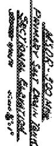  
809457

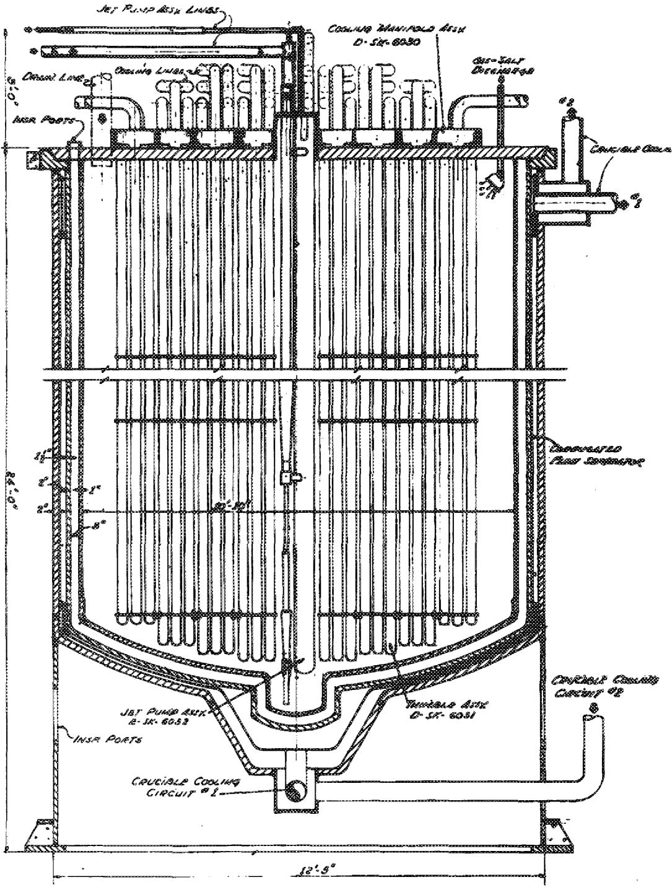  
Fig. 8.5. MSDR - 300 MW(e) primary salt drain tank sectional elevation.

As far as the heat load is concerned, the nuclear decay chains and the energy released by them are well known. The standard energy release rates have been used in making heat transfer calculations.

We have the MSRE experience, which, although on a very much smaller scale, is nevertheless helpful in guiding the design of the primary drain tank system. The experience in the MSRE should be directly useful in scaling up for the power reactors.

# Uncertainties

The only real uncertainty that we find in handling the drain tank problem is that concerning the deposition of fission products. In the MSRE, most of the noble metals adhered to metal and graphite surfaces, but some appeared in the off-gas from the pump bowl (see Chap. 5). How much of the noble metals will be extracted through the gas-stripping system in an MSBR is uncertain. We have assumed that the noble metal particles and their daughters and the daughters of the noble gases that enter the drain tank will deposit uniformly on the surfaces there, but it is not clear whether or not special provisions must be made to avoid locally high deposition.

# Evaluation

From the experience with the MSRE drain tank cooling system, we believe that the drain tank system proposed for the MSBR deals with the afterheat problem in a dependable way. We think it represents a "walk away" and fail-safe system, protected against everything but well planned and executed sabotage. We have not strained the technology in this design, and we believe that the unanticipated problems encountered in designing and developing such a system will be minimal.

# Fuel Salt Gas-Handling System

# Purposes

The objectives of the MSR gas-handling system are:

1. Protect the fuel salt from an oxidizing atmosphere.   
2. Minimize the poisoning of the reactor due to the noble gases and their daughters - particularly xenon-135.   
3. Provide positive containment of the radioactive noble gases and daughters and any other radioactive material stripped from the fuel salt.

In the conceptual design of the gas-handling systems for the reference design MSBR, the following criteria have been used.

1. Oxide concentration in the fuel salt is to be kept below 30 ppm to prevent precipitation of $\mathrm{UO_2}$ (see Chapter 5).   
2. Target value for the poison fraction due to the noble gas fission products and their daughters is 0.005.   
3. Volume of fuel salt external to the reactor is to be kept to a minimum.   
4. Fuel salt purge gas is to be recycled.   
5. Off-gas system must be able to accommodate various forms of contamination such as noble metals, hydrocarbon decomposition products, or any other particulates that may be carried by the purge gas.   
6. No radioactive gaseous effluent is to be discharged from the reactor plant.   
7. Positive containment of all radioactive material must be provided for all operating and accident conditions.

# MSBR Gas System

Description. - In the reference design MSBR [100], xenon-135 and other noble gases are stripped from the fuel salt by injecting bubbles into a side stream of fuel salt taken from the discharge of the fuel salt pump as shown in Fig. 8.6. Just upstream of this point, bubbles containing noble gases are removed from the salt by the use of bubble separators. This gas along with any salt entrained in it passes through a pipe directly to the drain tank [101]. In the drain tank, the entrained salt is separated from the gas and returned to the main circulation loop by jet pumps. The line running from the bubble separator to the drain tank is provided with a siphon break to prevent drainage of the main loop in case of a pump failure. This siphon break is in the form of a loop that rises above the liquid level in the pump bowl and has a venturi that communicates with the pump bowl gas space through a small pipe. During normal operation, the gas passing through the pump bowl is drawn into the venturi and is discharged into the drain tank along with the gas-salt mixture flowing from the bubble separator.

In the drain tank, this gas has a residence time of the order of 1 to 2 hr to permit the separation of most of the particulate matter and entrained salt and to greatly reduce the decay energy [102]. The gas is then recycled through a cleanup system back to the bubble generator and the pump shaft seals. Before the gas enters the cleanup system, a particle trap will be provided if the drain tank is not capable of separating all the particulate matter and entrained fuel salt from the off-gas. The gas then flows through charcoal beds having a 47-hr xenon holdup time that is sufficient to allow most of the xenon-135 to decay. Most of this gas flows back to the bubble generator, but part of it is cleaned up further. Figure 8.6 shows a gas compressor in the line of the gas flowing to the

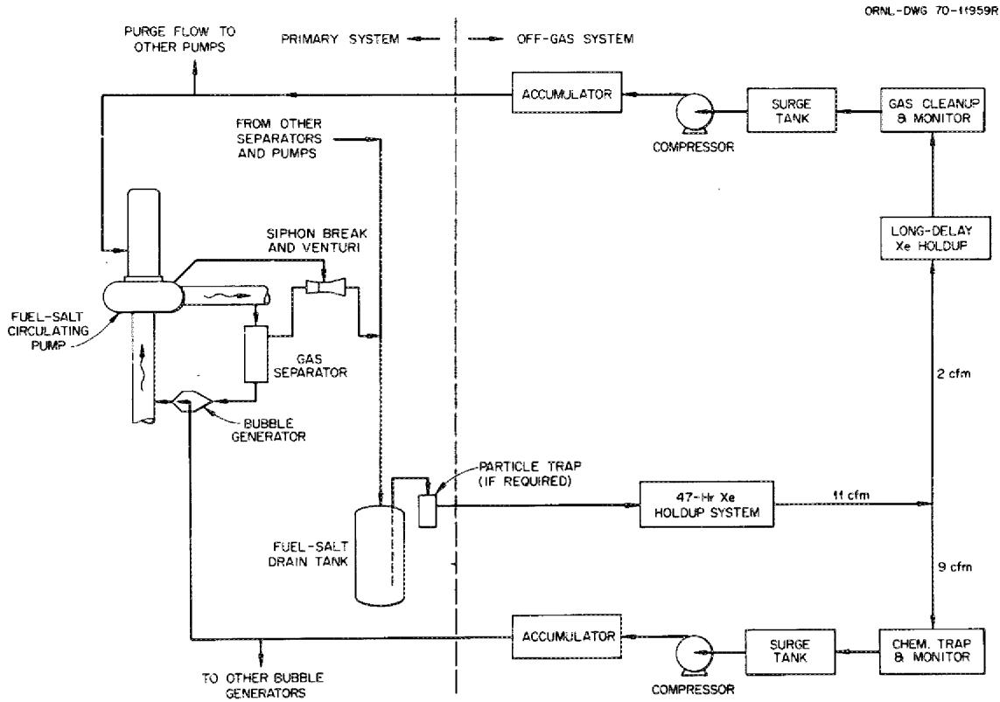  
Fig. 8.6. Schematic flow diagram MSBR off-gas system.

bubble generator, but present efforts are being directed to developing a bubble generator that does not require this compressor.

The gas being recycled to the pump seal purge passes through a charcoal bed with a 90-day xenon holdup time and an off-gas cleanup system. The additional charcoal bed is sufficient to allow decay of practically all the noble gases except krypton-85. This gaseous isotope, along with any tritium present in the off-gas, is removed and stored in the off-gas cleanup system. Although not shown in Fig. 8.6, provisions will be made to remove any oxygen or moisture that may be present in this recycled gas stream. These provisions are in the form of molecular sieve beds to dry the gas and titanium sponge beds to remove the oxygen. Makeup cover gas would enter the MSBR fuel salt gas system just upstream of these beds.

Noble Gas Stripping. - The emphasis on the use of gas bubbles for removing the noble gases from the MSBR fuel salt is because of the demonstrated capability of bubbles to strip out these gases in the experimental aqueous and molten-salt reactors that have been operated [103,104,105,106, 107,108]. Also, it appears that such a system would result in the smallest fuel salt inventory when compared to other noble gas removal systems.

In molten-salt reactors with graphite moderator, the noble gases tend to diffuse into the graphite and remain there until they decay or react with neutrons. To limit this, methods are being developed to put on a pyrolytic coating on the graphite (see Chapter 6). The gas-stripping system must compete with this gas migration into the graphite effectively to reduce the MSBR poison fraction to an acceptable level. Small bubbles circulating with the salt appear competitive because of their relatively large surface for core void fractions less than 0.01 [106].

Analysis of Noble Gas Stripping. - To evaluate the effectiveness of the noble-gas-stripping systems, the poison fraction (ratio of the neutrons absorbed in the noble gases to those absorbed in the fissile material) has been used as the figure of merit. Most of the gas system studies [103,109,110,106] have had as their target the reduction of the poisoning due to xenon-135 in the salt, graphite, and gas bubbles to 0.005. While xenon-135 is the major individual absorber, the other noble gases and their daughters would contribute additional poisoning. However, the extension of an earlier study on the effect of the other absorbers in a two-fluid reactor indicates that the additional poisoning would be less than 0.001 averaged over the 4-year life of the graphite when the xenon-135 poison fraction is 0.005 [111].

Quantitative studies of the MSBR gas-stripping system used up to the present time [110,112,106] assumed that the main fuel salt loop is a well stirred tank having insoluble bubbles of gas of uniform temperature, pressure, and size. The mass transfer coefficient for the gas migrating to the bubbles was assumed to be uniform throughout the loop. The core was divided into five regions with the mass transfer of the noble gas to each graphite region being uniform. For the diffusion of the noble gases within the graphite itself, the graphite was treated as a two-region slab, with the outer region being the pyrolytic coating and the inner region being the base graphite stock.

A new calculational model that considers the effects of the gas solubility and variations in the temperatures and pressures throughout the fuel salt loop has been developed. The purpose of this new model is to check the assumptions used in the previous model and to make any necessary modifications. Results using the new model are preliminary, however, and it is too early to assess the differences in the results produced by the two models.

Results from the well-stirred tank model [106] were correlated in terms of a time constant defined as

$$
\text {S t r i p p i n g} = \frac {\mathrm {V C}}{\tau}
$$

where $V$ is the main fuel salt loop volume, $C$ is the isotope concentration in the fuel salt, and $\tau$ is the time constant. Figure 8.7 shows the contribution of xenon-135 in the graphite and fuel salt to the poison fraction for both uncoated and pyrolytic coated graphite. The contribution of the xenon-135 in the gas bubbles to the poison fraction was about 0.0003 for most cases that were studied since it was assumed that the purge gas entering the fuel salt system contained low quantities of this isotope. The diffusivity and the porosity of the base graphite were assumed to be $10^{-5} \, \text{ft}^2/\text{hr}$ and 0.1, respectively. Increasing this diffusivity to $10^{-3} \, \text{ft}^2/\text{hr}$ had little effect on the results even when the graphite was uncoated, since for uncoated graphite the migration rate of the noble gases to the graphite is controlled by the adjacent salt boundary layer. A stripping system having a time constant of about 30 sec (quite rapid) would be required to reduce the xenon-135 poison fraction to 0.005 in a reactor having uncoated graphite. Putting a pyrolytic coating on the graphite permits us to use a stripping system having much longer time constants. For example, Fig. 8.7 shows that a coating with a $10^{-8} \, \text{ft}^2/\text{hr}$ diffusivity would require a stripping system having a time constant of about 300 sec to limit the xenon-135 poison fraction of 0.005. The effect of the coating porosity on this was found to be small. In this case, the rate of migration from the salt into the bulk of the graphite is controlled by the rate of the diffusion through the coating material.

The thickness of the pyrolytic coating for the cases shown in Fig. 8.7 was assumed to be 0.011 in. As shown in Fig. 8.8, varying the coating thickness can have a great influence on the results. Here for a stripping system having a time constant of 316 sec, decreasing the diffusivity of the coating would allow a much thinner coating. The calculations also showed that not coating the graphite surfaces in the reflector and plenum regions had a negligible effect on the core poison fraction.

For the bubbles to strip the noble gases, the migration rate to the bubbles must equal the stripping rate. If the gas phase resistance to mass transfer is negligible,

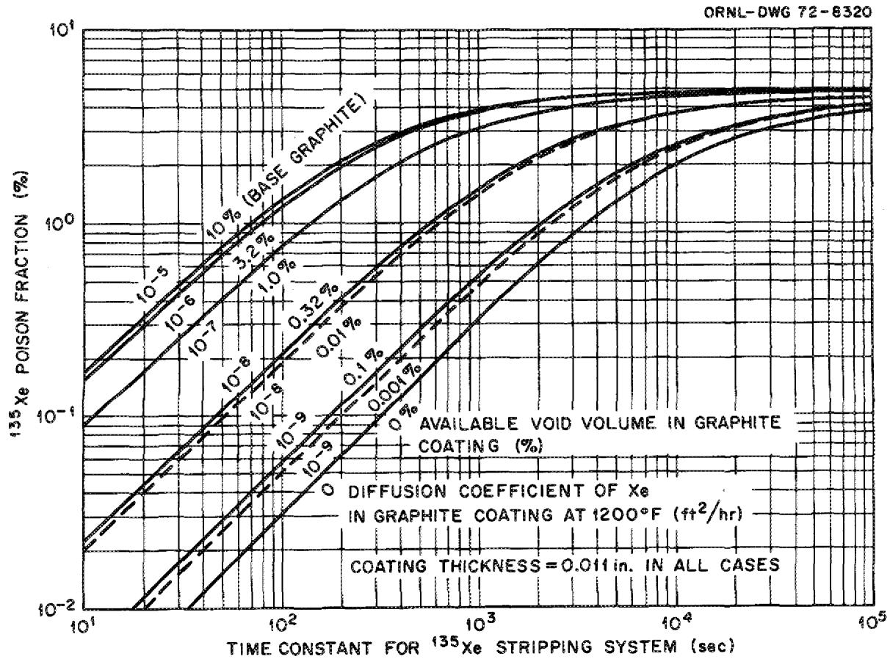  
Fig. 8.7. Effects of stripping rate and pyrolytic coating on $135\mathrm{Xe}$ poison fraction.

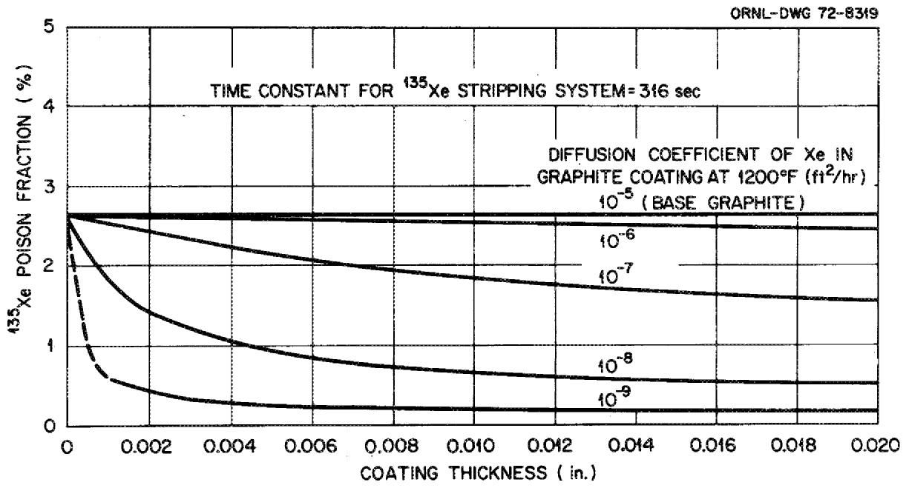  
Fig. 8.8. Effects of thickness and diffusion coefficient of pyrolytic coating on $^{135}\mathrm{Xe}$ poison fraction.

where $h_b$ is the mass transfer coefficient, $A_b$ is the bubble surface area, $C$ is the isotope concentration in the salt, $C_b$ is the isotope concentration in the gas bubble, $H$ is the Henry's law constant, $R$ is the gas constant, and $T$ is the temperature. Assuming a bubble diameter of 0.020 in., and a mass transfer coefficient of 2.0 ft/hr, the time constants were calculated for various void fractions and fraction of bubbles removed per loop cycle. It was assumed that the gas being returned from the off-gas system was essentially free of xenon-135. The results plotted in Fig. 8.9 show that a 0.2% circulating void volume and a 0.1 fractional bubble removal rate gives a time constant of about 250 sec. Comparing this with Fig. 8.7 yields a target xenon-135 poison fraction of 0.005 if the graphite has a pyrolytic coating 0.011 in. thick and $10^{-6}$ diffusivity. The knees in the curves of Fig. 8.9 occur where the partial pressure of the xenon-135 in the gas phase becomes a significant resistance to the transfer of this isotope to the bubbles.

When this resistance is not significant, the time constant $\tau$ can be approximated by the relation

$$
\tau = \frac {d _ {b}}{6 h _ {b} \psi}
$$

where $\mathrm{d_b}$ is the bubble diameter and $\psi$ is the void fraction. This implies that reducing the bubble diameter and/or increasing the mass transfer coefficient and the void fraction will reduce the time constant. It will be seen later that the bubble mass-transfer experiments indicate that for the conditions in those experiments the mass transfer coefficient is proportional to the bubble diameter. In this case, the bubble system time constant varies inversely with the void fraction. However, as the bubbles become very small, it is questionable that the bubble mass transfer coefficient would continue to decrease with decreasing bubble diameter. If this proves to be true, the bubble system time constant would decrease with decreasing bubble diameter below some limiting size and could possibly become very small.

The above calculations indicate that the fraction of the bubbles removed per loop cycle and/or the off-gas recycle time could be smaller than the values selected for the reference design MSBR since the bubbles are far from being saturated with xenon-135. Because of the uncertainties in the model, the parameters above were selected, but as further data and experience are obtained, it may be possible to reduce these values. However, it should be remembered that there is some small increase in the core poison fraction as the xenon-135 content in the bubbles increases. Also the shorter recycle times in the off-gas system might not greatly decrease the sum of the volumes of all of the charcoal beds since eventually almost all of the noble gases and their daughters will have to be removed from the purge gas stream before it is recycled to the pump.

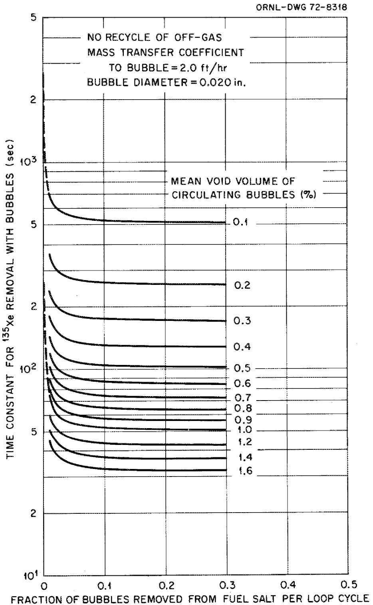  
Fig. 8.9. Time constants of the MSBR $^{135}\mathrm{Xe}$ stripping systems.

Iodine Removal. - Since most of the xenon-135 produced in a reactor is produced indirectly by the decay of 6.7 hr half-life iodine-135, use of sidestream iodine strippers has been suggested as a method for minimizing the poisoning in the MSBR [114,115]. The "effective" solubility of iodine, defined as the ratio of the dissolved iodide concentration to the sum of the partial pressure of the iodine and hydrogen iodide in the gas phase, has been found to be a function of the salt chemistry as well as the temperature. This "effective" solubility is quite high, so stripping the iodine with an inert gas stream would require very large quantities of gas. However, adding hydrogen fluoride to the stripping gas stream would oxidize the iodide and reduce its "effective" solubility. Of course the stripped salt must then be reduced before it is returned to the main fuel circulation loop.

The minimum rate that this fuel salt must be processed for iodine and xenon to achieve various xenon-135 poison fractions in the reactor with uncoated graphite are shown in Fig. 8.10. It can be seen that stripping only the iodine from a side stream of the fuel salt is not sufficient to reach the target poison fraction in the reactor. However, removing the iodine with the xenon is very effective in reducing the poison fraction. Therefore, if the graphite cannot be sealed, an iodine stripping system might have to be used in conjunction with some type of a xenon removal system in order to achieve a xenon poison fraction of 0.005.

Conceptual design studies were made of stripping units capable in one case of removing $63\%$ of the xenon and $6\%$ of the iodine from an $8\%$ fuel salt side stream, and in another case of removing $60\%$ of the iodine from a $0.8\%$ fuel salt side stream [115]. In both cases the atmospheric pressure gas stream contains $1\%$ hydrogen fluoride to oxidize the salt, and the total gas flow rate through the stripping unit is about 80 ft³/sec. The heat production rate of the stripped gases and their daughters along with any removed noble metals was estimated to be about 6 MW(t). This would imply a fairly sizable gas system and the drain tank could not be used as a delay tank because of the presence of hydrogen fluoride in this gas. The hydrogen fluoride could come in contact with the fuel salt that is being pumped from the drain tank to the main circulating loop. Also consideration must be given to removal of the afterheat in the event of a failure in the gas circulation system.

Spray towers, venturi contactors, ramp flow units, and packed columns have been considered for the stripper. All appeared to be feasible although much development would be required for any one of them. They were all fairly large units (roughly 10 ft high and 10 ft in diameter), but the liquid holdup in most of them was not excessive.

Off-Gas Handling. - In the bubble stripping system, the purge gas leaves the bubble separators and the pump bowls and flows directly to the drain tank [116]. Since this gas contains many short-lived fission products, nonvolatile fission products including the noble metals, entrained salt, and decomposed hydrocarbons or any other foreign material, much attention must be given to the layout of the line discharging from the bubble separators and the pump bowls. This is to assure that this line will not become plugged with particulate matter and that it will not

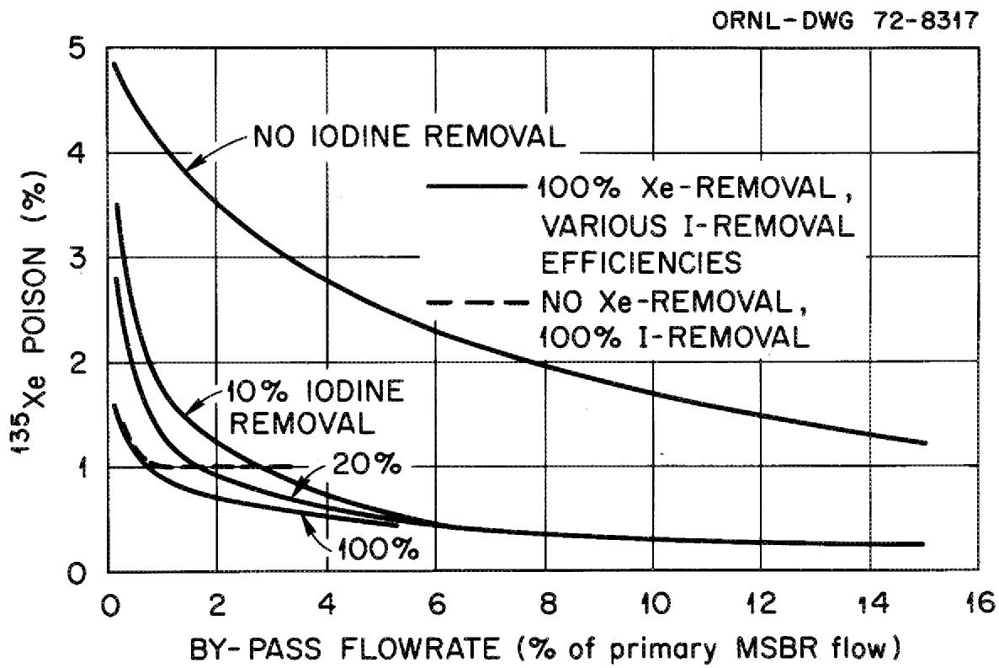  
Fig. 8.10. Xenon-135 poison fractions using combined xenon and iodine stripper with uncoated graphite.

overheat even under reactor accident conditions. Conceptual layout studies indicate that this can be done.

To separate the particulates and the entrained salt and to remove large amounts of energy generated by these materials and the radioactive gas during the first decay period, a large vessel having a large volume and heat sink is desired [117]. The drain tank appears to meet these requirements and the off-gas is routed first to it. Here, as described earlier in this chapter, about 18 MW(t) of heat and most of the nonvolatile materials are removed from the gas stream. After an hour holdup, the energy generation rate in the off-gas stream drops off by about two orders of magnitude due to the decay of the short-lived fission products.

Considerable attention must be given to the development of a drain tank to assure that these aims are accomplished and things such as short circuiting of the flow of the gas in the drain tank do not occur. Any particulate material that is not removed from the off-gas in the drain tank should be removed by a filter before the off-gas enters the charcoal beds so that the gas flow through the beds will not be restricted by the accumulation of foreign materials. Not much effort has been directed to the design of a filter for this purpose in the MSBR. Probably sintered metal would be used as the filter material and much attention would have to be given to designing it so it can be cleaned or replaced and cooled adequately at all times.

Noble Gas Absorption on Charcoal. - Dynamic absorption of the noble gases in activated charcoal reduces the volume actually required to allow the desired decay of these gases. The factor by which this volume can be reduced from that of an empty vessel or pipe varies from 500 at $80^{\circ}\mathrm{F}$ , to 50 at $250^{\circ}\mathrm{F}$ , and to 1 at $800^{\circ}\mathrm{F}$ . The capability of the charcoal beds for removing the noble gases has been calculated from the computer programs developed for the HRE-2 and the MSRE [118,119,120,121]. Both of these programs consider the effects of the gas and isotope flow rates, pipe geometry, and temperatures on the amount of noble gases removed. A revised computer program is now being developed, incorporating the information from the previous programs, that will optimize the design of the charcoal beds on the basis of selected parameters.

Heat generated in the charcoal beds was calculated by a computer program that considers the movement of the noble gases throughout the off-gas system [117,122]. This code assumes that the nonvolatile daughters of the noble gases remain at the location of their birth. Typical results of this program are shown in Fig. 8.11.

This heat is removed from the charcoal beds by having the pipes containing the charcoal immersed in closed tanks of water. Water is allowed to boil in the 47-hr xenon holdup bed tanks with the heat being removed from the steam in a reflux condenser. However, the 90-day xenon holdup bed must be kept cooler and the water in these tanks is circulated through a cooling unit. Potential problems associated with removing heat this way that have not been investigated thoroughly are the consequences of a water leak into the charcoal beds and what happens if the cooling water

ORNL-DWG69-5488R2

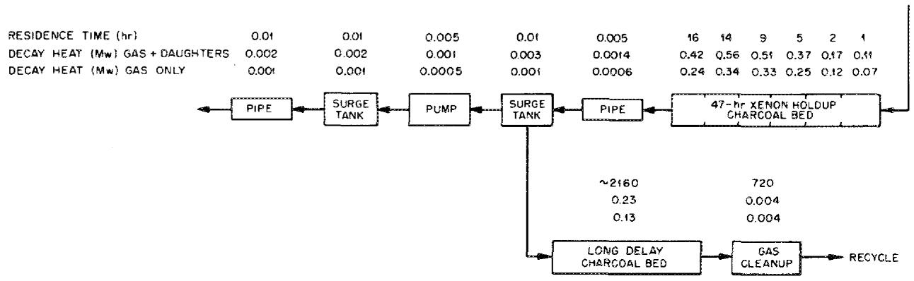  
Fig. 8.11. Typical distribution of decay-heat in the MSBR off-gas system.

supply for the reflux condenser or the water cooler fails. Use of redundant parallel charcoal beds and cooling water systems is being considered.

Purge Gas Cleanup. - After the purge leaves the 90-day xenon holdup charcoal beds, all the radionuclides have decayed to negligible values except for the krypton-85 and any tritium present in the gas. It has been proposed [122] that this gas flow through a cleanup system consisting of a copper oxide bed to convert the tritium to ${}^{3}\mathrm{H}_{2}\mathrm{O}$ and low-temperature $(0^{\circ}\mathrm{F})$ charcoal absorbers where the ${}^{3}\mathrm{H}_{2}\mathrm{O}$ and the remaining krypton and xenon are removed. A compressor returns the cleaned gas back to the reactor through the pump seals, etc. These low-temperature charcoal beds are regenerated periodically by passing part of the clean recycled helium through them at $500^{\circ}\mathrm{F}$ . This helium stream then passes through a liquid nitrogen trap where the ${}^{3}\mathrm{H}_{2}\mathrm{O}$ , krypton and xenon are removed and stored.

After all of the radionuclides have been removed from the purge gas stream, there might be some moisture or oxygen remaining in this gas stream. Potential points of entry for these contaminants into the reactor system could be impurities in the makeup gas supply or a small leak in one of the charcoal beds. Molecular sieves at room temperature ( $\sim 80^{\circ}\mathrm{F}$ ) have been used successfully to remove moisture from the fuel salt purge gas stream [123]. These beds were regenerated periodically by purging them with dry helium at $500^{\circ}\mathrm{F}$ . It also has been demonstrated that oxygen can be removed from the fuel salt purge gas stream by passing it through titanium sponge beds at $1200^{\circ}\mathrm{F}$ [123].

# MSRE Gas Systems

Description. - Most of the experience of stripping noble gases from molten salt reactors has been in the MSRE. In the MSRE, part of the fuel salt was circulated through the pump bowl where it came in contact with the inert cover gas [104,124,106]. Most of the fuel salt entering the pump bowl was sprayed through the gas space into a pool of salt in the pump bowl. It then returned to the main fuel salt loop through ports at the inlet of the pump volute.

Fresh, dried, pure, inert purge gas (usually helium, sometimes argon) entered the pump bowl mostly through the annulus between the pump shaft and the shield plug, although small amounts of it entered through the bubbler. (The method for removing any moisture or oxygen is that described for the MSBR immediately above.) This gas then left the pump bowl, carrying the noble gases and any entrained material, and passed through a pipe having about 1 hr holdup time. From there it flowed through a porous bed filter and valves and through another pipe having about 1-hr holdup time to an activated charcoal bed immersed in water and designed for a 90-day holdup of xenon. All the noble gases except krypton-85 and any tritium that was present decayed to insignificant levels in these beds. This gas then passed through absolute filters and was discharged to the atmosphere through a 100-ft-high stack.

As the salt was jetted from the pump spray ring into the pool of salt in the pump bowl, a large amount of the cover gas was carried into the salt pool [104]. This gas formed bubbles which tended to coalesce and float back up to the pool surface. However, some of these bubbles were carried into the main fuel salt loop with the salt flowing into the pump volute inlet at the bottom of the pump bowl. It was found that the amount of gas carried into the fuel salt loop was a function of the gas solubility, the salt chemistry and the pump speed, which determined the velocity of the salt being jetted from the spray ring. The effects of the salt chemistry are not understood fully, but the amount of gas carried into the main loop changed significantly after the salt was processed to change the fissile material and when beryllium was immersed in the salt in the pump bowl.

Bubbles carried into the fuel salt loop had a dramatic effect on the amount of noble gases present in the MSRE [105,106,125]. Early experiments on the spray stripper in the pump bowl indicated that it had an efficiency of about $15\%$ [126]. However, the reactor operation experience indicated that the noble gases were being removed at a rate that implied a much greater efficiency. It was found that the two parameters affecting the amount of xenon poisoning the most in the MSRE were the cover gas used and the core void fraction. The experimental data are summarized in Fig. 8.12, where the loss of reactivity is about 0.8 of the xenon poison fraction for the MSRE. It appeared that the circulating bubbles were quite small, being in the range of 0.005 to 0.020 in., and that the stripping efficiency of these bubbles in the pump bowl was 50 to $100\%$ .

Analysis of Noble Gas Stripping. - The data in Fig. 8.12 did not agree well with the values predicted by the well-stirred pot insoluble gas model discussed above for the MSBR, particularly when helium was used as a cover gas [106,125]. These calculations indicated that the poison fraction would be a monotonically decreasing curve that is a function only of the core void fraction and is independent of the cover gas used. Part of the assumptions in this model had been checked experimentally. It predicted that the major resistance to the transfer of most of the noble gases from the fuel salt to the graphite moderator would be the salt boundary layer. A precritical experiment in which krypton was injected into and subsequently removed from the MSRE fuel salt system indicated that the mass transfer coefficients for the noble gases migrating through the boundary layer adjacent to the core graphite were in reasonable agreement with those predicted by theory [106,125]. Results of an analysis of data obtained [127] from the measurements of the distribution of the daughters of short-lived noble gases in samples of the MSRE graphite showed that the diffusivities of the noble gases in the graphite agreed with those used in the well-stirred pot insoluble gas model.

Since the well-stirred pot insoluble gas model did not describe the noble gas poisoning of the MSRE adequately, a new model was developed to describe this behavior [105, 106]. This model considered the solubility of the cover gas in the fuel salt by dividing the reactor into four regions, each containing a liquid and a gas phase. Bubble surface tension effects were neglected and it was assumed that the bubbles in each region

were of uniform size and that their number was constant. Solution of the relations derived for this model indicated differences in the void fraction in different regions of the reactor, but these differences were not a strong function of the bubble size.

Material balances then were written for xenon-135 and its precursors iodine-135 and xenon-135m in these four regions using the void fraction distribution calculated by the relations described above. A large number of calculations using internally consistent parameters were made to describe the noble gas poisoning in the MSRE. The reasonably good fit of the calculated poison fraction to the measured values shown in Fig. 8.12 was obtained by use of one set of parameters.

Consideration of the solubility of the cover gas was not sufficient by itself to obtain the agreement shown in Fig. 8.12. In addition, the mass transfer coefficient for the xenon diffusing to the graphite had to be reduced by about a factor of six, the bubble stripping efficiency had to vary with the amount of gas ingested by the pump, and an additional variable mechanism for xenon transport to graphite was required to produce the maxima in the curves. (Direct interaction of bubbles with graphite was postulated in order to provide a process amenable to mathematical formulation.)

Using these same parameters to describe the transient xenon poisoning following a sudden power change in the MSRE did not accurately reproduce the observed behavior. Thus the improved calculational procedure was not a complete success. More work is necessary to elucidate the xenon behavior in the MSRE and to accurately predict the behavior in an MSBR.

Because of the shortcomings and the more complicated nature of this improved model for the MSRE, the well-stirred pot insoluble gas model has been used up to the present time to describe the MSBR noble gas behavior in Figs. 8.7 through 8.9. Another argument advanced for using this simplified model for the MSBR is that the gas bubbles in the MSBR will be far from being saturated with xenon as compared to the bubbles being close to saturation in the MSRE. So if the bubbles interact with the graphite in the MSBR, it is postulated that they would not contribute as much to the poisoning in the MSBR as they did in the MSRE. It is expected that the new computer program being developed for describing the noble gas behavior in the MSBR will shed some light on this. However, more experimental data probably will be required before this situation can be completely resolved.

Off-Gas System Performance. - The MSRE off-gas system generally operated satisfactorily although some nuisance type problems were encountered [104,128,129]. The spray in the pump bowl produced a mist having concentrations similar to any ordinary mist. Some of the salt mist drifted into the off-gas line at the rate of a few grams per month, and some of the resultant salt deposits had to be removed at intervals of six months to a year. Foreign materials, particularly those resulting from the fuel pump lubricating oil leaking into the fuel salt found their way to the control valves, flow restrictors, and filters. These items gradually became plugged by these polymerized organics and they had to be cleaned out or replaced periodically. This problem was corrected by installing new filters of a modified design [130, 131]. Considerable attention was

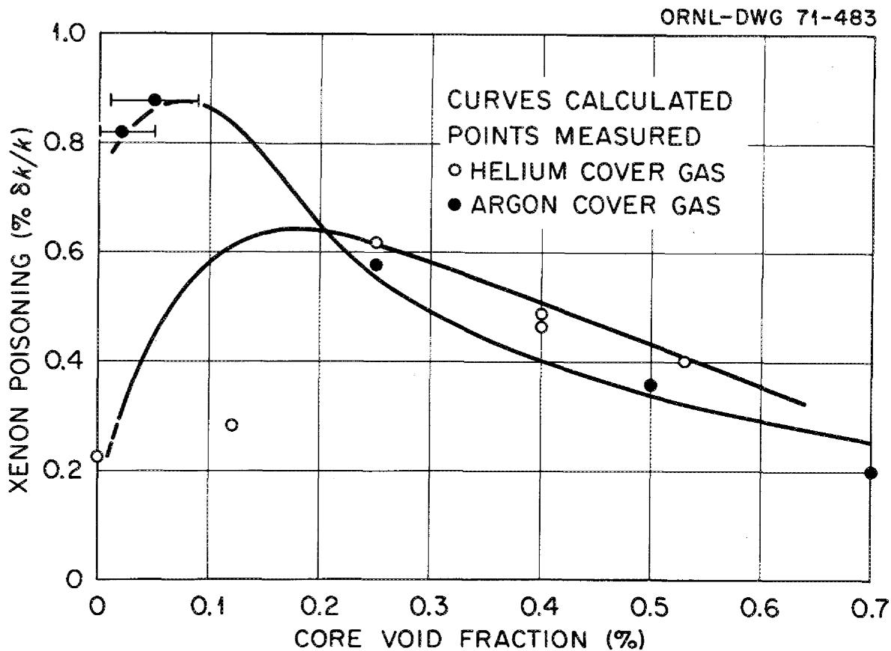  
Fig. 8.12. MSRE steady-state poisoning by $^{135}\mathrm{Xe}$ during full-power operation. Calculated curves are based on the "Iumped, soluble gas" model, with adjustment of the parameters to achieve the agreement shown.

given in this design to the choice of the filter medium and to assure that the heat generated by the decay of the trapped material could be dissipated readily.

There was no breakthrough of activity in the charcoal absorbers and their adsorption capacity was about as anticipated. Intermittent plugging occurred at the inlet of the charcoal beds during the operation of the reactor. It appeared that this plugging was due to the accumulation of polymerized organic solids. This trouble persisted to some extent after the improved filter was installed presumably because organic material had accumulated in the off-gas system downstream of the filter. The entrances to the charcoal beds initially were cleared by blowing helium back through the beds to the holdup tanks. Later it was found that heating the charcoal bed inlet lines to about $800^{\circ}\mathrm{F}$ was sufficient to restore unrestricted gas flow.

# Development Studies

Development studies to date have concentrated on systems in which fission gases are stripped by bubbles circulating with the fuel salt. Experiments have been directed to determining the rate of transfer of xenon and krypton into the bubbles and to methods of getting the bubbles in and out of the fuel salt system. Data for mass transfer to small bubbles flowing concurrently with a liquid are very limited. A study [132] of the available literature indicated that the bubble mass transfer coefficients could be higher than those used in the analyses for the MSBR and the MSRE. To see if this is true, we are measuring the rate that oxygen is stripped out of glycerine-water mixtures by helium bubbles flowing concurrently with the solution [133,134]. These fluids were chosen because the Schmidt numbers are the same as those anticipated for the MSBR.

In this experiment bubbles are injected upstream of a test section in a recirculating loop and then are removed downstream of this section. The bubble size is measured using photographic techniques. Typical results that have been obtained in this experiment are shown in Fig. 8.13. All tests so far have been run in 2-in. tubing mounted horizontally and vertically. The data for the vertical flow channel where the turbulent inertial forces predominate over the buoyant forces and for the horizontal flow channels were correlated by the relation

$$
\mathrm {S h} = 0. 3 4 \mathrm {R e} ^ {0. 9 4} \mathrm {S c} ^ {0. 5} \left(\mathrm {d} _ {\mathrm {v s}} / \mathrm {D}\right)
$$

where Sh is the Sherwood modulus based on the pipe diameter, Re is the Reynolds modulus based on the pipe diameter, Sc is the Schmidt modulus, $d_{\mathrm{VS}}$ is the Sauter mean bubble diameter, and D is the pipe diameter. For the conditions studied so far, it can be seen that the mass transfer coefficient is directly proportional to the Sauter mean bubble diameter, $d_{\mathrm{VS}}$ . Pipe diameter, D, was included as a nondimensionalizing parameter although no actual variations in pipe diameter were made. In vertical

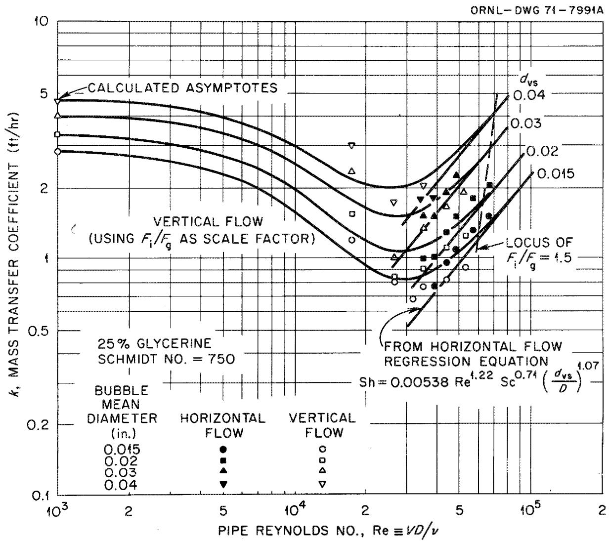  
Fig. 8.13. Typical mass transfer coefficients obtained for stripping oxygen from aqueous glycerine solutions.

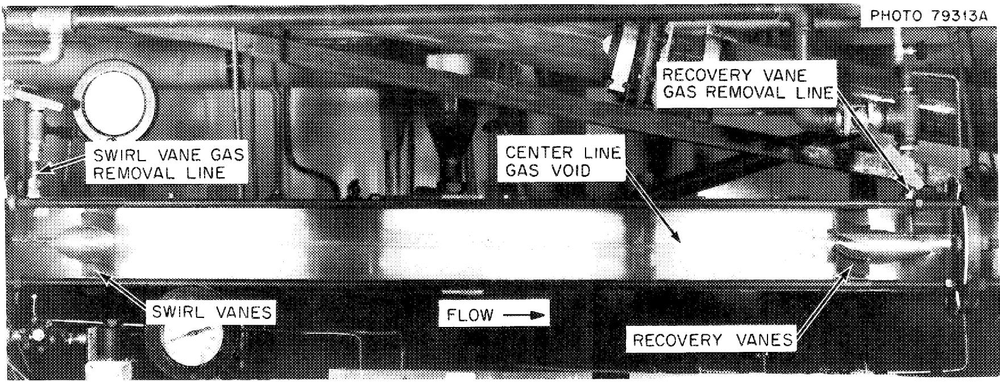  
Fig. 8.14. MSBE inline gas separator mockup.

channels where buoyant forces become significant, it can be seen in Fig. 8.13 that the mass transfer coefficients pass through a minimum and tend to approach the mass transfer coefficients for bubbles rising freely in a liquid.

These results are a little surprising in that they are a little lower than anticipated and show a direct dependency on the bubble diameter. The reasons for this are not clear and more data are necessary. Additional data are now being taken using another size test section. Extrapolation of these results to bubbles in the fuel salt may introduce uncertainties since the salt physical properties and chemistry are different from those for the glycerine-water mixtures.

When first considering bubble generator concepts for the MSBR, it was found that very little information was available in the literature about this subject for systems similar to the MSBR [106]. This unit should generate a uniform dispersion of bubbles over the pipe area to give the desired void fraction and bubble size distribution. Also we decided that we would attempt to develop a unit that would use the available gas supply pressure, since we preferred not to design and build a gas compressor for use in this environment. Both mechanical and fluid-powered generators were considered. We decided that the fluid-powered type generator is the best approach since no moving parts are involved. This led to the selection of a venturi type device in which gas is injected in the venturi throat and bubbles are generated by fluid turbulence in the diffuser section [135,106]. "Teardrop" and "multivane" type bubble generators were also tried and appeared to be capable of giving satisfactory performance, but we believe that the venturi concept offers the greatest simplicity. Tests on MSBE size venturi type generators using demineralized water with and without the addition of surfactants, aqueous glycerine solutions, and aqueous calcium chloride solutions indicated that the size of bubbles generated by this unit was not very dependent on the nature of the fluid. However, a theoretical analysis indicates the diameter should vary as the 0.6 power of the ratio of the surface tension to density, $(\sigma/\rho)^{0.6}$ . Additional tests are in progress to verify this relationship.

A most important observation on these bubble generator tests in a loop is that the bubble size in the loop is affected strongly by the hydraulics of the circulating pump and of the circulating system [136,106]. The circulating pump in the test loop sheared the bubbles to a very small size (about 0.001 to 0.002 in. diameter). These small bubbles coalesced quickly in demineralized water, but not so quickly in the aqueous glycerine and calcium chloride solutions. These observations indicate that the effect of the pump on bubble size and the coalescence of bubbles must be studied in fuel salt before the final design can be established for the bubble generator.

The in-line centrifugal gas separator developed for the aqueous homogeneous reactor program showed great promise of meeting the MSBR requirements [106,128,137,138]. These requirements are that the gas removal efficiency must be high over a wide range of gas inlet flows, the pressure drop must be compatible with the pressure drop available in the primary system, and the amount of entrained liquid in the gas removal stream must not be excessive. Considerable effort has been directed to developing a MSBE size separator which has a 4-in. inside diameter and a salt

flow rate of 400 to 550 gpm [106,139,140,141,142]. Figure 8.14 shows the test unit that has been developed that appears to give a suitably high gas removal efficiency. This unit has a 44-in. separation length, a tapered casing, and gas removal at both the swirl and recovery hubs.

The early test units performed well when using demineralized water, but had poor gas separation efficiencies when using aqueous glycerine or calcium chloride solutions with kinematic viscosities similar to that of the MSBR fuel salt. We postulated that the higher kinematic viscosity resulted in a reduced radial bubble velocity to the central void of the separator and an increase in the effect of the fluid turbulence. The pump produced much smaller bubbles which did not coalesce as readily in these aqueous solutions as they did in the demineralized water and the smaller bubbles were removed less efficiently. Increasing the length of this separator unit gave better separation but resulted in a vortex instability that limited the amount of gas that could be injected and removed from the test fluid. By tapering the casing and removing gas from inlet and outlet hubs the separator was made capable of handling all of the anticipated liquid and gas flow rates.

To gain some understanding of bubble formation and coalescence in the test fluids and in molten salts, a shaker test rig was built [142]. Transparent capsules containing these liquids were shaken to given the desired bubble size and void fraction. The shaking was stopped and photographs were taken at frequent intervals to study the bubble behavior in the liquid. Tests so far indicate that small bubbles coalesce very quickly in demineralized water, but very slowly in aqueous glycerine and calcium chloride solutions. A very significant void fraction of small bubbles remained in these solutions 20 sec after the shaking had stopped. In tests using 66-34 mole % LiF-BeF₂ salt, the coalescence was not as rapid as in demineralized water, but more rapid than in the glycerine and calcium chloride solutions. The void fraction of small bubbles in the salt 20 sec after the shaking had stopped was very small, indicating that there would be better gas separation from the MSR fuel salts than from the calcium chloride solutions. This indicates that the probability of the present gas separator giving the desired performance in the MSR fuel salt systems is very high.

# Effects of Unknowns and Uncertainties

If either the bubble injection and removal system or the graphite sealing should fail to meet our design objectives, the xenon-135 poison fraction would exceed the target of 0.005. The fissile inventory, the reactivity shim requirements, and the breeding ratio would be adversely affected. In the limit, if xenon-135 is not stripped at all from the reference MSBR core, its poison fraction would be about 0.042 [111]. This poison fraction would reduce the breeding ratio of the reactor from 1.06 to 1.02.

Although considerable effort has been directed to the development and understanding of using bubbles circulating with the fuel salt for removing noble gases from the reactor core, there is still much to learn about their behavior. Bubble generators have been built and operated in

loops with aqueous solutions that have kinematic viscosities similar to that of the fuel salt. The shearing of these bubbles into finer bubbles by the pumps in the loops suggests that the bubbles in the MSBR fuel salt will be smaller than we have assumed in our calculations. This observation and the indications that bubbles circulating in the MSRE fuel were very small led Evasco to suggest that an elaborate bubble generator is not required for the MSBR [143,144,145]. Also these smaller bubbles would result in a larger bubble surface area for a given void fraction and Evasco suggested that the desired low xenon poison fraction might be achieved without sealing the graphite moderator.

We believe that we can generate bubbles in the fuel salt satisfactorily, but this still needs to be demonstrated. The shaker experiments so far suggest that bubbles in the fuel salt will coalesce more readily than those in the aqueous test solutions, tending to make the bubbles in the fuel salt larger than those observed in the test solutions in the loops.

Smaller bubbles will provide a greater surface area for a given volume of bubbles to compete for the noble gases in the reactor. Although the bubble mass transfer experiments show that the bubble mass transfer coefficient is proportional to Sauter mean bubble diameter over a very limited size range, there are indications that the relationship does not extend far outside the measured range. Consequently, it may well be that use in the fuel salt of bubbles smaller than those in the experiments would result in a higher rate of noble gas transfer. However, our present knowledge does not provide proof for such a conclusion.

The bubble separator, like the bubble generator, has been developed to operate satisfactorily in loops using the aqueous test solutions but is yet to be tried in a molten-salt system. While we are quite confident that it will give the desired separation in fuel-salt systems even with smaller bubbles, it still has to be proven.

If for some reason any part of the bubble system does not work, some sort of side-stream gas stripping unit would have to be installed in the fuel salt system. The penalty for this probably would be a larger fuel salt inventory, much larger amounts of gas would have to be handled, and a gas compressor would have to be developed for use in a high temperature and highly radioactive environment.

As discussed in Chapter 6, considerable success has been achieved in putting pyrolytic coating on graphite, but a coating that reliably retains its low permeability when irradiated has not been demonstrated. Although we are optimistic that a satisfactory coating can be developed, we must consider the consequences of failure to accomplish this goal. Also the reduction in the cost of graphite would be substantial if it did not have to be coated. As stated above, smaller bubbles might be able to strip the noble gases from the fuel salt to the desired level even without the graphite being sealed, but this must be investigated experimentally. Increasing the amount of bubbles in the salt to a core void fraction of 0.02 to 0.03 has been suggested as a means of limiting the poison fraction [143] that might compensate for lack of graphite sealing. The 0.01 void fraction selected by ORNL is not a firm limit, but it is believed to be reasonable based on the MSBR design requirements and the MSRE operating experience [146]. Also with 0.02 to 0.03 void fraction in the core the void fraction in the salt entering the circulating pump would be around 0.10 which is undesirable.

It was shown earlier that iodine stripping plus xenon stripping of a fuel salt side stream has promise of achieving the desired poison fraction even with uncoated graphite. This method has the several disadvantages that were discussed, but it probably could be made to work. This process probably would be more expensive than the bubble stripping system and would require continuous oxidation and reduction of the sidestream and careful monitoring of the redox condition of the fuel salt.

The fraction of the noble-metal fission products that will find their way into the MSBR off-gas system is not certain; it has been estimated to be from 5 to $35\%$ on the basis of MSRE experience [147]. In any case, the off-gas system must be designed to prevent this material from accumulating in deposits that would restrict the gas flow or overheat parts of the piping or equipment. The exact nature of this and other particulate matter that could be carried into the off-gas system is uncertain, but use of a filter on the drain-tank exit will probably be desirable to assure that the operation of the rest of the off-gas system including the charcoal beds is satisfactory.

# Future Work

Work is continuing on extending our knowledge of mass transfer to bubbles flowing in liquids. The bubble mass transfer experiments are now being run using other size test sections in the experimental loop. Future efforts are being planned to investigate mass transfer to bubbles in areas simulating the highly turbulent regions in the reactor such as the elbows, sudden expansions, and the pump volute. Attempts will be made to investigate mass transfer to smaller bubbles. Because the present method for measuring the bubble size is not capable of identifying very small bubbles, either this method must be improved or another must be devised. Mass transfer rates from the fuel salt to the bubbles will be determined in a loop now being built and discussed below. We may have to be satisfied with obtaining just the product of the mass transfer coefficient and the bubble surface area in this loop if methods are not devised to measure the bubble size in flowing salt streams.

Work also is continuing on studying the behavior of bubble generators and separators under various flow conditions. Pressure drop, velocity, and flow stability measurements are being made. New units will be built, tested in the fuel salt test loop now being constructed, and modified if necessary to obtain the required performance.

This fuel salt loop called the Gas Systems Technology Facility (GSTF) [148,149] will be used for tests of the MSR fuel salt and off-gas systems. In addition to the tests mentioned above we plan to investigate noble gas mass transfer to graphite, the effect of the composition of the salt on the various test results, the performance of the off-gas system components, and the behavior of the noble gases and noble metals in this system.

Various components of the off-gas system that must be tested before they are built and used in a reactor system include the salt mist separator, filters, and units to remove and store tritium and krypton-85. Also tests will have to be made to assure ourselves that we can satisfactorily predict what will happen to the noble metals and any other particulate matter in the off-gas system.

# Overall Evaluation

Present evidence leads us to believe that removing the noble gases by use of bubbles in the fuel salt is the best approach to achieve the desired poison fraction in molten-salt reactors. Experimental data indicate that we have a workable bubble generator and separator and that the mass transfer rate of the noble gases to the bubbles is acceptable. It may be shown in the future that turbulence in the pump impeller or other parts of the fuel salt system could reduce the bubbles to small sizes, but it is premature to assume that now. Use of smaller bubbles may eliminate the need for sealing the graphite to achieve the desired poison fraction, but this cannot presently be assured so work should continue on sealing methods.

Use of a side stream stripper to remove the iodine and xenon from the fuel salt appears to be a feasible alternative for controlling the noble gas poisoning, but is not as attractive as using bubbles unless it is required for tritium removal.

Data are available to show that all the components in the off-gas cleanup system are workable. Care must be taken in the design of this system to assure that particulate matter, radioactive and nonradioactive, does not accumulate anywhere in this system such that it would retard the gas flow or cause overheating.

Although much development and testing of various parts of the molten-salt reactor gas-handling system have been and will be done, the system will have to be proved in an operating reactor. Many subtleties and interactions affect the performance of this system, and a reactor is the only place where we can demonstrate that they all have been considered.

# Summary

The major uncertainties of a fundamental nature in the components and systems for MSBRs are related to the provisions that must be made for accommodating the widespread radioactivity and to the exact distribution of fission products and associated heat production centers around the reactor system. These uncertainties affect the mechanical design of many of the components and systems such as the off-gas. Although the MSBE or a first demonstration reactor would have to be overdesigned in many respects, it should be possible to build and operate it safely and reliably while obtaining basic information needed to optimize later plants. The operation of such a reactor is an essential part of a program to provide the technology for MSBRs.

A summary of the evaluation of the status of each of the important components and systems is given below.

Operation of the pumps in the ARE, the MSRE, and in the large-scale pump test loops demonstrated the reliability of the pump designs and the present state of the technology for salt pumps. We know how to make reliable short-shaft pumps having capacities up to 1500 gpm for use in molten-salt reactors. Although it may take several years to produce the larger pumps for intermediate- or full-scale MSBR's, the problems are well

understood, and there is little question that satisfactory pumps can be obtained on a schedule compatible with obtaining the other principal reactor components. The pump program will benefit from the LMFBR sodium pump technology program because pumps for liquid metals and for molten salts have many common requirements.

Our experience with over 11,000 hr of operation of an MSRE-scale loop while pumping sodium fluoroborate and with the operation of the smaller thermal- and forced-convection loops for material compatibility studies have shown that we can safely handle the salt and that it is a good candidate for the coolant salt for molten-salt reactors. Further work is needed on methods for early detection of moisture inleakage, corrosion product handling, and the migration of tritium within the coolant system. At this time we can see no basic problems which would cause elimination of sodium fluoroborate as the coolant salt; however, there are alternative salts that have only slightly less favorable characteristics.

The experience gained from the heat exchanger studies in the ANP Program and from the design, fabrication, and operation of the heat ex-changers and air-cooled radiator in the MSRE has shown that the molten salts behave as conventional heat transfer fluids and that, except for the enhanced heat transfer tubes, none of the uncertainties associated with heat exchangers and steam generators are fundamental. All uncertainties are related to engineering design optimization and to maintenance and are considered to be resolvable in a reasonable fashion with an adequately funded program of analysis and development. The review made by the Molten Salt Group headed by Evasco Services reached the same conclusion. Another study devoted to steam generators now under way by the Foster Wheeler Corporation is expected to result in conceptual designs of steam generators for use with molten salt and to descriptions of the development programs needed to produce them.

The studies of steam systems for use with molten salts conducted by members of ORNL and Ebasco Services have shown that the conventional steam system of an existing modern steam power plant can be adapted for molten-salt use by the addition of only three new components. These are a reheat steam preheater in the intermediate-pressure-turbine circuit, a mixing chamber for using prime steam for the final stage of feedwater heating, and booster pumps for delivering this feedwater to the steam generator. We found also that changes were needed in the startup system to provide for the high liquidus temperature of the salt. Several options are potentially available for the steam system for a molten-salt reactor plant, none of which involve fundamental uncertainties. All engineering uncertainties are considered resolvable with an adequately funded program of analysis and development.

The experience with the design, fabrication, and operation of control rods and drives in the ARE and the MSRE provide information which will be useful in the design of rods and drives for the MSBR. The major difference is in the need to operate the rods in the salt in the MSBR to provide cooling and reduce the parasitic loss of neutrons. Control rods and drives for LMFBR's have this design feature and much of the information produced in developing them should be applicable to the development of rods and drives for MSBRs. Although a thorough development and prototype testing program will be required to assure adequate performance in a high

temperature environment before installation in a reactor, we foresee no fundamental difficulties in providing control and safety rods and drives for MSBRs.

Valves for molten-salt systems have received very little attention since the ANP program. Here again, there are enough alternative design concepts available that an active program of selection and testing over about 5 years should be able to produce the valves needed for the next molten-salt reactor. In the meantime, the design studies and development tests being conducted in the LMFBR program will provide additional basis for the design of valves for molten-salt use.

Although much smaller in size, the MSRE drain tank is very similar to that proposed for use with the MSBR and the experience acquired during the MSRE operation provides some confidence in the design concept. The use of NaK in an intermediate thermal convection system to transport the heat to water is different but we believe that it is preferable to the more direct water cooling of the MSRE tank. We believe that the drain tank system deals with the afterheat problem realistically and that it is a safe system. Information is needed on the detailed distribution of the deposition of noble metals and noble gas daughters coming from the gas-handling system before a design could be completed for a 1000-MW(e) MSBR. We can see no major difficulties in producing a design of a drain tank that will satisfy the needs of the MSBE.

The effectiveness of the removal of $^{135}\mathrm{Xe}$ by gas bubbles was demonstrated during the operation of the MSRE. The presence of the bubbles reduced the effect of xenon to below that originally calculated for the spray chamber in the pump bowl, and later attempts to calculate the effect of bubbles also led to some underestimation of their effectiveness in removing xenon. A model for calculating the xenon distribution in the MSBR is still under development. When finished it is expected also to be useful for further analyses of the MSRE results. Experimental results from tests using water solutions indicate that we have a bubble generator and bubble separator that should work in the fuel salt. We believe that the bubble stripping method is the best approach to achieving the desired $^{135}\mathrm{Xe}$ poison fraction. The effect of bubble size on the mass transfer rate of the noble gases to the bubbles is not completely defined and further work is needed before it can be decided whether coating of the graphite is needed. Although much development and testing of various parts of the gas-handling system have been and will be done, the system will have to be operated in a reactor to demonstrate that all the important problems have been solved.

# References for Chapter 8

1. Conceptual Design Study of a Single-Fluid Molten-Salt Breeder Reactor, ORNL-4541 (1971).   
2. Molten-Salt Reactor Technology, Technical Report of the Molten-Salt Group, Part I, Evasco Services Inc., December 1971.   
3. Evaluation of a 1000 MWe Molten-Salt Breeder Reactor, Technical Report of the Molten-Salt Group, Part II, Evasco Services, Inc., October 1971.   
4. 1000 MW(e) Molten Salt Breeder Reactor Conceptual Design Study, Final Report - Task I, Evasco Services Inc., February 1972.   
5. Design Studies of Steam Generators for Molten-Salt Reactors, Monthly Progress Report #2, Feb. 14-March 31, 1973, Foster-Wheeler Corporation Document No. ND/72/22.   
6. J. R. McWherter, Molten-Salt Breeder Experiment Design Bases, ORNL-TM-3177 (November 1970).   
7. E. S. Bettis, L. G. Alexander, and H. L. Watts, Design Studies of a Molten-Salt Reactor Demonstration Plant, ORNL-TM-3832 (June 1972).   
8. P. G. Smith, Experience with High-Temperature Centrifugal Pumps in Nuclear Reactors and their Application to Molten-Salt Thermal Breeder Reactors, ORNL-TM-1993 (September 1967).   
9. Conceptual Design Study of a Single-Fluid Molten-Salt Breeder Reactor, ORNL-4541 (1971).   
10. A. G. Grindell, W. F. Boudreau, and H. W. Savage, Nucl. Sci. Eng. 7, 83-91 (1960).   
11. P. G. Smith, Development of Fuel- and Coolant-Salt Centrifugal Pumps for the Molten-Salt Reactor Experiment, ORNL-TM-2987 (October 1970).   
12. R. C. Robertson, R. B. Briggs, O. L. Smith, and E. S. Bettis, *Two-Fluid Molten Salt Breeder Reactor Design Study* (Status as of Jan. 1, 1968), ORNL-4528 (1970).   
13. Molten-Salt Reactor Technology, Technical Report of the Molten-Salt Group, Part I, Evasco Services Inc., December 1971.   
14. Evaluation of a 1000 MWe Molten-Salt Breeder Reactor, Technical Report of the Molten-Salt Group, Part II, Section 6.6, Evasco Services Inc., October 1971.

15. Feasibility Study of Rotor-Bearing System Dynamics for a 1250 hp Molten-Salt Fuel Pump, MTI-68TR9, Mechanical Technology Incorporated (April 12, 1968).   
16. Summary of Study of Feasibility of Rotor-Bearing System for a 1250 hp Molten-Salt Fuel Pump Conducted by MTI on Subcontract 2942, Intra-Laboratory Correspondence, A. G. Grindell to R. B. Briggs (June 27, 1968).   
17. C. H. Gabbard, Thermal-Stress and Strain-Fatigue Analyses of the MSRE Fuel and Coolant Pump Tanks, ORNL-TM-78 (October 1962).   
18. P. G. Smith, Development of Fuel- and Coolant-Salt Centrifugal Pumps for the Molten-Salt Reactor Experiment, ORNL-TM-2987 (October 1970), pp. 11 and 13.   
19. P. G. Smith, High-Temperature Molten-Salt Lubricated Hydrodynamic Journal Bearings, ASME Transactions 4, 263-274 (1961).   
20. MSR Program Semiann. Progr. Rept. Feb. 28, 1962, ORNL-3282.   
21. Oak Ridge National Laboratory, Reactor Division Job Specification M-10544-RB-001-X-1 (July 21, 1969).   
22. A. G. Grindell and C. K. McGlothlan, Conceptual System Design Description of the Salt Pump Test Stand for the Molten-Salt Breeder Experiment, ORNL-TM-2643 (August 1969).   
23. L. V. Wilson and A. G. Grindell, Preliminary Systems Design Description (Title I Design) of the Salt Pump Test Stand for the Molten-Salt Breeder Experiment, ORNL-TM-2780 (December 1969).   
24. A. G. Grindell and R. B. Briggs, Program Plan for the Procurement and Testing of MSBE Salt Pumps, MSR 69-94 (Oct. 1, 1969).   
25. J. P. Sanders, A Review of Possible Choices for Secondary Coolants for Molten-Salt Reactors, internal memorandum, Aug. 6, 1971.   
26. MSR Program Semiann. Progr. Rept. Aug. 31, 1970, ORNL-4622, pp. 119-133.   
27. A. N. Smith, Experience with Fluoroborate Circulation in an MSRE Scale Loop, ORNL-MT-3344 (to be published).   
28. J. W. Koger, MSR Program Semiann. Progr. Rept. Aug. 31, 1970, ORNL-4622, p. 170.   
29. W. R. Huntley, MSR Program Semiann. Progr. Rept. Aug. 31, 1971, ORNL-4728, p. 152.

30. R. B. Briggs, An Assessment of the Effects of Leakage of Water from the Steam-Raising Equipment on Corrosion in the Secondary System of an MSBR, Intra-Laboratory Correspondence, ORNL-MSR-71-27, March 19, 1971.   
31. R. B. Briggs and R. B. Korsmeyer, Distribution of Tritium in a 1000MW(e) MSBR, ORNL-CF-70-3-3, March 18, 1970.   
32. J. P. Sanders, op. cit., p. 29.   
33. Conceptual Design Study of a Single-Fluid Molten-Salt Breeder Reactor, ORNL-4541 (1971), p. 54.   
34. Ibid., p. 65.   
35. Ibid., p. 69.   
36. Ibid., p. 81.   
37. MSR Program Semiann. Progr. Rept. Aug. 31, 1971, ORNL-4728, p. 19.   
38. 1000 MW(e) Molten Salt Breeder Reactor Conceptual Design Study, Final Report - Task I, Evasco Services Inc., February 1972, p. 4-6.   
39. D. G. H. Latzko (Netherlands), Intermediate Coolant Alternatives for the LMFBR, Proceedings of an IAEA Symposium in Monaco, IAEA SM-130/20, March 1970.   
40. Conceptual Design Study of a Single-Fluid Molten-Salt Breeder Reactor, ORNL-4541 (1971), p. 65.   
41. 1000 MW(e) Molten Salt Breeder Reactor Conceptual Design Study, Final Report - Task I, Evasco Services Inc., February 1972, p. 4-2.   
42. Design Studies of Steam Generators for Molten Salt Reactors, Monthly Progress Report #2, Feb. 14-March 31, 1972, Foster Wheeler Corporation Document No. ND/72/22.   
43. Project for Investigation of Molten Salt Breeder Reactor, Final Report of Phase I Study by Black and Veatch Consulting Engineers, September 1970, p. 70.   
44. Conceptual Design Study of a Single-Fluid Molten-Salt Breeder Reactor, ORNL-4541 (1971), p. 54.   
45. J. R. McWherter, Molten Salt Breeder Experiment Design Bases, ORNL-TM-3177, November 1970, p. 18.   
46. E. S. Bettis et al., Design Studies of a Molten-Salt Reactor Demonstration Plant, ORNL-TM-3832, June 1972, p. 26.

47. 1000 MW(e) Molten Salt Breeder Reactor Conceptual Design Study, Final Report - Task I, Evasco Services Inc., February 1972, Fig. 4.23.   
48. R. C. Robertson, MSRE Design and Operations Report, Part I, Description of Reactor Design, ORNL-TM-728 (January 1965), p. 162.   
49. C. H. Gabbard, Reactor Power Measurement and Heat Transfer Performance in the Molten Salt Reactor Experiment, ORNL-IM-3002, May 1970.   
50. MSR Program Semiann. Progr. Rept. Aug. 31, 1971, ORNL-4728, p. 152.   
51. Conceptual Design Study of a Single-Fluid Molten-Salt Breeder Reactor, ORNL-4541 (1971), p. 57.   
52. Ibid., p. 68.   
53. E. G. Bohlmann, Heat Transfer Salt for High Temperature Steam Generation, ORNL-TM-3777 (to be published).   
54. E. S. Bettis et al., Design Studies of a Molten-Salt Reactor Demonstration Plant, ORNL-TM-3832, June 1972, p. 35.   
55. C. N. Spalaris et al., Materials for Nuclear Superheater Applications, GEAP-3875 (1962).   
56. R. J. Bender, *Supercritical Boiler Units*, Now in Its Third Generation, Gain Tighter Grip, Power Engineering, April 1971.   
57. MSR Program Semiann. Progr. Rept. Aug. 31, 1970, ORNL-4622, p. 51.   
58. O. W. Burke, Hybrid Computer Simulation of the MSBR, ORNL-TM-3767 (May 1972).   
59. Conceptual Design Study of a Single-Fluid Molten-Salt Breeder Reactor, ORNL-4541 (1971), p. 37.   
60. Puchase Order Subcontract No. 91X-88070C between Union Carbide Nuclear Division and Foster-Wheeler Corporation, Task II or Design Studies of Steam Generators for Molten-Salt Reactors.   
61. MSR Program Semiann. Progr. Rept. Aug. 31, 1969, ORNL-4449, p. 147.   
62. Conceptual Design Study of a Single-Fluid Molten-Salt Breeder Reactor, ORNL-4541 (1971), p. 57.   
63. C. H. Gabbard, Reactor Power Measurement and Heat Transfer Performance in the Molten Salt Reactor Experiment, ORNL-TM-3002, May 1970.   
64. O. W. Burke, Hybrid Computer Simulation of the MSBR, ORNL-TM-3767, May 5, 1972.   
65. MSR Program Semiann. Progr. Rept. Aug. 31, 1971, ORNL-4728, p. 153.

66. Ibid., p. 156.   
67. Plan for the Development of Steam Generators for Molten Salt Reactors, enclosure with letter dated Dec. 11, 1970, from D. B. Traugerto Milton Shaw.   
68. Purchase Order Subcontract No. 91X-88070C between Union Carbide Nuclear Division and Foster-Wheeler Corporation, Task I-IV of Design Studies of Steam Generators for Molten-Salt Reactors.   
69. J. L. Crowley, R. E. Helms, and J. P. Sanders, Conceptual Systems Design Description of a Steam-Generator Tube Test Stand for the Molten Salt Reactor Program, ORNL-CF-70-10-20, Oct. 15, 1970.   
70. Molten-Salt Reactor Technology, Technical Report of the Molten-Salt Group, Part I, Evasco Services Inc., December 1971, p. 53.   
71. Conceptual Design Study of a Single-Fluid Molten-Salt Breeder Reactor, ORNL-4541 (1971), p. 74.   
72. 1000 MW(e) Molten Salt Breeder Reactor Conceptual Design Study, Final Report - Task I, Evasco Services Inc., February 1972, p. 5-1.   
73. Ibid., p. 5-18.   
74. Conceptual Design Study of a Single-Fluid Molten-Salt Breeder Reactor, ORNL-4541 (1971), p. 80.   
75. Purchase Order Subcontract No. 91X-88070C between Union Carbide Nuclear Division and Foster-Wheeler Corporation, Task II of Design Studies for Molten-Salt Reactors.   
76. E. S. Bettis et al., Design Studies of a Molten Salt Breeder Reactor Demonstration Plant, ORNL-TM-3832 (June 1972), p. 37.   
77. Evaluation of a 1000 MWe Molten-Salt Breeder Reactor, Technical Report of the Molten-Salt Group, Part II, Ebasco Services, Inc., October 1971, p. 118.   
78. Conceptual Design Study of a Single-Fluid Molten-Salt Breeder Reactor, ORNL-4541 (1971), p. 81.   
79. Ibid., p. 80.   
80. Ibid., p. 123.   
81. 1000 MW(e) Molten Salt Breeder Reactor Conceptual Design Study, Final Report - Task I, Evasco Services Inc., February 1972, p. 5-10.

82. Purchase Order Subcontract No. 91X-88070C between Union Carbide Nuclear Division and Foster-Wheeler Corporation, Tasks I and II of Design Studies of Steam Generators for Molten-Salt Reactors.   
83. Conceptual Design Study of a Single-Fluid Molten-Salt Breeder Reactor, ORNL-4541 (1971), p. 43.   
84. Ibid., p. 71.   
85. 1000 MW(e) Molten Salt Breeder Reactor Conceptual Design Study, Final Report - Task I, Evasco Services Inc., February 1972, p. 4-34.   
86. Purchase Order Subcontract No. 91X-88070C between Union Carbide Nuclear Division and Foster-Wheeler Corporation, Task I of Design Studies of Steam Generators for Molten-Salt Reactors.   
87. R. C. Robertson, MSRE Design and Operations Report, Part I, Description of Reactor Design, ORNL-TM-728 (January 1965).   
88. O. S. Seim, Large Valves for Liquid Metal Cooled Reactors, Reactor and Fuel Processing Technology, Vol. II, No. 3 Summer 1968, pp. 127-137.   
89. R. A. Winborne, NAA-SR-7534, Flow Controller Evaluation for Sodium Service, Nov. 30, 1963.   
90. Conceptual Design Study of a Single-Fluid Molten-Salt Breeder Reactor, ORNL-4541, pp. 14, 117-119 (1971).   
91. Ibid., pp. 118-119.   
92. E. S. Bettis, L. G. Alexander, and H. L. Watts, Design Studies of a Molten-Salt Reactor Demonstration Plant, ORNL-TM-3832 (June 1972).   
93. Conceptual Components Design Description for the Reactor Nuclear Control Components No. 33, BNWL-500, Vol. 33, Battelle-Northwest, Richland, Washington, April 24, 1969.   
94. R. C. Briant, A. M. Weinberg, E. S. Bettis, W. K. Ergen et al., Nucl. Sci. Eng. 2, 797 (1957).   
95. P. N. Haubenreich, J. R. Engel, Nucl. Appl. Tech. 8, 118 (1970).   
96. R. C. Briant, A. M. Weinberg, E. S. Bettis, W. K. Ergen et al., Nucl. Sci. Eng. 2797, p. 816 (1957).   
97. R. C. Robertson, MSRE Design and Operations Report, Part I, Description of Reactor Design, ORNL-TM-728 (January 1965).   
98. A. M. Perry, private communication.

99. E. S. Bettis, L. G. Alexander, and H. L. Watts, Design Studies of a Molten-Salt Reactor Demonstration Plant, ORNL-TM-3832 (June 1972).   
100. Conceptual Design Study of a Single-Fluid Molten-Salt Breeder Reactor, ORNL-4541, pp. 61-64 (1971).   
101. MSR Program Semiann. Progr. Rept. Aug. 31, 1971, pp. 4-5. ORNL-4728.   
102. MSR Program Semiann. Progr. Rept. Aug. 31, 1971, pp. 98-109, ORNL-4728.   
103. D. Scott, W. P. Eatherly, Nuc. Appl. Tech., 8, 179 (1970).   
104. J. R. Engel, P. N. Haubenreich, and A. Houtzeel, Spray, Mist., Bubbles and Foam in the MSRE, ORNL-TM-3027 (June 1970).   
105. J. R. Engel and R. C. Steffy, Xenon Behavior in the Molten-Salt Reactor Experiment, ORNL-TM-3464 (Oct. 1971).   
106. R. J. Kedl, Design Basis Report for MSBR Xe-135 Removal System, ORNL-TM- (to be issued).   
107. R. H. Chapman, HRE-2 Design Manual, ORNL-TM-348, March 1964.   
108. W. B. Cottrell et al., Operation of the Aircraft Reactor Experiment, ORNL-1845, Aug. 22, 1955.   
109. Conceptual Design Study of a Single-Fluid Molten-Salt Breeder Reactor, ORNL-4541, p. 61 (1971).   
110. MSR Program Semiann, Progr. Rept. Aug. 31, 1968, ORNL-4344, pp. 72-74.   
111. A. M. Perry, personal communication, June 14, 1972.   
112. Conceptual Design Study of a Single-Fluid Molten-Salt Breeder Reactor, ORNL-4541, pp. 170-174.   
113. Ibid, p. 96.   
114. MSR Program Semiann. Progr. Rept. Aug. 31, 1971, pp. 10-11, ORNL-4728.   
115. R. P. Wichner and C. F. Baes, Sidestream Processing for Xenon and Iodine Removal, internal memoranda, 1972.   
116. MSR Program Semiann. Progr. Rept. Aug. 31, 1971, p. 45, ORNL-4728.   
117. Conceptual Design Study of a Single-Fluid Molten-Salt Breeder Reactor, ORNL-454i, pp. 98-109 (1971).

118. T. W. Leland, Design of Charcoal Adsorbers for the HRT, ORNL-CF-55-9-12, Sept. 6, 1955.   
119. C. R. Solenberger et al., Treatment of Off-Gas from the HRT, ORGDP internal correspondence KT-373 (MIT Engineering Practice School memo EPS-X-388) September 1958.   
120. S. J. Ball, Oak Ridge National Laboratory, unpublished data, September 1966.   
121. R. E. Adams, W. E. Browning, Jr., and R. D. Ackley, Containment of Radioactive Fission Gases by Dynamic Adsorption, Ind. Eng. Chem. 51, 1467 (December 1950).   
122. MSR Program Semiann. Progr. Rept. Feb. 28, 1969, ORNL-4396, pp. 92-95.   
123. R. C. Robertson, MSRE Design and Operations Report, Part I, Description of Reactor Design, ORNL-TM-728, pp. 332-336 (January 1965).   
124. Ibid., pp. 356-381.   
125. R. J. Kedl and A. Houtzeel, Development of a Model for Computing 135Xe Migration in the MSRE, ORNL--4069, June 1967.   
126. J. R. Waggoner and F. N. Peebles, Stripping Ratio of Carbon Dioxide from Water in Spray Type Liquid-Gas Contactors, University of Tennessee Report EM 65-3-1, March 1965.   
127. R. J. Kedl, A Model for Computing the Migration of Very Short Lived Noble Gases into MSRE Graphite, ORNL-TM-1810, July 1967.   
128. D. Scott and A. G. Grindell, Components and Systems Development for Molten-Salt Breeder Reactors, ORNL-TM-1855, June 30, 1967.   
129. A. I. Krakoviak and R. H. Guymon, Experience with the Molten-Salt Reactor Experiment Off-Gas Systems, ORNL-TM- (to be issued).   
130. MSR Program Semiann. Progr. Rept. Aug. 31, 1966, ORNL-4037, pp. 74-77.   
131. MSR Program Semiann. Progr. Rept. Feb. 28, 1967, ORNL-4119, pp. 42-56.   
132. F. N. Peebles, Removal of Xenon-135 from Circulating Fuel Salt of the MSBR by Mass Transfer to Helium Bubbles, ORNL-TM-2245, July 23, 1968.   
133. MSR Program Semiann. Progr. Rept. Aug. 31, 1971, ORNL-4728, pp. 41-43.

134. T. S. Kress, Mass Transfer Between Small Bubbles and Liquids in Cocurrent Turbulent Pipeline Flow, ORNL-TM-3718, April 1972.   
135. MSR Program Semiann. Progr. Rept. Feb. 28, 1971, ORNL-4676, p. 49.   
136. MSR Program Semiann. Progr. Rept. Aug. 31, 1971, ORNL-4728, p. 26.   
137. J. A. Hafford, Development of the Pipe Line Gas Separator, ORNL-1602, Feb. 18, 1954.   
138. F. N. Peebles, The Motion of Gas Bubbles in the HRE Reactor Core, ORNL-1171, Jan. 4, 1952.   
139. MSR Program Semiann. Progr. Rept. Aug. 31, 1970, ORNL-4622, pp. 37-38.   
140. MSR Program Semiann. Progr. Rept. Feb. 28, 1971, ORNL-4676, pp. 49-51.   
141. MSR Program Semiann. Progr. Rept. Aug. 31, 1971, ORNL-4728, pp. 26-27.   
142. MSR Program Semiann. Progr. Rept. Feb. 29, 1972, ORNL-4782.   
143. Molten-Salt Reactor Technology, Technical Report of the Molten-Salt Group, Part I, Evasco Services Inc., December 1971.   
144. Evaluation of a 1000 MWe Molten-Salt Breeder Reactor, Technical Report of the Molten-Salt Group, Part II, Evasco Services, Inc., October 1971.   
145. 1000 MW(e). Molten Salt Breeder Reactor Conceptual Design Study, Final Report - Task I, Evasco Services Inc., February 1972.   
146. J. R. Engel, personal communication, July 5, 1972.   
147. J. R. Tallackson, personal communication, July 5, 1972.   
148. W. K. Furlong, Conceptual System Design Description of the Molten-Salt Loop for Testing Gas Systems, internal memorandum, Jan. 25, 1971.   
149. R. H. Guymon, Preliminary System Design Description of the Gas Systems Technology Facility (GSTF) (EJN-10580), internal memorandum, Mar. 30, 1972.

# 9. CELLS, BUILDINGS, AND CONTAINMENT

E. S. Bettis

# Requirements

The molten-salt reactor plant differs from others in that large amounts of fission products are dispersed throughout the reactor primary system and several auxiliary systems. Much of the equipment and piping must be preheated and held at $1000^{\circ}\mathrm{F}$ or higher to keep the salts molten. Maintenance of the radioactive equipment must be accomplished through shielding by use of remotely operated tools. Facilities must be provided for the handling and storage of fission products discharged from the fuel processing plant and for materials removed from the reactor systems. Because of the differences, considerable attention was given to the containment requirements in the MSBR reference design and to a reactor building and equipment cells that would satisfy those requirements.

The major criterion is that double containment be provided at all times for equipment that contains the bulk of the radioactive liquids and gases. The inner containment must remain sealed at all times when the equipment therein is operating. The outer containment must also be sealed, but controlled access through airlocks is permissible at any time when the radiation levels are below the levels specified for human occupancy.

When maintenance of the doubly contained equipment is necessary, the bulk of the radioactive fluids must be drained or purged from that equipment and secured in tanks in other sealed cells. The inner containment can then be unsealed and openings made as necessary to accomplish the maintenance. A degree of inner containment must be maintained by limiting the size of opening and providing a flow of air inward through the opening. Equipment that is removed must be withdrawn into casks for transfer to repair, disposal, or storage facilities within the outer containment. During all these operations the outer containment must be kept sealed. All ventilation streams must be filtered, passed through absorbers, and recycled where feasible. Gases that are discharged to the atmosphere may contain only trivial amounts of fission product radioactivity.

# Description

# MSRE

These general requirements were applied in the MSRE, although less stringently, because much less radioactivity was involved. The MSRE fuel circulating system was installed in a reactor cell that was a steel tank imbedded in concrete. The fuel drain tank system was similarly enclosed in a steel-lined concrete cell. Salt-containing equipment in the cells was enclosed in insulation that contained electric heaters to maintain the salt above the melting point while the cell atmosphere was held to $150^{\circ}\mathrm{F}$

by space coolers. The top closure of each cell was formed by a steel membrane sandwiched between two layers of concrete shield blocks and welded to the tank walls. The reactor and drain tank cells were inside the reactor building. This building was a steel frame structure that was covered with corrugated siding and lined with steel sheet to make it moderately tight.

When the reactor was operating or maintenance was in progress, and at most other times, the reactor building was closed and the interior was kept at a slightly negative pressure by drawing air from the building through filters and discharging it up a stack. During operation the atmosphere in the reactor and drain tank cells was maintained below 5 percent in oxygen by admitting nitrogen and at subatmospheric pressure by exhausting a small stream past a radiation monitor and up the stack. When a cell was opened for maintenance, the size of the opening was minimized and a flow of air into the cells was maintained by means of a line from the cells to the building exhaust system. Materials removed from the cells were withdrawn into casks or bags for storage in other cells in the building or for removal from the plant. The containment system worked well and provided satisfactory protection for the public and for plant personnel.

# MSBR Building

The reactor building provides the outer barrier of the double containment for the equipment in the MSBR plant also. It is cylindrical in shape with a hemispherical dome, is of monolithic concrete construction, and is about 189 ft high and 134 ft in diameter. The entire building rests on one concrete pad, and a metallic membrane encloses all parts of the building in which radioactive materials are present. The domed building with 3-ft-thick concrete walls was specified to meet the accepted requirements for reactor buildings regarding storm-induced differential pressure and missiles.

During routine operation, the reactor building is maintained at a pressure slightly below atmospheric by a ventilation system that recycles the air through absorbers and filters and discharges a fraction up a stack to compensate for a controlled inflow of fresh air. Operating personnel have access to the building at all times through airlocks except when cells are open during some steps in maintenance operations.

Within the reactor building are three major levels. Under the hemispherical dome is the crane bay area which is serviced by a heavy duty polar crane with two traveling hoists. As described in ORNL-4541, the major use of this area is for maintenance of equipment in the cells below it.

Beneath the crane bay and on the next lower level are located the reactor cell, the chemical processing and off-gas cells (which extend through to the bottom level), various hot cells for disassembly of failed components, and space for the storage of radioactive equipment. The bottom level of the building has the drain tank cell and the waste storage cell. These cells constitute the inner containment of the double containment system for confining the radioactivity to the plant.

# MSBR Cells

All cells that contain radioactivity have thick concrete walls for shielding and are lined with metal to provide a tight containment. These cells also provide a controlled atmosphere environment for the equipment.

The reactor cell and fuel-salt drain tank cell require both heating and cooling. They must be heated to about $1000^{\circ}\mathrm{F}$ before the reactor can be filled with salt. Being able to cool them is useful for removing radioactive decay heat from the primary system after the salt has been drained and for lowering the temperature before doing maintenance. For this reason, these cells are lined with thermal insulation and have a forced circulation closed gas system in which the gas can be heated or cooled. The off-gas cell and the chemical processing cells have heaters or coolers on the components themselves, and the ambient temperature is maintained at about $100^{\circ}\mathrm{F}$ by space coolers.

Building the reactor and drain tank cells as ovens introduces several problems. The insulation must be able to expand and contract with the heating and cooling of the cell and be effective for at least 30 years with little repair. Some equipment supports and restraints must operate normally at $1000^{\circ}\mathrm{F}$ but be able to accommodate occasional cooling to $200^{\circ}\mathrm{F}$ . Reliable blowers must be provided to circulate the cell atmosphere. Industrial blowers are available for circulating gases in ovens at temperatures up to $2000^{\circ}\mathrm{F}$ , but they probably will have to be upgraded for reactor service. Special attention will have to be given to penetrations through the cell walls and to disconnects for instrument and service lines. For some service the inner ends of the penetrations and the disconnects may be at high temperature. For others the penetrations will terminate behind the insulation at the inner wall of the cell and be at low temperature. Some specially cooled thimbles may be required to bring nuclear instrumentation close to the reactor vessel. Cooling must be provided in the cell walls to remove the heat that passes through the insulation and that is generated in the walls by nuclear radiations in order to keep the concrete at low temperature.

The benefits derived from installing the reactor equipment in ovens as opposed to putting the insulation and heaters on the equipment and piping are substantial. Insulating the walls is potentially much less complicated and less expensive than providing many specially fitted and remotely installable pieces around the vessels and piping. In the oven the exterior surfaces of the reactor equipment are far more accessible for remote maintenance and inspection and for installation of instrumentation. The multitude of electrical cables and thermocouples and associated disconnects and penetrations that are required for individual pipeline and vessel heaters are eliminated. Although the heating systems on the MSRE worked very well, most of the penetrations, thermocouples, and service lines and much of the complexity in the cells resulted from provisions for heating the salt-containing equipment and cooling the air in the cells.

During operation the equipment cells are sealed and access is prohibited. When maintenance is required, the reactor is shut down and drained and access is achieved by removing shielding blocks at the top of the cells and opening up sections of the steel membrane, as described in Chapter 12. When a cell is not tightly sealed, building air is drawn into

the cell, passed through absorbers and filters, and recycled to the reactor building or discharged up a stack. Radiation instruments monitor this effluent gas to prevent release of activity outside the building.

The bottom of the reactor cell forms a catch pan which connects through a line to the drain tank. Any break in the primary salt circuit will result in the leaked salt being conducted to the drain tank. This feature is discussed further in Chapter 8.

The steam cells are located outside the main building containment membrane. This is to avoid any possibility of a steam leak putting pressure on the containment structure. Because the secondary coolant is radioactive and toxic, these cells are also sealed when the equipment is operating.

# Status and Uncertainties

The general design of the reactor containment building for an MSBR can follow the design that has come to be rather standard for nuclear reactors, and no unusual construction techniques seem to be involved in building the cylindrical shell or the various cells. Heating the reactor and fuel drain tank cells in order to handle the high melting point of the salt, however, is unique.

The method employed for heating requires no inventions and should have minimal troubles. The uncertainties mainly relate to the method of insulating the cells and making the penetrations, and, as discussed in Chapter 13, the way to support the reactor components in the hot cell and to restrain them against seismic forces. No limiting problems are foreseen, but the designs remain to be fully worked out. A considerable amount of development will be needed in proving the design. The MSRE approach of separately insulating and heating the components can be adopted if the difficulties of using the cells as ovens prove to be too great. Scaling up the MSRE method for an MSBR would require much development and testing also.

Top shielding plugs that are removable for maintenance access were used successfully in the ARE, HRE-2, and MSRE, and a sealing membrane was used in the same general way at the HRE-2 and MSRE. Flow of air into the cell through openings was also used to prevent the dispersal of radioactivity during maintenance. Larger cell openings will be required on an MSBR, the amounts of activity in the system will be greater, and the restrictions on discharge of activity will probably be tighter. Methods and equipment will have to be developed for sealing openings around work shields and tools to provide better shielding against radiation and to restrict the required air flow to rates that will not require excessively large absorber and filter banks.

# Evaluation

No unusual problems appear to relate to providing a containment building for an MSBR, but the proposal in the ORNL reference design to use the reactor and fuel-drain tank cells as ovens for preheating the equipment to about $1000^{\circ}\mathrm{F}$ is unique. Detailed designs are needed and development and testing will be required to determine whether all design requirements can be satisfied in this approach. If they cannot, a return to the MSRE concept of separately insulated and heated components can be adopted.

The double containment afforded by the reactor building and the equipment cells should give good control of radioactivity during normal operation or accident conditions. The containment provided by the reactor building should give satisfactory protection to the public against releases of radioactivity during maintenance operations. Careful design, well developed equipment and procedures, and careful use of a controlled ventilation system will be required for protection of plant personnel during maintenance. The MSRE afforded experience with all of these on a small scale and there is similar experience from other reactor plants and from fuel reprocessing plants.

Design, development, and testing will be required, but no problems are evident that might prevent satisfactory containment structures and attendant service systems from being provided for an MSBR.

# 10. PLANT CONTROL AND INSTRUMENTATION

S. J. Ditto and J. L. Anderson

Requirements and Current Concepts

# Systems for Normal Operation

Normal operation of an MSBR includes all phases of startup from cold or hot standby conditions, production of electric power at demanded loads between 20 and $100\%$ of design capability, and scheduled shutdown.

The control systems must recognize the different requirements for the various operating modes and establish and maintain safe and appropriate operating conditions. The systems must coordinate the operation of the reactor, the primary- and secondary-salt loops, the steam generators, and system auxiliaries. In general, the load demand is the primary signal to which the control subsystems must respond. However, while matching the power generation with the load, the control system must maintain system temperatures and their rates of change within acceptable limits. Specific areas of concern are the temperature of the steam at the turbine throttle, the rate of change of temperature in the salt loops, and the salt temperatures, which must be maintained well above the freezing point throughout the circulating systems (with the possible exception of some areas in the steam generator).

The present concept is to control the nuclear power generation by graphite rods, which are used in an automatic control loop to maintain reactor temperature at a set point programmed according to the needs of the steam system. This arrangement is a variation of a scheme successfully demonstrated on the MSRE, where the temperature set point was controlled by the operator. Such a control system makes the reactor power slave to the load, with a temperature base line independently determined to provide steam at the desired temperature.

Maneuvering from one power level to another requires control of steam temperature during the transient. The current concept involves automatic control of secondary salt flow rate through the steam generator to take advantage of the thermal capacity of the salt while the reactor power level is being readjusted to the new requirements.

In the multiloop plant, such as the reference MSBR, the control system must adequately respond to loop interactions. The most satisfactory approach appears to be one in which each loop is controlled as a unit to produce a specified amount of steam under well-defined conditions, with the balancing of the loops under the control of a master programmer -- perhaps a digital computer -- that is responsive to the needs of the power grid. This programmer would adjust set points on appropriate closed-loop controllers associated with the coolant loops.

The control system requirements of an MSBR are basically the same as those of other power reactors. However, they do differ in some detail. These differences will be discussed later.

# Emergency Systems

In addition to providing normal control functions, the instrumentation and control system must provide protection against a variety of anomalous or accident conditions. Although the entire control system should contribute to safe and orderly operations, there is always a system dedicated to protection of personnel and to the prevention of major equipment damage. This system, the plant protection system (PPS), includes monitoring instrumentation to detect off-normal conditions, logic subsystems to make decisions and initiate corrective actions, and actuators to effect process control actions.

The plant protection system must be capable of shutting down the plant when necessary and carrying out other protective functions, such as insuring that systems are in order for containing the radioactivity in the event of a major accident and the removal of afterheat following an emergency shutdown where normal cooling is impaired.

Whereas the control rods will be graphite partially inserted into the core so that positive and negative reactivity changes can be made, the safety rods will be neutron-absorbing poison rods of considerably more reactivity worth. Because of their effect on neutron economy and breeding, the safety rods probably will be normally withdrawn out of the active core region. However, in some normal circumstances, having the safety rods partially inserted for a short time may be desirable. Therefore, continuous adjustment of their position must be possible.

It is not clear at this time that a fast "scram" capability will be required. The prompt negative fuel temperature coefficient plus the considerable thermal capacity of the salt and graphite are factors which make the plant less sensitive to reactivity excursions (see Chapter 14). However, only detailed analyses of a particular plant design will establish the precise requirements of the PPS.

# Instrumentation

The operational control systems and the plant protection system will require extensive instrumentation to provide input into the automatic decision-making process of control. Measurements of neutron flux levels, as well as of the nonnuclear variables such as flow rates, pressures, temperatures, etc., will be vital to effective control of the plant. Some instrument sensors and signal transmission lines, and possibly some containment penetrations will be required to operate reliably in hostile environments of high temperature, high radiation levels, or both. The high residual radioactivity in the reactor cell will make direct maintenance impossible in many locations, so accessibility of instrument components for remote disconnect and replacement will be necessary.

In general, conventional electronic or pneumatic signal conditioning equipment can meet the needs of the MSBR. However, the size and complexity of the plant will make it highly desirable to use digital computer techniques for multiplexing, data storage and retrieval, calculation, and other functions. Optimization of the plant output will require development of sophisticated control schemes. A high degree of automation and

supervisory control will be necessary in the MSBR, as in any large multi-loop plant, because of the large number of interacting processes. Use of automatic control loops for a large number of process control functions is commonplace; however, the integration of these into effective system control is often left to the operator. Significant improvements in operation can be achieved if overall system control is highly automated using well-established techniques.

In addition to those instruments necessary for direct control of the plant, there must be a large number of instruments for monitoring plant failure detection instrumentation, and the usual complement of instruments for surveillance of the general health of the plant and for management evaluation of plant operation.

# Features Peculiar to MSBR

A number of features which are peculiar to the MSBR affect the instrumentation and control system requirements.

The high freezing points of the MSBR fuel and coolant salts impose rather stringent control and protection system requirements. Care must be exercised to prevent freezing of the salt in auxiliary lines, as well as in main salt lines and heat exchangers [1, pp. 122-123]. The filling and startup procedures, although simplified by the oven concept, will be somewhat complex, as will be the procedure for admitting feedwater into the system [1, pp. 123]. Reliable instrumentation must be provided for determining the condition of the salt when it is outside the reactor vessel as well as within.

The effects of fuel circulation on the effective delayed neutron fraction must be considered in designing for transient conditions involving primary system flow changes. As discussed in Chapter 4, these effects are well understood, and experience in the design and operation of circulating fuel reactors gives confidence that this feature will not cause any particular problem.

Fission products in the primary circulating loop present the usual problems of handling radioactive fluids. The presence of these highly radioactive loops also has a potential for increasing unwanted background signals in nuclear instrumentation. Replacement of instrument sensors and interconnecting signal lines will in some cases require remote maintenance techniques.

The reference MSBR is designed to have a core differential temperature of $250^{\circ}\mathrm{F}$ . As in other reactors operating with a large $\Delta T$ , means must be provided to limit thermal stresses during abnormal operational events.

The MSBR does not require that a large amount of excess reactivity be available. The ability to adjust fuel concentration during operation and the reduction of $^{135}\mathrm{Xe}$ poisoning by gas stripping reduce two of the largest reactivity requirements of other types of plants. Total control reactivity required for operation will probably be on the order of $1\%$ $\delta k / k$ . This small amount of excess greatly reduces the potential for large reactivity excursions, thus easing requirements on safety rods.

The ability to drain the fuel away from the moderator into a noncritical configuration is a very important feature of the molten salt reactor concept. The intent is not to use the fuel drain for fast shutdown but to

assure long-term shutdown margin under unusual circumstances, so fast-acting drain valves are not required.

The reference design MSBR has the entire primary salt system in an oven where the temperature is maintained at about $1000^{\circ}\mathrm{F}$ . This arrangement makes it unnecessary to insulate the pipes and vessels and removes from the reactor cell a multitude of electrical cables, thermocouples, disconnects, and containment penetrations that would be required for heaters directly on the pipes and vessels. Some connectors and signal transmission lines must either be designed to operate properly in such an environment or must be located in penetrations that are cooled reliably.

# Experience with the MSRE and Other Facilities

A large number of out-of-pile and in-pile loops and other facilities have been operated with molten salt at ORNL over the past 20 years, and all of these have had instrumentation and control systems of varying degrees of complexity. In addition, we and others have operated high-temperature systems containing molten metals or gases, and a number of reactors of these types have been operated in the U.S. and abroad. Although these have provided some experience in instrumentation that is applicable to MSRs, the most direct and useful information has come from the operation of the MSRE [2].

Successful operation of hundreds of thermocouples attached to the salt system walls in the MSRE gives confidence that reliable temperature measurements can be made at the elevated temperatures of molten-salt reactor systems. Although there was considerable scatter in the readings of the couples under different heaters when the salt was actually isothermal, techniques of biasing the outputs were used to provide thoroughly acceptable measurements [3, pp. 22-24]. The importance of careful selection and calibration, details of fabrication and installation, and strict quality control was evident, as only 12 of the 330 thermocouples failed during five years of operation.

Pressure and differential pressure measurements in the coolant salt systems were made using NaK-filled transmitters. No direct measurement of salt pressure was made in the primary system, where gas pressure measurements were used to infer salt-system pressure. Direct measurements are desirable in an MSBR, and additional development may be required for such applications.

The measurement of salt flow rate in the secondary system was made by means of a venturi and a NaK-filled differential pressure transmitter. No direct measurement was made of flow in the primary system. Inasmuch as the reactor was operated with constant primary-salt flow rate, no particular problem existed in normal operation. As part of the plant protection system instrumentation, pump motor current was measured. Though not a precise indication of flow, this measurement plus pump speed gave adequate assurance of flow. That is, the pump motor current would be less than normal even though the speed was normal if for some reason the

salt flow was reduced. Direct measurement of the flow in the primary system would be desirable for a power reactor, especially if variable flow is used.

Level measurements were made with single-point probes as well as bubblers and float level systems. These operated very well over the life of the plant, but each has limitations which may necessitate additional development for application to MSBR service.

Containment penetration cable seals were difficult and costly to install, and their performance was marginal [2]. In the furnace concept of the MSBR it will be desirable to locate the seals in thermally insulated areas.

In addition to valuable experience in instrumenting molten-salt systems, the MSRE gave an opportunity to verify methods of analysis of the dynamics of circulating-fuel reactors. The operation with $^{233}\mathrm{U}$ was particularly interesting because of the unusually small effective delayed neutron fraction ( $\beta_{\mathrm{eff}} = 0.0019$ ). Analyses and tests made prior to loading $^{233}\mathrm{U}$ into the MSRE gave confidence that the system would be well behaved with regard to stability and controllability [4, pp. 32-35; 5, p. 44]. Results of tests performed after loading were in good agreement with the predictions [6, p. 9].

The MSRE rod controller was designed to make the reactor operate in a load-following, or reactor-slave-to-load, mode in the power range. In this mode the operator selected the desired temperature of the salt leaving the reactor core, and the steady-state reactor power was determined by the rate at which heat was rejected by the air-cooled heat exchanger in the secondary salt system. From an experimental viewpoint this allowed easy automatic control of temperature and power level, with practically no interaction between them. For a power reactor this scheme has the potential for controlling steam temperature independently of power level. The controller used on the MSRE combined many features commonly used at ORNL to meet the specific requirements of that reactor. Its performance was good, as predicted by analysis, and encourages us to use such a controller as part of the overall MSBR plant control system.

The digital data collecting and computing system for the MSRE was used extensively with excellent results. The overall availability after an initial debugging period was over $95\%$ [7, p. 55]. The system proved invaluable for the timely and economic collecting, logging, and analyzing of experimental data generated by the MSRE. In addition, it was used to provide operator guidance through the standard printout of signals in the form of routine periodic logs, alarm signal printout, routine calculations such as heat balance and reactivity balance, and operator-demanded functions and calculations. It was used extensively for the control and instrumentation of reactor dynamics tests, such as frequency response and temperature response experiments [8], for retrieving and processing data previously stored on magnetic tapes for analysis, and to provide information relative to the time, cause, and effect of abnormal operating events. Programs were developed to aid in calibration of analog systems and in diagnosis of troubles. A new program was developed for a fast Fourier transform which was programmed to run on line in background time and which was used routinely for on-line analysis of neutron fluctuation data. By use of this program it was possible to monitor the bubble fraction in the fuel salt [9,10].

The overall experience with the computer system was excellent and demonstrated the tremendous value of such a system in a complex plant. We consider a comprehensive data collecting and computing system for an MSBR to be indispensable.

Many features of the MSRE created special instrumentation and control problems which were solved in unspectacular ways. Monitoring of freeze-valve status, manipulating helium flow and pressures to transfer salt, and other similar problems were solved and valuable lessons learned. These are described throughout the referenced literature.

MSRE experience was valuable in demonstrating that most of the unique instrumentation and control problems associated with circulating fuel reactors are amenable to solution with familiar techniques. Those problems which were not solved or which were circumvented due to limited time or funds will be easier to resolve for MSBR applications by the insight gained from MSRE operation.

# Control Analyses

Preliminary studies of startup, standby, and shutdown procedures have been carried out on the reference design MSBR, although only to the point of determining feasibility. In making these analyses, several basic restraints on operation of the plant were recognized. The freezing temperatures of the primary and secondary salts are such that the salt systems must be filled and circulating isothermally at $1000^{\circ}\mathrm{F}$ before power withdrawal can be initiated by decreasing the coolant-salt temperature. To avoid freezing of the salt and to prevent excessive temperature gradients, the minimum feedwater or steam temperature to the steam generators for the reference design system must vary between $1000^{\circ}\mathrm{F}$ at zero load and $700^{\circ}\mathrm{F}$ in the 8 to $100\%$ power range. In addition, the afterheat load in the reactor system, which decays slowly, possibly requires that the feedwater and heat rejection systems remain in operation following shutdown of the main steam system.

Most of the special systems and equipment needed to handle the startup and shutdown conditions in an MSBR station are therefore associated with the steam-power system. The requirements impose some departure from the equivalent systems used in conventional fossil-fired supercritical-pressure steam plants and will require further study. Different steam generator designs, for example reentrant or concentric-tube types, would not require heating the feedwater as hot as $700^{\circ}\mathrm{F}$ , and would alter the steam plant arrangement (see Chapter 8). An auxiliary boiler is necessary for startup from the cold condition.

The proposed general arrangement of the steam system of the MSBR reference design is described in the design report [1, Sect. 5] and in Chapter 8 of this report.

# Computer Models

The dynamics and control studies of MSBR plants have been concentrated about the normal operating power range, and a series of studies has been made to examine these operating characteristics [11,12]. The studies have been implemented with analog and hybrid computer simulations of the plant characteristics [13,14]. All of the simulations have been patterned after the MSBR reference design [1], but the nature of the models is such that they would have general applicability. For the purpose of these analyses the MSBR plant consisted of a graphite-moderated, circulating-fuel reactor, a shell-and-tube heat exchanger for transferring the generated heat to a secondary coolant salt, a shell-and-tube supercritical steam generator, and several possible control systems.

Due to the very nonlinear nature of the once-through steam generator, it was deemed necessary to have a highly detailed model of this part of the system. To get a feel for overall plant performance, the earlier models used lumped-parameter, log-mean-differential-temperature analog simulation of the steam generator, although the accuracy was known to be severely limited. At the same time, a hybrid digital-analog model was developed and used initially to examine the stability of the steam generator [15]; subsequently, it was expanded and refined at the newly acquired ORNL hybrid computing facility. The hybrid model of the steam generator was combined with the analog model of the other plant components, resulting in an overall simulation in which considerable confidence could be placed. Representative transient responses using this model are described in Reference 14.

The general validity of the all-analog models was confirmed, although, as expected, some disagreement in absolute values exists. The trends indicated in the analog studies are correct, but the magnitude and rates of change of variables during transients should be used only as general guides.

The hybrid model has been used to study control schemes and normal plant maneuvering. Some more severe transients were examined to get a feel for system response to abnormal situations. The severity of the transients that can be run on the hybrid simulation model is, however, somewhat limited by the steam generator model, which uses 0.5-second calculational time steps. Consequently, an effort is underway to improve the accuracy of an analog steam-generator model so that its greater speed capability can be used to study severe transients and complement the plant safety analysis.

# Analysis of Steady-State Conditions

The first step in the formulation of a control system to enable the plant to undergo changes in load was to determine the steady part-load temperature and flow profiles for the plant between 20 and $100\%$ .

For initial considerations it was desirable to fix or predetermine the steady-state values of some variables for part-load operation. Turbine limitations require that the turbine throttle temperature be held nearly constant (1000°F for the cases studied), and the feedwater temperature was held constant as well (700°F). The primary salt flow rate was assumed constant at design point for steady-state considerations. With

these limitations imposed, we found that the secondary-salt temperature at the steam generator outlet could not be held above the salt freezing point at part loads below about $50\%$ . A need is indicated for more effective decoupling of load effects on salt temperatures. Some possibilities are: (1) allowing the steam temperature to increase above its $1000^{\circ}\mathrm{F}$ design point as the load decreases, with subsequent attenuation of the steam with injected feedwater; (2) increasing the feedwater temperature above its $700^{\circ}\mathrm{F}$ design point as the load decreases; (3) reducing the number of steam generators in use as load decreases; and (4) using a salt throttling valve to bypass some of the secondary-salt flow around the primary heat exchanger to reduce the temperature of the salt entering the steam generator. Steam attenuation and secondary salt bypass were the subject of additional steady-state analysis of the plant concept. Either scheme or a combination of the two appears to permit the establishment of acceptable part-load operating conditions.

# Analysis of Transient Behavior

The models described have been used for transient analysis of the plant and proposed control schemes.

The power operating range for a typical plant is expected to be from approximately $20\%$ to $100\%$ of full design load. Throughout this load range the steam temperature to the turbine throttle must be held essentially constant, the primary- and secondary-salt temperatures and flow rates must be kept within acceptable limits, and the resulting stresses due to induced thermal gradients must remain within acceptable ranges.

A master load programmer may be needed to divide the required load demand among the multiple coolant loops and steam generators. It should be possible to operate the plant at partial loads by operating some loops at $100\%$ capacity while other loops deliver no power. The control studies have shown that stable plant load control may be accomplished using two basic control loops: a steam temperature controller and a reactor outlet temperature controller. To achieve close control of steam temperature during load transients it is necessary to vary the secondary-salt flow rate in the steam generator. An additional control subsystem may be necessary if a salt bypass valve is used in order to maintain the desired coolant salt temperatures. The reactor outlet temperature controller examined was similar to that used successfully on the MSRE [16, p. 228].

A load demand signal determines the reactor outlet temperature set point. The measured reactor inlet temperature is subtracted from the reactor outlet temperature set point, and since the primary-salt flow rate is constant, a reactor power set point is generated by multiplying this $\Delta T$ by a proportionality constant. The measured value of reactor power (from neutron flux) is compared with the reactor power set point, and any error is fed to the control rod servo for appropriate reactivity adjustment. The reactor power set point, generated from the outlet temperature set point and the measured reactor inlet temperature, is a function of the reactor inlet temperature during a transient and thus a function of dynamic load.

There are certainly other possible control schemes for achieving satisfactory plant performance. Analog simulations have shown that an integrated control scheme is essential to good performance. If excessive thermal stresses are produced by the transients that accompany load changes, they can be reduced by varying the primary salt flow rate as a function of load.

The small isothermal temperature coefficient of reactivity (see Chapter 4) implies that only modest amounts of control reactivity are needed to accomplish plant load maneuvering. For the reference design, a typical maneuver from $50\%$ to $100\%$ power at a rate of $5\%/\min$ required $0.05\% \delta k/k$ and a rate of $0.0001\%/\sec \delta k/k$ . The maximum system temperature rate of change for this transient was about $0.3^{\circ}\mathrm{F}/\sec$ at the reactor outlet.

# Accident Analyses

The most likely abnormal power excursions would result from sudden changes in load demand or rapid changes in salt flow rate in either the primary or secondary system, as a result of pump or power failure. A few limited cases of this type have been examined on the hybrid simulation. Some less-likely reactivity anomalies were also briefly examined on the hybrid model. As discussed in Chapter 4, conceivable reactivity changes may result from primary flow variation, fuel addition accidents, core geometry changes, or failure of one or more control rods.

A reactor shutdown or protection system must be coordinated with the salt circulation loops and the steam plant. If the load is suddenly lost, the reactor power generation must be reduced to avoid overheating. Similarly, if the reactor is shut down the steam load must be quickly reduced to avoid subcooling or freezing of the salt. Similar situations arise due to salt circulation pump failure. For example, if primary flow is lost, followed by an appropriate reduction in load demand and reactor power, the primary salt could still freeze in the heat exchangers because of the increased dwell time unless secondary flow is also reduced.

The plant emergency procedures clearly will be somewhat complex because of the high salt freezing temperatures, and a careful analysis will be needed to derive satisfactory solutions.

# Reactivity Control

Long-term reactivity adjustments are expected to be accomplished by varying the fuel concentration. Normal regulating and shimming functions for load following and shutdown are within the calculated capabilities of a few graphite rods, as proposed for the reference design [17, p. 64]. Some events may be anticipated that would require additional negative reactivity or reactivity rates beyond the capability of the graphite rods alone. Poison rods could be used to provide this additional reactivity control and to provide substantial shutdown margin. Having poison rods in the core during normal operation is undesirable because of their adverse effect on breeding. The probable role of the poison rods, then, is to be held outside of the core, poised for rapid shutdown if needed.

They may also be used for additional shimming during core loading or for other operations or abnormalities but the exposure at power will be short and the effect on breeding and rod life will be small. We do not presently anticipate that extremely fast insertion, or "scram," of the rods will be necessary, although reliable insertion must be assured:

# Instrumentation

# High-Temperature Flux Sensors

In the reference MSBR, the entire reactor cell will be at about $1000^{\circ}\mathrm{F}$ . Thus any nuclear detectors which are located in this space must be capable of operating at such high temperature or else they must be cooled. No detectors are presently available for operation above $600 - 900^{\circ}\mathrm{F}$ , and even for these temperatures only special developmental models exist. Similar problems exist in the liquid metal breeder reactor program, and some development work is being done, but no significant progress has been announced [18]. A coordinated detector development program is needed for the Molten-Salt Reactor Program.

It may be possible to locate ionization chambers in specially cooled wells or thimbles located outside the reactor vessel. For use in the reactor protection systems, such chamber wells would have to be designed with performance reliability as required of the protection system, since failure of the cooling systems would bring about failure of the detectors.

Neutron fluctuation analysis proved to be a valuable tool for monitoring anomalous behavior in the MSRE [9, 10]. Unfortunately, one of the requirements for obtaining good results with this technique is a high detection efficiency for core-coupled neutrons. While no detailed calculations have been made of neutron fluxes outside the reflector and vessel, we estimate that in the MSBR these fluxes will be too low to provide the desired signal-to-noise ratio for some types of fluctuation analysis.

All of the proposed nuclear detector locations are within the high-temperature primary containment oven and have in common the problem of containment penetration seals. Generally, the specifications for penetrations for nuclear detectors are more demanding than those for process sensors, because of the typically very small signal currents delivered. The location and detailed requirements of these penetrations have not yet been determined, but the need for some development work in this area is anticipated. The signal transmitting lines will require special design and some development because of the high-temperature environment.

# Process Instrumentation

Although MSBR process instrumentation can reasonably be expected to require some designs beyond the present state of the art, no problems are foreseen that could not be resolved by further development of components and techniques [2, 19]. Many instrument components used successfully in the MSRE and others being developed for the LMFBR will be directly

applicable to the MSBR. Similarly, experience being gained by the utilities industry with instrumentation of supercritical pressure steam systems will be applicable to the MSBR.

MSBR process instrumentation located outside the biologically shielded areas and not an integral part of the containment system can be conventional equipment. Some standard components, however, may require upgrading, and a strict quality control program will be required to ensure a level of reliability and performance commensurate with MSBR requirements.

All process instrumentation components located within the containment cells or as an integral part of the containment system must probably be considered developmental. These components are predominantly primary sensing elements for measurement of flow rates, pressures, levels, weights, and temperatures in the salt-containing pipes and vessels, in the associated purge and off-gas systems, and in the salt chemical processing facilities. Other such components are final control elements (such as off-gas control valves), lead-wire and piping connections to the sensing and final control elements, remotely operated disconnects, and containment penetration seals.

The electrical conductivity of the MSBR salts will be a factor in selecting the type of primary sensing elements that can be used. The conductivities of MSBR salts are estimated to be about 1 mho/cm -- about the same as MSRE salts. This means, for example, that magnetic flow-meters probably cannot be used, and most of the devices will be similar to those used on the MSRE. Some new techniques are being investigated which show some promise for use with low-conductivity salts.

Some development will be required to adapt MSRE control components to the higher pressures and temperatures that will exist in portions of the MSBR. Development of other equipment and techniques, such as electrical penetrations into salt-containing pipes and vessels, would undoubtedly lead to improved instrumentation.

# Rod Drives

The detailed rod requirements will be a function of the particular reactor design. The rod worths will vary with type, size, and location, so that drive speeds cannot be specified until the physical and nuclear designs are well advanced. The mechanical design of the drive mechanisms is discussed in Chapter 8.

# Salt Throttling Valves

One of the more promising plant control schemes depends upon throttling in a secondary salt bypass around the primary heat exchanger. (Tight shut-off is not required of the valves in this bypass.) The maximum and minimum flow rates and the rate of change of flow rate necessary to achieve satisfactory plant control will need to be factored into the development of a valve for this service. Valve design is discussed in Chapter 8.

# Digital Computer Application for Control and Data Handling

The reference design includes the reactor, four primary loops, four secondary loops, each having four reheaters and four steam generators, and a multistage turbine. All of the loops interact or require responsive action from other loops when perturbed, and the correct action to take may not be simply perceived. Computer control and surveillance of the plant is desirable to relieve the operators of difficult tasks and can be expected to improve the safety and reliability of operation. Design planning should include from the beginning provisions for optimum utilization of computer techniques.

# Chemical Plant Instrumentation and Control

The instrumentation requirements of a full-scale chemical processing plant have, so far, received only minimal attention from instrument designers. The processes involved have been instrumented and controlled on laboratory or pilot plant scales, but not with the volumes and radiation levels expected in the full-scale plant. Early evaluation of potential problems is needed to enable initiation of required development on a timely basis.

# Uncertainties and Alternatives

There are several uncertainties regarding the overall control of an MSBR that will require additional analyses and consideration of alternatives. In particular, the high freezing temperatures of the salts create the need for special considerations in load and flow control. Unusual conditions or failures, such as a failure of a pump in a salt loop, will require specific responses to avoid salt freezing. The behavior of multiple loops of a large plant will need to be carefully programmed to avoid freezing problems.

As mentioned earlier in this chapter, maintaining desirable or acceptable steam and coolant-salt temperatures in the system under part-load conditions is a fundamental problem. Several approaches have been investigated for possible resolution of this difficulty. One is the use of flow-proportioning valves to bypass coolant around the primary heat exchanger, and this is a very attractive scheme from strictly the control viewpoint. Relatively complete separation of load effects from the salt operating conditions is possible using one or two valves, and salt temperatures and steam conditions can be optimized more or less independently. Proportioning valves for molten salt will have to be developed if this scheme is to be used.

The second approach, which has been briefly examined, is to allow the temperature of the steam leaving the generator to rise at reduced loads and to attenuate it with feedwater addition to regain proper conditions for the turbine. Attemperation is used in modern supercritical fossil-fired steam plants but is usually followed by a reheater or super-

heater to assure that no feedwater is carried over to the turbines. The application of this technique to an MSBR plant will require careful study before its practicability can be assured.

A third possibility for maintaining satisfactory conditions during part-load operation is the staging of the multiple loops, that is, operating some loops near design point while others are idling. This method of operation has not yet been investigated on the computer simulations.

Control and transient studies have not yet produced complete data on the thermal transients that can reasonably be expected to occur at critical points in the vessels and piping. The control schemes proposed so far have involved maintaining the reactor inlet temperature nearly constant while the outlet temperature varies as some function of load; the primary flow remains constant. If thermal stresses are determined to be a problem at normal maneuvering rates or under other anticipated transient conditions, then alternative schemes may need to be considered. One possibility is to vary the primary flow rate so as to maintain the reactor temperature rise more nearly constant as load is varied. Some control of primary flow, perhaps on-off reduction to pony-motor flow, may be desirable to avoid rapid changes in salt temperatures under some emergency conditions.

It will be desirable to maintain a long-term reactivity balance in an MSBR system. The established technique involves carefully accounting for all significant reactivity additions and withdrawals from the reactor system, including calculating the buildup or burnout of poisons. This will be difficult in an MSBR, however, because many factors that can affect reactivity may not be determinable with continuous on-line processing. Neutron fluctuation analysis was applied to the MSRE for measurement of void fraction in the fuel and has been used in other reactors for subcriticality measurement. With further development, it may prove useful in the MSBR.

Suitable locations for ionization chambers have not been determined. The fuel will have a very strong inherent $(a, n)$ source, which is helpful for easing startup instrumentation sensitivity requirements, but at the same time the graphite reflector will be an effective shield for detectors located outside the reactor vessel. It has not been determined at this stage of investigation whether or not it will be necessary to locate detectors in the core. This determination is an important task to be performed early in a specific MSBR design.

Complete instrumentation of the primary system, including salt pressure and flow measurements, is very desirable. These measurements will require development of suitable sensors. The MSRE was operated successfully without direct measurement of primary salt pressure and flow rate, and possibly they are not essential for an MSBR, but it would be convenient to know the primary flow rate, especially if the flow is to be varied by changing pump speed.

# Evaluation

Assessment of the controllability of an MSBR compared with other power plant concepts reveals a number of favorable features and a few features which add difficulty. Among the favorable features are the nuclear characteristics, which may be described as docile. Comfortably long prompt-neutron lifetimes and a large prompt negative temperature coefficient of reactivity yield very desirable control characteristics [3, p. 62]. Thus the capability for fast transients as a result of conceivable reactivity anomalies is minimal [1, p. 117]. A positive moderator coefficient contributes to make the isothermal temperature coefficient of reactivity fairly small. This results in very modest control reactivity requirements for maneuvering and permits very small loaded excess reactivity. The large heat capacity of the molten salt serves as a buffer to absorb the effects of reactivity transients and lessen their influence on the plant, and melting of fuel is not a limitation since it is already molten. Gaseous fission products are continuously stripped from the salt, greatly reducing their usual reactivity effects, and the entire reactor fuel system operates from a low base pressure.

The high freezing temperatures of the salts are negative features that complicate both control and protection to some extent in that special provisions must be made to avoid freezing of the salt during power or load changes. Analysis indicates that special control measures are necessary to maintain proper salt temperatures under part-load conditions. Some abnormal situations, such as loss of salt circulation, require decreasing the load and reducing flow in adjacent loops as well as requiring reactor power reduction.

The circulating fuel system alters the effective delayed neutron fraction since some of the delayed neutrons are emitted outside the reactor core area. Variation of the fuel salt flow rate, therefore, will affect reactivity to some extent, but this is not expected to present a significant control problem. With on-line fuel processing, accurate inventory control and long-term reactivity accounting will be more difficult than in past experience, since a large number of variable factors affect the reactivity balance to some degree. The net effect of all these factors, however, is not expected to present any short-term control or safety problems - only long-term bookkeeping uncertainties.

The oven concept for heating of the salt systems will make maintenance operations easier than if the piping and vessels were individually heated and insulated, but more of the instrument systems will be exposed to the high-temperature environment. Because of this and some other requirements, adequate instruments for all applications are not available off the shelf. Development has been slow, however, because the requirements are such a strong function of the particular application and environment.

In summary, some of the control and instrumentation problems will be challenging, but none is expected to be beyond existing technological capabilities. Instrumentation and control development problems should not have a detrimental effect on the overall development schedule for MSBR's.

# References for Chapter 10

1. Conceptual Design Study of a Single-Fluid Molten-Salt Breeder Reactor, ORNL-4541 (1971).   
2. R. L. Moore, Further Discussion of Instrumentation and Controls Development Needed for the Molten Salt Breeder Reactor, ORNL-TM-3303 (Aug. 5, 1971).   
3. MSR Program Semiann. Progr. Rept. Aug. 31, 1967, ORNL-4191.   
4. MSR Program Semiann. Progr. Rept. Feb. 28, 1968, ORNL-4254.   
5. MSR Program Semiann. Progr. Rept. Aug. 31, 1968, ORNL-4344.   
6. MSR Program Semiann. Progr. Rept. Feb. 28, 1969, ORNL-4396.   
7. C. D. Martin, Jr., Instrumentation and Controls Div. Ann. Prog. Report, Sept. 1, 1970, ORNL-4620.   
8. R. C. Steffy, Jr., Frequency Response Testing of the Molten-Salt Reactor Experiment, ORNL-TM-2823 (March 1970).   
9. D. N. Fry, et al., Measurement of Helium Void Fraction in the MSRE Fuel Salt Using Neutron Noise Analysis, ORNL-TM-2315 (Aug. 27, 1968).   
10. J. C. Robinson, D. N. Fry, Determination of the Void Fraction in the MSRE Using Small Induced Pressure Perturbation, ORNL-TM-2318 (Feb. 6, 1969).   
11. W. H. Sides, Jr., MSBR Control Studies, ORNL--TM--2489 (June 2, 1969).   
12. W. H. Sides, Jr., Control Studies of a 1000-Mw(e) MSBR, ORNL-TM-2927 (May 18, 1970).   
13. W. H. Sides, Jr., MSBR Control Studies: Analog Simulation Program, ORNL-TM-3102 (May 1971).   
14. O. W. Burke, Hybrid Computer Simulation of the MSBR, ORNL-TM-3767 (May 5, 1972).   
15. C. K. Sanathan and A. A. Sandberg, University of Illinois, Chicago, Illinois, and F. H. Clark, O. W. Burke, and R. S. Stone, ORNL, "Transient Analysis and Design Evaluation of a Once-Through Steam Generator with the Aid of a Hybrid Computer," submitted for publication in Nuclear Engineering and Design.   
16. J. R. Tallackson, MSRE Design and Operations Report, Part II, Nuclear and Process Instrumentation, ORNL-TM-729 (February 1968).

17. MSR Program Semiann. Progr. Rept. Feb. 28, 1970, ORNL-4548.   
18. LMFBR Program, Val. 4, Inst. and Controls, WASH-1104 (August 1968).   
19. J. R. Tallackson, R. L. Moore, and S. J. Ditto, Instrumentation and Controls Development of Molten-Salt Breeder Reactors, ORNL-TM-1856 (May 22, 1971).

# 11. FUEL PROCESSING

# L. E. McNeese

Operation of a molten-salt reactor as a high-performance breeder is made possible by the continuous processing of the fuel salt in a facility that is located at the reactor site. The most important operations consist in removing fission products (principally the rare earths) and isolating $^{233}\mathrm{Pa}$ from the region of high neutron flux during its decay to $^{233}\mathrm{U}$ in order to hold neutron absorption in these materials to an acceptably low level. It is also necessary that excess uranium produced in the system be removed for sale, that the fuel salt be maintained at the proper redox potential, and that the oxide and corrosion product concentrations in the salt be maintained at tolerable levels.

The rates at which the fuel salt must be processed for $^{233}\mathrm{Pa}$ removal and rare-earth removal are mutually dependent. It will be convenient to define the term "processing cycle time" as the time required for processing a volume of fuel salt equal to that contained in the reactor system. The "removal time" for a given material is then an effective cycle time that is equal to the processing cycle time divided by the fraction of the material that is removed in a pass through the processing system. As shown in Fig. 11.1, for a particular single-fluid MSBR having a breeding ratio of 1.07, the required rare-earth removal time can range from 50 days for a protactinium removal time of 3 days to about 11 days for a protactinium removal time of 20 days. The optimum choice of protactinium and rare-earth removal times is largely dependent on the characteristics of the processes employed. For example, the present rare-earth removal process requires that protactinium be removed from the salt prior to the removal of rare earths. Hence, with this process, the rare-earth removal time will always be as long as or longer than the protactinium removal time. As will be discussed later, a protactinium removal time of 10 days and a rare-earth removal time of about 27 days are used with the reference processing system.

# Reference Processing Plant

Processes involving the selective chemical reduction of materials from the fuel salt into liquid bismuth appear to be the most promising processing methods currently available, and the development of these processes has been the subject of most of the recent work on fuel processing. We have noted previously [1, p. 170] that the isolation of protac-tinium is straightforward since its extraction behavior is significantly different from that of uranium, thorium, and lithium. However, until recently, the removal of rare earths was difficult since the rare earths and thorium extract in almost the same manner from molten fluoride mixtures. In 1969, Smith and Ferris [2, p. 285] noted that the rare earths distribute selectively into molten lithium chloride from bismuth solutions containing thorium; this observation allowed McNeese [3, pp. 2-15] to

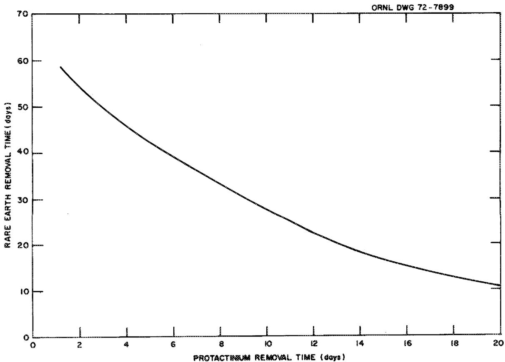  
Fig. 11.1. Rare earth and protactinium removal time combinations that result in a breeding ratio of 1.07.

devise a significantly improved rare-earth removal system known as the metal transfer process.

Distribution of Metals Between Molten Salts and Bismuth

Bismuth is a low-melting $(271^{\circ}\mathrm{C})$ metal that is essentially immiscible with molten halide mixtures consisting of fluorides, chlorides, and bromides. The vapor pressure of bismuth in the temperature range of interest (500 to $700^{\circ}\mathrm{C}$ ) is negligible, and the solubilities of lithium, thorium, uranium, protactinium, and most of the fission products are adequate for processing applications.

Under the conditions of interest, reductive extraction reactions between materials in salt and metal phases can be represented by the following reaction:

$$
\mathrm {M X} _ {n} (\text {s a l t}) + n \operatorname {L i} (\mathrm {B i}) \rightleftharpoons \mathrm {M} (\mathrm {B i}) + n \operatorname {L i X} (\text {s a l t}),
$$

in which the metal halide MX in the salt reacts with lithium from the bismuth phase to produce M in the bismuth phase and the respective lithium halide in the salt phase. The valence of M in the salt is $+n$ , and X represents fluorine, chlorine, and bromine. It has been found [4] that at a constant temperature the distribution coefficient $D$ for metal M depends on the lithium concentration in the metal phase (mole fraction), $X_{\mathrm{Li}}$ , as follows:

$$
\log D = n \log X _ {\mathrm {L i}} + \log K _ {\mathrm {m}} ^ {*}
$$

The quantity $K^{*}$ is dependent only on temperature, and the distribution coefficient is defined by the relation:

$$
D = \frac {\text {m o l e f r a c t i o n o f M i n m e t a l p h a s e}}{\text {m o l e f r a c t i o n o f M X} _ {n} \text {i n s a l t p h a s e}}.
$$

The ease with which one component can be separated from another is indicated by the ratio of the respective distribution coefficients, that is, the separation factor. As the separation factor approaches unity, separation of the components becomes increasingly difficult. On the other hand, the greater the deviation from unity, the easier the separation.

Distribution data obtained [4] for a number of materials between fuel salt (72-16-12 mole % LiF-BeF $_2$ -ThF $_4$ ) and bismuth at $640^{\circ}\mathrm{C}$ are summarized in Fig. 11.2. The lines for the various elements have slopes that correspond to the indicated oxidation states. Under the expected process conditions, the Pa-Th separation factor is about 1200, which indicates that protactinium as well as uranium and zirconium can be easily extracted from a salt stream containing ThF $_4$ . However, the rare-earth-thorium separation factors are close to unity (1.2 to 3.5), indicating that removal of the rare earths from a salt containing thorium fluoride will be difficult. The previous rare-earth removal system, which was based on these

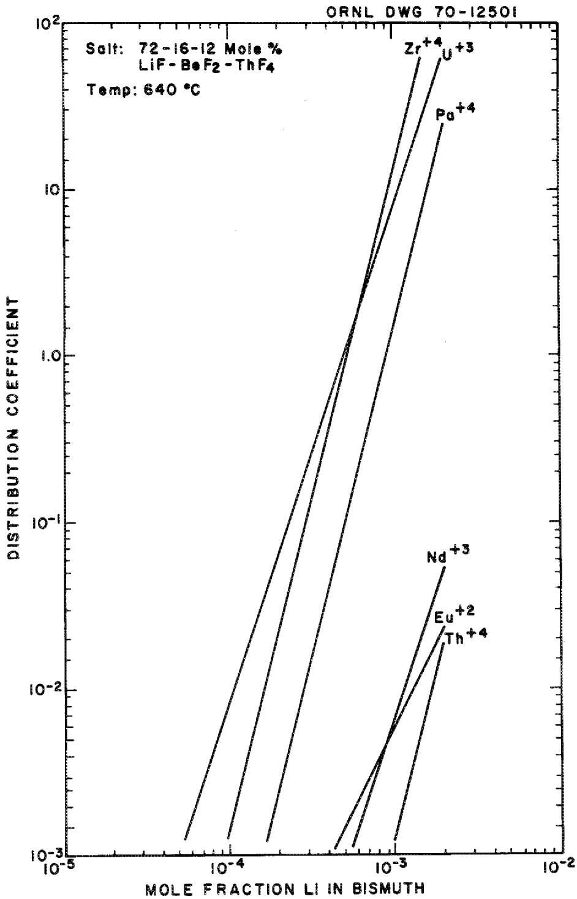  
Fig. 11.2. Distribution data between fuel salt and bismuth.

low separation factors, required a large number of stages, a high metal-to-salt flow ratio, and a large electrolytic cell for providing thorium and rare earth reflux at the ends of the extraction cascade [1, pp. 170-78; 5, pp. 52-77].

We have found, however, that with LiCl or LiBr, much more favorable thorium-rare-earth separation factors are obtained [2, p. 285]. Distribution data for LiCl [6, p. 171; 7] at $640^{\circ}\mathrm{C}$ are shown in Fig. 11.3. The data fall roughly into three groups. The divalent rare-earth and alkaline-earth elements distribute most readily to the LiCl, with thorium-rare-earth separation factors of about $10^{8}$ . The trivalent rare earths form the second group, and the thorium-rare-earth separation factors are about $10^{4}$ . Tetravalent materials, such as thorium and protactinium, distribute only slightly to the LiCl. Studies on the temperature dependence of the distribution data show essentially no effect for the divalent elements, a minor effect for the trivalent elements, and a somewhat greater effect for the tetravalent elements. The distribution coefficient for thorium is decreased sharply by the addition of fluoride to the LiCl, although the distribution coefficients for the rare earths are affected by only a minor amount. Thus, contamination of the LiCl with several mole percent fluoride will not affect the removal of the rare earths but will cause a sharp increase in the thorium discard rate. Data with LiBr [7] are similar to those with LiCl, and the distribution behavior with LiCl-LiBr mixtures would likely not differ appreciably from the data with the pure materials.

The potential held by LiCl for selective extraction of the rare earths from MSBR fuel salt is best illustrated by considering the equilibrium concentrations of rare earths, thorium, and lithium in fuel salt, bismuth containing reductant, and LiCl as shown in Table 11.1. The concentrations of the rare earths and alkaline earths in the fluoride salt correspond to a 25-day removal time for these materials in the reference MSBR. The thorium concentration in the bismuth is $90\%$ of the thorium solubility at $640^{\circ}\mathrm{C}$ . As can be seen, the rare-earth and alkaline-earth elements are present in the LiCl at low concentrations and are associated with a negligible amount of thorium.

A rare-earth removal system based on this effect will be practical only if a suitable means is available for removing the rare-earth and alkaline-earth elements from the LiCl. The distribution coefficients for these elements are strongly affected by the concentration of lithium in the bismuth phase, and the best method for removing these materials from the LiCl appears to be extraction into bismuth containing lithium at a concentration of 0.05 to 0.50 mole fraction. Sufficient data have been obtained with lithium concentrations in the bismuth as high as 0.38 mole fraction to show that no deviation occurs from the relations established initially with much lower lithium concentrations.

# Protactinium Removal System

The reference protactinium removal system [8, pp. 3-21] shown in Fig. 11.4 is based on fluorination for uranium removal and reductive extraction for protactinium isolation. Fuel salt containing 0.33 mole %

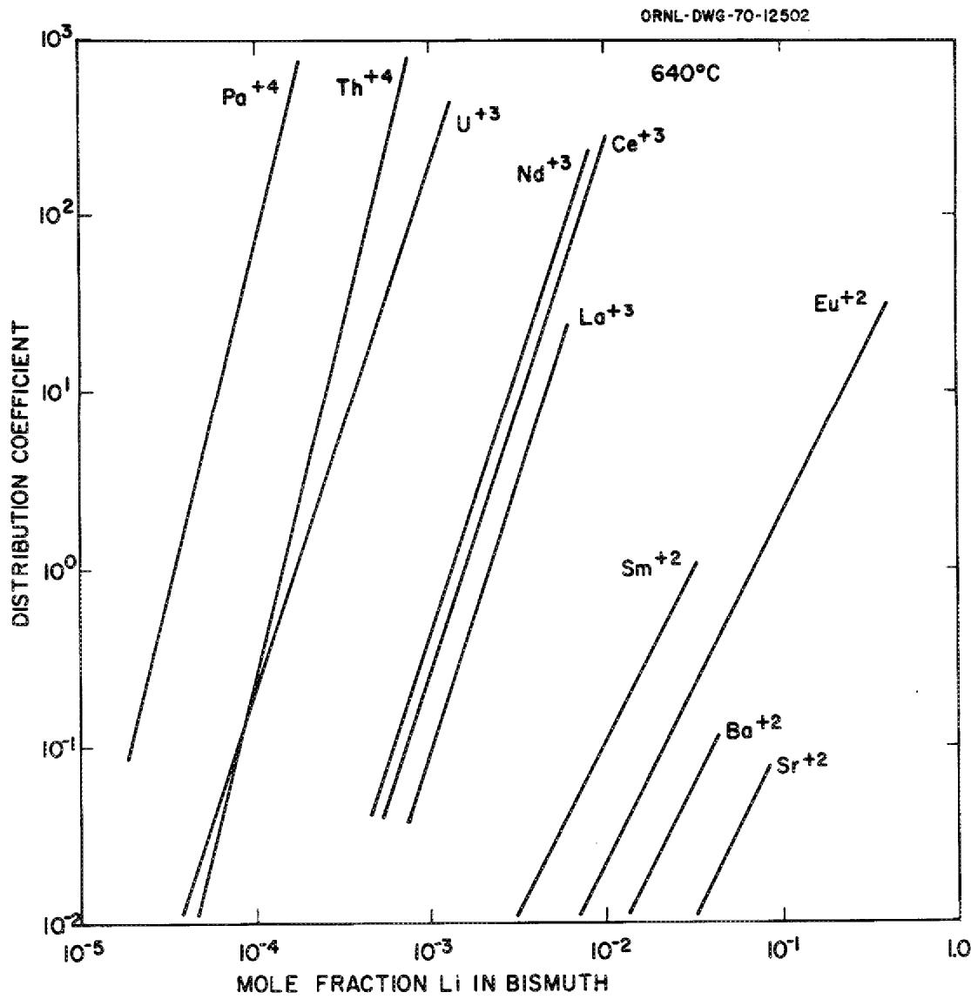  
Fig. 11.3. Distribution data between lithium chloride and bismuth.

Table 11.1. Equilibrium concentrations in fuel carrier salt, bismuth, and lithium chloride at $640^{\circ}\mathrm{C}$   

<table><tr><td rowspan="2">Element</td><td colspan="3">Mole fraction</td></tr><tr><td>In fuel carrier \( salt^a \)</td><td>In bismuth</td><td>In lithium chloride</td></tr><tr><td>Li</td><td>0.72</td><td>0.00201</td><td></td></tr><tr><td>Be</td><td>0.16</td><td>0 approx</td><td></td></tr><tr><td>Th</td><td>0.12</td><td>0.0025</td><td>\( 3.31 \times 10^{-6} \)</td></tr><tr><td>Sr</td><td>\( 7.44 \times 10^{-6} \)</td><td>\( 0.664 \times 10^{-6} \)</td><td>0.0155</td></tr><tr><td>Zr</td><td>\( 33.8 \times 10^{-6} \)</td><td>0.00802</td><td>\( 0.236 \times 10^{-6} \)</td></tr><tr><td>Ba</td><td>\( 2.83 \times 10^{-6} \)</td><td>\( 0.253 \times 10^{-6} \)</td><td>0.00123</td></tr><tr><td>La</td><td>\( 5.46 \times 10^{-6} \)</td><td>\( 0.266 \times 10^{-6} \)</td><td>\( 0.375 \times 10^{-6} \)</td></tr><tr><td>Ce</td><td>\( 19.3 \times 10^{-6} \)</td><td>\( 1.38 \times 10^{-6} \)</td><td>\( 0.636 \times 10^{-6} \)</td></tr><tr><td>Nd</td><td>\( 12.1 \times 10^{-6} \)</td><td>\( 0.680 \times 10^{-6} \)</td><td>\( 0.219 \times 10^{-6} \)</td></tr><tr><td>Pm</td><td>\( 1.26 \times 10^{-6} \)</td><td>\( 0.0439 \times 10^{-6} \)</td><td>\( 0.0424 \times 10^{-6} \)</td></tr><tr><td>Sm</td><td>\( 1.34 \times 10^{-6} \)</td><td>\( 0.0622 \times 10^{-6} \)</td><td>0.000019</td></tr><tr><td>Eu</td><td>\( 1.55 \times 10^{-6} \)</td><td>\( 0.0359 \times 10^{-6} \)</td><td>\( 4.39 \times 10^{-6} \)</td></tr><tr><td>\( Y^b \)</td><td>\( 4.98 \times 10^{-6} \)</td><td>\( 0.281 \times 10^{-6} \)</td><td>\( 0.090 \times 10^{-6} \)</td></tr><tr><td>\( Pr^b \)</td><td>\( 4.69 \times 10^{-6} \)</td><td>\( 0.264 \times 10^{-6} \)</td><td>\( 0.0849 \times 10^{-6} \)</td></tr></table>

${}^{a}$ Concentrations of the fission products in the fuel carrier salt are based on an assumed processing cycle time of 10 days and a removal efficiency of ${40}\%$ ,which results in a 25-day removal time.   
${}^{b}$ Concentrations for $\mathrm{Y}$ and $\Pr$ were calculated using Nd distribution data.

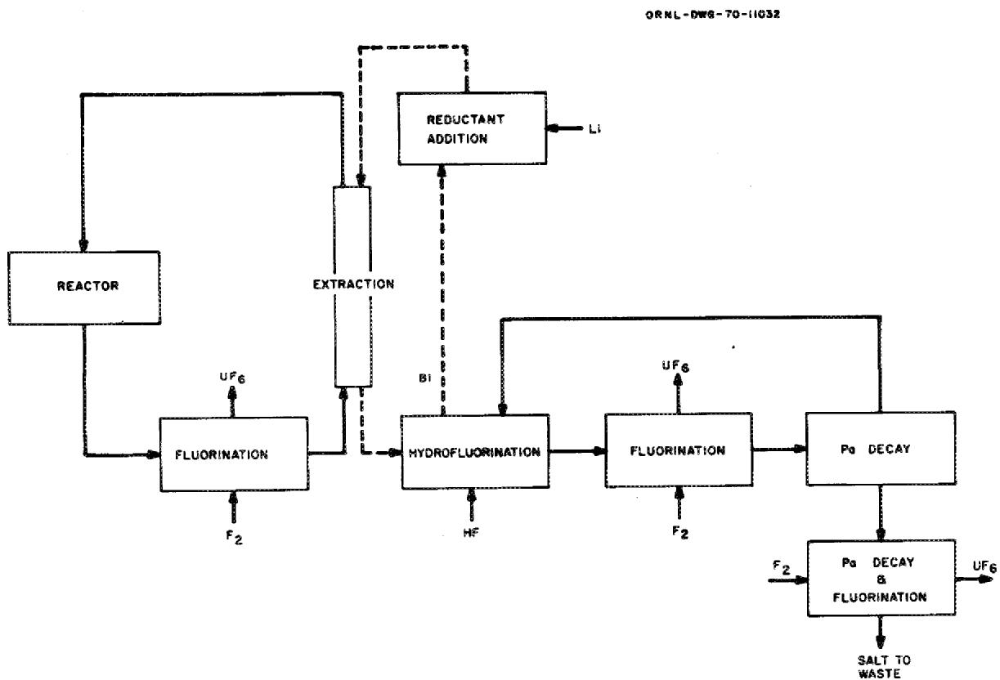  
Fig. 11.4. Flowsheet for isolation of protactinium from a single-fluid MSBR by fluorination-reductive extraction.

$\mathrm{UF}_4$ and approximately 0.0035 mole $\%$ $\mathrm{PaF}_4$ is withdrawn from the reactor. About $99\%$ of the uranium is removed from the salt by fluorination in order to avoid the use of large quantities of reductant in the subsequent protactinium removal step. The salt stream is fed countercurrent to a bismuth stream containing lithium and thorium, where the remaining uranium and the protactinium transfer to the metal stream. These materials are transferred from the bismuth to a captive secondary salt by hydrofluorinating the bismuth stream leaving the extraction column in the presence of the secondary salt. The secondary salt which flows through the hydrofluorinator also circulates through a fluorinator, where about $90\%$ of the uranium is removed, and through a tank that contains most of the protactinium. Lithium is added to the bismuth leaving the hydrofluorinator, and the resulting stream is returned to the top of the extraction column. The salt leaving the extraction column is essentially free of uranium and protactinium but contains the rare earths at essentially the reactor concentration. This stream is fed to the rare-earth removal system.

# Rare-Earth Removal Process

A simplified flowsheet for the rare-earth removal system [9, pp. 1-15] is shown in Fig. 11.5. Fuel salt, which is free of uranium and protactinium but contains the rare earths, is countercurrently contacted with bismuth containing reductant in order to extract a significant fraction of the rare earths into the bismuth. The bismuth stream, which contains the rare earths and thorium, is then countercurrently contacted with lithium chloride. Because of highly favorable distribution coefficients, significant fractions of the rare earths transfer to the LiCl along with a negligible amount of thorium. The final steps of the process consist in extracting the rare earths from the LiCl by contact with bismuth having lithium concentrations of 5 and 50 at. $\%$

This process has a number of very desirable characteristics. Of primary importance is the fact that there is no net consumption of reductant in the two upper contactors. The process is not sensitive to minor variations in operating conditions. Essentially no materials other than the rare-earth and alkaline-earth elements are removed from or added to the fuel salt; the major change consists in replacing the extracted rare earths with an equivalent amount of lithium as LiF. The amount of LiF added to the fuel salt in this manner during 30 years of operation would be less than $10\%$ of the LiF inventory in the reactor.

# Conceptual Processing Flowsheet

The reference processing flowsheet [8, pp. 3-21] is shown in Fig. 11.6. Fuel salt is withdrawn from the reactor on a 10-day cycle; for a 1000-MW(e) reactor, this represents a flow rate of 0.88 gpm. The fluori-nator, where $99\%$ of the uranium is removed, has an active diameter of 8 in. and a height of 15 ft. The protactinium extraction column is 3 in. in diameter and is packed with 3/8-in. Raschig rings. The column is equivalent to five equilibrium stages and has a height of 15 ft. The

ORNL DWG 70-2812R1

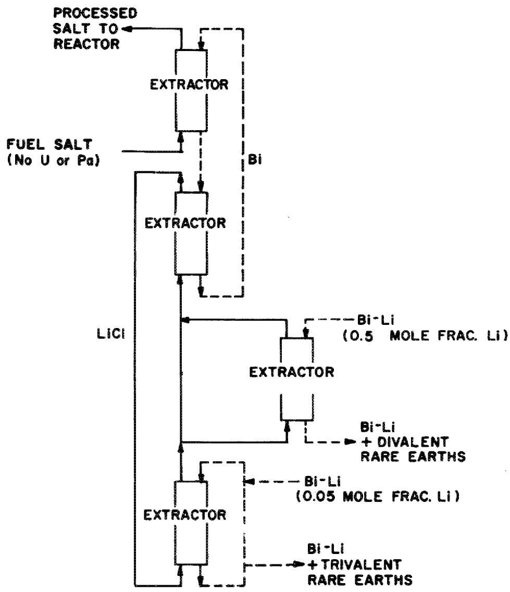  
Fig. 11.5. Metal transfer process for removal of rare earths from single-fluid MSBR fuel salt.

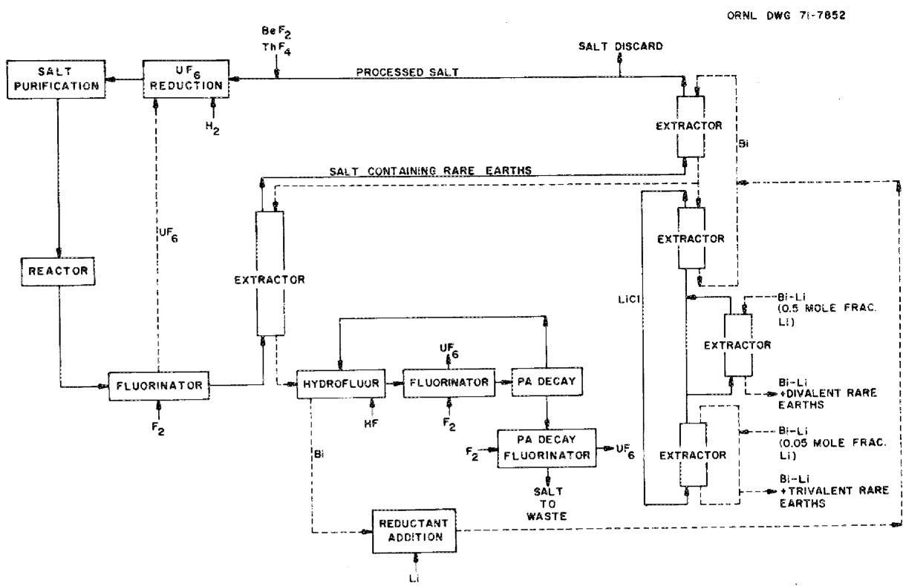  
Fig. 11.6. Conceptual flowsheet for processing a single-fluid MSBR by fluorination-reductive extraction and the metal transfer process.

bismuth flow rate through the column is 0.13 gpm, and the inlet thorium concentration in the stream is 90% of the thorium solubility at the operating temperature of $640^{\circ}\mathrm{C}$ . The protactinium decay tank has a volume of 160 ft $^3$ . The uranium inventory in the tank is less than 0.2% of that in the reactor. Fluorides of lithium, thorium, zirconium, and nickel accumulate in the tank at a total rate of about 0.1 ft $^3$ /day. These materials are removed by periodic withdrawal of salt to a final protactinium decay and fluorination operation.

The bismuth flow rate through the two upper contactors in the rare-earth removal system is 12.5 gpm, and the LiCl flow rate is 33 gpm. These extraction columns are 7 to 13 in. in diameter and are packed with 1/2-in. Raschig rings. Each is equivalent to three equilibrium stages.

The trivalent and divalent rare earths are removed in separate contactors in order to minimize the amount of lithium required. Only $2\%$ of the LiCl, or 0.66 gpm, is fed to the two-stage divalent rare-earth removal contactor, where it is contacted with a 0.58-gal/day bismuth stream containing 50 at. $\%$ lithium. The trivalent stripper, where the LiCl is contacted with bismuth containing 5 at. $\%$ lithium, is equivalent to one equilibrium stage.

The bismuth stream containing the reductant necessary for the isolation of protactinium is actually fed to the recirculating bismuth stream in the rare-earth removal system. An equivalent amount of bismuth is withdrawn from the stream and is fed to the protactinium isolation column. This allows for more nearly complete extraction of the protactinium and provides a means for removing materials which might otherwise accumulate in the recirculating stream.

The remaining steps in the flowsheet consist in combining the processed salt with uranium and purifying the resulting fuel salt. The uranium addition is accomplished by absorbing the $\mathrm{UF_6 - F_2}$ stream from the fluorinators into fuel salt containing $\mathrm{UF_4}$ , which results in the formation of soluble, nonvolatile $\mathrm{UF_5}$ . The $\mathrm{UF_5}$ is then reduced to $\mathrm{UF_4}$ by contact with hydrogen. The HF resulting from reduction of $\mathrm{UF_5}$ is electrolyzed in order to recycle the contained fluorine and hydrogen. Recycle of these materials is used in order to avoid waste disposal charges on the material that would be produced if the HF were absorbed in an aqueous solution of KOH [31]. The salt will be contacted with nickel wool in the purification step in order to ensure that the final bismuth concentration is acceptably low.

The protactinium removal time obtained with the flowsheet is 10 days, and the rare-earth removal times range from 17 to 51 days, with the rare earths of most importance being removed on 27- to 30-day cycles. We have made calculations [8, pp. 3-21; 9, pp. 1-15] which indicate that the flowsheet is relatively insensitive to minor variations in operating conditions such as changes in temperature, flow rates, reductant concentrations, etc. It was noted earlier, however, that the thorium-rare-earth separation factor decreases sharply as the concentration of fluoride in the LiCl is increased; contamination of the LiCl would result from entrainment of fuel salt by the bismuth stream leaving the upper contactor. The effect is largely an increase in the rate at which thorium is removed with the rare earths. The thorium removal rate increases from about 0.4 mole/day with no fluoride in the LiCl to about 280 moles/day when the LiCl

contains the equivalent of 5 mole % LiF. It appears that the fluoride concentration in the LiCl can economically be as high as 2 mole %, which corresponds to a thorium discard rate of 7.7 moles/day. Discard of thorium at this rate would add only about 0.0013 mill/kWhr to the power cost. The effect of fluoride in the LiCl on the removal of rare earths is negligible. In fact, the rare-earth removal efficiency increases slightly as the fluoride concentration in the LiCl increases. In addition, contact of LiCl containing fluoride with $\mathrm{BCl}_3$ has been found to result in formation of volatile $\mathrm{BF}_3$ [10, p. 106], and thus fluoride can be removed from LiCl easily by this means.

The reliable removal of decay heat from the processing plant is an important consideration because of the relatively short decay time before the salt enters the processing plant. A total of about 6 MW of heat would be produced in the processing plant for a 1000-MW(e) MSBR. Since molten bismuth, fuel salt, and LiCl are not subject to radiolytic degradation, there is not the usual concern encountered with processing of short-decayed fuel.

# Waste Streams Produced by Processing Plant

All high-level waste streams produced by the protactinium and rare-earth removal systems can be combined [8, pp. 3-21] for uranium recovery prior to disposal, as shown in Fig. 11.7. In this operation, waste salt from the protactinium decay tank would be combined with the discard stream of fuel carrier salt. The lithium-bismuth stream from the trivalent-rare-earth stripper would be hydrofluorinated in the presence of the resulting salt, and the combined stream would be held for protactinium decay. The protactinium concentration in the combined stream would be only 500 ppm initially, and the specific heat generation rate would be acceptably low. The salt in the waste holdup tank would be fluorinated before discard to recover uranium in order that the loss of fissile material can be made acceptably low. The composition of the discarded salt would be 74.7-13.5-9.5-0.8 mole % LiF-ThF $_4$ -BeF $_2$ -ZrF $_4$ , 1.2 mole % trivalent-rare-earth fluorides, and 0.3 mole % divalent-rare-earth fluorides. The salt temperature would have to be maintained at about $600^{\circ}\mathrm{C}$ so that the trivalent-rare-earth fluorides would not precipitate. This processing scheme would require that salt be discarded at the rate of 60 ft $^3$ every 220 days. We anticipate that the waste will remain in this form unless the requirements of the federal waste repository make further processing necessary.

Thorium is discarded from the system at the rate of about 50 moles/day. Although the cost of replacing this thorium is low (0.0084 mill/kWhr), the resulting thorium utilization is only about $20\%$ . Flowsheet modifications have been developed, however, that will not require discard of thorium and which will result in almost complete utilization of thorium if desired.

An additional high-level solid waste stream, which contains most of the iodine and bromine removed from the reactor, is produced by the $\mathrm{H}_2$ -HF purification and recycle system (shown in Fig. 11.8). The $\mathrm{H}_2$ -HF streams leaving the fuel reconstitution step, the hydrogen-reduction columns, purge columns, and hydrofluorinators are combined, compressed to about

ORNL DWG 7!-2858

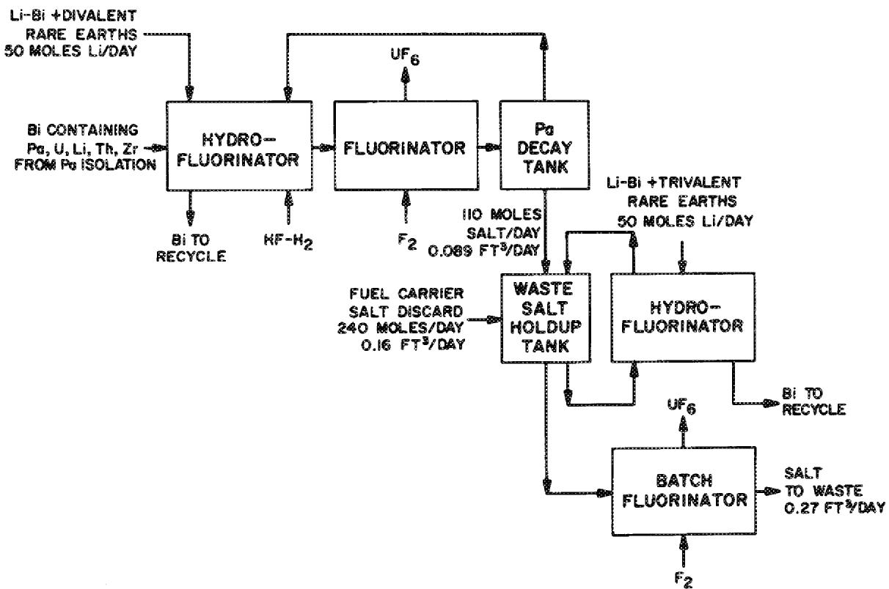  
Fig. 11.7. Method for combining waste streams from protactinium isolation and rare earth removal processes. Flow rates are shown for an assumed uranium removal efficiency in the primary fluorinator of $99\%$ .

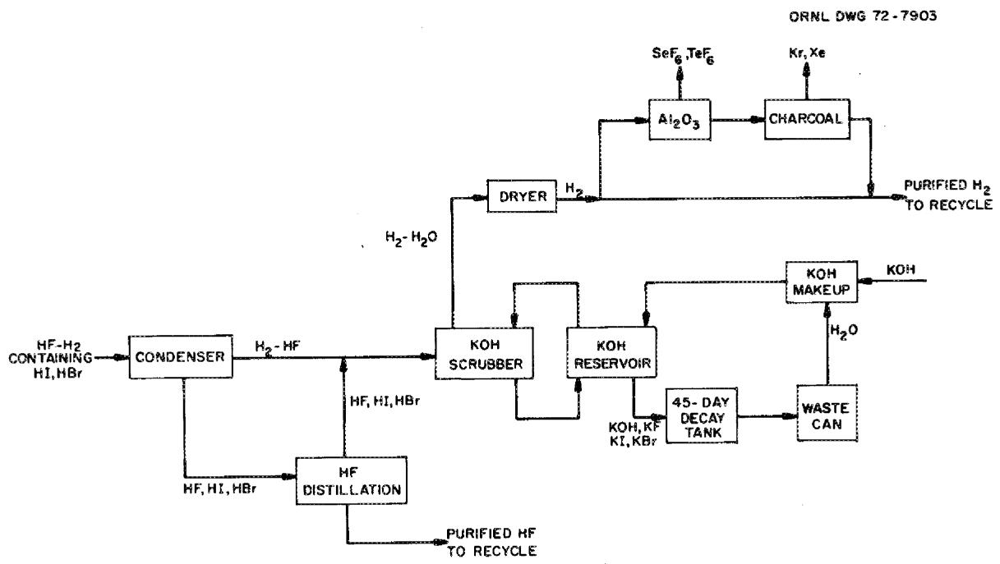  
Fig. 11.8. Hydrogen - HF purification and recycle system.

2 atm pressure, and chilled to $-40^{\circ}\mathrm{C}$ in order to condense HF from the stream for production of hydrogen and fluorine for recycle by electrolysis. Large fractions of the HI, HBr, $\mathrm{SeF_6}$ , and $\mathrm{TeF_6}$ are expected to be dissolved in the hydrogen fluoride condensate. These compounds are more volatile than hydrogen fluoride and can be separated by low-temperature distillation at 2 atm pressure.

The gas stream leaving the top of the distillation column, which will contain HF, HBr, and HI, is combined with the gas stream leaving the HF condenser, which will contain a small quantity of HF, and the resulting stream is scrubbed with an aqueous KOH solution for removal of the halides. The gas stream is dried in regenerative silica gel sorbers and is recycled. About $5\%$ of the hydrogen is fed through beds of activated alumina and charcoal for removal of $\mathrm{SeF_6}$ , $\mathrm{TeF_6}$ , and noble gases, which are not removed by the KOH.

The halides are accumulated in the KOH scrubber solution for a period of 34 days, after which the solution is held for a 45-day decay period. The solution is then evaporated in 24-in.-diam, 10-ft-long waste containers. Two waste containers are filled annually.

# Alternate Processing Methods

We presently know of no other rare-earth removal method as attractive as the metal transfer process; however, protactinium and uranium appear to be removable from fuel salt by alternate methods based on the selective precipitation of the oxides of these materials. Protactinium is present in the MSBR as $\mathrm{PaF_4}$ . Baes, Bamberger, and Ross [10, p. 92] have shown that $\mathrm{Pa^{4+}}$ dissolved in a molten LiF-BeF $_2$ -ThF $_4$ solution can be oxidized to the $5^+$ state by hydrofluorination according to the reaction:

$$
2 \mathrm {P a F} _ {4} (\mathrm {d}) + 2 \mathrm {H F} (\mathrm {g}) \rightleftharpoons 2 \mathrm {P a F} _ {5} (\mathrm {d}) + \mathrm {H} _ {2} (\mathrm {g})
$$

and that the addition of oxide to molten salt containing $\mathrm{Pa}^{5+}$ results in the precipitation of a pure phase consisting of $\mathrm{Pa}_2\mathrm{O}_5$ . The solubility product for $\mathrm{Pa}_2\mathrm{O}_5$ appears to be much lower than those for the oxides of other materials in the fuel salt; this makes possible the selective removal of protactinium from MSBR fuel salt without the prior removal of uranium. However, if the oxide concentration in the salt is increased to too high a level, a solid solution of uranium and thorium oxides will also be precipitated; studies [11] indicate that a $\mathrm{UO}_2$ - $\mathrm{ThO}_2$ solid solution containing about $95\%$ $\mathrm{UO}_2$ would be precipitated from MSBR fuel salt.

It appears likely that contact of the fuel salt with an $\mathrm{HF - H_2O - Ar}$ gas mixture could convert practically all of the protactinium to $\mathrm{Pa}^{5+}$ and precipitate a large fraction as $\mathrm{Pa}_2\mathrm{O}_5$ without precipitating uranium oxide. The equilibria involved are presently being studied [12, pp. 196-99; 12, pp. 64-66; 13], but the extent to which the separation can be accomplished is not yet known [13] with sufficient accuracy to allow final evaluation of oxide precipitation processes.

We have made preliminary evaluations of several conceptual flowsheets based on oxide precipitation [14, pp. 237-40]; the most promising of these is shown in Fig. 11.9. Fuel salt would be withdrawn from the reactor on a 3-day cycle, and about $60\%$ of the protactinium would be removed as $\mathrm{Pa}_2\mathrm{O}_5$ in order to obtain a protactinium removal time of 5 days. The $\mathrm{Pa}_2\mathrm{O}_5$ precipitate would be hydrofluorinated in the presence of a captive fluoride salt phase which would be circulated through the protactinium decay tank and through a fluorinator in order to maintain an acceptably low uranium inventory in the decay tank. Part of the salt in the decay tank would be returned to the reactor periodically to compensate for salt that is transferred to the hydrofluorinator with the $\mathrm{Pa}_2\mathrm{O}_5$ . Ten percent of the salt leaving the $\mathrm{Pa}_2\mathrm{O}_5$ precipitator would be processed for rare-earth removal by the metal transfer process; this would result in a 30-day processing cycle and a rare-earth removal time of about 50 days. Most of the uranium must be removed from the salt prior to the removal of the rare earths. This could be accomplished either by fluorination or by oxide precipitation. The separated uranium would then be recombined with the processed salt leaving the metal transfer system and would be returned to the reactor.

# Status of Process Development

Development work on a number of aspects of the reference and alternate processing plant flowsheets either has been completed recently or is in progress.

# Metal Transfer Process Development

An engineering experiment completed recently demonstrated all aspects of the metal transfer process [15] for the removal of rare earths. The equipment consisted of a 6-in.-diam compartmented vessel in which were present about 1 liter each of MSBR fuel carrier salt, bismuth saturated with thorium, and LiCl. The fluoride salt initially contained $^{147}\mathrm{NdF}_3$ at the tracer level and $\mathrm{LaF}_3$ at a concentration of 0.04 mole fraction. During the experiment, the rare earths were selectively extracted into the LiCl along with a negligible amount of thorium. Provision was made for circulating the LiCl through a chamber containing bismuth having a lithium concentration of 38 at. $\%$ , where the rare earths and thorium were removed. The distribution ratios for the rare earths remained constant during the experiment at about the expected values. About $50\%$ of the neodymium and about $70\%$ of the lanthanum were collected in the Li-Bi solution. The final thorium concentration in the Li-Bi solution was below 5 ppm, making the ratio of rare earths to thorium in the Li-Bi greater than $10^5$ times the initial concentration ratio in the fuel salt and thus demonstrating the selective removal of rare earths from a fluoride salt containing thorium.

A larger metal transfer experiment [14, pp. 254-55; 12, pp. 209-12; 13] has been put into operation that uses salt and bismuth flow rates that

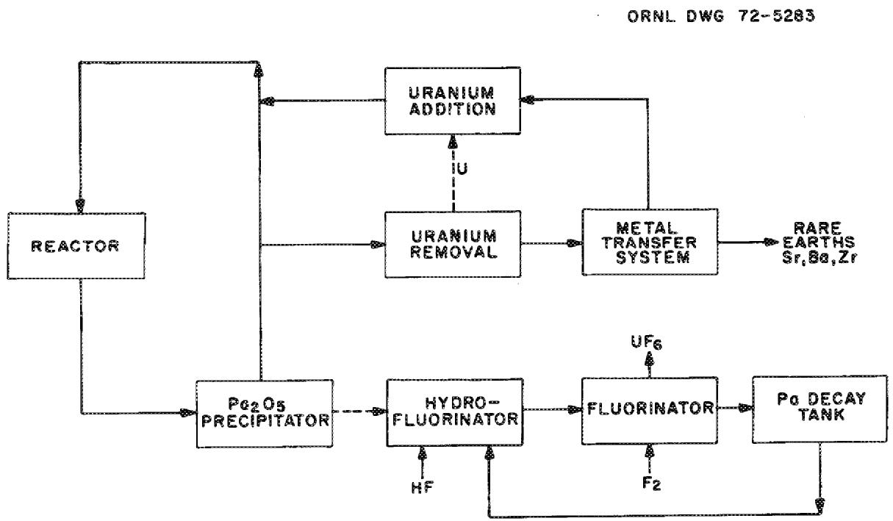  
Fig. 11.9. Oxide precipitation-metal transfer flowsheet for processing a single-fluid MSBR.

are about $1\%$ of the values required for processing a 1000-MW(e) MSBR, and the preliminary design has been carried out for an experiment that will use a three-stage salt-metal contactor and flow rates that are 5 to $10\%$ of those required for a 1000-MW(e) MSBR [13].

# Reductive Extraction Studies

We have successfully operated a salt-bismuth reductive extraction facility in which uranium and zirconium were extracted from salt by countercurrent contact with bismuth containing reductant [8, pp. 64-89; 13]. More than $95\%$ of the uranium was extracted from the salt by a 0.82-in.-diam, 24-in.-long packed column. The inlet uranium concentration in the salt was about $25\%$ of the uranium concentration in the reference MSBR. These experiments represent the first demonstration of reductive extraction of uranium in a flowing system. Information on the rate of mass transfer of uranium and zirconium has also been obtained in the system using an isotopic dilution method, and HTU values of about 4.5 ft have been obtained.

Correlations have been developed [3, pp. 102-17; 15] for flooding and dispersed-phase holdup in packed columns during countercurrent flow of liquids having high densities and a large difference in density, such as salt and bismuth. These correlations, which have been verified by studies with molten salt and bismuth [8, pp. 64-89], were developed by study of countercurrent flow of mercury and water or high-density organics and water in 1- and 2-in.-diam columns packed with solid cylinders and Raschig rings varying in size from 1/8 to 1/2 in. We have also obtained data on axial dispersion in the continuous phase during the countercurrent flow of high-density liquids in packed columns [16, pp. 58-89; 17], and have developed a simple relation for predicting the effects of axial dispersion on column performance [18].

The successful operation of salt-metal extraction columns is dependent upon the availability of a bismuth-salt interface detector. We [13] have recently demonstrated the successful operation of an eddy-current-type interface detector that consists of a ceramic form on which bifilar primary and secondary coils are wound. Contact of the coils with molten salt or bismuth is prevented by enclosing the element in a molybdenum tube. Passage of a high-frequency alternating current through the primary coil induces a current in the secondary coil whose magnitude is dependent on the conductivities of the adjacent materials; since the conductivities of bismuth and salt are quite different, the induced current reflects the presence or absence of bismuth. The detector appears to be a practical and sensitive indicator of either salt-bismuth interface location or bismuth level.

We have initiated design and development work on a reductive extraction process facility [13] that will allow operation of the important steps for the reductive extraction process for protactinium isolation. The facility will allow countercurrent contact of salt and bismuth streams in a 2-in.-diam, 6-ft-long packed column at flow rates as high as about $25\%$ of those required for processing a 1000-MW(e) MSBR. The facility will operate continuously and will allow measurement of mass transfer and hydrodynamic data under steady-state conditions.

# Continuous Fluorinator Development

Progress has also been made in the development of continuous fluorinators. We have previously [19] carried out experimental studies of fluorination of molten salt in a 1-in.-diam, 72-in.-long nickel fluorinator that allowed countercurrent contact of molten salt with fluorine. In these tests, molten salt (41-24-35 mole % NaF-LiF-ZrF₄) containing UF₄ was countercurrently contacted with a quantity of fluorine in excess of that required for the conversion of UF₄ to UF₆. Experiments were carried out with temperatures ranging from 525 to 600°C, UF₄ concentrations in the feed salt ranging from 0.12 to 0.35 mole %, and a range of salt and fluorine feed rates. The fraction of the uranium removed from the salt ranged from 97.5% to 99.9%.

Axial dispersion in the salt phase will be important in the design of continuous fluorinators, and gas holdup and axial dispersion were measured in columns having diameters ranging from 1 to 6 in. using air and aqueous solutions. Data were obtained for wide ranges of viscosity, surface tension, and superficial gas velocity. Correlations for gas holdup and axial dispersion were developed [15] which are believed to be applicable to countercurrent contact of molten salt and fluorine in a continuous fluorinator. These correlations and the data on uranium removal in the 1-in.-diam continuous fluorinator were used for estimating the performance of larger diameter continuous fluorinators [15].

The combination of molten salt and fluorine results in a highly corrosive environment, and it will be necessary to protect a continuous fluorinator from corrosion by maintaining a layer of frozen salt on surfaces that would otherwise contact both molten salt and fluorine. Preventing molten salt from reaching the surface will allow passivation of the nickel to occur.

The feasibility of maintaining frozen salt layers in gas-salt contactors was demonstrated previously [9] in tests in a 5-in.-diam, 8-ft-high simulated fluorinator in which molten salt (66-34 mole % LiF-ZrF₄) and argon were countercurrently contacted. An internal heat source in the molten region was provided by Calrod heaters contained in a 3/4-in.-diam pipe along the center line of the vessel. A frozen salt layer was maintained in the system with equivalent volumetric heat generation rates of 10 to 55 kW/ft³. For comparison, the heat generation rates in fuel salt immediately after removal from the reactor and after passing through vessels having holdup times of 5 and 30 min are 57, 27, and 12 kW/ft³, respectively.

Operation of a continuous fluorinator with nonradioactive salt requires a means for generating heat in the molten salt that is not subject to corrosion. We have studied radio-frequency induction heating in fluororinator simulations using nitric acid [20] and have studied autoresistance heating using 60-Hz power with molten salt (65-35 mole % LiF-BeF $_2$ ) in a 6-in.-diam fluorinator simulator [13]. Successful operation with auto-resistance heating rates as high as 14.5 kW/ft $^3$ has been carried out; the expected power density in processing plant fluorinators is 12 kW/ft $^3$ . Autoresistance heating is the preferred method, since it can be used over a wider range of operating conditions and since the electrical power

supply is much simpler than that required for induction heating. A facility is planned in which a continuous fluorinator can be operated that has a molten zone diameter of 5 in. and a molten salt depth of 5 ft.

# Fuel Reconstitution

Studies of the absorption of $\mathrm{UF_6}$ by MSBR fuel carrier salt containing $\mathrm{UF_4}$ are being carried out [13]. Absorption of $\mathrm{UF_6}$ in fuel carrier salt containing $\mathrm{UF_4}$ has been shown to result in the formation of soluble non-volatile $\mathrm{UF_5}$ according to the following reaction:

$$
\mathrm {U F} _ {6} (\mathrm {g}) + \mathrm {U F} _ {4} (\mathrm {d}) \rightleftharpoons 2 \mathrm {U F} _ {5} (\mathrm {d}),
$$

in which (g) denotes gas and (d) denotes species dissolved in the salt. The recent studies have also shown that gaseous hydrogen reacts with dissolved $\mathrm{UF}_5$ according to the reaction:

$$
2 \mathrm {U F} _ {5} (\mathrm {d}) + \mathrm {H} _ {2} (\mathrm {g}) \rightleftharpoons 2 \mathrm {U F} _ {4} (\mathrm {d}) + 2 \mathrm {H F} (\mathrm {g}).
$$

Since both $\mathrm{UF}_6$ and $\mathrm{UF}_5$ are strong oxidants, the initial experiments were conducted primarily to find a material that was inert to these species. They showed that, at $600^{\circ}\mathrm{C}$ , nickel, copper, and graphite are not sufficiently inert but that gold is stable both to gaseous $\mathrm{UF}_6$ and to salt containing up to 6 wt $\%$ $\mathrm{UF}_5$ . Consequently, the recent studies have been conducted in gold apparatus. Future experiments will be carried out with $\mathrm{UF}_6 - \mathrm{F}_2$ mixtures in order to determine the effect of the presence of fluorine in the gas stream. We will also determine the behavior of the fluo-ides of iodine and neptunium in this step.

Results from several experiments show that $\mathrm{UF}_5$ dissolved in molten salt slowly disproportionate to $\mathrm{UF}_6$ and $\mathrm{UF}_4$ and that the rate of disproportionation is second order with respect to the concentration of $\mathrm{UF}_5$ . The studies also indicate that the solubility of $\mathrm{UF}_6$ in the salt is low. Engineering experiments are being designed for further study of the absorption of $\mathrm{UF}_6 - \mathrm{F}_2$ mixtures in molten salt containing $\mathrm{UF}_4$ and the subsequent reduction of $\mathrm{UF}_5$ by contact of the salt with hydrogen.

# Uranium Oxide Precipitation Studies

Engineering studies of uranium removal by oxide precipitation have been carried out [13] that involved the contact of 2 liters of MSBR fuel salt with $\mathrm{H}_2\mathrm{O}$ -Ar gas mixtures in a 4-in.-diam nickel precipitator. Experiments were conducted at temperatures ranging from 540 to $630^{\circ}\mathrm{C}$ , and the composition of the $\mathrm{H}_2\mathrm{O}$ -Ar mixture was varied from 10 to $35\%$ water. Only a slight increase in the precipitation rate with an increase in temperature was observed, and the rate of precipitation appeared to vary directly with the rate at which water was supplied to the system. The values for the water utilization were uniformly low (about 10 to $15\%$ ) and did not vary with the composition of the gas stream. Higher utilization

values should be obtained by improving the contact of the gas with the salt.

From 50 to $90\%$ of the uranium was precipitated as oxide in most of the experiments. Samples of the oxide contained about $90\% \mathrm{UO}_2$ even though at the lower uranium concentrations in the salt the solid in equilibrium with the salt would contain $50\% \mathrm{UO}_2$ or less. We believe that under nonequilibrium precipitation conditions, such as would be present in a processing plant, $\mathrm{UO}_2$ - $\mathrm{ThO}_2$ solid solutions are formed which are in equilibrium with the salt at the moment of precipitation but which once formed do not rapidly reequilibrate. Thus, solid solutions that are formed early in the precipitation process and that contain 90 to $95\% \mathrm{UO}_2$ are still present during the final stages of precipitation when solid solutions are being formed that contain much less $\mathrm{UO}_2$ . This effect appears to allow precipitation of $99\%$ of the uranium as a solid containing $85\% \mathrm{UO}_2$ in a single-stage batch precipitator. In contrast, earlier calculations [10, pp. 202-3], based on the assumption that the oxide and salt would remain in equilibrium throughout the precipitation process, had indicated that a three-stage batch countercurrent precipitation system would be required to achieve removal of this fraction of the uranium without the removal of more than $1\%$ of the thorium in the salt as $\mathrm{ThO}_2$ .

The oxide precipitate was observed to settle rapidly, and more than $90\%$ of the salt could be separated from the oxide by simple decantation. This suggests that the removal of uranium from MSBR fuel salt from which most of the protactinium has been removed can be accomplished easily by oxide precipitation by contacting the salt with gaseous $\mathrm{H}_2\mathrm{O}$ -Ar mixtures.

# Removal of Bismuth from Fuel Salt

In a processing plant, the fuel salt will be contacted with bismuth containing reductant in order to remove protactinium and the rare earths. It will be necessary that entrained or dissolved bismuth be removed from the salt before it is returned to the reactor, since nickel is quite soluble in bismuth (about 10 wt %) at the reactor operating temperature. Efforts to measure the solubility of bismuth in salt have indicated that the solubility is lower than about 1 ppm, and the expected solubility of bismuth in the salt under the highly reducing conditions that will be used is very low. For these reasons, we believe that bismuth can only be present at significant concentrations in the salt as entrained metallic bismuth.

In order to characterize the bismuth concentration likely to be present in the salt after it is contacted with bismuth, we have begun periodic sampling of salt in engineering experiments involving contact of salt and bismuth. The results to date indicate that the bismuth concentration in the salt in most cases ranges from 10 to 100 ppm after countercurrent contact of the salt and bismuth in a packed-column contactor; however, concentrations below 1 ppm are observed in salt leaving a stirred-interface salt-metal contactor in which the salt and metal phases are not dispersed. One of the present difficulties is that of preventing contamination of the samples with small quantities of bismuth during cleaning of the samples and the ensuing chemical analyses.

A subsequent phase of the experimental program will consist in testing the effectiveness of various devices and materials for removing entrained bismuth from salt. It is expected that contact of the salt with nickel wool will be effective in removing entrained or dissolved bismuth, since a large nickel surface area can be produced in this manner.

A natural circulation loop constructed of Hastelloy N and filled with fuel salt has been operated by the Metals and Ceramics Division for about two years; a molybdenum cup containing bismuth was placed near the bottom of the loop. To date, the reported concentrations of bismuth in salt from the loop (<5 ppm) are essentially the same as those reported for salt from a loop containing no bismuth. We have noted no degradation of metallurgical properties for corrosion specimens removed from the loop containing bismuth.

# Materials of Construction for Processing Plants*

A number of corrosion environments will be present in the processing plant, and materials that will withstand attack are required. The conditions of greatest severity consist of the following:

1. the presence of molten salt and gaseous mixtures of $\mathbf{F}_2$ and $\mathbf{U}\mathbf{F}_6$ at 500 to $550^{\circ}\mathrm{C}$   
2. the presence of molten salts and bismuth containing lithium and thorium at 550 to $650^{\circ}\mathrm{C}$ , and   
3. the presence of $\mathrm{HF - H_2}$ mixtures and mixtures of molten fluorides at 550 to $650^{\circ}\mathrm{C}$ .

Our present plans call for molten-salt fluorinators to be constructed of nickel or nickel-base alloys. As discussed earlier, corrosion in these systems will be limited by frozen salt, so that the protective $\mathrm{NiF}_2$ layer will not be removed from the metal surface by dissolution in the molten salt.

For the past several years, we have been investigating materials that can be used to contain Bi-Li-Th solutions at temperatures from 550 to $700^{\circ}\mathrm{C}$ . Most of the conventional metals or alloys have been ruled out as possible container materials because of their tendency to mass transfer when exposed to bismuth under a temperature gradient. Several of the refractory metals and graphite do appear promising - each having its own set of advantages and disadvantages. We have devoted the most attention to molybdenum and are constructing a reductive-extraction experimental

facility out of this material in order to obtain experience with its fabrication and use. Other materials that remain of interest include the tantalum alloy T-111 and several commercial grades of graphite.

# Molybdenum

The selection of molybdenum as a processing plant material was based on corrosion investigations at ORNL [6, pp. 256-59; 10, pp. 189-95] and elsewhere [22,23] which showed it to resist dissolution and chemical attack in molten bismuth. The studies at ORNL were conducted in small thermal convection loops which provided a temperature gradient of 100 to $200^{\circ}\mathrm{C}$ in the bismuth circuit. Tests were conducted on low-carbon molybdenum and the alloy TZM in pure bismuth and bismuth containing up to 0.01 wt % (0.3 at. %) Li. Mass transfer was negligible in the temperature range 500 to $700^{\circ}\mathrm{C}$ for periods as long as 3000 hr. Tests carried out in static bismuth also have shown no effect of stress on the corrosivity of molybdenum.

Although molybdenum has excellent resistance to corrosion, there are other difficulties with its use. Molybdenum is a particularly structure-sensitive material; that is, its mechanical properties are known to vary widely, depending upon how it has been metallurgically processed. The ductile-brittle transition temperature of molybdenum varies from below room temperature to $200 - 300^{\circ}\mathrm{C}$ , depending both upon strain rate and the microstructure of the metal. Maximum ductility is provided in the cold-worked, fine-grained condition. Recent advances in vacuum-melting practices have led to the production of material with improved and more reproducible metallurgical properties. The arc-melted low-carbon, low-oxygen grade of molybdenum, available commercially, affords relatively good control of grain size and interstitial impurity level. Nevertheless, the use of molybdenum as a structural material requires highly unorthodox assembly procedures and imposes stringent limitations on system design from the standpoint of geometry and rigidity.

Several advances in the fabrication technology of molybdenum have been made at ORNL in building the molybdenum system in which bismuth and molten salt will be countercurrently contacted in a 1-in.-ID, 5-ft-high packed column that has 3.5-in.-ID upper and lower disengaging sections. Salt and bismuth will be circulated in the system by gas-lift pumps that will elevate the streams to 3.5-in.-ID head pots for sampling, gas separation, and flow measurement. A salt-bismuth interface detector of the type described earlier will be provided in the lower disengagement section for determining the pressure drop through the column and the holdup of bismuth in the column.

Techniques have been developed [6, pp. 253-54; 10, pp. 184-85; 14, pp. 219-20; 12, pp. 167-69] for the production of closed-end molybdenum vessels by back extrusion, which involves the flow of metal into a die and the backward flow of metal over an advancing plunger. This process has the advantages that the diameter of the part produced is as large as or larger than that of the starting metal blank; the configuration of the part can be changed by relatively simple changes in the die and mandrel design; and sufficient deformation can be accomplished that a wrought or

fine-grained structure having good mechanical properties is produced. Parts that were free from cracks and had high-quality surfaces were consistently produced with this technique by the use of $\mathrm{ZrO}_2$ -coated plungers and dies and extrusion temperatures of 1600 to $1700^{\circ}\mathrm{C}$ . Eleven closed-end forgings were produced that had a 3-7/8-in. outside diameter, a 3.5-in. inside diameter, and lengths from 8 to 12 in. The 5.5-ft-long molybdenum pipe for the extraction column, having an outside diameter of 1.16 in. and an inside diameter of 1 in., was produced by floating mandrel extrusion at $1600^{\circ}\mathrm{C}$ . Three extrusions for producing this material were performed; the second extrusion produced a pipe 11.5 ft long that was concentric to within 0.007 in. with excellent external and internal surfaces.

In evaluating three sizes of commercially available molybdenum tubing (1/4-, 3/8-, and 1/2-in.-OD), we found [12, pp. 163-65] that the 1/2-in.-OD tubing was ductile at room temperature, while the 3/8-in.-OD tubing was ductile only at temperatures above 150 to $250^{\circ}\mathrm{C}$ and the 1/4-in.-OD tubing was ductile only at temperatures above $300^{\circ}\mathrm{C}$ . We found, however, that the 3/8-in.-OD and 1/4-in.-OD tubing could be made ductile at room temperature by the removal of 0.001 to 0.003 in. of material from the inside of the tubing by etching. Further investigation has led us to believe that tubing that is ductile at room temperature can be produced routinely by careful control of surface contamination during tubing fabrication.

We have demonstrated that complex components can be fabricated from molybdenum by welding, using either the gas tungsten-arc or electron-beam processes [6, pp. 254-55; 10, pp. 185-89; 14, pp. 220-22; 12, pp. 169-72]. Welding procedures were developed to deal with the inherent tendencies of molybdenum toward hot cracking due to contamination (such as from $\mathrm{O}_2$ or $\mathrm{N}_2$ ), as well as abnormal grain growth, which results in welds that are brittle at room temperature. Mechanical tube-to-header joints have also been produced by pressure bonding, using commercial tube expanders. Tubes which were rolled into headers at $250^{\circ}\mathrm{C}$ remained leak-tight after repeated thermal cycling to $500^{\circ}\mathrm{C}$ . Welding studies have centered on three major types of joint: tube-to-tube sheet, tube-to-tube, and 3.5-in.-diam circumferential girth welds. Electron-beam and gas tungsten-arc welding techniques both have been investigated. In addition, a commercial orbiting-arc welding head was modified to allow us to make helium leak-tight ( $<5 \times 10^{-8}$ atm cm³/sec) tube-to-tube field welds. Two of the most important factors found to minimize molybdenum weldment cracking have been stress relieving of components and preheating prior to welding.

Although helium leak-tight molybdenum welds have been consistently produced using both the electron-beam and tungsten-arc techniques, the ductile-brittle transition of the weld lies above room temperature. Therefore, each joint must be designed to mechanically support the welds. The joints are also back-brazed or plated with tungsten to provide a secondary barrier against leakage.

Studies have been carried out for the development of braze materials for joining molybdenum that are resistant to corrosion by bismuth and molten salts [12, pp. 211-12; 10, pp. 189-91; 14, pp. 221-25; 12, pp. 172-73]. An iron-base alloy (Fe-15% Mo-5% Ge-4% C-1% B) has been found to have good wetting and flow properties, a moderately low brazing temperature (<1200°C), and adequate resistance to bismuth at 650°C.

The results of our work to date on molybdenum fabrication techniques have been quite encouraging, and we believe that the material can be used in building processing plants if proper attention is given to its fabrication characteristics.

# Tungsten and Tantalum Alloys

Other refractory metals that are resistant to attack in molten bismuth include pure tungsten and certain tantalum alloys. Tungsten, because of its relatively high ductile-brittle transition temperature, is not amenable to the fabrication and joining operations required for a full-sized processing plant. However, it is being used as a surface coating at several points in the molybdenum extraction facility discussed above. The coatings are deposited by chemical vapor deposition [6, pp. 259-61; 14, pp. 231-32] and serve as additional seals on the joints made with tube expanders or by welding.

Corrosion tests in molten Bi and Bi-Li solutions have been conducted on pure tantalum and the tantalum alloy T-111 (8% W, 2% Hf, bal Ta). In quartz thermal convection loops at $700^{\circ}\mathrm{C}$ , the mass transfer rate of pure tantalum in these liquid metals was greater than that of molybdenum, although the rate was still less than 3 mils/year. Mass transfer rates of the alloy T-111 were comparable to those for molybdenum, but the mechanical properties of the former alloy were strongly affected by interaction with interstitial impurities, primarily oxygen, in the quartz-pure-bismuth loop experiments. A more recent test carried out at $700^{\circ}\mathrm{C}$ with the Bi-2.5 wt % Li mixture in a loop constructed of T-111 tubing did not measurably affect the mechanical properties of the T-111, and the mass transfer rate again was insignificant.

The resistance of tantalum or T-111 to corrosion by fuel salt is unknown at this time, but it appears marginal from thermodynamic considerations. However, tantalum should withstand attack by molten LiCl, and experiments are planned to investigate this.

Several complex assemblies have been fabricated at ORNL using the T-111 alloy, the largest of which was a forced convection loop which circulated liquid lithium for 3000 hr at $1370^{\circ}\mathrm{C}$ [24]. In contrast to molybdenum, the alloy is quite ductile in the as-welded condition; thus it appears promising for complex geometries that would operate principally in Bi or Bi-Li solutions and only occasionally in fuel salt. The tantalum alloy, however, would require a higher degree of protection from interstitial impurities (O, C, N) than would molybdenum.

# Graphite

Graphite, which has excellent compatibility with the fuel salt, also shows promise for the containment of bismuth. Relevant information on graphite is presented in Chap. 6, which reviews the development of graphite as a moderator for molten-salt reactors. Of course, in a chemical processing application, the absence of a neutron flux allows greater flexibility in the selection of graphite grade and fabrication history than for a reactor core.

Compatibility tests to date have shown no evidence of chemical interaction between graphite and bismuth containing up to 3 wt % (48 at. %) Li. However, the largest open pores of most commercially available poly-crystalline graphites are penetrated to some extent by liquid bismuth. Static capsule tests [13] of three commercial graphites (ATJ, AXF-5QBG, and Graphite A) were conducted for 500 hr at $700^{\circ}\mathrm{C}$ using both high-purity bismuth and Bi-3 wt % (48 at. %) Li. Although penetration by pure bismuth was negligible, the addition of lithium to bismuth appeared to increase the depth of permeation and, presumably, the wetting characteristics of the bismuth.

There are several approaches that have potential for sealing a porous graphite against penetration by the bismuth and bismuth-lithium alloys. Two well-established ones are (1) multiple liquid hydrocarbon impregnations that are carbonized and/or graphitized and (2) pyrocarbon coatings. Another possible approach is the use of carbide-forming sealants. Each of these sealing approaches is being evaluated in bismuth loop experiments. We are also studying the wetting characteristics of graphite as a function of surface pretreatments such as deducting, alcohol wash and oven dry, and vacuum degassing at 700 to $1000^{\circ}\mathrm{C}$ .

Fabrication of a processing plant from graphite would necessitate graphite-graphite and graphite-metal joints. We have conducted development studies [25,26] on both types of joints using high-temperature brazes and also metals which bond by forming carbides. Several of these experimental joints show promise for the chemical processing application. Other workers [27,28] have pioneered mechanical joints which may be satisfactory for the proposed application.

# Nickel-Base Alloys

Nickel or a nickel-base alloy would be used for the oxide precipitation portions of a plant based on an oxide precipitation-metal transfer flowsheet, for fluorinators for removal of uranium from molten fluoride mixtures, and for portions of the plant that contain gaseous mixtures of $\mathbb{F}_2$ , $\mathsf{UF_6}$ , and HF. We have accumulated many years of experience in the fabrication and joining of this class of alloys, stemming from the construction of reactors and associated hardware (Chap. 7) as well as fluoride salt purification equipment.

Although we would limit the corrosion rate in continuous fluorinators by the maintenance of a frozen-salt film next to the container wall, the chemical corrosion of nickel and nickel-base alloys has been evaluated at ORNL under the severe environmental conditions endemic to fluorination processes. Much of this information has evolved from fuel-recovery operations conducted with metallic reactor fuel elements using molten fluoride mixtures in which $\mathrm{UF_4}$ was converted to volatile $\mathrm{UF_6}$ by fluorine sparging.

During these studies, a number of materials were exposed to gaseous fluorine and molten salt. Most of the data were obtained during operation [29] of two plant-scale fluorinators constructed of "L" nickel at temperatures ranging from 540 to $730^{\circ}\mathrm{C}$ . A number of corrosion specimens

(20 different materials) were located in the fluorinators. Several specimens had lower rates of maximum corrosive attack than "L" nickel. The specimen showing the least attack, Hymu 80, had a maximum bulk loss rate of 11 mils/month based on total time in molten salt. Other corrosion coupon tests at $600^{\circ}\mathrm{C}$ [30] showed that INOR-1 is also more resistant to corrosion than "L" nickel.

These operations have afforded useful guidelines and background information for the selection of construction materials for the proposed process applications. They show the importance, however, of inerting the metal surfaces in a fluorinator with a passive frozen-salt layer.

# Effect of Uncertainties on Processing

The successful operation of a processing plant based on the reference flowsheet is contingent on the development program meeting several objectives. These include the following:

1. developing continuous fluorinators having an acceptably low corrosion rate and an adequate uranium removal efficiency,   
2. identifying materials of construction that are compatible with molten salts and bismuth containing reductant,   
3. maintaining the concentration of bismuth in the fuel salt returning to the reactor at acceptably low levels, and   
4. developing on-line instrumentation necessary for plant operation.

The consequences of these objectives not being met are discussed in the remainder of this section.

# Failure to Develop Continuous Fluorinators

Continuous fluorinators are used at two points in the reference flowsheet. The first of these is the primary fluorinator, where $99\%$ of the uranium is removed from the fuel salt prior to the removal of ${}^{233}\mathrm{Pa}$ by reductive extraction. The second point is where uranium produced by decay of ${}^{233}\mathrm{Pa}$ is removed from the secondary fluoride salt in the protac-tinium decay tank circuit. Under the expected MSBR operating conditions, the ratio of the uranium to the protactinium concentration in the reactor is about 100, and removal of uranium from the fuel salt is necessary in order to limit the quantity of reductant required for protactinium extraction to an amount that is economically acceptable. Failure to develop continuous fluorinators would seriously affect the removal of protac-tinium with the reference flowsheet and would likely require that one of the following alternatives be adopted:

1. that protactinium be isolated by an oxide precipitation process,   
2. that electrolytic cells be developed for reducing lithium from molten LiCl produced by hydrochlorinating bismuth streams that contain lithium,   
3. that electrolytic cells be developed for reducing lithium or thorium from molten fluoride salt streams, or   
4. that larger quantities of reductant be purchased for removal of uranium by reductive extraction.

Only the first two of these alternatives are considered attractive.

# Compatibility of Materials with Process Fluids

The successful operation of processing plants based on the reference flowsheet or on alternate methods, such as oxide precipitation, is completely dependent on the availability of suitable materials of construction for the processing plant. The most critical of these is concerned with the containment of bismuth, since no alternate rare-earth removal method to the metal transfer process is known.

# Entrainment of Bismuth in Fuel Salt

The molten fluoride fuel salt will be contacted with bismuth at several points in the processing plant in order to selectively remove protactinium or fission products. Since nickel is quite soluble in metallic bismuth, it will be necessary to maintain the concentration of bismuth in the fuel salt returning to the reactor at low levels. We presently do not know what concentration of bismuth in fuel salt would be acceptable; however, we assume that the allowable bismuth concentration would be considerably lower than 1 ppm. Attempts to measure the solubility of bismuth in fuel salt have been unsuccessful to date; however, thermodynamic considerations lead to the conclusion that the solubility is considerably lower than 1 ppm. It will be necessary to identify the bismuth concentration that is tolerable in MSBR fuel salt and to devise methods for maintaining adequately low bismuth concentrations in the fuel salt.

# Failure to Develop On-Line Instrumentation

We anticipate that on-line instrumentation will be available for monitoring operation of the processing system and for ensuring that the fuel salt returned to the reactor does not contain potentially harmful materials. The instrumentation requirements are not rigid, since measurement of any of several quantities would provide information on the general state of operation of the processing plant. It would be quite useful, although probably not necessary, if measurements could be made

continuously of the concentration of uranium, protactinium, bismuth, and chromium as well as the redox potential of the salt leaving the processing plant. If on-line instrumentation could not be relied upon, it would probably be necessary that processed salt be held long enough before being returned to the reactor for the desired analyses to be made. The fuel-salt inventory would increase about $10\%$ , with an accompanying increase of about 0.04 mill/kWhr in the fuel cycle cost, if a one-day holdup were required.

# Further Work Required to Demonstrate Processing Technology

Experimental work carried out to date on processing has demonstrated the chemical feasibility of the various process steps. Most of the further work that is required to demonstrate processing technology is related to the operation of equipment items of a sufficient size that evaluation and design can be carried out for the processing system for a 1000-MW(e) MSBR.

The work required on fluorination and fuel reconstitution consists of studies of the chemistry involved with these steps, the operation of a fluorination facility that will be about $25\%$ of the size required for removing uranium from a 1000-MW(e) MSBR, engineering studies of fuel reconstitution, and the operation of a combined fluorination-reconstitution facility that will be about $25\%$ of the size required for a 1000-MW(e) MSBR. At the end of this time, sufficient information should be available to allow the evaluation and design of continuous fluorinators and fuel reconstitution systems for full-scale processing plants. It is estimated that this work will require about three years for completion.

The work remaining on the reductive extraction of uranium and protactinium consists of hydrodynamic studies of countercurrent contact of salt and bismuth in molybdenum equipment, operation of the continuous reductive extraction process facility (25% of 1000-MW(e) MSBR scale), and an engineering demonstration of the steps involved in isolation of protactinium using representative protactinium concentrations. This work will require about 3.5 years for completion.

Work on rare-earth removal by the metal transfer process consists of operation of engineering experiment MTE-3 (1% of 1000-MW(e) MSBR scale) and operation of engineering experiment MTE-4 (5 to 10% of 1000-MW(e) MSBR scale). This work will require about three years for completion.

The final area of work required for demonstrating the processing technology consists of operation of an integrated processing experiment. The system will be between $25\%$ and $100\%$ of 1000-MW(e) MSBR scale and will contain all steps required in the processing plant. With a reasonable funding level, this work could be completed within the next six years.

# Overall Evaluation of Processing Capability

We believe that the probability is quite high that we will be able to develop the technology required for processing the fuel salt from an MSBR. We presently know of no major obstacles to the isolation of protactinium by the fluorination-reductive extraction method; however, if some difficulty does arise, oxide precipitation appears to represent a viable alternate method for protactinium isolation. The work on fluorination is progressing well and is expected to culminate in the successful development of continuous fluorinators.

Although the metal transfer process for removal of rare earths requires the use of molten bismuth containing reductant, several candidate materials of construction for this portion of the plant appear to be acceptable. We expect that careful design of salt-metal contactors will prevent entrainment of bismuth in the fuel salt and that the concentration of bismuth can be reduced to the required low levels. On-line instruments have been developed for use in processing experiments, and efforts to develop the additional instrumentation required for a processing plant should be successful.

# References for Chapter 11

1. M. E. Whatley, L. E. McNeese, W. L. Carter, L. M. Ferris, and E. L. Nicholson, Nucl. Appl. Tech. 8, (1970).   
2. MSR Program Semiannu. Progr. Rep. Feb. 28, 1969, ORNL-4396.   
3. L. E. McNeese, Engineering Development Studies for Molten-Salt Breeder Reactor Processing No. 5, ORNL-TM-3140 (October 1971).   
4. L. M. Ferris, J. C. Mailen, J. J. Lawrance, F. J. Smith, and E. D. Nogueria, J. Inorg. Nucl. Chem. 32, 2019-35 (1970).   
5. L. E. McNeese, Engineering Development Studies for Molten-Salt Breeder Reactor Processing No. 2, ORNL-TM-3137 (February 1971).   
6. MSR Program Semiannu. Progr. Rep. Feb. 28, 1970, ORNL-4548.   
7. L. M. Ferris, F. J. Smith, J. C. Mailen, and M. J. Bell, J. Inorg. Nucl. Chem. 34, 313-20 (1972).   
8. L. E. McNeese, Engineering Development Studies for Molten-Salt Breeder Reactor Processing No. 8, ORNL-TM-3258 (May 1972).   
9. L. E. McNeese, Engineering Development Studies for Molten-Salt Breeder Reactor Processing No. 6, ORNL-TM-3141 (December 1971).   
10. MSR Program Semiannu. Progr. Rep. Aug. 31, 1970, ORNL-4622.   
11. C. E. Bamberger and C. F. Baes, Jr., J. Nucl. Mater. 35, 177 (1970).   
12. MSR Program Semiannu. Progr. Rep. Aug. 31, 1971, ORNL-4728.   
13. MSR Program Semiannu. Progr. Rep. Feb. 29, 1972, ORNL-4782.   
14. MSR Program Semianu. Progr. Rep. Feb. 28, 1971, ORNL-4676.   
15. L. E. McNeese, Engineering Development Studies for Molten-Salt Breeder Reactor Processing No. 9, ORNL-TM-3259 (in preparation).   
16. L. E. McNeese, Engineering Development Studies for Molten-Salt Breeder Reactor Processing No. 7, ORNL-TM-3141 (February 1972).   
17. J. S. Watson and L. E. McNeese, "Axial Dispersion in Packed Columns During Countercurrent Flow, Liquids of High Density Difference," Ind. Eng. Chem. Process Des. Develop. 11, 120-21 (1972).

18. J. S. Watson and H. D. Cochran, "A Simple Method for Estimating the Effect of Axial Backmixing on Countercurrent Column Performance," Ind. Eng. Chem. Process Des. Develop. 10, 83-85 (1971).   
19. L. E. McNeese, Chemical Technology Div. Annu. Prog. Rep. May 31, 1967, ORNL-4145, pp. 95-97.   
20. L. E. McNeese, Engineering Development Studies for Molten-Salt Breeder Reactor Processing No. 10, ORNL-TM-3352 (in preparation).   
21. MSR Program Semiannu. Progr. Rep. Aug. 31, 1969, ORNL-4449.   
22. H. Shimotake, N. R. Stalica, and J. C. Hesson, "Corrosion of Refractory Metals by Liquid Bismuth, Tin, and Lead at $1000^{\circ}\mathrm{C}$ ," Trans. ANS 10, 141-42 (June 1967).   
23. J. W. Siefert and A. L. Lower, Jr., "Evaluation of Tantalum, Molybdenum, and Beryllium for Liquid Bismuth Service," Corrosion 17(10), 475t-78t (October 1961).   
24. B. Fleischer, Metals and Ceramics Division Annu. Progr. Rep. June 30, 1970, ORNL-4570, pp. 103-4.   
25. R. G. Donnelly and G. M. Slaughter, "The Brazing of Graphite," Welding J. 41(5), 461-69 (1962).   
26. J. P. Hammond and G. M. Slaughter, "Bonding Graphite to Metals with Transition Pieces," Welding J. 50(1), 33-40 (1970).   
27. W. J. Hallett and T. A. Coultas, Dynamic Corrosion of Graphite by Liquid Bismuth, NAA-SR-188 (Sept. 22, 1952).   
28. A. L. Lowe, Jr. (Compiler), Liquid Metal Fuel Reactor Experiment Graphite Evaluation Program, BAW-1197 (June 1960).   
29. A. P. Litman and A. E. Goldman, Corrosion Associated with Fluoridation in the Oak Ridge National Laboratory Fluoride Volatility Process, ORNL-2832 (June 5, 1961).   
30. L. Hays, R. Breyne, and W. Seefeldt, "Comparative Tests of L Nickel, D Nickel, Hastelloy B, and INOR-1," Chemical Engineering Division Summary Report, July, August, September, 1958, ANL-5924, pp. 49-52.   
31. W. L. Carter and E. L. Nicholson, Design and Cost Study of a Fluorination - Reductive Extraction - Metal Transfer Process Plant for the MSBR, ORNL-TM-3579 (May 1972).

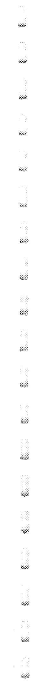

# 12. MAINTENANCE

E.C.Hise,R.N.Haubenreich,R.B.Briggs

# Concept

The maintenance of reactors requires the performance of various mechanical operations on equipment which, because of radioactive contamination and activation, is not directly accessible to maintenance personnel. Depending upon the level of activity, the size of equipment, and the design provisions for maintenance, anything from simple local shielding to fully remote manipulation may be required. The time required to do maintenance and the cost of the maintenance provisions increase with the degree of remoteness required.

The circulating-fuel reactor has fission products and intense radiation to contend with not only in the reactor vessel but also in all of the primary circuit through which the fuel salt circulates and in the off-gas system. If the fuel processing plant is integral or on-site as it will be for an MSBR, the maintenance of that plant is essentially part of reactor maintenance. Thus the circulating-fuel reactor requires radioactive maintenance of a greater scope than does a fixed-fuel reactor. On the other hand, the refueling operation is simpler, the radioactivity is retained on-site within one containment, and the necessity of a separate maintenance organization and equipment for a fuel reprocessing plant at another site is avoided.

Although maintenance design efforts cannot affect the size and activity level of the components in a reactor, much can be done in the design stages of a plant to influence strongly the degree of accessibility and the complexity of the maintenance operation. The maintenance concept for an MSBR is characterized by the general principles:

1. Each system is composed of manageable units joined by suitable disconnects.   
2. Each unit is accessible and replaceable from directly above through removable shielding.   
3. Failed units are removed and replaced.

The concept is described succinctly in the following quote [1] as applied to the MSRE.

"Reduced to fundamentals, the MSRE is a collection of component parts which are capable of being disconnected and reconnected remotely. Access to these units is provided through removable shielding sections that make up the roofs of the various cells. A portable maintenance shield is installed over the component, the roof section is removed, and

long-handled tools are used to do the manipulations that are required. This portable shield provides shielding, access holes, lighting, and maneuverability. The tools are, for the most part, simple, strong, and single purpose. Periscopes and lead glass windows in the shield provide viewing in the work area. All preparations for removal are done completely with the portable shield. After large components are prepared for removal with the same technique, they are removed by means of a crane operated by personnel inside a shielded control room with closed-circuit television and liquid-filled windows for viewing. Small components are removed by use of suitable transport shields. A hot-equipment storage cell and a decontamination cell can be reached by the crane so that contaminated equipment can be disposed of conveniently.

"The ability to completely disconnect a particular component is basic to this system. The disconnects must be remotely operable by the long-handled tools. They must be reliable both for the service conditions and for the high radiation and in some cases must satisfy nuclear safety considerations of containment leak tightness and leak detectability. A number of different disconnects are used at the MSRE for the various applications. Almost all the piping in such auxiliary systems as the offgas, lubricating oil, air, and cooling water systems have standard ring joint flanges, with minor modifications. Special designs were used for leak detector tubing, thermocouple, electrical and instrument leads.

"The maintenance philosophy in use for most parts of the MSRE is to replace a failed, contaminated unit with a spare component. Spares are built in jigs to assure interchangeability. Pieces that are small and not too radioactive are partly decontaminated and repaired by direct contact with the help of local shielding to reduce the radiation level. To satisfy the requirements of the MSRE, a constant review was made of the component and installation design to insure that it was maintainable and, where necessary, mockups were constructed to assist in guiding the designers."

A detailed description of the MSRE maintenance system is given in reference 2. In the MSRE, only the simplest of inspections and repairs could be done on failed equipment in the cell that was provided. In an MSBR, economy would dictate a larger cell with the capability of repairing large and expensive equipment items.

# Technological Background

During the past 15 years or so, the nuclear industry has acquired a great deal of experience in the maintenance of radioactive systems. Some has come from having to make repairs under very difficult conditions. A few such jobs have necessitated undesirable exposure of personnel; others have required ingenious devices and very long times to accomplish. Although these feats have been instructive, they are not models to follow. The goal in designing a reactor is not only to make maintenance possible, but to make it as sure, as safe and as economical as it can be. The kind of experience that points the way is that acquired with those plants in which maintenance was planned, provided for, and uneventfully carried out despite high levels of radioactivity. There has been experience of this sort in various USAEC installations, both with reactors and with chemical processing plants, that provides a broad technological basis for developing the maintenance system for an MSBR.

At ORNL we have operated four circulating-fuel reactors (ARE, HRE-1, HRE-2, and MSRE), besides processing facilities of various kinds. Although the level of radioactivity varied, they all had complex systems for circulating, processing, and storing radioactive materials whose activity levels denied direct access. The need for maintenance was recognized in advance, and provisions were made in their design. Development programs also included maintenance planning and practice. Some of the ORNL experience with maintenance has been widely reported. The preparations for maintenance of the MSRE, the organization, and the conduct of the maintenance operations actually performed on the MSRE are described in reference 4 and the MSR Program semiannual progress reports from 1967 through 1971.

# MSRE Preparations

Preparations for maintaining the MSRE began with the involvement of maintenance specialists in the design, and continued through the construction and startup phases [4]. The first scheme visualized for the MSRE featured a bridge-mounted manipulator, operating in an enclosed space above the reactor cell and controlled remotely with the aid of television. (A maintenance development facility including a manipulator, viewing devices, and equipment mockups had been used at ORNL to show the feasibility of this approach.) Smaller jobs in the MSRE were to be done by the semi-remote technique proved in the HRE-2, using simple, long-handled tools manipulated by hand through small penetrations in a portable shield set up over an opening in the cell's concrete roof. Design and planning soon showed that all the maintenance work anticipated in the MSRE could be done in this simpler way, and the manipulator idea was set aside.

The MSRE portable maintenance shield was a set of tracks and several 12-inch-thick steel slabs, with holes for tools and viewing devices, that rolled on the tracks. Inserts for the holes included shielding windows, lights, and split bushings to fit around tool shafts. When very free tool movement was required, bags of steel shot around the shaft blocked the

radiation. Lifting devices permitted the remotely controlled building crane to remove shield blocks or major equipment items. Each removable item had a bail at the center of gravity or other provisions to simplify lifting. Guides were provided where necessary to steer replacement parts into place. To ensure proper fit, jigs were built for all the major replaceable components. The 5-inch salt lines were provided with flanges that used frozen salt as a barrier to keep molten salt away from the ring gasket. Machines were developed (and fixtures installed in the cell for them) that could cut the 1-1/2-inch lines to the drain tanks, prepare the ends, bring old and new pieces together, and join them by brazing. The only tools required for most operations were simple, long-handled hooks, wrenches, and clamps characterized by their reliability rather than by their versatility.

During the installation of the reactor equipment and the prepower testing, many of the maintenance provisions were tested. All of the primary loop was assembled on a large jig before going into the cell and optical tooling was used to locate precisely reference points in the cell. Maintenance items that were tested included the crane, lifting and viewing devices, and all kinds of disconnects. Freeze flanges were opened and closed; a cell space cooler, the control rods, rod drives and a core sample array were removed and replaced; the primary heat exchanger and fuel pump bowl were installed using in part the remote maintenance provisions. After the nuclear startup experiments the fuel pump rotary element was removed, inspected and reinstalled. During this time personnel were trained and procedures were perfected.

# Extent of MSRE Experience

The semi-remote jobs that were accomplished in the reactor and drain tank cells during the 4-1/2 years of nuclear operation are summarized in Table 12.1. With the exception of those carried out in 1965 (before high-power operation), all of the jobs involved components that were located in radiation fields of several thousand R/hr. The radioactivity of the items that were removed varied widely; some, such as the specimens that were removed from the core 5 to 7 days after shutdown, would have read several hundred R/hr at several feet if they had been unshielded. All of the jobs involved use of the remote maintenance control room, at least for setting up and removing the maintenance shield. The cell top membrane was cut, welded, and inspected each time maintenance was done.

In addition to the maintenance in the reactor and drain tank cells, there were several jobs involving highly radioactive components in other parts of the building. Valves and filters in the off-gas system were removed and replaced, and heaters were installed on the inlets of the off-gas charcoal beds. The fuel sampler-drive mechanism had to be repaired on several occasions, which required that a temporary wood-and-plastic containment enclosure be set up inside the reactor building.

The post-operation examinations carried out between November 1970 and February 1971 involved viewing in the core and in the fuel pump, cutting out several parts of the fuel salt system, and plugging some lines [5]. The general technique was the same as was used in maintaining

Table 12.1. Semi-remote work in MSRE reactor and drain cells after beginning of nuclear operation ${}^{a}$   

<table><tr><td>Remove, inspect, replace fuel-pump rotary element (9/65)</td></tr><tr><td>Inspect core and reactor vessel, remove broken graphite (9/65)</td></tr><tr><td>Remove and/or replace core sample array (9/65, 9/66, 5/67, 4/68, 6/69, 12/69)</td></tr><tr><td>Remove flow restrictor in equalizer line in reactor cell (2/66)</td></tr><tr><td>Install thermocouple on off-gas line in reactor cell (3/66)</td></tr><tr><td>Install and remove temporary heater on gas lines at FP (8-9/66, 11/66)</td></tr><tr><td>Rod out off-gas line at fuel pump exit (11/66, 4/68, 12/68)</td></tr><tr><td>Replace fuel pump off-gas jumper line (9/66, 12/66, 4/68)</td></tr><tr><td>Replace overflow tank vent line (6/69)</td></tr><tr><td>Install permanent heater on off-gas line at fuel pump (6/69)</td></tr><tr><td>Remove and replace control-rod drive (9/66, 5/67, 4/68, 1/69, 6/69)</td></tr><tr><td>Replace control rod (9/66, 6/69)</td></tr><tr><td>Remove, inspect, reinstall control rod (1/69)</td></tr><tr><td>Remove, repair, reinstall heaters on primary HX (3-4/68)</td></tr><tr><td>Replace reactor cell space cooler motor (6/65)</td></tr><tr><td>Remove, repair leaks, replace reactor cell space cooler (8-9/66)</td></tr><tr><td>Replace reactor cell space cooler (5/67)</td></tr><tr><td>Replace air-line disconnects in reactor cell and drain cell (1/67, 7/69)</td></tr><tr><td>Remove, repair, replace air control valve in reactor cell (12/66)</td></tr><tr><td>Measure gamma spectra from components in reactor cell (5/67, 4/68, 6/69, 11/69)</td></tr><tr><td>Visually scan reactor cell (5-6/67, 2/68)</td></tr><tr><td>Visually scan drain cell (6/67)</td></tr><tr><td>Install and remove sampler-enricher on drain tank (8-9/68)</td></tr></table>

${}^{a}$ Low-power experiments began in June 1965; high-power operation in April 1966.

the reactor: long-handled tools through the maintenance shield. Some of the tools were quite different, however, to handle the special tasks.

The control rods and drives were removed, the 10-inch core access plug with the rod thimbles was taken out, and a section of rod thimble was cut off with a grinding wheel. A grinding wheel, mounted on a special tool, was also used to cut through the pump tank around the sampler cage so that it could be removed. An 11-inch section of the heat exchanger shell was cut out with a plasma torch, then sections of 6 tubes were cut with an abrasive cutoff tool and removed for inspection. Examination showed that, as suspected, a small amount of salt (≈2 in.) had leaked near a freeze valve in a drain line. The freeze valve and adjacent piping was cut out and removed. The holes in the pump tank and the heat exchanger shell were patched, the latter by welding, and plugs were installed in the severed ends of the drain lines.

# Conclusions from MSRE

Although the major components of the fuel system, whose replacement would have been more complicated than any job that was done, required no maintenance, the MSRE experience was of sufficient extent to thoroughly test the general strategy and many of the specific design features.

The MSRE maintenance was reliable: no job arose that could not be done. An important factor in this was the flexibility of the maintenance system which allowed obstacles to be circumvented and unforeseen jobs (such as those in the off-gas system) to be accomplished.

The experience with the MSRE emphasized that the payoff for preparation is tremendous in the case of radioactive maintenance. Jobs such as replacing the core specimens went very quickly compared to others that were basically less difficult, but for which no special provisions had been made.

Especially valuable information on fission-product contamination came from the MSRE experience. Noble gases behaved predictably and could be purged before systems were opened. Salt-seeking fission products were no problem - the salt drained cleanly and any that was trapped froze and retained the fission products. There was no corrosion film or scale to flake off and form dust. At least part of the noble metals that deposited on surfaces in the off-gas system were fairly easily transferrable, but particulate contamination was generally confined to the tools, which were swabbed and bagged as they were pulled from the shield. Iodine that was produced by the decay of tellurium on surfaces soon appeared in the gas. Ventilation air from the reactor building and from the containment cells was passed through particulate filters and up a stack. The greatest amount of activity discharged in any week was less than 0.2 Ci (mostly iodine) and occurred during work on the off-gas system.

Although radiation levels in the reactor cell were typically on the order of several thousand R/hr while maintenance work was going on, the general background to which workers were exposed while manipulating tools was only about 0.01 R/hr. Procedures were planned to minimize personnel exposure in locally higher radiation fields and the work was never seriously inconvenience by having to rotate workers. No maintenance worker ever received more than the normal limit of 3 rem in any quarter.

# Reference Design MSBR

In designing and planning for the maintenance of the MSBR we have evaluated and adapted the experience with the MSRE and other radioactive systems. The maintenance system, as applied to the reference MSBR, is discussed in some detail in ORNL-4541 [6].

MSBR maintenance requirements fit into the following four general classes.

Class I - Permanent Equipment. - This category contains all those items which can reasonably be expected to require no maintenance during the design lifetime of the plant. Examples are the reactor vessel, the pump vessels, primary heat exchanger shells, the fuel-salt drain tank, thermal shielding, thermal insulation, the connecting process piping, etc. No special provisions are included for maintenance of these items. Emergency maintenance to some extent is possible, however, because of the access that is provided primarily for in-service inspection.

Class II - Equipment Allowing Direct Maintenance. - This group includes the items which can normally be approached for direct maintenance within a reasonable period of time (typically after the secondary salt has been drained and flushed and the remaining activities allowed to decay for about 10 days). The steam generators, reheaters, coolant-salt pumps, and the equipment in the heat rejection cell fall into this class. In the unlikely event that one of these components did become highly contaminated with fission products, its removal would be treated as a Class III or IV item, discussed below. Once the sources of activity were removed from the cell, cleanup and component replacement could proceed in the normal fashion using direct maintenance.

Class III - Equipment Requiring Semidirect Maintenance. - Much of the equipment in the offgas and chemical processing cells, such as pumps, blowers, valves, processing vessels, filters, etc., will become radioactive. In general, the sizes of these items are comparable to the MSRE equipment. MSBR radiation levels may be a factor of 10 higher than in the MSRE, however. The maintenance tools for this class of equipment could be similar to those for the MSRE, but the shielding and containment provisions would have to be more effective because of the more intense sources of radiation.

Class IV - Large Equipment Requiring Remote Maintenance. - This group includes items which are clearly beyond present experience because of a combination of size, radiation level, afterheat removal, and disposal considerations. Examples are the pump rotary element, the primary heat exchanger tube bundle, and the core graphite.

The reactor primary system, because of the large size of the highly contaminated equipment, presents the greatest problems in containing the radioactivity and dealing with afterheat and is therefore used as the basis for the discussion which follows.

# Containment

Although the fuel salt and highly radioactive gases will be removed from any system before it is opened for maintenance, the reactor primary system will still contain large amounts of radioactivity, some of which will be transferable. The MSBR building and cells and the maintenance equipment and procedures must, therefore, be designed so as to limit the spread of radioactive material within the reactor building and to prevent more than trivial amounts from being released outside the building during maintenance.

The heating and the amounts of short-lived activity that must be dealt with decrease rapidly during the first few days after cessation of power operation. For this reason it is unlikely that the primary system will be opened sooner than ten days after full-power operation is stopped.

Ten days after shutdown from long operation of 2250 MW(t), the noble-metal fission products on surfaces may total about $2.2 \times 10^{8}$ curies, or roughly $3 \times 10^{5}$ Ci per ft $^{2}$ of metal surface that had been exposed to the fuel salt. (This figure is based on the assumption that $75\%$ of the noble metals deposit on metal surfaces in the loop.) The deposited tellurium will be generating iodine, some of which will go into the gas or air contacting the surface. At $10^{6}$ sec (11.6 days) the calculated total rate at which 2.3-h ${}^{132}\mathrm{I}$ is generated from 78-h Te on surfaces is $2 \times 10^{6}$ Ci/hr or about 30 Ci/hr per ft $^{2}$ of surface in the fuel circulating system. Eight-day ${}^{131}\mathrm{I}$ will be generated on surfaces at a total rate of about 5 Ci/hr or $7 \times 10^{-5}$ Ci/hr per ft $^{2}$ .

The noble gases in the graphite after 10 days could amount to as much as $1.2 \times 10^{6}$ Ci (almost all $^{133}\mathrm{Xe}$ ), assuming none diffused out during the cooling period. The radioactive daughters of noble gases in the graphite would likely range up to $1 \times 10^{7}$ Ci.

The inventories of the fission products that dominate at 10 days after shutdown may be as much as 170 times those in the MSRE. (This factor may be considerably lower if, as expected, the MSBR gas-stripping system removes much of the noble metals.) The amounts per unit area should be less than 5 times as great as in the MSRE, however.* Thus the observed behavior of the deposited fission products in the MSRE should be rather similar to that to be expected in the MSBR.

Based on the MSRE experience, we expect that the noble metals on surfaces will be more or less adherent, depending on whether they are on surfaces in the salt loop or in the off-gas system, but that care must be used to avoid knocking or scraping them off. Although there was uncertainty in the fraction of the iodine generated on surfaces that came off into the gas in the MSRE, it is clear that in the MSBR measures must be provided that are adequate to deal with all of the iodine so generated.

The noble-gas daughters in the graphite will not be readily transferable, and should cause no contamination problem.

The MSBR building and equipment layout described in Chapters 3 and 9 are intended to permit safe containment of the radioactivity during maintenance. Before maintenance is started, the fuel salt will be secured in the drain tank. (Normally it will be circulated for several days to help remove afterheat before it is drained.) The system requiring maintenance will then be purged of radioactive gases and, if necessary, cooled down. The containment cell will then be unsealed and a maintenance shield set up. The cell will be maintained at a slight negative pressure by an air exhaust system. Tools and other items penetrating the maintenance shield will be sealed to the shield so as to minimize air leakage into the cell. (Boots or gas-buffered seals might be used.) Primary systems will not be left open to the cell longer than necessary; if an equipment item cannot be replaced immediately a temporary closure will be applied. This will be required to minimize both the radioactive contamination of the cell and the ingress of oxygen and moisture into the system. When contaminated items are removed through the shield, they will be withdrawn into casks through openings equipped with valves or flanges that will close the reactor cell and the cask except during the transfer. Generally the gas streams passing through the cell will be filtered, passed through absorbers and recirculated. Any excess gas will be stripped of radioactivity before it is discharged to the atmosphere. Items removed from the primary system will be repaired or prepared for disposal in a hot cell where similar precautions must be observed. All operations will be carried out inside the reactor building to assure complete containment.

The assurance of public protection during maintenance is comparable to that during operation, although the lines of defense are different. During operation, the fuel salt and highly radioactive gases are circulating within the vessels and piping, which are in turn doubly contained, being inside sealed cells inside the reactor building. During maintenance, the fuel salt with most of the fission products will be sealed in the drain tank, and the precautions that ensure that it will not be brought out during the maintenance constitute primary containment for it. Any system to be opened will be drained and purged so that when it is finally opened, the amount of radioactivity that could conceivably escape into the cell will be far less than that circulating (and liable to being spilled through a pipe rupture in the design-basis accident) during operation. The first line of defense ("primary containment") for this limited amount of radioactivity is the ventilation system that maintains the cells at a negative pressure and removes any radioactive contaminants from the exhaust stream before it is discharged into the reactor building. Secondary containment during maintenance is the same as during operation -- the sealed reactor building.

# Afterheat

The fission products that will remain in the graphite and on surfaces in the fuel system will produce significant heating in the large equipment items while the maintenance operations are going on. This must

be taken into account in the provisions for the major operations: replacement of the core graphite, the tube bundle of a primary heat exchanger, and perhaps the rotary element of a primary pump.

We estimate that $10^{6}$ seconds (11.6 days) after shutdown from 2250 MW(t) the total heat generation rate in the primary system would be $770\mathrm{kW}$ , consisting of $210\mathrm{kW}$ in the graphite of the core, $125\mathrm{kW}$ in each of the four primary heat exchangers, and $60\mathrm{kW}$ distributed over the other surfaces. What the temperature in the primary system must be before it is opened has not been decided. With the cell cooling system that we have envisioned, the fuel system temperature 10 days after a shutdown would likely be in the range of 500 to $1000^{\circ}\mathrm{F}$ . If further study of the maintenance procedures indicates that this would be unacceptable, additional heat removal must be provided or additional time allowed to reach a satisfactory temperature. Some cooling must be continued while the item is being removed, but the rate of temperature rise in the absence of cooling would be low - $30^{\circ}\mathrm{F/hr}$ for a heat exchanger bundle and $2.4^{\circ}\mathrm{F/hr}$ for the graphite core. The temperatures of the piping and rotary element of the pump would rise even more slowly.

# Graphite Replacement

As explained elsewhere in this report, because of neutron irradiation damage, it will be necessary to replace the core graphite several times during the life of the MSBR plant.* Consideration of the effects on breeding and possibly on power distribtuion leads to removal of the graphite while it is still structurally sound. Thus, although the removal procedure must be capable of dealing with broken graphite elements, the strength of the graphite should not hamper its handling.

In the ORNL reference MSBR [6], the upper head of the reactor vessel and the entire core (176 tons of graphite and 97 tons of metal) are replaced as a unit. This constitutes by far the largest maintenance task in this conceptual design, and explains some important features of the building layout and equipment described in Chapters 3 and 9. The major item of special maintenance equipment required for the core replacement is a 20-ft-diam × 40-ft-high shielded transport cask. The carbon steel walls of the cask are about 2 in. thick, which is sufficient to reduce the radiation level on contact with the outside of the cask to about 1000 R/hr and at the outside wall of the reactor containment vessel to less than 0.1 R/hr after a 10-day decay period for the core. Conservative estimates indicate that the 210 kW of heat being generated in the core can be safely dissipated through the cask wall so that no cooling system for the cask will be required. The reactor core assembly is prepared for removal in a semidirect fashion through a work shield. The lifting of the core assembly into the transport cask and transport to the spent core

storage cell, the installation of the new core assembly, and the replacement of the shielding are accomplished from the remote maintenance control room in the same fashion as the removal and replacement of large items of MSRE equipment.

Ebasco Services and their associates in the industrial design study questioned the desirability and practicality of replacing the entire core at once. They elected instead to make the core of individually replaceable elements, and decided that 15-in. hexagonal elements were the optimum [7]. They would replace some of the graphite elements at 4-year intervals, during major turbine-generator overhauls. Adoption of this scheme would obviously greatly alter the requirements for handling tools and casks for the exposed graphite.

# Status

As stated earlier, the MSBR maintenance concept depends upon access from above, a system of replaceable units, appropriate disconnects, and tools to operate them. Thus it is clearly essential that maintenance design be concurrent with plant design. This has been the case in the conceptual studies to date. The maintenance techniques for fluid-fuel reactors have evolved as the size, complexity, and radiation levels of the reactors have increased. Design studies have not indicated any insurmountable problem in maintaining a 1000-MW(e) MSBR, and no serious conflicts have arisen in imposing the maintenance requirements on the reactor system.

Most of the techniques and many of the tools have been developed. Several flexible maintenance shields have been built and used. Optical viewing equipment -- window inserts, periscopes, adequate lighting -- all are available. The use of a shielded maintenance control room with windows, remotely-operable TV, and remotely-controlled crane and tooling has been successfully demonstrated. Remotely-operable disconnects for electrical power, instrumentation, and service piping are at a satisfactory stage of development. The remote fabrication of brazed joints in small system piping has been demonstrated in connection with the MSRE [2].

Two important techniques that are requisites for large power reactors are not available, however. They are remote welding and in-service inspection and repair.

It is highly desirable from the standpoint of reliability that the MSBR circulating fuel system be of all-welded construction. Thus remote cutting and rewelding of the system piping will be required in the replacement of major components. The status of remote welding as of 1969 and the required development program were presented in reference 8. A portion of that program has been accomplished and the present generation of automatic welding machines are reliable and capable of making high-quality welds. These machines are not now capable of fully remote welding, but appear to be adaptable to this purpose.

The provisions in the MSBR for access to equipment for maintenance operation are equally applicable to in-service inspection. The state-of-the-art of remote inspection of welded joints is reviewed in reference 9.

Dependable application of common methods for nondestructive inspection of welds is difficult or impossible in high-temperature, high-radiation fields. Some methods promise to be successful, however, and current AEC and industrial programs are developing equipment, manipulators, and interpretive methods for acoustic emission and ultrasonic holography monitoring and inspection. These programs are expected to culminate in remote inspection methods for reactor welds which should be adaptable to MSBR conditions and needs. The equipment and techniques for remote repair do not exist; however, much of that development as well as the inspection development is interchangeable with remote welding development.

# Further Work

The program for maintenance development for the MSBR [1,6] consists of three major elements:

1. The development of remote cutting and welding capability for replacement of major items of equipment in the circulating fuel system.   
2. The development of equipment and techniques for in-service inspection and repair of fixed items of equipment in the circulating fuel system.   
3. The concurrent design of a maintenance system that is integral with the design of the reactor system and the development and demonstration of tools and techniques required for that specific reactor.

The development of remote cutting and welding requires the adaptation or development of manipulators for remote placement, pipe alignment, and control of the automatic welders and the plasma torches that are already available. Such a program could be started at any time.

The in-service inspection and repair operations will use essentially the same tools and techniques that are required for the cutting and welding. Techniques for nondestructive examination should be pursued and the most promising [9] should be adapted for the particular alloys and configurations expected in the MSBR.

The development of equipment for maintaining a particular MSBR cannot precede the design of the plant and the development of plant components, but it should keep pace with it. The general scheme of semiremot maintenance that was proved in the MSRE can be used for some parts of the processing and off-gas systems, with only minor changes in shielding to compensate for the higher intensity of radiation. For physically large systems, on the other hand, it would not be practical simply to scale up the tools used at the MSRE because they would tend to become too unwieldy for use by hand. Thus some developments in handling equipment and changes in the tool and component design will be required. The basic philosophy of designing components to be maintained with simple, reliable tools manipulated intelligently and flexibly should be retained, however.

The conceptual design of systems for limiting the spread of radioactive contamination during maintenance can proceed and should be carried without delay far enough to define requirements on filters, seals, etc.

# Evaluation

An absolute necessity for practical maintenance of an MSBR is the early recognition of the eventual maintenance requirements. Maintainability considerations must imbue the entire design effort, and maintenance preparations must be thoroughly developed and tested in advance. We are aware of these needs and they are reflected in our conceptual designs.

The size of the equipment and the intensity of the radioactivity in an MSBR are greater than we have dealt with before. Nevertheless, the general philosophy that we have developed, many of our techniques, and some of our tools are either directly applicable or readily adaptable. Other tools to handle large, heavy equipment must be developed as the needs are defined. In addition, the techniques and equipment for welding and inspection that are now being developed in connection with other kinds of reactors will have to be adapted and developed further for use on an MSBR. It does not appear, however, that the maintenance of an MSBR will impose unreasonable requirements for invention or development.

In summary, consideration of the state of the art and the foreseeable development of the technology in relation to the needs of molten-salt reactors leads us to conclude that by adequate planning and preparation, the maintenance of an MSBR can be made reliable and safe. The costs of the special provisions that must be made for maintenance of an MSBR have not been estimated in detail, but they appear unlikely to be a decisive economic factor.

# References for Chapter 12

1. R. Blumberg, Maintenance Development for Molten-Salt Breeder Reactors, ORNL-TM-1859 (June 1967).   
2. R. Blumberg and E. C. Hise, MSRE Design and Operations Report, Part X, Maintenance Equipment and Procedures, ORNL-TM-910 (June 1968).   
3. E. C. Hise and I. Spiewak, Repair of the HRE Core, Nucleonics 19: 100- (March 1961).   
4. P. N. Haubenreich, R. Blumberg, and M. Richardson, "Maintenance of the Molten-Salt Reactor Experiment," ANS Winter meeting, Washington, D.C., November 1970. (Complete paper available from authors).   
5. MSR Program Semiannu. Progr. Rept. Feb. 28, 1971, ORNL-4676, pp. 1-16.   
6. Conceptual Design Study of a Single-Fluid Molten-Salt Breeder Reactor, ORNL-4541 (1971).   
7. 1000-MW(e) Molten-Salt Breeder Reactor Conceptual Design Study Final Report - Task I, Evasco Services, N.Y. (February 1972), p. 3-9.   
8. P. P. Holz, Feasibility Study of Remote Cutting and Welding for Nuclear Plant Maintenance, ORNL-IM-2712 (November 1969).   
9. R. W. McClung, Remote Inspection of Welded Joints, ORNL-TM-3561, (September 1971).

# 13. DESIGN STUDIES AND CAPITAL COST ESTIMATES

M. I. Lundin C. W. Collins

# Introduction

The Molten-Salt Reactor Program at the Oak Ridge National Laboratory has, since 1968, been focussed on a 1000-MW(e), one-fluid MSBR. A study that was completed by ORNL in 1970 produced the conceptual design that is described briefly in Chapter 3 and in detail in reference 1. The Molten-Salt Group, as part of their privately funded assessment of MSBR technology, reviewed this ORNL design and issued a critique of it in 1971 [2]. Meanwhile, ORNL issued a request for proposals for an independent, AEC-funded, industrial design study of MSBR's. A proposal from Evasco Services was accepted and in 1971 Evasco and its industrial associates began work under a subcontract with ORNL [3]. Task I of the study included developing an MSBR plant concept from specified criteria. This task was completed and a final report issued in February 1972 [4].

This chapter deals with design work on the ORNL reference concept and the alternative approaches proposed by the Evasco group. It identifies the information on materials and the developments in high-temperature design methods that will be needed. Finally it discusses the capital cost estimates that have been made and their sensitivity to uncertainties.

Primary Systems Layout and Structural Design

# Background and Status

The ORNL reference concept [1] was based on a "top" supported primary system utilizing structural members in the cell roof for supporting the suspended major equipment. The reactor vessel was anchored while the heat exchanger and pumps were free to move except for the restraints imposed by the hangers. The piping flexibility analysis showed all stresses to be reasonable. However, only cursory evaluation was made of the effects of seismic forces, inertial stresses, or stresses due to thermal shock. The basic assumptions made were that dashpots or other seismic restraints could be added and that the effects of extreme transients could be prevented or mitigated by proper system controls.

Ebasco Services, in their Task I conceptual design [4], came to the conclusion that when the cell roof penetrations for maintenance access were considered, there would be insufficient space in the structure for equipment supports. In addition, when consideration was given to response frequencies and amplification factor due to the 50-ft height of the equipment layout, the requirements for seismic restraints made it desirable to investigate alternate support systems. The concept that Ebasco chose to investigate used "bottom" reactor vessel and heat exchanger supports

with a three-level system of horizontal trusses (lateral supports) for control of earthquake motions. They successfully ran flexibility and stress analyses, and although an arrangement with acceptable stresses was found, it turned out to be very sensitive to relatively minor changes in layout and temperature assumptions. The design of equipment supports and restraints will, therefore, require further detailed analyses.

Ebasco also took an alternative approach to ORNL on the question of thermal transients. They investigated the requirements for directly accommodating a shock without using special control features or devices. For example, a system scram on loss of secondary coolant pumps or on a steam line break could result in the primary system outlet line changing from 1300 to $1050^{\circ}\mathrm{F}$ in 14 sec, or the inlet line changing from 1050 to $1300^{\circ}\mathrm{F}$ in 30 sec. Such transients would result in quite unacceptable stress levels. As a remedy for this, Ebasco selected and analyzed a design using a thermal sleeve which isolated the flowing fluid from the piping by an almost "stagnant" fluid layer between the piping and sleeve. By taking advantage of the effect of low Reynolds number on heat transfer coefficient in the annulus, they were able to reduce thermal-shock transient stresses to negligible levels.

# Sensitivity to Uncertainties

The differences in approach between Evasco and ORNL-4541 concerning reactor system layout and structural support center mainly on methods of supporting primary systems components and controlling temperature gradients in components due to transients.

Neither the primary system supporting arrangement shown in the ORNL reference design nor the one proposed by Evasco has been completely studied to the extent that all problems are known and solutions are in hand. However, both organizations conclude that it is feasible to design high temperature systems having flexibility for expansion and yet capable of resisting seismic loads. The ORNL concept requires yet-to-be-developed high temperature snubbers for seismic restraint, while the Evasco concept must show the effectiveness of a high temperature support system to sustain and shock loads. Final design of the primary systems as well as its support system will require detailed analysis to achieve an optimum layout having the required flexibility and meeting the stress limitations for all operating conditions. The stresses due to expansion have been shown to be controllable to an acceptable level by adjusting the lengths of piping while still maintaining a compact layout. Lengthening the lines involves some increase in fuel salt inventory; however, most of the inventory is in the reactor vessel, pumps, and heat exchangers.

The Evasco analyses indicate that unless special measures are taken, transient thermal stresses at several points in the primary system can be excessive. Evasco's solution, the use of thermal sleeves or liners to eliminate direct contact between the coolant flow and the pressure boundary, appears to provide protection, and in some cases may be the only way stresses can be held down to acceptable levels. Thermal sleeves probably involve additional cost, although in some places they may permit less material in component fabrication, thereby compensating for at least part of the cost of the liner.

# Future Work

Future work on methods for limiting thermal stresses is dependent upon selection of a material for the salt systems components. Additional work can then follow to determine temperature profiles throughout the system for all operating conditions, to perform detailed analysis of stresses at critical locations in components, and to evaluate temperature control systems, thermal liners, components supports, etc., that have potential for enhancing feasibility, safety, and economics of the system.

Other areas which would receive design attention include use of expansion joints at cell penetrations, methods of vessel fabrication (e.g., shop vs on-site) and provisions for in-service inspection of components.

# Evaluation

Although much work remains to be done before attempting to select optimum configurations, methods for controlling transient thermal stresses, and support systems for the primary systems, we believe the conceptual work of both ORNL and Evasco have defined the major problems and suggested approaches that will lead to satisfactory solutions.

Design Methods - Codes and Standards

# Background

The mechanical design of MSBR vessels and piping must deal with a variety of problems. Because of the high operating temperature, large thermal expansions must be accommodated; but considerations of salt inventory and pressure drop dictate that the piping be no longer than the minimum necessary to provide flexibility and acceptable stresses. The large temperature differences around the system lead to potentially high stresses due to temperature gradients, particularly near nozzles, tube sheets, or other structural discontinuities. Materials must operate in the creep range, requiring design methods, appropriate for this situation, that are only now being developed. The material contemplated for the salt systems is modified Hastelloy N whose allowable design stresses, while expected to be superior to those determined for standard Hastelloy N, have not been established. Further, there is a possibility that the surface cracking problem (Chapter 7) or some other consideration may require a different material such as Inconel or stainless steel.

# Status

Due to the limited effort that has been devoted to conceptual design, only simplified elastic stress analyses were employed, primarily to size components and to evaluate design alternatives. Before actual components

could be built to satisfy the stringent requirements of the Nuclear Power Plant Component Code, the metallurgical development work must be completed to establish a thorough knowledge of the properties of the chosen alloy and an exhaustive stress analysis must be made of all components over the entire range of design conditions.

Standard Hastelloy N is approved for use under Sections III and VIII of the ASME Boiler and Pressure Vessel Code through code case approval. Case 1315-3 approves use of Hastelloy N for pressure vessels constructed in accordance with provisions of Section VIII, Division 1. Allowable stresses are given for temperatures to $1300^{\circ}\mathrm{F}$ . Case 1345-1 approves use of Hastelloy N for Class I nuclear vessels constructed in accordance with provisions of Section III of the Code. Design stress intensity values are provided only to $800^{\circ}\mathrm{F}$ , in common with other materials approved for use under Section III.

Case 1331 provides rules for construction of Class I nuclear vessels that are to operate at temperatures above those provided for in Section III. However, the recent revision, Case 1331-5, includes only 304 and 316 stainless steels and requires a thorough knowledge of the material properties to establish the design stress intensities. Extensive stress analyses are also required using techniques just now coming into use and, in fact, unproven for many materials, including Hastelloy N. Thus, before Hastelloy N can be used at elevated temperatures, a materials testing program adequate for code approval must be completed and Case 1331 must be revised to include the new material.

Strength of standard Hastelloy N above $950^{\circ}\mathrm{F}$ is limited by creep effects, making it necessary to employ design rules, analysis methods, and stress limits which reflect the time-dependence of material properties and structural behavior. Modes of failure considered by the design rules of Code Case 1331-5 include: ductile rupture from short-term loadings, creep rupture from long-term loadings, creep-fatigue failure, and gross distortion due to incremental collapse and ratchetting. Brief outlines of design methods are also provided for the following modes of failure: loss of function due to excessive distortion, buckling due to short-term loadings, and creep buckling promoted by changes in geometry due to creep deformation associated with long-term loadings.

Design methods to cover these requirements are currently being developed and applied to the LMFBR program. They can be used to design MSBR components and assure confidence in their reliability and safety.

Should current work result in the selection of stainless steel instead of Hastelloy N, much of the needed materials information would be available from the LMFBR program. There are indications that Inconel may be used in some LMFBR components, in which case materials information for it also would be forthcoming.

# Sensitivity to Uncertainties

Since no detailed analyses have been made of the thermal stresses due to rapid temperature changes, stresses at nozzle to shell intersections, or other secondary and peak stresses, we do not know quantitatively what the values may be. The preliminary analyses do indicate that

most of the allowable stress is used up by primary and secondary discontinuity stresses leaving very little for thermal and other secondary stresses. The alternatives are lowering the design temperature, exercising careful control of plant temperature variations, or insulating the critical region of components against these rapid thermal changes and careful design of components. All of these alternatives involve some compromises in the conceptual design and will incur additional costs.

Final selection of the material may involve a compromise between strength and other material properties, such as corrosion resistance, resulting in the choice of material with lower allowable stresses than we have anticipated. It is also possible that rigorous analysis may show that there are regions in components where stress intensities cannot be held to allowable levels even with ingenious designs and careful system controls. In such a situation we could lower the MSBR operating temperature to a point where the design stress intensities would be acceptable. This probably would not involve a large temperature decrease; for example, the current allowable design stress intensity for the standard Hastelloy N is 6000 psi at $1200^{\circ}\mathrm{F}$ compared to 3500 psi at $1300^{\circ}\mathrm{F}$ .

A change from Hastelloy N to either stainless steel or Inconel would have some advantages. There is much experience in fabrication of components using these materials by companies already having manufacturing procedures and ASME code stamps. Stainless steel and Inconel have strength similar to standard Hastelloy N but are much cheaper, so that the capital cost of the MSBR should be reduced. If, however, the change in materials entails reductions in the fuel salt temperature, there would be some economic penalties tending to offset the capital cost savings. (See discussion under "capital costs".)

# Future Work

Selection of the reactor material and establishing its mechanical properties is the most important step before proceeding beyond the conceptual design. The next step would be to obtain approval to use the material for ASME Section III nuclear components at the design temperatures and then do sufficient design and analysis to show that the components are adequate for the design conditions.

The current inelastic stress analysis approach used in LMFBR work considers the total strain at any instant of time to consist of three parts: elastic, plastic, and creep strains. Discrete increments of time are considered in which elastic-plastic and creep strains are computed separately and added to obtain the total strain. Thus, in the present state of the art, plasticity and creep are formulated independently, but they are treated in the analysis procedure in a manner that approximately accounts for the simultaneous elastic-plastic-creep behavior.

For elastic-plastic behavior in stainless steel it has been recommended that the classical kinematic hardening model be used and that for creep behavior the equation-of-state type constitutive theory based on strain hardening be used. Cyclic behavior is based on a cyclic stress-strain curve for the hardened material.

If stainless steel is used for the MSBR reactor material, inelastic methods of analysis developed in the LMFBR program will be directly applicable. If Inconel or Hastelloy N is used, most of the theoretical knowledge from the LMFBR program will be applicable, but additional materials information will be necessary to establish the hardening model for the different strain components.

# Evaluation

Excellent progress has been made recently in developing codes and standards through the ASME and the AEC's RDT Standards Program which will facilitate design and construction of MSBR components. The LMFBR High-Temperature Design Methods Program is expected to develop analytical methods for designing components with assurance of satisfactory performance over their planned lifetimes. Even though a material other than stainless steel will likely be used for MSBRs, the theoretical bases for the design methods will have been established and only a reasonable amount of testing of the reactor material will be necessary to develop sufficient information to apply the design methods.

# Capital Costs

# Background and Status

ORNL estimated the capital costs for building the reference 1000-MW(e) MSBR after completion of appropriate research and development programs and found them to be comparable to current costs for light-water reactors of similar size [1]. The Molten Salt Breeder Reactor Associates (MSBRA), headed by Black and Veatch and funded by midwestern utilities, arrived at a similar conclusion. In a study completed in 1970, they estimated that the capital cost of a 1000-MW(e) MSBR would be about 10 percent less than the cost of a pressurized water reactor of the same capacity [5,6]. The Reactor Assessment Panel of the Edison Electric Institute, in their 1970 evaluation [7], used capital costs for MSBR's equal those for light-water-cooled reactors. Evasco has not yet made a detailed cost estimate, but will do so as part of their current study.

The accuracy of absolute cost estimates for the MSBR reactor plant equipment is limited by several factors, including the preliminary nature of the designs to date, and especially by the uncertainties discussed below. Direct comparisons with light-water-cooled reactors are hampered to some extent by the major differences in design and materials for the two reactors. On the other hand, only about one-third of the total cost of a nuclear power plant is for reactor equipment, the remainder being for the heat-power system, general facilities, and indirect costs, which are expenses that can be accurately compared. It is the comparative approach to cost estimation that has led ORNL to conclude that the costs of a fully developed MSBR will be roughly the same as for a PWR.

We estimate the cost of reactor plant equipment (excluding contingencies) to be about $3 million more for a 1000-MW(e) MSBR than for a 1000-MW(e) PWR. (The MSBR involves more expensive materials, special provisions for maintenance, and other unusual design features that are only partially offset by savings due to its lower pressure and lower thermal rating.) Our estimates allow $6 million more for contingencies on reactor plant equipment in the MSBR than in the PWR. Special materials add $1 million more to the cost of the MSBR. On the other hand, the cost of the turbine plant equipment are $12 million less for the high-temperature MSBR than for the PWR, according to our estimates. After adding in the indirect costs we arrive at a difference of $2 million between the two reactors [1, p. 15], which is insignificant compared with the uncertainties.

# Sensitivity to Uncertainties

High-temperature stress considerations could conceivably require lowering the reactor outlet temperature from 1300 to $1200^{\circ}\mathrm{F}$ . Lowering the fuel temperature does not necessarily mean that the steam temperature in the heat-power system must also be reduced. The steam could be held to the reference design conditions of 3500 psia $1000^{\circ}\mathrm{F} / 1000^{\circ}\mathrm{F}$ , by increasing the primary heat exchanger area by about $60\%$ and the pumping capacity by the same amount to compensate for the reduced temperature difference. This would probably be done by adding cooling loops, resulting in $60\%$ additional cost for the heat exchangers, pumps, and piping, plus additional building cost to provide the needed layout area. The overall capital cost would increase about $6\%$ in this case. Another approach would be to lower the steam design condition to 3500 psia $900^{\circ}\mathrm{F} / 900^{\circ}\mathrm{F}$ , thereby reducing the thermal efficiency of the cycle from about 44 to $42\%$ . For a thermal efficiency of $42\%$ , the thermal capacity of the reactor plant would have to be about 2400 MW(t) rather than the 2250 MW(t) used in the conceptual study. If it is assumed that capital cost is directly proportional to the thermal capacity, the estimated capital cost will increase about $6.6\%$ due to the lowered efficiency. Thus it appears that either approach would result in about the same capitial cost increase. (Fuel costs would be different.) If the same material is used for the salt systems, lowering the temperature does allow higher design stress limits, which could permit thinner sections and less material in component fabrication. Alternatively, less expensive material might be used. No credit has been claimed for these possibilities in the foregoing estimates.

In our estimates for the reference MSBR, the cost of equipment made of Hastelloy N amounted to $29\%$ of the total plant capital cost [1]. Only about one-third was the cost of Hastelloy N, the remainder of the cost of this equipment being mostly shop labor. Thus, although we recognize that there is considerable uncertainty in projecting the cost of Hastelloy N to that which will prevail when MSBR's are being built in quantity, the effects on the plant cost estimates are not likely to be dominant. If it were possible to substitute stainless steel or Inconel for Hastelloy N

without any penalty from having to operate at lower temperature, significant savings might be achieved in the $29\%$ of the plant cost that is associated with Hastelloy N equipment.

The cost of the MSBR graphite is particularly uncertain, partly because it is not yet clear whether sealing, which may account for half of the cost, is economically desirable. (See Chapter 7.) The graphite cost is not a large fraction of the plant capital cost, however, amounting to $6\%$ in the estimate for our reference design [1].

Of equal importance with the capital cost is the plant availability. Here molten-salt breeder reactors tend to have an advantage since they do not require periodic shutdown for refueling as do solid-fuel reactors. In the ORNL design, changing out the graphite core is scheduled every four years to coincide with the major turbine maintenance, so no additional time is lost for this. (Ebasco's design involves replacing portions of the core at similar intervals.) No credit for the additional availability for not having to refuel was taken in our cost estimates, however, in order to provide an additional margin in case the maintenance of radioactive equipment requires more time than is needed for maintenance of solid-fuel reactors.

# Evaluation

MSBR capital cost estimates involve considerable uncertainties due to uncertainties in design. The cost of Hastelloy N and graphite affects about $35\%$ of the capital investment. Comparisons indicate that the capital costs of MSBR's will be roughly the same as for light-water-cooled reactors.

# Conclusions

Uncertainties still exist as to what reactor material will be finally selected for MSBR's and in some of the methods for designing high-temperature components. Once the choice of materials is made, work under way for the LMFBR program, plus a reasonable amount of material properties testing, should provide satisfactory high-temperature design methods for MSBR's.

Several capital cost advantages of MSBR's over light-water reactors appear to offset additional costs associated with the dispersal of radio-activity in the liquid-fuel system. Hence, our estimate that the capital costs of fully developed MSBR's will be about the same as those of present LWR's seems plausible, and an examination of the uncertainties in the cost comparison indicates that they do not represent a large percentage of the total cost.

# References for Chapter 13

1. Conceptual Design Study of a Single-Fluid Molten-Salt Breeder Reactor, ORNL-4541 (June 1971).   
2. Evaluation of a 1000-MWe Molten-Salt Breeder Reactor, Technical Report of the Molten-Salt Group, Part II, Evasco Services, Inc., October 1971.   
3. "Oak Ridge Presents Evasco for Molten-Salt Breeder Design Study", Nucl. Ind., 18(5): 29 (May 1971).   
4. 1000-MW(e) MSBR Conceptual Design Study, Final Report Task I, Evasco Services, N.Y. (February 1972).   
5. "Phase II of Molten Salt Reactor Prototype Study Launched," Nucle. Ind., 17(5): 18 (May 1970).   
6. Project for Investigation of Molten Salt Breeder Reactor, Final Report - Phase I Study, Molten-Salt Breeder Reactor Associates, Kansas City (Sept. 1970).   
7. Report of the EEI Reactor Assessment Panel, Edison Electric Institute, Publication No. 70-30 (April 1970).

# 14. ENVIRONMENTAL EFFECTS AND SAFETY

R. B. Briggs, J. R. Engel, P. N. Haubenreich

# General Considerations

A molten-salt breeder reactor can be operated with acceptable effect on the environment and the health and safety of the public provided that the radioactive liquids and gases that circulate throughout much of the plant are managed carefully. Thermal effects are like those for any plant with a high-temperature steam cycle. Because the MSBR processing plant is attached directly to the reactor there is no need for shipment of short-cooled fuel. Fission products extracted from the fuel salt are stored as solids or concentrated noble gases for shipment after long decay. Tritium that is produced in the fuel salt in substantial quantities presents special containment problems. Much of the tritium is expected to diffuse through the walls of the tubes of the primary heat exchangers into the salt in the secondary system. Tritium can be extracted from the secondary salt and stored, but unless very special measures are taken some tritium can be expected to diffuse into the steam system and be discharged from the plant in the otherwise uncontaminated blowdown. This blowdown would be the only significantly radioactive effluent from the plant during normal operation. When the primary systems of an MSBR are opened for maintenance, the copious amounts of fission products distributed throughout the systems require that stringent precautions be taken to prevent undesirable releases into the atmosphere. By use of evaporators and demineralizers to process laboratory wastes and the liquids that are used for decontaminating and washing radioactive equipment during maintenance, the radioactivity discharged in these liquids can be kept to insignificant amounts.

With regard to safety from large accidents, the use of fluid fuel places some special requirements on the design and operation of an MSBR. At the same time it eases or eliminates some requirements that are important in solid-fuel reactors. Although it is clear a priori that different measures must be taken to ensure safety, whether these measures are more or less complex and expensive in an MSBR than in other reactor systems can be determined only by a comprehensive analysis that begins with the most basic considerations.

Analysis of the safety of any nuclear power plant involves factors that can be categorized under two headings - nuclear safety and radiological safety. The first includes primarily those characteristics of the plant that determine the possible changes in the reactivity of the core and the resulting response of the nuclear power and the temperatures and pressures in the primary system. By radiological safety we mean the protection of the public and the plant operators against excessive exposure to radiation under all conditions. Radiological safety depends on several measures, including successive containment barriers, to minimize releases during normal operations and to guarantee that dangerous amounts

of radioactivity do not escape under the worst credible condition. The two areas are, of course, interdependent, since the absolute criterion of nuclear safety is that conditions which could overwhelm the radiological safety provisions must never occur.

In an MSBR, fission products are always distributed throughout the reactor and the processing systems, in contrast with conventional reactors where the fission products are normally contained within fuel elements in the core. Thus, for an MSBR to have equivalent overall containment, greater requirements must be placed on the containment barriers from the fuel salt outward. On the other hand, the fuel-coolant barrier in a solid-fuel reactor, interposed as it is between the heat source and the cooling fluid, is the barrier most vulnerable to damage in a nuclear excursion so that its protection and the consequences of its failure tend to impose more restrictive nuclear safety requirements on a solid-fuel reactor. These are the obvious differences; others are brought out in the discussion of the reference-design MSBR which follows.

# Characteristics of Reference-Design MSBR

This section deals primarily with the large MSBR station, including a reactor and fuel processing plant, that is described in Chapter 3. The purpose, however, is to delineate the important factors that must be considered for any molten-salt reactor. Environmental effects of normal operations are considered first, then the various topics that relate to the threat of a large accident.

# Environmental Effects of Normal Operation

Waste heat must be dealt with as in any thermal power plant, but the high-temperature MSBR can use the most efficient steam cycle that is available so that heat rejection is minimal. In the reference design, with a plant thermal efficiency of $44\%$ , 1225 MW(t) of heat goes into condenser water when the net electrical output of the plant is 1000 MW(e). Another 43 MW(t) is rejected from the drain-tank cooling system and plant heat losses.

The expected rate of discharge of radionuclides in gaseous effluents during normal operation of an MSBR station is extremely small. Helium that contacts the fuel salt in the reactor is recycled after passing through a cleanup system whose only output is tritium and noble gases in sealed containers [1, p. 108]. Gases in the processing plant are also recycled except for a 0.5-scfm stream of hydrogen that is vented after its fission products, are trapped on charcoal [2, p. 25]. Alternatively, this hydrogen might be sent to the reactor part of the plant for use in removal of tritium. The coolant salt cover-gas system includes provisions for removing tritium that reaches the coolant system. The tritium that diffuses out of the high-temperature salt systems into the containment cells is removed from the cell atmosphere recirculation system as HTO. Much of the tritium in the steam system blowdown (see below) probably

would be discharged into the air if wet cooling towers were used. Otherwise very little of the steam system tritium would go into the air.

Tritium presents an unusual problem in molten-salt reactors because about 2400 Ci/day is produced in the fuel salt of a 1000 MW(e) reactor and it readily diffuses through most metals at the high temperatures of MSBRs.*

Calculations indicate that in the reference MSBR about 790 Ci/day of tritium might reach the steam system [3]. Virtually all of this would be released by normal system blowdown into the condenser cooling water. Discharge of 790 Ci/day in a 560,000 gal/min stream produces a concentration of $260 \times 10^{-3} \mu \mathrm{Ci}$ /liter. This is 52 times the $5 \times 10^{-3} \mu \mathrm{Ci}$ /liter concentration used as a design objective for liquid effluents for light-water-cooled nuclear power reactors [4]. Presumably molten-salt reactors will be required to attain similar low concentrations, so the unhindered discharge of tritium in liquid effluents from the reference-design MSBR is unacceptable. Several modifications in the design or operation of the reference plant have the potential for drastically reducing the amount of tritium that reaches the steam system. These will be discussed later in this chapter.

Sampling such highly radioactive fluids as those in the MSBR without releasing radionuclides to the environment is no simple matter. Experience has shown, however, that zero release is quite practicable when sampling equipment and procedures are designed for total containment. To accomplish this, MSBR sampler lines have multiple closures and terminate in chambers with a controlled atmosphere that is recirculated through a purification system.

Another occasion that requires special precautions to prevent release of radioactivity to the environment is the opening of a system for maintenance. As described in Chapters 9 and 12, the MSBR containment and maintenance provisions are designed to confine any radioactive contamination to restricted areas.

# Nuclear Safety

The general principles of nuclear safety are the same for all reactors. Small fluctuations in reactivity should produce only highly damped power oscillations. Large, rapid increases in reactivity should be difficult to produce and be easily controlled before the resulting power excursions produce damaging temperature or pressure excursions. The characteristics of the MSBR plant are such that these principles are satisfactorily met.

The continuous removal of fission products and the adjustment of the fissile inventory in the fuel salt during operation of the MSBR minimize the amount of excess reactivity that must be compensated by control rods and hence limit the potential for rapid increases in reactivity associated

with this excess. In the reference-design MSBR, the maximum amount of excess reactivity that must be compensated by rods under normal conditions is expected to be less than $1\% \delta k / k$ .

The fissile material in the on-line processing systems amounts to less than $1\%$ of the reactor inventory. If all this could be returned to the reactor, the excess reactivity would be increased only $0.4\%$ or less. Furthermore, conceivable rates of introduction are quite inconsequential,\* and any unwanted reactivity increase from this source can easily be stopped.

Decay of precursors in the fuel circulating outside of the core reduces the effective delayed-neutron fraction from $0.30\%$ to $0.12\%$ in an operating MSBR. Thus one result of a cessation of flow is a $0.18\% \delta k / k$ reactivity increase in a time on the order of the half-lives of delayed-neutron precursors. Somewhat larger reactivity effects of stopping and starting fuel circulation could result from the perturbations of temperatures and the effects of changing pressure on gas bubbles in the core.

The maximum effect of temperature changes is shown by the following argument to be quite manageable. The reactivity coefficient for changes in temperature of the entire core $(-0.9 \times 10^{-5}^{\circ}\mathrm{C}^{-1})$ is much smaller than the coefficient for the fuel alone $(-3.3 \times 10^{-5}^{\circ}\mathrm{C}^{-1}$ for a uniform change of fuel temperature over the entire core). Thus the upper bound on reactivity effects due to a temperature change in the core corresponds to cooling all the core fuel (and none of the graphite) from the maximum operating temperature $(705^{\circ}\mathrm{C})$ to the fuel liquidus temperature $(500^{\circ}\mathrm{C})$ . This is only about $0.7\% \delta k / k$ . Effects actually attainable are smaller and, because they can be produced only by inflow of cooler salt, occur with time constants of at least several seconds. The safety rod system is quite capable of preventing power excursions due to such effects.

Because of the strong absorptions in thorium in the fuel salt, displacement of a small fraction by voids has a positive effect on reactivity. There are, in principle, two ways this could occur: 1) by increases in the volume fraction of circulating, noncondensable gas and 2) by boiling of the fuel salt. Neither of these processes appears to be capable of producing changes of sufficient magnitude to represent a safety problem.

Under normal operating conditions the fuel salt in an MSBR contains 0.2 to 1.0 vol % of helium bubbles. This gas is introduced and removed continuously to strip $^{135}\mathrm{Xe}$ . Thus, changes in the rate of addition or removal or changes in system pressure will change the core void fraction. At 1 vol %, the voids in the reactor core represent about 0.039% in reactivity. A complete depressurization of the fuel system, which would allow these bubbles to expand by a factor of 2 to 3, would cause a reactivity increase of only about 0.1% $\delta\mathrm{k} / \mathrm{k}$ . In addition to the bubbles, the salt contains some dissolved helium and the pores of the graphite contain substantially more. Although the total amount of helium in the graphite

is large, the rate at which it can diffuse out is limited so that for reasonably attainable rates of pressure loss in an MSBR ( $\nu - 2$ psi/sec) the combined reactivity effect due to bubble expansion and graphite outgassing is only 0.005 (\% $\delta k / k$ )/sec or less.

Voiding of a few fuel channels by local boiling (as might result if flow blockages occurred in individual fuel passages) is not a severe event. The positive reactivity effect associated with 100 empty fuel cells* at the average nuclear importance for the central core region is less than $0.5\%$ $\delta \mathrm{k} / \mathrm{k}$ . Because the boiling temperature (at 1 atm) is more than $700^{\circ}\mathrm{C}$ above the normal operating temperature of the salt, the energy input required to heat the salt to the boiling temperature over much of the core in a short time would require a nuclear excursion larger than any produced by credible reactivity inputs. Thus, boiling in the core will not come into play as a positive reactivity feedback in any nuclear excursion originating with the reactor at or near normal temperature.

Displacement of small amounts of fuel salt by graphite produces a positive reactivity effect. At the center of the core (the most sensitive spot) the effect amounts to $2.9 \times 10^{-6}\% \delta k / k$ per $\mathrm{cm}^3$ . Conceivable events, including sudden redistribution of clearances in response to flow changes or accumulated stresses, produce no reactivity increase of much consequence.

A unique consideration in fluid-fuel reactors is the possibility of inhomogeneity of the fissile material in the circulating fuel. Specifically of concern is gradual segregation of fissile material outside the core, followed by rapid introduction with the incoming stream. The MSBR fuel salt, as described in Chapter 5, is quite stable over a range of conditions much wider than the anticipated deviations. Segregation of uranium could conceivably be produced by introduction of reducing agents or oxygen into the salt, but adequate protection against this is provided in the MSBR.

The response of the nuclear power to reactivity increases is governed by the temperature coefficients of reactivity and the action of the control rods and safety rods. Because the delayed neutron fraction is unusually small, the MSBR power responds rapidly to reactivity increases.

The reactivity coefficients for uniform changes in fuel and graphite temperatures are listed in Table 14.1. In response to reactivity transients, core temperature changes will not be uniform, however. In particular, the graphite will change temperature much more slowly than will the fuel salt. (In the central core region, graphite comprises about $90\%$ of the heat capacity but only about $8\%$ of the nuclear heat source is in the graphite.) Consequently, heating of the fuel salt results in a prompt, negative response of reactivity to a power excursion. This response is great enough to limit effectively the initial power surge caused by any credibly rapid increase in reactivity. Thus safety rods are not required to operate unusually fast. The total core temperature coefficient (fuel

Table 14.1. Coefficients of reactivity for uniform changes in temperature across the MSBR core   

<table><tr><td>Component</td><td>Reactivity coefficient, 
1/k ∂k/∂T (°C-1)</td></tr><tr><td></td><td>(× 10-5)</td></tr><tr><td>Fuel salt</td><td></td></tr><tr><td>Doppler effecta</td><td>-4.37</td></tr><tr><td>Thermal baseb</td><td>+0.27</td></tr><tr><td>Density</td><td>+0.82</td></tr><tr><td>Total fuel salt</td><td>-3.28</td></tr><tr><td>Graphite:</td><td></td></tr><tr><td>Thermal baseb</td><td>+2.47</td></tr><tr><td>Density</td><td>-0.12</td></tr><tr><td>Total graphite</td><td>+2.35</td></tr><tr><td>Core</td><td>-0.87</td></tr></table>

${}^{a}$ Primarily due to thorium.   
Upward shifts in thermal spectrum increase reactivity because fissile cross section decreases less rapidly than the thorium cross section does.

plus graphite) is quite small, however, and might be positive. (The calculated value is negative, but the margin of uncertainty is such that the coefficient could turn out to be positive.) As a result, safety-rod action is required to prevent wide variations in temperature that would otherwise result from any reactivity change that persists more than a few seconds.

In summary, the nuclear safety characteristics of the reference MSBR are such that a reactivity excursion leading to a breach in the fuel system containment is highly unlikely.

# Radionuclide Decay Heating

From the standpoint of reactor safety, the chief importance of radio-nuclide decay heat lies in whatever threat it may pose to the integrity of the primary system.

In an MSBR, the fission products and transmutation products and the heat produced by their decay are distributed through the reactor systems and the processing facility in a manner that depends on the physical features of the plant, the chemistry of the radionuclides, and the extent of reprocessing of the fuel salt. In the reference design MSBR after several months of operation at its design power of 2250 MW(t), the total decay heat rate is about 152 MW, distributed as shown in Table 14.2. Most of the heat is generated in the fuel salt by the decay of all classes of radioactive products with half lives of a few minutes or less and of longer lived products that are soluble in the salt.

Krypton and xenon diffuse into the pores of the core graphite or into the helium bubbles that circulate in the fuel salt and are removed to the drain tank. About $80\%$ of the energy of decay of the gases that reach the drain tank is released in the tank. The remainder is released in the carbon beds. For the purposes of conservative design, each daughter atom of a noble gas atom is assumed to deposit on the surface nearest the point of decay of the parent atom and there to release its heat. This certainly is the situation in the graphite and in the carbon beds. Depending on the design, daughter atoms born in the off-gas lines or drain tank could either be dissolved in fuel salt and returned to the primary system or be carried on with the gas stream.

The fission products from element 41, niobium, through element 52, tellurium, are not stable as metal ions under the normal redox conditions in the fuel salt and are rapidly reduced to the elemental state.* These metals are highly insoluble in the salt and are not wet by it, so they tend to deposit on metal and graphite surfaces and collect at gas-liquid interfaces. The distribution of the afterheat produced by these materials then depends on their distribution among the various surfaces. Table 14.2 shows two calculated distributions for the afterheat from metallic fission products, reflecting uncertainties in their physical distribution. The first is based on an assumed sticking coefficient - that is, the probability that a fission-product atom remains on the surface to which it migrates -

Table 14.2. Distribution of radionuclide decay heat in a 1000-MW(e) MSBR plant   

<table><tr><td rowspan="2">Location of heat source</td><td colspan="2">Heat generation rate (MW)</td></tr><tr><td>Bubble sticking coefficient = 0.1</td><td>Bubble sticking coefficient = 1.0</td></tr><tr><td>Fuel salt – all classes of radioactive products</td><td>102</td><td>102</td></tr><tr><td>Graphite in reactor vessel</td><td></td><td></td></tr><tr><td>Noble gases and daughters</td><td>1.4</td><td>1.4</td></tr><tr><td>Noble metal deposits</td><td>4.8</td><td>3.6</td></tr><tr><td>Metal surfaces in primary system – noble metal deposits</td><td>18</td><td>12</td></tr><tr><td>Drain-tank system</td><td></td><td></td></tr><tr><td>Noble gases and daughters</td><td>9.9</td><td>9.9</td></tr><tr><td>Noble metals and daughters</td><td>1.2</td><td>8.3</td></tr><tr><td>Off-gas system – noble gases and daughters</td><td>2.4</td><td>2.4</td></tr><tr><td>Fuel reprocessing plant</td><td></td><td></td></tr><tr><td>Fission products</td><td>6.6</td><td>6.6</td></tr><tr><td>Protactinium</td><td>5.0</td><td>5.0</td></tr><tr><td>Total</td><td>152</td><td>152</td></tr></table>

of 1.0 for metal and graphite surfaces and 0.1 for bubble surfaces. For the second distribution, the sticking coefficient for gas bubbles was increased to 1.0 and no reentrainment was allowed in the salt in the drain tank. The daughters of noble metals are also noble metals which tend to remain where the parent was deposited except for iodine, the daughter of tellurium. In the presence of flowing salt, iodine returns to the liquid phase; otherwise it remains on or near the surface at which it was formed.

The fuel processing system is the final location in which a substantial amount of radioactive decay heat is released. The source of heat there is roughly equally divided between $^{233}\mathrm{Pa}$ and fission products of intermediate to long life. Decay heat generation is a most important factor in the design of this system. The operation of the processing system scarcely affects the decay heating in the reactor during operation, but does reduce the heating rates at longer times after shutdown (and decay of the shorter-lived fission products). From the foregoing, it is evident that three conditions of operation must be considered with regard to release and removal of decay heat: normal operation at various power levels, reactor shut down but fuel salt remaining in the primary system, and reactor shut down with fuel discharged to the drain tank.

During power operation, the decay heat is only a small fraction of the fission heat and is of no consequence in the primary fuel-salt circulating system. In other parts of the fuel system and in the off-gas system, the design must accommodate the heating from this source. (Stagnant lines and pockets where radioactive liquid or gas can reside must be avoided, or cooling must be provided as necessary.)

The drain-tank cooling system normally operates at only one-third of capacity, so here again the primary concern is to assure that the heat production is reasonably uniform throughout the tank and that lines leading from the primary system to the drain tank are cooled properly. In the off-gas system and in the reprocessing plant the heat loads during normal operation are the design heat loads. There are no abnormal conditions that could cause these heat loads to be exceeded by significant amounts, so the primary concern in the design is to assure that the cooling is distributed properly. Redundant capacity must be provided in the cooling systems for the reactor drain tank, for the carbon beds in the reactor off gas system, and for the fuel reprocessing system to assure that cooling will be available at all times.

When the reactor is shut down, the radioactive decay heat decreases with time as shown in Fig. 14.1. In a normal reactor shutdown, the fuel salt is retained in the primary system for many hours, the primary pumps continue to operate at full flow on the normal electric supply or at $10\%$ flow on pony motors driven by an emergency power supply. The secondary pumps also continue to operate at flows in the range of 10 to $100\%$ , depending on the power supply. Heat is transferred from the primary salt to the secondary salt, steam is produced at much reduced rates in the steam generators and is discharged to the turbine condenser or to other coolers. With $10\%$ of their rated normal flow, two primary loops and associated secondary loops will hold the temperature at or below the normal level until 5 minutes after shutdown when one loop combination is sufficient. In the absence of cooling, the temperature of the primary system would rise to 1400 and $1500^{\circ}\mathrm{F}$ in 70 and 120 minutes,

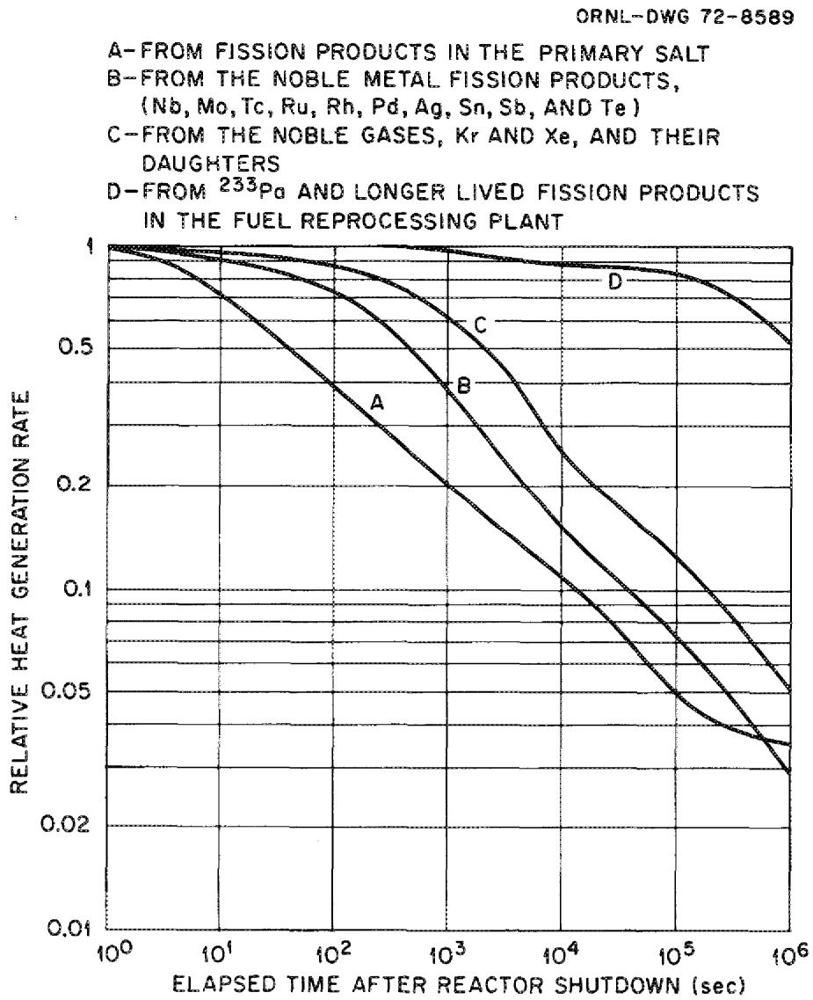  
Fig. 14.1. Time dependence of decay heat sources in a 1000 MW(e) MSBR plant.

respectively. The heat load in the drain tank begins to decrease immediately after such a shutdown. Heat production in the off-gas system decays more slowly and the heat production in the processing plant is little affected for several hours.

Under accident or other unusual circumstances the fuel salt is discharged to the drain tank for cooling. Discharge of salt from the primary system into the drain tank could begin at shutdown and be completed in about 7 minutes. At this time the heat production rate in the drain tank would be about $40\mathrm{MW}$ ; the temperature of the salt would rise to a maximum of $1400^{\circ}\mathrm{F}$ in a few hours and then fall to about $1000^{\circ}\mathrm{F}$ in a few days, where it would be maintained by control of the cooling.

Conditions in the off-gas system and in the reprocessing plant would not be affected significantly by draining the reactor, but the conditions in the reactor primary system would be markedly different. Draining of the fuel salt would remove the fluid that transports the decay heat from the graphite to the primary heat exchangers. If the secondary salt were drained from the heat exchangers at the same time, the preferred means for removing the heat from the decay of noble metal deposits on the heat exchanger tubes would also be removed.

Calculations have shown that the components and piping in the primary system could be designed to be cooled adequately by providing a system that would maintain the cells walls at $1000^{\circ}\mathrm{F}$ . Heat would be transferred by radiation and conduction within the components and would be radiated to the cell walls. The temperature at the center of the graphite core in the reactor vessel of the reference design was estimated to reach a maximum of $1900^{\circ}\mathrm{F}$ after 14 hours, but the vessel walls would not exceed $1400^{\circ}\mathrm{F}$ . With some modifications of the current reference design, the center tubes of the primary heat exchangers would not exceed $2000^{\circ}\mathrm{F}$ , and the outer shell would not exceed $1400^{\circ}\mathrm{F}$ . These temperatures are believed to be acceptable for the few times that a drain at shutdown would be expected to occur in an MSBR. Delaying the drain by 24 hours and cooling the plant to $1050^{\circ}\mathrm{F}$ during that time would reduce the decay heat rates by a factor of about 10 and would substantially reduce the temperature rise.

# Interaction of Materials

According to the preceding sections, the integrity of the salt containment is not seriously threatened by either nuclear power excursions or afterheat. In this section, we consider threats from (a) normal system corrosion and (b) possible pressurization and enhanced attack resulting from a small leak between coolant and fuel salt or between steam and coolant salt.

Corrosion. - Hastelloy N is corroded by MSBR fuel salt under normal conditions by reactions of the type

$$
2 \mathrm {U F} _ {4} + \mathrm {M} ^ {0} \rightleftharpoons 2 \mathrm {U F} _ {3} + \mathrm {M F} _ {2}
$$

The ratio $\mathrm{UF}_3 / \mathrm{UF}_4$ in the fuel salt is maintained at a value such that equilibrium is reached with concentrations of $\mathrm{Ni}^{2+}$ , $\mathrm{Fe}^{2+}$ , and $\mathrm{Mo}^{3+}$ in the salt that are much less than 1 ppm and a chromium concentration less than one hundred ppm. The predominant corrosion reaction then is reaction of $\mathrm{UF}_4$ with chromium in the metal to form $\mathrm{CrF}_2$ which dissolves in the salt. Chromium becomes depleted near the surface and after the first few thousand hours corrosion is limited by the rate of diffusion of chromium to the surface. At MSBR temperatures this limit is on the order of 0.1 mil/year of chromium depletion.

Introduction of moisture and air into the fuel system produces HF and metal oxides, which dissolve in the salt and make it more oxidizing and more corrosive to all constituents of Hastelloy N. During normal operation the contaminants can be kept low by controlling the composition of the cover gas. Maintenance operations will almost inevitably introduce some moisture, but with reasonable precautions to minimize air inleakage, corrosion from this cause will have negligible effect on containment. (Corrosion in the MSRE fuel system which was opened two or three times a year, averaged only 0.1 mil/year [5, pp. 71-79].)

A phenomenon that presumably would affect Hastelloy N in the fuel system of the reference MSBR is the intergranular attack and cracking observed on surfaces exposed to the MSRE fuel salt. As discussed at length in Chapter 7, the cause appears to be fission-product tellurium, but the existing information does not permit a reliable prediction of behavior over many years and numerous stress cycles. Some indication of the seriousness is the observed effect on the MSRE heat exchanger tubes after 24,500 hours at high temperature following the beginning of power operation (and fission-product deposition). Surfaces exposed to fuel had cracks at almost every grain boundary, to an average depth of 5 mils after being strained. If the depth of the intergranular attack continued to increase with the one-fourth power of time at temperature (as theory suggests is reasonable), the average crack depth after 30 years $(2.6 \times 10^{5}$ hours) would be only 9 mils. This depth of cracking in the reference MSBR would have only insignificant effect on the strength of the reactor vessel and piping. On the other hand, if the attack proceeds much more rapidly, as is conceivable, it could seriously affect the reliability of the fuel containment.* It is clear that safety considerations require that these questions be favorably and conclusively resolved. Possibilities are discussed later in this chapter.

Coolant Salt Interactions. - The eutectic of $\mathrm{NaBF}_4$ - NaF (92-8 mole %) was chosen as the secondary salt in the reference MSBR because it has reasonably good coolant properties, it is relatively inexpensive, and its melting point $(725^{\circ}\mathrm{F})$ is low compared to that of other suitable fluoride mixtures. From the safety standpoint it is important that mixing of fuel

and coolant salt, spillage of coolant salt into the containment cells, and leakage of steam into coolant salt should not give rise to situations that would endanger the health and safety of the public or of the operators of the plant.

The only credible event that would produce mixing of fuel and coolant salts is a leak in a primary heat exchanger. The largest likely leak is believed to result from the rupture of one tube in one of the heat ex-changers. Depending on the location of the rupture, coolant salt would enter the fuel salt in the primary system at an initial rate in the range of 0 to 3.5 lb/sec and fuel salt would enter the coolant salt at a rate in the range of 1.0 to 7.4 lb/sec. That the leak existed would be signaled by rapid loss in reactivity of the reactor or fission product radio-activity in a secondary circuit or both. Upon either of these signals the reactor would be shut down rapidly, the fuel salt would be drained from the primary system into the fuel salt drain tank, and the coolant salt in the affected secondary circuit would be drained into a coolant salt drain tank.

The amount of mixing of fuel and coolant salts would vary widely, depending on the design of the plant and the course of the event. We estimate that as much as 450 ft³ of coolant salt could mix with 1700 ft³ of fuel salt in the primary system and 40 ft³ of fuel salt could mix with 2100 ft³ of coolant salt in a secondary circuit of the reference MSBR. No chemical reactions that would generate excessive heat or precipitate constituents of either salt would be expected to occur on mixing. Fuel salt and sodium fluoroborate are immiscible, however, so two salt phases would be present in both systems. Although the salts are immiscible, exchange occurs between the phases with lithium and beryllium fluorides entering the lighter fluoroborate phase and sodium fluoride and boron trifluoride moving into the fuel salt phase. Uranium and thorium fluorides remain in the heavy phase.

In the primary system the exchange of constituents between salts would have no significant effect on the melting point of the fuel salt. The melting point of the coolant salt dispersed in the fuel would increase somewhat, some $\mathrm{BF}_3$ would be released, and the $\mathrm{BF}_3$ overpressure in the primary system would be expected to rise to about 5 atm. In the secondary system the interaction between the fuel and coolant salts would tend to raise the liquidus temperature of the fuel-containing salt but would not significantly affect the coolant salt. Since much of the secondary system normally operates at a temperature below the liquidus of the fuel salt, the fuel salt that leaked into the secondary system would initially be dispersed as frozen particles throughout much of one circuit. Whether the particles remained as solids would depend on measures taken to heat or cool the secondary circuit after the coolant salt had been drained.

None of the conditions associated with mixing of fuel and coolant salts in the primary or secondary systems appear to be capable of producing a break in either system. The secondary circuits must be heavily shielded against the radioactivity present in the coolant salt during normal operation. This shielding can be made adequate to protect against the fission products that would be introduced by the fuel salt. Repairing or replacing the faulty heat exchanger, reclaiming the fuel salt,

and disposing of the contaminated coolant salt promise to be unpleasant operations. The chemical toxicity of the boron trifluoride precludes its indiscriminate release from the plant, but the presence of sodium fluoroborate does not otherwise affect the safety of those operations.

Sodium fluoroborate, if spilled into the reactor cell or into a secondary cell, must be contained. The salt contains radioactive sodium in a concentration of 0.6 Ci/ft³ and some tritium, and the sodium fluoride and boron trifluoride are both toxic chemicals. The containment creates no special problems, however, because the cells operate at temperatures below $1100^{\circ}\mathrm{F}$ at which temperature the $\mathrm{BF}_3$ pressure over the salt is only about 0.3 atm.

Water and steam react with sodium fluoroborate to produce primarily hydrogen fluoride and sodium hydroxyfluoroborate. The reactions are not destructively exothermic, but the hydrogen fluoride is corrosive to the metals of the reactor secondary system and the tubes that separate the fuel salt from the coolant salt. Although the corrosion rates are not catastrophic under any foreseeable circumstance, the leakage rate of water from the steam system into the secondary system and the hydrogen fluoride concentration in the secondary salt must be kept low in order to maintain a low corrosion rate of piping and equipment.

In the event of a rupture of one or more tubes in a steam generator or superheater, the rapid pressurization of the secondary system and the possibility of transmitting that pressure to the primary system is the major concern. Isolation valves must be provided to stop the flow of feedwater and steam to the faulty steam generating equipment and pressure relief devices must be provided on the secondary system to keep the pressure below the system design pressure. The steam and salt that are discharged through these devices must be contained. The affected secondary system must be purged of hydrogen fluoride and moisture and the contaminated salt must be purified or replaced while repairs are made on the steam generator before operation of the plant can be resumed.

The use of a chemically reactive coolant in the secondary system of the MSBR introduces some problems in designing the plant for upset conditions. The interactions of the coolant with the materials, with fluids in contiguous reactor systems, and with the cell atmospheres, however, do not appear to be so vigorous or the reaction products so aggressive as to create major safety concerns.

# Engineered Safety Features

The basic function of the engineered safety features in a maltensalt reactor plant is the same as in any nuclear plant -- to prevent any uncontrolled release of radioactivity under accident conditions. The detailed requirements are unusual, however, because of the nature of the fuel - liquid, but practically nonvolatile and not highly reactive with air or water.

Previous discussion has indicated that abnormal conditions within the primary system of a molten-salt reactor -- nuclear excursions and uncontrolled fission product heating -- do not pose major threats to its integrity. Of the conditions considered, only the prevention of pressure

excursions that could be initiated by large leaks between the steam and secondary salt systems require the implementation of specialized safety devices to protect the primary system boundary. These devices must insure that the secondary salt system is reliably and effectively vented in the event of a steam generator failure.

Despite the low probability of a breach of the primary system boundary, the consequences of such a failure must be considered. Because the fuel is in liquid form, any primary-system rupture releases large quantities of radioactive material into the immediate surroundings. To prevent the dispersion of that activity throughout the reactor building, the components of the fuel system are enclosed within a primary containment system of sealed cells from which water is excluded. The systematic exclusion of water guards against the generation of large volumes of steam from the sensible heat of the fuel salt and thus limits the increases in primary containment pressure to small values even for major salt spills. A secondary containment system that encloses the equipment cells provides additional protection against the release of radioactivity to the environment.

The most unusual of the engineered safety features in the MSBR is the provision for dealing with afterheat under accident conditions - the heat source is led to the cooling instead of vice versa (as in the ECCS for a light-water-cooled reactor). As described elsewhere, the bulk of the fission products stay in the fuel salt, making shutdown cooling for the fuel salt essential for prevention of excessive temperatures. The ultimate cooling system is in the drain tank, so the reactor and contain-ment are designed so that the fuel will get to that tank under any credible accident conditions. The heat removal system is simple, rugged, always operating (being used to remove heat from off-gas sources), and can continue to operate without electric power and unattended to cool the fuel as long as necessary in the design basis accident.

In connection with the afterheat removal, it is worth noting that problems associated with it are much less intense in an MSBR because the major source is inseparably associated with a very large mass of salt. (The ratio of heat source at shutdown to heat capacity in the MSBR fuel salt is only about one-tenth of the ratio in the dry core of an LWR.) Because the heat source is so dilute, the "China syndrome" does not appear to be a serious problem in an MSBR.

# Siting Considerations

Because an MSBR plant is different in so many ways from present-day power reactors, the question of siting requires penetrating analysis. We shall begin by making some comparisons to elucidate differences that are pertinent to siting considerations.

An immediately obvious difference between MSBR power plants and others is that the former includes both a reactor and a chemical-processing facility. Current federal regulations on radioactivity discharges are different for reactors and for fuel reprocessing facilities. Perhaps by the time an MSBR is built, they will be the same, or

regulations may have been developed for "power parks" that include reactors and a reprocessing plant. For now, the only question that can be well defined is whether or not an MSBR plant, similar to the reference design, can meet the guidelines and restrictions on siting that now apply to commercial power reactors. We shall address this question in the course of the following discussion.

Factors affecting the siting of a reactor include:

1. transportation requirements during construction,   
2. transportation of fuel, etc., to site during operation,   
3. transportation of fuel and wastes from site during operation,   
4. discharge of materials and heat to the environment during normal operation,   
5. consequences of credible accidents (inventories of fission products and actinides, fractions likely to be released, etc.), and   
6. disposal of materials after decommissioning.

We shall consider each of these in turn.

Transportation During Construction. - The largest components of an MSBR are the reactor vessel (23-feet diameter $\times$ 33 feet high, 155T), the somewhat smaller drain tanks, and the primary heat exchangers (6-ft diameter $\times$ 24 ft long, 53 T). These are similar in size to items in a 1000-MW(e) light-water reactor and pose similar transportation problems.

Transportation During Operation. - The flow of materials into and out of a 1000-MW(e) MSBR plant are as shown in Fig. 14.2. (Graphite shipments are expressed as average rates, equivalent to replacement of the 176 T of graphite in the core at 4-year intervals.) Plant inputs pose no problems of transportation. Because of the on-site processing and decay of high-level wastes, the amount of intensely radioactive material shipped out of an MSBR plant each year is far less than that leaving any other reactor station of comparable electric capacity. Instead of short-cooled fuel elements, there are separated fission products that have decayed for years: high-level wastes from processing are accumulated in tanks for 4-5 years, then stored on site for nine more years before shipment. The volume and radioactivity of these wastes are about the same as those of high-level waste and cladding hulls that are ultimately shipped from a reprocessing plant serving a 1000 MW(e) LMFBR [6]. Krypton-85 and tritium will be stored and shipped in 1.5-ft³ cylinders at 1000 psi -- seven per year. The reference-design MSBR provides for accumulation within the reactor building of all the graphite removed from the reactor over the life of the plant. Thus, it can be packaged and disposed of on a convenient schedule, possibly as part of the decommissioning program.

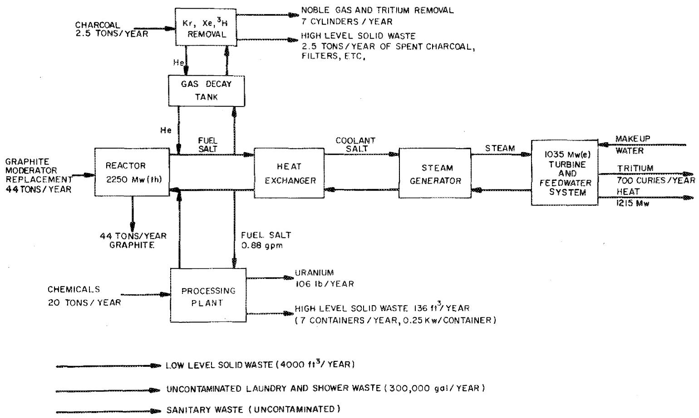  
Fig. 14.2. Materials flow diagram for a 1000-MW(e) MSBR unit.

ORNL DWG 72-6895

Effluents.- Practically the only radioactive effluent, either gaseous or liquid, from an MSBR plant is the tritium that reaches the steam system. In the reference design, where 790 Ci/day is released in a 560,000 gal/min stream of cooling water, the effluent concentration $(0.26 \times 10^{-3} \mu \mathrm{Ci} / \mathrm{ml})$ is a factor of 12 below the current 10 CFR 20 limit on releases to unrestricted areas [7]. On the other hand, it is a factor of 52 greater than the AEC's numerical guidelines for effluents from light-water-cooled reactors [4].

As described later, there appear to be ways of limiting effluent tritium to about the same as the LWR guidelines. In this case, tritium will pose no unusual siting requirements on the MSBR.

Site requirements connected with the discharge of waste heat are the same for an MSBR as for a modern fossil-fueled plant of equal electrical output and less demanding than for current power reactors.

Radionuclide Inventory. - As a result of the on-site processing facility and the attendant storage of separated fission products, the inventory of radioactive isotopes expected to be present at an MSBR site is considerably greater than that present in other nuclear power plants of comparable size. However, most of the fission products will be present not in the reactor but in isolated, protected waste storage tanks in the form of relatively stable fluoride salts. The inventory of radioisotopes in the reactor will be considerably lower than in other reactor types as a result of the continuous processing of the salt. The maximum inventories of several radionuclides expected to be present in the fuel salt and processing plant of a 1000-MW(e) MSBR are listed in Table 14.3. Inventories found in a PWR and LMFBR of comparable size are shown for comparison. The MSBR inventories are given just prior to shipment of high level waste to a federal repository while the PWR and LMFBR inventories are given just prior to refueling.

Design-Basis Accident. - In the MSBR, the design-basis accident is a rupture of one of the main fuel circulating lines that occurs while the reactor is at full power and quickly spills the entire charge of molten fuel. The primary containment is designed to prevent any release of radioactivity into the reactor building or environs in this event. Consideration of the fuel salt chemistry, the intensity of afterheat sources, and the dependability of the drain-tank cooling system support the conclusion that this objective is attainable. Thus the design-basis accident should not affect the health and safety of the public.

Decommissioning. - Presumably at the end of plant life the radioactive equipment and materials in the reactor and processing systems must be removed to some ultimate disposal facility.

There will be 1700 ft³ of highly radioactive fuel salt, 8400 ft³ of coolant salt, 175 ft³ of Pa decay salt, 60 ft³ of bismuth, and 20 ft³ of lithium chloride, all radioactive. There will also be several hundred

Table 14.3. Comparison of maximum radionuclide inventories in 1000-MW(e) MSBR, PWR, and LMFBR power stations   

<table><tr><td rowspan="3">Nuclide</td><td colspan="4">Inventory (curies)</td></tr><tr><td colspan="2">MSBRa</td><td rowspan="2">PWRb</td><td rowspan="2">LMFBRc</td></tr><tr><td>Reactor</td><td>Processing plant</td></tr><tr><td>85Kr</td><td>1.25</td><td>2.8 × 106</td><td>6.4 × 105</td><td>3.2 × 105</td></tr><tr><td>90Sr</td><td>1.2 × 105</td><td>2.9 × 107</td><td>4.3 × 105</td><td>1.3 × 106</td></tr><tr><td>131I</td><td>2.4 × 107</td><td>3.5 × 107</td><td>7.2 × 107</td><td>8.2 × 107</td></tr><tr><td>133I</td><td>9.7 × 107</td><td>1.5 × 107</td><td>1.3 × 108</td><td>1.2 × 108</td></tr><tr><td>133Xe</td><td>7.0 × 103</td><td>1.1 × 108</td><td>1.3 × 108</td><td>1.5 × 108</td></tr><tr><td>233Pa</td><td>4.2 × 108</td><td>1.6 × 109</td><td></td><td></td></tr><tr><td>239Np</td><td></td><td></td><td>1.6 × 109</td><td>3.2 × 109</td></tr><tr><td>238Pu</td><td>3.6 × 103</td><td>2.6 × 105</td><td>2.0 × 105</td><td>7.1 × 105</td></tr><tr><td>239Pu</td><td>0.2</td><td>11</td><td>2.3 × 104</td><td>1.4 × 105</td></tr><tr><td>240Pu</td><td>0.02</td><td>1.2</td><td>3.3 × 104</td><td>1.7 × 105</td></tr><tr><td>241Pu</td><td>0.45</td><td>33</td><td>7.1 × 106</td><td>2.3 × 107</td></tr><tr><td>241Am</td><td></td><td></td><td>1.1 × 104</td><td>4.0 × 104</td></tr><tr><td>243Am</td><td></td><td></td><td>1.2 × 103</td><td>1.3 × 103</td></tr><tr><td>242Cm</td><td></td><td></td><td>2.0 × 106</td><td>2.2 × 106</td></tr><tr><td>244Cm</td><td></td><td></td><td>1.6 × 105</td><td>3.1 × 104</td></tr></table>

${}^{a}$ Reference MSBR described in ORNL-4541 (June 1971).   
$b$ Siting of Fuel Reprocessing Plant and Waste Management Facilities, ORNL-4451 (July 1970).   
${}^{c}$ Aqueous Processing of LMFBR Fuels - Technical Assessment and Experimental Program Definition, ORNL-4436 (June 1970).

ft³ of NaK and about 3000 ft³(STP) of helium, with little or no radioactivity. The fuel salt, bismuth, and LiCl are sufficiently valuable that they will likely be recovered for reuse. The NaK would also be salvaged.

Possibly as much as 1200 tons of graphite may be in the reactor building at the time of decommissioning (the fixed graphite plus 6 replaceable core assemblies). This can all be broken down into pieces that can be conveniently shipped in shielded containers.

There will be many equipment items that are highly contaminated with fission products. The largest, such as the reactor vessel, the drain tank, and the primary heat exchangers, must be cut into pieces for transportation and disposal. This can presumably be done within the containment already provided within the MSBR building for use during maintenance. The pieces then should be as manageable as the most radioactive portions of other kinds of reactors upon decommissioning.

Thus it appears that disposal of an MSBR, while clearly a major undertaking, will be manageable within the technology needed for maintenance of the MSBR and disposal of other types of reactors.

Summary. - On the basis of the foregoing comparison it appears that there should be no major differences in the siting requirements for a fully developed MSBR and for other types of advanced power reactors.

# Experience and Knowledge

Reactor technology in general and the years of ANP and MSRP work in particular provide the information needed to answer nearly all of the questions that are important to molten-salt reactor safety. This section contains a brief review of the pertinent information that is in hand, with some discussion of its adequacy. The few important gaps that remain to be filled are noted in passing. The significance of uncertainties and the needs for further work are discussed in the next major section of this chapter.

# Containment

The ultimate reliance for protection of the public from an MSBR accident rests on the containment system that is in effect during operation. This system does not involve any untried construction techniques but it does have a major untried feature. The inner walls of the reactor cell and the fuel salt drain tank cell must be insulated and the cells must be heated and operated at temperatures above $1000^{\circ}\mathrm{F}$ . This feature is discussed in Chapter 9. As pointed out earlier in this chapter, the characteristics of MSBR fluids impose no severe problem with regard to pressurization or danger of chemical reactions. Therefore, MSBR cells and buildings can be mostly designed and built with the containment technology that has been thoroughly developed for other reactors.

In order to prevent troublesome releases of radioactivity to the environment during maintenance of contaminated equipment, it will be necessary to provide devices (such as the core-removal cask mentioned in Chapter 12) and closed ventilation systems. We have had experience along these lines but on a scale much smaller than will be involved with some of the larger reactor components, so larger, more elaborate equipment will have to be developed.

# Instrumentation and Control

The situation here can be summarized by simply saying that in our analyses of the consequences of nuclear excursions, we can assume that safety-rod action will occur when it is needed. This seems reasonable when one compares the relatively modest requirements of the MSBR for sensing and action with the capabilities of reliable safety systems on all kinds of reactors. The same conclusion is reached, after detailed consideration, in Chapter 10.

# Salt Handling

This is a more esoteric area, but even here there is much experience, both at ORNL and elsewhere.

At ORNL various fluoride salts, all of them toxic and some highly radioactive, have been handled safely in scores of experiments and in two molten-salt reactors. The requirements for salt handling around an MSBR do not pose problems that are different in kind. Some, such as protecting the salts from atmospheric contamination, are precisely the same. Others differ in degree. For example: because salt from an MSBR will be roughly 10 times as radioactive as that from the MSRE, shielding on sample carriers must be thicker, but otherwise the carriers can be essentially the same as those used at the MSRE. (The more intense radioactivity, coupled with the greater sizes of components, places more stringent requirements on containment during maintenance. This is discussed in Chapter 12.)

The high melting point of the salts and the volume changes in freezing and thawing impose requirements that might seem impractical to live with, were it not that our experiences with the ARE, the MSRE and many engineering experiments have proved the contrary. With reasonable care in design and procedures, freezing of MSBR salts should not detract from plant operability, reliability, and safety.

# Uranium Behavior

It is imperative from the standpoint of nuclear safety to be sure that dangerous amounts of fissile material are not hiding out in the fuel circulation system of a molten-salt reactor. In general, there is no assurance that one could detect gradual segregation of uranium in a reactor operating at high specific power for long periods of time.

Unavoidable uncertainties in the breeding ratio alone will be equivalent to perhaps one percent of the reactor fissile inventory per year, and uncertainties in long-term fission product poisoning further obscure reactivity evidence of fissile hideout. The reactivity balance should reveal significant segregation that occurs within a few days, and there might be other clues that would permit detection of gradual hideout, but the most dependable, safest course is to preclude the possibility. This means (a) using a salt mixture whose behavior is thoroughly known, and (b) operating the plant so as to steer well clear of any condition that could result in segregation of uranium (or plutonium).

The phase relations in pure LiF-BeF $_2$ -ThF $_4$ -UF $_4$ -UF $_3$ mixtures are quite accurately known. Conceivable variations of the fluoride ratios in MSBR fuel from the nominal composition do not approach any region of fuel segregation. Oxide behavior is also well known, but here there is less latitude. Introduction of oxygen into MSBR fuel would result in precipitation of a uranium-rich mixed oxide (ThO $_2$ -UO $_2$ ) when the oxide ion concentration reaches somewhere between 30 and 150 ppm (see Fig. 5.4). The concentration in an operating MSBR must be kept below about 30 ppm, and there is good reason to believe that it can be. The ingress of oxygen can be limited, as shown by MSRE experience, to rates and amounts that could easily be removed by the MSBR processing system. In any event it will be necessary to verify that the oxide concentration in the fuel is safely low by frequent, accurate measurements. Techniques for oxide analyses that are currently available are not adequate for the MSBR needs.

# Fission-Product Behavior

The general behavior of fission products in molten-salt systems has been largely established by a variety of independent studies and by analyses of the MSRE performance, both during and after its operation. The details of that behavior were described in Chapter 5, but there are some aspects that are of particular interest with regard to nuclear safety. As expected, the noble-gas fission products (xenon and krypton) were readily removed from the circulating fluid and transported to the off-gas system. Although there was significant transport of these materials to the unsealed graphite used in the MSRE, a factor of 6 reduction in xenon poisoning was achieved with a simple gas-stripping system. Once removed, these gases could be effectively and predictably handled in the off-gas treatment facility. Post-shutdown release of gases previously held up on the graphite may, however, be a radiological safety consideration in primary system of an MSBR.

In the MSRE, at least some of the noble-gas daughters formed in the off-gas system were carried along by the gas stream, and large quantities were accumulated in the particle traps upstream of the charcoal beds. Since the off-gas had no further exposure to the fuel salt, no information was obtained with respect to redissolution in the salt, which could be important in the MSBR drain tank.

The fission products that, from thermodynamic considerations, were expected to remain dissolved in the fuel salt were shown in the MSRE to behave as expected. Among the species of particular interest from a

radiological safety standpoint, both iodine and strontium showed no tendency to escape from the salt. Some iodine did appear in the gas in the reactor loop after salt drains, due to decay of precursors that had been deposited on system surfaces. Again, special steps will be required during some stages of post-shutdown operations of an MSBR to prevent the release of iodine formed in this way.

Many of the noble-metal fission products were found on surfaces in the MSRE. If the apparent sticking coefficient of noble metal atoms to metal surfaces is taken as 1.0, then data from the MSRE indicate that the apparent sticking coefficient to graphite was 0.5-1.0 and to gas bubbles was $< 0.1$ . It is not clear whether the sticking coefficient to the bubbles was low because the metal particles did not remain on the interfaces as the bubbles circulated in the primary system or because the metal particles, after being released in the pump bowl by the bubbles, were resuspended in the liquid and returned to the primary system. This lack of conclusive data on noble-metal behavior led to the range of distributions projected for the MSBR. Unless data are obtained from other sources to permit better definition of the distribution, the next molten-salt reactor will have to be designed to deal with a substantial range of noble-metal distributions. The principal safety consideration with these materials and their daughters is ensuring that the heat produced by their decay does not adversely affect the integrity of the primary system components on which they are deposited. Prevention of their release during maintenance operations, such as cutting and welding, must also be provided for.

# Kinetic Behavior

The kinetic response of the reactor plant to all sizes and varieties of perturbations must be evaluated to demonstrate safety in the presence of large perturbations and stability in the presence of smaller, more frequent disturbances. The preliminary analyses discussed earlier suggest that all credible reactivity disturbances are readily manageable, but no comprehensive safety analysis has yet been carried out for a large MSBR. Preliminary studies of the frequency response characteristics of the reference design, using a detailed analytical model indicate that the reactor system is inherently stable at all power levels and all perturbation frequencies. As discussed in Chapter 4, basic considerations and the experimental confirmation of the predicted dynamic stability of the MSRE indicate that the data and the calculational techniques that are available can be expected to adequately predict the characteristics of molten-salt reactors.

# Further Work

The preceding sections of this chapter have identified the areas of greatest significance to MSBR safety and environmental effects and have indicated the technology that already exists in each area. Now we come to that which remains to be done. Obviously much more detailed studies

must be made and appropriate criteria must be developed by which MSBR safety can be measured before molten-salt reactors are accorded the degree of confidence now enjoyed by light-water-cooled reactors.

More information is required on the behavior of fuel salt boiling in contact with graphite at temperatures to $3000^{\circ}\mathrm{F}$ . Theoretical considerations and the few data that have been obtained indicate that there will be no significant interaction but this must be confirmed in tests of longer duration. Considerable information is available on the volatility of fission products in fuel salt at high temperature but additional data are needed that are more directly related to the conditions of a design basis accident. At high temperature, most of the iodine released by the decay of tellurium deposits on surfaces and would be expected to react rapidly with the metals in the reactor system and be retained there. Experience with the MSRE gives no clues concerning the distribution of the iodine between the metal and a gas over the metal. Data are needed for a variety of conditions so that a good analysis can be made of the behavior to be expected of this iodine under accident conditions and during maintenance of the reactor.

An area in which modifications in the reference design are certainly needed and essential information is lacking is tritium containment. The remainder of this section is therefore devoted to this topic.

The amount of tritium that could reach the steam system of the reference-design MSBR has been estimated to be about 1/3 of the 2420 Ci/day production rate in the fuel. Modification of the steam system and its operation to retain that amount of tritium would be impractical. So would be attempts to separate the tritium from the normal hydrogen in the steam. Clearly means must be provided to limit the tritium that reaches the steam to an amount that can be discharged safely to the plant environs with the cooling water from the turbine condenser. At least 10 Ci/day of tritium could be released to a river (or to the atmosphere) in the condenser cooling water from a 1000-MW(e) plant and still be within the guidelines of the proposed Appendix I to 10 CFR Part 50 "as low as practicable" criterion for light water reactors. A tentative design objective for the MSBR is to limit the tritium release to about 2 Ci/day or $0.1\%$ of the production. (This is the rate shown in Fig. 14.2.)

Several modifications in the design or operation of the reference plant, separately or in combination, have the potential for drastically reducing the amount of tritium that escapes into the steam system and in some instances into the reactor and coolant-system cells. These modifications involve adding hydrogen to the fuel salt, reducing the permeability of the metal walls, substituting side-stream contacting of salt and gas for injection of gas bubbles into the primary and secondary systems, exchanging tritium for hydrogen in hydrogenous compounds or reacting it with oxide in the coolant salt, and using other fluids to couple the primary system to the steam generators. Several possibilities are discussed in the following paragraphs.

We have inferred from some of the calculations that the effective permeability of the metal in contact with air in the MSRE might have been only 1/1000 of the permeability of unoxidized metal. Oxide films on metal surfaces have been found at ORNL and by other investigators

to reduce the hydrogen permeability of the metals by a factor of 10 to 1000. An oxide film would be expected to form in steam on some metals that could be used for the tubes in the steam generators and superheaters. Even a 1000-fold reduction in permeability of the steam generator tubes would not be sufficient by itself to reduce the tritium reaching the steam system to 10 Ci/day or less in an MSBR. If, however, hydrogen were added to the fuel salt at a rate $10^{4}$ or $10^{5}$ times the rate of production of tritium, then the corresponding calculated flows of tritium into the steam system are 5 Ci/day and $<2$ Ci/day (the limit of precision of the calculation), respectively.

The rate of removal of tritium from the fuel and coolant salts can be increased by contacting side streams of the salts with large flows of purge gas in packed columns, spray towers, or other types of contactors. With side-stream contacting of 10,000 gal/min each of fuel salt (15% of the flow in the primary system) and coolant salt, addition of hydrogen is effective with a 100-fold reduction in the permeability of the metal. Tungsten is compatible with fluoride salts, and a 100-fold reduction in permeability could be obtained with a sound 0.1-mm coating on the interior surfaces of the primary and secondary systems. Coating the entire reactor systems might be impractical, but the amount of tritium reaching the steam system could be reduced to $<2$ Ci/day for $\mathrm{H}_2 / \mathrm{T}_2 = 10^5$ by coating only the tubes in the primary heat exchangers and in the steam generators. The oxide film on the steam side might suffice as the coating on the steam generator tubes.

Tritium exists as the element and as tritium fluoride in the fuel salt. The fraction present as the fluoride increases rapidly as the salt is made more oxidizing by decreasing the concentration ratio $\mathrm{UF_3 / UF_4}$ . Side-stream contacting makes possible the use of larger flows of purge gas than does the bubble-injection system and the stripping of tritium fluoride to lower concentrations in the primary salt. If $\mathrm{UF_3 / UF_4}$ in the fuel salt is reduced from 0.01 to 0.001, practically all the tritium can be discharged into the primary-system off-gas as tritium fluoride. The feasibility of removing tritium as the fluoride depends on the rate of reaction of tritium fluoride with the metal surfaces being low at the low concentrations of tritium fluoride in the salt.

No other manipulations in the primary system seem likely to have much effect on the tritium distribution, but the secondary system offers several additional possibilities. The sodium fluoroborate coolant salt proposed for use in the secondary system seems to contain large amounts of oxide and small amounts of a hydroxyl compound without being excessively corrosive. Experiments indicate that deuterium, on entering the fluoroborate, reacts with the oxide in the compound and is retained by the salt. Tritium would be expected to behave similarly. In the reactor the salt would be processed as necessary to remove the tritium. Some calculations indicate that a reduction of 10 to 100 in the permeability of the steam generator tubes might be necessary to make this process economical.

Sorption of tritium by the graphite in the reactor core is helpful but not sufficient to prevent the release of excessive amounts to the steam system. However, sorption of tritium on carbon offers promise for removing tritium from the secondary system.

With more drastic changes in plant design, helium containing small amounts of oxygen and water vapor could be used as the coolant in the secondary system. Tritium, on diffusing into the helium, would be oxidized to water and prevented from passing into the steam. Objection to the use of helium in the secondary system is found in the high pressure, the larger primary heat-exchanger surface, and the larger fuel-salt inventory that would be required. These objections might be circumvented by employing the helium in the annuli of dual-wall tubes in the steam generators at the expense of larger and more complicated steam generators.

Use of the nitrate-nitrite salt mixture, generally known as HTS or Hitec, in the secondary system would also keep tritium out of the steam. Tritium entering this salt would be oxidized to water, and the water would be vaporized into the purge gas at high temperature. Thermal instability above $1100^{\circ}\mathrm{F}$ and reactions with graphite if it were to leak into the primary system are objectionable features of this salt. These difficulties could be circumvented by use of the salt in a circulating system between the reactor secondary system and the steam generators.

In view of all the possibilities, it seems certain that the escape of tritium into the steam can be limited to acceptable amounts. The tritium problem is not completely solved, however, until methods are specified for confining the tritium that is removed from the reactor systems and the cell atmosphere and this has not yet received much attention. Most of the tritium is likely to be extracted as water or tritium fluoride. The water could be stored in tanks and the tritium fluoride could be sorbed on sodium fluoride beds, or those compounds might be decomposed and the tritium converted to a solid hydride for storage. In any event, excessive dilution by hydrogen must be prevented. A production rate of 2420 Ci/day is equivalent to a trivial $0.8 \, \text{ml/day}$ of $\mathbf{T}_2\mathbf{O}$ . The volume of water resulting from a dilution of $10^4$ with hydrogen would be of little consequence, but, if the dilution were $10^6$ , $8000 \, \text{m}^3$ of tritiated water would be produced during the life of the plant. Safe storage for such a large volume would be expensive, and means probably would have to be provided for concentrating the tritium.

Although there is experience with tritium in the MSRE, analysis of its behavior in large molten-salt reactors requires more detailed information. Some extrapolations of data from the literature can be made, and a program is in progress to obtain confirmatory data. The program includes measurements of (1) the solubility of hydrogen in salts; (2) the permeability of metals and oxide coatings at low partial pressures of hydrogen; (3) the capacities of graphite and of potential coolants to retain hydrogen and tritium under simulated reactor conditions; and (4) reaction rates of hydrogen fluoride in low concentrations in salts with metals. Investigation of methods for separating tritium compounds from process streams and from cell atmospheres and for storing the tritium safely and economically while it decays will be included later.

# Evaluation

Waste heat from a high-temperature MSBR power plant is as low as from the most modern steam plants. The plant can be designed so that there is practically no radioactivity other than tritium in the plant effluents. No shipments of short-cooled fuel leave the plant; instead, fission products are shipped as concentrated high-level waste after several years' decay, while other wastes (such as core graphite and charcoal) are accumulated on-site to be disposed of at any convenient time.

Tritium is a special problem because of its high rate of production in the fuel salt and because it readily diffuses through metals at MSBR temperatures. In the reference MSBR, with no special measures for blocking tritium diffusion, about 790 Ci/day (33% of production) would reach the steam system. Several modifications in design and operation have the potential for drastically reducing tritium escape by this route. The objective of limiting tritium release to within present AEC guidelines for light-water-cooled reactors appears attainable, but the best measures are yet to be chosen and demonstrated.

The situation with regard to nuclear safety and afterheat is unique. The very limited excess reactivity and potential for reactivity increases in an MSBR, coupled with favorable dynamic characteristics, make damaging nuclear excursions highly unlikely. Afterheat problems are not intense because the bulk of the fission products are incorporated in a large mass of fuel salt. Furthermore, this heat source can be gotten into a reliably cooled situation (the drain tank) under any accident condition. Radio-nuclide heat sources in the processing plant, in the reactor off-gas system, and deposited on surfaces in the fuel system require cooling, but simple, reliable measures appear to suffice.

Although a breach of the fuel system is highly unlikely, the design-basis accident is taken to be a major rupture of a fuel line that quickly spills the entire fuel inventory. Containment of the radioactivity in this event is the chief safety consideration in an MSBR. This task is simplified because the actinides and the bulk of the fission products stay in the salt, the salt has an extremely low vapor pressure, and it is not highly reactive with moisture or air.

It appears from basic considerations that site requirements for an MSBR plant should eventually be no different from those for other reactors of like power. Because of the unusual nature of an MSBR, however, it will be necessary to begin with fundamental principles and develop criteria appropriate to this kind of reactor, then to perform a safety analysis comparable in depth to those for reactors now going into operation.

# References for Chapter 14

1. Conceptual Design Study of a Single-Fluid MSBR, ORNL-4541 (June 1971).   
2. W. L. Carter and E. L. Nicholson, Design and Cost Study of a Fluorination-Reduction Extraction-Metal Transfer Processing Plant for the MSBR, ORNL-TM-3579 (May 1972).   
3. R. B. Briggs, "Tritium in Molten-Salt Reactors," Reactor Technol. 14, 335-342 (Winter 1971-1972).   
4. Code of Federal Regulations, Title 10, Part 50, Appendix I.   
5. R. E. Thoma, Chemical Aspects of MSRE Operation, ORNL-4658 (December 1971).   
6. Environmental Statement - LMFBR Demonstration Plant, WASH-1509, p. 194 (April 1972).   
7. Code of Federal Regulations, Title 10, Part 20, Appendix B, Table II.