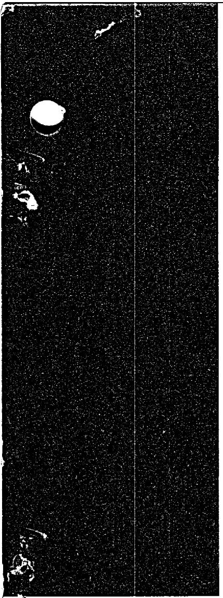

11-28-13

OK

# INTERGRANULAR CRACKING OF INOR-8 IN THE MSRE

H. E. McCoy

B. McNabb

THIS DOCUMENT CONFIRMED AS UNCLASSIFIED

DIVISION OF CLASSIFICATION

BY 9 Hkaii /amai

OBSERVATION OF THIS DOCUMENT IS UNLIMITED

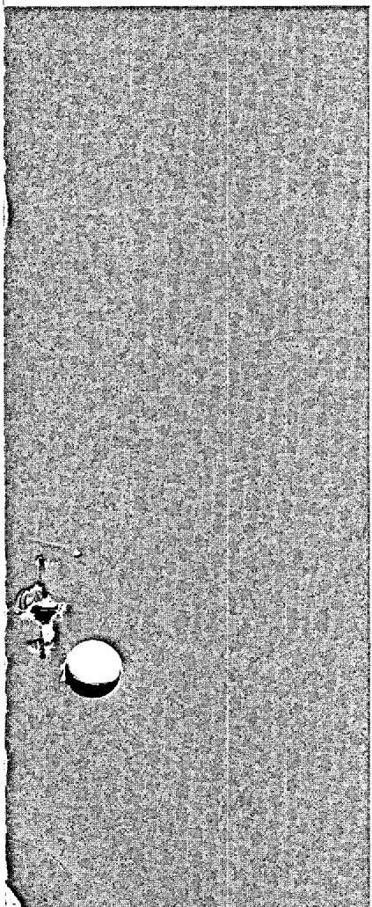

OAK RIDGE NATIONAL LABORATORY

OPERATED BY UNION CARBIDE CORPORATION • FOR THE U.S. ATOMIC ENERGY COMMISSION

Printed in the United States of America. Available from

National Technical Information Service

U.S. Department of Commerce

5285 Port Royal Road, Springfield, Virginia 22151

Price: Printed Copy $3.00; Microfiche$ 0.95

This report was prepared as an account of work sponsored by the United States Government. Neither the United States nor the United States Atomic Energy Commission, nor any of their employees, nor any of their contractors, subcontractors, or their employees, makes any warranty, express or implied, or assumes any legal liability or responsibility for the accuracy, completeness or usefulness of any information, apparatus, product or process disclosed, or represents that its use would not infringe privately owned rights.

ORNL-4829

UC-25 - Metals, Ceramics, and Materials

Contract No. W-7405-eng-26

METALS AND CERAMICS DIVISION

INTERGRANULAR CRACKING OF INOR-8 IN THE MSRE

H. E. McCoy and B. McNabb

# NOTICE

This report contains information of a preliminary nature and was prepared primarily for internal use at the originating installation. It is subject to revision or correction and therefore does not represent a final report. It is passed to the recipient in confidence and should not be abstracted or further disclosed without the approval of the originating installation or USAEC Technical Information Center, Oak Ridge, TN 37830

NOVEMBER 1972

OAK RIDGE NATIONAL LABORATORY

Oak Ridge, Tennessee 37830

operated by

UNION CARBIDE CORPORATION

for the

U.S. ATOMIC ENERGY COMMISSION

#

# CONTENTS

ABSTRACT 1

INTRODUCTION 2

THE MSRE AND ITS OPERATION 4

Description 4

History 9

EXAMINATION OF MSRE SURVEILLANCE SPECIMENS 14

Specimens Exposed Before Power Operation 17

First Group of Surveillance Specimens 19

Second Group of Surveillance Specimens 27

Third Group of Surveillance Specimens 34

Fourth Group of Surveillance Specimens 50

Specimens Exposed to Cell Atmosphere 79

Studies Related to Modified Surface Microstructure 79

Summary of Observations on Surveillance Specimens 83

EXAMINATION OF MSRE COMPONENTS 87

Control Rod Thimble 88

Primary Heat Exchanger 106

Pump Bowl Parts 118

Freeze Valve 105 137

EXAMINATION OF INOR-8 FROM IN-REACTOR LOOPS 138

Pump Loops 143

Thermal Convection Loop 145

Summary of Observations on In-Reactor Loops 149

CHEMICAL ANALYSES OF METAL REMOVED FROM THE MSRE 149

DISCUSSION OF OBSERVATIONS ON INOR-8 FROM THE

MSRE AND IN-REACTOR LOOPS 157

Summary of Observations 157

Possible Mechanisms 160

POST-MSRE STUDIES 165

Corrosion Experiments 165

Diffusion of Te 169

Experiments with an Applied Stress 169

SUMMARY 170

ACKNOWLEDGMENT 173

REFERENCES 174

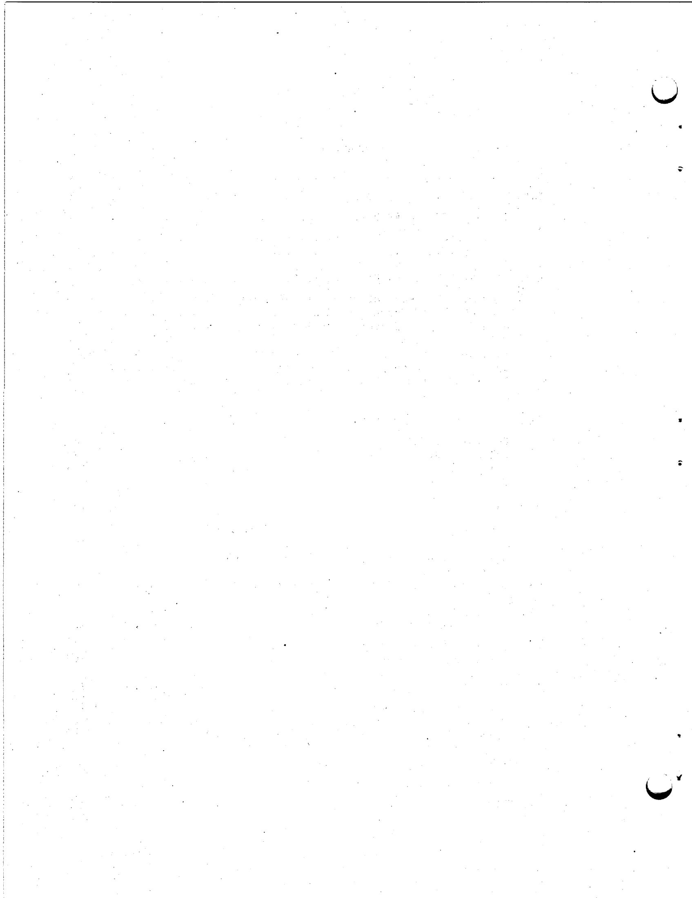

# ABSTRACT

The INOR-8 surveillance specimens and components from the MSRE that had been exposed to fuel salt formed shallow intergranular cracks (2 to 10 mils deep in exposures to greater than 20,000 hr). Some of these cracks were visible in polished sections of as-removed materials, but many others were visible after the samples had been deformed. Considerable evidence indicates that the cracks were due to the inward diffusion of fission products.

The fission product cracking mechanism was further substantiated by laboratory tests which clearly demonstrated that tellurium causes intergranular cracking in INOR-8. These tests have included other materials, and important variations exist in their respective susceptibilities to cracking by tellurium. Several materials, including types 300 and 400 stainless steels, nickel- and cobalt-base alloys containing greater than $15\%$ Cr, copper, monel, and INOR-8 containing $2\%$ Nb, completely resisted cracking in the tests run thus far.

# INTRODUCTION

The Molten-Salt Reactor Experiment was a unique fluid-fuel reactor. It operated at temperatures around $650^{\circ}\mathrm{C}$ for more than 20,000 hr between 1965 and December, 1969. The fuel was a mixture of fluoride salts, circulated through a core of graphite bars and an external heat exchanger. Except for the graphite, all parts contacting the salt were of a nickel-base alloy known as INOR-8 and now available commercially under the trade names of Hastelloy N and Allvac N. This alloy, developed at Oak Ridge National Laboratory specifically for use in fluoride salts at high temperature, $^{2}$ has the nominal composition of Ni-16% Mo-7% Cr-5% Fe-0.05% C.

INOR-8 in the MSRE behaved as expected with regard to corrosion by the fluoride salts and the containment atmosphere (very little by either). Two problems with INOR-8 did appear, however. The first was a drastic reduction in high-temperature creep-rupture life and fracture strain under creep conditions. The second was the appearance of grain-boundary cracks at INOR-8 surfaces exposed to the fuel salt.

Embrittlement phenomena have been studied extensively for the past several years in connection with various iron- and nickel-base alloys3 and specifically with regard to INOR-8 by ORNL. The embrittlement of INOR-8 in the MSRE has been attributed mainly to the helium that is generated by thermal neutron interaction with $^{10}\mathrm{B}$ present in the alloy as an impurity. We have found that small changes in chemical composition are quite effective in reducing the effects of helium production, and our work is well along toward developing a modified INOR-8 with improved resistance to embrittlement by neutron irradiation. This work has been reported extensively4-11 and will be discussed in this document only insofar as it relates to the finding and interpretation of evidence on the surface cracking problem.

The cause of the surface cracking has not yet been precisely defined, nor can its very long-term behavior be predicted with confidence. The cause must be associated with fuel system conditions after the beginning of power operation: numerous cracks or incipient cracks were found on

every INOR-8 surface that was examined after prolonged contact with the radioactive fuel salt; few or none could be found on INOR-8 surfaces (sometimes on the same piece) that had been exposed to the fluoride salt in the coolant system or to the containment cell atmosphere. The cracks were observed to open up when affected surfaces were strained in tension, but some grain boundary cracks were detectable in polished sections of unstrained specimens. The depth of cracking was 2 to 10 mils, and some sectioned specimens showed as many as 300 cracks per inch of edge. A general trend to more and deeper cracks with increasing exposure time was evident, but the statistical significance of the changes after the first several thousand hours was poor. Obviously the determination of cause and long-term progression is essential in the development of maltensalt reactors that must operate reliably for many years.

An intensive effort has been mounted within the Molten-Salt Reactor Program to investigate the INOR-8 cracking phenomenon and to develop remedies or ways to circumvent the problem. More or less similar effects can be produced in out-of-reactor experiments. Fluoride salts with added $\mathrm{FeF_2}$ oxidant cause inter-granular corrosion. Tellurium deposited on INOR-8 and allowed to diffuse at high temperature produces brittle grain boundaries. Tellurium also affects nickel and stainless steel, but to lesser degrees. However, some of the other agents that were suspected of causing the cracking in the MSRE fuel system have given negative results. This work is currently in progress, and few firm conclusions can yet be drawn.

The present document has been prepared to report and summarize all the currently known information obtained from the MSRE, which is the starting point of the investigation. It also includes pertinent observations from other molten-salt systems, brief accounts of current experiments, and some tentative conclusions.

# THE MSRE AND ITS OPERATION

A good, general description of the MSRE and an account of most of its history appear in reference 1. Reference 12 is a detailed description of all components and systems. Because these references are widely available, the description here is confined to those portions that are germane to the discussion of the INOR-8 cracking.

# Description

The parts of the MSRE with which we will be concerned are included in the simplified flowsheet in Fig. 1. The cracking phenomenon was observed on pieces of INOR-8 from the reactor vessel, the heat exchanger, the fuel pump and a freeze valve near fuel drain tank No. 2. INOR-8 specimens exposed to the containment cell atmosphere outside the reactor vessel and surfaces exposed to the coolant salt were examined but did not show the cracking.

The fuel salt composition was $\mathrm{LiF - BeF_2 - ZrF_4 - UF_4}$ (65-30-5-<1 mole $\%$ ); the coolant, $\mathrm{LiF - BeF_2}$ (66-34 mole $\%$ ). At full power the 1200-gpm fuel stream normally entered the reactor vessel at $632^{\circ}\mathrm{C}$ and left at $654^{\circ}\mathrm{C}$ ; the maximum outlet temperature at which the reactor operated for any substantial period of time was $663^{\circ}\mathrm{C}$ (1225°F). When the reactor was at low power, the salt systems were usually nearly isothermal at about $650^{\circ}\mathrm{C}$ . During extended shutdowns the salt was drained into tanks, where it was kept molten while the circulating loops were allowed to cool. Plugs of salt frozen in flattened sections of pipe ("freeze valves") were used to isolate the drain tanks from the loop. The liquidus temperature of the fuel salt was about $440^{\circ}\mathrm{C}$ and that of the coolant salt was $459^{\circ}\mathrm{C}$ , so the loops were heated to $600 - 650^{\circ}\mathrm{C}$ with external electric heaters before the salt was transferred from the storage tanks. Helium (sometimes argon) was the cover gas over the fuel and coolant salts.

During operation, samples of fuel salt were obtained by lowering small copper buckets (capsules) into the pool of salt in the pump bowl.

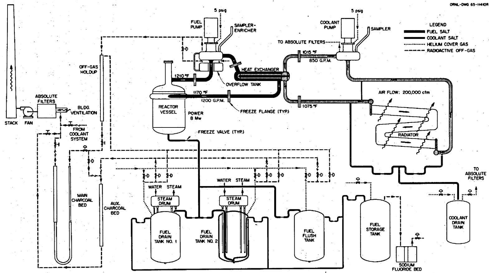  
Fig. 1. Design Flow Sheet of the MSRE.

The pump bowl served as the surge space for the loop and also for separation of gaseous fission products from a 50-gpm stream of salt sprayed out into the gas space above the salt pool. To protect the sample bucket from the salt spray in the pump bowl, a spiral baffle of INOR-8 extended from the top of the bowl down into the salt pool. A cage of INOR-8 rods inside the spiral baffle guided the sample capsule in the pump bowl.

The reactor core was composed of vertical graphite bars with flow passages between them. In the lattice near the center of the core three thimbles of INOR-8 housed control rods. Nearby, and accessible during shutdowns through a flanged nozzle, was an array of graphite and metal specimens, which was exposed to the fuel flowing up through the core. Throughout most of the MSRE operation the core array was as shown in Fig. 2. This array was designed to expose surveillance specimens of graphite and INOR-8 identical to the material used in the MSRE core and reactor vessel. Later, specimens of modified INOR-8 were included. The assembly was composed of three separable stringers designated RL, RR, and RS. Each stringer included a column of graphite specimens and two rods of INOR-8. (Stringer RS also included a flux monitor tube.)

Not shown in Fig. 1, but located in the reactor building, was a vessel in which specimen stringers identical to those in the core could be exposed to fluoride salt having the same nominal composition as the fuel salt. (The stringers in the control facility were designated CL, CR, and CS.) Electric heaters on the vessel were controlled to produce a temperature profile along the stringers like the profile in the core. The salt in this control facility did not circulate.

The fuel system was contained in a cell in which an atmosphere of nitrogen containing from 2 to $5\%$ 0 was maintained. This containment atmosphere was recirculated through a system that provided cooling for the control rods and the freeze valves. Arrays of INOR-8 specimens were exposed to the cell atmosphere as shown in Fig. 3. Suspended just outside the reactor vessel but inside the vessel furnace, the specimens were exposed to practically the same neutron flux and temperature as the vessel walls.

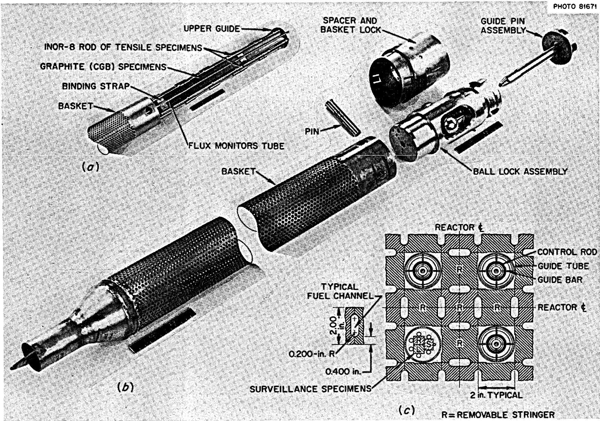  
Fig. 2. MSRE Surveillance Facility Inside Reactor Vessel.

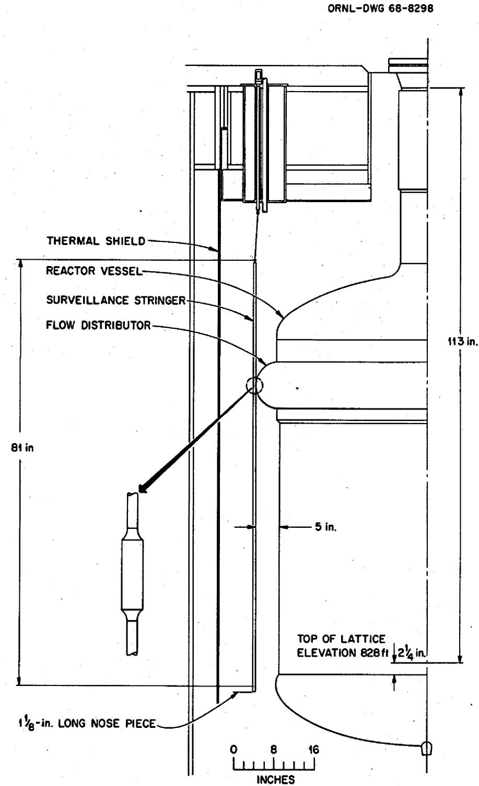  
Fig. 3. MSRE Surveillance Facility Outside the Reactor Vessel.

# History

The history of the MSRE during the four years in which it operated at significant power is outlined in Fig. 4. Construction had been finished and salt charged into the tanks late in 1964. Prenuclear testing, including 1100 hr of salt circulation, occupied January-May, 1965. During nuclear startup experiments in May-July, 1965, fuel salt was circulated for 800 hr. The salt was drained and final preparations for power operations were made in the fall of 1965. Low-power experiments in December led into the history covered in Fig. 4. (See ref. 1 and MSRP semiannual progress reports for more detail.) About a year after the conclusion of operation, a limited program of examination was carried out. This included INOR-8 pieces from a control rod thimble, the heat exchanger shell and tubes, the pump bowl cage and baffle, and a freeze valve.

The nuclear fuel was $33\%$ -enriched $^{235}\mathrm{U}$ , and the $\mathrm{UF_4}$ concentration in the fuel salt was 0.8 mole $\%$ until 1968. Then the uranium was removed by fluorination and $^{233}\mathrm{UF_4}$ was substituted. The $\mathrm{UF_4}$ concentration required with $^{233}\mathrm{U}$ was only 0.13 mole $\%$ . The composition of the fuel salt was observed by frequent sampling from the pump bowl.[13] Aside from the $^{233}\mathrm{U}$ loading and periodic additions of small increments of uranium or plutonium to sustain the nuclear reactivity, the only other additions to the fuel salt were more or less routine small ( $\sim 10\mathrm{g}$ ) quantities of beryllium, and, in two or three experiments, a few grams of zirconium and $\mathrm{FeF_2}$ . The purpose of these additions was to adjust the U(III)/U(IV) ratio, which affects the corrosion potential and the oxidation state of corrosion-product iron and nickel and fission-product niobium.

The primary corrosion mechanism in the fuel salt system was selective removal of chromium by

$$
2 \mathrm {U F} _ {4} + \operatorname {C r} (\text {i n a l l o y}) \rightleftharpoons 2 \mathrm {U F} _ {3} + \operatorname {C r F} _ {2} (\text {i n s a l t}),
$$

and the concentration of chromium in salt samples was the primary indicator of corrosion. Figure 5 shows chromium concentrations observed in

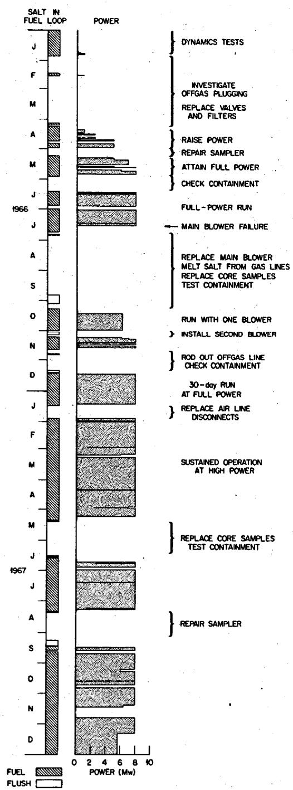

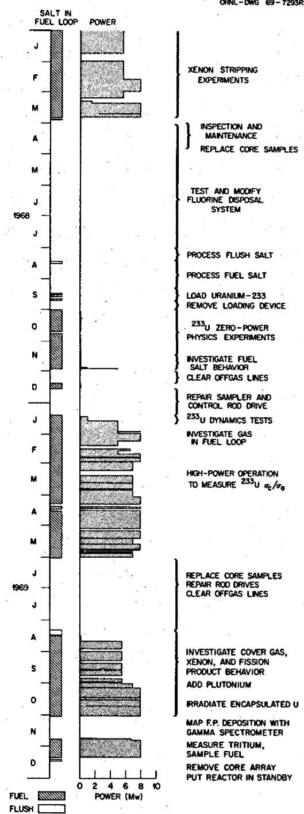  
Fig. 4. Outline of the Four Years of MSRE Power Operation.

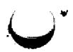

the MSRE fuel over the years of power operation. The step down in chromium concentration in the salt in 1968 was effected by processing the salt in 1968 was effected by processing the salt after the $^{235}\mathrm{U}$ fluorination. The total increase in chromium in the $4700\mathrm{-kg}$ charge of fuel salt is equivalent to leaching all of the chromium from the $852\mathrm{ft}^2$ of INOR-8 exposed to fuel salt to a depth of about 0.4 mil.

Throughout the operation of the MSRE a sample array of one kind or another was present in the core. The arrays that were exposed between September 1965 and June 1969 were of the design shown in Fig. 2. From the time of construction until August 1965 the specimen array in the core contained similar amounts of graphite and INOR-8 (to have the same nuclear reactivity effect) but differed in internal configuration. During the last five months of operation, an array designed to study the effects of salt velocity on fission product deposition $^{14}$ was exposed in the core.

Whenever a core specimen assembly of the type shown in Fig. 2 was removed from the core, it was taken to a hot cell, the stringers were taken out of the basket, and a new assembly was prepared, usually including one or two of the previously exposed stringers. Sometimes the old basket was reused, sometimes not. The history of exposure of INOR-8 specimens in this core facility is outlined in Fig. 6. The numbers indicate the heats of INOR-8 from which the rods in each stringer were made. Heats 5065, 5085, and 5081 were heats of standard INOR-8 used in fabrication of the MSRE.* The other heats were of modified composition designed to improve the resistance to neutron embrittlement.

Specimens exposed outside the reactor vessel were made of three of the heats that were also exposed in salt. Specimens of heats 5065 and 5085 were exposed from August 1965 to June 1967 and from August 1965 to May 1968; specimens of modified heat 67-504 were exposed from June 1967 to June 1969.

Table 1 lists the chemical compositions of the heats of standard INOR-8 that were used in the surveillance specimens and in various items that were examined after exposure to the fuel salt. The compositions of

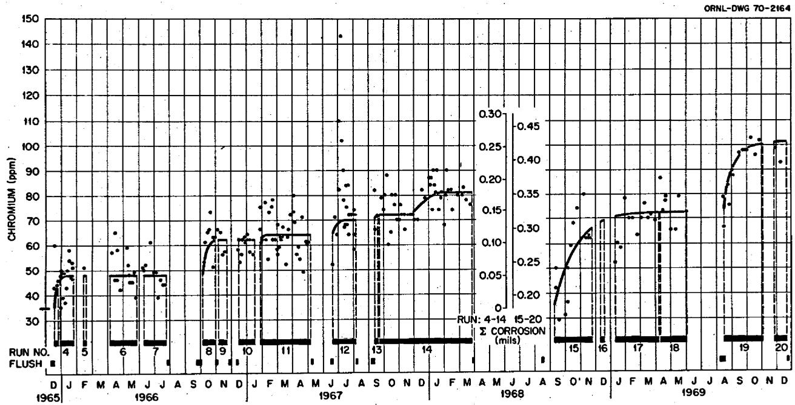  
Fig. 5. Corrosion of the MSRE Fuel Circuit in $^{235}\mathrm{U}$ and $^{233}\mathrm{U}$ Power Operations.

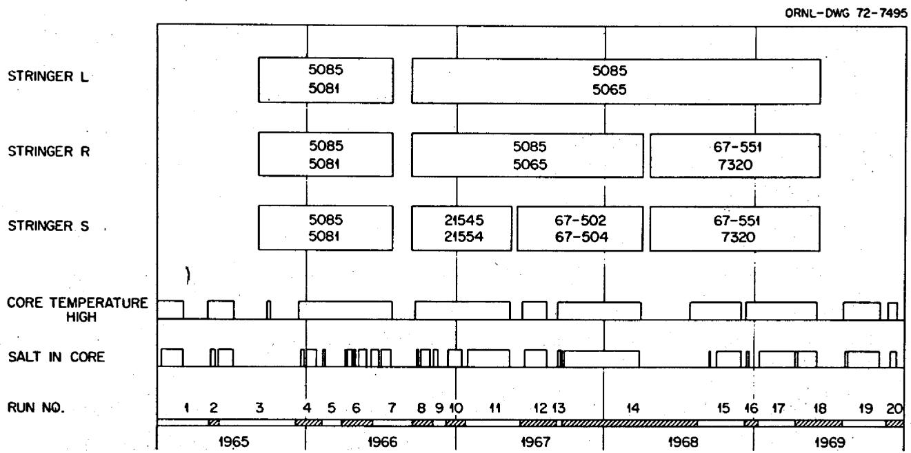  
Fig. 6. Outline of MSRE Core Surveillance Program.

Table 1. Heats of Standard INOR-8 Examined After Exposure in MSRE   

<table><tr><td rowspan="2">Heat</td><td rowspan="2">Specimens Exposed</td><td colspan="14">Content (wt %)</td><td></td></tr><tr><td>Mo</td><td>Cr</td><td>Fe</td><td>Mn</td><td>C</td><td>Si</td><td>S</td><td>P</td><td>Cu</td><td>Co</td><td>Al</td><td>V</td><td>Ti</td><td>W</td><td>B</td></tr><tr><td>5085a</td><td>Rods on L1, R1, L1, L2, R2, X1, X2</td><td>16.7</td><td>7.3</td><td>3.5</td><td>0.67</td><td>0.052</td><td>0.58</td><td>0.004</td><td>0.0043</td><td>0.01</td><td>0.15</td><td>0.02</td><td>0.20</td><td>&lt;0.01</td><td>0.07</td><td>0.0038</td></tr><tr><td>5081a</td><td>Rods on L1, R1, S1</td><td>16.0</td><td>7.1</td><td>3.5</td><td>0.65</td><td>0.059</td><td>0.52</td><td>0.002</td><td>0.012</td><td>0.01</td><td>0.10</td><td>0.05</td><td>0.20</td><td>&lt;0.01</td><td>0.07</td><td>0.0040</td></tr><tr><td>5065b</td><td>Rods on L2, R2, X1, X2</td><td>16.5</td><td>7.3</td><td>3.9</td><td>0.55</td><td>0.065</td><td>0.60</td><td>0.007</td><td>0.004</td><td>0.01</td><td>0.08</td><td>0.01</td><td>0.22</td><td>0.01</td><td>0.04</td><td>0.0024</td></tr><tr><td>5055</td><td>Straps on R2, L2, R3, S4</td><td>16.1</td><td>7.5</td><td>3.8</td><td>0.43</td><td>0.07</td><td>0.64</td><td>0.008</td><td>0.003</td><td>0.03</td><td>0.11</td><td>0.08</td><td>0.24</td><td>0.02</td><td>0.26</td><td>0.001</td></tr><tr><td>5075</td><td>Foil on R3, S4 and Sampler mist shield</td><td>16.4</td><td>6.64</td><td>4.0</td><td>0.46</td><td>0.07</td><td>0.58</td><td>0.006</td><td>0.003</td><td>0.01</td><td>0.06</td><td>0.02</td><td>0.26</td><td>0.02</td><td>0.09</td><td>0.001</td></tr><tr><td>5059</td><td>Sampler cage</td><td>16.9</td><td>6.62</td><td>3.9</td><td>0.35</td><td>0.07</td><td>0.59</td><td>0.003</td><td>0.001</td><td></td><td>0.07</td><td>0.01</td><td>0.21</td><td>0.01</td><td>0.04</td><td></td></tr><tr><td>Y-8487</td><td>Rod thimble</td><td>16.8</td><td>7.3</td><td>4.1</td><td>0.3</td><td>0.05</td><td>0.17</td><td>0.0075</td><td>0.004</td><td>0.03</td><td>0.1</td><td>0.16</td><td></td><td>0.25</td><td></td><td>0.007</td></tr><tr><td>5060</td><td>Rod thimble sleeve</td><td>16.4</td><td>7.05</td><td>3.9</td><td>0.45</td><td>0.06</td><td>0.52</td><td>0.006</td><td>0.001</td><td>0.01</td><td>0.07</td><td>0.01</td><td>0.28</td><td>0.01</td><td></td><td>0.005</td></tr><tr><td>5068</td><td>Heat exchanger shell</td><td>16.5</td><td>6.45</td><td>4.0</td><td>0.45</td><td>0.05</td><td>0.58</td><td>0.008</td><td>0.03</td><td>0.02</td><td>0.1</td><td>0.01</td><td>0.27</td><td>0.01</td><td></td><td></td></tr><tr><td>N2-5105</td><td>Heat exchanger tubes</td><td>16.4</td><td>6.9</td><td>3.9</td><td>0.45</td><td>0.06</td><td>0.60</td><td>0.009</td><td>0.001</td><td>0.01</td><td>0.1</td><td>0.01</td><td>0.33</td><td>0.01</td><td>0.06</td><td>0.006</td></tr><tr><td>5094</td><td>Freeze valve 105</td><td>16.3</td><td>7.1</td><td>3.8</td><td>0.52</td><td>0.07</td><td>0.76</td><td>0.007</td><td>0.001</td><td>0.01</td><td>0.08</td><td>\( 0.02^c \)</td><td>0.39</td><td></td><td>0.05</td><td>0.004</td></tr></table>

aLess than 0.002Zr   
bLess than 0.1Zr or Hf   
cAl plus T1

the modified heats that were exposed and then examined are listed in Table 2. These alloys, besides including additions of Ti, Hf, W, or Zr, had substantially less Mo, only a fraction as much Fe, and less Mn, V, and Si than did the standard alloys.

In the correlation of the effects of exposure for different periods of operation, some common index of exposure would be useful. Possible indices are (1) the time that the specimens were exposed to salt, (2) the total generation of nuclear heat (and fission products) during the time the specimens were exposed, (3) the total time that the specimens were at high temperature, and (4) the time at high temperature after exposure to salt containing fresh fission products. As will be discussed later, some rationale exists for using each of these, so all are included in the summary of exposures given in Table 3.

# EXAMINATION OF MSRE SURVEILLANCE SPECIMENS

INOR-8 specimens removed from the core and from the control facility were subjected to a variety of examinations and tests. First was a visual inspection for evidence of any deposition or corrosion, particularly any nonuniform or localized corrosion. Metallographic examination of selected specimens was used to give more information on the compatibility of INOR-8 with the salt environment. The major part of this effort was mechanical property testing in connection with the studies on neutron embrittlement. Creep tests to determine creep rates, rupture life, and rupture strain were conducted at $650^{\circ}\mathrm{C}$ and stress levels from 17,000 to 55,000 psi. Tensile tests giving yield stress, ultimate stress, and fracture strain were made at temperatures from 25 to $850^{\circ}\mathrm{C}$ . Selected samples that had been tensile tested at 25 and at $650^{\circ}\mathrm{C}$ were examined metallographically. Similar inspections and tests were given the specimens exposed to the cell atmosphere.

A tensile specimen of INOR-8 being strained at an elevated temperature normally develops some fissures before the specimen fractures. The fissures are intergranular and the fracture is intergranular - this is normal at high temperatures. At room temperature, on the other hand, the normal kind of fracture is mostly transgranular and fissures away

Table 2. Heats of Modified INOR-8 Examined After Exposure to MSRE Fuel Salt   

<table><tr><td rowspan="2">Heat</td><td rowspan="2">Specimens Exposed</td><td colspan="17">Content (wt %)</td></tr><tr><td>Mo</td><td>Cr</td><td>Fe</td><td>Mn</td><td>C</td><td>Si</td><td>S</td><td>P</td><td>Cu</td><td>Co</td><td>Al</td><td>V</td><td>Ti</td><td>Hf</td><td>W</td><td>Zr</td><td>B</td></tr><tr><td>21545</td><td>Rods on S2</td><td>12.0</td><td>7.18</td><td>0.034</td><td>0.29</td><td>0.05</td><td>0.015</td><td>&lt;0.002</td><td>0.001</td><td>0.04</td><td>0.02</td><td>0.02</td><td>0.06</td><td>0.49</td><td>&lt;0.01</td><td>0.10</td><td>0.01</td><td>0.0002</td></tr><tr><td>21554</td><td>Rods on S2</td><td>12.4</td><td>7.4</td><td>0.097</td><td>0.16</td><td>0.065</td><td>0.01</td><td>&lt;0.002</td><td>0.004</td><td></td><td></td><td>0.03</td><td></td><td>0.003</td><td></td><td></td><td>0.35</td><td>0.0002</td></tr><tr><td>67-502</td><td>Rods on S3</td><td>12.7</td><td>7.24</td><td>0.08</td><td>0.14</td><td>0.04</td><td>&lt;0.01</td><td>0.004</td><td>0.003</td><td>0.04</td><td>0.02</td><td>0.12</td><td>0.06</td><td>0.53</td><td>&lt;0.01</td><td>2.15</td><td>&lt;0.01</td><td>0.0001</td></tr><tr><td>67-504</td><td>Rods on S3</td><td>12.4</td><td>6.94</td><td>0.05</td><td>0.12</td><td>0.07</td><td>0.010</td><td>0.003</td><td>0.002</td><td>0.03</td><td>0.02</td><td>0.03</td><td>0.22</td><td>&lt;0.02</td><td>0.50</td><td>0.03</td><td>0.01</td><td>0.0003</td></tr><tr><td>67-551</td><td>Rods on R3, S3</td><td>12.2</td><td>7.0</td><td>0.02</td><td>0.12</td><td>0.028</td><td>0.02</td><td>&lt;0.002</td><td>0.0006</td><td>0.01</td><td>0.03</td><td>&lt;0.05</td><td>&lt;0.001</td><td>1.1</td><td></td><td>0.001</td><td>&lt;0.01</td><td>0.0002</td></tr><tr><td>7320</td><td>Rods on R3,S3</td><td>12.0</td><td>7.2</td><td>&lt;0.05</td><td>0.17</td><td>0.059</td><td>0.03</td><td>0.003</td><td>0.002</td><td>0.02</td><td>0.01</td><td>0.15</td><td>&lt;0.02</td><td>0.65</td><td></td><td>&lt;0.05</td><td>&lt;0.05</td><td>0.00002</td></tr></table>

Table 3. Extent of Exposure of INOR-8 Specimens in MSRE   

<table><tr><td rowspan="2">Specimen</td><td colspan="2">Date</td><td colspan="2">Time at high temperaturea (hr)</td><td rowspan="2">Time in fuel (hr)</td><td rowspan="2">Reactor heat (MWh neutrons/cm2)</td><td rowspan="2">Thermal Neutron Fluencec</td></tr><tr><td>In</td><td>Out</td><td>Total</td><td>With FPb</td></tr><tr><td></td><td></td><td></td><td></td><td></td><td></td><td></td><td>× 1020</td></tr><tr><td>Pre-power core array</td><td>1964</td><td>8/65</td><td>3,306</td><td>0</td><td>1,090</td><td>0.0</td><td>0.0</td></tr><tr><td>Stringers RL1, RRL, RS1</td><td>9/8/65</td><td>7/28/66</td><td>5,550</td><td>2,550</td><td>2,813</td><td>7,980</td><td>1.3</td></tr><tr><td>Stringer RS2</td><td>9/16/66</td><td>5/15/67</td><td>5,554</td><td>5,220</td><td>4,112</td><td>25,120</td><td>4.1</td></tr><tr><td>Stringer RS3</td><td>5/31/67</td><td>4/2/68</td><td>6,379</td><td>6,300</td><td>5,877</td><td>32,990</td><td>5.3</td></tr><tr><td>Stringer RR2</td><td>9/16/66</td><td>4/2/68</td><td>11,933</td><td>11,600</td><td>9,989</td><td>58,110</td><td>9.4</td></tr><tr><td>Stringer RR3, RS4</td><td>4/18/68</td><td>6/6/69</td><td>7,203</td><td>3,310</td><td>4,868</td><td>18,720</td><td>5.1</td></tr><tr><td>Stringer RL2</td><td>9/16/66</td><td>6/6/69</td><td>19,136</td><td>18,800</td><td>14,857</td><td>76,830</td><td>14.6</td></tr><tr><td>Final core array</td><td>7/31/69</td><td>12/18/69</td><td>2,815</td><td>2,360</td><td>2,280</td><td>11,870</td><td>3.2</td></tr><tr><td>Components of fuel loop</td><td>1964</td><td>1970</td><td>30,807</td><td>24,500</td><td>21,040</td><td>96,680</td><td>0-19</td></tr><tr><td>Stringer X1</td><td>8/24/65</td><td>6/5/67</td><td>11,104</td><td>0</td><td>0</td><td>33,100</td><td>0.13</td></tr><tr><td>Stringer X2</td><td>8/24/65</td><td>5/7/68</td><td>17,483</td><td>0</td><td>0</td><td>66,100</td><td>0.26</td></tr><tr><td>Stringer X4</td><td>6/7/67</td><td>6/ /69</td><td>13,582</td><td>0</td><td>0</td><td>51,700</td><td>0.25</td></tr></table>

${}^{a}$ Time logged above ${500}^{ \circ  }\mathrm{C}$ . All was at ${650} \pm  {10}^{ \circ  }\mathrm{C}$ with the exception of ${100}\mathrm{{hr}}$ at ${760}^{ \circ  }\mathrm{C}$ in October,1965, about 750 hr at 500-600°C in February-March, 1966, and 500 hr at ${630}^{ \circ  }\mathrm{C}$ in December,1967-February,1968.   
$b_{\text{Time above } 500^{\circ}\text{C}}$ after exposure of specimen to fuel salt containing fresh fission products.   
cFluence of neutrons with $E < 0.876$ eV, based on flux monitor measurements made during $^{235}\mathrm{U}$ operation, with calculated correction for higher flux during $^{233}\mathrm{U}$ operation.

from the fracture are abnormal. Thus a high incidence of intergranular cracking in samples deformed at $25^{\circ}\mathrm{C}$ is a definite indication of grain boundary embrittlement or weakness. For this reason, in the descriptions that follow, attention will be focussed primarily on the metallography of unstrained specimens or those strained at $25^{\circ}\mathrm{C}$ . The results of the mechanical property testing have been fully reported $^{4-7}$ , and only those results that are relevant to the surface cracking phenomenon will be mentioned here.

# Specimens Exposed Before Power Operation

The specimen array that was in the core during the prenuclear testing and nuclear startup experiments was there primarily as a neutronic stand-in for the later surveillance assemblies. Although it contained similar amounts of graphite and metal, its design was different from that of later assemblies, and the INOR-8 used was from unidentified heats of standard alloy. The post-exposure examinations were also limited. However, the results are of some interest, because the array had been at high temperature and exposed to salt for reasonably long times: at high temperature for 3306 hr, exposed to flush salt for 990 hr, and exposed to uranium-bearing salt for 1090 hr (see Table 3).

The only visible change in the specimens as a result of their exposure was that the originally shiny specimens of INOR-8 had developed a bright gray-white matte surface.[15] The microstructure of one of the specimens after it was fractured at $25^{\circ}\mathrm{C}$ is shown in Fig. 7. No grain-boundary cracks are visible. The l-mil surface layer that etched more darkly caused some concern at first. However, as will be brought out later, the modified surface layer was present on control specimens as well as on those exposed in the core and, on a series of specimens, showed no systematic variation with exposure time. Further work showed that it was likely cold-work from machining causing carbides to precipitate more readily near the surface. (See later discussion of possible connection to surface cracking.)

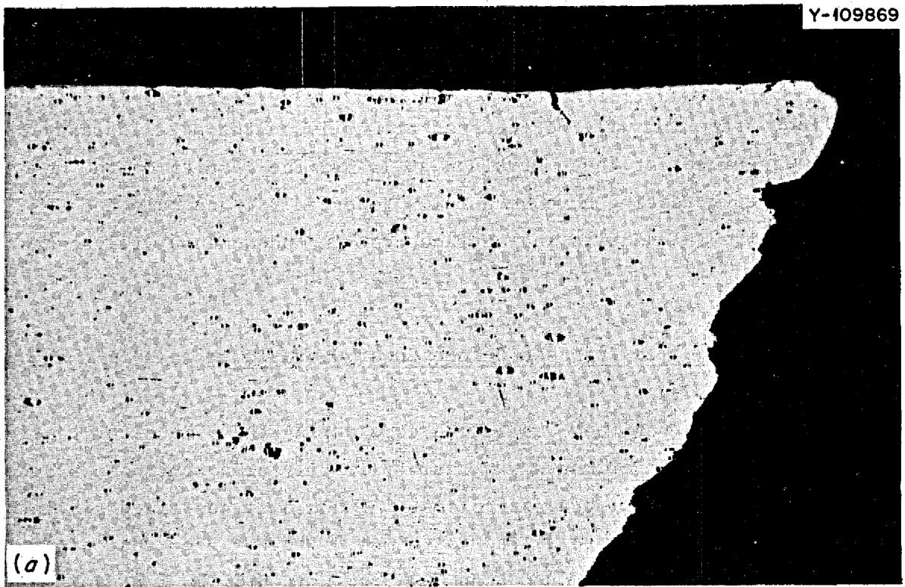  
0.035 INCHES 100X

Fig. 7. Microstructure of INOR-8 Sample Held Above $500^{\circ}\mathrm{C}$ for 3306 hr During the "Zero-power" Run of the MSRE. (Fuel was in system 1090 hr.) (a) As polished. (b) Etched with glyceria regia. The material is cold worked, and the grains are not delineated by etching.   
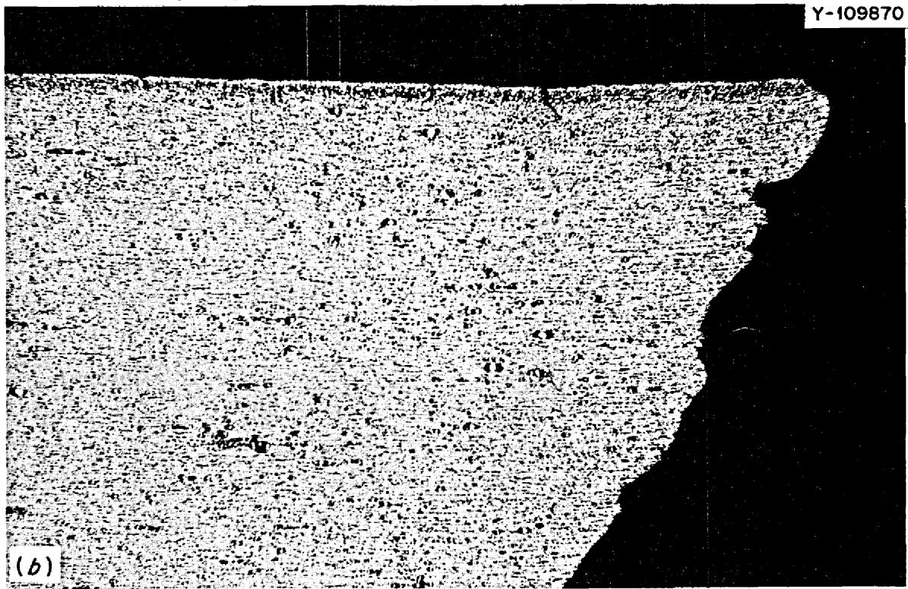  
0.035 INCHES 100x

The important point to be noted here is that INOR-8 specimens exposed to fuel salt for a considerable period of time before the generation of substantial nuclear power (and fission-product inventories) showed no in-intergranular surface cracks upon testing at $25^{\circ}\mathrm{C}$ .

# First Group of Surveillance Specimens

(Stringers RL1, RR1, and RS1)

When the first standard specimen array was taken out in July, 1966, portions were found to have been damaged.* Because of the damage, none of the three stringers could be put back into the core, but less that one third of the INOR-8 specimens were affected, so there were plenty of each heat (5085 and 5081) that could be tested. Corresponding specimens from the control facility were also tested. The extensive results are reported in detail.4

Corrosion of the core specimens appeared to be very minor. By visual inspection the metal surfaces were a uniform dull gray, with no sign of localized corrosion. Metallography also revealed little or no perceptible corrosion.

Tensile tests showed a small decrease in the yield strength of the control specimens compared with the unexposed specimens and those exposed in the core. Ultimate tensile stresses decreased significantly from the unexposed specimens to the control specimens to the core specimens, as shown in Table 4. The variation in the ultimate tensile stress is associated with decreases in fracture strain. (INOR-8 tensile specimens tested at $25^{\circ}\mathrm{C}$ continue to strain-harden to near fracture, so any reduction in fracture strain would cause failure at a lower ultimate stress.) Examination of these and later specimens indicated that the reduction in fracture strain at $25^{\circ}\mathrm{C}$ was not connected with the surface-cracking phenomenon, but was due to carbide precipitation that occurred upon aging and was enhanced by irradiation.

Table 4. Tensile Properties of Surveillance Samples From First Group at $25^{\circ}\mathrm{C}$ and a Strain Rate of 0.05/min   

<table><tr><td>Heat</td><td>Conditiona</td><td>Yield Stress (psi)</td><td>Ultimate Tensile Stress (psi)</td><td>Uniform Elongation %</td><td>Total Elongation %</td><td>Reduction In Area %</td></tr><tr><td>5081</td><td>Annealed</td><td>52,600</td><td>125,300</td><td>56.7</td><td>59.5</td><td>50.5</td></tr><tr><td>5081</td><td>Control</td><td>47,700</td><td>118,700</td><td>55.9</td><td>57.6</td><td>48.8</td></tr><tr><td>5081</td><td>Irradiated</td><td>51,100</td><td>105,500</td><td>38.5</td><td>38.7</td><td>31.3</td></tr><tr><td>5081</td><td>Irradiated</td><td>54,100</td><td>109,000</td><td>42.6</td><td>42.6</td><td>25.9</td></tr><tr><td>5085</td><td>Annealed</td><td>51,500</td><td>120,800</td><td>52.3</td><td>53.1</td><td>42.2</td></tr><tr><td>5085</td><td>Control</td><td>46,200</td><td>109,200</td><td>40.0</td><td>40.0</td><td>28.6</td></tr><tr><td>5085</td><td>Control</td><td>45,500</td><td>111,200</td><td>46.8</td><td>46.8</td><td>31.5</td></tr><tr><td>5085</td><td>Irradiated</td><td>48,100</td><td>100,300</td><td>34.3</td><td>34.5</td><td>26.0</td></tr></table>

aAnnealed - Annealed 2 hr at $900^{\circ}\mathrm{C}$ . Control - Annealed 2 hr at $900^{\circ}\mathrm{C}$ , annealed 4800 hr at $650^{\circ}\mathrm{C}$ in static salt. Irradiated - Annealed 2 hr at $900^{\circ}\mathrm{C}$ . Irradiated to a thermal fluence of $1.3 \times 10^{20}$ neutrons/cm² over 5550 hr at $650^{\circ}\mathrm{C}$ in the MSRE.

# Effects of Carbide Precipitation

An observation that connected the decrease in $25^{\circ}\mathrm{C}$ fracture strain with carbide precipitation was the following. The fracture strain at room temperature of irradiated specimens could be improved by an anneal of 8 hr at $870^{\circ}\mathrm{C}$ (p. 17, ref. 5). This is a carbide agglomeration anneal, and the recovery of ductility by such an anneal suggested that the embrittlement was due to the precipitation of copious amounts of carbide. The precipitate was observed and identified as $\mathbf{M}_6\mathbf{C}$ , which is brittle at room temperature. Extraction replicas showed more precipitate in core specimens than in control specimens. Thus it appeared that, at least in the standard alloy, irradiation enhanced the nucleation and growth of the precipitate that occurs to some extent at high temperature without irradiation.

Metallography of specimens broken in tension at $25^{\circ}\mathrm{C}$ revealed differences in the nature of the fractures in core and control specimens. These differences are believed to be another manifestation of carbide precipitation. Figures 8 and 9 show specimens of heat 5081 from the control facility and from the core. The fracture in the control specimen (Fig. 8) is typical of transgranular shear-type failure (cup-cone appearance). In contrast, the fracture of the core specimen (Fig. 9) is largely intergranular. Heat 5085 specimens are shown in Figs. 10 and 11. The fracture in the 5085 control specimen is mixed transgranular and intergranular, with the elongated grains attesting to the large amount of strain. The fracture in the 5085 core specimen is largely intergranular with numerous intergranular cracks in the microstructure.

# Surface Cracking

Specimens of both heats exposed in the control facility and tested in tension showed no cracks except very near the fractures. The core specimens of both heats, on the other hand, showed several intergranular cracks along the gage lengths. The difference is clearly shown in Fig. 12, which is a composite of photomicrographs of longitudinal sections of strained control and core specimens of heat 5085. Pictures of the sections along the entire gage lengths were examined to determine

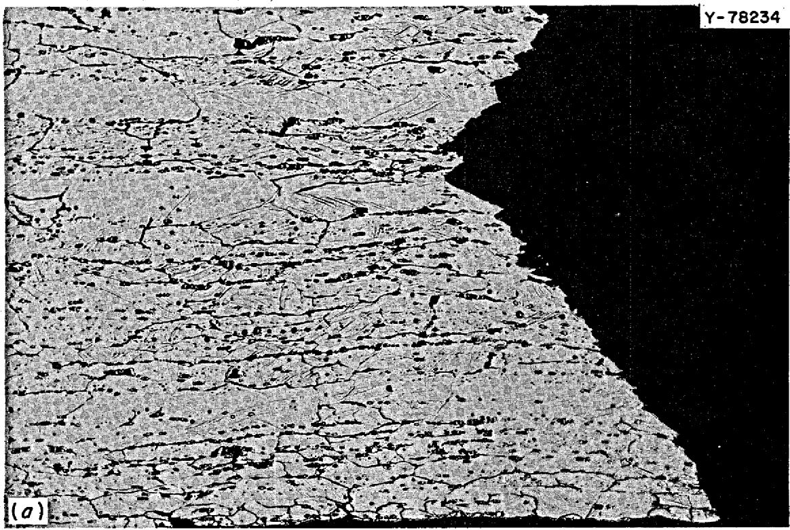  
0.035 INCHES 10.030 in. 100x 10.010 in.

Fig. 8. Photomicrographs of Control Specimen AC-8 from Heat 5081 Tested at $25^{\circ}\mathrm{C}$ and at a Strain Rate of 0.05/min. (a) Fracture. (b) Edge of specimen about 1/4 in. from fracture. Etchant: glyceria regia.   
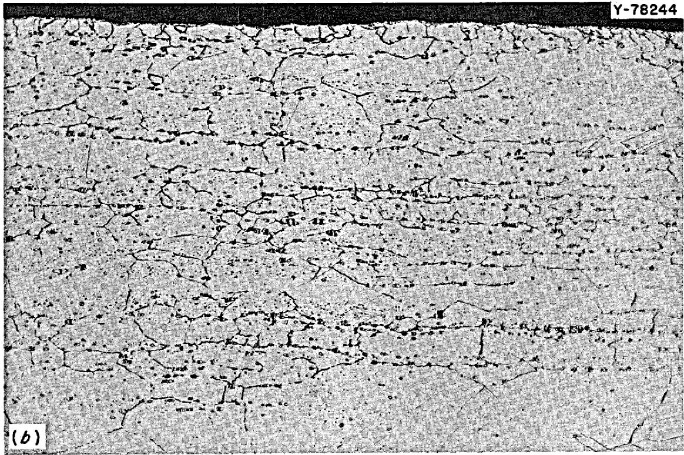  
0.035 INCHES 100x

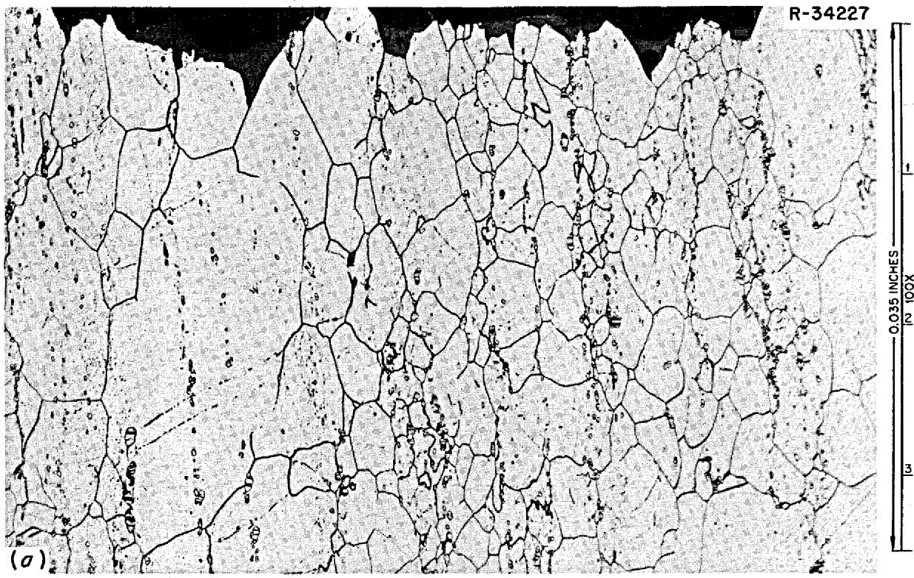

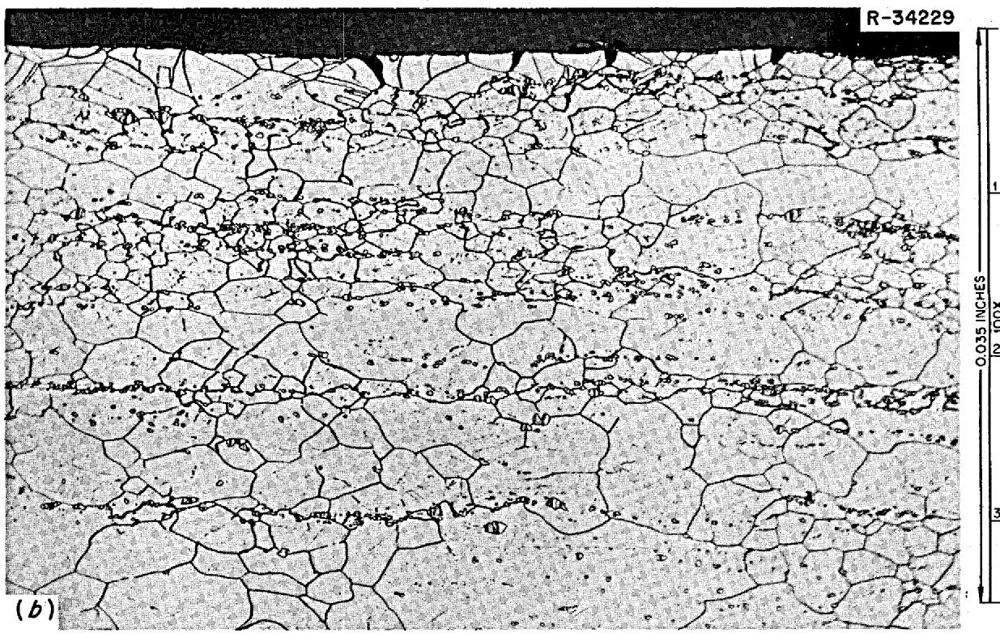  
Fig. 9. Photomicrographs of Surveillance Specimen D-16 from Heat 5081 Tested at $25^{\circ}\mathrm{C}$ and at a Strain Rate of 0.05/min. (a) Fracture. (b) Edge of specimen about 1/4 in. from fracture. Etchant: 'glyceria regia.

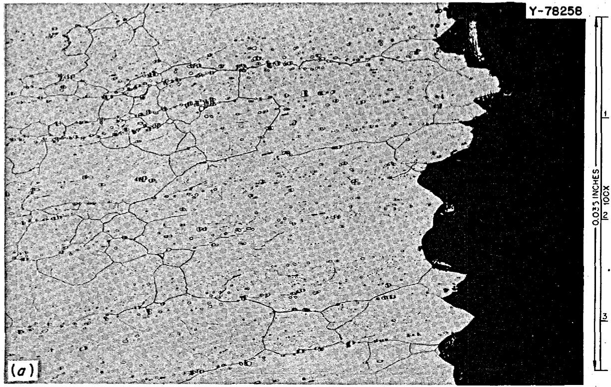

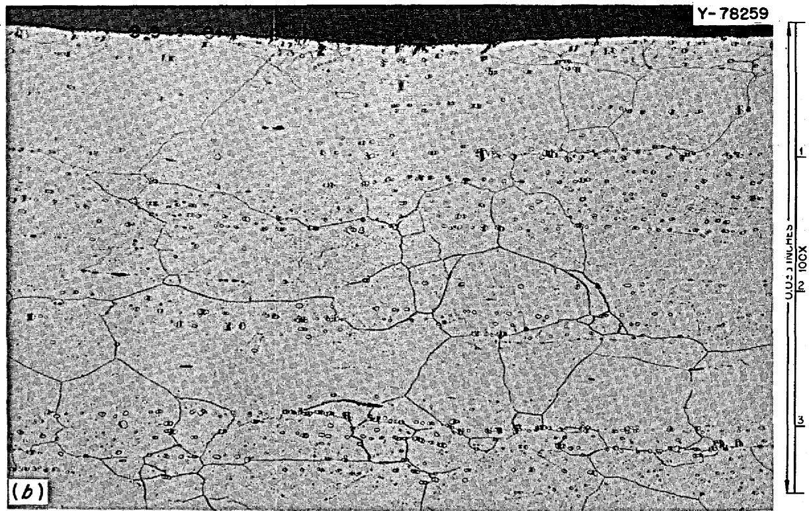  
Fig. 10. Photomicrographs of Control Specimen DC-24 from Heat 5085 Tested at $25^{\circ}\mathrm{C}$ and at a Strain Rate of 0.05/min. (a) Fracture. (b) Edge of specimen about 1/4 in. from fracture. Etchant: glyceria regia.

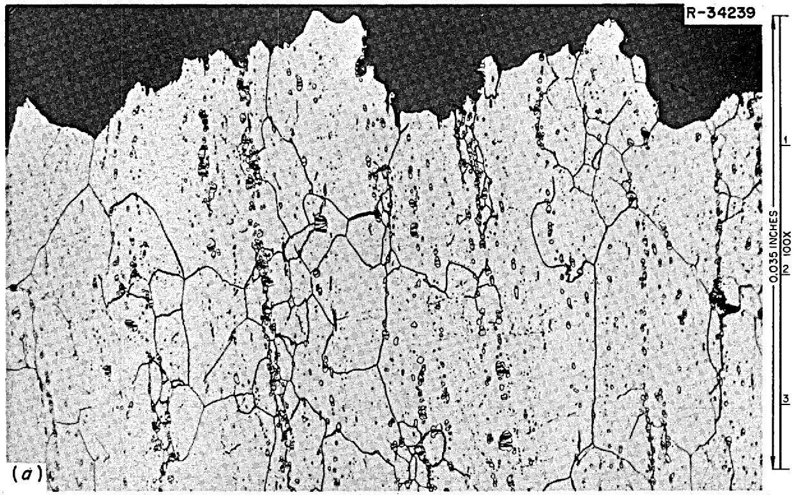

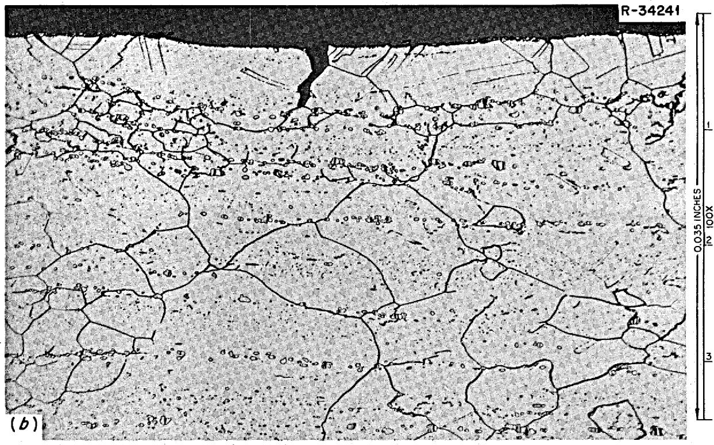  
Fig. 11. Photomicrographs of Surveillance Specimen A-16 from Heat 5085 Tested at $25^{\circ}\mathrm{C}$ and at a Strain Rate of 0.05/min. (a) Fracture. (b) Edge of Specimen about 1/4 in. from fracture. Etchant: glyceria regia.

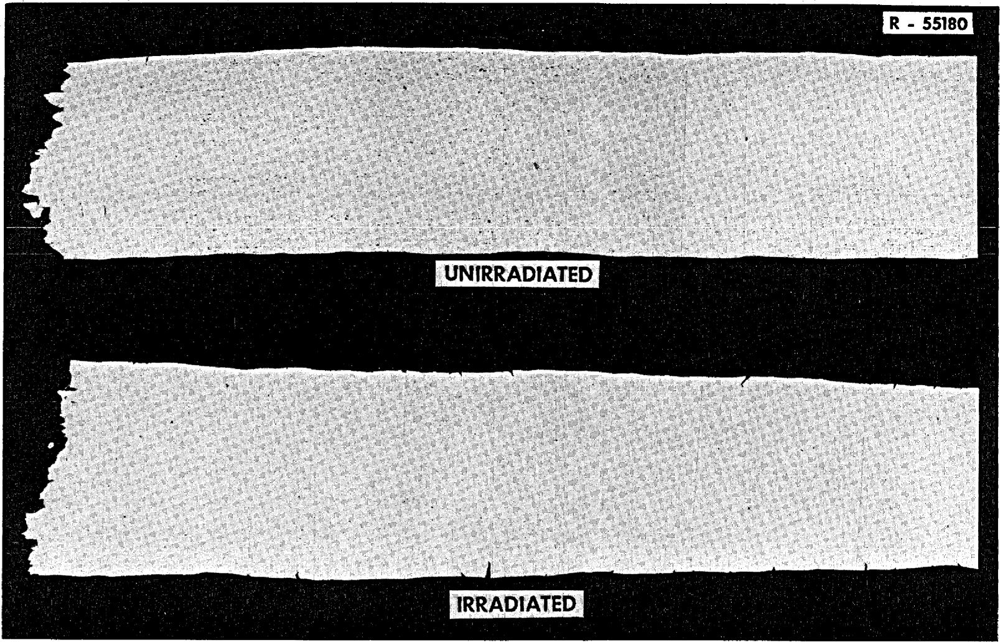  
Fig. 12. Photomicrographs of Heat 5085 strained at $25^{\circ}\mathrm{C}$ After 5550 hr Above $500^{\circ}\mathrm{C}$ . The top specimen was in static fuel salt containing depleted uranium, and the lower specimen was in the MSRE core. The true specimen diameters are 0.070 and 0.090 in., respectively.

frequency and depth of cracks. In the section of the control specimen, only one surface crack was found (a frequency of about 1 per inch). Its depth was 5.7 mils. The section of the core specimen showed 19 cracks per inch with an average depth of 2.5 mils and a maximum depth of 8.8 mils. The core specimen has more surface cracks than the control specimen (and the pre-power core specimen).

# Second Group of Surveillance Specimens

# (Stringer RS2)

In May 1967 stringer RS2, with specimens of two modified heats, was removed, and a stringer containing specimens of two other modified heats was installed. At the time it was removed, stringer RS2 had been at high temperature for practically the same length of time as the first group, but had seen 3 times the neutron dose and fission product concentration. The core specimens from RS2 and corresponding control specimens (stringer CS2) were intensively examined and tested.[5]

Visual inspection showed the core specimens to be very slightly discolored but otherwise apparently unaffected. Photomicrographs of specimens (unstrained) after exposure are shown in Figs. 13 and 14. (The unusually fine grain size is due to the fabrication history of the specimens, which included 100-hr anneals at $870^{\circ}\mathrm{C}$ .) The as-polished views of specimens of both heats show some evidence of grain boundary modifications to a depth of 1 to 2 mils, and both show some tendency to etch more readily near the surface.

Core specimens of both heats tested to failure in tension developed numerous intergranular cracks along the surfaces, while control specimens tested similarly showed few or no surface cracks. The difference is illustrated in Figs. 15-18. Figure 15 and 16 are control and core specimens respectively of heat 21554. In the core specimen surfaces nearly every grain boundary is cracked to a consistent depth of about 2 mils. In the control specimen there is no evidence of intergranular edge cracking. Figures 17 and 18 show the same thing for heat 21545.

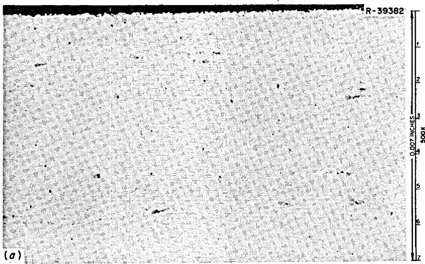

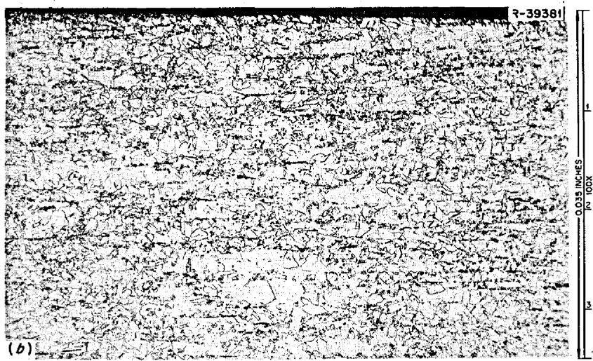

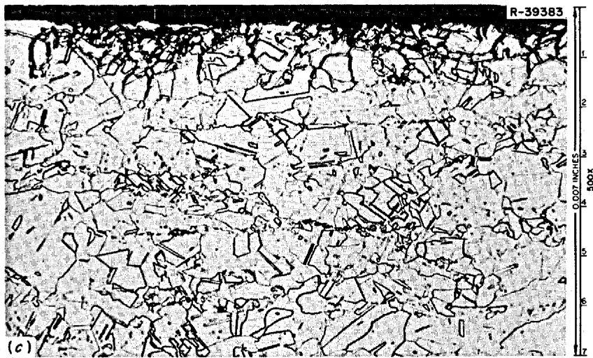  
Fig. 13. Photomicrographs of Zirconium-Modified INOR-8 (Heat 21554) Removed from the MSRE after 5554 hr above $500^{\circ}\mathrm{C}$ . Edge exposed to flowing salt. (a) As polished. $500 \times$ . (b) Etchant: aqua regia. $100 \times$ . (c) Etchant: aqua regia. $500 \times$ . Reduced $30\%$ .

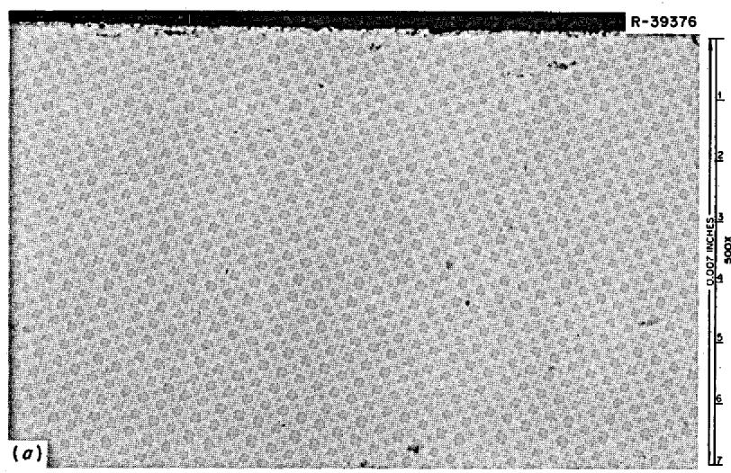

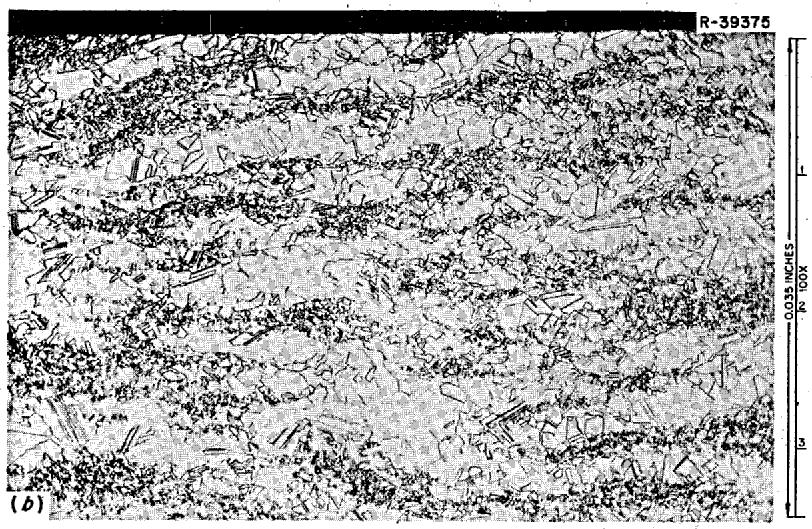

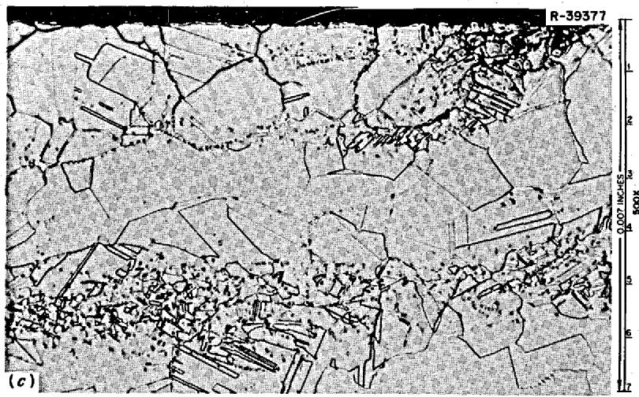  
Fig. 14. Photomicrographs of Titanium-Modified INOR-8 (Heat 21545) Removed from the MSRE After 5554 hr above $500^{\circ}\mathrm{C}$ . Edge exposed to flowing salt. (a) As polished. $500\times$ . (b) Etchant: aqua regia. $100\times$ . (c) Etchant: aqua regia. $500\times$ . Reduced $33\%$ .

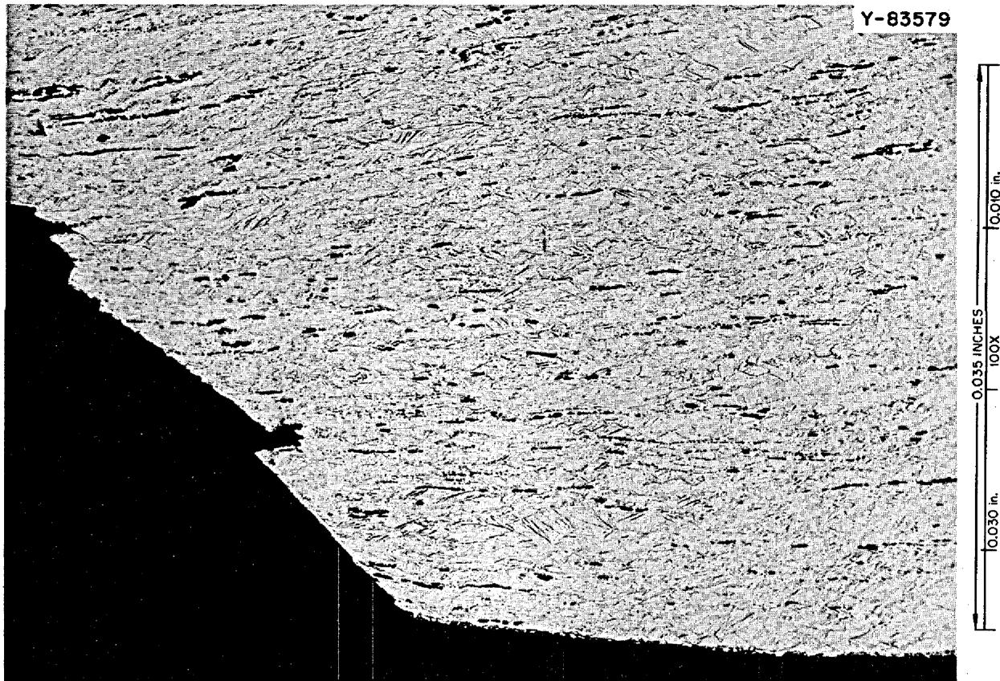  
Fig. 15. Photomicrograph of the Fracture of a Zirconium-Modified INOR-8 Sample (Heat 21554) Tested at $25^{\circ}\mathrm{C}$ at a Strain Rate of 0.05/min. Exposed to a static fluoride salt for 5554 hr above $500^{\circ}\mathrm{C}$ before testing. Note the shear fracture and the absence of edge cracking. $100\times$ . Etchant. glyceria regia.

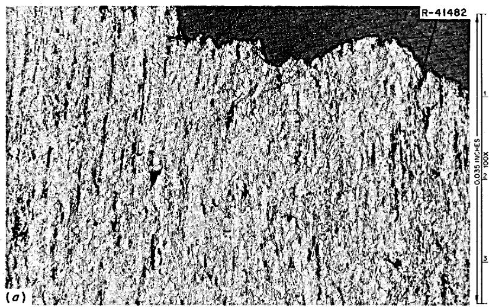

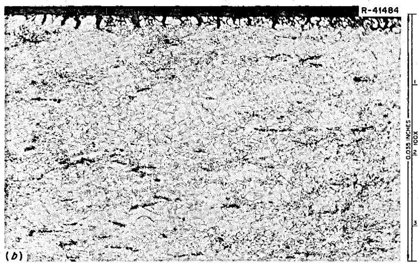

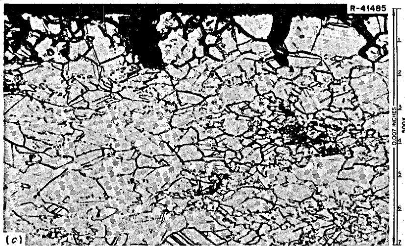  
Fig. 16. Photomicrographs of a Zirconium-Modified INOR-8 Surveillance Sample (Heat 21554) Tested at $25^{\circ}\mathrm{C}$ at a Strain Rate of 0.05/min. Exposed in the MSRE core for 5554 hr above $500^{\circ}\mathrm{C}$ to a thermal fluence of $4.1 \times 10^{20}$ neutrons/cm $^2$ . Etchant: aqua regia. (a) Fracture. $100\times$ . (b) Edge of sample about 1/2 in. from fracture. $100\times$ . (c) Edge of sample showing edge cracking. $500\times$ . Reduced $31.5\%$ .

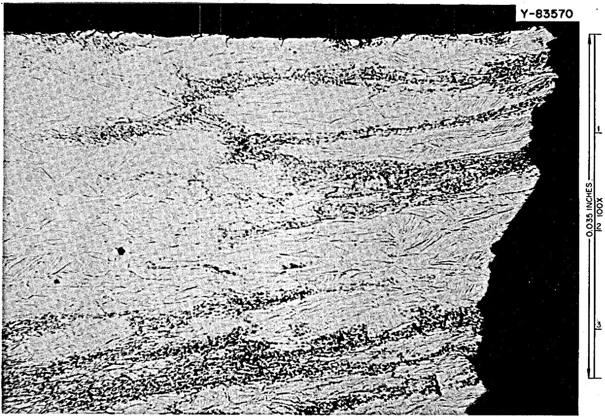  
Fig. 17. Photomicrograph of the Fracture of a Titanium-Modified INOR-8 Surveillance Sample (Heat 21545) Tested at $25^{\circ}\mathrm{C}$ at a Strain Rate of 0.05/min. Exposed to a static fluoride salt for 5554 hr above $500^{\circ}\mathrm{C}$ before testing. Note the shear fracture and the absence of edge cracking. $100\times$ . Etchant: glyceria regia.

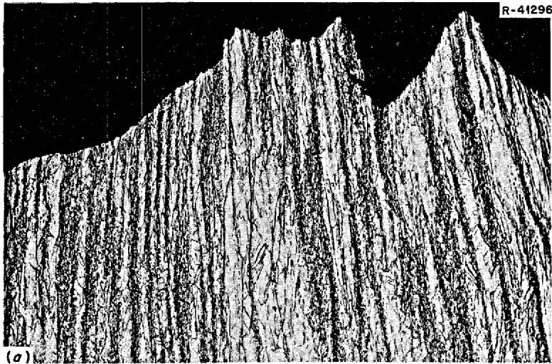  
0.035 INCHES 100X

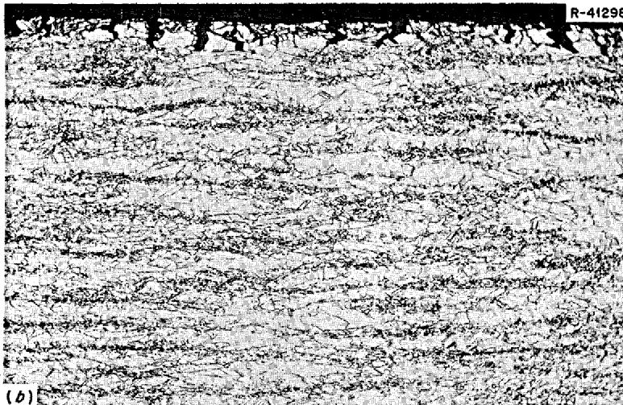  
0.035 INCHES 100X

Fig. 18. Photomicrographs of a Titanium-Modified INOR-8 Surveillance Sample (Heat 21545) Tested at $25^{\circ}\mathrm{C}$ at a Strain Rate of 0.05/min. Exposed in the MSRE core for 5554 hr above $500^{\circ}\mathrm{C}$ to a thermal fluence of $4.1 \times 10^{20}$ neutrons/ $\mathrm{cm}^2$ . Etchant: aqua regia. (a) Fracture. $100\times$ . (b) Edge of sample about $1/2$ in. from fracture. $100\times$ . (c) Edge of sample showing edge cracking. $500\times$ . Reduced $32\%$ .   
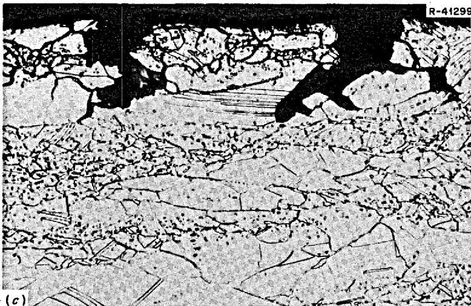  
0.007 INCHES 15 kW 500X kw 14

Yield and ultimate strengths at $25^{\circ}\mathrm{C}$ were not appreciably different for the control and core specimens. Furthermore, although the edges of core specimens cracked intergranularly, the fractures were predominantly or entirely transgranular, as seen in Figs. 16 and 18. The fact that at $25^{\circ}\mathrm{C}$ the ultimate stresses were not diminished by exposure and that the fractures were not intergranular in these modified alloys (in contrast to the observations on the standard heats) is attributed to the grain-boundary carbide precipitation being less embrittling in the modified alloy.

The most important observation relative to the cracking phenomenon is that the two modified alloys (heats 21554 and 21545) with much smaller grain sizes exhibited intergranular cracking when deformed after exposure to the fuel salt. Although the depths of the cracks are less in the two modified alloys the same types of cracks are formed in both the standard and modified samples. The alloys involved had significant variations in Fe (4% to <0.1%), Mo (16.7% to 12.0%), Si (0.6% to 0.1%), Zr (<0.1% to 0.35%), and Ti (<0.01% to 0.49%), and the fact that all formed intergranular cracks indicates that these compositional variations are not important in the cracking process.

# Third Group of Surveillance Specimens (Stringers RR2 and RS3)

At the conclusion of operation with $^{235}\mathrm{U}$ fuel, the core array was removed and specimens from two of the three stringers were tested. The remaining stringer, containing specimens of vessel heats, was put back into the core for more exposure along with two new stringers containing specimens of modified heats. The stringers from the core and the corresponding stringers from the control facility included two heats (5065 and 5085) of standard INOR-8 and two different modified alloys. Complete results of testing of these specimens are reported. $^{6}$

Visual examination showed the INOR-8 to be slightly discolored but otherwise in very good condition.[17]

# Standard Alloys

Stringers RR2, with the standard heats, had been exposed 2 to 4 times as long as the standard alloy specimens in the first group. (The factor depends upon which exposure index is used; see Table 3.) Effects of the longer exposure were evident in metallographic examinations of unstrained specimens. Figures 19 and 20 are of specimens of heats 5065 and 5085 exposed on stringer RR2 in the core. Some of the grain boundaries near the surface are visible in the as-polished condition, and a few appear to be opened as small cracks with a maximum visible depth of about 1 mil. The etched views show the large amounts of carbide precipitate that formed along the grain boundaries and the modified structure near the surface, which is thought to be due to working from machining. In samples of these heats exposed in the control facility, grain boundaries were not visible in as-polished samples. This is shown for heat 5065 in Fig. 21. As in the core specimens, however, etching brought out the carbide precipitate and the modified structure near the surface. The microstructure of control specimens of heat 5085 was quite similar.

Cracking at the surface of unstrained material was even more evident in the examination of the straps that bound stringer RR2. These straps and those around the control stringer CR2 were of standard INOR-8 heat 5055. As shown in Fig. 22, the strap exposed in the core had cracks to a depth of about 1.5 mils. Cracks were distributed uniformly, both on surfaces exposed to flowing salt and those facing the graphite specimens. In contrast, the straps exposed in the control facility did not show any cracks. The straps after being formed, had been annealed for 1 hr at $1180^{\circ}\mathrm{C}$ and should not have been stressed thereafter since they expanded more at high temperature than did the graphite they enclosed.

Samples of heats 5065 and 5085 that had been exposed in the core and in the control facility were tested in tension at $25^{\circ}\mathrm{C}$ , with the results shown in Table 5. Some of these strained specimens were sectioned and examined metallographically.

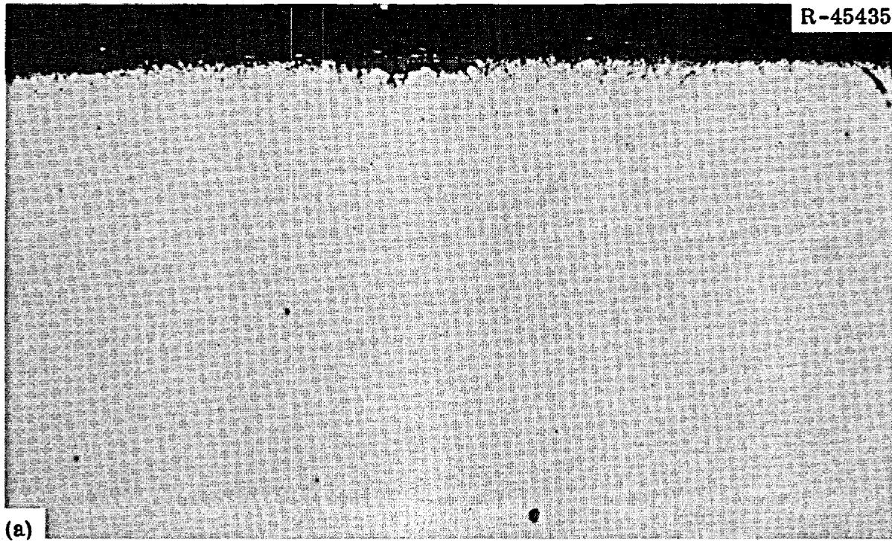

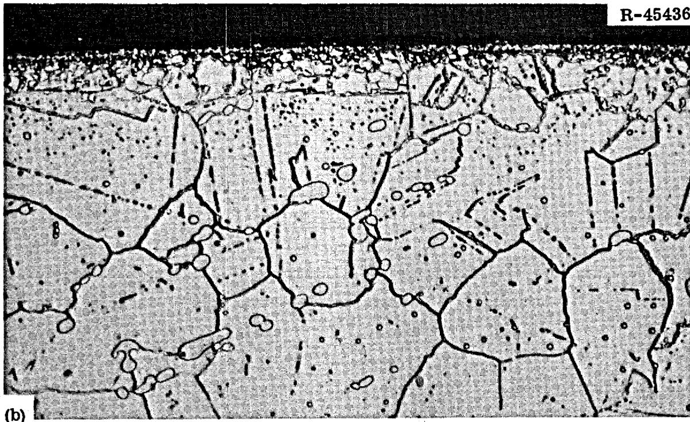  
Fig. 19. Photomicrographs of INOR-8 (Heat 5065) Surveillance Specimens Exposed to Fuel Salt for 11,933 hr above $500^{\circ}\mathrm{C}$ , $500\times$ . Shallow reaction layer is seen near surface. (a) Unetched. (b) Etched (glyceria regia).

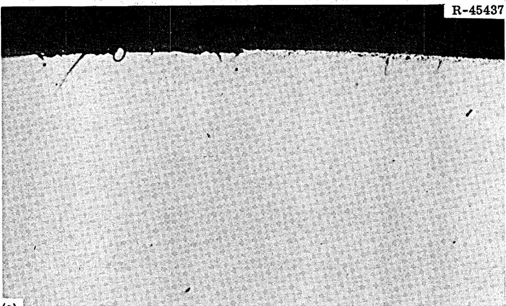  
(a)

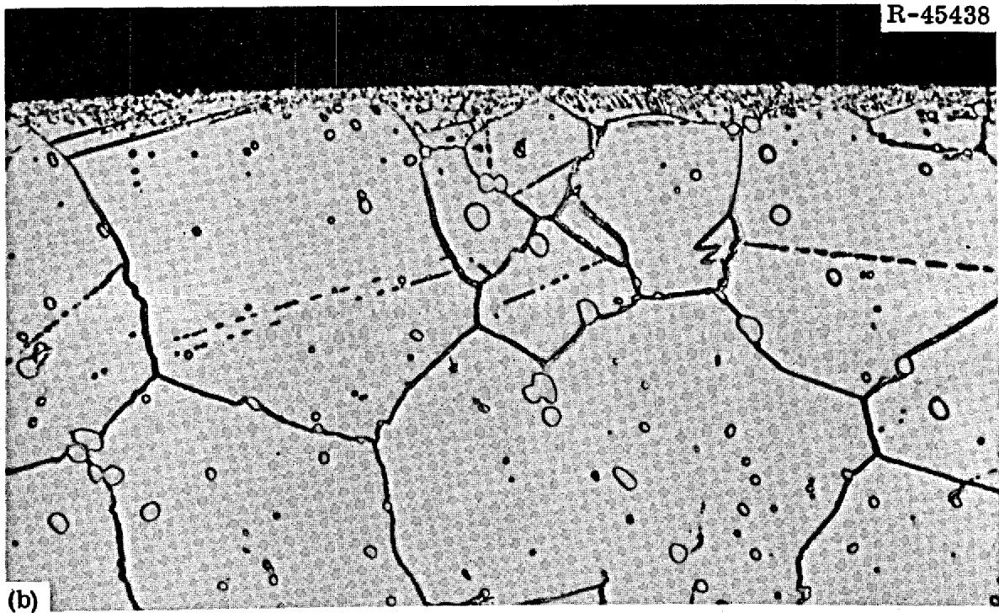  
Fig. 20. Photomicrographs of INOR-8 (Heat 5085) Surveillance Specimens Exposed to Fuel Salt for 11,933 hr above $500^{\circ}\mathrm{C}$ . $500\times$ . Shallow reaction layer is seen near surface. (a) Unetched. (b) Etched (glyceria regia).

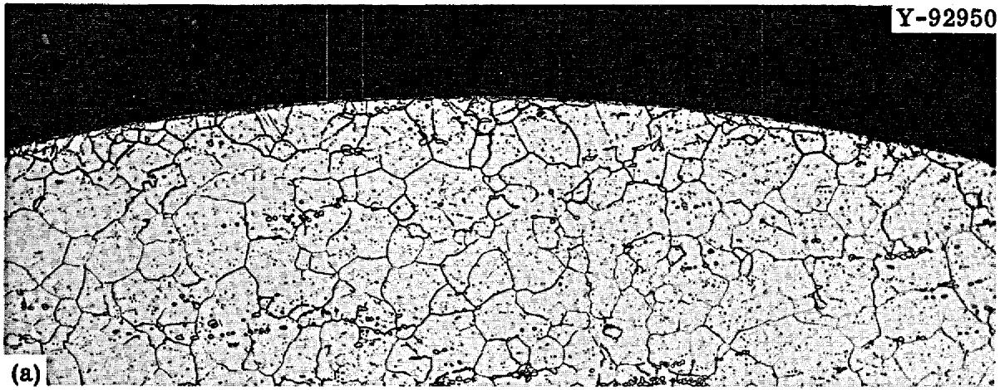

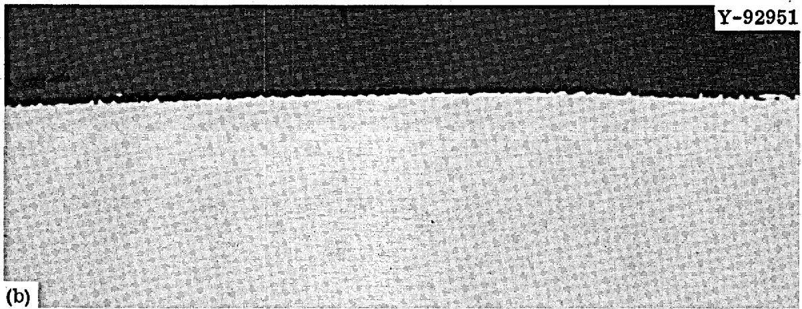

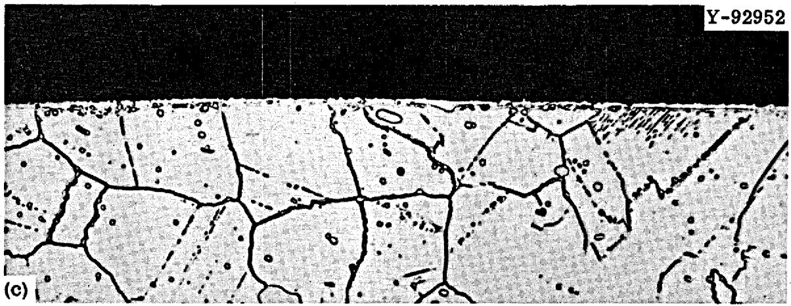  
Fig. 21. Photomicrographs of INOR-8 (Heat 5065) Surveillance Control Specimens Exposed to Static Barren Fuel Salt for 11,933 hr above $900^{\circ}\mathrm{C}$ . Note the shallow reaction layer near the surface. (a) Etched. $100 \times$ . (b) As polished. $500 \times$ . (c) Etched. $500 \times$ . Etchant: glyceria regia.

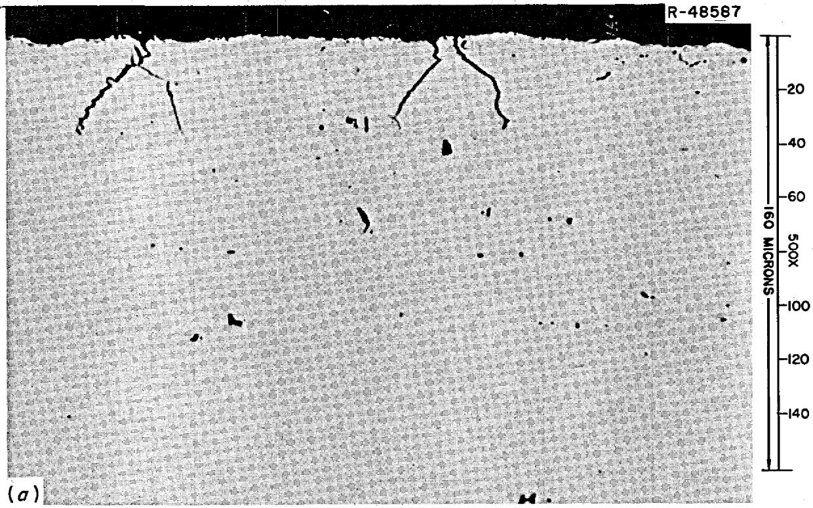

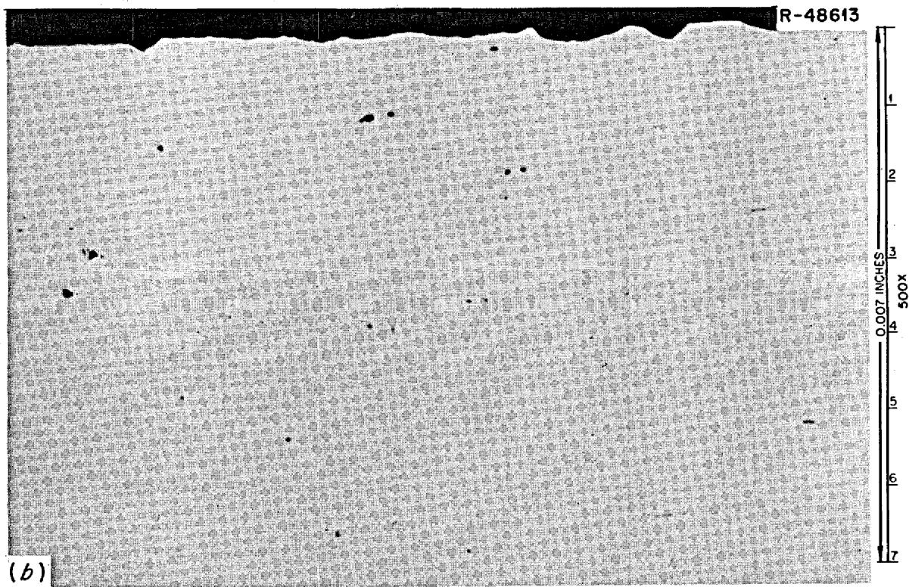  
Fig. 22. Photomicrographs of INOR-8 (Heat 5055) after Exposure to (a) the MSRE Core and (b) the MSRE Control Facility for 11,933 hr above $500^{\circ}\mathrm{C}$ . This material was used for straps for the surveillance assembly. As polished, $500\times$ .

Table 5. Tensile Properties of Surveillance Samples From Third Group at $25^{\circ}\mathrm{C}$ and a Strain Rate of 0.05/min   

<table><tr><td>Heat</td><td>Conditiona</td><td>Yield Stress (psi)</td><td>Ultimate Tensile Stress (psi)</td><td>Uniform Elongation %</td><td>Total Elongation %</td><td>Reduction In Area, %</td></tr><tr><td>5085</td><td>Annealed</td><td>51,500</td><td>120,800</td><td>52.3</td><td>53.1</td><td>42.2</td></tr><tr><td>5085</td><td>Outside</td><td>46,500</td><td>99,100</td><td>32.8</td><td>32.8</td><td>24.5</td></tr><tr><td>5085</td><td>Control</td><td>53,900</td><td>115,900</td><td>38.4</td><td>38.6</td><td>29.7</td></tr><tr><td>5085</td><td>Core</td><td>52,300</td><td>95,000</td><td>28.7</td><td>28.9</td><td>20.0</td></tr><tr><td>5065</td><td>Annealed</td><td>56,700</td><td>126,400</td><td>52.9</td><td>55.3</td><td>50.0</td></tr><tr><td>5065</td><td>Outside</td><td>49,000</td><td>118,800</td><td>57.8</td><td>59.7</td><td>38.4</td></tr><tr><td>5065</td><td>Control</td><td>60,900</td><td>126,700</td><td>46.5</td><td>47.4</td><td>39.3</td></tr><tr><td>5065</td><td>Core</td><td>51,700</td><td>109,300</td><td>41.4</td><td>41.5</td><td>34.1</td></tr></table>

aAnnealed - Annealed 2 hr at $900^{\circ}\mathrm{C}$ . Outside - Annealed, irradiated to a thermal fluence of $2.6 \times 10^{19}$ neutrons/cm $^2$ over a period of 17,483 hr at $650^{\circ}\mathrm{C}$ . Control - Annealed, exposed to depleted fuel salt for 11,933 hr at $650^{\circ}\mathrm{C}$ . Core - Annealed, irradiated to a thermal fluence of $9.4 \times 10^{20}$ neutrons/cm $^2$ over a period of 11,933 hr at $650^{\circ}\mathrm{C}$ .

Microstructures of stressed samples of heat 5065 from the control facility and from the core are shown in Figs. 23 and 24, respectively. Numerous intergranular edge cracks are found in the sample from the core (Fig. 24) and very few in the sample from the control facility (Fig. 23). The fractures of both of these samples are largely intergranular at all locations and not just near the edge, which is further evidence that the reduction in fracture strain (Table 5) is due to carbide precipitation along the grain boundaries and not related to the intergranular cracking near the surface. Tested samples of heat 5085 from the control facility and the core are shown in Figs. 25 and 26, respectively. The as-polished views in the latter figure show some of the large carbide particles that fractured during testing.

The samples that were fractured at $25^{\circ}\mathrm{C}$ were repolished at a later date, one-half of each fractured sample was photographed. The composite microstructures for heat 5065 are shown in Fig. 27. There are obviously more intergranular cracks in the sample exposed to the core than in the sample exposed in the control facility. There were 3 cracks per inch with an average depth of 1.0 mil in the control sample and 230 cracks per inch with an average depth of 1.8 mils in the sample from the core. A composite photograph of the tested portions of the heat 5085 sample is shown in Fig. 28. There were 134 cracks per inch along the edge of the sample from the core with an average depth of 1.9 mils. None were visible along the edge of the control specimen.

# Modified Alloys

Stringer RS3 with the specimens of modified alloy had been exposed about half as long as stringer RR2 with heats 5065 and 5085. The modified alloy specimens deformed more before fracturing than did the standard alloy specimens, but they also developed numerous intergranular edge cracks. As with the standard alloys, the samples from the control facility did not show edge cracks.

Figures 29 and 30 are photomicrographs of strained specimens of heat 67-502 (modified with $0.49\%$ Ti and $2.15\%$ W and containing $0.04\%$ Fe). The specimen exposed in the control facility (Fig. 29) has its edges

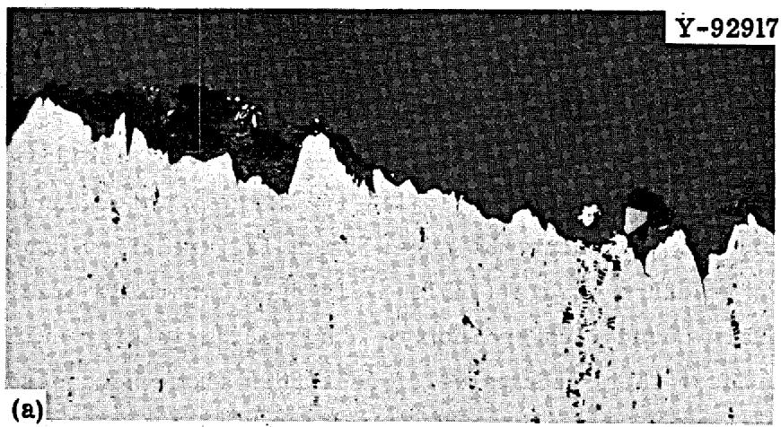

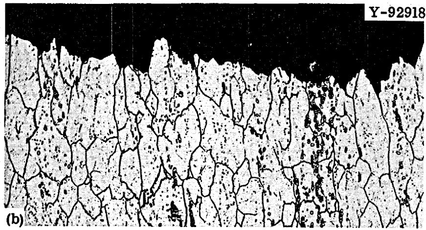

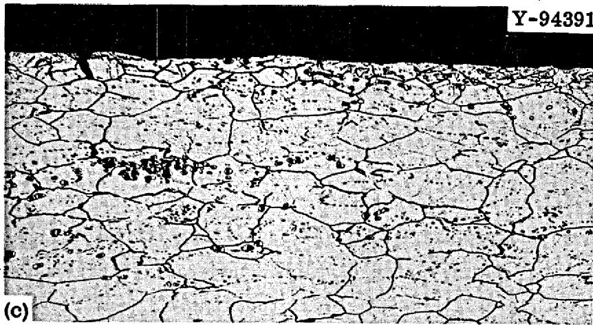  
Fig. 23. Photomicrographs of a INOR-8 (Heat 5065) Sample Exposed to Static Barren Fuel Salt for 11,933 hr above $500^{\circ}\mathrm{C}$ and Then Tested at $25^{\circ}\mathrm{C}$ and a Strain Rate of 0.05/min. $100\times$ . (a) Fracture, as polished. (b) Fracture, etched. (c) Edge of stressed portion, etched. Etchant: glyceria regia.

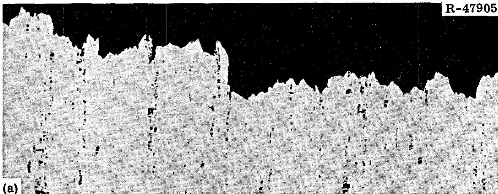

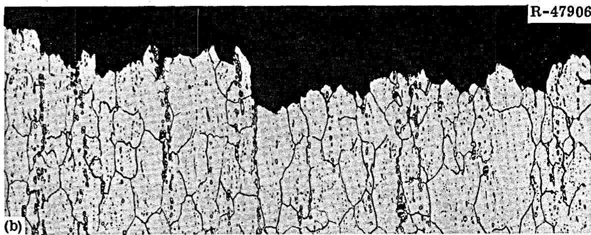

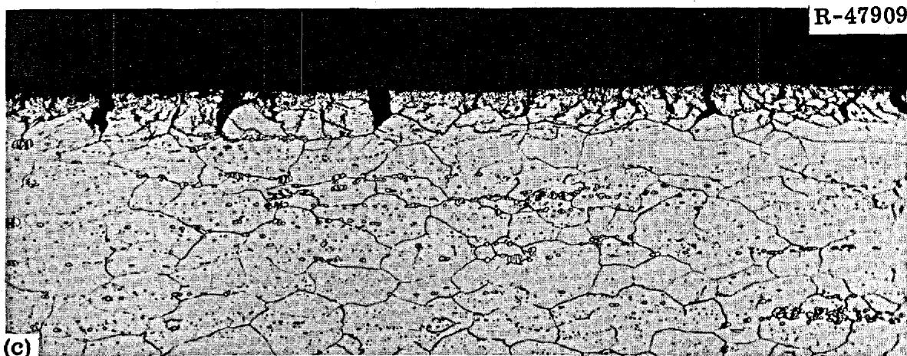  
Fig. 24. Photomicrographs of INOR-8 (Heat 5065) Sample Exposed to Fluoride Salt in the MSRE for 11,933 hr above $500^{\circ}\mathrm{C}$ and Then Tested at $25^{\circ}\mathrm{C}$ and a Strain Rate of 0.05/min. Thermal fluence was $9.4 \times 10^{20}$ neutrons/cm $^2$ . 100×. (a) Fracture, as polished. (b) Fracture, etched. (c) Edge of stressed portion. Etchant: aqua regia.

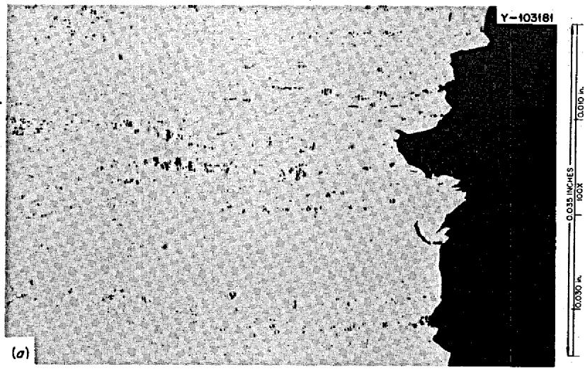

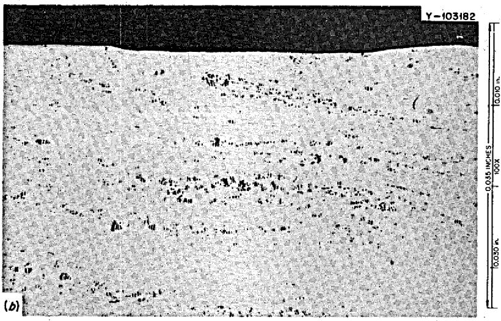

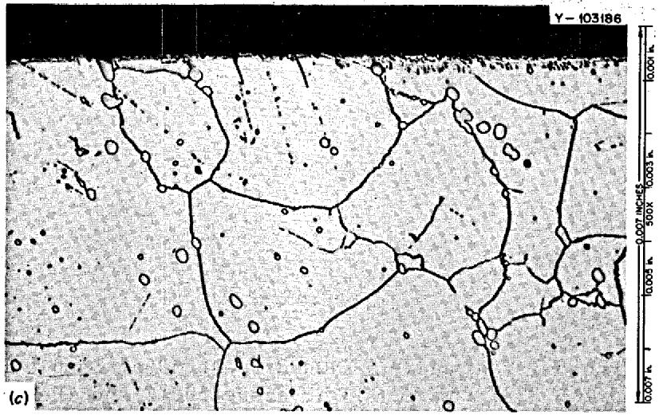  
Fig. 25. Photomicrographs of INOR-8 (Heat 5085) Specimen Exposed to Depleted Static Fuel Salt for 11,933 hr at $650^{\circ}$ and Strained at $25^{\circ}\mathrm{C}$ . (a) Fracture, as polished, (b) typical edge of gage section, as polished, (c) typical unstressed edge, etched with glyceria regia.

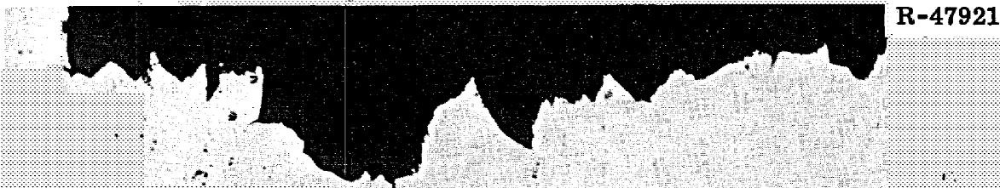  
(a)

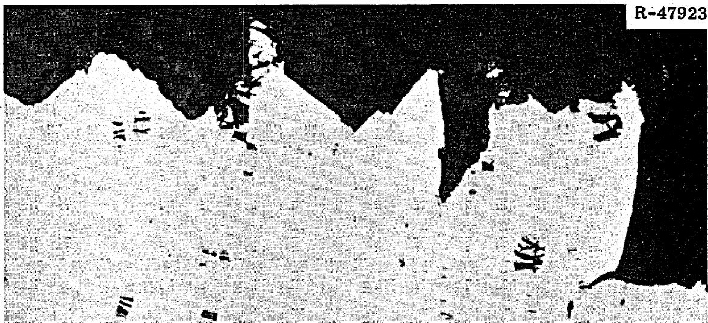  
(b)

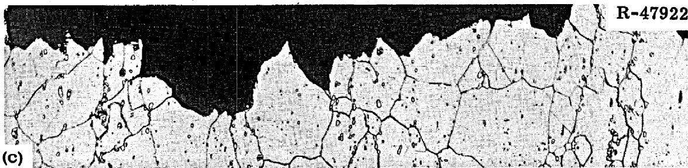

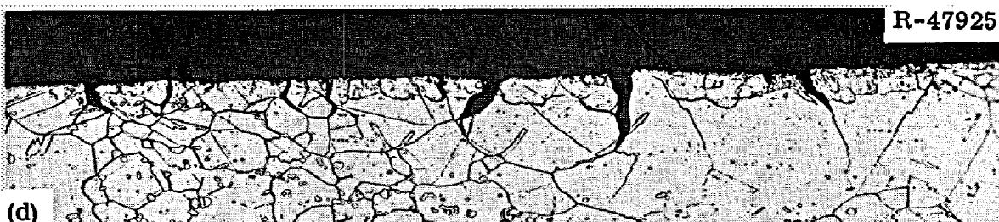  
Fig. 26. Photomicrographs of INOR-8 (Heat 5085) Sample Exposed to Fluoride Salt in the MSRE for 11,933 hr above $500^{\circ}\mathrm{C}$ and then Tested at $25^{\circ}\mathrm{C}$ . Thermal fluence was $9.4 \times 10^{20}$ neutrons/cm $^2$ . (a) Fracture, as polished. $100\times$ . (b) Fracture, as polished. $500\times$ . (c) Fracture, etched. $100\times$ . (d) Edge of stressed portion, etched. $100\times$ . Etchant: aqua regia.

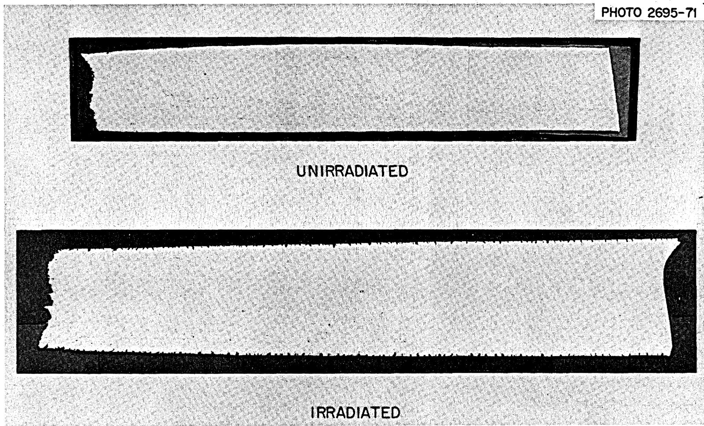  
Fig. 27. Sections of Heat 5065 Tested at $25^{\circ}\mathrm{C}$ After Exposure to Fuel Salt for 11,933 hr above $500^{\circ}\mathrm{C}$ . Diameters of specimens are about 0.1 in. The fractures are on the left end.

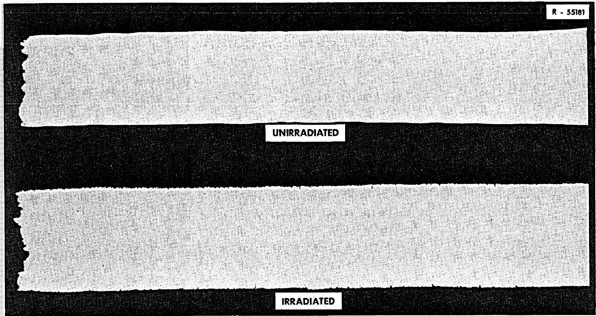  
Fig. 28. Photomicrographs of INOR-8 Specimens Strained to Fracture After 11,933 hr above $500^{\circ}\mathrm{C}$ . The upper sample was in the control facility and the lower sample was in the MSRE core. The sample diameter is about 0.1 in.

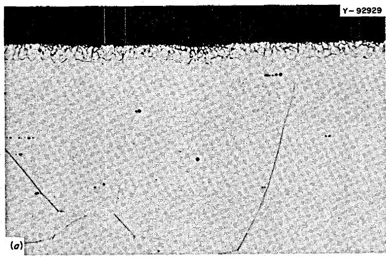  
0.007 INCHES 10.007 in 10.005 in 1 500x 10.005 in 1 10.004 in

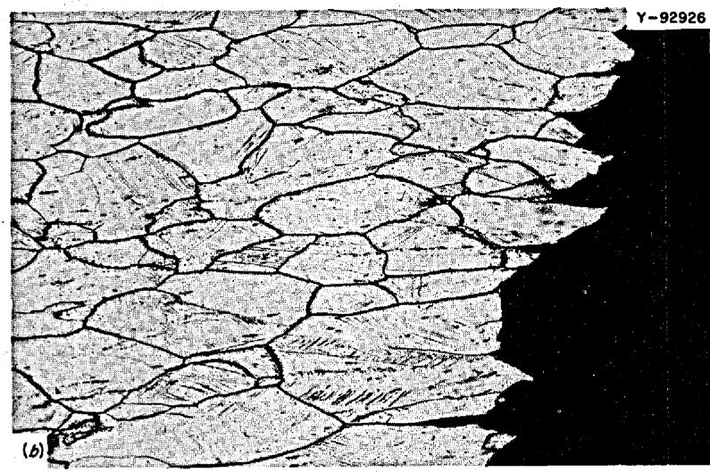  
0.035 INCHES 10.030 m. 100X 10.00 in.

Fig. 29. Photomicrographs of Alloy 67-502 (see Table 1) Exposed to Depleted Fuel Salt for 6379 hr Above $500^{\circ}\mathrm{C}$ and Tested at $25^{\circ}\mathrm{C}$ . (a) Edge of unstressed portion, (b) Fracture, (c) Edge of stressed portion. Figs (a) and (c) etched lightly. Fig. (b) etched more heavily with glyceria regia.   
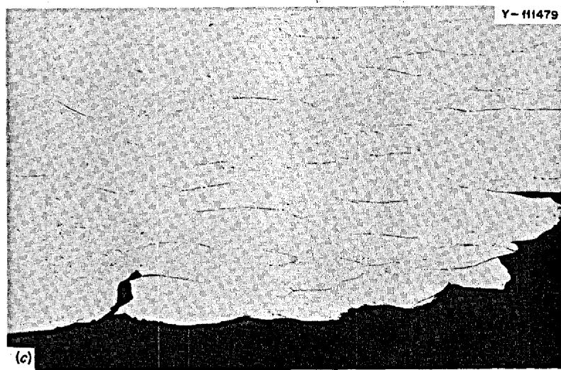  
0.035 INCHES 100x 1000 m

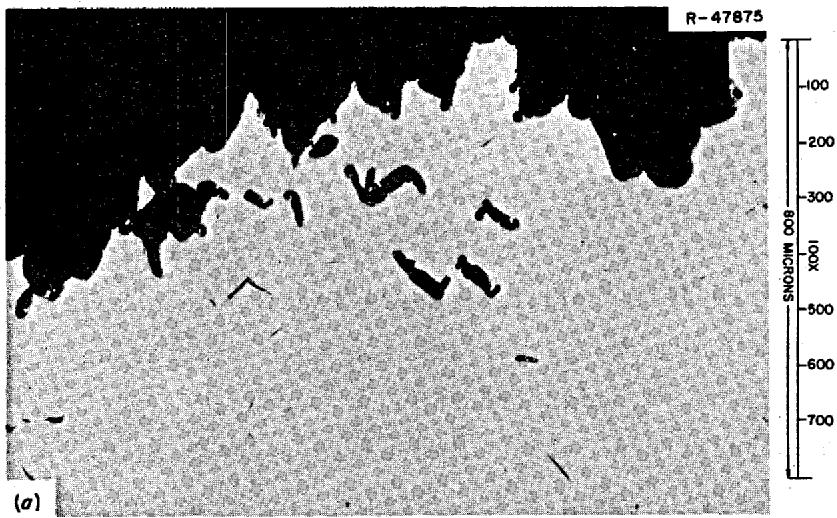

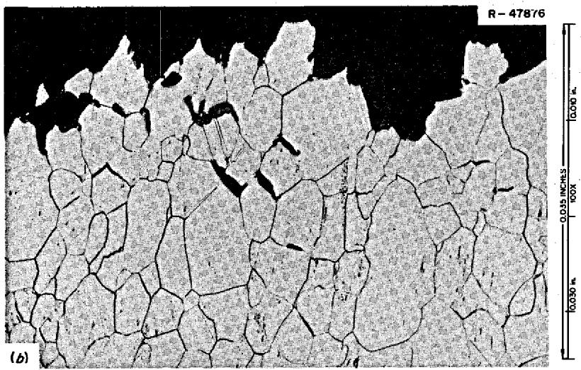

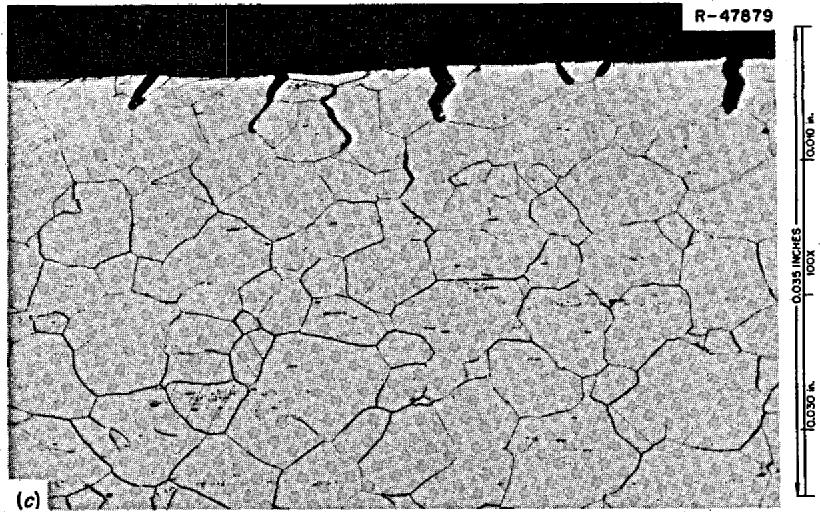  
Fig. 30. Photomicrographs of Alloy 67-502 Sample Exposed to Fluoride Salt in the MSRE for 6379 hr Above $500^{\circ}\mathrm{C}$ and then Tested at $25^{\circ}\mathrm{C}$ . 100x. (a) Fracture, as polished. (b) Fracture, etched. (c) Edge of stressed portion, etched. Etchant: aqua regia. Reduced 33%.

coated with small crystals of almost pure iron. (The control facility was constructed of material containing 4 to $5\%$ Fe, so the transfer of Fe to an alloy that contained only $0.04\%$ Fe is quite reasonable.) The sample strained $55\%$ before fracture, and the fracture was mixed transgranular and intergranular. The edge was uneven from the large deformation, but there were very few intergranular separations. The sample from the core (Fig. 30) deformed almost as much ( $52\%$ ) before fracturing. In contrast to the control specimen, edge cracking occurred at almost every grain boundary. The cracks generally extended to a depth of about 5 mils, with the maximum depth being about 7 mils. However, as shown in the view of the fracture, this material tended to crack intergranularly and these internal cracks may have in some cases linked together with the surface cracks to make them extend deeper.

Photomicrographs of samples of heat 67-504 tested at $25^{\circ}\mathrm{C}$ after exposure in the control facility and in the core are shown in Figs. 31 and 32. This heat modified with $0.50\%$ Hf, contained $0.07\%$ Fe. As shown in Fig. 31, iron deposited on the surface of this heat as it did on 67-502. This sample, from the control facility, deformed $55\%$ before failing with a mixed inter- and transgranular fracture. There were no intergranular edge cracks. The sample exposed in the core deformed $52\%$ before fracture. The fracture was primarily transgranular but there were frequent edge cracks (Fig. 32). Most boundaries were cracked, but the cracks extended only to a depth of about 2 mils in the fields that were photographed.

# Fourth Group of Surveillance Specimens (Stringers RL2, RR3, and RS4)

The last regular core surveillance assembly was removed in June, 1969 to make way for a special experimental array.[14] Stringer RL2, with specimens of standard INOR-8 (heats 5065 and 5085), had been in the core at high temperature almost 12,000 hr during the $^{235}\mathrm{U}$ operation

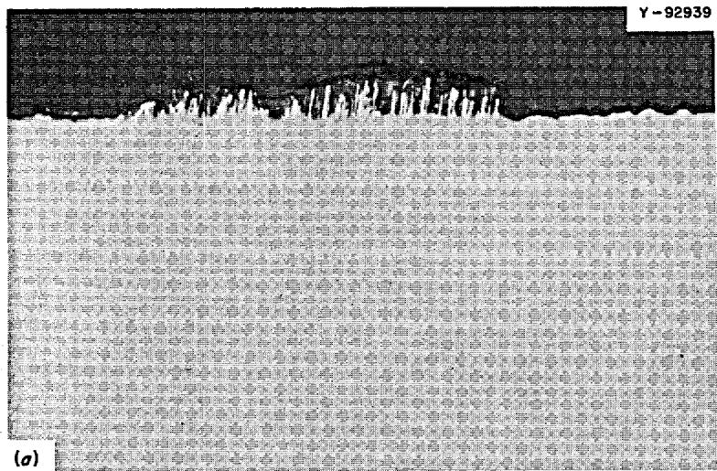

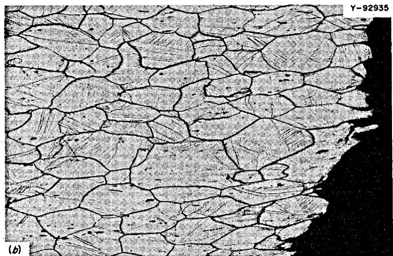

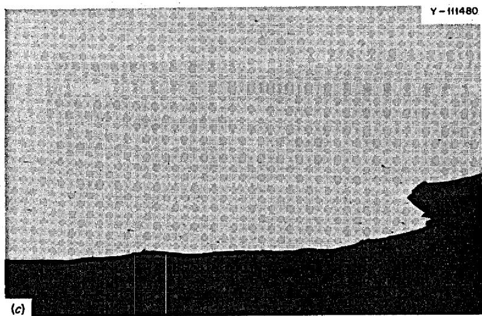  
0.035 INCHES 10.030 in. 1000 10.010 in.   
Fig. 31. Photomicrographs of Alloy 67-504 (see Table 1) Exposed to Depleted Fuel Salt for 6379 hr Above $500^{\circ}\mathrm{C}$ and Tested at $25^{\circ}\mathrm{C}$ . (a) Edge of unstressed portion, (b) Fracture, (c) Edge of stressed portion. Figs (a) and (c) as-polished and Fig. (b) etched with glyceria regia. Reduced $33.5\%$ .

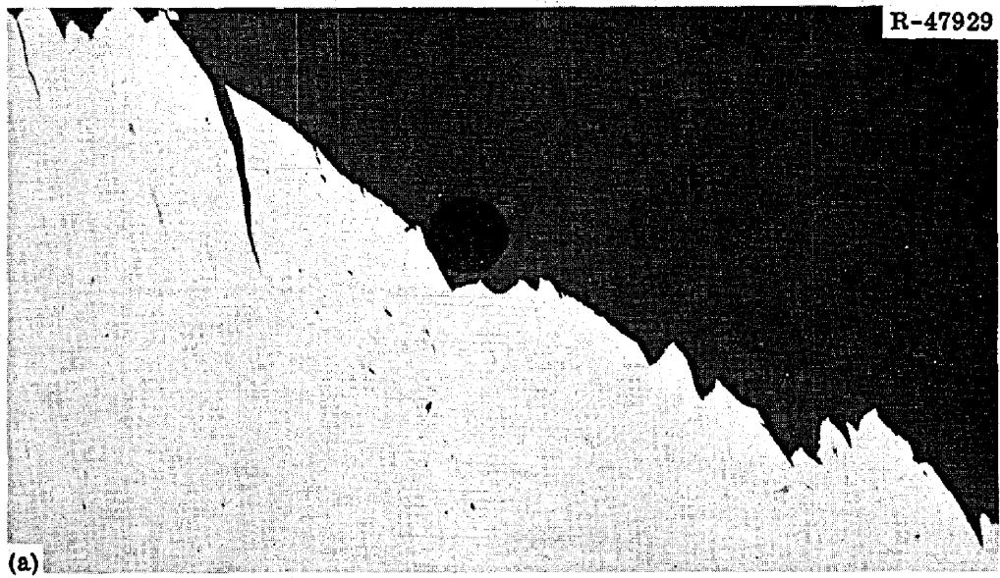

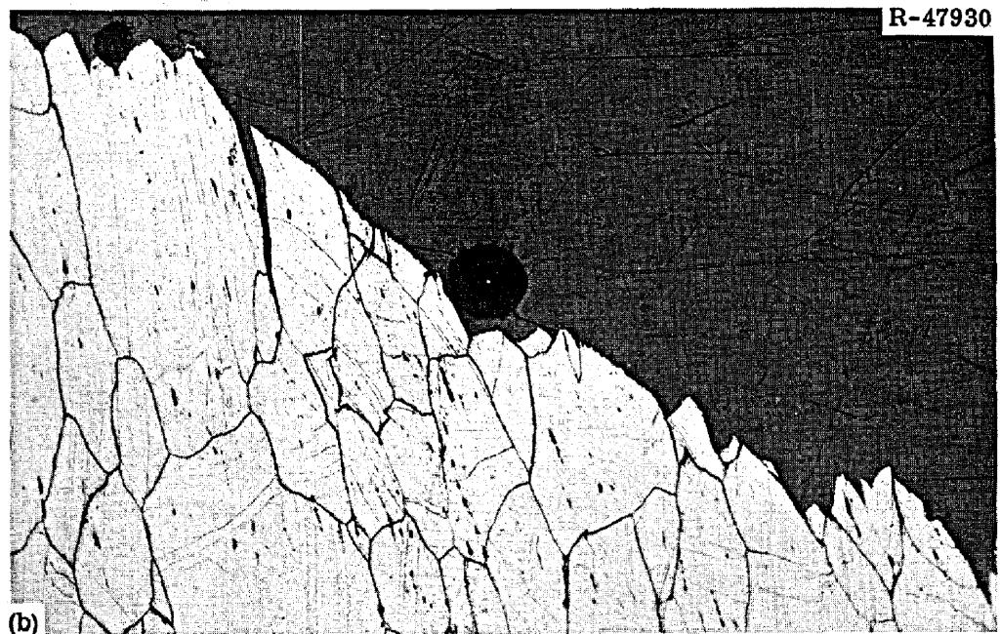

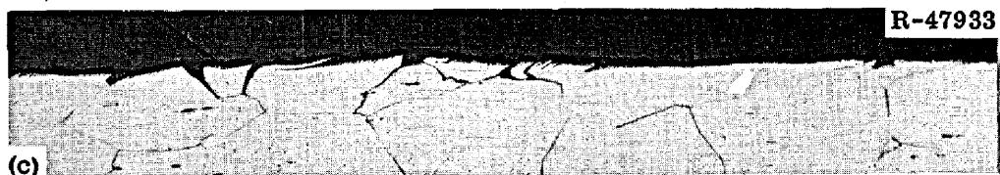  
Fig. 32. Photomicrographs of INOR-8 (Heat 67-504) Sample Exposed to Fluoride Salt in the MSRE for 6379 hr Above $500^{\circ}\mathrm{C}$ and Tested at $25^{\circ}\mathrm{C}$ . 100x. (a) Fracture, as polished. (b) Fracture, etched. (c) Edge of Stressed portion, etched. Etchant: aqua regia. Reduced $14\%$ .

and 7200 hr during $^{233}\mathrm{U}$ operation. The other stringers, with two modified alloys, had been exposed only during the $^{233}\mathrm{U}$ operation. Results of examinations of these specimens and corresponding specimens from the control facility are reported.7

Visual examination showed all of the INOR-8 specimens from the core to be noticeably more discolored than those in previous arrays, with surface films thick enough to be seen in cross section by light microscopy. There were also slight changes in the appearance of the graphite.[18] Both of these observations indicate some difference in the exposure conditions during the most recent operation. (From other observations it was known that the fuel salt was relatively more oxidizing during at least part of the $^{233}\mathrm{U}$ operation. See pp. 85-98 of ref. 13.)

# Standard Alloys (RL2)

Photomicrographs of unstrained specimens of heats 5065 and 5085 from RL2 revealed many grain boundaries near the surfaces that were visible in the as-polished condition. The view of a specimen of heat 5065 in the as-polished condition, (Fig. 33) shows a thin surface layer (believed to be the cause of the visible discoloration) and some grain boundaries visible to a depth of about 2 mils. Etching this particular sample revealed the typical carbide structure plus a narrow band near the surface that seems to have a high density of carbide. Photomicrographs of heat 5085 after removal from the core are shown in Fig. 34. Many of the grain boundaries are visible in the as-polished condition to a depth of about 2 mils. Etching reveals the typical microstructure with very extensive carbide precipitation. In the as-polished view of the heat 5065 control specimen (Fig. 35), grain boundaries are also visible, but in this case the appearance is uniform across the sample and is due to polishing long enough that the different grains are at different elevations. Etching reveals the shallow surface modification and the typical carbide structure. The heat 5085 specimen from the control facility, shown in Fig. 36, was also slightly overpolished so that the grains are visible in the as-polished condition. Etching revealed the typical microstructure and the shallow surface modification.

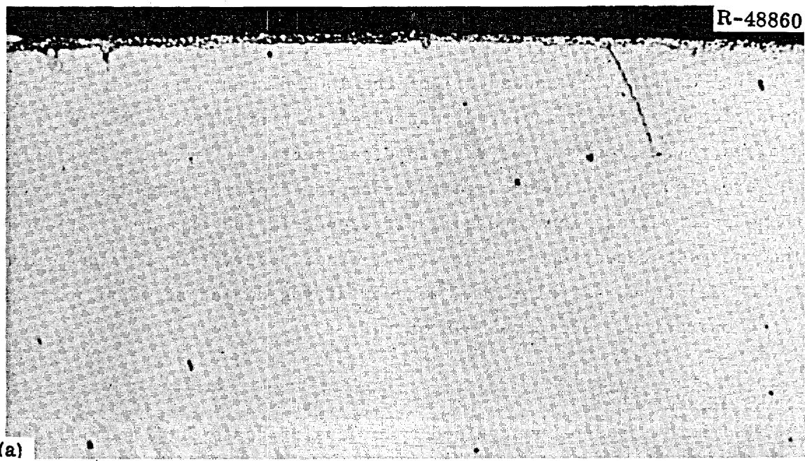

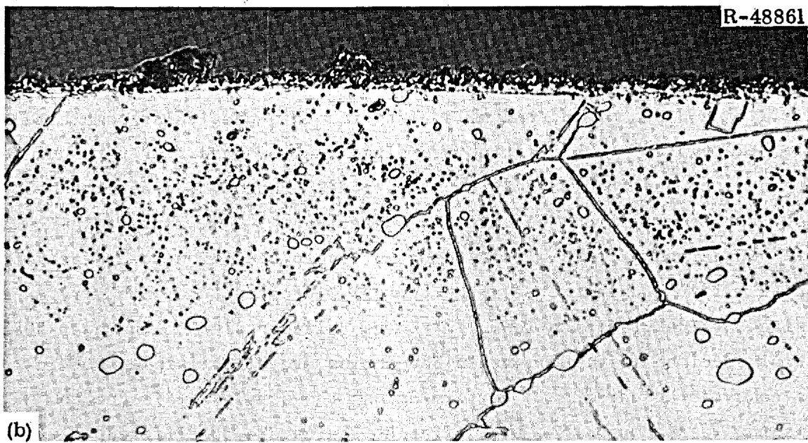  
Fig. 33. Typical Photomicrographs of INOR-8 (Heat 5065) Exposed to the MSRE Core for 19,136 hr Above $500^{\circ}\mathrm{C}$ . (a) As polished. (b) Etchant: aqua regia. $500\times$ .

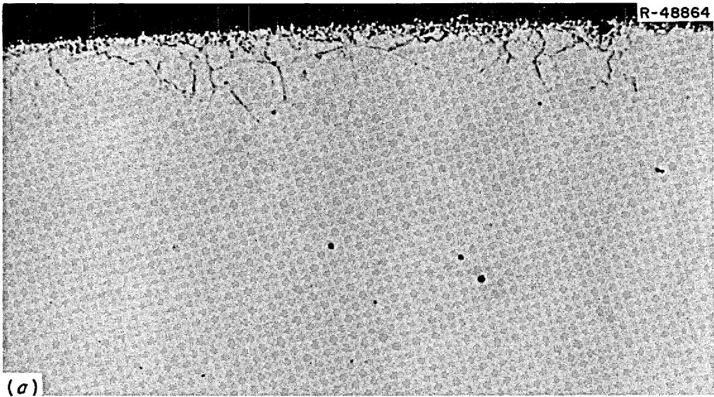

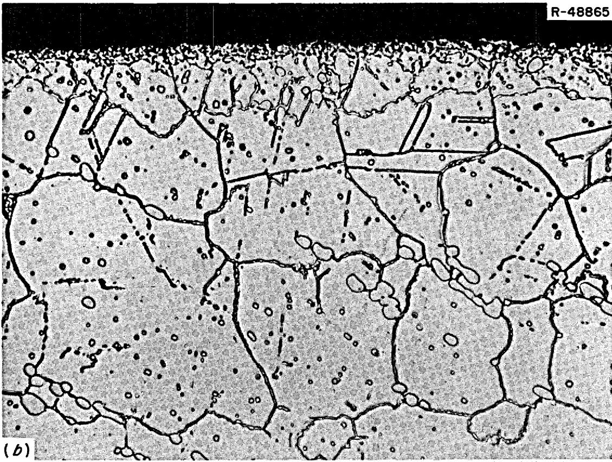  
0.007 INCHES 10.005 in. 1 500x 10.003 in. 1 10.001 in.   
Fig. 34. Typical Photomicrographs of INOR-8 (Heat 5085) Exposed to the MSRE Core for 19,136 hr Above $500^{\circ}\mathrm{C}$ . (a) As polished. (b) Etchant: glyceria regia. $500\times$ .

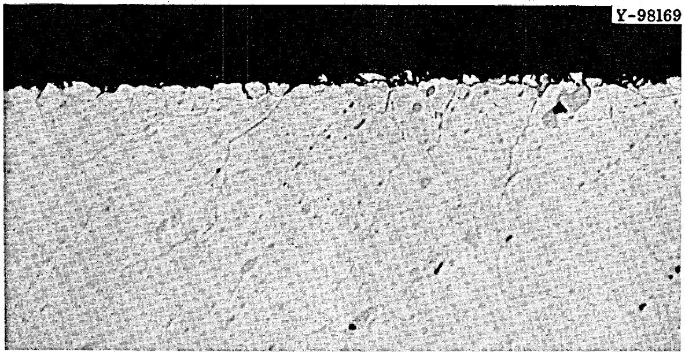  
(a)

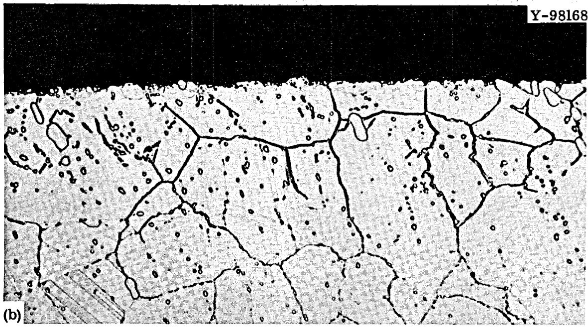  
Fig. 35. Typical Photomicrographs of Heat 5065 After Exposure to Static Unenriched Fuel Salt for 19,136 hr Above $500^{\circ}\mathrm{C}$ . 500×. (a) As polished. (b) Etchant: glyceria regia.

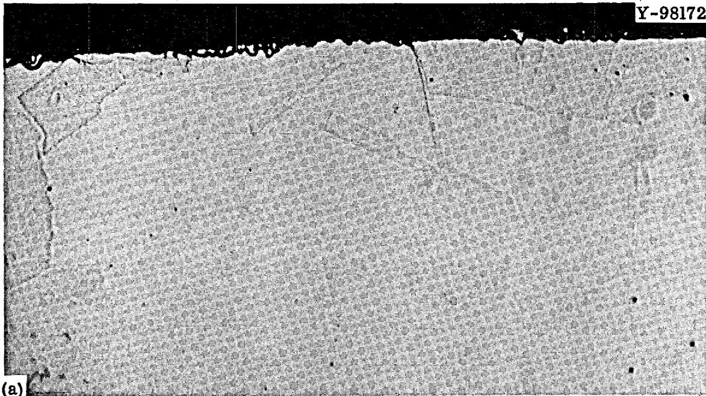

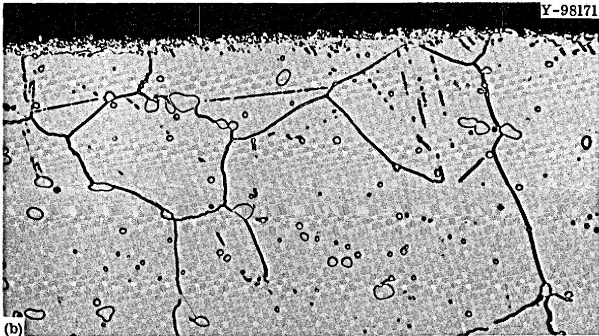  
Fig. 36. Typical Photomicrographs of Heat 5085 After Exposure to Static Unenriched Fuel Salt for 19,136 hr above $500^{\circ}\mathrm{C}$ . 500×. (a) As polished. (b) Etchant: glyceria regia.

As in the previous set of core specimens, the straps of heat 5055 showed more cracks in the nominally unstrained condition than did the tensile specimens on the same stringer. A section of a strap from stringer RL2 that had been exposed, along with the specimens shown in Figures 33 and 34, is shown in Fig. 37. The cracks in this as-polished view are visible to a depth of about 3 mils, about twice as deep as in the strap exposed 12,000 hr during $^{235}\mathrm{U}$ operation (Fig. 22). Heat 5055 straps were also used on the stringers exposed only during the $^{233}\mathrm{U}$ operation (7200 hr). A specimen of one of these straps is shown in Fig. 38. In the as-polished condition, cracks were visible to a depth of about 1 mil; etching made them visible to a depth of about 3 mils. The cracking was quite uniform along all surfaces of the straps, indicating that the deformation of the 20-mil straps during removal was not a factor in the appearance of the cracks. Examination of unirradiated control straps failed to reveal a similar type of cracking.

One other interesting specimen that showed extensive cracking was a piece of thin INOR-8 sheet (heat 5075) that had been attached to the strap shown in Fig. 38. The sheet had been rolled to 4 mils and annealed 0.5 hr at $1180^{\circ}\mathrm{C}$ . The edges of the foil were wrapped around the strap to hold the material in place. Thus the outside surface of the foil would have been exposed to flowing salt and the underside and the folded ends to salt that flowed less rapidly. The foil was extremely brittle and broke while it was being removed from the strap. The photomicrographs in Fig. 39 show that the foil had extensive grain boundary cracks, with many appearing to extend throughout the 4 mil thickness. In some areas the cracks were more numerous on the outside where the material was curved and was in contact with rapidly flowing salt. Photomicrographs of a strap and foil that were exposed to static salt in the control facility are shown in Figs. 40 and 41. The samples showed no evidence of intergranular cracking.

A fracture surface of the foil from the MSRE was examined by the scanning electron microscope (SEM) and Auger spectroscopy. The fracture is shown in Fig. 42 and is intergranular. The SEM with a dispersive x-ray analytical system indicated the presence only of the elements normally

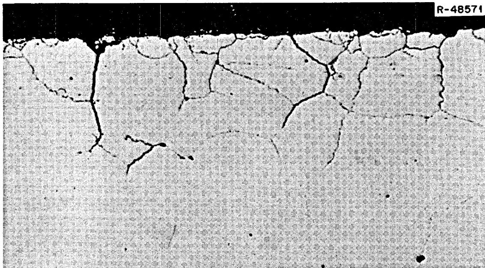  
Fig. 37. Typical Microstructure of INOR-8 (Heat 5055) After Exposure to the MSRE Core for 19,136 hr Above $500^{\circ}\mathrm{C}$ . This material was used for straps for the surveillance assembly. As polished. $500\times$ .

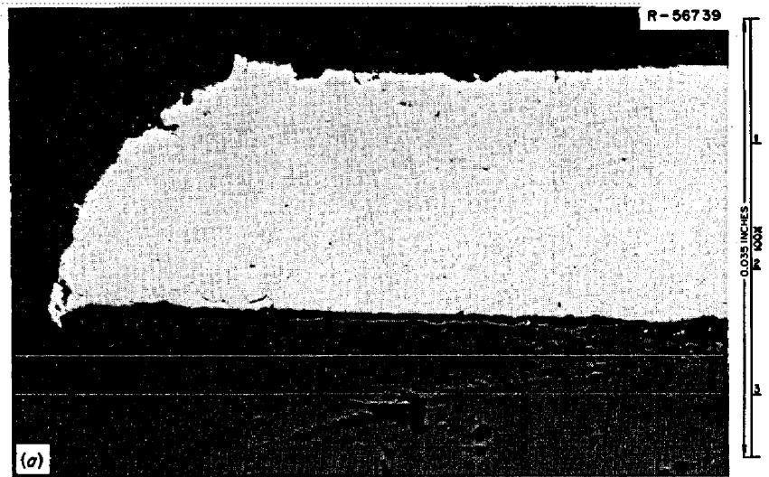

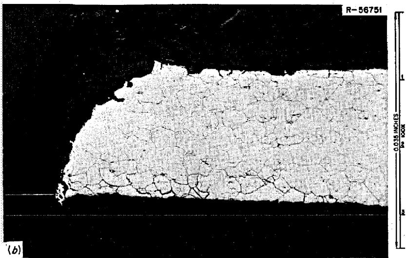

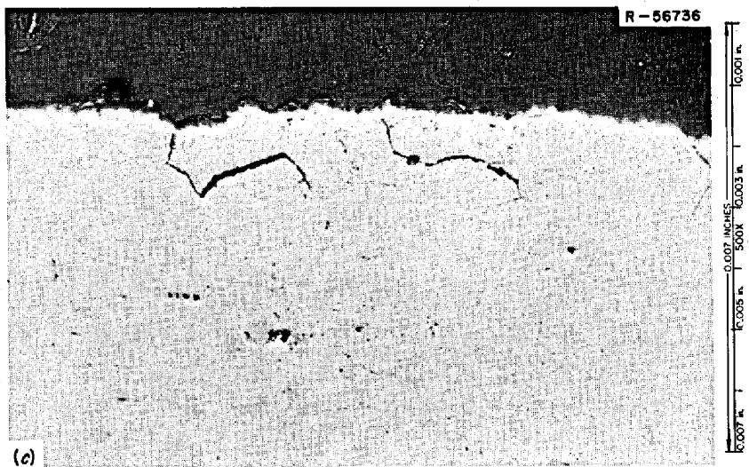

Fig. 38. Photomicrographs of INOR-8 (Heat 5055) Strip Exposed to the MSRE Core 7203 hr above $500^{\circ}\mathrm{C}$ . (a) As-polished view near cut (b) Etched view near cut (c) As polished view of outside edge (d) Etched view of outside edge. Etchant: Lactic acid, $\mathsf{HNO}_3$ , HCl. Reduced $32\%$ .   
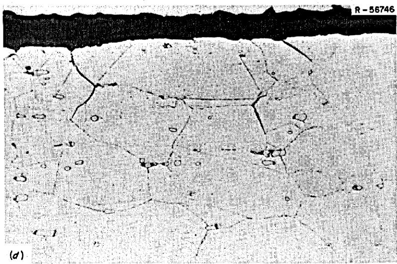  
1 500000000000000000000000000000

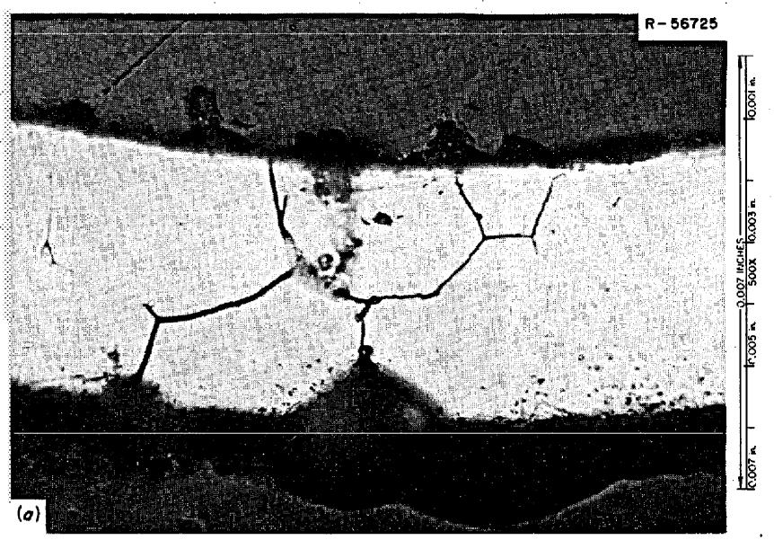

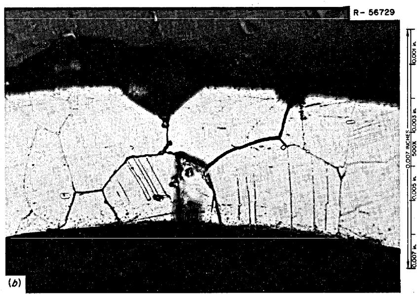

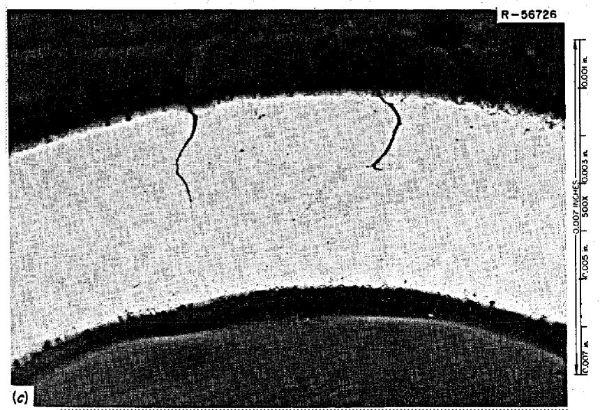

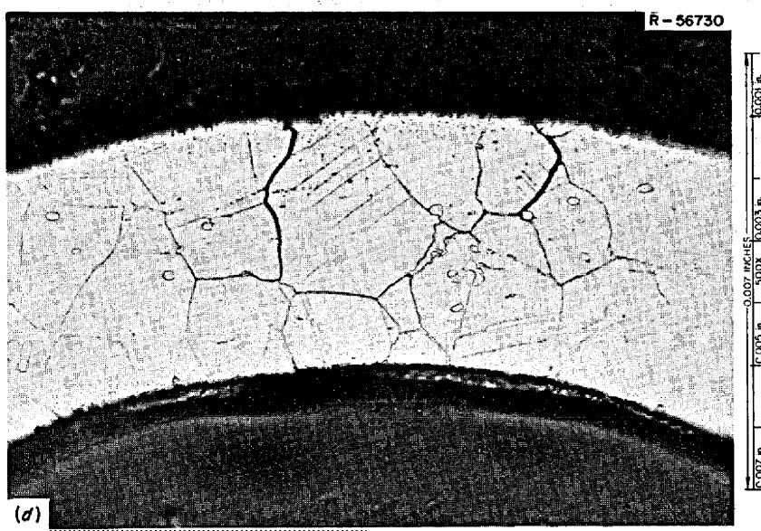  
Fig. 39. Photomicrographs of Two Specimens From a Thin INOR-8! (Heat 5075) Foil that was Attached to the Strap Shown in the Previous Figure. The curvature was caused by forming before being inserted into the MSRE. (a) As polished (b) Etched (c) As polished (d) Etched. Etchant: Lactic acid, HNO₃, HCl. Reduced 32%.

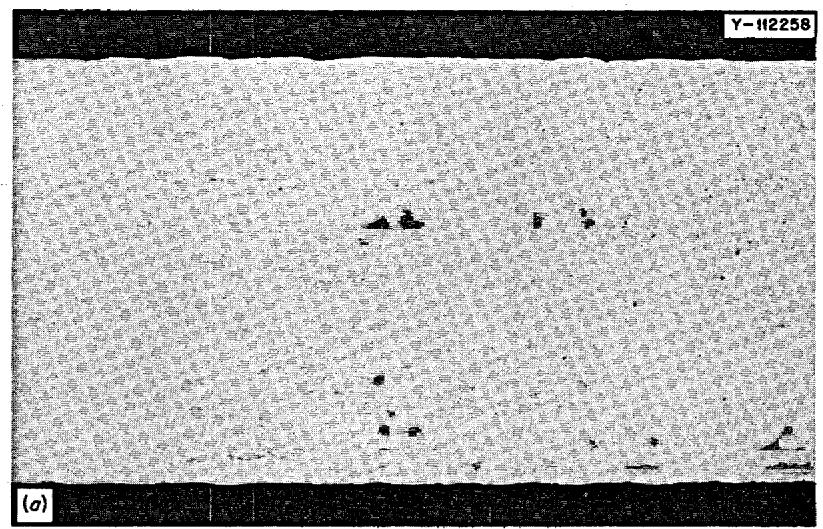

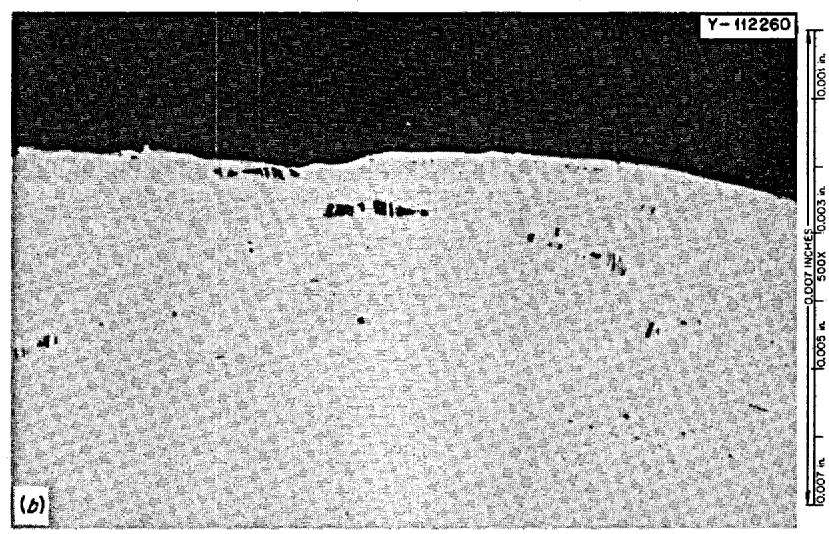

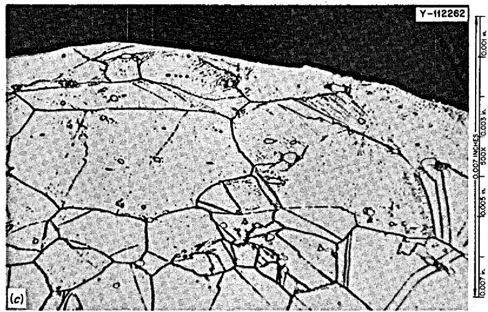  
Fig. 40. Photomicrographs of INOR-8 (Heat 5055) Straps Exposed to Static Unenriched Fuel Salt 7203 hr Above $500^{\circ}\mathrm{C}$ . (a) As-Polished $33\times$ , (b) As Polished, $500\times$ , cracked regions are carbide that fractured during initial forming, (c) Etched with glyceria regia, $500\times$ . Reduced $33\%$ .

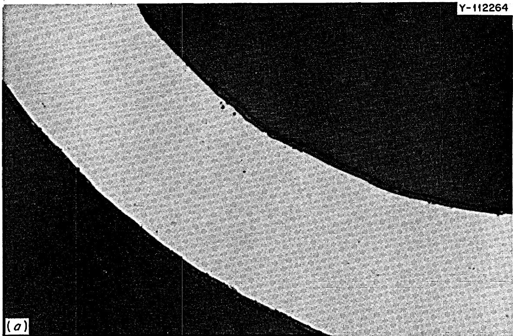  
10.007 in. 1 10.005 in. 1 500x 10.003 in. 1 10.001 in.

Fig. 41. Photomicrographs of a Thin INOR-8 (Heat 5075) Foil that was attached to the strap shown in the Previous Figure. (a) As Polished, (b) Etched with glyceria regia. $500 \times$   
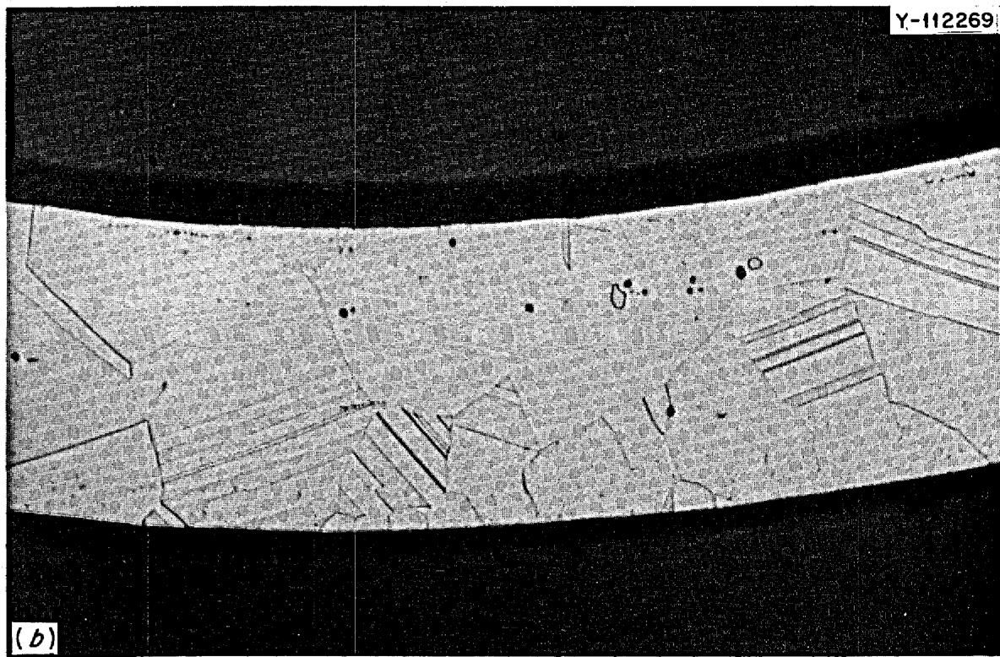  
0.007 in. 1 10.005 in. 1 500x 10.003 in. 1 10.001 in.

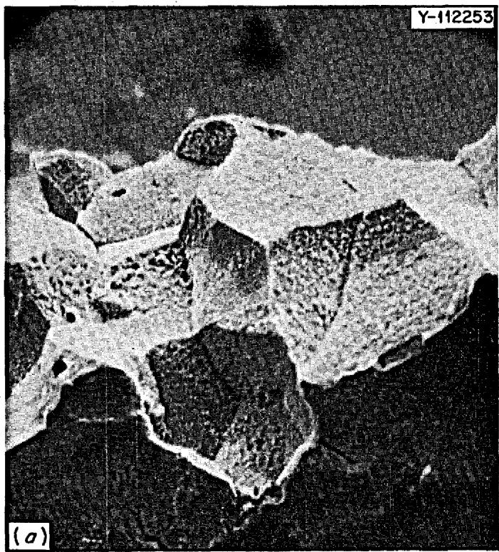

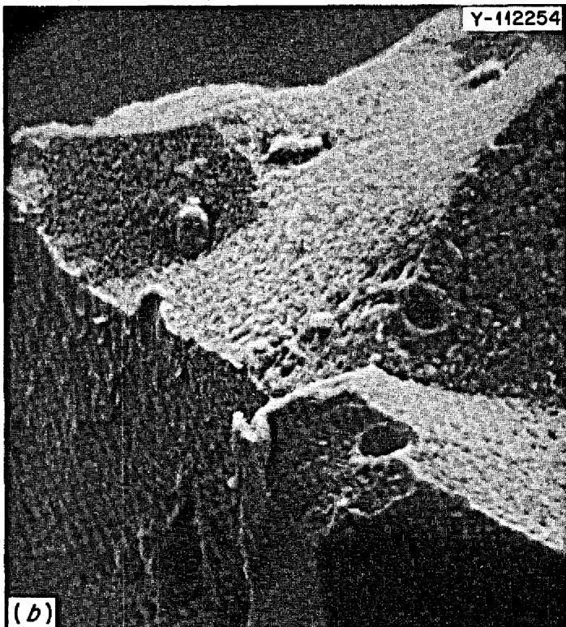  
Fig. 42. Scanning Electron Micrograph of INOR-8 (Heat 5075) Foil Exposed to the MSRE Core for 7203 hr Above $500^{\circ}\mathrm{C}$ . (a) Topographical view of fracture showing the surfaces of the fractured grain boundaries. $500\times$ . (b) $1000\times$ .

found in INOR-8. Auger electron spectroscopy indicated that Te, S, and Mo were concentrated in the boundaries. Definite confirmation of the presence of these elements was difficult because many of the spectra overlapped.

Samples of heats 5065 and 5085 that were removed from the control and the surveillance facility after 19,000 hr were subjected to numerous mechanical property tests, and some specimens were examined metallographically after having been strained to fracture. The tensile properties measured at $25^{\circ}\mathrm{C}$ are summarized in Table 6. The changes in the yield stress are small and probably within experimental accuracy. The reductions in the ultimate tensile stress are due primarily to the reduced fracture strain, which, as explained before, is believed to be due to carbide precipitation that is dependent upon time at temperature, irradiation, and the particular heat involved.

The control sample of heat 5065, whose microstructure is shown in Fig. 43, deformed $50\%$ before fracture. The fracture is mixed intergranular and transgranular and no cracks formed along the edge away from the immediate vicinity of the fracture. The microstructure of a heat 5065 sample from the core is shown in Fig. 44. This sample deformed $43\%$ and had a mixed fracture. Numerous intergranular cracks to a depth of about 5 mils formed along the gage length. Samples of heat 5085 from the control facility and the core are shown in Figures 45 and 46. The control sample failed after $41\%$ strain with a mixed fracture. No intergranular cracks were visible in the field shown in Fig. 45. The sample of heat 5085 from the core that was tested at $25^{\circ}\mathrm{C}$ failed after much less strain $(22\%)$ . As shown in Fig. 46, the fracture is mixed, and numerous intergranular cracks formed along the surfaces to a depth of 5 mils.

Composite photographs of sections of the broken control and surveillance samples of heats 5065 and 5085 were made for overall viewing. These are Figures 47 and 48. These pictures show very clearly that the intergranular cracks are more frequent and deeper in the specimens exposed in the core than in the control samples. The photograph of the heat 5085 core sample also shows that very small strains are sufficient to make the cracks visible. The sample had a 3/16-in. radius at the

Table 6. Tensile Properties of Surveillance Samples From Fourth Group at ${25}^{ \circ  }\mathrm{C}$ and a Strain Rate of ${0.05}{\mathrm{\;{min}}}^{-1}$   

<table><tr><td>Heat</td><td>Conditiona</td><td>Yield Stress (psi)</td><td>Ultimate Tensile Stress (psi)</td><td>Uniform Elongation %</td><td>Total Elongation %</td><td>Reduction In Area %</td></tr><tr><td>5085</td><td>Annealed</td><td>51,500</td><td>120,800</td><td>52.3</td><td>53.1</td><td>42.2</td></tr><tr><td>5085</td><td>Control</td><td>48,100</td><td>108,500</td><td>40.5</td><td>40.6</td><td>32.8</td></tr><tr><td>5085</td><td>Irradiated</td><td>53,900</td><td>89,000</td><td>22.0</td><td>22.1</td><td>19.6</td></tr><tr><td>5065</td><td>Annealed</td><td>56,700</td><td>126,400</td><td>52.9</td><td>55.3</td><td>50.0</td></tr><tr><td>5065</td><td>Control</td><td>61,200</td><td>126,500</td><td>48.5</td><td>49.8</td><td>36.8</td></tr><tr><td>5065</td><td>Irradiated</td><td>56,700</td><td>109,500</td><td>42.5</td><td>42.8</td><td>33.2</td></tr></table>

aAnnealed - Annealed 2 hr at $900^{\circ}\mathrm{C}$ . Control - Annealed, exposed to depleted fuel salt for 19,136 hr at $650^{\circ}\mathrm{C}$ . Irradiated - Annealed, irradiated in core to a thermal fluence of $1.5 \times 10^{21}$ neutrons/cm $^2$ over a period of 19,136 hr at $650^{\circ}\mathrm{C}$ .

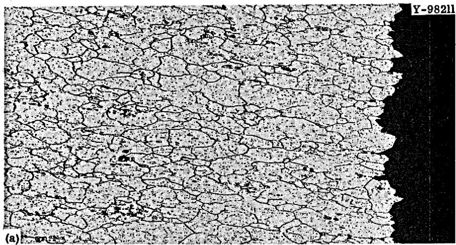

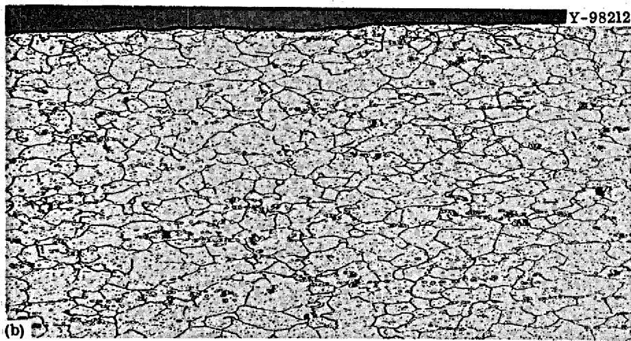

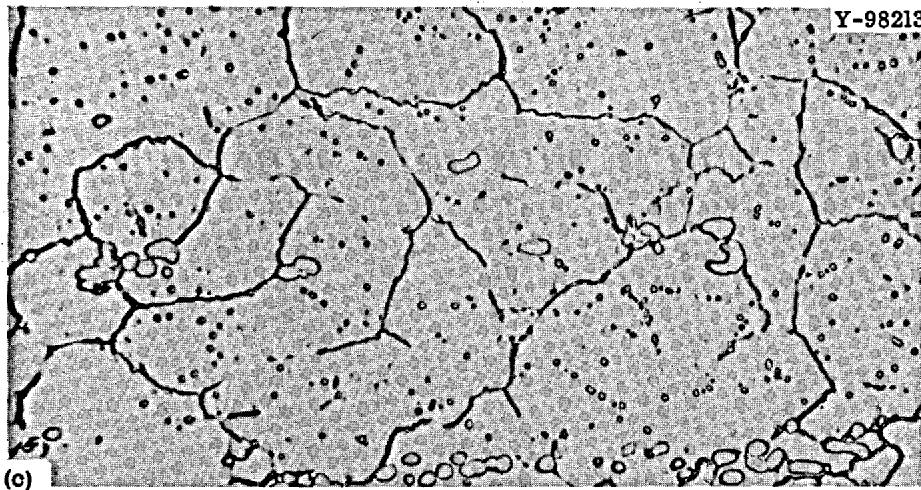  
Fig. 43. Typical Photomicrographs of INOR-8 (Heat 5065) Sample Tested at $25^{\circ}\mathrm{C}$ After Being Exposed to Static Unenriched Fuel Salt for 19,136 hr above $500^{\circ}\mathrm{C}$ . Etchant: glyceria regia. (a) Fracture. $100 \times$ . (b) Edge near fracture. $100 \times$ . (c) Representative unstressed structure. $500 \times$ . Reduced $22\%$ .

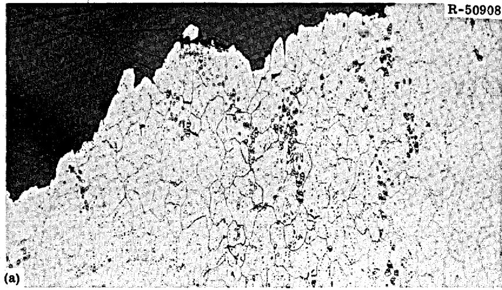

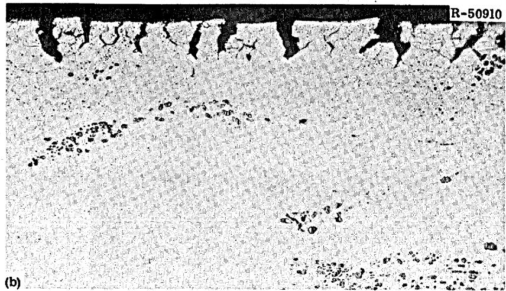

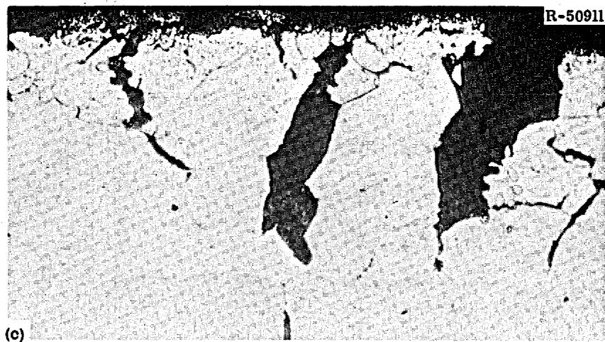

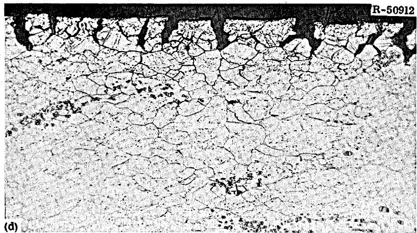  
Fig. 44. Photomicrographs of INOR-8 (Heat 5065) Sample Tested at $25^{\circ}\mathrm{C}$ After Being Exposed to the MSRE Core for 19,136 hr Above $500^{\circ}\mathrm{C}$ and Irradiated to a Thermal Fluence of $1.5 \times 10^{21}$ neutrons/cm $^2$ . (a) Fracture, etched. $100\times$ . (b) Edge, as polished. $100\times$ . (c) Edge, as polished. $500\times$ . (d) Edge, etched. $100\times$ . Etchant: glyceria regia. Reduced $26\%$ .

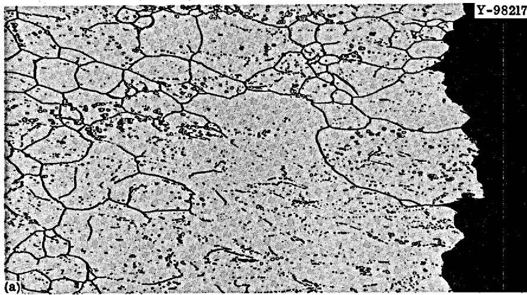

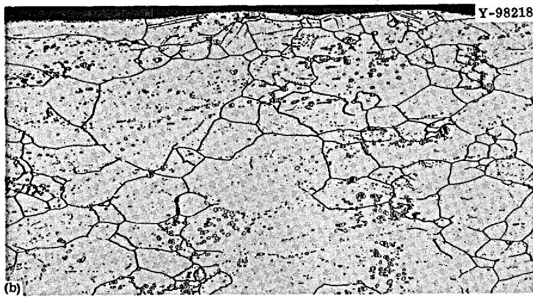

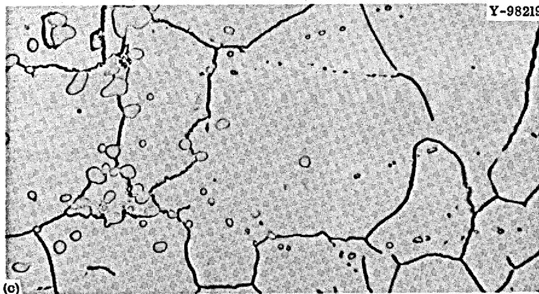  
Fig. 45. Typical Photomicrographs of INOR 8 (Heat 5085) Sample Tested at $25^{\circ}\mathrm{C}$ After Being Exposed to Static Unenriched Fuel Salt for 19,136 hr Above $500^{\circ}\mathrm{C}$ . (a) Fracture, etched. $100\times$ . (b) Edge near fracture, etched. $100\times$ . (c) Representative unstressed structure, etched. $500\times$ . Etchant: glyceria regia. Reduced $24.5\%$ .

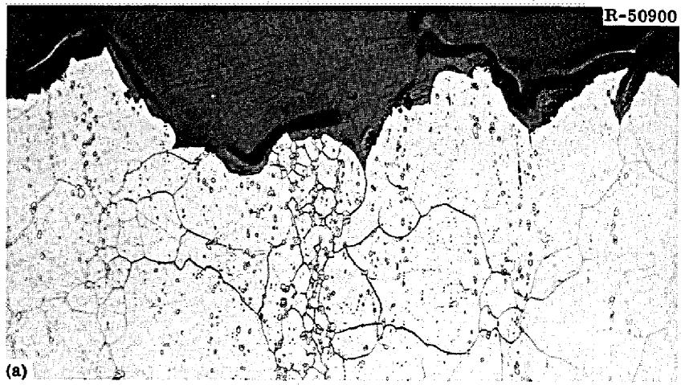

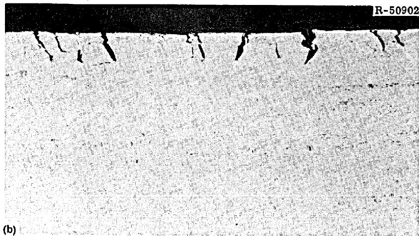

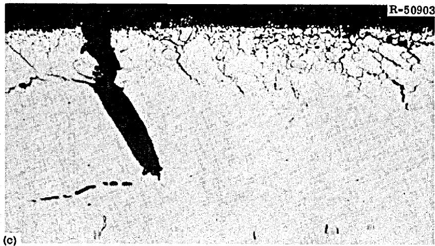

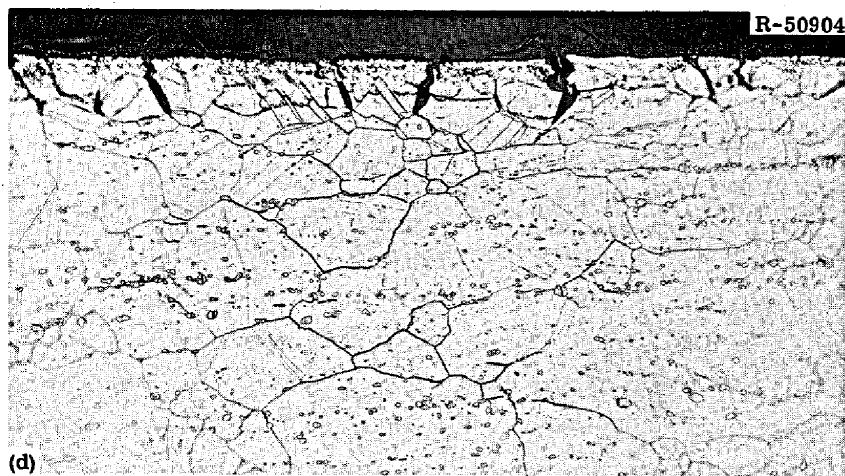  
Fig. 46. Photomicrographs of INOR-8 (Heat 5085) Sample Tested at $25^{\circ}\mathrm{C}$ After Being Exposed to the MSRE Core for 19,136 hr Above $500^{\circ}\mathrm{C}$ and Irradiated to a Thermal Fluence of $1.5 \times 10^{21}$ neutrons/cm $^2$ . (a) Fracture, etched. $100\times$ . (b) Edge, as polished. $100\times$ . (c) Edge, as polished. $500\times$ . (d) Edge, etched. $100\times$ . Etchant: glyceria regia. Reduced $27\%$ .

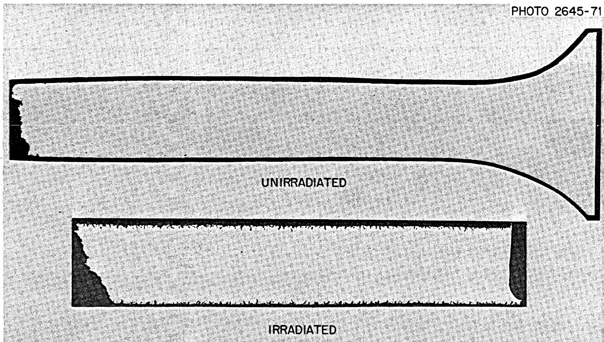  
Fig. 47. Photomicrographs of INOR-8 (Heat 5065) Strained to Fracture at $25^{\circ}\mathrm{C}$ . Top specimen was exposed to static unenriched fuel salt for 19,136 hr above $500^{\circ}\mathrm{C}$ and the lower specimen was exposed to the MSRE core for the same time. The diameters are about 0.1 in.

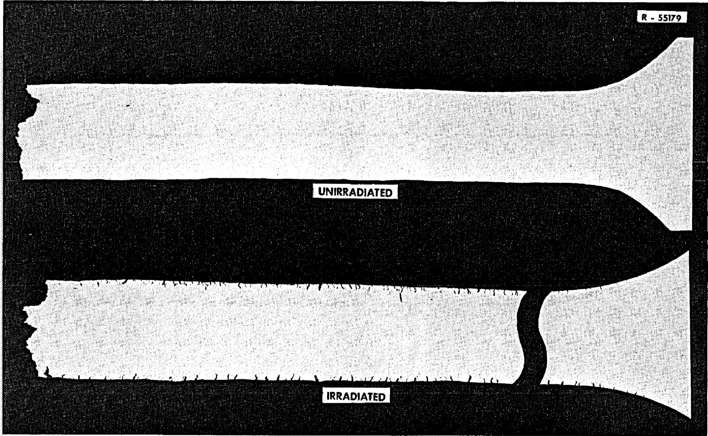  
Fig. 48. Photomicrographs of INOR-8 (Heat 5085) Strained to Fracture at $25^{\circ}\mathrm{C}$ . The top specimen was exposed to static unenriched fuel salt for 19,136 hr above $500^{\circ}\mathrm{C}$ and the lower specimen was exposed to the MSRE core for the same time. The diameters are about 0.1 in.

end of the gage section and the diameter increased rapidly from 1/8 in. to 1/4 in. Thus the stress, and hence the strain, decreased rapidly along this radius. Note in Fig. 48 that the cracks continue a large distance along the radius, into the region of low strain.

An additional experiment was made with a core sample of heat 5085 that had been cut too short for mechanical property testing. The remaining segment was bent about $30^{\circ}$ in a vise, then was sectioned and examined metallographically. The resulting photomicrographs are shown in Fig. 49. The tension side had intergranular cracks to a depth of about 4 mils, but no cracks were evident on the compression side. Both the tension and compression sides etched abnormally near the surface because of the modification thought to be due to cold working.

# Modified Alloys (RR3 and RS4)

The specimens on stringers RR3 and RS4 were of two different heats of titanium-modified alloy: heat 7320, containing $0.65\%$ Ti, and heat 67-551, containing $1.1\%$ Ti. The 7200-hr exposure of these specimens had been entirely during the $^{233}\mathrm{U}$ operation, in which the initial oxidation state was relatively high. The specimens were discolored and had much the same appearance as the standard heats. The samples were subjected to various mechanical property tests and some were examined metallographically. The microstructure of heat 7320 after exposure in the control facility and testing at $25^{\circ}\mathrm{C}$ is shown in Fig. 50. The sample deformed $50\%$ before fracturing in a mixed mode. No edge cracks were visible. A similar sample that was exposed to the fuel salt is shown in Fig. 51. It failed after deforming $45\%$ . Edge cracks were present along almost every grain boundary to a depth of 3 to 5 mils. Note that many of these cracks proceed to where the cracking grain boundary intersects another boundary. Note also that the crack tips are quite blunt indicating that they formed early during deformation and were simply spread by further deformation and did not propagate. Similar metallographic observations were made on heat 67-551. Control and core specimens deformed almost equal amounts before fracturing ( $52\%$ and $51\%$ ). No edge cracks were observed in the sample from the control facility (Fig. 52), but numerous intergranular cracks were evident in the sample from the core (Fig. 53).

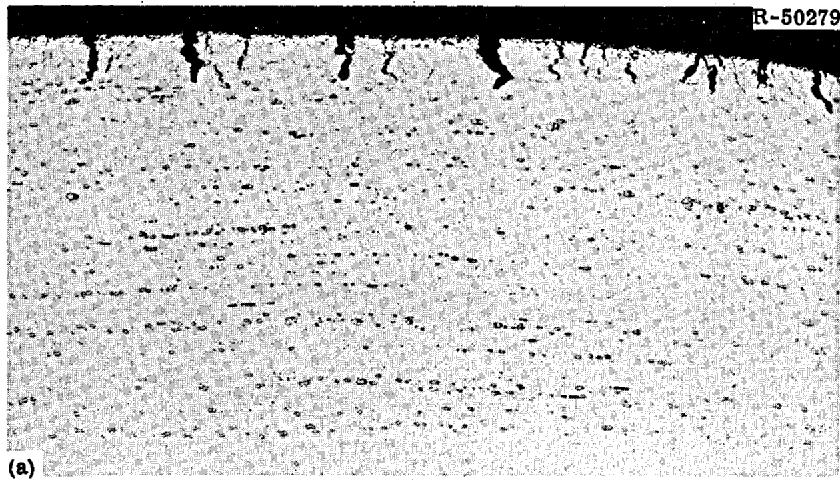

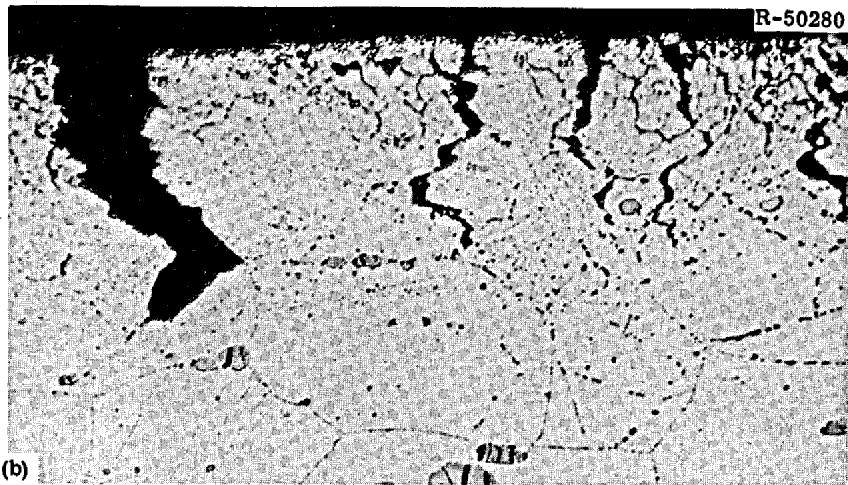

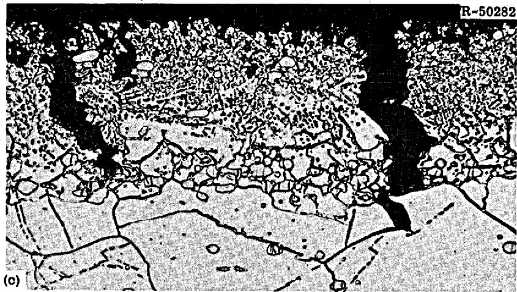

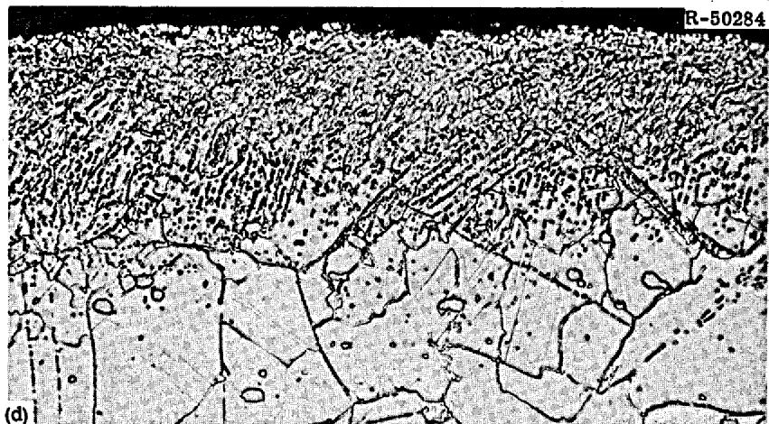  
Fig. 49. Typical Photomicrographs of INOR-8 (Heat 5085) Sample Exposed to the MSRE Core for 19,136 hr Above $500^{\circ}\mathrm{C}$ . The sample was bent in a vise. (a) As polished, tension side. $100\times$ . (b) As polished, tension side. $500\times$ . (c) Etched, tension side. $500\times$ . (d) Etched, compression side. $500\times$ . Etchant: aqua regia. Reduced $27\%$ .

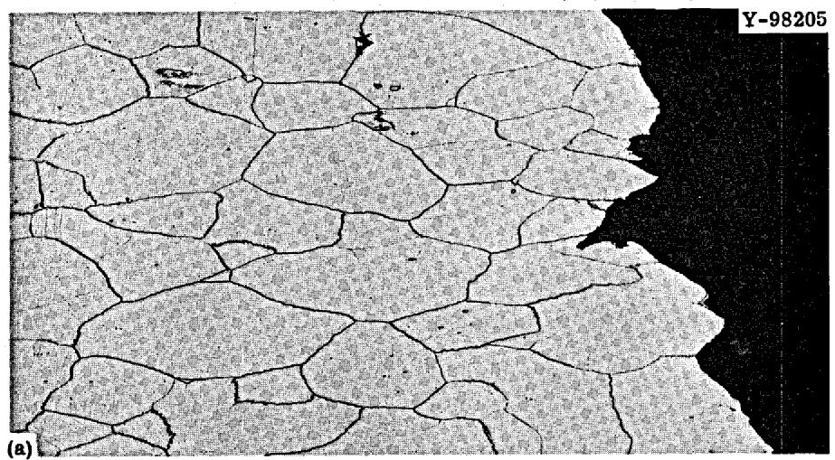

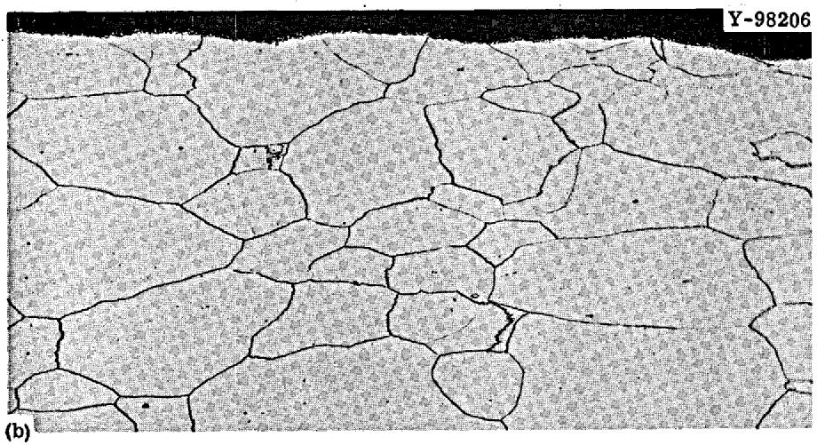

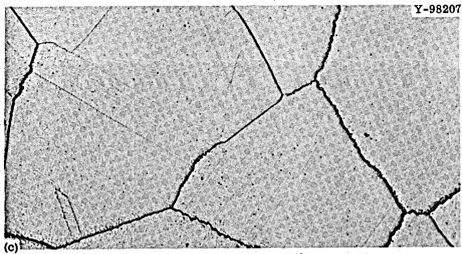  
Fig. 50. Photomicrographs of a Modified INOR-8 (Heat 7320) Sample Tested at $25^{\circ}\mathrm{C}$ After Being Exposed to Static Unenriched Fuel Salt for 7203 hr Above $500^{\circ}\mathrm{C}$ . (a) Fracture. $100 \times$ . (b) Edge. $100 \times$ . (c) Typical unstressed microstructure. $500 \times$ . Etchant: glyceria regia. Reduced $22.5\%$ .

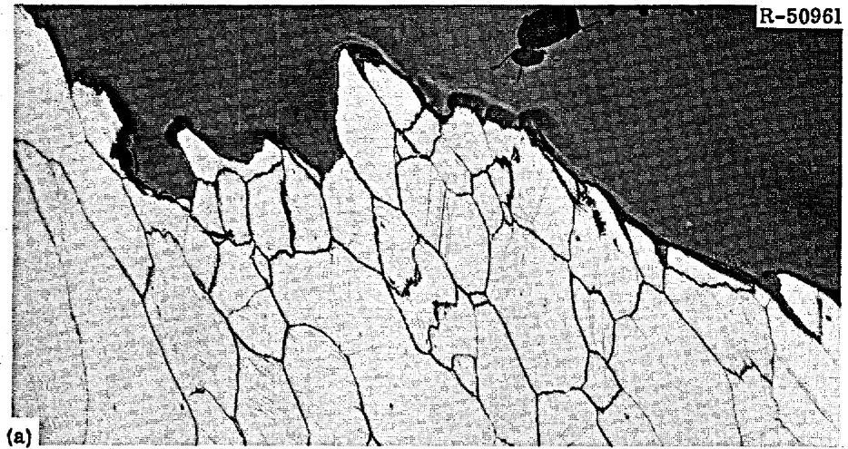

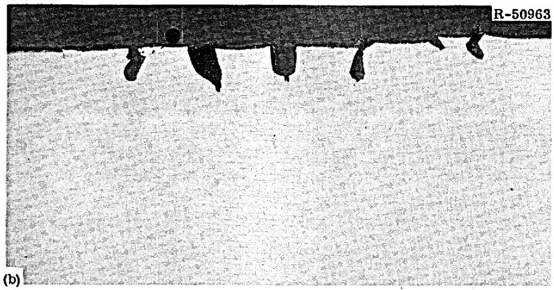

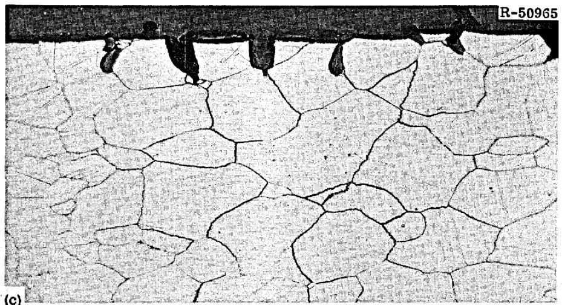  
Fig. 51. Photomicrographs of a Modified INOR-8 (Heat 7320) Sample Tested at $25^{\circ}\mathrm{C}$ After Being Exposed to the MSRE Core for 7203 hr Above $500^{\circ}\mathrm{C}$ and Irradiated to a Fluence of $5.1 \times 10^{20}$ neutrons/cm $^2$ . (a) Fracture, etched, $100\times$ . (b) Edge, as polished. $100\times$ . (c) Edge, Etched. $100\times$ . Etchant: glyceria regia. Reduced $22\%$ .

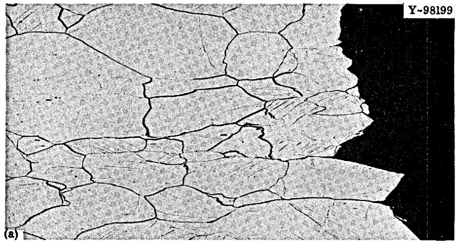

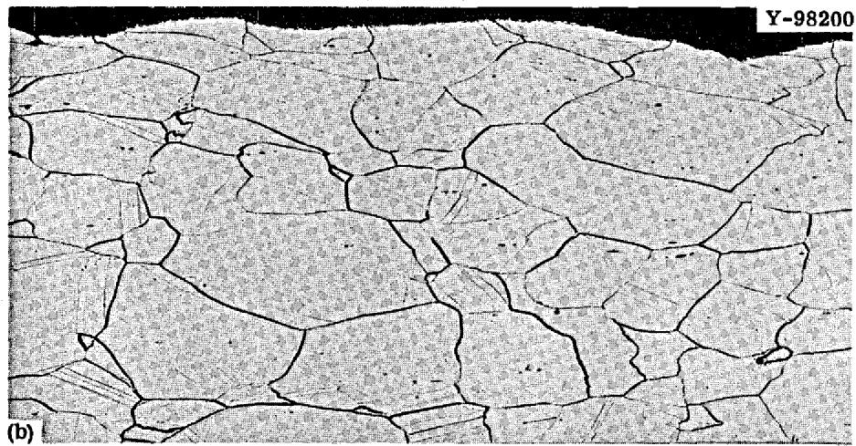

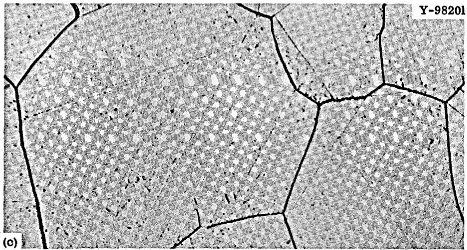  
Fig. 52. Photomicrographs of a Modified INOR-8 (Heat 67-551) Sample Tested at $25^{\circ}\mathrm{C}$ After Being Exposed to Static Unenriched Fuel Salt for 7203 hr Above $500^{\circ}\mathrm{C}$ . (a) Fracture. $100 \times$ . (b) Edge. $100 \times$ . (c) Typical unstressed microstructure. $500 \times$ . Etchant: glyceria regia. Reduced $20.5\%$ .

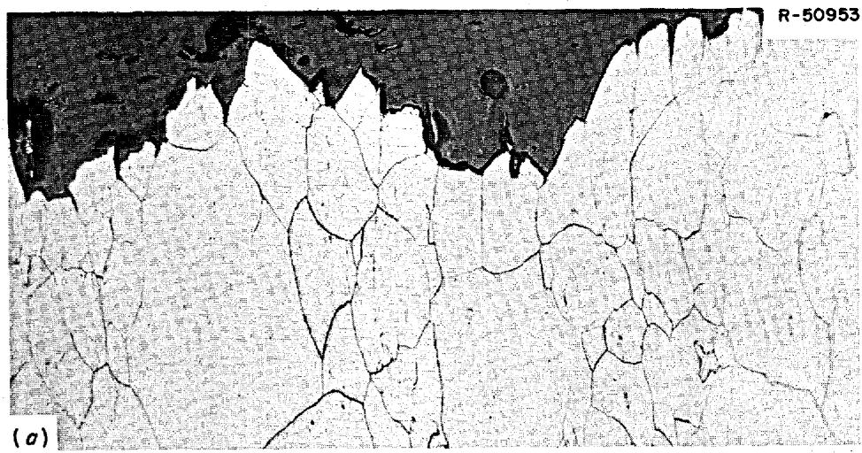

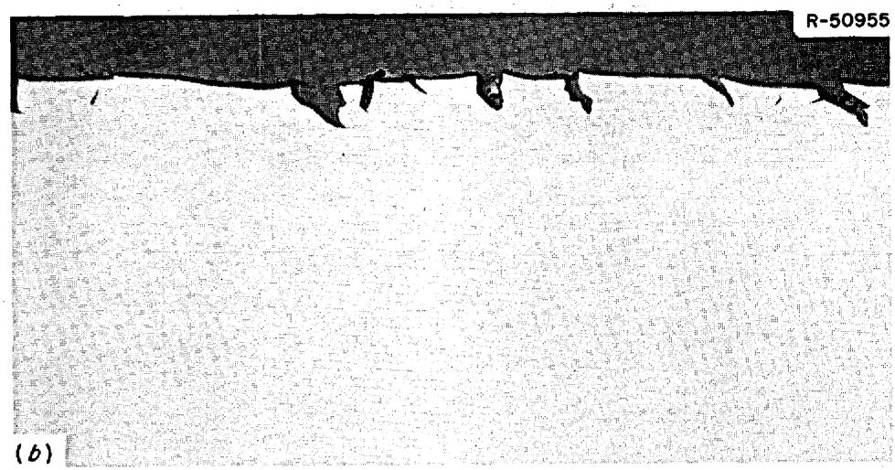

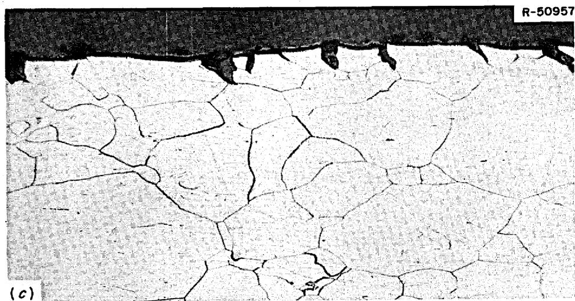  
Fig. 53. Photomicrographs of a Modified INOR-8 (Heat 67-551) Sample Tested at $25^{\circ}\mathrm{C}$ After Being Exposed to the MSRE Core for 7203 hr Above $500^{\circ}\mathrm{C}$ and Irradiated to a Fluence of $5.1 \times 10^{20}$ neutrons/cm $^2$ . (a) Fracture, etched. $100\times$ . (b) Edge, as polished. $100\times$ . (c) Edge, etched. $100\times$ . Etchant: Glyceria regia. Reduced $17\%$ .

# Specimens Exposed to Cell Atmosphere

All of the INOR-8 specimens exposed to the cell atmosphere outside the reactor vessel $(\mathbf{N}_2$ with $2 - 5\%$ $\mathsf{O}_2)$ developed a dark gray-green, tenacious surface film. Examination indicated that the film was oxide, and there was indication of nitriding.

Figure 54 is a photomicrograph of one of the cell specimens exposed the longest (17,483 hr at high temperature). It shows a very thin, uniform layer of oxide on the surface, with internal oxidation extending to a depth of 1 to 2 mils. Also evident is the usual M6C-type carbide formed during the primary working and the long thermal aging.

Results of $25^{\circ}\mathrm{C}$ tensile tests on the standard INOR-8 specimens (heats 5065 and 5085) showed reductions (relative to unexposed material) in ultimate stress and fracture strain consistent with expectations from the results on control and core specimens. (See Table 5.)

Figure 55 shows a sample of heat 5065 exposed to the cell environment and fractured at $25^{\circ}\mathrm{C}$ . The elongated grains attest to the large fracture strain (59%), and the fracture is mixed transgranular and intergranular. A heat 5085 specimen exposed the same length of time failed with only 33% fracture strain, in a primarily intergranular mode as shown in Fig. 56. Both specimens showed a few shallow surface cracks, but the oxide layer did not appear to affect the deformation of the specimens.

# Studies Related to Modified Surface Microstructure

Reference was made in several instances to a modified microstructure. Metals quite often have different microstructures near the surface than deeper in the piece. Processing methods can account for these variations on as-fabricated surfaces. Hot working is often accompanied by oxidation or decarburization that can produce either larger or smaller grains near the surface. Tubing is often made by alternately drawing cold and annealing to soften the metal. The lubricants used in drawing are difficult to clean from the inside surface, and residues can diffuse into the tubing

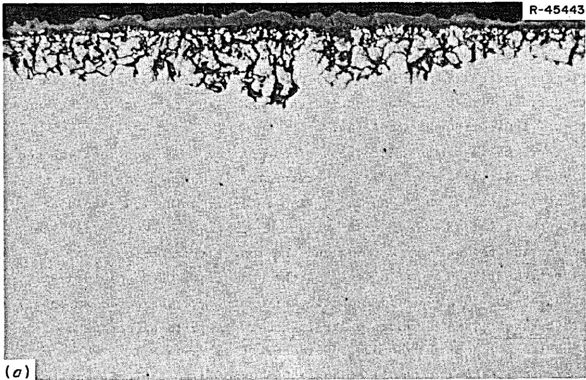  
0.007 INCHES C0.007 in. 1 In,005 in. 1 500x 10.003 in. 1 10.001 in.

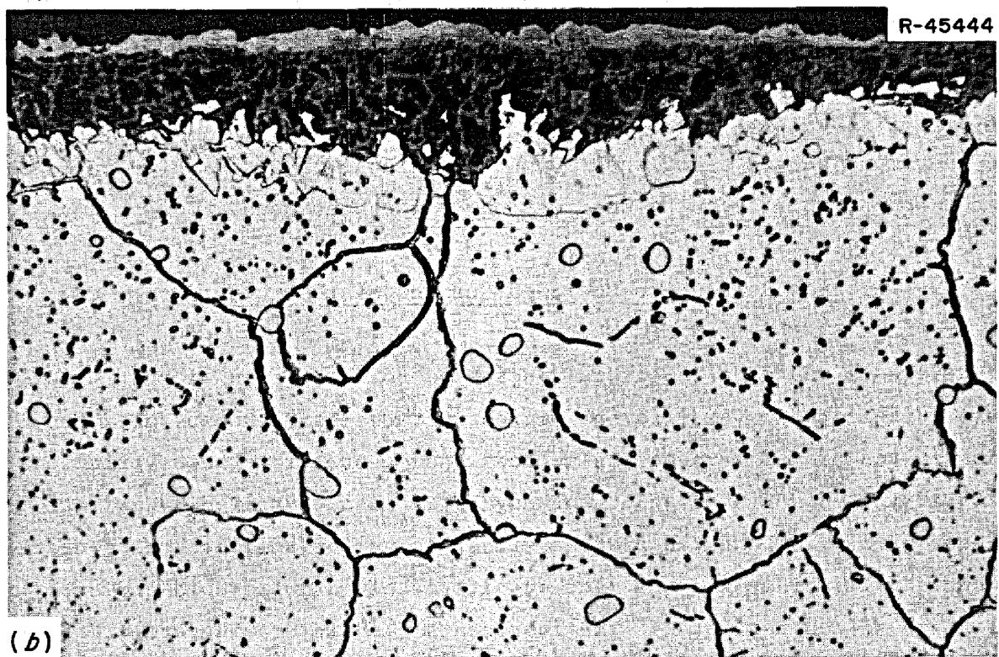  
0.007 INCHES C.007 in. 1 500x 10.003 in. 1 10.001 in.   
Fig. 54. Photomicrographs of Hastelloy N (Heat 5065) Surveillance Specimens Exposed to the Cell Environment of $\mathbf{N}_2 + 2$ to $5\%$ $\mathbf{O}_2$ for 20,789 hr at $650^{\circ}\mathrm{C}$ . $500\times$ . (a) Unetched showing surface oxidation (b) Etched (glyceria regia) showing shallow modification of microstructure due to reaction with cell environment.

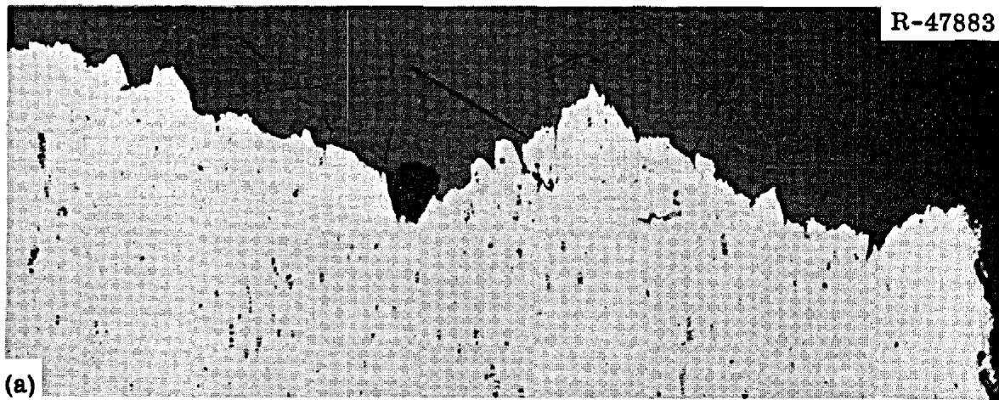

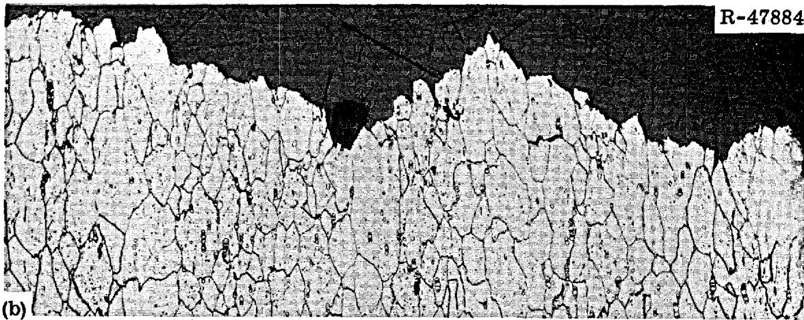

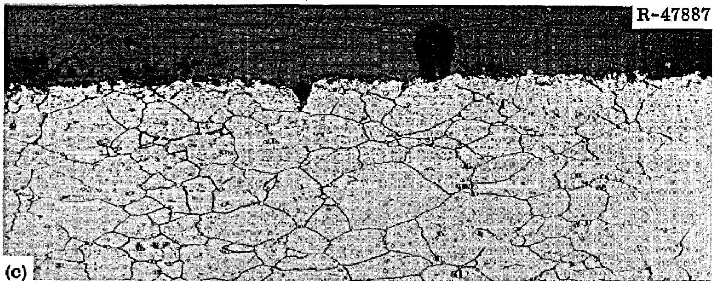  
Fig. 55. Photomicrographs of INOR-8 (Heat 5065) Sample Tested at $25^{\circ}\mathrm{C}$ at a Strain Rate of $0.05 / \mathrm{min}$ . Sample had been irradiated to a thermal fluence of $2.6 \times 10^{19}$ neutrons/cm² while being exposed to the cell environment above $500^{\circ}\mathrm{C}$ for 17,483 hr. 100×. (a) Fracture, as polished. (b) Fracture, etched. (c) Edge of stressed portion. Etchant: aqua regia.

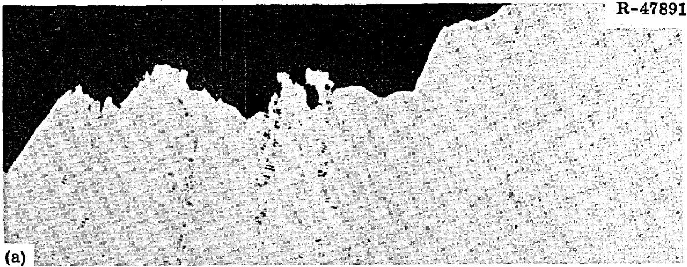

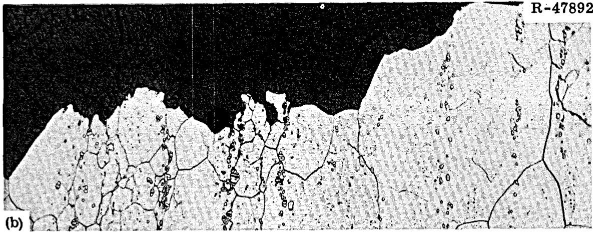

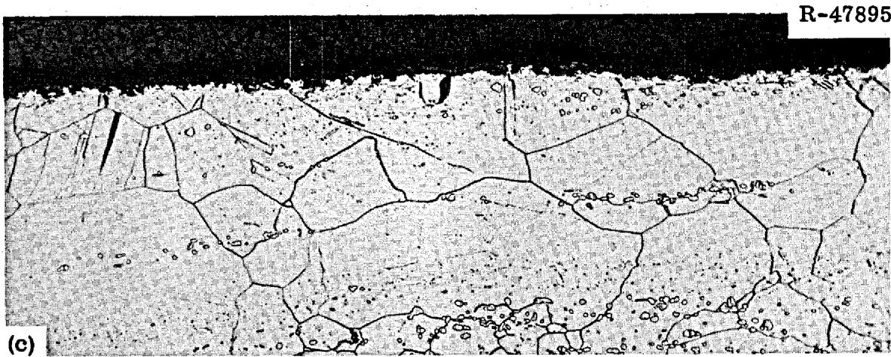  
Fig. 56. Photomicrographs of INOR-8 (Heat 5085) Sample Tested at $25^{\circ}\mathrm{C}$ at Strain Rate of $0.05 / \min$ . Sample had been irradiated to a thermal fluence of $2.6 \times 10^{19}$ neutrons/cm² while being exposed to the cell environment above $500^{\circ}\mathrm{C}$ for 17,483 hr. 100×. (a) Fracture, as polished. (b) Fracture, etched. (c) Edge of stressed portion. Etchant: aqua regia.

during annealing. The lubricants are usually high in silicon or carbon and these elements can cause a layer of small grains to form near the affected surface.

Our surveillance samples were machined from larger pieces of material, so none of the explanations that we have given can apply. The 1/4-in.-diam surveillance rods were fabricated by several methods, all involving some cold working. The rods were annealed for 1 hr at $1180^{\circ}\mathrm{C}$ (standard mill anneal) in argon and then centerless ground to the final dimension of about 0.245 in. The 1/8-in.-diam gage section was machined.

The photomicrographs in Fig. 57 show typical surface modifications noted on surveillance and control specimens after long annealing times at $650^{\circ}\mathrm{C}$ . The modification is generally less than 1 mil deep and is not detectably influenced by irradiation. Microprobe examination of the first control sample indicated that the modified region was slightly enriched in carbon and that none of the other alloying elements varied. Thus the modification appears to be a region of fine carbides that are dispersed along lines. We postulated that these lines were slip lines that resulted from the surface working during the final stages of fabrication. These slip lines would provide preferred sites for carbide precipitation when the alloy was held at $650^{\circ}\mathrm{C}$ .

We were able to duplicate the surface modification by solution annealing a rod, centerless grinding, and annealing for a long period at $650^{\circ}\mathrm{C}$ . The resulting microstructure is shown in Fig. 58. It is quite similar to the microstructures in Fig. 57 and confirms that the modification is due to surface working. Thus, this modification is unrelated to the intergranular cracking phenomenon.

# Summary of Observations on Surveillance Specimens

This section is intended as a convenient summary of the observations on the surveillance specimens that we believe are pertinent to the intergranular surface cracking phenomenon. Discussion and interpretations will come later, after the descriptions of the observations on MSRE components.

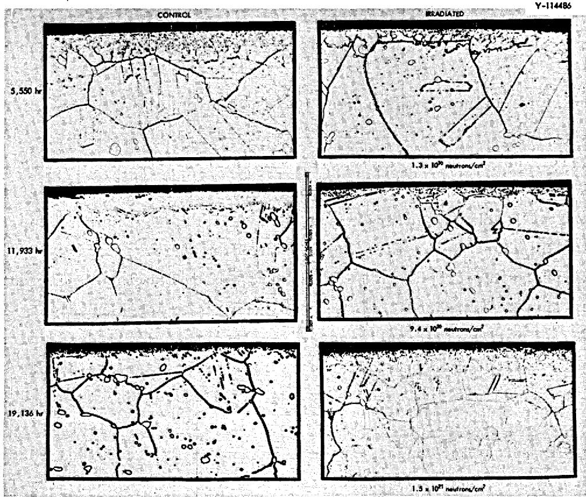  
Fig. 57. Photomicrographs of Unstressed INOR-8 (Heat 5085) Control and Irradiated Samples.

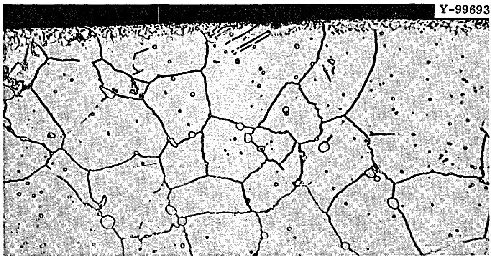  
Fig. 58. Photomicrograph of INOR-8 (Heat 5085) Rod that was Annealed 1 hr at $1177^{\circ}\mathrm{C}$ , Centerless Ground 5.2 mils, and Annealed 4370 hr at $650^{\circ}\mathrm{C}$ in Argon. $500\times$ . Etchant: glyceria regia.

INOR-8 specimens exposed to fuel salt for more than 1000 hr before the beginning of power operation showed no intergranular surface cracking. All specimens exposed thereafter in the core for periods ranging from 2500 to 19,000 hr did show intergranular surface cracks after being strained in tension. No surface cracks were visible in unstrained specimens from the first set of core surveillance specimens (exposed for 2500 hr after the beginning of power operation), but specimens from all arrays removed later did show some cracks or incipient cracks in the unstrained, as-polished condition.

In contrast to the core specimens, 'specimens exposed to salt in the control facility for equal times at high temperature and then tested in tension showed only a few surface cracks. Specimens exposed to the cell atmosphere developed an oxidized layer, which cracked upon being strained, but few or no cracks extended deeper than the oxide layer.

The severity of surface cracking in core and control specimens of MSRE vessel heats exposed during various periods of time was measured as follows. Photomicrographs were made of polished longitudinal sections of specimens of heats 5065 and 5085 that had been fractured in tension. Cracks visible along the edges of the gage portions of the specimens were counted, and the average and maximum depths were determined. Table 7 gives the observed crack frequencies (number per inch of gage length) and depths.

We saw very evident differences between different heats in the degree of surface cracking. Strained specimens of heat 5065 had more cracks than did specimens of heat 5085 exposed simultaneously, but average depths were not very different. (See Table 7.) Statistics were not gathered on specimens of modified heats, but the photomicrographs of strained specimens show crack frequencies and depths comparable to those in specimens of heat 5065. Straps and a foil of different standard heats showed more cracks than were visible in unstrained specimens of heats 5065 and 5085.

The surfaces of specimens exposed during the first part of the $^{233}\mathrm{U}$ operation were noticeably more discolored than the surfaces of specimens exposed only during the $^{235}\mathrm{U}$ operation. Presumably this was evidence of

Table 7. Crack Formation in Hastelloy N Surveillance Samples Strained to Failure at $25^{\circ}\mathrm{C}$   

<table><tr><td rowspan="2">Sample Description</td><td colspan="2">Time at High Temperaturea (hr)</td><td colspan="2">Crack Count</td><td colspan="2">Depth (mils)</td></tr><tr><td>Total</td><td>With FPb</td><td>Counted Total</td><td>(in.-1)</td><td>Av</td><td>Max</td></tr><tr><td>Control, Heat 5085</td><td>5,550</td><td>2,550</td><td>1</td><td>1</td><td>5.7</td><td>5.7</td></tr><tr><td>Heat 5085</td><td>5,550</td><td>2,550</td><td>24</td><td>19</td><td>2.5</td><td>8.8</td></tr><tr><td>Control, heat 5085</td><td>11,933</td><td>11,600</td><td>0</td><td></td><td></td><td></td></tr><tr><td>Heat 5085</td><td>11,933</td><td>11,600</td><td>178</td><td>134</td><td>1.9</td><td>6.3</td></tr><tr><td>Control, Heat 5065</td><td>11,933</td><td>11,600</td><td>3</td><td>3</td><td>1.0</td><td>2.0</td></tr><tr><td>Heat 5065</td><td>11,933</td><td>11,600</td><td>277</td><td>230</td><td>1.8</td><td>3.8</td></tr><tr><td>Control, Heat 5085</td><td>19,136</td><td>18,800</td><td>4</td><td>3</td><td>1.5</td><td>2.8</td></tr><tr><td>Heat 5085</td><td>19,136</td><td>18,800</td><td>213</td><td>176</td><td>5.0</td><td>7.0c</td></tr><tr><td>Heat 5085</td><td>19,136</td><td>18,800</td><td>140</td><td>146</td><td>3.8</td><td>8.8</td></tr><tr><td>Control, Heat 5065</td><td>19,136</td><td>18,800</td><td>3</td><td>3</td><td>2.5</td><td>4.0</td></tr><tr><td>Heat 5065</td><td>19,136</td><td>18,800</td><td>240</td><td>229</td><td>5.0</td><td>7.5</td></tr></table>

${}^{a}$ Time logged above ${500}^{ \circ  }\mathrm{C}$ . All was at ${650} \pm  {10}^{ \circ  }\mathrm{C}$ with the exception of ${100}\mathrm{{hr}}$ at ${760}^{ \circ  }\mathrm{C}$ in 10/65,about ${750}\mathrm{{hr}}$ at ${500} - {600}^{ \circ  }\mathrm{C}$ in 2-3/66 and ${500}\mathrm{{hr}}$ at ${630}^{ \circ  }\mathrm{C}$ in ${12}/{67} - 2/{68}$ .   
b Time above $500^{\circ}C$ after exposure of specimen to fuel salt containing fresh fission products.   
One crack that may not be surface connected and probably had a different cause was 15 mils deep, next largest was 7 mils.

the relatively more oxidizing condition of the salt following the processing. It also indicates the importance of recognizing that corrosion (and possibly the surface cracking) was not proportional to time. The fluctuation in the concentration of chromium in the fuel salt (Fig. 5) is further evidence of this fact.

Aging at high temperature caused $\mathsf{M}_6\mathsf{C}$ -type carbide to precipitate throughout specimens of heats 5065 and 5085. Irradiation enhanced this process. The increased amounts of intergranular $\mathsf{M}_6\mathsf{C}$ (which is brittle at room temperature) were attended by reductions in the fracture strains and ultimate stresses at $25^{\circ}\mathsf{C}$ and a shift in the nature of the fractures at $25^{\circ}\mathsf{C}$ from largely transgranular to more nearly intergranular. These changes were observed in the surveillance specimens from the core and the cell and in the control specimens, although the changes were greater in the surveillance specimens. Little or no coarse $\mathsf{M}_6\mathsf{C}$ precipitate formed in specimens of modified compositions, since the modifications were tailored to produce fine carbide of the MC type.

All aged INOR-8 specimens showed near the surface a layer that etched more darkly. The amount of this modified layer did not vary systematically with time or temperature. Experiments produced evidence that the effect was likely due to cold work from machining, causing carbide to precipitate more readily near the surface.

# EXAMINATION OF MSRE COMPONENTS

A major objective of the postoperation examination of the MSRE $^{19,20}$ was to supplement the findings on the INOR-8 surveillance specimens by examining pieces of INOR-8 from different parts of the fuel system. All parts had been at high temperature for 31,000 hr and in contact with fuel salt for 21,000 hr (about 1.5 times as long as any surveillance specimen). Otherwise the conditions of exposure were quite varied.

1. A control rod thimble (which had seen the highest neutron fluence of any INOR-8 ever examined) offered three kinds of surface exposure on the same piece: the inside exposed to $\mathbf{N}_2 + 2\%$ $\mathbf{O}_2$ at $650^{\circ}\mathrm{C}$ , outside surface exposed to flowing fuel salt, and outside surface that had been under a loose-fitting INOR-8 sleeve.

2. Heat exchanger tubes had been exposed to fuel salt on the outside and coolant salt on the inside.   
3. The heat exchanger shell had been exposed to fuel salt on one side, cell atmosphere on the other.   
4. The sampler cage and mist shield in the pump bowl extended from beneath the surface of the salt pool, through the surface (where certain classes of fission products tended to concentrate) into a gas space.

The major part of the examination effort was on determinations of the amount and nature of deposits and metallography to reveal evidence of corrosion and surface cracking. Although the pieces were generally of awkward shapes, some tensile and bend tests were run, and the examination of the strained pieces proved to be most interesting.

# Control Rod Thimble

The MSRE used three control rods21 fabricated of $\mathrm{Gd}_{2}\mathrm{O}_{3}$ and $\mathrm{Al}_{2}\mathrm{O}_{3}$ canned in Inconel 600. The control rods operated inside INOR-8 thimbles made of 2-in.-OD × 0.065-in.-wall tubing. The assembly before insertion in the MSRE is shown in Fig. 59. After being in service for several years (above $500^{\circ}\mathrm{C}$ for 30,807 hr), the lower portion of control rod thimble 3 was severed by electric arc cutting and moved to the hot cells for examination. Figure 60 shows the electric arc cut at the left (about at the midpoint of the core), the spacer sleeves, and the end closure (located at the bottom of the core). The thimble was made of heat Y-8487, and the spacer sleeves were made of heat 5060 (see Table 1 for chemical compositions).

The first cut was made through the sleeve and thimble nearest the electric arc cut. The spacer sleeve had been machined with ribs 0.100 in. high and 0.125 in. wide to position it relative to the graphite moderator. The sleeve had four drilled holes through which weld beads were depsoited on the thimble to hold the sleeve in place. According to the shop drawings, the minimum and maximum diametral clearances between the thimble and the sleeve were 0.000 and 0.015 in., respectively. Thus salt would likely enter this annular region and be in contact with most of the metal surfaces.

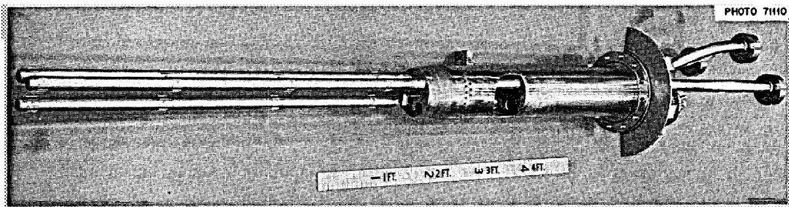  
Fig. 59. Control Rod Assembly before Insertion in the MSRE.

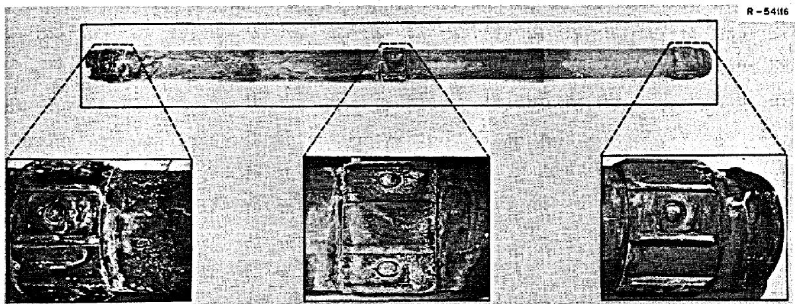  
Fig. 60. Portion of Control Rod Thimble that was Examined After Operation of MSRE was Terminated. The thimble is made of 2-in-OD $\times$ 0.065-in.-wall INOR-8 tubing (Heat Y-8487). The electric arc cut on the left was near the center line of the core.

# Undeformed Samples

Samples of the control rod thimble and the spacer sleeve were cut and examined to determine their condition at the end of service. Typical photomicrographs of the inside of the thimble tube are shown in Fig. 61. This surface was oxidized to a depth of about 2 mils by the cell environment of nitrogen containing 2 to $5\%$ $\mathsf{O}_2$ . The oxidation process modified the microstructure to a depth of 4 mils, likely due to the selective removal of chromium.

Photomicrographs of one of the weld beads are shown in Fig. 62. All of the surface shown was exposed to flowing fuel salt. Some dislodged grains are near the surface, and grain boundaries are visible in the as-polished condition to a depth of 1 to 1.5 mils.

Photomicrographs involving the interface between the thimble and sleeve are shown in Fig. 63. Figure 63(a) shows the annular region with a separation of about 7 mils and some salt present. Few surface irregularities are visible at a magnification of $100\times$ , indicating that they are considerably below 1 mil. Figure 63(b) is a $500\times$ view of the thimble and shows some surface cracks to a depth of 0.3 mil. The outside of the sleeve is shown in Fig. 63(c); a few grain boundaries to a depth of about 1 mil are visible. Additional photomicrographs of the sleeve are shown in Fig. 64. The sleeve material does not appear to have received much working since the carbide is very inhomogeneously distributed. The grain size is larger than usual away from the stringers. The inner and outer surfaces both have modified structures. A higher magnification view of the inner surface [Fig. 64(b)] shows that much of the modification is a high density of primary carbide. The outer surface [Fig. 64(c)] has a shallow layer of small grains, likely due to a working operation.

A second cut was made away from the sleeve, and typical photomicrographs are shown in Fig. 65. This part of the thimble was exposed to flowing salt. Some of the grain boundaries are visible in the as-polished condition to a depth of about 4 mils and there is some surface modification [Fig. 65(a)]. Etching [Fig. 65(b)] delineates more of the grain structure and shows the shallow surface modification.

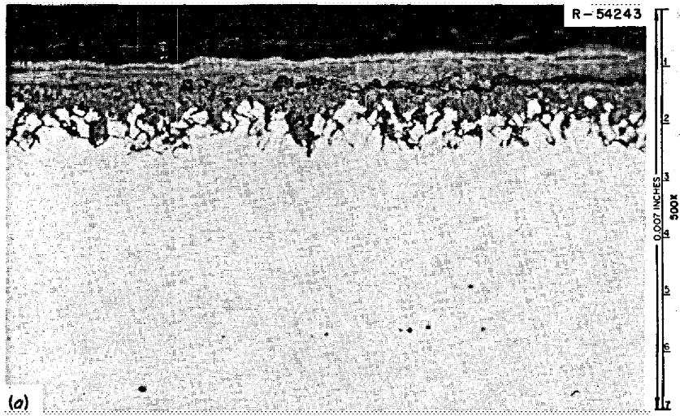

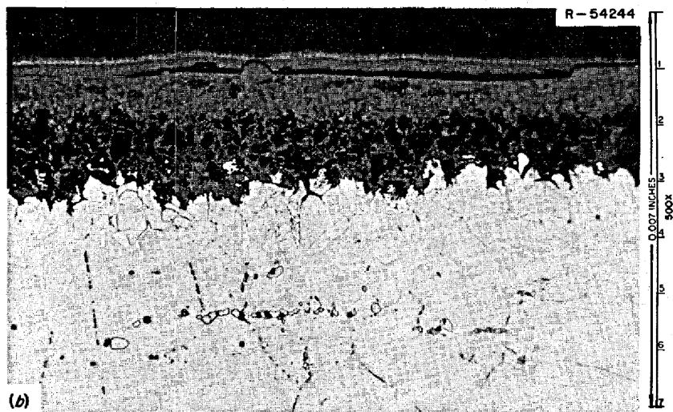

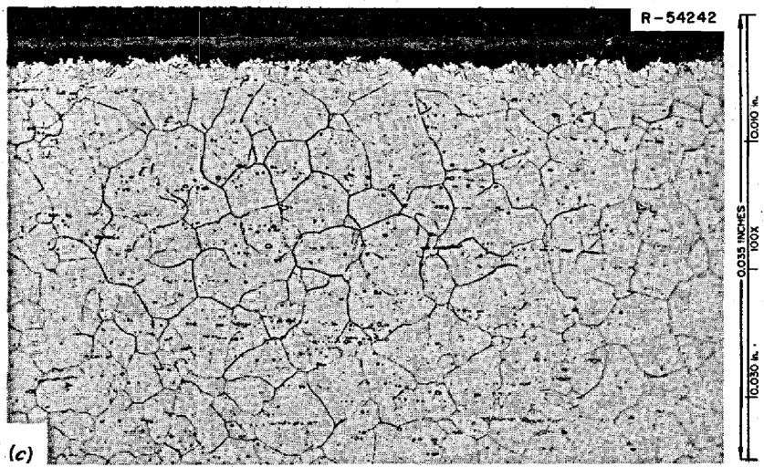  
Fig. 61. Photomicrographs of the Inner Surface of the Control Thimble in the As-removed Condition. This surface was exposed to cell environment of $\mathbf{N}_2$ containing 2 to $5\%$ $\mathbf{O}_2$ . (a) As polished. (b) Etched. (c) Etched, typical microstructure. Etchant: Aqua regia. Reduced $30.5\%$ .

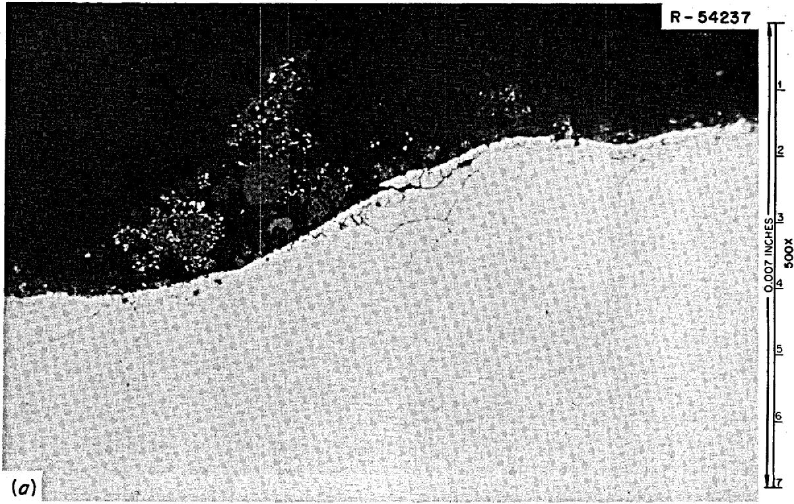

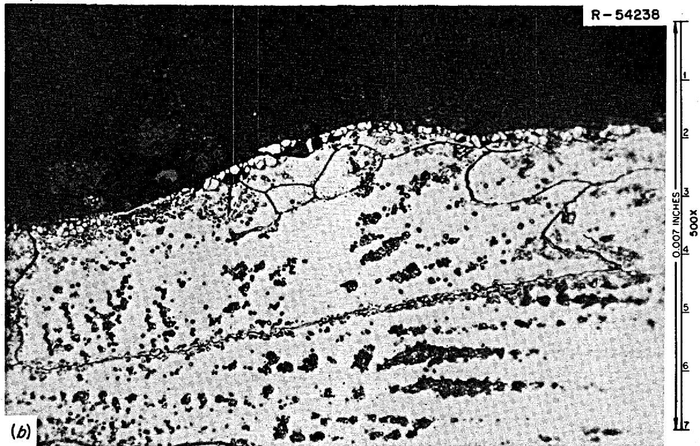  
Fig. 62. Photomicrographs of Outer Surface of Control Rod Thimble Showing the Weld Deposit Made to Hold the Spacer Sleeve. The weld surface was exposed to flowing salt. (a) As polished. (b) Etched: Aqua regia.

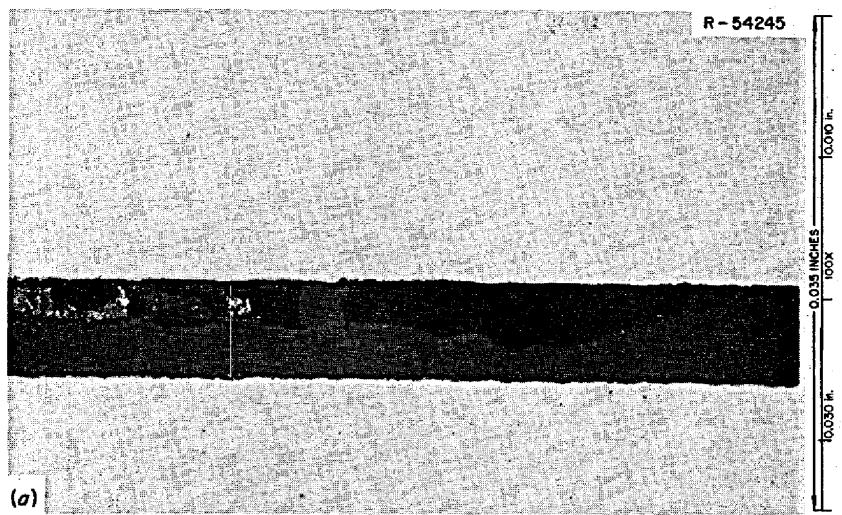

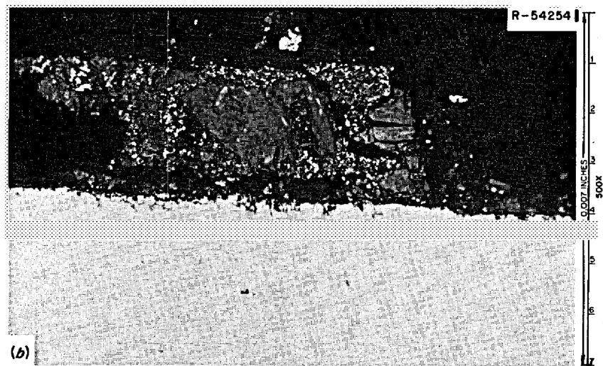

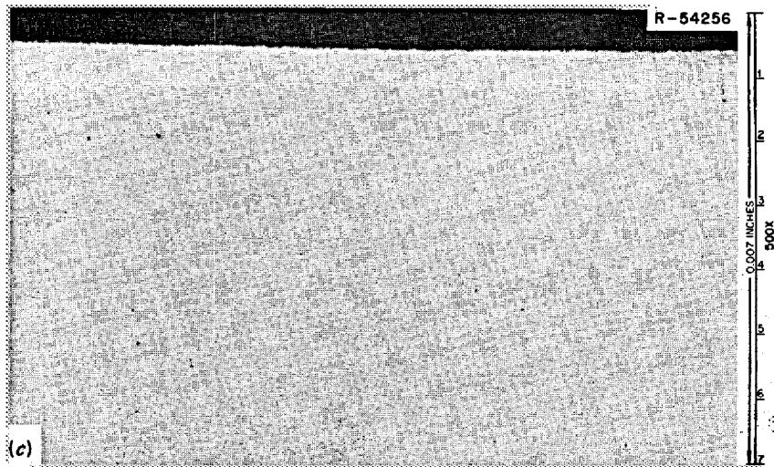  
Fig. 63. Photomicrographs of As-polished Surfaces of Control Rod Thimble and Sleeve. (a) Annulus between thimble and sleeve. Thimble surface is in upper part of picture. (b) Outside surface of control rod thimble, showing presence of some salt and shallow surface cracking. (c) Outside surface of sleeve. Surface exposed to flowing fuel salt.

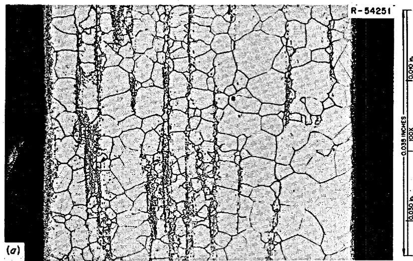

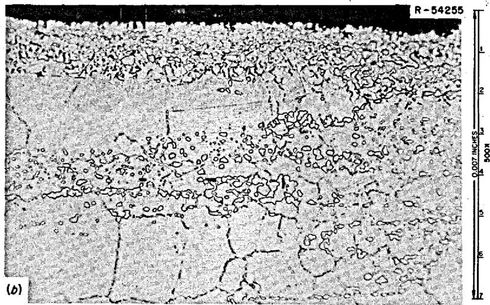

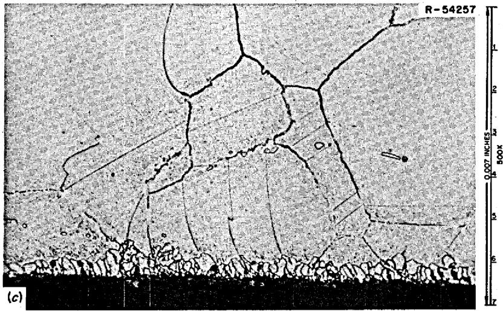  
Fig. 64. Photomicrographs of Control Rod Sleeve. (a) Etched view showing general microstructure. Inner surface is on left and outer surface is on right. (b) Inner surface of sleeve. (c) Outer surface of sleeve. Etchant: Aqua regia. Reduced $30.5\%$

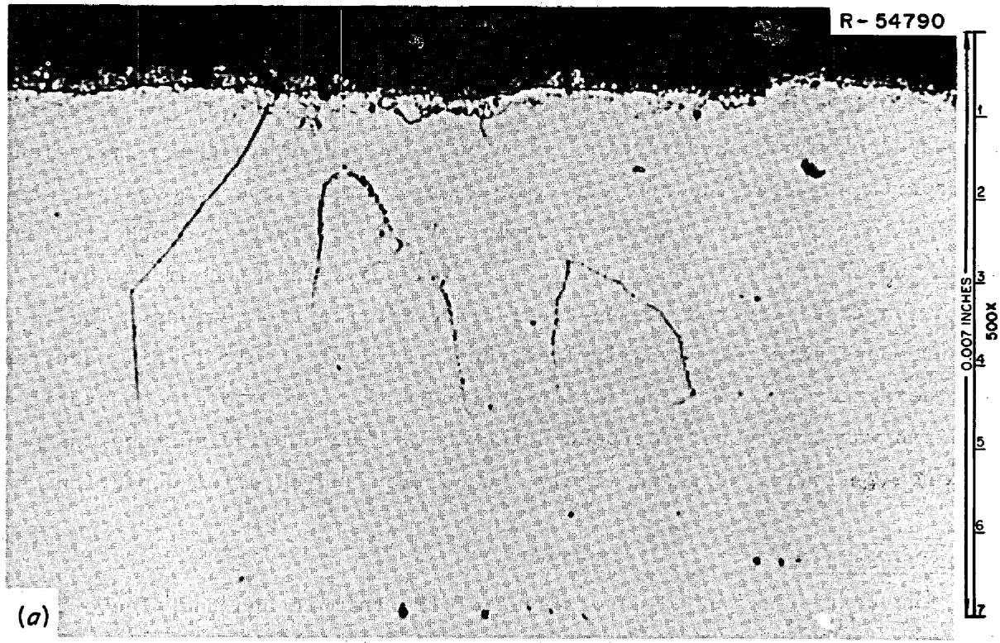

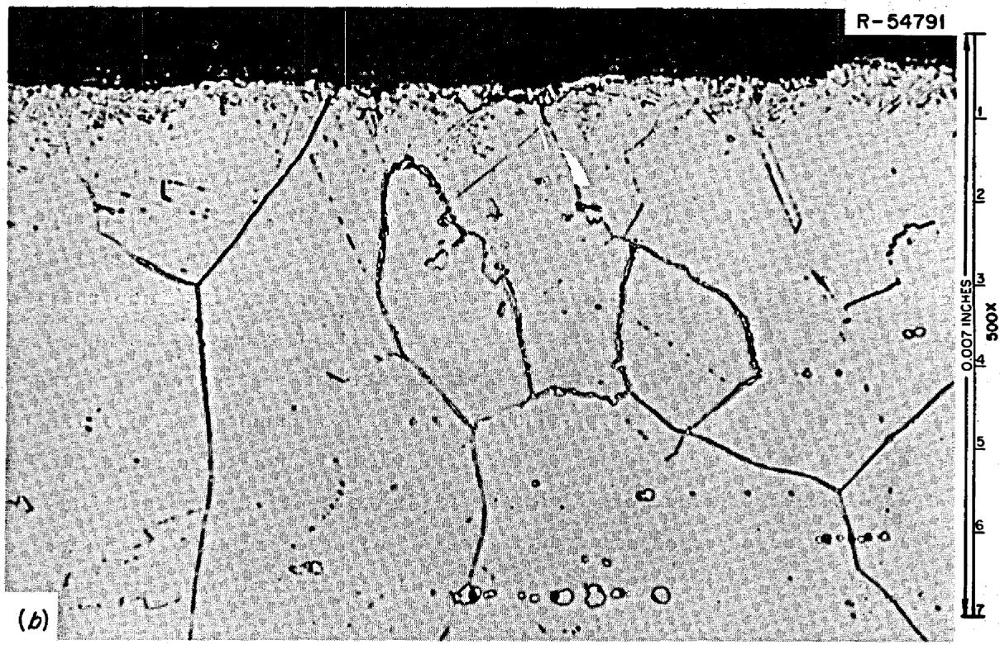  
Fig. 65. Photomicrographs of Control Rod Thimble where it was Exposed Directly to Flowing Salt. (a) As polished. (b) Etched: Aqua regia.

Microprobe scans were run on the thimble samples that were taken from under the sleeve and outside the sleeve. In the first case the thimble wall was exposed to almost static fuel salt, and no gradients in iron and chromium concentration could be detected within the $3 - \mu \mathrm{m}$ region of uncertainty near the surface. The sample outside the sleeve that was exposed to flowing fuel salt was depleted in chromium to a depth of almost $20~\mu \mathrm{m}$ and in iron to a depth of $10~\mu \mathrm{m}$ (Fig. 66). Thus the amount of corrosion that occurred varied considerably in the two regions. The measurements were not actually made, but a similar result likely occurred for the spacer sleeve. The inside surface was exposed to almost static salt and was likely not corroded detectably. The outside surface was exposed to flowing salt and likely showed iron and chromium depletion.

# Deformed Samples

The next step was to deform some of the thimble and the sleeve to determine whether surface cracks were formed similar to those noted in the surveillance samples. Since the product was tubular, we used a ring test that is relatively quick and cheap. The fixture shown in Fig. 67 was made by (1) cutting 5/8 in. through a l-in.-thick carbon steel plate with a 2-in.-diam hole saw, (2) cutting out the partially cut region with ample clearance around the hole, (3) cutting the plate in two along the diameter and removing 1/8 in. of material on each side of the cut, and (4) tapping a 3/4 in. diam thread into the two pieces. Then rings 1/4 in. wide were cut from the thimble and the sleeve. They fit into the groove and were pulled to failure with the resultant geometry shown in Fig. 67. The initial loading curves include strain associated with the ring conforming to the geometry of the grip, so we cannot tell precisely how much the sample is deforming. Thus the yield strength and the elongation are only relative numbers, but the ultimate tensile strength and reduction in area obtained from these tests are true values. Obviously, this type of test is deficient in giving good mechanical property data but is sufficient for deforming the material and observing the incidence of surface cracking.

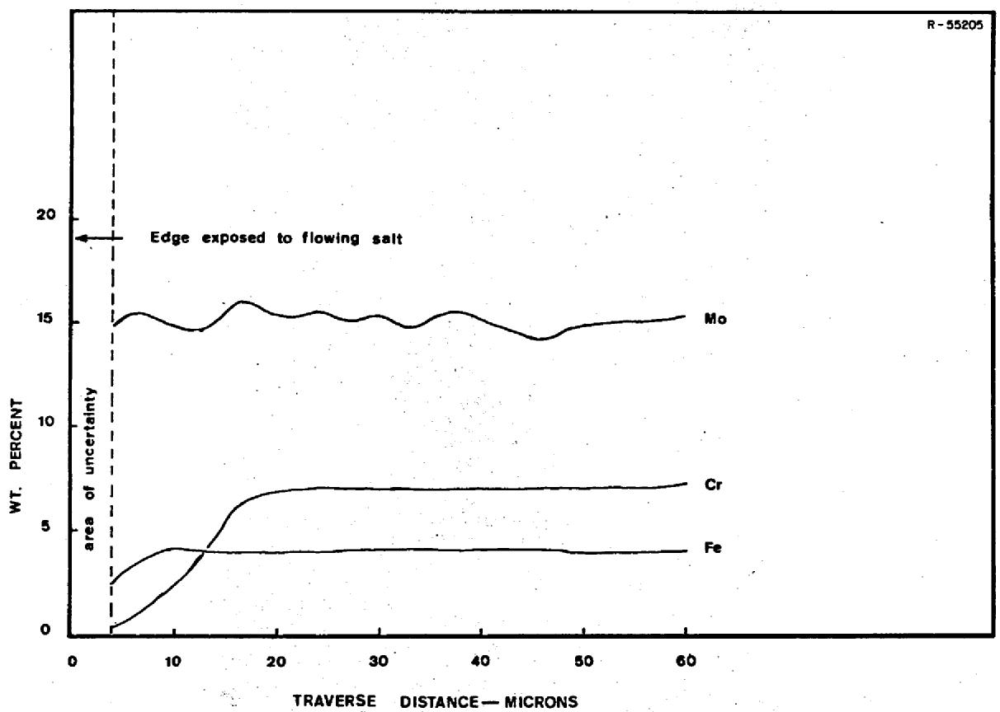  
Fig. 66. Electron Microprobe Scan of Sample from Control Rod Thimble. The thimble had been exposed to the fuel salt for 21,040 hr and had been above $500^{\circ}\mathrm{C}$ for 30,807 hr.

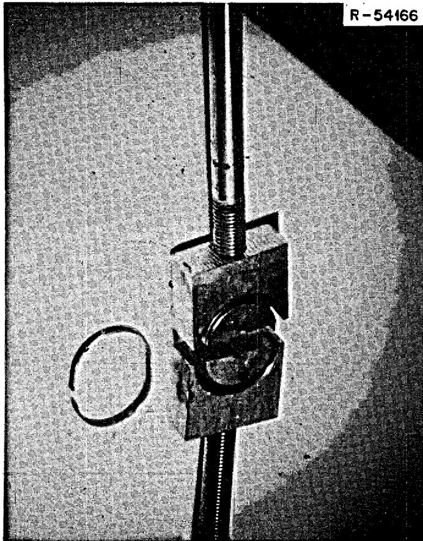  
Fig. 67. Fixture for Testing Rings of Control Rod Thimble and Spacer Sleeve. A tested sample is shown on the left.

The tensile properties of the rings are shown in Table 8. The test results show the following important facts:

1. All of the unannealed specimens of heat Y-8487 tested at $25^{\circ}C$ have a "yield stress" of 52,000 to 61,000 psi, with these values appearing to be random in the variables involved.   
2. At $25^{\circ} \mathrm{C}$ the crosshead displacement was about 1.2 in. for the unirradiated tubing and 0.4 to 0.5 in. for the irradiated tubing. Again the variations of 0.4 to 0.5 in. appeared random.   
3. The yield stresses at $650^{\circ}\mathrm{C}$ were about equivalent for irradiated and unirradiated tubing. However, the crosshead displacement before fracture decreased from about 0.4 in. to 0.1 in. after irradiation. This was due to embrittlement from helium formed from the ${}^{10}\mathrm{B}(n,\alpha)^{7}\mathrm{Li}$ transmutation.   
4. No material is available of heat 5060 (sleeve material) for unirradiated tests, but the vendor's certification sheet showed a yield stress of 46,300 psi, an ultimate tensile stress of 117,000 psi, and a fracture strain of $52\%$ . The values that we obtained show higher strengths and lower ductility.

Several of the specimens that had been strained were examined metallographically to determine the extent of cracking during straining. Several photomicrographs of the control rod thimble that was exposed to flowing salt are shown in Fig. 68. The inside surface was oxidized, and the oxide cracked as the specimen was strained. The oxide should be brittle, but it is important that these cracks did not penetrate the metal. The side exposed to the salt exhibited profuse intergranular cracking. Almost every grain boundary cracked, and the cracks generally propagated to a depth of one grain, although there are several instances where the crack depth exceeded a depth of one grain. Several photomicrographs were combined and rephotographed to obtain Fig. 69. This sample had 192 cracks per inch with average and maximum depths of 5.0 and 8.0 mils, respectively. Many of the cracks shown in Fig. 68 and 69 have blunt tips, indicating that they did not propagate into the metal as the specimen was strained.

Table 8: Tensile Data on Rings From Control Rod Thimble 3 (Heat Y-8487)   

<table><tr><td>Specimen</td><td>Condition</td><td>Postirradiation Anneal</td><td>Test Temperature (°C)</td><td>Crosshead Speed (in./min)</td><td>Yielda Stressa (psi)</td><td>Ultimate Stress (psi)</td><td>Crosshead Travel (in.)</td><td>Reduction in Area (%)</td></tr><tr><td>1</td><td>Unirradiated</td><td></td><td>25</td><td>0.05</td><td>52,000</td><td>114,400</td><td>1.20</td><td>44.5</td></tr><tr><td>2</td><td>Unirradiated</td><td></td><td>25</td><td>0.05</td><td>56,900</td><td>117,500</td><td>1.17</td><td>46.0</td></tr><tr><td>3</td><td>Unirradiated</td><td></td><td>25</td><td>0.05</td><td>58,000</td><td>124,300</td><td>1.18</td><td>43.0</td></tr><tr><td>4</td><td>Unirradiated</td><td></td><td>650</td><td>0.05</td><td>39,100</td><td>76,700</td><td>0.37</td><td>28.7</td></tr><tr><td>5</td><td>Unirradiated</td><td></td><td>650</td><td>0.002</td><td>40,700</td><td>62,300</td><td>0.20</td><td>20.6</td></tr><tr><td>6</td><td>Irradiated</td><td>None</td><td>25</td><td>0.05</td><td>54,400</td><td>105,100</td><td>0.54</td><td>23.2</td></tr><tr><td>7</td><td>Irradiated</td><td>None</td><td>25</td><td>0.05</td><td>53,300</td><td>102,500</td><td>0.51</td><td>29.7</td></tr><tr><td>8</td><td>Irradiated</td><td>None</td><td>25</td><td>0.05</td><td>60,500</td><td>110,800</td><td>0.42</td><td>28.5</td></tr><tr><td>9</td><td>Irradiated</td><td>None</td><td>650</td><td>0.05</td><td>38,300</td><td>51,200</td><td>0.099</td><td>12.1</td></tr><tr><td>10</td><td>Irradiated</td><td>None</td><td>650</td><td>0.002</td><td>34,200</td><td>38,200</td><td>0.061</td><td>9.7</td></tr><tr><td>11</td><td>Irradiated</td><td>8 hr at 871°C</td><td>25</td><td>0.05</td><td>49,300</td><td>100,500</td><td>0.36</td><td>34.9</td></tr><tr><td>12</td><td>Irradiated</td><td>141 hr at 871°C</td><td>25</td><td>0.05</td><td>48,700</td><td>104,900</td><td>0.39</td><td>34.4</td></tr><tr><td>13</td><td>Irradiatedb</td><td>None</td><td>25</td><td>0.05</td><td>51,700</td><td>98,600</td><td>0.45</td><td>32.9</td></tr><tr><td>14</td><td>Irradiatedc</td><td>None</td><td>25</td><td>0.05</td><td>42,400</td><td>123,000</td><td>0.20</td><td>18.0</td></tr></table>

${}^{a}$ Based on 0.002 in. offset of crosshead travel.   
$^\circ$ Located under spacer sleeve.   
c Spacer sleeve, Heat 5060.

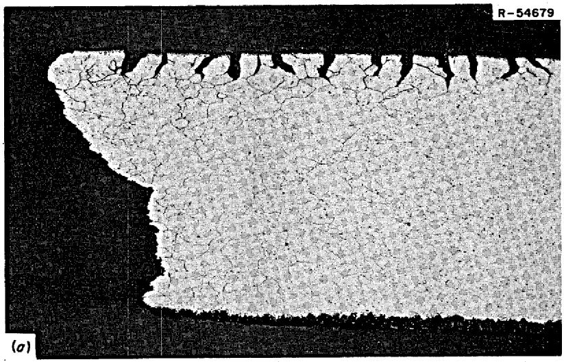  
0.07 INCHES 1 10.05 m 50x 1

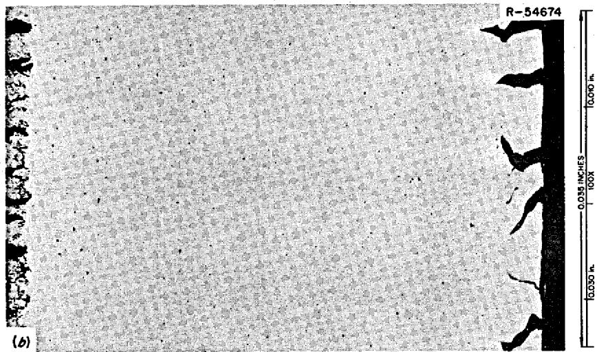

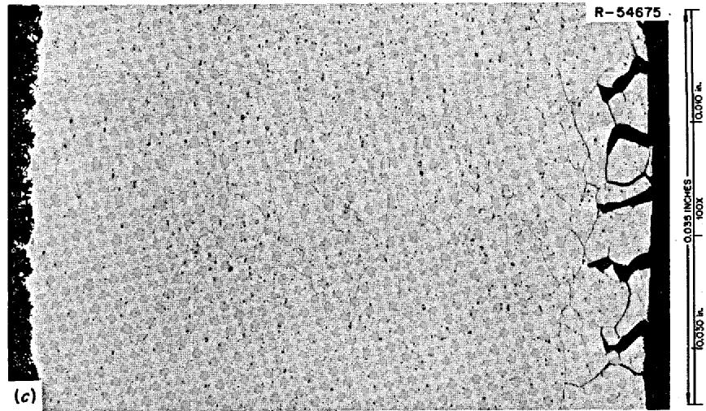  
Fig. 68. Photomicrographs of Control Rod Thimble Specimen Exposed to Flowing Salt and Tested at $25^{\circ}\mathrm{C}$ . (a) Fracture - dark edge is oxide on inner surface of tube, and cracks formed on the outer surface; etched. (b) Cracks in outer surface of tubing as polished. (c) Cracks in outer surface of tubing etched. Etchant: Aqua regia. Reduced $30.5\%$ .

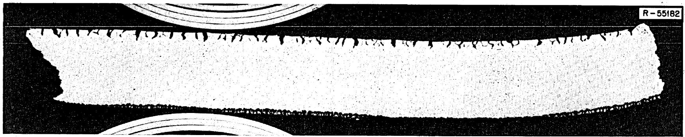  
Fig. 69. Photomicrographs of a Deformed Section of the Control Rod Thimble. The fracture is on the left. The upper surface was in contact with flowing salt and the lower surface was exposed to the cell environment of $\mathbf{N}_2$ plus 2 to $5\%$ $\mathbf{O}_2$ . The sample is about 0.06 in. thick.

A similar sample was cut from the thimble under the sleeve, where the salt access was restricted. Photomicrographs of a specimen tested at $25^{\circ}\mathrm{C}$ are shown in Fig. 70. The cracks are quite similar to those in Fig. 68 for a sample that was exposed to flowing salt. The composite photograph in Fig. 71 is quite similar to Fig. 69 of the sample exposed to flowing salt. The sample in Fig. 71 had 257 cracks per inch, with average and maximum depths of 4.0 and 8.0 mils, respectively. The accuracy of our statistics and possible sampling inhomogenities lead us to conclude that the severity of cracking is equivalent in the samples exposed to flowing and almost static salt. Thus flow rate over the range represented by these two sample locations does not appear to be an important variable.

The spacer sleeve gave another opportunity to examine whether a relationship existed between salt velocity and cracking. The photomicrograph in Fig. 72 shows cracks on both sides, with more being present in the field photographed on the side where the salt was rapidly flowing. However, the composite photograph in Fig. 73 shows that the cracking is about equivalent on both sides. Cracking statistics on the side exposed to rapidly flowing salt revealed 178 cracks per inch with a maximum depth of 7.0 mils. The side exposed to restricted salt flow had 202 cracks per inch, with a maximum depth of 5.0 mils. The average depth was 3.0 mils on both sides. These observations again show that salt flow rate is not a significant factor in intergranular cracking.

# Important Observations

The examination of the control rod thimble and the thimble spacer revealed two important characteristics of the cracking. (1) Irradiation of the metal is not responsible for the cracking. The thimble was irradiated to a peak thermal fluence of $1.9 \times 10^{21}$ neutrons/cm². The flux attenuation across the 0.065 in. wall of the thimble would have been very slight, but cracks only formed in the metal on the field side (Fig. 68). Thus, irradiation alone does not cause the cracking, but contact with the fuel salt is required. (2) The severity of cracking is not sensitive to salt flow rate over the range experienced in a fuel channel and under a spacer with restricted flow.

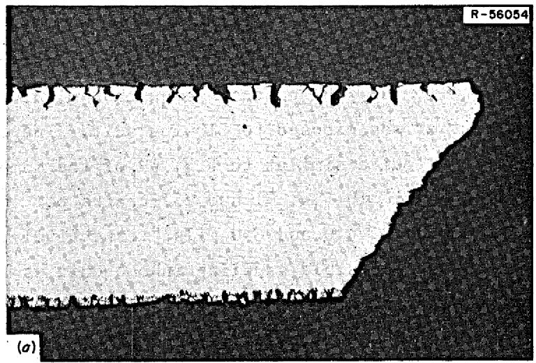

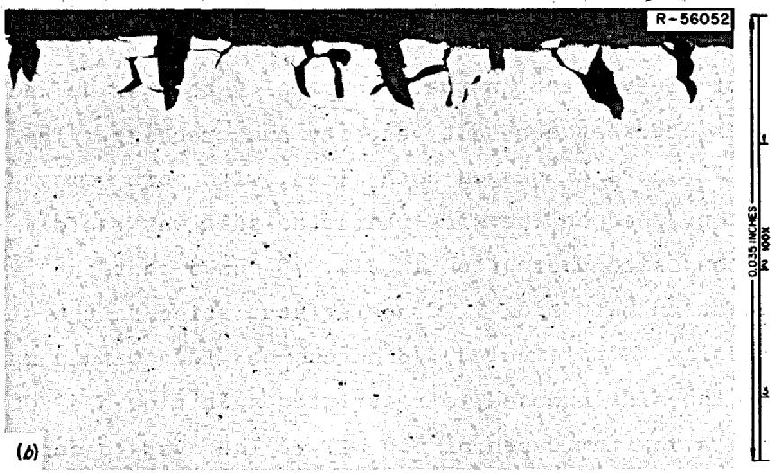

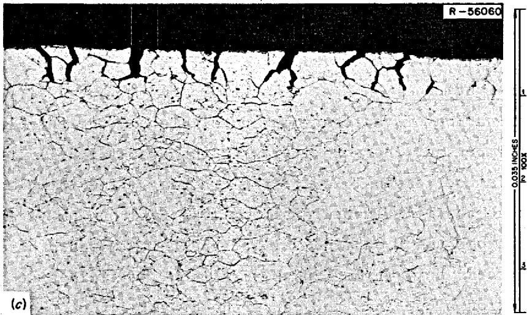  
Fig. 70. Photomicrographs of Control Rod Thinble Exposed to Fuel Salt Under a Spacer Sleeve and Tested at $25^{\circ}\mathrm{C}$ . (a) As-polished view of fracture. $40\times$ . (b) As-polished view of cracks. (c) Etched view of cracks. Etchant: Aqua regia. Reduced $30.5\%$

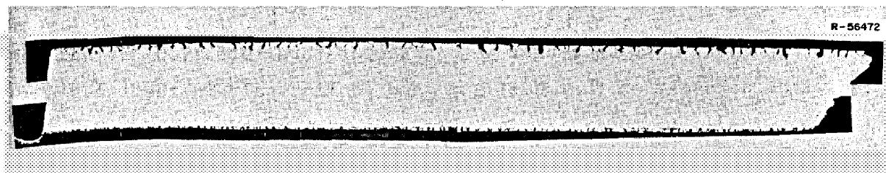  
Fig. 71. Composite Photograph Showing the Density of Cracking Along the Edge of a Portion of the Deformed Control Rod Thimble. $9.5 \times$ The sample is 0.58 in. long. The fracture is on the left, the upper surface was exposed to fuel salt, and the lower surface was exposed to the cell environment of $\mathbf{N}_2$ plus 2 to $5 \%$ $0_2$ .

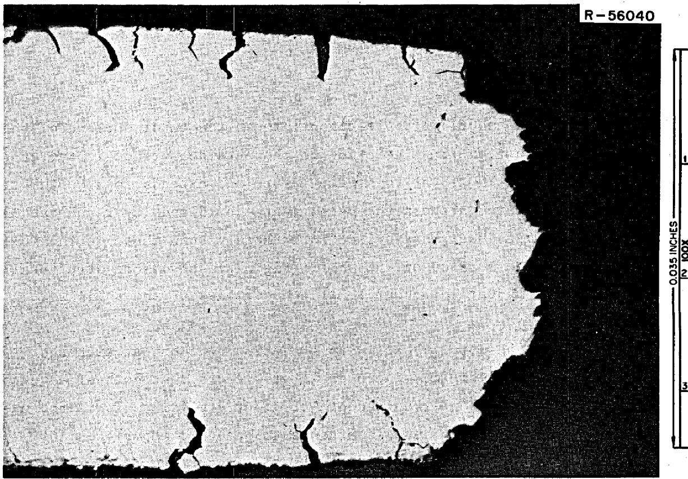  
Fig. 72. Photomicrograph of a Section of Spacer Sleeve Tested at $25^{\circ}\mathrm{C}$ . As polished. The upper surface was exposed to almost static fuel salt and the lower surface was exposed to rapidly flowing fuel salt.

# Primary Heat Exchanger

The primary heat exchanger was at temperature for 30,807 hr and operated with fuel salt on the shell side and coolant salt in the tubes. The shell was 16-3/4 in. OD × 1/2 in. wall and constructed of heat 5068. The tubing was 1/2 in. OD × 0.042 in. wall from heat N2-5101 (see Table 1 for chemical composition). An oval piece of the shell 10 × 13 in. was cut by plasma torch near the outlet end of the heat exchanger. This same cut severed a piece of one tube, and pieces of five others were cut by an abrasive wheel. Photographs of these parts are shown in Figs. 74 and 75. The outside of the shell had a dark adherent oxide; the inside surfaces were discolored slightly and had a thin bluish-gray coating probably caused by the plasma cutting operation. Some of this powder was brushed off and found by gamma scanning to contain $^{106}\mathrm{Ru}$ and $^{125}\mathrm{Sb}$ .

# Undeformed Samples

Photomicrographs of a cross section through the outer surface of the shell are shown in Fig. 76. The oxide on the outside surface is typical of that observed on INOR-8 at this temperature and extends to a depth of about 5 mils. Etching attacks the metal in the oxidized layer and etches the grain boundaries near the surface more rapidly than those in the interior. The inside surface of the shell (Fig. 77) shows some structural modifications to a depth of about 1 mil. No samples of the shell were deformed.

Photomicrographs of a typical cross section of the heat exchanger tubing are shown in Fig. 78. The overall view shows that both sides etch more rapidly than the center to a depth of about 7 mils. This is not unusual for a tubular product and is often attributed to impurities (primarily lubricants) that are worked into the metal surface during repeated steps of deformation and annealing. The higher magnification views in the as-polished condition show that grain boundary attack (or cracking) occurred on the surface exposed to fuel salt (outer) but not on the coolant side (inner). The temperatures under normal operating conditions were such that the fuel salt side (OD) would have been in compression.

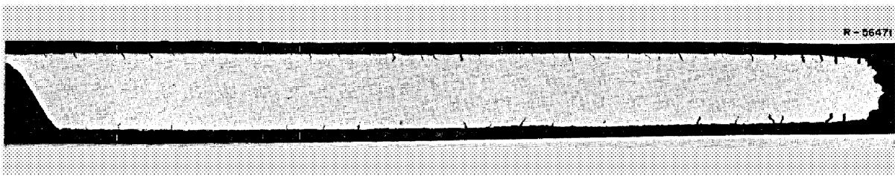  
Fig. 73. Composite Photograph Comparing the Density of Cracking of Sides of Spacer Sleeve Exposed to Almost Static Salt (bottom) and to flowing salt (top). 11x. The sample is 0.52 in. long.

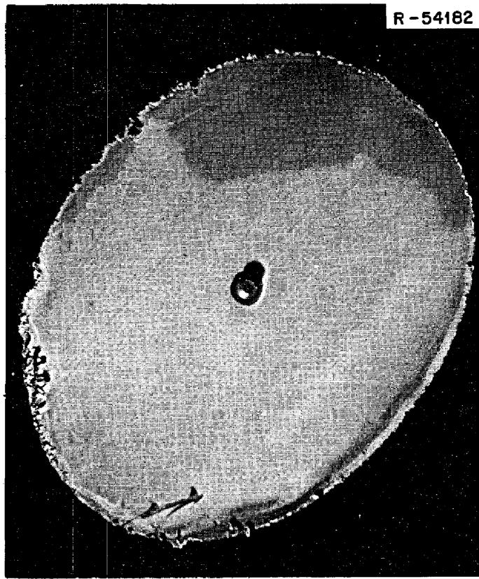  
Fig. 74. Section $10 \times 13$ in. Cut from the Primary Heat Exchanger Shell. The piece was cut with a plasma torch, and the center stud was used for guiding the torch.

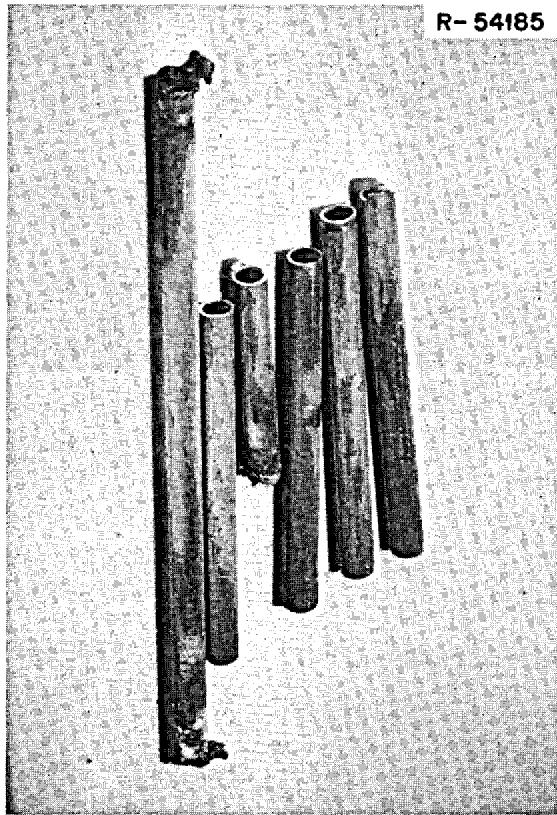  
Fig. 75. The 1/2-in.-OD Hastelloy N Tubes from the Primary Heat Exchanger. The different shades arise from a dark film that is thought to have been deposited when the shell was being cut. The film was deposited on the side of the tubes facing the shell.

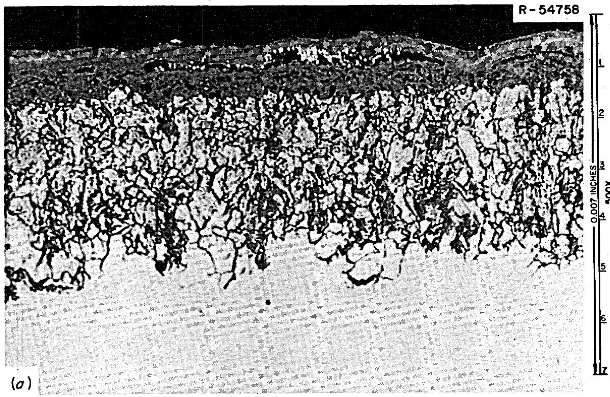

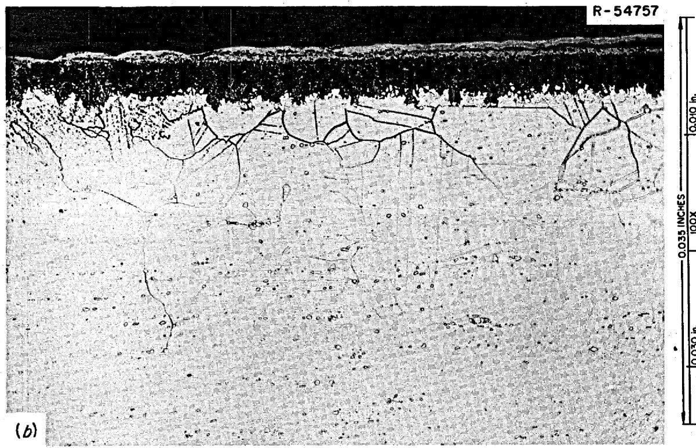  
Fig. 76. Photomicrographs Showing the Outside Edge of the Primary Heat Exchanger Shell. This surface was exposed to 2 to $5\%$ $\mathsf{O}_2$ in $\mathbb{N}_2$ . (a) As polished, showing the selective oxidation that occurred. (b) Etched view showing that the metal in the oxidized layer was completely removed. Etched with aqua regia.

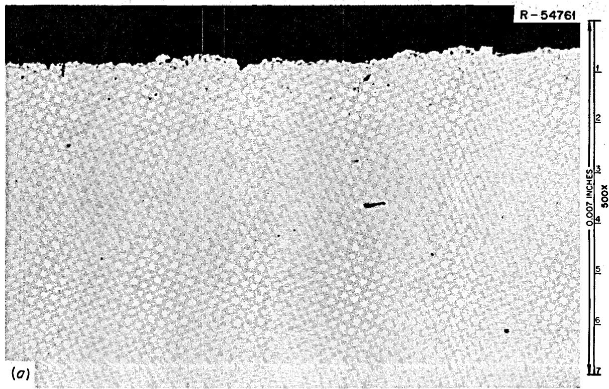

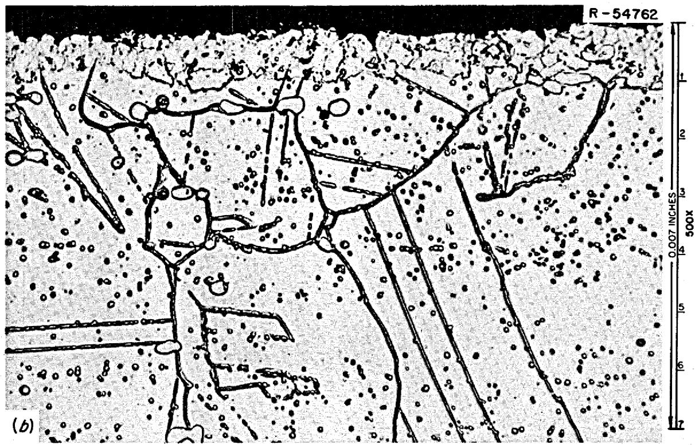  
Fig. 77. Photomicrographs of the Inside Surface of the Primary Heat Exchanger Shell. The surface was exposed to fuel salt, and the modified structure to a depth of about 1 mil is apparent. (a) As polished. (b) Etched with aqua regia.

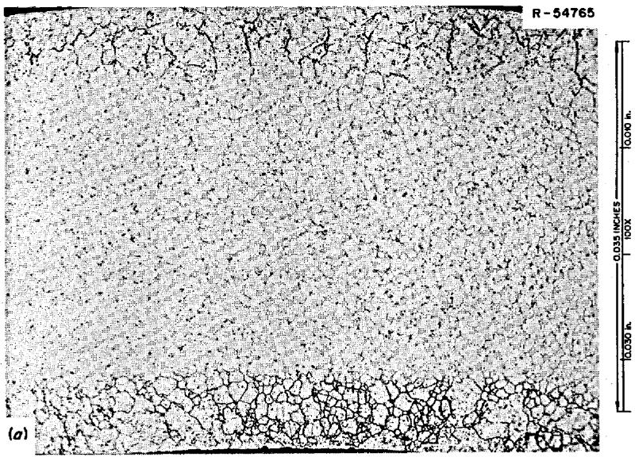

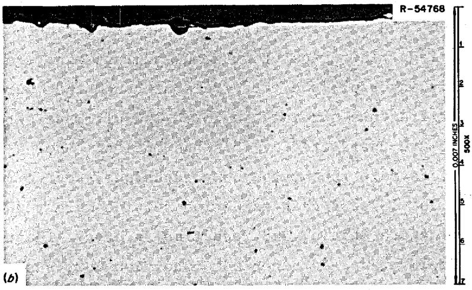

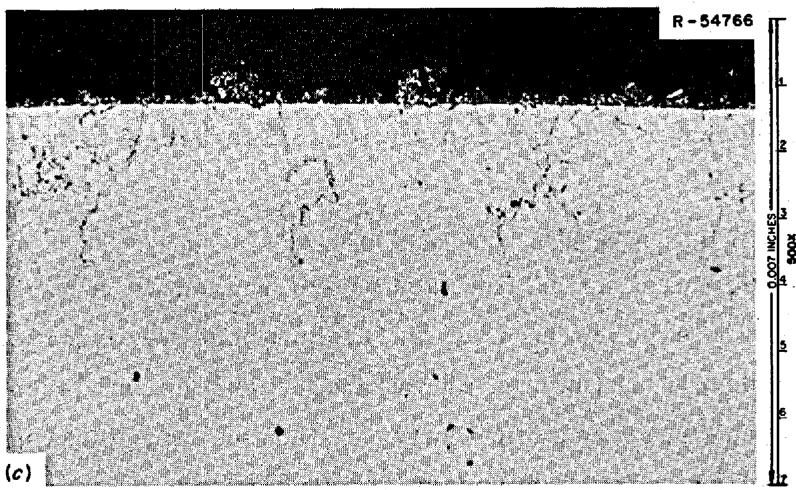  
Fig. 78. Photomicrographs of a Cross Section of an INOR-8 Heat Exchanger Tube. (a) Etched with glyceria regia. (b) Inside surface in the as-polished condition after exposure to coolant salt. (c) Outside surface in the as-polished condition after exposure to fuel salt. Reduced $34\%$ .

Similar photomicrographs of a longitudinal section of tubing are shown in Fig. 79. The features are quite similar to those discussed for Fig. 78. Both figures show some metallic deposits on the outside surface, which was exposed to fuel salt. These deposits are extremely small and could not be analyzed with much accuracy with the in-cell microprobe. However, they seemed to be predominately iron. Scanning across the tubing detected no concentration gradients of the major alloying elements in INOR-8.

# Deformed Samples

Tensile tests were run on three of the tubes, and the results are compared in Table 9 with those for as-received tubing. The tubes were pulled in tension, and we assumed that the entire section between the grips was deforming. The grips offer some end restraint, so our assumption is obviously in error, and the errors are such that our yield stresses are high and our fracture strains are low. The ultimate stresses and reductions in area are unaffected by this assumption. The as-received and postoperation tests were run by the same technique, so the results should be comparable. The largest changes during service were reductions in the yield stress, fracture strain, and reduction in area. The tubing was bought in the "cold drawn and annealed" condition, but such tubing normally is cold worked some during a final straightening operation. The reduction in yield strength during service may have been due to annealing out the effects of this working. The reductions in the ductility parameters were likely due to the precipitation of carbides along the grain boundaries.

Photomicrographs of one of the tubes deformed at $25^{\circ}\mathrm{C}$ are shown in Fig. 80. Profuse intergranular cracks were formed to a depth of about 5 mils on the side exposed to fuel salt, but none were formed on the coolant salt side. Etching again revealed the abnormal etching characteristics near the surface, but whatever caused this etching characteristic did not result in grain boundary embrittlement.

Unstressed and stressed sections of tubing were photographed over relatively large distances to get more accurate statistics on cracks

Table 9. Tensile Data on Heat Exchanger Tubes (Heat N2-5101)   

<table><tr><td>Specimen</td><td>Condition</td><td>Crosshead Speed (in./min)</td><td>Temperature (°C)</td><td>Yield Stress (psi)</td><td>Ultimate Tensile Stress (psi)</td><td>Fracture Strain (%)</td><td>Reduction in Area (%)</td></tr><tr><td>7</td><td>From heat exchanger</td><td>0.05</td><td>650</td><td>44,300</td><td>67,400</td><td>21.3</td><td>22.4</td></tr><tr><td>6</td><td>From heat exchanger</td><td>1.0</td><td>25</td><td>66,300</td><td>118,000</td><td>37.0</td><td>20.5</td></tr><tr><td>5</td><td>From heat exchanger</td><td>0.05</td><td>25</td><td>64,800</td><td>122,000</td><td>39.0</td><td>29.0</td></tr><tr><td>4</td><td>As received</td><td>0.05</td><td>650</td><td>53,900</td><td>74,600</td><td>40.0</td><td>14.5</td></tr><tr><td>2</td><td>As received</td><td>0.05</td><td>25</td><td>73,000</td><td>127,400</td><td>51.1</td><td>42.6</td></tr><tr><td>3</td><td>As received</td><td>0.05</td><td>25</td><td>70,900</td><td>126,200</td><td>50.1</td><td>40.0</td></tr><tr><td>1</td><td>Vendor certification</td><td></td><td>25</td><td>58,900</td><td>120,700</td><td>47.0</td><td></td></tr></table>

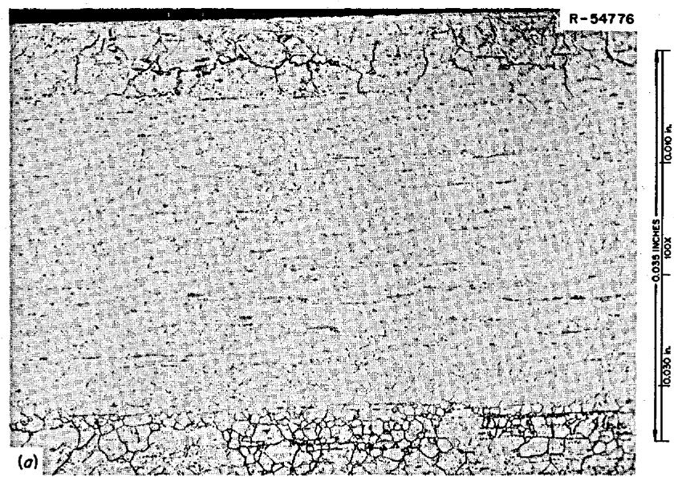

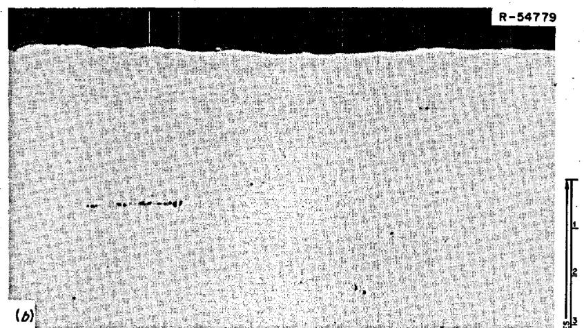

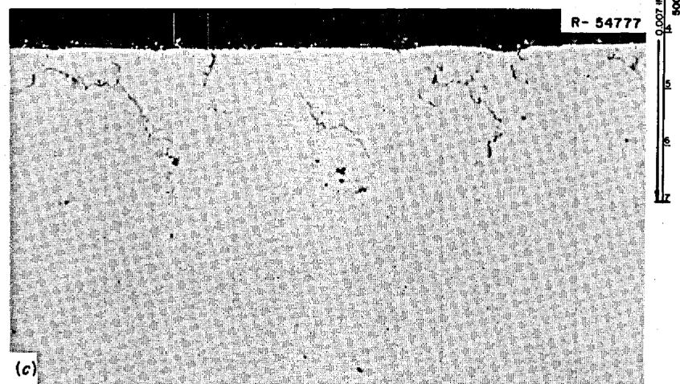  
Fig. 79. Photomicrographs of a Longitudinal Section of an INOR-8 Heat Exchanger Tube. (a) Etched with glyceria regia. (b) Inside surface in the as-polished condition after exposure to coolant salt. (c) Outside surface in the as-polished condition after exposure to fuel salt. Reduced $31\%$ .

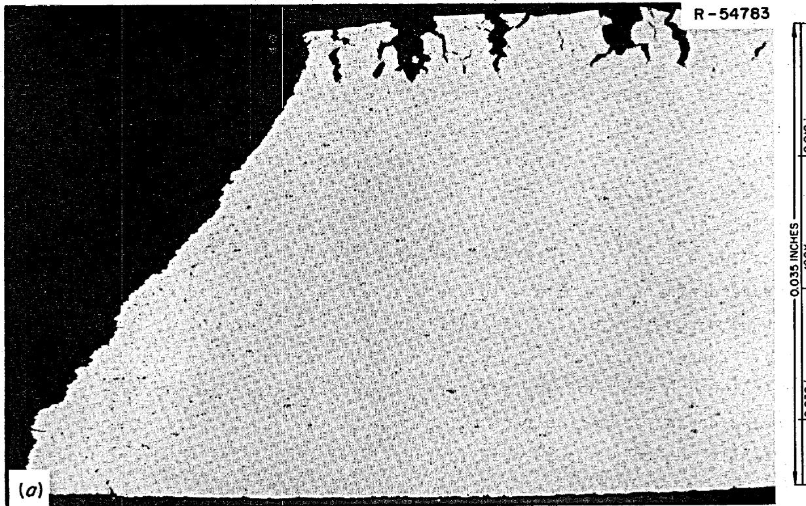

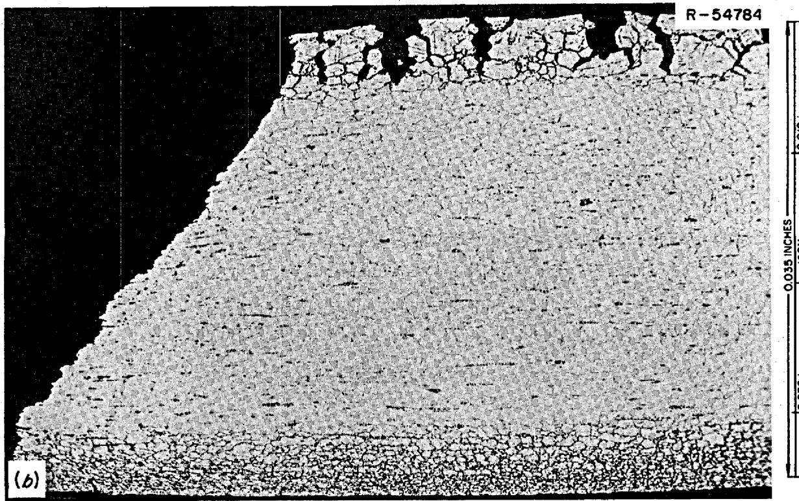  
Fig. 80. Photomicrographs of a Heat Exchanger Tube Deformed to Fracture at $25^{\circ}\mathrm{C}$ . (a) As polished. (b) Etched with aqua regia.

numbers and depths. A composite photograph of the two samples is shown in Fig. 81. The cracks are readily visible in the stressed sample but may not be apparent in the unstressed sample. A higher magnification print used in making the composite is shown in Fig. 82; the cracks can be more easily seen. The stressed sample had 262 cracks per inch with an average depth of 5.0 mils. Two counts were made on the unstressed sample. In the first count only those features that unequivocally were cracks were counted. This gave a crack count of 228 per inch with an average depth of 2.5 mils. In another count, we included some features that were possibly cracks and this gave a crack frequency of 308 per inch. Thus the number of cracks present before straining was about equivalent to that noted after straining. Straining did increase the visible depth. Some indirect evidence that the cracks were present initially and only spread open further during the tensile test was obtained from examination of the sample in Fig. 81. The sample length shown deformed $39\%$ (Table 9), and the combined widths of the cracks account for $35\%$ strain. Thus, the cracks widths very closely account for the total strain and indicate that the cracks formed with little or no deformation and spread open as the sample was deformed.

# Important Observations

The examination of the heat exchanger tubes revealed three very important characteristics of the cracking. (1) The neutron fluence received by the tubing was extremely low, but intergranular cracks were formed. The control rod thimble showed that irradiation of the metal alone was not sufficient to cause cracking since only the side of the thimble exposed to fuel salt cracked. Examination of the heat exchanger tubing suggests the further conclusion that irradiation of the metal is not a factor, since the heat exchanger was exposed to a negligible fluence but still cracked. (2) Exposure to fuel salt is a necessary condition for cracking to occur. Only the outside of the tubing, which was exposed to fuel selt, cracked, and the inside, which was exposed to coolant salt, did not crack. (3) The cracks were present in the as-polished tubing as it was removed from the MSRE. Straining caused the cracks to open wider without much penetration in length.

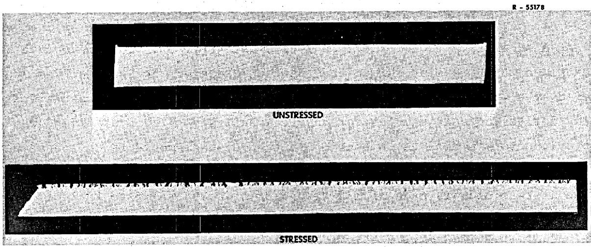  
Fig. 81. Composite Photographs of Heat Exchanger Tubing Before and After Stressing. The width of the unstressed sample is 0.042 in.

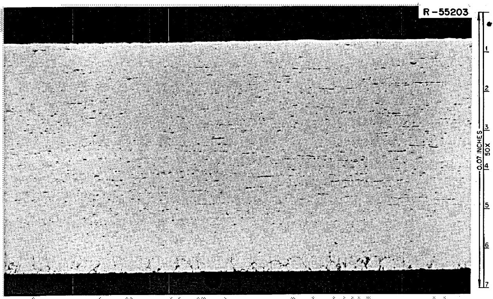  
Fig. 82. Photomicrograph of Heat Exchanger Tubing in the Unstressed Condition. The side with the small cracks was exposed to fuel salt and the other was exposed to coolant salt.

# Pump Bowl Parts

A schematic view of the pump is shown in Fig. 83. The components examined were the mist shield and the sampler cage. The sampler was lowered by a windlass arrangement into the sampler cage and was used primarily for taking salt samples for chemical analysis. The mist shield was provided to minimize the amount of salt spray that would reach the sampler. The vertical sampler cage rods were 1/4 in. diam and made of heat 5059. The mist shield was made of 1/8-in. sheet of heat 5057 (see Table 1 for chemical analysis). The mist shield was a spiral with an inside diameter of about 2 in. and outside diameter of about 3 in. The spiral was about 1 1/4 turns, and the outside was exposed to agitated salt and the inside to salt flowing much slower. The outside was exposed to salt up to the normal liquid level and to salt spray above this level. The inside was exposed to salt up to the normal salt level and primarily to gas above this level.

The general appearance of the sampler cage is shown in Fig. 84. The salt normally stayed at a level near the center of the cage, but the level fluctuated slightly. The amount of material deposited on the surface is much higher below the liquid interface than above. A gross gamma scan had a similar profile with a maximum near the liquid interface. A carbonaceous deposit was present at the top of the sampler. The mist shield had some deposits, and these were heavier below the liquid level and on the outer surface of the shield.

# Sampler Cage

One of the sampler cage rods was examined metallograpically. Photomicrographs of samples from the vapor and liquid regions are shown in Fig. 85 and 86, respectively. There is no intergranular penetration visible at this magnification. A heavy surface deposit is on the sample from the liquid region. This deposit was not examined by the electron microprobe analyzer, but a similar deposit on a copper capsule taken from

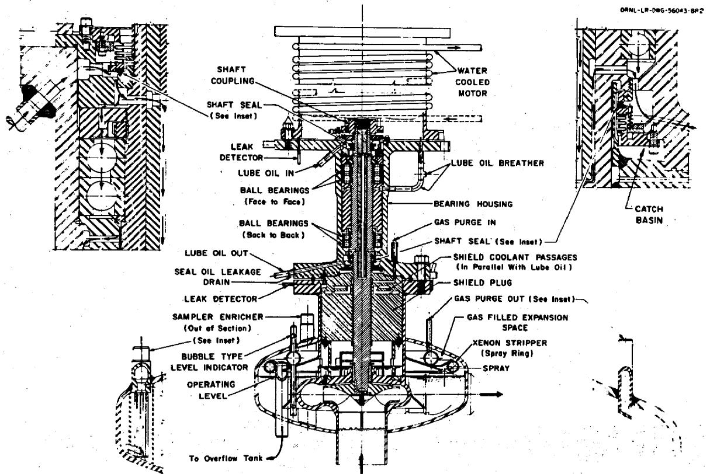  
Fig. 83. Section of MSRE Fuel Pump with Details of Several Areas. The mist shield and the sampler cage that were examined are shown in the lower left insert.

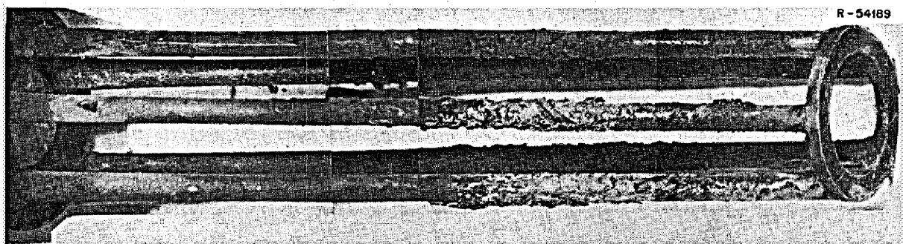  
Fig. 84. Sampler Cage. The assembly is 8.5 in. high. The salt-vapor interface corresponds with the region of highest material deposition.

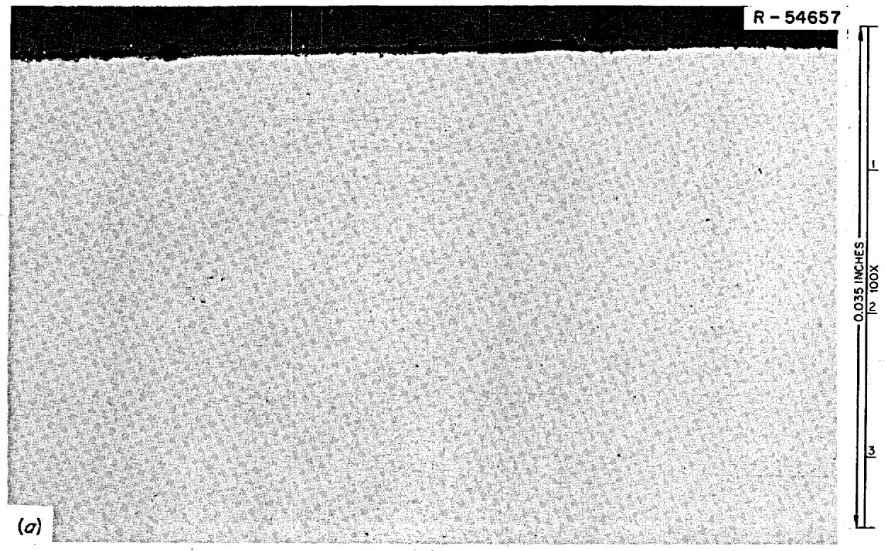

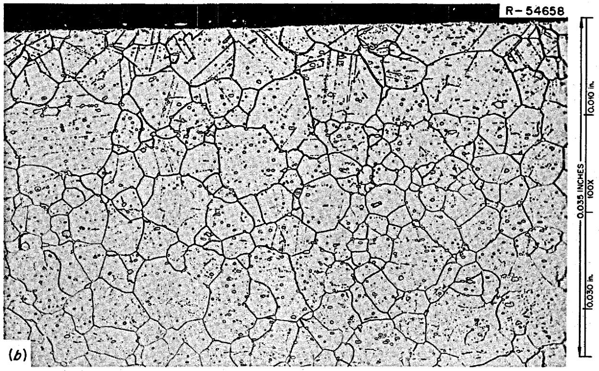  
Fig. 85. Photomicrographs of an INOR-8 Rod from the Sampler Assembly Located Above the Normal Salt Level. (a) As-polished. (b) Etched with aqua regia.

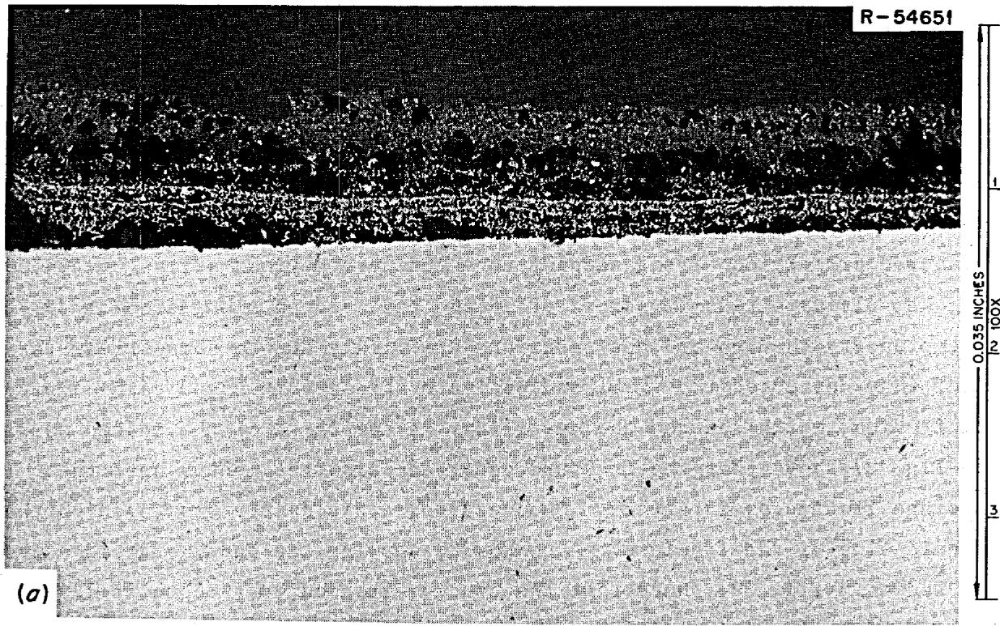

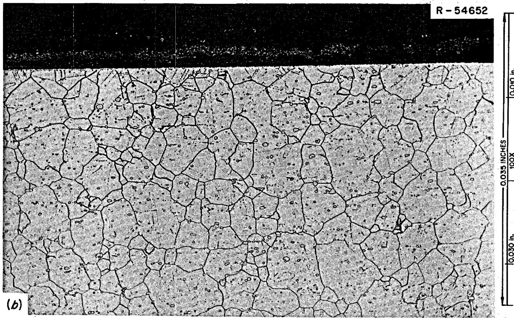  
Fig. 86. Photomicrographs of an INOR-8 Rod from the Sampler Assembly. Normally located below the salt level. (a) As polished. (b) Etched with aqua regia.

the sampler region was examined. The deposit contained some salt, but had regions that were high in the alloying elements in INOR-8: Ni, Cr, Fe, and Mo.

One of the sampler cage rods was pulled in tension at $25^{\circ}\mathrm{C}$ . The certified properties of this material were a yield stress of 51,200 psi, an ultimate tensile stress of 115,300, and an elongation of $51\%$ . The measured properties of the sampler cage rod were a yield stress of 42,500 psi, an ultimate tensile stress of 93,400 psi, and an elongation of $35.7\%$ . The property changes are not large and are likely due to some stress relief that decreased the yield and ultimate stress values and carbide precipitation, which reduced the ductility. A composite of the tested sample in Fig. 87 shows that the fracture occurred below the center near the average liquid-gas interface. One metallographic sample was taken on the liquid side of the fracture. A composite showing the badly cracked edges is shown in Fig. 88. Note that the cracks extended to a depth of 12 mils. A higher magnification view of an area near the fracture shows that the cracks extend in excess of 3 grains deep and that several grains have fallen out (Fig. 89). Another metallographic sample was taken $3/4$ in. above the fracture. A composite of photographs along the edge shows that the depth of cracking decreases with increasing distance into the vapor region (Fig. 90). The severity of cracking is different on the two edges of the rod. Unfortunately, we do not know the orientation of the rod relative to the sampler and the mist shield.

# Mist Shield

Figure 91 shows the mist shield after removal from the MSRE. The shield has been split to reveal the inside surface. Four specimens approximately 1 in. (vertical) $\times$ 1/2 in. (circumferential) were cut from the mist shield. Their locations were (1) outside the spiral and immersed in salt, (2) outside the spiral and exposed to salt spray, (3) inside the spiral and immersed in salt, and (4) inside the spiral and exposed primarily to gas. Bend tests were performed on these specimens at $25^{\circ}\mathrm{C}$ using a three point bend fixture.[22] They were bent about a line parallel

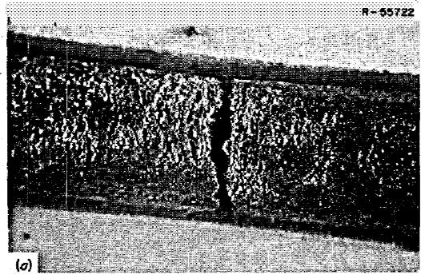

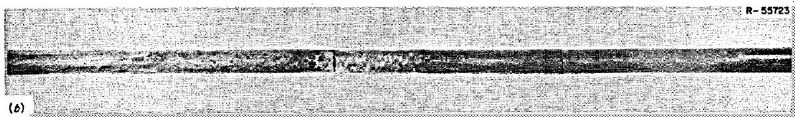  
Fig. 87. (a) Tensile-tested Sampler Cage Rod from Pump Bowl. Rupture occurred near the average liquid-vapor interface. (b) Photograph of rupture area showing extensive surface cracking. Rod diameter is $1/4$ in.

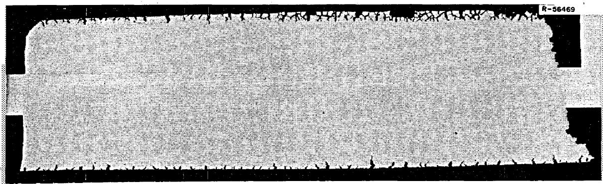  
Fig. 88. Section of Sample Cage Rod that was Deformed at $25^{\circ}\mathrm{C}$ . $9.2 \times$ The fracture (left) occurred at the salt-vapor interface. The rod is immersed further in the liquid from left to right. The length of the sample is 0.63 in.

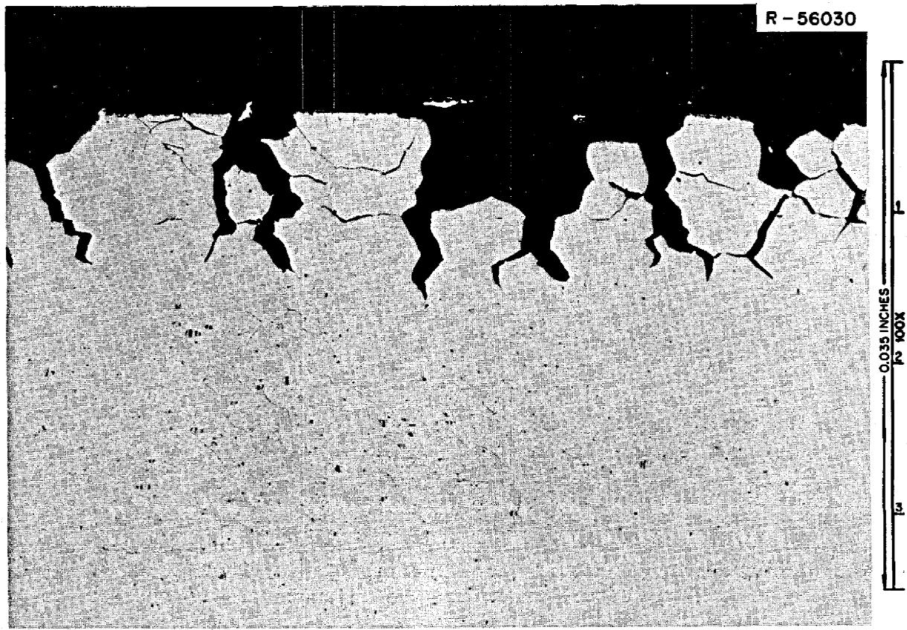  
Fig. 89. Photomicrograph of Deformed Sampler Cage Rod Near the Fracture. As-polished.

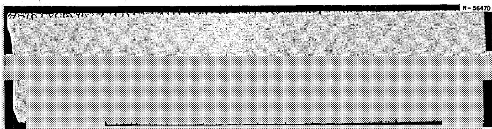  
Fig. 90. Composite of Photomicrographs of Sampler Cage Rod that was Strained at $25^{\circ}\mathrm{C}$ . 8.2×. Left end of sample was 3/4 in. from fracture. The rod progressed further into the vapor region from left to right. The sample length is 0.72 in.

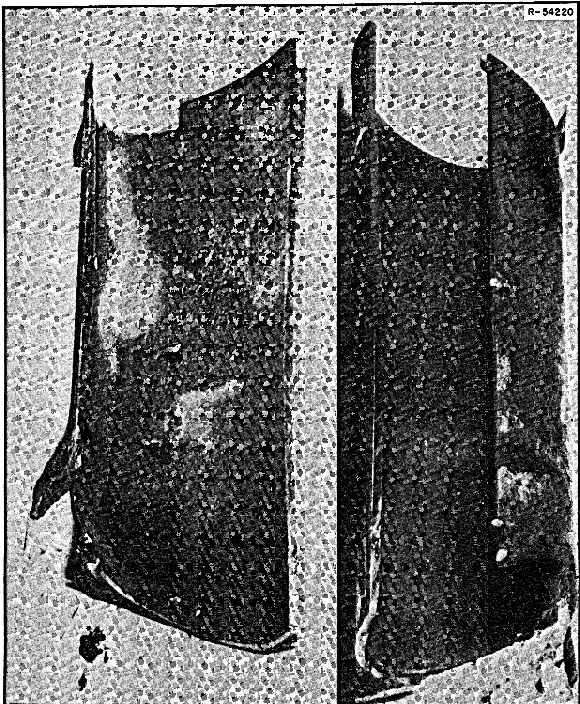  
Fig. 91. Interior of Mist Shield. Right part of right segment overlapped left part of segment on left.

to the $1/2$ in. dimension and so that the outer surface was in tension.

The information obtained from such a test is a load-deflection curve.

The equations normally used to convert this to a stress-strain curve do not take into account the plastic deformation of the part, and the stresses obtained by this method become progressively in error (too high) as the deformation progresses.

Table 10 shows the results of bend tests on the specimens from the mist shield. Note that the yield and ultimate stresses are about double those reported for uniaxial tension. The fracture strain is the parameter of primary interest. The test of unexposed INOR-8 (heat N3-5106) did not fail after $40.5\%$ strain in the outer fibers. (No material was available of heat 5075, the material used in fabricating the mist shield.) Although all of the samples strained more than $10\%$ before failure, the two samples from the outside of the spiral were more brittle than the other samples.

The bend samples of the mist shield were examined metallographically. Photomicrographs of the sample from the inside vapor region are shown in Fig. 92, and a composite of several photomicrographs is shown in Fig. 93. The edge cracks were intergranular and about 1 mil deep. The photomicrographs of the sample from the liquid region (Fig. 94) show that the cracks extended to a depth of about 8 mils in the liquid region. The composite photograph in Fig. 95 also shows the increased frequency and depth of cracking in the liquid region.

The sample from the outside liquid region was quite similar metallographically to that from the inside liquid region. Photomicrographs of the fracture and a typical region of the tension near the fracture are shown in Figs. 96 and 97, respectively. A composite of several photomicrographs is shown in Fig. 98. Photomicrographs of the outside vapor (salt spray) bend specimen at the fracture and on the tension side near the fracture are shown in Figs. 99 and 100, respectively. The composite of several photomicrographs in Fig. 101 shows that the cracks are not much deeper nor more frequent than in the liquid regions (compare Figs. 95, 98, and 101), but the tendency for grains to fall out is much greater. This is even more significant when one notes that the strain was the least in the sample from the outside vapor region (Table 10).

Table 10. Bend Tests at $25^{\circ}\mathrm{C}$ on Parts of the MSRE Mist Shield   

<table><tr><td colspan="2">Specimen</td><td>Yield b (psi)</td><td>Maximumc Tensile Stress (psi)</td><td>Strain (%)</td><td>Environment</td></tr><tr><td></td><td></td><td>×103</td><td>×103</td><td></td><td></td></tr><tr><td>S-52</td><td>Mist shield top inside</td><td>97</td><td>269</td><td>46.9d</td><td>Vapor region, shielded</td></tr><tr><td>S-62</td><td>Mist shield top outside</td><td>155</td><td>224</td><td>10.7d</td><td>Vapor region, salt spray</td></tr><tr><td>S-60</td><td>Mist shield bottom inside</td><td>161</td><td>292</td><td>31.6d</td><td>Liquid region, shielded, salt flow</td></tr><tr><td>S-68</td><td>Mist shield bottom outside</td><td>60</td><td>187</td><td>17.7d</td><td>Liquid region, rapid salt flow</td></tr><tr><td>N3-5106</td><td>Unirradiated control test, 1/8 in. thick</td><td>128</td><td>238</td><td>40.5</td><td></td></tr></table>

aThe mist shield was fabricated of heat 5075 with certified room-temperature properties of 53,000 psi yield stress, 116,000 psi ultimate stress, and $49\%$ elongation.   
${}^{\mathrm{b}}$ Based on 0.002 in. offset of crosshead travel.   
cMaximum tensile stress was controlled by fracture of sample or by strain limitation of test fixture.   
$\mathbf{d}_{\mathrm{Specimen}}$ broke.

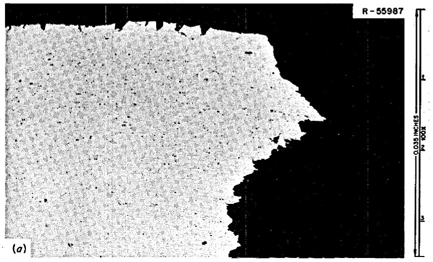

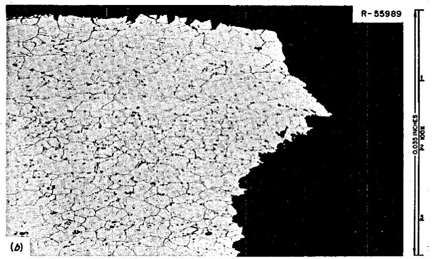

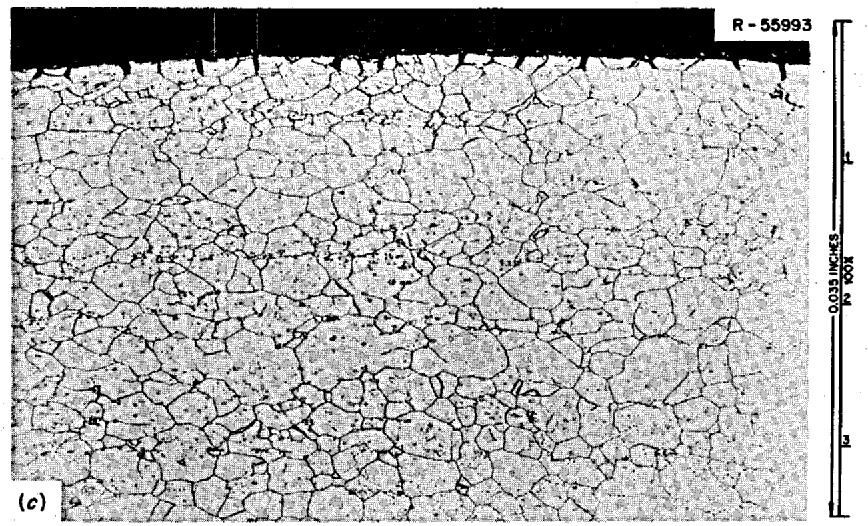  
Fig. 92. Photomicrographs of Bend Specimen of Mist Shield from Inside Vapor Region. (a) Fracture and tension side, as polished. (b) Fracture and tension side, etched. (c) Tension side, etched. Etchant: Aqua regia. Reduced $31\%$ .

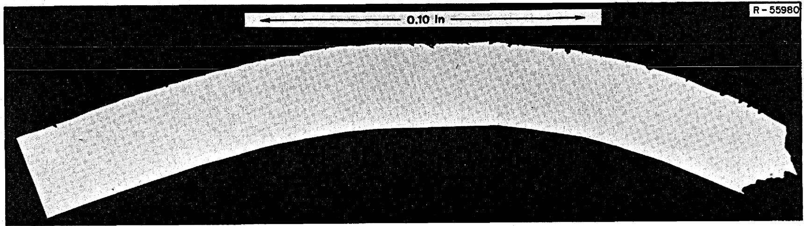  
Fig. 93. Composite Photograph of the Tension Side of a Bend Sample from Inside Vapor Region of Mist Shield. Lower edge is not the compression side of the sample.

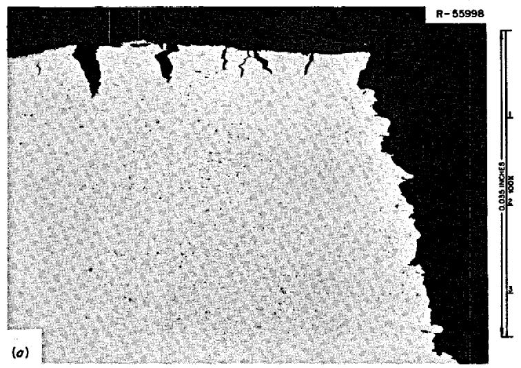

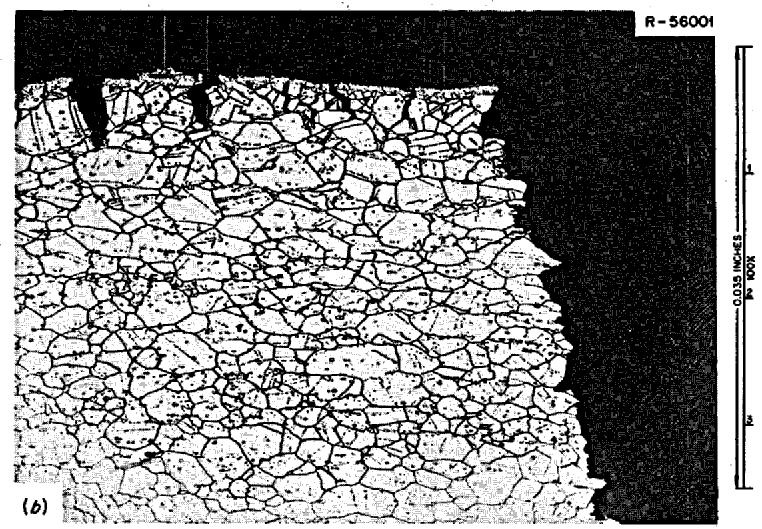

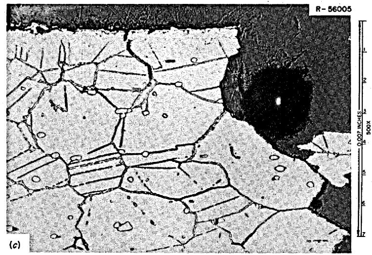  
Fig. 94. Photomicrographs of Bend Specimen of Mist Shield from Inside Liquid Region. (a) Fracture and tension side, as polished. (b) Fracture and tension side, etched. (c) Fracture and tension side, etched. Etchant: Aqua Regia.

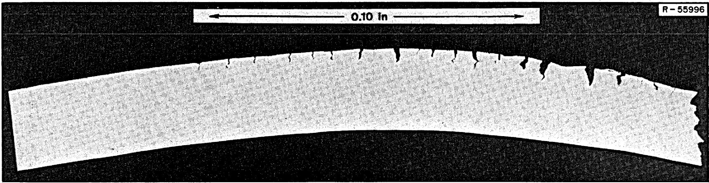  
Fig. 95. Composite Photograph of the Tension Side of a Bend Sample from Inside Liquid Region of Mist Shield. Lower Edge is not the compression side of the sample.

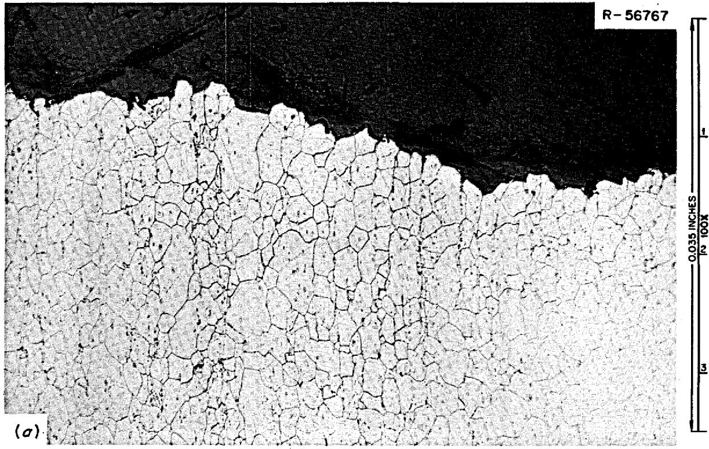

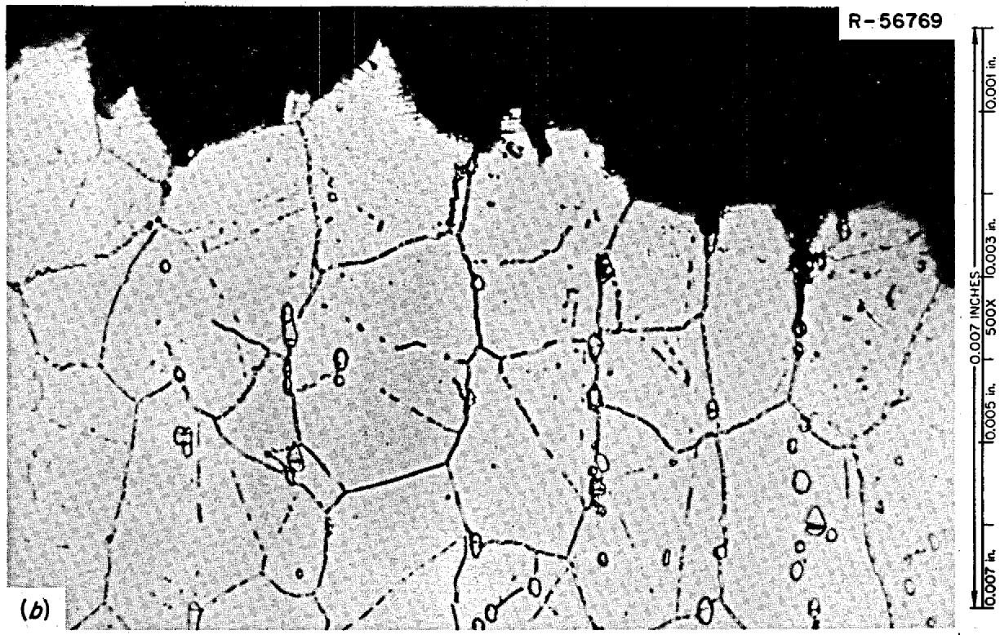  
Fig. 96. Photomicrographs of the Fracture of a Bend Specimen from the Outside Liquid Region of the Mist Shield. (a) $100 \times$ . (b) $500 \times$ . Etchant: Lactic acid, $\mathsf{HNO}_3$ , HCl.

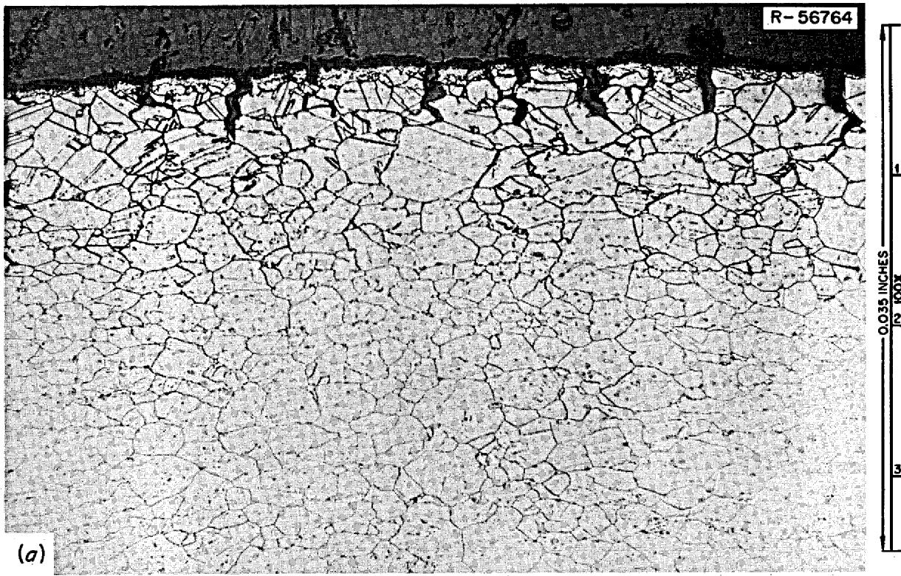

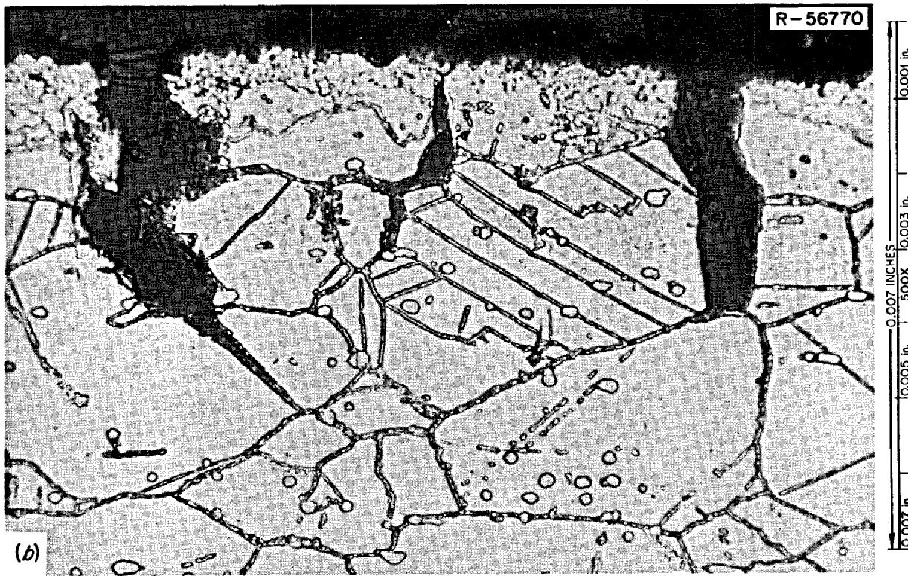  
Fig. 97. Photomicrographs of the Tension Side Near the Fracture of a Bend Specimen from the Outside Liquid Region of the Mist Shield. (a) $100 \times$ (b) $500 \times$ . Etchant: lactic acid, $\mathsf{HNO}_3$ , HCl.

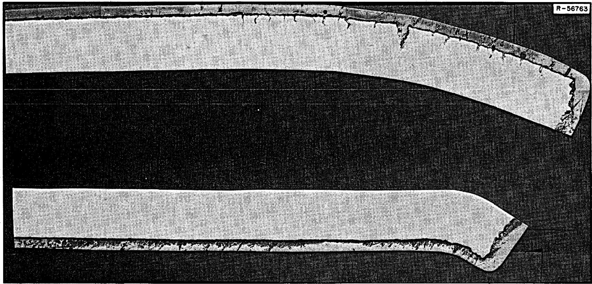  
Fig. 98. Composite of Several Photomicrographs of a Bend Specimen from the Outside Liquid Region of the Mist Shield. Top portion shows the tension side and the lower portion shows the compression side. $24 \times$

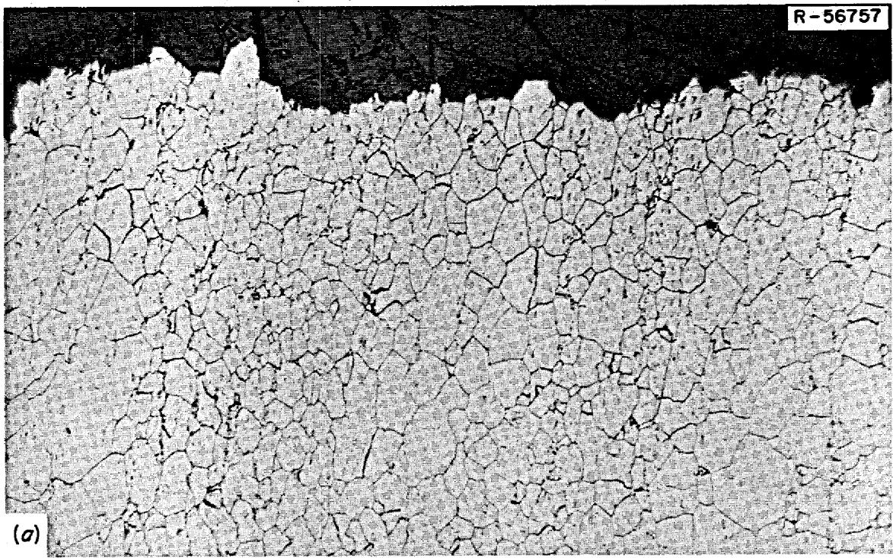  
0.035 INCHES 100x

Fig. 99. Photomicrographs of the Fracture of a Bend Specimen from the Outside Vapor Portion of the Mist Shield. (a) $100 \times$ . (b) $500 \times$ . Etchant: Lactic acid, $\mathsf{HNO}_3$ , HCl.   
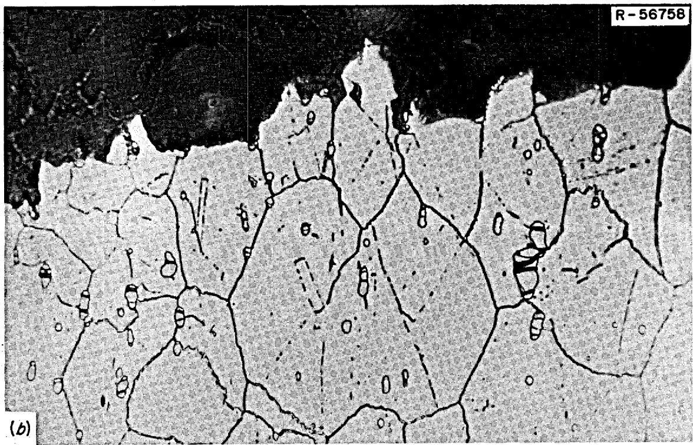  
0.007 INCHES 10.007 in. 1 10.005 in. 1 500X 10.003 in. 1 10.001 in.

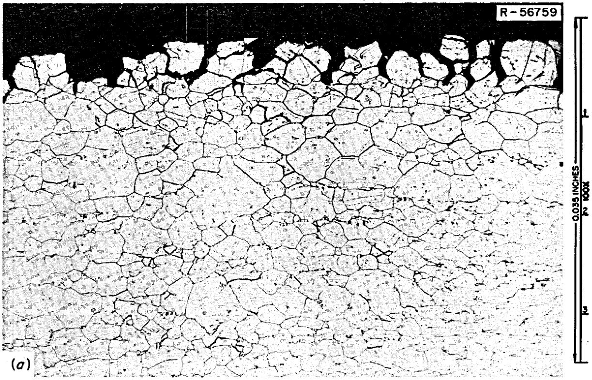

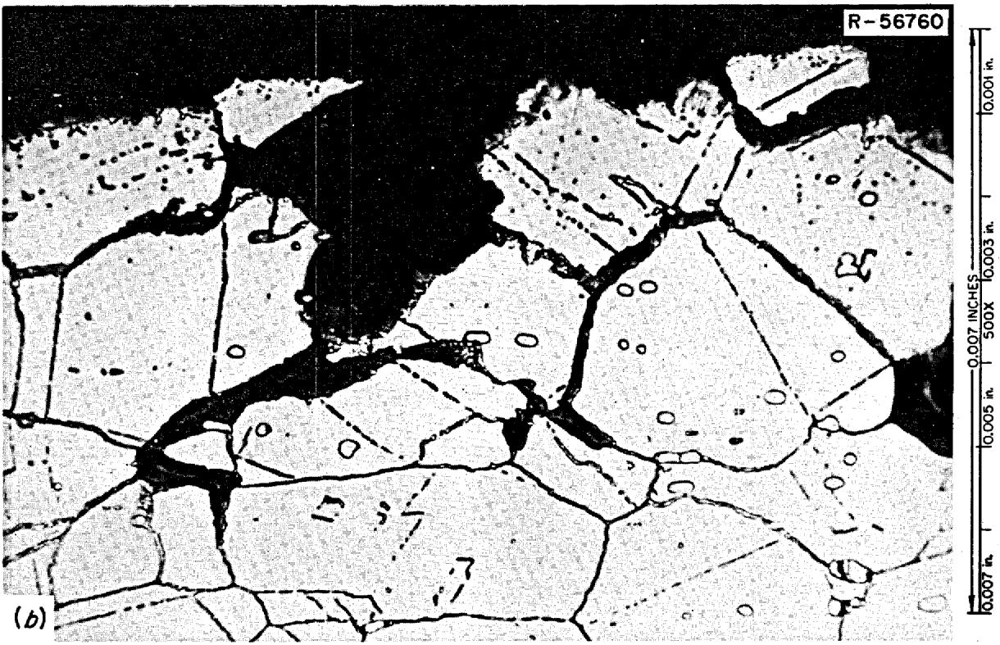  
Fig. 100. Photomicrographs of the Edge Near the Fracture of a Bend Specimen from the Outside Vapor Portion of the Mist Shield. (a) $100 \times$ . (b) $500 \times$ . Etchant: Lactic acid, $\mathsf{HNO}_3$ , HCl.

The reduced ductility of these samples remains unexplained. The maximum crack depth in the liquid region was only 8 mils, and it is quite unlikely that an 8 mil reduction in a sample thickness of 125 mils would cause much embrittlement. The embrittlement may have been partially due to the extensive carbide precipitation shown in Figs. 93, 95, 96, 98, and 99. However, the outside and inside of the shield received identical thermal treatments, but the samples from the outside had lower ductilities. Thus, attributing the embrittlement solely to carbide formation does not seem appropriate.

# Important Observations

The only free surface in the primary circuit was in the pump bowl, and there appears to have been a collection of material at the surface. Visual observation, gamma scanning, and the electron microprobe show an accumulation of salt, fission products, and corrosion products at this surface. Besides having a free surface, the region around the sampler was often quite reducing because of the addition of beryllium metal at this location. Fluorides of the structural metals would have been reduced to the metallic form and accumulated at the free surface or deposited on nearby metal surfaces. Some of the less stable fission product fluorides would have likely reacted in a similar way. Thus, it is not surprising that the intergranular cracks are most severe near the free surface. The most important observation relative to the cracking is that its severity was much less in material exposed primarily to gas. This allows the conclusion that exposure to liquid salt is necessary for the cracking to occur.

# Freeze Valve 105

Freeze valve 105 failed during the final thermal cycle involved with terminating operation of the MSRE. The failure was attributed to fatigue from a modification.[23] This valve consisted of a section of 1 l/2-in. sched. 40 INOR-8 pipe (heat 5094) with a jacket for air cooling. It was used to isolate the drain tanks and was frozen only when salt was in the

drain tanks. The line was filled with salt from the drain tanks, so the fission product concentration would have been relatively low. The line was filled with salt and above $500^{\circ}\mathrm{C}$ for about 21,000 hr. The salt was also static except when the system was being filled. Thus, this particular component was subjected to a unique set of conditions.

Rings 3/16 in. wide were cut, away from the flattened portion of the pipe. They were subjected to the ring test described previously. A bend specimen and a specimen for chemical analysis were cut from adjacent regions. The results of the mechanical property tests are given in Table 11. As shown in Fig. 102 both the bend specimen and the ring specimens showed some surface cracking when viewed at low magnification.

A metallographic section of one of the ring specimens is shown in Figs. 103 and 104. The fracture and both edges are visible in Fig. 103. The oxide is on the outside surface that was exposed to air (top) and shallow cracks formed on the salt side. Typical edges near the fracture are shown in Fig. 104. The cracks on the air side followed the oxide and did not penetrate further. The cracks on the salt side were intergranular and penetrated about 1 mil.

The most important observation on this component is that the cracking was less severe under conditions where the fission product concentration was less. However, intergranular cracking occurred on the surfaces that were exposed to fuel salt. The corrosion (selective removal of chromium) that occurred under these conditions should have been extremely small since the salt was static most of the time. Thus, corrosion does not seem to be a requirement for intergranular cracking although it may accelerate the process.

# EXAMINATION OF INOR-8 FROM IN-REACTOR LOOPS

The observation of intergranular cracking in the MSRE caused us to reexamine the available results on three in-reactor loops. Two pumped loops were run by Trauger and Conlin $^{24,25}$ in 1959, but the material from these loops had been discarded and only the reports and photomicrographs remained for examination. A more recent thermal convection loop was run

Table 11. Results of Mechanical Property Tests on Specimens From Freeze Valve 105 (Heat 5094 at $25^{\circ}\mathrm{C}$ and a Deformation Rate of 0.05 in./min   

<table><tr><td>Type of Test</td><td>Yield Stress (psi)</td><td>Ultimate Tensile Stress (psi)</td><td>Crosshead Travel (in.)</td><td>Reduction in Area (%)</td></tr><tr><td>Vendor&#x27;s, tensile</td><td>45,800</td><td>106,800</td><td></td><td>52.6</td></tr><tr><td>Ring, tensile</td><td>45,800</td><td>89,700</td><td>0.72</td><td>25</td></tr><tr><td>Ring, tensile</td><td>48,900</td><td>90,100</td><td>0.59</td><td>29</td></tr><tr><td>Ring, tensile</td><td>41,900</td><td>90,300</td><td>0.73</td><td>37</td></tr><tr><td>Wall segment, bend</td><td>71,300</td><td></td><td>0.41</td><td>\( 33^a \)</td></tr></table>

Maximum strain in outer fibers.

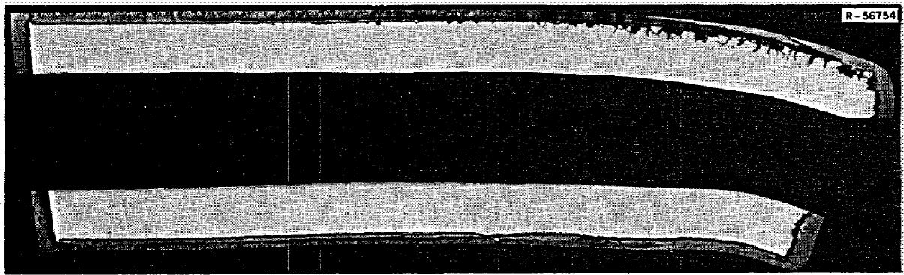  
Fig. 101. Composite of Several Photomicrographs of a Bend Specimen From the Outside Vapor Region of the Mist Shield. Top portion is the tension side and the lower part is the compression side. $15 \times$

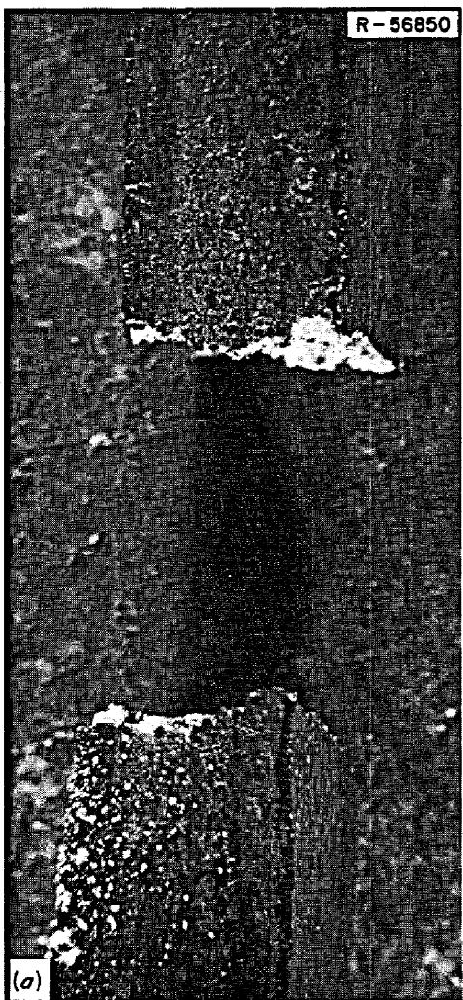

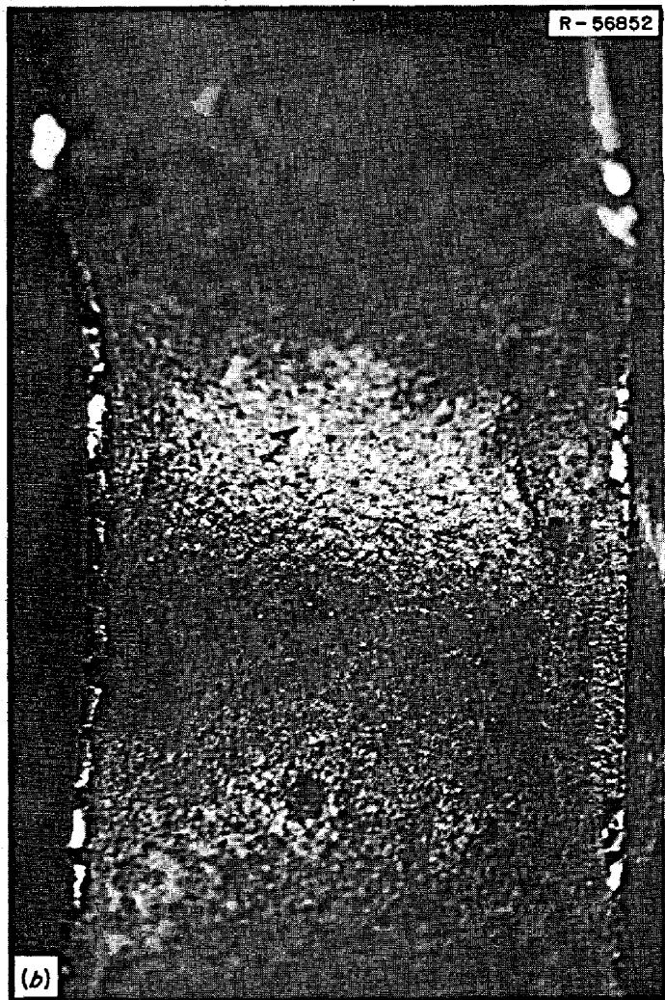  
Fig. 102. The Surfaces Exposed to Salt in Freeze Valve 105 After Deformation at $25^{\circ}\mathrm{C}$ . (a) Fracture of ring specimen pulled in tension. Note surface cracks near the fracture. $4 \times$ (b) Surface of bend specimen. Note some cracks on surface and edge cracks. $7 \times$ . Reduced $18.5\%$ .

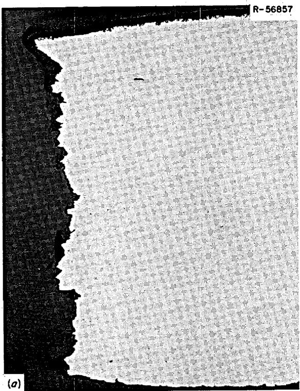

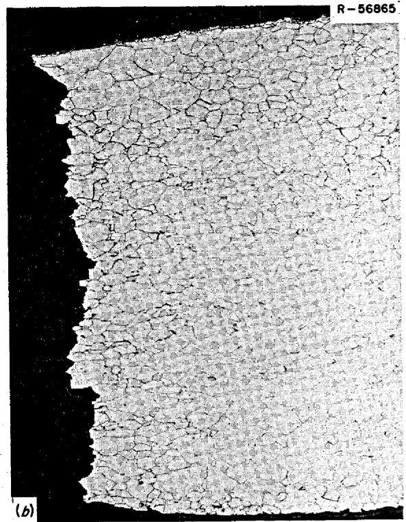  
Fig. 103. Photomicrographs of the Fracture of a Ring Specimen from Freeze Valve 105 that was Deformed at $25^{\circ}\mathrm{C}$ . (a) As polished. (b) Etchant: Lactic acid, $\mathsf{HNO}_3$ , HCl. $40\times$ . Reduced $29.5\%$ .

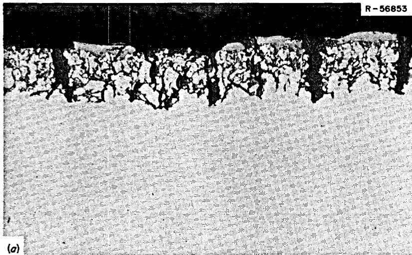  
0.007 INHES 10005 in. 500x 10.003 in. 10.001 in.

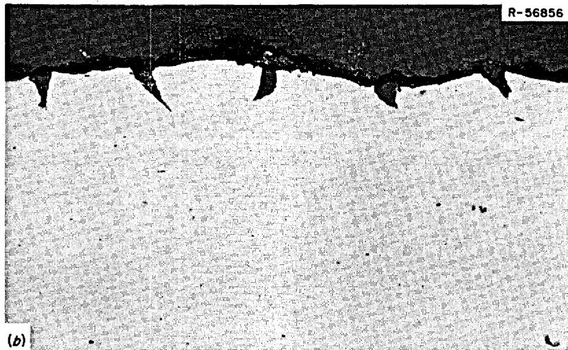  
0.007 INCHES

Fig. 104. Photomicrographs Near the Fracture of a Ring Sample from Freeze Valve 105 Deformed at $25^{\circ}\mathrm{C}$ . (a) Edge exposed to air, as polished. (b) Edge exposed to salt, as polished. (c) Edge exposed to salt, etched with lactic acid, $\mathsf{HNO}_3$ , HCl. Reduced $30\%$ .   
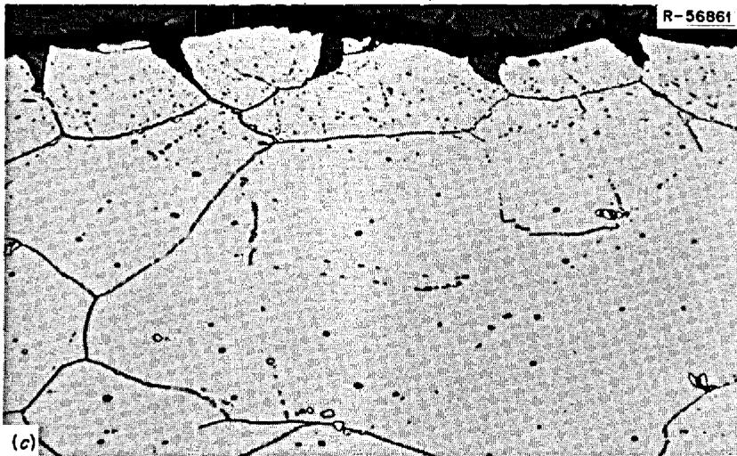  
0.007 INCHES 1.0005 n. 1 500x 10.003 in 10.001 n

by Compere et al.,[26] and some of the pieces were still available and their location in the loop identified. Some samples of these pieces were deformed and examined metallographically.

# Pump Loops

Trauger and Conlin ran two INOR-8 pump loops in the MTR.[24,25] These operated at a peak temperature of $704^{\circ}\mathrm{C}$ at an average power density of $66\mathrm{W/cm}^3$ . The loops both contained salt of composition[7] $\mathrm{LiF - BeF_2 - UF_4}$ (62-37-1 mole %). The first loop ran at a peak Reynolds number of 4100 and operated for 638 hr. The second loop had a peak Reynolds number of 3100 and operated for 766 hr. The operation of both loops was terminated by leaks in the heat exchanger. A detailed metallographic examination was made of the first loop.[27] The loop had a nose cone that was closest to the reactor, and it was here that the type of attack shown in Fig. 105 was noted. The attack is actually a surface roughening in which grains were removed from the inside of the INOR-8 tubing. The second loop did not show this type of attack.[28] The leak in the heat exchanger was not located in either loop.

The fission density in these loops was $66\mathrm{W/cm^3}$ , with salt volumes of $135\mathrm{cm^3}$ and surface areas of about $650\mathrm{cm^2}$ each. One of the fission products that will be discussed further is tellurium, and a comparison of the amount produced in these loops with that produced in the MSRE is useful. About $1.4 \times 10^{17}$ atoms of Tellurium were produced per unit of metal surface area in the MSRE and only $0.2 \times 10^{17}$ atoms/ $\mathrm{cm^2}$ in these two loops. The time at temperature was also much smaller for these loops than for even the first group of surveillance specimens from the MSRE, in which cracking was hardly detectable (Fig. 12).

The uneven inner surface of the loop tubing may or may not have been due to the same phenomenon that caused the intergranular cracking in the MSRE. Note in Fig. 105 that the material was removed in increments of single grains. However, there is no evidence of partially cracked grains that had not been completely removed. The explanation of cavitation is also not very acceptable since the peak velocity was only about 1 ft/sec.

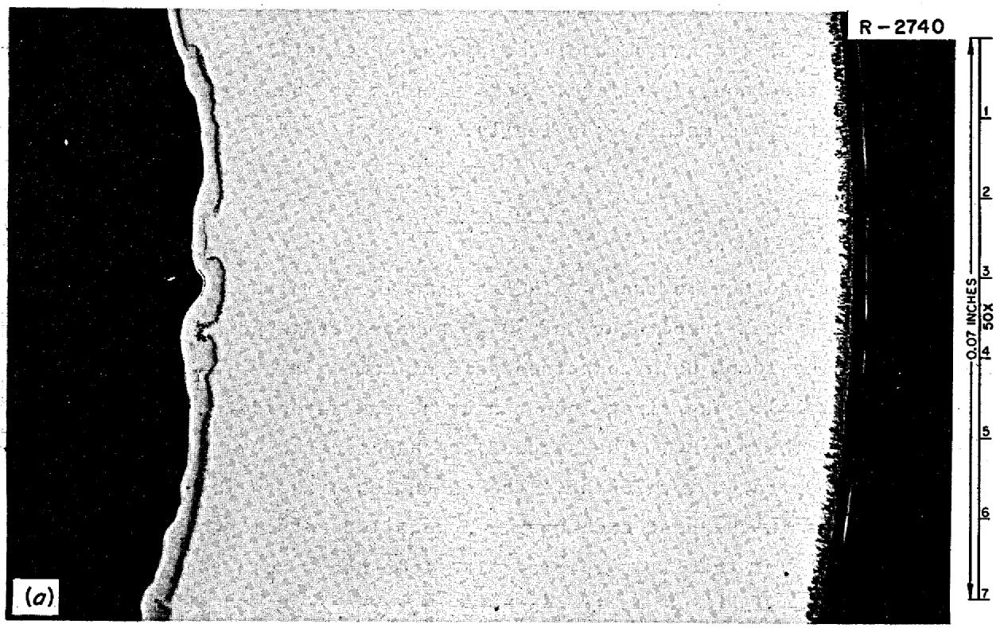

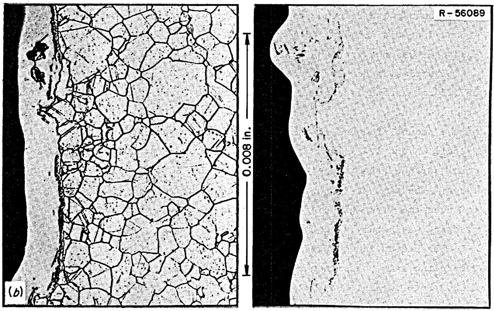  
Fig. 105. Inside Tube Wall of INOR-8 from In-pile Loop MTR 44-1. The coating is nickel plating used for edge preservation.

Being able to deform a piece of the tubing and then examine it for cracks should be enlightening, but no material from either loop remains. Thus, the observations on these loops are not very helpful in the present analysis.

# Thermal Convection Loop

A more recent in-reactor thermal convection loop was run by Compere et al.[26] A schematic of the loop is shown in Fig. 106, and the pertinent operating statistics are given in Table 12. The loop was constructed of INOR-8, contained salt of composition $^{7}\mathrm{LiF - BeF_2 - ZrF_4 - UF_4}$ (65.3-28.2-4.8-1.7 mole %), and had a graphite region where power densities of $150~\mathrm{W / cm^3}$ of salt were attained. The loop had maximum and minimum operating temperatures of 720 and $545^{\circ}\mathrm{C}$ , respectively. The loop failed at the hottest portion after 1366 hr of nuclear operation. The failure (Fig. 107) is quite typical of high-temperature failures noted previously in this material after irradiation.[4-7] Note that the inside surface is free of cracks except very near the point of failure.

Two pieces of the loop were retrieved and tested. One sample was from the flat sheet used to fabricate the top of the "core section" where the graphite was located. A small sheet was cut, bent so that the surface exposed to the fuel salt was in tension, and examined metallographically. A typical photomicrograph is shown in Fig. 108. Surface cracks were very infrequent and extended to a maximum depth of 0.5 mil.

A piece of tubing was available from the coldest section, and it was deformed by crushing in a tensile machine. A typical view of the inside surface is shown in Fig. 109. Cracks occurred along almost every grain boundary, but they only extended to a maximum depth of 1 mil.

The amount of tellurium produced in this loop per unit area of metal surface was $4.2 \times 10^{16}$ atoms/cm² (reference 29), compared with $1.4 \times 10^{17}$ atoms/cm² in the MSRE. Thus, the amount of tellurium was one-fourth that in the test loop, but the system was above $400^{\circ}\mathrm{C}$ only 937 hr when fission products were present.

Table 12. Summary of Operating Periods for In-Reactor Molten-Salt Loop 2   

<table><tr><td rowspan="2"></td><td colspan="3">Operating Period (hr)</td></tr><tr><td>Total</td><td>Irradiation</td><td>Full Power Dose Equivalent</td></tr><tr><td>Out-of-Reactor</td><td></td><td></td><td></td></tr><tr><td>Flush</td><td>77.8</td><td></td><td></td></tr><tr><td>Solvent Salt</td><td>171.9</td><td></td><td></td></tr><tr><td>In-Reactor</td><td></td><td></td><td></td></tr><tr><td>Preirradiation</td><td>73.7</td><td></td><td></td></tr><tr><td>Solvent Salt</td><td>343.8</td><td>339.5</td><td>136.0</td></tr><tr><td>Fueled salt</td><td>1101.9</td><td>937.4</td><td>547.0</td></tr><tr><td>Retracted-fuel removala</td><td>435.0</td><td>428.3</td><td>11.2</td></tr><tr><td>Total</td><td>2204.1</td><td>1705.2</td><td>694.2</td></tr></table>

${}^{a}$ Maintained at 350 to ${400}^{ \circ  }\mathrm{C}$ (frozen) except during salt-removal operations and fission product leak investigations.

ORNL-DWG 67-11832

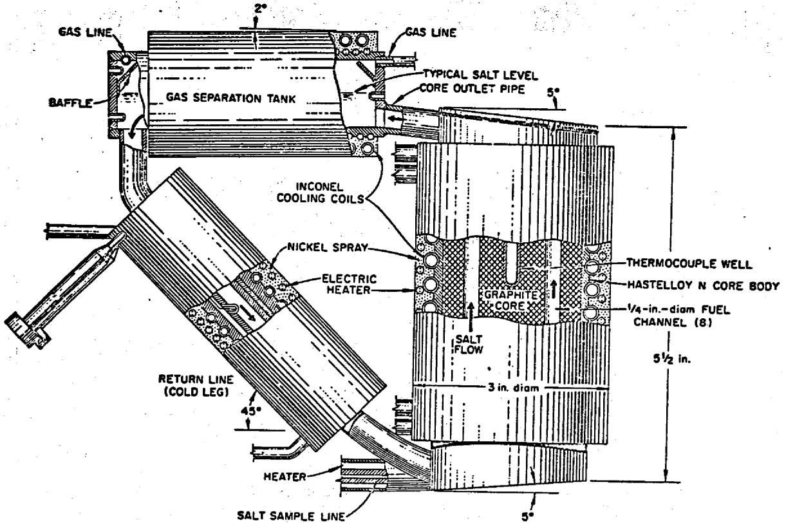  
Fig. 106. Diagram of Molten-Salt In-Reactor Loop 2.

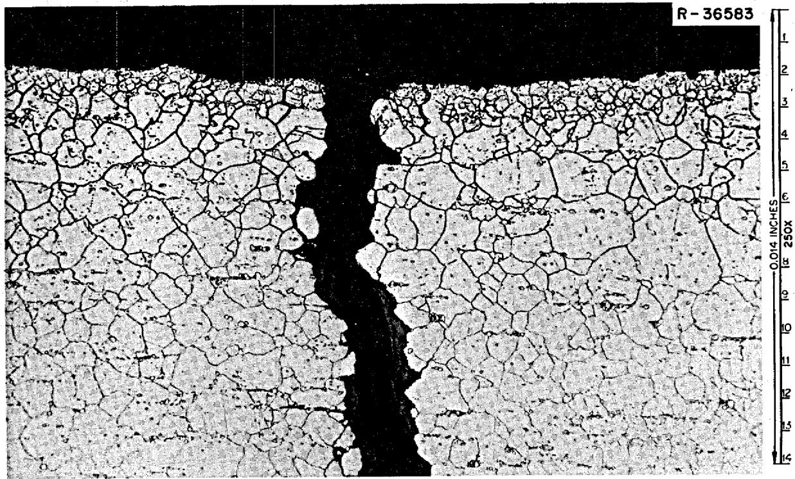  
Fig. 107. Photomicrograph of a Cross Section Showing the Inner Surface and Crack in Core Outlet Pipe of In-Reactor Loop 2. Located on top side of tubing. Etchant: Aqua regia.

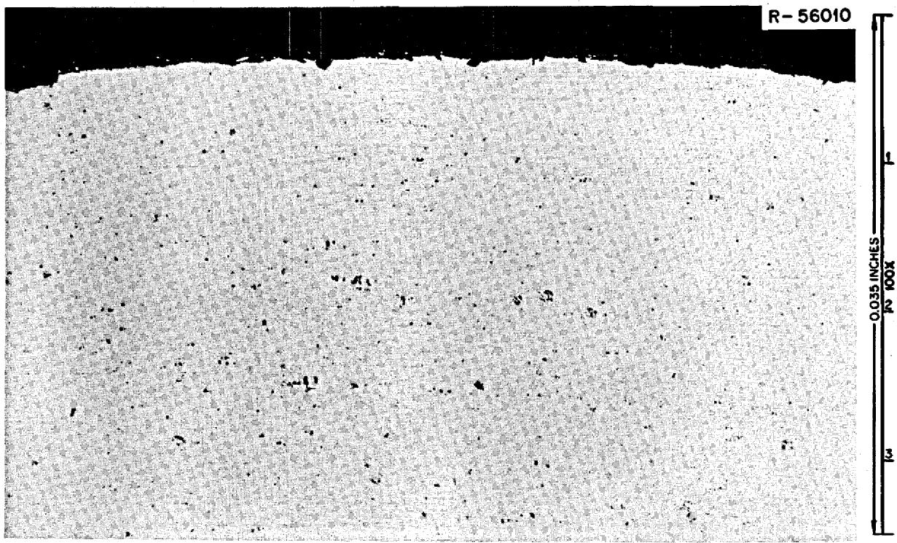  
Fig. 108. Bend Specimen from Section of In-Reactor Loop Which Operated at $720^{\circ}\mathrm{C}$ . The tension side was exposed to the fuel salt.

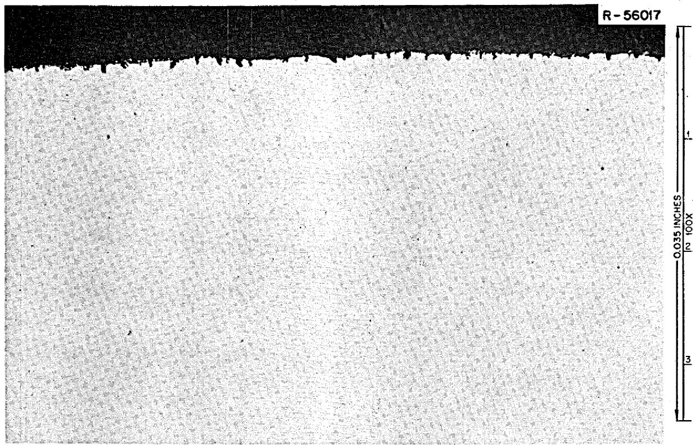  
Fig. 109. Tension Side of Crushed Tubing from Coldest Part of In-Reactor Loop, Which Operated at $545^{\circ}\mathrm{C}$ .

# Summary of Observations on In-Reactor Loops

The loops just discussed were exposed to fission product concentrations much lower than those observed in the MSRE. The time at temperature after fission products were produced was also much less than for the MSRE. The loop times were all less than 1000 hr, and the first group of MSRE surveillance samples was removed after 2550 hr exposure (Table 3) to fission products at elevated temperatures. The number of cracks in this first group of surveillance samples was quite small (Fig. 12, Table 7). Thus, it is questionable whether these loops had adequate exposure to cause detectable cracking.

The loops run by Trauger and Conlin had some regions from which grains were removed, but no intergranular cracks were visible. Strained samples of Compere's loop had shallow intergranular cracks similar to those noted in samples from the MSRE, particularly the sample exposed at $545^{\circ}\mathrm{C}$ (Fig. 109).

# CHEMICAL ANALYSES OF METAL REMOVED FROM THE MSRE

We found the electron microprobe analyzer to be useful for measuring chromium gradients in INOR-8, but we were not successful in locating any fission products. We then used the technique of electrolytically removing surface layers and analyzing the solutions. Specifically, the method involved a methanol- $30\%$ $\mathrm{HNO}_3$ solution at -15 to $-20^{\circ}\mathrm{C}$ , a platinum cathode, and the specimen as the anode. The electric potential was 6 V, a level that had been shown by laboratory experiments to polish rather than etch. The solutions were analyzed by two methods. The concentrations of the stable elements were obtained by evaporating 2 cc of the solution into a mass spectrometer and then analyzing the vapor by mass numbers.

Numerous experimental difficulties were encountered in taking the samples. Surface deposits (formed in the pump bowl) and thin oxide films (found on many parts from the core) acted as inhibitors and made the methanol- $30\%$ $\mathrm{HNO}_3$ solution attack nonuniformly or not at all. The voltage usually had to be increased to attack these surface barriers. Thus the

removal was not uniform on most samples until a few mils had been removed. A second problem was in sample preparation. The round geometry of the surveillance sample and the heat exchanger tube was desirable, but strips had to be cut from components such as the control rod thimble and the mist shield. We were not successful in masking the surfaces not exposed to fuel salt, so the ratios of fission product concentration to that of nickel are lower than would have been obtained had all the surfaces been exposed to fission products.

Two of the better profiles are shown in Fig. 110 and 111. The sample in Fig. 110 was a segment of heat exchanger tubing. Epoxy was cast inside to mask the surface that was exposed to coolant salt. The sample in Fig. 111 was a surveillance sample. We made diametral measurements with a micrometer, but these were not very accurate. We actually obtained the depth measurements by calculation from the measured nickel concentrations using the supplemental knowledge that the alloy was $70\%$ Ni and that the volume of the solution was 140 cc.

Compere compared the amounts of fission products that we actually found with the total inventory in the MSRE. He assumed that the fission products were deposited uniformly on the total system metal area of $7.9 \times 10^{5} \, \text{cm}^{2}$ . (Inclusion of the graphite surface area increases the deposition area to $2.3 \times 10^{6} \, \text{cm}^{2}$ .) The results of this type of analysis are summarized in Table 13 for the most highly concentrated fission products. The various samples are listed in the order that they would occur around the primary circuit, beginning at the bottom of the core and progressing up through the core, through the pump, into the heat exchanger, and back to the core. The values for the second sample should be quite low because of the shallow sampling, and the samples from the surveillance specimen and the heat exchanger tube should yield the most accurate date. However, there seem to be many inconsistencies and no systematic variation of the elements around the circuit.

One of the most interesting sets of chemical results was obtained from a surveillance sample of heat 5058 from the fourth group. The sample was oxidized for a few hours in air at $650^{\circ}\mathrm{C}$ before being strained. A very thin oxide film was formed and should have acted as a barrier to

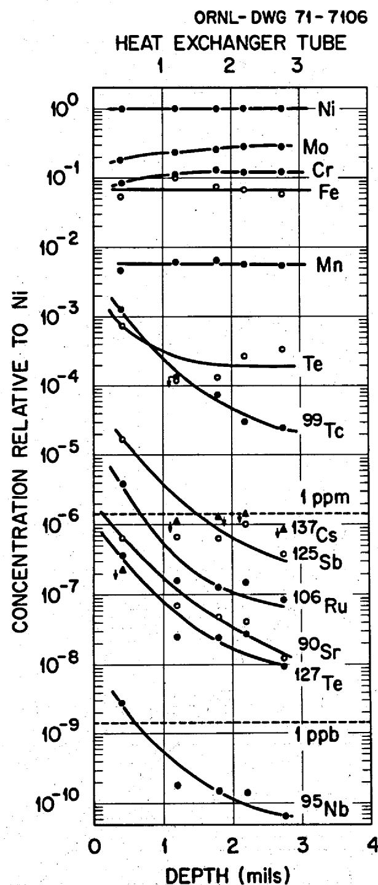  
Fig. 110. Concentration Profiles from the Fuel Side of a MSRE Heat Exchanger Tube. Arrows indicate that analytical values were reported as being less than the indicated point.

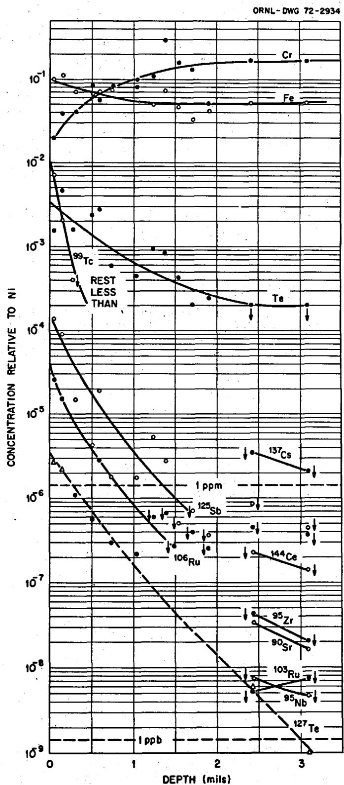  
Fig. 111. Concentration Profiles from a Surveillance Sample Exposed in the MSRE for 19,136 hr. Arrows indicate that analytical values were reported as being less than the indicated point.

Table 13. Concentrations of Several Fission Products on the Surfaces of Hastelloy N, Compared with the Total Inventory   

<table><tr><td rowspan="2">Sample Location</td><td rowspan="2">Depth of Penetration (mils)</td><td colspan="7">Concentration of Nuclide Compared with Inventory</td></tr><tr><td>127Te</td><td>134Cs</td><td>125Sb</td><td>103Ru</td><td>106Ru</td><td>95Nb</td><td>99Tc</td></tr><tr><td>Control rod thimble (bottom)</td><td>2.4</td><td>0.43</td><td>0.84</td><td>0.85</td><td>0.40</td><td>0.13</td><td>0.37</td><td>0.32</td></tr><tr><td>Control rod thimble (middle)</td><td>0.1</td><td>0.14</td><td>0.24</td><td>0.35</td><td>0.15</td><td>0.11</td><td>0.26</td><td>0.19</td></tr><tr><td>Surveillance specimen</td><td>3.5</td><td>0.001</td><td>0.35</td><td>1.04</td><td>0.006</td><td>0.087</td><td>0.006</td><td>0.30</td></tr><tr><td>Mist shield outside, liquid</td><td>6.0</td><td>0.23</td><td>0.035</td><td>0.74</td><td>0.069</td><td>0.10</td><td>0.067</td><td>0.19</td></tr><tr><td>Heat exchanger shell</td><td>4.2</td><td>0.35</td><td>0.017</td><td>0.68</td><td>0.027</td><td>0.05</td><td>0.085</td><td>0.27</td></tr><tr><td>Heat exchanger tube</td><td>4.3</td><td>0.67</td><td>0.006</td><td>1.13</td><td>0.028</td><td>0.14</td><td>0.070</td><td>0.31</td></tr></table>

chemical dissolution. The sample was deformed about halfway to failure, and two electrolytic dissolutions were made. The material should have been selectively removed from the regions that were freshly cracked since these surfaces were not oxidized. The solutions were analyzed, and the results divided by the nickel content. Significant enrichments were found in Te, Ce, Sb, Sr, and Cs. These solutions were analyzed for several other elements that had not been determined previously. Uranium-235 was present at a concentration of $37 \times 10^{-6}$ in the second layer. These concentrations correspond to 26 and 7 ppm, respectively. Determinations were made of Al (0.23), B (0.01), Co (0.23), K (0.05), Na (1.2), P (0.23), V (0.23), and S (1.2) with the amounts shown in parenthesis being the concentrations in percent found in the outer layer. The inner layer showed very little change. Samples of distilled water and unused methanol-30% HNO₃ had extremely low levels of the elements, and we know of no source of contamination in the sampling operation.

The high concentrations of sulfur and phosphorus are indeed reasons for concern, since these elements are known to embrittle nickel-base alloys.[30] Haubenreich calculated that the total sulfur introduced by pump oil inleakage was $27\mathrm{g}$ and that the initial fuel charge contained $\leq 5$ ppm S or a maximum of $24\mathrm{g}$ . Thus, sulfur was in the system and it may have concentrated along the grain boundaries. The sulfur (and the other elements) also could have been impurities in the INOR-8 and segregated in the grain boundaries during the long exposure at $650^{\circ}\mathrm{C}$ .

Another group of specimens was collected, and a different approach was taken to the analysis of the concentration of fission products. These samples were first exposed to a solution of Versene, boric acid, and citric acid. As shown in Table 14 this solution is not very aggressive toward the metal and very small weight changes were noted. Thus, this solution should be enriched in the material that was on or very near the surface of the metal. The sample was then completely dissolved in a separate solution. Both solutions were counted for various fission products, and the results are given in Table 14. Several observations can be made from these data.

Table 14. Concentrations of Fission Products Found on Several Samples From the MSRE ${}^{a,b}$   

<table><tr><td rowspan="2">Sample Description</td><td rowspan="2">Surface Area (cm2)</td><td rowspan="2">Weight Before Leaching (g)</td><td rowspan="2">Weight After Leaching (g)</td><td colspan="9">Surface Concentration (atoms/cm2)</td></tr><tr><td>127mTe</td><td>125Sb</td><td>90Sr</td><td>137Cs</td><td>134Cs</td><td>144Ce</td><td>106Ru</td><td>99Tc</td><td></td></tr><tr><td rowspan="2">Spacer sleeve, smooth</td><td rowspan="2">12.2</td><td rowspan="2">2.45489</td><td rowspan="2">2.44200</td><td>3.5 × 1011</td><td>1.5 × 1013</td><td>2.0 × 1014</td><td>5.5 × 1013</td><td>6.6 × 1011</td><td>8.9 × 1011</td><td>c</td><td>1.6 × 1016</td><td></td></tr><tr><td>9.6 × 1012</td><td>4.6 × 1014</td><td>2.1 × 1014</td><td>&lt;4.8 × 1014</td><td>&lt;5 × 1013</td><td></td><td>3.1 × 1014</td><td>9.4 × 1016</td><td></td></tr><tr><td rowspan="2">Space sleeve, with rib</td><td rowspan="2">8.4</td><td rowspan="2">5.36317</td><td rowspan="2">5.33873</td><td>2.2 × 1011</td><td>4.0 × 1013</td><td>3.3 × 1014</td><td>5.0 × 1013</td><td>1.8 × 1011</td><td>1.8 × 1012</td><td>c</td><td>2.3 × 1016</td><td></td></tr><tr><td>2.7 × 1013</td><td>&lt;1.5 × 1015</td><td>5.8 × 1014</td><td>&lt;3.5 × 1014</td><td>&lt;1 × 1013</td><td>&lt;5 × 1013</td><td>6.7 × 1014</td><td>2.4 × 1017</td><td></td></tr><tr><td rowspan="2">Thimble under spacer</td><td rowspan="2">6.6</td><td rowspan="2">3.80443</td><td rowspan="2">3.78641</td><td>3.1 × 1011</td><td>1.8 × 1013</td><td>3.6 × 1014</td><td>7.5 × 1013</td><td>2.1 × 1011</td><td>1.7 × 1012</td><td>8.6 × 1012</td><td>1.7 × 1016</td><td></td></tr><tr><td>5.9 × 1012</td><td>&lt;3 × 1014</td><td>1.8 × 1014</td><td>&lt;2 × 1015</td><td>&lt;2 × 1013</td><td>&lt;1 × 1014</td><td>&lt;2 × 1014</td><td>2.2 × 1017</td><td></td></tr><tr><td rowspan="2">Thimble under spacer</td><td rowspan="2">6.3</td><td rowspan="2">3.65780</td><td rowspan="2">3.64322</td><td>3.2 × 1011</td><td>1.4 × 1014</td><td>3.6 × 1014</td><td>3.0 × 1013</td><td>1.5 × 1012</td><td>1.3 × 1012</td><td>c</td><td>1.0 × 1016</td><td></td></tr><tr><td>4.2 × 1012</td><td>&lt;9 × 1014</td><td>1.7 × 1014</td><td>&lt;3 × 1015</td><td>&lt;1 × 1014</td><td>&lt;1 × 1014</td><td>&lt;3 × 1014</td><td>1.9 × 1017</td><td></td></tr><tr><td rowspan="2">Thimble, bare</td><td rowspan="2">4.5</td><td rowspan="2">2.59565</td><td rowspan="2">2.59272</td><td>3.6 × 1011</td><td>4 × 1013</td><td>7.5 × 1013</td><td>3.9 × 1013</td><td>7.8 × 1011</td><td>&lt;5.9 × 1011</td><td>6.9 × 1012</td><td>4.2 × 1015</td><td></td></tr><tr><td>1.8 × 1013</td><td>&lt;1.5 × 1015</td><td>1.4 × 1014</td><td>&lt;1 × 1015</td><td>&lt;6 × 1013</td><td></td><td>&lt;3 × 1014</td><td>1.1 × 1017</td><td></td></tr><tr><td rowspan="2">Thimble, bare</td><td rowspan="2">6.1</td><td rowspan="2">3.55622</td><td rowspan="2">3.55265</td><td>1.5 × 1011</td><td>3.7 × 1013</td><td>5.9 × 1013</td><td>4.0 × 1013</td><td>4.8 × 1011</td><td>2.7 × 1011</td><td>6.4 × 1012</td><td>2 × 1015</td><td></td></tr><tr><td>1.6 × 1013</td><td>&lt;2 × 1015</td><td>1.1 × 1014</td><td>&lt;8 × 1015</td><td>&lt;1 × 1013</td><td></td><td>&lt;5 × 1014</td><td>9.4 × 1016</td><td></td></tr><tr><td rowspan="2">Foil on fourth group surveillance</td><td rowspan="2">1.2</td><td rowspan="2">0.02047</td><td rowspan="2">0.02012</td><td>9.3 × 1011</td><td>5.6 × 1013</td><td>1.1 × 1013</td><td>2.6 × 1013</td><td>&lt;5 × 1011</td><td></td><td>4.9 × 1013</td><td>1 × 1016</td><td></td></tr><tr><td>1.6 × 1013</td><td>&lt;7 × 1014</td><td>2.8 × 1013</td><td>2.6 × 1015</td><td>&lt;1 × 1013</td><td>&lt;8 × 1015</td><td>2.7 × 1014</td><td>1 × 1016</td><td></td></tr><tr><td rowspan="2">Strap on fourth group surveillance</td><td rowspan="2">1.3</td><td rowspan="2">0.11191</td><td rowspan="2">0.11178</td><td>1.6 × 1011</td><td>1.6 × 1013</td><td>6.4 × 1012</td><td>4.0 × 1012</td><td>&lt;2 × 1011</td><td></td><td>1.1 × 1013</td><td>4 × 1015</td><td></td></tr><tr><td>4.9 × 1011</td><td>2.2 × 1014</td><td>2.6 × 1013</td><td>3 × 1014</td><td>&lt;2 × 1013</td><td>&lt;1 × 1013</td><td>9.4 × 1013</td><td>2.4 × 1016</td><td></td></tr><tr><td rowspan="2">Freeze valve 105</td><td rowspan="2">6.2</td><td rowspan="2"></td><td rowspan="2">10.2255</td><td>6.0 × 109</td><td>7.5 × 1011</td><td>2.6 × 1013</td><td>4.1 × 1013</td><td>&lt;9 × 1010</td><td>6 × 1010</td><td>8.6 × 1012</td><td>6 × 1014</td><td></td></tr><tr><td>2.0 × 1011</td><td>9.1 × 1012</td><td>1.0 × 1012</td><td>5.9 × 1012</td><td>&lt;5 × 1010</td><td>6 × 1010</td><td>7.9 × 1012</td><td>5 × 1014</td><td></td></tr><tr><td>Concentration at end of operation</td><td></td><td></td><td></td><td>8.9 × 1014</td><td>1.4 × 1014</td><td>2.5 × 1017</td><td>1.8 × 1017</td><td></td><td>6.6 × 1016</td><td>4.7 × 1015</td><td>2.7 × 1017</td><td></td></tr></table>

${}^{a}$ Samples counted about 2 years after end of MSRE operation. The foil and strap samples were removed 6 months before operation was terminated. The half-lives were 109 days for ${}^{{127}\mathrm{m}}\mathrm{{Te}}$ ,2.7 years for ${}^{{125}\mathrm{{Sb}}}$ ,28 years for ${}^{90}\mathrm{{Sr}}$ ,30 years for ${}^{{137}\mathrm{{Cs}}}$ ,2.3 years for ${}^{{134}\mathrm{{Cs}}}$ ,284 days for ${}^{{144}\mathrm{{Ce}}}$ ,1 year for ${108}\mathrm{{Ru}},5 \times  {10}^{5}$ years for ${}^{99}\mathrm{{Tc}}$ .   
bThe samples were first leached in a solution of Versene, boric acid, and citric acid. This solution was analyzed, and the first number under each isotope is the result. The remainder of the sample was dissolved and the second number under each isotope is the analytical result on the dissolved sample.   
cPresent in particulate form, but not in solution.

1. Generally the concentration of fission products per unit surface area exposed to fuel salt is greater in the metal than near the surface. However, the difference varies considerably for different isotopes. For example, the $^{127}\mathrm{Te}$ concentration is about two orders of magnitude higher in the metal than on the surface, whereas $^{90}\mathrm{Sr}$ is only slightly concentrated beneath the surface.   
2. The thimble samples that were exposed to flowing salt (designated "bare" in Table 13) and those that were covered by a spacer allow some comparison of the effects of flow rate on the deposition of fission products. The sample exposed to restricted salt flow consistently has a lower concentration of fission products, but only by a factor of 4 or less.   
3. Freeze valve 105 (FV 105) had a lower concentration of fission products. This was expected because of its operating conditions (p. 30b) and is consistent with the observation that intergranular cracking was less severe in this component (Table 7).   
4. With due consideration of the half lives, appreciable fractions of the total inventory of $^{127}\mathrm{Te}$ , $^{125}\mathrm{Sb}$ , $^{106}\mathrm{Ru}$ , and $^{99}\mathrm{Tc}$ are present on the metal surfaces. This generally agrees with the indications of the data in Table 13 except for the behavior of $^{134}\mathrm{Cs}$ . Some of the incremental dissolution data in Table 13 indicate that large amounts of $^{134}\mathrm{Cs}$ were present, whereas the data in Table 14 do not support this observation.

These results are interesting but must be viewed with reservations. The technique of electrolytically removing sections in the hot cells has not been used previously (to our knowledge) at ORNL, and numerous experimental difficulties arose. Uneven removal of material and deterioration of contacts, leads, etc. were some of the main problems. The results for radioactive species were obtained by proven methods. However, the level of gamma radiation from $^{60}\mathrm{Co}$ often masked the activity from elements of interest. The technique of evaporating 2 ml of the solution into the mass spectrograph is not new, but the complexity of the spectra presented caused many problems in interpretation. The different species are identified only by mass number by this method, and the presence of

the alloying elements in INOR-8, numerous fission products, constituents of the salt, and possible compounds between these elements and the electrolytic solution made it difficult to interpret the patterns.

The method used to obtain the data in Table 14 involved only radiochemistry and dissolution techniques that were better established. However, the chemical reactivity of the first solution (leach) with the surface material leaves an uncertainty whether the materials removed were simply salt residues or small amounts of the metal. The surface areas were uncertain in most cases because of the complex geometry.

With the qualifications that have been made the chemical analyses indicate several important points.

1. Several of the fission products penetrated the metal to depths of a few mils (Figs. 110 and 111).   
2. The fission products Te, Ce, Sb, Sr, and Cs were concentrated in the cracked regions of a strained surveillance specimen. Sulfur and phosphorous were also concentrated in these same regions. It is possible that the segregation of sulfur and phosphorus to the grain boundaries in this alloy is a normal phenomenon.   
3. Significant fractions of the total amounts of Te, Sb, Ru, and Tc were deposited on the metal surfaces.

These experiments were good introductions to the types of studies that could be performed. More work was needed to develop confidence in them, but termination of operation of the MSRE stopped our best source of experimental material. The full significance of the cracking problem was only fully realized in the postoperation examination of the MSRE.

DISCUSSION OF OBSERVATIONS ON INOR-8 FROM THE MSRE AND IN-REACTOR LOOPS

Summary of Observations

Observations have been presented on three basic types of samples. The first samples were the surveillance samples that were present in the MSRE primarily for the purpose of following the corrosion and radiation

damage to the metal. The second set of samples consisted of several components from the MSRE that were removed for examination after termination of its operation. The third set of samples came from in-reactor pump and thermal convection loops. Several important observations were made and these will be discussed. These observations will then be used to propose some mechanisms that may be responsible for the cracking.

The surveillance samples included two heats of material that were carried throughout the program and removed periodically for examination and testing. The samples were usually slightly discolored, but there was no evidence of corrosion beyond the slow rate of chromium removal, indicated by the analysis of the salt to be equivalent to removing all the chromium to a depth of only 0.4 mil or by the microprobe to be a concentration gradient in the thimble extending to a depth of $20~\mu \mathrm{m}$ (0.8 mil). When the samples were deformed at $25^{\circ}\mathrm{C}$ , intergranular cracks formed to depths of a few mils. The frequency of cracking increased with time, but the maximum depth did not increase detectably (Table 7).

Examination of several components showed that shallow intergranular cracks were present in all materials that had been exposed to fuel salt. The statistics on the number and depth of cracks are given in Table 15 along with the tellumium concentrations based on the chemical analyses in Table 14. Very thin surface cracks were often noted when the various components were removed from the MSRE. This was particularly true of the heat exchanger tubing. Samples from the pump bowl where there was a liquid interface gave an opportunity to observe the decrease in crack severity in traversing from the liquid to the gas region. All of the surfaces that were exposed to fuel salt were coated with fission products. Electrolytic sectioning showed that the fission products penetrated a few mils into the metal, but it is not definite whether they had diffused into the metal or whether they had plated on thin intergranular cracks. Chemical analyses on a sample that was oxidized to passivate the surface and strained to expose the reactive cracked regions showed that the cracked regions were enriched in Te, Ce, Sb, Sr, Cs, S, and P. The only sample that showed a definite dependence of crack severity on fission

Table 15. Crack Formation in Various Samples from the MSRE Strained at $25^{\circ}\mathrm{C}$ ( $>500^{\circ}\mathrm{C}$ for 30,807 hr and Exposed to Fission Products 24,500 hr)   

<table><tr><td rowspan="2">Sample Description</td><td colspan="2">Cracks</td><td colspan="2">Depth (mils)</td><td rowspan="2">127mTeaAtoms/cm2</td><td rowspan="2">Total TebAtoms/cm2</td></tr><tr><td>Counted</td><td>Per Inch</td><td>Av</td><td>Max</td></tr><tr><td></td><td></td><td></td><td></td><td></td><td>× 1015</td><td>× 1017</td></tr><tr><td>Exposed thimble</td><td>91</td><td>192</td><td>5.0</td><td>8.0</td><td>1.8,1.8</td><td>2.9,2.9</td></tr><tr><td>Thimble under spacer sleeve</td><td>148</td><td>257</td><td>4.0</td><td>8.0</td><td>0.59,0.46</td><td>0.95,0.74</td></tr><tr><td>Thimble spacer, Outer Surface</td><td>88</td><td>178</td><td>3.0</td><td>7.0}</td><td rowspan="2">1.0,2.8</td><td rowspan="2">1.6.4.5</td></tr><tr><td>Thimble spacer, Inner Surface</td><td>106</td><td>202</td><td>3.0</td><td>5.0}</td></tr><tr><td>Mist shield, inside vapor</td><td>47</td><td>192</td><td>1.0</td><td>2.0</td><td></td><td></td></tr><tr><td>Mist shield, inside liquid</td><td>33</td><td>150</td><td>4.0</td><td>6.5</td><td></td><td></td></tr><tr><td>Mist shield, outside vapor</td><td>80</td><td>363</td><td>4.0</td><td>5.0</td><td></td><td></td></tr><tr><td>Mist shield, outside liquid</td><td>54</td><td>300</td><td>3.0</td><td>5.0c</td><td>0.55</td><td>0.89</td></tr><tr><td>Sampler cage rod, vapor</td><td>100</td><td>143</td><td>2.5</td><td>5.0</td><td></td><td></td></tr><tr><td>Sampler cage rod, vapor</td><td>170</td><td>237</td><td>3.2</td><td>10.0</td><td></td><td></td></tr><tr><td>Sampler cage rod, liquid</td><td>102</td><td>165</td><td>3.7</td><td>10.0</td><td></td><td></td></tr><tr><td>Sampler cage rod, liquid</td><td>131</td><td>238</td><td>7.5</td><td>12.5</td><td></td><td></td></tr><tr><td>Freeze valve 105</td><td>131</td><td>240</td><td>0.75</td><td>1.5</td><td>0.04</td><td>0.06</td></tr></table>

aMeasured.   
bCalculated from measured $^{127}\mathrm{mTe}$ , relative isotopic ratios, and half life of $^{127}\mathrm{mTe}$ .   
cOne crack was 12 mils deep, next largest was 5 mils.

product concentration was the one from FV 105. The fission product concentrations were generally less than on the other samples by an order of magnitude (Table 14) and the cracks were very shallow (Fig. 104).

# Possible Mechanisms

These observations raise several important questions including the cause of the cracking and how rapidly these cracks propagate. Unfortunately, the information obtained from the MSRE and the in-reactor loops is only sufficient to allow speculation on these questions, and further experiments such as those summarized in the next section will be required for complete evaluation.

The first mechanism that must be considered is that the cracking is due to some form of corrosion. The most likely form of corrosion under the MSRE operating conditions would be the selective removal of chromium by the reaction.

$$
2 \mathrm {U F} _ {4} (\text {s a l t}) + \mathrm {C r} (\text {m e t a l}) \rightleftharpoons \mathrm {C r F} _ {2} (\text {s a l t}) + 2 \mathrm {U F} _ {3} (\text {s a l t}). *
$$

Some impurities in the salt, particularly at the beginning of operation with $^{233}\mathrm{U}$ , would have removed chromium from the metal by reactions such as

$$
\begin{array}{l} F e F _ {2} (\text {s a l t}) + C r (\text {m e t a l}) \rightleftharpoons C r F _ {2} (\text {s a l t}) + F e (\text {d e p o s i t e d}) \\ \mathrm {N i F} _ {2} (\text {s a l t}) + \mathrm {C r} (\text {m e t a l}) \rightleftharpoons \mathrm {C r F} _ {2} (\text {s a l t}) + \mathrm {N i} (\text {d e p o s i t e d}) \\ \end{array}
$$

The net result of all of the corrosion reactions is that chromium is selectively removed from the metal. This process is controlled by the diffusion of chromium to the surface of the metal, where it is available for reaction. DeVan31 measured the rate of diffusion of chromium in INOR-8, and his measurements can be used to calculate the depth to which

chromium could have been removed. The most extreme case would occur when the chromium concentration at the surface was maintained at zero so that the driving force for chromium diffusion toward the surface would be a maximum. The calculated chromium concentration profiles based on the assumption of zero surface concentration and the measured diffusion coefficient of $1.5 \times 10^{-14} \, \text{cm}^2/\text{sec}$ are shown in Fig. 112 for various times. The measured chromium profile for the thimble (Fig. 66) showed depletion to a depth of only 0.8 mil (0.0008 in.) which is somewhat less than the calculated depletion depth shown in Fig. 112. However, the assumption of zero concentration of chromium used in calculating the curves in Fig. 112 is too severe, and it is reasonable that the measured chromium depletion profiles would be less than those calculated. The rate of diffusion along grain boundaries, as we will discuss more in detail later, is more rapid than through the grains. Thus, the depth of chromium depletion along the grain boundaries could be much greater than the 0.8 mil measured within the grains.

The evidence that has just been examined shows that the chromium could be depleted along the grain boundaries to depths approaching those of the observed cracks. However, two significant pieces of evidence suggest that chromium depletion alone does not cause the cracking. First, thousands of hours of loop corrosion tests were run involving several fluoride salts and INOR-8, with no intergranular cracks being observed.[32,33,34] The second and most convincing evidence is that chromium depletion could not be detected in samples from the MSRE heat exchanger and in the section of the control rod thimble under a spacer sleeve. However, these samples were cracked as severely as those (e.g., the bare control rod thimble) in which chromium depletion was detectable (Table 15). Thus, it seems unlikely that chromium depletion alone can account for the observed cracking.

Another mechanism to be considered is the diffusion of some element(s) into the material, preferentially along the grain boundaries. A reaction of this type could cause (1) the formation of a compound that is very brittle, or (2) a change in composition along the grain boundaries so that they are liquid, or solid but very weak. Some deformation would likely be needed to form the cracks in all cases.

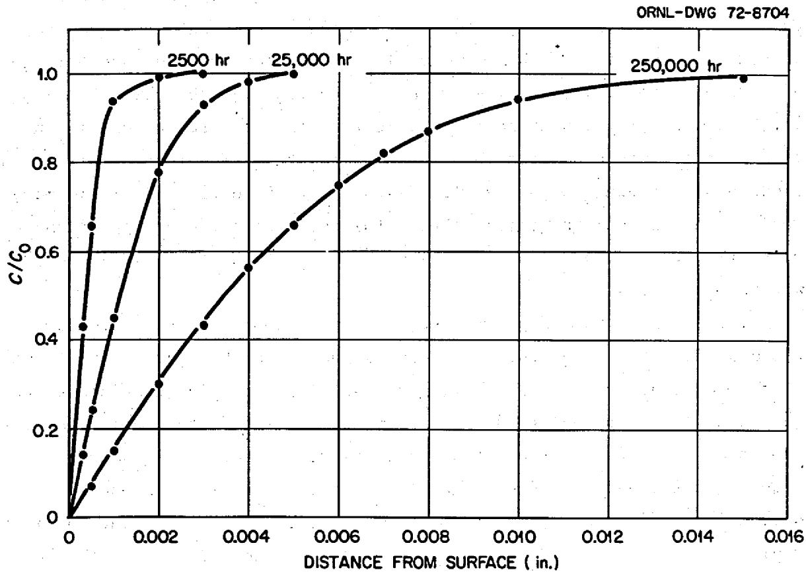  
Fig. 112. Calculated Chromium Profiles at $650^{\circ}\mathrm{C}$ in INOR-8 Assuming Zero Surface Concentration of Chromium.

It is extremely important that the element(s) responsible for the cracking be identified and the mechanism determined. Examination of the analytical data in Tables 13 and 14 shows that all of the fission products with sufficient half-lives to be detectable after 2 years were present. The data on the sample that was preoxidized show enrichments in several fission products as well as sulfur and phosphorus. These data offer some indication of the elements that are present, but the detection limits on the nonradioactive elements were not sufficiently low to ensure that some of the stable fission products were not present in even larger concentrations than the radioactive elements.

Thus, it seemed profitable to look at all of the elements in the fission spectrum with sufficient half-life to diffuse into the metal. Possible effects of these elements on INOR-8 are listed in Table 16. Many factors may be important, but only the information that we felt to be most relevant has been included. Bieber and Decker35 have summarized the observations on pure Ni and Wood and Cook36 have examined the effects of several elements on relatively complex niobium-base alloys. The thermodynamic properties and the behavior in the salt have been accumulated by W. R. Grimes et al37 from the literature, research, and studies of the MSRE. Several pieces of information are available from our current research and will be summarized in the next section.

The elements sulfur and selenium have detrimental effects under some tests conditions, but Te has had a more pronounced effect in all types of tests run to date. These three elements form relatively unstable fluorides and would likely be deposited on the metal and graphite surfaces. Also As, Sb, and Sr would be deposited, but no deleterious effects of these elements on the mechanical properties of nickel alloys have been noted. Zinc and cadmium may be deposited or present in the salt, depending on the oxidation state of the salt. Both of these elements are reported to be insoluble in nickel and we have not observed any deleterious effects in our test. Although Ru, Tc, Mo, and Rh should be deposited, we have seen no deleterious effects in our tests. Since Zr, Sr, Cs, and Ce form very stable fluorides, they should remain in the salt. We have no evidence, positive or negative, on the effects of strontium and cesium on the mechanical behavior, but we presently feel that

Table 16. Possible Effects of Several Elements on the Cracking of Hastelloy ${\mathrm{N}}^{\mathrm{a}}$ .   

<table><tr><td>Element</td><td>Melting Point (°C)</td><td>Concentrated Near Cracks</td><td>Vapor and Electroplated Specimensb</td><td>Effect on Tensile Properties of Nickelc</td><td>Effect on Creep Properties on Nickel Alloyd</td><td>Effect on Tensile Properties of Hastelloy Nb</td><td>Effect on Creep Properties of Hastelloy Nb</td><td>Free Energy of Formation of Fluoride at 1000*K (kcal/mole F)e</td><td>Expected Location of Element</td><td>Overall Rating</td></tr><tr><td>S</td><td>119</td><td>- -</td><td>+</td><td>- -</td><td></td><td>+</td><td>-</td><td>-34</td><td>Depositedf</td><td>-</td></tr><tr><td>Se</td><td>217</td><td></td><td>+</td><td>- -</td><td>+</td><td>+</td><td>-</td><td>-27</td><td>Deposited</td><td>-</td></tr><tr><td>Te</td><td>450</td><td>- -</td><td>- -</td><td>- -</td><td>-</td><td>-</td><td>-</td><td>-39</td><td>Deposited</td><td>- -</td></tr><tr><td>As</td><td>817</td><td></td><td>+</td><td>- -</td><td>+</td><td>+</td><td>+</td><td>-62</td><td>Deposited</td><td>+</td></tr><tr><td>Sb</td><td>630</td><td>-</td><td>+</td><td>- -</td><td>+</td><td>+</td><td>+</td><td>-55</td><td>Deposited</td><td>+</td></tr><tr><td>Sn</td><td>232</td><td></td><td></td><td>- -</td><td>+</td><td>+</td><td>+</td><td>-60</td><td>Deposited</td><td>+</td></tr><tr><td>Zn</td><td>420</td><td></td><td></td><td>Insoluble</td><td>+</td><td></td><td></td><td>-68</td><td>g</td><td></td></tr><tr><td>Cd</td><td>321</td><td></td><td>+</td><td>Insoluble</td><td>+</td><td></td><td></td><td>-64</td><td>g</td><td>+</td></tr><tr><td>Ru</td><td>2500</td><td></td><td></td><td>+</td><td></td><td>+</td><td>+</td><td>-51</td><td>Deposited</td><td>++</td></tr><tr><td>Tc</td><td>2130</td><td></td><td></td><td>+</td><td></td><td>+</td><td>+</td><td>-46</td><td>Deposited</td><td>++</td></tr><tr><td>Nb</td><td>2468</td><td></td><td></td><td>+</td><td>+</td><td>+</td><td>+</td><td>-70</td><td>g</td><td>++</td></tr><tr><td>Zr</td><td>1852</td><td></td><td></td><td>-</td><td>-</td><td>+</td><td>+</td><td>-99</td><td>Salt</td><td>+</td></tr><tr><td>Mo</td><td>2610</td><td></td><td></td><td>+</td><td>+</td><td>+</td><td>+</td><td>-57</td><td>Deposited</td><td>++</td></tr><tr><td>Sr</td><td>768</td><td>-</td><td></td><td>-</td><td></td><td></td><td></td><td>-125</td><td>Salt</td><td></td></tr><tr><td>Cs</td><td>29</td><td>-</td><td></td><td>Insoluble</td><td></td><td></td><td></td><td>-106</td><td>Salt</td><td></td></tr><tr><td>Ce</td><td>804</td><td>-</td><td></td><td></td><td></td><td>+</td><td>+</td><td>-120</td><td>Salt</td><td>+</td></tr><tr><td>Rh</td><td>1966</td><td></td><td></td><td></td><td></td><td>+</td><td>+</td><td>-42</td><td>Deposited</td><td>+</td></tr></table>

aThe symbols used in this table should be interpreted in the following way: A " $+^{\prime \prime}$ refers to good behavior and a "-" indicates detrimental effects.   
Results of current research.   
C. G. Bieber and R. F. Decker, "The Melting of Malleable Nickel and Nickel Alloys," Trans. AIME 221, 629 (1961).   
D. R. Wood and R. M. Cook, "Effects of Trace Contents of Impurity Elements on the Creep-Rupture Properties of Nickel-Base Elements," Metallurgia 7, 109, (1963).   
e Private communication, W. R. Grimes, ORNL.   
f May appear as $\mathbf{H}_2\mathbf{S}$ if HF concentration of melt is appreciable.   
$\mathbf{z}_{\mathrm{May}}$ appear in salt if salt mixture is sufficiently oxidizing.

these elements will stay in the salt and not enter the metal. Zirconium and cerium do not have adverse effects when added to INOR-8. Niobium can be in the salt or deposited, but it has very favorable effects on the mechanical properties. Thus, although some exploratory work remains, it appears that the cracking could be caused by the inward diffusion of elements of the S, Se, Te family, with tellurium having the most adverse effects in the experiments run to date. Our studies have concentrated on Te on the basis that Te has had the most adverse effects. Because these elements all behave similarly, an understanding of how tellurium causes cracking should lead to an understanding of the role of the other elements in the cracking process as well.

# POST-MSRE STUDIES

Since the surveillance samples and parts of the MSRE were examined, numerous laboratory experiments have been conducted in an effort to better understand the cause of the cracking and its effects on the operation of a reactor. Most of our work has concentrated on the fission product tellurium, and the rationale for this choice was discussed in the previous section. The experiments fall into the general categories of (1) corrosion in salt, (2) exposure to several fission products to compare the tendencies to produce cracks; (3) diffusion of Te, and (4) experiments with an applied stress. These experiments have involved materials other than INOR-8 in an effort to better understand the cracking phenomenon and to find a material that is more resistant to cracking. These experiments are continuing and only the most important findings will be summarized in this report.

# Corrosion Experiments

Arguments have already been presented that indicate our belief that the intergranular cracking in the MSRE could not have been due solely to chromium depletion. We did run one further experiment. A thermal convection loop containing a fuel salt had operated for about 30,000 hr with a very low corrosion rate. The oxidation potential of the salt was increased by two additions of 500 ppm $\mathrm{FeF}_2$ , and the specimens were examined

periodically. The corrosion rate increased and some selective grain boundary attack occurred, but the grain boundaries did not crack when the corrosion samples from the loop were deformed.

Thus, we conclude that corrosion alone cannot account for the observed cracking. However, chromium depletion by corrosion could make the material more susceptible to cracking by the inward diffusion of fission products, and this will be discussed later in more detail.

# Exposure to Fission Products

Three types of experiments have been run in which samples are exposed to fission products: (1) exposure of mechanical property samples to vapors of fission products, (2) electroplating tellurium on mechanical property samples, and (3) studying the mechanical properties of alloys that contain small alloying additions of the fission products. Sulfur has been included in this work even though it is not a fission product, since it is introduced in a reactor by lubricant inleakage and is reputed to be detrimental to nickel-base alloys.

The experiments with fission product vapors have included S, Se, Te, $\mathbf{I}_2$ , As, Sb, and Cd. These materials have sufficient vapor pressure at $650^{\circ}\mathrm{C}$ to transport to mechanical property samples. The samples were annealed in a quartz capsule with each fission product for various times at $650^{\circ}\mathrm{C}$ , deformed at $25^{\circ}\mathrm{C}$ , and sectioned for metallographic examination.

Examination of the samples exposed in this way has revealed several important facts.

1. Of the samples of INOR-8, type 304L stainless steel, and nickel-200 exposed to all seven elements for 2000 hr at $650^{\circ}\mathrm{C}$ , only INOR-8 and nickel 200 exposed to tellurium had intergranular cracks after deformation at $25^{\circ}\mathrm{C}$ .   
2. The cracks produced in INOR-8 by exposure to tellurium look quite similar to those formed in the material from the MSRE (Fig. 113).   
3. Exposure to tellurium over the temperature range of 550 to $700^{\circ}\mathrm{C}$ and concentration range of two orders of magnitude showed that the severity of cracking in INOR-8 and nickel 200 increased with increasing temperature and tellurium concentration. Type 304L stainless steel did not crack under any of the conditions investigated.

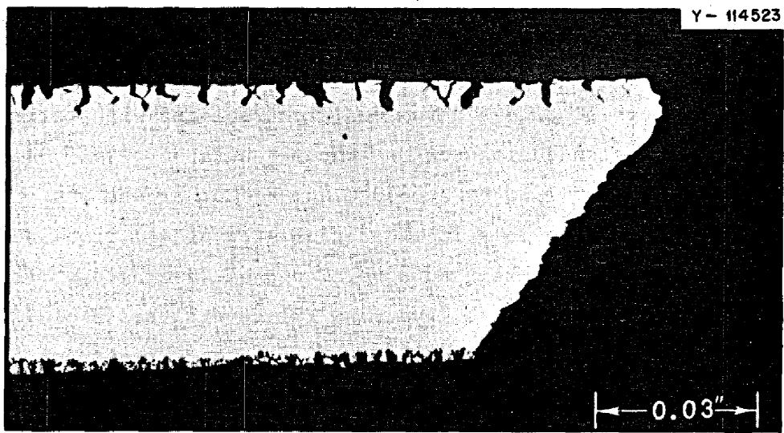  
MSRE Thimble - 31,000 hr in Fuel Salt at $650^{\circ}\mathrm{C}$

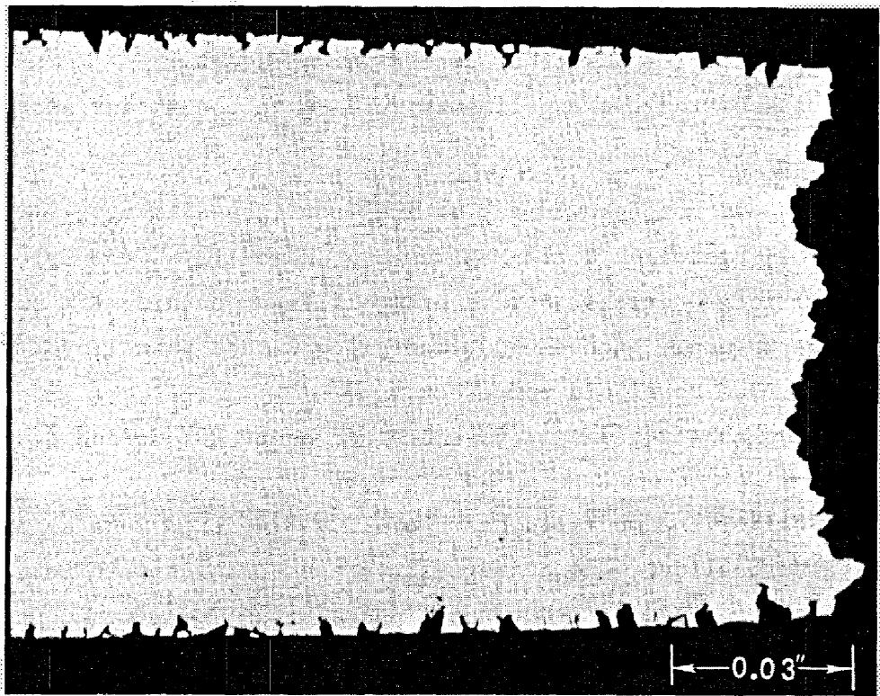  
$1.4 \times 10^{17}$ atoms/cm $^2$ of Te   
Vapor Plated with $5.4 \times 10^{18}$ atoms/cm $^2$ of Te Annealed 1000 hr at $650^{\circ}C$   
Fig. 113. Samples of INOR-8 Strained to Failure at $25^{\circ}\mathrm{C}$ . The upper photograph was made of a piece of the MSRE thimble. The upper side was exposed to fuel salt and cracked when strained. The lower side was exposed to the cell environment and the oxide that formed cracked during straining.

The lower specimen was exposed to tellurium vapor on both sides and deformed. The cracks are similar to those formed on the surface of the upper sample that had been exposed to fuel salt.

4. Inconel 600 and a heat of INOR-8 modified with $2\%$ Ti showed less severe cracking than INOR-8 under similar exposure conditions.

About 60 commercial alloys have been electroplated with tellurium to compare the relative tendencies to form intergranular cracks. One set of samples was annealed for 1000 hr at $650^{\circ}\mathrm{C}$ and the other set was annealed 200 hr at $700^{\circ}\mathrm{C}$ . The materials included consisted of (1) iron and several stainless steels, (2) nickel and several nickel-base alloys, (3) copper and monel, (4) two cobalt-base alloys, and (5) several heats of INOR-8 with modified chemical compositions. The samples were electroplated, welded in a metal capsule, evacuated and backfilled with argon, and welded closed. The environment was impure enough that some oxides were detected by x rays, and the results may be influenced by the presence of the oxide. The samples were deformed at $25^{\circ}\mathrm{C}$ and examined metal-lographically to determine whether cracks were present.

The results of the two experiments were quite consistent and several important observations were made.

1. Cracks did not form in any of the iron-base alloys.   
2. Nickel, Hastelloy B (1% Maximum Cr), Hastelloy W (5% Cr), and INOR-8 (7% Cr) formed cracks, but several alloys containing 15% or more Cr did not crack (e.g., Inconel 600, Hastelloy C, and Hastelloy X).   
3. Copper and Monel did not crack.   
4. The two cobalt-base alloys contained about $20\%$ Cr and did not crack.   
5. Several of the modified heats of INOR-8 cracked less severely than the standard alloy. The better alloys seemed to contain more niobium, although there were usually other additions also. Two alloys containing $2\%$ Nb did not have any cracks.

The results of the two types of experiments, one exposing the material to fission product vapors and the other to electroplated tellurium, generally agree. Not all of the alloys have been tested by both methods.

Small melts have been made containing nominal additions of $0.01\%$ each of S, Se, Te, Sr, Tc, Ru, Sn, Sb, and As. Tests on these alloys show no measurable effects on their mechanical properties at $25^{\circ}\mathrm{C}$ . In

creep tests at $650^{\circ}\mathrm{C}$ only S, Se, and Te have deleterious effects. These elements reduce the rupture life and the fracture strain. Alloys containing sulfur and tellurium have been made with and without chromium. The effects of sulfur and tellurium are more deleterious when chromium is not present. This suggests a possible tie between corrosion by selective chromium removal and intergranular cracking due to tellurium. The regions depleted in chromium should be much less tolerant of tellurium than those containing chromium.

# Diffusion of Te

The rate of diffusion of tellurium in INOR-8, nickel 200, and type 304L stainless steel has been measured. The penetration depths were quite small in some samples, but the data generally give the bulk and grain boundary diffusion coefficients at $650^{\circ}\mathrm{C}$ and $760^{\circ}\mathrm{C}$ accurately enough to make predictions of the depth of penetration in service. The depth was very shallow in type 304L stainless steel, at least twice as deep in INOR-8, and many times greater in nickel 200.

The Fisher model for grain boundary diffusion relates the depth of penetration to the diffusion time to the one-fourth power.[38] Thus, the increase in the depth of penetration for a system at temperature for 30 years (an MSBR) is only 1.8 times as great as that for a system at temperatures for three years (the MSRE). However, these calculated values are lower limits and make no allowance for the diffusion front advancing as intergranular cracks form and propagate.

# Experiments with an Applied Stress

Several types of experiments with an applied stress have been run. One is a standard creep test with the sample in an environment of argon and tellurium. The tellurium is preplaced in a quartz vial at a location where it will have a vapor pressure of aabout 0.5 torr. INOR-8 cracks very badly at $650^{\circ}\mathrm{C}$ at relatively high stress levels. The cracks extend 35 mils, compared with about 5 mils in the tests that were stressed after the

exposure to tellurium. Tests near reasonable design stresses have been in progress several thousand hours. Type 304L stainless steel, nickel-200, and Inconel 600 have been in test several thousand hours, but have not been examined metallographically. The reaction products of tellurium with nickel-200 and INOR-8 are basically nickel tellurides, but the only detectable product on stainless steel is an oxide of the $\mathrm{Fe}_{3}\mathrm{O}_{4}$ type.

Tube burst tests of INOR-8 were run with the outside of the tubes in helium or salt environments. Some of the tubes were electroplated with tellurium before testing. The test environment had no detectable effect, but the tubes plated with tellurium failed in shorter times than those not plated. Metallographic examination revealed intergranular cracks about 10 mils deep along almost every grain boundary of the plated specimens. Some of the stainless steel tubes are still in test, but the rupture lives of those that have failed are equivalent for plated and unplated specimens.

The other type of stressed test that has been run is one with controlled strain limits. Thermal stresses commonly occur in components such as heat exchangers where high heat fluxes develop and transients are frequent. Thermal strains of $\pm 0.3\%$ are anticipated for MSBR heat exchangers. Our first test has utilized a Te-plated Hastelloy N specimen strained between limits of $\pm 0.16\%$ . The rupture life was shorter than anticipated on the basis of tests with tellurium, and numerous intergranular cracks were present on the outside where the tellurium was plated.

# SUMMARY

These tests show the tellurium causes the formation of intergranular cracks in INOR-8 and that these cracks are deeper if the material is stressed and exposed to tellurium simultaneously than they would be if the material were exposed to tellurium and then stressed. Although the diffusion rate of tellurium in INOR-8 has been measured, the role of stress in accelerating crack propagation makes the diffusion measurements of questionable value in estimating the extent of cracking in service.

Only elements of the S, Se, and Te family were found to cause intergranular cracking in INOR-8.

Exploratory experiments indicate that several materials are more resistant to intergranular cracking than INOR-8. Iron-base alloys, copper, and Monel seem completely resistant. Nickel- or cobalt-base alloys with about $20\%$ Cr seem resistant, but the results for alloys such as Inconel 600 with $15\%$ Cr are inconclusive. Some modified compositions of INOR-8 have exhibited improved resistance to cracking.

The INOR-8 from the MSRE, which had been exposed to fuel salt, was noted to contain intergranular cracks to depths of a few mils. These cracks were visible in some materials in as-polished metallographic sections as they were removed from the MSRE. When the samples were deformed at room temperature, the cracks became more visible but still reached a limiting depth of about 10 mils. The severity of cracking could not be related with the amount of chromium removal but was most severe at the liquid interface in the pump bowl and least severe in regions of the pump bowl exposed to gas. Samples were sectioned electrochemically, and some fission products were found to depths of several mils, although it was not clear whether the fission products had diffused through the metal to these depths or simply plated on the surfaces of cracks that already existed.

Not being able to relate the intergranular cracking to corrosion (chromium leaching) in either the MSRE or in laboratory experiments, we investigated the possible effects of fission products on the material. The MSRE had been shut down and the work was continued in laboratory experiments. This work included the exposure of INOR-8 to small amounts of vapor or electroplated fission products, the study of several alloys with fission products added, experiments with tellurium and an applied stress present simultaneously, and the measurement of the diffusion of tellurium in INOR-8. These experiments have shown clearly that of the many elements tested, only tellurium caused intergranular cracking similar to that noted in samples from the MSRE.

Several other materials were also included in these experiments to determine whether they might be more resistant to embrittlement by tellurium. Several alloys, including 300 and 400 series stainless steels, cobalt- and nickel-base alloys containing more than $15\%$ Ce, copper, Monel,

and some modified compositions of INOR-8 are resistant to cracking in the tests run to date. Further work will be necessary to show unequivocally that these materials resist cracking in nuclear environments, including in-reactor capsule tests.

# ACKNOWLEDGMENT

The observations in this report cover several years and include contributions from many individuals. W. H. Cook and A. Taboda designed the surveillance fixture, and W. H. Cook was responsible for its assembly and disassembly. The MSRE operations staff, headed by P. N. Haubenreich, exercised extreme care in handling the surveillance fixture and in removing the various components for examination. The Hot Cell Operation Staff, headed by E. M. King, developed several special tools and techniques for various examinations and tests of materials from the MSRE. The metallography was performed by H. R. Tinch, E. Lee, N. M. Atchley, and E. R. Boyd. The microprobe scans were made by T. J. Henson and R. S. Crouse. The technique for electrolytically dissolving samples in the hot cells was developed by R. E. Gehlbach and S. W. Cook. The mechanical property tests were performed by B. C. William, H. W. Kline, J. W. Chumley, L. G. Rardon, and J. C. Fettner. The chemical analyses were performed under the supervision of W. R. Laing, E. I. Wyatt, and J. Carter. Assistance was received from several members of the Reactor Chemistry Division in several phases of this work. J. V. Cathcart, J. R. DiStefano, P. N. Haubenreich, and J. R. Weir reviewed the manuscript of this report and made many helpful suggestions. Kathy Gardner made the original drafts of this report, and the drawings were prepared by the Graphic Arts Department.

# REFERENCES

1. P. N. Haubenreich and J. R. Engel, "Experience with the MSRE," Nucl. Appl. Tech. 8, 118 (1970).   
2. H. E. McCoy, "The INOR-8 Story," ORNL Review 3(2), 35 (1969).   
3. S. H. Bush, Irradiation Effects in Cladding and Structural Materials, Rowman and Littlefield, Inc., New York (1965).   
4. H. E. McCoy, An Evaluation of the Molten-Salt Reactor Experiment Eastelloy N Surveillance Specimens - First Group, ORNL-TM-1997 (November 1967).   
5. H. E. McCoy, An Evaluation of the Molten-Salt Reactor Experiment Hastelloy N Surveillance Specimens - Third Group, ORNL-TM-2359 (February 1969).   
6. H. E. McCoy, An Evaluation of the Molten-Salt Reactor Experiment Hastelloy N Surveillance Specimens - Third Group, ORNL-TM-2647 (January 1970).   
7. H. E. McCoy, An Evaluation of the Molten-Salt Reactor Experiment Hastelloy N Surveillance Specimens - Fourth Group, ORNL-TM-3063 (March 1971).   
8. W. R. Martin and J. R. Weir, "Effect of Elevated Temperature Irradiation on the Strength and Ductility of the Nickel-Base Alloy Hastelloy N," Nucl. Appl. 1, 160 (1965).   
9. W. R. Martin and J. R. Weir, "Postirradiation Creep and Stress Rupture of Hastelloy N," Nucl. Appl. 3, 167 (1967).   
10. H. E. McCoy and J. R. Weir, "Stress-Rupture Properties of Irradiated and Unirradiated Hastelloy N Tubes," Nucl. Appl. 4, 96 (1968).   
11. H. E. McCoy, "Variation of the Mechanical Properties of Irradiated Hastelloy N with Strain Rate," J. Nucl. Mater. 31, 67 (1969).   
12. T. C. Robertson, MSRE Design and Operations Report, Part I - Description of Reactor Design, ORNL-TM-728 (January 1965).   
13. R. E. Thoma, Chemical Aspects of MSRE Operation, ORNL-4658 (December 1971).   
14. C. H. Gabbard, Design and Construction of Core Irradiation-Specimen Array for MSRE Runs 19 and 20, ORNL-TM-2743 (December 1969).   
15. MSR Program Semiannu. Progr. Rep. Feb. 28, 1966, ORNL-3936, pp. 96-99.   
16. MSR Program Semiannu. Progr. Rep. Aug. 31, 1966, ORNL-4037, pp. 97-102.

17. MSR Program Semiannu. Progr. Rep. Aug. 31, 1968, ORNL-4344, pp. 211-14.   
18. MSR Program Semiannu. Progr. Rep. Aug. 31, 1969, ORNL-4449, pp. 165-68.   
19. P. N. Haubenreich and M. Richardson, Plans for Post-Operation Examination of the MSRE, ORNL-TM-2974 (April 1970).   
20. MSR Program Semiannu. Progr. Rep. Feb. 28, 1971, ORNL-4676, pp. 1-16.   
21. G. M. Tolson and A. Taboada, MSRE Control Elements: Manufacture, Inspection, Drawings, and Specifications, ORNL-4123, (July 1967).   
22. H. E. McCoy and J. R. Weir, The Effect of Irradiation on the Bend Transition Temperatures of Molybdenum- and Niobium-Base Alloys, ORNL-TM-880, pp. 7-10 (July 1964).   
23. B. McNabb and H. E. McCoy, MSR Program Semiannu. Progr. Rep. Feb. 28, 1971, ORNL-4676, pp. 160-166.   
24. D. B. Trauger and J. A. Conlin, Jr., "Circulating Fused-Salt Fuel Irradiation Test Loop," Nucl. Sci. Eng. 9, 346 (1961).   
25. J. A. Conlin and B. H. Montgomery, MSRP In-Pile Loop ORNL-MTR-44 Design and Operating Conditions, unpublished.   
26. E. L. Compere, H. C. Savage, and J. M. Baker, MSR Program Semiannu. Progr. Rep. Aug. 31, 1967, ORNL-4191, p. 176.   
27. E. J. Manthos, "Disassembly and Examination at In-Pile Loop, ORNL-MTR-44-1," unpublished.   
28. E. J. Manthos, "Disassembly and Examination at In-Pile Loop, ORNL-MTR-44-2," unpublished.   
29. E. L. Compere, private communication.   
30. C. G. Bieber and R. F. Decker, "The Melting of Malleable Nickel and Nickel Alloys," Trans. AIME, 221, 629 (1961).   
31. J. H. DeVan, Effect of Alloying on Corrosion Behavior of Nickel-Molybdenum Alloys in Fused Fluoride Mixtures, ORNL-TM-2021 (May 1969).   
32. H. E. McCoy and J. R. Weir, Materials Development for Molten-Salt Breeder Reactors, ORNL-TM-1854 (1967).   
33. G. M. Adamson, T. S. Crouse, and W. D. Manly, Interim Report on Corrosion by Alkali-Metal Fluorides: Work to May 1953, ORNL-2337 (1959).

34. G. M. Adamson, R. S. Crouse, and W. D. Manly, Interim Report on Corrosion by Zirconium-Base Fluorides, ORNL-2338 (1961).   
35. C. G. Bieber and R. F. Decker "The Melting of Malleable Nickel and Nickel Alloys," Trans. AIME, 221, 629 (1961).   
36. D. R. Wood and R. M. Cook, "Effects of Trace Contents of Impurity Elements on the Creep-Rupture Properties of Nickel-Base Elements," Metallurgia 72, 109 (1963).   
37. W. R. Grimes et al., private communication.   
38. J. C. Fisher, J. Appl. Phys. 22, 74-77 (1951).

ORNL-4829

UC-25 - Metals, Ceramics, and Materials

# INTERNAL DISTRIBUTION

1-3. Central Research Library

4. ORNL - Y-12 Technical Library

Document Reference Section

5-39. Laboratory Records Department

40. Laboratory Records, ORNL R.C.

41. ORNL Patent Office

42. G. M. Adamson, Jr.

43. J. L. Anderson

44. W. E. Atkinson

45. C. F. Baes

46. C. E. Bamberger

47. C. J. Barton

48. H. F. Bauman

49. S. E. Beal1

50. C. E. Bettis

51. D. S. Billington

52. F. F. Blankenship

53. E. E. Bloom

54. R. Blumberg

55. E. G. Bohlmann

56. J. Braunstein

57. M. A. Bredig

58. R. B. Briggs

59. H. R. Bronstein

60. G. D. Brunton

61. S. Cantor

62. D. W. Cardwell

63. J. V. Cathcart

64. O. B. Cavin

65. Nancy Cole

66. C. W. Collins

67. E. L. Compere

68. W. H. Cook

69. J. L. Crowley

70. F. L. Culler

71. D. R. Cuneo

72. J. E. Cunningham

73. J. M. Dale

74. J. H. Devan

75. J. R. DiStefano

76. S.J.Ditto

77. W. P. Eatherly

78. J. R. Engel

79. D. E. Ferguson

80. J. H Frye, Jr.

81. W. K. Furlong

82. C. H. Gabbard

83. R. E. Gehlbach

84. L. O. Gilpatrick

85. W. R. Grimes

86. A. G. Grindell

87. R. H. Guymon

88. W. O. Harms

89. P. N. Haubenreich

90. R. E. Helms

91. J. R. Hightower

92. R. F. Hibbs

93-95. M. R. Hi11

96. E.C. Hise

97. W.R. Huntley

98. H. Inouye

99. W. H. Jordan

100. P. R. Kasten

101. H. G. MacPherson

102. R. J. Kedl

103. C. R. Kennedy

104. R. T. King

105. S. S. Kirslis

106. J. W. Koger

107. A. I. Krakoviak

108. T. S. Kress

109. J. A. Lane

110. R. B. Lindauer

111. E. L. Long, Jr.

112. A. L. Lotts

113. M. I. Lundin

114. R. N. Lyon

115. R. E. MacPherson

116. D. L. Manning

117. W. R. Martin

118. R. W. McClung

119-124. H. E. McCoy

125. D. L. McElroy

126. C. J. McHargue

127. H. A. McLain

128. B. McNabb

129. L. E. McNeese

130. J. R. McWherter

131. A. S. Meyer

132. R. L. Moore

133. D. M. Moulton

134. J. P. Nichols

135. E. L. Nicholson

136. R. B. Parker

137. P. Patriarca   
138. A. M. Perry   
139. C. B. Pollock   
140. B. E. Prince   
141. G: L. Ragan   
142. D. M. Richardson   
143. R. C. Robertson   
144. K. A. Bomberger   
145. M. W. Rosenthal   
146. H. C. Savage   
147. W.F. Schaffer   
148. Dunlap Scott   
149. J. L. Scott   
150. J. Shaffer   
151. G. M. Slaughter   
152. G. P. Smith   
153. I. Spiewak   
154. R. A. Strehlow   
155. R. W. Swindeman   
156. J. R. Tallackson

157. R. E. Thoma   
158. D. B. Trauger   
159. W. E. Unger   
160. G. M. Watson   
161. J. S. Watson   
162. H. L. Watts   
163. C. F. Weaver   
164. B. H. Webster   
165. A. M. Weinberg   
166. J. R. Weir   
167. J. C. White   
168. R. P. Wichner   
169. L. V. Wilson   
170. E. L. Youngblood   
171. F. C. Zapp   
172. Leo Brewer (consultant)   
173. Walter Kohn (consultant)   
174. G. V. Smith (consultant)   
175. W. S. Williams (consultant)

# EXTERNAL DISTRIBUTION

176. J. A. Acciarri, Continental Oil Co., Ponca City, Oklahoma 74601   
177. R. M. Bushong, UCC Carbon Products Division, 12900 Snow Rd., Parma, Ohio 44130   
178. G. C. Clasby, Byron Jackson, P.O. Box 2017, Terminal Annex, Los Angeles, California 90054   
179. D. F. Cope, RDT, SSR, AEC, ORNL   
180. D. R. deBoisblanc, Evasco Services, Inc., 2 Rector St., New York, N.Y. 10006   
181. C. B. Deering, Black and Veatch, Kansas City, Missouri   
182. David Elias, AEC, Washington, D.C.   
183. A. Giambusso, AEC, Washington, D.C.   
184, T. A. Flynn, Jr., Evasco Services, Inc., 2 Rector St., New York, N.Y. 10006   
185. J. E. Fox, AEC, Washington, D.C.   
186. C. E. Johnson, AEC, Washington, D.C.   
187. Kermit Laughon, AEC, OSR, ORNL   
188. C. L. Matthews, AEC, OSR, ORNL   
189. J. M. Martin, The International Nickel Company, Bloomington, West Virginia   
190-191. N. Haberman, AEC, Washington, D.C.   
192. T. C. Reuther, AEC, Washington, D.C.   
193. B. Mong, Babcock & Wilcox Co., P.O. Box 1260, 1201 Kemper St. Lynchburg, Virginia 24505   
194. T. K. Roche, Cabot Corporation, Kokomo, Indiana 46901   
195. S. Rosen, AEC, Washington, D.C.   
196. M. Shaw, AEC, Washington, D.C.   
197. J. M. Simmons, AEC, Washington, D.C.   
198. E. O. Smith, Black and Veatch, P.O. Box 8405, Kansas City, Missouri 64114

199. E. E. Stansbury, The University of Tennessee, Knoxville, Tennessee   
200. D. K. Stevens, AEC, Washington, D.C.   
201. J. A. Swartout, Union Carbide Corporation, New York, N.Y. 10017   
202. Research and Technical Support Division, AEC, ORO   
203. Patent Office, AEC, ORO   
204-396. Given distribution as shown in TID-4500 under Metals, Ceramics, and Materials category (25 copies - NTIS)