3445605151625

CENTRAL RESEARCH LIBRARY ORNL-4830

$y \cdot  {123}$

# THE ORNL AUTOMATED ORBITAL PIPE WELDING SYSTEMS

Peter P. Holz

OAK RIDGE NATIONAL LABORATORY

CENTRAL RESEARCH LIBRARY

DOCUMENT COLLECTION

LIBRARY LOAN COPY

DO NOT TRANSFER TO ANOTHER PERSON

If you wish someone else to see this

document, send in name with document

and the library will arrange a loan.

UCN-7969

[ = \frac{1}{2}\left\lbrack  {{\left( 3 - \frac{1}{2}\right) }^{n} - {\left( 3 + \frac{1}{2}\right) }^{n}}\right\rbrack  ]

OAK RIDGE NATIONAL LABORATORY

OPERATED BY UNION CARBIDE CORPORATION • FOR THE U.S. ATOMIC ENERGY COMMISSION

Printed in the United States of America. Available from

National Technical Information Service

U.S. Department of Commerce

5285 Port Royal Road, Springfield, Virginia 22151

Price: Printed Copy $3.00; Microfiche $0.95

This report was prepared as an account of work sponsored by the United States Government. Neither the United States nor the United States Atomic Energy Commission, nor any of their employees, nor any of their contractors, subcontractors, or their employees, makes any warranty, express or implied, or assumes any legal liability or responsibility for the accuracy, completeness or usefulness of any information, apparatus, product or process disclosed, or represents that its use would not infringe privately owned rights.

ORNL-4830

UC-80 Reactor Technology

Contract W-7405-eng-26

REACTOR DIVISION

THE ORNL AUTOMATED ORBITAL PIPE WELDING SYSTEMS

Peter P. Holz

JANUARY 1973

OAK RIDGE NATIONAL LABORATORY

Oak Ridge, Tennessee 37830

operated by

UNION CARBIDE CORPORATION

for the

U.S. ATOMIC ENERGY COMMISSION

# Contents

ACKNOWLEDGMENTS   
ABSTRACT vii

1. INTRODUCTION AND SUMMARY 1   
2. FUNCTIONAL DESCRIPTION 3

3. SYSTEM COMPONENTS 6

Carriage 6   
Welding Head 9   
Power Supply 15   
Pendant, Sensor, and Cables 18   
Recorder 18

4. ELECTRICAL AND CONTROL SYSTEM 21   
Programmer-Controller 21   
Basic Subdivisions of Programmer Circuitry 21   
Control Modes 22   
Current Control 22   
Pulse Current 23   
Torch Oscillator 23   
Tool Speed Control 23   
Wire Feed Control and AVC 24   
Arc Length Control (ALC) 24   
Stubber Circuit 25   
Gas and Water Interlocks 25   
Power Supplies and Power Buses 25

5. WELDING STUDIES, WELD JOINT DEVELOPMENT, AND WELDING SCHEDULE 26   
6. WELDING SYSTEM OPERATIONS 30

Preweld Operations 30   
Guidelines for Tacking Consumable Weld Inserts 31   
Welding Techniques 32   
Cleaning of Weld Beads 32   
Defects 32   
Repairs 32   
Weld Schedule Data Sheets 32

Operational Procedure (ORNL Equipment) Checkoff List 32   
Guidelines for the Welder-Operator's Visual Observation During Automated Welding 36

7. WELDING SYSTEM MAINTENANCE 37   
8. OPERATOR TRAINING 37  
9.CUTTING PREREQUISITES-PIPE CUT AND BEVEL PREPARATION DEVELOPMENT 38   
10.COMMERCIAL U.S.EQUIPMENT SOURCES FOR ORBITAL WELDING SYSTEMS 39

Appendix A. ORNL WELDING PROGRAMMER-CONTROLLER, CONTROLS AND FUNCTIONS 41

Appendix B. RECOMMENDED FORMAT FOR ESTABLISHING A WELDING PROCEDURE FOR AUTOMATIC WELDING 45

# Acknowledgments

I wish to thank the Union Carbide Nuclear Division Purchasing Department and associates in various fields of endeavor at the Oak Ridge National Laboratory for their important contributions to the Automated Pipe Welding Program. Their combined effort contributed to the successful design, fabrication, development, and performance of our systems. Special thanks go to W. O. Harms, Director's Division; H. A. Nelms, General Engineering Division; W. A. Bird, C. C. Courtney, W. R. Miller, R. L. Moore, and R. W. Tucker, Instrumentation and Controls Division; G. M. Goodwin, T. R. Housley, G. C. Nelson, P. Patriarca, R. G. Shooster, G. M. Slaughter, and J. R. Weir, Jr., Metals and Ceramics Division; D. R. Frizzell and V. T. Houchin, Plant and Equipment Division; and S. R. Ashton, R. Blumberg, J. O. Brown, J. R. Shugart, C. M. Smith, Jr., I. Spiewak,

W. E. Thompson, and T. K. Walters, Reactor Division. I am particularly indebted to Bird, Goodwin, Houchin, Housley, Miller, Moore, Nelson, Slaughter, and Smith for their leadership, technical expertise, and teamwork, and to Brown, Thompson, and Moore for their assistance in the preparation of the report. I would also like to give special thanks to Myrtleen R. Sheldon for her painstaking efforts in final editing of the report.

Special thanks are also due D. C. King, Westinghouse-Hanford; R. L. Carter, W. J. Martin, and A. C. Rediske, Bechtel-Hanford; and L. Birch, T. R. Brown, P. R. Kirk, J. Morgan, and J. E. Wilkins, TVA - Browns Ferry, for their cooperation in maintenance of the equipment, field equipment improvements, and feedback of valuable operational information and data.

# Abstract

The Oak Ridge National Laboratory has developed and successfully tested an improved automated welding system that has demonstrated reliable performance in making nuclear-quality welds on pipes from 3 to 16 in. in outside diameter. This equipment also shows promise for remote control of reactor maintenance operations of pipe cutting, beveling, and welding in high-radiation zones where personnel cannot enter.

The equipment was adapted from an orbiting automated pipe welding system originally designed for the Air Force by the North American Rockwell Corporation. Automation of the equipment permits complete welds to be made from preset programs fed into an electronic programmer-controller. ORNL developed improved controls that can sense changes from feedback signals and automatically adjust for pipe ovality and for irregularities in the geometry and wall thickness at the prepared edges of the pipe joint. The automated controls also compensate for the difference between welding upward or downward in the 5G (pipe horizontal) position, as the carriage moves a gas tungsten arc torch continuously around the pipe.

The equipment consists of an orbital horseshoeshaped carriage that clamps onto a pipe and propels the welding apparatus around the circumference of a pipe in conjunction with an automatic welding programme

controller that constantly maintains all conditions necessary to produce code-quality welds. The automated system has demonstrated that it can consistently produce high-quality welds, which also makes it attractive for direct welding applications in the construction of nuclear plants. To this end, development efforts were expanded to include pipe welding with the joint geometries most commonly used in the construction of stainless steel and carbon steel piping systems. Procedures were developed and shown to give good results for construction welding of pipe joints fitted with a consumable weld insert ring placed in the gap of the open pipe butt joint.

ORNL automated welding systems have been utilized at the Browns Ferry Nuclear Power Plant, being built by the Tennessee Valley Authority, and the Fast-Flux Test Facility, being built by Bechtel for Westinghouse at Hanford. At both installations the equipment has reliably produced nuclear-quality welds that meet ASME Boiler and Pressure Vessel Code, Section III, Nuclear Vessels, Section IX, Welding Qualifications, and applicable RDT standards. An experienced welder can learn to use the equipment in a few days and produce high-quality welds with practically zero defects about four times as fast as in manual welding.

# 1. Introduction and Summary

In 1968 ORNL reviewed the methods and equipment used to make remote repairs in the high-radiation zones of several nuclear reactor systems. The study revealed that each repair had been handled as a special case with equipment, controls, and techniques devised on the spot to meet specific needs. No cutting equipment for remotely removing failed system components or sections of pipe and no welding equipment for remotely installing replacement components were commercially available. Therefore, ORNL engineers sought available equipment that could be further developed to provide for remotely controlled operations with consistently reliable performance. An automated pipe-cutting and welding system developed for the U.S. Air Force by North American Rockwell Corporation showed promise for such development.

With the cooperation of the Air Force, ORNL obtained some of their prototype equipment and control units for testing and evaluation. After extensive testing of the equipment and numerous design improvements and change modifications, a completely automated combination cutting and welding system was fabricated for use in ORNL's remote cut-and-weld maintenance feasibility studies and for the development of general-purpose automated pipe welding systems. After additional refinements to welding control circuits, the modified system demonstrated such good, consistent performance for indirect work that it gave rise to another objective (which became the goal of the work, supported by the Liquid-Metal Breeder Program of the U.S. Atomic Energy Commission) - a completely automated welder for direct application in reactor construction.

The ORNL automated welding system utilizes an electronic programmer-controller to operate a conven

tional arc welding power supply and to direct and regulate welding and cutting attachments mounted on a compact carriage that drives the working heads around the pipe circumference. A supplemental hand-operated pendant control unit provides alternate manual Start and Stop push buttons. In automatic welding, the appropriate welding procedure for the type of metal being joined is dialed into the programmer-controller and the Start button is pushed; the machine takes over, produces the weld, and then shuts itself off. The welder-operator can observe the weld as it is being made and, when necessary, make minor adjustments to improve torch tracking or the weld joint sidewall tie-in.

By proper selection and positioning of controls, automated pipe welding can be programmed to execute welding equal to that of the best manual welders. In order for the automated equipment to make perfect welds consistently, fine tuning of the automated controls is necessary. Therefore it is highly recommended that the equipment be operated only by skilled welderoperators who are trained especially for automation and who have passed stringent tests with automated equipment.

An experienced welder can learn to use the automated equipment in a few days and thereafter produce welds with practically zero defects with about four times the speed usually achieved in manual Heliarc welding. The time required for the metal around the welded joint to cool to acceptable low temperatures between welding passes usually governs weld production output. In automated welding, additional time can be saved because adaptive controls permit high-quality welds to be made without such careful, exacting joint preparation and alignment as otherwise would be required. Manual welding at the construction site must

be performed by specially qualified welders, which usually means that the construction contractor must conduct extensive training programs. In addition, nuclear-quality welding by hand is slow and is plagued by a high percentage of rejects.

Prototype systems of the modified design developed by ORNL were fabricated by industrial vendors and then were assembled and proof tested by the Laboratory. We confirmed that the automated equipment with feedback circuits to adjust the controls during progress of the work can properly compensate for pipe ovality and for irregularity in the geometry and in the wall thickness at the prepared edges of the pipe joint. Tests showed that the automated equipment would accurately follow the programmed instructions and maintain the necessary conditions for high-quality welds. We evaluated several consumable weld insert ring shapes to be fitted into the gap of an open-butts joint to allow maximum tolerance for irregularities in the matching of pipe ends to be welded, and developed construction welding procedures for gas tungsten-arc welding with Y cross-section inserts and with Kellogg-type rectangular inserts. The equipment was shown to be capable of making continuous butt welds around the entire perimeter of the pipe that consistently met the requirements of the ASME Boiler and Pressure Vessel Code, Sections III and IX, and applicable RDT standards. The continuous perimeter weld offers a special advantage in that the errors and flaws that often result from welding starts and stops are eliminated.

ORNL built the prototype automated equipment to demonstrate the feasibility of using this system for nuclear-quality welds and also to prove the practicality of automated welding systems in actual daily use. We delivered automated welding systems to Westinghouse-Hanford, where Bechtel Corporation personnel qualified the equipment for welding Fast-Flux Test Facility Project stainless steel pipes. Another automated welding system was delivered to the Tennessee Valley Authority at their Browns Ferry Nuclear Plant and is now in use primarily for welding carbon steel pipe in sizes up through 14 in. in diameter.

The metallurgical tests and welding research which established the optimum conditions and procedures for welding the pipe materials of nuclear systems were a vital part of the automated welding development program. The metallurgical and welding research determined the optimum values for all the variables that must be controlled to obtain good welds and established detailed procedures to be followed in welding different materials. The automated system was required to maintain these conditions and follow the procedures.

In particular, the electronic instrumentation and controls had to be sufficiently rugged to stand up under field construction use and still maintain accuracy in automatically following the predetermined welding procedure and controlling the important parameters at the optimum values. One of the key contributions ORNL made to the field of automated welding was bringing together and coordinating the efforts of ORNL experts in these different fields to produce a complete, automated welding package ready for use in the field. ORNL also prepared a detailed manual covering procedures for operation and maintenance of the automated system and provided training for contractor personnel in the use of the earliest prototypes of the automated welding equipment.

The automated pipe welding equipment has demonstrated that it can produce highest-quality welds consistently at reasonable cost and in reduced time schedules, if the controls are properly set. The optimum welding parameters will vary with the pipe material, diameter, wall thickness, end preparation, and temperature. It is necessary to select and control optimum values for the weld travel speed, arc current and mode, arc length, electrode shape and type, and flow rate of inert gas. Cleanliness and temperature regulation between welding passes are also important factors in achieving high-quality welds.

Our work produced operational automated pipe welding systems for butt welding pipes from 3 to 16 in. in diameter. However, we encountered difficulties in trying to apply the system carriage schemes to pipes larger than 16 in. and were directed by the AEC to terminate work with large carriages. For large pipe sizes, we investigated the adaptability of recently developed commercial automated welding machine systems which employ a separate clamp-on track from which to orbit their weld heads about the circumference of the pipe. With commercial equipment, we performed successful tests on a 28-in. pipe weld.

Our development work and field tests with automated pipe welding equipment have stimulated considerable interest in orbital pipe welding. This interest, however, seemed to develop most rapidly after our Industrial Cooperation Conference on Automated Pipe Welding in February 1971. More than 100 representatives of industry and utilities attended the conference, and since that time, several companies have seriously entered the automated pipe welding field. At the conference, ORNL revealed a number of unique self-adaptive control techniques to ensure repeatable programmed welding. Exacting control means have since been

patented1 and assigned to the Government to make them available to all manufacturers.

With industrial competition, automated welding equipment is becoming more advanced and more economical. For example, in March and April of 1972, ORNL proof tested an automated commercial system costing under \(40,000 and used it to weld sample joints of 6-, 10-, 16-, and 28-in. stainless steel pipes. The welds made with this commercial equipment all met the requirements of applicable ASME codes and RDT standards.

This report describes the completed development program for the ORNL automated orbital pipe welding system. We have chosen not to report day-to-day operations and progress but rather have attempted to

1. C. M. Smith, Jr., and W. R. Miller, Self-Adaptive Welding Torch Controller, U.S. Patent 3,646,309, Feb. 29, 1972. Assignee - The United States of America as represented by the U.S. Atomic Energy Commission. (Filed Jan. 26, 1971.)

present the highlights and results of the work. The report discusses the functional and mechanical aspects of the ORNL orbital machinery, the electrical and control systems, the study of weld joint preparation and optimum geometry, the techniques of the welding system, and the operator training requirements. The section on the electrical and control system is relatively detailed, since, in principle, the operation of any automated welding system requires the same general approach to sensing, signal feedback, and automated response. The description of our control system, therefore, is generally applicable to commercial equipment as well, although specific control means may vary among manufacturers. The report also gives limited information on the commercial automated orbital welding systems manufactured in the United States as of July 1972.

Appended to the report are detailed sections to cover all specific controls and functions of the ORNL welding programmer-controller and a recommended format for establishing a welding procedure.

# 2. Functional Description

The ORNL automated welding system consists of a conventional welding power supply, an electronic control console called the programmer-controller, and an orbiting carriage that propels interchangeable welding or cutting heads around the circumference of the pipe. All equipment is lightweight, portable, and compact and can be set up for pipe welding in a few minutes. At present, there are different orbiting carriages for the following ranges of pipe (outside) diameters: 3 to 6, 6 to 9, 9 to 12, and 12 to 16 in. (ref. 2). In these carriages, starting with the 6- to 9-in. carriage, the subassemblies and parts are interchangeable, as are the welding heads; this helps to minimize the spare parts inventory. Figure 1 illustrates a typical automated

welding system installation, and Fig. 2 shows an in-process weld on a 12-in. pipe.

The primary objectives of the automatic pipe welding program are to provide systems producing only highest-quality welds at low cost and at high welding speeds. The control and thereby the reproducibility of the gas tungsten-arc pipe welding operation depends primarily on the proper selections of welding criteria and weld programming input.

The welding criteria are contingent on the following prime factors:

1. pipe diameter,   
2. pipe wall thickness,   
3. type of pipe joint (joint end preparation with or without insert rings),   
4. type of pipe material,   
5. temperature of pipe material.

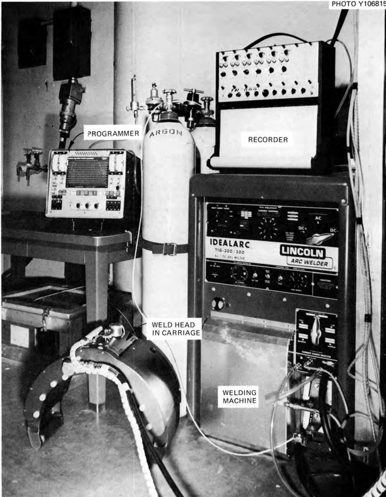  
Fig. 1. ORNL automated welding system installation prior to carriage placement on 12- to 16-in. pipe.

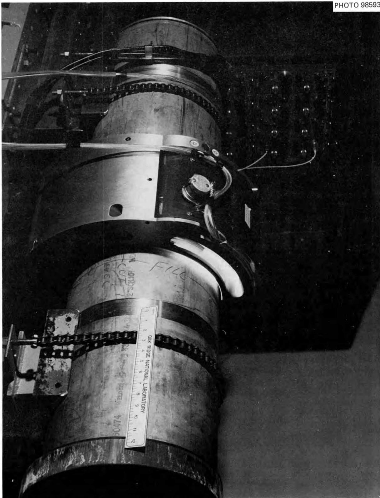  
Fig. 2. ORNL welding system in-process 12-in. pipe weld.

The following welding parameters must be predetermined and programmed into the automated controls:

1. travel speed,   
2. weld current,   
3. arc length (arc voltage control),   
4. diameter and shape of tungsten electrode,   
5. type and quantity of inert gas,   
6. weld up and down slope,   
7. weld start, overlap, and weld tail-off distance,   
8. weld filler wire and rate of deposit,   
9. pulse current and pulse sequence mode (if used),   
10. oscillation - amplitude and frequency (if used),   
11. interpass cleanliness and temperature regulation.

The input to the weld programmer provides for proper "in process" control and sequencing of all the

variables that influence the weld. The most critical variables, from the standpoint of weld reproducibility, are those that govern energy input to the weld, namely, primary current, voltage, travel speeds, and temperature of the material being welded. We chose to maintain uniform travel speed. However, the equipment has provisions for controlling the other variables except that interpass temperature is controlled by the cooling time allowed between passes. Wire deposit, when used, is automatically controlled by the feed rate. The programmer must also be adapted to exercise automatic control of the output of a commercial ac-dc rectifier-type saturable reactor power supply. A Lincoln TIG 300/300 power supply was used in our system.

Some of our systems are provided with multichannel analog recorders to monitor and record the main variables in the weld pass. We use a Gulton model TR-888 recorder. The recorder chart serves as an aid to weld inspection.

# 3. System Components

# CARRIAGE

The carriage provides a rigid, stable platform on which the machining head or the welding head can be mounted, indexed, and operated. Figures 3 and 4 show the carriage, its components, and subassemblies. The carriage supplies the drive mechanism to rotate the platform around the pipe circumference at preset, reproducible, governor-controlled speeds. The carriage also has controls to maintain the platform surface at a nearly constant distance from the pipe surface so that the arc length controls will perform properly. The platform maintains its lateral position with respect to the pipe joint while rotating about the pipe. The carriage has geared actuator arm assemblies that clamp securely to the pipe, and its drive rollers are loaded by special torsion bars to maintain controlled clamping pressure on the rollers and to compensate for pipe ovality within allowable commercial pipe specification limits. The clearance required for operation of the

carriage is $4^{1/2}$ in. on the pipe radius and $10^{3/4}$ in. longitudinally. [Note: The $4^{1/2}$ -in. radial clearance is adequate only for cutting and for welding without automatic arc length controls (electrode-to-work gap controls). A carriage/weld-head combination with automatic arc length controls requires $5^{3/4}$ in. radial clearance.]

The basic carriage structure consists of two side pieces that provide the platform for the head inserts, two end supports, and the dual arm and idler subassemblies. The end supports contain the electrical drive and control connections and switches for the carriage and for the insert heads; one end support contains the clamping device, which uses worm gears to position the idler rollers through slider linkages. The carriage is made to rotate by a direct drive system from motors mounted at the two hinge points of the actuating arms within the rollers. [Note: An exception is the 3- to 6-in. carriage, where the motors are not concentric with the rollers]

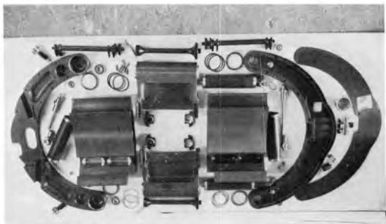

PHOTO 3432-72

PREASSEMBLY, Parts Inventory (12 - 16 in.)

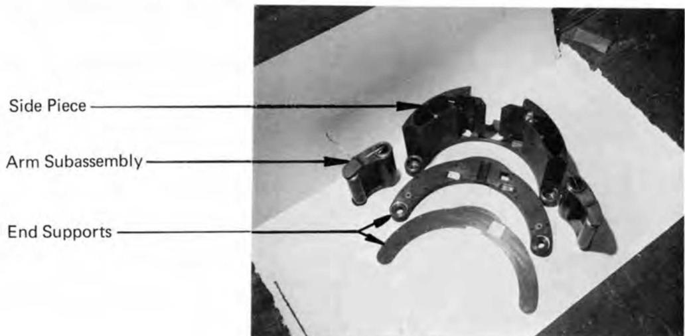  
FIRST SUBASSEMBLY

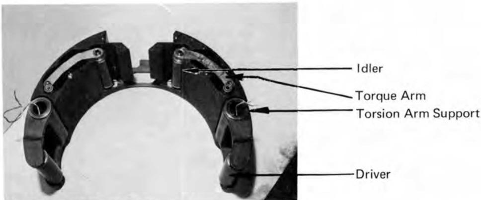  
SECOND SUBASSEMBLY   
Fig. 3. Carriage assembly - preassembly, first subassembly, and second subassembly.

THIRD SUBASSEMBLY   
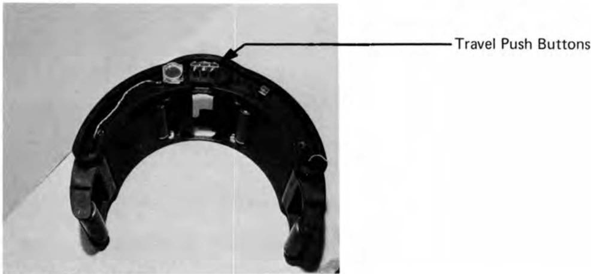  
Standoffs to Ride Pipe Collar for 2G Position Pipe Welding

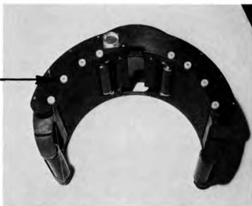  
FINAL ASSEMBLY, Elevation View

Fig. 4. Carriage assembly - third subassembly and final.   
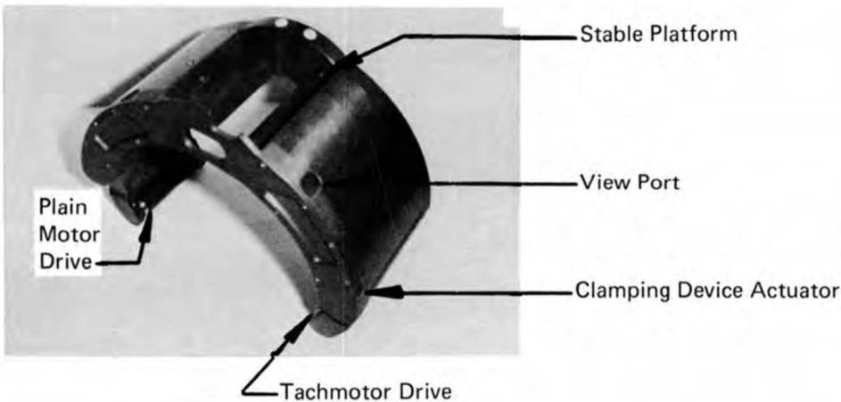  
FINAL ASSEMBLY, Plan View

but are installed in canisters at the hinge points of the arms. Drive power is transmitted to the rollers through identical gear trains in the arms. The 3- to 6-in. direct drive system is designed without torsion bars and torque tubes and therefore offers less tool flexibility during clamping and rotation. This simplified drive design cannot be used for larger pipe sizes, however, because the greater allowable out-of-round tolerances require more flexibility in the clamping and drive mechanisms.] Vulcanized high-temperature, abrasion-resistant Viton rubber coatings on the rollers provide traction for carriage propulsion. The carriage speed is adjustable at the programmer.

# WELDING HEAD

The welding head has a motorized vertical slide and a manually adjustable horizontal slide that can be set to locate the torch electrode accurately with respect to the cut and beveled edges of a weld joint. Filler wire can be

fed automatically at a preselected rate by means of a motorized wire feed mechanism. A standard 4-in.-diam., $2\frac{1}{2}$ -lb wire spool is used to store enough wire for multiple weld filler passes. The torch and the wire feeder are mounted on the vertical slide, and the wire spool is mounted on the horizontal slide. The welding head includes inert-gas hose passages to the torch cup plus power and cooling water lines to the torch head. A motorized cam drive supported by the vertical slide oscillates the torch electrode across the weld seam. The head also contains integral switches for testing the operation of the wire feed jig (feed and retract), the oscillator, and the inert-gas flow controls.

The welding head is shown in Figs. 5 to 8. Figure 5 is a top view of the head with the lid in the closed (welding) position, showing the power and control cable entry to the head, and Fig. 6 is a side elevation view showing the hinged lid in the open position. A front elevation view and a schematic illustration with the lid open are shown in Figs. 7 and 8 respectively.

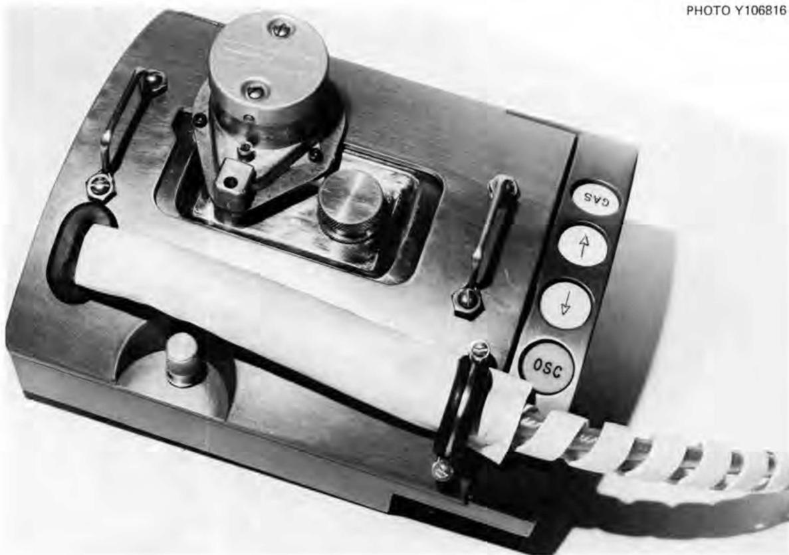  
Fig. 5. Top view of welding head with lid closed (welding position).

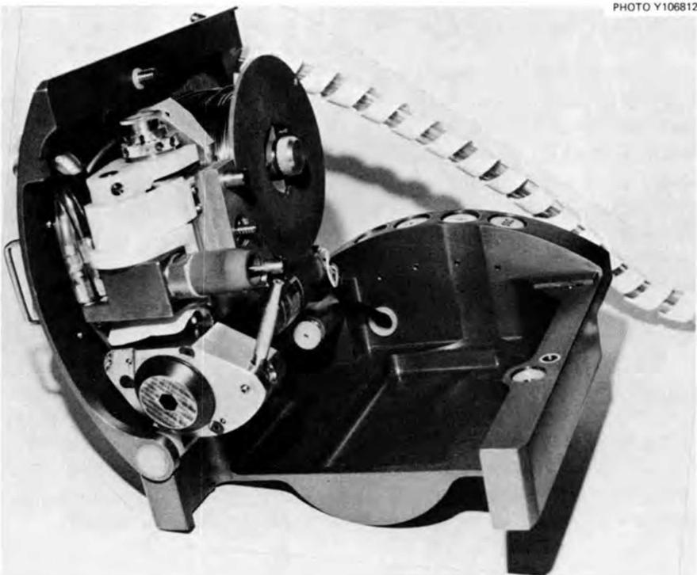  
Fig. 6. Side elevation view of welding head.

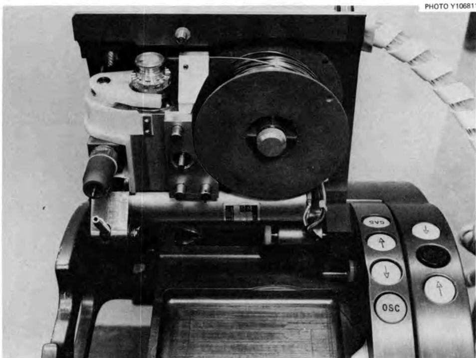  
Fig. 7. Front elevation view of welding head mounted in carriage.

ORNL-DWG72-12235

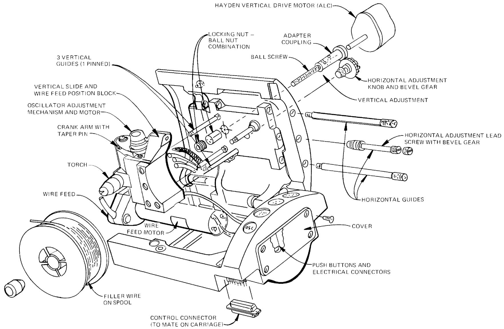  
Fig. 8. Schematic arrangement of welding head. Front elevation, lid off.

# Horizontal and Vertical Slide Assemblies

Horizontal torch position is adjusted by the horizontal slide, which is actuated through a bevel gear linkage from a manual positioning knob on the lid top. The horizontal slide supports all the internal mechanisms of the weld head as well as the filler wire spool. Two horizontal guide shafts anchored to the weld head lid maintain the slide in alignment with the head. Three vertical guide rods and a (vertical) ball-screw drive couple the vertical slide block and the horizontal slide at right angles. An arc-voltage-controlled Hayden drive motor (ALC motor) is used to drive the vertical slide for maintaining the predetermined torch electrode distance from the weld joint. [Components attached to the vertical slide assembly are covered in subsequent sections.] It is important to note that the entire vertical block assembly is integral with the horizontal slide and that, therefore, all torch components move in unison. The relationship of the horizontal to the vertical slide is constant in the horizontal plane and varies only in the vertical plane when actuated by the ALC motor.

The vertical slide block houses the oscillator motor subassembly and supports the torch block and its components, the oscillator amplitude adjustment mech

anism, the wire feed positioner bracket block, and the ball nut of the vertical ball-screw drive. Details are shown in Fig. 9. The vertical slide block is of aluminum for strength, and Delrin plastics and Teflon liners are used for sleaving and attachment parts. Plastics offer radio-frequency isolation and protection. The block contains two tapped holes for the wire feeder sub-assembly attachment bolts.

The oscillator assembly consists of a 24-V dc drive motor, an adjustable cam, and a bearing-supported crank arm that attaches to and drives (rocks) the torch block electrode holder assembly via a tapered pin. The cam is adjustable for total electrode tip oscillation from zero to $5/8$ in. Adjustment is made by turning the knurled sleeve with respect to the knurled and notched ring. A spring locks the dial-set oscillation amplitude in place. The oscillator motor speed can be adjusted to provide oscillation frequencies of 50 to $360~\mathrm{cpm}$ , as discussed in detail in Section 4. All welding parameter lists should include information on the required input settings for proper oscillation amplitude and frequency for each weld pass.

The wire feeder bracket block couples with one end of a plastic wire feeder guide tube through which wire is

PHOTO 3434-72

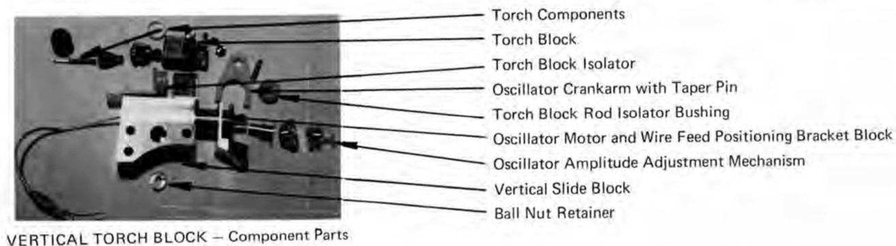

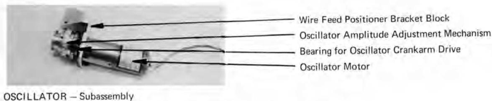  
Fig. 9. Vertical torch block component details.

introduced to the feeder mechanism. Threaded ferrules are used to anchor the ends of the guide tube.

A ball nut anchored and nearly centered within the vertical block allows the ball-screw drive to raise and lower the block. The screw directly couples to the motor shaft to raise and lower the ball nut. Three guide rods, parallel and adjacent to the ball screw, serve to align and guide the movement of the vertical block.

# Wire Feed Mechanism

The wire feed mechanism utilizes the friction on a wire compressed between two rotating disks to force the wire to contact with teeth of a ratchet wheel. Wire

is advanced or retracted as the wheel rotates, and the friction force can be varied by the amount of pressure applied at the exterior cap to compress the disk and the rotor.

The wire feed system consists of a wire spool containing a preselected type and size of wire, the guide tube, the feed mechanism with its 24-V tachometer-gear-head motor, the ferrule, and the exit nozzle. A manual adjustment screw to the ferrule in the mechanism housing is used to direct the exit nozzle so as to properly locate weld filler wire with respect to the weld puddle.

Figures 10 and 11 show the wire feeder and its main components. The wire feeder motor shaft rotates the

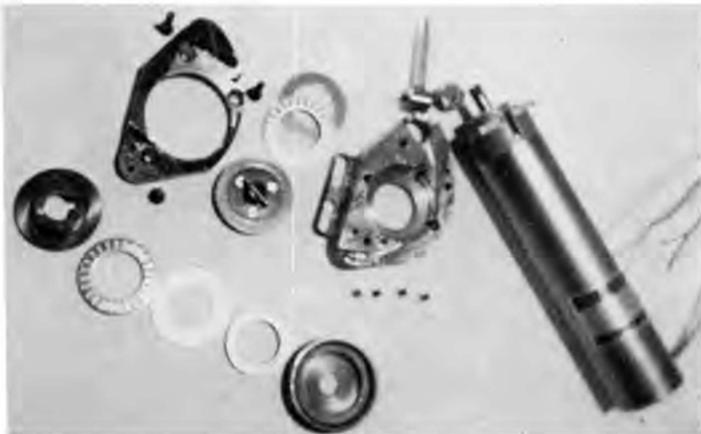

PHOTO 3435-72

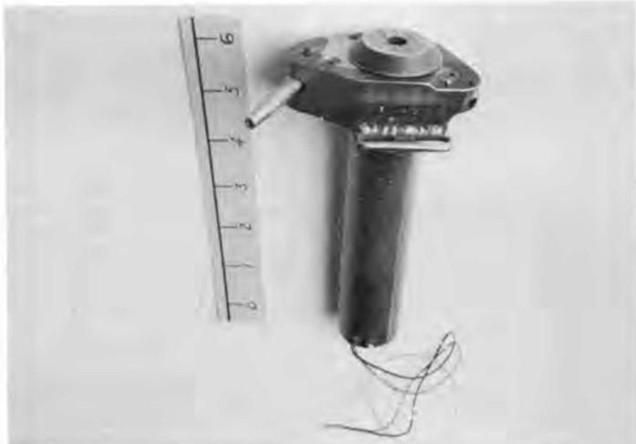  
Fig. 10. Wire feeder - parts of subassembly.

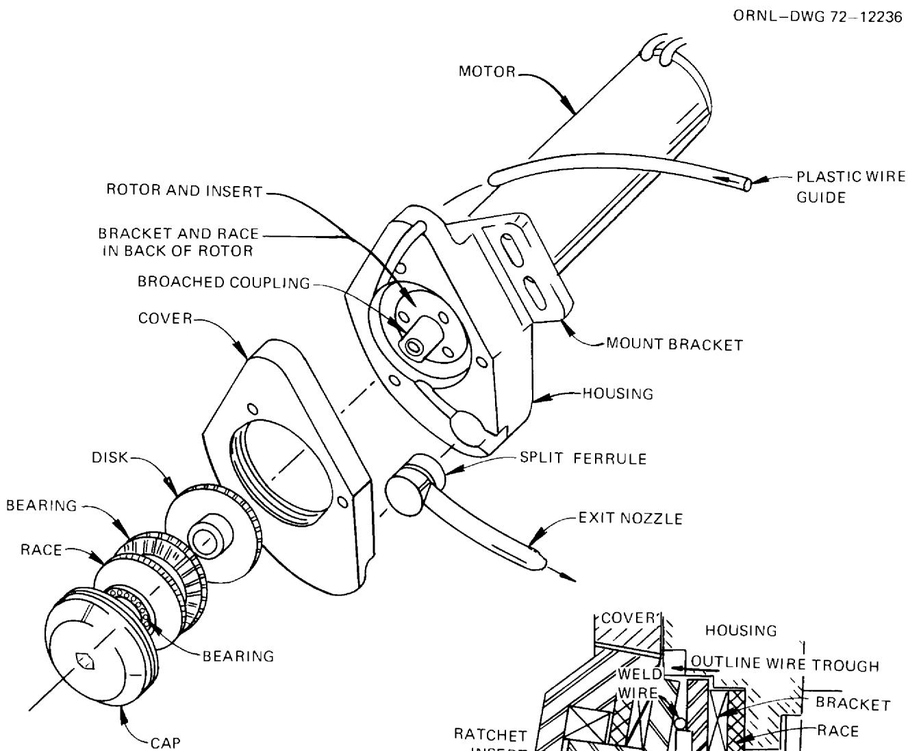

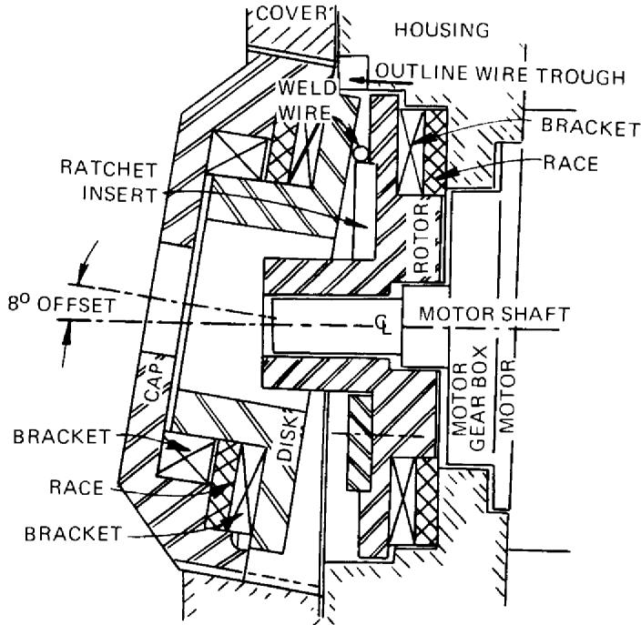  
WIRE FEEDER MECHANISM CROSS-SECTION   
Fig. 11. Wire feeder schematic - parts and functional assembly.

rotor-ratchet insert combination. The cap and disk force the wire against the ratchet teeth until sufficient pressure is applied on the wire to pull it from the spool and feed it through the guide tube into the weld puddle. Thrust bearings are provided for both the disk and the rotor. The wire is prevented from moving toward the center of the rotor disk by a shoulder, and movement of the wire toward the periphery of the disks is prevented by the outer disk face being canted at $8^{\circ}$ to the rotor disk face. The mechanism is designed to accommodate wire diameters from $\frac{1}{32}$ to $\frac{1}{16}$ in. and feed rates up to 50 in./min.

# Torch Head Assembly

The core of the torch head assembly is a copper block that includes cooling water passages, the power lead, and the inert-gas connection. A pivot post on the block couples the torch to the oscillator mechanism. The block also contains threaded holes for the attachment of the torch assembly, which can be used with either a long or a short torch body. The length of the torch electrode beyond the end of the ceramic cup can be adjusted by removing the torch body assembly from the block, loosening the collet locking screw, repositioning the tungsten electrode, and relocking the screw. Long torch bodies are used for welding the root and first fillers of extra-heavy pipe walls and short bodies for standard or lightweight pipes. The torch assembly is shown in Fig. 12.

# POWER SUPPLY

Most commercially available welding power supply units of the saturable reactor type are compatible with our programmer control circuitry and can be employed as power sources for the automated welding system. We use a Lincoln model TIG 300/300 power supply, Fig. 13, with minor internal circuit modifications. Inductive transient suppressors and a transistorized current control amplifier, Fig. 14, have been added to provide for programmed operation control of the current in the welder's saturable reactor. The amplifier replaces the welder's magnetic amplifier, which is retained to permit manual control welding as well. An external switch and light are mounted on the side panel of the machine to change from programmed to manual control. The light is on for programmed operations and flashes on and off during dc pulse welding.

The welding machine is also provided with controls to stop or prevent operations at low gas and low cooling water flows. These protective controls, Fig. 13, are set

ORNL-DWG72-12237

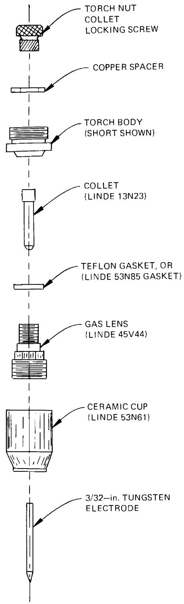  
Fig. 12. Torch assembly.

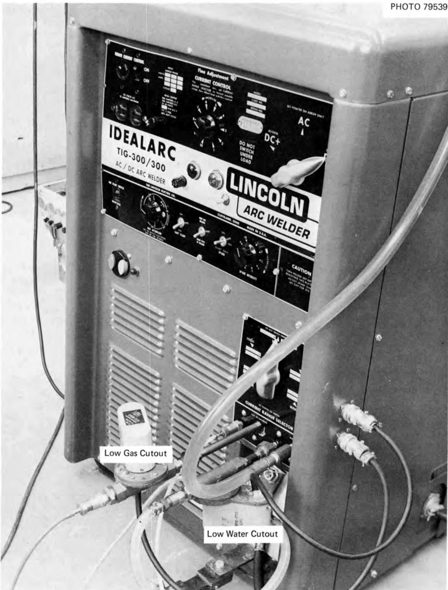  
Fig. 13. Lincoln weld power supply.

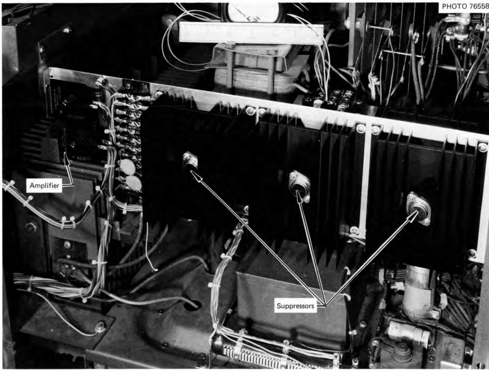  
Fig. 14. Power supply - modifications to weld machine circuits.

to downslope welding operations when the flows of gas or of cooling water fall below the minimum levels. The controls are normally set for $12\mathrm{ft}^3$ of gas per hour and $\frac{1}{3}$ gpm of water, but can be set at other values if desired. These protectors will also prevent programmed weld startup if flow values are less than the preset rates. A pilot lamp for each control lights up to signify insufficient flows. The gas and water solenoid control relays, built into the welding machines as standard equipment, are bypassed for programmed welding operations. Signal and control wiring is transferred to replacement relays within the programmer.

Conventional H-20A (AIRCO) water-cooled power and gas torch leads are used to connect the welding power supply and the torch in the weld head. A ground cable is employed to connect the work (pipe) and the welding machine's grounding lug.

# PENDANT, SENSOR, AND CABLES

The pendant shown in Fig. 15 is a lightweight, portable, remote-operation station designed to be held in the weld operator's hand. In programmed welding, the pendant permits the operator to observe a weld from a location close to the weld joint. The pendant provides weld start, downslope, and instant stop control and includes a set of push buttons to raise or lower the torch for preweld torch travel limit checks and for torch positioning. The buttons also serve to reposition or adjust the torch-to-work spacing during a weld, and the pendant's rheostat dial is available to regulate current in the manually controlled mode of weld operation.

All pendant controls are housed within an anodized aluminum box structure. Electrical leads enter through

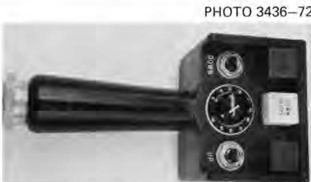  
Fig. 15. Remote-control pendant.

the handle, and a flex grip cable cover is used to avoid line crimping.

The equipment diagram in Fig. 16 shows all components of the welding system, along with the connecting cables and control leads.

The current sensor shown in Fig. 16 is a current transformer-thyrector combination housed in an anodized aluminum box. The transformer features a toroidal coil encased in plastic, with a 1-in.-diam center opening passage for the weld cable. The coil, in turn, connects to the programmer to supply a proportional feedback signal for precise current control.

Programmer lines include a 120-V (5-A) ac power supply, a signal control cable to the weld power supply, a current sensor line, a remote-control pendant cable, a signal cable to the recorder filter box and recorder, and a control cable to the weld head. The weld head control cable also includes a filtered arc voltage return signal and combination cable shield and ground lines back to the programmer.

The weld power source includes a 460-V (60-A) ac supply as well as water and gas supplies. Output lines include water-cooled power lines and gas lines to the weld head torch. The welding machine must be grounded by building equipment ground. A ground cable, which passes through the current control sensor, also connects the machine's alternate terminal to the work.

# RECORDER

An analog recorder can be employed to provide direct writing trace charting for the programmed welding variables. The programmer includes a rear apron connector for transmitting tool speed, wire feed rate, and arc voltage data. A shunt at one of the weld power source outlet terminals is used to provide a proportional signal level current input to the recorder. Leads from the connectors are routed through a noise filter box en route to the recorder. The multichannel recorder presently in use, Techni-Rite Electronics model TR888, modified to automatically start and stop with the weld sequence, is shown in Fig. 17.

A highly useful record of amplitude and uniformity of the variables is obtained by plotting the weld functions. Deviations from the usual charted patterns indicate irregularities and often offer clues to the source of welding problems. Any plotted irregularities can also be interpolated to precise pipe location for immediate remedial action subject to the weld inspector's confirmation.

ORNL-DWG72-12238

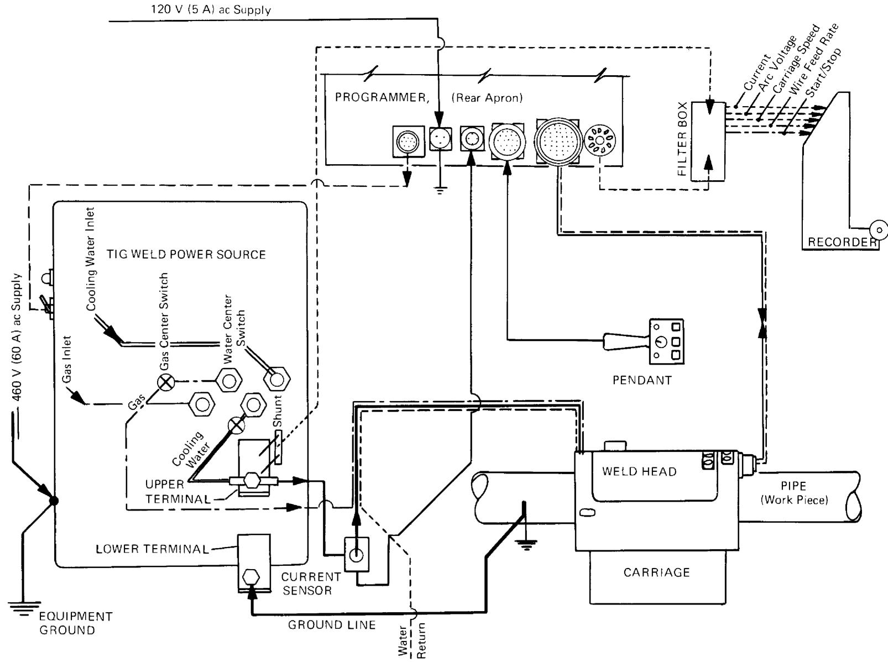  
Fig. 16. Equipment hookup for ORNL weld system.

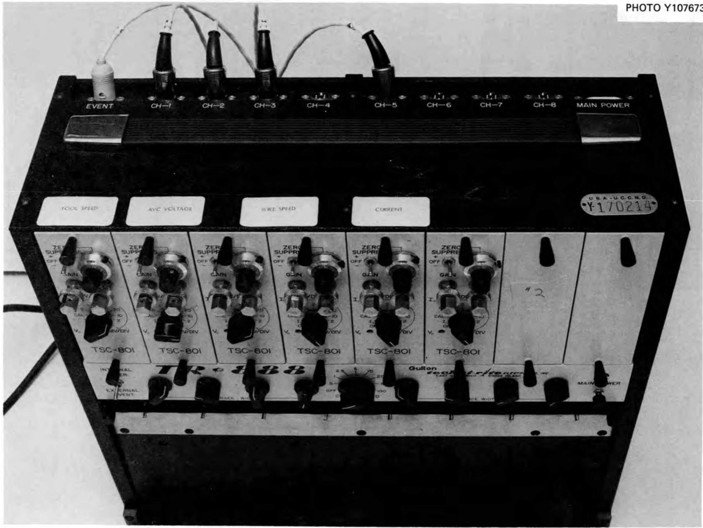  
Fig. 17. Multichannel recorder.

The TR-888 recorder has eight channels. In weld development work it is often helpful to chart additional functions or to chart functions relative to one another.

In normal operation, however, it is enough to record the weld speed, wire feed rate, arc voltage, and arc current.

# 4. Electrical and Control System

# PROGRAMMER-CONTROLLER

The function of the programmer is to provide automatic control of the variables that affect weld quality. On the basis of parameters manually preset into the programmer by means of dials and switches, the programmer-controller responds to data automatically fed back from sensors which monitor the actual welding conditions. The settings of the dials and switches, together with hardware circuitry, comprise a programmed memory that controls the weld parameters in a predetermined manner, rate, and sequence. The feedback information is compared with the preset values in the programmer memory, and, if one of the controlled parameters varies from the desired operating range, corrective action is automatically initiated by the control system.

The variables controlled are: (1) carriage (tool) speed; (2) arc length, the distance (gap) between the electrode and the weld puddle; (3) wire feed rate; (4) welding current; (5) frequency of torch oscillation; and (6) gas and water flow to torch.

Control parameters are preset in the programmer by means of dials and switches located on the front panel, the rear apron, and the pendant. Appendix A contains illustrations and tabular listings of the controls and their functions.

All the controlled variables except the torch oscillation are monitored by sensors that feed back signals to the programmer.

The carriage (tool) speed and the wire feed rate are monitored by tachometers which produce dc feedback signals having amplitudes proportional to drive motor speed and polarities corresponding to the direction of motor rotation.

The welding current is monitored by a current sensor which, together with its associated circuitry, produces a

unipolarity dc feedback signal proportional to the current.

The arc voltage is monitored directly and fed back to the controls of the torch position (ALC), wire feed (AVC), and stub-out parameters. ("Stub-out" occurs when the torch touches the weld puddle.) This arc signal also operates a voltage relay on which contacts are used as protective interlocks in the control circuitry.

The gas and water flows to the torch are monitored by flow switches. Contacts on these switches provide interlocks which protect the welding equipment and minimize damage to the weld and to the welded component by preventing startup and/or initiating shutdown in the event of loss of water or gas flow.

# BASIC SUBDIVISIONS OF PROGRAMMER CIRCUITRY

For purposes of discussion the programmer circuitry may be considered to be composed of nine basic subdivisions, as follows:

1. welding current control circuits,   
2. carriage (tool speed) control circuits,   
3. wire feed (rate) control circuits (AVC),   
4. arc length control circuits (ALC),   
5. torch oscillation control circuits,   
6. gas and water flow circuits,   
7. program control circuits,   
8. stub-out circuits,   
9. power supplies.

The program control circuits may be further subdivided into sequence control and sequence timing circuits.

The first six of the above circuit subdivisions are functionally independent and may, under certain conditions, be operated and tested separately. However, during programmed welding operations these circuits respond to the demands of the program control circuits and are functionally interrelated.

# CONTROL MODES

There are two major modes of programmer operation selectable by panel switch, Manual and Program.

# Manual Mode

In this mode the carriage and wire feed may be operated manually with push-button switches located on the carriage at speed determined by the setting of dials on the programmer panel; the weld current can be manually controlled from the pendant; the torch can be positioned by manually operated push-button switches on the pendant; and water flow, gas flow, and torch oscillation can be tested by operating push-button switches on the weld head. This mode of operation is used mainly for initial setup of the system for welding but is also useful for calibration, maintenance, and troubleshooting.

# Program Mode

In program mode the system performs five preset, timer-controlled, sequential operations: prepurge, upslope, weld, downslope, and postpurge. These operations are automatically controlled by a stepper relay and associated relays, switches, and power buses.

Sequence control. The stepper relay has 51 active positions and a home position. Positions 1 to 5 are used for prepurge, 6 to 10 for upslope, 11 to 30 for weld, 31 to 39 for downslope, and 40 to 51 for postpurge. Programmed operations are terminated in the 52d (home) position.

There are 8 banks of contacts on the stepper relay. Banks 1 and 2 determine the positions at which the prepurge, upslope, weld, and downslope and postpurge operations occur. Stepper banks 3 and 4 determine the position at which the carriage starts and at which the wire feed starts and stops. Stepper banks 5 and 6, together with a Vernistat mounted on the front panel, provide a means of setting the desired current profile in 34 discrete steps during the upslope, weld, and downslope operations. The Vernistat is composed of 34 sliders which are sequentially selected as the stepper advances through positions 6 to 39 respectively. Each slider is a potentiometer voltage divider that feeds a

reference voltage signal, via a stepper contact, to the input of the current servo amplifiers. The reference voltage represents 0 to $100\%$ of "maximum welding current." An additional digital dial is provided on the front panel to set the maximum welding current to any value up to 200 A. Thus the maximum weld current dial sets the upper voltage limit impressed across the Vernistat voltage dividers. Stepper banks 5 and 6 are used to operate lights to indicate the position of the stepper switch throughout the program. A series of lights above the Vernistat sliders indicates the progression of timing steps during upslope, weld, and downslope operations.

A programmed weld operation can be extended in any "in-weld" position to permit extended time operations. A weld can be stopped at any time by pushing an "Emergency" stop button for immediate stop action or a "Downslope" button that causes the relay to fast-step to the downslope position and continue programmed shutdown operations from that point.

Sequence timing. All the timing functions in the programmer are performed by a unijunction oscillator and a telephone-type stepping relay combination. Stepping rates change throughout the total cycle as the stepper advances from one sequence to another. This is accomplished by utilizing several of the stepper contact decks to change resistors in the unijunction oscillator RC timing circuit. In this manner, prepurge, upslope, weld, downslope, and postpurge can all be timed at different step rates by the same piece of equipment.

# CURRENT CONTROL

Welding current is controlled by a saturable reactor in the welding power supply which responds to a reference signal supplied by the Vernistat or by the current control potentiometer on the pendant. The position of a front panel "Current" switch determines which of these controls is effective. When the switch is in the "Manual" position, the reference signal is supplied by the pendant control, and when the switch is in the "Program" position, the signal is supplied by the Vernistat. The reference signal is compared to a feedback signal which is directly proportional to the actual welding current. The difference in these signals is obtained by diode bridge circuit arrangement and input to the first stage of the current control servo amplifier. The amplified difference obtained from the output of the servo amplifier is coupled through an isolator amplifier to a power amplifier. Here it is further amplified and applied to the input of a driver amplifier in the welder power supply which indirectly controls

the welding current by controlling the current in the saturable reactor control winding. The net result of this action is to maintain the welding current at a value which is very nearly proportional to the reference signal voltage supplied by the Vernistat or the pendant control.

The feedback signal is supplied by a current sensor through which the welding cable passes. This sensor has two modes of operation (ac or dc) which are manually selectable to correspond to the welding current selected. In the dc mode the sensor functions as a saturable-reactor-type dc transformer in which the control current is the welding current; in the ac mode it functions as a current transformer. In both modes the output is an ac voltage which is rectified by a diode bridge and filtered to obtain a smooth dc feedback voltage.

The programmer's servo isolator and the welder power and driver amplifiers obtain their supply voltage from the welder power supply. This voltage is a rectified half wave (not a smooth dc), and the ground system for these amplifiers is common to that of the welder power supply. The servo isolator amplifier, which consists of an optically coupled diode and associated circuitry, provides the necessary isolation between the welder and programmer grounding and voltage systems.

The welder driver amplifier is basically an emitter follower with a high current gain. It derives its signal from an external source and has a faster response, but otherwise performs the same function as the magnetic amplifier supplied with the conventional power supply and retained in the modified Lincoln welder power supply. A current control switch, located on the side of the welder power supply, selects either the driver amplifier for remote (programmer) control or the magnetic amplifier for local control.

# PULSE CURRENT

The welding current pulser is incorporated in the system to aid in control of the molten puddle for pulsed and/or out-of-position welding. This unit modulates the welding current servo amplifier at either 40 or $60~\mathrm{cpm}$ and is switch selectable from the front panel. Pulse amplitude is dialed directly by a potentiometer on the front panel that is calibrated 0 to $100\mathrm{A}$ peak to peak.

The dial light on the maximum current potentiometer glows alternately bright and dim at the pulse rate selected. Pulsing is accomplished by modulating the voltage supplied by the maximum current potential

eter to the Vernistat (or manual pendant control) with a square-wave voltage generated by a relaxation oscillator. The peak-to-peak amplitude potentiometer adjusts the amplitude of the modulation voltage.

# TORCH OSCILLATOR

The voltage to the oscillator motor is varied by a Darlington transistor pair to provide control of oscillator speed. An illuminated potentiometer dial on the front panel calibrated 50 to $360~\mathrm{cpm}$ furnishes the signal to the Darlington pair. Oscillator amplitude is adjusted in the weld head by an eccentric cam mechanism. There is no feedback in the oscillator circuit. The oscillator is turned on and off by applying and removing supply voltage to the oscillator amplifier.

# TOOL SPEED CONTROL

The tool drive motor is a dc servo motor driven by a servo amplifier through either the tool forward or tool reverse relay. The speed of the motor (and the carriage) is determined by the amplitude of the output voltage from the servo amplifier. The direction of rotation is determined by the polarity of the voltage across the motor which is in turn determined by the position of the tool reverse relay. The servo amplifier has two modes of operation, with and without feedback control. A "Tool Servo" selector switch on the back apron of the programmer designates the mode of operation. When this switch is on, a dc voltage from a tachometer that is an integral part of the drive motor is fed back to the input of the servo-control amplifier, where it is compared with the dc signal voltage from the programmer. The difference in these voltages is amplified and fed to the motor. The net effect is to maintain the speed of the motor constant at a value determined by the input signal voltage that is dialed into the tool speed potentiometer on the front panel of the programmer. Dialed values apply for forward travel selections; maximum potentiometer output speed or fast reverse will automatically occur with reverse tool travel demands. The effect of feedback is to maintain motor speed at a desired value regardless of changes in load, line voltage, or amplifier gain. In this mode of operation the feedback signal from the tachometer is also fed to a meter on the programmer panel to indicate tool speed.

When the tool servo switch is in the off position, the feedback circuit is disabled, and the tool speed meter is switched to read the input signal instead of tachometer feedback.

# WIRE FEED CONTROL AND AVC

When the programmer is in the Manual mode, or when the AVC wire switch on the programmer front panel is off, the operation of the wire feed servo system is similar to that of the tool drive servo system, except that the speed of the tool drive motor is fixed at maximum in the reverse direction.

When the programmer is in the Program mode and the AVC wire switch is on, the input signal to the servo amplifier (which determines the wire feed rate) is a function of the arc voltage as well as of the setting of the wire speed potentiometer and the setting of an arc volts potentiometer on the programmer front panel. The response is determined by comparing a set-point signal proportional to the setting of the AVC volts potentiometer with the arc voltage between the electrode and the weld puddle. The difference in these voltages is amplified by the AVC wire module and applied to the input of the wire feed control amplifier through contacts in the wire feed forward and reverse relays and the tool servo switch. The arc voltage signal is taken directly from the weld electrode and, after filtering to attenuate RF (radio-frequency) voltage, is passed through an interlock contact on the contactor relay and fed to the input of the AVC wire module. The AVC circuits are adjusted so that the wire feed rate is one-half that set on the wire speed potentiometer when the arc voltage is equal to that set on the arc volt potentiometer. An increase in arc voltage produces a proportional increase in the wire feed rate. Conversely, a decrease in the arc voltage produces a decrease in the wire feed rate. When the AVC wire switch is off, the output of the AVC wire module is clamped at $+30\mathrm{V}$ dc and the wire feed rate is insensitive to variations in arc voltage.

The purpose of this cascade control arrangement is to regulate the wire feed rate in such a manner as to maintain the arc voltage as nearly constant as possible under conditions of varying spacing between the electrode and the weld resulting from pipe eccentricity, irregularities on the surface of previous passes, and flow of the weld puddle toward or away from the electrode due to gravitational or other forces. For example, if, due to gravity forces, the weld puddle moves toward the electrode, the arc length and arc voltage decrease. In general, over the ranges of interest, the arc voltage is directly proportional to the arc length and is relatively insensitive to arc current. The AVC system detects a

decrease in arc voltage and decreases the wire feed rate by the amount required to slow down the buildup of the weld puddle to the point where the desired arc length and voltage are restored. Conversely, if the weld puddle moves away from the electrode, the situation is reversed, and the wire feed rate is increased until the desired arc voltage is restored.

The AVC system may be used independently or in conjunction with the arc length control (ALC). The design intent was that only the ALC control would be used in the root passes and that both systems would be operational during filler passes. In the latter cases the AVC system would provide the fine control and the ALC system would provide a reset action to keep the AVC within its operating limits. The system is quite flexible, however, and the operator may find that under certain conditions he can obtain better welds by setting the AVC and ALC controls so that the system operates in a manner different from that anticipated by the designer. As is the case for most control systems, the proper control settings vary with the application and must be determined in the field.

# ARC LENGTH CONTROL (ALC)

The ORNL programmer includes a system (ALC) that monitors the arc voltage and automatically adjusts the arc length to a preset value within a prescribed range. Two front panel dials labeled "High" and "Low" are provided to set the arc voltage limits at which corrective torch motion will start. The center dial, marked "Average," is used to set the arc voltage at which corrective vertical (radial) torch motion will cease.

A printed circuit board in the programmer contains the circuitry and relays that control a motorized ball-screw drive in the weld head to reposition the torch radially with respect to the pipe. The preset control range provides an area in which the automatic wire feed rate control can operate. In essence, the ALC system provides coarse control, and the wire feed rate system provides a vernier control for maintaining the arc voltage at a precise value.

ALC also operates in conjunction with the pulsed current mode and causes the weld puddle to chill on a regulated basis to maintain a perfectly centered, uniform weld bead, regardless of the position of the orbiting head on the pipe.

The input signal to the ALC system is the same (arc voltage) signal used as input to the AVC system. After passing through switches which correct for torch polarity and an adjustable gain buffer amplifier, the input signal is compared with the voltages from the three (high, average, and low) limit set potentiometers, and the differences obtained are amplified and used to operate transistor switching circuits which, in turn, operate the up and down drive relays that control the torch position motor. When the up relay is energized, the motor drives the torch away from the work; when the down relay is energized, the motor drives the torch toward the work. The settings of variable resistors connected between the supply voltage and the motor determine the motor speed in the up and down direction. Interlock contacts between the ALC circuit and the motor disable the ALC action when the contactor relay is deenergized; however, in the manual mode of programmer operation, the motor can be run in either direction to preset the gap between the tungsten electrode and the pipe surface by manually operating push-button switches on the pendant which bypass the contactor interlocks.

# STUBBER CIRCUIT

The stubber circuit initiates a programmed shutdown in the event that the torch touches the weld puddle (called "stubbing"). The signal used to initiate this action via a plug-in stubber board module inside the programmer is the same that is used to operate the arc length control. The effect of stub control is to automatically initiate a downslope action as though the operator had anticipated stubbing and pushed the downslope button on the pendant. This prompt automatic action prevents electrode tungsten contact with the weld puddle, causing damage to the torch and contamination of the weld.

# GAS AND WATER INTERLOCKS

Gas and water interlocks protect the welding equipment and minimize damage to the weld and the welded components by preventing startup and/or initiating shutdown in the event of loss of gas or water flow. If either gas or water flow is lost during the prepurge programmed sequence, the timer will stop and the program will halt at that point. However, if such flow is lost after the weld cycle starts, the programmer will fast-step to downslope and continue programmed operations from that point. Both flows are monitored by a separate flow switch connected in the gas and water lines. To obtain the required speed of response, switches having a low internal value in the downstream side were selected and mounted on the upstream end of the flexible cables to the welding head, at the gas and water outlet connections on the welder power supply.

# POWER SUPPLIES AND POWER BUSES

The five power supplies in the programmer are as follows:

1. $+28\mathrm{Vdc}$ (nominal) unregulated,   
2. $+30\mathrm{V}$ dc regulated,   
3. $\pm 15\mathrm{V}$ dc regulated (ALC).   
4. $\pm 15\mathrm{V}$ dc regulated (pulser),   
5. $+40\mathrm{V}$ dc (nominal) unregulated.

The first four of these are in the programmer and are energized when the power switch on the programmer front panel is on. The $+40\mathrm{V}$ dc is supplied from the welder power supply when the welder contactor is closed, that is, during the welding cycle.

# 5. Welding Studies, Weld Joint Development, and Welding Schedule

Early efforts toward developing procedures for automated welding were often hampered by minor equipment or instrumentation malfunctions. Our early program goals were twofold: to improve system components for prolonged operation and, simultaneously, to seek programmer-controller input settings that would yield acceptable welds that would be accurately repeated by the automated system. The weld joint was limited to shapes usually employed in manual welding practices.

In the course of our studies, we found that the torch-to-work distance control is most critical and were able to maintain nearly constant torch-to-work spacings by adding a motorized ball-screw drive on the vertical slide to move the torch in response to a feedback signal from the arc voltage. For the ORNL system using gas tungsten-arc welding, optimum arc voltages range between 7 and 9 for stainless steel and carbon steel pipe materials. A variation of $0.1\mathrm{V}$ in the arc voltage represents about 5 mils in the arc gap. The nominal arc gap of 0.1 in. is controlled within $\pm 0.025$ in. by the new system.

Many manual welds are made with open butt pipe joints. The common joint configuration features a $\frac{1}{16}$ -in. root face and $37 \frac{1}{2}$ bevel for each pipe end, and a $\frac{1}{8}$ -in. root gap. The use of consumable weld insert rings to fill this gap between adjacent pipe ends helped in establishing a root pass welding automatic control program which yielded consistent, high-quality welds. The use of consumable inserts offers an additional advantage in that it is possible to select insert ring metal compositions which will blend with many pipe material alloys and provide metallurgical adjustments to promote crack-free welds. The use of inserts also makes it easier to handle the problems of mismatching pipe ends and of irregularities in the root face and/or the pipe inside diameter. As the weld is formed, ring-face and cross-section uniformity adjusts and eliminates puddling problems otherwise caused by geometrically poor joint matchup.

After several unsuccessful attempts to weld conventional V-groove butt joints we began using modified J-bevel pipe end preparations (Fig. 18a). In V-groove butt-joint welding (Fig. 18b), we were unable to attain uniform and complete penetration for the root pass, especially with pipes in the 5G (horizontal) position. The modified J-bevel pipe end preparation was selected

for automated welding applications after we developed the remote cutting methods for providing such joint preparations.3

Early gas tungsten-arc welding with the automated orbital equipment on the modified J-bevel joints, however, required precise weld joint machining to obtain matching pipe inside surfaces and pipe wall thicknesses, as well as near-perfect alignment of the two joint members and critical selections for the right amount of filler wire additions. Failure to meet these requirements resulted in root welds either undercut and lacking full penetration or over-penetrated with a resultant heavy convex bead protruding inside the pipe. Fill pass welding is less difficult, although we noted that the quality of successive passes depends on prior weld passes. It is quite simple to lay good fillers over good root passes or over good prior filler passes, but it is difficult to repair a poor pass by welding over it without first machining out the defect. It has been our experience that special care must be taken to select proper heat control (weld current and weld speed) for the first, or for the first two, fill passes over an acceptable root pass. Too much weld heat will cause burn-through or drop-through, whereas insufficient heat will result in lack of fusion or inadequate joint side wall tie-ins and weld cracking.

It is time consuming and difficult to do precision machining by remote control, and pipe precision machining and alignment add greatly to construction costs. For these reasons, we next concentrated on experimentation with pipe joint configurations that permit plain fusion root pass welding either without or with minimum filler wire additions. Later, we tried "buttered" washer insert joints (Fig. 18c) for our remote weld feasibility studies. A buttered insert is prepared by depositing weld metal around a pipe interior and then machining the deposit to a washer shape. It is possible to select welding (fill deposit) wires of the proper chemistry to adjust the base metal composition of the pipe for crack-free welding and for proper fine grain structure interphasing with the base metal. Weld results were promising; the buttered joint

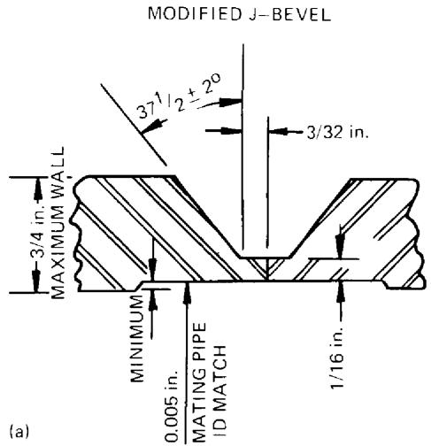

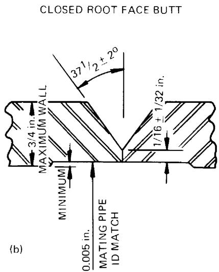

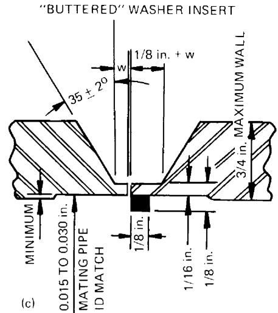

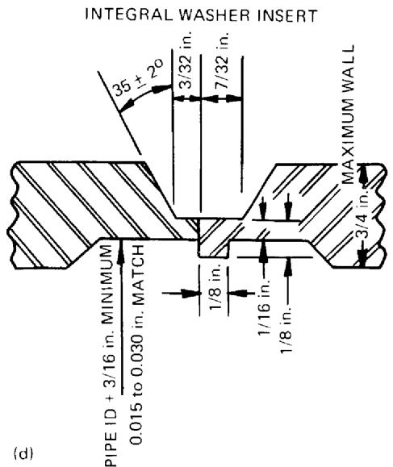

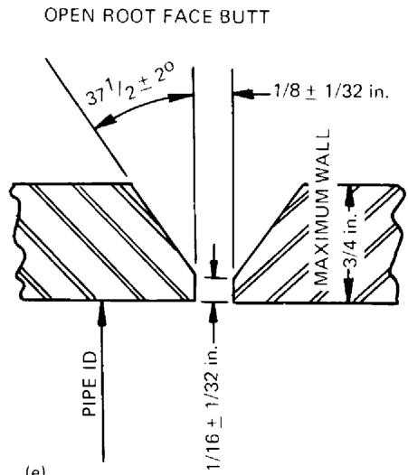

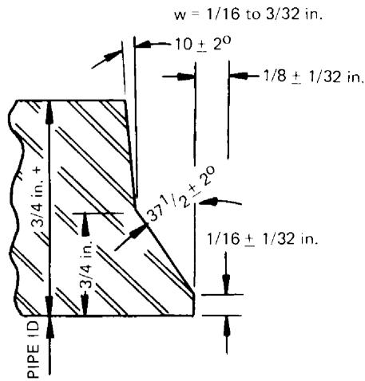  
(f)   
Fig. 18. Pipe weld joints. (a) Modified J-bevel; (b) closed root face butt; (c) "buttered" washer insert; (d) integral washer insert; (e) open root face butt, thin wall; (f) open root face butt, thick wall.

was definitely less dependent upon precision mating pipe joint geometries and alignment. However, since buttered joints are expensive to prepare, we resorted temporarily to integral washer inserts (Fig. 18d); that is, we simulated buttered insert shapes by machining heavy-wall-section pipe on the inside surface. Many tests were run to determine the best criteria for root width, root face, and (integral) insert dimensioning. From the results of this work, we then developed programmed input data for repetitive quality pipe weldments and formulated guidelines for welding with commercially available insert shape substitutes for the integral shaped inserts. All experimental work in studies to adapt automated orbital welding equipment for high-quality construction pipe welding applications concentrated on pipe joints that were suitable for welding with commercial consumable insert shapes.

Usual construction work pipe welding practice specifies the open-butts V-groove weld joint. The joint shown in Fig. 18e for pipe wall thicknesses of $\frac{3}{16}$ to $\frac{3}{4}$ in. generally calls for a root face of $\frac{1}{16} \pm \frac{1}{32}$ in., a $37 \frac{1}{2} \pm 2^{\circ}$ bevel, and a $\frac{1}{8} \pm \frac{1}{32}$ in. root gap. Similar values hold for wall thicknesses greater than $\frac{3}{8}$ in., except the bevel angle decreases to $10 \pm 2^{\circ}$ starting at the $\frac{3}{4}$ -in. wall depth, as shown in Fig. 18f.

With the shift in program goals to adapt the automated orbital equipment to nuclear construction work, concentrated efforts were made to attempt to maintain or adapt the weld joint geometries commonly used in construction. Based on the aforementioned experience from our remote applications work, we concluded that open-butts pipe welding with ORNL equipment would at best be marginal. We therefore selected commercially available consumable inserts that would normally fit the cavity, or opening, between matching joints of an open-butts pipe joint to permit the contractor to make weld setups which could be welded either manually or with automated equipment. Since many contractors purchase prefabricated, or precut, end-prepped piping, the capability to utilize automation interchangeably with manual practice on the same precut ends is important, especially when introducing automation to the field construction job. We also realized that contractors who had manual welders qualified for hand welding with specific pipe end preparations and consumable insert shapes could insist on qualifying automated welding for identical ends and inserts in order to retain manual welding capability for times that the machines may be down or where construction schedules compel maximum total productivity. Therefore we decided to establish data for automated welding with both rectangular and Y-insert shaped consumable rings.

We first investigated welding with Grinnell rings (Grinnell Corporation, Providence, R.I.). The standard Grinnell consumable insert for pipes 2 in. or more in diameter has a cross section $\frac{1}{16}$ in. wide by $\frac{3}{16}$ in. deep. Our experimentation indicated best results with two Grinnell rings stacked together, or for a $\frac{1}{8}$ -in.-wide, $\frac{3}{16}$ -in.-deep cross section. Root welds with single rings were of uneven internal contour; 5G position welds with proper contours in the 12 o'clock position exhibited suckback near the 6 o'clock position.

We next tried welding with $\frac{5}{32}$ -in. round wire rings and, later, with wire rings that were drawn and shaped to square and to rectangular cross sections. Test results indicated improved root bead control and more consistent penetration and also showed that differences in the fluidity of the molten carbon steel and stainless steel pipe materials (at the weld joint) can be compensated with proper consumable insert shape selections. Best weld results were obtained with $\frac{1}{8}$ -in.-wide, $\frac{5}{32}$ -in.-deep ring shapes for 6-in. stainless steel (type 304) pipe, and with $\frac{5}{32}$ -in.-wide, $\frac{1}{8}$ -in.-deep ring shapes for 6-in. carbon steel pipe type A-53. Respective pipe inside diameter protrusions were $\frac{3}{32}$ in. for stainless and $\frac{1}{16}$ in. for carbon steel pipes. However, the rounded corners of "home-made" rectangular-shaped rings caused the torch-to-work distances to vary, and the arc voltage control tended to shift as the torch orbited the pipe. This problem was solved by using rectangular cross-section rings of the Kellogg geometry. The Kellogg ring is rectangular, with barely broken corners (radii between 5 and 10 mils) and is commercially available (Robvon Backing Ring Co., Elizabeth, N.J.). Pipe end configurations for Kellogg-type rings are shown in Fig. 19a.

We also tried various pipe end configurations in search of suitable pipe joint geometries for better-quality gastungsten-arc welding with consumable Y-ring inserts (product of the Weld Ring Company, Bell Gardens, California). The outward inclined arms of the Y-ring are designed to be self-aligning with a joint and to fit a standard ASA $37 \frac{1}{2}$ pipe end preparation angle to form an included $75^{\circ}$ pipe joint angle. Even within applicable ASA dimensional standards for commercial pipe, allowable differences prevail for as-furnished pipe inside and outside diameters and for wall thicknesses. Our experience with Y-inserts showed the importance of first fitting the insert ring to the pipe section with the larger inside diameter. In practice, however, this procedure is hard to follow. We decided therefore to provide each pipe joint section with a minimum root face and to base axial dimensioning about the inside diameter of the pipe. A 15-mil root face (plus 20 mil

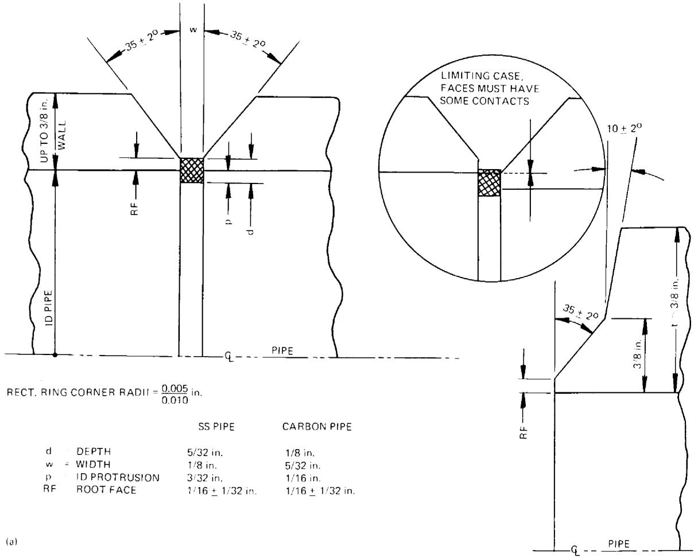

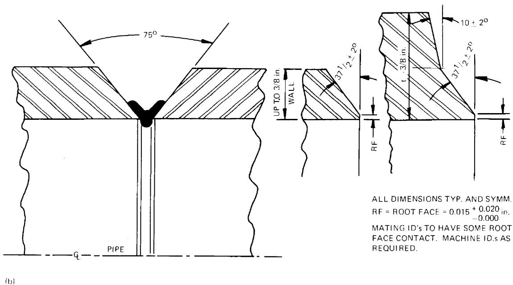  
Fig. 19. Root face butt joint for (a) Kellogg-type insert and (b) for Y-ring insert. Y-ring insert consumable weld ring manufactured by the Weld Ring Co., Bell Gardens, Calif.

and minus none) with a $37 \frac{1}{2} \pm 2 \frac{1}{2}^{\circ}$ end bevel provided for consecutive acceptable root-pass Y-insert welds (Fig. 19b).

We have produced acceptable welds with both Y-ring and Kellogg ring inserts but prefer the Kellogg rectangular ring shapes, which provide quality weldments even with poor pipe end preparation and offset matchup of the pipe ends to be welded. We were able to produce satisfactory welds as long as there was a minimum contact between the respective pipe root faces and the insert ring; Fig. 19a exemplifies two extreme setups that were weldable with our equipment. Y-insert welding requires more precise limits, as shown in Fig. 19b. ORNL purposely omitted experimentation with consumable EB (Electric Boat Company, Groton, Conn.) type inserts, because EB insert welding requires pipe inside diameter matchup within 5-mil limits, which is too expensive to prepare for field construction pipe welding.

Welding procedure specifications must be prepared and certified to describe the procedures to be followed for automated gas tungsten-arc welding of specific pipe sizes and materials in the 2G, 5G, and 6G welding positions with specified automated orbital welding equipment. All welding performed in accordance with the certified procedure should be done by welderoperators who have been thoroughly trained in the operation of the automated equipment and who have demonstrated their proficiency by having passed tests.

Procedure qualifications are referenced in the ASME Boiler and Pressure Vessel Code, Section III, Nuclear Vessels, and are specified in the same Code, Section IX, Welding Qualifications, and in Specifications RDT E15-2T and RDT F6-5T and supplements to Sections III and IX respectively.

A certified Welding Procedure Qualification Record must accompany the Welding Procedure Specifications, and list in detail the following information:

1. pipe parent material;   
2. electrode and filler material;   
3. shielding gas and flow rate;   
4. pipe joint design and consumable insert data;   
5. heat treatment data;   
6. radiography and liquid penetrant requirements (NDT);   
7. results of destructive test sampling, from duplicate welds in each of the three welding positions: tensile, root bend, and face bend.

A Welding Parameter Record which lists all the input selections to the programmer-controller is also required for each weld. See Appendix B for a sample welding procedure that is applicable to any automated welding system.

# 6. Welding System Operations

# PREWELD OPERATIONS

Stored metals will form external oxide coatings which generally are refractory. Extra power (weld current) is required to obtain initial weld penetration when metal surfaces are oxide coated, and even then weld porosity can be caused by hydration of the oxide. Once penetration has been achieved, new problems arise when metal surfaces are coated with oxide. It is difficult to control the weld puddle, especially at or

near the overhead weld positions, and weld deposits are uneven, with balling tendencies and void inclusions.

For these reasons, routine cleaning by stainless steel wire brushing to remove oxide coatings and wiping with solvent to remove surface dirt and grease traces are necessary for all welds with automated orbital equipment. Additional draw filing, or grinding, may be required for filler passes to remove sharp notches or protrusions and obtain a smooth, blended substrate.

Joint mismatch, one cause for poor root pass welds, especially in the pipe horizontal position, is most critical in the "overhead," or 6 o'clock location. A slight mismatch of adjacent edges of the joint's inner diameter causes the welds to pull out or suck back metal due to gravity. It is recommended that the bottom pipe quadrants be matched most precisely for best welding results, since misfit conditions can be tolerated to a greater degree in the top quadrant area. Pipe joint mating surfaces should preferably make physical contact to both edges of the consumable insert on fitup. Purge-gas losses are minimized with contacting surfaces, and needs for filler wire are reduced. Pipe ends to be joined by welding must be rigidly held in position during welding to prevent weld-heat-induced pipe movement at the joint due to expansion and contraction. Pipes may be clamped or tack welded prior to the root pass.

There is a difference in ionization potential of inert gases which affects the arc voltage and therefore the heat input to the weld zone. Helium requires only about $60\%$ of the welding current required for an equivalent weld with argon shield gas due to the increased arc voltage. Different arc plasma shapes result; argon spreads the weld heat, while helium concentrates the heat. Since wider argon plasmas give best results for stainless steel welding, all ORNL work was done with argon shielding gas. The pipe interiors were purged with argon usually at approximately 20 cfh gas flow. The exit orifices or flow openings for the purge gas should be approximately equal in flow capacity to the inlets.

Electrode configuration tests have indicated that better welds can be obtained by tapering the electrode to a $30^{\circ}$ included angle and providing a minimum rounded-off apex. Electrode configuration has a strong influence on the arc heat pattern. The tendency of an arc to spread to an adjacent area causes the weld nugget to fuse only intermittently and can cause incomplete fusion at the joint sidewalls, leaving an uneven surface appearance on the weld bead. It is practically impossible to lay acceptable fill passes over such defective weld beads and, of course, not recommended; one must resort to corrective interpass machining and blending prior to proceeding with further welding.

The angle of the tip of the electrode determines where the arc will initiate. Arc emission can occur from any spot of the heated electrode's tapered emitting surface. Weld bead shape can be somewhat varied by changing electrode tip angles; however, precision, caution, and care are required even with AVC regulation to confine the arc emission to the desired direction so that it will not bump into pipe joint sidewalls. Additional

precautions are necessary to prevent contacting the electrode with the filler wire during the overlap portion of the weld. The wire feed motor cutoff point must be programmed to stop in the initial downslope portion of the weld current.

Tracking capability of the carriages is adequate for pipe welding operations on horizontal pipes. The driver and idler rollers are designed to include two $\frac{1}{2}$ -in.-wide metal lands, one at each end of the 6-in.-wide Viton rubber roll tread surface. The lands project to within 0.005 in. of the rubber surface, so that when the rollers are clamped to the pipe, the rubber is deformed at the point of contact to the extent that the metal lands contact the pipe surface. The traction obtainable from these rollers drives the carriage around the horizontal pipe with a maximum deviation of about 3 to 6 mils per orbit. No compensation is required for this amount of drift, and no end restraints are required for welding pipes from horizontal to $15^{\circ}$ slope positions.

However, when welding on pipes that slope more than $15^{\circ}$ end restraints are required in order to keep the rollers from slipping. These restraints are either in the form of split circular ring collars or sprocket chains which are clamped to the pipe. Nylon or Teflon bearing surfaces are provided to minimize rotational friction between the orbiting carriage and the restraint. When the split circular ring clamps are employed, primarily for the smaller pipe sizes, plastic buttons are attached to the carriage end plate to reduce friction. When the sprocket chain is used, for the larger pipe sizes, we exchange all standard link pins in the chain for extension pins to which we mount the plastic roller buttons to "ride" the carriage end plate. Extension links may be added or removed to adjust the chains to fit over a variety of pipe diameters.

All clamping devices for use in stainless steel pipe for RDT work must be made of stainless steel. Marker gages must be prepared and applied to properly locate all restraints uniformly from the weld joint. It is necessary to tap the links with a hammer to line them up before tightening the circumferential chain band.

# GUIDELINES FOR TACKING CONSUMABLE WELD INSERTS

A consumable insert ring should always be tack welded to at least one side of the pipe joint. ORNL developed special C-clamp jigs to hold the insert in proper alignment while it is being tack welded, since proper and uniform spacing relative to the pipe end and inner pipe diameter is critical, particularly for carbon steel pipes. The amount of ring material protruding into

the inside diameter of the prepared root face of the pipe end must be carefully controlled to attain an acceptable root pass. The insert is supported by the clamp and held in position over the pipe end; the tack welds on one side of a joint should be about 1 in. apart. When tacking an insert to both sides of a pipe joint, the tack welds should be alternated to the respective pipe ends, with at least six approximately equally spaced tack welds around each pipe, or so that they are no more than $3/4$ in. apart, whichever distance is smaller. These spacings should prevent breaking of tacks during root pass welding. It is important that some filler wire be used for all tack welds to Y-inserts, since there is a tendency to burn away part of the thin edge of the Y while fusion weld tackling the ring to the beveled pipe edge. For gas tungsten-arc tack welding, the arc current should be set at approximately $75\%$ of the mean root pass weld current, or about 80 A at 12 V. Both sides of the pipe joint insert must be tacked unless clamps are used to compress the joint for the root pass weld. In addition, the pipe ends being joined must be rigidly held in position during welding to prevent movement at the weld joint due to expansion and contraction forces.

# WELDING TECHNIQUES

The basic principle of gas tungsten-arc welding is to use inert gas to shield the weld puddle of molten metal and the surrounding area where the temperature is high enough to cause rapid oxidation by the atmosphere if not protected. To maintain the inert-gas blanket, the welding must be performed in a quiet atmosphere where no air current or drafts exist. It may be necessary to shield the area to assure a constant inert-gas atmosphere for the weld. Before welding, a minimum of 6 in. of the internal surface of the joint on each side of the weld should be blanketed with argon. The volume of gas for the blanket should be at least five times the volume of the area to be blanketed, and the blanket should be maintained during welding and until the temperature of the weld falls below $400^{\circ}\mathrm{F}$ .

# CLEANING OF WELD BEADS

Oxide particles and heavy film should be removed from the weld bead and base metal in the line of arc travel before depositing each section or each complete weld bead. Thorough brushing with a stainless steel wire brush is usually required.

# DEFECTS

Each weld bead should be visually examined for cracks, holes, incomplete fusion, lack of penetration, overlap, undercut, underfill, and other defects. Each bead should have a smooth surface and contour and should merge smoothly into previously deposited beads and base metal; if it does not, repairs should be made.

# REPAIRS

Weld defects can be removed by grinding, chipping, filing, or machining, and appropriate operations should be performed to obtain a smooth surface before depositing the next bead.

# WELD SCHEDULE DATA SHEETS

Table 1 is a typical data sheet for our system giving the programmer input information for the root and subsequent filler pass welds. A final, governing weld parameter table will be prepared and issued at the time of procedure qualifications that must be followed to achieve good weld results. Limits, or tolerances, for respective data input as normally listed for manual welding practice are omitted from the parameter data since the automated controls, when in calibration, will maintain their built-in tolerances. Calibration procedures and test checks are provided with the instruction manuals furnished with the equipment.

# OPERATIONAL PROCEDURE (ORNL EQUIPMENT) CHECKOFF LIST

# I. Preweld

1. Verify that the pipe joint setup for welding meets the following criteria:

(a) cleanliness,   
(b) proper end preparation for both sides of the joint,   
(c) proper insert - insert spacing and location within the established dimensional limits,   
(d) insert in contact with both pipe ends and properly tacked.

2. Check purge-gas supply and regulate proper purge flow to the work piece.   
3. Check water flow and torch purge-gas flow to the weld machine. Gas flow should be 14 cfh minimum and water flow should be about $\frac{1}{2}$ gpm at approximately 20 psi. Use pressure regulators to protect water hoses, passages, etc.

3-in. sched-40 pipe; 0.216-in. nominal wall thickness

Program Check

Table 1. ORNL Weld System Welding Parameter Data Sheet   

<table><tr><td>Weld 3-2-15</td></tr><tr><td>Date 5-25-71</td></tr><tr><td>Pipe size 3 in.</td></tr><tr><td>Material type 304 SS</td></tr><tr><td>Joint type Single V Kellogg rectangular insert</td></tr><tr><td>Carriage size 3-6 in.</td></tr><tr><td>Pipe position 2G</td></tr></table>

<table><tr><td>Torch gas</td><td>Argon, 15 cfh</td></tr><tr><td>Backup gas</td><td>Argon, 20 cfh</td></tr><tr><td>Filler wire type</td><td>308L SS</td></tr><tr><td>Filler wire diam</td><td>0.045 in.</td></tr><tr><td>Electrode shape</td><td>0.035 in. flat</td></tr><tr><td>Electrode projection (in.)</td><td>1/4</td></tr><tr><td colspan="2">Cup 7</td></tr><tr><td>Wire feed snout type</td><td>Solid</td></tr><tr><td colspan="2">AVC 7.3-8.5-9.5</td></tr></table>

<table><tr><td>Oscillator</td><td>On</td></tr><tr><td>AVC wire</td><td>On</td></tr><tr><td>Program</td><td>On</td></tr><tr><td>Current</td><td>On</td></tr><tr><td>Upslope</td><td>Set</td></tr><tr><td>Contactor</td><td>On</td></tr><tr><td>Welder</td><td>On</td></tr><tr><td colspan="2">Tool servo (rear panel)-On</td></tr><tr><td colspan="2">Weld servo (rear panel)-On</td></tr></table>

<table><tr><td rowspan="2">Control box settingsa</td><td colspan="10">Weld Passes</td></tr><tr><td>R</td><td>1</td><td>2</td><td>3</td><td>4</td><td>5</td><td>6</td><td>7</td><td>8</td><td>9</td></tr><tr><td>1. Tool speedb</td><td>16</td><td>16</td><td>16</td><td>16</td><td>16</td><td>16</td><td></td><td></td><td></td><td></td></tr><tr><td>2. Wire speedc(in./min)</td><td>0</td><td>35</td><td>25</td><td>25</td><td>25</td><td>25</td><td></td><td></td><td></td><td></td></tr><tr><td>3. Oscillator speed (cpm)</td><td>0</td><td>80</td><td>80</td><td>80</td><td>80</td><td>80</td><td></td><td></td><td></td><td></td></tr><tr><td>4. Tool start position</td><td>4</td><td>4</td><td>4</td><td>4</td><td>4</td><td>4</td><td></td><td></td><td></td><td></td></tr><tr><td>5. Wire start position</td><td>6</td><td>6</td><td>6</td><td>6</td><td>6</td><td>6</td><td></td><td></td><td></td><td></td></tr><tr><td>6. Wire stop position</td><td>26</td><td>26</td><td>26</td><td>26</td><td>26</td><td>26</td><td></td><td></td><td></td><td></td></tr><tr><td>7. Weld time (sec)</td><td></td><td colspan="4">Manual Downslope</td><td></td><td></td><td></td><td></td><td></td></tr><tr><td>8. Down slope (sec)</td><td>9</td><td>9</td><td>9</td><td>9</td><td>9</td><td>9</td><td></td><td></td><td></td><td></td></tr><tr><td>9. AVC wire control (V)</td><td>13.5</td><td>13.5</td><td>13.5</td><td>13.5</td><td>13.5</td><td>13.5</td><td></td><td></td><td></td><td></td></tr><tr><td>10. Maximum weld current (mean amperes)</td><td>100</td><td>100</td><td>100</td><td>100</td><td>100</td><td>100</td><td></td><td></td><td></td><td></td></tr><tr><td>11. Actual current reading</td><td></td><td></td><td></td><td></td><td></td><td></td><td></td><td></td><td></td><td></td></tr><tr><td>12. Slider position No. 1 (% max current)</td><td>40</td><td>40</td><td>40</td><td>40</td><td>40</td><td>40</td><td></td><td></td><td></td><td></td></tr><tr><td>13. Slider position No. 2 (% max current)</td><td>70</td><td>70</td><td>70</td><td>70</td><td>70</td><td>70</td><td></td><td></td><td></td><td></td></tr><tr><td>14. Slider position No. 3 (% max current)</td><td>100</td><td>100</td><td>100</td><td>100</td><td>100</td><td>100</td><td></td><td></td><td></td><td></td></tr><tr><td>15. Slider position No. 34 (% max current)</td><td>0</td><td>0</td><td>0</td><td>0</td><td>0</td><td>0</td><td></td><td></td><td></td><td></td></tr><tr><td>16. Weld current pulse amplitude (A)</td><td>64</td><td>64</td><td>64</td><td>64</td><td>64</td><td>64</td><td></td><td></td><td></td><td></td></tr><tr><td>17. Weld current pulse rate (cpm)</td><td>68</td><td>68</td><td>68</td><td>68</td><td>68</td><td>68</td><td></td><td></td><td></td><td></td></tr><tr><td colspan="11">Weld tool settings</td></tr><tr><td>18. Oscillator amplitude (dial setting)</td><td>0</td><td>1</td><td>1</td><td>1</td><td>1</td><td>1</td><td></td><td></td><td></td><td></td></tr><tr><td>19. Electrode included angle (°)</td><td>30</td><td>30</td><td>30</td><td>30</td><td>30</td><td>30</td><td></td><td></td><td></td><td></td></tr><tr><td>20. Electrode diameter (in.)</td><td>3/32</td><td>3/32</td><td>3/32</td><td>3/32</td><td>3/32</td><td>3/32</td><td></td><td></td><td></td><td></td></tr><tr><td>21. Arc gap (in.)</td><td>1/16</td><td>1/16</td><td>1/16</td><td>1/16</td><td>1/16</td><td>1/16</td><td></td><td></td><td></td><td></td></tr><tr><td>22. Start location; clock position</td><td>1</td><td>11</td><td>1</td><td>11</td><td>1</td><td>11</td><td></td><td></td><td></td><td></td></tr></table>

${}^{a}$ A 10% variation in current is permissible to compensate for permissible joint tolerances.   
bNumber 16 setting equivalent to 3.7 in./min.   
True readings $= 50\%$ data input.

4. Position the carriage component on the pipe, and align the torch head slot directly over the joint.   
5. Use Allen wrench to tighten carriage arms to pipe. Note: Torque an equal amount on each arm until rollers are snug and even. Torque required is approximately 75 in.-lb. Do not over-torque.   
6. Connect the control cable to carriage.   
7. Check the six cable connections on rear of the programmer.   
8. Turn on power to programmer. This activates power to the carriage.   
9. Check operation of the carriage, forward and reverse. Forward speed is regulated from the programmer by adjusting the tool speed control, which reads inches per minute travel. Pull knob out, set desired speed, then push knob in to lock. Reverse speed is a constant, fast speed and has no adjustment. Note: Always be aware of the control cable position and do not let it hang on some obstruction because this will damage the connector wiring.   
10. Turn power off at programmer.   
11. Install the weld head assembly into the carriage. Do not force it in place, as the wiring connector may be slightly misaligned.   
12. Raise cover on the weld head.   
13. Turn power back on to programmer. This activates power to the weld head and carriage.   
14. Check out the oscillator component of the weld head.   
(a) The oscillator speed control is regulated from the programmer. Pull knob out, adjust speed, push knob in to lock. Indication is given in cycles per minute.   
(b) The swing or travel distance is regulated by the control knob on the oscillator component in the weld head. The maximum swing spans $5 / 8$ in.   
(c) Activate oscillator to check by pushing control button on the weld head.   
15. Check out the wire feed component of the weld head.   
(a) Check parameter table for correct wire material and size.   
(b) Wire feed speed is regulated from the programmer. Pull knob out, adjust control

to desired speed, push knob in to lock. Indication in inches per minute.

(c) Match the alignment mark on the wire feeder cap with the first mark on the cover piece. This permits the wire to manually advance into the feeder's gear drive. Now tighten the cap by rotation until the cap's alignment mark matches the second alignment mark on the cover. This provides proper gear tooth tension on the wire for motorized wire travel through the feeder. Verify wire advance by pushing forward wire travel button on weld head.   
(d) Push the wire retract button on the weld head momentarily to verify reverse wire travel.   
(e) Position the filler wire directly at the outlet of the feeder's nozzle.

16. Turn power on to the weld machine to check the torch cover gas and water flow - approximately 14 cfh gas and approximately $\frac{1}{2}$ gpm water.   
17. Turn power off to weld machine.   
18. Check out the torch head.

(a) See parameter table for proper size of electrode, electrode angle, and tip.   
(b) Position electrode in torch extension and tighten. Tungsten tip to protrude about $1/4$ in. beyond the ceramic torch cup.   
(c) Screw extension into torch head and tighten.   
(d) Check electrode and extension piece to be sure desired depth can be reached by the electrode in the pipe joint. Use Teflon spacer between the extension piece and the ceramic cup if needed. If more depth is desired, use a copper spacer between the torch head and the extension piece. Do not use Teflon between torch head and extension piece. Spacers should be used to allow the electrode to touch bottom of joint on root pass. This will leave $3/8$ in. movement upward or raising length for fill passes.

19. Check the horizontal and vertical adjustments of the weld head.

(a) The horizontal adjustment is made by rotating a knob on the outside cover of the weld head assembly, which moves and

locates the components of the weld head to the desired area of the pipe joint. When the electrode is in the center of the joint, the horizontal adjustment should be in its midrange, or at the center of its movement. If necessary, relocate the carriage to acquire this position.

(b) The vertical adjustment is motor driven, with the controls located on the remote weld pendant control. The motor is mounted on the outside cover of the weld head. The motor shaft alignment is critical, and all caution should be taken not to abuse the motor housing or its holddown clamp.   
(c) Energize both manual pendant controls and check to see that both directions, up and down, are working correctly.   
(d) Adaptive vertical control is maintained during welding operation through programmer sensing circuits. AVC control settings for the programmer are listed on the weld parameter data sheet.

20. Reverse wind the carriage one revolution to get the cables in proper position to unwrap from around the pipe during the weld operation. Clear any obstructions that may tend to interfere with the cable.   
21. Rewind carriage about 2 in. past start point and then move it forward about 1 in. in weld direction to remove any possible slack in the gears that might cause a rough start on the weld pass.   
22. If wire feed is to be used, check the guide nozzle position. The direction of the wire should be guided directly from the nozzle end into the weld puddle. Wire should not touch the weld surface or joint sides before it reaches the puddle. Wire should enter the extreme front area of the weld puddle. A set screw is used to lock the nozzle in position.   
23. Use the weld parameter data sheet to make all settings on the programmer.   
24. Set all welding machine switches and selectors to the proper positions indicated:

Remote current control - On Mode selector - Straight dc (- Soft start - Off Spark - Start only

Current range selector - Medium  
Side switch (program control position) - Up  
(light is on during welding)  
Fine adjustment control - #10  
Gas afterflow - #50(max)  
Gas welding selector - Other types welding  
Spark intensity - #10(max)

25. Close weld head cover and lock.   
26. Turn weld machine power on.   
27. Locate remote power control pendant close to work area.   
28. Welding operation is now ready to begin.

# II. Welding Operation

1. The following items have been checked.

(a) The electrode position has been placed so that the initial arc will strike on the joint side if oscillation is used.   
(b) If oscillation is required, the span of the electrode will not touch the joint sides.

Oscillation of the weld torch helps to assure fusion into the sidewall. When used in combination with current pulsing, oscillation will also help to maintain a stable weld puddle. The oscillation amplitude can be varied up to $5/8$ in. width, and the oscillation frequency can be controlled.

Oscillation amplitude (side interference) checks should be made prior to each pass by depressing the OSC button on the weld head lid body.

(c) The electrode gap from tip to work has been set at approximately $1 / 8$ in., and the adapting vertical control settings have been entered on the programmer.

2. Press start button on the pendant control.   
3. Observe through port in carriage to check weld operations. Always keep pendant control close by to be able to push the downslope button or the stop button in case of an emergency.   
4. Whenever possible, stop the welding operation by pushing the downslope button on the remote pendant control. This action protects the good weld already made. If the stop button is used, the weld can be damaged by the filler wire sticking to the puddle area and/or the purge gas being cut off too quickly.

5. Downslope the weld operation after each complete orbit is made.   
6. Reverse wind the carriage to properly arrange the cables around the pipe prior to each weld pass.   
7. Always overlap the previous start point on the reverse wind so that on the next start, all slack in the drive gears will be out and no backlash motion of the carriage will affect the weld head. Stagger subsequent weld starts by at least 1-in. spacings.   
8. Lift the cover on the weld head and check the electrode angle and tip. A close watch on the arc voltage will also indicate when an electrode should be changed or reshaped.   
9. Position of starts should preferably be somewhere between 10 and 2 o'clock. Viewing through the weld head's viewpoint is easier; it permits adjustments in an area least vulnerable to operator regulation assists.   
10. Follow weld parameter sequence selection recommendations.

# GUIDELINES FOR THE WELDER-OPERATOR'S VISUAL OBSERVATION DURING AUTOMATED WELDING

As mentioned previously, it is recommended that skilled manual welders be selected for training to operate the ORNL automated orbital pipe welding system. The welder's experience is invaluable, not only in properly assembling and locating the torch, etc., but also in detecting minor discrepancies that might occur during operation. Lack of proper remedial action by the operator can ruin a weld.

Ideally, each weld system should include a recorder to plot variables such as torch travel rate, welding current, arc voltage, and wire feed deposit rates. The recorder chart can be used during operation to detect functional deviations and to guide and verify the operator's corrective action. For automated systems without separate chart recorders, it is possible to observe the console voltmeter and the wire feed rate meter to attain some indications of weld pass quality. Both meters

indicate variations in arc length. A root pass weld is not penetrating the joint fully if voltage readings hold steady but the feed rate registers only below the selected rate. Usually, a small increase in welding current will remedy this situation. If, however, the wire feeder motor builds up to the selected set rate and voltage continues to climb, poor welding also results and the cycle should be stopped at once. Now the problem will usually be an excessive joint gap formation with too much push-through in the upper quadrants of the pipe, filler wire bound up within the wire feeder drive and not feeding into the weld, or excessive puddle fluidity in pipe vertical positions causing puddle flow away from the electrode tip. Investigate the problem with the machine off. Satisfactory weld fill passes do not appear to present great problems. The second weld pass, or first fill pass, requires some special care in properly adding the filler wire and obtaining weld buildup without root pass burn-through. Heat input selections for this and subsequent passes require only fusion to the previous pass and to the joint sidewalls. Oscillation of the weld torch helps to assure fusion into the sidewall, and current pulsing tends to maintain a stable weld puddle and to smooth out minor weld puddle perturbations.

Few programmer input changes are required during the initial fill passes, except to add torch oscillation and to adjust, or set, the wire feeder exit nozzle to a proper entry angle with the pipe joint surface. Final fill passes can be made with increased weld power, wider oscillation, and increased wire feed. A near 12 o'clock start position for the first fill pass (for 5G position welding) generally helps to balance partial distortion of the pipe created by the root pass.

One procedure for filling local weld areas that have been purposely ground out to remove weld defects is to place the carriage about $\frac{1}{2}$ in. in front of the area to be filled, set a short arc gap of about $\frac{1}{3}$ in., and initiate a weld cycle. After the carriage traverses the recessed area, the AVC wire feed control will start to automatically add wire as soon as the arc gap increases. If the localized defect is not too severe, the AVC and wire feed additive controls will automatically fill the depression to the level of the surrounding substrate during subsequent filler passes.

# 7. Welding System Maintenance

Detailed instructions for mechanical maintenance and electronic calibration checks are given in the Operation and Maintenance Manual for ORNL-Furnished Automated Welding Systems. The Manual also includes a chapter on "Malfunction Data," plus suggestions and/or procedures for corrective maintenance actions, and disassembly and reassembly directions for the carriage and the weld head. Guidelines are offered for troubleshooting every functional programmer-controller circuit and for the plug-in cards.

Routine daily maintenance requirements for the welding equipment include visual checks for obvious abnormalities and for general cleanliness. The carriage and weld head should be stored in appropriate dustfree boxes overnight and whenever not in use. The carriage arm assemblies should be slightly untorqued to minimize roller pressure against the pipe and thus prevent permanent Viton-rubber tread deformation where interpass temperature controls for welding call for considerable delays between passes.

Biweekly preventive maintenance checks for the equipment should include programmer calibration checks, particularly for orbit travel speed and wire feed rate. Nonroutine carriage maintenance operations should be conducted as necessitated by operational needs; troubleshooting procedures recommended in the Manual should be followed.

Cleanliness is required for proper operation and maintenance of the equipment. Driver and idler rubber roll surfaces must be kept clean by wiping with acetone; chips and dirt must be removed from all crevices; and bearing surfaces must be coated at all times with a light film of high-temperature lubricant. The carriage, weld head, programmer-controller, and, where possible, the recorder should preferably be kept away from dust, dirt, and rain. A ventilated, boxed enclosure has been designed and is available to house the programmer and a recorder for field operations. Clean air is circulated through the box to retain a slight pressurization within the enclosure to seal out dust and dirt.

# 8. Operator Training

Operator training consists in instructions in the setup, calibration, control, operation, and maintenance of the automated orbital welding and programming equipment. ORNL conducted a two-week training program for Bechtel Corporation operating personnel from Westinghouse-Hanford and for TVA personnel from the Browns Ferry Nuclear Plant utilizing the Operations and Maintenance Manual for the Oak Ridge equipment system as a text to supplement the practical training. The practical training involved a one-week period for becoming acquainted with the equipment followed by a week of specialist training held in split sessions for both the weld operator and the electronics maintenance engineer. We purposely requested that the trainees include someone with a broad manual welding background and someone knowledgeable in automated

electronics system operation and upkeep. The second-week training sessions involved the mechanical and metallurgical aspects of weld technology for the welder, plus electronic control, programming, troubleshooting, and maintenance for the instrument systems specialist. The welder-operator actually set up and executed a number of automated welds, while the electronics man performed controller checks, calibrations, and electronic repairs. The trainees also received instructions in the interpretation of mechanical and electrical drawings for the ORNL system and were issued Manuals and blueprints at the time of their departure.

The dual-phase training program, theory and practical work, effectively provided each trainee with a balanced overall background of automated welding technology and practice. Exposing the welder trainee to some basic

instrument, programming, and control techniques and practices, and acquainting the electronics trainee with actual welding routines helped each to appreciate and comprehend the specific involvements and problems of the respective expertises. Good automated welding practice calls for a "team effort" of specialists. The instrument man can often provide the welder with

adequate controls to maintain certain required torch-to-work relationships if he is taught to understand what constitutes the proper weld. Also, a weld operator who understands how the controls interact, why time delays occur in control responses, and what control factors influence repeatability can then select the programming parameters essential for consistently good welds.

# 9. Cutting Prerequisites - Pipe Cut and Bevel Preparation Development

The most important objective in cutting and preparing pipe ends for welding is to obtain precision geometrical and dimensional symmetry for mating pipe ends. This statement holds true for all types of weld joints. Unfortunately, commercially available pipes are routinely out-of-round, nonconcentric between inside and outside diameters, and of uneven wall thickness. These irregularities make it impossible to rely on simple, rapid machining operations to establish the ideal pipe end geometries for weld joints.

ASME Materials Specification, Section II, Boiler Code for Piping, describes the allowable dimensional variations in the diameter and wall thickness of various types of pipe. Section SB 167, for Nickel-Chrome Alloy Pipe, for example, permits an allowable eccentricity of pipe inside and outside diameters up to $10\%$ of the nominal wall thickness; even comparable SA 106 carbon steel pipe specifications allow for $12^{1/2}$ thickness variations. Diameters for large piping may vary as much as $\frac{1}{8}$ in. All commercial pipe is governed by these specifications. Our experience indicates that piping dimensions vary at least as much as, or slightly more than, the allowable tolerances. Furthermore, the manufacturing process of pipes in the mill is based on squeeze rollers about the pipe's outside diameter, resulting in primary, or best, dimensional tolerance control of the outside diameter and least control of the inside diameter. The pipe joint to be welded, however,

requires closest matchup tolerances for the root bead pass at the pipe's inside diameter and only nominal control at the outside.

Piping for nuclear work often requires special mill rolling for above-average material composition control adherence. Dimensional pipe specifications also require strict tolerance limits on the diameter and wall thickness but realistically must conform to dimensional control limits of the manufacturing process. Hence, it becomes necessary to establish pipe roundness and inside diameter control by requiring inside diameter and root face machining. Standard lathes are usually employed for end preparation in the smaller pipe sizes; clamp-on, track-operated frame lathes4 are often used to properly prepare ends for the larger pipe sizes. Care must be exercised to retain the specified pipe wall thicknesses, and the designer should always specify sufficiently heavy pipe walls to end up with at least the minimum required pipe wall thickness after machining. It is also important that the stress analyst study all joint configurations to provide allowances for uneven wall thickness near the finished weld joint and examine the weld-heat shrinkage-induced pipe contour deformation at the weld joint.

# 10. Commercial U.S. Equipment Sources for Orbital Welding Systems

To the best of our knowledge, as of July 1972, the following companies are the only manufacturers of automated tungsten-gas orbital pipe welding equipment in the United States:

Astro-Arc Company, Sun Valley, Calif.

CRC-Crose International, Inc., Houston, Tex.

Dimetrics, Inc., North Hollywood, Calif.

Liquid Carbonic Corporation, Des Plaines, Ill.

Magnatech, The DSD Company, East Grandby, Conn.

Rytek, Inc., Santa Fe Springs, Calif.

TekTran Company, Newark, Ohio

Zeta International Engineering, Inc., Santa Clara, Calif.

A number of companies in Europe also market equipment systems that are quite similar to the Liquid Carbonic line. The above list includes only companies producing equipment for orbital torch travel about a stationary pipe. Most of the major welding equipment manufacturers build automated, or at least semiautomated, tungsten-gas torch equipment for use in applications where the pipe rotates past a stationary torch.

The Astro-Arc pipe weld system can accommodate a pipe range from 4 to 36 in. OD. One guide ring and one disposable belt are required for each diametral size increment. Two-section hinged guide rings are available for use with pipe sizes up to 12 in., and segmented link tracks are used for 12- to 36-in.-diam pipes. Links are added or deleted for the in-between pipe diameter sizes, and all tracks are grooved to seat the inexpensive special cloth belts. The Astro-Arc carriage, containing the torch, wire feeder with a 4-in.-diam spool, oscillator, and orbit motor drive, includes a rugged spring mounting for the belt attachment. The Astro-Arc power supply is solid state, 200 A GTA, fully transistorized, and includes an integral liquid-cooling system. Programming includes $1\frac{1}{2}$ -in. AVC torch travel adjustment at approximately 60 in./min AVC compensation speed, 10 to 100 cpm oscillation frequency for up to $\frac{1}{2}$ -in.-wide oscillations with independent dwell stop capability per side, and several modes of pulsed current operation. The Astro-Arc solid-state programmer is housed directly on top of the power supply. The system also includes provisions for future plasma arc attachments.

CRC-Crose International, Inc., is a subsidiary of Crutcher-Rolfs-Cummings, Inc. Their automatic pipe welding system employs the gas shielded-arc welding process with multiple torches mounted to the pipe both internally and externally. The system also includes an integral hydraulically powered machine to prepare and align pipe joints in the field. However, the machinery, built primarily for large overland pipe lines, is bulky and very heavy and does not lend itself for highest-quality nuclear-grade gas tungsten-arc welding.

Dimetrics, Inc., like Astro-Arc, is an independent company that produces solid-state power supplies and specialty tube and pipe welding equipment. The company is presently developing automated chain-driven orbital pipe welding machinery for interchangeable gas tungsten-arc or gas metal-arc welding to be marketed to supplement their standard rolled-work AVC controlled stationary torch equipment systems. These systems feature programmer-controlled power supplies in various power ranges for operation in multiple pulsed welding modes.

Liquid Carbonic, a subsidiary of the Houston Natural Gas Corporation, has taken over the manufacture of automated machinery systems originally developed for the Navy by the Electric Boat Division of General Dynamics at Groton, Connecticut. Their APW series machines employ a split gear to carry a combination torch, torch oscillator, wire feeder attachment. The gear is enclosed within a hinged circular housing track, and a stationary motor mounted to the track orbits the gear-torch combination about the pipe. The balance of the system comprises a solid-state control console and a pulsating arc dyna-surge power supply. The GTA system will accommodate from 3- to 36-in. pipes.

Magnatech, the DSD Company, entered the tube and small pipe automated welding field by adapting a home-built tube welder used in the manufacture of their precision metal O-ring Turoseals to an inexpensive orbital welder which they now market commercially. The equipment is presently limited to gas tungsten-arc welding of square-cut, butted pipe joints up to $1\frac{1}{4}$ in. in diameter with wall thicknesses up to $\frac{3}{16}$ in. The automated, programmed fusion welder consists of a mechanical programmer and a weld head built to accommodate curved tubes and pipes as well as straight runs. The equipment incorporates simple mechanical

devices for preparing the weld program and a program profile cam disk. The programmer plays back the cam card to obtain the automated control of welding parameters. The automated system operates in conjunction with any commercial GTAW power pack. Magnatech is presently enlarging their welder line and adding wire feed and oscillation capabilities to their equipment in order to handle larger diameters and heavier wall thicknesses.

Rytek, Inc., recently went out of business, but, according to its owner, Henry Rygiol, the operation apparently is being reinstituted as part of the Susquehanna Corporation in San Diego, California. Rygiol has built a number of specialty systems for specific automated gas tungsten-arc applications.

TekTran is a relatively new joint venture company formed by the Air Products and Chemicals, Inc., and North American Rockwell Corporation to market automated welding systems and testing equipment. TekTran obtained the detailed drawings and specifications prepared for our ORNL welding system via the National Technical Information Service to build prototype machinery for evaluation from manufacturing, operational, and servicing standpoints. We understand that TekTran expects to market a series of four automated orbital welding carriages for pipe sizes ranging from $2\frac{1}{2}$ to 24 in. Their system basically resembles the ORNL horseshoe carriage-weld insert design, but the four-roller tractor carriage with two motorized drivers and two free-rolling idler rolls has been changed to a

three-roll tractor with each of the rollers motorized. TekTran's new line is based around their new 300-A solid-state, SCR-type weld power supply for both gas tungsten-arc and gas metal-arc welding. The system will also feature interchangeable weld insert modules for operation in both welding modes, with the GMA process recommended for speedier, heavier bead deposits for final filler passes.

Zeta International Engineering, Inc., is the successor to the Bartley Engineering Company. Their automated welding system utilizes pulsed gas tungsten-arc welding and pulsed gas metal-arc welding processes. The major components of the system are: four welding tractors, operator's control console, wire feeder with junction box, dual weld power supplies, and a solid-state logic control cabinet. Three of the four tractors clamp onto the pipe and rotate the torch similar to most automated tube welders. These tractors are sized to handle piping $\frac{1}{2}$ to $1^{\frac{1}{4}}$ , $1^{\frac{1}{2}}$ to $2^{\frac{1}{2}}$ , and 3 to 5 in. The fourth tractor, for all pipe sizes above 3 in., uses a tooling ring which is bolted to the pipe to be welded. A double-row chain is used on the tooling ring to hold and provide means to drive the tractor. The weld tractors also have as options arc voltage control, oscillation, and cold wire addition. Zeta's GTAW power supply is a 200-A, $100\%$ duty cycle, constant current machine, with current pulsing available as an option. The GMAW power supply is an Airco model PA-3, modified to make the Z.I.E. system "turn-key."

# Appendix A ORNL Welding Programmer-Controller, Controls and Function

This appendix essentially outlines the controls and functions of the welding programmer-controller. Table A-1 lists the controls and functions for the front panel, and Fig. A-1 is a front view of the programmer-controller. Similar information for the rear panel is given in Table A-2 and Fig. A-2.

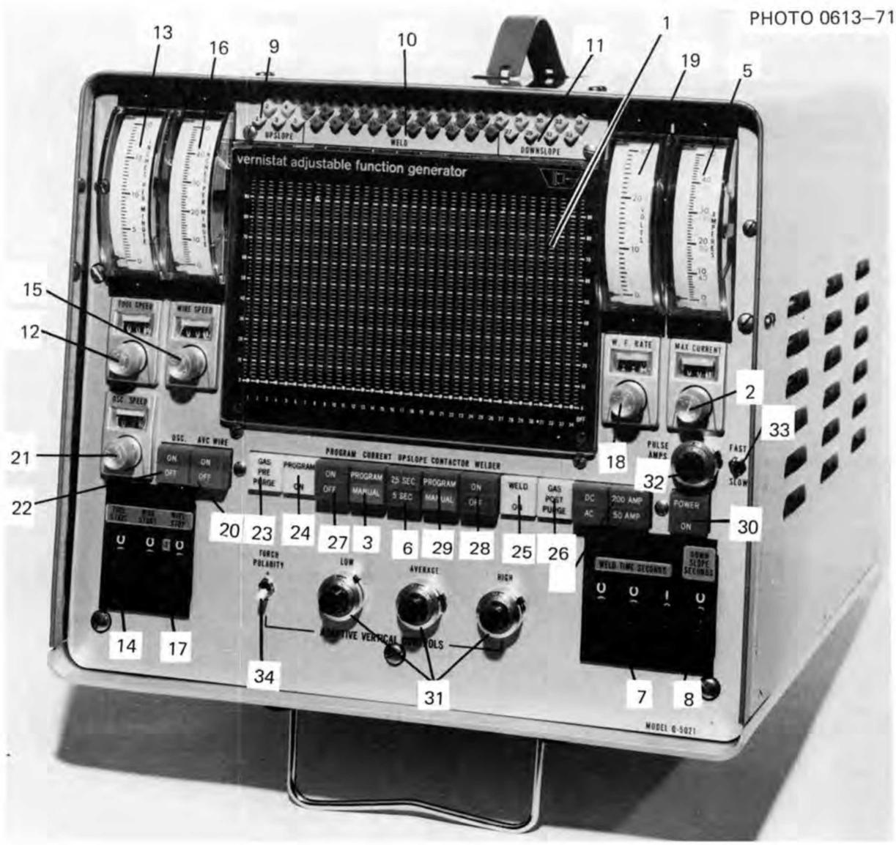  
Fig. A-1. Programmer-controller, front view.

Table A-1. Welding programmer front panel controls   

<table><tr><td colspan="2">Functions Related to Welding Current</td></tr><tr><td>1. Vernistat welding current programmer</td><td>Sets and indicates programmed weld current with respect to program position</td></tr><tr><td>2. Maximum current potentiometer (0-200 dial)</td><td>Selects and indicates maximum weld current (200 A max)</td></tr><tr><td>3. Current &quot;Program-Manual&quot; switch</td><td>Selects and indicates current control source</td></tr><tr><td>4. dc-ac and 200-50 A switches</td><td>Select and indicate ammeter range</td></tr><tr><td>5. Ammeter</td><td>Indicates welding current (0-50 A, 0-200 A)</td></tr><tr><td colspan="2">Functions Related to Programmer Time</td></tr><tr><td>6. Upslope 5-2.5 sec switch</td><td>Selects and indicates upslope time (2.5 or 5 sec)</td></tr><tr><td>7. Weld time seconds switches</td><td>Select and indicate weld time (10 to 999 sec)</td></tr><tr><td>8. Downslope seconds switch</td><td>Selects and indicates downslope time (0 to 9 sec)</td></tr><tr><td>9. Upslope position lamps</td><td>Indicate program position</td></tr><tr><td>10. Weld position lamps</td><td>Indicate program position</td></tr><tr><td>11. Downslope position lamps</td><td>Indicate program position</td></tr><tr><td colspan="2">Functions Related to Tool Drive</td></tr><tr><td>12. Tool speed potentiometer (0-20.0 dial)</td><td>Selects and indicates tool speed (0-20 in./min)</td></tr><tr><td>13. Tool speed meter</td><td>Indicates actual tool speed (0-20 in./min)</td></tr><tr><td>14. Tool start switch</td><td>Selects and indicates tool start as related to program position</td></tr><tr><td colspan="2">Functions Related to Wire Feed and Arc Voltage</td></tr><tr><td>15. Wire speed potentiometer (0-50.0 dial)</td><td>Selects and indicates maximum wire speed (0-50 in./min)</td></tr><tr><td>16. Wire speed meter</td><td>Indicates actual wire speed (0-50 in./min)</td></tr><tr><td>17. Wire start and wire stop switches</td><td>Select and indicate wire start and stop as related to program position</td></tr><tr><td>18. AVC volts potentiometer (wire feed rate control set, 0-1000 dial)</td><td>Selects and indicates AVC wire control voltage (06.5-16.5)</td></tr><tr><td>19. Arc voltage meter</td><td>Indicates welding arc voltage (0-30 V)</td></tr><tr><td>20. AVC wire On-Off switch</td><td>Selects and indicates normal or AVC wire control</td></tr><tr><td colspan="2">Functions Related to Torch Cross Seam Oscillator</td></tr><tr><td>21. Osc speed potentiometer (0-300 dial)</td><td>Selects and indicates oscillator frequency (50-350 cpm)</td></tr><tr><td>22. Osc On-Off switch</td><td>Selects and indicates oscillator operation</td></tr><tr><td colspan="2">Miscellaneous Functions</td></tr><tr><td>23. Gas preurge lamp</td><td>Indicates preweld inert gas purge on</td></tr><tr><td>24. Program On lamp</td><td>Indicates program on</td></tr><tr><td>25. Weld On lamp</td><td>Indicates weld on</td></tr><tr><td>26. Gas posturge lamp</td><td>Indicate postweld inert gas purge on</td></tr><tr><td>27. Program On-Off switch</td><td>Selects and indicates program on or off (halted)</td></tr><tr><td>28. Welder On-Off switch</td><td>Selects and indicates welder contactor control on or off (disabled)</td></tr><tr><td>29. Contactor program-manual switch</td><td>Selects and indicates welder contactor manual or programmed operation</td></tr><tr><td>30. Power On switch</td><td>Selects and indicates input power on or off</td></tr><tr><td>31. Adaptive vertical controls</td><td>Low, average, high settings for arc voltage controlled torch arc length</td></tr><tr><td>32. Pulse amperes potentiometer (10-1 ratio, 0-1000 dial)</td><td>Sets weld current pulse amplitude (0-100 A peak to peak)</td></tr><tr><td>33. Pulse fast/slow switch</td><td>Selects fast or slow weld current pulse rate (60 or 40 pulses/min)</td></tr><tr><td>34. Torch polarity switch</td><td>(+) for ac welding mode</td></tr><tr><td></td><td>(-) for dc welding mode</td></tr></table>

PHOTO 0617-71

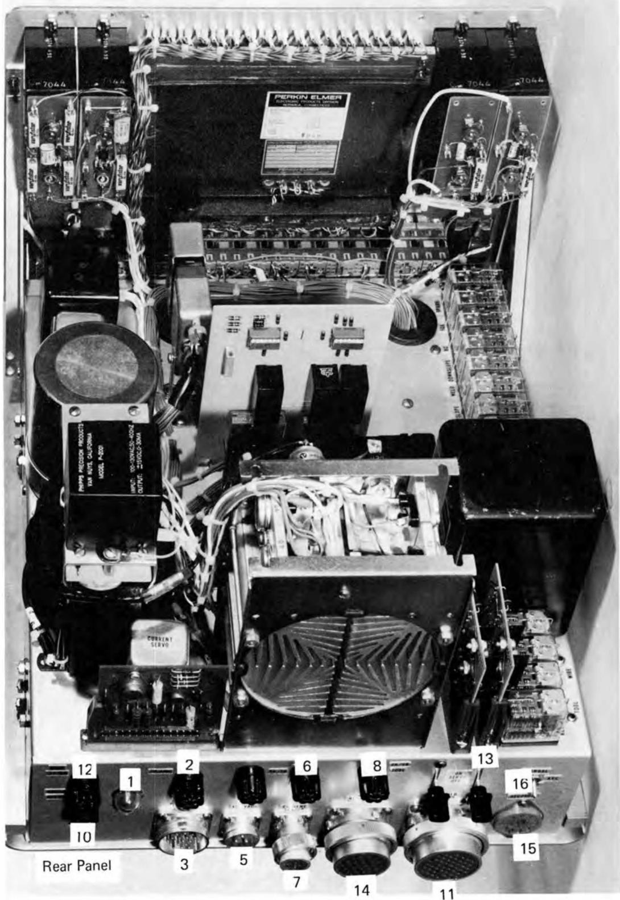  
Fig. A-2. Programmer-controller, top view.

Table A-2. Welding programmer rear panel controls   

<table><tr><td>Item</td><td>Description</td><td>Function</td></tr><tr><td>1</td><td>Pilot lamps (2)</td><td>Welder current control indicators</td></tr><tr><td>2</td><td>Fuse</td><td>Welding power supply current control fuse (10 A)</td></tr><tr><td>3</td><td>Male connector</td><td>Welding power supply control cable</td></tr><tr><td>4</td><td>Fuse</td><td>Power input fuse (5 A SB)</td></tr><tr><td>5</td><td>Male connector</td><td>120-V ac power input cable</td></tr><tr><td>6</td><td>Fuse</td><td>Control power fuse (5 A SB)</td></tr><tr><td>7</td><td>Female connector</td><td>Welding current sensor cable</td></tr><tr><td>8</td><td>Fuse</td><td>Tool drive motor fuse (2 A SB)</td></tr><tr><td>9</td><td>Switch</td><td>Tool drive servo On/Off switch</td></tr><tr><td>10</td><td>Fuse</td><td>Oscillator motor fuse (1 A SB)</td></tr><tr><td>11</td><td>Female connector</td><td>Tool cable</td></tr><tr><td>12</td><td>Fuse</td><td>Wire feed motor fuse (2 A SB)</td></tr><tr><td>13</td><td>Switch</td><td>Wire feed servo On/Off switch</td></tr><tr><td>14</td><td>Female connector</td><td>Remote control cable</td></tr><tr><td>15</td><td>Female connector</td><td>Recorder cable</td></tr><tr><td>16</td><td>Switch</td><td>Arc voltage control (manual or automatic)</td></tr></table>

# Appendix B

# Recommended Format for Establishing a Welding Procedure for Automatic Welding

The information in this section is intended to assist newcomers to automated welding in setting up procedures for automated systems. Our experience in training and in working with people not familiar with automated welding technology indicated the need for simple guide lines along with a list of available procedures for both nondestructive and destructive examinations of welds. A sample welding procedure is given along with a typical list of general welding parameters (Table B-1). Figures B-1 and B-2 illustrate a joint geometry for weld joints and details of insert tack-weld sequencing respectively.

# Sample Welding Procedure Record for ______ Type Welds

# A. SCOPE

This procedure record describes the criteria for automated gas tungsten-arc welding of Sched. (Mat'l) (Type) piping using the (Name of automated system). This procedure is based on use of the (type) consumable insert with an internal (type gas) purge and cold wire feed in the G and G positions. The procedure is detailed here for in. diam. Sched. pipe, and with attached data tables (one for each size) applies also to other specified pipe sizes. All welding performed in accordance with this procedure, which meets the requirements of Section IX of the ASME Code and RDT Standards E 15-2T and F 6-5T (supplements to the ASME Code), must be done by welder-operators who have demonstrated their proficiency by passing the qualification tests and receiving thorough training in the operation of the automated equipment.

# B. SAMPLE PROCEDURE RECORD FOR WELD #

# 1. Preweld Preparation

Reference: ASME Boiler and Pressure Vessel Code, Section III, "Nuclear Vessels"

a. General specifications. ASME Boiler and Pressure Vessel Code, Section IX, "Welding Qualifications," and RDT Standards E 15-2T and F 6-5T, "Requirements for Nuclear Components" and "Welding Qualifications"   
b. Base metal

i. Specification - ASTM A 312-64, "Specification for Seamless and Welded Austenitic Stainless Steel Pipe."   
ii. Grade - type 304.   
iii. Form and "P" number -- seamless pipe, ASME Section IX "P" No. 8.   
iv. Thickness - 0.280 in. nominal.   
v. Diameter - 6.625-in. nominal outside.

c. Filler metal

i. Specification ASME-AWS Specification SFA-5.9, "Specification for Corrosion-Resisting Chromium and Chromium-Nickel Steel Welding Rods and Bare Electrodes."   
ii. Classification and chemical composition - ER 308.   
iii. F and A numbers per Code Section IX - type ER F7 (Table Q11.2), Weld Metal Analysis No. = A7 (Table Q11.3).

Table B-1. Welding parameters - XYZ machine system   

<table><tr><td>Weld # X and type X
Date X
Pipe-size, sched X, X
Mat&#x27;l X, type X
Joint type X
Pipe position(s) X, X, _</td><td>Torch gas, flow X, X cfh
Backup gas, flow X, X cfh
Filler wire diam., type X, X
Electrode diam. X, shape X
Electrode proj. from cup X
Cup# X</td><td>Pass sequence
Insert info: X</td></tr></table>

# Weld tool settings

Torch height above pipe surf., in.

Electr. tip to wire distance, in.

Oscillator amplitude, in.

Wire feed retract (set at) in.

# Weld start (clock position on pipe)

# Programmer control box settings

Arc voltage, V dc (Av.)

Wire feed rate, in./min

Carriage drive rate, in./min

Carriage drive mode

Oscillation, cpm

Dwell time, left side, sec

Dwell time, right side, sec

Carriage drive start delay, sec

Wire feed start delay, sec

Wire feed upslope, sec

Wire feed delay, sec

Prepurge timer, sec

Postpurge timer, sec

Weld current, pulse high, A

Pulse time, high, sec

Pulse low current, A

Pulse time, low, sec

Initial current set, A

Current upslope time, sec

Current downslope time, sec

Total weld time, min and sec

Arc voltage set, high, low

<table><tr><td colspan="7">Weld passes→</td></tr><tr><td>Root</td><td>1</td><td>2</td><td>3</td><td>4</td><td>5</td><td>6</td></tr><tr><td>X</td><td>X</td><td></td><td></td><td></td><td></td><td></td></tr><tr><td>X</td><td>X</td><td></td><td></td><td></td><td></td><td></td></tr><tr><td>X</td><td>X</td><td></td><td></td><td>X</td><td></td><td></td></tr><tr><td>X</td><td>X</td><td></td><td></td><td></td><td></td><td></td></tr><tr><td>11</td><td>1</td><td>11</td><td>1</td><td>11</td><td>1</td><td>11</td></tr><tr><td></td><td></td><td></td><td></td><td></td><td></td><td></td></tr><tr><td>X</td><td>X</td><td></td><td></td><td></td><td>X</td><td></td></tr><tr><td>X</td><td>X</td><td>X</td><td>X</td><td></td><td>X</td><td>X</td></tr><tr><td>X</td><td>X</td><td></td><td></td><td></td><td>X</td><td></td></tr><tr><td>X</td><td>X</td><td></td><td></td><td></td><td></td><td></td></tr><tr><td>X</td><td>X</td><td></td><td></td><td></td><td>X</td><td></td></tr><tr><td></td><td></td><td></td><td></td><td></td><td></td><td></td></tr><tr><td></td><td></td><td></td><td></td><td></td><td></td><td></td></tr><tr><td>X</td><td>X</td><td></td><td></td><td></td><td></td><td></td></tr><tr><td>X</td><td>X</td><td></td><td></td><td></td><td></td><td></td></tr><tr><td>X</td><td></td><td></td><td></td><td></td><td></td><td></td></tr><tr><td>X</td><td></td><td></td><td></td><td></td><td></td><td></td></tr><tr><td>X</td><td></td><td></td><td></td><td></td><td></td><td></td></tr><tr><td>X</td><td></td><td></td><td></td><td></td><td></td><td></td></tr><tr><td>X</td><td></td><td></td><td></td><td></td><td></td><td></td></tr><tr><td>X</td><td>X</td><td>X</td><td></td><td></td><td>X</td><td>X</td></tr><tr><td>X</td><td>X</td><td>X</td><td></td><td></td><td>X</td><td></td></tr><tr><td>X</td><td>X</td><td>X</td><td></td><td></td><td>X</td><td>X</td></tr><tr><td>X</td><td>X</td><td>X</td><td></td><td></td><td>X</td><td></td></tr><tr><td>X</td><td></td><td></td><td></td><td></td><td></td><td></td></tr><tr><td>X</td><td></td><td></td><td></td><td></td><td></td><td></td></tr><tr><td>X</td><td></td><td></td><td></td><td></td><td></td><td></td></tr><tr><td>X</td><td>X</td><td></td><td></td><td></td><td></td><td></td></tr><tr><td>X</td><td>X</td><td></td><td></td><td></td><td>X</td><td></td></tr></table>

${}^{a}\mathrm{X}$ marks the spaces where specific values are to be provided.

ORNL-DWG72-12241

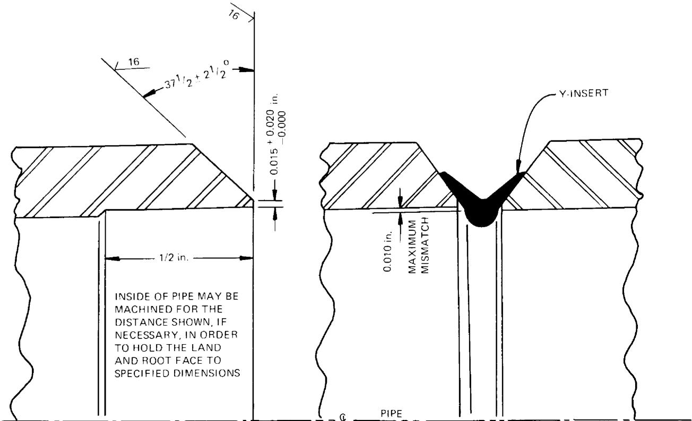  
Fig. B-1. Joint geometry for weld joints, weld preparation.

ORNL-DWG 72-12242

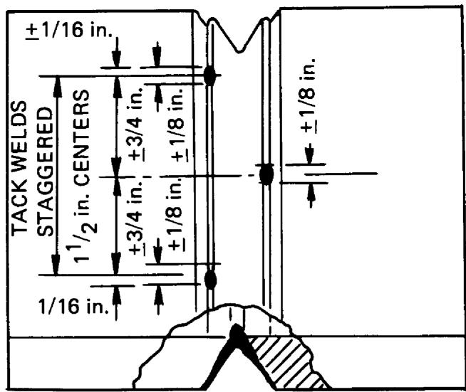  
TACK WELD INSERT DETAIL   
Fig. B-2. Tack-welding insert detail.

iv. Size - 0.045-in.-diam wire (on $1 \frac{1}{2}$ -lb spools).   
v. Form - continuous length wound on 4-in. spools.   
vi. Wire surface - smooth finish, free of slivers, scratches, depressions, scale, or any foreign matter that would affect weld quality.   
vii. Storage - in original sealed containers or subsequently wrapped in plastic and sealed.   
viii. Manufacturer - Airco Welding Products, heat No. W06753.

d. Shielding gas. Welding-grade argon at 20-cfh flow rate.

e. Backing gas. Welding-grade argon at 20-cfh flow rate during welding; prepurge prior to welding as described in paragraph 2(a)iii.   
f. Consumable inserts. Y-type consumable insert rings manufactured by WeldRing Company, Inc., of Bell Gardens, California, and conforming to ASME-AWS Specification SFA-5.9, Classification ER 308.   
g. Cleaning. The welding groove and adjacent area must be free of scale, rust, oil, grease, or any foreign material that would affect the quality of weld metal or the operation of the welding equipment. Before assembling the joint to be welded, the mating surfaces and adjacent areas must be wiped with clean, lint-free cloths saturated with an approved solvent, acetone.   
h. Weld groove type. Single Vee with 0.015- to 0.035-in. root face.

i. Joint geometry. Per attached Fig. B-1.   
j. Joint preparation. Machine and/or grind to dimensions and finishes shown in attached Fig. B-1.   
k. Weld joint setup.

i. Pipe mismatch - per Para. NB-4425, ASME Section III, except uniform mismatch limited to 0.010 in., as detailed in Fig. B-1.   
ii. Assembly and fixtures - the necessary clean fixtures must be provided to align and support joint during welding, along with the necessary purge seal fixtures to prevent contamination of the backing gas.   
iii. Tack welding - as shown in Fig. B-2, mating ends of the pipe are to be tack welded to each other, with an appropriately placed insert. Tack welding is to be done with a ______ torch coupled to a ______ power supply using the following conditions:

currentupsloptime,sec   
weld current, A   
arc voltage, V   
weld time,sec   
current downslope time, sec

The following steps should be followed in the tack-welding sequence:

1. clean pipe and ring with acetone and lint-free rags.   
2. manually align insert to proper position on one pipe section,   
3. mark overlap point on insert,   
4. cut off excess insert,   
5. tack insert together using above conditions,   
6. position insert between pipe sections,   
7. clamp or restrain pipe sections, causing insert to seat firmly against the pipe-wall bevel,   
8. tack at approximately $\frac{3}{4}$ -in. intervals, alternating sides of the insert to avoid breaking of tacks during root-pass welding.

iv. Welding positions - 5G for weld # (procedure verified for 2G position).

v. Method of restraint - not applicable if the test joint was tack welded prior to welding.

1. Welding process, current, and equipment

i. Process - gas tungsten-arc, argon shielded.   
ii. Process control - automatic.   
iii. Current -- direct current, electrode negative (straight polarity). Ground cable, No. 2 gage, connected from "Ground Terminal" on ______ power supply to work piece. Power supply also grounded to "building ground."   
iv. Current source power supply.   
v. Arc starter - high frequency.   
vi. Welding torch - with gas lens and gas cup size No.   
vii. Electrode $-3/32$ -in.-diam nominal $2\%$ thoriated tungsten, AWS classification EWTh-2, to AWS Specification A 5.12-69, "Specification for Tungsten-Arc Welding Electrodes."   
viii. Flowmeter - suitable for controlling the flow of argon within $\pm 1$ cfh, actual setting for pressure, 50 psig.   
ix. Gas lines - metal and plastic.

m. Preheat and interpass temperature

i. Preheat temperature 60 to $100^{\circ}\mathrm{F}$ ; none required for record weld.   
ii. Interpass temperature 60 to $250^{\circ}\mathrm{F}$ , as determined by Tempilstik measurement.

# 2. Welding

a. General considerations

i. Welding parameters - as shown in Table B-1.   
ii. Electrode geometry and setting - as shown in Table B-1.

iii. Welding technique The basic principle of gas tungsten-arc welding is to shield the weld puddle of molten metal and the surrounding area with argon or some similar type of gas while the temperature is high enough to cause oxidation by the atmosphere if not protected. Therefore, it is necessary to perform all welding in a quiet atmosphere where no air currents or drafts exist in the immediate vicinity of welding. It may, in other locations, be necessary to shield the area from drafts to assure a constant inert-gas atmosphere for the weld.

Before welding starts, a minimum of 3 in. of the internal surface of the joint on each side of the weld should be blanketed with argon. The back side of the joint should be purged with a minimum of $20\mathrm{cfh}$ of argon for at least $10\mathrm{min}$ prior to root-pass welding and for at least 5 min prior to the first two fill passes. The volume of gas for the blanket should be at least five times the volume of the area being blanketed. This area is to remain blanketed during welding, and until the temperature of the weld falls below $250^{\circ}\mathrm{F}$ .

b. Procedures - equipment setup - The required procedure must be determined by the conditions encountered in the piping system where welding is to be done.

c. Procedures - root pass welding

i. The following preparations should be completed:

(a) An insert tacked into the pipe joint as shown in Fig. B-2.   
(b) The joint set up per previously listed setup instructions.   
(c) The track and/or carriage set per previous instructions; cables and hoses connected, etc.

ii. Double check on the following:

(a) Ground cable connected to machine "ground" and to pipe.   
(b) Travel clearance available for carriage orbit. Sufficient clearance between supporting structures, flanges, bosses, etc., and welding head $360^{\circ}$ around the pipe.

iii. Turn on primary ac power. Turn on circuit breaker on programmer-controller control panel.

iv. Refer to Table B-1 and dial listed settings into the programmer.

v. Manually operate the following switches for final preoperational checks:

(a)AVC jog "up" and "down."   
(b) Wire feed, forward and retract.   
(c) Carriage, forward and reverse.

vi. SetAVChead,torchandelectrode.   
vii. Push "Sequence Start Button."   
viii. Once arc starts, introduce manual torch set adjustments, if necessary.   
ix. When the root pass is complete, overlap about $\frac{1}{4}$ to $\frac{1}{2}$ in., exercise proper operator judgment for proper tie-in; then operate "downslope" button to taper the weld and then terminate it to be followed by the preset postpurging.   
x. Refer to the inspection procedure and interpass temperature requirements before starting with fill passes.

d. Procedure followed (interpass operations)

i. Cleaning of weld beads - remove oxide particles and heavy film from weld bead and base metal in line of arc travel before depositing each subsequent weld bead. Use only clean wire brushes with stainless steel bristles and clean lint-free rags with approved solvent, acetone, or equal.   
ii. Examination for defects - visually examine each bead for cracks, holes, incomplete fusion, lack of penetration, overlap, undercut, underfill, and other defects. Each bead to have a smooth surface and contour and merge smoothly into previously deposited beads and/or base metal.   
iii. Repair of defects - remove weld defects by grinding, chipping, or filing before depositing the next bead.

# NOTE: PERFORM OTHER CODE REQUIRED INSPECTIONS, IF APPLICABLE.

e. Procedure for fill-pass welding:

i. Refer to Table B-1 and dial listed settings into the programmer.   
ii. Test check oscillation relative to amplitude setting and torch positioning within the weld groove.   
iii. Reposition the AVC head, torch, and electrode.   
iv. Position the wire feed as required.   
v. Operatethe“SequenceStartButton,"etc.   
vi. Cover passes - the weld operator shall exercise best judgment to determine how many fill passes will be required for completing a pipe weld. The cover passes, or cap passes, must blend with the pipe outside diameter to form a circular, or slightly convex, overall weld contour.

# C. REFERENCE GUIDE FOR NONDESTRUCTIVE AND DESTRUCTIVE EXAMINATION LISTINGS

1. Nondestructive Examination

a. Visual examination - Described in ORNL Standard Procedure, Section 9, of Inspection Engineering Quality Assurance Procedures.   
b. Radiographic examination - ORNL Standard Procedure Section 3, Appendix 2, of Inspection Engineering Quality Assurance Procedures.   
c. Liquid-penetrant examination - ORNL PE-NDT-1 (which conforms with ASME Code Section III ASME E165 and RDT F3-6T).

2. Destructive Examination

a. Metallographic examination (not required by ASME Code or RDT standards; however procedures have been developed by ORNL for quality assurance and are available, if needed.   
b. Root and face bend tests - ASME Code Section IX.   
c. Tensile tests - ASME Code Section IX and ASTM E8-65T.   
d. Dimensional examination - ASME Code Section III, ASME Code Case 1331-7, and RDT E 15-2T.

# INTERNAL DISTRIBUTION

1. G.M. Adamson

2. S. R. Ashton

3. S. E. Beall

4. M. Bender

5. W. A. Bird

6. R. Blumberg

7. J. O. Brown

8. R. H. Bryan

9. J. R. Buchanan

10. W. B. Cottrell

11. C. C. Courtney

12. F. L. Culler

13. M. H. Fontana

14. A. P. Fraas

17. D. R. Frizzell

18. R. M. Fuller

19. W. R. Gall

20-29. G.M.Goodwin

30. D. L. Gray

31. W. L. Greenstreet

32. A. L. Grindell

33. W. O. Harms

34. R. F. Hibbs (Y-12)

35. E. C. Hise

36. H.W. Hoffman

37-61. P.P.Holz

62. V. T. Houchin

63. T. R. Housley

64. M. I. Lundin

65. R.N. Lyon

66-67. R. M. McClung

68. H. E. McCoy

69. H. C. McCurdy

70-74. J. R. McGuffey

75. R. E. MacPherson

76-80.C.L.Matthews

81. W. R. Miller

82. R. L. Moore

83. H. A. Nelms

84. G. C. Nelson

85-94. P. Patriarca

95. J. N. Robinson

96. M.W. Rosenthal

97. M. R. Sheldon

98. R.G.Shooster

99. J. R. Shugart

100. M. J. Skinner

101-110. G.M.Slaughter

111. C. M. Smith, Jr.

112. I. Spiewak

113. D. A. Sundberg

114. W. E. Thompson

115. D. B. Trauger

116. R.W. Tucker

117. T. K. Walters

118. A. M. Weinberg

119. J. R. Weir

120. G. D. Whitman

121. F.J.Witt

122. G. T. Yahr

123-125. Central Research Library

126. Document Reference Section

127-148. Laboratory Records Department

149. Laboratory Records ORNL RC

# EXTERNAL DISTRIBUTION

150. L. Birch

Tennessee Valley Authority

Browns Ferry Nuclear Plant

P.O.Box 2000

Decatur, Ala. 35601

151. T. R. Brown

Tennessee Valley Authority

Browns Ferry Nuclear Plant

P.O.Box 2000

Decatur, Ala. 35601

152-155. R. L. Carter, Bechtel Corporation 50 Beale St. San Francisco, Calif. 94119   
156-158. D.C.King Westinghouse Hanford Co. Hanford Engineering Lab. P.O.Box 1970 Richland, Wash.99352   
159. P. R. Kirk  
Tennessee Valley Authority  
Browns Ferry Nuclear Plant  
P.O. Box 2000  
Decatur, Ala. 35601   
160-161. W.J.Martin Bechtel Corporation Hanford Engineering Lab. P.O.Box 9 Richland, Wash. 99352   
162. J. Morgan  
Tennessee Valley Authority  
Browns Ferry Nuclear Plant  
P.O. Box 2000  
Decatur, Ala. 35601   
163-164. A.C.Rediske Bechtel Corporation Hanford Engineering Lab. P.O.Box 9 Richland, Wash.99352

165. L. Rousseau  
Welding Engineer  
Westinghouse Hanford  
1212 Building, 300 Area  
P.O. Box 1970  
Richland, Wash. 99352   
166-167. E. Thompson  
Liquid Metals Engineering Center  
P.O. Box 1449  
Canoga, Calif. 91304   
168. J. E. Wilkins  
Tennessee Valley Authority  
Browns Ferry Nuclear Plant  
P.O. Box 2000  
Decatur, Ala. 35601   
169-171. Directorate of Licensing, USAEC Washington, D.C.   
172-173. Directorate Regulatory Standards, USAEC, Washington, D.C.   
174-190. Manager, Technical Information Center AEC, ORO  
191. Patent Office, AEC, ORO  
192. Research and Technical Support Division AEC, ORO   
193-407. Given Distribution as shown in TID-4500 under Reactor Technology category (including 25 copies - NTIS)