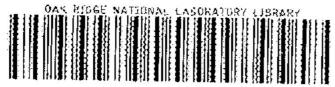

3445600215620

# DEVELOPMENT OF THE

# VARIABLE-GAP TECHNIQUE FOR

# MEASURING THE THERMAL CONDUCTIVITY

# OF FLUORIDE SALT MIXTURES

J.W.Cooke

OAK RIGOR INFORMATION

GENRALINE

D. (1)(2)(3)

# 4

DO NOT TRANSLFER TO ANOTHER PERSON

If you wish to complete the book please

Doom 2018

till it is easy will come to be

# OAK RIDGE NATIONAL LABORATORY

# OPERATED BY UNION CARGOLE CORPORATION • FOR THE U.S. ATOMIC ENERGY COMMISSION

Printed in the United States of America. Available from

National Technical Information Service

U.S. Department of Commerce

5285 Port Royal Road, Springfield, Virginia 22151

Price: Printed Copy $3.00; Microfiche $0.95

This report was prepared as an account of work sponsored by the United States Government. Neither the United States nor the United States Atomic Energy Commission, nor any of their employees, nor any of their contractors, subcontractors, or their employees, makes any warranty, express or implied, or assumes any legal liability or responsibility for the accuracy, completeness or usefulness of any information, apparatus, product or process disclosed, or represents that its use would not infringe privately owned rights.

ORNL-4831

UC-80 - Reactor Technology

Contract No. W-7405-eng 26

Reactor Division

DEVELOPMENT OF THE VARIABLE-GAP TECHNIQUE FOR MEASURING THE THERMAL CONDUCTIVITY OF FLUORIDE SALT MIXTURES

J.W.Cooke

FEBRUARY 1973

OAK RIDGE NATIONAL LABORATORY

Oak Ridge, Tennessee 37830

operated by

UNION CARBIDE CORPORATION

for the

U.S. ATOMIC ENERGY COMMISSION

# CONTENTS

NOMENCLATURE V

ABSTRACT 1

1. INTRODUCTION 1   
2. METHODS FOR MEASURING MOLTEN-SALT THERMAL CONDUCTIVITIES 2

Selected Techniques for Fluids 3

Transient hot wire 3   
Transient hot foil 4   
Necked-down sample technique 4   
Laminar heat flow 5   
Parallel wall 5   
The Variable-Gap Technique 6   
General description 6   
Idealized model 7   
Effect of radiation 9   
Effect of natural convection 12   
Effect of heat shunting 16   
Method of calculation 19

3. EXPERIMENTAL APPARATUS 22

Thermal Conductivity Cell 22   
Furnace 30   
Electrical System 30   
Instrumentation 32

4. EXPERIMENTAL PROCEDURES 33

Preliminary Procedures 33   
Operating Procedure - Fluid Specimen 34   
Operating Procedure - Solid Specimen 34

5. EXPERIMENTAL RESULTS 34

Thermal Resistance Curves 35   
Thermal Conductivity 40

6.DISCUSSION OF THE RESULTS 140

Comparison with Published Values 40

Comparison with Theory 42

Uncertainties in the Results 43

Adequacy of the Experimental Apparatus 44

7. CONCLUSIONS 45

ACKNOWLEDGMENTS 45

REFERENCES 46

APPENDIX A. ADDITIONAL DETAILS OF THE DESIGN OF THE APPARATUS 51

APPENDIX B. EXPERIMENTAL DATA 55

APPENDIX C. PRECISION AND ERROR ANALYSIS 99

# NOMENCLATURE

C p Specific heat, constant pressure, cal g $^{-1}$ (°C) $^{-1}$ D diameter of main heater assembly, cm  
E ratio of effective to total heater wire length  
F heat shunting factor  
G Guard heater factor  
g Acceleration due to gravity, cm sec $^{-2}$ h_r Radiant heat-transfer coefficient, W cm $^{-2}$ (°C) $^{-1}$ I Current, amps  
k Thermal conductivity of specimen, k is that of the metal cylindrical solid, W cm $^{-1}$ (°C) $^{-1}$ m  
n Mean index of refraction  
Q/A Heat flux, W cm $^{-2}$ Q'/A Measured heat flux uncorrected for heat shunting, W cm $^{-2}$ R Radius of cylindrical solid, cm  
T Temperature, °C; T_K = °K  
ΔT Temperature difference between upper and lower plates of the conductivity cell, °C $\frac{\Delta T}{(Q/A)}_0$ Thermal resistance at zero specimen thickness, °C W $^{-1}$ cm $^{2}$ U Heat-transfer coefficient, W cm $^{-2}$ (°C) $^{-1}$ V voltage, volts  
v Integration variable  
x, Δx Specimen or gap thickness, cm  
Y Radiative function defined in Eq. (8)  
α Coefficient of linear expansion, (°C) $^{-1}$ β Coefficient of bulk expansion, (°C) $^{-1}$ ε Emissivity of cylinder surface  
κ mean absorption coefficient for radiant heat, cm $^{-1}$ μ Viscosity, cP  
ρ Density, g cm $^{-3}$ σ Stefan-Boltzmann constant, W cm $^{-2}$ (°K) $^{-4}$ τ Optical thickness  
Ω Electrical resistance, ohms

# Dimensionless Moduli

$\mathrm{N}_{\mathrm{Gr}}$ Grashof number, $\mathrm{g}\rho^{2}\beta \Delta \Gamma \mathrm{x}^{3} / \mathrm{g}_{c}\mu^{2}$

NPr Prandtl number, Cp/ku

$\mathrm{N}_{\mathrm{Ra}}$ Rayleigh number, $\mathrm{N}_{\mathrm{Gr}} \cdot \mathrm{N}_{\mathrm{Pr}}$

Reynolds number, $\rho V D / \mu$

# Subscripts

f film

c critical

m metal]

at specimen thickness $= 0$

specimen

at specimen thickness $\equiv$ x

# DEVELOPMENT OF THE VARIABLE-GAP TECHNIQUE FOR MEASURING THE THERMAL CONDUCTIVITY OF FLUORIDE SALT MIXTURES

J.W.Cooke

# ABSTRACT

The development and evaluation of the variable-gap technique for measuring the thermal conductivity of molten fluoride salts is described. A series of measurements were made of the conductivities of several substances (Ar, He, $\mathrm{H}_2\mathrm{O}$ , Hg, and liquid and solid heat-transfer salt) over a wide range of conductivities $[0.4 \times 10^{-3}$ to $100 \times 10^{-3}$ W cm $^{-1}$ (°C) $^{-1}$ ] and temperatures (40 to $950^{\circ}\mathrm{C}$ ). The deviations of the results from published values averaged ±5%. The study demonstrates the accuracy and outstanding versatility of the variable-gap technique.

Key words: thermal conductivity, development, design, measurement, fused salts, high temperature, MSBR.

# 1. INTRODUCTION

High-temperature operations in the chemical processing and nuclear industries have created a need for economical, efficient heat-transfer media whose thermal properties are superior to those of organic and gaseous coolants. Molten-salt mixtures have good heat-transfer properties compared with organic liquids, and their relative inertness and low vapor pressure give them distinct advantages over liquid metals. They are applied in high-temperature fluxes, heat-treatment baths, and electrolytic fuel cells, and as the fuel carrier and coolant for nuclear reactors, such as the Molten-Salt Breeder Reactor (MSBR) experiments. This report describes an experimental technique for determining a key thermal property of molten salts - thermal conductivity. The study evaluates the method over a broad temperature range using a variety of materials representing a wide range of conductivities.

Very few data on the thermal conductivities of molten salts, in particular, fluoride salts, have been published. Most of the existing measurements for molten fluoride salt mixtures were made by members of the MSBR group at Oak Ridge National Laboratory (ORNL) over 15 years

ago.2 To extend the scope of the previous measurements, we have developed an absolute, variable-gap technique to determine the thermal conductivity of fluoride salt mixtures in liquid and solid states at temperatures to $1000^{\circ}\mathrm{C}$ . This technique is particularly well suited to the measurement of the conductivity of low-conducting, semitransparent fluids that must be contained in inert surroundings at elevated temperatures. Most other applicable methods suffer from one or more deficiencies if used under these conditions.

The variable-gap technique is examined in detail and other techniques are discussed briefly. The development of an experimental apparatus is described, and experimental results are presented for the conductivities of several calibrating fluids: Ar, He, heat-transfer salt* (HTS), $\mathrm{H}_{2}\mathrm{O}$ , and Hg. These fluids represent a very wide range of conductivities $[0.4 \times 10^{-3}$ to $100 \times 10^{-3} \mathrm{Wcm}^{-1}(\mathrm{C})^{-1}]$ which were measured over a large temperature range (40 to $950^{\circ}\mathrm{C}$ ). The thermal conductivities of molten fluoride salts will be presented in a separate report to be published.

# 2. METHODS FOR MEASURING MOLTEN-SALT THERMAL CONDUCTIVITIES

Thermal conductivity is one of the most difficult of all thermophysical properties to determine experimentally. The difficulties primarily are due to the unreliability of temperature measurements, the inadequacy of thermal insulation, and the simultaneous transfer of heat by mechanisms other than conduction. Conductivity can be measured by either steady-state, quasi-steady-state, or transient-state heat flow systems. Experimental determinations using the steady-state methods depend upon the attainment of suitable boundary conditions that will allow the Laplace equation to be solved for the temperature distribution. The conductivity is then calculated from the Fourier heat-transfer equation. The transient method requires the solution of the diffusion equation with suitable initial and boundary conditions for the thermal diffusivity coefficient; the density and heat capacity must be known to calculate the conductivity. The quasi-steady-state methods are based on a solution of

the diffusion equation for unique initial and boundary conditions such that the thermal conductivity can be directly determined.

In addition to conduction, radiation also may be present with transparent substances, and the experimental technique must be capable of identifying and separating these two mechanisms. In the case of fluids, convection may also be present. Thus, only a limited number of experimental techniques are available for the determination of the conductivity of fluids. Several techniques found in published investigations are described briefly in the following section, and the technique used in the present studies is described in a later section.

# Selected Techniques for Fluids

We will describe briefly each technique and discuss its advantages and disadvantages for the measurement of conductivity of molten salts.

# Transient hot wire

In this technique, the rate of change of temperature of a line heat source situated in an infinite medium is used to determine the conductivity of the medium. The line heat source consists of a wire (1 to 5 mils diam) placed axially in a cylinder (2 to 4 cm diam) filled with the specimen. The wire is heated by a steady current, and its temperature is determined by the change in its electrical resistivity. After an initial transient heating period, the log temperature becomes a linear function of time until natural convection begins to occur. The slope of this linear function of temperature with time can be related directly to the conductivity of the specimen. Thus, this technique is a quasi-steady-state technique rather than a transient technique. It is a common technique for determining conductivity of liquids and has been described in many publications.[3-5]

Its simplicity, quickness, precision, and accuracy make this technique useful for most liquids. With molten salts, however, a significant amount of current can be shunted through the salt itself due to the relatively high electrical conductivity of the molten salts at elevated temperatures. Since the degree of current shunting is very difficult to

predict, molten salt conductivity results obtained by this technique are subject to questions which have not been sufficiently resolved to make it suitable for this application. $^6$

# Transient hot foil

This technique7,8 is similar to the transient hot-wire technique except in two respects: (1) a thin foil is substituted for the fine wire to provide a plane heat source instead of a line source, and (2) the temperature is measured with a front-wave-shearing laser interferometer. Because this temperature measuring technique is extremely sensitive, the heat flux from the foil can be greatly reduced. However, the fluid specimen must be transparent as well as compatible with the material used in the cell window.

The transient hot-foil method is more difficult to apply than the transient hot-wire technique. Its primary advantage is in the reduction in the molten-salt ionization that results from a lower voltage along the heat source. Consequently, the interface between the heated foil and the molten salt remains polarized and the flow of current into the salt is minimized. In practice, however, other voltage potentials may exist within the cell, and some current will flow into the salt even though the surfaces are polarized. Moreover, operation at elevated temperatures presents formidable problems in the design and choice of materials for the cell windows. Diamond is the only transparent material suitable for use with molten fluoride salts at high temperatures, but its high cost and fabrication difficulties would restrict its use to very small apertures.

# Necked-down sample technique

This method9 is based on the measurement of the steady-state change in resistance caused by electrical heating of a narrow bridge of the sample material which joins two larger bodies of the same material. The theory describing this phenomenon shows that the change in resistance expressed by the voltage drop caused by the heating current does not depend on the detailed shape of the narrow region. A necessary condition, if this is to be true, is that no significant flow of heat occur outside of the boundaries of the sample. For liquids, the narrow bridge is

maintained by containing the liquid in a vessel separated into two parts by a thin wall with a small aperture. The material of the wall must have both a high thermal and a high electrical resistance. The technique is classified as a quasi-steady-state method.

Several uncertainties are associated with the method, the first of which is the loss of heat by conduction along the thin separating wall. A second major problem arises from the possibility of convection. Moreover, with molten salts the possibility of polarization effects also would need to be considered. The important advantages of the technique are the simplicity of the apparatus, the rapidity with which the measurements can be made, and the reduction in the uncertainties in radiation by the small size of the heated region.

# Laminar heat flow

The laminar flow method determines the conductivity of a fluid flowing in a circular tube under carefully defined conditions. The wall temperature of the tube is maintained uniform while the inlet and outlet temperatures of the fluid are measured. In this method, radiation losses can be neglected and the troublesome measurement of heat flux eliminated. The main problems concern the prediction of velocity and temperature profiles of the fluid at the entrance section of the tube and maintaining a uniform wall temperature. Furthermore, the assumption of constant physical properties of the fluid over the temperature range can introduce significant error. Most of the published results of this technique differ from the accepted values for thermal conductivity because the hydrodynamic and thermal entry lengths were not properly assessed.[10]

# Parallel wall

With this method, the steady heat flow through the specimen and the temperature drop across it are measured. The specimen is contained between two parallel walls of plane, cylindrical, or spherical geometry. This method is the most commonly used technique for measuring thermal conductivity. Its simplicity with regard to the analytic model and experimental setup make it most attractive; however, the uncertainties caused by convection, radiation, and stray heat flow at high temperatures

can be considerable. Reducing the heat flow uncertainties by decreasing the specimen thickness and temperature drop can lead to large errors in these two measurements as well as in the heat flow. Thus, although the method is simple, it requires care in application and may be unsuitable for low-thermal conductivity fluids at high temperatures.[12]

# The Variable-Gap Technique

The variable-gap technique for measuring conductivity is a significant improvement over the parallel wall method in that it takes advantage of the fluidity of the specimen. By use of this technique the specimen thickness can be varied continuously during the operation with a minimum disturbance to the specimen composition or to the system temperature distribution. Also by varying the specimen thickness, the undesirable effects of several factors, including the errors caused by specimen voids or inhomogeneities, natural convection, radiative heat transfer, corrosion, deposit formation, radial heat flow, thermocouple location, and thermocouple drift, can be greatly reduced. Since only the change in the specimen thickness and the change in the temperature across the specimen is measured, the potential errors of these measurements are smaller and the influence of convection, radiation, and heat losses can be detected and minimized. In addition, the apparatus can be used with little or no modification to measure the conductivities of solids and gases as well as liquids. Considering the advantages of the method, it is surprising that only limited use has been made of the variable-gap technique.[12,14,15]

# General description

The experimental apparatus is shown schematically in Fig. 1. Heat from the main heater travels downward through the liquid sample region (labeled "variable gap" in the figure) to a heat sink. Heat flow in the upward and radial directions is minimized by appropriately located guard heaters, and the heat flux into the sample is measured by the voltage and current of the dc power to the main heater. The temperature drop across the gap is determined by thermocouples located on the axial center line in the metal surfaces defining the sample region. The sample thickness is varied by moving the assembly containing the main heater and is measured

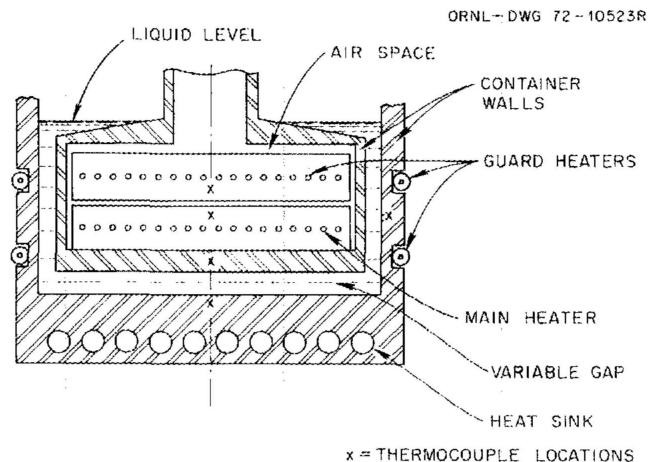  
Fig. 1. Schematic drawing of a variable-gap thermal conductivity cell.

by a precision dial indicator. The system temperature level is maintained by a surrounding zone-controlled furnace.

# Idealized model

The measured temperature difference can be resolved into the temperature drop across the sample gap; the temperature drops in the metal walls defining the test region; the temperature drops in any solid or gaseous films adhering to the metal surfaces; and errors associated with thermocouple calibration, lead-wire inhomogeneities in thermal gradient regions, and instrument malfunctions. Neglecting the error term, we can write

$$
\Delta \mathrm {T} = \Delta \mathrm {T} _ {\mathrm {S}} + \Delta \mathrm {T} _ {\mathrm {m}} + \Delta \mathrm {T} _ {\mathrm {f}}, \tag {1}
$$

where subscripts are sample, metal, and surface film, respectively.

For the sample region, the temperature difference is

$$
\Delta \mathrm {T} _ {\mathrm {S}} = (\mathrm {Q} / \mathrm {A}) \Delta \mathrm {x} _ {\mathrm {s}} / \mathrm {k} _ {\mathrm {s}}, \tag {2}
$$

where $Q / A$ is the heat flux, $\Delta x_{s}$ is the gap width, and $k_{s}$ is the thermal conductivity of the liquid sample. It is assumed that no natural convection exists in the sample region.

Similarly, the temperature drop in the confining horizontal metal walls can be written

$$
\Delta \mathrm {T} _ {\mathrm {m}} = (\mathrm {Q} / \mathrm {A}) \Delta \mathrm {x} _ {\mathrm {m}} / \mathrm {k} _ {\mathrm {m}}, \tag {3}
$$

where $\Delta x_{m}$ is the heat-flow path length in the metal walls, and $k_{m}$ is the wall conductivity. The heat flux $Q / A$ is the same as in Eq. (2), assuming that no radial heat flow and no bypass heat flow through the side (vertical) walls of the sample cup. Since $k_{m}$ is a function of temperature, Eq. (3) can be written separately for the upper and lower metal walls; however, for the purposes of this analysis, the two regions are combined.

The film temperature difference is of the same form as the $\Delta T$ s given in Eqs. (2) and (3). If surface films are present but of constant and known thickness, $\Delta x_{\mathrm{f}}$ , during the experiment, there is no effect on the derived sample conductivity or on the associated error. However, a film that grows or decays in an unknown way during the course of the measurement introduces an error in $\Delta x_{\mathrm{s}}$ .

Combining the above expressions, we obtain:

$$
\Delta T = \frac {Q}{A} \left(\frac {\Delta x _ {s}}{k _ {s}} + \frac {\Delta x _ {m}}{k _ {m}} + \frac {\Delta x _ {f}}{k _ {f}}\right),
$$

or

$$
\frac {\Delta \mathrm {f}}{\mathrm {Q} / \mathrm {A}} = \left(\frac {1}{k _ {\mathrm {s}}}\right) \Delta x _ {\mathrm {s}} + \left(\frac {\Delta x _ {\mathrm {m}}}{k _ {\mathrm {m}}} + \frac {\Delta x _ {\mathrm {f}}}{k _ {\mathrm {f}}}\right), \tag {4}
$$

or, simplifying the notation,

$$
\frac {\Delta \mathrm {T}}{\mathrm {Q} / \mathrm {A}} = \left(\frac {1}{\mathrm {k}}\right) \Delta \mathrm {x} + \left(\frac {\Delta \mathrm {T}}{\mathrm {Q} / \mathrm {A}}\right) _ {\mathrm {O}}, \tag {5}
$$

where $[\Delta T / (Q / A)_0]$ combines all the fixed resistances. This is of the form,

$$
y = a x + b, \tag {6}
$$

where $a$ is the slope of this linear expression and is the reciprocal of the sample conductivity. The intercept $b$ combines all other resistances. In operating the apparatus, $Q/A$ is kept constant and $\Delta T$ is recorded as $\Delta x$ is varied. If other modes and paths of heat transfer exist within the specimen, the thermal resistance will not be a linear function of the

specimen thickness. However, the effect of these other forms of heat transfer will be reduced as the specimen thickness is decreased. Thus, the conductivity can be determined from the reciprocal slope evaluated at zero specimen thickness.

Another approach to the determination of the sample conductivity can be obtained by rearranging Eq. (6) as:

$$
k = \frac {1}{a} = \frac {x}{y - b}. \tag {7}
$$

Again, if other modes and paths of heat transfer exist within the specimen, the value of conductivity obtained from Eq. (7) will be the effective value which will approach the true value only as the specimen thickness approaches zero.

# Effect of radiation

Many investigators consider only the radiation emitted by the wall surfaces when evaluating the heat transfer through a medium separating the walls. This assumption may be correct when the medium is a gas whose mean absorption coefficient $\overline{\kappa}$ is small and whose mean refraction index $\overline{n}$ is near unity. Many media, however, absorb and emit significant amounts of radiation. This internal radiation can contribute more to the heat transfer from wall to wall than the radiation emitted by the wall surfaces. Indeed, even at room temperature, the heat transferred by radiation can approach $5\%$ of that transferred by conduction in some organic fluids whose specimen thickness is as small as 0.1 cm.

If some simplifying assumptions are made, an expression for the radiant heat transfer can be derived. These assumptions are the existence of a constant temperature gradient within the medium and the use of mean values $\overline{n}$ and $\kappa$ independent of wavelength. The following equation was derived by Poltz16,17 for the radiant heat flux:

$$
\frac {Q _ {Y}}{A} = \frac {1 6}{3} \frac {\overline {{n ^ {2}}}}{\kappa} \sigma T ^ {3} \left(\frac {\Delta T}{\Delta x}\right) Y, \tag {8}
$$

where

$$
Y = 1 - \frac {3}{\tau} (2 - \varepsilon) \int_ {0} ^ {1} \frac {1 - \exp [ - (\tau / v) ]}{1 + (1 - \varepsilon) \exp [ - (\tau / v) ]} v ^ {3} d v,
$$

and

$\tau =$ optical thickness of the medium $= \overline{\kappa}\Delta x,$

T = average medium temperature, °K,

$\pmb{\epsilon}$ = emissivity of the wall surface,

$\sigma =$ Stefan-Boltzmann constant, 5.71 $\times 10^{-12}$ W cm $^{-2}$ (°K) $^{-4}$ ,

v = dummy integration variable.

In Fig. 2, where Y is plotted as a function of $\tau$ for various values of $\varepsilon$ , the curve for $\varepsilon = 0$ represents the hypothetical case in which the radiation heat transfer between the walls is accomplished solely by the inner radiation within the medium. The distance between the curve for $\varepsilon = 0$ and one of the upper curves (the appropriate plate emissivity

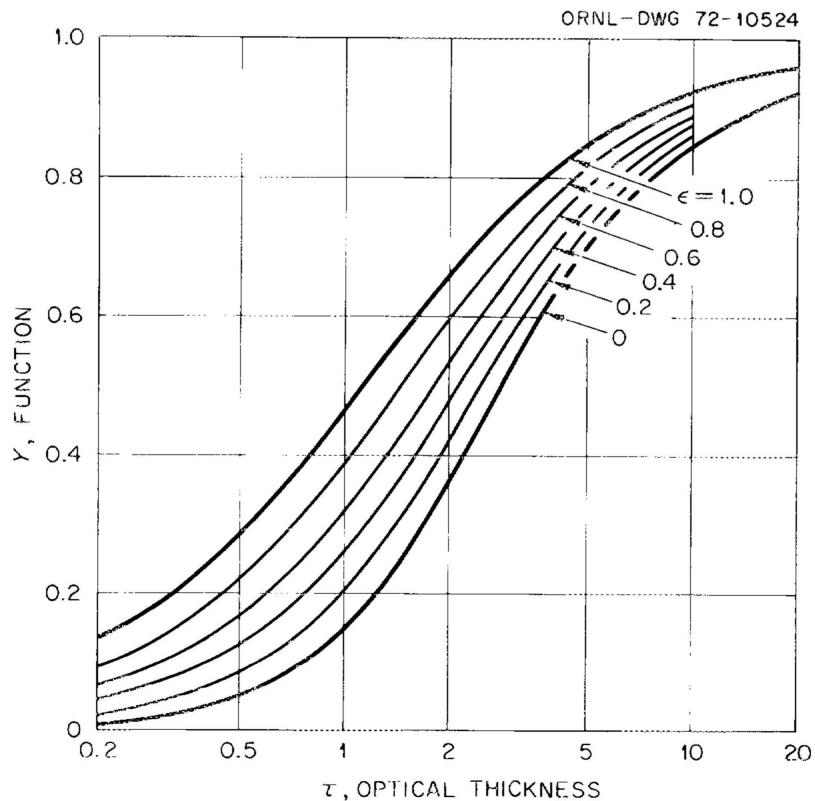  
Fig. 2. Radiative function (Y) vs plate emittance and optical thickness of the specimen.

curve) represents the contribution of the radiation emitted by the wall surfaces to the total radiated heat flow from wall to wall.

Equation (8) can be combined with the previously derived Eq. (5) to obtain an expression for the total thermal resistance across a medium separated by two parallel walls when the heat is being transferred simultaneously by conduction and radiation. That is,

$$
\frac {\Delta \mathrm {T}}{\mathrm {Q} / \mathrm {A}} = \left(\frac {1}{\mathrm {k} + \frac {1 6}{3} \overline {{\mathrm {m}}} ^ {2}} \sigma \mathrm {T} ^ {3} \mathrm {Y}\right) \Delta \mathrm {x} + \left(\frac {\Delta \mathrm {T}}{\mathrm {Q} / \mathrm {A}}\right) _ {\mathrm {O}}. \tag {9}
$$

In the limiting case where the optical thickness $\tau$ approaches zero (i.e., very small infrared-absorbing medium),

$$
Y _ {T \rightarrow 0} = \frac {3}{4} \varepsilon_ {r} \tau \quad (R e f. 1 6)
$$

where

$$
\epsilon_ {r} \equiv \left( \begin{array}{c c c} 1 & 1 \\ \hline \epsilon_ {1} & + \frac {1}{\epsilon_ {2}} - 1 \end{array} \right) ^ {- 1} = \frac {\epsilon}{2 - \epsilon}
$$

for

$$
\epsilon = \epsilon_ {1} = \epsilon_ {2}.
$$

Thus, Eq. (9) simplifies to

$$
\frac {\Delta \mathrm {T}}{\mathrm {Q} / \mathrm {A}} = (\mathrm {k} + 4 \mathrm {n} ^ {2} \varepsilon_ {\mathrm {r}} \sigma \mathrm {T} ^ {3} \Delta \mathrm {x}) ^ {- 1} \Delta \mathrm {x} + \left(\frac {\Delta \mathrm {T}}{\mathrm {Q} / \mathrm {A}}\right) _ {\mathrm {O}}. \tag {10}
$$

Figure 3 is a plot of the thermal resistance as a function of specimen thickness for various values of the absorptivity coefficient for a specimen assumed to have a $k = 0.0034 \, \text{W cm}^{-1} \, (^{\circ}\text{C})^{-1}$ , $\overline{n} = 1.5$ , $\epsilon_{\text{wall}} = 0.5$ , and $T = 1000^{\circ}\text{C}$ . For these values of conductivity and temperature, the percentage of heat transferred by radiation is quite large. As the absorption coefficient $\kappa$ decreases from $\kappa = \infty$ (pure conduction) to $\kappa = 0$ , the percentage of radiated heat increases to a maximum at about $\kappa = 2$ and decreases until $\kappa = 0$ . Within the interval $\infty > \kappa > 0$ these curves have

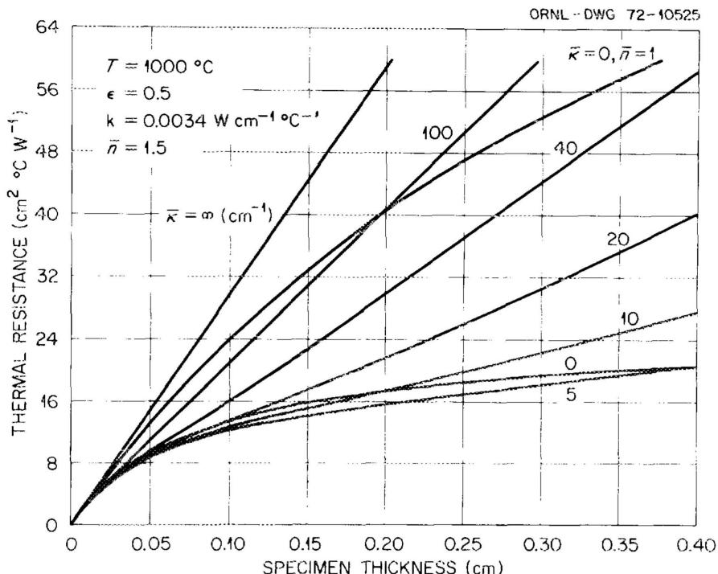  
Fig. 3. Thermal resistance of an infrared absorbing fluid having assumed properties at various values of absorptivity, $\kappa (\mathrm{cm}^{-1})$ vs specimen thickness.

an inflection point producing what could be described as "lazy S" curves. Also shown in Fig. 3 is the resistance curve for a gas whose absorptivity is near zero and whose index of refraction is near one. If the optical properties of a specimen are known, Eq. (9) can be fitted to the experimental data to obtain the slope (and thus the conductivity) at a specimen thickness approaching zero; however, the mean optical properties must be used and the temperature gradient within the specimen must be nearly linear.

# Effect of natural convection

Under ideal conditions, no natural convection would be expected in a fluid enclosed between two horizontal, parallel plates with one-dimensional downward heat flow. In the real situation, however, small departures from the ideal conditions can initiate and sustain convection currents within the fluid. If the plates are not horizontal or parallel or if a temperature gradient exists in the horizontal direction, convection cells can

occur. If, in addition, the vertical temperature distribution within the specimen is not linear, but distorted by interfluid infrared absorption, the natural convection can be enhanced. Finally, vibrations, especially those in resonance with the natural frequency of the enclosed fluid, can induce and enhance natural convection.

In order to initiate and sustain buoyancy convection cells within enclosed spaces, certain instability criteria must be satisfied. Rayleigh was one of the first investigators to recognize that the instability criterion could be related to certain limiting values of the dimensionless moduli $\mathbf{N}_{\mathrm{Ra}}$ known as the Rayleigh number, which is

$$
\mathrm {N} _ {\mathrm {R a}} = \mathrm {N} _ {\mathrm {G r}} \quad \mathrm {N} _ {\mathrm {P r}} = \left(\frac {g \rho^ {2} \theta \Delta T \Delta x ^ {3}}{g _ {c} \mu^ {2}}\right) \left(\frac {C _ {p} \mu}{k}\right), \tag {11}
$$

where

g = local acceleration due to gravity, cm/sec²

$\mathbf{g}_{\mathrm{c}} =$ dimensional constant $= 1.0\mathrm{~g~cm~dyne}^{-1}\cdot \mathrm{sec}^{-2},$

$\rho$ = density of fluid, $\mathrm{g/cm^3}$ ,

$\mu =$ viscosity, cP,

$\mathbf{x} =$ gap distance, cm,

$k =$ thermal conductivity, W cm $^{-1}$ (°C) $^{-1}$ ,

$C_p =$ (specific) heat at constant pressure, cal $\mathrm{g}^{-1}(\mathrm{^o C})^{-1}$

$\beta =$ coefficient of bulk expansion, $(^{\circ}\mathrm{C})^{-1}$

The Rayleigh number, in essence, is the ratio of the product of the buoyancy and inertial forces to the viscous forces. The limiting value of the Rayleigh number to initiate and sustain convection cells has been calculated to be 1700 when the fluid layer is bound on both sides by solid parallel and horizontal walls and is heated from below. $^{18}$ Recent experimental studies by Norden and Usmanov $^{19}$ using an interferometer technique show, however, that the departure from conductive to convective mode of heat transfer can occur at $N_{Ra} < 1700$ for small specimen thicknesses.

Figure 4 shows a portion of the data taken from the above experimental studies in which the critical temperature difference, $\Delta T_{c}$ (the temperature difference above which convection occurs), is plotted as a

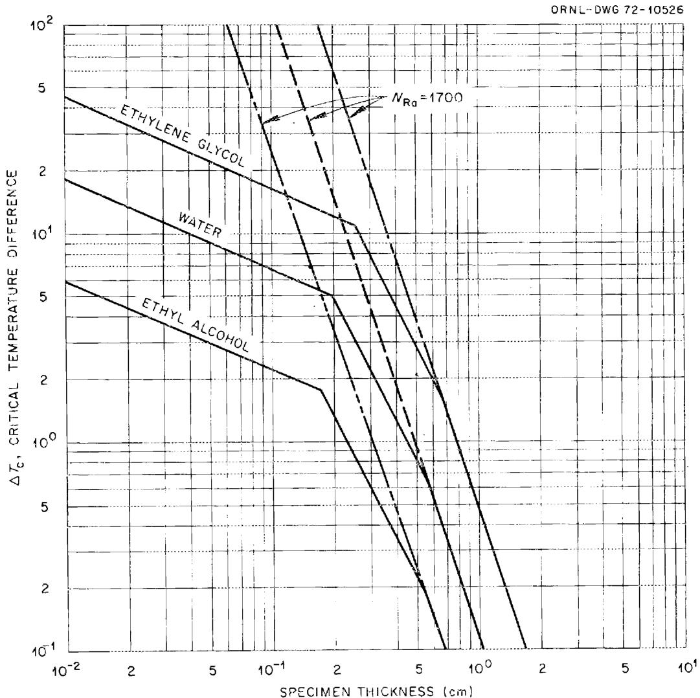  
Fig. 4. Critical temperature above which convection occurs as a function of specimen thickness for three liquids showing the departure from theoretical criteria, $N_{\mathrm{Ra}} = 1700$ .

function of the specimen thickness for three liquids: ethylene glycol, water, and ethyl alcohol. Also shown plotted are the curves for the theoretical values of $N_{\mathrm{Ra}} = 1700$ . The area below each of the curves plotted in Fig. 4 is stable (i.e., conduction only) and above the curves is unstable (i.e., convection occurs). The experimental data can be seen to have two linear slopes ( $n = 0.45$ and 2.0) which merge with the theoretical curve ( $n = 3$ ) where

$$
\Delta \mathrm {T} _ {\mathrm {c}} \Delta x ^ {\mathrm {n}} = \text {c o n s t a n t}.
$$

The $\mathbb{N}_{\mathrm{Ra}} = 1700$ criteria could lead to a gross overestimate of $\Delta \Gamma_{\mathrm{c}}$ for small specimen thicknesses.

Heat-transfer measurements made during Norden and Usmanov's studies showed the ratio of the effective conductivity to the true conductivity for water to be 1.10 at a specimen thickness of 0.15 cm and an $N_{\mathrm{Ra}}$ of only 260. Thus, considerable care must be exercised to prevent natural convection in fluids contained between parallel plates heated from below as well as inclined, cylindrical, and spherical annuli heated from either side.

A similar experimental study by Berkovsky and Fertman²⁰ was made recently in which the specimen was heated from above and had a nonuniform upper plate temperature distribution. This study showed that when the nonuniformity of the temperature $(T_{\max} - T_{\min})$ exceeded a certain value with respect to the lower plate temperature $T_0$ , no convection occurred. It was found that if

$$
\frac {\mathrm {T} _ {\max } - \mathrm {T} _ {\min }}{\mathrm {T} _ {\max } - \mathrm {T} _ {0}} \simeq 1,
$$

no significant convection occurs at a Rayleigh number of less than $10^4$ .

No experimental results are reported for the amount of convection taking place when the specimen is heated from above and the plates are not exactly parallel or are slightly tilted. If we consider this case analogous to the Berkovsky and Fertman study, convection would be avoided at an $N_{\mathrm{Ra}}$ of less than $10^4$ if the $\Delta T$ of the tilted layer above that of the horizontal layer did not exceed that of the average $\Delta T$ across the plates. Since $\Delta T \propto \Delta x$ , the difference in the edge-to-edge separation distance between the plates with respect to each other, or with respect to the horizontal, should not exceed their average separation distance.

To minimize convection due to vibrations, the conduction cell should be well isolated from all sources of vibrations, particularly those within the resonance frequency of the cell.

# Effect of heat shunting

Some shunting of heat around the specimen is unavoidable even for the most carefully designed thermal conductivity cells. The percent of shunted heat as compared to heat flow through the specimen can be minimized by careful use of insulating materials, by guard heating, by using large cell diameter to thickness ratios, and by using zoned heat sources and sinks. The shunting problems become most acute for low-conductivity specimens at elevated temperatures.

The apparatus described in the present report is designed to minimize the shunting error with specimens having estimated thermal conductivities in the range of 0.05 to 0.10 W cm $^{-1}$ (°C) $^{-1}$ . The cell wall thickness and the ratio of cell diameter to sample thickness are optimized to reduce the heat shunted to less than 1% of the total heat flow in the absence of heat guards. Unfortunately, the conductivities of the salts of interest to the MSBR program were found to be an order of magnitude lower than the range for which the apparatus was designed. As a result, the radial guard heating was not adequate in a few cases to prevent some heat shunting, and corrections were required.

Figure 1 shows the complexity of the possible heat-transfer modes and paths within the conductivity cell. Since neither the temperature distribution along the cell wall nor the heat-transfer coefficients are well known, the simplified model shown in Fig. 5 was selected as an appropriate model for calculating the amount of heat shunting in the system.

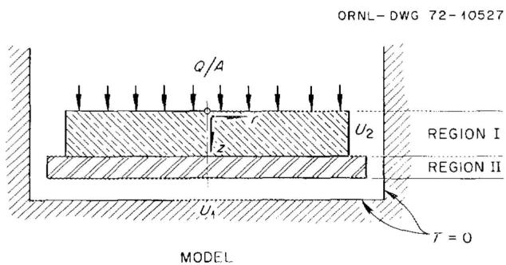  
Fig. 5. Model of the conductivity cell for heat shunting calculation.

By assuming a uniform heat flux and a uniform sink and wall temperature equal to $0^{\circ}\mathrm{C}$ , an easy solution for the center-line heat flux may be obtained from the generalized heat conduction equation [Eq. (12)]. The radial heat-transfer coefficient $U_{2}$ may then be decreased to account for the guard heating.

The temperature distribution within the cylindrical solid can be described by the general heat conduction equation,

$$
\frac {\partial^ {2} \mathrm {T}}{\partial \mathrm {r} ^ {2}} + \frac {1}{\mathrm {r}} \frac {\partial \mathrm {T}}{\partial \mathrm {r}} + \frac {\partial^ {2} \mathrm {T}}{\partial \mathrm {z} ^ {2}} = 0, \tag {12}
$$

where $T$ is the temperature ( $^\circ C$ ) and $r$ and $z$ are the radial and axial coordinates (cm) measured as shown in Fig. 5. Dividing the model into two regions, the boundary conditions for either region can be written:

$$
k ^ {\prime} \frac {\partial T (r , 0)}{\partial z} = - C, \tag {1.3}
$$

$$
k ^ {\prime} \frac {\partial T (r , L)}{\partial z} = - U _ {1} [ T (r, L) ] \quad , \tag {14}
$$

$$
k ^ {\prime} \frac {\partial T (R , z)}{\partial r} = - U _ {2} [ T (R, z) ] \quad , \tag {15}
$$

where $k'$ is the conductivity $[W \, \text{cm}^{-1} (\circ C)^{-1}]$ of the cylindrical solid within the region, $L$ is the thickness of the solid (cm), $R$ is the radius (cm), $C$ is a constant, and $U_1$ and $U_2$ are the axial and radial overall heat-transfer coefficients respectively.

The solution of Eq. (12) for the ratio of the axial center-line heat fluxes entering and leaving region I, using the above boundary conditions, is

$$
F _ {I} \equiv \frac {Q / A (0 , 0)}{Q / A (0 , L)} = \sum_ {n} \frac {2 a _ {n} J _ {1} \left(a _ {n}\right)}{\left(N _ {2} + a _ {n} ^ {2}\right) J _ {0} ^ {2} \left(a _ {n}\right)} \times \left(\cosh \frac {a L}{R} - D _ {n} \sinh \frac {a L}{R}\right), \tag {16}
$$

where

$$
D _ {n} = \frac {N _ {1} \sinh (a _ {n} L / R) + a _ {n} \cosh (a _ {n} L / R)}{N _ {1} \cosh (a _ {n} L / R) + a _ {n} \sinh (a _ {n} L / R)}, \tag {17}
$$

and a n are the roots of

$$
a _ {n} J _ {1} \left(a _ {n}\right) - N _ {2} J _ {0} \left(a _ {n}\right) = 0, \tag {1.8}
$$

and

$$
\mathrm {N} _ {1} = \frac {\mathrm {R U} _ {1}}{\mathrm {k} ^ {\prime}}, \mathrm {N} _ {2} = \frac {\mathrm {R U} _ {2}}{\mathrm {k} ^ {\prime}}. \tag {19}
$$

There is a similar equation for $\mathbf{F}_{\mathrm{II}}$

The heat-transfer coefficients $U_{1}$ and $U_{2}$ were calculated assuming series and parallel paths of all three heat-transfer modes (convection, conduction, and radiation). The ratio $F$ of the heat flux entering region I to the heat flux leaving region II was calculated as

$$
\mathbf {F} = \mathbf {F} _ {\mathrm {I}} \mathbf {F} _ {\mathrm {I I}}. \tag {20}
$$

To account for various degrees of guard heating a factor $G$ was defined as

$$
G \equiv \frac {T _ {\text {h e a t e r}} - T _ {\text {w a l l}}}{\cdots}, \tag {21}
$$

$$
\mathrm {T} _ {\text {h e a t e r}} - \mathrm {T} _ {\text {s i n k}}
$$

such that

$$
\mathrm {N} _ {2} = \frac {\mathrm {R G U} _ {2}}{\mathrm {k} ^ {\prime}}. \tag {22}
$$

Plots of the percentage of heat shunted around the specimen, $1 - F$ , vs the specimen thickness, $\Delta x$ , for various specimen conductivities as determined by a computer solution of Eq. (16) are shown in Figs. 6 and 7 for temperature levels of 300 and $900^{\circ}C$ , respectively. Both of these plots assume partial guard heating; $G = 0.5$ was employed. The dashed curves assume the specimen to be transparent to infrared radiation and the wall emissivities to be 0.5. From these plots, it can be seen that the amount of heat shunted around the specimen can approach $100\%$ for large $\Delta x$ and very small specimen conductivities. In our conductivity

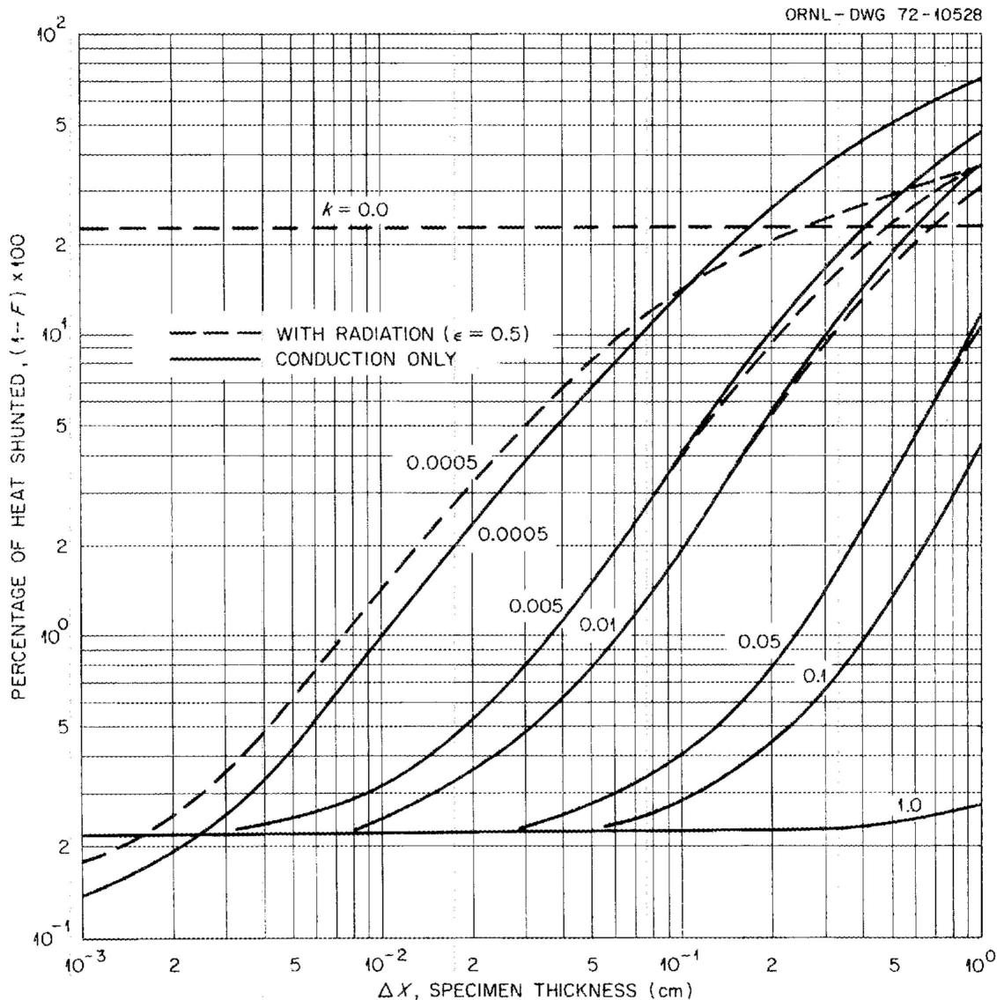  
Fig. 6. Percent of heat shunted around specimen vs specimen thickness for various specimen conductivities with and without radiative heat transfer at $300^{\circ}\mathrm{C}$ for $\mathrm{G} = 0.5$ .

measurements, the guard heating factor G was near zero and a specimen thickness of $< 0.1$ cm was used in determining the conductivity.

# Method of calculation

In the variable-gap technique, the thermal conductivity coefficient can be determined (1) from the reciprocal slope of the total thermal resistance across the specimen (including metal walls, deposits, etc.)

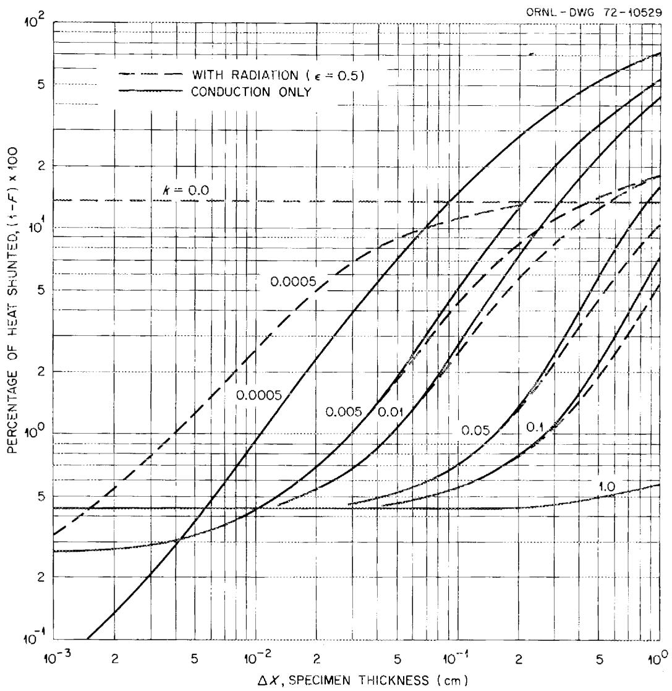  
Fig. 7. Percent of heat shunted around specimen vs specimen thickness for various specimen conductivities with and without radiative heat transfer at $900^{\circ}\mathrm{C}$ for $\mathrm{G} = 0.5$ .

as a function of specimen thickness as it approaches zero or (2) from the effective conductivity as the specimen thickness approaches zero. Except for a few spot checks, method (1) was used to reduce the data in this report. The thermal resistance is calculated from the measured heat flux $Q^{\prime} / A$ and from the measured temperature difference, where

$$
\begin{array}{l} Q ^ {\prime} = \frac {4 E I V}{r D ^ {2}} \\ A \end{array} ,
$$

and

I = heater current, amps,

$\mathbf{V} =$ heater voltage, V,

D = diameter of upper heater plate, cm,

E = ratio of effective to total heater wire length.

The heat flux $Q/A$ is obtained from the measured heat flux by correcting for the heat shunting. If the guard heating factor $G$ [see Eq. (21)] is greater than about 0.01, a heat shunting factor $F$ is interpolated from the plots of $1 - F$ vs $\Delta x$ (Figs. 6 and 7) obtained from computer solutions of Eq. (16). From these solutions, the percentage of shunted heat, $1 - F$ , is found to be very nearly proportional to $G^{0.8}$ . Thus, the heat shunting factor for any degree of guard heating is calculated using the results from only one heat shunting factor at $G = 0.5$ :

$$
(1 - F) _ {G} = (G / 0. 5) ^ {0 \cdot 8} (1 - F) _ {G = 0. 5}. \tag {23}
$$

The heat flux is then calculated as $\frac{Q}{A} = F\left(\frac{Q^{\prime}}{A}\right)$ and the total thermal resistance is $\frac{\Delta T}{Q / A}$ , where $\Delta T$ is the previously defined total temperature difference across the specimen.

The total thermal resistance is then plotted as a function of the specimen thickness for a given specimen temperature. The specimen temperature is defined as the average of the upper and lower plate temperature and both the specimen temperature and the measured heat flux are kept nearly constant as the specimen thickness is varied (see Experimental Procedures).

Three methods were used to determine the slope of the resistance curve at $\Delta x = 0$ . First, visual inspection of the curve gave good results when the data were smooth and the resistance curve was linear. Second, when the curve was not linear, numerical finite-difference techniques were used to obtain the slope at $\Delta x = 0$ . In the third method the data were fitted to Eq. (9) [or Eq. (10) if $\overline{\kappa} = 0$ ] if adequate information of the optical properties of the specimen were known.

Most of the data reported in this study were analyzed by visual inspection or the third method mentioned above. The data were fitted to Eq. (9) in the following way. The fixed resistance,

$$
\left(\frac {\Delta \mathrm {T}}{\mathrm {Q} / \mathrm {A}}\right) _ {\mathrm {O}},
$$

is found by extrapolating the thermal resistance vs $\Delta x$ to $\Delta x = 0$ ; the plate emissivities are determined by carrying out the experimental procedure with the conductivity cell evacuated; and the index of refraction is taken from the literature, an average $\bar{n}$ over the range of infrared-wavelengths. From an estimate of the conductivity by visual inspection of the data for $\Delta x < 0.1$ , the absorptivity, $\kappa$ , can then be found from fitting Eq. (9) to the larger values of $\Delta x$ . Using these values of the fixed resistance, the plate emissivities, the average index of refraction, and the calculated absorptivity, the thermal conductivity is determined by the best fit of the data over the complete range of $\Delta x$ .

# 3. EXPERIMENTAL APPARATUS

The design and construction of the apparatus and auxiliary equipment are discussed here. The description of the thermal conductivity cell itself is sufficiently complete to permit duplication; however, only unusual auxiliary equipment is discussed in detail. Additional details and illustrations are given in Appendix A.

The complete system can be considered to consist of four parts: the thermal conductivity cell, the furnace, the electrical system, and the instrument network. The connections and relationships between the various components are shown schematically in Fig. 8. Photographs of the apparatus are shown in Figs. 9 and 10.

# Thermal Conductivity Cell

The thermal conductivity cell is shown in Fig. 11 and in detail in Figs. A-1 and A-2 in Appendix A. The cell is made up of two components: the cylindrical-shaped component, which consists of a sink and the radial

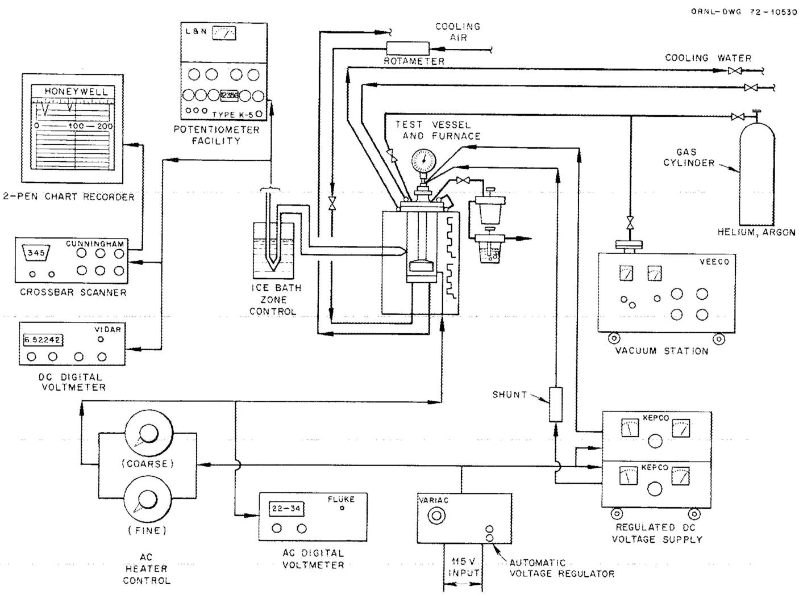  
Fig. 8. Schematic illustration of the complete system for thermal conductivity measurements.

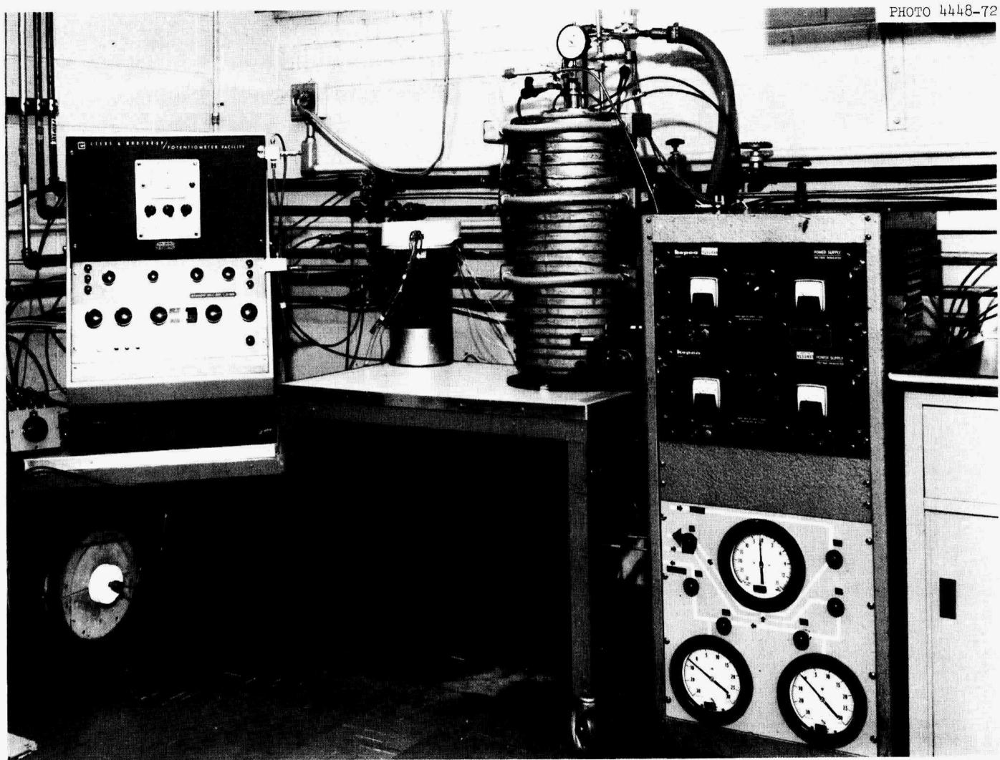  
Fig. 9. Photograph of the apparatus, front view.

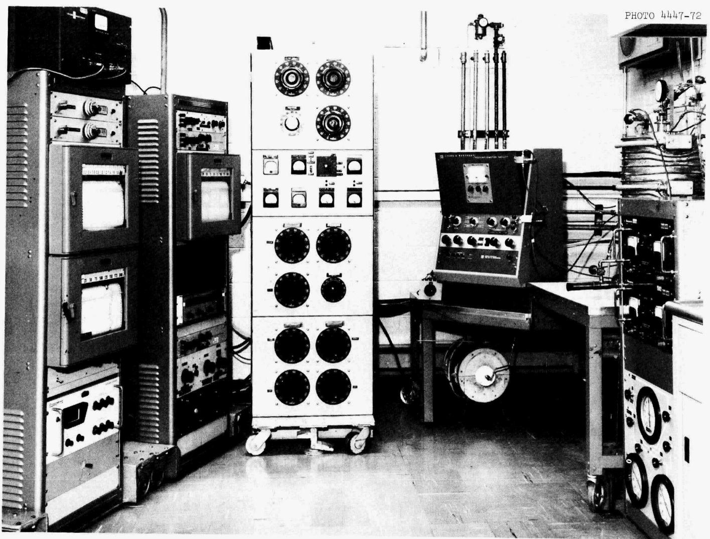  
Fig. 10. Photograph of the apparatus, side view.

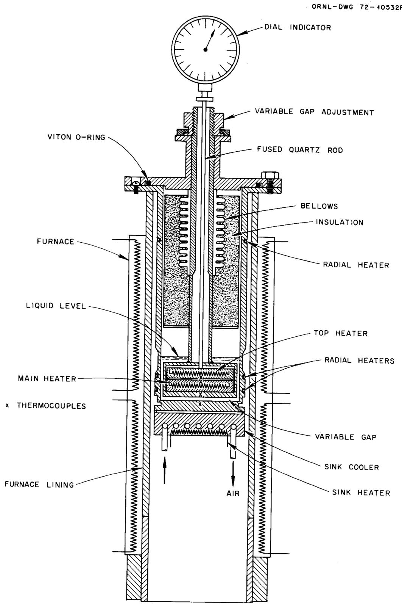  
Fig. 11. Schematic cross section of the conductivity cell.

heaters and contains the salt, and the piston-shaped component, which is mobile in the vertical direction and contains the main heater and the guard heater assemblies.

The cylindrical component was machined from three pieces of stainless steel type 304 and welded together as shown. The lower section, which contains the molten salt, has holes drilled through the component for cooling air passages, and a sink heater which is a $1/8$ -in.-diam Calrod sheath-type element pressed into grooves machined in the lower section. Similar heaters are placed around the cylinder at the level of the salt for the radial guard heaters. Figure 12 shows the location and designations of the thermocouples and heaters. Several dimensions of the cylinder component are maintained in close tolerances to insure that the specimen thickness is uniform across the diameter (Fig. A-1). The cylinder is about $4$ in. OD $\times$ 3.5 in. ID, and 12 in. long. The final machining of these surfaces was made after the entire cylinder had been dimensionally stabilized by heat treatment.

The mobile piston component containing the main heater assembly is shown in detail in Fig. A-2 in Appendix A. The main heater is constructed with 10-mil Pt-10% Rh wire, wound, embedded, and buried in a high-density $\mathrm{Al}_{2}\mathrm{O}_{3}$ insulator. A duplicate heater, the main guard heater, sits above the main heater. Between these two heaters is a 1/16-in. gap containing three platinum-foil radiation shields. The temperature across this gap is monitored by two thermocouples and balanced with the guard heater to prevent axial heat loss. A gold foil provides high contact conductance between the main heater and the bottom of the piston container. All the electrical wiring, the platinum wire, and the thermocouples extend through a hollow rod connecting the piston with the upper plate and support. A flexible bellows welded to the piston rod and the upper flange allows mobility of the piston while providing a vacuum tight seal. The vertical movement of the piston is adjusted by a threaded nut whose microthreads are precision machined. The vertical movement of the piston is measured with a dial indicator connected to the bottom of the piston with a fused quartz rod to minimize the effect of thermal expansion. Several dimensions of the mobile piston component are also

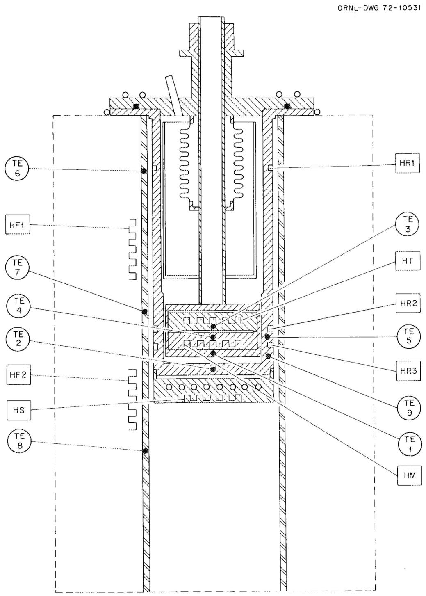  
Fig. 12. Position of thermocouples and heaters.

maintained in close tolerances (See Fig. A-2). The specifications of these tolerances insure that the parallelism of the two plate surfaces does not vary by more than 0.005 in. This tolerance was measured in situ by placing a ball bearing in the gap of the specimen, rotating the apparatus in an inclined position, and measuring the variation in the gap setting with the dial indicator. A typical plot of this variation around the edge of the cell is shown in Fig. 13. The maximum edge-to-edge variation of the thickness in this case of 0.0017 in. demonstrates excellent conformity to the 0.005-in. tolerance.

The test cell described here and in considerably more detail in Appendix A is the final design (Model III-B) of the conductivity cell. Several modifications were made in the course of the development of this apparatus. The notation, description, and chronological appearance of these modifications are listed in Table 1.

The locations of the thermocouples used in the conductivity cell are shown in Fig. 12. Initially, the thermocouples were $1/16$ -in.-OD sheathed Chromel-Alumel thermocouples; later Pt vs Pt- $10\%$ Rh thermocouples were used. Thermocouples 1, 2, 5, and 6 are arc welded to the bottom of their respective thermal wells to insure that they remain fixed during the measurements.

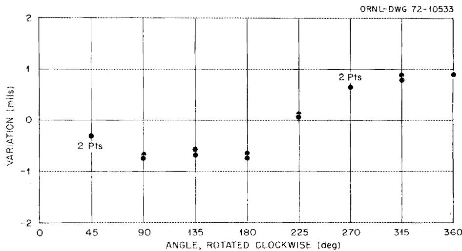  
Fig. 13. Variation in the gap thickness around the circumference of the conductivity cell.

Table 1. Cell modifications   

<table><tr><td>Model</td><td>\( Heater\ assembly^a \)</td><td>Cylinder</td><td>Thermocouples</td></tr><tr><td>I-A</td><td>Thick one-piece heater core; D = 8.572 cm, E = 0.969</td><td>Original cylinder</td><td>1/16-in.-OD SS-sheathed, Chromel-Alumel grounded junctions, MgO insulation</td></tr><tr><td>II-A</td><td>Thinner two-piece heater core with l/32-in. air gap between main and guard heaters; E = 0.971</td><td>Original cylinder</td><td>1/16-in.-OD SS-sheathed, Pt vs Pt-10% Rh un-grounded junctions, MgO insulation</td></tr><tr><td>II-B</td><td>&#x27;&#x27;</td><td>Wall of the original cylinder was undercut and grooved to reduce heat flow down the wall; TC 9 added</td><td>&#x27;&#x27;</td></tr><tr><td>III-B</td><td>New heater with l/16-in. air gap with three Pt foil baffles; E = 0.966</td><td>&#x27;&#x27;</td><td>&#x27;&#x27;</td></tr></table>

${}^{a}D =$ diameter of heater assembly and $E =$ ratio of effective-to-total heater wire length,where the total wire length between the voltage taps includes two 0.875-in.-long lead wires.

# Furnace

The furnace consists of two 6-in.-ID × 8-in.-long individually controlled clamshell heaters of the embedded wire type. The annular space between the heater and the 12.5-in.-OD water-cooled furnace shell was filled with Fiberfrax insulation. This furnace is capable of raising the ambient temperature of the molten salt to $1000^{\circ}\mathrm{C}$ .

# Electrical System

The heater electrical system is diagrammed in Fig. 14. The ac supply voltages to the sink, guard, and furnace heaters are regulated with a

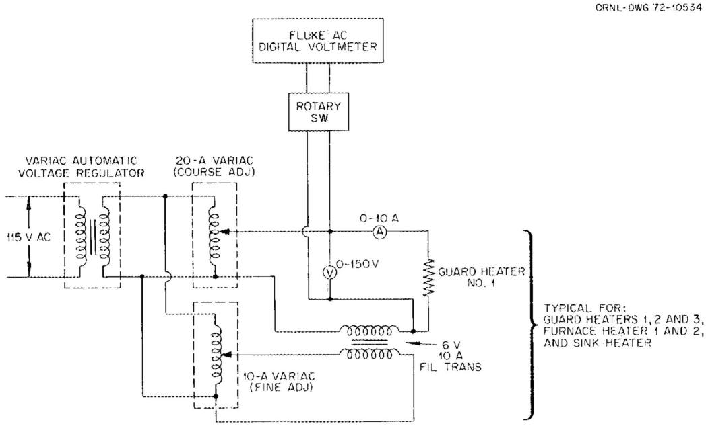

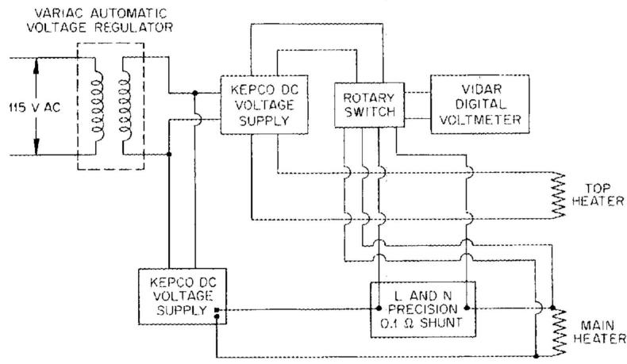  
Fig. 14. Diagram for electrical heater system.

Variac automatic voltage regulator. The voltage through each of the heaters is adjusted by two Variacs, coarse and fine, and by a filament transformer. The fine adjustment extends the coarse Variac setting with the addition of $6\mathrm{V}$ of increased sensitivity $(0.038\mathrm{V})$ . A Fluke ac digital voltmeter is used for setting and reading the voltages.

Two Kepco dc voltage supplies provide the electrical power to the main and top guard heaters. The supply voltage to the two Kepco units is also regulated by the Variac automatic voltage regulator. The power

to the main heater is determined from measurements of the voltage and the current with a Vidar digital microvoltmeter and a Leeds and Northrup precision resistor. Specifications of these instruments are given in Table A-1 in Appendix A.

# Instrumentation

The thermocouple circuit diagram is shown in Fig. 15. The temperature measurements are made with grounded 1/16-in.-OD Chromel-Alumel

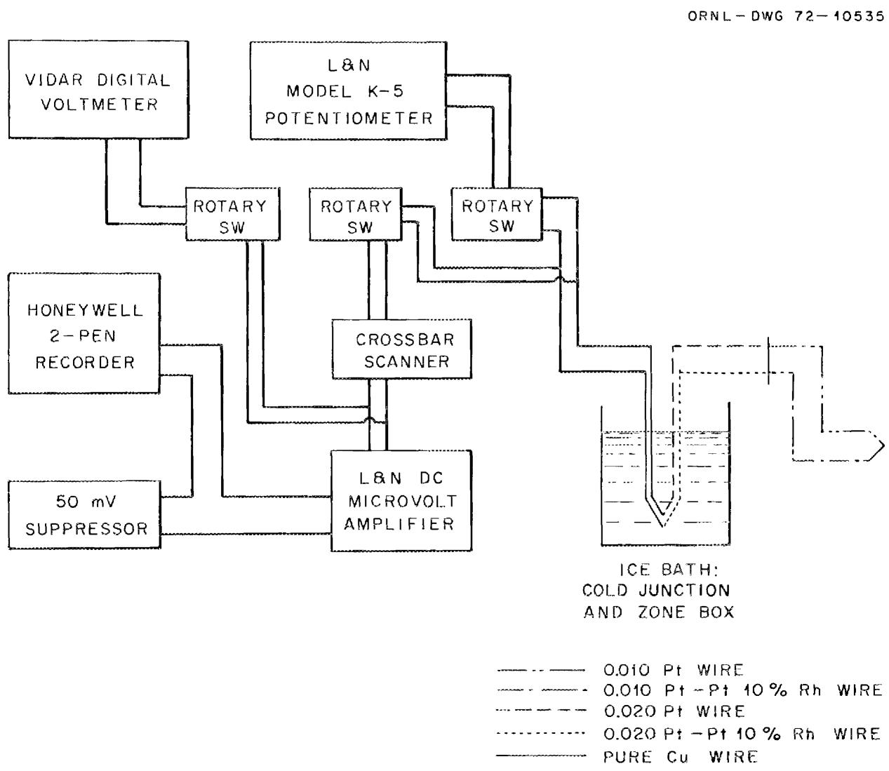  
Fig. 15. Thermocouple circuit diagram.

thermocouples or with ungrounded 1/16-in.-OD Pt vs Pt-10% Rh thermocouples; both are sheathed in 304 type stainless steel. Lead wires from each thermocouple are joined by arc welding to high-purity copper circuitry wire. To minimize and cancel extraneous thermal emf's, each of these junctions is contained in a mineral-oil-filled glass tube inserted in a hole drilled into a high-purity copper block, $3 \times 2$ in. diameter, and the whole assembly is immersed in a distilled water ice bath. Low thermal emf holder is used in other circuitry junctions.

Each thermocouple emf can be read by either a Vidar digital microvoltmeter, a Honeywell pen recorder, or a Leeds and Northrup K-5 potentiometer facility. The specifications of these instruments are given in Table A-1, Appendix A.

# 4. EXPERIMENTAL PROCEDURES

# Preliminary Procedures

The conductivity cell surfaces are cleaned with detergent, rinsed with demineralized water, and dried with filtered air. After use, the corrosion products are removed by polishing with rotary stainless steel brushes, 600-grit cloth, and crocus cloth to restore the surfaces. In assembling the apparatus, the parallelism of the plates is checked for the specified tolerance (0.005 in.), and the thermocouple readings at room temperature match within $< 0.2\mu V$ . The purity of the specimens used in the determinations meet the ACS specifications for reagent-grade chemicals: $99.997\%$ pure argon, $99.995\%$ pure helium, doubly deionized and triple distilled water, triple distilled mercury, and reagent-grade $\mathrm{KNO}_3$ , $\mathrm{NaNO}_2$ , and $\mathrm{NaNO}_3$ salts dried in vacuum.

The specimen is introduced into the cell, the apparatus leveled and leak tested with a helium leak detector. The system is then outgassed by heating overnight at about $150^{\circ}\mathrm{C}$ . Voids in the specimen are removed by alternately increasing and decreasing the specimen thickness after it has been melted under vacuum. For liquid and solid samples, an argon cover gas is introduced into the cell at slightly above atmospheric pressure.

# Operating Procedure - Fluid Specimen

The furnace heat is applied to the system to reach the desired temperature level. The main heater is adjusted to obtain the required heat flux through the specimen (0.02 to $0.7 \, \text{W cm}^{-2}$ ), and the guard heaters are adjusted to maintain a close temperature balance between thermocouples three and five ( $< \pm 0.5^{\circ}\text{C}$ ) and thermocouples three and four ( $< \pm 1^{\circ}\text{C}$ ) to minimize heat losses (see Fig. 12). After steady-state conditions are reached, the measurements are recorded; the criterion for the steady-state condition is a temperature drift of less than $1^{\circ}\text{C/hr}$ . Recordings are made of all thermocouple readings, air flow rate in the cooling sink, dial indicator reading, and voltages and currents from power panel meters and digital voltmeters at each gap distance. The gap is then changed, steady-state conditions are reestablished, and the recordings repeated. A number of gap spacings are used (0 to $0.4 \, \text{cm}$ ) depending on the linearity of the data. The heat flux and average specimen temperature are kept constant for each gap spacing ( $> \pm 0.005 \, \text{W cm}^{-2}$ , $> \pm 1^{\circ}\text{C}$ ).

The above procedure is repeated for each specimen temperature level.

# Operating Procedure - Solid Specimen

If the measurements are made with the specimen in the solid state, the specimen is melted before each gap spacing is selected, and then the gap spacing is fixed by cooling the specimen to the desired temperature.

# 5. EXPERIMENTAL RESULTS

The experimental results from this study demonstrate the successful development of the variable-gap technique for the measurements of molten-salt thermal conductivities. Concurrently with the development of the method, we measured conductivities of several molten fluoride salt mixtures which will be presented in a subsequent report.

The thermal conductivities of five materials were determined over a temperature range from 38 to $946^{\circ}\mathrm{C}$ for a total of 31 series of measurements. Argon, helium, water, HTS, and mercury were selected to calibrate the apparatus because their conductivities are well established and cover a wide range of values: $0.4 \times 10^{-3}$ to $100 \times 10^{-3} \, \text{W cm}^{-1}(\text{°C})^{-1}$ . The conductivity of HTS is not as well established a value as those of the other substances. However, HTS can be heated to temperatures required to melt the fluoride salt mixtures. Nearly 350 measurements were made of the thermal resistance as a function of specimen thickness to obtain the 31 determinations of conductivity. In addition, another 50 measurements of resistance vs thickness were made with the system evacuated to evaluate the surface emissivities.

The original and reduced data are presented in Tables B-1 to B-22 in Appendix B. The data were reduced as indicated in the method of calculation in Chapter 2. The total thermal resistance is plotted as a function of the specimen thickness, and the thermal conductivity is determined from the reciprocal slope as the specimen thickness approaches zero.

# Thermal Resistance Curves

Several representative plots of total thermal resistance as a function of specimen thickness are shown in Figs. 16 to 20. At the lower temperature the thermal resistance is a linear function, as shown in Figs. 16 and 17 for mercury at $60.8^{\circ}\mathrm{C}$ and HTS at $197^{\circ}\mathrm{C}$ . At the higher temperatures, the influence of infrared radiation on the heat transfer can be seen by the curvature of the resistance curve for HTS and argon at $526^{\circ}\mathrm{C}$ and helium at $946^{\circ}\mathrm{C}$ (Figs. 18 to 20).

The fixed thermal resistance of the conductivity cell,

$$
\left( \begin{array}{c} \Delta T \\ \frac {}{\mathrm {Q / A}} \end{array} \right) _ {\circ},
$$

varies from 5 for mercury to 30 for argon. Model changes in the main

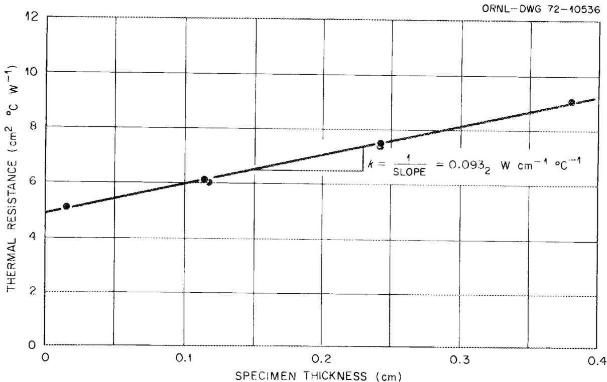  
Fig. 16. Total thermal resistance vs specimen thickness of mercury at $60.8^{\circ}\mathrm{C}$ (Run 2, Apparatus I-A).

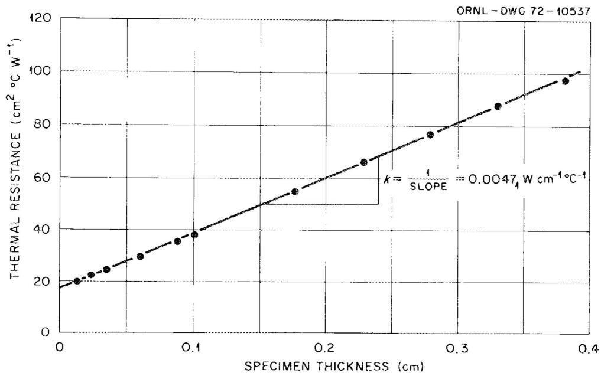  
Fig. 17. Total thermal resistance vs specimen thickness of HTS at $197^{\circ}\mathrm{C}$ (Run 10, Apparatus I-A).

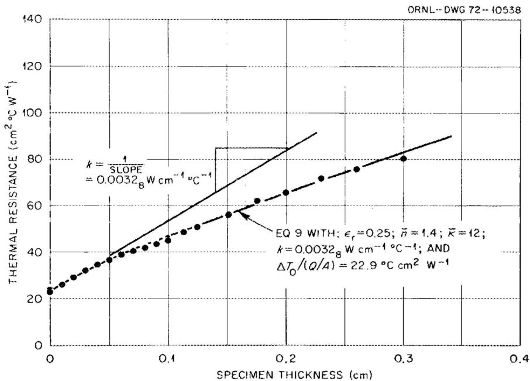  
Fig. 18. Total thermal resistance vs specimen thickness of HTS at $526^{\circ}\mathrm{C}$ (Run 1, Apparatus II-B).

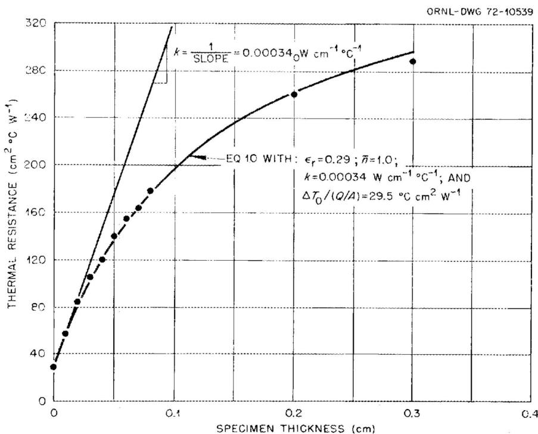  
Fig. 19. Total thermal resistance vs specimen thickness of argon at $503^{\circ}\mathrm{C}$ (Run 1, Apparatus II-B).

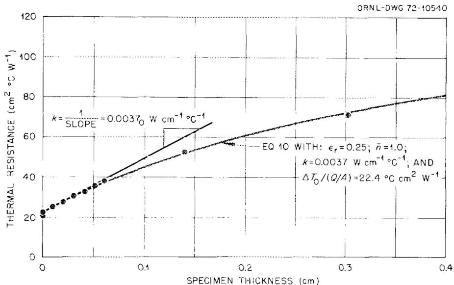  
Fig. 20. Total thermal resistance vs specimen thickness of helium at $946^{\circ}\mathrm{C}$ (Run 2, Apparatus II-B).

heater assembly (Table 1) account for most of the variation in fixed thermal resistance. Model I-A was operated several months at temperatures up to $300^{\circ}\mathrm{C}$ with fluoride salt mixtures during a time between mercury and HTS calibration runs. The Chromel-Alumel thermocouples of model I-A would be expected to show significant emf drift under these conditions.

Thermal resistance as a function of gap spacing with the cell evacuated is shown in Fig. 21 for two temperature levels (200 and $510^{\circ}\mathrm{C}$ ) and two values of heat flux (0.100 and 0.224 W cm $^{-3}$ ). The values of the specimen resistance (i.e., total minus fixed resistance) were used for the evacuated runs. The expected lack of variation of the resistance as a function of the gap spacing can be seen in the figure. A slight change in the emissivity of the plate surfaces will account for the small difference in the resistance between the two heat flux values at $200^{\circ}\mathrm{C}$ . The total hemispherical emissivity $\epsilon$ , calculated from the thermal resistance using Eq. (10) in Chapter 2 (assuming equal emissivity for the two plates), varied from 0.4 to 0.5.

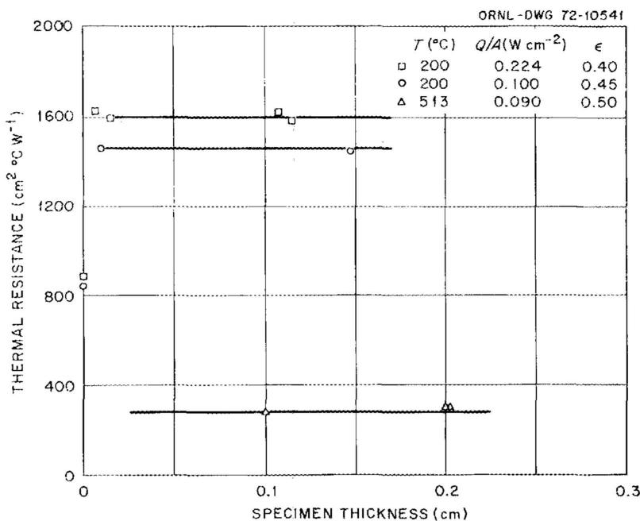  
Fig. 21. Thermal resistance vs gap spacing with the conductivity cell evacuated.

The inflection in the slope of the resistance curve for HTS at $526^{\circ}\mathrm{C}$ (Fig. 18) is similar to those shown in Fig. 3 for small infrared absorbing materials. The solid curve drawn through the data was derived from Eq. (9), using the procedure outlined in Chapter 2. A value of $\overline{n} = 1.4$ was derived from the Molten Salts Handbook $^{21}$ for the eutectic composition of $\mathrm{NaNO}_3$ - $\mathrm{KNO}_3$ (47-53 mole %) at $525^{\circ}\mathrm{C}$ and the previously measured value of $\varepsilon = 0.45$ was used for the plate emissivities. Incorporating these values in Eq. (9), a best fit of the experimental data over the entire range of specimen thicknesses ( $0 < \Delta x < 0.3\mathrm{cm}$ ) gave values of the specimen conductivity and mean absorptivity of $3.28 \times 10^{-3}\mathrm{Wcm}^{-1}(^\circ\mathrm{C})^{-1}$ and $12\mathrm{cm}^{-1}$ , respectively.

The thermal resistance curves shown in Figs. 19 and 20 resemble those shown in Fig. 3 for nonabsorbing gases ( $\overline{n} = 1$ , $\overline{k} = 0$ ). Using the previously determined plate emittance, the values of the conductivity were found from a best fit of the resistance data to Eq. (9) to be $0.34 \times 10^{-3}$ and $3.3 \times 10^{-3}$ W cm $^{-1}$ (°C) $^{-1}$ for argon and helium at 503 and $946^{\circ}\mathrm{C}$ , respectively.

# Thermal Conductivity

The experimental results for the thermal conductivity for the different calibration specimens used with the various apparatus models are presented in Table 2. One value for the conductivity of solid HTS at $120^{\circ}\mathrm{C}$ is $14\%$ larger than a published value.[5] The maximum deviation of the other results from published values are $+9.6\%$ and $-12\%$ . The average of the 18 positive deviations is $4.9\%$ , and the average of the 12 negative deviations is $-4.4\%$ .

# 6. DISCUSSION OF THE RESULTS

The accuracy of the results, comparison with previously published values, and theoretical correlations are discussed in this chapter.

# Comparison with Published Values

The values of the conductivity of the substances used to calibrate the variable-gap apparatus were well established with the exception of HTS. Touloukian's recommended values for argon and helium and Powell's values for water and mercury are representative of accepted conductivities for these materials. Of the two studies on the conductivity of HTS, we selected the more recent results of Turnbull over those of Vargaftik because, as Turnbull points out, Vargaftik's calibration tests with "Dowtherm A" do not agree with other published values. However, Turnbull employed the transient-hot-wire technique with its attendant current-shunting problems (Chapter 2); consequently, the conductivity of HTS cannot be regarded to be as well established as that of the other specimens measured.

The individual deviations between the experimental results and the published values were examined as a function of the specimen type, specimen conductivity, specimen temperature, and apparatus model. No obvious correlation could be found.

Table 2. Experimental results   

<table><tr><td rowspan="2">Model</td><td rowspan="2">Specimen</td><td rowspan="2">Run No.</td><td rowspan="2">Temperature (°C)</td><td colspan="2">Thermal conductivity [W cm-1(°C)-1]</td><td rowspan="2">Difference (%)</td><td rowspan="2">Reference</td></tr><tr><td>Exptl.</td><td>Literature</td></tr><tr><td></td><td></td><td></td><td></td><td>x 103</td><td>x 103</td><td></td><td></td></tr><tr><td rowspan="17">1-A</td><td rowspan="3">H2O</td><td>1</td><td>45.2</td><td>6.71</td><td>6.38</td><td>5.2</td><td>13</td></tr><tr><td>2</td><td>51.9</td><td>6.71</td><td>6.47</td><td>3.7</td><td>13</td></tr><tr><td>3</td><td>38.0</td><td>6.78</td><td>6.30</td><td>7.6</td><td>13</td></tr><tr><td rowspan="2">Hg</td><td>1</td><td>60.2</td><td>83.1</td><td>93.2</td><td>-10.8</td><td>23</td></tr><tr><td>2</td><td>60.8</td><td>93.2</td><td>93.2</td><td>0.0</td><td>23</td></tr><tr><td rowspan="12">HTS</td><td>1</td><td>307</td><td>4.24</td><td>4.30</td><td>-1.4</td><td>5</td></tr><tr><td>2</td><td>308</td><td>4.15</td><td>4.30</td><td>-3.5</td><td>5</td></tr><tr><td>3</td><td>546</td><td>3.45</td><td>3.24</td><td>6.5</td><td>5</td></tr><tr><td>4</td><td>545</td><td>3.34</td><td>3.24</td><td>3.1</td><td>5</td></tr><tr><td>5</td><td>197</td><td>4.78</td><td>4.80</td><td>-0.4</td><td>5</td></tr><tr><td>6</td><td>277</td><td>4.43</td><td>4.38</td><td>1.1</td><td>5</td></tr><tr><td>7</td><td>549</td><td>3.47</td><td>3.22</td><td>7.7</td><td>5</td></tr><tr><td>8</td><td>285</td><td>4.64</td><td>4.40</td><td>5.5</td><td>5</td></tr><tr><td>9</td><td>199</td><td>4.83</td><td>4.80</td><td>0.6</td><td>5</td></tr><tr><td>10</td><td>198</td><td>4.71</td><td>4.80</td><td>1.9</td><td>5</td></tr><tr><td>11</td><td>552</td><td>3.07</td><td>3.21</td><td>-4.4</td><td>5</td></tr><tr><td>12</td><td>554</td><td>3.48</td><td>3.20</td><td>8.7</td><td>5</td></tr><tr><td rowspan="2">II-A</td><td rowspan="2">He</td><td>1</td><td>172</td><td>2.05</td><td>1.93</td><td>6.2</td><td>22</td></tr><tr><td>2</td><td>509</td><td>3.04</td><td>3.02</td><td>0.7</td><td>22</td></tr><tr><td rowspan="6">II-B</td><td rowspan="2">He</td><td>1</td><td>519</td><td>2.70</td><td>3.04</td><td>-11.2</td><td>22</td></tr><tr><td>2</td><td>946</td><td>3.70</td><td>4.21</td><td>-12.1</td><td>22</td></tr><tr><td rowspan="3">Ar</td><td>1</td><td>503</td><td>0.340</td><td>0.361</td><td>-5.8</td><td>22</td></tr><tr><td>2</td><td>860</td><td>0.493</td><td>0.463</td><td>6.5</td><td>22</td></tr><tr><td>3</td><td>859</td><td>0.452</td><td>0.463</td><td>-2.4</td><td>22</td></tr><tr><td>HTS</td><td>1</td><td>526</td><td>3.28</td><td>3.33</td><td>-1.5</td><td>5</td></tr><tr><td rowspan="6">III-B</td><td rowspan="3">He</td><td>1</td><td>525</td><td>3.20</td><td>3.07</td><td>4.2</td><td>22</td></tr><tr><td>2</td><td>527</td><td>3.00</td><td>3.07</td><td>-2.3</td><td>22</td></tr><tr><td>3</td><td>105</td><td>1.94</td><td>1.77</td><td>9.6</td><td>22</td></tr><tr><td rowspan="3">HTS</td><td>1</td><td>517</td><td>3.34</td><td>3.37</td><td>-0.9</td><td>5</td></tr><tr><td>2</td><td>317</td><td>4.49</td><td>4.26</td><td>5.4</td><td>5</td></tr><tr><td>3</td><td>120</td><td>6.27</td><td>5.5</td><td>14.0</td><td>5</td></tr></table>

The average deviation of $\pm 5\%$ from the published values for the thermal conductivities is considerably less than expected considering the specialized design of the apparatus.

# Comparison with Theory

The experimental results for HTS at $526^{\circ}\mathrm{C}$ (Fig. 18) are an example of a test of the theory of Chapter 2 for infrared absorbing materials. Equation (9) in conjunction with the values of $\overline{\kappa}$ , $\overline{n}$ , $\epsilon$ , and $\kappa$ (selected in the manner previously described) agrees well with the experimental thermal resistance data over the range of specimen thicknesses examined. In addition, the inflection point of Eq. (9) and the apparent inflection point in the thermal resistance data both occur in the vicinity of $x = 0.1\mathrm{cm}$ . Such agreement gives us confidence in the use of Eq. (9) to represent the thermal resistance data of mildly infrared absorbing specimens like HTS at $500^{\circ}\mathrm{C}$ ( $\overline{\kappa} = 12\mathrm{cm}^{-1}$ ). However, as Poltz17 points out, the Kirchoff theory ceases to be valid if the reciprocal of the absorption coefficient is of the same magnitude as the wavelength in some regions of the absorption spectrum. Fortunately, when this condition occurs, the thermal resistance is very nearly a linear function of the specimen thickness.

From a theoretical standpoint, the disruption of the lattice continuity by melting should lower the conductivity significantly. If we extrapolate our one result for the conductivity of solid HTS at $120^{\circ}\mathrm{C}$ to the melting point at $142^{\circ}\mathrm{C}$ by assuming that thermal conductivity is proportional to the inverse of the absolute temperature $\mathrm{k} \propto 1 / \mathrm{T}$ ( $^\circ\mathrm{K}$ ) (according to the Debye phonon-scattering theory), a ratio of the liquid-to-solid thermal conductivity at the melting point is found to be 0.85. Turnbull25 reports the average ratio of liquid-to-solid conductivities at the melting point for a large number of salts to be 0.86 ± 0.13. However, Turnbull's reported values for HTS5 do not show a discontinuity at the melting point. Accordingly, our value of the conductivity of solid HTS, 14% higher than Turnbull's, appears to be the more reasonable one.

A detailed error analysis of the system is given in Appendix C, and the result of this analysis is shown in Fig. 22. The estimated maximum and standard error limits in the conductivity measurements using apparatus III-B are plotted as a function of the specimen conductivity. The effects of the specimen temperature range (300 to $900^{\circ}\mathrm{C}$ ) and of the degree of radiation effects (zero to maximum radiation at $900^{\circ}\mathrm{C}$ ) do not contribute greatly to the error and are shown by the areas included within the small bands in Fig. 22. It is apparent from the figure that the error is sensitive to the magnitude of the specimen conductivity except at larger values of the conductivity. Much of the increase in error at low values of conductivity results from an increased uncertainty in the measurement of the change in the specimen thickness. This uncertainty, caused by the thermal expansion of the conductivity cell as the guard heating is adjusted, can be minimized by a dual quartz rod, dial indicator system. Such a system was not considered necessary for the present apparatus since the conductivities of the molten fluoride salts were found to be in the vicinity of $0.01\ \mathrm{Wcm}^{-1}(^\circ\mathrm{C})^{-1}$ .

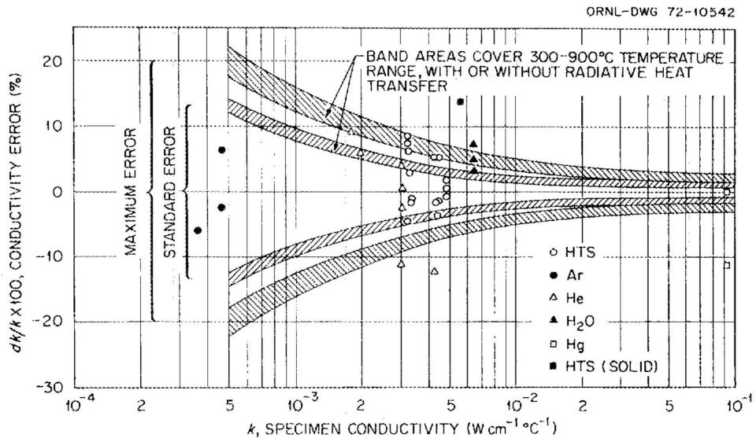  
Fig. 22. Estimated standard and maximum error limits in the conductivity measurements for Apparatus III-B vs specimen conductivities with and without radiative heat transfer over 300 to $900^{\circ}\mathrm{C}$ range. Also shown are experimental deviations from published values.

Figure 22 shows also the deviations of each of the experimental results from the published values. Several points are outside of the estimated error limits (the conductivity of solid HTS was discussed in the previous section). Data for water and mercury were obtained using Apparatus I-A, in which Chromel-Alumel thermocouples were used. Since the uncertainty of the temperature measured with the Chromel-Alumel thermocouples is four times of that from Pt vs Pt-10% Rh thermocouples, the error limits for Apparatus I-A are considerably larger than for III-B, especially at the higher specimen conductivities. Excluding these points, 93% of the data lies within the maximum error limits and 68% within the standard error limits.

# Adequacy of the Experimental Apparatus

The experimental apparatus proved extremely durable despite its complex design. Model I-A endured 500 hr of operation with a fluoride salt mixture at temperatures ranging from 500 to $800^{\circ}\mathrm{C}$ and for 850 hr with HTS at temperatures from 200 to $500^{\circ}\mathrm{C}$ before failure of a thermocouple required the replacement of the heater assembly. Model II-A suffered a weld failure in the heater assembly after 1000 hr of operation with helium and argon at temperatures from 200 to $950^{\circ}\mathrm{C}$ and 800 hr with fluoride salt mixtures from 500 to $850^{\circ}\mathrm{C}$ . Model III-B is still in operating condition after nearly 3000 hr with fluoride salt mixtures at temperatures from 500 to $960^{\circ}\mathrm{C}$ .

We previously noted that a dual quartz-rod dial-indicator system would be able to account for thermal expansion of the cell in measuring specimen thicknesses at low conductivity. For such measurements, the upper and lower plate surfaces should be polished to a mirror finish also.

The accuracy and precision of the conductivity values could possibly be improved by measuring the heat flux departing from the specimen. This heat flux can be determined by the usual means of measuring the temperature drop along a well-insulated rod of known conductivity. By measuring both the heat flux entering and leaving the specimen, the effect of heat shunting on the determination should be reduced.

# 7. CONCLUSIONS

Designed as it is for specialized thermal conductivity measurements with molten fluoride salt mixtures from 500 to $1000^{\circ}\mathrm{C}$ , the variable-gap apparatus has demonstrated remarkable versatility. Experimental results agree with published results within an average deviation of $\pm 5\%$ for a wide variety of specimens (solids, liquids, and gases), specimen conductivities $[0.4 \times 10^{-3}$ to $100 \times 10^{-3}$ W cm $^{-1}$ (°C) $^{-1}$ ], and temperature levels (40 to $950^{\circ}\mathrm{C}$ ). In addition, the variable-gap apparatus has demonstrated its ability to distinguish and evaluate the internal radiation within small infrared absorbing fluids.

Considering the wide range of application and the accuracy of the variable-gap method, it is surprising to find so few references to it in the literature. The experimental measurements of the conductivity of several fluoride salt mixtures made concurrently with the present study will be reported in a later publication.

# ACKNOWLEDGMENT

The author is grateful for the invaluable assistance of many of his associates who contributed to this investigation. In particular, the author wishes to express his appreciation to the following persons: S. J. Claiborne, Jr., for his vaulable assistance in assembling and operating the apparatus, W. K. Sartory for his patient advice, J. W. Krewson and W. A. Bird for their design of the instrumentation, J. W. Teague for his expediting the fabrication of the apparatus, Roberta Shor and M. R. Sheldon for assistance with the final editing, and Margie Adair and Dolores Eden for their typing of the report.

# REFERENCES

1. E. S. Bettis and W. B. McDonald, "Molten-Salt Reactor Experiment," Nucleonics, 22(1): 67-70 (1964).   
2. W. D. Powers, S. I. Cohen, and N. D. Greene, "Physical Properties of Molten Reactor Fuels and Coolants," Nucl. Sci. and Eng., 17(2): 200-211 (1963)   
3. Narayanaswamy Mani, "Precise Determination of the Thermal Conductivity of Fluids Using Absolute Transient Hot-Wire Technique," PhD Dissertation, Calgary, Alberta, August 1971.   
4. P. Grassmann, W. Straumann, F. Widmer, and W. Jobst, "Measurement of Thermal Conductivities of Liquids by an Unsteady State Method," Progr. Intern. Res. Thermodyn. Transport Properties, Papers Symp. Thermophys. Properties, 2nd Princeton, N.J., pp. 447-53, Academic Press, New York, 1962.   
5. A. G. Turnbull, "The Thermal Conductivity of Molten Salts," Australian J. Appl. Sci., 12(1): 30-41 (1961).   
6. L. R. White and H. T. Davis, "Thermal Conductivity of Molten Alkaline Nitrates," J. Chem. Phys., 47(12): 5433-5439 (1967).   
7. S. E. Gustafsson, "A Non-Steady-State Method of Measuring the Thermal Conductivity of Transparent Liquids," Z. Naturforschg., 22a(7): 1005-1011 (1967).   
8. S. E. Gustafsson, N. O. Halling, and R. A. E. Kjellander, "Optical Determination of Thermal Conductivity with a Plane Source Technique (II Molten $\mathrm{LiNO}_3$ , $\mathrm{RbNO}_3$ , and $\mathrm{Cs(NO_3)}$ ," Z. Naturforsch., 23a(5): (1968).   
9. C. E. Mallon and M. Cutler, "Thermal Conductivity of Electrically Conducting Liquids," The Rev. of Sci. Instr., 36(7): 1036-1040 (1965).   
10. P. Y. Achener and J. T. Jouthas, "Alkali Metals Evaluation Program, Thermodynamic and Transport Properties of Cesium and Rubidium, Thermal Conductivity of the Vapor," AGN-8192, Vol. 2, Aerojet General Corp., October 1968.   
11. J. E. S. Venart, "A Simple Radial Heat Flow Apparatus for Fluid Thermal Conductivity Measurements," J. Sci. Instr., 41: 727-731 (1964).   
12. W. Fritz and H. Poltz, "Absolutbestimmung Der Wärmeleitfähigkeit von Flüssigkeiten -I," Intern. J. Heat Mass Transfer, Vol. 5, pp. 307-316, Pergamon Press (printed in Great Britain), 1962.

13. A. R. Challoner and R. W. Powell, "Thermal Conductivities of Liquids: New Determinations for Seven Liquids and Appraisal of Existing Values," Proc. Roy. Soc. (London), A238(1212): 90-106 (1956).   
14. J. Matolich and H. W. Deem, "Thermal Conductivity Apparatus for Liquids; High Temperature, Variable-Gap Technique," Proc. 6th Conf. on Thermal Conductivity, Oct. 19-21, 1966, Dayton, Ohio, pp. 39-51.   
15. J. W. Cooke, "Thermal Conductivity of Molten Salts," Proc. 6th Conf. on Thermal Conductivity, Oct. 19-21, 1966, Dayton, Ohio, pp. 15-27.   
16. H. Poltz, "Die Wärmeleitfähigkeit von Flüssigkeiten II, Erschienen in der Zeitschrift," Intern. J. Heat Mass Transfer, 8: 515-527 (1965).   
17. H. Poltz and R. Jugel, "The Thermal Conductivity of Liquids - IV. Temperature Dependence of Thermal Conductivity," Intern. J. Heat Mass Transfer, 10: 1075-88 (1967).   
18. H. Gröber and S. Erk, Fundamentals of Heat Transfer, 3rd ed., rev. by U. Grigull, Trans. by J. R. Moszynski, p. 315, McGraw Hill, New York, 1961.   
19. P. A. Norden and A. G. Usmanov, "The Inception of Convection in Horizontal Fluid Layers," Heat Transfer - Soviet Research, 4(2): 155-161 (1972).   
20. B. M. Berkovsky and V. E. Fertman, "Advanced Problems of Free Convection in Cavities," 4th Intern. Heat Transfer Conference, Paris, September 1970, Vol. 4, Paper NC 2.1, E. L. Seiver Publishing Co., Amsterdam, 1971.   
21. G. J. Jantz, Molten Salts Handbook, p. 92, Academic Press, New York, 1967.   
22. Y. S. Touloukian, P. E. Liley, S. C. Saxena, Thermal Conductivity; Nonmetallic Liquids and Gases (Vol. 3 of Thermophysical Properties of Matter; the TPRC Data Series), Plenum Press, New York, 1970.   
23. R. W. Powell and R. P. Tye, "The Thermal and Electrical Conductivity of Liquid Mercury," Proc. Heat Transfer Conf., 1961-62; University of Colorado, 1961 [and] Westministry, England, 1961-62, Intern. Developments in Heat Transfer, Paper 103, pp. 856-862, ASME, 1963.   
24. N. B. Vargaftik, B. E. Neimark, and O. N. Oleshchuck, "Physical Properties of High Temperature Liquid Heat Transfer Medium," Bull. All-Un. PWR Eng. Inst., 21: 1 (1952).   
25. A. G. Turnbull, "The Thermal Conductivity of Molten Salts," Australian J. Appl. Sci., 12(3): 324-329 (1961).

__________

APPENDICIES

# APPENDIX A

# ADDITIONAL DETAILS OF DESIGN OF THE APPARATUS

Sufficient detail is given in this section of the Appendix that the thermal conductivity cell can be duplicated. Details of the various components are shown in Figs. A-1 and A-2.

The discussion of the methods in Chapter 2 and Appendix C suggests that the geometry of the apparatus exerts considerable effect on the accuracy of the conductivity determination. However, in most cases, the consequences of gross size, corrosion, and high-temperature strength counteract other changes which might improve its accuracy. We concentrated on minimizing stray heat flow because the heat-transfer model is unidimensional.

The cylinder containing the specimen is constructed from stainless steel (304) and is illustrated in Fig. A-1. The dimensions of the cylinder were selected to minimize heat shunting around the specimen without sacrificing its structural integrity. The length of the cylinder was chosen to fit a standard furnace, 5 in. ID × 18 in. long, so that the specimen would occupy its center. A uniform air gap, 3/32 in., between the cylinder and the sink provides an even heat flux distribution to the sink.

The mobile heat assembly, shown in Fig. A-2, is designed to reduce the upward flow of heat from the specimen area. The most important part of the assembly is the $\mathrm{Al}_{2}\mathrm{O}_{3}$ heater core machined from a high-purity, high-density $\mathrm{Al}_{2}\mathrm{O}_{3}$ ceramic. The core is fabricated in two pieces and is designed so that a 60-in. length of 0.010-in.-diam Pt- $10\%$ Rh wire could be uniformly wound on each piece forming the main and guard heaters. The grooves containing the wires were then filled with $\mathrm{Al}_{2}\mathrm{O}_{3}$ cement and fired. The surface of the main heater was ground flat and smooth. Several dimensions of the mobile heat assembly were closely controlled to insure a uniform specimen thickness. These are shown in Fig. A-2.

Other considerations contributing to the design of the apparatus include the ease of assembly and disassembly and the convenience of filling,

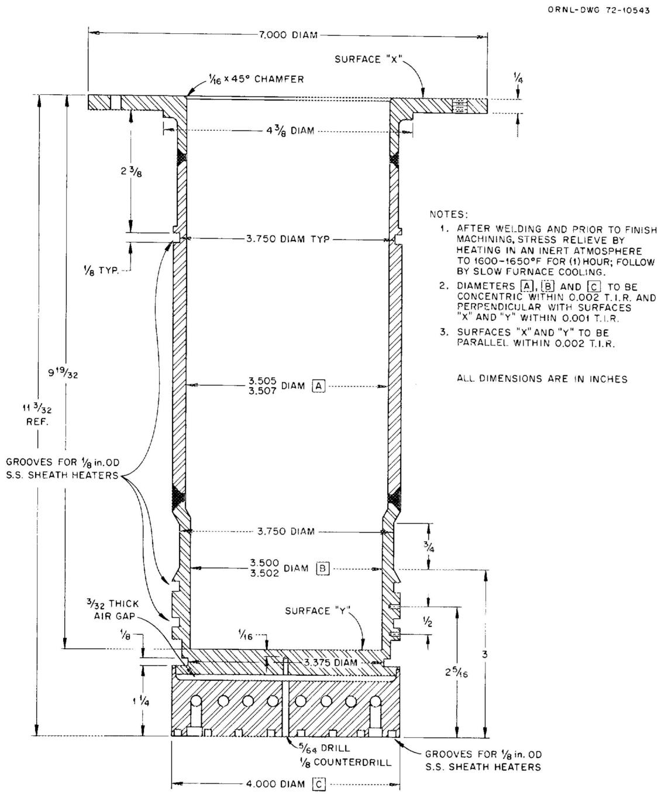  
Fig. A-1. Detail of the conductivity cell cylinder.

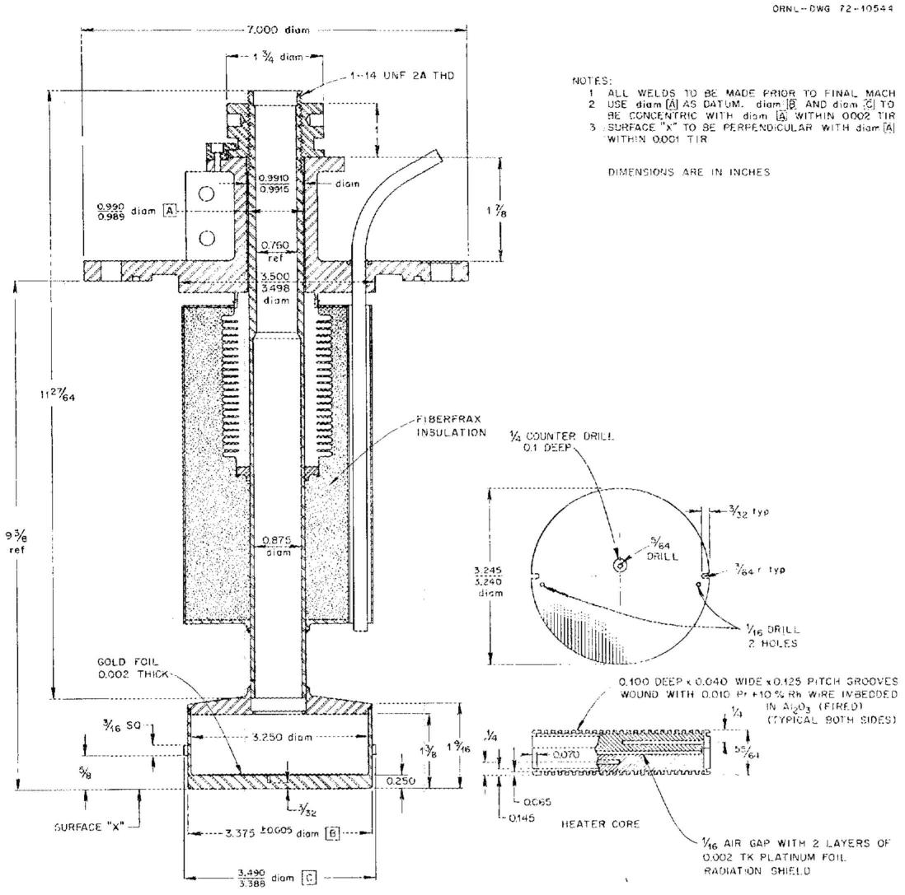  
Fig. A-2. Detail of movable piston assembly of the conductivity cell.

draining, and cleaning the apparatus. In addition, the specimen volume and the total heated mass of the apparatus were made as small as possible.

The more important experimental equipment used in the present investigation is listed in Table A-1. Model and serial numbers, capacities, accuracies, and least count are given when known or applicable.

(heading values are given if known)

Table A-1. List of Pertinent Experimental Equipment   

<table><tr><td>Equipment</td><td>Capacity or range</td><td>Accuracy</td><td>Least Count</td></tr><tr><td colspan="4">Potentiometer</td></tr><tr><td rowspan="3">L&amp;N 7555 type K-5, 177362, Leeds &amp; Northrup</td><td>0 - 1.6 V</td><td>±(0.001% of reading + 2 μV)</td><td>2.0 μV</td></tr><tr><td>0 - 0.16 V</td><td>±(0.003% of reading + 0.02 μV)</td><td>0.2 μV</td></tr><tr><td>0 - 0.016 V</td><td>±(0.003% of reading + 0.1 μV)</td><td>0.02 μV</td></tr><tr><td colspan="4">Voltage regulator</td></tr><tr><td>Variac, automatic Model 1581-A</td><td>Output 115 V, adj. ±10%, 50 A</td><td>±0.25%</td><td></td></tr><tr><td colspan="4">Null detector</td></tr><tr><td>Leeds &amp; Northrup 9834-1</td><td>0.07 μV/mm for source resistances up to 2000 Ω</td><td></td><td>0.1 μV</td></tr><tr><td colspan="4">DC digital voltmeter</td></tr><tr><td>Vidar 521 integrating voltmeter</td><td>±10 μV to ±1000 V in six-decade stages</td><td>±0.01% of full scale</td><td>1.0 μV</td></tr><tr><td colspan="4">Thermocouples</td></tr><tr><td>Pt vs Pt-10% Rh</td><td></td><td>±0.2</td><td></td></tr><tr><td>Chromel-Alumel</td><td></td><td>±0.75</td><td></td></tr><tr><td colspan="4">Precision resistor</td></tr><tr><td>Leeds &amp; Northrup Model 4360</td><td>0.1 Ω, 15 A</td><td>±0.04%</td><td></td></tr><tr><td colspan="4">DC voltage supply</td></tr><tr><td>Kepco Model SM 75-8MX</td><td>Input 105-125 V, 60 cps, 9.6 A max; output 0-75 V, 0-8 A</td><td>Line: &lt;0.01% voltage variation or 0.002 V, which ever greater after stabilizing</td><td></td></tr><tr><td colspan="4">Dial indicator</td></tr><tr><td>Federal Model E3BS-R1</td><td>20 revolutions (0.4 in.)</td><td>one-half of one division</td><td>0.0001 in.</td></tr></table>

# APPENDIX B

# EXPERIMENTAL, DATA

The uncorrected, raw data, experimental thermocouple emfs, heater current and voltage, and gap-dial indicator readings are given in Tables B-1 through B-11. The reduced experimental results, which include specimen thickness, the average temperature level, temperature drop, heat flux, and total thermal resistance are tabulated in Tables B-12 through B-22. All these data are grouped by specimen and apparatus model numbers (Table 1), and appear in chronological order.

The guard and shunting factors are determined as indicated in the method of calculation given in Chapter 2, where the guard factor is specifically defined as (see Fig. 12):

$$
G \equiv \frac {T _ {3} - T _ {5}}{T _ {3} - T _ {2}}.
$$

The heat flux is determined as

$$
\frac {Q}{A} = \frac {4 F E I V}{\pi D ^ {2}}.
$$

The data for vacuum runs were reduced in a slightly different way from the other runs. The plate-to-plate temperature drop was determined from the total drop minus the estimated wall temperature drops and was used to calculate the thermal resistance. If the average temperature level varied significantly in the vacuum runs, the calculated thermal resistances were normalized to a mean average temperature by the ratio

$$
\left(\frac {\mathrm {T} _ {\text {m a x}}}{\mathrm {T} _ {\text {m e a n}}}\right) ^ {3},
$$

where $\mathbf{T}$ is in ${}^{\circ}\mathbf{K}$ .

Table B-1. Experimental Data for $\mathsf{H}_2\mathsf{O}$ Using Apparatus I-A   

<table><tr><td>Run No. +</td><td>1-A</td><td>1-B</td><td>1-C</td><td>1-D</td><td>1-E</td><td>1-F</td><td>1-G</td><td>1-H</td></tr><tr><td>Date</td><td>9-1-65</td><td>9-1-65</td><td>9-2-65</td><td>9-2-65</td><td>9-2-65</td><td>9-3-65</td><td>9-3-65</td><td>9-3-65</td></tr><tr><td>Time Begun</td><td>2:15</td><td>4:07</td><td>1:25</td><td>2:55</td><td>4:25</td><td>11:22</td><td>12:50</td><td>1:50</td></tr><tr><td>Dial Zero (in.)</td><td>0.05600</td><td>0.05600</td><td>0.04900</td><td>0.00000</td><td>0.00000</td><td>0.00000</td><td>0.00000</td><td>0.00000</td></tr><tr><td>Dial Reading (in.)</td><td>0.25764</td><td>0.20802</td><td>0.15819</td><td>0.05123</td><td>0.01976</td><td>0.09889</td><td>0.04905</td><td>0.02462</td></tr><tr><td>TC 1 (mv)</td><td>1.2504</td><td>1.0008</td><td>1.4407</td><td>1.3170</td><td>1.2540</td><td>2.2628</td><td>2.0435</td><td>1.9368</td></tr><tr><td>TC 2 (mv)</td><td>0.5760</td><td>0.4728</td><td>0.9131</td><td>1.0415</td><td>1.0689</td><td>1.4792</td><td>1.5936</td><td>1.6585</td></tr><tr><td>TC 3 (mv)</td><td>1.3996</td><td>1.1438</td><td>1.6457</td><td>1.5176</td><td>1.4246</td><td>2.5753</td><td>2.3414</td><td>2.2241</td></tr><tr><td>TC 4 (mv)</td><td>1.3948</td><td>1.1391</td><td>1.6432</td><td>1.5165</td><td>1.4248</td><td>2.5716</td><td>2.3402</td><td>2.2245</td></tr><tr><td>TC 6 (mv)</td><td>--</td><td>--</td><td>--</td><td>--</td><td>--</td><td>--</td><td>--</td><td>--</td></tr><tr><td>TC 5 (mv)</td><td>1.3974</td><td>1.1473</td><td>1.6496</td><td>1.5202</td><td>1.4202</td><td>2.5775</td><td>2.3370</td><td>2.2261</td></tr><tr><td>TC 7 (mv)</td><td>--</td><td>--</td><td>--</td><td>--</td><td>--</td><td>--</td><td>--</td><td>--</td></tr><tr><td>TC 8 (mv)</td><td>--</td><td>--</td><td>--</td><td>--</td><td>--</td><td>--</td><td>--</td><td>--</td></tr><tr><td>TC 9 (mv)</td><td>--</td><td>--</td><td>--</td><td>--</td><td>--</td><td>--</td><td>--</td><td>--</td></tr><tr><td>TC 1 (final)</td><td>1.2503</td><td>1.0003</td><td>1.4400</td><td>1.3204</td><td>1.2356</td><td>2.2632</td><td>2.0430</td><td>1.9330</td></tr><tr><td>TC 2 (final)</td><td>0.5760</td><td>0.4720</td><td>0.9122</td><td>1.0436</td><td>1.0523</td><td>1.4800</td><td>1.5930</td><td>1.6553</td></tr><tr><td>Time Finish</td><td>2:20</td><td>4:12</td><td>1:35</td><td>3:10</td><td>5:25</td><td>11:27</td><td>12:55</td><td>2:14</td></tr><tr><td rowspan="2">HT (v)</td><td>0.0</td><td>0.0</td><td>0.571</td><td>0.571</td><td>0.571</td><td>0.0</td><td>0.0</td><td>0.0</td></tr><tr><td>(a)</td><td>0.0</td><td>--</td><td>--</td><td>--</td><td>0.0</td><td>0.0</td><td>0.0</td></tr><tr><td rowspan="2">HM (v)</td><td>8.98</td><td>8.98</td><td>11.1</td><td>11.1</td><td>11.1</td><td>13.92</td><td>13.92</td><td>13.92</td></tr><tr><td>(a)</td><td>0.7810</td><td>0.7875</td><td>0.9474</td><td>0.9512</td><td>1.1356</td><td>1.1429</td><td>1.1470</td></tr><tr><td rowspan="2">HS (v)</td><td>0.0</td><td>0.0</td><td>0.0</td><td>0.0</td><td>0.0</td><td>0.0</td><td>--</td><td>--</td></tr><tr><td>(a)</td><td>0.0</td><td>0.0</td><td>0.0</td><td>0.0</td><td>0.0</td><td>9.4</td><td>11.6</td></tr><tr><td rowspan="2">HR 1 (v)</td><td>--</td><td>--</td><td>--</td><td>--</td><td>--</td><td>--</td><td>--</td><td>--</td></tr><tr><td>(a)</td><td>5.0</td><td>4.9</td><td>5.2</td><td>5.3</td><td>4.7</td><td>6.1</td><td>5.6</td></tr><tr><td rowspan="2">HR 2 (v)</td><td>--</td><td>--</td><td>--</td><td>--</td><td>--</td><td></td><td></td><td></td></tr><tr><td>(a)</td><td>5.5</td><td>4.1</td><td>5.8</td><td>4.5</td><td>4.4</td><td>7.15</td><td>6.0</td></tr><tr><td rowspan="2">HR 3 (v)</td><td>--</td><td>--</td><td>--</td><td>--</td><td>--</td><td></td><td></td><td></td></tr><tr><td>(a)</td><td>5.5</td><td>4.1</td><td>5.8</td><td>4.5</td><td>4.4</td><td>7.15</td><td>6.0</td></tr><tr><td rowspan="2">HF 1 (v)</td><td>0.0</td><td>0.0</td><td>0.0</td><td>0.0</td><td>0.0</td><td>0.0</td><td>0.0</td><td>0.0</td></tr><tr><td>(a)</td><td>0.0</td><td>0.0</td><td>0.0</td><td>0.0</td><td>0.0</td><td>0.0</td><td>0.0</td></tr><tr><td rowspan="2">HF 2 (v)</td><td>0.0</td><td>0.0</td><td>0.0</td><td>0.0</td><td>0.0</td><td>0.0</td><td>0.0</td><td>0.0</td></tr><tr><td>(a)</td><td>0.0</td><td>0.0</td><td>0.0</td><td>0.0</td><td>0.0</td><td>0.0</td><td>0.0</td></tr><tr><td>Run No. →</td><td>1-I</td><td>2-A</td><td>2-B</td><td>2-C</td><td>2-D</td><td>3-A</td><td>3-B</td><td>3-C</td></tr><tr><td>Date</td><td>9-3-65</td><td>9-16-65</td><td>9-17-65</td><td>9-17-65</td><td>9-17-65</td><td>9-21-65</td><td>9-21-65</td><td>9-21-65</td></tr><tr><td>Time Began</td><td>4:05</td><td>3:40</td><td>11:52</td><td>1:02</td><td>3:50</td><td>2:32</td><td>3:40</td><td>4:12</td></tr><tr><td>Dial Zero (in.)</td><td>0.00000</td><td>0.00000</td><td>0.00000</td><td>0.00000</td><td>0.00000</td><td>0.00000</td><td>0.00000</td><td>0.00000</td></tr><tr><td>Deial Reading (in.)</td><td>0.01240</td><td>0.14982</td><td>0.14485</td><td>0.09503</td><td>0.04480</td><td>0.14730</td><td>0.09688</td><td>0.06692</td></tr><tr><td>TC 1 (mv)</td><td>1.8876</td><td>2.6371</td><td>2.6578</td><td>2.4748</td><td>2.2562</td><td>1.9287</td><td>1.8153</td><td>1.7575</td></tr><tr><td>TC 2 (mv)</td><td>1.6953</td><td>1.5749</td><td>1.5979</td><td>1.7152</td><td>1.8331</td><td>1.0932</td><td>1.2268</td><td>1.3244</td></tr><tr><td>TC 3 (mv)</td><td>2.1651</td><td>2.9784</td><td>2.9923</td><td>2.7848</td><td>2.5576</td><td>2.1783</td><td>2.0455</td><td>1.9837</td></tr><tr><td>TC 4 (mv)</td><td>2.1649</td><td>2.9671</td><td>2.9810</td><td>2.7805</td><td>2.5551</td><td>2.1728</td><td>2.0440</td><td>1.9830</td></tr><tr><td>TC 6 (mv)</td><td>-</td><td>-</td><td>-</td><td>-</td><td>-</td><td>-</td><td>-</td><td>-</td></tr><tr><td>TC 5 (mv)</td><td>2.1664</td><td>2.9743</td><td>2.9843</td><td>2.7777</td><td>2.5598</td><td>2.1787</td><td>2.0408</td><td>1.9802</td></tr><tr><td>TC 7 (mv)</td><td>-</td><td>-</td><td>-</td><td>-</td><td>-</td><td>-</td><td>-</td><td>-</td></tr><tr><td>TC 8 (mv)</td><td>-</td><td>-</td><td>-</td><td>-</td><td>-</td><td>-</td><td>-</td><td>-</td></tr><tr><td>TC 9 (mv)</td><td>-</td><td>-</td><td>-</td><td>-</td><td>-</td><td>-</td><td>-</td><td>-</td></tr><tr><td>TC 1 (final)</td><td>1.8876</td><td>2.6411</td><td>2.6560</td><td>2.4742</td><td>2.2592</td><td>1.9306</td><td>1.8147</td><td>1.7565</td></tr><tr><td>TC 2 (final)</td><td>1.6953</td><td>1.5790</td><td>1.5966</td><td>1.7148</td><td>1.8374</td><td>1.0951</td><td>1.2250</td><td>1.3236</td></tr><tr><td>Time Finish</td><td>-</td><td>3:51</td><td>12:03</td><td>1:07</td><td>4:05</td><td>2:42</td><td>3:50</td><td>4:18</td></tr><tr><td rowspan="2">HT (v)</td><td>0.23</td><td>0.0</td><td>0.0</td><td>0.0</td><td>0.0</td><td>0.0</td><td>0.0</td><td>0.0</td></tr><tr><td>(a)</td><td>0.0</td><td>0.0</td><td>0.0</td><td>0.0</td><td>0.0</td><td>0.0</td><td>0.0</td></tr><tr><td rowspan="2">HM (v)</td><td>13.80</td><td>13.92</td><td>13.92</td><td>13.92</td><td>13.96</td><td>12.00</td><td>12.00</td><td>12.00</td></tr><tr><td>(a)</td><td>1.938</td><td>1.938</td><td>1.949</td><td>1.968</td><td>1.733</td><td>1.739</td><td>1.742</td></tr><tr><td rowspan="2">HS (v)</td><td>-</td><td>0.0</td><td>0.0</td><td>-</td><td>-</td><td>0.0</td><td>-</td><td>-</td></tr><tr><td>(a)</td><td>0.0</td><td>0.0</td><td>8.7</td><td>14.0</td><td>0.0</td><td>7.3</td><td>10.2</td></tr><tr><td rowspan="2">HR 1 (v)</td><td>-</td><td>-</td><td>-</td><td>-</td><td>-</td><td>-</td><td>-</td><td>-</td></tr><tr><td>(a)</td><td>7.3</td><td>7.3</td><td>6.7</td><td>6.1</td><td>6.1</td><td>5.9</td><td>5.3</td></tr><tr><td rowspan="2">HR 2 (v)</td><td>-</td><td>-</td><td>-</td><td>-</td><td>-</td><td>-</td><td>-</td><td>-</td></tr><tr><td>(a)</td><td>7.3</td><td>7.3</td><td>6.8</td><td>5.8</td><td>5.9</td><td>5.8</td><td>5.3</td></tr><tr><td rowspan="2">HR 3 (v)</td><td>-</td><td>-</td><td>-</td><td>-</td><td>-</td><td>-</td><td>-</td><td>-</td></tr><tr><td>(a)</td><td>7.3</td><td>7.3</td><td>6.8</td><td>5.8</td><td>5.9</td><td>5.8</td><td>5.3</td></tr><tr><td rowspan="2">HF 1 (v)</td><td>0.0</td><td>0.0</td><td>0.0</td><td>0.0</td><td>0.0</td><td>0.0</td><td>0.0</td><td>0.0</td></tr><tr><td>(a)</td><td>0.0</td><td>0.0</td><td>0.0</td><td>0.0</td><td>0.0</td><td>0.0</td><td>0.0</td></tr><tr><td rowspan="2">HF 2 (v)</td><td>0.0</td><td>0.0</td><td>0.0</td><td>0.0</td><td>0.0</td><td>0.0</td><td>0.0</td><td>0.0</td></tr><tr><td>(a)</td><td>0.0</td><td>0.0</td><td>0.0</td><td>0.0</td><td>0.0</td><td>0.0</td><td>0.0</td></tr></table>

Table B-2. Experimental Data for Hg Using Apparatus I-A   

<table><tr><td>Run →</td><td>1-A</td><td>1-B</td><td>1-C</td><td>1-D</td><td>1-E</td><td>2-A</td><td>2-B</td><td>2-C</td><td>2-D</td><td>2-E</td><td>2-F</td></tr><tr><td>Date</td><td>9-14-65</td><td>9-14-65</td><td>9-14-65</td><td>9-14-65</td><td>9-14-65</td><td>9-15-65</td><td>9-15-65</td><td>9-15-65</td><td>9-15-65</td><td>9-15-65</td><td>9-15-65</td></tr><tr><td>Time Began</td><td>12:55</td><td>2:05</td><td>3:50</td><td>4:06</td><td>6:05</td><td>10:40</td><td>12:10</td><td>1:25</td><td>2:45</td><td>4:45</td><td>6:40</td></tr><tr><td>Dial Zero (in.)</td><td>-0.00050</td><td>-0.00050</td><td>-.00050</td><td>-0.00050</td><td>-0.00050</td><td>0.00000</td><td>0.00000</td><td>0.00000</td><td>0.00000</td><td>0.00000</td><td>0.00000</td></tr><tr><td>Dial Reading (in.)</td><td>0.19469</td><td>0.09462</td><td>0.09451</td><td>0.04446</td><td>0.02237</td><td>0.09500</td><td>0.04480</td><td>0.14975</td><td>0.09508</td><td>0.04484</td><td>0.00578</td></tr><tr><td>TC 1 (mv)</td><td>2.5855</td><td>2.5774</td><td>2.5800</td><td>2.5498</td><td>2.4645</td><td>2.5861</td><td>2.5675</td><td>2.6130</td><td>2.5707</td><td>2.5312</td><td>2.5167</td></tr><tr><td>TC 2 (mv)</td><td>2.2959</td><td>2.3658</td><td>2.3585</td><td>2.3648</td><td>2.3048</td><td>2.3815</td><td>2.3989</td><td>2.3620</td><td>2.3626</td><td>2.3621</td><td>2.3766</td></tr><tr><td>TC 3 (mv)</td><td>3.0665</td><td>2.9982</td><td>3.0192</td><td>2.9771</td><td>2.8796</td><td>3.0324</td><td>2.9891</td><td>3.0881</td><td>2.9889</td><td>2.9476</td><td>2.9216</td></tr><tr><td>TC 4 (mv)</td><td>3.0351</td><td>2.9842</td><td>3.0069</td><td>2.9658</td><td>2.8766</td><td>3.0190</td><td>2.9827</td><td>3.0662</td><td>2.9773</td><td>2.9423</td><td>2.9228</td></tr><tr><td>TC 6 (mv)</td><td>-</td><td>-</td><td>-</td><td>-</td><td>-</td><td>-</td><td>-</td><td>-</td><td>-</td><td>-</td><td>-</td></tr><tr><td>TC 5 (mv)</td><td>3.0348</td><td>2.9830</td><td>3.0136</td><td>2.9956</td><td>2.8535</td><td>3.0285</td><td>2.9849</td><td>3.0652</td><td>2.9751</td><td>2.9517</td><td>2.9128</td></tr><tr><td>TC 7 (mv)</td><td>1.0832</td><td>0.8723</td><td>0.8765</td><td>-</td><td>-</td><td>0.8735</td><td>0.8389</td><td>0.8820</td><td>0.8505</td><td>-</td><td>-</td></tr><tr><td>TC 8 (mv)</td><td>-</td><td>-</td><td>-</td><td>-</td><td>-</td><td>-</td><td>-</td><td>-</td><td>-</td><td>-</td><td>-</td></tr><tr><td>TC 9 (mv)</td><td>-</td><td>-</td><td>-</td><td>-</td><td>-</td><td>-</td><td>-</td><td>-</td><td>-</td><td>-</td><td>-</td></tr><tr><td>TC 1 (final)</td><td>2.5841</td><td>2.5728</td><td>2.5793</td><td>2.5438</td><td>2.4638</td><td>2.5862</td><td>2.5657</td><td>2.6143</td><td>2.5498</td><td>2.5291</td><td>2.5181</td></tr><tr><td>TC 2 (final)</td><td>2.2941</td><td>2.3612</td><td>2.3579</td><td>2.3639</td><td>2.3038</td><td>2.3815</td><td>2.3971</td><td>2.3635</td><td>2.3441</td><td>2.3600</td><td>2.3776</td></tr><tr><td>Time Finish</td><td>1:12</td><td>2:16</td><td>3:55</td><td>4:46</td><td>6:15</td><td>10:50</td><td>12:20</td><td>1:35</td><td>3:35</td><td>4:50</td><td>6:46</td></tr><tr><td rowspan="2">HT (v)</td><td>0.0</td><td>0.0</td><td>0.0</td><td>0.0</td><td>0.0</td><td>0.0</td><td>0.0</td><td>0.0</td><td>0.0</td><td>0.0</td><td>0.0</td></tr><tr><td>(a)</td><td>0.0</td><td>0.0</td><td>0.0</td><td>0.0</td><td>0.0</td><td>0.0</td><td>0.0</td><td>0.0</td><td>0.0</td><td>0.0</td></tr><tr><td rowspan="2">HM (v)</td><td>16.62</td><td>16.60</td><td>17.08</td><td>17.02</td><td>17.06</td><td>17.03</td><td>17.00</td><td>17.00</td><td>16.96</td><td>16.96</td><td>16.96</td></tr><tr><td>(a)</td><td>2.265</td><td>2.265</td><td>2.326</td><td>2.333</td><td>2.330</td><td>2.330</td><td>2.331</td><td>2.317</td><td>2.323</td><td>2.332</td></tr><tr><td rowspan="2">HS (v)</td><td>0.0</td><td>-</td><td>0.0</td><td>-</td><td>-</td><td>0.0</td><td>-</td><td>0.0</td><td>-</td><td>-</td><td>-</td></tr><tr><td>(a)</td><td>0.0</td><td>7.3</td><td>0.0</td><td>2.2</td><td>0.0</td><td>5.5</td><td>0.0</td><td>3.7</td><td>-</td><td>-</td></tr><tr><td rowspan="2">HR 1 (v)</td><td>-</td><td>-</td><td>-</td><td>-</td><td>-</td><td>-</td><td>-</td><td>-</td><td>-</td><td>-</td><td>-</td></tr><tr><td>(a)</td><td>8.2</td><td>7.5</td><td>7.6</td><td>7.5</td><td>7.9</td><td>7.5</td><td>7.8</td><td>7.6</td><td>7.6</td><td>7.6</td></tr><tr><td rowspan="2">HR 2 (v)</td><td>-</td><td>-</td><td>-</td><td>-</td><td>-</td><td>-</td><td>-</td><td>-</td><td>-</td><td>-</td><td>-</td></tr><tr><td>(a)</td><td>8.0</td><td>7.6</td><td>7.6</td><td>7.5</td><td>7.9</td><td>7.6</td><td>7.6</td><td>7.3</td><td>7.3</td><td>7.3</td></tr><tr><td rowspan="2">HR 3 (v)</td><td>-</td><td>-</td><td>-</td><td>-</td><td>-</td><td>-</td><td>-</td><td>-</td><td>-</td><td>-</td><td>-</td></tr><tr><td>(a)</td><td>8.0</td><td>7.6</td><td>7.6</td><td>7.5</td><td>7.9</td><td>7.6</td><td>7.6</td><td>7.3</td><td>7.3</td><td>7.3</td></tr><tr><td rowspan="2">HF 1 (v)</td><td>0.0</td><td>0.0</td><td>0.0</td><td>0.0</td><td>0.0</td><td>0.0</td><td>0.0</td><td>0.0</td><td>0.0</td><td>0.0</td><td>0.0</td></tr><tr><td>(a)</td><td>0.0</td><td>0.0</td><td>0.0</td><td>0.0</td><td>0.0</td><td>0.0</td><td>0.0</td><td>0.0</td><td>0.0</td><td>0.0</td></tr><tr><td rowspan="2">HF 2 (v)</td><td>0.0</td><td>0.0</td><td>0.0</td><td>0.0</td><td>0.0</td><td>0.0</td><td>0.0</td><td>0.0</td><td>0.0</td><td>0.0</td><td>0.0</td></tr><tr><td>(a)</td><td>0.0</td><td>0.0</td><td>0.0</td><td>0.0</td><td>0.0</td><td>0.0</td><td>0.0</td><td>0.0</td><td>0.0</td><td>0.0</td></tr></table>

Table B-3. Experimental Data for HTS Using Apparatus I-A   

<table><tr><td>Run No. →</td><td>1-A</td><td>1-B</td><td>1-C</td><td>1-D</td><td>1-E</td><td>1-F</td><td>1-G</td><td>1-H</td><td>1-I</td><td>1-J</td><td>2-A</td><td>2-B</td><td>2-C</td><td>2-D</td><td></td></tr><tr><td>Date</td><td>7-7-66</td><td>7-7-66</td><td>7-7-66</td><td>7-8-66</td><td>7-8-66</td><td>7-8-66</td><td>7-8-66</td><td>7-8-66</td><td>7-8-66</td><td>7-8-66</td><td>7-11-66</td><td>7-11-66</td><td>7-11-66</td><td>7-11-66</td><td>7-11-66</td></tr><tr><td>Time Begun</td><td>12:50</td><td>2:45</td><td>4:05</td><td>8:50</td><td>10:30</td><td>11:30</td><td>12:40</td><td>1:50</td><td>3:00</td><td>4:15</td><td>8:50</td><td>10:20</td><td>11:50</td><td>1:20</td><td></td></tr><tr><td>Dial Zero (in.)</td><td>0.00280</td><td>0.00280</td><td>0.00280</td><td>0.00280</td><td>0.00280</td><td>0.00280</td><td>0.00280</td><td>0.00280</td><td>0.00280</td><td>0.00280</td><td>0.00280</td><td>0.00280</td><td>0.00280</td><td>0.10000</td><td></td></tr><tr><td>Dial Reading (in.)</td><td>0.15240</td><td>0.12758</td><td>0.08246</td><td>0.05238</td><td>0.02271</td><td>0.01269</td><td>0.03782</td><td>0.06740</td><td>0.10502</td><td>0.00791</td><td>0.00752</td><td>0.02289</td><td>0.03031</td><td>0.09340</td><td></td></tr><tr><td>TC 1 (mv)</td><td>12.816</td><td>12.770</td><td>12.683</td><td>12.683</td><td>12.634</td><td>12.627</td><td>12.631</td><td>12.666</td><td>12.729</td><td>12.596</td><td>12.722</td><td>12.711</td><td>12.693</td><td>12.760</td><td></td></tr><tr><td>TC 2 (mv)</td><td>12.087</td><td>12.164</td><td>12.242</td><td>12.352</td><td>12.395</td><td>12.416</td><td>12.349</td><td>12.290</td><td>12.216</td><td>12.398</td><td>12.523</td><td>12.470</td><td>12.426</td><td>12.287</td><td></td></tr><tr><td>TC 3 (mv)</td><td>12.967</td><td>12.909</td><td>12.809</td><td>12.789</td><td>12.743</td><td>12.739</td><td>12.738</td><td>12.784</td><td>12.857</td><td>12.713</td><td>12.830</td><td>12.819</td><td>12.806</td><td>12.887</td><td></td></tr><tr><td>TC 4 (mv)</td><td>12.931</td><td>12.879</td><td>12.786</td><td>12.776</td><td>12.729</td><td>12.724</td><td>12.726</td><td>12.767</td><td>12.834</td><td>12.695</td><td>12.816</td><td>12.805</td><td>12.790</td><td>12.865</td><td></td></tr><tr><td>TC 5 (mv)</td><td>12.981</td><td>12.894</td><td>12.774</td><td>12.725</td><td>12.684</td><td>12.687</td><td>12.666</td><td>12.724</td><td>12.823</td><td>12.670</td><td>12.768</td><td>12.754</td><td>12.748</td><td>12.856</td><td></td></tr><tr><td>TC 6 (mv)</td><td>14.184</td><td>14.163</td><td>14.129</td><td>14.105</td><td>14.091</td><td>14.084</td><td>14.074</td><td>14.082</td><td>14.104</td><td>14.076</td><td>14.137</td><td>14.131</td><td>14.116</td><td>14.128</td><td></td></tr><tr><td>TC 7 (mv)</td><td>14.196</td><td>-</td><td>-</td><td>-</td><td>-</td><td>-</td><td>-</td><td>-</td><td>-</td><td>-</td><td>-</td><td>-</td><td>-</td><td>-</td><td></td></tr><tr><td>TC 8 (mv)</td><td>13.424</td><td>13.452</td><td>13.474</td><td>13.545</td><td>13.540</td><td>13.539</td><td>13.523</td><td>13.501</td><td>13.482</td><td>13.506</td><td>13.629</td><td>13.604</td><td>13.562</td><td>13.513</td><td></td></tr><tr><td>TC 9 (mv)</td><td>-</td><td>-</td><td>-</td><td>-</td><td>-</td><td>-</td><td>-</td><td>-</td><td>-</td><td>-</td><td>-</td><td>-</td><td>-</td><td>-</td><td></td></tr><tr><td>TC 1 (final)</td><td>12.814</td><td>12.769</td><td>12.683</td><td>12.683</td><td>12.634</td><td>12.628</td><td>12.631</td><td>12.668</td><td>12.729</td><td>12.597</td><td>12.722</td><td>12.711</td><td>12.693</td><td>12.761</td><td></td></tr><tr><td>TC 2 (final)</td><td>12.085</td><td>12.165</td><td>12.242</td><td>12.352</td><td>12.394</td><td>12.416</td><td>12.350</td><td>12.287</td><td>12.216</td><td>12.398</td><td>12.523</td><td>12.468</td><td>12.428</td><td>12.290</td><td></td></tr><tr><td>Time Finish</td><td>1:00</td><td>2:55</td><td>4:10</td><td>9:00</td><td>10:42</td><td>11:40</td><td>12:50</td><td>2:00</td><td>3:10</td><td>4:20</td><td>9:00</td><td>10:30</td><td>12:00</td><td>1:30</td><td></td></tr><tr><td rowspan="2">HT (v)</td><td>0</td><td>0</td><td>0</td><td>0</td><td>0</td><td>0</td><td>0</td><td>0</td><td>0</td><td>0</td><td>0</td><td>0</td><td>0</td><td>0</td><td></td></tr><tr><td>0</td><td>0</td><td>0</td><td>0</td><td>0</td><td>0</td><td>0</td><td>0</td><td>0</td><td>0</td><td>0</td><td>0</td><td>0</td><td>0</td><td></td></tr><tr><td rowspan="2">HM (v)</td><td>8.63</td><td>8.63</td><td>8.63</td><td>8.65</td><td>8.73</td><td>8.78</td><td>8.80</td><td>8.82</td><td>8.77</td><td>8.78</td><td>8.87</td><td>8.72</td><td>8.72</td><td>8.72</td><td></td></tr><tr><td>0.8768</td><td>0.8768</td><td>0.8768</td><td>0.8850</td><td>0.8949</td><td>0.8994</td><td>0.9016</td><td>0.9033</td><td>0.8955</td><td>0.8990</td><td>0.9049</td><td>0.8900</td><td>0.8905</td><td>0.8887</td><td></td></tr><tr><td rowspan="2">HS (v)</td><td>0</td><td>0</td><td>0</td><td>0</td><td>0</td><td>0</td><td>0</td><td>0</td><td>0</td><td>0</td><td>0</td><td>0</td><td>0</td><td>0</td><td></td></tr><tr><td>0</td><td>0</td><td>0</td><td>0</td><td>0</td><td>0</td><td>0</td><td>0</td><td>0</td><td>0</td><td>0</td><td>0</td><td>0</td><td>0</td><td></td></tr><tr><td rowspan="2">HR 1 (v)</td><td>4.1</td><td>4.1</td><td>4.1</td><td>4.1</td><td>4.1</td><td>4.1</td><td>4.1</td><td>4.1</td><td>4.1</td><td>4.1</td><td>4.1</td><td>4.1</td><td>4.0</td><td>4.0</td><td></td></tr><tr><td>4.0</td><td>4.0</td><td>4.0</td><td>4.0</td><td>4.0</td><td>4.0</td><td>4.0</td><td>4.0</td><td>4.0</td><td>4.0</td><td>4.0</td><td>4.0</td><td>3.9</td><td>3.9</td><td></td></tr><tr><td rowspan="2">HR 2 (v)</td><td>6.3</td><td>5.7</td><td>4.9</td><td>4.3</td><td>4.0</td><td>4.0</td><td>4.0</td><td>4.6</td><td>5.25</td><td>4.1</td><td>4.1</td><td>4.1</td><td>4.3</td><td>5.2</td><td></td></tr><tr><td>6.7</td><td>6.0</td><td>5.2</td><td>4.3</td><td>4.3</td><td>4.3</td><td>4.3</td><td>4.9</td><td>5.6</td><td>4.3</td><td>4.3</td><td>4.3</td><td>4.6</td><td>5.5</td><td></td></tr><tr><td rowspan="2">HR 3 (v)</td><td>6.1</td><td>5.6</td><td>4.9</td><td>4.2</td><td>4.0</td><td>4.0</td><td>4.0</td><td>4.4</td><td>5.2</td><td>4.0</td><td>4.0</td><td>4.0</td><td>4.1</td><td>5.0</td><td></td></tr><tr><td>6.5</td><td>6.0</td><td>5.2</td><td>4.4</td><td>4.2</td><td>4.3</td><td>4.3</td><td>4.7</td><td>5.5</td><td>4.3</td><td>4.2</td><td>4.3</td><td>4.4</td><td>5.4</td><td></td></tr><tr><td rowspan="2">HF 1 (v)</td><td>-</td><td>-</td><td>-</td><td>-</td><td>-</td><td>-</td><td>-</td><td>-</td><td>-</td><td>-</td><td>-</td><td>-</td><td>-</td><td>-</td><td></td></tr><tr><td>3.75</td><td>3.75</td><td>3.75</td><td>3.75</td><td>3.75</td><td>3.75</td><td>3.7</td><td>3.7</td><td>3.7</td><td>3.7</td><td>3.7</td><td>3.7</td><td>3.7</td><td>3.7</td><td></td></tr><tr><td rowspan="2">HF 2 (v)</td><td>-</td><td>-</td><td>-</td><td>-</td><td>-</td><td>-</td><td>-</td><td>-</td><td>-</td><td>-</td><td>-</td><td>-</td><td>-</td><td>-</td><td></td></tr><tr><td>3.8</td><td>3.8</td><td>3.8</td><td>3.8</td><td>3.8</td><td>3.8</td><td>3.8</td><td>3.8</td><td>3.8</td><td>3.8</td><td>3.8</td><td>3.8</td><td>3.8</td><td>3.8</td><td></td></tr><tr><td>Run No. →</td><td>2-B</td><td>2-F</td><td>3-A</td><td>3-B</td><td>3-C</td><td>3-D</td><td>3-E</td><td>3-F</td><td>3-G</td><td>3-H</td><td>3-I</td><td>3-J</td><td>3-K</td><td>3-L</td></tr><tr><td>Date</td><td>7-11-66</td><td>7-11-66</td><td>7-12-66</td><td>7-12-66</td><td>7-12-66</td><td>7-13-66</td><td>7-13-66</td><td>7-13-66</td><td>7-13-66</td><td>7-13-66</td><td>7-13-66</td><td>7-13-66</td><td>7-14-66</td><td>7-14-66</td></tr><tr><td>Time Began</td><td>2:35</td><td>4:05</td><td>2:10</td><td>3:15</td><td>4:05</td><td>9:20</td><td>10:45</td><td>11:50</td><td>1:10</td><td>2:15</td><td>3:20</td><td>4:17</td><td>8:50</td><td>10:25</td></tr><tr><td>Dial Zero (in.)</td><td>0.00280</td><td>0.00280</td><td>0.00645</td><td>0.00645</td><td>0.00645</td><td>0.00645</td><td>0.00645</td><td>0.00645</td><td>0.00645</td><td>0.00645</td><td>0.00645</td><td>0.00645</td><td>0.00645</td><td>0.00645</td></tr><tr><td>Dial Reading (in.)</td><td>0.11650</td><td>0.14027</td><td>0.15656</td><td>0.14649</td><td>0.12648</td><td>0.11410</td><td>0.09417</td><td>0.07421</td><td>0.05418</td><td>0.03422</td><td>0.01415</td><td>0.02422</td><td>0.04443</td><td>0.06411</td></tr><tr><td>TC 1 (mv)</td><td>12.804</td><td>12.826</td><td>22.846</td><td>22.856</td><td>22.824</td><td>22.858</td><td>22.820</td><td>22.807</td><td>22.777</td><td>22.760</td><td>22.712</td><td>22.734</td><td>22.686</td><td>22.748</td></tr><tr><td>TC 2 (mv)</td><td>12.244</td><td>12.185</td><td>22.244</td><td>22.285</td><td>22.307</td><td>22.384</td><td>22.395</td><td>22.433</td><td>22.456</td><td>22.476</td><td>22.503</td><td>22.492</td><td>22.381</td><td>22.404</td></tr><tr><td>TC 3 (mv)</td><td>12.940</td><td>12.963</td><td>23.019</td><td>23.025</td><td>22.989</td><td>23.020</td><td>22.979</td><td>22.961</td><td>22.944</td><td>22.922</td><td>22.888</td><td>22.906</td><td>22.851</td><td>22.915</td></tr><tr><td>TC 4 (mv)</td><td>12.913</td><td>12.935</td><td>22.985</td><td>22.996</td><td>22.960</td><td>22.993</td><td>22.952</td><td>22.939</td><td>22.911</td><td>22.889</td><td>22.850</td><td>22.871</td><td>22.816</td><td>22.883</td></tr><tr><td>TC 5 (mv)</td><td>12.921</td><td>12.948</td><td>23.023</td><td>23.027</td><td>22.990</td><td>23.020</td><td>22.977</td><td>22.963</td><td>22.941</td><td>22.921</td><td>22.906</td><td>22.918</td><td>22.852</td><td>22.913</td></tr><tr><td>TC 6 (mv)</td><td>14.139</td><td>14.144</td><td>24.329</td><td>24.313</td><td>24.299</td><td>24.251</td><td>24.224</td><td>24.205</td><td>24.196</td><td>24.176</td><td>24.154</td><td>24.157</td><td>24.094</td><td>24.124</td></tr><tr><td>TC 7 (mv)</td><td>-</td><td>-</td><td>-</td><td>-</td><td>-</td><td>-</td><td>-</td><td>-</td><td>-</td><td>-</td><td>-</td><td>-</td><td>-</td><td>-</td></tr><tr><td>TC 8 (mv)</td><td>13.486</td><td>13.458</td><td>24.059</td><td>24.069</td><td>24.074</td><td>24.053</td><td>24.040</td><td>24.045</td><td>24.053</td><td>24.056</td><td>24.060</td><td>24.058</td><td>23.947</td><td>23.965</td></tr><tr><td>TC 9 (mv)</td><td>-</td><td>-</td><td>-</td><td>-</td><td>-</td><td>-</td><td>-</td><td>-</td><td>-</td><td>-</td><td>-</td><td>-</td><td>-</td><td>-</td></tr><tr><td>TC 1 (Final)</td><td>12.805</td><td>12.826</td><td>22.843</td><td>22.856</td><td>22.825</td><td>22.857</td><td>22.819</td><td>22.806</td><td>22.777</td><td>22.758</td><td>22.711</td><td>22.734</td><td>22.684</td><td>22.749</td></tr><tr><td>TC 2 (Final)</td><td>12.244</td><td>12.185</td><td>22.247</td><td>22.286</td><td>22.305</td><td>22.383</td><td>22.394</td><td>22.431</td><td>22.455</td><td>22.476</td><td>22.503</td><td>22.492</td><td>22.380</td><td>22.405</td></tr><tr><td>Time Finish</td><td>2:45</td><td>4:10</td><td>2:20</td><td>3:20</td><td>4:15</td><td>9:25</td><td>10:50</td><td>12:00</td><td>1:15</td><td>2:25</td><td>3:32</td><td>4:20</td><td>9:00</td><td>10:30</td></tr><tr><td rowspan="2">HT (v)</td><td>0</td><td>0</td><td>0</td><td>0</td><td>0</td><td>0</td><td>0</td><td>0</td><td>0</td><td>0</td><td>0</td><td>0</td><td>0</td><td>0</td></tr><tr><td>(a)</td><td>0</td><td>0</td><td>0</td><td>0</td><td>0</td><td>0</td><td>0</td><td>0</td><td>0</td><td>0</td><td>0</td><td>0</td><td colspan="2">0</td></tr><tr><td rowspan="2">HM (v)</td><td>8.72</td><td>8.72</td><td>9.62</td><td>9.62</td><td>9.62</td><td>9.62</td><td>9.62</td><td>9.62</td><td>9.62</td><td>9.62</td><td>9.62</td><td>9.62</td><td>9.60</td><td>9.68</td></tr><tr><td>(a)</td><td>0.8872</td><td>0.8868</td><td>0.7946</td><td>0.7942</td><td>0.7947</td><td>0.7948</td><td>0.7949</td><td>0.7954</td><td>0.7959</td><td>0.7963</td><td>0.7959</td><td>0.7956</td><td colspan="2">0.8009</td></tr><tr><td rowspan="2">HS (v)</td><td>0</td><td>0</td><td>0</td><td>0</td><td>0</td><td>0</td><td>0</td><td>0</td><td>0</td><td>0</td><td>0</td><td>0</td><td>0</td><td>0</td></tr><tr><td>(a)</td><td>0</td><td>0</td><td>0</td><td>0</td><td>0</td><td>0</td><td>0</td><td>0</td><td>0</td><td>0</td><td>0</td><td>0</td><td colspan="2">0</td></tr><tr><td rowspan="2">HR 1 (v)</td><td>4.0</td><td>4.0</td><td>4.7</td><td>4.7</td><td>4.7</td><td>4.6</td><td>4.6</td><td>4.6</td><td>4.6</td><td>4.0</td><td>4.0</td><td>4.0</td><td>4.0</td><td>4.0</td></tr><tr><td>(a)</td><td>3.9</td><td>3.9</td><td>4.0</td><td>4.0</td><td>3.9</td><td>3.9</td><td>3.9</td><td>3.9</td><td>3.3</td><td>3.3</td><td>3.3</td><td>3.3</td><td colspan="2">3.3</td></tr><tr><td rowspan="2">HR 2 (v)</td><td>5.6</td><td>5.8</td><td>3.8</td><td>3.7</td><td>3.7</td><td>2.8</td><td>2.3</td><td>2.0</td><td>1.2</td><td>-</td><td>0</td><td>3.0</td><td>-</td><td>1.7</td></tr><tr><td>(a)</td><td>6.0</td><td>6.2</td><td>3.7</td><td>3.5</td><td>2.6</td><td>2.1</td><td>1.5</td><td>0.8</td><td>0.2</td><td>0</td><td>0.5</td><td>0.5</td><td colspan="2">1.2</td></tr><tr><td rowspan="2">HR 3 (v)</td><td>5.5</td><td>5.8</td><td>3.7</td><td>3.7</td><td>3.7</td><td>2.8</td><td>2.3</td><td>2.0</td><td>1.2</td><td>-</td><td>0</td><td>1.0</td><td>-</td><td>1.7</td></tr><tr><td>(a)</td><td>5.9</td><td>6.2</td><td>3.5</td><td>3.5</td><td>3.0</td><td>2.1</td><td>1.6</td><td>0.8</td><td>0.2</td><td>0</td><td>0.5</td><td>0.5</td><td colspan="2">1.2</td></tr><tr><td rowspan="2">HF 1 (v)</td><td>-</td><td>-</td><td>-</td><td>-</td><td>-</td><td>-</td><td>-</td><td>-</td><td>-</td><td>-</td><td>-</td><td>-</td><td>-</td><td>-</td></tr><tr><td>(a)</td><td>3.7</td><td>3.7</td><td>6.1</td><td>6.1</td><td>6.1</td><td>6.1</td><td>6.1</td><td>6.1</td><td>6.1</td><td>6.1</td><td>6.1</td><td>6.1</td><td colspan="2">6.1</td></tr><tr><td rowspan="2">HF 2 (v)</td><td>-</td><td>-</td><td>-</td><td>-</td><td>-</td><td>-</td><td>-</td><td>-</td><td>-</td><td>-</td><td>-</td><td>-</td><td>-</td><td>-</td></tr><tr><td>(a)</td><td>3.8</td><td>3.8</td><td>6.1</td><td>6.1</td><td>6.1</td><td>6.1</td><td>6.1</td><td>6.1</td><td>6.1</td><td>6.1</td><td>6.1</td><td>6.1</td><td colspan="2">6.1</td></tr><tr><td>Run No. +</td><td>3-M</td><td>3-N</td><td>3-O</td><td>4-A</td><td>4-B</td><td>4-C</td><td>4-D</td><td>4-E</td><td>4-F</td><td>5-A</td><td>5-B</td><td>5-C</td><td>5-D</td><td>5-E</td></tr><tr><td>Date</td><td>7-14/66</td><td>7-14-66</td><td>7-14-66</td><td>7-14-66</td><td>7-15-66</td><td>7-15-66</td><td>7-15-66</td><td>7-15-66</td><td>7-15-66</td><td>7-18-66</td><td>7-18-66</td><td>7-18-66</td><td>7-19-66</td><td>7-19-66</td></tr><tr><td>Time Regun</td><td>11:30</td><td>1:00</td><td>2:42</td><td>4:10</td><td>9:10</td><td>10:50</td><td>12:40</td><td>2:20</td><td>3:33</td><td>12:45</td><td>2:30</td><td>3:50</td><td>9:20</td><td>11:10</td></tr><tr><td>Dial Zero (in.)</td><td>0.00645</td><td>0.00645</td><td>0.00645</td><td>0.00645</td><td>0.00645</td><td>0.00645</td><td>0.00645</td><td>0.00645</td><td>0.00645</td><td>0.05269</td><td>0.05269</td><td>0.05269</td><td>0.05269</td><td>0.05269</td></tr><tr><td>Dial Reading (in.)</td><td>0.08432</td><td>0.10430</td><td>0.13669</td><td>0.03915</td><td>0.03891</td><td>0.01910</td><td>0.01188</td><td>0.02239</td><td>0.03054</td><td>0.20243</td><td>0.18253</td><td>0.16240</td><td>0.14226</td><td>0.12232</td></tr><tr><td>TC 1 (mv)</td><td>22.774</td><td>22.778</td><td>22.845</td><td>22.695</td><td>22.672</td><td>22.671</td><td>22.691</td><td>22.690</td><td>22.691</td><td>8.3190</td><td>8.2950</td><td>8.2555</td><td>8.2980</td><td>8.2450</td></tr><tr><td>TC 2 (mv)</td><td>22.378</td><td>22.335</td><td>22.316</td><td>22.418</td><td>22.385</td><td>22.448</td><td>22.495</td><td>22.457</td><td>22.433</td><td>7.6417</td><td>7.6902</td><td>7.7421</td><td>7.8495</td><td>7.8653</td></tr><tr><td>TC 3 (mv)</td><td>22.936</td><td>22.947</td><td>23.006</td><td>22.861</td><td>22.828</td><td>22.834</td><td>22.856</td><td>22.856</td><td>22.856</td><td>8.4584</td><td>8.4351</td><td>8.3871</td><td>8.4301</td><td>8.3772</td></tr><tr><td>TC 4 (mv)</td><td>22.907</td><td>22.916</td><td>22.979</td><td>22.828</td><td>22.800</td><td>22.802</td><td>22.822</td><td>22.822</td><td>22.824</td><td>8.4406</td><td>8.4171</td><td>8.3732</td><td>8.4159</td><td>8.3625</td></tr><tr><td>TC 5 (mv)</td><td>22.932</td><td>22.951</td><td>23.015</td><td>22.858</td><td>22.821</td><td>22.838</td><td>22.866</td><td>22.854</td><td>22.853</td><td>8.4288</td><td>8.3976</td><td>8.3381</td><td>8.3832</td><td>8.3315</td></tr><tr><td>TC 6 (mv)</td><td>24.143</td><td>24.146</td><td>24.166</td><td>24.083</td><td>24.013</td><td>24.017</td><td>24.035</td><td>24.033</td><td>23.027</td><td>9.2262</td><td>9.2213</td><td>9.1900</td><td>9.2147</td><td>9.2005</td></tr><tr><td>TC 7 (mv)</td><td>-</td><td>-</td><td>-</td><td>-</td><td>-</td><td>-</td><td>-</td><td>-</td><td>-</td><td>-</td><td>-</td><td>-</td><td>-</td><td>-</td></tr><tr><td>TC 8 (mv)</td><td>23.961</td><td>23.929</td><td>23.930</td><td>23.941</td><td>23.903</td><td>23.925</td><td>23.943</td><td>23.925</td><td>23.909</td><td>8.8046</td><td>8.7530</td><td>8.7556</td><td>8.8065</td><td>8.8067</td></tr><tr><td>TC 9 (mv)</td><td>-</td><td>-</td><td>-</td><td>-</td><td>-</td><td>-</td><td>-</td><td>-</td><td>-</td><td>-</td><td>-</td><td>-</td><td>-</td><td>-</td></tr><tr><td>TC 1 (final)</td><td>22.772</td><td>22.780</td><td>22.843</td><td>22.694</td><td>22.673</td><td>22.672</td><td>22.690</td><td>22.689</td><td>22.690</td><td>8.3193</td><td>8.2942</td><td>8.2551</td><td>8.2975</td><td>8.2438</td></tr><tr><td>TC 2 (final)</td><td>22.375</td><td>22.330</td><td>22.317</td><td>22.418</td><td>22.386</td><td>22.447</td><td>22.493</td><td>22.455</td><td>22.432</td><td>7.6417</td><td>7.6882</td><td>7.7410</td><td>7.8495</td><td>7.8652</td></tr><tr><td>Time Finish</td><td>11:40</td><td>1:10</td><td>2:50</td><td>4:15</td><td>9:20</td><td>11:00</td><td>12:50</td><td>2:34</td><td>3:43</td><td>12:50</td><td>2:35</td><td>3:55</td><td>9:35</td><td>11:20</td></tr><tr><td rowspan="2">HF (v)</td><td>0</td><td>0</td><td>0</td><td>0</td><td>0</td><td>0</td><td>0</td><td>0</td><td>0</td><td>0</td><td>0</td><td>0</td><td>0</td><td>0</td></tr><tr><td>(a)</td><td>0</td><td>0</td><td>0</td><td>0</td><td>0</td><td>0</td><td>0</td><td>0</td><td>0</td><td>0</td><td>0</td><td>0</td><td colspan="2">0</td></tr><tr><td rowspan="2">HM (v)</td><td>9.68</td><td>9.68</td><td>9.67</td><td>9.64</td><td>9.68</td><td>9.68</td><td>9.68</td><td>9.68</td><td>9.68</td><td>9.59</td><td>9.59</td><td>9.59</td><td>9.59</td><td>9.59</td></tr><tr><td>(a)</td><td>0.8008</td><td>0.8008</td><td>0.7987</td><td>0.7983</td><td>0.8022</td><td>0.8018</td><td>0.8018</td><td>0.8018</td><td>1.0995</td><td>1.1003</td><td>1.1016</td><td>1.1001</td><td colspan="2">1.1016</td></tr><tr><td rowspan="2">HS (v)</td><td>0</td><td>0</td><td>0</td><td>0</td><td>0</td><td>0</td><td>0</td><td>0</td><td>0</td><td>0</td><td>0</td><td>0</td><td>0</td><td>0</td></tr><tr><td>(a)</td><td>0</td><td>0</td><td>0</td><td>0</td><td>0</td><td>0</td><td>0</td><td>0</td><td>0</td><td>0</td><td>0</td><td>0</td><td colspan="2">0</td></tr><tr><td rowspan="2">HR 1 (v)</td><td>4.0,</td><td>4.0,</td><td>4.0,</td><td>2.4</td><td>2.4</td><td>2.4</td><td>2.4</td><td>2.4</td><td>2.4</td><td>1.9</td><td>1.9</td><td>1.9</td><td>1.9</td><td>1.9</td></tr><tr><td>(a)</td><td>3.3</td><td>3.3</td><td>2.0</td><td>2.0</td><td>1.9</td><td>1.9</td><td>1.9</td><td>1.9</td><td>1.7</td><td>1.7</td><td>1.7</td><td>1.7</td><td colspan="2">1.7</td></tr><tr><td rowspan="2">HR 2 (v)</td><td>2.0</td><td>2.6</td><td>3.3</td><td>&lt;1.0</td><td>&lt;1.0</td><td>0</td><td>0</td><td>0</td><td>1.0</td><td>5.6</td><td>5.4</td><td>5.1</td><td>4.9</td><td>4.7</td></tr><tr><td>(a)</td><td>1.7</td><td>2.3</td><td>3.2</td><td>0.3</td><td>0.2</td><td>0</td><td>0</td><td>0.5</td><td>6.2</td><td>6.0</td><td>5.5</td><td>5.4</td><td colspan="2">5.2</td></tr><tr><td rowspan="2">HR 3 (v)</td><td>2.0</td><td>2.6</td><td>3.3</td><td>&lt;1.0</td><td>&lt;1.0</td><td>0</td><td>0</td><td>0</td><td>1.0</td><td>5.5</td><td>5.3</td><td>5.0</td><td>4.9</td><td>4.7</td></tr><tr><td>(a)</td><td>1.7</td><td>2.4</td><td>3.1</td><td>0.4</td><td>0.3</td><td>0</td><td>0</td><td>0.5</td><td>6.2</td><td>6.0</td><td>5.5</td><td>5.5</td><td colspan="2">5.2</td></tr><tr><td rowspan="2">HF 1 (v)</td><td>-</td><td>-</td><td>-</td><td>-</td><td>-</td><td>-</td><td>-</td><td>-</td><td>-</td><td>-</td><td>-</td><td>-</td><td>-</td><td>-</td></tr><tr><td>(a)</td><td>6.1</td><td>6.1</td><td>6.1</td><td>6.1</td><td>6.1</td><td>6.1</td><td>6.1</td><td>6.1</td><td>2.8</td><td>2.7</td><td>2.7</td><td>2.7</td><td colspan="2">2.7</td></tr><tr><td rowspan="2">HF 2 (v)</td><td>-</td><td>-</td><td>-</td><td>-</td><td>-</td><td>-</td><td>-</td><td>-</td><td>-</td><td>-</td><td>-</td><td>-</td><td>-</td><td>-</td></tr><tr><td>(a)</td><td>6.1</td><td>6.1</td><td>6.1</td><td>6.1</td><td>6.0</td><td>6.1</td><td>6.1</td><td>6.1</td><td>2.8</td><td>2.7</td><td>2.8</td><td>2.75</td><td colspan="2">2.7</td></tr></table>

Table B-3 (Continued)   

<table><tr><td>Run No. →</td><td>5-F</td><td>5-G</td><td>5-H</td><td>5-I</td><td>5-J</td><td>5-K</td><td>5-L</td><td>5-M</td><td>5-N</td><td>6-A</td><td>6-B</td><td>6-C</td><td>6-D</td><td>6-E</td><td></td></tr><tr><td>Date</td><td>7-19-66</td><td>7-19-66</td><td>7-19-66</td><td>7-20-66</td><td>7-20-66</td><td>7-20-66</td><td>7-20-66</td><td>7-20-66</td><td>7-20-66</td><td>7-21-66</td><td>7-21-66</td><td>7-21-66</td><td>7-21-66</td><td>7-21-66</td><td>7-21-66</td></tr><tr><td>Time Begun</td><td>12:37</td><td>2:35</td><td>3:30</td><td>8:50</td><td>10:10</td><td>11:20</td><td>12:20</td><td>1:35</td><td>2:25</td><td>9:00</td><td>10:10</td><td>12:10</td><td>1:55</td><td>3:00</td><td></td></tr><tr><td>Dial Zero (in.)</td><td>0.05269</td><td>0.05269</td><td>0.05269</td><td>0.05269</td><td>0.05269</td><td>0.05269</td><td>0.05269</td><td>0.05269</td><td>0.05269</td><td>0.04258</td><td>0.4258</td><td>0.04258</td><td>0.04258</td><td>0.04258</td><td></td></tr><tr><td>Dial Reading (in.)</td><td>0.10241</td><td>0.10241</td><td>0.08248</td><td>0.06258</td><td>0.05805</td><td>0.05495</td><td>0.05269</td><td>0.07248</td><td>0.09245</td><td>0.19544</td><td>0.17540</td><td>0.15540</td><td>0.13518</td><td>0.11540</td><td></td></tr><tr><td>TC 1 (mv)</td><td>8.1878</td><td>8.1800</td><td>8.1360</td><td>8.0474</td><td>8.0307</td><td>8.0424</td><td>8.0356</td><td>8.0621</td><td>8.1019</td><td>11.5063</td><td>11.4776</td><td>11.4570</td><td>11.4918</td><td>11.4631</td><td></td></tr><tr><td>TC 2 (mv)</td><td>7.8830</td><td>7.8772</td><td>7.9015</td><td>7.8885</td><td>7.8893</td><td>7.9127</td><td>7.9115</td><td>7.8702</td><td>7.8388</td><td>10.9625</td><td>10.9873</td><td>11.0294</td><td>11.1131</td><td>11.1363</td><td></td></tr><tr><td>TC 3 (mv)</td><td>8.3199</td><td>8.3119</td><td>8.2684</td><td>8.1776</td><td>8.1563</td><td>8.1660</td><td>8.1600</td><td>8.1881</td><td>8.2296</td><td>11.6280</td><td>11.6017</td><td>11.5769</td><td>11.6122</td><td>11.5832</td><td></td></tr><tr><td>TC 4 (mv)</td><td>8.3056</td><td>8.2971</td><td>8.2530</td><td>8.1629</td><td>8.1433</td><td>8.1532</td><td>8.1470</td><td>8.1748</td><td>8.2161</td><td>11.6076</td><td>11.5806</td><td>11.5567</td><td>11.5934</td><td>11.5631</td><td></td></tr><tr><td>TC 5 (mv)</td><td>8.2738</td><td>8.2619</td><td>8.2288</td><td>8.1438</td><td>8.1170</td><td>8.1262</td><td>8.1231</td><td>8.1440</td><td>8.1768</td><td>11.6136</td><td>11.5815</td><td>11.5466</td><td>11.5923</td><td>11.5625</td><td></td></tr><tr><td>TC 6 (mv)</td><td>9.1811</td><td>9.1630</td><td>9.1508</td><td>9.1049</td><td>9.1021</td><td>9.1001</td><td>9.0990</td><td>9.1030</td><td>9.1088</td><td>13.3060</td><td>13.2899</td><td>13.2726</td><td>13.2809</td><td>13.2832</td><td></td></tr><tr><td>TC 7 (mv)</td><td>-</td><td>-</td><td>-</td><td>-</td><td>-</td><td>-</td><td>-</td><td>-</td><td>-</td><td>-</td><td>-</td><td>-</td><td>-</td><td>-</td><td></td></tr><tr><td>TC 8 (mv)</td><td>8.8037</td><td>8.7926</td><td>8.7932</td><td>8.7816</td><td>8.7838</td><td>8.7835</td><td>8.7840</td><td>8.7744</td><td>8.7686</td><td>12.9338</td><td>12.9291</td><td>12.9388</td><td>12.9700</td><td>12.9839</td><td></td></tr><tr><td>TC 9 (mv)</td><td>-</td><td>-</td><td>-</td><td>-</td><td>-</td><td>-</td><td>-</td><td>-</td><td>-</td><td>-</td><td>-</td><td>-</td><td>-</td><td>-</td><td></td></tr><tr><td>TC 1 (final)</td><td>8.1878</td><td>8.1600</td><td>8.1349</td><td>8.0473</td><td>8.0307</td><td>8.0416</td><td>8.0356</td><td>8.0657</td><td>8.0990</td><td>11.5050</td><td>11.4778</td><td>11.4565</td><td>11.4931</td><td>11.4626</td><td></td></tr><tr><td>TC 2 (final)</td><td>7.8833</td><td>7.8772</td><td>7.9016</td><td>7.8883</td><td>7.8903</td><td>7.9121</td><td>7.9111</td><td>7.8725</td><td>7.8356</td><td>10.9625</td><td>10.9873</td><td>11.0280</td><td>11.1142</td><td>11.1366</td><td></td></tr><tr><td>Time Finish</td><td>12:45</td><td>2:40</td><td>3:40</td><td>9:00</td><td>10:20</td><td>11:35</td><td>12:30</td><td>1:45</td><td>2:40</td><td>9:13</td><td>10:15</td><td>12:20</td><td>2:00</td><td>3:10</td><td></td></tr><tr><td rowspan="2">HT (v) (a)</td><td>0</td><td>0</td><td>0</td><td>0</td><td>0</td><td>0</td><td>0</td><td>0</td><td>0</td><td>0</td><td>0</td><td>0</td><td>0</td><td>0</td><td></td></tr><tr><td>0</td><td>0</td><td>0</td><td>0</td><td>0</td><td>0</td><td>0</td><td>0</td><td>0</td><td>0</td><td>0</td><td>0</td><td>0</td><td>0</td><td></td></tr><tr><td rowspan="2">HM (v) (a)</td><td>9.59</td><td>9.59</td><td>9.59</td><td>9.59</td><td>9.59</td><td>9.59</td><td>9.59</td><td>9.59</td><td>9.59</td><td>8.645</td><td>8.64</td><td>8.64</td><td>8.64</td><td>8.64</td><td></td></tr><tr><td>1.1034</td><td>1.1043</td><td>1.1056</td><td>1.1086</td><td>1.1093</td><td>1.1091</td><td>1.1093</td><td>1.1083</td><td>1.1072</td><td>0.9086</td><td>0.9092</td><td>0.9097</td><td>0.9087</td><td>0.9093</td><td></td></tr><tr><td rowspan="2">HS (v) (a)</td><td>0</td><td>0</td><td>0</td><td>0</td><td>0</td><td>0</td><td>0</td><td>0</td><td>0</td><td>0</td><td>0</td><td>0</td><td>0</td><td>0</td><td></td></tr><tr><td>0</td><td>0</td><td>0</td><td>0</td><td>0</td><td>0</td><td>0</td><td>0</td><td>0</td><td>0</td><td>0</td><td>0</td><td>0</td><td>0</td><td></td></tr><tr><td rowspan="2">HR 1 (v) (a)</td><td>1.8</td><td>1.8</td><td>1.8</td><td>1.8</td><td>1.8</td><td>1.8</td><td>1.8</td><td>1.8</td><td>1.8</td><td>2.0</td><td>2.0</td><td>2.0</td><td>2.0</td><td>2.0</td><td></td></tr><tr><td>1.6</td><td>1.6</td><td>1.6</td><td>1.6</td><td>1.6</td><td>1.6</td><td>1.6</td><td>1.6</td><td>1.6</td><td>1.6</td><td>1.6</td><td>1.6</td><td>1.6</td><td>1.6</td><td></td></tr><tr><td rowspan="2">HR 2 (v) (a)</td><td>4.4</td><td>4.5</td><td>4.35</td><td>4.1</td><td>3.9</td><td>3.9</td><td>3.9</td><td>4.1</td><td>4.3</td><td>4.2</td><td>3.9</td><td>3.6</td><td>3.4</td><td>3.2</td><td></td></tr><tr><td>4.9</td><td>4.9</td><td>4.8</td><td>4.6</td><td>4.3</td><td>4.3</td><td>4.3</td><td>4.6</td><td>4.7</td><td>4.4</td><td>4.1</td><td>3.9</td><td>3.65</td><td>3.4</td><td></td></tr><tr><td rowspan="2">HR 3 (v) (a)</td><td>4.5</td><td>4.5</td><td>4.35</td><td>4.0</td><td>3.9</td><td>3.9</td><td>3.9</td><td>4.1</td><td>4.3</td><td>4.2</td><td>3.9</td><td>3.4</td><td>3.4</td><td>3.2</td><td></td></tr><tr><td>5.0</td><td>5.0</td><td>4.7</td><td>4.4</td><td>4.3</td><td>4.3</td><td>4.3</td><td>4.6</td><td>4.7</td><td>4.3</td><td>4.1</td><td>3.0</td><td>3.65</td><td>3.3</td><td></td></tr><tr><td rowspan="2">HF 1 (v) (a)</td><td>-</td><td>-</td><td>-</td><td>-</td><td>-</td><td>-</td><td>-</td><td>-</td><td>-</td><td>-</td><td>-</td><td>-</td><td>-</td><td>-</td><td></td></tr><tr><td>2.7</td><td>2.7</td><td>2.7</td><td>2.7</td><td>2.7</td><td>2.7</td><td>2.7</td><td>2.7</td><td>2.7</td><td>3.8</td><td>3.8</td><td>3.8</td><td>3.8</td><td>3.8</td><td></td></tr><tr><td rowspan="2">HF 2 (v) (a)</td><td>-</td><td>-</td><td>-</td><td>-</td><td>-</td><td>-</td><td>-</td><td>-</td><td>-</td><td>-</td><td>-</td><td>-</td><td>-</td><td>-</td><td></td></tr><tr><td>2.7</td><td>2.7</td><td>2.7</td><td>2.7</td><td>2.7</td><td>2.7</td><td>2.7</td><td>2.7</td><td>2.7</td><td>3.8</td><td>3.8</td><td>3.8</td><td>3.8</td><td>3.8</td><td></td></tr><tr><td>Run No. →</td><td>6-F</td><td>6-G</td><td>6-H</td><td>6-I</td><td>6-J</td><td>7-A</td><td>7-B</td><td>7-C</td><td>7-D</td><td>7-E</td><td>7-F</td><td>7-G</td><td>7-I</td><td></td></tr><tr><td>Date</td><td>7-21-66</td><td>7-22-66</td><td>7-22-66</td><td>7-22-66</td><td>7-22-66</td><td>7-25-66</td><td>7-25-66</td><td>7-25-66</td><td>7-25-66</td><td>7-25-66</td><td>7-26-66</td><td>7-26-66</td><td>7-26-66</td><td>7-26-66</td></tr><tr><td>Time Begun</td><td>3:55</td><td>11:20</td><td>12:20</td><td>1:10</td><td>3:30</td><td>11:10</td><td>12:35</td><td>2:10</td><td>3:20</td><td>4:17</td><td>10:30</td><td>12:05</td><td>1:15</td><td>3:05</td></tr><tr><td>Dial Zero (in.)</td><td>0.04258</td><td>0.04258</td><td>0.04258</td><td>0.04258</td><td>0.04258</td><td>0.00672</td><td>0.00672</td><td>0.00672</td><td>0.00672</td><td>0.00672</td><td>0.00672</td><td>0.00672</td><td>0.00672</td><td>0.00672</td></tr><tr><td>Dial Reading (in.)</td><td>0.09541</td><td>0.07560</td><td>0.05535</td><td>0.04535</td><td>0.05039</td><td>0.12653</td><td>0.10650</td><td>0.08641</td><td>0.06636</td><td>0.04628</td><td>0.02657</td><td>0.01661</td><td>0.01162</td><td>0.02163</td></tr><tr><td>TC 1 (mv)</td><td>11.4312</td><td>11.3900</td><td>11.3670</td><td>11.3427</td><td>11.3306</td><td>22.976</td><td>22.949</td><td>22.929</td><td>22.934</td><td>22.914</td><td>22.881</td><td>22.853</td><td>22.854</td><td>22.864</td></tr><tr><td>TC 2 (mv)</td><td>11.1613</td><td>11.1736</td><td>11.2101</td><td>11.2173</td><td>11.1923</td><td>22.492</td><td>22.509</td><td>22.533</td><td>22.580</td><td>22.612</td><td>22.639</td><td>22.640</td><td>22.660</td><td>22.634</td></tr><tr><td>TC 3 (mv)</td><td>11.5516</td><td>11.5136</td><td>11.4910</td><td>11.4636</td><td>11.4467</td><td>23.139</td><td>23.107</td><td>23.090</td><td>23.095</td><td>23.084</td><td>23.063</td><td>23.041</td><td>23.038</td><td>23.043</td></tr><tr><td>TC 4 (mv)</td><td>11.5310</td><td>11.4908</td><td>11.4680</td><td>11.4413</td><td>11.4266</td><td>23.116</td><td>23.081</td><td>23.061</td><td>23.066</td><td>23.050</td><td>23.024</td><td>22.996</td><td>22.992</td><td>23.002</td></tr><tr><td>TC 5 (mv)</td><td>11.5316</td><td>11.4959</td><td>11.4838</td><td>11.4548</td><td>11.4289</td><td>23.159</td><td>23.118</td><td>23.096</td><td>23.096</td><td>23.089</td><td>23.077</td><td>23.064</td><td>23.065</td><td>23.068</td></tr><tr><td>TC 6 (mv)</td><td>13.2789</td><td>13.2767</td><td>13.2655</td><td>13.2579</td><td>13.2336</td><td>24.170</td><td>24.242</td><td>24.236</td><td>24.225</td><td>24.224</td><td>24.212</td><td>24.204</td><td>24.194</td><td>24.190</td></tr><tr><td>TC 7 (mv)</td><td>-</td><td>-</td><td>-</td><td>-</td><td>-</td><td>-</td><td>-</td><td>-</td><td>-</td><td>-</td><td>-</td><td>-</td><td>-</td><td>-</td></tr><tr><td>TC 8 (mv)</td><td>12.9912</td><td>12.9998</td><td>12.9936</td><td>12.9919</td><td>12.9759</td><td>24.041</td><td>24.048</td><td>24.057</td><td>24.074</td><td>24.089</td><td>24.068</td><td>24.062</td><td>24.063</td><td>24.053</td></tr><tr><td>TC 9 (mv)</td><td>-</td><td>-</td><td>-</td><td>-</td><td>-</td><td>-</td><td>-</td><td>-</td><td>-</td><td>-</td><td>-</td><td>-</td><td>-</td><td>-</td></tr><tr><td>TC 1 (final)</td><td>11.4316</td><td>11.3900</td><td>11.3676</td><td>11.3435</td><td>11.3310</td><td>22.975</td><td>22.947</td><td>22.930</td><td>22.935</td><td>22.915</td><td>22.887</td><td>22.853</td><td>22.853</td><td>22.864</td></tr><tr><td>TC 2 (final)</td><td>11.1620</td><td>11.1734</td><td>11.2110</td><td>11.2175</td><td>11.1935</td><td>22.492</td><td>22.510</td><td>22.535</td><td>22.581</td><td>22.613</td><td>22.639</td><td>22.639</td><td>22.659</td><td>22.634</td></tr><tr><td>Time Finish</td><td>4:05</td><td>11:25</td><td>12:32</td><td>1:15</td><td>3:35</td><td>11:20</td><td>12:45</td><td>2:20</td><td>3:25</td><td>4:22</td><td>10:40</td><td>12:10</td><td>1:25</td><td>3:10</td></tr><tr><td rowspan="2">HT (v)</td><td>0</td><td>0</td><td>0</td><td>0</td><td>0</td><td>0</td><td>0</td><td>0</td><td>0</td><td>0</td><td>0</td><td>0</td><td>0</td><td>0</td></tr><tr><td>0</td><td>0</td><td>0</td><td>0</td><td>0</td><td>0</td><td>0</td><td>0</td><td>0</td><td>0</td><td>0</td><td>0</td><td>0</td><td colspan="2">0</td></tr><tr><td rowspan="2">HM (v)</td><td>8.64</td><td>8.64</td><td>8.64</td><td>8.64</td><td>8.64</td><td>9.58</td><td>9.58</td><td>9.58</td><td>9.58</td><td>9.58</td><td>9.58</td><td>9.58</td><td>9.58</td><td>9.58</td></tr><tr><td>0.9101</td><td>0.9112</td><td>0.9116</td><td>0.9121</td><td>0.9126</td><td>0.7888</td><td>0.7893</td><td>0.7894</td><td>0.7894</td><td>0.7896</td><td>0.7901</td><td>0.7906</td><td>0.7907</td><td colspan="2">0.7907</td></tr><tr><td rowspan="2">ES (v)</td><td>0</td><td>0</td><td>0</td><td>0</td><td>0</td><td>0</td><td>0</td><td>0</td><td>0</td><td>0</td><td>0</td><td>0</td><td>0</td><td>0</td></tr><tr><td>0</td><td>0</td><td>0</td><td>0</td><td>0</td><td>0</td><td>0</td><td>0</td><td>0</td><td>0</td><td>0</td><td>0</td><td>0</td><td colspan="2">0</td></tr><tr><td rowspan="2">HR 1 (v)</td><td>2.0</td><td>2.0</td><td>2.0</td><td>2.0</td><td>2.0</td><td>1.8</td><td>1.8</td><td>1.8</td><td>1.8</td><td>1.8</td><td>1.4</td><td>1.0</td><td>0</td><td>0</td></tr><tr><td>1.6</td><td>1.6</td><td>1.6</td><td>1.6</td><td>1.6</td><td>1.05</td><td>1.05</td><td>1.05</td><td>1.05</td><td>1.05</td><td>0.8</td><td>0.2</td><td>0</td><td colspan="2">0</td></tr><tr><td rowspan="2">HR 2 (v)</td><td>2.9</td><td>2.7</td><td>2.4</td><td>2.1</td><td>2.2</td><td>3.1</td><td>2.3</td><td>2.0</td><td>1.5</td><td>1.0</td><td>0</td><td>0</td><td>0</td><td>0</td></tr><tr><td>3.1</td><td>2.7</td><td>2.5</td><td>2.2</td><td>2.2</td><td>3.0</td><td>2.3</td><td>1.7</td><td>1.2</td><td>0.5</td><td>0</td><td>0</td><td>0</td><td colspan="2">0</td></tr><tr><td rowspan="2">HR 3 (v)</td><td>2.9</td><td>2.8</td><td>2.5</td><td>2.1</td><td>2.1</td><td>3.1</td><td>2.3</td><td>2.0</td><td>1.5</td><td>0.1</td><td>0</td><td>0</td><td>0</td><td>0</td></tr><tr><td>3.1</td><td>2.8</td><td>2.5</td><td>2.1</td><td>2.1</td><td>3.0</td><td>2.3</td><td>1.8</td><td>1.2</td><td>0.5</td><td>0</td><td>0</td><td>0</td><td colspan="2">0</td></tr><tr><td rowspan="2">HF 1 (v)</td><td>-</td><td>-</td><td>-</td><td>-</td><td>-</td><td>-</td><td>-</td><td>-</td><td>-</td><td>-</td><td>-</td><td>-</td><td>-</td><td>-</td></tr><tr><td>3.8</td><td>3.8</td><td>3.8</td><td>3.8</td><td>3.8</td><td>6.2</td><td>6.2</td><td>6.2</td><td>6.2</td><td>6.2</td><td>6.2</td><td>6.2</td><td>6.2</td><td colspan="2">6.2</td></tr><tr><td rowspan="2">HF 2 (v)</td><td>-</td><td>-</td><td>-</td><td>-</td><td>-</td><td>-</td><td>-</td><td>-</td><td>-</td><td>-</td><td>-</td><td>-</td><td>-</td><td>-</td></tr><tr><td>3.8</td><td>3.8</td><td>3.8</td><td>3.8</td><td>3.8</td><td>6.2</td><td>6.2</td><td>6.2</td><td>6.2</td><td>6.2</td><td>6.1</td><td>6.1</td><td>6.1</td><td colspan="2">6.1</td></tr></table>

Table B-3 (Continued)   

<table><tr><td>Run No. →</td><td>7-J</td><td>7-K</td><td>7-L</td><td>7-M</td><td>7-N</td><td>7-O</td><td>7-P</td><td>8-A</td><td>8-B</td><td>8-C</td><td>8-D</td><td>8-E</td><td>8-F</td><td>9-A</td><td></td></tr><tr><td>Date</td><td>7-26-66</td><td>7-26-66</td><td>7-26-66</td><td>7-26-66</td><td>7-26-66</td><td>7-26-66</td><td>7-26-66</td><td>7-27-66</td><td>7-27-66</td><td>7-27-66</td><td>7-27-66</td><td>7-27-66</td><td>7-27-66</td><td>7-27-66</td><td>7-28-66</td></tr><tr><td>Time Begun</td><td>4:00</td><td>5:15</td><td>6:10</td><td>7:25</td><td>8:50</td><td>10:10</td><td>11:10</td><td>6:50</td><td>8:05</td><td>9:10</td><td>10:05</td><td>11:05</td><td>11:45</td><td>1:05</td><td></td></tr><tr><td>Dial Zero (in.)</td><td>0.00672</td><td>0.00672</td><td>0.00672</td><td>0.00672</td><td>0.00672</td><td>0.00672</td><td>0.00672</td><td>0.04190</td><td>0.04190</td><td>0.04190</td><td>0.04190</td><td>0.04190</td><td>0.04190</td><td>0.05270</td><td></td></tr><tr><td>Dial Reading (in.)</td><td>0.05673</td><td>0.05652</td><td>0.07633</td><td>0.09649</td><td>0.11653</td><td>0.13652</td><td>0.00680</td><td>0.13125</td><td>0.09208</td><td>0.05191</td><td>0.04222</td><td>0.7228</td><td>0.09239</td><td>0.10122</td><td></td></tr><tr><td>TC 1 (mv)</td><td>22.888</td><td>22.919</td><td>22.926</td><td>22.940</td><td>22.981</td><td>23.025</td><td>22.846</td><td>11.7853</td><td>11.7254</td><td>11.6649</td><td>11.6520</td><td>11.6954</td><td>11.7167</td><td>8.2710</td><td></td></tr><tr><td>TC 2 (mv)</td><td>22.619</td><td>22.609</td><td>22.567</td><td>22.532</td><td>22.516</td><td>22.511</td><td>22.673</td><td>11.4130</td><td>11.4598</td><td>11.5151</td><td>11.5334</td><td>11.4881</td><td>11.4534</td><td>7.9658</td><td></td></tr><tr><td>TC 3 (mv)</td><td>23.057</td><td>23.084</td><td>23.089</td><td>23.094</td><td>23.131</td><td>23.185</td><td>23.035</td><td>11.9122</td><td>11.8496</td><td>11.7901</td><td>11.7706</td><td>11.8156</td><td>11.8353</td><td>8.4088</td><td></td></tr><tr><td>TC 4 (mv)</td><td>23.022</td><td>23.052</td><td>23.058</td><td>23.067</td><td>23.109</td><td>23.159</td><td>22.986</td><td>11.8874</td><td>11.8264</td><td>11.7667</td><td>11.7496</td><td>11.7951</td><td>11.8159</td><td>8.3912</td><td></td></tr><tr><td>TC 5 (mv)</td><td>23.062</td><td>23.084</td><td>23.091</td><td>23.096</td><td>23.139</td><td>23.209</td><td>23.076</td><td>11.8941</td><td>11.8313</td><td>11.7853</td><td>11.7593</td><td>11.7976</td><td>11.8118</td><td>8.3802</td><td></td></tr><tr><td>TC 6 (mv)</td><td>24.192</td><td>24.194</td><td>24.202</td><td>24.026</td><td>24.209</td><td>24.238</td><td>24.206</td><td>13.5636</td><td>13.5189</td><td>13.4953</td><td>13.4794</td><td>13.4810</td><td>13.4829</td><td>9.3344</td><td></td></tr><tr><td>TC 7 (mv)</td><td>-</td><td>-</td><td>-</td><td>-</td><td>-</td><td>-</td><td>-</td><td>-</td><td>-</td><td>-</td><td>-</td><td>-</td><td>-</td><td>-</td><td></td></tr><tr><td>TC 8 (mv)</td><td>24.054</td><td>24.050</td><td>24.035</td><td>24.015</td><td>24.002</td><td>24.000</td><td>24.046</td><td>13.1829</td><td>13.2026</td><td>13.2166</td><td>13.2243</td><td>13.2174</td><td>13.2089</td><td>8.8453</td><td></td></tr><tr><td>TC 9 (mv)</td><td>-</td><td>-</td><td>-</td><td>-</td><td>-</td><td>-</td><td>-</td><td>-</td><td>-</td><td>-</td><td>-</td><td>-</td><td>-</td><td>-</td><td></td></tr><tr><td>TC 1 (final)</td><td>22.887</td><td>22.918</td><td>22.926</td><td>22.937</td><td>22.982</td><td>23.025</td><td>22.845</td><td>11.7845</td><td>11.7221</td><td>11.6650</td><td>11.6501</td><td>11.6950</td><td>11.7169</td><td>8.2728</td><td></td></tr><tr><td>TC 2 (final)</td><td>22.618</td><td>22.508</td><td>22.570</td><td>22.526</td><td>22.517</td><td>22.514</td><td>22.672</td><td>11.4129</td><td>11.4553</td><td>11.5159</td><td>11.5320</td><td>11.4874</td><td>11.4555</td><td>7.9672</td><td></td></tr><tr><td>Time Finish</td><td>4:05</td><td>5:20</td><td>6:20</td><td>7:35</td><td>8:57</td><td>10:20</td><td>11:20</td><td>7:00</td><td>8:15</td><td>9:20</td><td>10:15</td><td>11:12</td><td>11:55</td><td>1:13</td><td></td></tr><tr><td rowspan="2">HF (v)</td><td>0</td><td>0</td><td>0</td><td>0</td><td>0</td><td>0</td><td>0</td><td>0</td><td>0</td><td>0</td><td>0</td><td>0</td><td>0</td><td>0</td><td></td></tr><tr><td>(a)</td><td>0</td><td>0</td><td>0</td><td>0</td><td>0</td><td>0</td><td>0</td><td>0</td><td>0</td><td>0</td><td>0</td><td>0</td><td>0</td><td></td></tr><tr><td rowspan="2">HR (v)</td><td>9.58</td><td>9.58</td><td>9.58</td><td>9.58</td><td>9.58</td><td>9.58</td><td>9.58</td><td>8.66</td><td>8.66</td><td>8.66</td><td>8.66</td><td>8.66</td><td>8.66</td><td>9.56</td><td></td></tr><tr><td>(a)</td><td>0.7905</td><td>0.7902</td><td>0.7902</td><td>0.7893</td><td>0.7888</td><td>0.7909</td><td>0.9033</td><td>0.9046</td><td>0.9060</td><td>0.9063</td><td>0.9054</td><td>0.9050</td><td>1.0988</td><td></td></tr><tr><td rowspan="2">HS (v)</td><td>0</td><td>0</td><td>0</td><td>0</td><td>0</td><td>0</td><td>0</td><td>0</td><td>0</td><td>0</td><td>0</td><td>0</td><td>0</td><td>0</td><td></td></tr><tr><td>(a)</td><td>0</td><td>0</td><td>0</td><td>0</td><td>0</td><td>0</td><td>0</td><td>0</td><td>0</td><td>0</td><td>0</td><td>0</td><td>0</td><td></td></tr><tr><td rowspan="2">HR 1 (v)</td><td>1.1</td><td>1.1</td><td>1.1</td><td>1.1</td><td>1.1</td><td>1.1</td><td>1.1</td><td>2.1</td><td>2.1</td><td>2.1</td><td>2.1</td><td>2.1</td><td>2.1</td><td>1.8</td><td></td></tr><tr><td>(a)</td><td>0.5</td><td>0.5</td><td>0.5</td><td>0.5</td><td>0.5</td><td>0.5</td><td>1.6</td><td>1.6</td><td>1.6</td><td>1.6</td><td>1.6</td><td>1.6</td><td>1.6</td><td></td></tr><tr><td rowspan="2">HR 2 (v)</td><td>0</td><td>1.1</td><td>1.7</td><td>2.2</td><td>2.7</td><td>3.5</td><td>0</td><td>3.3</td><td>2.9</td><td>2.4</td><td>2.0</td><td>2.6</td><td>2.8</td><td>-</td><td></td></tr><tr><td>(a)</td><td>0</td><td>0.7</td><td>1.4</td><td>2.0</td><td>2.6</td><td>3.4</td><td>3.5</td><td>3.1</td><td>2.5</td><td>2.0</td><td>2.8</td><td>3.0</td><td>5.0</td><td></td></tr><tr><td rowspan="2">HR 3 (v)</td><td>0</td><td>1.2</td><td>1.7</td><td>2.2</td><td>2.7</td><td>3.6</td><td>0</td><td>3.3</td><td>2.9</td><td>2.4</td><td>2.0</td><td>2.6</td><td>2.8</td><td>-</td><td></td></tr><tr><td>(a)</td><td>0</td><td>0.9</td><td>1.4</td><td>2.0</td><td>2.6</td><td>3.5</td><td>0</td><td>3.5</td><td>3.1</td><td>2.5</td><td>2.8</td><td>3.0</td><td>4.9</td><td></td></tr><tr><td rowspan="2">HR 1 (v)</td><td>-</td><td>-</td><td>-</td><td>-</td><td>-</td><td>-</td><td>-</td><td>-</td><td>-</td><td>-</td><td>-</td><td>-</td><td>-</td><td>-</td><td></td></tr><tr><td>(a)</td><td>6.2</td><td>6.2</td><td>6.2</td><td>6.2</td><td>6.2</td><td>6.2</td><td>3.8</td><td>3.8</td><td>3.8</td><td>3.8</td><td>3.8</td><td>3.8</td><td>2.8</td><td></td></tr><tr><td rowspan="2">HR 2 (v)</td><td>-</td><td>-</td><td>-</td><td>-</td><td>-</td><td>-</td><td>-</td><td>-</td><td>-</td><td>-</td><td>-</td><td>-</td><td>-</td><td>-</td><td></td></tr><tr><td>(a)</td><td>6.1</td><td>6.2</td><td>6.2</td><td>6.2</td><td>6.2</td><td>6.2</td><td>3.8</td><td>3.8</td><td>3.8</td><td>3.8</td><td>3.8</td><td>3.8</td><td>2.7</td><td></td></tr><tr><td>Run No. →</td><td>9-B</td><td>9-G</td><td>9-D</td><td>9-E</td><td>10-A</td><td>10-B</td><td>10-Q</td><td>10-D</td><td>10-E</td><td>10-F</td><td>10-G</td><td>10-H</td><td>10-I</td><td>10-J</td></tr><tr><td>Date</td><td>7/28/66</td><td>7-28-66</td><td>7-28-66</td><td>7-28-66</td><td>7-28-66</td><td>7-28-66</td><td>7-28-66</td><td>7-28-66</td><td>7-28-66</td><td>7-29-66</td><td>7-29-66</td><td>7-29-66</td><td>7-29-66</td><td>8-1*66</td></tr><tr><td>Time Began</td><td>2:15</td><td>3:23</td><td>4:40</td><td>6:00</td><td>7:10</td><td>9:45</td><td>10:50</td><td>11:40</td><td>10:10</td><td>11:35</td><td>12:55</td><td>2:40</td><td>4:00</td><td>12:20</td></tr><tr><td>Dial Zero (in.)</td><td>0.05270</td><td>0.05270</td><td>0.05270</td><td>0.05270</td><td>0.05270</td><td>0.05270</td><td>0.05270</td><td>0.05270</td><td>0.05270</td><td>0.05270</td><td>0.05270</td><td>0.05270</td><td>0.05270</td><td>0.1*5270</td></tr><tr><td>Dial Reading (in.)</td><td>0.08116</td><td>0.07117</td><td>0.06130</td><td>0.05270</td><td>0.09268</td><td>0.12261</td><td>0.14269</td><td>0.16275</td><td>0.18262</td><td>0.20270</td><td>0.08715</td><td>0.06170</td><td>0.05778</td><td>0.06632</td></tr><tr><td>TC 1 (mv)</td><td>8.2331</td><td>8.2034</td><td>8.1590</td><td>8.1546</td><td>8.2361</td><td>8.2799</td><td>8.3103</td><td>8.3630</td><td>8.3861</td><td>8.4409</td><td>8.1994</td><td>8.1725</td><td>8.1540</td><td>8.1588</td></tr><tr><td>TC 2 (mv)</td><td>8.0001</td><td>8.0083</td><td>8.0013</td><td>8.0289</td><td>7.9677</td><td>7.8961</td><td>7.8446</td><td>7.8352</td><td>7.7750</td><td>7.7618</td><td>7.9485</td><td>8.0099</td><td>8.0101</td><td>7.9845</td></tr><tr><td>TC 3 (mv)</td><td>8.3690</td><td>8.3359</td><td>8.2877</td><td>8.2798</td><td>8.3639</td><td>8.4163</td><td>8.4507</td><td>8.5004</td><td>8.5285</td><td>8.5798</td><td>8.3289</td><td>8.3078</td><td>8.2800</td><td>8.2854</td></tr><tr><td>TC 4 (mv)</td><td>8.3511</td><td>8.3198</td><td>8.2719</td><td>8.2649</td><td>8.3504</td><td>8.3977</td><td>8.4296</td><td>8.4831</td><td>8.5074</td><td>8.5610</td><td>8.3139</td><td>8.2884</td><td>8.2651</td><td>8.2712</td></tr><tr><td>TC 5 (mv)</td><td>8.3410</td><td>8.3092</td><td>8.2560</td><td>8.2486</td><td>8.3172</td><td>8.3795</td><td>8.4203</td><td>8.4620</td><td>8.4972</td><td>8.5515</td><td>8.2852</td><td>8.2924</td><td>8.2474</td><td>8.2525</td></tr><tr><td>TC 6 (mv)</td><td>9.3044</td><td>9.2848</td><td>9.2617</td><td>9.2506</td><td>9.2600</td><td>9.2881</td><td>9.2969</td><td>9.3006</td><td>9.3194</td><td>9.3309</td><td>9.2841</td><td>9.2613</td><td>9.2526</td><td>9.2387</td></tr><tr><td>TC 7 (mv)</td><td>-</td><td>-</td><td>-</td><td>-</td><td>-</td><td>-</td><td>-</td><td>-</td><td>-</td><td>-</td><td>-</td><td>-</td><td>-</td><td>-</td></tr><tr><td>TC 8 (mv)</td><td>8.8465</td><td>8.8437</td><td>8.8383</td><td>8.8456</td><td>8.8344</td><td>8.8016</td><td>8.7754</td><td>8.7710</td><td>8.7391</td><td>8.7356</td><td>9.2841</td><td>8.8243</td><td>8.8354</td><td>8.8306</td></tr><tr><td>TC 9 (mv)</td><td>-</td><td>-</td><td>-</td><td>-</td><td>-</td><td>-</td><td>-</td><td>-</td><td>-</td><td>-</td><td>-</td><td>-</td><td>-</td><td>-</td></tr><tr><td>TC 1 (final)</td><td>8.2337</td><td>8.2045</td><td>8.1590</td><td>8.1540</td><td>8.2367</td><td>8.2803</td><td>8.3099</td><td>8.3635</td><td>8.3861</td><td>8.4406</td><td>8.1987</td><td>8.1726</td><td>8.1540</td><td>8.1574</td></tr><tr><td>TC 2 (final)</td><td>8.0006</td><td>8.0092</td><td>8.0015</td><td>8.0285</td><td>7.9686</td><td>7.8970</td><td>7.8446</td><td>7.8336</td><td>7.7748</td><td>7.7618</td><td>7.9483</td><td>8.0104</td><td>8.0104</td><td>7.9850</td></tr><tr><td>Time Finish</td><td>2:20</td><td>3:31</td><td>4:50</td><td>6:15</td><td>7:20</td><td>9:50</td><td>11:00</td><td>11:45</td><td>10:15</td><td>11:40</td><td>1:00</td><td>2:55</td><td>4:05</td><td>12:30</td></tr><tr><td rowspan="2">Ht (v)</td><td>0</td><td>0</td><td>0</td><td>0</td><td>0</td><td>0</td><td>0</td><td>0</td><td>0</td><td>0</td><td>0</td><td>0</td><td>0</td><td></td></tr><tr><td>0</td><td>0</td><td>0</td><td>0</td><td>0</td><td>0</td><td>0</td><td>0</td><td>0</td><td>0</td><td>0</td><td>0</td><td>0</td><td colspan="2"></td></tr><tr><td rowspan="2">HM (v)</td><td>9.56</td><td>9.56</td><td>9.56</td><td>9.56</td><td>9.56</td><td>9.56</td><td>9.56</td><td>9.56</td><td>9.56</td><td>9.56</td><td>9.56</td><td>9.56</td><td>9.56</td><td></td></tr><tr><td>1.1000</td><td>1.1008</td><td>1.1010</td><td>1.1012</td><td>1.0987</td><td>1.0967</td><td>1.0963</td><td>1.0949</td><td>1.0941</td><td>1.0925</td><td>1.0996</td><td>1.1003</td><td>1.1011</td><td colspan="2"></td></tr><tr><td rowspan="2">HS (v)</td><td>0</td><td>0</td><td>0</td><td>0</td><td>0</td><td>0</td><td>0</td><td>0</td><td>0</td><td>0</td><td>0</td><td>0</td><td>0</td><td></td></tr><tr><td>0</td><td>0</td><td>0</td><td>0</td><td>0</td><td>0</td><td>0</td><td>0</td><td>0</td><td>0</td><td>0</td><td>0</td><td>0</td><td colspan="2"></td></tr><tr><td rowspan="2">HR 1 (v)</td><td>1.8</td><td>1.8</td><td>1.8</td><td>1.8</td><td>1.8</td><td>1.8</td><td>1.8</td><td>1.8</td><td>1.8</td><td>1.8</td><td>1.8</td><td>1.8</td><td>1.8</td><td></td></tr><tr><td>1.6</td><td>1.6</td><td>1.6</td><td>1.6</td><td>1.6</td><td>1.6</td><td>1.6</td><td>1.6</td><td>1.6</td><td>1.6</td><td>1.6</td><td>1.6</td><td>1.6</td><td colspan="2"></td></tr><tr><td rowspan="2">HR 2 (v)</td><td>-</td><td>-</td><td>4.0</td><td>3.9</td><td>4.3</td><td>4.7</td><td>5.0</td><td>5.1</td><td>5.4</td><td>5.65</td><td>-</td><td>-</td><td>3.9</td><td></td></tr><tr><td>4.7</td><td>4.6</td><td>4.4</td><td>4.3</td><td>4.7</td><td>5.2</td><td>5.5</td><td>5.7</td><td>6.0</td><td>6.25</td><td>4.6</td><td>4.65</td><td>4.35</td><td colspan="2"></td></tr><tr><td rowspan="2">HR 3 (v)</td><td>-</td><td>-</td><td>4.0</td><td>3.9</td><td>4.3</td><td>4.7</td><td>5.0</td><td>5.1</td><td>5.4</td><td>5.65</td><td>-</td><td>-</td><td>3.9</td><td></td></tr><tr><td>4.7</td><td>4.6</td><td>4.4</td><td>4.3</td><td>4.7</td><td>5.2</td><td>5.5</td><td>5.7</td><td>6.0</td><td>6.25</td><td>4.7</td><td>4.65</td><td>4.35</td><td colspan="2"></td></tr><tr><td rowspan="2">HP 1 (v)</td><td>-</td><td>-</td><td>-</td><td>-</td><td>-</td><td>-</td><td>-</td><td>-</td><td>-</td><td>-</td><td>-</td><td>-</td><td>-</td><td></td></tr><tr><td>2.8</td><td>2.7</td><td>2.7</td><td>2.7</td><td>2.7</td><td>2.7</td><td>2.7</td><td>2.7</td><td>2.7</td><td>2.7</td><td>2.7</td><td>2.7</td><td>2.7</td><td colspan="2"></td></tr><tr><td rowspan="2">HP 2 (v)</td><td>-</td><td>-</td><td>-</td><td>-</td><td>-</td><td>-</td><td>-</td><td>-</td><td>-</td><td>-</td><td>-</td><td>-</td><td>-</td><td></td></tr><tr><td>2.7</td><td>2.7</td><td>2.7</td><td>2.7</td><td>2.7</td><td>2.7</td><td>2.7</td><td>2.7</td><td>2.7</td><td>2.7</td><td>2.7</td><td>2.7</td><td>2.7</td><td colspan="2"></td></tr><tr><td>Run No. →</td><td>10-K</td><td>11-A</td><td>11-B</td><td>11-C</td><td>11-D</td><td>11-E</td><td>11-F</td><td>11-G</td><td>11-H</td><td>11-J</td><td>11-K</td><td>11-L</td><td>11-M</td><td></td></tr><tr><td>Date</td><td>8-1-66</td><td>8-8-66</td><td>8-8-66</td><td>8-8-66</td><td>8-8-66</td><td>8-8-66</td><td>8-8-66</td><td>8-8-66</td><td>8-8-66</td><td>8-8-66</td><td>8-8-66</td><td>8-8-66</td><td>8-8-66</td><td></td></tr><tr><td>Time Begun</td><td>1:55</td><td>8:30</td><td>9:21</td><td>10:05</td><td>11:00</td><td>2:00</td><td>1:00</td><td>2:10</td><td>3:15</td><td>4:20</td><td>5:20</td><td>6:20</td><td>7:10</td><td>8:30</td></tr><tr><td>Dial Zero (in.)</td><td>0.05270</td><td>0.01540</td><td>0.01540</td><td>0.01540</td><td>0.01540</td><td>0.01540</td><td>0.01540</td><td>0.01540</td><td>0.01540</td><td>0.01540</td><td>0.01540</td><td>0.01540</td><td>0.01540</td><td>0.01540</td></tr><tr><td>Dial Reading (in.)</td><td>0.07648</td><td>0.13551</td><td>0.13257</td><td>0.12956</td><td>0.12655</td><td>0.12345</td><td>0.12050</td><td>0.13550</td><td>0.11249</td><td>0.10250</td><td>0.09406</td><td>0.08815</td><td>0.08230</td><td>0.07638</td></tr><tr><td>TC 1 (mv)</td><td>8.1972</td><td>23.031</td><td>23.024</td><td>23.022</td><td>23.006</td><td>23007</td><td>22.997</td><td>22.992</td><td>22.998</td><td>22.991</td><td>22.988</td><td>23.000</td><td>23.005</td><td>22.996</td></tr><tr><td>TC 2 (mv)</td><td>7.9846</td><td>22.546</td><td>22.539</td><td>22.558</td><td>22.556</td><td>22.563</td><td>22.558</td><td>22.567</td><td>22.576</td><td>22.592</td><td>22.602</td><td>22.625</td><td>22.640</td><td>22.638</td></tr><tr><td>TC 3 (mv)</td><td>8.3264</td><td>23.191</td><td>23.186</td><td>23.181</td><td>23.164</td><td>23.162</td><td>23.154</td><td>23.149</td><td>23.153</td><td>23.148</td><td>23.149</td><td>23.159</td><td>23.162</td><td>23.156</td></tr><tr><td>TC 4 (mv)</td><td>8.3117</td><td>23.165</td><td>23.153</td><td>23.154</td><td>23.137</td><td>23.137</td><td>23.128</td><td>23.124</td><td>23.129</td><td>23.121</td><td>23.119</td><td>23.129</td><td>23.134</td><td>23.130</td></tr><tr><td>TC 5 (mv)</td><td>8.2909</td><td>23.210</td><td>23.206</td><td>23.203</td><td>23.179</td><td>23.175</td><td>23.165</td><td>23.157</td><td>23.161</td><td>23.154</td><td>23.151</td><td>23.158</td><td>23.160</td><td>23.156</td></tr><tr><td>TC 6 (mv)</td><td>9.2525</td><td>24.259</td><td>24.256</td><td>24.251</td><td>24.243</td><td>24.236</td><td>24.233</td><td>24.228</td><td>24.226</td><td>24.226</td><td>24.226</td><td>24.228</td><td>24.232</td><td>24.236</td></tr><tr><td>TC 7 (mv)</td><td>-</td><td>-</td><td>-</td><td>-</td><td>-</td><td>-</td><td>-</td><td>-</td><td>-</td><td>-</td><td>-</td><td>-</td><td>-</td><td>-</td></tr><tr><td>TC 8 (mv)</td><td>8.8282</td><td>24.036</td><td>24.025</td><td>24.020</td><td>24.021</td><td>24.023</td><td>24.021</td><td>24.024</td><td>24.029</td><td>24.033</td><td>24.036</td><td>24.046</td><td>24.055</td><td>24.061</td></tr><tr><td>TC 9 (mv)</td><td>-</td><td>-</td><td>-</td><td>-</td><td>-</td><td>-</td><td>-</td><td>-</td><td>-</td><td>-</td><td>-</td><td>-</td><td>-</td><td>-</td></tr><tr><td>TC 1 (final)</td><td>8.1975</td><td>23.030</td><td>23.023</td><td>23.021</td><td>23.005</td><td>23.007</td><td>22.996</td><td>22.992</td><td>23.000</td><td>22.990</td><td>22.989</td><td>23.001</td><td>23.006</td><td>22.993</td></tr><tr><td>TC 2 (final)</td><td>7.9850</td><td>22.546</td><td>22.540</td><td>22.559</td><td>22.554</td><td>22.564</td><td>22.558</td><td>22.566</td><td>22.577</td><td>22.593</td><td>22.603</td><td>22.627</td><td>22.640</td><td>22.635</td></tr><tr><td>Time Finish</td><td>2:05</td><td>8:37</td><td>9:27</td><td>10:15</td><td>11:17</td><td>2:10</td><td>1:15</td><td>2:15</td><td>3:20</td><td>4:30</td><td>5:25</td><td>6:25</td><td>7:20</td><td>8:40</td></tr><tr><td rowspan="2">HT (v)</td><td>0</td><td>0</td><td>0</td><td>0</td><td>0</td><td>0</td><td>0</td><td>0</td><td>0</td><td>0</td><td>0</td><td>0</td><td>0</td><td>0</td></tr><tr><td>0</td><td>0</td><td>0</td><td>0</td><td>0</td><td>0</td><td>0</td><td>0</td><td>0</td><td>0</td><td>0</td><td>0</td><td>0</td><td colspan="2">0</td></tr><tr><td rowspan="2">HM (v)</td><td>9.56</td><td>9.61</td><td>9.61</td><td>9.61</td><td>9.61</td><td>9.61</td><td>9.61</td><td>9.61</td><td>9.60</td><td>9.60</td><td>9.60</td><td>9.60</td><td>9.60</td><td>9.60</td></tr><tr><td>1.0997</td><td>0.7907</td><td>0.7905</td><td>0.7904</td><td>0.7904</td><td>0.7904</td><td>0.7904</td><td>0.7904</td><td>0.7903</td><td>0.7903</td><td>0.7903</td><td>0.7900</td><td>0.7898</td><td colspan="2">0.7898</td></tr><tr><td rowspan="2">HS (v)</td><td>0</td><td>0</td><td>0</td><td>0</td><td>0</td><td>0</td><td>0</td><td>0</td><td>0</td><td>0</td><td>0</td><td>0</td><td>0</td><td>0</td></tr><tr><td>0</td><td>0</td><td>0</td><td>0</td><td>0</td><td>0</td><td>0</td><td>0</td><td>0</td><td>0</td><td>0</td><td>0</td><td>0</td><td colspan="2">0</td></tr><tr><td rowspan="2">HR 1 (v)</td><td>1.8</td><td>1.7</td><td>1.7</td><td>1.7</td><td>1.7</td><td>1.7</td><td>1.7</td><td>1.7</td><td>1.7</td><td>1.7</td><td>1.7</td><td>1.7</td><td>1.7</td><td>1.7</td></tr><tr><td>1.6</td><td>1.05</td><td>1.05</td><td>1.05</td><td>1.05</td><td>1.05</td><td>1.05</td><td>1.05</td><td>1.05</td><td>1.05</td><td>1.05</td><td>1.05</td><td>1.05</td><td colspan="2">1.05</td></tr><tr><td rowspan="2">HR 2 (v)</td><td>4.2</td><td>3.0</td><td>3.0</td><td>2.8</td><td>2.7</td><td>2.5</td><td>2.4</td><td>2.3</td><td>2.2</td><td>-</td><td>2.0</td><td>1.8</td><td>1.7</td><td>1.7</td></tr><tr><td>4.65</td><td>3.0</td><td>3.0</td><td>2.7</td><td>2.6</td><td>2.45</td><td>2.35</td><td>2.25</td><td>2.1</td><td>1.95</td><td>1.75</td><td>1.6</td><td>1.45</td><td colspan="2">1.05</td></tr><tr><td rowspan="2">HR 3 (v)</td><td>4.2</td><td>3.0</td><td>3.0</td><td>2.8</td><td>2.7</td><td>2.5</td><td>2.4</td><td>2.3</td><td>2.2</td><td>-</td><td>2.0</td><td>1.95</td><td>1.8</td><td>1.5</td></tr><tr><td>4.65</td><td>2.9</td><td>2.9</td><td>2.8</td><td>2.55</td><td>2.5</td><td>2.35</td><td>2.2</td><td>2.1</td><td>1.95</td><td>1.75</td><td>1.7</td><td>1.5</td><td colspan="2">1.0</td></tr><tr><td rowspan="2">HF 1 (v)</td><td>-</td><td>-</td><td>-</td><td>-</td><td>-</td><td>-</td><td>-</td><td>-</td><td>-</td><td>-</td><td>-</td><td>-</td><td>-</td><td>-</td></tr><tr><td>2.7</td><td>6.2</td><td>6.2</td><td>6.2</td><td>6.2</td><td>6.2</td><td>6.2</td><td>6.2</td><td>6.2</td><td>6.2</td><td>6.2</td><td>6.2</td><td>6.2</td><td colspan="2">6.2</td></tr><tr><td rowspan="2">HF 2 (v)</td><td>-</td><td>-</td><td>-</td><td>-</td><td>-</td><td>-</td><td>-</td><td>-</td><td>-</td><td>-</td><td>-</td><td>-</td><td>-</td><td>-</td></tr><tr><td>2.7</td><td>6.2</td><td>6.2</td><td>6.2</td><td>6.2</td><td>6.2</td><td>6.2</td><td>6.2</td><td>6.2</td><td>6.2</td><td>6.2</td><td>6.2</td><td>6.2</td><td colspan="2">6.2</td></tr></table>

Table B-3 (Continued)   

<table><tr><td>Run No. →</td><td>11-N</td><td>11-O</td><td>11-P</td><td>11-Q</td><td>11-R</td><td>11-S</td><td>11-T</td><td>11-U</td><td>11-V</td><td>11-W</td><td>11-X</td><td>11-Y</td><td>11-Z</td><td>11-AA</td><td></td></tr><tr><td>Date</td><td>8-8-66</td><td>8-8-66</td><td>8-8-66</td><td>8-10-66</td><td>8-10-66</td><td>8-10-66</td><td>8-10-66</td><td>8-10-66</td><td>8-10-66</td><td>8-10-66</td><td>8-10-66</td><td>8-10-66</td><td>8-10-66</td><td>8-10-66</td><td>8-10-66</td></tr><tr><td>Time Begun</td><td>9:40</td><td>10:40</td><td>11:20</td><td>9:00</td><td>10:15</td><td>11:10</td><td>12:00</td><td>12:50</td><td>1:35</td><td>2:25</td><td>3:30</td><td>4:10</td><td>4:57</td><td>6:40</td><td></td></tr><tr><td>Dial Zero (in.)</td><td>0.01540</td><td>0.01540</td><td>0.01540</td><td>0.01540</td><td>0.01540</td><td>0.01540</td><td>0.01540</td><td>0.01540</td><td>0.01540</td><td>0.01540</td><td>0.01540</td><td>0.01540</td><td>0.01540</td><td>0.1540</td><td>0.01540</td></tr><tr><td>Dial Reading (in.)</td><td>0.07055</td><td>0.06458</td><td>0.05878</td><td>0.05435</td><td>0.05168</td><td>0.04671</td><td>0.04232</td><td>0.03826</td><td>0.03489</td><td>0.03072</td><td>0.02675</td><td>0.02270</td><td>0.02132</td><td>0.01954</td><td></td></tr><tr><td>TC 1 (mv)</td><td>22.963</td><td>22.970</td><td>22.959</td><td>23.067</td><td>23.068</td><td>23.058</td><td>23.056</td><td>23.052</td><td>23.056</td><td>23.047</td><td>23.027</td><td>23.018</td><td>23.012</td><td>23.027</td><td></td></tr><tr><td>TC 2 (mv)</td><td>22.610</td><td>22.627</td><td>22.626</td><td>22.764</td><td>22.778</td><td>22.781</td><td>22.789</td><td>22.795</td><td>22.811</td><td>22.810</td><td>22.800</td><td>22.820</td><td>22.816</td><td>22.836</td><td></td></tr><tr><td>TC 3 (mv)</td><td>23.131</td><td>23.134</td><td>23.123</td><td>23.222</td><td>23.227</td><td>23.222</td><td>23.219</td><td>23.216</td><td>23.220</td><td>23.213</td><td>23.198</td><td>23.194</td><td>23.191</td><td>23.202</td><td></td></tr><tr><td>TC 4 (mv)</td><td>23.103</td><td>23.101</td><td>23.091</td><td>23.197</td><td>23.198</td><td>23.190</td><td>23.189</td><td>23.185</td><td>23.189</td><td>23.179</td><td>23.163</td><td>23.157</td><td>23.153</td><td>23.165</td><td></td></tr><tr><td>TC 5 (mv)</td><td>23.132</td><td>23.127</td><td>23.122</td><td>23.221</td><td>23.224</td><td>23.220</td><td>23.223</td><td>23.222</td><td>23.227</td><td>23.221</td><td>23.212</td><td>23.214</td><td>23.213</td><td>23.224</td><td></td></tr><tr><td>TC 6 (mv)</td><td>24.230</td><td>24.221</td><td>24.219</td><td>24.277</td><td>24.277</td><td>24.276</td><td>24.276</td><td>24.273</td><td>24.272</td><td>24.269</td><td>24.264</td><td>24.260</td><td>24.262</td><td>24.264</td><td></td></tr><tr><td>TC 7 (mv)</td><td>-</td><td>-</td><td>-</td><td>-</td><td>-</td><td>-</td><td>-</td><td>-</td><td>-</td><td>-</td><td>-</td><td>-</td><td>-</td><td>-</td><td></td></tr><tr><td>TC 8 (mv)</td><td>24.050</td><td>24.049</td><td>24.046</td><td>24.143</td><td>24.145</td><td>24.140</td><td>24.137</td><td>24.141</td><td>24.149</td><td>24.152</td><td>24.149</td><td>24.152</td><td>24.151</td><td>24.164</td><td></td></tr><tr><td>TC 9 (mv)</td><td>-</td><td>-</td><td>-</td><td>-</td><td>-</td><td>-</td><td>-</td><td>-</td><td>-</td><td>-</td><td>-</td><td>-</td><td>-</td><td>-</td><td></td></tr><tr><td>TC 1 (final)</td><td>22.962</td><td>22.970</td><td>22.959</td><td>23.067</td><td>23.066</td><td>23.057</td><td>23.056</td><td>23.052</td><td>23.057</td><td>23.045</td><td>23.026</td><td>23.018</td><td>23.009</td><td>23.026</td><td></td></tr><tr><td>TC 2 (final)</td><td>23.609</td><td>22.626</td><td>22.626</td><td>22.764</td><td>22.777</td><td>22.780</td><td>22.790</td><td>22.796</td><td>22.812</td><td>22.809</td><td>22.800</td><td>22.820</td><td>22.815</td><td>22.836</td><td></td></tr><tr><td>Time Finish</td><td>9:45</td><td>10:45</td><td>11:25</td><td>9:05</td><td>10:25</td><td>11:16</td><td>12:10</td><td>1:60</td><td>1:45</td><td>2:35</td><td>3:35</td><td>4:17</td><td>5:07</td><td>6:45</td><td></td></tr><tr><td rowspan="2">HV (v) (a)</td><td>0</td><td>0</td><td>0</td><td>0</td><td>0</td><td>0</td><td>0</td><td>0</td><td>0</td><td>0</td><td>0</td><td>0</td><td>0</td><td>0</td><td></td></tr><tr><td>0</td><td>0</td><td>0</td><td>0</td><td>0</td><td>0</td><td>0</td><td>0</td><td>0</td><td>0</td><td>0</td><td>0</td><td>0</td><td>0</td><td></td></tr><tr><td rowspan="2">HM (v) (a)</td><td>9.60</td><td>9.60</td><td>9.60</td><td>9.595</td><td>9.595</td><td>9.595</td><td>9.59</td><td>9.585</td><td>9.585</td><td>9.585</td><td>9.585</td><td>9.585</td><td>9.585</td><td>9.585</td><td></td></tr><tr><td>0.7899</td><td>0.7900</td><td>0.7903</td><td>0.7881</td><td>0.7881</td><td>0.7881</td><td>0.7879</td><td>0.7878</td><td>0.7879</td><td>0.7880</td><td>0.7881</td><td>0.7881</td><td>0.7881</td><td>0.7878</td><td></td></tr><tr><td rowspan="2">HS (v) (a)</td><td>0</td><td>0</td><td>0</td><td>0</td><td>0</td><td>0</td><td>0</td><td>0</td><td>0</td><td>0</td><td>0</td><td>0</td><td>0</td><td>0</td><td></td></tr><tr><td>0</td><td>0</td><td>0</td><td>0</td><td>0</td><td>0</td><td>0</td><td>0</td><td>0</td><td>0</td><td>0</td><td>0</td><td>0</td><td>0</td><td></td></tr><tr><td rowspan="2">HR 1 (v) (a)</td><td>1.7</td><td>1.7</td><td>1.7</td><td>1.8</td><td>1.8</td><td>1.8</td><td>1.8</td><td>1.3</td><td>1.3</td><td>0</td><td>0</td><td>0</td><td>0</td><td>0</td><td></td></tr><tr><td>1.05</td><td>1.05</td><td>1.05</td><td>1.05</td><td>1.05</td><td>1.05</td><td>1.05</td><td>0.8</td><td>0.8</td><td>0</td><td>0</td><td>0</td><td>0</td><td>0</td><td></td></tr><tr><td rowspan="2">HR 2 (v) (a)</td><td>1.1</td><td>1.0</td><td>1.0</td><td>&lt;1.0</td><td>&lt;1.0</td><td>&lt;1.0</td><td>&lt;1.0</td><td>0</td><td>0</td><td>0</td><td>0</td><td>0</td><td>0</td><td>0</td><td></td></tr><tr><td>0.8</td><td>0.5</td><td>0.5</td><td>0.3</td><td>0.3</td><td>0.2</td><td>0.1</td><td>0</td><td>0</td><td>0</td><td>0</td><td>0</td><td>0</td><td>0</td><td></td></tr><tr><td rowspan="2">HR 3 (v) (a)</td><td>1.2</td><td>1.0</td><td>1.0</td><td>&lt;1.0</td><td>&lt;1.0</td><td>&lt;1.0</td><td>&lt;1.0</td><td>0</td><td>0</td><td>0</td><td>0</td><td>0</td><td>0</td><td>0</td><td></td></tr><tr><td>0.9</td><td>0.5</td><td>0.5</td><td>0.3</td><td>0.3</td><td>0.2</td><td>0.1</td><td>0</td><td>0</td><td>0</td><td>0</td><td>0</td><td>0</td><td>0</td><td></td></tr><tr><td rowspan="2">HF 1 (v) (a)</td><td>-</td><td>-</td><td>-</td><td>-</td><td>-</td><td>-</td><td>-</td><td>-</td><td>-</td><td>-</td><td>-</td><td>-</td><td>-</td><td>-</td><td></td></tr><tr><td>6.2</td><td>6.2</td><td>6.2</td><td>6.2</td><td>6.2</td><td>6.2</td><td>6.2</td><td>6.2</td><td>6.2</td><td>6.2</td><td>6.2</td><td>6.2</td><td>6.2</td><td>6.2</td><td></td></tr><tr><td rowspan="2">HF 2 (v) (a)</td><td>-</td><td>-</td><td>-</td><td>-</td><td>-</td><td>-</td><td>-</td><td>-</td><td>-</td><td>-</td><td>-</td><td>-</td><td>-</td><td>-</td><td></td></tr><tr><td>6.2</td><td>6.2</td><td>6.2</td><td>6.2</td><td>6.2</td><td>6.2</td><td>6.2</td><td>6.2</td><td>6.2</td><td>6.2</td><td>6.2</td><td>6.2</td><td>6.2</td><td>6.2</td><td></td></tr><tr><td>Run No. →</td><td>11-BB</td><td>11-OC</td><td>12-A</td><td>12-B</td><td>12-C</td><td>12-D</td><td>12-E</td><td>12-F</td><td>12-G</td><td>12-H</td><td>12-I</td><td>12-J</td><td>12-K</td><td>12-L</td><td></td></tr><tr><td>Date</td><td>8-10-66</td><td>8-10-66</td><td>8-10-66</td><td>8-10-66</td><td>8-10-66</td><td>8-10-66</td><td>8-10-66</td><td>8-11-66</td><td>8-11-66</td><td>8-11-66</td><td>8-11-66</td><td>8-11-66</td><td>8-11-66</td><td>8-11-66</td><td>8-11-66</td></tr><tr><td>Time Began</td><td>7:23</td><td>8:05</td><td>8:55</td><td>9:35</td><td>10:15</td><td>10:50</td><td>11:35</td><td>8:40</td><td>9:56</td><td>10:45</td><td>11:35</td><td>12:25</td><td>1:20</td><td>2:30</td><td></td></tr><tr><td>Dial Zero (in.)</td><td>0.01540</td><td>0.01540</td><td>0.01540</td><td>0.01540</td><td>0.01540</td><td>0.01540</td><td>0.01540</td><td>0.01540</td><td>0.01540</td><td>0.01540</td><td>0.01540</td><td>0.01540</td><td>0.01540</td><td>0.1540</td><td></td></tr><tr><td>Dial Reading (in.)</td><td>0.01742</td><td>0.01532</td><td>0.02336</td><td>0.03125</td><td>0.03511</td><td>0.03908</td><td>0.04301</td><td>0.04691</td><td>0.05095</td><td>0.05481</td><td>0.05870</td><td>0.06461</td><td>0.07063</td><td>0.07652</td><td></td></tr><tr><td>TC 1 (mv)</td><td>23.014</td><td>23.005</td><td>23.009</td><td>23.021</td><td>23.026</td><td>23.029</td><td>23.043</td><td>23.094</td><td>23.085</td><td>23.085</td><td>23.087</td><td>23.087</td><td>23.087</td><td>23.086</td><td></td></tr><tr><td>TC 2 (mv)</td><td>22.837</td><td>22.829</td><td>22.805</td><td>22.791</td><td>22.785</td><td>22.780</td><td>22.782</td><td>22.822</td><td>22.809</td><td>22.805</td><td>22.803</td><td>22.795</td><td>22.791</td><td>22.784</td><td></td></tr><tr><td>TC 3 (mv)</td><td>23.198</td><td>23.185</td><td>23.188</td><td>23.194</td><td>23.196</td><td>23.198</td><td>23.207</td><td>21.257</td><td>23.251</td><td>23.251</td><td>23.252</td><td>23.250</td><td>23.248</td><td>23.248</td><td></td></tr><tr><td>TC 4 (mv)</td><td>23.157</td><td>23.146</td><td>23.148</td><td>23.158</td><td>23.162</td><td>23.165</td><td>23.176</td><td>23.225</td><td>23.219</td><td>23.220</td><td>23.220</td><td>23.219</td><td>23.219</td><td>23.219</td><td></td></tr><tr><td>TC 5 (mv)</td><td>23.222</td><td>23.217</td><td>23.207</td><td>23.204</td><td>23.203</td><td>23.201</td><td>23.211</td><td>23.259</td><td>23.252</td><td>23.252</td><td>23.251</td><td>23.250</td><td>23.249</td><td>23.251</td><td></td></tr><tr><td>TC 6 (mv)</td><td>24.266</td><td>24.265</td><td>24.261</td><td>24.256</td><td>24.254</td><td>24.254</td><td>24.261</td><td>24.298</td><td>24.293</td><td>24.291</td><td>24.287</td><td>24.286</td><td>24.279</td><td>24.278</td><td></td></tr><tr><td>TC 7 (mv)</td><td>-</td><td>-</td><td>-</td><td>-</td><td>-</td><td>-</td><td>-</td><td>-</td><td>-</td><td>-</td><td>-</td><td>-</td><td>-</td><td>-</td><td></td></tr><tr><td>TC 8 (mv)</td><td>24.159</td><td>24.150</td><td>24.137</td><td>24.128</td><td>24.125</td><td>24.123</td><td>24.124</td><td>24.163</td><td>24.149</td><td>24.143</td><td>24.140</td><td>24.134</td><td>24.133</td><td>24.132</td><td></td></tr><tr><td>TC 9 (mv)</td><td>-</td><td>-</td><td>-</td><td>-</td><td>-</td><td>-</td><td>-</td><td>-</td><td>-</td><td>-</td><td>-</td><td>-</td><td>-</td><td>-</td><td></td></tr><tr><td>TC 1 (final)</td><td>23.014</td><td>23.003</td><td>23.009</td><td>23.021</td><td>23.026</td><td>23.030</td><td>23.043</td><td>23.092</td><td>23.086</td><td>23.087</td><td>23.085</td><td>23.086</td><td>23.087</td><td>23.086</td><td></td></tr><tr><td>TC 2 (final)</td><td>22.836</td><td>22.829</td><td>22.805</td><td>22.791</td><td>22.784</td><td>22.780</td><td>22.782</td><td>22.821</td><td>22.809</td><td>22.807</td><td>22.800</td><td>22.795</td><td>22.792</td><td>22.784</td><td></td></tr><tr><td>Time Finish</td><td>7:28</td><td>8:10</td><td>9:00</td><td>9:40</td><td>10:20</td><td>10:55</td><td>11:40</td><td>8:55</td><td>10:05</td><td>10:55</td><td>11:45</td><td>12:30</td><td>1:30</td><td>2:40</td><td></td></tr><tr><td rowspan="2">HT (v) (a)</td><td>0</td><td>0</td><td>0</td><td>0</td><td>0</td><td>0</td><td>0</td><td>0</td><td>0</td><td>0</td><td>0</td><td>0</td><td>0</td><td>0</td><td></td></tr><tr><td>0</td><td>0</td><td>0</td><td>0</td><td>0</td><td>0</td><td>0</td><td>0</td><td>0</td><td>0</td><td>0</td><td>0</td><td>0</td><td>0</td><td></td></tr><tr><td rowspan="2">HM (v) (a)</td><td>9.585</td><td>9.585</td><td>9.585</td><td>9.585</td><td>9.585</td><td>9.585</td><td>9.585</td><td>9.58</td><td>9.585</td><td>9.585</td><td>9.58</td><td>9.58</td><td>9.58</td><td>9.58</td><td></td></tr><tr><td>0.7878</td><td>0.7881</td><td>0.7881</td><td>0.7881</td><td>0.7881</td><td>0.7881</td><td>0.7881</td><td>0.7869</td><td>0.7871</td><td>0.7871</td><td>0.7869</td><td>0.7869</td><td>0.7870</td><td>0.7871</td><td></td></tr><tr><td rowspan="2">HS (v) (a)</td><td>0</td><td>0</td><td>0</td><td>0</td><td>0</td><td>0</td><td>0</td><td>0</td><td>0</td><td>0</td><td>0</td><td>0</td><td>0</td><td>0</td><td></td></tr><tr><td>0</td><td>0</td><td>0</td><td>0</td><td>0</td><td>0</td><td>0</td><td>0</td><td>0</td><td>0</td><td>0</td><td>0</td><td>0</td><td>0</td><td></td></tr><tr><td rowspan="2">HR 1 (v) (a)</td><td>0</td><td>0</td><td>0</td><td>0</td><td>0</td><td>0</td><td>1.8</td><td>1.8</td><td>1.8</td><td>1.8</td><td>1.8</td><td>1.8</td><td>1.8</td><td>1.8</td><td></td></tr><tr><td>0</td><td>0</td><td>0</td><td>0</td><td>0</td><td>0</td><td>1.0</td><td>1.0</td><td>1.0</td><td>1.0</td><td>1.0</td><td>1.0</td><td>1.0</td><td>1.0</td><td></td></tr><tr><td rowspan="2">HR 2 (v) (a)</td><td>0</td><td>0</td><td>0</td><td>0</td><td>0</td><td>0</td><td>&lt;1.0</td><td>&lt;1.0</td><td>&lt;1.0</td><td>&lt;1.0</td><td>&lt;1.0</td><td>&lt;1.0</td><td>&lt;1.0</td><td>&lt;1.0</td><td></td></tr><tr><td>0</td><td>0</td><td>0</td><td>0</td><td>0</td><td>0</td><td>0.15</td><td>0.2</td><td>0.3</td><td>0.4</td><td>0.5</td><td>0.6</td><td>0.7</td><td>0.8</td><td></td></tr><tr><td rowspan="2">HR 3 (v) (a)</td><td>0</td><td>0</td><td>0</td><td>0</td><td>0</td><td>0</td><td>&lt;1.0</td><td>&lt;1.0</td><td>&lt;1.0</td><td>&lt;1.0</td><td>&lt;1.0</td><td>&lt;1.0</td><td>&lt;1.0</td><td>&lt;1.0</td><td></td></tr><tr><td>0</td><td>0</td><td>0</td><td>0</td><td>0</td><td>0</td><td>0.15</td><td>0.3</td><td>0.4</td><td>0.5</td><td>0.6</td><td>0.7</td><td>0.8</td><td>1.0</td><td></td></tr><tr><td rowspan="2">HF 1 (v) (a)</td><td>-</td><td>-</td><td>-</td><td>-</td><td>-</td><td>-</td><td>-</td><td>-</td><td>-</td><td>-</td><td>-</td><td>-</td><td>-</td><td>-</td><td></td></tr><tr><td>6.2</td><td>6.2</td><td>6.2</td><td>6.2</td><td>6.2</td><td>6.2</td><td>6.2</td><td>6.2</td><td>6.2</td><td>6.2</td><td>6.2</td><td>6.2</td><td>-</td><td>-</td><td></td></tr><tr><td rowspan="2">HF 2 (v) (a)</td><td>-</td><td>-</td><td>-</td><td>-</td><td>-</td><td>-</td><td>-</td><td>-</td><td>-</td><td>-</td><td>-</td><td>-</td><td>-</td><td>-</td><td></td></tr><tr><td>6.2</td><td>6.2</td><td>6.2</td><td>6.2</td><td>6.2</td><td>6.2</td><td>6.2</td><td>6.2</td><td>6.2</td><td>6.2</td><td>6.2</td><td>6.2</td><td>-</td><td>-</td><td></td></tr></table>

Table 5-3 (Continued)   

<table><tr><td>Run No. →</td><td>12-M</td><td>12-N</td><td>12-0</td><td>12-P</td><td>12-Q</td><td>12-R</td><td>12-S</td><td>12-T</td></tr><tr><td>Date</td><td>8-11-66</td><td>8-11-66</td><td>8-11-66</td><td>8-11-66</td><td>8-11-66</td><td>8-11-66</td><td>8-11-66</td><td>8-11-66</td></tr><tr><td>Time Begun</td><td>3:50</td><td>4:40</td><td>5:28</td><td>6:55</td><td>7:40</td><td>8:40</td><td>9:30</td><td>10:10</td></tr><tr><td>Dial Zero (in.)</td><td>0.01540</td><td>0.01540</td><td>0.01540</td><td>0.01540</td><td>0.01540</td><td>0.01540</td><td>0.01540</td><td>0.01540</td></tr><tr><td>Dial Reading (in.)</td><td>0.08221</td><td>0.08820</td><td>0.09413</td><td>0.10025</td><td>0.11000</td><td>0.11773</td><td>0.12558</td><td>0.13344</td></tr><tr><td>TC 1 (mv)</td><td>23.097</td><td>23.102</td><td>23.107</td><td>23.102</td><td>23.114</td><td>23.141</td><td>23.147</td><td>23.157</td></tr><tr><td>TC 2 (mv)</td><td>22.781</td><td>22.781</td><td>22.779</td><td>22.761</td><td>22.754</td><td>22.742</td><td>22.734</td><td>22.720</td></tr><tr><td>TC 3 (mv)</td><td>23.257</td><td>23.262</td><td>23.266</td><td>23.267</td><td>23.270</td><td>23.285</td><td>23.296</td><td>23.305</td></tr><tr><td>TC 4 (mv)</td><td>23.228</td><td>23.233</td><td>23.238</td><td>23.236</td><td>23.244</td><td>23.266</td><td>23.276</td><td>23.283</td></tr><tr><td>TC 5 (mv)</td><td>23.264</td><td>23.269</td><td>23.271</td><td>23.270</td><td>23.276</td><td>23.288</td><td>23.300</td><td>23.313</td></tr><tr><td>TC 6 (mv)</td><td>24.281</td><td>24.286</td><td>24.286</td><td>24.289</td><td>24.289</td><td>24.291</td><td>24.295</td><td>24.298</td></tr><tr><td>TC 7 (mv)</td><td>-</td><td>-</td><td>-</td><td>-</td><td>-</td><td>-</td><td>-</td><td>-</td></tr><tr><td>TC 8 (mv)</td><td>24.129</td><td>24.128</td><td>24.127</td><td>24.112</td><td>24.102</td><td>24.097</td><td>24.091</td><td>24.085</td></tr><tr><td>TC 9 (mv)</td><td>-</td><td>-</td><td>-</td><td>-</td><td>-</td><td>-</td><td>-</td><td>-</td></tr><tr><td>TC 1 (final)</td><td>23.096</td><td>23.102</td><td>23.107</td><td>23.102</td><td>23.115</td><td>23.142</td><td>23.147</td><td>23.157</td></tr><tr><td>TC 2 (final)</td><td>22.781</td><td>22.781</td><td>22.779</td><td>22.760</td><td>22.754</td><td>22.742</td><td>22.734</td><td>22.720</td></tr><tr><td>Time Finish</td><td>3:52</td><td>4:45</td><td>5:30</td><td>7:00</td><td>7:45</td><td>8:45</td><td>9:35</td><td>10:15</td></tr><tr><td rowspan="2">HT (v)</td><td>0</td><td>0</td><td>0</td><td>0</td><td>0</td><td>0</td><td>0</td><td>0</td></tr><tr><td>0</td><td>0</td><td>0</td><td>0</td><td>0</td><td>0</td><td>0</td><td>0</td></tr><tr><td rowspan="2">HM (v)</td><td>9.60</td><td>9.60</td><td>9.59</td><td>9.59</td><td>9.59</td><td>9.59</td><td>9.59</td><td>9.59</td></tr><tr><td>0.7876</td><td>0.7876</td><td>0.7873</td><td>0.7872</td><td>0.7872</td><td>0.7871</td><td>0.7871</td><td>0.7871</td></tr><tr><td rowspan="2">HS (v)</td><td>0</td><td>0</td><td>0</td><td>0</td><td>0</td><td>0</td><td>0</td><td>0</td></tr><tr><td>0</td><td>0</td><td>0</td><td>0</td><td>0</td><td>0</td><td>0</td><td>0</td></tr><tr><td rowspan="2">HR 1 (v)</td><td>1.8</td><td>1.8</td><td>1.8</td><td>1.8</td><td>1.8</td><td>1.8</td><td>1.8</td><td>1.8</td></tr><tr><td>1.0</td><td>1.0</td><td>1.0</td><td>1.0</td><td>1.0</td><td>1.0</td><td>1.0</td><td>1.0</td></tr><tr><td rowspan="2">HR 2 (v)</td><td>1.8</td><td>-</td><td>-</td><td>-</td><td>-</td><td>-</td><td>-</td><td>-</td></tr><tr><td>1.5</td><td>1.6</td><td>1.58</td><td>1.8</td><td>1.9</td><td>2.05</td><td>2.35</td><td>2.7</td></tr><tr><td rowspan="2">HR 3 (v)</td><td>1.8</td><td>-</td><td>-</td><td>-</td><td>-</td><td>-</td><td>-</td><td>-</td></tr><tr><td>1.5</td><td>1.6</td><td>1.6</td><td>1.85</td><td>1.95</td><td>2.15</td><td>2.3</td><td>2.65</td></tr><tr><td rowspan="2">HR 1 (v)</td><td>-</td><td>-</td><td>-</td><td>-</td><td>-</td><td>-</td><td>-</td><td>-</td></tr><tr><td>(a)</td><td></td><td></td><td>6.2</td><td>6.2</td><td>6.2</td><td>6.2</td><td>6.2</td></tr><tr><td rowspan="2">HR 2 (v)</td><td>-</td><td>-</td><td>-</td><td>-</td><td>-</td><td>-</td><td>-</td><td>-</td></tr><tr><td>(a)</td><td></td><td></td><td>6.2</td><td>6.2</td><td>6.2</td><td>6.2</td><td>6.2</td></tr></table>

Table B-4. Experimental Data for Helium Using Apparatus II-A   

<table><tr><td>Run No. →</td><td>1-A</td><td>1-B</td><td>1-C</td><td>1-D</td><td>1-E</td><td>1-F</td><td>1-G</td><td>1-H</td><td>1-I</td><td>1-J</td><td>1-K</td><td>2-A</td><td>2-B</td><td>2-C</td><td></td></tr><tr><td>Date</td><td>12-20-66</td><td>12-21-66</td><td>12-21-66</td><td>12-21-66</td><td>12-21-66</td><td>12-21-66</td><td>12-21-66</td><td>12-21-66</td><td>12-21-66</td><td>12-21-66</td><td>12-21-66</td><td>12-28-66</td><td>12-28-66</td><td>12-28-66</td><td>12-28-66</td></tr><tr><td>Time Began</td><td>2:15</td><td>8:35</td><td>9:28</td><td>10:30</td><td>11:30</td><td>12:30</td><td>1:20</td><td>2:28</td><td>3:18</td><td>3:50</td><td>4:05</td><td>12:00</td><td>12:35</td><td>1:15</td><td></td></tr><tr><td>Dial Zero (in.)</td><td>0.01470</td><td>0.01470</td><td>0.01470</td><td>0.01470</td><td>0.01470</td><td>0.01470</td><td>0.01470</td><td>0.01470</td><td>0.01470</td><td>0.01470</td><td>0.01470</td><td>0.01930</td><td>0.01930</td><td>0.01930</td><td></td></tr><tr><td>Dial Reading (in.)</td><td>0.01470</td><td>0.01864</td><td>0.02258</td><td>0.02660</td><td>0.03047</td><td>0.03437</td><td>0.03830</td><td>0.04227</td><td>0.05411</td><td>0.09352</td><td>0.13292</td><td>0.01928</td><td>0.02325</td><td>0.02716</td><td></td></tr><tr><td>TC 1 (mv)</td><td>1.2203</td><td>1.2326</td><td>1.2382</td><td>1.2326</td><td>1.2369</td><td>1.2459</td><td>1.2543</td><td>1.2546</td><td>1.2685</td><td>1.3039</td><td>1.3286</td><td>4.3631</td><td>4.3708</td><td>4.3789</td><td></td></tr><tr><td>TC 2 (mv)</td><td>1.1836</td><td>1.1875</td><td>1.1823</td><td>1.1673</td><td>1.1621</td><td>1.1619</td><td>1.1603</td><td>1.1513</td><td>1.1406</td><td>1.1168</td><td>1.0979</td><td>4.2535</td><td>4.2415</td><td>4.2306</td><td></td></tr><tr><td>TC 3 (mv)</td><td>1.2377</td><td>1.2491</td><td>1.2534</td><td>1.2467</td><td>1.2493</td><td>1.2569</td><td>1.2667</td><td>1.2680</td><td>1.2813</td><td>1.3111</td><td>1.3352</td><td>4.4300</td><td>4.4353</td><td>4.4397</td><td></td></tr><tr><td>TC 4 (mv)</td><td>1.2341</td><td>1.2482</td><td>1.2531</td><td>1.2477</td><td>1.2516</td><td>1.2606</td><td>1.2695</td><td>1.2695</td><td>1.2829</td><td>1.3182</td><td>1.3425</td><td>4.4246</td><td>4.4316</td><td>4.4386</td><td></td></tr><tr><td>TC 5 (mv)</td><td>1.2335</td><td>1.2391</td><td>1.2381</td><td>1.2301</td><td>1.2291</td><td>1.2340</td><td>1.2399</td><td>1.2369</td><td>1.2363</td><td>1.2381</td><td>1.2386</td><td>4.4352</td><td>4.4319</td><td>4.4296</td><td></td></tr><tr><td>TC 6 (mv)</td><td>6.8867</td><td>6.8118</td><td>6.8156</td><td>6.8085</td><td>6.8000</td><td>6.7969</td><td>6.8000</td><td>6.7998</td><td>6.7951</td><td>6.7939</td><td>-</td><td>23.340</td><td>23.343</td><td>23.338</td><td></td></tr><tr><td>TC 7 (mv)</td><td>6.7335</td><td>6.6807</td><td>6.6792</td><td>6.6649</td><td>6.6519</td><td>6.6459</td><td>6.6466</td><td>6.6381</td><td>6.6314</td><td>6.6203</td><td>-</td><td>23.236</td><td>23.229</td><td>23.216</td><td></td></tr><tr><td>TC 8 (mv)</td><td>6.0896</td><td>6.0501</td><td>6.0463</td><td>6.0291</td><td>6.0096</td><td>5.9991</td><td>5.9915</td><td>5.9762</td><td>5.9676</td><td>5.9515</td><td>-</td><td>22.696</td><td>22.683</td><td>22.667</td><td></td></tr><tr><td>TC 9 (mv)</td><td>1.2362</td><td>1.2426</td><td>1.2395</td><td>1.2294</td><td>1.2266</td><td>1.2297</td><td>1.2316</td><td>1.2262</td><td>1.2230</td><td>1.2166</td><td>1.2095</td><td>4.3416</td><td>4.3354</td><td>4.3303</td><td></td></tr><tr><td>TC 1 (final)</td><td>1.2186</td><td>1.2326</td><td>1.2350</td><td>1.2326</td><td>1.2364</td><td>1.2463</td><td>1.2537</td><td>1.2542</td><td>1.2690</td><td>1.3047</td><td>1.3295</td><td>4.3633</td><td>4.3701</td><td>4.3791</td><td></td></tr><tr><td>TC 2 (final)</td><td>1.1815</td><td>1.1877</td><td>1.1793</td><td>1.1672</td><td>1.1619</td><td>1.1625</td><td>1.1597</td><td>1.1508</td><td>1.1406</td><td>1.1153</td><td>1.0922</td><td>4.2535</td><td>4.2408</td><td>4.2309</td><td></td></tr><tr><td>Time Finish</td><td>2:35</td><td>8:41</td><td>9:40</td><td>10:40</td><td>11:40</td><td>12:50</td><td>1:30</td><td>2:40</td><td>3:30</td><td>4:00</td><td>4:35</td><td>12:05</td><td>12:48</td><td>1:28</td><td></td></tr><tr><td>HT (v) (a)</td><td>2.59</td><td>2.59</td><td>2.59</td><td>2.59</td><td>2.59</td><td>2.59</td><td>2.87</td><td>3.14</td><td>3.87</td><td>4.48</td><td>5.22</td><td>0.0</td><td>0.0</td><td>0.0</td><td></td></tr><tr><td>HM (v) (a)</td><td>11.14</td><td>11.14</td><td>11.14</td><td>11.14</td><td>11.14</td><td>11.14</td><td>11.14</td><td>11.14</td><td>11.14</td><td>11.15</td><td>11.16</td><td>20.19</td><td>20.19</td><td>20.19</td><td></td></tr><tr><td>HS (v) (a)</td><td>0.0</td><td>0.0</td><td>0.0</td><td>0.0</td><td>0.0</td><td>0.0</td><td>0.0</td><td>0.0</td><td>0.0</td><td>0.0</td><td>0.0</td><td>0.0</td><td>0.0</td><td>0.0</td><td></td></tr><tr><td>HR 1 (v) (a)</td><td>2.0</td><td>2.0</td><td>2.0</td><td>2.0</td><td>2.0</td><td>2.0</td><td>2.0</td><td>2.0</td><td>2.0</td><td>2.0</td><td>2.0</td><td>2.5</td><td>2.5</td><td>2.5</td><td></td></tr><tr><td>HR 2 (v) (a)</td><td>3.2</td><td>3.4</td><td>3.4</td><td>3.4</td><td>3.4</td><td>3.7</td><td>4.0</td><td>4.0</td><td>4.0</td><td>4.0</td><td>4.0</td><td>0.0</td><td>0.0</td><td>0.0</td><td></td></tr><tr><td>HR 3 (v) (a)</td><td>9.8</td><td>9.9</td><td>9.9</td><td>9.9</td><td>9.9</td><td>9.9</td><td>9.9</td><td>9.9</td><td>9.9</td><td>9.9</td><td>9.9</td><td>0.0</td><td>0.0</td><td>1.3</td><td></td></tr><tr><td>HF 1 (v) (a)</td><td>20.2</td><td>20.2</td><td>20.2</td><td>20.2</td><td>20.2</td><td>20.2</td><td>20.2</td><td>20.2</td><td>20.2</td><td>20.2</td><td>20.2</td><td>57.4</td><td>57.4</td><td>57.4</td><td></td></tr><tr><td>HF 2 (v) (a)</td><td>2.0</td><td>2.0</td><td>2.0</td><td>2.0</td><td>2.0</td><td>2.0</td><td>2.0</td><td>2.0</td><td>2.0</td><td>2.0</td><td>2.0</td><td>6.3</td><td>6.3</td><td>6.3</td><td></td></tr><tr><td>HF 2 (v) (a)</td><td>13.5</td><td>13.6</td><td>13.6</td><td>13.6</td><td>13.5</td><td>13.5</td><td>13.5</td><td>13.6</td><td>13.6</td><td>13.6</td><td>13.6</td><td>54.5</td><td>54.5</td><td>54.5</td><td></td></tr></table>

Table B-4 (Continued)   

<table><tr><td>Run No. →</td><td>2-D</td><td>2-E</td><td>2-F</td><td>2-G</td><td>2-H</td><td>2-I</td><td>2-J</td><td>2-K</td><td>2-L</td><td>2-M</td><td>2-N</td></tr><tr><td>Date</td><td>12-28-66</td><td>12-28-66</td><td>12-28-66</td><td>12-29-66</td><td>12-29-66</td><td>12-29-66</td><td>12-29-66</td><td>12-29-66</td><td>12-29-66</td><td>12-29-66</td><td>12-29-66</td></tr><tr><td>Time Began</td><td>2:05</td><td>2:55</td><td>3:50</td><td>8:40</td><td>10:30</td><td>11:30</td><td>12:50</td><td>1:35</td><td>2:50</td><td>3:55</td><td>5:20</td></tr><tr><td>Dial Zero (in.)</td><td>0.01930</td><td>0.01930</td><td>0.01930</td><td>0.01930</td><td>0.01930</td><td>0.01930</td><td>0.01930</td><td>0.01930</td><td>0.01980</td><td>0.01930</td><td>0.01850</td></tr><tr><td>Dial Reading (in.)</td><td>0.03112</td><td>0.03510</td><td>0.03890</td><td>0.04288</td><td>0.04688</td><td>0.05064</td><td>0.05478</td><td>0.05869</td><td>0.09780</td><td>0.13732</td><td>0.01850</td></tr><tr><td>TC 1 (mv)</td><td>4.3841</td><td>4.3998</td><td>4.4141</td><td>4.4101</td><td>4.4295</td><td>4.4428</td><td>4.4450</td><td>4.4505</td><td>4.5299</td><td>4.6069</td><td>4.3784</td></tr><tr><td>TC 2 (mv)</td><td>4.2171</td><td>4.2152</td><td>4.2086</td><td>4.1867</td><td>4.1900</td><td>4.1840</td><td>4.1662</td><td>4.1533</td><td>4.0950</td><td>4.0212</td><td>4.2630</td></tr><tr><td>TC 3 (mv)</td><td>4.4437</td><td>4.4579</td><td>4.4725</td><td>4.4686</td><td>4.4868</td><td>4.5000</td><td>4.5065</td><td>4.5121</td><td>4.5859</td><td>4.6719</td><td>4.44447</td></tr><tr><td>TC 4 (mv)</td><td>4.4437</td><td>4.4602</td><td>4.4732</td><td>4.4694</td><td>4.4890</td><td>4.4995</td><td>4.5049</td><td>4.5096</td><td>4.5872</td><td>4.6644</td><td>4.4364</td></tr><tr><td>TC 5 (mv)</td><td>4.4271</td><td>4.4379</td><td>4.4513</td><td>4.4442</td><td>4.4564</td><td>4.4694</td><td>4.4726</td><td>4.4764</td><td>4.5339</td><td>4.6204</td><td>4.4457</td></tr><tr><td>TC 6 (mv)</td><td>23.324</td><td>23.330</td><td>23.352</td><td>23.345</td><td>23.352</td><td>23.387</td><td>23.397</td><td>23.402</td><td>23.516</td><td>23.714</td><td>-</td></tr><tr><td>TC 7 (mv)</td><td>23.197</td><td>23.201</td><td>23.221</td><td>23.184</td><td>23.199</td><td>23.220</td><td>23.215</td><td>23.213</td><td>23.276</td><td>23.427</td><td>-</td></tr><tr><td>TC 8 (mv)</td><td>22.636</td><td>22.621</td><td>22.612</td><td>22.551</td><td>22.556</td><td>22.538</td><td>22.514</td><td>22.488</td><td>22.410</td><td>22.351</td><td>-</td></tr><tr><td>TC 9 (mv)</td><td>4.3249</td><td>4.3332</td><td>4.3402</td><td>4.3291</td><td>4.3414</td><td>4.3454</td><td>4.3452</td><td>4.3420</td><td>4.3649</td><td>4.3922</td><td>4.3497</td></tr><tr><td>TC 1 (final)</td><td>4.3833</td><td>4.4008</td><td>4.4132</td><td>4.4110</td><td>4.4300</td><td>4.4440</td><td>4.4449</td><td>4.4500</td><td>4.5298</td><td>4.6046</td><td>4.3759</td></tr><tr><td>TC 2 (final)</td><td>4.2163</td><td>4.2156</td><td>4.2078</td><td>4.1878</td><td>4.1906</td><td>4.1799</td><td>4.1655</td><td>4.1528</td><td>4.0950</td><td>4.0209</td><td>4.2615</td></tr><tr><td>Time Finish</td><td>2:15</td><td>3:07</td><td>4:00</td><td>8:50</td><td>10:37</td><td>12:17</td><td>1:01</td><td>1:46</td><td>3:00</td><td>4:08</td><td>5:40</td></tr><tr><td rowspan="2">HR (v)</td><td>0.62</td><td>0.96</td><td>1.50</td><td>1.98</td><td>2.48</td><td>2.77</td><td>2.97</td><td>3.11</td><td>3.50</td><td>3.50</td><td>0.0</td></tr><tr><td>-</td><td>-</td><td>-</td><td>-</td><td>-</td><td>-</td><td>-</td><td>-</td><td>-</td><td>0.0</td><td></td></tr><tr><td rowspan="2">HM (v)</td><td>20.19</td><td>20.19</td><td>20.19</td><td>20.18</td><td>20.18</td><td>20.19</td><td>20.19</td><td>20.19</td><td>20.19</td><td>20.19</td><td>20.19</td></tr><tr><td>1.804</td><td>1.803</td><td>1.802</td><td>1.802</td><td>1.800</td><td>1.797</td><td>1.747</td><td>1.796</td><td>1.786</td><td>1.777</td><td>1.804</td></tr><tr><td rowspan="2">HS (v)</td><td>0.0</td><td>0.0</td><td>0.0</td><td>0.0</td><td>0.0</td><td>0.0</td><td>0.0</td><td>0.0</td><td>0.0</td><td>0.0</td><td>0.0</td></tr><tr><td>0.0</td><td>0.0</td><td>0.0</td><td>0.0</td><td>0.0</td><td>0.0</td><td>0.0</td><td>0.0</td><td>0.0</td><td>0.0</td><td>0.0</td></tr><tr><td rowspan="2">HR 1 (v)</td><td>2.5</td><td>2.5</td><td>2.5</td><td>2.5</td><td>2.5</td><td>2.5</td><td>2.5</td><td>2.5</td><td>2.5</td><td>2.5</td><td>2.5</td></tr><tr><td>1.6</td><td>1.6</td><td>1.6</td><td>1.6</td><td>1.6</td><td>1.6</td><td>1.6</td><td>1.6</td><td>1.6</td><td>1.6</td><td>1.6</td></tr><tr><td rowspan="2">HR 2 (v)</td><td>0.9</td><td>2.0</td><td>3.2</td><td>3.1</td><td>3.1</td><td>4.2</td><td>4.2</td><td>5.1</td><td>7.6</td><td>10.0</td><td>-</td></tr><tr><td>0.5</td><td>1.4</td><td>2.6</td><td>2.5</td><td>2.5</td><td>3.3</td><td>3.3</td><td>4.2</td><td>6.2</td><td>9.2</td><td>-</td></tr><tr><td rowspan="2">HR 3 (v)</td><td>1.9</td><td>3.4</td><td>4.6</td><td>5.0</td><td>5.9</td><td>6.5</td><td>7.0</td><td>7.5</td><td>10.0</td><td>10.0</td><td>-</td></tr><tr><td>1.0</td><td>2.7</td><td>3.6</td><td>4.1</td><td>4.8</td><td>5.2</td><td>6.3</td><td>6.0</td><td>8.0</td><td>9.8</td><td>-</td></tr><tr><td rowspan="2">HF 1 (v)</td><td>57.5</td><td>57.5</td><td>57.4</td><td>57.4</td><td>57.4</td><td>57.4</td><td>57.4</td><td>57.4</td><td>57.4</td><td>57.4</td><td>-</td></tr><tr><td>6.3</td><td>6.3</td><td>6.3</td><td>6.3</td><td>6.3</td><td>6.3</td><td>6.3</td><td>6.3</td><td>6.3</td><td>6.3</td><td>-</td></tr><tr><td rowspan="2">HF 2 (v)</td><td>54.5</td><td>54.5</td><td>54.4</td><td>54.5</td><td>54.4</td><td>54.4</td><td>54.4</td><td>54.4</td><td>54.4</td><td>54.4</td><td>-</td></tr><tr><td>5.9</td><td>5.9</td><td>5.9</td><td>6.0</td><td>5.9</td><td>5.9</td><td>6.0</td><td>6.0</td><td>6.0</td><td>6.0</td><td>-</td></tr></table>

Table B-5. Experimental Data for Vacuum Using Apparatus II-B   

<table><tr><td>Run →</td><td>1-A</td><td>1-B</td><td>1-C</td><td>1-D</td><td>2-A</td><td>2-B</td><td>2-C</td><td>2-D</td><td>3-A</td><td>3-B</td><td>3-C</td><td>3-D</td></tr><tr><td>Date</td><td>1-20-67</td><td>1-20-67</td><td>1-20-67</td><td>1-20-67</td><td>1-24-67</td><td>1-24-67</td><td>1-24-67</td><td>1-24-67</td><td>5-24-67</td><td>5-24-67</td><td>5-24-67</td><td>5-24-67</td></tr><tr><td>Time Began</td><td>2:10</td><td>2:45</td><td>3:15</td><td>3:55</td><td>8:45</td><td>9:40</td><td>11:20</td><td>2:25</td><td>12:40</td><td>1:30</td><td>3:55</td><td>4:17</td></tr><tr><td>Dial Zero (in.)</td><td>0.00917</td><td>0.00917</td><td>0.00917</td><td>0.00917</td><td>0.01600</td><td>0.01600</td><td>0.01600</td><td>0.01600</td><td>0.01000</td><td>0.01000</td><td>0.01079</td><td>0.1079</td></tr><tr><td>Dial Reading (in.)</td><td>0.12590</td><td>0.08782</td><td>0.04859</td><td>0.02838</td><td>0.0548</td><td>0.09480</td><td>0.13417</td><td>0.03528</td><td>0.02968</td><td>0.06905</td><td>0.05018</td><td>0.08963</td></tr><tr><td>TC 1 (mv)</td><td>0.6298</td><td>0.6295</td><td>0.6295</td><td>0.6296</td><td>4.4860</td><td>4.4860</td><td>4.4856</td><td>4.4837</td><td>8.3780</td><td>8.3826</td><td>8.2059</td><td>8.2079</td></tr><tr><td>TC 2 (mv)</td><td>0.4763</td><td>0.4770</td><td>0.4747</td><td>0.4760</td><td>4.2279</td><td>4.2278</td><td>4.2266</td><td>4.2270</td><td>7.5811</td><td>7.5785</td><td>7.7469</td><td>7.7469</td></tr><tr><td>TC 3 (mv)</td><td>0.6291</td><td>0.6290</td><td>0.6291</td><td>0.6295</td><td>4.4971</td><td>4.4962</td><td>4.4957</td><td>4.4934</td><td>8.5336</td><td>8.5356</td><td>8.2831</td><td>8.2829</td></tr><tr><td>TC 4 (mv)</td><td>0.6304</td><td>0.6301</td><td>0.6302</td><td>0.6304</td><td>4.4982</td><td>4.4979</td><td>4.4981</td><td>4.4948</td><td>8.5394</td><td>8.5415</td><td>8.2719</td><td>8.2730</td></tr><tr><td>TC 5 (mv)</td><td>0.6360</td><td>0.6394</td><td>0.6371</td><td>0.6363</td><td>4.5573</td><td>4.5545</td><td>4.5523</td><td>4.5526</td><td>8.2179</td><td>8.2165</td><td>8.2951</td><td>8.2949</td></tr><tr><td>TC 6 (mv)</td><td>-</td><td>-</td><td>-</td><td>-</td><td>23,421</td><td>23,408</td><td>23,399</td><td>23,382</td><td>8.4225</td><td>8.4215</td><td>8.4499</td><td>-</td></tr><tr><td>TC 7 (mv)</td><td>-</td><td>-</td><td>-</td><td>-</td><td>23,156</td><td>23,143</td><td>23,135</td><td>23,128</td><td>8.1614</td><td>8.1594</td><td>8.2714</td><td>-</td></tr><tr><td>TC 8 (mv)</td><td>-</td><td>-</td><td>-</td><td>-</td><td>22,461</td><td>22,428</td><td>22,401</td><td>22,435</td><td>7.6730</td><td>7.6720</td><td>7.8571</td><td>-</td></tr><tr><td>TC 9 (mv)</td><td>0.6040</td><td>0.6050</td><td>0.6032</td><td>0.6030</td><td>4.4533</td><td>4.4504</td><td>4.4487</td><td>4.4496</td><td>7.9869</td><td>7.9835</td><td>8.0843</td><td>8.0825</td></tr><tr><td>TC 1 (final)</td><td>0.6295</td><td>0.6295</td><td>0.6293</td><td>0.6295</td><td>4.4860</td><td>4.4858</td><td>4.4859</td><td>4.4836</td><td>8.3795</td><td>8.3830</td><td>8.2051</td><td>8.2073</td></tr><tr><td>TC 2 (final)</td><td>0.4762</td><td>0.4770</td><td>0.4753</td><td>0.4757</td><td>4.2279</td><td>4.2278</td><td>2.2269</td><td>4.2279</td><td>7.5820</td><td>7.5801</td><td>7.7469</td><td>7.7450</td></tr><tr><td>Time Finish</td><td>2:17</td><td>2:50</td><td>3:28</td><td>4:00</td><td>-</td><td>10:10</td><td>11:25</td><td>2:35</td><td>12:50</td><td>1:40</td><td>4:05</td><td>4:25</td></tr><tr><td rowspan="2">HT (v)</td><td>2.11</td><td>2.11</td><td>2.11</td><td>2.11</td><td>0.0</td><td>0.13</td><td>0.41</td><td>0.27</td><td>14.5</td><td>14.5</td><td>0.0</td><td>0.0</td></tr><tr><td>-</td><td>-</td><td>-</td><td>-</td><td>0.0</td><td>-</td><td>-</td><td>-</td><td>-</td><td>-</td><td>0.0</td><td>0.0</td></tr><tr><td rowspan="2">HM (v)</td><td>2.08</td><td>2.08</td><td>2.08</td><td>2.08</td><td>8.105</td><td>8.100</td><td>8.085</td><td>8.100</td><td>20.25</td><td>20.25</td><td>12.00</td><td>12.00</td></tr><tr><td>0.2979</td><td>0.2978</td><td>0.2978</td><td>0.2977</td><td>0.7292</td><td>0.7280</td><td>0.7269</td><td>0.7296</td><td>1.412</td><td>1.412</td><td>0.848</td><td>0.848</td></tr><tr><td rowspan="2">HS (v)</td><td>0.0</td><td>0.0</td><td>0.0</td><td>0.0</td><td>0.0</td><td>0.0</td><td>0.0</td><td>0.0</td><td>0.0</td><td>0.0</td><td>0.0</td><td>0.0</td></tr><tr><td>0.0</td><td>0.0</td><td>0.0</td><td>0.0</td><td>0.0</td><td>0.0</td><td>0.0</td><td>0.0</td><td>0.0</td><td>0.0</td><td>0.0</td><td>0.0</td></tr><tr><td rowspan="2">HR 1 (v)</td><td>4.4</td><td>4.4</td><td>4.4</td><td>4.4</td><td>0.0</td><td>0.0</td><td>0.0</td><td>0.0</td><td>10.0</td><td>10.0</td><td>10.0</td><td>10.0</td></tr><tr><td>4.1</td><td>4.1</td><td>4.1</td><td>4.1</td><td>0.0</td><td>0.0</td><td>0.0</td><td>0.0</td><td>9.8</td><td>9.8</td><td>9.8</td><td>9.8</td></tr><tr><td rowspan="2">HR 2 (v)</td><td>4.9</td><td>4.9</td><td>4.8</td><td>4.6</td><td>0.0</td><td>0.0</td><td>0.0</td><td>0.0</td><td>8.9</td><td>8.9</td><td>9.0</td><td>9.0</td></tr><tr><td>5.0</td><td>5.0</td><td>4.9</td><td>4.7</td><td>0.0</td><td>0.0</td><td>0.0</td><td>0.0</td><td>7.1</td><td>7.1</td><td>7.1</td><td>7.1</td></tr><tr><td rowspan="2">HR 3 (v)</td><td>6.7</td><td>6.7</td><td>6.6</td><td>6.7</td><td>0.0</td><td>0.0</td><td>0.0</td><td>0.0</td><td>6.1</td><td>8.1</td><td>8.2</td><td>8.2</td></tr><tr><td>7.0</td><td>7.0</td><td>7.0</td><td>7.0</td><td>0.0</td><td>0.0</td><td>0.0</td><td>0.0</td><td>7.0</td><td>7.0</td><td>7.0</td><td>7.0</td></tr><tr><td rowspan="2">HF 1 (v)</td><td>0.0</td><td>0.0</td><td>0.0</td><td>0.0</td><td>57.4</td><td>57.4</td><td>57.4</td><td>57.4</td><td>83.5</td><td>83.5</td><td>83.5</td><td>83.5</td></tr><tr><td>0.0</td><td>0.0</td><td>0.0</td><td>0.0</td><td>6.4</td><td>6.4</td><td>6.4</td><td>6.4</td><td>9.2</td><td>9.2</td><td>9.2</td><td>9.2</td></tr><tr><td rowspan="2">HF 2 (v)</td><td>0.0</td><td>0.0</td><td>0.0</td><td>0.0</td><td>54.6</td><td>54.6</td><td>54.6</td><td>54.7</td><td>78.0</td><td>78.0</td><td>78.0</td><td>78.0</td></tr><tr><td>0.0</td><td>0.0</td><td>0.0</td><td>0.0</td><td>6.0</td><td>6.0</td><td>6.0</td><td>6.0</td><td>8.6</td><td>8.6</td><td>8.6</td><td>8.6</td></tr></table>

Table B-6. Experimental Data for RTS Using Apparatus II-B   

<table><tr><td>Run No. →</td><td>1-A</td><td>1-B</td><td>1-C</td><td>1-D</td><td>1-E</td><td>1-F</td><td>1-G</td><td>1-H</td><td>1-I</td><td>1-J</td><td>1-K</td><td>1-L</td></tr><tr><td>Date</td><td>2-7-67</td><td>2-7-67</td><td>2-7-67</td><td>2-7-67</td><td>2-7-67</td><td>2-7-67</td><td>2-7-67</td><td>2-8-67</td><td>2-8-67</td><td>2-8-67</td><td>2-8-67</td><td>2-8-67</td></tr><tr><td>Time Began</td><td>9:10</td><td>9:25</td><td>10:40</td><td>1:05</td><td>2:10</td><td>3:10</td><td>4:00</td><td>8:45</td><td>10:00</td><td>10:40</td><td>11:25</td><td>1:25</td></tr><tr><td>Dial Zero (in.)</td><td>0.00172</td><td>0.00172</td><td>0.00172</td><td>0.00172</td><td>0.00172</td><td>0.00172</td><td>0.00172</td><td>0.00172</td><td>0.00172</td><td>0.00172</td><td>0.00172</td><td>0.00172</td></tr><tr><td>Dial Reading (in.)</td><td>0.00172</td><td>0.00563</td><td>0.00960</td><td>0.01352</td><td>0.01743</td><td>0.02142</td><td>0.02537</td><td>0.02930</td><td>0.03334</td><td>0.03720</td><td>0.04115</td><td>0.08649</td></tr><tr><td>TC 1 (mv)</td><td>4.5465</td><td>4.5598</td><td>4.5681</td><td>4.5734</td><td>4.5759</td><td>4.5852</td><td>4.5943</td><td>4.5980</td><td>4.5995</td><td>4.6049</td><td>4.6083</td><td>4.6863</td></tr><tr><td>TC 2 (mv)</td><td>4.4152</td><td>4.4122</td><td>4.4019</td><td>4.3846</td><td>4.3777</td><td>4.3750</td><td>4.3700</td><td>4.3672</td><td>4.3613</td><td>4.3570</td><td>5.3515</td><td>4.2920</td></tr><tr><td>TC 3 (mv)</td><td>4.6469</td><td>4.6543</td><td>4.6680</td><td>4.6794</td><td>4.6867</td><td>4.6919</td><td>4.7008</td><td>4.7065</td><td>4.7080</td><td>4.7120</td><td>4.7131</td><td>4.7667</td></tr><tr><td>TC 4 (mv)</td><td>4.6484</td><td>4.6569</td><td>4.6665</td><td>4.6755</td><td>4.6815</td><td>4.6903</td><td>4.6970</td><td>4.7050</td><td>4.7070</td><td>4.7120</td><td>4.7141</td><td>4.7699</td></tr><tr><td>TC 5 (mv)</td><td>4.6196</td><td>4.6215</td><td>4.6310</td><td>4.6457</td><td>4.6638</td><td>4.6832</td><td>4.6971</td><td>4.7017</td><td>4.7010</td><td>4.7044</td><td>4.7024</td><td>4.7351</td></tr><tr><td>TC 6 (mv)</td><td>23.248</td><td>23.243</td><td>23.256</td><td>23.301</td><td>23.329</td><td>23.374</td><td>-</td><td>23.455</td><td>23.455</td><td>23.454</td><td>23.449</td><td>23.511</td></tr><tr><td>TC 7 (mv)</td><td>23.136</td><td>23.127</td><td>23.139</td><td>23.161</td><td>23.197</td><td>23.239</td><td>-</td><td>23.280</td><td>23.279</td><td>23.274</td><td>23.266</td><td>23.309</td></tr><tr><td>TC 8 (mv)</td><td>22.251</td><td>22.221</td><td>22.199</td><td>22.158</td><td>22.141</td><td>22.125</td><td>-</td><td>22.092</td><td>22.086</td><td>22.076</td><td>22.056</td><td>21.958</td></tr><tr><td>TC 9 (mv)</td><td>4.5401</td><td>4.5391</td><td>4.5434</td><td>4.5505</td><td>4.5604</td><td>4.5733</td><td>4.5800</td><td>4.5843</td><td>4.5810</td><td>4.5839</td><td>4.5813</td><td>4.5913</td></tr><tr><td>TC 1 (final)</td><td>4.5465</td><td>4.5534</td><td>4.5630</td><td>4.5704</td><td>4.5773</td><td>4.5847</td><td>4.5895</td><td>4.5985</td><td>4.5995</td><td>4.6052</td><td>4.6084</td><td>4.6669</td></tr><tr><td>TC 2 (final)</td><td>4.4152</td><td>4.4039</td><td>4.3957</td><td>4.3848</td><td>4.3787</td><td>4.3745</td><td>4.3662</td><td>4.3672</td><td>4.3615</td><td>4.3575</td><td>4.3507</td><td>4.2926</td></tr><tr><td>Time Finish</td><td>9:20</td><td>10:37</td><td>11:35</td><td>1:35</td><td>2:30</td><td>3:30</td><td>4:20</td><td>8:55</td><td>10:10</td><td>10:55</td><td>11:35</td><td>1:35</td></tr><tr><td rowspan="2">HT (v)</td><td>4.18</td><td>4.47</td><td>5.02</td><td>4.90</td><td>4.0</td><td>1.95</td><td>1.00</td><td>0.98</td><td>0.98</td><td>0.98</td><td>0.98</td><td>2.96</td></tr><tr><td>-</td><td>-</td><td>-</td><td>-</td><td>-</td><td>-</td><td>-</td><td>-</td><td>-</td><td>-</td><td>-</td><td>-</td></tr><tr><td rowspan="2">HM (v)</td><td>19.62</td><td>19.64</td><td>19.64</td><td>19.64</td><td>19.64</td><td>19.60</td><td>19.60</td><td>19.64</td><td>19.64</td><td>19.64</td><td>19.64</td><td>19.64</td></tr><tr><td>1.720</td><td>1.720</td><td>1.719</td><td>1.717</td><td>1.714</td><td>1.711</td><td>1.710</td><td>1.712</td><td>1.712</td><td>1.712</td><td>1.712</td><td>1.703</td></tr><tr><td rowspan="2">HS (v)</td><td>0.0</td><td>0.0</td><td>0.0</td><td>0.0</td><td>0.0</td><td>0.0</td><td>0.0</td><td>0.0</td><td>0.0</td><td>0.0</td><td>0.0</td><td>0.0</td></tr><tr><td>0.0</td><td>0.0</td><td>0.0</td><td>0.0</td><td>0.0</td><td>0.0</td><td>0.0</td><td>0.0</td><td>0.0</td><td>0.0</td><td>0.0</td><td>0.0</td></tr><tr><td rowspan="2">HR 1 (v)</td><td>7.6</td><td>7.6</td><td>7.6</td><td>7.6</td><td>7.5</td><td>7.5</td><td>7.5</td><td>7.5</td><td>7.5</td><td>7.5</td><td>7.5</td><td>-</td></tr><tr><td>5.0</td><td>5.0</td><td>5.0</td><td>5.0</td><td>5.0</td><td>5.0</td><td>5.0</td><td>5.0</td><td>5.0</td><td>5.0</td><td>5.0</td><td>6.0</td></tr><tr><td rowspan="2">HR 2 (v)</td><td>2.1</td><td>2.5</td><td>3.6</td><td>4.7</td><td>6.0</td><td>6.8</td><td>7.5</td><td>7.4</td><td>7.4</td><td>7.5</td><td>7.5</td><td>9.6</td></tr><tr><td>1.6</td><td>2.1</td><td>3.0</td><td>4.0</td><td>5.0</td><td>5.8</td><td>6.3</td><td>6.4</td><td>6.4</td><td>6.4</td><td>6.4</td><td>8.2</td></tr><tr><td rowspan="2">HR 3 (v)</td><td>2.0</td><td>2.4</td><td>3.5</td><td>4.5</td><td>5.6</td><td>6.5</td><td>7.1</td><td>6.9</td><td>7.0</td><td>7.3</td><td>7.3</td><td>9.2</td></tr><tr><td>1.5</td><td>2.0</td><td>3.0</td><td>3.9</td><td>4.9</td><td>5.8</td><td>6.2</td><td>6.2</td><td>6.2</td><td>6.5</td><td>6.5</td><td>8.2</td></tr><tr><td rowspan="2">HF 1 (v)</td><td>57.6</td><td>57.6</td><td>57.6</td><td>57.6</td><td>57.6</td><td>57.6</td><td>57.6</td><td>57.5</td><td>57.5</td><td>57.5</td><td>57.5</td><td>57.5</td></tr><tr><td>6.4</td><td>6.4</td><td>6.4</td><td>6.4</td><td>6.4</td><td>6.4</td><td>6.4</td><td>6.4</td><td>6.4</td><td>6.4</td><td>6.4</td><td>6.4</td></tr><tr><td rowspan="2">HF 2 (v)</td><td>54.7</td><td>54.7</td><td>54.7</td><td>54.7</td><td>54.7</td><td>54.7</td><td>54.7</td><td>54.7</td><td>54.7</td><td>54.7</td><td>54.7</td><td>54.7</td></tr><tr><td>5.9</td><td>5.9</td><td>5.9</td><td>5.9</td><td>5.9</td><td>6.0</td><td>6.0</td><td>6.0</td><td>6.0</td><td>6.0</td><td>6.0</td><td>6.0</td></tr><tr><td>Run No. →</td><td>1-M</td><td>1-N</td><td>1-O</td><td>1-P</td><td>1-Q</td><td>1-R</td><td>1-S</td><td>1-T</td><td>1-U</td><td>1-V</td><td>1-W</td></tr><tr><td>Date</td><td>2-8-67</td><td>2-8-67</td><td>2-8-67</td><td>2-9-67</td><td>2-9-67</td><td>2-9-67</td><td>2-9-67</td><td>2-9-67</td><td>2-10-67</td><td>2-10-67</td><td>2-10-67</td></tr><tr><td>Time Begun</td><td>2:20</td><td>3:40</td><td>4:05</td><td>11:10</td><td>12:40</td><td>2:10</td><td>3:10</td><td>4:05</td><td>10:40</td><td>1:10</td><td>2:20</td></tr><tr><td>Dial Zero (in.)</td><td>0.00172</td><td>0.00172</td><td>0.01152</td><td>0.00153</td><td>0.00153</td><td>0.00153</td><td>0.00153</td><td>0.00153</td><td>0.00072</td><td>0.00072</td><td>0.00072</td></tr><tr><td>Dial Reading (in.)</td><td>0.11981</td><td>0.04113</td><td>0.01152</td><td>0.05099</td><td>0.05074</td><td>0.04587</td><td>0.04090</td><td>0.03315</td><td>0.06965</td><td>0.09131</td><td>0.10306</td></tr><tr><td>TC 1 (mv)</td><td>4.7030</td><td>4.6030</td><td>4.5441</td><td>4.6422</td><td>4.6269</td><td>4.6172</td><td>4.6061</td><td>4.5983</td><td>4.6516</td><td>4.6899</td><td>4.6971</td></tr><tr><td>TC 2 (mv)</td><td>4.2554</td><td>4.3487</td><td>4.4156</td><td>4.3222</td><td>4.3360</td><td>4.3410</td><td>4.3464</td><td>4.3506</td><td>4.2946</td><td>4.2815</td><td>4.2691</td></tr><tr><td>TC 3 (mv)</td><td>4.8082</td><td>4.7170</td><td>4.6517</td><td>4.7429</td><td>4.7289</td><td>4.7191</td><td>4.7101</td><td>4.7040</td><td>4.7610</td><td>4.7946</td><td>4.8005</td></tr><tr><td>TC 4 (mv)</td><td>4.8113</td><td>4.7155</td><td>4.6181</td><td>4.7448</td><td>4.7311</td><td>4.7206</td><td>4.7113</td><td>4.7020</td><td>4.7568</td><td>4.7911</td><td>4.8011</td></tr><tr><td>TC 5 (mv)</td><td>4.7531</td><td>4.7080</td><td>4.6265</td><td>4.7237</td><td>4.7146</td><td>4.7067</td><td>4.7011</td><td>4.6983</td><td>4.7448</td><td>4.7682</td><td>4.7680</td></tr><tr><td>TC 6 (mv)</td><td>23.587</td><td>-</td><td>-</td><td>23.471</td><td>23.472</td><td>23.460</td><td>-</td><td>-</td><td>-</td><td>-</td><td>-</td></tr><tr><td>TC 7 (mv)</td><td>23.326</td><td>-</td><td>-</td><td>23.310</td><td>23.287</td><td>23.277</td><td>-</td><td>-</td><td>-</td><td>-</td><td>-</td></tr><tr><td>TC 8 (mv)</td><td>21.884</td><td>-</td><td>-</td><td>22.034</td><td>22.032</td><td>22.039</td><td>-</td><td>-</td><td>-</td><td>-</td><td>-</td></tr><tr><td>TC 9 (mv)</td><td>4.5685</td><td>-</td><td>-</td><td>4.5903</td><td>4.5888</td><td>4.5832</td><td>4.5807</td><td>4.5780</td><td>4.5950</td><td>4.6090</td><td>4.6040</td></tr><tr><td>TC 1 (final)</td><td>4.7104</td><td>4.6081</td><td>4.5463</td><td>4.6411</td><td>4.6271</td><td>4.6150</td><td>4.6068</td><td>4.5983</td><td>4.6500</td><td>4.6865</td><td>4.6989</td></tr><tr><td>TC 2 (final)</td><td>4.2544</td><td>4.3491</td><td>4.4137</td><td>4.3266</td><td>4.3370</td><td>4.3400</td><td>4.3187</td><td>4.3606</td><td>4.2932</td><td>4.2775</td><td>4.2686</td></tr><tr><td>Time Finish</td><td>2:40</td><td>3:50</td><td>4:30</td><td>11:25</td><td>1:00</td><td>2:30</td><td>3:20</td><td>-</td><td>11:15</td><td>1:30</td><td>2:45</td></tr><tr><td rowspan="2">HT (v)</td><td>4.28</td><td>0.98</td><td>4.18</td><td>2.00</td><td>1.48</td><td>1.22</td><td>0.98</td><td>0.98</td><td>2.02</td><td>2.48</td><td>2.47</td></tr><tr><td>-</td><td>-</td><td>-</td><td>-</td><td>-</td><td>-</td><td>-</td><td>-</td><td>-</td><td>-</td><td colspan="2">-</td></tr><tr><td rowspan="2">HM (v)</td><td>19.62</td><td>19.60</td><td>19.62</td><td>19.62</td><td>19.64</td><td>19.62</td><td>19.64</td><td>19.62</td><td>19.64</td><td>19.62</td><td>19.64</td></tr><tr><td>1.697</td><td>1.703</td><td>1.720</td><td>1.705</td><td>1.709</td><td>1.707</td><td>1.707</td><td>1.711</td><td>1.706</td><td>1.698</td><td colspan="2">1.701</td></tr><tr><td rowspan="2">HS (v)</td><td>0.0</td><td>0.0</td><td>0.0</td><td>0.0</td><td>0.0</td><td>0.0</td><td>0.0</td><td>0.0</td><td>0.0</td><td>0.0</td><td>0.0</td></tr><tr><td>0.0</td><td>0.0</td><td>0.0</td><td>0.0</td><td>0.0</td><td>0.0</td><td>0.0</td><td>0.0</td><td>0.0</td><td>0.0</td><td colspan="2">0.0</td></tr><tr><td rowspan="2">HR 1 (v)</td><td>-</td><td>7.5</td><td>7.5</td><td>7.5</td><td>7.5</td><td>7.5</td><td>7.5</td><td>7.5</td><td>-</td><td>-</td><td>-</td></tr><tr><td>6.0</td><td>5.0</td><td>5.0</td><td>5.0</td><td>5.0</td><td>5.0</td><td>5.0</td><td>5.0</td><td>6.0</td><td>6.0</td><td colspan="2">6.0</td></tr><tr><td rowspan="2">HR 2 (v)</td><td>9.8</td><td>7.5</td><td>2.1</td><td>8.7</td><td>8.1</td><td>7.8</td><td>7.5</td><td>7.5</td><td>9.2</td><td>9.8</td><td>9.8</td></tr><tr><td>8.3</td><td>6.4</td><td>1.6</td><td>7.4</td><td>6.9</td><td>6.6</td><td>6.4</td><td>6.4</td><td>7.9</td><td>8.2</td><td colspan="2">8.2</td></tr><tr><td rowspan="2">HR 3 (v)</td><td>8.8</td><td>2.3</td><td>2.0</td><td>8.0</td><td>7.7</td><td>7.6</td><td>7.3</td><td>7.0</td><td>8.6</td><td>9.3</td><td>9.5</td></tr><tr><td>7.8</td><td>6.5</td><td>1.6</td><td>7.1</td><td>6.8</td><td>6.7</td><td>5.5</td><td>6.2</td><td>7.6</td><td>8.1</td><td colspan="2">8.3</td></tr><tr><td rowspan="2">HF 1 (v)</td><td>57.5</td><td>57.5</td><td>57.5</td><td>57.5</td><td>57.5</td><td>57.5</td><td>57.5</td><td>57.5</td><td>57.5</td><td>57.5</td><td>57.5</td></tr><tr><td>6.4</td><td>6.4</td><td>6.4</td><td>6.4</td><td>6.4</td><td>6.4</td><td>6.4</td><td>6.4</td><td>6.4</td><td>6.4</td><td colspan="2">6.4</td></tr><tr><td rowspan="2">HF 2 (v)</td><td>54.7</td><td>54.7</td><td>54.7</td><td>54.7</td><td>54.7</td><td>54.7</td><td>54.7</td><td>54.7</td><td>54.7</td><td>54.7</td><td>54.7</td></tr><tr><td>6.0</td><td>6.0</td><td>6.0</td><td>6.0</td><td>6.0</td><td>6.0</td><td>6.0</td><td>6.0</td><td>6.0</td><td>6.0</td><td colspan="2">6.0</td></tr></table>

Table B-7. Experimental Data for Helium Using Apparatus II-B   

<table><tr><td>Run No. →</td><td>1-A</td><td>1-B</td><td>1-O</td><td>1-D</td><td>1-E</td><td>1-F</td><td>1-G</td><td>1-H</td><td>1-I</td><td>1-J</td></tr><tr><td>Date</td><td>1-25-67</td><td>1-25-67</td><td>1-25-67</td><td>1-25-67</td><td>1-25-67</td><td>1-25-67</td><td>1-25-67</td><td>1-25-67</td><td>1-25-67</td><td>1-25-67</td></tr><tr><td>Time Begun</td><td>10:10</td><td>12:00</td><td>12:50</td><td>1:25</td><td>3:35</td><td>5:00</td><td>5:30</td><td>6:40</td><td>8:02</td><td>8:40</td></tr><tr><td>Dial Zero (in.)</td><td>0.01870</td><td>0.01870</td><td>0.01870</td><td>0.01870</td><td>0.01870</td><td>0.01870</td><td>0.01870</td><td>0.01870</td><td>0.01870</td><td>0.01870</td></tr><tr><td>Dial Reading (in.)</td><td>0.01870</td><td>0.02255</td><td>0.02654</td><td>0.03052</td><td>0.03432</td><td>0.03840</td><td>0.04234</td><td>0.04620</td><td>0.09735</td><td>0.13690</td></tr><tr><td>TC 1 (mv)</td><td>4.4683</td><td>4.4799</td><td>4.4881</td><td>4.5012</td><td>4.5117</td><td>4.5210</td><td>4.5354</td><td>4.5419</td><td>4.6247</td><td>4.6744</td></tr><tr><td>TC 2 (mv)</td><td>4.3472</td><td>4.3374</td><td>4.3241</td><td>4.3131</td><td>4.3037</td><td>4.2881</td><td>4.2835</td><td>4.2658</td><td>4.1780</td><td>4.1283</td></tr><tr><td>TC 3 (mv)</td><td>4.5453</td><td>4.5544</td><td>4.5701</td><td>4.5798</td><td>4.5928</td><td>4.6063</td><td>4.6191</td><td>4.6302</td><td>4.7040</td><td>4.7559</td></tr><tr><td>TC 4 (mv)</td><td>4.5461</td><td>4.5579</td><td>4.5680</td><td>4.5775</td><td>4.5928</td><td>4.6031</td><td>4.6146</td><td>4.6254</td><td>4.7063</td><td>4.7548</td></tr><tr><td>TC 5 (mv)</td><td>4.5300</td><td>4.5305</td><td>4.5341</td><td>4.5438</td><td>4.5687</td><td>4.5843</td><td>4.5991</td><td>4.6159</td><td>4.6521</td><td>4.6791</td></tr><tr><td>TC 6 (mv)</td><td>23.069</td><td>23.065</td><td>23.060</td><td>23.071</td><td>23.130</td><td>23.162</td><td>23.199</td><td>23.235</td><td>-</td><td>-</td></tr><tr><td>TC 7 (mv)</td><td>22.976</td><td>22.961</td><td>22.948</td><td>22.945</td><td>22.987</td><td>23.001</td><td>23.028</td><td>23.051</td><td>-</td><td>-</td></tr><tr><td>TC 8 (mv)</td><td>22.201</td><td>22.184</td><td>22.156</td><td>22.111</td><td>22.088</td><td>22.026</td><td>21.995</td><td>21.966</td><td>-</td><td>-</td></tr><tr><td>TC 9 (mv)</td><td>4.4575</td><td>4.4569</td><td>4.4576</td><td>4.4631</td><td>4.4800</td><td>4.4855</td><td>4.4926</td><td>4.5039</td><td>4.5099</td><td>4.5150</td></tr><tr><td>TC 1 (final)</td><td>4.4666</td><td>4.3380</td><td>4.4872</td><td>4.4993</td><td>4.5118</td><td>4.5197</td><td>4.5311</td><td>4.5429</td><td>4.6259</td><td>4.6750</td></tr><tr><td>TC 2 (final)</td><td>4.3442</td><td>4.5544</td><td>4.3236</td><td>4.3110</td><td>4.3036</td><td>4.2870</td><td>4.2763</td><td>4.2666</td><td>4.1782</td><td>4.1278</td></tr><tr><td>Time Finish</td><td>11:25</td><td>12:15</td><td>1:00</td><td>2:15</td><td>3:45</td><td>5:10</td><td>6:05</td><td>6:55</td><td>8:10</td><td>8:55</td></tr><tr><td>HT (v) (a)</td><td>2.77</td><td>2.90</td><td>3.58</td><td>3.38</td><td>2.95</td><td>3.00</td><td>3.00</td><td>2.72</td><td>3.52</td><td>4.2</td></tr><tr><td rowspan="2">HM (v) (a)</td><td>20.16</td><td>20.14</td><td>20.13</td><td>20.19</td><td>20.22</td><td>20.19</td><td>20.22</td><td>20.22</td><td>20.19</td><td>20.19</td></tr><tr><td>1.786</td><td>1.783</td><td>1.789</td><td>1.786</td><td>1.785</td><td>1.783</td><td>1.781</td><td>1.781</td><td>1.768</td><td>1.760</td></tr><tr><td>HS (v) (a)</td><td>-</td><td>-</td><td>-</td><td>-</td><td>-</td><td>-</td><td>-</td><td>-</td><td>-</td><td>-</td></tr><tr><td rowspan="2">HR 1 (v) (a)</td><td>2.6</td><td>2.6</td><td>2.6</td><td>2.6</td><td>2.6</td><td>2.6</td><td>2.6</td><td>2.6</td><td>2.6</td><td>2.6</td></tr><tr><td>1.7</td><td>1.7</td><td>1.7</td><td>1.7</td><td>1.7</td><td>1.7</td><td>1.7</td><td>1.7</td><td>1.7</td><td>1.7</td></tr><tr><td rowspan="2">HR 2 (v) (a)</td><td>0.0</td><td>0.0</td><td>1.9</td><td>2.1</td><td>3.8</td><td>5.3</td><td>6.0</td><td>6.7</td><td>8.2</td><td>9.5</td></tr><tr><td>0.0</td><td>0.0</td><td>0.5</td><td>1.7</td><td>3.3</td><td>4.6</td><td>5.2</td><td>5.8</td><td>7.0</td><td>8.0</td></tr><tr><td rowspan="2">HR 3 (v) (a)</td><td>2.0</td><td>2.0</td><td>3.0</td><td>4.0</td><td>5.5</td><td>6.2</td><td>6.9</td><td>7.6</td><td>8.8</td><td>9.8</td></tr><tr><td>1.5</td><td>1.5</td><td>2.7</td><td>3.6</td><td>5.0</td><td>5.5</td><td>6.1</td><td>6.8</td><td>7.8</td><td>8.5</td></tr><tr><td rowspan="2">HF 1 (v) (a)</td><td>57.5</td><td>57.5</td><td>57.5</td><td>57.5</td><td>57.5</td><td>57.5</td><td>57.5</td><td>57.5</td><td>57.5</td><td>57.5</td></tr><tr><td>6.4</td><td>6.4</td><td>6.4</td><td>6.4</td><td>6.4</td><td>6.4</td><td>6.4</td><td>6.4</td><td>6.4</td><td>6.4</td></tr><tr><td rowspan="2">HF 2 (v) (a)</td><td>54.7</td><td>54.7</td><td>54.7</td><td>54.7</td><td>54.7</td><td>54.7</td><td>54.7</td><td>54.7</td><td>54.7</td><td>54.7</td></tr><tr><td>6.0</td><td>6.0</td><td>6.0</td><td>6.0</td><td>6.0</td><td>6.0</td><td>6.0</td><td>6.0</td><td>6.0</td><td>6.0</td></tr></table>

Table B-7 (Continuej)   

<table><tr><td>Run No. →</td><td>2-A</td><td>2-B</td><td>2-C</td><td>2-D</td><td>2-E</td><td>2-F</td><td>2-G</td><td>2-H</td><td>2-I</td><td>2-J</td></tr><tr><td>Date</td><td>1-27-67</td><td>1-27-67</td><td>1-27-67</td><td>1-27-67</td><td>1-27-67</td><td>1-27-67</td><td>1-27-67</td><td>1-27-67</td><td>1-27-67</td><td>1-27-67</td></tr><tr><td>Time Begun</td><td>12:25</td><td>1:00</td><td>2:12</td><td>3:07</td><td>4:33</td><td>5:23</td><td>6:30</td><td>7:55</td><td>8:33</td><td>9:30</td></tr><tr><td>Dial Zero (in.)</td><td>0.00682</td><td>0.00682</td><td>0.00682</td><td>0.00682</td><td>0.00682</td><td>0.00682</td><td>0.00682</td><td>0.00682</td><td>0.00682</td><td>0.00672</td></tr><tr><td>Dial Reading (in.)</td><td>0.00682</td><td>0.01076</td><td>0.01451</td><td>0.01842</td><td>0.02285</td><td>0.02695</td><td>0.03040</td><td>0.06195</td><td>0.12571</td><td>0.00672</td></tr><tr><td>TC 1 (mv)</td><td>9.0309</td><td>9.0390</td><td>9.0519</td><td>9.0646</td><td>9.0700</td><td>9.0773</td><td>9.0878</td><td>9.1352</td><td>9.1977</td><td>9.0171</td></tr><tr><td>TC 2 (mv)</td><td>8.8622</td><td>8.8550</td><td>8.8424</td><td>8.8320</td><td>8.8254</td><td>8.8128</td><td>8.8083</td><td>8.7538</td><td>8.7015</td><td>8.8628</td></tr><tr><td>TC 3 (mv)</td><td>9.1550</td><td>9.1704</td><td>9.1924</td><td>9.2071</td><td>9.2118</td><td>9.2206</td><td>9.2359</td><td>9.2776</td><td>9.3340</td><td>9.1658</td></tr><tr><td>TC 4 (mv)</td><td>9.1591</td><td>9.1718</td><td>9.1895</td><td>9.2057</td><td>9.2104</td><td>9.2200</td><td>9.2345</td><td>9.2776</td><td>9.3368</td><td>9.1658</td></tr><tr><td>TC 5 (mv)</td><td>9.0876</td><td>9.1000</td><td>9.1141</td><td>9.1415</td><td>9.1429</td><td>9.1519</td><td>9.1650</td><td>9.1770</td><td>9.1928</td><td>9.1058</td></tr><tr><td>TC 6 (mv)</td><td>39.742</td><td>39.754</td><td>39.783</td><td>-</td><td>-</td><td>-</td><td>-</td><td>-</td><td>-</td><td>-</td></tr><tr><td>TC 7 (mv)</td><td>40.000</td><td>40.084</td><td>40.119</td><td>-</td><td>-</td><td>-</td><td>-</td><td>-</td><td>-</td><td>-</td></tr><tr><td>TC 8 (mv)</td><td>39.060</td><td>39.043</td><td>39.021</td><td>-</td><td>-</td><td>-</td><td>-</td><td>-</td><td>-</td><td>-</td></tr><tr><td>TC 9 (mv)</td><td>8.9934</td><td>8.9982</td><td>9.0064</td><td>9.0234</td><td>9.0219</td><td>9.0247</td><td>9.0317</td><td>9.0263</td><td>9.0231</td><td>9.0046</td></tr><tr><td>TC 1 (final)</td><td>9.0308</td><td>9.0405</td><td>9.0516</td><td>9.0632</td><td>9.0690</td><td>9.0760</td><td>9.0895</td><td>9.1336</td><td>9.2012</td><td>9.0190</td></tr><tr><td>TC 2 (final)</td><td>8.8630</td><td>8.8510</td><td>8.8424</td><td>8.8348</td><td>8.8242</td><td>8.8123</td><td>8.8092</td><td>8.7545</td><td>8.6995</td><td>8.8643</td></tr><tr><td>Time Finish</td><td>12:40</td><td>1:35</td><td>2:27</td><td>4:00</td><td>4:52</td><td>5:50</td><td>6:50</td><td>8:10</td><td>9:05</td><td>9:50</td></tr><tr><td rowspan="2">HT (v)</td><td>4.39</td><td>5.03</td><td>6.08</td><td>4.49</td><td>-</td><td>4.50</td><td>4.50</td><td>6.00</td><td>8.02</td><td>4.39</td></tr><tr><td>(a)</td><td>-</td><td>-</td><td>-</td><td>-</td><td>-</td><td>-</td><td>-</td><td>-</td><td>-</td></tr><tr><td rowspan="2">HM (v)</td><td>24.00</td><td>24.00</td><td>24.00</td><td>24.00</td><td>24.00</td><td>24.00</td><td>24.00</td><td>24.00</td><td>24.00</td><td>24.00</td></tr><tr><td>(a)</td><td>1.605</td><td>1.607</td><td>1.608</td><td>1.607</td><td>1.603</td><td>1.606</td><td>1.599</td><td>1.594</td><td>1.609</td></tr><tr><td rowspan="2">HS (v)</td><td>8.8</td><td>8.8</td><td>8.8</td><td>8.8</td><td>8.8</td><td>8.8</td><td>8.8</td><td>8.8</td><td>8.8</td><td>8.8</td></tr><tr><td>(a)</td><td>5.2</td><td>5.2</td><td>5.2</td><td>5.2</td><td>5.2</td><td>5.2</td><td>5.2</td><td>5.2</td><td>5.2</td></tr><tr><td rowspan="2">HR 1 (v)</td><td>10.0</td><td>10.0</td><td>10.0</td><td>-</td><td>-</td><td>-</td><td>10.0</td><td>10.0</td><td>10.0</td><td>10.0</td></tr><tr><td>(a)</td><td>6.5</td><td>6.5</td><td>8.0</td><td>8.0</td><td>8.0</td><td>6.5</td><td>6.5</td><td>6.5</td><td>6.5</td></tr><tr><td rowspan="2">HR 2 (v)</td><td>4.6</td><td>6.0</td><td>7.2</td><td>7.2</td><td>7.6</td><td>8.6</td><td>9.3</td><td>-</td><td>-</td><td>-</td></tr><tr><td>(a)</td><td>3.6</td><td>4.6</td><td>5.7</td><td>5.7</td><td>6.1</td><td>6.8</td><td>7.3</td><td>8.0</td><td>9.0</td></tr><tr><td rowspan="2">HR 3 (v)</td><td>5.0</td><td>6.0</td><td>6.9</td><td>6.9</td><td>7.8</td><td>8.7</td><td>9.0</td><td>-</td><td>-</td><td>-</td></tr><tr><td>(a)</td><td>4.0</td><td>4.8</td><td>5.7</td><td>5.7</td><td>6.6</td><td>7.1</td><td>7.5</td><td>8.0</td><td>9.1</td></tr><tr><td rowspan="2">HF 1 (v)</td><td>90.3</td><td>90.3</td><td>90.3</td><td>90.3</td><td>90.3</td><td>90.3</td><td>90.3</td><td>90.3</td><td>90.3</td><td>90.3</td></tr><tr><td>(a)</td><td>9.8</td><td>9.8</td><td>9.8</td><td>9.8</td><td>9.8</td><td>9.8</td><td>9.8</td><td>9.8</td><td>9.8</td></tr><tr><td rowspan="2">HF 2 (v)</td><td>86.0</td><td>86.0</td><td>86.0</td><td>86.0</td><td>86.0</td><td>86.0</td><td>86.0</td><td>86.0</td><td>86.0</td><td>86.0</td></tr><tr><td>(a)</td><td>9.5</td><td>9.5</td><td>9.5</td><td>9.5</td><td>9.5</td><td>9.5</td><td>9.5</td><td>9.5</td><td>9.5</td></tr></table>

Table B-8. Experimental Data for Argon Using Apparatus II-B   

<table><tr><td>Run No. →</td><td>1-A</td><td>1-B</td><td>1-C</td><td>1-D</td><td>1-E</td><td>i-F</td><td>1-G</td><td>1-H</td><td>1-I</td><td>1-J</td><td>1-K</td><td>2-A</td><td>2-B</td></tr><tr><td>Date</td><td>1-31-67</td><td>1-31-67</td><td>1-31-67</td><td>1-31-67</td><td>2-1-67</td><td>2-1-67</td><td>2-1-67</td><td>2-1-67</td><td>2-1-67</td><td>2-2-67</td><td>2-2-67</td><td>5-18-67</td><td>5-18-67</td></tr><tr><td>Time Begun</td><td>9:00</td><td>10:30</td><td>12:40</td><td>2:22</td><td>9:30</td><td>12:37</td><td>2:35</td><td>3:30</td><td>4:27</td><td>12:45</td><td>2:00</td><td>10:10</td><td>12:35</td></tr><tr><td>Dial Zero (in.)</td><td>0.01;25</td><td>0.01725</td><td>0.01725</td><td>0.01725</td><td>0.01725</td><td>0.01725</td><td>0.01725</td><td>1.01725</td><td>0.01725</td><td>0.01725</td><td>0.01725</td><td>0.00008</td><td>0.00008</td></tr><tr><td>Dial Reading (in.)</td><td>0.01725</td><td>0.02512</td><td>0.03300</td><td>0.04093</td><td>0.04875</td><td>0.02119</td><td>0.02906</td><td>0.03693</td><td>0.04480</td><td>0.09613</td><td>0.13536</td><td>0.00008</td><td>0.00401</td></tr><tr><td>TC 1 (mv)</td><td>4.3330</td><td>4.4592</td><td>4.5403</td><td>4.6096</td><td>4.6565</td><td>4.3936</td><td>4.4901</td><td>4.5778</td><td>4.6312</td><td>4.4055</td><td>4.4178</td><td>8.1126</td><td>8.1361</td></tr><tr><td>TC 2 (mv)</td><td>4.1870</td><td>4.0572</td><td>3.9755</td><td>3.9108</td><td>3.8717</td><td>4.1157</td><td>3.9930</td><td>3.9500</td><td>3.9069</td><td>4.0693</td><td>4.0576</td><td>7.8586</td><td>7.8259</td></tr><tr><td>TC 3 (mv)</td><td>4.4347</td><td>4.5545</td><td>4.6309</td><td>4.6990</td><td>4.7471</td><td>4.4966</td><td>4.5838</td><td>4.6781</td><td>4.7210</td><td>4.4230</td><td>4.4355</td><td>8.2320</td><td>8.2487</td></tr><tr><td>TC 4 (mv)</td><td>4.4395</td><td>4.5553</td><td>4.6341</td><td>4.6981</td><td>4.7426</td><td>4.4955</td><td>4.5823</td><td>4.6754</td><td>4.7203</td><td>4.4256</td><td>4.4390</td><td>6.2367</td><td>6.2600</td></tr><tr><td>TC 5 (mv)</td><td>4.4511</td><td>4.4614</td><td>4.4762</td><td>4.4990</td><td>4.4854</td><td>4.4331</td><td>4.4551</td><td>4.4948</td><td>4.4860</td><td>4.4424</td><td>4.4370</td><td>8.1758</td><td>8.1734</td></tr><tr><td>TC 6 (mv)</td><td>22.918</td><td>22.949</td><td>22.964</td><td>-</td><td>23.005</td><td>22.846</td><td>-</td><td>-</td><td>-</td><td>22.904</td><td>22.884</td><td>8.3376</td><td>8.3376</td></tr><tr><td>TC 7 (mv)</td><td>22.550</td><td>22.483</td><td>22.404</td><td>-</td><td>22.351</td><td>22.419</td><td>-</td><td>-</td><td>-</td><td>22.554</td><td>22.526</td><td>8.1977</td><td>8.1911</td></tr><tr><td>TC 8 (mv)</td><td>21.618</td><td>21.379</td><td>21.106</td><td>-</td><td>20.875</td><td>21.417</td><td>-</td><td>-</td><td>-</td><td>21.715</td><td>21.694</td><td>7.8900</td><td>7.8727</td></tr><tr><td>TC 9 (mv)</td><td>4.3447</td><td>4.3177</td><td>4.3064</td><td>4.3048</td><td>4.2829</td><td>4.3143</td><td>4.2946</td><td>4.3104</td><td>4.2942</td><td>4.3244</td><td>4.3172</td><td>8.0403</td><td>8.0293</td></tr><tr><td>TC 1 (final)</td><td>4.3330</td><td>4.4587</td><td>4.5424</td><td>4.6083</td><td>4.6545</td><td>4.3950</td><td>4.4875</td><td>4.5835</td><td>4.6317</td><td>4.4049</td><td>4.4185</td><td>8.109</td><td>8.1361</td></tr><tr><td>TC 2 (final)</td><td>4.1868</td><td>4.0569</td><td>3.9764</td><td>4.9085</td><td>3.8708</td><td>4.1162</td><td>3.9930</td><td>3.9492</td><td>3.9076</td><td>4.0692</td><td>4.0574</td><td>7.8553</td><td>7.8256</td></tr><tr><td>Time Finish</td><td>9:15</td><td>10:45</td><td>12:58</td><td>2:38</td><td>9:45</td><td>12:57</td><td>2:50</td><td>3:45</td><td>4:40</td><td>1:00</td><td>2:15</td><td>10:35</td><td>12:45</td></tr><tr><td>HT (v) (a)</td><td>1.98 -</td><td>6.42 -</td><td>7.56 -</td><td>8.52 -</td><td>9.66 -</td><td>2.98 -</td><td>3.60 -</td><td>4.23 -</td><td>4.58 -</td><td>0.00 0.00</td><td>2.30 -</td><td>3.00 -</td><td>4.72 -</td></tr><tr><td>HM (v) (a)</td><td>18.04 1.613</td><td>18.04 1.600</td><td>18.06 1.593</td><td>18.02 1.580</td><td>18.10 1.583</td><td>18.04 1.610</td><td>18.04 1.596</td><td>18.04 1.587</td><td>18.04 1.581</td><td>9.02 0.8163</td><td>9.02 0.8158</td><td>20.15 1.430</td><td>20.20 1.429</td></tr><tr><td>HS (v) (a)</td><td>1.0 0.2</td><td>1.0 0.2</td><td>1.0 0.2</td><td>1.0 0.2</td><td>1.0 0.2</td><td>1.0 0.2</td><td>1.0 0.2</td><td>1.0 0.2</td><td>1.0 0.2</td><td>1.0 0.2</td><td>1.0 0.2</td><td>0.0 0.0</td><td>0.0 0.0</td></tr><tr><td>HR 1 (v) (a)</td><td>2.9 1.8</td><td>2.9 1.8</td><td>2.9 1.8</td><td>2.9 1.8</td><td>2.9 1.8</td><td>2.9 1.8</td><td>2.9 1.8</td><td>2.9 1.8</td><td>2.9 1.8</td><td>2.9 1.8</td><td>2.9 1.8</td><td>10.0 9.8</td><td>10.0 9.8</td></tr><tr><td>HR 2 (v) (a)</td><td>0.0 0.0</td><td>4.7 4.0</td><td>6.6 5.7</td><td>7.9 6.8</td><td>7.9 6.8</td><td>2.1 1.6</td><td>5.7 5.0</td><td>7.5 6.5</td><td>7.5 6.5</td><td>0.0 0.0</td><td>0.0 0.0</td><td>0.0 0.0</td><td>2.0 1.4</td></tr><tr><td>HR 3 (v) (a)</td><td>0.0 0.0</td><td>4.5 4.0</td><td>6.3 5.6</td><td>7.8 7.0</td><td>7.8 7.0</td><td>1.9 1.4</td><td>5.6 5.0</td><td>7.1 6.4</td><td>7.1 6.4</td><td>0.0 0.0</td><td>0.0 0.0</td><td>0.0 0.0</td><td>2.0 1.4</td></tr><tr><td>HF 1 (v) (a)</td><td>58.0 6.4</td><td>58.0 6.4</td><td>58.0 6.4</td><td>58.0 6.4</td><td>58.0 6.4</td><td>58.0 6.4</td><td>58.0 6.4</td><td>58.0 6.4</td><td>58.0 6.4</td><td>58.0 6.4</td><td>58.0 6.4</td><td>83.5 9.2</td><td>83.5 9.2</td></tr><tr><td>HF 2 (v) (a)</td><td>55.0 5.9</td><td>55.0 5.9</td><td>55.0 5.9</td><td>54.9 6.0</td><td>54.9 6.0</td><td>54.9 6.0</td><td>54.9 6.0</td><td>54.9 6.0</td><td>54.9 6.0</td><td>54.9 6.0</td><td>54.9 6.0</td><td>78.1 8.6</td><td>78.1 8.6</td></tr><tr><td>Run No. →</td><td>2-C</td><td>2-D</td><td>2-E</td><td>2-F</td><td>2-G</td><td>2-H</td><td>2-I</td><td>2-J</td><td>2-K</td><td>2-L</td><td>2-M</td><td>2-N</td><td>2-O</td></tr><tr><td>Date</td><td>5-18-67</td><td>5-18-67</td><td>5-18-67</td><td>5-19-67</td><td>5-19-67</td><td>5-19-67</td><td>5-19-67</td><td>5-19-67</td><td>5-19-67</td><td>5-19-67</td><td>5-19-67</td><td>5-19-67</td><td>5-19-67</td></tr><tr><td>Time Begun</td><td>1:30</td><td>3:15</td><td>4:00</td><td>8:50</td><td>10:10</td><td>11:15</td><td>12:25</td><td>1:20</td><td>1:55</td><td>2:45</td><td>4:15</td><td>5:35</td><td>6:50</td></tr><tr><td>Dial Zero (in.)</td><td>0.00008</td><td>0.00008</td><td>0.00008</td><td>0.00008</td><td>0.00008</td><td>0.00008</td><td>0.00008</td><td>0.00008</td><td>0.00008</td><td>0.00008</td><td>0.00234</td><td>0.00234</td><td>0.00234</td></tr><tr><td>Dial Reading (in.)</td><td>0.00795</td><td>0.01190</td><td>0.01582</td><td>0.01584</td><td>0.01978</td><td>0.02375</td><td>0.02763</td><td>0.03160</td><td>0.03556</td><td>0.03949</td><td>0.00234</td><td>0.00630</td><td>0.01025</td></tr><tr><td>TC 1 (mv)</td><td>8.1575</td><td>8.1779</td><td>8.1949</td><td>8.2079</td><td>8.2226</td><td>8.2516</td><td>8.2396</td><td>8.2478</td><td>8.2560</td><td>8.2651</td><td>8.1033</td><td>8.1490</td><td>8.1761</td></tr><tr><td>TC 2 (mv)</td><td>7.8000</td><td>7.7884</td><td>7.7749</td><td>7.7724</td><td>7.7547</td><td>7.7326</td><td>7.7270</td><td>7.7161</td><td>7.7092</td><td>7.7005</td><td>7.8576</td><td>7.8217</td><td>7.7862</td></tr><tr><td>TC 3 (mv)</td><td>8.2770</td><td>8.2981</td><td>8.3237</td><td>8.3371</td><td>8.3566</td><td>8.3692</td><td>8.3789</td><td>8.3863</td><td>8.3946</td><td>8.4041</td><td>8.2359</td><td>8.2826</td><td>8.3156</td></tr><tr><td>TC 4 (mv)</td><td>8.2823</td><td>8.3020</td><td>8.3218</td><td>8.3400</td><td>8.3555</td><td>8.3658</td><td>8.3765</td><td>8.3846</td><td>8.3936</td><td>8.4029</td><td>8.2489</td><td>8.2906</td><td>8.3185</td></tr><tr><td>TC 5 (mv)</td><td>8.1730</td><td>8.1790</td><td>8.1902</td><td>8.1956</td><td>8.1967</td><td>8.2002</td><td>8.2081</td><td>8.2139</td><td>8.2219</td><td>8.2320</td><td>8.1741</td><td>8.1755</td><td>8.1727</td></tr><tr><td>TC 6 (mv)</td><td>8.3402</td><td>8.3434</td><td>8.3512</td><td>8.3597</td><td>8.3596</td><td>8.3630</td><td>8.3676</td><td>8.3717</td><td>8.3761</td><td>8.3851</td><td>8.3420</td><td>-</td><td>8.3432</td></tr><tr><td>TC 7 (mv)</td><td>8.1851</td><td>8.1861</td><td>8.1910</td><td>8.1953</td><td>8.1919</td><td>8.1901</td><td>8.1938</td><td>8.1966</td><td>8.2012</td><td>8.2069</td><td>8.2023</td><td>-</td><td>-</td></tr><tr><td>TC 8 (mvo)</td><td>7.8578</td><td>7.8479</td><td>7.8400</td><td>7.8374</td><td>7.8234</td><td>7.8109</td><td>7.8061</td><td>7.8002</td><td>7.7976</td><td>7.7917</td><td>7.8893</td><td>-</td><td>-</td></tr><tr><td>TC 9 (mv)</td><td>8.0218</td><td>8.0225</td><td>8.0257</td><td>8.0300</td><td>8.0240</td><td>8.0212</td><td>8.0248</td><td>8.0257</td><td>8.0296</td><td>8.0336</td><td>8.0364</td><td>8.0278</td><td>8.0179</td></tr><tr><td>TC 1 (final)</td><td>8.1583</td><td>8.1779</td><td>8.1948</td><td>8.2079</td><td>8.2200</td><td>8.2289</td><td>8.2400</td><td>8.2477</td><td>8.2564</td><td>8.2649</td><td>8.1050</td><td>8.1485</td><td>8.1761</td></tr><tr><td>TC 2 (final)</td><td>7.8008</td><td>7.7877</td><td>7.7746</td><td>7.7724</td><td>7.7515</td><td>7.7356</td><td>7.7270</td><td>7.7262</td><td>7.7088</td><td>7.7000</td><td>7.8598</td><td>7.8195</td><td>7.7876</td></tr><tr><td>Time Finish</td><td>1:50</td><td>3:30</td><td>4:10</td><td>-</td><td>10:25</td><td>11:32</td><td>12:35</td><td>1:30</td><td>2:10</td><td>3:05</td><td>4:25</td><td>6:10</td><td>7:05</td></tr><tr><td rowspan="2">RT (v) (a)</td><td>6.97</td><td>8.00</td><td>8.00</td><td>9.00</td><td>9.00</td><td>11.00</td><td>10.5</td><td>10.5</td><td>10.5</td><td>10.5</td><td>3.0</td><td>7.0</td><td>9.0</td></tr><tr><td>-</td><td>-</td><td>-</td><td>-</td><td>-</td><td>-</td><td>-</td><td>-</td><td>-</td><td>-</td><td>-</td><td>-</td><td>-</td></tr><tr><td rowspan="2">HM (v) (a)</td><td>20.25</td><td>20.25</td><td>20.25</td><td>20.25</td><td>20.25</td><td>20.25</td><td>20.25</td><td>20.25</td><td>20.25</td><td>20.25</td><td>20.25</td><td>20.22</td><td>20.22</td></tr><tr><td>1.427</td><td>1.428</td><td>1.426</td><td>1.424</td><td>1.425</td><td>1.423</td><td>1.423</td><td>1.422</td><td>1.422</td><td>1.421</td><td>1.429</td><td>1.426</td><td>1.426</td></tr><tr><td rowspan="2">HS (v) (a)</td><td>0.0</td><td>0.0</td><td>0.0</td><td>0.0</td><td>0.0</td><td>0.0</td><td>0.0</td><td>0.0</td><td>0.0</td><td>0.0</td><td>0.0</td><td>0.0</td><td>0.0</td></tr><tr><td>0.0</td><td>0.0</td><td>0.0</td><td>0.0</td><td>0.0</td><td>0.0</td><td>0.0</td><td>0.0</td><td>0.0</td><td>0.0</td><td>0.0</td><td>0.0</td><td>0.0</td></tr><tr><td rowspan="2">HE 1 (v) (a)</td><td>10.0</td><td>10.0</td><td>10.0</td><td>10.0</td><td>10.0</td><td>10.0</td><td>10.0</td><td>10.0</td><td>10.0</td><td>10.0</td><td>10.0</td><td>10.0</td><td>10.0</td></tr><tr><td>9.3</td><td>9.8</td><td>9.8</td><td>9.8</td><td>9.8</td><td>9.8</td><td>9.8</td><td>9.8</td><td>9.8</td><td>9.8</td><td>9.8</td><td>9.8</td><td>9.8</td></tr><tr><td rowspan="2">HE 2 (v) (a)</td><td>2.8</td><td>5.8</td><td>5.1</td><td>5.1</td><td>5.7</td><td>6.3</td><td>7.0</td><td>7.4</td><td>8.1</td><td>8.6</td><td>0.0</td><td>2.0</td><td>2.8</td></tr><tr><td>3.2</td><td>3.0</td><td>4.1</td><td>4.1</td><td>4.5</td><td>5.0</td><td>5.5</td><td>6.0</td><td>6.5</td><td>6.8</td><td>0.0</td><td>1.4</td><td>2.2</td></tr><tr><td rowspan="2">HE 3 (v) (a)</td><td>2.7</td><td>3.6</td><td>4.7</td><td>4.7</td><td>5.3</td><td>5.9</td><td>6.6</td><td>6.9</td><td>7.4</td><td>8.1</td><td>0.0</td><td>2.0</td><td>2.4</td></tr><tr><td>2.2</td><td>3.0</td><td>4.0</td><td>4.0</td><td>4.5</td><td>5.0</td><td>5.6</td><td>6.0</td><td>6.4</td><td>7.0</td><td>0.0</td><td>1.4</td><td>2.2</td></tr><tr><td rowspan="2">HE 1 (v) (a)</td><td>83.5</td><td>83.5</td><td>83.5</td><td>83.5</td><td>83.6</td><td>83.6</td><td>83.6</td><td>83.6</td><td>83.6</td><td>83.6</td><td>83.6</td><td>83.6</td><td>83.6</td></tr><tr><td>9.2</td><td>9.2</td><td>9.2</td><td>9.2</td><td>9.2</td><td>9.2</td><td>9.2</td><td>9.2</td><td>9.2</td><td>9.2</td><td>9.2</td><td>9.2</td><td>9.2</td></tr><tr><td rowspan="2">HE 2 (v) (a)</td><td>78.1</td><td>78.1</td><td>78.1</td><td>78.1</td><td>78.0</td><td>78.0</td><td>78.0</td><td>78.0</td><td>78.0</td><td>78.0</td><td>78.0</td><td>78.0</td><td>78.0</td></tr><tr><td>8.6</td><td>8.6</td><td>8.6</td><td>8.6</td><td>8.6</td><td>8.6</td><td>8.6</td><td>8.6</td><td>8.6</td><td>8.6</td><td>8.6</td><td>8.6</td><td>8.6</td></tr><tr><td>Run No. →</td><td>2-P</td><td>2-Q</td><td>3-A</td><td>3-B</td><td>3-C</td><td>3-D</td><td>3-E</td><td>3-F</td><td>3-G</td><td>3-H</td><td>3-I</td><td>3-J</td></tr><tr><td>Date</td><td>5-19-67</td><td>5-19-67</td><td>5-23-67</td><td>5-23-67</td><td>5-23-68</td><td>5-23-67</td><td>5-23-67</td><td>5-23-67</td><td>5-23-67</td><td>5-23-67</td><td>5-23-67</td><td>5-23-67</td></tr><tr><td>Time Began</td><td>7:40</td><td>8:40</td><td>12:25</td><td>1:35</td><td>2:20</td><td>3:00</td><td>4:00</td><td>4:40</td><td>6:28</td><td>7:35</td><td>9:05</td><td>10:15</td></tr><tr><td>Dial Zero (in.)</td><td>0.00234</td><td>0.00234</td><td>0.00633</td><td>0.00633</td><td>0.00633</td><td>0.00633</td><td>0.00633</td><td>0.00633</td><td>0.00750</td><td>0.00750</td><td>0.00750</td><td>0.00750</td></tr><tr><td>Dial Reading (in.)</td><td>0.01416</td><td>0.00234</td><td>0.00633</td><td>0.01027</td><td>0.01425</td><td>0.01825</td><td>0.02210</td><td>0.02601</td><td>0.00750</td><td>0.01144</td><td>0.03118</td><td>0.05475</td></tr><tr><td>TC 1 (mv)</td><td>8.1979</td><td>8.1028</td><td>8.1030</td><td>8.1484</td><td>8.1796</td><td>8.2087</td><td>8.2262</td><td>8.2427</td><td>8.1037</td><td>8.1496</td><td>8.2658</td><td>8.3008</td></tr><tr><td>TC 2 (mv)</td><td>7.7653</td><td>7.8632</td><td>7.8478</td><td>7.7939</td><td>7.7706</td><td>7.7476</td><td>7.7300</td><td>7.7201</td><td>7.8509</td><td>7.7932</td><td>7.6983</td><td>7.6490</td></tr><tr><td>TC 3 (mv)</td><td>8.3361</td><td>8.2475</td><td>8.2752</td><td>8.3156</td><td>8.3489</td><td>8.3731</td><td>8.3920</td><td>8.4133</td><td>8.2754</td><td>8.3151</td><td>8.4323</td><td>8.4686</td></tr><tr><td>TC 4 (mv)</td><td>8.3365</td><td>8.2547</td><td>8.2829</td><td>8.3206</td><td>8.3536</td><td>8.3749</td><td>8.3935</td><td>8.4121</td><td>8.2832</td><td>8.3210</td><td>8.4318</td><td>8.4681</td></tr><tr><td>TC 5 (mv)</td><td>8.1798</td><td>8.1743</td><td>8.1882</td><td>8.1785</td><td>8.1797</td><td>8.1774</td><td>8.1834</td><td>8.1928</td><td>8.1846</td><td>8.1780</td><td>8.2101</td><td>8.2291</td></tr><tr><td>TC 6 (mv)</td><td>8.3456</td><td>-</td><td>8.3689</td><td>8.3620</td><td>8.3615</td><td>8.3624</td><td>3.3644</td><td>8.3720</td><td>8.3596</td><td>8.3649</td><td>8.3851</td><td>8.3977</td></tr><tr><td>TC 7 (mv)</td><td>-</td><td>-</td><td>8.2012</td><td>8.1831</td><td>8.1788</td><td>8.1716</td><td>8.1721</td><td>8.1753</td><td>8.1982</td><td>8.1841</td><td>8.1863</td><td>8.1838</td></tr><tr><td>TC 8 (mv)</td><td>-</td><td>-</td><td>7.8540</td><td>7.8236</td><td>7.8215</td><td>7.7945</td><td>7.7857</td><td>7.7757</td><td>7.8533</td><td>7.8222</td><td>7.7687</td><td>7.7296</td></tr><tr><td>TC 9 (mv)</td><td>8.0121</td><td>8.0379</td><td>8.0399</td><td>8.0205</td><td>8.0157</td><td>8.0081</td><td>8.0080</td><td>8.0106</td><td>8.0384</td><td>8.0190</td><td>8.0176</td><td>8.0149</td></tr><tr><td>TC 1 (final)</td><td>8.1940</td><td>8.1030</td><td>8.1029</td><td>8.1475</td><td>8.1842</td><td>8.2069</td><td>8.2261</td><td>8.2453</td><td>8.1031</td><td>8.1470</td><td>8.2645</td><td>8.3027</td></tr><tr><td>TC 2 (final)</td><td>7.7640</td><td>7.8650</td><td>7.8480</td><td>7.7955</td><td>7.7695</td><td>7.7456</td><td>7.7296</td><td>7.7152</td><td>7.8500</td><td>7.7936</td><td>7.6992</td><td>7.6485</td></tr><tr><td>Time Finish</td><td>8:00</td><td>9:00</td><td>12:35</td><td>1:50</td><td>2:42</td><td>3:30</td><td>4:10</td><td>5:15</td><td>6:40</td><td>7:55</td><td>9:20</td><td>10:32</td></tr><tr><td>HT (v) (a)</td><td>10.0</td><td>4.0</td><td>6.50</td><td>9.20</td><td>10.5</td><td>11.5</td><td>12.0</td><td>12.5</td><td>7.00</td><td>9.2</td><td>12.5</td><td>13.0</td></tr><tr><td rowspan="2">HM (v) (a)</td><td>20.25</td><td>20.22</td><td>20.25</td><td>20.25</td><td>20.25</td><td>20.25</td><td>20.25</td><td>20.25</td><td>20.25</td><td>20.25</td><td>20.25</td><td>20.25</td></tr><tr><td>1.425</td><td>1.429</td><td>1.429</td><td>1.426</td><td>1.425</td><td>1.423</td><td>1.422</td><td>1.420</td><td>1.428</td><td>1.425</td><td>1.418</td><td colspan="2">1.416</td></tr><tr><td rowspan="2">HS (v) (a)</td><td>0.0</td><td>0.0</td><td>0.0</td><td>0.0</td><td>0.0</td><td>0.0</td><td>0.0</td><td>0.0</td><td>0.0</td><td>0.0</td><td>0.0</td><td>0.0</td></tr><tr><td>0.0</td><td>0.0</td><td>0.0</td><td>0.0</td><td>0.0</td><td>0.0</td><td>0.0</td><td>0.0</td><td>0.0</td><td>0.0</td><td>0.0</td><td colspan="2">0.0</td></tr><tr><td rowspan="2">HR 1 (v) (a)</td><td>10.0</td><td>10.0</td><td>10.0</td><td>10.0</td><td>10.0</td><td>10.0</td><td>10.0</td><td>10.0</td><td>10.0</td><td>10.0</td><td>10.0</td><td>10.0</td></tr><tr><td>9.8</td><td>9.8</td><td>9.8</td><td>9.8</td><td>9.8</td><td>9.8</td><td>9.8</td><td>9.8</td><td>9.8</td><td>9.8</td><td>9.8</td><td colspan="2">9.8</td></tr><tr><td rowspan="2">HR 2 (v) (a)</td><td>3.8</td><td>0.0</td><td>1.8</td><td>2.7</td><td>3.2</td><td>3.8</td><td>4.7</td><td>5.6</td><td>1.8</td><td>2.7</td><td>6.9</td><td>8.9</td></tr><tr><td>3.0</td><td>0.0</td><td>1.0</td><td>2.0</td><td>2.6</td><td>3.0</td><td>3.7</td><td>4.5</td><td>1.0</td><td>2.0</td><td>5.5</td><td colspan="2">7.0</td></tr><tr><td rowspan="2">HR 3 (v) (a)</td><td>3.5</td><td>0.0</td><td>1.7</td><td>2.4</td><td>3.0</td><td>3.5</td><td>4.3</td><td>5.2</td><td>1.6</td><td>2.5</td><td>6.5</td><td>8.2</td></tr><tr><td>3.0</td><td>0.0</td><td>1.0</td><td>2.0</td><td>2.6</td><td>3.0</td><td>3.7</td><td>4.5</td><td>1.0</td><td>2.0</td><td>5.5</td><td colspan="2">7.1</td></tr><tr><td rowspan="2">HF 1 (v) (a)</td><td>83.5</td><td>83.5</td><td>83.5</td><td>83.5</td><td>83.5</td><td>83.5</td><td>83.5</td><td>83.5</td><td>83.5</td><td>83.5</td><td>83.5</td><td>83.5</td></tr><tr><td>9.2</td><td>9.2</td><td>9.2</td><td>9.2</td><td>9.2</td><td>9.2</td><td>9.2</td><td>9.2</td><td>9.2</td><td>9.2</td><td>9.2</td><td colspan="2">9.2</td></tr><tr><td rowspan="2">HF 2 (v) (a)</td><td>78.1</td><td>78.1</td><td>78.0</td><td>78.0</td><td>78.0</td><td>78.0</td><td>78.0</td><td>78.0</td><td>78.0</td><td>78.0</td><td>78.0</td><td>78.0</td></tr><tr><td>8.6</td><td>8.6</td><td>8.6</td><td>8.6</td><td>8.6</td><td>8.6</td><td>8.6</td><td>8.6</td><td>8.6</td><td>8.6</td><td>8.6</td><td colspan="2">8.6</td></tr></table>

Table B-9. Experimental Data for Vacuum Using Apparatus III-B   

<table><tr><td>Run No. →</td><td>1-A</td><td>1-B</td><td>1-C</td><td>2-A</td><td>2-B</td><td>2-C</td><td>3-A</td><td>3-B</td><td>3-C</td><td>3-D</td><td>5-E</td><td>3-F</td></tr><tr><td>Date</td><td>4-29-68</td><td>4-30-68</td><td>4-30-68</td><td>5-14-68</td><td>5-14-68</td><td>5-14-68</td><td>5-20-69</td><td>5-20-69</td><td>5-20-69</td><td>5-21-69</td><td>5-21-69</td><td>5-21-69</td></tr><tr><td>Time Begun</td><td>3:20</td><td>8:30</td><td>11:00</td><td>9:05</td><td>10:48</td><td>2:45</td><td>12:30</td><td>3:55</td><td>4:15</td><td>9:05</td><td>10:00</td><td>1:15</td></tr><tr><td>Dial Zero (in.)</td><td>0.00550</td><td>0.00550</td><td>0.00550</td><td>0.00350</td><td>0.00350</td><td>0.00350</td><td>0.00950</td><td>0.00950</td><td>0.00950</td><td>0.00950</td><td>0.00950</td><td>0.00950</td></tr><tr><td>Dial Reading (in.)</td><td>0.04592</td><td>0.8440</td><td>0.12364</td><td>0.04287</td><td>0.08221</td><td>0.08185</td><td>0.11795</td><td>0.11695</td><td>0.09665</td><td>0.09630</td><td>0.03629</td><td>0.00950</td></tr><tr><td>TC 1 (mv)</td><td>4.73500</td><td>4.72734</td><td>4.73272</td><td>4.92576</td><td>4.92231</td><td>4.67598</td><td>4.41962</td><td>4.63630</td><td>4.63410</td><td>4.64323</td><td>4.63913</td><td>4.47694</td></tr><tr><td>TC 2 (mv)</td><td>4.44768</td><td>4.44014</td><td>4.44248</td><td>4.04408</td><td>4.04184</td><td>4.28115</td><td>3.85608</td><td>3.85880</td><td>3.85735</td><td>3.86968</td><td>3.87027</td><td>3.90316</td></tr><tr><td>TC 3 (mv)</td><td>4.74724</td><td>4.74000</td><td>4.75778</td><td>4.97487</td><td>4.96879</td><td>4.69932</td><td>4.43611</td><td>4.67283</td><td>4.67104</td><td>4.68082</td><td>4.67722</td><td>4.54451</td></tr><tr><td>TC 4 (mv)</td><td>4.74866</td><td>7.74165</td><td>1.74813</td><td>4.97698</td><td>4.96909</td><td>4.70045</td><td>4.43380</td><td>4.67246</td><td>4.66938</td><td>4.68060</td><td>4.67640</td><td>4.54355</td></tr><tr><td>TC 5 (mv)</td><td>4.98635</td><td>4.57100</td><td>4.57520</td><td>4.28821</td><td>4.28609</td><td>4.41272</td><td>4.44541</td><td>4.47043</td><td>4.46990</td><td>4.48101</td><td>4.48098</td><td>4.45886</td></tr><tr><td>TC 6 (mv)</td><td>-</td><td>-</td><td>-</td><td>-</td><td>-</td><td>-</td><td>4.8364</td><td>4.8493</td><td>-</td><td>4.8587</td><td>4.8594</td><td>4.8434</td></tr><tr><td>TC 7 (mv)</td><td>-</td><td>-</td><td>-</td><td>-</td><td>-</td><td>-</td><td>4.4934</td><td>4.4959</td><td>-</td><td>4.5061</td><td>4.5067</td><td>4.4952</td></tr><tr><td>TC 8 (mv)</td><td>-</td><td>-</td><td>-</td><td>-</td><td>-</td><td>-</td><td>4.2363</td><td>4.2171</td><td>-</td><td>4.2165</td><td>4.2163</td><td>4.2120</td></tr><tr><td>TC 9 (mv)</td><td>4.53910</td><td>4.52630</td><td>4.53068</td><td>4.20146</td><td>4.19896</td><td>4.36646</td><td>4.23274</td><td>4.24624</td><td>-</td><td>4.25692</td><td>4.25759</td><td>4.24112</td></tr><tr><td>TC 1 (final)</td><td>4.75725</td><td>4.72807</td><td>4.73331</td><td>4.92582</td><td>4.92173</td><td>4.63346</td><td>4.42003</td><td>4.63527</td><td>4.63340</td><td>4.64332</td><td>4.63892</td><td>4.47597</td></tr><tr><td>TC 2 (final)</td><td>4.44500</td><td>4.43790</td><td>4.44256</td><td>4.04376</td><td>4.04201</td><td>4.27715</td><td>3.85644</td><td>3.85770</td><td>3.85735</td><td>3.86980</td><td>3.87051</td><td>3.90290</td></tr><tr><td>Time Finish</td><td>3:55</td><td>8:55</td><td>11:15</td><td>9:25</td><td>11:02</td><td>4:07</td><td>12:42</td><td>4:10</td><td>4:20</td><td>9:15</td><td>10:12</td><td>1:25</td></tr><tr><td>HT (v) (a)</td><td>9.2</td><td>9.2</td><td>10.06</td><td>7.23</td><td>7.22</td><td>5.28</td><td>0.0050</td><td>7.5620</td><td>7.5620</td><td>7.5603</td><td>7.5564</td><td>4.5639</td></tr><tr><td rowspan="2">HM (v) (a)</td><td>10.08</td><td>10.10</td><td>10.08</td><td>15.98</td><td>15.98</td><td>11.06</td><td>6.9554</td><td>10.5635</td><td>10.5635</td><td>10.6186</td><td>10.6156</td><td>10.5596</td></tr><tr><td>0.9600</td><td>0.9615</td><td>0.9603</td><td>1.485</td><td>1.486</td><td>1.053</td><td>0.6812</td><td>1.0132</td><td>1.0132</td><td>0.0178</td><td>1.0180</td><td>1.0229</td></tr><tr><td rowspan="2">HS (v) (s)</td><td>0.0</td><td>0.0</td><td>0.0</td><td>0.0</td><td>0.0</td><td>0.0</td><td>0.0</td><td>0.0</td><td>0.0</td><td>0.0</td><td>0.0</td><td>0.0</td></tr><tr><td>0.0</td><td>0.0</td><td>0.0</td><td>0.0</td><td>0.0</td><td>0.0</td><td>0.0</td><td>0.0</td><td>0.0</td><td>0.0</td><td>0.0</td><td>0.0</td></tr><tr><td rowspan="2">HR 1 (v) (a)</td><td>10.0</td><td>10.0</td><td>10.0</td><td>10.0</td><td>10.0</td><td>10.0</td><td>10.0</td><td>10.0</td><td>10.0</td><td>10.0</td><td>10.0</td><td>10.0</td></tr><tr><td>10.0</td><td>10.0</td><td>10.0</td><td>10.0</td><td>10.0</td><td>10.0</td><td>10.0</td><td>10.0</td><td>10.0</td><td>10.0</td><td>10.0</td><td>10.0</td></tr><tr><td rowspan="2">HR 2 (v) (a)</td><td>0.0</td><td>0.0</td><td>0.0</td><td>0.0</td><td>0.0</td><td>0.0</td><td>0.0</td><td>0.0</td><td>0.0</td><td>0.0</td><td>0.0</td><td>0.0</td></tr><tr><td>0.0</td><td>0.0</td><td>0.0</td><td>0.0</td><td>0.0</td><td>0.0</td><td>0.0</td><td>0.0</td><td>0.0</td><td>0.0</td><td>0.0</td><td>0.</td></tr><tr><td rowspan="2">HR 3 (v) (a)</td><td>0.0</td><td>0.0</td><td>0.0</td><td>0.0</td><td>0.0</td><td>0.0</td><td>0.0</td><td>0.0</td><td>0.0</td><td>0.0</td><td>0.0</td><td>0.</td></tr><tr><td>0.0</td><td>0.0</td><td>0.0</td><td>0.0</td><td>0.0</td><td>0.0</td><td>0.0</td><td>0.0</td><td>0.0</td><td>0.0</td><td>0.0</td><td>0.</td></tr><tr><td rowspan="2">HF 1 (v) (a)</td><td>45.8</td><td>45.8</td><td>45.8</td><td>44.6</td><td>44.6</td><td>44.6</td><td>58.0</td><td>58.6</td><td>58.6</td><td>58.1</td><td>58.1</td><td>58.1</td></tr><tr><td>5.0</td><td>5.0</td><td>5.0</td><td>4.8</td><td>4.8</td><td>4.8</td><td>6.4</td><td>6.4</td><td>6.4</td><td>6.4</td><td>6.4</td><td>6.4</td></tr><tr><td rowspan="2">HF 2 (v) (a)</td><td>46.1</td><td>46.1</td><td>46.1</td><td>45.2</td><td>45.3</td><td>45.3</td><td>55.5</td><td>55.5</td><td>55.5</td><td>55.5</td><td>55.5</td><td>55.5</td></tr><tr><td>5.0</td><td>5.0</td><td>5.0</td><td>4.8</td><td>4.8</td><td>4.8</td><td>6.0</td><td>6.0</td><td>6.0</td><td>6.0</td><td>6.0</td><td>6.0</td></tr><tr><td>Run No. →</td><td>3-G</td><td>3-H</td><td>3-I</td><td>3-J</td><td>3-K</td><td>3-L</td><td>3-M</td><td>3-N</td><td>3-O</td><td>3-P</td><td>3-Q</td></tr><tr><td>Date</td><td>5-22-69</td><td>5-22-69</td><td>5-22-69</td><td>3-22-69</td><td>5-26-69</td><td>5-26-69</td><td>5-26-69</td><td>5-27-69</td><td>5-27-69</td><td>5-28-69</td><td>5-28-69</td></tr><tr><td>Time Begun</td><td>9:45</td><td>11:25</td><td>1:17</td><td>4:05</td><td>12:01</td><td>1:15</td><td>3:15</td><td>11:10</td><td>1:45</td><td>9:11</td><td>11:50</td></tr><tr><td>Dial Zero (in.)</td><td>0.00900</td><td>0.00900</td><td>0.00900</td><td>0.00900</td><td>0.00895</td><td>0.00895</td><td>0.00895</td><td>0.00945</td><td>0.00920</td><td>0.00950</td><td>0.00950</td></tr><tr><td>Dial Reading (in.)</td><td>0.0170</td><td>0.05725</td><td>0.11550</td><td>0.00902</td><td>0.01642</td><td>0.09345</td><td>0.00895</td><td>0.00945</td><td>0.00920</td><td>0.09660</td><td>0.09680</td></tr><tr><td>TC 1 (mv)</td><td>5.07218</td><td>5.07337</td><td>5.06542</td><td>4.81593</td><td>5.65625</td><td>5.65577</td><td>5.32091</td><td>5.27146</td><td>5.25189</td><td>4.61445</td><td>4.55459</td></tr><tr><td>TC 2 (mv)</td><td>3.86710</td><td>3.86620</td><td>3.86782</td><td>3.95608</td><td>3.83283</td><td>3.83880</td><td>3.98725</td><td>3.94277</td><td>3.96323</td><td>3.87430</td><td>3.87881</td></tr><tr><td>TC 3 (mv)</td><td>5.16607</td><td>5.16756</td><td>5.15535</td><td>4.96167</td><td>5.84771</td><td>5.84995</td><td>5.60207</td><td>5.56454</td><td>5.55558</td><td>4.65053</td><td>4.54622</td></tr><tr><td>TC 4 (mv)</td><td>5.16560</td><td>5.16626</td><td>5.15710</td><td>4.96193</td><td>5.84800</td><td>5.84842</td><td>5.60160</td><td>5.55708</td><td>5.54145</td><td>4.64809</td><td>4.58102</td></tr><tr><td>TC 5 (mv)</td><td>4.53827</td><td>4.53936</td><td>4.53954</td><td>4.51708</td><td>4.61330</td><td>4.62100</td><td>4.58947</td><td>4.54929</td><td>4.55472</td><td>4.47105</td><td>4.46870</td></tr><tr><td>TC 6 (mv)</td><td>4.9001</td><td>4.9024</td><td>4.9028</td><td>4.8846</td><td>4.9417</td><td>4.9508</td><td>4.9356</td><td>4.9035</td><td>4.9075</td><td>4.8381</td><td>4.8384</td></tr><tr><td>TC 7 (mv)</td><td>4.5121</td><td>4.5135</td><td>4.5137</td><td>4.5062</td><td>9.4957</td><td>4.5018</td><td>4.4949</td><td>4.4580</td><td>4.4692</td><td>4.4993</td><td>4.5024</td></tr><tr><td>TC 8 (mv)</td><td>4.1751</td><td>4.1755</td><td>4.1765</td><td>4.1811</td><td>4.0726</td><td>4.0770</td><td>4.0835</td><td>4.0555</td><td>4.0702</td><td>4.2164</td><td>4.2269</td></tr><tr><td>TC 9 (mv)</td><td>4.28540</td><td>4.28535</td><td>4.28538</td><td>4.27500</td><td>4.31032</td><td>4.31508</td><td>4.30093</td><td>4.25694</td><td>4.26563</td><td>4.25313</td><td>4.25284</td></tr><tr><td>TC 1 (final)</td><td>5.07257</td><td>5.07318</td><td>5.06542</td><td>4.81437</td><td>4.65585</td><td>5.65605</td><td>5.32134</td><td>5.27178</td><td>5.25191</td><td>4.61555</td><td>4.55466</td></tr><tr><td>TC 2 (final)</td><td>3.86675</td><td>3.86667</td><td>3.86784</td><td>3.95620</td><td>3.83322</td><td>3.83936</td><td>3.98926</td><td>3.94499</td><td>3.96301</td><td>3.87811</td><td>3.87902</td></tr><tr><td>Time Finish</td><td>10:05</td><td>11:35</td><td>1:25</td><td>4:15</td><td>12:13</td><td>1:30</td><td>3:30</td><td>11:22</td><td>1:55</td><td>9:30</td><td>12:00</td></tr><tr><td rowspan="2">HT (v)</td><td>14.0865</td><td>14.0875</td><td>13.8571</td><td>11.1933</td><td>21.3285</td><td>21.3137</td><td>18.4127</td><td>18.4555</td><td>18.4450</td><td>7.4767</td><td>0.0</td></tr><tr><td>-</td><td>-</td><td>-</td><td>-</td><td>-</td><td>-</td><td>-</td><td>-</td><td>-</td><td>0.0</td><td colspan="2"></td></tr><tr><td rowspan="2">HM (v)</td><td>16.2273</td><td>16.2106</td><td>16.1944</td><td>16.2247</td><td>23.3177</td><td>23.3179</td><td>23.6104</td><td>23.5360</td><td>23.5118</td><td>10.6360</td><td>10.6317</td></tr><tr><td>1.4942</td><td>1.4925</td><td>1.4918</td><td>1.5150</td><td>2.0372</td><td>2.0369</td><td>2.0923</td><td>2.0920</td><td>2.0917</td><td>1.0216</td><td colspan="2">1.0266</td></tr><tr><td rowspan="2">HS (v)</td><td>0.0</td><td>0.0</td><td>0.0</td><td>0.0</td><td>0.0</td><td>0.0</td><td>0.0</td><td>0.0</td><td>0.0</td><td>0.0</td><td>0.0</td></tr><tr><td>0.0</td><td>0.0</td><td>0.0</td><td>0.0</td><td>0.0</td><td>0.0</td><td>0.0</td><td>0.0</td><td>0.0</td><td>0.0</td><td colspan="2">0.0</td></tr><tr><td rowspan="2">HR 1 (v)</td><td>10.0</td><td>10.0</td><td>10.0</td><td>10.0</td><td>10.0</td><td>10.0</td><td>10.0</td><td>10.0</td><td>10.0</td><td>10.0</td><td>10.0</td></tr><tr><td>10.0</td><td>10.0</td><td>10.0</td><td>10.0</td><td>10.0</td><td>10.0</td><td>10.0</td><td>10.0</td><td>10.0</td><td>10.0</td><td colspan="2">10.0</td></tr><tr><td rowspan="2">HR 2 (v)</td><td>0.0</td><td>0.0</td><td>0.0</td><td>0.0</td><td>0.0</td><td>0.0</td><td>0.0</td><td>0.0</td><td>0.0</td><td>0.0</td><td>0.0</td></tr><tr><td>0.0</td><td>0.0</td><td>0.0</td><td>0.0</td><td>0.0</td><td>0.0</td><td>0.0</td><td>0.0</td><td>0.0</td><td>0.0</td><td colspan="2">0.0</td></tr><tr><td rowspan="2">HR 3 (v)</td><td>0.0</td><td>0.0</td><td>0.0</td><td>0.0</td><td>0.0</td><td>0.0</td><td>0.0</td><td>0.0</td><td>0.0</td><td>0.0</td><td>0.0</td></tr><tr><td>0.0</td><td>0.0</td><td>0.0</td><td>0.0</td><td>0.0</td><td>0.0</td><td>0.0</td><td>0.0</td><td>0.0</td><td>0.0</td><td colspan="2">0.0</td></tr><tr><td rowspan="2">HF 1 (v)</td><td>58.0</td><td>58.0</td><td>58.1</td><td>58.1</td><td>58.1</td><td>58.1</td><td>58.0</td><td>58.0</td><td>58.0</td><td>58.0</td><td>58.0</td></tr><tr><td>6.4</td><td>6.4</td><td>6.4</td><td>6.4</td><td>6.4</td><td>6.4</td><td>6.4</td><td>6.4</td><td>6.4</td><td>6.4</td><td colspan="2">6.4</td></tr><tr><td rowspan="2">HF 2 (v)</td><td>55.5</td><td>55.5</td><td>55.4</td><td>55.4</td><td>55.4</td><td>55.4</td><td>55.4</td><td>55.7</td><td>55.7</td><td>55.7</td><td>55.7</td></tr><tr><td>6.0</td><td>6.0</td><td>6.0</td><td>6.0</td><td>5.9</td><td>5.9</td><td>5.9</td><td>6.0</td><td>6.0</td><td>6.0</td><td colspan="2">6.0</td></tr><tr><td>Run No. →</td><td>3-R</td><td>3-S</td><td>3-T</td><td>4-A</td><td>4-B</td><td>4-C</td><td>4-D</td><td>4-E</td><td>4-F</td><td>4-G</td><td>4-H</td></tr><tr><td>Date</td><td>5-28-69</td><td>5-29-69</td><td>5-29-69</td><td>6-16-69</td><td>6-17-69</td><td>6-17-69</td><td>6-24-69</td><td>6-25-69</td><td>6-25-69</td><td>6-27-69</td><td>6-27-69</td></tr><tr><td>Time Begin</td><td>-</td><td>9:45</td><td>3:20</td><td>3:40</td><td>9:40</td><td>3:35</td><td>3:45</td><td>8:35</td><td>3:05</td><td>1:15</td><td>3:25</td></tr><tr><td>Dial Zero (in.)</td><td>0.00950</td><td>0.00950</td><td>0.00950</td><td>0.07605</td><td>0.07605</td><td>0.07605</td><td>0.07630</td><td>0.07630</td><td>0.07665</td><td>0.07660</td><td>0.07660</td></tr><tr><td>Deial feeding (in.)</td><td>0.10020</td><td>0.10050</td><td>0.10251</td><td>0.13400</td><td>0.08408</td><td>0.07605</td><td>0.12088</td><td>0.08175</td><td>0.07665</td><td>0.11920</td><td>0.07878</td></tr><tr><td>TC 1 (mv)</td><td>4.46714</td><td>4.44503</td><td>4.25802</td><td>2.85182</td><td>2.85970</td><td>2.27650</td><td>1.98446</td><td>1.99560</td><td>1.50110</td><td>2.02568</td><td>2.03860</td></tr><tr><td>TC 2 (mv)</td><td>3.87826</td><td>3.87370</td><td>3.87468</td><td>0.53666</td><td>0.53118</td><td>0.60441</td><td>0.42329</td><td>0.42756</td><td>0.44636</td><td>0.52970</td><td>0.52553</td></tr><tr><td>TC 3 (mv)</td><td>-</td><td>4.41243</td><td>4.24505</td><td>2.89315</td><td>2.90084</td><td>2.38276</td><td>1.98752</td><td>1.99685</td><td>1.53108</td><td>2.02824</td><td>2.03982</td></tr><tr><td>TC 4 (mv)</td><td>-</td><td>4.46458</td><td>4.26154</td><td>2.89347</td><td>2.90054</td><td>2.38000</td><td>1.98796</td><td>1.99767</td><td>1.53098</td><td>2.02849</td><td>2.04102</td></tr><tr><td>TC 5 (mv)</td><td>-</td><td>4.35515</td><td>4.29844</td><td>0.64295</td><td>0.63487</td><td>0.58655</td><td>0.45202</td><td>0.45457</td><td>0.43473</td><td>0.54016</td><td>0.53558</td></tr><tr><td>TC 6 (mv)</td><td>-</td><td>4.6587</td><td>4.5820</td><td>0.4748</td><td>0.4645</td><td>0.4362</td><td>0.3567</td><td>0.3541</td><td>0.3411</td><td>0.4259</td><td>0.4186</td></tr><tr><td>TC 7 (mv)</td><td>-</td><td>4.4249</td><td>4.3970</td><td>0.4484</td><td>0.4386</td><td>0.4188</td><td>0.3578</td><td>0.3490</td><td>0.3419</td><td>0.4332</td><td>0.4262</td></tr><tr><td>TC 8 (mv)</td><td>-</td><td>4.1910</td><td>4.1883</td><td>0.3714</td><td>0.3633</td><td>0.3574</td><td>0.3117</td><td>0.3088</td><td>0.3087</td><td>0.3933</td><td>0.3870</td></tr><tr><td>TC 9 (mv)</td><td>-</td><td>4.18170</td><td>4.14887</td><td>0.58747</td><td>0.57949</td><td>0.56751</td><td>0.43198</td><td>0.43507</td><td>0.43708</td><td>0.52599</td><td>0.52172</td></tr><tr><td>TC 1 (final)</td><td>4.46714</td><td>4.44514</td><td>4.25888</td><td>2.85187</td><td>2.85953</td><td>2.27379</td><td>1.98557</td><td>1.99570</td><td>1.50063</td><td>2.02634</td><td>2.03908</td></tr><tr><td>TC 2 (final)</td><td>3.87826</td><td>3.87349</td><td>3.87794</td><td>0.53641</td><td>0.53072</td><td>0.60330</td><td>0.42311</td><td>0.42716</td><td>0.44627</td><td>0.52921</td><td>0.52505</td></tr><tr><td>Time Finish</td><td>-</td><td>10:05</td><td>3:33</td><td>3:50</td><td>9:55</td><td>3:50</td><td>4:00</td><td>8:45</td><td>3:15</td><td>3:30</td><td>3:45</td></tr><tr><td rowspan="2">RT (v)</td><td>0.0</td><td>0.0</td><td>0.0</td><td>15.0712</td><td>15.0703</td><td>12.2091</td><td>10.2909</td><td>8.3677</td><td>10.3345</td><td>10.3265</td><td></td></tr><tr><td>(a)</td><td>0.0</td><td>0.0</td><td>-</td><td>-</td><td>-</td><td>-</td><td>-</td><td>-</td><td>-</td><td colspan="2"></td></tr><tr><td rowspan="2">HM (v)</td><td>-</td><td>10.6699</td><td>6.9100</td><td>13.9510</td><td>13.9445</td><td>13.8940</td><td>8.9272</td><td>8.9287</td><td>8.8922</td><td>8.9460</td><td></td></tr><tr><td>(a)</td><td>1.0392</td><td>0.6854</td><td>1.5564</td><td>1.5542</td><td>1.6368</td><td>1.1078</td><td>1.1063</td><td>1.1732</td><td>1.1036</td><td colspan="2"></td></tr><tr><td rowspan="2">HS (v)</td><td>0.0</td><td>0.0</td><td>0.0</td><td>0.0</td><td>0.0</td><td>0.0</td><td>0.0</td><td>0.0</td><td>0.0</td><td>5.6</td><td>5.6</td></tr><tr><td>(a)</td><td>0.0</td><td>0.0</td><td>0.0</td><td>0.0</td><td>0.0</td><td>0.0</td><td>0.0</td><td>0.0</td><td>2.6</td><td colspan="2">2.6</td></tr><tr><td rowspan="2">HR 1 (v)</td><td>10.0</td><td>-</td><td>-</td><td>0.0</td><td>0.0</td><td>0.0</td><td>0.0</td><td>0.0</td><td>0.0</td><td>0.0</td><td>0.0</td></tr><tr><td>(a)</td><td>10.0</td><td>-</td><td>-</td><td>0.0</td><td>0.0</td><td>0.0</td><td>0.0</td><td>0.0</td><td>0.0</td><td colspan="2">0.0</td></tr><tr><td rowspan="2">HR 2 (v)</td><td>0.0</td><td>0.0</td><td>0.0</td><td>0.0</td><td>0.0</td><td>0.0</td><td>0.0</td><td>0.0</td><td>0.0</td><td>0.0</td><td>0.0</td></tr><tr><td>(a)</td><td>0.0</td><td>0.0</td><td>0.0</td><td>0.0</td><td>0.0</td><td>0.0</td><td>0.0</td><td>0.0</td><td>0.0</td><td colspan="2">0.0</td></tr><tr><td rowspan="2">HR 3 (v)</td><td>0.0</td><td>0.0</td><td>0.0</td><td>0.0</td><td>0.0</td><td>0.0</td><td>0.0</td><td>0.0</td><td>0.0</td><td>0.0</td><td>0.0</td></tr><tr><td>(a)</td><td>0.0</td><td>0.0</td><td>0.0</td><td>0.0</td><td>0.0</td><td>0.0</td><td>0.0</td><td>0.0</td><td>0.0</td><td colspan="2">0.0</td></tr><tr><td rowspan="2">HF 1 (v)</td><td>58.0</td><td>58.0</td><td>58.0</td><td>0.0</td><td>0.0</td><td>0.0</td><td>0.0</td><td>0.0</td><td>0.0</td><td>0.0</td><td>0.0</td></tr><tr><td>(a)</td><td>6.4</td><td>6.4</td><td>0.0</td><td>0.0</td><td>0.0</td><td>0.0</td><td>0.0</td><td>0.0</td><td>0.0</td><td colspan="2">0.0</td></tr><tr><td rowspan="2">HF 2 (v)</td><td>55.7</td><td>55.6</td><td>55.6</td><td>0.0</td><td>0.0</td><td>0.0</td><td>0.0</td><td>0.0</td><td>0.0</td><td>0.0</td><td>0.0</td></tr><tr><td>(a)</td><td>6.0</td><td>6.0</td><td>0.0</td><td>0.0</td><td>0.0</td><td>0.0</td><td>0.0</td><td>0.0</td><td>0.0</td><td colspan="2">0.0</td></tr></table>

Table B-10. Experimental Data for Helium Using Apparatus III-B   

<table><tr><td>Run No. →</td><td>1-A</td><td>1-B</td><td>1-C</td><td>1-D</td><td>1-E</td><td>1-F</td><td>2-A</td><td>2-B</td><td>2-C</td><td>2-D</td><td>2-E</td></tr><tr><td>Date</td><td>5-15-68</td><td>5-15-68</td><td>5-15-68</td><td>5-15-68</td><td>5-15-68</td><td>5-15-68</td><td>5-16-68</td><td>5-16-68</td><td>5-16-68</td><td>5-16-68</td><td>5-16-68</td></tr><tr><td>Time Began</td><td>10:55</td><td>11:15</td><td>1:20</td><td>2:33</td><td>3:25</td><td>4:12</td><td>10:27</td><td>11:15</td><td>12:40</td><td>1:36</td><td>3:00</td></tr><tr><td>Dial Zero (in.)</td><td>0.00150</td><td>0.00150</td><td>0.00150</td><td>0.00150</td><td>0.00150</td><td>0.00150</td><td>0.00150</td><td>0.00150</td><td>0.00150</td><td>0.00150</td><td>0.00150</td></tr><tr><td>Dial Reading (in.)</td><td>0.00308</td><td>0.02135</td><td>0.04092</td><td>0.08040</td><td>0.11964</td><td>0.00540</td><td>0.00540</td><td>0.00741</td><td>0.00938</td><td>0.01339</td><td>0.02120</td></tr><tr><td>TC 1 (mv)</td><td>4.46667</td><td>4.48898</td><td>4.48682</td><td>4.49993</td><td>4.50992</td><td>4.45916</td><td>4.49062</td><td>4.48898</td><td>4.49031</td><td>4.49150</td><td>4.49906</td></tr><tr><td>TC 2 (mv)</td><td>4.46918</td><td>4.49654</td><td>4.44759</td><td>4.43296</td><td>4.42322</td><td>4.46272</td><td>4.49814</td><td>4.49654</td><td>4.49340</td><td>4.49142</td><td>4.48580</td></tr><tr><td>TC 3 (mv)</td><td>4.4900</td><td>4.5166</td><td>4.5072</td><td>4.5172</td><td>4.5290</td><td>4.4835</td><td>4.5136</td><td>4.5166</td><td>4.5197</td><td>4.5216</td><td>4.5232</td></tr><tr><td>TC 4 (mv)</td><td>4.4899</td><td>4.5162</td><td>4.5072</td><td>4.5181</td><td>4.5284</td><td>4.4821</td><td>4.5154</td><td>4.5162</td><td>4.5193</td><td>4.5210</td><td>4.5231</td></tr><tr><td>TC 5 (mv)</td><td>4.4684</td><td>4.4922</td><td>4.4658</td><td>4.4644</td><td>4.4649</td><td>4.4601</td><td>4.4943</td><td>4.4922</td><td>4.4910</td><td>4.4908</td><td>4.4901</td></tr><tr><td>TC 6 (mv)</td><td>-</td><td>-</td><td>-</td><td>-</td><td>-</td><td>-</td><td>-</td><td>-</td><td>-</td><td>-</td><td>-</td></tr><tr><td>TC 7 (mv)</td><td>-</td><td>-</td><td>-</td><td>-</td><td>-</td><td>-</td><td>-</td><td>-</td><td>-</td><td>-</td><td>-</td></tr><tr><td>TC 8 (mv)</td><td>-</td><td>-</td><td>-</td><td>-</td><td>-</td><td>-</td><td>-</td><td>-</td><td>-</td><td>-</td><td>-</td></tr><tr><td>TC 9 (mv)</td><td>4.46867</td><td>4.4639</td><td>4.4606</td><td>4.4559</td><td>4.4536</td><td>4.4596</td><td>4.4955</td><td>4.4926</td><td>4.4914</td><td>4.4906</td><td>4.4887</td></tr><tr><td>TC 1 (final)</td><td>4.46680</td><td>4.47514</td><td>4.4869</td><td>4.49920</td><td>4.50952</td><td>4.45946</td><td>4.48793</td><td>4.48843</td><td>4.49118</td><td>4.4938</td><td>4.4984</td></tr><tr><td>TC 2 (final)</td><td>4.47327</td><td>4.4579</td><td>4.44765</td><td>4.43255</td><td>4.42278</td><td>4.46265</td><td>4.49756</td><td>4.49626</td><td>4.49395</td><td>4.49091</td><td>4.48534</td></tr><tr><td>Time Finish</td><td>11:37</td><td>12:30</td><td>1:35</td><td>2:50</td><td>3:40</td><td>4:30</td><td>10:50</td><td>11:30</td><td>1:00</td><td>1:55</td><td>3:17</td></tr><tr><td>HT (v) (a)</td><td>3.58</td><td>3.70</td><td>3.89</td><td>4.09</td><td>4.30</td><td>3.63</td><td>3.61</td><td>3.71</td><td>3.75</td><td>3.79</td><td>3.80</td></tr><tr><td rowspan="2">HM (v) (a)</td><td>11.00</td><td>11.00</td><td>11.00</td><td>11.00</td><td>11.00</td><td>11.00</td><td>11.00</td><td>11.00</td><td>11.00</td><td>11.00</td><td>11.00</td></tr><tr><td>1.067</td><td>1.066</td><td>1.066</td><td>1.065</td><td>1.064</td><td>1.067</td><td>1.064</td><td>1.064</td><td>1.064</td><td>1.064</td><td>1.064</td></tr><tr><td rowspan="2">HS (v) (a)</td><td>0.0</td><td>0.0</td><td>0.0</td><td>0.0</td><td>0.0</td><td>0.0</td><td>0.0</td><td>0.0</td><td>0.0</td><td>0.0</td><td>0.0</td></tr><tr><td>0.0</td><td>0.0</td><td>0.0</td><td>0.0</td><td>0.0</td><td>0.0</td><td>0.0</td><td>0.0</td><td>0.0</td><td>0.0</td><td>0.0</td></tr><tr><td rowspan="2">HR 1 (v) (a)</td><td>10.0</td><td>10.0</td><td>10.0</td><td>10.0</td><td>10.0</td><td>10.0</td><td>10.0</td><td>10.0</td><td>10.0</td><td>10.0</td><td>10.0</td></tr><tr><td>10.0</td><td>10.0</td><td>10.0</td><td>10.0</td><td>10.0</td><td>10.0</td><td>10.0</td><td>10.0</td><td>10.0</td><td>10.0</td><td>10.0</td></tr><tr><td rowspan="2">HR 2 (v) (a)</td><td>0.0</td><td>0.0</td><td>0.0</td><td>0.0</td><td>0.0</td><td>0.0</td><td>0.0</td><td>0.0</td><td>0.0</td><td>0.0</td><td>0.0</td></tr><tr><td>0.0</td><td>0.0</td><td>0.0</td><td>0.0</td><td>0.0</td><td>0.0</td><td>0.0</td><td>0.0</td><td>0.0</td><td>0.0</td><td>0.0</td></tr><tr><td></td><td></td><td></td><td></td><td></td><td></td><td></td><td></td><td></td><td></td><td></td><td></td></tr><tr><td rowspan="2">HR 3 (v) (a)</td><td>0.0</td><td>0.0</td><td>0.0</td><td>0.0</td><td>0.0</td><td>0.0</td><td>0.0</td><td>0.0</td><td>0.0</td><td>0.0</td><td>0.0</td></tr><tr><td>0.0</td><td>0.0</td><td>0.0</td><td>0.0</td><td>0.0</td><td>0.0</td><td>0.0</td><td>0.0</td><td>0.0</td><td>0.0</td><td>0.0</td></tr></table>

Table 3-10 (Continued)   

<table><tr><td>Run No. →</td><td>3-A</td><td>3-B</td><td>5-C</td><td>3-D</td><td>3-E</td><td>3-F</td><td>3-G</td><td>3-I</td><td>3-J</td></tr><tr><td>Date</td><td>5-21-68</td><td>5-21-68</td><td>5-21-68</td><td>5-21-68</td><td>5-21-68</td><td>5-22-68</td><td>5-22-68</td><td>5-22-68</td><td>5-23-68</td></tr><tr><td>Time Began</td><td>9:55</td><td>12:20</td><td>1:55</td><td>3:25</td><td>4:10</td><td>9:40</td><td>11:45</td><td>2:15</td><td>4:05</td></tr><tr><td>Dial Zero (in.)</td><td>0.00085</td><td>0.00085</td><td>0.00085</td><td>0.00085</td><td>0.00085</td><td>0.00085</td><td>0.00085</td><td>0.00085</td><td>0.00035</td></tr><tr><td>Dial Reading (in.)</td><td>0.00275</td><td>0.00473</td><td>0.00676</td><td>0.00873</td><td>0.01264</td><td>0.02060</td><td>0.04012</td><td>0.07940</td><td>0.11899</td></tr><tr><td>TC 1 (mv)</td><td>0.69932</td><td>0.70271</td><td>0.71024</td><td>0.70857</td><td>0.71978</td><td>0.73624</td><td>0.77943</td><td>0.83894</td><td>0.86340</td></tr><tr><td>TC 2 (mv)</td><td>0.66788</td><td>0.66340</td><td>0.65895</td><td>0.65485</td><td>0.64751</td><td>0.62570</td><td>0.59132</td><td>0.54530</td><td>0.51077</td></tr><tr><td>TC 3 (mv)</td><td>0.7721</td><td>0.7776</td><td>0.7836</td><td>0.7844</td><td>0.7974</td><td>0.8100</td><td>0.8475</td><td>0.9081</td><td>0.9515</td></tr><tr><td>TC 4 (mv)</td><td>0.7696</td><td>0.7736</td><td>0.7813</td><td>0.7829</td><td>0.7947</td><td>0.8068</td><td>0.8454</td><td>0.9052</td><td>0.9476</td></tr><tr><td>TC 5 (mv)</td><td>0.5991</td><td>0.5996</td><td>0.5994</td><td>0.5999</td><td>0.6016</td><td>0.5956</td><td>0.5973</td><td>0.6043</td><td>0.6112</td></tr><tr><td>TC 6 (mv)</td><td>-</td><td>-</td><td>-</td><td>-</td><td>-</td><td>-</td><td>-</td><td>-</td><td>-</td></tr><tr><td>TC 7 (mv)</td><td>-</td><td>-</td><td>-</td><td>-</td><td>-</td><td>-</td><td>-</td><td>-</td><td>-</td></tr><tr><td>TC 8 (mv)</td><td>-</td><td>-</td><td>-</td><td>-</td><td>-</td><td>-</td><td>-</td><td>-</td><td>-</td></tr><tr><td>TC 9 (mv)</td><td>0.6075</td><td>0.6062</td><td>0.6048</td><td>0.6038</td><td>0.6031</td><td>0.5928</td><td>0.5850</td><td>0.5767</td><td>0.5720</td></tr><tr><td>TC 1 (final)</td><td>0.69833</td><td>0.70311</td><td>0.70920</td><td>0.70883</td><td>0.71988</td><td>0.73643</td><td>0.77725</td><td>0.83896</td><td>0.88346</td></tr><tr><td>TC 2 (final)</td><td>0.66797</td><td>0.66353</td><td>0.65892</td><td>0.65476</td><td>0.64772</td><td>0.62563</td><td>0.59138</td><td>0.54496</td><td>0.51077</td></tr><tr><td>Time Finish</td><td>10:15</td><td>12:36</td><td>2:10</td><td>3:35</td><td>4:25</td><td>9:50</td><td>12:00</td><td>2:30</td><td>4:15</td></tr><tr><td>HT (v) (a)</td><td>2.86</td><td>2.89</td><td>2.90</td><td>2.92</td><td>2.99</td><td>3.03</td><td>3.22</td><td>3.49</td><td>3.68</td></tr><tr><td rowspan="2">HM (v) (a)</td><td>15.12</td><td>15.12</td><td>15.12</td><td>15.12</td><td>15.12</td><td>15.18</td><td>15.18</td><td>15.21</td><td>15.24</td></tr><tr><td>2.237</td><td>2.234</td><td>2.233</td><td>2.232</td><td>2.228</td><td>2.213</td><td>2.213</td><td>2.194</td><td>2.180</td></tr><tr><td rowspan="2">HS (v) (a)</td><td>0.0</td><td>0.0</td><td>0.0</td><td>0.0</td><td>0.0</td><td>0.0</td><td>0.0</td><td>0.0</td><td>0.0</td></tr><tr><td>0.0</td><td>0.0</td><td>0.0</td><td>0.0</td><td>0.0</td><td>0.0</td><td>0.0</td><td>0.0</td><td>0.0</td></tr><tr><td rowspan="2">HR 1 (v) (a)</td><td>0.0</td><td>0.0</td><td>0.0</td><td>0.0</td><td>0.0</td><td>0.0</td><td>0.0</td><td>0.0</td><td>0.0</td></tr><tr><td>0.0</td><td>0.0</td><td>0.0</td><td>0.0</td><td>0.0</td><td>0.0</td><td>0.0</td><td>0.0</td><td>0.0</td></tr><tr><td rowspan="2">HR 2 (v) (a)</td><td>0.0</td><td>0.0</td><td>0.0</td><td>0.0</td><td>0.0</td><td>0.0</td><td>0.0</td><td>0.0</td><td>0.0</td></tr><tr><td>0.0</td><td>0.0</td><td>0.0</td><td>0.0</td><td>0.0</td><td>0.0</td><td>0.0</td><td>0.0</td><td>0.0</td></tr><tr><td rowspan="2">HR 3 (v) (a)</td><td>0.0</td><td>0.0</td><td>0.0</td><td>0.0</td><td>0.0</td><td>0.0</td><td>0.0</td><td>0.0</td><td>0.0</td></tr><tr><td>0.0</td><td>0.0</td><td>0.0</td><td>0.0</td><td>0.0</td><td>0.0</td><td>0.0</td><td>0.0</td><td>0.0</td></tr><tr><td rowspan="2">HF 1 (v) (a)</td><td>0.0</td><td>0.0</td><td>0.0</td><td>0.0</td><td>0.0</td><td>0.0</td><td>0.0</td><td>0.0</td><td>0.0</td></tr><tr><td>0.0</td><td>0.0</td><td>0.0</td><td>0.0</td><td>0.0</td><td>0.0</td><td>0.0</td><td>0.0</td><td>0.0</td></tr><tr><td rowspan="2">HF 2 (v) (a)</td><td>0.0</td><td>0.0</td><td>0.0</td><td>0.0</td><td>0.0</td><td>0.0</td><td>0.0</td><td>0.0</td><td>0.0</td></tr><tr><td>0.0</td><td>0.0</td><td>0.0</td><td>0.0</td><td>0.0</td><td>0.0</td><td>0.0</td><td>0.0</td><td>0.0</td></tr></table>

Table B-11. Experimental Data for HTIS Using Apparatus III-B   

<table><tr><td>Run No. →</td><td>1-A</td><td>1-B</td><td>1-C</td><td>1-D</td><td>1-E</td><td>1-F</td><td>1-G</td><td>1-H</td><td>1-I</td><td>1-J</td><td>1-K</td><td>1-L</td><td>1-M</td><td>1-N</td><td></td></tr><tr><td>Date</td><td>7-16-68</td><td>7-16-68</td><td>7-16-68</td><td>7-16-68</td><td>7-16-68</td><td>7-16-68</td><td>7-17-68</td><td>7-17-68</td><td>7-17-68</td><td>7-17-68</td><td>7-17-68</td><td>7-17-68</td><td>7-18-68</td><td>7-18-68</td><td>7-18-68</td></tr><tr><td>Time Begun</td><td>10:10</td><td>11:10</td><td>12:25</td><td>1:40</td><td>2:45</td><td>3:55</td><td>9:15</td><td>10:50</td><td>12:17</td><td>2:25</td><td>3:57</td><td>8:30</td><td>10:25</td><td>12:42</td><td></td></tr><tr><td>Dial Zero (in.)</td><td>0.00400</td><td>0.00400</td><td>0.00400</td><td>0.00400</td><td>0.00400</td><td>0.00400</td><td>0.0400</td><td>0.00400</td><td>0.00400</td><td>0.00400</td><td>0.00400</td><td>0.00400</td><td>0.00400</td><td>0.00400</td><td></td></tr><tr><td>Dial Reading (in.)</td><td>0.00560</td><td>0.00794</td><td>0.00991</td><td>0.01188</td><td>0.01582</td><td>0.02370</td><td>0.03150</td><td>0.04337</td><td>0.06310</td><td>0.12212</td><td>0.02370</td><td>0.02375</td><td>0.02755</td><td>0.00560</td><td></td></tr><tr><td>TC 1 (mv)</td><td>4.4224</td><td>4.4270</td><td>4.4323</td><td>4.4374</td><td>4.4459</td><td>4.4585</td><td>4.4795</td><td>4.4847</td><td>4.5054</td><td>4.5707</td><td>4.4734</td><td>4.4671</td><td>4.4712</td><td>4.4219</td><td></td></tr><tr><td>TC 2 (mv)</td><td>4.3036</td><td>4.2995</td><td>4.2974</td><td>4.2953</td><td>4.2941</td><td>4.2933</td><td>4.3004</td><td>4.3019</td><td>4.2930</td><td>4.2775</td><td>4.3084</td><td>4.2983</td><td>4.2988</td><td>4.3039</td><td></td></tr><tr><td>TC 3 (mv)</td><td>4.5248</td><td>4.5289</td><td>4.5358</td><td>4.5407</td><td>4.5492</td><td>4.5621</td><td>4.5811</td><td>4.5886</td><td>4.6050</td><td>4.6696</td><td>4.5756</td><td>4.5676</td><td>4.5718</td><td>4.5234</td><td></td></tr><tr><td>TC 4 (mv)</td><td>4.5250</td><td>4.5299</td><td>4.5357</td><td>4.5407</td><td>4.5497</td><td>4.5619</td><td>4.5811</td><td>4.5869</td><td>4.6054</td><td>4.6717</td><td>4.5740</td><td>4.5686</td><td>4.5728</td><td>4.5236</td><td></td></tr><tr><td>TC 5 (mv)</td><td>4.5013</td><td>4.5008</td><td>4.5020</td><td>4.5030</td><td>4.5062</td><td>4.5102</td><td>4.5232</td><td>4.5258</td><td>4.5305</td><td>4.5502</td><td>4.5252</td><td>4.5164</td><td>4.5181</td><td>4.5012</td><td></td></tr><tr><td>TC 6 (mv)</td><td>4.639</td><td>-</td><td>4.637</td><td>-</td><td>4.637</td><td>4.637</td><td>4.650</td><td>4.651</td><td>4.653</td><td>4.662</td><td>4.654</td><td>4.644</td><td>4.646</td><td>4.637</td><td></td></tr><tr><td>TC 7 (mv)</td><td>4.585</td><td>-</td><td>4.583</td><td>-</td><td>4.583</td><td>4.583</td><td>4.597</td><td>4.598</td><td>4.598</td><td>4.604</td><td>4.600</td><td>4.593</td><td>4.594</td><td>4.585</td><td></td></tr><tr><td>TC 8 (mv)</td><td>4.409</td><td>-</td><td>4.406</td><td>-</td><td>4.405</td><td>4.405</td><td>4.416</td><td>4.416</td><td>4.413</td><td>4.414</td><td>4.417</td><td>4.414</td><td>4.414</td><td>4.409</td><td></td></tr><tr><td>TC 9 (mv)</td><td>4.4126</td><td>4.4117</td><td>4.4125</td><td>4.41305</td><td>4.4156</td><td>4.4184</td><td>4.4308</td><td>4.4329</td><td>4.4354</td><td>4.4481</td><td>4.4333</td><td>4.4247</td><td>4.4262</td><td>4.4126</td><td></td></tr><tr><td>TC 1 (final)</td><td>4.4210</td><td>4.4266</td><td>4.4323</td><td>4.4375</td><td>4.4470</td><td>4.4588</td><td>4.4798</td><td>4.4843</td><td>4.5042</td><td>4.5722</td><td>4.4722</td><td>4.4674</td><td>4.4714</td><td>4.4216</td><td></td></tr><tr><td>TC 2 (final)</td><td>4.3024</td><td>4.2986</td><td>4.2970</td><td>4.2953</td><td>4.2947</td><td>4.2935</td><td>4.3006</td><td>4.3018</td><td>4.2931</td><td>4.2802</td><td>4.3074</td><td>4.2982</td><td>4.2987</td><td>4.3036</td><td></td></tr><tr><td>Time (finish)</td><td>10:25</td><td>11:25</td><td>12:40</td><td>1:55</td><td>3:01</td><td>4:00</td><td>9:30</td><td>11:00</td><td>12:40</td><td>2:50</td><td>4:10</td><td>8:43</td><td>10:35</td><td>12:52</td><td></td></tr><tr><td rowspan="2">HT (v)</td><td>4.00</td><td>4.30</td><td>4.70</td><td>4.90</td><td>5.20</td><td>5.64</td><td>5.92</td><td>6.13</td><td>6.63</td><td>8.35</td><td>5.63</td><td>5.63</td><td>5.73</td><td>3.96</td><td></td></tr><tr><td>-</td><td>-</td><td>-</td><td>-</td><td>-</td><td>-</td><td>-</td><td>-</td><td>-</td><td>-</td><td>-</td><td>-</td><td>-</td><td></td><td></td></tr><tr><td rowspan="2">HM (v)</td><td>17.56</td><td>17.56</td><td>17.56</td><td>17.60</td><td>17.58</td><td>17.58</td><td>17.60</td><td>17.58</td><td>17.60</td><td>17.60</td><td>17.62</td><td>17.62</td><td>17.60</td><td>17.60</td><td></td></tr><tr><td>1.692</td><td>1.692</td><td>1.690</td><td>1.690</td><td>1.689</td><td>1.688</td><td>1.686</td><td>1.686</td><td>1.685</td><td>1.678</td><td>1.689</td><td>1.689</td><td>1.689</td><td>1.694</td><td></td></tr><tr><td rowspan="2">HS (v)</td><td>0.0</td><td>0.0</td><td>0.0</td><td>0.0</td><td>0.0</td><td>0.0</td><td>0.0</td><td>0.0</td><td>0.0</td><td>0.0</td><td>0.0</td><td>0.0</td><td>0.0</td><td>0.0</td><td></td></tr><tr><td>0.0</td><td>0.0</td><td>0.0</td><td>0.0</td><td>0.0</td><td>0.0</td><td>0.0</td><td>0.0</td><td>0.0</td><td>0.0</td><td>0.0</td><td>0.0</td><td>0.0</td><td>0.0</td><td></td></tr><tr><td rowspan="2">HR 1 (v)</td><td>9.2</td><td>9.2</td><td>9.2</td><td>9.2</td><td>9.2</td><td>9.2</td><td>9.2</td><td>9.2</td><td>9.0</td><td>9.0</td><td>9.0</td><td>9.0</td><td>9.0</td><td>9.0</td><td></td></tr><tr><td>5.0</td><td>5.0</td><td>5.0</td><td>5.0</td><td>5.0</td><td>5.0</td><td>5.0</td><td>5.0</td><td>5.0</td><td>5.0</td><td>5.0</td><td>5.0</td><td>5.0</td><td>5.0</td><td></td></tr><tr><td rowspan="2">HR 2 (v)</td><td>4.0</td><td>4.0</td><td>4.0</td><td>4.0</td><td>4.0</td><td>4.0</td><td>4.0</td><td>4.0</td><td>4.0</td><td>4.0</td><td>4.0</td><td>4.0</td><td>4.0</td><td>-</td><td></td></tr><tr><td>2.2</td><td>2.2</td><td>2.2</td><td>2.2</td><td>2.2</td><td>2.2</td><td>2.2</td><td>2.2</td><td>2.2</td><td>2.2</td><td>2.2</td><td>2.2</td><td>2.2</td><td>-</td><td></td></tr><tr><td rowspan="2">HR 3 (v)</td><td>3.7</td><td>3.7</td><td>3.7</td><td>3.7</td><td>3.7</td><td>3.7</td><td>3.7</td><td>3.7</td><td>3.7</td><td>3.7</td><td>3.7</td><td>3.7</td><td>3.7</td><td>-</td><td></td></tr><tr><td>2.1</td><td>2.1</td><td>2.1</td><td>2.1</td><td>2.1</td><td>2.1</td><td>2.1</td><td>2.1</td><td>2.1</td><td>2.1</td><td>2.1</td><td>2.1</td><td>2.1</td><td>-</td><td></td></tr><tr><td rowspan="2">HF 1 (v)</td><td>54.8</td><td>54.8</td><td>54.8</td><td>54.8</td><td>54.8</td><td>54.8</td><td>54.8</td><td>54.8</td><td>54.8</td><td>54.8</td><td>54.8</td><td>54.8</td><td>54.8</td><td>-</td><td></td></tr><tr><td>6.0</td><td>6.0</td><td>6.0</td><td>6.0</td><td>6.0</td><td>6.0</td><td>6.0</td><td>6.0</td><td>6.0</td><td>6.0</td><td>6.0</td><td>6.0</td><td>6.0</td><td>-</td><td></td></tr><tr><td rowspan="2">HF 2 (v)</td><td>53.6</td><td>53.6</td><td>53.6</td><td>53.6</td><td>53.6</td><td>53.6</td><td>53.6</td><td>53.7</td><td>53.7</td><td>53.7</td><td>53.7</td><td>53.7</td><td>53.7</td><td>-</td><td></td></tr><tr><td>5.8</td><td>5.8</td><td>5.8</td><td>5.8</td><td>5.8</td><td>5.8</td><td>5.8</td><td>5.8</td><td>5.8</td><td>5.8</td><td>5.8</td><td>5.8</td><td>5.8</td><td>-</td><td></td></tr><tr><td>Run No. →</td><td>1-0</td><td>2-A</td><td>2-B</td><td>2-C</td><td>2-D</td><td>2-E</td><td>2-F</td><td>2-G</td><td>2-H</td><td>3-A</td><td>3-B</td><td>3-C</td><td>3-D</td><td>3-E</td></tr><tr><td>Date</td><td>7-18-68</td><td>7-19-68</td><td>7-19-68</td><td>7-19-68</td><td>7-19-68</td><td>7-19-68</td><td>7-22-68</td><td>7-22-68</td><td>7-22-68</td><td>7-24-68</td><td>7-25-68</td><td>7-26-68</td><td>7-29-68</td><td>7-30-68</td></tr><tr><td>Time Begun</td><td>2:05</td><td>10:55</td><td>12:35</td><td>1:50</td><td>2:55</td><td>4:00</td><td>9:45</td><td>2:05</td><td>3:30</td><td>10:30</td><td>9:05</td><td>9:20</td><td>10:30</td><td>9:35</td></tr><tr><td>Dial Zero (in.)</td><td>0.00400</td><td>0.00380</td><td>0.00380</td><td>0.00380</td><td>0.00380</td><td>0.00380</td><td>0.00380</td><td>0.00380</td><td>0.00380</td><td>0.00380</td><td>0.00380</td><td>0.00380</td><td>0.00380</td><td>0.00380</td></tr><tr><td>Dial Reading (in.)</td><td>0.00800</td><td>0.00538</td><td>0.00774</td><td>0.00971</td><td>0.01168</td><td>0.01562</td><td>0.01565</td><td>0.02350</td><td>0.03132</td><td>0.06611</td><td>0.10677</td><td>0.04800</td><td>0.03192</td><td>0.8483</td></tr><tr><td>TC 1 (mv)</td><td>4.4257</td><td>2.5149</td><td>2.5217</td><td>2.5268</td><td>2.5307</td><td>2.5381</td><td>2.5426</td><td>2.5562</td><td>2.5695</td><td>0.8166</td><td>0.8409</td><td>0.8175</td><td>0.8129</td><td>0.8383</td></tr><tr><td>TC 2 (mv)</td><td>4.2987</td><td>2.4157</td><td>2.4164</td><td>2.4162</td><td>2.4152</td><td>2.4139</td><td>2.4178</td><td>2.4140</td><td>2.4112</td><td>0.7568</td><td>0.7565</td><td>0.7691</td><td>0.7740</td><td>0.7655</td></tr><tr><td>TC 3 (mv)</td><td>4.5277</td><td>2.5980</td><td>2.6050</td><td>2.6097</td><td>2.6142</td><td>2.6213</td><td>2.6253</td><td>2.6391</td><td>2.6527</td><td>0.8479</td><td>0.8704</td><td>0.8473</td><td>0.8423</td><td>0.8665</td></tr><tr><td>TC 4 (mv)</td><td>4.5277</td><td>2.5984</td><td>2.6050</td><td>2.6099</td><td>2.6142</td><td>2.6214</td><td>2.6253</td><td>2.6386</td><td>2.6518</td><td>0.8486</td><td>0.8714</td><td>0.8477</td><td>0.8422</td><td>0.8671</td></tr><tr><td>TC 5 (mv)</td><td>4.5003</td><td>2.5308</td><td>2.5339</td><td>2.5363</td><td>2.5380</td><td>2.5404</td><td>2.5445</td><td>2.5493</td><td>2.5536</td><td>0.8041</td><td>0.8172</td><td>0.8117</td><td>0.8131</td><td>0.8210</td></tr><tr><td>TC 6 (mv)</td><td>4.635</td><td>2.612</td><td>2.614</td><td>2.618</td><td>2.618</td><td>2.618</td><td>2.625</td><td>2.626</td><td>2.628</td><td>0.894</td><td>0.903</td><td>0.908</td><td>0.915</td><td>0.905</td></tr><tr><td>TC 7 (mv)</td><td>4.584</td><td>2.503</td><td>2.603</td><td>2.606</td><td>2.606</td><td>2.606</td><td>2.613</td><td>2.613</td><td>2.614</td><td>0.888</td><td>0.892</td><td>0.902</td><td>0.908</td><td>0.901</td></tr><tr><td>TC 8 (mv)</td><td>4.407</td><td>2.472</td><td>2.474</td><td>2.473</td><td>2.473</td><td>2.483</td><td>2.483</td><td></td><td></td><td>0.850</td><td>0.849</td><td>0.865</td><td>0.869</td><td>0.863</td></tr><tr><td>TC 9 (mv)</td><td>4.4110</td><td>2.4744</td><td>2.4768</td><td>2.4785</td><td>2.4745</td><td>2.4812</td><td>2.4851</td><td>2.4881</td><td>2.4910</td><td>0.7806</td><td>0.7904</td><td>0.7886</td><td>0.7905</td><td>0.7954</td></tr><tr><td>TC 1 (final)</td><td>4.4256</td><td>2.5154</td><td>2.5219</td><td>2.5269</td><td>2.5310</td><td>2.5385</td><td>2.5427</td><td>2.5566</td><td>2.5697</td><td>0.8167</td><td>0.8409</td><td>0.8172</td><td>0.8123</td><td>0.8385</td></tr><tr><td>TC 2 (final)</td><td>4.2986</td><td>2.4161</td><td>2.4164</td><td>2.4162</td><td>2.4155</td><td>2.4142</td><td>2.4180</td><td>2.4144</td><td>2.4113</td><td>0.7568</td><td>0.7565</td><td>0.7689</td><td>0.7735</td><td>0.7659</td></tr><tr><td>Time Finish</td><td>2:15</td><td>11:15</td><td>12:50</td><td>2:05</td><td>3:10</td><td>4:15</td><td>10:08</td><td>2:20</td><td></td><td>10:45</td><td>9:20</td><td>9:35</td><td>10:50</td><td>9:45</td></tr><tr><td>HT (v) (a)</td><td>4.27</td><td>6.12</td><td>6.28</td><td>2.32</td><td>6.44</td><td>6.55</td><td>6.56</td><td>6.85</td><td>7.15</td><td>4.38</td><td>4.92</td><td>3.98</td><td>3.80</td><td>4.44</td></tr><tr><td rowspan="2">HM (v) (a)</td><td>17.60</td><td>15.96</td><td>15.96</td><td>15.96</td><td>15.96</td><td>15.96</td><td>15.96</td><td>15.94</td><td>15.94</td><td>9.50</td><td>9.52</td><td>9.48</td><td>9.47</td><td>9.46</td></tr><tr><td>1.694</td><td>1.836</td><td>1.836</td><td>1.835</td><td>1.834</td><td>1.832</td><td>1.831</td><td>1.829</td><td>1.826</td><td>1.399</td><td>1.398</td><td>1.396</td><td>1.396</td><td colspan="2">1.389</td></tr><tr><td rowspan="2">HS (v) (a)</td><td>0.0</td><td>0.0</td><td>0.0</td><td>0.0</td><td>0.0</td><td>0.0</td><td>0.0</td><td>0.0</td><td>0.0</td><td>0.0</td><td>0.0</td><td>0.0</td><td>0.0</td><td>0.0</td></tr><tr><td>0.0</td><td>0.0</td><td>0.0</td><td>0.0</td><td>0.0</td><td>0.0</td><td>0.0</td><td>0.0</td><td>0.0</td><td>0.0</td><td>0.0</td><td>0.0</td><td>0.0</td><td colspan="2">0.0</td></tr><tr><td rowspan="2">HR 1 (v) (a)</td><td>9.0</td><td>9.2</td><td>9.2</td><td>9.2</td><td>9.2</td><td>9.2</td><td>9.2</td><td>9.2</td><td>9.2</td><td>5.8</td><td>5.8</td><td>5.8</td><td>5.8</td><td>5.8</td></tr><tr><td>5.0</td><td>5.0</td><td>5.0</td><td>5.0</td><td>5.0</td><td>5.0</td><td>5.0</td><td>5.0</td><td>5.0</td><td>3.2</td><td>3.2</td><td>3.2</td><td>3.2</td><td colspan="2">3.2</td></tr><tr><td rowspan="2">HR 2 (v) (a)</td><td>4.0</td><td>5.0</td><td>5.0</td><td>5.0</td><td>5.0</td><td>5.0</td><td>5.0</td><td>5.0</td><td>5.0</td><td>2.9</td><td>3.0</td><td>3.0</td><td>3.1</td><td>3.3</td></tr><tr><td>2.2</td><td>2.9</td><td>2.9</td><td>2.9</td><td>2.9</td><td>2.9</td><td>2.9</td><td>2.9</td><td>2.9</td><td>1.4</td><td>1.5</td><td>1.5</td><td>1.6</td><td colspan="2">1.7</td></tr><tr><td rowspan="2">HR 3 (v) (a)</td><td>3.7</td><td>6.8</td><td>6.8</td><td>6.8</td><td>6.8</td><td>6.8</td><td>6.8</td><td>6.8</td><td>6.8</td><td>2.3</td><td>2.3</td><td>2.3</td><td>2.3</td><td>2.4</td></tr><tr><td>2.1</td><td>4.2</td><td>4.2</td><td>4.2</td><td>4.1</td><td>4.1</td><td>4.1</td><td>4.1</td><td>4.1</td><td>1.0</td><td>1.1</td><td>1.1</td><td>1.1</td><td colspan="2">1.1</td></tr><tr><td rowspan="2">HF 1 (v) (a)</td><td>54.8</td><td>36.1</td><td>36.1</td><td>36.1</td><td>36.1</td><td>36.1</td><td>36.1</td><td>36.1</td><td>36.1</td><td>19.0</td><td>19.0</td><td>19.0</td><td>19.0</td><td>19.0</td></tr><tr><td>6.0</td><td>3.8</td><td>3.8</td><td>3.8</td><td>3.8</td><td>3.8</td><td>3.8</td><td>3.8</td><td>3.8</td><td>2.0</td><td>2.0</td><td>2.0</td><td>2.0</td><td colspan="2">2.0</td></tr><tr><td rowspan="2">HF 2 (v) (a)</td><td>53.7</td><td>35.5</td><td>35.5</td><td>35.5</td><td>35.5</td><td>35.5</td><td>35.6</td><td>35.6</td><td>35.6</td><td>19.2</td><td>19.0</td><td>19.0</td><td>19.0</td><td>19.0</td></tr><tr><td>5.8</td><td>3.8</td><td>3.8</td><td>3.8</td><td>3.8</td><td>3.8</td><td>3.8</td><td>3.8</td><td>3.8</td><td>2.0</td><td>2.0</td><td>2.0</td><td>2.0</td><td colspan="2">2.0</td></tr></table>

Table B-12. Reduced Experimental Data for $\mathsf{H}_2\mathsf{O}$ Using Apparatus I-A   

<table><tr><td rowspan="2">Run No.</td><td colspan="3">Specimen</td><td rowspan="2">Guard Factor, G</td><td rowspan="2">Shunting Factor, F</td><td rowspan="2">Heat Flux, Q/A (W cm-2)</td><td rowspan="2">Thermal Resistance, ΔT/(Q/A) (°C cm-2W-1)</td></tr><tr><td>Thickness, ΔX (cm)</td><td>Temperature, Tavg (°C)</td><td>Temperature Drop, ΔT (°C)</td></tr><tr><td>1-A</td><td>0.5122</td><td>22.8</td><td>16.66</td><td>&lt;0.05</td><td>1.000</td><td>0.200</td><td>83.3</td></tr><tr><td>1-B</td><td>0.3861</td><td>18.4</td><td>13.04</td><td>&lt;0.05</td><td>1.000</td><td>0.201</td><td>64.9</td></tr><tr><td>1-C</td><td>0.2773</td><td>29.4</td><td>13.04</td><td>&lt;0.05</td><td>1.000</td><td>0.299</td><td>43.6</td></tr><tr><td>1-D</td><td>0.1301</td><td>29.6</td><td>6.84</td><td>&lt;0.05</td><td>1.000</td><td>0.300</td><td>22.8</td></tr><tr><td>1-E</td><td>0.0502</td><td>28.6</td><td>4.53</td><td>&lt;0.05</td><td>1.000</td><td>0.301</td><td>15.0</td></tr><tr><td>1-Fa</td><td>0.2512</td><td>46.5</td><td>19.34</td><td>&lt;0.05</td><td>1.000</td><td>0.451</td><td>42.9</td></tr><tr><td>1-Ga</td><td>0.1246</td><td>45.2</td><td>11.12</td><td>&lt;0.05</td><td>1.000</td><td>0.453</td><td>24.5</td></tr><tr><td>1-Ha</td><td>0.0625</td><td>44.6</td><td>6.86</td><td>&lt;0.05</td><td>1.000</td><td>0.456</td><td>15.0</td></tr><tr><td>1-Ia</td><td>0.0315</td><td>44.5</td><td>4.72</td><td>&lt;0.05</td><td>1.000</td><td>0.448</td><td>10.5</td></tr><tr><td>2-A</td><td>0.3805</td><td>52.2</td><td>26.55</td><td>&lt;0.05</td><td>1.000</td><td>0.452</td><td>58.7</td></tr><tr><td>2-B</td><td>0.3679</td><td>52.7</td><td>26.48</td><td>&lt;0.05</td><td>1.000</td><td>0.452</td><td>58.6</td></tr><tr><td>2-C</td><td>0.2414</td><td>51.9</td><td>18.99</td><td>&lt;0.05</td><td>1.000</td><td>0.455</td><td>41.7</td></tr><tr><td>2-D</td><td>0.1137</td><td>50.7</td><td>10.54</td><td>&lt;0.05</td><td>1.000</td><td>0.460</td><td>22.9</td></tr><tr><td>3-A</td><td>0.3740</td><td>37.7</td><td>20.89</td><td>&lt;0.05</td><td>1.000</td><td>0.350</td><td>59.7</td></tr><tr><td>3-B</td><td>0.2460</td><td>37.9</td><td>14.74</td><td>&lt;0.05</td><td>1.000</td><td>0.352</td><td>41.9</td></tr><tr><td>3-C</td><td>0.1701</td><td>38.4</td><td>10.82</td><td>&lt;0.05</td><td>1.000</td><td>0.352</td><td>30.7</td></tr></table>

aThese data used to calculate k for Run 1.

Table B-13. Reduced Experimental Data for Hg Using Apparatus I-A   

<table><tr><td rowspan="2">Run No.</td><td colspan="3">Specimen</td><td rowspan="2">Guard Factor, G</td><td rowspan="2">Shunting Factor, F</td><td rowspan="2">Heat Flux, Q/A (W cm-2)</td><td rowspan="2">Thermal Resistance, ΔT/(Q/A) (°C cm-2W-1)</td></tr><tr><td>Thickness, ΔX (cm)</td><td>Temperature, Tavg (°C)</td><td>Temperature Drop, ΔT (°C)</td></tr><tr><td>1-A</td><td>0.4946</td><td>60.2</td><td>6.99</td><td>&lt;0.05</td><td>1.000</td><td>0.634</td><td>11.03</td></tr><tr><td>1-B</td><td>0.2408</td><td>60.8</td><td>5.10</td><td>&lt;0.05</td><td>1.000</td><td>0.634</td><td>8.04</td></tr><tr><td>1-C</td><td>0.2401</td><td>60.9</td><td>5.33</td><td>&lt;0.05</td><td>1.000</td><td>0.669</td><td>7.97</td></tr><tr><td>1-D</td><td>0.1130</td><td>60.5</td><td>4.33</td><td>&lt;0.05</td><td>1.000</td><td>0.669</td><td>6.47</td></tr><tr><td>1-E</td><td>0.0568</td><td>58.8</td><td>3.86</td><td>&lt;0.05</td><td>1.000</td><td>0.670</td><td>5.76</td></tr><tr><td>2-A</td><td>0.2418</td><td>61.2</td><td>4.93</td><td>&lt;0.05</td><td>1.000</td><td>0.668</td><td>7.38</td></tr><tr><td>2-B</td><td>0.1180</td><td>61.2</td><td>4.02</td><td>&lt;0.05</td><td>1.000</td><td>0.667</td><td>6.03</td></tr><tr><td>2-C</td><td>0.3810</td><td>61.4</td><td>6.04</td><td>&lt;0.05</td><td>1.000</td><td>0.668</td><td>9.04</td></tr><tr><td>2-D</td><td>0.2419</td><td>60.4</td><td>4.96</td><td>&lt;0.05</td><td>1.000</td><td>0.662</td><td>7.47</td></tr><tr><td>2-E</td><td>0.1142</td><td>60.4</td><td>4.07</td><td>&lt;0.05</td><td>1.000</td><td>0.664</td><td>6.12</td></tr><tr><td>2-F</td><td>0.0147</td><td>60.4</td><td>3.38</td><td>&lt;0.05</td><td>1.000</td><td>0.666</td><td>5.08</td></tr></table>

Table B-14. Reduced Experimental Data for HTS Using Apparatus I-A   

<table><tr><td rowspan="2">Run No.</td><td colspan="3">Specimen</td><td rowspan="2">Guard Factor, G</td><td rowspan="2">Shunting Factor, F</td><td rowspan="2">Heat Flux, Q/A (W cm-2)</td><td rowspan="2">Thermal Resistance, ΔT/(Q/A) (°C cm-2W-1)</td></tr><tr><td>Thickness, ΔX (cm)</td><td>Temperature, Tavg (°C)</td><td>Temperature Drop, ΔT (°C)</td></tr><tr><td>1-A</td><td>0.3800</td><td>305.8</td><td>17.60</td><td>-0.011</td><td>1.011</td><td>0.128</td><td>137.1</td></tr><tr><td>1-B</td><td>0.3170</td><td>306.2</td><td>14.57</td><td>0.03</td><td>0.982</td><td>0.125</td><td>116.8</td></tr><tr><td>1-C</td><td>0.2020</td><td>306.0</td><td>10.63</td><td>0.07</td><td>0.975</td><td>0.124</td><td>85.8</td></tr><tr><td>1-D</td><td>0.1298</td><td>307.4</td><td>7.97</td><td>0.14</td><td>0.975</td><td>0.125</td><td>63.6</td></tr><tr><td>1-E</td><td>0.0506</td><td>307.3</td><td>5.77</td><td>0.17</td><td>0.992</td><td>0.130</td><td>44.3</td></tr><tr><td>1-F</td><td>0.0251</td><td>307.5</td><td>5.09</td><td>0.16</td><td>0.997</td><td>0.133</td><td>38.4</td></tr><tr><td>1-G</td><td>0.0891</td><td>306.7</td><td>6.78</td><td>0.18</td><td>0.981</td><td>0.129</td><td>52.4</td></tr><tr><td>1-H</td><td>0.1641</td><td>306.4</td><td>9.18</td><td>0.12</td><td>0.969</td><td>0.130</td><td>70.4</td></tr><tr><td>1-I</td><td>0.2600</td><td>306.4</td><td>12.37</td><td>0.05</td><td>0.976</td><td>0.130</td><td>95.4</td></tr><tr><td>1-J</td><td>0.0130</td><td>306.9</td><td>4.78</td><td>0.13</td><td>0.999</td><td>0.133</td><td>35.9</td></tr><tr><td>2-A</td><td>0.0120</td><td>310.0</td><td>4.80</td><td>0.14</td><td>0.999</td><td>0.135</td><td>35.6</td></tr><tr><td>2-B</td><td>0.0510</td><td>309.2</td><td>5.81</td><td>0.19</td><td>0.993</td><td>0.130</td><td>44.7</td></tr><tr><td>2-C</td><td>0.0699</td><td>308.5</td><td>6.40</td><td>0.15</td><td>0.991</td><td>0.130</td><td>49.2</td></tr><tr><td>2-D</td><td>0.2300</td><td>307.6</td><td>11.36</td><td>0.05</td><td>0.981</td><td>0.129</td><td>88.1</td></tr><tr><td>2-E</td><td>0.2886</td><td>307.6</td><td>13.52</td><td>0.03</td><td>0.984</td><td>0.128</td><td>105.6</td></tr><tr><td>2-F</td><td>0.3491</td><td>307.1</td><td>15.45</td><td>0.02</td><td>0.986</td><td>0.128</td><td>120.7</td></tr><tr><td>3-A</td><td>0.3815</td><td>544.6</td><td>14.16</td><td>&lt;0.01</td><td>1.000</td><td>0.128</td><td>110.2</td></tr><tr><td>3-B</td><td>0.3557</td><td>545.3</td><td>13.41</td><td>&lt;0.01</td><td>1.000</td><td>0.128</td><td>104.4</td></tr><tr><td>3-C</td><td>0.3048</td><td>545.1</td><td>12.24</td><td>&lt;0.01</td><td>1.000</td><td>0.128</td><td>95.2</td></tr><tr><td>3-D</td><td>0.2735</td><td>546.2</td><td>11.15</td><td>&lt;0.01</td><td>1.000</td><td>0.128</td><td>86.5</td></tr><tr><td>3-E</td><td>0.2227</td><td>546.0</td><td>10.00</td><td>&lt;0.01</td><td>1.000</td><td>0.128</td><td>77.8</td></tr><tr><td>3-F</td><td>0.1722</td><td>546.2</td><td>8.82</td><td>&lt;0.01</td><td>1.000</td><td>0.128</td><td>68.4</td></tr><tr><td>3-G</td><td>0.1212</td><td>546.1</td><td>7.58</td><td>&lt;0.01</td><td>1.000</td><td>0.129</td><td>58.6</td></tr><tr><td>3-H</td><td>0.0703</td><td>546.2</td><td>6.64</td><td>&lt;0.01</td><td>1.000</td><td>0.129</td><td>51.4</td></tr><tr><td>3-I</td><td>0.0196</td><td>546.0</td><td>4.89</td><td>&lt;0.01</td><td>1.000</td><td>0.129</td><td>37.8</td></tr><tr><td>3-J</td><td>0.0451</td><td>546.2</td><td>5.69</td><td>&lt;0.01</td><td>1.000</td><td>0.129</td><td>44.0</td></tr><tr><td>3-K</td><td>0.0959</td><td>544.3</td><td>7.15</td><td>&lt;0.01</td><td>1.000</td><td>0.128</td><td>55.6</td></tr><tr><td>3-L</td><td>0.1465</td><td>545.4</td><td>8.09</td><td>&lt;0.01</td><td>1.000</td><td>0.130</td><td>61.9</td></tr><tr><td>3-M</td><td>0.1980</td><td>545.3</td><td>9.34</td><td>&lt;0.01</td><td>1.000</td><td>0.130</td><td>71.7</td></tr><tr><td>3-N</td><td>0.2495</td><td>544.8</td><td>10.59</td><td>&lt;0.01</td><td>1.000</td><td>0.130</td><td>81.1</td></tr><tr><td>3-O</td><td>0.3305</td><td>546.5</td><td>12.38</td><td>&lt;0.01</td><td>1.000</td><td>0.130</td><td>95.0</td></tr><tr><td>4-A</td><td>0.0831</td><td>544.8</td><td>6.49</td><td>&lt;0.01</td><td>1.000</td><td>0.130</td><td>50.1</td></tr><tr><td>4-B</td><td>0.0824</td><td>544.2</td><td>6.75</td><td>&lt;0.01</td><td>1.000</td><td>0.130</td><td>51.7</td></tr><tr><td>4-C</td><td>0.0322</td><td>544.9</td><td>5.29</td><td>&lt;0.01</td><td>1.000</td><td>0.130</td><td>40.6</td></tr><tr><td>4-D</td><td>0.0138</td><td>545.7</td><td>4.64</td><td>&lt;0.01</td><td>1.000</td><td>0.131</td><td>35.4</td></tr><tr><td>4-E</td><td>0.0405</td><td>545.3</td><td>5.51</td><td>&lt;0.01</td><td>1.000</td><td>0.131</td><td>42.2</td></tr><tr><td>4-F</td><td>0.0612</td><td>545.0</td><td>6.07</td><td>&lt;0.01</td><td>1.000</td><td>0.131</td><td>46.5</td></tr><tr><td>5-A</td><td>0.3804</td><td>196.3</td><td>16.94</td><td>0.04</td><td>0.974</td><td>0.172</td><td>98.5</td></tr><tr><td>5-B</td><td>0.3297</td><td>196.7</td><td>15.15</td><td>0.05</td><td>0.973</td><td>0.172</td><td>88.1</td></tr><tr><td>5-C</td><td>0.2782</td><td>196.7</td><td>12.85</td><td>0.08</td><td>0.967</td><td>0.172</td><td>74.7</td></tr><tr><td>5-D</td><td>0.2275</td><td>198.6</td><td>11.20</td><td>0.08</td><td>0.972</td><td>0.173</td><td>64.7</td></tr><tr><td>5-E</td><td>0.1769</td><td>198.1</td><td>9.46</td><td>0.09</td><td>0.977</td><td>0.174</td><td>54.4</td></tr><tr><td>5-F</td><td>0.1262</td><td>197.5</td><td>7.61</td><td>0.11</td><td>0.983</td><td>0.176</td><td>43.2</td></tr><tr><td>5-G</td><td>0.1262</td><td>197.4</td><td>7.57</td><td>0.12</td><td>0.982</td><td>0.175</td><td>43.3</td></tr><tr><td>5-H</td><td>0.0756</td><td>197.2</td><td>5.83</td><td>0.11</td><td>0.992</td><td>0.178</td><td>32.8</td></tr><tr><td>5-I</td><td>0.0251</td><td>195.9</td><td>3.98</td><td>0.12</td><td>0.998</td><td>0.179</td><td>22.2</td></tr><tr><td>5-J</td><td>0.0136</td><td>195.8</td><td>3.51</td><td>0.15</td><td>1.000</td><td>0.179</td><td>19.6</td></tr><tr><td>5-K</td><td>0.0057</td><td>196.2</td><td>3.24</td><td>0.16</td><td>1.000</td><td>0.179</td><td>18.1</td></tr><tr><td>5-L</td><td>0.0000</td><td>196.1</td><td>3.11</td><td>0.15</td><td>1.000</td><td>0.179</td><td>17.4</td></tr><tr><td>5-M</td><td>0.0502</td><td>196.0</td><td>4.83</td><td>0.14</td><td>0.995</td><td>0.178</td><td>27.1</td></tr><tr><td>5-N</td><td>0.1010</td><td>195.9</td><td>6.58</td><td>0.14</td><td>0.986</td><td>0.176</td><td>37.4</td></tr><tr><td>6-A</td><td>0.3880</td><td>276.3</td><td>13.27</td><td>&lt;0.01</td><td>1.000</td><td>0.132</td><td>100.5</td></tr><tr><td>6-B</td><td>0.3372</td><td>276.3</td><td>11.96</td><td>&lt;0.01</td><td>1.000</td><td>0.132</td><td>90.5</td></tr><tr><td>6-C</td><td>0.2865</td><td>276.3</td><td>10.45</td><td>&lt;0.01</td><td>1.000</td><td>0.132</td><td>79.1</td></tr><tr><td>6-D</td><td>0.2350</td><td>278.1</td><td>9.24</td><td>&lt;0.01</td><td>1.000</td><td>0.132</td><td>69.8</td></tr><tr><td>6-E</td><td>0.1850</td><td>278.0</td><td>7.95</td><td>&lt;0.01</td><td>1.000</td><td>0.132</td><td>60.1</td></tr><tr><td>6-F</td><td>0.1342</td><td>277.9</td><td>6.58</td><td>&lt;0.01</td><td>1.000</td><td>0.132</td><td>49.7</td></tr><tr><td>6-G</td><td>0.0838</td><td>277.5</td><td>5.28</td><td>&lt;0.01</td><td>1.000</td><td>0.132</td><td>39.9</td></tr><tr><td>6-H</td><td>0.0324</td><td>277.7</td><td>3.82</td><td>&lt;0.01</td><td>1.000</td><td>0.132</td><td>28.8</td></tr><tr><td>6-I</td><td>0.0070</td><td>277.5</td><td>3.07</td><td>&lt;0.01</td><td>1.000</td><td>0.132</td><td>23.1</td></tr><tr><td>6-J</td><td>0.0198</td><td>277.0</td><td>3.35</td><td>&lt;0.01</td><td>1.000</td><td>0.132</td><td>25.3</td></tr><tr><td>7-A</td><td>0.3041</td><td>549.1</td><td>11.34</td><td>&lt;0.01</td><td>1.000</td><td>0.127</td><td>89.0</td></tr><tr><td>7-B</td><td>0.2535</td><td>549.0</td><td>10.28</td><td>&lt;0.01</td><td>1.000</td><td>0.127</td><td>80.7</td></tr><tr><td>7-C</td><td>0.2000</td><td>549.1</td><td>9.29</td><td>&lt;0.01</td><td>1.000</td><td>0.127</td><td>73.1</td></tr><tr><td>7-D</td><td>0.1515</td><td>549.5</td><td>8.33</td><td>&lt;0.01</td><td>1.000</td><td>0.127</td><td>65.4</td></tr><tr><td>7-E</td><td>0.1003</td><td>549.8</td><td>7.11</td><td>&lt;0.01</td><td>1.000</td><td>0.127</td><td>55.8</td></tr><tr><td>7-F</td><td>0.0504</td><td>549.8</td><td>5.84</td><td>&lt;0.01</td><td>1.000</td><td>0.127</td><td>45.8</td></tr><tr><td>7-G</td><td>0.0251</td><td>549.4</td><td>5.04</td><td>&lt;0.01</td><td>1.000</td><td>0.127</td><td>39.5</td></tr><tr><td>7-H</td><td>0.0124</td><td>549.6</td><td>4.56</td><td>&lt;0.01</td><td>1.000</td><td>0.127</td><td>35.8</td></tr><tr><td>7-I</td><td>0.0379</td><td>549.4</td><td>5.41</td><td>&lt;0.01</td><td>1.000</td><td>0.127</td><td>42.4</td></tr><tr><td>7-J</td><td>0.0762</td><td>549.5</td><td>6.33</td><td>&lt;0.01</td><td>1.000</td><td>0.127</td><td>49.7</td></tr><tr><td>7-K</td><td>0.1260</td><td>549.8</td><td>7.29</td><td>&lt;0.01</td><td>1.000</td><td>0.127</td><td>57.1</td></tr><tr><td>7-L</td><td>0.1767</td><td>549.4</td><td>8.38</td><td>&lt;0.01</td><td>1.000</td><td>0.127</td><td>65.6</td></tr><tr><td>7-M</td><td>0.2280</td><td>549.0</td><td>9.67</td><td>&lt;0.01</td><td>1.000</td><td>0.127</td><td>75.7</td></tr><tr><td>7-N</td><td>0.2784</td><td>549.4</td><td>10.94</td><td>&lt;0.01</td><td>1.000</td><td>0.127</td><td>85.9</td></tr><tr><td>7-O</td><td>0.3295</td><td>549.9</td><td>12.02</td><td>&lt;0.01</td><td>1.000</td><td>0.127</td><td>94.4</td></tr><tr><td>7-P</td><td>0.0000</td><td>549.7</td><td>4.07</td><td>&lt;0.01</td><td>1.000</td><td>0.127</td><td>32.0</td></tr><tr><td>8-A</td><td>0.2269</td><td>285.2</td><td>8.95</td><td>&lt;0.01</td><td>1.000</td><td>0.131</td><td>68.0</td></tr><tr><td>8-B</td><td>0.1274</td><td>284.9</td><td>6.43</td><td>&lt;0.01</td><td>1.000</td><td>0.131</td><td>48.8</td></tr><tr><td>8-C</td><td>0.0254</td><td>285.0</td><td>3.59</td><td>&lt;0.01</td><td>1.000</td><td>0.131</td><td>27.2</td></tr><tr><td>8-D</td><td>0.0000</td><td>285.0</td><td>2.85</td><td>&lt;0.01</td><td>1.000</td><td>0.131</td><td>21.5</td></tr><tr><td>8-E</td><td>0.0772</td><td>285.0</td><td>5.00</td><td>&lt;0.01</td><td>1.000</td><td>0.131</td><td>37.9</td></tr><tr><td>8-F</td><td>0.1282</td><td>284.9</td><td>6.30</td><td>&lt;0.01</td><td>1.000</td><td>0.131</td><td>47.7</td></tr><tr><td>9-A</td><td>0.1232</td><td>199.7</td><td>7.55</td><td>0.06</td><td>1.000</td><td>0.177</td><td>42.7</td></tr><tr><td>9-B</td><td>0.0724</td><td>199.7</td><td>5.76</td><td>0.08</td><td>1.000</td><td>0.177</td><td>32.5</td></tr><tr><td>9-C</td><td>0.0469</td><td>199.4</td><td>4.82</td><td>0.08</td><td>1.000</td><td>0.177</td><td>27.2</td></tr><tr><td>9-D</td><td>0.0218</td><td>198.7</td><td>3.89</td><td>0.11</td><td>1.000</td><td>0.177</td><td>22.0</td></tr><tr><td>9-E</td><td>0.0000</td><td>198.9</td><td>3.10</td><td>0.12</td><td>1.000</td><td>0.177</td><td>17.5</td></tr><tr><td>10-A</td><td>0.1014</td><td>199.3</td><td>6.62</td><td>0.12</td><td>0.987</td><td>0.174</td><td>38.0</td></tr><tr><td>10-B</td><td>0.1776</td><td>199.0</td><td>9.46</td><td>0.07</td><td>0.981</td><td>0.173</td><td>54.7</td></tr><tr><td>10-C</td><td>0.2285</td><td>198.7</td><td>11.49</td><td>0.05</td><td>0.981</td><td>0.173</td><td>66.4</td></tr><tr><td>10-D</td><td>0.2793</td><td>199.2</td><td>13.08</td><td>0.06</td><td>0.973</td><td>0.171</td><td>76.5</td></tr><tr><td>10-E</td><td>0.3300</td><td>198.7</td><td>15.09</td><td>0.04</td><td>0.977</td><td>0.172</td><td>87.7</td></tr><tr><td>10-F</td><td>0.3807</td><td>199.3</td><td>16.75</td><td>0.03</td><td>0.979</td><td>0.172</td><td>97.4</td></tr><tr><td>10-G</td><td>0.0875</td><td>198.6</td><td>6.18</td><td>0.11</td><td>0.990</td><td>0.175</td><td>35.3</td></tr><tr><td>10-H</td><td>0.0228</td><td>199.0</td><td>4.00</td><td>0.05</td><td>1.000</td><td>0.177</td><td>22.6</td></tr><tr><td>10-I</td><td>0.0129</td><td>198.8</td><td>3.55</td><td>0.12</td><td>1.000</td><td>0.177</td><td>20.1</td></tr><tr><td>10-J</td><td>0.0346</td><td>198.5</td><td>4.31</td><td>0.11</td><td>1.000</td><td>0.176</td><td>24.5</td></tr><tr><td>10-K</td><td>0.0604</td><td>199.0</td><td>5.25</td><td>0.10</td><td>0.995</td><td>0.176</td><td>29.8</td></tr><tr><td>11-A</td><td>0.3051</td><td>550.2</td><td>11.44</td><td>&lt;0.01</td><td>1.000</td><td>0.128</td><td>89.2</td></tr><tr><td>11-B</td><td>0.2970</td><td>550.0</td><td>11.36</td><td>&lt;0.01</td><td>1.000</td><td>0.128</td><td>88.8</td></tr><tr><td>11-C</td><td>0.2900</td><td>550.2</td><td>10.87</td><td>&lt;0.01</td><td>1.000</td><td>0.128</td><td>84.8</td></tr><tr><td>11-D</td><td>0.2825</td><td>550.0</td><td>10.61</td><td>&lt;0.01</td><td>1.000</td><td>0.128</td><td>82.9</td></tr><tr><td>11-E</td><td>0.2745</td><td>550.1</td><td>10.42</td><td>&lt;0.01</td><td>1.000</td><td>0.128</td><td>81.4</td></tr><tr><td>11-F</td><td>0.2669</td><td>550.0</td><td>10.31</td><td>&lt;0.01</td><td>1.000</td><td>0.128</td><td>80.5</td></tr><tr><td>11-G</td><td>0.2540</td><td>550.0</td><td>10.26</td><td>&lt;0.01</td><td>1.000</td><td>0.128</td><td>80.5</td></tr><tr><td>11-H</td><td>0.2465</td><td>550.2</td><td>9.95</td><td>&lt;0.01</td><td>1.000</td><td>0.128</td><td>78.0</td></tr><tr><td>11-I</td><td>0.2210</td><td>550.2</td><td>9.34</td><td>&lt;0.01</td><td>1.000</td><td>0.128</td><td>73.6</td></tr><tr><td>11-J</td><td>0.2000</td><td>550.5</td><td>9.08</td><td>&lt;0.01</td><td>1.000</td><td>0.128</td><td>71.1</td></tr><tr><td>11-K</td><td>0.1850</td><td>550.7</td><td>8.80</td><td>&lt;0.01</td><td>1.000</td><td>0.128</td><td>68.8</td></tr><tr><td>11-L</td><td>0.1700</td><td>551.0</td><td>8.61</td><td>&lt;0.01</td><td>1.000</td><td>0.128</td><td>67.5</td></tr><tr><td>11-M</td><td>0.1550</td><td>550.7</td><td>8.42</td><td>&lt;0.01</td><td>1.000</td><td>0.127</td><td>66.0</td></tr><tr><td>11-N</td><td>0.1400</td><td>550.1</td><td>8.26</td><td>&lt;0.01</td><td>1.000</td><td>0.127</td><td>64.7</td></tr><tr><td>11-O</td><td>0.1250</td><td>550.5</td><td>8.09</td><td>&lt;0.01</td><td>1.000</td><td>0.127</td><td>63.3</td></tr><tr><td>11-P</td><td>0.1100</td><td>550.3</td><td>7.84</td><td>&lt;0.01</td><td>1.000</td><td>0.127</td><td>61.3</td></tr><tr><td>11-Q</td><td>0.0989</td><td>553.4</td><td>7.13</td><td>&lt;0.01</td><td>1.000</td><td>0.127</td><td>56.0</td></tr><tr><td>11-R</td><td>0.0922</td><td>553.5</td><td>6.80</td><td>&lt;0.01</td><td>1.000</td><td>0.127</td><td>53.5</td></tr><tr><td>11-S</td><td>0.0795</td><td>553.4</td><td>6.52</td><td>&lt;0.01</td><td>1.000</td><td>0.127</td><td>51.2</td></tr><tr><td>11-T</td><td>0.0683</td><td>553.5</td><td>6.26</td><td>&lt;0.01</td><td>1.000</td><td>0.127</td><td>49.2</td></tr><tr><td>11-U</td><td>0.0581</td><td>553.6</td><td>6.02</td><td>&lt;0.01</td><td>1.000</td><td>0.127</td><td>47.3</td></tr><tr><td>11-V</td><td>0.0484</td><td>553.8</td><td>5.76</td><td>&lt;0.01</td><td>1.000</td><td>0.127</td><td>45.2</td></tr><tr><td>11-W</td><td>0.0389</td><td>553.6</td><td>5.55</td><td>&lt;0.01</td><td>1.000</td><td>0.127</td><td>43.7</td></tr><tr><td>11-X</td><td>0.0298</td><td>553.3</td><td>5.32</td><td>&lt;0.01</td><td>1.000</td><td>0.127</td><td>41.7</td></tr><tr><td>11-Y</td><td>0.0186</td><td>553.4</td><td>4.66</td><td>&lt;0.01</td><td>1.000</td><td>0.127</td><td>36.5</td></tr><tr><td rowspan="2">Run No.</td><td colspan="3">Specimen</td><td rowspan="2">Guard Factor, G</td><td rowspan="2">Shunting Factor, F</td><td rowspan="2">Heat Flux, Q/A (W cm-3)</td><td rowspan="2">Thermal Resistance, ΔT/(Q/a) (°C cm-2W-1)</td></tr><tr><td>Thickness, ΔX (cm)</td><td>Temperature, Tavg (°C)</td><td>Temperature Drop, ΔT (°C)</td></tr><tr><td>11-Z</td><td>0.0150</td><td>553.2</td><td>4.56</td><td>&lt;0.01</td><td>1.000</td><td>0.127</td><td>35.8</td></tr><tr><td>11-AA</td><td>0.0105</td><td>553.6</td><td>4.47</td><td>&lt;0.01</td><td>1.000</td><td>0.127</td><td>35.1</td></tr><tr><td>11-BB</td><td>0.0051</td><td>553.5</td><td>4.19</td><td>&lt;0.01</td><td>1.000</td><td>0.127</td><td>32.9</td></tr><tr><td>11-CC</td><td>0.0000</td><td>553.4</td><td>4.09</td><td>&lt;0.01</td><td>1.000</td><td>0.127</td><td>32.2</td></tr><tr><td>12-A</td><td>0.0202</td><td>553.1</td><td>4.80</td><td>&lt;0.01</td><td>1.000</td><td>0.127</td><td>37.6</td></tr><tr><td>12-B</td><td>0.0403</td><td>553.1</td><td>5.41</td><td>&lt;0.01</td><td>1.000</td><td>0.127</td><td>42.5</td></tr><tr><td>12-C</td><td>0.0500</td><td>553.1</td><td>5.69</td><td>&lt;0.01</td><td>1.000</td><td>0.127</td><td>44.8</td></tr><tr><td>12-D</td><td>0.0601</td><td>553.1</td><td>5.88</td><td>&lt;0.01</td><td>1.000</td><td>0.127</td><td>46.3</td></tr><tr><td>12-E</td><td>0.0701</td><td>553.2</td><td>6.14</td><td>&lt;0.01</td><td>1.000</td><td>0.127</td><td>48.3</td></tr><tr><td>12-F</td><td>0.0800</td><td>554.1</td><td>6.38</td><td>&lt;0.01</td><td>1.000</td><td>0.127</td><td>50.2</td></tr><tr><td>12-G</td><td>0.0903</td><td>554.0</td><td>6.52</td><td>&lt;0.01</td><td>1.000</td><td>0.127</td><td>51.2</td></tr><tr><td>12-H</td><td>0.1000</td><td>554.0</td><td>6.59</td><td>&lt;0.01</td><td>1.000</td><td>0.127</td><td>51.8</td></tr><tr><td>12-I</td><td>0.1100</td><td>554.0</td><td>6.71</td><td>&lt;0.01</td><td>1.000</td><td>0.127</td><td>52.6</td></tr><tr><td>12-J</td><td>0.1249</td><td>553.9</td><td>6.85</td><td>&lt;0.01</td><td>1.000</td><td>0.127</td><td>53.7</td></tr><tr><td>12-K</td><td>0.1402</td><td>553.9</td><td>6.94</td><td>&lt;0.01</td><td>1.000</td><td>0.127</td><td>54.6</td></tr><tr><td>12-L</td><td>0.1551</td><td>553.8</td><td>7.11</td><td>&lt;0.01</td><td>1.000</td><td>0.127</td><td>55.9</td></tr><tr><td>12-M</td><td>0.1698</td><td>553.9</td><td>7.41</td><td>&lt;0.01</td><td>1.000</td><td>0.127</td><td>58.1</td></tr><tr><td>12-N</td><td>0.1875</td><td>553.8</td><td>7.55</td><td>&lt;0.01</td><td>1.000</td><td>0.127</td><td>59.2</td></tr><tr><td>12-O</td><td>0.2000</td><td>553.8</td><td>7.72</td><td>&lt;0.01</td><td>1.000</td><td>0.127</td><td>60.7</td></tr><tr><td>12-P</td><td>0.2160</td><td>553.6</td><td>8.05</td><td>&lt;0.01</td><td>1.000</td><td>0.127</td><td>63.3</td></tr><tr><td>12-Q</td><td>0.2400</td><td>553.6</td><td>8.49</td><td>&lt;0.01</td><td>1.000</td><td>0.127</td><td>66.8</td></tr><tr><td>12-R</td><td>0.2600</td><td>553.8</td><td>9.41</td><td>&lt;0.01</td><td>1.000</td><td>0.127</td><td>74.0</td></tr><tr><td>12-S</td><td>0.2800</td><td>553.8</td><td>9.72</td><td>&lt;0.01</td><td>1.000</td><td>0.127</td><td>76.4</td></tr><tr><td>12-T</td><td>0.3000</td><td>553.8</td><td>10.28</td><td>&lt;0.01</td><td>1.000</td><td>0.127</td><td>80.8</td></tr></table>

Table B-15. Reduced Experimental Data for Helium Using Apparatus II-A   

<table><tr><td rowspan="2">Run No.</td><td colspan="3">Specimen</td><td rowspan="2">Guard Factor, G</td><td rowspan="2">Shunting Factor, F</td><td rowspan="2">Heat Flux, Q/A (W cm-2)</td><td rowspan="2">Thermal Resistance, ΔT/(Q/A) (°C cm-2W-1)</td></tr><tr><td>Thickness, ΔX (cm)</td><td>Temperature, Tavg (°C)</td><td>Temperature Drop, ΔT (°C)</td></tr><tr><td>1-A</td><td>0.0000</td><td>171.6</td><td>4.54</td><td>0.08</td><td>1.000</td><td>0.265</td><td>17.1</td></tr><tr><td>1-B</td><td>0.0100</td><td>172.9</td><td>5.53</td><td>0.16</td><td>1.000</td><td>0.265</td><td>20.9</td></tr><tr><td>1-C</td><td>0.0200</td><td>172.5</td><td>6.83</td><td>0.22</td><td>0.994</td><td>0.263</td><td>26.0</td></tr><tr><td>1-D</td><td>0.0302</td><td>171.6</td><td>8.02</td><td>0.21</td><td>0.991</td><td>0.263</td><td>30.5</td></tr><tr><td>1-E</td><td>0.0401</td><td>171.5</td><td>9.14</td><td>0.23</td><td>0.986</td><td>0.261</td><td>35.0</td></tr><tr><td>1-F</td><td>0.0499</td><td>172.2</td><td>10.28</td><td>0.24</td><td>0.981</td><td>0.260</td><td>39.5</td></tr><tr><td>1-G</td><td>0.0599</td><td>172.5</td><td>11.53</td><td>0.25</td><td>0.977</td><td>0.258</td><td>44.7</td></tr><tr><td>1-H</td><td>0.0700</td><td>171.9</td><td>12.69</td><td>0.27</td><td>0.970</td><td>0.256</td><td>49.6</td></tr><tr><td>1-I</td><td>0.1001</td><td>172.2</td><td>15.75</td><td>0.32</td><td>0.945</td><td>0.250</td><td>63.0</td></tr><tr><td>1-J</td><td>0.2002</td><td>172.9</td><td>23.24</td><td>0.38</td><td>0.880</td><td>0.231</td><td>100.6</td></tr><tr><td>1-K</td><td>0.3003</td><td>173.0</td><td>29.12</td><td>0.41</td><td>0.804</td><td>0.211</td><td>138.0</td></tr><tr><td>2-A</td><td>0.0000</td><td>508.8</td><td>11.09</td><td>-0.03</td><td>1.000</td><td>0.630</td><td>17.6</td></tr><tr><td>2-B</td><td>0.0100</td><td>508.8</td><td>13.06</td><td>0.02</td><td>1.000</td><td>0.630</td><td>20.7</td></tr><tr><td>2-C</td><td>0.0200</td><td>508.5</td><td>14.97</td><td>0.05</td><td>1.000</td><td>0.630</td><td>23.8</td></tr><tr><td>2-D</td><td>0.0300</td><td>508.0</td><td>16.87</td><td>0.07</td><td>0.998</td><td>0.629</td><td>26.8</td></tr><tr><td>2-E</td><td>0.0401</td><td>508.8</td><td>18.71</td><td>0.08</td><td>0.996</td><td>0.628</td><td>29.8</td></tr><tr><td>2-F</td><td>0.0498</td><td>509.0</td><td>20.75</td><td>0.08</td><td>0.994</td><td>0.627</td><td>33.1</td></tr><tr><td>2-G</td><td>0.0598</td><td>508.0</td><td>22.55</td><td>0.09</td><td>0.992</td><td>0.625</td><td>36.1</td></tr><tr><td>2-H</td><td>0.0700</td><td>509.0</td><td>24.18</td><td>0.10</td><td>0.989</td><td>0.622</td><td>38.9</td></tr><tr><td>2-I</td><td>0.0795</td><td>509.3</td><td>26.68</td><td>0.10</td><td>0.987</td><td>0.620</td><td>43.0</td></tr><tr><td>2-J</td><td>0.0901</td><td>508.5</td><td>28.22</td><td>0.10</td><td>0.985</td><td>0.618</td><td>45.7</td></tr><tr><td>2-K</td><td>0.1000</td><td>508.1</td><td>30.02</td><td>0.10</td><td>0.983</td><td>0.617</td><td>48.7</td></tr><tr><td>2-L</td><td>0.1994</td><td>509.2</td><td>43.92</td><td>0.11</td><td>0.965</td><td>0.605</td><td>72.6</td></tr><tr><td>2-M</td><td>0.2999</td><td>509.3</td><td>58.96</td><td>0.08</td><td>0.963</td><td>0.597</td><td>98.8</td></tr><tr><td>2-N</td><td>0.0000</td><td>509.9</td><td>11.56</td><td>-0.01</td><td>1.000</td><td>0.630</td><td>18.3</td></tr></table>

Table B-16. Reduced Experimental Data for Vacuum Using Apparatus II-B   

<table><tr><td rowspan="2">Run No.</td><td colspan="3">Specimen</td><td rowspan="2">Guard Factor, G</td><td rowspan="2">Shunting Factor, F</td><td rowspan="2">Heat Flux, Q/A (W cm-2)</td><td rowspan="2">Thermal Resistance, ΔT/(Q/A) (°C cm-2W-1)</td></tr><tr><td>Thickness, ΔX (cm)</td><td>Temperature, Tavg (°C)</td><td>Temperature Drop, ΔT (°C)</td></tr><tr><td>1-A</td><td>0.2940</td><td>87.4</td><td>21.59</td><td>-0.06</td><td>0.954</td><td>0.0102</td><td>2116</td></tr><tr><td>1-B</td><td>0.1972</td><td>87.5</td><td>21.48</td><td>-0.07</td><td>0.948</td><td>0.0101</td><td>2105</td></tr><tr><td>1-C</td><td>0.1002</td><td>87.3</td><td>21.69</td><td>-0.06</td><td>0.954</td><td>0.0101</td><td>2068</td></tr><tr><td>1-D</td><td>0.0488</td><td>87.4</td><td>21.66</td><td>-0.04</td><td>0.967</td><td>0.0103</td><td>2124</td></tr><tr><td>2-A</td><td>0.0490</td><td>513.7</td><td>25.34</td><td>-0.22</td><td>0.894</td><td>0.0906</td><td>279.7</td></tr><tr><td>2-B</td><td>0.0986</td><td>513.8</td><td>25.59</td><td>-0.22</td><td>0.894</td><td>0.0906</td><td>282.4</td></tr><tr><td>2-C</td><td>0.2000</td><td>513.8</td><td>25.58</td><td>-0.21</td><td>0.894</td><td>0.0906</td><td>282.4</td></tr><tr><td>2-D</td><td>0.3000</td><td>513.7</td><td>25.68</td><td>-0.22</td><td>0.894</td><td>0.0906</td><td>283.4</td></tr><tr><td>3-A</td><td>0.0500</td><td>859.4</td><td>69.25</td><td>0.33</td><td>90.00</td><td>0.443</td><td>156.4</td></tr><tr><td>3-B</td><td>0.1500</td><td>859.5</td><td>69.73</td><td>0.33</td><td>90.00</td><td>0.443</td><td>157.4</td></tr><tr><td>3-C</td><td>0.1000</td><td>859.0</td><td>40.36</td><td>-0.02</td><td>98.90</td><td>0.173</td><td>233.3</td></tr><tr><td>3-D</td><td>0.2000</td><td>859.0</td><td>40.73</td><td>-0.02</td><td>98.90</td><td>0.173</td><td>235.4</td></tr></table>

Table B-17. Reduced Experimental Data for HTS Using Apparatus II-B   

<table><tr><td rowspan="2">Run No.</td><td colspan="3">Specimen</td><td rowspan="2">Guard Factor, G</td><td rowspan="2">Shunting Factor, F</td><td rowspan="2">Heat Flux, Q/A (W cm-2)</td><td rowspan="2">Thermal Resistance, ΔT/(Q/A) (°C cm-2W-1)</td></tr><tr><td>Thickness, ΔX (cm)</td><td>Temperature, Tavg (°C)</td><td>Temperature Drop, ΔT (°C)</td></tr><tr><td>1-A</td><td>0.0000</td><td>526.3</td><td>13.20</td><td>&lt;0.01</td><td>1.000</td><td>0.579</td><td>22.8</td></tr><tr><td>1-B</td><td>0.0099</td><td>526.1</td><td>15.03</td><td>&lt;0.01</td><td>1.000</td><td>0.580</td><td>26.0</td></tr><tr><td>1-C</td><td>0.0200</td><td>526.1</td><td>16.81</td><td>&lt;0.01</td><td>1.000</td><td>0.579</td><td>29.0</td></tr><tr><td>1-D</td><td>0.0300</td><td>526.0</td><td>18.65</td><td>&lt;0.01</td><td>1.000</td><td>0.579</td><td>32.2</td></tr><tr><td>1-E</td><td>0.0400</td><td>526.0</td><td>19.96</td><td>&lt;0.01</td><td>1.000</td><td>0.576</td><td>34.7</td></tr><tr><td>1-F</td><td>0.0500</td><td>526.2</td><td>21.13</td><td>&lt;0.01</td><td>1.000</td><td>0.576</td><td>36.6</td></tr><tr><td>1-G</td><td>0.0600</td><td>526.0</td><td>22.44</td><td>&lt;0.01</td><td>1.000</td><td>0.576</td><td>38.9</td></tr><tr><td>1-H</td><td>0.0700</td><td>526.5</td><td>23.25</td><td>&lt;0.01</td><td>1.000</td><td>0.578</td><td>40.2</td></tr><tr><td>1-H</td><td>0.0803</td><td>526.3</td><td>23.92</td><td>&lt;0.01</td><td>1.000</td><td>0.578</td><td>41.6</td></tr><tr><td>1-J</td><td>0.0901</td><td>526.3</td><td>24.89</td><td>&lt;0.01</td><td>1.000</td><td>0.578</td><td>43.1</td></tr><tr><td>1-K</td><td>0.1002</td><td>526.2</td><td>25.90</td><td>&lt;0.01</td><td>1.000</td><td>0.578</td><td>43.7</td></tr><tr><td>1-L</td><td>0.2000</td><td>526.2</td><td>37.62</td><td>&lt;0.01</td><td>1.000</td><td>0.575</td><td>65.3</td></tr><tr><td>1-M</td><td>0.3000</td><td>526.4</td><td>45.83</td><td>&lt;0.01</td><td>1.000</td><td>0.572</td><td>80.0</td></tr><tr><td>1-N</td><td>0.1000</td><td>526.1</td><td>26.03</td><td>&lt;0.01</td><td>1.000</td><td>0.574</td><td>45.3</td></tr><tr><td>1-O</td><td>0.0000</td><td>526.3</td><td>13.33</td><td>&lt;0.01</td><td>1.000</td><td>0.579</td><td>23.0</td></tr><tr><td>1-P</td><td>0.1509</td><td>526.3</td><td>32.21</td><td>&lt;0.01</td><td>1.000</td><td>0.574</td><td>56.0</td></tr><tr><td>1-Q</td><td>0.1245</td><td>526.4</td><td>29.16</td><td>&lt;0.01</td><td>1.000</td><td>0.578</td><td>50.6</td></tr><tr><td>1-R</td><td>0.1125</td><td>526.0</td><td>27.64</td><td>&lt;0.01</td><td>1.000</td><td>0.574</td><td>48.2</td></tr><tr><td>1-S</td><td>0.1000</td><td>526.0</td><td>25.94</td><td>&lt;0.01</td><td>1.000</td><td>0.578</td><td>45.0</td></tr><tr><td>1-T</td><td>0.0803</td><td>525.7</td><td>23.89</td><td>&lt;0.01</td><td>1.000</td><td>0.578</td><td>41.6</td></tr><tr><td>1-U</td><td>0.1751</td><td>525.5</td><td>35.86</td><td>&lt;0.01</td><td>1.000</td><td>0.578</td><td>62.1</td></tr><tr><td>1-V</td><td>0.2300</td><td>526.4</td><td>41.11</td><td>&lt;0.01</td><td>1.000</td><td>0.573</td><td>72.8</td></tr><tr><td>1-W</td><td>0.2605</td><td>526.6</td><td>43.25</td><td>&lt;0.01</td><td>1.000</td><td>0.574</td><td>75.4</td></tr></table>

Table B-18. Reduced Experimental Data for Helium Using Apparatus II-B   

<table><tr><td rowspan="2">Rur. No.</td><td colspan="3">Specimen</td><td rowspan="2">Guard Factor, G</td><td rowspan="2">Shunting Factor,</td><td rowspan="2">Heat Flux, Q/A (W cm-2)</td><td rowspan="2">Thermal Resistance, ΔT/(Q/A) (°C cm-2W-1)</td></tr><tr><td>Thickness, ΔX (cm)</td><td>Temperature, Tavg (°C)</td><td>Temperature Drop, ΔT (°C)</td></tr><tr><td>1-A</td><td>0.0000</td><td>518.6</td><td>12.36</td><td>0.08</td><td>1.000</td><td>0.619</td><td>20.0</td></tr><tr><td>1-B</td><td>0.0098</td><td>518.9</td><td>14.23</td><td>0.11</td><td>0.999</td><td>0.617</td><td>23.1</td></tr><tr><td>1-C</td><td>0.0199</td><td>518.6</td><td>16.53</td><td>0.15</td><td>0.997</td><td>0.617</td><td>26.8</td></tr><tr><td>1-D</td><td>0.0300</td><td>518.6</td><td>19.02</td><td>0.13</td><td>0.996</td><td>0.617</td><td>30.8</td></tr><tr><td>1-E</td><td>0.0397</td><td>518.9</td><td>21.01</td><td>0.08</td><td>0.996</td><td>0.618</td><td>34.0</td></tr><tr><td>1-F</td><td>0.0500</td><td>518.4</td><td>23.51</td><td>0.07</td><td>0.995</td><td>0.616</td><td>38.2</td></tr><tr><td>1-G</td><td>0.0600</td><td>518.5</td><td>25.74</td><td>0.06</td><td>0.994</td><td>0.615</td><td>41.9</td></tr><tr><td>1-H</td><td>0.0698</td><td>518.6</td><td>27.91</td><td>0.04</td><td>0.995</td><td>0.616</td><td>45.3</td></tr><tr><td>1-I</td><td>0.2000</td><td>518.3</td><td>45.22</td><td>0.10</td><td>0.967</td><td>0.594</td><td>76.1</td></tr><tr><td>1-J</td><td>0.3000</td><td>518.2</td><td>55.27</td><td>0.12</td><td>0.949</td><td>0.580</td><td>95.2</td></tr><tr><td>2-A</td><td>0.0000</td><td>945.6</td><td>14.78</td><td>0.23</td><td>0.998</td><td>0.660</td><td>22.4</td></tr><tr><td>2-B</td><td>0.0100</td><td>945.5</td><td>16.70</td><td>0.22</td><td>0.998</td><td>0.661</td><td>25.3</td></tr><tr><td>2-C</td><td>0.0195</td><td>945.6</td><td>18.43</td><td>0.22</td><td>0.966</td><td>0.661</td><td>27.9</td></tr><tr><td>2-D</td><td>0.0295</td><td>945.8</td><td>20.12</td><td>0.17</td><td>0.995</td><td>0.659</td><td>30.5</td></tr><tr><td>2-E</td><td>0.0407</td><td>945.6</td><td>21.57</td><td>0.18</td><td>0.993</td><td>0.657</td><td>32.8</td></tr><tr><td>2-F</td><td>0.0511</td><td>945.4</td><td>23.23</td><td>0.17</td><td>0.991</td><td>0.656</td><td>35.4</td></tr><tr><td>2-G</td><td>0.0598</td><td>945.8</td><td>24.70</td><td>0.17</td><td>0.989</td><td>0.654</td><td>37.8</td></tr><tr><td>2-H</td><td>0.1400</td><td>945.4</td><td>33.40</td><td>0.19</td><td>0.969</td><td>0.638</td><td>52.3</td></tr><tr><td>2-I</td><td>0.3020</td><td>945.9</td><td>44.20</td><td>0.22</td><td>0.940</td><td>0.618</td><td>71.5</td></tr><tr><td>2-J</td><td>0.0000</td><td>944.0</td><td>13.63</td><td>0.20</td><td>0.998</td><td>0.664</td><td>20.5</td></tr></table>

Table B-19. Reduced Experimental Data for Argon Using Apparatus II-B   

<table><tr><td rowspan="2">Run No.</td><td colspan="3">Specimen</td><td rowspan="2">Guard Factor, G</td><td rowspan="2">Shunting Factor, F</td><td rowspan="2">Heat Flux, Q/A (W cm-2)</td><td rowspan="2">Thermal Resistance, ΔT/(Q/A) (°C cm-2W-1)</td></tr><tr><td>Thickness, ΔX (cm)</td><td>Temperature, T avg (°C)</td><td>Temperature Drop, ΔT (°C)</td></tr><tr><td>1-A</td><td>0.0000</td><td>504.0</td><td>14.84</td><td>-0.07</td><td>1.000</td><td>0.500</td><td>29.7</td></tr><tr><td>1-B</td><td>0.0200</td><td>503.8</td><td>40.79</td><td>0.19</td><td>0.970</td><td>0.482</td><td>84.6</td></tr><tr><td>1-C</td><td>0.0400</td><td>504.0</td><td>57.46</td><td>0.24</td><td>0.967</td><td>0.479</td><td>120.0</td></tr><tr><td>1-D</td><td>0.0601</td><td>503.9</td><td>71.05</td><td>0.25</td><td>0.933</td><td>0.458</td><td>155.1</td></tr><tr><td>1-E</td><td>0.0800</td><td>504.2</td><td>79.56</td><td>0.30</td><td>0.906</td><td>0.447</td><td>178.0</td></tr><tr><td>1-F</td><td>0.0100</td><td>503.6</td><td>28.37</td><td>0.17</td><td>0.989</td><td>0.495</td><td>57.3</td></tr><tr><td>1-F</td><td>0.0300</td><td>502.0</td><td>50.20</td><td>0.22</td><td>0.959</td><td>0.475</td><td>105.7</td></tr><tr><td>1-H</td><td>0.0500</td><td>504.7</td><td>64.40</td><td>0.25</td><td>0.939</td><td>0.462</td><td>139.4</td></tr><tr><td>1-I</td><td>0.0700</td><td>504.9</td><td>73.51</td><td>0.29</td><td>0.916</td><td>0.449</td><td>163.7</td></tr><tr><td>1-J</td><td>0.2003</td><td>501.7</td><td>34.08</td><td>-0.05</td><td>1.029</td><td>0.131</td><td>260.2</td></tr><tr><td>1-K</td><td>0.3000</td><td>50.18</td><td>36.66</td><td>0.00</td><td>1.000</td><td>0.127</td><td>288.7</td></tr><tr><td>2-A</td><td>0.0000</td><td>859.6</td><td>22.94</td><td>0.15</td><td>0.999</td><td>0.496</td><td>46.3</td></tr><tr><td>2-B</td><td>0.0100</td><td>859.4</td><td>27.97</td><td>0.18</td><td>0.988</td><td>0.491</td><td>57.0</td></tr><tr><td>2-C</td><td>0.0200</td><td>859.3</td><td>32.21</td><td>0.22</td><td>0.973</td><td>0.483</td><td>66.7</td></tr><tr><td>2-D</td><td>0.0300</td><td>859.6</td><td>35.15</td><td>0.23</td><td>0.962</td><td>0.478</td><td>73.5</td></tr><tr><td>2-E</td><td>0.0400</td><td>859.8</td><td>37.86</td><td>0.24</td><td>0.956</td><td>0.475</td><td>79.7</td></tr><tr><td>2-F</td><td>0.0401</td><td>860.3</td><td>39.23</td><td>0.25</td><td>0.956</td><td>0.475</td><td>82.6</td></tr><tr><td>2-G</td><td>0.0500</td><td>859.9</td><td>42.21</td><td>0.27</td><td>0.944</td><td>0.468</td><td>90.2</td></tr><tr><td>2-H</td><td>0.0601</td><td>859.6</td><td>44.44</td><td>0.27</td><td>0.940</td><td>0.466</td><td>95.4</td></tr><tr><td>2-I</td><td>0.0700</td><td>859.7</td><td>46.22</td><td>0.26</td><td>0.937</td><td>0.464</td><td>99.6</td></tr><tr><td>2-J</td><td>0.0801</td><td>859.5</td><td>47.88</td><td>0.26</td><td>0.935</td><td>0.463</td><td>103.4</td></tr><tr><td>2-K</td><td>0.0901</td><td>859.6</td><td>49.33</td><td>0.25</td><td>0.932</td><td>0.461</td><td>107.0</td></tr><tr><td>2-L</td><td>0.1001</td><td>859.6</td><td>50.89</td><td>0.24</td><td>0.931</td><td>0.461</td><td>110.4</td></tr><tr><td>2-Ma</td><td>0.0000</td><td>859.6</td><td>22.09</td><td>0.16</td><td>0.999</td><td>0.496</td><td>44.5</td></tr><tr><td>2-Na</td><td>0.0101</td><td>859.7</td><td>29.64</td><td>0.23</td><td>0.985</td><td>0.480</td><td>60.7</td></tr><tr><td>2-Oa</td><td>0.0201</td><td>859.5</td><td>35.00</td><td>0.27</td><td>0.968</td><td>0.480</td><td>72.9</td></tr><tr><td>2-Pa</td><td>0.0300</td><td>859.3</td><td>38.74</td><td>0.27</td><td>0.955</td><td>0.473</td><td>81.9</td></tr><tr><td>2-Qa</td><td>0.0000</td><td>859.7</td><td>21.44</td><td>0.19</td><td>0.999</td><td>0.495</td><td>43.3</td></tr><tr><td>3-A</td><td>0.0000</td><td>859.0</td><td>22.96</td><td>0.20</td><td>0.999</td><td>0.497</td><td>46.2</td></tr><tr><td>3-B</td><td>0.0100</td><td>858.8</td><td>31.71</td><td>0.26</td><td>0.983</td><td>0.491</td><td>64.6</td></tr><tr><td>3-C</td><td>0.0200</td><td>859.1</td><td>37.36</td><td>0.29</td><td>0.966</td><td>0.481</td><td>77.7</td></tr><tr><td>3-D</td><td>0.0300</td><td>859.0</td><td>41.56</td><td>0.31</td><td>0.952</td><td>0.474</td><td>87.7</td></tr><tr><td>3-E</td><td>0.0400</td><td>859.2</td><td>44.73</td><td>0.32</td><td>0.943</td><td>0.469</td><td>95.4</td></tr><tr><td>3-F</td><td>0.0500</td><td>859.4</td><td>47.76</td><td>0.32</td><td>0.936</td><td>0.466</td><td>102.5</td></tr><tr><td>3-G</td><td>0.0000</td><td>859.0</td><td>22.80</td><td>0.21</td><td>0.999</td><td>0.497</td><td>45.9</td></tr><tr><td>3-H</td><td>0.0100</td><td>858.7</td><td>31.84</td><td>0.26</td><td>0.984</td><td>0.489</td><td>65.1</td></tr><tr><td>3-I</td><td>0.0601</td><td>859.5</td><td>50.93</td><td>0.30</td><td>0.935</td><td>0.462</td><td>110.2</td></tr><tr><td>3-J</td><td>0.1200</td><td>859.0</td><td>58.94</td><td>0.29</td><td>0.923</td><td>0.454</td><td>129.8</td></tr></table>

aOnly these points used to calculate k for Run 2.

Table B-20. Reduced Experimental Data for Vacuum Using Apparatus III-B   

<table><tr><td rowspan="2">Run No.</td><td colspan="3">Specimen</td><td rowspan="2">Guard Factor, G</td><td rowspan="2">Shunting Factor, F</td><td rowspan="2">Heat Flux, Q/A (W cm-2)</td><td rowspan="2">Thermal Resistance, ΔT/(Q/A) (°C cm-2W-1)</td></tr><tr><td>Thickness, ΔX (cm)</td><td>Temperature, Tavg (°C)</td><td>Temperature Drop, ΔT (°C)</td></tr><tr><td>1-A</td><td>0.1027</td><td>537.3</td><td>28.14</td><td>0.54</td><td>0.787</td><td>0.1306</td><td>215.5</td></tr><tr><td>1-B</td><td>0.2004</td><td>537.0</td><td>27.94</td><td>0.56</td><td>0.781</td><td>0.1296</td><td>215.6</td></tr><tr><td>1-C</td><td>0.3001</td><td>536.5</td><td>27.93</td><td>0.58</td><td>0.775</td><td>0.1287</td><td>217.0</td></tr><tr><td>2-A</td><td>0.1000</td><td>526.7</td><td>85.97</td><td>0.74</td><td>0.740</td><td>0.295</td><td>291.4</td></tr><tr><td>2-B</td><td>0.2000</td><td>526.4</td><td>85.73</td><td>0.74</td><td>0.740</td><td>0.295</td><td>290.6</td></tr><tr><td>2-C</td><td>0.2000</td><td>526.2</td><td>39.36</td><td>0.69</td><td>0.755</td><td>0.148</td><td>265.9</td></tr><tr><td>3-A</td><td>0.2755</td><td>500a</td><td>57.50</td><td>-0.017</td><td>1.010</td><td>0.082</td><td>701.3</td></tr><tr><td>3-B</td><td>0.2729</td><td></td><td>79.33</td><td>0.247</td><td>0.886</td><td>0.163</td><td>486.7</td></tr><tr><td>3-C</td><td>0.2214</td><td></td><td>78.99</td><td>0.247</td><td>0.886</td><td>0.163</td><td>484.6</td></tr><tr><td>3-D</td><td>0.2205</td><td></td><td>78.52</td><td>0.247</td><td>0.886</td><td>0.163</td><td>481.7</td></tr><tr><td>3-E</td><td>0.0680</td><td></td><td>78.01</td><td>0.247</td><td>0.886</td><td>0.163</td><td>478.6</td></tr><tr><td>3-F</td><td>0.0000</td><td></td><td>58.17</td><td>0.141</td><td>0.927</td><td>0.171</td><td>340.2</td></tr><tr><td>3-G</td><td>0.0208</td><td></td><td>121.18</td><td>0.485</td><td>0.805</td><td>0.340</td><td>356.4</td></tr><tr><td>3-H</td><td>0.1226</td><td></td><td>121.25</td><td>0.485</td><td>0.805</td><td>0.333</td><td>364.1</td></tr><tr><td>3-I</td><td>0.2705</td><td></td><td>120.25</td><td>0.480</td><td>0.805</td><td>0.333</td><td>361.1</td></tr><tr><td>3-J</td><td>0.0000</td><td></td><td>86.26</td><td>0.440</td><td>0.820</td><td>0.346</td><td>249.3</td></tr><tr><td>3-K</td><td>0.0189</td><td></td><td>181.33</td><td>0.610</td><td>0.766</td><td>0.624</td><td>290.6</td></tr><tr><td>3-L</td><td>0.2146</td><td></td><td>180.77</td><td>0.610</td><td>0.766</td><td>0.624</td><td>289.7</td></tr><tr><td>3-M</td><td>0.0000</td><td></td><td>132.53</td><td>0.610</td><td>0.766</td><td>0.649</td><td>204.2</td></tr><tr><td>3-N</td><td>0.0000</td><td></td><td>132.53</td><td>0.620</td><td>0.766</td><td>0.649</td><td>204.2</td></tr><tr><td>3-O</td><td>0.0000</td><td></td><td>128.24</td><td>0.620</td><td>0.766</td><td>0.649</td><td>197.6</td></tr><tr><td>3-P</td><td>0.2212</td><td></td><td>75.26</td><td>0.630</td><td>0.766</td><td>0.142</td><td>530.0</td></tr><tr><td>3-Q</td><td>0.2212</td><td></td><td>68.94</td><td>0.230</td><td>0.893</td><td>0.142</td><td>485.5</td></tr><tr><td>3-R</td><td>0.2304</td><td></td><td>60.08</td><td>0.120</td><td>0.936</td><td>0.178</td><td>337.5</td></tr><tr><td>3-S</td><td>0.2311</td><td></td><td>58.43</td><td>0.100</td><td>0.945</td><td>0.180</td><td>324.6</td></tr><tr><td>3-T</td><td>0.2362</td><td></td><td>38.66</td><td>0.110</td><td>1.060</td><td>0.090</td><td>429.6</td></tr><tr><td>4-A</td><td>0.1472</td><td>200b</td><td>319.78</td><td>0.95</td><td>0.599</td><td>0.223</td><td>1434.0</td></tr><tr><td>4-B</td><td>0.0204</td><td></td><td>321.64</td><td>0.96</td><td>0.596</td><td>0.221</td><td>1455.3</td></tr><tr><td>4-C</td><td>0.0000</td><td></td><td>191.93</td><td>1.01</td><td>0.579</td><td>0.226</td><td>849.2</td></tr><tr><td>4-D</td><td>0.1132</td><td></td><td>157.73</td><td>0.98</td><td>0.580</td><td>0.099</td><td>1593.2</td></tr><tr><td>4-E</td><td>0.0139</td><td></td><td>158.36</td><td>0.98</td><td>0.580</td><td>0.098</td><td>1615.9</td></tr><tr><td>4-F</td><td>0.0000</td><td></td><td>90.99</td><td>1.01</td><td>0.570</td><td>0.102</td><td>892.1</td></tr><tr><td>4-G</td><td>0.1082</td><td></td><td>158.29</td><td>0.99</td><td>0.575</td><td>0.097</td><td>1631.8</td></tr><tr><td>4-H</td><td>0.0055</td><td></td><td>160.08</td><td>0.99</td><td>0.573</td><td>0.097</td><td>1650.3</td></tr></table>

a Normalized to $500^{\circ}C$   
b Normalized to $20^{\circ}C$

Table B-21. Reduced Experimental Data for Helium Using Apparatus III-B   

<table><tr><td rowspan="2">Run No.</td><td colspan="3">Specimen</td><td rowspan="2">Guard Factor, G</td><td rowspan="2">Shunting Factor, F</td><td rowspan="2">Heat Flux, Q/A (W cm-2)</td><td rowspan="2">Thermal Resistance, ΔF/(Q/A) (°C cm-2W-1)</td></tr><tr><td>Thickness, ΔX (cm)</td><td>Temperature, Tavg (°C)</td><td>Temperature Drop, ΔT (°C)</td></tr><tr><td>1-A</td><td>0.0040</td><td>525.2</td><td>-0.65</td><td>1.00</td><td>0.997</td><td>0.200</td><td>-3.25</td></tr><tr><td>1-B</td><td>0.0504</td><td>524.9</td><td>1.73</td><td>1.00</td><td>0.969</td><td>0.195</td><td>8.87</td></tr><tr><td>1-C</td><td>0.1001</td><td>524.9</td><td>3.94</td><td>0.67</td><td>0.924</td><td>0.186</td><td>21.18</td></tr><tr><td>1-D</td><td>0.2004</td><td>524.8</td><td>6.70</td><td>0.62</td><td>0.857</td><td>0.172</td><td>38.95</td></tr><tr><td>1-E</td><td>0.3001</td><td>524.8</td><td>8.72</td><td>0.64</td><td>0.806</td><td>0.162</td><td>53.82</td></tr><tr><td>1-F</td><td>0.0099</td><td>524.4</td><td>-0.32</td><td>1.00</td><td>0.993</td><td>0.200</td><td>-1.60</td></tr><tr><td>2-A</td><td>0.0100</td><td>527.5</td><td>-0.97</td><td>1.00</td><td>0.993</td><td>0.200</td><td>-4.85</td></tr><tr><td>2-B</td><td>0.0150</td><td>527.4</td><td>-0.79</td><td>1.00</td><td>0.992</td><td>0.199</td><td>-3.97</td></tr><tr><td>2-C</td><td>0.0200</td><td>527.4</td><td>-0.28</td><td>1.00</td><td>0.990</td><td>0.199</td><td>-1.41</td></tr><tr><td>2-D</td><td>0.0302</td><td>527.4</td><td>0.29</td><td>1.00</td><td>0.975</td><td>0.196</td><td>1.48</td></tr><tr><td>2-E</td><td>0.0500</td><td>527.4</td><td>1.31</td><td>0.75</td><td>0.978</td><td>0.197</td><td>6.65</td></tr><tr><td>3-A</td><td>0.0048</td><td>105.4</td><td>4.13</td><td>1.70</td><td>0.991</td><td>0.574</td><td>7.19</td></tr><tr><td>3-B</td><td>0.0099</td><td>105.4</td><td>5.38</td><td>1.6</td><td>0.986</td><td>0.572</td><td>9.40</td></tr><tr><td>3-C</td><td>0.0150</td><td>105.6</td><td>6.84</td><td>1.5</td><td>0.981</td><td>0.568</td><td>12.04</td></tr><tr><td>3-D</td><td>0.0200</td><td>105.2</td><td>7.36</td><td>1.4</td><td>0.975</td><td>0.563</td><td>13.07</td></tr><tr><td>3-E</td><td>0.0299</td><td>105.5</td><td>9.81</td><td>1.3</td><td>0.961</td><td>0.555</td><td>17.68</td></tr><tr><td>3-F</td><td>0.0502</td><td>105.1</td><td>15.07</td><td>1.2</td><td>0.930</td><td>0.536</td><td>28.12</td></tr><tr><td>3-G</td><td>0.0997</td><td>105.6</td><td>25.29</td><td>0.96</td><td>0.875</td><td>0.502</td><td>50.38</td></tr><tr><td>3-H</td><td>0.1997</td><td>106.7</td><td>40.00</td><td>0.83</td><td>0.760</td><td>0.431</td><td>92.80</td></tr><tr><td>3-I</td><td>0.3001</td><td>107.4</td><td>50.71</td><td>0.77</td><td>0.675</td><td>0.383</td><td>132.40</td></tr><tr><td>3-J</td><td>0.0213</td><td>106.6</td><td>9.03</td><td>1.4</td><td>0.973</td><td>0.562</td><td>16.07</td></tr></table>

Table B-22. Reduced Experimental Data for HTS Using Apparatus II-3   

<table><tr><td rowspan="2">Run No.</td><td colspan="3">Specimen</td><td rowspan="2">Guard Factor, G</td><td rowspan="2">Shunting Factor, F</td><td rowspan="2">Heat Flux, Q/A (W cm-2)</td><td rowspan="2">Thermal Resistance, ΔH/(Q/A) (°C cm-2W-1)</td></tr><tr><td>Thickness, ΔX (cm)</td><td>Temperature, Tavg (°C)</td><td>Temperature Drop, ΔT (°C)</td></tr><tr><td>1-A</td><td>0.0040</td><td>514.3</td><td>11.98</td><td>0.12</td><td>1.000</td><td>0.510</td><td>23.5</td></tr><tr><td>1-B</td><td>0.0100</td><td>514.4</td><td>12.93</td><td>0.12</td><td>0.999</td><td>0.510</td><td>25.4</td></tr><tr><td>1-C</td><td>0.0150</td><td>514.6</td><td>13.67</td><td>0.14</td><td>0.998</td><td>0.509</td><td>26.9</td></tr><tr><td>1-D</td><td>0.0200</td><td>514.7</td><td>14.36</td><td>0.15</td><td>0.997</td><td>0.509</td><td>28.2</td></tr><tr><td>1-E</td><td>0.0300</td><td>515.2</td><td>15.38</td><td>0.17</td><td>0.995</td><td>0.506</td><td>30.4</td></tr><tr><td>1-F</td><td>0.0500</td><td>515.7</td><td>16.69</td><td>0.19</td><td>0.988</td><td>0.502</td><td>33.2</td></tr><tr><td>1-G</td><td>0.0698</td><td>517.1</td><td>18.10</td><td>0.21</td><td>0.980</td><td>0.499</td><td>36.3</td></tr><tr><td>1-H</td><td>0.1000</td><td>517.4</td><td>18.44</td><td>0.22</td><td>0.969</td><td>0.493</td><td>37.4</td></tr><tr><td>1-I</td><td>0.1500</td><td>518.0</td><td>21.33</td><td>0.24</td><td>0.944</td><td>0.480</td><td>44.4</td></tr><tr><td>1-J</td><td>0.3000</td><td>520.7</td><td>29.50</td><td>0.30</td><td>0.854</td><td>0.432</td><td>68.3</td></tr><tr><td>1-K</td><td>0.0500</td><td>517.1</td><td>16.65</td><td>0.19</td><td>0.988</td><td>0.504</td><td>33.0</td></tr><tr><td>1-L</td><td>0.0500</td><td>516.4</td><td>17.08</td><td>0.19</td><td>0.988</td><td>0.504</td><td>33.9</td></tr><tr><td>1-M</td><td>0.0598</td><td>516.6</td><td>17.45</td><td>0.20</td><td>0.985</td><td>0.503</td><td>34.7</td></tr><tr><td>1-N</td><td>0.0041</td><td>514.4</td><td>11.92</td><td>0.10</td><td>1.000</td><td>0.510</td><td>23.4</td></tr><tr><td>1-O</td><td>0.0102</td><td>514.3</td><td>12.83</td><td>0.12</td><td>0.999</td><td>0.510</td><td>25.2</td></tr><tr><td>2-A</td><td>0.0040</td><td>316.2</td><td>10.79</td><td>0.37</td><td>0.998</td><td>0.502</td><td>21.5</td></tr><tr><td>2-B</td><td>0.0100</td><td>316.6</td><td>11.47</td><td>0.38</td><td>0.998</td><td>0.501</td><td>22.9</td></tr><tr><td>2-C</td><td>0.0150</td><td>317.0</td><td>12.04</td><td>0.38</td><td>0.997</td><td>0.501</td><td>24.0</td></tr><tr><td>2-D</td><td>0.0200</td><td>317.1</td><td>12.55</td><td>0.38</td><td>0.996</td><td>0.500</td><td>25.1</td></tr><tr><td>2-E</td><td>0.0300</td><td>317.4</td><td>13.51</td><td>0.39</td><td>0.994</td><td>0.499</td><td>27.1</td></tr><tr><td>2-F</td><td>0.0301</td><td>317.8</td><td>13.55</td><td>0.39</td><td>0.994</td><td>0.499</td><td>27.2</td></tr><tr><td>2-G</td><td>0.0500</td><td>318.4</td><td>15.45</td><td>0.40</td><td>0.988</td><td>0.494</td><td>31.3</td></tr><tr><td>2-H</td><td>0.0699</td><td>319.0,</td><td>17.21</td><td>0.41</td><td>0.980</td><td>0.489</td><td>35.2</td></tr><tr><td>3-A</td><td>0.1005</td><td>119.4</td><td>7.88</td><td>0.48</td><td>0.977</td><td>0.225</td><td>35.3</td></tr><tr><td>3-B</td><td>0.2040</td><td>120.9</td><td>11.10</td><td>0.47</td><td>0.934</td><td>0.212</td><td>52.3</td></tr><tr><td>3-C</td><td>0.0540</td><td>120.1</td><td>6.36</td><td>0.46</td><td>0.990</td><td>0.225</td><td>28.3</td></tr><tr><td>3-D</td><td>0.0137</td><td>120.1</td><td>5.11</td><td>0.43</td><td>0.997</td><td>0.227</td><td>22.5</td></tr><tr><td>3-E</td><td>0.1506</td><td>121.2</td><td>9.55</td><td>0.45</td><td>0.958</td><td>0.216</td><td>44.2</td></tr></table>

# APPENDIX C

# PRECISION AND ERROR ANALYSIS

The general form of the equation used to determine the thermal conductivity in this investigation is Eq. (9), rearranged as

$$
k = x \left\{\frac {Q _ {i} ^ {\prime} / A}{\left[ \left(\frac {\Delta T}{F}\right) _ {X} - \left(\frac {\Delta T}{F}\right) _ {O} \right]} - \frac {1 6}{3} \overline {{n}} ^ {2} \sigma T ^ {3} \left(\frac {Y _ {T , E}}{T}\right) _ {X} \right\}, \tag {C-1}
$$

where the measured heat flux, $Q^{\prime} / A$ , is assumed to be constant during the measurements and the specimen thickness is $x \equiv \Delta x$ .

By taking the total derivative of Eq. (C-1) and rearranging terms, the change in $k$ due to a change in any of the quantities in Eq. (C-1) is

$$
\begin{array}{l} \frac {\mathrm {d} k}{k} = \frac {\mathrm {d} x}{x} + \frac {Q ^ {\prime} / A}{J K} \left[ \frac {\mathrm {d} \left(Q ^ {\prime} / A\right)}{Q ^ {\prime} / A} \right] - \frac {Q ^ {\prime} / A}{J K ^ {2}} \left(\frac {\Delta T}{F}\right) _ {x} \left(\frac {\mathrm {d} \Delta T _ {x}}{\Delta T _ {x}} - \frac {\mathrm {d} F _ {x}}{F _ {x}}\right) + \tag {C-2} \\ \frac {Q ^ {\prime} / A}{J K ^ {2}} \left(\frac {\Delta T}{F}\right) _ {O} \left(\frac {d \Delta T _ {o}}{\Delta T _ {o}} - \frac {d F _ {o}}{F _ {o}}\right) - \frac {L}{J} \left[ \frac {2 d n}{n} + \frac {3 d T}{T} + \frac {d (Y / \tau)}{Y / \tau} \right] \\ \end{array}
$$

where

$J =$ quantity enclosed by braces in Eq. (C-1),

$\mathbf{K} =$ quantity enclosed by brackets in Eq. (C-1), and

$$
L = (1 6 / 3) \overline {{n}} ^ {2} \sigma T ^ {3} (Y / \tau) _ {X}.
$$

By using certain approximations, Eq. (C-2) can be simplified to express quantities more readily measured,

$$
w \equiv \left[ \frac {\Delta T}{F (Q ^ {\prime} / A)} \right] _ {O},
$$

$$
h _ {r} = \frac {1 6}{3} \frac {\overline {{n ^ {2}}}}{\varepsilon} \sigma T ^ {3} (Y / \tau) _ {X} = 4 n ^ {2} \sigma T ^ {3},
$$

and

$$
\Delta \mathrm {T} _ {\mathrm {x}} = \Delta \mathrm {T} _ {\mathrm {s x}} + \Delta \mathrm {T} _ {\mathrm {o}},
$$

$$
\left(\triangle \mathrm {T} _ {\mathrm {S}} / \mathrm {F}\right) _ {\mathrm {X}} = \frac {\mathrm {Q} ^ {\prime} / \mathrm {A}}{\left(\mathrm {k} / \mathrm {x}\right) + \varepsilon \mathrm {h} _ {\mathrm {r}}}
$$

$$
T = k x
$$

In the present studies, the heat shunting was usually small so that $F_{X}$ and $F_{O}$ can be assumed to be unity in the weighting functions. Furthermore, the error in $Y_{\tau, e} / \tau$ can be evaluated as

$$
\frac {d (Y / \tau)}{Y / \tau} = \left( \begin{array}{l l} \tau & d Y \\ Y & d \tau \end{array} - 1\right) \left( \begin{array}{l} \overline {{d _ {\kappa}}} \\ \overline {{\kappa}} \end{array} + \frac {d x}{x}\right) + \frac {e}{Y} \frac {d Y}{d \varepsilon} \frac {d e}{e}.
$$

Finally, the total error in the conductivity would be approximately,

$$
\begin{array}{l} \frac {d k}{k} = \frac {d x}{x} + \left[ \left(1 + e h _ {r} x\right) / k\right) \left\{\frac {d \left(Q ^ {\prime} / A\right)}{Q ^ {\prime} / A} - \frac {d \Delta T _ {S X}}{\Delta T _ {S X}} + \frac {d F _ {x}}{F _ {x}} + w \left(k / x\right) + e h _ {r} \right] x \\ \left(\frac {d F _ {x}}{F _ {x}} - \frac {d F _ {0}}{F _ {0}}\right) - \left(\frac {\varepsilon h _ {r} x}{k + \varepsilon h _ {r} x}\right) \left[ \binom {2 d n} {\bar {n}} + \frac {3 d T}{T} \right] + \left(\frac {\tau}{Y} \frac {d Y}{d \tau} - 1\right) \times \tag {C-3} \\ \left. \left(\frac {\mathrm {d} \bar {\kappa}}{\kappa} + \frac {\mathrm {d x}}{\mathrm {x}}\right) + \left( \begin{array}{c c c} \varepsilon & \mathrm {d Y} & \mathrm {d e} \\ - & \dots & \dots \\ \mathrm {Y} & \mathrm {d e} & \varepsilon \end{array} \right) \right] \Bigg \} \\ \end{array}
$$

The magnitude or the error in the conductivity is dependent on the specimen thickness. Some of the uncertainties increase and others decrease with a change in specimen thickness. Therefore, there should be an optimum thickness that would minimize the errors associated with it. The errors are also dependent on the magnitude of the thermal conductivity, the fixed resistance, and $\varepsilon h_{\mathrm{r}}$ .

The error in the conductivity measurements now considered refers to the apparatus model. III-B for various values of x, k, eh, and $\Delta T / F(Q' / A)$ observed in the present studies.

Using the accuracy limits listed in Table 2 and the tolerance limits shown in Figs. A-1 and A-2, the error terms appearing in Eq. (C-3) can be determined as follows:

# Temperature level

$\mathrm{dT} / \mathrm{T} = \pm 0.2\%$ (published error for Pt vs Pt-10% Rh thermocouple) The potentiometer and other temperature measuring errors can be neglected in comparison with the thermocouple error.

# Temperature differences

$$
\mathrm {d} \Delta \mathrm {T} = (\Delta \mathrm {T} / \mathrm {T}) \mathrm {d T}, \text {or} \mathrm {d} \Delta \mathrm {T} / \Delta \mathrm {T} = \mathrm {d T} / \mathrm {T} = \pm 0.2 \% (\mathrm {Pt} \text {vs} \mathrm {Pt}-10 \% \text {Rh thermocouple})
$$

# Measured heat flux

$$
Q ^ {\prime} / A = 4 \mathrm {E V I} / (\pi D ^ {2}) = 4 \mathrm {E V} (V _ {1} / \Omega) / (\pi D ^ {2}),
$$

$$
\frac {\mathrm {d} \left(\mathrm {Q} _ {6} ^ {\prime} / \mathrm {A}\right)}{\mathrm {Q} _ {6} ^ {\prime} / \mathrm {A}} = \frac {\mathrm {d E}}{\mathrm {E}} + \frac {\mathrm {d V}}{\mathrm {V}} - \frac {\mathrm {d} \Omega}{\Omega} - \frac {2 \mathrm {d D}}{\mathrm {D}} + \frac {\mathrm {d V} _ {1}}{\mathrm {V} _ {1}},
$$

$$
\mathrm {d V} / \mathrm {V} = \mathrm {d V} _ {1} / \mathrm {V} _ {1} = \pm (1 0) (0. 0 1) = \pm 0. 1
$$

$$
\mathrm{d}\Omega /\Omega = \pm 0.04\% ,
$$

$$
\mathrm {d D} / \mathrm {D} = \pm (0. 0 0 5 \times 1 0 0) / 3. 2 5 = \pm 0. 1 5,
$$

$$
\begin{aligned} \mathrm{dE} / \mathrm{E} & = \pm (0.25\times 100) / 60 = 0.42\% \\ & = \pm 0.25\text{in.}) \end{aligned}
$$

Another uncertainty in the heat flux is the axial heat loss across the air gap between the main and guard heaters:

$$
\begin{array}{l} \left(\mathrm {Q} / \mathrm {A}\right) _ {\mathrm {L}} = \left(\frac {\mathrm {k} _ {\mathrm {a i r}}}{\mathrm {x}} + \frac {\varepsilon_ {\mathrm {P t h}}}{3}\right) \Delta \mathrm {T} \\ = \left(6. 3 k _ {a i r} + 0. 0 3 h _ {r}\right) \Delta T a n d d (Q / A) _ {L} = \left(6. 3 k _ {a i r} + 0. 0 3 h _ {r}\right) d \Delta T \\ \end{array}
$$

but

$$
d \Delta T = T d T / T;
$$

therefore,

$$
\frac{\mathrm{d}(\mathrm{Q / A})_{\mathrm{L}}}{\mathrm{Q}^{\prime} / \mathrm{A}} = \left(\frac{6.3\mathrm{K}_{\text{air}} + 0.03\mathrm{h}_{\mathrm{r}}}{\mathrm{Q}^{\prime} / \mathrm{A}}\right)\mathrm{T}\left(\pm 0.20\%\right)
$$

Finally,

$$
\begin{array}{l} \frac{\mathrm{d}\left(\mathrm{Q}^{\prime} / \mathrm{A}\right)}{\mathrm{Q}^{\prime} / \mathrm{A}} = (\pm 0.42\%) + (\pm 0.2\%) - (\pm 0.04\%) - (\pm 0.30\%) \\ + \frac {\left(6.3 k _ {a i r} + 0.03 h _ {r}\right)}{Q ^ {\prime} / A} T (\pm 0.20 \%) \\ \end{array}
$$

Average refractive index

$$
\begin{array}{l} \overline {{d n}} / \overline {{n}} = \pm (0. 2 \times 1 0 0) / 1. 5 = \pm 1 3 \\ = 0.0\% \left(\overline{\mathrm{n}} = 1.000 \text{for argon and helium}\right). \\ \end{array}
$$

Radiation function

The expression for $\mathrm{Y} / \tau$ is quite complex [Eq. (8)]; fortunately, for $\varepsilon = 0.5$ and $\tau < 5$ , $\mathrm{Y} / \tau$ is very nearly a constant and for $\tau > 10$ is very nearly equal to $1 / \tau$ . Thus, the error in $\mathrm{Y} / \tau$ due to an uncertainty in $\tau$ can be neglected, except in the narrow interval $5 < \tau > 10$ . Furthermore, the maximum value of the term $\varepsilon \mathrm{dY} / \mathrm{Yd}\varepsilon \cong 1$ , so that the error in $\mathrm{Y} / \tau$ is primarily due to the uncertainty in the surface emissivity of the upper and lower plates.

Surface emissivity

$$
\mathrm{d}\varepsilon /\varepsilon = \pm (0.05\times 100) / 0.45 = \pm 11.1\% (\text{estimated from the vacuum})
$$

Specimen thickness

Dial indicator:

$$
\mathrm {d} x / x = \pm (0. 0 0 0 0 5) (2. 5 4) \times 1 0 0 / x = \pm 0. 0 1 3
$$

Thermal expansion:

Although a fused quartz rod was used to minimize thermal expansion effects in the mobile piston assembly, it was not practical to make a dual quartz rod dial indicator system. The uncertainty caused by the thermal expansion difference of stainless steel from that of fused quartz is estimated to be

$$
\begin{array}{l} \mathrm {d} x / x = \pm 0. 5 [ \alpha L (\Delta T _ {\mathrm {S X}} / 2) ] = \pm 0. 5 [ (2 0 \times 1 0 ^ {- 6}) (2 5) / 2 ] \Delta T _ {\mathrm {S X}} \\ = \pm 0.013 T _ {s x} \% \text {or} d x / x = \pm 0.013 \left[ \left(Q ^ {\prime} / A\right) / k + \varepsilon h _ {r} x \right] \% \\ \end{array}
$$

where

$$
\alpha = \text {c o e f f i c i e n t} ^ {\prime} \text {l i n e a r} ^ {\prime} \text {e x p a n s i o n}, ^ {\circ} C ^ {- 1},
$$

$$
L = \text {l e n g t h}
$$

Heat shunting factor

$$
\frac {\mathrm {d} \mathrm {F} _ {\mathrm {x}}}{\mathrm {F} _ {\mathrm {x}}} = \frac {\mathrm {d} (1 - \mathrm {F} _ {\mathrm {x}})}{\mathrm {F} _ {\mathrm {x}}} ,
$$

$$
\left(1 - F _ {x}\right) \propto G ^ {0} \cdot^ {3} \propto U _ {2} ^ {0} \cdot^ {3} [ E q. (2 3) ] ,
$$

$$
\frac {\mathrm {d} \left(1 - F _ {x}\right)}{1 - F _ {x}} = 0. 8 \left(\mathrm {d} U _ {2} / U _ {2}\right).
$$

The dominant resistance in the heat-transfer coefficient, $U_{2}$ , measurement is the air gap (Fig. 1). The major uncertainty in determining this resistance is the emissivity. Therefore,

$$
\mathrm {d} U _ {2} / U _ {2} = \mathrm {d} \varepsilon / \varepsilon .
$$

Thus,

$$
\frac {\mathrm {d} F _ {x}}{F _ {x}} = \pm \frac {(1 - F _ {x})}{F _ {x}} \frac {\mathrm {d} (1 - F _ {x})}{1 - F _ {x}} = \pm \frac {(1 - F _ {x})}{F _ {x}} 0. 8 \mathrm {d e} / \epsilon
$$

[ \frac{d\varepsilon}{\varepsilon} = \pm 0.1 \times 100 / 0.4 = \pm 25\% ] (estimated for the air gap). Thus

$$
\mathrm{dF}_{\mathrm{x}} / \mathrm{F}_{\mathrm{x}} = \pm 20(1 - \mathrm{F}_{\mathrm{x}}) / \mathrm{F}_{\mathrm{x}}\% .
$$

Summation of errors

All the uncertainties now combined in Eq. (C-3) yields

$$
\begin{array}{l} \frac {\mathrm {d k}}{\mathrm {k}} (\%) = \pm 0.013 \left(\frac {1}{x} + \frac {Q ^ {\prime} / A}{k + e h _ {r} x}\right) + \left(\frac {k + e h _ {r} x}{k}\right) \left\{(\pm 0.42) + (\pm 0.2) - (\pm 0.4) \right. \\ - (\pm 0. 3) + \left(\frac {(6 . 3 k _ {\text {a i r}} + 0 . 0 3 h _ {r}) T}{Q ^ {\prime} / A} - 1\right) (\pm 0. 2) + [ \pm 2 0 (1 - F _ {x}) / F _ {x} ] \\ \end{array}
$$

(continued)

$$
\begin{array}{l} + w \frac {k + e h x}{x} [ \pm 2 0 (1 / F _ {x} - 1 / F _ {O}) ] \\ \left. - \frac {\mathrm {e h} _ {\mathrm {r}} ^ {\mathrm {x}}}{\mathrm {k} + \mathrm {e h} _ {\mathrm {r}} ^ {\mathrm {x}}} \left[ (\pm 1 3) + (\pm 0. 6) + (\pm 1 1) \right] \right\}. \\ \end{array}
$$

The standard error in the conductivity was calculated as a function of $x$ , $k$ , and $e h_r$ with $Q' / A = 0.5 \, W \, cm^{-2}$ , $e = 0.5$ , and $w = 20^{\circ}C \, cm^{2} \, W^{-1}$ where the standard error is defined as

$$
\frac {\mathrm {d k}}{\mathrm {k}} = \left[ \sum_ {\mathrm {n}} (\text {e r r o r}) _ {\mathrm {n}} ^ {2} \right] ^ {1 / 2}.
$$

In Fig. C-1, the error calculated using Eqs. (C-3) and (C-4) is shown plotted as a function of the specimen thickness for various values of the specimen conductivity. The error is most sensitive to the magnitude of the specimen conductivity. The primary source of error in the low conductivity measurements at small thicknesses is the uncertainty in the specimen thickness; however, at large thicknesses and for transparent

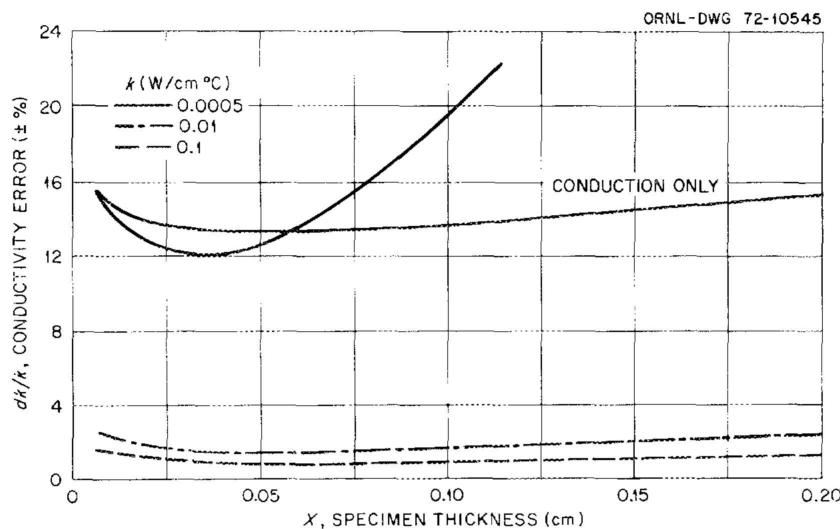  
Fig. C-1. Estimated error in the conductivity measurements for the Apparatus III-B vs specimen thickness at an average specimen temperature of $600^{\circ}\mathrm{C}$ for various specimen conductivities. Radiation assumed $(\varepsilon = 0.5, \overline{n} = 1.0, \overline{\kappa} = 0)$ except as noted.

specimens, the uncertainty in the emissivity and index of refraction cause the principal errors. The uncertainty in the temperature measurements comprises the primary source of errors in the high conductivity measurements.

The minimum error from Fig. C-1 occurs in the vicinity of $x = 0.05$ cm. Consequently, most of the experimental data were taken for specimen thicknesses of less than 0.1 cm. A plot of the estimated error limits as a function of specimen conductivity for a specimen thickness of 0.05 cm is shown in Fig. 22, Chapter 6, for the maximum and standard error, where

$$
\left(\mathrm {d k} / \mathrm {k}\right) _ {\max } = \sum_ {\mathrm {n}} (\text {e r r o r}) _ {\mathrm {n}}.
$$

# INTERNAL DISTRIBUTION

1. L. G. Alexander   
2. J. L. Anderson   
3.C.F.Baes   
4. S.E.Beal1   
5. E. S. Bettis   
6. W.A.Bird   
7. E. G. Bohlmann   
8. R.B.Briggs   
9. R. H. Chapman

10. S. J. Claiborne, Jr.   
11-40. J.W.Cooke   
41. W. B. Cottrell   
42. F. L. Culler   
43. J. H. Devan   
44. J. R. DiStefano   
145. S.J.Ditto   
46. W.P.Eatherly   
47. D. M. Eissenberg   
48. J.R. Engle   
49. D. E. Ferguson   
50. L. M. Ferris   
51. M. H. Fontana   
52. A. P. Fraas   
53. W. Fulkerson   
54. R. B. Gallaher   
55. W.R.Gambill   
56. W.R.Grimes   
57. A.G.Grindell   
58. H. W. Godbee   
59. T. G. Godfrey   
60. R.H.Guymon   
61. P. N. Haubenreich   
62. R.B.Heimdahl   
63. R. E. Helms   
64. R.F. Hibbs (Y-12)   
65. H.W.Hoffman   
66. P.P.Holz   
67. W.R.Huntley   
68. P. R. Kasten   
69. J. J. Keyes, Jr.   
70. O.H.Klepper   
71. T. G. Kollie   
72. A. I. Krakoviak   
73. T. S. Kress   
74. J. W. Krewson

75. C. G. Lawson

76. D. B. Lloyd

77. J. D. Lore (Y-12)

78. M. I. Lundin

79. R. N. Lyon

80. H. G. MacPherson

81. R.E. MacPherson

82. H.E.McCoy

83. D. L. McElroy

84. L.E.McNeese

85. J.R.McWherter

86. A. S. Meyer

87. C.A.Mills

88. A. J. Miller

89. S. L. Milora

90. W.R.Mixon

91. J. P. Moore

92. R. L. Moore

93. S. E. Moore

94. E. L. Nicholson

95. A. M. Perry

96-97. M. W. Rosenthal

98. J.P. Sanders

99. W. K. Sartory

1.00. Dunlap Scott

101. Myrtleen Sheldon

102. J. D. Sheppard

103. M. J. Skinner

104. I. Spiewak

105. D.A. Sundberg

106. R.E.Thoma

107. D. G. Thomas

108. D. B. Trauger

109. J. L. Wantland

110. A. M. Weinberg

111. J. R. Weir

112. J. C. White

113. G. D. Whitman

114. R.P. Wichner

115. R.K. Williams

116. H.C.Young

7-119. Central Research Library

120. Y-12 Document Reference Section

121-142. Laboratory Records Department

143. Laboratory Records (RC)

# EXTERNAL DISTRIBUTION

144. R. U. Acton, Division 5322, Sandia Laboratories, P. O. Box 5800, Albuquerque, NM 87115   
145. J. L. Bates, Hanford Engineering Development Laboratory, P. O. Box 1970, Richland, WA 99352   
146. K. H. Bode, Physikalisch-Technische Bundesanstalt, Bundesallee 100, 33 Braunschweig, Germany   
147. W. L. Carroll, National Bureau of Standards, Washington, DC 20234   
148. B. C. Chu, Intern Business Machines Corp., Systems Development Division, Poughkeepsie, NY 12601   
149. J. G. Cooke, National Research Council of Canada, Ottawa, Canada   
150. D.F.Cope，AEC-OSR   
151. G. L. Denman, Air Force Materials Laboratory, Wright-Patterson Air Force Base, OH 45433   
152. C. T. Ewing, U. S. Naval Research Laboratory, Code G130, Washington, DC 20390   
153. D. R. Flynn, Noise Section, National Bureau of Standards, Washington, DC 20234   
154. M. J. Laubitz, National Research Council of Canada, Ottawa, Canada   
155. Kermit Laughon, AEC-OSR   
156. W. Leindenfrost, Mechanical Engineering Department, Purdue University, Lafayette, IN 47901   
157. P. E. Liley, TPRC, Purdue University, Lafayette, IN 47901   
158. A. Lunden, Department of Physics, Chalmers University of Technology, Gothenburg S, Sweden   
159. Tadashi Makita, Kyoto Technical University, Matsugasaki, Sakyo-Ku, Kyoto, Japan   
160. J. Matolich, Jr., Battelle Memorial Institute, 505 King Ave., Columbus, OH 43201   
161. E. McLaughlin, Chemical Engineering Department, Louisiana State University, Baton Rouge, IA 70803   
162. M. L. Minges, Air Force Materials Laboratory, Wright-Patterson Air Force Base, OH 45433   
163-164. MSBR Program Manager, AFC-Washington   
165. K. K. Nangia, Heat Transfer Research, Inc., Alhambra, CA 91800   
166. W. A. Plummer, Corning Glass Works, Corning, NY 80210   
167. J. D. Plunkett, Department of Metallurgy, University of Denver, Denver, CO 80200   
168. H. Poltz, PTB, Braunschweig, Germany   
169. R.W. Powell, PRC, Purdue University, Lafayette, IN 47901   
170. M. J. Rice, General Electric R&D Division, P. O. Box 8, Schenectady, NY 12301   
171. J. T. Schreimpt, Naval Research Laboratory, Code 6330, Washington, DC 20390   
172. R. M. Seroggins, AEC-Washington   
173. M. Shaw, AEC-Washington   
174. R. E. Taylor, TPRC, Purdue University, Lafayette, IN 47901   
175. R. P. Tye, Dynatech R/D Company, 99 Erie Street, Cambridge, MA 02129

176. J. E. S. Venart, Department of Mechanical Engineering, University of Calgary, Calgary, Alberta, Canada   
177. J. T. R. Watson, National Engineering Laboratory, East Kilbride, Glasgow, Scotland   
178. A. E. Wechsler, A. D. Little Corporation, 20 Acron Park, Cambridge, MA 02141   
179. G. K. White, C.S.I.R.O., Division of Physics, National Standards Laboratory, Sydney, Australia 2008   
180. Patent Office, AEC, ORO  
-183. Directorate of Licensing, USAEC, Washington, DC 20545   
184-185. Directorate of Regulatory Standards, USAEC, Washington, DC 20545   
186-202. Manager, Technical Information Center, AFC   
203. Research and Technical Support Division, AEC, ORO   
204-418. Given distribution as shown in TID-4500 under Reactor Technology category (including 25 copies - NTIS)