# MSR

# MOLTEN-SALT REACTOR PROGRAM

Semiannual Progress Report

Period Ending August 31, 1972

This document has been reviewed and is determined to be APPROVED FOR PUBLIC RELEASE.

Name/Title: Leesa Laymance, ORNL TIO

Date: 7/27/2017

OAK RIDGE NATIONAL LABORATORY

CENTRAL RESEARCH LIBRARY

DOCUMENT COLLECTION

LIBRARY LOAN COPY

DO NOT TRANSFER TO ANOTHER PERSON

If you wish someone else to see this document, send in name with document and the library will arrange a loan.

UCN-7969

(3) 3-67

OAK RIDGE NATIONAL LABORATORY

OPERATED BY UNION CARBIDE CORPORATION • FOR THE U.S. ATOMIC ENERGY COMMISSION

Printed in the United States of America. Available from

National Technical Information Service

U.S. Department of Commerce

5285 Port Royal Road, Springfield, Virginia 22151

Price: Printed Copy $3.00; Microfiche$ 0.95

This report was prepared as an account of work sponsored by the United States Government. Neither the United States nor the United States Atomic Energy Commission, nor any of their employees, nor any of their contractors, subcontractors, or their employees, makes any warranty, express or implied, or assumes any legal liability or responsibility for the accuracy, completeness or usefulness of any information, apparatus, product or process disclosed, or represents that its use would not infringe privately owned rights.

Contract No. W-7405-eng-26

MOLTEN-SALT REACTOR PROGRAM

SEMIANNUAL PROGRESS REPORT

FOR PERIOD ENDING AUGUST 31, 1972

M. W. Rosenthal, Program Director

R. B. Briggs, Associate Director

P. N. Haubenreich, Associate Director

MARCH 1973

OAK RIDGE NATIONAL LABORATORY

Oak Ridge, Tennessee 37830

operated by

UNION CARBIDE CORPORATION

for the

U.S. ATOMIC ENERGY COMMISSION

3445603601092

This report is one of a series of periodic reports in which we describe the progress of the program. Other reports issued in this series are listed below.

ORNL-2474 Period Ending January 31, 1958

ORNL-2626 Period Ending October 31, 1958

ORNL-2684 Period Ending January 31, 1959

ORNL-2723 Period Ending April 30, 1959

ORNL-2799 Period Ending July 31, 1959

ORNL-2890 Period Ending October 31, 1959

ORNL-2973 Periods Ending January 31 and April 30, 1960

ORNL-3014 Period Ending July 31, 1960

ORNL-3122 Period Ending February 28, 1961

ORNL-3215 Period Ending August 31, 1961

ORNL-3282 Period Ending February 28, 1962

ORNL-3369 Period Ending August 31, 1962

ORNL-3419 Period Ending January 31, 1963

ORNL-3529 Period Ending July 31, 1963

ORNL-3626 Period Ending January 31, 1964

ORNL-3708 Period Ending July 31, 1964

ORNL-3812 Period Ending February 28, 1965

ORNL-3872 Period Ending August 31, 1965

ORNL-3936 Period Ending February 28, 1966

ORNL-4037 Period Ending August 31, 1966

ORNL-4119 Period Ending February 28, 1967

ORNL-4191 Period Ending August 31, 1967

ORNL-4254 Period Ending February 29, 1968

ORNL-4344 Period Ending August 31, 1968

ORNL-4396 Period Ending February 28, 1969

ORNL-4449 Period Ending August 31, 1969

ORNL-4548 Period Ending February 28, 1970

ORNL-4622 Period Ending August 31, 1970

ORNL-4676 Period Ending February 28, 1971

ORNL-4728 Period Ending August 31, 1971

ORNL-4782 Period Ending February 29, 1972

# Contents

Introduction vii

Summary ix

# PART 1. MSBR DESIGN AND DEVELOPMENT

1. DESIGN 2

1.1 Lead-Cooled MSBRs 2   
1.2 MSBR Industrial Design Study 5

1.2.1 Drain Tank 5   
1.2.2 Physics Calculations 10   
1.2.3 Chemical Processing 11

1.3 Xenon Behavior in the MSBR Fuel Salt System 11   
1.4 Hybrid Computer Simulation of the MSBR 13

2. REACTOR PHYSICS 14

2.1 Analysis of HTLTR-MSR Lattice Experiments 14  
2.2 Nuclear Performance of Lead-Cooled Molten-Salt Reactors 14

2.3 Plutonium Use in Molten-Salt Reactors 16

2.3.1 Fuel for Molten-Salt Converter Reactors 16   
2.3.2 Start-up of an MSBR on Plutonium Fuel 22   
2.3.3 ROD Code Modifications 25

3. SYSTEMS AND COMPONENTS DEVELOPMENT 26

3.1 Gaseous Fission Product Removal 26

3.1.1 Bubble Separator and Bubble Generator 26   
3.1.2 Bubble Formation and Coalescence Test 29   
3.1.3 Mass Transfer to Circulating Bubbles 29

3.2 Gas Systems Technology Facility 30   
3.3 Molten-Salt Steam Generator Industrial Program 30   
3.4 Coolant-Salt Technology Facility (CSTF) 31   
3.5 SaltPumps 32   
3.5.1 SaltPumps for MSRP Technology Facilities 32   
3.5.2 ALPHA Pump 33

4. HEAT TRANSFER AND PHYSICAL PROPERTIES 35

4.1 Heat Transfer 35   
4.2 Thermal Conductivity 36

# PART 2. CHEMISTRY

# 5.BEHAVIOR OF HYDROGEN AND ITS ISOTOPES 38

5.1 The Solubility of Hydrogen in Molten Salt 38   
5.2 Hydrogen Permeation Through Metals 39   
5.3 The Chemisorption of Tritium on Graphite 42

# 6. FLUOROBORATE CHEMISTRY 43

6.1 Solubility of $\mathbf{BF}_3$ in Molten LiF-BeF2-ThF4 43   
6.2 Solubility of $\mathbf{BF}_3$ in MSBR Primary Salt Containing 8 Mole % NaF: Some Safety Considerations 43   
6.3 Corrosion of Hastelloy N by Fluoroborate Melts 44

# 7. BEHAVIOR OF SIMULATED FISSION PRODUCTS 47

7.1 Effects of Selected Fission Products on Metals 47   
7.2 Stability and Volatility of Metal Tellurides 48

# 8. DEVELOPMENT AND EVALUATION OF ANALYTICAL METHODS 50

8.1 In-Line Chemical Analysis of Molten Fluoride Salt Streams 50   
8.2 Voltammetric Studies of Protonated Species in Molten $\mathrm{NaBF}_4$ -NaF (92-8 mole %) 50   
8.3 Infrared Spectral Studies of $\mathrm{NaBF}_4$ -NaF 52   
8.4 Studies of Protons in Molten $\mathrm{NaBF}_4$ 52   
8.5 Analysis of Coolant Cover Gas 53   
8.6 Spectral Studies of Molten Salts 54

# 9. OTHER MOLTEN-SALT RESEARCH 56

9.1 The Disproportionation Equilibrium of $\mathbf{UF}_3$ Solutions in Graphite 56   
9.2 EMF Studies of Oxide Equilibria in Molten Fluorides 57   
9.3 The Lithium Fluoride-Tetrafluoroborate Phase Diagram 58   
9.4 Chronopotentiometry Based on Diffusion of Mobile Nonelectroactive Species 59

# PART 3. MATERIALS DEVELOPMENT

# 10. INTERGRANULAR CRACKING OF STRUCTURAL MATERIALS EXPOSED TO FUEL SALT 63

10.1 Cracking of Samples Electroplated with Tellurium 63   
10.2 Intergranular Cracking of Several Alloys When Exposed to Tellurium Vapor 63   
10.3 Mechanical Properties of Structural Materials Containing Strontium and Tellurium 69   
10.4 The Isothermal Diffusion of $^{127}\mathrm{Te}$ Tracer in Hastelloy N, Ni-200 and Type 304L Stainless Steel Specimens 70   
10.5 Tube-Burst Experiments 71   
10.6 Strain Cycle Experiments 76

10.7 Identification of Reaction Products from Tellurium-Structural-Material Interactions 79

10.7.1 Knudsen Cell Reactions 81   
10.7.2 Possible Tellurides in Hastelloy N 82   
10.7.3 Tellurides from Knudsen Cell Reactions 83   
10.7.4 Tellurides from Other Reaction Methods 83   
10.7.5 Summary 85

10.8 Auger Electron Spectroscopy of Intergranular Fracture Surfaces of Nickel and Hastelloy N Exposed to Tellurium Vapor at $700^{\circ}\mathrm{C}$ 86

10.8.1 Method 87   
10.8.2 Nickel 88   
10.8.3 Hastelloy N 88

10.9 Design of an In-Reactor Experiment to Study Fission Product Effects on Metals 90

10.9.1 Design Criteria 90   
10.9.2 Configuration 91   
10.9.3 Thermal Considerations 91   
10.9.4 Containment 93   
10.9.5 Fuel Salt Chemistry 93

11. GRAPHITE STUDIES 95

11.1 The Irradiation Behavior of Graphite 95   
11.2 Procurement and Characterization of Various Grades of Graphite 100   
11.3 Characterization of ORNL Graphites 101   
11.4 Graphite Fabrication 103   
11.5 Thermal Property Testing 106   
11.6 Reduction of Helium Permeability of Graphite by Pyrolytic Carbon Sealing 107   
11.7 Irradiation of Pyrocarbons 111   
11.8 Examination of Unirradiated and Irradiated Pyrocarbon Strips with the Scanning Electron Microscope (SEM) 111   
11.9 Texture Determinations 113

12. HASTELLOY N 117

12.1 Mechanical Properties of Several Commercial Heats of Modified Hastelloy N 117   
12.2 Irradiation of Hastelloy N in the HFIR 120   
12.3 Salt Corrosion Studies 124

12.3.1 Fuel Salt 126   
12.3.2 Fertile-Fissile Salt 126   
12.3.3 Blanket Salt 127   
12.3.4 Coolant Salt 127   
12.3.5 Corrosion of Type 304L Stainless Steel and Hastelloy N by Mixtures of Boron Trifluoride, Air, and Argon 132   
12.3.6 Oxide Additions to Sodium Fluoroborate 134

12.4 Forced-Convection Loop Corrosion Studies 135

12.4.1 Operation of Forced-Convection Loop MSR-FCL-1A 135   
12.4.2 Corrosion Results from Forced-Convection Loop MSR-FCL-1A 135

12.4.3 Operation of Forced-Convection Loop MSR-FCL-2 136   
12.4.4 Corrosion Results from Forced-Convection Loop MSR-FCL-2 137

12.5 Corrosion of Hestelloy N in Steam 137

# 13. SUPPORT FOR CHEMICAL PROCESSING 147

13.1 Construction of a Molybdenum Reductive-Extraction Test Stand 147   
13.2 Welding of Molybdenum 147   
13.3 Development of Brazing Techniques for Fabricating the Molybdenum Test Loop 149   
13.4 Compatibility of Materials with Bismuth and Bismuth-Lithium Solutions 151

13.4.1TantalumAlloys 152   
13.4.2 Molybdenum Alloys 152   
13.4.3 Graphite 152

# PART 4. FUEL PROCESSING FOR MOLTEN-SALT REACTORS

# 14. FLOWSHEET ANALYSIS 159

14.1 Multiregion Code for MSBR Processing Plant Calculations 159

# 15. PROCESSING CHEMISTRY 160

15.1 Equilibria in Fused Salt-Liquid Alloy Systems 160   
15.2 Solubility of Thorium in Liquid Li-Pb Alloys 162   
15.3 Reductive Extraction of Titanium and Cesium 163   
15.4 Chemistry of Fuel Reconstitution 164   
15.5 Protactinium Oxide Precipitation Studies 165

# 16. ENGINEERING DEVELOPMENT OF PROCESSING OPERATIONS 168

16.1 Operation of Metal Transfer Experiment MTE-3 168   
16.2 Design of the Metal Transfer Process Facility 171   
16.3 Development of Mechanically Agitated Salt-Metal Contactors 171   
16.4 Reductive-Extraction Engineering Studies 173   
16.5 Reductive-Extraction Processing Facility Development 175   
16.6 Design of a Processing Materials Test Stand and the Molybdenum Reductive-Extraction Equipment 177   
16.7 Removal of Bismuth from MSBR Fuel Salt 178   
16.8 Frozen-Wall Fluorinator Development 180   
16.9 Uranium Oxide Precipitation Studies 182   
16.10 Development of a Bismuth-Salt Interface Detector 183

# 17. CONTINUOUS SALT PURIFICATION 185

# Introduction

The objective of the Molten-Salt Reactor Program is the development of nuclear reactors which use fluid fuels that are solutions of fissile and fertile materials in suitable carrier salts. The program is an outgrowth of the effort begun over 20 years ago in the Aircraft Nuclear Propulsion program to make a molten-salt reactor power plant for aircraft. A molten-salt reactor - the Aircraft Reactor Experiment - was operated at ORNL in 1954 as part of the ANP program.

Our major goal now is to achieve a thermal breeder reactor that will produce power at low cost while simultaneously conserving and extending the nation's fuel resources. Fuel for this type of reactor would be $^{233}\mathrm{UF}_4$ dissolved in a salt that is a mixture of LiF and $\mathrm{BeF}_2$ , but $^{235}\mathrm{U}$ or plutonium could be used for startup. The fertile material would be $\mathrm{ThF}_4$ dissolved in the same salt or in a separate blanket salt of similar composition. The technology being developed for the breeder is also applicable to high-performance converter reactors.

A major program activity through 1969 was the operation of the Molten-Salt Reactor Experiment. This reactor was built to test the types of fuels and materials that would be used in thermal breeder and converter reactors and to provide experience with operation and maintenance. The MSRE operated at $1200^{\circ}\mathrm{F}$ and produced $7.3\mathrm{MW}$ of heat. The initial fuel contained 0.9 mole $\%$ $\mathrm{UF_4}$ , $5\%$ $\mathrm{ZrF_4}$ , $29\%$ $\mathrm{BeF_2}$ , and $65\%$ ${}^{7}\mathrm{LiF}$ ; the uranium was about $33\%$ ${}^{235}\mathrm{U}$ . The fuel circulated through a reactor vessel and an external pump and heat exchange system. Heat produced in the reactor was transferred to a coolant salt, and the coolant salt was pumped through a radiator to dissipate the heat to the atmosphere. All this equipment was constructed of Hastelloy N, a nickel-molybdenum-iron-chromium alloy. The reactor core contained an assembly of graphite moderator bars that were in direct contact with the fuel.

Design of the MSRE started in 1960, fabrication of equipment began in 1962, and the reactor was taken critical on June 1, 1965. Operation at low power began

in January 1966, and sustained power operation was begun in December. One run continued for six months, until terminated on schedule in March 1968.

Completion of this six-month run brought to a close the first phase of MSRE operation, in which the objective was to demonstrate on a small scale the attractive features and technical feasibility of these systems for civilian power reactors. We concluded that this objective had been achieved and that the MSRE had shown that molten-fluoride reactors can be operated at $1200^{\circ}\mathrm{F}$ without corrosive attack on either the metal or graphite parts of the system, the fuel is stable, reactor equipment can operate satisfactorily at these conditions, xenon can be removed rapidly from molten salts, and, when necessary, the radioactive equipment can be repaired or replaced.

The second phase of MSRE operation began in August 1968, when a small facility in the MSRE building was used to remove the original uranium charge from the fuel salt by treatment with gaseous $\mathbf{F}_2$ . In six days of fluorination, $221~\mathrm{kg}$ of uranium was removed from the molten salt and loaded onto absorbers filled with sodium fluoride pellets. The decontamination and recovery of the uranium were very good.

After the fuel was processed, a charge of $^{233}\mathrm{U}$ was added to the original carrier salt, and in October 1968 the MSRE became the world's first reactor to operate on $^{233}\mathrm{U}$ . The nuclear characteristics of the MSRE with the $^{233}\mathrm{U}$ were close to the predictions, and the reactor was quite stable.

In September 1969, small amounts of $\mathrm{PuF_3}$ were added to the fuel to obtain some experience with plutonium in a molten-salt reactor. The MSRE was shut down permanently December 12, 1969, so that the funds supporting its operation could be used elsewhere in the research and development program.

Most of the Molten-Salt Reactor Program is now devoted to the technology needed for future moltensalt reactors. The program includes conceptual design studies and work on materials, the chemistry of fuel

and coolant salts, fission product behavior, processing methods, and the development of components and systems.

Because of limitations on the chemical processing methods available at the time, until five years ago most of our work on breeder reactors was aimed at two-fluid systems in which graphite tubes would be used to separate uranium-bearing fuel salts from thorium-bearing fertile salts. In late 1967, however, a one-fluid breeder became feasible because of the development of processes that use liquid bismuth to isolate protactinium and remove rare earths from a salt that also contains thorium. Our studies showed that a one-fluid breeder based on these processes can have fuel utilization characteristics approaching those of our two-fluid designs. Since the graphite serves only as moderator, the one-fluid reactor is more nearly a scaleup of the MSRE.

These advantages caused us to change the emphasis of our program from the two-fluid to the one-fluid breeder; most of our design and development effort is now directed to the one-fluid system.

In the congressional authorization report on the AEC's programs for FY-1973, the Joint Committee on Atomic Energy recommended that the molten-salt reactor be reappraised so that a decision could be made about its continuation and the level of funding appropriate for it. Consequently, we undertook a thorough review of molten-salt technology to provide information for an appraisal. A considerable effort during the reporting period covered by this progress report was devoted to the preparation of ORNL-4812, "The Development Status of Molten-Salt Breeder Reactors," a 416-page report that contains the results of our review.

# Summary

# PART 1. MSBR DESIGN AND DEVELOPMENT

# 1. Design

Molten-salt reactors cooled internally by direct contact with a stream of lead were investigated briefly to see if fuel inventories could be reduced substantially. Concepts in which the lead was mingled with the salt throughout the core showed little promise because of excessive neutron captures in $^{207}\mathrm{Pb}$ and high inventory $[2.2\mathrm{kg / MW(e)}]$ . The doubling time was estimated to be 31 years. A concept wherein the lead was confined to a peripheral region surrounding the main core showed slightly better performance with a doubling time of 26 years. This performance was deemed to be insufficient to justify the development of materials to contain lead.

Current efforts in the MSBR Industrial Design Study by Ebasco and its subcontractors are aimed at demonstrating the feasibility of the conceptual design reported in Task 1. This includes the preparation of CSDDs, trade-off and parametric studies, independent physics calculations, transient analyses, drain tank design, process plant engineering, and a plant cost estimate. Computations indicated that the intermediate heat exchanger design concept recommended in Task I could withstand a scram transient. Parametric studies show that a wide range of drain tank designs will accommodate 50 MW and maintain safe temperatures. The independent physics calculations are being tested against the HTLTR-MSBR experiments. The ORNL chemical processing flowsheet has been reduced to a practical engineering design.

A digital computer program MSRXEP has been written describing in detail the $^{135}\mathrm{Xe}$ behavior throughout the MSBR fuel salt system. The intent of this effort is to confirm the results of the previous simplified calculations or to make improvements where required. For the trial case having 44 bubbles per cubic centimeter of salt and a gas separator efficiency of $90\%$ , the $^{135}\mathrm{Xe}$ poison fraction was calculated to be 0.0038, and the average bubble diameter and void fraction in

the fuel salt loop were calculated to be $0.065\mathrm{cm}$ and 0.0055 respectively.

A hybrid computer simulation model of the reference 1000-MW(e) MSBR and results of some test simulations were described in ORNL-TM-3767.

# 2. Reactor Physics

Further analysis of MSR lattice experiments at temperatures to $1000^{\circ}\mathrm{C}$ gave calculated values of $k_{\infty}$ that agree remarkably well with experimental values.

A version of the ROD computer code capable of calculating the time-dependent behavior of fluid-fuel reactors with changing fuel composition and neutron energy spectrum was made operational.

Studies of various fueling schemes for batch-processed molten-salt converter reactors indicated lower power costs when LWR-produced plutonium at $9.90/kg$ fissile is used instead of enriched uranium. Either plutonium or enriched uranium could be used to start up a molten-salt breeder reactor, with little difference in the economics. Availability of uranium from other molten-salt reactors increases the range of fueling options, but would have little effect on attainable performance of the converter reactors studied. For start-up of a breeder reactor, use of plutonium involves some penalty in lifetime-average breeding ratio, primarily because the present chemical processing flow sheet makes it necessary to defer processing while plutonium is in the reactor.

# 3. Systems and Components Development

The detailed designs of the bubble separator and bubble generator for the gas system technology facility (GSTF) were completed, and the drawings were released for fabrication. The velocity and pressure distributions in the separator vortex were measured under various flow conditions. A procedure was developed for predicting the pressure distribution in the bubble generator at various liquid and gas flow rates.

The bubble formation and coalescence tests on $2\mathrm{LiF - BeF}_2$ and $72\mathrm{LiF - 16BeF}_2 - 12\mathrm{ThF}_4$ MSR fuel salt were delayed because of a mechanical failure of the shaker drive and clouding of the quartz furnace liner. The equipment has been repaired, and new capsules of salt have been loaded in preparation for resuming the tests.

The test section in the facility for measuring the mass transfer coefficients to gas bubbles suspended in flowing aqueous solutions was changed to a $1^{1} / 2$ -in.-diam conduit to obtain data for comparison with the original results obtained with a 2-in.-diam conduit. The system was recalibrated, and preliminary tests were made to validate supporting information on bubble size distribution and void fraction originally developed for the 2-in. conduit. A set of mass transfer data was obtained with a $25\%$ mixture of glycerine and water, and the data were partially reduced. The system was shut down for periodic maintenance on the bubble separator.

An analytical expression was proposed to relate the bubble size produced in the bubble generator to the flow rate, dimensions, and fluid properties. The relationship agreed with data from the bubble generator in the mass transfer facility but did not agree with preliminary results for the proposed MSBR bubble generator. Possible differences in the mechanism of generation between the two are therefore being explored.

Work on the GSTF was resumed in July after three months' suspension for budgetary reasons. The mechanical and electrical design approached completion, and some procurement was started. A preliminary system design description (PSDD) and the system design description (SDD) were issued in March. The master copy of the SDD is being used as the primary design control document and is being continuously updated.

Foster Wheeler continued with the conceptual design study of a molten-salt steam generator for use with molten-salt reactors. Foster Wheeler subcontracted with Gulf General Atomic for portions of the study concerning tube rupture analysis and dynamic stability. The Task I steam generator design, conforming to the conditions of the MSBR reference steam cycle, is nearing completion.

Construction and installation of the coolant-salt technology facility (CSTF) was completed in August, and check-out was started on the control circuitry and equipment. The piping of the loop was heated to $950^{\circ}\mathrm{F}$ and purged with dry helium to remove most of the moisture from the loop surfaces. Salt circulation is scheduled for September.

The spare rotary assembly for the MSRE coolant-salt pump was reconditioned and installed into the CSTF. The Mark II fuel salt pump is being reconditioned for the GSTF. The ALPHA pump has accumulated 5800 hr of operation in the MSR-FCL-2 facility, but was operated only intermittently due to an oil leak at the pump shaft and other operational problems related to the test facility.

# 4. Heat Transfer and Physical Properties

Heat transfer. Final analysis of heat-transfer data for a proposed MSBR fuel salt $(\mathrm{LiF - BeF_2 - ThF_4 - UF_4};67.5-$ 20.0-12.0-0.5 mole $\%$ has resulted in three correlations covering the Reynolds modulus range from 400 to 28,000. The average deviation of the data from these correlations is at most $6.6\%$ . However, the data for Reynolds modulus greater than 5000 average $13\%$ below predictions based on the correlations of Hausen and Sieder-Tate for transitional and fully developed turbulent flow. The data for Reynolds modulus less than 1000 are only $1.6\%$ above the Sieder-Tate correlation for laminar flow.

Thermal conductivity. A detailed analysis of uncertainties affecting the measurement of thermal conductivity using the variable-gap apparatus had resulted in a correlation of standard and maximum error with the magnitude of the thermal conductivity. Narrow error bands include the effects of radiation on the uncertainty. It is concluded that the maximum error limits for the apparatus include the deviations of measured conductivity from published values using $\mathrm{H}_2\mathrm{O}$ , $\mathrm{Hg}$ , Ar, He, and HTS $(\mathrm{KNO}_3\text{-NaNO}_2\text{-NaNO}_3$ ; 44-49-7 mole %) for $93\%$ of the measurements.

# PART 2. CHEMISTRY

# 5. Behavior of Hydrogen and Its Isotopes

Hydrogen and helium solubilities in $\mathrm{Li}_2\mathrm{BeF}_4$ have been determined at 500, 600, and $700^{\circ}\mathrm{C}$ , and deuterium solubility values for the same salt have been obtained at 600 and $700^{\circ}\mathrm{C}$ . The two hydrogen isotopes yield approximately equal solubility results within the mutual limits of experimental error. Some data have been obtained which suggest that pretreatment of the heat exchanger components with hydrogen might retard tritium transport through these members.

Careful measurements with "unoxidized" metals continue to show that permeability of hydrogen and its isotopes varies with the square root of hydrogen partial pressure to values as low as our experimental techniques will permit. Nickel, whose oxide should be trivial over

the entire range of our experiments, follows the half-power dependence precisely over the range 750 to $8 \times 10^{-4}$ torr. Several alloys, whose oxides cannot be completely avoided in our experiments, show only minor variations from the half-power relationship.

Decreases in hydrogen permeability by oxide films (such as might be expected on the steam side of steam generator tubing) on 18-8 stainless steels and on Hastelloy N appear relatively nonrewarding. However, a film of $\mathrm{Cr_2O_3}$ obtained by $900^{\circ}\mathrm{C}$ oxidation of a chromium film electrodeposited on nickel tubing has markedly decreased the hydrogen permeability and has produced a situation in which the permeability depends nearly upon the first power of hydrogen partial pressure. Very preliminary data also suggest that the film readily formed by wet oxidation of Incoloy 800 affords a useful reduction of hydrogen permeability.

Upon exposure at elevated temperatures to tritium (at 1 to 10 ppm by volume in helium) graphite readily sorbs appreciable amounts of this hydrogen isotope. The highest loading observed to date, on a lampblack graphite prepared at ORNL and pretreated to increase its surface area to about $2\mathrm{m}^2 /\mathrm{g}$ , corresponded to $5\times 10^{13}$ tritium atoms per square centimeter of surface; several percent of the surface carbon atoms appear to have bonded tritium atoms. Rinsing with water and with alcohol removes less than $1\%$ of the sorbed tritium. Studies continue to determine whether this phenomenon can be used to assist in containment and management of tritium in an MSBR.

# 6. Fluoroborate Chemistry

Measurements of the solubility of $\mathbf{BF}_3$ in LiF-BeF $_2$ -ThF $_4$ continue to show that, at constant temperature, $\mathbf{BF}_3$ solubility appears to vary with the activity of LiF. Solubilities of $\mathbf{BF}_3$ were also measured in a melt containing 8 mole % NaF in MSBR fuel solvent to aid in assessing the consequences of coolant leaking into fuel; the measurements were reasonably consistent with an exploratory experiment involving a mixture of MSBR coolant and fuel.

Measurements of the equilibria involving $\mathrm{NaNiF}_3$ and $\mathrm{NaFeF}_3$ in molten $\mathrm{NaF - NaBF_4}$ have been repeated in order to establish the composition of the gas phase. The results obtained yielded improved values for the free energies of formation of the double fluorides and for the free energies of reaction (corrosion) of Hastelloy N constituents with HF and molten NaF.

# 7. Behavior of Simulated Fission Products

Comparative evaluations of the effects of tellurium on Hastelloy N and other alloys of interest to the

Molten-Salt Reactor Program have been provided as part of a program to identify those fission products capable of producing superficial grain boundary cracking in alloys proposed for construction of a molten-salt breeder reactor. Metal tensile specimens representing 14 different alloys and about 24 minor modifications of Hastelloy N have been exposed to tellurium by a vapor deposition technique. The results show marked selectivity of the corrosion process on the various alloys tested.

Stability and volatility of pertinent metal tellurides are under study by mass spectrometric techniques assisted by x-ray-diffraction analysis and by direct observation of chemical reactions. CrTe, which shows no evidence of volatility, decomposition, or reaction with Ni at $750^{\circ}\mathrm{C}$ , appears to be the most stable telluride of the major constituents of Hastelloy N. The most stable telluride of nickel appears to be $\mathrm{Ni}_3\mathrm{Te}_2$ ; it slowly decomposes at $800^{\circ}\mathrm{C}$ under vacuum to form Ni and tellurium vapor. Both MoTe $_2$ and FeTe are less stable than $\mathrm{Ni}_3\mathrm{Te}_2$ .

Both $\mathrm{NiTe_2}$ and $\mathrm{Ni}_3\mathrm{Te}_2$ have been shown to react at elevated temperatures with $\mathrm{CoF_3}$ . Products of the reaction vary with reaction temperature and starting material but include $\mathrm{TeF_4}$ , $\mathrm{TeF_6}$ , $\mathrm{NiF_2}$ , and $\mathrm{CoF_2}$ . These reactions are generally similar to that previously observed between $\mathrm{CoF_3}$ and $\mathrm{Te}$ , but the observed partial pressures of $\mathrm{TeF_4}$ and $\mathrm{TeF_6}$ at corresponding temperatures are lower when the nickel tellurides are fluorinated.

# 8. Development and Evaluation of Analytical Methods

We have prepared a variety of voltammetric electrodes for use in the in-line analysis of molten $\mathrm{NaBF}_4$ eutectic in the Coolant Salt Technology Facility. Our original choice of platinum electrodes proved unsatisfactory because of a decrease in the cathodic limits of the melt at higher temperatures. Presently we plan to install electrodes of iridium, pyrolytic graphite, gold, copper, and evacuated palladium to effect measurement of iron, chromium, and an active proton species in the coolant salt.

The role of hydrogen in the coolant salt has been shown to be more complex than originally thought. It now appears that both melts and salts contain $\mathrm{NaBF}_3\mathrm{OH}$ as a relatively stable species. In the melts, however, studies indicate that a small fraction of the hydrogen is present as an electroactive species (possibly HF, $\mathrm{HBF}_4$ , $\mathrm{HBF}_3\mathrm{OH}$ ) which is in relatively rapid equilibrium with a vapor species. In addition, the frozen salt may contain adsorbed water that is partially converted to $\mathrm{NaBF}_3\mathrm{OH}$ on melting. Tests with chrono

mium metal have shown that its reaction with the active proton species is quite rapid, whereas $\mathrm{BF}_3\mathrm{OH}^-$ is relatively inert. Also it appears that $\mathrm{Cr(II)}$ can be present when $\mathrm{NaBF_4}$ melts are contacted with chromium metal.

The original infrared pellet calibration data for proton determination (as $\mathrm{BF}_3\mathrm{OH}^-$ ) seem confirmed through standard additions of $\mathrm{NaBF}_3\mathrm{OH}$ to $\mathrm{NaBF}_4$ salts which were then melted under isothermal conditions. A liquid condensate collected from the vapor above $\mathrm{NaBF}_4$ melts was found by NMR analysis to contain about equal quantities of nonionic hydrogen and fluorine. No evidence for isotopic exchange was seen when hydrogen isotopes were diffused into $\mathrm{NaBF}_4$ melts in a silica cell, but chemical reactions which formed $\mathrm{BF}_3\mathrm{OH}^-$ (or $\mathrm{BF}_3\mathrm{OD}^-$ ) did occur.

An improved Karl Fischer titration technique is being developed for the calibration measurement of hydrolysis products in coolant off-gas streams. A newly designed automatic coulometric titrator and a rotating polarized cathode are used to obtain improved precision in the measurement of microgram quantities of water. We are also assembling an apparatus to measure hydrogen in coolant off-gas after its diffusion through a palladium membrane.

The spectrum and chemistry of $\mathrm{Ce}^{3+}$ and $\mathrm{Te}^{2-}$ have been studied in fluoride melts. The analytical usefulness of the $\mathrm{Ce(IV)-Ce(III)}$ reaction has also been considered. Further spectral studies of $\mathrm{Cu}^{2+}$ in $\mathrm{LiF}-\mathrm{BeF}_2$ have been made, leading to a determination of the solubility of $\mathrm{CuO}$ in that melt when contained in a $\mathrm{SiO}_2$ cell. Spectral studies have confirmed the existence of dissolved $\mathrm{Li}_3\mathrm{Bi}$ in molten LiCl or LiBr and have inferred the nonexistence of a corresponding lead pulmbide in molten LiCl.

# 9. Other Molten Salt Research

Equilibrium quotients $(Q)$ have been measured for the reaction

$$
3 \mathrm {U F} _ {4} + \mathrm {U C} _ {2} \rightleftharpoons 4 \mathrm {U F} _ {3} + 2 \mathrm {C}
$$

in dilute molten salt solutions of $\mathrm{LiF - BeF_2}$ . The stability of $\mathrm{UF}_3$ as measured by these $Q$ values is strongly influenced by both temperature and solvent composition. Higher temperatures and larger mole fractions of $\mathrm{BeF_2}$ favor greater equilibrium concentrations of $\mathrm{UF}_3$ .

Emf studies have been initiated of oxide equilibria in MSBR solvent salt (LiF-BeF $_2$ -ThF $_4$ , 72-16-12 mole %). These studies will provide improved oxide solubility data and, in addition, will confirm activity coefficient

estimates for this salt system. Primary efforts to date have been concerned with design and assembly of equipment and with improving the $\mathrm{LaF}_3$ reference electrode in order to achieve stability and reproducibility.

The $\mathrm{LiF - LiBF_4}$ phase diagram was determined. A comparison with the other alkali fluoride-tetrafluoroborate systems shows an increasing positive deviation from ideality with decreasing cation size.

A beryllium metal anode in molten $\mathrm{NaF - BeF_2}$ (75 mole $\% \mathrm{BeF}_2$ ) shows a reproducible and well-defined chronopotentiometric transition time. A quantitative interpretation of such chronopotentiograms, based on interdiffusion of $\mathrm{BeF_2}$ formed at the anode surface and the $\mathrm{BeF_2}$ -NaF mixture, has been developed.

# PART 3. MATERIALS DEVELOPMENT

# 10. Intergranular Cracking of Structural Materials Exposed to Fuel Salt

Several alloys have been vapor- and electroplated with various amounts of Te. Some of the alloys are resistant to intergranular cracking, and some form shallower cracks than standard Hastelloy N. Mechanical property tests on melts of standard Hastelloy N containing additions of Te and Sr show that Te is detrimental and that Sr has no effect. The grain boundary and volume diffusion parameters for Te at 650 and $760^{\circ}\mathrm{C}$ in Hastelloy N, Ni, and type 304L stainless steel were measured. The depth of penetration was greatest for Ni and least for type 304L stainless steel. Tube-burst tests on samples of Hastelloy N, Inconel 600, and type 304L stainless steel plated with Te showed that intergranular cracks formed in the Hastelloy N and Inconel 600, but not in the type 304L stainless steel. Similar behavior was noted in samples of these materials that were strain cycled.

The reaction products formed on samples exposed to Te in several experiments have been examined. Several tellurides have been identified. Thin sheet samples of Ni and Hastelloy N were embrittled by exposure to Te, fractured, and the fracture surfaces analyzed by Auger electron spectrometry. The brittle fracture surfaces were enriched in Te.

An in-reactor fuel experiment has been designed and is being fabricated to evaluate the effects of fission products on intergranular crack formation in Hastelloy N, Inconel 601, and type 304H stainless steel.

# 11. Graphite Studies

Irradiation results are now available on experimental graphites fabricated at ORNL. First-generation graph-

ities employing raw coke directly have been irradiated to $3.5 \times 10^{22}$ neutrons/cm $^2$ ( $E > 50 \mathrm{keV}$ ) and are more stable than the reference graphite (Great Lakes grade H-337) and approach the behavior of Poco grade AXF. Second-generation graphites based on modified raw coke have seen up to $2 \times 10^{22}$ neutrons/cm $^2$ and appear to be superior to the earlier materials. Graphite fabrication studies continue on a limited scale, and a third generation utilizing pressure baking is now being developed.

A few graphites from commercial vendors continue to be received and are evaluated for their interest in relating radiation damage to microstructure. Graphites are also being evaluated for their application as structural materials for fuel processing.

The major effort continues to be development of coatings for xenon exclusion from the core graphite. Process parameters have been identified to produce the desired high-density isotropic pyrolytic carbon, and a set is now under irradiation in the HFIR. Preliminary results on these samples after irradiation to $1 \times 10^{22}$ neutrons/cm² should be available in December. A number of free-standing pyrolytic strips have also been examined after irradiation to $3.3 \times 10^{22}$ neutrons/cm² and confirm earlier results at low fluences that the high-density isotropic carbons derived from propene are dimensionally stable. Conversely, an anisotropic methane-derived coating expanded over $500\%$ in the preferred $c$ -axis direction but maintained structural integrity!

# 12. Hastelloy N

Three commercial 100-lb heats of Hastelloy N modified with $2\%$ Ti were evaluated. The weldability and unirradiated mechanical properties are superior to those of standard Hastelloy N. Two of the alloys were irradiated at 650 and $760^{\circ}\mathrm{C}$ to a thermal-neutron fluence of $3\times 10^{20}$ neutrons $\mathrm{/cm}^2$ and were found to have acceptable postirradiation mechanical properties. Commercial alloys modified with 0.3 and $0.7\%$ Hf had unirradiated mechanical properties superior to those of standard Hastelloy N. However, autogenous welds in the alloy containing $0.7\%$ Hf cracked. Several types of Hastelloy N were irradiated to a thermal-neutron fluence of $1.6\times 10^{22}$ neutrons $\mathrm{/cm}^2$ at $650^{\circ}\mathrm{C}$ and found to be brittle in postirradiation creep tests.

Corrosion tests in oxidizing fuel salts have exhibited high corrosion rates, but no intergranular cracking. A tellurium-plated Hastelloy N sample was placed in the hottest region of a fuel salt loop, and the Te was transferred to a cooler region of the loop. Several

natural circulation loops and two pumped loops show that low corrosion rates can be obtained in pure sodium fluoroborate, but oxidizing impurities increase the corrosion rate. Compatibility tests involving stainless steel and Hastelloy N exposed to fuel and coolant salts in gas environments of Ar, air, and $\mathrm{BF}_3$ showed that Hastelloy N is more resistant to attack than stainless steel. Air and $\mathrm{BF}_3$ increased the amount of attack of both metals. A static test of Hastelloy N in sodium fluoroborate with an addition of 350 ppm oxide showed that the presence of the oxide did not result in increased corrosion.

Hastelloy N specimens exposed to steam at $538^{\circ}\mathrm{C}$ for 13,000 hr were oxidized at a metal consumption rate of less than 0.25 mil/year. The oxide was primarily NiO with some $\mathrm{MoO}_2$ , a spinel, and $\mathrm{Cr}_2\mathrm{O}_3$ . Several stressed specimens are in test, and the fractures thus far indicate that the rupture life in steam may be somewhat shorter than in Ar.

# 13. Support for Chemical Processing

Construction of the molybdenum reductive-extraction test stand continued. Three steps have been completed: (1) fabrication of pots and column, (2) machining of all subassembly components, and (3) construction of unjoined mockup from molybdenum components. Concurrently, the feed pot and column subassemblies are being fabricated. The final step will then consist of interconnecting the subassemblies by field welding.

Final procedures were determined for all tube-tube and tube-tee welds. Brazing techniques were developed for each of the types of configuration that are required. Induction and portable resistance heating methods of brazing were successfully used. Several commercial brazing filler metals were investigated for use in portions of the system not exposed to bismuth.

Studies of the compatibility of potential structural materials with bismuth and bismuth-lithium solutions at 600 to $700^{\circ}\mathrm{C}$ were continued in static capsule and thermal convection loop tests.

A T-111 thermal convection loop test completed $3000\mathrm{hr}$ in Bi-2.5 wt $\%$ Li at a maximum temperature of $697^{\circ}\mathrm{C}$ . The maximum weight loss measured was 2.73 $\mathrm{mg/cm}^2$ , and, though the samples showed slight oxygen increases, they were ductile. A molybdenum thermal convection loop circulating Bi-2.5 wt $\%$ Li at a maximum temperature of $696^{\circ}\mathrm{C}$ has operated for 5500 hr and will be continued to accumulate long-term test data.

Samples of graphite were attacked by lithium when exposed for $1000\mathrm{hr}$ at $700^{\circ}\mathrm{C}$ in a graphite crucible. No metallic lithium was found in the crucible, but the walls of the crucible moved inward, and the samples also exhibited weight gains. X-ray-diffraction results on the samples showed the presence of $\mathrm{Li}_2\mathrm{C}_2$ and an expanded graphite lattice. However, no chemical reaction has been noted between graphite and Bi-Li solutions containing up to 3 wt $\%$ Li.

# PART 4. FUEL PROCESSING FOR MOLTEN-SALT REACTORS

# 14. Flowsheet Analysis

Work was continued on the development of a computer program that can be used for calculating steady-state concentrations and heat generation rates in an MSBR processing plant. The behavior of 687 nuclides in as many as 250 regions can be considered; however, the use of only about 70 regions has been adequate for representing processing plant flowsheets considered thus far. Modifications made in the computer program during this report period facilitate its use and allow an improved representation of equipment items. The modified program has been used successfully for evaluating a number of flowsheets that are based on fluorination-reductive-extraction-metal transfer but differ appreciably from the reference flowsheet.

# 15. Processing Chemistry

Studies related to the development of the metal transfer process were continued. The following results were achieved:

1. The solubility of $\mathbf{L}\mathbf{i}_3\mathbf{B}\mathbf{i}$ in molten LiCl was determined over the temperature range 650 to $800^{\circ}\mathrm{C}$ .   
2. Some data were obtained on the equilibrium distribution of lithium and bismuth between liquid Li-Bi alloys and molten LiBr or LiF.   
3. Measurements of the equilibrium distribution of lithium and lead between liquid Li-Pb alloys and molten LiCl were made at $650^{\circ}\mathrm{C}$ .   
4. The solubility of thorium in selected Li-Pb alloys was determined over the temperature range 400 to $700^{\circ}\mathrm{C}$ .

In addition, the reductive extraction of titanium and cesium from molten MSBR fuel salt into liquid bismuth was studied at $600^{\circ}\mathrm{C}$ . Studies of the chemistry of fuel reconstitution were continued. Spectrophotometric evidence showed conclusively that $\mathrm{UF}_5$ is the product of

the reaction of gaseous $\mathrm{UF_6}$ with $\mathrm{UF_4}$ dissolved in MSBR fuel salt. Further progress was made in the study of the equilibrium precipitation of protactinium from LiF-BeF $_2$ -ThF $_4$ (72-16-12 mole %) by sparging the salt with HF- $\mathrm{H}_2\mathrm{O}$ -Ar gas mixtures. Preliminary values for the equilibrium quotients for the reaction $\mathrm{PaF_5(d)} + 5/2\mathrm{H_2O(g)} = 1/2\mathrm{Pa_2O_5(s)} + 5\mathrm{HF(g)}$ can be represented by $\log Q_1 = 12.74 - 10,880 / T(^{\circ}\mathrm{K})$ in the temperature range 535 to $650^{\circ}\mathrm{C}$ .

# 16. Engineering Development of Processing Operations

Studies related to a number of processing operations were continued during this report period. The purification and charging of the salt and metal phases to metal transfer experiment MTE-3 were completed, and operation of the experiment was initiated. The equipment used in the experiment consists of a fluoride salt reservoir containing about 30 liters of fluoride salt (72-16-12 mole $\%$ LiF- $\mathrm{BeF}_2$ -ThF $_4$ ), a salt-metal contactor, and a rare-earth stripper containing 4.6 liters of 4.9 mole $\%$ Li-Bi solution. The 10-in.-diam contactor is divided into two compartments that are interconnected by a pool of bismuth containing reductant. During operation of the experiment, salt is circulated from the fluoride salt reservoir to one side of the contactor, and LiCl is circulated from the rare-earth stripper to the other side of the contactor. Mechanical agitators are used in the contactor to contact the phases without causing dispersion of either phase. Mass transfer coefficients were measured for $^{228}\mathrm{Ra}$ during the first two runs; the resulting values were in good agreement with a literature correlation that is based on mass transfer between aqueous and organic phases in the type of contactor used for the present experiment. Quantities of $\mathrm{LaF}_3$ (510 g) and $^{154}\mathrm{EuF}_2$ (14 mCi) were then added to the fluoride salt. The mass transfer coefficient values measured for europium and lanthanum during four additional runs were lower than predicted; the values for lanthanum were considerably lower than expected, while those for europium were only about $10\%$ of those expected. It is believed that these low values are caused by the presence of an oxide layer at one or more of the salt-bismuth interfaces in the system. We believe that the rate of transfer of europium and lanthanum can be increased considerably either by removing the interfacial material or by increasing the agitator speeds beyond the 100- to 200-rpm range employed thus far.

Additional progress was made on the design of the metal transfer process facility, in which the fourth

metal transfer experiment will be carried out. This experiment will use salt and bismuth flow rates that are 5 to $10\%$ of those expected for processing a 1000-MW(e) MSBR. The three-stage salt-metal contactor will be fabricated from graphite. During this report period, discussions concerning the design and fabrication of the contactor were held with a graphite manufacturer. Minor design changes suggested by the manufacturer were effected, and the preliminary quotation for fabrication of the completed assembly appears to be satisfactory.

Studies involving the measurement of mass transfer rates in simulated mechanically agitated salt-metal contactors were pursued further. Since the important physical properties of molten salt-bismuth systems (viscosities, densities, and density difference) are quite similar to those of the mercury-water system, investigations carried out with contactors using mercury and water will allow examination of the hydrodynamic and mass transfer characteristics of this type of contactor under highly desirable conditions for experimentation. Work during this report period was aimed at finding materials that distribute between mercury and aqueous phases in a manner suitable for mass transfer studies. The extraction of lead from an aqueous phase into mercury containing zinc at low concentrations, according to the reaction

$$
\begin{array}{l} \mathrm {P b} \left(\mathrm {N O} _ {3}\right) _ {2} \left[ \mathrm {H} _ {2} \mathrm {O} \right] + \mathrm {Z n} [ \mathrm {H g} ] \\ \rightarrow \mathrm {P b} [ \mathrm {H g} ] + \mathrm {Z n} (\mathrm {N O} _ {3}) _ {2} [ \mathrm {H} _ {2} \mathrm {O} ], \\ \end{array}
$$

was found to be quite satisfactory. Results obtained in a series of experiments performed with a 6-in.-diam contactor indicate that the individual mass transfer coefficients in a water-mercury system (and probably in a salt-bismuth system) are predicted reasonably well by an existing correlation that is based on mass transfer in aqueous-organic systems.

Three mass transfer experiments were performed in the mild-steel reductive-extraction system. In these experiments, the rates of transfer of $^{97}\mathrm{Zr}$ and $^{237}\mathrm{U}$ from molten salt to bismuth were measured by adding the respective tracers to the salt phase prior to contacting the salt with bismuth containing reductant in a 0.82-in.-ID by 2-ft-long packed column. The fractions of the materials transferred ranged from 36 to $80\%$ at extraction factors ranging from 1.3 to 6.3. The height of an overall transfer unit (HTU) based on the bismuth phase ranged from 4.7 to 7.3 ft. A correlation was developed which shows that the HTU value is constant and equal to about 4.3 ft for extraction factors near unity.

Construction of the reductive-extraction process facility will require joints in molybdenum tubing, some of which must be made in the field. During this report period, the feasibility of flaring commercially available molybdenum tubing in $\frac{1}{4}$ , $\frac{3}{8}$ , and $\frac{1}{2}$ -in. sizes was demonstrated. Since molybdenum-on-molybdenum threads tend to gall and since it is difficult to tap threads in a molybdenum nut, we have considered designs in which the flare fittings have molybdenum bodies, but the nut and ferrule are made of materials other than molybdenum. However, because of the very low coefficient of thermal expansion for molybdenum, almost any other potential material for the nut and ferrule would expand more than molybdenum; thus such a fitting would loosen upon being heated. A means was devised for fully compensating a fitting for both axial and radial differential thermal expansion. Test fittings in $\frac{1}{4}$ , $\frac{3}{8}$ , and $\frac{1}{2}$ -in. sizes that had a $45^{\circ}$ flare and were compensated for axial expansion were fabricated. Although one of these fittings $\left(\frac{1}{4} \text{ in.}\right)$ remained leak-tight (as shown by a helium leak test) during thermal cycling from 300 to $600^{\circ} \mathrm{C}$ , it was concluded that compensation for both axial and radial thermal expansion is required. A set of fittings that have a $37^{\circ}$ flare and are fully compensated for differential thermal expansion is currently being fabricated.

The design of the molybdenum reductive-extraction equipment and the processing materials test stand is essentially complete. A trial assembly of the components, piping, and support system was made to check the design drawings; no problems were found. The remaining design work involves the electrical wiring for the containment vessel and transfer line heaters, the instrumentation and control panels, and the services. The assembly frame for the molybdenum equipment was test loaded and was found to perform satisfactorily. Procedures and checklists for moving the completed molybdenum system from the assembly area to the operating area were prepared, and a transfer of the frame and equipment mockup was made successfully.

Several types of samplers were used to take portions of fluoride salt from various engineering experiments for bismuth analyses. The reported concentrations of bismuth in the salt ranged from less than 0.1 to greater than $1000~\mathrm{ppm}$ . The results indicate that several of the samples were contaminated during their passage through the sample port and that an improved sampler design will be required in order to avoid contamination. Samples withdrawn from the fluoride salt surge tank in metal transfer experiment MTE-3 have shown low bismuth concentrations consistently (0.45 to $1.7~\mathrm{ppm}$ ).

A series of experiments on autoresistance heating of molten salt was performed in a simulated fluorinator

that was protected from corrosion by means of a frozen wall. Results of these experiments indicate that an electrically insulting layer of frozen salt can be formed reliably if the temperature of the fluorinator wall is held below that of the salt solidus. The measured values for the thickness of the layer agreed well with values calculated from heat transfer considerations and from measurements of the electrical resistance of the molten salt in the simulated fluorinator. Operational stability, desired specific heat generation rates, and adequate heat removal rates by natural convection and radiation were demonstrated for operation of a frozen-wall fluorination experiment.

The first series of experiments in the uranium oxide precipitation facility has been completed. On disassembly, the precipitator vessel was found to contain a large quantity of undissolved oxide which appears to have resulted from inadequate agitation of the oxide during the dissolution step. Examination revealed negligible corrosion of the equipment by HF attack or agglomeration of oxide on the surfaces. Thus oxide precipitation continues to appear to be an attractive alternative to fluorination for removing uranium from protactinium-free MSBR fuel salt.

An eddy-current-type detector is being developed to allow detection and control of the bismuth-salt interface in salt-metal extraction columns or mechanically agitated salt-metal contactors. The probe consists of a ceramic form on which bifilar primary and secondary

coils are wound. A high-frequency alternating current is passed through the primary coil, and a current that is dependent on the conductivities of materials adjacent to the coils is induced in the secondary coil. A probe assembly was tested at 550 and at $700^{\circ}\mathrm{C}$ using the amplitude measurement technique. At each temperature, the probe readings were linear and reproducible for bismuth levels between 4 and 12 in. Although the temperature compensation circuit did not function as expected, the probe is entirely usable at any temperature for which a calibration curve is available. With a constant temperature and bismuth level, a variation of about $5\%$ in the probe reading was noted over a five-day period. The reason for this variation is not known.

# 17. Continuous Salt Purification

The system was modified to provide for the continuous circulation of a small volume of salt (about 4 liters) through the packed-column gas-salt contactor. The new equipment consists of a check valve pump that has tungsten ball checks and an orifice head pot for measuring the salt flow rate. Initial tests with the system showed that the equipment for measuring the salt flow rate performed quite satisfactorily; however, it will be necessary to modify the pump to permit operation with salt containing small quantities of particulate.

# Part 1. MSBR Design and Development

R.B.Briggs P.N.Haubenreich

The design and development program has the purpose of describing the characteristics and estimating the performance of future molten-salt reactors, defining the major problems that must be solved in order to build them, and designing and developing solutions to problems of the reactor plant. To this end we have published a conceptual design for a 1000-MW(e) plant1 and have contracted with an industrial group organized by Ebasco Services Incorporated to do a conceptual design of a 1000-MW(e) plant. This design study uses the ORNL design for background and is to incorporate the experience and the viewpoint of industry. Task 1 of this study, the selection of a reference concept, has been completed and described in a report.2 We also do brief studies of new or advanced concepts such as the lead-cooled reactor that is discussed in this report.

One could not, however, propose to build a 1000-MW(e) plant in the near future, so we have done some studies of plants that could be built as, the next step in the development of large MSBRs. One such plant is the Molten-Salt Breeder Experiment (MSBE). The MSBE is intended to provide a test of the major features, the most severe operating conditions, and the fuel reprocessing of an advanced MSBR in a small reactor with a power of about 150 MW(t). An alternative is the Molten-Salt Demonstration Reactor (MSDR), which would be a 150- to 300-MW(e) plant based largely on the technology demonstrated in the Molten-Salt Reactor Experiment, would incorporate a minimum of fuel reprocessing, and would have the purpose of

demonstrating the practicality of a molten-salt reactor for use by a utility to produce electricity. The present AEC program does not include construction of an MSBE or MSDR, and studies of these reactors are inactive.

In addition to these general studies of plant designs, the design activity includes studies of the use of various fuel cycles in molten-salt reactors and assessment of the safety of molten-salt reactor plants. The fuel cycle studies have indicated that plutonium from light-water reactors has an economic advantage over highly enriched $^{235}\mathrm{U}$ for fueling molten-salt reactors. Some studies related to safety are in progress preliminary to a comprehensive review of safety based on the ORNL reference design of a 1000-MW(e) MSBR.

The design studies serve to define the needs for new or improved equipment, systems, and data for use in the design of future molten-salt reactors. The purpose of the reactor development program is to satisfy some of those needs. Presently the effort is concerned largely with providing solutions to the major problems of the secondary system and of removing xenon and handling the radioactive off-gases from the primary system. A gas system technology facility is being built for use in testing the features and models of equipment for the gaseous fission product removal and off-gas systems and for making special studies of the chemistry of the fuel salt. A coolant system technology facility has been completed for use in studies of equipment, processes, and chemistry of sodium fluoroborate for the secondary system of a molten-salt reactor.

The steam generator is a major item of equipment for which the basic design data are few and the potential problems are many. A program involving industrial participation has been undertaken to provide the technology for designing and building reliable steam generators for molten-salt reactors. As the first step in this program, Foster Wheeler Corporation is preparing the conceptual design of a steam generator for large molten-salt reactors.

# 1. Design

E. S. Bettis

# 1.1 LEAD-COOLED MSBRs

Report TM-3832 on the 300-MW(e) Molten-Salt Demonstration Reactor (MSDR) was issued. The MSDR study involved the most detailed design of a large single-fluid molten-salt reactor that has been done to date, and we believe that it represents a practical reactor.

Having finished the demonstration reactor, we decided to take a more serious look at an advanced reactor concept originally proposed about ten years ago. This concept involves the use of lead as a direct contact coolant for the molten salt. Lead is immiscible with fluoride salts and is chemically compatible with the fuel salt. Because of the difference in density between the salt and lead, the two liquids can be separated by gravity. When the lead is pumped into the salt, it transfers momentum to the salt, and so it can be used to circulate as well as extract heat from the fuel salt. The lead must be cooled by another coolant loop (or secondary salt loop) which is then used to make steam.

Although the idea has received cursory attention during the past ten years, no serious design study was undertaken. We therefore began an evaluation of this idea to see if it had any practical potential. A major incentive for using direct contact cooling is that the power density in the heat extraction system promises to be high and so should reduce the amount of salt in the primary circuit external to the reactor.

These two advantages are quite attractive; however, rather serious difficulties are associated with the use of lead so that, for the concept to warrant serious consideration, the lead-cooled reactor must show superior performance, particularly in reducing primary salt inventory.

The first serious liability of the lead system is that it must be contained in a refractory metal (probably molybdenum). Successful lining of large vessels with molybdenum and fabrication of molybdenum heat exchangers, pumps, and piping probably can be accomplished, but they are certain to be expensive and to require considerable development.

Also, effecting a complete separation of salt from the lead is difficult, and some undetermined amount of salt will always circulate with the lead. An extensive experimental program would be required to determine the extent of entrainment. For our study we only made

estimates of the gross disengagement and the amount of salt in the salt-lead interfacial region at the bottom of the reactor.

A third disadvantage of the direct contact lead cooling is that the lead and salt flows are cocurrent. This means, of course, that the maximum lead temperature is the same as the minimum salt temperature; thus the reactor maximum salt temperature tends to be high for this system. A further temperature disadvantage is that the low lead temperature must be kept above the melting point of the salt to prevent entrained salt from freezing out in the lead. These factors limit the $\Delta t$ taken in the lead, and the low $\Delta t$ in combination with the low specific heat requires that the volumetric flow of lead be large.

We decided that the complexity of the lead piping around the top of the reactor vessel would make it impractical to replace the core graphite. Therefore, we designed for a 30-year core life, which meant that the reactors would be quite large. We studied three different types of reactors, the difference between them being the way in which the lead was disposed in the reactor vessel.

All three reactors were similar in basic arrangement. Each reactor had a top reflector similar to that of the MSDR except that the reflector was cooled by lead. Each also had a radial reflector consisting of graphite spheres cooled by lead. The lead pool beneath the core served as the bottom axial reflector. The core graphite in each case floated on the lead pool and pushed against the top reflector. The core was firmly compressed by the bouyant action of the spheres in the radial reflector.

None of the reactor types really proved to be worth pursuing, so we will not describe them in detail. Rather, we will describe the different core designs we tried and will show where they failed.

The first core was very similar to the core of the MSDR except that a $3/8$ -in.-wall, 6-in.-OD graphite tube was put into the center of each graphite core cell. A typical cell is shown in Fig. 1.1. It is $13^{1}/8$ in. $^2$ , made up of four corner posts, some slabs of graphite with flow passages between them, and the graphite downcomer tube in the center. A lead plenum is located directly below the top reflector. Directly under the lead plenum is a gas space where xenon can be purged from the salt. A layer of salt completely covers the core which bears against the bottom of the lead plenum through graphite studs on the core cover plates.

A 4-in.-diam nozzle introduces lead from the plenum into the center of each downcomer. The lead velocity leaving this nozzle is 32 fps, and the salt enters the annulus around the nozzle with a velocity of 8.3 fps. The pressure in the lead plenum to produce this flow is 80 psi. Mixing of the lead and salt results in a pressure rise of 63 psi which, with the static pressure of the mixed liquids, produces a pressure of 178 psi at the bottom of the core. This pressure is dissipated in forcing the salt up through the slots in the cells to the top of the core, and circulation is thus maintained in the core.

In this design, the lead enters the top of the reactor at a temperature of $1000^{\circ}\mathrm{F}$ and leaves at a temperature of $1100^{\circ}\mathrm{F}$ . The temperature of the salt is $1200^{\circ}\mathrm{F}$ at the top of the core and, of course, is the same $(1100^{\circ}\mathrm{F})$ as the lead at the bottom. Thus both lead and salt have a

$\Delta t$ of only $100^{\circ}\mathrm{F}$ . A lead flow of 900 cfs and a salt flow of 300 cfs is required. For the flow area in the core and with the center power density, this requires the mixture to flow at 18 fps in the center channels.

This core had to be abandoned for two reasons. The high velocity of the jets leaving the core at the bottom of the reactor carried too much salt into the lead pool at the bottom. It was not possible to get an exact figure for this entrainment, but it amounted to at least 600 ft³. This minimum figure (it probably is much higher) rendered the performance of the reactor unattractive.

In addition, we found that the lead in the interior of the core was a greater poison than we had anticipated, and the nuclear performance suffered. This is discussed in Chap. 2.

The second design was an attempt to correct the two faults of the first. Again, the same reactor, reflector,

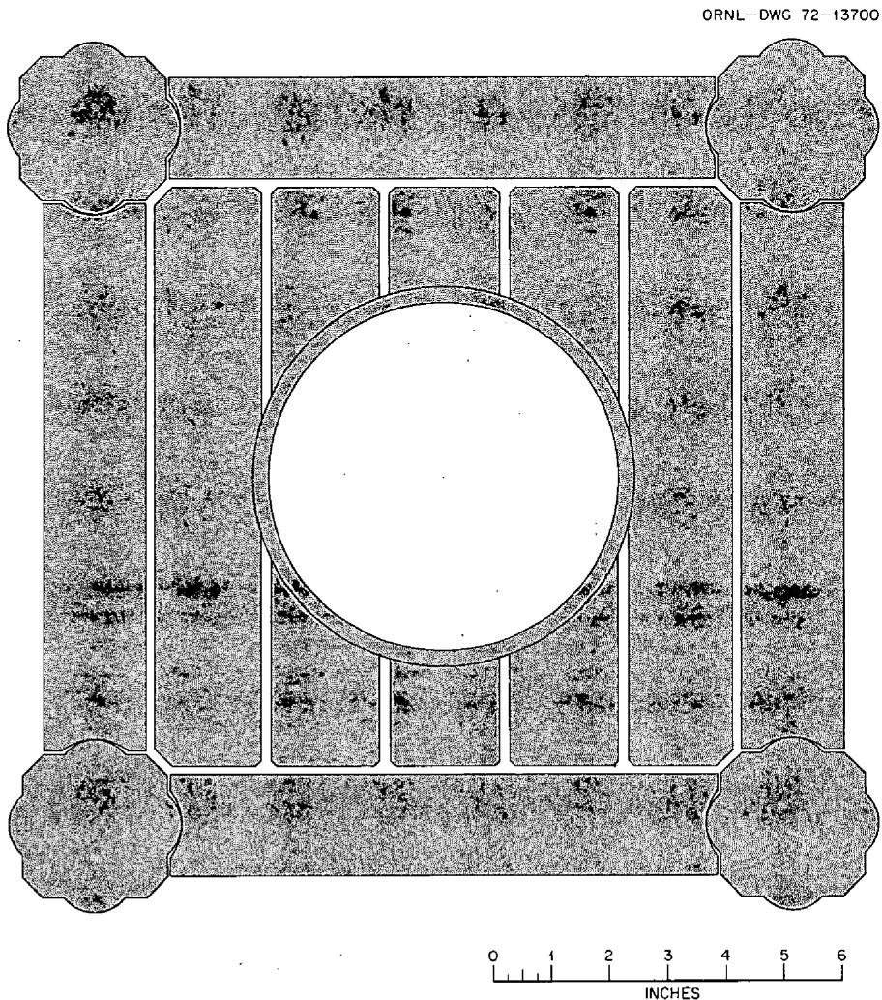  
Fig. 1.1. Plan view of graphite core cell for lead-cooled MSBR.

and general configuration were used, but the cell design was completely changed. This was done to decrease the entrainment at the bottom and also to decrease the poison of the lead in the core.

The cell is still $13^{1/8}$ in.², but it is constructed of four extrusions which, when assembled, form a square with an $11^{1/2}$ -in.-diam hole in the center. Inside this hole are two concentric graphite cylinders, each having a wall thickness of $17/16$ in. In the center of the inner cylinder is a 3-in.-diam rod. This cell provides two annuli of $3/8$ -in. thickness and an outer annulus of $7/8$ -in. thickness. The two inner annuli provide riser channels for the salt, while the outer annulus provides the downcomer and contains 1.5 volumes of lead per volume of salt. Figure 1.2 shows both a plan and elevation of this cell arrangement.

At 8-ft intervals in the outer annulus, there are turning vanes which impart a rotational component to the mixture of lead and salt. This rotation generates a 1-g centrifugal field which separates the lead from the salt by the time the mixed stream reaches the bottom

of the core. The salt collects in a plenum (approximately 2 in. deep) and flows back up through the two annular risers in each cell.

In order to reduce the neutron absorptions in the lead in this core, the ratio of lead to salt is made 1.5:1, necessitating a $200^{\circ}\mathrm{F} \Delta t$ in the lead and thus raising the lead temperature to $1200^{\circ}\mathrm{F}$ and the salt temperature to $1300^{\circ}\mathrm{F}$ . From a nuclear standpoint, this core is superior to the first core, but the performance is still mediocre. The breeding ratio is about 1.05, the doubling time is 31 years (full-power years with compound interest), and the specific inventory is about 2.2 kg/MW(e).

Although the salt disengagement volume is reduced to a tolerable amount by the centrifugal separation, a hydrodynamic problem is introduced. In order to pump the salt around the core circuit, a lead jet velocity of 60 fps is required. The corresponding lead plenum pressure to attain this velocity is 267 psi, a value which we consider to be excessive because of the stresses imposed on the reactor vessel.

ORNL-DWG72-13701

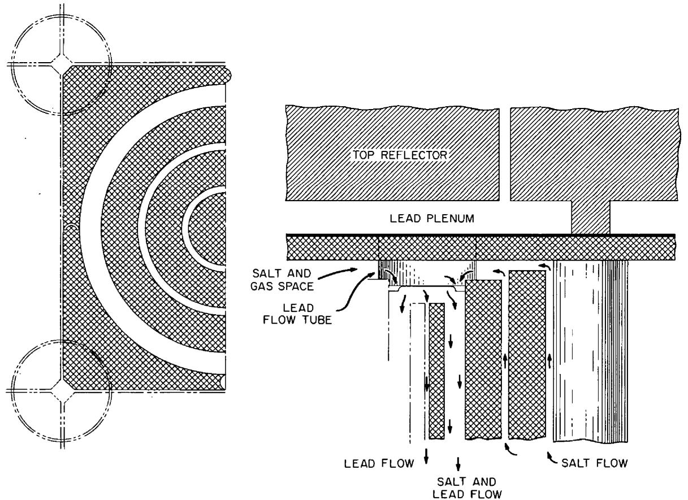  
Fig. 1.2. Plan and elevation of graphite core cell for lead-cooled MSBR.

A final core design was studied in which the lead downcomers were removed from the core and placed peripherally around it. The core cells are exactly like those of the demonstration reactor. They are squares made up of corner posts, inside which are located graphite slabs. The salt flows up through the interstitial spaces in these cells, across the top of the core under the reflector, and down in the lead mixing cells around the core.

These peripheral cells are squares $13^{1/4}$ in. on a side with an 11-in.-diam hole in the center. Inside this hole is a 6-in.-diam rod leaving a $2^{1/2}$ -in. annulus down which lead and salt flow. This lead-salt-graphite region serves as a kind of blanket and liquid-liquid direct contact heat exchanger. By removing the lead from the center of the core, its poison effect is greatly reduced. Outside the blanket region is a reflector consisting of lead-cooled graphite spheres.

Lead with a velocity of 25 fps is introduced into an annulus through an 8-in.-OD nozzle centered around the central graphite cylinder. The lead jet entrains salt, and the mixed liquid flows with a velocity of about 14 fps down the annulus. Again, turning vanes generate a centrifugal field to separate the lead from the salt. A lead plenum pressure of 50 psi is required to impart the necessary velocity and establish circulation through the core.

This design may have possibilities. From a nuclear standpoint, it appears to be rather attractive. Again, details are reported in Chap. 2. There is, however, a question which has not been resolved. It is very difficult to determine how flow is established across the core at the top and bottom. So far, we have been unable to calculate the depth of either plenum, and it is quite possible that these plenums will become so deep as to contain a prohibitive amount of salt.

It should be pointed out that all these studies have been concerned with thermal reactors. It appears now that lead cooling does not improve the performance of thermal reactors sufficiently to justify attempting to solve the difficult materials problems associated with the use of lead. We therefore propose to summarize the results of the studies in a report and to do no further work on these concepts. Lead cooling may have some merit for intermediate or fast-spectrum molten-salt reactors, and studies of such reactors might be worthwhile at some future time.

# 1.2 MSBR INDUSTRIAL DESIGN STUDY

# M. I. Lundin

The Task I Report1 was delivered to ORNL early in the report period. The report described a conceptual

design for a 1000-MW(e) Molten-Salt Breeder Reactor plant, the salient features of which were described in the last semiannual report.2 Task II was started and is currently in progress. This effort is defined as follows:

1. demonstrate the feasibility of the conceptual design presented in Task I;   
2. prepare CSDDs for the design;   
3. conduct trade-off and parametric studies to optimize the design;   
4. perform the benchmark physics calculations;   
5. prepare a cost estimate for the recommended design.

Work is active in each of these five areas.

In the design engineering area, where practicality of the design must be demonstrated, work is currently in progress on the drain tank, the transient analysis of the plant, handling of the reactor vessel top head and of the reflector graphite, structural support of the primary system, and design of a reactor cell structural support system. The present arrangement is shown in Fig. 1.3. The primary system concept has been studied, and a decision has been made to utilize a lined system to protect the plant from thermal shock. This cooled liner also increases the design allowable strength of the reactor vessel metal to 11,000 psi.

Babcock & Wilcox completed a transient analysis of the intermediate heat exchanger. The scram transient specified resulted in a drop in fuel salt inlet temperature of $250^{\circ}\mathrm{F}$ in two stages: $200^{\circ}\mathrm{F}$ in 10 sec followed by a $50^{\circ}\mathrm{F}$ drop in 4 sec. The recommended Task I design withstood this transient. This design utilizes a sine wave tube with a nonremovable tubesheet but having access to the tubesheet for tube plugging (see Fig. 1.4).

# 1.2.1 Drain Tank

A parametric study is under way to identify and quantify the important design parameters and to permit the selection of a credible design. The design base is a hypothetical steady-state condition in which the fuel salt produces 50 MW while at a uniform temperature of $1300^{\circ}\mathrm{F}$ . A tentative design based on this condition will be examined under normal steady-state operation and under transients. These conditions may provide bases for refining the design.

The conceptual design uses bayonet tubes mounted in the tank head for cooling the tank contents. For

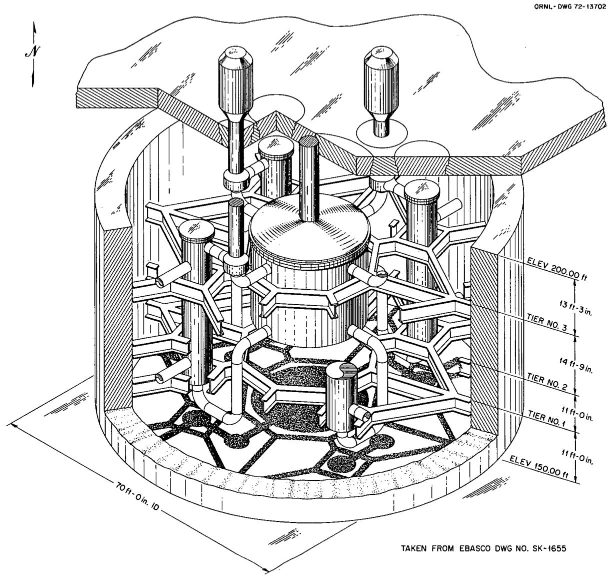  
Fig. 1.3. Design study of MSBR cell.

simplicity, reliability, and ease of maintenance, it is desirable to have as few thimbles as practical. To achieve this, the present Evasco concept utilizes duplex tube thimbles having a mechanical bond. In this concept heat transfer is limited primarily by the salt film coefficient rather than by radiation as in the ORNL concept. Thus, a greater heat flux and far fewer thimbles are possible in the Evasco concept.

Heat transfer characteristics of fuel salt to cooling thimbles were examined. Figure 1.5 shows the calculated film coefficient as a function of salt and metal temperature based on a free convection model. It can be seen that a coefficient of about 200 Btu hr $^{-1}$ ft $^{-2}$ F $^{-1}$ can be expected if the cooling surfaces are

maintained at $1100^{\circ}\mathrm{F}$ and if the salt is allowed to reach $1300^{\circ}\mathrm{F}$ . Being cooler than the bulk, fuel salt near the thimble surface flows downward, becoming turbulent very near the free surface. Because the flow is turbulent over almost the entire thimble length, the film coefficient is constant over the entire length. The thickness of the turbulent boundary layer was calculated (Fig. 1.6) based on a vertical flat plate model. The results suggest that it may exceed 1 in. near the bottom of a long thimble. The same model was used to estimate the

3. M. Jacob, Heat Transfer, Vol. I, Wiley, 1949, p. 529.   
4. E. R. G. Eckert and T. W. Jackson, NACA Technical Notes 2207, October 1950.

ORNL-DWG72-13703

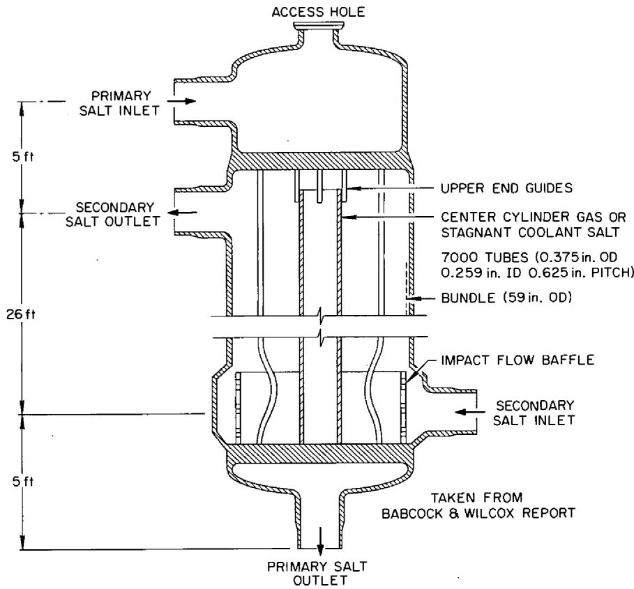  
Fig. 1.4. Fixed sine-wave tube IHX with tubesheet access.

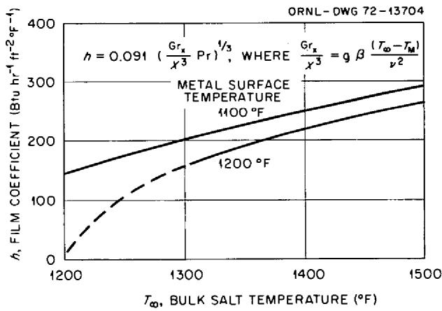  
Fig. 1.5. Film coefficient for fuel salt in drain tank.

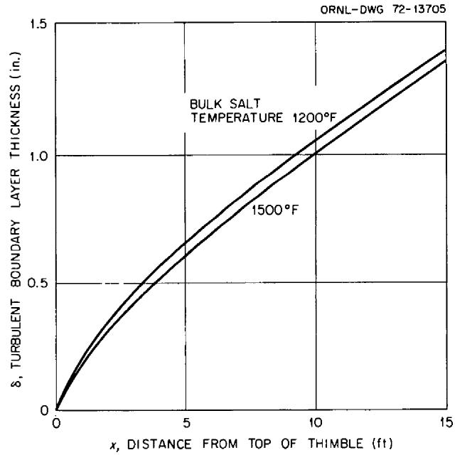  
Fig. 1.6. Turbulent boundary layer thickness on a vertical flat surface resulting from natural convection.

temperature distribution (Fig. 1.7) and the velocity distribution (Figs. 1.8 and 1.9) in the boundary layer. It can be seen that most of the temperature rise occurs within half the boundary layer thickness, and the salt velocity can approach several feet per second. These results indicate that natural convection provides a great deal of mixing, so a uniform bulk salt temperature can be assumed for design purposes.

Based on the film coefficient shown in Fig. 1.5, the heat transfer surface required to accommodate $50\mathrm{MW}$ was determined (Fig. 1.10). If the cooling surfaces operate at $1100^{\circ}\mathrm{F}$ (average) and the bulk salt is

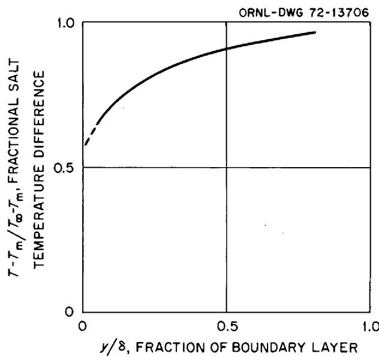  
Fig. 1.7. Temperature distribution in fuel salt near thimble wall.

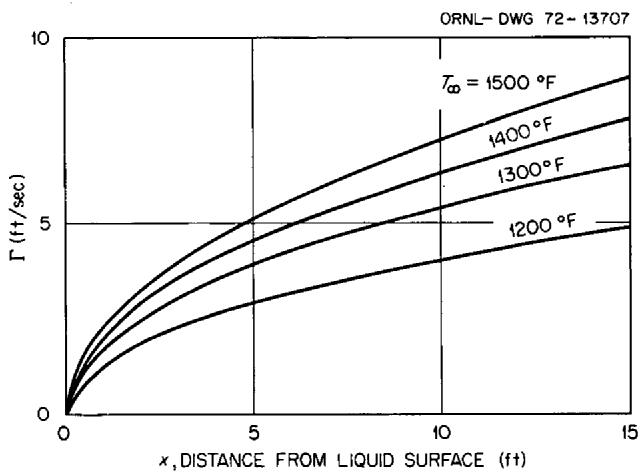  
Fig. 1.8. $\Gamma$ , a constant used with the velocity distribution in Fig. 1.5.

permitted to approach $1300^{\circ}\mathrm{F}$ , it can be seen that an area of $4200\mathrm{ft}^2$ is required. The heat transfer area together with the fixed heat load determine the heat flux and, hence, the temperature drop between the thimble surface and the flowing NaK. Figure 1.11 shows calculated NaK temperatures for various choices of salt and salt temperatures. For $1300^{\circ}\mathrm{F}$ salt and

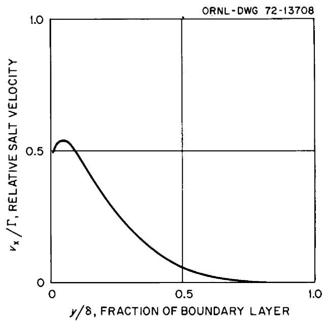  
Fig. 1.9. Relative salt velocity distribution in turbulent boundary layer.

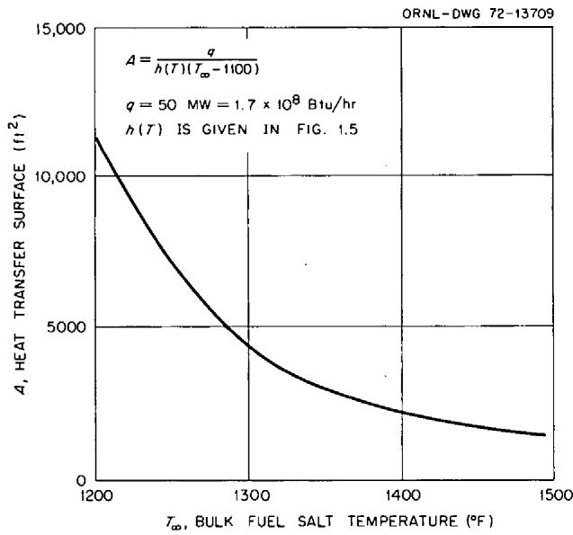  
Fig. 1.10. Heat transfer area required for thimble surface temperature of $1100^{\circ}\mathrm{F}$ .

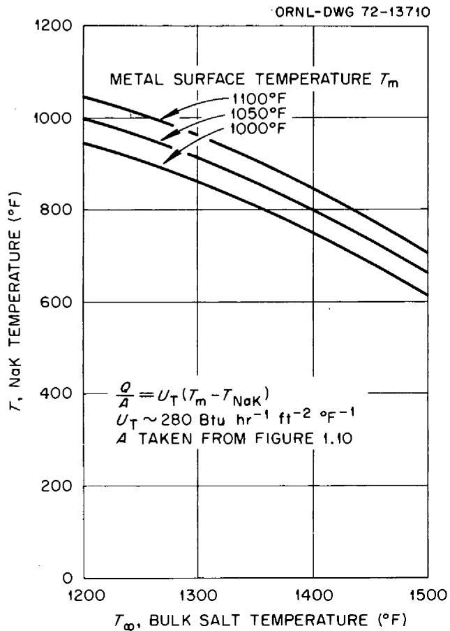  
Fig. 1.11. NaK temperature required to maintain a specific surface temperature for various bulk salt temperatures.

$1100^{\circ}\mathrm{F}$ metal the NaK temperature would have to be about $960^{\circ}\mathrm{F}$ . This result is based on bare thimbles, that is, no fins. However, if vertical fins are put on the thimbles so that the number of thimbles can be reduced, the heat flux will be greater and the NaK temperature will have to be substantially lower.

Because heat transfer through the thimbles is limited primarily by the salt film coefficient, fins greatly improve the heat-removal capacity of a thimble. A standard analysis of fin efficiency shows that a fin height of $\frac{1}{2}$ in. is near optimum. Calculations show that $\frac{1}{8}$ -in.-thick fins spaced $\frac{1}{2}$ in. apart increase the effective heat-removal capacity of a thimble by approximately 50%.

The temperature rise of the NaK as it flows down and up a thimble was determined by constructing two heat balances on a thimble segment; one for downflow and one for upflow. Based on a uniform heat flux $Q$ , the solutions to the two differential equations are presented and plotted in Fig. 1.12. It can be seen that an approximately uniform thimble temperature can be

achieved by choosing design parameters such that the NaK temperature at the bottom is equal to that of the upflow at the top (i.e., at the salt-free surface). Equal temperatures (top and bottom) can be achieved by choosing design parameters such that

$$
2 \pi r _ {D} U _ {D} N H \Delta T / Q = 2,
$$

where $\Delta T$ is the overall NaK temperature rise (see nomenclature). Assuming that the heat-rejection system does not impose additional constraints on the drain tank design, the problem is now reduced to one of choosing design parameters which satisfy all the previous relationships. It is desired, however, for the number of thimbles $N$ and their height $H$ to be as low as practical and for $\Delta T$ to be as large as practical. The latter is to provide adequate driving head with a minimum elevation differential between heat source and sink. Thus, in the previous equation the downcomer perimeter $2\pi r_{D}$ and the overall heat transfer coefficient $U_{D}$ between NaK upflow and downflow are the only parameters which can be arbitrarily adjusted to satisfy the equality. Current efforts are directed toward determining the practical limits of each parameter so that a definitive choice can be made.

# Nomenclature

$$
h = \text {s a l t f i m h e a t} \quad \text {c o e f f i c i e n t (B t u h r ^ {- 1} f t ^ {- 2} {} ^ {\circ} F ^ {- 1})}
$$

$$
x = \text {d i s t a n c e}
$$

$$
\operatorname {G r} _ {x} = x ^ {3} g \beta \left(T _ {\infty} - T _ {m}\right) / v ^ {2}, \text {G r a s h o f n u m b e r}
$$

$$
g = \text {a c c e l e r a t i o n} (3 2. 2 \mathrm {f p s} ^ {2})
$$

$$
\beta = \text {s a l t v o m u l e r i c} ^ {\circ} \mathrm {F} ^ {- 1})
$$

$$
v = s a l t v i s c o s i t y (l b f t ^ {- 1} h r ^ {- 1})
$$

$$
T _ {\infty = \text {b u l k s a l t t e m p e r a t u r e}}
$$

$$
T _ {m} = \text {t h i m b l e s u r f a c e t e m p e r a t u r e}
$$

$$
\Pr = \text {P r a n d t l n u m b e r}
$$

$$
\delta = \text {t u r b u l e n t}
$$

$$
y = \text {h o r i z o n t a l}
$$

$$
\mathbf {v} _ {\boldsymbol {x}} = \text {v e r t i c a l s a l t v e l o c i t y (f p s)}
$$

$$
\Gamma = \text {p r o p o r t i o n a l i t y} (\text {f p s})
$$

$$
T (x) = \text {N a k} ^ {\prime}
$$

$$
T _ {i} = \text {c o l d N a K t e m p e r a t u r e a t s a l t - f r e e s u r f a c e (} ^ {\circ} \mathrm {R})
$$

$$
T _ {0} = \text {h o t N a K t e m p e r a t u r e a t s a l t - f r e e s u r f a c e (° F)}
$$

$$
\Delta T = T _ {0} - T _ {i}
$$

$$
N = \text {n u m b e r o f c o o l i n g t h i m b l e s}
$$

$$
H = \text {h e a t e d}
$$

$$
2 \pi r _ {D} = \text {p e r i m e t e r o f d o w n c o m e r i n t h i m b l e (f t)}
$$

$$
U _ {D} = \text {o v e r a l l h e a t t r a n s f e r c o e f f i c i e n t f r o m h o t t o c o l d N a k} \quad (\mathrm {B t u h r} ^ {- 1} \mathrm {f t} ^ {- 2} \circ \mathrm {F} ^ {- 1})
$$

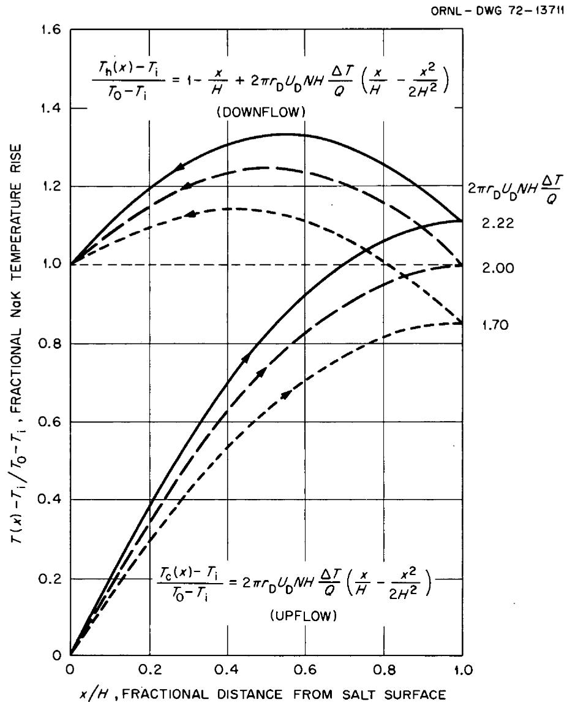  
Fig. 1.12. Relative NaK temperature as a function of position in thimble.

$U_{T} =$ overall heat transfer coefficient to NaK excluding salt film coefficient

$Q =$ total emergency dump heat load $(50\mathrm{MW})$

# 1.2.2 Physics Calculations

As part of the industrial MSBR design study, Ebasco is performing physics calculations to provide an independent check on the breeding ratio reported by ORNL for the reference design. To attain a high level of independence Ebasco is using different sources of data, different computer codes, and different mathematical treatment from that used by ORNL. Specifically,

Ebasco is using ENDF/B data, whereas ORNL used the XSDRN library; Ebasco is using the 3D Monte Carlo code ESP for generating multigroup cross sections, whereas ORNL used the 1D Sn code XSDRN; finally, Ebasco is using the multigroup, multidimensional neutron diffusion code CITATION, whereas ORNL used ROD, a multigroup neutron diffusion code which synthesizes two dimensions via a buckling iteration procedure. This system of codes offers not only a high level of independence but rigorous mathematical treatment as well. Because it does not have the capability to search for the equilibrium salt composition, it is inappropriate for routine MSR calculations. But for a reactor having a well-defined composition, this limitation does not constitute a handicap.

# 1.2.3 Chemical Processing

Continental Oil Company has developed engineered process diagrams and mechanical arrangement drawings for the chemical processing flowsheet supplied by ORNL. This work represents the reduction of the ORNL flowsheet to a practical engineering design in which attention has been given to the details of cooling, heating, shielding, construction, remote maintenance, safety, recovery from accidents and process interruptions, and replacement of major process components. A systematic attempt has been made to include all components and controls that would allow for normal operation. Further, an attempt has been made to utilize the materials that have the lowest possible cost for the service conditions. Specifically, graphite, nickel, and Hastelloy have been utilized in addition to molybdenum.

The process, equipment, and plant layout are described in the Task 1 report1 for the flowsheet shown in Fig. 1.13. Continental Oil Company is presently preparing conceptual systems design descriptions for the plant.

# 1.3 XENON BEHAVIOR IN THE MSBR FUEL SALT SYSTEM

H. A. McLain L. W. Gilley T. C. Tucker

The digital computer program MSRXEP (Molten-Salt Reactor XEnon Poisoning) has been written describing in detail the $^{135}\mathrm{Xe}$ behavior throughout the MSBR fuel salt system. This program incorporates the BUBBLE program reported previously describing in detail the inert purge gas behavior throughout the MSBR fuel salt system. The intent of this effort is to either confirm the results of the simplified calculations of Kedl describing the noble gas behavior in the MSBR or to make improvements where required.

For the trial case using this program with the following assumptions:

Coated graphite

Number of bubbles: 44 bubbles per cubic centimeter of salt

Total helium dissolved in salt and in gas bubbles: 1.0 $\times 10^{-6}$ moles/cm³

Gas separator efficiency: $90\%$

the following results were calculated:

Poison fraction: 0.0038

Average void fraction: 0.0055

Average bubble diameter: 0.0646 cm

Average bubble mass transfer coefficient: 0.0166 cm/sec.

The following mass 135 fission product decay chain along with the indicated half-lives were assumed for the MSRXEP program:

$$
\begin{array}{l}\mathrm {^ {1 3 5} S b} \rightarrow \mathrm {^ {1 3 5} T e} \rightarrow \mathrm {^ {1 3 5} I}\\(2. 0 \sec)\end{array}\begin{array}{l}\mathrm {^ {1 3 5} S b} \rightarrow \mathrm {^ {1 3 5} T e} \rightarrow \mathrm {^ {1 3 5} I}\\(2 9. 0 \sec)\end{array}\begin{array}{l}\mathrm {^ {1 3 5} S b} \rightarrow \mathrm {^ {1 3 5} B a}\\(6. 7 1 \mathrm {h r})\\\mathrm {^ {1 3 5} X e}\\(9. 2 1 \mathrm {h r})\end{array}
$$

We assumed for the purposes of these calculations that the antimony, tellurium, and iodine are "dissolved" in the salt and do not migrate to the bubbles, graphite, or the metal walls. We reasoned that the half-lives of the antimony and tellurium are sufficiently low that the amount of these materials leaving the fuel salt other than by radioactive decay is insignificant. All chemical evidence so far indicates that the iodine remains dissolved in the fuel salt and does not migrate into the graphite. The xenons have a very low solubility in the salt and tend to migrate into the graphite and the gas bubbles in the salt. We assumed that the cesium is stable because of its very long half-life. The yields of $^{135}\mathrm{Sb}$ and $^{135}\mathrm{Xe}$ during the fissioning process have not been established with complete confidence and depend on the fissile material being used. For the initial calculations we assumed that these yields were 5.05 and $1.11\%$ respectively. Also, there is some question about the branching ratio of the $^{135}\mathrm{I}$ decaying to $^{135m}\mathrm{Xe}$ and $^{135}\mathrm{Xe}$ . We assumed that $30\%$ of the $^{135}\mathrm{I}$ decays to $^{135m}\mathrm{Xe}$ in the initial calculations.

Material balances in the form of first-order linear differential equations were written for each of the isotopes present in the fuel salt indicated in the decay chain shown above. Similar material balances were written for the xenons that had migrated into the gas bubbles circulating with the fuel salt. These first-order differential equations were then solved simultaneously throughout the fuel salt loop by an iterative process on the digital computer until a unique solution was obtained.

As was done by Kedl,7 we assumed that the rate of migration of the xenons within the graphite and the pyrolytic coating was determined by the Knudsen diffusion of these gases within the graphite. We assumed

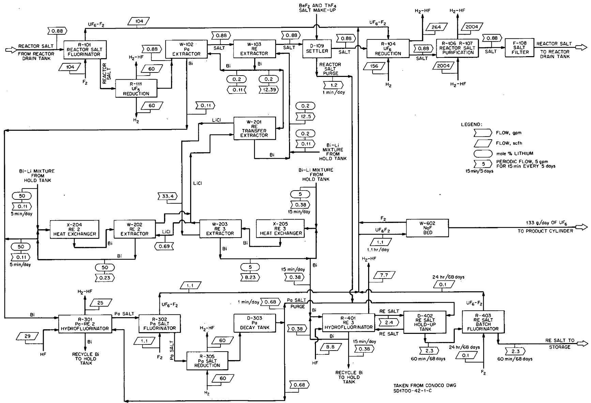  
ORNL-DWG 72-13712   
Fig. 1.13. Fuel salt chemical processing plant block flow diagram.

that the migration of $^{135}\mathrm{Xe}$ and of $^{135}\mathrm{Xe}$ was independent of each other and that the decay of $^{135}\mathrm{Xe}$ to $^{135}\mathrm{Xe}$ in the graphite did not influence the rate of migration of $^{135}\mathrm{Xe}$ from the fuel salt to the graphite. These isotopes lose their identity in the graphite either by radioactive decay or by reacting with the neutrons in the reactor.

When the unique solution of the material balances for these isotopes is obtained, the distribution of these isotopes throughout the fuel salt loop is then known. From the distribution of $^{135}\mathrm{Xe}$ within the reactor core, the poison fraction due to this isotope, the ratio of the neutrons absorbed in $^{135}\mathrm{Xe}$ to those absorbed in the fissile material, can be determined. We assume that all of the $^{135m}\mathrm{Xe}$ that migrates into the graphite was decayed to $^{135}\mathrm{Xe}$ when we calculate the poison

fraction. This should give a high value for the poison fraction in the reactor.

# 1.4 HYBRID COMPUTER SIMULATION OF THE MSBR

O. W. Burke

A hybrid computer simulation model of the reference 1000-MW(e) MSBR was developed. The model simulates the plant from the nuclear reactor through the steam throttle at the turbine. The simulation model is being used to determine the dynamic characteristics of the plant as well as to discover the problems associated with the control of the plant. The model and results of some test simulations are described in ORNL-TM-3767, Hybrid Computer Simulation of the MSBR.

# 2. Reactor Physics

A. M. Perry

# 2.1 ANALYSIS OF HTLTR-MSR LATTICE EXPERIMENTS

G. L. Ragan O. L. Smith

We have completed the calculations of $k_{\infty}$ vs temperature for the lattice used in these experiments, using the cross-section library and calculational techniques described in the last semiannual report. Results of the calculations and a comparison with experiment are given in Table 2.1. While the calculated and measured values compare very favorably, it should be noted that we do not claim such high accuracy for our calculations, since changes larger than the differences noted in Table 2.1 would be produced by variations in cross sections well within our present range of uncertainty.

Calculations relating to the other reactivity worth measurements are well along, but are not yet complete. These include reactivity measurements of three types: (1) fuel salt constituents such as Li, Be, and F, individually measured in a centrally located sample position; (2) simulated control rods; and (3) variations in lattice cell geometry and density.

# 2.2 NUCLEAR PERFORMANCE OF LEAD-COOLED MOLTEN-SALT REACTORS

J. R. Engel

Some survey calculations have been performed to estimate the nuclear performance of large graphite-moderated molten-salt reactors cooled internally by

molten lead. Because of the anticipated complexity of the core structure in such reactors, we considered only systems in which the core was large enough (power density low enough) to allow a 30-year graphite life. In addition, it was presumed that continuous chemical processing for fission product removal and protactinium isolation would be available. Various combinations of channel dimensions, lead:salt ratios, and thorium concentrations were examined. The objective was to determine if the performance potential of such reactors is sufficiently superior to that of externally cooled pumped-salt systems to justify the very substantial effort required to develop lead cooling (see also Sect. 1.1.). Although the calculations were much less extensive than would be required for a detailed design, they did provide a basis for comparison. While breeding would be possible in these particular thermal lead-cooled systems with (in some cases) a somewhat lower fissile inventory, it was concluded that the improvement in nuclear performance relative to comparably sized reactors with external cooling was at best marginal and therefore insufficient to overcome the technological disadvantages of the concept.

Calculations were made for each of the lead-cooling concepts described briefly in Sect. 1.1. For the cases involving lead flow through the entire core, we made complete core calculations for start-up conditions with $^{233}\mathrm{U}$ as the only fissile nuclide. The XSDRN3 program was used to produce effective neutron cross sections that were appropriate for each salt mixture and core geometry in 27 energy groups from the XSDRN

1. E. P. Lippincott, Measurement of Physics Parameters for a MSBR Lattice in the HTLTR, BNWL-1633 (January 1972).  
2. MSR Program Semiannu. Progr. Rep. Feb. 29, 1972, ORNL-4782, pp. 18-21.

3. N. M. Greene and C. W. Craven, Jr., XSDRN: A Discrete Ordinates Spectral Averaging Code, ORNL-TM-2500 (July 1969).

Table 2.1. Comparison of measured and calculated $k_{\infty}$ for HTLTR-MSBR latticea   

<table><tr><td rowspan="2"></td><td colspan="4">k∞</td><td rowspan="2">Δk∞(300→1000°C)</td></tr><tr><td>20°C</td><td>300°C</td><td>627°C</td><td>1000°C</td></tr><tr><td>k∞ (measured)</td><td>1.0291 ± 0.0012</td><td>1.0127 ± 0.0010</td><td>1.0065 ± 0.0010</td><td>1.0037 ± 0.0012</td><td>-0.0090 ± 0.0016</td></tr><tr><td>k∞ (calculated)</td><td>1.0316</td><td>1.0152</td><td>1.0069</td><td>1.0038</td><td>0.0114</td></tr><tr><td>k∞ (measured)/calculated)b</td><td>0.9976 ± 0.0023</td><td>0.9975 ± 0.0010</td><td>0.9996 ± 0.0010</td><td>0.9999 ± 0.0012</td><td>0.79 ± 0.15</td></tr></table>

$a k_{\infty}$ for bare critical core of given composition. bQuoted errors include only experimental errors; uncertainties in calculated quantities are undoubtedly greater than these (see text).

Table 2.2 Nuclear performance of molten-salt reactors with internal lead cooling throughout the core   

<table><tr><td colspan="2">Downcomer</td><td rowspan="2">Fuel mixture 
LiF/BeF2/ThF4 (mole %)</td><td rowspan="2">Core 
C:U 
ratio</td><td rowspan="2">Fissile 
specific 
inventory 
[kg/MW(e)]</td><td colspan="2">Breeding ratio</td><td rowspan="2">Lead poison 
fraction</td></tr><tr><td>Type</td><td>Lead:salt 
ratio</td><td>Initial</td><td>Effective</td></tr><tr><td>6 in. cylindrical</td><td>3:1</td><td>72/16/12</td><td>6,300</td><td>1.53</td><td>1.04</td><td>0.99</td><td>a</td></tr><tr><td>6 in. cylindrical</td><td>3:1</td><td>72/16/12</td><td>10,700</td><td>1.17</td><td>1.00</td><td>0.95</td><td>a</td></tr><tr><td>7/8 in. annular</td><td>3:1</td><td>72/16/12</td><td>10,700</td><td>1.16</td><td>0.97</td><td>0.92</td><td>0.15</td></tr><tr><td>7/8 in. annular</td><td>3:1</td><td>71/9/20</td><td>7,500</td><td>1.66</td><td>1.05</td><td>1.00</td><td>0.10</td></tr><tr><td>9/16 in. annular</td><td>1.5:1</td><td>71/9/20</td><td>8,700</td><td>1.54</td><td>1.08</td><td>1.03</td><td>0.06</td></tr><tr><td>7/8 in. annular</td><td>1.5:1</td><td>71/9/20</td><td>5,400</td><td>2.24</td><td>1.10</td><td>1.05</td><td>0.06</td></tr></table>

${}^{a}$ Not computed.

123-group cross-section library.4 The resultant cross sections were used in a 27-group one-dimensional diffusion calculation (also with XSDRN) to determine the start-up breeding performance. The reactor was represented in spherical geometry with a 2.5-ft-thick reflector and constant composition in the entire core region. We made no attempt to optimize the cores in terms of neutron damage to the graphite by varying the fuel fraction across the core, since it appeared that the small changes in breeding performance associated with this exercise would not affect the conclusions regarding these reactors. Although the calculations did not explicitly include the buildup of higher isotopes of uranium or the poisoning due to the equilibrium concentrations of fission products, we estimated that the reduction in breeding ratio from these effects would be 0.05 to 0.06. The results of the computations are summarized in Table 2.2.

The first calculations were made for an array of core cells with a 6-in.-diam cylindrical downcomer of lead and salt in the middle of each cell. A fuel salt containing $12\mathrm{~mol}\% \mathrm{ThF}_4$ was assumed, and the lead: salt ratio in the downcomers was 3:1. Although this concept was rejected on the basis that the salt inventory would be excessive because of salt carry-under in the disengagement region below the core, the nuclear performance was also unacceptable because positive breeding gains were not attained. Since it appeared that excessive lumping of the thorium in the downcomer was adversely affecting the breeding, the concept was modified to provide an annular lead-salt downcomer in each cell. (This also reduced the problem of salt carry-under below the core.) However, the nuclear

performance was still unacceptable with only 12 mole $\% \mathrm{ThF_4}$ in the salt and the 3:1 ratio of lead:salt in the downcomers. The next step was to increase the thorium concentration to see if thorium could be made to compete more effectively with the parasitic neutron absorbers. A concentration of 20 mole $\%$ was selected even though we realized that the liquidus temperature $(>500^{\circ}\mathrm{C})$ might be unacceptably high for practical designs. As shown in the fourth case in Table 2.2, the higher thorium concentration was beneficial, but the nuclear performance was still marginal.

The detrimental effect of the lead in the core is clearly shown by the lead poison fraction (absorptions in lead as a fraction of absorptions in fissile material), which varied from 0.1 to 0.15 depending on the thorium concentration. In an effort to reduce the neutron losses to lead, some computations were made for a lead:salt ratio of only 1.5:1 in the downcomers. This also led to improved performance, but the net result was no better than for a reactor with salt circulating outside the reactor vessel.[5]

In a final effort to minimize the poisoning effect of the lead, a core was considered in which the lead was confined to a region of downcomer cells surrounding a core that contained only salt and graphite. It was not obvious that the fluid mechanics of such a core could be made acceptable, but it did represent the best nuclear performance we could expect with internal lead cooling. Calculations of the type described above suggested that an effective breeding ratio near 1:1 could be attained with a 1.5:1 lead:salt ratio in the downcomers and 20 mole $\% \mathrm{ThF_4}$ . To estimate the potential at lower thorium concentrations with better accounting for fission products and higher uranium isotopes, we

reexamined an earlier calculation for a pumped salt reactor. A first-order perturbation calculation was applied to a core with 14 mole $\%$ thorium in the fuel to estimate the loss in breeding ratio due to lead in the outer core region and the reduction in fissile inventory associated with elimination of the external salt loop. This calculation indicated that the breeding-ratio penalty would be about 0.02, while the inventory would be reduced by about $15\%$ . These estimates were in essential agreement with the performance estimated from the calculation at 20 mole $\%$ thorium. Since none of the above-described results indicates any clearly superior performance for lead-cooled thermal reactor systems, this study has been discontinued.

# 2.3 PLUTONIUM USE IN MOLTEN-SALT REACTORS

# H. F. Bauman

The plutonium that will become available from light-water reactors in increasing quantities over the next several decades could be utilized in molten-salt reactors with a minimum of fuel preparation facilities. One use for LWR plutonium could be as fuel for molten-salt converter reactors (MSCR's) that have periodic batch processing. The other is as the start-up fuel for molten-salt breeder reactors (MSBR's) with on-line processing. Over the past two years, we have made some limited studies of the nuclear performance of molten-salt reactors using plutonium in various ways and have calculated the economics of these uses. In the course of these studies we established the need for a computer program that could calculate the time-dependent behavior of a fluid-fueled reactor, including the effects of significant changes in the neutron spectrum caused by changes in the fuel composition, and we developed the HISTRY-2 option of the ROD code to meet this need. In the current six-month period, the HISTRY-2 option has been made operational, and the plutonium studies have reached a culmination.

Our results indicate that plutonium is a desirable fuel for MSCR's: if assigned a value of 9.9 $\mathbb{S} / \mathbb{kg}$ fissile, plutonium gives somewhat lower fuel cycle costs in an MSR than does enriched uranium. Start-up of an MSBR on plutonium is feasible but appears to offer little or no cost advantage. The studies and results are described in detail in the following sections.

# 2.3.1 Fuel for Molten-Salt Converter Reactors

Molten-salt converter reactors are basically similar to molten-salt breeders. In the MSCR, however, the salt may be processed only at intervals of several years instead of being processed continuously as in the MSBR. The losses due to fission products and protacitinium in a batch-processed MSCR reduce the breeding ratio below 1.0, but even so most of the fissions over the lifetime of the reactor are in bred $^{233}\mathrm{U}$ .

In the simple batch process assumed in our studies, after six equivalent full-power years (efpy) of operation the uranium is recovered by the fluoride volatility process, and the remaining salt, containing fission products and any plutonium that may be in it, is discarded. The cycle is then repeated. (It is presently uneconomical to recover plutonium from MSR salt.) For our MSCR studies we used a simplified reactor model consisting of a spherical graphite core with a 0.12 salt volume fraction surrounded by a 78.4-cm reflector with a 0.01 salt fraction. (Earlier studies had shown that the spherical model adequately represents the actual cylindrical core.) The core diameter was adjusted in each case to give a peak damage flux equivalent to a graphite life of 30 years in a 2250-MW(t) plant operating at a 0.8 load factor.

The initial fissile loading and subsequent feed for an MSCR could be enriched uranium, plutonium, or $^{233}\mathrm{U}$ from other reactors. Lower fissile loadings are required with plutonium because of its larger cross sections. The presence of much $^{240}\mathrm{Pu}$ tends to harden the neutron spectrum and increase the critical loading. However, this effect can be offset by reducing the concentration of the main fertile material, thorium, to maintain a well-thermalized spectrum. The conversion ratio that is approached asymptotically in an MSCR depends mainly on the fertile loading and only slightly on the choice of fissile feed. The lower initial fissile loading and the lower assigned value for LWR plutonium tend to reduce fuel-cycle costs relative to those for uranium-fueled MSCR's. Although the plutonium cannot be recovered economically from an MSCR, discard of large amounts can be avoided by switching to uranium feed for the last two or three years of each cycle, allowing most of the plutonium to burn out. The uranium recovered in the batch process may be used in the next cycle, or it may be sold.

We have examined the performance of molten-salt converter reactors with various combinations of initial

Table 2.3. Feed compositions assumed in MSR studies   

<table><tr><td rowspan="2">Description</td><td rowspan="2">Key</td><td colspan="5">Plutonium atom fraction</td></tr><tr><td>239Pu</td><td>240Pu</td><td>241Pu</td><td>242Pu</td><td></td></tr><tr><td>First-cycle LWR plutoniuma</td><td>Pu(1)</td><td>0.60</td><td>0.24</td><td>0.12</td><td>0.04</td><td></td></tr><tr><td>Second-cycle LWR plutoniuma</td><td>Pu(2)</td><td>0.40</td><td>0.32</td><td>0.18</td><td>0.10</td><td></td></tr><tr><td></td><td></td><td colspan="5">Uranium atom fraction</td></tr><tr><td></td><td></td><td>233U</td><td>234U</td><td>235U</td><td>236U</td><td>238U</td></tr><tr><td>Enriched uranium</td><td>U(e)</td><td></td><td></td><td>0.93</td><td></td><td>0.07</td></tr><tr><td>Recycled MSCR uranium</td><td>U(r)</td><td>0.78</td><td>0.178</td><td>0.032</td><td>0.01</td><td></td></tr><tr><td>Equilibrium MSBR uranium</td><td>U(q)</td><td>0.664</td><td>0.225</td><td>0.058</td><td>0.053</td><td></td></tr></table>

${}^{a}$ Composition typical of light-water reactor discharge after one or two cycles.

Table 2.4. Composition and liquidus temperature of fuel carrier salts used in MSCR and MSBR calculations   

<table><tr><td colspan="3">Composition (mole %)</td><td rowspan="2">Liquidus temperaturea(°C)</td></tr><tr><td>ThF4</td><td>BeF2</td><td>LiF</td></tr><tr><td colspan="4">MSCR salt</td></tr><tr><td>14</td><td>17</td><td>69</td><td>495</td></tr><tr><td>12</td><td>20</td><td>68</td><td>485</td></tr><tr><td>10</td><td>23</td><td>67</td><td>475</td></tr><tr><td>8</td><td>27</td><td>65</td><td>465</td></tr><tr><td>6</td><td>30</td><td>64</td><td>450</td></tr><tr><td>4</td><td>32</td><td>64</td><td>440</td></tr><tr><td>3</td><td>32</td><td>65</td><td>440</td></tr><tr><td>0</td><td>33</td><td>67</td><td>460</td></tr><tr><td colspan="4">MSBR salt</td></tr><tr><td>8</td><td>20</td><td>72</td><td>485</td></tr><tr><td>10</td><td>18</td><td>72</td><td>490</td></tr><tr><td>12</td><td>16</td><td>72</td><td>500</td></tr></table>

$^{a}$ R. E. Thoma (ed.), Phase Diagrams of Nuclear Reactor Materials, ORNL-2548, p. 80 (November 1959).

fissile loading, primary feed (first part of each cycle), and secondary feed (latter part of each cycle).

Plutonium and enriched uranium feed. A series of cases was run in which plutonium discharged from an LWR after one cycle was the primary feed and enriched uranium the secondary feed. The feed compositions are given in Table 2.3. (The key abbreviations shown in this table are used subsequently to identify the feed compositions.) Based on previous work, we selected a reactor lifetime consisting of four cycles, each 6 efpy in length with feed switched at 4 efpy. In this study with the salt fraction held fixed, the thorium concentration in the carrier salt is the dominant parameter determining the moderator ratio, fissile inventory, and the conver

sion ratio of the reactor. The fuel carrier salt compositions used are shown in Table 2.4. The salt composition is specified for a given reactor by giving the thorium concentration.

The results of six cases, arranged in descending order of thorium concentration, are shown in Table 2.5. Based on the plutonium fissile loading study reported in the last semiannual report, $^{8}$ in cases involving higher thorium concentrations, we used a lower thorium concentration in the first cycle than in subsequent cycles to reduce the initial fissile loading. The results show that thorium concentration has little effect on the core diameter required for a 30-year graphite life. With decreasing thorium concentration, the fissile inventory, as indicated by the initial loading, decreased, but the conversion ratio also decreased and the lifetime fissile requirements increased. These trends are reflected in the fuel cost breakdowns, which show the fissile inventory cost decreasing and the burnup cost increasing. The result is a broad minimum in the fuel cost at a relatively low thorium concentration, in the range 8 to 4 mole $\%$ as shown by cases A57, A58, and A62. Of these three cases, A57, with an $8\%$ thorium concentration for all but the first cycle, has the lowest lifetime fissile requirement and may be considered a near-optimum case. Because of a high conversion ratio (near 0.90), the fissile requirement (defined as the fissile material purchased over the reactor lifetime less than recovered at the end of life) for this case is less than $3000\mathrm{kg}$ for the entire lifetime.

The important nuclide inventories for case A57 are plotted as a function of time in Fig. 2.1. (To avoid overcrowding in this figure and those following, not all nuclides are shown for every cycle.) Relatively large concentrations of plutonium are required in the first cycle, before the $^{233}\mathrm{U}$ has built in. Some additional plutonium is required to start the second cycle, as the

thorium concentration was raised from 6 to 8 mole $\%$ but little plutonium is required in the last two cycles, when the reactor is nearly self-sustaining. For the last two cycles, more fissile uranium is available from the previous cycle than is required for criticality at the beginning of the cycle. In these calculations, the uranium in excess of the cycle start-up requirement is held and used as feed for as long as it lasts. Plutonium feed is then used until the end of 4 efpy. This accounts for the zero plutonium concentration at the beginning of the last two cycles. In each cycle, the $^{239}\mathrm{Pu}$ concentration begins to decline abruptly, and the $^{235}\mathrm{U}$ concentration begins to rise as the feed is switched from plutonium to enriched uranium at the end of the fourth year.

Plutonium and recycled uranium feed. The cases just described require the purchase of enriched uranium in addition to plutonium. In a sense, enriched uranium is

interchangeable with uranium bred in the reactor, since both are recoverable at the end of every cycle. Any or all of this recovered uranium could be withheld (instead of being loaded at the start of the next cycle) to be used in place of enriched uranium in the latter part of the cycle. Of course, any uranium used in the first cycle would have to come from an 'external supply, but this requirement could be repaid later out of the uranium recovered at the end of the cycles. To explore the advantages of such an arrangement, we have calculated several cases in which exactly enough uranium is withheld from an MSCR to supply all the uranium used in this reactor at other points in its lifetime. In physical terms, we have in effect established a "borrow pile"; in economic terms, we have established a market in recycled MSCR uranium. When recycled uranium is available in this manner, it can be used not only as feed during the last years of each cycle but also in the initial

Table 2.5. Lifetime-averaged performance of MSCR designs using plutonium feed for various thorium concentrations   
Lifetime: four 6-efpy cycles  
Feed: $^{a}$ Primary, plutonium, first cycle, $\mathrm{Pu}(1)$ Secondary, $^{235}$ U, $93\%$ enriched, U(e) Switch from primary to secondary at 4 efpy in each cycle.   

<table><tr><td>Case identification</td><td>A56.1</td><td>A52.3</td><td>A37.23</td><td>A57</td><td>A58</td><td>A62</td></tr><tr><td>Thorium concentration,b mole %</td><td></td><td></td><td></td><td></td><td></td><td></td></tr><tr><td>Cycle 1</td><td>10</td><td>8</td><td>6</td><td>6</td><td>6</td><td>4</td></tr><tr><td>Cycles 2 to 4</td><td>14</td><td>12</td><td>10</td><td>8</td><td>6</td><td>4</td></tr><tr><td>Core diameter, cm</td><td>1064</td><td>1064</td><td>1062</td><td>1064</td><td>1064</td><td>1060</td></tr><tr><td>Fissile material balance, kg</td><td></td><td></td><td></td><td></td><td></td><td></td></tr><tr><td>Initial loading, plutonium</td><td>1265</td><td>813</td><td>582</td><td>586</td><td>586</td><td>390</td></tr><tr><td>Purchases</td><td></td><td></td><td></td><td></td><td></td><td></td></tr><tr><td>Plutonium</td><td>3720</td><td>3496</td><td>3285</td><td>3196</td><td>3374</td><td>4417</td></tr><tr><td>235U</td><td>230</td><td>561</td><td>1161</td><td>1610</td><td>2050</td><td>3103</td></tr><tr><td>Discard, plutonium</td><td>176</td><td>107</td><td>71</td><td>76</td><td>77</td><td>59</td></tr><tr><td>Recovery at end of life</td><td></td><td></td><td></td><td></td><td></td><td></td></tr><tr><td>233U</td><td>2923</td><td>2665</td><td>2154</td><td>1672</td><td>1288</td><td>845</td></tr><tr><td>235U</td><td>230</td><td>223</td><td>318</td><td>372</td><td>409</td><td>461</td></tr><tr><td>Net fissile requirementc</td><td>797</td><td>1170</td><td>1973</td><td>2763</td><td>3728</td><td>6231</td></tr><tr><td>Conversion ratio,d lifetime av</td><td>0.982</td><td>0.963</td><td>0.927</td><td>0.893</td><td>0.851</td><td>0.752</td></tr><tr><td>Fuel costs,e mills/kWhr</td><td></td><td></td><td></td><td></td><td></td><td></td></tr><tr><td>Fissile inventory</td><td>0.635</td><td>0.564</td><td>0.478</td><td>0.395</td><td>0.318</td><td>0.219</td></tr><tr><td>Salt inventory</td><td>0.069</td><td>0.065</td><td>0.062</td><td>0.063</td><td>0.063</td><td>0.060</td></tr><tr><td>Fissile burnup</td><td>-0.012</td><td>0.015</td><td>0.067</td><td>0.116</td><td>0.172</td><td>0.306</td></tr><tr><td>Salt replacement</td><td>0.140</td><td>0.134</td><td>0.128</td><td>0.123</td><td>0.118</td><td>0.112</td></tr><tr><td>Total fuel costs</td><td>0.83</td><td>0.78</td><td>0.73</td><td>0.70</td><td>0.67</td><td>0.70</td></tr></table>

${}^{a}$ Refer to Table 2.3 for feed compositions.   
$b$ Refer to MSCR salt compositions, Table 2.4.   
Assuming discarded plutonium is not recoverable.   
$d_{\mathrm{Nuclear}}$ conversion ratio, not considering plutonium discard or fissile processing loss.   
Excluding processing costs. Obtained from present-worth calculation of fissile, fertile, and carrier salt purchases and fissile sales over life of reactor, with discount rate = 0.07 year $^{-1}$ , compounded quarterly, and inventory charge rate = 0.132 year $^{-1}$ . Values of $11.9 \, \text{g}^{235}\text{U}$ , $13.8 \, \text{g}^{233}\text{U}$ , and $9.9 \, \text{g}^{233}\text{fissile}$ plutonium were assumed.

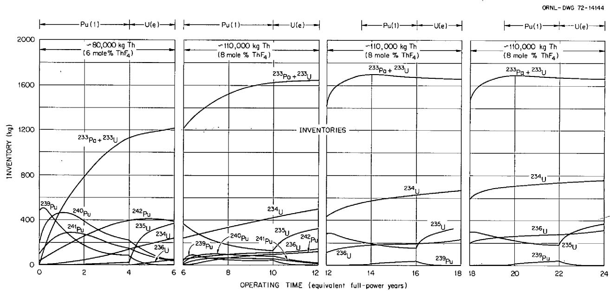  
Fig. 2.1. Principal nuclide lifetime inventories for MSCR case A57, with first-cycle plutonium and enriched uranium feed.

loading to avoid a high plutonium concentration and an excessively hard neutron spectrum. We investigated two repayment schemes. In one the borrowed uranium is repaid immediately at the start of the second cycle. In the other, the borrowed uranium is repaid in equal installments at the start of the remaining three cycles.

These possibilities are illustrated in the seven cases shown in Table 2.6. In every case, the feed is switched to recycled uranium from the stockpile at the end of the third efpy of each cycle. This uranium is returned to the stockpile at the end of the cycle.

The first six cases in Table 2.6 form a series in which the thorium concentration was held fixed at $10\mathrm{~mol}\%$ In the first case, the reactor was started up entirely on plutonium. In the next two cases, about 500 and 1000 kg of recycled uranium were borrowed and used in the initial loading, and the borrowed uranium was repaid at the end of the first cycle. In the next case, the reactor was also started up with $1000\mathrm{~kg}$ of borrowed recycled uranium, but this was repaid over the remaining three cycles. The next case was started with about $1500\mathrm{~kg}$ of borrowed uranium, repaid over three cycles. In the sixth case, A55.3, the amount of uranium borrowed initially was chosen so that, when it was repaid in three installments, the plutonium loading would be approximately equal in all four cycles.

The last case was run with a 6 mole $\%$ thorium concentration, for comparison with the minimum fuelcost case from the previous series. As in case A55.3, the amount of uranium supplied initially was adjusted to

give approximately the same plutonium concentration in each cycle.

Among the six cases with the same thorium concentration, there are only minor differences in lifetime performance despite the large differences in the composition of the initial fissile loadings. The most visible effect is that using more plutonium early in the lifetime lowers slightly the fuel cost. However, there may be advantages for a more uniform loading over the reactor lifetime that do not appear in the data. For example, the zoning of the core to reduce the peak damage flux is probably more effective when the cycles are more nearly uniform.

It would appear from these results that the reactor designer has a wide latitude in the choice of feed modes without greatly affecting the reactor performance. This is further illustrated by comparison of case A60.1 with A58 in Table 2.5. In case A58, the first loading was all plutonium, and the switch feed was enriched uranium. The conversion ratios and fuel costs for these two cases, however, differ by less than $1\%$ .

The inventories of the important nuclides for case A60.1 are plotted as a function of time in Fig. 2.2. The four cycles are very nearly alike. The major difference from cycle to cycle is the increase in inventory of $^{234}\mathrm{U}$ , $^{235}\mathrm{U}$ , and $^{236}\mathrm{U}$ , which do not reach equilibrium in one reactor lifetime.

Start-up with enriched uranium or recycled plutonium. In all the foregoing cases, we assumed that initial fissile loading was either plutonium discharged

Table 2.6. Lifetime-averaged performance of MSCR designs with plutonium and borrowed recycled uranium feed   
Lifetime: four 6-efpy cycles  
Feed: $^a$ Primary, $\mathbf{Pu}(1)$ Secondary, $\mathbf{U}(\mathbf{r})$ Switch at 3 efpy in each cycle   

<table><tr><td>Case identification</td><td>A61</td><td>A53.4</td><td>A54.1</td><td>A59</td><td>A50.3</td><td>A55.3</td><td>A60.1</td></tr><tr><td>Thorium concentration,b mole % (all cycles)</td><td>10</td><td>10</td><td>10</td><td>10</td><td>10</td><td>10</td><td>6</td></tr><tr><td>Number of uranium return cycles</td><td></td><td>1</td><td>1</td><td>3</td><td>3</td><td>3</td><td>3</td></tr><tr><td>Core diameter, cm</td><td>1062</td><td>1064</td><td>1062</td><td>1062</td><td>1062</td><td>1062</td><td>1066</td></tr><tr><td>Fissile material balance, kg</td><td></td><td></td><td></td><td></td><td></td><td></td><td></td></tr><tr><td>Initial loading, by cycle</td><td></td><td></td><td></td><td></td><td></td><td></td><td></td></tr><tr><td>Plutonium</td><td></td><td></td><td></td><td></td><td></td><td></td><td></td></tr><tr><td>1</td><td>1154</td><td>813</td><td>568</td><td>568</td><td>290</td><td>241</td><td>240</td></tr><tr><td>2</td><td>94</td><td>311</td><td>530</td><td>163</td><td>226</td><td>241</td><td>254</td></tr><tr><td>3</td><td>0</td><td>0</td><td>16</td><td>129</td><td>215</td><td>233</td><td>247</td></tr><tr><td>4</td><td>0</td><td>0</td><td>0</td><td>125</td><td>213</td><td>229</td><td>245</td></tr><tr><td>Uranium</td><td></td><td></td><td></td><td></td><td></td><td></td><td></td></tr><tr><td>1</td><td>0</td><td>495</td><td>991</td><td>991</td><td>1479</td><td>1569</td><td>758</td></tr><tr><td>2</td><td>1805</td><td>1412</td><td>1061</td><td>1729</td><td>1636</td><td>1611</td><td>774</td></tr><tr><td>3</td><td>2068</td><td>2060</td><td>2022</td><td>1842</td><td>1689</td><td>1654</td><td>812</td></tr><tr><td>4</td><td>2125</td><td>2119</td><td>2115</td><td>1884</td><td>1713</td><td>1674</td><td>829</td></tr><tr><td>Purchases, plutonium</td><td>3614</td><td>3603</td><td>3546</td><td>3529</td><td>3521</td><td>3518</td><td>4712</td></tr><tr><td>Discard, plutonium</td><td>120</td><td>99</td><td>84</td><td>79</td><td>76</td><td>76</td><td>33</td></tr><tr><td>Recovery at end of life</td><td></td><td></td><td></td><td></td><td></td><td></td><td></td></tr><tr><td>233U</td><td>2066</td><td>2067</td><td>2059</td><td>2059</td><td>2050</td><td>2048</td><td>970</td></tr><tr><td>235U</td><td>195</td><td>191</td><td>188</td><td>178</td><td>168</td><td>166</td><td>109</td></tr><tr><td>Net fissile requirementc</td><td>1353</td><td>1346</td><td>1298</td><td>1293</td><td>1302</td><td>1303</td><td>3634</td></tr><tr><td>Conversion ratio,d lifetime av</td><td>0.955</td><td>0.953</td><td>0.954</td><td>0.953</td><td>0.953</td><td>0.952</td><td>0.857</td></tr><tr><td>Fuel costs,e mills/KWhr</td><td></td><td></td><td></td><td></td><td></td><td></td><td></td></tr><tr><td>Fissile inventory</td><td>0.509</td><td>0.518</td><td>0.528</td><td>0.535</td><td>0.545</td><td>0.546</td><td>0.336</td></tr><tr><td>Salt inventory</td><td>0.070</td><td>0.070</td><td>0.070</td><td>0.070</td><td>0.070</td><td>0.070</td><td>0.064</td></tr><tr><td>Fissile burnup</td><td>0.029</td><td>0.029</td><td>0.027</td><td>0.027</td><td>0.028</td><td>0.028</td><td>0.157</td></tr><tr><td>Salt replacement</td><td>0.131</td><td>0.131</td><td>0.131</td><td>0.131</td><td>0.131</td><td>0.131</td><td>0.119</td></tr><tr><td>Total fuel costs</td><td>0.739</td><td>0.748</td><td>0.755</td><td>0.762</td><td>0.773</td><td>0.774</td><td>0.676</td></tr></table>

Note: Refer to explanatory notes following Table 2.5.

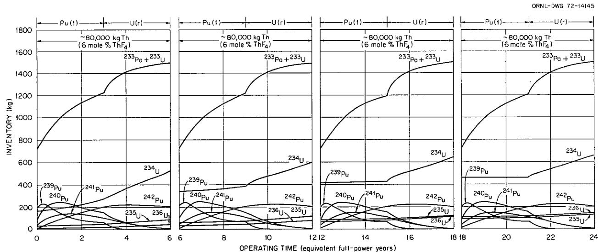  
Fig. 2.2. Principal nuclide lifetime inventories for MSCR case A60.1, with first-cycle plutonium and recycle uranium feed.

from an LWR after one cycle, $\mathbf{Pu}(1)$ , or uranium borrowed from other MSCR's, $\mathbf{U}(\mathbf{r})$ . Other possibilities for the initial loading and primary feed are enriched uranium, $\mathbf{U}(\mathbf{e})$ , or plutonium that has been recycled in an LWR, $\mathbf{Pu}(2)$ . The series of cases shown in Table 2.7 compares the use of the three different materials: $\mathbf{U}(\mathbf{e})$ , $\mathbf{Pu}(1)$ , and $\mathbf{Pu}(2)$ . (Refer to Table 2.3 for the compositions assumed for these materials.)

We selected similar initial conditions for the cases with the various feed materials; no attempt was made to optimize the conditions for each feed material. The first two cases with enriched uranium feed are to be compared with the third case with first-cycle plutonium feed. Enriched uranium was the secondary feed in all the plutonium feed cases. Cases A41.1 and A37.23 appear most nearly alike, having the same thorium concentration in each cycle. However, the plutonium feed case has additional fertile material in the form of $^{240}\mathrm{Pu}$ , and may be better compared with case A42, with 10 mole % thorium in the first cycle. The

difference in first-cycle thorium concentration affects the conversion ratio; of the two uranium feed cases, one has a higher and the other a lower conversion ratio than the plutonium feed case. Both uranium feed cases have significantly higher fuel costs than the plutonium feed case.

We can make two comparisons of first- and second-cycle plutonium as feed materials. Cases A37.23 and A51.12 each have 6 mole % thorium in the first cycle and 10 mole % in subsequent cycles. Cases A58 and A63 have 6 mole % thorium in all cycles. The calculations show very little difference in the performance obtained with first- and second-cycle plutonium feed. Second-cycle plutonium appears to have a slight edge, giving fuel cycle costs that are lower by 0.01 to 0.02 mill/kWhr.

None of the cases discussed thus far take into account the neutron reactions of the transplutonium nuclides. G. Alesii studied the buildup of nuclides in the chain from $^{242}\mathrm{Pu}$ through $^{245}\mathrm{Cm}$ as a function of time at

Table 2.7. Lifetime-averaged performance of typical MSCR designs with various feed materials   
Lifetime: four 6-efpy cycles  
Switch to secondary feed, where applicable, end of efpy: 4   

<table><tr><td>Case identification</td><td>A42</td><td>A41.1</td><td>A37.23</td><td>A51.12</td><td>A58</td><td>A63</td><td>A64 trans-Pu</td></tr><tr><td>\( Feed^a \)</td><td></td><td></td><td></td><td></td><td></td><td></td><td></td></tr><tr><td>Primary</td><td>U(e)</td><td>U(e)</td><td>Pu(1)</td><td>Pu(2)</td><td>Pu(1)</td><td>Pu(2)</td><td>Pu(2)</td></tr><tr><td>Secondary</td><td>None</td><td>None</td><td>U(e)</td><td>U(e)</td><td>U(e)</td><td>U(e)</td><td>U(e)</td></tr><tr><td>Thorium concentration,\( ^b \) mole %</td><td></td><td></td><td></td><td></td><td></td><td></td><td></td></tr><tr><td>Cycle 1</td><td>10</td><td>6</td><td>6</td><td>6</td><td>6</td><td>6</td><td>6</td></tr><tr><td>Cycles 2 to 4</td><td>10</td><td>10</td><td>10</td><td>10</td><td>6</td><td>6</td><td>6</td></tr><tr><td>Core diameter, cm</td><td>1026</td><td>1020</td><td>1062</td><td>1062</td><td>1062</td><td>1062</td><td>1062</td></tr><tr><td>Fissile material balance, kg</td><td></td><td></td><td></td><td></td><td></td><td></td><td></td></tr><tr><td>Initial loading</td><td>2369</td><td>1453</td><td>582</td><td>700</td><td>586</td><td>700</td><td>709</td></tr><tr><td>Purchases</td><td></td><td></td><td></td><td></td><td></td><td></td><td></td></tr><tr><td>Plutonium</td><td>0</td><td>0</td><td>3285</td><td>3123</td><td>3374</td><td>3190</td><td>3263</td></tr><tr><td>Uranium</td><td>3810</td><td>4569</td><td>1161</td><td>1187</td><td>2050</td><td>2089</td><td>2198</td></tr><tr><td>Discard, plutonium</td><td>18</td><td>20</td><td>71</td><td>84</td><td>77</td><td>91</td><td>104</td></tr><tr><td>Recovery at end of life \( ^{233}\mathrm {U} \)</td><td>1985</td><td>1978</td><td>2154</td><td>2155</td><td>1288</td><td>1286</td><td>1287</td></tr><tr><td>\( ^{235}\mathrm {U} \)</td><td>374</td><td>386</td><td>318</td><td>316</td><td>409</td><td>414</td><td>423</td></tr><tr><td>Net fissile requirementc</td><td>1451</td><td>2215</td><td>1973</td><td>1839</td><td>3728</td><td>3580</td><td>3751</td></tr><tr><td>Conversion ratio,\( ^d \) lifetime av</td><td>0.939</td><td>0.907</td><td>0.927</td><td>0.931</td><td>0.851</td><td>0.857</td><td>0.851</td></tr><tr><td>Fuel costs,\( ^e \) mills/kWhr</td><td></td><td></td><td></td><td></td><td></td><td></td><td></td></tr><tr><td>Fissile inventory</td><td>0.555</td><td>0.518</td><td>0.478</td><td>0.471</td><td>0.318</td><td>0.311</td><td>0.322</td></tr><tr><td>Salt inventory</td><td>0.064</td><td>0.058</td><td>0.062</td><td>0.062</td><td>0.063</td><td>0.063</td><td>0.063</td></tr><tr><td>Fissile burnup</td><td>0.070</td><td>0.113</td><td>0.067</td><td>0.061</td><td>0.172</td><td>0.166</td><td>0.175</td></tr><tr><td>Salt replacement</td><td>0.122</td><td>0.118</td><td>0.128</td><td>0.128</td><td>0.118</td><td>0.118</td><td>0.118</td></tr><tr><td>Total fuel costs</td><td>0.811</td><td>0.807</td><td>0.734</td><td>0.721</td><td>0.676</td><td>0.658</td><td>0.678</td></tr></table>

Note: Refer to explanatory notes following Table 2.5.

several flux levels. $^{9}$ This study showed that the transplutonium chain is always a net absorber of neutrons, although for very long times fissions in $^{245}\mathrm{Cm}$ and the $^{241}\mathrm{Pu}$ produced by way of curium returned nearly as many neutrons as are absorbed. For a typical MSR flux over a six-year cycle, the net absorptions in the transplutonium were about 0.4 of the absorptions in $^{242}\mathrm{Pu}$ . In case A64, we simulated the effect of the transplutonium chain by allowing 0.4 additional absorption per neutron absorbed in $^{242}\mathrm{Pu}$ . As compared with case A63, the conversion ratio was reduced by about $1\%$ and the fuel cost increased by about 0.02 mill/kWhr. Since this effect is proportional to the amount of $^{242}\mathrm{Pu}$ in the reactor, we would expect about half this effect for first-cycle plutonium feed, where the $^{242}\mathrm{Pu}$ concentration is about half. We conclude from these calculations that the effect of the transplutonium nuclides, while not entirely negligible, is small enough that explicit representation of these nuclides in the ROD-HISTORY calculation is not necessary.

The inventories of the principal nuclides in case A64 are given as a function of time in Fig. 2.3. The pattern is not greatly different from that of the first-cycle plutonium feed case given in Fig. 2.1, except that the higher plutonium nuclides, particularly $^{240}\mathrm{Pu}$ , are more prominent.

To sum up this study of the use of plutonium in MSCR's, we conclude that plutonium, enriched uranium, and recycled uranium are essentially interchangeable as feed materials. Because of the high conversion

9. G. Alesi, Oak Ridge Associated Universities participant from the University of Arizona, internal communication (1970).

ratio in these reactors, their performance is dominated by $^{233}\mathrm{U}$ no matter what feed material is used or at what point in the reactor lifetime it is supplied. Either first- or second-cycle plutonium has about a 0.1 mill/kWhr cost advantage over enriched uranium, due to a lower assigned value for the plutonium feed.

# 2.3.2 Start-up of an MSBR on Plutonium Fuel

Although molten-salt breeder reactors will eventually produce excess $^{233}\mathrm{U}$ , only small quantities of $^{233}\mathrm{U}$ may be available at the time that the first generation of MSBR's are brought on the line. To provide the initial fissile inventory for these reactors, we must use the available fuels: enriched uranium or recycled plutonium. Both are chemically stable in molten-salt systems, and from a nuclear standpoint they are essentially interchangeable. As shown in the MSCR study reported above, plutonium has the advantage that the initial loading is only about half that required for uranium in a well-thermalized spectrum. On the other hand, plutonium start-up of an MSBR would be inconvenient for two reasons. First, in the present flow sheet for chemical processing, plutonium is extracted from the fuel salt and is not recovered in the MSBR protactinium process. Second, recycled plutonium carries enough fertile material along with it, in the form of $^{240}\mathrm{Pu}$ , to require reducing the usual thorium concentration of the fuel salt. Neither of these disadvantages applies to the start-up of enriched uranium. However, if supply or economic conditions should strongly favor the use of plutonium over enriched uranium, the MSBR could be started up and operated for several years without

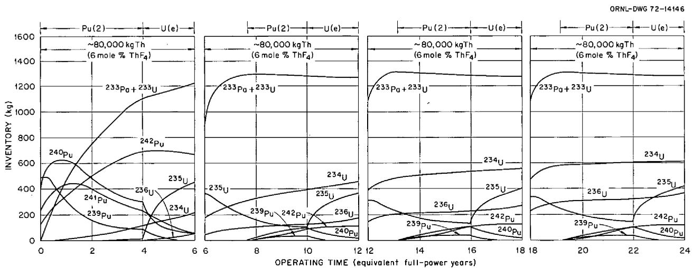  
Fig. 2.3. Principal nuclide lifetime inventories for MSCR case A64, with second-cycle plutonium and enriched uranium feed.

processing, as in the first cycle of some of the MSCR cases.

We have made a few exploratory calculations on the start-up of an MSBR using this scheme. We began by making an equilibrium calculation of the reference MSBR, using the same spherical core model that was to be used for the HISTRY calculations. The resulting equivalent calculation, case SCC219, gave results in good agreement with an earlier calculation using a cylindrical approximation (case CC207, reported previously $^{7}$ ).

It was necessary to make the HISTORY calculation in two stages, the first with plutonium feed and no processing and the second with continuous processing.

For the first stage, we picked somewhat arbitrarily a duration of 39 equivalent full-power months (efpm). This coincides with the planned graphite life in the reference MSBR. It is not necessary that the two should coincide, however, since the preliminary feed cycle may be ended at any time by starting continuous processing. Plutonium was used for the initial fissile inventory and as feed for the first three months. For the last 36 months, the feed was switched to equilibrium uranium, of the composition given in Table 2.3. For the first trial calculation, we reduced the thorium concentration from the 12 mole % normal in the MSBR to $10\%$ . This gave an initial critical loading of $1050\mathrm{kg}$ of fissile plutonium. This was a relatively high loading for

Table 2.8. MSBR start-up with plutonium and equilibrium recycle uranium feed   

<table><tr><td></td><td>Initial cycle</td><td>Approach to equilibrium</td><td>Lifetime total or average</td><td>Equilibrium</td></tr><tr><td>Case identification</td><td>P3A.1</td><td>P3B</td><td></td><td>SCC219</td></tr><tr><td>Processing</td><td>Batch</td><td>Continuous</td><td></td><td>Continuous</td></tr><tr><td>Thorium concentration,a mole %</td><td>8</td><td>12</td><td></td><td>12</td></tr><tr><td>Time, efpm</td><td>0–39</td><td>39–279</td><td>0–279</td><td></td></tr><tr><td>Feedb</td><td></td><td></td><td></td><td></td></tr><tr><td>Primary (first 3 months)</td><td>Pu(1)</td><td>U(q)</td><td></td><td>None</td></tr><tr><td>Secondary (last 36 months)</td><td>U(q)</td><td></td><td></td><td></td></tr><tr><td>Fissile material balance,c kg</td><td></td><td></td><td></td><td></td></tr><tr><td>Initial loading</td><td></td><td></td><td></td><td></td></tr><tr><td>Plutonium</td><td>528</td><td>0</td><td></td><td></td></tr><tr><td>Uranium, from initial cycle</td><td>0</td><td>1099</td><td></td><td></td></tr><tr><td>Uranium, feed</td><td>0</td><td>223</td><td></td><td></td></tr><tr><td>Total</td><td>528</td><td>1322</td><td></td><td></td></tr><tr><td>Purchases, gross</td><td></td><td></td><td></td><td></td></tr><tr><td>Plutonium</td><td>896</td><td>0</td><td>896</td><td></td></tr><tr><td>Uranium</td><td>722</td><td>318</td><td>1040</td><td></td></tr><tr><td>Total</td><td>1618</td><td>318</td><td>1936</td><td></td></tr><tr><td>Production, Uranium</td><td>0</td><td>1493</td><td>1493</td><td></td></tr><tr><td>Recovery at end of life, Uranium</td><td>(1099)d</td><td>1366</td><td>1366</td><td>1366</td></tr><tr><td>Discard, Plutonium</td><td>6</td><td>0</td><td>6</td><td></td></tr><tr><td>Net fissile requiremente</td><td>520</td><td>-1442f</td><td>-923</td><td></td></tr><tr><td>Conversion ratiore</td><td>0.857</td><td>1.079</td><td>1.048</td><td>1.076</td></tr><tr><td>Fissile costs,g mills/kWhr</td><td></td><td></td><td></td><td></td></tr><tr><td>Fissile inventoryc</td><td>0.215</td><td>0.358</td><td>0.338</td><td>0.350</td></tr><tr><td>Fissile burnup or production</td><td>0.169</td><td>-0.111</td><td>-0.0722</td><td>-0.112</td></tr><tr><td>Total fissile cost</td><td>0.384</td><td>0.247</td><td>0.266</td><td>0.238</td></tr></table>

${}^{a}$ Refer to MSBR salt compositions,Table 2.4.   
$b$ Refer to feed compositions, Table 2.3.   
Excluding material in processing.   
$d_{\mathrm{Recycled}}$   
On the same basis as in Table 2.5, notes $c$ and $d$ .   
Calculated as (recycle + purchases) - (production + recovery).   
$g$ Except for the equilibrium case, on the same basis as in Table 2.5, note $e$ . The equilibrium cost is based on the same material values and inventory charge rate, but assumes steady-state rates of expenditure.

plutonium fuel and indicated some hardening of the spectrum. We therefore reduced the thorium concentration to 8 mole % for the second trial and obtained an initial loading of $530\mathrm{kg}$ of fissile plutonium. The results of this calculation are given as case P3A.1 in Table 2.8. The second stage of the HISTRY calculation was started with uranium available at the end of the first stage. Equilibrium uranium was supplied as needed for criticality and as feed until the reactor became self-sustaining. Continuous processing by the reductive-extraction-metal-transfer process on a ten-day cycle was simulated. The results of this calculation are given as case P3B in Table 2.8.

The principal nuclide inventories from the two-stage calculation are plotted as a function of time in Fig. 2.4. The plot for the first 39 months closely resembles an initial MSCR batch cycle, except that the duration is shorter. We see that switching to uranium feed for the

last 36 months of this initial stage allows more than enough time for the burnout of plutonium. In the second stage (continuous processing), the nuclide inventories start practically at their equilibrium values and do not change much over the rest of the reactor lifetime. The equilibrium inventories calculated in case SCC219 (indicated by points at the end of the plot) are in good agreement with the end-of-lifetime values from the HISTRY calculation. One advantage of this start-up with plutonium and bred uranium is that the equilibrium concentration of $^{236}\mathrm{U}$ is never exceeded. Considerably higher $^{236}\mathrm{U}$ concentrations would be expected in an enriched uranium start-up.

This example of a plutonium start-up requires 1040 kg of equilibrium uranium mixture, over a period of $4^{1/2}$ calendar years, compared with only $1360\mathrm{kg}$ that would be required if no plutonium were used. Several ways could be considered to reduce the amount of

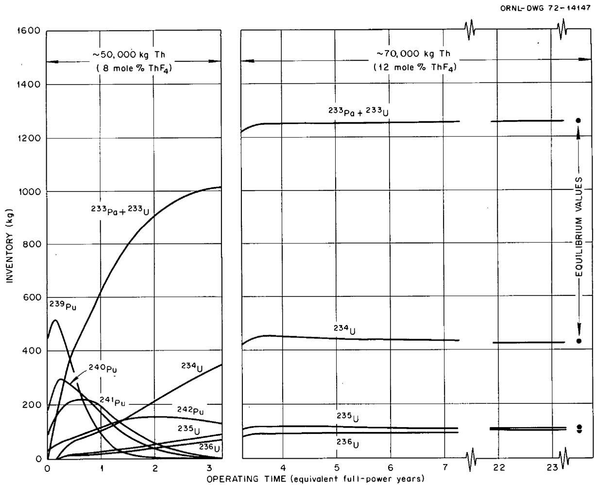  
Fig. 2.4. Principal nuclide lifetime inventories for MSBR started with first-cycle plutonium and equilibrium uranium feed; cases P3A.1 (0-3.25 efpy), P3B (3.25-23.25 efpy), SCC219 (equilibrium).

uranium and increase the amount of plutonium used in the start-up. The plutonium feed time could be extended from 3 to 12 months with little penalty for the discard of plutonium. The thorium concentration might be increased to $10\%$ in the preliminary cycle, but this would significantly increase the inventory cost. Two preliminary cycles could be used with, say, 8 and 12 mole $\%$ thorium. The uranium fed in the first cycle could be paid back at the start of the second cycle, like an MSCR case with borrowed recycled uranium (refer to Table 2.5, case A52.3).

# 2.3.3 ROD Code Modifications

The HISTRY-2 option of the ROD code, in which the reaction rate coefficients are recalculated at intervals, is

now operational. In addition to the extensive changes reported last period, we have programmed HISTORY-2 to converge on the start-of-cycle critical concentrations. The program iterates between MODRIC and HISTORY until both converge on a single set of critical concentrations. This eliminates any bias from the estimate of starting concentrations and gives more accurate initial concentrations for cycles after the first.

Another new capability in HISTRY-2 is an option to approximate neutron absorptions in transplutonium nuclides by increasing the neutron absorptions in $^{242}\mathrm{Pu}$ by a fixed fraction, 0.4. The $^{242}\mathrm{Pu}$ burnout calculation is not affected.

# 3. Systems and Components Development

Dunlap Scott

# 3.1 GASEOUS FISSION PRODUCT REMOVAL

# 3.1.1 Bubble Separator and Bubble Generator

The detailed designs of the bubble separator and bubble generator for the gas system technology facility (GSTF) were completed, and the drawings were issued for fabrication. These units will be tested in the water loop before installation in the GSTF.

Bubble Separator (C. H. Gabbard). The final design for the bubble separator is shown in Fig. 3.1. This design consists of a set of swirl vanes and a set of recovery vanes separated by a 44-in.-long tapered casing. The separated gas collects at a small-diameter void on the center line and is removed through both the swirl and recovery vane hubs along with 9 to 11 gpm of entrained liquid. The separation efficiency of this design was reported previously.

Tests are currently in progress to determine the radial and axial velocity and pressure distributions of the vortex. Figure 3.2 shows these velocity and pressure distributions for the design flow conditions at the two locations indicated on the figure. The tangential velocity distribution at radii greater than the hub radius (0.86 in.) was found to be that of a free vortex, that is, the tangential velocity at a given radius was equal to a constant divided by the radius. The velocity measuring probe was found to alter the tangential velocity distribution in the vortex, particularly when inserted to radii less than 0.8 in. This change in the tangential

velocity distribution was indicated by the increase in gas void static pressure difference from $-91$ to $-71$ ft, shown in Fig. 3.2. The largest portion of this change occurred after the probe was inserted to radii less than 0.8 in. Therefore, the unperturbed velocity distributions would be somewhat different from the measured distributions, especially at radii below 0.8 in. Until a better method of measuring this velocity is found, we plan no further work in this area.

Bubble Generator (C. H. Gabbard). The final bubble generator design for the GSTF is shown in Fig. 3.3. The venturi dimensions were selected to produce the desired bubble size and to achieve the largest pressure depression at the throat to facilitate the injection of gas while still keeping the throat pressure above the point where cavitation would be a problem. Previous test results showed that the pressure required to inject gas into the flowing salt increased with increasing gas flow rate. Several attempts to reduce this pressure increase by design revisions to the bubble generator were only partially successful, and the increase was found to be the summation of the following four mechanisms:

1. Increased mixing losses in the throat and diffuser with the increased gas fraction.   
2. The work of gas compression between the throat and discharge pressures.   
3. The pressure drop in the gas supply passages.   
4. A pressure difference which was found to exist between the gas plume and the bulk fluid at the throat. This pressure difference is believed to provide the force to divert the liquid flow around the gas plume.

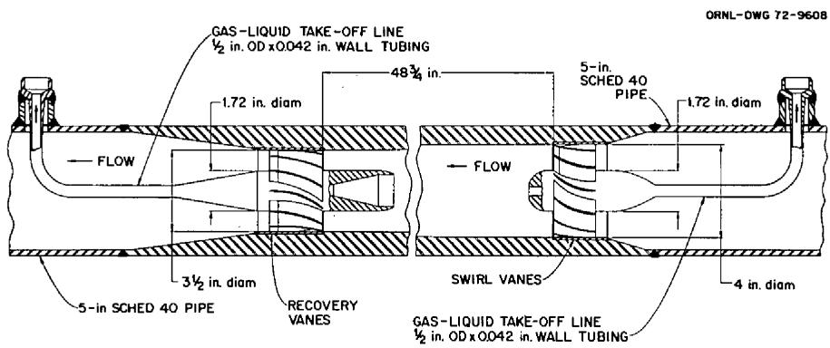  
Fig. 3.1. Bubble separator design for gas system technology facility.

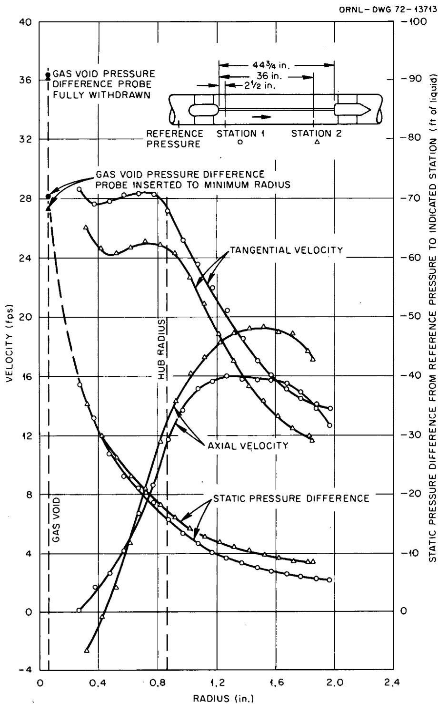  
Fig. 3.2. Velocity and pressure distribution of GSTF bubble separator at 500 gpm. Static pressures measured relative to the separator inlet upstream of swirl vane.

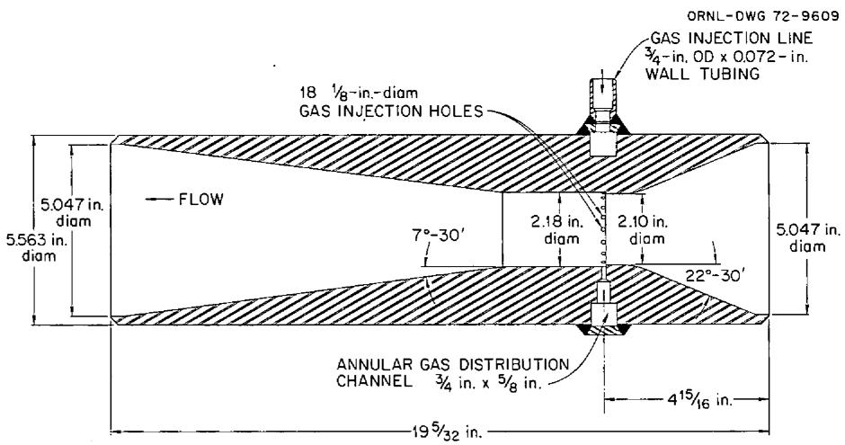  
Fig. 3.3. Bubble generator design for gas system technology facility.

A calculational procedure was developed to calculate the required gas supply pressure as a function of liquid and gas flow rates. The first three mechanisms listed above are calculated directly from the fundamental relations involved, but the pressure difference in item 4 is obtained from an empirical correlation derived from the water test loop data using the liquid velocity and the void fraction at the generator throat.

Figure 3.4 shows a comparison of the calculated to measured pressure distribution of the prototype GSTF bubble generator operating in the water test loop. The inlet and gas injection pressures are referenced to the discharge pressure of the bubble generator. A report is in preparation to describe the water tests and the development of the GSTF bubble generator.

Bubble Generator Analysis (T. S. Kress). The present bubble generator consists of a converging-diverging nozzle in which gas is injected into the throat. The fluid turbulence breaks the plume into small bubbles in the throat and diverging sections of the separator.

The following analysis was made to relate the size of bubbles generated in a turbulent field to flow rate, dimensions, and fluid properties.

At the turbulent Reynolds numbers of interest in the bubble generator, regions of local viscous flow are small compared with the size of the bubbles. Consequently, one would not expect the bubble breakup to be the result of viscous shearing. More likely, the bubble size is controlled by a balance between turbulent forces and surface tension forces.

An expression was developed earlier² for a mean value of turbulent inertial forces $F_{i}$ in terms of the power dissipation per unit volume $\epsilon_{\mathbf{v}}$ .

$$
F _ {i} \sim \frac {\rho d ^ {2}}{g _ {c}} \left(\frac {\epsilon_ {\mathrm {v}} d g _ {c}}{\rho}\right) ^ {2 / 3},
$$

where

$$
\rho = \text {d e n s i t y},
$$

$$
d = \text {b u b b l e}
$$

$$
g _ {c} = \text {p r o p o r t i o n a l i t y c o n s t a n t}.
$$

The surface tension forces $F_{s}$ can be written as

$$
F _ {s} \sim \sigma d,
$$

where $\sigma =$ surface tension. Therefore, the ratio of inertial to surface tension forces, $F_{i} / F_{s}$ defines a "turbulence" Weber number We in terms of the power dissipation,

$$
\mathrm {W e} \equiv F _ {i} / F _ {s} \sim \frac {\rho d}{g _ {c}} \left(\frac {\epsilon_ {\mathrm {v}} d g _ {c}}{\rho}\right) ^ {2 / 3} / \sigma .
$$

This dimensionless parameter is expected to control the equilibrium bubble size in the absence of coalescence, so that

$$
d \sim \left(\frac {g _ {c} \sigma}{\rho}\right) ^ {3 / 5} \left(\frac {\rho}{\epsilon_ {v} g _ {b}}\right) ^ {2 / 5}. \tag {1}
$$

This relation was originally proposed by Hinze3 for droplets immersed in an immiscible fluid. To use it, the

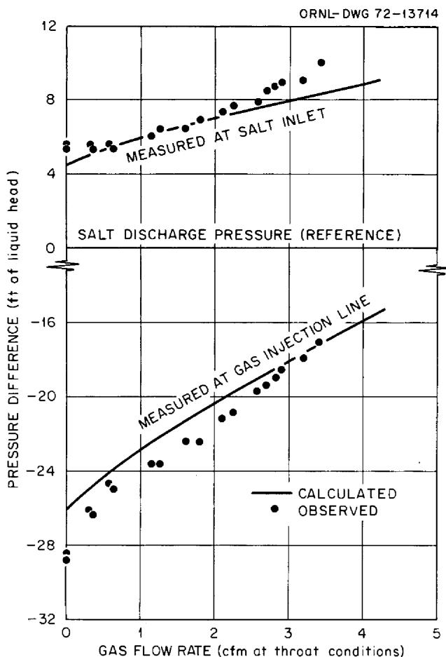  
Fig. 3.4. Calculated and observed pressure distribution of GSTF prototype bubble generator at $500\mathrm{gpm}$ .

power dissipation in the region of bubble generation must be known. An expression has been recommended² for the power dissipation in a region of constant-area well-developed turbulent flow in a conduit. If the angle of divergence is not large, then the local rate of energy dissipation may be proportional to that for conduit flow using local parameters. This would give

$$
\epsilon_ {\mathrm {v}} \sim \frac {\mu^ {2} \operatorname {R e} ^ {1 1 / 4}}{g _ {c} \rho D ^ {4}}, \tag {2}
$$

where $\mu =$ viscosity, $D =$ conduit diameter, and the values of Re and $D$ at the region of bubble generation are to be used.

Substituting (2) into (1) results in

$$
d / D \sim \left(g _ {c} \sigma \rho D / \mu^ {2}\right) ^ {3 / 5} / \mathrm {R e} ^ {1 1 / 1 0}. \tag {3}
$$

Expression (3) predicts that the bubble size produced in a turbulent field will be proportional to the Reynolds

number to about $-1.1$ power. Data from tests of a bubble generator described in ref. 2 agreed very well with the $-1.1$ power. However, data taken with the generator presently proposed for use with the GSTF are better correlated by about $-0.8$ power. The two generators may differ significantly in the mechanism of bubble generation. In the former, bubbles are generated in the central portion of the cross section, whereas in the latter they are generated near the wall in a region of high shear. It may be that in the present design bubble size is determined more by local shear rates than by the average power dissipation. Further analyses will be attempted to clarify the difference.

# 3.1.2 Bubble Formation

# and Coalescence Test

# C. H. Gabbard

The bubble formation and coalescence tests on $2\mathrm{LiF - BeF}_2$ and $72\mathrm{LiF - 16BeF}_2\mathrm{-I}2\mathrm{ThF}_4$ MSR fuel salt were temporarily delayed due to a mechanical failure of the shaker drive and clouding of the quartz furnace liner. New capsules have been loaded with fuel salt containing 0, 0.1, and 0.2 mole $\% \mathrm{UF_4}$ . The full 0.3 mole $\%$ of $\mathrm{UF_4}$ for MSR fuel was not loaded because the darkness of the melt would probably prevent photography of the bubbles. A test melt of the 72-16-12 salt was clear and did not contain any indication of the impurities that had been observed in the previous fuel salt capsules. The shaker drive and the furnace liner have been replaced and testing will be resumed.

# 3.1.3 Mass Transfer to

# Circulating Bubbles

# T. S. Kress

Mass transfer. The experimentally determined correlation for mass transfer between cocirculating bubbles and liquids was reported4 to be

$$
\mathrm {S h} / \mathrm {S c} ^ {1 / 2} = 0. 3 4 \mathrm {R e} ^ {0. 9 4} \left(d _ {\mathrm {v} s} / D\right) ^ {1. 0}, \tag {4}
$$

where

$$
\mathrm {S h} = \text {S h e r w o o d n u m b e r},
$$

$$
\mathrm {S c} = \text {S c h m i d t n u m b e r},
$$

$$
\mathrm {R e} = \text {R e y n o l d s}
$$

$$
d _ {\mathbf {v s}} = \text {b u b b l e S a u t e r - m e a n d i m a t e r}.
$$

Although pipe diameter $D$ was included as a logical nondimensionalizing factor, no actual variations in pipe size were made in arriving at the correlation. Consequently, experiments with variations in pipe diameter were planned to measure the actual dependence, and the experimental facility was converted for use with a conduit diameter of $1^{1/2}$ in. compared with the original diameter of 2 in. This change necessitated recalibration of instruments, rewriting of data reduction programs, and making preliminary experiments to verify correlations of bubble size distribution and volume fraction that had been established for the original conduit size. These changes and preliminary tests were completed, and a new set of mass transfer data was taken for a $25\%$ mixture of glycine in water. Other than for the above validation of supporting parameters, these data have not yet been reduced to mass transfer coefficients.

It was necessary to shut down the mass transfer loop for routine maintenance of the bubble separator during attempts to obtain a second set of data with a $37.5\%$ mixture of glycerine-water. Over extended periods of operation, the special separator used in the mass transfer measurements tends to accumulate particulate debris that must be removed or the separator efficiency decreases to unacceptable levels.

A theoretical analysis2 indicated that Sherwood number Sh should depend on $(d_{\mathbf{vs}} / D)^{1 / 3}$ . It was earlier speculated that the observed higher dependence [Eq. (1)] may have been due to a transition from rigid-interface (small bubbles) to mobile-interface (large bubbles) behavior. Additional examination of the data, however, indicates that the interface was mobile throughout the measured range. No new hypotheses have been made to satisfactorily explain the linear dependence.

# 3.2 GAS SYSTEMS TECHNOLOGY FACILITY

# R. H. Guymon

Work on the GSTF was suspended during three months of the period because of a midyear cut in the budget. Although the work was resumed in July, rescheduling will not be done until it can be determined what effect the delay will have on the availability of craftsmen and on the construction plan. The following describes the status at the end of the period.

The mechanical and electrical design of the facility approached completion in August, and procurement of components and construction of the loop was started. The instrument application, control circuit, and panel layout drawings were approved and issued. Most of the

instruments needed were removed from the MSRE and have been checked out and repaired. Fabrication of the instrument panels was started.

The Mark II pump was cleaned and is being refurbished and modified to provide the pressures and flows needed for the GSTF.

A preliminary system design description $(\mathrm{PSDD})^5$ as well as the system design description (SDD), was issued in March. The master copy of the SDD, which is serving as the primary design control document, has been continuously updated since then, and revisions are sent periodically to recipients of the SDD.

# 3.3 MOLTEN-SALT STEAM GENERATOR INDUSTRIAL PROGRAM

# J. L. Crowley

Foster Wheeler Corporation, the firm selected to make a four-task conceptual design study of molten-salt steam generators, $^{6}$ is proceeding with Task I - Conceptual Design of a Steam Generator for the ORNL 1000-MW(e) MSBR Reference Steam Cycle. Foster Wheeler is being assisted by Gulf General Atomic through a subcontract for a portion of this design study. Of the 24 subtasks in Foster Wheeler's Task I work plan, 10 are now complete. The remaining subtasks, including the Task I final report, are expected to be finished by the middle of November, after which they will proceed with Task II - Feasibility Study and Conceptual Design of Steam Generators Using Lower Feedwater Temperature.

A vertical "L" configuration of unit size (i.e., one steam generator per secondary coolant loop) was chosen by Foster Wheeler as best meeting the design criteria established jointly with ORNL.

The preliminary sizing of the steam generator resulted in a quite tall unit of about 115 ft. Foster Wheeler found that when cross-flow baffles were placed as required to meet the vibration criteria, excessive shell side pressure drop resulted. As a result, Foster Wheeler is now showing long flow (i.e., no cross-flow baffles) on the shell side.

Foster Wheeler requested more definitive information on the number of thermal transients to be expected in the life of the MSBR for use in their analysis of thermal stress in nozzles, heads, and tube sheets of the steam

generator. Although no extensive study of transients has been made for the MSBR, a limited number of hybrid computer simulations have been run of some of the most severe transients expected in an MSBR system.7 Based on these simulations, the list shown below was supplied to Foster Wheeler for use in their design study.8 Because there were limitations in both the number of simulations and in the manner in which the simulations were modeled, the list is somewhat arbitrary and conjectural. However, the events selected and the number of occurrences are believed to be sufficiently representative for use in the conceptual design stage.

<table><tr><td></td><td>Number of events in steam generator 30-year life</td></tr><tr><td>1. Rapid change in salt flow rate, 100% to 75% in 5 sec (see Fig. 8 of ref. 9).</td><td>120</td></tr><tr><td>2. Rapid change in load demand, 100% to 40% in 3 sec (see Fig. 7 of ref. 9).</td><td>50</td></tr><tr><td>3. Reactor shutdown (2 rods inserted). Reactor power from 100% to 12.5% in \( 2^{1/2} \)sec (see Fig. 10 of ref. 9).</td><td>150</td></tr><tr><td colspan="2">4. Normal load change at rate of 4%/min.</td></tr><tr><td>a. Full to 20%.</td><td>300</td></tr><tr><td>b. 20% to full.</td><td>300</td></tr><tr><td>c. Changes of 20% or less.</td><td>10,000</td></tr><tr><td colspan="2">5. Complete heat-cool-heat cycles.</td></tr><tr><td>a. Room temperature to operating heat.</td><td>50</td></tr><tr><td>b. Operating heat to room temperature.</td><td>50</td></tr></table>

Analysis of the sudden load-reduction transient (item 2 above, which results in a sudden increase in the outlet steam temperature) indicated severe thermal stresses. Foster Wheeler's present design incorporates thermal liners in both the steam-side outlet head and in the tube sheet to reduce these thermal stresses to a tolerable level.

# 3.4 COOLANT-SALT TECHNOLOGY FACILITY (CSTF)

# A.I. Krakoviak

Construction and installation of the CSTF were completed in August, and checkout of the control circuitry and equipment was in progress at the end of the period. Figure 3.5 shows the CSTF enclosure, pump motor, cable trays, control and gas supply cabinets, salt-monitoring vessel, and cold trap. Salt circulation is scheduled for September.

The helium purification system and the salt-pump lubricating oil system which were used during MSRE operations were moved to 9201-3 and are now in service for use in the CSTF. The oxygen getter (titanium sponge) in the helium purification system and the oil in the lube oil system were replaced prior to the CSTF service. An on-line oxygen analyzer (Lockwood-McLorie Model 0-I000) indicated that the purification system reduced the oxygen content of the helium supply from about 1.1 to about $0.7\mathrm{ppm}$ .

The spare pump-rotary unit which was in readiness for use in the MSRE coolant salt pump (but not used) was refurbished and installed in the CSTF. With the exception of calibration of the float-type level element on the pump bowl, preoperational check-out of the salt pump is complete. Installation of the alternative power source for the salt pump (variable-frequency motor-generator set) is scheduled for completion in the latter part of September. This unit is planned for use primarily by the gas system technology facility but will be used for the CSTF during startup and when required by the experiments.

Except for the drain tank, which is charged with sodium fluoroborate, the salt-containing portion of the CSTF was heated to $500^{\circ}\mathrm{F}$ and purged with treated helium at the rate of 3 liters/min (STP). From an initial moisture content in the off-gas of 55 ppm (MEECO electrolytic water analyzer), the moisture content increased to a value in excess of 1000 ppm as shown in the solid curve in Fig. 3.6. During the next temperature increase (from 500 to $950^{\circ}\mathrm{F}$ ), additional moisture was carried off in the off-gas stream, as shown by the dashed line. This additional moisture was given off by the components of the salt-monitoring vessel and cold trap that normally will operate at about 200 to $300^{\circ}\mathrm{F}$ while the salt-containing portion of the loop operates at 900 to $1150^{\circ}\mathrm{F}$ . The purge will continue until an equilibrium is reached.

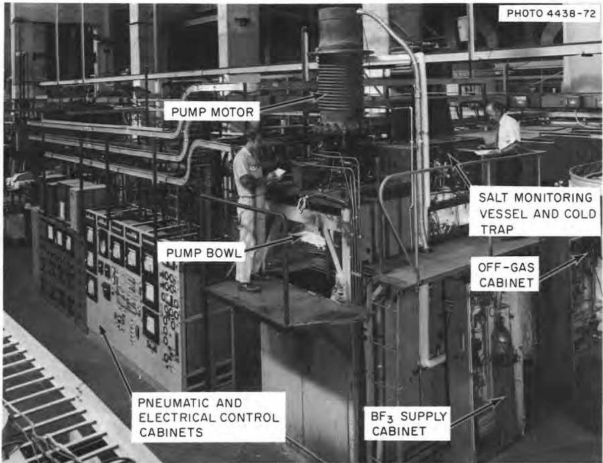  
Fig. 3.5. Coolant salt technology facility.

# 3.5 SALT PUMPS

A.G.Grindell W.R.Huntley L.V.Wilson

# 3.5.1 Salt Pumps for MSRP Technology Facilities

Pumps for the coolant-salt technology facility. The reconditioning of the rotary assembly for the spare MSRE coolant-salt pump $^{10}$ was completed, and after cold shakedown tests it was installed in the pump tank in the CSTF. The oil-lubrication system was subjected to preoperational testing, and the oval-ring gasket in the flange joining the rotary assembly to the pump tank was satisfactorily leak-tested. The electric drive motor for the pump was cleaned, refurbished with new ball bearings, and subjected to an electrical check-out. After installation in the CSTF, the motor was operated to establish the proper direction of rotation and to verify that the motor and pump operate smoothly at the normal rotation speed, approximately 1750 rpm.

In light of this experience, the assembly procedure for the MSRE coolant pump was revised to incorporate improvements in the installation of shaft bearings and the assembly and installation of shaft seals. Several pump drawings were revised to reflect the changes and to bring the drawings up to date. New record drawings were issued for the special equipment used in the cold shakedown test and for the equipment used to determine the effective diameter of the bellows seal assemblies.

Pump for the gas system technology facility. The MSRE Mark II fuel salt pump is being reconditioned prior to installation in the GSTF. The rotary assembly will be subjected to vibration tests to determine the critical frequency of the shaft with an attached pump impeller of the appropriate diameter.

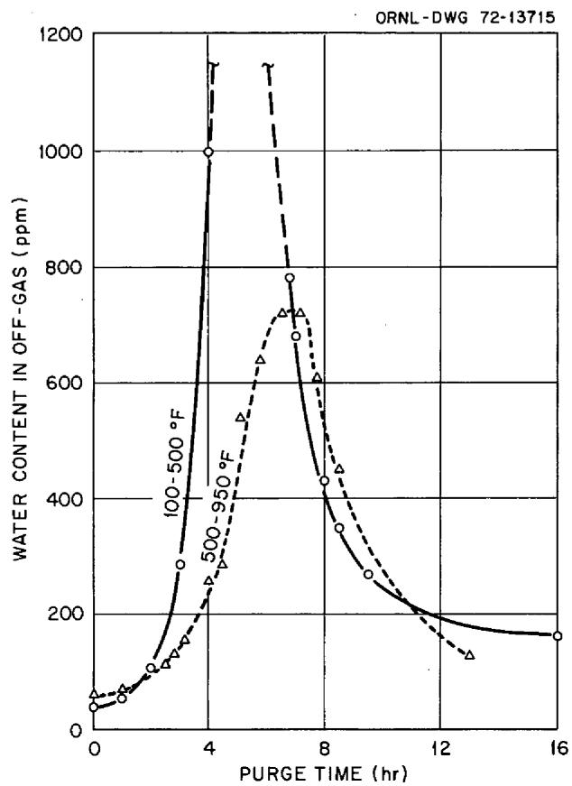  
Fig. 3.6. Moisture content of loop gas during initial heatup.

Available vibration test equipment is being repaired and checked out. After the vibration testing is completed, the rotary element will be disassembled, and new bearings and mechanical seals will be installed in accordance with the detailed assembly procedure that was improved during assembly of the CSTF salt pump. The pump impeller is being machined from an available Hastelloy N casting, which was purchased in 1966.

The spare drive motor for the MSRE coolant-salt pump will be used to drive the GSTF pump. It will be supplied from a variable-frequency generator and will provide variable pump speed operation up to $1800\mathrm{rpm}$ . The drive motor will be disassembled to install new bearings. The detailed procedures for refurbishing MSRE salt pump drive motors, recently revised to include improvements made during refurbishing the CSTF salt pump drive motor, will be used.

# 3.5.2 ALPHA Pump

Operation. The ALPHA pump12 was operated only intermittently during the past six months due to an oil leak at the pump shaft and operational problems related

to other test equipment. However, the pump was placed in routine operation again on August 10, 1972, and has now accumulated about $5800\mathrm{hr}$ of operation at MSR-FCL-2 design conditions of $4800\mathrm{rpm}$ , pumping 4 gpm of sodium fluoroborate at $850^{\circ}\mathrm{F}$ .

A wattmeter was installed to measure the power input to the variable-speed pump drive, a 5-hp Adjustospede system. The input power was measured at $3.7\mathrm{kW}$ (4.96 hp) with the pump operating at MSR-FCL-2 design conditions. The data were used to determine pump efficiency, which at the present relatively low flow rate is $8\%$ . At a pump design flow rate of $30\mathrm{gpm}$ an efficiency of $40\%$ is anticipated.

Viton O-rings. The lower shaft seal for the ALPHA pump was equipped with Viton O-rings $^{13,14}$ in August 1971, after the original Buna N O-rings failed by attack from the effluent, a dilute mixture of $\mathrm{BF}_3$ ( $<0.1\%$ ) in helium. To obtain performance information concurrent with pump operation, sample rings of Viton (Parker compound 77-545) and Buna N were installed in the effluent from the lower seal region of the pump. The O-rings have been examined after 2000 and $4200\mathrm{hr}$ exposure, and no apparent degradation of the Viton has occurred. The Buna N was hardened and cracked at $2000\mathrm{hr}$ exposure. Hardness data for both exposed and unexposed samples are:

<table><tr><td></td><td>Hardness(Shore durometer A)</td></tr><tr><td>Buna N, unexposed</td><td>65-67</td></tr><tr><td>Buna N, exposed to dilute BF3 (2000 hr)</td><td>85-87</td></tr><tr><td>Buna N, exposed to dilute BF3 (4200 hr)</td><td>85-89</td></tr><tr><td>Viton, unexposed</td><td>68-72</td></tr><tr><td>Viton, exposed to dilute BF3 (2000 hr)</td><td>65-70</td></tr><tr><td>Viton, exposed to dilute BF3 (4200 hr)</td><td>68-74</td></tr></table>

The exposed sample O-rings were reinstalled for further test operation in the dilute $\mathbf{BF}_3$ effluent.

Oil leak. An oil leak from the upper end of the ALPHA pump shaft caused a shutdown of corrosion loop MSR-FCL-2 on April 28, 1972, after nearly 5300 hr of satisfactory pump and loop operation. There was no fire or serious damage to the test facility from the leak. About 1 gal of oil was lost from the lubrication system before the leak was stopped. However, oil flow was maintained to the pump during the incident to

provide cooling to bearings and seals until the salt was drained and the pump was cooled to room temperature.

The oil leak occurred at the upper end of the pump in a soft-soldered joint between the bore of the Hastelloy N pump shaft and a 304 stainless steel plug on the oil guide tube. The oil system was being operated at normal design conditions with a flow rate of 0.2 psig. Visual inspection of the joint showed that the soft

solder had cracked or failed around the entire circumference of the joint.

Repair of the oil leak was accomplished without removing the pump from the MSR-FCL-2 facility. The joint surfaces were cleaned and resoldered. In addition, an oil-resistant, rubber-gasketed seal was installed to back up the soft-solder seal. In future pumps the joint will be seal-welded rather than soft-soldered.

# 4. Heat Transfer and Physical Properties

H.W.Hoffman J.J.Keyes, Jr.

# 4.1 HEAT TRANSFER

# J. W. Cooke

Final analysis has been completed of the heat transfer data for a proposed MSBR fuel salt $(\mathrm{LiF - BeF_2 - }$ $\mathrm{ThF_4 - UF_4}$ 67.5-20.0-12.0-0.5 mole $\%$ )flowing by forced convection through a 0.18-in.-ID $\times 24.5$ in.-long circular horizontal tube. The results are shown plotted in Fig. 4.1 in the form of the Sieder-Tate heat transfer function

$$
N _ {S - T} \equiv [ N _ {\mathrm {N u}} N _ {\mathrm {P r}} ^ {- 1 / 3} (\mu / \mu_ {s}) ^ {- 0. 1 4} ]
$$

vs the Reynolds modulus $N_{\mathrm{Re}}$ . The data were obtained under the following conditions:

Reynolds modulus, $N_{\mathbf{Re}}$ 400-28,000

Prandtl modulus, $N_{\mathbf{Pr}}$ 4.9-16.3

Average fluid temperature, 1065-1550

$$
T _ {\mathrm {a v}} \left(^ {\circ} \mathrm {F}\right)
$$

Heat flux, $Q / A$ (Btu hr $^{-1}$ ft $^{-2}$ ) 22,000 - 560,000

The physical properties of the salt were taken from accepted published data.

Within the above ranges, the heat transfer coefficient was found to vary from 320 to $6900\mathrm{Btu}\mathrm{hr}^{-1}\mathrm{ft}^{-2}$ ${}^{\circ}\mathbf{F}^{-1}$ (Nusselt modulus of 7.0 to 149.8). Statistical analysis of the data resulted in the correlations

$$
N _ {S - T} = 1. 8 9 \left[ N _ {\mathrm {R e}} (D / L) \right] ^ {1 / 3}, \tag {1}
$$

with an average deviation of $6.6\%$ for $N_{\mathrm{Re}} < 1000(D / L)$ is the test section inside diameter to heated length ratio);

$$
N _ {S - T} = 0. 1 0 7 \left(N _ {\mathrm {R e}} ^ {2 / 3} - 1 3 5\right), \tag {2}
$$

with an average deviation of $4.1\%$ for $3500 < N_{\mathrm{Re}} < 12,000$ ; and

$$
N _ {S - T} = 0. 0 2 3 4 N _ {\mathrm {R e}} ^ {0. 8}, \tag {3}
$$

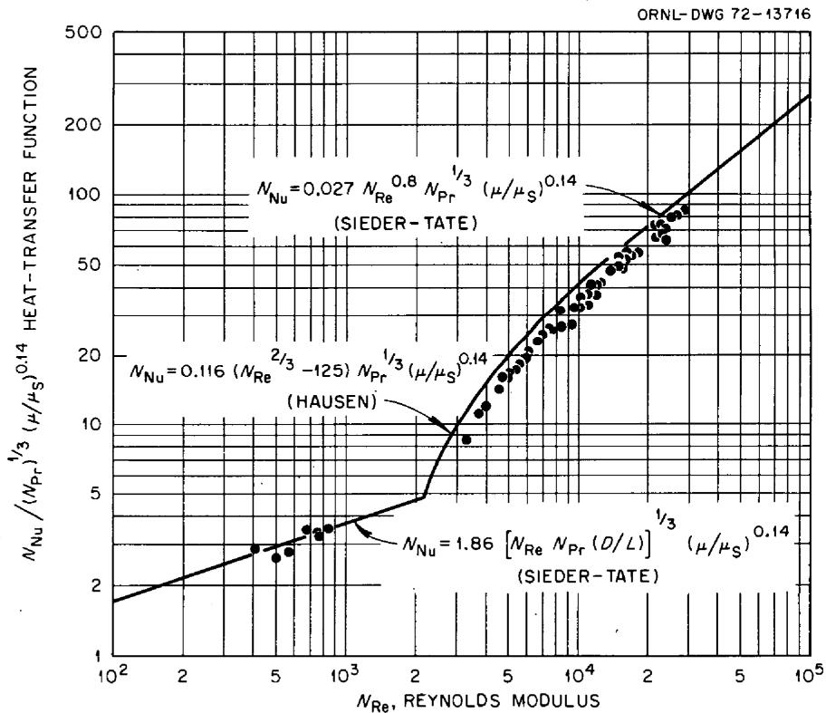  
Fig. 4.1. Final correlation of heat-transfer data for LiF-BeF $_2$ -ThF $_4$ -UF $_4$ ; 67.5-20.0-12.0-0.5 mole%.

with an average deviation of $6.2\%$ for $N_{\mathrm{Re}} > 12,000$ . In the range $5000 < N_{\mathrm{Re}} < 30,000$ the data average $13\%$ below the correlations of Hausen and Sieder-Tate depicted in Fig. 4.1. For $N_{\mathrm{Re}} < 1000$ , the data average $1.6\%$ above the correlations of Sieder-Tate for laminar flow.

# 4.2 THERMAL CONDUCTIVITY

# J.W.Cooke

A detailed analysis was made of the uncertainties affecting the measurement of thermal conductivity using the absolute, variable-gap apparatus. The result of this analysis is shown in Fig. 4.2. The estimated maximum and standard error limits in the conductivity measurements are plotted as a function of the specimen conductivity. The effects of radiation and, hence, of the specimen temperature level (40 to $950^{\circ}\mathrm{C}$ ) and specimen transparency (absorption coefficient 0 to $\infty$ ) do not

2. H. Hausen, "Darstellung des Wärmeüberganges in Rohren durch verallgemeinerte Potenzbeziehungen," Z. VDI, Beihefte Verfahrenstechnik, No. 4, 1943.   
3. W. H. McAdams, Heat Transmission, 2d ed., p. 168, McGraw-Hill, New York, 1942.   
4. Ibid., p. 190.   
5. J. W. Cooke, Development of the Variable-Gap Technique for Measuring the Thermal Conductivity of Fluoride Salt Mixtures, ORNL-4830 (in publication).

contribute greatly to the error and are shown by the areas included within the narrow bands in Fig. 4.2. It is apparent from the figure that the error is sensitive to the magnitude of the specimen conductivity except at larger values of the conductivity. Much of the increase in error at low values of conductivity results from an increased uncertainty in the measurement of the change in the specimen thickness. The larger temperature gradients caused by the lower specimen conductivities increased the uncertainty in the thermal expansion corrections to the specimen thickness.

Figure 4.2 also shows the deviation of the calibration measurements $\left[\mathrm{H}_{2} \mathrm{O}, \mathrm{Hg}, \mathrm{Ar}, \mathrm{He}, \text { and } \mathrm{HTS}\left(\mathrm{KNO}_{3}-\mathrm{NaNO}_{2}-\mathrm{NaNO}_{3}; 44-49-7 \text { mole }\%\right)\right]$ from published values. Several points are outside the estimated error limits. Data for $\mathrm{H}_{2} \mathrm{O}$ and $\mathrm{Hg}$ were obtained using Chromel-Alumel thermocouples. The error limits for these data should be considerably larger than shown in Fig. 4.2, which was based on the use of Pt vs Pt + 10% Rh thermocouples. Also, we believe the published value for the conductivity of HTS to be unreliable. Excluding these points, 93% of the data lies within the maximum error limits, and 68% lies within the standard error limits.

Final analysis of the molten fluoride salt conductivity data (880 data points) is being made. From the above error analysis, the maximum error in the fluoride salt conductivity measurements is expected to be less than $\pm 5\%$ .

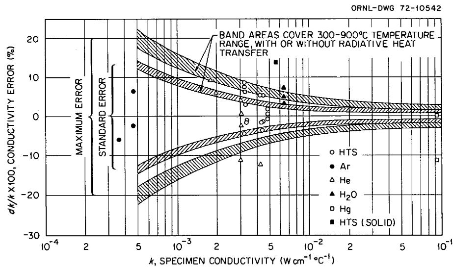  
Fig. 4.2. Estimated probable and maximum error limits in the conductivity measurement as a function of specimen conductivities over a 300 to $400^{\circ}\mathrm{C}$ temperature range with and without radiative heat transfer. Also shown as plotted points are the deviations of the experimental results from published values.

# Part 2. Chemistry

W. R. Grimes

The research and development activities described below continue to deal with chemical problems posed in the design and ultimate operation of molten-salt reactor systems.

Experimental study of specimens and materials from the MSRE has been completed. The final report of complex fission product behavior in that system has been drafted and is undergoing final editing.

Study of intergranular attack by tellurium upon metallic components of the MSRE (conducted in close cooperation with MSRp metallurgists and reported in more detail in Part 3 of this report) continues to engage a considerable fraction of the chemical effort. Many exposures of pertinent metals to tellurium (and to other potentially harmful fission products and contaminants) have been completed, and others are in progress. New techniques for a more readily controlled addition of tellurium to the specimens have been devised and will be put into service during the next reporting period. A systematic study, primarily by mass spectrometry, of the volatility, relative stability, and chemical reactions of pertinent metal tellurides is producing useful data. Spectrophotometric methods for the study of tellurium species in molten fluorides have been developed for application to this problem area.

The behavior of hydrogen isotopes in molten salts, metals, and graphites is a continuing field for major attention. Study of $\mathbf{H}_2$ solubility is virtually concluded with a few confirmatory studies yet to be done. Study of permeation of metals by hydrogen isotopes seems to have demonstrated conclusively that the rate of permea

tion for "clean" metals depends on the square root of the hydrogen partial pressure. Careful measurements of permeation through metals with oxide films seem to be yielding encouraging information; such studies are now directed at Incoloy 800 and other metals of likely value in steam generator systems. Significant uptake of tritium by graphite at elevated temperatures has been confirmed, and this phenomenon is being studied to assess its value in tritium control and management processes. Fluoroborate chemistry - aimed largely at improved understanding of these coolant materials and their corrosion mechanisms - is still under study at a modest funding level.

Very little attention has been paid to protactinium chemistry during this reporting period, and, although a few confirmatory studies may prove necessary, none is planned for the near future.

The principal emphasis of analytical chemical development programs has been placed on methods for use in semiautomated operational control of molten-salt breeder reactors, for example, the development of in-line analytical methods for the analysis of MSR fuels, for reprocessing streams, and for gas streams. These methods include electrochemical and spectrophotometric means for determination of the concentration of $\mathrm{U}^{3+}$ and other ionic species in fuels and coolants and adaptation of small on-line computers to electroanalytical methods. Parallel efforts have been devoted to the development of analytical methods related to assay and control of the concentration of water, oxides, and tritium in fluoroborate coolants.

# 5. Behavior of Hydrogen and Its Isotopes

# 5.1 THE SOLUBILITY OF HYDROGEN IN MOLTEN SALT

D.M.Richardson A.P.Malinauskas

Measurements of the solubilities of hydrogen and deuterium in $\mathrm{Li}_2\mathrm{BeF}_4$ are being performed in order to provide data to assess the importance of solubility on tritium transport in a molten-salt reactor. These experiments are being conducted using a two-chamber apparatus which has been described previously. $^{1,2}$

In an earlier report3 the validity of Henry's law was demonstrated for hydrogen and helium in $\mathrm{Li}_2\mathrm{BeF}_4$ at $600^{\circ}\mathrm{C}$ over the pressure range 1 to 2 atm; that is, the solubility values were reportedly observed to increase linearly with increasing saturation pressure. Since then, measurements have been made at $600^{\circ}\mathrm{C}$ with deuterium in order to ascertain whether the solubility phenomenon displays an isotope effect. Additionally, the experiments have been extended to include studies at 500 and $700^{\circ}\mathrm{C}$ .

The results obtained to date are presented in Table 5.1, wherein the Ostwald coefficients $K_{c}$ are listed as functions of temperature. Because of the applicability of Henry's law, $K_{c}$ , which is defined as the ratio of the gas concentration in solution to its concentration in the gas phase, is independent of saturation pressure. Note also that the values are preliminary and are subject to adjustment; however, there is presently no reason to believe that the final values will lie outside the standard deviations listed.

The helium solubility determinations are being made to provide a basis for comparison with the work of Watson et al. As is evident from the values presented in Table 5.1, the inexplicable discrepancy noted earlier at $600^{\circ}\mathrm{C}$ persists at the other temperatures; our results are consistently lower than the results obtained earlier.

The theoretical values which are listed for hydrogen were derived from a modified form of the Uhlig expression for gas solubility which ignores a possible explicit dependence upon polarizability. Comparison of the theoretical results with experiment yields reasonably good agreement. Also, the data obtained thus far give no substantive indication of a possible isotope effect for solubility; within the limits of mutual uncertainty, the solubilities of hydrogen and deuterium appear to be identical.

It is important, however, to point out that significant amounts of hydrogen (as $\mathbf{H}_2$ and HD) have been encountered in performing the deuterium solubility determinations, and the $K_{c}$ values reported for deuterium have been evaluated under the assumption that all hydrogen isotopes are indistinguishable in solution. In other words, we assume that it is not possible to separate the isotopes on the basis of solubility. The results for $K_{c}$ , of course, are not inconsistent with this assumption.

The unexpected behavior of hydrogen which has been observed does suggest the possibility of inhibiting tritium transport through heat-exchanger materials by pretreating these members with hydrogen; data which indicate this as a possible method are presented in Table 5.2, which is an abbreviated chronology of the compositions of gas samples taken from the stripper chamber

Table 5.1. The solubilities of hydrogen, deuterium, and helium in ${\mathrm{{Li}}}_{2}{\mathrm{{BeF}}}_{4}$   

<table><tr><td rowspan="3">T (°K)</td><td colspan="5">\( 10^{3} K_{c} \)</td></tr><tr><td colspan="2">Hydrogen</td><td rowspan="2">Deuterium experimental</td><td colspan="2">Helium</td></tr><tr><td>Experimental</td><td>Theoretical</td><td>Experimental</td><td>Watson et al.</td></tr><tr><td>773</td><td>1.13 ± 0.08</td><td>1.46</td><td></td><td>3.86 ± 0.25</td><td>4.75</td></tr><tr><td>873</td><td>3.17 ± 0.09</td><td>2.71</td><td>2.74 ± 0.16</td><td>6.01 ± 0.11</td><td>8.27</td></tr><tr><td>973</td><td>3.87 ± 0.37</td><td>4.51</td><td>4.17 ± 0.42</td><td>9.26 ± 0.19</td><td>11.92</td></tr></table>

of the apparatus during the course of the various solubility experiments. The data are presented both in terms of volume percent of sample and as volume of component collected (reduced to standard conditions). The remaining components, which are not listed (i.e., the deviations from $100\mathrm{vol}\%$ ), are of known origin and are not believed to affect the observed behavior. Note also that HD is equally apportioned between $\mathbf{H}_2$ and $\mathbf{D}_2$ in calculating the volumes of these two species.

Run 41 gives an indication of the residual helium which persists through the hydrogen solubility determinations; the presence of this gas arises from its use as a cover gas in the saturator chamber between hydrogen experiments. Run 42, on the other hand, is a helium solubility experiment; in this case the residual hydrogen most probably arises from gas dissolved in the metal apparatus. All of the runs between 42 and 48 were conducted with helium, and a comparison of the volumes of hydrogen in these two cases is typical of the gradual reduction in hydrogen content which was observed to occur. Runs 51 to 58 again employed hydrogen.

Deuterium was first introduced into the system in run 59, during which time a rather large volume of "residual" hydrogen, as $\mathbf{H}_2$ and HD, was noted. Contrary to previous behavior during the helium runs,

Table 5.2. Chronological listing of sample analyses   

<table><tr><td>Run</td><td>41</td><td>42</td><td>48</td><td>51</td><td>58</td><td>59</td></tr><tr><td colspan="7">Percent gas</td></tr><tr><td>H2</td><td>80.20a</td><td>3.94</td><td>2.72</td><td>43.85a</td><td>69.76a</td><td>10.20</td></tr><tr><td>HD</td><td></td><td></td><td></td><td></td><td></td><td>15.76</td></tr><tr><td>D2</td><td></td><td></td><td></td><td></td><td></td><td>48.18a</td></tr><tr><td>He</td><td>0.18</td><td>84.66a</td><td>88.00a</td><td>3.44</td><td>0.25</td><td></td></tr><tr><td colspan="7">Standard cubic centimeters of gas</td></tr><tr><td>H2</td><td>1.353</td><td>0.093</td><td>0.057</td><td>0.235</td><td>0.565</td><td>0.152</td></tr><tr><td>D2</td><td></td><td></td><td></td><td></td><td></td><td>0.471</td></tr><tr><td>He</td><td>0.003</td><td>2.007</td><td>1.835</td><td>0.018</td><td>0.002</td><td></td></tr><tr><td>Run</td><td>68</td><td>69</td><td>71</td><td>72</td><td>76</td><td>77</td></tr><tr><td colspan="7">Percent gas</td></tr><tr><td>H2</td><td>5.33</td><td>2.99</td><td>6.38</td><td>78.71a</td><td>82.09a</td><td>13.19</td></tr><tr><td>HD</td><td>13.85</td><td>0.34</td><td>14.58</td><td>1.17</td><td>0.49</td><td>30.45</td></tr><tr><td>D2</td><td>60.67a</td><td>0.61</td><td>59.18a</td><td>0.03</td><td>0.01</td><td>41.66a</td></tr><tr><td>He</td><td>0.53</td><td>82.61a</td><td>1.06</td><td>0.45</td><td>0.20</td><td>0.24</td></tr><tr><td colspan="7">Standard cubic centimeters of gas</td></tr><tr><td>H2</td><td>0.136</td><td>0.057</td><td>0.152</td><td>0.837</td><td>1.011</td><td>0.343</td></tr><tr><td>D2</td><td>0.750</td><td>0.014</td><td>0.740</td><td>0.006</td><td>0.006</td><td>0.712</td></tr><tr><td>He</td><td>0.006</td><td>1.503</td><td>0.012</td><td>0.005</td><td>0.002</td><td>0.003</td></tr></table>

${}^{a}$ Major component.

the high values for hydrogen persisted throughout the deuterium experiments, the last of which is designated as run 68. Surprisingly, the hydrogen (and deuterium) content dropped markedly in run 69, a helium solubility determination, but returned to its previous value in run 71, which utilized deuterium.

Throughout runs 59-71, the apparatus was exposed only to helium and deuterium, and so we decided to perform some experiments with hydrogen to determine whether an enhancement in residual deuterium would be observed. As indicated by runs 72 and 76, the deuterium concentration was not significant, but, as run 77 demonstrates, the reverse effect remains. The deuterium employed in these investigations contains about 1 vol $\%$ hydrogen, but this is a minor contribution to the amounts of hydrogen encountered.

A plausible argument for this unexpected behavior is that the metal saturator chamber dissolved significant amounts of hydrogen during purification of the salt by sparging with hydrogen and during the course of the subsequent hydrogen solubility determinations. Some of this dissolved gas is released during the helium experiments, and this accounts for the higher quantities of residual hydrogen in the helium runs as opposed to the amounts of helium found in the hydrogen measurements. Deuterium, on the other hand, enhances the release of dissolved hydrogen, but in the process is itself prevented from dissolving in the metal. Consequently, effectively no residual deuterium is observed in the hydrogen experiments.

We wish to emphasize that this description is conjectural; nonetheless, we believe the observations merit further investigation of the phenomenon.

# 5.2 HYDROGEN PERMEATION THROUGH METALS

H.C.Savage R.A.Strehlow

Our experimental program6 continues to examine two important questions concerning permeation of metals by tritium. These questions are (1) whether the theoretical $(\frac{1}{2}$ power) dependence of permeation on pressure is followed to the very low tritium pressures of reactor interest and (2) the extent to which the oxide film anticipated on the steam side of the steam generator tubing will serve as an effective barrier to tritium permeation. The work reported here concerning the first question shows that permeation of nickel varies

as the square root of the pressure over the pressure range from 750 to $8 \times 10^{-4}$ torr. Work on the second question suggests that oxide films on some metals can reduce permeation by hydrogen isotopes by substantial, and practically useful, factors.

The square-root relation between pressure and permeation flow rate is expected because hydrogen gas and its isotopes dissolve in metals with dissociation of the molecule into two atoms. As a consequence, solubility of hydrogen in the metal is proportional to the square root of pressure (Sieverts's law). Since diffusive flow of hydrogen through the metal is proportional to the concentration of hydrogen in the metal (Fick's law), the permeation of hydrogen gas is dependent on the square root of the driving pressure. These relations are summarized in the expression

$$
J _ {\mathrm {H} _ {2}} = - \frac {D K _ {s}}{\Delta X} \cdot \Delta \left(P _ {\mathrm {H} _ {2}} ^ {1 / 2}\right) \frac {\mathrm {c m} ^ {3} (\mathrm {S T P})}{\sec - \mathrm {c m} ^ {2}}, \tag {1}
$$

where $J_{\mathrm{H_2}}$ is the flux of hydrogen permeating a metal of thickness $\Delta X$ cm, the diffusivity of hydrogen is $D$ $\mathrm{cm}^2\sec^{-1}$ , and the Sieverts's law constant for hydrogen is $K_{s}$ [cm3(STP)]/cm-atm1/2. [The driving pressure is shown as $\Delta (p^{1 / 2})$ atm1/2 to allow for the "downstream" pressure.]

This square-root dependence has a sound theoretical basis, but the literature contains many reports that at pressures below about 30 to 100 torr the dependence changes from the square-root relation to the first-power (direct proportionality) relation. The extrapolation to be used over the five or six orders of magnitude in pressure to the range for the molten-salt reactor was clearly of great concern. An apparatus was constructed to measure this pressure dependence to very low pressures using a mass spectrometer method and deuterium gas. The results for nickel are shown in Fig. 5.1. The square-root dependence is quite good to pressures well under $10^{-3}$ torr.

Nickel was used because the oxidation potential expressed as $P_{\mathrm{H_2O}} / P_{\mathrm{H_2}}$ is about 100 at temperatures of interest, and oxidation by impurity water or air leaks would not be expected to form any impedance to flow. Stainless steel and indeed chromium alloys generally have an oxidation potential near $10^{-5}$ to form $\mathrm{Cr_2O_3}$ (chromium sesquioxide) from chromium metal. This should permit the development of an oxide in which the hydrogen solubility and diffusivity are low. Such an oxide, if free of cracks and pores, is expected to serve as a barrier to hydrogen permeation.

It is well known that oxide coatings yield a marked reduction in the permeability of many metals to

hydrogen. No oxide films are possible on the metal surfaces exposed in an MSBR to molten fluorides at high temperatures; however, an oxide film will be present, and perhaps one with low permeability can be produced and maintained, on the steam side of the MSBR steam generator. Studies have accordingly been carried out to study hydrogen permeability of such films.[7]

One model leading to a decrease of permeation rate upon oxidation of a metal would be to view the oxide as offering a resistance to flow in series with that of the metal. If this were so, the pressure dependence of permeation rate would be expected to vary from a one-half power dependence at high pressures to a first-power dependence at low pressures. An 18-8 stainless steel was studied as a metal which was expected to form a protective oxide coating. Hydrogen permeation data for the clean metal showed a one-half power pressure dependence. After a light coating of oxide was permitted to form, the permeation rate decreased by a factor of 8. The pressure dependence, however, was not substantially changed from the half-power relationship. This indicated that the oxide coating was not continuous and that defects in the oxide permitted ready access of the hydrogen to the metal.

A model was derived for the observed behavior based upon the notion that the oxide defects (holes or cracks) permit permeation flow to occur merely with a constriction resistance in addition to the bulk resistance of the metal. The relations obtained in terms of defects in the oxide film are based on the derivations from potential theory as applied to the analogous phenomenon of electrical contact resistance. This is indicated in Fig. 5.2, which shows the resistance due to the "necking down" of the permeation flow lines. An example of a relation obtained from this model for holes at average separation $2l$ and average radius $a$ is as follows:

$$
I _ {\mathrm {T}} = D _ {\mathrm {T}} A K _ {s} \left(\frac {1}{\Delta X + l ^ {2} / a}\right) \cdot \Delta \left(P _ {\mathrm {T} _ {2}} ^ {1 / 2}\right) \frac {\mathrm {c m} ^ {3} (\mathrm {S T P})}{\sec}, \tag {2}
$$

where $I_{\mathbf{T}}$ is the permeation flow rate through a specimen, $D_{\mathbf{T}}$ is the diffusivity of tritium in the metal, $A$ is the area, $K_{s}$ is the solubility constant (Sieverts's constant) of tritium in the metal, $\Delta X$ is the specimen thickness, $l$ is the average half separation of holes of

$$
\left(P _ {1}\right) ^ {1 / 2} - \left(P _ {2}\right) ^ {1 / 2} \quad \left(\text {T o r r} ^ {1 / 2}\right)
$$

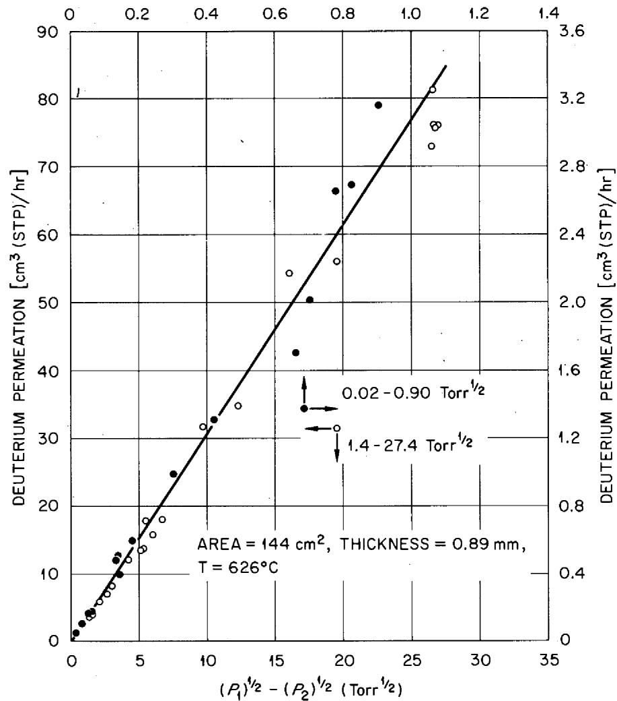  
Fig. 5.1. $\mathbf{D}_2$ permeation through nickel vs square root of pressure.

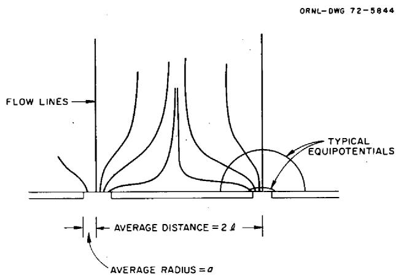  
Fig. 5.2. Schematic representation of flow of hydrogen into a metal through constrictions at the surface.

average radius $a$ , and $P_{\mathrm{T_2}}$ is the pressure of tritium. Although the model has not yet been tested, it appears to fit the salient features of the phenomena associated with oxide structure and with the permeation process. This relation and a similar one based on the presence of cracks indicate that the continuity of the oxide and its freedom from cracks and holes is of crucial importance in decreasing permeation through the metal. In Eq. (2) it can be seen that the separation of holes $l$ must be quite large relative to their radii to achieve values of $l^2 / a$ as large as 100 to 1000 times the metal thickness $\Delta X$ .

Continued study of 18-8 stainless steels and Hastelloy N after oxidation in the permeation apparatus yielded generally disappointing results. Measured decreases in permeation for several materials approached factors of

only 10 to 12, and the observed pressure dependence for the permeation was not greatly different from the one-half power relationship. Part of the problem is undoubtedly due to the ease with which the iron and the manganese-chromium spinels can be reduced and reformed as the redox potential of the gas mixture is changed during measurement of permeation at various partial pressures of deuterium. In addition, it is likely that the permeability of deuterium varies with the character of the particular metal oxide in the film.

To study the effect of one "best chance" oxide, a nickel tube was electroplated with a 1-mil coating of chromium, and the surface of this film was oxidized within the permeation apparatus to $\mathrm{Cr_2O_3}$ . Oxidation at $650^{\circ}\mathrm{C}$ showed only a relatively small decrease in permeability from that expected for nickel. Since Flint $^8$ had shown that more effective films could develop on steel under oxidation at higher temperatures, the chromium plate was oxidized at about $900^{\circ}\mathrm{C}$ . The subsequent measurements of permeability were encouraging; a marked reduction in permeation (to about $1\%$ of the preoxidation value at 1 torr and $650^{\circ}\mathrm{C}$ ) was observed, and the pressure dependence was found to be near first power. Much, but not all, of the decrease remained after a thermal cycle to room temperature and back to $625^{\circ}\mathrm{C}$ . Implementation of the technique used in this experiment might not be possible for a reactor system. However, we now believe that substantial improvement in tritium management is possible with the aid of proper oxide films.

Indeed, as this report goes to press, we have preliminary evidence that the film that formed readily in the permeability apparatus by oxidation of Incoloy 800 shows a markedly reduced permeability and a pressure dependence near first power. Studies of the problem at present are concentrating on this interesting heat-exchanger material.

# 5.3 THE CHEMISORPTION OF TRITIUM ON GRAPHITE

R.A.Strehlow H.E.Robertson

The presence of significant amounts of tritium on the graphite from the $\mathrm{MSRE^9}$ has prompted a study of the chemisorption of tritium on graphites. The MSRE

graphite data suggested that the bonding of the tritium was tenacious even at the high temperatures of the reactor and that the kinetics of sorption were fast in comparison with the fuel salt circulation time.

An apparatus has been constructed and operated to permit exposure of graphite at elevated temperatures to a gaseous mixture of tritium in helium. The tritium concentration used is controlled to be in the range of 1 to $10~\mathrm{ppm}$ by volume (partial pressures around $10^{-3}$ torr). Preliminary data have been obtained on three types of graphite: CGB (MSRE-type), Poco, and an ORNL-made lampblack graphite. After the usual exposure conditions of $4\mathrm{hr}$ at $750^{\circ}\mathrm{C}$ the graphite pieces are sampled by removing successive 0.006-in.-thick samples which were subjected to analysis for tritium. The tritium contents of the samples were substantially the same as the findings for the MSRE graphite examination with values of several times $10^{9}$ dis $\mathrm{min}^{-1}$ $\mathbf{g}^{-1}$ for the outermost 0.006-in. cut, decreasing to values below $10^{8}$ for interior samples. Values of 6 to $8\times 10^{10}$ dis $\mathrm{min}^{-1}$ $\mathbf{g}^{-1}$ have been found for some samples of high surface area.

The amount of tritium sorbed on the ORNL graphite after a pretreatment to increase its surface area to 2 $\mathrm{m}^2 /\mathrm{g}$ corresponded to $5\times 10^{13}$ tritium atoms per square centimeter. Interior samples from these specimens also contained tritium levels near this magnitude. Several percent of the surface carbon atoms appeared to have bonded the tritium atoms. That the tritium is chemically bonded rather than being merely adsorbed trace amounts of tritium oxide from an unknown source is indicated by the fact that water and alcohol rinsing of the specimens removes less than $1\%$ of the tritium.

Several questions remain as to whether this phenomenon of chemisorption, if real, can be used to effect a separation of tritium from a molten-salt reactor. Notable among these questions is the apparently sluggish kinetics of the reaction. There does not yet appear to be a fundamental bar to the development of a process based on the observed phenomena.

# 6. Fluoroborate Chemistry

# 6.1 SOLUBILITY OF $\mathbf{BF}_3$ IN MOLTEN LiF-BeF $_2$ -ThF $_4$

S. Cantor

As stated previously1 the purpose of this study is to determine changes in fluoride ion activities in melts composed of LiF, $\mathrm{BeF}_2$ , and $\mathrm{ThF}_4$ . The working hypothesis in this investigation is that available or "free" fluoride ions combine with dissolved $\mathrm{BF}_3$ to form tetrafluoroborate ions:

$\mathbf{F}^{-}$ (in the melt) $+\mathrm{BF}_3$ (dissolved)

$$
\rightarrow \mathrm {B F} _ {4} ^ {-} (\text {i n t h e m e l t}).
$$

The results thus far reported1,2 suggest that the above equilibrium is shifted almost completely to the right. Further, in $\mathrm{LiF - BeF_2}$ melts, the free fluoride concentration can be identified with the thermodynamic activity of LiF.

Solubility measurements have now been carried out in ternary solvents. The four compositions studied and the $\mathrm{BF}_3$ solubilities expressed in terms of Henry's law are listed in Table 6.1; also tabulated are the results of measurements in a binary (LiF-BeF $_2$ ) solvent.

The results are qualitatively consistent with observations in the $\mathrm{LiF - BeF_2}$ system, namely, the greater the LiF concentration (and activity) the greater the Henry's law constant. To calculate activities of LiF in the ternary solvents containing 85, 80, and 76 mole $\%$ LiF, liquidus temperatures were determined by the conventional thermal-halt method. In these three solvents, the activities of LiF are approximately proportional to the values of $K_{\mathrm{H}}$ , Henry's law constant. It should be noted,

however, that a similar proportionality between the systems $\mathrm{LiF - BeF_2}$ and $\mathrm{LiF - BeF_2 - ThF_4}$ does not seem to be the case. For instance, the activity of LiF in 79.7-20.3 mole $\%$ $\mathrm{LiF - BeF_2}$ is approximately 1.2 times that in 80-10-10 mole $\%$ $\mathrm{LiF - BeF_2 - ThF_4}$ ; the ratio of $K_{\mathrm{H}}$ for these two melts, which would be expected to be 1.2, is 2.3. The significance of this discrepancy is presently being explored.

# 6.2 SOLUBILITY OF $\mathbf{BF}_3$ IN MSBR PRIMARY SALT CONTAINING 8 MOLE \% NaF: SOME SAFETY CONSIDERATIONS

S. Cantor

The object of these measurements is to aid in assessing the consequences of a large inleakage of fluoroborate coolant into the primary system of an MSBR. In the preceding semiannual report, equations were presented with which to calculate $\mathrm{BF}_3$ partial pressures following a leak of coolant into the fuel salt. For a "small" leak, in which $1\mathrm{ft}^3$ of coolant mixes with $1720\mathrm{ft}^3$ [primary salt volume in a 1000-MW(e) MSBR] of fuel salt at $1250^{\circ}\mathrm{F}$ , assuming only a $1\%$ void volume, we obtain an estimated $\mathrm{BF}_3$ pressure of 0.17 atm. The $\mathrm{BF}_3$ pressure would actually be less than this because of the large expansion volume of the off-gas system associated with the primary salt system.

Table 6.1. Solubility of ${\mathrm{{BF}}}^{3}$ in molten fluoride solvents   

<table><tr><td rowspan="2">Solvent (mole % LiF-BeF2-ThF4)</td><td rowspan="2">Temperature range measured (°C)</td><td rowspan="2">Liquidus temperature (°C)</td><td rowspan="2">Henry&#x27;s law constant vs temperature equationaKH in mole fraction BF3/atm; temperature in °K</td><td colspan="2">103KH</td></tr><tr><td>700°C</td><td>800°C</td></tr><tr><td>85-7.5-7.5</td><td>744–990</td><td>740</td><td>KH = exp (−13.297) exp (7065/T)</td><td>2.39b</td><td>1.21</td></tr><tr><td>80-10-10</td><td>700–967</td><td>660</td><td>= exp (−14.457) exp (7470/T)</td><td>1.13</td><td>0.555</td></tr><tr><td>79.7-20.3 (LiF-BeF2)</td><td>718–957</td><td>700c</td><td>= exp (−13.937) exp (7800/T)</td><td>2.68</td><td>1.27</td></tr><tr><td>76-12-12</td><td>647–907</td><td>601</td><td>= exp (−15.083) exp (7870/T)</td><td>0.915</td><td>0.431</td></tr><tr><td>72-16-12</td><td>530–795</td><td></td><td>= exp (−14.950) exp (7667/T)</td><td>0.849</td><td>0.407</td></tr></table>

$a$ Least-squares fit of the data.   
$b_{\mathrm{Extrapolated}}$   
$^{c}$ K. A. Romberger, J. Braunstein, and R. E. Thoma, J. Phys. Chem. 76, 1154 (1972).

Provided that the leak is not truly massive, when coolant leaks into MSBR fuel salt the $\mathrm{NaBF}_4$ fraction of the coolant decomposes into NaF and $\mathrm{BF}_3$ . This NaF, along with the 8 mole $\%$ NaF of the coolant, will dissolve in the fuel salt, while the $\mathrm{BF}_3$ will be distributed between the salt phase and the available vapor space. Thus, by measuring the $\mathrm{BF}_3$ pressure in equilibrium with MSBR fuel salt containing NaF, one can estimate the partial pressure of $\mathrm{BF}_3$ that would be obtained following accidental mixing of coolant and fuel salts. In a melt consisting of 8 mole $\%$ NaF and 92 mole $\%$ fuel solvent (72-16-12 mole $\%$ LiF-BeF $_2$ -ThF $_4$ ), solubilities were measured between 615 and $755^{\circ}\mathrm{C}$ by the volumetric method previously described;² $\mathrm{BF}_3$ saturating pressures did not exceed 2 atm and Henry's law was obeyed. The data are represented by the equation

$$
K _ {\mathrm {H}} = \exp (- 1 5. 5 6 7 3) \exp \frac {9 2 0 3}{T \left(^ {\circ} \mathrm {K}\right)}, \tag {1}
$$

where $K_{\mathbf{H}}$ is the Henry's law constant in the units of mole fraction $\mathrm{BF}_3$ dissolved per atmosphere of $\mathrm{BF}_3$ pressure. At $1250^{\circ}\mathrm{F}$ ( $677^{\circ}\mathrm{C}$ ) the solubility of $\mathrm{BF}_3$ in 8 mole % NaF-92 mole % fuel solvent is three times that in the fuel solvent alone.

The concentration of NaF in these measurements is equivalent to mixing $416\mathrm{ft}^3$ of fluoroborate coolant with the $1720\mathrm{ft}^3$ of fuel salt. The likelihood of such massive mixing of coolant and fuel must be considered extremely remote. There are now design provisions for draining the shell of a primary heat exchanger, so that even in the event of a double-ended tubing rupture, only a small fraction of the contents of a shell (whose volume is about $500\mathrm{ft}^3$ ) need leak into the primary salt circuit.

Nonetheless, an exploratory experiment has been performed by Richardson and Shaffer in which $\mathbf{BF}_3$ pressures were measured over a mixture of fuel salt and fluoroborate in the approximate volume ratio of 3:1. Their experiment was roughly equivalent to mixing 1.2 times the volume of coolant in the shell of one heat exchanger with the entire salt volume in the primary

system of a 1000-MW(e) MSBR. Assuming that the Henry's law constant for the melt (containing about 10 mole $\%$ NaF) in the Richardson-Shaffer experiment is $25\%$ greater than that given in Eq. (1) and applying this to the appropriate equations, we calculate a $\mathrm{BF}_3$ pressure at $647^{\circ}\mathrm{C}$ of 201 psia; at this temperature, Richardson observed that the pressure was no less than 148.5 psia. Considering the approximations and assumptions (one being that Henry's law holds at a pressure of about 13 atm and with a $\mathrm{BF}_3$ concentration of about 6 mole $\%$ ), agreement between calculated and observed pressures is reasonably good.

# 6.3 CORROSION OF HASTELLOY N BY FLUOROBORATE MELTS

C.E.Bamberger C.F.Baes,Jr.

Previous measurements of the free energies of formation of $\mathrm{NaNiF_3}$ and $\mathrm{NaFeF_3^6}$ had allowed us to estimate the effect of redox potential on the oxidation of Ni and Fe in Hastelloy N by fluoroborate melts. Those estimates were based on measurements of the equilibrium

$$
\mathrm {N a M F} _ {3} (\mathrm {c}) \rightleftharpoons \mathrm {N a F} (\mathrm {d}) + \mathrm {M F} _ {2} (\mathrm {c}), K _ {1} = a _ {\mathrm {N a F}}, \tag {1}
$$

where $\mathbf{M}$ is either $\mathrm{Ni(II)}$ or $\mathrm{Fe(II)}$ , in molten fluoroborate. The activities of NaF were estimated by measuring the $\mathrm{BF}_3$ pressures generated by the equilibrium

$$
\mathrm {N a B F} _ {4} (\mathrm {d}) \rightleftharpoons \mathrm {N a F} (\mathrm {d}) + \mathrm {B F} _ {3} (\mathrm {g}), \tag {2}
$$

$$
K _ {2} = P _ {\mathrm {B F} 3} \frac {a _ {\mathrm {N a F}}}{a _ {\mathrm {N a B F} 4}},
$$

which has been measured by Cantor:

$$
\log K _ {2} = [ 5. 7 7 2 - 6. 5 1 3 (1 0 ^ {3} / T) ] \pm 0. 0 4.
$$

After termination of the reported experiments, 2 to 5 mm Hg of a mixture of mainly $\mathrm{CO}_{2}$ and $\mathrm{SiF}_{4}$ remained at room temperature, which raised questions regarding the purity of $\mathrm{BF}_{3}$ at the temperature range of the measurements (420-600°C). Consequently, measure

ments of equilibrium (1) were repeated using a modified system that permitted sampling of the gas phase at temperature for analyses by mass spectrometry. The concentration of $\mathrm{BF}_3$ was used to correct the measured pressures; only data where $\mathrm{BF}_3 \geqslant 92\%$ were used. When the $\mathrm{BF}_3$ concentration was below that limit, the system was purified by repeated evacuations at 25 to $200^{\circ}\mathrm{C}$ . The values of $P_{\mathrm{BF}_3}$ measured in millimeters of mercury in both equilibria ( $\mathrm{NiF}_2$ - $\mathrm{NaNiF}_3$ and $\mathrm{FeF}_2$ - $\mathrm{NaFeF}_3$ ) were corrected to millimeters of mercury at $0^{\circ}\mathrm{C}$ and standard acceleration of gravity, and were fitted simultaneously by least squares to an expression

$$
P _ {\mathrm {B F} 3} = K _ {2} \left(\frac {1}{\mathrm {K} _ {1}} - \frac {1}{\gamma_ {\mathrm {N a F}}}\right) \tag {3}
$$

by assuming that $\log K_{1}$ varies linearly with temperature, that is, $\log K_{1} = a + b(10^{3} / T)$ , and that the entropies of formation of $\mathrm{NaNiF_3}$ and $\mathrm{NaFeF_3}$ [reaction (1)] are the same. Again, assuming that $\mathrm{NaF - NaBF_4}$ mixtures have an ideal entropy of mixing, from Cantor's results10 we estimate

$$
\log \gamma_ {\mathrm {N a F}} = \left(\frac {1 1 3 . 9}{T}\right) \pm 0. 0 4.
$$

The results obtained are

$$
\log K _ {1} (\mathrm {N i}) = [ 0. 3 1 - 1. 9 1 (1 0 ^ {3} / T) ] \pm 0. 0 4, \tag {4a}
$$

$$
\log K _ {1} (\mathrm {F e}) = [ 0. 3 1 - 1. 6 8 (1 0 ^ {3} / T) ] \pm 0. 0 4 \tag {4b}
$$

and

$$
\begin{array}{l} \Delta G [ \text {r e a c t i o n} (1), \mathrm {N i} ] \\ = [ 8. 7 2 - 1. 4 2 (T / 1 0 ^ {3}) ] \pm 0. 2, \quad (5 a) \\ \end{array}
$$

$$
\begin{array}{l} \Delta G [ \text {r e a c t i o n (1) , F e} ] \\ = [ 7. 6 8 - 1. 4 2 (T / 1 0 ^ {3}) ] \pm 0. 2. \quad (5 b) \\ \end{array}
$$

The agreement between measured and least-squares calculated values of $P_{\mathbf{BF}_3}$ is shown in Fig. 6.1. By

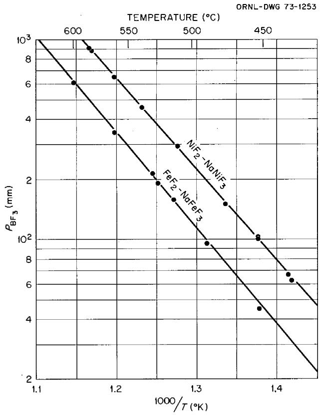  
Fig. 6.1. $\mathbf{BF}_3$ pressure generated by NaF-NaBF4 melts saturated with $\mathrm{NiF}_2\mathrm{-NaNiF}_3$ and $\mathrm{FeF_2}$ -NaFeF3. The lines were calculated by a least-squares fit of the data according to Eq. (3).

combining (5a) and (5b) with free energies of formation of $\mathrm{NiF}_2(\mathbf{c})$ and $\mathrm{FeF}_2(\mathbf{c})$ , respectively, known from Blood's measurements1 and with $\Delta G^f$ of liquid $\mathrm{NaF}$ ,1,2 we obtain

$$
\begin{array}{l} \Delta G ^ {f} \left[ \mathrm {N a N i F} _ {3} (\mathrm {c}) \right] \\ = \left[ - 2 9 5. 4 4 + 5 8. 4 9 (T / 1 0 ^ {3}) \right] \pm 1. 4, \quad (6 a) \\ \end{array}
$$

$$
\begin{array}{l} \Delta G ^ {f} \left[ \mathrm {N a F e F} _ {3} (\mathrm {c}) \right] \\ = \left[ - 3 0 6. 6 9 + 5 3. 8 2 \left(T / 1 0 ^ {3}\right) \right] \pm 1. 4. \quad (6 b) \\ \end{array}
$$

Combining (4a) and (4b), respectively, with the values of equilibrium constants for the reduction of $\mathrm{NiF}_2(\mathbf{c})$ and $\mathrm{FeF}_2(\mathbf{c})$ by hydrogen, based on measurements by Blood, $^{11}$ we obtain the values of the equilibrium

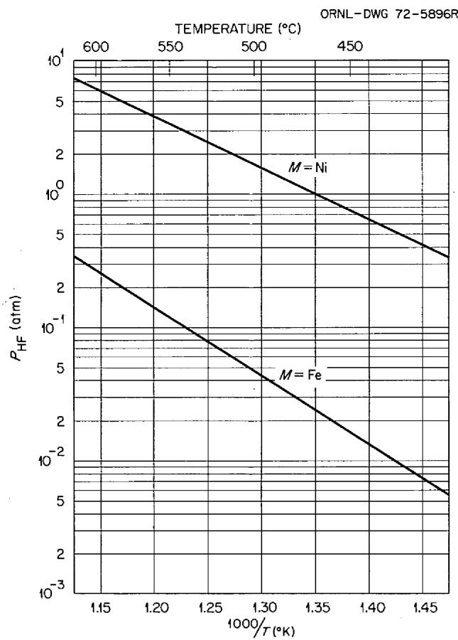  
Fig. 6.2. Calculated HF particle pressures for the equilibrium (7) (in $\mathrm{NaBF}_4$ -NaF eutectic).

constants of the reaction

$$
\begin{array}{l} 2 \mathrm {H F} (\mathrm {g}) + \mathrm {M} (\text {H a s t e l l o y N}) \\ + \mathrm {N a F} (\mathrm {d}) \rightleftharpoons \mathrm {N a M F} _ {3} (\mathrm {c}) + \mathrm {H} _ {2} (\mathrm {g}), \tag {7} \\ \end{array}
$$

$$
\log K _ {7} (\mathrm {N i}) = \left[ - 8. 9 8 + 7. 5 8 \left(1 0 ^ {3} / T\right) \right] \pm 0. 0 6, \tag {7a}
$$

$$
\log K _ {7} (\mathrm {F e}) = \left[ - 7. 9 6 + 1 0. 0 4 \left(1 0 ^ {3} / T\right) \right] \pm 0. 0 5. \tag {7b}
$$

Assuming that the activities of nickel and iron in Hastelloy N are $\sim 0.70$ and $\sim 0.05$ , respectively, that the activity of NaF in the coolant salt is $\sim 0.08$ (for the eutectic composition), and that $P_{\mathrm{H_2}} = 1$ atm, from (7a) and (7b) we may calculate the partial pressures of HF at which nickel and iron will be oxidized to $\mathrm{NaNiF_3}$ and $\mathrm{NaFeF_3}$ , respectively, in $\mathrm{NaBF_4}$ -NaF eutectic:

$$
\log P _ {\mathbf {H} \mathbf {F}} (\mathrm {N i}) = 5. 1 2 - 3. 7 9 (1 0 ^ {3} / T), \tag {8a}
$$

$$
\log P _ {\mathrm {H F}} (\mathrm {F e}) = 5. 1 8 - 5. 0 2 \left(1 0 ^ {3} / T\right). \tag {8b}
$$

A graphical representation of (8a) and (8b) is shown in Fig. 6.2.

Although the above new results are not significantly different from those reported previously, they are more accurate.

# 7. Behavior of Simulated Fission Products

# 7.1 EFFECTS OF SELECTED FISSION PRODUCTS ON METALS

J. H. Shaffer W. P. Teichert W. R. Grimes

A joint program of the Reactor Chemistry and the Metals and Ceramics Divisions has been directed toward identification of those fission products that are capable of producing superficial grain boundary cracks in Hastelloy N and investigation of other alloys of interest to the Molten-Salt Reactor Program that might be more resistive to this corrosive process. As previously reported,1 corrosive effects on Hastelloy N, not unlike those found in the MSRE fuel system, have been produced on metal tensile specimens exposed to relatively low concentrations of tellurium vapors at $650^{\circ}\mathrm{C}$ for 1000 hr. Similar tests with selenium, sulfur (included for comparative purposes), iodine, cadmium, arsenic, and antimony failed to show any detectable attack on the alloy. These findings are based on metallographic examinations of the exposed tensile specimens following their stress to failure at room temperature. Although tests with all these solute elements have been continued to investigate long-term effects, the interim program has been directed toward a more complete evaluation of the implied contribution by tellurium to the corrosion process.

The experimental method has consisted of a vapor deposition technique by which the metallurgical tensile specimens were exposed to tared quantities of tellurium metal in evacuated quartz ampuls. Prior to the addition of tellurium, the quartz tubes, with specimens inserted, were evacuated of gases while heating to about $600^{\circ}\mathrm{C}$ for removal of absorbed water. The deposition of tellurium on the specimens was accomplished by vapor transport while heating the ampuls to selected experimental temperatures of 550 to $700^{\circ}\mathrm{C}$ at controlled rates. Tellurium additions to the quartz ampuls were based on its assumed uniform dispersion on the metal surfaces and diffusion to a depth of 5 mils into the surface layer. Tellurium concentrations of 100, 300, 1000, and 10,000 ppm by weight in the surface layer, which corresponded to initial surface populations of about $5.3 \times 10^{16}$ , $1.6 \times 10^{17}$ , and $5.3 \times 10^{18}$ atoms Te per square centimeter, respectively, have been used

for the various tests in the program. The lower concentration of $100\mathrm{ppm}$ approximates concentrations of tellurium found on metal surfaces of the MSRE fuel system, and the highest concentration has been calculated to represent the expected tellurium exposure of an MSBR fuel system during its proposed 30-year life. Although these tests have been conducted at applicable temperatures and tellurium concentrations, time at temperature and tellurium deposition rates have not corresponded to reactor operating conditions. Consequently, the program has been directed toward comparative analyses of the effects by tellurium between Hastelloy N and other alloys that might be of interest to the MSRP. The selectivity of this potential corrosion process was established by tests that showed severe cracking of Hastelloy N under experimental conditions that failed to produce recognizable attack on type 304L stainless steel and that produced only very mild attack on pure nickel.

Experimental conditions that would yield analytically significant results for this comparative evaluation study were based on a study of the time at temperature dependence of the corrosion process on Hastelloy N. Specimens exposed to 10,000 ppm of tellurium at $700^{\circ}\mathrm{C}$ were examined at several time intervals from 20 to 1000 hr. The results showed that recognizable grain boundary cracking occurred within the first 20-hr period but that the severity of the attack increased at less than a linear rate dependence on time at temperature. Specimens withdrawn after 1000 hr under these test conditions showed effects very similar to those found on Hastelloy N samples taken from the MSRE during postoperational examinations of components from the fuel circuit.

Comparative evaluations of metals exposed to 10,000 ppm of tellurium for $100\mathrm{hr}$ at $700^{\circ}\mathrm{C}$ have been obtained from eight experiments. Some 71 specimens which represent 14 different alloys or metals and about 24 modifications of Hastelloy N were tested. In addition to the analytical procedure described, representative samples were also provided for examinations by Auger spectroscopic and x-ray-diffraction techniques. Significant metallurgical findings from analyses of this specimen group are reported by H. E. McCoy in Chap. 10 of this report. The results showed generally that the severity of cracking was greatly reduced in alloys that were rich in chromium but that minor composition changes of Hastelloy N yielded no significant improvement in resistance to cracking.

Because of the severity of these analytical tests and the qualitative nature of the results, additional tests are being conducted with a reduced tellurium concentration of $1000\mathrm{ppm}$ for 100-hr exposures at $700^{\circ}\mathrm{C}$ . Preliminary results obtained thus far from these tests indicate that the rate of tellurium deposition may be an important factor in the corrosive process. Additional long-term experiments will provide some control over this experimental variable by using thermal transpiration techniques.

# 7.2 STABILITY AND VOLATILITY OF METAL TELLURIDES

C.F.Weaver J.D.Redman

Examination $^{2,3}$ of Hastelloy N specimens from components of the Molten-Salt Reactor Experiment has shown grain boundary cracks on metal surfaces that were exposed to the fuel salt mixture during operation. Recent studies $^{4,5}$ have suggested that tellurium may play an important part in the grain boundary corrosion of Hastelloy N and, perhaps, of other alloys. $^{6}$ Consequently, the reactions, stability, and volatility of tellurium fluorides $^{7,8}$ and of structural metal tellurides $^{8}$ are being investigated by mass spectroscopy, x-ray analysis, $^{9}$ and synthesis.

Two of the three known tellurium fluorides $^{10}$ were produced by the fluorination of Te, $\mathrm{NiTe}_2$ , and $\mathrm{Ni}_3\mathrm{Te}_2$ with $\mathrm{CoF}_3$ . The results of the reaction of $\mathrm{CoF}_3$ with Te as well as the mass spectrometric cracking patterns of $\mathrm{TeF}_6$ , $\mathrm{TeF}_4$ , $\mathrm{CoF}_3$ , and tellurium were described earlier. $^{7,8}$ The analogous reactions with $\mathrm{NiTe}_2$ and $\mathrm{Ni}_3\mathrm{Te}_2$ have been observed to proceed in a similar

fashion but with lower pressures as expected. $\mathrm{CoF}_3$ and $\mathrm{NiTe_2}$ produced both $\mathrm{TeF_4}$ and $\mathrm{TeF_6}$ at temperatures greater than $160^{\circ}$ . The excess $\mathrm{NiTe_2}$ was converted to Te vapor and solid $\mathrm{Ni}_3\mathrm{Te}_2$ as the temperature increased to a final value of $780^{\circ}\mathrm{C}$ . The $\mathrm{CoF_3}$ and $\mathrm{Ni}_3\mathrm{Te}_2$ produced no vapors below $450^{\circ}\mathrm{C}$ . From 450 to $550^{\circ}$ both $\mathrm{TeF_6}$ and $\mathrm{CoF_3}$ were evolved. At $600^{\circ}\mathrm{TeF_4}$ , $\mathrm{TeF_6}$ , and $\mathrm{CoF_3}$ were observed. At higher temperatures complex mixtures formed containing unidentified species, $\mathrm{TeF_4}$ , $\mathrm{Te_2}$ , $\mathrm{CoF_3}$ , $\mathrm{CoF_2}$ , and $\mathrm{NiF_2}$ . The cracking pattern for the $\mathrm{CoF_2}$ was observed to be:

<table><tr><td>Ion</td><td>Relative intensity</td></tr><tr><td>CoF2+</td><td>35</td></tr><tr><td>CoF+</td><td>100</td></tr><tr><td>Co+</td><td>25</td></tr></table>

It was noted that the fluorinating agent $\mathrm{CoF}_3$ tends to adsorb rather large amounts of $\mathrm{O}_2$ and smaller quantities of $\mathrm{H}_2\mathrm{O}$ and $\mathrm{CO}_2$ during exposure for several months in a dry box containing He dried with liquid $\mathbf{N}_2$ and with molecular sieve but containing no oxygen-removing reagent. Exposure to laboratory air produced essentially the same results in about 2 hr, causing a $1.2\%$ weight gain. Baking this material for several hours in vacuum at $175^{\circ}\mathrm{C}$ apparently removed these impurities completely. The use of this degassed material to $800^{\circ}\mathrm{C}$ produced no oxides or oxyfluorides in either the vapor or the residues.

Tellurides of Ni, Fe, Cr, Mo, Bi, and Li are presently being studied. Three tellurides of nickel, $\mathrm{NiTe}_2$ , $\mathrm{NiTe}$ , and $\mathrm{Ni}_3\mathrm{Te}_2$ , have been observed. Tellurium vapor reacted with nickel metal to form $\mathrm{NiTe}_2$ at $412^{\circ}$ , $\mathrm{NiTe}$ in the range 550 to $600^{\circ}$ , and $\mathrm{Ni}_3\mathrm{Te}_2$ in the range 600 to $800^{\circ}\mathrm{C}$ . The $\mathrm{Ni}_3\mathrm{Te}_2$ , which is apparently the most stable telluride of nickel, was found to slowly decompose at $800^{\circ}$ to form nickel metal and tellurium vapor. The pressures of monomer and dimer were 7 and $4 \times 10^{-4}$ torr respectively. These pressures yield $\Delta F_{800}^{\circ}$ of +30.8 and +59.3 kcal for the reactions:

$$
\mathrm {N i} _ {3} \mathrm {T e} _ {2} (\mathrm {c}) \xrightarrow {8 0 0 ^ {\circ} \mathrm {C}} 3 \mathrm {N i} (\mathrm {c}) + \mathrm {T e} _ {2} (\mathrm {g})
$$

and

$$
\mathrm {N i} _ {3} \mathrm {T e} _ {2} (\mathrm {c}) \xrightarrow {8 0 0 ^ {\circ} \mathrm {C}} 3 \mathrm {N i} (\mathrm {c}) + 2 \mathrm {T e} (\mathrm {g})
$$

respectively. The reaction

$$
3 \mathrm {N i T e} \xrightarrow {7 0 5 ^ {\circ} \mathrm {C}} \mathrm {N i} _ {3} \mathrm {T e} _ {2} + \frac {1}{2} \mathrm {T e} _ {2} \uparrow
$$

was used to synthesize small (gram) quantities of the $\mathrm{Ni}_3\mathrm{Te}_2$ from the commercially available NiTe. While mass spectroscopy detected only tellurium vapor evolving from NiTe at $705^{\circ}\mathrm{C}$ , the off-gas trap in the synthesis experiments was found to contain $\mathrm{NiTe}_2$ as well as tellurium. This suggests that NiTe decomposes at $705^{\circ}\mathrm{C}$ primarily by the above reaction, but also by the reaction

$$
4 \mathrm {N i T e} (\mathrm {c}) \rightarrow \mathrm {N i} _ {3} \mathrm {T e} _ {2} (\mathrm {c}) + \mathrm {N i T e} _ {2},
$$

producing $\mathrm{NiTe}_2$ vapor with a pressure of $< 10^{-6}$ torr. This is our first evidence that a structural metal telluride may exist in the gas phase. We have no evidence that $\mathrm{Ni}_3\mathrm{Te}_2$ is thermally unstable at $705^{\circ}\mathrm{C}$ over a period of several days at pressures in the range of $10^{-5}$ torr. Under the same conditions at $800^{\circ}\mathrm{C}$ the decomposition to nickel and tellurium is complete, with no evidence of compounds richer in Ni than $\mathrm{Ni}_3\mathrm{Te}_2$ .

CrTe was formed by the reaction of tellurium vapor at $412^{\circ}\mathrm{C}$ and $2.4 \times 10^{-2}$ torr with chromium in a quartz container. This material was heated to $750^{\circ}\mathrm{C}$ in a nickel container under hard vacuum, with no evidence

ofvolatility,decomposition,orreactionwith thenickel container.

MoTe $_2$ showed no measurable vaporization, but evolved tellurium vapor at temperatures above $750^{\circ}\mathrm{C}$ . At $800^{\circ}$ the tellurium pressure was near $10^{-3}$ torr, yielding $\Delta F_{800}^{\circ}$ of about $+29\mathrm{kcal}$ for the reaction

$$
\mathrm {M o T e} _ {2} (\mathrm {c}) \rightarrow \mathrm {M o} (\mathrm {c}) + \mathrm {T e} _ {2} (\mathrm {g}).
$$

FeTe was found to react with Ni at $725^{\circ}$ to form $\mathrm{Ni}_3\mathrm{Te}_2$ and Fe.

$\mathrm{Bi}_{2}\mathrm{Te}_{3}$ produced no volatile species below $450^{\circ}\mathrm{C}$ . Between 450 and $800^{\circ}\mathrm{C}$ , however, the material was both volatile and unstable; vapor species of BiTe, Bi, $\mathrm{Bi}_{2}$ , $\mathrm{Bi}_{3}$ , Te, and $\mathrm{Te}_{2}$ were observed. The gas-phase reaction $\mathrm{Bi}_{2} + \mathrm{Te}_{2} = 2\mathrm{BiTe}$ has been discussed in the literature.[11]

$\mathrm{Li}_2\mathrm{Te}$ was found to react rapidly with air at room temperature, going completely to Te and LiOH.

# 8. Development and Evaluation of Analytical Methods

A. S. Meyer

# 8.1 IN-LINE CHEMICAL ANALYSIS OF MOLTEN FLUORIDE SALT STREAMS

J.M.Dale D.L.Manning

A. S. Meyer

We have concentrated our in-line research and development efforts on preparations for the analysis of the coolant salt in the Coolant Salt Technology Facility (CSTF). Our research studies have indicated the possibility of measuring corrosion products and an active protonic species in the $\mathrm{NaBF_4}$ -NaF coolant stream.

The Salt Monitoring Vessel (SMV) that has been installed at the CSTF is equipped with six risers, each fitted with $1^{1/2}$ -in. ball valves. Two of these risers are fitted with Pyrex windows and are angled so that their axes intersect the axis of one of the vertical risers at the melt surface and thus provide for illumination and visual observation of the melt. One of the vertical ports has been reserved for surface tension experiments, and the remainder are assigned to analytical measurements. We have prepared a shielded assembly equipped with three voltammetric electrodes for insertion in one of these vertical risers. The shield is a 1-in. Inconel tube whose open end penetrates the melt to below the level of the electrodes. It can be purged with $\mathrm{He - BF}_3$ to provide fresh melt surfaces and an essentially quiescent melt around the electrodes. In a second riser we will install four voltammetric electrodes where they can be observed through the viewing ports. We plan to use the third analytical port for future potentiometric measurements with a proposed $\mathrm{LaF}_3$ membrane reference electrode that uses the potential of the $\mathrm{Fe - FeF}_2$ couple as a reference. Provision has also been made to vary the flow through the SMV from 0.15 to 2 gpm so that it will be possible to study the effects of flow on the voltammetric measurements.

A large portion of our recent research has been devoted to the studies of the proton wave described in the next section. In earlier work we had investigated the fundamental electroanalytical chemistry of iron in $\mathrm{NaBF}_4$ and had observed the $\mathrm{Cr(III)}\rightarrow \mathrm{Cr}(0)$ reduction wave in a region $(\sim -1.0\mathrm{V})$ near the cathodic limit of the $\mathrm{NaBF}_4$ melts.2 Recently we performed voltammetric measurements on a melt prepared from the material used to charge the CSTF in order to determine whether it presented any unusual features and to measure the increase in the diffusion coefficients of the corrosion product ions with temperature.

At $500^{\circ}\mathrm{C}$ the melt showed the anticipated iron wave and a rather large proton wave (despite a low OH analysis and careful prepumping) and no chromium wave. On heating to $600^{\circ}$ the cathodic limit of the melt decreased several hundred millivolts at a platinum working electrode so that it was not possible to observe the reduction wave from 200 ppm of added $\mathrm{Cr(III)}$ . An even greater decrease in the limit was noted at the palladium electrode. We attribute this change in the limit to the alloying of the boron reduction product with the electrode material.

We have screened a number of possible alternate electrode materials and found that iridium, pyrolytic graphite, and copper yield resolved chromium waves at $600^{\circ}$ that are comparable to those obtained at platinum at $500^{\circ}\mathrm{C}$ . On a gold electrode the chromium wave appeared about $100\mathrm{mV}$ earlier, giving better resolution from the limit apparently as a result of alloying of the deposited chromium. Silver offered no advantages, and rhenium and tantalum were too active for use in $\mathrm{NaBF}_4$ melts.

Our present research cells cannot be operated at the maximum operating temperature of the CSTF $(1250^{\circ}\mathrm{F})$ . We have chosen a selection of three iridium electrodes and one each of pyrolytic graphite, copper, gold, and evacuated palladium in order to offer the best opportunity to perform chromium analyses at $1250^{\circ}\mathrm{F}$ .

# 8.2 VOLTAMMETRIC STUDIES OF PROTONATED SPECIES IN MOLTEN $\mathrm{NaBF}_4$ -NaF (92-8 mole %)

D. L. Manning A. S. Meyer

We have continued studies on the voltammetric behavior of protonated species in molten fluoroborate salts at an evacuated palladium tube electrode. The initial studies were conducted with the melt contained in a graphite cell, which was then enclosed in a silica jacket. However, to eliminate any effect of silica and to achieve higher melt temperatures, a nickel cell enclosure was fabricated. Both graphite and copper cells have been utilized. Voltammograms recorded at palladium or

palladium-silver (75:25) alloy electrodes revealed a well-defined wave at about $-0.1\mathrm{V}$ vs a platinum quasi-reference electrode. The wave conforms to a reversible one-electron reduction by voltammetric and chronopotentiometric criteria. By electrolyzing at a potential beyond the peak potential of the wave, an increase in pressure was observed inside the electrode. This is evidence that the wave is due to the reduction of protons with part of the resultant hydrogen diffusing through the palladium. It was first believed that it would be possible to relate the pressure measurements to the protonic content of the melt under controlled electrolysis conditions. Experience with different electrodes, however, has revealed that the "porosity" to hydrogen among the electrodes is not necessarily constant; also, pressure measurements at a given electrode will change (usually decrease) with time in the melt. Nevertheless, it is still possible to collect gas samples by this technique for measurement of isotopic ratios of hydrogen.

Our first assumption was that the voltammogram resulted from the reduction of $-\mathrm{OH}$ as $\mathrm{NaBF}_3\mathrm{OH}$ at the palladium electrode. However, the voltammetric results were consistently low when compared with infrared data. Also, we observed that the wave height of the voltammogram can be significantly reduced by cooling the top of the nickel cell enclosure and can be returned to the original value by heating. We now believe that the protonic species yielding the voltammetric wave is in equilibrium with a vapor species that can be condensed at cooler temperatures. Moreover, nomarked variation in the $\mathrm{BF}_3\mathrm{OH}^-$ concentration as measured by the infrared pellet technique appeared to be associated with the marked changes in the reduction wave. We have also noted that when the vapor species is removed by sweeping with helium, the wave decreases, but recovers slowly after the sweep is discontinued. This suggests that the more electroactive species may be replenished via slow reactions of a more stable protonated component.

To explain these results we have postulated reactions such as

$$
\begin{array}{l} 2 \mathrm {N a B F} _ {3} \mathrm {O H} + \mathrm {N a B F} _ {4} \rightleftharpoons \mathrm {N a} _ {2} (\mathrm {B F} _ {3}) _ {2} \mathrm {O} \\ + \mathrm {N a F} + \mathrm {H B F} _ {3} \mathrm {O H} \rightleftharpoons \text {v a p o r}, \\ \end{array}
$$

$$
\begin{array}{l} \mathrm {N a B F} _ {3} \mathrm {O H} + 2 \mathrm {N a B F} _ {4} \rightleftharpoons \mathrm {N a} _ {2} (\mathrm {B F} _ {3}) _ {2} \mathrm {O} \\ + \mathrm {N a F} + \mathrm {H B F} _ {4} \rightleftharpoons \text {v a p o r}, \\ \end{array}
$$

in which the melt equilibrium strongly favors the $\mathrm{NaBF}_3\mathrm{OH}$ species. To be consistent with our observa

tions, the diffusion coefficient of the more active species must be higher than the typical value of $10^{-6}$ $\mathrm{cm}^2/\mathrm{sec}$ in fluoride melts so that the active proton concentration is lower than we suspected.

To test these hypotheses, we added crushed chromium metal to a fluoroborate melt and followed the voltammetric wave and the $\mathrm{BF}_3\mathrm{OH}^-$ . Pertinent observations at $500^{\circ}\mathrm{C}$ are recorded below.

<table><tr><td>Time</td><td>Proton wave height (μA)</td><td>H as NaBF3OH (ppm)</td></tr><tr><td>~1 hr</td><td>3300</td><td>52</td></tr><tr><td>4 hr</td><td>500</td><td>42</td></tr><tr><td>1 day</td><td>Not detected</td><td>32</td></tr><tr><td>2 days</td><td>Not detected</td><td>29</td></tr><tr><td>8 days</td><td>Not detected</td><td>24</td></tr></table>

Of interest here is that after eight days, the $\mathrm{BF}_3\mathrm{OH}^-$ level has decreased approximately one-half, whereas the voltammogram, for practical purposes, was lost within the first day. This appears to be additional evidence that the voltammetric and infrared techniques are not observing the same protonated species.

After eight days at $500^{\circ}\mathrm{C}$ the temperature was increased to $600^{\circ}\mathrm{C}$ , and a sample was withdrawn after the melt was maintained at $600^{\circ}\mathrm{C}$ for three days. It was also discovered that the cell had developed a leak while at $600^{\circ}\mathrm{C}$ . The sample indicated 47 ppm H as $\mathrm{NaBF}_3\mathrm{OH}$ (an increase from 24 ppm at $500^{\circ}\mathrm{C}$ ) and $0.22\%$ Cr. Thus the $\mathrm{NaBF}_3\mathrm{OH}$ production from contamination, most probably moisture, proceeded faster than its reaction with the Cr metal. At no time, however, was a voltammetric proton wave seen, and the equilibrium potential remained cathodic (melt reducing). Acidic protons (HG, $\mathrm{HBF}_4$ , etc.) were apparently consumed rapidly by the Cr metal as they were not observed voltammetrically during the buildup of the $\mathrm{NaBF}_3\mathrm{OH}$ .

The $0.22\%$ Cr in the filtered sample seems high. The cathodic equilibrium would seem to indicate predominantly $\mathrm{Cr}^{2+}$ in the melt, which may be more soluble than $\mathrm{Cr}^{3+}$ . However, this is yet to be established experimentally.

After the leak was detected, the salt was frozen and the cell dismantled for inspection. A white coating analyzed to be predominantly $\mathrm{NaBF_4}$ was deposited on the flanged top of the cell. The route by which the salt collected on the flanged top, about 12 in. from the surface of the melt, is not clear. The gold thermowell ( $1/4$ -in-OD tube, closed end, $\sim 1/32$ -in. wall) was coated extra thickly with green-colored salt and underneath was a bright metallic plate deposited on the gold. A sample of the metallic film was found to be chromium. This would seem to support the existence of $\mathrm{Cr(II)}$ ,

which could disproportionate at the coolest surface (in this case the thermowell) into Cr metal and $\mathrm{Cr}^{3+}$ as the salt was gradually frozen. It now seems apparent that the protonic species present and associated equilibria are more complex than our original concepts. We are continuing these studies, however, and attempts will be made to evaluate the diffusion coefficient of the electroactive protonated species so that the concentration of this substance can be determined.

# 8.3 INFRARED SPECTRAL STUDIES OF $\mathrm{NaBF}_4$ -NaF

J.P.Young A.S.Meyer

There is still some confusion as to the chemical reactions and stable species of H, B, F, and O that exist in $\mathrm{NaBF}_4$ -NaF (92-8 mole %). Progress in our understanding of these melts has been made, however. From infrared studies of $\mathrm{NaBF}_4$ -NaF melts described in the previous reporting period, we had established the existence of $\mathrm{BF}_3\mathrm{OD}^-$ ion in the melt but had not found the route of entry of this species, whether by chemical reaction or exchange. The usefulness of the $\mathrm{NaBF}_4$ coolant salt in the trapping of hydrogen isotopes (tritium) is not necessarily based on an exchange reaction with $\mathrm{BF}_3\mathrm{OH}^-$ , even though this is a possible mechanism. The studies we have carried out seem to demonstrate a chemical reaction of diffused hydrogen isotopes with the melt rather than an isotopic exchange. This apparent lack of exchange in melts, coupled with a continuing unsatisfactory correlation between the results of the deuterium exchange technique described in an earlier report and the infrared pellet technique for the determination of combined hydrogen in samples of $\mathrm{NaBF}_4$ , has led to a discontinuance of the isotopic exchange method. Based on present knowledge, the apparent exchange we observed in the earlier studies was probably caused by a side chemical reaction or exchange with a species other than $\mathrm{BF}_3\mathrm{OH}^-$ . Additional confirmation of the original calibration of the infrared method has been obtained by mixing known quantities of solid $\mathrm{NaBF}_3\mathrm{OH}$ with solid $\mathrm{NaBF}_4$ -NaF and melting these mixtures in vacuum-tight crimped copper containers maintained under isothermal conditions. In these tests, $\mathrm{NaBF}_3\mathrm{OH}$ additions corresponding to 25

ppm of hydrogen or less were recovered quantitatively. Less than quantitative recoveries of larger additions (e.g., 40 ppm) are probably caused by the separation of a volatile proton species which does not completely reequilibrate with the salt when it solidifies. Indeed, under nonisothermal conditions, a tan-colored viscous liquid can be condensed on a water-cooled surface (see also Sect. 8.2, this report). This liquid fumes in air and was shown by NMR analysis to contain essentially equal molar quantities of H and F. From the NMR chemical shift, it is indicated that the hydrogen is not ionic. Thus the liquid cannot be $\mathrm{HBF}_4$ or $\mathrm{HBF}_3\mathrm{OH}$ but might be $\mathrm{BF}_3\cdot \mathrm{H}_2\mathrm{O}$ , $\mathrm{BF}_3\cdot 2\mathrm{H}_2\mathrm{O}$ , or a compound of $\mathrm{BF}_n\mathrm{OH}_{n-3}$ . Although a very careful technique is followed, it is not possible to melt $\mathrm{NaBF}_4$ or $\mathrm{NaBF}_4$ . NaF mixtures of low $\mathrm{BF}_3\mathrm{OH}^-$ content (7 ppm H) in the crimped isothermal containers without causing the $\mathrm{BF}_3\mathrm{OH}^-$ concentration to increase by about 15 ppm hydrogen based on the infrared pellet analysis. It appears that this increase is caused by some other form of proton, most likely $\mathrm{H}_2\mathrm{O}$ , that is converted to $\mathrm{BF}_3\mathrm{OH}^-$ on melting. If the salt containing 20 ppm hydrogen is ground in air and again melted, a further increase of 15 to 20 ppm is observed. If the product of the first melting is ground in an inert atmosphere box and remelted, no further increase in $\mathrm{BF}_3\mathrm{OH}^-$ concentration is observed. We had reported that sometimes we could melt samples and keep the hydrogen concentration at approximately 6 to 8 ppm. These salts were melted in a nonisothermal gas phase system of very large gas-to-melt volume ratio, where it seems likely that the $\mathrm{BF}_3\mathrm{OH}^-$ was prevented from forming or the excess was decomposed by an as yet undefined mechanism. From a consideration of spectral and electrochemical results, there are at least three kinds of protonic species that can find existence in molten or solid $\mathrm{NaBF}_4$ . This fact undoubtedly is a partial cause of our inability to obtain a precise analytical determination of hydrogen in these salts by the several methods available. We plan to undertake further investigations in the preparation or synthesis of $\mathrm{NaBF}_4$ melts that contain essentially no $\mathrm{BF}_3\mathrm{OH}^-$ so that the various proposed solute species and their interactions can be better studied.

# 8.4 STUDIES OF PROTONS IN MOLTEN $\mathrm{NaBF}_4$

J.P.Young J.B.Bates

G. E. Boyd

Several studies of the reaction or exchange of $\mathbf{D}_2$ or $\mathbf{H}_2$ with solute species in molten $\mathrm{NaBF}_4$ - $\mathrm{NaF}$ have been carried out. Our most definitive results, thus far, have

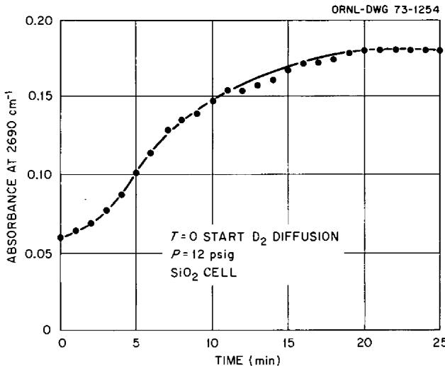  
Fig. 8.1. Growth of $\mathbf{BF}_3\mathbf{OD}^-$ as $\mathbf{D}_2$ is diffused into molten $\mathbf{NaBF}_4$ - $\mathbf{NaF}$ .

been obtained from experiments in which either $\mathbf{D}_2$ or $\mathbf{H}_2$ was independently diffused through 0.004-in.-wall nickel thimbles into molten $\mathrm{NaBF_4}$ -NaF contained in a $\mathrm{SiO_2}$ cell at a temperature of approximately $425^{\circ}C$ . The presence or absence of the $\mathrm{BF}_3\mathrm{OD}^-$ ion and its change in concentration was followed spectrophotometrically by changes in the intensity of its characteristic infrared absorption peak at $2690~\mathrm{cm}^{-1}$ . In a $\mathrm{SiO_2}$ cell one cannot observe similar changes in the $\mathrm{BF}_3\mathrm{OH}^-$ ion since that absorption peak is masked by absorption peaks of the container. Under our experimental conditions, if $\mathbf{D}_2$ is diffused into a fresh melt, some $\mathrm{BF}_3\mathrm{OD}^-$ ion is formed initially, but within 20 min the intensity of the $2690\text{-cm}^{-1}$ peak reaches a maximum and levels off, as shown in Fig. 8.1; no further changes in the intensity of this peak are noted if the diffusion of $\mathbf{D}_2$ is continued. If $\mathbf{H}_2$ is diffused into the melt first (for 2 hr) and then $\mathbf{D}_2$ is allowed to diffuse into the melt, no $\mathrm{BF}_3\mathrm{OD}^-$ absorption is seen. These results in the $\mathrm{SiO_2}$ apparatus suggest that $\mathbf{D}_2$ does not exchange with $\mathrm{BF}_3\mathrm{OH}^-$ ion in the melt, but rather that $\mathbf{D}_2$ (or $\mathbf{H}_2$ ) is capable of reducing some species in the melt. One of the ultimate products of this reduction is $\mathrm{BF}_3\mathrm{OD}^-$ . If $\mathbf{D}_2$ is first diffused, the $\mathrm{BF}_3\mathrm{OD}^-$ ion is observed; if $\mathbf{H}_2$ is first diffused, the reduction is completed with $\mathbf{H}_2$ , and no $\mathrm{BF}_3\mathrm{OD}^-$ is seen when $\mathbf{D}_2$ is subsequently introduced. We have carried out similar studies with melts contained in the $\mathrm{LaF}_3$ cell, but the results have been inconclusive because $\mathrm{NaBF_4}$ creeps out of these small cells when gas is passed into the melt.

# 8.5 ANALYSIS OF COOLANT COVER GAS

R.F.Apple A.S.Meyer

In order to calibrate transducers for the measurement of hydrolysis products in coolant cover gas, it will be necessary to measure the "water" that is present in actual or simulated cover gas streams, probably as $\mathrm{BF}_3$ hydrates. Our earlier tests have shown that the $\mathrm{BF}_3$ in such gas streams interferes with the determination of water by the Karl Fischer (K.F.) titration. It appears likely that the $\mathrm{BF}_3$ interference can be eliminated by absorbing the water (and $\mathrm{BF}_3$ ) in cold pyridine and then separating the water by azeotropic distillation. Application of this technique will require a K.F. titration of improved sensitivity. D. J. Fisher and T. R. Mueller of the Analytical Chemistry Division's Instrumentation group have designed an improved automatic coulometric titrator for this purpose. This instrument decreases the generating current as the end point is approached and provides an automatic adjustment of the compensating current that is required to maintain the titrating solution at the end point.

Although the instrument functioned according to its design specifications, we were unable to exploit its improvements because of random variation in the potential of the indicator electrode system. In the coulometric titration the sample is added to a solution of essentially depleted K.F. reagent, that is, a solution of pyridine, pyridinium iodide, excess $\mathrm{SO}_2$ , and a trace of iodine in methanol. Iodine is then generated electrolytically until the original activity of free iodine is reached. Thus each mole of water added consumes one mole of coulometrically generated iodine.

The precision of the technique is primarily limited by the precision with which the free iodine activity at the end point can be reproduced. The free iodine can be detected by measuring the potential that is developed between platinum electrodes immersed in the titrating solution and polarized with microampere currents. Where excess water is present, iodine is generated at the indicator anode, while hydrogen is generated at the cathode. Thus the potential approaches the $\mathrm{H}_2\mathrm{-I}_2$ couple (typically $600~\mathrm{mV}$ ). Conversely, when a large excess of iodine is present, the cathode is depolarized, and the potential approaches zero. In practice the most sensitive region of the titration curve is found at iodine concentrations corresponding to about $200\mathrm{mV}$ potential between the electrodes, and the end-point potential is selected at about this value. The iodine concentration at the cathode, demonstrated to be the potential-determining electrode, is determined by both the rate of reduction (density of polarizing current) and the rate

the free iodine reaches the electrode. Because of turbulent flow in stirred solutions the concentration of iodine varies randomly, and variation in the potential between the electrodes becomes excessive.

We have postulated that if a rapidly rotating cathode were used the rate of iodine transport to this electrode would be determined primarily by the constant velocity of the electrode through the solution rather than by the random movements in the stirred solution. An electrode was constructed of 0.040-in. platinum wire approximately $3/8$ in. long attached at right angles to a $1/8$ -in. rotating shaft. The electrode and shaft were insulated with a combination of Teflon spaghetti and shrinkable vinyl tubing. Only the tip of the platinum was exposed, so that a relative large velocity was achieved on rotation. By a systematic variation of the parameters associated with this electrode, we have found that good results can be obtained with $7 \mathrm{~mm}$ of 0.040-in. platinum exposed and rotated at $1800 \mathrm{rpm}$ with a polarizing current of $35 \mu \mathrm{A}$ . Under these conditions the response is about $15 \mathrm{mV}$ per microgram of water in approximately $100 \mathrm{ml}$ of titrating solution, and the output voltage appears essentially free of noise on the damped meter of the instrument. In the titration of test portions of methanol containing about $500 \mu \mathrm{g}$ of water, values of $500 \pm 3 \mu \mathrm{g}$ were obtained, whereas reproducibility to better than $1 \mu \mathrm{g}$ was obtained with smaller injections ( $\sim 30 \mu \mathrm{g}$ ). It is likely that this reproducibility is now limited by the precision of our injection technique. More optimum conditions can probably be found using a mechanically improved rotating system now under construction, but these results are adequate for our present usage in determining water in coolant cover gas.

These investigations were made with a prototype system in which the electrode shaft passes through a Teflon bushing. Alignment is very critical, and after a few hours of operation some Teflon "chaff" enters the cell and affects the electrode potential by covering part of its surface. An improved bearing and shaft seal are now being fabricated.

We are testing a technique for determining the hydrogen in coolant cover gas by measuring the pressure of hydrogen as it diffuses through a heated palladium diaphragm. At equilibrium the same partial pressures of hydrogen are present on both sides of the membrane, and by using prereductive techniques it may be possible to obtain total hydrogen as well as uncombined hydrogen in an untreated gas stream. Initial tests using a hydrogen purifier equipped with a heated diffusion tube of Ag-Pd alloy showed that, while the pressure outside the tube did approach the partial

pressure of hydrogen inside the flow-through system, equilibrium was approached quite slowly, particularly when going to lower pressure. This has been attributed to a reservoir of hydrogen that dissolves at high pressure in the cool ends of the diffusion tube. We are rebuilding the system to provide a more uniform temperature for the diffusion tube.

# 8.6 SPECTRAL STUDIES OF MOLTEN SALTS

# J. P. Young

As in the past, spectral studies of solute species in molten salts of interest to the MSRP have been carried out to investigate possible analytical applications and to gain insight into the chemistry of these melts. Studies are carried out in $\mathrm{BeF}_2$ -based melts, of direct interest to the MSR, fuel salt, and alkali fluoride melts which provide change in solvent character and are also of interest in developing general knowledge of molten fluoride solution chemistry. Two further papers have been written, one published and one accepted for publication, in which our views are given on the formation and stability of high oxidation states of several solute species in the presence of $\mathrm{O}^{2-}$ and/or $\mathrm{F}^{-}$ ligands in fluoride melts.

In cooperation with F. F. Blankenship, S. Kirslis (Reactor Chemistry Division), and S. Katz (Chemical Technology Division) we are studying the possibility of using the reduction of Ce(IV) to Ce(III) with the subsequent fluorimetry of Ce(III) as an analytical method for determining the reducing power of amenable melts. Katz and Pitt10 have described this technique as a very sensitive means of determining organics in aqueous solution, and we have considered using this in an inorganic melt.

As a general analytical scheme the possible determination of reducing power by Ce(III) formation from Ce(IV) seems of value; either spectral absorption or fluorimetric measurements could be made. An interesting reagent for use in such a scheme would be $\mathrm{CeO}_2$ .

Based on analogous chemical behavior, one might guess that $\mathrm{CeO_2}$ would be very insoluble in fluoride melts, while $\mathrm{Ce(III)}$ would be soluble even in the presence of $\mathrm{O}^{2-}$ . Several preliminary studies have been carried out in the solvents LiF-NaF-KF and LiF-BeF $_2$ -ZrF $_4$ . In either melt it was found that $\mathrm{Ce(III)}$ was sufficiently soluble for use in this scheme. The absorption spectra, in either melt at $500^{\circ}\mathrm{C}$ , in the spectral region of 600 to $200\mathrm{nm}$ , consist of three peaks located at 292, 244, and $224\mathrm{nm}$ . The spectrum corresponds to the absorption spectrum seen for $\mathrm{Ce(III)}$ in $\mathrm{CaF_2}$ crystals. $^{11}$ No fluorescence of the melt has been observed, but the solidified salt did fluoresce. The molar absorptivity of the most intense peak at $292\mathrm{nm}$ is estimated to be 700 liters $\mathrm{mole}^{-1}\mathrm{cm}^{-1}$ . Addition of $\mathrm{CeO_2}$ to a melt of LiF-NaF-KF generated some $\mathrm{Ce(III)}$ which was seen spectrally; at equilibrium some undissolved $\mathrm{CeO_2}$ still remained. Based on the absorbance of the $292\mathrm{nm}$ peak, $3\mu \mathrm{eq}$ of some material in the salt was oxidized. Under our experimental conditions, down to $0.1\mu \mathrm{mol}$ of $\mathrm{Ce(III)}$ per gram of sample could be determined by absorption spectral measurement. The method was originally proposed to be considered as an alternate method for determining very low concentrations of U(III). We envision that its use as a general reducing power indicator might be of more use, either by melt absorption measurements or melt or solid fluorescent measurements. The evidence to date would indicate that $\mathrm{CeO_2}$ is not as strong an oxidant in these melts as, for example, MnF $_3$ , but $\mathrm{CeO_2}$ should be strong enough to oxidize $\mathrm{Ni}^0$ , $\mathrm{Fe}^0$ , etc., that might be present in such melts and that in the past have created problems in analysis when present with $\mathrm{Ni}^{2+}$ and $\mathrm{Fe}^{2+}$ .

Tellurium is a fission product of the fuel burnup in molten-salt reactors and has been implicated in some stress cracking that has been observed in the metal alloy which has been used in the MSRE. Because of this interest in Te, spectral studies of the various oxidation states will be carried out. Initially only $\mathrm{Te}^{2-}$ or $\mathrm{Te}^0$ has been considered. It has been found, spectrally, that both ZnTe and $\mathrm{Na}_2\mathrm{Te}$ are soluble in LiF-NaF-KF and that $\mathrm{Na}_2\mathrm{Te}$ is soluble in molten LiF- $\mathrm{BeF}_2$ (ZnTe was

not investigated). The spectra of the resultant rose-colored solution probably arise from the $\mathrm{Te}^{2-}$ ion and consist of a moderately broad peak at $520\mathrm{nm}$ and a very intense absorption in the ultraviolet below 350 nm. The spectra are similar but not identical to that reported by Gruen et al. $^{12}$ for $\mathrm{Li}_2\mathrm{Te}$ and $\mathrm{Cs}_2\mathrm{Te}$ in melts that were essentially chloride media. We do not know the sensitivity of the absorbance peak at $520\mathrm{nm}$ , but we estimate the molar absorptivity to be between 25 and 50 liters $\mathrm{mole}^{-1}\mathrm{cm}^{-1}$ . The solubility of either telluride, therefore, is believed to exceed $1000\mathrm{ppm}$ in LiF-NaF-KF at $525^{\circ}\mathrm{C}$ . The dissolved $\mathrm{Te}^{2-}$ ion is reasonably stable in an inert atmosphere at least for 24 hr, but has been found to be easily oxidized by exposure of the melt to air, possibly an oxidation via $\mathrm{O}_2$ or by the addition of $\mathrm{Fe}^{2+}$ .

In the last report we described the spectral studies of $\mathrm{Li}_3\mathrm{Bi}$ in molten LiCl that we had undertaken in cooperation with L. Ferris and his group (Chemical Technology Division). We have now carried out further spectral studies of $\mathrm{Li}_3\mathrm{Bi}$ in LiBr and of Li-Pb alloys in contact with LiCl. To summarize our results, $\mathrm{Li}_3\mathrm{Bi}$ seems to be the ionized solute species in either molten LiCl or LiBr near the LiX melting point. The reddish-yellow solution has an essentially featureless ultraviolet absorption peak which appears similar to that obtained for $\mathrm{Li}_3\mathrm{Bi}$ in molten LiCl-LiF (80-20 mole%).[13] No absorption spectrum, or color, was observed when Li-Pb alloy was in contact with molten LiCl, and it seems probable that no unusual "plumbide" species were present in the salt melt. These results are in line with chemical analyses of samples of these melts.

# 9. Other Molten-Salt Research

# 9.1 THE DISPROPORTIONATION EQUILIBRIUM OF $\mathbf{U}\mathbf{F}_3$ SOLUTIONS IN GRAPHITE

L. O. Gilpatrick L. M. Toth

In the previous report1 we showed that a $\mathrm{UC}_2$ phase was the stable carbide formed in the $\mathrm{UF}_3$ disproportionation equilibrium:

$$
4 \mathrm {U F} _ {3} (\mathrm {d}) + 2 \mathrm {C} (\text {g r a p h i t e}) \rightleftharpoons 3 \mathrm {U F} _ {4} (\mathrm {d}) + \mathrm {U C} _ {2} \tag {1}
$$

when dilute (<1 mole % UF $_3$ plus UF $_4$ ) molten fluoride solutions were equilibrated in a graphite spectrophotometric cell. In order to determine equilibrium quotients:

$$
Q ^ {\prime} = \left(\mathrm {U F} _ {4}\right) ^ {3} / \left(\mathrm {U F} _ {3}\right) ^ {4} \tag {2}
$$

for Eq. (1), the reaction has been measured by approaching the equilibrium from both directions, either by disproportionating $\mathrm{UF}_3$ solutions in a graphite cell or by reacting excess $\mathrm{UC}_2$ with dilute $\mathrm{UF}_4$ solutions. We have found that the best method of measuring equilibrium quotients is by the back reaction, and for this reason the $Q$ value is written as the reciprocal of $Q'$ [Eq. (2)] when applied to the back reaction of Eq. (1).

Because the equilibration reactions were conducted in the spectrophotometric cell, $\mathrm{UF}_3$ and $\mathrm{UF}_4$ concentrations could be monitored continuously by absorption spectroscopy. Details of this procedure have already been given1 and will be reviewed in a final report.2

Extensive quantitative data have been obtained for $Q$ , for the back reaction of Eq. (1), as a function of temperature and melt composition. These data represent refinements of earlier results1 as a consequence of improvements in the data analyses. These improvements are primarily due to better base-line determinations and calibration data for the absorption spectra of $\mathrm{UF}_3$ and $\mathrm{UF}_4$ . We have found that the equilibrium is more sensitive to temperature and solvent changes than was originally anticipated by previous investigators.3

In Fig. 9.1 the logarithm of $Q$ is plotted as a function of $T_{\mathbf{K}}^{-1}$ ( $T_{\mathbf{K}}$ is the Kelvin temperature) for the back reaction of Eq. (1) in the solvent LiF-BeF $_2$ (66-34 mole %). Also shown in the figure at the right ordinate is the ratio $\mathrm{UF}_3 / (\mathrm{UF}_4 + \mathrm{UF}_3)$ , equal to $R$ , and at the top of the figure is the centigrade scale. Two lines drawn through the data points represent the experimental uncertainty, which arises mainly from the base line in the absorption spectra.

Equilibria at various temperatures were approached from both the high-temperature (open circles) and low-temperature (closed circles) directions. To approach equilibrium from the high-temperature direction, the system was initially held ca. $50^{\circ}\mathrm{C}$ above the temperature sought until the $\mathrm{UF}_3$ concentration ceased to grow $[\mathrm{UF}_4$ reacting with $\mathrm{UC}_2$ in the back reaction of Eq. (1)]. Then, the temperature was dropped $50^{\circ}$ and the $\mathrm{UF}_3$ concentration allowed to decrease by the forward reaction of Eq. (1) until no further change

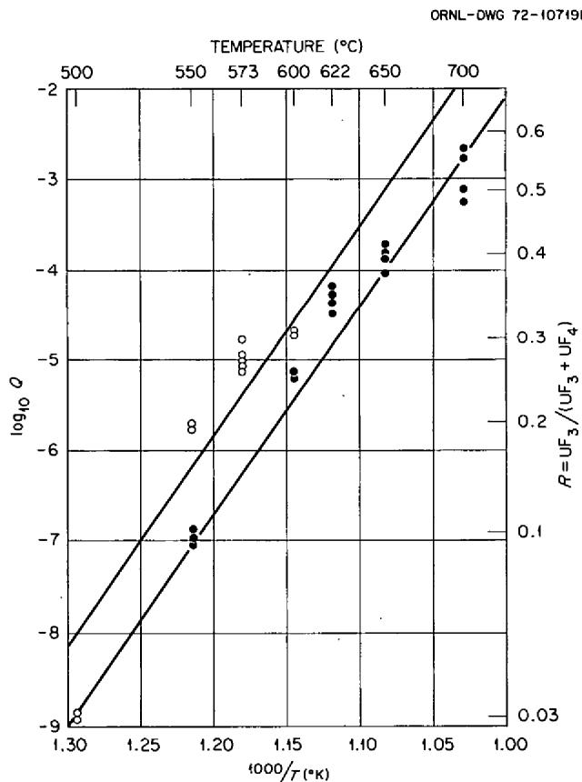  
Fig. 9.1. Equilibrium quotients vs temperature for the reaction $\mathrm{UC}_2 + 3\mathrm{UF}_4 \rightleftharpoons 4\mathrm{UF}_3 + 2\mathrm{C}$ in LiF-BeF $_2$ (66-34 mole%).

occurred. Equilibrium could be shifted repeatedly in this manner by varying the temperature of the system. It is shown in Fig. 9.1 that the equilibrium is very sensitive to temperature changes, shifting by $\Delta Q = 10^{7}$ in the range from 500 to $700^{\circ}\mathrm{C}$ . This indicates that the stability of $\mathrm{UF}_3$ is increased from ca. $5\%$ at $500^{\circ}\mathrm{C}$ to ca. $60\%$ at $700^{\circ}\mathrm{C}$ .

Solvent effects on the equilibrium also have been found to be very large. Changing the composition from $\mathrm{LiF - BeF_2}$ (66-34 mole %) to (48-52 mole %) $^4$ at $500^{\circ}\mathrm{C}$ increases the $Q$ value by $10^{5}$ , as found by comparing Fig. 9.2 with Fig. 9.1. The plot of $\log Q$ vs $1 / T_{\mathrm{K}}$ for the equilibrium of the reverse reaction for Eq. (2) in $\mathrm{LiF - BeF_2}$ (48-52 mole %) is similar to that of the previous figure. However, comparable concentrations of $\mathrm{UF}_3$ can be held at temperatures which are 150 to $200^{\circ}\mathrm{C}$ lower than in the $\mathrm{LiF - BeF_2}$ (66-34 mole %) case.

The two sets of $Q$ values differ from each other simply by the ratio of activity coefficients, $\gamma$ of $\mathrm{UF}_3$ and $\mathrm{UF}_4$ in the two solvents raised to the appropriate powers. Baes has assigned a value $\gamma = 1$ to $\mathrm{UF}_3$ and $\mathrm{UF}_4$ in LiF-BeF $_2$ (66-34 mole %) and has shown on this basis that a $\gamma = 0.7$ and 10 was determined for $\mathrm{UF}_3$ and $\mathrm{UF}_4$ , respectively, in LiF-BeF $_2$ (48-52 mole %). This yields a ratio:

$$
Q _ {\mathrm {L B}} / Q _ {\mathrm {L} _ {2} \mathrm {B}} \cong 4 0 0 0.
$$

Our data for $Q_{\mathrm{LB}}$ when extrapolated linearly to $600^{\circ}\mathrm{C}$ yield a $Q_{\mathrm{LB}} / Q_{\mathrm{L2B}} \cong 10,000$ , which agrees with Baes's predictions. It should be noted that the data of Fig. 9.2 suggest a slight curvature which if extrapolated on a nonlinear basis would yield even better agreement.

The data of Figs. 9.1 and 9.2 in the "laboratory system" of $\mathrm{LiF - BeF_2}$ mixtures has been used as a basis for study by which the stability of $\mathbf{U}\mathbf{F}_3$ in reactor-type solvents may be understood. Our earlier predictions were that for $\mathrm{LiF - BeF_2 - ZrF_4}$ (64-29-5 mole %) the log $Q$ vs $1 / T_{\mathrm{K}}$ plot of Fig. 9.1 would be shifted upward by ca. $Q = 10$ for the entire temperature range. This shift is due to the $\mathrm{ZrF_4}$ , which decreases the fluoride ion concentration and causes an increase in the $\mathrm{UF_3}$ stability. For $\mathrm{LiF - BeF_2 - ThF_4}$ (72-16-12 mole %) we also predicted that $\mathrm{UF_3}$ should be less stable than in $\mathrm{LiF - BeF_2}$ (66-34 mole %). However, equilibration measurements have recently been performed as described for the $\mathrm{LiF - BeF_2}$ solvent systems, and they

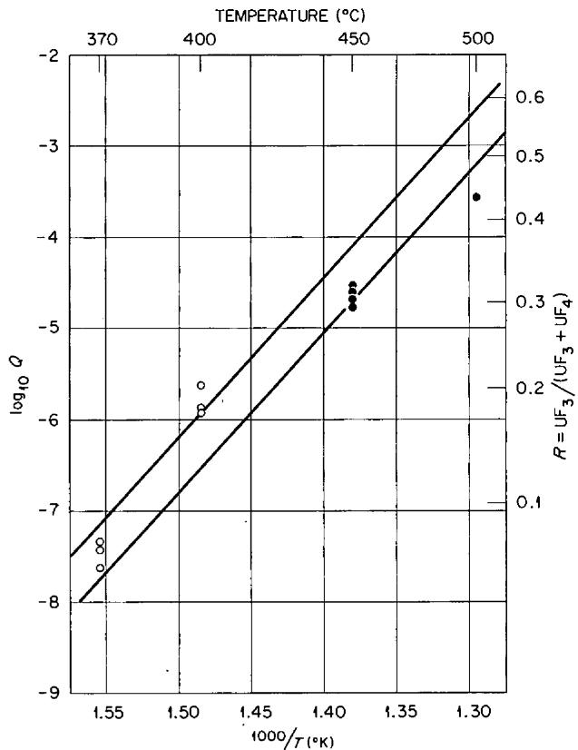  
Fig. 9.2. Equilibrium quotients vs temperature for the reaction $\mathrm{UC}_2 + 3\mathrm{UF}_4 \rightleftharpoons 4\mathrm{UF}_3 + 2\mathrm{C}$ in LiF-BeF $_2$ (48-52 mole%).

show definitely that $\mathrm{UF}_3$ is at least as stable as in the LiF-BeF $_2$ (66-34 mole %) plot of Fig. 9.1. A detailed log $Q$ vs $1 / T_{\mathrm{K}}$ plot for LiF-BeF $_2$ -ThF $_4$ (72-16-12 mole %) will be presented later. $^2$

# 9.2 EMF STUDIES OF OXIDE EQUILIBRIA IN MOLTEN FLUORIDES

R.G.Ross C.E.Bamberger C.F.Baes,Jr.

Oxide equilibrium studies have continued because of their relevance to MSBR fuel reprocessing development and to its oxide tolerance. Previously the solubility product for $\mathrm{ThO_2}$ has been estimated from $\mathrm{Pa}_2\mathrm{O}_5$ and $\mathrm{PaO_2}$ solubility measurements,7 and the solubility product for NiO has been estimated from measurements in LiF-BeF solutions.8 However, these estimates have not been corroborated by direct measurement.

D. D. Sood's9 attempts to determine the $\mathrm{ThO}_2$ solubility product by directly measuring the oxide in solution were not satisfactory because the oxide analyses had considerable scatter. It seemed desirable, therefore, to utilize a method not solely dependent on oxide analyses. Thus, we have initiated emf studies of the equilibrium

$$
\mathrm {T h O} _ {2} (\mathrm {c}) + \mathrm {N i F} _ {2} (\mathrm {d}) \rightleftharpoons \mathrm {T h F} _ {4} (\mathrm {d}) + \mathrm {N i O} (\mathrm {c}) \tag {1}
$$

in $\mathrm{LiF - BeF_2 - ThF_4}$ (initially 72-16-12 mole $\%$ ). Through a combination of the emf measurements and material balance we expect to obtain precise values for the solubility products of $\mathrm{ThO_2}$ and NiO in these melts. In addition, by varying the composition of the melt, we will obtain a measure of the activity coefficients of $\mathrm{Ni^{2 + }}$ and $\mathrm{Th}^{4 + }$ , which can be compared with previous estimates.10

The $\mathrm{NiF}_2$ concentration in these experiments is followed potentiometrically with a reference electrode designed by Bronstein and Manning. In this electrode, $\mathrm{Li}_2\mathrm{BeF}_4$ saturated with $\mathrm{NiF}_2$ is contained in a single-crystal $\mathrm{LaF}_3$ cup. Efforts to date have been primarily concerned with the design and assembly of equipment, development of analytical and handling techniques, the preparation of "oxide free" starting materials, and elimination of design inadequacies associated with the $\mathrm{LaF}_3$ reference electrode.

We have been able to prepare salt which, based on HF evolved during stripping after hydrofluorination and the equilibrium

$$
\mathrm {O H} ^ {-} + \mathrm {F} ^ {-} (\mathrm {d}) \rightleftharpoons \mathrm {O} ^ {2 -} (\mathrm {d}) + \mathrm {H F} (\mathrm {g}), \tag {2}
$$

contained 20 ppm oxide. A direct analysis (using a refined $\mathrm{KBrF_4}$ fusion method) gave an oxide concentration of $31\pm 3$ ppm. We feel that this is quite good agreement, particularly since the equilibrium quotient for the above reaction was estimated from a value for $\mathrm{Li}_2\mathrm{BeF}_4$ . In addition, it reflects our ability to avoid contamination of the samples in handling prior to analysis. The $\mathrm{LaF_3}$ reference electrode has been modified a number of times to eliminate problems such as crystal fracture, loss of electrode contact, creeping of salt, and shorting of insulators.

In the several runs to date, the initial potential has been stable and approximately the value we expected. As reliability of the electrode is demonstrated, measurement of equilibrium (1) will be completed, and emf measurements will be extended to other oxide-fluoride equilibria of the general type

$$
\begin{array}{l} \mathrm {M F} _ {x} (\mathrm {d}) + \frac {y}{2} \mathrm {N i O} (\mathrm {c}) \rightleftharpoons \mathrm {M O} _ {y / 2} (\mathrm {c}) \\ + \frac {x}{2} \mathrm {N i F} _ {2} (\mathrm {d}) + \frac {y - x}{2} \mathrm {N i} ^ {0} (\mathrm {c}), \\ \end{array}
$$

wherein the dissolved fluoride $\mathbf{MF}_x$ may be $\mathbf{U}\mathbf{F}_4$ , $\mathbf{ThF}_4$ , $\mathbf{ZrF}_4$ , $\mathbf{T_iF_4}$ , or $\mathbf{CrF}_2$ and the corresponding oxide is, respectively, $\mathbf{UO}_2$ , $\mathbf{ThO}_2$ , $\mathbf{ZrO}_2$ , $\mathbf{T_iO}_2$ , or $\mathbf{Cr}_2\mathbf{O}_3$ .

# 9.3 THE LITHIUM FLUORIDE-TETRAFLUOROBORATE PHASE DIAGRAM

A.S.Dworkin M.A.Bredig

Determination of this phase diagram rounded out the studies of the alkali metal fluoride-tetrafluoroborate binary systems at ORNL. A comparison of activity coefficients calculated from Fig. 9.3 with those for the sodium, potassium, and rubidium systems calculated by Moulton and Braunstein $^{12}$ shows an increasing positive deviation from ideality with decreasing cation size. At $1000^{\circ}\mathrm{K}$ and mole fraction $X_{\mathrm{BF}_4}^{-}$ of 0.2, 0.4, and 0.6, activity coefficients $\gamma_{\mathrm{LiF}}$ were 1.16, 1.32, and 1.40, while values of $\gamma_{\mathrm{NaF}}$ were 1.10, 1.20, and 1.23. The

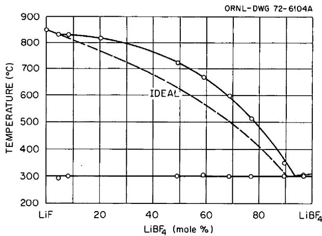  
Fig. 9.3. Phase diagram of the system LiF-LiBF $_4$ .

potassium system shows very slight positive deviation, while the rubidium system is essentially ideal. This trend most likely reflects the smaller distance and consequently greater multipole interaction between $\mathrm{BF}_4^-$ ions in the presence of smaller cations.

# 9.4 CHRONOPOTENTIOMETRY BASED ON DIFFUSION OF MOBILE NONELECTROACTIVE SPECIES

J.Braunstein H.R.Bronstein J.Truitt

It has previously been demonstrated that the electrical transference number of $\mathrm{Be(II)}$ relative to fluoride ion as the reference constituent is zero in molten LiF- $\mathrm{BeF}_2$ mixtures at compositions between 0.3 and 0.7 mole fraction $\mathrm{BeF}_2$ ,[13] and probably beyond. We have pointed out[14] that if alkali ions remain the sole current carriers (relative to fluoride) in these systems as the $\mathrm{BeF}_2$ content is increased (and the $\mathrm{BeF}_2$ network structure develops), a novel and potentially useful response to electrochemical scanning methods is expected. We also demonstrated the existence of a well-defined chronopotentiometric transition time for a beryllium metal anode in molten NaF- $\mathrm{BeF}_2$ (75 mole $\%$ $\mathrm{BeF}_2$ ) and interpreted it qualitatively as due to the formation of a nonconductive film of $\mathrm{BeF}_2$ at the electrode surface.[14]

We here present the results of a quantitative interpretation of the chronopotentiograms based on the diffusion of $\mathrm{BeF}_2$ formed at the beryllium electrode surface into the melt (interdiffusion of $\mathrm{BeF}_2$ and $\mathrm{BeF}_2$ -alkali fluoride mixtures).

The potential of a beryllium anode measured relative to a beryllium reference electrode in melt of uniform composition during a constant-current electrolysis rises sharply as it sees increasingly high $\mathrm{BeF}_2$ concentrations, the time required for the rise being governed by the current density and the interdiffusion of $\mathrm{BeF}_2$ and alkali fluoride. The reversible emf of the resulting concentration cell, I:

$$
\mathrm {B e} \left| \begin{array}{l l} \mathrm {B e F} _ {2} - \mathrm {M F} & \mathrm {B e F} _ {2} - \mathrm {M F} \\ y _ {0} & y _ {0} + \Delta y = y \end{array} \right| \mathrm {B e} \quad \mathrm {I}
$$

reference polarized electrode

is13

$$
2 F E = \int_ {y _ {0}} ^ {y} (t - t _ {\mathrm {B e} ^ {2 +}}) \frac {1 + y}{1 - y} \frac {\partial \mu_ {\mathrm {B e F} _ {2}}}{\partial y} d y. \tag {1}
$$

If $t_{\mathrm{Be}}$ is zero, the cell emf becomes

$$
\frac {2 F E}{R T} = \ln \frac {y}{(1 - y) ^ {2}} - \ln \frac {y _ {0}}{(1 - y _ {0}) ^ {2}} + \frac {2 F E ^ {\mathrm {E}}}{R T}. \tag {2a}
$$

In the above equation, $y$ and $\mu_{\mathrm{BeF}_2}$ are the mole fraction and chemical potential of $\mathrm{BeF}_2$ , $y_0$ is the initially uniform melt composition, and $t_\mathrm{Be}$ is the transference number of $\mathrm{Be(II)}$ . The first two terms on the right-hand side of (2a) give the "ideal" emf, and $E^{\mathbf{E}}$ is the "excess" cell emf, which can be calculated if the activity coefficients are known:

$$
\frac {2 F E ^ {\mathrm {E}}}{R T} = \int_ {y _ {0}} ^ {y} (1 - t _ {\mathrm {B e} ^ {2 +}}) \frac {1 + y}{1 - y} \frac {\mathrm {d} \ln \gamma_ {\mathrm {B e F} _ {2}}}{\mathrm {d} y} \mathrm {d} y. \quad (2 b)
$$

If only the alkali ions are mobile and carry electrical current by migration from the anode under the influence of the electric field, the Faradaic current can be sustained only by alkali ions that diffuse back to the anode. The situation is analogous to chronopotentiometry of a dilute electroactive constituent whose electrolysis product is soluble in the solution; however, the emf is given not by the Nernst equation, but by the expression for the binary molten salt concentration cell, Eq. (1) or (2). The solution of Fick's second law,

$$
\frac {\partial C _ {M ^ {+}}}{\partial t} = D \frac {\partial^ {2} C _ {M ^ {+}}}{\partial X ^ {2}},
$$

is subject to the usual initial condition

$$
\{t = 0 \} \rightarrow \left\{C _ {M ^ {+}} = C ^ {0} _ {M ^ {+}}, 0 <   X <   \infty \right\} \tag {i}
$$

(i.e., uniform concentration initially) and to the boundary conditions

$$
\{X = \infty \} \rightarrow \left\{C _ {\mathrm {M} ^ {+}} = C ^ {0} _ {\mathrm {M} ^ {+}}, 0 <   t <   \infty \right\} \tag {ii}
$$

[uniform (initial) concentration at infinite distance from the electrode] and

$$
\frac {i}{F A} = J _ {\mathrm {M} ^ {+}} \left| _ {X = 0} = - D \frac {\partial C _ {\mathrm {M}} ^ {+}}{\partial X} \right| _ {X = 0} \tag {iii}
$$

(electric current limited by back diffusion of mobile species). The third condition is unusual in that it is a consequence of depletion of a nonelectroactive constituent, alkali ion, by migration rather than the usual depletion of electroactive species by electrode reaction.

The solution of the diffusion equation with the above initial and boundary conditions is, however, formally identical with the solution for ordinary chronopotentiometry, and the concentration at the electrode surface15 is

$$
C _ {\mathrm {M F}} = C ^ {0} _ {\mathrm {M F}} - \alpha t ^ {1 / 2}, \tag {3}
$$

where $C^0$ and $C$ are the initial and the instantaneous concentrations at the electrode surface and

$$
\alpha = \frac {2}{\sqrt {\pi}} \frac {1 / A}{F \sqrt {D}}.
$$

The beryllium concentration at the electrode is, by stoichiometry,

$$
C _ {\mathrm {B e F} _ {2}} = C ^ {0} _ {\mathrm {B e F} _ {2}} + 2 \frac {\bar {V} _ {\mathrm {M F}}}{\bar {V} _ {\mathrm {B e F} _ {2}}} \alpha t ^ {1 / 2}. \tag {4}
$$

The concentrations are in equivalents per cubic centimeter, and the $\overline{V}$ are partial molal volumes.

The transition time resulting from setting $y = 1$ in Eq. (2) is identical with that of the Sand equation:

$$
\alpha \tau^ {1 / 2} = C ^ {0} _ {\mathrm {M F}} = \frac {1 - y _ {0}}{\bar {V} _ {\mathrm {M F}} + (\bar {V} _ {\mathrm {B e F} _ {2}} - \bar {V} _ {\mathrm {M F}}) y _ {0}}. \tag {5}
$$

The chronopotentiogram may be calculated, with the probably poor assumption for these melts of a concentration-independent diffusion coefficient, by combining Eqs. (2), (4), and (5), making use of the relations among the concentrations:

$$
C _ {\mathrm {B e F} _ {2}} = \frac {2 y}{\bar {V} _ {\mathrm {M F}} + (\bar {V} _ {\mathrm {B e F} _ {2}} - \bar {V} _ {\mathrm {M F}}) y} = \frac {2 y}{V _ {m}},
$$

$$
C _ {\mathrm {M F}} = \frac {1 - y}{V _ {m}}; \tag {6a}
$$

$$
\frac {2 F E ^ {\text {i d e a l}}}{R T} = \ln \frac {(1 - \bar {V} _ {\mathrm {M F}} C _ {\mathrm {M F}}) [ 1 + (\bar {V} _ {\mathrm {B e F} _ {2}} - \bar {V} _ {\mathrm {M F}}) C _ {\mathrm {M F}} ]}{(\bar {V} _ {\mathrm {B e F} _ {2}} C _ {\mathrm {M F}}) ^ {2}}
$$

$$
- \ln \frac {\left(1 - \bar {V} _ {\mathrm {M F}} C ^ {0} _ {\mathrm {M F}}\right) \left[ 1 + \left(\bar {V} _ {\mathrm {B}} - \bar {V} _ {\mathrm {M F}}\right) C ^ {0} _ {\mathrm {M F}} \right]}{\left[ \bar {V} _ {\mathrm {B e F} _ {2}} C ^ {0} _ {\mathrm {M F}} \right] ^ {2}}. \tag {6b}
$$

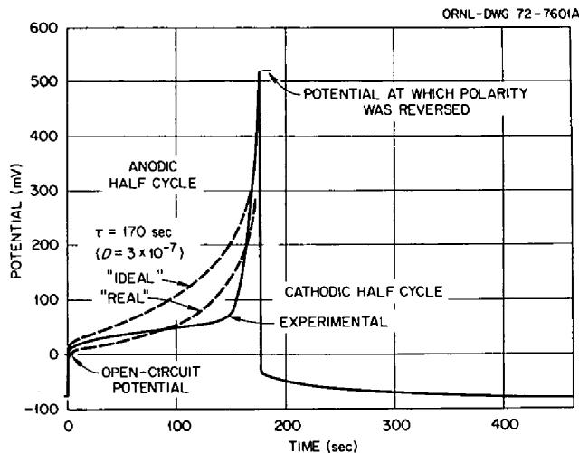  
Fig. 9.4. Chronopotentiogram in molten $\mathrm{NaF - BeF_2}$ (about 25-75 mole $\%$ ) at $520^{\circ}\mathrm{C}$ , current density about $40\mathrm{mA / cm}^2$ . Potential of beryllium working electrode, relative to a beryllium reference electrode, vs time. Dashed lines are calculated from the transition time $\tau = 170$ sec.

The excess emf for the system $\mathrm{NaF - BeF_2}$ was estimated from activity coefficient data in LiF-BeF $_2$ mixtures16 since extensive data for $\mathrm{NaF - BeF_2}$ are not available, leading to the estimate from Eq. (2b) and ref. 16:

$$
\frac {2 F E ^ {\mathrm {E}}}{R T} \cong - 3. 5 \left(y - y _ {0} + \ln \frac {y}{y _ {0}}\right). \tag {7}
$$

Figure 9.4 shows a typical chronopotentiogram, measured in $0.75\mathrm{BeF}_2 - 0.25\mathrm{NaF}$ , with "ideal" and "real" ones calculated from Eqs. (1), (2), and (3-7) for a transition time of 170 sec, leading to an average diffusion coefficient of $3 \times 10^{-7}$ .

Values of $i\tau^{1/2}$ were found essentially independent of current density in the range 20 to $100\mathrm{mA/cm^2}$ . This estimate of the diffusion coefficient is two orders of magnitude smaller than normal liquid diffusion coefficients and an order of magnitude smaller than values reported in a less viscous LiF-BeF $_2$ -ZrF $_4$ mixture. $^{17}$ The present results demonstrate that a transition time is predicted for nonelectroactive species at high concentration in molten salt mixtures and is observed experimentally. A corollary of these results is that special care

may be needed in interpreting electrochemical scanning data in mixed molten salt solvents approaching unicationic conduction.

Initial measurements with $\mathrm{LiF - BeF_2}$ mixtures (10-90 mole %) show the anticipated increase in transition time corresponding to the higher mobility of lithium ion. The measurements were made with an ORNL 2943 cyclic voltammeter, designed by T. R. Mueller,[18] the salts being contained in a nickel vessel in a controlled-atmosphere envelope that was heated in a controlled-temperature furnace.

Analogous equations may be developed for other molten salt systems, such as $\mathrm{AlCl}_3$ -MCl melts. The

analog of (1) and (2) for the emf of the concentration cell with aluminum electrodes is

$$
2 F E = \int_ {y _ {0}} ^ {y} (1 - t _ {\mathrm {A l}}) \frac {1 + 2 y}{1 - y} \frac {\partial \mu_ {\mathrm {A l C l} _ {3}}}{\partial y} d y,
$$

$$
\frac {2 F E ^ {\text {i d e a l}}}{R T} = \ln \frac {y}{(1 - y) ^ {3}} - \ln \frac {y _ {0}}{(1 - y _ {0}) ^ {2}}.
$$

# Part 3. Materials Development

H.E.McCoy

Our materials work is currently involved with several important areas including (1) gaining a better understanding of the intergranular cracking of Hastelloy N that occurred in the MSRE fuel system and a method of controlling this cracking in future reactors, (2) developing a graphite with improved dimensional stability under radiation, (3) development of surface sealing methods for reducing the permeability of graphite to $^{135}\mathrm{Xe}$ , (4) modification of the composition of Hastelloy N to obtain an alloy that is more resistant to neutron irradiation, (5) evaluation of Hastelloy N for use in steam generators, (6) construction of a molybdenum system for use with bismuth and fluoride salts, and (7) the evaluation of other materials for use as structural materials in the chemical processing plant.

The first area has continued to occupy a high priority, and a rather extensive program of laboratory tests has been pursued. The laboratory tests are directed at determining the cause of the cracking, the rate of progression with time and temperature, and a reasonable solution to the cracking problem. The emphasis is on the fission product tellurium, since considerable evidence exists that this element is the cause of the cracking.

The lifetime of a breeder core will be determined by the dimensional stability of the graphite. Dimensional changes can be accommodated to some extent, but volume expansion is usually accompanied by increasing permeability to xenon, which can become intolerable. Thus the problem of dimensional stability cannot be separated from the requirement of low permeability to $^{135}\mathrm{Xe}$ . We are evaluating graphites made by commercial vendors and locally in an effort to understand what types of graphite have the best dimensional

stability. This information is being fed back to commercial vendors and into our own experimental fabrication program. Pyrolytic carbon coatings derived from propene are currently being studied as a means of reducing the permeability to $^{135}\mathrm{Xe}$ . Improved methods of characterizing the coatings are being developed.

The program to develop a modified Hastelloy N with improved resistance to radiation indicated that alloys with additions of 1.5 to $2.0\%$ titanium were most promising, and recent efforts have concentrated on these. Material has been obtained from three vendors that has been made by two basic melting practices. The evaluation includes weldability tests, unirradiated mechanical property tests, and postirradiation mechanical property tests.

A corrosion facility in TVA's Bull Run Steam Plant is being used to evaluate the corrosion of Hastelloy N in steam. Both unstressed and stressed samples are included in the tests.

Most of the work on chemical processing materials is going into the construction of a reasonably complex test facility constructed of molybdenum. Many new techniques have been developed which overcome or circumvent the basic difficulties of molybdenum fabrication. (Welds in molybdenum are inherently brittle, and fabrication into large sizes is hampered by the need for high temperatures and large forces to fabricate large parts.) The mutual requirement of compatibility with bismuth and salt narrows the choice of materials for the processing plant, but our screening tests offer encouragement that besides molybdenum, both tantalum and graphite will be compatible. Experiments are being run to determine whether these materials can be used and under what operating conditions.

# 10. Intergranular Cracking of Structural Materials Exposed to Fuel Salt

H. E. McCoy

Examination of Hastelloy N from the MSRE revealed that all surfaces exposed to fuel salt had intergranular cracks to a depth of 1 to 13 mils. Some of the cracks were visible when the parts were removed from service, whereas others did not appear until after the parts were deformed. The existing evidence indicates that the cracking is likely due to the intergranular penetration of the fission product Te. Our experimental program has concentrated on the effects of Te, but some work is continuing on the effects of other fission products.

Our work involves (1) studies of alloys exposed to small amounts of various fission products, (2) studies of Hastelloy N containing small additions of fission products, (3) tube-burst and strain-cycle tests in salt of several alloys plated with Te, (4) creep tests of several materials in an Ar-Te environment, and (5) studies of the tendency of Te to produce cracks in several structural materials other than Hastelloy N. Our objectives are to determine the cause of the cracking; the dependence of the rate on temperature, time, and concentration; and a reasonable solution to the problem.

# 10.1 CRACKING OF SAMPLES ELECTROPLATED WITH TELLURIUM

H.E.McCoy B.McNabb

We have compared the susceptibilities of a wide variety of metals to cracking due to penetration by tellurium by electroplating tensile samples with tellurium, then annealing, straining, and examining them. Two different combinations of tellurium concentration and annealing conditions were tried. We used the method described in the last semiannual report1 to plate samples to nominal tellurium concentrations of $0.03\mathrm{mg/cm}^2$ ( $1.4 \times 10^{17}$ atoms/ $\mathrm{cm}^2$ ) and $0.1\mathrm{mg/cm}^2$ ( $4.7 \times 10^{17}$ atoms/ $\mathrm{cm}^2$ ). The materials included (1) standard and modified Hastelloy N; (2) Hastelloys B, C, X, S, and W; (3) Inconels 600, 601, and 718; (4) Incoloy 800; (5) stainless steel types 201, 304, 309, 310, 316, 321, 347, 406, 410, 446, 502, and 17-7 PH; (6) nickel; (7) copper; (8) Monel; and (9) cobalt-base Haynes alloys 188 and 25. Groups of samples were

encapsulated with an argon atmosphere in stainless steel; the first group, with $0.03\mathrm{mg / cm}^2$ of tellurium, was annealed for 1000 hr at $650^{\circ}\mathrm{C}$ , and the second group, with $0.1\mathrm{mg / cm}^2$ of tellurium, was annealed for 200 hr at $700^{\circ}\mathrm{C}$ . The samples were subsequently deformed at $25^{\circ}\mathrm{C}$ and sectioned for metallographic examination to determine whether intergranular cracking had occurred.

Standard Hastelloy N cracked intergranularly under both test conditions, as shown by the typical photomicrographs in Fig. 10.1. Pure Ni, Hastelloy B (1% Cr), and most of the modified compositions of Hastelloy N also formed intergranular cracks. Incoloy 800 (Fe-21% Cr-34% Ni) formed very shallow intergranular cracks. Generally, all of the nickel- and cobalt-base alloys with 15% or more Cr did not crack. Exceptions were Hastelloy W, with only 5% Cr, which did not crack, and Hastelloy S, with 15% Cr, which did crack. Armco iron and the numerous stainless steels in the experiment were free of cracks (Fig. 10.2). Copper and Monel (Ni-35% Cu) also did not crack (Fig. 10.3).

The heats of modified Hastelloy N that did not crack in this experiment offer encouragement that this alloy can be modified to resist intergranular cracking due to tellurium. Heats 70-727 (2.1% Ti), 72-503 (1.9% Ti), 70-786 (0.6% Nb, 0.8% Ti), 70-835 (2.6% Nb, 0.7% Ti), and 21543 (0.7% Nb) did not crack and offer strong evidence that Ti and Nb are beneficial in preventing cracking. These same elements improve the resistance of Hastelloy N to neutron irradiation.

# 10.2 INTERGRANULAR CRACKING OF SEVERAL ALLOYS WHEN EXPOSED TO TELLURIUM VAPOR

H. E. McCoy

As discussed previously, we observed that intergranular cracks are formed in Hastelloy N that has been exposed to Te vapor and strained.2 During this report period we have shown that the extent of the cracking depends on the concentration of Te, the temperature and duration of exposure, and the chemical composition of the alloy being exposed. In these experiments,

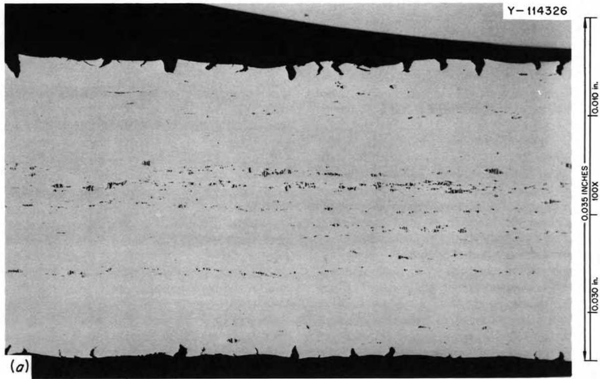

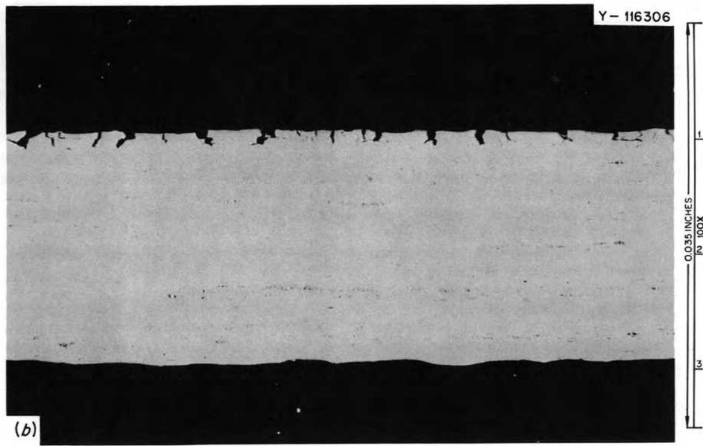  
Fig. 10.1. Hastelloy N (heat 5065) electroplated with tellurium and strained at $25^{\circ}\mathrm{C}$ . (a) Electroplated with $1.4 \times 10^{17}$ atoms/ $\mathrm{cm}^2$ of tellurium and annealed 1000 hr at $650^{\circ}\mathrm{C}$ . (b) Electroplated with $4.7 \times 10^{17}$ atoms/ $\mathrm{cm}^2$ of tellurium and annealed 200 hr at $700^{\circ}\mathrm{C}$ . As polished.

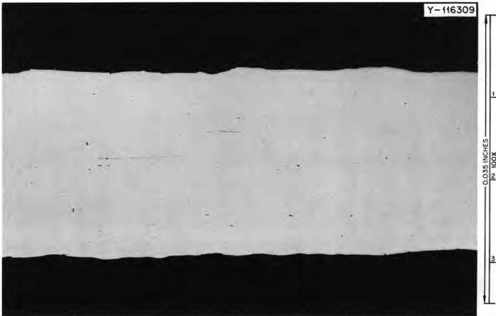  
Fig. 10.2. Type 304L stainless steel electroplated with $4.7 \times 10^{17}$ atoms/cm $^2$ of tellurium, annealed 200 hr at $700^{\circ}\mathrm{C}$ , and strained at $25^{\circ}\mathrm{C}$ . As polished.

tensile specimens were sealed in quartz ampuls, together with the amount of tellurium required to produce a desired surface concentration of tellurium on the specimens. When the ampuls were heated for annealing, the tellurium vaporized and transferred to the metal surfaces; in the discussion which follows it is the resulting surface concentration that is specified.

The effect of Te concentration on the severity of cracking in Hastelloy N at $650^{\circ}\mathrm{C}$ is shown in Fig. 10.4. These samples were exposed for 1000 hr at $650^{\circ}\mathrm{C}$ to Te concentrations ranging from 0.5 to $54 \times 10^{17}$ atoms/ cm $^2$ . The cracking became more severe as the concentration of tellurium was increased.

Samples of Hastelloy N were exposed to a Te concentration of $5.4 \times 10^{18}$ atoms/cm² for 1000 hr at 550, 650, and $700^{\circ}\mathrm{C}$ . The microstructures in Fig. 10.5 show that cracking became more severe as the exposure temperature was increased.

The progression of the cracking with time was followed by exposing samples at $700^{\circ}\mathrm{C}$ to $5.4 \times 10^{18}$ atoms/ $\mathrm{cm}^2$ of Te for 20, 48, 100, 500, and $1000\mathrm{hr}$ . The photomicrographs in Fig. 10.6 show that significant cracking occurred after only $20\mathrm{hr}$ of exposure.

Increased exposure time did increase the cracking severity.

In the foregoing experiments with Hastelloy N, we observed that the depth of cracking after $100\mathrm{hr}$ at $700^{\circ}\mathrm{C}$ was slightly greater than that after $1000\mathrm{hr}$ at $650^{\circ}\mathrm{C}$ . We therefore chose the shorter time period and higher temperature for screening tests of different alloys.

Alloy composition had a large effect on the resistance to cracking, and much of our testing was involved with investigating this variable. Type 304L stainless steel, Monel $(\mathrm{Ni}-35\% \mathrm{Cu})$ , Cr, Inconel 606 $(\mathrm{Ni}-20\% \mathrm{Cr}-3\% \mathrm{Mn}-2.5\% \mathrm{Nb}-0.6\% \mathrm{Ti})$ , and modified Hastelloy N $(\mathrm{Ni}-12\% \mathrm{Mo}-7\% \mathrm{Cr}-2.6\% \mathrm{Nb}-0.7\% \mathrm{Ti})$ resisted cracking under all test conditions. Several alloys resisted cracking in the presence of $5\times 10^{17}$ atoms/ $\mathrm{cm}^2$ of Te, but did crack some when exposed to $5\times 10^{18}$ atoms/ $\mathrm{cm}^2$ of Te. These included Hastelloy N modified with $0.75\%$ Ce, Hastelloy S $(\mathrm{Ni}-15\% \mathrm{Mo}-15\% \mathrm{Cr}-0.01\% \mathrm{La})$ , Inconel 600 $(\mathrm{Ni}-15\% \mathrm{Cr}-7\% \mathrm{Fe})$ , and Inconel 601 $(\mathrm{Ni}-23\% \mathrm{Cr}-14\% \mathrm{Fe}-1.4\% \mathrm{Al})$ . Incoloy 811E $(\mathrm{Fe}-32\% \mathrm{Ni}-21\% \mathrm{Cr}-2\% \mathrm{Al})$ did not crack at

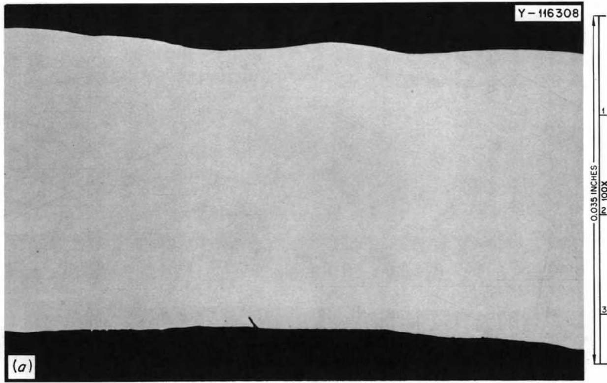

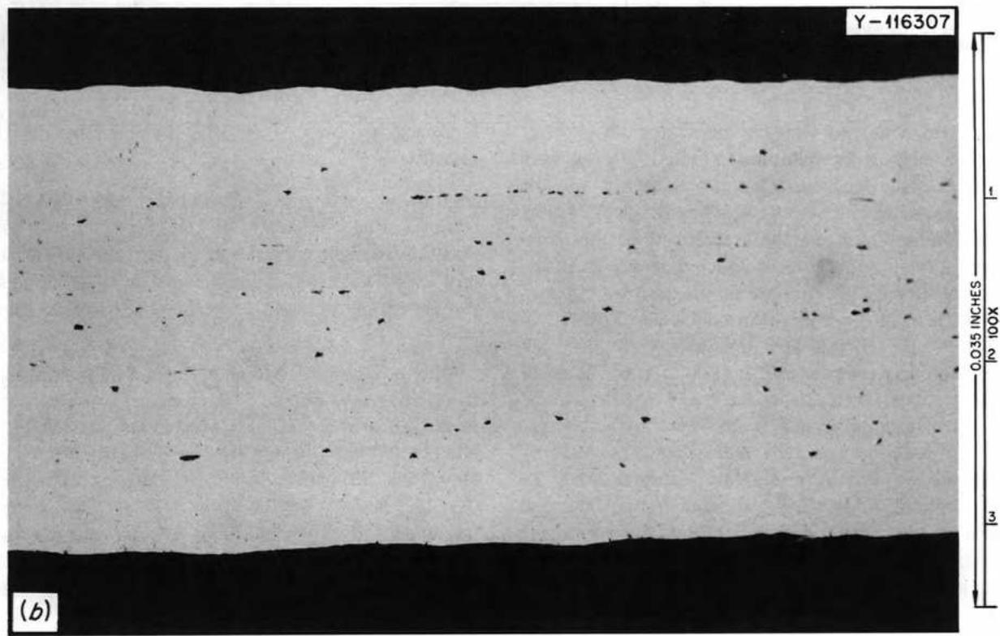  
Fig. 10.3. Materials electroplated with $4.7 \times 10^{17}$ atoms/cm $^2$ of tellurium, annealed 200 hr at $700^{\circ}\mathrm{C}$ , and strained at $25^{\circ}\mathrm{C}$ . (a) Copper. (b) Monel. As polished.

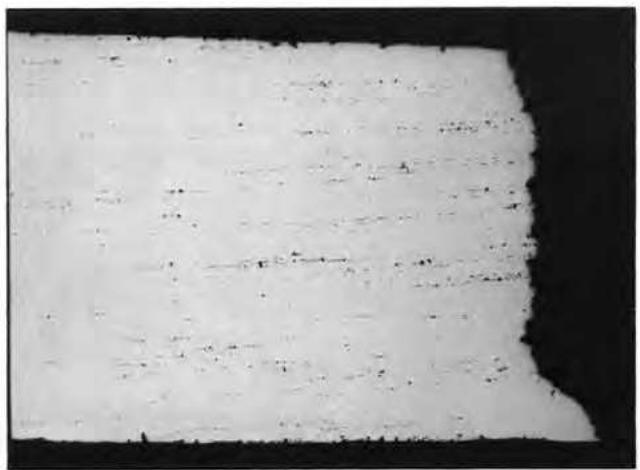  
0.5

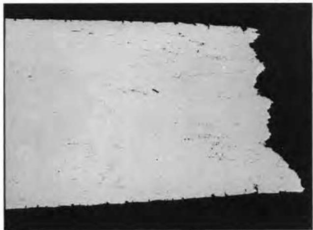  
1.6

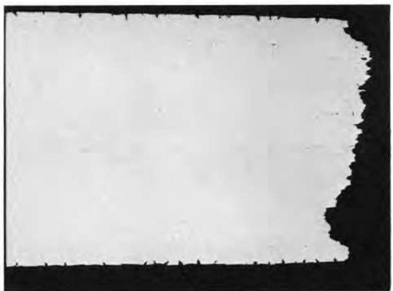  
5.4

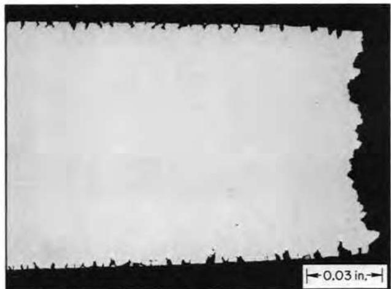  
54   
Fig. 10.4. Hastelloy N exposed to various concentrations of tellurium (expressed in atoms/cm² × 10¹⁷) for 1000 hr at 650°C and strained at 25°C.

the lower Te concentration, but has not been tested at the higher concentration.

These observations illustrate clearly the effects of the chemical composition of the alloy and the concentration of Te on the severity of cracking. The effect of Te concentration raises some questions about how well the type of test being run simulates reactor operation. An MSBR would produce a Te concentration of $2 \times 10^{19}$ atoms/cm $^2$ over a 30-year period. Although the maximum concentration of Te used in our tests was $5.4 \times 10^{18}$ atoms/cm $^2$ , the sample was exposed to this entire amount as the test was brought to temperature over a few hours. If we accept the model that Te diffuses selectively along the grain boundaries, the tendency to embrittle the boundary may be offset by the reaction

of the Te with some reactive element such as Cr or Ce in the alloy. The availability of these elements at the grain boundary depends upon diffusion, and a slower rate of introducing the Te would be less severe. Thus, our test conditions are likely more severe than those that would be encountered in an MSBR. Methods of adding the Te at a more reasonable rate are being investigated.

Chromium seems effective in reducing the cracking. On the other hand, since the dominant corrosion mechanism in fluoride salts containing U is the selective removal of Cr, the Cr concentration must be limited (to some yet undefined value) to limit the amount of corrosion. Tests are in progress to better define the minimum amount of Cr to prevent cracking and the

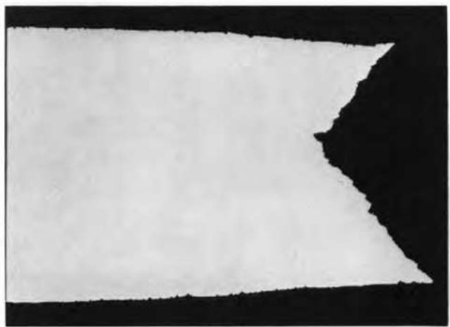  
550°C

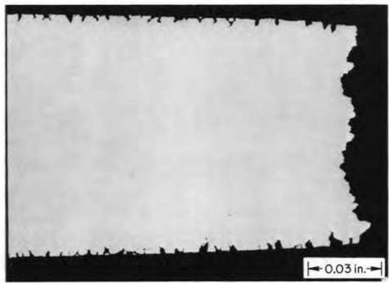  
$650^{\circ}C$

  
${700}^{ \circ  }\mathrm{C}$   
Fig. 10.5. Hastelloy N exposed to $5.4 \times 10^{18}$ atoms/cm $^2$ of tellurium for 1000 hr at various temperatures and strained at $25^{\circ}\mathrm{C}$ .

Table 10.1. Stress-rupture properties of several alloys at ${650}^{ \circ  }\mathrm{C}$   

<table><tr><td>Heat number</td><td>Stress (psi)</td><td>Rupture life (hr)</td><td>Rupture strain (%)</td><td>Basic alloy</td><td>Addition</td></tr><tr><td rowspan="3">351</td><td>47,000</td><td>59.1</td><td>11.2</td><td rowspan="3">Hastelloy N</td><td rowspan="3">None</td></tr><tr><td>40,000</td><td>198.5</td><td>9.5</td></tr><tr><td>30,000</td><td>1936.2</td><td>20.4</td></tr><tr><td rowspan="2">373</td><td>40,000</td><td>65.0</td><td>3.9</td><td rowspan="2">Hastelloy N</td><td rowspan="2">600 ppm Te</td></tr><tr><td>30,000</td><td>215.3</td><td>3.0</td></tr><tr><td rowspan="2">375</td><td>47,000</td><td>76.0</td><td>15.5</td><td rowspan="2">Hastelloy N</td><td rowspan="2">60 ppm Sr</td></tr><tr><td>40,000</td><td>141.8</td><td>13.6</td></tr><tr><td>374</td><td>20,000</td><td>15.5</td><td>9.5</td><td>Type 304 stainless steel</td><td>60 ppm Te</td></tr><tr><td>Standard stainless steela</td><td>20,000</td><td>366.6</td><td>17.5</td><td>Type 304 stainless steel</td><td>None</td></tr></table>

$^{a}$ E. E. Bloom, In-Reactor and Postirradiation Creep-Rupture Properties of Type 304 Stainless Steel at $650^{\circ}C$ , ORNL-TM-2130 (March 1968).

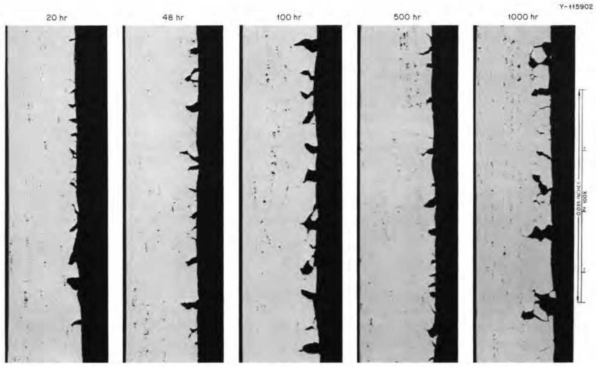  
Fig. 10.6. Hastelloy N exposed to $5.4 \times 10^{18}$ atoms/cm $^2$ of tellurium for various times at $700^{\circ}\mathrm{C}$ and strained at $25^{\circ}\mathrm{C}$ .

maximum amount that will result in an acceptable corrosion rate. The tests of various alloys indicate that other elements such as Al, Nb, and Ce may also be effective in preventing intergranular cracking.

# 10.3 MECHANICAL PROPERTIES OF STRUCTURAL MATERIALS CONTAINING STRONTIUM AND TELLURIUM

H.E.McCoy

Small heats of Hastelloy N were prepared that contained small additions of several fission products and sulfur. Creep tests at $650^{\circ}\mathrm{C}$ revealed that S, Se, and Te reduced the time to rupture at a given stress and the rupture strain. Four additional alloys were made and tested (1) to reproduce the detrimental effects of Te on Hastelloy N, (2) to determine whether Sr has detrimental effects on Hastelloy N, and (3) to determine whether Te has detrimental effects on stainless steel.

The results of limited mechanical property tests on these new alloys are given in Table 10.1. Alloy 351 was a laboratory melt of Hastelloy N without additions, and

the properties are included for comparison. Alloy 373 had an analyzed addition of $600~\mathrm{ppm}$ Te, and the detrimental effects on the rupture life and the fracture strain are quite large. Alloy 375 contained $60~\mathrm{ppm}$ Sr, and the properties are about equivalent to those of alloy 351 without any addition. Thus, Sr at this concentration does not appear to be detrimental. Heat 374 is a laboratory melt of type 304 stainless steel with an addition of $60~\mathrm{ppm}$ Te. The heat without a Te addition was not completed, so a value from the literature for type 304 stainless steel is included in Table 10.1 for comparison. Based on this comparison, Te appears to reduce the rupture life and strain of type 304 stainless steel. This is not a firm conclusion, however, since the literature value is for commercial material and the validity of the comparison is questionable.

# 10.4 THE ISOTHERMAL DIFFUSION OF $^{127}\mathrm{Te}$ TRACER IN HASTELELOY N, Ni-200, AND TYPE 304L STAINLESS STEEL SPECIMENS

P. T. Carlson

L.C.Manley

H. E. McCoy

R.A.Padgett

B. McNabb

The evidence cited in the preceding sections strongly indicates that tellurium is the cause of intergranular cracking in Hastelloy N and that the depth of embrittlement is dependent upon the diffusion rate of tellurium into the metal, particularly along the grain boundaries. Similar cracking has been produced in Ni-200 by exposure to tellurium, but type 304L stainless steel has resisted embrittlement. One possible explanation of the differences among alloys could be the Te diffusion rate. To test this hypothesis, we have measured the diffusion rates of tellurium in Hastelloy N, Ni-200, and type 304L stainless steel at 650 and $760^{\circ}\mathrm{C}$ . Generally, the experiment consisted in electroplating ${}^{127}\mathrm{Te}$ on the flat surfaces of samples of each material, annealing the samples for various lengths of time to obtain penetration, removing successive layers from each sample by abrasion, measuring the ${}^{127}\mathrm{Te}$ activity of the removed material, plotting the penetration profiles, and analytically determining the volume and grain boundary diffusion coefficients. In some cases the annealing conditions did not give sufficient penetration to determine these coefficients very accurately.

The specimens were 1-in.-long right circular cylinders. One-half of each specimen was $\frac{1}{2}$ in. in diameter, and the remainder was $\frac{3}{4}$ in. in diameter. The circular face of the $\frac{3}{4}$ -in.-diam end of the cylinder was plated with the radioactive tracer and was the surface from which diffusion occurred. The samples were sealed in quartz under vacuum and heated slowly to the diffusion anneal temperature. One set was annealed for $1000 \, \text{hr}$ , another for $3000 \, \text{hr}$ , and a third set of samples is still being annealed, with a target time of $10,000 \, \text{hr}$ . After being annealed, samples were broken out of the quartz and decontaminated sufficiently to be sectioned. Prior to sectioning, the diameter of the $\frac{3}{4}$ -in. end was reduced to $\frac{1}{2}$ in. to eliminate the effects of surface diffusion.

Sectioning was accomplished by hand grinding the specimens on silicon carbide metallographic papers. Six-hundred-grit papers were used to obtain thin sections and 320-grit papers to obtain coarse sections. Straight-line strokes were used on a marked area of the silicon carbide paper, with the specimen rotated $90^{\circ}$ after each five strokes to provide visual indication that the sectioning was proceeding parallel to the original surface. After each section was taken, the

specimen was cleaned with tissue dampened with acetone. The cleansing tissue together with the marked area of the metallographic paper were then enclosed in a packet for gamma counting. Section thicknesses were calculated from the measured weight difference of the specimen before and after the grinding of each section and the known cross-sectional area and density of the material. The activity of $^{127}\mathrm{Te}$ in each section was determined by gamma counting using a scintillation spectrometer with a multichannel pulse-height analyzer and a $3\times 3$ in. $\mathrm{NaI(Tl)}$ scintillation crystal enclosed in a lead shield.

The volume diffusion coefficients $D_{\nu}$ were obtained from the first linear portion of each plot of $\ln A$ vs $x^{2}$ , using the standard thin-film solution to Fick's second law for diffusion. (A is the activity and is proportional to the Te concentration, and $x$ is the distance from the surface.) The product of the grain boundary width $\delta$ and the grain boundary diffusion coefficient $D_{\mathrm{gb}}$ was determined from the second linear portion of each plot of $\ln c$ vs $x^{6/5}$ using a form of Whipple's solution for grain boundary diffusion. The appropriate relation is

$$
\begin{array}{l} \delta D _ {\mathrm {g b}} = \left(\frac {\partial \ln c}{\partial x ^ {6 / 5}}\right) ^ {- 5 / 3} \left(\frac {4 D}{t}\right) ^ {1 / 2} \\ \times \left[ \frac {\partial \ln c}{\partial (\eta \beta^ {- 1 / 2}) ^ {6 / 5}} \right] ^ {5 / 3}, \tag {1} \\ \end{array}
$$

where

$$
\beta = \left(\frac {D _ {\mathrm {g b}}}{D _ {\mathrm {v}}} - 1\right) \frac {\partial}{\sqrt {D _ {\mathrm {v}} t}} \tag {2}
$$

and

$$
\eta = x / \sqrt {D _ {\mathrm {v}} t}. \tag {3}
$$

The volume and grain boundary diffusion coefficients are presented in Table 10.2 together with the appropriate diffusion anneal information. In addition, the last two columns give the depth to which the volume diffusion region was seen to extend (Harrison's type A region) and the maximum detectable penetration of the tracer.

Table 10.2. Diffusion of tellurium into several alloys   

<table><tr><td>Sample number</td><td>Alloy</td><td>Anneal time (hr)</td><td>Anneal temperature (°C)</td><td>\(D_{\mathrm{v}}\) (cm2/sec)</td><td>\(\delta D_{\mathrm{gb}}\) (cm3/sec)</td><td>Extent of volume region (μ)</td><td>Penetration (μ)</td></tr><tr><td>\(32^{a}\)</td><td>Ni-200</td><td>3000</td><td>650</td><td>\(4.52 \times 10^{-13}\)</td><td>\(9.92 \times 10^{-16}\)</td><td>20</td><td>210</td></tr><tr><td>34</td><td>Ni-200</td><td>3000</td><td>760</td><td>\(1.11 \times 10^{-12}\)</td><td>\(5.80 \times 10^{-15}\)</td><td>48</td><td>220</td></tr><tr><td>\(37^{b}\)</td><td>Type 304L stainless steel</td><td>1000</td><td>650</td><td>\(8.67 \times 10^{-16}\)</td><td>\(9.70 \times 10^{-15}\)</td><td>2</td><td>32</td></tr><tr><td>40</td><td>Type 304L stainless steel</td><td>3000</td><td>650</td><td>\(1.23 \times 10^{-15}\)</td><td>\(1.0 \times 10^{-16}\)</td><td>5</td><td>18</td></tr><tr><td>42</td><td>Type 304L stainless steel</td><td>3000</td><td>760</td><td>\(2.68 \times 10^{-15}\)</td><td>\(8.03 \times 10^{-17}\)</td><td>6</td><td>36</td></tr><tr><td>\(2^{b}\)</td><td>Hastelloy N</td><td>1000</td><td>650</td><td>\(1.12 \times 10^{-14}\)</td><td>\(8.81 \times 10^{-17}\)</td><td>7</td><td>37</td></tr><tr><td>3</td><td>Hastelloy N</td><td>1000</td><td>760</td><td>\(1.06 \times 10^{-14}\)</td><td>\(4.61 \times 10^{-16}\)</td><td>8</td><td>68</td></tr><tr><td>9</td><td>Hastelloy N</td><td>3000</td><td>650</td><td>\(2.11 \times 10^{-16}\)</td><td>\(8.42 \times 10^{-17}\)</td><td>3</td><td>28</td></tr><tr><td>10</td><td>Hastelloy N</td><td>3000</td><td>760</td><td>\(1.01 \times 10^{-14}\)</td><td>\(1.18 \times 10^{-16}\)</td><td>6</td><td>44</td></tr></table>

${}^{a}$ No confidence in ${D}_{\mathbf{v}}$ value because of irregularity in specimen surface.   
$b$ Time and temperature of anneal insufficient to yield accurate volume diffusion coefficients with sectioning method used.

Harrison's types A, B, and C regions were observed in nearly all the samples examined, and the volume diffusion coefficients $D_{\mathrm{v}}$ and the grain boundary values $\delta D_{\mathrm{gb}}$ were determined from regions A and C respectively. It should be noted that the annealing times at the chosen temperatures were too brief to allow accurate determination of volume diffusion coefficients by the serial grinding sectioning method used. As can be seen in Table 10.2, the volume diffusion region in all cases except those for Ni-200 specimens extended to less than $10~\mu \mathrm{m}$ . The newly developed rf sputtering technique, which is designed for removal of precise, ultra-thin layers, could not be employed on these specimens due to their size and geometry. With specimens of proper size sectioned by sputtering, it should be possible to obtain more reliable volume diffusion coefficients within the anneal times and temperatures used in this study.

Some specimens were found to have an oxide layer and scratches on the surface. It is not known whether these conditions existed prior to the diffusion anneal or whether they occurred as a result of handling after the anneal. If they were present prior to the anneal, the volume diffusion process and the calculated $D_{\mathbf{v}}$ values could be seriously affected. One specimen (No. 32) had a concave surface, which resulted in the first six sections being incomplete. Naturally, a minimum degree of confidence should be placed in the $D_{\mathbf{v}}$ values obtained from this sample. Furthermore, the $\delta D_{\mathrm{gb}}$ values reported in Table 10.2 share the same degree of accuracy, since they have been calculated from the $D_{\mathbf{v}}$ values [see Eqs. (1) to (3)].

The data in Table 10.2 show clearly that tellurium diffuses into Ni-200 most rapidly, into Hastelloy N less rapidly, and into type 304L stainless steel least rapidly. The shallow penetration of tellurium into stainless steel may account for this material being resistant to cracking.

# 10.5 TUBE-BURST EXPERIMENTS

H. E. McCoy J. W. Chumley E. J. Lawrence

The influence of stress on the rate of crack propagation in structural materials in the presence of tellurium is a matter of concern in reactor design. One type of test being used to study this effect is tube-burst tests in which specimens electroplated with $5 \times 10^{17}$ atoms/ $\mathrm{cm}^2$ of tellurium are compared with unplated specimens. Some are immersed in salt while being stressed; others are stressed in helium. The tests were all run at $650^{\circ}\mathrm{C}$ , and the salt composition was $\mathrm{LiF - BeF_2 - ZrF_4 - UF_4}$ (65.4-29.1-5.0-0.5 mole%).

Results for Hastelloy N described previously showed that tubes plated with tellurium failed more quickly than those without tellurium. Metallographic examination showed that numerous intergranular cracks formed that penetrated about halfway through the 0.020-in. tube wall. Recent posttest dimensional measurements have shown that the uniform diametral strains were reduced by the presence of tellurium (Fig. 10.7). Thus,

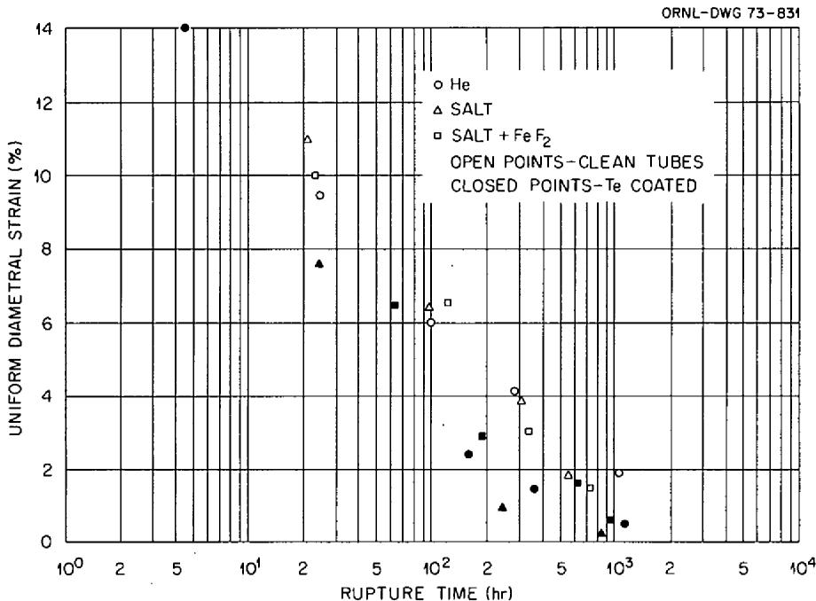  
Fig. 10.7. Uniform strains of Hastelloy N tubes stressed at $650^{\circ}\mathrm{C}$ .

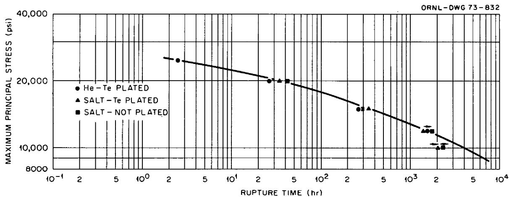  
Fig. 10.8. Stress-rupture properties of type 304L stainless steel tubes stressed at $650^{\circ}\mathrm{C}$ .

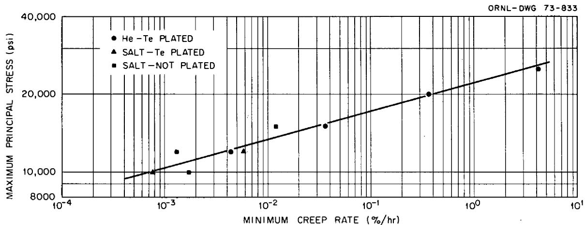  
Fig. 10.9. Creep properties of type 304L stainless steel stressed at $650^{\circ}\mathrm{C}$ .

stress does accelerate the rate of crack propagation in Hastelloy N with resultant reductions in rupture life and strain.

Several tube-burst tests have been run on type 304L stainless steel to determine whether tellurium has a deleterious effect on crack propagation in stressed specimens of this material. Three groups of four tubes each were run under the conditions of (1) tellurium-plated and stressed in a helium environment, (2) tellurium-plated and tested in a salt environment, and (3) not plated and tested in a salt environment.

The stress-rupture properties of the type 304L stainless steel samples are shown in Fig. 10.8. There is no detectable effect of test environment on this property. The uniform strains were divided by the rupture time to obtain an apparent minimum creep rate. As shown in

Fig. 10.9, this parameter also did not appear to be influenced by the test environment. It should be noted, however, that the uniform strain determinations on these specimens involve considerable uncertainty because of the large deformations that occurred. Often tube samples will uniformly deform to some diameter before some region becomes unstable and fractures. In this case most of the tube will have a uniform diameter, with only a small region near the fracture having a larger diameter. In other cases the strain may occur nonuniformly with the tube having several enlarged regions so that the uniform strain is difficult to define. Type 304L stainless steel has the latter type of behavior; hence the creep rate values in Fig. 10.9 and the uniform strain values in Fig. 10.10 are not very accurate.

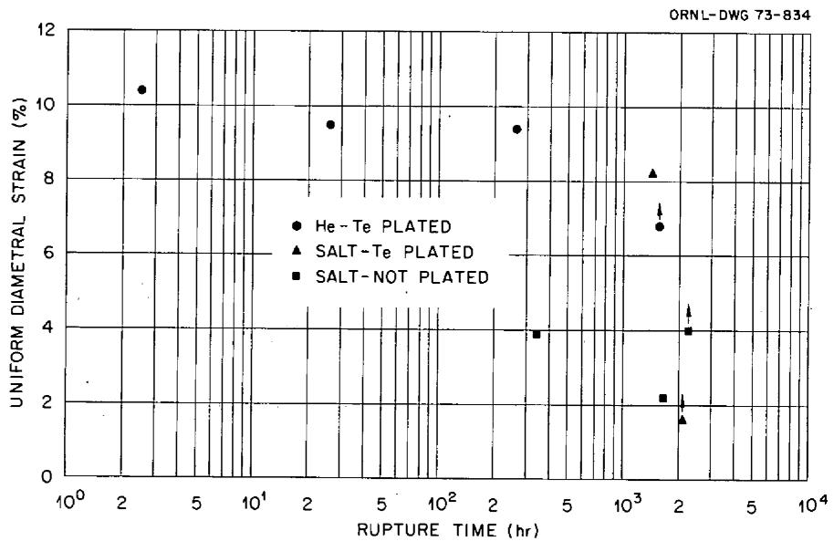

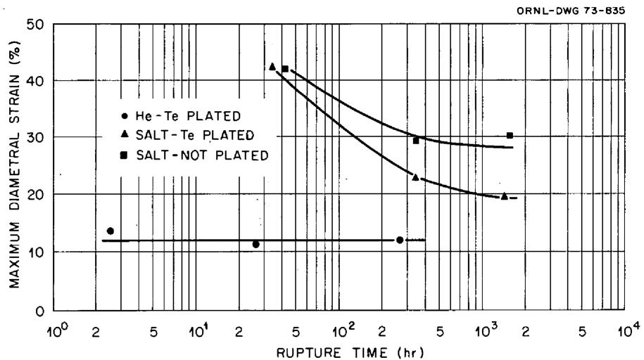  
Fig. 10.10. Variation of uniform diametral strain with rupture life for type 304L stainless steel tubes tested at $650^{\circ}\mathrm{C}$ .   
Fig. 10.11. Variation of maximum diametral strain with rupture life for type 304L stainless steel tubes tested at $650^{\circ}\mathrm{C}$ .

The maximum diametral strains for the type 304L stainless steel specimens are shown in Fig. 10.11. The tubes tested in helium had significantly lower maximum fracture strains than the tubes tested in salt. It appears that there may also be a significant difference between the tubes plated with tellurium and those not plated, but the data are too limited to support this as a firm conclusion.

Sections of each tube were examined metallographically. A photomicrograph of a tellurium-plated sample tested in helium is shown in Fig. 10.12. Although numerous intergranular cracks formed in this sample, there were not as many as in the sample shown in Fig. 10.13 that was tested in salt without tellurium present. This implies that some factor other than Te may have been responsible for the cracks in the sample tested in helium. Some oxidation obviously occurred on the surfaces of this sample due to impurities in the helium (Fig. 10.12). All of the samples tested in salt experienced considerable corrosion, resulting in the formation of intergranular voids that linked together to form

cracks. The amount of cracking was equivalent in samples not plated with tellurium (Fig. 10.13) and those that were plated (Fig. 10.14).

The foregoing observations lead us to conclude that tellurium does not accelerate intergranular cracking in type 304L stainless steel. There was considerable corrosion in the salt that may have been worsened by the presence of impurities.

Tests are also in progress on tellurium-plated specimens of Inconel 600 $(\mathrm{Ni}-15\% \mathrm{Cr}-7\% \mathrm{Fe})$ and Incoloy 811E $(\mathrm{Fe}-30\% \mathrm{Ni}-21\% \mathrm{Cr}-2\% \mathrm{Al})$ . The stress-rupture properties of these materials along with those of type 304L stainless steel and Hastelloy N are shown in Fig. 10.15. There does not seem to be any progressive deterioration of the properties of Inconel 600 and Incoloy 811E with increasing rupture time (as seems to be the case for Hastelloy N), but the effects of tellurium on these materials cannot be fully assessed until the tests are completed and the samples examined metallographically.

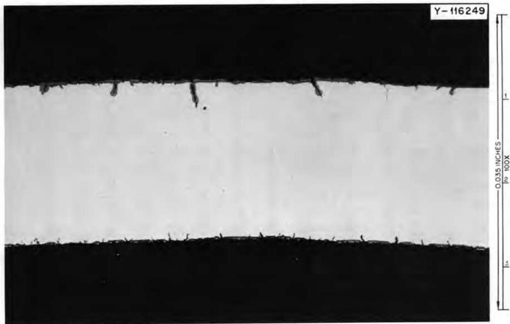  
Fig. 10.12. Photomicrograph of a section of type 304L stainless steel tube electroplated with $0.1\mathrm{mg/cm}^2$ of tellurium and stressed at 12,000 psi and $650^{\circ}\mathrm{C}$ in helium. Discontinued after 1570.8 hr with $6.8\%$ uniform strain. The outside diameter of the tube is on top of the photomicrograph. As polished.

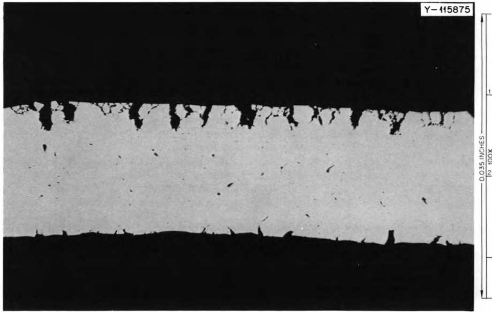  
Fig. 10.13. Photomicrograph of a section of type 304L stainless steel tube stressed at 12,000 psi and $650^{\circ}\mathrm{C}$ in salt. Failed after 1663.9 hr with $2.1\%$ uniform strain. The outside diameter of the tube is on top of the photomicrograph. As polished.

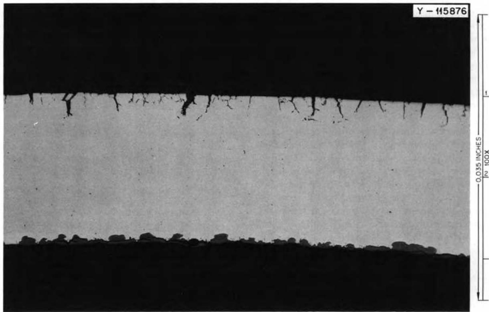  
Fig. 10.14. Photomicrograph of a section of type 304L stainless steel tube electroplated with $0.1\mathrm{mg/cm}^2$ of tellurium and stressed at 12,000 psi and $650^{\circ}\mathrm{C}$ in salt. Failed after 1415.6 hr with $8.2\%$ uniform strain. The outside diameter of the tube is on top of the photmicrograph. As polished.

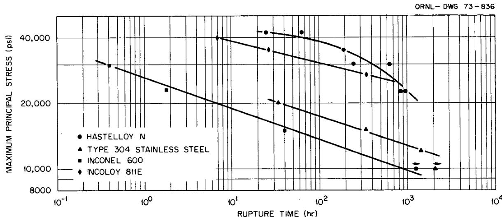  
Fig. 10.15. Stress-rupture properties of several materials electroplated with $0.1\mathrm{mg/cm}^2$ of tellurium and stressed at $650^{\circ}\mathrm{C}$ in salt.

# 10.6 STRAIN CYCLE EXPERIMENTS

H.E.McCoy K.W.Boling J.C.Feltner

Heat exchangers normally involve two fluids at different temperatures, and transients in operation can lead to large thermal stresses and strains. These severe operating conditions and the relatively thin-walled tubes involved make the primary heat exchanger of a molten-salt reactor particularly susceptible to failure from the intergranular penetration of fission products. The design criterion for the reference MSBR heat exchanger is a strain range of $0.3\%$ for $10^{4}$ cycles.[10] We have initiated a program to determine the properties of materials under cyclic strain conditions in a salt environment with tellurium present.

Sufficient work was done previously to show that the ability of a material to withstand thermal strains can be approached experimentally in terms of either mechanical or thermal strain cycling. Both types of test data can be expressed in terms of a total strain range consisting of elastic and plastic components and the number of cycles required to cause failure under these test conditions. Because of relative experimental simplicity, we have chosen the mechanical strain cycling approach.

The mechanical strain cycling equipment that we have designed and fabricated is shown in Fig. 10.16. The test sample is tubular with a diameter of about 1 in. and a gage section 1 in. long with a 0.030-in.-thick wall. The top of the sample is welded to a tubular support, and the bottom is welded to a rod that passes up through

the test sample and the tubular support to the piston. The force for cycling is generated by alternately pressurizing the two sides of the piston, and the magnitude of the force is controlled by the air pressure and measured by the load cell. The strain is measured by extension rods that are attached to the sample just outside the gage section. There are four extension rods on the extensometer; a pair from the top and bottom of the sample is used to measure strain in the compressive direction, and the other pair is used for measurements in the tensile direction. Small microswitches and adjustable micrometers are attached to these rods to limit the strain in a given direction. A control circuit is used to obtain the desired cyclic action. The top of the piston is pressurized, and the sample strains in tension until the limit switch is closed. The pressure is then bled off the top of the piston and the bottom pressurized. The pressure is sustained until the sample strains the desired amount in compression. The pressure is then bled off the bottom side of the piston and the top pressurized to begin a new cycle.

The sample can be plated with tellurium after it is welded in place but before it is assembled into the test apparatus. The lower test chamber is sealed so that it can be filled with salt and a helium cover gas maintained. The inside of the sample is pressurized with about 10 psig of helium to detect propagation of the first crack through the sample wall.

Although this test concept is not new, we have made several changes and improvements. The initial tests were accompanied by numerous experimental difficulties, which included a poorly functioning pressure valve,

solenoid valves that leaked, movement of the extensometer on the specimen, self-welding of the extensometer attachment set screws, impact loading of the sample, shorting out of the level indicator, stress concentration due to the specimen design, and changes in ambient temperature. All of these problems have been dealt with adequately except the changes in ambient temperature and the specimen design. The total movement being controlled is only 0.0032 in., and very small shifts in temperature can cause the dimensions to change by this amount. The specimen design

was changed to reduce the buckling tendencies, but the stress concentration at the end of the gage section still caused all failures to occur at this location.

The test can be run in several ways. The variables that can be controlled are time (or cycle frequency), stress, and strain. Thus, the stress and cycle frequency could be fixed and the resultant strain and the number of cycles to failure measured. If the sample strain hardened, the strain would become progressively less. If the strength were different in tension and compression, the sample would become progressively longer or shorter.

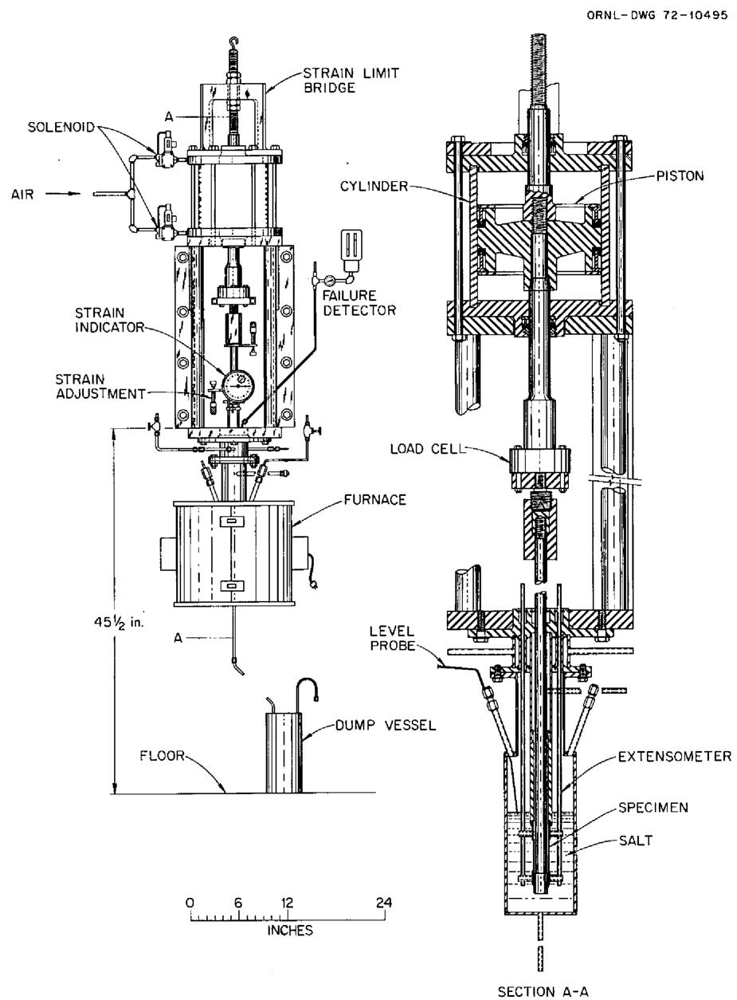  
Fig. 10.16. Schematic drawing of strain cycle equipment.

Another test would be to fix the strain limits and the frequency. This would require that the pressure (or stress) be adjusted progressively to account for changes in the material properties. A third mode, and the one that we plan to use, is to fix the stress and strain limits

and let the frequency vary. This requires that the stress level and the strain limits be chosen so that a reasonable cycle frequency (a few minutes to a few hours) results.

The tests run to date are summarized in Table 10.3. The test results have become more reliable as we have

Table 10.3. Summary of strain cycle tests at ${700}^{ \circ  }\mathrm{C}$ on several alloys   

<table><tr><td>Test number</td><td>Material</td><td>Condition</td><td>Test conditions</td><td>Cycles to failure</td></tr><tr><td>103</td><td>Hastelloy N</td><td>No tellurium</td><td>Fixed frequency of 1 hr/cycle, 35,100 psi</td><td>870</td></tr><tr><td>101</td><td>Hastelloy N</td><td>No tellurium</td><td>Fixed frequency of 1 hr/cycle, 38,700 psi</td><td>178</td></tr><tr><td>104</td><td>Hastelloy N</td><td>No tellurium</td><td>Strain range of 0.32%</td><td>\( 215^a \)</td></tr><tr><td>102</td><td>Hastelloy N</td><td>Tellurium (1 mg/cm2)</td><td>Strain range of 0.32%</td><td>472</td></tr><tr><td>202</td><td>Type 304L stainless steel</td><td>No tellurium</td><td>Strain range of 0.32%</td><td>\( 757^a \)</td></tr><tr><td>204</td><td>Type 304L stainless steel</td><td>Tellurium (1 mg/cm2)</td><td>Strain range of 0.32%</td><td>974</td></tr><tr><td>301</td><td>Inconel 600</td><td>Tellurium (1 mg/cm2)</td><td>Fixed frequency of 1 hr/cycle, 26,400 psi</td><td>68.5</td></tr></table>

${}^{a}$ Test in progress.

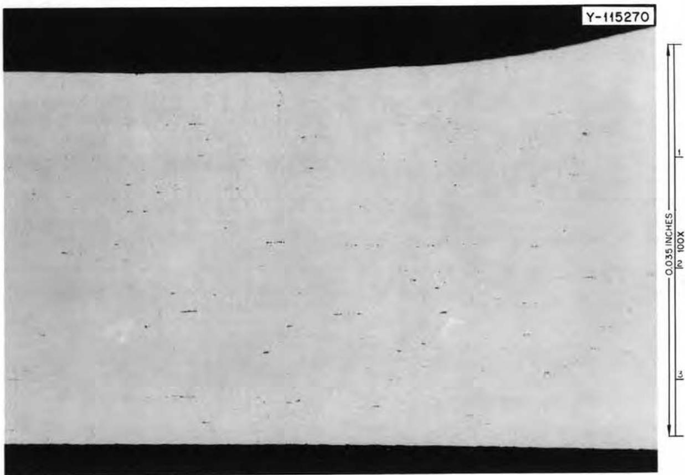  
Fig. 10.17. Strain cycle specimen 101. Hastelloy N without tellurium plating that was exposed to 178 cycles at a stress level of 38,700 psi and a frequency of 1 cycle per hour. Outside surface (at top of photomicrograph) was exposed to salt. As polished.

corrected the problems mentioned previously. The metallographic observations are probably the most significant results to date.

Three Hastelloy N samples have been examined. The two samples tested without tellurium plating are shown in Figs. 10.17 and 10.18. Only a few intergranular cracks were present near the fracture, and the intergranular cracking did not extend down the gage section of the specimen. One Hastelloy N specimen (Fig. 10.19) that had been plated with $1\mathrm{mg/cm}^2$ ( $5 \times 10^{18}$ atoms/ $\mathrm{cm}^2$ ) of tellurium was examined. Intergranular cracks were formed along the entire gage length of the sample.

One stainless steel sample that was plated with tellurium has been examined. The microstructure shown in Fig. 10.20 reveals some general surface attack with shallow intergranular penetration. It is not possible to conclude whether the intergranular cracking is associated with salt corrosion or the presence of the tellurium. One Inconel 600 sample that was plated with tellurium was examined (Fig. 10.21). The surface of this specimen had intergranular cracks along the entire gage length.

# 10.7 IDENTIFICATION OF REACTION PRODUCTS FROM TELLURIUM-STRUCTURAL-MATERIAL INTERACTIONS

R.E.Gehlbach Helen Henson

Our investigations of the problem of fission-product-induced edge cracking of Hastelloy N are directed at understanding the nature of interactions between Te and Hastelloy N at elevated temperatures. Since many nickel-base alloys do not suffer the edge cracking reproduced in Hastelloy N after exposure to Te (Sect. 10.1), it is possible that in these alloys Te may be tied up in a stable, relatively innocuous compound. We are currently identifying the reaction products which are formed when various structural materials are exposed to tellurium at elevated temperatures. The emphasis is being placed on Hastelloy N of the MSRE type, although we are also examining various other types of Hastelloy N, Inconel 600, and Ni-200. Unirradiated specimens have been exposed to Te by electroplating, vapor deposition, creep testing in an argon environment with a partial pressure of Te, and Knudsen-effusion

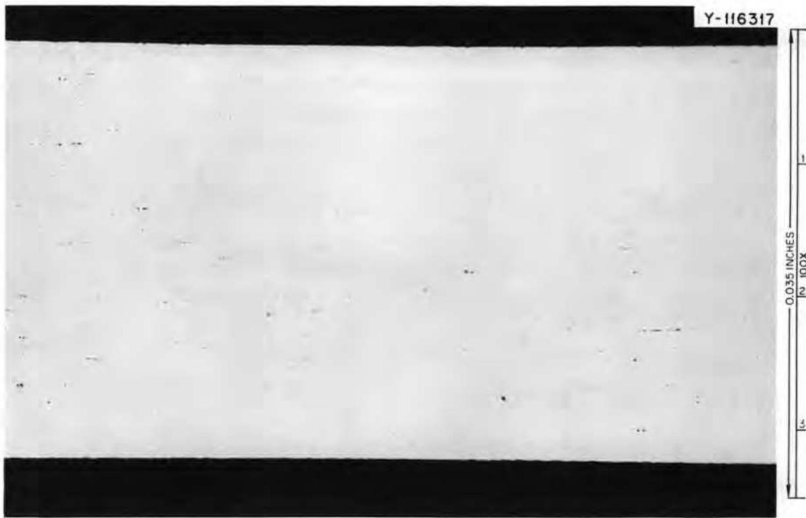  
Fig. 10.18. Strain cycle specimen 103. Hastelloy N without tellurium plating that was exposed to 870 cycles at a stress of 35,100 psi and a frequency of 1 cycle per hour. Outside surface (at top of photomicrograph) was exposed to salt. As polished.

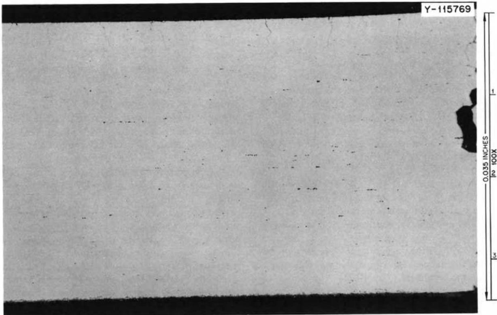  
Fig. 10.19. Strain cycle specimen 102. Hastelloy N plated with $1\mathrm{mg/cm}^2$ of tellurium and exposed to 472 cycles at a strain range of $0.32\%$ . Outside surface (top of photomicrograph) was exposed to salt. As polished.

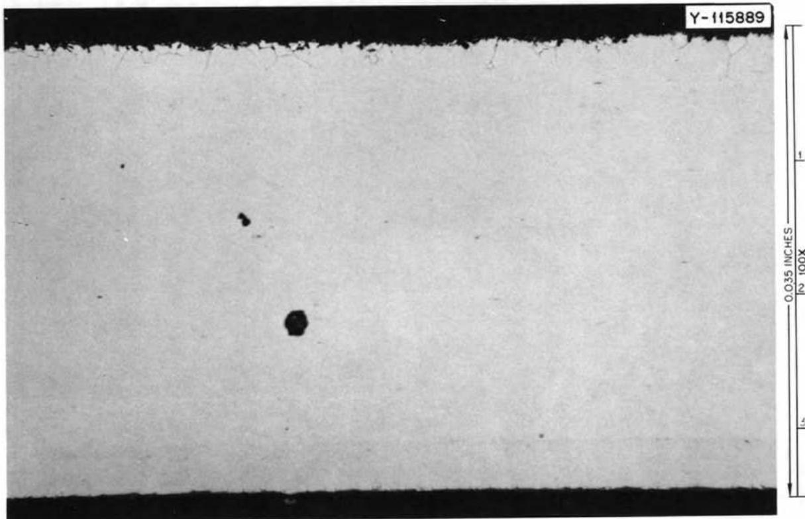  
Fig. 10.20. Strain cycle specimen 204. Type 304L stainless steel that was plated with $1\mathrm{mg/cm}^2$ of tellurium and exposed to 974 cycles at a strain range of $0.32\%$ . Outside surface (top of photomicrograph) was exposed to salt. As polished.

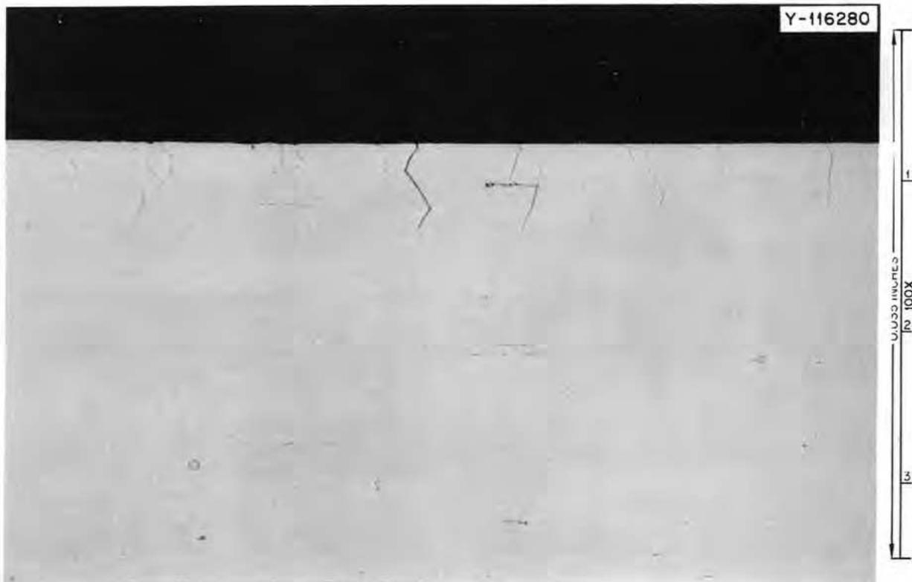  
Fig. 10.21. Strain cycle specimen 301. Inconel 600 plated with $1\mathrm{mg/cm}^2$ of tellurium and exposed to 68.5 cycles at 26,400 psi and a frequency of 1 cycle per hour. Outside surface (top of photomicrograph) was exposed to salt. As polished.

cell-mass-spectrometer experiments. Reaction temperatures are in the range of 400 to $750^{\circ}\mathrm{C}$ (primarily 650 and $700^{\circ}\mathrm{C}$ ).

The above techniques for introducing Te do provide for the diffusion of this element into the material along grain boundaries as evidenced indirectly by observed edge cracking and directly by Auger spectroscopy (Sect. 10.8). The fraction of Te which actually diffuses into the specimen is probably quite small, with the remainder reacting to form various telluride intermetallic compounds on the specimen surfaces. Figure 10.22 shows a Hastelloy N creep specimen fractured in an environment of Ar plus Te at $650^{\circ}\mathrm{C}$ before removal from the specimen grip. The "fuzzy" network of particles and fibers on the specimen surface is tellurides formed during the test. The reaction products have been identified primarily by x-ray diffraction and electron probe microanalysis and are those products which form on exposed surfaces of the metal or alloy rather than on grain boundaries. The x-ray-diffraction technique used for identification of the tellurides has been described previously.[11] We are able to get excellent diffraction from $500\AA$ of Te electroplated on Hastelloy N. A layer approximately $100\AA$ thick does

not provide a strong pattern, but the Te is detectable and the pattern is adequate for identification. Whenever possible, the tellurides are scraped from sample surfaces for x-ray analysis to eliminate matrix lines and to minimize preferred orientation and background effects. Tellurides removed as sheets or large pieces are ground to powder before analysis.

# 10.7.1 Knudsen Cell Reactions

Four foils of standard Hastelloy N $(0.25\times 0.004$ in.) have been reacted with Te by J.D.Redman of the Reactor Chemistry Division. Three of the foils were electropolished prior to reaction. The fourth was electropolished and then oxidized about 30 sec at $650^{\circ}\mathrm{C}$ in air, resulting in a light discoloration. Each foil, along with a small quantity of Te metal, was placed in a Hastelloy N Knudsen effusion cell coupled to a time-offflight mass spectrometer. After degassing, the foils were reacted at $412^{\circ}C$ until Te vapor became undetectable. The first unoxidized foil was examined after the $412^{\circ}\mathrm{C}$

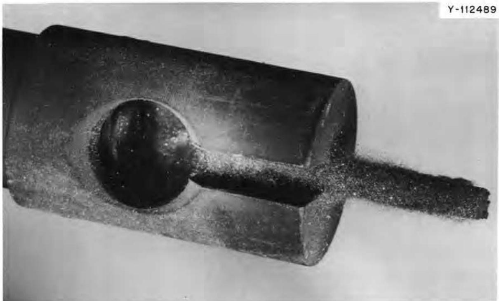  
Fig. 10.22. Typical appearance of nickel telluride on a fractured Hastelloy N specimen exposed to tellurium during a $650^{\circ}\mathrm{C}$ creep test. The sample is still in the specimen grip.

reaction. The second and third foils were reacted at $412^{\circ}\mathrm{C}$ and heated to 650 and $750^{\circ}\mathrm{C}$ for 96 and $725\mathrm{hr}$ respectively, the times required for effusion to cease. The oxidized specimen was heated to $650^{\circ}\mathrm{C}$ for about $7\mathrm{hr}$ .

Each foil was removed from the cell after its run with its reaction products intact. With the exception of the foil held at $750^{\circ}\mathrm{C}$ , thick black reaction layers formed on both the Hastelloy N foil and cell surfaces. The outer reaction layers were removed from the foils with tweezers or by light scraping and usually flaked off as sheets. The Knudsen cell reaction products were scraped from the surface after each run and kept separate from the foil products. The foil exposed at $750^{\circ}\mathrm{C}$ did not have a visible reaction product on the surface. Instead, the foil appeared "pimply" and sagged under its own weight in the effusion cell. In addition, fairly tight bonding occurred between the corners of the foil and the cell. Reaction products were removed from the cell after the $750^{\circ}\mathrm{C}$ exposure. Pieces of each foil were mounted for metallographic examination and electron probe microanalysis. Although the outer reaction layers had previously been removed, the surfaces remained dark, indicating that an adherent product still remained.

# 10.7.2 Possible Tellurides in Hastelloy N

Based on the composition of Hastelloy N we might expect tellurides of nickel, chromium, molybdenum, iron, and possibly combinations of these. The binary tellurides of these systems are listed in the ASTM Powder Diffraction File. An extensive study of the nickel-tellurium system was made by Barstad et al.,[12] who identified beta, gamma, and delta nickel tellurides. The beta field extends from $\mathrm{Ni}_3\mathrm{Te}_2$ ( $\mathrm{NiTe}_{0.67}$ ) to $\mathrm{NiTe}_{0.70}$ . Within this field, three crystallographic structures are observed due to slight variations in cell parameters with composition. At $\mathrm{Ni}_3\mathrm{Te}_2$ , a monoclinic structure is observed with the angle $\beta = 91.22^{\circ}$ . With increasing Te concentration, $\beta$ becomes $90^{\circ}$ to give an orthorhombic structure at $\mathrm{NiTe}_{0.69}$ . At the composition $\mathrm{NiTe}_{0.70}$ (very slowly cooled) the continuing changes in the $a$ and $b$ parameters result in a tetragonal structure. The gamma phase is located at $\mathrm{NiTe}_{0.77}$ and is orthorhombic. The delta phase is hexagonal with an extensive homogeneity range between $\mathrm{NiTe}_2$ and approximately NiTe. The $c$ and $a$ parameters and $c/a$

ratios vary nonlinearly with composition across the homogeneity range.

Two chromium tellurides are reported in the ASTM Powder Diffraction File. $\alpha$ -CrTe is hexagonal with an approximate homogeneity range of 50 to $54\%$ Te. A monoclinic modification at slightly higher Te concentrations is designated $\beta$ -CrTe. Only one molybdenum telluride, hexagonal $\mathrm{MoTe}_2$ , has been identified. Several iron tellurides are reported in the ASTM data, none of which have been observed in any of our studies. We have not found any reported ternary tellurides.

Positive identification of many of the reported tellurides is difficult from x-ray data alone because many have virtually identical interplanar spacings. Monoclinic distortions can generally be observed from x-ray-diffraction peak splitting. Many of our diffraction patterns have lines of various intensities which cannot be accounted for by reported tellurides, possibly resulting from ternary phases. Thus, information on the chemical composition of each phase is a useful supplement to the x-ray data in phase identification.

# 10.7.3 Tellurides from Knudsen Cell Reactions

We identified $\mathrm{NiTe}_2$ as the major phase formed by the reaction of Hastelloy N with tellurium at $412^{\circ}\mathrm{C}$ in the Knudsen cell. The foil reacted at $412^{\circ}\mathrm{C}$ and subsequently held at $650^{\circ}\mathrm{C}$ for 96 hr contained $\mathrm{NiTe}_{0.69}$ and an additional strong phase which is probably a high-parameter monoclinic $\beta$ -CrTe intermetallic. The interplanar spacings appear to be closer to the hexagonal $\alpha$ -CrTe, but several diffraction peaks were split, suggesting the monoclinic distortion. No $\mathrm{NiTe}_2$ was detected at $650^{\circ}\mathrm{C}$ . As previously mentioned, the foil exposed at $750^{\circ}\mathrm{C}$ for 725 hr did not have a removable reaction product. An x-ray-diffraction pattern from the surface of the slightly bent foil was poor, but weak lines were indexable as $\mathrm{Ni}_3\mathrm{Te}_2$ and CrTe in addition to strong Hastelloy N diffraction peaks. However, the reaction product removed from the Hastelloy N effusion cell after the $750^{\circ}\mathrm{C}$ exposure did provide a good x-ray-diffraction pattern. $\beta$ -CrTe and Hastelloy N were present in this reaction product, but nickel tellurides were not detectable. The Hastelloy N-type lines probably resulted from decomposition of the nickel and (possibly) mixed tellurides originally formed at $412^{\circ}\mathrm{C}$ rather than from the original alloy.

Metallographic examination of these foils expectedly revealed reaction layers along the surfaces of the foils reacted at 412 and $650^{\circ}\mathrm{C}$ . Electron microprobe analysis showed the reaction layer on the $650^{\circ}\mathrm{C}$ foil to consist of Ni, Mo, and Te with less than $1\%$ Cr. There were no

detectable concentration gradients of Ni, Mo, Cr, or Fe at the edge of the foil itself.

The foil exposed at $750^{\circ}\mathrm{C}$ after the $412^{\circ}\mathrm{C}$ reaction was markedly different from those exposed at the lower temperatures. Figure 10.23 shows the microstructure of this extensively reacted foil with striated particles along the edges. The outer surface was mostly coated with material which looked metallographically similar to the Hastelloy N matrix. Electron microprobe analysis showed the particles to be nickel and chromium tellurides. Figure 10.24 shows the elemental distribution of Te, Fe, Cr, Mo, and Ni in the particles and surrounding matrix of Hastelloy N. The striated portions of the particles are basically chromium telluride within nickel telluride. (The striated structure is not visible in the backscattered electron image of Fig. 10.24; see instead Fig. 10.23.) Figure 10.25 is a lower-magnification elemental distribution of a cross section of the foil and tellurides. Most of the iron and molybdenum were concentrated in the "foil area." However, large concentration gradients were observed in the Hastelloy N-type material surrounding many particles (Fig. 10.26). The center of the foil (area A) is essentially Hastelloy N. The material at the edge of the remaining foil (area B) is enriched in Mo and depleted in Cr. The material around the telluride particles (area G) is enriched in Fe and depleted in Cr. The tellurides range from binary (Ni, area E) through ternary (Ni-Cr, areas D, F, H, and J) to essentially binary (Cr, area C) tellurides with up to $2\%$ Mo and/or Fe. (The J telluride is not shown in Fig. 10.26.) Beam overlap from the striated tellurides may indicate more alloying than actually occurred. The $\mathbf{M}_6\mathbf{C}$ carbides in the foil (area I) remained seemingly unaffected by the reaction with Te. The reactions of this foil resulted under extremely severe conditions, but they indicate the complexity of the reactions which may occur between Hastelloy N and tellurium.

# 10.7.4 Tellurides from Other Reaction Methods

Hastelloy N. We removed reaction products from several specimens of Hastelloy N exposed to tellurium vapor during creep tests at elevated temperatures. Particles scraped from a sample exposed for 1500 hr at $593^{\circ}\mathrm{C}$ gave a very complex x-ray diffraction pattern. The major phase was $\mathrm{NiTe}_{0.69}$ , but $\mathrm{NiTe}_{0.77}$ and/or CrTe and possibly NiTe were present. Specimens exposed at $650^{\circ}\mathrm{C}$ were found to form either $\mathrm{NiTe}_{0.69}$ or $\mathrm{Ni}_3\mathrm{Te}_2$ , depending on the particular sample. Additional diffraction lines were obtained from some samples that have not been identified.

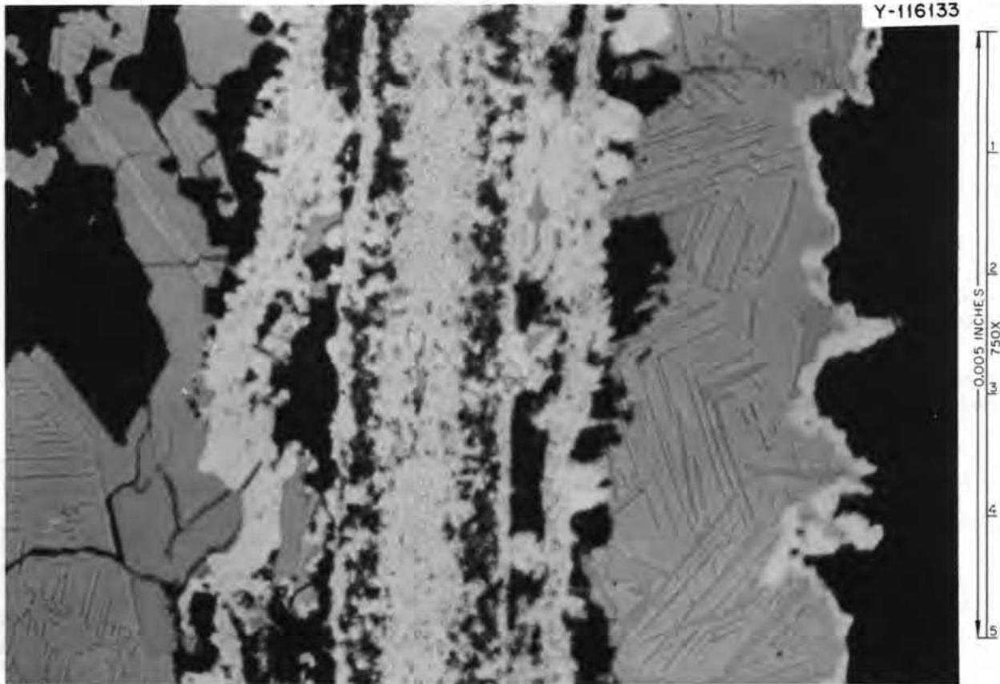  
Fig. 10.23. Optical micrograph of Hastelloy N foil exposed to tellurium at $412^{\circ}\mathrm{C}$ and heated to $750^{\circ}\mathrm{C}$ in Knudsen effusion cell. Note striated tellurides along the foil, which has undergone severe reaction.

One of the creep specimens tested at $650^{\circ}\mathrm{C}$ was examined by optical metallography and electron probe microanalysis. The specimen had a reaction layer along the edges which appeared similar to oxidation, with preferential grain boundary attack. Some oxidation may have occurred due to the impurity of the test environment. This layer contained $30\%$ Mo, $17\%$ Te, $12\%$ Cr, $4.8\%$ Fe, and only $2.4\%$ Ni (wt%). Presumably this reaction layer is an oxide, but we have not identified it structurally. Metallic particles adhering to the specimen contained approximately $40\%$ Ni, $62\%$ Te, and $0.8\%$ Fe. No Mo or Cr was detected.

A 0.010-in.-thick sheet of standard Hastelloy N, exposed to tellurium vapor for $100\mathrm{hr}$ at $700^{\circ}\mathrm{C}$ by J.H. Shaffer of the Reactor Chemistry Division for Auger spectroscopy (Sect. 10.8), formed $\mathrm{Ni}_3\mathrm{Te}_2$ and CrTe plus several unidentified lines. Employing the same Te exposure technique we observed $\mathrm{Ni}_3\mathrm{Te}_2$ on a low-silicon vacuum-melted heat of Hastelloy N (heat 5911) and on a $2\%$ Cr modification of Hastelloy N (heat 114). In addition, CrTe was present on the specimen of heat 5911.

We have also examined the surface of a strain cycle specimen that had been electroplated with $1\mathrm{mg/cm^2}$ of $\mathrm{Te}$ and tested in salt at $650^{\circ}\mathrm{C}$ . The only telluride identified was $\mathrm{Ni}_3\mathrm{Te}_2$ . We will be removing this thin layer electrolytically to extend our investigation.

Nickel 200. One specimen of Ni 200 exposed to tellurium vapor at $650^{\circ}\mathrm{C}$ during a creep test exhibited only slight discoloration of the surface. X-ray-diffraction patterns from the darkened surface itself as well as from the reaction film electrolytically stripped from the surface were indexed as $\mathrm{Ni}_3\mathrm{Te}_2$ . Transmission electron microscopy of this film revealed large particles of nickel telluride on a thin film covered with numerous small thin platelets. A second specimen also exposed during a creep test exhibited a large amount of reaction product. The x-ray pattern from this material is best indexed as a mixture of $\mathrm{NiTe}_{0.69}$ , $\mathrm{NiTe}$ , and $\mathrm{NiTe}_2$ with several additional unidentified lines.

A thin sheet of Ni 200 exposed by vapor deposition at $700^{\circ}\mathrm{C}$ for Auger spectroscopy was observed to contain $\mathrm{Ni}_3\mathrm{Te}_2$ (plus several unidentified lines).

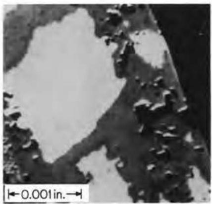  
BACKSCATTERED ELECTRONS

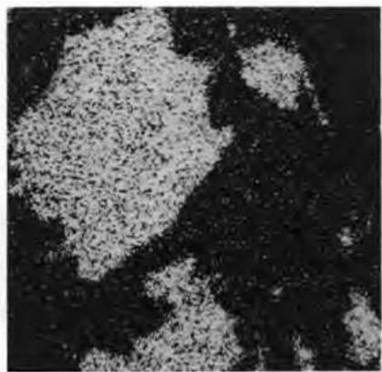  
TeLβ

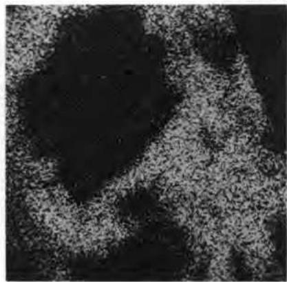  
FeKa

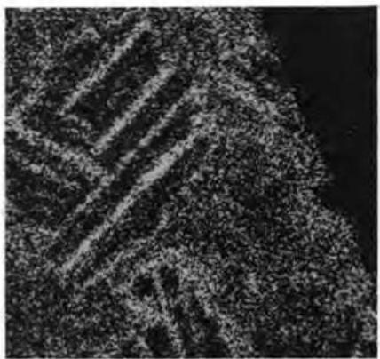  
CrKa

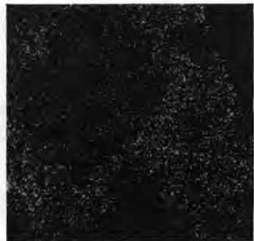  
MoLa

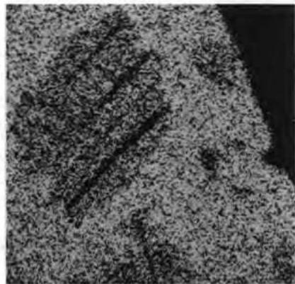  
NiKa   
Fig. 10.24. Electron beam scanning images showing elemental distribution in striated tellurides. The nickel- and chromium-rich tellurides are surrounded by an iron-rich "Hastelloy N" matrix. Same specimen as Fig. 10.23.

Inconel 600. Particles scraped from specimens of Inconel 600 creep tested at $650^{\circ}\mathrm{C}$ were identified as $\mathrm{Ni}_3\mathrm{Te}_2$ for one specimen and $\mathrm{NiTe}_{0.69}$ , $\mathrm{CrTe}$ , and possibly NiTe for a second. These particles made up what appeared visually to be an outer layer. Increased emphasis will be placed on evaluation and analysis of telluride formation in this system.

Molybdenum. Our only observation of the $\mathrm{MoTe_2}$ intermetallic made to date is from the residue in an Mo capsule used to add Te to a salt vessel. The exposure was for $24\mathrm{hr}$ at $650^{\circ}\mathrm{C}$ .

# 10.7.5 Summary

Our observations of tellurides formed on Hastelloy N, Ni 200, and Inconel 600 in the temperature range 600 to $700^{\circ}\mathrm{C}$ indicate that the stable and most prevalent phase is the $\beta\text{-Ni}_3\mathrm{Te}_2$ . The $\beta\text{-NiTe}_{0.69}$ is characteristically observed when an excess of Te is present during the reaction. The richer $\mathrm{NiTe}_2$ which forms at $412^{\circ}\mathrm{C}$ is

unstable and transforms to the beta tellurides when the temperature is raised. Chromium telluride, CrTe, is observed to form on both Hastelloy N and Inconel 600. Electron microprobe analysis of tellurides formed at $750^{\circ}\mathrm{C}$ suggests that alloying of the compounds may occur.

Although $\mathrm{Ni}_3\mathrm{Te}_2$ appears to be the most stable nickel telluride in the 600 to $700^{\circ}\mathrm{C}$ temperature range, the presence of CrTe and "Hastelloy N" as the Knudsen cell reaction products after the $750^{\circ}\mathrm{C}$ exposure indicates that CrTe is much more stable than $\mathrm{Ni}_3\mathrm{Te}_2$ . The Hastelloy N lines observed probably result from decomposition of tellurides which formed during the original reaction at $412^{\circ}\mathrm{C}$ . Strong evidence for this arises from (1) the relative absence of nickel tellurides (the nickel tellurides observed in the $750^{\circ}\mathrm{C}$ foil are often surrounded by the iron-rich "Hastelloy N"), (2) the extensive chromium depletion and large compositional variations observed by microprobe analysis, and

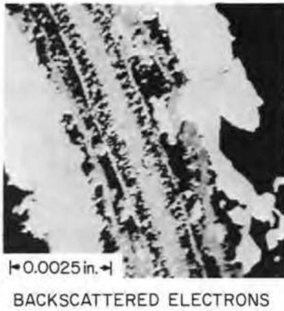

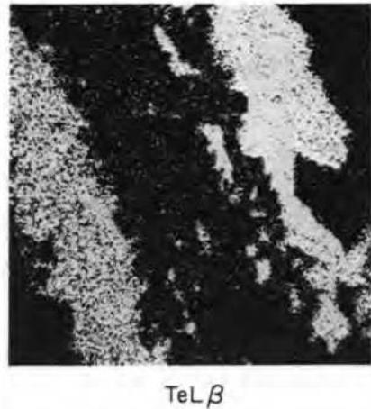

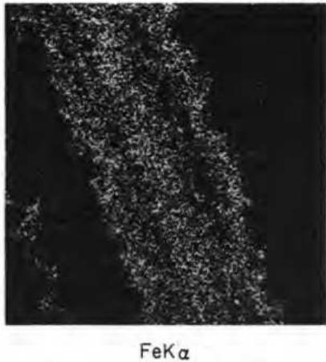

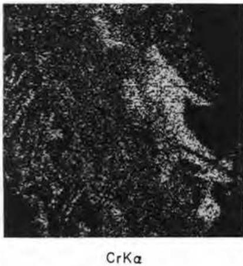

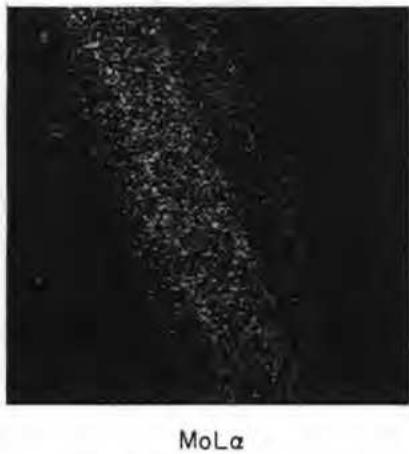

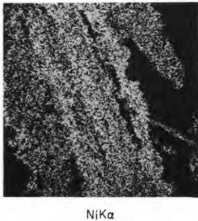  
Fig. 10.25. Electron beam scanning images showing elemental distribution across Hastelloy N foil reacted at $750^{\circ}\mathrm{C}$ . Same specimen as Fig. 10.23 with a lower magnification.

(3) the fact that the foil was essentially sintered to the Knudsen cell after the $750^{\circ}\mathrm{C}$ exposure.

The effect of molybdenum is not clear at this time. We have not observed $\mathrm{MoTe_2}$ in reaction products from Hastelloy N, even though Mo is present in larger quantities than Cr. The high Mo observed with the electron microprobe in the reaction layers on the Knudsen cell foils is unexplained, unless it is present as a telluride which has not been previously identified.

The emphasis of our work will be shifted toward microanalysis to investigate more thoroughly the behavior of chromium tellurides, alloying of tellurides, and the role of molybdenum. Reaction products which we have examined by x-ray diffraction will be studied by energy-dispersive x-ray analysis using the electron microprobe and scanning electron microscope. We will also study alloys which do not exhibit edge cracking (both stainless steel and other nickel-base alloys), those which are borderline (Inconel 600), and compare these

results with those from Hastelloy N and other alloys which are embrittled. A major effort will also be expended on a new series of small modified Hastelloy N alloys with higher chromium concentrations and small lanthanum and cerium additions in an attempt to tie up tellurium or otherwise prevent its embrittlement of Hastelloy N.

# 10.8 AUGER ELECTRON SPECTROSCOPY OF INTERGRANULAR FRACTURE SURFACES OF NICKEL AND HASTELLOY N EXPOSED TO TELLURIUM VAPOR AT $700^{\circ}\mathrm{C}$

R.E.Clausing D.S.Easton R.E.Gehlbach

Auger electron spectrometry combined with sputter thinning and in situ sample preparation provides a powerful technique for studying the role of tellurium or other fission products in producing intergranular fracture or cracking. We have exposed several samples of

Y-115868

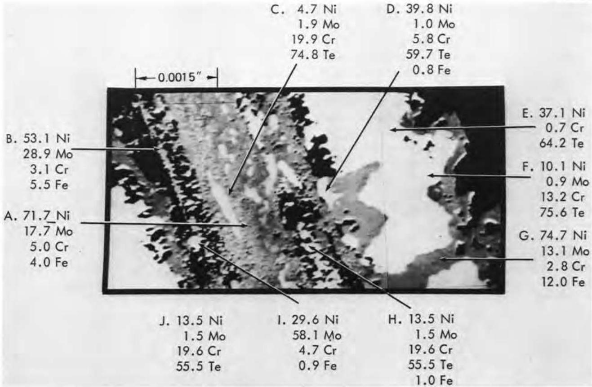  
Fig. 10.26. Quantitative electron microprobe analysis of various areas in Hastelloy N foil reacted at $750^{\circ}\mathrm{C}$ .

type 304 stainless steel, nickel, and Hastelloy N to tellurium at high temperature to cause them to be embrittled. These were then fractured in vacuum, and the intergranular surface thus exposed was examined immediately by Auger electron spectroscopy. The elemental composition of the first few atomic layers was determined and the sample sputtered to remove a few atomic layers and expose a new surface for analysis. Thus the composition of the original fracture surface could be determined and information obtained regarding the concentration gradients near the exposed grain boundary. Information was obtained with depth resolution of one or a few atomic layers depending on the depth below the original surface.

# 10.8.1 Method

We previously described a form of Auger electron spectroscopy used for analysis of fission product deposition on graphite in the MSRE core region. The present techniques are much improved; although the basic physical processes remain the same, the detection

and analysis of Auger electrons from the sample is now by means of a high-resolution double-pass cylindrical mirror analyzer.14 Auxiliary equipment permits the fracture of samples in ultrahigh vacuum and has provision for sputtering away a few atomic layers at a time using 1000-eV argon ions.

The samples of type 304 stainless steel, nickel, and Hastelloy N were in the form of miniature sheet metal tensile specimens 0.010 in. thick. They were cleaned and sealed in evacuated quartz capsules with a small amount of tellurium. The capsules were then heated to $700^{\circ}\mathrm{C}$ for $100\mathrm{hr}$ to expose the samples to tellurium vapor. To avoid unnecessary contamination the samples were kept in the quartz capsules until immediately before testing. Samples for analysis were obtained by breaking them from the original tensile sample by repetitive bending. These pieces of 0.010-in.-thick foil

were examined by optical and by scanning electron microscopy to determine that the fracture indeed did produce intergranular surfaces. They were then mounted so they could be fractured again under vacuum. One of the Hastelloy N pieces was abraded to remove surface tellurium compounds and then coated with titanium prior to being placed in the vacuum system for fracture and analysis. All samples were fractured under vacuum and spectra obtained from the fractured surface within a few minutes.

Spectra were obtained using the smallest-diameter electron beam available, which varied from about 0.015 in. FWHM (full width at half the maximum intensity) for some of the initial data to less than 0.003 in. FWHM for some of the latest data. Electron currents of 1 or 2 $\mu$ A at 2.5 or $5\mathrm{keV}$ were used. To enhance the detectability of the Auger electrons, the pass energy of the spectrometer was modulated by a $2\mathrm{-eV}$ peak-to-peak ac potential at $1.97\mathrm{kHz}$ , and a lock-in amplifier was used to detect the ac component in the electron current through the spectrometer. This arrangement provides an output signal proportional to $dN / dE$ (ref. 13), where $N$ is the number of electrons in a given energy interval and $E$ is the electron energy.

The data are obtained as an $x - y$ plot of $dN / dE$ vs $E$ . It has been shown[15] that the amplitude of $dN / dE$ is directly related to the intensity of the Auger signal. The signal is thus also proportional to the concentration of the element producing the characteristic Auger electrons. Standards must be used to convert signal intensities to concentration if accurate quantitative results are required, but approximate compositions can be determined by comparison with published data.

We have examined one Ni 200 specimen and two Hastelloy N specimens. Although the examination of the second Hastelloy N sample is not yet complete, the major results are clear.

# 10.8.2 Nickel

The fracture surface of the nickel specimen was about $50\%$ intergranular in a zone about 0.0025 in. thick just below the original surface of the 0.010-in.-thick specimen, while the center 0.005-in. zone remained relatively ductile and failed transgranularly. Unfortunately the electron beam diameter was too large to permit analysis of the 0.0025-in. zone without including material from the ductile region. It is estimated by comparison with computer-generated spectra that the

concentration of Te on the fracture surface may be 20 to 30 at. $\%$ . Sputtering away the original surface to an estimated depth of 100 atomic layers removed tellurium to below the limit of detectability (estimated to be about 1 at. $\%$ under these conditions). Figure 10.27 shows the tellurium signal strength as a function of sputtering time. The sputter etching removed about two atomic layers per minute. This sputtering rate is based on a plane perpendicular to the sputter beam. Since rough surfaces will sputter unevenly and some sputtered material may be redeposited on other parts of the fracture region, sputtering of rough samples may proceed at a slightly slower rate, and the depths calculated should be considered to be slightly too great.

The results on the nickel sample show a very high tellurium concentration at the surface of the brittle fracture (along the grain boundaries) that drops off rapidly as the original fracture surface is sputtered away. The tellurium is thus highly concentrated in the original grain boundary. This could result either because of an affinity of tellurium for the grain boundary or because the diffusion of tellurium along grain boundaries was much faster than through the bulk.

# 10.8.3 Hastelloy N

The fracture surface of a Hastelloy N sample is shown in the scanning electron micrograph of Fig. 10.28. Note the intergranular fracture in the zone near the original surface and the cracks in the surface of the foil near the fracture. Two Hastelloy N samples were examined under similar conditions, but the results from the transverse scan of the fracture surface of the second sample were superior and will be presented. The second sample differed from the first in that the tellurium

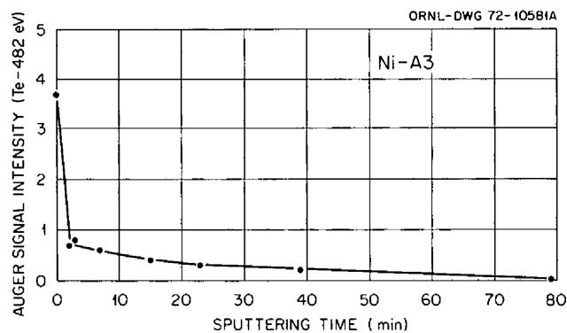  
Fig. 10.27. Intensity of 482-eV tellurium Auger signal as a function of sputtering time. The initial point was from the as-fractured surface of the nickel. The sputtering rate is about two monolayers per minute.

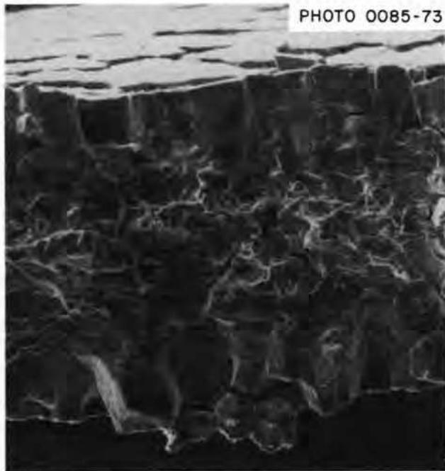  
Fig. 10.28. Fracture surface of Hastelloy N sample. Note the brittle intergranular fracture in the zones near the original surfaces of the foil and the cracks and grain boundary separation in the areas adjacent to the fracture.

reaction layer on the foil surface was removed by abrasion and titanium was vapor deposited on the foil surface to hide any tellurium-rich surface which might remain. This would avoid possible errors due to Auger emission from the original foil surface.

Figure 10.29 shows a beam traverse of the broken surface along a path perpendicular to the plane of the foil. The diameter of the electron beam was still too large to permit simple interpretation of the data. However, the data show that the brittle zones have tellurium present, while tellurium is much lower or undetectable in the center ductile zone. Figure 10.30 shows the tellurium signal strength as a function of sputtering time for the beam centered on one edge of the sample. The sputtering rate is no more than 2 atomic layers per minute. Note that the tellurium concentration decreased nearly a factor of 10 in 3-min sputtering, or 6 atom layers.

Figure 10.31 is a sputter profile from the first Hastelloy N sample, showing variations in Auger signals for various elements as a function of sputtering time. This sample was sputtered much longer than the second one, and the initial points were from a surface that had been sputtered for $2\mathrm{min}$ . Note the very slow decline in

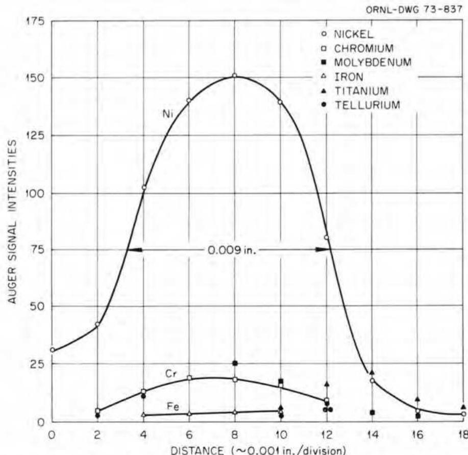  
Fig. 10.29. Auger intensities from the fractured edge of a Hastelloy N foil as the sample was scanned in the thickness dimension. The Hastelloy N foil was 0.009 in. thick. Note that tellurium was found only at the edges and not in the center of the sample.

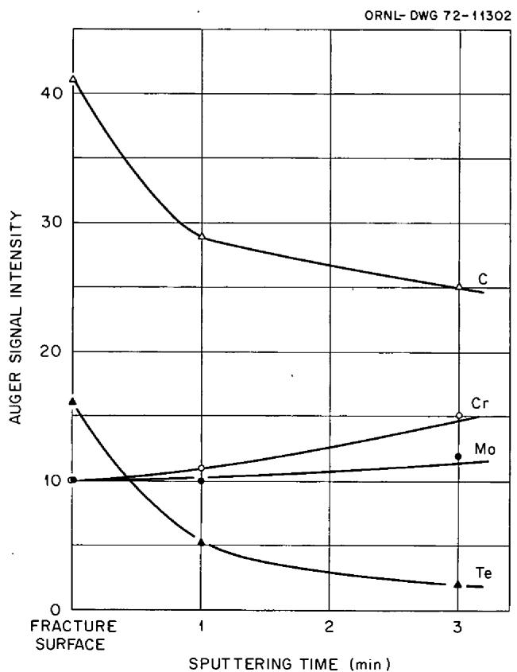  
Fig. 10.30. Auger signal intensity as a function of sputtering time for the second Hastelloy N A41 foil sample. The initial point was from the as-fractured surface. The sputtering rate was approximately two monolayers per minute.

tellurium with increasing depth. Tellurium is still easily detected after over $400\mathrm{min}$ of sputtering. This would indicate that the tellurium-rich zone at the fracture surface is thicker in Hastelloy than in nickel.

These data provide strong evidence connecting tellurium with brittle intergranular fracture in Hastelloy N: tellurium is strongly concentrated in the affected grain boundary region. Other observations include (1) a strong depletion of iron from the grain boundary and (2) an indication that chromium is higher in the brittle region than in the ductile zone.

The analysis of the second Hestelloy N sample is not yet complete. A composition profile as a function of depth below the fracture surface is being made.

A new electron gun has been obtained that is expected to be capable of producing an electron beam with a diameter of only 0.001 in. (compared with 0.003 to 0.015 in. in the experiments reported here). This would greatly improve the resolution of the composition gradients across the thickness of the foil.

# 10.9 DESIGN OF AN IN-REACTOR EXPERIMENT TO STUDY FISSION PRODUCT EFFECTS ON METALS

R. L. Senn

H. E. McCoy

J. H. Shaffer

P. N. Haubenreich

During this report period we began design of an experiment in which three prospective MSBR container materials will be exposed to molten fluoride salt in which fission products are being produced. Fission product concentrations, temperatures, and times will be the same for each material and will be in the ranges that were found to produce surface cracking of the Hastelloy N material that was used in the MSRE. The relative resistance to cracking of the different materials will be determined by straining specimens of each material after exposure.

# 10.9.1 Design Criteria

In order to accomplish the purposes of the experiment in an economical, timely, and safe manner, the following design criteria were adopted.

1. Three fuel pins shall be irradiated simultaneously for one cycle in the ORR.   
2. Each pin shall be made of $\frac{1}{2}$ -in. tubing.   
3. MSRE-type fuel salt shall contact 3 in. of the cylindrical portion of each pin.   
4. At least 0.5 in. of the cylindrical portion of each pin shall be above the salt surface.   
5. The inner surfaces of the walls in contact with the salt shall operate at $700^{\circ}\mathrm{C}$ , as nearly as is practical.   
6. Fuel pin temperatures shall be monitored by one or more thermocouples attached to the outside of each pin; interior temperatures shall be estimated from the observed wall temperatures.   
7. Heating provisions shall be adequate to ensure that salt temperatures do not go below $100^{\circ}\mathrm{C}$ for more than 2 hr at a time from the beginning of irradiation until the experiment is removed from the ORR shortly after irradiation (to avoid $\mathbf{F}_2$ evolution).   
8. Insertion and withdrawal of the capsule in the ORR poolside irradiation facility shall be used to regulate the nuclear heating in the experiment.   
9. The $^{233}\mathrm{U}$ content of each pin shall be sufficient to produce at the end of one cycle in the ORR a tellurium inventory of at least $5 \times 10^{16}$ atoms per square centimeter of area exposed to salt.

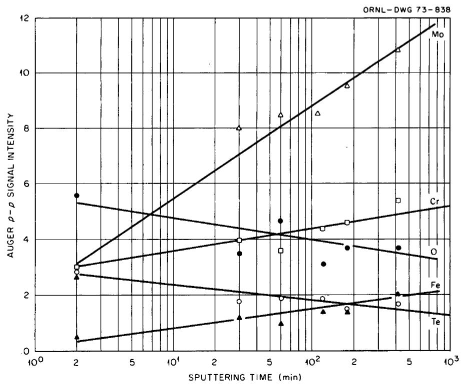  
Fig. 10.31. Auger signal intensity as a function of sputtering time for Hastelloy N A41 sample. The initial point was on the as-fractured surface. The sputtering rate is about two monolayers per minute.

10. Containment shall be provided by two barriers outside the pins.

# 10.9.2 Configuration

The configuration conforms to the ORR poolside facility and is similar to previous poolside capsule designs. This is particularly true in the upper portions of the capsule, which include the instrument lead tube and connector, gas tubing and connectors, and heaters and their connectors. The lower portion of the capsule will provide the necessary containment and a controlled high temperature in the fuel pins while exposed to neutrons from the ORR core.

The lower portion of the capsule is shown schematically in Fig. 10.32. (TeGen-1 stands for Tellurium Generator No. 1.) Each of the three sealed salt containers (fuel pins) is made of a 4-in. section of $\frac{1}{2}$ -in.-OD, 0.035-in.-wall tubing. The three materials chosen for this experiment are: standard Hastelloy N, which is highly resistant to corrosion but which cracked

in the MSRE; type 304 stainless steel, which resists intergranular attack by tellurium but is corroded more by fluoride salts; and Inconel 601, a nickel-base high-chromium alloy that may combine adequate resistance to both tellurium attack and fluoride corrosion. Each pin contains $7.14~\mathrm{cm}^3$ of salt, which fills 3 in. of the length and contacts $27.1~\mathrm{cm}^2$ of metal surface. The salt composition is ${}^{7}\mathrm{LiF - BeF}_2 - \mathrm{ZrF}_4 - \mathrm{UF}_4$ (63.1-29.3-5.1-2.5 mole $\%$ ); except for slightly higher $\mathrm{UF_4}$ this is practically the same as the fuel in the MSRE where the cracking was first observed. The $\frac{1}{2}$ -in. space above the salt in each pin is filled with helium.

# 10.9.3 Thermal Considerations

Fission heating in the salt is used to produce the desired high temperature in the pins during ORR operation. Heaters are also provided around each pin for use in minimizing temperature differences among the pins and in keeping the salt warm enough to prevent $\mathbf{F}_2$ gas evolution during shutdown periods. Pin surface temperatures are measured by attached thermocouples, four on each pin. Fuel pins and heaters are immersed in NaK inside the primary containment vessel. Thermocouples in the bottom of the NaK pool would sense

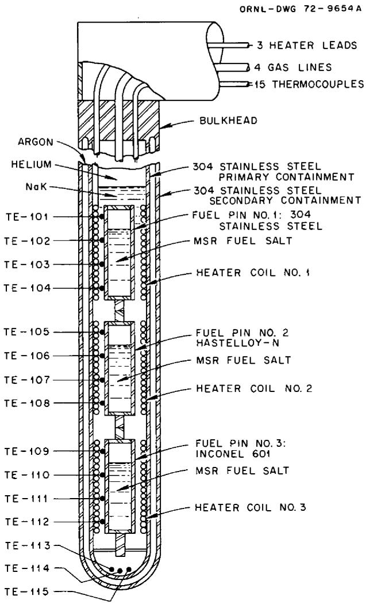  
Fig. 10.32. Schematic drawing of TeGen-1 capsule.

abnormal heating if salt should leak from a pin and react with NaK to precipitate uranium. An argon-filled annulus between the primary and secondary containment vessels is sized to provide the thermal resistance that is required between the hot NaK and the water surrounding the capsule.

The fissile material in the salt is $^{23}$ U, chosen because its fission product tellurium yield is greater than that of $^{23}$ U (0.040 atom stable Te per fission compared with 0.024) so that more tellurium can be produced with a given amount of heat generation. The goal of $5 \times 10^{16}$ atoms of stable Te per square centimeter of surface contacted by salt was chosen as being low enough to be attained without inconveniently high heat production and high enough to produce cracking. (Specimens removed from the MSRE in July 1966 showed cracks, although the Te concentration had reached only $1.0 \times 10^{16}$ atoms/cm².) Producing $5 \times 10^{16}$ atoms of stable

Te per square centimeter in 1100 hr from $^{233}\mathrm{U}$ in a 0.43-in.-diam cylinder requires a fission power density of 34 W per cubic centimeter of fuel (1.19 kW per foot of fueled length).

When the ORR first starts up with the experiment installed, the distance of the capsule from the core will be adjusted to bring the temperatures on the middle fuel pin into the desired range. The installed heaters on the upper and lower pins (which will have about $14\%$ lower fission rate because of the axial flux variation) will be used to bring the temperatures on these pins into the same range. If the heat-transfer calculations used to size the argon annulus are accurate, the fission rate (and tellurium production) will then be as expected.

Figure 10.33 shows radial temperature profiles calculated for a long cylindrical model with heat transfer only by conduction under two conditions. The lower profile is for the design condition of $1.19\mathrm{kW / ft}$ of fission power. The upper profile shows what would happen in the same system, at the same location, if the reactor power should increase to $120\%$ of nominal full power. The increase in pin wall temperature would not be hazardous. Actual temperature differences from the wall to the center line will tend to be less than shown because of thermal convection effects which were not considered in this simple calculation. Even the centerline temperatures shown in Fig. 10.33 are not excessive, however, as there are no changes of any consequence in the properties of the salt over the ranges shown.

In the actual 4-in.-long pins, heat flow out the ends would tend to cause axial variation of the temperature. The spiral heater elements were therefore concentrated near the ends of the pins to counteract this effect to a large extent. Figure 10.34 indicates the location of the heater coils and gives temperature distributions calculated with the three-dimensional heat conduction code HEATING-3. (The 1.2-kW/ft fission power and 1.1 kW/ft heater power refer to the fueled sections and the heated sections only, not to the averages over the length of the capsule.) The calculated distribution for normal operation indicates that the spread among temperatures at different points on a fuel pin will be acceptably small. Thermal convection effects, neglected in these calculations, will tend to lower center-line temperatures but possibly increase the spread of temperatures along the pin wall. The calculated temperatures for the case of zero fission heat also show that the design power of the heaters is ample to keep the salt

Fig. 10.33. TeGen-1 schematic temperature profile from GENGTC calculations. Temperatures are in $^\circ \mathrm{C}$ .   
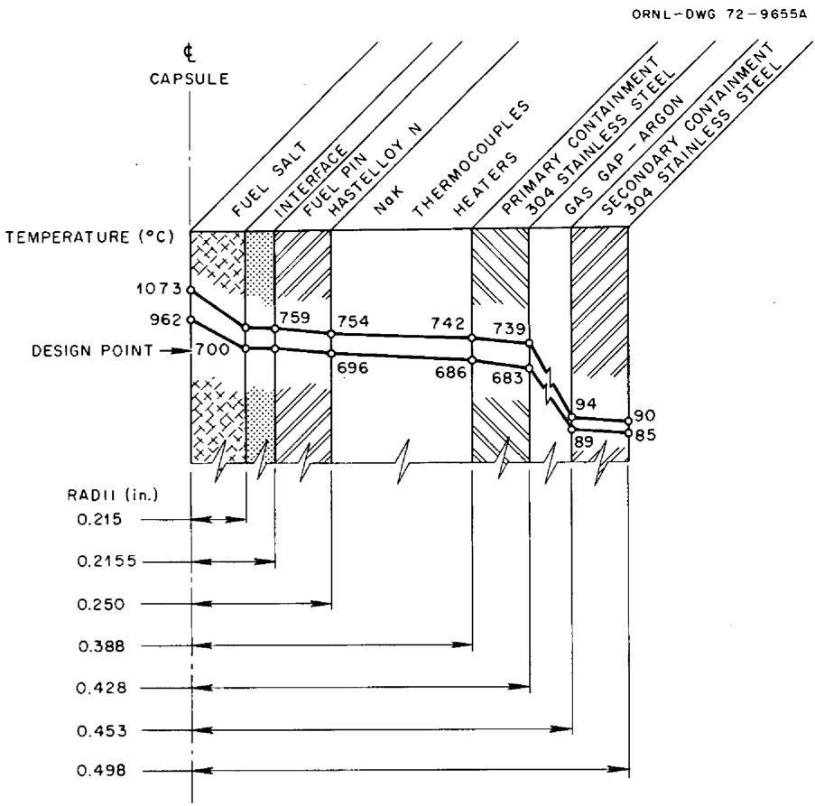  
UPPER LINE REPRESENTS TEMPERATURE PROFILE WITH CAPSULE OPERATING AT $120\%$ NOMINAL OPERATING POWER.  
ASSUMES 1.43 kW/ft FISSION POWER AND 0.2 W/g GAMMA HEAT.   
LOWER LINE REPRESENTS TEMPERATURE PROFILE WITH CAP-SULE OPERATING AT NOMINAL DESIGN, POWER. ASSUMES  
1.19 kw/ft FISSION POWER AND 0.2 W/g GAMMA HEAT.

temperature well above the threshold of less than $100^{\circ}\mathrm{C}$ for fluorine evolution from irradiated salt.

# 10.9.4 Containment

Four gas lines are used in the experiment: two for filling and maintaining a 20-psig helium pressure over the NaK (primary containment internal pressure) and two for filling and maintaining a 40-psig argon pressure in the gas gap (secondary containment pressure). Pressures over the NaK and in the gas-filled annulus are monitored for any indication of leakage in either the primary or secondary containment.

# 10.9.5 Fuel Salt Chemistry

The fissile uranium concentration in the fuel salt was chosen as follows. With $1.0\mathrm{~mol}\%^{233}\mathrm{UF}_4$ in the fuel

salt, calculations showed that a thermal neutron flux of about $0.9 \times 10^{13}$ neutrons $\mathrm{cm}^{-2} \sec^{-1}$ would produce the required fission power density. This flux is readily achieved in the ORR poolside positions with the capsule retracted 10 to 12 in. from the face of the reactor. Furthermore, at this rather large distance from the reactor, the vertical flux profile is relatively flat, so all three fuel pins will be irradiated in approximately the same flux ( $\pm \sim 7\%$ ). Thus a different fuel loading for each pin will not be required if the fissile loading is high enough to operate this far away from the core. Therefore, the concentration of the $^{233}\mathrm{U}$ isotope was set at 1.0 mole%.

The purposes of the experiment require that the fuel salt chemistry be carefully controlled. Specifically, it is desirable that the $\mathrm{U}^{3+}/\mathrm{U}^{4+}$ ratio be in the range experienced in the MSRE and expected in future

ORNL-DWG 73-839

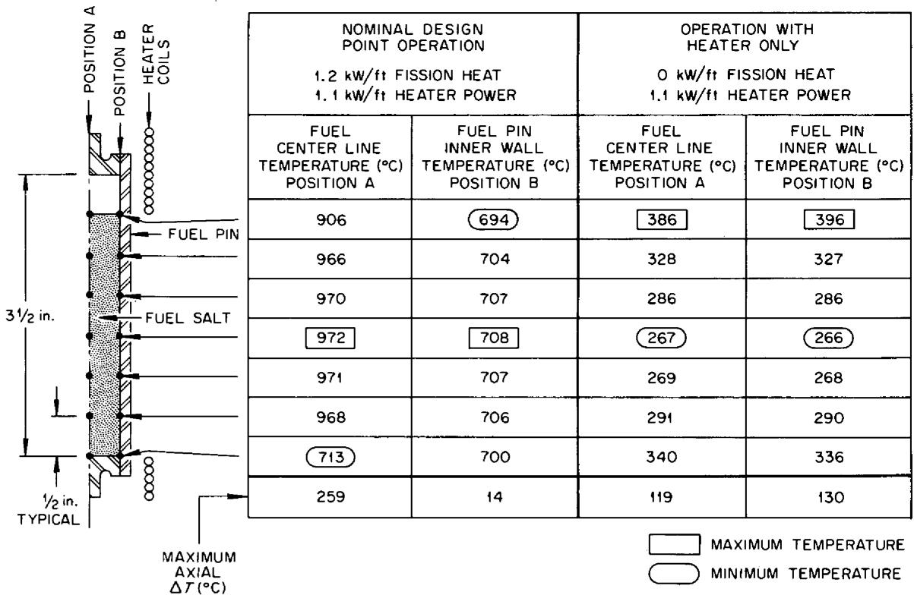  
Fig. 10.34. TeGen-1 capsule two-dimensional temperature profiles at various operating conditions.

molten-salt reactors (on the order of 0.01). Two mechanisms tend to decrease the ratio. They are impurity reactions, such as

$$
2 \mathrm {N i O} + 4 \mathrm {U F} _ {3} \rightarrow \mathrm {U O} _ {2} + 3 \mathrm {U F} _ {4} + 2 \mathrm {N i},
$$

and fissioning of some of the uranium to produce lower-valence products. Great care will be used in cleaning and loading the pins to minimize impurity reactions, but the amount of $\mathrm{U}^{3+}$ going to $\mathrm{U}^{4+}$ as a result of fissioning cannot be changed. The change in the $\mathrm{U}^{3+}/\mathrm{U}^{4+}$ ratio can be reduced, however, by increasing the total amount of uranium in the pin. If the total uranium fluoride concentration were 1.0 mole $\%$ , the $\mathrm{U}^{3+}/\mathrm{U}^{4+}$ ratio would decrease by about 0.008 as a result of fissioning the amount of $^{233}\mathrm{U}$ required to produce the desired amount of tellurium. This change in ratio is large compared with the desired range, so some increase in uranium is desirable. A total concentration of 2.5 mole $\%$ uranium fluoride was selected as being reasonable. With this much uranium, the anticipated change in the $\mathrm{U}^{3+}/\mathrm{U}^{4+}$ ratio due to fissioning is reduced to 0.003. The $^{233}\mathrm{U}$ concentration will be kept at 1.0 mole $\%$

while the total uranium is raised to 2.5 mole % by mixing depleted uranium with the $^{233}\mathrm{U}$ procured for the fuel charge.

Plans for salt production and pin filling were designed to ensure the desired $\mathrm{U}^{3+}/\mathrm{U}^{4+}$ ratio in the pins at the beginning of operation. The fuel salt mixture will be prepared from $2^{3}3\mathrm{UO}_2$ and other constituents as fluorides by treatment with anhydrous hydrogen fluoride admixed with hydrogen at $600^{\circ}\mathrm{C}$ in nickel equipment. The $\mathrm{U}^{3+}/\mathrm{U}^{4+}$ ratio will be determined in situ by a voltammetric probe and will be increased if necessary by the addition of beryllium metal. The carefully cleaned fuel pins will be connected between a salt reservoir and overflow vessels and will be filled, drained, and refilled sequentially by control of the gas pressure differential imposed on the system. Following these operations, the salt fill lines will be cut from each fuel pin and the final closure weld performed in a controlled atmosphere. Because of radiotoxicity considerations of $2^{3}3\mathrm{U}$ , operations involving salt preparation, fuel pin filling, and welding will be performed in glove boxes within an established alpha facility.

# 11. Graphite Studies

W. P. Eatherly

The objectives of the Graphite Program continue to be the development of improved radiation-resistant graphites and the development of techniques to seal the graphite against $^{135}\mathrm{Xe}$ . The major emphasis remains on the sealant problem.

The period covered by this progress report has seen two significant advances, described in detail below. The first of these is the successful irradiation of our experimental graphites to $3.5 \times 10^{22}$ neutrons/cm² ( $E > 50$ keV) with a high degree of dimensional stability demonstrated. We interpret this as at least partial demonstration of our concepts on the nature of radiation damage in polycrystalline graphite.

The second advance is in methods of fabricating pyrolytic coatings to seal out xenon from the bulk core graphite. Flaw-free coatings with the desired density and isotropy are now laid down routinely on the small cylindrical test pieces. Samples are now under irradiation testing, and preliminary results will be available in the next reporting period.

Development work has been initiated to obtain anisotropy measurements on pyrolytic coatings by their optical anisotropy under polarized light. The optical equipment is performing well, and standards for both optical and x-ray anisotropy measurements are being fabricated.

# 11.1 THE IRRADIATION BEHAVIOR OF GRAPHITE

# C. R. Kennedy

The purpose of this program is to interrelate the lifetime expectancy and dimensional stability of graphite under neutron irradiation to fabrication variables. During this report period, two graphite irradiation experiments have been performed in the HFIR; both were geometrically the same as previous experiments. The first, run at $715^{\circ}\mathrm{C}$ , was allowed to accumulate $2 \times 10^{22}$ neutrons/cm $^2$ ( $E > 50\mathrm{keV}$ ) before removal. The second was run with neon replacing the helium cover gas to increase the specimen temperature to a calculated $950^{\circ}\mathrm{C}$ . (The temperature monitors have not been run as yet to confirm the operating temperature.) The $950^{\circ}\mathrm{C}$ experiment was only allowed to accumulate $1 \times 10^{22}$ neutrons/cm $^2$ before removal from the reactor. The grades irradiated in one or both experiments are listed in Table 11.1.

All of the samples in the $715^{\circ}\mathrm{C}$ experiment were ORNL grades, some made with and some without a coke modification process. Previously irradiated first

generation samples made with unmodified coke reached an accumulated fluence of $3.5 \times 10^{22}$ neutrons/cm $^2$ . Second-generation modified materials, which had no previous irradiation, accumulated a fluence of $2 \times 10^{22}$ neutrons/cm $^2$ . The length changes as a function of fluence, shown in Figs. 11.1-11.4, demonstrate several significant factors relating to the dimensional stability of the ORNL graphites. The first is that they are very dimensionally stable, generally changing less than $1\%$ in length up to a fluence of $2 \times 10^{22}$ neutrons/cm $^2$ ( $E > 50 \mathrm{keV}$ ), then expanding linearly with fluence at a rate of $2.5\%$ per $10^{22}$ neutrons/cm $^2$ . No accelerating breakaway in expansion has been observed to $3.5 \times 10^{22}$ neutrons/cm $^2$ for the ORNL materials. (This behavior is in contrast to the Poco grades, which remain stable slightly longer but then expand at an accelerating rate.) The lifetime expectancy of these first-generation (unmodified coke) grades would be greater than the reference grade GLCC H-337, and could approach the Poco AXF lifetime, depending upon the expansion allowed. For example, these ORNL experimental grades tolerate a higher fluence before reaching volume expansions of $5\%$ or more than the Poco AXF grades do. Although the second-generation (modified coke) graphites have only been exposed to a fluence of $2 \times 10^{22}$ neutrons/cm $^2$ , up to this fluence, at least, they show a slightly better stability than the earlier ORNL grades. The lifetime of the newer grades will be determined by further irradiation.

Several subtle effects of fabrication and raw materials were observed in these irradiations. The first is that although these grades are very isotropic, they always have a slightly greater initial shrinkage in the direction normal to the molding axis. After this initial difference, the dimensional changes are very isotropic. The effect of original bulk density is very small and much less than that observed for conventional grades. The addition of up to $40\%$ carbon black also appears to have only a minor influence. The grades with carbon black all had a higher original bulk density. Thus, the slightly earlier initiation of volume expansion may be related more to the higher bulk density than to the addition of the black. Among the binders used - coal-tar pitch, petroleum pitch, furan-pitch mixtures, and nitrobenzene-pitch mixtures - no differences in behavior were observed.

The $950^{\circ}\mathrm{C}$ experiment was designed to extend our knowledge of the effect of irradiation temperature. Representative commercial and experimental samples of

Table 11.1. Graphites irradiated in the HFIR   

<table><tr><td>Grade</td><td>Method of forming</td><td>Filler description</td><td>Binder</td><td>Impregnation</td><td>Density (g/cm3)</td><td>Sourcea</td></tr><tr><td colspan="7">Conventional grades</td></tr><tr><td>AGOT</td><td>Extrusion</td><td>Coarse acicular</td><td>Pitch</td><td>Probable</td><td>1.70</td><td>UCC</td></tr><tr><td>NL-19</td><td>Extrusion</td><td>Coarse acicular</td><td>Pitch</td><td>Probable</td><td>1.72</td><td>UCC</td></tr><tr><td>NL-31</td><td>Extrusion</td><td>Coarse acicular</td><td>Pitch</td><td>Probable</td><td>1.74</td><td>UCC</td></tr><tr><td>H-327</td><td>Extrusion</td><td>Coarse acicular</td><td>Pitch</td><td>Probable</td><td>1.75</td><td>GLCC</td></tr><tr><td>H-429</td><td>Extrusion</td><td>Coarse isotropic</td><td>Pitch</td><td>Probable</td><td>1.75</td><td>GLCC</td></tr><tr><td>ATJ-S</td><td>Molded</td><td>Medium acicular</td><td>Pitch</td><td>Multiple</td><td>1.82</td><td>UCC</td></tr><tr><td>RY-12-29</td><td>Extrusion</td><td>Fine acicular and Thermax</td><td>Varcum</td><td>None</td><td>1.90</td><td>Y-12</td></tr><tr><td colspan="7">Carbon black grades</td></tr><tr><td>A-680</td><td>Molded</td><td>Carbon black</td><td>Pitch</td><td>None</td><td>1.49</td><td>SP</td></tr><tr><td>A-681</td><td>Molded</td><td>Carbon black</td><td>Pitch</td><td>None</td><td>1.66</td><td>SP</td></tr><tr><td>SA-45</td><td>Molded</td><td>Carbon black</td><td>Pitch</td><td>Possible</td><td>1.55</td><td>UCC</td></tr><tr><td>T-30</td><td>Molded</td><td>Thermax</td><td>Furan-pitch</td><td>None</td><td>1.51</td><td>ORNL</td></tr><tr><td colspan="7">Apparently binderless grades</td></tr><tr><td>AXF</td><td>Molded</td><td>Fine semiacicular</td><td>?</td><td>None</td><td>1.83</td><td>Poco</td></tr><tr><td>AXM</td><td>Molded</td><td>Fine semiacicular</td><td>?</td><td>None</td><td>1.71</td><td>Poco</td></tr><tr><td>H-337</td><td>Molded</td><td>Medium semiacicular</td><td>?</td><td>Multiple</td><td>2.00</td><td>GLCC</td></tr><tr><td colspan="7">ORNL grades</td></tr><tr><td>116</td><td>Molded</td><td>60% Robinson, 40% Thermax</td><td>15V pitch</td><td>No</td><td>1.83</td><td>ORNL</td></tr><tr><td>129</td><td>Molded</td><td>Robinson</td><td>15V pitch</td><td>No</td><td>1.65</td><td>ORNL</td></tr><tr><td>157</td><td>Molded</td><td>60% Robinson, 40% Thermax</td><td>350 pitch</td><td>No</td><td>1.87</td><td>ORNL</td></tr><tr><td>S-31</td><td>Molded</td><td>Robinson</td><td>15V pitch</td><td>No</td><td>1.76</td><td>ORNL</td></tr><tr><td>S-18</td><td>Molded</td><td>65% Robinson, 35% Thermax</td><td>15V pitch</td><td>No</td><td>1.89</td><td>ORNL</td></tr><tr><td>NB-16</td><td>Molded</td><td>65% Robinson, 35% Thermax</td><td>15V pitch, nitrobenzene</td><td>No</td><td>1.83</td><td>ORNL</td></tr><tr><td>S-11</td><td>Molded</td><td>Santa Maria</td><td>15V pitch</td><td>No</td><td>1.66</td><td>ORNL</td></tr><tr><td>N-2</td><td>Molded</td><td>Santa Maria</td><td>15V pitch, nitrobenzene</td><td>No</td><td>1.74</td><td>ORNL</td></tr><tr><td>S-14</td><td>Molded</td><td>65% Santa Maria, 35% Thermax</td><td>15V pitch</td><td>No</td><td>1.77</td><td>ORNL</td></tr><tr><td>T-61</td><td>Molded</td><td>Modified Robinson</td><td>240 pitch</td><td>No</td><td>1.86</td><td>ORNL</td></tr><tr><td>T-58</td><td>Molded</td><td>Modified Robinson</td><td>Nitrobenzene</td><td>No</td><td>1.90</td><td>ORNL</td></tr><tr><td>T-12</td><td>Molded</td><td>Modified Robinson</td><td>Furan-pitch</td><td>No</td><td>1.79</td><td>ORNL</td></tr><tr><td>10-25</td><td>Molded</td><td>Modified Santa Maria</td><td>Furan-pitch</td><td>No</td><td>1.83</td><td>ORNL</td></tr><tr><td>11-1</td><td>Molded</td><td>Modified Santa Maria</td><td>Furan-pitch</td><td>No</td><td>1.85</td><td>ORNL</td></tr><tr><td>11-23</td><td>Molded</td><td>Modified Robinson</td><td>Furan-pitch</td><td>No</td><td>1.84</td><td>ORNL</td></tr><tr><td>11-43</td><td>Molded</td><td>Modified semiacicular</td><td>Furan-pitch</td><td>No</td><td>1.78</td><td>ORNL</td></tr><tr><td>22-28K</td><td>Molded</td><td>Modified acicular</td><td>Furan-pitch</td><td>No</td><td>1.73</td><td>ORNL</td></tr></table>

$^a$ UCC - Union Carbide Corp., Carbon Products Division.   
GLCC - Great Lakes Carbon Corp.   
SP - Stackpole Carbon Co.   
Y-12 - Y-12 Plant.   
Poco - Poco Graphite Co.   
ORNL - Oak Ridge National Laboratory.

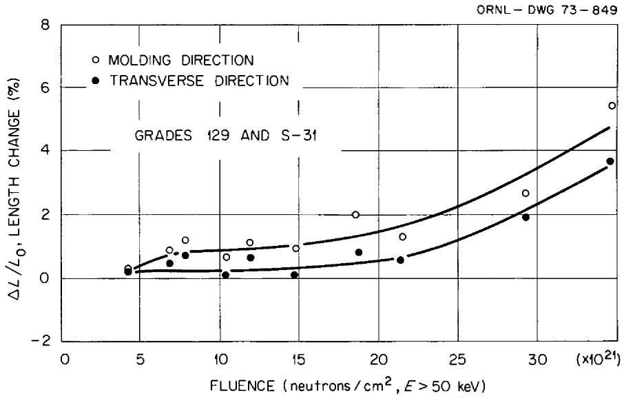  
Fig. 11.1. Length changes in Robinson coke graphites irradiated in the HFIR at $715^{\circ}\mathrm{C}$ .

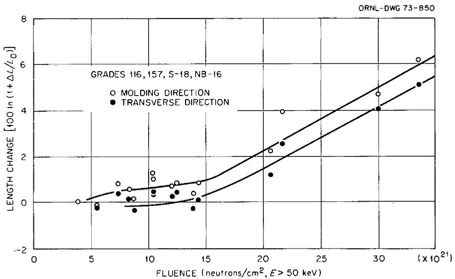  
Fig. 11.2. Length changes in Robinson and Thermax mixture graphites irradiated in the HFIR at $715^{\circ}\mathrm{C}$ .

three broad types of graphites' - conventional, carbon blacks, and apparently binderless - were included in this experiment. The behavior of each type is compared with the results obtained at $715^{\circ}\mathrm{C}$ in Figs. 11.5 and 11.6.

Figure 11.5 gives the results of several conventional grades which present a consistent behavior pattern. First, the samples irradiated at 715 and $950^{\circ}\mathrm{C}$ densify

at about the same rate. The so-called "breakaway" or transition to volume expansion occurs much earlier at $950^{\circ}\mathrm{C}$ and reduces the lifetime expectancy by about a factor of 2. Grade RY-12-29, hindered with a furfuryl alcohol binder (Varcum), behaves similarly at 715 and $950^{\circ}\mathrm{C}$ except that the changes at $950^{\circ}\mathrm{C}$ are intensified. This is the binder that produces a carbon phase of $\sim 1.5$ $\mathrm{g/cm}^3$ which densified during irradiation to $2.15\mathrm{g/cm}^3$ . This process creates voids between filler particles, and the structure degenerates. The heavily impregnated ATJ-S also appears to begin expanding more rapidly

than the conventional electrode stock graphites. Excluding the RY-12-29 and the ATJ-S grades, all of these graphites would have a lifetime expectancy at $950^{\circ}\mathrm{C}$ based on volume expansion, of around 10 to $11\times 10^{21}$ neutrons $\mathrm{cm}^2$

The results of the carbon-black grades are shown in Fig. 11.6. Again, the effect of temperature is consistent with the conventional graphite behavior. The densification is almost identical to the behavior at $715^{\circ}\mathrm{C}$ , since these materials all densify very rapidly. The expansion rate does appear to be larger than that observed at $715^{\circ}\mathrm{C}$ ; however, the irradiation exposure should be extended before quantitative values are obtained. As observed at $715^{\circ}\mathrm{C}$ , the major difference between

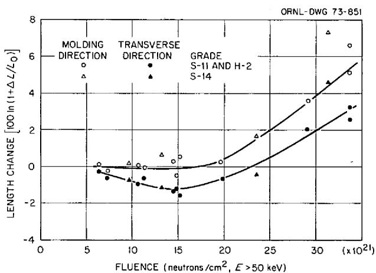  
Fig. 11.3. Length changes in graphites made with all Santa Maria and with a mixture of $65\%$ Santa Maria and $35\%$ Thermax irradiated in the HFIR at $715^{\circ}\mathrm{C}$ .

$1000^{\circ}\mathrm{C}$ heat-treated grade A-680 and $2800^{\circ}\mathrm{C}$ heat-treated grade A-681 is the initial densification. The lifetime expectancy of these grades, as observed at $715^{\circ}\mathrm{C}$ , does appear to be greater than the conventional grades.

The apparently binderless grades and ORNL experimental grades are compared in Fig. 11.7. All of these grades are very isotropic except grades 11-43 and 22-28K, which were made with anisotropic cokes (grade 22-28K being more anisotropic than 11-43). The irradiation is actually too small to give a valid indication of the expected lifetime or general behavior. The trends indicate that there is little difference in AXM and AXF, which are expanding linearly. Grade H-337 seems to have densified slightly and then begun to expand at a rate greater than the Poco grades. The ORNL grades have almost too much scatter to define a trend; however, they do appear to have a slight initial densification, then some expand and some do not. They seem certainly to be as stable as H-337, if not more so. One point demonstrated by the results for grades 11-43 and 22-28K is that isotropy is not required for volumetric stability. Grade 22-28K has experienced linear dimensional changes of over $4\%$ growth in the molding direction and $2\%$ shrinkage in the transverse direction with virtually no volume change.

These results yield the following general conclusions:

1. First-generation ORNL grades have a lifetime expectancy greater than the reference grade H-337 at $715^{\circ}\mathrm{C}$ .   
2. There are no growth rate or densification rate increases from irradiation temperatures of 715 to $950^{\circ}\mathrm{C}$ .

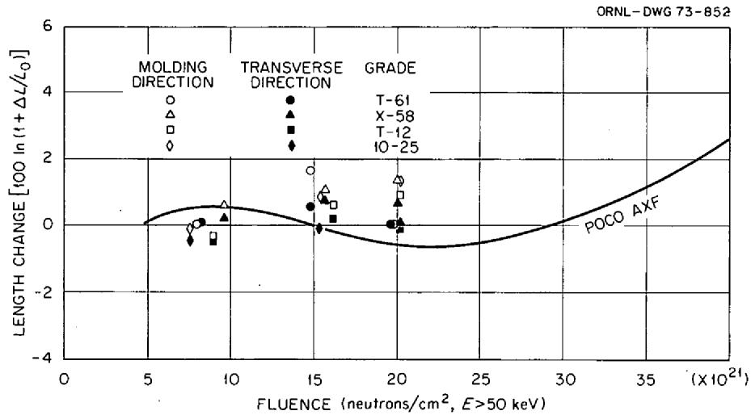  
Fig. 11.4. Length change of ORNL graphites made from modified coke irradiated in the HFIR at $715^{\circ}\mathrm{C}$ .

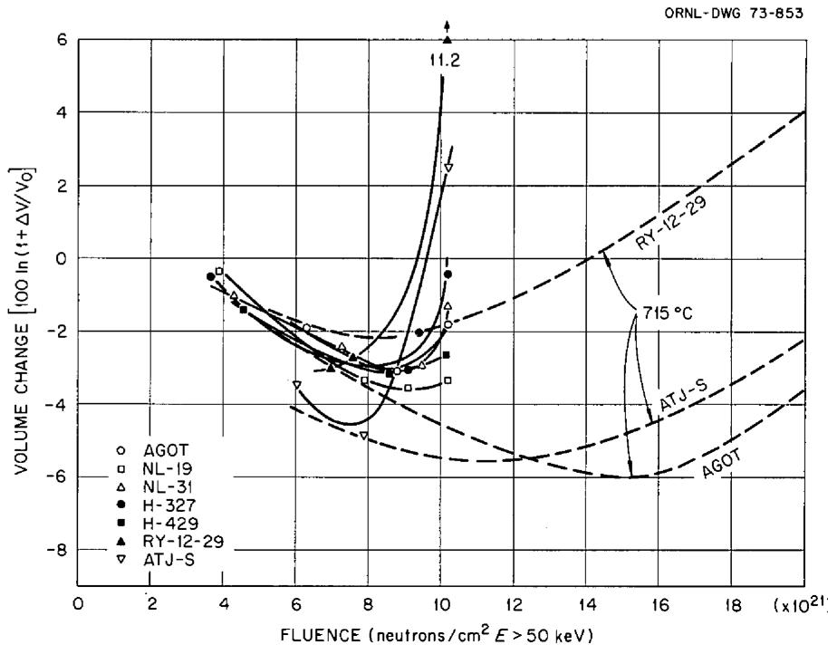  
Fig. 11.5. The volume change of conventional graphites at $950^{\circ}\mathrm{C}$ .

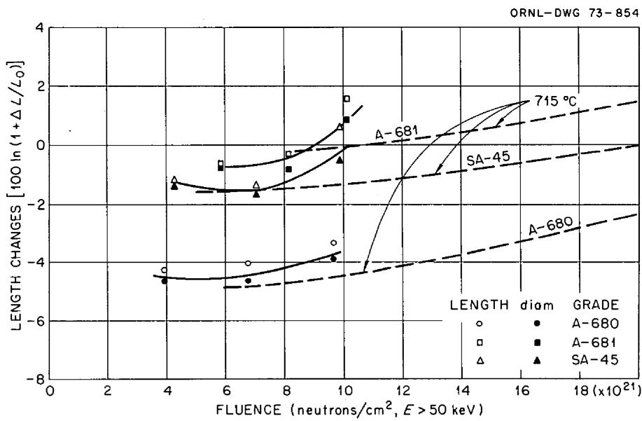  
Fig. 11.6. Length changes of carbon black grades irradiated in the HFIR at $950^{\circ}\mathrm{C}$ .

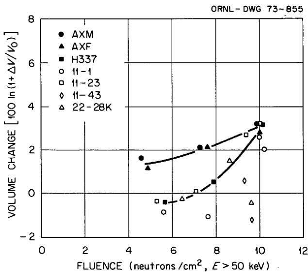  
Fig. 11.7. Volume change of apparently binderless and ORNL grades of graphite irradiated in the HFIR at $950^{\circ}\mathrm{C}$ .

3. The transition to volume expansion occurs more rapidly, by approximately a factor of 2, at $950^{\circ}\mathrm{C}$ compared with $715^{\circ}\mathrm{C}$ .   
4. Isotropy is not required for volumetric stability.   
5. The binding system and particle boundary morphology are more important than growth rates in determining lifetime.

The general behavior at $950^{\circ}\mathrm{C}$ for virtually all of the graphites is indeed identical to the $715^{\circ}\mathrm{C}$ behavior with one major exception: the earlier transition to volume expansion. The implication is that this is not caused by growth rate increases but by a lessening of the graphites' ability to absorb the shearing deformation.

# 11.2 PROCEDURE AND CHARACTERIZATION OF VARIOUS GRADES OF GRAPHITE

W.H.Cook J.L.Griffith

Graphite procurement and evaluations in the MSRP are currently directed toward two applications: (1) core moderators and reflectors for MSBR's and (2) equipment for processing the reactor's fluoride salt fuels.

For the studies on the nuclear application, our objectives are to identify grades that have superior resistance to dimensional changes induced by fast neutrons and to attain a better understanding of the mechanisms of neutron damage in graphite. Our sources of graphite for these studies are experimental grades fabricated by us (Sects. 11.1 and 11.4) plus experimental and production grades fabricated by commercial

manufacturers. Currently, our work is almost completely limited to experimental grades, since typical examples of all existing production grades known to have potential for nuclear application have been examined. As we acquire various grades, we make initial limited determinations of their physical properties to establish reference data. These data are used to determine if they warrant more extensive evaluation through additional physical, chemical, and fast-neutron irradiation studies. We have recently received samples of three new production grades of graphite: grades H395 and H395X from the Great Lakes Carbon Corporation and grade A800 from the Stackpole Carbon Company. None of the three has been optimized to the specific requirements of molten-salt reactors other than possible neutron damage resistance. Specifically, the pore entrance diameters are much larger than the $1 - \mu \mathrm{m}$ maximum required for MSBR core moderator graphite. They were supplied to us for general evaluation and are of interest in our studies on the relationship of microstructure and dimensional stability under irradiation.

The Great Lakes grades H395 and H395X are advanced grades beyond grade H337, which has good stability under fast-neutron irradiation. Grade H337 has a bulk density of $2.00\mathrm{g / m}^3$ whereas grades H395 and H395X have densities of 1.797 and $1.875\mathrm{g / cm}^3$ respectively. The higher bulk density of the H337 is due to a greater degree of impregnation with liquid hydrocarbons that have been carbonized and then graphitized. This is apparently the reason grade H395X also has a higher bulk density than grade H395. The microstructure of grade H395 is fairly uniform, whereas that for grade H395X varies because the impregnation fills some zones of the porosity more effectively than others.

The basic difference in grade H337 and grades H395 and H395X is their optical domain sizes (as revealed in the examination of their microstructures using a rotatable sensitive tint plate in a light microscope). Grade H337 has a fine matrix in which the optical domains are small, randomly oriented, and have an appearance similar to the most dimensionally stable graphite, grade AXF-5Q, $^{1}$ except that there are larger highly anisotropic filler particles scattered throughout the matrix which range approximately 5 to 25 times larger than the general matrix optical domains. Grades H395 and H395X do not have these larger anisotropic filler particles. Their optical domains appear to be $1\frac{1}{2}$ to 2 times that of grade AXF-5Q, which typically ranges from 4 to $10\mu \mathrm{m}$ . Rarely in grade AXF-5Q and only occasionally in grades H395 and H395X do we see filler

particles with optical domains that are aligned preferentially to a degree sufficient to give the whole filler particle a preferred orientation.

The cross-sectional views of grade AXF-5Q show the pore structure to be rough but approximately equiaxed, while that for grades H337, H395, and H395X is linear and branching.

Based on their microstructures, we anticipate that H395 and H395X would have similar dimensional stability under fast-neutron irradiation and would react in a way equal to or slightly more dimensionally stable than grade H337.

Stackpole grade A800 was supplied in connection with our core moderator studies directed toward understanding the relationship between dimensional stability and microstructure under fast-neutron irradiation, hence our interest in this material despite its density of only $1.642\mathrm{g/cm}^3$ and its large open pores. It represents a different method of fabrication and again has not been optimized toward MSBR requirements. Its microstructure reveals that it is composed of well-graphitized filler particles and carbon-black particles on an estimated volume ratio of 1.5:1. Additional characterization examinations are necessary to determine if this material warrants inclusion in our neutron-irradiation studies.

The graphite for constructing equipment for processing the reactor fuel salt has more latitude in physical properties because the material will not be subjected to fast-neutron radiation. The primary requirements of the graphite are that it be (1) chemically compatible with the lithium-bismuth alloys containing from 0 up to 3 wt $\%$ (48 at. $\%$ ) lithium at $650^{\circ}\mathrm{C}$ , (2) impermeable to the salts and lithium-bismuth alloys used in the chemical processing of the salts and their fission products, and (3) easily fabricated into relatively complex structures.

Two approaches are being considered for making the graphite impermeable to the salts and the lithium-bismuth alloys. One is to coat or to seal a polycrystalline graphite structure with pyrocarbon or pyrographite. The other is to adequately reduce the porosity and pore entrance diameters of the base stock by repeated impregnations with liquid hydrocarbons that are carbonized after each impregnation. These carbonized impregnations probably would be graphitized to improve chemical inertness in our applications.

The impregnation of the graphite is the approach favored by the Chemical Technology Division personnel who are developing the technology for the chemical processing of the fuel salts. Through their efforts we have acquired 6-in. cubes of graphite grades PGX and PGXX from the Carbon Products Division of the Union

Carbide Corporation. Grade PGX will be the reference material that will be upgraded by impregnations. It is a base stock material that can be made into large shapes -- for example, a 67-in.-diam, 80-in.-long piece is listed as a catalog item. Large-sized stock is necessary for one configuration of the chemical processing facilities under consideration by the Chemical Technology Division. Our samples of the base stock, grade PGX, and the impregnated base stock, grade PGXX, have bulk densities of 1.791 and $1.851\mathrm{g/cm^3}$ respectively. These suggest that grade PGX may be too porous to be used without modification. Additional tests are necessary and are in progress to determine if the pore entrance diameters of grade PGXX are small enough to be impermeable to the media cited above.

We have acquired from the Stackpole Carbon Company additional quantities of grade 2020, which has an average bulk density of $1.745\mathrm{g/cm^3}$ . This is good density control for a production-grade graphite of this type. This grade of graphite typically has almost all of its accessible porosity with pore entrance diameters within 1 to $3.5\mu \mathrm{m}$ and none more than $3.5\mu \mathrm{m}$ . This restricted range of pore entrance diameters makes this grade of graphite of direct potential for low-pressure regions (<25 psia) in the systems for the chemical processing of the fluoride fuels, and it could be upgraded relatively easily by impregnation or with pyrocarbon coating for use in regions at higher pressures. At this time we plan to use it without modification in compatibility studies with the lithium-bismuth alloys at $700^{\circ}\mathrm{C}$ .

# 11.3 CHARACTERIZATION OF ORNL GRAPHITES

O. B. Cavin C. R. Kennedy

Our program to develop graphite with improved irradiation resistance is directed toward obtaining a product having a virtual monolithic structure. That is, we would like for all of the carbon in the body, both filler and binder, to have the same structure. This would minimize the interparticle shearing which must be accommodated during the irradiation-induced anisotropic dimensional changes. There are numerous ways of evaluating these bodies to determine the extent to which we have accomplished this, each sensitive to one or more structural parameters.

Several samples were fabricated using modified Robinson coke with and without natural flake additions and bindered with furan-petroleum-pitch mixtures. These graphites, listed in Table 11.2, were all molded at $90^{\circ}\mathrm{C}$ and air cured at $150^{\circ}\mathrm{C}$ for 16 hr. The physical

Table 11.2. Physical and mechanical properties of ORNL graphites   

<table><tr><td rowspan="2">Filler</td><td colspan="2">Binder</td><td rowspan="2">Bulk density (g/cm3)</td><td rowspan="2">Electrical resistivity (μohm-cm)</td><td colspan="4">Modulus (psi)</td><td rowspan="2">Sonic Poisson&#x27;s ratio</td><td rowspan="2">Distance between layer planes (Å)</td><td rowspan="2">Crystallite size (Å)</td></tr><tr><td>Content (pph)</td><td>Type</td><td>Rupture</td><td>Young&#x27;s</td><td>Sonic longitudinal</td><td>Sonic shear</td></tr><tr><td></td><td></td><td></td><td></td><td></td><td></td><td>×106</td><td>×106</td><td>×106</td><td></td><td></td><td></td></tr><tr><td>Modified Robinson</td><td>10</td><td>QX229</td><td>1.55</td><td>2520</td><td>2,860</td><td>0.80</td><td>0.90</td><td>0.40</td><td>0.06</td><td>6.810</td><td>244</td></tr><tr><td>Modified Robinson</td><td>15</td><td>QX229</td><td>1.60</td><td>2360</td><td>4,810</td><td>1.13</td><td>1.14</td><td>0.49</td><td>0.13</td><td>6.800</td><td>257</td></tr><tr><td>Modified Robinson</td><td>20</td><td>QX229</td><td>1.70</td><td>1860</td><td>7,590</td><td>1.62</td><td>1.39</td><td>0.60</td><td>0.17</td><td>6.806</td><td>257</td></tr><tr><td>Modified Robinson</td><td>25</td><td>QX229</td><td>1.77</td><td>1790</td><td>10,370</td><td>1.84</td><td>1.71</td><td>0.74</td><td>0.15</td><td>6.809</td><td>233</td></tr><tr><td>Modified Robinson</td><td>30</td><td>QX239</td><td>1.80</td><td></td><td>13,840</td><td>2.03</td><td></td><td></td><td></td><td>6.820</td><td>223</td></tr><tr><td>Modified Robinson plus 10% natural flake</td><td>25</td><td>QX234</td><td>1.73</td><td>1770</td><td></td><td></td><td></td><td></td><td></td><td>6.806</td><td>213</td></tr><tr><td>Modified Robinson plus 15% natural flake</td><td>25</td><td>QX234</td><td>1.78</td><td>1630</td><td></td><td></td><td></td><td></td><td></td><td>6.790</td><td>258</td></tr><tr><td>Modified Robinson plus 20% natural flake</td><td>25</td><td>QX234</td><td>1.78</td><td>1680</td><td></td><td></td><td></td><td></td><td></td><td>6.798</td><td>169</td></tr></table>

and mechanical properties of these bodies are also given for comparison. It is immediately obvious that increasing the binder content results in a body of higher bulk density, strength, and elastic constants, but decreased resistivity. The carbon yield of the binder is about $50\%$ , so the maximum carbon contribution from the binder to the bodies would be approximately $15\%$ . There is a $16\%$ increase in density in going from 10 to 30 parts per hundred of binder. This increase in density is an expected result of binder optimization, a complex procedure of creating more efficient binding to produce a more uniform shrinkage. The significant increases in mechanical properties reflect the reduction in the critical defect size by the optimization of binder to reduce porosity.

The electrical conductivity increases significantly with increased density. This is in contrast to the x-ray parameters, which show a decrease in the average crystallographic perfection with increased binder content. The same conflict is observed by comparing the graphites with natural flake additions. The electrical conductivity of the samples is virtually identical to the all-Robinson coke sample with the same density and independent of the average crystallographic perfection as indicated by the x-ray parameters. This emphasizes the sensitivity of electrical conductivity, not only to crystallographic perfection, but to the effective cross-sectional areas and structural morphology. It is shown in Table 11.2 that the conductivity is a very strong function of the density or effective cross-sectional area. However, the structural morphology is also significant in that the location of the binder around each filler particle is a limiting factor in the increase of the conductivity. The cured binder is certainly less graphitic than the filler materials, particularly the natural flake filler, as shown by the x-ray parameter. Thus, the binder will have a much higher resistivity and act as an insulator in the structure. A further increase of the conductivity can therefore only come from an improvement in the crystallinity of the binder.

# 11.4 GRAPHITE FABRICATION

# C. R. Kennedy

Graphites for improved resistance to irradiation must have a binder system that produces an interparticle boundary with a very high mechanical integrity. We have concentrated our efforts in this program to

understanding the binder characteristics in order that representative graphites of improved structures can be made and evaluated. The binders studied include coal-tar pitches, petroleum pitches, and furan-petroleum-pitch mixtures, both with and without nitrobenzene as a diluent and plasticizer.

The initial graphite fabrication of the green cokes produced reasonably dense structures; however, these hard dense cokes have excessive springback after molding, causing high localized shrinkage during carbonization. These effects produced the structure shown in Fig. 11.8, which is fairly representative of our first-generation graphites. This graphite has been irradiated, and the results are given in Figs. 11.1-11.3. The reasonable stability of these graphites is very promising and suggests that the binding of the individual filler particles is fairly good.

To eliminate the linear defects shown in Fig. 11.8, we have, through a coke modification process, produced graphites with the pore morphology as shown in Fig. 11.9. The mechanical integrity of this structure is very good; however, irradiation results are as yet very preliminary, as shown in Fig. 11.4. We have produced this type of structure using all the binders listed above.

The strength and modulus relationships of the various graphites are compared in Fig. 11.10, demonstrating again the similarity in pore morphology of our experimental materials and the Poco grade AXF-5Q, both of which are superior to the specialty grade ATJ-S graphite. This is a reasonably conclusive demonstration that the pore morphology and structural integrity can be maintained for a wide variety of raw materials through this modification process. The electrical and thermal conductivities, however, are found to be very sensitive to the methods of fabrication as well as raw materials. Controlling the conductivity of these graphites is, in fact, one of the major problems in fabrication.

We are concerned about the thermal conductivity, not only because of the reduction of thermal gradients in the reactor core, but because it is also a sensitive measure of the binder carbon characteristics. We desire a monolithic structure in which all of the carbon has the same structure and behaves uniformly under irradiation. This would in turn reduce the strain concentrations in the binder carbon between the filler particles. Since the binder coats all the filler particles, the conductivity of this layer can dominate the overall conductivity of the graphite body. This is very evident in the sharp effect of air curing the binder upon the electrical resistivity, as shown in Fig. 11.11. Differences in the filler materials are completely masked by the curing, as is shown by the similarity of the semiacicular

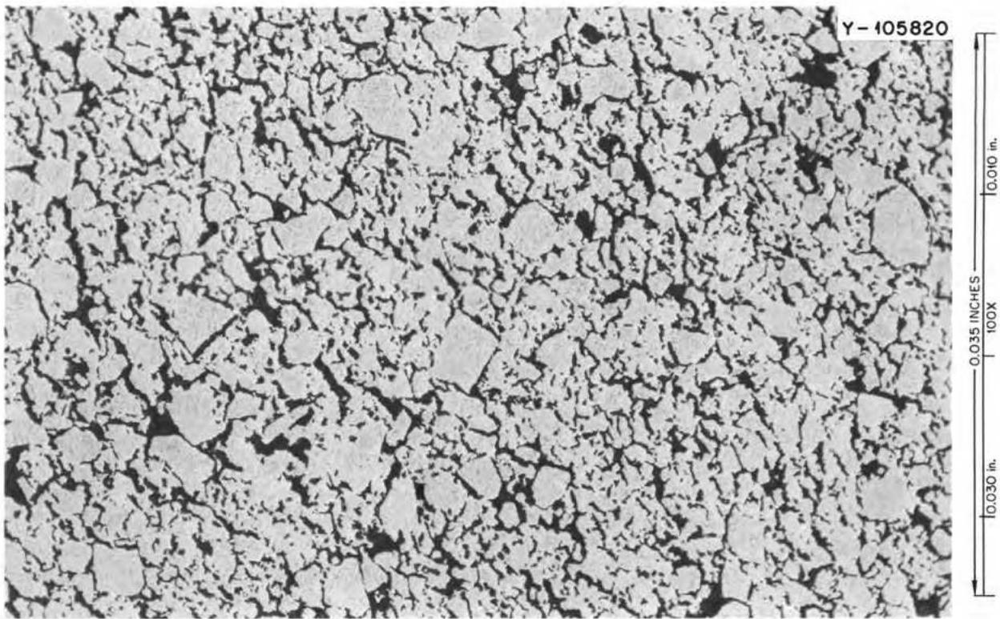  
Fig. 11.8. Representative pore texture of first-generation ORNL experimental graphites.

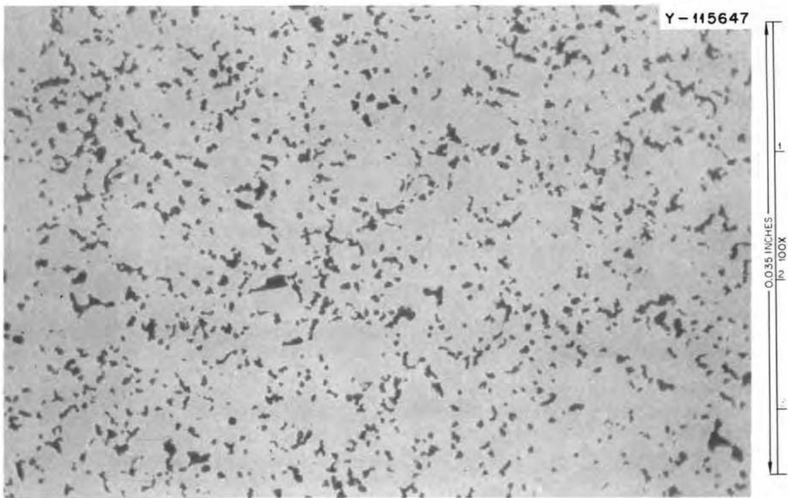  
Fig. 11.9. Representative pore texture of second-generation ORNL experimental graphites.

filler coke with and without the addition of Robinson coke fines. Molding at too high a temperature also appears to have a deleterious effect on resistivity. We have now observed that the petroleum pitch 240 is even sensitive to the air retained in the packed bed during the bake cycle. Removing the air from the baking

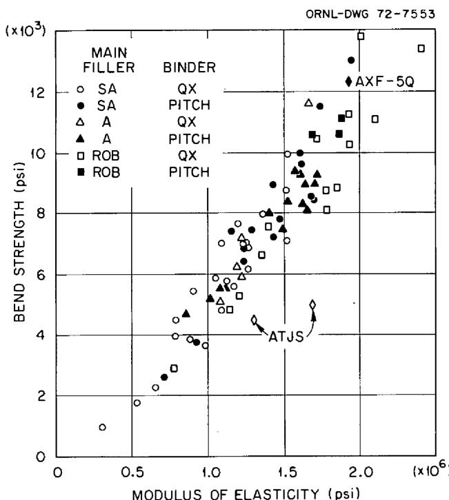  
Fig. 11.10. Strength as a function of Young's modulus for various green-coke-based experimental graphites.

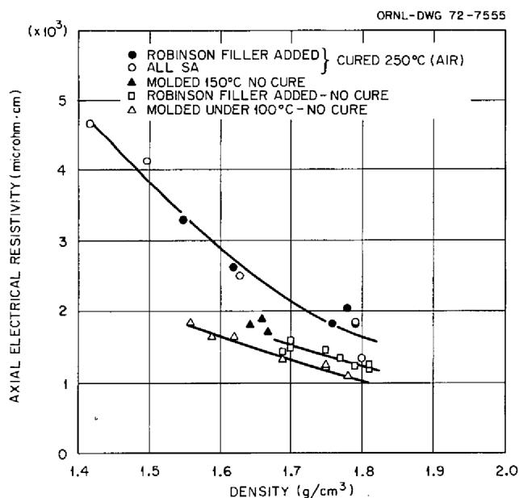  
Fig. 11.11. Effect of air cure on semiacicular coke graphites.

furnace and backfilling with argon is now a standard practice to eliminate this effect. Therefore, it becomes important to mold the graphites at temperatures as low as possible and to subsequently protect the molded bodies with a nonoxidizing environment.

The relation between density and electrical resistivity is also obvious in Fig. 11.11, and density is indeed a major consideration in the strength of a graphite. We have found that by eliminating the oxidation of the very aromatic petroleum pitch 240 the coke yield dropped from $50\%$ down to 30 to $35\%$ . In terms of texture, reasonably good graphites have been fabricated with the 240 pitch, but it is exceedingly difficult to obtain a high-density graphite with this low yield. The carbon yield can be increased by the addition of furans to the pitch or by the addition of Thermax or fines to the filler. Both of these additions, however, do increase the electrical resistance.

It has long been a practice to add fines to fillers to act as binder "extends." This practice increases the density of the product by increasing the binder yield and improves the packing of the filler particles. Since the fines are more intimately associated with the binder, the influence on the properties is again to those that are more sensitive to binder effects. Thermax or other carbon blacks have long been used for this purpose, but even small additions seriously decrease the conductivity of the graphite. We have been substituting fines of Robinson, acicular, and semiacicular cokes made by grinding in a fluid mill. We have added the superfines of these cokes still in the green state or prefired to $600^{\circ}\mathrm{C}$ . The addition of the $600^{\circ}\mathrm{C}$ calcined fines was very deleterious. Not only was the conductivity seriously decreased, but the mechanical properties of these graphites were reduced to more like conventional grades. The green Robinson and acicular coke fines appear to be more effective in obtaining high densities than the semiacicular coke. However, all the graphites with the fines additions have a lower conductivity, particularly with Robinson fines. The use of the Robinson fines also has the ability to make the graphite more isotropic. All semiacicular coke graphites fabricated to obtain a Bacon anisotropy factor of 1.1 can be made isotropic (BAF of 1.0) by a 30 to $40\%$ Robinson fines addition.

The addition of furans to the petroleum pitch 240 does make the binder more controllable, but some slight increase in electrical resistivity does occur. The purity and controllability of the 240 petroleum pitch and furan mixtures make these binders otherwise look attractive. We continually find for these mixtures a wider latitude in the binder content required to

optimize a particular filler mixture. This may result from a more gradual weight loss during the carbonization cycle than the more abrupt losses from petroleum pitches and some of the coal-tar pitches. Also, these binders are available with very low viscosities at room temperature, allowing mixing and fabrication temperatures to be reduced. The use of diluents such as nitrobenzene has also been shown to be very controllable and useful in processing the pitch-furan mixtures. In general, these binders may offer considerably more control and uniformity than the variable coal-tar pitches.

One additional method of increasing yield and quality is the use of pressure baking. We have fabricated a group of samples using both the 240 pitch and 240 furan mixture as binders. These have been pressure baked to $650^{\circ}\mathrm{C}$ , using the facilities at the Y-12 Plant, and then conventionally baked to $1000^{\circ}\mathrm{C}$ . The evalua

tion is not complete, but the apparent yield of the binders was increased by some 15 to $20\%$ , and the overall quality of the blocks looked very good.

In summary, the graphite development program is continuing toward an optimization of the monolithic structure. Most of our attention has been devoted to studies to ensure the coherency of the binder carbon and to match its structure to that of the filler particles.

# 11.5 THERMAL PROPERTY TESTING

J.P.Moore T.G.Kollie

D. L. McElroy

Thermal conductivity $(\lambda)$ and electrical resistivity $(\rho)$ measurements have been completed on the AXF-5Q graphite which was irradiated to $4.2\times 10^{21}$ neutrons/ $\mathrm{cm}^2$ ( $E > 50~\mathrm{keV}$ ) at approximately $650^{\circ}\mathrm{C}$ . As shown in Fig. 11.12 the thermal conductivity of this specimen

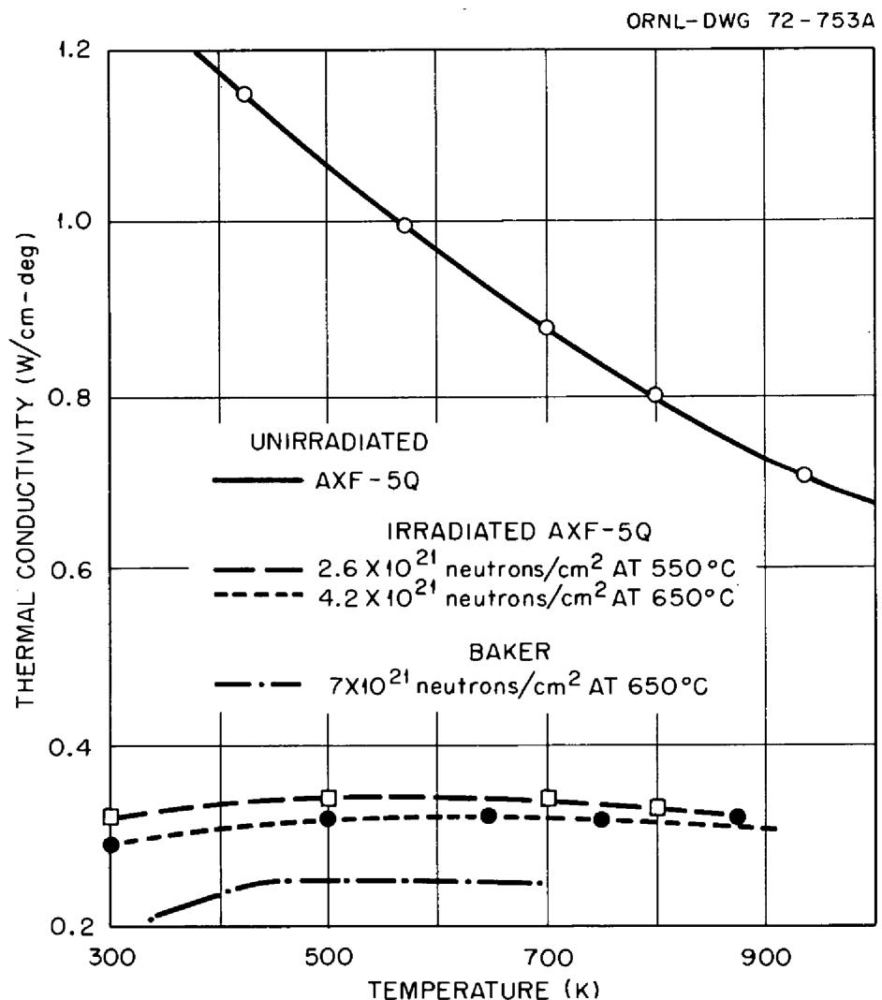  
Fig. 11.12. Effects of neutron irradiation on the thermal conductivity of graphites.

Table 11.3. Thermal conductivity of irradiated graphites from ORNL and Baker3   

<table><tr><td rowspan="3">Temperature (°K)</td><td colspan="4">λ (W cm-1deg-1)</td></tr><tr><td colspan="3">AXF-5Q</td><td rowspan="2">Baker, 7 × 1021neutrons/cm2at 650°C</td></tr><tr><td>Unirradiated</td><td>After 2.6 × 1021neutrons/cm2at 550°C</td><td>After 4.2 × 1021neutrons/cm2at 650°C</td></tr><tr><td>300</td><td>1.31</td><td>0.32</td><td>0.30</td><td>0.19</td></tr><tr><td>400</td><td>1.17</td><td>0.34</td><td>0.31</td><td>0.24</td></tr><tr><td>500</td><td>1.07</td><td>0.345</td><td>0.32</td><td>0.25</td></tr><tr><td>600</td><td>0.97</td><td>0.345</td><td>0.32</td><td>0.25</td></tr><tr><td>700</td><td>0.88</td><td>0.34</td><td>0.32</td><td>0.25</td></tr><tr><td>800</td><td>0.80</td><td>0.33</td><td>0.32</td><td></td></tr><tr><td>900</td><td>0.73</td><td></td><td>0.31</td><td></td></tr></table>

aFrom D. E. Baker, J. Nucl. Mater. 12(1), 120 (1964). The thermal conductivity of the graphite used by Baker was about $1.1\mathrm{Wcm}^{-1}$ deg $^{-1}$ at $400^{\circ}\mathrm{K}$ before irradiation.

was a few percent below that of the specimen irradiated at $550^{\circ}\mathrm{C}$ to a fluence of $2.6 \times 10^{21}$ neutrons/ $\mathrm{cm}^2$ . Also shown in Fig. 11.12 are representative data for unirradiated AXF-5Q from our previous results and data from Baker3 on a needle coke graphite which had been irradiated at $650^{\circ}\mathrm{C}$ to a fluence of $7 \times 10^{21}$ neutrons/ $\mathrm{cm}^2$ . Baker's data are in good agreement with ours, and we have listed the various results in Table 11.3.

The specimen of H-337 graphite that was irradiated at $550^{\circ}\mathrm{C}$ to a fluence of $2.6 \times 10^{21}$ neutrons/cm² has been assembled, and measurements of $\rho$ and $\lambda$ are under way. During disassembly of the irradiation capsule, the H-337 graphite that had been irradiated at $750^{\circ}\mathrm{C}$ was inadvertently broken. This prevents the planned $\lambda$ measurements on this sample at high temperatures, but we have fabricated holders which will enable us to obtain some $\lambda$ data from the sample near room temperature in another apparatus.

Thermal expansion is related to the structure of graphite, and measurements of this parameter may be useful in understanding irradiation damage in graphite. Thus we are setting up the equipment required to make these measurements accurately, and we plan to make thermal expansion measurements on the same samples being used in the thermal conductivity studies. Attempts to calibrate the quartz dilatometer between 25 and $725^{\circ}\mathrm{C}$ using NBS-certified quartz and copper samples yielded a large scatter $(\pm 5\times 10^{-4}\mathrm{cm})$ in the length-change measurements. Since repeatability is essential to the accuracy of thermal expansion measurements using this technique, the quartz pushrod and

holder tube assembly were refabricated to tighter tolerances. This was done to reduce movements in the assembly due to vibrations and differential thermal expansions. Repeat measurements with the NBS quartz sample yielded reproducibilities of $\pm 8 \times 10^{-6}$ cm, which is within the $\pm 25 \times 10^{-6}$ cm accuracy of the electronic micrometer. After calibrating with the NBS copper gage, measurements are planned on AXF-5Q and H-337 graphites in the pre- and postirradiated conditions.

# 11.6 REDUCTION OF HELIUM PERMEABILITY OF GRAPHITE BY PYROLYTIC CARBON SEALING

C. B. Pollock W. H. Cook

The breeding performance of molten-salt reactors is significantly affected by the extent to which $^{135}\mathrm{Xe}$ accumulates in the core graphite. A procedure for stripping the gaseous fission products with a bubble purge system has been developed, but its effectiveness is dependent upon the surface condition of the core graphite. Therefore, it is desirable to seal the surface of the graphite to reduce $^{135}\mathrm{Xe}$ permeation, and the preferred material is pyrolytic carbon. The first technique used for this purpose was a carbon impregnation process in which surface pores were plugged with pyrolytic carbon. It was found that the helium permeability of this material increased rather rapidly with irradiation, and alternate schemes for sealing were investigated.

Previous investigations by Hewette, among others, had shown that pyrolytic carbon coatings derived from propene $(\mathrm{CH}_3\mathrm{CH}:\mathrm{CH}_2)$ at $1300^{\circ}\mathrm{C}$ were extremely

stable under the influence of fast neutrons at $715^{\circ}\mathrm{C}$ (ref. 4). The dimensional changes of dense low-temperature coatings derived from propene are summarized in Fig. 11.13. The extremely small change in the parallel direction (approximately $2\%$ ) is significant in that it matches very closely the observed changes in Poco graphite under the same conditions of fluence and temperature. The coatings in this study had densities greater than $1.99~\mathrm{g/cm}^3$ and Bacon anisotropy factors of less than 1.1. Furthermore, it was determined that these classes of carbonous materials were able to relieve internal stresses by creep. An examination of the known properties of the candidate graphites and the low-temperature coatings led to the belief that the two materials would be compatible under molten-salt reactor conditions of fluence and temperature.

A furnace designed for coating small graphite samples with pyrolytic carbon was built, and coating techniques were developed. The excellent behavior of low-temperature pyrocarbon can be attributed to several factors that include a Bacon anisotropy factor less than 1.1 in the structure and a density of $2.0\mathrm{g/cm^3}$ or greater. Therefore, our coating process parameters were directed toward achieving these properties. Previous studies indicated that deposition temperatures between 1100 and $1400^{\circ}\mathrm{C}$ were necessary to achieve the high density and required isotropy with a propene source. We found that coatings deposited in the temperature range 1100 to $1300^{\circ}\mathrm{C}$ with a carbon deposition rate of 1.3 to $14.0\mu \mathrm{m / min}$ had a density of $2.0\mathrm{g/cm^3}$ or greater. But, in order to achieve the isotropic coating, it was necessary to simulate the action of a fluidized-bed furnace. This was accomplished by levitating a small quantity of carbon beads around the sample, which was fixed in place by a carbon rod. All coatings were heat treated to at least $1800^{\circ}\mathrm{C}$ before being removed from the furnace.

Coated samples were prepared by coating at 1100, 1150, 1200, 1250, and $1300^{\circ}\mathrm{C}$ . The coatings were deposited on a substrate of grade AXF-5Q graphite cylinders, nominally 0.40 in. OD, 0.14 in. ID, and 0.50 in. long.

Part of our evaluation of the coatings is to examine a selected quantity of the samples in detail nondestruct-

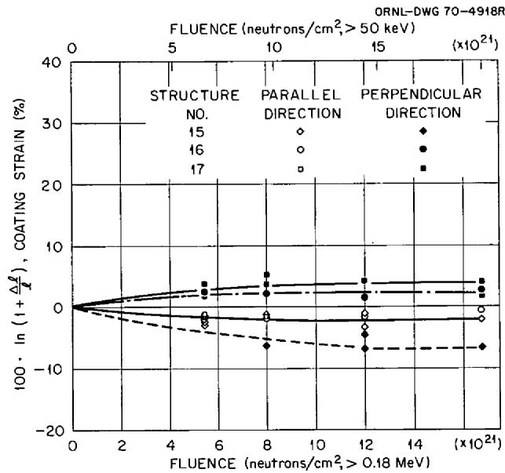  
Fig. 11.13. Effect of fast-neutron exposure at $715^{\circ}\mathrm{C}$ on the dimensional changes of propene-derived pyrolytic carbons.

tively with the scanning electron microscope (SEM) and destructively by conventional bright-field metallographic techniques. These are complementary types of examinations which we use to characterize the as-deposited coatings from the bases of the effects of the deposition parameters plus the nature and quality of the coatings.

A summary of the SEM observations on this series of coated samples is as follows:

1. The rounding of the sharp edges of the substrate samples appears to have eliminated the cracking and spalling of the pyrocarbon coatings which sometimes occurred at these sharp edges.   
2. The quality of the pyrolytic coating appears to be improved by decreasing the roughness in the machined surfaces of the substrate graphite.   
3. The pyrolytic carbons deposited at the lower temperatures appear to be more continuous and have less bridging of pyrocarbon particles than those deposited at higher temperatures.   
4. The basic pyrolytic deposition particles start as oblate spheroids at $1100^{\circ}\mathrm{C}$ , become almost flat platelets at $1200^{\circ}\mathrm{C}$ , and finally become more spheroid-like at $1300^{\circ}\mathrm{C}$ .   
5. At 1100 and $1150^{\circ}\mathrm{C}$ the longer coating period appears to improve the overall physical appearance of the coatings. (Lack of time and samples prevented such evaluation for the other deposition temperatures.)

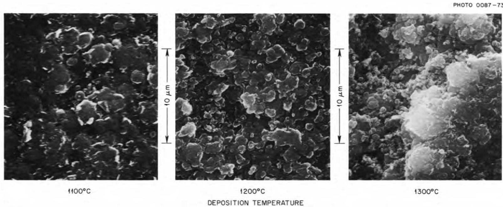  
Fig. 11.14. SEM photomicrographs showing typical microstructural topography of as-deposited and heat-treated pyrolytic carbon coatings derived from propene and deposited on grade AXF-5Q graphite at the temperatures indicated. $5000\times$

6. The physical nature of a coating at a particular deposition temperature is sensitive to the geometry and orientation of the sample in the coating furnace. For example, the coating on the cylindrical surface of a sample is not always the same as that on the rounded edges of the sample.

Figure 11.14 illustrates the typical range of microstructures observed in this series. The pyrocarbon deposited at $1100^{\circ}\mathrm{C}$ (Fig. 11.14a) appeared to have a fine-grained component that had the appearance of a "solidified silt" cementing around the larger pyrocarbon particles and the grains of the substrate graphite. The quantity of the silt portion varied with coating time at $1100^{\circ}\mathrm{C}$ . Figure 11.14b illustrates the change to smaller and more spherical particles at a deposition temperature of $1200^{\circ}\mathrm{C}$ . Note that there is more porosity due to particle bridging at the higher deposition temperatures.

Our bright-field metallographic examinations of transverse sections through the coatings indicate that they are dense, bonded to the substrate graphite, and the degree of anisotropy of the coatings is estimated to be less than 1.3 in the extreme case by examination under polarized light. To acquire more quantitative data on the isotropy, samples have been prepared for measurement by the OPTAF technique.

During this report period we have prepared an extensive array of coated samples for the first irradiation experiments that cover the full range of coating conditions, all of which were sealed to a helium permeability of less than $10^{-8}\mathrm{cm}^2/\mathrm{sec}$ . Table 11.4 describes the samples being irradiated in HFIR capsule HTM-20, which was inserted in August 1972. Plans are to remove this capsule in November 1972, after it has accumulated a total peak fluence of $1 \times 10^{22}$ neutrons/cm $^2$ at $700^{\circ}\mathrm{C}$ . The capsule consists of a stack of samples threaded on a graphite spine assembly which is enclosed within an aluminum can. Figure 11.15 shows some of the samples selected for the first irradiation experiment.

We have used the SEM to selectively examine about $25\%$ of the pyrolytic-carbon-coated samples before installation in the HFIR irradiation capsule HTM-20. We have made SEM photomicrographs as permanent records on the outside and on one of three rounded corners of each of the selected coated samples. Undoubtedly, fast-neutron damage will not manifest itself

exactly in the small regions photographed, but the fact that the sample being irradiated is its own control is superior to using a similar sample as a control. We plan to monitor these selected samples with the SEM as they acquire increments of fluence. We hope to be able to see how fast-neutron damage starts and progresses with increasing fluence and how the damage varies with structures. We shall attempt to correlate these observations with other data such as dimensional changes and gas permeability. The goal of this program is to determine the deposition parameters that will produce the most reliable types of coating under fast-neutron irradiation.

Table 11.4. Coated graphite samples irradiated in the HFIR capsule HTM-20   

<table><tr><td>Sample number</td><td>Coating temperature (°C)</td><td>Effective helium admittance (cm2/sec)</td><td>Coating thickness (in.)</td></tr><tr><td>MS-82</td><td>1100</td><td>1.4 × 10-10</td><td>0.0008</td></tr><tr><td>A</td><td></td><td></td><td></td></tr><tr><td>MS-84</td><td>1100</td><td>1.2 × 10-10</td><td>0.0015</td></tr><tr><td>B</td><td></td><td></td><td>0.0017</td></tr><tr><td>MS-85</td><td>1100</td><td>1.1 × 10-10</td><td>0.0013</td></tr><tr><td>B</td><td></td><td></td><td></td></tr><tr><td>MS-86</td><td>1100</td><td>1.1 × 10-10</td><td>0.0010</td></tr><tr><td>A</td><td></td><td></td><td>0.0012</td></tr><tr><td>MS-87</td><td>1100</td><td>2.2 × 10-10</td><td>0.0014</td></tr><tr><td>A</td><td></td><td></td><td></td></tr><tr><td>MS-88</td><td>1100</td><td>1.1 × 10-10</td><td>0.0010</td></tr><tr><td>A</td><td></td><td></td><td>0.0012</td></tr><tr><td>MS-89</td><td>1150</td><td>9.0 × 10-11</td><td>0.0022</td></tr><tr><td>B</td><td></td><td></td><td></td></tr><tr><td>MS-91</td><td>1150</td><td>6.4 × 10-11</td><td>0.0028</td></tr><tr><td>B</td><td></td><td></td><td>0.0032</td></tr><tr><td>MS-92</td><td>1150</td><td>6.8 × 10-11</td><td>0.0012</td></tr><tr><td>A</td><td></td><td></td><td>0.0016</td></tr><tr><td>MS-93</td><td>1150</td><td>5.9 × 10-11</td><td>0.0026</td></tr><tr><td>B</td><td></td><td></td><td></td></tr><tr><td>MS-94</td><td>1150</td><td>4.1 × 10-11</td><td>0.0020</td></tr><tr><td>B</td><td></td><td></td><td></td></tr><tr><td>MS-95</td><td>1150</td><td>3.8 × 10-11</td><td>0.0020</td></tr><tr><td>A</td><td></td><td></td><td></td></tr><tr><td>MS-97</td><td>1150</td><td>3.8 × 10-11</td><td>0.0021</td></tr><tr><td>A</td><td></td><td></td><td>0.0024</td></tr><tr><td>MS-98</td><td>1200</td><td>5.9 × 10-11</td><td>0.0023</td></tr><tr><td>B</td><td></td><td></td><td>0.0026</td></tr><tr><td>MS-99</td><td>1200</td><td>7.2 × 10-11</td><td>0.0020</td></tr><tr><td>A</td><td></td><td></td><td></td></tr><tr><td>MS-99</td><td>1200</td><td>5.2 × 10-11</td><td>0.0024</td></tr><tr><td>B</td><td></td><td></td><td></td></tr><tr><td>MS-101</td><td>1300</td><td>1.6 × 10-9</td><td>0.0053</td></tr><tr><td>A</td><td></td><td></td><td>0.0057</td></tr><tr><td>MS-103</td><td>1300</td><td>1.1 × 10-8</td><td>0.0029</td></tr><tr><td>A</td><td></td><td></td><td>0.0031</td></tr></table>

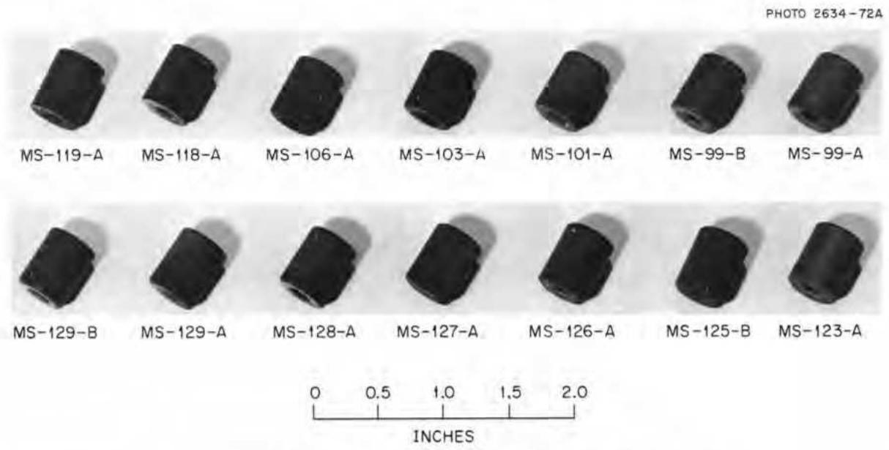  
Fig. 11.15. Graphite samples coated with pyrolytic carbon for HTM-20.

# 11.7 IRRADIATION OF PYROCARBONS

D, M. Hewette II C. R. Kennedy

The ability of pyrocarbon coatings to retain their low permeability depends upon how their dimensional changes match those of the substrate graphite. We recognized early from our results and those of Bokros that the growth rates of the individual pyrocarbon crystallites are exceedingly high; for the coatings to be dimensionally stable, the pyrocarbon must be almost perfectly isotropic. The results of Beatty showed that it would be impossible to obtain an isotropic high-density carbon from methane $\mathrm{(CH_4)}$ . It is possible, however, to obtain the necessary high-density isotropic pyrocarbon from propene $\mathrm{(CH_3CH:CH_2)}$ deposited at relatively low temperatures (around 1100 to $1300^{\circ}\mathrm{C}$ ). To demonstrate the dimensional stability of these pyrocarbons, several propene- and methane-derived pyrocarbons were irradiated in the HFIR to fluences up to $3.3\times 10^{22}$ neutrons/cm $^2$ ( $E > 50\mathrm{keV}$ ).

The results of this irradiation experiment are shown in Figs. 11.16 and 11.17 for both methane- and propene-derived pyrocarbons. The materials irradiated are listed in Table 11.5. The methane-derived materials

were very unstable, with the most isotropic coatings shrinking over $10\%$ . The propene coatings were fairly isotropic and dimensionally stable. The heat-treated YZ-131 had the greatest stability, with little effect of heat treatment at temperatures from 1900 to $2500^{\circ}\mathrm{C}$ . The slightly lower density YZ-196 had the expected high initial densification of the as-deposited material. However, there was one YZ-196 sample heat treated to $1900^{\circ}\mathrm{C}$ that expanded when irradiated, which suggests that the structure was not fully stabilized. It appears that the preferred coating would have a density greater than $2.03\mathrm{g/cm}^2$ and would be heat treated to $2000^{\circ}\mathrm{C}$ . It is doubtful that a strain differential between the coating and substrate of much greater than 2 to $3\%$ could be sustained without cracking or spalling.

# 11.8 EXAMINATION OF UNIRRADIATED AND IRRADIATED PYROCARBON STRIPS WITH THE SCANNING ELECTRON MICROSCOPE (SEM)

W.H.Cook

The results (previously described) of the examination of pyrocarbon coatings on graphite prompted us to make similar examinations on pyrocarbon strips being studied by Kennedy and Hewette. These materials were derived from several hydrocarbon sources under different deposition and heat-treating conditions. We

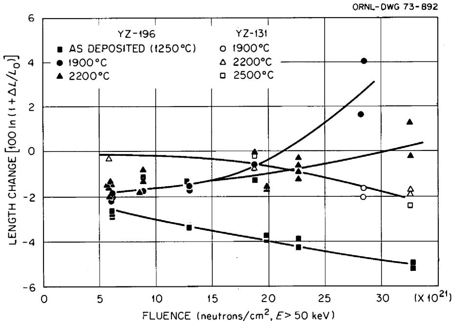  
Fig. 11.16. In-plane dimensional changes in propene-derived pyrocarbons.

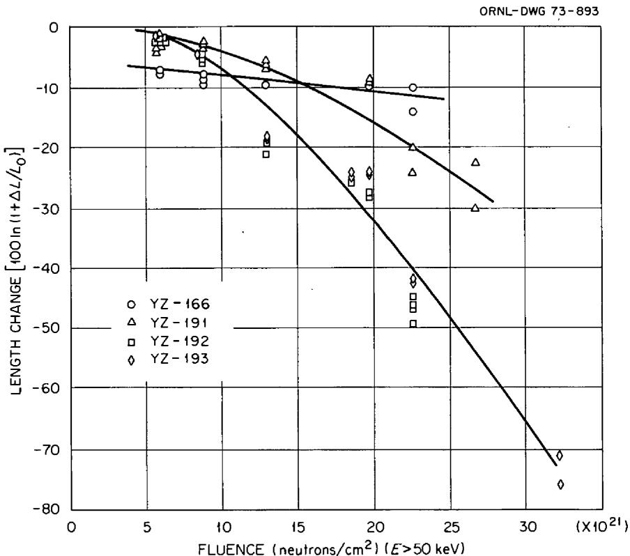  
Fig. 11.17. In-plane dimensional changes in methane-derived pyrocarbons.

Table 11.5. Pyrocarbons irradiated in the HFIR   

<table><tr><td>Structure number</td><td>Material</td><td>Source</td><td>Deposition temperature (°C)</td><td>Heat treatment</td><td>Liquid immersion density (g/cm3)</td></tr><tr><td>18</td><td>YZ-166</td><td>Methane</td><td>1600</td><td>As deposited</td><td>1.62</td></tr><tr><td>12</td><td>YZ-191</td><td>Methane</td><td>2000</td><td>As deposited</td><td>1.93</td></tr><tr><td>13</td><td>YZ-192</td><td>Methane</td><td>2000</td><td>As deposited</td><td>2.05</td></tr><tr><td>14</td><td>YZ-193</td><td>Methane</td><td>2000</td><td>As deposited</td><td>2.08</td></tr><tr><td>6</td><td>YZ-131</td><td>Propene</td><td>1250</td><td>1900°C</td><td>2.08</td></tr><tr><td>7</td><td>YZ-131</td><td>Propene</td><td>1250</td><td>2200°C</td><td>2.09</td></tr><tr><td>8</td><td>YZ-131</td><td>Propene</td><td>1250</td><td>2500°C</td><td>2.08</td></tr><tr><td>15</td><td>YZ-196</td><td>Propene</td><td>1250</td><td>As deposited</td><td>2.01</td></tr><tr><td>16</td><td>YZ-196</td><td>Propene</td><td>1250</td><td>1900°C</td><td>2.03</td></tr><tr><td>17</td><td>YZ-196</td><td>Propene</td><td>1250</td><td>2200°C</td><td>2.03</td></tr></table>

have examined several controls and irradiated specimens derived from methane and propene. Some of the irradiated specimens examined had accumulated fluences as high as $3.2 \times 10^{22}$ neutrons/cm $^2$ ( $E > 50$ keV) at $715^{\circ}\mathrm{C}$ .

For the unirradiated controls, those deposited from methane at $2000^{\circ}\mathrm{C}$ had virtually no porosity, and those deposited from propene at $1250^{\circ}\mathrm{C}$ had a significant amount of porosity. Under the deposition conditions cited, the pyrocarbon derived from methane was anisotropic, and that derived from propene was isotropic. The rougher starting surfaces of the control for the methane-derived pyrocarbon (Fig. 11.18c) vs that derived from propene (Fig. 11.19c) can be explained by the fact that the methane-derived material is more anisotropic and more graphitic. This caused it to cleave and shear rather than polish, as the pyrocarbon derived from propene did.

The results of the SEM examinations of these materials after irradiation show graphically the changes created by the fast-neutron damage and the differences in the resistance to the damage by the different materials. In the unirradiated condition, the polished specimen shown in Fig. 11.18a is only 0.0032 in. thick in the direction parallel with the $c$ axis of the graphite crystallites of the pyrocarbon. Under a fluence of $3.2 \times 10^{22}$ neutrons/cm² ( $E > 50\mathrm{keV}$ ) accumulated at $715^{\circ}\mathrm{C}$ , this thickness increased by a maximum of more than $500\%$ , while the width and length decreased by 50 and $53\%$ respectively.[12] This observation clearly illustrates the ability of graphite to make these large dimensional changes plastically without cracking.

In contrast, the dimensions of the isotropic pyrocarbon derived from propene decreased approximately $5\%$ under the same irradiation conditions. A comparison of Figs. 11.19d and 11.19c shows that the original surface roughened during irradiation.

# 11.9 TEXTURE DETERMINATIONS

E. S. Bomar O. B. Cavin

We described previously an optical technique used for determining the anisotropy of graphites of interest to the Gas-Cooled Reactor Program. This technique is being adapted to evaluate the anisotropy of surface sealants placed on graphites for MSR applications. The optical technique is suitable for highly localized anisotropy determinations, while x-ray diffraction can be used to measure the average bulk properties. In order to correlate the values obtained from the optical and x-ray techniques, samples are being prepared which are suitable for either technique.

We continued to use the sphere technique described previously to arrive at the average anisotropy of bulk graphites. The spherical sample, however, is not amenable to texture determinations of a surface coating. Therefore, we are using thin flat samples of the coating extracted from the surface of Poco AXM substrate. In the past it has been necessary to have samples 10 to 20 mils thick, most of which was substrate, mounted onto a glass backing plate for holding during the spectrometer run. The glass con

PHOTO 0088-73

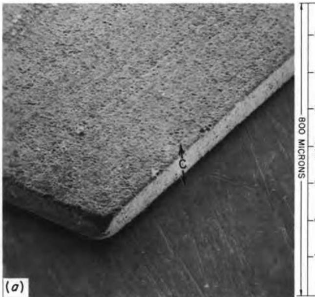

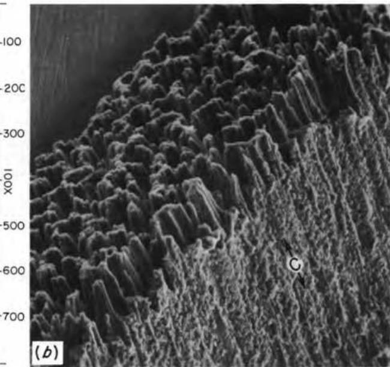

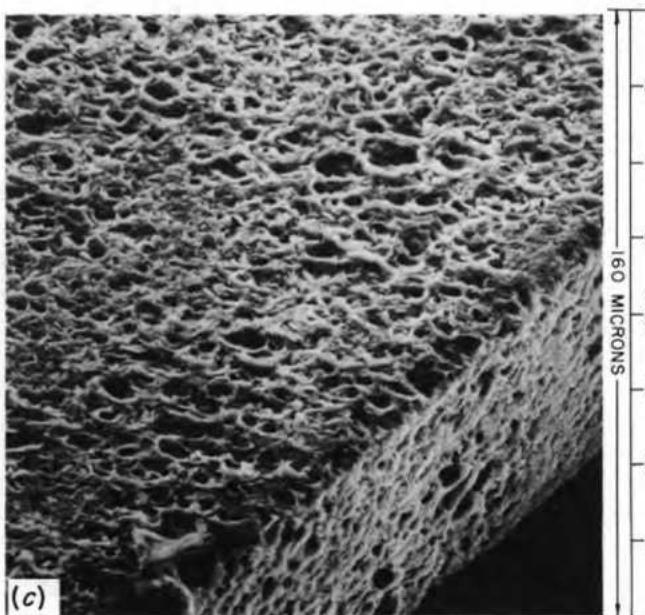

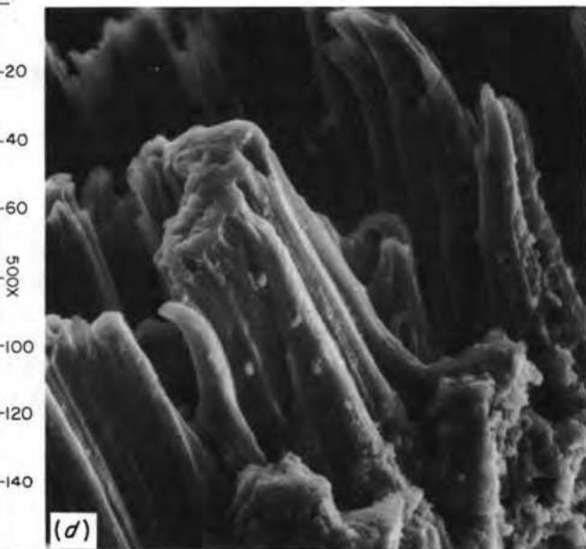  
UNIRRADIATED CONTROL   
$3.2 \times 10^{22} \left[\mathrm{n/cm}^{2}\right.$ ( $E > 50 \mathrm{keV}$ ) AT $715^{\circ} \mathrm{C}$   
Fig. 11.18. Pyrocarbon strip derived from methane at $2000^{\circ}\mathrm{C}$ . $(a, c)$ Unirradiated control and $(b, d)$ after an accumulation of $3.2 \times 10^{22}$ neutrons/cm $^2$ $(E > 50\mathrm{keV})$ at $715^{\circ}\mathrm{C}$ .

PHOTO 0089-73

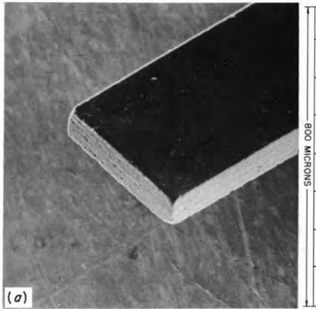

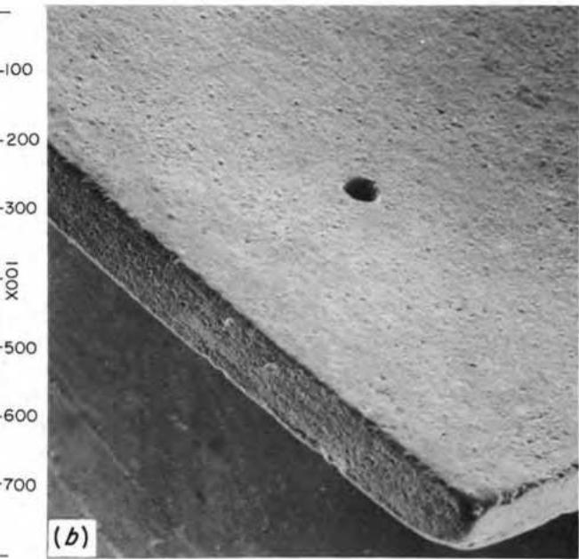

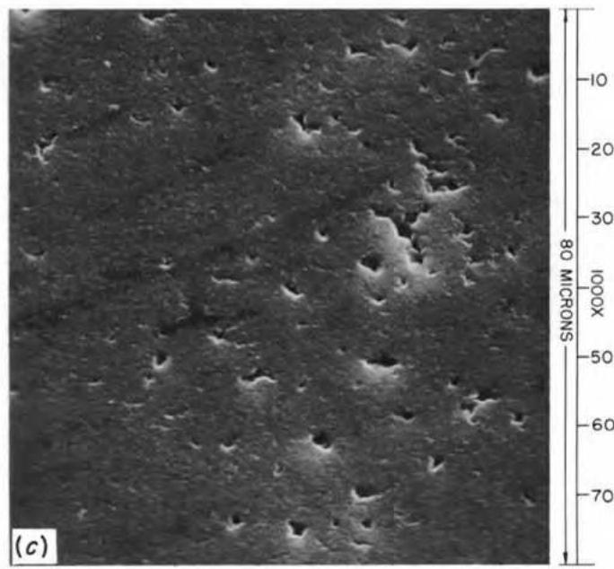

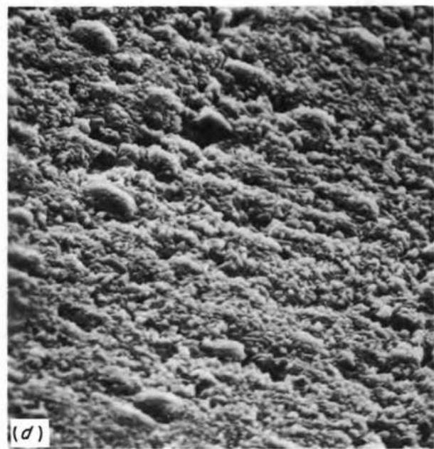  
Fig. 11.19. Pyrocarbon strip derived from propene at $1250^{\circ}\mathrm{C}$ . $(a, c)$ Unirradiated control and $(b, d)$ after an accumulation of 3.2 $\times 10^{22}$ neutrons/cm $^2$ $(E > 50\mathrm{keV})$ at $715^{\circ}\mathrm{C}$ .

UNIRRADIATED CONTROL

$$
3. 2 \times 1 0 ^ {2 2} [ n / c m ^ {2} (E > 5 0 k e V) ] A T 7 1 5 ^ {\circ} C
$$

tributes to the background scatter, particularly at the low scattering angles near the basal plane peak. We are now using silicon single-crystal wafers for mounting plates. The crystal is cut so that no crystallographic planes which diffract the copper $K\alpha$ $(\lambda = 1.5418\AA)$ x rays are parallel with the surface on which the sample is mounted. This gives an extremely low background count which makes the weak peaks easier to detect. As a result of this low background, we can reduce the required thickness of the sample. Now, instead of the usual 10 to 20 mils, much of which was substrate, samples 2 to 3 mils thick are used from which essentially all the substrate has been removed. Hence, it is possible to determine the x-ray anisotropy values of graphite coatings independent of the substrate by using the spectrometer and counter technique. We prefer the counter over the film technique used by others' because an intermediate step of film developing and recorded density measuring is eliminated. In the counter technique, the intensity values are recorded directly on a computer-compatible paper tape, which greatly reduces the man-hours required for arriving at an anisotropy value.

Samples from which the x-ray data have been obtained will then be studied optically to arrive at an optical anisotropy factor (OPTAF) value.

We have done additional work with the Leitz microscope and photometer to improve the quality of the OPTAF measurements. The information obtained led to

several mechanical alterations to the equipment, defined operational limits for light intensity and voltage applied to the photomultiplier tube, and helped in the selection of an operational procedure to give reproducible results.

After examining the elements in the optical path of the microscope and after a discussion with Leitz, we removed a plain-glass reflector and a prismatic diffuser plate to avoid an error in the apparent intensity of elliptically polarized light reflected from pyrolytic carbon samples.

We tested the performance of the photomultiplier tube and the associated electronic components by measuring the OPTAF of a graphite single crystal over a range of incident light intensities and voltages applied to the photomultiplier. The resulting OPTAF was not constant, although the values formed an irregular plateau for tube voltages ranging from 830 to $1120\mathrm{V}$ . Scatter in the data became very large under conditions requiring a correction for dark current: namely, very low light levels or low voltage to the tube. We found a marked improvement in the consistency of the OPTAF for the single-crystal graphite sample when a 10-in. recorder was substituted for the $3^{1/2}$ -in. meter on the picoammeter to read the current from the photomultiplier tube. The improvement was due in part to the increased precision of the larger scale, but, in addition, a comparison with the picoammeter results showed a bias in the latter instrument.

Pyrolytic carbon standards are being prepared by C. B. Pollock to permit correlation between our particular OPTAF equipment and the x-ray-determined Bacon anisotropy factor.

# 12. Hastelloy N

H. E. McCoy

Prior studies have shown that a modified alloy of Hastelloy N containing about $2\%$ Ti will likely have adequate resistance to embrittlement by neutron irradiation. Several small commercial heats of this composition have been obtained for evaluation. Samples of these alloys and standard Hastelloy N were irradiated to a high thermal-neutron fluence in the HFIR to evaluate the effects of high helium concentrations on the mechanical properties. Corrosion experiments involving Hastelloy N and two austenitic stainless steels exposed to fuel and coolant salts are in progress. The compatibility of Hastelloy N with steam for potential use in steam generators is being evaluated in a facility at TVA's Bull Run Steam Plant.

# 12.1 MECHANICAL PROPERTIES OF SEVERAL COMMERCIAL HEATS OF MODIFIED HASTELLOY N

H.E.McCoy B.McNabb

Five small commercial melts have been tested during this reporting period. All alloys were received in the form of $\frac{1}{2}$ -in.-thick plates. The vendor's chemical analyses are given in Table 12.1. The first two alloys were made by the same vendor, both with nominal additions of $2\%$ titanium but utilizing two different melting procedures. A 120-lb melt was made by vacuum induction melting (VIM), and two electrodes were cast. One electrode was remelted by consumable electrode remelting (CEVM) under vacuum, and the other electrode was remelted under a protective slag (ESR). The third alloy, also with a nominal addition of $2\%$ titanium, was prepared by another vendor using VIM

and CEVM processes. The last two alloys have hafnium additions. Although the electrode that was remelted by the ESR process was initially overcharged with hafnium, the slag extracted so much of the hafnium that the final alloy contained only $0.3\%$ hafnium. The alloy that was melted by the VIM and CEVM processes had $0.7\%$ hafnium.

These alloys were first subjected to weldability tests. Filler wire was prepared from the same material as the test plates by cutting $\frac{1}{2}$ -in.-square strips and swaging them to $\frac{3}{32}$ in. in diameter (for use in the first three weld passes) and $\frac{1}{8}$ in. in diameter (for the remaining passes). The weld test plates were prepared with a bevel so that the included angle for the weld deposit was $100^{\circ}$ . The welds were examined visually after every pass and periodically with dye penetrant. Side-bend samples $\frac{1}{8}$ in. thick were cut from the welds and bent around a $\frac{3}{4}$ -in.-diam mandrel. All of the alloys passed the weldability test except heat 72-115, which contained $0.7\%$ hafnium. The root pass cracked in the first test weld. A second weld was made in which the first three passes were made with standard Hastelloy N filler metal (heat 5005). These three passes looked excellent, but when the weld sequence was continued with three passes of heat 72-115, numerous cracks formed. This weld was ground out, and the entire weld was made with standard Hastelloy N filler metal. The weld looked excellent, and the side-bend specimens were free of cracks (Fig. 12.1).

Transverse weld samples that include base metal, fusion zone, and weld metal were prepared from all alloys. Samples from two of the heats that were modified with about $2\%$ titanium have received limited

Table 12.1 Vendor chemical compositions on several heats of modified Hastelloy N plate   

<table><tr><td rowspan="2">Heat number</td><td colspan="13">Concentration (wt %)</td><td rowspan="2">Meltinga process</td></tr><tr><td>Cr</td><td>Mo</td><td>Fe</td><td>C</td><td>Si</td><td>Mn</td><td>P</td><td>S</td><td>Al</td><td>B</td><td>Ti</td><td>Hf</td><td>Zr</td></tr><tr><td>71-114</td><td>7.24</td><td>12.03</td><td>0.06</td><td>0.05</td><td>0.04</td><td>0.01</td><td>0.002</td><td>0.005</td><td>0.12</td><td>0.002</td><td>1.96</td><td></td><td></td><td>VIM + CEVM</td></tr><tr><td>17-583</td><td>7.21</td><td>12.16</td><td>0.06</td><td>0.04</td><td>0.05</td><td>0.01</td><td>0.002</td><td>0.004</td><td>0.12</td><td>0.001</td><td>1.79</td><td></td><td></td><td>VIM + ERS</td></tr><tr><td>72-503</td><td>6.96</td><td>12.95</td><td>0.32</td><td>0.06</td><td>0.01</td><td>0.01</td><td>0.001</td><td>0.003</td><td></td><td>0.001</td><td>1.94</td><td></td><td></td><td>VIM + CEVM</td></tr><tr><td>72-604</td><td>6.87</td><td>11.90</td><td>0.07</td><td>0.09</td><td>0.09</td><td>0.07</td><td>0.003</td><td>0.003</td><td>0.12</td><td>&lt;0.001</td><td></td><td>0.3</td><td>0.02</td><td>VIM + ESR</td></tr><tr><td>72-115</td><td>6.87</td><td>11.90</td><td>0.07</td><td>0.09</td><td>0.09</td><td>0.07</td><td>0.003</td><td>0.003</td><td>0.12</td><td>&lt;0.001</td><td></td><td>0.7</td><td>0.02</td><td>VIM + CEVM</td></tr></table>

$^a$ VIM = vacuum induction melt.  
CEVM = consumable electrode vacuum melt.  
ESR = electroslag remelt.

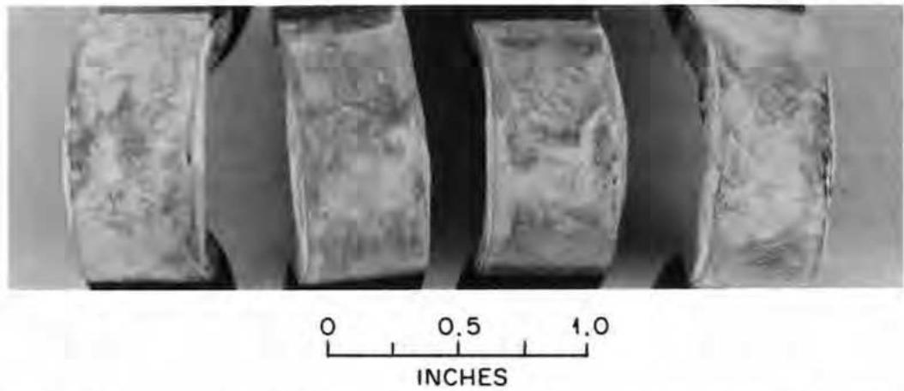  
Fig. 12.1. Side-bend specimens of a weld made using heat 72-115 (0.7% Hf) base metal and heat 5005 (standard Hastelloy N) filler metal. The samples were examined with dye penetrant, and no flaws were visible.

Table 12.2. Creep properties at ${650}^{ \circ  }\mathrm{C}$ and 55,000 psi of the base metal and transverse welds of two experimental alloys   

<table><tr><td>Heat number</td><td>Postweld anneal</td><td>Rupture life (hr)</td><td>Minimum creep rate (%/hr)</td><td>Rupture strain (%)</td><td>Reduction in area (%)</td></tr><tr><td rowspan="4">71-114</td><td>Base metal, annealed 1 hr at 1180°C</td><td>119.0</td><td>0.14</td><td>44.3</td><td>45.8</td></tr><tr><td>As welded</td><td>68.0</td><td>0.034</td><td>6.11</td><td>31.6</td></tr><tr><td>8 hr at 870°C</td><td>3.9</td><td>0.25</td><td>7.6</td><td>33.2</td></tr><tr><td>1 hr at 980°C</td><td>5.6</td><td>0.26</td><td>8.1</td><td>22.5</td></tr><tr><td rowspan="4">71-583</td><td>Base metal, annealed 1 hr at 1180°C</td><td>63.1</td><td>0.11</td><td>31.4</td><td>26.0</td></tr><tr><td>As welded</td><td>6.8</td><td>0.055</td><td>3.4</td><td>9.9</td></tr><tr><td>8 hr at 870°C</td><td>2.4</td><td>0.25</td><td>4.9</td><td>24.7</td></tr><tr><td>1 hr at 980°C</td><td>2.3</td><td>0.38</td><td>6.6</td><td>29.8</td></tr></table>

testing, and the results are summarized in Table 12.2. The following points seem important concerning the creep behavior of these heats at $650^{\circ}\mathrm{C}$ .

1. Welds have lower rupture lives, creep rates, and fracture strains than the base metal.   
2. Postweld-heat treatments at 870 and $980^{\circ}\mathrm{C}$ decrease the rupture life over that of the as-welded material, increase the minimum creep rate, and have only slight effects on the fracture strain.

Samples of the base metal of all five heats listed in Table 12.1 have been creep tested at $650^{\circ}\mathrm{C}$ . As shown in Fig. 12.2, the stress-rupture properties of all five heats were superior to those of standard Hastelloy N. Within the scatter of the data, the three titanium-modified alloys and heat 72-602, containing $0.3\%$ hafnium, had about equivalent properties. Heat 72-115, with $0.7\%$ hafnium, had superior properties. The creep

rates of these same heats at $650^{\circ}\mathrm{C}$ are shown in Fig. 12.3. The three titanium-modified alloys had about equivalent creep strength, and the data indicated that they were generally stronger than standard Hastelloy N. The two hafnium-modified alloys were even stronger than the titanium-modified alloys.

Some testing of these five heats was also done at $760^{\circ}\mathrm{C}$ . The stress-rupture properties (Fig. 12.4) of heat 72-604, with $0.3\%$ hafnium, were about equivalent to those of standard Hastelloy N, and the properties of the other alloys were superior. The creep rates of these heats are shown in Fig. 12.5. Heat 72-115, with $0.7\%$ hafnium, was considerably stronger than standard Hastelloy N, and the other alloys were generally slightly stronger.

Samples of alloy 71-114 (1.96% Ti) and 71-583 (1.79% Ti) were irradiated to a thermal fluence of $3 \times 10^{20}$ neutrons/cm² at 650 and $760^{\circ}C$ and postirradia

tion creep tested at $650^{\circ}\mathrm{C}$ . The stress-rupture properties are shown in Fig. 12.6. The rupture time at a given stress level was reduced by irradiation, but is still superior to that of standard Hastelloy N irradiated at 650 and $760^{\circ}\mathrm{C}$ . This large effect of irradiation temperature on standard Hastelloy N was attributed to changes

in carbide structure. The microstructures of the current alloys have not been characterized, but it is

1. H. E. McCoy and R. E. Gehlbach, "Influence of Irradiation Temperature on the Creep-Rupture Properties of Hastelloy N," Nucl. Technol. 11(1), 45 (1971).

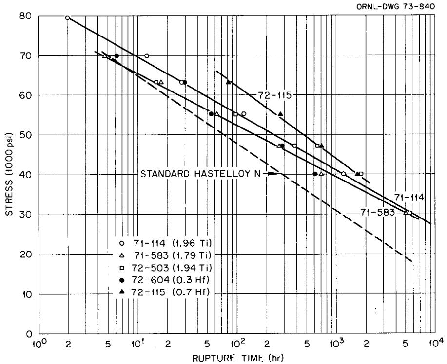  
Fig. 12.2. Stress-rupture properties at $650^{\circ}\mathrm{C}$ of several heats of modified Hastelloy N.

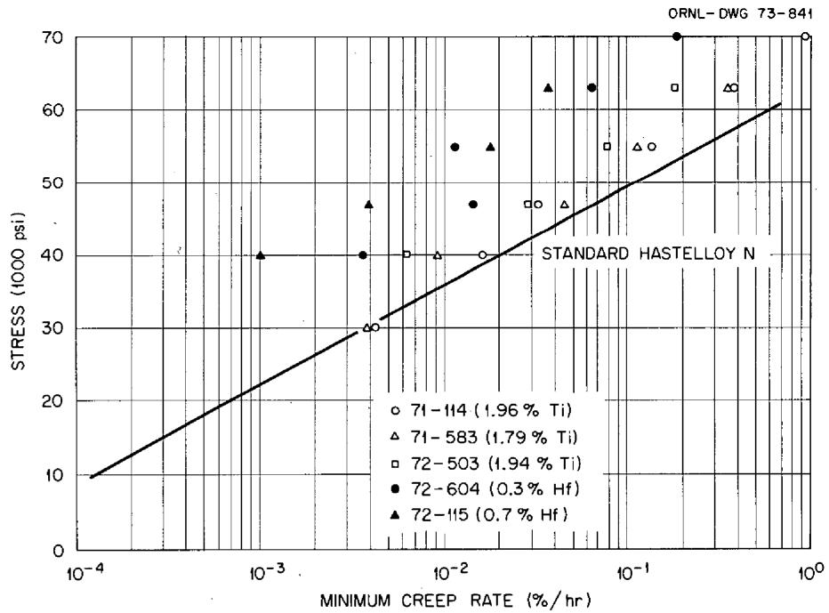  
Fig. 12.3. Creep rates at $650^{\circ}\mathrm{C}$ of several heats of modified Hastelloy N.

likely that the poorer properties observed after irradiation at $760^{\circ}\mathrm{C}$ compared with $650^{\circ}\mathrm{C}$ are due to changes in carbide structure. The minimum creep rates of these samples are shown in Fig. 12.7. Before irradiation, these alloys had minimum creep rates about equivalent to those of standard unirradiated Hastelloy N (Fig. 12.3). Irradiation caused an increase in the minimum creep rate at high stress levels, but had little effect at low stresses. Irradiation temperature did not have any detectable effect on the creep rate.

The property change of most concern in Hastelloy N during irradiation is the reduction in the fracture strain. This parameter is shown in Fig. 12.8 for alloys 71-114 and 71-583. Both alloys had fracture strains many times those for standard Hastelloy N. Alloy 71-583, with $1.79\%$ titanium, had slightly lower fracture strains when irradiated at $760^{\circ}\mathrm{C}$ than at $650^{\circ}\mathrm{C}$ , but alloy 71-114, with $1.96\%$ Ti, did not show any detectable effect of irradiation temperature.

In summary, small commercial heats of an alloy containing nominally $2\%$ titanium have shown satisfactory weldability, unirradiated mechanical properties, and mechanical properties after irradiation. Further development of this alloy will await a clearer understanding of the effects of composition on the susceptibility to intergranular cracking, discussed in Chap. 10.

# 12.2 IRRADIATION OF HASTELLOY N IN THE HFIR

H. E. McCoy

There is increasing evidence that Ni will transmute to helium by a thermal-neutron reaction.2 We had assumed previously that $^{10}\mathrm{B}$ would be the primary source of helium in Hastelloy N irradiated in an MSBR, and,

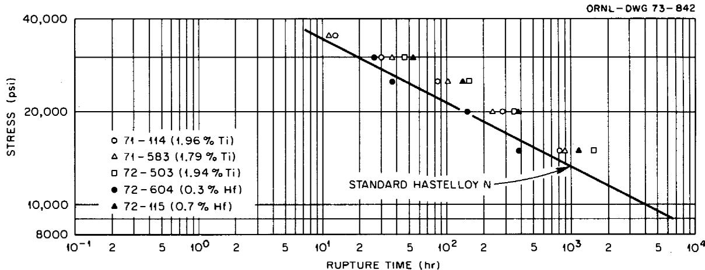

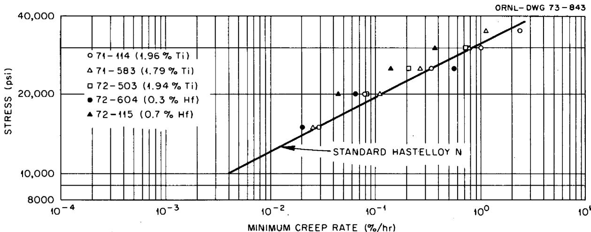  
Fig. 12.4. Stress-rupture properties at $760^{\circ}\mathrm{C}$ of several heats of modified Hestelloy N.   
Fig. 12.5. Creep rates at $760^{\circ}\mathrm{C}$ of several heats of modified Hestelloy N.

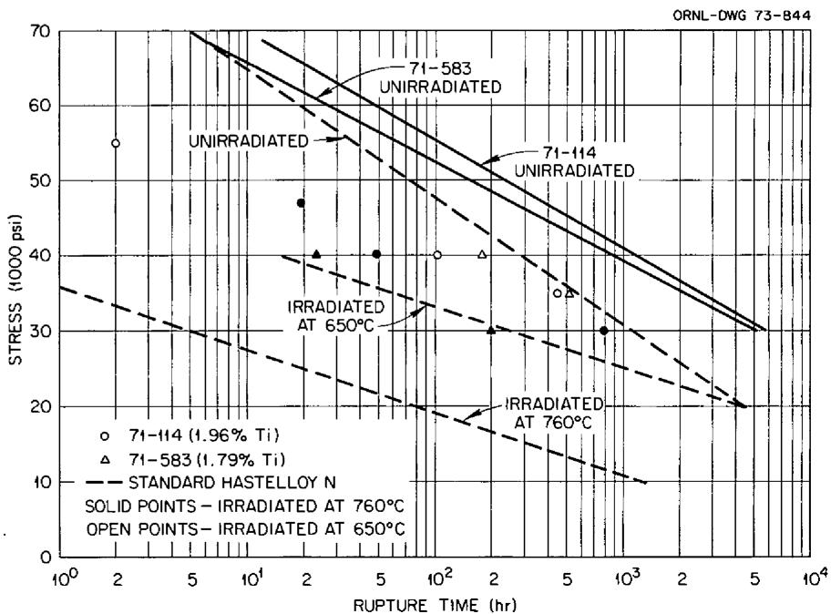  
Fig. 12.6. Stress-rupture properties at $650^{\circ}\mathrm{C}$ of two heats of titanium-modified Hastelloy N following irradiation to a thermal fluence of $3 \times 10^{20}$ neutrons/cm $^2$ .

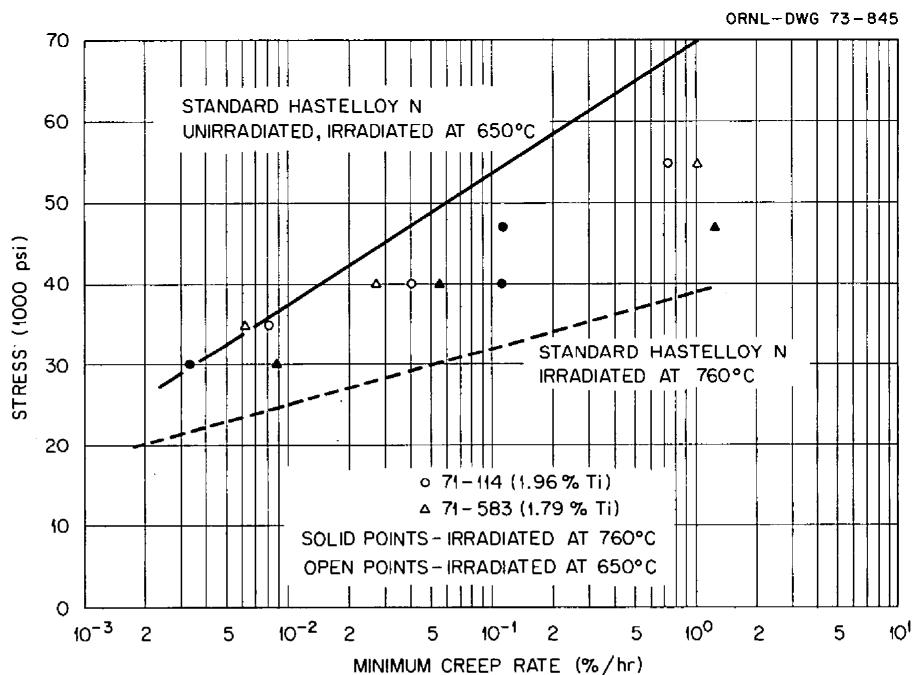  
Fig. 12.7. Creep rates at $650^{\circ}\mathrm{C}$ of two heats of titanium-modified Hastelloy N following irradiation to a thermal fluence of $3 \times 10^{20}$ neutrons/cm $^2$ .

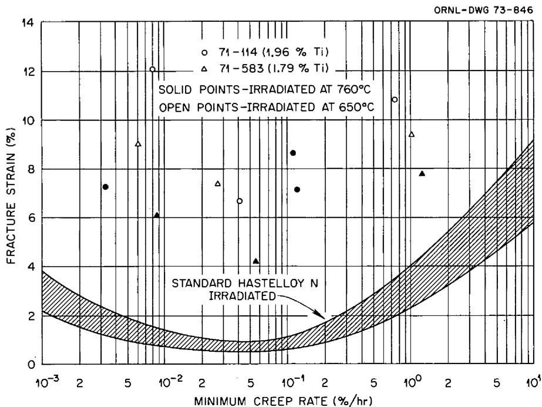  
Fig. 12.8. Fracture strains at $650^{\circ}\mathrm{C}$ of two heats of titanium-modified Hastelloy N following irradiation to a thermal fluence of $3 \times 10^{20}$ neutrons/cm $^2$ .

since this reaction would approach completeness at a thermal-neutron fluence of about $5 \times 10^{20}$ neutrons/cm², higher neutron fluences would have no further effect on the amount of helium. The possibility of low-cross-section thermal transmutation that would produce helium from Ni presents the possibility that the above assumptions are incorrect and that helium could continue to build up with increasing neutron fluence. There are many ways of limiting the thermal-neutron fluence received by an MSBR vessel, but in optimizing the reactor design we need a better understanding of how the properties of Hastelloy N vary with helium content.

The current experiment was run for three cycles in the HFIR at a design temperature of $650 \pm 25^{\circ}\mathrm{C}$ to a peak thermal fluence of $1.6 \times 10^{22}$ neutrons/cm $^2$ . This fluence is considerably above the maximum that we have considered for an MSBR. Engel $^3$ has calculated on the basis of the information currently available that the helium content was most likely 1300 atom ppm in the Hastelloy N at the center line of the experiment and 350 ppm at the ends of the experiment. The minimum estimates for these positions are 150 and 50 ppm.

The geometry of the test samples is shown in Fig. 12.9. The samples fitted in a $\frac{1}{2}$ -in.-OD aluminum tube that was positioned in a peripheral target position in the HFIR. The samples were maintained at an elevated temperature by a balance between gamma heating and

the He-filled gap between the specimen and the cooled holder. The experiment included four heats of material: (1) heat 5065, standard air melted, (2) heat 5911, standard vacuum melted, (3) heat 70727, modified with $2.1\%$ Ti, and (4) heat 72115, modified with $0.7\%$ hafnium.

The irradiated samples were postirradiated creep tested at $650^{\circ}\mathrm{C}$ , and the results are shown in Fig. 12.10. Although previous tests of these heats after lower fluences exhibited marked differences in postirradiation creep properties among the different heats, at this extremely high fluence the results for all four heats fall into a rather narrow scatter band. The rupture lives and fracture strains were reduced drastically compared with those for unirradiated Hastelloy N and are significantly below those for another heat of standard Hastelloy N irradiated to $1.5 \times 10^{21}$ neutrons/cm² in the MSRE. This MSRE exposure was the highest fluence to which Hastelloy N had been irradiated prior to this experiment. Although this was well beyond the point of boron burnout, it is clear from the results shown in Fig. 12.10 that the factor of 10 higher fluence in the current experiment had a more deleterious effect.

3. J. R. Engel, ORNL, personal communication.   
4. H. E. McCoy, An Evaluation of the Molten-Salt Reactor Experiment Hastelloy N Surveillance Specimens - Fourth Group, ORNL-TM-3063 (1971).

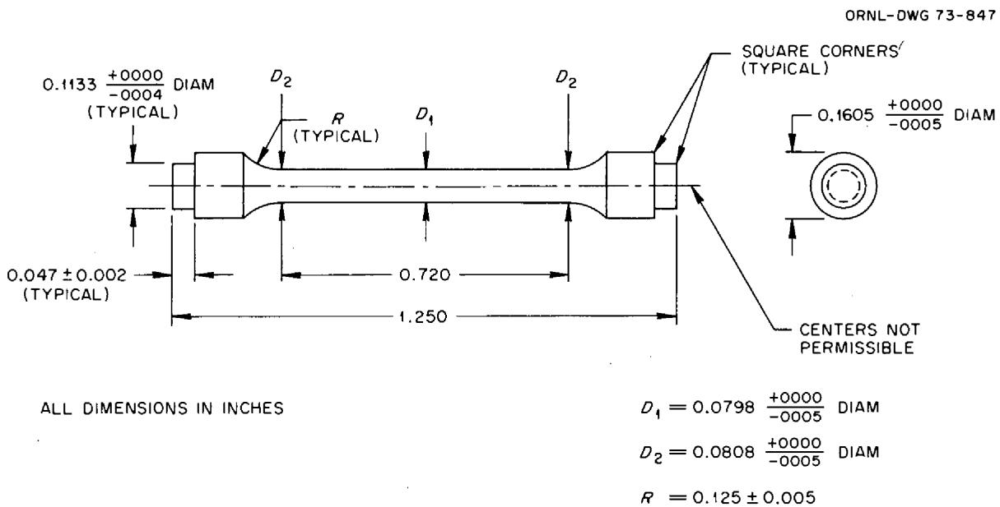  
Fig. 12.9. Hastelloy N creep sample used in the HFIR.

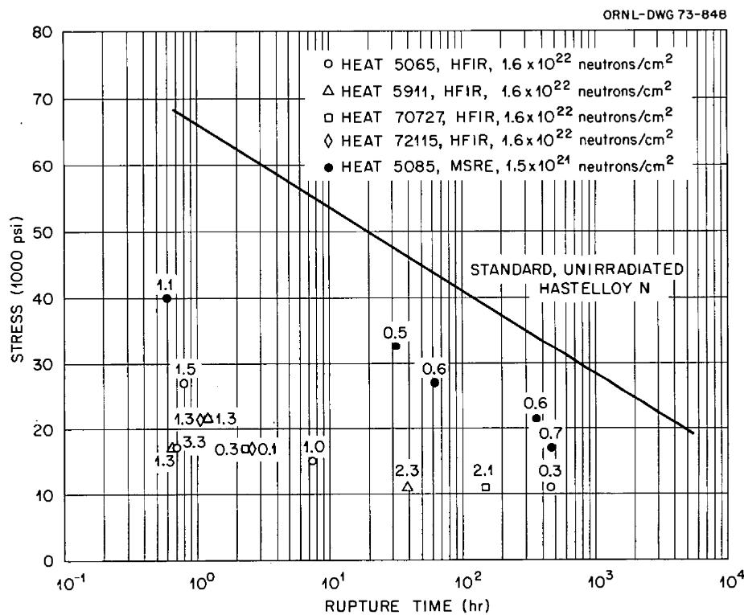  
Fig. 12.10. Stress-rupture properties of several heats of Hastelloy N irradiated at $650^{\circ}\mathrm{C}$ to the indicated thermal fluence and tested at $650^{\circ}\mathrm{C}$ . The numbers by each point indicate the strain.

The data in Fig. 12.10 suggest again the possibility that there may be some stress below which irradiation has practically no effect on the stress-rupture properties. The deterioration of properties in material containing He is generally attributed to the stress-induced growth of He bubbles to the extent that cohesion between the grains is reduced. The conditions required for a bubble to grow as rapidly as vacancies (or more He) can diffuse to the bubble are described by:5

$$
\sigma_ {c} = 0. 7 6 \gamma / r _ {0},
$$

where $\sigma_{c}$ is the critical stress, $\gamma$ is the surface tension, and $r_0$ is the bubble radius. Assuming that the stress below which the presence of He has no effect is about 10,000 psi and that the surface energy is 1500 dynes/cm, the He bubbles larger than 165 Å could undergo unlimited growth. Such a diameter is not unreasonable based on our electron microscope observations on other samples.

The equally poor properties of the diverse heats in this experiment after a thermal fluence of $1.6 \times 10^{22}$ neutrons/cm² indicate that the properties of any Hastelloy N irradiated to such an extremely high fluence will probably not be acceptable. Further experiments will be required to determine the maximum tolerable helium level in our modified alloys.

# 12.3 SALT CORROSION STUDIES

J.W.Koger

The success of an MSBR is strongly dependent on the compatibility of the container materials with the molten salts used in the primary and secondary circuits of the reactor. Nickel-base alloys, more specifically Hastelloy N and its modifications, are considered the most promising for use in molten salts and have received the most attention. The major constituents of Hastelloy N are nickel, molybdenum, chromium, and iron. Chromium constitutes about $7\%$ of the alloy and forms the most stable fluoride. Thus corrosion is normally manifested by the selective removal of chromium. Stainless steels that have more chromium than Hastelloy N are generally more susceptible to corrosion by fluoride melts.

Salts of interest to us are $\mathrm{LiF - BeF_2}$ based with additions of $\mathrm{UF_4}$ (fuel), $\mathrm{ThF_4}$ (blanket), or $\mathrm{ThF_4}$ and $\mathrm{UF_4}$ (fertile-fissile), and a $\mathrm{NaBF_4 - NaF}$ mixture (coolant salt). Lithium, beryllium, sodium, and thorium fluo

Besides, several different oxidizing reactions may occur, depending on the salt composition and impurity content. Among the most important reactants that can cause corrosion are $\mathrm{UF_4}$ , $\mathrm{FeF_2}$ , and HF. The reaction of chromium (in the metal) with $\mathrm{FeF_2}$ and HF proceeds to completion at relevant temperatures. The reaction of $\mathrm{UF_4}$ with $\mathrm{Cr}$ (in the metal) to form $\mathrm{CrF_2}$ and $\mathrm{UF_3}$ soon reaches equilibrium in an isothermal system. The equilibrium constant has a small temperature dependence, however, so a mechanism exists in nonisothermal systems for continued chromium removal in hot regions and deposition in cooler regions, while a steady-state amount of corrosion-product chromium remains in the salt. This phenomenon, called temperature-gradient mass transfer, would be expected to occur in a nuclear reactor, where the temperature in the primary circuit would be a maximum at the reactor outlet and a minimum in the heat exchanger. Because the products of oxidation of metals by fluoride melts are quite soluble in the corroding media, passivation is precluded, and the corrosion rate depends on other factors, including the thermodynamic driving force of the corrosion reactions. At steady state the rate of corrosion is generally limited by the rate of diffusion of the chromium through the alloy to the hot surface where it is being removed. Corrosion by temperature-gradient mass transfer involving selective removal of chromium occurs in all of our nonisothermal systems. Under abnormal oxidizing conditions (as in fluoroborate systems containing water), other constituents of Hastelloy N besides chromium can be removed. Therefore, design of a practical system utilizing molten fluoride salts demands the selection of salt constituents that are not appreciably reduced by available structural metals and alloys whose components can be in near thermodynamic equilibrium with the salt medium.

The experiments discussed in this section are being conducted primarily to determine quantitatively the amounts of corrosion in various salt-alloy systems and were designed and operated to show the effects of variables such as alloy constituents, temperature, salt impurities, salt velocities, and exposure times. These experiments involve 11 thermal-convection loops which provide nonisothermal dynamic conditions. Nine of the loops are constructed of Hastelloy N and two of stainless steel. Some have been in operation for up to nine years; others were started during this report period.

The status of the thermal-convection loops in operation at the end of this period is summarized in Table 12.3. Recently there has been increased interest in

Table 12.3. Status of MSR program thermal-convection loops through August 31, 1972   

<table><tr><td>Loop No.</td><td>Loop material</td><td>Specimens</td><td>Salt type</td><td>Salt composition (mole %)</td><td>Max. temp. (°C)</td><td>ΔT (°C)</td><td>Operating time (hr)</td></tr><tr><td>1258</td><td>Type 304L stainless steel</td><td>Type 304L stainless steela,b</td><td>Fuel</td><td>LiF-BeF2-ZrF4-UF4-ThF4 (70-23-5-1-1)</td><td>688</td><td>100</td><td>79,367</td></tr><tr><td>NCL-13A</td><td>Hastelloy N</td><td>Hastelloy N; Ti-modified Hastelloy N controlsb,c</td><td>Coolant</td><td>NaBF4-NaF (92-8) plus tritium additions</td><td>607</td><td>125</td><td>33,579</td></tr><tr><td>NCL-14</td><td>Hastelloy N</td><td>Ti-modified Hastelloy Nb,c</td><td>Cooland</td><td>NaBF4-NaF (92-8)</td><td>607</td><td>150</td><td>42,154</td></tr><tr><td>NCL-15A</td><td>Hastelloy N</td><td>Ti-modified Hastelloy N; Hastelloy N controlsb,c</td><td>Blanket</td><td>LiF-BeF2-ThF4(73-2-25)</td><td>677</td><td>55</td><td>35,416</td></tr><tr><td>NCL-16</td><td>Hastelloy N</td><td>Ti-modified Hastelloy N; Hastelloy N controlsb,c</td><td>Fuel</td><td>LiF-BeF2-UF4 (65.5-34.0-0.5)</td><td>704</td><td>170</td><td>37,942d</td></tr><tr><td>NCL-16A</td><td>Hastelloy N</td><td>Hastelloy N, one Te-coated Hastelloy Nb,c</td><td>Fuel</td><td>LiF-BeF2-UF4 (65.5-34.0-0.5)</td><td>704</td><td>170</td><td>1,729</td></tr><tr><td>NCL-17</td><td>Hastelloy N</td><td>Hastelloy N; Ti-modified Hastelloy N controlsb,c</td><td>Coolant</td><td>NaBF4-NaF (92-8) plus steam additions</td><td>607</td><td>100</td><td>27,817</td></tr><tr><td>NCL-18A</td><td>Hastelloy N</td><td>Hastelloy Nb,c</td><td>Fertile-fissle</td><td>LiF-BeF2-ThF4-UF4 (68-20-11.7-0.3)</td><td>704</td><td>170</td><td>672</td></tr><tr><td>NCL-19A</td><td>Hastelloy N</td><td>Hastelloy N; Ti-modified Hastelloy N controlsb,c</td><td>Fertile-fissile</td><td>LiF-BeF2-ThF4-UF4 (68-20-11.7-0.3) plus bismuth in molybdenum hot finger</td><td>704</td><td>170</td><td>22,203</td></tr><tr><td>NCL-20</td><td>Hastelloy N</td><td>Hastelloy N; Ti-modified Hastelloy N controlsb,c</td><td>Coolant</td><td>NaBF4-NaF (92-8)</td><td>687</td><td>250</td><td>19,928e</td></tr><tr><td>NCL-20A</td><td>Hastelloy N</td><td>Hastelloy N; Ti-modified Hastelloy N controlsb,c</td><td>Coolant</td><td>NaBF4-NaF (92-8)</td><td>687</td><td>250</td><td>1,682</td></tr><tr><td>NCL-21</td><td>Hastelloy N</td><td>Hastelloy Nb,c</td><td>MSRE fuel</td><td>LiF-BeF2-ZrF4-UF4 (65.4-29.1-5.0-0.5)</td><td>650</td><td>110</td><td>9,793</td></tr><tr><td>NCL-22</td><td>Type 316 stainless steel</td><td>Type 316 stainless steelb,c</td><td>Fertile-fissil</td><td>LiF-BeF2-ThF4-UF4 (68-20-11.7-0.3)</td><td>650</td><td>110</td><td>342</td></tr></table>

${}^{a}$ Specimens in hot leg only.   
$b_{\mathrm{Removable}}$ specimens.   
Specimens in hot and cold legs.   
$d_{\mathrm{Salt}}$ and specimens changed, restarted as NCL-16A.   
${}^{e}$ Salt and specimens changed,restated as NCL-20A.

stainless steels because of their apparent resistance to cracking by fission products (see Chap. 10). Thus, experiments to more carefully define the compatibility of stainless steels and other candidate alloys with various salts have begun. The results obtained from two pumped loops containing $\mathrm{NaBF}_4$ -NaF are discussed in Sect. 12.4.

# 12.3.1 Fuel Salt

Loop 1258, constructed of type 304L stainless steel, has now completed nine years of operation with $\mathrm{LiF - BeF_2 - ZrF_4 - ThF_4 - UF_4}$ (70-23-5-1-1 mole $\%$ ). During the current report period the specimens were not examined to determine weight changes. The chromium content of the salt remained at about $580~\mathrm{ppm}$ . The loop continues to operate satisfactorily.

NCL 21 is a Hastelloy N thermal-convection loop, with removable Hastelloy N specimens in each leg, containing salt of the same composition as the MSRE fuel. The loop is equipped with electrochemical probes to measure the $\mathrm{U}^{3+}/\mathrm{U}^{4+}$ ratio of the salt. Such probes had been used successfully in small static systems, and this experiment is designed to evaluate their possible use for on-stream analysis in a large system. Descriptions of the loop and the probes have been given previously.[6,7] No corrosion specimens were in the loop during this report period because various experiments were being conducted by members of the Analytical Chemistry Division (see Analytical Chemistry section of this report). The maximum corrosion rate while specimens were in the loop was $0.02\mathrm{mil/year}$ .

The experiment in which we added $\mathrm{FeF_2}$ to the Hastelloy N thermal-convection loop (NCL-16) to study cracking under severe oxidizing conditions has ended. The loop contained $\mathrm{LiF - BeF_2 - UF_4}$ (65.5-34.0-0.5 mole $\%$ ) at a maximum temperature of $704^{\circ}\mathrm{C}$ and a $\Delta T$ of $150^{\circ}\mathrm{C}$ . After 29,509 hr of operation, two additions of $\mathrm{FeF_2}$ (500 ppm each) were made, and the loop operated 6901 hr after the additions. Cracks to a depth of 0.5 mil were seen 2887 hr after the first $\mathrm{FeF_2}$ addition, but only voids were seen after the last 1000 hr. Extensive examination of the specimens will now be undertaken.

New salt, of the same basic composition but less oxidizing, was added to the loop (now designated NCL-16A), and operation was resumed at the temperature conditions of NCL-16. Standard Hastelloy N

specimens and one tellurium-coated Hastelloy N specimen were placed in the loop, with the main object being to determine if the tellurium will transfer through the salt to other specimens in the loop. Since then the loop has operated for over 1700 hr. After $1300\mathrm{hr}$ , the loss of material from the hottest Hastelloy N specimen was only $0.06\mathrm{mg/cm^2}$ , but the tellurium-coated specimen at the same position had lost $1.6\mathrm{mg/cm^2}$ . The amount of material lost was equal to the amount of tellurium placed on the specimen initially. Analyses showed the presence of $1\mu \mathrm{g/cm^2}$ of tellurium on a specimen from the cold leg which had a total weight gain of $0.8\mathrm{mg/cm^2}$ .

# 12.3.2 Fertile-Fissile Salt

A fertile-fissile MSBR salt has circulated for over 22,000 hr in Hastelloy N loop NCL-19A, which has removable specimens in each leg and includes bismuth in a molybdenum vessel located in an appendage beneath the hot leg of the loop. The test has two purposes: (1) to confirm the compatibility of Hastelloy N with the salt and (2) to determine if bismuth will be picked up by the salt and carried through the loop. The weight changes of various corrosion specimens are shown in Fig. 12.11. Assuming uniform loss, the maximum weight loss of $0.7\mathrm{mg/cm}^2$ is equivalent to a corrosion rate of only 0.02 mil/year. A modified Hastelloy N alloy $(\mathrm{Ni}-13.0\% \mathrm{Mo}-8.5\% \mathrm{Cr}-0.1\% \mathrm{Fe}-0.8\% \mathrm{Ti}-1.6\% \mathrm{Nb})$ has lost less weight than a standard alloy at the same temperature. We attribute this difference to the low iron in the modified alloy compared with about $5\%$ Fe in the standard alloy. Principal corrosion reactions in this loop appear to be

$$
2 \mathrm {U F} _ {4} (\mathrm {s}) + \mathrm {C r} (\mathrm {m}) \rightleftharpoons 2 \mathrm {U F} _ {3} (\mathrm {s}) + \mathrm {C r F} _ {2} (\mathrm {s})
$$

and

$$
\mathrm {F e F} _ {2} (\mathrm {s}) + \mathrm {C r} (\mathrm {m}) \rightleftharpoons \mathrm {F e} (\mathrm {m}) + \mathrm {C r F} _ {2} (\mathrm {s}),
$$

where $m$ and $s$ refer to the metallic and dissolved (in salt) states respectively. The chromium content of the salt increased 178 ppm in 15,000 hr, and the bismuth concentration remained below the limit of detection (10 ppm). The bismuth in contact with the salt seems to have had no effect on our mass transfer results.

Loop NCL-18, constructed of standard Hastelloy N and containing removable corrosion specimens in each leg, operated for over two years with the fertile-fissile salt mixture. The maximum weight loss at the highest

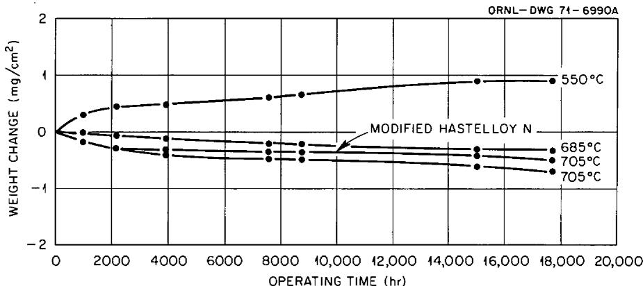  
Fig. 12.11. Weight change vs time of Hastelloy N specimens exposed to LiF-BeF $_2$ -ThF $_4$ -UF $_4$ (68-20-11.7-0.3 mole %) at various temperatures in thermal-convection loop NCL-19A, in which liquid bismuth is in contact with the salt at the bottom of the hot leg.

temperature, $704^{\circ}\mathrm{C}$ , was $1.5\mathrm{mg/cm}^2$ , which is equivalent to a corrosion rate of 0.05 mil/year, assuming uniform attack. Operation of NCL-18 ceased when an electrical short in one of the main heaters burned a hole in the loop piping. The loop was repaired by replacing the hot leg, new specimens were installed, and the loop was filled with new salt. The rebuilt loop, designated NCL-18A, has now operated for over 600 hr.

As discussed in Chap. 10, stainless steels appear to resist cracking by several fission products more than many of the nickel-base alloys, particularly Hastelloy N. We have constructed and are operating a type 316 stainless steel thermal-convection loop (NCL-22) which contains the single-region MSBR fertile-fissile salt. The purpose of the experiment is to determine the compatibility of the stainless steel with the highly purified salt. In this first test, our maximum temperature is $649^{\circ}\mathrm{C}$ $(1200^{\circ}\mathrm{F})$ with a $\Delta T$ of $110^{\circ}\mathrm{C}$ . The loop has now operated over $300\mathrm{hr}$ .

# 12.3.3 Blanket Salt

Loop NCL-15A, constructed of standard Hastelloy N and containing removable specimens in each leg, has operated over four years with the $\mathrm{LiF - BeF_2 - ThF_4}$ blanket salt proposed for a two-fluid MSBR. Mass transfer, as measured by the change of chromium concentration in the salt, has been very small. The maximum corrosion rate indicated by specimen weight changes is 0.06 mil/year (assuming uniform removal of all alloy constituents).

# 12.3.4 Coolant Salt

Loops NCL-13A and NCL-14, constructed of standard Hastelloy N and containing removable specimens in

each leg, have operated for 3.8 and 4.8 years, respectively, with the fluoroborate mixture $\mathrm{NaBF}_4$ -NaF (92-8 mole $\%$ ). The maximum corrosion rate (assuming uniform removal of all constituents) at the highest temperature, $605^{\circ}\mathrm{C}$ , has averaged 0.7 mil/year for both loops. Examination of specimens has shown that corrosion has generally been selective toward chromium, but there have been short periods when there was general attack of the Hastelloy N. These periods resulted when leaks in the gas lines or in ball valve seals admitted gaseous impurities into the salt. The valves are exposed to a mixture of He and $\mathrm{BF}_3$ gas and not to salt. We attribute the leaks of the ball valves to corrosion induced by air and moisture inleakage from lines into the gas mixture. Although the overall corrosion rates in these loops are not excessive, the rates observed in the absence of leaks have been an order of magnitude lower than the average rate.

Loop NCL-17, constructed of standard Hastelloy N and containing removable specimens in each leg, is being used to determine the effect of steam injection on the mass transfer characteristics of the fluoroborate salt mixture. After 1000 hr of normal operation, steam was injected into the salt. The loop has now operated over 26,000 hr following that injection. There was a large increase in weight change during the first 239 hr after steam injection, and another abrupt change in the rate of weight change occurred at 10,178 hr because of a leak in the cover gas system; however, the overall mass transfer rate decreased steadily following these two events.

A leak in the gas line between the two surge tanks of NCL-17 was detected in the last six-month period. Following this discovery the specimens were removed, examined, and weighed. Over the 4841-hr exposure prior to the leak the maximum weight loss was 2.9 $\mathrm{mg/cm^2}$ , which corresponds to a corrosion rate of 0.2 mil/year (assuming uniform material removal). Over the entire life of the loop, including 1000 hr of normal operation, steam addition, and 22,375 hr after steam, the maximum corrosion rate is 1.6 mils/year. The leak was repaired and the loop is continuing operation.

Loop NCL-20, constructed of standard Hastelloy N and containing removable specimens in each leg, was terminated after 19,928 hr of operation with the fluoroborate coolant salt at the extreme temperature conditions considered for the MSBR secondary circuit $(687^{\circ}\mathrm{C}$ max and $438^{\circ}\mathrm{C}$ min). Forced-air cooling of the cold leg was required to obtain this $\Delta T$ . For the first 11,900 hr of operation the maximum corrosion rate was 0.2 mil/year. Then a regulator failure allowed some moisture to leak into the loop and increased the maximum corrosion rate to 0.7 mil/year. During the last 4797 hr, the average rate (assuming uniform loss) was 0.4 mil/year and steadily decreasing.

During the last few hundred hours of NCL-20 operation, variations in flow were noted. The salt was frozen in the loop, and the heaters were removed to examine the loop and the heaters. We found that the loop tubing had been severely damaged and pitted because of direct contact with the heater wire. The insulating bushing normally used to separate the heater and the tubing had slipped out of place. We decided to make repairs by overlaying Hastelloy N material on the damaged portions of the tubing. Because of the

possibility of a penetration through the tubing while overlaying, the heaters were temporarily wired back in place and the loop was drained. This significant repair was made without problems and without penetration of the loop wall. New salt was then placed in the loop (now designated as loop NCL-20A), and the loop began operation at its previous conditions.

After the termination of NCL-20, the specimens from the hot and cold legs were weighed and analyzed to evaluate the mass transfer in the system. Figure 12.12 shows the weight change of several specimens for the entire run. The specimens in the hottest position of NCL-20, $685^{\circ}\mathrm{C}$ , showed the greatest loss, $14.4\mathrm{mg/cm}^2$ for the modified Hastelloy N in 19,300 hr. The maximum corrosion rate (assuming uniform loss) was 0.29 mil/year. The maximum weight gain, measured on a specimen in the cold leg, was $4.0\mathrm{mg/cm}^2$ .

The micrographs of the hottest and coldest standard Hastelloy N specimens from NCL-20 are shown in Fig. 12.13. The hottest and coldest specimens were also analyzed by scanning electron microscopy (SEM) and x-ray fluorescence (x-ray fluorescence was induced from bombardment by the electron beam of the SEM). A view of the surface of the hot leg specimen is shown in Fig. 12.14. The surface has a semipolished appearance with many areas which have been undermined with labyrinths of holes and channels. The areas pictured were composed primarily of nickel and molybdenum (71 and $29\%$ respectively) with extremely low iron $(0.37\%)$ and chromium $(< 0.1\%)$ . Figure 12.15

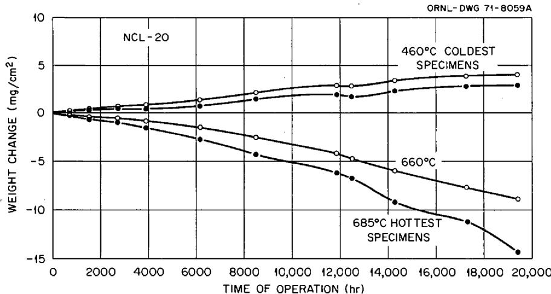  
Fig. 12.12. Weight changes of Hastelloy N specimens from NCL-20 exposed to $\mathrm{NaBF_4}$ - $\mathrm{NaF}$ (92-8 mole %) as a function of time and temperature. Air inleakage occurred after 11,900 hr.

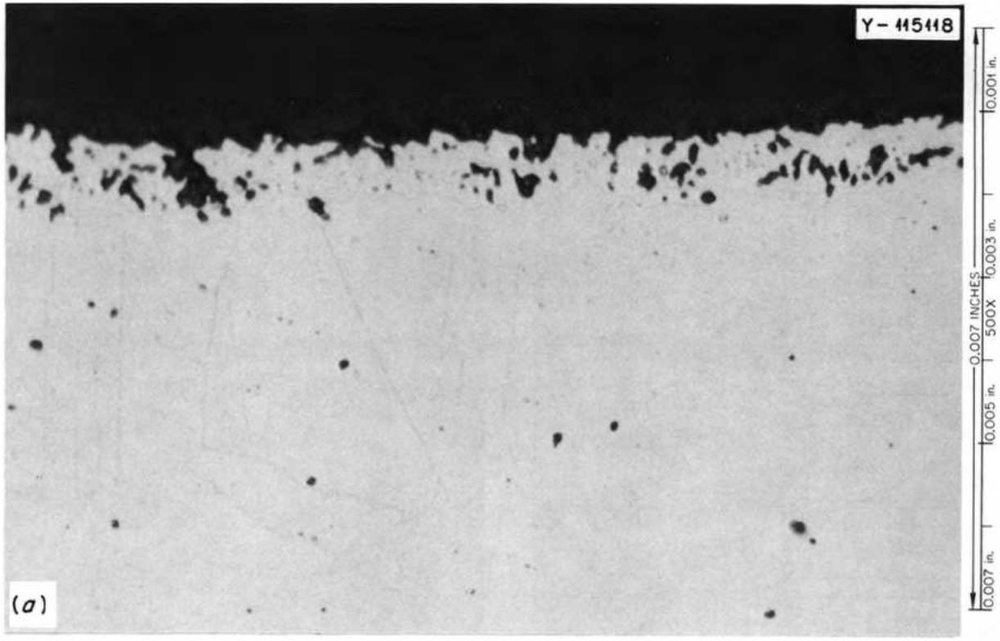

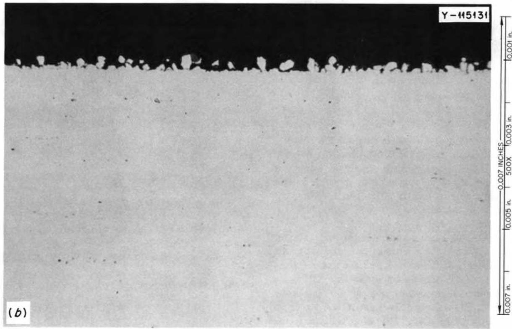  
Fig. 12.13. As-polished optical micrographs of Hastelloy N specimens from NCL-20 exposed to $\mathrm{NaBF_4}$ NaF (92-8 mole %) for $19,300\mathrm{hr}$ . (a) $685^{\circ}\mathrm{C}$ , weight loss $14.4\mathrm{mg/cm}^2$ . (b) $460^{\circ}\mathrm{C}$ , weight gain $2.8\mathrm{mg/cm}^2$ .

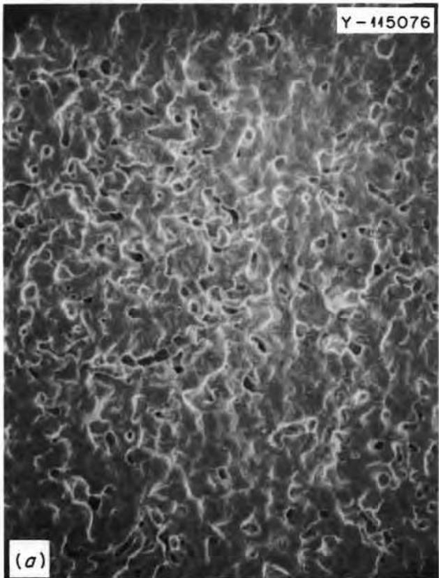

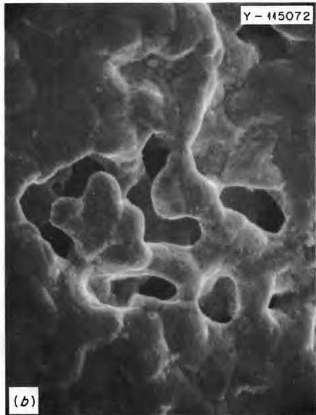  
Fig. 12.14. Scanning electron micrographs of the surface of a hot leg specimen from NCL-20. Exposed to $\mathrm{NaBF}_4$ -NaF (92-8 mole %) for 19,300 hr at $685^{\circ}\mathrm{C}$ . (a) $1000\times$ (b) $5000\times$ .

shows the surface of the specimen from the cold leg. Many of the grains appear to have a resemblance of cubic symmetry with possible growth steps. One would not expect the grains of the original alloy substrate to have this much cubic symmetry. The concentrations of elements from this area are $65\%$ Ni, $23\%$ Fe, $0.5\%$ Cr, and $11\%$ Mo.

Loop NCL-20A has now operated for over $1600\mathrm{hr}$ . After the corrosion specimens had been exposed to the salt for $884\mathrm{hr}$ , they were removed and examined. At the same time we added an amount of $\mathrm{KBF}_3\mathrm{OH}$ to the loop equivalent to a concentration of $500~\mathrm{ppm}$ in the salt. $\mathrm{(KBF_3OH}$ was used because it was easier to prepare than $\mathrm{NaBF}_3\mathrm{OH}$ . The $\mathrm{BF}_3\mathrm{OH}^-$ ion is the product of the reaction of $\mathrm{H}_2\mathrm{O}$ and $\mathrm{NaBF}_4$ and we are interested in its effect on mass transfer. Our experience has indicated that corrosion in fluoroborate systems is due largely to impurities, particularly water. Reactions

that are believed to be involved include11 the following:

$$
\begin{array}{l} \mathrm {H} _ {2} \mathrm {O} + \mathrm {N a B F} _ {4} \rightleftharpoons \mathrm {N a B F} _ {3} \mathrm {O H} + \mathrm {H F}, \\ \mathrm {N a B F} _ {3} \mathrm {O H} \rightleftharpoons \mathrm {N a B F} _ {2} \mathrm {O} + \mathrm {H F}, \\ 6 \mathrm {H F} + 6 \mathrm {N a F} + 2 \mathrm {C r} \rightleftharpoons 2 \mathrm {N a} _ {3} \mathrm {C r F} _ {6} + 3 \mathrm {H} _ {2}. \\ \end{array}
$$

These may be combined to give

$$
\begin{array}{l} 6 \mathrm {N a B F} _ {3} \mathrm {O H} + 6 \mathrm {N a F} + 2 \mathrm {C r} \\ \rightleftharpoons 6 \mathrm {N a B F} _ {2} \mathrm {O} + 2 \mathrm {N a} _ {3} \mathrm {C r F} _ {6} + 3 \mathrm {H} _ {2} \\ \end{array}
$$

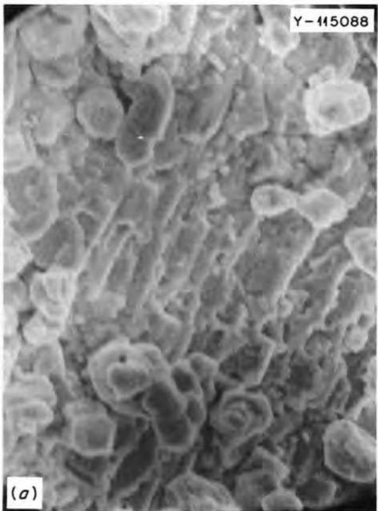

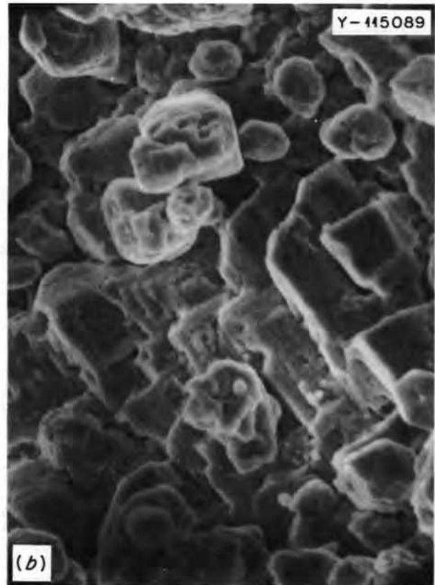  
Fig. 12.15. Scanning electron micrographs of the surface of a cold leg specimen from NCL-20. Exposed to $\mathrm{NaBF_4}$ -NaF (92-8 mole $\%$ ) for $19,300\mathrm{hr}$ at $460^{\circ}C$ $5000\times$

and

$$
\begin{array}{l} 3 \mathrm {H} _ {2} \mathrm {O} + 3 \mathrm {N a B F} _ {4} + 6 \mathrm {N a F} \\ \rightleftharpoons 3 \mathrm {N a B F} _ {2} \mathrm {O} + 2 \mathrm {N a} _ {3} \mathrm {C r F} _ {6} + 3 \mathrm {H} _ {2}. \\ \end{array}
$$

Thus both the $\mathrm{BF}_3\mathrm{OH}^-$ initially in the salt and any $\mathrm{H}_2\mathrm{O}$ that may be admitted later can play a part in corrosion. This experiment is designed to quantitatively measure the effect of $\mathrm{BF}_3\mathrm{OH}^-$ on the mass transfer.

During the first two months of operation of loop NCL-20A, a heater has burned out and two gas leaks have been found in the ball valve above the hot leg. One of the gas leaks occurred after the $\mathrm{KBF}_3\mathrm{OH}$ addition. With the gas leaks and the $\mathrm{KBF}_3\mathrm{OH}$ addition, weight changes of the corrosion specimens have been fairly large (Table 12.4). Although the data suggest that the $\mathrm{KBF}_3\mathrm{OH}$ addition has increased the rate of mass transfer, the experimental complications preclude any firm conclusion, and the experiment will be repeated.

We have initiated isothermal capsule tests in which type 304 stainless steel specimens in four type 304

stainless steel capsules are exposed to $\mathrm{NaBF}_4$ -NaF (92-8 mole %) at 482, 538, 593, and $649^{\circ}\mathrm{C}$ . During the first 300 hr all specimens lost weight, with those in the hottest capsule losing the most. In the next 475 hr the specimens exposed at 593 and $649^{\circ}\mathrm{C}$ gained weight and had brown splotches and pitlike areas on the surface,

Table 12.4. Weight changes of Hastelloy N specimens from NCL-20A   

<table><tr><td rowspan="2">Time (hr)</td><td colspan="2">Weight change \( \left( {\mathrm{{mg}}/{\mathrm{{cm}}}^{2}}\right) \)</td><td rowspan="2">Maximum corrosion rate (mils/year)</td></tr><tr><td>Hot-leg specimen (687°C)</td><td>Cold-leg specimen (482°C)</td></tr><tr><td>\( {310}^{a} \)</td><td>-1.1</td><td>+0.5</td><td>1.37</td></tr><tr><td>\( {479}^{b} \)</td><td>-4.7</td><td>+1.5</td><td>3.79</td></tr><tr><td>\( {433}^{c} \)</td><td>-6.8</td><td>\( + {3.0}^{d} \)</td><td>6.07</td></tr></table>

Specimens removed because of heater failure.   
${}^{b}$ Specimens removed because of leaking ball valve.   
Specimens removed because of leaking ball valve. $\mathrm{KBF}_3\mathrm{OH}$ added during this period.   
Metallic crystals found on specimen.

while the lower-temperature specimens continued to lose weight. During the last 835 hr very little change was measured for any of the specimens. Table 12.5 gives all the weight change results to date. In comparison, Hastelloy N specimens exposed to the fluoroborate mixture in similar isothermal capsules showed no measurable weight changes after 4830 hr at temperatures up to $649^{\circ}\mathrm{C}$ .

# 12.3.5 Corrosion of Type 304L Stainless Steel and Hastelloy N by Mixtures of Boron Trifluoride, Air, and Argon

In the years that we have operated corrosion and engineering systems with the fluoroborate mixture, questions have arisen concerning the compatibility of $\mathrm{BF}_3$ with various container materials. Results have ranged from poor to excellent depending mainly on the purity of the $\mathrm{BF}_3$ and the gases mixed with it. Because of the variation of results, we conducted an experiment in which type 304L stainless steel and Hastelloy N were exposed to argon, air, $\mathrm{BF}_3$ , and mixtures of each for $100\mathrm{hr}$ at temperatures from 200 to $600^{\circ}\mathrm{C}$ . In addition the metal specimens were placed with approximately 20 g each of the single-region fertile-fissile salt $[\mathrm{LiF - BeF}_2 - \mathrm{ThF}_4 - \mathrm{UF}_4$ (68-20-11.7-0.3 mole %)] and the fluoroborate mixture $[\mathrm{NaBF}_4\mathrm{-NaF}$ (92-8 mole %)] while exposed to the gases.

Table 12.6 gives the results for the metal-salt combinations exposed to various gases at $600^{\circ}\mathbf{C}$ for $100\mathrm{hr}$ . As expected, air in combination with the fluoride salts produced highly corrosive conditions which destroyed not only the specimens but the nickel boats. None of the weight changes measured for the Hastelloy N immersed in salt and exposed to any of the gas mixtures other than air were significant. For the stainless steel specimens immersed in salt, $\mathrm{BF}_3$ probably caused the greater attack. The fluoroborate mixture was more aggressive toward the stainless steel than the fuel salt. The weight losses (as opposed to weight gains) occurred because the corrosion products were removed from the specimens by the salt and dissolved.

Table 12.7 gives the results for alloys exposed to the various gas mixtures at temperatures from 200 to $600^{\circ}\mathrm{C}$ for $100\mathrm{hr}$ . In most cases, weight gains were found, since the corrosion products remained on the specimens and were not carried away.

At $600^{\circ}\mathrm{C}$ , the only significant changes measured for Hastelloy N were in the mixtures containing air. These

Table 12.5. Weight change of type 304 stainless steel specimens exposed to $\mathrm{NaBF}_4$ -NaF (92-8 mole %) for 1300 hr   

<table><tr><td>Temperature (°C)</td><td>Weight change (mg/cm2)</td></tr><tr><td>482</td><td>-0.16</td></tr><tr><td>538</td><td>-0.32</td></tr><tr><td>593</td><td>0</td></tr><tr><td>649</td><td>+0.8</td></tr></table>

Table 12.6. Weight changes of Hastelloy N and type 304L stainless steel exposed to various gases while immersed in fluoride salts at $600^{\circ}\mathrm{C}$ for $100\mathrm{hr}$   
Gas flow 100 cc/min   

<table><tr><td rowspan="2">Material</td><td rowspan="2">Salt</td><td colspan="4">Weight change (mg/cm2)</td></tr><tr><td>Argona</td><td>BF3b</td><td>Airc</td><td>Ar-BF3</td></tr><tr><td rowspan="2">Hastelloy N</td><td>d</td><td>-0.03</td><td>+0.03</td><td>e</td><td>0</td></tr><tr><td>f</td><td>+0.06</td><td>0</td><td>e</td><td>-0.06</td></tr><tr><td rowspan="2">Type 304L stainless steel</td><td>d</td><td>-0.3</td><td>-0.3</td><td>e</td><td>-1.6</td></tr><tr><td>f</td><td>-1.2</td><td>-5.2</td><td>e</td><td>-2.4</td></tr></table>

$a$ 24 ppm moisture.   
$50$ ppm moisture.   
$c$ 7.5 ppm moisture.   
$d_{\mathrm{LiF - BeF_2 - ThF_4 - UF_4}}$ (68-20-11.7-0.3 mole %) fuel salt.   
$e$ These specimens were completely destroyed.   
$J_{\mathrm{NaBF}_4\text{-NaF}}$ (92-8 mole $\%$ ) coolant salt.

changes can be attributed to the small amount of chromium in Hastelloy N and its low resistance to air oxidation. At 200 and $300^{\circ}\mathbf{C}$ , all changes were rather small.

Figure 12.16 shows type 304L stainless steel exposed to several gas mixtures. The stainless steel specimen in Fig. 12.16a was exposed to air at $200^{\circ}\mathrm{C}$ . The air- $\mathrm{BF}_3$ mixture produced a large amount of chromium oxide and iron oxide on the stainless steel at $600^{\circ}\mathrm{C}$ which was easily removed (Fig. 12.16b). The stainless steel specimen on which the oxides were formed is shown in Fig. 12.16c. Boron trifluoride, by itself, at $600^{\circ}\mathrm{C}$ also produced a large amount of corrosion product on the stainless steel and was more aggressive than argon. Significant weight gains of the stainless steel specimens were produced by all gas mixtures except air at 300 and $600^{\circ}\mathrm{C}$ . At $200^{\circ}\mathrm{C}$ , most changes were rather small. Reaction of the stainless steel with argon, air, and an argon- $\mathrm{BF}_3$ mixture resulted in a red corrosion product, while reaction with $\mathrm{BF}_3$ by itself resulted in the formation of white material on the surface. These red and white corrosion products could not be identified by x-ray analyses, but contained iron, chromium, oxygen,

Y-112326

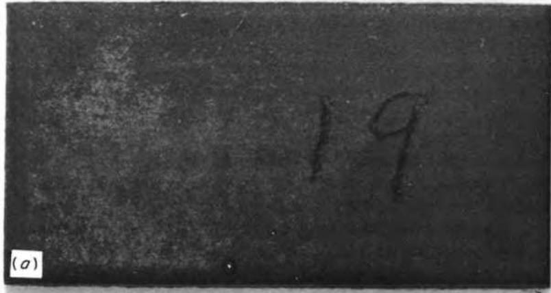

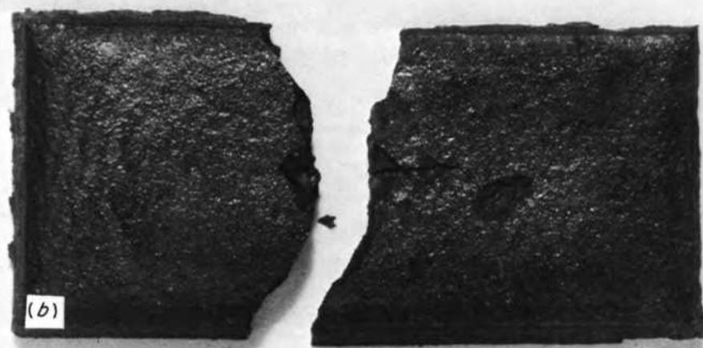

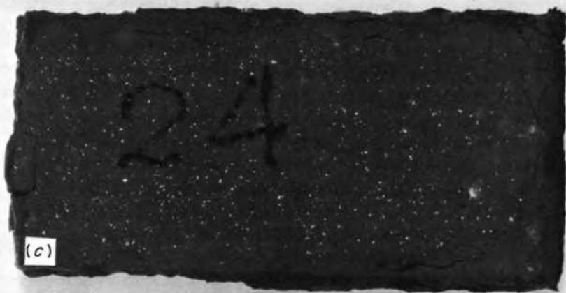

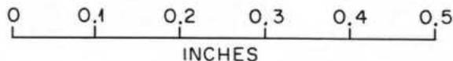  
Fig. 12.16. Type 304L stainless steel exposed to several gas mixtures. (a) Exposed to air at $200^{\circ}\mathrm{C}$ for $100\mathrm{hr}$ . (b) Exposed to $\mathrm{Ar - BF}_3$ for $100\mathrm{hr}$ at $600^{\circ}\mathrm{C}$ . (c) Reaction product formed on the sample in $b$ .

Table 12.7. Weight changes of Hastelloy N and type 304L stainless steel exposed to various gases at 200 to $600^{\circ}\mathrm{C}$ for 100 hr   
Gas flow $100\mathrm{cm / min}$   

<table><tr><td rowspan="2">Material</td><td rowspan="2">Temperature (°C)</td><td colspan="8">Weight change (mg/cm2)</td></tr><tr><td>Argona</td><td>Argonb</td><td>BF3c</td><td>Aird</td><td>Ar-BF3a</td><td>Ar-BF3b</td><td>Air-BF3</td><td>Ar-Aira</td></tr><tr><td rowspan="3">Hastelloy N</td><td>600</td><td>+0.06</td><td>+0.03</td><td>0</td><td>+0.2</td><td>-0.03</td><td>+0.03</td><td>+0.2</td><td>-0.1</td></tr><tr><td>300e</td><td>0</td><td>0</td><td>+0.2</td><td>+0.03</td><td>+0.03</td><td>+0.3</td><td>0</td><td>0</td></tr><tr><td>200</td><td>+0.03</td><td>-0.03</td><td>-0.03</td><td>+0.03</td><td>0</td><td>0</td><td>0</td><td>-0.03</td></tr><tr><td rowspan="3">Type 304L stainless steel</td><td>600</td><td>+0.1</td><td>+0.05</td><td>+5.2</td><td>+0.03</td><td>+0.22</td><td>+0.05</td><td>+119.2f</td><td>+0.8</td></tr><tr><td>300e</td><td>+0.3g</td><td>+0.17</td><td>+3.3h</td><td>-0.03g</td><td>+5.85i</td><td>+2.0</td><td>+25.4</td><td>+10.0j</td></tr><tr><td>200</td><td>+0.05</td><td>+0.03</td><td>0</td><td>0</td><td>0</td><td>0</td><td>-1.2</td><td>+0.2</td></tr></table>

a24 ppm moisture in the argon.   
${}^{b}2$ ppm moisture in the argon,passed through heated Ti sponge.   
$c <   50$ ppm moisture.   
7.5 ppm moisture.   
$e$ Near gas entrance.   
Large amount of oxide on surface. Identified by x-ray diffraction as 25 mole $\%$ $\mathrm{Cr_2O_3}$ and 75 mole $\%$ $\mathrm{Fe_2O_3}$ .   
Adherent red layer on surface.   
Large amount of white material on surface. Nonadherent, 0.0290 g removed.   
Large amount of red material on surface. Nonadherent, 0.0745 g removed.   
Large amount of material flaked off.

and fluorine where $\mathrm{BF}_3$ was involved. Thus, the corrosion products were probably complex mixtures of metal oxides and fluorides.

The use of drier argon (2 ppm moisture as opposed to 17 ppm moisture) lowered the weight gain of the stainless steel specimens by about a factor of 2. The change was more dramatic when the argon was used with $\mathrm{BF}_3$ . Even though air had almost no effect on the stainless steel, the air- $\mathrm{BF}_3$ mixture had the worst effect of any of the gases, even much worse than just $\mathrm{BF}_3$ . The air in combination with argon also produced more corrosion products than either of the two gases by themselves. In combination with salt, $\mathrm{BF}_3$ had the worst effect. These results underline the problems that can result in a system which allows air or moisture to come in contact with molten fluoride salts or with the $\mathrm{BF}_3$ vapor.

With the exception of the effect of air at $600^{\circ}\mathrm{C}$ , Hastelloy N was much more resistant to corrosion than the type 304L stainless steel.

# 12.3.6 Oxide Additions to Sodium Fluoroborate1

The possibility of tritium retention in fluoroborate salt by the introduction of a small concentration (10 to 50 ppm) of hydroxide is being investigated. Normally,

$\mathrm{OH}^-$ present in the salt reacts with the constituents of Hastelloy N to yield hydrogen, which diffuses through the metal. One of the possible reactions for this is:

$$
2 \mathrm {N a B F} _ {3} \mathrm {O H} + \mathrm {C r} \rightleftharpoons \mathrm {C r F} _ {2} + 2 \mathrm {N a B F} _ {2} \mathrm {O} + \mathrm {H} _ {2}.
$$

This reaction indicates the possibility of retaining a higher concentration of $\mathrm{OH}^{-}$ in the salt if sufficient $\mathrm{NaBF}_2\mathrm{O}$ can be dissolved in the coolant salt without appreciable corrosion of Hastelloy N.

Investigations along these lines were conducted in a static system for 1703 hr. A mixture of approximately $33\%$ $\mathrm{NaBF}_2\mathrm{O}$ , $33\%$ $\mathrm{NaBF}_4$ , and $33\%$ NaF ( $\mathrm{NaBF}_2\mathrm{O}$ was prepared from $\mathrm{NaBF}_3\mathrm{OH}$ obtained from the Reactor Chemistry Division) was added to $3.3\mathrm{kg}$ of an $\mathrm{NaBF}_4$ -NaF (92-8 mole %) mixture to give approximately 350 ppm oxide in the salt in which Hastelloy N specimens were placed. The Hastelloy N corrosion specimens had a weight loss of $1.5\mathrm{mg/cm}^2$ after 200 hr of exposure. An analysis of a salt sample taken at this time showed that the nickel concentration of the salt had increased from 20 to 100 ppm. There was a slight increase in the concentration of iron (from 170 to 250 ppm), while the concentrations of chromium and molybdenum remained essentially constant. The $\mathrm{O}^{2-}$ and $\mathrm{OH}^-$ concentrations were found to be 650 and 17 ppm respectively. It is likely that impurities were responsible for the corrosion. In all other time intervals the specimens gained weight, and the concentration of

nickel generally decreased. The concentration of all the other constituents remained constant with an increase of chromium from 15 to $28~\mathrm{ppm}$ . In the time period between 474 and 804 hr the specimens gained an average of $5\mathrm{mg/cm}^2$ , contrasted to a gain of about 0.2 or $0.3\mathrm{mg/cm}^2$ in other intervals. Metallic crystallites were deposited on the cooler regions of the specimen holder during this period, and the nickel concentration decreased to its original level. The crystallites were found to be essentially pure nickel, with $0.4\%$ copper, $0.2\%$ iron, and $1.5\%$ molybdenum. Only small weight gains were then found for the last $900\mathrm{hr}$ of the test, resulting in an average specimen weight gain of $5.3\mathrm{mg/cm}^2$ for the entire test.

We concluded from the test that the $\mathrm{NaBF}_2\mathrm{O}$ did not cause corrosion of the Hastelloy N specimens, but reduced impurity fluorides that deposited on the metal surface.

# 12.4 FORCED-CONVECTION LOOP CORROSION STUDIES

W.R.Huntley J.W.Koger

# 12.4.1 Operation of Forced-Convection Loop MSR-FCL-1A

Corrosion loop MSR-FCL-1A continued to operate during this report period. This test is evaluating the compatibility of standard Hastelloy N with $\mathrm{NaBF_4}$ -NaF (92-8 mole $\%$ ) coolant salt at temperatures similar to those expected in the MSBR secondary circuit. The loop is fabricated of $1 / 2$ -in.-OD,0.042-in.-wall tubing, and the nominal salt velocity is $5\frac{3}{4}$ fps. Hastelloy N corrosion test specimens are exposed to circulating salt at 620, 548, and $454^{\circ}\mathrm{C}$

A scheduled shutdown for examination of the corrosion test specimens occurred on March 14, 1972, after loop operation for $3994\mathrm{hr}$ at design conditions. The corrosion specimens were removed by the normal procedure of cutting sections out of the loop piping after the loop had been drained and cooled to room temperature. The specimens were examined and other loop repairs made before resuming operation on April 13, 1972. The next scheduled shutdown was made on July 12, 1972, after $2108\mathrm{hr}$ of additional exposure for a total operating time of $6102\mathrm{hr}$ . The corrosion specimens were again examined, and operation was resumed on August 16, 1972.

The allowable operating time for bearings and seals in the LFB salt pump was increased from 2000 to $4000\mathrm{hr}$ due to the long bearing life expected at the present pump speed of $3000\mathrm{rpm}$ . Oil leakage rates from the

mechanical seal were normal throughout the first 4000-hr operating period and ranged from 1 to 7 cc/day. The bearings and seals appeared in good condition after 4000 hr of operation, but they were replaced as a precautionary measure when the pump was reassembled.

We encountered problems with the brushes and slip rings of the Adjustospede motor that drives the LFB salt pump. Frequent honing of the slip rings is required to prevent arcing and loss of rotating speed. Several types of graphite and carbon brushes were used in an attempt to improve brush life and reduce arcing, but this proved ineffective. Several of the brush failures resulted in automatic shutdown of the loop and loss of operating time. New brushless variable-speed motors have been ordered to eliminate this recurring problem.

# 12.4.2 Corrosion Results from Forced-Convection Loop MSR-FCL-1A

The Hastelloy N specimens were weighed and examined after 3994 hr of operation. The specimens had been previously removed after 2000 hr. $^{14}$ As expected, the three specimens exposed to the salt at the highest temperature, $620^{\circ}\mathrm{C}$ , showed the most weight loss. The average weight loss for this second 2000-hr interval was $10.8\mathrm{mg/cm}^2$ , as opposed to $19\mathrm{mg/cm}^2$ for the first 2000 hr. One of the specimens exposed at $548^{\circ}\mathrm{C}$ was badly damaged due to an undefined erosion-corrosion process and was not included in the weight-change evaluation. The average weight loss for the other two specimens at this position was about $1.0\mathrm{mg/cm}^2$ . One of the specimens exposed at $454^{\circ}\mathrm{C}$ , the lowest temperature, lost weight, while the other gained weight, resulting in an average weight change of zero at this position.

The salt chemistry changes throughout the 2000 hr were quite small and indicated small amounts of mass transfer. However, the corrosion rate was quite high, with the specimens exposed at $670^{\circ}\mathrm{C}$ losing weight at a rate of about 2 mils/year (assuming uniform removal).

The damaged specimen mentioned above was the first of the three exposed to the salt at $548^{\circ}\mathrm{C}$ . The damage was primarily at the leading edge. The leading edge of the Hastelloy N specimen holder immediately adjacent to the damaged specimen was not harmed.

During the last test period of 2108 hr, the specimens exposed at $620^{\circ}\mathrm{C}$ lost $4.6\mathrm{mg/cm}^2$ , the specimens at $548^{\circ}\mathrm{C}$ lost $0.5\mathrm{mg/cm}^2$ , and the specimens at $454^{\circ}\mathrm{C}$

gained $0.28\mathrm{mg/cm}^2$ . The maximum corrosion rate during the 2108-hr period was 0.8 mil/year, assuming uniform dissolution. The weight changes were much smaller this time period than in the two previous 2000-hr runs, and the maximum corrosion rate was half that of the previous 2000 hr. The overall maximum corrosion rate for the entire 6102-hr run is about 2 mils/year.

# 12.4.3 Operation of Forced-Convection Loop MSR-FCL-2

Forced-convection loop MSR-FCL-2 is being used to evaluate the corrosion and mass transfer of standard Hastelloy N in sodium fluoroborate coolant at nominal velocities of 10 and 20 fps. The test contains three sets of removable corrosion specimens exposed to salt at 620, 537, and $454^{\circ}\mathrm{C}$ . This test has an improved design which permits easy removal and insertion of corrosion specimens and allows individual study of the effects of velocity, temperature, and time on mass transfer.

Corrosion loop MSR-FCL-2 operated routinely throughout March and April 1972 except for minor problems. For example, the test was automatically placed in "standby" condition due to an electrical power dip in March, and was automatically shut down twice in April due to faulty brushes on the drive motor of the pump. Each of these outages was brief, and the test was placed in operation again quickly. The experiment was stopped on April 17 for a scheduled examination of the corrosion specimens, and operation was resumed on April 20.

Operation of the loop was halted on April 28, when an oil leak occurred at a soft-soldered seal plug in the upper end of the ALPHA pump shaft. The salt was drained from the piping system and the loop cooled as soon as possible after the incident. No fire or major damage occurred as a result of the leak, but it was necessary to remove insulation and shim stock below the pump to clean out the oil leakage. There were no indications that the corrosion loop or corrosion specimens were damaged as a result of the oil leak. The leak in the pump shaft was repaired without removing the pump from the piping system, as described in detail in Sect. 3.5.2. All loop and pump repairs were completed and the test was readied for salt filling on May 25.

During refilling of the salt system, two of the three drain lines leading from the dump tank to the system piping did not pass salt due to some type of restrictive plugging. This caused helium bubbles to be trapped in portions of the loop piping as the salt level rose and

caused the salt level to exceed the desired levels in the metallurgical sample stations. The loop was drained and cooled to room temperature so the ball valves and gas lines above the metallurgical sample stations could be disassembled and freed of salt which had frozen in these unheated regions. The ball sections of the three ball valves were removed and replaced with flat copper gaskets so the lines could be heated to allow the molten salt to drain back into the loop piping. The ball valves were then reassembled and the corrosion specimens were withdrawn and examined to see if significant corrosion damage had occurred during these operational problems. The maximum weight loss of the specimens was $0.3\mathrm{mg/cm}^2$ (0.6 mil/year corrosion rate, assuming uniform dissolution), which indicated that slight contamination had occurred since the preceding inspection.

The cause of the plugged drain lines is not known. In retrospect it can be seen that they became plugged during the 5300-hr period of operation preceding the oil leak from the pump shaft. During that period, the salt was never drained from the piping system, so static salt remained in these small $(1/4$ -in. OD, 0.035-in. wall) unheated lines. The plugged lines were cleared by heating to temperatures several hundred degrees higher than those used during two preceding filling operations early in the loop's history. Temperatures up to $650^{\circ}\mathbf{C}$ were required to loosen the plugged lines. This suggests that some long-term phenomenon such as deposition of a high-melting compound may have occurred in the sections of drain lines near the main loop piping. A similar problem was encountered on thermal-convection loop NCL-20, where prolonged heating of the drain lines at $650^{\circ}\mathbf{C}$ was necessary to drain the sodium fluoroborate mixture after 20,000 hr of operation. To reduce the probability of future plugging in MSR-FCL-2, we are now operating all static drain lines adjacent to the circulating salt system at temperatures greater than those of the circulating salt.

The vent line from the seal oil catch basin of the ALPHA pump has been troubled with solid crystal growths and acid formation due to moist air reaction with $\mathrm{BF}_3$ $(< 0.1\%)$ present in the helium purge flow. A small room-temperature trap filled with Ascarite (NaOH granules in an asbestos base) has been installed at the end of the vent line to remove the $\mathrm{BF}_3$ by formation of sodium borate and sodium fluoroborate. The effectiveness of the trap will be evaluated in forthcoming operation.

Normal operation of MSR-FCL-2 was resumed on August 10 and continued smoothly through the end of the report period, by which time a total of $5789\mathrm{hr}$ had been accumulated at design conditions.

# 12.4.4 Corrosion Results from Forced-Convection Loop MSR-FCL-2

Examination of the corrosion specimens from MSR-FCL-2 after the April 17 shutdown disclosed continuously decreasing corrosion rates through $5100\mathrm{hr}$ of exposure (Table 12.8). Over the last $1250\mathrm{hr}$ , the corrosion rate of the hottest specimens $(620^{\circ}\mathrm{C})$ was $0.06\mathrm{mil/year}$ (assuming uniform dissolution). No velocity effect has been seen for the last $2300\mathrm{hr}$ . The corrosion rate at $620^{\circ}\mathrm{C}$ for the entire $5100\mathrm{hr}$ run was $0.48\mathrm{mil/year}$ for specimens exposed to salt at $10.8\mathrm{fps}$ and $0.67\mathrm{mil/year}$ for specimens exposed to salt at $20.9\mathrm{fps}$ . Half the entire weight loss occurred during the first $450\mathrm{hr}$ . Almost no weight changes were measured for the specimens exposed at $454$ and $537^{\circ}\mathrm{C}$ for the last $1250\mathrm{hr}$ . Our data indicate that the controlling corrosion mechanism over the last $2300\mathrm{hr}$ (no velocity effect) was probably solid-state diffusion in the alloy.

# 12.5 CORROSION OF HASTELLOY N IN STEAM

# B. McNabb H. E. McCoy

There is more favorable experience with Hastelloy N in fluoride salts and fluoroborate than with any other structural metal. If the cracking due to tellurium described in Chap. 10 can be overcome, it would be desirable to use this same material of construction throughout the MSBR salt systems, including the steam generator. A small program is therefore being conducted to determine whether Hastelloy N is compatible with steam.

Unstressed specimens of Hastelloy N appear to be compatible with steam at 538 and $593^{\circ}\mathrm{C}$ . The average weight gain after 13,000 hr exposure in TVA's Bull Run facility at $538^{\circ}\mathrm{C}$ for air- and vacuum-melted Hastelloy N is $0.45\mathrm{mg/cm}^2$ . Assuming uniform removal of metal, this would be equivalent to less than 0.25 mil/year of metal being oxidized.

Some of the Hastelloy N specimens were removed for detailed examination after 10,000 hr exposure at $538^{\circ}\mathrm{C}$ , and preliminary observations were reported previously. The compositions of these heats of Hastelloy N are given in Table 12.9. Microprobe examination of the metallographic samples has been completed. Occasional nodules or blisters of oxide having a maximum penetration into the metal of 0.4 mil were observed in the standard Hastelloy N speci

Table 12.8. Corrosion rate of Hastelloy N specimens exposed to $\mathrm{NaBF}_4$ -NaF (92-8 mole %) at $620^{\circ}\mathrm{C}$ as a function of time and velocity   

<table><tr><td rowspan="2">Time interval (hr)</td><td colspan="2">Corrosion ratea(mils/year)</td></tr><tr><td>Velocity of 10.9 fps</td><td>Velocity of 20.8 fps</td></tr><tr><td>Entire 5100</td><td>0.48</td><td>0.67</td></tr><tr><td>Last 4650</td><td>0.27</td><td>0.36</td></tr><tr><td>Last 4200</td><td>0.17</td><td>0.25</td></tr><tr><td>Last 3320</td><td>0.09</td><td>0.13</td></tr><tr><td>Last 2330</td><td>0.08</td><td>0.08</td></tr><tr><td>Last 1250</td><td>0.06</td><td>0.06</td></tr></table>

Assuming uniform material removal.

mens. Figure 12.17 shows a microprobe display of backscattered electrons (20-kV accelerating voltage) from the surface of air-melted Hastelloy N. The oxide is complex. The outer layer appears enriched in Fe and Cr, and the interior of the nodule contains some of this phase with a second phase rich in Mo and an Si-rich network. The composition of the matrix appears unaffected just a short distance below the nodules.

Heat 2477 is a typical vacuum-melted heat with low manganese and silicon (0.05 wt % each). Figure 12.18 shows an optical photomicrograph of a cross section of this material after exposure to steam for 10,000 hr at $538^{\circ}\mathrm{C}$ . The compositions of the various microconstituents were determined by microprobe analysis, and the results are shown in Fig. 12.18. The outer layer is enriched in Fe and Cr, and the second network layer is enriched in Cr and Mo. The third region has a metallic appearance, and is depleted in Fe, Cr, and Mo. The Si-rich network is not present, since this heat of material contains only $0.05\%$ Si. Figure 12.19 shows x-ray-fluorescence images of a region of the same sample shown in Fig. 12.18. The surface is enriched in Fe, Cr, and Mo, and a region beneath the oxide is depleted in these elements. Even though the surface layer is slightly depleted in Ni, the oxide is primarily NiO.

A sample of modified Hastelloy N, heat 21546 (Table 12.9), had grain boundary penetrations of oxide up to about 10 mils after exposure to steam at $538^{\circ}\mathrm{C}$ for 10,000 hr. Figure 12.20 shows backscattered electron and x-ray-fluorescence images of a typical area having grain boundary penetrations. The grain boundary appears to be slightly enriched in Fe and Cr and depleted in Ni. Another heat of modified Hastelloy N, heat 70-727 (see Table 12.9), appeared to resist grain boundary penetration during 7330 hr exposure. Figure

Table 12.9. Compositions of several heats of standard and modified Hastelloy N   

<table><tr><td rowspan="2">Alloy number</td><td colspan="16">Concentration (%)</td><td></td></tr><tr><td>Mo</td><td>Cr</td><td>Fe</td><td>Mn</td><td>C</td><td>Si</td><td>Cu</td><td>Co</td><td>V</td><td>W</td><td>Al</td><td>Ti</td><td>B</td><td>Nb</td><td>Hf</td><td>Zr</td><td>Mg</td></tr><tr><td>5065</td><td>16.0</td><td>7.1</td><td>4.0</td><td>0.55</td><td>0.06</td><td>0.57</td><td>0.01</td><td>0.07</td><td>0.23</td><td>0.1</td><td>&lt;0.03</td><td>&lt;0.01</td><td>0.001</td><td>&lt;0.05</td><td>&lt;0.1</td><td>&lt;0.1</td><td>0.02</td></tr><tr><td>2477</td><td>16.0</td><td>6.9</td><td>4.1</td><td>0.055</td><td>0.057</td><td>0.047</td><td>0.01</td><td>0.05</td><td>&lt;0.01</td><td>0.03</td><td>0.03</td><td>0.02</td><td>0.002</td><td>&lt;0.0005</td><td>&lt;0.001</td><td>&lt;0.001</td><td>&lt;0.005</td></tr><tr><td>21546</td><td>12.3</td><td>7.3</td><td>0.046</td><td>0.16</td><td>0.05</td><td>0.009</td><td>0.01</td><td>&lt;0.10</td><td>&lt;0.10</td><td>&lt;0.10</td><td>0.02</td><td>0.10</td><td>0.002</td><td></td><td></td><td>0.005</td><td></td></tr><tr><td>70727</td><td>13.0</td><td>7.4</td><td>0.05</td><td>0.37</td><td>0.044</td><td>&lt;0.05</td><td>&lt;0.01</td><td>&lt;0.01</td><td>&lt;0.01</td><td>&lt;0.01</td><td>&lt;0.03</td><td>2.1</td><td>0.00006</td><td>&lt;0.01</td><td>&lt;0.01</td><td>&lt;0.001</td><td>0.015</td></tr></table>

A: 42 Ni  
0.5 Si  
10 Cr  
11 Mo  
7 Fe   
B: 51 Ni  
0.6 Si  
8 Cr  
18 Mo  
2 Fe   
C: 60 Ni  
0.8 Si  
7 Cr  
12 Mo  
1 Fe   
D:72Ni 0.5Si 7Cr 16Mo 4Fe

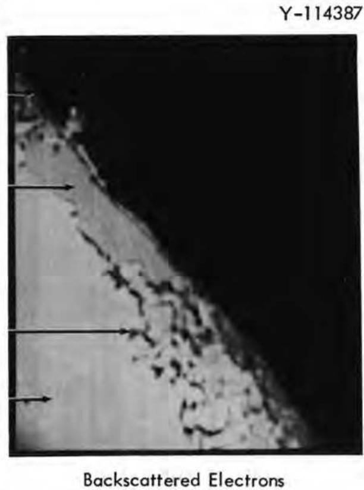  
SURFACE ANALYSIS (5065, M-581, Met. 72877)   
Fig. 12.17. Display of backscattered electrons from a cross section of standard air-melted Hastelloy N after exposure to steam at $538^{\circ}\mathrm{C}$ for 10,000 hr. $2000\times$

12.21 shows backscattered electron and x-ray-fluorescence images of a cross section of a sample of heat 70-727. The specimen had two surface layers, with the outer one enriched in Ni and Fe and the subsurface layer enriched in Ti, Cr, and Mo and depleted in Ni. Figure 12.22 shows the backscattered electron and Ti x-ray-fluorescence images of a typical grain boundary. Titanium is concentrated in the grain boundaries (likely as carbides) and may stabilize them against grain boundary attack of the type observed in heat 21546.

X-ray-diffraction patterns were run on the flat oxidized surface of each of the above specimens by Gehlbach. A typical set of data is shown in Table 12.10. The peaks in the x-ray-diffraction patterns were indexed as NiO, $\mathrm{MoO_2}$ a spinel, $\mathrm{Cr}_2\mathrm{O}_3$ and "matrix". The matrix lines consisted of Hastelloy N $(a\cong 3.53\AA)$

essentially pure Ni $(a\cong 3.53\AA)$ and either a third set $(a\cong 3.56\AA)$ or a nearly continuous range between Ni and Hastelloy N. This indicates a depletion of Mo and Cr from the matrix due to oxidation with a resultant thin layer of Ni near the surface. Heat 70-727 had the thickest nickel layer, and heats 21546, 2477, and 5065 had significantly less. Valid estimates of the relative amounts of the oxides cannot be made at this time due to the lack of absolute intensity data. However, the x-ray spectra are by far the strongest for NiO and weakest for $\mathrm{Cr_2O_3}$ . The relative amounts of the oxides among the specimens appear similar, although the total amounts may vary considerably.

Although the compatibility of Hastelloy N with steam looks acceptable in the absence of stress, steam generators are stressed, and the effects of stress on the compatibility must be evaluated. Tube-burst specimens of two heats of Hastelloy N (N15095 and N25101) have been fabricated and installed in the Bull Run

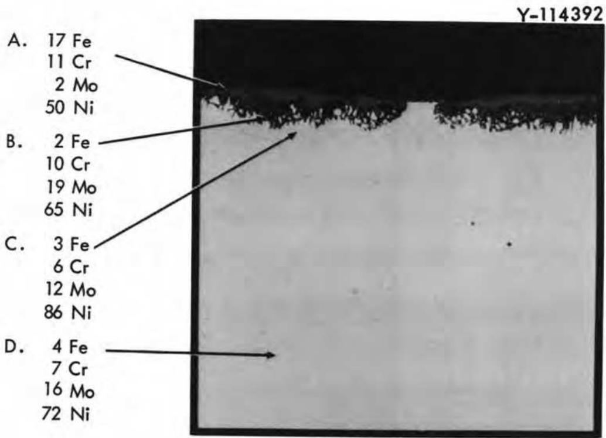  
Light Optics   
SURFACE ANALYSIS (2477, M-582, Met. 72878)

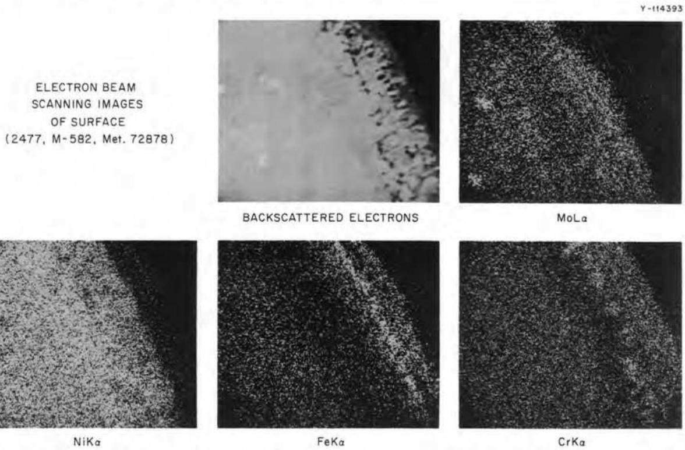  
Fig. 12.18. Optical photomicrograph of a cross section of vacuum-melted Hastelloy N after exposure to steam for 10,000 hr at $538^{\circ}\mathrm{C}$ . The results of microprobe analyses are indicated. $100\times$   
Fig. 12.19. Backscattered electron and x-ray-fluorescence images of the vacuum-melted Hastelloy N sample shown in Fig. 12.18. $2000\times$

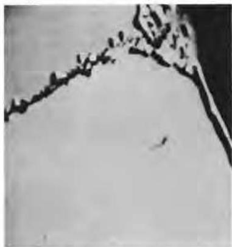  
ELECTRON BEAM  
SCANNING IMAGES  
(21546, M-575, Met. 72879)   
BACKSCATTERED ELECTRONS

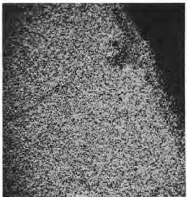  
NiKα

  
FeKa

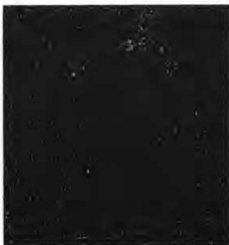  
CrKa

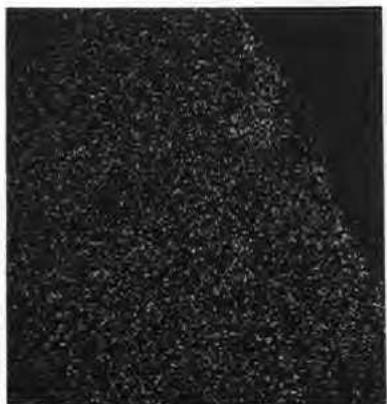  
MoLa   
Fig. 12.20. Backscattered electron and x-ray-fluorescence images of modified Hastelloy N, heat 21546. $2000\times$

facility after slight modifications to the specimen holder. There are presently ten instrumented tube-burst specimens in test at stresses from 28,000 to 72,000 psi (specimen wall thicknesses vary from 0.0108 to 0.0302 in.). The instrumented specimens have a capillary tube connected to the annulus of the double-wall tube-burst specimens to detect failure when steam enters the annulus. Thermocouples on the capillary tubes are connected to a multipoint recorder. When steam enters the capillary tubing, it causes a temperature rise on the recorder that indicates rupture of the specimen.

Figure 12.23 shows three specimens that failed at 4.0, 27.4, and $99.7\mathrm{hr}$ . The reduced gage sections of these specimens were stressed at 66,000, 56,000, and 55,300 psi. The specimens were not removed until after 1000 hr exposure to steam. The specimens at the two highest stresses failed with considerable deformation, and the specimen at the lowest stress failed after less deformation. These differences in the amount of deformation were reflected in the appearance of the fractures of

these specimens (Fig. 12.24). The specimen at the higher stress had the most ductile fracture, being almost entirely shear (Fig. 12.24a). The sample at the intermediate stress had a mixed shear and intergranular fracture (Fig. 12.24b). The sample at the lowest stress had an almost entirely intergranular fracture that is characteristic of high temperatures.

There has been a considerable amount of scatter in the stress-rupture data for tubes tested in argon and steam environments. We suspected that flaws could be important in causing the scatter. Several specimens were ultrasonically inspected and compared with an electrical-discharge-machined flaw 1 mil deep and 62 mils long. Of 42 specimens inspected, 11 gave indications equal to or greater than the standard. The specimen wall thicknesses ranged from 0.011 to 0.020 in. With an applied pressure of 3500 psi, a decrease of 1 mil in the wall thickness would increase the stress on a 0.020-in.-wall specimen by about 2000 psi, and on an 0.011-in.-wall specimen by 6000 psi. A notch or flaw of

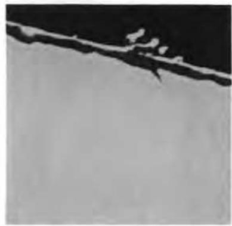  
BACKSCATTERED ELECTRONS

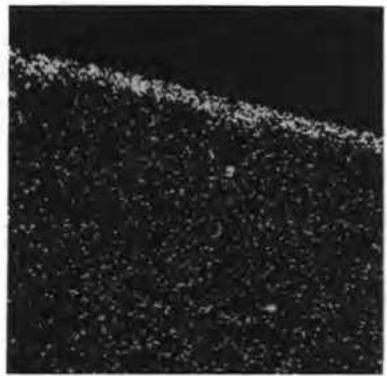  
TiKa

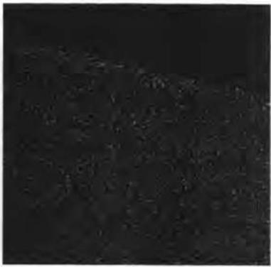  
MoLa

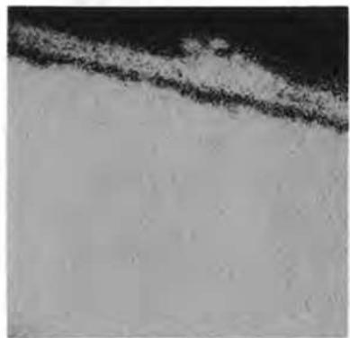  
NiKa

  
FeKa

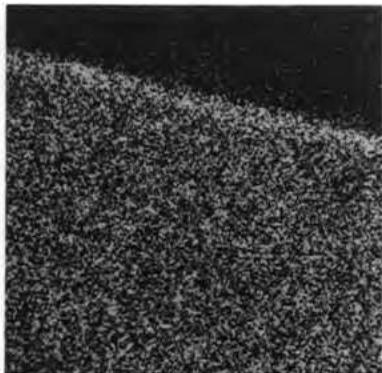  
CrKa   
ELECTRON BEAM SCANNING IMAGES OF SURFACE   
(70727,M-580,Met.72929)   
Fig. 12.21. Backscattered electron and x-ray-fluorescence images of modified Hastelloy N, heat 70-727. $2000\times$

1-mil depth could have a greater effect than just the 1-mil reduction in wall thickness, due to stress concentration at the tip of the notch or flaw. The length of the flaw and the sensitivity of the material to cracks or flaws would influence the stress concentration factor. These stress concentrations due to the flaws present likely account for some of the scatter of the stress rupture data. Figure 12.25 shows a control specimen tested in argon with an argon internal pressure of 3500 psig. It was tested at $538^{\circ}\mathrm{C}$ and a stress of 40,300 psi. Rupture occurred at 565.2 hr, which was much less than a similar specimen exposed to steam, still in test after 7000 hr. There are numerous cracks on the inside

diameter which were probably present before test, although this specimen was not ultrasonically inspected before testing. The ultrasonically inspected specimens without flaws should help in defining the stress rupture properties in steam at $538^{\circ}\mathrm{C}$ . Some of the specimens with flaws will be tested in argon to determine the effect of flaws of this size on the stress-rupture properties. Due to the scatter in the data, no definite conclusions can be drawn at this time regarding the effect of steam on the stress-rupture properties of Hastelloy N tubes. In general the data points obtained in steam fall on the weak side of the scatter band of tests run in argon.

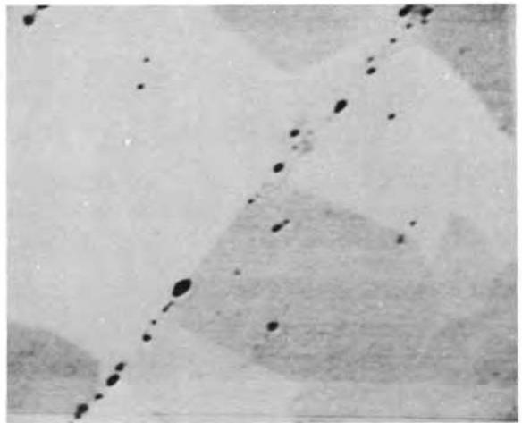  
BACKSCATTERED ELECTRONS

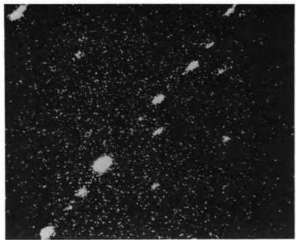  
TiKa

# ELECTRON BEAM SCANNING IMAGES

# OF PRECIPITATES

# (70727, M-580, Met. 72929)

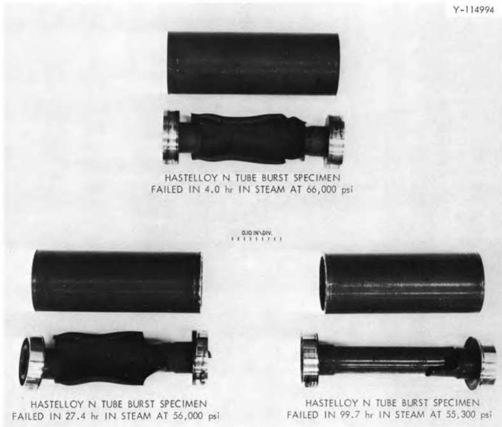  
Fig. 12.22. Backscattered electron and x-ray-fluorescence images of a typical grain boundary of modified Hastelloy N, heat 70-727. $2000\times$   
Fig. 12.23. Photograph of Hastelloy N tube-burst specimens stressed in steam at $538^{\circ}\mathrm{C}$ . The inner annulus of the concentric tube assembly is exposed to the steam.

Table 12.10. X-ray-diffraction pattern from surface of Hastelloy N, heat 70-727, exposed to steam at $538^{\circ}\mathrm{C}$ for 10,000 hr   

<table><tr><td rowspan="2">Relative intensity</td><td rowspan="2">Planar spacing (Å)</td><td colspan="5">Planes for the indicated compound having the spacing shown at the left</td></tr><tr><td>Face-centered cubica</td><td>NiOb</td><td>Spinelc</td><td>MoO2</td><td>Cr2O3</td></tr><tr><td>0.3</td><td>4.82</td><td></td><td></td><td>111</td><td></td><td></td></tr><tr><td>0.3</td><td>3.63</td><td></td><td></td><td></td><td></td><td>104</td></tr><tr><td>13</td><td>3.414</td><td></td><td></td><td></td><td>110,111</td><td></td></tr><tr><td>0.4</td><td>2.945</td><td></td><td></td><td>220</td><td></td><td></td></tr><tr><td>0.5</td><td>2.706</td><td></td><td></td><td></td><td></td><td></td></tr><tr><td>0.5</td><td>2.667</td><td></td><td></td><td></td><td></td><td>121</td></tr><tr><td>1</td><td>2.515</td><td></td><td></td><td>311</td><td></td><td></td></tr><tr><td>1</td><td>2.471</td><td></td><td></td><td></td><td></td><td>110</td></tr><tr><td>80</td><td>2.414</td><td></td><td>111</td><td></td><td>(Several)</td><td></td></tr><tr><td>0.4</td><td>2.173</td><td></td><td></td><td></td><td>210,121</td><td>120</td></tr><tr><td>30</td><td>2.090</td><td></td><td>200</td><td>400</td><td></td><td></td></tr><tr><td>100</td><td>2.069</td><td>111</td><td></td><td></td><td></td><td></td></tr><tr><td>75</td><td>2.036</td><td>111</td><td></td><td></td><td></td><td></td></tr><tr><td>35</td><td>1.792</td><td>200</td><td></td><td></td><td></td><td></td></tr><tr><td>10</td><td>1.770</td><td>200</td><td></td><td></td><td></td><td></td></tr><tr><td>25</td><td>1.764</td><td>200</td><td></td><td></td><td></td><td></td></tr><tr><td>0.2</td><td>1.717</td><td></td><td></td><td></td><td>311,220</td><td></td></tr><tr><td>2</td><td>1.707</td><td></td><td></td><td>422</td><td>(Several)</td><td></td></tr><tr><td>0.3</td><td>1.679</td><td></td><td></td><td></td><td></td><td>321</td></tr><tr><td>0.1</td><td>1.601</td><td></td><td></td><td></td><td>003</td><td></td></tr><tr><td>0.5</td><td>1.528</td><td></td><td></td><td></td><td>131,313</td><td></td></tr><tr><td>60</td><td>1.478</td><td></td><td>220</td><td>440</td><td></td><td></td></tr><tr><td>0.3</td><td>1.429</td><td></td><td></td><td></td><td></td><td>221</td></tr><tr><td>0.3</td><td>1.402</td><td></td><td></td><td></td><td>131,202</td><td></td></tr><tr><td>30</td><td>1.266</td><td>220</td><td></td><td>533</td><td></td><td></td></tr><tr><td>0.5</td><td>1.260</td><td>220</td><td>311</td><td></td><td></td><td></td></tr><tr><td>5</td><td>1.247</td><td></td><td></td><td></td><td></td><td>220</td></tr><tr><td>4</td><td>1.207</td><td></td><td>222</td><td></td><td></td><td>411</td></tr></table>

${}^{a}$ The diffractions indicate that the lattice cell has a dimension varying from 3.526 to 3.584 Å . Hastelloy N has a cell size of 3.58 Å and Ni has a cell size of 3.53 Å .   
$b_{a} = 4.180\mathrm{A}$   
$c_{a} = 8.35\mathrm{A}$

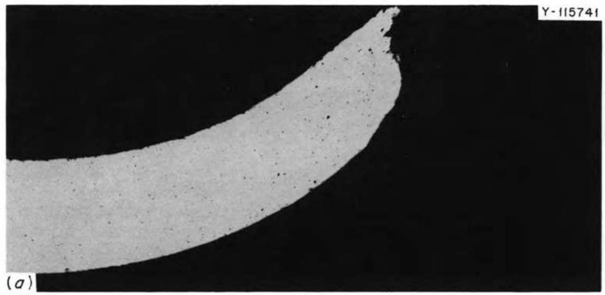

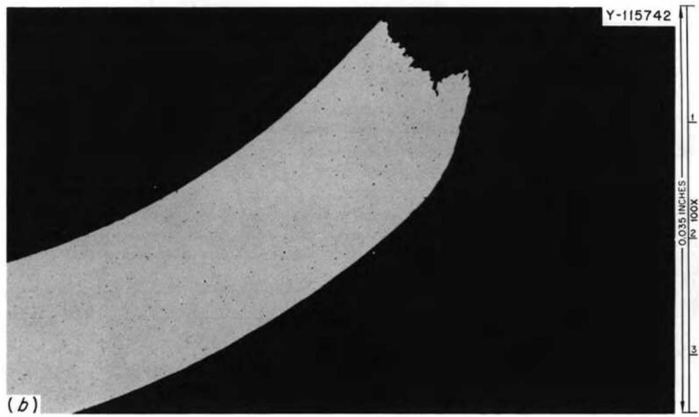

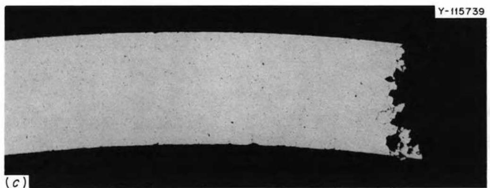  
Fig. 12.24. Photomicrographs of the fractures of Hastelloy N tube-burst samples exposed to steam at $538^{\circ}\mathrm{C}$ . (a) Stressed at 66,000 psi and failed in 4.0 hr, (b) stressed at 56,000 psi and failed in 27.4 hr, and (c) stressed at 55,300 psi and failed in 99.7 hr. As polished.

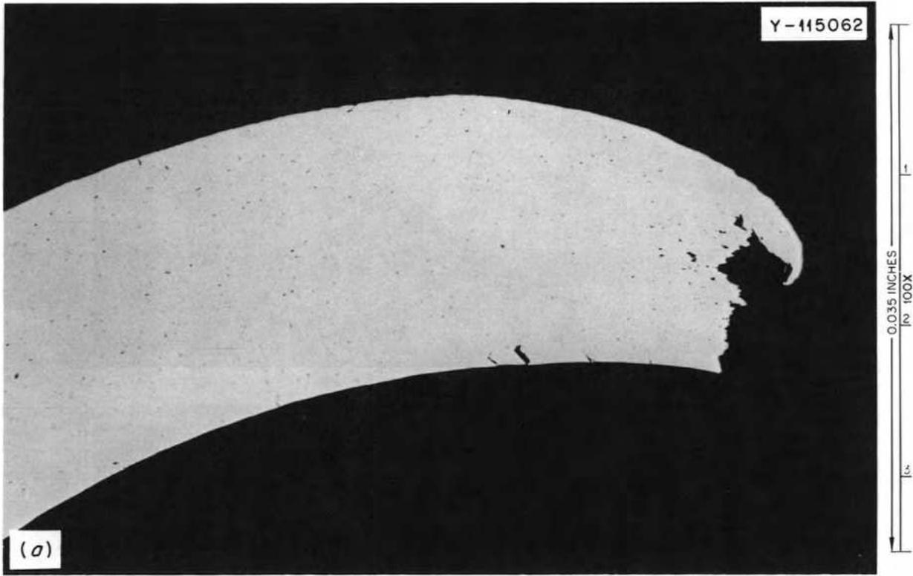

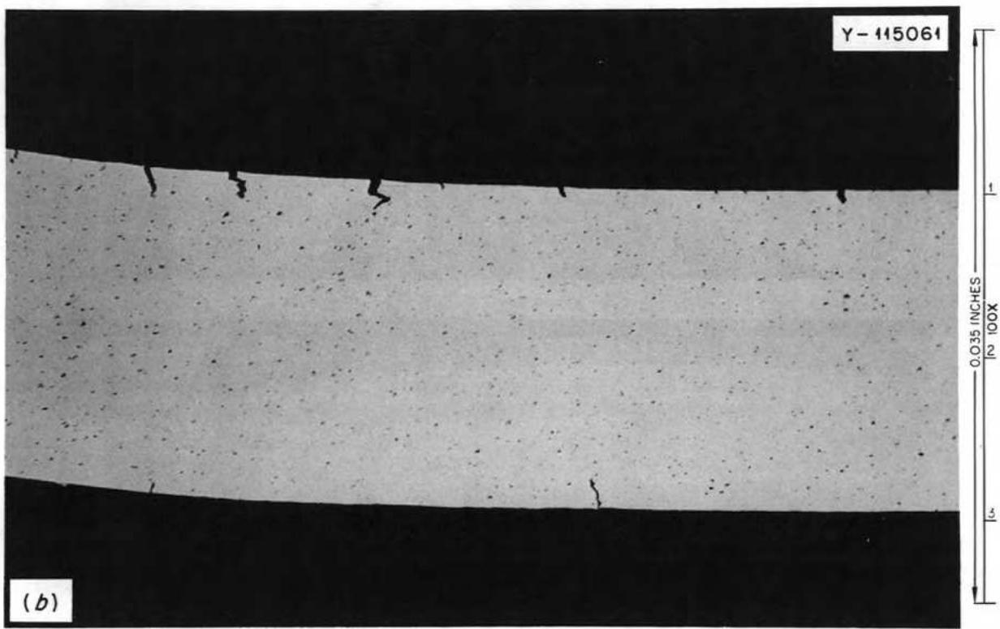  
Fig. 12.25. Photomicrographs of a Hastelloy N sample tested in argon at $538^{\circ}\mathrm{C}$ and 40,300 psi and failed in 565 hr. (a) Fracture. (b) Region away from fracture showing frequent cracks on the inside diameter of the tube. As polished.

# 13. Support for Chemical Processing

J.R.DiStefano H.E.McCoy

Processes involving the selective chemical reduction of materials from the fuel salt into liquid bismuth are being developed for high-performance molten-salt breeder applications. Materials for this application must withstand the corrosive effects of a number of environments at 500 to $650^{\circ}\mathrm{C}$ , such as $\mathrm{HF - H_2}$ mixtures, $\mathbf{F}_2$ , molten-salt mixtures, and bismuth containing lithium and thorium. Molybdenum, tantalum (or tantalum alloys), and graphite appear promising for use with bismuth, and we have concentrated our studies on these materials.

One major undertaking has been the construction of a molybdenum reductive-extraction test stand that will allow us to obtain metallurgical data as well as chemical processing data. Prior to construction, fabrication and joining procedures for molybdenum were developed, and during construction equipment has been developed for specific applications.

We are also continuing our program to evaluate molybdenum, tantalum, T-111 (Ta-8% W-2% Hf), Ta-10% W, brazing alloys, and graphite with bismuth-lithium solutions under reprocessing conditions.

# 13.1 CONSTRUCTION OF A MOLYBDENUM REDUCTIVE-EXTRACTION TEST STAND

J.R.DiStefano A.J.Moorhead

Work was continued on the construction of a molybdenum reductive-extraction test stand for chemical processing studies. An unjoined mockup was constructed with actual test-stand components to check for proper alignment and to reaffirm the step-by-step fabrication sequence. A photograph of the mockup is shown in Fig. 13.1. The principal components of the test stand are a $1\frac{1}{8}$ -in.-OD $\times$ 5-ft-long packed column through which bismuth and salt streams will count-currently circulate, two $3\frac{7}{8}$ -in.-OD enlarged end sections where the fluids will be separated, and two $3\frac{7}{8}$ -in.-OD $\times$ 8-in.-long feed pots containing removable orifices for controlling the flow rate. Four different tube sizes ( $1/4$ in. OD $\times$ 0.020 in. wall, $3/8$ in. OD $\times$ 0.025 in. wall, $1/2$ in. OD $\times$ 0.030 in. wall, and $7/8$ in. OD $\times$ 0.080 in. wall) interconnect the various components. Details of the design of the test stand have been reported previously. $^{1,2}$

Three steps in construction of the test stand have been completed: (1) fabrication of back-extruded half sections and column, (2) machining of subassembly

components, and (3) construction of unjoined mockup from test-stand components. We are now fabricating the feed pot and column subassemblies. This involves joining tube stubs to the pots by either electron-beam welding or roll bonding and then, after assembling all internal components, joining the pot half sections together with an electron-beam girth weld. Intermediate steps in this phase of construction are helium leak checks or dye-penetrant inspections of the partially completed assemblies to ensure the integrity of each joint, and chemically vapor depositing tungsten on the inside of each pot where a roll-bonded joint has been made. The final step in subassembly fabrication will be to back braze each welded or roll-bonded tube-header joint and to braze a reinforcing band around the girth weld. Although the filler metal 42M (Fe-15% Mo-5% Ge-4% C-1% B) was previously selected for use in back brazing, experience gained in fabricating a prototype head pot has shown the $\frac{1}{4}$ -in.-OD molybdenum tubes brazed with this alloy to be brittle in the braze area. Therefore, we are evaluating several commercial filler metals to determine if they would be more satisfactory for back brazing where mechanical support of the joint is the primary requirement.

The final step in construction will consist of interconnecting the various subassemblies by field orbiting-arc welding. Each tube-to-tube weld joint will then have a sleeve brazed around it for reinforcement. Details of the fabrication and joining studies related to construction of the test stand are reported in the following sections.

# 13.2 WELDING OF MOLYBDENUM

# A. J. Moorhead

During this report period all of the various lines of the molybdenum test stand were bent to shape and installed along with the extruded and machined components on the field assembly jig. The tubing was then stress-relieved for $60\mathrm{min}$ in vacuum at $900^{\circ}\mathrm{C}$ and cut at selected locations using our small abrasive-wheel

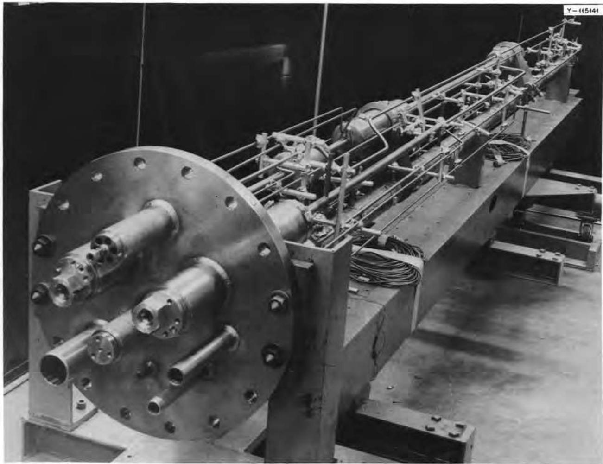  
Fig. 13.1. Unjoined mockup of molybdenum test stand.

cutoff device. We also completed development of our welding procedures and began fabrication of the subassemblies of the test stand.

The final welding procedures developed were for the $7 / 8-$ and $1\%$ -in.-diam tube-tube welds and the $1 / 4-$ $3 / 8-$ $1 / 2-$ and $7 / 8$ -in.-diam tube-tee welds. All of these welds were made in a vacuum-pumped, argon back-filled glove box. By extensively modifying a commercial orbitingarc weld head (Rytik), we were able to successfully join lengths of $7 / 8$ -in.-OD $\times 0.050$ -in.-wall and $1 / 8$ -in.-OD $\times$ 0.050-in.-wall molybdenum tubing to matching stubs which had been electron-beam welded to back-extruded half sections. The welding parameters for the $7 / 8$ -in. tube-tube weld (using a "T"-shaped Mo insert) were: $125\mathrm{A},1_{16}$ -in. arc length, and a travel speed of 8.7 in./min. The $1 / 8$ -in.-diam weld (required for the packed column of the test stand) was made at $120\mathrm{A},1_{16}$ -in. arc length, and a travel speed of 11 in./min without

using a weld insert. Two welds of each size were made, and all four were free of defects when inspected with fluorescent penetrant.

Procedures were developed for making the tube-tee welds (shown in Fig. 13.2) with another orbiting-arc head (Astroarc) in the argon-filled glove box. Although we have successfully demonstrated the ability to make tube-tube welds of this size in the "field" with this device, these tube-tee welds will be made in a chamber to avoid the problem of trying to locally shield these complex parts from oxidation when brazing a reinforcing sleeve around each weld. The welding parameters were basically those which had been developed earlier for tube-tube welds in the field. However, we found

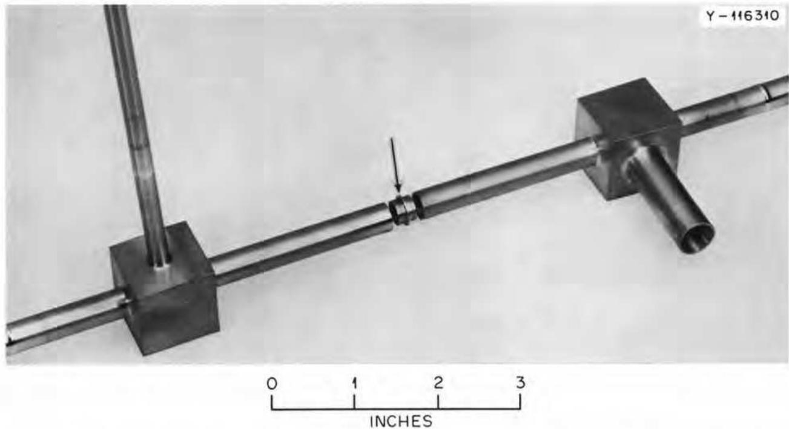  
Fig. 13.2. Tubes $(\frac{1}{4}$ and $\frac{3}{8}$ in. diam) welded to molybdenum tee using an orbiting-arc weld head. The weld insert that will be used in joining the two tubes is indicated by the arrow.

that we had to increase our welding current about $10\%$ , apparently due to the close proximity of the tee body to the weld joints.

We have begun fabrication of the test-stand subassemblies by making the eight required tube-to-header electron-beam welds. Two of these welds attach stubs of the $1\frac{1}{8}$ -in.-diam column tube to the disengaging sections. The other six are $7\frac{1}{8}$ -in.-diam welds required to attach the probe tube and other lines to the back-extruded half sections. All of these welds were free of defects when inspected with fluorescent penetrant except for the $7\frac{1}{8}$ -in. weld in the upper half of the bismuth feed pot. This weld contained pinholes in the outer circumference of the weld bead and cracks in the trepan. The weld was machined away and the joint reprepared. However, the second weld was no better than the first, indicating that this extrusion contains a band of contamination which produced porosity and cracking in the weldment. This part is presently being replaced by a backup extruded half section.

# 13.3 DEVELOPMENT OF BRAZING TECHNIQUES FOR FABRICATING THE MOLYBDENUM TEST LOOP

N.C.Cole

Portions of the molybdenum test stand will be brazed for two reasons: (1) mechanical support of welded or

roll-bonded joints and (2) a backup seal should a leak develop in a roll-bonded joint or a cracked weld. For the latter reason, we developed an iron-base brazing filler metal $(\mathrm{Fe}-15\% \mathrm{Mo}-5\% \mathrm{Ge}-4\% \mathrm{C}-1\% \mathrm{B})$ with adequate corrosion resistance to bismuth. As with any new filler metal, considerable development effort has been necessary to learn to apply it properly.

Braze joints of several different configurations are required, and a different method of brazing each is being developed. Figure 13.3 shows a large molybdenum component joined to several molybdenum tubes and is a mockup of one of the feed pot subassemblies. All joints are identical to those on the test stand. On the ends, the small tubes were welded or roll bonded and then back brazed. A split sleeve was brazed over an electron-beam weld around the girth. All of these brazes were made at one time in a large resistance-heated vacuum furnace, and the process was monitored by thermocouples and by visual observance of the braze flow.

Figure 13.4 shows another type of brazed joint in which a head pot was joined to a short length of the $1^{1}/8$ -in.-diam molybdenum column and a split sleeve brazed around the weld in a large vacuum chamber. A helical induction coil was slipped over the sleeve, and

PHOTO 3938-72

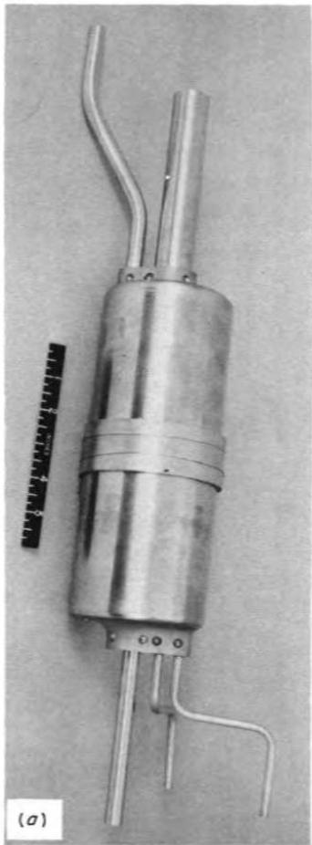

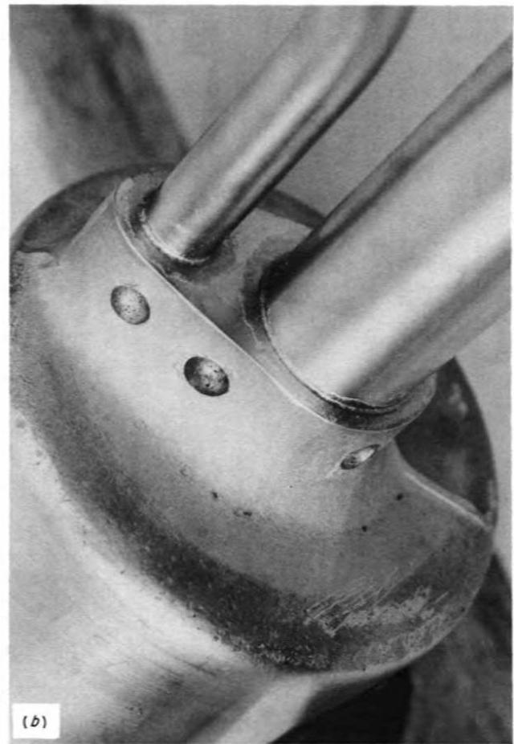

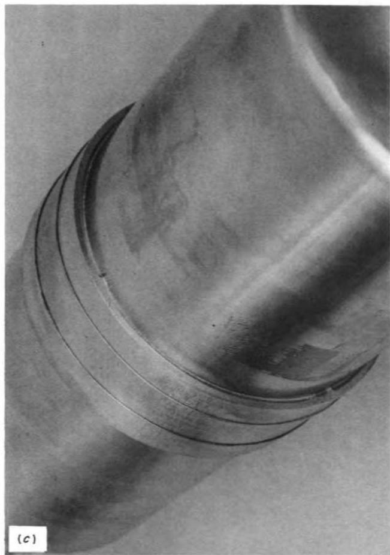  
Fig. 13.3. Mockup of molybdenum upper disengaging section. (a) Overall, (b) end view of tube-to-boss braze, and (c) side view of sleeve brazed over girth weld.

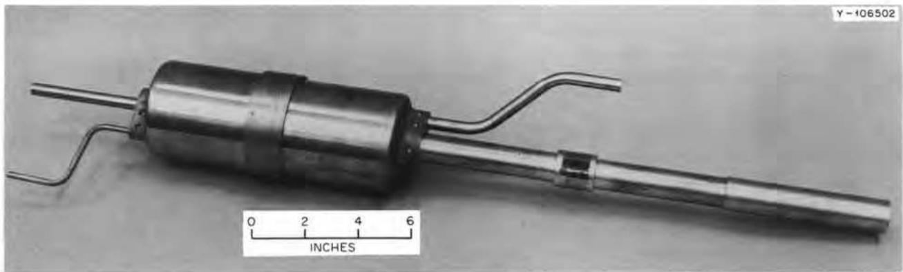  
Fig. 13.4. Mockup of column joined to upper disengaging section. A split sleeve was brazed with Fe-15% Mo-5% Ge-4% C-1% B over a tungsten arc weld in the column.

brazing was completed in $35\mathrm{min}$ by heating only the immediate area of the pot. Because of the mass involved and the characteristics of the induction machine, the heating rate was closely controlled, and the brazing temperature was monitored by a thermocouple placed under the edge of the split sleeve. Alternatively, we brazed this same $1\%$ -in.-diam configuration by heating locally with a portable resistance heater. We now have the option of using either type of heating, and ease of operation or accessibility will dictate which is used when fabricating the test stand. The portable resistance heater is also capable of brazing all of the smaller tube joints, provided that there is enough space around the tubing to place a 3-in.-diam $\times$ 5-in.-long insulated heater and the completed assembly will fit into a vacuum chamber.

Figure 13.1 shows several nozzles protruding through the stainless steel flange of the test stand. The nozzles are made of nickel or stainless steel, and all are brazed to at least one molybdenum tube. In the joint design, we are using a combination of trepans and feeder holes to obtain proper flow of brazing filler metal into the joint. We have successfully brazed several mockups of these dissimilar metal joints (Fig. 13.5).

A small amount of bismuth vapor may reach the stainless steel nozzle in the area of the nozzle-to-molybdenum-tube braze. Therefore, it will be brazed with the iron-base filler metal. None of the nickel nozzles should be exposed to bismuth, so we will braze them with a commercial brazing filler metal. Several filler metals were evaluated, but Au-18% Ni was selected because it flowed as well and had a lower brazing temperature than the nickel-base brazing filler metals. Each of the nozzle brazes will be made vertically in a vacuum furnace by resistance heating in the area of the nozzle only. To avoid several additional welded and brazed

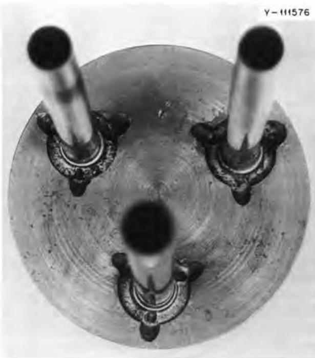  
Fig. 13.5. Mockup of 2-in.-diam stainless steel nozzle brazed to molybdenum tubes.

joints in the molybdenum tubing, an extension has been added to the furnace to accommodate tubing up to 6 ft long.

# 13.4 COMPATIBILITY OF MATERIALS WITH BISMUTH AND BISMUTH-LITHIUM SOLUTIONS

O.B.Cavin

J. L. Griffith

L. R. Trotter

We have continued studying the compatibility of potential structural materials with bismuth and bis

muth-lithium solutions at 600 to $700^{\circ}\mathrm{C}$ in static capsules and flowing thermal convection loop tests. At present, tantalum alloys, molybdenum, and graphite appear to have acceptable compatibility.

# 13.4.1 Tantalum Alloys

We tested T-111 (Ta-8% W-2% Hf) in quartz thermal convection loops containing Bi and Bi-0.01 wt % (0.3 at. %) Li at 600 to $700^{\circ}\mathrm{C}$ for 3000 hr and reported that it had excellent resistance to mass transfer; however, its room-temperature ductility was drastically reduced.[6]

The T-111 specimens picked up approximately 158 ppm O during test, and Liu et al.7 have shown that T-111 is seriously embrittled by the addition of small amounts of oxygen at temperatures below $1000^{\circ}\mathrm{C}$ . Accordingly, we ascribed the ductility loss to oxygen acquired by the T-111 when tested in a quartz envelope.

More recently, a T-111 test was conducted in an all-T-111 thermal convection loop circulating Bi-2.5 wt $\%$ (44 at. $\%$ ) Li for 3000 hr at a maximum temperature of $696^{\circ}\mathrm{C}$ . The T-111 samples had a maximum weight loss of $2.73\mathrm{mg/cm}^2$ (0.19 mil/year), assuming uniform dissolution, but remained ductile. Although the loop specimens showed no ductility loss, the oxygen content of the specimens was 240 ppm compared with 63 ppm before test. Thus these specimens showed the same order of oxygen increase as the quartz loop specimens. However, the specimens in the T-111 loop were in the form of $1/8$ -in.-diam tensile bars, while the quartz loop specimens were 0.020-in.-thick flat strips. Also, the T-111 loop was vacuum annealed at $1400^{\circ}\mathrm{C}$ immediately prior to operation, and some of the oxygen pickup may have resulted from this anneal. Oxygen acquired at the higher annealing temperature, if it is in the 100-ppm range, does not contribute to a measurable ductility loss.

Metallography of the tested tensile samples near the fracture indicated a ductile fracture; that is, no brittle surface layer existed to suggest surface contamination. Therefore, we conclude that insufficient oxygen was added at the test temperature to cause room-temperature embrittlement.

Samples of Ta-10 wt % W tested for 3000 hr at $700^{\circ}\mathrm{C}$ in a quartz thermal convection loop containing

bismuth had a maximum weight loss of $3.3\mathrm{mg/cm}^2$ (0.23 mil/year), about the same as T-111. A minimal oxygen pickup of 50 ppm max was observed but did not cause embrittlement. However, there was some scatter in the tensile data, probably due to sample fabrication. A second loop containing Ta-10 wt % W samples in Bi-0.01 wt % Li is now in progress.

# 13.4.2 Molybdenum

We tested Mo in Bi and Bi-0.01 wt % Li at 600 to $700^{\circ}\mathrm{C}$ and showed that mass transfer is negligible after 3000 hr in quartz loops. An all-metal Mo loop containing Mo tensile samples in Bi-2.5 wt % (44 at.%) Li is still operating at $696^{\circ}\mathrm{C}$ with a $\Delta T$ of $116 \pm 5^{\circ}\mathrm{C}$ . This loop, originally scheduled for 3000 hr, now has accumulated about 5500 hr and will continue operation to accumulate long-term test data. No problems have been encountered with its operation.

# 13.4.3 Graphite

The extremely low solubility of carbon in bismuth makes graphite attractive for parts of the chemical processing plant. We previously reported from metallographic observations that at $700^{\circ}\mathrm{C}$ graphite is chemically inert in contact with Bi containing low concentrations of Li. However, we are continuing tests of graphite to determine its static compatibility with and intrusion by Bi, Li, or Bi containing up to 3.0 wt $\%$ (48 at. $\%$ ) Li. We have concentrated primarily on ATJ graphite, which is a relatively low-density graphite and typical of a graphite that could be fabricated into the large bodies needed for a processing plant.

It has been reported that in the absence of some metallic ions lithium does not form intercalation or lamellar compounds with graphite at or below $500^{\circ}\mathrm{C}$ . However, Secrist and Wisnyi found that lithium and graphite held at $700^{\circ}\mathrm{C}$ for two days in an iron capsule formed $\mathrm{Li}_2\mathrm{C}_2$ . To check these observations, we tested AXF-5Q, pyrolytic, and hot-worked pyrolytic graphites in a pyrolytic graphite crucible containing high-purity lithium for 1000 hr at $700^{\circ}\mathrm{C}$ . All of the graphite was vacuum degassed at 900 to $1000^{\circ}\mathrm{C}$ for 1000 hr prior to adding the lithium. At the completion of the test, there was no metallic lithium in the

crucible, and the walls had moved inward. Each of the graphite samples appeared to be unaffected except for the slight delamination near one end of the pyrolytic graphite. This limited delamination is not too surprising because of the high degree of preferred orientation and the inherently weak interplanar bonding in these pyrolytics. However, each had a weight increase that ranged up to approximately $7\%$ for the AXF-5Q sample. X-ray-diffraction results on two of the samples showed the presence of $\mathrm{Li}_2\mathrm{C}_2$ and an expanded graphite lattice. From relative x-ray-diffraction intensities, the AXF-5Q contained more $\mathrm{Li}_2\mathrm{C}_2$ than the pyrolytic graphite. Since x-ray diffraction is more sensitive than metallography for detecting interrelation and compound formation, we are including x-ray samples in subsequent crucible tests.

We reported no observable chemical incompatibility of graphite with bismuth or bismuth-lithium solutions at $700^{\circ}\mathrm{C}$ , but the liquid metal penetrates the open porosity of the graphite. This problem is illustrated by the photomicrographs in Fig. 13.6 which were made after 500 hr at $700^{\circ}\mathrm{C}$ from two different regions of the same ATJ crucible which contained Bi- $3\%$ Li. In an apparent low-density region, the liquid metal penetrated the entire wall of 0.19 in., while in a higher-density region very little penetration has occurred. This is not surprising because of the inherent density and pore entrance diameter gradations present in this

graphite. The effect of time on the extent of penetration of Bi-3 wt % Li into ATJ is seen in Fig. 13.7. Considerably greater depth of penetration occurred after 3000 hr. In addition, there was some cracking near the inner surface which was also roughened. This roughening of the inner surfaces was caused by the mechanical removal of the solidified metal from the sliced crucible. Typical areas are illustrated, but the great density variations in this material must be kept in mind. Photomicrographs of wall cross sections of two separate ATJ crucibles containing 0.01 and 0.17 wt % Li in Bi and tested for 1000 hr at $650^{\circ}\mathrm{C}$ are shown in Fig. 13.8. These crucibles had identical pretest treatments of alcohol wash and oven dry at $190^{\circ}\mathrm{C}$ for 16 hr. The one having the greater amount of metal penetration contained a lower concentration of lithium in the bismuth at the start of test.

From these results there does not appear to be a chemical reaction between lithium and graphite in Bi-Li mixtures with up to $3\mathrm{wt}\%$ Li. A surface impregnation or sealant would exclude the metal from the graphite, and crucibles with a surface impregnation seal have been ordered for evaluation. We are also looking at the effects of pretreating the graphite by deducting with an air blast, washing with alcohol, oven drying at $190^{\circ}\mathrm{C}$ for 16 hr, and vacuum degassing for 100 hr at $900 - 1000^{\circ}\mathrm{C}$ .

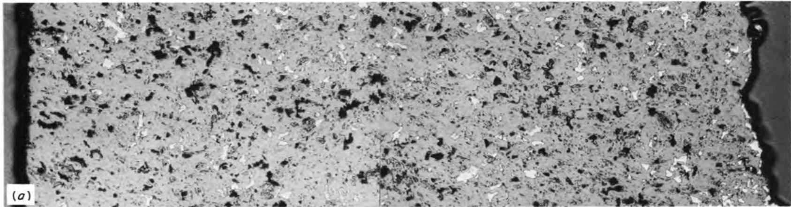

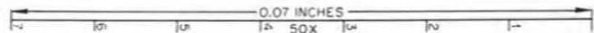

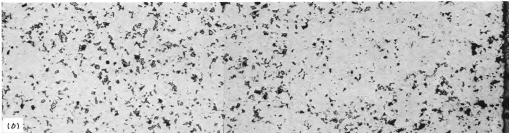  
Fig. 13.6. Wall cross section of an ATJ graphite crucible that contained Bi-3 wt % (48. at. %) Li and was tested for 500 hr at $700^{\circ}\mathrm{C}$ . 50 ×. (a) Region near top of melt; (b) area near bottom of crucible. The graphite metal interface is at the right. The darkest regions are holes, some of which are filled by lighter-colored Bi.

PHOTO 3940-72

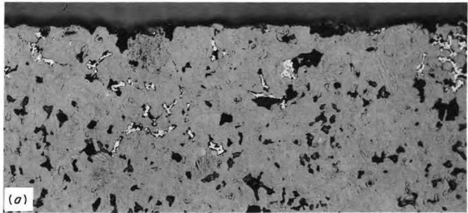

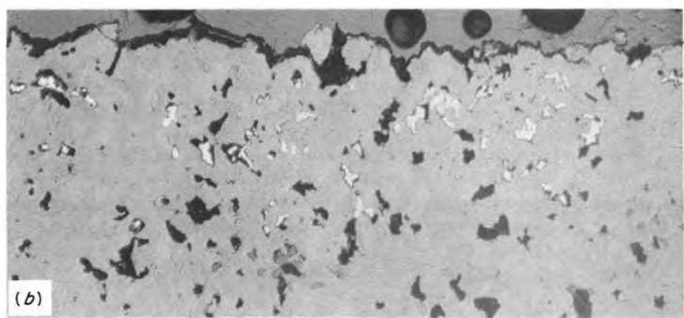  
0.035 INCHES 100X

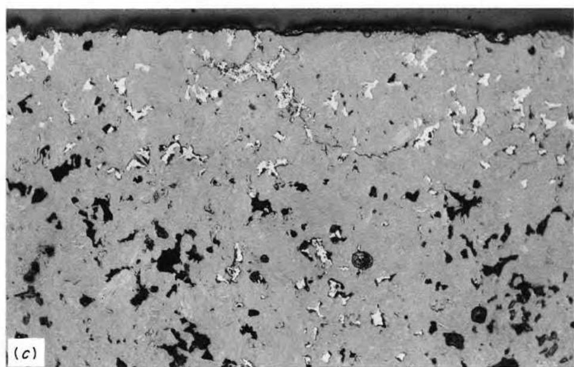  
Fig. 13.7. Photomicrographs of ATJ crucible walls near melt that contained 3 wt % (48 at.%) Li in Bi at $700^{\circ}\mathrm{C}$ for (a) 500 hr, (b) 1000 hr, and (c) 3000 hr. $100\times$ . The darkest regions are holes, and the lightest material is Bi that entered the holes.

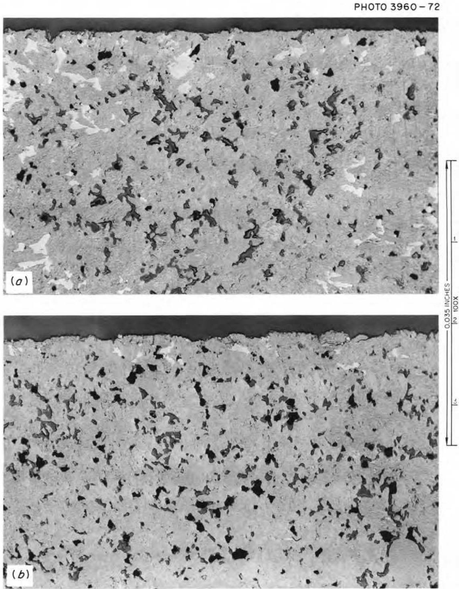  
Fig. 13.8. Photomicrographs of ATJ crucibles tested at $650^{\circ}\mathrm{C}$ for 1000 hr that contained (a) 0.01 wt % Li and (b) 0.17 wt % Li. The darkest regions are holes, and the lightest material is Bi.

# Part 4. Fuel Processing for Molten-Salt Reactors

L. E. McNeese

Part 4 deals with the development of processes for the isolation of protactinium and the removal of fission products from molten-salt breeder reactors. During this period, we continued to evaluate and develop a flowsheet based on fluorination—reductive extraction for protactinium isolation and the metal transfer process for rare-earth removal. Work was continued on a computer program that is being used for calculating steady-state concentrations and heat generation rates in an MSBR processing plant. Recent changes in the program allow the representation of new flowsheets without programming changes. Several flowsheets that differ appreciably from the reference flowsheet were treated successfully with the program.

Studies of equilibria in fused salt-liquid alloy systems were continued. The solubility of $\mathrm{Li}_{3}\mathrm{Bi}$ in molten LiCl was found to be about the same as that reported for LiCl-LiF (70-30 mole $\%$ ); the molar ratio of "free" lithium to bismuth in the salt phase is 3. Lithium and bismuth were found to distribute between liquid Li-Bi alloys and LiBr or LiF in a manner similar to that with LiCl. Experiments were conducted to determine whether lead could be substituted for bismuth in any part of the metal transfer process. The concentration of free lithium in LiCl in equilibrium with a 50 mole $\%$ Li-Pb solution is about 0.001 mole fraction; this is about the same as that observed with a 50 mole $\%$ Li-Bi solution. Measurements of the solubility of thorium in Li-Pb alloys indicate that Li-Pb alloys could be substituted for Li-Bi alloys in the contactor where divalent rare earths are removed from the LiCl. However, the solubility of thorium in lead is only about $10\%$ of the solubility in bismuth; for this reason, the substitution of lead for bismuth in other parts of the system could be made only if the metal phase flow rates in the process were increased considerably or if the distribution coefficients with lead are more favorable than expected.

The reductive-extraction behavior of titanium, a component of modified Hastelloy N, was determined. It

is believed that a large fraction of the titanium will be volatilized during the fluorination step; however, the remaining titanium would be easily extracted into bismuth in the protactinium-removal column. This material would then be accumulated in the salt in the protactinium decay tank along with other corrosion product fluorides, and additional quantities of titanium would be volatilized from this salt by fluorination. Thus, the presence of titanium in the fuel salt will not adversely affect operation of the processing system.

Studies of the chemistry of fuel reconstitution were continued. Spectrophotometric evidence showed conclusively that $\mathrm{UF}_5$ is the product of the reaction of gaseous $\mathrm{UF}_6$ with $\mathrm{UF}_4$ dissolved in MSBR fuel salt. Results of the studies continue to indicate that $\mathrm{UF}_6$ can be readily combined with processed fuel carrier salt by this method.

Further progress was made in studying the equilibrium precipitation of protactinium from $\mathrm{LiF - BeF_2}$ $\mathrm{ThF_4}$ (72-16-12 mole $\%$ ) by sparging the salt with HF- $\mathbf{H}_2\mathbf{O}$ Ar gas mixtures.

The purification and charging of the salt and metal phases to metal transfer experiment MTE-3 were completed, and operation of the experiment was initiated. Mass transfer coefficients were measured for the transfer of $^{288}\mathrm{Ra}$ during the first two runs; the resulting values are in good agreement with a literature correlation that is based on mass transfer rates between aqueous and organic phases in a stirred-interface-type contactor similar to that being used in the present experiment. The mass transfer coefficient values measured for europium and lanthanum during four additional runs were lower than the predicted values. The values for europium were about $10\%$ of those expected, and those for lanthanum were considerably lower than expected. It is believed that the low mass transfer coefficient values are due to the presence of an oxide layer at one or more of the salt-bismuth interfaces in the system. These data point out the importance of preventing the ingress of impurities into metal transfer

systems. Discussions with a graphite manufacturer concerning the design and fabrication of the three-stage salt-metal contactor for use in the fourth metal transfer experiment indicate that manufacture of the required graphite components is within the capability of the graphite industry. Additional data must be obtained on the compatibility of graphite with bismuth containing reductant and on mass transfer rates in mechanically agitated contactors before further design work can be carried out.

Additional experiments were carried out to measure mass transfer rates in simulated mechanically agitated salt-metal contactors. The important physical properties of molten salt-bismuth systems are quite similar to those for the water-mercury system, which allows study of this type of contactor under conditions highly desirable for experimentation. Measurements of the rate of extraction of lead from an aqueous phase containing lead nitrate into mercury containing zinc at low concentrations indicate that the mass transfer coefficients in a water-mercury system are predicted reasonably well by an existing correlation that is based on mass transfer in aqueous-organic systems. The results also imply that the mass transfer rates in salt-bismuth contactors of this type will be adequate for MSBR processing requirements. Further studies were performed in the mild-steel reductive-extraction system in which the rates of transfer of $^{97}\mathrm{Zr}$ and $^{237}\mathrm{U}$ from

molten salt to bismuth in a packed column are measured. The resulting data indicate that the height of an overall transfer coefficient based on the bismuth phase is about 4.3 ft for extraction factors near unity, and that the mass transfer performance of packed columns is adequate for their use in processing systems.

The feasibility of flaring commercially available molybdenum tubing was demonstrated, and several types of flare fittings made of molybdenum were designed and fabricated. Demonstration of the capability for making mechanical joints between sections of molybdenum tubing and between machined molybdenum parts and graphite vessels will advance our technology with regard to the construction of engineering experiments using these materials.

A series of experiments on autoresistance heating of molten salt was carried out in a simulated fluorinator protected from corrosion by means of a frozen wall. The results indicate that an electrically insulating frozen salt layer can be formed reliably under conditions suitable for operation of a fluorinator experiment. Achievement of this objective is an important step in the development of continuous fluorinators. Additional work must be carried out for demonstrating a means for introducing the high-voltage electrode into a fluorinator before design of the first fluorination experiment can be initiated.

# 14. Flowsheet Analysis

Work was continued on the development of a computer program that can be used for calculating steady-state concentrations and heat generation rates in an MSBR processing plant. The behavior of 687 nuclides in about 70 regions allows an adequate representation of present processing plant flowsheets. Several recent modifications in the program facilitate its use and allow an improved representation of equipment items.

# 14.1 MULTIREGION CODE FOR MSBR PROCESSING PLANT CALCULATIONS

C.W.Kee L:E.McNeese

We have reported previously on the development of a computer code that can be used for calculating steady-state concentrations and heat generation rates in an MSBR processing plant. The behavior of 687 nuclides in as many as 250 regions can be considered; however, the use of only about 70 regions has been adequate for representing processing plant flowsheets considered thus far. Several modifications made in the computer program facilitate its use and allow an improved representation of equipment items. The more important modifications are as follows:

1. The extent of transfer of materials between phases present in a region can now be limited by rate

and/or equilibrium considerations rather than by equilibrium considerations alone.

2. The volumetric flow rates of streams in a flowsheet and the distribution ratios for materials that distribute between salt and bismuth phases are now calculated by the program rather than being specified as input data, as was done initially.   
3. An improved method was developed for specifying a flowsheet. This method, which requires only a description of the regions and specification of the streams in terms of origin and destination, permits us to represent a new flowsheet in approximately 30 min rather than 2 days, as was required previously.   
4. A means was found for decreasing the required computer time to about $30\%$ of the time needed previously.   
5. The computer code ORIGEN was incorporated in the program to permit the characterization of waste streams produced by a flowsheet in terms of waste disposal hazard, levels of radioactivity, and heat generation after discharge of the streams from a processing plant.

The modified program has been used successfully for evaluating a number of flowsheets that, although based on fluorination—reductive-extraction—metal transfer, differ appreciably from the reference flowsheet. Attempts are being made to reduce the rates at which thorium, lithium, beryllium, and fluorine are discarded from the processing plant; the results obtained thus far are encouraging.

# 15. Processing Chemistry

L. M. Ferris

Certain aspects of the chemistry of the metal transfer process $^{1,2}$ for the removal of rare earths and other fission products from MSBR fuel salt were studied further. Some of this work involved measurement of the equilibrium distribution of lithium and bismuth between liquid Li-Bi alloys and molten lithium halide salts. Other experiments were conducted to determine whether lead could be substituted for bismuth in any portion of the system, since the availability of bismuth is expected to be limited by the year 2000. $^{3}$ These experiments included measurement of the equilibrium distribution of lithium and lead between Li-Pb alloys and molten LiCl and determination of the solubility of thorium in liquid Li-Pb alloys. In addition to the studies relating to the metal transfer process, the reductive-extraction chemistry of titanium and cesium was determined, and the reaction of gaseous $\mathrm{UF_6}$ with $\mathrm{UF_4}$ dissolved in $\mathrm{LiF - BeF_2 - ThF_4}$ (72-16-12 mole %) received further study, since this reaction provides the basis for the fuel reconstitution step. Studies of the precipitation of protactinium oxide from MSBR fuel salt by sparging with $\mathrm{H}_2\mathrm{O - HF - Ar}$ gas mixtures were also continued.

# 15.1 EQUILIBRIA IN FUSED SALT-LIQUID ALLOY SYSTEMS

L.M.Ferris J.F.Land

Previously,4 we studied the equilibrium distribution of lithium and bismuth between liquid Li-Bi alloys and molten $\mathrm{LiCl}$ , since $\mathrm{LiCl}$ is the acceptor salt used in the metal transfer process $^{1,2}$ for removing rare earths. The data were interpreted in terms of the distribution of salt-like $\mathrm{Li}_3\mathrm{Bi}$ between the two phases. $^{4}$ We concluded work on this system by measuring the solubility of $\mathrm{Li}_3\mathrm{Bi}$ in molten $\mathrm{LiCl}$ . The $\mathrm{LiCl}$ was equilibrated with a Li-Bi alloy having a lithium concentration of 70 at. $\%$ According to the Bi-Li phase diagram, $^{5}$ this alloy was a two-phase equilibrium mixture of solid $\mathrm{Li}_3\mathrm{Bi}$ and a liquid Li-Bi alloy in which the lithium concentration varied from about 52 to 62 at. $\%$ as the temperature

1. L. E. McNeese, MSR Program Semiannu. Progr. Rep. Feb. 28, 1971, ORNL-4676, p. 234.
2. D. E. Ferguson et al., Chem. Technol. Div. Annu. Progr. Rep. Mar. 31, 1971, ORNL-4682, p. 2.
3. M. J. Bell, Availability of Natural Resources for Molten Salt Breeder Reactors, ORNL-TM-3563 (Nov. 11, 1971).
4. L. M. Ferris and J. F. Land, MSR Program Semiannu. Progr. Rep. Feb. 29, 1972, ORNL-4782, pp. 207-209.

was increased from 650 to $800^{\circ}\mathrm{C}$ . It is important to realize that the activity of the $\mathrm{Li}_3\mathrm{Bi}$ in each phase of the mixture was the same. The temperature of the salt-alloy system was randomly varied between 650 and $800^{\circ}\mathrm{C}$ . A period of at least 24 hr was allowed for attainment of equilibrium at each temperature before the salt phase was sampled with a molybdenum pipet. Quenched samples of the salt were very deep red-brown in color. The salt samples were analyzed both for "free" lithium and for bismuth.

The values determined for the solubility of $\mathrm{Li}_3\mathrm{Bi}$ in molten LiCl, expressed in terms of the respective mole fractions $N_{\mathrm{Li(d)}}$ and $N_{\mathrm{Bi(d)}}$ , are given in Table 15.1. Within experimental uncertainty, the ratio of free lithium to bismuth in the LiCl, $N_{\mathrm{Li(d)}} / N_{\mathrm{Bi(d)}}$ , was 3, as expected. In Fig. 15.1, the data are compared with the values obtained by Foster et al. over the temperature range 650 to $1000^{\circ}\mathrm{C}$ using LiCl-LiF (70-30 mole %) as the salt phase. Within analytical error, the solubility of $\mathrm{Li}_3\mathrm{Bi}$ is the same in each salt phase. The data can be represented by $\log S$ (mole %) = [3.437 - 4107/T(^oK)] ± 0.06.

Preliminary data have also been obtained on the equilibrium distribution of lithium and bismuth between liquid Li-Bi alloys and molten LiBr or LiF. These data are presented in Table 15.2 as the $\mathrm{Li}_3\mathrm{Bi}$ concentration in the salt phase at various alloy compositions, and can be represented by the same model developed to describe the distribution of $\mathrm{Li}_3\mathrm{Bi}$ between Li-Bi alloys and molten LiCl. At a given temperature, the distri

5. M. Hansen and K. Anderko, Constitution of Binary Alloys, p. 316, McGraw-Hill, New York, 1958.  
6. M. S. Foster, C. E. Crouthamel, D. M. Gruen, and R. L. McBeth, J. Phys. Chem. 68, 980 (1964).

Table 15.1. Solubility of $\mathsf{Li}_3\mathsf{Bi}$ in molten LiCl in the temperature range 650 to $800^{\circ}C$   

<table><tr><td>Temperature (°C)</td><td>10^6 NBi(d)</td><td>10^6 NLi(d)</td><td>NLi(d)/NBi(d)</td></tr><tr><td>650</td><td>1035 ± 100</td><td>3720 ± 40</td><td>3.6 ± 0.4</td></tr><tr><td>675</td><td>1570 ± 35</td><td>5160 ± 390</td><td>3.3 ± 0.3</td></tr><tr><td>700</td><td>1550 ± 10</td><td>4935 ± 365</td><td>3.2 ± 0.3</td></tr><tr><td>700</td><td>1410 ± 15</td><td>4205 ± 165</td><td>3.0 ± 0.2</td></tr><tr><td>725</td><td>2420 ± 55</td><td>7805 ± 350</td><td>3.2 ± 0.2</td></tr><tr><td>750</td><td>1760 ± 10</td><td>5610 ± 870</td><td>3.2 ± 0.5</td></tr><tr><td>800</td><td>3815 ± 450</td><td>10810 ± 1000</td><td>2.8 ± 0.7</td></tr></table>

bution can be expressed as follows:

$$
\begin{array}{l} \log N _ {\mathrm {L i} _ {3} \mathrm {B e} (\mathrm {d})} \\ = \log \left[ \frac {N _ {\mathbf {L} i (\mathfrak {m})} ^ {4}}{\left[ 3 - N _ {\mathbf {L} i (\mathfrak {m})} \right] ^ {3} \left[ 3 - 3 N _ {\mathbf {L} i (\mathfrak {m})} \right]} \right] + \log \Gamma , \tag {1} \\ \end{array}
$$

in which $N$ is mole fraction and (d) and (m) denote salt and alloy phases respectively. The results given in Table 15.2 yield values of about 0.7 for $\Gamma$ with LiBr as the salt phase at $650^{\circ}\mathrm{C}$ , and about 0.2 for $\Gamma$ with LiF as the salt phase at $900^{\circ}\mathrm{C}$ . Assuming that the temperature dependence of $\log \Gamma$ is the same with both LiBr and

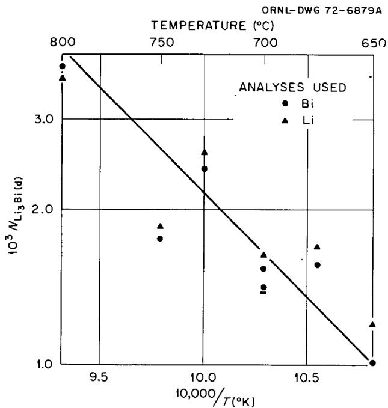  
Fig. 15.1. Solubility of $\mathsf{Li}_3\mathsf{Bi}$ in molten LiCl. The line represents data obtained by Foster et al. with molten LiCl-LiF (70-30 mole%).

Table 15.2. Distribution of $\mathbf{Li}_3\mathbf{Bi}$ between liquid Li-Bi alloys and molten LiBr or LiF   

<table><tr><td>Salt phase</td><td>Temperature (°C)</td><td>Li concentration in alloy (at. %)</td><td>10^6 NLi3Bi(d)</td></tr><tr><td rowspan="4">LiBr</td><td rowspan="4">650</td><td>27.3</td><td>85.4 ± 15</td></tr><tr><td>27.3</td><td>111 ± 15</td></tr><tr><td>35.4</td><td>638 ± 20</td></tr><tr><td>48.7</td><td>1354 ± 50</td></tr><tr><td rowspan="2">LiF</td><td rowspan="2">900</td><td>24.7</td><td>9.3 ± 2</td></tr><tr><td>46.3</td><td>492 ± 90</td></tr></table>

LiCl, $\Gamma$ would be about 1.3 at $900^{\circ}\mathrm{C}$ when LiBr is used as the salt phase. Our earlier results yield $\Gamma = 0.63$ with LiCl as the salt phase at $900^{\circ}\mathrm{C}$ . The above results indicate that, at a given temperature and alloy composition, the equilibrium $\mathrm{Li}_3\mathrm{Bi}$ concentration in the salt phase increases with increasing molecular weight of the lithium halide salt. This effect undoubtedly reflects the corresponding increase in the halide anion radius and, hence, an increased capacity for accommodating the large $\mathrm{Bi}^{3-}$ ions from the $\mathrm{Li}_3\mathrm{Bi}$ in the salt lattice.

To determine whether it is possible to use lead instead of bismuth in parts of the metal transfer process, we made preliminary measurements of the distribution of lithium and lead between liquid Li-Pb alloys and molten LiCl at $650^{\circ}\mathrm{C}$ . The data are summarized in Table 15.3. Both the lithium and lead concentrations in the salt phase increased regularly with increasing lithium concentration in the alloy. The extremely low lead-to-lithium ratio in the salt shows that the observed behavior cannot be explained in terms of the distribution of LiPb, $\mathrm{Li}_3\mathrm{Pb}$ , or $\mathrm{Li}_4\mathrm{Pb}$ between the two phases. Since the equilibrium lead concentrations in the salt are very low, the primary reaction is the distribution of lithium between the two phases. A possible equilibrium7 is:

$$
2 \operatorname {L i} (\mathrm {m}) = \operatorname {L i} _ {2} (\mathrm {d}), \tag {2}
$$

in which (m) and (d) denote alloy and salt phases respectively. An equilibrium constant can be written as

$$
K = \frac {N _ {\mathrm {L i} _ {2} (\mathrm {d})} \gamma_ {\mathrm {L i} _ {2} (\mathrm {d})}}{N _ {\mathrm {L i} (\mathrm {m})} ^ {2} \gamma_ {\mathrm {L i} (\mathrm {m})} ^ {2}}, \tag {3}
$$

7. M. A. Bredig, personal communication, May 18, 1972.

Table 15.3. Equilibrium distribution of lithium and lead between liquid Li-Pb alloys and molten LiCl at $650^{\circ}\mathrm{C}$   

<table><tr><td rowspan="2">Experiment</td><td rowspan="2">Li concentration in alloy (at. %)</td><td colspan="2">Concentration in LiCl (wt ppm)</td><td rowspan="2">\( 10^6 N_{Li(d)} \)</td></tr><tr><td>Li</td><td>Pb</td></tr><tr><td>112</td><td>9.98</td><td>6.3</td><td>&lt; 0.1</td><td>38.5 ± 2.3</td></tr><tr><td>105</td><td>15.5</td><td>35.1</td><td></td><td>214 ± 18</td></tr><tr><td>103</td><td>17.8</td><td>14.4</td><td>0.6</td><td>88.3 ± 20</td></tr><tr><td>111</td><td>20.6</td><td>16.9</td><td>0.5</td><td>164 ± 20</td></tr><tr><td>104</td><td>27.9</td><td>92.2</td><td>1.1</td><td>564 ± 45</td></tr><tr><td>106</td><td>32.0</td><td>67.4</td><td>0.4</td><td>411 ± 25</td></tr><tr><td>102b</td><td>35.2</td><td>139</td><td>1.4</td><td>851 ± 115</td></tr><tr><td>102a</td><td>50.1</td><td>153</td><td>7.8</td><td>935 ± 55</td></tr><tr><td>101</td><td>53.3</td><td>144</td><td>12</td><td>879 ± 30</td></tr></table>

in which $N$ is mole fraction and $\gamma$ is activity coefficient. Since

$$
N _ {\mathrm {L i} _ {2} (\mathrm {d})} = \frac {1}{2} N _ {\mathrm {L i} (\mathrm {d})}, \tag {4}
$$

Eq. (3) can be written, with rearrangement, as

$$
N _ {\mathrm {L i} (\mathrm {d})} = \frac {2 K N _ {\mathrm {L i} (\mathrm {m})} ^ {2} \gamma_ {\mathrm {L i} (\mathrm {m})} ^ {2}}{\gamma_ {\mathrm {L i} _ {2} (\mathrm {d})}}, \tag {5}
$$

or, in logarithmic form,

$$
\log N _ {\mathrm {L i} (\mathrm {d})} = 2 \log N _ {\mathrm {L i} (\mathrm {m})} + \log \left[ \frac {2 K \gamma_ {\mathrm {L i} (\mathrm {m})} ^ {2}}{\gamma_ {\mathrm {L i} _ {2} (\mathrm {d})}} \right]. \tag {6}
$$

If the term containing the activity coefficients is constant, a plot of $\log N_{\mathbf{Li}(\mathbf{d})}$ vs $\log N_{\mathbf{Li}(\mathbf{m})}$ would be linear with a slope of 2. As seen in Fig. 15.2, the distribution data obtained at $650^{\circ}\mathrm{C}$ can be represented

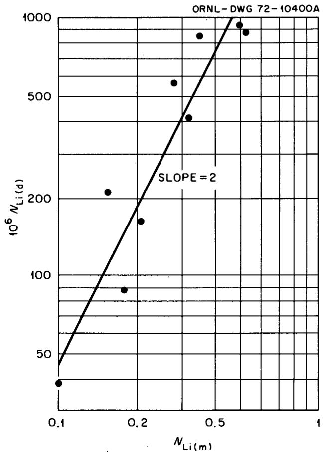  
Fig. 15.2. Equilibrium distribution of lithium between liquid Li-Pb alloys and molten LiCl at $650^{\circ}\mathrm{C}$ .

by Eq. (6), suggesting that the ratio $\gamma_{\mathrm{Li(m)}}^2 /\gamma_{\mathrm{Li_2(d)}}$ is practically constant over the range of conditions investigated. The line in Fig. 15.2 was positioned visually. Extrapolation of this line to $N_{\mathrm{Li(m)}} = 1$ yields a value of about 0.0044 for $N_{\mathrm{Li(d)}}$ . Interestingly, this value is about the same as the value of $0.005\pm 0.002$ obtained by Dworkin et al. for the solubility of lithium in liquid LiCl at $650^{\circ}\mathrm{C}$ . It should also be noted that, although the equilibrium lead concentrations in the salt are low, the lithium concentrations are about as high as those obtained with Li-Bi alloys of comparable composition. Consequently, the use of lead instead of bismuth in the metal transfer process1,2 would not significantly reduce the rate of loss of lithium from the strip solutions.

# 15.2 SOLUBILITY OF THORIUM IN LIQUID Li-Pb ALLOYS

# F.J.Smith C.T.Thompson

In order for lead to be considered as a substitute for bismuth in either the reductive extraction or the metal transfer portions of the reference flowsheet $^{1,2}$ for the chemical processing of MSBRs, the solubilities of thorium in Li-Pb alloys would have to be comparable to those in Li-Bi alloys. Reported data $^{9,10}$ on the solubility of thorium in lead are in disagreement, and no information regarding the solubility of thorium in Li-Pb alloys could be found; consequently, we determined the solubility of thorium in lead and selected Li-Pb alloys over the temperature range 400 to $800^{\circ}\mathrm{C}$ . The apparatus and experimental procedure were the same as those used in our studies of bismuth systems. $^{11-14}$

Measured values of the solubility of thorium in lead and in three Li-Pb alloys are shown in Fig. 15.3. The solubilities in lead are in fair agreement with but slightly lower than those reported by Shaffer et al., and are markedly lower than those reported by Bryner. As seen in Fig. 15.3, the thorium solubility at a given temperature increases regularly with increasing lithium concentration in the alloy. This behavior is similar to that observed previously for Li-Bi

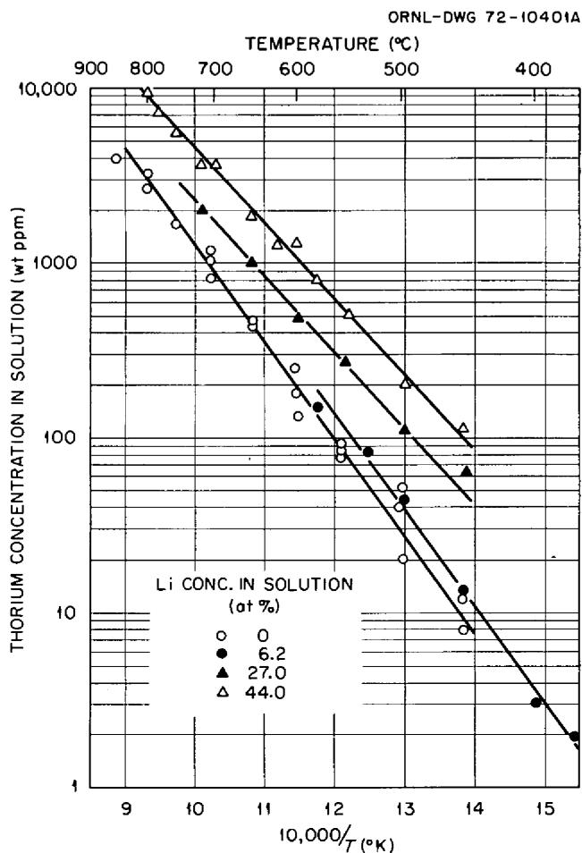  
Fig. 15.3. Solubilities of thorium in Li-Pb alloys in the temperature range 400 to $800^{\circ}\mathrm{C}$ .

alloys.13 Under all conditions investigated, the solubilities of thorium in Li-Pb alloys were much lower than those in Li-Bi alloys of comparable lithium concentration. Consequently, Li-Pb alloys are not attractive as substitutes for Li-Bi alloys in those parts of the processing system where thorium is involved.

Since practically no thorium is present when the divalent rare earths are stripped from $\mathrm{LiCl},^{1,2}$ a scouting experiment was made to determine whether Li-Pb alloys could be used as strip solutions for the divalent rare earths. In this experiment, sufficient europium was added to liquid Li-Pb ( $\sim 45 - 55$ at. $\%$ ) to produce a solution containing about 15 wt $\%$ europium. Filtered samples taken at temperatures as low as $450^{\circ}\mathrm{C}$ indicated that all of the europium was still in solution. This solubility is far above the rare-earth concentration ( $\sim 2500$ wt ppm) desired in the divalent strip solution. Therefore, based solely on solubility considerations, Li-Pb alloys could be used as strip solutions for the divalent rare earths.

# 15.3 REDUCTIVE EXTRACTION OF TITANIUM AND CESIUM

L.M.Ferris J.F.Land

Hastelloy N was used for the containment vessel and other metallic components in the MSRE; however, use of a modified Hastelloy containing up to 2 wt $\%$ titanium is being considered $^{15}$ for MSBRs because an alloy of this type is expected to be more resistant to radiation embrittlement than Hastelloy N. We would expect some titanium to be leached from such an alloy into MSBR fuel salt; $^{16}$ consequently, the behavior of titanium in the chemical processing systems was of interest. Based on thermodynamic estimates, $^{16}$ we would expect a large fraction of the titanium to be removed from MSBR fuel salt as $\mathrm{TiF_4}$ during fluorination. The remaining titanium would enter the reductive-extraction system where, according to our estimates, $^{16}$ it would be easily reduced from the salt into liquid bismuth containing lithium. An experiment was conducted to verify the predicted behavior. Data on the extraction of cesium were also obtained in this experiment.

The experiment was initiated by simultaneously hydrofluorinating bismuth and $\mathrm{LiF - BeF_2 - ThF_4 - CsF}$ (71.7-15.9-12-0.4 mole %) contained in a molybdenum crucible at $600^{\circ}\mathrm{C}$ to remove oxides from the system. After sparging with purified argon, sufficient titanium was added to make the titanium concentration in the bismuth 2500 wt ppm. Analysis of a sample of the metal phase confirmed that all the titanium was present in this phase. The two-phase system was then sparged at $600^{\circ}\mathrm{C}$ for about 20 hr with $\mathrm{HF - H_2}$ (50-50 mole %). Subsequent analyses of the respective phases showed that all of the titanium had been transferred to the salt phase during the hydrofluorination period. (This result confirmed our predictions16 that titanium could be easily transferred from liquid bismuth to a molten fluoride salt by hydrofluorination.) With the system at $600^{\circ}\mathrm{C}$ , thorium was added in increments to effect the reductive extraction of titanium and cesium from the salt into the bismuth phase. At least 24 hr was allowed for equilibration after each addition of thorium before filtered samples of the respective phases were removed for analysis. We first obtained isotherms (expressed as usual11 as $\log D_{\mathbf{M}} = n\log D_{\mathbf{Li}} + \log K_{\mathbf{M}}'$ ) for titanium, cesium, and thorium at $600^{\circ}\mathrm{C}$ ; then, after the bismuth

Table 15.4. Values of log $K_{\mathrm{M}}^{\prime}$ for titanium, cesium, and thorium obtained from measurements of the equilibrium distribution of these elements between molten LiF-BeF $_2$ -ThF $_4$ -CsF (71.7-15.9-12-0.4 mole %) and liquid bismuth solutions   

<table><tr><td>Element</td><td>n</td><td>Temperature (°C)</td><td>log K&#x27;M</td><td>Literature values</td></tr><tr><td>Ti</td><td>3</td><td>600</td><td>13.6 ± 0.4</td><td></td></tr><tr><td>Cs</td><td>1</td><td></td><td>1.478 ± 0.12</td><td></td></tr><tr><td>Th</td><td>4</td><td></td><td>8.936 ± 0.14</td><td>9.093 ± 0.1 (ref. 11)</td></tr><tr><td>Cs</td><td>1</td><td>650</td><td>1.369 ± 0.02</td><td>1.177 ± 0.02 (ref. 18)</td></tr><tr><td>Th</td><td>4</td><td></td><td>8.418 ± 0.08</td><td>8.404 ± 0.1 (ref. 11)</td></tr><tr><td>Cs</td><td>1</td><td>705</td><td>1.235 ± 0.01</td><td></td></tr><tr><td>Th</td><td>4</td><td></td><td>7.712 ± 0.01</td><td>7.726 ± 0.1 (ref. 11)</td></tr><tr><td>Cs</td><td>1</td><td>750</td><td>1.193 ± 0.02</td><td></td></tr><tr><td>Th</td><td>4</td><td></td><td>7.309 ± 0.07</td><td>7.226 ± 0.1 (ref. 11)</td></tr></table>

phase had been saturated with thorium at $600^{\circ}\mathrm{C}$ , the temperature of the system was varied between 600 and $750^{\circ}\mathrm{C}$ . Several sets of samples were taken at three temperatures above $600^{\circ}\mathrm{C}$ .

The isotherms obtained at $600^{\circ}\mathrm{C}$ are shown in Fig. 15.4 as log-log plots of $D_{\mathbf{M}}$ vs $D_{\mathrm{Li}}$ , and values of log $K_{\mathbf{M}}'$ derived from the data are presented in Table 15.4. Values of $\log K_{\mathrm{Cs}}'$ and $\log K_{\mathrm{Th}}'$ at temperatures above $600^{\circ}\mathrm{C}$ were calculated using the analytical results for the samples taken at these temperatures. The titanium data do not clearly show that $n = 3$ ; however, thermodynamic considerations[16] indicate that this is the proper value for $n$ . The value obtained at $600^{\circ}\mathrm{C}$ for $\log K_{\mathrm{Ti}^{3+}}'$ confirms that titanium is very easily reduced from MSBR fuel salt and is consistent with the results of an experiment by Moulton et al.,[17] which indicated that $\log K_{\mathrm{Ti}^{3+}}'$ should be greater than $\log K_{\mathrm{U}^{3+}}'$ . The data obtained for cesium can be expressed as $\log K_{\mathrm{Cs}}' = -0.5531 + 1771 / T(^{\circ}\mathrm{K})$ , with an estimated uncertainty in $\log K_{\mathrm{Cs}}'$ of $\pm 0.05$ . The present values of $\log K_{\mathrm{Cs}}'$ indicate that the reductive extraction of cesium will be slightly easier than expected from the prior experimental data obtained at $650^{\circ}\mathrm{C}$ by Richardson and Shaffer.[18] As seen in Table 15.4, the values of $\log K_{\mathrm{Th}}'$ obtained in this experiment are in good agreement with those reported earlier by Ferris et al.[11]

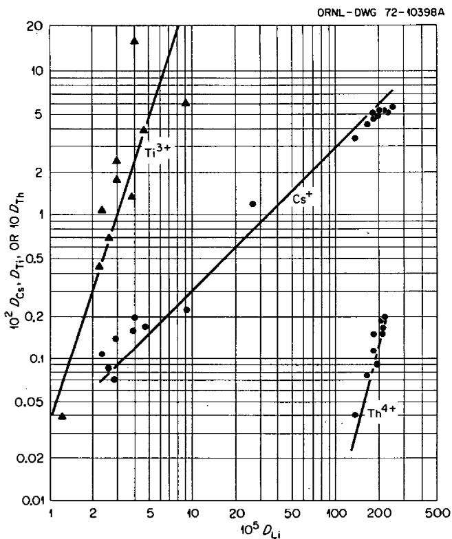  
Fig. 15.4. Equilibrium distribution of titanium, cesium, and thorium between molten $\mathrm{LiF - BeF_2 - ThF_4 - CsF}$ (71.7-15.9-12-0.4 mole %) and liquid bismuth solutions at $600^{\circ}\mathrm{C}$ .

# 15.4 CHEMISTRY OF FUEL RECONSTITUTION

M.R.Bennett L.M.Ferris

The fuel reconstitution step in the reference flow-sheet1,2 involves (1) absorbing the $\mathbf{U}\mathbf{F}_6$ and excess

fluorine from the fluorination step in salt containing dissolved $\mathrm{UF_4}$ and (2) reducing the resultant highvalent uranium species to $\mathrm{UF_4}$ with gaseous hydrogen. The expected reactions are:

$$
\mathrm {U F} _ {6} (\mathrm {g}) + \mathrm {U F} _ {4} (\mathrm {d}) = 2 \mathrm {U F} _ {5} (\mathrm {d}), \tag {7}
$$

$$
\frac {1}{2} \mathrm {F} _ {2} (\mathrm {g}) + \mathrm {U F} _ {4} (\mathrm {d}) = \mathrm {U F} _ {5} (\mathrm {d}), \tag {8}
$$

$$
2 \mathrm {U F} _ {5} (\mathrm {d}) + \mathrm {H} _ {2} (\mathrm {g}) = 2 \mathrm {U F} _ {4} (\mathrm {d}) + 2 \mathrm {H F} (\mathrm {g}). \tag {9}
$$

Presently, we are studying the reaction of gaseous $\mathrm{UF_6}$ with $\mathrm{UF_4}$ dissolved in LiF-BeF $_2$ -ThF $_4$ (72-16-12 mole %), using the gold apparatus and the procedure described previously. $^{19,20}$ Studies involving $\mathrm{UF_6 - F_2}$ gas mixtures will be made in the near future.

The results of our initial studies $^{20}$ showed that at $600^{\circ}\mathrm{C}$ $\mathrm{UF}_6$ reacted rapidly with $\mathrm{UF}_4$ dissolved in the salt. Chemical analyses indicated that $\mathrm{UF}_5$ was the reaction product and that gold was inert both to gaseous $\mathrm{UF}_6$ and to dissolved $\mathrm{UF}_5$ . Recently, in collaboration with J. T. Bell of the Chemical Technology Division, we confirmed spectrophotometrically that $\mathrm{U}^{5+}$ was present after adding $\mathrm{UF}_6$ to a salt containing dissolved $\mathrm{UF}_4$ . Small translucent flakes of quenched samples of an oxide-free salt that, by chemical analysis, contained about $0.6\%$ $\mathrm{U}^{4+}$ and $4\%$ $\mathrm{U}^{5+}$ were positioned for maximum exposure in the sample beam of a Cary 14 spectrophotometer, and the spectrum was recorded at a scan rate of 25 Å/sec. No evidence for species other than $\mathrm{U}^{4+}$ was obtained in the visible region. However, scanning of the near-infrared revealed three intense and relatively sharp lines at about 1.33, 1.36, and $1.38\mu$ , of which the band at $1.36\mu$ was the strongest. The bands cannot be attributed to $\mathrm{U}^{4+}$ . The spectrum obtained was almost identical to the type II spectra obtained by Penneman, Sturgeon, and Asprey $^{21}$ for pentavalent uranium compounds such as $\mathrm{LiUF}_6$ , $\mathrm{NaUF}_6$ , and $\mathrm{CsUF}_6$ . Thus, the present results provide independent evidence that dissolved $\mathrm{UF}_5$ is indeed the product of the reaction of gaseous $\mathrm{UF}_6$ with $\mathrm{UF}_4$ dissolved in $\mathrm{LiF-BeF}_2$ - $\mathrm{ThF}_4$ (72-16-12 mole%).

All of our previous work had been conducted at $600^{\circ}\mathrm{C},^{19,20}$ however, we recently conducted two preliminary experiments at $550^{\circ}\mathrm{C}$ to determine

whether temperature had a marked effect on the rate of reaction of gaseous $\mathrm{UF_6}$ with dissolved $\mathrm{UF_4}$ . The other experimental conditions were the same as those used in the work at $600^{\circ}\mathrm{C}$ . Each experiment was initiated by dissolving $\mathrm{UF_4}$ in $200\mathrm{g}$ of $\mathrm{LiF - BeF_2 - ThF_4}$ (72-16-12 mole %) that was contained in a 1.9-in.-diam gold crucible at $600^{\circ}\mathrm{C}$ . The system was then treated with $\mathrm{HF - H_2}$ (50-50 mole %) at $600^{\circ}\mathrm{C}$ to remove oxide impurities. After the system had been cooled to $550^{\circ}\mathrm{C}$ , a $\mathrm{UF_6 - Ar}$ (50-50 mole %) gas mixture was bubbled into the salt through a $1/4$ -in.-diam gold sparge tube. The amount of $\mathrm{UF_6}$ (which was metered into the system at the rate of $0.11\mathrm{g}$ of uranium per minute) added to the system was that required by reaction (7) to convert all of the uranium in the salt to $\mathrm{UF_5}$ . Samples of the salt were taken immediately after addition of the $\mathrm{UF_6}$ and at 24-hr intervals for the following week.

Preliminary analytical results from the experiments at $550^{\circ}\mathrm{C}$ showed that when the initial $\mathrm{UF_4}$ concentration in the salt was about 0.7 wt $\%$ only about $50\%$ of the $\mathrm{UF_6}$ reacted to form $\mathrm{UF_5}$ . Since practically quantitative reaction of the $\mathrm{UF_6}$ was obtained under the same conditions at $600^{\circ}\mathrm{C}$ , obviously the rate of reaction (7) was somewhat lower at 550 than at $600^{\circ}\mathrm{C}$ . In addition, the rate of disproportionation of $\mathrm{UF_5}$ [the reverse of reaction (7)] appeared to be much lower at 550 than at $600^{\circ}\mathrm{C}$ .

# 15.5 PROTACTINIUM OXIDE PRECIPITATION STUDIES

O.K.Tallent L.M.Ferris

Studies in support of the development of processes for the selective precipitation of protactinium oxide from MSBR fuel salt have been continued. The method currently being considered involves the systematic precipitation of protactinium from molten $\mathrm{LiF - BeF_2}$ $\mathrm{ThF_4}$ (72-16-12 mole $\%$ ) by equilibrating the salt with $\mathrm{HF - H_2O - Ar}$ gas mixtures. The apparatus and experimental procedure were described previously.22 The data obtained are being considered in terms of the equilibrium

$$
\mathrm {P a F} _ {5} (\mathrm {d}) + \frac {5}{2} \mathrm {H} _ {2} \mathrm {O} (\mathrm {g}) = \frac {1}{2} \mathrm {P a} _ {2} \mathrm {O} _ {5} (\mathrm {s}) + 5 \mathrm {H F} (\mathrm {g}), \tag {10}
$$

for which the equilibrium quotient at a given temperature can be written as

$$
Q _ {1} = \frac {p _ {\mathrm {H F}} ^ {5}}{P _ {\mathrm {H} _ {2} \mathrm {O}} ^ {5 / 2} N _ {\mathrm {P a F} _ {5}}} \cdot \tag {11}
$$

In the above expressions (d), (g), (s), $N$ , and $p$ denote dissolved species, gas, solid, mole fraction, and partial pressure respectively. If the ratio $p_{\mathrm{H}_2\mathrm{O}} / p_{\mathrm{HF}}$ is fixed at some value $A$ , Eq. (11) can be written in logarithmic form as

$$
\log N _ {\mathrm {P a F} _ {5}} = 2. 5 \log \left(p _ {\mathrm {H F}} / A\right) - \log Q _ {1}. \tag {12}
$$

Thus, if the equilibrium is actually that indicated by Eq. (10), a log-log plot of protactinium concentration in the salt vs $p_{\mathrm{HF}} / A$ should be linear at each temperature and have a slope of 2.5.

Previous data $^{22-24}$ were taken at temperatures reported to be 600 and $650^{\circ}\mathrm{C}$ respectively. However, during renovation and recalibration of the system, it was found that these temperatures were in error due to a faulty constant-voltage unit in one of the Brown recorders. We estimate that the true temperatures were 25 to $40^{\circ}\mathrm{C}$ higher than those reported and, consequently, that the previously reported values of $Q_{1}$ were high by a factor of 2 to 3. Unfortunately, a more accurate compensation cannot be made.

New measurements of $Q_{1}$ have been made over the temperature range 535 to $650^{\circ}\mathrm{C}$ , using LiF-BeF $_2$ -ThF $_4$ (72-16-12 mole %) as the solvent. Preliminary data from these experiments are summarized in Table 15.5. The protactinium concentrations in the salt were obtained by gamma-spectrometric analysis for $^{233}\mathrm{Pa}$ and may require minor revision once the alpha-pulse-height analyses for $^{231}\mathrm{Pa}$ are available. The estimated uncertainty in each value of $Q_{1}$ is $\pm 15\%$ . Log-log plots of the equilibrium protactinium concentrations in the salt vs $p_{\mathbf{HF}} / A$ , using data obtained at $560 \pm 3$ and $593 \pm 2^{\circ}\mathrm{C}$ , are shown in Fig. 15.5. The fact that these plots are linear with slopes of 2.5 supports the assumption

Table 15.5. Equilibrium protactinium concentrations obtained by sparging $\mathrm{LiF - BeF_2ThF_4}$ (72-16-12 mole %) with HF- $\mathsf{H}_2\mathsf{O}$ -Ar gas mixtures under various conditions   

<table><tr><td>Sample</td><td>Temperature (°C)</td><td>PHF/A (atm)</td><td>Protactinium concentration in salt (wt ppm)</td><td>Q1</td></tr><tr><td>1</td><td>535</td><td>0.0038</td><td>19.5</td><td>0.17</td></tr><tr><td>2</td><td>540</td><td>0.0040</td><td>18.8</td><td>0.20</td></tr><tr><td>3</td><td>540</td><td>0.0070</td><td>81.4</td><td>0.18</td></tr><tr><td>4</td><td>546</td><td>0.0050</td><td>23.9</td><td>0.27</td></tr><tr><td>5</td><td>546</td><td>0.0058</td><td>27.8</td><td>0.34</td></tr><tr><td>6</td><td>549</td><td>0.0079</td><td>48.5</td><td>0.42</td></tr><tr><td>7</td><td>549</td><td>0.0080</td><td>58.0</td><td>0.36</td></tr><tr><td>8</td><td>550</td><td>0.0063</td><td>40.0</td><td>0.29</td></tr><tr><td>9</td><td>560</td><td>0.0037</td><td>5.3</td><td>0.57</td></tr><tr><td>10</td><td>560</td><td>0.0047</td><td>11.0</td><td>0.52</td></tr><tr><td>11</td><td>560</td><td>0.0056</td><td>17.6</td><td>0.49</td></tr><tr><td>12</td><td>560</td><td>0.0064</td><td>22.0</td><td>0.55</td></tr><tr><td>13</td><td>560</td><td>0.0064</td><td>29.5</td><td>0.40</td></tr><tr><td>14</td><td>560</td><td>0.0068</td><td>36.9</td><td>0.38</td></tr><tr><td>15</td><td>560</td><td>0.0070</td><td>36.9</td><td>0.41</td></tr><tr><td>16</td><td>560</td><td>0.0074</td><td>35.5</td><td>0.49</td></tr><tr><td>17</td><td>570</td><td>0.0080</td><td>22.0</td><td>0.95</td></tr><tr><td>18</td><td>573</td><td>0.0107</td><td>62.7</td><td>0.69</td></tr><tr><td>19</td><td>589</td><td>0.0095</td><td>24.0</td><td>1.34</td></tr><tr><td>20</td><td>591</td><td>0.0113</td><td>36.5</td><td>1.36</td></tr><tr><td>21</td><td>592</td><td>0.0109</td><td>37.0</td><td>1.23</td></tr><tr><td>22</td><td>592</td><td>0.0136</td><td>60.5</td><td>1.30</td></tr><tr><td>23</td><td>593</td><td>0.0093</td><td>23.6</td><td>1.29</td></tr><tr><td>24</td><td>593</td><td>0.0134</td><td>48.0</td><td>1.58</td></tr><tr><td>25</td><td>595</td><td>0.0159</td><td>71.0</td><td>1.64</td></tr><tr><td>26</td><td>602</td><td>0.0167</td><td>44.5</td><td>2.96</td></tr><tr><td>27</td><td>611</td><td>0.0175</td><td>48.8</td><td>3.04</td></tr><tr><td>28</td><td>627</td><td>0.0155</td><td>35.1</td><td>3.12</td></tr><tr><td>29</td><td>638</td><td>0.0174</td><td>25.8</td><td>5.66</td></tr><tr><td>30</td><td>638</td><td>0.0174</td><td>26.7</td><td>5.47</td></tr><tr><td>31</td><td>643</td><td>0.0342</td><td>108.2</td><td>7.32</td></tr><tr><td>32</td><td>646</td><td>0.0254</td><td>58.1</td><td>6.48</td></tr><tr><td>33</td><td>649</td><td>0.0238</td><td>30.8</td><td>10.4</td></tr><tr><td>34</td><td>651</td><td>0.0232</td><td>31.5</td><td>9.46</td></tr></table>

that $\mathrm{Pa}_2\mathrm{O}_5$ is the solid phase at equilibrium as indicated by Eq. (10). A plot of $\log Q_1$ vs $1 / T(^{\circ}\mathrm{K})$ , using the recently determined values of $Q_{1}$ , is shown in Fig. 15.6. The line is defined by the equation $\log Q_1 = 12.74 - 10,880 / T(^{\circ}\mathrm{K})$ . These values of $Q_{1}$ should be regarded as preliminary; a more complete analysis of the data will be presented in the next progress report.

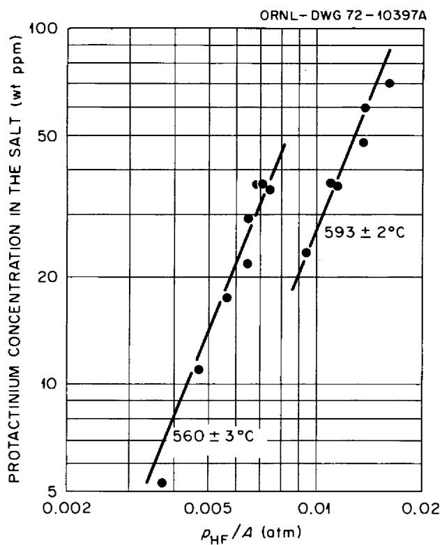  
Fig. 15.5. Precipitation of protactinium from $\mathbf{LiF - BeF}_2\cdot \mathbf{ThF}_4$ (72-16-12 mole %) according to the reaction $\mathrm{PaF_5(d)} + \%_{2}\mathrm{H}_{2}\mathrm{O(g)} = \%_{2}\mathrm{Pa}_{2}\mathrm{O}_{5}(\mathrm{s}) + 5\mathrm{HF(g)}$ . The slope of each line is 2.5.

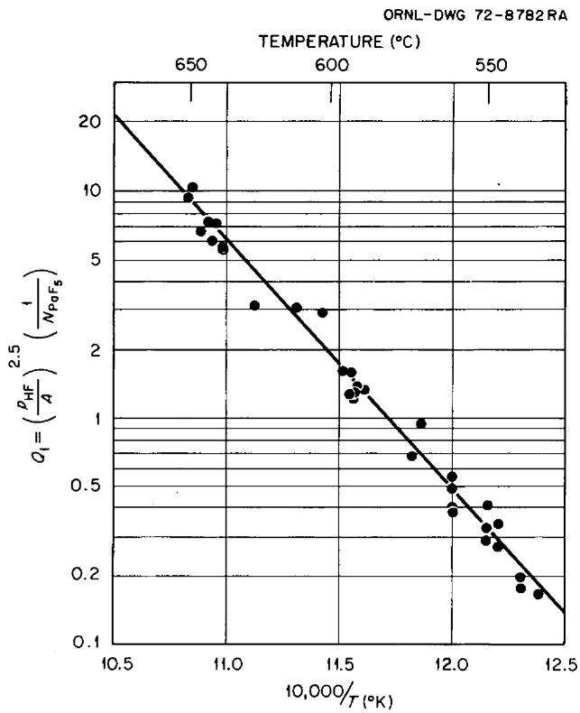  
Fig. 15.6. Effect of temperature on the equilibrium quotient for the reaction $\mathrm{PaF}_5(\mathrm{d}) + \frac{5}{2}\mathrm{H}_2\mathrm{O}(\mathrm{g}) = \frac{1}{2}\mathrm{Pa}_2\mathrm{O}_5(\mathrm{s}) + 5\mathrm{HF}(\mathrm{g})$

# 16. Engineering Development of Processing Operations

L. E. McNeese

Studies related to the development of a number of processing operations were continued during this report period. The purification and charging of the salt and the metal phases to metal transfer experiment MTE-3 were completed, and operation of the experiment was initiated. Mass transfer coefficients measured for radium during the first two runs are in good agreement with a literature correlation that is based on mass transfer between aqueous and organic phases in stirred-interface contactors. The mass transfer coefficient values measured for lanthanum were considerably lower than expected, while those for europium were about $10\%$ of those expected. It is believed that these low values are caused by the presence of an oxide layer at one or more of the salt-bismuth interfaces in the system.

Work on the design of the metal transfer process facility, in which the fourth metal transfer experiment will be carried out, was continued. Discussions with a graphite manufacturer indicate that the required graphite components are within the manufacturing capability of the graphite industry. Studies associated with the measurement of mass transfer rates in simulated mechanically agitated salt-metal contactors were also continued. The extraction of lead from an aqueous phase containing $\mathrm{Pb(NO_3)_2}$ into mercury containing zinc at low concentrations was used for determining mass transfer coefficients under conditions that are believed to be similar to those with molten salt and bismuth. Results of the tests indicate that mass transfer coefficients in a mercury-water system, and likely in a salt-bismuth system, are predicted reasonably well by an existing correlation that is based on mass transfer in aqueous-organic systems.

Further progress was made in determining the rates of transfer of $^{97}\mathrm{Zr}$ and $^{237}\mathrm{U}$ from molten salt to bismuth in an 0.82-in.-ID by 2-ft-long packed column. A correlation developed from our data shows that the height of an overall transfer unit based on the bismuth phase is constant and has a value of about 4.3 ft for extraction factors near unity. Developmental work relative to the design of the reductive-extraction process facility was continued. The feasibility of flaring commercially available molybdenum tubing in $\frac{1}{4} - \frac{3}{8}$ , and $\frac{1}{2}$ -in. sizes was demonstrated. Molybdenum fittings that are compensated for differential thermal expansion were designed and tested. The design of the molyb

denum reductive-extraction equipment and the processing materials test stand is essentially complete.

Bismuth analyses of portions of fluoride salt taken from several different engineering experiments indicate that an improved sampler design is required in order to avoid contamination of the samples. Samples withdrawn from the fluoride salt surge tank in metal transfer experiment MTE-3 have consistently shown low bismuth concentrations (0.45 to 1.7 ppm).

Studies were completed in which we demonstrated the feasibility of using autoresistance heating of molten salt in continuous fluorinators protected against corrosion by means of a frozen wall. Operation of the first series of experiments in the uranium oxide precipitation facility was completed, and the precipitator vessel was disassembled. Corrosion of the equipment and agglomeration of oxide on the equipment surfaces were found to be negligible. A series of tests was completed with an eddy-current-type salt-bismuth interface detector using the amplitude measurement technique at 550 and $700^{\circ}\mathrm{C}$ . The detector output was found to be linear and reproducible over most of the probe length.

# 16.1 OPERATION OF METAL TRANSFER EXPERIMENT MTE-3

E. L. Youngblood

W. L. Carter

H. O. Weeren

L. E. McNeese

The purification and charging of the salt and metal phases to metal transfer experiment MTE-3 were completed, and operation of the experiment was initiated in order to measure the rate at which rare earths transfer through the system. A flow diagram for the experiment is shown in Fig. 16.1. The equipment used in the experiment consists of a fluoride salt reservoir containing about 30 liters of fluoride salt (72-16-12 mole $\%$ LiF-BeF $_2$ -ThF $_4$ ), a salt-metal contactor, and a rare-earth stripper containing 4.6 liters of 4.9 mole $\%$ Li-Bi solution. The 10-in.-diam contactor is divided into two compartments that are interconnected at the bottom by a pool of bismuth that initially contained 0.13 mole $\%$ thorium. During operation of the experiment, salt is circulated from the fluoride salt reservoir to one compartment of the contactor at the rate of about $33\mathrm{ml / min}$ , and LiCl is circulated between the other compartment and the stripper at about 1.25 liters/min; these flow rates are $1\%$ of those expected for

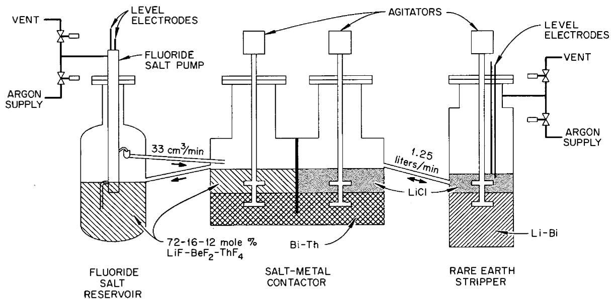  
Fig. 16.1. Flow diagram for metal transfer experiment MTE-3.

processing a 1000-MW(e) MSBR. Mechanical agitators having $2\%$ -in.-diam blades are used in each phase to contact the salt and metal without causing dispersion of the phases. The system operates at about $650^{\circ}\mathrm{C}$ . A more detailed description of the equipment was presented previously. $^{1,2}$

To begin operation of the system, the rare earths were added to the fluoride salt reservoir; then the rate of transfer of the rare earths across the three salt-metal interfaces was determined from samples of each phase. Overall mass transfer coefficients were calculated from the resulting data by using the general equation shown below:

$$
j = K \left(C _ {s} - \frac {C _ {m}}{D}\right), \tag {1}
$$

where

$$
j = \text {t r a n s f e r} \quad \text {r a t e}, \mathrm {g c m} ^ {- 2} \sec^ {- 1},
$$

$$
\begin{array}{l} K = \text {o v e r a l l m a s s t r a n s f e r c o e f f i c i e n t , g c m ^ {- 2} s e c ^ {- 1}} \\ (\mathrm {g / c m ^ {3}}), \end{array}
$$

$$
\begin{array}{l} C _ {s} = \text {r a r e - e a r t h c o n c e n t r a t i o n i n t h e s a l t p h a s e}, \\ \mathrm {g / c m ^ {3}}, \end{array}
$$

$$
\begin{array}{l} C _ {m} = \text {r a r e - e a r t h c o n c e n t r a t i o n i n t h e m e t a l p h a s e}, \\ \mathrm {g / c m ^ {3}}, \end{array}
$$

$D =$ distribution coefficient, $C_m / C_s$ , at equilibrium.

The first two runs in the MTE-3 equipment were made using only the $^{228}\mathrm{Ra}$ (which distributes similarly to a divalent rare earth) that was present in the fluoride salt as a decay product of thorium. After these runs had been completed, $510\mathrm{g}$ of $\mathrm{LaF}_3$ was added to the fluoride salt reservoir to produce a lanthanum concentration of $0.15\mathrm{mole\%}$ , and two additional runs were made. A quantity of $^{154}\mathrm{Eu}$ ( $14\mathrm{mCi}$ ) was then charged to the fluoride salt reservoir. After addition of the $^{154}\mathrm{Eu}$ , transfer rates for lanthanum and europium could be determined for each run; however, the rate for radium could no longer be measured because of counting interference. Agitator speeds not exceeding $200\mathrm{rpm}$ have been used in all of the runs made thus far, since it is desirable to obtain all of the data needed at the lower speeds before using higher speeds that could result in transfer of salt between the two compartments of the contactor via entrainment in the circulating bismuth.

The overall mass transfer coefficients that have been determined for radium, lanthanum, and europium during a total of six runs at agitator speeds of 100 or $200\mathrm{rpm}$ are summarized in Table 16.1. Mass transfer coefficients measured in this experiment have been compared with values predicted by a mass transfer correlation developed by Lewis, $^3$ who studied mass transfer rates in aqueous-organic systems. Based on a

literature survey of available mass transfer correlations and a limited amount of mass transfer data obtained using aqueous solutions and mercury, the Lewis correlation appears to be the best available correlation for predicting mass transfer coefficients for experiment MTE-3, even though the correlation was developed for aqueous-organic systems having considerably different physical properties from those of salt-bismuth systems. The Lewis correlation allows calculation of the individual mass transfer coefficients for each of the two phases present at a mechanically agitated interface from the physical properties of the two phases in contact and from the Reynolds numbers based on the agitator diameters. Overall mass transfer coefficients can be calculated from the individual coefficients and the distribution coefficient by using the following equation:

$$
\frac {1}{K} = \frac {1}{k _ {1}} + \frac {1}{D k _ {2}}, \tag {2}
$$

where

$$
\begin{array}{l} K = \text {o v e r a l l m a s s t r a n s f e r c o e f f i c i e n t , g c m} ^ {- 2} \\ \sec^ {- 1} (g / c m ^ {3}), \end{array}
$$

$k_{1}, k_{2} = \text{individual mass transfer coefficients, g cm}^{-2}$ sec $^{-1}$ (g/cm³),

$$
D = \text {d i s t r i b u t i o n c o e f f i c i e n t}, C _ {m} / C _ {s}.
$$

Using the overall mass transfer coefficients measured for radium, lanthanum, and europium in MTE-3, the individual mass transfer coefficients were calculated by using Eq. (2) and the Lewis correlation. In the calculation, it was assumed that the ratio of the two individual coefficients at an interface was the same as that predicted by the Lewis correlation. It was necessary to use estimated values for the coefficient for the distribution of radium between the fluoride salt and the

Table 16.1. Mass-transfer coefficients $^a$ measured in metal transfer experiment MTE-3   

<table><tr><td>Material</td><td>Agitator speed (rpm)</td><td>K1(cm/sec)</td><td>K2(cm/sec)</td><td>K3(cm/sec)</td></tr><tr><td rowspan="2">Radium</td><td>100</td><td>0.00007</td><td>0.03</td><td>0.003</td></tr><tr><td>200</td><td>0.00032</td><td>0.12</td><td>0.013</td></tr><tr><td rowspan="2">Europium</td><td>100</td><td>0.00005</td><td>0.002</td><td>0.0009</td></tr><tr><td>200</td><td>0.00026</td><td>0.009</td><td>0.003</td></tr><tr><td>Lanthanum</td><td>200</td><td>0.00005</td><td>0.00003</td><td>0.008</td></tr></table>

${}^{a}{K}_{1}$ measured at fluoride salt-Bi-Th interface; ${K}_{2}$ measured at lithium chloride-Bi-Th interface; ${K}_{3}$ measured at lithium chloride-Li-Bi interface.

bismuth-thorium phase since values have not been determined experimentally. A comparison of the individual mass transfer coefficients from experiment MTE-3 with values predicted by the Lewis correlation is shown in Fig. 16.2, where the term of the Lewis correlation containing the individual mass transfer coefficient is plotted against the term containing the Reynolds numbers and the viscosities of the two phases. The dashed line represents values predicted by the Lewis correlation. The lines labeled $k_{1}$ and $k_{2}$ designate the individual coefficients between the fluoride salt and Bi-Th solution, and the lines labeled $k_{3}$ and $k_{4}$ designate the individual coefficients between the LiCl and Bi-Th solution.

The values for the individual coefficients show the same general dependence on Reynolds number as that suggested by the Lewis correlation; however, the experimentally determined values of mass transfer coefficients obtained for lanthanum are considerably lower than predicted by the Lewis correlation, while the values for europium are only about $10\%$ of those

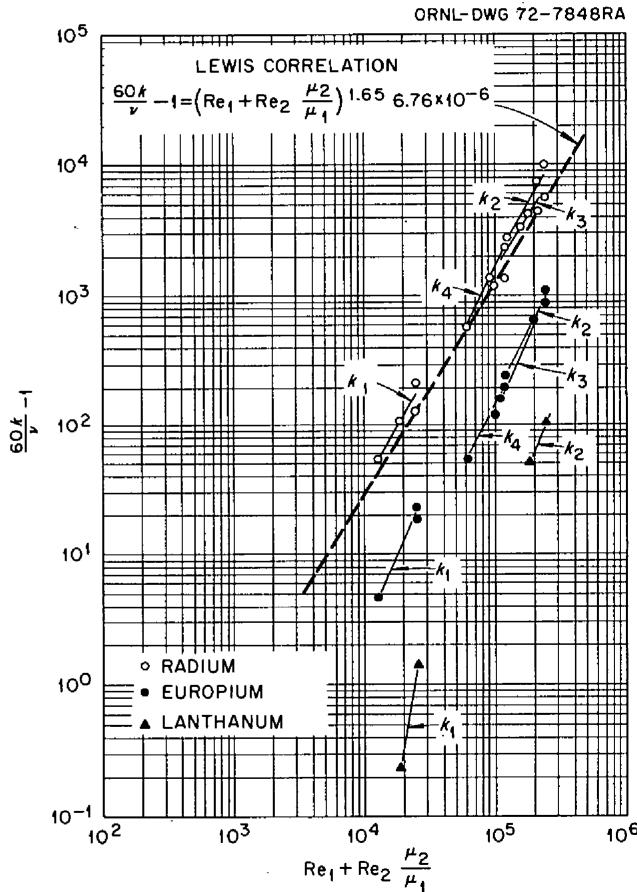  
Fig. 16.2. Correlation of mass transfer coefficient data for radium, europium, and lanthanum from metal transfer experiment MTE-3.

predicted. It is thought that the low transfer rates observed for europium and lanthanum may be caused by the presence of an oxide film at one or more of the interfaces (as the result of impurities in the system). We believe that the rate of transfer of lanthanum and europium can be increased considerably by either cleaning the system to remove these films or by increasing the agitator speed sufficiently to break them up.

# 16.2 DESIGN OF THE METAL TRANSFER PROCESS FACILITY

W. L. Carter E. L. Youngblood L. E. McNeese

We have previously described the preliminary design for the metal transfer process facility (MTPF), in which the fourth metal transfer experiment (MTE-4) will be carried out. This experiment will use salt and bismuth flow rates that are 5 to $10\%$ of those required for processing a 1000-MW(e) MSBR. The principal equipment items are: (1) a fluoride salt surge tank, which has a volume of about 300 liters and will consist of a carbon steel liner in a stainless steel vessel; (2) a three-stage salt-metal contactor made of graphite and enclosed in a stainless steel containment vessel; (3) a stainless steel vessel using a graphite or carbon steel liner in which rare earths will be accumulated in a lithium-bismuth solution having a volume of about 100 liters; and (4) a hydrofluorinator that consists of a graphite crucible enclosed in a stainless steel vessel and has a volume of about 150 liters.

During this report period, discussions were held with a graphite manufacturer in order to ensure preparation of the optimum design for the graphite portions of the salt-metal contactor with regard to ease of fabrication and accepted design technology for vessels made of this material. Minor design changes suggested by the manufacturer have been incorporated in the design, and samples of the suggested grade of graphite have been obtained for compatibility testing with molten salts and bismuth containing lithium and thorium at concentrations of about 0.002 and 0.0025 mole fraction, respectively. Fabrication of the graphite parts of the contactor appears to be within the manufacturing capability of the graphite industry, and the preliminary quotation of $8500 (f.o.b., the manufacturing site) for the completed assembly is considered to be acceptable.

No further design work for the facility will be carried out until the compatibility studies have been completed and additional data have been obtained on mass transfer rates in stirred-interface salt-metal contactors.

# 16.3 DEVELOPMENT OF MECHANICALLY AGITATED SALT-METAL CONTACTORS

J.A.Klein H.O.Weeren L.E.McNeese

Mechanically agitated nondispersive salt-metal contactors are being considered as alternatives to packed columns for MSBR processing systems. Such contactors are of particular interest for use in the metal transfer process, since designs can be envisioned in which the bismuth in the contactor would be a near-isothermal, internally circulated captive phase. In addition, it is believed that contactors of this design may be more easily fabricated than packed columns. Another potential advantage is that adequate mass transfer rates may be obtained without dispersing the salt or metal phases. This mode of operation should eliminate the problem of entrainment of bismuth in salt streams and is highly important in the case of the fluoride salt stream, since an MSBR will be constructed of a nickel-base alloy that is subject to attack by metallic bismuth.

Since the important physical properties of molten salt-bismuth systems (viscosities, densities, and density difference) are quite similar to those for the mercury-water system, studies made with simulated contactors using mercury and water will allow examination of the hydrodynamic and mass transfer characteristics of this type of contactor under highly desirable conditions for experimentation. We have previously summarized results of hydrodynamic studies,[5] and more recently we have reported preliminary results on the measurement of mass transfer coefficients for the extraction of silver from an aqueous phase containing $\mathrm{AgNO}_3$ at low concentrations into the mercury phase.[6] During this report period, our work was aimed at finding materials that distribute between aqueous and mercury phases in a manner suitable for quantitative study of factors affecting mass transfer rates in mechanically agitated contactors. After a number of candidate materials had been examined, the extraction of lead from an aqueous phase into mercury containing zinc at low concen

trations, according to the reaction

$$
\begin{array}{l} \mathrm {P b} \left(\mathrm {N O} _ {3}\right) _ {2} \left[ \mathrm {H} _ {2} \mathrm {O} \right] + \mathrm {Z n} [ \mathrm {H g} ] \rightarrow \mathrm {P b} [ \mathrm {H g} ] \\ + \mathrm {Z n} \left(\mathrm {N O} _ {3}\right) _ {2} \left[ \mathrm {H} _ {2} \mathrm {O} \right], \tag {3} \\ \end{array}
$$

was found to be quite satisfactory. Problems associated with formation of interfacial solids were encountered initially; however, they were circumvented by the addition of sufficient HCl to the aqueous phase to produce an HCl concentration of about $4 \times 10^{-3} N$ . This quantity of acid prevents formation of solids at the interface without causing precipitation of $\mathrm{PbCl}_2$ or formation of significant quantities of $\mathrm{ZnCl}_2$ .

Four series of transient batch-extraction experiments were performed to determine the variation of mass transfer rate with changes in agitator speed and cell geometry. In all cases the cell was circular, had a diameter of 6 in., and contained about 1 liter of each of the phases. The initial concentrations of zinc in the mercury and $\mathrm{Pb(NO_3)_2}$ in the aqueous phase were each

0.1 M. Both baffled and nonbaffled cells were used. Agitator diameters of 3 and 5 in. were employed. The agitator blades were straight in three series of experiments; in the fourth, they were canted at a $45^{\circ}$ angle. Samples of the aqueous phase were obtained at intervals during each run and were analyzed for both zinc and lead by the atomic absorption technique. The overall and individual mass transfer coefficients for the transfer of lead and zinc were then determined.

Results of these studies are presented in Fig. 16.3. The range of literature values for aqueous-organic systems and a correlation derived by Lewis using data on the rate of mass transfer between various aqueous and organic liquids are also included in the figure. The correlation, an empirical equation, is represented by the following expression:

$$
\frac {6 0 k _ {1}}{v _ {1}} = 6. 7 6 \times 1 0 ^ {- 6} \left(\mathrm {R e} _ {1} + \mathrm {R e} _ {2} \frac {\eta_ {2}}{\eta_ {1}}\right) ^ {1. 6 5} + 1, \tag {4}
$$

7. J. B. Lewis, Chem. Eng. Sci. 3, 248-59 (1954).

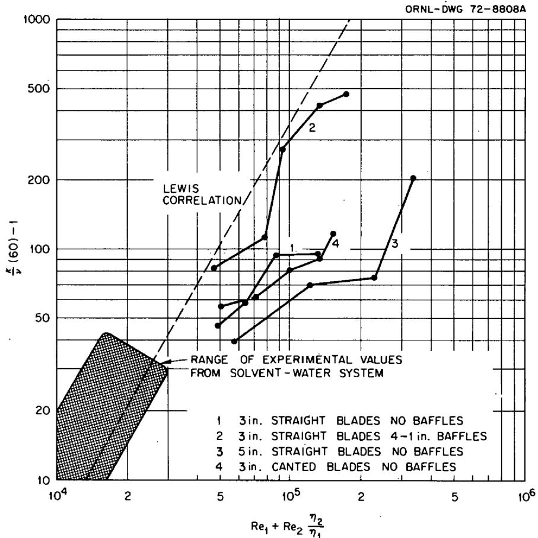  
Fig. 16.3. Correlation of mass transfer coefficient data from a 6-in.-diam simulated salt-metal contactor. The mass transfer coefficients were measured during the extraction of lead from a $\mathrm{Pb(NO_3)_2}$ solution into mercury containing zinc.

where the subscripts refer to the two phases and

$k =$ individual mass transfer coefficient in indicated phase, cm/sec,   
$\nu =$ kinematic viscosity of indicated phase, $\mathrm{cm}^2 /\mathrm{sec}$

$\mathrm{Re} =$ Reynolds number based on agitator in indicated phase $= D^{2}N / \nu$

$D =$ diameter of agitator in indicated phase, cm,

$N =$ agitator speeds, rps,

$\eta =$ viscosity of indicated phase, $\mathrm{gcm}^{-1}$ sec-1.

This relationship indicates that the rate of mass transfer in a mechanically agitated nondispersive contactor is dependent only on eddy transport and is independent of the molecular diffusivity of the transferring material in either of the phases. It is seen that the data obtained in the present study using 3-in.-diam straight blades in a baffled cell are in good agreement with the Lewis correlation, as would be expected. It is also seen that:

1. For the same value of the Reynolds number function, both straight and canted agitator blades produce approximately the same value for the individual mass transfer coefficient. However, the use of canted blades allows operation at slightly higher agitator speeds.   
2. The mass transfer rate is increased by the use of four 1-in. vertical baffles. The mass transfer coefficients obtained with the baffled cell have values that are two to three times those obtained with an unbaffled cell. The use of baffles also tends to reduce the formation of a central vortex in the cell and permits operation at higher agitator speeds.   
3. As the agitator diameter is increased, the mass transfer rate decreases at a fixed value for the Reynolds number function; however, the use of agitators with larger diameters results in a higher value for the Reynolds number function at a fixed agitator speed. Consequently, the individual mass transfer coefficient may remain approximately constant as the cell and agitator sizes are increased.

The main conclusions reached thus far in the study are:

1. The lead-zinc system is quite satisfactory for determining mass transfer rates in simulated stirred-interface salt-metal contactors using mercury and water.   
2. The individual mass transfer coefficients in a water-mercury system (and probably in a salt-bismuth system) are predicted reasonably well by the Lewis correlation.

3. A baffled contactor or a contactor configuration that performs as a baffled system (such as a semicircular or square cell) is highly desirable.

# 16.4 REDUCTIVE-EXTRACTION ENGINEERING STUDIES

B. A. Hannaford W. M. Woods L. E. McNeese

Three mass transfer experiments were performed in which the rates of transfer of $^{97}\mathrm{Zr}$ and $^{237}\mathrm{U}$ from molten salt to bismuth were measured by adding the respective tracers to the salt phase prior to contacting the salt with bismuth containing reductant in an 0.82-in.-ID by 2-ft-long packed column. The fractions of $^{97}\mathrm{Zr}$ and $^{237}\mathrm{U}$ transferred ranged from 36 to $80\%$ at extraction factors ranging from 1.3 to 6.3. The overall HTU values based on the bismuth phase ranged from 4.7 to 7.3 ft. The overall HTU based on the bismuth phase appears to be constant and equal to about 4.3 ft for extraction factors near unity.

Mass transfer experiments UZTR-2, -3, and -4. Three mass transfer experiments (UZTR-2, -3, and -4) were made in which the rates of transfer of both $^{237}\mathrm{U}$ and $^{97}\mathrm{Zr}$ were measured. These experiments were separated by suitable time intervals to permit the decay of residual $^{237}\mathrm{U}$ (half-life, 6.75 days) activity and to permit the adjustment of the uranium and zirconium distribution coefficients to the desired values before each experiment.

Experiment UZTR-2 was carried out with a nominal volumetric flow rate ratio of unity. Control of the bismuth flow rate was not satisfactory throughout the entire run because of a malfunctioning controller; however, a 20-min period of steady flow was obtained with bismuth and salt flow rates of 172 and 187 ml/min respectively (see Table 16.2). Three sets of flowing stream salt and bismuth samples (i.e., a total of six samples) were taken during this period; the reported $^{237}\mathrm{U}$ and $^{97}\mathrm{Zr}$ concentrations were constant to within $\pm 6\%$ for these samples. As noted in footnote $a$ of the table, the results for uranium transfer were calculated by using correction factors (determined by analyses of samples from run UZTR-3) that take into account the attenuation of the weak 0.208-MeV gamma in the solid bismuth and solid salt samples. The data reported previously for experiment UZTR-1 were corrected similarly. The results for runs UZTR-1 and -2 indicated a relatively narrow range of calculated HTU values (i.e., 4.1 to 5.1 ft).

Following run UZTR-2, 1 g-equiv of beryllium was electrolytically dissolved in the salt and bismuth in the

treatment vessel in order to increase the distribution coefficients for zirconium and uranium significantly. Analyses of the equilibrated salt and bismuth phases for uranium (by the wet analysis method) and $^{237}\mathrm{U}$ (by gamma spectrometry) showed a substantial disparity; including the results from samples taken after both UZTR-1 and -2, the value of the $D_{237\mathrm{U}} / D_{\mathrm{U}}$ ratio ranged from 0.23 to 0.42 rather than being unity (the expected value).

In order to obtain accurate data concerning the inventory of $^{237}\mathrm{U}$ tracer in the system, the bulk of the salt was transferred from the treatment vessel to the salt feed tank, and a nominal 10-mCi charge of $^{237}\mathrm{U}$ was added to the salt. After a uniform concentration of tracer had been obtained, the salt was transferred to the treatment vessel where the bismuth and salt were equilibrated and sampled. The combined $^{237}\mathrm{U}$ activity in the bismuth and salt was found to be only about $63\%$ of the initial activity in the salt phase; this result is in good agreement with measurements made at the conclusion of experiment UZTR-2, where the corresponding $^{237}\mathrm{U}$ balance was $68\%$ . This confirmed our suspicion that significant attenuation of the 0.208-MeV gamma was occurring during counting of the solid salt and bismuth samples in the stainless steel sampler capsules. The bismuth and salt samples (that had been counted previously) were drilled out using a small lathe

and were dissolved for total uranium and for $^{237}\mathrm{U}$ analyses. Counting results for $^{237}\mathrm{U}$ on the resulting solutions produced a tracer balance of 101 to $106\%$ based on analyses of samples from the salt feed tank to which the tracer was initially added. The resulting attenuation of the weak 0.208-MeV gamma was about 63 and $29\%$ for the bismuth and salt samples respectively. Despite the good tracer balance, the counting results for the dissolvent solutions were still somewhat biased; the $^{237}\mathrm{U}$ activity per microgram of uranium in the dissolved bismuth samples was only about $83\%$ of the activity per microgram of uranium in the dissolved salt samples.

The bismuth and salt were transferred through the system to check out the operation of the bismuth flow control system after modifications (new argon control valve trim and addition of capacitance to the pneumatic signal line to the valve) had been made to correct the previous difficulty with the control system. Significant improvement in the operation of the system was noted. Experiment UZTR-3 was then carried out at bismuth and salt flow rates of 239 and $61\mathrm{ml / min}$ respectively; the bismuth flow rate deviated from the programmed rate by a maximum of about $7\%$ during a 7-min period midway during the run. All samples taken during the experiment were dissolved for determination of ${}^{237}\mathrm{U}$ and total uranium. On the basis of the actual weight of

Table 16.2. Summary of results from $^{97}\mathrm{Zr}$ and $^{237}\mathrm{U}$ tracer experiments   

<table><tr><td>Run</td><td>Tracer</td><td>Bismuth flow rate (ml/min)</td><td>Salt flow rate (ml/min)</td><td>Distribution ratio (volumetric)</td><td>Extraction factor</td><td>Fraction of Zr (or U) transferred</td><td>HTU (ft)</td></tr><tr><td>ZTR-2</td><td>Zr</td><td>232</td><td>70</td><td>0.282</td><td>0.93</td><td>0.30</td><td>3–5</td></tr><tr><td>ZTR-3</td><td>Zr</td><td>93</td><td>168</td><td>1.67</td><td>0.92</td><td>0.30</td><td>4.6</td></tr><tr><td>ZTR-5</td><td>Zr</td><td>147</td><td>158</td><td>0.21</td><td>0.195</td><td>0.14</td><td>0.5–1.6</td></tr><tr><td>ZTR-7</td><td>Zr</td><td>181</td><td>105</td><td>0.852</td><td>1.47</td><td>0.44</td><td>4.3</td></tr><tr><td>ZTR-9</td><td>Zr</td><td>45</td><td>277</td><td>3.40</td><td>0.55</td><td>0.17</td><td>4.6</td></tr><tr><td>ZTR-10</td><td>Zr</td><td>46</td><td>283</td><td>3.78</td><td>0.61</td><td>0.22</td><td>4.7</td></tr><tr><td>UZTR-1</td><td>Zr</td><td>143</td><td>161</td><td>0.40</td><td>0.36</td><td>0.12</td><td>4.5</td></tr><tr><td></td><td>Ua</td><td></td><td></td><td>0.49</td><td>0.43</td><td>0.16</td><td>4.1</td></tr><tr><td>UZTR-2</td><td>Zr</td><td>172</td><td>187</td><td>1.37</td><td>1.26</td><td>0.36</td><td>4.8</td></tr><tr><td></td><td>Ua</td><td></td><td></td><td>1.43</td><td>1.31</td><td>0.36</td><td>5.1</td></tr><tr><td>UZTR-3</td><td>Zr</td><td>239</td><td>63</td><td>1.58</td><td>6.01</td><td>0.80</td><td>6.9</td></tr><tr><td></td><td>Ub</td><td></td><td></td><td>1.67</td><td>6.35</td><td>0.80</td><td>7.3</td></tr><tr><td>UZTR-4</td><td>Zr</td><td>233</td><td>77</td><td>0.964</td><td>2.93</td><td>0.66</td><td>4.7</td></tr><tr><td></td><td>Ub</td><td></td><td></td><td>1.25</td><td>3.79</td><td>0.67</td><td>6.2</td></tr></table>

${}^{a}$ Uranium transfer results were calculated from ${}^{237}\mathrm{U}$ concentrations after they had been corrected for attenuation of the 0.208-MeV gamma in the solid samples.   
${}^{b}$ Uranium transfer results were calculated from ${}^{237}\mathrm{U}$ concentrations,which were determined using dissolved samples of bismuth and salt.

material dissolved for solution counting of the 0.208-MeV gamma, the calculated attenuation was $59\%$ for the solid bismuth samples and $26\%$ for the solid salt samples. Analyses of ten pairs of equilibrated post-run samples of bismuth and salt for uranium by wet chemical means indicated a $D_{\mathrm{U}}$ of 1.89, which is in excellent agreement with the 1.93 value inferred from $^{237}\mathrm{U}$ counting of the same samples. The HTU values for zirconium and uranium were 6.9 and 7.3 ft respectively (see Table 16.2).

Following the usual time interval for decay of $^{237}\mathrm{U}$ activity in the system, mass transfer experiment UZTR-4 was carried out. Somewhat lower values for the zirconium and uranium distribution coefficients were obtained in this run as the result of a slow loss of reductant from the bismuth in the treatment vessel between experiments. The rate of reductant loss prior to run UZTR-3 was about 0.58 meq/hr; the rate of loss prior to run UZTR-4 was about 0.26 meq/hr. Measurements made thus far of the rate of loss of reductant in the system generally fall within this range. The results for run UZTR-4 were calculated from four pairs of flowing stream samples that were not affected by a mid-run deviation in bismuth flow rate of about $12\%$ . This deviation in flow rate was the result of a malfunction of the ramp generator-transducer.

Following run UZTR-4, $10\mathrm{g}$ of beryllium metal was electrolytically dissolved in the treatment vessel in order to increase $D_{\mathrm{Zr}}$ to about 300 prior to the next mass transfer experiment with $^{97}\mathrm{Zr}$ and $^{237}\mathrm{U}$ . This experiment was postponed, however, when a bismuth line failure occurred that resulted in the release of about 1 liter of fluid (bismuth plus salt) from the system. The appearance of the failure suggested that it was caused by the expansion of freezing bismuth. The affected line had been subjected to about 18 freeze-thaw cycles. The line was replaced, and salt and bismuth containing reductant were then circulated throughout the system to remove trace oxides that might have been introduced to the system. The combined salt and bismuth phases were then contacted with a 10-liter/min $30\%$ $\mathrm{HF - H_2}$ stream for $15\mathrm{hr}$ to remove oxide from the salt.

Correlation of mass transfer results. Mass transfer data from all tracer experiments made to date $^{8}$ are summarized in Table 16.2 and are plotted (except data for run ZTR-5) in Fig. 16.4 as suggested by a correlation that was devised to predict the relationship between the

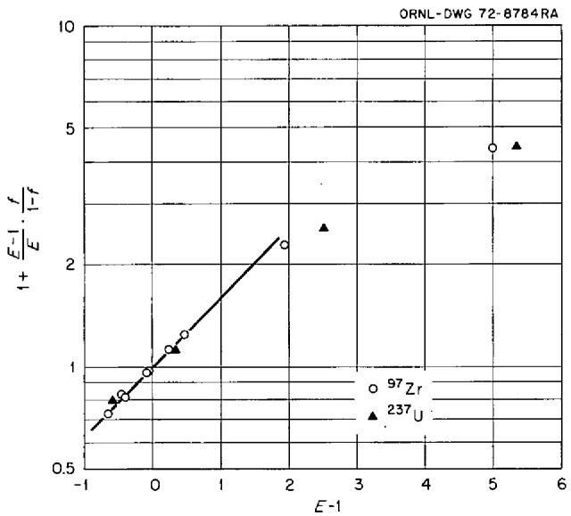  
Fig. 16.4. Correlation of data on fraction of tracer extracted $(f)$ in terms of the extraction factor $(E)$ for the transfer of $^{97}\mathbf{Zr}$ and $^{237}\mathbf{U}$ from MSBR fuel salt to bismuth. The line corresponds to an HTU value of 4.3 ft.

extraction factor $(E)$ and the fraction of material extracted $(f)$ . The overall HTU based on the bismuth phase, which is inversely proportional to the slope of the line through the points in Fig. 16.4, was calculated from the data in this figure to be 4.3 ft. Data from runs UZTR-3 and -4 diverge from the other data in the expected direction since the fraction of a material extracted should approach a constant value as the extraction factor is increased.

# 16.5 REDUCTIVE-EXTRACTION PROCESSING FACILITY DEVELOPMENT

W.M.Woods W.F.Schaffer,Jr. L.E.McNeese

Construction of the reductive-extraction processing facility (REPF) described previously9 will require joints in molybdenum tubing, some of which must be made in the field. While it is feasible to weld molybdenum, the weld-affected region is embrittled, and the weld region must be supported in order to ensure that stresses remain acceptably low. Such welds are expensive; thus some near-standard-type tubing fitting would simplify construction of equipment for engineering development studies.

During this report period, we found that it is feasible to flare arc-melted, low-carbon, low-oxygen molyb-

denum tubing (available commercially) in $\frac{1}{4} - \frac{3}{8}$ , and $\frac{1}{2}$ -in. sizes by using a standard flaring tool. The tool is assembled to the tubing, and the tool-and-tubing assembly is heated to $275^{\circ}\mathrm{C}$ . Subsequently, the flaring cone is run in until the force required begins to increase sharply; then the parts are reheated. Three or four reheats have usually been sufficient for completing a flare. It is anticipated that a tool with a built-in heater can be developed to facilitate the flaring.

We have not determined which type of flare fitting is the most effective. One could, of course, use an all-molybdenum fitting. However, molybdenum-on-molybdenum threads tend to gall, and it is difficult to tap threads in a molybdenum nut. Thus, it would be desirable to fabricate the nut from some material other than molybdenum. On the other hand, because of the very low coefficient of thermal expansion of molybdenum (0.36% from room temperature to $600^{\circ}\mathrm{C}$ ), almost any other potential material would expand more than the molybdenum, and the joint would loosen upon being heated.

W. F. Schaffer, Jr., suggested that if a ferrule of suitable length (i.e., a ferrule that expanded more than either molybdenum or the material of the nut) were placed underneath the nut so as to be in compression, it should be possible to compensate for the differential axial thermal expansion. Analysis of this suggestion leads to the following relationship for the relative lengths of the parts needed for compensation:

$$
L _ {f} = \left[ \left(p _ {n} - p _ {m}\right) / \left(p _ {f} - p _ {n}\right) \right] L _ {m}, \tag {5}
$$

where $L_{f}$ and $L_{m}$ are the lengths of the ferrule and the body of the molybdenum fitting, respectively, and $p$ is the percent expansion from the reference temperature to $600^{\circ}\mathrm{C}$ for nut, molybdenum, and ferrule, as indicated by the subscripts. While the suggested method would compensate for differential axial expansion, there are two further sources of loosening, both of which are caused by differential radial expansion. If the ferrule were made to fit the conical surface of the reverse side of the tubing flare, differential radial expansion of the ferrule would lead to an axial loosening (assuming that the surfaces slid smoothly on each other). Similarly, because of the $60^{\circ}$ angle of the threads, differential expansion of the nut in the radial direction would cause a loosening in the axial direction.

Both of the expansion effects can be compensated for by making the ferrule sufficiently long. The relationship for compensation of each of these two effects is:

$$
\Delta L _ {f} = \left[ \left(p _ {n} - p _ {m}\right) / \left(p _ {f} - p _ {n}\right) \right] (D / 2) \cot \alpha , \tag {6}
$$

where $\Delta L_{f}$ is the additional length of ferrule needed; $D$ is the appropriate diameter (the pitch diameter in the case of the nut, the average diameter in the case of the ferrule); and $\alpha$ is one-half the included angle of the flare for the ferrule and $30^{\circ}$ for the nut, assuming a $60^{\circ}$ thread. Compensation for radial expansion of the ferrule may be obviated by employing a molybdenum washer shaped to fit the reverse side of the tubing flare. Because $\cot 90^{\circ} = 0$ in this case, no compensation is needed.

Since it is not at all obvious that surfaces that are clamped together, as in a tightened flare fitting, will slide freely on each other, a set of fittings compensated only for axial expansion was designed. The bodies of the fittings were made of molybdenum $(p_{m} = 0.36\%)$ from room temperature to $600^{\circ}\mathrm{C})$ .The ferrules were fabricated of 304 stainless steel $(p_f = 1.12\%)$ ,and the nuts were made of low-carbon steel $(p_n = 0.84\%)$ .Test assemblies were prepared in $\frac{1}{4}\cdot ,\frac{3}{8}\cdot$ and $\frac{1}{2}$ -in. sizes, using a $45^{\circ}$ flare. Figure 16.5 shows the unassembled parts for the test pieces; Fig. 16.6 shows the test pieces after assembly. Each assembly was placed inside a stainless steel enclosure, and the interiors of the assemblies were pressured to 65 psig with helium. The containers for the assemblies were connected to a vacuum pump, vacuum pressure gages, and a helium leak detector; then the units were placed in a furnace and subjected to thermal cycling between 300 and $600^{\circ}\mathrm{C}$

Helium leak tests showed that all of the units were leak-tight at room temperature before the start of the test and remained leak-tight at $300^{\circ}\mathrm{C}$ . However, the $3 / 8$ -in. unit leaked grossly after two cycles to $600^{\circ}\mathrm{C}$ . It should be noted that the $3 / 8$ -in. tubing was less ductile than the tubing in the other two sizes. For example, it was not possible to obtain a full flare without cracking the $3 / 8$ -in. tubing. The $1 / 4$ -in. unit did not leak during the two thermal cycles; although the $1 / 2$ -in. unit had a measurable leak to helium, it would not have leaked molten salt or bismuth.

After all the fittings had been rerouted at $275^{\circ}\mathrm{C}$ , thermal cycling was continued. Gross leakage was observed for the $3/8$ -in. unit after two additional cycles to $600^{\circ}\mathrm{C}$ and for the $1/2$ -in. unit after four additional cycles to $600^{\circ}\mathrm{C}$ . No leakage was observed for the $1/4$ -in. unit before the test was terminated.

From the results of these tests we conclude that the general idea of temperature-compensated fittings is sound but that compensation for radial differential expansion is necessary. Consequently, a set of test units has been designed using a $37^{\circ}$ flare, a molybdenum washer under a type 304 stainless steel ferrule, and a

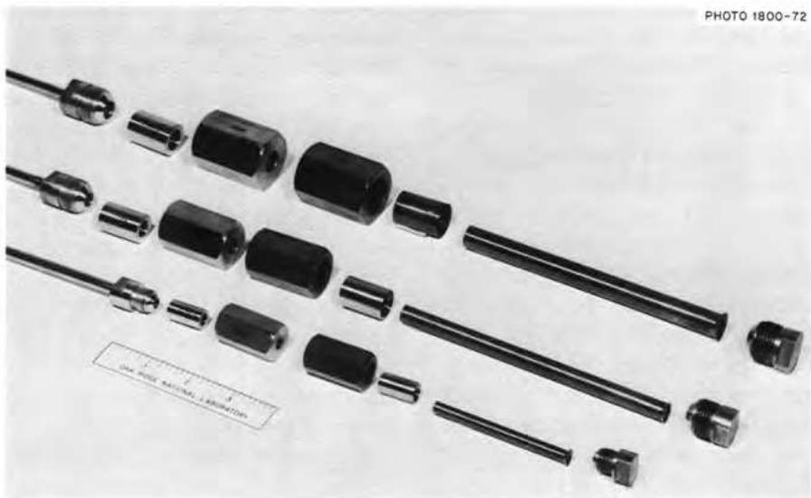  
Fig. 16.5. Unassembled test pieces for testing molybdenum fittings with $45^{\circ}$ -flared molybdenum tubing in sizes of $\frac{1}{4}, \frac{3}{8}$ , and $\frac{1}{2}$ in.

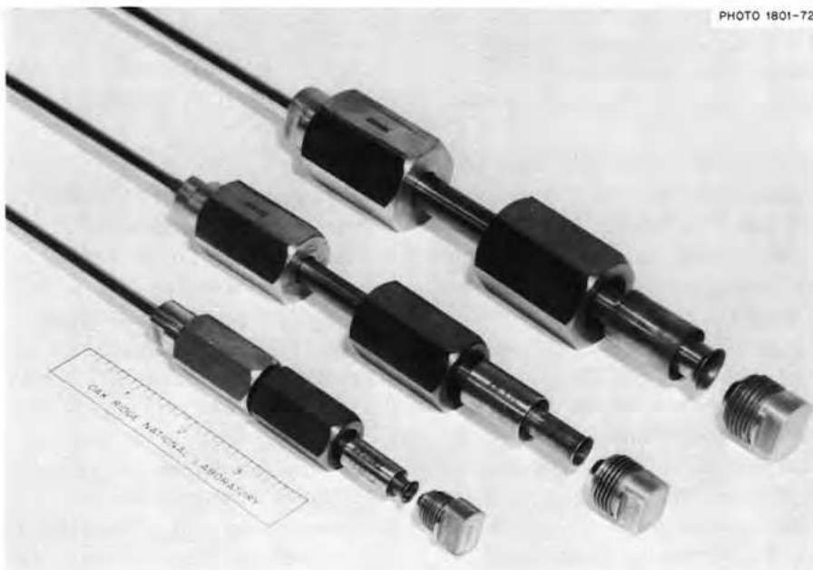  
Fig. 16.6. Assembled test pieces for testing molybdenum fittings with $45^{\circ}$ -flared molybdenum tubing in sizes of $\frac{1}{4}, \frac{3}{8}$ , and $\frac{1}{2}$ in.

type 410 stainless steel nut. The constants for this design are: $p_{m} = 0.36\%$ from room temperature to $600^{\circ}\mathrm{C}$ ; $p_{f} = 1.12\%$ ; $p_{n} = 0.74\%$ . The fittings have been designed to be fully compensated for both axial and radial expansion. When fabrication has been completed, they will undergo thermal cycling between 300 and $600^{\circ}\mathrm{C}$ until failure occurs.

# 16.6 DESIGN OF A PROCESSING MATERIALS TEST STAND AND THE MOLYBDENUM REDUCTIVE-EXTRACTION EQUIPMENT

W.F.Schaffer, Jr.

As the design phase for the all-molybdenum reductive-extraction system nears completion and the as

sembly phase begins (a cooperative effort between the Chemical Technology and the Metals and Ceramics Divisions), we feel that a review of the status of the program is apropos.

We have completed the design drawings (including revisions necessary to simplify or improve assembly, fabrication, and welding and brazing techniques) for the following program phases: (1) all-molybdenum system components, (2) connecting molybdenum piping and fittings, (3) freeze valve assembly, (4) structural supporting components, brackets, and braces for the molybdenum system; (5) assembly fixture and transport jig for the molybdenum system, (6) containment vessel, including the top flange with the transition nozzles for connecting the molybdenum system to the required service and instrument lines, (7) internal insulation to ensure that the top flange will not exceed the $750^{\circ}\mathrm{F}$ design temperature, (8) fixtures for lifting and lowering the molybdenum system into the containment vessel, and (9) containment and operating cell structural modifications and containment vessel support. We have also examined the design and stress calculations for all critical regions to ensure success of the system. The design of the containment vessel has been reviewed and approved by the Pressure Vessel Committee.

The final machining of all the molybdenum components has been completed, and these components have been inspected and stress-relieved by the Metals and Ceramics Division. All other parts required for the reductive-extraction system assembly, including the freeze valve, vessel supports, and associated hardware, nozzle inserts, flange assembly, and assembly jig, have been fabricated and delivered to the Metals and Ceramics Division. A trial assembly of the components on the assembly fixture with the connecting piping and supporting structural system was made and checked against the design drawings. No significant problems were found; all line dimensions were within the specified tolerances. The remaining design work primarily involves the electrical wiring for the containment vessel and transfer line heaters, the instrumentation and control panels, and the services.

Following completion of the assembly jig, the frame was test loaded to measure torsional twist and was found to be in close agreement with the calculated values. We prepared procedures and checklists to cover the movement of the completed molybdenum system from the assembly area (on the second floor of Bldg. 4508) to the operating area (on the third floor of Bldg. 4505). The procedures were reviewed with the field engineer, the rigger foreman, and technical personnel.

The wood-and-steel mockup of the system was connected to the assembly jig, along with welded test specimens of molybdenum tubing supported only by the ends to the loop support pipe in several strategic locations. Strain gages for measuring both bending and torsion and two accelerometers for measuring horizontal and vertical acceleration were installed on the frame. A transfer of the mockup between the two working areas was made successfully without damage to the mockup or molybdenum specimens. Most of the shock loads were less than $\frac{1}{2}$ g. One shock load of about 2 g was recorded when the assembly frame was inadvertently mismatched with the trunnion support. A minor adjustment of the parts and procedures will prevent a recurrence of this problem.

The present schedule calls for completion of assembly of the molybdenum system during the early part of November 1972. Preparation of the cell where the equipment will be installed is scheduled to begin in September. The containment vessel which is currently being fabricated will be installed during October.

# 16.7 REMOVAL OF BISMUTH FROM MSBR FUEL SALT

R. B. Lindauer

A program has been initiated to determine the concentration of bismuth in fuel salt after the salt has contacted bismuth in the various engineering development experiments. The objective of this program is to determine the probable concentration of bismuth in salt leaving an MSBR processing plant. Later, methods for preventing entrainment of bismuth in salt will be studied, and means for removing bismuth from salt will be evaluated.

An important part of this program is the development of effective techniques for obtaining salt samples from experimental systems. Table 16.3 summarizes the results of analyses of samples taken from six vessels, using various types of samplers. The lowest reported bismuth concentrations are believed to be the most representative because of difficulty with contamination of the sample, either during the sampling procedure or during the sampler cleaning operation. The highest reported bismuth concentrations were obtained when the samplers were withdrawn through sample ports used for obtaining both bismuth and salt samples, as in experiment MTE-2B and in the salt-metal contactor for experiment MTE-3.

Our experience with the various types of samplers used to date can be summarized as follows:

1. Stainless steel vacuum sampler (filtered). This sampler, which is the standard one used in the engineering experiments, is disadvantageous in two respects: difficulty has been experienced in crushing the salt from the $\frac{1}{4}$ -in.-OD tubing, and there is a possibility that bismuth will be removed from the sample by filtration or adsorption on the filter as the salt passes through the porous metal.   
2. Quartz tubing sampler (unfiltered). The sample is withdrawn into the tubing (approximately $1/8$ in. ID) with a vacuum syringe. Although this sampler resulted in the lowest reported bismuth concentrations for samples taken from experiment MTE-2B, it is too fragile for routine use.   
3. Mild-steel dip sampler (unfiltered). Several submergences, as well as rapid movement, of the sampler are usually required to fill the $3/8$ -in.-OD cup. We were unable to obtain samples from experiment MTE-2B. It is feared that the rapid movement of the sampler might cause entrainment of bismuth in the salt in systems where a sample must be taken in the vicinity of a salt-bismuth interface.   
4. Mild-steel vacuum sampler (unfiltered). This $3/8$ in.-OD sampler proved to be reliable but was difficult to clean. Evidently, bismuth adhered to the outside of the sampler during passage through the sampler port. This material is not readily removed by use of a file or emery cloth. Some decrease in the reported bismuth concentration was observed after the sampler cleaning tech

nique was modified. In the new technique, the salt-containing portion of the sampler is not clamped in the lathe, and new tools are used for cutting open each sampler.

5. Steel-sheathed vacuum sampler (unfiltered). A removable steel sheath is placed over the sampler to prevent contact of the sampler with the sample tube. This sheath increases the sampler diameter by $\frac{1}{8}$ in. and prevents the $\frac{3}{8}$ -in.-diam sampler from being used except in the treatment vessel for the mild-steel reductive-extraction system; the values for the bismuth concentration obtained with the new type of sampler were much lower than had been obtained with previous samplers. Salt from the $\frac{1}{4}$ -in.-diam sampler could not be removed by crushing, and the required drilling operation resulted in the introduction of iron particles in the sample. Dissolution of these particles with the salt produced a yellow color which reduced the sensitivity of the analytical method for detection of bismuth.

6. Copper vacuum sampler (filtered). This is the most recently evaluated sampler, and the initial results are very encouraging. This sampler has produced the lowest reported bismuth concentrations obtained to date, it is easy to clean, and the salt is readily removed by crushing. The halfwave potential for copper is sufficiently separated from that of bismuth to eliminate interference in the analysis for bismuth by the inverse polarographic method (which had been reported ini

Table 16.3. Average ${}^{a}$ concentrations of bismuth in fluoride salt samples taken from engineering experiments   

<table><tr><td rowspan="3">Sampler</td><td colspan="6">Average bismuth concentration (ppm)</td></tr><tr><td rowspan="2">MTE-2B</td><td colspan="2">Reductive extraction</td><td colspan="2">MTE-3</td><td rowspan="2">Sampling experiment (no Bi phase)</td></tr><tr><td>Treatment tank</td><td>Salt from column</td><td>Fluoride tank</td><td>Contactor</td></tr><tr><td>Stainless steel vacuum (filtered)</td><td>58 (6)</td><td></td><td></td><td></td><td></td><td></td></tr><tr><td>Quartz (unfiltered)</td><td>11.5 (7)</td><td></td><td></td><td></td><td></td><td></td></tr><tr><td>Mild steel dip (unfiltered)</td><td></td><td>60 (5)</td><td></td><td>0.6 (1)</td><td>355 (2)</td><td></td></tr><tr><td>Mild steel vacuum (unfiltered); old cleaning technique</td><td>25 (1)</td><td>74 (1)</td><td></td><td>1.7 (1)</td><td>60 (5)</td><td>2.8 (2)</td></tr><tr><td>Mild steel vacuum (unfiltered); new cleaning technique</td><td>775 (2)</td><td>23 (2)</td><td>36 (6)</td><td>0.45 (4)</td><td>29 (2)</td><td>1.0 (2)</td></tr><tr><td>Steel-sheathed vacuum (unfiltered)1/4in. OD (drilled out)</td><td>77.5 (2)</td><td></td><td></td><td></td><td>200 (2)</td><td></td></tr><tr><td>3/8in. OD (crushed)</td><td></td><td>7.3 (3)</td><td></td><td></td><td></td><td></td></tr><tr><td>Copper, vacuum, filtered</td><td></td><td></td><td></td><td></td><td></td><td>&lt;0.1 (3)</td></tr><tr><td>Averages</td><td>120 (18)</td><td>40 (11)</td><td>36 (6)</td><td>0.7 (2)</td><td>133 (11)</td><td>0.8 (7)</td></tr></table>

${}^{a}$ The number of samples on which an average is based is indicated in parentheses after the value.

tially) unless the concentration of copper is much higher than the concentration of bismuth.

Relatively high bismuth concentrations (7.3 to 775 ppm) were obtained for all samples that were withdrawn through a sample port also being used for obtaining bismuth samples. Only salt samples are withdrawn through the port on the fluoride salt vessel of experiment MTE-3, and the reported bismuth concentrations in these samples have been consistently low (0.45 to 1.7 ppm) and comparable to those taken from the sampling experiment that does not contain a bismuth phase. It is believed that the actual concentration of bismuth in the fluoride salt in the various experiments is considerably lower than the reported values obtained thus far.

# 16.8 FROZEN-WALL FLUORINATOR DEVELOPMENT

J. R. Hightower, Jr.

When an open-column continuous frozen-wall fluorinator is operated with nonradioactive salt, a heat source that is not subject to corrosion by the combined action of molten salt and fluorine must be present in the salt. Two methods for internal heat generation have been considered: radio-frequency induction heating and electrolytic or autoresistance heating using 60-Hz power. The induction heating method was judged to be inferior to autoresistance heating because of a narrow range of acceptable operating conditions and because of the complexity of the required power supply, power controls, and power transmission equipment.[10]

In initial tests on autoresistance heating in a 2.5-in.-diam simulated fluorinator, the desired mode of operation could not be achieved because the frozen salt layer near the upper electrode was not electrically insulating. A study of the requirements for forming electrically insulating frozen salt layers was then initiated in a straight 6-in.-diam cylindrical vessel; in these tests, the high-voltage electrode was placed just below the salt surface at the top of the vessel rather than in a side arm (as is planned in an actual fluorinator). These tests have been successful in defining conditions under which electrically insulating salt films can be formed.

Equipment and procedures. As described previously, $^{10}$ the equipment consisted of a vessel made from 6-in. sched 40 nickel pipe. The high-voltage electrode entered the vessel through a nozzle in the top

flange and protruded about 9 in. into the salt. The fluorinator vessel, which was grounded, served as the other electrode. The test section consisted of a 48-in.-long section of the pipe that had been cooled by removing the thermal insulation after the desired initial operating conditions had been achieved; this allowed heat to be transferred to the surroundings by natural convection and radiation.

In a typical experiment, the thermal insulation was removed from the test section, and the wall temperatures in this region were allowed to drop to about $360^{\circ}\mathrm{C}$ (which is below the salt solidus temperature) in order to form a layer of frozen salt on the vessel wall in the test section. A 60-Hz voltage applied across the electrodes was then adjusted to produce the desired current through the molten salt (and, hence, the desired heat generation rate). After steady-state conditions had been achieved, the molten salt was drained from the vessel, which was then allowed to cool to room temperature. The thickness of the frozen salt layer was subsequently determined from measurements made through the top flange and from radiographs of the test section.

Results. We have made six runs in which a layer of frozen salt was successfully maintained on the vessel wall in the test section under steady-state conditions. The resulting heat generation rates have varied from 9.2 to $16.7\mathrm{kW / ft^3}$ of molten salt. These rates are close to the rate expected in the primary fluorinator in an MSBR processing plant (i.e., $12.6\mathrm{kW / ft^3}$ ) and are adequate for operation of a nonradioactive continuous fluorinator protected against corrosion by means of a frozen wall. The measured thickness of the frozen salt layer has agreed well with the value predicted by heat transfer calculations and can be inferred with reasonable accuracy by measuring the total resistance of the conducting salt path.

It was found that an electrically insulating frozen salt layer can be formed reliably if the temperature of the wall is maintained below that of the salt solidus. In the initial experiment in the first test vessel, $^{10}$ wall temperatures that were only about $25^{\circ}\mathrm{C}$ below the liquidus temperature $(458^{\circ}\mathrm{C})$ were used. Under these conditions the frozen material on the wall contained occluded liquid, which caused the layer to be electrically conductive. The salt mixture that was initially charged to the present fluorinator simulation had the composition 65-35 mole $\%$ LiF-BeF $_2$ , which has a solidus temperature of $363^{\circ}\mathrm{C}$ . An electrically insulating layer of frozen salt could be maintained on the walls of the test vessel only when the temperature of the wall in the test vessel was maintained below $363^{\circ}\mathrm{C}$ . During the

Table 16.4. Comparison of calculated and experimentally measured values for the thickness of molten-salt layers produced by autoresistance heating in a simulated fluorinator   

<table><tr><td rowspan="2">Run</td><td rowspan="2">Heating current (A)</td><td colspan="2">Heat generation</td><td colspan="2">Calculated film thickness (in.)</td><td rowspan="2">Measured film thickness (in.)</td></tr><tr><td>(W)</td><td>(kW/ft3)</td><td>Based on electrical resistance</td><td>Based on heat transfer</td></tr><tr><td>14</td><td>44</td><td>2250</td><td>16.7</td><td>1.33</td><td>1.35</td><td>1.36</td></tr><tr><td>15</td><td>55</td><td>2760</td><td>10.3a</td><td>1.11</td><td>1.15</td><td>b</td></tr><tr><td>16</td><td>60</td><td>2890</td><td>9.2a</td><td>0.97</td><td>1.04</td><td>b</td></tr><tr><td>17c</td><td>60</td><td>3150</td><td>11.7</td><td>1.09</td><td>0.98</td><td>1.12</td></tr><tr><td>18</td><td>55</td><td>2830</td><td>11.5</td><td>1.11</td><td>1.10</td><td>1.19</td></tr><tr><td>20</td><td>50</td><td>2600</td><td>13.5</td><td>1.30</td><td>1.27</td><td>1.43d</td></tr><tr><td>22</td><td>55</td><td>2600</td><td>11.3</td><td>1.16</td><td>1.16</td><td>1.18</td></tr></table>

${}^{a}$ Based on an average of calculated film thickness values.   
$b$ Vessel could not be drained after the experiment; no measurement was made.   
$c$ Steady-state condition was not reached; the frozen salt melted near the electrode after $1^{1/2}$ hr of heating.   
$d_{\mathrm{Meas}}$ measurements from radiograph are questionable.

course of the experiment the composition of the salt was changed to 67.4-32.6 mole $\%$ LiF-BeF $_2$ as the result of additions of lithium fluoride and the removal of BeF $_2$ by the inadvertent introduction of small amounts of water and the subsequent precipitation of BeO. This salt mixture has solidus and liquidus temperatures of 458 and $464^{\circ}\mathrm{C}$ respectively. During the later experiments, wall temperatures in the test section as high as $380^{\circ}\mathrm{C}$ were employed, and no difficulty was encountered in maintaining an electrically insulating frozen salt layer on the vessel wall.

Experimentally determined values for the thickness of the frozen salt layer during the autoresistance heating tests are compared with calculated values in Table 16.4. In each of the runs, steady-state conditions were maintained for $1\frac{1}{2}$ to $4\mathrm{hr}$ before the salt was drained from the test vessel. The calculated values given in Table 16.4 are based on (1) the electrical resistance of the molten-salt core and (2) the rate of heat transfer through the frozen salt layer on the wall of the test section. Literature values for the electrical resistivity of the molten salt11 and the thermal conductivity of the frozen salt12 were used in the calculations, and the agreement between the calculated and measured thickness values is quite satisfactory. Specific heat generation rates (kilowatts per cubic foot of molten salt in the test section) bracket the specific heat generation rate

expected in the primary fluorinator in an MSBR processing plant $(12.6\mathrm{kW / ft^3})$

Operation of the fluorinator simulation was quite stable at steady-state conditions, and only minimal control of the current (applied manually) was required. No evidence of cracking of the electrically insulating salt layer was noted. In most of the runs the frozen salt layer at the top of the test section was much thicker than that at points lower in the test section because of radiative heat transfer from the salt surface to the cold flange of the test vessel. The layer just below the salt surface was usually thinner than in other parts of the test section because of a high heat generation rate (500 W in a 3-in. length) produced by a small cartridge heater in the upper electrode. Addition of a heat shield below the flange and replacement of the electrode heater with one having a lower heat generation rate (900 W over a 12-in. length) resulted in a specific power in the vicinity of the electrode which closely matched that in the test section and resulted in more nearly uniform thickness values adjacent to the upper electrode.

Additional studies of autoresistance heating are required in a fluorinator simulator containing a side arm in which the high-voltage electrode will be placed. We have designed equipment for carrying out such studies in a fluorinator simulator having a 6-in.-diam side arm and a 36-in.-long by 6-in.-diam vertical section. This series of experiments will use MSBR fuel carrier salt (72-16-12 mole % LiF-BeF $_2$ -ThF $_4$ ) and should constitute the final series of experiments before design of the facility for studying continuous fluorination of molten salt in a frozen-wall system is initiated.

# 16.9 URANIUM OXIDE PRECIPITATION STUDIES

M.J.Bell D.D.Sood L.E.McNeese

The first series of uranium oxide precipitation experiments was concluded during this period. Two experiments, OP-12 and OP-14, were performed at $600^{\circ}\mathrm{C}$ . Before the start of experiment OP-12, $89\mathrm{g}$ of $\mathrm{LiF}^{238}\mathrm{UF}_4$ eutectic was added to the system to compensate for the decrease in the uranium concentration in the salt that had been observed during experiments OP-7 through OP-11. In experiment OP-12, more than $90\%$ of the uranium initially in the salt was precipitated as oxide, and a final uranium concentration of $830~\mathrm{ppm}$ was attained. Analyses of salt samples obtained from inside and outside the draft tube during the experiment exhibited a large disparity in uranium concentration, indicating that the draft tube may have been restricted.

In experiment OP-14, $98\%$ of the uranium was precipitated as $\mathrm{UO}_2$ , and a final uranium concentration of 230 ppm in the salt was achieved. A salt sample obtained from inside the draft tube during the experiment contained an unusually low concentration of uranium, again suggesting that the draft tube was restricted. Also, during these two experiments, the concentration of uranium in the salt at the end of each of the hydrofluorination steps continued to decrease. As a result, it was decided to terminate the series of experiments in order to determine the cause of the experimental difficulties. Accordingly, the salt was transferred to the feed tank, and the heaters were deactivated. The precipitator vessel was removed from the system and disassembled. A salt heel (Fig. 16.7) containing a large quantity of undissolved oxide was found in the precipitator vessel. The dark material around the top edge of the heel was oxide, and contains

35 wt $\%$ uranium oxide and 30 wt $\%$ thorium oxide. This rim extended along the sloped section at the bottom of the vessel to a height which was above the bottom of the draft tube. Apparently, the $45^{\circ}$ slope in the bottom of the precipitator was not entirely effective in directing the oxide to a point beneath the draft tube. The dark material in the bottom of the heel was about $1/2$ in. thick and had a volume of approximately $60~\mathrm{cm}^3$ . The material was heterogeneous, ranging in color from yellow-green, characteristic of solid solutions with high $\mathrm{ThO}_2$ content, to dark brown, characteristic of $\mathrm{UO}_2$ . The light material on top of the sample was salt. The depression in the interface between the salt and oxide layers indicated the location of the line used for transferring salt between the precipitator vessel and the receiver tank.

A photograph of the gas inlet and draft tube assembly is shown in Fig. 16.8. The metal surfaces are bright and clean, and machining marks made during fabrication are still visible. A small quantity of oxide powder was present on some of the draft tube surfaces, but there was no evidence of oxide agglomeration or large oxide deposits. No evidence of corrosion or HF attack was observed despite exposure of the equipment to fuel salt and HF-water mixtures at temperatures ranging from 550 to $630^{\circ}\mathrm{C}$ over a period of nine months.

Experience gained in the operation of the facility continues to indicate that oxide precipitation is an attractive alternative to fluorination for removing uranium from protactinium-free MSBR fuel salt. The solids formed in the experiments had a higher $\mathrm{UO}_2$ content than was calculated to be in equilibrium with the salt, indicating that only a single stage may be required to perform the separation. The high-uranium solids that are formed in the present equipment have a diameter of

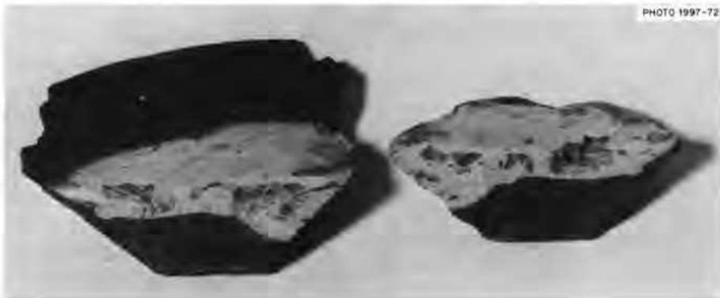

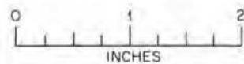  
Fig. 16.7. Photograph of salt and oxide heel removed from precipitator vessel at termination of operation.

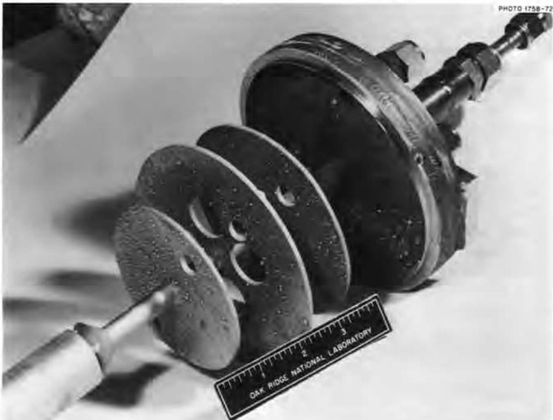  
Fig. 16.8. Photograph of gas inlet and draft tube assembly removed from precipitator vessel at termination of operation.

$50 \pm 10\mu$ .Particles of this size have a terminal velocity of $12 \pm 5\mathrm{ft / hr}$ which is sufficiently large to permit rapid settling, even in full-scale equipment. Corrosion of the nickel equipment by HF was not observed under the present experimental conditions. Problems encountered with inability to circulate the oxide in the present equipment are believed to be the result of using the same gas inlet for the precipitation and hydrofluorination operations, and should be resolved by making slight modifications in the design of the equipment. Experience gained with this equipment also indicates that mechanical agitation could be employed as an alternative circulation measure. Further experiments with larger-scale equipment are required to determine the effect of scale on these results.

# 16.10 DEVELOPMENT OF A BISMUTH-SALT INTERFACE DETECTOR

H. O. Weeren C. V. Dodd

An eddy-current-type detector14 is being developed to allow detection and control of the bismuth-salt interface in salt-metal extraction columns or mechanically agitated salt-metal contactors. The probe consists

of a ceramic form on which bifilar primary and secondary coils are wound. Contact of these coils with molten salt or bismuth is prevented by enclosing them in a molybdenum tube. In operation, a high-frequency alternating current, which is passed through the primary coil, induces a current in the secondary coil. The magnitude and relative phase of the induced current are dependent on the conductivities of the materials located adjacent to the primary and secondary coils; since the conductivities of salt and bismuth are quite different, the induced current reflects the presence or the absence of bismuth. The principal problem associated with this type of detector stems from the high electrical conductivity of molybdenum, the fabrication material of the protective sheath. Two approaches for obtaining an output from the detector are being pursued. The first is based on measuring changes in the magnitude of the induced current; the second is based on measuring the phase shift that occurs between the voltage imposed on the primary coil and that which is induced in the secondary coil.

The completed probe has been installed in a three-chambered test vessel made of carbon steel; both the probe design and the test vessel design were described previously. The upper chamber is a reservoir for molten bismuth; the middle chamber contains the sheathed probe; and the lower chamber, which simulates the interior of the high-temperature containment

vessel for the molybdenum reductive-extraction equipment (see Sect. 16.6), contains 13 ft of high-temperature electrical cable in an inert atmosphere. Bismuth can be transferred between the upper and middle chambers to vary the level around the probe; this level can be measured with a bubbler-mercury manometer system and compared with probe readings.

Initial results from phase shift measurements were reported previously. A series of level determinations was made at two temperatures (550 and $700^{\circ}\mathrm{C}$ ) by the amplitude measurement technique to calibrate the temperature compensation circuit. The results (see Fig. 16.9) show that at each temperature the probe readings were linear and reproducible for bismuth levels between 4 and 12 in. However, both the manometer and the probe gave erratic readings at bismuth levels below 4 in.; this behavior may have resulted from the accumulation of some sort of material at the interface during the period of probe operation.

The amount of temperature compensation required to make the probe and manometer readings coincide at $700^{\circ}\mathrm{C}$ was found to vary almost linearly with bismuth level. This indicates that level readings using amplitude measurement can best be made by determining calibration curves for the operating temperatures of interest and using these curves rather than a temperature compensation circuit.

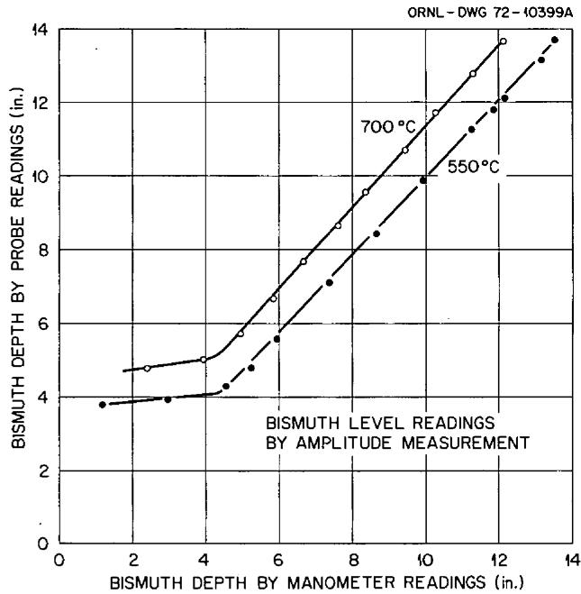  
Fig. 16.9. Variation of bismuth depth as indicated by level probe vs bismuth depth as determined from manometer readings.

The probe was tested at a temperature of $550^{\circ}\mathrm{C}$ for a period of five days. During this time, the bismuth level did not change; however, the probe reading varied slowly from an initial value of 9.6 in. to a low of 9.4 in. and a high of 10.1 in. The reason for this fluctuation is not known.

# 17. Continuous Salt Purification

R. B. Lindauer

We previously described a facility in which studies relative to the continuous purification of molten fluoride mixtures are carried out. In the past the system has been operated in a semicontinuous manner, with about 14 liters of salt being fed through a packed-column gas-salt contactor at flow rates ranging from 50 to $500~\mathrm{cm}^3/\mathrm{min}$ . During this report period, the system was modified to provide for the continuous circulation of a small volume (about 4 liters) of salt through the packed column. The new equipment consists of a check valve pump that has tungsten ball checks and an orifice head pot having liquid level instrumentation for measuring the salt flow rate. The pump is actuated by a cyclic variation of the argon pressure in the pressure vent line between the check valves by the use of solenoid valves and electrical timers.

Initial tests with the modified system disclosed the following:

1. Instrumentation is required to indicate the position of the liquid-gas interface in the pressure vent line of the pump between the two check valves. Probes will be installed which, in addition to indicating the

interface location, will actuate relays to close the vent valve on high level and to open the pressure valve on low level.

2. An erratic pumping rate, which could have been caused by the presence of oxide in the salt in the pressure vent line, was noted. The oxide was probably formed during periods when the system was not being operated. A new pump that has double suction and discharge check valves is being fabricated. This pump should continue to operate even when the salt contains some particulate matter. A bismuth phase will also be used to provide a seal between the pressurizing argon and the salt in the pressure vent line in order to reduce the possibility of oxide formation. This will increase the maximum salt displacement from 20 to $80~\mathrm{cm}^3$ per cycle.   
3. The equipment for determining the salt flow rate performed quite satisfactorily.

# OAK RIDGE NATIONAL LABORATORY

# MOLTEN-SALT REACTOR PROGRAM

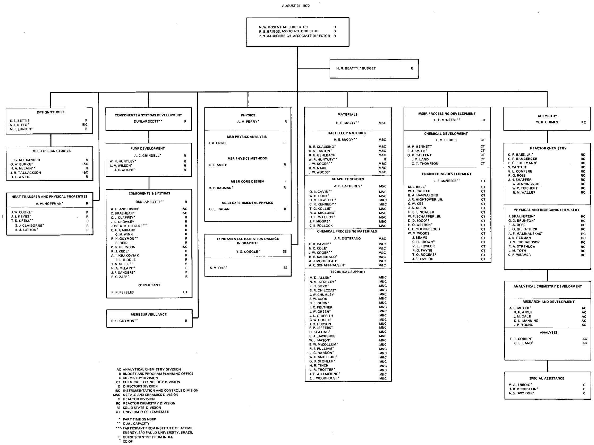